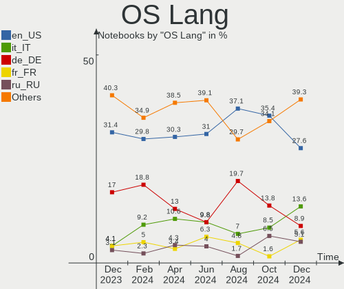
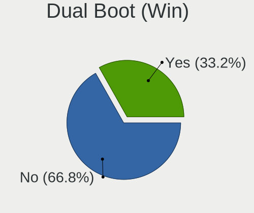
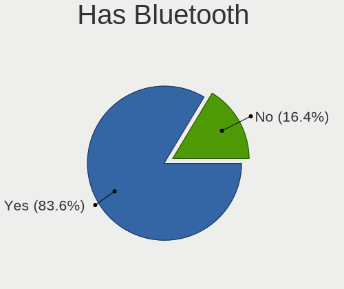
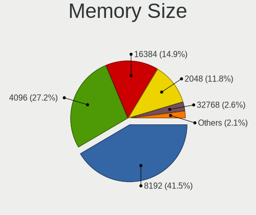

Linux Mint - Hardware Trends (Notebooks)
----------------------------------------

A project to identify most popular hardware characteristics and track their change
over time based on data collected by Linux users at https://Linux-Hardware.org.

Anyone can contribute to this report by the [hw-probe](https://github.com/linuxhw/hw-probe) tool:

    sudo -E hw-probe -all -upload

This report is for one last month. Overall report since the beginning of time: [TestDays](https://github.com/linuxhw/TestDays)

Period: Apr, 2024.

Contents
--------

* [ System ](#system)
  - [ OS                       ](#os)
  - [ OS Family                ](#os-family)
  - [ Kernel                   ](#kernel)
  - [ Kernel Family            ](#kernel-family)
  - [ Kernel Major Ver.        ](#kernel-major-ver)
  - [ Arch                     ](#arch)
  - [ DE                       ](#de)
  - [ Display Server           ](#display-server)
  - [ Display Manager          ](#display-manager)
  - [ OS Lang                  ](#os-lang)
  - [ Boot Mode                ](#boot-mode)
  - [ Filesystem               ](#filesystem)
  - [ Part. scheme             ](#part-scheme)
  - [ Dual Boot with Linux/BSD ](#dual-boot-with-linuxbsd)
  - [ Dual Boot (Win)          ](#dual-boot-win)

* [ Board ](#board)
  - [ Vendor                   ](#vendor)
  - [ Model                    ](#model)
  - [ Model Family             ](#model-family)
  - [ MFG Year                 ](#mfg-year)
  - [ Form Factor              ](#form-factor)
  - [ Secure Boot              ](#secure-boot)
  - [ Coreboot                 ](#coreboot)
  - [ RAM Size                 ](#ram-size)
  - [ RAM Used                 ](#ram-used)
  - [ Total Drives             ](#total-drives)
  - [ Has CD-ROM               ](#has-cd-rom)
  - [ Has Ethernet             ](#has-ethernet)
  - [ Has WiFi                 ](#has-wifi)
  - [ Has Bluetooth            ](#has-bluetooth)

* [ Location ](#location)
  - [ Country                  ](#country)
  - [ City                     ](#city)

* [ Drives ](#drives)
  - [ Drive Vendor             ](#drive-vendor)
  - [ Drive Model              ](#drive-model)
  - [ HDD Vendor               ](#hdd-vendor)
  - [ SSD Vendor               ](#ssd-vendor)
  - [ Drive Kind               ](#drive-kind)
  - [ Drive Connector          ](#drive-connector)
  - [ Drive Size               ](#drive-size)
  - [ Space Total              ](#space-total)
  - [ Space Used               ](#space-used)
  - [ Malfunc. Drives          ](#malfunc-drives)
  - [ Malfunc. Drive Vendor    ](#malfunc-drive-vendor)
  - [ Malfunc. HDD Vendor      ](#malfunc-hdd-vendor)
  - [ Malfunc. Drive Kind      ](#malfunc-drive-kind)
  - [ Failed Drives            ](#failed-drives)
  - [ Failed Drive Vendor      ](#failed-drive-vendor)
  - [ Drive Status             ](#drive-status)

* [ Storage controller ](#storage-controller)
  - [ Storage Vendor           ](#storage-vendor)
  - [ Storage Model            ](#storage-model)
  - [ Storage Kind             ](#storage-kind)

* [ Processor ](#processor)
  - [ CPU Vendor               ](#cpu-vendor)
  - [ CPU Model                ](#cpu-model)
  - [ CPU Model Family         ](#cpu-model-family)
  - [ CPU Cores                ](#cpu-cores)
  - [ CPU Sockets              ](#cpu-sockets)
  - [ CPU Threads              ](#cpu-threads)
  - [ CPU Op-Modes             ](#cpu-op-modes)
  - [ CPU Microcode            ](#cpu-microcode)
  - [ CPU Microarch            ](#cpu-microarch)

* [ Graphics ](#graphics)
  - [ GPU Vendor               ](#gpu-vendor)
  - [ GPU Model                ](#gpu-model)
  - [ GPU Combo                ](#gpu-combo)
  - [ GPU Driver               ](#gpu-driver)
  - [ GPU Memory               ](#gpu-memory)

* [ Monitor ](#monitor)
  - [ Monitor Vendor           ](#monitor-vendor)
  - [ Monitor Model            ](#monitor-model)
  - [ Monitor Resolution       ](#monitor-resolution)
  - [ Monitor Diagonal         ](#monitor-diagonal)
  - [ Monitor Width            ](#monitor-width)
  - [ Aspect Ratio             ](#aspect-ratio)
  - [ Monitor Area             ](#monitor-area)
  - [ Pixel Density            ](#pixel-density)
  - [ Multiple Monitors        ](#multiple-monitors)

* [ Network ](#network)
  - [ Net Controller Vendor    ](#net-controller-vendor)
  - [ Net Controller Model     ](#net-controller-model)
  - [ Wireless Vendor          ](#wireless-vendor)
  - [ Wireless Model           ](#wireless-model)
  - [ Ethernet Vendor          ](#ethernet-vendor)
  - [ Ethernet Model           ](#ethernet-model)
  - [ Net Controller Kind      ](#net-controller-kind)
  - [ Used Controller          ](#used-controller)
  - [ NICs                     ](#nics)
  - [ IPv6                     ](#ipv6)

* [ Bluetooth ](#bluetooth)
  - [ Bluetooth Vendor         ](#bluetooth-vendor)
  - [ Bluetooth Model          ](#bluetooth-model)

* [ Sound ](#sound)
  - [ Sound Vendor             ](#sound-vendor)
  - [ Sound Model              ](#sound-model)

* [ Memory ](#memory)
  - [ Memory Vendor            ](#memory-vendor)
  - [ Memory Model             ](#memory-model)
  - [ Memory Kind              ](#memory-kind)
  - [ Memory Form Factor       ](#memory-form-factor)
  - [ Memory Size              ](#memory-size)
  - [ Memory Speed             ](#memory-speed)

* [ Printers & scanners ](#printers--scanners)
  - [ Printer Vendor           ](#printer-vendor)
  - [ Printer Model            ](#printer-model)
  - [ Scanner Vendor           ](#scanner-vendor)
  - [ Scanner Model            ](#scanner-model)

* [ Camera ](#camera)
  - [ Camera Vendor            ](#camera-vendor)
  - [ Camera Model             ](#camera-model)

* [ Security ](#security)
  - [ Fingerprint Vendor       ](#fingerprint-vendor)
  - [ Fingerprint Model        ](#fingerprint-model)
  - [ Chipcard Vendor          ](#chipcard-vendor)
  - [ Chipcard Model           ](#chipcard-model)

* [ Unsupported ](#unsupported)
  - [ Unsupported Devices      ](#unsupported-devices)
  - [ Unsupported Device Types ](#unsupported-device-types)

System
------

OS
--

Installed operating systems

| Name            | Notebooks | Percent |
|-----------------|-----------|---------|
| Linux Mint 21.3 | 153       | 73.56%  |
| Linux Mint 21.2 | 29        | 13.94%  |
| Linux Mint 20.3 | 11        | 5.29%   |
| Linux Mint 21.1 | 8         | 3.85%   |
| Linux Mint 21   | 4         | 1.92%   |
| Linux Mint 19.3 | 2         | 0.96%   |
| Linux Mint 20.1 | 1         | 0.48%   |

OS Family
---------

OS without a version

| Name       | Notebooks | Percent |
|------------|-----------|---------|
| Linux Mint | 208       | 100%    |

Kernel
------

Version of the Linux kernel

| Version                   | Notebooks | Percent |
|---------------------------|-----------|---------|
| 5.15.0-105-generic        | 38        | 18.27%  |
| 5.15.0-102-generic        | 38        | 18.27%  |
| 5.15.0-101-generic        | 34        | 16.35%  |
| 5.15.0-91-generic         | 19        | 9.13%   |
| 6.5.0-26-generic          | 15        | 7.21%   |
| 6.5.0-28-generic          | 12        | 5.77%   |
| 6.5.0-27-generic          | 11        | 5.29%   |
| 5.15.0-97-generic         | 5         | 2.4%    |
| 5.15.0-100-generic        | 5         | 2.4%    |
| 5.4.0-174-generic         | 3         | 1.44%   |
| 5.15.0-76-generic         | 3         | 1.44%   |
| 5.4.0-150-generic         | 2         | 0.96%   |
| 6.8.7-060807-generic      | 1         | 0.48%   |
| 6.8.5-i3-370M             | 1         | 0.48%   |
| 6.8.4-060804-generic      | 1         | 0.48%   |
| 6.8.0-060800rc7-generic   | 1         | 0.48%   |
| 6.7.12-1-liquorix-amd64   | 1         | 0.48%   |
| 6.6.22-rt27-x64v3-xanmod1 | 1         | 0.48%   |
| 6.5.0-26-lowlatency       | 1         | 0.48%   |
| 6.5.0-14-generic          | 1         | 0.48%   |
| 6.5.0-1020-oem            | 1         | 0.48%   |
| 6.5.0-1019-oem            | 1         | 0.48%   |
| 6.3.0-060300-generic      | 1         | 0.48%   |
| 5.4.0-91-generic          | 1         | 0.48%   |
| 5.4.0-73-generic          | 1         | 0.48%   |
| 5.4.0-176-generic         | 1         | 0.48%   |
| 5.4.0-173-generic         | 1         | 0.48%   |
| 5.4.0-120-generic         | 1         | 0.48%   |
| 5.19.0-41-generic         | 1         | 0.48%   |
| 5.17.6-051706-generic     | 1         | 0.48%   |
| 5.15.0-87-generic         | 1         | 0.48%   |
| 5.15.0-86-generic         | 1         | 0.48%   |
| 5.15.0-83-generic         | 1         | 0.48%   |
| 5.15.0-56-generic         | 1         | 0.48%   |
| 5.15.0-1028-gke           | 1         | 0.48%   |

Kernel Family
-------------

Linux kernel without a distro release

| Version | Notebooks | Percent |
|---------|-----------|---------|
| 5.15.0  | 147       | 70.67%  |
| 6.5.0   | 42        | 20.19%  |
| 5.4.0   | 10        | 4.81%   |
| 6.8.7   | 1         | 0.48%   |
| 6.8.5   | 1         | 0.48%   |
| 6.8.4   | 1         | 0.48%   |
| 6.8.0   | 1         | 0.48%   |
| 6.7.12  | 1         | 0.48%   |
| 6.6.22  | 1         | 0.48%   |
| 6.3.0   | 1         | 0.48%   |
| 5.19.0  | 1         | 0.48%   |
| 5.17.6  | 1         | 0.48%   |

Kernel Major Ver.
-----------------

Linux kernel major version

| Version | Notebooks | Percent |
|---------|-----------|---------|
| 5.15    | 147       | 70.67%  |
| 6.5     | 42        | 20.19%  |
| 5.4     | 10        | 4.81%   |
| 6.8     | 4         | 1.92%   |
| 6.7     | 1         | 0.48%   |
| 6.6     | 1         | 0.48%   |
| 6.3     | 1         | 0.48%   |
| 5.19    | 1         | 0.48%   |
| 5.17    | 1         | 0.48%   |

Arch
----

OS architecture (x86_64, i586, etc.)

| Name   | Notebooks | Percent |
|--------|-----------|---------|
| x86_64 | 207       | 99.52%  |
| i686   | 1         | 0.48%   |

DE
--

Desktop Environment

| Name       | Notebooks | Percent |
|------------|-----------|---------|
| X-Cinnamon | 164       | 78.85%  |
| XFCE       | 21        | 10.1%   |
| MATE       | 19        | 9.13%   |
| GNOME      | 3         | 1.44%   |
| KDE5       | 1         | 0.48%   |

Display Server
--------------

X11 or Wayland

| Name | Notebooks | Percent |
|------|-----------|---------|
| X11  | 208       | 100%    |

Display Manager
---------------

SDDM, LightDM, etc.

| Name    | Notebooks | Percent |
|---------|-----------|---------|
| LightDM | 150       | 72.12%  |
| Unknown | 54        | 25.96%  |
| GDM3    | 3         | 1.44%   |
| SDDM    | 1         | 0.48%   |

OS Lang
-------

Language

| Lang  | Notebooks | Percent |
|-------|-----------|---------|
| en_US | 63        | 30.29%  |
| de_DE | 27        | 12.98%  |
| it_IT | 22        | 10.58%  |
| en_GB | 11        | 5.29%   |
| C     | 10        | 4.81%   |
| ru_RU | 9         | 4.33%   |
| en_CA | 8         | 3.85%   |
| pt_BR | 7         | 3.37%   |
| fr_FR | 7         | 3.37%   |
| pl_PL | 5         | 2.4%    |
| hu_HU | 5         | 2.4%    |
| es_ES | 4         | 1.92%   |
| es_CO | 3         | 1.44%   |
| es_AR | 3         | 1.44%   |
| de_CH | 3         | 1.44%   |
| tr_TR | 2         | 0.96%   |
| pt_PT | 2         | 0.96%   |
| en_ZA | 2         | 0.96%   |
| en_AU | 2         | 0.96%   |
| de_AT | 2         | 0.96%   |
| zh_CN | 1         | 0.48%   |
| sv_SE | 1         | 0.48%   |
| sr_RS | 1         | 0.48%   |
| nl_NL | 1         | 0.48%   |
| fi_FI | 1         | 0.48%   |
| es_UY | 1         | 0.48%   |
| es_CL | 1         | 0.48%   |
| en_PH | 1         | 0.48%   |
| en_NZ | 1         | 0.48%   |
| en_IN | 1         | 0.48%   |
| cs_CZ | 1         | 0.48%   |

Boot Mode
---------

EFI or BIOS

| Mode | Notebooks | Percent |
|------|-----------|---------|
| EFI  | 153       | 73.56%  |
| BIOS | 55        | 26.44%  |

Filesystem
----------

Type of filesystem

| Type    | Notebooks | Percent |
|---------|-----------|---------|
| Ext4    | 187       | 89.9%   |
| Overlay | 10        | 4.81%   |
| Tmpfs   | 7         | 3.37%   |
| Btrfs   | 2         | 0.96%   |
| Zfs     | 1         | 0.48%   |
| Xfs     | 1         | 0.48%   |

Part. scheme
------------

Scheme of partitioning

| Type    | Notebooks | Percent |
|---------|-----------|---------|
| GPT     | 142       | 68.27%  |
| Unknown | 55        | 26.44%  |
| MBR     | 11        | 5.29%   |

Dual Boot with Linux/BSD
------------------------

Hosting more than one Linux/BSD

| Dual boot | Notebooks | Percent |
|-----------|-----------|---------|
| No        | 184       | 88.46%  |
| Yes       | 24        | 11.54%  |

Dual Boot (Win)
---------------

Hosting Linux and Windows

| Dual boot | Notebooks | Percent |
|-----------|-----------|---------|
| No        | 150       | 72.12%  |
| Yes       | 58        | 27.88%  |

Board
-----

Vendor
------

Motherboard manufacturer

| Name                | Notebooks | Percent |
|---------------------|-----------|---------|
| Lenovo              | 42        | 20.19%  |
| Hewlett-Packard     | 30        | 14.42%  |
| Acer                | 30        | 14.42%  |
| Dell                | 22        | 10.58%  |
| ASUSTek Computer    | 19        | 9.13%   |
| MSI                 | 9         | 4.33%   |
| Apple               | 8         | 3.85%   |
| Samsung Electronics | 7         | 3.37%   |
| Toshiba             | 5         | 2.4%    |
| HUAWEI              | 5         | 2.4%    |
| Sony                | 4         | 1.92%   |
| Packard Bell        | 3         | 1.44%   |
| Medion              | 3         | 1.44%   |
| Notebook            | 2         | 0.96%   |
| Unknown             | 2         | 0.96%   |
| TrekStor            | 1         | 0.48%   |
| Timi                | 1         | 0.48%   |
| Seco                | 1         | 0.48%   |
| Positivo            | 1         | 0.48%   |
| PC Specialist       | 1         | 0.48%   |
| Novatech            | 1         | 0.48%   |
| Mediacom            | 1         | 0.48%   |
| MECHREVO            | 1         | 0.48%   |
| Itronix             | 1         | 0.48%   |
| Irbis               | 1         | 0.48%   |
| iQual               | 1         | 0.48%   |
| Intel               | 1         | 0.48%   |
| GPU Company         | 1         | 0.48%   |
| Google              | 1         | 0.48%   |
| Fusion5             | 1         | 0.48%   |
| Carbon Systems      | 1         | 0.48%   |
| Alienware           | 1         | 0.48%   |

Model
-----

Motherboard model

| Name                                        | Notebooks | Percent |
|---------------------------------------------|-----------|---------|
| Unknown                                     | 3         | 1.44%   |
| HP Pavilion Notebook                        | 2         | 0.96%   |
| Dell Latitude 7290                          | 2         | 0.96%   |
| Apple MacBookAir7,2                         | 2         | 0.96%   |
| Acer Nitro AN515-57                         | 2         | 0.96%   |
| TrekStor Surfbook A13B                      | 1         | 0.48%   |
| Toshiba Satellite Pro L850-1L2              | 1         | 0.48%   |
| Toshiba Satellite Pro L670                  | 1         | 0.48%   |
| Toshiba Satellite Pro C50-A-1C8             | 1         | 0.48%   |
| Toshiba Satellite L50-C                     | 1         | 0.48%   |
| Toshiba Satellite C70D-B                    | 1         | 0.48%   |
| Timi RedmiBook 16                           | 1         | 0.48%   |
| Sony VPCEA3UFX                              | 1         | 0.48%   |
| Sony SVF1521C5E                             | 1         | 0.48%   |
| Sony SVF15213CDW                            | 1         | 0.48%   |
| Sony SVE1713L1EW                            | 1         | 0.48%   |
| Seco UDOO x86                               | 1         | 0.48%   |
| Samsung RV411/RV511/E3511/S3511/RV711/E3411 | 1         | 0.48%   |
| Samsung RV411/RV511/E3511/S3511/RV711       | 1         | 0.48%   |
| Samsung RC530/RC730                         | 1         | 0.48%   |
| Samsung R530/R730                           | 1         | 0.48%   |
| Samsung 355V4C/356V4C/3445VC/3545VC         | 1         | 0.48%   |
| Samsung 350V5C/351V5C/3540VC/3440VC         | 1         | 0.48%   |
| Samsung 300E4A/300E5A/300E7A/3430EA/3530EA  | 1         | 0.48%   |
| Positivo Z100                               | 1         | 0.48%   |
| PC Specialist Ionico 16                     | 1         | 0.48%   |
| Packard Bell EasyNote TK36                  | 1         | 0.48%   |
| Packard Bell EasyNote LJ65                  | 1         | 0.48%   |
| Packard Bell DOT SE                         | 1         | 0.48%   |
| Novatech C141SC-N4                          | 1         | 0.48%   |
| Notebook P15SM-A/SM1-A                      | 1         | 0.48%   |
| Notebook NJ50_70CU                          | 1         | 0.48%   |
| MSI Modern 15 B12M                          | 1         | 0.48%   |
| MSI GT72 2QD                                | 1         | 0.48%   |
| MSI GP75 Leopard 10SFK                      | 1         | 0.48%   |
| MSI GP62M 7REX                              | 1         | 0.48%   |
| MSI GL75 Leopard 10SFK                      | 1         | 0.48%   |
| MSI GF75 Thin 10UE                          | 1         | 0.48%   |
| MSI GF65 Thin 10UE                          | 1         | 0.48%   |
| MSI EX600                                   | 1         | 0.48%   |

Model Family
------------

Motherboard model prefix

| Name                  | Notebooks | Percent |
|-----------------------|-----------|---------|
| Lenovo ThinkPad       | 23        | 11.06%  |
| Acer Aspire           | 19        | 9.13%   |
| Dell Latitude         | 10        | 4.81%   |
| HP Pavilion           | 9         | 4.33%   |
| Lenovo IdeaPad        | 8         | 3.85%   |
| Dell Inspiron         | 8         | 3.85%   |
| ASUS Vivobook         | 6         | 2.88%   |
| Toshiba Satellite     | 5         | 2.4%    |
| HP EliteBook          | 4         | 1.92%   |
| Acer Nitro            | 4         | 1.92%   |
| Lenovo Legion         | 3         | 1.44%   |
| HP ProBook            | 3         | 1.44%   |
| HP Laptop             | 3         | 1.44%   |
| Unknown               | 3         | 1.44%   |
| Samsung RV411         | 2         | 0.96%   |
| Packard Bell EasyNote | 2         | 0.96%   |
| HP ENVY               | 2         | 0.96%   |
| HP 255                | 2         | 0.96%   |
| Dell Precision        | 2         | 0.96%   |
| ASUS ASUS             | 2         | 0.96%   |
| Apple MacBookAir7     | 2         | 0.96%   |
| Acer Swift            | 2         | 0.96%   |
| Acer Predator         | 2         | 0.96%   |
| Acer Extensa          | 2         | 0.96%   |
| TrekStor Surfbook     | 1         | 0.48%   |
| Timi RedmiBook        | 1         | 0.48%   |
| Sony VPCEA3UFX        | 1         | 0.48%   |
| Sony SVF1521C5E       | 1         | 0.48%   |
| Sony SVF15213CDW      | 1         | 0.48%   |
| Sony SVE1713L1EW      | 1         | 0.48%   |
| Seco UDOO             | 1         | 0.48%   |
| Samsung RC530         | 1         | 0.48%   |
| Samsung R530          | 1         | 0.48%   |
| Samsung 355V4C        | 1         | 0.48%   |
| Samsung 350V5C        | 1         | 0.48%   |
| Samsung 300E4A        | 1         | 0.48%   |
| Positivo Z100         | 1         | 0.48%   |
| PC Specialist Ionico  | 1         | 0.48%   |
| Packard Bell DOT      | 1         | 0.48%   |
| Novatech C141SC-N4    | 1         | 0.48%   |

MFG Year
--------

Motherboard manufacture year

| Year | Notebooks | Percent |
|------|-----------|---------|
| 2020 | 20        | 9.62%   |
| 2022 | 17        | 8.17%   |
| 2013 | 17        | 8.17%   |
| 2021 | 16        | 7.69%   |
| 2023 | 15        | 7.21%   |
| 2012 | 15        | 7.21%   |
| 2014 | 14        | 6.73%   |
| 2019 | 13        | 6.25%   |
| 2011 | 12        | 5.77%   |
| 2018 | 11        | 5.29%   |
| 2010 | 11        | 5.29%   |
| 2017 | 10        | 4.81%   |
| 2016 | 10        | 4.81%   |
| 2009 | 8         | 3.85%   |
| 2015 | 7         | 3.37%   |
| 2008 | 6         | 2.88%   |
| 2007 | 5         | 2.4%    |
| 2024 | 1         | 0.48%   |

Form Factor
-----------

Physical design of the computer

| Name     | Notebooks | Percent |
|----------|-----------|---------|
| Notebook | 208       | 100%    |

Secure Boot
-----------

Enabled or disabled

| State    | Notebooks | Percent |
|----------|-----------|---------|
| Disabled | 184       | 88.46%  |
| Enabled  | 24        | 11.54%  |

Coreboot
--------

Have coreboot on board

| Used | Notebooks | Percent |
|------|-----------|---------|
| No   | 207       | 99.52%  |
| Yes  | 1         | 0.48%   |

RAM Size
--------

Total RAM memory

| Size in GB  | Notebooks | Percent |
|-------------|-----------|---------|
| 4.01-8.0    | 72        | 34.62%  |
| 3.01-4.0    | 41        | 19.71%  |
| 16.01-24.0  | 34        | 16.35%  |
| 8.01-16.0   | 30        | 14.42%  |
| 32.01-64.0  | 13        | 6.25%   |
| 1.01-2.0    | 6         | 2.88%   |
| 24.01-32.0  | 5         | 2.4%    |
| 64.01-256.0 | 5         | 2.4%    |
| 2.01-3.0    | 2         | 0.96%   |

RAM Used
--------

Used RAM memory

| Used GB    | Notebooks | Percent |
|------------|-----------|---------|
| 1.01-2.0   | 78        | 37.5%   |
| 2.01-3.0   | 69        | 33.17%  |
| 4.01-8.0   | 29        | 13.94%  |
| 3.01-4.0   | 23        | 11.06%  |
| 8.01-16.0  | 4         | 1.92%   |
| 0.51-1.0   | 4         | 1.92%   |
| 16.01-24.0 | 1         | 0.48%   |

Total Drives
------------

Number of drives on board

| Drives | Notebooks | Percent |
|--------|-----------|---------|
| 1      | 157       | 75.48%  |
| 2      | 46        | 22.12%  |
| 3      | 4         | 1.92%   |
| 0      | 1         | 0.48%   |

Has CD-ROM
----------

Has CD-ROM on board

| Presented | Notebooks | Percent |
|-----------|-----------|---------|
| No        | 132       | 63.46%  |
| Yes       | 76        | 36.54%  |

Has Ethernet
------------

Has Ethernet on board

| Presented | Notebooks | Percent |
|-----------|-----------|---------|
| Yes       | 168       | 80.77%  |
| No        | 40        | 19.23%  |

Has WiFi
--------

Has WiFi module

| Presented | Notebooks | Percent |
|-----------|-----------|---------|
| Yes       | 203       | 97.6%   |
| No        | 5         | 2.4%    |

Has Bluetooth
-------------

Has Bluetooth module

| Presented | Notebooks | Percent |
|-----------|-----------|---------|
| Yes       | 160       | 76.92%  |
| No        | 48        | 23.08%  |

Location
--------

Country
-------

Geographic location (country)

| Country      | Notebooks | Percent |
|--------------|-----------|---------|
| USA          | 36        | 17.31%  |
| Germany      | 28        | 13.46%  |
| Italy        | 23        | 11.06%  |
| Brazil       | 10        | 4.81%   |
| UK           | 9         | 4.33%   |
| Russia       | 9         | 4.33%   |
| France       | 9         | 4.33%   |
| Canada       | 8         | 3.85%   |
| Switzerland  | 6         | 2.88%   |
| Poland       | 5         | 2.4%    |
| Netherlands  | 5         | 2.4%    |
| Hungary      | 5         | 2.4%    |
| Turkey       | 4         | 1.92%   |
| Spain        | 4         | 1.92%   |
| Portugal     | 4         | 1.92%   |
| Colombia     | 4         | 1.92%   |
| Sweden       | 3         | 1.44%   |
| Austria      | 3         | 1.44%   |
| Argentina    | 3         | 1.44%   |
| Vietnam      | 2         | 0.96%   |
| South Africa | 2         | 0.96%   |
| Greece       | 2         | 0.96%   |
| China        | 2         | 0.96%   |
| Bulgaria     | 2         | 0.96%   |
| Australia    | 2         | 0.96%   |
| Uruguay      | 1         | 0.48%   |
| Thailand     | 1         | 0.48%   |
| Taiwan       | 1         | 0.48%   |
| Somalia      | 1         | 0.48%   |
| Saudi Arabia | 1         | 0.48%   |
| Romania      | 1         | 0.48%   |
| Philippines  | 1         | 0.48%   |
| New Zealand  | 1         | 0.48%   |
| Moldova      | 1         | 0.48%   |
| Mexico       | 1         | 0.48%   |
| Iran         | 1         | 0.48%   |
| India        | 1         | 0.48%   |
| Finland      | 1         | 0.48%   |
| Czechia      | 1         | 0.48%   |
| Chile        | 1         | 0.48%   |

City
----

Geographic location (city)

| City              | Notebooks | Percent |
|-------------------|-----------|---------|
| Milan             | 4         | 1.92%   |
| Istanbul          | 4         | 1.92%   |
| Berlin            | 4         | 1.92%   |
| Rio de Janeiro    | 3         | 1.44%   |
| Milano            | 3         | 1.44%   |
| Zurich            | 2         | 0.96%   |
| Suhr              | 2         | 0.96%   |
| Sofia             | 2         | 0.96%   |
| Penza             | 2         | 0.96%   |
| Ottawa            | 2         | 0.96%   |
| Naples            | 2         | 0.96%   |
| Moscow            | 2         | 0.96%   |
| Leipzig           | 2         | 0.96%   |
| Hamburg           | 2         | 0.96%   |
| Chicago           | 2         | 0.96%   |
| Amsterdam         | 2         | 0.96%   |
| Almada            | 2         | 0.96%   |
| Zionsville        | 1         | 0.48%   |
| Zillingtal        | 1         | 0.48%   |
| Wembley           | 1         | 0.48%   |
| Wasen             | 1         | 0.48%   |
| Warsaw            | 1         | 0.48%   |
| Vienna            | 1         | 0.48%   |
| Västervik        | 1         | 0.48%   |
| Valladolid        | 1         | 0.48%   |
| Ulyanovsk         | 1         | 0.48%   |
| Uithuizen         | 1         | 0.48%   |
| Turin             | 1         | 0.48%   |
| Troisdorf         | 1         | 0.48%   |
| Trikala           | 1         | 0.48%   |
| Tottenham         | 1         | 0.48%   |
| Torrington        | 1         | 0.48%   |
| Toronto           | 1         | 0.48%   |
| Tiraspol          | 1         | 0.48%   |
| Tijuana           | 1         | 0.48%   |
| Thessaloniki      | 1         | 0.48%   |
| Taichung          | 1         | 0.48%   |
| Table View        | 1         | 0.48%   |
| Szigetszentmiklos | 1         | 0.48%   |
| Sydney            | 1         | 0.48%   |

Drives
------

Drive Vendor
------------

Hard drive vendors

| Vendor                      | Notebooks | Drives | Percent |
|-----------------------------|-----------|--------|---------|
| Samsung Electronics         | 42        | 44     | 16.8%   |
| SanDisk                     | 26        | 26     | 10.4%   |
| WDC                         | 25        | 25     | 10%     |
| Toshiba                     | 16        | 16     | 6.4%    |
| Seagate                     | 16        | 17     | 6.4%    |
| Kingston                    | 14        | 15     | 5.6%    |
| Micron Technology           | 13        | 13     | 5.2%    |
| Unknown                     | 11        | 11     | 4.4%    |
| Crucial                     | 11        | 11     | 4.4%    |
| Intel                       | 6         | 7      | 2.4%    |
| Hitachi                     | 6         | 6      | 2.4%    |
| Apple                       | 5         | 5      | 2%      |
| A-DATA Technology           | 5         | 5      | 2%      |
| Unknown                     | 5         | 5      | 2%      |
| Fujitsu                     | 4         | 4      | 1.6%    |
| SK hynix                    | 3         | 3      | 1.2%    |
| KIOXIA                      | 3         | 3      | 1.2%    |
| China                       | 3         | 3      | 1.2%    |
| YMTC                        | 2         | 2      | 0.8%    |
| SSSTC                       | 2         | 2      | 0.8%    |
| SPCC                        | 2         | 2      | 0.8%    |
| Silicon Motion              | 2         | 2      | 0.8%    |
| Phison Electronics          | 2         | 2      | 0.8%    |
| Phison                      | 2         | 2      | 0.8%    |
| Patriot                     | 2         | 2      | 0.8%    |
| Micron/Crucial Technology   | 2         | 2      | 0.8%    |
| HGST                        | 2         | 2      | 0.8%    |
| UMIS                        | 1         | 1      | 0.4%    |
| Teclast                     | 1         | 1      | 0.4%    |
| T-FORCE                     | 1         | 1      | 0.4%    |
| Realtek                     | 1         | 1      | 0.4%    |
| PNY                         | 1         | 1      | 0.4%    |
| Lite-On Technology          | 1         | 1      | 0.4%    |
| Lexar                       | 1         | 1      | 0.4%    |
| Lenovo                      | 1         | 1      | 0.4%    |
| Kingston Technology Company | 1         | 1      | 0.4%    |
| KingSpec                    | 1         | 1      | 0.4%    |
| KINGPAN                     | 1         | 1      | 0.4%    |
| JMicron Technology          | 1         | 1      | 0.4%    |
| J.ZAO                       | 1         | 1      | 0.4%    |

Drive Model
-----------

Hard drive models

| Model                                              | Notebooks | Percent |
|----------------------------------------------------|-----------|---------|
| Unknown                                            | 5         | 1.98%   |
| SanDisk NVMe SSD Drive 512GB                       | 4         | 1.58%   |
| Toshiba MQ01ABD100 1TB                             | 3         | 1.19%   |
| SanDisk SSD PLUS 480GB                             | 3         | 1.19%   |
| SanDisk SDSSDH3 1T00 1TB                           | 3         | 1.19%   |
| Samsung SSD 850 EVO 250GB                          | 3         | 1.19%   |
| Micron 2450_MTFDKBA512TFK 512GB                    | 3         | 1.19%   |
| Kingston SA400S37480G 480GB SSD                    | 3         | 1.19%   |
| Kingston SA400S37240G 240GB SSD                    | 3         | 1.19%   |
| Fujitsu MHV2060BH 64GB                             | 3         | 1.19%   |
| WDC WDS240G2G0A-00JH30 240GB SSD                   | 2         | 0.79%   |
| WDC WD10SPZX-60Z10T0 1TB                           | 2         | 0.79%   |
| Toshiba MQ01ABF050 500GB                           | 2         | 0.79%   |
| Toshiba MQ01ABD075 752GB                           | 2         | 0.79%   |
| SSSTC CV8-8E128-HP 128GB                           | 2         | 0.79%   |
| Seagate ST1000LM049-2GH172 1TB                     | 2         | 0.79%   |
| Seagate ST1000LM035-1RK172 1TB                     | 2         | 0.79%   |
| Sandisk WD Black SN750 / PC SN730 NVMe SSD 512GB   | 2         | 0.79%   |
| Samsung SSD 870 EVO 500GB                          | 2         | 0.79%   |
| Samsung NVMe SSD Controller SM981/PM981/PM983 1TB  | 2         | 0.79%   |
| Samsung NVMe SSD Controller PM9A1/PM9A3/980PRO 1TB | 2         | 0.79%   |
| Samsung MZALQ512HALU-000L2 512GB                   | 2         | 0.79%   |
| Phison PS5013 E13 NVMe Controller 512GB            | 2         | 0.79%   |
| Micron 2400_MTFDKBA512QFM 512GB                    | 2         | 0.79%   |
| Kingston SA400S37960G 960GB SSD                    | 2         | 0.79%   |
| Crucial CT500MX500SSD1 500GB                       | 2         | 0.79%   |
| Crucial CT480BX500SSD1 480GB                       | 2         | 0.79%   |
| Apple SSD SM0512G 500GB                            | 2         | 0.79%   |
| YMTC PC300-1TB-B                                   | 1         | 0.4%    |
| YMTC PC005 512GB                                   | 1         | 0.4%    |
| WDC WDS250G2B0B-00YS70 250GB SSD                   | 1         | 0.4%    |
| WDC WDS240G1G0A-00SS50 240GB SSD                   | 1         | 0.4%    |
| WDC WDS120G2G0A-00JH30 120GB SSD                   | 1         | 0.4%    |
| WDC WD5000LPVX-80V0TT0 500GB                       | 1         | 0.4%    |
| WDC WD5000LPVX-22V0TT0 500GB                       | 1         | 0.4%    |
| WDC WD5000LPVT-24G33T1 500GB                       | 1         | 0.4%    |
| WDC WD5000LPCX-24VHAT0 500GB                       | 1         | 0.4%    |
| WDC WD5000LPCX-22VHAT1 500GB                       | 1         | 0.4%    |
| WDC WD5000LPCX-00VHAT0 500GB                       | 1         | 0.4%    |
| WDC WD2500BEVT-00ZCT0 250GB                        | 1         | 0.4%    |

HDD Vendor
----------

Hard disk drive vendors

| Vendor              | Notebooks | Drives | Percent |
|---------------------|-----------|--------|---------|
| WDC                 | 16        | 16     | 29.09%  |
| Seagate             | 15        | 16     | 27.27%  |
| Toshiba             | 11        | 11     | 20%     |
| Hitachi             | 6         | 6      | 10.91%  |
| Fujitsu             | 4         | 4      | 7.27%   |
| HGST                | 2         | 2      | 3.64%   |
| Samsung Electronics | 1         | 1      | 1.82%   |

SSD Vendor
----------

Solid state drive vendors

| Vendor              | Notebooks | Drives | Percent |
|---------------------|-----------|--------|---------|
| Samsung Electronics | 18        | 20     | 19.57%  |
| SanDisk             | 16        | 16     | 17.39%  |
| Kingston            | 11        | 12     | 11.96%  |
| Crucial             | 9         | 9      | 9.78%   |
| WDC                 | 6         | 6      | 6.52%   |
| Apple               | 4         | 4      | 4.35%   |
| Micron Technology   | 3         | 3      | 3.26%   |
| China               | 3         | 3      | 3.26%   |
| A-DATA Technology   | 3         | 3      | 3.26%   |
| Toshiba             | 2         | 2      | 2.17%   |
| SSSTC               | 2         | 2      | 2.17%   |
| SPCC                | 2         | 2      | 2.17%   |
| Patriot             | 2         | 2      | 2.17%   |
| Unknown             | 2         | 2      | 2.17%   |
| Teclast             | 1         | 1      | 1.09%   |
| T-FORCE             | 1         | 1      | 1.09%   |
| PNY                 | 1         | 1      | 1.09%   |
| Lexar               | 1         | 1      | 1.09%   |
| KingSpec            | 1         | 1      | 1.09%   |
| KINGPAN             | 1         | 1      | 1.09%   |
| Dogfish             | 1         | 1      | 1.09%   |
| Dell                | 1         | 1      | 1.09%   |
| Aura                | 1         | 1      | 1.09%   |

Drive Kind
----------

HDD or SSD

| Kind    | Notebooks | Drives | Percent |
|---------|-----------|--------|---------|
| SSD     | 88        | 95     | 37.13%  |
| NVMe    | 78        | 87     | 32.91%  |
| HDD     | 55        | 56     | 23.21%  |
| MMC     | 13        | 14     | 5.49%   |
| Unknown | 3         | 3      | 1.27%   |

Drive Connector
---------------

SATA, SAS, NVMe, etc.

| Type | Notebooks | Drives | Percent |
|------|-----------|--------|---------|
| SATA | 135       | 149    | 58.19%  |
| NVMe | 78        | 86     | 33.62%  |
| MMC  | 13        | 14     | 5.6%    |
| SAS  | 6         | 6      | 2.59%   |

Drive Size
----------

Size of hard drive

| Size in TB | Notebooks | Drives | Percent |
|------------|-----------|--------|---------|
| 0.01-0.5   | 96        | 102    | 66.67%  |
| 0.51-1.0   | 40        | 41     | 27.78%  |
| 1.01-2.0   | 6         | 6      | 4.17%   |
| 3.01-4.0   | 1         | 1      | 0.69%   |
| 4.01-10.0  | 1         | 1      | 0.69%   |

Space Total
-----------

Amount of disk space available on the file system

| Size in GB     | Notebooks | Percent |
|----------------|-----------|---------|
| 251-500        | 70        | 33.65%  |
| 101-250        | 62        | 29.81%  |
| 501-1000       | 33        | 15.87%  |
| 51-100         | 15        | 7.21%   |
| 1001-2000      | 10        | 4.81%   |
| 1-20           | 7         | 3.37%   |
| More than 3000 | 4         | 1.92%   |
| 2001-3000      | 4         | 1.92%   |
| 21-50          | 3         | 1.44%   |

Space Used
----------

Amount of used disk space

| Used GB        | Notebooks | Percent |
|----------------|-----------|---------|
| 101-250        | 52        | 25%     |
| 21-50          | 51        | 24.52%  |
| 1-20           | 41        | 19.71%  |
| 51-100         | 37        | 17.79%  |
| 251-500        | 16        | 7.69%   |
| 501-1000       | 6         | 2.88%   |
| 1001-2000      | 3         | 1.44%   |
| More than 3000 | 1         | 0.48%   |
| 2001-3000      | 1         | 0.48%   |

Malfunc. Drives
---------------

Drive models with a malfunction

| Model                                 | Notebooks | Drives | Percent |
|---------------------------------------|-----------|--------|---------|
| WDC WD10SPZX-60Z10T0 1TB              | 2         | 2      | 10.53%  |
| Toshiba MQ01ABD100 1TB                | 2         | 2      | 10.53%  |
| SSSTC CV8-8E128-HP 128GB              | 2         | 2      | 10.53%  |
| WDC WDS240G2G0A-00JH30 240GB SSD      | 1         | 1      | 5.26%   |
| WDC WDS120G2G0A-00JH30 120GB SSD      | 1         | 1      | 5.26%   |
| WDC WD5000LPVX-22V0TT0 500GB          | 1         | 1      | 5.26%   |
| Toshiba MQ02ABF050H 500GB             | 1         | 1      | 5.26%   |
| Toshiba MQ01ABF050 500GB              | 1         | 1      | 5.26%   |
| Toshiba MQ01ABD075 752GB              | 1         | 1      | 5.26%   |
| Toshiba MK2555GSX 250GB               | 1         | 1      | 5.26%   |
| Seagate ST1000LM035-1RK172 1TB        | 1         | 1      | 5.26%   |
| Samsung Electronics SSD 870 EVO 500GB | 1         | 1      | 5.26%   |
| KingSpec P3-512 512GB SSD             | 1         | 1      | 5.26%   |
| Hitachi HTS545032B9A300 320GB         | 1         | 1      | 5.26%   |
| Hitachi HTS545025B9A300 250GB         | 1         | 1      | 5.26%   |
| A-DATA Technology SP550 480GB SSD     | 1         | 1      | 5.26%   |

Malfunc. Drive Vendor
---------------------

Vendors of faulty drives

| Vendor              | Notebooks | Drives | Percent |
|---------------------|-----------|--------|---------|
| Toshiba             | 6         | 6      | 31.58%  |
| WDC                 | 5         | 5      | 26.32%  |
| SSSTC               | 2         | 2      | 10.53%  |
| Hitachi             | 2         | 2      | 10.53%  |
| Seagate             | 1         | 1      | 5.26%   |
| Samsung Electronics | 1         | 1      | 5.26%   |
| KingSpec            | 1         | 1      | 5.26%   |
| A-DATA Technology   | 1         | 1      | 5.26%   |

Malfunc. HDD Vendor
-------------------

Vendors of faulty HDD drives

| Vendor  | Notebooks | Drives | Percent |
|---------|-----------|--------|---------|
| Toshiba | 6         | 6      | 50%     |
| WDC     | 3         | 3      | 25%     |
| Hitachi | 2         | 2      | 16.67%  |
| Seagate | 1         | 1      | 8.33%   |

Malfunc. Drive Kind
-------------------

Kinds of faulty drives

| Kind | Notebooks | Drives | Percent |
|------|-----------|--------|---------|
| HDD  | 12        | 12     | 63.16%  |
| SSD  | 7         | 7      | 36.84%  |

Failed Drives
-------------

Failed drive models

Zero info for selected period =(

Failed Drive Vendor
-------------------

Failed drive vendors

Zero info for selected period =(

Drive Status
------------

Number of failed and malfunc. drives

| Status   | Notebooks | Drives | Percent |
|----------|-----------|--------|---------|
| Works    | 121       | 139    | 54.75%  |
| Detected | 82        | 97     | 37.1%   |
| Malfunc  | 18        | 19     | 8.14%   |

Storage controller
------------------

Storage Vendor
--------------

Storage controller vendors

| Vendor                       | Notebooks | Percent |
|------------------------------|-----------|---------|
| Intel                        | 144       | 58.3%   |
| Samsung Electronics          | 26        | 10.53%  |
| AMD                          | 17        | 6.88%   |
| Sandisk                      | 12        | 4.86%   |
| Micron Technology            | 10        | 4.05%   |
| Phison Electronics           | 4         | 1.62%   |
| Micron/Crucial Technology    | 4         | 1.62%   |
| Kingston Technology Company  | 4         | 1.62%   |
| Toshiba America Info Systems | 3         | 1.21%   |
| Nvidia                       | 3         | 1.21%   |
| MAXIO Technology (Hangzhou)  | 3         | 1.21%   |
| KIOXIA                       | 3         | 1.21%   |
| Yangtze Memory Technologies  | 2         | 0.81%   |
| SK hynix                     | 2         | 0.81%   |
| Silicon Motion               | 2         | 0.81%   |
| Union Memory (Shenzhen)      | 1         | 0.4%    |
| Shenzhen Longsys Electronics | 1         | 0.4%    |
| Realtek Semiconductor        | 1         | 0.4%    |
| Marvell Technology Group     | 1         | 0.4%    |
| Lite-On Technology           | 1         | 0.4%    |
| Lenovo                       | 1         | 0.4%    |
| Apple                        | 1         | 0.4%    |
| ADATA Technology             | 1         | 0.4%    |

Storage Model
-------------

Storage controller models

| Model                                                                          | Notebooks | Percent |
|--------------------------------------------------------------------------------|-----------|---------|
| Intel 7 Series Chipset Family 6-port SATA Controller [AHCI mode]               | 20        | 7.6%    |
| Intel Sunrise Point-LP SATA Controller [AHCI mode]                             | 15        | 5.7%    |
| AMD FCH SATA Controller [AHCI mode]                                            | 15        | 5.7%    |
| Intel Volume Management Device NVMe RAID Controller                            | 13        | 4.94%   |
| Intel 82801IBM/IEM (ICH9M/ICH9M-E) 4 port SATA Controller [AHCI mode]          | 9         | 3.42%   |
| Intel 82801 Mobile SATA Controller [RAID mode]                                 | 9         | 3.42%   |
| Intel 6 Series/C200 Series Chipset Family 6 port Mobile SATA AHCI Controller   | 9         | 3.42%   |
| Intel 8 Series/C220 Series Chipset Family 6-port SATA Controller 1 [AHCI mode] | 7         | 2.66%   |
| Intel 5 Series/3400 Series Chipset 4 port SATA AHCI Controller                 | 7         | 2.66%   |
| Samsung NVMe SSD Controller PM9A1/PM9A3/980PRO                                 | 6         | 2.28%   |
| Samsung NVMe SSD Controller 980 (DRAM-less)                                    | 6         | 2.28%   |
| Samsung NVMe SSD Controller SM981/PM981/PM983                                  | 5         | 1.9%    |
| Micron 2450 NVMe SSD [HendrixV] (DRAM-less)                                    | 5         | 1.9%    |
| Intel Wildcat Point-LP SATA Controller [AHCI Mode]                             | 5         | 1.9%    |
| Intel Celeron/Pentium Silver Processor SATA Controller                         | 5         | 1.9%    |
| Intel SSD 670p Series [Keystone Harbor]                                        | 4         | 1.52%   |
| Intel HM170/QM170 Chipset SATA Controller [AHCI Mode]                          | 4         | 1.52%   |
| Intel Celeron N3350/Pentium N4200/Atom E3900 Series SATA AHCI Controller       | 4         | 1.52%   |
| Intel Cannon Point-LP SATA Controller [AHCI Mode]                              | 4         | 1.52%   |
| Intel Atom Processor E3800 Series SATA AHCI Controller                         | 4         | 1.52%   |
| Intel 8 Series SATA Controller 1 [AHCI mode]                                   | 4         | 1.52%   |
| Sandisk WD PC SN740 NVMe SSD 512GB (DRAM-less)                                 | 3         | 1.14%   |
| SanDisk Extreme Pro / WD Black SN750 / PC SN730 / Red SN700 NVMe SSD           | 3         | 1.14%   |
| Samsung S4LN058A01[SSUBX] AHCI SSD Controller (Apple slot)                     | 3         | 1.14%   |
| MAXIO (Hangzhou) NVMe SSD Controller MAP1202 (DRAM-less)                       | 3         | 1.14%   |
| Intel Cannon Lake Mobile PCH SATA AHCI Controller                              | 3         | 1.14%   |
| Intel Alder Lake-P SATA AHCI Controller                                        | 3         | 1.14%   |
| Intel 400 Series Chipset Family SATA AHCI Controller                           | 3         | 1.14%   |
| Toshiba America Info Systems XG6 NVMe SSD Controller                           | 2         | 0.76%   |
| Silicon Motion SM2263EN/SM2263XT (DRAM-less) NVMe SSD Controllers              | 2         | 0.76%   |
| SanDisk WD Black SN770 / PC SN740 256GB / PC SN560 (DRAM-less) NVMe SSD        | 2         | 0.76%   |
| SanDisk Ultra 3D / WD Blue SN550 NVMe SSD                                      | 2         | 0.76%   |
| Samsung NVMe SSD Controller SM961/PM961/SM963                                  | 2         | 0.76%   |
| Samsung NVMe SSD Controller PM9B1 (DRAM-less)                                  | 2         | 0.76%   |
| Phison PS5013-E13 PCIe3 NVMe Controller (DRAM-less)                            | 2         | 0.76%   |
| Phison E12 NVMe Controller                                                     | 2         | 0.76%   |
| Nvidia MCP79 AHCI Controller                                                   | 2         | 0.76%   |
| Micron/Crucial P5 Plus NVMe PCIe SSD                                           | 2         | 0.76%   |
| Micron 3400 NVMe SSD [Hendrix]                                                 | 2         | 0.76%   |
| Micron 2400 NVMe SSD (DRAM-less)                                               | 2         | 0.76%   |

Storage Kind
------------

Kind of storage controller (IDE, SATA, NVMe, SAS, ...)

| Kind | Notebooks | Percent |
|------|-----------|---------|
| SATA | 142       | 56.35%  |
| NVMe | 78        | 30.95%  |
| RAID | 24        | 9.52%   |
| IDE  | 8         | 3.17%   |

Processor
---------

CPU Vendor
----------

Processor vendors

| Vendor | Notebooks | Percent |
|--------|-----------|---------|
| Intel  | 172       | 82.69%  |
| AMD    | 36        | 17.31%  |

CPU Model
---------

Processor models

| Model                                         | Notebooks | Percent |
|-----------------------------------------------|-----------|---------|
| AMD Ryzen 5 7520U with Radeon Graphics        | 5         | 2.4%    |
| Intel Core i7-10750H CPU @ 2.60GHz            | 4         | 1.92%   |
| Intel Core i5-7200U CPU @ 2.50GHz             | 4         | 1.92%   |
| Intel Core i5-6200U CPU @ 2.30GHz             | 4         | 1.92%   |
| Intel Celeron N4020 CPU @ 1.10GHz             | 4         | 1.92%   |
| Intel Core i7-8550U CPU @ 1.80GHz             | 3         | 1.44%   |
| Intel Core i7-2670QM CPU @ 2.20GHz            | 3         | 1.44%   |
| Intel Core i5-6300U CPU @ 2.40GHz             | 3         | 1.44%   |
| Intel Core i5-3210M CPU @ 2.50GHz             | 3         | 1.44%   |
| Intel Core i3-1005G1 CPU @ 1.20GHz            | 3         | 1.44%   |
| Intel Core i3 CPU M 370 @ 2.40GHz             | 3         | 1.44%   |
| Intel Celeron CPU N3350 @ 1.10GHz             | 3         | 1.44%   |
| Intel 12th Gen Core i5-1235U                  | 3         | 1.44%   |
| Intel 11th Gen Core i7-1165G7 @ 2.80GHz       | 3         | 1.44%   |
| Intel 11th Gen Core i5-11400H @ 2.70GHz       | 3         | 1.44%   |
| Intel 11th Gen Core i5-1135G7 @ 2.40GHz       | 3         | 1.44%   |
| AMD Ryzen 7 7730U with Radeon Graphics        | 3         | 1.44%   |
| AMD Ryzen 5 3500U with Radeon Vega Mobile Gfx | 3         | 1.44%   |
| Intel Core i7-9750H CPU @ 2.60GHz             | 2         | 0.96%   |
| Intel Core i7-7500U CPU @ 2.70GHz             | 2         | 0.96%   |
| Intel Core i7-6700HQ CPU @ 2.60GHz            | 2         | 0.96%   |
| Intel Core i7-5650U CPU @ 2.20GHz             | 2         | 0.96%   |
| Intel Core i7-5500U CPU @ 2.40GHz             | 2         | 0.96%   |
| Intel Core i7-3720QM CPU @ 2.60GHz            | 2         | 0.96%   |
| Intel Core i7-2630QM CPU @ 2.00GHz            | 2         | 0.96%   |
| Intel Core i5-8350U CPU @ 1.70GHz             | 2         | 0.96%   |
| Intel Core i5-8265U CPU @ 1.60GHz             | 2         | 0.96%   |
| Intel Core i5-8250U CPU @ 1.60GHz             | 2         | 0.96%   |
| Intel Core i5-3337U CPU @ 1.80GHz             | 2         | 0.96%   |
| Intel Core i5-3317U CPU @ 1.70GHz             | 2         | 0.96%   |
| Intel Core i5-10210U CPU @ 1.60GHz            | 2         | 0.96%   |
| Intel Core i5 CPU M 520 @ 2.40GHz             | 2         | 0.96%   |
| Intel Core i3-5005U CPU @ 2.00GHz             | 2         | 0.96%   |
| Intel Core i3-3120M CPU @ 2.50GHz             | 2         | 0.96%   |
| Intel Core i3-3110M CPU @ 2.40GHz             | 2         | 0.96%   |
| Intel 13th Gen Core i9-13900H                 | 2         | 0.96%   |
| Intel 12th Gen Core i5-12450H                 | 2         | 0.96%   |
| AMD Ryzen 7 4800H with Radeon Graphics        | 2         | 0.96%   |
| AMD Ryzen 5 5625U with Radeon Graphics        | 2         | 0.96%   |
| Intel Pentium Silver N6000 @ 1.10GHz          | 1         | 0.48%   |

CPU Model Family
----------------

Processor model prefix

| Model                   | Notebooks | Percent |
|-------------------------|-----------|---------|
| Intel Core i7           | 41        | 19.71%  |
| Intel Core i5           | 41        | 19.71%  |
| Other                   | 29        | 13.94%  |
| Intel Core i3           | 22        | 10.58%  |
| Intel Celeron           | 17        | 8.17%   |
| AMD Ryzen 5             | 13        | 6.25%   |
| AMD Ryzen 7             | 7         | 3.37%   |
| Intel Core 2 Duo        | 6         | 2.88%   |
| Intel Pentium           | 4         | 1.92%   |
| Intel Pentium Dual-Core | 3         | 1.44%   |
| Intel Atom              | 3         | 1.44%   |
| AMD A8                  | 3         | 1.44%   |
| Intel Pentium Silver    | 2         | 0.96%   |
| Intel Genuine           | 2         | 0.96%   |
| AMD Ryzen 9             | 2         | 0.96%   |
| AMD Ryzen 3             | 2         | 0.96%   |
| AMD A6                  | 2         | 0.96%   |
| Intel Pentium Dual      | 1         | 0.48%   |
| Intel Core i9           | 1         | 0.48%   |
| Intel Celeron Dual-Core | 1         | 0.48%   |
| AMD Turion 64 X2 Mobile | 1         | 0.48%   |
| AMD Ryzen 7 PRO         | 1         | 0.48%   |
| AMD Ryzen 5 PRO         | 1         | 0.48%   |
| AMD E2                  | 1         | 0.48%   |
| AMD A4                  | 1         | 0.48%   |
| AMD A10                 | 1         | 0.48%   |

CPU Cores
---------

Number of processor cores

| Number | Notebooks | Percent |
|--------|-----------|---------|
| 2      | 97        | 46.63%  |
| 4      | 63        | 30.29%  |
| 6      | 16        | 7.69%   |
| 8      | 13        | 6.25%   |
| 1      | 7         | 3.37%   |
| 10     | 6         | 2.88%   |
| 12     | 3         | 1.44%   |
| 14     | 2         | 0.96%   |
| 16     | 1         | 0.48%   |

CPU Sockets
-----------

Number of sockets

| Number | Notebooks | Percent |
|--------|-----------|---------|
| 1      | 208       | 100%    |

CPU Threads
-----------

Threads per core (Hyper-Threading)

| Number | Notebooks | Percent |
|--------|-----------|---------|
| 2      | 160       | 76.92%  |
| 1      | 48        | 23.08%  |

CPU Op-Modes
------------

CPU Operation Modes (32-bit, 64-bit)

| Op mode        | Notebooks | Percent |
|----------------|-----------|---------|
| 32-bit, 64-bit | 207       | 99.52%  |
| 32-bit         | 1         | 0.48%   |

CPU Microcode
-------------

Microcode number

| Number     | Notebooks | Percent |
|------------|-----------|---------|
| Unknown    | 50        | 24.04%  |
| 0x306a9    | 15        | 7.21%   |
| 0x206a7    | 11        | 5.29%   |
| 0x1067a    | 10        | 4.81%   |
| 0x806c1    | 7         | 3.37%   |
| 0x406e3    | 7         | 3.37%   |
| 0x806e9    | 5         | 2.4%    |
| 0x40651    | 5         | 2.4%    |
| 0x306d4    | 5         | 2.4%    |
| 0x20655    | 5         | 2.4%    |
| 0x0a50000d | 5         | 2.4%    |
| 0x08a00008 | 5         | 2.4%    |
| 0x906a4    | 4         | 1.92%   |
| 0x806ec    | 4         | 1.92%   |
| 0x806ea    | 4         | 1.92%   |
| 0x706e5    | 4         | 1.92%   |
| 0x706a8    | 4         | 1.92%   |
| 0x306c3    | 4         | 1.92%   |
| 0x30678    | 4         | 1.92%   |
| 0x07030105 | 3         | 1.44%   |
| 0x906ea    | 2         | 0.96%   |
| 0x906c0    | 2         | 0.96%   |
| 0x906a3    | 2         | 0.96%   |
| 0x6fd      | 2         | 0.96%   |
| 0x506e3    | 2         | 0.96%   |
| 0x20652    | 2         | 0.96%   |
| 0x0a50000c | 2         | 0.96%   |
| 0x08600106 | 2         | 0.96%   |
| 0x08108109 | 2         | 0.96%   |
| 0x08108102 | 2         | 0.96%   |
| 0x06001119 | 2         | 0.96%   |
| 0xb06a3    | 1         | 0.48%   |
| 0xa0652    | 1         | 0.48%   |
| 0x906ed    | 1         | 0.48%   |
| 0x806eb    | 1         | 0.48%   |
| 0x806d1    | 1         | 0.48%   |
| 0x806c2    | 1         | 0.48%   |
| 0x706a1    | 1         | 0.48%   |
| 0x6fa      | 1         | 0.48%   |
| 0x506ca    | 1         | 0.48%   |

CPU Microarch
-------------

Microarchitecture

| Name             | Notebooks | Percent |
|------------------|-----------|---------|
| KabyLake         | 27        | 12.98%  |
| IvyBridge        | 20        | 9.62%   |
| Alderlake Hybrid | 14        | 6.73%   |
| SandyBridge      | 13        | 6.25%   |
| Skylake          | 12        | 5.77%   |
| Unknown          | 12        | 5.77%   |
| Penryn           | 11        | 5.29%   |
| Haswell          | 11        | 5.29%   |
| Westmere         | 10        | 4.81%   |
| TigerLake        | 10        | 4.81%   |
| Broadwell        | 9         | 4.33%   |
| Zen 3            | 7         | 3.37%   |
| Silvermont       | 6         | 2.88%   |
| Icelake          | 6         | 2.88%   |
| Zen 2            | 5         | 2.4%    |
| Goldmont plus    | 5         | 2.4%    |
| Zen+             | 4         | 1.92%   |
| Goldmont         | 4         | 1.92%   |
| Core             | 4         | 1.92%   |
| CometLake        | 4         | 1.92%   |
| Puma             | 3         | 1.44%   |
| Tremont          | 2         | 0.96%   |
| Piledriver       | 2         | 0.96%   |
| Excavator        | 2         | 0.96%   |
| Bonnell          | 2         | 0.96%   |
| K8 Hammer        | 1         | 0.48%   |
| K10 Llano        | 1         | 0.48%   |
| Jaguar           | 1         | 0.48%   |

Graphics
--------

GPU Vendor
----------

Vendors of graphics cards

| Vendor | Notebooks | Percent |
|--------|-----------|---------|
| Intel  | 159       | 61.15%  |
| Nvidia | 53        | 20.38%  |
| AMD    | 48        | 18.46%  |

GPU Model
---------

Graphics card models

| Model                                                                                 | Notebooks | Percent |
|---------------------------------------------------------------------------------------|-----------|---------|
| Intel 3rd Gen Core processor Graphics Controller                                      | 16        | 5.9%    |
| Intel 2nd Generation Core Processor Family Integrated Graphics Controller             | 12        | 4.43%   |
| Intel UHD Graphics 620                                                                | 9         | 3.32%   |
| Intel Mobile 4 Series Chipset Integrated Graphics Controller                          | 9         | 3.32%   |
| Intel Core Processor Integrated Graphics Controller                                   | 9         | 3.32%   |
| Intel TigerLake-LP GT2 [Iris Xe Graphics]                                             | 8         | 2.95%   |
| Intel Skylake GT2 [HD Graphics 520]                                                   | 7         | 2.58%   |
| Intel HD Graphics 620                                                                 | 6         | 2.21%   |
| Intel 4th Gen Core Processor Integrated Graphics Controller                           | 6         | 2.21%   |
| AMD Mendocino                                                                         | 6         | 2.21%   |
| AMD Barcelo                                                                           | 6         | 2.21%   |
| Intel Raptor Lake-P [Iris Xe Graphics]                                                | 5         | 1.85%   |
| Intel Haswell-ULT Integrated Graphics Controller                                      | 5         | 1.85%   |
| AMD Renoir [Radeon RX Vega 6 (Ryzen 4000/5000 Mobile Series)]                         | 5         | 1.85%   |
| Intel Iris Plus Graphics G1 (Ice Lake)                                                | 4         | 1.48%   |
| Intel HD Graphics 5500                                                                | 4         | 1.48%   |
| Intel HD Graphics 530                                                                 | 4         | 1.48%   |
| Intel GeminiLake [UHD Graphics 600]                                                   | 4         | 1.48%   |
| Intel CometLake-H GT2 [UHD Graphics]                                                  | 4         | 1.48%   |
| Intel Atom Processor Z36xxx/Z37xxx Series Graphics & Display                          | 4         | 1.48%   |
| AMD Topaz XT [Radeon R7 M260/M265 / M340/M360 / M440/M445 / 530/535 / 620/625 Mobile] | 4         | 1.48%   |
| AMD Picasso/Raven 2 [Radeon Vega Series / Radeon Vega Mobile Series]                  | 4         | 1.48%   |
| Nvidia GA107M [GeForce RTX 3050 Mobile]                                               | 3         | 1.11%   |
| Nvidia GA106M [GeForce RTX 3060 Mobile / Max-Q]                                       | 3         | 1.11%   |
| Nvidia AD107M [GeForce RTX 4060 Max-Q / Mobile]                                       | 3         | 1.11%   |
| Intel WhiskeyLake-U GT2 [UHD Graphics 620]                                            | 3         | 1.11%   |
| Intel TigerLake-H GT1 [UHD Graphics]                                                  | 3         | 1.11%   |
| Intel HD Graphics 500                                                                 | 3         | 1.11%   |
| Intel CoffeeLake-H GT2 [UHD Graphics 630]                                             | 3         | 1.11%   |
| Intel Alder Lake-UP3 GT2 [Iris Xe Graphics]                                           | 3         | 1.11%   |
| AMD Thames [Radeon HD 7500M/7600M Series]                                             | 3         | 1.11%   |
| Nvidia TU106M [GeForce RTX 2070 Mobile / Max-Q Refresh]                               | 2         | 0.74%   |
| Nvidia GM108M [GeForce MX130]                                                         | 2         | 0.74%   |
| Nvidia GM107M [GeForce GTX 950M]                                                      | 2         | 0.74%   |
| Nvidia GF117M [GeForce 610M/710M/810M/820M / GT 620M/625M/630M/720M]                  | 2         | 0.74%   |
| Nvidia C79 [GeForce 9400M]                                                            | 2         | 0.74%   |
| Intel Mobile GM965/GL960 Integrated Graphics Controller (secondary)                   | 2         | 0.74%   |
| Intel Mobile GM965/GL960 Integrated Graphics Controller (primary)                     | 2         | 0.74%   |
| Intel JasperLake [UHD Graphics]                                                       | 2         | 0.74%   |
| Intel Iris Graphics 6100                                                              | 2         | 0.74%   |

GPU Combo
---------

Combinations of graphics cards

| Name           | Notebooks | Percent |
|----------------|-----------|---------|
| 1 x Intel      | 110       | 52.88%  |
| Intel + Nvidia | 40        | 19.23%  |
| 1 x AMD        | 29        | 13.94%  |
| 1 x Nvidia     | 9         | 4.33%   |
| Intel + AMD    | 9         | 4.33%   |
| 2 x AMD        | 7         | 3.37%   |
| AMD + Nvidia   | 3         | 1.44%   |
| 2 x Nvidia     | 1         | 0.48%   |

GPU Driver
----------

Free vs proprietary

| Driver      | Notebooks | Percent |
|-------------|-----------|---------|
| Free        | 168       | 80.77%  |
| Proprietary | 32        | 15.38%  |
| Unknown     | 8         | 3.85%   |

GPU Memory
----------

Total video memory

| Size in GB | Notebooks | Percent |
|------------|-----------|---------|
| Unknown    | 138       | 66.35%  |
| 1.01-2.0   | 23        | 11.06%  |
| 0.01-0.5   | 23        | 11.06%  |
| 0.51-1.0   | 11        | 5.29%   |
| 3.01-4.0   | 5         | 2.4%    |
| 5.01-6.0   | 4         | 1.92%   |
| 7.01-8.0   | 3         | 1.44%   |
| 8.01-16.0  | 1         | 0.48%   |

Monitor
-------

Monitor Vendor
--------------

Monitor vendors

| Vendor                  | Notebooks | Percent |
|-------------------------|-----------|---------|
| AU Optronics            | 48        | 21.72%  |
| BOE                     | 37        | 16.74%  |
| Chimei Innolux          | 36        | 16.29%  |
| Samsung Electronics     | 24        | 10.86%  |
| LG Display              | 23        | 10.41%  |
| Apple                   | 8         | 3.62%   |
| Lenovo                  | 6         | 2.71%   |
| Chi Mei Optoelectronics | 5         | 2.26%   |
| InfoVision              | 4         | 1.81%   |
| Goldstar                | 4         | 1.81%   |
| Hewlett-Packard         | 3         | 1.36%   |
| PANDA                   | 2         | 0.9%    |
| LG Philips              | 2         | 0.9%    |
| BenQ                    | 2         | 0.9%    |
| Vizio                   | 1         | 0.45%   |
| ViewSonic               | 1         | 0.45%   |
| TMX                     | 1         | 0.45%   |
| STA                     | 1         | 0.45%   |
| Sharp                   | 1         | 0.45%   |
| Philips                 | 1         | 0.45%   |
| MSI                     | 1         | 0.45%   |
| Mi                      | 1         | 0.45%   |
| Matrox                  | 1         | 0.45%   |
| LGD                     | 1         | 0.45%   |
| Insignia                | 1         | 0.45%   |
| Eizo                    | 1         | 0.45%   |
| Dell                    | 1         | 0.45%   |
| AOC                     | 1         | 0.45%   |
| Ancor Communications    | 1         | 0.45%   |
| Analogix                | 1         | 0.45%   |
| Acer                    | 1         | 0.45%   |

Monitor Model
-------------

Monitor models

| Model                                                                    | Notebooks | Percent |
|--------------------------------------------------------------------------|-----------|---------|
| Chimei Innolux LCD Monitor CMN1521 1920x1080 344x193mm 15.5-inch         | 3         | 1.36%   |
| Chimei Innolux LCD Monitor CMN14D4 1920x1080 309x173mm 13.9-inch         | 3         | 1.36%   |
| BOE LCD Monitor BOE0872 1920x1080 344x194mm 15.5-inch                    | 3         | 1.36%   |
| AU Optronics LCD Monitor AUO978F 1920x1080 382x215mm 17.3-inch           | 3         | 1.36%   |
| AU Optronics LCD Monitor AUO26EC 1366x768 344x193mm 15.5-inch            | 3         | 1.36%   |
| AU Optronics LCD Monitor AUO21ED 1920x1080 344x193mm 15.5-inch           | 3         | 1.36%   |
| Samsung Electronics LCD Monitor SEC334A 1366x768 344x194mm 15.5-inch     | 2         | 0.9%    |
| Samsung Electronics LCD Monitor SEC3245 1366x768 344x194mm 15.5-inch     | 2         | 0.9%    |
| LG Display LCD Monitor LGD02DA 1920x1080 382x215mm 17.3-inch             | 2         | 0.9%    |
| Lenovo LCD Monitor LEN40B2 1920x1080 344x193mm 15.5-inch                 | 2         | 0.9%    |
| InfoVision LCD Monitor IVO04E3 1366x768 277x156mm 12.5-inch              | 2         | 0.9%    |
| Chimei Innolux LCD Monitor CMN15F5 1920x1080 344x193mm 15.5-inch         | 2         | 0.9%    |
| Chimei Innolux LCD Monitor CMN14D6 1366x768 309x173mm 13.9-inch          | 2         | 0.9%    |
| Chi Mei Optoelectronics LCD Monitor CMO15AB 1366x768 340x190mm 15.3-inch | 2         | 0.9%    |
| BOE LCD Monitor BOE084E 1920x1080 382x215mm 17.3-inch                    | 2         | 0.9%    |
| BOE LCD Monitor BOE07CB 1920x1080 344x193mm 15.5-inch                    | 2         | 0.9%    |
| AU Optronics LCD Monitor AUOFA9B 1920x1200 301x188mm 14.0-inch           | 2         | 0.9%    |
| AU Optronics LCD Monitor AUO38ED 1920x1080 344x193mm 15.5-inch           | 2         | 0.9%    |
| AU Optronics LCD Monitor AUO22EC 1366x768 344x193mm 15.5-inch            | 2         | 0.9%    |
| AU Optronics LCD Monitor AUO149E 1600x900 382x214mm 17.2-inch            | 2         | 0.9%    |
| AU Optronics LCD Monitor AUO10EC 1366x768 344x193mm 15.5-inch            | 2         | 0.9%    |
| Vizio M322i-B1 VIZ1005 1920x1080 698x392mm 31.5-inch                     | 1         | 0.45%   |
| ViewSonic VA1938 Series VSC0626 1366x768 410x230mm 18.5-inch             | 1         | 0.45%   |
| TMX TL142GDXP02-0 TMX1420 2520x1680 300x200mm 14.2-inch                  | 1         | 0.45%   |
| STA XR140EA1T STA0450 1366x768 310x174mm 14.0-inch                       | 1         | 0.45%   |
| Sharp LCD Monitor SHP14BA 1920x1080 344x194mm 15.5-inch                  | 1         | 0.45%   |
| Samsung Electronics Odyssey G95C SAM74AF 3840x1080 1193x336mm 48.8-inch  | 1         | 0.45%   |
| Samsung Electronics LCD Monitor SEC544B 1600x900 310x174mm 14.0-inch     | 1         | 0.45%   |
| Samsung Electronics LCD Monitor SEC4251 1366x768 344x194mm 15.5-inch     | 1         | 0.45%   |
| Samsung Electronics LCD Monitor SEC4151 1366x768 344x194mm 15.5-inch     | 1         | 0.45%   |
| Samsung Electronics LCD Monitor SEC3945 1280x800 331x207mm 15.4-inch     | 1         | 0.45%   |
| Samsung Electronics LCD Monitor SEC3842 1366x768 309x174mm 14.0-inch     | 1         | 0.45%   |
| Samsung Electronics LCD Monitor SEC364D 1600x900 382x214mm 17.2-inch     | 1         | 0.45%   |
| Samsung Electronics LCD Monitor SEC364A 1366x768 344x194mm 15.5-inch     | 1         | 0.45%   |
| Samsung Electronics LCD Monitor SEC3250 1366x768 344x193mm 15.5-inch     | 1         | 0.45%   |
| Samsung Electronics LCD Monitor SEC324A 1366x768 344x194mm 15.5-inch     | 1         | 0.45%   |
| Samsung Electronics LCD Monitor SEC3157 1280x800 261x163mm 12.1-inch     | 1         | 0.45%   |
| Samsung Electronics LCD Monitor SEC3051 1600x900 390x230mm 17.8-inch     | 1         | 0.45%   |
| Samsung Electronics LCD Monitor SDC5544 1920x1080 344x194mm 15.5-inch    | 1         | 0.45%   |
| Samsung Electronics LCD Monitor SDC4951 1366x768 344x194mm 15.5-inch     | 1         | 0.45%   |

Monitor Resolution
------------------

Monitor screen resolution

| Resolution         | Notebooks | Percent |
|--------------------|-----------|---------|
| 1920x1080 (FHD)    | 86        | 40.57%  |
| 1366x768 (WXGA)    | 62        | 29.25%  |
| 1600x900 (HD+)     | 17        | 8.02%   |
| 1920x1200 (WUXGA)  | 10        | 4.72%   |
| 2560x1440 (QHD)    | 6         | 2.83%   |
| 1440x900 (WXGA+)   | 6         | 2.83%   |
| 1280x800 (WXGA)    | 6         | 2.83%   |
| 2560x1600          | 4         | 1.89%   |
| 3840x2160 (4K)     | 2         | 0.94%   |
| 1680x1050 (WSXGA+) | 2         | 0.94%   |
| 1024x600           | 2         | 0.94%   |
| 3840x1080          | 1         | 0.47%   |
| 3440x1440          | 1         | 0.47%   |
| 3072x1920          | 1         | 0.47%   |
| 2560x1080          | 1         | 0.47%   |
| 2560x1024          | 1         | 0.47%   |
| 2520x1680          | 1         | 0.47%   |
| 2160x1350          | 1         | 0.47%   |
| 1360x768           | 1         | 0.47%   |
| 1080x1920          | 1         | 0.47%   |

Monitor Diagonal
----------------

Diagonal size in inches

| Inches  | Notebooks | Percent |
|---------|-----------|---------|
| 15      | 91        | 41.18%  |
| 14      | 28        | 12.67%  |
| 17      | 25        | 11.31%  |
| 13      | 25        | 11.31%  |
| 16      | 8         | 3.62%   |
| 12      | 6         | 2.71%   |
| 27      | 5         | 2.26%   |
| 31      | 4         | 1.81%   |
| 18      | 4         | 1.81%   |
| 24      | 3         | 1.36%   |
| 23      | 3         | 1.36%   |
| 11      | 3         | 1.36%   |
| 10      | 3         | 1.36%   |
| Unknown | 3         | 1.36%   |
| 21      | 2         | 0.9%    |
| 84      | 1         | 0.45%   |
| 48      | 1         | 0.45%   |
| 40      | 1         | 0.45%   |
| 35      | 1         | 0.45%   |
| 34      | 1         | 0.45%   |
| 32      | 1         | 0.45%   |
| 22      | 1         | 0.45%   |
| 19      | 1         | 0.45%   |

Monitor Width
-------------

Physical width

| Width in mm | Notebooks | Percent |
|-------------|-----------|---------|
| 301-350     | 140       | 63.35%  |
| 351-400     | 29        | 13.12%  |
| 201-300     | 22        | 9.95%   |
| 501-600     | 11        | 4.98%   |
| 401-500     | 6         | 2.71%   |
| 601-700     | 4         | 1.81%   |
| Unknown     | 3         | 1.36%   |
| 801-900     | 2         | 0.9%    |
| 701-800     | 2         | 0.9%    |
| 1501-2000   | 1         | 0.45%   |
| 1001-1500   | 1         | 0.45%   |

Aspect Ratio
------------

Proportional relationship between the width and the height

| Ratio   | Notebooks | Percent |
|---------|-----------|---------|
| 16/9    | 168       | 81.95%  |
| 16/10   | 30        | 14.63%  |
| 21/9    | 2         | 0.98%   |
| 32/9    | 1         | 0.49%   |
| 3/2     | 1         | 0.49%   |
| 2.50    | 1         | 0.49%   |
| 0.56    | 1         | 0.49%   |
| Unknown | 1         | 0.49%   |

Monitor Area
------------

Area in inch²

| Area in inch² | Notebooks | Percent |
|----------------|-----------|---------|
| 101-110        | 92        | 41.63%  |
| 81-90          | 46        | 20.81%  |
| 121-130        | 24        | 10.86%  |
| 71-80          | 7         | 3.17%   |
| 351-500        | 7         | 3.17%   |
| 201-250        | 7         | 3.17%   |
| 111-120        | 7         | 3.17%   |
| 61-70          | 5         | 2.26%   |
| 301-350        | 5         | 2.26%   |
| 141-150        | 4         | 1.81%   |
| 51-60          | 3         | 1.36%   |
| 41-50          | 3         | 1.36%   |
| Unknown        | 3         | 1.36%   |
| 251-300        | 2         | 0.9%    |
| 501-1000       | 2         | 0.9%    |
| More than 1000 | 1         | 0.45%   |
| 151-200        | 1         | 0.45%   |
| 131-140        | 1         | 0.45%   |
| 91-100         | 1         | 0.45%   |

Pixel Density
-------------

Pixels per inch

| Density | Notebooks | Percent |
|---------|-----------|---------|
| 121-160 | 98        | 44.95%  |
| 101-120 | 72        | 33.03%  |
| 51-100  | 25        | 11.47%  |
| 161-240 | 17        | 7.8%    |
| 1-50    | 3         | 1.38%   |
| Unknown | 3         | 1.38%   |

Multiple Monitors
-----------------

Total monitors connected

| Total | Notebooks | Percent |
|-------|-----------|---------|
| 1     | 178       | 85.58%  |
| 2     | 21        | 10.1%   |
| 0     | 7         | 3.37%   |
| 3     | 2         | 0.96%   |

Network
-------

Net Controller Vendor
---------------------

Controller vendors

| Vendor                                 | Notebooks | Percent |
|----------------------------------------|-----------|---------|
| Realtek Semiconductor                  | 110       | 32.64%  |
| Intel                                  | 104       | 30.86%  |
| Qualcomm Atheros                       | 45        | 13.35%  |
| Broadcom                               | 22        | 6.53%   |
| MediaTek                               | 14        | 4.15%   |
| Broadcom Limited                       | 9         | 2.67%   |
| Samsung Electronics                    | 7         | 2.08%   |
| Ralink                                 | 4         | 1.19%   |
| Marvell Technology Group               | 3         | 0.89%   |
| Qualcomm Atheros Communications        | 2         | 0.59%   |
| Nvidia                                 | 2         | 0.59%   |
| Lenovo                                 | 2         | 0.59%   |
| ASIX Electronics                       | 2         | 0.59%   |
| TP-Link                                | 1         | 0.3%    |
| Suzhou Motorcomm Electronic Technology | 1         | 0.3%    |
| Sierra Wireless                        | 1         | 0.3%    |
| QinHeng Electronics                    | 1         | 0.3%    |
| OPPO Electronics                       | 1         | 0.3%    |
| Motorola PCS                           | 1         | 0.3%    |
| Huawei Technologies                    | 1         | 0.3%    |
| Hewlett-Packard                        | 1         | 0.3%    |
| Google                                 | 1         | 0.3%    |
| FIBOCOM                                | 1         | 0.3%    |
| Ericsson Business Mobile Networks      | 1         | 0.3%    |

Net Controller Model
--------------------

Controller models

| Model                                                                  | Notebooks | Percent |
|------------------------------------------------------------------------|-----------|---------|
| Realtek RTL8111/8168/8211/8411 PCI Express Gigabit Ethernet Controller | 65        | 16.46%  |
| Realtek RTL810xE PCI Express Fast Ethernet controller                  | 19        | 4.81%   |
| Qualcomm Atheros AR9485 Wireless Network Adapter                       | 11        | 2.78%   |
| Intel Wi-Fi 6 AX201                                                    | 8         | 2.03%   |
| Intel Wi-Fi 6 AX200                                                    | 8         | 2.03%   |
| Intel 82579LM Gigabit Network Connection (Lewisville)                  | 8         | 2.03%   |
| Qualcomm Atheros QCA9565 / AR9565 Wireless Network Adapter             | 7         | 1.77%   |
| Qualcomm Atheros QCA9377 802.11ac Wireless Network Adapter             | 7         | 1.77%   |
| MediaTek Wi-Fi 6E MT7902 Wireless Network Adapter                      | 7         | 1.77%   |
| Intel Wireless 8265 / 8275                                             | 6         | 1.52%   |
| Intel Wireless 8260                                                    | 6         | 1.52%   |
| Intel Centrino Advanced-N 6205 [Taylor Peak]                           | 6         | 1.52%   |
| Intel Alder Lake-P PCH CNVi WiFi                                       | 6         | 1.52%   |
| Broadcom BCM4313 802.11bgn Wireless Network Adapter                    | 6         | 1.52%   |
| Samsung Galaxy series, misc. (tethering mode)                          | 5         | 1.27%   |
| Realtek RTL8821CE 802.11ac PCIe Wireless Network Adapter               | 5         | 1.27%   |
| Intel Raptor Lake PCH CNVi WiFi                                        | 5         | 1.27%   |
| Broadcom BCM43142 802.11b/g/n                                          | 5         | 1.27%   |
| Realtek RTL8852BE PCIe 802.11ax Wireless Network Controller            | 4         | 1.01%   |
| Realtek RTL8822CE 802.11ac PCIe Wireless Network Adapter               | 4         | 1.01%   |
| Realtek RTL8153 Gigabit Ethernet Adapter                               | 4         | 1.01%   |
| Realtek Killer E2600 GbE Controller                                    | 4         | 1.01%   |
| Realtek 802.11n WLAN Adapter                                           | 4         | 1.01%   |
| Intel Wireless 7260                                                    | 4         | 1.01%   |
| Intel Wireless 3165                                                    | 4         | 1.01%   |
| Intel Wi-Fi 6E(802.11ax) AX210/AX1675* 2x2 [Typhoon Peak]              | 4         | 1.01%   |
| Intel Comet Lake PCH CNVi WiFi                                         | 4         | 1.01%   |
| Intel Centrino Advanced-N 6235                                         | 4         | 1.01%   |
| Intel Centrino Advanced-N 6200                                         | 4         | 1.01%   |
| Qualcomm Atheros QCA8172 Fast Ethernet                                 | 3         | 0.76%   |
| Qualcomm Atheros QCA6174 802.11ac Wireless Network Adapter             | 3         | 0.76%   |
| Qualcomm Atheros AR9285 Wireless Network Adapter (PCI-Express)         | 3         | 0.76%   |
| MediaTek MT7921 802.11ax PCI Express Wireless Network Adapter          | 3         | 0.76%   |
| Intel Wireless 7265                                                    | 3         | 0.76%   |
| Intel WiFi Link 5100                                                   | 3         | 0.76%   |
| Intel Ethernet Connection I219-LM                                      | 3         | 0.76%   |
| Intel Ethernet Connection I217-LM                                      | 3         | 0.76%   |
| Intel Ethernet Connection (4) I219-V                                   | 3         | 0.76%   |
| Intel Ethernet Connection (4) I219-LM                                  | 3         | 0.76%   |
| Intel Centrino Wireless-N 100                                          | 3         | 0.76%   |

Wireless Vendor
---------------

Wireless vendors

| Vendor                          | Notebooks | Percent |
|---------------------------------|-----------|---------|
| Intel                           | 102       | 47.66%  |
| Qualcomm Atheros                | 37        | 17.29%  |
| Realtek Semiconductor           | 30        | 14.02%  |
| Broadcom                        | 17        | 7.94%   |
| MediaTek                        | 13        | 6.07%   |
| Broadcom Limited                | 6         | 2.8%    |
| Ralink                          | 4         | 1.87%   |
| Qualcomm Atheros Communications | 2         | 0.93%   |
| TP-Link                         | 1         | 0.47%   |
| Sierra Wireless                 | 1         | 0.47%   |
| FIBOCOM                         | 1         | 0.47%   |

Wireless Model
--------------

Wireless models

| Model                                                                   | Notebooks | Percent |
|-------------------------------------------------------------------------|-----------|---------|
| Qualcomm Atheros AR9485 Wireless Network Adapter                        | 11        | 5.12%   |
| Intel Wi-Fi 6 AX201                                                     | 8         | 3.72%   |
| Intel Wi-Fi 6 AX200                                                     | 8         | 3.72%   |
| Qualcomm Atheros QCA9565 / AR9565 Wireless Network Adapter              | 7         | 3.26%   |
| Qualcomm Atheros QCA9377 802.11ac Wireless Network Adapter              | 7         | 3.26%   |
| MediaTek Wi-Fi 6E MT7902 Wireless Network Adapter                       | 7         | 3.26%   |
| Intel Wireless 8265 / 8275                                              | 6         | 2.79%   |
| Intel Wireless 8260                                                     | 6         | 2.79%   |
| Intel Centrino Advanced-N 6205 [Taylor Peak]                            | 6         | 2.79%   |
| Intel Alder Lake-P PCH CNVi WiFi                                        | 6         | 2.79%   |
| Broadcom BCM4313 802.11bgn Wireless Network Adapter                     | 6         | 2.79%   |
| Realtek RTL8821CE 802.11ac PCIe Wireless Network Adapter                | 5         | 2.33%   |
| Intel Raptor Lake PCH CNVi WiFi                                         | 5         | 2.33%   |
| Broadcom BCM43142 802.11b/g/n                                           | 5         | 2.33%   |
| Realtek RTL8852BE PCIe 802.11ax Wireless Network Controller             | 4         | 1.86%   |
| Realtek RTL8822CE 802.11ac PCIe Wireless Network Adapter                | 4         | 1.86%   |
| Realtek 802.11n WLAN Adapter                                            | 4         | 1.86%   |
| Intel Wireless 7260                                                     | 4         | 1.86%   |
| Intel Wireless 3165                                                     | 4         | 1.86%   |
| Intel Wi-Fi 6E(802.11ax) AX210/AX1675* 2x2 [Typhoon Peak]               | 4         | 1.86%   |
| Intel Comet Lake PCH CNVi WiFi                                          | 4         | 1.86%   |
| Intel Centrino Advanced-N 6235                                          | 4         | 1.86%   |
| Intel Centrino Advanced-N 6200                                          | 4         | 1.86%   |
| Qualcomm Atheros QCA6174 802.11ac Wireless Network Adapter              | 3         | 1.4%    |
| Qualcomm Atheros AR9285 Wireless Network Adapter (PCI-Express)          | 3         | 1.4%    |
| MediaTek MT7921 802.11ax PCI Express Wireless Network Adapter           | 3         | 1.4%    |
| Intel Wireless 7265                                                     | 3         | 1.4%    |
| Intel WiFi Link 5100                                                    | 3         | 1.4%    |
| Intel Centrino Wireless-N 100                                           | 3         | 1.4%    |
| Intel Cannon Lake PCH CNVi WiFi                                         | 3         | 1.4%    |
| Broadcom Limited BCM4360 802.11ac Dual Band Wireless Network Adapter    | 3         | 1.4%    |
| Realtek RTL88x2bu [AC1200 Techkey]                                      | 2         | 0.93%   |
| Realtek RTL8723BE PCIe Wireless Network Adapter                         | 2         | 0.93%   |
| Realtek RTL8188EUS 802.11n Wireless Network Adapter                     | 2         | 0.93%   |
| Realtek 802.11ac NIC                                                    | 2         | 0.93%   |
| Qualcomm Atheros AR9271 802.11n                                         | 2         | 0.93%   |
| Qualcomm Atheros AR928X Wireless Network Adapter (PCI-Express)          | 2         | 0.93%   |
| Qualcomm Atheros AR9287 Wireless Network Adapter (PCI-Express)          | 2         | 0.93%   |
| Qualcomm Atheros AR242x / AR542x Wireless Network Adapter (PCI-Express) | 2         | 0.93%   |
| MediaTek MT7922 802.11ax PCI Express Wireless Network Adapter           | 2         | 0.93%   |

Ethernet Vendor
---------------

Ethernet vendors

| Vendor                                 | Notebooks | Percent |
|----------------------------------------|-----------|---------|
| Realtek Semiconductor                  | 95        | 54.6%   |
| Intel                                  | 33        | 18.97%  |
| Qualcomm Atheros                       | 16        | 9.2%    |
| Samsung Electronics                    | 7         | 4.02%   |
| Broadcom                               | 6         | 3.45%   |
| Marvell Technology Group               | 3         | 1.72%   |
| Broadcom Limited                       | 3         | 1.72%   |
| Nvidia                                 | 2         | 1.15%   |
| ASIX Electronics                       | 2         | 1.15%   |
| Suzhou Motorcomm Electronic Technology | 1         | 0.57%   |
| OPPO Electronics                       | 1         | 0.57%   |
| Motorola PCS                           | 1         | 0.57%   |
| MediaTek                               | 1         | 0.57%   |
| Lenovo                                 | 1         | 0.57%   |
| Huawei Technologies                    | 1         | 0.57%   |
| Google                                 | 1         | 0.57%   |

Ethernet Model
--------------

Ethernet models

| Model                                                                          | Notebooks | Percent |
|--------------------------------------------------------------------------------|-----------|---------|
| Realtek RTL8111/8168/8211/8411 PCI Express Gigabit Ethernet Controller         | 65        | 37.14%  |
| Realtek RTL810xE PCI Express Fast Ethernet controller                          | 19        | 10.86%  |
| Intel 82579LM Gigabit Network Connection (Lewisville)                          | 8         | 4.57%   |
| Samsung Galaxy series, misc. (tethering mode)                                  | 5         | 2.86%   |
| Realtek RTL8153 Gigabit Ethernet Adapter                                       | 4         | 2.29%   |
| Realtek Killer E2600 GbE Controller                                            | 4         | 2.29%   |
| Qualcomm Atheros QCA8172 Fast Ethernet                                         | 3         | 1.71%   |
| Intel Ethernet Connection I219-LM                                              | 3         | 1.71%   |
| Intel Ethernet Connection I217-LM                                              | 3         | 1.71%   |
| Intel Ethernet Connection (4) I219-V                                           | 3         | 1.71%   |
| Intel Ethernet Connection (4) I219-LM                                          | 3         | 1.71%   |
| Intel 82577LM Gigabit Network Connection                                       | 3         | 1.71%   |
| Samsung GT-I9070 (network tethering, USB debugging enabled)                    | 2         | 1.14%   |
| Realtek RTL8125 2.5GbE Controller                                              | 2         | 1.14%   |
| Qualcomm Atheros Killer E2400 Gigabit Ethernet Controller                      | 2         | 1.14%   |
| Qualcomm Atheros AR8151 v2.0 Gigabit Ethernet                                  | 2         | 1.14%   |
| Qualcomm Atheros AR8132 Fast Ethernet                                          | 2         | 1.14%   |
| Intel Ethernet Connection (23) I219-V                                          | 2         | 1.14%   |
| Intel Ethernet Connection (13) I219-V                                          | 2         | 1.14%   |
| Broadcom NetLink BCM57785 Gigabit Ethernet PCIe                                | 2         | 1.14%   |
| ASIX AX88772A Fast Ethernet                                                    | 2         | 1.14%   |
| Suzhou Motorcomm Electronic YT6801 Gigabit Ethernet Controller                 | 1         | 0.57%   |
| Realtek RTL8152 Fast Ethernet Adapter                                          | 1         | 0.57%   |
| Realtek PCIe GbE Family Controller                                             | 1         | 0.57%   |
| Qualcomm Atheros Killer E2500 Gigabit Ethernet Controller                      | 1         | 0.57%   |
| Qualcomm Atheros Killer E220x Gigabit Ethernet Controller                      | 1         | 0.57%   |
| Qualcomm Atheros AR8161 Gigabit Ethernet                                       | 1         | 0.57%   |
| Qualcomm Atheros AR8152 v2.0 Fast Ethernet                                     | 1         | 0.57%   |
| Qualcomm Atheros AR8152 v1.1 Fast Ethernet                                     | 1         | 0.57%   |
| Qualcomm Atheros AR8151 v1.0 Gigabit Ethernet                                  | 1         | 0.57%   |
| Qualcomm Atheros AR8131 Gigabit Ethernet                                       | 1         | 0.57%   |
| OPPO SM8350-MTP _SN:9338D66C                                                   | 1         | 0.57%   |
| Nvidia MCP79 Ethernet                                                          | 1         | 0.57%   |
| Nvidia MCP67 Ethernet                                                          | 1         | 0.57%   |
| Motorola PCS moto g(7) power                                                   | 1         | 0.57%   |
| MediaTek RMX3085                                                               | 1         | 0.57%   |
| Marvell Group Yukon Optima 88E8059 [PCIe Gigabit Ethernet Controller with AVB] | 1         | 0.57%   |
| Marvell Group 88E8071 PCI-E Gigabit Ethernet Controller                        | 1         | 0.57%   |
| Marvell Group 88E8040 PCI-E Fast Ethernet Controller                           | 1         | 0.57%   |
| Lenovo USB-C Dock Ethernet                                                     | 1         | 0.57%   |

Net Controller Kind
-------------------

Ethernet, WiFi or modem

| Kind     | Notebooks | Percent |
|----------|-----------|---------|
| WiFi     | 204       | 54.11%  |
| Ethernet | 168       | 44.56%  |
| Modem    | 5         | 1.33%   |

Used Controller
---------------

Currently used network controller

| Kind     | Notebooks | Percent |
|----------|-----------|---------|
| WiFi     | 167       | 80.68%  |
| Ethernet | 40        | 19.32%  |

NICs
----

Total network controllers on board

| Total | Notebooks | Percent |
|-------|-----------|---------|
| 2     | 150       | 72.12%  |
| 1     | 48        | 23.08%  |
| 0     | 8         | 3.85%   |
| 3     | 2         | 0.96%   |

IPv6
----

IPv6 vs IPv4

| Used | Notebooks | Percent |
|------|-----------|---------|
| No   | 139       | 66.83%  |
| Yes  | 69        | 33.17%  |

Bluetooth
---------

Bluetooth Vendor
----------------

Controller vendors

| Vendor                          | Notebooks | Percent |
|---------------------------------|-----------|---------|
| Intel                           | 78        | 48.45%  |
| Realtek Semiconductor           | 14        | 8.7%    |
| IMC Networks                    | 12        | 7.45%   |
| Qualcomm Atheros Communications | 11        | 6.83%   |
| Broadcom                        | 9         | 5.59%   |
| Foxconn / Hon Hai               | 8         | 4.97%   |
| Apple                           | 7         | 4.35%   |
| Lite-On Technology              | 6         | 3.73%   |
| Toshiba                         | 3         | 1.86%   |
| Cambridge Silicon Radio         | 3         | 1.86%   |
| Realtek                         | 2         | 1.24%   |
| Ralink                          | 1         | 0.62%   |
| Micro Star International        | 1         | 0.62%   |
| MediaTek                        | 1         | 0.62%   |
| Hewlett-Packard                 | 1         | 0.62%   |
| Foxconn International           | 1         | 0.62%   |
| Edimax Technology               | 1         | 0.62%   |
| Dell                            | 1         | 0.62%   |
| Belkin Components               | 1         | 0.62%   |

Bluetooth Model
---------------

Controller models

| Model                                                                               | Notebooks | Percent |
|-------------------------------------------------------------------------------------|-----------|---------|
| Intel AX201 Bluetooth                                                               | 19        | 11.8%   |
| Intel Bluetooth wireless interface                                                  | 16        | 9.94%   |
| Realtek Bluetooth Radio                                                             | 10        | 6.21%   |
| Intel Bluetooth Device                                                              | 10        | 6.21%   |
| Intel AX200 Bluetooth                                                               | 8         | 4.97%   |
| IMC Networks Wireless_Device                                                        | 8         | 4.97%   |
| Intel Bluetooth 9460/9560 Jefferson Peak (JfP)                                      | 7         | 4.35%   |
| Intel AX211 Bluetooth                                                               | 7         | 4.35%   |
| Qualcomm Atheros  Bluetooth Device                                                  | 5         | 3.11%   |
| Intel Centrino Bluetooth Wireless Transceiver                                       | 5         | 3.11%   |
| Apple Bluetooth USB Host Controller                                                 | 5         | 3.11%   |
| Qualcomm Atheros AR3012 Bluetooth 4.0                                               | 4         | 2.48%   |
| Lite-On Qualcomm Atheros QCA9377 Bluetooth                                          | 4         | 2.48%   |
| Broadcom BCM2045B (BDC-2.1)                                                         | 4         | 2.48%   |
| Intel AX210 Bluetooth                                                               | 3         | 1.86%   |
| Cambridge Silicon Radio Bluetooth Dongle (HCI mode)                                 | 3         | 1.86%   |
| Realtek 802.11ac WLAN Adapter                                                       | 2         | 1.24%   |
| Realtek Bluetooth Radio                                                             | 2         | 1.24%   |
| Qualcomm Atheros QCA61x4 Bluetooth 4.0                                              | 2         | 1.24%   |
| Intel Wireless-AC 3168 Bluetooth                                                    | 2         | 1.24%   |
| IMC Networks Bluetooth Device                                                       | 2         | 1.24%   |
| Broadcom HP Portable SoftSailing                                                    | 2         | 1.24%   |
| Toshiba Bluetooth USB Host Controller                                               | 1         | 0.62%   |
| Toshiba Bluetooth Device                                                            | 1         | 0.62%   |
| Toshiba BCM43142A0                                                                  | 1         | 0.62%   |
| Realtek RTL8723B Bluetooth                                                          | 1         | 0.62%   |
| Realtek  Bluetooth 4.2 Adapter                                                      | 1         | 0.62%   |
| Ralink RT3290 Bluetooth                                                             | 1         | 0.62%   |
| Micro Star International Bluetooth EDR Device                                       | 1         | 0.62%   |
| MediaTek Wireless_Device                                                            | 1         | 0.62%   |
| Lite-On Wireless_Device                                                             | 1         | 0.62%   |
| Lite-On Broadcom BCM43142A0 Bluetooth Device                                        | 1         | 0.62%   |
| Intel Wireless-AC 9260 Bluetooth Adapter                                            | 1         | 0.62%   |
| IMC Networks Bluetooth Radio                                                        | 1         | 0.62%   |
| IMC Networks Atheros AR3012 Bluetooth 4.0 Adapter                                   | 1         | 0.62%   |
| HP Broadcom 2070 Bluetooth Combo                                                    | 1         | 0.62%   |
| Foxconn International BCM43142A0 Bluetooth module                                   | 1         | 0.62%   |
| Foxconn / Hon Hai Wireless_Device                                                   | 1         | 0.62%   |
| Foxconn / Hon Hai MediaTek Bluetooth Adapter                                        | 1         | 0.62%   |
| Foxconn / Hon Hai Foxconn T77H114 BCM2070 [Single-Chip Bluetooth 2.1 + EDR Adapter] | 1         | 0.62%   |

Sound
-----

Sound Vendor
------------

Sound card vendors

| Vendor          | Notebooks | Percent |
|-----------------|-----------|---------|
| Intel           | 168       | 68.29%  |
| AMD             | 41        | 16.67%  |
| Nvidia          | 31        | 12.6%   |
| Sony            | 1         | 0.41%   |
| Lenovo          | 1         | 0.41%   |
| Hewlett-Packard | 1         | 0.41%   |
| GN Netcom       | 1         | 0.41%   |
| Apple           | 1         | 0.41%   |
| A4Tech          | 1         | 0.41%   |

Sound Model
-----------

Sound card models

| Model                                                                      | Notebooks | Percent |
|----------------------------------------------------------------------------|-----------|---------|
| AMD Family 17h/19h HD Audio Controller                                     | 24        | 8.08%   |
| Intel Sunrise Point-LP HD Audio                                            | 23        | 7.74%   |
| Intel 7 Series/C216 Chipset Family High Definition Audio Controller        | 21        | 7.07%   |
| Intel 6 Series/C200 Series Chipset Family High Definition Audio Controller | 12        | 4.04%   |
| AMD Renoir Radeon High Definition Audio Controller                         | 11        | 3.7%    |
| Intel Tiger Lake-LP Smart Sound Technology Audio Controller                | 10        | 3.37%   |
| Intel 82801I (ICH9 Family) HD Audio Controller                             | 10        | 3.37%   |
| Intel 5 Series/3400 Series Chipset High Definition Audio                   | 10        | 3.37%   |
| Intel Alder Lake PCH-P High Definition Audio Controller                    | 9         | 3.03%   |
| AMD Rembrandt Radeon High Definition Audio Controller                      | 9         | 3.03%   |
| Intel Broadwell-U Audio Controller                                         | 8         | 2.69%   |
| Intel Wildcat Point-LP High Definition Audio Controller                    | 7         | 2.36%   |
| Intel 8 Series/C220 Series Chipset High Definition Audio Controller        | 7         | 2.36%   |
| AMD FCH Azalia Controller                                                  | 7         | 2.36%   |
| Nvidia Audio device                                                        | 6         | 2.02%   |
| Intel Xeon E3-1200 v3/4th Gen Core Processor HD Audio Controller           | 6         | 2.02%   |
| Intel Raptor Lake-P/U/H cAVS                                               | 5         | 1.68%   |
| Intel Haswell-ULT HD Audio Controller                                      | 5         | 1.68%   |
| Intel Celeron/Pentium Silver Processor High Definition Audio               | 5         | 1.68%   |
| Intel 8 Series HD Audio Controller                                         | 5         | 1.68%   |
| AMD Kabini HDMI/DP Audio                                                   | 5         | 1.68%   |
| Nvidia TU106 High Definition Audio Controller                              | 4         | 1.35%   |
| Intel Ice Lake-LP Smart Sound Technology Audio Controller                  | 4         | 1.35%   |
| Intel Comet Lake PCH cAVS                                                  | 4         | 1.35%   |
| Intel Celeron N3350/Pentium N4200/Atom E3900 Series Audio Cluster          | 4         | 1.35%   |
| Intel Cannon Point-LP High Definition Audio Controller                     | 4         | 1.35%   |
| Intel Cannon Lake PCH cAVS                                                 | 4         | 1.35%   |
| Intel Atom Processor Z36xxx/Z37xxx Series High Definition Audio Controller | 4         | 1.35%   |
| Intel 100 Series/C230 Series Chipset Family HD Audio Controller            | 4         | 1.35%   |
| AMD Raven/Raven2/Fenghuang HDMI/DP Audio Controller                        | 4         | 1.35%   |
| Nvidia GF108 High Definition Audio Controller                              | 3         | 1.01%   |
| Nvidia GA106 High Definition Audio Controller                              | 3         | 1.01%   |
| Intel Tiger Lake-H HD Audio Controller                                     | 3         | 1.01%   |
| Intel 82801H (ICH8 Family) HD Audio Controller                             | 3         | 1.01%   |
| AMD Turks HDMI Audio [Radeon HD 6500/6600 / 6700M Series]                  | 3         | 1.01%   |
| Nvidia MCP79 High Definition Audio                                         | 2         | 0.67%   |
| Nvidia GM204 High Definition Audio Controller                              | 2         | 0.67%   |
| Nvidia GK107 HDMI Audio Controller                                         | 2         | 0.67%   |
| Nvidia GK104 HDMI Audio Controller                                         | 2         | 0.67%   |
| Intel NM10/ICH7 Family High Definition Audio Controller                    | 2         | 0.67%   |

Memory
------

Memory Vendor
-------------

Memory module vendors

| Vendor              | Notebooks | Percent |
|---------------------|-----------|---------|
| Samsung Electronics | 48        | 27.91%  |
| SK hynix            | 31        | 18.02%  |
| Micron Technology   | 29        | 16.86%  |
| Kingston            | 14        | 8.14%   |
| Unknown             | 10        | 5.81%   |
| Crucial             | 10        | 5.81%   |
| Unknown (ABCD)      | 6         | 3.49%   |
| Elpida              | 4         | 2.33%   |
| A-DATA Technology   | 4         | 2.33%   |
| Ramaxel Technology  | 3         | 1.74%   |
| Transcend           | 2         | 1.16%   |
| G.Skill             | 2         | 1.16%   |
| Corsair             | 2         | 1.16%   |
| Team                | 1         | 0.58%   |
| Smart               | 1         | 0.58%   |
| Lexar               | 1         | 0.58%   |
| Kingmax             | 1         | 0.58%   |
| ChangXin Memory     | 1         | 0.58%   |
| AMD                 | 1         | 0.58%   |
| Unknown             | 1         | 0.58%   |

Memory Model
------------

Memory module models

| Model                                                            | Notebooks | Percent |
|------------------------------------------------------------------|-----------|---------|
| Unknown (ABCD) RAM 123456789012345678 2GB SODIMM LPDDR4 2400MT/s | 6         | 3.3%    |
| SK hynix RAM Module 4GB SODIMM DDR3 1600MT/s                     | 3         | 1.65%   |
| Samsung RAM M471B5273DH0-CH9 4GB SODIMM DDR3 1334MT/s            | 3         | 1.65%   |
| Samsung RAM M471B5173QH0-YK0 4GB SODIMM DDR3 1600MT/s            | 3         | 1.65%   |
| Samsung RAM M471B5173DB0-YK0 4GB SODIMM DDR3 1600MT/s            | 3         | 1.65%   |
| Samsung RAM M471A5244CB0-CWE 4GB SODIMM DDR4 3200MT/s            | 3         | 1.65%   |
| Samsung RAM M471A1G44BB0-CWE 8GB SODIMM DDR4 3200MT/s            | 3         | 1.65%   |
| Micron RAM 4ATF51264HZ-2G6E1 4GB SODIMM DDR4 2667MT/s            | 3         | 1.65%   |
| Unknown RAM Module 4GB SODIMM DDR3 1333MT/s                      | 2         | 1.1%    |
| Unknown RAM Module 2GB SODIMM 800MT/s                            | 2         | 1.1%    |
| SK hynix RAM HMT451S6BFR8A-PB 4GB SODIMM DDR3 1600MT/s           | 2         | 1.1%    |
| SK hynix RAM HMAA1GS6CJR6N-XN 8GB SODIMM DDR4 3200MT/s           | 2         | 1.1%    |
| SK hynix RAM HMA851S6CJR6N-VK 8GB SODIMM DDR4 2667MT/s           | 2         | 1.1%    |
| SK hynix RAM HMA81GS6AFR8N-UH 8GB SODIMM DDR4 2667MT/s           | 2         | 1.1%    |
| Samsung RAM M471B1G73QH0-YK0 8GB SODIMM DDR3 1600MT/s            | 2         | 1.1%    |
| Samsung RAM M471B1G73EB0-YK0 8GB SODIMM DDR3 1600MT/s            | 2         | 1.1%    |
| Samsung RAM M471A5244CB0-CTD 4GB SODIMM DDR4 3266MT/s            | 2         | 1.1%    |
| Samsung RAM M471A2K43CB1-CRC 16GB SODIMM DDR4 2667MT/s           | 2         | 1.1%    |
| Samsung RAM M471A1K43EB1-CWE 8GB SODIMM DDR4 3200MT/s            | 2         | 1.1%    |
| Micron RAM 4ATF51264HZ-2G3B1 4GB SODIMM DDR4 3200MT/s            | 2         | 1.1%    |
| Micron RAM 4ATF1G64HZ-3G2F1 8GB SODIMM DDR4 3200MT/s             | 2         | 1.1%    |
| Micron RAM 4ATF1G64HZ-3G2E2 8GB SODIMM DDR4 3200MT/s             | 2         | 1.1%    |
| Micron RAM 16KTF1G64HZ-1G6E1 8GB SODIMM DDR3 1600MT/s            | 2         | 1.1%    |
| Crucial RAM CT32G4SFD832A.M16FF 32GB SODIMM DDR4 3200MT/s        | 2         | 1.1%    |
| Unknown RAM Module 8GB SODIMM DDR3 1333MT/s                      | 1         | 0.55%   |
| Unknown RAM Module 8GB SODIMM DDR3                               | 1         | 0.55%   |
| Unknown RAM Module 4GB SODIMM DDR3                               | 1         | 0.55%   |
| Unknown RAM Module 2GB SODIMM DDR3                               | 1         | 0.55%   |
| Unknown RAM Module 2GB SODIMM DDR2 667MT/s                       | 1         | 0.55%   |
| Unknown RAM Module 2GB SODIMM DDR2                               | 1         | 0.55%   |
| Unknown RAM Module 1GB SODIMM DDR2 667MT/s                       | 1         | 0.55%   |
| Unknown RAM Module 1GB SODIMM DDR2                               | 1         | 0.55%   |
| Transcend RAM TS512MSK64W6H 4GB SODIMM DDR3 1600MT/s             | 1         | 0.55%   |
| Transcend RAM JM2666HSE-16G 16GB SODIMM DDR4 2667MT/s            | 1         | 0.55%   |
| Team RAM TEAMGROUP-SD4-3200 16384MB SODIMM DDR4 3200MT/s         | 1         | 0.55%   |
| Smart RAM SH564128FJ8NWRNSQG 4GB SODIMM DDR3 1600MT/s            | 1         | 0.55%   |
| SK hynix RAM Module 8GB SODIMM DDR4 2133MT/s                     | 1         | 0.55%   |
| SK hynix RAM Module 4GB SODIMM DDR3 1867MT/s                     | 1         | 0.55%   |
| SK hynix RAM Module 1GB SODIMM DDR3 1067MT/s                     | 1         | 0.55%   |
| SK hynix RAM Module 16GB SODIMM DDR4 3200MT/s                    | 1         | 0.55%   |

Memory Kind
-----------

Memory module kinds

| Kind    | Notebooks | Percent |
|---------|-----------|---------|
| DDR4    | 60        | 40.82%  |
| DDR3    | 54        | 36.73%  |
| LPDDR4  | 10        | 6.8%    |
| LPDDR5  | 6         | 4.08%   |
| DDR5    | 6         | 4.08%   |
| DDR2    | 5         | 3.4%    |
| SDRAM   | 2         | 1.36%   |
| LPDDR3  | 2         | 1.36%   |
| Unknown | 2         | 1.36%   |

Memory Form Factor
------------------

Physical design of the memory module

| Name         | Notebooks | Percent |
|--------------|-----------|---------|
| SODIMM       | 134       | 91.78%  |
| Row Of Chips | 9         | 6.16%   |
| Unknown      | 3         | 2.05%   |

Memory Size
-----------

Memory module size

| Size  | Notebooks | Percent |
|-------|-----------|---------|
| 8192  | 65        | 38.92%  |
| 4096  | 48        | 28.74%  |
| 16384 | 20        | 11.98%  |
| 2048  | 19        | 11.38%  |
| 32768 | 8         | 4.79%   |
| 1024  | 6         | 3.59%   |
| 12288 | 1         | 0.6%    |

Memory Speed
------------

Memory module speed

| Speed   | Notebooks | Percent |
|---------|-----------|---------|
| 1600    | 40        | 25%     |
| 3200    | 37        | 23.13%  |
| 2667    | 23        | 14.38%  |
| 2400    | 13        | 8.13%   |
| 1334    | 7         | 4.38%   |
| 6400    | 4         | 2.5%    |
| 4800    | 4         | 2.5%    |
| Unknown | 4         | 2.5%    |
| 2133    | 3         | 1.88%   |
| 1867    | 3         | 1.88%   |
| 1333    | 3         | 1.88%   |
| 667     | 3         | 1.88%   |
| 5600    | 2         | 1.25%   |
| 5500    | 2         | 1.25%   |
| 4267    | 2         | 1.25%   |
| 4199    | 2         | 1.25%   |
| 3266    | 2         | 1.25%   |
| 800     | 2         | 1.25%   |
| 3733    | 1         | 0.63%   |
| 2933    | 1         | 0.63%   |
| 1067    | 1         | 0.63%   |
| 533     | 1         | 0.63%   |

Printers & scanners
-------------------

Printer Vendor
--------------

Printer device vendors

| Vendor              | Notebooks | Percent |
|---------------------|-----------|---------|
| Seiko Epson         | 1         | 33.33%  |
| Samsung Electronics | 1         | 33.33%  |
| Canon               | 1         | 33.33%  |

Printer Model
-------------

Printer device models

| Model                                | Notebooks | Percent |
|--------------------------------------|-----------|---------|
| Seiko Epson L395 Series              | 1         | 33.33%  |
| Samsung ML-216x Series Laser Printer | 1         | 33.33%  |
| Canon LiDE 300                       | 1         | 33.33%  |

Scanner Vendor
--------------

Scanner device vendors

| Vendor | Notebooks | Percent |
|--------|-----------|---------|
| Canon  | 2         | 100%    |

Scanner Model
-------------

Scanner device models

| Model                   | Notebooks | Percent |
|-------------------------|-----------|---------|
| Canon CanoScan LiDE 120 | 2         | 100%    |

Camera
------

Camera Vendor
-------------

Camera device vendors

| Vendor                                 | Notebooks | Percent |
|----------------------------------------|-----------|---------|
| Chicony Electronics                    | 45        | 25%     |
| IMC Networks                           | 14        | 7.78%   |
| Quanta                                 | 13        | 7.22%   |
| Microdia                               | 13        | 7.22%   |
| Suyin                                  | 11        | 6.11%   |
| Realtek Semiconductor                  | 11        | 6.11%   |
| Sunplus Innovation Technology          | 9         | 5%      |
| Bison Electronics                      | 9         | 5%      |
| Luxvisions Innotech Limited            | 6         | 3.33%   |
| Silicon Motion                         | 5         | 2.78%   |
| Acer                                   | 5         | 2.78%   |
| Syntek                                 | 4         | 2.22%   |
| Apple                                  | 4         | 2.22%   |
| SunplusIT                              | 3         | 1.67%   |
| Logitech                               | 3         | 1.67%   |
| Lite-On Technology                     | 3         | 1.67%   |
| Alcor Micro                            | 3         | 1.67%   |
| Sonix Technology                       | 2         | 1.11%   |
| ShineTech                              | 2         | 1.11%   |
| Ricoh                                  | 2         | 1.11%   |
| Cheng Uei Precision Industry (Foxlink) | 2         | 1.11%   |
| ALi                                    | 2         | 1.11%   |
| Y Media                                | 1         | 0.56%   |
| USB Camera CS                          | 1         | 0.56%   |
| SHENZHEN AONI ELECTRONIC               | 1         | 0.56%   |
| Samsung Electronics                    | 1         | 0.56%   |
| Lenovo                                 | 1         | 0.56%   |
| Jieli Technology                       | 1         | 0.56%   |
| Image Processor                        | 1         | 0.56%   |
| icSpring                               | 1         | 0.56%   |
| DigiTech                               | 1         | 0.56%   |

Camera Model
------------

Camera device models

| Model                                                          | Notebooks | Percent |
|----------------------------------------------------------------|-----------|---------|
| Chicony Integrated Camera                                      | 12        | 6.67%   |
| Sunplus Integrated_Webcam_HD                                   | 5         | 2.78%   |
| Quanta HD User Facing                                          | 4         | 2.22%   |
| Chicony TOSHIBA Web Camera - HD                                | 4         | 2.22%   |
| Chicony HD WebCam                                              | 4         | 2.22%   |
| Quanta ACER HD User Facing                                     | 3         | 1.67%   |
| Microdia Integrated_Webcam_HD                                  | 3         | 1.67%   |
| IMC Networks USB2.0 HD UVC WebCam                              | 3         | 1.67%   |
| Bison HD Webcam                                                | 3         | 1.67%   |
| Syntek Integrated Camera                                       | 2         | 1.11%   |
| Suyin HP Truevision HD                                         | 2         | 1.11%   |
| Suyin 1.3M WebCam (notebook emachines E730, Acer sub-brand)    | 2         | 1.11%   |
| Sonix USB2.0 HD UVC WebCam                                     | 2         | 1.11%   |
| Silicon Motion WebCam SCB-0385N                                | 2         | 1.11%   |
| ShineTech USB2.0 HD UVC WebCam                                 | 2         | 1.11%   |
| Realtek USB Camera                                             | 2         | 1.11%   |
| Realtek Acer 640 x 480 laptop camera                           | 2         | 1.11%   |
| Quanta VGA WebCam                                              | 2         | 1.11%   |
| Microdia WebCam SC-13HDL12639P                                 | 2         | 1.11%   |
| Microdia USB 2.0 Camera                                        | 2         | 1.11%   |
| Microdia Integrated_Webcam_FHD                                 | 2         | 1.11%   |
| Microdia Integrated Webcam                                     | 2         | 1.11%   |
| Luxvisions Innotech Limited Integrated Camera                  | 2         | 1.11%   |
| Luxvisions Innotech Limited HP Wide Vision HD Camera           | 2         | 1.11%   |
| IMC Networks UVC VGA Webcam                                    | 2         | 1.11%   |
| IMC Networks USB2.0 UVC HD Webcam                              | 2         | 1.11%   |
| IMC Networks Integrated Camera                                 | 2         | 1.11%   |
| IMC Networks HD Camera                                         | 2         | 1.11%   |
| Chicony HP Truevision HD                                       | 2         | 1.11%   |
| Chicony HD User Facing                                         | 2         | 1.11%   |
| Cheng Uei Precision Industry (Foxlink) HP TrueVision HD Camera | 2         | 1.11%   |
| Bison SunplusIT Integrated Camera                              | 2         | 1.11%   |
| Apple Built-in iSight                                          | 2         | 1.11%   |
| ALi Gateway Webcam                                             | 2         | 1.11%   |
| Acer Integrated Camera                                         | 2         | 1.11%   |
| Y Media USB Camera                                             | 1         | 0.56%   |
| USB Camera CS USB Camera CS                                    | 1         | 0.56%   |
| Syntek Lenovo EasyCamera                                       | 1         | 0.56%   |
| Syntek HD WebCam                                               | 1         | 0.56%   |
| Suyin USB 2.0 Webcam Device                                    | 1         | 0.56%   |

Security
--------

Fingerprint Vendor
------------------

Fingerprint sensor vendors

| Vendor                     | Notebooks | Percent |
|----------------------------|-----------|---------|
| Synaptics                  | 7         | 26.92%  |
| Shenzhen Goodix Technology | 6         | 23.08%  |
| Validity Sensors           | 4         | 15.38%  |
| LighTuning Technology      | 4         | 15.38%  |
| Elan Microelectronics      | 3         | 11.54%  |
| Upek                       | 2         | 7.69%   |

Fingerprint Model
-----------------

Fingerprint sensor models

| Model                                                  | Notebooks | Percent |
|--------------------------------------------------------|-----------|---------|
| Shenzhen Goodix  FingerPrint Device                    | 6         | 23.08%  |
| Synaptics Prometheus MIS Touch Fingerprint Reader      | 3         | 11.54%  |
| Elan ELAN:ARM-M4                                       | 3         | 11.54%  |
| Upek Biometric Touchchip/Touchstrip Fingerprint Sensor | 2         | 7.69%   |
| Synaptics Metallica MIS Touch Fingerprint Reader       | 2         | 7.69%   |
| LighTuning EgisTec Touch Fingerprint Sensor            | 2         | 7.69%   |
| Validity Sensors VFS5011 Fingerprint Reader            | 1         | 3.85%   |
| Validity Sensors VFS491                                | 1         | 3.85%   |
| Validity Sensors VFS 5011 fingerprint sensor           | 1         | 3.85%   |
| Validity Sensors Fingerprint scanner                   | 1         | 3.85%   |
| Synaptics Metallica MOH Touch Fingerprint Reader       | 1         | 3.85%   |
| Synaptics Fingerprint reader [HP G6]                   | 1         | 3.85%   |
| LighTuning Fingerprint Reader                          | 1         | 3.85%   |
| LighTuning ES603 Swipe Fingerprint Sensor              | 1         | 3.85%   |

Chipcard Vendor
---------------

Chipcard module vendors

| Vendor      | Notebooks | Percent |
|-------------|-----------|---------|
| Alcor Micro | 8         | 47.06%  |
| Broadcom    | 7         | 41.18%  |
| O2 Micro    | 1         | 5.88%   |
| Lenovo      | 1         | 5.88%   |

Chipcard Model
--------------

Chipcard module models

| Model                                          | Notebooks | Percent |
|------------------------------------------------|-----------|---------|
| Alcor Micro AU9540 Smartcard Reader            | 8         | 47.06%  |
| Broadcom BCM5880 Secure Applications Processor | 3         | 17.65%  |
| Broadcom 5880                                  | 3         | 17.65%  |
| O2 Micro OZ776 CCID Smartcard Reader           | 1         | 5.88%   |
| Lenovo Integrated Smart Card Reader            | 1         | 5.88%   |
| Broadcom 58200                                 | 1         | 5.88%   |

Unsupported
-----------

Unsupported Devices
-------------------

Total unsupported devices on board

| Total | Notebooks | Percent |
|-------|-----------|---------|
| 0     | 131       | 62.98%  |
| 1     | 60        | 28.85%  |
| 2     | 13        | 6.25%   |
| 3     | 3         | 1.44%   |
| 4     | 1         | 0.48%   |

Unsupported Device Types
------------------------

Types of unsupported devices

| Type                     | Notebooks | Percent |
|--------------------------|-----------|---------|
| Fingerprint reader       | 26        | 27.37%  |
| Chipcard                 | 17        | 17.89%  |
| Graphics card            | 15        | 15.79%  |
| Net/wireless             | 14        | 14.74%  |
| Camera                   | 8         | 8.42%   |
| Storage                  | 3         | 3.16%   |
| Sound                    | 3         | 3.16%   |
| Multimedia controller    | 2         | 2.11%   |
| Bluetooth                | 2         | 2.11%   |
| Unassigned class         | 1         | 1.05%   |
| Network                  | 1         | 1.05%   |
| Net/ethernet             | 1         | 1.05%   |
| Communication controller | 1         | 1.05%   |
| Card reader              | 1         | 1.05%   |

