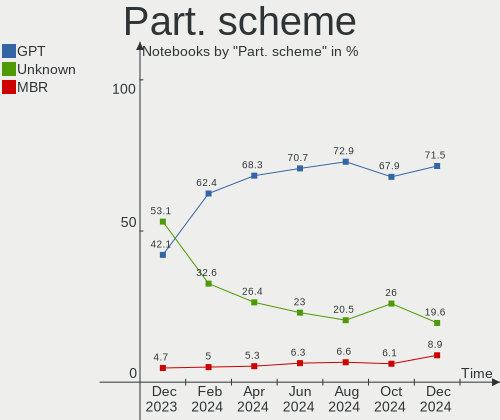
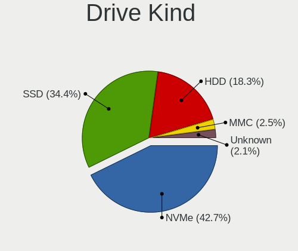
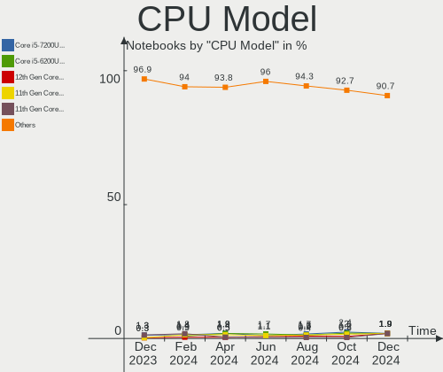
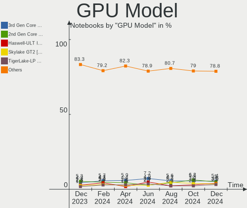
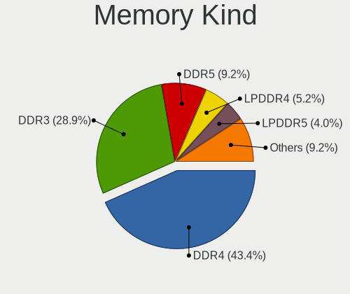

Linux Mint - Hardware Trends (Notebooks)
----------------------------------------

A project to identify most popular hardware characteristics and track their change
over time based on data collected by Linux users at https://Linux-Hardware.org.

Anyone can contribute to this report by the [hw-probe](https://github.com/linuxhw/hw-probe) tool:

    sudo -E hw-probe -all -upload

This report is for one last month. Overall report since the beginning of time: [TestCoverage](https://github.com/linuxhw/TestCoverage)

Period: May, 2022.

Contents
--------

* [ System ](#system)
  - [ OS                       ](#os)
  - [ OS Family                ](#os-family)
  - [ Kernel                   ](#kernel)
  - [ Kernel Family            ](#kernel-family)
  - [ Kernel Major Ver.        ](#kernel-major-ver)
  - [ Arch                     ](#arch)
  - [ DE                       ](#de)
  - [ Display Server           ](#display-server)
  - [ Display Manager          ](#display-manager)
  - [ OS Lang                  ](#os-lang)
  - [ Boot Mode                ](#boot-mode)
  - [ Filesystem               ](#filesystem)
  - [ Part. scheme             ](#part-scheme)
  - [ Dual Boot with Linux/BSD ](#dual-boot-with-linuxbsd)
  - [ Dual Boot (Win)          ](#dual-boot-win)

* [ Board ](#board)
  - [ Vendor                   ](#vendor)
  - [ Model                    ](#model)
  - [ Model Family             ](#model-family)
  - [ MFG Year                 ](#mfg-year)
  - [ Form Factor              ](#form-factor)
  - [ Secure Boot              ](#secure-boot)
  - [ Coreboot                 ](#coreboot)
  - [ RAM Size                 ](#ram-size)
  - [ RAM Used                 ](#ram-used)
  - [ Total Drives             ](#total-drives)
  - [ Has CD-ROM               ](#has-cd-rom)
  - [ Has Ethernet             ](#has-ethernet)
  - [ Has WiFi                 ](#has-wifi)
  - [ Has Bluetooth            ](#has-bluetooth)

* [ Location ](#location)
  - [ Country                  ](#country)
  - [ City                     ](#city)

* [ Drives ](#drives)
  - [ Drive Vendor             ](#drive-vendor)
  - [ Drive Model              ](#drive-model)
  - [ HDD Vendor               ](#hdd-vendor)
  - [ SSD Vendor               ](#ssd-vendor)
  - [ Drive Kind               ](#drive-kind)
  - [ Drive Connector          ](#drive-connector)
  - [ Drive Size               ](#drive-size)
  - [ Space Total              ](#space-total)
  - [ Space Used               ](#space-used)
  - [ Malfunc. Drives          ](#malfunc-drives)
  - [ Malfunc. Drive Vendor    ](#malfunc-drive-vendor)
  - [ Malfunc. HDD Vendor      ](#malfunc-hdd-vendor)
  - [ Malfunc. Drive Kind      ](#malfunc-drive-kind)
  - [ Failed Drives            ](#failed-drives)
  - [ Failed Drive Vendor      ](#failed-drive-vendor)
  - [ Drive Status             ](#drive-status)

* [ Storage controller ](#storage-controller)
  - [ Storage Vendor           ](#storage-vendor)
  - [ Storage Model            ](#storage-model)
  - [ Storage Kind             ](#storage-kind)

* [ Processor ](#processor)
  - [ CPU Vendor               ](#cpu-vendor)
  - [ CPU Model                ](#cpu-model)
  - [ CPU Model Family         ](#cpu-model-family)
  - [ CPU Cores                ](#cpu-cores)
  - [ CPU Sockets              ](#cpu-sockets)
  - [ CPU Threads              ](#cpu-threads)
  - [ CPU Op-Modes             ](#cpu-op-modes)
  - [ CPU Microcode            ](#cpu-microcode)
  - [ CPU Microarch            ](#cpu-microarch)

* [ Graphics ](#graphics)
  - [ GPU Vendor               ](#gpu-vendor)
  - [ GPU Model                ](#gpu-model)
  - [ GPU Combo                ](#gpu-combo)
  - [ GPU Driver               ](#gpu-driver)
  - [ GPU Memory               ](#gpu-memory)

* [ Monitor ](#monitor)
  - [ Monitor Vendor           ](#monitor-vendor)
  - [ Monitor Model            ](#monitor-model)
  - [ Monitor Resolution       ](#monitor-resolution)
  - [ Monitor Diagonal         ](#monitor-diagonal)
  - [ Monitor Width            ](#monitor-width)
  - [ Aspect Ratio             ](#aspect-ratio)
  - [ Monitor Area             ](#monitor-area)
  - [ Pixel Density            ](#pixel-density)
  - [ Multiple Monitors        ](#multiple-monitors)

* [ Network ](#network)
  - [ Net Controller Vendor    ](#net-controller-vendor)
  - [ Net Controller Model     ](#net-controller-model)
  - [ Wireless Vendor          ](#wireless-vendor)
  - [ Wireless Model           ](#wireless-model)
  - [ Ethernet Vendor          ](#ethernet-vendor)
  - [ Ethernet Model           ](#ethernet-model)
  - [ Net Controller Kind      ](#net-controller-kind)
  - [ Used Controller          ](#used-controller)
  - [ NICs                     ](#nics)
  - [ IPv6                     ](#ipv6)

* [ Bluetooth ](#bluetooth)
  - [ Bluetooth Vendor         ](#bluetooth-vendor)
  - [ Bluetooth Model          ](#bluetooth-model)

* [ Sound ](#sound)
  - [ Sound Vendor             ](#sound-vendor)
  - [ Sound Model              ](#sound-model)

* [ Memory ](#memory)
  - [ Memory Vendor            ](#memory-vendor)
  - [ Memory Model             ](#memory-model)
  - [ Memory Kind              ](#memory-kind)
  - [ Memory Form Factor       ](#memory-form-factor)
  - [ Memory Size              ](#memory-size)
  - [ Memory Speed             ](#memory-speed)

* [ Printers & scanners ](#printers--scanners)
  - [ Printer Vendor           ](#printer-vendor)
  - [ Printer Model            ](#printer-model)
  - [ Scanner Vendor           ](#scanner-vendor)
  - [ Scanner Model            ](#scanner-model)

* [ Camera ](#camera)
  - [ Camera Vendor            ](#camera-vendor)
  - [ Camera Model             ](#camera-model)

* [ Security ](#security)
  - [ Fingerprint Vendor       ](#fingerprint-vendor)
  - [ Fingerprint Model        ](#fingerprint-model)
  - [ Chipcard Vendor          ](#chipcard-vendor)
  - [ Chipcard Model           ](#chipcard-model)

* [ Unsupported ](#unsupported)
  - [ Unsupported Devices      ](#unsupported-devices)
  - [ Unsupported Device Types ](#unsupported-device-types)

System
------

OS
--

Installed operating systems

| Name            | Notebooks | Percent |
|-----------------|-----------|---------|
| Linux Mint 20.3 | 185       | 86.45%  |
| Linux Mint 20.2 | 11        | 5.14%   |
| Linux Mint 20.1 | 7         | 3.27%   |
| Linux Mint 19.3 | 7         | 3.27%   |
| Linux Mint 20   | 3         | 1.4%    |
| Linux Mint 18.3 | 1         | 0.47%   |

OS Family
---------

OS without a version

| Name       | Notebooks | Percent |
|------------|-----------|---------|
| Linux Mint | 214       | 100%    |

Kernel
------

Version of the Linux kernel

| Version               | Notebooks | Percent |
|-----------------------|-----------|---------|
| 5.4.0-110-generic     | 61        | 28.5%   |
| 5.4.0-109-generic     | 48        | 22.43%  |
| 5.4.0-113-generic     | 30        | 14.02%  |
| 5.4.0-91-generic      | 19        | 8.88%   |
| 5.13.0-41-generic     | 8         | 3.74%   |
| 5.4.0-107-generic     | 6         | 2.8%    |
| 5.13.0-40-generic     | 6         | 2.8%    |
| 5.13.0-44-generic     | 5         | 2.34%   |
| 5.13.0-27-generic     | 4         | 1.87%   |
| 5.4.0-99-generic      | 3         | 1.4%    |
| 5.14.0-1038-oem       | 3         | 1.4%    |
| 5.4.0-74-generic      | 2         | 0.93%   |
| 5.4.0-105-generic     | 2         | 0.93%   |
| 5.17.6-051706-generic | 2         | 0.93%   |
| 5.14.0-1034-oem       | 2         | 0.93%   |
| 5.8.0-28-generic      | 1         | 0.47%   |
| 5.4.0-110-lowlatency  | 1         | 0.47%   |
| 5.4.0-104-generic     | 1         | 0.47%   |
| 5.4.0-100-generic     | 1         | 0.47%   |
| 5.17.5-051705-generic | 1         | 0.47%   |
| 5.16.6-051606-generic | 1         | 0.47%   |
| 5.15.35-xanmod1       | 1         | 0.47%   |
| 5.14.0-1036-oem       | 1         | 0.47%   |
| 5.13.0-25-generic     | 1         | 0.47%   |
| 5.11.0-44-generic     | 1         | 0.47%   |
| 5.0.0-32-generic      | 1         | 0.47%   |
| 4.15.0-142-generic    | 1         | 0.47%   |
| 4.15.0-135-generic    | 1         | 0.47%   |

Kernel Family
-------------

Linux kernel without a distro release

| Version | Notebooks | Percent |
|---------|-----------|---------|
| 5.4.0   | 174       | 81.31%  |
| 5.13.0  | 24        | 11.21%  |
| 5.14.0  | 6         | 2.8%    |
| 5.17.6  | 2         | 0.93%   |
| 4.15.0  | 2         | 0.93%   |
| 5.8.0   | 1         | 0.47%   |
| 5.17.5  | 1         | 0.47%   |
| 5.16.6  | 1         | 0.47%   |
| 5.15.35 | 1         | 0.47%   |
| 5.11.0  | 1         | 0.47%   |
| 5.0.0   | 1         | 0.47%   |

Kernel Major Ver.
-----------------

Linux kernel major version

| Version | Notebooks | Percent |
|---------|-----------|---------|
| 5.4     | 174       | 81.31%  |
| 5.13    | 24        | 11.21%  |
| 5.14    | 6         | 2.8%    |
| 5.17    | 3         | 1.4%    |
| 4.15    | 2         | 0.93%   |
| 5.8     | 1         | 0.47%   |
| 5.16    | 1         | 0.47%   |
| 5.15    | 1         | 0.47%   |
| 5.11    | 1         | 0.47%   |
| 5.0     | 1         | 0.47%   |

Arch
----

OS architecture (x86_64, i586, etc.)

| Name   | Notebooks | Percent |
|--------|-----------|---------|
| x86_64 | 213       | 99.53%  |
| i686   | 1         | 0.47%   |

DE
--

Desktop Environment

| Name       | Notebooks | Percent |
|------------|-----------|---------|
| X-Cinnamon | 147       | 68.69%  |
| XFCE       | 27        | 12.62%  |
| MATE       | 18        | 8.41%   |
| Cinnamon   | 10        | 4.67%   |
| GNOME      | 6         | 2.8%    |
| Unknown    | 4         | 1.87%   |
| KDE        | 1         | 0.47%   |
| i3         | 1         | 0.47%   |

Display Server
--------------

X11 or Wayland

| Name    | Notebooks | Percent |
|---------|-----------|---------|
| X11     | 213       | 99.53%  |
| Wayland | 1         | 0.47%   |

Display Manager
---------------

SDDM, LightDM, etc.

| Name    | Notebooks | Percent |
|---------|-----------|---------|
| Unknown | 123       | 57.48%  |
| LightDM | 89        | 41.59%  |
| SDDM    | 1         | 0.47%   |
| GDM3    | 1         | 0.47%   |

OS Lang
-------

Language

| Lang    | Notebooks | Percent |
|---------|-----------|---------|
| en_US   | 67        | 31.31%  |
| de_DE   | 31        | 14.49%  |
| pt_BR   | 21        | 9.81%   |
| en_GB   | 12        | 5.61%   |
| fr_FR   | 10        | 4.67%   |
| ru_RU   | 8         | 3.74%   |
| C       | 7         | 3.27%   |
| pl_PL   | 6         | 2.8%    |
| es_ES   | 6         | 2.8%    |
| en_AU   | 6         | 2.8%    |
| it_IT   | 5         | 2.34%   |
| de_CH   | 5         | 2.34%   |
| hu_HU   | 4         | 1.87%   |
| en_CA   | 4         | 1.87%   |
| tr_TR   | 3         | 1.4%    |
| pt_PT   | 2         | 0.93%   |
| nl_NL   | 2         | 0.93%   |
| en_IN   | 2         | 0.93%   |
| zh_TW   | 1         | 0.47%   |
| zh_CN   | 1         | 0.47%   |
| nb_NO   | 1         | 0.47%   |
| ko_KR   | 1         | 0.47%   |
| es_PE   | 1         | 0.47%   |
| es_HN   | 1         | 0.47%   |
| es_EC   | 1         | 0.47%   |
| en_ZA   | 1         | 0.47%   |
| en_NZ   | 1         | 0.47%   |
| el_GR   | 1         | 0.47%   |
| de_AT   | 1         | 0.47%   |
| cs_CZ   | 1         | 0.47%   |
| Unknown | 1         | 0.47%   |

Boot Mode
---------

EFI or BIOS

| Mode | Notebooks | Percent |
|------|-----------|---------|
| EFI  | 130       | 60.75%  |
| BIOS | 84        | 39.25%  |

Filesystem
----------

Type of filesystem

| Type    | Notebooks | Percent |
|---------|-----------|---------|
| Ext4    | 207       | 96.73%  |
| Overlay | 6         | 2.8%    |
| Jfs     | 1         | 0.47%   |

Part. scheme
------------

Scheme of partitioning

| Type    | Notebooks | Percent |
|---------|-----------|---------|
| Unknown | 131       | 61.21%  |
| GPT     | 64        | 29.91%  |
| MBR     | 19        | 8.88%   |

Dual Boot with Linux/BSD
------------------------

Hosting more than one Linux/BSD

| Dual boot | Notebooks | Percent |
|-----------|-----------|---------|
| No        | 200       | 93.46%  |
| Yes       | 14        | 6.54%   |

Dual Boot (Win)
---------------

Hosting Linux and Windows

| Dual boot | Notebooks | Percent |
|-----------|-----------|---------|
| No        | 178       | 83.18%  |
| Yes       | 36        | 16.82%  |

Board
-----

Vendor
------

Motherboard manufacturer

| Name                  | Notebooks | Percent |
|-----------------------|-----------|---------|
| Lenovo                | 50        | 23.36%  |
| Hewlett-Packard       | 37        | 17.29%  |
| Dell                  | 33        | 15.42%  |
| Acer                  | 28        | 13.08%  |
| ASUSTek Computer      | 12        | 5.61%   |
| Samsung Electronics   | 7         | 3.27%   |
| MSI                   | 7         | 3.27%   |
| Medion                | 4         | 1.87%   |
| Apple                 | 4         | 1.87%   |
| Notebook              | 3         | 1.4%    |
| Google                | 3         | 1.4%    |
| Toshiba               | 2         | 0.93%   |
| Sony                  | 2         | 0.93%   |
| Packard Bell          | 2         | 0.93%   |
| GPU Company           | 2         | 0.93%   |
| Alienware             | 2         | 0.93%   |
| Wortmann AG           | 1         | 0.47%   |
| Positivo Bahia - VAIO | 1         | 0.47%   |
| Positivo              | 1         | 0.47%   |
| LG Electronics        | 1         | 0.47%   |
| Itautec               | 1         | 0.47%   |
| Irbis                 | 1         | 0.47%   |
| HUAWEI                | 1         | 0.47%   |
| HONOR                 | 1         | 0.47%   |
| Fujitsu Siemens       | 1         | 0.47%   |
| Framework             | 1         | 0.47%   |
| DTRI                  | 1         | 0.47%   |
| Clevo                 | 1         | 0.47%   |
| Chuwi                 | 1         | 0.47%   |
| BOX                   | 1         | 0.47%   |
| AXDIA International   | 1         | 0.47%   |
| Unknown               | 1         | 0.47%   |

Model
-----

Motherboard model

| Name                                    | Notebooks | Percent |
|-----------------------------------------|-----------|---------|
| Samsung 550XDA                          | 3         | 1.4%    |
| Lenovo IdeaPad S145-14IWL 81MU          | 2         | 0.93%   |
| Lenovo G580 20150                       | 2         | 0.93%   |
| HP Notebook                             | 2         | 0.93%   |
| HP G62                                  | 2         | 0.93%   |
| HP EliteBook 8470p                      | 2         | 0.93%   |
| HP EliteBook 2560p                      | 2         | 0.93%   |
| GPU Company GWTC116-2                   | 2         | 0.93%   |
| Dell Studio 1555                        | 2         | 0.93%   |
| Acer Aspire A315-55G                    | 2         | 0.93%   |
| Wortmann AG TERRA_MOBILE_1450           | 1         | 0.47%   |
| Toshiba TECRA R850                      | 1         | 0.47%   |
| Toshiba Satellite Radius P55W-B         | 1         | 0.47%   |
| Sony VGN-SZ430N                         | 1         | 0.47%   |
| Sony SVE14113ELW                        | 1         | 0.47%   |
| Samsung RF510/RF410/RF710               | 1         | 0.47%   |
| Samsung 535U3C                          | 1         | 0.47%   |
| Samsung 350V5C/351V5C/3540VC/3440VC     | 1         | 0.47%   |
| Samsung 340XAA/350XAA/550XAA            | 1         | 0.47%   |
| Positivo C14CR21TV                      | 1         | 0.47%   |
| Positivo Bahia - VAIO VJFE51F11X-B0111H | 1         | 0.47%   |
| Packard Bell EasyNote LE69KB            | 1         | 0.47%   |
| Packard Bell DOT S                      | 1         | 0.47%   |
| Notebook V15x_V17xPNKPNJPNH             | 1         | 0.47%   |
| Notebook PD5x_7xPNP_PNN_PNT             | 1         | 0.47%   |
| Notebook N8xEJEK                        | 1         | 0.47%   |
| MSI Summit E16Flip A12UCT               | 1         | 0.47%   |
| MSI PS63 Modern 8M                      | 1         | 0.47%   |
| MSI Prestige 15 A12UC                   | 1         | 0.47%   |
| MSI PR600                               | 1         | 0.47%   |
| MSI GS63 Stealth 8RE                    | 1         | 0.47%   |
| MSI GP70 2PE                            | 1         | 0.47%   |
| MSI CR70 2M/CX70 2OC/CX70 2OD           | 1         | 0.47%   |
| Medion P6812                            | 1         | 0.47%   |
| Medion P6630                            | 1         | 0.47%   |
| Medion E6220                            | 1         | 0.47%   |
| Medion E15303                           | 1         | 0.47%   |
| LG 17Z90P-G.AA89G                       | 1         | 0.47%   |
| Lenovo ZHAOYANG K4e-ITL 82F8            | 1         | 0.47%   |
| Lenovo V320-17IKB 81AH                  | 1         | 0.47%   |
| Lenovo V310-15ISK 80SY                  | 1         | 0.47%   |
| Lenovo V15-IIL 82C5                     | 1         | 0.47%   |
| Lenovo ThinkPad X61 7673AQ5             | 1         | 0.47%   |
| Lenovo ThinkPad X240 20AL00FGMB         | 1         | 0.47%   |
| Lenovo ThinkPad X230 2325H50            | 1         | 0.47%   |
| Lenovo ThinkPad X230 23255Z6            | 1         | 0.47%   |
| Lenovo ThinkPad X220 4291WSH            | 1         | 0.47%   |
| Lenovo ThinkPad X131e 336838U           | 1         | 0.47%   |
| Lenovo ThinkPad W520 4270CTO            | 1         | 0.47%   |
| Lenovo ThinkPad T530 2394C98            | 1         | 0.47%   |
| Lenovo ThinkPad T470 W10DG 20JM000CUS   | 1         | 0.47%   |
| Lenovo ThinkPad T450s 20BWS4X500        | 1         | 0.47%   |
| Lenovo ThinkPad T440p 20AWS17N00        | 1         | 0.47%   |
| Lenovo ThinkPad T440p 20AN00DEUS        | 1         | 0.47%   |
| Lenovo ThinkPad T430 23501F9            | 1         | 0.47%   |
| Lenovo ThinkPad T420 4177Q5U            | 1         | 0.47%   |
| Lenovo ThinkPad L540 20AUA06000         | 1         | 0.47%   |
| Lenovo ThinkPad L420 7829AA4            | 1         | 0.47%   |
| Lenovo ThinkPad L15 Gen 2 20X3000YMZ    | 1         | 0.47%   |
| Lenovo ThinkPad E15 Gen 3 20YG006HMZ    | 1         | 0.47%   |

Model Family
------------

Motherboard model prefix

| Name                                    | Notebooks | Percent |
|-----------------------------------------|-----------|---------|
| Lenovo ThinkPad                         | 20        | 9.35%   |
| Acer Aspire                             | 19        | 8.88%   |
| Lenovo IdeaPad                          | 15        | 7.01%   |
| Dell Inspiron                           | 12        | 5.61%   |
| Dell Latitude                           | 11        | 5.14%   |
| HP ProBook                              | 7         | 3.27%   |
| HP EliteBook                            | 7         | 3.27%   |
| HP Pavilion                             | 6         | 2.8%    |
| HP Laptop                               | 4         | 1.87%   |
| ASUS VivoBook                           | 4         | 1.87%   |
| Samsung 550XDA                          | 3         | 1.4%    |
| Lenovo G580                             | 2         | 0.93%   |
| HP Notebook                             | 2         | 0.93%   |
| HP G62                                  | 2         | 0.93%   |
| HP Compaq                               | 2         | 0.93%   |
| HP 250                                  | 2         | 0.93%   |
| GPU Company GWTC116-2                   | 2         | 0.93%   |
| Dell XPS                                | 2         | 0.93%   |
| Dell Vostro                             | 2         | 0.93%   |
| Dell Studio                             | 2         | 0.93%   |
| Dell G3                                 | 2         | 0.93%   |
| Acer TravelMate                         | 2         | 0.93%   |
| Acer Swift                              | 2         | 0.93%   |
| Acer Extensa                            | 2         | 0.93%   |
| Wortmann AG TERRA                       | 1         | 0.47%   |
| Toshiba TECRA                           | 1         | 0.47%   |
| Toshiba Satellite                       | 1         | 0.47%   |
| Sony VGN-SZ430N                         | 1         | 0.47%   |
| Sony SVE14113ELW                        | 1         | 0.47%   |
| Samsung RF510                           | 1         | 0.47%   |
| Samsung 535U3C                          | 1         | 0.47%   |
| Samsung 350V5C                          | 1         | 0.47%   |
| Samsung 340XAA                          | 1         | 0.47%   |
| Positivo C14CR21TV                      | 1         | 0.47%   |
| Positivo Bahia - VAIO VJFE51F11X-B0111H | 1         | 0.47%   |
| Packard Bell EasyNote                   | 1         | 0.47%   |
| Packard Bell DOT                        | 1         | 0.47%   |
| Notebook V15x                           | 1         | 0.47%   |
| Notebook PD5x                           | 1         | 0.47%   |
| Notebook N8xEJEK                        | 1         | 0.47%   |
| MSI Summit                              | 1         | 0.47%   |
| MSI PS63                                | 1         | 0.47%   |
| MSI Prestige                            | 1         | 0.47%   |
| MSI PR600                               | 1         | 0.47%   |
| MSI GS63                                | 1         | 0.47%   |
| MSI GP70                                | 1         | 0.47%   |
| MSI CR70                                | 1         | 0.47%   |
| Medion P6812                            | 1         | 0.47%   |
| Medion P6630                            | 1         | 0.47%   |
| Medion E6220                            | 1         | 0.47%   |
| Medion E15303                           | 1         | 0.47%   |
| LG 17Z90P-G.AA89G                       | 1         | 0.47%   |
| Lenovo ZHAOYANG                         | 1         | 0.47%   |
| Lenovo V320-17IKB                       | 1         | 0.47%   |
| Lenovo V310-15ISK                       | 1         | 0.47%   |
| Lenovo V15-IIL                          | 1         | 0.47%   |
| Lenovo G510                             | 1         | 0.47%   |
| Lenovo G505                             | 1         | 0.47%   |
| Lenovo G500s                            | 1         | 0.47%   |
| Lenovo G500                             | 1         | 0.47%   |

MFG Year
--------

Motherboard manufacture year

| Year | Notebooks | Percent |
|------|-----------|---------|
| 2021 | 28        | 13.08%  |
| 2012 | 24        | 11.21%  |
| 2013 | 20        | 9.35%   |
| 2011 | 20        | 9.35%   |
| 2019 | 19        | 8.88%   |
| 2014 | 16        | 7.48%   |
| 2018 | 14        | 6.54%   |
| 2017 | 13        | 6.07%   |
| 2020 | 11        | 5.14%   |
| 2010 | 11        | 5.14%   |
| 2016 | 9         | 4.21%   |
| 2022 | 7         | 3.27%   |
| 2015 | 6         | 2.8%    |
| 2009 | 6         | 2.8%    |
| 2008 | 6         | 2.8%    |
| 2006 | 3         | 1.4%    |
| 2007 | 1         | 0.47%   |

Form Factor
-----------

Physical design of the computer

| Name     | Notebooks | Percent |
|----------|-----------|---------|
| Notebook | 214       | 100%    |

Secure Boot
-----------

Enabled or disabled

| State    | Notebooks | Percent |
|----------|-----------|---------|
| Disabled | 178       | 83.18%  |
| Enabled  | 36        | 16.82%  |

Coreboot
--------

Have coreboot on board

| Used | Notebooks | Percent |
|------|-----------|---------|
| No   | 211       | 98.6%   |
| Yes  | 3         | 1.4%    |

RAM Size
--------

Total RAM memory

| Size in GB  | Notebooks | Percent |
|-------------|-----------|---------|
| 4.01-8.0    | 68        | 31.78%  |
| 3.01-4.0    | 60        | 28.04%  |
| 16.01-24.0  | 36        | 16.82%  |
| 8.01-16.0   | 25        | 11.68%  |
| 32.01-64.0  | 10        | 4.67%   |
| 1.01-2.0    | 7         | 3.27%   |
| 2.01-3.0    | 3         | 1.4%    |
| 24.01-32.0  | 2         | 0.93%   |
| 64.01-256.0 | 2         | 0.93%   |
| 0.51-1.0    | 1         | 0.47%   |

RAM Used
--------

Used RAM memory

| Used GB   | Notebooks | Percent |
|-----------|-----------|---------|
| 1.01-2.0  | 87        | 40.65%  |
| 2.01-3.0  | 66        | 30.84%  |
| 3.01-4.0  | 27        | 12.62%  |
| 4.01-8.0  | 15        | 7.01%   |
| 0.51-1.0  | 14        | 6.54%   |
| 8.01-16.0 | 4         | 1.87%   |
| 0.01-0.5  | 1         | 0.47%   |

Total Drives
------------

Number of drives on board

| Drives | Notebooks | Percent |
|--------|-----------|---------|
| 1      | 149       | 69.63%  |
| 2      | 56        | 26.17%  |
| 3      | 5         | 2.34%   |
| 0      | 2         | 0.93%   |
| 5      | 1         | 0.47%   |
| 4      | 1         | 0.47%   |

Has CD-ROM
----------

Has CD-ROM on board

| Presented | Notebooks | Percent |
|-----------|-----------|---------|
| No        | 127       | 59.35%  |
| Yes       | 87        | 40.65%  |

Has Ethernet
------------

Has Ethernet on board

| Presented | Notebooks | Percent |
|-----------|-----------|---------|
| Yes       | 176       | 82.24%  |
| No        | 38        | 17.76%  |

Has WiFi
--------

Has WiFi module

| Presented | Notebooks | Percent |
|-----------|-----------|---------|
| Yes       | 212       | 99.07%  |
| No        | 2         | 0.93%   |

Has Bluetooth
-------------

Has Bluetooth module

| Presented | Notebooks | Percent |
|-----------|-----------|---------|
| Yes       | 158       | 73.83%  |
| No        | 56        | 26.17%  |

Location
--------

Country
-------

Geographic location (country)

| Country            | Notebooks | Percent |
|--------------------|-----------|---------|
| Germany            | 35        | 16.36%  |
| USA                | 33        | 15.42%  |
| Brazil             | 22        | 10.28%  |
| UK                 | 10        | 4.67%   |
| France             | 10        | 4.67%   |
| Spain              | 9         | 4.21%   |
| Poland             | 9         | 4.21%   |
| Italy              | 8         | 3.74%   |
| Russia             | 7         | 3.27%   |
| Australia          | 6         | 2.8%    |
| Switzerland        | 5         | 2.34%   |
| Canada             | 5         | 2.34%   |
| Portugal           | 4         | 1.87%   |
| Netherlands        | 4         | 1.87%   |
| Hungary            | 4         | 1.87%   |
| Turkey             | 3         | 1.4%    |
| Indonesia          | 3         | 1.4%    |
| Norway             | 2         | 0.93%   |
| India              | 2         | 0.93%   |
| Ecuador            | 2         | 0.93%   |
| Belgium            | 2         | 0.93%   |
| Austria            | 2         | 0.93%   |
| Vietnam            | 1         | 0.47%   |
| Ukraine            | 1         | 0.47%   |
| Uganda             | 1         | 0.47%   |
| Taiwan             | 1         | 0.47%   |
| Sweden             | 1         | 0.47%   |
| South Korea        | 1         | 0.47%   |
| South Africa       | 1         | 0.47%   |
| Serbia             | 1         | 0.47%   |
| Peru               | 1         | 0.47%   |
| Paraguay           | 1         | 0.47%   |
| New Zealand        | 1         | 0.47%   |
| Morocco            | 1         | 0.47%   |
| Latvia             | 1         | 0.47%   |
| Jordan             | 1         | 0.47%   |
| Jamaica            | 1         | 0.47%   |
| Honduras           | 1         | 0.47%   |
| Guatemala          | 1         | 0.47%   |
| Greece             | 1         | 0.47%   |
| Georgia            | 1         | 0.47%   |
| Estonia            | 1         | 0.47%   |
| Dominican Republic | 1         | 0.47%   |
| Czechia            | 1         | 0.47%   |
| Costa Rica         | 1         | 0.47%   |
| China              | 1         | 0.47%   |
| Cabo Verde         | 1         | 0.47%   |
| Armenia            | 1         | 0.47%   |
| Argentina          | 1         | 0.47%   |

City
----

Geographic location (city)

| City                    | Notebooks | Percent |
|-------------------------|-----------|---------|
| Sao Paulo               | 4         | 1.87%   |
| Milan                   | 3         | 1.4%    |
| Zurich                  | 2         | 0.93%   |
| Warsaw                  | 2         | 0.93%   |
| Turin                   | 2         | 0.93%   |
| Rio de Janeiro          | 2         | 0.93%   |
| Ribeirao Preto          | 2         | 0.93%   |
| Point Cook              | 2         | 0.93%   |
| Niederkassel            | 2         | 0.93%   |
| Moscow                  | 2         | 0.93%   |
| Karlsruhe               | 2         | 0.93%   |
| Cambridge               | 2         | 0.93%   |
| Budapest                | 2         | 0.93%   |
| Berlin                  | 2         | 0.93%   |
| Bengaluru               | 2         | 0.93%   |
| Ankara                  | 2         | 0.93%   |
| Zwolle                  | 1         | 0.47%   |
| Yogyakarta              | 1         | 0.47%   |
| Yerevan                 | 1         | 0.47%   |
| Wroclaw                 | 1         | 0.47%   |
| Witham                  | 1         | 0.47%   |
| Wahiawa                 | 1         | 0.47%   |
| Vologda                 | 1         | 0.47%   |
| Vilagarcia de Arousa    | 1         | 0.47%   |
| Vienna                  | 1         | 0.47%   |
| Vestal                  | 1         | 0.47%   |
| Valladolid              | 1         | 0.47%   |
| Troisdorf               | 1         | 0.47%   |
| Traunreut               | 1         | 0.47%   |
| Toulouse                | 1         | 0.47%   |
| Torun                   | 1         | 0.47%   |
| Torres Vedras           | 1         | 0.47%   |
| Torre Pacheco           | 1         | 0.47%   |
| Toronto                 | 1         | 0.47%   |
| The Hague               | 1         | 0.47%   |
| The Bronx               | 1         | 0.47%   |
| Temara                  | 1         | 0.47%   |
| Teisendorf              | 1         | 0.47%   |
| Tallinn                 | 1         | 0.47%   |
| Taipei                  | 1         | 0.47%   |
| Suhr                    | 1         | 0.47%   |
| Stockton-on-Tees        | 1         | 0.47%   |
| Stockton                | 1         | 0.47%   |
| Stockbridge             | 1         | 0.47%   |
| Stavanger               | 1         | 0.47%   |
| Silberstedt             | 1         | 0.47%   |
| Seoul                   | 1         | 0.47%   |
| Seattle                 | 1         | 0.47%   |
| Saskatoon               | 1         | 0.47%   |
| Santo Domingo Este      | 1         | 0.47%   |
| San José               | 1         | 0.47%   |
| San Francisco de Ojuera | 1         | 0.47%   |
| San Diego               | 1         | 0.47%   |
| San Antonio             | 1         | 0.47%   |
| Salzwedel               | 1         | 0.47%   |
| Roque Perez             | 1         | 0.47%   |
| Rome                    | 1         | 0.47%   |
| Rockville               | 1         | 0.47%   |
| Riga                    | 1         | 0.47%   |
| Quito                   | 1         | 0.47%   |

Drives
------

Drive Vendor
------------

Hard drive vendors

| Vendor                      | Notebooks | Drives | Percent |
|-----------------------------|-----------|--------|---------|
| Samsung Electronics         | 39        | 43     | 14.72%  |
| WDC                         | 38        | 40     | 14.34%  |
| Seagate                     | 31        | 31     | 11.7%   |
| Toshiba                     | 21        | 21     | 7.92%   |
| Sandisk                     | 17        | 19     | 6.42%   |
| Kingston                    | 14        | 14     | 5.28%   |
| Unknown                     | 12        | 13     | 4.53%   |
| Hitachi                     | 11        | 12     | 4.15%   |
| Crucial                     | 10        | 11     | 3.77%   |
| SK Hynix                    | 7         | 7      | 2.64%   |
| China                       | 7         | 7      | 2.64%   |
| HGST                        | 5         | 5      | 1.89%   |
| Intel                       | 4         | 4      | 1.51%   |
| UMIS                        | 3         | 3      | 1.13%   |
| KIOXIA                      | 3         | 3      | 1.13%   |
| Intenso                     | 3         | 3      | 1.13%   |
| Union Memory                | 2         | 2      | 0.75%   |
| TO Exter                    | 2         | 2      | 0.75%   |
| Team                        | 2         | 2      | 0.75%   |
| Phison                      | 2         | 2      | 0.75%   |
| Patriot                     | 2         | 2      | 0.75%   |
| Micron Technology           | 2         | 3      | 0.75%   |
| LITEONIT                    | 2         | 2      | 0.75%   |
| JMicron                     | 2         | 2      | 0.75%   |
| Hewlett-Packard             | 2         | 2      | 0.75%   |
| DOGFISH                     | 2         | 2      | 0.75%   |
| Apple                       | 2         | 2      | 0.75%   |
| V-GeN                       | 1         | 1      | 0.38%   |
| Transcend                   | 1         | 1      | 0.38%   |
| SSSTC                       | 1         | 1      | 0.38%   |
| Silicon Motion              | 1         | 1      | 0.38%   |
| S3+                         | 1         | 1      | 0.38%   |
| Netac                       | 1         | 1      | 0.38%   |
| Micron/Crucial Technology   | 1         | 1      | 0.38%   |
| MAXIO Technology (Hangzhou) | 1         | 1      | 0.38%   |
| LITEON                      | 1         | 1      | 0.38%   |
| Lexar                       | 1         | 1      | 0.38%   |
| Leven                       | 1         | 1      | 0.38%   |
| KingDian                    | 1         | 1      | 0.38%   |
| GOODRAM                     | 1         | 1      | 0.38%   |
| BIWIN                       | 1         | 1      | 0.38%   |
| ASUSTOR                     | 1         | 2      | 0.38%   |
| ASMT                        | 1         | 1      | 0.38%   |
| A-DATA Technology           | 1         | 1      | 0.38%   |
| Unknown                     | 1         | 1      | 0.38%   |

Drive Model
-----------

Hard drive models

| Model                                  | Notebooks | Percent |
|----------------------------------------|-----------|---------|
| WDC WD10SPZX-21Z10T0 1TB               | 4         | 1.45%   |
| Seagate ST500LT012-9WS142 500GB        | 4         | 1.45%   |
| Seagate ST500LT012-1DG142 500GB        | 4         | 1.45%   |
| Unknown MMC Card  32GB                 | 3         | 1.09%   |
| Toshiba MQ01ABF050 500GB               | 3         | 1.09%   |
| Seagate ST1000LM035-1RK172 1TB         | 3         | 1.09%   |
| Seagate ST1000LM024 HN-M101MBB 1TB     | 3         | 1.09%   |
| Samsung SSD 860 EVO 250GB              | 3         | 1.09%   |
| Samsung SSD 840 EVO 250GB              | 3         | 1.09%   |
| Kingston SA400S37480G 480GB SSD        | 3         | 1.09%   |
| Kingston SA400S37240G 240GB SSD        | 3         | 1.09%   |
| Crucial CT525MX300SSD1 528GB           | 3         | 1.09%   |
| WDC WD800BEVS-22RST0 80GB              | 2         | 0.72%   |
| WDC WD5000LPCX-75VHAT0 500GB           | 2         | 0.72%   |
| WDC WD10JPCX-24UE4T0 1TB               | 2         | 0.72%   |
| Unknown SLD64G  64GB                   | 2         | 0.72%   |
| Unknown MMC Card  64GB                 | 2         | 0.72%   |
| Unknown MMC Card  16GB                 | 2         | 0.72%   |
| Union Memory RTOTJ128VGD2EYX 128GB SSD | 2         | 0.72%   |
| UMIS RPFTJ256PDD2MWX 256GB             | 2         | 0.72%   |
| Toshiba MQ04ABF100 1TB                 | 2         | 0.72%   |
| Toshiba MQ01ABD100 1TB                 | 2         | 0.72%   |
| Toshiba MK5059GSXP 500GB               | 2         | 0.72%   |
| Toshiba KBG30ZMS128G 128GB NVMe SSD    | 2         | 0.72%   |
| TO Exter nal USB 3.0 320GB             | 2         | 0.72%   |
| Seagate ST9500325AS 500GB              | 2         | 0.72%   |
| Seagate ST500LM012 HN-M500MBB 500GB    | 2         | 0.72%   |
| SanDisk SSD PLUS 120GB                 | 2         | 0.72%   |
| Sandisk NVMe SSD Drive 512GB           | 2         | 0.72%   |
| Sandisk NVMe SSD Drive 128GB           | 2         | 0.72%   |
| Samsung SSD 980 PRO 1TB                | 2         | 0.72%   |
| Samsung SSD 970 EVO Plus 1TB           | 2         | 0.72%   |
| Samsung SSD 860 EVO 500GB              | 2         | 0.72%   |
| Samsung NVMe SSD Drive 256GB           | 2         | 0.72%   |
| Samsung MZVLQ256HBJD-00BH1 256GB       | 2         | 0.72%   |
| Samsung HM500JI 500GB                  | 2         | 0.72%   |
| JMicron Generic 128GB                  | 2         | 0.72%   |
| Intel NVMe SSD Drive 512GB             | 2         | 0.72%   |
| Hitachi HTS547575A9E384 752GB          | 2         | 0.72%   |
| Hitachi HTS545050B9A300 500GB          | 2         | 0.72%   |
| HGST HTS725050A7E630 500GB             | 2         | 0.72%   |
| Crucial CT480BX500SSD1 480GB           | 2         | 0.72%   |
| Crucial CT1000BX500SSD1 1TB            | 2         | 0.72%   |
| China SATA SSD 20GB                    | 2         | 0.72%   |
| WDC WDS500G2B0B-00YS70 500GB SSD       | 1         | 0.36%   |
| WDC WDS500G2B0A-00SM50 500GB SSD       | 1         | 0.36%   |
| WDC WDS480G2G0A-00JH30 480GB SSD       | 1         | 0.36%   |
| WDC WDS240G2G0B-00EPW0 240GB SSD       | 1         | 0.36%   |
| WDC WDS100T2B0A-00SM50 1TB SSD         | 1         | 0.36%   |
| WDC WDS100T1X0E-00AFY0 1TB             | 1         | 0.36%   |
| WDC WDBNCE0010PNC-WRSN 1TB SSD         | 1         | 0.36%   |
| WDC WD5000LPVT-22G33T0 500GB           | 1         | 0.36%   |
| WDC WD5000BPVT-22HXZT3 500GB           | 1         | 0.36%   |
| WDC WD3200BPVT-22JJ5T0 320GB           | 1         | 0.36%   |
| WDC WD3200BEVT-60A23T0 320GB           | 1         | 0.36%   |
| WDC WD3200BEVT-22ZCT0 320GB            | 1         | 0.36%   |
| WDC WD20SPZX-75UA7T0 2TB               | 1         | 0.36%   |
| WDC WD1600BEVT-22ZCT0 160GB            | 1         | 0.36%   |
| WDC WD10SPZX-75Z10T3 1TB               | 1         | 0.36%   |
| WDC WD10SPZX-60Z10T0 1TB               | 1         | 0.36%   |

HDD Vendor
----------

Hard disk drive vendors

| Vendor              | Notebooks | Drives | Percent |
|---------------------|-----------|--------|---------|
| Seagate             | 30        | 30     | 32.26%  |
| WDC                 | 26        | 26     | 27.96%  |
| Toshiba             | 15        | 15     | 16.13%  |
| Hitachi             | 11        | 12     | 11.83%  |
| HGST                | 5         | 5      | 5.38%   |
| Samsung Electronics | 3         | 3      | 3.23%   |
| ASUSTOR             | 1         | 2      | 1.08%   |
| ASMT                | 1         | 1      | 1.08%   |
| Apple               | 1         | 1      | 1.08%   |

SSD Vendor
----------

Solid state drive vendors

| Vendor              | Notebooks | Drives | Percent |
|---------------------|-----------|--------|---------|
| Samsung Electronics | 21        | 23     | 21.65%  |
| SanDisk             | 11        | 11     | 11.34%  |
| Kingston            | 10        | 10     | 10.31%  |
| Crucial             | 10        | 11     | 10.31%  |
| WDC                 | 7         | 7      | 7.22%   |
| China               | 7         | 7      | 7.22%   |
| Union Memory        | 2         | 2      | 2.06%   |
| Toshiba             | 2         | 2      | 2.06%   |
| TO Exter            | 2         | 2      | 2.06%   |
| Team                | 2         | 2      | 2.06%   |
| LITEONIT            | 2         | 2      | 2.06%   |
| JMicron             | 2         | 2      | 2.06%   |
| Intel               | 2         | 2      | 2.06%   |
| DOGFISH             | 2         | 2      | 2.06%   |
| Transcend           | 1         | 1      | 1.03%   |
| S3+                 | 1         | 1      | 1.03%   |
| Phison              | 1         | 1      | 1.03%   |
| Patriot             | 1         | 1      | 1.03%   |
| Netac               | 1         | 1      | 1.03%   |
| Micron Technology   | 1         | 1      | 1.03%   |
| LITEON              | 1         | 1      | 1.03%   |
| Lexar               | 1         | 1      | 1.03%   |
| KingDian            | 1         | 1      | 1.03%   |
| Intenso             | 1         | 1      | 1.03%   |
| Hewlett-Packard     | 1         | 1      | 1.03%   |
| GOODRAM             | 1         | 1      | 1.03%   |
| BIWIN               | 1         | 1      | 1.03%   |
| Apple               | 1         | 1      | 1.03%   |
| A-DATA Technology   | 1         | 1      | 1.03%   |

Drive Kind
----------

HDD or SSD

| Kind    | Notebooks | Drives | Percent |
|---------|-----------|--------|---------|
| HDD     | 93        | 95     | 36.76%  |
| SSD     | 85        | 100    | 33.6%   |
| NVMe    | 56        | 62     | 22.13%  |
| MMC     | 13        | 15     | 5.14%   |
| Unknown | 6         | 6      | 2.37%   |

Drive Connector
---------------

SATA, SAS, NVMe, etc.

| Type | Notebooks | Drives | Percent |
|------|-----------|--------|---------|
| SATA | 162       | 191    | 67.5%   |
| NVMe | 56        | 62     | 23.33%  |
| MMC  | 13        | 15     | 5.42%   |
| SAS  | 9         | 10     | 3.75%   |

Drive Size
----------

Size of hard drive

| Size in TB | Notebooks | Drives | Percent |
|------------|-----------|--------|---------|
| 0.01-0.5   | 119       | 134    | 66.11%  |
| 0.51-1.0   | 53        | 53     | 29.44%  |
| 1.01-2.0   | 6         | 6      | 3.33%   |
| 3.01-4.0   | 1         | 1      | 0.56%   |
| 4.01-10.0  | 1         | 1      | 0.56%   |

Space Total
-----------

Amount of disk space available on the file system

| Size in GB     | Notebooks | Percent |
|----------------|-----------|---------|
| 251-500        | 74        | 34.58%  |
| 101-250        | 71        | 33.18%  |
| 501-1000       | 26        | 12.15%  |
| 1001-2000      | 15        | 7.01%   |
| 51-100         | 12        | 5.61%   |
| 1-20           | 8         | 3.74%   |
| 21-50          | 4         | 1.87%   |
| More than 3000 | 2         | 0.93%   |
| 2001-3000      | 1         | 0.47%   |
| Unknown        | 1         | 0.47%   |

Space Used
----------

Amount of used disk space

| Used GB        | Notebooks | Percent |
|----------------|-----------|---------|
| 1-20           | 66        | 30.84%  |
| 101-250        | 41        | 19.16%  |
| 21-50          | 40        | 18.69%  |
| 51-100         | 35        | 16.36%  |
| 251-500        | 21        | 9.81%   |
| 501-1000       | 7         | 3.27%   |
| 1001-2000      | 2         | 0.93%   |
| More than 3000 | 1         | 0.47%   |
| Unknown        | 1         | 0.47%   |

Malfunc. Drives
---------------

Drive models with a malfunction

| Model                              | Notebooks | Drives | Percent |
|------------------------------------|-----------|--------|---------|
| WDC WDS240G2G0B-00EPW0 240GB SSD   | 1         | 1      | 6.67%   |
| WDC WD5000LPVT-22G33T0 500GB       | 1         | 1      | 6.67%   |
| WDC WD10JPVX-22JC3T0 1TB           | 1         | 1      | 6.67%   |
| Transcend TS240GMTS420S 240GB SSD  | 1         | 1      | 6.67%   |
| Toshiba MQ01ABF050 500GB           | 1         | 1      | 6.67%   |
| Seagate ST9500325AS 500GB          | 1         | 1      | 6.67%   |
| Seagate ST500LT012-1DG142 500GB    | 1         | 1      | 6.67%   |
| Seagate ST500LM000-SSHD-8GB        | 1         | 1      | 6.67%   |
| Seagate ST1000LM035-1RK172 1TB     | 1         | 1      | 6.67%   |
| Seagate ST1000LM024 HN-M101MBB 1TB | 1         | 1      | 6.67%   |
| Hitachi HTS547575A9E384 752GB      | 1         | 1      | 6.67%   |
| Hitachi HTS545050B9A300 500GB      | 1         | 1      | 6.67%   |
| Crucial CT525MX300SSD1 528GB       | 1         | 1      | 6.67%   |
| Crucial CT275MX300SSD1 275GB       | 1         | 1      | 6.67%   |
| Crucial CT128M550SSD3 128GB        | 1         | 1      | 6.67%   |

Malfunc. Drive Vendor
---------------------

Vendors of faulty drives

| Vendor    | Notebooks | Drives | Percent |
|-----------|-----------|--------|---------|
| Seagate   | 5         | 5      | 33.33%  |
| WDC       | 3         | 3      | 20%     |
| Crucial   | 3         | 3      | 20%     |
| Hitachi   | 2         | 2      | 13.33%  |
| Transcend | 1         | 1      | 6.67%   |
| Toshiba   | 1         | 1      | 6.67%   |

Malfunc. HDD Vendor
-------------------

Vendors of faulty HDD drives

| Vendor  | Notebooks | Drives | Percent |
|---------|-----------|--------|---------|
| Seagate | 5         | 5      | 50%     |
| WDC     | 2         | 2      | 20%     |
| Hitachi | 2         | 2      | 20%     |
| Toshiba | 1         | 1      | 10%     |

Malfunc. Drive Kind
-------------------

Kinds of faulty drives

| Kind | Notebooks | Drives | Percent |
|------|-----------|--------|---------|
| HDD  | 10        | 10     | 66.67%  |
| SSD  | 5         | 5      | 33.33%  |

Failed Drives
-------------

Failed drive models

Zero info for selected period =(

Failed Drive Vendor
-------------------

Failed drive vendors

Zero info for selected period =(

Drive Status
------------

Number of failed and malfunc. drives

| Status   | Notebooks | Drives | Percent |
|----------|-----------|--------|---------|
| Detected | 138       | 177    | 61.61%  |
| Works    | 71        | 86     | 31.7%   |
| Malfunc  | 15        | 15     | 6.7%    |

Storage controller
------------------

Storage Vendor
--------------

Storage controller vendors

| Vendor                           | Notebooks | Percent |
|----------------------------------|-----------|---------|
| Intel                            | 165       | 66.27%  |
| AMD                              | 23        | 9.24%   |
| Samsung Electronics              | 17        | 6.83%   |
| Sandisk                          | 12        | 4.82%   |
| SK Hynix                         | 7         | 2.81%   |
| KIOXIA                           | 4         | 1.61%   |
| Kingston Technology Company      | 4         | 1.61%   |
| Union Memory (Shenzhen)          | 3         | 1.2%    |
| Toshiba America Info Systems     | 3         | 1.2%    |
| Nvidia                           | 3         | 1.2%    |
| Phison Electronics               | 2         | 0.8%    |
| Solid State Storage Technology   | 1         | 0.4%    |
| Silicon Motion                   | 1         | 0.4%    |
| Silicon Integrated Systems [SiS] | 1         | 0.4%    |
| Micron/Crucial Technology        | 1         | 0.4%    |
| Micron Technology                | 1         | 0.4%    |
| MAXIO Technology (Hangzhou)      | 1         | 0.4%    |

Storage Model
-------------

Storage controller models

| Model                                                                                  | Notebooks | Percent |
|----------------------------------------------------------------------------------------|-----------|---------|
| Intel 7 Series Chipset Family 6-port SATA Controller [AHCI mode]                       | 25        | 9.4%    |
| AMD FCH SATA Controller [AHCI mode]                                                    | 20        | 7.52%   |
| Intel Sunrise Point-LP SATA Controller [AHCI mode]                                     | 18        | 6.77%   |
| Intel 6 Series/C200 Series Chipset Family 6 port Mobile SATA AHCI Controller           | 16        | 6.02%   |
| Intel Tiger Lake-LP SATA Controller [AHCI mode]                                        | 9         | 3.38%   |
| Intel 82801 Mobile SATA Controller [RAID mode]                                         | 9         | 3.38%   |
| Intel 8 Series SATA Controller 1 [AHCI mode]                                           | 9         | 3.38%   |
| Intel 82801IBM/IEM (ICH9M/ICH9M-E) 4 port SATA Controller [AHCI mode]                  | 8         | 3.01%   |
| Samsung NVMe SSD Controller SM981/PM981/PM983                                          | 7         | 2.63%   |
| Intel Cannon Point-LP SATA Controller [AHCI Mode]                                      | 7         | 2.63%   |
| Intel Cannon Lake Mobile PCH SATA AHCI Controller                                      | 7         | 2.63%   |
| Intel 8 Series/C220 Series Chipset Family 6-port SATA Controller 1 [AHCI mode]         | 7         | 2.63%   |
| Intel 5 Series/3400 Series Chipset 4 port SATA AHCI Controller                         | 7         | 2.63%   |
| Intel Volume Management Device NVMe RAID Controller                                    | 6         | 2.26%   |
| Intel Celeron/Pentium Silver Processor SATA Controller                                 | 6         | 2.26%   |
| Samsung NVMe SSD Controller 980                                                        | 5         | 1.88%   |
| Samsung NVMe SSD Controller PM9A1/PM9A3/980PRO                                         | 4         | 1.5%    |
| KIOXIA Non-Volatile memory controller                                                  | 4         | 1.5%    |
| Intel Wildcat Point-LP SATA Controller [AHCI Mode]                                     | 4         | 1.5%    |
| Intel Comet Lake SATA AHCI Controller                                                  | 4         | 1.5%    |
| Union Memory (Shenzhen) Non-Volatile memory controller                                 | 3         | 1.13%   |
| SK Hynix BC511                                                                         | 3         | 1.13%   |
| Sandisk WD Blue SN550 NVMe SSD                                                         | 3         | 1.13%   |
| Sandisk PC SN520 NVMe SSD                                                              | 3         | 1.13%   |
| Kingston Company U-SNS8154P3 NVMe SSD                                                  | 3         | 1.13%   |
| Intel NM10/ICH7 Family SATA Controller [AHCI mode]                                     | 3         | 1.13%   |
| Intel Ice Lake-LP SATA Controller [AHCI mode]                                          | 3         | 1.13%   |
| Intel Atom Processor E3800 Series SATA AHCI Controller                                 | 3         | 1.13%   |
| Toshiba America Info Systems XG6 NVMe SSD Controller                                   | 2         | 0.75%   |
| SK Hynix Gold P31 SSD                                                                  | 2         | 0.75%   |
| Sandisk WD PC SN810 / Black SN850 NVMe SSD                                             | 2         | 0.75%   |
| Sandisk WD Blue SN500 / PC SN520 NVMe SSD                                              | 2         | 0.75%   |
| Sandisk WD Black SN750 / PC SN730 NVMe SSD                                             | 2         | 0.75%   |
| Phison PS5013 E13 NVMe Controller                                                      | 2         | 0.75%   |
| Nvidia MCP79 AHCI Controller                                                           | 2         | 0.75%   |
| Intel Q170/Q150/B150/H170/H110/Z170/CM236 Chipset SATA Controller [AHCI Mode]          | 2         | 0.75%   |
| Intel Celeron N3350/Pentium N4200/Atom E3900 Series SATA AHCI Controller               | 2         | 0.75%   |
| Intel Atom/Celeron/Pentium Processor x5-E8000/J3xxx/N3xxx Series SATA Controller       | 2         | 0.75%   |
| Intel 82801G (ICH7 Family) IDE Controller                                              | 2         | 0.75%   |
| Intel 6 Series/C200 Series Chipset Family Mobile SATA Controller (IDE mode, ports 4-5) | 2         | 0.75%   |
| Intel 6 Series/C200 Series Chipset Family Mobile SATA Controller (IDE mode, ports 0-3) | 2         | 0.75%   |
| Intel 5 Series/3400 Series Chipset 6 port SATA AHCI Controller                         | 2         | 0.75%   |
| Toshiba America Info Systems XG4 NVMe SSD Controller                                   | 1         | 0.38%   |
| Solid State Storage Non-Volatile memory controller                                     | 1         | 0.38%   |
| SK Hynix Non-Volatile memory controller                                                | 1         | 0.38%   |
| SK Hynix BC501 NVMe Solid State Drive                                                  | 1         | 0.38%   |
| Silicon Motion SM2263EN/SM2263XT SSD Controller                                        | 1         | 0.38%   |
| Silicon Integrated Systems [SiS] SATA Controller / IDE mode                            | 1         | 0.38%   |
| Silicon Integrated Systems [SiS] 5513 IDE Controller                                   | 1         | 0.38%   |
| Sandisk WD Blue SN570 NVMe SSD                                                         | 1         | 0.38%   |
| Samsung NVMe SSD Controller SM961/PM961/SM963                                          | 1         | 0.38%   |
| Nvidia MCP78S [GeForce 8200] SATA Controller (non-AHCI mode)                           | 1         | 0.38%   |
| Nvidia MCP78S [GeForce 8200] IDE                                                       | 1         | 0.38%   |
| Micron/Crucial P2 NVMe PCIe SSD                                                        | 1         | 0.38%   |
| Micron Non-Volatile memory controller                                                  | 1         | 0.38%   |
| MAXIO (Hangzhou) NVMe SSD Controller MAP1202                                           | 1         | 0.38%   |
| Kingston Company Company Non-Volatile memory controller                                | 1         | 0.38%   |
| Intel SSD 660P Series                                                                  | 1         | 0.38%   |
| Intel Non-Volatile memory controller                                                   | 1         | 0.38%   |
| Intel Jasper Lake SATA AHCI Controller                                                 | 1         | 0.38%   |

Storage Kind
------------

Kind of storage controller (IDE, SATA, NVMe, SAS, ...)

| Kind | Notebooks | Percent |
|------|-----------|---------|
| SATA | 173       | 67.58%  |
| NVMe | 57        | 22.27%  |
| RAID | 15        | 5.86%   |
| IDE  | 11        | 4.3%    |

Processor
---------

CPU Vendor
----------

Processor vendors

| Vendor | Notebooks | Percent |
|--------|-----------|---------|
| Intel  | 182       | 85.05%  |
| AMD    | 32        | 14.95%  |

CPU Model
---------

Processor models

| Model                                         | Notebooks | Percent |
|-----------------------------------------------|-----------|---------|
| Intel Celeron N4020 CPU @ 1.10GHz             | 6         | 2.8%    |
| Intel Core i5-3320M CPU @ 2.60GHz             | 5         | 2.34%   |
| Intel Core i5-7200U CPU @ 2.50GHz             | 4         | 1.87%   |
| Intel 11th Gen Core i7-1165G7 @ 2.80GHz       | 4         | 1.87%   |
| Intel 11th Gen Core i5-1135G7 @ 2.40GHz       | 4         | 1.87%   |
| Intel Core i7-8750H CPU @ 2.20GHz             | 3         | 1.4%    |
| Intel Core i5-6200U CPU @ 2.30GHz             | 3         | 1.4%    |
| Intel Core i5-4300M CPU @ 2.60GHz             | 3         | 1.4%    |
| Intel Core i5-3210M CPU @ 2.50GHz             | 3         | 1.4%    |
| Intel Core i5-10210U CPU @ 1.60GHz            | 3         | 1.4%    |
| Intel Core i3-8145U CPU @ 2.10GHz             | 3         | 1.4%    |
| Intel Core i3-3120M CPU @ 2.50GHz             | 3         | 1.4%    |
| AMD Ryzen 5 5500U with Radeon Graphics        | 3         | 1.4%    |
| AMD Ryzen 5 3500U with Radeon Vega Mobile Gfx | 3         | 1.4%    |
| Intel Core i7-8550U CPU @ 1.80GHz             | 2         | 0.93%   |
| Intel Core i7-4510U CPU @ 2.00GHz             | 2         | 0.93%   |
| Intel Core i7-3520M CPU @ 2.90GHz             | 2         | 0.93%   |
| Intel Core i7-2760QM CPU @ 2.40GHz            | 2         | 0.93%   |
| Intel Core i5-9300H CPU @ 2.40GHz             | 2         | 0.93%   |
| Intel Core i5-8265U CPU @ 1.60GHz             | 2         | 0.93%   |
| Intel Core i5-8250U CPU @ 1.60GHz             | 2         | 0.93%   |
| Intel Core i5-6300U CPU @ 2.40GHz             | 2         | 0.93%   |
| Intel Core i5-5300U CPU @ 2.30GHz             | 2         | 0.93%   |
| Intel Core i5-4210U CPU @ 1.70GHz             | 2         | 0.93%   |
| Intel Core i5-3230M CPU @ 2.60GHz             | 2         | 0.93%   |
| Intel Core i5-2540M CPU @ 2.60GHz             | 2         | 0.93%   |
| Intel Core i5-2520M CPU @ 2.50GHz             | 2         | 0.93%   |
| Intel Core i5-2467M CPU @ 1.60GHz             | 2         | 0.93%   |
| Intel Core i5-1035G1 CPU @ 1.00GHz            | 2         | 0.93%   |
| Intel Core i3-8130U CPU @ 2.20GHz             | 2         | 0.93%   |
| Intel Core i3-7020U CPU @ 2.30GHz             | 2         | 0.93%   |
| Intel Core i3-3110M CPU @ 2.40GHz             | 2         | 0.93%   |
| Intel Core i3-2350M CPU @ 2.30GHz             | 2         | 0.93%   |
| Intel Core 2 Duo CPU T5800 @ 2.00GHz          | 2         | 0.93%   |
| Intel Celeron CPU 4205U @ 1.80GHz             | 2         | 0.93%   |
| Intel Atom CPU N570 @ 1.66GHz                 | 2         | 0.93%   |
| Intel 12th Gen Core i7-1280P                  | 2         | 0.93%   |
| Intel 12th Gen Core i7-12700H                 | 2         | 0.93%   |
| Intel 11th Gen Core i7-1185G7 @ 3.00GHz       | 2         | 0.93%   |
| Intel 11th Gen Core i5-1145G7 @ 2.60GHz       | 2         | 0.93%   |
| Intel 11th Gen Core i3-1115G4 @ 3.00GHz       | 2         | 0.93%   |
| AMD Ryzen 7 4700U with Radeon Graphics        | 2         | 0.93%   |
| AMD E2-1800 APU with Radeon HD Graphics       | 2         | 0.93%   |
| AMD A4-9120C RADEON R4, 5 COMPUTE CORES 2C+3G | 2         | 0.93%   |
| Intel Pentium Gold 7505 @ 2.00GHz             | 1         | 0.47%   |
| Intel Pentium Dual-Core CPU T4300 @ 2.10GHz   | 1         | 0.47%   |
| Intel Pentium Dual-Core CPU T4200 @ 2.00GHz   | 1         | 0.47%   |
| Intel Pentium Dual CPU T3400 @ 2.16GHz        | 1         | 0.47%   |
| Intel Pentium CPU P6000 @ 1.87GHz             | 1         | 0.47%   |
| Intel Pentium CPU N3700 @ 1.60GHz             | 1         | 0.47%   |
| Intel Pentium CPU B960 @ 2.20GHz              | 1         | 0.47%   |
| Intel Pentium CPU 4415U @ 2.30GHz             | 1         | 0.47%   |
| Intel Pentium CPU 4405U @ 2.10GHz             | 1         | 0.47%   |
| Intel Pentium 3805U @ 1.90GHz                 | 1         | 0.47%   |
| Intel Pentium 3558U @ 1.70GHz                 | 1         | 0.47%   |
| Intel Genuine CPU U2700 @ 1.30GHz             | 1         | 0.47%   |
| Intel Core i9-9880H CPU @ 2.30GHz             | 1         | 0.47%   |
| Intel Core i9-10900K CPU @ 3.70GHz            | 1         | 0.47%   |
| Intel Core i7-8850H CPU @ 2.60GHz             | 1         | 0.47%   |
| Intel Core i7-8665U CPU @ 1.90GHz             | 1         | 0.47%   |

CPU Model Family
----------------

Processor model prefix

| Model                   | Notebooks | Percent |
|-------------------------|-----------|---------|
| Intel Core i5           | 56        | 26.17%  |
| Intel Core i7           | 30        | 14.02%  |
| Intel Core i3           | 27        | 12.62%  |
| Other                   | 21        | 9.81%   |
| Intel Celeron           | 21        | 9.81%   |
| Intel Core 2 Duo        | 9         | 4.21%   |
| AMD Ryzen 5             | 8         | 3.74%   |
| Intel Pentium           | 7         | 3.27%   |
| AMD A4                  | 5         | 2.34%   |
| AMD Ryzen 7             | 4         | 1.87%   |
| Intel Atom              | 3         | 1.4%    |
| AMD E2                  | 3         | 1.4%    |
| AMD A6                  | 3         | 1.4%    |
| Intel Pentium Dual-Core | 2         | 0.93%   |
| Intel Core i9           | 2         | 0.93%   |
| AMD A8                  | 2         | 0.93%   |
| Intel Pentium Gold      | 1         | 0.47%   |
| Intel Pentium Dual      | 1         | 0.47%   |
| Intel Genuine           | 1         | 0.47%   |
| Intel Core 2            | 1         | 0.47%   |
| Intel Celeron M         | 1         | 0.47%   |
| AMD Sempron             | 1         | 0.47%   |
| AMD Ryzen 3             | 1         | 0.47%   |
| AMD Mobile Sempron      | 1         | 0.47%   |
| AMD E1                  | 1         | 0.47%   |
| AMD E                   | 1         | 0.47%   |
| AMD A10                 | 1         | 0.47%   |

CPU Cores
---------

Number of processor cores

| Number | Notebooks | Percent |
|--------|-----------|---------|
| 2      | 133       | 62.15%  |
| 4      | 52        | 24.3%   |
| 1      | 9         | 4.21%   |
| 6      | 8         | 3.74%   |
| 8      | 6         | 2.8%    |
| 14     | 4         | 1.87%   |
| 12     | 1         | 0.47%   |
| 10     | 1         | 0.47%   |

CPU Sockets
-----------

Number of sockets

| Number | Notebooks | Percent |
|--------|-----------|---------|
| 1      | 214       | 100%    |

CPU Threads
-----------

Threads per core (Hyper-Threading)

| Number | Notebooks | Percent |
|--------|-----------|---------|
| 2      | 149       | 69.63%  |
| 1      | 64        | 29.91%  |
| 4      | 1         | 0.47%   |

CPU Op-Modes
------------

CPU Operation Modes (32-bit, 64-bit)

| Op mode        | Notebooks | Percent |
|----------------|-----------|---------|
| 32-bit, 64-bit | 213       | 99.53%  |
| 32-bit         | 1         | 0.47%   |

CPU Microcode
-------------

Microcode number

| Number     | Notebooks | Percent |
|------------|-----------|---------|
| 0x306a9    | 21        | 9.81%   |
| 0x206a7    | 21        | 9.81%   |
| 0x806c1    | 16        | 7.48%   |
| 0x806ec    | 9         | 4.21%   |
| 0x40651    | 9         | 4.21%   |
| 0x406e3    | 8         | 3.74%   |
| 0x306c3    | 8         | 3.74%   |
| 0x20655    | 8         | 3.74%   |
| 0x806ea    | 7         | 3.27%   |
| 0x806e9    | 7         | 3.27%   |
| 0x706a8    | 6         | 2.8%    |
| 0x1067a    | 6         | 2.8%    |
| Unknown    | 6         | 2.8%    |
| 0x906ea    | 5         | 2.34%   |
| 0x906a3    | 5         | 2.34%   |
| 0x306d4    | 5         | 2.34%   |
| 0x6fd      | 4         | 1.87%   |
| 0x30678    | 4         | 1.87%   |
| 0x08608103 | 4         | 1.87%   |
| 0x0700010f | 4         | 1.87%   |
| 0x806eb    | 3         | 1.4%    |
| 0x706e5    | 3         | 1.4%    |
| 0x106ca    | 3         | 1.4%    |
| 0x06006705 | 3         | 1.4%    |
| 0x06001119 | 3         | 1.4%    |
| 0x05000119 | 3         | 1.4%    |
| 0x906e9    | 2         | 0.93%   |
| 0x506e3    | 2         | 0.93%   |
| 0x20652    | 2         | 0.93%   |
| 0x10676    | 2         | 0.93%   |
| 0x08108109 | 2         | 0.93%   |
| 0x06006704 | 2         | 0.93%   |
| 0xa0655    | 1         | 0.47%   |
| 0x906ed    | 1         | 0.47%   |
| 0x906c0    | 1         | 0.47%   |
| 0x806d1    | 1         | 0.47%   |
| 0x6fb      | 1         | 0.47%   |
| 0x6f6      | 1         | 0.47%   |
| 0x6e8      | 1         | 0.47%   |
| 0x506ca    | 1         | 0.47%   |
| 0x506c9    | 1         | 0.47%   |
| 0x406c4    | 1         | 0.47%   |
| 0x406c3    | 1         | 0.47%   |
| 0x0a50000c | 1         | 0.47%   |
| 0x08600106 | 1         | 0.47%   |
| 0x08600104 | 1         | 0.47%   |
| 0x08600103 | 1         | 0.47%   |
| 0x08600102 | 1         | 0.47%   |
| 0x08108102 | 1         | 0.47%   |
| 0x0810100b | 1         | 0.47%   |
| 0x07030105 | 1         | 0.47%   |
| 0x06003106 | 1         | 0.47%   |
| 0x02000057 | 1         | 0.47%   |

CPU Microarch
-------------

Microarchitecture

| Name            | Notebooks | Percent |
|-----------------|-----------|---------|
| KabyLake        | 35        | 16.36%  |
| SandyBridge     | 22        | 10.28%  |
| IvyBridge       | 22        | 10.28%  |
| Haswell         | 18        | 8.41%   |
| TigerLake       | 16        | 7.48%   |
| Westmere        | 10        | 4.67%   |
| Skylake         | 10        | 4.67%   |
| Unknown         | 10        | 4.67%   |
| Penryn          | 9         | 4.21%   |
| Silvermont      | 6         | 2.8%    |
| Goldmont plus   | 6         | 2.8%    |
| Core            | 6         | 2.8%    |
| Excavator       | 5         | 2.34%   |
| Broadwell       | 5         | 2.34%   |
| Zen 2           | 4         | 1.87%   |
| Jaguar          | 4         | 1.87%   |
| Icelake         | 4         | 1.87%   |
| Zen+            | 3         | 1.4%    |
| Piledriver      | 3         | 1.4%    |
| Bonnell         | 3         | 1.4%    |
| Bobcat          | 3         | 1.4%    |
| Goldmont        | 2         | 0.93%   |
| Zen 3           | 1         | 0.47%   |
| Zen             | 1         | 0.47%   |
| Steamroller     | 1         | 0.47%   |
| Puma            | 1         | 0.47%   |
| P6              | 1         | 0.47%   |
| K8 Hammer       | 1         | 0.47%   |
| K8 & K10 hybrid | 1         | 0.47%   |
| CometLake       | 1         | 0.47%   |

Graphics
--------

GPU Vendor
----------

Vendors of graphics cards

| Vendor                           | Notebooks | Percent |
|----------------------------------|-----------|---------|
| Intel                            | 169       | 64.26%  |
| Nvidia                           | 48        | 18.25%  |
| AMD                              | 45        | 17.11%  |
| Silicon Integrated Systems [SiS] | 1         | 0.38%   |

GPU Model
---------

Graphics card models

| Model                                                                                    | Notebooks | Percent |
|------------------------------------------------------------------------------------------|-----------|---------|
| Intel 3rd Gen Core processor Graphics Controller                                         | 22        | 8.21%   |
| Intel 2nd Generation Core Processor Family Integrated Graphics Controller                | 21        | 7.84%   |
| Intel TigerLake-LP GT2 [Iris Xe Graphics]                                                | 12        | 4.48%   |
| Intel Haswell-ULT Integrated Graphics Controller                                         | 10        | 3.73%   |
| Intel WhiskeyLake-U GT2 [UHD Graphics 620]                                               | 7         | 2.61%   |
| Intel Skylake GT2 [HD Graphics 520]                                                      | 7         | 2.61%   |
| Intel Core Processor Integrated Graphics Controller                                      | 7         | 2.61%   |
| Intel 4th Gen Core Processor Integrated Graphics Controller                              | 7         | 2.61%   |
| Intel UHD Graphics 620                                                                   | 6         | 2.24%   |
| Intel Mobile 4 Series Chipset Integrated Graphics Controller                             | 6         | 2.24%   |
| Intel HD Graphics 620                                                                    | 6         | 2.24%   |
| Intel GeminiLake [UHD Graphics 600]                                                      | 6         | 2.24%   |
| Intel CoffeeLake-H GT2 [UHD Graphics 630]                                                | 6         | 2.24%   |
| Intel Alder Lake-P Integrated Graphics Controller                                        | 5         | 1.87%   |
| AMD Stoney [Radeon R2/R3/R4/R5 Graphics]                                                 | 5         | 1.87%   |
| Intel Tiger Lake UHD Graphics                                                            | 4         | 1.49%   |
| Intel HD Graphics 5500                                                                   | 4         | 1.49%   |
| Intel Atom Processor Z36xxx/Z37xxx Series Graphics & Display                             | 4         | 1.49%   |
| AMD Renoir                                                                               | 4         | 1.49%   |
| AMD Lucienne                                                                             | 4         | 1.49%   |
| Nvidia GF117M [GeForce 610M/710M/810M/820M / GT 620M/625M/630M/720M]                     | 3         | 1.12%   |
| Nvidia GA107M [GeForce RTX 3050 Mobile]                                                  | 3         | 1.12%   |
| Intel Iris Plus Graphics G1 (Ice Lake)                                                   | 3         | 1.12%   |
| Intel CometLake-U GT2 [UHD Graphics]                                                     | 3         | 1.12%   |
| Intel Atom Processor D4xx/D5xx/N4xx/N5xx Integrated Graphics Controller                  | 3         | 1.12%   |
| AMD Sun XT [Radeon HD 8670A/8670M/8690M / R5 M330 / M430 / Radeon 520 Mobile]            | 3         | 1.12%   |
| AMD Picasso/Raven 2 [Radeon Vega Series / Radeon Vega Mobile Series]                     | 3         | 1.12%   |
| Nvidia TU117M [GeForce GTX 1650 Mobile / Max-Q]                                          | 2         | 0.75%   |
| Nvidia GP108M [GeForce MX230]                                                            | 2         | 0.75%   |
| Nvidia GP108M [GeForce MX150]                                                            | 2         | 0.75%   |
| Nvidia GP106M [GeForce GTX 1060 Mobile]                                                  | 2         | 0.75%   |
| Nvidia GM108M [GeForce MX130]                                                            | 2         | 0.75%   |
| Nvidia GM108M [GeForce 840M]                                                             | 2         | 0.75%   |
| Nvidia G96CM [GeForce 9600M GT]                                                          | 2         | 0.75%   |
| Intel Mobile GM965/GL960 Integrated Graphics Controller (secondary)                      | 2         | 0.75%   |
| Intel Mobile GM965/GL960 Integrated Graphics Controller (primary)                        | 2         | 0.75%   |
| Intel HD Graphics 630                                                                    | 2         | 0.75%   |
| Intel HD Graphics 500                                                                    | 2         | 0.75%   |
| Intel Coffee Lake UHD 610 Graphics Controller                                            | 2         | 0.75%   |
| Intel Atom/Celeron/Pentium Processor x5-E8000/J3xxx/N3xxx Integrated Graphics Controller | 2         | 0.75%   |
| AMD Wrestler [Radeon HD 7340]                                                            | 2         | 0.75%   |
| AMD Thames [Radeon HD 7500M/7600M Series]                                                | 2         | 0.75%   |
| AMD Seymour [Radeon HD 6400M/7400M Series]                                               | 2         | 0.75%   |
| AMD RV710/M92 [Mobility Radeon HD 4530/4570/545v]                                        | 2         | 0.75%   |
| Silicon Integrated Systems [SiS] 771/671 PCIE VGA Display Adapter                        | 1         | 0.37%   |
| Nvidia TU117M [GeForce MX450]                                                            | 1         | 0.37%   |
| Nvidia TU104BM [GeForce RTX 2080 SUPER Mobile / Max-Q]                                   | 1         | 0.37%   |
| Nvidia GT216M [GeForce GT 330M]                                                          | 1         | 0.37%   |
| Nvidia GT216GLM [Quadro FX 880M]                                                         | 1         | 0.37%   |
| Nvidia GP107M [GeForce GTX 1050 Ti Mobile]                                               | 1         | 0.37%   |
| Nvidia GP107M [GeForce GTX 1050 Mobile]                                                  | 1         | 0.37%   |
| Nvidia GP107M [GeForce GTX 1050 3 GB Max-Q]                                              | 1         | 0.37%   |
| Nvidia GP107GLM [Quadro P1000 Mobile]                                                    | 1         | 0.37%   |
| Nvidia GP104BM [GeForce GTX 1070 Mobile]                                                 | 1         | 0.37%   |
| Nvidia GM108M [GeForce MX110]                                                            | 1         | 0.37%   |
| Nvidia GM108M [GeForce 940MX]                                                            | 1         | 0.37%   |
| Nvidia GM108M [GeForce 930MX]                                                            | 1         | 0.37%   |
| Nvidia GM107M [GeForce GTX 960M]                                                         | 1         | 0.37%   |
| Nvidia GK107M [GeForce GT 750M]                                                          | 1         | 0.37%   |
| Nvidia GK107M [GeForce GT 640M]                                                          | 1         | 0.37%   |

GPU Combo
---------

Combinations of graphics cards

| Name           | Notebooks | Percent |
|----------------|-----------|---------|
| 1 x Intel      | 121       | 56.54%  |
| Intel + Nvidia | 36        | 16.82%  |
| 1 x AMD        | 33        | 15.42%  |
| Intel + AMD    | 11        | 5.14%   |
| 1 x Nvidia     | 10        | 4.67%   |
| 2 x Nvidia     | 1         | 0.47%   |
| 2 x AMD        | 1         | 0.47%   |
| 1 x SiS        | 1         | 0.47%   |

GPU Driver
----------

Free vs proprietary

| Driver      | Notebooks | Percent |
|-------------|-----------|---------|
| Free        | 169       | 78.97%  |
| Proprietary | 27        | 12.62%  |
| Unknown     | 18        | 8.41%   |

GPU Memory
----------

Total video memory

| Size in GB | Notebooks | Percent |
|------------|-----------|---------|
| Unknown    | 146       | 68.22%  |
| 1.01-2.0   | 23        | 10.75%  |
| 0.01-0.5   | 23        | 10.75%  |
| 0.51-1.0   | 14        | 6.54%   |
| 3.01-4.0   | 5         | 2.34%   |
| 7.01-8.0   | 2         | 0.93%   |
| 5.01-6.0   | 1         | 0.47%   |

Monitor
-------

Monitor Vendor
--------------

Monitor vendors

| Vendor                  | Notebooks | Percent |
|-------------------------|-----------|---------|
| AU Optronics            | 43        | 19.91%  |
| BOE                     | 35        | 16.2%   |
| Chimei Innolux          | 34        | 15.74%  |
| Samsung Electronics     | 31        | 14.35%  |
| LG Display              | 25        | 11.57%  |
| Goldstar                | 6         | 2.78%   |
| Dell                    | 4         | 1.85%   |
| Chi Mei Optoelectronics | 4         | 1.85%   |
| Sharp                   | 3         | 1.39%   |
| Lenovo                  | 3         | 1.39%   |
| Iiyama                  | 3         | 1.39%   |
| Apple                   | 3         | 1.39%   |
| InfoVision              | 2         | 0.93%   |
| Hewlett-Packard         | 2         | 0.93%   |
| HannStar                | 2         | 0.93%   |
| CMN                     | 2         | 0.93%   |
| Vestel Elektronik       | 1         | 0.46%   |
| Sony                    | 1         | 0.46%   |
| Seiko/Epson             | 1         | 0.46%   |
| Philips                 | 1         | 0.46%   |
| LGD                     | 1         | 0.46%   |
| LG Philips              | 1         | 0.46%   |
| Lenovo Group Limited    | 1         | 0.46%   |
| InnoLux Display         | 1         | 0.46%   |
| DTR                     | 1         | 0.46%   |
| CVTE                    | 1         | 0.46%   |
| CSO                     | 1         | 0.46%   |
| BenQ                    | 1         | 0.46%   |
| Ancor Communications    | 1         | 0.46%   |
| Acer                    | 1         | 0.46%   |

Monitor Model
-------------

Monitor models

| Model                                                                 | Notebooks | Percent |
|-----------------------------------------------------------------------|-----------|---------|
| Samsung Electronics LCD Monitor SEC5441 1366x768 309x174mm 14.0-inch  | 4         | 1.84%   |
| Chimei Innolux LCD Monitor CMN15DB 1366x768 344x193mm 15.5-inch       | 4         | 1.84%   |
| AU Optronics LCD Monitor AUO38ED 1920x1080 344x193mm 15.5-inch        | 4         | 1.84%   |
| LG Display LCD Monitor LGD033A 1366x768 344x194mm 15.5-inch           | 3         | 1.38%   |
| Chimei Innolux LCD Monitor CMN15E6 1366x768 344x193mm 15.5-inch       | 3         | 1.38%   |
| BOE LCD Monitor BOE0812 1920x1080 344x194mm 15.5-inch                 | 3         | 1.38%   |
| AU Optronics LCD Monitor AUO206C 1366x768 277x156mm 12.5-inch         | 3         | 1.38%   |
| LG Display LCD Monitor LGD0563 1920x1080 344x194mm 15.5-inch          | 2         | 0.92%   |
| LG Display LCD Monitor LGD03A3 1366x768 277x156mm 12.5-inch           | 2         | 0.92%   |
| HannStar HSD140PHW1 HSD0583 1366x768 309x174mm 14.0-inch              | 2         | 0.92%   |
| CMN LCD Monitor 1920x1080                                             | 2         | 0.92%   |
| Chimei Innolux LCD Monitor CMN15BC 1366x768 344x193mm 15.5-inch       | 2         | 0.92%   |
| Chimei Innolux LCD Monitor CMN14D6 1366x768 309x173mm 13.9-inch       | 2         | 0.92%   |
| Chimei Innolux LCD Monitor CMN14D4 1920x1080 309x173mm 13.9-inch      | 2         | 0.92%   |
| BOE LCD Monitor BOE09AD 1366x768 256x144mm 11.6-inch                  | 2         | 0.92%   |
| BOE LCD Monitor BOE0685 1600x900 382x215mm 17.3-inch                  | 2         | 0.92%   |
| AU Optronics LCD Monitor AUO61ED 1920x1080 344x194mm 15.5-inch        | 2         | 0.92%   |
| AU Optronics LCD Monitor AUO32EC 1366x768 344x193mm 15.5-inch         | 2         | 0.92%   |
| AU Optronics LCD Monitor AUO2E3C 1366x768 309x173mm 13.9-inch         | 2         | 0.92%   |
| AU Optronics LCD Monitor 1366x768                                     | 2         | 0.92%   |
| Vestel Elektronik 22W_LCD_TV VES3700 1920x540                         | 1         | 0.46%   |
| Sony TV SNYEE01 1920x1080                                             | 1         | 0.46%   |
| Sharp LCD Monitor SHP1542 1920x1080 309x174mm 14.0-inch               | 1         | 0.46%   |
| Sharp LCD Monitor SHP1449 1920x1080 294x165mm 13.3-inch               | 1         | 0.46%   |
| Sharp LCD Monitor SHP141B 1920x1080 294x165mm 13.3-inch               | 1         | 0.46%   |
| Seiko/Epson LCD Monitor 2646x1024                                     | 1         | 0.46%   |
| Samsung Electronics U32J59x SAM0F52 3840x2160 697x392mm 31.5-inch     | 1         | 0.46%   |
| Samsung Electronics SyncMaster SAM058A 1920x1080 531x298mm 24.0-inch  | 1         | 0.46%   |
| Samsung Electronics SyncMaster SAM03E4 1680x1050 474x296mm 22.0-inch  | 1         | 0.46%   |
| Samsung Electronics SMEX2220 SAM0685 1920x1080 477x268mm 21.5-inch    | 1         | 0.46%   |
| Samsung Electronics S24F350 SAM0D21 1920x1080 521x293mm 23.5-inch     | 1         | 0.46%   |
| Samsung Electronics LS27AG30x SAM717A 1920x1080 597x336mm 27.0-inch   | 1         | 0.46%   |
| Samsung Electronics LCD Monitor SEC4252 1366x768 344x194mm 15.5-inch  | 1         | 0.46%   |
| Samsung Electronics LCD Monitor SEC4251 1366x768 344x194mm 15.5-inch  | 1         | 0.46%   |
| Samsung Electronics LCD Monitor SEC3945 1280x800 331x207mm 15.4-inch  | 1         | 0.46%   |
| Samsung Electronics LCD Monitor SEC384A 1366x768 344x194mm 15.5-inch  | 1         | 0.46%   |
| Samsung Electronics LCD Monitor SEC3845 1280x800 331x207mm 15.4-inch  | 1         | 0.46%   |
| Samsung Electronics LCD Monitor SEC3551 1366x768 344x194mm 15.5-inch  | 1         | 0.46%   |
| Samsung Electronics LCD Monitor SEC325A 1366x768 344x194mm 15.5-inch  | 1         | 0.46%   |
| Samsung Electronics LCD Monitor SEC324C 1600x900 310x174mm 14.0-inch  | 1         | 0.46%   |
| Samsung Electronics LCD Monitor SEC324A 1366x768 344x194mm 15.5-inch  | 1         | 0.46%   |
| Samsung Electronics LCD Monitor SEC3246 1366x768 293x165mm 13.2-inch  | 1         | 0.46%   |
| Samsung Electronics LCD Monitor SEC304F 1680x945 409x230mm 18.5-inch  | 1         | 0.46%   |
| Samsung Electronics LCD Monitor SEC304C 1366x768 350x200mm 15.9-inch  | 1         | 0.46%   |
| Samsung Electronics LCD Monitor SDC5441 1366x768 344x193mm 15.5-inch  | 1         | 0.46%   |
| Samsung Electronics LCD Monitor SDC4E51 1366x768 344x194mm 15.5-inch  | 1         | 0.46%   |
| Samsung Electronics LCD Monitor SDC4C48 1920x1080 344x194mm 15.5-inch | 1         | 0.46%   |
| Samsung Electronics LCD Monitor SDC4A42 1366x768 309x174mm 14.0-inch  | 1         | 0.46%   |
| Samsung Electronics LCD Monitor SDC4951 1366x768 344x194mm 15.5-inch  | 1         | 0.46%   |
| Samsung Electronics LCD Monitor SDC4852 1366x768 344x194mm 15.5-inch  | 1         | 0.46%   |
| Samsung Electronics LCD Monitor SDC4752 1366x768 344x194mm 15.5-inch  | 1         | 0.46%   |
| Samsung Electronics LCD Monitor C49HG9x                               | 1         | 0.46%   |
| Samsung Electronics C27F390 SAM0D32 1920x1080 598x336mm 27.0-inch     | 1         | 0.46%   |
| Samsung Electronics C24F390 SAM0D2C 1920x1080 521x293mm 23.5-inch     | 1         | 0.46%   |
| Philips LCD Monitor PHLC0B3 1920x1080 510x290mm 23.1-inch             | 1         | 0.46%   |
| LGD LCD Monitor 5760x1080                                             | 1         | 0.46%   |
| LG Philips LCD Monitor LPLBC00 1280x800 331x207mm 15.4-inch           | 1         | 0.46%   |
| LG Display LP156WH3-TLA1 LGD0202 1366x768 345x194mm 15.6-inch         | 1         | 0.46%   |
| LG Display LP156WH1-TLA3 LGD01C2 1366x768 344x194mm 15.5-inch         | 1         | 0.46%   |
| LG Display LCD Monitor LGD40A0 1366x768 310x174mm 14.0-inch           | 1         | 0.46%   |

Monitor Resolution
------------------

Monitor screen resolution

| Resolution         | Notebooks | Percent |
|--------------------|-----------|---------|
| 1366x768 (WXGA)    | 99        | 47.83%  |
| 1920x1080 (FHD)    | 71        | 34.3%   |
| 1600x900 (HD+)     | 11        | 5.31%   |
| 1280x800 (WXGA)    | 4         | 1.93%   |
| 3840x2160 (4K)     | 3         | 1.45%   |
| 1440x900 (WXGA+)   | 3         | 1.45%   |
| 1920x1200 (WUXGA)  | 2         | 0.97%   |
| 1680x1050 (WSXGA+) | 2         | 0.97%   |
| Unknown            | 2         | 0.97%   |
| 5760x1080          | 1         | 0.48%   |
| 2880x1800          | 1         | 0.48%   |
| 2646x1024          | 1         | 0.48%   |
| 2560x1600          | 1         | 0.48%   |
| 2560x1440 (QHD)    | 1         | 0.48%   |
| 2560x1080          | 1         | 0.48%   |
| 2256x1504          | 1         | 0.48%   |
| 1680x945           | 1         | 0.48%   |
| 1360x768           | 1         | 0.48%   |
| 1024x600           | 1         | 0.48%   |

Monitor Diagonal
----------------

Diagonal size in inches

| Inches  | Notebooks | Percent |
|---------|-----------|---------|
| 15      | 89        | 41.59%  |
| 13      | 33        | 15.42%  |
| 14      | 22        | 10.28%  |
| 17      | 9         | 4.21%   |
| 11      | 9         | 4.21%   |
| 23      | 8         | 3.74%   |
| 12      | 8         | 3.74%   |
| 24      | 7         | 3.27%   |
| Unknown | 7         | 3.27%   |
| 18      | 5         | 2.34%   |
| 27      | 3         | 1.4%    |
| 21      | 3         | 1.4%    |
| 22      | 2         | 0.93%   |
| 16      | 2         | 0.93%   |
| 84      | 1         | 0.47%   |
| 72      | 1         | 0.47%   |
| 34      | 1         | 0.47%   |
| 31      | 1         | 0.47%   |
| 20      | 1         | 0.47%   |
| 19      | 1         | 0.47%   |
| 10      | 1         | 0.47%   |

Monitor Width
-------------

Physical width

| Width in mm | Notebooks | Percent |
|-------------|-----------|---------|
| 301-350     | 131       | 61.5%   |
| 201-300     | 26        | 12.21%  |
| 501-600     | 17        | 7.98%   |
| 351-400     | 16        | 7.51%   |
| 401-500     | 12        | 5.63%   |
| Unknown     | 7         | 3.29%   |
| 1501-2000   | 2         | 0.94%   |
| 701-800     | 1         | 0.47%   |
| 601-700     | 1         | 0.47%   |

Aspect Ratio
------------

Proportional relationship between the width and the height

| Ratio   | Notebooks | Percent |
|---------|-----------|---------|
| 16/9    | 173       | 88.27%  |
| 16/10   | 14        | 7.14%   |
| Unknown | 7         | 3.57%   |
| 3/2     | 1         | 0.51%   |
| 21/9    | 1         | 0.51%   |

Monitor Area
------------

Area in inch²

| Area in inch² | Notebooks | Percent |
|----------------|-----------|---------|
| 101-110        | 89        | 41.59%  |
| 81-90          | 49        | 22.9%   |
| 201-250        | 15        | 7.01%   |
| 51-60          | 9         | 4.21%   |
| 121-130        | 9         | 4.21%   |
| 61-70          | 8         | 3.74%   |
| Unknown        | 7         | 3.27%   |
| 71-80          | 6         | 2.8%    |
| 151-200        | 5         | 2.34%   |
| 141-150        | 4         | 1.87%   |
| 301-350        | 3         | 1.4%    |
| 251-300        | 3         | 1.4%    |
| More than 1000 | 2         | 0.93%   |
| 351-500        | 2         | 0.93%   |
| 41-50          | 1         | 0.47%   |
| 111-120        | 1         | 0.47%   |
| 91-100         | 1         | 0.47%   |

Pixel Density
-------------

Pixels per inch

| Density       | Notebooks | Percent |
|---------------|-----------|---------|
| 101-120       | 89        | 42.58%  |
| 121-160       | 72        | 34.45%  |
| 51-100        | 35        | 16.75%  |
| Unknown       | 7         | 3.35%   |
| 161-240       | 4         | 1.91%   |
| More than 240 | 1         | 0.48%   |
| 1-50          | 1         | 0.48%   |

Multiple Monitors
-----------------

Total monitors connected

| Total | Notebooks | Percent |
|-------|-----------|---------|
| 1     | 163       | 76.17%  |
| 2     | 28        | 13.08%  |
| 0     | 21        | 9.81%   |
| 3     | 2         | 0.93%   |

Network
-------

Net Controller Vendor
---------------------

Controller vendors

| Vendor                            | Notebooks | Percent |
|-----------------------------------|-----------|---------|
| Realtek Semiconductor             | 113       | 32.38%  |
| Intel                             | 101       | 28.94%  |
| Qualcomm Atheros                  | 66        | 18.91%  |
| Broadcom                          | 24        | 6.88%   |
| Ralink Technology                 | 5         | 1.43%   |
| Ralink                            | 5         | 1.43%   |
| Broadcom Limited                  | 5         | 1.43%   |
| TP-Link                           | 3         | 0.86%   |
| Dell                              | 3         | 0.86%   |
| ASIX Electronics                  | 3         | 0.86%   |
| Nvidia                            | 2         | 0.57%   |
| Marvell Technology Group          | 2         | 0.57%   |
| Hewlett-Packard                   | 2         | 0.57%   |
| Google                            | 2         | 0.57%   |
| Ericsson Business Mobile Networks | 2         | 0.57%   |
| Xiaomi                            | 1         | 0.29%   |
| Toshiba                           | 1         | 0.29%   |
| Silicon Integrated Systems [SiS]  | 1         | 0.29%   |
| Samsung Electronics               | 1         | 0.29%   |
| Qualcomm Atheros Communications   | 1         | 0.29%   |
| OPPO Electronics                  | 1         | 0.29%   |
| Microsoft                         | 1         | 0.29%   |
| MEDIATEK                          | 1         | 0.29%   |
| JMicron Technology                | 1         | 0.29%   |
| DisplayLink                       | 1         | 0.29%   |
| Attansic Technology               | 1         | 0.29%   |

Net Controller Model
--------------------

Controller models

| Model                                                                   | Notebooks | Percent |
|-------------------------------------------------------------------------|-----------|---------|
| Realtek RTL8111/8168/8411 PCI Express Gigabit Ethernet Controller       | 60        | 14.49%  |
| Realtek RTL810xE PCI Express Fast Ethernet controller                   | 23        | 5.56%   |
| Qualcomm Atheros QCA9377 802.11ac Wireless Network Adapter              | 14        | 3.38%   |
| Intel 82579LM Gigabit Network Connection (Lewisville)                   | 13        | 3.14%   |
| Intel Wi-Fi 6 AX201                                                     | 11        | 2.66%   |
| Qualcomm Atheros AR9485 Wireless Network Adapter                        | 10        | 2.42%   |
| Realtek RTL8821CE 802.11ac PCIe Wireless Network Adapter                | 9         | 2.17%   |
| Intel Centrino Advanced-N 6205 [Taylor Peak]                            | 9         | 2.17%   |
| Realtek RTL8822CE 802.11ac PCIe Wireless Network Adapter                | 7         | 1.69%   |
| Qualcomm Atheros QCA9565 / AR9565 Wireless Network Adapter              | 7         | 1.69%   |
| Realtek RTL8153 Gigabit Ethernet Adapter                                | 6         | 1.45%   |
| Qualcomm Atheros AR9285 Wireless Network Adapter (PCI-Express)          | 6         | 1.45%   |
| Intel Wireless 7265                                                     | 6         | 1.45%   |
| Intel Wireless 8265 / 8275                                              | 5         | 1.21%   |
| Intel Wireless 7260                                                     | 5         | 1.21%   |
| Intel Cannon Lake PCH CNVi WiFi                                         | 5         | 1.21%   |
| Intel Alder Lake-P PCH CNVi WiFi                                        | 5         | 1.21%   |
| Realtek RTL88x2bu [AC1200 Techkey]                                      | 4         | 0.97%   |
| Ralink RT3290 Wireless 802.11n 1T/1R PCIe                               | 4         | 0.97%   |
| Qualcomm Atheros QCA8172 Fast Ethernet                                  | 4         | 0.97%   |
| Qualcomm Atheros QCA6174 802.11ac Wireless Network Adapter              | 4         | 0.97%   |
| Qualcomm Atheros AR9462 Wireless Network Adapter                        | 4         | 0.97%   |
| Qualcomm Atheros AR8131 Gigabit Ethernet                                | 4         | 0.97%   |
| Intel Ethernet Connection I217-LM                                       | 4         | 0.97%   |
| Intel Dual Band Wireless-AC 3168NGW [Stone Peak]                        | 4         | 0.97%   |
| Intel Centrino Wireless-N 2230                                          | 4         | 0.97%   |
| Broadcom BCM43228 802.11a/b/g/n                                         | 4         | 0.97%   |
| Broadcom BCM43142 802.11b/g/n                                           | 4         | 0.97%   |
| Broadcom BCM4313 802.11bgn Wireless Network Adapter                     | 4         | 0.97%   |
| Realtek RTL8723BU 802.11b/g/n WLAN Adapter                              | 3         | 0.72%   |
| Realtek RTL8723BE PCIe Wireless Network Adapter                         | 3         | 0.72%   |
| Realtek RTL8188CE 802.11b/g/n WiFi Adapter                              | 3         | 0.72%   |
| Qualcomm Atheros AR8162 Fast Ethernet                                   | 3         | 0.72%   |
| Qualcomm Atheros AR8151 v2.0 Gigabit Ethernet                           | 3         | 0.72%   |
| Qualcomm Atheros AR8121/AR8113/AR8114 Gigabit or Fast Ethernet          | 3         | 0.72%   |
| Intel Wireless 3160                                                     | 3         | 0.72%   |
| Intel WiFi Link 5100                                                    | 3         | 0.72%   |
| Intel Wi-Fi 6 AX210/AX211/AX411 160MHz                                  | 3         | 0.72%   |
| Intel Ethernet Connection I219-LM                                       | 3         | 0.72%   |
| Intel Ethernet Connection I218-LM                                       | 3         | 0.72%   |
| Intel Ethernet Connection (13) I219-LM                                  | 3         | 0.72%   |
| Intel Centrino Wireless-N 1030 [Rainbow Peak]                           | 3         | 0.72%   |
| Intel Centrino Ultimate-N 6300                                          | 3         | 0.72%   |
| Intel Centrino Advanced-N 6235                                          | 3         | 0.72%   |
| Intel Cannon Point-LP CNVi [Wireless-AC]                                | 3         | 0.72%   |
| Broadcom BCM43224 802.11a/b/g/n                                         | 3         | 0.72%   |
| ASIX AX88179 Gigabit Ethernet                                           | 3         | 0.72%   |
| Realtek RTL8723DE Wireless Network Adapter                              | 2         | 0.48%   |
| Realtek RTL-8100/8101L/8139 PCI Fast Ethernet Adapter                   | 2         | 0.48%   |
| Realtek Killer E3000 2.5GbE Controller                                  | 2         | 0.48%   |
| Realtek 802.11n WLAN Adapter                                            | 2         | 0.48%   |
| Ralink MT7601U Wireless Adapter                                         | 2         | 0.48%   |
| Qualcomm Atheros AR928X Wireless Network Adapter (PCI-Express)          | 2         | 0.48%   |
| Qualcomm Atheros AR8161 Gigabit Ethernet                                | 2         | 0.48%   |
| Qualcomm Atheros AR242x / AR542x Wireless Network Adapter (PCI-Express) | 2         | 0.48%   |
| Intel Wireless-AC 9260                                                  | 2         | 0.48%   |
| Intel Wireless 8260                                                     | 2         | 0.48%   |
| Intel Wireless 3165                                                     | 2         | 0.48%   |
| Intel Wi-Fi 6 AX200                                                     | 2         | 0.48%   |
| Intel PRO/Wireless 3945ABG [Golan] Network Connection                   | 2         | 0.48%   |

Wireless Vendor
---------------

Wireless vendors

| Vendor                          | Notebooks | Percent |
|---------------------------------|-----------|---------|
| Intel                           | 95        | 42.22%  |
| Qualcomm Atheros                | 51        | 22.67%  |
| Realtek Semiconductor           | 38        | 16.89%  |
| Broadcom                        | 20        | 8.89%   |
| Ralink Technology               | 5         | 2.22%   |
| Ralink                          | 5         | 2.22%   |
| Dell                            | 3         | 1.33%   |
| Broadcom Limited                | 3         | 1.33%   |
| TP-Link                         | 2         | 0.89%   |
| Qualcomm Atheros Communications | 1         | 0.44%   |
| Microsoft                       | 1         | 0.44%   |
| MEDIATEK                        | 1         | 0.44%   |

Wireless Model
--------------

Wireless models

| Model                                                                   | Notebooks | Percent |
|-------------------------------------------------------------------------|-----------|---------|
| Qualcomm Atheros QCA9377 802.11ac Wireless Network Adapter              | 14        | 6.17%   |
| Intel Wi-Fi 6 AX201                                                     | 11        | 4.85%   |
| Qualcomm Atheros AR9485 Wireless Network Adapter                        | 10        | 4.41%   |
| Realtek RTL8821CE 802.11ac PCIe Wireless Network Adapter                | 9         | 3.96%   |
| Intel Centrino Advanced-N 6205 [Taylor Peak]                            | 9         | 3.96%   |
| Realtek RTL8822CE 802.11ac PCIe Wireless Network Adapter                | 7         | 3.08%   |
| Qualcomm Atheros QCA9565 / AR9565 Wireless Network Adapter              | 7         | 3.08%   |
| Qualcomm Atheros AR9285 Wireless Network Adapter (PCI-Express)          | 6         | 2.64%   |
| Intel Wireless 7265                                                     | 6         | 2.64%   |
| Intel Wireless 8265 / 8275                                              | 5         | 2.2%    |
| Intel Wireless 7260                                                     | 5         | 2.2%    |
| Intel Cannon Lake PCH CNVi WiFi                                         | 5         | 2.2%    |
| Intel Alder Lake-P PCH CNVi WiFi                                        | 5         | 2.2%    |
| Realtek RTL88x2bu [AC1200 Techkey]                                      | 4         | 1.76%   |
| Ralink RT3290 Wireless 802.11n 1T/1R PCIe                               | 4         | 1.76%   |
| Qualcomm Atheros QCA6174 802.11ac Wireless Network Adapter              | 4         | 1.76%   |
| Qualcomm Atheros AR9462 Wireless Network Adapter                        | 4         | 1.76%   |
| Intel Dual Band Wireless-AC 3168NGW [Stone Peak]                        | 4         | 1.76%   |
| Intel Centrino Wireless-N 2230                                          | 4         | 1.76%   |
| Broadcom BCM43228 802.11a/b/g/n                                         | 4         | 1.76%   |
| Broadcom BCM43142 802.11b/g/n                                           | 4         | 1.76%   |
| Broadcom BCM4313 802.11bgn Wireless Network Adapter                     | 4         | 1.76%   |
| Realtek RTL8723BU 802.11b/g/n WLAN Adapter                              | 3         | 1.32%   |
| Realtek RTL8723BE PCIe Wireless Network Adapter                         | 3         | 1.32%   |
| Realtek RTL8188CE 802.11b/g/n WiFi Adapter                              | 3         | 1.32%   |
| Intel Wireless 3160                                                     | 3         | 1.32%   |
| Intel WiFi Link 5100                                                    | 3         | 1.32%   |
| Intel Wi-Fi 6 AX210/AX211/AX411 160MHz                                  | 3         | 1.32%   |
| Intel Centrino Wireless-N 1030 [Rainbow Peak]                           | 3         | 1.32%   |
| Intel Centrino Ultimate-N 6300                                          | 3         | 1.32%   |
| Intel Centrino Advanced-N 6235                                          | 3         | 1.32%   |
| Intel Cannon Point-LP CNVi [Wireless-AC]                                | 3         | 1.32%   |
| Broadcom BCM43224 802.11a/b/g/n                                         | 3         | 1.32%   |
| Realtek RTL8723DE Wireless Network Adapter                              | 2         | 0.88%   |
| Realtek 802.11n WLAN Adapter                                            | 2         | 0.88%   |
| Ralink MT7601U Wireless Adapter                                         | 2         | 0.88%   |
| Qualcomm Atheros AR928X Wireless Network Adapter (PCI-Express)          | 2         | 0.88%   |
| Qualcomm Atheros AR242x / AR542x Wireless Network Adapter (PCI-Express) | 2         | 0.88%   |
| Intel Wireless-AC 9260                                                  | 2         | 0.88%   |
| Intel Wireless 8260                                                     | 2         | 0.88%   |
| Intel Wireless 3165                                                     | 2         | 0.88%   |
| Intel Wi-Fi 6 AX200                                                     | 2         | 0.88%   |
| Intel PRO/Wireless 3945ABG [Golan] Network Connection                   | 2         | 0.88%   |
| Intel Gemini Lake PCH CNVi WiFi                                         | 2         | 0.88%   |
| Intel Dual Band Wireless-AC 3165 Plus Bluetooth                         | 2         | 0.88%   |
| Broadcom BCM4331 802.11a/b/g/n                                          | 2         | 0.88%   |
| TP-Link TL-WN823N v2/v3 [Realtek RTL8192EU]                             | 1         | 0.44%   |
| TP-Link 802.11ac WLAN Adapter                                           | 1         | 0.44%   |
| Realtek RTL8852AE 802.11ax PCIe Wireless Network Adapter                | 1         | 0.44%   |
| Realtek RTL8723AE PCIe Wireless Network Adapter                         | 1         | 0.44%   |
| Realtek RTL8192EU 802.11b/g/n WLAN Adapter                              | 1         | 0.44%   |
| Realtek RTL8191SU 802.11n WLAN Adapter                                  | 1         | 0.44%   |
| Realtek RTL8191SEvB Wireless LAN Controller                             | 1         | 0.44%   |
| Realtek RTL8188EE Wireless Network Adapter                              | 1         | 0.44%   |
| Realtek RTL8187B Wireless 802.11g 54Mbps Network Adapter                | 1         | 0.44%   |
| Ralink RT5370 Wireless Adapter                                          | 1         | 0.44%   |
| Ralink RT3072 Wireless Adapter                                          | 1         | 0.44%   |
| Ralink RT2501/RT2573 Wireless Adapter                                   | 1         | 0.44%   |
| Ralink RT3090 Wireless 802.11n 1T/1R PCIe                               | 1         | 0.44%   |
| Qualcomm Atheros AR9271 802.11n                                         | 1         | 0.44%   |

Ethernet Vendor
---------------

Ethernet vendors

| Vendor                           | Notebooks | Percent |
|----------------------------------|-----------|---------|
| Realtek Semiconductor            | 90        | 50%     |
| Intel                            | 39        | 21.67%  |
| Qualcomm Atheros                 | 22        | 12.22%  |
| Broadcom                         | 8         | 4.44%   |
| Broadcom Limited                 | 3         | 1.67%   |
| ASIX Electronics                 | 3         | 1.67%   |
| Nvidia                           | 2         | 1.11%   |
| Marvell Technology Group         | 2         | 1.11%   |
| Google                           | 2         | 1.11%   |
| Xiaomi                           | 1         | 0.56%   |
| TP-Link                          | 1         | 0.56%   |
| Silicon Integrated Systems [SiS] | 1         | 0.56%   |
| Samsung Electronics              | 1         | 0.56%   |
| OPPO Electronics                 | 1         | 0.56%   |
| JMicron Technology               | 1         | 0.56%   |
| Hewlett-Packard                  | 1         | 0.56%   |
| DisplayLink                      | 1         | 0.56%   |
| Attansic Technology              | 1         | 0.56%   |

Ethernet Model
--------------

Ethernet models

| Model                                                                          | Notebooks | Percent |
|--------------------------------------------------------------------------------|-----------|---------|
| Realtek RTL8111/8168/8411 PCI Express Gigabit Ethernet Controller              | 60        | 32.79%  |
| Realtek RTL810xE PCI Express Fast Ethernet controller                          | 23        | 12.57%  |
| Intel 82579LM Gigabit Network Connection (Lewisville)                          | 13        | 7.1%    |
| Realtek RTL8153 Gigabit Ethernet Adapter                                       | 6         | 3.28%   |
| Qualcomm Atheros QCA8172 Fast Ethernet                                         | 4         | 2.19%   |
| Qualcomm Atheros AR8131 Gigabit Ethernet                                       | 4         | 2.19%   |
| Intel Ethernet Connection I217-LM                                              | 4         | 2.19%   |
| Qualcomm Atheros AR8162 Fast Ethernet                                          | 3         | 1.64%   |
| Qualcomm Atheros AR8151 v2.0 Gigabit Ethernet                                  | 3         | 1.64%   |
| Qualcomm Atheros AR8121/AR8113/AR8114 Gigabit or Fast Ethernet                 | 3         | 1.64%   |
| Intel Ethernet Connection I219-LM                                              | 3         | 1.64%   |
| Intel Ethernet Connection I218-LM                                              | 3         | 1.64%   |
| Intel Ethernet Connection (13) I219-LM                                         | 3         | 1.64%   |
| ASIX AX88179 Gigabit Ethernet                                                  | 3         | 1.64%   |
| Realtek RTL-8100/8101L/8139 PCI Fast Ethernet Adapter                          | 2         | 1.09%   |
| Realtek Killer E3000 2.5GbE Controller                                         | 2         | 1.09%   |
| Qualcomm Atheros AR8161 Gigabit Ethernet                                       | 2         | 1.09%   |
| Intel Ethernet Connection (3) I218-LM                                          | 2         | 1.09%   |
| Intel 82577LM Gigabit Network Connection                                       | 2         | 1.09%   |
| Broadcom NetXtreme BCM57765 Gigabit Ethernet PCIe                              | 2         | 1.09%   |
| Broadcom NetLink BCM57780 Gigabit Ethernet PCIe                                | 2         | 1.09%   |
| Broadcom Limited NetLink BCM5784M Gigabit Ethernet PCIe                        | 2         | 1.09%   |
| Xiaomi Mi/Redmi series (RNDIS)                                                 | 1         | 0.55%   |
| TP-Link USB 10/100/1000 LAN                                                    | 1         | 0.55%   |
| Silicon Integrated Systems [SiS] 191 Gigabit Ethernet Adapter                  | 1         | 0.55%   |
| Samsung Galaxy series, misc. (tethering mode)                                  | 1         | 0.55%   |
| Qualcomm Atheros Killer E2500 Gigabit Ethernet Controller                      | 1         | 0.55%   |
| Qualcomm Atheros Killer E2400 Gigabit Ethernet Controller                      | 1         | 0.55%   |
| Qualcomm Atheros Killer E220x Gigabit Ethernet Controller                      | 1         | 0.55%   |
| OPPO realme X50 5G                                                             | 1         | 0.55%   |
| Nvidia MCP79 Ethernet                                                          | 1         | 0.55%   |
| Nvidia MCP77 Ethernet                                                          | 1         | 0.55%   |
| Marvell Group Yukon Optima 88E8059 [PCIe Gigabit Ethernet Controller with AVB] | 1         | 0.55%   |
| Marvell Group 88E8036 PCI-E Fast Ethernet Controller                           | 1         | 0.55%   |
| JMicron JMC250 PCI Express Gigabit Ethernet Controller                         | 1         | 0.55%   |
| Intel Ethernet Connection I219-V                                               | 1         | 0.55%   |
| Intel Ethernet Connection I218-V                                               | 1         | 0.55%   |
| Intel Ethernet Connection (7) I219-LM                                          | 1         | 0.55%   |
| Intel Ethernet Connection (6) I219-LM                                          | 1         | 0.55%   |
| Intel Ethernet Connection (5) I219-LM                                          | 1         | 0.55%   |
| Intel Ethernet Connection (13) I219-V                                          | 1         | 0.55%   |
| Intel 82577LC Gigabit Network Connection                                       | 1         | 0.55%   |
| Intel 82567LF Gigabit Network Connection                                       | 1         | 0.55%   |
| Intel 82566MM Gigabit Network Connection                                       | 1         | 0.55%   |
| HP lt4120 Snapdragon X5 LTE                                                    | 1         | 0.55%   |
| Google Pixel 6                                                                 | 1         | 0.55%   |
| Google Nexus/Pixel Device (tether)                                             | 1         | 0.55%   |
| DisplayLink ThinkPad USB 3.0 Ultra Dock                                        | 1         | 0.55%   |
| Broadcom NetXtreme BCM57786 Gigabit Ethernet PCIe                              | 1         | 0.55%   |
| Broadcom NetXtreme BCM5764M Gigabit Ethernet PCIe                              | 1         | 0.55%   |
| Broadcom NetXtreme BCM5761 Gigabit Ethernet PCIe                               | 1         | 0.55%   |
| Broadcom NetLink BCM5906M Fast Ethernet PCI Express                            | 1         | 0.55%   |
| Broadcom Limited NetXtreme BCM5764M Gigabit Ethernet PCIe                      | 1         | 0.55%   |
| Attansic AR8152 v2.0 Fast Ethernet                                             | 1         | 0.55%   |

Net Controller Kind
-------------------

Ethernet, WiFi or modem

| Kind     | Notebooks | Percent |
|----------|-----------|---------|
| WiFi     | 212       | 54.22%  |
| Ethernet | 175       | 44.76%  |
| Modem    | 4         | 1.02%   |

Used Controller
---------------

Currently used network controller

| Kind     | Notebooks | Percent |
|----------|-----------|---------|
| WiFi     | 170       | 75.89%  |
| Ethernet | 54        | 24.11%  |

NICs
----

Total network controllers on board

| Total | Notebooks | Percent |
|-------|-----------|---------|
| 2     | 160       | 74.77%  |
| 1     | 49        | 22.9%   |
| 0     | 5         | 2.34%   |

IPv6
----

IPv6 vs IPv4

| Used | Notebooks | Percent |
|------|-----------|---------|
| No   | 152       | 71.03%  |
| Yes  | 62        | 28.97%  |

Bluetooth
---------

Bluetooth Vendor
----------------

Controller vendors

| Vendor                          | Notebooks | Percent |
|---------------------------------|-----------|---------|
| Intel                           | 69        | 43.67%  |
| Qualcomm Atheros Communications | 21        | 13.29%  |
| Realtek Semiconductor           | 17        | 10.76%  |
| Lite-On Technology              | 11        | 6.96%   |
| Broadcom                        | 8         | 5.06%   |
| IMC Networks                    | 6         | 3.8%    |
| Foxconn / Hon Hai               | 5         | 3.16%   |
| Ralink                          | 4         | 2.53%   |
| Cambridge Silicon Radio         | 4         | 2.53%   |
| Apple                           | 4         | 2.53%   |
| Realtek                         | 2         | 1.27%   |
| Hewlett-Packard                 | 2         | 1.27%   |
| Foxconn International           | 2         | 1.27%   |
| Ralink Technology               | 1         | 0.63%   |
| Qcom                            | 1         | 0.63%   |
| Alps Electric                   | 1         | 0.63%   |

Bluetooth Model
---------------

Controller models

| Model                                               | Notebooks | Percent |
|-----------------------------------------------------|-----------|---------|
| Intel Bluetooth wireless interface                  | 21        | 13.29%  |
| Intel Bluetooth 9460/9560 Jefferson Peak (JfP)      | 16        | 10.13%  |
| Qualcomm Atheros  Bluetooth Device                  | 13        | 8.23%   |
| Realtek Bluetooth Radio                             | 12        | 7.59%   |
| Intel AX201 Bluetooth                               | 7         | 4.43%   |
| Intel Centrino Bluetooth Wireless Transceiver       | 6         | 3.8%    |
| Realtek  Bluetooth 4.2 Adapter                      | 4         | 2.53%   |
| Ralink RT3290 Bluetooth                             | 4         | 2.53%   |
| Qualcomm Atheros AR3012 Bluetooth 4.0               | 4         | 2.53%   |
| Lite-On Qualcomm Atheros QCA9377 Bluetooth          | 4         | 2.53%   |
| Intel Wireless-AC 3168 Bluetooth                    | 4         | 2.53%   |
| Intel Bluetooth Device                              | 4         | 2.53%   |
| Intel AX210 Bluetooth                               | 4         | 2.53%   |
| Cambridge Silicon Radio Bluetooth Dongle (HCI mode) | 4         | 2.53%   |
| Lite-On Bluetooth Device                            | 3         | 1.9%    |
| Intel Centrino Advanced-N 6230 Bluetooth adapter    | 3         | 1.9%    |
| IMC Networks Bluetooth Radio                        | 3         | 1.9%    |
| Realtek Bluetooth Radio                             | 2         | 1.27%   |
| Qualcomm Atheros QCA61x4 Bluetooth 4.0              | 2         | 1.27%   |
| Qualcomm Atheros AR3011 Bluetooth                   | 2         | 1.27%   |
| Intel Wireless-AC 9260 Bluetooth Adapter            | 2         | 1.27%   |
| Intel AX200 Bluetooth                               | 2         | 1.27%   |
| IMC Networks Bluetooth Device                       | 2         | 1.27%   |
| HP Broadcom 2070 Bluetooth Combo                    | 2         | 1.27%   |
| Foxconn International BCM43142A0 Bluetooth module   | 2         | 1.27%   |
| Foxconn / Hon Hai Bluetooth Device                  | 2         | 1.27%   |
| Broadcom HP Portable Bumble Bee                     | 2         | 1.27%   |
| Apple Bluetooth Host Controller                     | 2         | 1.27%   |
| Realtek CSR BS8510                                  | 1         | 0.63%   |
| Ralink Motorola BC4 Bluetooth 3.0+HS Adapter        | 1         | 0.63%   |
| Qcom Bluetooth USB                                  | 1         | 0.63%   |
| Lite-On Bluetooth USB Host Controller               | 1         | 0.63%   |
| Lite-On BCM43142A0                                  | 1         | 0.63%   |
| Lite-On Atheros Bluetooth                           | 1         | 0.63%   |
| Lite-On Atheros AR3012 Bluetooth                    | 1         | 0.63%   |
| IMC Networks Bluetooth                              | 1         | 0.63%   |
| Foxconn / Hon Hai Wireless_Device                   | 1         | 0.63%   |
| Foxconn / Hon Hai Broadcom BCM20702 Bluetooth       | 1         | 0.63%   |
| Foxconn / Hon Hai Bluetooth USB Host Controller     | 1         | 0.63%   |
| Broadcom HP Portable SoftSailing                    | 1         | 0.63%   |
| Broadcom BCM43142 Bluetooth 4.0                     | 1         | 0.63%   |
| Broadcom BCM20702 Bluetooth 4.0 [ThinkPad]          | 1         | 0.63%   |
| Broadcom BCM2046 Bluetooth Device                   | 1         | 0.63%   |
| Broadcom BCM2045B (BDC-2.1)                         | 1         | 0.63%   |
| Broadcom BCM2045 Bluetooth                          | 1         | 0.63%   |
| Apple Built-in Bluetooth 2.0+EDR HCI                | 1         | 0.63%   |
| Apple Bluetooth USB Host Controller                 | 1         | 0.63%   |
| Alps Electric Bluetooth Controller (ALPS/UGPZ6)     | 1         | 0.63%   |

Sound
-----

Sound Vendor
------------

Sound card vendors

| Vendor                           | Notebooks | Percent |
|----------------------------------|-----------|---------|
| Intel                            | 179       | 69.92%  |
| AMD                              | 35        | 13.67%  |
| Nvidia                           | 22        | 8.59%   |
| C-Media Electronics              | 4         | 1.56%   |
| GN Netcom                        | 3         | 1.17%   |
| Logitech                         | 2         | 0.78%   |
| JMTek                            | 2         | 0.78%   |
| Texas Instruments                | 1         | 0.39%   |
| Silicon Integrated Systems [SiS] | 1         | 0.39%   |
| Realtek Semiconductor            | 1         | 0.39%   |
| Microsoft                        | 1         | 0.39%   |
| Kingston Technology              | 1         | 0.39%   |
| Jieli Technology                 | 1         | 0.39%   |
| Generalplus Technology           | 1         | 0.39%   |
| Cambridge Silicon Radio          | 1         | 0.39%   |
| AKAI Professional M.I.           | 1         | 0.39%   |

Sound Model
-----------

Sound card models

| Model                                                                                             | Notebooks | Percent |
|---------------------------------------------------------------------------------------------------|-----------|---------|
| Intel 7 Series/C216 Chipset Family High Definition Audio Controller                               | 26        | 8.47%   |
| Intel Sunrise Point-LP HD Audio                                                                   | 22        | 7.17%   |
| Intel 6 Series/C200 Series Chipset Family High Definition Audio Controller                        | 18        | 5.86%   |
| Intel Tiger Lake-LP Smart Sound Technology Audio Controller                                       | 16        | 5.21%   |
| AMD Family 17h/19h HD Audio Controller                                                            | 12        | 3.91%   |
| Intel Haswell-ULT HD Audio Controller                                                             | 10        | 3.26%   |
| Intel 8 Series HD Audio Controller                                                                | 10        | 3.26%   |
| Intel 5 Series/3400 Series Chipset High Definition Audio                                          | 10        | 3.26%   |
| AMD FCH Azalia Controller                                                                         | 10        | 3.26%   |
| Intel Cannon Point-LP High Definition Audio Controller                                            | 9         | 2.93%   |
| Intel 82801I (ICH9 Family) HD Audio Controller                                                    | 9         | 2.93%   |
| AMD Renoir Radeon High Definition Audio Controller                                                | 9         | 2.93%   |
| Intel Xeon E3-1200 v3/4th Gen Core Processor HD Audio Controller                                  | 8         | 2.61%   |
| Intel 8 Series/C220 Series Chipset High Definition Audio Controller                               | 8         | 2.61%   |
| Intel Cannon Lake PCH cAVS                                                                        | 7         | 2.28%   |
| Intel Celeron/Pentium Silver Processor High Definition Audio                                      | 6         | 1.95%   |
| Intel Wildcat Point-LP High Definition Audio Controller                                           | 5         | 1.63%   |
| Intel NM10/ICH7 Family High Definition Audio Controller                                           | 5         | 1.63%   |
| Intel Broadwell-U Audio Controller                                                                | 5         | 1.63%   |
| Intel Alder Lake PCH-P High Definition Audio Controller                                           | 5         | 1.63%   |
| AMD Kabini HDMI/DP Audio                                                                          | 5         | 1.63%   |
| AMD High Definition Audio Controller                                                              | 5         | 1.63%   |
| Intel Atom Processor Z36xxx/Z37xxx Series High Definition Audio Controller                        | 4         | 1.3%    |
| AMD Raven/Raven2/Fenghuang HDMI/DP Audio Controller                                               | 4         | 1.3%    |
| Nvidia GP107GL High Definition Audio Controller                                                   | 3         | 0.98%   |
| Nvidia GF108 High Definition Audio Controller                                                     | 3         | 0.98%   |
| Intel Ice Lake-LP Smart Sound Technology Audio Controller                                         | 3         | 0.98%   |
| Intel Comet Lake PCH-LP cAVS                                                                      | 3         | 0.98%   |
| AMD Trinity HDMI Audio Controller                                                                 | 3         | 0.98%   |
| AMD Family 15h (Models 60h-6fh) Audio Controller                                                  | 3         | 0.98%   |
| Nvidia TU107 GeForce GTX 1650 High Definition Audio Controller                                    | 2         | 0.65%   |
| Nvidia MCP79 High Definition Audio                                                                | 2         | 0.65%   |
| Nvidia GT216 HDMI Audio Controller                                                                | 2         | 0.65%   |
| Nvidia GP106 High Definition Audio Controller                                                     | 2         | 0.65%   |
| Nvidia GF106 High Definition Audio Controller                                                     | 2         | 0.65%   |
| Nvidia GA104 High Definition Audio Controller                                                     | 2         | 0.65%   |
| Intel CM238 HD Audio Controller                                                                   | 2         | 0.65%   |
| Intel Celeron N3350/Pentium N4200/Atom E3900 Series Audio Cluster                                 | 2         | 0.65%   |
| Intel Atom/Celeron/Pentium Processor x5-E8000/J3xxx/N3xxx Series High Definition Audio Controller | 2         | 0.65%   |
| Intel 82801H (ICH8 Family) HD Audio Controller                                                    | 2         | 0.65%   |
| Intel 100 Series/C230 Series Chipset Family HD Audio Controller                                   | 2         | 0.65%   |
| C-Media Electronics CM108 Audio Controller                                                        | 2         | 0.65%   |
| AMD Wrestler HDMI Audio                                                                           | 2         | 0.65%   |
| AMD SBx00 Azalia (Intel HDA)                                                                      | 2         | 0.65%   |
| AMD RV710/730 HDMI Audio [Radeon HD 4000 series]                                                  | 2         | 0.65%   |
| Texas Instruments PCM2902 Audio Codec                                                             | 1         | 0.33%   |
| Silicon Integrated Systems [SiS] Azalia Audio Controller                                          | 1         | 0.33%   |
| Realtek Semiconductor USB Audio                                                                   | 1         | 0.33%   |
| Nvidia TU104 HD Audio Controller                                                                  | 1         | 0.33%   |
| Nvidia MCP72XE/MCP72P/MCP78U/MCP78S High Definition Audio                                         | 1         | 0.33%   |
| Nvidia GP104 High Definition Audio Controller                                                     | 1         | 0.33%   |
| Nvidia GF116 High Definition Audio Controller                                                     | 1         | 0.33%   |
| Microsoft LifeChat LX-3000 Headset                                                                | 1         | 0.33%   |
| Logitech Z305                                                                                     | 1         | 0.33%   |
| Logitech G935 Gaming Headset                                                                      | 1         | 0.33%   |
| Logitech G432 Gaming Headset                                                                      | 1         | 0.33%   |
| Kingston Technology HyperX 7.1 Audio                                                              | 1         | 0.33%   |
| JMTek USB PnP Audio Device                                                                        | 1         | 0.33%   |
| JMTek LCS USB Audio                                                                               | 1         | 0.33%   |
| Jieli Technology UACDemoV1.0                                                                      | 1         | 0.33%   |

Memory
------

Memory Vendor
-------------

Memory module vendors

| Vendor                       | Notebooks | Percent |
|------------------------------|-----------|---------|
| Samsung Electronics          | 30        | 26.32%  |
| SK Hynix                     | 25        | 21.93%  |
| Micron Technology            | 15        | 13.16%  |
| Kingston                     | 9         | 7.89%   |
| Crucial                      | 8         | 7.02%   |
| Unknown (ABCD)               | 4         | 3.51%   |
| Unknown                      | 4         | 3.51%   |
| Smart                        | 3         | 2.63%   |
| Elpida                       | 3         | 2.63%   |
| Ramaxel Technology           | 2         | 1.75%   |
| Kllisre                      | 2         | 1.75%   |
| A-DATA Technology            | 2         | 1.75%   |
| Unknown (AB)                 | 1         | 0.88%   |
| Team                         | 1         | 0.88%   |
| Qumo                         | 1         | 0.88%   |
| Patriot Memory (PDP Systems) | 1         | 0.88%   |
| Nanya Technology             | 1         | 0.88%   |
| G.Skill                      | 1         | 0.88%   |
| ASint Technology             | 1         | 0.88%   |

Memory Model
------------

Memory module models

| Model                                                               | Notebooks | Percent |
|---------------------------------------------------------------------|-----------|---------|
| Samsung RAM M471A5244CB0-CTD 4GB SODIMM DDR4 3266MT/s               | 5         | 4.13%   |
| Unknown (ABCD) RAM 123456789012345678 2GB SODIMM DDR4 2400MT/s      | 4         | 3.31%   |
| SK Hynix RAM HMA81GS6AFR8N-UH 8GB SODIMM DDR4 2667MT/s              | 3         | 2.48%   |
| Micron RAM 16KTF1G64HZ-1G6E1 8192MB SODIMM DDR3 1600MT/s            | 3         | 2.48%   |
| SK Hynix RAM HMT451S6BFR8A-PB 4GB SODIMM DDR3 1600MT/s              | 2         | 1.65%   |
| SK Hynix RAM HMT41GS6BFR8A-PB 8GB SODIMM DDR3 1600MT/s              | 2         | 1.65%   |
| SK Hynix RAM HMT351S6BFR8C-H9 4096MB SODIMM DDR3 1334MT/s           | 2         | 1.65%   |
| Samsung RAM M471B1G73QH0-YK0 8192MB SODIMM DDR3 1600MT/s            | 2         | 1.65%   |
| Samsung RAM M471A5244CB0-CWE 4GB SODIMM DDR4 3200MT/s               | 2         | 1.65%   |
| Samsung RAM M471A1G44AB0-CWE 8GB SODIMM DDR4 3200MT/s               | 2         | 1.65%   |
| Micron RAM 4ATF51264HZ-2G6E1 4GB SODIMM DDR4 2667MT/s               | 2         | 1.65%   |
| Kllisre RAM KRE-D3S1600M/8G 8192MB SODIMM DDR3 1600MT/s             | 2         | 1.65%   |
| Elpida RAM EBJ41UF8BCS0-DJ-F 4GB SODIMM DDR3 1334MT/s               | 2         | 1.65%   |
| Crucial RAM CT102464BF160B.C16 8192MB SODIMM DDR3 1600MT/s          | 2         | 1.65%   |
| Unknown RAM Module 8GB SODIMM DDR3 1600MT/s                         | 1         | 0.83%   |
| Unknown RAM Module 8192MB SODIMM DDR4 2667MT/s                      | 1         | 0.83%   |
| Unknown RAM Module 8192MB SODIMM DDR3 1600MT/s                      | 1         | 0.83%   |
| Unknown RAM Module 8192MB SODIMM DDR3 1333MT/s                      | 1         | 0.83%   |
| Unknown RAM Module 2048MB SODIMM DDR2 667MT/s                       | 1         | 0.83%   |
| Unknown (AB) RAM Module 2048MB SODIMM LPDDR3 1600MT/s               | 1         | 0.83%   |
| Team RAM TEAMGROUP-SD4-2400 16GB SODIMM DDR4 8400MT/s               | 1         | 0.83%   |
| Smart RAM SH5641G8FJ8NWRNSQG 8192MB SODIMM DDR3 1600MT/s            | 1         | 0.83%   |
| Smart RAM SH564128FJ8NWRNSQG 4096MB SODIMM DDR3 1600MT/s            | 1         | 0.83%   |
| Smart RAM SF4641G8CK8IEGKSBG 8192MB SODIMM DDR4 2400MT/s            | 1         | 0.83%   |
| SK Hynix RAM Module 4096MB SODIMM DDR3 1600MT/s                     | 1         | 0.83%   |
| SK Hynix RAM HMT451S6MFR8C-PB 4096MB SODIMM DDR3 1600MT/s           | 1         | 0.83%   |
| SK Hynix RAM HMT41GS6AFR8A-PB 8GB SODIMM DDR3 1600MT/s              | 1         | 0.83%   |
| SK Hynix RAM HMT351S6CFR8C-H9 4096MB SODIMM DDR3 1334MT/s           | 1         | 0.83%   |
| SK Hynix RAM HMT325S6CFR8C-H9 2048MB SODIMM DDR3 1334MT/s           | 1         | 0.83%   |
| SK Hynix RAM HMT125S6BFR8C-H9 2GB SODIMM DDR3 1333MT/s              | 1         | 0.83%   |
| SK Hynix RAM HMCG78MEBSA095N 16384MB SODIMM 4800MT/s                | 1         | 0.83%   |
| SK Hynix RAM HMAA2GS6CJR8N-XN 16384MB SODIMM DDR4 3200MT/s          | 1         | 0.83%   |
| SK Hynix RAM HMAA1GS6CJR6N-XN 8192MB SODIMM DDR4 3200MT/s           | 1         | 0.83%   |
| SK Hynix RAM HMAA1GS6CJR6N-XN 8192MB Row Of Chips DDR4 3200MT/s     | 1         | 0.83%   |
| SK Hynix RAM HMA851S6JJR6N-VK 4096MB SODIMM DDR4 2667MT/s           | 1         | 0.83%   |
| SK Hynix RAM HMA851S6AFR6N-UH 4GB SODIMM DDR4 2667MT/s              | 1         | 0.83%   |
| SK Hynix RAM HMA82GS6CJR8N-VK 16GB SODIMM DDR4 2667MT/s             | 1         | 0.83%   |
| SK Hynix RAM HMA82GS6AFR8N-UH 16384MB SODIMM DDR4 2667MT/s          | 1         | 0.83%   |
| SK Hynix RAM HMA81GS6JJR8N-VK 8GB SODIMM DDR4 2667MT/s              | 1         | 0.83%   |
| SK Hynix RAM HMA81GS6CJR8N-VK 8192MB SODIMM DDR4 2667MT/s           | 1         | 0.83%   |
| SK Hynix RAM H9JCNNNFA5MLYR-N6E 4096MB Row Of Chips 6400MT/s        | 1         | 0.83%   |
| SK Hynix RAM H9HCNNNCPMMLXR-NEE 2048MB Row Of Chips LPDDR4 4267MT/s | 1         | 0.83%   |
| Samsung RAM UBE3D4AA-MGCR 2GB Row Of Chips LPDDR4 4267MT/s          | 1         | 0.83%   |
| Samsung RAM Module 8192MB SODIMM DDR4 2400MT/s                      | 1         | 0.83%   |
| Samsung RAM Module 4096MB SODIMM DDR3 1333MT/s                      | 1         | 0.83%   |
| Samsung RAM Module 4096MB SODIMM DDR3 1067MT/s                      | 1         | 0.83%   |
| Samsung RAM Module 16384MB SODIMM DDR4 3200MT/s                     | 1         | 0.83%   |
| Samsung RAM M471B5773EB0-CK0 2GB SODIMM DDR3 1600MT/s               | 1         | 0.83%   |
| Samsung RAM M471B5673FH0-CH9 2GB SODIMM DDR3 1334MT/s               | 1         | 0.83%   |
| Samsung RAM M471B5273EB0-CK0 4GB SODIMM DDR3 4199MT/s               | 1         | 0.83%   |
| Samsung RAM M471B5273DH0-CH9 4GB SODIMM DDR3 1334MT/s               | 1         | 0.83%   |
| Samsung RAM M471B5173QH0-YK0 4GB SODIMM DDR3 1600MT/s               | 1         | 0.83%   |
| Samsung RAM M471B5173EB0-YK0 4GB SODIMM DDR3 1600MT/s               | 1         | 0.83%   |
| Samsung RAM M471B5173DB0-YK0 4GB SODIMM DDR3 1600MT/s               | 1         | 0.83%   |
| Samsung RAM M471B1G73EB0-YK0 8192MB SODIMM DDR3 1600MT/s            | 1         | 0.83%   |
| Samsung RAM M471A5244CB0-CWE 4GB Row Of Chips DDR4 3200MT/s         | 1         | 0.83%   |
| Samsung RAM M471A5244CB0-CTD 4GB Row Of Chips DDR4 2667MT/s         | 1         | 0.83%   |
| Samsung RAM M471A5244CB0-CRC 4GB SODIMM DDR4 2667MT/s               | 1         | 0.83%   |
| Samsung RAM M471A2K43BB1-CRC 16GB SODIMM DDR4 2400MT/s              | 1         | 0.83%   |
| Samsung RAM M471A1K43CB1-CTD 8GB SODIMM DDR4 2667MT/s               | 1         | 0.83%   |

Memory Kind
-----------

Memory module kinds

| Kind    | Notebooks | Percent |
|---------|-----------|---------|
| DDR4    | 45        | 46.39%  |
| DDR3    | 38        | 39.18%  |
| LPDDR4  | 8         | 8.25%   |
| SDRAM   | 2         | 2.06%   |
| Unknown | 2         | 2.06%   |
| LPDDR3  | 1         | 1.03%   |
| DDR2    | 1         | 1.03%   |

Memory Form Factor
------------------

Physical design of the memory module

| Name         | Notebooks | Percent |
|--------------|-----------|---------|
| SODIMM       | 87        | 91.58%  |
| Row Of Chips | 8         | 8.42%   |

Memory Size
-----------

Memory module size

| Size  | Notebooks | Percent |
|-------|-----------|---------|
| 4096  | 44        | 42.31%  |
| 8192  | 38        | 36.54%  |
| 16384 | 13        | 12.5%   |
| 2048  | 8         | 7.69%   |
| 32768 | 1         | 0.96%   |

Memory Speed
------------

Memory module speed

| Speed | Notebooks | Percent |
|-------|-----------|---------|
| 1600  | 25        | 23.58%  |
| 2667  | 21        | 19.81%  |
| 3200  | 18        | 16.98%  |
| 2400  | 13        | 12.26%  |
| 1334  | 10        | 9.43%   |
| 3266  | 5         | 4.72%   |
| 1333  | 4         | 3.77%   |
| 4267  | 2         | 1.89%   |
| 4199  | 2         | 1.89%   |
| 8400  | 1         | 0.94%   |
| 6400  | 1         | 0.94%   |
| 4800  | 1         | 0.94%   |
| 3733  | 1         | 0.94%   |
| 1067  | 1         | 0.94%   |
| 667   | 1         | 0.94%   |

Printers & scanners
-------------------

Printer Vendor
--------------

Printer device vendors

| Vendor          | Notebooks | Percent |
|-----------------|-----------|---------|
| Hewlett-Packard | 1         | 100%    |

Printer Model
-------------

Printer device models

| Model                  | Notebooks | Percent |
|------------------------|-----------|---------|
| HP Deskjet 2540 series | 1         | 100%    |

Scanner Vendor
--------------

Scanner device vendors

Zero info for selected period =(

Scanner Model
-------------

Scanner device models

Zero info for selected period =(

Camera
------

Camera Vendor
-------------

Camera device vendors

| Vendor                                 | Notebooks | Percent |
|----------------------------------------|-----------|---------|
| Chicony Electronics                    | 46        | 23.96%  |
| Sunplus Innovation Technology          | 17        | 8.85%   |
| Microdia                               | 15        | 7.81%   |
| Suyin                                  | 14        | 7.29%   |
| Quanta                                 | 13        | 6.77%   |
| IMC Networks                           | 13        | 6.77%   |
| Realtek Semiconductor                  | 12        | 6.25%   |
| Acer                                   | 12        | 6.25%   |
| Cheng Uei Precision Industry (Foxlink) | 10        | 5.21%   |
| Syntek                                 | 9         | 4.69%   |
| Apple                                  | 6         | 3.13%   |
| Silicon Motion                         | 5         | 2.6%    |
| Logitech                               | 4         | 2.08%   |
| USB Camera                             | 2         | 1.04%   |
| Ricoh                                  | 2         | 1.04%   |
| Alcor Micro                            | 2         | 1.04%   |
| Y Media                                | 1         | 0.52%   |
| Tobii Technology AB                    | 1         | 0.52%   |
| SunplusIT                              | 1         | 0.52%   |
| Sonix Technology                       | 1         | 0.52%   |
| Samsung Electronics                    | 1         | 0.52%   |
| Primax Electronics                     | 1         | 0.52%   |
| Luxvisions Innotech Limited            | 1         | 0.52%   |
| Lite-On Technology                     | 1         | 0.52%   |
| Image Processor                        | 1         | 0.52%   |
| ALi                                    | 1         | 0.52%   |

Camera Model
------------

Camera device models

| Model                                                          | Notebooks | Percent |
|----------------------------------------------------------------|-----------|---------|
| Chicony Integrated Camera                                      | 13        | 6.77%   |
| Microdia Integrated_Webcam_HD                                  | 6         | 3.13%   |
| Sunplus Integrated_Webcam_HD                                   | 5         | 2.6%    |
| Realtek Integrated_Webcam_HD                                   | 5         | 2.6%    |
| Quanta VGA WebCam                                              | 5         | 2.6%    |
| Chicony HD WebCam                                              | 5         | 2.6%    |
| Syntek Lenovo EasyCamera                                       | 4         | 2.08%   |
| Syntek Integrated Camera                                       | 4         | 2.08%   |
| Suyin Integrated_Webcam_HD                                     | 3         | 1.56%   |
| Suyin Acer/HP Integrated Webcam [CN0314]                       | 3         | 1.56%   |
| Sunplus Laptop Integrated WebCam HD                            | 3         | 1.56%   |
| IMC Networks VGA camera                                        | 3         | 1.56%   |
| IMC Networks USB2.0 VGA UVC WebCam                             | 3         | 1.56%   |
| IMC Networks USB2.0 HD UVC WebCam                              | 3         | 1.56%   |
| Chicony USB 2.0 Camera                                         | 3         | 1.56%   |
| Chicony HP HD Webcam [Fixed]                                   | 3         | 1.56%   |
| Acer Lenovo EasyCamera                                         | 3         | 1.56%   |
| USB Camera USB Camera                                          | 2         | 1.04%   |
| Suyin HP Webcam-101                                            | 2         | 1.04%   |
| Suyin HP Truevision HD                                         | 2         | 1.04%   |
| Sunplus Integrated_Webcam_FHD                                  | 2         | 1.04%   |
| Sunplus HP Universal Camera                                    | 2         | 1.04%   |
| Sunplus HD WebCam                                              | 2         | 1.04%   |
| Quanta HD WebCam                                               | 2         | 1.04%   |
| Microdia Laptop_Integrated_Webcam_2M                           | 2         | 1.04%   |
| Logitech Webcam C270                                           | 2         | 1.04%   |
| Chicony Lenovo EasyCamera                                      | 2         | 1.04%   |
| Chicony HP HD Camera                                           | 2         | 1.04%   |
| Chicony CNFA078                                                | 2         | 1.04%   |
| Cheng Uei Precision Industry (Foxlink) Webcam                  | 2         | 1.04%   |
| Cheng Uei Precision Industry (Foxlink) HP Webcam               | 2         | 1.04%   |
| Cheng Uei Precision Industry (Foxlink) HP TrueVision HD Camera | 2         | 1.04%   |
| Cheng Uei Precision Industry (Foxlink) HP HD Webcam            | 2         | 1.04%   |
| Apple iPhone 5/5C/5S/6/SE                                      | 2         | 1.04%   |
| Apple FaceTime HD Camera                                       | 2         | 1.04%   |
| Acer Lenovo Integrated Webcam                                  | 2         | 1.04%   |
| Acer BisonCam,NB Pro                                           | 2         | 1.04%   |
| Y Media USB Camera                                             | 1         | 0.52%   |
| Tobii AB EyeChip                                               | 1         | 0.52%   |
| Syntek EasyCamera                                              | 1         | 0.52%   |
| Suyin Laptop_Integrated_Webcam_HD                              | 1         | 0.52%   |
| Suyin Integrated Webcam                                        | 1         | 0.52%   |
| Suyin HD WebCam                                                | 1         | 0.52%   |
| Suyin 1.3M WebCam (notebook emachines E730, Acer sub-brand)    | 1         | 0.52%   |
| SunplusIT USB Camera                                           | 1         | 0.52%   |
| Sunplus SunplusIT PC Camera                                    | 1         | 0.52%   |
| Sunplus HD 720P webcam                                         | 1         | 0.52%   |
| Sunplus Dell HD Webcam                                         | 1         | 0.52%   |
| Sonix USB2.0 HD UVC WebCam                                     | 1         | 0.52%   |
| Silicon Motion WebCam SCB-0370N                                | 1         | 0.52%   |
| Silicon Motion WebCam SC-13HDL12131N                           | 1         | 0.52%   |
| Silicon Motion Web Camera                                      | 1         | 0.52%   |
| Silicon Motion SM731 Camera                                    | 1         | 0.52%   |
| Silicon Motion Lenovo EasyCamera                               | 1         | 0.52%   |
| Samsung Galaxy A5 (MTP)                                        | 1         | 0.52%   |
| Ricoh Visual Communication Camera VGP-VCC5 [R5U870]            | 1         | 0.52%   |
| Ricoh HD Webcam                                                | 1         | 0.52%   |
| Realtek Lenovo EasyCamera                                      | 1         | 0.52%   |
| Realtek Laptop Camera                                          | 1         | 0.52%   |
| Realtek Integrated Webcam_HD                                   | 1         | 0.52%   |

Security
--------

Fingerprint Vendor
------------------

Fingerprint sensor vendors

| Vendor                     | Notebooks | Percent |
|----------------------------|-----------|---------|
| Validity Sensors           | 12        | 41.38%  |
| Synaptics                  | 4         | 13.79%  |
| Shenzhen Goodix Technology | 4         | 13.79%  |
| Upek                       | 3         | 10.34%  |
| STMicroelectronics         | 2         | 6.9%    |
| LighTuning Technology      | 2         | 6.9%    |
| Elan Microelectronics      | 1         | 3.45%   |
| AuthenTec                  | 1         | 3.45%   |

Fingerprint Model
-----------------

Fingerprint sensor models

| Model                                                  | Notebooks | Percent |
|--------------------------------------------------------|-----------|---------|
| Validity Sensors VFS5011 Fingerprint Reader            | 3         | 10.34%  |
| Upek Biometric Touchchip/Touchstrip Fingerprint Sensor | 3         | 10.34%  |
| Shenzhen Goodix  FingerPrint Device                    | 3         | 10.34%  |
| Validity Sensors VFS471 Fingerprint Reader             | 2         | 6.9%    |
| Validity Sensors VFS451 Fingerprint Reader             | 2         | 6.9%    |
| Validity Sensors VFS 5011 fingerprint sensor           | 2         | 6.9%    |
| STMicroelectronics Fingerprint Reader                  | 2         | 6.9%    |
| Unknown                                                | 2         | 6.9%    |
| Validity Sensors VFS491                                | 1         | 3.45%   |
| Validity Sensors Synaptics WBDI                        | 1         | 3.45%   |
| Validity Sensors Swipe Fingerprint Sensor              | 1         | 3.45%   |
| Synaptics  WBDI                                        | 1         | 3.45%   |
| Synaptics Prometheus MIS Touch Fingerprint Reader      | 1         | 3.45%   |
| Shenzhen Goodix Fingerprint Reader                     | 1         | 3.45%   |
| LighTuning ES603 Swipe Fingerprint Sensor              | 1         | 3.45%   |
| LighTuning EgisTec Touch Fingerprint Sensor            | 1         | 3.45%   |
| Elan ELAN:ARM-M4                                       | 1         | 3.45%   |
| AuthenTec Fingerprint Sensor                           | 1         | 3.45%   |

Chipcard Vendor
---------------

Chipcard module vendors

| Vendor                | Notebooks | Percent |
|-----------------------|-----------|---------|
| Broadcom              | 6         | 35.29%  |
| Alcor Micro           | 6         | 35.29%  |
| Lenovo                | 2         | 11.76%  |
| Gemalto (was Gemplus) | 2         | 11.76%  |
| Upek                  | 1         | 5.88%   |

Chipcard Model
--------------

Chipcard module models

| Model                                                                        | Notebooks | Percent |
|------------------------------------------------------------------------------|-----------|---------|
| Alcor Micro AU9540 Smartcard Reader                                          | 5         | 29.41%  |
| Lenovo Integrated Smart Card Reader                                          | 2         | 11.76%  |
| Gemalto (was Gemplus) Compact Smart Card Reader Writer                       | 2         | 11.76%  |
| Broadcom 5880                                                                | 2         | 11.76%  |
| Broadcom 58200                                                               | 2         | 11.76%  |
| Upek TouchChip Fingerprint Coprocessor (WBF advanced mode)                   | 1         | 5.88%   |
| Broadcom BCM5880 Secure Applications Processor with fingerprint swipe sensor | 1         | 5.88%   |
| Broadcom BCM5880 Secure Applications Processor                               | 1         | 5.88%   |
| Alcor Micro Watchdata W 1981                                                 | 1         | 5.88%   |

Unsupported
-----------

Unsupported Devices
-------------------

Total unsupported devices on board

| Total | Notebooks | Percent |
|-------|-----------|---------|
| 0     | 140       | 65.42%  |
| 1     | 48        | 22.43%  |
| 2     | 17        | 7.94%   |
| 4     | 3         | 1.4%    |
| 6     | 2         | 0.93%   |
| 5     | 2         | 0.93%   |
| 3     | 2         | 0.93%   |

Unsupported Device Types
------------------------

Types of unsupported devices

| Type                     | Notebooks | Percent |
|--------------------------|-----------|---------|
| Fingerprint reader       | 29        | 25%     |
| Graphics card            | 28        | 24.14%  |
| Net/wireless             | 15        | 12.93%  |
| Chipcard                 | 13        | 11.21%  |
| Bluetooth                | 8         | 6.9%    |
| Communication controller | 7         | 6.03%   |
| Sound                    | 4         | 3.45%   |
| Camera                   | 3         | 2.59%   |
| Net/ethernet             | 2         | 1.72%   |
| Multimedia controller    | 2         | 1.72%   |
| Unassigned class         | 1         | 0.86%   |
| Storage/nvme             | 1         | 0.86%   |
| Storage                  | 1         | 0.86%   |
| Flash memory             | 1         | 0.86%   |
| Card reader              | 1         | 0.86%   |

