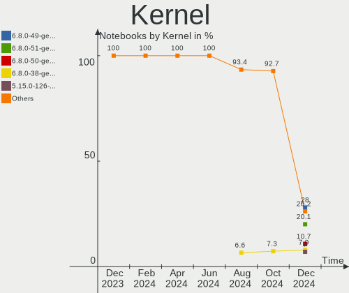
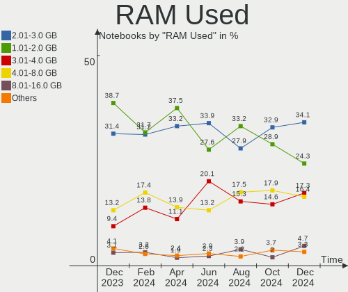
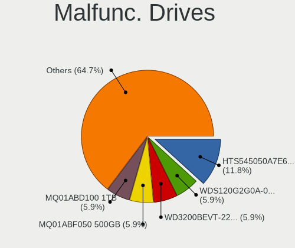
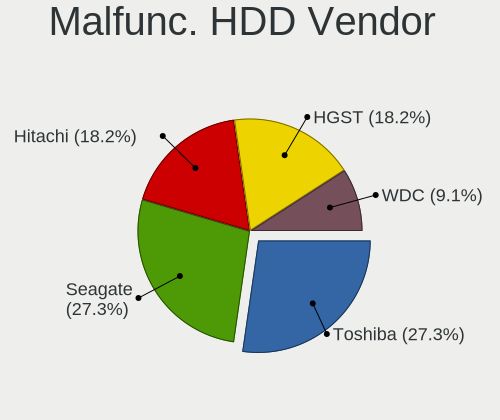
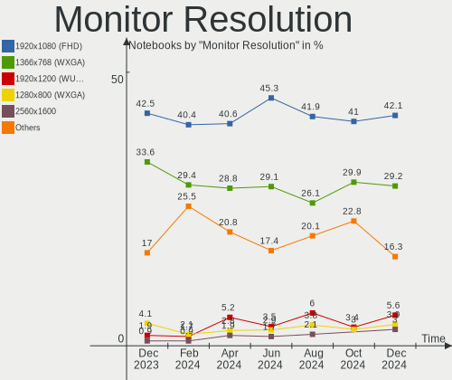
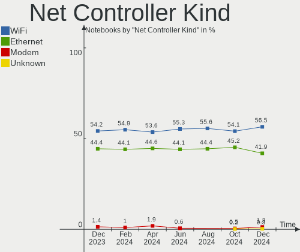
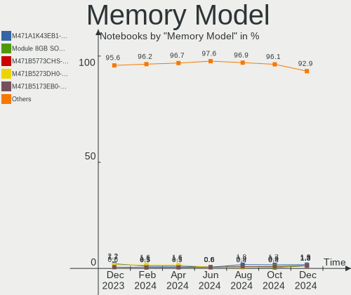

Linux Mint - Hardware Trends (Notebooks)
----------------------------------------

A project to identify most popular hardware characteristics and track their change
over time based on data collected by Linux users at https://Linux-Hardware.org.

Anyone can contribute to this report by the [hw-probe](https://github.com/linuxhw/hw-probe) tool:

    sudo -E hw-probe -all -upload

This report is for one last month. Overall report since the beginning of time: [TestCoverage](https://github.com/linuxhw/TestCoverage)

Period: Jul, 2022.

Contents
--------

* [ System ](#system)
  - [ OS                       ](#os)
  - [ OS Family                ](#os-family)
  - [ Kernel                   ](#kernel)
  - [ Kernel Family            ](#kernel-family)
  - [ Kernel Major Ver.        ](#kernel-major-ver)
  - [ Arch                     ](#arch)
  - [ DE                       ](#de)
  - [ Display Server           ](#display-server)
  - [ Display Manager          ](#display-manager)
  - [ OS Lang                  ](#os-lang)
  - [ Boot Mode                ](#boot-mode)
  - [ Filesystem               ](#filesystem)
  - [ Part. scheme             ](#part-scheme)
  - [ Dual Boot with Linux/BSD ](#dual-boot-with-linuxbsd)
  - [ Dual Boot (Win)          ](#dual-boot-win)

* [ Board ](#board)
  - [ Vendor                   ](#vendor)
  - [ Model                    ](#model)
  - [ Model Family             ](#model-family)
  - [ MFG Year                 ](#mfg-year)
  - [ Form Factor              ](#form-factor)
  - [ Secure Boot              ](#secure-boot)
  - [ Coreboot                 ](#coreboot)
  - [ RAM Size                 ](#ram-size)
  - [ RAM Used                 ](#ram-used)
  - [ Total Drives             ](#total-drives)
  - [ Has CD-ROM               ](#has-cd-rom)
  - [ Has Ethernet             ](#has-ethernet)
  - [ Has WiFi                 ](#has-wifi)
  - [ Has Bluetooth            ](#has-bluetooth)

* [ Location ](#location)
  - [ Country                  ](#country)
  - [ City                     ](#city)

* [ Drives ](#drives)
  - [ Drive Vendor             ](#drive-vendor)
  - [ Drive Model              ](#drive-model)
  - [ HDD Vendor               ](#hdd-vendor)
  - [ SSD Vendor               ](#ssd-vendor)
  - [ Drive Kind               ](#drive-kind)
  - [ Drive Connector          ](#drive-connector)
  - [ Drive Size               ](#drive-size)
  - [ Space Total              ](#space-total)
  - [ Space Used               ](#space-used)
  - [ Malfunc. Drives          ](#malfunc-drives)
  - [ Malfunc. Drive Vendor    ](#malfunc-drive-vendor)
  - [ Malfunc. HDD Vendor      ](#malfunc-hdd-vendor)
  - [ Malfunc. Drive Kind      ](#malfunc-drive-kind)
  - [ Failed Drives            ](#failed-drives)
  - [ Failed Drive Vendor      ](#failed-drive-vendor)
  - [ Drive Status             ](#drive-status)

* [ Storage controller ](#storage-controller)
  - [ Storage Vendor           ](#storage-vendor)
  - [ Storage Model            ](#storage-model)
  - [ Storage Kind             ](#storage-kind)

* [ Processor ](#processor)
  - [ CPU Vendor               ](#cpu-vendor)
  - [ CPU Model                ](#cpu-model)
  - [ CPU Model Family         ](#cpu-model-family)
  - [ CPU Cores                ](#cpu-cores)
  - [ CPU Sockets              ](#cpu-sockets)
  - [ CPU Threads              ](#cpu-threads)
  - [ CPU Op-Modes             ](#cpu-op-modes)
  - [ CPU Microcode            ](#cpu-microcode)
  - [ CPU Microarch            ](#cpu-microarch)

* [ Graphics ](#graphics)
  - [ GPU Vendor               ](#gpu-vendor)
  - [ GPU Model                ](#gpu-model)
  - [ GPU Combo                ](#gpu-combo)
  - [ GPU Driver               ](#gpu-driver)
  - [ GPU Memory               ](#gpu-memory)

* [ Monitor ](#monitor)
  - [ Monitor Vendor           ](#monitor-vendor)
  - [ Monitor Model            ](#monitor-model)
  - [ Monitor Resolution       ](#monitor-resolution)
  - [ Monitor Diagonal         ](#monitor-diagonal)
  - [ Monitor Width            ](#monitor-width)
  - [ Aspect Ratio             ](#aspect-ratio)
  - [ Monitor Area             ](#monitor-area)
  - [ Pixel Density            ](#pixel-density)
  - [ Multiple Monitors        ](#multiple-monitors)

* [ Network ](#network)
  - [ Net Controller Vendor    ](#net-controller-vendor)
  - [ Net Controller Model     ](#net-controller-model)
  - [ Wireless Vendor          ](#wireless-vendor)
  - [ Wireless Model           ](#wireless-model)
  - [ Ethernet Vendor          ](#ethernet-vendor)
  - [ Ethernet Model           ](#ethernet-model)
  - [ Net Controller Kind      ](#net-controller-kind)
  - [ Used Controller          ](#used-controller)
  - [ NICs                     ](#nics)
  - [ IPv6                     ](#ipv6)

* [ Bluetooth ](#bluetooth)
  - [ Bluetooth Vendor         ](#bluetooth-vendor)
  - [ Bluetooth Model          ](#bluetooth-model)

* [ Sound ](#sound)
  - [ Sound Vendor             ](#sound-vendor)
  - [ Sound Model              ](#sound-model)

* [ Memory ](#memory)
  - [ Memory Vendor            ](#memory-vendor)
  - [ Memory Model             ](#memory-model)
  - [ Memory Kind              ](#memory-kind)
  - [ Memory Form Factor       ](#memory-form-factor)
  - [ Memory Size              ](#memory-size)
  - [ Memory Speed             ](#memory-speed)

* [ Printers & scanners ](#printers--scanners)
  - [ Printer Vendor           ](#printer-vendor)
  - [ Printer Model            ](#printer-model)
  - [ Scanner Vendor           ](#scanner-vendor)
  - [ Scanner Model            ](#scanner-model)

* [ Camera ](#camera)
  - [ Camera Vendor            ](#camera-vendor)
  - [ Camera Model             ](#camera-model)

* [ Security ](#security)
  - [ Fingerprint Vendor       ](#fingerprint-vendor)
  - [ Fingerprint Model        ](#fingerprint-model)
  - [ Chipcard Vendor          ](#chipcard-vendor)
  - [ Chipcard Model           ](#chipcard-model)

* [ Unsupported ](#unsupported)
  - [ Unsupported Devices      ](#unsupported-devices)
  - [ Unsupported Device Types ](#unsupported-device-types)

System
------

OS
--

Installed operating systems

| Name            | Notebooks | Percent |
|-----------------|-----------|---------|
| Linux Mint 20.3 | 208       | 83.2%   |
| Linux Mint 20.2 | 13        | 5.2%    |
| Linux Mint 19.3 | 8         | 3.2%    |
| Linux Mint 21   | 6         | 2.4%    |
| Linux Mint 20.1 | 6         | 2.4%    |
| Linux Mint 20   | 5         | 2%      |
| Linux Mint 19.1 | 2         | 0.8%    |
| Linux Mint 19   | 2         | 0.8%    |

OS Family
---------

OS without a version

| Name       | Notebooks | Percent |
|------------|-----------|---------|
| Linux Mint | 250       | 100%    |

Kernel
------

Version of the Linux kernel

| Version                    | Notebooks | Percent |
|----------------------------|-----------|---------|
| 5.4.0-122-generic          | 99        | 39.6%   |
| 5.4.0-121-generic          | 57        | 22.8%   |
| 5.4.0-91-generic           | 18        | 7.2%    |
| 5.15.0-41-generic          | 18        | 7.2%    |
| 5.15.0-33-generic          | 8         | 3.2%    |
| 5.13.0-25-generic          | 4         | 1.6%    |
| 5.18.12-051812-generic     | 3         | 1.2%    |
| 5.14.0-1044-oem            | 3         | 1.2%    |
| 5.4.0-99-generic           | 2         | 0.8%    |
| 5.4.0-120-generic          | 2         | 0.8%    |
| 5.4.0-117-generic          | 2         | 0.8%    |
| 5.4.0-113-generic          | 2         | 0.8%    |
| 5.4.0-110-generic          | 2         | 0.8%    |
| 5.4.0-109-generic          | 2         | 0.8%    |
| 5.14.0-1045-oem            | 2         | 0.8%    |
| 5.14.0-1042-oem            | 2         | 0.8%    |
| 5.13.0-52-generic          | 2         | 0.8%    |
| 4.15.0-20-generic          | 2         | 0.8%    |
| 5.4.0-74-generic           | 1         | 0.4%    |
| 5.4.0-58-generic           | 1         | 0.4%    |
| 5.4.0-56-generic           | 1         | 0.4%    |
| 5.4.0-107-generic          | 1         | 0.4%    |
| 5.18.8-051808-generic      | 1         | 0.4%    |
| 5.18.11-051811-generic     | 1         | 0.4%    |
| 5.18.0-12.2-liquorix-amd64 | 1         | 0.4%    |
| 5.17.5-76051705-generic    | 1         | 0.4%    |
| 5.16.15-051615-generic     | 1         | 0.4%    |
| 5.15.0-43-generic          | 1         | 0.4%    |
| 5.15.0-42-lowlatency       | 1         | 0.4%    |
| 5.15.0-39-generic          | 1         | 0.4%    |
| 5.15.0-33-lowlatency       | 1         | 0.4%    |
| 5.13.0-48-generic          | 1         | 0.4%    |
| 5.13.0-44-generic          | 1         | 0.4%    |
| 5.13.0-27-generic          | 1         | 0.4%    |
| 5.13.0-21-generic          | 1         | 0.4%    |
| 5.0.0-32-generic           | 1         | 0.4%    |
| 4.15.0-34-generic          | 1         | 0.4%    |
| 4.15.0-189-generic         | 1         | 0.4%    |

Kernel Family
-------------

Linux kernel without a distro release

| Version | Notebooks | Percent |
|---------|-----------|---------|
| 5.4.0   | 190       | 76%     |
| 5.15.0  | 30        | 12%     |
| 5.13.0  | 10        | 4%      |
| 5.14.0  | 7         | 2.8%    |
| 4.15.0  | 4         | 1.6%    |
| 5.18.12 | 3         | 1.2%    |
| 5.18.8  | 1         | 0.4%    |
| 5.18.11 | 1         | 0.4%    |
| 5.18.0  | 1         | 0.4%    |
| 5.17.5  | 1         | 0.4%    |
| 5.16.15 | 1         | 0.4%    |
| 5.0.0   | 1         | 0.4%    |

Kernel Major Ver.
-----------------

Linux kernel major version

| Version | Notebooks | Percent |
|---------|-----------|---------|
| 5.4     | 190       | 76%     |
| 5.15    | 30        | 12%     |
| 5.13    | 10        | 4%      |
| 5.14    | 7         | 2.8%    |
| 5.18    | 6         | 2.4%    |
| 4.15    | 4         | 1.6%    |
| 5.17    | 1         | 0.4%    |
| 5.16    | 1         | 0.4%    |
| 5.0     | 1         | 0.4%    |

Arch
----

OS architecture (x86_64, i586, etc.)

| Name   | Notebooks | Percent |
|--------|-----------|---------|
| x86_64 | 248       | 99.2%   |
| i686   | 2         | 0.8%    |

DE
--

Desktop Environment

| Name       | Notebooks | Percent |
|------------|-----------|---------|
| X-Cinnamon | 157       | 62.8%   |
| XFCE       | 41        | 16.4%   |
| MATE       | 34        | 13.6%   |
| Cinnamon   | 12        | 4.8%    |
| GNOME      | 4         | 1.6%    |
| KDE5       | 1         | 0.4%    |
| KDE        | 1         | 0.4%    |

Display Server
--------------

X11 or Wayland

| Name    | Notebooks | Percent |
|---------|-----------|---------|
| X11     | 249       | 99.6%   |
| Wayland | 1         | 0.4%    |

Display Manager
---------------

SDDM, LightDM, etc.

| Name    | Notebooks | Percent |
|---------|-----------|---------|
| Unknown | 135       | 54%     |
| LightDM | 113       | 45.2%   |
| GDM     | 2         | 0.8%    |

OS Lang
-------

Language

| Lang  | Notebooks | Percent |
|-------|-----------|---------|
| en_US | 78        | 31.2%   |
| de_DE | 37        | 14.8%   |
| fr_FR | 23        | 9.2%    |
| pt_BR | 14        | 5.6%    |
| ru_RU | 11        | 4.4%    |
| C     | 11        | 4.4%    |
| es_ES | 7         | 2.8%    |
| en_GB | 7         | 2.8%    |
| it_IT | 6         | 2.4%    |
| en_CA | 5         | 2%      |
| en_AU | 5         | 2%      |
| pl_PL | 4         | 1.6%    |
| es_MX | 4         | 1.6%    |
| en_IN | 4         | 1.6%    |
| en_ZA | 3         | 1.2%    |
| zh_CN | 2         | 0.8%    |
| lv_LV | 2         | 0.8%    |
| fr_CA | 2         | 0.8%    |
| fi_FI | 2         | 0.8%    |
| el_GR | 2         | 0.8%    |
| de_CH | 2         | 0.8%    |
| cs_CZ | 2         | 0.8%    |
| tr_TR | 1         | 0.4%    |
| sr_RS | 1         | 0.4%    |
| ru_UA | 1         | 0.4%    |
| pt_PT | 1         | 0.4%    |
| nl_NL | 1         | 0.4%    |
| nl_BE | 1         | 0.4%    |
| nb_NO | 1         | 0.4%    |
| ja_JP | 1         | 0.4%    |
| id_ID | 1         | 0.4%    |
| hu_HU | 1         | 0.4%    |
| hr_HR | 1         | 0.4%    |
| fr_LU | 1         | 0.4%    |
| fr_CH | 1         | 0.4%    |
| es_EC | 1         | 0.4%    |
| en_ZM | 1         | 0.4%    |
| da_DK | 1         | 0.4%    |
| ca_ES | 1         | 0.4%    |

Boot Mode
---------

EFI or BIOS

| Mode | Notebooks | Percent |
|------|-----------|---------|
| EFI  | 158       | 63.2%   |
| BIOS | 92        | 36.8%   |

Filesystem
----------

Type of filesystem

| Type    | Notebooks | Percent |
|---------|-----------|---------|
| Ext4    | 236       | 94.4%   |
| Overlay | 9         | 3.6%    |
| Btrfs   | 5         | 2%      |

Part. scheme
------------

Scheme of partitioning

| Type    | Notebooks | Percent |
|---------|-----------|---------|
| Unknown | 142       | 56.8%   |
| GPT     | 83        | 33.2%   |
| MBR     | 25        | 10%     |

Dual Boot with Linux/BSD
------------------------

Hosting more than one Linux/BSD

| Dual boot | Notebooks | Percent |
|-----------|-----------|---------|
| No        | 240       | 96%     |
| Yes       | 10        | 4%      |

Dual Boot (Win)
---------------

Hosting Linux and Windows

| Dual boot | Notebooks | Percent |
|-----------|-----------|---------|
| No        | 199       | 79.6%   |
| Yes       | 51        | 20.4%   |

Board
-----

Vendor
------

Motherboard manufacturer

| Name                | Notebooks | Percent |
|---------------------|-----------|---------|
| Hewlett-Packard     | 53        | 21.2%   |
| Lenovo              | 43        | 17.2%   |
| Dell                | 38        | 15.2%   |
| Acer                | 27        | 10.8%   |
| ASUSTek Computer    | 20        | 8%      |
| MSI                 | 7         | 2.8%    |
| Apple               | 7         | 2.8%    |
| Sony                | 5         | 2%      |
| Samsung Electronics | 5         | 2%      |
| Toshiba             | 4         | 1.6%    |
| Unknown             | 4         | 1.6%    |
| Panasonic           | 3         | 1.2%    |
| Notebook            | 3         | 1.2%    |
| Google              | 3         | 1.2%    |
| Thomson             | 2         | 0.8%    |
| Positivo            | 2         | 0.8%    |
| Intel               | 2         | 0.8%    |
| HUAWEI              | 2         | 0.8%    |
| Fujitsu             | 2         | 0.8%    |
| Wortmann AG         | 1         | 0.4%    |
| TrekStor            | 1         | 0.4%    |
| TPVAOC              | 1         | 0.4%    |
| Timi                | 1         | 0.4%    |
| Prestigio           | 1         | 0.4%    |
| Packard Bell        | 1         | 0.4%    |
| NSX                 | 1         | 0.4%    |
| GPU Company         | 1         | 0.4%    |
| Fujitsu Siemens     | 1         | 0.4%    |
| eMachines           | 1         | 0.4%    |
| Digma               | 1         | 0.4%    |
| Daten Tecnologia    | 1         | 0.4%    |
| Coradir             | 1         | 0.4%    |
| Chuwi               | 1         | 0.4%    |
| AVERATEC            | 1         | 0.4%    |
| ARCELIK             | 1         | 0.4%    |
| AMI                 | 1         | 0.4%    |
| Alienware           | 1         | 0.4%    |

Model
-----

Motherboard model

| Name                                              | Notebooks | Percent |
|---------------------------------------------------|-----------|---------|
| Unknown                                           | 4         | 1.6%    |
| HP Laptop 17-cp0xxx                               | 3         | 1.2%    |
| Lenovo IdeaPad 120S-11IAP 81A4                    | 2         | 0.8%    |
| HP ProBook 4530s                                  | 2         | 0.8%    |
| Dell Latitude E6540                               | 2         | 0.8%    |
| Apple MacBookAir6,2                               | 2         | 0.8%    |
| Acer Aspire R3-131T                               | 2         | 0.8%    |
| Wortmann AG CR700                                 | 1         | 0.4%    |
| TrekStor Primebook P14                            | 1         | 0.4%    |
| TPVAOC AA183M                                     | 1         | 0.4%    |
| Toshiba Satellite U920T                           | 1         | 0.4%    |
| Toshiba Satellite Pro C660                        | 1         | 0.4%    |
| Toshiba Satellite L55-B                           | 1         | 0.4%    |
| Toshiba Satellite C660                            | 1         | 0.4%    |
| Timi RedmiBook 16                                 | 1         | 0.4%    |
| Thomson N17V3C8WH512                              | 1         | 0.4%    |
| Thomson N17CSL512                                 | 1         | 0.4%    |
| Sony VPCEB3L1E                                    | 1         | 0.4%    |
| Sony VGN-NW270F                                   | 1         | 0.4%    |
| Sony VGN-FS415B                                   | 1         | 0.4%    |
| Sony SVF15318SNB                                  | 1         | 0.4%    |
| Sony SVE1511Y1ESI                                 | 1         | 0.4%    |
| Samsung RV420/RV520/RV720/E3530/S3530/E3420/E3520 | 1         | 0.4%    |
| Samsung Q430/Q530                                 | 1         | 0.4%    |
| Samsung 905S3G/906S3G/915S3G/9305SG               | 1         | 0.4%    |
| Samsung 750XDA                                    | 1         | 0.4%    |
| Samsung 300E5M/300E5L                             | 1         | 0.4%    |
| Prestigio Multipad Visconte V                     | 1         | 0.4%    |
| Positivo S14CT01                                  | 1         | 0.4%    |
| Positivo Mobile                                   | 1         | 0.4%    |
| Panasonic FZ55-2                                  | 1         | 0.4%    |
| Panasonic CF-S10EYADR                             | 1         | 0.4%    |
| Panasonic CF-53JAWZYDE                            | 1         | 0.4%    |
| Packard Bell EasyNote_MX52-B-122GE                | 1         | 0.4%    |
| NSX SB142G                                        | 1         | 0.4%    |
| Notebook P7xxDM(-G)                               | 1         | 0.4%    |
| Notebook NL4x_NL5xLU                              | 1         | 0.4%    |
| Notebook N150ZU                                   | 1         | 0.4%    |
| MSI Raider GE76 12UGS                             | 1         | 0.4%    |
| MSI Prestige 14 A10SC                             | 1         | 0.4%    |
| MSI Katana GF66 12UD                              | 1         | 0.4%    |
| MSI GT72S 6QE                                     | 1         | 0.4%    |
| MSI GS40 6QE Phantom                              | 1         | 0.4%    |
| MSI GP60 2QE                                      | 1         | 0.4%    |
| MSI GF63 Thin 11UC                                | 1         | 0.4%    |
| Lenovo Yoga 500-15IBD 80N6                        | 1         | 0.4%    |
| Lenovo V470 HuronRiver Platform                   | 1         | 0.4%    |
| Lenovo V145-15AST 81MT                            | 1         | 0.4%    |
| Lenovo ThinkPad X250 20CLA1VECD                   | 1         | 0.4%    |
| Lenovo ThinkPad X220 4291W3B                      | 1         | 0.4%    |
| Lenovo ThinkPad W550s 20E2000PUK                  | 1         | 0.4%    |
| Lenovo ThinkPad W520 4284D47                      | 1         | 0.4%    |
| Lenovo ThinkPad T530 2392ARU                      | 1         | 0.4%    |
| Lenovo ThinkPad T470 20HES0MV00                   | 1         | 0.4%    |
| Lenovo ThinkPad T450 20BUS04A0B                   | 1         | 0.4%    |
| Lenovo ThinkPad T430 23501F9                      | 1         | 0.4%    |
| Lenovo ThinkPad T430 2342CTO                      | 1         | 0.4%    |
| Lenovo ThinkPad T410 2537W2L                      | 1         | 0.4%    |
| Lenovo ThinkPad T410 25379UG                      | 1         | 0.4%    |
| Lenovo ThinkPad T14s Gen 2a 20XF006JGE            | 1         | 0.4%    |

Model Family
------------

Motherboard model prefix

| Name                   | Notebooks | Percent |
|------------------------|-----------|---------|
| Dell Latitude          | 20        | 8%      |
| Acer Aspire            | 20        | 8%      |
| Lenovo ThinkPad        | 18        | 7.2%    |
| Dell Inspiron          | 13        | 5.2%    |
| HP Laptop              | 10        | 4%      |
| Lenovo IdeaPad         | 9         | 3.6%    |
| HP Pavilion            | 9         | 3.6%    |
| HP EliteBook           | 8         | 3.2%    |
| HP ProBook             | 7         | 2.8%    |
| ASUS VivoBook          | 5         | 2%      |
| Toshiba Satellite      | 4         | 1.6%    |
| Unknown                | 4         | 1.6%    |
| Lenovo ThinkBook       | 3         | 1.2%    |
| HP ZBook               | 3         | 1.2%    |
| HP Compaq              | 3         | 1.2%    |
| HP 250                 | 3         | 1.2%    |
| HP OMEN                | 2         | 0.8%    |
| HP 255                 | 2         | 0.8%    |
| Fujitsu LIFEBOOK       | 2         | 0.8%    |
| Apple MacBookAir6      | 2         | 0.8%    |
| Acer Nitro             | 2         | 0.8%    |
| Wortmann AG CR700      | 1         | 0.4%    |
| TrekStor Primebook     | 1         | 0.4%    |
| TPVAOC AA183M          | 1         | 0.4%    |
| Timi RedmiBook         | 1         | 0.4%    |
| Thomson N17V3C8WH512   | 1         | 0.4%    |
| Thomson N17CSL512      | 1         | 0.4%    |
| Sony VPCEB3L1E         | 1         | 0.4%    |
| Sony VGN-NW270F        | 1         | 0.4%    |
| Sony VGN-FS415B        | 1         | 0.4%    |
| Sony SVF15318SNB       | 1         | 0.4%    |
| Sony SVE1511Y1ESI      | 1         | 0.4%    |
| Samsung RV420          | 1         | 0.4%    |
| Samsung Q430           | 1         | 0.4%    |
| Samsung 905S3G         | 1         | 0.4%    |
| Samsung 750XDA         | 1         | 0.4%    |
| Samsung 300E5M         | 1         | 0.4%    |
| Prestigio Multipad     | 1         | 0.4%    |
| Positivo S14CT01       | 1         | 0.4%    |
| Positivo Mobile        | 1         | 0.4%    |
| Panasonic FZ55-2       | 1         | 0.4%    |
| Panasonic CF-S10EYADR  | 1         | 0.4%    |
| Panasonic CF-53JAWZYDE | 1         | 0.4%    |
| Packard Bell EasyNote  | 1         | 0.4%    |
| NSX SB142G             | 1         | 0.4%    |
| Notebook P7xxDM(-G)    | 1         | 0.4%    |
| Notebook NL4x          | 1         | 0.4%    |
| Notebook N150ZU        | 1         | 0.4%    |
| MSI Raider             | 1         | 0.4%    |
| MSI Prestige           | 1         | 0.4%    |
| MSI Katana             | 1         | 0.4%    |
| MSI GT72S              | 1         | 0.4%    |
| MSI GS40               | 1         | 0.4%    |
| MSI GP60               | 1         | 0.4%    |
| MSI GF63               | 1         | 0.4%    |
| Lenovo Yoga            | 1         | 0.4%    |
| Lenovo V470            | 1         | 0.4%    |
| Lenovo V145-15AST      | 1         | 0.4%    |
| Lenovo G700            | 1         | 0.4%    |
| Lenovo G570            | 1         | 0.4%    |

MFG Year
--------

Motherboard manufacture year

| Year | Notebooks | Percent |
|------|-----------|---------|
| 2021 | 33        | 13.2%   |
| 2012 | 22        | 8.8%    |
| 2013 | 21        | 8.4%    |
| 2011 | 21        | 8.4%    |
| 2019 | 18        | 7.2%    |
| 2018 | 18        | 7.2%    |
| 2017 | 17        | 6.8%    |
| 2015 | 15        | 6%      |
| 2014 | 15        | 6%      |
| 2009 | 13        | 5.2%    |
| 2020 | 12        | 4.8%    |
| 2008 | 12        | 4.8%    |
| 2022 | 11        | 4.4%    |
| 2010 | 9         | 3.6%    |
| 2016 | 8         | 3.2%    |
| 2007 | 3         | 1.2%    |
| 2006 | 2         | 0.8%    |

Form Factor
-----------

Physical design of the computer

| Name     | Notebooks | Percent |
|----------|-----------|---------|
| Notebook | 250       | 100%    |

Secure Boot
-----------

Enabled or disabled

| State    | Notebooks | Percent |
|----------|-----------|---------|
| Disabled | 221       | 88.4%   |
| Enabled  | 29        | 11.6%   |

Coreboot
--------

Have coreboot on board

| Used | Notebooks | Percent |
|------|-----------|---------|
| No   | 246       | 98.4%   |
| Yes  | 4         | 1.6%    |

RAM Size
--------

Total RAM memory

| Size in GB  | Notebooks | Percent |
|-------------|-----------|---------|
| 4.01-8.0    | 77        | 30.8%   |
| 3.01-4.0    | 68        | 27.2%   |
| 8.01-16.0   | 47        | 18.8%   |
| 16.01-24.0  | 24        | 9.6%    |
| 1.01-2.0    | 16        | 6.4%    |
| 32.01-64.0  | 12        | 4.8%    |
| 2.01-3.0    | 4         | 1.6%    |
| 24.01-32.0  | 1         | 0.4%    |
| 64.01-256.0 | 1         | 0.4%    |

RAM Used
--------

Used RAM memory

| Used GB    | Notebooks | Percent |
|------------|-----------|---------|
| 1.01-2.0   | 113       | 45.2%   |
| 2.01-3.0   | 62        | 24.8%   |
| 3.01-4.0   | 31        | 12.4%   |
| 4.01-8.0   | 22        | 8.8%    |
| 0.51-1.0   | 14        | 5.6%    |
| 8.01-16.0  | 7         | 2.8%    |
| 16.01-24.0 | 1         | 0.4%    |

Total Drives
------------

Number of drives on board

| Drives | Notebooks | Percent |
|--------|-----------|---------|
| 1      | 173       | 69.2%   |
| 2      | 65        | 26%     |
| 3      | 9         | 3.6%    |
| 4      | 2         | 0.8%    |
| 0      | 1         | 0.4%    |

Has CD-ROM
----------

Has CD-ROM on board

| Presented | Notebooks | Percent |
|-----------|-----------|---------|
| No        | 150       | 60%     |
| Yes       | 100       | 40%     |

Has Ethernet
------------

Has Ethernet on board

| Presented | Notebooks | Percent |
|-----------|-----------|---------|
| Yes       | 197       | 78.8%   |
| No        | 53        | 21.2%   |

Has WiFi
--------

Has WiFi module

| Presented | Notebooks | Percent |
|-----------|-----------|---------|
| Yes       | 242       | 96.8%   |
| No        | 8         | 3.2%    |

Has Bluetooth
-------------

Has Bluetooth module

| Presented | Notebooks | Percent |
|-----------|-----------|---------|
| Yes       | 168       | 67.2%   |
| No        | 82        | 32.8%   |

Location
--------

Country
-------

Geographic location (country)

| Country      | Notebooks | Percent |
|--------------|-----------|---------|
| Germany      | 40        | 16%     |
| USA          | 39        | 15.6%   |
| France       | 31        | 12.4%   |
| Brazil       | 18        | 7.2%    |
| Russia       | 14        | 5.6%    |
| Spain        | 7         | 2.8%    |
| Italy        | 7         | 2.8%    |
| Canada       | 7         | 2.8%    |
| UK           | 6         | 2.4%    |
| Switzerland  | 6         | 2.4%    |
| Poland       | 5         | 2%      |
| Mexico       | 5         | 2%      |
| Australia    | 5         | 2%      |
| India        | 4         | 1.6%    |
| South Africa | 3         | 1.2%    |
| Romania      | 3         | 1.2%    |
| Indonesia    | 3         | 1.2%    |
| Greece       | 3         | 1.2%    |
| Czechia      | 3         | 1.2%    |
| Yemen        | 2         | 0.8%    |
| Ukraine      | 2         | 0.8%    |
| Turkey       | 2         | 0.8%    |
| Serbia       | 2         | 0.8%    |
| Paraguay     | 2         | 0.8%    |
| Luxembourg   | 2         | 0.8%    |
| Latvia       | 2         | 0.8%    |
| Finland      | 2         | 0.8%    |
| Belgium      | 2         | 0.8%    |
| Argentina    | 2         | 0.8%    |
| Zambia       | 1         | 0.4%    |
| Uzbekistan   | 1         | 0.4%    |
| Thailand     | 1         | 0.4%    |
| Sweden       | 1         | 0.4%    |
| Sri Lanka    | 1         | 0.4%    |
| Slovakia     | 1         | 0.4%    |
| Puerto Rico  | 1         | 0.4%    |
| Portugal     | 1         | 0.4%    |
| Pakistan     | 1         | 0.4%    |
| Norway       | 1         | 0.4%    |
| Netherlands  | 1         | 0.4%    |
| Nepal        | 1         | 0.4%    |
| Japan        | 1         | 0.4%    |
| Hong Kong    | 1         | 0.4%    |
| Guatemala    | 1         | 0.4%    |
| Ecuador      | 1         | 0.4%    |
| Denmark      | 1         | 0.4%    |
| Croatia      | 1         | 0.4%    |
| China        | 1         | 0.4%    |
| Brunei       | 1         | 0.4%    |
| Bangladesh   | 1         | 0.4%    |

City
----

Geographic location (city)

| City                | Notebooks | Percent |
|---------------------|-----------|---------|
| Moscow              | 7         | 2.8%    |
| Paris               | 4         | 1.6%    |
| St Petersburg       | 3         | 1.2%    |
| Berlin              | 3         | 1.2%    |
| Turin               | 2         | 0.8%    |
| Sanaa               | 2         | 0.8%    |
| Reston              | 2         | 0.8%    |
| Recife              | 2         | 0.8%    |
| Racibórz           | 2         | 0.8%    |
| Prague              | 2         | 0.8%    |
| Milan               | 2         | 0.8%    |
| Mexico City         | 2         | 0.8%    |
| Luxembourg          | 2         | 0.8%    |
| Istanbul            | 2         | 0.8%    |
| Hamburg             | 2         | 0.8%    |
| Compania Santa Rita | 2         | 0.8%    |
| Chennai             | 2         | 0.8%    |
| Bucharest           | 2         | 0.8%    |
| Brisbane            | 2         | 0.8%    |
| Barcelona           | 2         | 0.8%    |
| Atlanta             | 2         | 0.8%    |
| Zurich              | 1         | 0.4%    |
| Yevpatoriya         | 1         | 0.4%    |
| Woodway             | 1         | 0.4%    |
| Wittenbach          | 1         | 0.4%    |
| Winterberg          | 1         | 0.4%    |
| Windeck             | 1         | 0.4%    |
| Willesden           | 1         | 0.4%    |
| Wilhelmshaven       | 1         | 0.4%    |
| Wetteren            | 1         | 0.4%    |
| Wesley Chapel       | 1         | 0.4%    |
| Wentworthville      | 1         | 0.4%    |
| Warsaw              | 1         | 0.4%    |
| Waldkirchen         | 1         | 0.4%    |
| Waldfeucht          | 1         | 0.4%    |
| Vlaardingen         | 1         | 0.4%    |
| Veracruz            | 1         | 0.4%    |
| Várzea Grande      | 1         | 0.4%    |
| Vantaa              | 1         | 0.4%    |
| Usingen             | 1         | 0.4%    |
| Ugine               | 1         | 0.4%    |
| Třebíč           | 1         | 0.4%    |
| Tracy               | 1         | 0.4%    |
| Timișoara          | 1         | 0.4%    |
| Thessaloniki        | 1         | 0.4%    |
| Tempe               | 1         | 0.4%    |
| Tashkent            | 1         | 0.4%    |
| Tampa               | 1         | 0.4%    |
| Sydney              | 1         | 0.4%    |
| Summersville        | 1         | 0.4%    |
| Strengelbach        | 1         | 0.4%    |
| Stains              | 1         | 0.4%    |
| Springfield         | 1         | 0.4%    |
| Southampton         | 1         | 0.4%    |
| Smithfield          | 1         | 0.4%    |
| Skoppum             | 1         | 0.4%    |
| Sisteron            | 1         | 0.4%    |
| Sion                | 1         | 0.4%    |
| Shushary            | 1         | 0.4%    |
| Sergiyev Posad      | 1         | 0.4%    |

Drives
------

Drive Vendor
------------

Hard drive vendors

| Vendor              | Notebooks | Drives | Percent |
|---------------------|-----------|--------|---------|
| WDC                 | 40        | 41     | 13.11%  |
| Samsung Electronics | 35        | 42     | 11.48%  |
| Seagate             | 28        | 30     | 9.18%   |
| Kingston            | 24        | 25     | 7.87%   |
| Toshiba             | 23        | 24     | 7.54%   |
| Unknown             | 22        | 26     | 7.21%   |
| SanDisk             | 19        | 19     | 6.23%   |
| HGST                | 12        | 12     | 3.93%   |
| Crucial             | 12        | 13     | 3.93%   |
| SK hynix            | 8         | 8      | 2.62%   |
| Hitachi             | 8         | 9      | 2.62%   |
| Micron Technology   | 6         | 6      | 1.97%   |
| LITEON              | 6         | 6      | 1.97%   |
| Apple               | 6         | 9      | 1.97%   |
| Intel               | 5         | 5      | 1.64%   |
| OCZ                 | 4         | 4      | 1.31%   |
| KIOXIA              | 4         | 4      | 1.31%   |
| A-DATA Technology   | 4         | 5      | 1.31%   |
| PNY                 | 3         | 3      | 0.98%   |
| Intenso             | 3         | 3      | 0.98%   |
| China               | 3         | 3      | 0.98%   |
| Unknown             | 3         | 3      | 0.98%   |
| LS                  | 2         | 2      | 0.66%   |
| LITEONIT            | 2         | 2      | 0.66%   |
| Kingchuxing         | 2         | 2      | 0.66%   |
| XPG                 | 1         | 1      | 0.33%   |
| TrekStor            | 1         | 1      | 0.33%   |
| TO Exter            | 1         | 1      | 0.33%   |
| Timetec             | 1         | 1      | 0.33%   |
| SSSTC               | 1         | 1      | 0.33%   |
| ShiJi               | 1         | 1      | 0.33%   |
| SAGE                | 1         | 1      | 0.33%   |
| Plextor             | 1         | 1      | 0.33%   |
| Phison              | 1         | 1      | 0.33%   |
| N600                | 1         | 1      | 0.33%   |
| Mushkin             | 1         | 1      | 0.33%   |
| Lite-On             | 1         | 1      | 0.33%   |
| LDLC                | 1         | 2      | 0.33%   |
| KingSpec            | 1         | 1      | 0.33%   |
| Kingsand            | 1         | 1      | 0.33%   |
| Hrdtac              | 1         | 1      | 0.33%   |
| GOODRAM             | 1         | 1      | 0.33%   |
| Gigabyte Technology | 1         | 1      | 0.33%   |
| EAGET               | 1         | 1      | 0.33%   |
| Dogfish             | 1         | 1      | 0.33%   |
| ASMedia             | 1         | 1      | 0.33%   |

Drive Model
-----------

Hard drive models

| Model                              | Notebooks | Percent |
|------------------------------------|-----------|---------|
| Unknown MMC Card  32GB             | 6         | 1.86%   |
| Toshiba MQ04ABF100 1TB             | 6         | 1.86%   |
| SanDisk NVMe SSD Drive 256GB       | 5         | 1.55%   |
| Kingston SA400S37480G 480GB SSD    | 5         | 1.55%   |
| HGST HTS721010A9E630 1TB           | 5         | 1.55%   |
| Seagate ST500LT012-1DG142 500GB    | 4         | 1.24%   |
| Seagate Expansion 1TB              | 4         | 1.24%   |
| Kingston SA400S37240G 240GB SSD    | 4         | 1.24%   |
| Toshiba MQ01ABF050 500GB           | 3         | 0.93%   |
| Toshiba MQ01ABD100 1TB             | 3         | 0.93%   |
| Seagate ST1000LM035-1RK172 1TB     | 3         | 0.93%   |
| Seagate ST1000LM024 HN-M101MBB 1TB | 3         | 0.93%   |
| Samsung SSD 870 QVO 1TB            | 3         | 0.93%   |
| Samsung NVMe SSD Drive 1024GB      | 3         | 0.93%   |
| Kingston SV300S37A120G 120GB SSD   | 3         | 0.93%   |
| Crucial CT1000MX500SSD1 1TB        | 3         | 0.93%   |
| Unknown                            | 3         | 0.93%   |
| WDC WDS240G2G0A-00JH30 240GB SSD   | 2         | 0.62%   |
| WDC WD3200BEVT-60ZCT1 320GB        | 2         | 0.62%   |
| WDC WD10SPZX-75Z10T2 1TB           | 2         | 0.62%   |
| Unknown MMC Card  7GB              | 2         | 0.62%   |
| Unknown MMC Card  64GB             | 2         | 0.62%   |
| Unknown MMC Card  128GB            | 2         | 0.62%   |
| Toshiba MQ01ACF050 500GB           | 2         | 0.62%   |
| SK hynix HCG8e  64GB               | 2         | 0.62%   |
| PNY CS900 240GB SSD                | 2         | 0.62%   |
| LS 256GB M300 SSD                  | 2         | 0.62%   |
| Intenso SSD SATAIII 512GB          | 2         | 0.62%   |
| HGST HTS725050A7E630 500GB         | 2         | 0.62%   |
| Crucial CT500MX500SSD1 500GB       | 2         | 0.62%   |
| Crucial CT250MX500SSD1 250GB       | 2         | 0.62%   |
| China SATA SSD 120GB               | 2         | 0.62%   |
| Apple SSD SD0256F 256GB            | 2         | 0.62%   |
| XPG NVMe SSD Drive 512GB           | 1         | 0.31%   |
| WDC WDS500G3X0C-00SJG0 500GB       | 1         | 0.31%   |
| WDC WDS500G2B0C-00PXH0 500GB       | 1         | 0.31%   |
| WDC WDS500G2B0B-00YS70 500GB SSD   | 1         | 0.31%   |
| WDC WDS500G2B0A 500GB SSD          | 1         | 0.31%   |
| WDC WDS256G1X0C-00ENX0 256GB       | 1         | 0.31%   |
| WDC WDS250G2B0A 250GB SSD          | 1         | 0.31%   |
| WDC WDBNCE0010PNC 1TB SSD          | 1         | 0.31%   |
| WDC WD7500BPVT-22HXZT1 752GB       | 1         | 0.31%   |
| WDC WD5000LPVX-60V0TT0 500GB       | 1         | 0.31%   |
| WDC WD5000LPVX-22V0TT0 500GB       | 1         | 0.31%   |
| WDC WD5000LPLX-00ZNTT0 500GB       | 1         | 0.31%   |
| WDC WD5000LPCX-24C6HT0 500GB       | 1         | 0.31%   |
| WDC WD5000BPVT-00HXZT3 500GB       | 1         | 0.31%   |
| WDC WD5000BPVT-00HXZT1 500GB       | 1         | 0.31%   |
| WDC WD5000BPKT-22PK4T0 500GB       | 1         | 0.31%   |
| WDC WD5000BEVT-22ZAT0 500GB        | 1         | 0.31%   |
| WDC WD3200BEVT-75ZCT2 320GB        | 1         | 0.31%   |
| WDC WD3200BEVT-22ZCT0 320GB        | 1         | 0.31%   |
| WDC WD2500BEVT-24A23T0 250GB       | 1         | 0.31%   |
| WDC WD2500BEVT-22ZCT0 250GB        | 1         | 0.31%   |
| WDC WD2500BEVT-22A23T0 250GB       | 1         | 0.31%   |
| WDC WD1200BEVS-07LAT0 120GB        | 1         | 0.31%   |
| WDC WD10TPVT-00U4RT1 1TB           | 1         | 0.31%   |
| WDC WD10SPZX-80Z10T0 1TB           | 1         | 0.31%   |
| WDC WD10SPZX-60Z10T0 1TB           | 1         | 0.31%   |
| WDC WD10SPZX-24Z10 1TB             | 1         | 0.31%   |

HDD Vendor
----------

Hard disk drive vendors

| Vendor              | Notebooks | Drives | Percent |
|---------------------|-----------|--------|---------|
| WDC                 | 28        | 28     | 28.28%  |
| Seagate             | 25        | 27     | 25.25%  |
| Toshiba             | 19        | 19     | 19.19%  |
| HGST                | 12        | 12     | 12.12%  |
| Hitachi             | 8         | 9      | 8.08%   |
| Samsung Electronics | 2         | 2      | 2.02%   |
| Apple               | 2         | 2      | 2.02%   |
| Unknown             | 1         | 1      | 1.01%   |
| SAGE                | 1         | 1      | 1.01%   |
| ASMedia             | 1         | 1      | 1.01%   |

SSD Vendor
----------

Solid state drive vendors

| Vendor              | Notebooks | Drives | Percent |
|---------------------|-----------|--------|---------|
| Samsung Electronics | 20        | 22     | 17.24%  |
| Kingston            | 19        | 19     | 16.38%  |
| Crucial             | 12        | 13     | 10.34%  |
| SanDisk             | 11        | 11     | 9.48%   |
| WDC                 | 6         | 6      | 5.17%   |
| LITEON              | 6         | 6      | 5.17%   |
| OCZ                 | 4         | 4      | 3.45%   |
| Intenso             | 3         | 3      | 2.59%   |
| Intel               | 3         | 3      | 2.59%   |
| China               | 3         | 3      | 2.59%   |
| A-DATA Technology   | 3         | 3      | 2.59%   |
| Seagate             | 2         | 2      | 1.72%   |
| PNY                 | 2         | 2      | 1.72%   |
| Micron Technology   | 2         | 2      | 1.72%   |
| LS                  | 2         | 2      | 1.72%   |
| LITEONIT            | 2         | 2      | 1.72%   |
| Apple               | 2         | 2      | 1.72%   |
| Unknown             | 2         | 2      | 1.72%   |
| TrekStor            | 1         | 1      | 0.86%   |
| TO Exter            | 1         | 1      | 0.86%   |
| Timetec             | 1         | 1      | 0.86%   |
| Plextor             | 1         | 1      | 0.86%   |
| N600                | 1         | 1      | 0.86%   |
| Mushkin             | 1         | 1      | 0.86%   |
| LDLC                | 1         | 2      | 0.86%   |
| KingSpec            | 1         | 1      | 0.86%   |
| GOODRAM             | 1         | 1      | 0.86%   |
| Gigabyte Technology | 1         | 1      | 0.86%   |
| EAGET               | 1         | 1      | 0.86%   |
| Dogfish             | 1         | 1      | 0.86%   |

Drive Kind
----------

HDD or SSD

| Kind    | Notebooks | Drives | Percent |
|---------|-----------|--------|---------|
| SSD     | 112       | 120    | 37.09%  |
| HDD     | 97        | 102    | 32.12%  |
| NVMe    | 64        | 71     | 21.19%  |
| MMC     | 25        | 30     | 8.28%   |
| Unknown | 4         | 5      | 1.32%   |

Drive Connector
---------------

SATA, SAS, NVMe, etc.

| Type | Notebooks | Drives | Percent |
|------|-----------|--------|---------|
| SATA | 186       | 215    | 64.81%  |
| NVMe | 64        | 71     | 22.3%   |
| MMC  | 25        | 30     | 8.71%   |
| SAS  | 12        | 12     | 4.18%   |

Drive Size
----------

Size of hard drive

| Size in TB | Notebooks | Drives | Percent |
|------------|-----------|--------|---------|
| 0.01-0.5   | 130       | 141    | 62.8%   |
| 0.51-1.0   | 72        | 75     | 34.78%  |
| 1.01-2.0   | 4         | 5      | 1.93%   |
| 3.01-4.0   | 1         | 1      | 0.48%   |

Space Total
-----------

Amount of disk space available on the file system

| Size in GB     | Notebooks | Percent |
|----------------|-----------|---------|
| 101-250        | 87        | 34.8%   |
| 251-500        | 61        | 24.4%   |
| 501-1000       | 33        | 13.2%   |
| 1001-2000      | 19        | 7.6%    |
| 51-100         | 19        | 7.6%    |
| 21-50          | 11        | 4.4%    |
| 1-20           | 10        | 4%      |
| 2001-3000      | 6         | 2.4%    |
| More than 3000 | 4         | 1.6%    |

Space Used
----------

Amount of used disk space

| Used GB        | Notebooks | Percent |
|----------------|-----------|---------|
| 1-20           | 76        | 30.4%   |
| 21-50          | 55        | 22%     |
| 101-250        | 41        | 16.4%   |
| 51-100         | 41        | 16.4%   |
| 251-500        | 18        | 7.2%    |
| 501-1000       | 13        | 5.2%    |
| 1001-2000      | 4         | 1.6%    |
| More than 3000 | 1         | 0.4%    |
| 2001-3000      | 1         | 0.4%    |

Malfunc. Drives
---------------

Drive models with a malfunction

| Model                                 | Notebooks | Drives | Percent |
|---------------------------------------|-----------|--------|---------|
| HGST HTS721010A9E630 1TB              | 2         | 2      | 11.11%  |
| WDC WD5000BEVT-22ZAT0 500GB           | 1         | 1      | 5.56%   |
| Toshiba MK2555GSX 250GB               | 1         | 1      | 5.56%   |
| Seagate ST750LM022 HN-M750MBB 752GB   | 1         | 1      | 5.56%   |
| Seagate ST500LT012-1DG142 500GB       | 1         | 1      | 5.56%   |
| Seagate ST320LT007-9ZV142 320GB       | 1         | 1      | 5.56%   |
| Seagate ST2000LM015-2E8174 2TB        | 1         | 2      | 5.56%   |
| Seagate ST1000LM035-1RK172 1TB        | 1         | 1      | 5.56%   |
| Samsung Electronics SSD 960 EVO 500GB | 1         | 1      | 5.56%   |
| OCZ VERTEX4 256GB SSD                 | 1         | 1      | 5.56%   |
| LITEON CV8-8E128-HP 128GB SSD         | 1         | 1      | 5.56%   |
| Kingston SV300S37A120G 120GB SSD      | 1         | 1      | 5.56%   |
| Kingston SNS4151S316G 16GB SSD        | 1         | 1      | 5.56%   |
| Kingston RBUSC180DS37128GH 128GB SSD  | 1         | 1      | 5.56%   |
| Hitachi HTS725032A9A364 320GB         | 1         | 1      | 5.56%   |
| HGST HTS545050A7E680 500GB            | 1         | 1      | 5.56%   |
| Crucial CT1050MX300SSD1 1TB           | 1         | 1      | 5.56%   |

Malfunc. Drive Vendor
---------------------

Vendors of faulty drives

| Vendor              | Notebooks | Drives | Percent |
|---------------------|-----------|--------|---------|
| Seagate             | 5         | 6      | 27.78%  |
| Kingston            | 3         | 3      | 16.67%  |
| HGST                | 3         | 3      | 16.67%  |
| WDC                 | 1         | 1      | 5.56%   |
| Toshiba             | 1         | 1      | 5.56%   |
| Samsung Electronics | 1         | 1      | 5.56%   |
| OCZ                 | 1         | 1      | 5.56%   |
| LITEON              | 1         | 1      | 5.56%   |
| Hitachi             | 1         | 1      | 5.56%   |
| Crucial             | 1         | 1      | 5.56%   |

Malfunc. HDD Vendor
-------------------

Vendors of faulty HDD drives

| Vendor  | Notebooks | Drives | Percent |
|---------|-----------|--------|---------|
| Seagate | 5         | 6      | 45.45%  |
| HGST    | 3         | 3      | 27.27%  |
| WDC     | 1         | 1      | 9.09%   |
| Toshiba | 1         | 1      | 9.09%   |
| Hitachi | 1         | 1      | 9.09%   |

Malfunc. Drive Kind
-------------------

Kinds of faulty drives

| Kind | Notebooks | Drives | Percent |
|------|-----------|--------|---------|
| HDD  | 11        | 12     | 61.11%  |
| SSD  | 6         | 6      | 33.33%  |
| NVMe | 1         | 1      | 5.56%   |

Failed Drives
-------------

Failed drive models

Zero info for selected period =(

Failed Drive Vendor
-------------------

Failed drive vendors

Zero info for selected period =(

Drive Status
------------

Number of failed and malfunc. drives

| Status   | Notebooks | Drives | Percent |
|----------|-----------|--------|---------|
| Detected | 155       | 192    | 58.71%  |
| Works    | 91        | 117    | 34.47%  |
| Malfunc  | 18        | 19     | 6.82%   |

Storage controller
------------------

Storage Vendor
--------------

Storage controller vendors

| Vendor                           | Notebooks | Percent |
|----------------------------------|-----------|---------|
| Intel                            | 176       | 63.77%  |
| AMD                              | 31        | 11.23%  |
| SanDisk                          | 15        | 5.43%   |
| Samsung Electronics              | 15        | 5.43%   |
| Kingston Technology Company      | 6         | 2.17%   |
| Toshiba America Info Systems     | 5         | 1.81%   |
| SK hynix                         | 5         | 1.81%   |
| Micron Technology                | 4         | 1.45%   |
| KIOXIA                           | 4         | 1.45%   |
| Phison Electronics               | 2         | 0.72%   |
| Nvidia                           | 2         | 0.72%   |
| Marvell Technology Group         | 2         | 0.72%   |
| Apple                            | 2         | 0.72%   |
| ADATA Technology                 | 2         | 0.72%   |
| Solid State Storage Technology   | 1         | 0.36%   |
| Silicon Motion                   | 1         | 0.36%   |
| Silicon Integrated Systems [SiS] | 1         | 0.36%   |
| Realtek Semiconductor            | 1         | 0.36%   |
| Lite-On Technology               | 1         | 0.36%   |

Storage Model
-------------

Storage controller models

| Model                                                                            | Notebooks | Percent |
|----------------------------------------------------------------------------------|-----------|---------|
| Intel 7 Series Chipset Family 6-port SATA Controller [AHCI mode]                 | 24        | 8.22%   |
| AMD FCH SATA Controller [AHCI mode]                                              | 24        | 8.22%   |
| Intel 6 Series/C200 Series Chipset Family 6 port Mobile SATA AHCI Controller     | 18        | 6.16%   |
| Intel 82801 Mobile SATA Controller [RAID mode]                                   | 15        | 5.14%   |
| Intel 8 Series SATA Controller 1 [AHCI mode]                                     | 13        | 4.45%   |
| Intel 82801IBM/IEM (ICH9M/ICH9M-E) 4 port SATA Controller [AHCI mode]            | 12        | 4.11%   |
| Intel Sunrise Point-LP SATA Controller [AHCI mode]                               | 9         | 3.08%   |
| SanDisk WD Blue SN550 NVMe SSD                                                   | 8         | 2.74%   |
| Intel Cannon Point-LP SATA Controller [AHCI Mode]                                | 8         | 2.74%   |
| Intel 5 Series/3400 Series Chipset 4 port SATA AHCI Controller                   | 7         | 2.4%    |
| Intel Wildcat Point-LP SATA Controller [AHCI Mode]                               | 6         | 2.05%   |
| Intel Celeron N3350/Pentium N4200/Atom E3900 Series SATA AHCI Controller         | 6         | 2.05%   |
| Samsung NVMe SSD Controller SM981/PM981/PM983                                    | 5         | 1.71%   |
| Samsung NVMe SSD Controller 980                                                  | 5         | 1.71%   |
| Intel Celeron/Pentium Silver Processor SATA Controller                           | 5         | 1.71%   |
| Intel Atom/Celeron/Pentium Processor x5-E8000/J3xxx/N3xxx Series SATA Controller | 5         | 1.71%   |
| Intel 8 Series/C220 Series Chipset Family 6-port SATA Controller 1 [AHCI mode]   | 5         | 1.71%   |
| Micron Non-Volatile memory controller                                            | 4         | 1.37%   |
| KIOXIA NVMe SSD Controller BG4                                                   | 4         | 1.37%   |
| Intel Tiger Lake-LP SATA Controller                                              | 4         | 1.37%   |
| Intel Q170/Q150/B150/H170/H110/Z170/CM236 Chipset SATA Controller [AHCI Mode]    | 4         | 1.37%   |
| Intel HM170/QM170 Chipset SATA Controller [AHCI Mode]                            | 4         | 1.37%   |
| Intel 5 Series/3400 Series Chipset 6 port SATA AHCI Controller                   | 4         | 1.37%   |
| SanDisk WD Black SN750 / PC SN730 NVMe SSD                                       | 3         | 1.03%   |
| Samsung NVMe SSD Controller SM961/PM961/SM963                                    | 3         | 1.03%   |
| Kingston Company Company Non-Volatile memory controller                          | 3         | 1.03%   |
| Intel Volume Management Device NVMe RAID Controller                              | 3         | 1.03%   |
| Intel Jasper Lake SATA AHCI Controller                                           | 3         | 1.03%   |
| Intel Ice Lake-LP SATA Controller [AHCI mode]                                    | 3         | 1.03%   |
| Intel Cannon Lake Mobile PCH SATA AHCI Controller                                | 3         | 1.03%   |
| Intel Atom Processor E3800 Series SATA AHCI Controller                           | 3         | 1.03%   |
| AMD SB600 Non-Raid-5 SATA                                                        | 3         | 1.03%   |
| AMD SB600 IDE                                                                    | 3         | 1.03%   |
| Toshiba America Info Systems Toshiba America Info Non-Volatile memory controller | 2         | 0.68%   |
| SK hynix BC501 NVMe Solid State Drive                                            | 2         | 0.68%   |
| Samsung NVMe SSD Controller PM9A1/PM9A3/980PRO                                   | 2         | 0.68%   |
| Marvell Group 88SS9183 PCIe SSD Controller                                       | 2         | 0.68%   |
| Intel NM10/ICH7 Family SATA Controller [AHCI mode]                               | 2         | 0.68%   |
| Intel 82801IBM/IEM (ICH9M/ICH9M-E) 2 port SATA Controller [IDE mode]             | 2         | 0.68%   |
| AMD SB7x0/SB8x0/SB9x0 SATA Controller [AHCI mode]                                | 2         | 0.68%   |
| AMD SB7x0/SB8x0/SB9x0 IDE Controller                                             | 2         | 0.68%   |
| Toshiba America Info Systems XG6 NVMe SSD Controller                             | 1         | 0.34%   |
| Toshiba America Info Systems NVMe Controller                                     | 1         | 0.34%   |
| Toshiba America Info Systems BG3 NVMe SSD Controller                             | 1         | 0.34%   |
| Solid State Storage Non-Volatile memory controller                               | 1         | 0.34%   |
| SK hynix PC401 NVMe Solid State Drive 256GB                                      | 1         | 0.34%   |
| SK hynix Non-Volatile memory controller                                          | 1         | 0.34%   |
| SK hynix Gold P31 SSD                                                            | 1         | 0.34%   |
| Silicon Motion SM2263EN/SM2263XT SSD Controller                                  | 1         | 0.34%   |
| Silicon Integrated Systems [SiS] SATA Controller / IDE mode                      | 1         | 0.34%   |
| Silicon Integrated Systems [SiS] 5513 IDE Controller                             | 1         | 0.34%   |
| SanDisk WD Blue SN570 NVMe SSD                                                   | 1         | 0.34%   |
| SanDisk WD Black NVMe SSD                                                        | 1         | 0.34%   |
| SanDisk WD Black 2018/SN750 / PC SN720 NVMe SSD                                  | 1         | 0.34%   |
| SanDisk PC SN520 NVMe SSD                                                        | 1         | 0.34%   |
| Samsung NVMe SSD Controller SM951/PM951                                          | 1         | 0.34%   |
| Realtek Realtek Non-Volatile memory controller                                   | 1         | 0.34%   |
| Phison PS5013 E13 NVMe Controller                                                | 1         | 0.34%   |
| Phison E12 NVMe Controller                                                       | 1         | 0.34%   |
| Nvidia MCP79 AHCI Controller                                                     | 1         | 0.34%   |

Storage Kind
------------

Kind of storage controller (IDE, SATA, NVMe, SAS, ...)

| Kind | Notebooks | Percent |
|------|-----------|---------|
| SATA | 187       | 65.85%  |
| NVMe | 64        | 22.54%  |
| RAID | 18        | 6.34%   |
| IDE  | 15        | 5.28%   |

Processor
---------

CPU Vendor
----------

Processor vendors

| Vendor | Notebooks | Percent |
|--------|-----------|---------|
| Intel  | 206       | 82.4%   |
| AMD    | 44        | 17.6%   |

CPU Model
---------

Processor models

| Model                                         | Notebooks | Percent |
|-----------------------------------------------|-----------|---------|
| Intel Core i5-8265U CPU @ 1.60GHz             | 5         | 2%      |
| Intel Core i5-3320M CPU @ 2.60GHz             | 5         | 2%      |
| Intel Core i3 CPU M 370 @ 2.40GHz             | 5         | 2%      |
| AMD Ryzen 7 5700U with Radeon Graphics        | 5         | 2%      |
| Intel Core i5-4200U CPU @ 1.60GHz             | 4         | 1.6%    |
| Intel Core i5-2450M CPU @ 2.50GHz             | 4         | 1.6%    |
| Intel Celeron CPU N3350 @ 1.10GHz             | 4         | 1.6%    |
| Intel Core i7-8565U CPU @ 1.80GHz             | 3         | 1.2%    |
| Intel Core i7-7500U CPU @ 2.70GHz             | 3         | 1.2%    |
| Intel Core i5-1035G1 CPU @ 1.00GHz            | 3         | 1.2%    |
| Intel Core i5-10210U CPU @ 1.60GHz            | 3         | 1.2%    |
| Intel Core i3-2350M CPU @ 2.30GHz             | 3         | 1.2%    |
| Intel 11th Gen Core i5-1135G7 @ 2.40GHz       | 3         | 1.2%    |
| AMD Ryzen 5 5500U with Radeon Graphics        | 3         | 1.2%    |
| AMD Ryzen 5 3500U with Radeon Vega Mobile Gfx | 3         | 1.2%    |
| Intel Pentium Dual-Core CPU T4300 @ 2.10GHz   | 2         | 0.8%    |
| Intel Pentium Dual CPU T3200 @ 2.00GHz        | 2         | 0.8%    |
| Intel Pentium CPU N3710 @ 1.60GHz             | 2         | 0.8%    |
| Intel Core i7-6820HQ CPU @ 2.70GHz            | 2         | 0.8%    |
| Intel Core i7-6700HQ CPU @ 2.60GHz            | 2         | 0.8%    |
| Intel Core i7-4650U CPU @ 1.70GHz             | 2         | 0.8%    |
| Intel Core i7-4500U CPU @ 1.80GHz             | 2         | 0.8%    |
| Intel Core i7-3632QM CPU @ 2.20GHz            | 2         | 0.8%    |
| Intel Core i7-3630QM CPU @ 2.40GHz            | 2         | 0.8%    |
| Intel Core i7-3612QM CPU @ 2.10GHz            | 2         | 0.8%    |
| Intel Core i5-9300H CPU @ 2.40GHz             | 2         | 0.8%    |
| Intel Core i5-8279U CPU @ 2.40GHz             | 2         | 0.8%    |
| Intel Core i5-7300HQ CPU @ 2.50GHz            | 2         | 0.8%    |
| Intel Core i5-5300U CPU @ 2.30GHz             | 2         | 0.8%    |
| Intel Core i5-4200M CPU @ 2.50GHz             | 2         | 0.8%    |
| Intel Core i5-3337U CPU @ 1.80GHz             | 2         | 0.8%    |
| Intel Core i5-3210M CPU @ 2.50GHz             | 2         | 0.8%    |
| Intel Core i5-2520M CPU @ 2.50GHz             | 2         | 0.8%    |
| Intel Core i5-2430M CPU @ 2.40GHz             | 2         | 0.8%    |
| Intel Core i3-8130U CPU @ 2.20GHz             | 2         | 0.8%    |
| Intel Core i3-4005U CPU @ 1.70GHz             | 2         | 0.8%    |
| Intel Core i3-3110M CPU @ 2.40GHz             | 2         | 0.8%    |
| Intel Core i3-2310M CPU @ 2.10GHz             | 2         | 0.8%    |
| Intel Celeron N5100 @ 1.10GHz                 | 2         | 0.8%    |
| Intel Celeron CPU N3160 @ 1.60GHz             | 2         | 0.8%    |
| Intel Celeron CPU N3060 @ 1.60GHz             | 2         | 0.8%    |
| Intel Celeron CPU N2840 @ 2.16GHz             | 2         | 0.8%    |
| Intel Atom x5-Z8500 CPU @ 1.44GHz             | 2         | 0.8%    |
| Intel Atom x5-Z8350 CPU @ 1.44GHz             | 2         | 0.8%    |
| Intel Atom CPU Z3775 @ 1.46GHz                | 2         | 0.8%    |
| Intel Atom CPU N2600 @ 1.60GHz                | 2         | 0.8%    |
| Intel 12th Gen Core i7-12700H                 | 2         | 0.8%    |
| Intel 11th Gen Core i7-1165G7 @ 2.80GHz       | 2         | 0.8%    |
| AMD Turion 64 X2 Mobile Technology TL-60      | 2         | 0.8%    |
| AMD Ryzen 7 3700U with Radeon Vega Mobile Gfx | 2         | 0.8%    |
| AMD Ryzen 5 5600H with Radeon Graphics        | 2         | 0.8%    |
| AMD Athlon X2 Dual-Core QL-62                 | 2         | 0.8%    |
| AMD Athlon Silver 3050U with Radeon Graphics  | 2         | 0.8%    |
| AMD A4-9125 RADEON R3, 4 COMPUTE CORES 2C+2G  | 2         | 0.8%    |
| Intel Pentium Silver N5030 CPU @ 1.10GHz      | 1         | 0.4%    |
| Intel Pentium M processor 1.73GHz             | 1         | 0.4%    |
| Intel Pentium Dual-Core CPU T4200 @ 2.00GHz   | 1         | 0.4%    |
| Intel Pentium CPU P6200 @ 2.13GHz             | 1         | 0.4%    |
| Intel Pentium CPU N3700 @ 1.60GHz             | 1         | 0.4%    |
| Intel Pentium CPU N3540 @ 2.16GHz             | 1         | 0.4%    |

CPU Model Family
----------------

Processor model prefix

| Model                   | Notebooks | Percent |
|-------------------------|-----------|---------|
| Intel Core i5           | 64        | 25.6%   |
| Intel Core i7           | 39        | 15.6%   |
| Intel Celeron           | 25        | 10%     |
| Intel Core i3           | 23        | 9.2%    |
| Other                   | 14        | 5.6%    |
| Intel Core 2 Duo        | 12        | 4.8%    |
| Intel Pentium           | 10        | 4%      |
| Intel Atom              | 10        | 4%      |
| AMD Ryzen 7             | 9         | 3.6%    |
| AMD Ryzen 5             | 9         | 3.6%    |
| Intel Pentium Dual-Core | 3         | 1.2%    |
| AMD A6                  | 3         | 1.2%    |
| Intel Pentium Dual      | 2         | 0.8%    |
| AMD Turion 64 X2 Mobile | 2         | 0.8%    |
| AMD Athlon X2           | 2         | 0.8%    |
| AMD Athlon 64 X2        | 2         | 0.8%    |
| AMD Athlon              | 2         | 0.8%    |
| AMD A8                  | 2         | 0.8%    |
| AMD A4                  | 2         | 0.8%    |
| Intel Pentium Silver    | 1         | 0.4%    |
| Intel Pentium M         | 1         | 0.4%    |
| Intel Core i9           | 1         | 0.4%    |
| Intel Core Duo          | 1         | 0.4%    |
| Intel Celeron Dual-Core | 1         | 0.4%    |
| AMD Ryzen 9             | 1         | 0.4%    |
| AMD Ryzen 7 PRO         | 1         | 0.4%    |
| AMD Ryzen 5 PRO         | 1         | 0.4%    |
| AMD Ryzen 3             | 1         | 0.4%    |
| AMD Quad-Core           | 1         | 0.4%    |
| AMD E1                  | 1         | 0.4%    |
| AMD Athlon Neo X2       | 1         | 0.4%    |
| AMD Athlon Neo          | 1         | 0.4%    |
| AMD A12                 | 1         | 0.4%    |
| AMD A10                 | 1         | 0.4%    |

CPU Cores
---------

Number of processor cores

| Number | Notebooks | Percent |
|--------|-----------|---------|
| 2      | 137       | 54.8%   |
| 4      | 84        | 33.6%   |
| 6      | 11        | 4.4%    |
| 8      | 10        | 4%      |
| 1      | 5         | 2%      |
| 14     | 2         | 0.8%    |
| 10     | 1         | 0.4%    |

CPU Sockets
-----------

Number of sockets

| Number | Notebooks | Percent |
|--------|-----------|---------|
| 1      | 250       | 100%    |

CPU Threads
-----------

Threads per core (Hyper-Threading)

| Number | Notebooks | Percent |
|--------|-----------|---------|
| 2      | 163       | 65.2%   |
| 1      | 87        | 34.8%   |

CPU Op-Modes
------------

CPU Operation Modes (32-bit, 64-bit)

| Op mode        | Notebooks | Percent |
|----------------|-----------|---------|
| 32-bit, 64-bit | 248       | 99.2%   |
| 32-bit         | 2         | 0.8%    |

CPU Microcode
-------------

Microcode number

| Number     | Notebooks | Percent |
|------------|-----------|---------|
| 0x306a9    | 25        | 10%     |
| Unknown    | 21        | 8.4%    |
| 0x206a7    | 18        | 7.2%    |
| 0x40651    | 16        | 6.4%    |
| 0x1067a    | 11        | 4.4%    |
| 0x806ec    | 9         | 3.6%    |
| 0x406c4    | 8         | 3.2%    |
| 0x20655    | 8         | 3.2%    |
| 0x08608103 | 8         | 3.2%    |
| 0x806ea    | 7         | 2.8%    |
| 0x806c1    | 7         | 2.8%    |
| 0x506e3    | 7         | 2.8%    |
| 0x306d4    | 7         | 2.8%    |
| 0x30678    | 7         | 2.8%    |
| 0x08108109 | 7         | 2.8%    |
| 0x306c3    | 6         | 2.4%    |
| 0x706e5    | 5         | 2%      |
| 0x506c9    | 5         | 2%      |
| 0x0a50000c | 5         | 2%      |
| 0x906c0    | 4         | 1.6%    |
| 0x806eb    | 4         | 1.6%    |
| 0x806e9    | 4         | 1.6%    |
| 0x406c3    | 4         | 1.6%    |
| 0x706a8    | 3         | 1.2%    |
| 0x6fd      | 3         | 1.2%    |
| 0x10676    | 3         | 1.2%    |
| 0x06006705 | 3         | 1.2%    |
| 0x906ea    | 2         | 0.8%    |
| 0x906e9    | 2         | 0.8%    |
| 0x906a3    | 2         | 0.8%    |
| 0x806d1    | 2         | 0.8%    |
| 0x706a1    | 2         | 0.8%    |
| 0x406e3    | 2         | 0.8%    |
| 0x30661    | 2         | 0.8%    |
| 0x06001119 | 2         | 0.8%    |
| 0xa0660    | 1         | 0.4%    |
| 0xa0652    | 1         | 0.4%    |
| 0x906a4    | 1         | 0.4%    |
| 0x6ec      | 1         | 0.4%    |
| 0x6d8      | 1         | 0.4%    |
| 0x506ca    | 1         | 0.4%    |
| 0x20652    | 1         | 0.4%    |
| 0x106e5    | 1         | 0.4%    |
| 0x0a50000b | 1         | 0.4%    |
| 0x0a404101 | 1         | 0.4%    |
| 0x08600106 | 1         | 0.4%    |
| 0x07030105 | 1         | 0.4%    |
| 0x07030104 | 1         | 0.4%    |
| 0x0700010f | 1         | 0.4%    |
| 0x06006704 | 1         | 0.4%    |
| 0x05000119 | 1         | 0.4%    |
| 0x02000057 | 1         | 0.4%    |
| 0x02000032 | 1         | 0.4%    |
| 0x00000000 | 1         | 0.4%    |

CPU Microarch
-------------

Microarchitecture

| Name             | Notebooks | Percent |
|------------------|-----------|---------|
| KabyLake         | 35        | 14%     |
| IvyBridge        | 25        | 10%     |
| Haswell          | 23        | 9.2%    |
| Silvermont       | 19        | 7.6%    |
| SandyBridge      | 19        | 7.6%    |
| Penryn           | 16        | 6.4%    |
| Unknown          | 14        | 5.6%    |
| Westmere         | 10        | 4%      |
| Skylake          | 9         | 3.6%    |
| TigerLake        | 8         | 3.2%    |
| Zen+             | 7         | 2.8%    |
| IceLake          | 7         | 2.8%    |
| Broadwell        | 7         | 2.8%    |
| Zen 3            | 6         | 2.4%    |
| K8 Hammer        | 6         | 2.4%    |
| Goldmont         | 6         | 2.4%    |
| Goldmont plus    | 5         | 2%      |
| Excavator        | 5         | 2%      |
| Piledriver       | 3         | 1.2%    |
| Core             | 3         | 1.2%    |
| Puma             | 2         | 0.8%    |
| P6               | 2         | 0.8%    |
| K8 & K10 hybrid  | 2         | 0.8%    |
| CometLake        | 2         | 0.8%    |
| Bonnell          | 2         | 0.8%    |
| Alderlake Hybrid | 2         | 0.8%    |
| Zen 2            | 1         | 0.4%    |
| Tremont          | 1         | 0.4%    |
| Nehalem          | 1         | 0.4%    |
| Jaguar           | 1         | 0.4%    |
| Bobcat           | 1         | 0.4%    |

Graphics
--------

GPU Vendor
----------

Vendors of graphics cards

| Vendor                           | Notebooks | Percent |
|----------------------------------|-----------|---------|
| Intel                            | 186       | 62.21%  |
| AMD                              | 58        | 19.4%   |
| Nvidia                           | 54        | 18.06%  |
| Silicon Integrated Systems [SiS] | 1         | 0.33%   |

GPU Model
---------

Graphics card models

| Model                                                                                    | Notebooks | Percent |
|------------------------------------------------------------------------------------------|-----------|---------|
| Intel 3rd Gen Core processor Graphics Controller                                         | 23        | 7.54%   |
| Intel Haswell-ULT Integrated Graphics Controller                                         | 16        | 5.25%   |
| Intel 2nd Generation Core Processor Family Integrated Graphics Controller                | 15        | 4.92%   |
| Intel Mobile 4 Series Chipset Integrated Graphics Controller                             | 13        | 4.26%   |
| Intel Atom/Celeron/Pentium Processor x5-E8000/J3xxx/N3xxx Integrated Graphics Controller | 12        | 3.93%   |
| Intel WhiskeyLake-U GT2 [UHD Graphics 620]                                               | 9         | 2.95%   |
| AMD Lucienne                                                                             | 9         | 2.95%   |
| Intel TigerLake-LP GT2 [Iris Xe Graphics]                                                | 7         | 2.3%    |
| Intel Core Processor Integrated Graphics Controller                                      | 7         | 2.3%    |
| Intel Atom Processor Z36xxx/Z37xxx Series Graphics & Display                             | 7         | 2.3%    |
| Intel 4th Gen Core Processor Integrated Graphics Controller                              | 7         | 2.3%    |
| AMD Picasso/Raven 2 [Radeon Vega Series / Radeon Vega Mobile Series]                     | 7         | 2.3%    |
| Intel HD Graphics 620                                                                    | 6         | 1.97%   |
| Intel HD Graphics 500                                                                    | 6         | 1.97%   |
| AMD Cezanne                                                                              | 6         | 1.97%   |
| Intel UHD Graphics 620                                                                   | 5         | 1.64%   |
| Intel HD Graphics 5500                                                                   | 5         | 1.64%   |
| Nvidia GK208M [GeForce GT 740M]                                                          | 4         | 1.31%   |
| Nvidia GA107M [GeForce RTX 3050 Ti Mobile]                                               | 4         | 1.31%   |
| Intel JasperLake [UHD Graphics]                                                          | 4         | 1.31%   |
| Intel Iris Plus Graphics G1 (Ice Lake)                                                   | 4         | 1.31%   |
| Intel HD Graphics 530                                                                    | 4         | 1.31%   |
| Intel GeminiLake [UHD Graphics 600]                                                      | 4         | 1.31%   |
| Intel CometLake-U GT2 [UHD Graphics]                                                     | 4         | 1.31%   |
| Intel CoffeeLake-H GT2 [UHD Graphics 630]                                                | 4         | 1.31%   |
| AMD Stoney [Radeon R2/R3/R4/R5 Graphics]                                                 | 4         | 1.31%   |
| Nvidia TU117M [GeForce GTX 1650 Mobile / Max-Q]                                          | 3         | 0.98%   |
| Nvidia GF117M [GeForce 610M/710M/810M/820M / GT 620M/625M/630M/720M]                     | 3         | 0.98%   |
| AMD Seymour [Radeon HD 6400M/7400M Series]                                               | 3         | 0.98%   |
| AMD RS690M [Radeon Xpress 1200/1250/1270]                                                | 3         | 0.98%   |
| Nvidia TU117M [GeForce GTX 1650 Ti Mobile]                                               | 2         | 0.66%   |
| Nvidia GP107M [GeForce GTX 1050 Mobile]                                                  | 2         | 0.66%   |
| Nvidia GM204M [GeForce GTX 980M]                                                         | 2         | 0.66%   |
| Nvidia GM204M [GeForce GTX 970M]                                                         | 2         | 0.66%   |
| Nvidia GM108M [GeForce 840M]                                                             | 2         | 0.66%   |
| Nvidia GF108M [GeForce GT 540M]                                                          | 2         | 0.66%   |
| Intel TigerLake-H GT1 [UHD Graphics]                                                     | 2         | 0.66%   |
| Intel Skylake GT2 [HD Graphics 520]                                                      | 2         | 0.66%   |
| Intel HD Graphics 630                                                                    | 2         | 0.66%   |
| Intel HD Graphics                                                                        | 2         | 0.66%   |
| Intel CoffeeLake-U GT3e [Iris Plus Graphics 655]                                         | 2         | 0.66%   |
| Intel Atom Processor D2xxx/N2xxx Integrated Graphics Controller                          | 2         | 0.66%   |
| AMD RV710/M92 [Mobility Radeon HD 4530/4570/545v]                                        | 2         | 0.66%   |
| AMD Park [Mobility Radeon HD 5430/5450/5470]                                             | 2         | 0.66%   |
| AMD Mullins [Radeon R4/R5 Graphics]                                                      | 2         | 0.66%   |
| AMD Mars XTX [Radeon HD 8790M]                                                           | 2         | 0.66%   |
| Silicon Integrated Systems [SiS] 771/671 PCIE VGA Display Adapter                        | 1         | 0.33%   |
| Nvidia GT218M [GeForce 315M]                                                             | 1         | 0.33%   |
| Nvidia GT218M [GeForce 310M]                                                             | 1         | 0.33%   |
| Nvidia GT216M [GeForce GT 330M]                                                          | 1         | 0.33%   |
| Nvidia GT216M [GeForce GT 230M]                                                          | 1         | 0.33%   |
| Nvidia GP108GLM [Quadro P520]                                                            | 1         | 0.33%   |
| Nvidia GP107M [GeForce GTX 1050 Ti Mobile]                                               | 1         | 0.33%   |
| Nvidia GP106BM [GeForce GTX 1060 Mobile 6GB]                                             | 1         | 0.33%   |
| Nvidia GP104BM [GeForce GTX 1070 Mobile]                                                 | 1         | 0.33%   |
| Nvidia GM108M [GeForce MX130]                                                            | 1         | 0.33%   |
| Nvidia GM108M [GeForce 940M]                                                             | 1         | 0.33%   |
| Nvidia GM108M [GeForce 940MX]                                                            | 1         | 0.33%   |
| Nvidia GM108M [GeForce 930MX]                                                            | 1         | 0.33%   |
| Nvidia GM108M [GeForce 920MX]                                                            | 1         | 0.33%   |

GPU Combo
---------

Combinations of graphics cards

| Name           | Notebooks | Percent |
|----------------|-----------|---------|
| 1 x Intel      | 141       | 56.4%   |
| 1 x AMD        | 44        | 17.6%   |
| Intel + Nvidia | 37        | 14.8%   |
| 1 x Nvidia     | 12        | 4.8%    |
| Intel + AMD    | 7         | 2.8%    |
| AMD + Nvidia   | 4         | 1.6%    |
| 2 x AMD        | 3         | 1.2%    |
| 2 x Nvidia     | 1         | 0.4%    |
| 1 x SiS        | 1         | 0.4%    |

GPU Driver
----------

Free vs proprietary

| Driver      | Notebooks | Percent |
|-------------|-----------|---------|
| Free        | 204       | 81.6%   |
| Proprietary | 34        | 13.6%   |
| Unknown     | 12        | 4.8%    |

GPU Memory
----------

Total video memory

| Size in GB | Notebooks | Percent |
|------------|-----------|---------|
| Unknown    | 168       | 67.2%   |
| 0.01-0.5   | 32        | 12.8%   |
| 1.01-2.0   | 23        | 9.2%    |
| 0.51-1.0   | 14        | 5.6%    |
| 3.01-4.0   | 6         | 2.4%    |
| 7.01-8.0   | 4         | 1.6%    |
| 5.01-6.0   | 2         | 0.8%    |
| 2.01-3.0   | 1         | 0.4%    |

Monitor
-------

Monitor Vendor
--------------

Monitor vendors

| Vendor                  | Notebooks | Percent |
|-------------------------|-----------|---------|
| AU Optronics            | 60        | 23.53%  |
| LG Display              | 36        | 14.12%  |
| Chimei Innolux          | 36        | 14.12%  |
| BOE                     | 31        | 12.16%  |
| Samsung Electronics     | 20        | 7.84%   |
| Dell                    | 7         | 2.75%   |
| Chi Mei Optoelectronics | 7         | 2.75%   |
| Apple                   | 7         | 2.75%   |
| Lenovo                  | 6         | 2.35%   |
| InfoVision              | 5         | 1.96%   |
| Goldstar                | 4         | 1.57%   |
| Ancor Communications    | 4         | 1.57%   |
| Acer                    | 4         | 1.57%   |
| PANDA                   | 3         | 1.18%   |
| Toshiba                 | 2         | 0.78%   |
| Sony                    | 2         | 0.78%   |
| HKC                     | 2         | 0.78%   |
| BenQ                    | 2         | 0.78%   |
| SKY                     | 1         | 0.39%   |
| Sharp                   | 1         | 0.39%   |
| Philips                 | 1         | 0.39%   |
| Panasonic               | 1         | 0.39%   |
| OEM                     | 1         | 0.39%   |
| MLT                     | 1         | 0.39%   |
| Mi                      | 1         | 0.39%   |
| LGD                     | 1         | 0.39%   |
| ITE                     | 1         | 0.39%   |
| InnoLux Display         | 1         | 0.39%   |
| Iiyama                  | 1         | 0.39%   |
| Hewlett-Packard         | 1         | 0.39%   |
| Fujitsu Siemens         | 1         | 0.39%   |
| cPATH                   | 1         | 0.39%   |
| CMN                     | 1         | 0.39%   |
| BOE Technology Group    | 1         | 0.39%   |
| AOC                     | 1         | 0.39%   |

Monitor Model
-------------

Monitor models

| Model                                                                    | Notebooks | Percent |
|--------------------------------------------------------------------------|-----------|---------|
| Chimei Innolux LCD Monitor CMN15F5 1920x1080 344x193mm 15.5-inch         | 5         | 1.95%   |
| AU Optronics LCD Monitor AUO21ED 1920x1080 344x194mm 15.5-inch           | 4         | 1.56%   |
| LG Display LCD Monitor LGD02DC 1366x768 344x194mm 15.5-inch              | 3         | 1.17%   |
| Chimei Innolux LCD Monitor CMN1132 1366x768 256x144mm 11.6-inch          | 3         | 1.17%   |
| BOE LCD Monitor BOE069B 1600x900 382x215mm 17.3-inch                     | 3         | 1.17%   |
| AU Optronics LCD Monitor AUO61ED 1920x1080 344x193mm 15.5-inch           | 3         | 1.17%   |
| Samsung Electronics LCD Monitor SEC5441 1366x768 344x194mm 15.5-inch     | 2         | 0.78%   |
| Samsung Electronics LCD Monitor SEC4351 1366x768 340x190mm 15.3-inch     | 2         | 0.78%   |
| Samsung Electronics LCD Monitor SDC4852 1366x768 344x194mm 15.5-inch     | 2         | 0.78%   |
| LG Display LP156WH2-TLAA LGD0230 1366x768 344x194mm 15.5-inch            | 2         | 0.78%   |
| LG Display LCD Monitor LGD046D 1920x1080 309x174mm 14.0-inch             | 2         | 0.78%   |
| LG Display LCD Monitor LGD0469 1920x1080 382x215mm 17.3-inch             | 2         | 0.78%   |
| LG Display LCD Monitor LGD045E 1366x768 309x174mm 14.0-inch              | 2         | 0.78%   |
| LG Display LCD Monitor LGD0390 1600x900 382x215mm 17.3-inch              | 2         | 0.78%   |
| Lenovo LCD Monitor LEN40B1 1600x900 344x193mm 15.5-inch                  | 2         | 0.78%   |
| Lenovo LCD Monitor LEN4036 1440x900 303x189mm 14.1-inch                  | 2         | 0.78%   |
| InfoVision LCD Monitor IVO057D 1920x1080 309x174mm 14.0-inch             | 2         | 0.78%   |
| Goldstar HD GSM5ACD 1366x768 410x230mm 18.5-inch                         | 2         | 0.78%   |
| Chimei Innolux LCD Monitor CMN15DB 1366x768 344x193mm 15.5-inch          | 2         | 0.78%   |
| Chi Mei Optoelectronics LCD Monitor CMO1444 1366x768 309x174mm 14.0-inch | 2         | 0.78%   |
| BOE LCD Monitor BOE0808 1366x768 344x194mm 15.5-inch                     | 2         | 0.78%   |
| BOE LCD Monitor BOE0687 1920x1080 344x193mm 15.5-inch                    | 2         | 0.78%   |
| AU Optronics LCD Monitor AUO38ED 1920x1080 344x193mm 15.5-inch           | 2         | 0.78%   |
| AU Optronics LCD Monitor AUO313C 1366x768 309x173mm 13.9-inch            | 2         | 0.78%   |
| AU Optronics LCD Monitor AUO20EC 1366x768 344x193mm 15.5-inch            | 2         | 0.78%   |
| AU Optronics LCD Monitor AUO193C 1366x768 309x173mm 13.9-inch            | 2         | 0.78%   |
| AU Optronics LCD Monitor AUO105C 1366x768 256x144mm 11.6-inch            | 2         | 0.78%   |
| Toshiba ScreenXpert TSB8888 1080x2160                                    | 1         | 0.39%   |
| Toshiba LCD Monitor LCD2207 1280x800 287x180mm 13.3-inch                 | 1         | 0.39%   |
| Sony TV XV SNY5C01 1920x1080                                             | 1         | 0.39%   |
| Sony LCD Monitor SNY05FA 1366x768 310x170mm 13.9-inch                    | 1         | 0.39%   |
| SKY TV-monitor SKY1202 1920x1080 885x498mm 40.0-inch                     | 1         | 0.39%   |
| Sharp LQ133M1JW01 SHP141B 1920x1080 294x165mm 13.3-inch                  | 1         | 0.39%   |
| Samsung Electronics SMT22A550 SAM07AF 1920x1080 477x268mm 21.5-inch      | 1         | 0.39%   |
| Samsung Electronics LCD Monitor SEC5448 1920x1080 344x194mm 15.5-inch    | 1         | 0.39%   |
| Samsung Electronics LCD Monitor SEC4A41 1280x800 261x163mm 12.1-inch     | 1         | 0.39%   |
| Samsung Electronics LCD Monitor SEC4542 1366x768 309x174mm 14.0-inch     | 1         | 0.39%   |
| Samsung Electronics LCD Monitor SEC4256 1600x900 382x215mm 17.3-inch     | 1         | 0.39%   |
| Samsung Electronics LCD Monitor SEC414C 1366x768 309x174mm 14.0-inch     | 1         | 0.39%   |
| Samsung Electronics LCD Monitor SEC4141 1366x768 344x193mm 15.5-inch     | 1         | 0.39%   |
| Samsung Electronics LCD Monitor SEC3859 1366x768 293x165mm 13.2-inch     | 1         | 0.39%   |
| Samsung Electronics LCD Monitor SEC324C 1600x900 310x174mm 14.0-inch     | 1         | 0.39%   |
| Samsung Electronics LCD Monitor SEC3030 1024x600 223x125mm 10.1-inch     | 1         | 0.39%   |
| Samsung Electronics LCD Monitor SDC544B 1600x900 309x174mm 14.0-inch     | 1         | 0.39%   |
| Samsung Electronics LCD Monitor SDC484E 1600x900 309x174mm 14.0-inch     | 1         | 0.39%   |
| Samsung Electronics LCD Monitor SDC3654 1600x900 382x215mm 17.3-inch     | 1         | 0.39%   |
| Samsung Electronics LCD Monitor SDC354A 1366x768 344x194mm 15.5-inch     | 1         | 0.39%   |
| Philips PHL 242E1GZ PHLC24C 1920x1080 527x296mm 23.8-inch                | 1         | 0.39%   |
| PANDA LCD Monitor NCP0064 1920x1080 344x194mm 15.5-inch                  | 1         | 0.39%   |
| PANDA LCD Monitor NCP0046 1920x1080 344x194mm 15.5-inch                  | 1         | 0.39%   |
| PANDA LCD Monitor NCP002D 1920x1080 344x194mm 15.5-inch                  | 1         | 0.39%   |
| Panasonic TDM13O56 MEI96A2 3000x2000 285x190mm 13.5-inch                 | 1         | 0.39%   |
| OEM 32W_LCD_TV OEM3700 1920x540                                          | 1         | 0.39%   |
| MLT MN101 MLT0236 1920x1080 530x280mm 23.6-inch                          | 1         | 0.39%   |
| Mi Redmi 27 NF XMIC001 1920x1080 597x336mm 27.0-inch                     | 1         | 0.39%   |
| LGD LCD Monitor 3286x1080                                                | 1         | 0.39%   |
| LG Display LCD Monitor LGD0709 1920x1080 344x194mm 15.5-inch             | 1         | 0.39%   |
| LG Display LCD Monitor LGD05F3 1920x1080 309x174mm 14.0-inch             | 1         | 0.39%   |
| LG Display LCD Monitor LGD05E9 1920x1080 294x165mm 13.3-inch             | 1         | 0.39%   |
| LG Display LCD Monitor LGD0557 1920x1080 309x174mm 14.0-inch             | 1         | 0.39%   |

Monitor Resolution
------------------

Monitor screen resolution

| Resolution         | Notebooks | Percent |
|--------------------|-----------|---------|
| 1920x1080 (FHD)    | 93        | 38.27%  |
| 1366x768 (WXGA)    | 85        | 34.98%  |
| 1600x900 (HD+)     | 24        | 9.88%   |
| 1280x800 (WXGA)    | 10        | 4.12%   |
| 3840x2160 (4K)     | 8         | 3.29%   |
| 1440x900 (WXGA+)   | 8         | 3.29%   |
| 2560x1440 (QHD)    | 4         | 1.65%   |
| 1920x1200 (WUXGA)  | 3         | 1.23%   |
| 1680x1050 (WSXGA+) | 3         | 1.23%   |
| 3286x1080          | 1         | 0.41%   |
| 2880x1800          | 1         | 0.41%   |
| 2560x1600          | 1         | 0.41%   |
| 1920x540           | 1         | 0.41%   |
| 1280x1024 (SXGA)   | 1         | 0.41%   |

Monitor Diagonal
----------------

Diagonal size in inches

| Inches  | Notebooks | Percent |
|---------|-----------|---------|
| 15      | 108       | 42.19%  |
| 13      | 34        | 13.28%  |
| 14      | 30        | 11.72%  |
| 17      | 26        | 10.16%  |
| 24      | 10        | 3.91%   |
| 11      | 10        | 3.91%   |
| 21      | 8         | 3.13%   |
| 23      | 6         | 2.34%   |
| Unknown | 5         | 1.95%   |
| 12      | 4         | 1.56%   |
| 27      | 3         | 1.17%   |
| 18      | 3         | 1.17%   |
| 22      | 2         | 0.78%   |
| 16      | 2         | 0.78%   |
| 72      | 1         | 0.39%   |
| 40      | 1         | 0.39%   |
| 31      | 1         | 0.39%   |
| 26      | 1         | 0.39%   |
| 19      | 1         | 0.39%   |

Monitor Width
-------------

Physical width

| Width in mm | Notebooks | Percent |
|-------------|-----------|---------|
| 301-350     | 155       | 60.55%  |
| 351-400     | 31        | 12.11%  |
| 201-300     | 28        | 10.94%  |
| 501-600     | 20        | 7.81%   |
| 401-500     | 14        | 5.47%   |
| Unknown     | 5         | 1.95%   |
| 801-900     | 1         | 0.39%   |
| 601-700     | 1         | 0.39%   |
| 1501-2000   | 1         | 0.39%   |

Aspect Ratio
------------

Proportional relationship between the width and the height

| Ratio   | Notebooks | Percent |
|---------|-----------|---------|
| 16/9    | 197       | 86.4%   |
| 16/10   | 25        | 10.96%  |
| Unknown | 5         | 2.19%   |
| 4/3     | 1         | 0.44%   |

Monitor Area
------------

Area in inch²

| Area in inch² | Notebooks | Percent |
|----------------|-----------|---------|
| 101-110        | 108       | 42.52%  |
| 81-90          | 52        | 20.47%  |
| 121-130        | 22        | 8.66%   |
| 201-250        | 20        | 7.87%   |
| 71-80          | 12        | 4.72%   |
| 51-60          | 10        | 3.94%   |
| Unknown        | 5         | 1.97%   |
| 61-70          | 4         | 1.57%   |
| 301-350        | 4         | 1.57%   |
| 151-200        | 4         | 1.57%   |
| 131-140        | 4         | 1.57%   |
| 141-150        | 3         | 1.18%   |
| More than 1000 | 1         | 0.39%   |
| 351-500        | 1         | 0.39%   |
| 251-300        | 1         | 0.39%   |
| 111-120        | 1         | 0.39%   |
| 501-1000       | 1         | 0.39%   |
| 91-100         | 1         | 0.39%   |

Pixel Density
-------------

Pixels per inch

| Density       | Notebooks | Percent |
|---------------|-----------|---------|
| 101-120       | 101       | 40.56%  |
| 121-160       | 96        | 38.55%  |
| 51-100        | 32        | 12.85%  |
| More than 240 | 6         | 2.41%   |
| 161-240       | 6         | 2.41%   |
| Unknown       | 5         | 2.01%   |
| 1-50          | 3         | 1.2%    |

Multiple Monitors
-----------------

Total monitors connected

| Total | Notebooks | Percent |
|-------|-----------|---------|
| 1     | 204       | 81.6%   |
| 2     | 31        | 12.4%   |
| 0     | 13        | 5.2%    |
| 3     | 2         | 0.8%    |

Network
-------

Net Controller Vendor
---------------------

Controller vendors

| Vendor                            | Notebooks | Percent |
|-----------------------------------|-----------|---------|
| Realtek Semiconductor             | 137       | 34.08%  |
| Intel                             | 102       | 25.37%  |
| Qualcomm Atheros                  | 70        | 17.41%  |
| Broadcom                          | 37        | 9.2%    |
| TP-Link                           | 6         | 1.49%   |
| Marvell Technology Group          | 6         | 1.49%   |
| Ralink                            | 5         | 1.24%   |
| MediaTek                          | 5         | 1.24%   |
| Broadcom Limited                  | 5         | 1.24%   |
| Dell                              | 4         | 1%      |
| Samsung Electronics               | 3         | 0.75%   |
| Ralink Technology                 | 3         | 0.75%   |
| Sierra Wireless                   | 2         | 0.5%    |
| Nvidia                            | 2         | 0.5%    |
| Hewlett-Packard                   | 2         | 0.5%    |
| ASIX Electronics                  | 2         | 0.5%    |
| Xiaomi                            | 1         | 0.25%   |
| TRENDnet                          | 1         | 0.25%   |
| Silicon Integrated Systems [SiS]  | 1         | 0.25%   |
| Qualcomm Atheros Communications   | 1         | 0.25%   |
| Motorola PCS                      | 1         | 0.25%   |
| ICS Advent                        | 1         | 0.25%   |
| Huawei Technologies               | 1         | 0.25%   |
| Ericsson Business Mobile Networks | 1         | 0.25%   |
| Edimax Technology                 | 1         | 0.25%   |
| Belkin Components                 | 1         | 0.25%   |
| Arduino SA                        | 1         | 0.25%   |

Net Controller Model
--------------------

Controller models

| Model                                                                          | Notebooks | Percent |
|--------------------------------------------------------------------------------|-----------|---------|
| Realtek RTL8111/8168/8411 PCI Express Gigabit Ethernet Controller              | 71        | 14.85%  |
| Realtek RTL810xE PCI Express Fast Ethernet controller                          | 25        | 5.23%   |
| Intel 82579LM Gigabit Network Connection (Lewisville)                          | 12        | 2.51%   |
| Realtek RTL8821CE 802.11ac PCIe Wireless Network Adapter                       | 11        | 2.3%    |
| Qualcomm Atheros QCA9565 / AR9565 Wireless Network Adapter                     | 10        | 2.09%   |
| Qualcomm Atheros QCA6174 802.11ac Wireless Network Adapter                     | 10        | 2.09%   |
| Qualcomm Atheros AR9485 Wireless Network Adapter                               | 10        | 2.09%   |
| Realtek RTL8822CE 802.11ac PCIe Wireless Network Adapter                       | 9         | 1.88%   |
| Intel Wi-Fi 6 AX200                                                            | 9         | 1.88%   |
| Broadcom BCM4313 802.11bgn Wireless Network Adapter                            | 9         | 1.88%   |
| Qualcomm Atheros QCA9377 802.11ac Wireless Network Adapter                     | 8         | 1.67%   |
| Qualcomm Atheros AR9285 Wireless Network Adapter (PCI-Express)                 | 7         | 1.46%   |
| Intel Wireless 7265                                                            | 7         | 1.46%   |
| Intel Centrino Advanced-N 6205 [Taylor Peak]                                   | 7         | 1.46%   |
| Realtek RTL8153 Gigabit Ethernet Adapter                                       | 6         | 1.26%   |
| Intel Wireless 3165                                                            | 6         | 1.26%   |
| Intel Wi-Fi 6 AX201                                                            | 6         | 1.26%   |
| Broadcom BCM43142 802.11b/g/n                                                  | 6         | 1.26%   |
| Realtek 802.11n WLAN Adapter                                                   | 5         | 1.05%   |
| Qualcomm Atheros AR242x / AR542x Wireless Network Adapter (PCI-Express)        | 5         | 1.05%   |
| Intel Wireless 8265 / 8275                                                     | 5         | 1.05%   |
| Intel Wireless 7260                                                            | 5         | 1.05%   |
| Intel WiFi Link 5100                                                           | 5         | 1.05%   |
| Intel Ethernet Connection I218-LM                                              | 5         | 1.05%   |
| Intel Centrino Ultimate-N 6300                                                 | 5         | 1.05%   |
| Realtek 802.11ac NIC                                                           | 4         | 0.84%   |
| Qualcomm Atheros Killer E2400 Gigabit Ethernet Controller                      | 4         | 0.84%   |
| Qualcomm Atheros AR9462 Wireless Network Adapter                               | 4         | 0.84%   |
| Intel Wireless 8260                                                            | 4         | 0.84%   |
| Intel Comet Lake PCH-LP CNVi WiFi                                              | 4         | 0.84%   |
| Samsung Galaxy series, misc. (tethering mode)                                  | 3         | 0.63%   |
| Realtek RTL8188EUS 802.11n Wireless Network Adapter                            | 3         | 0.63%   |
| Realtek RTL8188CE 802.11b/g/n WiFi Adapter                                     | 3         | 0.63%   |
| Realtek RTL8152 Fast Ethernet Adapter                                          | 3         | 0.63%   |
| Qualcomm Atheros AR928X Wireless Network Adapter (PCI-Express)                 | 3         | 0.63%   |
| Qualcomm Atheros AR9287 Wireless Network Adapter (PCI-Express)                 | 3         | 0.63%   |
| Qualcomm Atheros AR8152 v2.0 Fast Ethernet                                     | 3         | 0.63%   |
| Qualcomm Atheros AR8151 v2.0 Gigabit Ethernet                                  | 3         | 0.63%   |
| MediaTek MT7921 802.11ax PCI Express Wireless Network Adapter                  | 3         | 0.63%   |
| Intel Wireless 3160                                                            | 3         | 0.63%   |
| Intel Ethernet Connection I217-LM                                              | 3         | 0.63%   |
| Intel Ethernet Connection (4) I219-LM                                          | 3         | 0.63%   |
| Intel Ethernet Connection (3) I218-LM                                          | 3         | 0.63%   |
| Intel Dual Band Wireless-AC 3165 Plus Bluetooth                                | 3         | 0.63%   |
| Intel Alder Lake-P PCH CNVi WiFi                                               | 3         | 0.63%   |
| Broadcom NetLink BCM5784M Gigabit Ethernet PCIe                                | 3         | 0.63%   |
| Broadcom NetLink BCM57780 Gigabit Ethernet PCIe                                | 3         | 0.63%   |
| Broadcom BCM4312 802.11b/g LP-PHY                                              | 3         | 0.63%   |
| TP-Link AC600 wireless Realtek RTL8811AU [Archer T2U Nano]                     | 2         | 0.42%   |
| Realtek RTL88x2bu [AC1200 Techkey]                                             | 2         | 0.42%   |
| Realtek RTL8852AE 802.11ax PCIe Wireless Network Adapter                       | 2         | 0.42%   |
| Realtek RTL8723DE Wireless Network Adapter                                     | 2         | 0.42%   |
| Realtek RTL-8100/8101L/8139 PCI Fast Ethernet Adapter                          | 2         | 0.42%   |
| Ralink RT5390 Wireless 802.11n 1T/1R PCIe                                      | 2         | 0.42%   |
| Qualcomm Atheros AR8161 Gigabit Ethernet                                       | 2         | 0.42%   |
| Qualcomm Atheros AR8121/AR8113/AR8114 Gigabit or Fast Ethernet                 | 2         | 0.42%   |
| Marvell Group Yukon Optima 88E8059 [PCIe Gigabit Ethernet Controller with AVB] | 2         | 0.42%   |
| Marvell Group 88E8071 PCI-E Gigabit Ethernet Controller                        | 2         | 0.42%   |
| Intel Wireless-AC 9260                                                         | 2         | 0.42%   |
| Intel WiMAX Connection 2400m                                                   | 2         | 0.42%   |

Wireless Vendor
---------------

Wireless vendors

| Vendor                          | Notebooks | Percent |
|---------------------------------|-----------|---------|
| Intel                           | 92        | 34.72%  |
| Qualcomm Atheros                | 60        | 22.64%  |
| Realtek Semiconductor           | 50        | 18.87%  |
| Broadcom                        | 31        | 11.7%   |
| TP-Link                         | 6         | 2.26%   |
| Ralink                          | 5         | 1.89%   |
| Broadcom Limited                | 5         | 1.89%   |
| MediaTek                        | 4         | 1.51%   |
| Ralink Technology               | 3         | 1.13%   |
| Dell                            | 3         | 1.13%   |
| Sierra Wireless                 | 2         | 0.75%   |
| TRENDnet                        | 1         | 0.38%   |
| Qualcomm Atheros Communications | 1         | 0.38%   |
| Edimax Technology               | 1         | 0.38%   |
| Belkin Components               | 1         | 0.38%   |

Wireless Model
--------------

Wireless models

| Model                                                                      | Notebooks | Percent |
|----------------------------------------------------------------------------|-----------|---------|
| Realtek RTL8821CE 802.11ac PCIe Wireless Network Adapter                   | 11        | 4.14%   |
| Qualcomm Atheros QCA9565 / AR9565 Wireless Network Adapter                 | 10        | 3.76%   |
| Qualcomm Atheros QCA6174 802.11ac Wireless Network Adapter                 | 10        | 3.76%   |
| Qualcomm Atheros AR9485 Wireless Network Adapter                           | 10        | 3.76%   |
| Realtek RTL8822CE 802.11ac PCIe Wireless Network Adapter                   | 9         | 3.38%   |
| Intel Wi-Fi 6 AX200                                                        | 9         | 3.38%   |
| Broadcom BCM4313 802.11bgn Wireless Network Adapter                        | 9         | 3.38%   |
| Qualcomm Atheros QCA9377 802.11ac Wireless Network Adapter                 | 8         | 3.01%   |
| Qualcomm Atheros AR9285 Wireless Network Adapter (PCI-Express)             | 7         | 2.63%   |
| Intel Wireless 7265                                                        | 7         | 2.63%   |
| Intel Centrino Advanced-N 6205 [Taylor Peak]                               | 7         | 2.63%   |
| Intel Wireless 3165                                                        | 6         | 2.26%   |
| Intel Wi-Fi 6 AX201                                                        | 6         | 2.26%   |
| Broadcom BCM43142 802.11b/g/n                                              | 6         | 2.26%   |
| Realtek 802.11n WLAN Adapter                                               | 5         | 1.88%   |
| Qualcomm Atheros AR242x / AR542x Wireless Network Adapter (PCI-Express)    | 5         | 1.88%   |
| Intel Wireless 8265 / 8275                                                 | 5         | 1.88%   |
| Intel Wireless 7260                                                        | 5         | 1.88%   |
| Intel WiFi Link 5100                                                       | 5         | 1.88%   |
| Intel Centrino Ultimate-N 6300                                             | 5         | 1.88%   |
| Realtek 802.11ac NIC                                                       | 4         | 1.5%    |
| Qualcomm Atheros AR9462 Wireless Network Adapter                           | 4         | 1.5%    |
| Intel Wireless 8260                                                        | 4         | 1.5%    |
| Intel Comet Lake PCH-LP CNVi WiFi                                          | 4         | 1.5%    |
| Realtek RTL8188EUS 802.11n Wireless Network Adapter                        | 3         | 1.13%   |
| Realtek RTL8188CE 802.11b/g/n WiFi Adapter                                 | 3         | 1.13%   |
| Qualcomm Atheros AR928X Wireless Network Adapter (PCI-Express)             | 3         | 1.13%   |
| Qualcomm Atheros AR9287 Wireless Network Adapter (PCI-Express)             | 3         | 1.13%   |
| MediaTek MT7921 802.11ax PCI Express Wireless Network Adapter              | 3         | 1.13%   |
| Intel Wireless 3160                                                        | 3         | 1.13%   |
| Intel Dual Band Wireless-AC 3165 Plus Bluetooth                            | 3         | 1.13%   |
| Intel Alder Lake-P PCH CNVi WiFi                                           | 3         | 1.13%   |
| Broadcom BCM4312 802.11b/g LP-PHY                                          | 3         | 1.13%   |
| TP-Link AC600 wireless Realtek RTL8811AU [Archer T2U Nano]                 | 2         | 0.75%   |
| Realtek RTL88x2bu [AC1200 Techkey]                                         | 2         | 0.75%   |
| Realtek RTL8852AE 802.11ax PCIe Wireless Network Adapter                   | 2         | 0.75%   |
| Realtek RTL8723DE Wireless Network Adapter                                 | 2         | 0.75%   |
| Ralink RT5390 Wireless 802.11n 1T/1R PCIe                                  | 2         | 0.75%   |
| Intel Wireless-AC 9260                                                     | 2         | 0.75%   |
| Intel Wi-Fi 6 AX210/AX211/AX411 160MHz                                     | 2         | 0.75%   |
| Intel Tiger Lake PCH CNVi WiFi                                             | 2         | 0.75%   |
| Intel Centrino Wireless-N 2230                                             | 2         | 0.75%   |
| Intel Centrino Advanced-N + WiMAX 6250 [Kilmer Peak]                       | 2         | 0.75%   |
| Intel Cannon Lake PCH CNVi WiFi                                            | 2         | 0.75%   |
| Broadcom Limited BCM4360 802.11ac Wireless Network Adapter                 | 2         | 0.75%   |
| Broadcom BCM43228 802.11a/b/g/n                                            | 2         | 0.75%   |
| Broadcom BCM4322 802.11a/b/g/n Wireless LAN Controller                     | 2         | 0.75%   |
| Broadcom BCM4311 802.11b/g WLAN                                            | 2         | 0.75%   |
| TRENDnet TEW-805UB 300Mbps+867Mbps Wireless AC Adapter [Realtek RTL8812AU] | 1         | 0.38%   |
| TP-Link TL-WN821N v5/v6 [RTL8192EU]                                        | 1         | 0.38%   |
| TP-Link TL-WN722N v2/v3 [Realtek RTL8188EUS]                               | 1         | 0.38%   |
| TP-Link 802.11ac WLAN Adapter                                              | 1         | 0.38%   |
| TP-Link 802.11ac NIC                                                       | 1         | 0.38%   |
| Sierra Wireless EM7345 4G LTE                                              | 1         | 0.38%   |
| Sierra Wireless EM7305 Modem                                               | 1         | 0.38%   |
| Realtek RTL8822BE 802.11a/b/g/n/ac WiFi adapter                            | 1         | 0.38%   |
| Realtek RTL8821AE 802.11ac PCIe Wireless Network Adapter                   | 1         | 0.38%   |
| Realtek RTL8723BE PCIe Wireless Network Adapter                            | 1         | 0.38%   |
| Realtek RTL8192EU 802.11b/g/n WLAN Adapter                                 | 1         | 0.38%   |
| Realtek RTL8192CE PCIe Wireless Network Adapter                            | 1         | 0.38%   |

Ethernet Vendor
---------------

Ethernet vendors

| Vendor                           | Notebooks | Percent |
|----------------------------------|-----------|---------|
| Realtek Semiconductor            | 107       | 52.97%  |
| Intel                            | 46        | 22.77%  |
| Qualcomm Atheros                 | 18        | 8.91%   |
| Broadcom                         | 12        | 5.94%   |
| Marvell Technology Group         | 6         | 2.97%   |
| Samsung Electronics              | 3         | 1.49%   |
| Nvidia                           | 2         | 0.99%   |
| ASIX Electronics                 | 2         | 0.99%   |
| Xiaomi                           | 1         | 0.5%    |
| Silicon Integrated Systems [SiS] | 1         | 0.5%    |
| MediaTek                         | 1         | 0.5%    |
| ICS Advent                       | 1         | 0.5%    |
| Huawei Technologies              | 1         | 0.5%    |
| Hewlett-Packard                  | 1         | 0.5%    |

Ethernet Model
--------------

Ethernet models

| Model                                                                          | Notebooks | Percent |
|--------------------------------------------------------------------------------|-----------|---------|
| Realtek RTL8111/8168/8411 PCI Express Gigabit Ethernet Controller              | 71        | 34.47%  |
| Realtek RTL810xE PCI Express Fast Ethernet controller                          | 25        | 12.14%  |
| Intel 82579LM Gigabit Network Connection (Lewisville)                          | 12        | 5.83%   |
| Realtek RTL8153 Gigabit Ethernet Adapter                                       | 6         | 2.91%   |
| Intel Ethernet Connection I218-LM                                              | 5         | 2.43%   |
| Qualcomm Atheros Killer E2400 Gigabit Ethernet Controller                      | 4         | 1.94%   |
| Samsung Galaxy series, misc. (tethering mode)                                  | 3         | 1.46%   |
| Realtek RTL8152 Fast Ethernet Adapter                                          | 3         | 1.46%   |
| Qualcomm Atheros AR8152 v2.0 Fast Ethernet                                     | 3         | 1.46%   |
| Qualcomm Atheros AR8151 v2.0 Gigabit Ethernet                                  | 3         | 1.46%   |
| Intel Ethernet Connection I217-LM                                              | 3         | 1.46%   |
| Intel Ethernet Connection (4) I219-LM                                          | 3         | 1.46%   |
| Intel Ethernet Connection (3) I218-LM                                          | 3         | 1.46%   |
| Broadcom NetLink BCM5784M Gigabit Ethernet PCIe                                | 3         | 1.46%   |
| Broadcom NetLink BCM57780 Gigabit Ethernet PCIe                                | 3         | 1.46%   |
| Realtek RTL-8100/8101L/8139 PCI Fast Ethernet Adapter                          | 2         | 0.97%   |
| Qualcomm Atheros AR8161 Gigabit Ethernet                                       | 2         | 0.97%   |
| Qualcomm Atheros AR8121/AR8113/AR8114 Gigabit or Fast Ethernet                 | 2         | 0.97%   |
| Marvell Group Yukon Optima 88E8059 [PCIe Gigabit Ethernet Controller with AVB] | 2         | 0.97%   |
| Marvell Group 88E8071 PCI-E Gigabit Ethernet Controller                        | 2         | 0.97%   |
| Intel WiMAX Connection 2400m                                                   | 2         | 0.97%   |
| Intel Ethernet Connection (2) I219-LM                                          | 2         | 0.97%   |
| Intel Ethernet Connection (13) I219-V                                          | 2         | 0.97%   |
| Intel 82577LM Gigabit Network Connection                                       | 2         | 0.97%   |
| Intel 82567LM Gigabit Network Connection                                       | 2         | 0.97%   |
| Broadcom NetXtreme BCM5761 Gigabit Ethernet PCIe                               | 2         | 0.97%   |
| ASIX AX88179 Gigabit Ethernet                                                  | 2         | 0.97%   |
| Xiaomi Mi/Redmi series (RNDIS)                                                 | 1         | 0.49%   |
| Silicon Integrated Systems [SiS] 191 Gigabit Ethernet Adapter                  | 1         | 0.49%   |
| Realtek RTL8150 Fast Ethernet Adapter                                          | 1         | 0.49%   |
| Realtek RTL8125 2.5GbE Controller                                              | 1         | 0.49%   |
| Realtek Killer E3000 2.5GbE Controller                                         | 1         | 0.49%   |
| Qualcomm Atheros QCA8172 Fast Ethernet                                         | 1         | 0.49%   |
| Qualcomm Atheros Killer E2500 Gigabit Ethernet Controller                      | 1         | 0.49%   |
| Qualcomm Atheros Killer E220x Gigabit Ethernet Controller                      | 1         | 0.49%   |
| Qualcomm Atheros AR8131 Gigabit Ethernet                                       | 1         | 0.49%   |
| Nvidia MCP79 Ethernet                                                          | 1         | 0.49%   |
| Nvidia MCP67 Ethernet                                                          | 1         | 0.49%   |
| MediaTek RMX3085                                                               | 1         | 0.49%   |
| Marvell Group 88E8058 PCI-E Gigabit Ethernet Controller                        | 1         | 0.49%   |
| Marvell Group 88E8057 PCI-E Gigabit Ethernet Controller                        | 1         | 0.49%   |
| Intel Ethernet Connection I219-LM                                              | 1         | 0.49%   |
| Intel Ethernet Connection I217-V                                               | 1         | 0.49%   |
| Intel Ethernet Connection (6) I219-V                                           | 1         | 0.49%   |
| Intel Ethernet Connection (6) I219-LM                                          | 1         | 0.49%   |
| Intel Ethernet Connection (4) I219-V                                           | 1         | 0.49%   |
| Intel Ethernet Connection (3) I218-V                                           | 1         | 0.49%   |
| Intel Ethernet Connection (14) I219-LM                                         | 1         | 0.49%   |
| Intel Ethernet Connection (13) I219-LM                                         | 1         | 0.49%   |
| Intel Ethernet Connection (10) I219-V                                          | 1         | 0.49%   |
| Intel 82579V Gigabit Network Connection                                        | 1         | 0.49%   |
| Intel 82562ET/EZ/GT/GZ - PRO/100 VE (LOM) Ethernet Controller Mobile           | 1         | 0.49%   |
| ICS Advent 10/100M LAN                                                         | 1         | 0.49%   |
| Huawei LYA-L09                                                                 | 1         | 0.49%   |
| HP lt4211 Gobi 4G Module                                                       | 1         | 0.49%   |
| Broadcom NetXtreme BCM57765 Gigabit Ethernet PCIe                              | 1         | 0.49%   |
| Broadcom NetLink BCM5906M Fast Ethernet PCI Express                            | 1         | 0.49%   |
| Broadcom NetLink BCM57785 Gigabit Ethernet PCIe                                | 1         | 0.49%   |
| Broadcom BCM4401-B0 100Base-TX                                                 | 1         | 0.49%   |

Net Controller Kind
-------------------

Ethernet, WiFi or modem

| Kind     | Notebooks | Percent |
|----------|-----------|---------|
| WiFi     | 242       | 54.38%  |
| Ethernet | 197       | 44.27%  |
| Modem    | 4         | 0.9%    |
| Unknown  | 2         | 0.45%   |

Used Controller
---------------

Currently used network controller

| Kind     | Notebooks | Percent |
|----------|-----------|---------|
| WiFi     | 195       | 78.95%  |
| Ethernet | 52        | 21.05%  |

NICs
----

Total network controllers on board

| Total | Notebooks | Percent |
|-------|-----------|---------|
| 2     | 179       | 71.6%   |
| 1     | 58        | 23.2%   |
| 0     | 13        | 5.2%    |

IPv6
----

IPv6 vs IPv4

| Used | Notebooks | Percent |
|------|-----------|---------|
| No   | 161       | 64.4%   |
| Yes  | 89        | 35.6%   |

Bluetooth
---------

Bluetooth Vendor
----------------

Controller vendors

| Vendor                          | Notebooks | Percent |
|---------------------------------|-----------|---------|
| Intel                           | 66        | 38.82%  |
| Qualcomm Atheros Communications | 24        | 14.12%  |
| Realtek Semiconductor           | 23        | 13.53%  |
| Foxconn / Hon Hai               | 11        | 6.47%   |
| Lite-On Technology              | 9         | 5.29%   |
| Broadcom                        | 9         | 5.29%   |
| Cambridge Silicon Radio         | 6         | 3.53%   |
| IMC Networks                    | 5         | 2.94%   |
| Apple                           | 5         | 2.94%   |
| Realtek                         | 3         | 1.76%   |
| Foxconn International           | 2         | 1.18%   |
| Dell                            | 2         | 1.18%   |
| Toshiba                         | 1         | 0.59%   |
| Ralink                          | 1         | 0.59%   |
| Hewlett-Packard                 | 1         | 0.59%   |
| Chicony Electronics             | 1         | 0.59%   |
| Alps Electric                   | 1         | 0.59%   |

Bluetooth Model
---------------

Controller models

| Model                                                                               | Notebooks | Percent |
|-------------------------------------------------------------------------------------|-----------|---------|
| Intel Bluetooth wireless interface                                                  | 32        | 18.82%  |
| Qualcomm Atheros  Bluetooth Device                                                  | 15        | 8.82%   |
| Realtek Bluetooth Radio                                                             | 14        | 8.24%   |
| Intel AX201 Bluetooth                                                               | 12        | 7.06%   |
| Intel AX200 Bluetooth                                                               | 8         | 4.71%   |
| Realtek  Bluetooth 4.2 Adapter                                                      | 7         | 4.12%   |
| Intel Bluetooth 9460/9560 Jefferson Peak (JfP)                                      | 6         | 3.53%   |
| Cambridge Silicon Radio Bluetooth Dongle (HCI mode)                                 | 6         | 3.53%   |
| Qualcomm Atheros AR3012 Bluetooth 4.0                                               | 5         | 2.94%   |
| Lite-On Bluetooth Device                                                            | 5         | 2.94%   |
| Intel Bluetooth Device                                                              | 4         | 2.35%   |
| Realtek Bluetooth Radio                                                             | 3         | 1.76%   |
| Foxconn / Hon Hai Bluetooth Device                                                  | 3         | 1.76%   |
| Apple Bluetooth USB Host Controller                                                 | 3         | 1.76%   |
| Qualcomm Atheros AR9462 Bluetooth                                                   | 2         | 1.18%   |
| Qualcomm Atheros AR3011 Bluetooth                                                   | 2         | 1.18%   |
| Lite-On Broadcom BCM43142A0 Bluetooth Device                                        | 2         | 1.18%   |
| Intel AX210 Bluetooth                                                               | 2         | 1.18%   |
| IMC Networks Atheros AR3012 Bluetooth 4.0 Adapter                                   | 2         | 1.18%   |
| Foxconn International BCM43142A0 Bluetooth module                                   | 2         | 1.18%   |
| Foxconn / Hon Hai Wireless_Device                                                   | 2         | 1.18%   |
| Foxconn / Hon Hai Broadcom Bluetooth 2.1 Device                                     | 2         | 1.18%   |
| Broadcom HP Portable SoftSailing                                                    | 2         | 1.18%   |
| Broadcom BCM2045B (BDC-2.1)                                                         | 2         | 1.18%   |
| Toshiba Askey Bluetooth Module                                                      | 1         | 0.59%   |
| Realtek RTL8821A Bluetooth                                                          | 1         | 0.59%   |
| Realtek CSR BS8510                                                                  | 1         | 0.59%   |
| Ralink RT3290 Bluetooth                                                             | 1         | 0.59%   |
| Lite-On Wireless_Device                                                             | 1         | 0.59%   |
| Lite-On Qualcomm Atheros QCA9377 Bluetooth                                          | 1         | 0.59%   |
| Intel Wireless-AC 3168 Bluetooth                                                    | 1         | 0.59%   |
| Intel Centrino Bluetooth Wireless Transceiver                                       | 1         | 0.59%   |
| IMC Networks Wireless_Device                                                        | 1         | 0.59%   |
| IMC Networks Bluetooth Radio                                                        | 1         | 0.59%   |
| IMC Networks Bluetooth Device                                                       | 1         | 0.59%   |
| HP Broadcom 2070 Bluetooth Combo                                                    | 1         | 0.59%   |
| Foxconn / Hon Hai Foxconn T77H114 BCM2070 [Single-Chip Bluetooth 2.1 + EDR Adapter] | 1         | 0.59%   |
| Foxconn / Hon Hai Bluetooth USB Host Controller                                     | 1         | 0.59%   |
| Foxconn / Hon Hai BCM43142A0                                                        | 1         | 0.59%   |
| Foxconn / Hon Hai BCM2045A0                                                         | 1         | 0.59%   |
| Dell Wireless 370 Bluetooth Mini-card                                               | 1         | 0.59%   |
| Dell BCM20702A0 Bluetooth Module                                                    | 1         | 0.59%   |
| Chicony Bluetooth (RTL8723BE)                                                       | 1         | 0.59%   |
| Broadcom HP Portable Bumble Bee                                                     | 1         | 0.59%   |
| Broadcom BCM43142A0 Bluetooth Device                                                | 1         | 0.59%   |
| Broadcom BCM43142A0 Bluetooth 4.0                                                   | 1         | 0.59%   |
| Broadcom BCM20702 Bluetooth 4.0 [ThinkPad]                                          | 1         | 0.59%   |
| Broadcom BCM2070 Bluetooth Device                                                   | 1         | 0.59%   |
| Apple Bluetooth Host Controller                                                     | 1         | 0.59%   |
| Apple Bluetooth HCI                                                                 | 1         | 0.59%   |
| Alps Electric UGNZG                                                                 | 1         | 0.59%   |

Sound
-----

Sound Vendor
------------

Sound card vendors

| Vendor                                       | Notebooks | Percent |
|----------------------------------------------|-----------|---------|
| Intel                                        | 196       | 68.29%  |
| AMD                                          | 51        | 17.77%  |
| Nvidia                                       | 27        | 9.41%   |
| Logitech                                     | 2         | 0.7%    |
| C-Media Electronics                          | 2         | 0.7%    |
| Zoran Co. Personal Media Division (Nogatech) | 1         | 0.35%   |
| Silicon Integrated Systems [SiS]             | 1         | 0.35%   |
| Sennheiser Communications                    | 1         | 0.35%   |
| Microsoft                                    | 1         | 0.35%   |
| Kingston Technology                          | 1         | 0.35%   |
| GN Netcom                                    | 1         | 0.35%   |
| Generalplus Technology                       | 1         | 0.35%   |
| Creative Technology                          | 1         | 0.35%   |
| Apple                                        | 1         | 0.35%   |

Sound Model
-----------

Sound card models

| Model                                                                                             | Notebooks | Percent |
|---------------------------------------------------------------------------------------------------|-----------|---------|
| Intel 7 Series/C216 Chipset Family High Definition Audio Controller                               | 26        | 7.37%   |
| AMD Family 17h/19h HD Audio Controller                                                            | 23        | 6.52%   |
| Intel 6 Series/C200 Series Chipset Family High Definition Audio Controller                        | 18        | 5.1%    |
| Intel 82801I (ICH9 Family) HD Audio Controller                                                    | 16        | 4.53%   |
| Intel 8 Series HD Audio Controller                                                                | 16        | 4.53%   |
| Intel Haswell-ULT HD Audio Controller                                                             | 15        | 4.25%   |
| AMD Renoir Radeon High Definition Audio Controller                                                | 15        | 4.25%   |
| Intel Sunrise Point-LP HD Audio                                                                   | 14        | 3.97%   |
| Intel Cannon Point-LP High Definition Audio Controller                                            | 12        | 3.4%    |
| Intel 5 Series/3400 Series Chipset High Definition Audio                                          | 11        | 3.12%   |
| Intel Tiger Lake-LP Smart Sound Technology Audio Controller                                       | 8         | 2.27%   |
| Intel Xeon E3-1200 v3/4th Gen Core Processor HD Audio Controller                                  | 7         | 1.98%   |
| Intel Wildcat Point-LP High Definition Audio Controller                                           | 7         | 1.98%   |
| Intel Broadwell-U Audio Controller                                                                | 7         | 1.98%   |
| Intel Atom/Celeron/Pentium Processor x5-E8000/J3xxx/N3xxx Series High Definition Audio Controller | 7         | 1.98%   |
| Intel 8 Series/C220 Series Chipset High Definition Audio Controller                               | 7         | 1.98%   |
| Intel 100 Series/C230 Series Chipset Family HD Audio Controller                                   | 7         | 1.98%   |
| AMD Raven/Raven2/Fenghuang HDMI/DP Audio Controller                                               | 7         | 1.98%   |
| AMD FCH Azalia Controller                                                                         | 7         | 1.98%   |
| Intel Celeron N3350/Pentium N4200/Atom E3900 Series Audio Cluster                                 | 6         | 1.7%    |
| AMD SBx00 Azalia (Intel HDA)                                                                      | 6         | 1.7%    |
| Intel Comet Lake PCH-LP cAVS                                                                      | 5         | 1.42%   |
| Intel Celeron/Pentium Silver Processor High Definition Audio                                      | 5         | 1.42%   |
| Intel Cannon Lake PCH cAVS                                                                        | 5         | 1.42%   |
| Intel Jasper Lake HD Audio                                                                        | 4         | 1.13%   |
| Intel Ice Lake-LP Smart Sound Technology Audio Controller                                         | 4         | 1.13%   |
| Intel Atom Processor Z36xxx/Z37xxx Series High Definition Audio Controller                        | 4         | 1.13%   |
| AMD Kabini HDMI/DP Audio                                                                          | 4         | 1.13%   |
| AMD High Definition Audio Controller                                                              | 4         | 1.13%   |
| AMD Family 15h (Models 60h-6fh) Audio Controller                                                  | 4         | 1.13%   |
| Nvidia TU107 GeForce GTX 1650 High Definition Audio Controller                                    | 3         | 0.85%   |
| Nvidia GM204 High Definition Audio Controller                                                     | 3         | 0.85%   |
| Nvidia GF108 High Definition Audio Controller                                                     | 3         | 0.85%   |
| Intel NM10/ICH7 Family High Definition Audio Controller                                           | 3         | 0.85%   |
| Intel Alder Lake PCH-P High Definition Audio Controller                                           | 3         | 0.85%   |
| AMD Trinity HDMI Audio Controller                                                                 | 3         | 0.85%   |
| AMD Cedar HDMI Audio [Radeon HD 5400/6300/7300 Series]                                            | 3         | 0.85%   |
| Nvidia High Definition Audio Controller                                                           | 2         | 0.57%   |
| Nvidia GT216 HDMI Audio Controller                                                                | 2         | 0.57%   |
| Nvidia GP107GL High Definition Audio Controller                                                   | 2         | 0.57%   |
| Nvidia GM107 High Definition Audio Controller [GeForce 940MX]                                     | 2         | 0.57%   |
| Nvidia GK107 HDMI Audio Controller                                                                | 2         | 0.57%   |
| Nvidia Audio device                                                                               | 2         | 0.57%   |
| Intel Tiger Lake-H HD Audio Controller                                                            | 2         | 0.57%   |
| Intel CM238 HD Audio Controller                                                                   | 2         | 0.57%   |
| AMD RV710/730 HDMI Audio [Radeon HD 4000 series]                                                  | 2         | 0.57%   |
| AMD Caicos HDMI Audio [Radeon HD 6450 / 7450/8450/8490 OEM / R5 230/235/235X OEM]                 | 2         | 0.57%   |
| Zoran Co. Personal Media Division (Nogatech) USB Audio and HID                                    | 1         | 0.28%   |
| Silicon Integrated Systems [SiS] Azalia Audio Controller                                          | 1         | 0.28%   |
| Sennheiser Communications Headset [PC 8]                                                          | 1         | 0.28%   |
| Nvidia MCP79 High Definition Audio                                                                | 1         | 0.28%   |
| Nvidia MCP67 High Definition Audio                                                                | 1         | 0.28%   |
| Nvidia GP106 High Definition Audio Controller                                                     | 1         | 0.28%   |
| Nvidia GP104 High Definition Audio Controller                                                     | 1         | 0.28%   |
| Nvidia GA106 High Definition Audio Controller                                                     | 1         | 0.28%   |
| Nvidia GA104 High Definition Audio Controller                                                     | 1         | 0.28%   |
| Microsoft LifeChat LX-3000 Headset                                                                | 1         | 0.28%   |
| Logitech USB Headset                                                                              | 1         | 0.28%   |
| Logitech PRO                                                                                      | 1         | 0.28%   |
| Kingston Technology HyperX QuadCast                                                               | 1         | 0.28%   |

Memory
------

Memory Vendor
-------------

Memory module vendors

| Vendor                       | Notebooks | Percent |
|------------------------------|-----------|---------|
| SK hynix                     | 34        | 26.36%  |
| Samsung Electronics          | 25        | 19.38%  |
| Micron Technology            | 15        | 11.63%  |
| Unknown                      | 14        | 10.85%  |
| Crucial                      | 8         | 6.2%    |
| Kingston                     | 6         | 4.65%   |
| Unknown (ABCD)               | 5         | 3.88%   |
| Elpida                       | 4         | 3.1%    |
| A-DATA Technology            | 3         | 2.33%   |
| Smart                        | 2         | 1.55%   |
| Ramaxel Technology           | 2         | 1.55%   |
| Corsair                      | 2         | 1.55%   |
| Transcend                    | 1         | 0.78%   |
| Teikon                       | 1         | 0.78%   |
| Team                         | 1         | 0.78%   |
| Patriot Memory (PDP Systems) | 1         | 0.78%   |
| Patriot                      | 1         | 0.78%   |
| Nanya Technology             | 1         | 0.78%   |
| Hikvision                    | 1         | 0.78%   |
| G.Skill                      | 1         | 0.78%   |
| Unknown                      | 1         | 0.78%   |

Memory Model
------------

Memory module models

| Model                                                               | Notebooks | Percent |
|---------------------------------------------------------------------|-----------|---------|
| Unknown (ABCD) RAM 123456789012345678 4GB SODIMM LPDDR4 2400MT/s    | 5         | 3.6%    |
| SK hynix RAM HMA81GS6AFR8N-UH 8GB SODIMM DDR4 2667MT/s              | 4         | 2.88%   |
| Unknown RAM Module 2048MB SODIMM DDR3 1600MT/s                      | 3         | 2.16%   |
| Samsung RAM M471B5273DH0-CH9 4GB SODIMM DDR3 1334MT/s               | 3         | 2.16%   |
| Unknown RAM Module 8192MB SODIMM DDR4 2667MT/s                      | 2         | 1.44%   |
| Unknown RAM Module 4096MB SODIMM DDR3                               | 2         | 1.44%   |
| SK hynix RAM HMAA1GS6CJR6N-XN 8GB SODIMM DDR4 3200MT/s              | 2         | 1.44%   |
| SK hynix RAM HMAA1GS6CJR6N-XN 8GB Row Of Chips DDR4 3200MT/s        | 2         | 1.44%   |
| SK hynix RAM HMA81GS6DJR8N-XN 8GB SODIMM DDR4 3200MT/s              | 2         | 1.44%   |
| Samsung RAM M471B5173QH0-YK0 4GB SODIMM DDR3 1600MT/s               | 2         | 1.44%   |
| Samsung RAM M471B5173DB0-YK0 4GB SODIMM DDR3 1600MT/s               | 2         | 1.44%   |
| Samsung RAM M471A1K43EB1-CWE 8192MB SODIMM DDR4 3200MT/s            | 2         | 1.44%   |
| Micron RAM 8ATF1G64HZ-3G2R1 8GB SODIMM DDR4 3200MT/s                | 2         | 1.44%   |
| Unknown RAM Module 8192MB SODIMM DDR3 1600MT/s                      | 1         | 0.72%   |
| Unknown RAM Module 4096MB SODIMM DDR4 2400MT/s                      | 1         | 0.72%   |
| Unknown RAM Module 2048MB SODIMM DDR3 1333MT/s                      | 1         | 0.72%   |
| Unknown RAM Module 2048MB SODIMM DDR3                               | 1         | 0.72%   |
| Unknown RAM Module 2048MB SODIMM DDR2 667MT/s                       | 1         | 0.72%   |
| Unknown RAM Module 2048MB DIMM DDR2 400MT/s                         | 1         | 0.72%   |
| Unknown RAM Module 1024MB SODIMM DDR3 1066MT/s                      | 1         | 0.72%   |
| Unknown RAM Module 1024MB SODIMM DDR2 667MT/s                       | 1         | 0.72%   |
| Unknown RAM Module 1024MB SODIMM DDR2                               | 1         | 0.72%   |
| Transcend RAM JM1600KSN-4G 4096MB SODIMM DDR3 1600MT/s              | 1         | 0.72%   |
| Teikon RAM TMT451S6BFR8A-PBHC 4096MB SODIMM DDR3 1600MT/s           | 1         | 0.72%   |
| Team RAM Elite-1600 8192MB SODIMM DDR3 1600MT/s                     | 1         | 0.72%   |
| Smart RAM SH564128FJ8NWRNSQG 4GB SODIMM DDR3 1600MT/s               | 1         | 0.72%   |
| Smart RAM SF4641G8CK8IEHLSBG 8GB SODIMM DDR4 2667MT/s               | 1         | 0.72%   |
| SK hynix RAM Module 8192MB SODIMM DDR4 2667MT/s                     | 1         | 0.72%   |
| SK hynix RAM Module 8192MB SODIMM DDR4 2133MT/s                     | 1         | 0.72%   |
| SK hynix RAM Module 4096MB SODIMM DDR3 1600MT/s                     | 1         | 0.72%   |
| SK hynix RAM Module 2048MB SODIMM DDR3 1600MT/s                     | 1         | 0.72%   |
| SK hynix RAM HYMP125S64CP8-S6 2GB SODIMM DDR 800MT/s                | 1         | 0.72%   |
| SK hynix RAM HMT451S6BFR8A-PB 4GB SODIMM DDR3 1600MT/s              | 1         | 0.72%   |
| SK hynix RAM HMT451S6AFR8A-PB 4096MB SODIMM DDR3 1600MT/s           | 1         | 0.72%   |
| SK hynix RAM HMT41GS6MFR8C-PB 8192MB SODIMM DDR3 1600MT/s           | 1         | 0.72%   |
| SK hynix RAM HMT41GS6AFR8A-PB 8GB SODIMM DDR3 1600MT/s              | 1         | 0.72%   |
| SK hynix RAM HMT351S6EFR8C-PB 4096MB SODIMM DDR3 1600MT/s           | 1         | 0.72%   |
| SK hynix RAM HMT351S6CFR8C-H9 4096MB SODIMM DDR3 1334MT/s           | 1         | 0.72%   |
| SK hynix RAM HMT351S6BFR8C-H9 4GB SODIMM DDR3 1334MT/s              | 1         | 0.72%   |
| SK hynix RAM HMT112S6AFP6C-G7 1024MB SODIMM 800MT/s                 | 1         | 0.72%   |
| SK hynix RAM HMCG66MEBSA092N 8GB SODIMM 4800MT/s                    | 1         | 0.72%   |
| SK hynix RAM HMAA2GS6CJR8N-XN 16GB SODIMM DDR4 3200MT/s             | 1         | 0.72%   |
| SK hynix RAM HMAA2GS6AJR8N-XN 16384MB SODIMM DDR4 3200MT/s          | 1         | 0.72%   |
| SK hynix RAM HMA851S6CJR6N-VK 4GB SODIMM DDR4 2667MT/s              | 1         | 0.72%   |
| SK hynix RAM HMA82GS6JJR8N-VK 16GB SODIMM DDR4 2667MT/s             | 1         | 0.72%   |
| SK hynix RAM HMA81GS6MFR8N-UH 8192MB SODIMM DDR4 2400MT/s           | 1         | 0.72%   |
| SK hynix RAM HMA81GS6JJR8N-VK 8GB SODIMM DDR4 2667MT/s              | 1         | 0.72%   |
| SK hynix RAM HMA81GS6CJR8N-VK 8192MB SODIMM DDR4 2667MT/s           | 1         | 0.72%   |
| SK hynix RAM HMA81GS6AFR8N-UH 8192MB SODIMM DDR4 2400MT/s           | 1         | 0.72%   |
| SK hynix RAM HMA41GS6AFR8N-TF 8192MB SODIMM DDR4 2667MT/s           | 1         | 0.72%   |
| SK hynix RAM HCNNNFAMMLXR-NEE 4096MB Row Of Chips LPDDR4 4267MT/s   | 1         | 0.72%   |
| SK hynix RAM H9HCNNNCPMMLXR-NEE 8192MB SODIMM LPDDR4 4266MT/s       | 1         | 0.72%   |
| SK hynix RAM H9CCNNNCLGALAR-NVD 8192MB Row Of Chips LPDDR3 2133MT/s | 1         | 0.72%   |
| SK hynix RAM H5AN8G6NCJR-VKC 4096MB SODIMM DDR4 933MT/s             | 1         | 0.72%   |
| Samsung RAM U6E3S4AA-MGCR 1024MB Row Of Chips LPDDR4 4267MT/s       | 1         | 0.72%   |
| Samsung RAM Module 8192MB SODIMM DDR4 3200MT/s                      | 1         | 0.72%   |
| Samsung RAM Module 8192MB SODIMM DDR4 2400MT/s                      | 1         | 0.72%   |
| Samsung RAM Module 32GB SODIMM DDR4 3200MT/s                        | 1         | 0.72%   |
| Samsung RAM Module 2048MB SODIMM DDR3 1600MT/s                      | 1         | 0.72%   |
| Samsung RAM M471B5673FH0-CF8 2GB SODIMM DDR3 1067MT/s               | 1         | 0.72%   |

Memory Kind
-----------

Memory module kinds

| Kind    | Notebooks | Percent |
|---------|-----------|---------|
| DDR4    | 50        | 45.05%  |
| DDR3    | 40        | 36.04%  |
| LPDDR4  | 9         | 8.11%   |
| DDR2    | 4         | 3.6%    |
| SDRAM   | 3         | 2.7%    |
| LPDDR3  | 3         | 2.7%    |
| Unknown | 2         | 1.8%    |

Memory Form Factor
------------------

Physical design of the memory module

| Name         | Notebooks | Percent |
|--------------|-----------|---------|
| SODIMM       | 102       | 89.47%  |
| Row Of Chips | 11        | 9.65%   |
| DIMM         | 1         | 0.88%   |

Memory Size
-----------

Memory module size

| Size  | Notebooks | Percent |
|-------|-----------|---------|
| 8192  | 53        | 44.54%  |
| 4096  | 36        | 30.25%  |
| 2048  | 15        | 12.61%  |
| 16384 | 10        | 8.4%    |
| 1024  | 4         | 3.36%   |
| 32768 | 1         | 0.84%   |

Memory Speed
------------

Memory module speed

| Speed   | Notebooks | Percent |
|---------|-----------|---------|
| 1600    | 29        | 25.22%  |
| 3200    | 22        | 19.13%  |
| 2667    | 21        | 18.26%  |
| 2400    | 13        | 11.3%   |
| 1334    | 5         | 4.35%   |
| 2133    | 4         | 3.48%   |
| Unknown | 3         | 2.61%   |
| 4267    | 2         | 1.74%   |
| 2048    | 2         | 1.74%   |
| 1333    | 2         | 1.74%   |
| 667     | 2         | 1.74%   |
| 4800    | 1         | 0.87%   |
| 4266    | 1         | 0.87%   |
| 4199    | 1         | 0.87%   |
| 3266    | 1         | 0.87%   |
| 1067    | 1         | 0.87%   |
| 1066    | 1         | 0.87%   |
| 975     | 1         | 0.87%   |
| 933     | 1         | 0.87%   |
| 800     | 1         | 0.87%   |
| 400     | 1         | 0.87%   |

Printers & scanners
-------------------

Printer Vendor
--------------

Printer device vendors

Zero info for selected period =(

Printer Model
-------------

Printer device models

Zero info for selected period =(

Scanner Vendor
--------------

Scanner device vendors

Zero info for selected period =(

Scanner Model
-------------

Scanner device models

Zero info for selected period =(

Camera
------

Camera Vendor
-------------

Camera device vendors

| Vendor                                 | Notebooks | Percent |
|----------------------------------------|-----------|---------|
| Chicony Electronics                    | 50        | 23.15%  |
| Microdia                               | 26        | 12.04%  |
| Acer                                   | 17        | 7.87%   |
| Suyin                                  | 15        | 6.94%   |
| Quanta                                 | 15        | 6.94%   |
| Realtek Semiconductor                  | 14        | 6.48%   |
| IMC Networks                           | 12        | 5.56%   |
| Sunplus Innovation Technology          | 10        | 4.63%   |
| Cheng Uei Precision Industry (Foxlink) | 9         | 4.17%   |
| Syntek                                 | 7         | 3.24%   |
| Silicon Motion                         | 5         | 2.31%   |
| Lite-On Technology                     | 5         | 2.31%   |
| Alcor Micro                            | 5         | 2.31%   |
| Apple                                  | 4         | 1.85%   |
| Luxvisions Innotech Limited            | 3         | 1.39%   |
| Y Media                                | 2         | 0.93%   |
| Lenovo                                 | 2         | 0.93%   |
| Jieli Technology                       | 2         | 0.93%   |
| WCM_USB                                | 1         | 0.46%   |
| Tobii Technology AB                    | 1         | 0.46%   |
| SunplusIT                              | 1         | 0.46%   |
| Sunplus Technology                     | 1         | 0.46%   |
| Ricoh                                  | 1         | 0.46%   |
| Primax Electronics                     | 1         | 0.46%   |
| Motorola PCS                           | 1         | 0.46%   |
| Microsoft                              | 1         | 0.46%   |
| KYE Systems (Mouse Systems)            | 1         | 0.46%   |
| HRY                                    | 1         | 0.46%   |
| GEMBIRD                                | 1         | 0.46%   |
| DigiTech                               | 1         | 0.46%   |
| Denron                                 | 1         | 0.46%   |

Camera Model
------------

Camera device models

| Model                                                           | Notebooks | Percent |
|-----------------------------------------------------------------|-----------|---------|
| Chicony Integrated Camera                                       | 8         | 3.7%    |
| Microdia Integrated_Webcam_HD                                   | 7         | 3.24%   |
| Microdia Integrated Webcam                                      | 5         | 2.31%   |
| Chicony HD WebCam                                               | 5         | 2.31%   |
| Syntek Integrated Camera                                        | 4         | 1.85%   |
| Quanta HP TrueVision HD Camera                                  | 4         | 1.85%   |
| Quanta HD User Facing                                           | 4         | 1.85%   |
| IMC Networks USB2.0 HD UVC WebCam                               | 4         | 1.85%   |
| Chicony Lenovo EasyCamera                                       | 4         | 1.85%   |
| Chicony HP Truevision HD                                        | 4         | 1.85%   |
| Sunplus Integrated_Webcam_HD                                    | 3         | 1.39%   |
| Realtek Integrated_Webcam_HD                                    | 3         | 1.39%   |
| Quanta HP HD Camera                                             | 3         | 1.39%   |
| Microdia Integrated_Webcam_FHD                                  | 3         | 1.39%   |
| Microdia Amcrest AWC2198 USB Webcam                             | 3         | 1.39%   |
| Chicony USB2.0 HD UVC WebCam                                    | 3         | 1.39%   |
| Chicony Integrated HP HD Webcam                                 | 3         | 1.39%   |
| Acer Integrated Camera                                          | 3         | 1.39%   |
| Acer BisonCam, NB Pro                                           | 3         | 1.39%   |
| Y Media USB Camera                                              | 2         | 0.93%   |
| Syntek Lenovo EasyCamera                                        | 2         | 0.93%   |
| Suyin HP Truevision HD                                          | 2         | 0.93%   |
| Suyin Acer/HP Integrated Webcam [CN0314]                        | 2         | 0.93%   |
| Suyin 1.3M HD WebCam                                            | 2         | 0.93%   |
| Realtek Lenovo EasyCamera                                       | 2         | 0.93%   |
| Realtek HP Truevision HD                                        | 2         | 0.93%   |
| Quanta VGA WebCam                                               | 2         | 0.93%   |
| Quanta HP Webcam                                                | 2         | 0.93%   |
| Microdia Laptop_Integrated_Webcam_E4HD                          | 2         | 0.93%   |
| Luxvisions Innotech Limited HP Wide Vision HD Camera            | 2         | 0.93%   |
| Lite-On Integrated Camera                                       | 2         | 0.93%   |
| Jieli USB PHY 2.0                                               | 2         | 0.93%   |
| IMC Networks USB2.0 VGA UVC WebCam                              | 2         | 0.93%   |
| Chicony HP TrueVision HD Camera                                 | 2         | 0.93%   |
| Chicony HP HD Camera                                            | 2         | 0.93%   |
| Chicony FJ Camera                                               | 2         | 0.93%   |
| Chicony EasyCamera                                              | 2         | 0.93%   |
| Chicony Acer CrystalEye Webcam                                  | 2         | 0.93%   |
| Cheng Uei Precision Industry (Foxlink) HP Webcam                | 2         | 0.93%   |
| Cheng Uei Precision Industry (Foxlink) HP True Vision HD Camera | 2         | 0.93%   |
| Apple iPhone 5/5C/5S/6/SE                                       | 2         | 0.93%   |
| Acer Lenovo EasyCamera                                          | 2         | 0.93%   |
| Acer BisonCam,NB Pro                                            | 2         | 0.93%   |
| WCM_USB WEB CAM                                                 | 1         | 0.46%   |
| Tobii AB Eyechip                                                | 1         | 0.46%   |
| Syntek USB Video Device                                         | 1         | 0.46%   |
| Suyin VGA Webcam                                                | 1         | 0.46%   |
| Suyin USB 2.0 Webcam Device                                     | 1         | 0.46%   |
| Suyin Laptop_Integrated_Webcam_HD                               | 1         | 0.46%   |
| Suyin Integrated Webcam                                         | 1         | 0.46%   |
| Suyin HP webcam [dv6-1190en]                                    | 1         | 0.46%   |
| Suyin HP Webcam 101                                             | 1         | 0.46%   |
| Suyin HD Video WebCam                                           | 1         | 0.46%   |
| Suyin Acer CrystalEye Webcam                                    | 1         | 0.46%   |
| Suyin 1.3M WebCam (notebook emachines E730, Acer sub-brand)     | 1         | 0.46%   |
| SunplusIT 720p HD Camera                                        | 1         | 0.46%   |
| Sunplus 1.3M WebCam                                             | 1         | 0.46%   |
| Sunplus Laptop_Integrated_Webcam_HD                             | 1         | 0.46%   |
| Sunplus Laptop_Integrated_Webcam_FHD                            | 1         | 0.46%   |
| Sunplus HP Universal Camera                                     | 1         | 0.46%   |

Security
--------

Fingerprint Vendor
------------------

Fingerprint sensor vendors

| Vendor                     | Notebooks | Percent |
|----------------------------|-----------|---------|
| Validity Sensors           | 15        | 45.45%  |
| Synaptics                  | 6         | 18.18%  |
| Upek                       | 3         | 9.09%   |
| Shenzhen Goodix Technology | 3         | 9.09%   |
| LighTuning Technology      | 3         | 9.09%   |
| Elan Microelectronics      | 2         | 6.06%   |
| Focal-systems.Corp         | 1         | 3.03%   |

Fingerprint Model
-----------------

Fingerprint sensor models

| Model                                                      | Notebooks | Percent |
|------------------------------------------------------------|-----------|---------|
| Validity Sensors VFS495 Fingerprint Reader                 | 5         | 15.15%  |
| Upek Biometric Touchchip/Touchstrip Fingerprint Sensor     | 3         | 9.09%   |
| Shenzhen Goodix  Fingerprint Device                        | 3         | 9.09%   |
| Unknown                                                    | 3         | 9.09%   |
| Validity Sensors VFS5011 Fingerprint Reader                | 2         | 6.06%   |
| Validity Sensors VFS 5011 fingerprint sensor               | 2         | 6.06%   |
| LighTuning ES603 Swipe Fingerprint Sensor                  | 2         | 6.06%   |
| Validity Sensors VFS7500 Touch Fingerprint Sensor          | 1         | 3.03%   |
| Validity Sensors VFS491                                    | 1         | 3.03%   |
| Validity Sensors VFS471 Fingerprint Reader                 | 1         | 3.03%   |
| Validity Sensors VFS301 Fingerprint Reader                 | 1         | 3.03%   |
| Validity Sensors Synaptics WBDI                            | 1         | 3.03%   |
| Validity Sensors Swipe Fingerprint Sensor                  | 1         | 3.03%   |
| Synaptics  VFS7552 Touch Fingerprint Sensor with PurePrint | 1         | 3.03%   |
| Synaptics Prometheus MIS Touch Fingerprint Reader          | 1         | 3.03%   |
| Synaptics Metallica MOH Touch Fingerprint Reader           | 1         | 3.03%   |
| LighTuning Fingerprint Reader                              | 1         | 3.03%   |
| Focal-systems.Corp FT9201Fingerprint.                      | 1         | 3.03%   |
| Elan ELAN:Fingerprint                                      | 1         | 3.03%   |
| Elan ELAN:ARM-M4                                           | 1         | 3.03%   |

Chipcard Vendor
---------------

Chipcard module vendors

| Vendor      | Notebooks | Percent |
|-------------|-----------|---------|
| Broadcom    | 10        | 47.62%  |
| Alcor Micro | 6         | 28.57%  |
| Lenovo      | 3         | 14.29%  |
| Upek        | 1         | 4.76%   |
| O2 Micro    | 1         | 4.76%   |

Chipcard Model
--------------

Chipcard module models

| Model                                                                        | Notebooks | Percent |
|------------------------------------------------------------------------------|-----------|---------|
| Alcor Micro AU9540 Smartcard Reader                                          | 6         | 28.57%  |
| Broadcom BCM5880 Secure Applications Processor                               | 5         | 23.81%  |
| Lenovo Integrated Smart Card Reader                                          | 3         | 14.29%  |
| Broadcom BCM5880 Secure Applications Processor with fingerprint swipe sensor | 3         | 14.29%  |
| Upek TouchChip Fingerprint Coprocessor (WBF advanced mode)                   | 1         | 4.76%   |
| O2 Micro OZ776 CCID Smartcard Reader                                         | 1         | 4.76%   |
| Broadcom 5880                                                                | 1         | 4.76%   |
| Broadcom 58200                                                               | 1         | 4.76%   |

Unsupported
-----------

Unsupported Devices
-------------------

Total unsupported devices on board

| Total | Notebooks | Percent |
|-------|-----------|---------|
| 0     | 150       | 60%     |
| 1     | 72        | 28.8%   |
| 2     | 16        | 6.4%    |
| 3     | 7         | 2.8%    |
| 5     | 2         | 0.8%    |
| 4     | 2         | 0.8%    |
| 6     | 1         | 0.4%    |

Unsupported Device Types
------------------------

Types of unsupported devices

| Type                     | Notebooks | Percent |
|--------------------------|-----------|---------|
| Fingerprint reader       | 33        | 24.44%  |
| Graphics card            | 27        | 20%     |
| Net/wireless             | 22        | 16.3%   |
| Chipcard                 | 21        | 15.56%  |
| Multimedia controller    | 9         | 6.67%   |
| Communication controller | 9         | 6.67%   |
| Sound                    | 5         | 3.7%    |
| Flash memory             | 2         | 1.48%   |
| Camera                   | 2         | 1.48%   |
| Bluetooth                | 2         | 1.48%   |
| Network                  | 1         | 0.74%   |
| Net/ethernet             | 1         | 0.74%   |
| Card reader              | 1         | 0.74%   |

