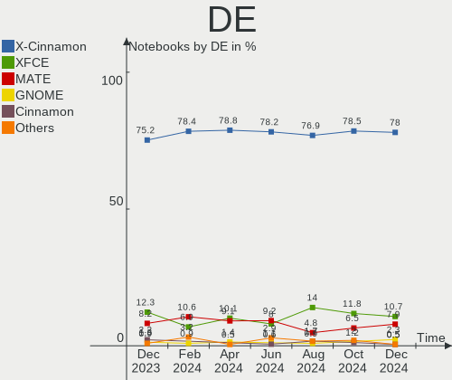
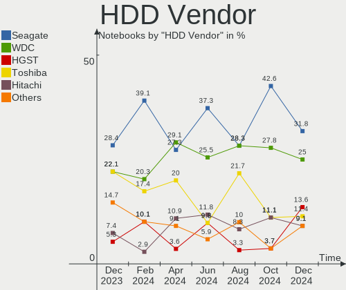
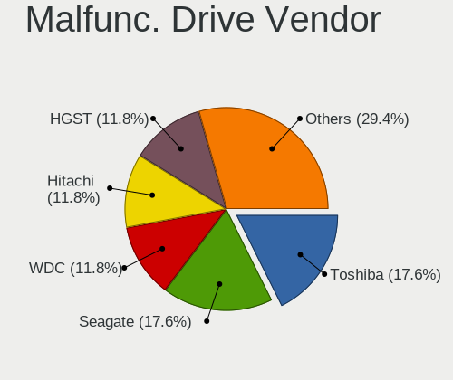
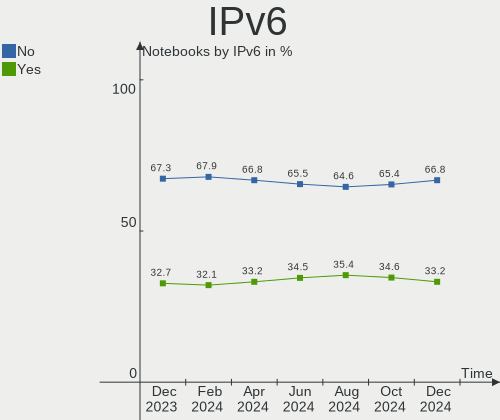

Linux Mint - Hardware Trends (Notebooks)
----------------------------------------

A project to identify most popular hardware characteristics and track their change
over time based on data collected by Linux users at https://Linux-Hardware.org.

Anyone can contribute to this report by the [hw-probe](https://github.com/linuxhw/hw-probe) tool:

    sudo -E hw-probe -all -upload

This report is for one last month. Overall report since the beginning of time: [TestDays](https://github.com/linuxhw/TestDays)

Period: May, 2023.

Contents
--------

* [ System ](#system)
  - [ OS                       ](#os)
  - [ OS Family                ](#os-family)
  - [ Kernel                   ](#kernel)
  - [ Kernel Family            ](#kernel-family)
  - [ Kernel Major Ver.        ](#kernel-major-ver)
  - [ Arch                     ](#arch)
  - [ DE                       ](#de)
  - [ Display Server           ](#display-server)
  - [ Display Manager          ](#display-manager)
  - [ OS Lang                  ](#os-lang)
  - [ Boot Mode                ](#boot-mode)
  - [ Filesystem               ](#filesystem)
  - [ Part. scheme             ](#part-scheme)
  - [ Dual Boot with Linux/BSD ](#dual-boot-with-linuxbsd)
  - [ Dual Boot (Win)          ](#dual-boot-win)

* [ Board ](#board)
  - [ Vendor                   ](#vendor)
  - [ Model                    ](#model)
  - [ Model Family             ](#model-family)
  - [ MFG Year                 ](#mfg-year)
  - [ Form Factor              ](#form-factor)
  - [ Secure Boot              ](#secure-boot)
  - [ Coreboot                 ](#coreboot)
  - [ RAM Size                 ](#ram-size)
  - [ RAM Used                 ](#ram-used)
  - [ Total Drives             ](#total-drives)
  - [ Has CD-ROM               ](#has-cd-rom)
  - [ Has Ethernet             ](#has-ethernet)
  - [ Has WiFi                 ](#has-wifi)
  - [ Has Bluetooth            ](#has-bluetooth)

* [ Location ](#location)
  - [ Country                  ](#country)
  - [ City                     ](#city)

* [ Drives ](#drives)
  - [ Drive Vendor             ](#drive-vendor)
  - [ Drive Model              ](#drive-model)
  - [ HDD Vendor               ](#hdd-vendor)
  - [ SSD Vendor               ](#ssd-vendor)
  - [ Drive Kind               ](#drive-kind)
  - [ Drive Connector          ](#drive-connector)
  - [ Drive Size               ](#drive-size)
  - [ Space Total              ](#space-total)
  - [ Space Used               ](#space-used)
  - [ Malfunc. Drives          ](#malfunc-drives)
  - [ Malfunc. Drive Vendor    ](#malfunc-drive-vendor)
  - [ Malfunc. HDD Vendor      ](#malfunc-hdd-vendor)
  - [ Malfunc. Drive Kind      ](#malfunc-drive-kind)
  - [ Failed Drives            ](#failed-drives)
  - [ Failed Drive Vendor      ](#failed-drive-vendor)
  - [ Drive Status             ](#drive-status)

* [ Storage controller ](#storage-controller)
  - [ Storage Vendor           ](#storage-vendor)
  - [ Storage Model            ](#storage-model)
  - [ Storage Kind             ](#storage-kind)

* [ Processor ](#processor)
  - [ CPU Vendor               ](#cpu-vendor)
  - [ CPU Model                ](#cpu-model)
  - [ CPU Model Family         ](#cpu-model-family)
  - [ CPU Cores                ](#cpu-cores)
  - [ CPU Sockets              ](#cpu-sockets)
  - [ CPU Threads              ](#cpu-threads)
  - [ CPU Op-Modes             ](#cpu-op-modes)
  - [ CPU Microcode            ](#cpu-microcode)
  - [ CPU Microarch            ](#cpu-microarch)

* [ Graphics ](#graphics)
  - [ GPU Vendor               ](#gpu-vendor)
  - [ GPU Model                ](#gpu-model)
  - [ GPU Combo                ](#gpu-combo)
  - [ GPU Driver               ](#gpu-driver)
  - [ GPU Memory               ](#gpu-memory)

* [ Monitor ](#monitor)
  - [ Monitor Vendor           ](#monitor-vendor)
  - [ Monitor Model            ](#monitor-model)
  - [ Monitor Resolution       ](#monitor-resolution)
  - [ Monitor Diagonal         ](#monitor-diagonal)
  - [ Monitor Width            ](#monitor-width)
  - [ Aspect Ratio             ](#aspect-ratio)
  - [ Monitor Area             ](#monitor-area)
  - [ Pixel Density            ](#pixel-density)
  - [ Multiple Monitors        ](#multiple-monitors)

* [ Network ](#network)
  - [ Net Controller Vendor    ](#net-controller-vendor)
  - [ Net Controller Model     ](#net-controller-model)
  - [ Wireless Vendor          ](#wireless-vendor)
  - [ Wireless Model           ](#wireless-model)
  - [ Ethernet Vendor          ](#ethernet-vendor)
  - [ Ethernet Model           ](#ethernet-model)
  - [ Net Controller Kind      ](#net-controller-kind)
  - [ Used Controller          ](#used-controller)
  - [ NICs                     ](#nics)
  - [ IPv6                     ](#ipv6)

* [ Bluetooth ](#bluetooth)
  - [ Bluetooth Vendor         ](#bluetooth-vendor)
  - [ Bluetooth Model          ](#bluetooth-model)

* [ Sound ](#sound)
  - [ Sound Vendor             ](#sound-vendor)
  - [ Sound Model              ](#sound-model)

* [ Memory ](#memory)
  - [ Memory Vendor            ](#memory-vendor)
  - [ Memory Model             ](#memory-model)
  - [ Memory Kind              ](#memory-kind)
  - [ Memory Form Factor       ](#memory-form-factor)
  - [ Memory Size              ](#memory-size)
  - [ Memory Speed             ](#memory-speed)

* [ Printers & scanners ](#printers--scanners)
  - [ Printer Vendor           ](#printer-vendor)
  - [ Printer Model            ](#printer-model)
  - [ Scanner Vendor           ](#scanner-vendor)
  - [ Scanner Model            ](#scanner-model)

* [ Camera ](#camera)
  - [ Camera Vendor            ](#camera-vendor)
  - [ Camera Model             ](#camera-model)

* [ Security ](#security)
  - [ Fingerprint Vendor       ](#fingerprint-vendor)
  - [ Fingerprint Model        ](#fingerprint-model)
  - [ Chipcard Vendor          ](#chipcard-vendor)
  - [ Chipcard Model           ](#chipcard-model)

* [ Unsupported ](#unsupported)
  - [ Unsupported Devices      ](#unsupported-devices)
  - [ Unsupported Device Types ](#unsupported-device-types)

System
------

OS
--

Installed operating systems

| Name            | Notebooks | Percent |
|-----------------|-----------|---------|
| Linux Mint 21.1 | 223       | 76.63%  |
| Linux Mint 20.3 | 31        | 10.65%  |
| Linux Mint 21   | 21        | 7.22%   |
| Linux Mint 20   | 5         | 1.72%   |
| Linux Mint 20.2 | 4         | 1.37%   |
| Linux Mint 20.1 | 3         | 1.03%   |
| Linux Mint 19.3 | 3         | 1.03%   |
| Linux Mint 18.2 | 1         | 0.34%   |

OS Family
---------

OS without a version

| Name       | Notebooks | Percent |
|------------|-----------|---------|
| Linux Mint | 291       | 100%    |

Kernel
------

Version of the Linux kernel

| Version                | Notebooks | Percent |
|------------------------|-----------|---------|
| 5.15.0-71-generic      | 103       | 35.4%   |
| 5.15.0-72-generic      | 76        | 26.12%  |
| 5.15.0-56-generic      | 19        | 6.53%   |
| 5.4.0-148-generic      | 16        | 5.5%    |
| 5.19.0-41-generic      | 16        | 5.5%    |
| 5.15.0-69-generic      | 6         | 2.06%   |
| 5.15.0-41-generic      | 6         | 2.06%   |
| 5.4.0-149-generic      | 4         | 1.37%   |
| 5.4.0-137-generic      | 4         | 1.37%   |
| 5.15.0-70-generic      | 4         | 1.37%   |
| 5.4.0-139-generic      | 3         | 1.03%   |
| 6.3.4-060304-generic   | 2         | 0.69%   |
| 6.3.2-060302-generic   | 2         | 0.69%   |
| 5.4.0-91-generic       | 2         | 0.69%   |
| 5.4.0-26-generic       | 2         | 0.69%   |
| 5.4.0-147-generic      | 2         | 0.69%   |
| 5.19.0-42-generic      | 2         | 0.69%   |
| 5.15.0-73-generic      | 2         | 0.69%   |
| 6.3.5-x64v3-xanmod1    | 1         | 0.34%   |
| 6.3.3-t2-jammy         | 1         | 0.34%   |
| 6.1.0-1013-oem         | 1         | 0.34%   |
| 6.1.0-1012-oem         | 1         | 0.34%   |
| 6.1.0-1010-oem         | 1         | 0.34%   |
| 6.1.0-1006-oem         | 1         | 0.34%   |
| 5.4.0-94-generic       | 1         | 0.34%   |
| 5.4.0-86-generic       | 1         | 0.34%   |
| 5.4.0-73-generic       | 1         | 0.34%   |
| 5.4.0-66-generic       | 1         | 0.34%   |
| 5.4.0-146-generic      | 1         | 0.34%   |
| 5.4.0-144-generic      | 1         | 0.34%   |
| 5.19.0-051900-generic  | 1         | 0.34%   |
| 5.17.6                 | 1         | 0.34%   |
| 5.15.0-67-generic      | 1         | 0.34%   |
| 5.15.0-60-generic      | 1         | 0.34%   |
| 5.15.0-58-generic      | 1         | 0.34%   |
| 5.15.0-1027-intel-iotg | 1         | 0.34%   |
| 5.14.0-1042-oem        | 1         | 0.34%   |
| 4.15.0-142-generic     | 1         | 0.34%   |

Kernel Family
-------------

Linux kernel without a distro release

| Version | Notebooks | Percent |
|---------|-----------|---------|
| 5.15.0  | 220       | 75.6%   |
| 5.4.0   | 39        | 13.4%   |
| 5.19.0  | 19        | 6.53%   |
| 6.1.0   | 4         | 1.37%   |
| 6.3.4   | 2         | 0.69%   |
| 6.3.2   | 2         | 0.69%   |
| 6.3.5   | 1         | 0.34%   |
| 6.3.3   | 1         | 0.34%   |
| 5.17.6  | 1         | 0.34%   |
| 5.14.0  | 1         | 0.34%   |
| 4.15.0  | 1         | 0.34%   |

Kernel Major Ver.
-----------------

Linux kernel major version

| Version | Notebooks | Percent |
|---------|-----------|---------|
| 5.15    | 220       | 75.6%   |
| 5.4     | 39        | 13.4%   |
| 5.19    | 19        | 6.53%   |
| 6.3     | 6         | 2.06%   |
| 6.1     | 4         | 1.37%   |
| 5.17    | 1         | 0.34%   |
| 5.14    | 1         | 0.34%   |
| 4.15    | 1         | 0.34%   |

Arch
----

OS architecture (x86_64, i586, etc.)

| Name   | Notebooks | Percent |
|--------|-----------|---------|
| x86_64 | 291       | 100%    |

DE
--

Desktop Environment

| Name       | Notebooks | Percent |
|------------|-----------|---------|
| X-Cinnamon | 210       | 72.16%  |
| XFCE       | 43        | 14.78%  |
| MATE       | 26        | 8.93%   |
| Cinnamon   | 4         | 1.37%   |
| KDE5       | 3         | 1.03%   |
| GNOME      | 2         | 0.69%   |
| Unknown    | 2         | 0.69%   |
| fluxbox    | 1         | 0.34%   |

Display Server
--------------

X11 or Wayland

| Name | Notebooks | Percent |
|------|-----------|---------|
| X11  | 291       | 100%    |

Display Manager
---------------

SDDM, LightDM, etc.

| Name    | Notebooks | Percent |
|---------|-----------|---------|
| Unknown | 148       | 50.86%  |
| LightDM | 139       | 47.77%  |
| SDDM    | 2         | 0.69%   |
| GDM3    | 1         | 0.34%   |
| GDM     | 1         | 0.34%   |

OS Lang
-------

Language

| Lang    | Notebooks | Percent |
|---------|-----------|---------|
| en_US   | 79        | 27.15%  |
| de_DE   | 46        | 15.81%  |
| pt_BR   | 19        | 6.53%   |
| it_IT   | 14        | 4.81%   |
| fr_FR   | 14        | 4.81%   |
| C       | 14        | 4.81%   |
| en_GB   | 10        | 3.44%   |
| pl_PL   | 9         | 3.09%   |
| en_CA   | 8         | 2.75%   |
| ru_RU   | 6         | 2.06%   |
| nl_NL   | 6         | 2.06%   |
| es_ES   | 6         | 2.06%   |
| en_IN   | 6         | 2.06%   |
| tr_TR   | 4         | 1.37%   |
| fi_FI   | 4         | 1.37%   |
| en_ZA   | 4         | 1.37%   |
| en_AU   | 4         | 1.37%   |
| es_MX   | 3         | 1.03%   |
| de_AT   | 3         | 1.03%   |
| ro_RO   | 2         | 0.69%   |
| pt_PT   | 2         | 0.69%   |
| hu_HU   | 2         | 0.69%   |
| es_CO   | 2         | 0.69%   |
| el_GR   | 2         | 0.69%   |
| de_CH   | 2         | 0.69%   |
| Unknown | 2         | 0.69%   |
| zh_CN   | 1         | 0.34%   |
| sv_SE   | 1         | 0.34%   |
| sk_SK   | 1         | 0.34%   |
| ru_UA   | 1         | 0.34%   |
| lv_LV   | 1         | 0.34%   |
| id_ID   | 1         | 0.34%   |
| hr_HR   | 1         | 0.34%   |
| fr_CH   | 1         | 0.34%   |
| fr_CA   | 1         | 0.34%   |
| es_PE   | 1         | 0.34%   |
| es_CL   | 1         | 0.34%   |
| es_AR   | 1         | 0.34%   |
| en_PH   | 1         | 0.34%   |
| en_NZ   | 1         | 0.34%   |

Boot Mode
---------

EFI or BIOS

| Mode | Notebooks | Percent |
|------|-----------|---------|
| EFI  | 197       | 67.7%   |
| BIOS | 94        | 32.3%   |

Filesystem
----------

Type of filesystem

| Type    | Notebooks | Percent |
|---------|-----------|---------|
| Ext4    | 260       | 89.35%  |
| Overlay | 14        | 4.81%   |
| Btrfs   | 8         | 2.75%   |
| Tmpfs   | 4         | 1.37%   |
| Zfs     | 3         | 1.03%   |
| Xfs     | 2         | 0.69%   |

Part. scheme
------------

Scheme of partitioning

| Type    | Notebooks | Percent |
|---------|-----------|---------|
| Unknown | 145       | 49.83%  |
| GPT     | 127       | 43.64%  |
| MBR     | 19        | 6.53%   |

Dual Boot with Linux/BSD
------------------------

Hosting more than one Linux/BSD

| Dual boot | Notebooks | Percent |
|-----------|-----------|---------|
| No        | 271       | 93.13%  |
| Yes       | 20        | 6.87%   |

Dual Boot (Win)
---------------

Hosting Linux and Windows

| Dual boot | Notebooks | Percent |
|-----------|-----------|---------|
| No        | 229       | 78.69%  |
| Yes       | 62        | 21.31%  |

Board
-----

Vendor
------

Motherboard manufacturer

| Name                           | Notebooks | Percent |
|--------------------------------|-----------|---------|
| Lenovo                         | 52        | 17.87%  |
| Hewlett-Packard                | 49        | 16.84%  |
| Dell                           | 40        | 13.75%  |
| ASUSTek Computer               | 35        | 12.03%  |
| Acer                           | 32        | 11%     |
| Sony                           | 8         | 2.75%   |
| Apple                          | 8         | 2.75%   |
| Toshiba                        | 7         | 2.41%   |
| Samsung Electronics            | 5         | 1.72%   |
| Fujitsu                        | 5         | 1.72%   |
| HUAWEI                         | 4         | 1.37%   |
| MSI                            | 3         | 1.03%   |
| Medion                         | 3         | 1.03%   |
| Unknown                        | 3         | 1.03%   |
| Positivo                       | 2         | 0.69%   |
| PHILCO ELETRONICOS S/A         | 2         | 0.69%   |
| Packard Bell                   | 2         | 0.69%   |
| Mediacom                       | 2         | 0.69%   |
| Itautec                        | 2         | 0.69%   |
| Intel Client Systems           | 2         | 0.69%   |
| GPU Company                    | 2         | 0.69%   |
| Google                         | 2         | 0.69%   |
| Fujitsu Siemens                | 2         | 0.69%   |
| eMachines                      | 2         | 0.69%   |
| Alienware                      | 2         | 0.69%   |
| Wortmann AG                    | 1         | 0.34%   |
| Timi                           | 1         | 0.34%   |
| SLIMBOOK                       | 1         | 0.34%   |
| Notebook                       | 1         | 0.34%   |
| Matsushita Electric Industrial | 1         | 0.34%   |
| Jumper                         | 1         | 0.34%   |
| IX1401                         | 1         | 0.34%   |
| Irbis                          | 1         | 0.34%   |
| Eii                            | 1         | 0.34%   |
| DEXP                           | 1         | 0.34%   |
| Compumax Computer              | 1         | 0.34%   |
| Compal                         | 1         | 0.34%   |
| Bluechip Computer              | 1         | 0.34%   |
| Avell High Performance         | 1         | 0.34%   |
| Alcor Digital                  | 1         | 0.34%   |

Model
-----

Motherboard model

| Name                                    | Notebooks | Percent |
|-----------------------------------------|-----------|---------|
| Unknown                                 | 7         | 2.41%   |
| HP Notebook                             | 3         | 1.03%   |
| Acer Aspire A515-45                     | 3         | 1.03%   |
| PHILCO ELETRONICOS S/A PNB15.6AP34H1W10 | 2         | 0.69%   |
| Mediacom SmartBook 14 FullHD - SB14UC   | 2         | 0.69%   |
| Lenovo IdeaPad 320-15IKB 80YH           | 2         | 0.69%   |
| HP Pavilion g4                          | 2         | 0.69%   |
| HP Pavilion dm4                         | 2         | 0.69%   |
| HP 15                                   | 2         | 0.69%   |
| Fujitsu LIFEBOOK E752                   | 2         | 0.69%   |
| Dell XPS 15 9570                        | 2         | 0.69%   |
| Dell Precision 7520                     | 2         | 0.69%   |
| Dell Latitude E7240                     | 2         | 0.69%   |
| Dell Latitude 7400                      | 2         | 0.69%   |
| Dell Latitude 5400                      | 2         | 0.69%   |
| Acer Aspire E5-571G                     | 2         | 0.69%   |
| Wortmann AG CR700                       | 1         | 0.34%   |
| Toshiba Satellite R630                  | 1         | 0.34%   |
| Toshiba Satellite Pro R50-B             | 1         | 0.34%   |
| Toshiba Satellite C870-1FZ              | 1         | 0.34%   |
| Toshiba Satellite C660D                 | 1         | 0.34%   |
| Toshiba Satellite C660                  | 1         | 0.34%   |
| Toshiba Satellite C645D                 | 1         | 0.34%   |
| Toshiba PORTEGE Z930                    | 1         | 0.34%   |
| Timi RedmiBook 16                       | 1         | 0.34%   |
| Sony VPCSB35FG                          | 1         | 0.34%   |
| Sony VPCEL36FJ                          | 1         | 0.34%   |
| Sony VGN-FW51MF_H                       | 1         | 0.34%   |
| Sony SVT1312B4E                         | 1         | 0.34%   |
| Sony SVT1121B2EW                        | 1         | 0.34%   |
| Sony SVF1521M6E                         | 1         | 0.34%   |
| Sony SVF1521G1EW                        | 1         | 0.34%   |
| Sony SVF1521B4E                         | 1         | 0.34%   |
| SLIMBOOK Executive                      | 1         | 0.34%   |
| Samsung R610                            | 1         | 0.34%   |
| Samsung 550XBE/350XBE                   | 1         | 0.34%   |
| Samsung 355V4C/356V4C/3445VC/3545VC     | 1         | 0.34%   |
| Samsung 350V5C/351V5C/3540VC/3440VC     | 1         | 0.34%   |
| Samsung 270E5G/270E5U                   | 1         | 0.34%   |
| Positivo Q4128C-S                       | 1         | 0.34%   |

Model Family
------------

Motherboard model prefix

| Name                                    | Notebooks | Percent |
|-----------------------------------------|-----------|---------|
| Lenovo ThinkPad                         | 25        | 8.59%   |
| Acer Aspire                             | 23        | 7.9%    |
| Dell Latitude                           | 22        | 7.56%   |
| HP Pavilion                             | 15        | 5.15%   |
| Lenovo IdeaPad                          | 13        | 4.47%   |
| ASUS VivoBook                           | 9         | 3.09%   |
| HP Laptop                               | 8         | 2.75%   |
| HP EliteBook                            | 7         | 2.41%   |
| Dell Inspiron                           | 7         | 2.41%   |
| Unknown                                 | 7         | 2.41%   |
| Toshiba Satellite                       | 6         | 2.06%   |
| Dell XPS                                | 4         | 1.37%   |
| Dell Precision                          | 4         | 1.37%   |
| ASUS ZenBook                            | 4         | 1.37%   |
| ASUS ROG                                | 4         | 1.37%   |
| HP Notebook                             | 3         | 1.03%   |
| Fujitsu LIFEBOOK                        | 3         | 1.03%   |
| Dell Vostro                             | 3         | 1.03%   |
| ASUS ASUS                               | 3         | 1.03%   |
| Acer TravelMate                         | 3         | 1.03%   |
| PHILCO ELETRONICOS S/A PNB15.6AP34H1W10 | 2         | 0.69%   |
| Packard Bell EasyNote                   | 2         | 0.69%   |
| Mediacom SmartBook                      | 2         | 0.69%   |
| Itautec Infoway                         | 2         | 0.69%   |
| HP ZBook                                | 2         | 0.69%   |
| HP ProBook                              | 2         | 0.69%   |
| HP Compaq                               | 2         | 0.69%   |
| HP 255                                  | 2         | 0.69%   |
| HP 15                                   | 2         | 0.69%   |
| Apple MacBookPro15                      | 2         | 0.69%   |
| Acer Nitro                              | 2         | 0.69%   |
| Wortmann AG CR700                       | 1         | 0.34%   |
| Toshiba PORTEGE                         | 1         | 0.34%   |
| Timi RedmiBook                          | 1         | 0.34%   |
| Sony VPCSB35FG                          | 1         | 0.34%   |
| Sony VPCEL36FJ                          | 1         | 0.34%   |
| Sony VGN-FW51MF                         | 1         | 0.34%   |
| Sony SVT1312B4E                         | 1         | 0.34%   |
| Sony SVT1121B2EW                        | 1         | 0.34%   |
| Sony SVF1521M6E                         | 1         | 0.34%   |

MFG Year
--------

Motherboard manufacture year

| Year | Notebooks | Percent |
|------|-----------|---------|
| 2021 | 36        | 12.37%  |
| 2013 | 27        | 9.28%   |
| 2022 | 23        | 7.9%    |
| 2019 | 23        | 7.9%    |
| 2012 | 23        | 7.9%    |
| 2020 | 21        | 7.22%   |
| 2017 | 18        | 6.19%   |
| 2010 | 18        | 6.19%   |
| 2011 | 17        | 5.84%   |
| 2018 | 16        | 5.5%    |
| 2015 | 14        | 4.81%   |
| 2014 | 14        | 4.81%   |
| 2009 | 12        | 4.12%   |
| 2016 | 11        | 3.78%   |
| 2008 | 8         | 2.75%   |
| 2007 | 6         | 2.06%   |
| 2023 | 4         | 1.37%   |

Form Factor
-----------

Physical design of the computer

| Name     | Notebooks | Percent |
|----------|-----------|---------|
| Notebook | 291       | 100%    |

Secure Boot
-----------

Enabled or disabled

| State    | Notebooks | Percent |
|----------|-----------|---------|
| Disabled | 266       | 91.41%  |
| Enabled  | 25        | 8.59%   |

Coreboot
--------

Have coreboot on board

| Used | Notebooks | Percent |
|------|-----------|---------|
| No   | 289       | 99.31%  |
| Yes  | 2         | 0.69%   |

RAM Size
--------

Total RAM memory

| Size in GB  | Notebooks | Percent |
|-------------|-----------|---------|
| 4.01-8.0    | 89        | 30.58%  |
| 3.01-4.0    | 69        | 23.71%  |
| 8.01-16.0   | 50        | 17.18%  |
| 16.01-24.0  | 42        | 14.43%  |
| 32.01-64.0  | 18        | 6.19%   |
| 1.01-2.0    | 11        | 3.78%   |
| 2.01-3.0    | 6         | 2.06%   |
| 24.01-32.0  | 4         | 1.37%   |
| 64.01-256.0 | 2         | 0.69%   |

RAM Used
--------

Used RAM memory

| Used GB    | Notebooks | Percent |
|------------|-----------|---------|
| 1.01-2.0   | 108       | 37.11%  |
| 2.01-3.0   | 92        | 31.62%  |
| 4.01-8.0   | 36        | 12.37%  |
| 3.01-4.0   | 29        | 9.97%   |
| 0.51-1.0   | 14        | 4.81%   |
| 8.01-16.0  | 9         | 3.09%   |
| 16.01-24.0 | 2         | 0.69%   |
| 24.01-32.0 | 1         | 0.34%   |

Total Drives
------------

Number of drives on board

| Drives | Notebooks | Percent |
|--------|-----------|---------|
| 1      | 213       | 73.2%   |
| 2      | 68        | 23.37%  |
| 3      | 7         | 2.41%   |
| 4      | 2         | 0.69%   |
| 8      | 1         | 0.34%   |

Has CD-ROM
----------

Has CD-ROM on board

| Presented | Notebooks | Percent |
|-----------|-----------|---------|
| No        | 178       | 61.17%  |
| Yes       | 113       | 38.83%  |

Has Ethernet
------------

Has Ethernet on board

| Presented | Notebooks | Percent |
|-----------|-----------|---------|
| Yes       | 233       | 80.07%  |
| No        | 58        | 19.93%  |

Has WiFi
--------

Has WiFi module

| Presented | Notebooks | Percent |
|-----------|-----------|---------|
| Yes       | 287       | 98.63%  |
| No        | 4         | 1.37%   |

Has Bluetooth
-------------

Has Bluetooth module

| Presented | Notebooks | Percent |
|-----------|-----------|---------|
| Yes       | 212       | 72.85%  |
| No        | 79        | 27.15%  |

Location
--------

Country
-------

Geographic location (country)

| Country      | Notebooks | Percent |
|--------------|-----------|---------|
| Germany      | 53        | 18.21%  |
| USA          | 36        | 12.37%  |
| Brazil       | 20        | 6.87%   |
| Italy        | 16        | 5.5%    |
| France       | 16        | 5.5%    |
| UK           | 10        | 3.44%   |
| Netherlands  | 10        | 3.44%   |
| Canada       | 10        | 3.44%   |
| Poland       | 9         | 3.09%   |
| Spain        | 8         | 2.75%   |
| Russia       | 7         | 2.41%   |
| Romania      | 7         | 2.41%   |
| Hungary      | 7         | 2.41%   |
| India        | 6         | 2.06%   |
| Finland      | 6         | 2.06%   |
| Turkey       | 5         | 1.72%   |
| Greece       | 5         | 1.72%   |
| Switzerland  | 4         | 1.37%   |
| South Africa | 4         | 1.37%   |
| Austria      | 4         | 1.37%   |
| Australia    | 4         | 1.37%   |
| Peru         | 3         | 1.03%   |
| Mexico       | 3         | 1.03%   |
| Sweden       | 2         | 0.69%   |
| Slovakia     | 2         | 0.69%   |
| Norway       | 2         | 0.69%   |
| Israel       | 2         | 0.69%   |
| Indonesia    | 2         | 0.69%   |
| Egypt        | 2         | 0.69%   |
| Colombia     | 2         | 0.69%   |
| Puerto Rico  | 1         | 0.34%   |
| Portugal     | 1         | 0.34%   |
| Philippines  | 1         | 0.34%   |
| New Zealand  | 1         | 0.34%   |
| Morocco      | 1         | 0.34%   |
| Moldova      | 1         | 0.34%   |
| Malaysia     | 1         | 0.34%   |
| Lithuania    | 1         | 0.34%   |
| Latvia       | 1         | 0.34%   |
| Kuwait       | 1         | 0.34%   |

City
----

Geographic location (city)

| City               | Notebooks | Percent |
|--------------------|-----------|---------|
| Warsaw             | 4         | 1.37%   |
| Jacksonville       | 4         | 1.37%   |
| Budapest           | 4         | 1.37%   |
| Berlin             | 4         | 1.37%   |
| Toronto            | 3         | 1.03%   |
| Paris              | 3         | 1.03%   |
| Munich             | 3         | 1.03%   |
| Krasnodar          | 3         | 1.03%   |
| Dortmund           | 3         | 1.03%   |
| Delft              | 3         | 1.03%   |
| Antalya            | 3         | 1.03%   |
| Vienna             | 2         | 0.69%   |
| Sao Paulo          | 2         | 0.69%   |
| Moscow             | 2         | 0.69%   |
| Milano             | 2         | 0.69%   |
| Lima               | 2         | 0.69%   |
| Johannesburg       | 2         | 0.69%   |
| Itumbiara          | 2         | 0.69%   |
| Helsinki           | 2         | 0.69%   |
| Curitiba           | 2         | 0.69%   |
| Cairo              | 2         | 0.69%   |
| Caen               | 2         | 0.69%   |
| Bucharest          | 2         | 0.69%   |
| Belo Horizonte     | 2         | 0.69%   |
| Zurich             | 1         | 0.34%   |
| Zeulenroda-Triebes | 1         | 0.34%   |
| Zaragoza           | 1         | 0.34%   |
| Zagreb             | 1         | 0.34%   |
| Yzeure             | 1         | 0.34%   |
| Yokohama           | 1         | 0.34%   |
| Winschoten         | 1         | 0.34%   |
| Windsor            | 1         | 0.34%   |
| Wilkesboro         | 1         | 0.34%   |
| Wiesbaden          | 1         | 0.34%   |
| Westerbork         | 1         | 0.34%   |
| Waltershausen      | 1         | 0.34%   |
| Vilnius            | 1         | 0.34%   |
| Viggiù            | 1         | 0.34%   |
| Verona             | 1         | 0.34%   |
| Vellore            | 1         | 0.34%   |

Drives
------

Drive Vendor
------------

Hard drive vendors

| Vendor                       | Notebooks | Drives | Percent |
|------------------------------|-----------|--------|---------|
| Samsung Electronics          | 47        | 51     | 12.88%  |
| WDC                          | 34        | 34     | 9.32%   |
| Seagate                      | 34        | 39     | 9.32%   |
| Toshiba                      | 26        | 26     | 7.12%   |
| SK hynix                     | 22        | 22     | 6.03%   |
| Kingston                     | 20        | 20     | 5.48%   |
| Unknown                      | 18        | 20     | 4.93%   |
| SanDisk                      | 18        | 18     | 4.93%   |
| Intel                        | 14        | 15     | 3.84%   |
| Micron Technology            | 13        | 13     | 3.56%   |
| Crucial                      | 13        | 13     | 3.56%   |
| Hitachi                      | 11        | 11     | 3.01%   |
| A-DATA Technology            | 10        | 10     | 2.74%   |
| HGST                         | 9         | 9      | 2.47%   |
| Apple                        | 6         | 6      | 1.64%   |
| Phison Electronics           | 5         | 5      | 1.37%   |
| China                        | 5         | 6      | 1.37%   |
| Intenso                      | 4         | 4      | 1.1%    |
| Unknown                      | 4         | 4      | 1.1%    |
| SPCC                         | 3         | 3      | 0.82%   |
| PNY                          | 3         | 3      | 0.82%   |
| Micron/Crucial Technology    | 3         | 3      | 0.82%   |
| Kingston Technology Company  | 3         | 3      | 0.82%   |
| Patriot                      | 2         | 2      | 0.55%   |
| LITEON                       | 2         | 2      | 0.55%   |
| KingDian                     | 2         | 2      | 0.55%   |
| JMicron Technology           | 2         | 2      | 0.55%   |
| GOODRAM                      | 2         | 2      | 0.55%   |
| BHT                          | 2         | 2      | 0.55%   |
| Verbatim                     | 1         | 1      | 0.27%   |
| USB                          | 1         | 1      | 0.27%   |
| Transcend                    | 1         | 1      | 0.27%   |
| TCSUNBOW                     | 1         | 1      | 0.27%   |
| Silicon Motion               | 1         | 1      | 0.27%   |
| ShiJi                        | 1         | 1      | 0.27%   |
| Shenzhen Longsys Electronics | 1         | 1      | 0.27%   |
| Realtek Semiconductor        | 1         | 1      | 0.27%   |
| Ramsta                       | 1         | 1      | 0.27%   |
| Radeon                       | 1         | 1      | 0.27%   |
| Phison                       | 1         | 1      | 0.27%   |

Drive Model
-----------

Hard drive models

| Model                                               | Notebooks | Percent |
|-----------------------------------------------------|-----------|---------|
| Seagate ST1000LM035-1RK172 1TB                      | 6         | 1.6%    |
| Toshiba MQ04ABF100 1TB                              | 5         | 1.33%   |
| Samsung SSD 860 EVO 500GB                           | 5         | 1.33%   |
| Kingston SA400S37240G 240GB SSD                     | 5         | 1.33%   |
| Unknown MMC Card  64GB                              | 4         | 1.07%   |
| Toshiba MQ01ABF050 500GB                            | 4         | 1.07%   |
| Toshiba MQ01ABD100 1TB                              | 4         | 1.07%   |
| Kingston SA400S37120G 120GB SSD                     | 4         | 1.07%   |
| Hitachi HTS545050A7E380 500GB                       | 4         | 1.07%   |
| Unknown                                             | 4         | 1.07%   |
| Unknown MMC Card  128GB                             | 3         | 0.8%    |
| Seagate ST500LT012-1DG142 500GB                     | 3         | 0.8%    |
| Seagate ST1000LM024 HN-M101MBB 1TB                  | 3         | 0.8%    |
| SanDisk NVMe SSD Drive 1TB                          | 3         | 0.8%    |
| Samsung SSD 850 EVO 250GB                           | 3         | 0.8%    |
| Samsung NVMe SSD Controller SM981/PM981/PM983 256GB | 3         | 0.8%    |
| Samsung NVMe SSD Controller PM9A1/PM9A3/980PRO 1TB  | 3         | 0.8%    |
| Samsung MZVLQ512HALU-00000 512GB                    | 3         | 0.8%    |
| Micron/Crucial P2 NVMe PCIe SSD 1TB                 | 3         | 0.8%    |
| Kingston SA400S37480G 480GB SSD                     | 3         | 0.8%    |
| HGST HTS725050A7E630 500GB                          | 3         | 0.8%    |
| Crucial CT1000MX500SSD1 1TB                         | 3         | 0.8%    |
| WDC WD3200BEVT-22ZCT0 320GB                         | 2         | 0.53%   |
| WDC WD10SPZX-24Z10 1TB                              | 2         | 0.53%   |
| WDC WD10JPVX-22JC3T0 1TB                            | 2         | 0.53%   |
| WDC PC SN530 SDBPNPZ-256G-1002 256GB                | 2         | 0.53%   |
| Unknown NCard  32GB                                 | 2         | 0.53%   |
| Unknown MMC Card  16GB                              | 2         | 0.53%   |
| Toshiba TR200 240GB SSD                             | 2         | 0.53%   |
| Toshiba MQ01ABF032 320GB                            | 2         | 0.53%   |
| Toshiba MQ01ABD075 752GB                            | 2         | 0.53%   |
| SPCC Solid State Disk 512GB                         | 2         | 0.53%   |
| SK hynix HFM001TD3JX013N 1TB                        | 2         | 0.53%   |
| SK hynix BC511 256GB                                | 2         | 0.53%   |
| SK hynix BC501 NVMe Solid State Drive 512GB         | 2         | 0.53%   |
| Seagate ST9500423AS 500GB                           | 2         | 0.53%   |
| Seagate ST9500325AS 500GB                           | 2         | 0.53%   |
| Seagate ST2000LM003 HN-M201RAD 2TB                  | 2         | 0.53%   |
| Seagate ST1000LM048-2E7172 1TB                      | 2         | 0.53%   |
| Seagate Portable 2TB                                | 2         | 0.53%   |

HDD Vendor
----------

Hard disk drive vendors

| Vendor              | Notebooks | Drives | Percent |
|---------------------|-----------|--------|---------|
| Seagate             | 33        | 37     | 32.04%  |
| WDC                 | 28        | 28     | 27.18%  |
| Toshiba             | 20        | 20     | 19.42%  |
| Hitachi             | 11        | 11     | 10.68%  |
| HGST                | 9         | 9      | 8.74%   |
| Samsung Electronics | 2         | 2      | 1.94%   |

SSD Vendor
----------

Solid state drive vendors

| Vendor              | Notebooks | Drives | Percent |
|---------------------|-----------|--------|---------|
| Samsung Electronics | 23        | 23     | 17.56%  |
| Kingston            | 19        | 19     | 14.5%   |
| Crucial             | 12        | 12     | 9.16%   |
| SanDisk             | 8         | 8      | 6.11%   |
| A-DATA Technology   | 7         | 7      | 5.34%   |
| China               | 5         | 6      | 3.82%   |
| Intenso             | 4         | 4      | 3.05%   |
| Toshiba             | 3         | 3      | 2.29%   |
| PNY                 | 3         | 3      | 2.29%   |
| Micron Technology   | 3         | 3      | 2.29%   |
| Intel               | 3         | 3      | 2.29%   |
| Apple               | 3         | 3      | 2.29%   |
| WDC                 | 2         | 2      | 1.53%   |
| SPCC                | 2         | 2      | 1.53%   |
| SK hynix            | 2         | 2      | 1.53%   |
| Patriot             | 2         | 2      | 1.53%   |
| LITEON              | 2         | 2      | 1.53%   |
| KingDian            | 2         | 2      | 1.53%   |
| GOODRAM             | 2         | 2      | 1.53%   |
| BHT                 | 2         | 2      | 1.53%   |
| Verbatim            | 1         | 1      | 0.76%   |
| USB                 | 1         | 1      | 0.76%   |
| Transcend           | 1         | 1      | 0.76%   |
| TCSUNBOW            | 1         | 1      | 0.76%   |
| ShiJi               | 1         | 1      | 0.76%   |
| Ramsta              | 1         | 1      | 0.76%   |
| Radeon              | 1         | 1      | 0.76%   |
| OCZ                 | 1         | 1      | 0.76%   |
| Netac               | 1         | 1      | 0.76%   |
| LuminouTek          | 1         | 1      | 0.76%   |
| LITEONIT            | 1         | 1      | 0.76%   |
| Lenovo              | 1         | 1      | 0.76%   |
| KingSpec            | 1         | 1      | 0.76%   |
| KingFast            | 1         | 1      | 0.76%   |
| JMicron Technology  | 1         | 1      | 0.76%   |
| Hewlett-Packard     | 1         | 1      | 0.76%   |
| Gigabyte Technology | 1         | 1      | 0.76%   |
| Fanxiang            | 1         | 1      | 0.76%   |
| CT2000MX            | 1         | 1      | 0.76%   |
| BAITITON            | 1         | 1      | 0.76%   |

Drive Kind
----------

HDD or SSD

| Kind    | Notebooks | Drives | Percent |
|---------|-----------|--------|---------|
| SSD     | 125       | 132    | 35.51%  |
| NVMe    | 105       | 113    | 29.83%  |
| HDD     | 98        | 107    | 27.84%  |
| MMC     | 20        | 22     | 5.68%   |
| Unknown | 4         | 4      | 1.14%   |

Drive Connector
---------------

SATA, SAS, NVMe, etc.

| Type | Notebooks | Drives | Percent |
|------|-----------|--------|---------|
| SATA | 201       | 224    | 59.29%  |
| NVMe | 105       | 113    | 30.97%  |
| MMC  | 20        | 22     | 5.9%    |
| SAS  | 13        | 19     | 3.83%   |

Drive Size
----------

Size of hard drive

| Size in TB | Notebooks | Drives | Percent |
|------------|-----------|--------|---------|
| 0.01-0.5   | 145       | 152    | 64.16%  |
| 0.51-1.0   | 70        | 75     | 30.97%  |
| 1.01-2.0   | 8         | 8      | 3.54%   |
| 4.01-10.0  | 2         | 2      | 0.88%   |
| 3.01-4.0   | 1         | 2      | 0.44%   |

Space Total
-----------

Amount of disk space available on the file system

| Size in GB     | Notebooks | Percent |
|----------------|-----------|---------|
| 101-250        | 87        | 29.9%   |
| 251-500        | 73        | 25.09%  |
| 501-1000       | 51        | 17.53%  |
| 1001-2000      | 21        | 7.22%   |
| 51-100         | 21        | 7.22%   |
| 1-20           | 16        | 5.5%    |
| 21-50          | 10        | 3.44%   |
| More than 3000 | 7         | 2.41%   |
| Unknown        | 4         | 1.37%   |
| 2001-3000      | 1         | 0.34%   |

Space Used
----------

Amount of used disk space

| Used GB        | Notebooks | Percent |
|----------------|-----------|---------|
| 21-50          | 73        | 25.09%  |
| 1-20           | 71        | 24.4%   |
| 101-250        | 53        | 18.21%  |
| 51-100         | 38        | 13.06%  |
| 251-500        | 29        | 9.97%   |
| 501-1000       | 16        | 5.5%    |
| Unknown        | 4         | 1.37%   |
| 1001-2000      | 3         | 1.03%   |
| More than 3000 | 2         | 0.69%   |
| 2001-3000      | 2         | 0.69%   |

Malfunc. Drives
---------------

Drive models with a malfunction

| Model                                 | Notebooks | Drives | Percent |
|---------------------------------------|-----------|--------|---------|
| Hitachi HTS545050A7E380 500GB         | 2         | 2      | 8.7%    |
| WDC WD7500BPKT-75PK4T0 752GB          | 1         | 1      | 4.35%   |
| WDC WD5000LPVX-22V0TT0 500GB          | 1         | 1      | 4.35%   |
| WDC WD5000BEVT-00A0RT0 500GB          | 1         | 1      | 4.35%   |
| WDC WD10JPVX-60JC3T0 1TB              | 1         | 1      | 4.35%   |
| Toshiba MQ01ABD100 1TB                | 1         | 1      | 4.35%   |
| Toshiba MK6476GSX 640GB               | 1         | 1      | 4.35%   |
| SK hynix SH920 mSATA 256GB SSD        | 1         | 1      | 4.35%   |
| SK hynix HFS128G39TND-N210A 128GB SSD | 1         | 1      | 4.35%   |
| Seagate ST9500423AS 500GB             | 1         | 1      | 4.35%   |
| Seagate ST9500325AS 500GB             | 1         | 1      | 4.35%   |
| Seagate ST9320325AS 320GB             | 1         | 1      | 4.35%   |
| Seagate ST500LT012-1DG142 500GB       | 1         | 1      | 4.35%   |
| Seagate ST320LT012-9WS14C 320GB       | 1         | 1      | 4.35%   |
| Seagate ST1000LM024 HN-M101MBB 1TB    | 1         | 1      | 4.35%   |
| Kingston SA400S37120G 120GB SSD       | 1         | 1      | 4.35%   |
| Hitachi HTS547550A9E384 500GB         | 1         | 1      | 4.35%   |
| Hitachi HTS545025B9A300 250GB         | 1         | 1      | 4.35%   |
| Hitachi HTS542525K9SA00 250GB         | 1         | 1      | 4.35%   |
| HGST HTS545050A7E680 500GB            | 1         | 1      | 4.35%   |
| HGST HTS541010A9E680 1TB              | 1         | 1      | 4.35%   |
| China SSD 128GB                       | 1         | 1      | 4.35%   |

Malfunc. Drive Vendor
---------------------

Vendors of faulty drives

| Vendor   | Notebooks | Drives | Percent |
|----------|-----------|--------|---------|
| Seagate  | 6         | 6      | 26.09%  |
| Hitachi  | 5         | 5      | 21.74%  |
| WDC      | 4         | 4      | 17.39%  |
| Toshiba  | 2         | 2      | 8.7%    |
| SK hynix | 2         | 2      | 8.7%    |
| HGST     | 2         | 2      | 8.7%    |
| Kingston | 1         | 1      | 4.35%   |
| China    | 1         | 1      | 4.35%   |

Malfunc. HDD Vendor
-------------------

Vendors of faulty HDD drives

| Vendor  | Notebooks | Drives | Percent |
|---------|-----------|--------|---------|
| Seagate | 6         | 6      | 31.58%  |
| Hitachi | 5         | 5      | 26.32%  |
| WDC     | 4         | 4      | 21.05%  |
| Toshiba | 2         | 2      | 10.53%  |
| HGST    | 2         | 2      | 10.53%  |

Malfunc. Drive Kind
-------------------

Kinds of faulty drives

| Kind | Notebooks | Drives | Percent |
|------|-----------|--------|---------|
| HDD  | 19        | 19     | 82.61%  |
| SSD  | 4         | 4      | 17.39%  |

Failed Drives
-------------

Failed drive models

Zero info for selected period =(

Failed Drive Vendor
-------------------

Failed drive vendors

Zero info for selected period =(

Drive Status
------------

Number of failed and malfunc. drives

| Status   | Notebooks | Drives | Percent |
|----------|-----------|--------|---------|
| Detected | 174       | 223    | 56.49%  |
| Works    | 111       | 132    | 36.04%  |
| Malfunc  | 23        | 23     | 7.47%   |

Storage controller
------------------

Storage Vendor
--------------

Storage controller vendors

| Vendor                           | Notebooks | Percent |
|----------------------------------|-----------|---------|
| Intel                            | 195       | 56.69%  |
| AMD                              | 44        | 12.79%  |
| Samsung Electronics              | 27        | 7.85%   |
| SK hynix                         | 21        | 6.1%    |
| SanDisk                          | 14        | 4.07%   |
| Micron Technology                | 10        | 2.91%   |
| Phison Electronics               | 6         | 1.74%   |
| Micron/Crucial Technology        | 4         | 1.16%   |
| Kingston Technology Company      | 4         | 1.16%   |
| ADATA Technology                 | 4         | 1.16%   |
| Toshiba America Info Systems     | 3         | 0.87%   |
| Apple                            | 3         | 0.87%   |
| Silicon Motion                   | 2         | 0.58%   |
| Nvidia                           | 2         | 0.58%   |
| Silicon Integrated Systems [SiS] | 1         | 0.29%   |
| Shenzhen Longsys Electronics     | 1         | 0.29%   |
| Realtek Semiconductor            | 1         | 0.29%   |
| Lite-On Technology               | 1         | 0.29%   |
| KIOXIA                           | 1         | 0.29%   |

Storage Model
-------------

Storage controller models

| Model                                                                          | Notebooks | Percent |
|--------------------------------------------------------------------------------|-----------|---------|
| AMD FCH SATA Controller [AHCI mode]                                            | 35        | 9.49%   |
| Intel 7 Series Chipset Family 6-port SATA Controller [AHCI mode]               | 32        | 8.67%   |
| Intel 82801 Mobile SATA Controller [RAID mode]                                 | 17        | 4.61%   |
| Intel 82801IBM/IEM (ICH9M/ICH9M-E) 4 port SATA Controller [AHCI mode]          | 14        | 3.79%   |
| Intel Wildcat Point-LP SATA Controller [AHCI Mode]                             | 12        | 3.25%   |
| Intel Volume Management Device NVMe RAID Controller                            | 12        | 3.25%   |
| Intel Sunrise Point-LP SATA Controller [AHCI mode]                             | 11        | 2.98%   |
| Intel 6 Series/C200 Series Chipset Family 6 port Mobile SATA AHCI Controller   | 11        | 2.98%   |
| Intel 8 Series SATA Controller 1 [AHCI mode]                                   | 10        | 2.71%   |
| Samsung NVMe SSD Controller PM9A1/PM9A3/980PRO                                 | 9         | 2.44%   |
| Micron NVMe Storage Controller                                                 | 9         | 2.44%   |
| Samsung NVMe SSD Controller 980                                                | 8         | 2.17%   |
| Intel Celeron/Pentium Silver Processor SATA Controller                         | 8         | 2.17%   |
| SK hynix Gold P31/PC711 NVMe Solid State Drive                                 | 7         | 1.9%    |
| AMD SB7x0/SB8x0/SB9x0 SATA Controller [AHCI mode]                              | 7         | 1.9%    |
| Intel Cannon Point-LP SATA Controller [AHCI Mode]                              | 6         | 1.63%   |
| Intel 82801HM/HEM (ICH8M/ICH8M-E) IDE Controller                               | 6         | 1.63%   |
| SK hynix BC501 NVMe Solid State Drive                                          | 5         | 1.36%   |
| SanDisk Non-Volatile memory controller                                         | 5         | 1.36%   |
| Samsung NVMe SSD Controller SM981/PM981/PM983                                  | 5         | 1.36%   |
| Intel Tiger Lake-LP SATA Controller                                            | 5         | 1.36%   |
| Intel Q170/Q150/B150/H170/H110/Z170/CM236 Chipset SATA Controller [AHCI Mode]  | 5         | 1.36%   |
| Intel Celeron N3350/Pentium N4200/Atom E3900 Series SATA AHCI Controller       | 5         | 1.36%   |
| Intel Cannon Lake Mobile PCH SATA AHCI Controller                              | 5         | 1.36%   |
| Intel 8 Series/C220 Series Chipset Family 6-port SATA Controller 1 [AHCI mode] | 5         | 1.36%   |
| Intel 5 Series/3400 Series Chipset 6 port SATA AHCI Controller                 | 5         | 1.36%   |
| Micron/Crucial P2 NVMe PCIe SSD                                                | 4         | 1.08%   |
| Intel SSD 660P Series                                                          | 4         | 1.08%   |
| Intel 82801HM/HEM (ICH8M/ICH8M-E) SATA Controller [AHCI mode]                  | 4         | 1.08%   |
| SK hynix PC401 NVMe Solid State Drive 256GB                                    | 3         | 0.81%   |
| SK hynix Non-Volatile memory controller                                        | 3         | 0.81%   |
| SanDisk WD Blue SN550 NVMe SSD                                                 | 3         | 0.81%   |
| Phison PS5013 E13 NVMe Controller                                              | 3         | 0.81%   |
| Intel SSD Pro 7600p/760p/E 6100p Series                                        | 3         | 0.81%   |
| Intel Non-Volatile memory controller                                           | 3         | 0.81%   |
| Intel Ice Lake-LP SATA Controller [AHCI mode]                                  | 3         | 0.81%   |
| Intel Atom Processor E3800 Series SATA AHCI Controller                         | 3         | 0.81%   |
| Intel 5 Series/3400 Series Chipset 4 port SATA AHCI Controller                 | 3         | 0.81%   |
| Apple ANS2 NVMe Controller                                                     | 3         | 0.81%   |
| ADATA IM2P33F8ABR1 NVMe SSD                                                    | 3         | 0.81%   |

Storage Kind
------------

Kind of storage controller (IDE, SATA, NVMe, SAS, ...)

| Kind | Notebooks | Percent |
|------|-----------|---------|
| SATA | 207       | 57.66%  |
| NVMe | 105       | 29.25%  |
| RAID | 32        | 8.91%   |
| IDE  | 15        | 4.18%   |

Processor
---------

CPU Vendor
----------

Processor vendors

| Vendor | Notebooks | Percent |
|--------|-----------|---------|
| Intel  | 227       | 78.01%  |
| AMD    | 64        | 21.99%  |

CPU Model
---------

Processor models

| Model                                         | Notebooks | Percent |
|-----------------------------------------------|-----------|---------|
| Intel Core i5-5200U CPU @ 2.20GHz             | 6         | 2.06%   |
| Intel Celeron N4020 CPU @ 1.10GHz             | 6         | 2.06%   |
| AMD Ryzen 5 5500U with Radeon Graphics        | 6         | 2.06%   |
| Intel Core i5-8265U CPU @ 1.60GHz             | 5         | 1.72%   |
| Intel Core i5-3230M CPU @ 2.60GHz             | 5         | 1.72%   |
| Intel Core i5 CPU M 520 @ 2.40GHz             | 5         | 1.72%   |
| Intel Pentium Dual-Core CPU T4500 @ 2.30GHz   | 4         | 1.37%   |
| Intel Core i5-3337U CPU @ 1.80GHz             | 4         | 1.37%   |
| Intel Core i5-3320M CPU @ 2.60GHz             | 4         | 1.37%   |
| Intel 11th Gen Core i5-1135G7 @ 2.40GHz       | 4         | 1.37%   |
| Intel 11th Gen Core i3-1115G4 @ 3.00GHz       | 4         | 1.37%   |
| Intel Core i7-8565U CPU @ 1.80GHz             | 3         | 1.03%   |
| Intel Core i7-7700HQ CPU @ 2.80GHz            | 3         | 1.03%   |
| Intel Core i7-4600U CPU @ 2.10GHz             | 3         | 1.03%   |
| Intel Core i5-8365U CPU @ 1.60GHz             | 3         | 1.03%   |
| Intel Core i5-7200U CPU @ 2.50GHz             | 3         | 1.03%   |
| Intel Core i5-6200U CPU @ 2.30GHz             | 3         | 1.03%   |
| Intel Core i5-2450M CPU @ 2.50GHz             | 3         | 1.03%   |
| Intel Core i5-10210U CPU @ 1.60GHz            | 3         | 1.03%   |
| Intel Core i3-2310M CPU @ 2.10GHz             | 3         | 1.03%   |
| Intel Core i3 CPU M 350 @ 2.27GHz             | 3         | 1.03%   |
| Intel Celeron CPU N3350 @ 1.10GHz             | 3         | 1.03%   |
| Intel 11th Gen Core i7-1165G7 @ 2.80GHz       | 3         | 1.03%   |
| AMD Ryzen 5 3500U with Radeon Vega Mobile Gfx | 3         | 1.03%   |
| AMD E-450 APU with Radeon HD Graphics         | 3         | 1.03%   |
| Intel Pentium Dual-Core CPU T4300 @ 2.10GHz   | 2         | 0.69%   |
| Intel Core i7-9850H CPU @ 2.60GHz             | 2         | 0.69%   |
| Intel Core i7-8750H CPU @ 2.20GHz             | 2         | 0.69%   |
| Intel Core i7-8650U CPU @ 1.90GHz             | 2         | 0.69%   |
| Intel Core i7-7820HQ CPU @ 2.90GHz            | 2         | 0.69%   |
| Intel Core i7-4700MQ CPU @ 2.40GHz            | 2         | 0.69%   |
| Intel Core i7-10750H CPU @ 2.60GHz            | 2         | 0.69%   |
| Intel Core i7-1065G7 CPU @ 1.30GHz            | 2         | 0.69%   |
| Intel Core i7-10510U CPU @ 1.80GHz            | 2         | 0.69%   |
| Intel Core i5-8250U CPU @ 1.60GHz             | 2         | 0.69%   |
| Intel Core i5-5300U CPU @ 2.30GHz             | 2         | 0.69%   |
| Intel Core i5-4210U CPU @ 1.70GHz             | 2         | 0.69%   |
| Intel Core i5-3210M CPU @ 2.50GHz             | 2         | 0.69%   |
| Intel Core i5-2520M CPU @ 2.50GHz             | 2         | 0.69%   |
| Intel Core i3-7100U CPU @ 2.40GHz             | 2         | 0.69%   |

CPU Model Family
----------------

Processor model prefix

| Model                   | Notebooks | Percent |
|-------------------------|-----------|---------|
| Intel Core i5           | 71        | 24.4%   |
| Intel Core i7           | 43        | 14.78%  |
| Intel Core i3           | 27        | 9.28%   |
| Other                   | 25        | 8.59%   |
| Intel Celeron           | 23        | 7.9%    |
| Intel Core 2 Duo        | 14        | 4.81%   |
| AMD Ryzen 5             | 13        | 4.47%   |
| Intel Pentium           | 9         | 3.09%   |
| Intel Pentium Dual-Core | 8         | 2.75%   |
| AMD Ryzen 7             | 8         | 2.75%   |
| AMD Ryzen 9             | 6         | 2.06%   |
| AMD Ryzen 3             | 6         | 2.06%   |
| AMD Ryzen 7 PRO         | 5         | 1.72%   |
| AMD E                   | 5         | 1.72%   |
| AMD A8                  | 4         | 1.37%   |
| AMD A6                  | 4         | 1.37%   |
| AMD A4                  | 4         | 1.37%   |
| Intel Atom              | 3         | 1.03%   |
| AMD E2                  | 2         | 0.69%   |
| Intel Xeon              | 1         | 0.34%   |
| Intel Pentium Gold      | 1         | 0.34%   |
| Intel Genuine           | 1         | 0.34%   |
| Intel Core 2            | 1         | 0.34%   |
| Intel Celeron Dual-Core | 1         | 0.34%   |
| AMD V120                | 1         | 0.34%   |
| AMD C-50                | 1         | 0.34%   |
| AMD Athlon II           | 1         | 0.34%   |
| AMD Athlon              | 1         | 0.34%   |
| AMD A12                 | 1         | 0.34%   |
| AMD A10                 | 1         | 0.34%   |

CPU Cores
---------

Number of processor cores

| Number | Notebooks | Percent |
|--------|-----------|---------|
| 2      | 159       | 54.64%  |
| 4      | 84        | 28.87%  |
| 8      | 20        | 6.87%   |
| 6      | 16        | 5.5%    |
| 10     | 4         | 1.37%   |
| 14     | 3         | 1.03%   |
| 12     | 2         | 0.69%   |
| 1      | 2         | 0.69%   |
| 5      | 1         | 0.34%   |

CPU Sockets
-----------

Number of sockets

| Number | Notebooks | Percent |
|--------|-----------|---------|
| 1      | 291       | 100%    |

CPU Threads
-----------

Threads per core (Hyper-Threading)

| Number | Notebooks | Percent |
|--------|-----------|---------|
| 2      | 207       | 71.13%  |
| 1      | 84        | 28.87%  |

CPU Op-Modes
------------

CPU Operation Modes (32-bit, 64-bit)

| Op mode        | Notebooks | Percent |
|----------------|-----------|---------|
| 32-bit, 64-bit | 291       | 100%    |

CPU Microcode
-------------

Microcode number

| Number     | Notebooks | Percent |
|------------|-----------|---------|
| 0x306a9    | 30        | 10.31%  |
| Unknown    | 21        | 7.22%   |
| 0x206a7    | 18        | 6.19%   |
| 0x1067a    | 14        | 4.81%   |
| 0x306d4    | 13        | 4.47%   |
| 0x806ec    | 12        | 4.12%   |
| 0x40651    | 11        | 3.78%   |
| 0x806c1    | 9         | 3.09%   |
| 0x906e9    | 8         | 2.75%   |
| 0x706a8    | 7         | 2.41%   |
| 0x20655    | 7         | 2.41%   |
| 0x08608103 | 7         | 2.41%   |
| 0x806eb    | 6         | 2.06%   |
| 0x806ea    | 6         | 2.06%   |
| 0x406e3    | 6         | 2.06%   |
| 0x0a404102 | 6         | 2.06%   |
| 0x906a3    | 5         | 1.72%   |
| 0x506c9    | 5         | 1.72%   |
| 0x306c3    | 5         | 1.72%   |
| 0x05000119 | 5         | 1.72%   |
| 0x906a4    | 4         | 1.37%   |
| 0x6fd      | 4         | 1.37%   |
| 0x30678    | 4         | 1.37%   |
| 0x0a50000c | 4         | 1.37%   |
| 0x08108109 | 4         | 1.37%   |
| 0x07030105 | 4         | 1.37%   |
| 0xa0652    | 3         | 1.03%   |
| 0x906ea    | 3         | 1.03%   |
| 0x806e9    | 3         | 1.03%   |
| 0x6fa      | 3         | 1.03%   |
| 0x406c3    | 3         | 1.03%   |
| 0x20652    | 3         | 1.03%   |
| 0x08608102 | 3         | 1.03%   |
| 0x08108102 | 3         | 1.03%   |
| 0x06006705 | 3         | 1.03%   |
| 0x906ed    | 2         | 0.69%   |
| 0x706e5    | 2         | 0.69%   |
| 0x706a1    | 2         | 0.69%   |
| 0x506e3    | 2         | 0.69%   |
| 0x406c4    | 2         | 0.69%   |

CPU Microarch
-------------

Microarchitecture

| Name             | Notebooks | Percent |
|------------------|-----------|---------|
| KabyLake         | 45        | 15.46%  |
| IvyBridge        | 31        | 10.65%  |
| Unknown          | 22        | 7.56%   |
| SandyBridge      | 20        | 6.87%   |
| Penryn           | 17        | 5.84%   |
| Haswell          | 17        | 5.84%   |
| TigerLake        | 14        | 4.81%   |
| Broadwell        | 14        | 4.81%   |
| Westmere         | 10        | 3.44%   |
| Silvermont       | 9         | 3.09%   |
| Goldmont plus    | 9         | 3.09%   |
| Zen+             | 8         | 2.75%   |
| Skylake          | 8         | 2.75%   |
| Core             | 8         | 2.75%   |
| Alderlake Hybrid | 8         | 2.75%   |
| Puma             | 7         | 2.41%   |
| IceLake          | 6         | 2.06%   |
| Excavator        | 6         | 2.06%   |
| Bobcat           | 6         | 2.06%   |
| Zen 3            | 5         | 1.72%   |
| Goldmont         | 5         | 1.72%   |
| CometLake        | 4         | 1.37%   |
| Zen 2            | 3         | 1.03%   |
| Zen              | 2         | 0.69%   |
| K10              | 2         | 0.69%   |
| Steamroller      | 1         | 0.34%   |
| Piledriver       | 1         | 0.34%   |
| K8 Hammer        | 1         | 0.34%   |
| K10 Llano        | 1         | 0.34%   |
| Jaguar           | 1         | 0.34%   |

Graphics
--------

GPU Vendor
----------

Vendors of graphics cards

| Vendor | Notebooks | Percent |
|--------|-----------|---------|
| Intel  | 209       | 58.54%  |
| AMD    | 79        | 22.13%  |
| Nvidia | 69        | 19.33%  |

GPU Model
---------

Graphics card models

| Model                                                                                    | Notebooks | Percent |
|------------------------------------------------------------------------------------------|-----------|---------|
| Intel 3rd Gen Core processor Graphics Controller                                         | 31        | 8.33%   |
| Intel 2nd Generation Core Processor Family Integrated Graphics Controller                | 19        | 5.11%   |
| Intel WhiskeyLake-U GT2 [UHD Graphics 620]                                               | 13        | 3.49%   |
| Intel HD Graphics 5500                                                                   | 11        | 2.96%   |
| Nvidia GF117M [GeForce 610M/710M/810M/820M / GT 620M/625M/630M/720M]                     | 10        | 2.69%   |
| Intel TigerLake-LP GT2 [Iris Xe Graphics]                                                | 10        | 2.69%   |
| Intel Haswell-ULT Integrated Graphics Controller                                         | 10        | 2.69%   |
| AMD Lucienne                                                                             | 10        | 2.69%   |
| Intel Mobile 4 Series Chipset Integrated Graphics Controller                             | 9         | 2.42%   |
| Intel GeminiLake [UHD Graphics 600]                                                      | 9         | 2.42%   |
| Intel Core Processor Integrated Graphics Controller                                      | 8         | 2.15%   |
| AMD Rembrandt [Radeon 680M]                                                              | 8         | 2.15%   |
| AMD Picasso/Raven 2 [Radeon Vega Series / Radeon Vega Mobile Series]                     | 8         | 2.15%   |
| Intel HD Graphics 630                                                                    | 7         | 1.88%   |
| Intel Skylake GT2 [HD Graphics 520]                                                      | 6         | 1.61%   |
| Intel HD Graphics 620                                                                    | 6         | 1.61%   |
| Intel UHD Graphics 620                                                                   | 5         | 1.34%   |
| Intel Mobile GM965/GL960 Integrated Graphics Controller (secondary)                      | 5         | 1.34%   |
| Intel Mobile GM965/GL960 Integrated Graphics Controller (primary)                        | 5         | 1.34%   |
| Intel CometLake-U GT2 [UHD Graphics]                                                     | 5         | 1.34%   |
| Intel Atom/Celeron/Pentium Processor x5-E8000/J3xxx/N3xxx Integrated Graphics Controller | 5         | 1.34%   |
| Intel Alder Lake-P Integrated Graphics Controller                                        | 5         | 1.34%   |
| Intel 4th Gen Core Processor Integrated Graphics Controller                              | 5         | 1.34%   |
| AMD Mullins [Radeon R4/R5 Graphics]                                                      | 5         | 1.34%   |
| AMD Cezanne [Radeon Vega Series / Radeon Vega Mobile Series]                             | 5         | 1.34%   |
| Intel Tiger Lake-LP GT2 [UHD Graphics G4]                                                | 4         | 1.08%   |
| Intel HD Graphics 500                                                                    | 4         | 1.08%   |
| Intel CoffeeLake-H GT2 [UHD Graphics 630]                                                | 4         | 1.08%   |
| Intel Atom Processor Z36xxx/Z37xxx Series Graphics & Display                             | 4         | 1.08%   |
| AMD Topaz XT [Radeon R7 M260/M265 / M340/M360 / M440/M445 / 530/535 / 620/625 Mobile]    | 4         | 1.08%   |
| Nvidia GP108M [GeForce MX250]                                                            | 3         | 0.81%   |
| Nvidia GM206GLM [Quadro M2200 Mobile]                                                    | 3         | 0.81%   |
| Nvidia GK208M [GeForce GT 740M]                                                          | 3         | 0.81%   |
| Nvidia GA107M [GeForce RTX 3050 Ti Mobile]                                               | 3         | 0.81%   |
| Nvidia GA106M [GeForce RTX 3060 Mobile / Max-Q]                                          | 3         | 0.81%   |
| Intel Iris Plus Graphics G7                                                              | 3         | 0.81%   |
| Intel CometLake-H GT2 [UHD Graphics]                                                     | 3         | 0.81%   |
| AMD Wani [Radeon R5/R6/R7 Graphics]                                                      | 3         | 0.81%   |
| AMD Stoney [Radeon R2/R3/R4/R5 Graphics]                                                 | 3         | 0.81%   |
| AMD Seymour [Radeon HD 6400M/7400M Series]                                               | 3         | 0.81%   |

GPU Combo
---------

Combinations of graphics cards

| Name           | Notebooks | Percent |
|----------------|-----------|---------|
| 1 x Intel      | 153       | 52.58%  |
| 1 x AMD        | 52        | 17.87%  |
| Intel + Nvidia | 46        | 15.81%  |
| 1 x Nvidia     | 14        | 4.81%   |
| 2 x AMD        | 9         | 3.09%   |
| AMD + Nvidia   | 9         | 3.09%   |
| Intel + AMD    | 8         | 2.75%   |

GPU Driver
----------

Free vs proprietary

| Driver      | Notebooks | Percent |
|-------------|-----------|---------|
| Free        | 248       | 85.22%  |
| Proprietary | 38        | 13.06%  |
| Unknown     | 5         | 1.72%   |

GPU Memory
----------

Total video memory

| Size in GB | Notebooks | Percent |
|------------|-----------|---------|
| Unknown    | 184       | 63.23%  |
| 0.01-0.5   | 49        | 16.84%  |
| 1.01-2.0   | 23        | 7.9%    |
| 0.51-1.0   | 16        | 5.5%    |
| 3.01-4.0   | 10        | 3.44%   |
| 5.01-6.0   | 5         | 1.72%   |
| 7.01-8.0   | 3         | 1.03%   |
| 8.01-16.0  | 1         | 0.34%   |

Monitor
-------

Monitor Vendor
--------------

Monitor vendors

| Vendor                  | Notebooks | Percent |
|-------------------------|-----------|---------|
| AU Optronics            | 62        | 19.14%  |
| BOE                     | 48        | 14.81%  |
| LG Display              | 47        | 14.51%  |
| Chimei Innolux          | 42        | 12.96%  |
| Samsung Electronics     | 37        | 11.42%  |
| Goldstar                | 11        | 3.4%    |
| Dell                    | 9         | 2.78%   |
| Apple                   | 8         | 2.47%   |
| Lenovo                  | 7         | 2.16%   |
| Sharp                   | 6         | 1.85%   |
| PANDA                   | 6         | 1.85%   |
| Chi Mei Optoelectronics | 6         | 1.85%   |
| Hewlett-Packard         | 5         | 1.54%   |
| CSO                     | 3         | 0.93%   |
| TMX                     | 2         | 0.62%   |
| Philips                 | 2         | 0.62%   |
| InfoVision              | 2         | 0.62%   |
| BenQ                    | 2         | 0.62%   |
| Yuraku                  | 1         | 0.31%   |
| Vizio                   | 1         | 0.31%   |
| Vestel Elektronik       | 1         | 0.31%   |
| Toshiba                 | 1         | 0.31%   |
| SLD                     | 1         | 0.31%   |
| Seiko/Epson             | 1         | 0.31%   |
| Roku                    | 1         | 0.31%   |
| Panasonic               | 1         | 0.31%   |
| Packard Bell            | 1         | 0.31%   |
| OEM                     | 1         | 0.31%   |
| LG Philips              | 1         | 0.31%   |
| HUAWEI                  | 1         | 0.31%   |
| HannStar Display        | 1         | 0.31%   |
| Fujitsu Siemens         | 1         | 0.31%   |
| Eizo                    | 1         | 0.31%   |
| CS_                     | 1         | 0.31%   |
| CPT                     | 1         | 0.31%   |
| AOC                     | 1         | 0.31%   |
| Acer                    | 1         | 0.31%   |

Monitor Model
-------------

Monitor models

| Model                                                                | Notebooks | Percent |
|----------------------------------------------------------------------|-----------|---------|
| AU Optronics LCD Monitor AUO38ED 1920x1080 344x193mm 15.5-inch       | 5         | 1.54%   |
| Samsung Electronics LCD Monitor SEC544B 1600x900 310x174mm 14.0-inch | 4         | 1.23%   |
| Chimei Innolux LCD Monitor CMN15F5 1920x1080 344x193mm 15.5-inch     | 3         | 0.92%   |
| Chimei Innolux LCD Monitor CMN15CA 1366x768 344x193mm 15.5-inch      | 3         | 0.92%   |
| Chimei Innolux LCD Monitor CMN14D4 1920x1080 309x173mm 13.9-inch     | 3         | 0.92%   |
| Samsung Electronics LCD Monitor SEC5441 1280x800 331x207mm 15.4-inch | 2         | 0.62%   |
| Samsung Electronics LCD Monitor SEC335A 1366x768 309x174mm 14.0-inch | 2         | 0.62%   |
| LG Display LCD Monitor LGD039F 1366x768 345x194mm 15.6-inch          | 2         | 0.62%   |
| Lenovo LCD Monitor LEN40B1 1600x900 345x194mm 15.6-inch              | 2         | 0.62%   |
| Lenovo LCD Monitor LEN4036 1440x900 303x190mm 14.1-inch              | 2         | 0.62%   |
| Goldstar FULL HD GSM5B55 1920x1080 480x270mm 21.7-inch               | 2         | 0.62%   |
| Chimei Innolux LCD Monitor CMN15E7 1920x1080 344x193mm 15.5-inch     | 2         | 0.62%   |
| Chimei Innolux LCD Monitor CMN15DB 1366x768 344x193mm 15.5-inch      | 2         | 0.62%   |
| Chimei Innolux LCD Monitor CMN1521 1920x1080 344x193mm 15.5-inch     | 2         | 0.62%   |
| Chimei Innolux LCD Monitor CMN14C9 1920x1080 309x173mm 13.9-inch     | 2         | 0.62%   |
| Chimei Innolux LCD Monitor CMN1493 1366x768 309x173mm 13.9-inch      | 2         | 0.62%   |
| BOE LCD Monitor BOE09AE 1920x1080 309x174mm 14.0-inch                | 2         | 0.62%   |
| BOE LCD Monitor BOE091D 1920x1080 309x174mm 14.0-inch                | 2         | 0.62%   |
| BOE LCD Monitor BOE0877 1920x1080 309x173mm 13.9-inch                | 2         | 0.62%   |
| BOE LCD Monitor BOE0868 1920x1080 309x174mm 14.0-inch                | 2         | 0.62%   |
| BOE LCD Monitor BOE0747 1920x1080 344x194mm 15.5-inch                | 2         | 0.62%   |
| BOE LCD Monitor BOE0700 1920x1080 344x194mm 15.5-inch                | 2         | 0.62%   |
| BOE LCD Monitor BOE0675 1366x768 344x194mm 15.5-inch                 | 2         | 0.62%   |
| BOE LCD Monitor BOE0660 1600x900 382x215mm 17.3-inch                 | 2         | 0.62%   |
| AU Optronics LCD Monitor AUO41EC 1366x768 344x193mm 15.5-inch        | 2         | 0.62%   |
| AU Optronics LCD Monitor AUO303E 1600x900 309x174mm 14.0-inch        | 2         | 0.62%   |
| AU Optronics LCD Monitor AUO26EC 1366x768 344x193mm 15.5-inch        | 2         | 0.62%   |
| AU Optronics LCD Monitor AUO21EC 1366x768 344x193mm 15.5-inch        | 2         | 0.62%   |
| AU Optronics LCD Monitor AUO20ED 1920x1080 344x193mm 15.5-inch       | 2         | 0.62%   |
| AU Optronics LCD Monitor AUO139E 1600x900 382x214mm 17.2-inch        | 2         | 0.62%   |
| AU Optronics LCD Monitor AUO10EC 1366x768 344x193mm 15.5-inch        | 2         | 0.62%   |
| Apple Color LCD APPA03D 2560x1600 286x179mm 13.3-inch                | 2         | 0.62%   |
| Yuraku MA2221 FAC2221 1920x1080 477x268mm 21.5-inch                  | 1         | 0.31%   |
| Vizio E320i-A0 VIZ1002 1366x768 698x392mm 31.5-inch                  | 1         | 0.31%   |
| Vestel Elektronik 43UHD_LCD_TV VES3700 3840x2160 950x540mm 43.0-inch | 1         | 0.31%   |
| Toshiba ScreenXpert TSB8888 1080x2160                                | 1         | 0.31%   |
| TMX TL156MDMP11-0 TMX1560 3200x2000 336x210mm 15.6-inch              | 1         | 0.31%   |
| TMX TL140ADXP01 TMX1481 2560x1600 301x188mm 14.0-inch                | 1         | 0.31%   |
| SLD LCD Monitor SLD003C 1366x768 309x173mm 13.9-inch                 | 1         | 0.31%   |
| Sharp LCD Monitor SHP1516 3840x2400 336x210mm 15.6-inch              | 1         | 0.31%   |

Monitor Resolution
------------------

Monitor screen resolution

| Resolution         | Notebooks | Percent |
|--------------------|-----------|---------|
| 1920x1080 (FHD)    | 122       | 39.35%  |
| 1366x768 (WXGA)    | 96        | 30.97%  |
| 1600x900 (HD+)     | 26        | 8.39%   |
| 3840x2160 (4K)     | 13        | 4.19%   |
| 1440x900 (WXGA+)   | 9         | 2.9%    |
| 1280x800 (WXGA)    | 9         | 2.9%    |
| 2560x1440 (QHD)    | 8         | 2.58%   |
| 2560x1600          | 6         | 1.94%   |
| 1920x1200 (WUXGA)  | 5         | 1.61%   |
| 1280x1024 (SXGA)   | 3         | 0.97%   |
| 3840x2400          | 2         | 0.65%   |
| 2880x1800          | 2         | 0.65%   |
| 4093x4093          | 1         | 0.32%   |
| 3840x1080          | 1         | 0.32%   |
| 3440x1440          | 1         | 0.32%   |
| 3200x2000          | 1         | 0.32%   |
| 3072x1920          | 1         | 0.32%   |
| 2160x1440          | 1         | 0.32%   |
| 1920x540           | 1         | 0.32%   |
| 1680x945           | 1         | 0.32%   |
| 1680x1050 (WSXGA+) | 1         | 0.32%   |

Monitor Diagonal
----------------

Diagonal size in inches

| Inches  | Notebooks | Percent |
|---------|-----------|---------|
| 15      | 139       | 42.77%  |
| 14      | 48        | 14.77%  |
| 13      | 40        | 12.31%  |
| 17      | 30        | 9.23%   |
| 24      | 11        | 3.38%   |
| 21      | 10        | 3.08%   |
| 12      | 7         | 2.15%   |
| 31      | 6         | 1.85%   |
| 18      | 5         | 1.54%   |
| 16      | 4         | 1.23%   |
| 27      | 3         | 0.92%   |
| 19      | 3         | 0.92%   |
| 11      | 3         | 0.92%   |
| 25      | 2         | 0.62%   |
| 20      | 2         | 0.62%   |
| Unknown | 2         | 0.62%   |
| 84      | 1         | 0.31%   |
| 49      | 1         | 0.31%   |
| 43      | 1         | 0.31%   |
| 40      | 1         | 0.31%   |
| 38      | 1         | 0.31%   |
| 36      | 1         | 0.31%   |
| 34      | 1         | 0.31%   |
| 29      | 1         | 0.31%   |
| 26      | 1         | 0.31%   |
| 22      | 1         | 0.31%   |

Monitor Width
-------------

Physical width

| Width in mm | Notebooks | Percent |
|-------------|-----------|---------|
| 301-350     | 212       | 65.23%  |
| 351-400     | 36        | 11.08%  |
| 201-300     | 25        | 7.69%   |
| 401-500     | 19        | 5.85%   |
| 501-600     | 17        | 5.23%   |
| 601-700     | 7         | 2.15%   |
| 801-900     | 2         | 0.62%   |
| 701-800     | 2         | 0.62%   |
| Unknown     | 2         | 0.62%   |
| 1501-2000   | 1         | 0.31%   |
| 1001-1500   | 1         | 0.31%   |
| 901-1000    | 1         | 0.31%   |

Aspect Ratio
------------

Proportional relationship between the width and the height

| Ratio   | Notebooks | Percent |
|---------|-----------|---------|
| 16/9    | 246       | 83.67%  |
| 16/10   | 39        | 13.27%  |
| 4/3     | 3         | 1.02%   |
| Unknown | 2         | 0.68%   |
| 5/4     | 1         | 0.34%   |
| 32/9    | 1         | 0.34%   |
| 3/2     | 1         | 0.34%   |
| 21/9    | 1         | 0.34%   |

Monitor Area
------------

Area in inch²

| Area in inch² | Notebooks | Percent |
|----------------|-----------|---------|
| 101-110        | 137       | 42.15%  |
| 81-90          | 77        | 23.69%  |
| 121-130        | 29        | 8.92%   |
| 201-250        | 17        | 5.23%   |
| 71-80          | 11        | 3.38%   |
| 351-500        | 8         | 2.46%   |
| 151-200        | 8         | 2.46%   |
| 61-70          | 6         | 1.85%   |
| 251-300        | 5         | 1.54%   |
| 111-120        | 5         | 1.54%   |
| 501-1000       | 5         | 1.54%   |
| 301-350        | 4         | 1.23%   |
| 141-150        | 4         | 1.23%   |
| 51-60          | 3         | 0.92%   |
| 131-140        | 2         | 0.62%   |
| Unknown        | 2         | 0.62%   |
| More than 1000 | 1         | 0.31%   |
| 91-100         | 1         | 0.31%   |

Pixel Density
-------------

Pixels per inch

| Density       | Notebooks | Percent |
|---------------|-----------|---------|
| 121-160       | 128       | 40%     |
| 101-120       | 118       | 36.88%  |
| 51-100        | 43        | 13.44%  |
| 161-240       | 17        | 5.31%   |
| More than 240 | 11        | 3.44%   |
| Unknown       | 2         | 0.63%   |
| 1-50          | 1         | 0.31%   |

Multiple Monitors
-----------------

Total monitors connected

| Total | Notebooks | Percent |
|-------|-----------|---------|
| 1     | 241       | 82.82%  |
| 2     | 44        | 15.12%  |
| 3     | 3         | 1.03%   |
| 0     | 3         | 1.03%   |

Network
-------

Net Controller Vendor
---------------------

Controller vendors

| Vendor                            | Notebooks | Percent |
|-----------------------------------|-----------|---------|
| Realtek Semiconductor             | 154       | 33.05%  |
| Intel                             | 131       | 28.11%  |
| Qualcomm Atheros                  | 63        | 13.52%  |
| Broadcom                          | 34        | 7.3%    |
| MediaTek                          | 14        | 3%      |
| Broadcom Limited                  | 8         | 1.72%   |
| ASIX Electronics                  | 8         | 1.72%   |
| Samsung Electronics               | 7         | 1.5%    |
| Ralink                            | 7         | 1.5%    |
| Marvell Technology Group          | 6         | 1.29%   |
| Ericsson Business Mobile Networks | 6         | 1.29%   |
| TP-Link                           | 4         | 0.86%   |
| Qualcomm                          | 4         | 0.86%   |
| JMicron Technology                | 3         | 0.64%   |
| Silicon Integrated Systems [SiS]  | 2         | 0.43%   |
| Sierra Wireless                   | 2         | 0.43%   |
| ZyXEL Communications              | 1         | 0.21%   |
| Xiaomi                            | 1         | 0.21%   |
| Toshiba                           | 1         | 0.21%   |
| OPPO Electronics                  | 1         | 0.21%   |
| Nvidia                            | 1         | 0.21%   |
| Motorola PCS                      | 1         | 0.21%   |
| MicroPython                       | 1         | 0.21%   |
| ICS Advent                        | 1         | 0.21%   |
| Hewlett-Packard                   | 1         | 0.21%   |
| Google                            | 1         | 0.21%   |
| Edimax Technology                 | 1         | 0.21%   |
| DisplayLink                       | 1         | 0.21%   |
| Apple                             | 1         | 0.21%   |

Net Controller Model
--------------------

Controller models

| Model                                                             | Notebooks | Percent |
|-------------------------------------------------------------------|-----------|---------|
| Realtek RTL8111/8168/8411 PCI Express Gigabit Ethernet Controller | 79        | 14.11%  |
| Realtek RTL810xE PCI Express Fast Ethernet controller             | 35        | 6.25%   |
| Realtek RTL8821CE 802.11ac PCIe Wireless Network Adapter          | 14        | 2.5%    |
| Qualcomm Atheros QCA9377 802.11ac Wireless Network Adapter        | 12        | 2.14%   |
| Intel 82579LM Gigabit Network Connection (Lewisville)             | 11        | 1.96%   |
| Qualcomm Atheros AR9485 Wireless Network Adapter                  | 10        | 1.79%   |
| Realtek RTL8822CE 802.11ac PCIe Wireless Network Adapter          | 9         | 1.61%   |
| Qualcomm Atheros QCA9565 / AR9565 Wireless Network Adapter        | 9         | 1.61%   |
| Qualcomm Atheros QCA6174 802.11ac Wireless Network Adapter        | 9         | 1.61%   |
| MediaTek MT7921 802.11ax PCI Express Wireless Network Adapter     | 9         | 1.61%   |
| Intel Cannon Point-LP CNVi [Wireless-AC]                          | 9         | 1.61%   |
| Intel Alder Lake-P PCH CNVi WiFi                                  | 9         | 1.61%   |
| Broadcom BCM43142 802.11b/g/n                                     | 9         | 1.61%   |
| Intel Wireless 8265 / 8275                                        | 8         | 1.43%   |
| Intel Wireless 7260                                               | 8         | 1.43%   |
| Intel Wi-Fi 6 AX201                                               | 8         | 1.43%   |
| Intel Centrino Advanced-N 6205 [Taylor Peak]                      | 8         | 1.43%   |
| Broadcom BCM4313 802.11bgn Wireless Network Adapter               | 8         | 1.43%   |
| ASIX AX88179 Gigabit Ethernet                                     | 8         | 1.43%   |
| Realtek RTL8153 Gigabit Ethernet Adapter                          | 7         | 1.25%   |
| Intel Wireless 7265                                               | 7         | 1.25%   |
| Qualcomm Atheros AR8151 v2.0 Gigabit Ethernet                     | 6         | 1.07%   |
| Realtek RTL8723BU 802.11b/g/n WLAN Adapter                        | 5         | 0.89%   |
| Realtek RTL8152 Fast Ethernet Adapter                             | 5         | 0.89%   |
| Intel Wireless 3165                                               | 5         | 0.89%   |
| Intel Wireless 3160                                               | 5         | 0.89%   |
| Intel Ethernet Connection (3) I218-LM                             | 5         | 0.89%   |
| Intel Centrino Advanced-N 6200                                    | 5         | 0.89%   |
| Samsung Galaxy series, misc. (tethering mode)                     | 4         | 0.71%   |
| Realtek RTL8188EUS 802.11n Wireless Network Adapter               | 4         | 0.71%   |
| Realtek RTL8188CE 802.11b/g/n WiFi Adapter                        | 4         | 0.71%   |
| Ralink RT3290 Wireless 802.11n 1T/1R PCIe                         | 4         | 0.71%   |
| Qualcomm Atheros AR9462 Wireless Network Adapter                  | 4         | 0.71%   |
| Qualcomm Atheros AR9285 Wireless Network Adapter (PCI-Express)    | 4         | 0.71%   |
| MediaTek MT7922 802.11ax PCI Express Wireless Network Adapter     | 4         | 0.71%   |
| Marvell Group 88E8055 PCI-E Gigabit Ethernet Controller           | 4         | 0.71%   |
| Intel Ethernet Connection (5) I219-LM                             | 4         | 0.71%   |
| Intel Dual Band Wireless-AC 3165 Plus Bluetooth                   | 4         | 0.71%   |
| Intel Centrino Wireless-N 1030 [Rainbow Peak]                     | 4         | 0.71%   |
| Intel 82577LM Gigabit Network Connection                          | 4         | 0.71%   |

Wireless Vendor
---------------

Wireless vendors

| Vendor                           | Notebooks | Percent |
|----------------------------------|-----------|---------|
| Intel                            | 122       | 40.8%   |
| Realtek Semiconductor            | 58        | 19.4%   |
| Qualcomm Atheros                 | 52        | 17.39%  |
| Broadcom                         | 30        | 10.03%  |
| MediaTek                         | 14        | 4.68%   |
| Ralink                           | 7         | 2.34%   |
| Broadcom Limited                 | 5         | 1.67%   |
| Qualcomm                         | 3         | 1%      |
| TP-Link                          | 2         | 0.67%   |
| Sierra Wireless                  | 2         | 0.67%   |
| ZyXEL Communications             | 1         | 0.33%   |
| Silicon Integrated Systems [SiS] | 1         | 0.33%   |
| Hewlett-Packard                  | 1         | 0.33%   |
| Edimax Technology                | 1         | 0.33%   |

Wireless Model
--------------

Wireless models

| Model                                                          | Notebooks | Percent |
|----------------------------------------------------------------|-----------|---------|
| Realtek RTL8821CE 802.11ac PCIe Wireless Network Adapter       | 14        | 4.65%   |
| Qualcomm Atheros QCA9377 802.11ac Wireless Network Adapter     | 12        | 3.99%   |
| Qualcomm Atheros AR9485 Wireless Network Adapter               | 10        | 3.32%   |
| Realtek RTL8822CE 802.11ac PCIe Wireless Network Adapter       | 9         | 2.99%   |
| Qualcomm Atheros QCA9565 / AR9565 Wireless Network Adapter     | 9         | 2.99%   |
| Qualcomm Atheros QCA6174 802.11ac Wireless Network Adapter     | 9         | 2.99%   |
| MediaTek MT7921 802.11ax PCI Express Wireless Network Adapter  | 9         | 2.99%   |
| Intel Cannon Point-LP CNVi [Wireless-AC]                       | 9         | 2.99%   |
| Intel Alder Lake-P PCH CNVi WiFi                               | 9         | 2.99%   |
| Broadcom BCM43142 802.11b/g/n                                  | 9         | 2.99%   |
| Intel Wireless 8265 / 8275                                     | 8         | 2.66%   |
| Intel Wireless 7260                                            | 8         | 2.66%   |
| Intel Wi-Fi 6 AX201                                            | 8         | 2.66%   |
| Intel Centrino Advanced-N 6205 [Taylor Peak]                   | 8         | 2.66%   |
| Broadcom BCM4313 802.11bgn Wireless Network Adapter            | 8         | 2.66%   |
| Intel Wireless 7265                                            | 7         | 2.33%   |
| Realtek RTL8723BU 802.11b/g/n WLAN Adapter                     | 5         | 1.66%   |
| Intel Wireless 3165                                            | 5         | 1.66%   |
| Intel Wireless 3160                                            | 5         | 1.66%   |
| Intel Centrino Advanced-N 6200                                 | 5         | 1.66%   |
| Realtek RTL8188EUS 802.11n Wireless Network Adapter            | 4         | 1.33%   |
| Realtek RTL8188CE 802.11b/g/n WiFi Adapter                     | 4         | 1.33%   |
| Ralink RT3290 Wireless 802.11n 1T/1R PCIe                      | 4         | 1.33%   |
| Qualcomm Atheros AR9462 Wireless Network Adapter               | 4         | 1.33%   |
| Qualcomm Atheros AR9285 Wireless Network Adapter (PCI-Express) | 4         | 1.33%   |
| MediaTek MT7922 802.11ax PCI Express Wireless Network Adapter  | 4         | 1.33%   |
| Intel Dual Band Wireless-AC 3165 Plus Bluetooth                | 4         | 1.33%   |
| Intel Centrino Wireless-N 1030 [Rainbow Peak]                  | 4         | 1.33%   |
| Realtek RTL88x2bu [AC1200 Techkey]                             | 3         | 1%      |
| Realtek RTL8852AE WiFi 6 802.11ax PCIe Adapter                 | 3         | 1%      |
| Realtek RTL8723BE PCIe Wireless Network Adapter                | 3         | 1%      |
| Realtek RTL8191SEvB Wireless LAN Controller                    | 3         | 1%      |
| Qualcomm QCNFA765 Wireless Network Adapter                     | 3         | 1%      |
| Intel Wireless 8260                                            | 3         | 1%      |
| Intel WiFi Link 5100                                           | 3         | 1%      |
| Intel Wi-Fi 6 AX200                                            | 3         | 1%      |
| Intel PRO/Wireless 4965 AG or AGN [Kedron] Network Connection  | 3         | 1%      |
| Intel Dual Band Wireless-AC 3168NGW [Stone Peak]               | 3         | 1%      |
| Intel Comet Lake PCH-LP CNVi WiFi                              | 3         | 1%      |
| Intel Comet Lake PCH CNVi WiFi                                 | 3         | 1%      |

Ethernet Vendor
---------------

Ethernet vendors

| Vendor                           | Notebooks | Percent |
|----------------------------------|-----------|---------|
| Realtek Semiconductor            | 127       | 51.84%  |
| Intel                            | 56        | 22.86%  |
| Qualcomm Atheros                 | 20        | 8.16%   |
| ASIX Electronics                 | 8         | 3.27%   |
| Marvell Technology Group         | 6         | 2.45%   |
| Broadcom                         | 6         | 2.45%   |
| Samsung Electronics              | 4         | 1.63%   |
| JMicron Technology               | 3         | 1.22%   |
| Broadcom Limited                 | 3         | 1.22%   |
| TP-Link                          | 2         | 0.82%   |
| Xiaomi                           | 1         | 0.41%   |
| Silicon Integrated Systems [SiS] | 1         | 0.41%   |
| Qualcomm                         | 1         | 0.41%   |
| OPPO Electronics                 | 1         | 0.41%   |
| Nvidia                           | 1         | 0.41%   |
| Motorola PCS                     | 1         | 0.41%   |
| ICS Advent                       | 1         | 0.41%   |
| Google                           | 1         | 0.41%   |
| DisplayLink                      | 1         | 0.41%   |
| Apple                            | 1         | 0.41%   |

Ethernet Model
--------------

Ethernet models

| Model                                                             | Notebooks | Percent |
|-------------------------------------------------------------------|-----------|---------|
| Realtek RTL8111/8168/8411 PCI Express Gigabit Ethernet Controller | 79        | 31.98%  |
| Realtek RTL810xE PCI Express Fast Ethernet controller             | 35        | 14.17%  |
| Intel 82579LM Gigabit Network Connection (Lewisville)             | 11        | 4.45%   |
| ASIX AX88179 Gigabit Ethernet                                     | 8         | 3.24%   |
| Realtek RTL8153 Gigabit Ethernet Adapter                          | 7         | 2.83%   |
| Qualcomm Atheros AR8151 v2.0 Gigabit Ethernet                     | 6         | 2.43%   |
| Realtek RTL8152 Fast Ethernet Adapter                             | 5         | 2.02%   |
| Intel Ethernet Connection (3) I218-LM                             | 5         | 2.02%   |
| Samsung Galaxy series, misc. (tethering mode)                     | 4         | 1.62%   |
| Marvell Group 88E8055 PCI-E Gigabit Ethernet Controller           | 4         | 1.62%   |
| Intel Ethernet Connection (5) I219-LM                             | 4         | 1.62%   |
| Intel 82577LM Gigabit Network Connection                          | 4         | 1.62%   |
| Qualcomm Atheros AR8132 Fast Ethernet                             | 3         | 1.21%   |
| Intel Ethernet Connection I218-LM                                 | 3         | 1.21%   |
| Intel Ethernet Connection (4) I219-LM                             | 3         | 1.21%   |
| Intel 82579V Gigabit Network Connection                           | 3         | 1.21%   |
| TP-Link Archer T2U PLUS [RTL8821AU]                               | 2         | 0.81%   |
| Realtek RTL8125 2.5GbE Controller                                 | 2         | 0.81%   |
| Qualcomm Atheros Killer E2500 Gigabit Ethernet Controller         | 2         | 0.81%   |
| Qualcomm Atheros AR8152 v2.0 Fast Ethernet                        | 2         | 0.81%   |
| Qualcomm Atheros AR8131 Gigabit Ethernet                          | 2         | 0.81%   |
| JMicron JMC250 PCI Express Gigabit Ethernet Controller            | 2         | 0.81%   |
| Intel Ethernet Controller I225-V                                  | 2         | 0.81%   |
| Intel Ethernet Connection I219-V                                  | 2         | 0.81%   |
| Intel Ethernet Connection I217-LM                                 | 2         | 0.81%   |
| Intel Ethernet Connection (6) I219-LM                             | 2         | 0.81%   |
| Intel Ethernet Connection (16) I219-LM                            | 2         | 0.81%   |
| Intel 82567LM Gigabit Network Connection                          | 2         | 0.81%   |
| Broadcom NetXtreme BCM5761 Gigabit Ethernet PCIe                  | 2         | 0.81%   |
| Broadcom NetLink BCM5787M Gigabit Ethernet PCI Express            | 2         | 0.81%   |
| Xiaomi Mi/Redmi series (RNDIS)                                    | 1         | 0.4%    |
| Silicon Integrated Systems [SiS] 191 Gigabit Ethernet Adapter     | 1         | 0.4%    |
| Realtek Killer E2600 Gigabit Ethernet Controller                  | 1         | 0.4%    |
| Qualcomm Fairphone 4 5G                                           | 1         | 0.4%    |
| Qualcomm Atheros QCA8172 Fast Ethernet                            | 1         | 0.4%    |
| Qualcomm Atheros QCA8171 Gigabit Ethernet                         | 1         | 0.4%    |
| Qualcomm Atheros AR8162 Fast Ethernet                             | 1         | 0.4%    |
| Qualcomm Atheros AR8161 Gigabit Ethernet                          | 1         | 0.4%    |
| Qualcomm Atheros AR8121/AR8113/AR8114 Gigabit or Fast Ethernet    | 1         | 0.4%    |
| OPPO SM8350-MTP _SN:1518BD09                                      | 1         | 0.4%    |

Net Controller Kind
-------------------

Ethernet, WiFi or modem

| Kind     | Notebooks | Percent |
|----------|-----------|---------|
| WiFi     | 287       | 54.05%  |
| Ethernet | 232       | 43.69%  |
| Modem    | 11        | 2.07%   |
| Unknown  | 1         | 0.19%   |

Used Controller
---------------

Currently used network controller

| Kind     | Notebooks | Percent |
|----------|-----------|---------|
| WiFi     | 241       | 78.76%  |
| Ethernet | 65        | 21.24%  |

NICs
----

Total network controllers on board

| Total | Notebooks | Percent |
|-------|-----------|---------|
| 2     | 208       | 71.48%  |
| 1     | 72        | 24.74%  |
| 0     | 10        | 3.44%   |
| 3     | 1         | 0.34%   |

IPv6
----

IPv6 vs IPv4

| Used | Notebooks | Percent |
|------|-----------|---------|
| No   | 174       | 59.79%  |
| Yes  | 117       | 40.21%  |

Bluetooth
---------

Bluetooth Vendor
----------------

Controller vendors

| Vendor                          | Notebooks | Percent |
|---------------------------------|-----------|---------|
| Intel                           | 86        | 40.38%  |
| Realtek Semiconductor           | 28        | 13.15%  |
| Qualcomm Atheros Communications | 21        | 9.86%   |
| Foxconn / Hon Hai               | 15        | 7.04%   |
| Broadcom                        | 15        | 7.04%   |
| Lite-On Technology              | 14        | 6.57%   |
| IMC Networks                    | 11        | 5.16%   |
| Ralink                          | 4         | 1.88%   |
| Dell                            | 4         | 1.88%   |
| Apple                           | 4         | 1.88%   |
| USI                             | 2         | 0.94%   |
| Taiyo Yuden                     | 2         | 0.94%   |
| Realtek                         | 2         | 0.94%   |
| Toshiba                         | 1         | 0.47%   |
| Smart Modular Technologies      | 1         | 0.47%   |
| Foxconn International           | 1         | 0.47%   |
| Cambridge Silicon Radio         | 1         | 0.47%   |
| Alps Electric                   | 1         | 0.47%   |

Bluetooth Model
---------------

Controller models

| Model                                          | Notebooks | Percent |
|------------------------------------------------|-----------|---------|
| Intel Bluetooth wireless interface             | 36        | 16.9%   |
| Realtek Bluetooth Radio                        | 21        | 9.86%   |
| Intel AX201 Bluetooth                          | 16        | 7.51%   |
| Intel Bluetooth 9460/9560 Jefferson Peak (JfP) | 14        | 6.57%   |
| Qualcomm Atheros  Bluetooth Device             | 10        | 4.69%   |
| Intel Bluetooth Device                         | 9         | 4.23%   |
| Realtek  Bluetooth 4.2 Adapter                 | 5         | 2.35%   |
| Qualcomm Atheros AR3012 Bluetooth 4.0          | 5         | 2.35%   |
| Foxconn / Hon Hai Bluetooth Device             | 5         | 2.35%   |
| Ralink RT3290 Bluetooth                        | 4         | 1.88%   |
| Lite-On Wireless_Device                        | 4         | 1.88%   |
| Lite-On Atheros AR3012 Bluetooth               | 4         | 1.88%   |
| Intel Centrino Bluetooth Wireless Transceiver  | 4         | 1.88%   |
| IMC Networks Bluetooth Radio                   | 4         | 1.88%   |
| Foxconn / Hon Hai Wireless_Device              | 4         | 1.88%   |
| Qualcomm Atheros QCA61x4 Bluetooth 4.0         | 3         | 1.41%   |
| Intel AX200 Bluetooth                          | 3         | 1.41%   |
| IMC Networks Wireless_Device                   | 3         | 1.41%   |
| IMC Networks Bluetooth Device                  | 3         | 1.41%   |
| Broadcom BCM2045B (BDC-2.1)                    | 3         | 1.41%   |
| Broadcom BCM2045 Bluetooth                     | 3         | 1.41%   |
| USI Bluetooth Device                           | 2         | 0.94%   |
| Taiyo Yuden Bluetooth Device                   | 2         | 0.94%   |
| Realtek Bluetooth Radio                        | 2         | 0.94%   |
| Lite-On Broadcom BCM43142A0 Bluetooth Device   | 2         | 0.94%   |
| Lite-On Bluetooth Device                       | 2         | 0.94%   |
| Intel Wireless-AC 3168 Bluetooth               | 2         | 0.94%   |
| Foxconn / Hon Hai MediaTek Bluetooth Adapter   | 2         | 0.94%   |
| Foxconn / Hon Hai BCM20702A0                   | 2         | 0.94%   |
| Dell DW375 Bluetooth Module                    | 2         | 0.94%   |
| Dell BCM20702A0 Bluetooth Module               | 2         | 0.94%   |
| Broadcom BCM43142A0 Bluetooth 4.0              | 2         | 0.94%   |
| Apple Bluetooth Host Controller                | 2         | 0.94%   |
| Toshiba Askey Bluetooth Module                 | 1         | 0.47%   |
| Smart Modular Bluetooth Device                 | 1         | 0.47%   |
| Realtek RTL8822BE Bluetooth 4.2 Adapter        | 1         | 0.47%   |
| Realtek 802.11n WLAN Adapter                   | 1         | 0.47%   |
| Qualcomm Atheros AR9462 Bluetooth              | 1         | 0.47%   |
| Qualcomm Atheros AR3012 Bluetooth              | 1         | 0.47%   |
| Qualcomm Atheros AR3011 Bluetooth              | 1         | 0.47%   |

Sound
-----

Sound Vendor
------------

Sound card vendors

| Vendor                           | Notebooks | Percent |
|----------------------------------|-----------|---------|
| Intel                            | 219       | 64.04%  |
| AMD                              | 68        | 19.88%  |
| Nvidia                           | 32        | 9.36%   |
| Logitech                         | 6         | 1.75%   |
| Generalplus Technology           | 3         | 0.88%   |
| Apple                            | 3         | 0.88%   |
| Texas Instruments                | 2         | 0.58%   |
| Kingston Technology              | 2         | 0.58%   |
| Trust                            | 1         | 0.29%   |
| Silicon Integrated Systems [SiS] | 1         | 0.29%   |
| JOUNIVO                          | 1         | 0.29%   |
| GN Netcom                        | 1         | 0.29%   |
| Focusrite-Novation               | 1         | 0.29%   |
| C-Media Electronics              | 1         | 0.29%   |
| ASUSTek Computer                 | 1         | 0.29%   |

Sound Model
-----------

Sound card models

| Model                                                                      | Notebooks | Percent |
|----------------------------------------------------------------------------|-----------|---------|
| Intel 7 Series/C216 Chipset Family High Definition Audio Controller        | 38        | 8.9%    |
| AMD Family 17h/19h HD Audio Controller                                     | 37        | 8.67%   |
| Intel Sunrise Point-LP HD Audio                                            | 17        | 3.98%   |
| AMD Renoir Radeon High Definition Audio Controller                         | 16        | 3.75%   |
| Intel 82801I (ICH9 Family) HD Audio Controller                             | 15        | 3.51%   |
| Intel Tiger Lake-LP Smart Sound Technology Audio Controller                | 14        | 3.28%   |
| Intel Cannon Point-LP High Definition Audio Controller                     | 14        | 3.28%   |
| Intel Broadwell-U Audio Controller                                         | 14        | 3.28%   |
| Intel 6 Series/C200 Series Chipset Family High Definition Audio Controller | 13        | 3.04%   |
| Intel Wildcat Point-LP High Definition Audio Controller                    | 12        | 2.81%   |
| Intel Haswell-ULT HD Audio Controller                                      | 11        | 2.58%   |
| Intel 8 Series HD Audio Controller                                         | 11        | 2.58%   |
| AMD Kabini HDMI/DP Audio                                                   | 11        | 2.58%   |
| AMD FCH Azalia Controller                                                  | 11        | 2.58%   |
| Intel 5 Series/3400 Series Chipset High Definition Audio                   | 10        | 2.34%   |
| Intel Celeron/Pentium Silver Processor High Definition Audio               | 9         | 2.11%   |
| AMD SBx00 Azalia (Intel HDA)                                               | 9         | 2.11%   |
| AMD Raven/Raven2/Fenghuang HDMI/DP Audio Controller                        | 9         | 2.11%   |
| Intel CM238 HD Audio Controller                                            | 8         | 1.87%   |
| Intel Alder Lake PCH-P High Definition Audio Controller                    | 8         | 1.87%   |
| AMD Rembrandt Radeon High Definition Audio Controller                      | 8         | 1.87%   |
| Intel 82801H (ICH8 Family) HD Audio Controller                             | 6         | 1.41%   |
| Intel 8 Series/C220 Series Chipset High Definition Audio Controller        | 6         | 1.41%   |
| AMD Family 15h (Models 60h-6fh) Audio Controller                           | 6         | 1.41%   |
| Intel Comet Lake PCH-LP cAVS                                               | 5         | 1.17%   |
| Intel Celeron N3350/Pentium N4200/Atom E3900 Series Audio Cluster          | 5         | 1.17%   |
| Intel Cannon Lake PCH cAVS                                                 | 5         | 1.17%   |
| Nvidia High Definition Audio Controller                                    | 4         | 0.94%   |
| Nvidia GK107 HDMI Audio Controller                                         | 4         | 0.94%   |
| Intel Xeon E3-1200 v3/4th Gen Core Processor HD Audio Controller           | 4         | 0.94%   |
| Intel Ice Lake-LP Smart Sound Technology Audio Controller                  | 4         | 0.94%   |
| Intel Comet Lake PCH cAVS                                                  | 4         | 0.94%   |
| Intel Atom Processor Z36xxx/Z37xxx Series High Definition Audio Controller | 4         | 0.94%   |
| Nvidia TU107 GeForce GTX 1650 High Definition Audio Controller             | 3         | 0.7%    |
| Nvidia GM206 High Definition Audio Controller                              | 3         | 0.7%    |
| Nvidia GA106 High Definition Audio Controller                              | 3         | 0.7%    |
| Nvidia Audio device                                                        | 3         | 0.7%    |
| Generalplus Technology USB Audio Device                                    | 3         | 0.7%    |
| Apple Audio Device                                                         | 3         | 0.7%    |
| AMD Wrestler HDMI Audio                                                    | 3         | 0.7%    |

Memory
------

Memory Vendor
-------------

Memory module vendors

| Vendor              | Notebooks | Percent |
|---------------------|-----------|---------|
| SK hynix            | 45        | 26.47%  |
| Samsung Electronics | 41        | 24.12%  |
| Micron Technology   | 18        | 10.59%  |
| Unknown             | 16        | 9.41%   |
| Kingston            | 10        | 5.88%   |
| Unknown (ABCD)      | 7         | 4.12%   |
| Ramaxel Technology  | 7         | 4.12%   |
| Crucial             | 5         | 2.94%   |
| Elpida              | 3         | 1.76%   |
| A-DATA Technology   | 3         | 1.76%   |
| Smart               | 2         | 1.18%   |
| Nanya Technology    | 2         | 1.18%   |
| G.Skill             | 2         | 1.18%   |
| Unknown             | 2         | 1.18%   |
| Wilk                | 1         | 0.59%   |
| Unknown (8AF1)      | 1         | 0.59%   |
| Unknown (8A5B)      | 1         | 0.59%   |
| Unknown (0x0B6B)    | 1         | 0.59%   |
| Silicon Power       | 1         | 0.59%   |
| Lexar               | 1         | 0.59%   |
| Corsair             | 1         | 0.59%   |

Memory Model
------------

Memory module models

| Model                                                            | Notebooks | Percent |
|------------------------------------------------------------------|-----------|---------|
| Unknown (ABCD) RAM 123456789012345678 2GB SODIMM LPDDR4 2400MT/s | 6         | 3.3%    |
| SK hynix RAM HMT41GS6AFR8A-PB 8GB SODIMM DDR3 1600MT/s           | 3         | 1.65%   |
| SK hynix RAM HMT351S6CFR8C-PB 4GB SODIMM DDR3 1600MT/s           | 3         | 1.65%   |
| Samsung RAM M471B5173DB0-YK0 4GB SODIMM DDR3 1600MT/s            | 3         | 1.65%   |
| Samsung RAM M471A1K43CB1-CTD 8GB SODIMM DDR4 2667MT/s            | 3         | 1.65%   |
| Unknown RAM Module 8GB SODIMM DDR4 3200MT/s                      | 2         | 1.1%    |
| Unknown RAM Module 2GB SODIMM DDR3 1066MT/s                      | 2         | 1.1%    |
| Unknown RAM Module 2GB SODIMM DDR2 667MT/s                       | 2         | 1.1%    |
| Smart RAM SH564128FH8NZPHSCG 4GB SODIMM DDR3 1334MT/s            | 2         | 1.1%    |
| SK hynix RAM HMT41GS6BFR8A-PB 8GB SODIMM DDR3 1600MT/s           | 2         | 1.1%    |
| SK hynix RAM HMT351S6CFR8A-PB 4GB SODIMM DDR3 1600MT/s           | 2         | 1.1%    |
| SK hynix RAM HMAA2GS6CJR8N-XN 16GB SODIMM DDR4 3200MT/s          | 2         | 1.1%    |
| SK hynix RAM HMA851S6DJR6N-XN 4GB SODIMM DDR4 3200MT/s           | 2         | 1.1%    |
| SK hynix RAM HMA82GS6DJR8N-VK 16GB SODIMM DDR4 2667MT/s          | 2         | 1.1%    |
| SK hynix RAM HMA81GS6JJR8N-VK 8GB SODIMM DDR4 2667MT/s           | 2         | 1.1%    |
| SK hynix RAM HMA81GS6AFR8N-UH 8GB SODIMM DDR4 2667MT/s           | 2         | 1.1%    |
| Samsung RAM M471B5773CHS-CH9 2GB SODIMM DDR3 4199MT/s            | 2         | 1.1%    |
| Samsung RAM M471B5173EB0-YK0 4GB SODIMM DDR3 1600MT/s            | 2         | 1.1%    |
| Samsung RAM M471A5244CB0-CWE 4GB SODIMM DDR4 3200MT/s            | 2         | 1.1%    |
| Samsung RAM M471A5244CB0-CWE 4GB Row Of Chips DDR4 3200MT/s      | 2         | 1.1%    |
| Ramaxel RAM RMT3170MN68F9F1600 4GB SODIMM DDR3 1600MT/s          | 2         | 1.1%    |
| A-DATA RAM 4JQA-0622AC 4GB SODIMM DDR4 3200MT/s                  | 2         | 1.1%    |
| Unknown                                                          | 2         | 1.1%    |
| Wilk RAM GR3200S464L22/32G 32GB SODIMM DDR4 3200MT/s             | 1         | 0.55%   |
| Unknown RAM Module 4GB SODIMM DDR3 1600MT/s                      | 1         | 0.55%   |
| Unknown RAM Module 4GB SODIMM DDR3 1333MT/s                      | 1         | 0.55%   |
| Unknown RAM Module 4GB SODIMM DDR3                               | 1         | 0.55%   |
| Unknown RAM Module 4096MB SODIMM DDR3 1333MT/s                   | 1         | 0.55%   |
| Unknown RAM Module 4096MB SODIMM DDR3                            | 1         | 0.55%   |
| Unknown RAM Module 2GB SODIMM DDR3                               | 1         | 0.55%   |
| Unknown RAM Module 2048MB SODIMM SDRAM                           | 1         | 0.55%   |
| Unknown RAM Module 1GB SODIMM DDR3 1600MT/s                      | 1         | 0.55%   |
| Unknown RAM Module 1GB SODIMM DDR2 667MT/s                       | 1         | 0.55%   |
| Unknown RAM Module 1GB SODIMM 667MT/s                            | 1         | 0.55%   |
| Unknown (ABCD) RAM 123456789012345678 2GB DIMM LPDDR4 2400MT/s   | 1         | 0.55%   |
| Unknown (8AF1) RAM TSD3/8GB 8GB SODIMM DDR3 1333MT/s             | 1         | 0.55%   |
| Unknown (8A5B) RAM LuminouTek 16GB SODIMM DDR4 2667MT/s          | 1         | 0.55%   |
| Unknown (0x0B6B) RAM AHN19S8G26S 8GB SODIMM DDR4 2667MT/s        | 1         | 0.55%   |
| Smart RAM SH564128FH8NZQNSCG 4GB SODIMM DDR3 1600MT/s            | 1         | 0.55%   |
| SK hynix RAM Module 8GB SODIMM DDR4 2400MT/s                     | 1         | 0.55%   |

Memory Kind
-----------

Memory module kinds

| Kind    | Notebooks | Percent |
|---------|-----------|---------|
| DDR3    | 62        | 41.89%  |
| DDR4    | 52        | 35.14%  |
| LPDDR4  | 12        | 8.11%   |
| SDRAM   | 6         | 4.05%   |
| DDR2    | 6         | 4.05%   |
| LPDDR5  | 4         | 2.7%    |
| DDR5    | 4         | 2.7%    |
| LPDDR3  | 1         | 0.68%   |
| Unknown | 1         | 0.68%   |

Memory Form Factor
------------------

Physical design of the memory module

| Name         | Notebooks | Percent |
|--------------|-----------|---------|
| SODIMM       | 134       | 88.74%  |
| Row Of Chips | 13        | 8.61%   |
| Unknown      | 2         | 1.32%   |
| DIMM         | 1         | 0.66%   |
| Chip         | 1         | 0.66%   |

Memory Size
-----------

Memory module size

| Size  | Notebooks | Percent |
|-------|-----------|---------|
| 4096  | 60        | 36.36%  |
| 8192  | 54        | 32.73%  |
| 2048  | 23        | 13.94%  |
| 16384 | 20        | 12.12%  |
| 1024  | 5         | 3.03%   |
| 32768 | 2         | 1.21%   |
| 1536  | 1         | 0.61%   |

Memory Speed
------------

Memory module speed

| Speed   | Notebooks | Percent |
|---------|-----------|---------|
| 1600    | 48        | 30%     |
| 3200    | 24        | 15%     |
| 2667    | 24        | 15%     |
| 2400    | 15        | 9.38%   |
| 1334    | 8         | 5%      |
| 1333    | 5         | 3.13%   |
| 667     | 5         | 3.13%   |
| 6400    | 4         | 2.5%    |
| 4800    | 4         | 2.5%    |
| 4267    | 4         | 2.5%    |
| 4199    | 4         | 2.5%    |
| Unknown | 4         | 2.5%    |
| 800     | 3         | 1.88%   |
| 1067    | 2         | 1.25%   |
| 1066    | 2         | 1.25%   |
| 3266    | 1         | 0.63%   |
| 2133    | 1         | 0.63%   |
| 2048    | 1         | 0.63%   |
| 1867    | 1         | 0.63%   |

Printers & scanners
-------------------

Printer Vendor
--------------

Printer device vendors

| Vendor             | Notebooks | Percent |
|--------------------|-----------|---------|
| Kyocera            | 1         | 50%     |
| Brother Industries | 1         | 50%     |

Printer Model
-------------

Printer device models

| Model                      | Notebooks | Percent |
|----------------------------|-----------|---------|
| Kyocera ECOSYS M3550idn    | 1         | 50%     |
| Brother DCP-L2530DW series | 1         | 50%     |

Scanner Vendor
--------------

Scanner device vendors

| Vendor | Notebooks | Percent |
|--------|-----------|---------|
| Canon  | 3         | 100%    |

Scanner Model
-------------

Scanner device models

| Model                   | Notebooks | Percent |
|-------------------------|-----------|---------|
| Canon CanoScan LIDE 25  | 1         | 33.33%  |
| Canon CanoScan LiDE 120 | 1         | 33.33%  |
| Canon CanoScan LiDE 100 | 1         | 33.33%  |

Camera
------

Camera Vendor
-------------

Camera device vendors

| Vendor                                 | Notebooks | Percent |
|----------------------------------------|-----------|---------|
| Chicony Electronics                    | 62        | 23.85%  |
| Microdia                               | 23        | 8.85%   |
| IMC Networks                           | 22        | 8.46%   |
| Realtek Semiconductor                  | 20        | 7.69%   |
| Bison Electronics                      | 18        | 6.92%   |
| Quanta                                 | 15        | 5.77%   |
| Cheng Uei Precision Industry (Foxlink) | 15        | 5.77%   |
| Sunplus Innovation Technology          | 14        | 5.38%   |
| Logitech                               | 8         | 3.08%   |
| Suyin                                  | 7         | 2.69%   |
| Acer                                   | 6         | 2.31%   |
| Alcor Micro                            | 5         | 1.92%   |
| Sonix Technology                       | 4         | 1.54%   |
| Lenovo                                 | 4         | 1.54%   |
| icSpring                               | 3         | 1.15%   |
| Z-Star Microelectronics                | 2         | 0.77%   |
| Y Media                                | 2         | 0.77%   |
| Syntek                                 | 2         | 0.77%   |
| Silicon Motion                         | 2         | 0.77%   |
| Ricoh                                  | 2         | 0.77%   |
| Luxvisions Innotech Limited            | 2         | 0.77%   |
| Lite-On Technology                     | 2         | 0.77%   |
| Importek                               | 2         | 0.77%   |
| Apple                                  | 2         | 0.77%   |
| ALi                                    | 2         | 0.77%   |
| USB3.0 HD Audio Capture                | 1         | 0.38%   |
| USB Camera CS                          | 1         | 0.38%   |
| Tobii Technology AB                    | 1         | 0.38%   |
| Samsung Electronics                    | 1         | 0.38%   |
| Ruision                                | 1         | 0.38%   |
| Primax Electronics                     | 1         | 0.38%   |
| Microsoft                              | 1         | 0.38%   |
| Intel                                  | 1         | 0.38%   |
| HYGD-220628-A                          | 1         | 0.38%   |
| Genesys Logic                          | 1         | 0.38%   |
| Generalplus Technology                 | 1         | 0.38%   |
| eMeet                                  | 1         | 0.38%   |
| BRS 2Mp Camera                         | 1         | 0.38%   |
| ASUSTek Computer                       | 1         | 0.38%   |

Camera Model
------------

Camera device models

| Model                                                           | Notebooks | Percent |
|-----------------------------------------------------------------|-----------|---------|
| Chicony Integrated Camera                                       | 12        | 4.62%   |
| Chicony HD WebCam                                               | 9         | 3.46%   |
| Realtek Integrated_Webcam_HD                                    | 8         | 3.08%   |
| Microdia Integrated_Webcam_HD                                   | 8         | 3.08%   |
| IMC Networks USB2.0 HD UVC WebCam                               | 7         | 2.69%   |
| Bison Integrated Camera                                         | 6         | 2.31%   |
| Quanta HD User Facing                                           | 4         | 1.54%   |
| Chicony HP Truevision HD                                        | 4         | 1.54%   |
| Chicony HD User Facing                                          | 4         | 1.54%   |
| Acer Integrated Camera                                          | 4         | 1.54%   |
| Suyin Acer/HP Integrated Webcam [CN0314]                        | 3         | 1.15%   |
| Sunplus Integrated_Webcam_HD                                    | 3         | 1.15%   |
| Sonix USB2.0 HD UVC WebCam                                      | 3         | 1.15%   |
| Realtek USB Camera                                              | 3         | 1.15%   |
| Microdia Integrated Webcam                                      | 3         | 1.15%   |
| Logitech Webcam C925e                                           | 3         | 1.15%   |
| Lenovo Integrated Webcam [R5U877]                               | 3         | 1.15%   |
| IMC Networks USB2.0 VGA UVC WebCam                              | 3         | 1.15%   |
| IMC Networks Integrated Camera                                  | 3         | 1.15%   |
| IMC Networks HD Camera                                          | 3         | 1.15%   |
| IMC Networks EasyCamera                                         | 3         | 1.15%   |
| icSpring camera                                                 | 3         | 1.15%   |
| Chicony USB2.0 Camera                                           | 3         | 1.15%   |
| Cheng Uei Precision Industry (Foxlink) HP Wide Vision HD Camera | 3         | 1.15%   |
| Cheng Uei Precision Industry (Foxlink) HP TrueVision HD Camera  | 3         | 1.15%   |
| Alcor Micro USB 2.0 Camera                                      | 3         | 1.15%   |
| Y Media USB Camera                                              | 2         | 0.77%   |
| Sunplus HD WebCam                                               | 2         | 0.77%   |
| Realtek Integrated Webcam_HD                                    | 2         | 0.77%   |
| Realtek HP Truevision HD                                        | 2         | 0.77%   |
| Quanta USB2.0 VGA UVC WebCam                                    | 2         | 0.77%   |
| Quanta HP TrueVision HD Camera                                  | 2         | 0.77%   |
| Quanta HD Webcam                                                | 2         | 0.77%   |
| Microdia WebCam SC-13HDL12639P                                  | 2         | 0.77%   |
| Microdia USB 2.0 Camera                                         | 2         | 0.77%   |
| Microdia Integrated_Webcam_FHD                                  | 2         | 0.77%   |
| Logitech HD Pro Webcam C920                                     | 2         | 0.77%   |
| Chicony USB2.0 VGA UVC WebCam                                   | 2         | 0.77%   |
| Chicony USB 2.0 Camera                                          | 2         | 0.77%   |
| Chicony Integrated Camera [ThinkPad]                            | 2         | 0.77%   |

Security
--------

Fingerprint Vendor
------------------

Fingerprint sensor vendors

| Vendor                             | Notebooks | Percent |
|------------------------------------|-----------|---------|
| Validity Sensors                   | 14        | 30.43%  |
| AuthenTec                          | 8         | 17.39%  |
| Synaptics                          | 7         | 15.22%  |
| Upek                               | 4         | 8.7%    |
| Shenzhen Goodix Technology         | 4         | 8.7%    |
| Elan Microelectronics              | 4         | 8.7%    |
| Realtek USB2.0 Finger Print Bridge | 2         | 4.35%   |
| LighTuning Technology              | 2         | 4.35%   |
| Focal-systems.Corp                 | 1         | 2.17%   |

Fingerprint Model
-----------------

Fingerprint sensor models

| Model                                                                      | Notebooks | Percent |
|----------------------------------------------------------------------------|-----------|---------|
| Validity Sensors VFS495 Fingerprint Reader                                 | 4         | 8.7%    |
| Upek Biometric Touchchip/Touchstrip Fingerprint Sensor                     | 4         | 8.7%    |
| Shenzhen Goodix  Fingerprint Device                                        | 3         | 6.52%   |
| Elan ELAN:ARM-M4                                                           | 3         | 6.52%   |
| AuthenTec Fingerprint Sensor                                               | 3         | 6.52%   |
| Validity Sensors VFS 5011 fingerprint sensor                               | 2         | 4.35%   |
| Validity Sensors Fingerprint scanner                                       | 2         | 4.35%   |
| Synaptics Prometheus MIS Touch Fingerprint Reader                          | 2         | 4.35%   |
| Realtek USB2.0 Finger Print Bridge FocalTech Fingerprint Device            | 2         | 4.35%   |
| AuthenTec AES2550 Fingerprint Sensor                                       | 2         | 4.35%   |
| Validity Sensors VFS7500 Touch Fingerprint Sensor                          | 1         | 2.17%   |
| Validity Sensors VFS491                                                    | 1         | 2.17%   |
| Validity Sensors VFS101 Fingerprint Reader                                 | 1         | 2.17%   |
| Validity Sensors Synaptics WBDI                                            | 1         | 2.17%   |
| Validity Sensors Synaptics VFS7552 Touch Fingerprint Sensor with PurePrint | 1         | 2.17%   |
| Validity Sensors Swipe Fingerprint Sensor                                  | 1         | 2.17%   |
| Synaptics WBDI                                                             | 1         | 2.17%   |
| Synaptics  FS7604 Touch Fingerprint Sensor with PurePrint                  | 1         | 2.17%   |
| Synaptics Metallica MIS Touch Fingerprint Reader                           | 1         | 2.17%   |
| Synaptics FS7604 Touch Fingerprint Sensor with PurePrint                   | 1         | 2.17%   |
| Shenzhen Goodix Fingerprint Reader                                         | 1         | 2.17%   |
| LighTuning ES603 Swipe Fingerprint Sensor                                  | 1         | 2.17%   |
| LighTuning EgisTec Touch Fingerprint Sensor                                | 1         | 2.17%   |
| Focal-systems.Corp FT9201Fingerprint.                                      | 1         | 2.17%   |
| Elan ELAN:Fingerprint                                                      | 1         | 2.17%   |
| AuthenTec AES2810                                                          | 1         | 2.17%   |
| AuthenTec AES2501 Fingerprint Sensor                                       | 1         | 2.17%   |
| AuthenTec AES1660 Fingerprint Sensor                                       | 1         | 2.17%   |
| Unknown                                                                    | 1         | 2.17%   |

Chipcard Vendor
---------------

Chipcard module vendors

| Vendor      | Notebooks | Percent |
|-------------|-----------|---------|
| Broadcom    | 11        | 42.31%  |
| Alcor Micro | 7         | 26.92%  |
| O2 Micro    | 4         | 15.38%  |
| Upek        | 2         | 7.69%   |
| Lenovo      | 1         | 3.85%   |
| BIT4ID      | 1         | 3.85%   |

Chipcard Model
--------------

Chipcard module models

| Model                                                                        | Notebooks | Percent |
|------------------------------------------------------------------------------|-----------|---------|
| Alcor Micro AU9540 Smartcard Reader                                          | 7         | 26.92%  |
| O2 Micro OZ776 CCID Smartcard Reader                                         | 4         | 15.38%  |
| Broadcom 58200                                                               | 4         | 15.38%  |
| Broadcom 5880                                                                | 3         | 11.54%  |
| Upek TouchChip Fingerprint Coprocessor (WBF advanced mode)                   | 2         | 7.69%   |
| Broadcom BCM5880 Secure Applications Processor with fingerprint swipe sensor | 2         | 7.69%   |
| Broadcom BCM5880 Secure Applications Processor                               | 2         | 7.69%   |
| Lenovo Integrated Smart Card Reader                                          | 1         | 3.85%   |
| BIT4ID miniLector EVO                                                        | 1         | 3.85%   |

Unsupported
-----------

Unsupported Devices
-------------------

Total unsupported devices on board

| Total | Notebooks | Percent |
|-------|-----------|---------|
| 0     | 173       | 59.45%  |
| 1     | 93        | 31.96%  |
| 2     | 20        | 6.87%   |
| 3     | 4         | 1.37%   |
| 5     | 1         | 0.34%   |

Unsupported Device Types
------------------------

Types of unsupported devices

| Type                     | Notebooks | Percent |
|--------------------------|-----------|---------|
| Fingerprint reader       | 46        | 31.72%  |
| Chipcard                 | 25        | 17.24%  |
| Graphics card            | 15        | 10.34%  |
| Multimedia controller    | 14        | 9.66%   |
| Net/wireless             | 12        | 8.28%   |
| Bluetooth                | 8         | 5.52%   |
| Camera                   | 5         | 3.45%   |
| Sound                    | 4         | 2.76%   |
| Storage                  | 3         | 2.07%   |
| Network                  | 3         | 2.07%   |
| Communication controller | 3         | 2.07%   |
| Net/ethernet             | 2         | 1.38%   |
| Modem                    | 2         | 1.38%   |
| Flash memory             | 2         | 1.38%   |
| Dvb card                 | 1         | 0.69%   |

