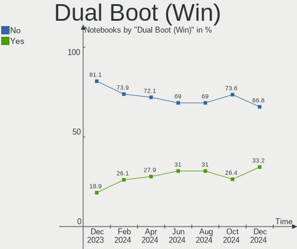
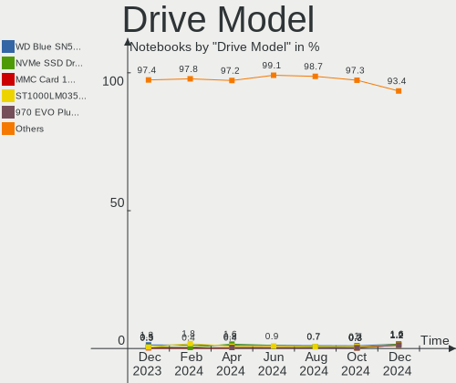
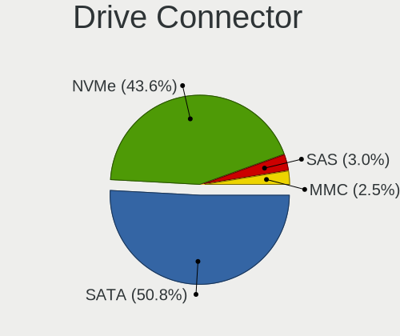
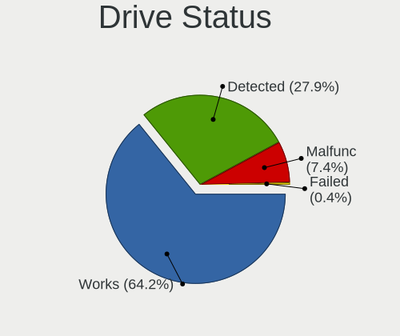
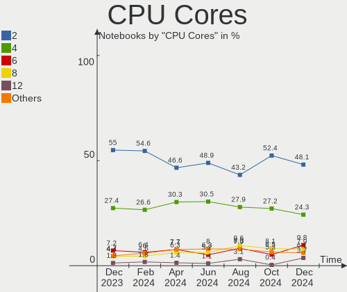
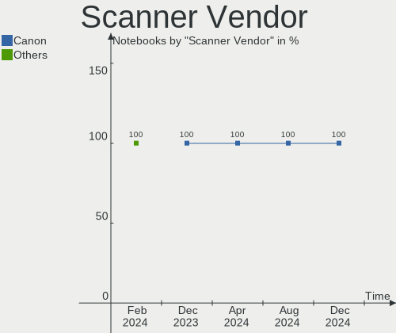
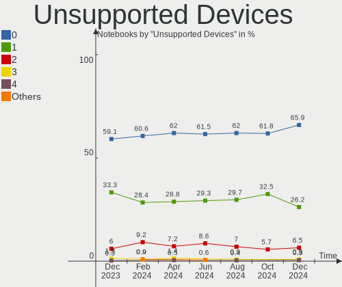

Linux Mint - Hardware Trends (Notebooks)
----------------------------------------

A project to identify most popular hardware characteristics and track their change
over time based on data collected by Linux users at https://Linux-Hardware.org.

Anyone can contribute to this report by the [hw-probe](https://github.com/linuxhw/hw-probe) tool:

    sudo -E hw-probe -all -upload

This report is for one last month. Overall report since the beginning of time: [TestCoverage](https://github.com/linuxhw/TestCoverage)

Period: Dec, 2022.

Contents
--------

* [ System ](#system)
  - [ OS                       ](#os)
  - [ OS Family                ](#os-family)
  - [ Kernel                   ](#kernel)
  - [ Kernel Family            ](#kernel-family)
  - [ Kernel Major Ver.        ](#kernel-major-ver)
  - [ Arch                     ](#arch)
  - [ DE                       ](#de)
  - [ Display Server           ](#display-server)
  - [ Display Manager          ](#display-manager)
  - [ OS Lang                  ](#os-lang)
  - [ Boot Mode                ](#boot-mode)
  - [ Filesystem               ](#filesystem)
  - [ Part. scheme             ](#part-scheme)
  - [ Dual Boot with Linux/BSD ](#dual-boot-with-linuxbsd)
  - [ Dual Boot (Win)          ](#dual-boot-win)

* [ Board ](#board)
  - [ Vendor                   ](#vendor)
  - [ Model                    ](#model)
  - [ Model Family             ](#model-family)
  - [ MFG Year                 ](#mfg-year)
  - [ Form Factor              ](#form-factor)
  - [ Secure Boot              ](#secure-boot)
  - [ Coreboot                 ](#coreboot)
  - [ RAM Size                 ](#ram-size)
  - [ RAM Used                 ](#ram-used)
  - [ Total Drives             ](#total-drives)
  - [ Has CD-ROM               ](#has-cd-rom)
  - [ Has Ethernet             ](#has-ethernet)
  - [ Has WiFi                 ](#has-wifi)
  - [ Has Bluetooth            ](#has-bluetooth)

* [ Location ](#location)
  - [ Country                  ](#country)
  - [ City                     ](#city)

* [ Drives ](#drives)
  - [ Drive Vendor             ](#drive-vendor)
  - [ Drive Model              ](#drive-model)
  - [ HDD Vendor               ](#hdd-vendor)
  - [ SSD Vendor               ](#ssd-vendor)
  - [ Drive Kind               ](#drive-kind)
  - [ Drive Connector          ](#drive-connector)
  - [ Drive Size               ](#drive-size)
  - [ Space Total              ](#space-total)
  - [ Space Used               ](#space-used)
  - [ Malfunc. Drives          ](#malfunc-drives)
  - [ Malfunc. Drive Vendor    ](#malfunc-drive-vendor)
  - [ Malfunc. HDD Vendor      ](#malfunc-hdd-vendor)
  - [ Malfunc. Drive Kind      ](#malfunc-drive-kind)
  - [ Failed Drives            ](#failed-drives)
  - [ Failed Drive Vendor      ](#failed-drive-vendor)
  - [ Drive Status             ](#drive-status)

* [ Storage controller ](#storage-controller)
  - [ Storage Vendor           ](#storage-vendor)
  - [ Storage Model            ](#storage-model)
  - [ Storage Kind             ](#storage-kind)

* [ Processor ](#processor)
  - [ CPU Vendor               ](#cpu-vendor)
  - [ CPU Model                ](#cpu-model)
  - [ CPU Model Family         ](#cpu-model-family)
  - [ CPU Cores                ](#cpu-cores)
  - [ CPU Sockets              ](#cpu-sockets)
  - [ CPU Threads              ](#cpu-threads)
  - [ CPU Op-Modes             ](#cpu-op-modes)
  - [ CPU Microcode            ](#cpu-microcode)
  - [ CPU Microarch            ](#cpu-microarch)

* [ Graphics ](#graphics)
  - [ GPU Vendor               ](#gpu-vendor)
  - [ GPU Model                ](#gpu-model)
  - [ GPU Combo                ](#gpu-combo)
  - [ GPU Driver               ](#gpu-driver)
  - [ GPU Memory               ](#gpu-memory)

* [ Monitor ](#monitor)
  - [ Monitor Vendor           ](#monitor-vendor)
  - [ Monitor Model            ](#monitor-model)
  - [ Monitor Resolution       ](#monitor-resolution)
  - [ Monitor Diagonal         ](#monitor-diagonal)
  - [ Monitor Width            ](#monitor-width)
  - [ Aspect Ratio             ](#aspect-ratio)
  - [ Monitor Area             ](#monitor-area)
  - [ Pixel Density            ](#pixel-density)
  - [ Multiple Monitors        ](#multiple-monitors)

* [ Network ](#network)
  - [ Net Controller Vendor    ](#net-controller-vendor)
  - [ Net Controller Model     ](#net-controller-model)
  - [ Wireless Vendor          ](#wireless-vendor)
  - [ Wireless Model           ](#wireless-model)
  - [ Ethernet Vendor          ](#ethernet-vendor)
  - [ Ethernet Model           ](#ethernet-model)
  - [ Net Controller Kind      ](#net-controller-kind)
  - [ Used Controller          ](#used-controller)
  - [ NICs                     ](#nics)
  - [ IPv6                     ](#ipv6)

* [ Bluetooth ](#bluetooth)
  - [ Bluetooth Vendor         ](#bluetooth-vendor)
  - [ Bluetooth Model          ](#bluetooth-model)

* [ Sound ](#sound)
  - [ Sound Vendor             ](#sound-vendor)
  - [ Sound Model              ](#sound-model)

* [ Memory ](#memory)
  - [ Memory Vendor            ](#memory-vendor)
  - [ Memory Model             ](#memory-model)
  - [ Memory Kind              ](#memory-kind)
  - [ Memory Form Factor       ](#memory-form-factor)
  - [ Memory Size              ](#memory-size)
  - [ Memory Speed             ](#memory-speed)

* [ Printers & scanners ](#printers--scanners)
  - [ Printer Vendor           ](#printer-vendor)
  - [ Printer Model            ](#printer-model)
  - [ Scanner Vendor           ](#scanner-vendor)
  - [ Scanner Model            ](#scanner-model)

* [ Camera ](#camera)
  - [ Camera Vendor            ](#camera-vendor)
  - [ Camera Model             ](#camera-model)

* [ Security ](#security)
  - [ Fingerprint Vendor       ](#fingerprint-vendor)
  - [ Fingerprint Model        ](#fingerprint-model)
  - [ Chipcard Vendor          ](#chipcard-vendor)
  - [ Chipcard Model           ](#chipcard-model)

* [ Unsupported ](#unsupported)
  - [ Unsupported Devices      ](#unsupported-devices)
  - [ Unsupported Device Types ](#unsupported-device-types)

System
------

OS
--

Installed operating systems

| Name            | Notebooks | Percent |
|-----------------|-----------|---------|
| Linux Mint 21   | 172       | 54.78%  |
| Linux Mint 21.1 | 62        | 19.75%  |
| Linux Mint 20.3 | 62        | 19.75%  |
| Linux Mint 19.3 | 6         | 1.91%   |
| Linux Mint 20.2 | 4         | 1.27%   |
| Linux Mint 20.1 | 3         | 0.96%   |
| Linux Mint 20   | 3         | 0.96%   |
| Linux Mint 19.1 | 1         | 0.32%   |
| Linux Mint 19   | 1         | 0.32%   |

OS Family
---------

OS without a version

| Name       | Notebooks | Percent |
|------------|-----------|---------|
| Linux Mint | 314       | 100%    |

Kernel
------

Version of the Linux kernel

| Version                       | Notebooks | Percent |
|-------------------------------|-----------|---------|
| 5.15.0-56-generic             | 196       | 62.42%  |
| 5.4.0-135-generic             | 52        | 16.56%  |
| 5.15.0-53-generic             | 19        | 6.05%   |
| 5.15.0-41-generic             | 18        | 5.73%   |
| 5.14.0-1054-oem               | 5         | 1.59%   |
| 5.4.0-91-generic              | 3         | 0.96%   |
| 5.4.0-132-generic             | 3         | 0.96%   |
| 5.4.0-131-generic             | 2         | 0.64%   |
| 6.1.1-x64v3-xanmod1           | 1         | 0.32%   |
| 6.0.0-1008-oem                | 1         | 0.32%   |
| 6.0.0-1007-oem                | 1         | 0.32%   |
| 5.8.0-63-generic              | 1         | 0.32%   |
| 5.4.0-74-generic              | 1         | 0.32%   |
| 5.4.0-1132206031516-generic   | 1         | 0.32%   |
| 5.17.0-1019-oem               | 1         | 0.32%   |
| 5.17.0-051700-generic         | 1         | 0.32%   |
| 5.15.0-52-generic             | 1         | 0.32%   |
| 5.15.0-50-generic             | 1         | 0.32%   |
| 5.15.0-46-generic             | 1         | 0.32%   |
| 5.15.0-1007-nvidia-lowlatency | 1         | 0.32%   |
| 5.10.157                      | 1         | 0.32%   |
| 4.15.0-200-generic            | 1         | 0.32%   |
| 4.15.0-20-generic             | 1         | 0.32%   |
| 4.15.0-176-generic            | 1         | 0.32%   |

Kernel Family
-------------

Linux kernel without a distro release

| Version  | Notebooks | Percent |
|----------|-----------|---------|
| 5.15.0   | 237       | 75.48%  |
| 5.4.0    | 62        | 19.75%  |
| 5.14.0   | 5         | 1.59%   |
| 4.15.0   | 3         | 0.96%   |
| 6.0.0    | 2         | 0.64%   |
| 5.17.0   | 2         | 0.64%   |
| 6.1.1    | 1         | 0.32%   |
| 5.8.0    | 1         | 0.32%   |
| 5.10.157 | 1         | 0.32%   |

Kernel Major Ver.
-----------------

Linux kernel major version

| Version | Notebooks | Percent |
|---------|-----------|---------|
| 5.15    | 237       | 75.48%  |
| 5.4     | 62        | 19.75%  |
| 5.14    | 5         | 1.59%   |
| 4.15    | 3         | 0.96%   |
| 6.0     | 2         | 0.64%   |
| 5.17    | 2         | 0.64%   |
| 6.1     | 1         | 0.32%   |
| 5.8     | 1         | 0.32%   |
| 5.10    | 1         | 0.32%   |

Arch
----

OS architecture (x86_64, i586, etc.)

| Name   | Notebooks | Percent |
|--------|-----------|---------|
| x86_64 | 313       | 99.68%  |
| i686   | 1         | 0.32%   |

DE
--

Desktop Environment

| Name       | Notebooks | Percent |
|------------|-----------|---------|
| X-Cinnamon | 240       | 76.43%  |
| XFCE       | 35        | 11.15%  |
| MATE       | 29        | 9.24%   |
| GNOME      | 4         | 1.27%   |
| Cinnamon   | 4         | 1.27%   |
| KDE5       | 1         | 0.32%   |
| i3         | 1         | 0.32%   |

Display Server
--------------

X11 or Wayland

| Name    | Notebooks | Percent |
|---------|-----------|---------|
| X11     | 313       | 99.68%  |
| Wayland | 1         | 0.32%   |

Display Manager
---------------

SDDM, LightDM, etc.

| Name    | Notebooks | Percent |
|---------|-----------|---------|
| LightDM | 163       | 51.91%  |
| Unknown | 145       | 46.18%  |
| GDM3    | 4         | 1.27%   |
| LXDM    | 1         | 0.32%   |
| GDM     | 1         | 0.32%   |

OS Lang
-------

Language

| Lang    | Notebooks | Percent |
|---------|-----------|---------|
| en_US   | 112       | 35.67%  |
| de_DE   | 44        | 14.01%  |
| it_IT   | 20        | 6.37%   |
| pt_BR   | 19        | 6.05%   |
| fr_FR   | 16        | 5.1%    |
| ru_RU   | 12        | 3.82%   |
| en_GB   | 10        | 3.18%   |
| pl_PL   | 8         | 2.55%   |
| C       | 8         | 2.55%   |
| en_CA   | 7         | 2.23%   |
| es_MX   | 6         | 1.91%   |
| es_ES   | 6         | 1.91%   |
| en_IN   | 5         | 1.59%   |
| nl_NL   | 3         | 0.96%   |
| hu_HU   | 3         | 0.96%   |
| de_CH   | 3         | 0.96%   |
| ru_UA   | 2         | 0.64%   |
| pt_PT   | 2         | 0.64%   |
| fr_CA   | 2         | 0.64%   |
| fr_BE   | 2         | 0.64%   |
| es_AR   | 2         | 0.64%   |
| en_AU   | 2         | 0.64%   |
| de_AT   | 2         | 0.64%   |
| da_DK   | 2         | 0.64%   |
| zh_CN   | 1         | 0.32%   |
| tr_TR   | 1         | 0.32%   |
| sv_SE   | 1         | 0.32%   |
| sl_SI   | 1         | 0.32%   |
| id_ID   | 1         | 0.32%   |
| fr_CH   | 1         | 0.32%   |
| es_EC   | 1         | 0.32%   |
| en_ZA   | 1         | 0.32%   |
| en_SG   | 1         | 0.32%   |
| en_PH   | 1         | 0.32%   |
| en_IL   | 1         | 0.32%   |
| en_IE   | 1         | 0.32%   |
| el_GR   | 1         | 0.32%   |
| de_IT   | 1         | 0.32%   |
| Default | 1         | 0.32%   |
| cs_CZ   | 1         | 0.32%   |

Boot Mode
---------

EFI or BIOS

| Mode | Notebooks | Percent |
|------|-----------|---------|
| EFI  | 213       | 67.83%  |
| BIOS | 101       | 32.17%  |

Filesystem
----------

Type of filesystem

| Type    | Notebooks | Percent |
|---------|-----------|---------|
| Ext4    | 301       | 95.86%  |
| Overlay | 8         | 2.55%   |
| Btrfs   | 3         | 0.96%   |
| Xfs     | 1         | 0.32%   |
| Ext3    | 1         | 0.32%   |

Part. scheme
------------

Scheme of partitioning

| Type    | Notebooks | Percent |
|---------|-----------|---------|
| GPT     | 150       | 47.77%  |
| Unknown | 145       | 46.18%  |
| MBR     | 19        | 6.05%   |

Dual Boot with Linux/BSD
------------------------

Hosting more than one Linux/BSD

| Dual boot | Notebooks | Percent |
|-----------|-----------|---------|
| No        | 297       | 94.59%  |
| Yes       | 17        | 5.41%   |

Dual Boot (Win)
---------------

Hosting Linux and Windows

| Dual boot | Notebooks | Percent |
|-----------|-----------|---------|
| No        | 261       | 83.12%  |
| Yes       | 53        | 16.88%  |

Board
-----

Vendor
------

Motherboard manufacturer

| Name                        | Notebooks | Percent |
|-----------------------------|-----------|---------|
| Lenovo                      | 70        | 22.29%  |
| Hewlett-Packard             | 60        | 19.11%  |
| Dell                        | 45        | 14.33%  |
| Acer                        | 31        | 9.87%   |
| ASUSTek Computer            | 28        | 8.92%   |
| Google                      | 9         | 2.87%   |
| MSI                         | 8         | 2.55%   |
| Apple                       | 8         | 2.55%   |
| Samsung Electronics         | 7         | 2.23%   |
| Toshiba                     | 5         | 1.59%   |
| Sony                        | 4         | 1.27%   |
| Packard Bell                | 3         | 0.96%   |
| HUAWEI                      | 3         | 0.96%   |
| GPU Company                 | 3         | 0.96%   |
| Fujitsu Siemens             | 2         | 0.64%   |
| Fujitsu                     | 2         | 0.64%   |
| Dynabook                    | 2         | 0.64%   |
| Chuwi                       | 2         | 0.64%   |
| Unknown                     | 2         | 0.64%   |
| TUXEDO                      | 1         | 0.32%   |
| TrekStor                    | 1         | 0.32%   |
| Shenzhen Wangang Technology | 1         | 0.32%   |
| SGIN                        | 1         | 0.32%   |
| Schenker                    | 1         | 0.32%   |
| Positivo                    | 1         | 0.32%   |
| ONE-NETBOOK TECHNOLOGY      | 1         | 0.32%   |
| Notebook                    | 1         | 0.32%   |
| Multilaser                  | 1         | 0.32%   |
| Medion                      | 1         | 0.32%   |
| Mediacom                    | 1         | 0.32%   |
| LG Electronics              | 1         | 0.32%   |
| In-Sing                     | 1         | 0.32%   |
| GTZS                        | 1         | 0.32%   |
| eMachines                   | 1         | 0.32%   |
| Compaq                      | 1         | 0.32%   |
| AXDIA International         | 1         | 0.32%   |
| Avell High Performance      | 1         | 0.32%   |
| Alienware                   | 1         | 0.32%   |
| Acidanthera                 | 1         | 0.32%   |

Model
-----

Motherboard model

| Name                                              | Notebooks | Percent |
|---------------------------------------------------|-----------|---------|
| HP Pavilion g6                                    | 3         | 0.96%   |
| HP EliteBook 820 G3                               | 3         | 0.96%   |
| Unknown                                           | 3         | 0.96%   |
| Lenovo IdeaPad 3 17ABA7 82RQ                      | 2         | 0.64%   |
| HP Notebook                                       | 2         | 0.64%   |
| HP Laptop 15s-fq2xxx                              | 2         | 0.64%   |
| HP ENVY Notebook                                  | 2         | 0.64%   |
| HP EliteBook 840 G1                               | 2         | 0.64%   |
| HP Compaq 6730s                                   | 2         | 0.64%   |
| HP 250 G8 Notebook PC                             | 2         | 0.64%   |
| GPU Company GWTC116-2                             | 2         | 0.64%   |
| Google Chell                                      | 2         | 0.64%   |
| Google Blooglet                                   | 2         | 0.64%   |
| Dell Latitude E6440                               | 2         | 0.64%   |
| Dell Latitude E6430                               | 2         | 0.64%   |
| Dell Latitude E6420                               | 2         | 0.64%   |
| Dell Latitude E6410                               | 2         | 0.64%   |
| Dell Inspiron 7720                                | 2         | 0.64%   |
| ASUS X750JN                                       | 2         | 0.64%   |
| ASUS N55SF                                        | 2         | 0.64%   |
| Apple MacBookPro8,2                               | 2         | 0.64%   |
| TUXEDO Book BA1510                                | 1         | 0.32%   |
| TrekStor Primebook P14                            | 1         | 0.32%   |
| Toshiba Satellite S70-A                           | 1         | 0.32%   |
| Toshiba Satellite P755                            | 1         | 0.32%   |
| Toshiba Satellite L455                            | 1         | 0.32%   |
| Toshiba Satellite C70D-B                          | 1         | 0.32%   |
| Toshiba Satellite A210                            | 1         | 0.32%   |
| Sony VPCEE27FL                                    | 1         | 0.32%   |
| Sony VPCCW21FX                                    | 1         | 0.32%   |
| Sony SVE15133CNB                                  | 1         | 0.32%   |
| Sony SVE14A18ECH                                  | 1         | 0.32%   |
| Shenzhen Wangang TANK56                           | 1         | 0.32%   |
| SGIN laptop                                       | 1         | 0.32%   |
| Schenker XMG APEX 15 MAX (E22)                    | 1         | 0.32%   |
| Samsung RV420/RV520/RV720/E3530/S3530/E3420/E3520 | 1         | 0.32%   |
| Samsung RV415/RV515                               | 1         | 0.32%   |
| Samsung RF511/RF411/RF711                         | 1         | 0.32%   |
| Samsung 530U3C/530U4C/532U3C                      | 1         | 0.32%   |
| Samsung 355V4C/356V4C/3445VC/3545VC               | 1         | 0.32%   |

Model Family
------------

Motherboard model prefix

| Name                  | Notebooks | Percent |
|-----------------------|-----------|---------|
| Lenovo ThinkPad       | 33        | 10.51%  |
| Dell Latitude         | 24        | 7.64%   |
| Acer Aspire           | 22        | 7.01%   |
| Lenovo IdeaPad        | 20        | 6.37%   |
| HP EliteBook          | 14        | 4.46%   |
| Dell Inspiron         | 13        | 4.14%   |
| HP Pavilion           | 12        | 3.82%   |
| HP Laptop             | 10        | 3.18%   |
| Toshiba Satellite     | 5         | 1.59%   |
| ASUS VivoBook         | 5         | 1.59%   |
| HP ProBook            | 4         | 1.27%   |
| Acer Swift            | 4         | 1.27%   |
| Lenovo Legion         | 3         | 0.96%   |
| HP ZBook              | 3         | 0.96%   |
| HP Stream             | 3         | 0.96%   |
| HP Compaq             | 3         | 0.96%   |
| Unknown               | 3         | 0.96%   |
| Packard Bell EasyNote | 2         | 0.64%   |
| Lenovo Yoga           | 2         | 0.64%   |
| Lenovo ThinkBook      | 2         | 0.64%   |
| HP Notebook           | 2         | 0.64%   |
| HP ENVY               | 2         | 0.64%   |
| HP 250                | 2         | 0.64%   |
| GPU Company GWTC116-2 | 2         | 0.64%   |
| Google Chell          | 2         | 0.64%   |
| Google Blooglet       | 2         | 0.64%   |
| Fujitsu LIFEBOOK      | 2         | 0.64%   |
| Dell System           | 2         | 0.64%   |
| Dell G15              | 2         | 0.64%   |
| Chuwi HeroBook        | 2         | 0.64%   |
| ASUS X750JN           | 2         | 0.64%   |
| ASUS TUF              | 2         | 0.64%   |
| ASUS N55SF            | 2         | 0.64%   |
| ASUS ASUS             | 2         | 0.64%   |
| Apple MacBookPro8     | 2         | 0.64%   |
| TUXEDO Book           | 1         | 0.32%   |
| TrekStor Primebook    | 1         | 0.32%   |
| Sony VPCEE27FL        | 1         | 0.32%   |
| Sony VPCCW21FX        | 1         | 0.32%   |
| Sony SVE15133CNB      | 1         | 0.32%   |

MFG Year
--------

Motherboard manufacture year

| Year | Notebooks | Percent |
|------|-----------|---------|
| 2021 | 36        | 11.46%  |
| 2011 | 30        | 9.55%   |
| 2022 | 25        | 7.96%   |
| 2020 | 25        | 7.96%   |
| 2012 | 25        | 7.96%   |
| 2019 | 23        | 7.32%   |
| 2015 | 19        | 6.05%   |
| 2017 | 18        | 5.73%   |
| 2014 | 18        | 5.73%   |
| 2013 | 18        | 5.73%   |
| 2016 | 17        | 5.41%   |
| 2018 | 16        | 5.1%    |
| 2010 | 13        | 4.14%   |
| 2009 | 12        | 3.82%   |
| 2008 | 10        | 3.18%   |
| 2007 | 5         | 1.59%   |
| 2006 | 4         | 1.27%   |

Form Factor
-----------

Physical design of the computer

| Name     | Notebooks | Percent |
|----------|-----------|---------|
| Notebook | 314       | 100%    |

Secure Boot
-----------

Enabled or disabled

| State    | Notebooks | Percent |
|----------|-----------|---------|
| Disabled | 267       | 85.03%  |
| Enabled  | 47        | 14.97%  |

Coreboot
--------

Have coreboot on board

| Used | Notebooks | Percent |
|------|-----------|---------|
| No   | 305       | 97.13%  |
| Yes  | 9         | 2.87%   |

RAM Size
--------

Total RAM memory

| Size in GB  | Notebooks | Percent |
|-------------|-----------|---------|
| 4.01-8.0    | 101       | 32.17%  |
| 3.01-4.0    | 77        | 24.52%  |
| 16.01-24.0  | 57        | 18.15%  |
| 8.01-16.0   | 43        | 13.69%  |
| 32.01-64.0  | 12        | 3.82%   |
| 1.01-2.0    | 9         | 2.87%   |
| 2.01-3.0    | 8         | 2.55%   |
| 24.01-32.0  | 4         | 1.27%   |
| 64.01-256.0 | 2         | 0.64%   |
| 0.51-1.0    | 1         | 0.32%   |

RAM Used
--------

Used RAM memory

| Used GB    | Notebooks | Percent |
|------------|-----------|---------|
| 1.01-2.0   | 115       | 36.62%  |
| 2.01-3.0   | 89        | 28.34%  |
| 3.01-4.0   | 58        | 18.47%  |
| 4.01-8.0   | 28        | 8.92%   |
| 0.51-1.0   | 13        | 4.14%   |
| 8.01-16.0  | 9         | 2.87%   |
| 16.01-24.0 | 2         | 0.64%   |

Total Drives
------------

Number of drives on board

| Drives | Notebooks | Percent |
|--------|-----------|---------|
| 1      | 234       | 74.52%  |
| 2      | 73        | 23.25%  |
| 3      | 5         | 1.59%   |
| 4      | 2         | 0.64%   |

Has CD-ROM
----------

Has CD-ROM on board

| Presented | Notebooks | Percent |
|-----------|-----------|---------|
| No        | 197       | 62.74%  |
| Yes       | 117       | 37.26%  |

Has Ethernet
------------

Has Ethernet on board

| Presented | Notebooks | Percent |
|-----------|-----------|---------|
| Yes       | 256       | 81.53%  |
| No        | 58        | 18.47%  |

Has WiFi
--------

Has WiFi module

| Presented | Notebooks | Percent |
|-----------|-----------|---------|
| Yes       | 312       | 99.36%  |
| No        | 2         | 0.64%   |

Has Bluetooth
-------------

Has Bluetooth module

| Presented | Notebooks | Percent |
|-----------|-----------|---------|
| Yes       | 248       | 78.98%  |
| No        | 66        | 21.02%  |

Location
--------

Country
-------

Geographic location (country)

| Country      | Notebooks | Percent |
|--------------|-----------|---------|
| USA          | 52        | 16.56%  |
| Germany      | 48        | 15.29%  |
| Italy        | 25        | 7.96%   |
| Brazil       | 21        | 6.69%   |
| France       | 16        | 5.1%    |
| Russia       | 15        | 4.78%   |
| Poland       | 11        | 3.5%    |
| Canada       | 11        | 3.5%    |
| UK           | 10        | 3.18%   |
| Spain        | 8         | 2.55%   |
| Switzerland  | 6         | 1.91%   |
| Netherlands  | 6         | 1.91%   |
| Mexico       | 6         | 1.91%   |
| India        | 6         | 1.91%   |
| Sweden       | 5         | 1.59%   |
| Belgium      | 5         | 1.59%   |
| Austria      | 5         | 1.59%   |
| Hungary      | 4         | 1.27%   |
| Denmark      | 4         | 1.27%   |
| Ukraine      | 3         | 0.96%   |
| Slovakia     | 3         | 0.96%   |
| Greece       | 3         | 0.96%   |
| Czechia      | 3         | 0.96%   |
| Vietnam      | 2         | 0.64%   |
| Portugal     | 2         | 0.64%   |
| Malaysia     | 2         | 0.64%   |
| Ireland      | 2         | 0.64%   |
| Finland      | 2         | 0.64%   |
| Cyprus       | 2         | 0.64%   |
| Australia    | 2         | 0.64%   |
| Argentina    | 2         | 0.64%   |
| UAE          | 1         | 0.32%   |
| Turkey       | 1         | 0.32%   |
| Thailand     | 1         | 0.32%   |
| Sri Lanka    | 1         | 0.32%   |
| South Africa | 1         | 0.32%   |
| Slovenia     | 1         | 0.32%   |
| Singapore    | 1         | 0.32%   |
| Romania      | 1         | 0.32%   |
| Puerto Rico  | 1         | 0.32%   |

City
----

Geographic location (city)

| City                 | Notebooks | Percent |
|----------------------|-----------|---------|
| Moscow               | 5         | 1.59%   |
| Hamburg              | 5         | 1.59%   |
| Berlin               | 5         | 1.59%   |
| Frankfurt am Main    | 4         | 1.27%   |
| Warsaw               | 3         | 0.96%   |
| Stockholm            | 3         | 0.96%   |
| Budapest             | 3         | 0.96%   |
| Zurich               | 2         | 0.64%   |
| Vienna               | 2         | 0.64%   |
| Victoria             | 2         | 0.64%   |
| Valencia             | 2         | 0.64%   |
| Turin                | 2         | 0.64%   |
| Tilburg              | 2         | 0.64%   |
| St Petersburg        | 2         | 0.64%   |
| Springfield          | 2         | 0.64%   |
| Sao José dos Campos | 2         | 0.64%   |
| Salzburg             | 2         | 0.64%   |
| Rio de Janeiro       | 2         | 0.64%   |
| Pisa                 | 2         | 0.64%   |
| Nicosia              | 2         | 0.64%   |
| Nashville            | 2         | 0.64%   |
| Naples               | 2         | 0.64%   |
| Milan                | 2         | 0.64%   |
| Mexico City          | 2         | 0.64%   |
| Lviv                 | 2         | 0.64%   |
| London               | 2         | 0.64%   |
| Lisbon               | 2         | 0.64%   |
| Kiel                 | 2         | 0.64%   |
| Katowice             | 2         | 0.64%   |
| Ho Chi Minh City     | 2         | 0.64%   |
| Helsinki             | 2         | 0.64%   |
| Delhi                | 2         | 0.64%   |
| Dallas               | 2         | 0.64%   |
| Bratislava           | 2         | 0.64%   |
| Bengaluru            | 2         | 0.64%   |
| Bari                 | 2         | 0.64%   |
| Zlotow               | 1         | 0.32%   |
| Zeithain             | 1         | 0.32%   |
| Yorkton              | 1         | 0.32%   |
| Wroclaw              | 1         | 0.32%   |

Drives
------

Drive Vendor
------------

Hard drive vendors

| Vendor              | Notebooks | Drives | Percent |
|---------------------|-----------|--------|---------|
| Samsung Electronics | 55        | 57     | 13.92%  |
| WDC                 | 44        | 45     | 11.14%  |
| Unknown             | 40        | 42     | 10.13%  |
| Seagate             | 28        | 29     | 7.09%   |
| Kingston            | 26        | 26     | 6.58%   |
| Sandisk             | 20        | 20     | 5.06%   |
| Toshiba             | 18        | 19     | 4.56%   |
| Micron Technology   | 17        | 17     | 4.3%    |
| Crucial             | 15        | 18     | 3.8%    |
| SK hynix            | 13        | 13     | 3.29%   |
| Hitachi             | 13        | 13     | 3.29%   |
| Intel               | 9         | 9      | 2.28%   |
| A-DATA Technology   | 9         | 9      | 2.28%   |
| HGST                | 8         | 8      | 2.03%   |
| KIOXIA              | 6         | 6      | 1.52%   |
| China               | 6         | 6      | 1.52%   |
| Transcend           | 4         | 4      | 1.01%   |
| Phison Electronics  | 4         | 4      | 1.01%   |
| Intenso             | 4         | 4      | 1.01%   |
| Fujitsu             | 4         | 4      | 1.01%   |
| OCZ                 | 3         | 3      | 0.76%   |
| Netac               | 3         | 3      | 0.76%   |
| PNY                 | 2         | 2      | 0.51%   |
| Patriot             | 2         | 2      | 0.51%   |
| LITEONIT            | 2         | 2      | 0.51%   |
| KingSpec            | 2         | 2      | 0.51%   |
| KingFast            | 2         | 3      | 0.51%   |
| Inland              | 2         | 2      | 0.51%   |
| GOODRAM             | 2         | 2      | 0.51%   |
| FORESEE             | 2         | 2      | 0.51%   |
| Apacer              | 2         | 2      | 0.51%   |
| Unknown             | 2         | 2      | 0.51%   |
| YMTC                | 1         | 1      | 0.25%   |
| UMIS                | 1         | 1      | 0.25%   |
| TrekStor            | 1         | 1      | 0.25%   |
| Team                | 1         | 1      | 0.25%   |
| STAR                | 1         | 1      | 0.25%   |
| SSSTC               | 1         | 1      | 0.25%   |
| Silicon Motion      | 1         | 1      | 0.25%   |
| SABRENT             | 1         | 1      | 0.25%   |

Drive Model
-----------

Hard drive models

| Model                                              | Notebooks | Percent |
|----------------------------------------------------|-----------|---------|
| Unknown MMC Card  32GB                             | 11        | 2.73%   |
| Kingston SA400S37240G 240GB SSD                    | 10        | 2.48%   |
| Unknown MMC Card  64GB                             | 9         | 2.23%   |
| Seagate ST9500325AS 500GB                          | 5         | 1.24%   |
| Seagate ST1000LM024 HN-M101MBB 1TB                 | 5         | 1.24%   |
| Unknown MMC Card  128GB                            | 4         | 0.99%   |
| Seagate ST1000LM035-1RK172 1TB                     | 4         | 0.99%   |
| Kingston SA400S37480G 480GB SSD                    | 4         | 0.99%   |
| Crucial CT250MX500SSD1 250GB                       | 4         | 0.99%   |
| WDC WD5000LPVX-22V0TT0 500GB                       | 3         | 0.74%   |
| WDC PC SN530 SDBPMPZ-512G-1101 512GB               | 3         | 0.74%   |
| Unknown MMC Card  16GB                             | 3         | 0.74%   |
| Toshiba MQ01ABF050 500GB                           | 3         | 0.74%   |
| Samsung SSD 850 EVO 500GB                          | 3         | 0.74%   |
| Phison PS5013 E13 NVMe Controller 512GB            | 3         | 0.74%   |
| Micron 2450_MTFDKBA512TFK 512GB                    | 3         | 0.74%   |
| KIOXIA KBG50ZNV256G 256GB                          | 3         | 0.74%   |
| Hitachi HTS545050B9A300 500GB                      | 3         | 0.74%   |
| WDC WDS240G2G0A-00JH30 240GB SSD                   | 2         | 0.5%    |
| WDC WD10SPZX-24Z10T0 1TB                           | 2         | 0.5%    |
| WDC PC SN730 SDBQNTY-256G-1001 256GB               | 2         | 0.5%    |
| Unknown MMC Card  1GB                              | 2         | 0.5%    |
| Toshiba XG6 NVMe SSD Controller 256GB              | 2         | 0.5%    |
| Toshiba MQ04ABF100 1TB                             | 2         | 0.5%    |
| SK hynix BC711 NVMe 512GB                          | 2         | 0.5%    |
| Seagate ST500LT012-9WS142 500GB                    | 2         | 0.5%    |
| SanDisk SSD PLUS 480GB                             | 2         | 0.5%    |
| SanDisk SSD PLUS 1000GB                            | 2         | 0.5%    |
| SanDisk SD8SN8U-256G-1006 256GB SSD                | 2         | 0.5%    |
| Samsung SSD 870 EVO 500GB                          | 2         | 0.5%    |
| Samsung SSD 860 EVO 500GB                          | 2         | 0.5%    |
| Samsung SSD 850 EVO 250GB                          | 2         | 0.5%    |
| Samsung NVMe SSD Controller SM951/PM951 512GB      | 2         | 0.5%    |
| Samsung NVMe SSD Controller PM9A1/PM9A3/980PRO 2TB | 2         | 0.5%    |
| Samsung MZVL21T0HCLR-00B00 1TB                     | 2         | 0.5%    |
| Netac SSD 128GB                                    | 2         | 0.5%    |
| Micron MTFDHBA512QFD 512GB                         | 2         | 0.5%    |
| Micron 2450_MTFDKBA1T0TFK 1TB                      | 2         | 0.5%    |
| Micron 1100_MTFDDAV256TBN 256GB SSD                | 2         | 0.5%    |
| Kingston SV300S37A120G 120GB SSD                   | 2         | 0.5%    |

HDD Vendor
----------

Hard disk drive vendors

| Vendor              | Notebooks | Drives | Percent |
|---------------------|-----------|--------|---------|
| Seagate             | 28        | 29     | 29.47%  |
| WDC                 | 27        | 28     | 28.42%  |
| Hitachi             | 13        | 13     | 13.68%  |
| Toshiba             | 12        | 12     | 12.63%  |
| HGST                | 8         | 8      | 8.42%   |
| Fujitsu             | 4         | 4      | 4.21%   |
| Samsung Electronics | 3         | 3      | 3.16%   |

SSD Vendor
----------

Solid state drive vendors

| Vendor              | Notebooks | Drives | Percent |
|---------------------|-----------|--------|---------|
| Samsung Electronics | 28        | 28     | 17.83%  |
| Kingston            | 23        | 23     | 14.65%  |
| SanDisk             | 14        | 14     | 8.92%   |
| Crucial             | 14        | 17     | 8.92%   |
| Micron Technology   | 8         | 8      | 5.1%    |
| A-DATA Technology   | 7         | 7      | 4.46%   |
| China               | 6         | 6      | 3.82%   |
| WDC                 | 5         | 5      | 3.18%   |
| SK hynix            | 4         | 4      | 2.55%   |
| Transcend           | 3         | 3      | 1.91%   |
| OCZ                 | 3         | 3      | 1.91%   |
| Netac               | 3         | 3      | 1.91%   |
| Intenso             | 3         | 3      | 1.91%   |
| Intel               | 3         | 3      | 1.91%   |
| Toshiba             | 2         | 2      | 1.27%   |
| PNY                 | 2         | 2      | 1.27%   |
| Patriot             | 2         | 2      | 1.27%   |
| LITEONIT            | 2         | 2      | 1.27%   |
| KingSpec            | 2         | 2      | 1.27%   |
| KingFast            | 2         | 2      | 1.27%   |
| Inland              | 2         | 2      | 1.27%   |
| GOODRAM             | 2         | 2      | 1.27%   |
| Apacer              | 2         | 2      | 1.27%   |
| Unknown             | 1         | 1      | 0.64%   |
| TrekStor            | 1         | 1      | 0.64%   |
| Team                | 1         | 1      | 0.64%   |
| STAR                | 1         | 1      | 0.64%   |
| NGFF                | 1         | 1      | 0.64%   |
| Mushkin             | 1         | 1      | 0.64%   |
| MaxDigital          | 1         | 1      | 0.64%   |
| LITEON              | 1         | 1      | 0.64%   |
| Lexar               | 1         | 1      | 0.64%   |
| LDLC                | 1         | 1      | 0.64%   |
| INDMEM              | 1         | 1      | 0.64%   |
| FORESEE             | 1         | 1      | 0.64%   |
| Dogfish             | 1         | 1      | 0.64%   |
| BRAVEEAGLE          | 1         | 1      | 0.64%   |
| Apple               | 1         | 1      | 0.64%   |

Drive Kind
----------

HDD or SSD

| Kind    | Notebooks | Drives | Percent |
|---------|-----------|--------|---------|
| SSD     | 144       | 160    | 38.61%  |
| NVMe    | 91        | 100    | 24.4%   |
| HDD     | 91        | 97     | 24.4%   |
| MMC     | 41        | 43     | 10.99%  |
| Unknown | 6         | 6      | 1.61%   |

Drive Connector
---------------

SATA, SAS, NVMe, etc.

| Type | Notebooks | Drives | Percent |
|------|-----------|--------|---------|
| SATA | 217       | 258    | 61.3%   |
| NVMe | 89        | 98     | 25.14%  |
| MMC  | 41        | 43     | 11.58%  |
| SAS  | 7         | 7      | 1.98%   |

Drive Size
----------

Size of hard drive

| Size in TB | Notebooks | Drives | Percent |
|------------|-----------|--------|---------|
| 0.01-0.5   | 177       | 192    | 75.32%  |
| 0.51-1.0   | 53        | 57     | 22.55%  |
| 1.01-2.0   | 5         | 8      | 2.13%   |

Space Total
-----------

Amount of disk space available on the file system

| Size in GB | Notebooks | Percent |
|------------|-----------|---------|
| 101-250    | 116       | 36.94%  |
| 251-500    | 92        | 29.3%   |
| 501-1000   | 43        | 13.69%  |
| 51-100     | 24        | 7.64%   |
| 1001-2000  | 18        | 5.73%   |
| 21-50      | 11        | 3.5%    |
| 1-20       | 7         | 2.23%   |
| 2001-3000  | 3         | 0.96%   |

Space Used
----------

Amount of used disk space

| Used GB   | Notebooks | Percent |
|-----------|-----------|---------|
| 1-20      | 81        | 25.8%   |
| 21-50     | 68        | 21.66%  |
| 101-250   | 62        | 19.75%  |
| 51-100    | 58        | 18.47%  |
| 251-500   | 27        | 8.6%    |
| 501-1000  | 14        | 4.46%   |
| 1001-2000 | 4         | 1.27%   |

Malfunc. Drives
---------------

Drive models with a malfunction

| Model                                               | Notebooks | Drives | Percent |
|-----------------------------------------------------|-----------|--------|---------|
| Seagate ST9500325AS 500GB                           | 2         | 2      | 7.69%   |
| Seagate ST500LT012-9WS142 500GB                     | 2         | 2      | 7.69%   |
| WDC WDS240G2G0A-00JH30 240GB SSD                    | 1         | 1      | 3.85%   |
| WDC WD2500BJKT-75F4T0 250GB                         | 1         | 1      | 3.85%   |
| Seagate ST9500423AS 500GB                           | 1         | 1      | 3.85%   |
| Seagate ST9320423AS 320GB                           | 1         | 1      | 3.85%   |
| Seagate ST2000LM007-1R8174 2TB                      | 1         | 1      | 3.85%   |
| Seagate ST1000LM048-2E7172 1TB                      | 1         | 1      | 3.85%   |
| Seagate ST1000LM035-1RK172 1TB                      | 1         | 1      | 3.85%   |
| Seagate ST1000LM024 HN-M101MBB 1TB                  | 1         | 1      | 3.85%   |
| SanDisk SD6PP4M-256G-1006 256GB SSD                 | 1         | 1      | 3.85%   |
| Samsung Electronics HN-M500MBB 500GB                | 1         | 1      | 3.85%   |
| Samsung Electronics HM160HC 160GB                   | 1         | 1      | 3.85%   |
| Micron Technology MTFDDAV256TDL-1AW1ZABHA 256GB SSD | 1         | 1      | 3.85%   |
| Kingston SA400S37480G 480GB SSD                     | 1         | 1      | 3.85%   |
| Kingston RBU-SNS8350DES3128GP 128GB SSD             | 1         | 1      | 3.85%   |
| KingSpec ACSC2M256mSA 256GB SSD                     | 1         | 1      | 3.85%   |
| Intel SSDSC2BW180H6 180GB                           | 1         | 1      | 3.85%   |
| Intel SSDSC2BF180A4L 180GB                          | 1         | 1      | 3.85%   |
| Hitachi HTS721060G9SA00 64GB                        | 1         | 1      | 3.85%   |
| Hitachi HTS543216L9SA00 160GB                       | 1         | 1      | 3.85%   |
| HGST HTS545050A7E380 500GB                          | 1         | 1      | 3.85%   |
| Crucial CT1050MX300SSD1 1TB                         | 1         | 1      | 3.85%   |
| China SSD 128GB                                     | 1         | 1      | 3.85%   |

Malfunc. Drive Vendor
---------------------

Vendors of faulty drives

| Vendor              | Notebooks | Drives | Percent |
|---------------------|-----------|--------|---------|
| Seagate             | 10        | 10     | 38.46%  |
| WDC                 | 2         | 2      | 7.69%   |
| Samsung Electronics | 2         | 2      | 7.69%   |
| Kingston            | 2         | 2      | 7.69%   |
| Intel               | 2         | 2      | 7.69%   |
| Hitachi             | 2         | 2      | 7.69%   |
| SanDisk             | 1         | 1      | 3.85%   |
| Micron Technology   | 1         | 1      | 3.85%   |
| KingSpec            | 1         | 1      | 3.85%   |
| HGST                | 1         | 1      | 3.85%   |
| Crucial             | 1         | 1      | 3.85%   |
| China               | 1         | 1      | 3.85%   |

Malfunc. HDD Vendor
-------------------

Vendors of faulty HDD drives

| Vendor              | Notebooks | Drives | Percent |
|---------------------|-----------|--------|---------|
| Seagate             | 10        | 10     | 62.5%   |
| Samsung Electronics | 2         | 2      | 12.5%   |
| Hitachi             | 2         | 2      | 12.5%   |
| WDC                 | 1         | 1      | 6.25%   |
| HGST                | 1         | 1      | 6.25%   |

Malfunc. Drive Kind
-------------------

Kinds of faulty drives

| Kind | Notebooks | Drives | Percent |
|------|-----------|--------|---------|
| HDD  | 16        | 16     | 61.54%  |
| SSD  | 10        | 10     | 38.46%  |

Failed Drives
-------------

Failed drive models

Zero info for selected period =(

Failed Drive Vendor
-------------------

Failed drive vendors

Zero info for selected period =(

Drive Status
------------

Number of failed and malfunc. drives

| Status   | Notebooks | Drives | Percent |
|----------|-----------|--------|---------|
| Detected | 173       | 222    | 52.42%  |
| Works    | 132       | 158    | 40%     |
| Malfunc  | 25        | 26     | 7.58%   |

Storage controller
------------------

Storage Vendor
--------------

Storage controller vendors

| Vendor                           | Notebooks | Percent |
|----------------------------------|-----------|---------|
| Intel                            | 226       | 63.66%  |
| AMD                              | 33        | 9.3%    |
| Samsung Electronics              | 25        | 7.04%   |
| SanDisk                          | 18        | 5.07%   |
| Micron Technology                | 10        | 2.82%   |
| SK hynix                         | 8         | 2.25%   |
| KIOXIA                           | 7         | 1.97%   |
| Phison Electronics               | 6         | 1.69%   |
| Toshiba America Info Systems     | 4         | 1.13%   |
| Kingston Technology Company      | 4         | 1.13%   |
| Nvidia                           | 3         | 0.85%   |
| Yangtze Memory Technologies      | 1         | 0.28%   |
| Union Memory (Shenzhen)          | 1         | 0.28%   |
| Transcend                        | 1         | 0.28%   |
| Solid State Storage Technology   | 1         | 0.28%   |
| Silicon Motion                   | 1         | 0.28%   |
| Silicon Integrated Systems [SiS] | 1         | 0.28%   |
| Shenzhen Longsys Electronics     | 1         | 0.28%   |
| Realtek Semiconductor            | 1         | 0.28%   |
| Micron/Crucial Technology        | 1         | 0.28%   |
| Marvell Technology Group         | 1         | 0.28%   |
| ADATA Technology                 | 1         | 0.28%   |

Storage Model
-------------

Storage controller models

| Model                                                                                  | Notebooks | Percent |
|----------------------------------------------------------------------------------------|-----------|---------|
| Intel Sunrise Point-LP SATA Controller [AHCI mode]                                     | 27        | 6.98%   |
| AMD FCH SATA Controller [AHCI mode]                                                    | 25        | 6.46%   |
| Intel 82801 Mobile SATA Controller [RAID mode]                                         | 24        | 6.2%    |
| Intel 7 Series Chipset Family 6-port SATA Controller [AHCI mode]                       | 22        | 5.68%   |
| Intel 6 Series/C200 Series Chipset Family 6 port Mobile SATA AHCI Controller           | 16        | 4.13%   |
| Intel Volume Management Device NVMe RAID Controller                                    | 14        | 3.62%   |
| Intel 82801IBM/IEM (ICH9M/ICH9M-E) 4 port SATA Controller [AHCI mode]                  | 14        | 3.62%   |
| Intel Celeron/Pentium Silver Processor SATA Controller                                 | 13        | 3.36%   |
| Intel 8 Series/C220 Series Chipset Family 6-port SATA Controller 1 [AHCI mode]         | 13        | 3.36%   |
| Samsung NVMe SSD Controller 980                                                        | 10        | 2.58%   |
| Micron Non-Volatile memory controller                                                  | 10        | 2.58%   |
| Intel 8 Series SATA Controller 1 [AHCI mode]                                           | 10        | 2.58%   |
| Intel Wildcat Point-LP SATA Controller [AHCI Mode]                                     | 8         | 2.07%   |
| SanDisk Non-Volatile memory controller                                                 | 7         | 1.81%   |
| Intel 5 Series/3400 Series Chipset 6 port SATA AHCI Controller                         | 7         | 1.81%   |
| Intel Tiger Lake-LP SATA Controller                                                    | 6         | 1.55%   |
| Intel Cannon Lake Mobile PCH SATA AHCI Controller                                      | 6         | 1.55%   |
| Samsung NVMe SSD Controller SM981/PM981/PM983                                          | 5         | 1.29%   |
| Phison PS5013 E13 NVMe Controller                                                      | 5         | 1.29%   |
| Intel SSD 660P Series                                                                  | 5         | 1.29%   |
| SanDisk WD Black SN750 / PC SN730 NVMe SSD                                             | 4         | 1.03%   |
| Samsung NVMe SSD Controller PM9A1/PM9A3/980PRO                                         | 4         | 1.03%   |
| KIOXIA Non-Volatile memory controller                                                  | 4         | 1.03%   |
| Intel HM170/QM170 Chipset SATA Controller [AHCI Mode]                                  | 4         | 1.03%   |
| Intel Cannon Point-LP SATA Controller [AHCI Mode]                                      | 4         | 1.03%   |
| Intel Atom Processor E3800 Series SATA AHCI Controller                                 | 4         | 1.03%   |
| Intel Alder Lake-P SATA AHCI Controller                                                | 4         | 1.03%   |
| Intel 82801HM/HEM (ICH8M/ICH8M-E) SATA Controller [AHCI mode]                          | 4         | 1.03%   |
| Intel 82801HM/HEM (ICH8M/ICH8M-E) IDE Controller                                       | 4         | 1.03%   |
| Intel 6 Series/C200 Series Chipset Family Mobile SATA Controller (IDE mode, ports 0-3) | 4         | 1.03%   |
| Intel 5 Series/3400 Series Chipset 4 port SATA AHCI Controller                         | 4         | 1.03%   |
| AMD SB7x0/SB8x0/SB9x0 SATA Controller [AHCI mode]                                      | 4         | 1.03%   |
| Toshiba America Info Systems XG6 NVMe SSD Controller                                   | 3         | 0.78%   |
| SK hynix BC511                                                                         | 3         | 0.78%   |
| SanDisk WD Blue SN550 NVMe SSD                                                         | 3         | 0.78%   |
| KIOXIA NVMe SSD Controller BG4                                                         | 3         | 0.78%   |
| Intel Q170/Q150/B150/H170/H110/Z170/CM236 Chipset SATA Controller [AHCI Mode]          | 3         | 0.78%   |
| Intel Ice Lake-LP SATA Controller [AHCI mode]                                          | 3         | 0.78%   |
| Intel Celeron N3350/Pentium N4200/Atom E3900 Series SATA AHCI Controller               | 3         | 0.78%   |
| Intel 82801IBM/IEM (ICH9M/ICH9M-E) 2 port SATA Controller [IDE mode]                   | 3         | 0.78%   |

Storage Kind
------------

Kind of storage controller (IDE, SATA, NVMe, SAS, ...)

| Kind | Notebooks | Percent |
|------|-----------|---------|
| SATA | 222       | 59.36%  |
| NVMe | 89        | 23.8%   |
| RAID | 38        | 10.16%  |
| IDE  | 25        | 6.68%   |

Processor
---------

CPU Vendor
----------

Processor vendors

| Vendor | Notebooks | Percent |
|--------|-----------|---------|
| Intel  | 266       | 84.71%  |
| AMD    | 48        | 15.29%  |

CPU Model
---------

Processor models

| Model                                         | Notebooks | Percent |
|-----------------------------------------------|-----------|---------|
| Intel Celeron N4020 CPU @ 1.10GHz             | 11        | 3.5%    |
| Intel 11th Gen Core i5-1135G7 @ 2.40GHz       | 9         | 2.87%   |
| Intel Core i5-6200U CPU @ 2.30GHz             | 6         | 1.91%   |
| Intel Core i5-5300U CPU @ 2.30GHz             | 5         | 1.59%   |
| Intel Core i5-4200M CPU @ 2.50GHz             | 5         | 1.59%   |
| Intel Core i5-3210M CPU @ 2.50GHz             | 5         | 1.59%   |
| Intel Celeron CPU N2840 @ 2.16GHz             | 5         | 1.59%   |
| Intel Core i7-3630QM CPU @ 2.40GHz            | 4         | 1.27%   |
| Intel Core i5-7200U CPU @ 2.50GHz             | 4         | 1.27%   |
| Intel Core i5-4210U CPU @ 1.70GHz             | 4         | 1.27%   |
| Intel Core i5-3320M CPU @ 2.60GHz             | 4         | 1.27%   |
| Intel Core i5-2430M CPU @ 2.40GHz             | 4         | 1.27%   |
| Intel Core 2 Duo CPU P8600 @ 2.40GHz          | 4         | 1.27%   |
| AMD Ryzen 5 5500U with Radeon Graphics        | 4         | 1.27%   |
| Intel Core i7-8550U CPU @ 1.80GHz             | 3         | 0.96%   |
| Intel Core i7-7700HQ CPU @ 2.80GHz            | 3         | 0.96%   |
| Intel Core i7-4710HQ CPU @ 2.50GHz            | 3         | 0.96%   |
| Intel Core i5-8265U CPU @ 1.60GHz             | 3         | 0.96%   |
| Intel Core i5-8250U CPU @ 1.60GHz             | 3         | 0.96%   |
| Intel Core i5-6300U CPU @ 2.40GHz             | 3         | 0.96%   |
| Intel Core i5-3230M CPU @ 2.60GHz             | 3         | 0.96%   |
| Intel Core i5-2520M CPU @ 2.50GHz             | 3         | 0.96%   |
| Intel Core i5-2450M CPU @ 2.50GHz             | 3         | 0.96%   |
| Intel Core i5 CPU M 520 @ 2.40GHz             | 3         | 0.96%   |
| Intel Core i5 CPU M 480 @ 2.67GHz             | 3         | 0.96%   |
| Intel Core i3-10110U CPU @ 2.10GHz            | 3         | 0.96%   |
| Intel Celeron N4000 CPU @ 1.10GHz             | 3         | 0.96%   |
| Intel 12th Gen Core i7-1260P                  | 3         | 0.96%   |
| Intel 12th Gen Core i5-1235U                  | 3         | 0.96%   |
| Intel 11th Gen Core i7-11800H @ 2.30GHz       | 3         | 0.96%   |
| Intel 11th Gen Core i3-1115G4 @ 3.00GHz       | 3         | 0.96%   |
| AMD Ryzen 7 3700U with Radeon Vega Mobile Gfx | 3         | 0.96%   |
| AMD A9-9425 RADEON R5, 5 COMPUTE CORES 2C+3G  | 3         | 0.96%   |
| Intel Pentium Dual-Core CPU T4500 @ 2.30GHz   | 2         | 0.64%   |
| Intel Pentium Dual-Core CPU T4400 @ 2.20GHz   | 2         | 0.64%   |
| Intel Pentium Dual-Core CPU T4300 @ 2.10GHz   | 2         | 0.64%   |
| Intel Pentium CPU B960 @ 2.20GHz              | 2         | 0.64%   |
| Intel Pentium CPU 4405U @ 2.10GHz             | 2         | 0.64%   |
| Intel Core i7-9750H CPU @ 2.60GHz             | 2         | 0.64%   |
| Intel Core i7-8750H CPU @ 2.20GHz             | 2         | 0.64%   |

CPU Model Family
----------------

Processor model prefix

| Model                   | Notebooks | Percent |
|-------------------------|-----------|---------|
| Intel Core i5           | 93        | 29.62%  |
| Intel Core i7           | 53        | 16.88%  |
| Other                   | 31        | 9.87%   |
| Intel Celeron           | 30        | 9.55%   |
| Intel Core 2 Duo        | 18        | 5.73%   |
| Intel Core i3           | 17        | 5.41%   |
| AMD Ryzen 5             | 14        | 4.46%   |
| AMD Ryzen 7             | 9         | 2.87%   |
| Intel Pentium           | 8         | 2.55%   |
| Intel Pentium Dual-Core | 6         | 1.91%   |
| Intel Atom              | 5         | 1.59%   |
| AMD Ryzen 3             | 3         | 0.96%   |
| AMD E                   | 3         | 0.96%   |
| AMD A8                  | 3         | 0.96%   |
| Intel Core 2            | 2         | 0.64%   |
| AMD Ryzen 7 PRO         | 2         | 0.64%   |
| AMD A6                  | 2         | 0.64%   |
| Intel Pentium Silver    | 1         | 0.32%   |
| Intel Pentium Gold      | 1         | 0.32%   |
| Intel Genuine           | 1         | 0.32%   |
| Intel Core m7           | 1         | 0.32%   |
| Intel Core m5           | 1         | 0.32%   |
| Intel Core i9           | 1         | 0.32%   |
| Intel Celeron Dual-Core | 1         | 0.32%   |
| AMD Turion 64 X2 Mobile | 1         | 0.32%   |
| AMD Turion 64 Mobile    | 1         | 0.32%   |
| AMD Mobile Sempron      | 1         | 0.32%   |
| AMD E2                  | 1         | 0.32%   |
| AMD E1                  | 1         | 0.32%   |
| AMD Athlon II           | 1         | 0.32%   |
| AMD Athlon              | 1         | 0.32%   |
| AMD A4                  | 1         | 0.32%   |

CPU Cores
---------

Number of processor cores

| Number | Notebooks | Percent |
|--------|-----------|---------|
| 2      | 186       | 59.24%  |
| 4      | 88        | 28.03%  |
| 6      | 15        | 4.78%   |
| 8      | 11        | 3.5%    |
| 1      | 4         | 1.27%   |
| 14     | 3         | 0.96%   |
| 12     | 3         | 0.96%   |
| 10     | 3         | 0.96%   |
| 5      | 1         | 0.32%   |

CPU Sockets
-----------

Number of sockets

| Number | Notebooks | Percent |
|--------|-----------|---------|
| 1      | 314       | 100%    |

CPU Threads
-----------

Threads per core (Hyper-Threading)

| Number | Notebooks | Percent |
|--------|-----------|---------|
| 2      | 227       | 72.29%  |
| 1      | 87        | 27.71%  |

CPU Op-Modes
------------

CPU Operation Modes (32-bit, 64-bit)

| Op mode        | Notebooks | Percent |
|----------------|-----------|---------|
| 32-bit, 64-bit | 313       | 99.68%  |
| 32-bit         | 1         | 0.32%   |

CPU Microcode
-------------

Microcode number

| Number     | Notebooks | Percent |
|------------|-----------|---------|
| 0x206a7    | 26        | 8.28%   |
| 0x306a9    | 23        | 7.32%   |
| Unknown    | 19        | 6.05%   |
| 0x1067a    | 18        | 5.73%   |
| 0x406e3    | 17        | 5.41%   |
| 0x306c3    | 15        | 4.78%   |
| 0x806c1    | 13        | 4.14%   |
| 0x706a8    | 13        | 4.14%   |
| 0x806ea    | 11        | 3.5%    |
| 0x306d4    | 11        | 3.5%    |
| 0x20655    | 10        | 3.18%   |
| 0x806ec    | 9         | 2.87%   |
| 0x40651    | 8         | 2.55%   |
| 0x806e9    | 7         | 2.23%   |
| 0x906a3    | 6         | 1.91%   |
| 0x706e5    | 6         | 1.91%   |
| 0x30678    | 6         | 1.91%   |
| 0x0a50000c | 6         | 1.91%   |
| 0x706a1    | 5         | 1.59%   |
| 0x08108109 | 5         | 1.59%   |
| 0x906ea    | 4         | 1.27%   |
| 0x906a4    | 4         | 1.27%   |
| 0x08608103 | 4         | 1.27%   |
| 0x08108102 | 4         | 1.27%   |
| 0x06006705 | 4         | 1.27%   |
| 0xa0652    | 3         | 0.96%   |
| 0x906e9    | 3         | 0.96%   |
| 0x806eb    | 3         | 0.96%   |
| 0x806d1    | 3         | 0.96%   |
| 0x6fd      | 3         | 0.96%   |
| 0x506e3    | 3         | 0.96%   |
| 0x506c9    | 3         | 0.96%   |
| 0x406c3    | 3         | 0.96%   |
| 0x806c2    | 2         | 0.64%   |
| 0x20652    | 2         | 0.64%   |
| 0x106ca    | 2         | 0.64%   |
| 0x10676    | 2         | 0.64%   |
| 0x0a404101 | 2         | 0.64%   |
| 0x08600104 | 2         | 0.64%   |
| 0x07030105 | 2         | 0.64%   |

CPU Microarch
-------------

Microarchitecture

| Name             | Notebooks | Percent |
|------------------|-----------|---------|
| KabyLake         | 41        | 13.06%  |
| SandyBridge      | 27        | 8.6%    |
| Haswell          | 27        | 8.6%    |
| IvyBridge        | 24        | 7.64%   |
| Skylake          | 22        | 7.01%   |
| Penryn           | 21        | 6.69%   |
| Goldmont plus    | 18        | 5.73%   |
| TigerLake        | 15        | 4.78%   |
| Westmere         | 13        | 4.14%   |
| Broadwell        | 11        | 3.5%    |
| Silvermont       | 10        | 3.18%   |
| Alderlake Hybrid | 10        | 3.18%   |
| Zen+             | 9         | 2.87%   |
| IceLake          | 9         | 2.87%   |
| Zen 3            | 8         | 2.55%   |
| Unknown          | 7         | 2.23%   |
| Core             | 6         | 1.91%   |
| Zen 2            | 4         | 1.27%   |
| Goldmont         | 4         | 1.27%   |
| Excavator        | 4         | 1.27%   |
| CometLake        | 4         | 1.27%   |
| Puma             | 3         | 0.96%   |
| K8 Hammer        | 3         | 0.96%   |
| Bobcat           | 3         | 0.96%   |
| K10 Llano        | 2         | 0.64%   |
| Jaguar           | 2         | 0.64%   |
| Bonnell          | 2         | 0.64%   |
| Zen              | 1         | 0.32%   |
| Tremont          | 1         | 0.32%   |
| Piledriver       | 1         | 0.32%   |
| P6               | 1         | 0.32%   |
| K10              | 1         | 0.32%   |

Graphics
--------

GPU Vendor
----------

Vendors of graphics cards

| Vendor                           | Notebooks | Percent |
|----------------------------------|-----------|---------|
| Intel                            | 244       | 63.54%  |
| Nvidia                           | 79        | 20.57%  |
| AMD                              | 60        | 15.63%  |
| Silicon Integrated Systems [SiS] | 1         | 0.26%   |

GPU Model
---------

Graphics card models

| Model                                                                                    | Notebooks | Percent |
|------------------------------------------------------------------------------------------|-----------|---------|
| Intel 2nd Generation Core Processor Family Integrated Graphics Controller                | 25        | 6.41%   |
| Intel 3rd Gen Core processor Graphics Controller                                         | 21        | 5.38%   |
| Intel GeminiLake [UHD Graphics 600]                                                      | 17        | 4.36%   |
| Intel 4th Gen Core Processor Integrated Graphics Controller                              | 16        | 4.1%    |
| Intel Mobile 4 Series Chipset Integrated Graphics Controller                             | 14        | 3.59%   |
| Intel TigerLake-LP GT2 [Iris Xe Graphics]                                                | 12        | 3.08%   |
| Intel Skylake GT2 [HD Graphics 520]                                                      | 12        | 3.08%   |
| Intel UHD Graphics 620                                                                   | 10        | 2.56%   |
| Intel Haswell-ULT Integrated Graphics Controller                                         | 10        | 2.56%   |
| Intel Core Processor Integrated Graphics Controller                                      | 10        | 2.56%   |
| AMD Picasso/Raven 2 [Radeon Vega Series / Radeon Vega Mobile Series]                     | 9         | 2.31%   |
| Intel HD Graphics 620                                                                    | 8         | 2.05%   |
| Intel HD Graphics 5500                                                                   | 8         | 2.05%   |
| Intel WhiskeyLake-U GT2 [UHD Graphics 620]                                               | 7         | 1.79%   |
| Intel Atom Processor Z36xxx/Z37xxx Series Graphics & Display                             | 7         | 1.79%   |
| Intel Alder Lake-P Integrated Graphics Controller                                        | 6         | 1.54%   |
| Intel CometLake-U GT2 [UHD Graphics]                                                     | 5         | 1.28%   |
| Intel CoffeeLake-H GT2 [UHD Graphics 630]                                                | 5         | 1.28%   |
| AMD Sun XT [Radeon HD 8670A/8670M/8690M / R5 M330 / M430 / Radeon 520 Mobile]            | 5         | 1.28%   |
| AMD Lucienne                                                                             | 5         | 1.28%   |
| Nvidia TU117M [GeForce GTX 1650 Mobile / Max-Q]                                          | 4         | 1.03%   |
| Nvidia GP107M [GeForce GTX 1050 Ti Mobile]                                               | 4         | 1.03%   |
| Intel CometLake-H GT2 [UHD Graphics]                                                     | 4         | 1.03%   |
| AMD Thames [Radeon HD 7500M/7600M Series]                                                | 4         | 1.03%   |
| AMD Stoney [Radeon R2/R3/R4/R5 Graphics]                                                 | 4         | 1.03%   |
| AMD Renoir                                                                               | 4         | 1.03%   |
| AMD Cezanne [Radeon Vega Series / Radeon Vega Mobile Series]                             | 4         | 1.03%   |
| Nvidia GK107M [GeForce GT 650M]                                                          | 3         | 0.77%   |
| Nvidia GF117M [GeForce 610M/710M/810M/820M / GT 620M/625M/630M/720M]                     | 3         | 0.77%   |
| Nvidia GF108M [GeForce GT 540M]                                                          | 3         | 0.77%   |
| Intel TigerLake-H GT1 [UHD Graphics]                                                     | 3         | 0.77%   |
| Intel Tiger Lake-LP GT2 [UHD Graphics G4]                                                | 3         | 0.77%   |
| Intel Iris Plus Graphics G1 (Ice Lake)                                                   | 3         | 0.77%   |
| Intel HD Graphics 630                                                                    | 3         | 0.77%   |
| Intel HD Graphics 515                                                                    | 3         | 0.77%   |
| Intel HD Graphics 510                                                                    | 3         | 0.77%   |
| Intel HD Graphics 500                                                                    | 3         | 0.77%   |
| Intel Atom/Celeron/Pentium Processor x5-E8000/J3xxx/N3xxx Integrated Graphics Controller | 3         | 0.77%   |
| Intel Alder Lake-UP3 GT2 [Iris Xe Graphics]                                              | 3         | 0.77%   |
| AMD Barcelo                                                                              | 3         | 0.77%   |

GPU Combo
---------

Combinations of graphics cards

| Name           | Notebooks | Percent |
|----------------|-----------|---------|
| 1 x Intel      | 177       | 56.37%  |
| Intel + Nvidia | 53        | 16.88%  |
| 1 x AMD        | 40        | 12.74%  |
| 1 x Nvidia     | 19        | 6.05%   |
| Intel + AMD    | 10        | 3.18%   |
| AMD + Nvidia   | 7         | 2.23%   |
| Other          | 4         | 1.27%   |
| 2 x AMD        | 3         | 0.96%   |
| 1 x SiS        | 1         | 0.32%   |

GPU Driver
----------

Free vs proprietary

| Driver      | Notebooks | Percent |
|-------------|-----------|---------|
| Free        | 252       | 80.25%  |
| Proprietary | 52        | 16.56%  |
| Unknown     | 10        | 3.18%   |

GPU Memory
----------

Total video memory

| Size in GB | Notebooks | Percent |
|------------|-----------|---------|
| Unknown    | 214       | 68.15%  |
| 1.01-2.0   | 35        | 11.15%  |
| 0.01-0.5   | 35        | 11.15%  |
| 0.51-1.0   | 16        | 5.1%    |
| 3.01-4.0   | 8         | 2.55%   |
| 5.01-6.0   | 4         | 1.27%   |
| 7.01-8.0   | 2         | 0.64%   |

Monitor
-------

Monitor Vendor
--------------

Monitor vendors

| Vendor                  | Notebooks | Percent |
|-------------------------|-----------|---------|
| AU Optronics            | 62        | 18.34%  |
| BOE                     | 61        | 18.05%  |
| LG Display              | 55        | 16.27%  |
| Chimei Innolux          | 47        | 13.91%  |
| Samsung Electronics     | 39        | 11.54%  |
| Apple                   | 8         | 2.37%   |
| Lenovo                  | 5         | 1.48%   |
| Chi Mei Optoelectronics | 5         | 1.48%   |
| PANDA                   | 4         | 1.18%   |
| Dell                    | 4         | 1.18%   |
| BenQ                    | 4         | 1.18%   |
| Philips                 | 3         | 0.89%   |
| LG Philips              | 3         | 0.89%   |
| Hewlett-Packard         | 3         | 0.89%   |
| Goldstar                | 3         | 0.89%   |
| ViewSonic               | 2         | 0.59%   |
| Sony                    | 2         | 0.59%   |
| SLD                     | 2         | 0.59%   |
| Sharp                   | 2         | 0.59%   |
| InfoVision              | 2         | 0.59%   |
| CSO                     | 2         | 0.59%   |
| AOC                     | 2         | 0.59%   |
| Acer                    | 2         | 0.59%   |
| Toshiba                 | 1         | 0.3%    |
| Seiko/Epson             | 1         | 0.3%    |
| Ruijiang                | 1         | 0.3%    |
| QBell                   | 1         | 0.3%    |
| PZG                     | 1         | 0.3%    |
| Panasonic               | 1         | 0.3%    |
| LGD                     | 1         | 0.3%    |
| Lenovo Group Limited    | 1         | 0.3%    |
| Iiyama                  | 1         | 0.3%    |
| HUAWEI                  | 1         | 0.3%    |
| HKC                     | 1         | 0.3%    |
| HannStar                | 1         | 0.3%    |
| Eizo                    | 1         | 0.3%    |
| CPT                     | 1         | 0.3%    |
| CMN                     | 1         | 0.3%    |
| Ancor Communications    | 1         | 0.3%    |

Monitor Model
-------------

Monitor models

| Model                                                                    | Notebooks | Percent |
|--------------------------------------------------------------------------|-----------|---------|
| Samsung Electronics LCD Monitor SEC5441 1366x768 344x194mm 15.5-inch     | 6         | 1.77%   |
| LG Display LCD Monitor LGD02DC 1366x768 344x194mm 15.5-inch              | 5         | 1.47%   |
| Chimei Innolux LCD Monitor CMN15E7 1920x1080 344x193mm 15.5-inch         | 4         | 1.18%   |
| Chimei Innolux LCD Monitor CMN15DC 1366x768 344x193mm 15.5-inch          | 4         | 1.18%   |
| AU Optronics LCD Monitor AUO573D 1920x1080 309x174mm 14.0-inch           | 3         | 0.88%   |
| AU Optronics LCD Monitor AUO235C 1366x768 256x144mm 11.6-inch            | 3         | 0.88%   |
| AU Optronics LCD Monitor AUO21EC 1366x768 344x193mm 15.5-inch            | 3         | 0.88%   |
| SLD LCD Monitor SLD003C 1366x768 309x173mm 13.9-inch                     | 2         | 0.59%   |
| Samsung Electronics LCD Monitor SEC544B 1600x900 382x214mm 17.2-inch     | 2         | 0.59%   |
| Samsung Electronics LCD Monitor SEC4457 1440x900 303x190mm 14.1-inch     | 2         | 0.59%   |
| LG Display LCD Monitor LGD044F 1920x1080 345x194mm 15.6-inch             | 2         | 0.59%   |
| LG Display LCD Monitor LGD021D 1600x900 382x215mm 17.3-inch              | 2         | 0.59%   |
| Chimei Innolux LCD Monitor CMN1735 1920x1080 382x215mm 17.3-inch         | 2         | 0.59%   |
| Chimei Innolux LCD Monitor CMN1720 1920x1080 382x215mm 17.3-inch         | 2         | 0.59%   |
| Chimei Innolux LCD Monitor CMN15F5 1920x1080 344x193mm 15.5-inch         | 2         | 0.59%   |
| Chimei Innolux LCD Monitor CMN15DB 1366x768 344x193mm 15.5-inch          | 2         | 0.59%   |
| Chimei Innolux LCD Monitor CMN14D4 1920x1080 309x173mm 13.9-inch         | 2         | 0.59%   |
| Chimei Innolux LCD Monitor CMN14B1 1920x1080 308x173mm 13.9-inch         | 2         | 0.59%   |
| Chi Mei Optoelectronics LCD Monitor CMO15A3 1366x768 344x193mm 15.5-inch | 2         | 0.59%   |
| BOE LCD Monitor BOE097D 1920x1080 344x194mm 15.5-inch                    | 2         | 0.59%   |
| BOE LCD Monitor BOE0868 1920x1080 309x174mm 14.0-inch                    | 2         | 0.59%   |
| BOE LCD Monitor BOE084E 1920x1080 382x215mm 17.3-inch                    | 2         | 0.59%   |
| BOE LCD Monitor BOE06B3 1920x1080                                        | 2         | 0.59%   |
| AU Optronics LCD Monitor AUO8074 1280x800 331x207mm 15.4-inch            | 2         | 0.59%   |
| AU Optronics LCD Monitor AUO45EC 1366x768 344x193mm 15.5-inch            | 2         | 0.59%   |
| AU Optronics LCD Monitor AUO38ED 1920x1080 344x193mm 15.5-inch           | 2         | 0.59%   |
| AU Optronics LCD Monitor AUO303E 1600x900 309x174mm 14.0-inch            | 2         | 0.59%   |
| AU Optronics LCD Monitor AUO226D 1920x1080 276x155mm 12.5-inch           | 2         | 0.59%   |
| AU Optronics LCD Monitor AUO10ED 1920x1080 344x193mm 15.5-inch           | 2         | 0.59%   |
| AU Optronics LCD Monitor AUO106C 1366x768 276x155mm 12.5-inch            | 2         | 0.59%   |
| Apple Color LCD APP9CA4 1440x900 331x207mm 15.4-inch                     | 2         | 0.59%   |
| ViewSonic VX3258 series VSCDE35 2560x1440 700x390mm 31.5-inch            | 1         | 0.29%   |
| ViewSonic VA2261 VSC0F30 1920x1080 477x268mm 21.5-inch                   | 1         | 0.29%   |
| Toshiba LCD Monitor LCD1309 1600x900 295x166mm 13.3-inch                 | 1         | 0.29%   |
| Sony NvidiaDefault SNY05FA 1366x768 290x170mm 13.2-inch                  | 1         | 0.29%   |
| Sony BW8 MS_9001 1600x2560 113x181mm 8.4-inch                            | 1         | 0.29%   |
| Sharp LQ156M1JW03 SHP14C5 1920x1080 344x194mm 15.5-inch                  | 1         | 0.29%   |
| Sharp LCD Monitor SHP1461 3200x1800 294x165mm 13.3-inch                  | 1         | 0.29%   |
| Seiko/Epson LCD Monitor 1920x1080                                        | 1         | 0.29%   |
| Samsung Electronics U32J59x SAM0F33 3840x2160 697x392mm 31.5-inch        | 1         | 0.29%   |

Monitor Resolution
------------------

Monitor screen resolution

| Resolution         | Notebooks | Percent |
|--------------------|-----------|---------|
| 1920x1080 (FHD)    | 131       | 40.18%  |
| 1366x768 (WXGA)    | 107       | 32.82%  |
| 1600x900 (HD+)     | 28        | 8.59%   |
| 1280x800 (WXGA)    | 14        | 4.29%   |
| 3840x2160 (4K)     | 7         | 2.15%   |
| 2560x1440 (QHD)    | 7         | 2.15%   |
| 1440x900 (WXGA+)   | 7         | 2.15%   |
| 1920x1200 (WUXGA)  | 5         | 1.53%   |
| 2560x1600          | 4         | 1.23%   |
| 1680x1050 (WSXGA+) | 4         | 1.23%   |
| 3840x1080          | 2         | 0.61%   |
| 2880x1800          | 2         | 0.61%   |
| 1024x600           | 2         | 0.61%   |
| 3840x2400          | 1         | 0.31%   |
| 3200x1800 (QHD+)   | 1         | 0.31%   |
| 2256x1504          | 1         | 0.31%   |
| 2160x1440          | 1         | 0.31%   |
| 1680x945           | 1         | 0.31%   |
| 1400x1050          | 1         | 0.31%   |

Monitor Diagonal
----------------

Diagonal size in inches

| Inches  | Notebooks | Percent |
|---------|-----------|---------|
| 15      | 146       | 43.2%   |
| 14      | 45        | 13.31%  |
| 13      | 38        | 11.24%  |
| 17      | 37        | 10.95%  |
| 12      | 12        | 3.55%   |
| 27      | 8         | 2.37%   |
| 11      | 8         | 2.37%   |
| 24      | 6         | 1.78%   |
| 23      | 6         | 1.78%   |
| 21      | 6         | 1.78%   |
| Unknown | 6         | 1.78%   |
| 18      | 5         | 1.48%   |
| 31      | 4         | 1.18%   |
| 22      | 2         | 0.59%   |
| 16      | 2         | 0.59%   |
| 10      | 2         | 0.59%   |
| 84      | 1         | 0.3%    |
| 57      | 1         | 0.3%    |
| 48      | 1         | 0.3%    |
| 46      | 1         | 0.3%    |
| 8       | 1         | 0.3%    |

Monitor Width
-------------

Physical width

| Width in mm | Notebooks | Percent |
|-------------|-----------|---------|
| 301-350     | 207       | 61.24%  |
| 351-400     | 44        | 13.02%  |
| 201-300     | 39        | 11.54%  |
| 501-600     | 20        | 5.92%   |
| 401-500     | 13        | 3.85%   |
| Unknown     | 6         | 1.78%   |
| 601-700     | 4         | 1.18%   |
| 1001-1500   | 3         | 0.89%   |
| 1501-2000   | 1         | 0.3%    |
| 101-200     | 1         | 0.3%    |

Aspect Ratio
------------

Proportional relationship between the width and the height

| Ratio   | Notebooks | Percent |
|---------|-----------|---------|
| 16/9    | 262       | 85.06%  |
| 16/10   | 34        | 11.04%  |
| Unknown | 5         | 1.62%   |
| 4/3     | 3         | 0.97%   |
| 3/2     | 2         | 0.65%   |
| 32/9    | 1         | 0.32%   |
| 0.62    | 1         | 0.32%   |

Monitor Area
------------

Area in inch²

| Area in inch² | Notebooks | Percent |
|----------------|-----------|---------|
| 101-110        | 144       | 42.6%   |
| 81-90          | 72        | 21.3%   |
| 121-130        | 32        | 9.47%   |
| 201-250        | 16        | 4.73%   |
| 61-70          | 12        | 3.55%   |
| 71-80          | 10        | 2.96%   |
| 51-60          | 8         | 2.37%   |
| 301-350        | 8         | 2.37%   |
| Unknown        | 6         | 1.78%   |
| 351-500        | 4         | 1.18%   |
| 151-200        | 4         | 1.18%   |
| 141-150        | 4         | 1.18%   |
| 131-140        | 4         | 1.18%   |
| 91-100         | 3         | 0.89%   |
| More than 1000 | 2         | 0.59%   |
| 41-50          | 2         | 0.59%   |
| 251-300        | 2         | 0.59%   |
| 111-120        | 2         | 0.59%   |
| 501-1000       | 2         | 0.59%   |
| 1-40           | 1         | 0.3%    |

Pixel Density
-------------

Pixels per inch

| Density       | Notebooks | Percent |
|---------------|-----------|---------|
| 121-160       | 139       | 41.62%  |
| 101-120       | 118       | 35.33%  |
| 51-100        | 45        | 13.47%  |
| 161-240       | 17        | 5.09%   |
| More than 240 | 7         | 2.1%    |
| Unknown       | 6         | 1.8%    |
| 1-50          | 2         | 0.6%    |

Multiple Monitors
-----------------

Total monitors connected

| Total | Notebooks | Percent |
|-------|-----------|---------|
| 1     | 263       | 83.76%  |
| 2     | 37        | 11.78%  |
| 0     | 11        | 3.5%    |
| 3     | 2         | 0.64%   |
| 4     | 1         | 0.32%   |

Network
-------

Net Controller Vendor
---------------------

Controller vendors

| Vendor                            | Notebooks | Percent |
|-----------------------------------|-----------|---------|
| Realtek Semiconductor             | 164       | 33.54%  |
| Intel                             | 156       | 31.9%   |
| Qualcomm Atheros                  | 68        | 13.91%  |
| Broadcom                          | 35        | 7.16%   |
| Broadcom Limited                  | 10        | 2.04%   |
| MediaTek                          | 7         | 1.43%   |
| TP-Link                           | 5         | 1.02%   |
| Ralink Technology                 | 5         | 1.02%   |
| Xiaomi                            | 4         | 0.82%   |
| Marvell Technology Group          | 4         | 0.82%   |
| ASIX Electronics                  | 4         | 0.82%   |
| Ralink                            | 3         | 0.61%   |
| Ericsson Business Mobile Networks | 3         | 0.61%   |
| Sierra Wireless                   | 2         | 0.41%   |
| Nvidia                            | 2         | 0.41%   |
| ICS Advent                        | 2         | 0.41%   |
| DisplayLink                       | 2         | 0.41%   |
| Dell                              | 2         | 0.41%   |
| ZTE WCDMA Technologies MSM        | 1         | 0.2%    |
| Silicon Integrated Systems [SiS]  | 1         | 0.2%    |
| Samsung Electronics               | 1         | 0.2%    |
| Qualcomm                          | 1         | 0.2%    |
| Microsoft                         | 1         | 0.2%    |
| Linksys                           | 1         | 0.2%    |
| JMicron Technology                | 1         | 0.2%    |
| Hewlett-Packard                   | 1         | 0.2%    |
| D-Link                            | 1         | 0.2%    |
| ASUSTek Computer                  | 1         | 0.2%    |
| AMD                               | 1         | 0.2%    |

Net Controller Model
--------------------

Controller models

| Model                                                             | Notebooks | Percent |
|-------------------------------------------------------------------|-----------|---------|
| Realtek RTL8111/8168/8411 PCI Express Gigabit Ethernet Controller | 98        | 16.23%  |
| Realtek RTL810xE PCI Express Fast Ethernet controller             | 30        | 4.97%   |
| Realtek RTL8821CE 802.11ac PCIe Wireless Network Adapter          | 19        | 3.15%   |
| Intel Wireless 7265                                               | 15        | 2.48%   |
| Qualcomm Atheros AR9485 Wireless Network Adapter                  | 13        | 2.15%   |
| Qualcomm Atheros QCA9377 802.11ac Wireless Network Adapter        | 12        | 1.99%   |
| Realtek RTL8822CE 802.11ac PCIe Wireless Network Adapter          | 10        | 1.66%   |
| Intel Wireless 8260                                               | 10        | 1.66%   |
| Intel Wi-Fi 6 AX200                                               | 10        | 1.66%   |
| Intel 82579LM Gigabit Network Connection (Lewisville)             | 10        | 1.66%   |
| Qualcomm Atheros AR9285 Wireless Network Adapter (PCI-Express)    | 9         | 1.49%   |
| Intel Wireless 8265 / 8275                                        | 9         | 1.49%   |
| Intel Wireless 7260                                               | 9         | 1.49%   |
| Broadcom BCM4313 802.11bgn Wireless Network Adapter               | 9         | 1.49%   |
| Qualcomm Atheros QCA9565 / AR9565 Wireless Network Adapter        | 8         | 1.32%   |
| Intel Alder Lake-P PCH CNVi WiFi                                  | 8         | 1.32%   |
| Realtek 802.11n WLAN Adapter                                      | 7         | 1.16%   |
| Realtek RTL8188EE Wireless Network Adapter                        | 6         | 0.99%   |
| Intel Wireless 3165                                               | 6         | 0.99%   |
| Intel Wi-Fi 6 AX201                                               | 6         | 0.99%   |
| Intel Ethernet Connection (3) I218-LM                             | 6         | 0.99%   |
| Intel Cannon Point-LP CNVi [Wireless-AC]                          | 6         | 0.99%   |
| Intel 82577LM Gigabit Network Connection                          | 6         | 0.99%   |
| Intel 82567LM Gigabit Network Connection                          | 6         | 0.99%   |
| Realtek RTL8723BE PCIe Wireless Network Adapter                   | 5         | 0.83%   |
| Qualcomm Atheros AR8151 v2.0 Gigabit Ethernet                     | 5         | 0.83%   |
| MediaTek MT7921 802.11ax PCI Express Wireless Network Adapter     | 5         | 0.83%   |
| Intel PRO/Wireless 5100 AGN [Shiloh] Network Connection           | 5         | 0.83%   |
| Intel Ethernet Connection I219-LM                                 | 5         | 0.83%   |
| Intel Ethernet Connection (4) I219-LM                             | 5         | 0.83%   |
| Intel Centrino Advanced-N 6205 [Taylor Peak]                      | 5         | 0.83%   |
| Broadcom BCM43142 802.11b/g/n                                     | 5         | 0.83%   |
| Realtek RTL8822BE 802.11a/b/g/n/ac WiFi adapter                   | 4         | 0.66%   |
| Realtek RTL8153 Gigabit Ethernet Adapter                          | 4         | 0.66%   |
| Realtek Realtek Network controller                                | 4         | 0.66%   |
| Intel Wi-Fi 6 AX210/AX211/AX411 160MHz                            | 4         | 0.66%   |
| Intel PRO/Wireless 3945ABG [Golan] Network Connection             | 4         | 0.66%   |
| Intel Ethernet Connection I218-LM                                 | 4         | 0.66%   |
| Intel Ethernet Connection I217-LM                                 | 4         | 0.66%   |
| Intel Ethernet Connection (13) I219-V                             | 4         | 0.66%   |

Wireless Vendor
---------------

Wireless vendors

| Vendor                | Notebooks | Percent |
|-----------------------|-----------|---------|
| Intel                 | 147       | 44.41%  |
| Realtek Semiconductor | 70        | 21.15%  |
| Qualcomm Atheros      | 55        | 16.62%  |
| Broadcom              | 27        | 8.16%   |
| Broadcom Limited      | 6         | 1.81%   |
| TP-Link               | 5         | 1.51%   |
| Ralink Technology     | 5         | 1.51%   |
| MediaTek              | 5         | 1.51%   |
| Ralink                | 3         | 0.91%   |
| Sierra Wireless       | 2         | 0.6%    |
| Dell                  | 2         | 0.6%    |
| Microsoft             | 1         | 0.3%    |
| Linksys               | 1         | 0.3%    |
| D-Link                | 1         | 0.3%    |
| ASUSTek Computer      | 1         | 0.3%    |

Wireless Model
--------------

Wireless models

| Model                                                                   | Notebooks | Percent |
|-------------------------------------------------------------------------|-----------|---------|
| Realtek RTL8821CE 802.11ac PCIe Wireless Network Adapter                | 19        | 5.65%   |
| Intel Wireless 7265                                                     | 15        | 4.46%   |
| Qualcomm Atheros AR9485 Wireless Network Adapter                        | 13        | 3.87%   |
| Qualcomm Atheros QCA9377 802.11ac Wireless Network Adapter              | 12        | 3.57%   |
| Realtek RTL8822CE 802.11ac PCIe Wireless Network Adapter                | 10        | 2.98%   |
| Intel Wireless 8260                                                     | 10        | 2.98%   |
| Intel Wi-Fi 6 AX200                                                     | 10        | 2.98%   |
| Qualcomm Atheros AR9285 Wireless Network Adapter (PCI-Express)          | 9         | 2.68%   |
| Intel Wireless 8265 / 8275                                              | 9         | 2.68%   |
| Intel Wireless 7260                                                     | 9         | 2.68%   |
| Broadcom BCM4313 802.11bgn Wireless Network Adapter                     | 9         | 2.68%   |
| Qualcomm Atheros QCA9565 / AR9565 Wireless Network Adapter              | 8         | 2.38%   |
| Intel Alder Lake-P PCH CNVi WiFi                                        | 8         | 2.38%   |
| Realtek 802.11n WLAN Adapter                                            | 7         | 2.08%   |
| Realtek RTL8188EE Wireless Network Adapter                              | 6         | 1.79%   |
| Intel Wireless 3165                                                     | 6         | 1.79%   |
| Intel Wi-Fi 6 AX201                                                     | 6         | 1.79%   |
| Intel Cannon Point-LP CNVi [Wireless-AC]                                | 6         | 1.79%   |
| Realtek RTL8723BE PCIe Wireless Network Adapter                         | 5         | 1.49%   |
| MediaTek MT7921 802.11ax PCI Express Wireless Network Adapter           | 5         | 1.49%   |
| Intel PRO/Wireless 5100 AGN [Shiloh] Network Connection                 | 5         | 1.49%   |
| Intel Centrino Advanced-N 6205 [Taylor Peak]                            | 5         | 1.49%   |
| Broadcom BCM43142 802.11b/g/n                                           | 5         | 1.49%   |
| Realtek RTL8822BE 802.11a/b/g/n/ac WiFi adapter                         | 4         | 1.19%   |
| Realtek Realtek Network controller                                      | 4         | 1.19%   |
| Intel Wi-Fi 6 AX210/AX211/AX411 160MHz                                  | 4         | 1.19%   |
| Intel PRO/Wireless 3945ABG [Golan] Network Connection                   | 4         | 1.19%   |
| Intel Comet Lake PCH-LP CNVi WiFi                                       | 4         | 1.19%   |
| Intel Comet Lake PCH CNVi WiFi                                          | 4         | 1.19%   |
| Intel Centrino Wireless-N 2230                                          | 4         | 1.19%   |
| Intel Centrino Ultimate-N 6300                                          | 4         | 1.19%   |
| Realtek RTL88x2bu [AC1200 Techkey]                                      | 3         | 0.89%   |
| Realtek RTL8821AE 802.11ac PCIe Wireless Network Adapter                | 3         | 0.89%   |
| Realtek RTL8188FTV 802.11b/g/n 1T1R 2.4G WLAN Adapter                   | 3         | 0.89%   |
| Qualcomm Atheros QCA6174 802.11ac Wireless Network Adapter              | 3         | 0.89%   |
| Qualcomm Atheros AR9462 Wireless Network Adapter                        | 3         | 0.89%   |
| Qualcomm Atheros AR242x / AR542x Wireless Network Adapter (PCI-Express) | 3         | 0.89%   |
| Intel Ultimate N WiFi Link 5300                                         | 3         | 0.89%   |
| Intel Dual Band Wireless-AC 3165 Plus Bluetooth                         | 3         | 0.89%   |
| Intel Centrino Wireless-N 1030 [Rainbow Peak]                           | 3         | 0.89%   |

Ethernet Vendor
---------------

Ethernet vendors

| Vendor                           | Notebooks | Percent |
|----------------------------------|-----------|---------|
| Realtek Semiconductor            | 135       | 51.53%  |
| Intel                            | 68        | 25.95%  |
| Qualcomm Atheros                 | 17        | 6.49%   |
| Broadcom                         | 14        | 5.34%   |
| Xiaomi                           | 4         | 1.53%   |
| Marvell Technology Group         | 4         | 1.53%   |
| Broadcom Limited                 | 4         | 1.53%   |
| ASIX Electronics                 | 4         | 1.53%   |
| Nvidia                           | 2         | 0.76%   |
| MediaTek                         | 2         | 0.76%   |
| ICS Advent                       | 2         | 0.76%   |
| DisplayLink                      | 2         | 0.76%   |
| Silicon Integrated Systems [SiS] | 1         | 0.38%   |
| Samsung Electronics              | 1         | 0.38%   |
| Qualcomm                         | 1         | 0.38%   |
| JMicron Technology               | 1         | 0.38%   |

Ethernet Model
--------------

Ethernet models

| Model                                                             | Notebooks | Percent |
|-------------------------------------------------------------------|-----------|---------|
| Realtek RTL8111/8168/8411 PCI Express Gigabit Ethernet Controller | 98        | 37.4%   |
| Realtek RTL810xE PCI Express Fast Ethernet controller             | 30        | 11.45%  |
| Intel 82579LM Gigabit Network Connection (Lewisville)             | 10        | 3.82%   |
| Intel Ethernet Connection (3) I218-LM                             | 6         | 2.29%   |
| Intel 82577LM Gigabit Network Connection                          | 6         | 2.29%   |
| Intel 82567LM Gigabit Network Connection                          | 6         | 2.29%   |
| Qualcomm Atheros AR8151 v2.0 Gigabit Ethernet                     | 5         | 1.91%   |
| Intel Ethernet Connection I219-LM                                 | 5         | 1.91%   |
| Intel Ethernet Connection (4) I219-LM                             | 5         | 1.91%   |
| Realtek RTL8153 Gigabit Ethernet Adapter                          | 4         | 1.53%   |
| Intel Ethernet Connection I218-LM                                 | 4         | 1.53%   |
| Intel Ethernet Connection I217-LM                                 | 4         | 1.53%   |
| Intel Ethernet Connection (13) I219-V                             | 4         | 1.53%   |
| ASIX AX88179 Gigabit Ethernet                                     | 4         | 1.53%   |
| Xiaomi Mi/Redmi series (RNDIS)                                    | 3         | 1.15%   |
| Intel Ethernet Connection I219-V                                  | 3         | 1.15%   |
| Intel Ethernet Connection (2) I219-LM                             | 3         | 1.15%   |
| Broadcom NetXtreme BCM57765 Gigabit Ethernet PCIe                 | 3         | 1.15%   |
| Realtek RTL8125 2.5GbE Controller                                 | 2         | 0.76%   |
| Qualcomm Atheros Killer E2400 Gigabit Ethernet Controller         | 2         | 0.76%   |
| Qualcomm Atheros AR8161 Gigabit Ethernet                          | 2         | 0.76%   |
| Qualcomm Atheros AR8152 v2.0 Fast Ethernet                        | 2         | 0.76%   |
| Intel Ethernet Connection (6) I219-LM                             | 2         | 0.76%   |
| ICS Advent USB 10/100 LAN                                         | 2         | 0.76%   |
| Broadcom NetXtreme BCM5764M Gigabit Ethernet PCIe                 | 2         | 0.76%   |
| Broadcom NetLink BCM5784M Gigabit Ethernet PCIe                   | 2         | 0.76%   |
| Broadcom NetLink BCM57785 Gigabit Ethernet PCIe                   | 2         | 0.76%   |
| Broadcom Limited NetLink BCM5787M Gigabit Ethernet PCI Express    | 2         | 0.76%   |
| Broadcom Limited NetLink BCM57780 Gigabit Ethernet PCIe           | 2         | 0.76%   |
| Xiaomi Mi/Redmi series (RNDIS + ADB)                              | 1         | 0.38%   |
| Silicon Integrated Systems [SiS] 191 Gigabit Ethernet Adapter     | 1         | 0.38%   |
| Samsung Galaxy series, misc. (tethering mode)                     | 1         | 0.38%   |
| Realtek RTL-8100/8101L/8139 PCI Fast Ethernet Adapter             | 1         | 0.38%   |
| Qualcomm Nokia 5.4                                                | 1         | 0.38%   |
| Qualcomm Atheros QCA8172 Fast Ethernet                            | 1         | 0.38%   |
| Qualcomm Atheros QCA8171 Gigabit Ethernet                         | 1         | 0.38%   |
| Qualcomm Atheros AR8162 Fast Ethernet                             | 1         | 0.38%   |
| Qualcomm Atheros AR8152 v1.1 Fast Ethernet                        | 1         | 0.38%   |
| Qualcomm Atheros AR8151 v1.0 Gigabit Ethernet                     | 1         | 0.38%   |
| Qualcomm Atheros AR8132 Fast Ethernet                             | 1         | 0.38%   |

Net Controller Kind
-------------------

Ethernet, WiFi or modem

| Kind     | Notebooks | Percent |
|----------|-----------|---------|
| WiFi     | 312       | 54.36%  |
| Ethernet | 256       | 44.6%   |
| Modem    | 5         | 0.87%   |
| Unknown  | 1         | 0.17%   |

Used Controller
---------------

Currently used network controller

| Kind     | Notebooks | Percent |
|----------|-----------|---------|
| WiFi     | 264       | 80.98%  |
| Ethernet | 62        | 19.02%  |

NICs
----

Total network controllers on board

| Total | Notebooks | Percent |
|-------|-----------|---------|
| 2     | 234       | 74.52%  |
| 1     | 68        | 21.66%  |
| 0     | 10        | 3.18%   |
| 3     | 2         | 0.64%   |

IPv6
----

IPv6 vs IPv4

| Used | Notebooks | Percent |
|------|-----------|---------|
| No   | 215       | 68.47%  |
| Yes  | 99        | 31.53%  |

Bluetooth
---------

Bluetooth Vendor
----------------

Controller vendors

| Vendor                          | Notebooks | Percent |
|---------------------------------|-----------|---------|
| Intel                           | 109       | 43.95%  |
| Realtek Semiconductor           | 38        | 15.32%  |
| Lite-On Technology              | 17        | 6.85%   |
| Broadcom                        | 16        | 6.45%   |
| Qualcomm Atheros Communications | 13        | 5.24%   |
| IMC Networks                    | 11        | 4.44%   |
| Foxconn / Hon Hai               | 10        | 4.03%   |
| Apple                           | 8         | 3.23%   |
| Hewlett-Packard                 | 7         | 2.82%   |
| Dell                            | 7         | 2.82%   |
| Realtek                         | 4         | 1.61%   |
| Ralink                          | 2         | 0.81%   |
| Cambridge Silicon Radio         | 2         | 0.81%   |
| ASUSTek Computer                | 2         | 0.81%   |
| Toshiba                         | 1         | 0.4%    |
| Taiyo Yuden                     | 1         | 0.4%    |

Bluetooth Model
---------------

Controller models

| Model                                               | Notebooks | Percent |
|-----------------------------------------------------|-----------|---------|
| Intel Bluetooth wireless interface                  | 49        | 19.76%  |
| Realtek Bluetooth Radio                             | 26        | 10.48%  |
| Intel AX201 Bluetooth                               | 19        | 7.66%   |
| Intel Bluetooth 9460/9560 Jefferson Peak (JfP)      | 10        | 4.03%   |
| Intel AX200 Bluetooth                               | 10        | 4.03%   |
| Realtek  Bluetooth 4.2 Adapter                      | 8         | 3.23%   |
| Qualcomm Atheros  Bluetooth Device                  | 8         | 3.23%   |
| Intel Centrino Bluetooth Wireless Transceiver       | 6         | 2.42%   |
| Apple Bluetooth Host Controller                     | 6         | 2.42%   |
| Lite-On Atheros AR3012 Bluetooth                    | 5         | 2.02%   |
| Intel Centrino Advanced-N 6230 Bluetooth adapter    | 5         | 2.02%   |
| Realtek Bluetooth Radio                             | 4         | 1.61%   |
| Qualcomm Atheros AR3012 Bluetooth 4.0               | 4         | 1.61%   |
| Intel Bluetooth Device                              | 4         | 1.61%   |
| Intel AX210 Bluetooth                               | 4         | 1.61%   |
| HP Broadcom 2070 Bluetooth Combo                    | 4         | 1.61%   |
| Lite-On Wireless_Device                             | 3         | 1.21%   |
| Lite-On Qualcomm Atheros QCA9377 Bluetooth          | 3         | 1.21%   |
| Lite-On Bluetooth Device                            | 3         | 1.21%   |
| IMC Networks Bluetooth Radio                        | 3         | 1.21%   |
| IMC Networks Bluetooth Device                       | 3         | 1.21%   |
| HP Bluetooth 2.0 Interface [Broadcom BCM2045]       | 3         | 1.21%   |
| Realtek RTL8821A Bluetooth                          | 2         | 0.81%   |
| Realtek RTL8723B Bluetooth                          | 2         | 0.81%   |
| Ralink RT3290 Bluetooth                             | 2         | 0.81%   |
| Intel Wireless-AC 3168 Bluetooth                    | 2         | 0.81%   |
| IMC Networks Atheros AR3012 Bluetooth 4.0 Adapter   | 2         | 0.81%   |
| Foxconn / Hon Hai Bluetooth USB Host Controller     | 2         | 0.81%   |
| Dell Wireless 365 Bluetooth                         | 2         | 0.81%   |
| Dell BCM20702A0 Bluetooth Module                    | 2         | 0.81%   |
| Cambridge Silicon Radio Bluetooth Dongle (HCI mode) | 2         | 0.81%   |
| Broadcom BCM43142A0 Bluetooth 4.0                   | 2         | 0.81%   |
| Broadcom BCM20702 Bluetooth 4.0 [ThinkPad]          | 2         | 0.81%   |
| Broadcom BCM2070 Bluetooth 2.1 + EDR                | 2         | 0.81%   |
| Broadcom BCM2045B (BDC-2.1) [Bluetooth Controller]  | 2         | 0.81%   |
| Broadcom BCM2045B (BDC-2.1)                         | 2         | 0.81%   |
| Broadcom BCM2045 Bluetooth                          | 2         | 0.81%   |
| Toshiba BCM43142A0                                  | 1         | 0.4%    |
| Taiyo Yuden Bluetooth Device                        | 1         | 0.4%    |
| Qualcomm Atheros AR3011 Bluetooth                   | 1         | 0.4%    |

Sound
-----

Sound Vendor
------------

Sound card vendors

| Vendor                           | Notebooks | Percent |
|----------------------------------|-----------|---------|
| Intel                            | 259       | 69.25%  |
| AMD                              | 50        | 13.37%  |
| Nvidia                           | 44        | 11.76%  |
| Logitech                         | 3         | 0.8%    |
| C-Media Electronics              | 3         | 0.8%    |
| Plantronics                      | 2         | 0.53%   |
| Lenovo                           | 2         | 0.53%   |
| GN Netcom                        | 2         | 0.53%   |
| XMOS                             | 1         | 0.27%   |
| Texas Instruments                | 1         | 0.27%   |
| Silicon Integrated Systems [SiS] | 1         | 0.27%   |
| Samson Technologies              | 1         | 0.27%   |
| Hewlett-Packard                  | 1         | 0.27%   |
| Generalplus Technology           | 1         | 0.27%   |
| BR25                             | 1         | 0.27%   |
| ASUSTek Computer                 | 1         | 0.27%   |
| Anlya.cn                         | 1         | 0.27%   |

Sound Model
-----------

Sound card models

| Model                                                                      | Notebooks | Percent |
|----------------------------------------------------------------------------|-----------|---------|
| Intel Sunrise Point-LP HD Audio                                            | 38        | 8.41%   |
| Intel 7 Series/C216 Chipset Family High Definition Audio Controller        | 29        | 6.42%   |
| AMD Family 17h/19h HD Audio Controller                                     | 25        | 5.53%   |
| Intel 6 Series/C200 Series Chipset Family High Definition Audio Controller | 22        | 4.87%   |
| Intel Celeron/Pentium Silver Processor High Definition Audio               | 18        | 3.98%   |
| Intel 82801I (ICH9 Family) HD Audio Controller                             | 18        | 3.98%   |
| Intel 8 Series/C220 Series Chipset High Definition Audio Controller        | 17        | 3.76%   |
| Intel Xeon E3-1200 v3/4th Gen Core Processor HD Audio Controller           | 16        | 3.54%   |
| AMD Renoir Radeon High Definition Audio Controller                         | 16        | 3.54%   |
| Intel Tiger Lake-LP Smart Sound Technology Audio Controller                | 15        | 3.32%   |
| Intel 5 Series/3400 Series Chipset High Definition Audio                   | 13        | 2.88%   |
| Intel Wildcat Point-LP High Definition Audio Controller                    | 11        | 2.43%   |
| Intel Broadwell-U Audio Controller                                         | 11        | 2.43%   |
| Intel Haswell-ULT HD Audio Controller                                      | 10        | 2.21%   |
| Intel Alder Lake PCH-P High Definition Audio Controller                    | 10        | 2.21%   |
| Intel 8 Series HD Audio Controller                                         | 10        | 2.21%   |
| AMD Raven/Raven2/Fenghuang HDMI/DP Audio Controller                        | 8         | 1.77%   |
| AMD FCH Azalia Controller                                                  | 8         | 1.77%   |
| Intel Cannon Point-LP High Definition Audio Controller                     | 7         | 1.55%   |
| Intel Ice Lake-LP Smart Sound Technology Audio Controller                  | 6         | 1.33%   |
| Intel Cannon Lake PCH cAVS                                                 | 6         | 1.33%   |
| AMD SBx00 Azalia (Intel HDA)                                               | 6         | 1.33%   |
| Nvidia GF108 High Definition Audio Controller                              | 5         | 1.11%   |
| Intel Comet Lake PCH-LP cAVS                                               | 5         | 1.11%   |
| Intel Atom Processor Z36xxx/Z37xxx Series High Definition Audio Controller | 5         | 1.11%   |
| AMD Kabini HDMI/DP Audio                                                   | 5         | 1.11%   |
| Nvidia TU107 GeForce GTX 1650 High Definition Audio Controller             | 4         | 0.88%   |
| Nvidia GK107 HDMI Audio Controller                                         | 4         | 0.88%   |
| Intel NM10/ICH7 Family High Definition Audio Controller                    | 4         | 0.88%   |
| Intel Comet Lake PCH cAVS                                                  | 4         | 0.88%   |
| Intel CM238 HD Audio Controller                                            | 4         | 0.88%   |
| Intel Celeron N3350/Pentium N4200/Atom E3900 Series Audio Cluster          | 4         | 0.88%   |
| Intel 82801H (ICH8 Family) HD Audio Controller                             | 4         | 0.88%   |
| AMD High Definition Audio Controller                                       | 4         | 0.88%   |
| AMD Family 15h (Models 60h-6fh) Audio Controller                           | 4         | 0.88%   |
| Nvidia TU116 High Definition Audio Controller                              | 3         | 0.66%   |
| Nvidia GA104 High Definition Audio Controller                              | 3         | 0.66%   |
| Nvidia Audio device                                                        | 3         | 0.66%   |
| Intel Tiger Lake-H HD Audio Controller                                     | 3         | 0.66%   |
| Intel 100 Series/C230 Series Chipset Family HD Audio Controller            | 3         | 0.66%   |

Memory
------

Memory Vendor
-------------

Memory module vendors

| Vendor                       | Notebooks | Percent |
|------------------------------|-----------|---------|
| Samsung Electronics          | 53        | 26.24%  |
| SK hynix                     | 40        | 19.8%   |
| Micron Technology            | 23        | 11.39%  |
| Kingston                     | 14        | 6.93%   |
| Unknown                      | 10        | 4.95%   |
| Crucial                      | 10        | 4.95%   |
| Elpida                       | 6         | 2.97%   |
| A-DATA Technology            | 6         | 2.97%   |
| Unknown (ABCD)               | 5         | 2.48%   |
| Corsair                      | 5         | 2.48%   |
| Ramaxel Technology           | 3         | 1.49%   |
| Nanya Technology             | 2         | 0.99%   |
| Unknown                      | 2         | 0.99%   |
| Unknown (0x0080)             | 1         | 0.5%    |
| Transcend                    | 1         | 0.5%    |
| Toshiba                      | 1         | 0.5%    |
| Teikon                       | 1         | 0.5%    |
| Team                         | 1         | 0.5%    |
| Super Talent                 | 1         | 0.5%    |
| Smart Brazil                 | 1         | 0.5%    |
| Smart                        | 1         | 0.5%    |
| SHARETRONIC                  | 1         | 0.5%    |
| Sesame                       | 1         | 0.5%    |
| PUSKILL                      | 1         | 0.5%    |
| Patriot Memory (PDP Systems) | 1         | 0.5%    |
| Patriot                      | 1         | 0.5%    |
| OCZ                          | 1         | 0.5%    |
| Lexar Co Limited             | 1         | 0.5%    |
| Kingmax Semiconductor        | 1         | 0.5%    |
| KingFast                     | 1         | 0.5%    |
| GOODRAM                      | 1         | 0.5%    |
| G.Skill                      | 1         | 0.5%    |
| fef5                         | 1         | 0.5%    |
| Avant                        | 1         | 0.5%    |
| Apotop                       | 1         | 0.5%    |
| Apacer                       | 1         | 0.5%    |

Memory Model
------------

Memory module models

| Model                                                            | Notebooks | Percent |
|------------------------------------------------------------------|-----------|---------|
| Unknown (ABCD) RAM 123456789012345678 2GB SODIMM LPDDR4 2400MT/s | 4         | 1.9%    |
| SK hynix RAM HMA82GS6AFR8N-UH 16GB SODIMM DDR4 2667MT/s          | 4         | 1.9%    |
| SK hynix RAM HMT451S6AFR8A-PB 4GB SODIMM DDR3 1600MT/s           | 3         | 1.43%   |
| SK hynix RAM HMT351S6CFR8C-PB 4GB SODIMM DDR3 1600MT/s           | 3         | 1.43%   |
| SK hynix RAM HMAA1GS6CJR6N-XN 8GB SODIMM DDR4 3200MT/s           | 3         | 1.43%   |
| Samsung RAM M471A5244CB0-CWE 4GB SODIMM DDR4 3200MT/s            | 3         | 1.43%   |
| Samsung RAM M471A1G44AB0-CWE 8GB Row Of Chips DDR4 3200MT/s      | 3         | 1.43%   |
| SK hynix RAM HYMP125S64CP8-S6 2GB SODIMM DDR2 800MT/s            | 2         | 0.95%   |
| SK hynix RAM HMT351S6EFR8C-PB 4GB SODIMM DDR3 1600MT/s           | 2         | 0.95%   |
| SK hynix RAM HMA81GS6DJR8N-XN 8GB SODIMM DDR4 3200MT/s           | 2         | 0.95%   |
| Samsung RAM M471B5673FH0-CH9 2GB SODIMM DDR3 1334MT/s            | 2         | 0.95%   |
| Samsung RAM M471B5273DH0-CH9 4096MB SODIMM DDR3 1334MT/s         | 2         | 0.95%   |
| Samsung RAM M471B5173EB0-YK0 4GB SODIMM DDR3 1600MT/s            | 2         | 0.95%   |
| Samsung RAM M471B5173DB0-YK0 4GB SODIMM DDR3 1600MT/s            | 2         | 0.95%   |
| Samsung RAM M471B1G73EB0-YK0 8GB SODIMM DDR3 1600MT/s            | 2         | 0.95%   |
| Samsung RAM M471A5244CB0-CTD 4GB SODIMM DDR4 3266MT/s            | 2         | 0.95%   |
| Samsung RAM M471A5244CB0-CRC 4GB SODIMM DDR4 2667MT/s            | 2         | 0.95%   |
| Samsung RAM M471A2K43DB1-CWE 16GB SODIMM DDR4 3200MT/s           | 2         | 0.95%   |
| Samsung RAM M471A1K43DB1-CWE 8GB SODIMM DDR4 3200MT/s            | 2         | 0.95%   |
| Samsung RAM M471A1K43BB1-CRC 8192MB SODIMM DDR4 2667MT/s         | 2         | 0.95%   |
| Micron RAM MTC4C10163S1SC48BA1 8GB SODIMM DDR5 4800MT/s          | 2         | 0.95%   |
| Micron RAM 8ATF1G64HZ-3G2R1 8GB SODIMM DDR4 3200MT/s             | 2         | 0.95%   |
| Micron RAM 8ATF1G64HZ-3G2J1 8GB SODIMM DDR4 3200MT/s             | 2         | 0.95%   |
| Micron RAM 4ATF51264HZ-2G6E1 4GB SODIMM DDR4 2667MT/s            | 2         | 0.95%   |
| Micron RAM 16JSF51264HZ-1G4D1 4096MB SODIMM DDR3 1334MT/s        | 2         | 0.95%   |
| Kingston RAM HP16D3LS1KFG/4G 4GB SODIMM DDR3 1600MT/s            | 2         | 0.95%   |
| Crucial RAM CT8G4SFS824A.C8FR 8GB SODIMM DDR4 2400MT/s           | 2         | 0.95%   |
| Corsair RAM CMSX32GX4M2A3200C22 16GB SODIMM DDR4 3200MT/s        | 2         | 0.95%   |
| Unknown                                                          | 2         | 0.95%   |
| Unknown RAM Module 8GB Row Of Chips LPDDR4 4266MT/s              | 1         | 0.48%   |
| Unknown RAM Module 8192MB SODIMM DDR4 2400MT/s                   | 1         | 0.48%   |
| Unknown RAM Module 4GB SODIMM LPDDR3 1600MT/s                    | 1         | 0.48%   |
| Unknown RAM Module 4GB SODIMM DDR2 667MT/s                       | 1         | 0.48%   |
| Unknown RAM Module 2GB SODIMM DDR3 1066MT/s                      | 1         | 0.48%   |
| Unknown RAM Module 2GB SODIMM DDR2 800MT/s                       | 1         | 0.48%   |
| Unknown RAM Module 2GB DIMM DDR3 1333MT/s                        | 1         | 0.48%   |
| Unknown RAM Module 2048MB SODIMM DRAM                            | 1         | 0.48%   |
| Unknown RAM Module 1GB SODIMM DRAM                               | 1         | 0.48%   |
| Unknown RAM Module 1024MB SODIMM DRAM                            | 1         | 0.48%   |
| Unknown RAM Module 1024MB SODIMM DDR3 1066MT/s                   | 1         | 0.48%   |

Memory Kind
-----------

Memory module kinds

| Kind    | Notebooks | Percent |
|---------|-----------|---------|
| DDR4    | 70        | 41.42%  |
| DDR3    | 68        | 40.24%  |
| LPDDR4  | 9         | 5.33%   |
| DDR2    | 6         | 3.55%   |
| LPDDR3  | 5         | 2.96%   |
| SDRAM   | 3         | 1.78%   |
| LPDDR5  | 2         | 1.18%   |
| DRAM    | 2         | 1.18%   |
| DDR5    | 2         | 1.18%   |
| DDR     | 1         | 0.59%   |
| Unknown | 1         | 0.59%   |

Memory Form Factor
------------------

Physical design of the memory module

| Name         | Notebooks | Percent |
|--------------|-----------|---------|
| SODIMM       | 152       | 89.41%  |
| Row Of Chips | 12        | 7.06%   |
| Unknown      | 4         | 2.35%   |
| DIMM         | 2         | 1.18%   |

Memory Size
-----------

Memory module size

| Size  | Notebooks | Percent |
|-------|-----------|---------|
| 8192  | 69        | 36.9%   |
| 4096  | 60        | 32.09%  |
| 16384 | 27        | 14.44%  |
| 2048  | 25        | 13.37%  |
| 1024  | 5         | 2.67%   |
| 3072  | 1         | 0.53%   |

Memory Speed
------------

Memory module speed

| Speed   | Notebooks | Percent |
|---------|-----------|---------|
| 1600    | 48        | 26.82%  |
| 3200    | 35        | 19.55%  |
| 2667    | 25        | 13.97%  |
| 2400    | 17        | 9.5%    |
| 1334    | 10        | 5.59%   |
| 1333    | 8         | 4.47%   |
| 1867    | 5         | 2.79%   |
| 2133    | 4         | 2.23%   |
| 667     | 4         | 2.23%   |
| 4199    | 3         | 1.68%   |
| 1067    | 3         | 1.68%   |
| 1066    | 3         | 1.68%   |
| 6400    | 2         | 1.12%   |
| 4800    | 2         | 1.12%   |
| 3266    | 2         | 1.12%   |
| 975     | 2         | 1.12%   |
| Unknown | 2         | 1.12%   |
| 8400    | 1         | 0.56%   |
| 4266    | 1         | 0.56%   |
| 3733    | 1         | 0.56%   |
| 800     | 1         | 0.56%   |

Printers & scanners
-------------------

Printer Vendor
--------------

Printer device vendors

| Vendor              | Notebooks | Percent |
|---------------------|-----------|---------|
| Samsung Electronics | 1         | 50%     |
| Brother Industries  | 1         | 50%     |

Printer Model
-------------

Printer device models

| Model                    | Notebooks | Percent |
|--------------------------|-----------|---------|
| Samsung M2020 Series     | 1         | 50%     |
| Brother HL-3142CW series | 1         | 50%     |

Scanner Vendor
--------------

Scanner device vendors

| Vendor | Notebooks | Percent |
|--------|-----------|---------|
| Canon  | 1         | 100%    |

Scanner Model
-------------

Scanner device models

| Model                   | Notebooks | Percent |
|-------------------------|-----------|---------|
| Canon CanoScan LiDE 120 | 1         | 100%    |

Camera
------

Camera Vendor
-------------

Camera device vendors

| Vendor                                 | Notebooks | Percent |
|----------------------------------------|-----------|---------|
| Chicony Electronics                    | 71        | 25.36%  |
| Acer                                   | 30        | 10.71%  |
| Microdia                               | 23        | 8.21%   |
| IMC Networks                           | 21        | 7.5%    |
| Realtek Semiconductor                  | 19        | 6.79%   |
| Quanta                                 | 14        | 5%      |
| Sunplus Innovation Technology          | 13        | 4.64%   |
| Cheng Uei Precision Industry (Foxlink) | 13        | 4.64%   |
| Lite-On Technology                     | 10        | 3.57%   |
| Syntek                                 | 9         | 3.21%   |
| Suyin                                  | 6         | 2.14%   |
| Luxvisions Innotech Limited            | 6         | 2.14%   |
| Alcor Micro                            | 6         | 2.14%   |
| USB Camera                             | 5         | 1.79%   |
| Lenovo                                 | 5         | 1.79%   |
| Apple                                  | 5         | 1.79%   |
| Silicon Motion                         | 4         | 1.43%   |
| Samsung Electronics                    | 3         | 1.07%   |
| Primax Electronics                     | 3         | 1.07%   |
| OmniVision Technologies                | 2         | 0.71%   |
| ALi                                    | 2         | 0.71%   |
| Z-Star Microelectronics                | 1         | 0.36%   |
| Y Media                                | 1         | 0.36%   |
| USB Camera CS                          | 1         | 0.36%   |
| SunplusIT                              | 1         | 0.36%   |
| Sonix Technology                       | 1         | 0.36%   |
| Ricoh                                  | 1         | 0.36%   |
| Nebraska Furniture Mart                | 1         | 0.36%   |
| Logitech                               | 1         | 0.36%   |
| Importek                               | 1         | 0.36%   |
| Fitipower Integrated Technology        | 1         | 0.36%   |

Camera Model
------------

Camera device models

| Model                                                          | Notebooks | Percent |
|----------------------------------------------------------------|-----------|---------|
| Chicony Integrated Camera                                      | 17        | 6.05%   |
| Acer Integrated Camera                                         | 14        | 4.98%   |
| Chicony HD WebCam                                              | 13        | 4.63%   |
| Microdia Integrated_Webcam_HD                                  | 6         | 2.14%   |
| IMC Networks USB2.0 HD UVC WebCam                              | 6         | 2.14%   |
| USB Camera USB Camera                                          | 5         | 1.78%   |
| Syntek Integrated Camera                                       | 5         | 1.78%   |
| Lite-On Integrated Camera                                      | 5         | 1.78%   |
| Realtek Integrated_Webcam_HD                                   | 4         | 1.42%   |
| Luxvisions Innotech Limited HP TrueVision HD Camera            | 4         | 1.42%   |
| Chicony HP HD Camera                                           | 4         | 1.42%   |
| Acer Lenovo EasyCamera                                         | 4         | 1.42%   |
| Syntek EasyCamera                                              | 3         | 1.07%   |
| Samsung Galaxy A5 (MTP)                                        | 3         | 1.07%   |
| Quanta ACER HD User Facing                                     | 3         | 1.07%   |
| Lenovo Integrated Webcam                                       | 3         | 1.07%   |
| IMC Networks USB2.0 UVC HD Webcam                              | 3         | 1.07%   |
| IMC Networks Integrated Camera                                 | 3         | 1.07%   |
| Chicony HD User Facing                                         | 3         | 1.07%   |
| Cheng Uei Precision Industry (Foxlink) HP TrueVision HD Camera | 3         | 1.07%   |
| Cheng Uei Precision Industry (Foxlink) HP TrueVision HD        | 3         | 1.07%   |
| Apple FaceTime HD Camera                                       | 3         | 1.07%   |
| Sunplus Laptop_Integrated_Webcam_FHD                           | 2         | 0.71%   |
| Sunplus Laptop Integrated Webcam HD                            | 2         | 0.71%   |
| Sunplus HD WebCam                                              | 2         | 0.71%   |
| Sunplus Asus Webcam                                            | 2         | 0.71%   |
| Silicon Motion WebCam SC-0311139N                              | 2         | 0.71%   |
| Realtek USB2.0 VGA UVC WebCam                                  | 2         | 0.71%   |
| Realtek USB Camera                                             | 2         | 0.71%   |
| Realtek HP Truevision HD                                       | 2         | 0.71%   |
| Realtek HD WebCam                                              | 2         | 0.71%   |
| Quanta HP Wide Vision HD Camera                                | 2         | 0.71%   |
| Quanta HP Webcam                                               | 2         | 0.71%   |
| Quanta HP Truevision HD                                        | 2         | 0.71%   |
| Quanta HD WebCam                                               | 2         | 0.71%   |
| Primax HP HD Webcam [Fixed]                                    | 2         | 0.71%   |
| OmniVision OV2640 Webcam                                       | 2         | 0.71%   |
| Microdia WebCam SC-13HDL12639P                                 | 2         | 0.71%   |
| Microdia USB 2.0 Camera                                        | 2         | 0.71%   |
| Microdia Laptop_Integrated_Webcam_HD                           | 2         | 0.71%   |

Security
--------

Fingerprint Vendor
------------------

Fingerprint sensor vendors

| Vendor                     | Notebooks | Percent |
|----------------------------|-----------|---------|
| Validity Sensors           | 17        | 39.53%  |
| Synaptics                  | 8         | 18.6%   |
| AuthenTec                  | 6         | 13.95%  |
| Shenzhen Goodix Technology | 4         | 9.3%    |
| LighTuning Technology      | 4         | 9.3%    |
| Upek                       | 2         | 4.65%   |
| Elan Microelectronics      | 2         | 4.65%   |

Fingerprint Model
-----------------

Fingerprint sensor models

| Model                                                     | Notebooks | Percent |
|-----------------------------------------------------------|-----------|---------|
| Synaptics Prometheus MIS Touch Fingerprint Reader         | 5         | 11.63%  |
| AuthenTec AES2810                                         | 5         | 11.63%  |
| Shenzhen Goodix  FingerPrint Device                       | 4         | 9.3%    |
| Validity Sensors VFS495 Fingerprint Reader                | 3         | 6.98%   |
| Validity Sensors Synaptics WBDI                           | 3         | 6.98%   |
| LighTuning EgisTec Touch Fingerprint Sensor               | 3         | 6.98%   |
| Validity Sensors VFS471 Fingerprint Reader                | 2         | 4.65%   |
| Validity Sensors VFS451 Fingerprint Reader                | 2         | 4.65%   |
| Validity Sensors VFS 5011 fingerprint sensor              | 2         | 4.65%   |
| Upek Biometric Touchchip/Touchstrip Fingerprint Sensor    | 2         | 4.65%   |
| Elan ELAN:ARM-M4                                          | 2         | 4.65%   |
| Validity Sensors VFS7500 Touch Fingerprint Sensor         | 1         | 2.33%   |
| Validity Sensors VFS491                                   | 1         | 2.33%   |
| Validity Sensors VFS101 Fingerprint Reader                | 1         | 2.33%   |
| Validity Sensors Swipe Fingerprint Sensor                 | 1         | 2.33%   |
| Validity Sensors Fingerprint scanner                      | 1         | 2.33%   |
| Synaptics  FS7604 Touch Fingerprint Sensor with PurePrint | 1         | 2.33%   |
| Synaptics Metallica MIS Touch Fingerprint Reader          | 1         | 2.33%   |
| LighTuning ES603 Swipe Fingerprint Sensor                 | 1         | 2.33%   |
| AuthenTec AES2550 Fingerprint Sensor                      | 1         | 2.33%   |
| Unknown                                                   | 1         | 2.33%   |

Chipcard Vendor
---------------

Chipcard module vendors

| Vendor      | Notebooks | Percent |
|-------------|-----------|---------|
| Broadcom    | 15        | 53.57%  |
| Alcor Micro | 10        | 35.71%  |
| Upek        | 1         | 3.57%   |
| O2 Micro    | 1         | 3.57%   |
| Lenovo      | 1         | 3.57%   |

Chipcard Model
--------------

Chipcard module models

| Model                                                                        | Notebooks | Percent |
|------------------------------------------------------------------------------|-----------|---------|
| Alcor Micro AU9540 Smartcard Reader                                          | 10        | 35.71%  |
| Broadcom BCM5880 Secure Applications Processor                               | 6         | 21.43%  |
| Broadcom BCM5880 Secure Applications Processor with fingerprint swipe sensor | 4         | 14.29%  |
| Broadcom 5880                                                                | 4         | 14.29%  |
| Upek TouchChip Fingerprint Coprocessor (WBF advanced mode)                   | 1         | 3.57%   |
| O2 Micro Oz776 SmartCard Reader                                              | 1         | 3.57%   |
| Lenovo Integrated Smart Card Reader                                          | 1         | 3.57%   |
| Broadcom 58200                                                               | 1         | 3.57%   |

Unsupported
-----------

Unsupported Devices
-------------------

Total unsupported devices on board

| Total | Notebooks | Percent |
|-------|-----------|---------|
| 0     | 211       | 67.2%   |
| 1     | 74        | 23.57%  |
| 2     | 29        | 9.24%   |

Unsupported Device Types
------------------------

Types of unsupported devices

| Type                     | Notebooks | Percent |
|--------------------------|-----------|---------|
| Fingerprint reader       | 41        | 31.78%  |
| Chipcard                 | 27        | 20.93%  |
| Graphics card            | 24        | 18.6%   |
| Net/wireless             | 10        | 7.75%   |
| Multimedia controller    | 5         | 3.88%   |
| Camera                   | 5         | 3.88%   |
| Bluetooth                | 4         | 3.1%    |
| Storage                  | 3         | 2.33%   |
| Net/ethernet             | 3         | 2.33%   |
| Unassigned class         | 1         | 0.78%   |
| Storage/ide              | 1         | 0.78%   |
| Sound                    | 1         | 0.78%   |
| Network                  | 1         | 0.78%   |
| Flash memory             | 1         | 0.78%   |
| Communication controller | 1         | 0.78%   |
| Card reader              | 1         | 0.78%   |

