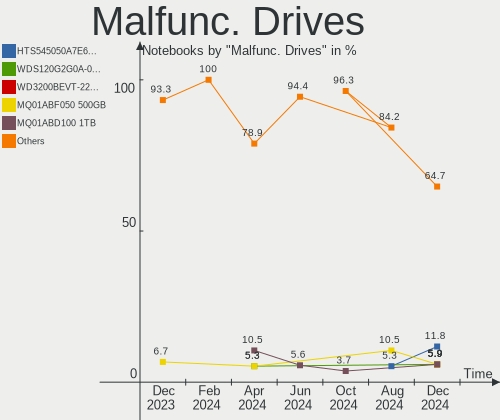
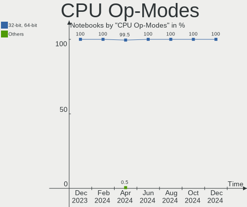
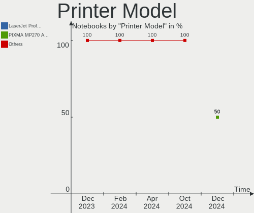
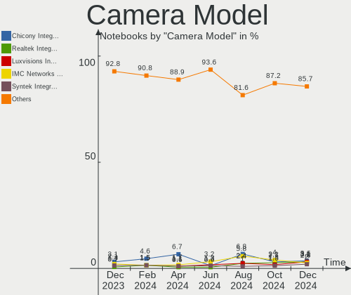

Linux Mint - Hardware Trends (Notebooks)
----------------------------------------

A project to identify most popular hardware characteristics and track their change
over time based on data collected by Linux users at https://Linux-Hardware.org.

Anyone can contribute to this report by the [hw-probe](https://github.com/linuxhw/hw-probe) tool:

    sudo -E hw-probe -all -upload

This report is for one last month. Overall report since the beginning of time: [TestCoverage](https://github.com/linuxhw/TestCoverage)

Period: Jan, 2023.

Contents
--------

* [ System ](#system)
  - [ OS                       ](#os)
  - [ OS Family                ](#os-family)
  - [ Kernel                   ](#kernel)
  - [ Kernel Family            ](#kernel-family)
  - [ Kernel Major Ver.        ](#kernel-major-ver)
  - [ Arch                     ](#arch)
  - [ DE                       ](#de)
  - [ Display Server           ](#display-server)
  - [ Display Manager          ](#display-manager)
  - [ OS Lang                  ](#os-lang)
  - [ Boot Mode                ](#boot-mode)
  - [ Filesystem               ](#filesystem)
  - [ Part. scheme             ](#part-scheme)
  - [ Dual Boot with Linux/BSD ](#dual-boot-with-linuxbsd)
  - [ Dual Boot (Win)          ](#dual-boot-win)

* [ Board ](#board)
  - [ Vendor                   ](#vendor)
  - [ Model                    ](#model)
  - [ Model Family             ](#model-family)
  - [ MFG Year                 ](#mfg-year)
  - [ Form Factor              ](#form-factor)
  - [ Secure Boot              ](#secure-boot)
  - [ Coreboot                 ](#coreboot)
  - [ RAM Size                 ](#ram-size)
  - [ RAM Used                 ](#ram-used)
  - [ Total Drives             ](#total-drives)
  - [ Has CD-ROM               ](#has-cd-rom)
  - [ Has Ethernet             ](#has-ethernet)
  - [ Has WiFi                 ](#has-wifi)
  - [ Has Bluetooth            ](#has-bluetooth)

* [ Location ](#location)
  - [ Country                  ](#country)
  - [ City                     ](#city)

* [ Drives ](#drives)
  - [ Drive Vendor             ](#drive-vendor)
  - [ Drive Model              ](#drive-model)
  - [ HDD Vendor               ](#hdd-vendor)
  - [ SSD Vendor               ](#ssd-vendor)
  - [ Drive Kind               ](#drive-kind)
  - [ Drive Connector          ](#drive-connector)
  - [ Drive Size               ](#drive-size)
  - [ Space Total              ](#space-total)
  - [ Space Used               ](#space-used)
  - [ Malfunc. Drives          ](#malfunc-drives)
  - [ Malfunc. Drive Vendor    ](#malfunc-drive-vendor)
  - [ Malfunc. HDD Vendor      ](#malfunc-hdd-vendor)
  - [ Malfunc. Drive Kind      ](#malfunc-drive-kind)
  - [ Failed Drives            ](#failed-drives)
  - [ Failed Drive Vendor      ](#failed-drive-vendor)
  - [ Drive Status             ](#drive-status)

* [ Storage controller ](#storage-controller)
  - [ Storage Vendor           ](#storage-vendor)
  - [ Storage Model            ](#storage-model)
  - [ Storage Kind             ](#storage-kind)

* [ Processor ](#processor)
  - [ CPU Vendor               ](#cpu-vendor)
  - [ CPU Model                ](#cpu-model)
  - [ CPU Model Family         ](#cpu-model-family)
  - [ CPU Cores                ](#cpu-cores)
  - [ CPU Sockets              ](#cpu-sockets)
  - [ CPU Threads              ](#cpu-threads)
  - [ CPU Op-Modes             ](#cpu-op-modes)
  - [ CPU Microcode            ](#cpu-microcode)
  - [ CPU Microarch            ](#cpu-microarch)

* [ Graphics ](#graphics)
  - [ GPU Vendor               ](#gpu-vendor)
  - [ GPU Model                ](#gpu-model)
  - [ GPU Combo                ](#gpu-combo)
  - [ GPU Driver               ](#gpu-driver)
  - [ GPU Memory               ](#gpu-memory)

* [ Monitor ](#monitor)
  - [ Monitor Vendor           ](#monitor-vendor)
  - [ Monitor Model            ](#monitor-model)
  - [ Monitor Resolution       ](#monitor-resolution)
  - [ Monitor Diagonal         ](#monitor-diagonal)
  - [ Monitor Width            ](#monitor-width)
  - [ Aspect Ratio             ](#aspect-ratio)
  - [ Monitor Area             ](#monitor-area)
  - [ Pixel Density            ](#pixel-density)
  - [ Multiple Monitors        ](#multiple-monitors)

* [ Network ](#network)
  - [ Net Controller Vendor    ](#net-controller-vendor)
  - [ Net Controller Model     ](#net-controller-model)
  - [ Wireless Vendor          ](#wireless-vendor)
  - [ Wireless Model           ](#wireless-model)
  - [ Ethernet Vendor          ](#ethernet-vendor)
  - [ Ethernet Model           ](#ethernet-model)
  - [ Net Controller Kind      ](#net-controller-kind)
  - [ Used Controller          ](#used-controller)
  - [ NICs                     ](#nics)
  - [ IPv6                     ](#ipv6)

* [ Bluetooth ](#bluetooth)
  - [ Bluetooth Vendor         ](#bluetooth-vendor)
  - [ Bluetooth Model          ](#bluetooth-model)

* [ Sound ](#sound)
  - [ Sound Vendor             ](#sound-vendor)
  - [ Sound Model              ](#sound-model)

* [ Memory ](#memory)
  - [ Memory Vendor            ](#memory-vendor)
  - [ Memory Model             ](#memory-model)
  - [ Memory Kind              ](#memory-kind)
  - [ Memory Form Factor       ](#memory-form-factor)
  - [ Memory Size              ](#memory-size)
  - [ Memory Speed             ](#memory-speed)

* [ Printers & scanners ](#printers--scanners)
  - [ Printer Vendor           ](#printer-vendor)
  - [ Printer Model            ](#printer-model)
  - [ Scanner Vendor           ](#scanner-vendor)
  - [ Scanner Model            ](#scanner-model)

* [ Camera ](#camera)
  - [ Camera Vendor            ](#camera-vendor)
  - [ Camera Model             ](#camera-model)

* [ Security ](#security)
  - [ Fingerprint Vendor       ](#fingerprint-vendor)
  - [ Fingerprint Model        ](#fingerprint-model)
  - [ Chipcard Vendor          ](#chipcard-vendor)
  - [ Chipcard Model           ](#chipcard-model)

* [ Unsupported ](#unsupported)
  - [ Unsupported Devices      ](#unsupported-devices)
  - [ Unsupported Device Types ](#unsupported-device-types)

System
------

OS
--

Installed operating systems

| Name            | Notebooks | Percent |
|-----------------|-----------|---------|
| Linux Mint 21.1 | 258       | 71.07%  |
| Linux Mint 20.3 | 49        | 13.5%   |
| Linux Mint 21   | 32        | 8.82%   |
| Linux Mint 20   | 8         | 2.2%    |
| Linux Mint 20.2 | 6         | 1.65%   |
| Linux Mint 20.1 | 3         | 0.83%   |
| Linux Mint 19.3 | 3         | 0.83%   |
| Linux Mint 19.1 | 2         | 0.55%   |
| Linux Mint 19.2 | 1         | 0.28%   |
| Linux Mint 19   | 1         | 0.28%   |

OS Family
---------

OS without a version

| Name       | Notebooks | Percent |
|------------|-----------|---------|
| Linux Mint | 363       | 100%    |

Kernel
------

Version of the Linux kernel

| Version                       | Notebooks | Percent |
|-------------------------------|-----------|---------|
| 5.15.0-58-generic             | 131       | 36.09%  |
| 5.15.0-56-generic             | 85        | 23.42%  |
| 5.15.0-57-generic             | 48        | 13.22%  |
| 5.4.0-137-generic             | 22        | 6.06%   |
| 5.4.0-135-generic             | 14        | 3.86%   |
| 5.4.0-136-generic             | 12        | 3.31%   |
| 5.19.0-28-generic             | 10        | 2.75%   |
| 5.15.0-41-generic             | 4         | 1.1%    |
| 6.1.4-060104-generic          | 2         | 0.55%   |
| 6.1.0-4.2-liquorix-amd64      | 2         | 0.55%   |
| 6.0.0-1009-oem                | 2         | 0.55%   |
| 5.4.0-91-generic              | 2         | 0.55%   |
| 5.4.0-26-generic              | 2         | 0.55%   |
| 5.4.0-113-generic             | 2         | 0.55%   |
| 5.15.0-53-generic             | 2         | 0.55%   |
| 5.15.0-48-generic             | 2         | 0.55%   |
| 6.1.8-060108-generic          | 1         | 0.28%   |
| 6.1.0-1004-oem                | 1         | 0.28%   |
| 6.0.9-060009-generic          | 1         | 0.28%   |
| 6.0.12-76060006-generic       | 1         | 0.28%   |
| 6.0.0-060000-generic          | 1         | 0.28%   |
| 5.4.0-89-generic              | 1         | 0.28%   |
| 5.4.0-74-generic              | 1         | 0.28%   |
| 5.4.0-132-generic             | 1         | 0.28%   |
| 5.4.0-131-generic             | 1         | 0.28%   |
| 5.17.0-1025-oem               | 1         | 0.28%   |
| 5.17.0-1020-oem               | 1         | 0.28%   |
| 5.15.84-xanmod1               | 1         | 0.28%   |
| 5.15.0-52-generic             | 1         | 0.28%   |
| 5.15.0-1010-nvidia-lowlatency | 1         | 0.28%   |
| 5.15.0-1007-nvidia-lowlatency | 1         | 0.28%   |
| 5.15.0-1006-nvidia-lowlatency | 1         | 0.28%   |
| 5.14.0-1056-oem               | 1         | 0.28%   |
| 5.14.0-1054-oem               | 1         | 0.28%   |
| 4.15.0-54-generic             | 1         | 0.28%   |
| 4.15.0-201-generic            | 1         | 0.28%   |
| 4.15.0-20-generic             | 1         | 0.28%   |

Kernel Family
-------------

Linux kernel without a distro release

| Version | Notebooks | Percent |
|---------|-----------|---------|
| 5.15.0  | 276       | 76.03%  |
| 5.4.0   | 58        | 15.98%  |
| 5.19.0  | 10        | 2.75%   |
| 6.1.0   | 3         | 0.83%   |
| 6.0.0   | 3         | 0.83%   |
| 4.15.0  | 3         | 0.83%   |
| 6.1.4   | 2         | 0.55%   |
| 5.17.0  | 2         | 0.55%   |
| 5.14.0  | 2         | 0.55%   |
| 6.1.8   | 1         | 0.28%   |
| 6.0.9   | 1         | 0.28%   |
| 6.0.12  | 1         | 0.28%   |
| 5.15.84 | 1         | 0.28%   |

Kernel Major Ver.
-----------------

Linux kernel major version

| Version | Notebooks | Percent |
|---------|-----------|---------|
| 5.15    | 277       | 76.31%  |
| 5.4     | 58        | 15.98%  |
| 5.19    | 10        | 2.75%   |
| 6.1     | 6         | 1.65%   |
| 6.0     | 5         | 1.38%   |
| 4.15    | 3         | 0.83%   |
| 5.17    | 2         | 0.55%   |
| 5.14    | 2         | 0.55%   |

Arch
----

OS architecture (x86_64, i586, etc.)

| Name   | Notebooks | Percent |
|--------|-----------|---------|
| x86_64 | 361       | 99.45%  |
| i686   | 2         | 0.55%   |

DE
--

Desktop Environment

| Name       | Notebooks | Percent |
|------------|-----------|---------|
| X-Cinnamon | 273       | 75.21%  |
| XFCE       | 45        | 12.4%   |
| MATE       | 29        | 7.99%   |
| Cinnamon   | 8         | 2.2%    |
| GNOME      | 5         | 1.38%   |
| Trinity    | 1         | 0.28%   |
| Pantheon   | 1         | 0.28%   |
| KDE5       | 1         | 0.28%   |

Display Server
--------------

X11 or Wayland

| Name    | Notebooks | Percent |
|---------|-----------|---------|
| X11     | 362       | 99.72%  |
| Unknown | 1         | 0.28%   |

Display Manager
---------------

SDDM, LightDM, etc.

| Name    | Notebooks | Percent |
|---------|-----------|---------|
| Unknown | 198       | 54.55%  |
| LightDM | 164       | 45.18%  |
| GDM3    | 1         | 0.28%   |

OS Lang
-------

Language

| Lang  | Notebooks | Percent |
|-------|-----------|---------|
| en_US | 104       | 28.65%  |
| de_DE | 53        | 14.6%   |
| fr_FR | 26        | 7.16%   |
| it_IT | 24        | 6.61%   |
| ru_RU | 20        | 5.51%   |
| en_GB | 18        | 4.96%   |
| C     | 15        | 4.13%   |
| pt_BR | 13        | 3.58%   |
| pl_PL | 11        | 3.03%   |
| en_CA | 11        | 3.03%   |
| es_ES | 7         | 1.93%   |
| en_AU | 5         | 1.38%   |
| tr_TR | 4         | 1.1%    |
| nl_NL | 4         | 1.1%    |
| en_IN | 4         | 1.1%    |
| pt_PT | 3         | 0.83%   |
| fr_CA | 3         | 0.83%   |
| es_MX | 3         | 0.83%   |
| da_DK | 3         | 0.83%   |
| cs_CZ | 3         | 0.83%   |
| sv_SE | 2         | 0.55%   |
| ru_UA | 2         | 0.55%   |
| es_PE | 2         | 0.55%   |
| en_NZ | 2         | 0.55%   |
| en_IE | 2         | 0.55%   |
| de_AT | 2         | 0.55%   |
| zh_CN | 1         | 0.28%   |
| uk_UA | 1         | 0.28%   |
| sk_SK | 1         | 0.28%   |
| ro_RO | 1         | 0.28%   |
| nl_BE | 1         | 0.28%   |
| lv_LV | 1         | 0.28%   |
| ja_JP | 1         | 0.28%   |
| id_ID | 1         | 0.28%   |
| hu_HU | 1         | 0.28%   |
| hr_HR | 1         | 0.28%   |
| es_VE | 1         | 0.28%   |
| es_HN | 1         | 0.28%   |
| es_AR | 1         | 0.28%   |
| en_ZA | 1         | 0.28%   |

Boot Mode
---------

EFI or BIOS

| Mode | Notebooks | Percent |
|------|-----------|---------|
| EFI  | 255       | 70.25%  |
| BIOS | 108       | 29.75%  |

Filesystem
----------

Type of filesystem

| Type    | Notebooks | Percent |
|---------|-----------|---------|
| Ext4    | 338       | 93.11%  |
| Overlay | 11        | 3.03%   |
| Zfs     | 8         | 2.2%    |
| Btrfs   | 3         | 0.83%   |
| Ext3    | 2         | 0.55%   |
| Xfs     | 1         | 0.28%   |

Part. scheme
------------

Scheme of partitioning

| Type    | Notebooks | Percent |
|---------|-----------|---------|
| Unknown | 197       | 54.27%  |
| GPT     | 137       | 37.74%  |
| MBR     | 29        | 7.99%   |

Dual Boot with Linux/BSD
------------------------

Hosting more than one Linux/BSD

| Dual boot | Notebooks | Percent |
|-----------|-----------|---------|
| No        | 347       | 95.59%  |
| Yes       | 16        | 4.41%   |

Dual Boot (Win)
---------------

Hosting Linux and Windows

| Dual boot | Notebooks | Percent |
|-----------|-----------|---------|
| No        | 302       | 83.2%   |
| Yes       | 61        | 16.8%   |

Board
-----

Vendor
------

Motherboard manufacturer

| Name                | Notebooks | Percent |
|---------------------|-----------|---------|
| Hewlett-Packard     | 74        | 20.39%  |
| Lenovo              | 72        | 19.83%  |
| Dell                | 38        | 10.47%  |
| ASUSTek Computer    | 37        | 10.19%  |
| Acer                | 36        | 9.92%   |
| Apple               | 14        | 3.86%   |
| Toshiba             | 12        | 3.31%   |
| MSI                 | 12        | 3.31%   |
| HUAWEI              | 8         | 2.2%    |
| GPU Company         | 6         | 1.65%   |
| Samsung Electronics | 5         | 1.38%   |
| Google              | 5         | 1.38%   |
| Notebook            | 4         | 1.1%    |
| Fujitsu             | 4         | 1.1%    |
| Sony                | 3         | 0.83%   |
| Medion              | 3         | 0.83%   |
| Unknown             | 3         | 0.83%   |
| UMAX                | 2         | 0.55%   |
| Timi                | 2         | 0.55%   |
| Wortmann AG         | 1         | 0.28%   |
| VALE                | 1         | 0.28%   |
| TrekStor            | 1         | 0.28%   |
| Teclast             | 1         | 0.28%   |
| Tactus              | 1         | 0.28%   |
| System76            | 1         | 0.28%   |
| Standard            | 1         | 0.28%   |
| Positivo            | 1         | 0.28%   |
| PC Specialist       | 1         | 0.28%   |
| Panasonic           | 1         | 0.28%   |
| Multilaser          | 1         | 0.28%   |
| Monster             | 1         | 0.28%   |
| MicroByte           | 1         | 0.28%   |
| LG Electronics      | 1         | 0.28%   |
| Jumper              | 1         | 0.28%   |
| INSYS               | 1         | 0.28%   |
| Gigabyte Technology | 1         | 0.28%   |
| Fujitsu Siemens     | 1         | 0.28%   |
| Digibras            | 1         | 0.28%   |
| Compal              | 1         | 0.28%   |
| Chuwi               | 1         | 0.28%   |

Model
-----

Motherboard model

| Name                            | Notebooks | Percent |
|---------------------------------|-----------|---------|
| Unknown                         | 5         | 1.38%   |
| HUAWEI HVY-WXX9                 | 3         | 0.83%   |
| HP Pavilion dv6                 | 3         | 0.83%   |
| HP Pavilion 15                  | 3         | 0.83%   |
| Dell Latitude E6530             | 3         | 0.83%   |
| Lenovo ThinkPad E560 20EV002FUS | 2         | 0.55%   |
| HUAWEI NBLK-WAX9X               | 2         | 0.55%   |
| HP Pavilion Notebook            | 2         | 0.55%   |
| HP Pavilion g6                  | 2         | 0.55%   |
| HP Pavilion 17                  | 2         | 0.55%   |
| HP EliteBook 2560p              | 2         | 0.55%   |
| HP 255 G8 Notebook PC           | 2         | 0.55%   |
| HP 255 15.6 inch G9 Notebook PC | 2         | 0.55%   |
| GPU Company GWNR71517           | 2         | 0.55%   |
| Google Kled                     | 2         | 0.55%   |
| Dell Latitude 5490              | 2         | 0.55%   |
| Dell Inspiron N4050             | 2         | 0.55%   |
| Dell Inspiron 15 3511           | 2         | 0.55%   |
| ASUS F5VL                       | 2         | 0.55%   |
| Apple MacBook5,1                | 2         | 0.55%   |
| Acer Aspire E5-575G             | 2         | 0.55%   |
| Acer Aspire A315-59             | 2         | 0.55%   |
| Acer Aspire A315-55G            | 2         | 0.55%   |
| Wortmann AG CR700               | 1         | 0.28%   |
| VALE Notebook Classic C140      | 1         | 0.28%   |
| UMAX VisionBook N14G Plus       | 1         | 0.28%   |
| UMAX VisionBook 14Wr Plus       | 1         | 0.28%   |
| TrekStor Primebook_P15          | 1         | 0.28%   |
| Toshiba Satellite S70-A         | 1         | 0.28%   |
| Toshiba Satellite R630          | 1         | 0.28%   |
| Toshiba Satellite Pro S500      | 1         | 0.28%   |
| Toshiba Satellite Pro C850-1HD  | 1         | 0.28%   |
| Toshiba Satellite Pro C50-A-1FD | 1         | 0.28%   |
| Toshiba Satellite Pro C50-A-1E6 | 1         | 0.28%   |
| Toshiba Satellite P300          | 1         | 0.28%   |
| Toshiba Satellite C870-19R      | 1         | 0.28%   |
| Toshiba Satellite C660          | 1         | 0.28%   |
| Toshiba Satellite C55-B         | 1         | 0.28%   |
| Toshiba QOSMIO X70-B            | 1         | 0.28%   |
| Toshiba NB520                   | 1         | 0.28%   |

Model Family
------------

Motherboard model prefix

| Name                  | Notebooks | Percent |
|-----------------------|-----------|---------|
| Lenovo ThinkPad       | 35        | 9.64%   |
| Acer Aspire           | 31        | 8.54%   |
| HP Pavilion           | 20        | 5.51%   |
| Lenovo IdeaPad        | 19        | 5.23%   |
| Dell Inspiron         | 16        | 4.41%   |
| HP Laptop             | 12        | 3.31%   |
| Dell Latitude         | 12        | 3.31%   |
| Toshiba Satellite     | 10        | 2.75%   |
| HP ProBook            | 10        | 2.75%   |
| HP EliteBook          | 9         | 2.48%   |
| HP 255                | 5         | 1.38%   |
| ASUS VivoBook         | 5         | 1.38%   |
| Unknown               | 5         | 1.38%   |
| HUAWEI HVY-WXX9       | 3         | 0.83%   |
| HP 250                | 3         | 0.83%   |
| Fujitsu LIFEBOOK      | 3         | 0.83%   |
| Dell XPS              | 3         | 0.83%   |
| Apple MacBookPro5     | 3         | 0.83%   |
| UMAX VisionBook       | 2         | 0.55%   |
| Lenovo Yoga           | 2         | 0.55%   |
| Lenovo G700           | 2         | 0.55%   |
| HUAWEI NBLK-WAX9X     | 2         | 0.55%   |
| HP ZBook              | 2         | 0.55%   |
| HP OMEN               | 2         | 0.55%   |
| HP ENVY               | 2         | 0.55%   |
| HP 15                 | 2         | 0.55%   |
| GPU Company GWNR71517 | 2         | 0.55%   |
| Google Kled           | 2         | 0.55%   |
| Dell Studio           | 2         | 0.55%   |
| Dell Precision        | 2         | 0.55%   |
| ASUS ROG              | 2         | 0.55%   |
| ASUS F5VL             | 2         | 0.55%   |
| Apple MacBook5        | 2         | 0.55%   |
| Acer Swift            | 2         | 0.55%   |
| Wortmann AG CR700     | 1         | 0.28%   |
| VALE Notebook         | 1         | 0.28%   |
| TrekStor Primebook    | 1         | 0.28%   |
| Toshiba QOSMIO        | 1         | 0.28%   |
| Toshiba NB520         | 1         | 0.28%   |
| Timi RedmiBook        | 1         | 0.28%   |

MFG Year
--------

Motherboard manufacture year

| Year | Notebooks | Percent |
|------|-----------|---------|
| 2021 | 41        | 11.29%  |
| 2020 | 31        | 8.54%   |
| 2013 | 31        | 8.54%   |
| 2012 | 31        | 8.54%   |
| 2011 | 30        | 8.26%   |
| 2022 | 28        | 7.71%   |
| 2014 | 24        | 6.61%   |
| 2017 | 22        | 6.06%   |
| 2015 | 21        | 5.79%   |
| 2016 | 19        | 5.23%   |
| 2019 | 18        | 4.96%   |
| 2018 | 18        | 4.96%   |
| 2008 | 16        | 4.41%   |
| 2010 | 14        | 3.86%   |
| 2009 | 10        | 2.75%   |
| 2007 | 5         | 1.38%   |
| 2006 | 2         | 0.55%   |
| 2023 | 1         | 0.28%   |
| 2005 | 1         | 0.28%   |

Form Factor
-----------

Physical design of the computer

| Name     | Notebooks | Percent |
|----------|-----------|---------|
| Notebook | 363       | 100%    |

Secure Boot
-----------

Enabled or disabled

| State    | Notebooks | Percent |
|----------|-----------|---------|
| Disabled | 304       | 83.75%  |
| Enabled  | 59        | 16.25%  |

Coreboot
--------

Have coreboot on board

| Used | Notebooks | Percent |
|------|-----------|---------|
| No   | 357       | 98.35%  |
| Yes  | 6         | 1.65%   |

RAM Size
--------

Total RAM memory

| Size in GB  | Notebooks | Percent |
|-------------|-----------|---------|
| 4.01-8.0    | 134       | 36.91%  |
| 3.01-4.0    | 84        | 23.14%  |
| 8.01-16.0   | 58        | 15.98%  |
| 16.01-24.0  | 53        | 14.6%   |
| 32.01-64.0  | 15        | 4.13%   |
| 1.01-2.0    | 12        | 3.31%   |
| 64.01-256.0 | 3         | 0.83%   |
| 24.01-32.0  | 2         | 0.55%   |
| 2.01-3.0    | 2         | 0.55%   |

RAM Used
--------

Used RAM memory

| Used GB   | Notebooks | Percent |
|-----------|-----------|---------|
| 1.01-2.0  | 132       | 36.36%  |
| 2.01-3.0  | 108       | 29.75%  |
| 3.01-4.0  | 54        | 14.88%  |
| 4.01-8.0  | 43        | 11.85%  |
| 0.51-1.0  | 22        | 6.06%   |
| 8.01-16.0 | 4         | 1.1%    |

Total Drives
------------

Number of drives on board

| Drives | Notebooks | Percent |
|--------|-----------|---------|
| 1      | 278       | 76.58%  |
| 2      | 71        | 19.56%  |
| 3      | 10        | 2.75%   |
| 4      | 2         | 0.55%   |
| 0      | 2         | 0.55%   |

Has CD-ROM
----------

Has CD-ROM on board

| Presented | Notebooks | Percent |
|-----------|-----------|---------|
| No        | 225       | 61.98%  |
| Yes       | 138       | 38.02%  |

Has Ethernet
------------

Has Ethernet on board

| Presented | Notebooks | Percent |
|-----------|-----------|---------|
| Yes       | 282       | 77.69%  |
| No        | 81        | 22.31%  |

Has WiFi
--------

Has WiFi module

| Presented | Notebooks | Percent |
|-----------|-----------|---------|
| Yes       | 357       | 98.35%  |
| No        | 6         | 1.65%   |

Has Bluetooth
-------------

Has Bluetooth module

| Presented | Notebooks | Percent |
|-----------|-----------|---------|
| Yes       | 291       | 80.17%  |
| No        | 72        | 19.83%  |

Location
--------

Country
-------

Geographic location (country)

| Country      | Notebooks | Percent |
|--------------|-----------|---------|
| Germany      | 59        | 16.25%  |
| USA          | 54        | 14.88%  |
| Italy        | 36        | 9.92%   |
| France       | 25        | 6.89%   |
| Brazil       | 19        | 5.23%   |
| Canada       | 15        | 4.13%   |
| UK           | 14        | 3.86%   |
| Russia       | 13        | 3.58%   |
| Poland       | 12        | 3.31%   |
| Turkey       | 9         | 2.48%   |
| Netherlands  | 7         | 1.93%   |
| Czechia      | 7         | 1.93%   |
| Spain        | 6         | 1.65%   |
| Australia    | 6         | 1.65%   |
| Portugal     | 4         | 1.1%    |
| Mexico       | 4         | 1.1%    |
| India        | 4         | 1.1%    |
| Austria      | 4         | 1.1%    |
| Ukraine      | 3         | 0.83%   |
| Switzerland  | 3         | 0.83%   |
| Serbia       | 3         | 0.83%   |
| Peru         | 3         | 0.83%   |
| Ireland      | 3         | 0.83%   |
| Greece       | 3         | 0.83%   |
| Denmark      | 3         | 0.83%   |
| Bulgaria     | 3         | 0.83%   |
| Belgium      | 3         | 0.83%   |
| Sweden       | 2         | 0.55%   |
| South Africa | 2         | 0.55%   |
| Slovakia     | 2         | 0.55%   |
| Romania      | 2         | 0.55%   |
| New Zealand  | 2         | 0.55%   |
| Japan        | 2         | 0.55%   |
| Hungary      | 2         | 0.55%   |
| Egypt        | 2         | 0.55%   |
| Venezuela    | 1         | 0.28%   |
| Uzbekistan   | 1         | 0.28%   |
| Saudi Arabia | 1         | 0.28%   |
| Puerto Rico  | 1         | 0.28%   |
| Philippines  | 1         | 0.28%   |

City
----

Geographic location (city)

| City              | Notebooks | Percent |
|-------------------|-----------|---------|
| Moscow            | 5         | 1.38%   |
| Frankfurt am Main | 5         | 1.38%   |
| Rome              | 4         | 1.1%    |
| Paris             | 4         | 1.1%    |
| Milan             | 4         | 1.1%    |
| Curitiba          | 4         | 1.1%    |
| Warsaw            | 3         | 0.83%   |
| Sao Paulo         | 3         | 0.83%   |
| Niagara Falls     | 3         | 0.83%   |
| Melbourne         | 3         | 0.83%   |
| London            | 3         | 0.83%   |
| Hamburg           | 3         | 0.83%   |
| Turin             | 2         | 0.55%   |
| Tucson            | 2         | 0.55%   |
| Toulouse          | 2         | 0.55%   |
| Stuttgart         | 2         | 0.55%   |
| San Francisco     | 2         | 0.55%   |
| Rho               | 2         | 0.55%   |
| Pune              | 2         | 0.55%   |
| Prague            | 2         | 0.55%   |
| Portland          | 2         | 0.55%   |
| Plovdiv           | 2         | 0.55%   |
| Peoria            | 2         | 0.55%   |
| Montreal          | 2         | 0.55%   |
| Montescudo        | 2         | 0.55%   |
| Martin            | 2         | 0.55%   |
| Lima              | 2         | 0.55%   |
| Koblenz           | 2         | 0.55%   |
| Kiel              | 2         | 0.55%   |
| Karlsruhe         | 2         | 0.55%   |
| Izmir             | 2         | 0.55%   |
| Istanbul          | 2         | 0.55%   |
| Galway            | 2         | 0.55%   |
| Dresden           | 2         | 0.55%   |
| Cologne           | 2         | 0.55%   |
| Coburg            | 2         | 0.55%   |
| Cairo             | 2         | 0.55%   |
| Budapest          | 2         | 0.55%   |
| Brooklyn          | 2         | 0.55%   |
| Briançon         | 2         | 0.55%   |

Drives
------

Drive Vendor
------------

Hard drive vendors

| Vendor                      | Notebooks | Drives | Percent |
|-----------------------------|-----------|--------|---------|
| Samsung Electronics         | 63        | 70     | 14.58%  |
| WDC                         | 50        | 52     | 11.57%  |
| Seagate                     | 37        | 38     | 8.56%   |
| Unknown                     | 29        | 35     | 6.71%   |
| Toshiba                     | 27        | 27     | 6.25%   |
| Kingston                    | 22        | 22     | 5.09%   |
| Sandisk                     | 21        | 22     | 4.86%   |
| Crucial                     | 18        | 19     | 4.17%   |
| Intel                       | 16        | 17     | 3.7%    |
| HGST                        | 13        | 13     | 3.01%   |
| SK hynix                    | 12        | 12     | 2.78%   |
| Micron Technology           | 11        | 11     | 2.55%   |
| Hitachi                     | 9         | 9      | 2.08%   |
| A-DATA Technology           | 7         | 7      | 1.62%   |
| Unknown                     | 6         | 6      | 1.39%   |
| China                       | 5         | 5      | 1.16%   |
| KIOXIA                      | 4         | 4      | 0.93%   |
| Intenso                     | 4         | 4      | 0.93%   |
| Fujitsu                     | 4         | 4      | 0.93%   |
| Phison                      | 3         | 3      | 0.69%   |
| LITEON                      | 3         | 3      | 0.69%   |
| Lexar                       | 3         | 3      | 0.69%   |
| GOODRAM                     | 3         | 3      | 0.69%   |
| Apple                       | 3         | 3      | 0.69%   |
| UMIS                        | 2         | 2      | 0.46%   |
| Silicon Motion              | 2         | 2      | 0.46%   |
| ShiJi                       | 2         | 2      | 0.46%   |
| PNY                         | 2         | 2      | 0.46%   |
| Phison Electronics          | 2         | 2      | 0.46%   |
| Patriot                     | 2         | 2      | 0.46%   |
| Netac                       | 2         | 2      | 0.46%   |
| Kingston Technology Company | 2         | 2      | 0.46%   |
| Kingchuxing                 | 2         | 2      | 0.46%   |
| Hewlett-Packard             | 2         | 2      | 0.46%   |
| External                    | 2         | 2      | 0.46%   |
| Dogfish                     | 2         | 2      | 0.46%   |
| Apacer                      | 2         | 2      | 0.46%   |
| AMD                         | 2         | 2      | 0.46%   |
| XrayDisk                    | 1         | 1      | 0.23%   |
| Wibtek                      | 1         | 1      | 0.23%   |

Drive Model
-----------

Hard drive models

| Model                                          | Notebooks | Percent |
|------------------------------------------------|-----------|---------|
| Samsung SSD 860 EVO 500GB                      | 8         | 1.77%   |
| Kingston SA400S37480G 480GB SSD                | 7         | 1.55%   |
| Unknown MMC Card  64GB                         | 6         | 1.33%   |
| Unknown MMC Card  128GB                        | 6         | 1.33%   |
| Unknown                                        | 6         | 1.33%   |
| Unknown MMC Card  32GB                         | 5         | 1.11%   |
| Kingston SA400S37240G 240GB SSD                | 5         | 1.11%   |
| WDC WDS240G2G0A-00JH30 240GB SSD               | 4         | 0.89%   |
| WDC WD10JPVX-22JC3T0 1TB                       | 4         | 0.89%   |
| Toshiba MQ01ABD100 1TB                         | 4         | 0.89%   |
| Seagate ST1000LM024 HN-M101MBB 1TB             | 4         | 0.89%   |
| Samsung SSD 870 EVO 1TB                        | 4         | 0.89%   |
| HGST HTS545050A7E680 500GB                     | 4         | 0.89%   |
| HGST HTS541010A9E680 1TB                       | 4         | 0.89%   |
| Crucial CT500MX500SSD1 500GB                   | 4         | 0.89%   |
| Toshiba MQ04ABF100 1TB                         | 3         | 0.67%   |
| Toshiba MQ01ABF050 500GB                       | 3         | 0.67%   |
| Seagate ST9320325AS 320GB                      | 3         | 0.67%   |
| Seagate ST1000LM048-2E7172 1TB                 | 3         | 0.67%   |
| Seagate Expansion 240GB                        | 3         | 0.67%   |
| Sandisk WD Black SN750 / PC SN730 NVMe SSD 1TB | 3         | 0.67%   |
| SanDisk NVMe SSD Drive 512GB                   | 3         | 0.67%   |
| Samsung SSD 860 EVO 1TB                        | 3         | 0.67%   |
| Samsung SSD 840 EVO 250GB                      | 3         | 0.67%   |
| Samsung MZVLQ512HBLU-00B00 512GB               | 3         | 0.67%   |
| Intel SSD 660P Series 512GB                    | 3         | 0.67%   |
| Crucial CT1000MX500SSD1 1TB                    | 3         | 0.67%   |
| WDC WD10SPZX-24Z10 1TB                         | 2         | 0.44%   |
| WDC WD10SPZX-21Z10T0 1TB                       | 2         | 0.44%   |
| WDC WD10JPCX-24UE4T0 1TB                       | 2         | 0.44%   |
| Unknown MMC Card  256GB                        | 2         | 0.44%   |
| Toshiba XG6 NVMe SSD Controller 512GB          | 2         | 0.44%   |
| Toshiba BG3 NVMe SSD Controller 256GB          | 2         | 0.44%   |
| Seagate ST9320423AS 320GB                      | 2         | 0.44%   |
| Seagate ST500LT012-1DG142 500GB                | 2         | 0.44%   |
| Seagate ST500LM021-1KJ152 500GB                | 2         | 0.44%   |
| Seagate ST500LM012 HN-M500MBB 500GB            | 2         | 0.44%   |
| Seagate ST320LT007-9ZV142 320GB                | 2         | 0.44%   |
| Seagate ST2000LM007-1R8174 2TB                 | 2         | 0.44%   |
| Seagate ST1000LM035-1RK172 1TB                 | 2         | 0.44%   |

HDD Vendor
----------

Hard disk drive vendors

| Vendor              | Notebooks | Drives | Percent |
|---------------------|-----------|--------|---------|
| Seagate             | 37        | 38     | 31.09%  |
| WDC                 | 34        | 34     | 28.57%  |
| Toshiba             | 15        | 15     | 12.61%  |
| HGST                | 13        | 13     | 10.92%  |
| Hitachi             | 9         | 9      | 7.56%   |
| Samsung Electronics | 5         | 5      | 4.2%    |
| Fujitsu             | 4         | 4      | 3.36%   |
| USB3.0              | 1         | 1      | 0.84%   |
| Unknown             | 1         | 1      | 0.84%   |

SSD Vendor
----------

Solid state drive vendors

| Vendor              | Notebooks | Drives | Percent |
|---------------------|-----------|--------|---------|
| Samsung Electronics | 32        | 36     | 20.38%  |
| Kingston            | 18        | 18     | 11.46%  |
| Crucial             | 18        | 19     | 11.46%  |
| SanDisk             | 11        | 12     | 7.01%   |
| WDC                 | 8         | 8      | 5.1%    |
| Intel               | 8         | 8      | 5.1%    |
| China               | 5         | 5      | 3.18%   |
| A-DATA Technology   | 5         | 5      | 3.18%   |
| Intenso             | 4         | 4      | 2.55%   |
| SK hynix            | 3         | 3      | 1.91%   |
| LITEON              | 3         | 3      | 1.91%   |
| GOODRAM             | 3         | 3      | 1.91%   |
| Toshiba             | 2         | 2      | 1.27%   |
| PNY                 | 2         | 2      | 1.27%   |
| Patriot             | 2         | 2      | 1.27%   |
| Netac               | 2         | 2      | 1.27%   |
| Lexar               | 2         | 2      | 1.27%   |
| Hewlett-Packard     | 2         | 2      | 1.27%   |
| Dogfish             | 2         | 2      | 1.27%   |
| Apple               | 2         | 2      | 1.27%   |
| Apacer              | 2         | 2      | 1.27%   |
| AMD                 | 2         | 2      | 1.27%   |
| XrayDisk            | 1         | 1      | 0.64%   |
| Wibtek              | 1         | 1      | 0.64%   |
| Transcend           | 1         | 1      | 0.64%   |
| Teclast             | 1         | 1      | 0.64%   |
| Team                | 1         | 1      | 0.64%   |
| TCSUNBOW            | 1         | 1      | 0.64%   |
| ShiJi               | 1         | 1      | 0.64%   |
| NGFF                | 1         | 1      | 0.64%   |
| Mushkin             | 1         | 1      | 0.64%   |
| Micron Technology   | 1         | 1      | 0.64%   |
| LITEONIT            | 1         | 1      | 0.64%   |
| JMicron Technology  | 1         | 1      | 0.64%   |
| Integral            | 1         | 1      | 0.64%   |
| GLOWAY              | 1         | 1      | 0.64%   |
| BIWIN               | 1         | 1      | 0.64%   |
| BHT                 | 1         | 1      | 0.64%   |
| Advantech           | 1         | 1      | 0.64%   |
| 2-Power             | 1         | 1      | 0.64%   |

Drive Kind
----------

HDD or SSD

| Kind    | Notebooks | Drives | Percent |
|---------|-----------|--------|---------|
| SSD     | 151       | 163    | 36.3%   |
| HDD     | 116       | 120    | 27.88%  |
| NVMe    | 107       | 120    | 25.72%  |
| MMC     | 30        | 37     | 7.21%   |
| Unknown | 12        | 13     | 2.88%   |

Drive Connector
---------------

SATA, SAS, NVMe, etc.

| Type | Notebooks | Drives | Percent |
|------|-----------|--------|---------|
| SATA | 252       | 283    | 62.69%  |
| NVMe | 105       | 118    | 26.12%  |
| MMC  | 30        | 37     | 7.46%   |
| SAS  | 15        | 15     | 3.73%   |

Drive Size
----------

Size of hard drive

| Size in TB | Notebooks | Drives | Percent |
|------------|-----------|--------|---------|
| 0.01-0.5   | 181       | 197    | 68.82%  |
| 0.51-1.0   | 76        | 80     | 28.9%   |
| 1.01-2.0   | 5         | 5      | 1.9%    |
| 4.01-10.0  | 1         | 1      | 0.38%   |

Space Total
-----------

Amount of disk space available on the file system

| Size in GB     | Notebooks | Percent |
|----------------|-----------|---------|
| 251-500        | 127       | 34.99%  |
| 101-250        | 106       | 29.2%   |
| 501-1000       | 48        | 13.22%  |
| 51-100         | 27        | 7.44%   |
| 1001-2000      | 22        | 6.06%   |
| 1-20           | 12        | 3.31%   |
| 21-50          | 11        | 3.03%   |
| 2001-3000      | 4         | 1.1%    |
| Unknown        | 4         | 1.1%    |
| More than 3000 | 2         | 0.55%   |

Space Used
----------

Amount of used disk space

| Used GB        | Notebooks | Percent |
|----------------|-----------|---------|
| 21-50          | 101       | 27.82%  |
| 1-20           | 99        | 27.27%  |
| 101-250        | 59        | 16.25%  |
| 51-100         | 53        | 14.6%   |
| 251-500        | 32        | 8.82%   |
| 501-1000       | 11        | 3.03%   |
| Unknown        | 4         | 1.1%    |
| More than 3000 | 2         | 0.55%   |
| 1001-2000      | 2         | 0.55%   |

Malfunc. Drives
---------------

Drive models with a malfunction

| Model                               | Notebooks | Drives | Percent |
|-------------------------------------|-----------|--------|---------|
| Samsung Electronics SSD 870 EVO 1TB | 2         | 2      | 8.33%   |
| HGST HTS545050A7E680 500GB          | 2         | 2      | 8.33%   |
| WDC WD1600BEVS-26RST0 160GB         | 1         | 1      | 4.17%   |
| Toshiba MQ01ABF050 500GB            | 1         | 1      | 4.17%   |
| Toshiba MQ01ABD100 1TB              | 1         | 1      | 4.17%   |
| Toshiba MQ01ABC150 1TB              | 1         | 1      | 4.17%   |
| SK hynix SH920 mSATA 256GB SSD      | 1         | 1      | 4.17%   |
| Seagate ST9500325AS 500GB           | 1         | 1      | 4.17%   |
| Seagate ST9320423AS 320GB           | 1         | 1      | 4.17%   |
| Seagate ST9250315AS 250GB           | 1         | 1      | 4.17%   |
| Seagate ST9120821AS 120GB           | 1         | 1      | 4.17%   |
| Samsung Electronics HM160HC 160GB   | 1         | 1      | 4.17%   |
| LITEONIT LMT-256M6M-HP 256GB SSD    | 1         | 1      | 4.17%   |
| Kingston SV300S37A120G 120GB SSD    | 1         | 1      | 4.17%   |
| Intel SSDSC2BW240A4 240GB           | 1         | 1      | 4.17%   |
| Intel SSDPEKKF512G7L 512GB          | 1         | 1      | 4.17%   |
| HGST HTS541075A9E680 752GB          | 1         | 1      | 4.17%   |
| HGST HTS541010A9E680 1TB            | 1         | 1      | 4.17%   |
| Hewlett-Packard SSD S700 250GB      | 1         | 1      | 4.17%   |
| Fujitsu MHY2080BH 80GB              | 1         | 1      | 4.17%   |
| Fujitsu MHV2080AH 80GB              | 1         | 1      | 4.17%   |
| Crucial CT1050MX300SSD1 1TB         | 1         | 1      | 4.17%   |

Malfunc. Drive Vendor
---------------------

Vendors of faulty drives

| Vendor              | Notebooks | Drives | Percent |
|---------------------|-----------|--------|---------|
| Seagate             | 4         | 4      | 16.67%  |
| HGST                | 4         | 4      | 16.67%  |
| Toshiba             | 3         | 3      | 12.5%   |
| Samsung Electronics | 3         | 3      | 12.5%   |
| Intel               | 2         | 2      | 8.33%   |
| Fujitsu             | 2         | 2      | 8.33%   |
| WDC                 | 1         | 1      | 4.17%   |
| SK hynix            | 1         | 1      | 4.17%   |
| LITEONIT            | 1         | 1      | 4.17%   |
| Kingston            | 1         | 1      | 4.17%   |
| Hewlett-Packard     | 1         | 1      | 4.17%   |
| Crucial             | 1         | 1      | 4.17%   |

Malfunc. HDD Vendor
-------------------

Vendors of faulty HDD drives

| Vendor              | Notebooks | Drives | Percent |
|---------------------|-----------|--------|---------|
| Seagate             | 4         | 4      | 26.67%  |
| HGST                | 4         | 4      | 26.67%  |
| Toshiba             | 3         | 3      | 20%     |
| Fujitsu             | 2         | 2      | 13.33%  |
| WDC                 | 1         | 1      | 6.67%   |
| Samsung Electronics | 1         | 1      | 6.67%   |

Malfunc. Drive Kind
-------------------

Kinds of faulty drives

| Kind | Notebooks | Drives | Percent |
|------|-----------|--------|---------|
| HDD  | 14        | 15     | 60.87%  |
| SSD  | 8         | 8      | 34.78%  |
| NVMe | 1         | 1      | 4.35%   |

Failed Drives
-------------

Failed drive models

Zero info for selected period =(

Failed Drive Vendor
-------------------

Failed drive vendors

Zero info for selected period =(

Drive Status
------------

Number of failed and malfunc. drives

| Status   | Notebooks | Drives | Percent |
|----------|-----------|--------|---------|
| Detected | 227       | 282    | 59.58%  |
| Works    | 131       | 147    | 34.38%  |
| Malfunc  | 23        | 24     | 6.04%   |

Storage controller
------------------

Storage Vendor
--------------

Storage controller vendors

| Vendor                           | Notebooks | Percent |
|----------------------------------|-----------|---------|
| Intel                            | 240       | 58.54%  |
| AMD                              | 55        | 13.41%  |
| Samsung Electronics              | 28        | 6.83%   |
| SanDisk                          | 17        | 4.15%   |
| Micron Technology                | 10        | 2.44%   |
| Toshiba America Info Systems     | 9         | 2.2%    |
| SK hynix                         | 9         | 2.2%    |
| Nvidia                           | 9         | 2.2%    |
| Phison Electronics               | 7         | 1.71%   |
| Kingston Technology Company      | 6         | 1.46%   |
| KIOXIA                           | 5         | 1.22%   |
| Union Memory (Shenzhen)          | 3         | 0.73%   |
| Silicon Integrated Systems [SiS] | 3         | 0.73%   |
| ADATA Technology                 | 3         | 0.73%   |
| Silicon Motion                   | 2         | 0.49%   |
| Solid State Storage Technology   | 1         | 0.24%   |
| MAXIO Technology (Hangzhou)      | 1         | 0.24%   |
| Lite-On Technology               | 1         | 0.24%   |
| Apple                            | 1         | 0.24%   |

Storage Model
-------------

Storage controller models

| Model                                                                            | Notebooks | Percent |
|----------------------------------------------------------------------------------|-----------|---------|
| AMD FCH SATA Controller [AHCI mode]                                              | 49        | 11.19%  |
| Intel 7 Series Chipset Family 6-port SATA Controller [AHCI mode]                 | 29        | 6.62%   |
| Intel Sunrise Point-LP SATA Controller [AHCI mode]                               | 23        | 5.25%   |
| Intel 6 Series/C200 Series Chipset Family 6 port Mobile SATA AHCI Controller     | 22        | 5.02%   |
| Intel 8 Series SATA Controller 1 [AHCI mode]                                     | 20        | 4.57%   |
| Intel 82801 Mobile SATA Controller [RAID mode]                                   | 19        | 4.34%   |
| Samsung NVMe SSD Controller SM981/PM981/PM983                                    | 12        | 2.74%   |
| Intel Celeron/Pentium Silver Processor SATA Controller                           | 12        | 2.74%   |
| Intel Wildcat Point-LP SATA Controller [AHCI Mode]                               | 11        | 2.51%   |
| Intel Volume Management Device NVMe RAID Controller                              | 11        | 2.51%   |
| Intel 8 Series/C220 Series Chipset Family 6-port SATA Controller 1 [AHCI mode]   | 11        | 2.51%   |
| Micron Non-Volatile memory controller                                            | 10        | 2.28%   |
| Intel 5 Series/3400 Series Chipset 4 port SATA AHCI Controller                   | 10        | 2.28%   |
| Samsung NVMe SSD Controller 980                                                  | 8         | 1.83%   |
| SK hynix Gold P31/PC711 NVMe Solid State Drive                                   | 7         | 1.6%    |
| SanDisk WD Black SN750 / PC SN730 NVMe SSD                                       | 6         | 1.37%   |
| Nvidia MCP79 AHCI Controller                                                     | 6         | 1.37%   |
| Intel Tiger Lake-LP SATA Controller                                              | 6         | 1.37%   |
| Intel HM170/QM170 Chipset SATA Controller [AHCI Mode]                            | 6         | 1.37%   |
| Intel Atom/Celeron/Pentium Processor x5-E8000/J3xxx/N3xxx Series SATA Controller | 6         | 1.37%   |
| Intel Alder Lake-P SATA AHCI Controller                                          | 6         | 1.37%   |
| Intel 82801IBM/IEM (ICH9M/ICH9M-E) 4 port SATA Controller [AHCI mode]            | 6         | 1.37%   |
| Sandisk Non-Volatile memory controller                                           | 5         | 1.14%   |
| KIOXIA NVMe SSD Controller BG4                                                   | 5         | 1.14%   |
| Intel Cannon Lake Mobile PCH SATA AHCI Controller                                | 5         | 1.14%   |
| Intel Atom Processor E3800 Series SATA AHCI Controller                           | 5         | 1.14%   |
| Toshiba America Info Systems XG6 NVMe SSD Controller                             | 4         | 0.91%   |
| Intel SSD 660P Series                                                            | 4         | 0.91%   |
| Intel Comet Lake SATA AHCI Controller                                            | 4         | 0.91%   |
| Intel 82801HM/HEM (ICH8M/ICH8M-E) SATA Controller [AHCI mode]                    | 4         | 0.91%   |
| AMD SB7x0/SB8x0/SB9x0 SATA Controller [AHCI mode]                                | 4         | 0.91%   |
| Union Memory (Shenzhen) Non-Volatile memory controller                           | 3         | 0.68%   |
| Toshiba America Info Systems BG3 NVMe SSD Controller                             | 3         | 0.68%   |
| Silicon Integrated Systems [SiS] SATA Controller / IDE mode                      | 3         | 0.68%   |
| Silicon Integrated Systems [SiS] 5513 IDE Controller                             | 3         | 0.68%   |
| SanDisk WD Blue SN550 NVMe SSD                                                   | 3         | 0.68%   |
| Samsung NVMe SSD Controller SM961/PM961/SM963                                    | 3         | 0.68%   |
| Phison E12 NVMe Controller                                                       | 3         | 0.68%   |
| Kingston Company OM3PDP3 NVMe SSD                                                | 3         | 0.68%   |
| Intel Celeron N3350/Pentium N4200/Atom E3900 Series SATA AHCI Controller         | 3         | 0.68%   |

Storage Kind
------------

Kind of storage controller (IDE, SATA, NVMe, SAS, ...)

| Kind | Notebooks | Percent |
|------|-----------|---------|
| SATA | 261       | 61.85%  |
| NVMe | 105       | 24.88%  |
| RAID | 31        | 7.35%   |
| IDE  | 25        | 5.92%   |

Processor
---------

CPU Vendor
----------

Processor vendors

| Vendor | Notebooks | Percent |
|--------|-----------|---------|
| Intel  | 286       | 78.79%  |
| AMD    | 77        | 21.21%  |

CPU Model
---------

Processor models

| Model                                         | Notebooks | Percent |
|-----------------------------------------------|-----------|---------|
| Intel 11th Gen Core i7-1165G7 @ 2.80GHz       | 9         | 2.48%   |
| Intel 11th Gen Core i5-1135G7 @ 2.40GHz       | 8         | 2.2%    |
| AMD Ryzen 5 4600H with Radeon Graphics        | 7         | 1.93%   |
| Intel Core i5-5200U CPU @ 2.20GHz             | 6         | 1.65%   |
| Intel Core i5-2520M CPU @ 2.50GHz             | 6         | 1.65%   |
| Intel Core i5-10210U CPU @ 1.60GHz            | 6         | 1.65%   |
| Intel Celeron N4020 CPU @ 1.10GHz             | 6         | 1.65%   |
| Intel Core i5-7200U CPU @ 2.50GHz             | 5         | 1.38%   |
| AMD Ryzen 5 5500U with Radeon Graphics        | 5         | 1.38%   |
| Intel Core i7-8550U CPU @ 1.80GHz             | 4         | 1.1%    |
| Intel Core i7-7700HQ CPU @ 2.80GHz            | 4         | 1.1%    |
| Intel Core i5-3230M CPU @ 2.60GHz             | 4         | 1.1%    |
| Intel Core i5-3210M CPU @ 2.50GHz             | 4         | 1.1%    |
| Intel Core i3-6006U CPU @ 2.00GHz             | 4         | 1.1%    |
| Intel Core i3-4005U CPU @ 1.70GHz             | 4         | 1.1%    |
| Intel Core i3-3110M CPU @ 2.40GHz             | 4         | 1.1%    |
| AMD Ryzen 7 3700U with Radeon Vega Mobile Gfx | 4         | 1.1%    |
| AMD Ryzen 5 5625U with Radeon Graphics        | 4         | 1.1%    |
| Intel Core i7-9750H CPU @ 2.60GHz             | 3         | 0.83%   |
| Intel Core i7-8750H CPU @ 2.20GHz             | 3         | 0.83%   |
| Intel Core i7-4500U CPU @ 1.80GHz             | 3         | 0.83%   |
| Intel Core i7-3520M CPU @ 2.90GHz             | 3         | 0.83%   |
| Intel Core i7-10750H CPU @ 2.60GHz            | 3         | 0.83%   |
| Intel Core i5-8250U CPU @ 1.60GHz             | 3         | 0.83%   |
| Intel Core i5-6200U CPU @ 2.30GHz             | 3         | 0.83%   |
| Intel Core i5-4300U CPU @ 1.90GHz             | 3         | 0.83%   |
| Intel Core i5-4210U CPU @ 1.70GHz             | 3         | 0.83%   |
| Intel Core i5-4200U CPU @ 1.60GHz             | 3         | 0.83%   |
| Intel Core i5-4200M CPU @ 2.50GHz             | 3         | 0.83%   |
| Intel Core i5-2540M CPU @ 2.60GHz             | 3         | 0.83%   |
| Intel Core i5-2430M CPU @ 2.40GHz             | 3         | 0.83%   |
| Intel Core i5-2410M CPU @ 2.30GHz             | 3         | 0.83%   |
| Intel Core i5 CPU M 480 @ 2.67GHz             | 3         | 0.83%   |
| Intel Core i5 CPU M 430 @ 2.27GHz             | 3         | 0.83%   |
| Intel 12th Gen Core i7-12700H                 | 3         | 0.83%   |
| Intel 12th Gen Core i7-1255U                  | 3         | 0.83%   |
| AMD Ryzen 7 5700U with Radeon Graphics        | 3         | 0.83%   |
| AMD Ryzen 5 2500U with Radeon Vega Mobile Gfx | 3         | 0.83%   |
| AMD A9-9420 RADEON R5, 5 COMPUTE CORES 2C+3G  | 3         | 0.83%   |
| AMD A8-6410 APU with AMD Radeon R5 Graphics   | 3         | 0.83%   |

CPU Model Family
----------------

Processor model prefix

| Model                   | Notebooks | Percent |
|-------------------------|-----------|---------|
| Intel Core i5           | 86        | 23.69%  |
| Intel Core i7           | 58        | 15.98%  |
| Intel Core i3           | 40        | 11.02%  |
| Other                   | 37        | 10.19%  |
| Intel Celeron           | 26        | 7.16%   |
| AMD Ryzen 5             | 25        | 6.89%   |
| Intel Core 2 Duo        | 18        | 4.96%   |
| Intel Pentium           | 11        | 3.03%   |
| AMD Ryzen 7             | 10        | 2.75%   |
| AMD A8                  | 6         | 1.65%   |
| AMD Ryzen 3             | 5         | 1.38%   |
| AMD E2                  | 5         | 1.38%   |
| Intel Atom              | 4         | 1.1%    |
| AMD A6                  | 4         | 1.1%    |
| AMD E                   | 3         | 0.83%   |
| AMD A4                  | 3         | 0.83%   |
| AMD A10                 | 3         | 0.83%   |
| Intel Pentium Silver    | 2         | 0.55%   |
| Intel Pentium Dual      | 2         | 0.55%   |
| Intel Core m3           | 2         | 0.55%   |
| AMD Athlon X2           | 2         | 0.55%   |
| Intel Pentium M         | 1         | 0.28%   |
| Intel Pentium Dual-Core | 1         | 0.28%   |
| Intel Core 2            | 1         | 0.28%   |
| Intel Celeron Dual-Core | 1         | 0.28%   |
| AMD Turion 64 X2 Mobile | 1         | 0.28%   |
| AMD Turion 64 Mobile    | 1         | 0.28%   |
| AMD Turion              | 1         | 0.28%   |
| AMD Ryzen 9             | 1         | 0.28%   |
| AMD Athlon 64 X2        | 1         | 0.28%   |
| AMD Athlon              | 1         | 0.28%   |
| AMD A12                 | 1         | 0.28%   |

CPU Cores
---------

Number of processor cores

| Number | Notebooks | Percent |
|--------|-----------|---------|
| 2      | 203       | 55.92%  |
| 4      | 106       | 29.2%   |
| 6      | 30        | 8.26%   |
| 8      | 7         | 1.93%   |
| 14     | 6         | 1.65%   |
| 1      | 5         | 1.38%   |
| 10     | 4         | 1.1%    |
| 12     | 2         | 0.55%   |

CPU Sockets
-----------

Number of sockets

| Number | Notebooks | Percent |
|--------|-----------|---------|
| 1      | 363       | 100%    |

CPU Threads
-----------

Threads per core (Hyper-Threading)

| Number | Notebooks | Percent |
|--------|-----------|---------|
| 2      | 263       | 72.45%  |
| 1      | 100       | 27.55%  |

CPU Op-Modes
------------

CPU Operation Modes (32-bit, 64-bit)

| Op mode        | Notebooks | Percent |
|----------------|-----------|---------|
| 32-bit, 64-bit | 361       | 99.45%  |
| 32-bit         | 2         | 0.55%   |

CPU Microcode
-------------

Microcode number

| Number     | Notebooks | Percent |
|------------|-----------|---------|
| 0x206a7    | 31        | 8.54%   |
| Unknown    | 28        | 7.71%   |
| 0x306a9    | 27        | 7.44%   |
| 0x40651    | 21        | 5.79%   |
| 0x806c1    | 19        | 5.23%   |
| 0x406e3    | 14        | 3.86%   |
| 0x806ec    | 13        | 3.58%   |
| 0x706a8    | 11        | 3.03%   |
| 0x306d4    | 11        | 3.03%   |
| 0x1067a    | 11        | 3.03%   |
| 0x806ea    | 10        | 2.75%   |
| 0x306c3    | 10        | 2.75%   |
| 0x906a3    | 8         | 2.2%    |
| 0x806e9    | 8         | 2.2%    |
| 0x20655    | 8         | 2.2%    |
| 0x906ea    | 7         | 1.93%   |
| 0x6fd      | 7         | 1.93%   |
| 0x08608103 | 7         | 1.93%   |
| 0x08108109 | 7         | 1.93%   |
| 0x30678    | 6         | 1.65%   |
| 0x0a50000c | 6         | 1.65%   |
| 0x906e9    | 5         | 1.38%   |
| 0x906a4    | 5         | 1.38%   |
| 0x20652    | 5         | 1.38%   |
| 0x06006705 | 5         | 1.38%   |
| 0x406c4    | 4         | 1.1%    |
| 0x08600106 | 4         | 1.1%    |
| 0x03000027 | 4         | 1.1%    |
| 0x10676    | 3         | 0.83%   |
| 0x0a404102 | 3         | 0.83%   |
| 0x08608102 | 3         | 0.83%   |
| 0x0700010f | 3         | 0.83%   |
| 0x06006704 | 3         | 0.83%   |
| 0x05000119 | 3         | 0.83%   |
| 0xa0652    | 2         | 0.55%   |
| 0x906c0    | 2         | 0.55%   |
| 0x706a1    | 2         | 0.55%   |
| 0x506e3    | 2         | 0.55%   |
| 0x506ca    | 2         | 0.55%   |
| 0x406c3    | 2         | 0.55%   |

CPU Microarch
-------------

Microarchitecture

| Name             | Notebooks | Percent |
|------------------|-----------|---------|
| KabyLake         | 48        | 13.22%  |
| Haswell          | 34        | 9.37%   |
| SandyBridge      | 32        | 8.82%   |
| IvyBridge        | 32        | 8.82%   |
| TigerLake        | 20        | 5.51%   |
| Skylake          | 17        | 4.68%   |
| Penryn           | 15        | 4.13%   |
| Westmere         | 14        | 3.86%   |
| Silvermont       | 14        | 3.86%   |
| Unknown          | 14        | 3.86%   |
| Goldmont plus    | 13        | 3.58%   |
| Alderlake Hybrid | 13        | 3.58%   |
| Excavator        | 12        | 3.31%   |
| Broadwell        | 12        | 3.31%   |
| Zen+             | 10        | 2.75%   |
| Core             | 9         | 2.48%   |
| Zen 2            | 8         | 2.2%    |
| Zen 3            | 7         | 1.93%   |
| Puma             | 5         | 1.38%   |
| K10 Llano        | 4         | 1.1%    |
| CometLake        | 4         | 1.1%    |
| Zen              | 3         | 0.83%   |
| K8 Hammer        | 3         | 0.83%   |
| K8 & K10 hybrid  | 3         | 0.83%   |
| Jaguar           | 3         | 0.83%   |
| Goldmont         | 3         | 0.83%   |
| Bobcat           | 3         | 0.83%   |
| Tremont          | 2         | 0.55%   |
| Bonnell          | 2         | 0.55%   |
| Steamroller      | 1         | 0.28%   |
| Piledriver       | 1         | 0.28%   |
| P6               | 1         | 0.28%   |
| IceLake          | 1         | 0.28%   |

Graphics
--------

GPU Vendor
----------

Vendors of graphics cards

| Vendor                           | Notebooks | Percent |
|----------------------------------|-----------|---------|
| Intel                            | 258       | 57.08%  |
| AMD                              | 100       | 22.12%  |
| Nvidia                           | 93        | 20.58%  |
| Silicon Integrated Systems [SiS] | 1         | 0.22%   |

GPU Model
---------

Graphics card models

| Model                                                                                    | Notebooks | Percent |
|------------------------------------------------------------------------------------------|-----------|---------|
| Intel 3rd Gen Core processor Graphics Controller                                         | 30        | 6.45%   |
| Intel 2nd Generation Core Processor Family Integrated Graphics Controller                | 29        | 6.24%   |
| Intel Haswell-ULT Integrated Graphics Controller                                         | 22        | 4.73%   |
| Intel TigerLake-LP GT2 [Iris Xe Graphics]                                                | 20        | 4.3%    |
| Intel Skylake GT2 [HD Graphics 520]                                                      | 12        | 2.58%   |
| Intel 4th Gen Core Processor Integrated Graphics Controller                              | 12        | 2.58%   |
| Intel HD Graphics 5500                                                                   | 11        | 2.37%   |
| Intel GeminiLake [UHD Graphics 600]                                                      | 11        | 2.37%   |
| Intel CometLake-U GT2 [UHD Graphics]                                                     | 11        | 2.37%   |
| Intel UHD Graphics 620                                                                   | 10        | 2.15%   |
| AMD Picasso/Raven 2 [Radeon Vega Series / Radeon Vega Mobile Series]                     | 10        | 2.15%   |
| AMD Lucienne                                                                             | 10        | 2.15%   |
| Intel HD Graphics 620                                                                    | 9         | 1.94%   |
| Intel Core Processor Integrated Graphics Controller                                      | 9         | 1.94%   |
| AMD Stoney [Radeon R2/R3/R4/R5 Graphics]                                                 | 9         | 1.94%   |
| Intel Alder Lake-P Integrated Graphics Controller                                        | 8         | 1.72%   |
| AMD Renoir                                                                               | 8         | 1.72%   |
| Intel CoffeeLake-H GT2 [UHD Graphics 630]                                                | 7         | 1.51%   |
| Intel Atom/Celeron/Pentium Processor x5-E8000/J3xxx/N3xxx Integrated Graphics Controller | 7         | 1.51%   |
| Intel Atom Processor Z36xxx/Z37xxx Series Graphics & Display                             | 7         | 1.51%   |
| Nvidia GF117M [GeForce 610M/710M/810M/820M / GT 620M/625M/630M/720M]                     | 6         | 1.29%   |
| Nvidia C79 [GeForce 9400M]                                                               | 5         | 1.08%   |
| Intel Mobile 4 Series Chipset Integrated Graphics Controller                             | 5         | 1.08%   |
| Intel HD Graphics 630                                                                    | 5         | 1.08%   |
| AMD Topaz XT [Radeon R7 M260/M265 / M340/M360 / M440/M445 / 530/535 / 620/625 Mobile]    | 5         | 1.08%   |
| AMD Seymour [Radeon HD 6400M/7400M Series]                                               | 5         | 1.08%   |
| AMD Barcelo                                                                              | 5         | 1.08%   |
| Nvidia GM108M [GeForce 940MX]                                                            | 4         | 0.86%   |
| Nvidia GK208M [GeForce GT 740M]                                                          | 4         | 0.86%   |
| AMD Sun LE [Radeon HD 8550M / R5 M230]                                                   | 4         | 0.86%   |
| AMD Mullins [Radeon R4/R5 Graphics]                                                      | 4         | 0.86%   |
| Nvidia TU116M [GeForce GTX 1660 Ti Mobile]                                               | 3         | 0.65%   |
| Nvidia GM108M [GeForce 840M]                                                             | 3         | 0.65%   |
| Nvidia GM107M [GeForce GTX 950M]                                                         | 3         | 0.65%   |
| Nvidia GF108M [GeForce GT 620M/630M/635M/640M LE]                                        | 3         | 0.65%   |
| Intel WhiskeyLake-U GT2 [UHD Graphics 620]                                               | 3         | 0.65%   |
| Intel HD Graphics 530                                                                    | 3         | 0.65%   |
| Intel CometLake-H GT2 [UHD Graphics]                                                     | 3         | 0.65%   |
| Intel Alder Lake-UP3 GT2 [Iris Xe Graphics]                                              | 3         | 0.65%   |
| AMD Wani [Radeon R5/R6/R7 Graphics]                                                      | 3         | 0.65%   |

GPU Combo
---------

Combinations of graphics cards

| Name           | Notebooks | Percent |
|----------------|-----------|---------|
| 1 x Intel      | 174       | 47.93%  |
| 1 x AMD        | 73        | 20.11%  |
| Intel + Nvidia | 69        | 19.01%  |
| 1 x Nvidia     | 16        | 4.41%   |
| Intel + AMD    | 14        | 3.86%   |
| 2 x AMD        | 9         | 2.48%   |
| AMD + Nvidia   | 4         | 1.1%    |
| 2 x Nvidia     | 2         | 0.55%   |
| Other          | 1         | 0.28%   |
| 1 x SiS        | 1         | 0.28%   |

GPU Driver
----------

Free vs proprietary

| Driver      | Notebooks | Percent |
|-------------|-----------|---------|
| Free        | 308       | 84.85%  |
| Proprietary | 48        | 13.22%  |
| Unknown     | 7         | 1.93%   |

GPU Memory
----------

Total video memory

| Size in GB | Notebooks | Percent |
|------------|-----------|---------|
| Unknown    | 230       | 63.36%  |
| 0.01-0.5   | 57        | 15.7%   |
| 1.01-2.0   | 31        | 8.54%   |
| 0.51-1.0   | 31        | 8.54%   |
| 3.01-4.0   | 10        | 2.75%   |
| 7.01-8.0   | 2         | 0.55%   |
| 5.01-6.0   | 1         | 0.28%   |
| 8.01-16.0  | 1         | 0.28%   |

Monitor
-------

Monitor Vendor
--------------

Monitor vendors

| Vendor                  | Notebooks | Percent |
|-------------------------|-----------|---------|
| AU Optronics            | 83        | 20.96%  |
| Chimei Innolux          | 70        | 17.68%  |
| BOE                     | 54        | 13.64%  |
| LG Display              | 53        | 13.38%  |
| Samsung Electronics     | 32        | 8.08%   |
| Apple                   | 13        | 3.28%   |
| Chi Mei Optoelectronics | 12        | 3.03%   |
| Goldstar                | 11        | 2.78%   |
| PANDA                   | 6         | 1.52%   |
| Lenovo                  | 5         | 1.26%   |
| InfoVision              | 5         | 1.26%   |
| Hewlett-Packard         | 5         | 1.26%   |
| Dell                    | 5         | 1.26%   |
| LG Philips              | 4         | 1.01%   |
| Sharp                   | 3         | 0.76%   |
| CPT                     | 3         | 0.76%   |
| AOC                     | 3         | 0.76%   |
| Acer                    | 3         | 0.76%   |
| TMX                     | 2         | 0.51%   |
| HKC                     | 2         | 0.51%   |
| CSO                     | 2         | 0.51%   |
| BenQ                    | 2         | 0.51%   |
| ZTR                     | 1         | 0.25%   |
| ViewSonic               | 1         | 0.25%   |
| Vestel Elektronik       | 1         | 0.25%   |
| Toshiba                 | 1         | 0.25%   |
| STA                     | 1         | 0.25%   |
| Sony                    | 1         | 0.25%   |
| SLD                     | 1         | 0.25%   |
| Seiko/Epson             | 1         | 0.25%   |
| Philips                 | 1         | 0.25%   |
| Panasonic               | 1         | 0.25%   |
| ONN                     | 1         | 0.25%   |
| Nvidia                  | 1         | 0.25%   |
| Mi                      | 1         | 0.25%   |
| LGD                     | 1         | 0.25%   |
| ITE                     | 1         | 0.25%   |
| HUAWEI                  | 1         | 0.25%   |
| ASUSTek Computer        | 1         | 0.25%   |
| Ancor Communications    | 1         | 0.25%   |

Monitor Model
-------------

Monitor models

| Model                                                                     | Notebooks | Percent |
|---------------------------------------------------------------------------|-----------|---------|
| Chimei Innolux LCD Monitor CMN15E7 1920x1080 344x193mm 15.5-inch          | 7         | 1.76%   |
| LG Display LCD Monitor LGD02DC 1366x768 344x194mm 15.5-inch               | 5         | 1.26%   |
| InfoVision M140NWR2 R1 IVO057A 1366x768 309x174mm 14.0-inch               | 4         | 1.01%   |
| AU Optronics LCD Monitor AUO61ED 1920x1080 344x194mm 15.5-inch            | 4         | 1.01%   |
| Samsung Electronics LCD Monitor SEC5441 1366x768 344x194mm 15.5-inch      | 3         | 0.76%   |
| LG Display LCD Monitor LGD033B 1366x768 344x194mm 15.5-inch               | 3         | 0.76%   |
| Chimei Innolux LCD Monitor CMN15DC 1366x768 344x193mm 15.5-inch           | 3         | 0.76%   |
| AU Optronics LCD Monitor AUO47EC 1366x768 344x193mm 15.5-inch             | 3         | 0.76%   |
| AU Optronics LCD Monitor AUO45EC 1366x768 344x193mm 15.5-inch             | 3         | 0.76%   |
| AU Optronics LCD Monitor AUO38ED 1920x1080 344x193mm 15.5-inch            | 3         | 0.76%   |
| AU Optronics LCD Monitor AUO219E 1600x900 382x214mm 17.2-inch             | 3         | 0.76%   |
| AU Optronics LCD Monitor AUO206C 1366x768 277x156mm 12.5-inch             | 3         | 0.76%   |
| AU Optronics LCD Monitor AUO10EC 1366x768 344x193mm 15.5-inch             | 3         | 0.76%   |
| LG Display LCD Monitor LGD0493 1366x768 344x194mm 15.5-inch               | 2         | 0.5%    |
| LG Display LCD Monitor LGD0303 1600x900 382x215mm 17.3-inch               | 2         | 0.5%    |
| HKC LCD Monitor HKC3CFB 1920x1080 344x194mm 15.5-inch                     | 2         | 0.5%    |
| CSO LCD Monitor CSO140C 2880x1800 302x188mm 14.0-inch                     | 2         | 0.5%    |
| CPT LCD Monitor CPT1401 1280x800 331x207mm 15.4-inch                      | 2         | 0.5%    |
| Chimei Innolux LCD Monitor CMN15F5 1920x1080 344x193mm 15.5-inch          | 2         | 0.5%    |
| Chimei Innolux LCD Monitor CMN15C5 1366x768 344x193mm 15.5-inch           | 2         | 0.5%    |
| Chimei Innolux LCD Monitor CMN15BC 1366x768 344x193mm 15.5-inch           | 2         | 0.5%    |
| Chimei Innolux LCD Monitor CMN1512 1920x1080 344x193mm 15.5-inch          | 2         | 0.5%    |
| Chimei Innolux LCD Monitor CMN14D5 1920x1080 309x173mm 13.9-inch          | 2         | 0.5%    |
| Chimei Innolux LCD Monitor CMN14C9 1920x1080 309x173mm 13.9-inch          | 2         | 0.5%    |
| Chi Mei Optoelectronics LCD Monitor CMO1720 1920x1080 382x215mm 17.3-inch | 2         | 0.5%    |
| Chi Mei Optoelectronics LCD Monitor CMO1719 1600x900 382x215mm 17.3-inch  | 2         | 0.5%    |
| Chi Mei Optoelectronics LCD Monitor CMO15A7 1366x768 344x193mm 15.5-inch  | 2         | 0.5%    |
| BOE LCD Monitor BOE09E6 1920x1080 344x193mm 15.5-inch                     | 2         | 0.5%    |
| BOE LCD Monitor BOE095F 2256x1504 285x190mm 13.5-inch                     | 2         | 0.5%    |
| BOE LCD Monitor BOE0878 1920x1080 355x200mm 16.0-inch                     | 2         | 0.5%    |
| BOE LCD Monitor BOE0868 1920x1080 309x174mm 14.0-inch                     | 2         | 0.5%    |
| BOE LCD Monitor BOE084E 1920x1080 382x215mm 17.3-inch                     | 2         | 0.5%    |
| BOE LCD Monitor BOE07C9 1920x1080 309x173mm 13.9-inch                     | 2         | 0.5%    |
| AU Optronics LCD Monitor AUOE48D 1920x1080 344x194mm 15.5-inch            | 2         | 0.5%    |
| AU Optronics LCD Monitor AUO71EC 1366x768 344x193mm 15.5-inch             | 2         | 0.5%    |
| AU Optronics LCD Monitor AUO3791 1920x1080 344x194mm 15.5-inch            | 2         | 0.5%    |
| AU Optronics LCD Monitor AUO272D 1920x1080 293x165mm 13.2-inch            | 2         | 0.5%    |
| AU Optronics LCD Monitor AUO26EC 1366x768 344x193mm 15.5-inch             | 2         | 0.5%    |
| AU Optronics LCD Monitor AUO21EC 1366x768 344x193mm 15.5-inch             | 2         | 0.5%    |
| AU Optronics LCD Monitor AUO20EC 1366x768 344x193mm 15.5-inch             | 2         | 0.5%    |

Monitor Resolution
------------------

Monitor screen resolution

| Resolution         | Notebooks | Percent |
|--------------------|-----------|---------|
| 1920x1080 (FHD)    | 154       | 40.31%  |
| 1366x768 (WXGA)    | 130       | 34.03%  |
| 1600x900 (HD+)     | 30        | 7.85%   |
| 3840x2160 (4K)     | 14        | 3.66%   |
| 1280x800 (WXGA)    | 14        | 3.66%   |
| 2560x1440 (QHD)    | 6         | 1.57%   |
| 1920x1200 (WUXGA)  | 6         | 1.57%   |
| 1440x900 (WXGA+)   | 6         | 1.57%   |
| 2560x1600          | 5         | 1.31%   |
| 2880x1800          | 3         | 0.79%   |
| 1680x1050 (WSXGA+) | 3         | 0.79%   |
| 3072x1920          | 2         | 0.52%   |
| 2560x1080          | 2         | 0.52%   |
| 2256x1504          | 2         | 0.52%   |
| 2160x1440          | 2         | 0.52%   |
| 1024x600           | 2         | 0.52%   |
| 3440x1440          | 1         | 0.26%   |

Monitor Diagonal
----------------

Diagonal size in inches

| Inches  | Notebooks | Percent |
|---------|-----------|---------|
| 15      | 166       | 41.92%  |
| 13      | 51        | 12.88%  |
| 14      | 47        | 11.87%  |
| 17      | 46        | 11.62%  |
| 21      | 12        | 3.03%   |
| 23      | 11        | 2.78%   |
| 12      | 10        | 2.53%   |
| 11      | 10        | 2.53%   |
| 27      | 8         | 2.02%   |
| 16      | 7         | 1.77%   |
| 24      | 5         | 1.26%   |
| Unknown | 5         | 1.26%   |
| 31      | 4         | 1.01%   |
| 84      | 3         | 0.76%   |
| 34      | 3         | 0.76%   |
| 20      | 2         | 0.51%   |
| 10      | 2         | 0.51%   |
| 72      | 1         | 0.25%   |
| 42      | 1         | 0.25%   |
| 40      | 1         | 0.25%   |
| 36      | 1         | 0.25%   |

Monitor Width
-------------

Physical width

| Width in mm | Notebooks | Percent |
|-------------|-----------|---------|
| 301-350     | 233       | 59.14%  |
| 351-400     | 56        | 14.21%  |
| 201-300     | 50        | 12.69%  |
| 501-600     | 22        | 5.58%   |
| 401-500     | 14        | 3.55%   |
| Unknown     | 5         | 1.27%   |
| 701-800     | 4         | 1.02%   |
| 601-700     | 4         | 1.02%   |
| 1501-2000   | 4         | 1.02%   |
| 801-900     | 1         | 0.25%   |
| 901-1000    | 1         | 0.25%   |

Aspect Ratio
------------

Proportional relationship between the width and the height

| Ratio   | Notebooks | Percent |
|---------|-----------|---------|
| 16/9    | 308       | 86.27%  |
| 16/10   | 37        | 10.36%  |
| 3/2     | 5         | 1.4%    |
| Unknown | 4         | 1.12%   |
| 21/9    | 3         | 0.84%   |

Monitor Area
------------

Area in inch²

| Area in inch² | Notebooks | Percent |
|----------------|-----------|---------|
| 101-110        | 170       | 43.04%  |
| 81-90          | 77        | 19.49%  |
| 121-130        | 38        | 9.62%   |
| 71-80          | 21        | 5.32%   |
| 201-250        | 21        | 5.32%   |
| 51-60          | 10        | 2.53%   |
| 61-70          | 9         | 2.28%   |
| 301-350        | 8         | 2.03%   |
| 131-140        | 8         | 2.03%   |
| 351-500        | 7         | 1.77%   |
| 151-200        | 7         | 1.77%   |
| Unknown        | 5         | 1.27%   |
| More than 1000 | 4         | 1.01%   |
| 111-120        | 3         | 0.76%   |
| 501-1000       | 3         | 0.76%   |
| 41-50          | 2         | 0.51%   |
| 251-300        | 1         | 0.25%   |
| 91-100         | 1         | 0.25%   |

Pixel Density
-------------

Pixels per inch

| Density       | Notebooks | Percent |
|---------------|-----------|---------|
| 121-160       | 149       | 38.3%   |
| 101-120       | 149       | 38.3%   |
| 51-100        | 48        | 12.34%  |
| 161-240       | 29        | 7.46%   |
| More than 240 | 6         | 1.54%   |
| Unknown       | 5         | 1.29%   |
| 1-50          | 3         | 0.77%   |

Multiple Monitors
-----------------

Total monitors connected

| Total | Notebooks | Percent |
|-------|-----------|---------|
| 1     | 309       | 85.12%  |
| 2     | 47        | 12.95%  |
| 0     | 5         | 1.38%   |
| 3     | 2         | 0.55%   |

Network
-------

Net Controller Vendor
---------------------

Controller vendors

| Vendor                            | Notebooks | Percent |
|-----------------------------------|-----------|---------|
| Realtek Semiconductor             | 206       | 35.52%  |
| Intel                             | 152       | 26.21%  |
| Qualcomm Atheros                  | 99        | 17.07%  |
| Broadcom                          | 41        | 7.07%   |
| Broadcom Limited                  | 10        | 1.72%   |
| MediaTek                          | 9         | 1.55%   |
| Nvidia                            | 8         | 1.38%   |
| Marvell Technology Group          | 8         | 1.38%   |
| Ralink                            | 7         | 1.21%   |
| TP-Link                           | 5         | 0.86%   |
| Ralink Technology                 | 4         | 0.69%   |
| Xiaomi                            | 3         | 0.52%   |
| Sierra Wireless                   | 3         | 0.52%   |
| Qualcomm                          | 3         | 0.52%   |
| Huawei Technologies               | 3         | 0.52%   |
| Samsung Electronics               | 2         | 0.34%   |
| Motorola PCS                      | 2         | 0.34%   |
| Lenovo                            | 2         | 0.34%   |
| U-Blox                            | 1         | 0.17%   |
| Shenzhen Goodix Technology        | 1         | 0.17%   |
| Qualcomm Atheros Communications   | 1         | 0.17%   |
| NetGear                           | 1         | 0.17%   |
| MOBILE                            | 1         | 0.17%   |
| Ericsson Business Mobile Networks | 1         | 0.17%   |
| Edimax Technology                 | 1         | 0.17%   |
| Belkin Components                 | 1         | 0.17%   |
| ASUSTek Computer                  | 1         | 0.17%   |
| ASIX Electronics                  | 1         | 0.17%   |
| Apple                             | 1         | 0.17%   |
| AMD                               | 1         | 0.17%   |
| Unknown                           | 1         | 0.17%   |

Net Controller Model
--------------------

Controller models

| Model                                                                   | Notebooks | Percent |
|-------------------------------------------------------------------------|-----------|---------|
| Realtek RTL8111/8168/8411 PCI Express Gigabit Ethernet Controller       | 107       | 15.71%  |
| Realtek RTL810xE PCI Express Fast Ethernet controller                   | 38        | 5.58%   |
| Qualcomm Atheros QCA9565 / AR9565 Wireless Network Adapter              | 23        | 3.38%   |
| Qualcomm Atheros QCA9377 802.11ac Wireless Network Adapter              | 20        | 2.94%   |
| Intel 82579LM Gigabit Network Connection (Lewisville)                   | 18        | 2.64%   |
| Realtek RTL8821CE 802.11ac PCIe Wireless Network Adapter                | 15        | 2.2%    |
| Qualcomm Atheros AR9485 Wireless Network Adapter                        | 14        | 2.06%   |
| Qualcomm Atheros AR9285 Wireless Network Adapter (PCI-Express)          | 14        | 2.06%   |
| Realtek RTL8822CE 802.11ac PCIe Wireless Network Adapter                | 13        | 1.91%   |
| Intel Wi-Fi 6 AX200                                                     | 13        | 1.91%   |
| Intel Wi-Fi 6 AX201                                                     | 12        | 1.76%   |
| Intel Wireless 8265 / 8275                                              | 11        | 1.62%   |
| Intel Wireless 7265                                                     | 10        | 1.47%   |
| Intel Wireless 7260                                                     | 10        | 1.47%   |
| Intel Alder Lake-P PCH CNVi WiFi                                        | 10        | 1.47%   |
| Broadcom BCM4313 802.11bgn Wireless Network Adapter                     | 10        | 1.47%   |
| Realtek RTL8153 Gigabit Ethernet Adapter                                | 8         | 1.17%   |
| Intel Wireless 3165                                                     | 8         | 1.17%   |
| Realtek RTL8723BE PCIe Wireless Network Adapter                         | 7         | 1.03%   |
| Intel Wireless 8260                                                     | 7         | 1.03%   |
| Intel Wireless 3160                                                     | 7         | 1.03%   |
| Intel Comet Lake PCH-LP CNVi WiFi                                       | 7         | 1.03%   |
| Intel Centrino Advanced-N 6205 [Taylor Peak]                            | 7         | 1.03%   |
| Broadcom BCM43142 802.11b/g/n                                           | 7         | 1.03%   |
| Realtek RTL8188CE 802.11b/g/n WiFi Adapter                              | 6         | 0.88%   |
| Realtek RTL8152 Fast Ethernet Adapter                                   | 6         | 0.88%   |
| Qualcomm Atheros AR8151 v2.0 Gigabit Ethernet                           | 6         | 0.88%   |
| Nvidia MCP79 Ethernet                                                   | 6         | 0.88%   |
| Realtek RTL8188EE Wireless Network Adapter                              | 5         | 0.73%   |
| Realtek Realtek Network controller                                      | 5         | 0.73%   |
| Ralink RT3290 Wireless 802.11n 1T/1R PCIe                               | 5         | 0.73%   |
| Qualcomm Atheros QCA6174 802.11ac Wireless Network Adapter              | 5         | 0.73%   |
| MediaTek MT7921 802.11ax PCI Express Wireless Network Adapter           | 5         | 0.73%   |
| Intel Ethernet Connection I218-LM                                       | 5         | 0.73%   |
| Intel Cannon Lake PCH CNVi WiFi                                         | 5         | 0.73%   |
| Realtek RTL-8100/8101L/8139 PCI Fast Ethernet Adapter                   | 4         | 0.59%   |
| Realtek 802.11n WLAN Adapter                                            | 4         | 0.59%   |
| Realtek 802.11ac NIC                                                    | 4         | 0.59%   |
| Qualcomm Atheros QCA8171 Gigabit Ethernet                               | 4         | 0.59%   |
| Qualcomm Atheros AR242x / AR542x Wireless Network Adapter (PCI-Express) | 4         | 0.59%   |

Wireless Vendor
---------------

Wireless vendors

| Vendor                          | Notebooks | Percent |
|---------------------------------|-----------|---------|
| Intel                           | 140       | 37.14%  |
| Qualcomm Atheros                | 86        | 22.81%  |
| Realtek Semiconductor           | 78        | 20.69%  |
| Broadcom                        | 34        | 9.02%   |
| MediaTek                        | 8         | 2.12%   |
| Ralink                          | 7         | 1.86%   |
| Broadcom Limited                | 7         | 1.86%   |
| TP-Link                         | 5         | 1.33%   |
| Ralink Technology               | 4         | 1.06%   |
| Sierra Wireless                 | 3         | 0.8%    |
| Qualcomm Atheros Communications | 1         | 0.27%   |
| NetGear                         | 1         | 0.27%   |
| Edimax Technology               | 1         | 0.27%   |
| Belkin Components               | 1         | 0.27%   |
| ASUSTek Computer                | 1         | 0.27%   |

Wireless Model
--------------

Wireless models

| Model                                                                   | Notebooks | Percent |
|-------------------------------------------------------------------------|-----------|---------|
| Qualcomm Atheros QCA9565 / AR9565 Wireless Network Adapter              | 23        | 6.1%    |
| Qualcomm Atheros QCA9377 802.11ac Wireless Network Adapter              | 20        | 5.31%   |
| Realtek RTL8821CE 802.11ac PCIe Wireless Network Adapter                | 15        | 3.98%   |
| Qualcomm Atheros AR9485 Wireless Network Adapter                        | 14        | 3.71%   |
| Qualcomm Atheros AR9285 Wireless Network Adapter (PCI-Express)          | 14        | 3.71%   |
| Realtek RTL8822CE 802.11ac PCIe Wireless Network Adapter                | 13        | 3.45%   |
| Intel Wi-Fi 6 AX200                                                     | 13        | 3.45%   |
| Intel Wi-Fi 6 AX201                                                     | 12        | 3.18%   |
| Intel Wireless 8265 / 8275                                              | 11        | 2.92%   |
| Intel Wireless 7265                                                     | 10        | 2.65%   |
| Intel Wireless 7260                                                     | 10        | 2.65%   |
| Intel Alder Lake-P PCH CNVi WiFi                                        | 10        | 2.65%   |
| Broadcom BCM4313 802.11bgn Wireless Network Adapter                     | 10        | 2.65%   |
| Intel Wireless 3165                                                     | 8         | 2.12%   |
| Realtek RTL8723BE PCIe Wireless Network Adapter                         | 7         | 1.86%   |
| Intel Wireless 8260                                                     | 7         | 1.86%   |
| Intel Wireless 3160                                                     | 7         | 1.86%   |
| Intel Comet Lake PCH-LP CNVi WiFi                                       | 7         | 1.86%   |
| Intel Centrino Advanced-N 6205 [Taylor Peak]                            | 7         | 1.86%   |
| Broadcom BCM43142 802.11b/g/n                                           | 7         | 1.86%   |
| Realtek RTL8188CE 802.11b/g/n WiFi Adapter                              | 6         | 1.59%   |
| Realtek RTL8188EE Wireless Network Adapter                              | 5         | 1.33%   |
| Realtek Realtek Network controller                                      | 5         | 1.33%   |
| Ralink RT3290 Wireless 802.11n 1T/1R PCIe                               | 5         | 1.33%   |
| Qualcomm Atheros QCA6174 802.11ac Wireless Network Adapter              | 5         | 1.33%   |
| MediaTek MT7921 802.11ax PCI Express Wireless Network Adapter           | 5         | 1.33%   |
| Intel Cannon Lake PCH CNVi WiFi                                         | 5         | 1.33%   |
| Realtek 802.11n WLAN Adapter                                            | 4         | 1.06%   |
| Realtek 802.11ac NIC                                                    | 4         | 1.06%   |
| Qualcomm Atheros AR242x / AR542x Wireless Network Adapter (PCI-Express) | 4         | 1.06%   |
| Intel Centrino Ultimate-N 6300                                          | 4         | 1.06%   |
| Realtek RTL8852AE 802.11ax PCIe Wireless Network Adapter                | 3         | 0.8%    |
| Realtek RTL8723DE Wireless Network Adapter                              | 3         | 0.8%    |
| Realtek RTL8191SEvB Wireless LAN Controller                             | 3         | 0.8%    |
| Qualcomm Atheros AR9462 Wireless Network Adapter                        | 3         | 0.8%    |
| Intel PRO/Wireless 3945ABG [Golan] Network Connection                   | 3         | 0.8%    |
| Intel Dual Band Wireless-AC 3168NGW [Stone Peak]                        | 3         | 0.8%    |
| Intel Dual Band Wireless-AC 3165 Plus Bluetooth                         | 3         | 0.8%    |
| Intel Comet Lake PCH CNVi WiFi                                          | 3         | 0.8%    |
| Broadcom BCM4322 802.11a/b/g/n Wireless LAN Controller                  | 3         | 0.8%    |

Ethernet Vendor
---------------

Ethernet vendors

| Vendor                   | Notebooks | Percent |
|--------------------------|-----------|---------|
| Realtek Semiconductor    | 165       | 56.51%  |
| Intel                    | 57        | 19.52%  |
| Qualcomm Atheros         | 24        | 8.22%   |
| Broadcom                 | 11        | 3.77%   |
| Nvidia                   | 8         | 2.74%   |
| Marvell Technology Group | 8         | 2.74%   |
| Xiaomi                   | 3         | 1.03%   |
| Qualcomm                 | 3         | 1.03%   |
| Broadcom Limited         | 3         | 1.03%   |
| Samsung Electronics      | 2         | 0.68%   |
| Lenovo                   | 2         | 0.68%   |
| Motorola PCS             | 1         | 0.34%   |
| MOBILE                   | 1         | 0.34%   |
| MediaTek                 | 1         | 0.34%   |
| Huawei Technologies      | 1         | 0.34%   |
| ASIX Electronics         | 1         | 0.34%   |
| Apple                    | 1         | 0.34%   |

Ethernet Model
--------------

Ethernet models

| Model                                                             | Notebooks | Percent |
|-------------------------------------------------------------------|-----------|---------|
| Realtek RTL8111/8168/8411 PCI Express Gigabit Ethernet Controller | 107       | 36.27%  |
| Realtek RTL810xE PCI Express Fast Ethernet controller             | 38        | 12.88%  |
| Intel 82579LM Gigabit Network Connection (Lewisville)             | 18        | 6.1%    |
| Realtek RTL8153 Gigabit Ethernet Adapter                          | 8         | 2.71%   |
| Realtek RTL8152 Fast Ethernet Adapter                             | 6         | 2.03%   |
| Qualcomm Atheros AR8151 v2.0 Gigabit Ethernet                     | 6         | 2.03%   |
| Nvidia MCP79 Ethernet                                             | 6         | 2.03%   |
| Intel Ethernet Connection I218-LM                                 | 5         | 1.69%   |
| Realtek RTL-8100/8101L/8139 PCI Fast Ethernet Adapter             | 4         | 1.36%   |
| Qualcomm Atheros QCA8171 Gigabit Ethernet                         | 4         | 1.36%   |
| Intel Ethernet Connection I219-LM                                 | 4         | 1.36%   |
| Intel Ethernet Connection (4) I219-LM                             | 4         | 1.36%   |
| Broadcom NetLink BCM57785 Gigabit Ethernet PCIe                   | 4         | 1.36%   |
| Xiaomi Mi/Redmi series (RNDIS)                                    | 3         | 1.02%   |
| Realtek Killer E3000 2.5GbE Controller                            | 3         | 1.02%   |
| Qualcomm Atheros QCA8172 Fast Ethernet                            | 3         | 1.02%   |
| Qualcomm Atheros AR8131 Gigabit Ethernet                          | 3         | 1.02%   |
| Marvell Group 88E8055 PCI-E Gigabit Ethernet Controller           | 3         | 1.02%   |
| Samsung Galaxy series, misc. (tethering mode)                     | 2         | 0.68%   |
| Qualcomm FP3                                                      | 2         | 0.68%   |
| Qualcomm Atheros Killer E2500 Gigabit Ethernet Controller         | 2         | 0.68%   |
| Intel Ethernet Connection I219-V                                  | 2         | 0.68%   |
| Intel Ethernet Connection I217-LM                                 | 2         | 0.68%   |
| Intel Ethernet Connection (3) I218-V                              | 2         | 0.68%   |
| Intel Ethernet Connection (3) I218-LM                             | 2         | 0.68%   |
| Intel Ethernet Connection (13) I219-V                             | 2         | 0.68%   |
| Intel Ethernet Connection (10) I219-V                             | 2         | 0.68%   |
| Intel Ethernet Connection (10) I219-LM                            | 2         | 0.68%   |
| Intel 82577LC Gigabit Network Connection                          | 2         | 0.68%   |
| Broadcom NetXtreme BCM57786 Gigabit Ethernet PCIe                 | 2         | 0.68%   |
| Broadcom NetXtreme BCM57765 Gigabit Ethernet PCIe                 | 2         | 0.68%   |
| Realtek RTL8125 2.5GbE Controller                                 | 1         | 0.34%   |
| Realtek Killer E2500 Gigabit Ethernet Controller                  | 1         | 0.34%   |
| Qualcomm Atheros Killer E2400 Gigabit Ethernet Controller         | 1         | 0.34%   |
| Qualcomm Atheros Killer E220x Gigabit Ethernet Controller         | 1         | 0.34%   |
| Qualcomm Atheros AR8162 Fast Ethernet                             | 1         | 0.34%   |
| Qualcomm Atheros AR8161 Gigabit Ethernet                          | 1         | 0.34%   |
| Qualcomm Atheros AR8132 Fast Ethernet                             | 1         | 0.34%   |
| Qualcomm Atheros AR8121/AR8113/AR8114 Gigabit or Fast Ethernet    | 1         | 0.34%   |
| Qualcomm Android                                                  | 1         | 0.34%   |

Net Controller Kind
-------------------

Ethernet, WiFi or modem

| Kind     | Notebooks | Percent |
|----------|-----------|---------|
| WiFi     | 357       | 55.09%  |
| Ethernet | 282       | 43.52%  |
| Modem    | 6         | 0.93%   |
| Unknown  | 3         | 0.46%   |

Used Controller
---------------

Currently used network controller

| Kind     | Notebooks | Percent |
|----------|-----------|---------|
| WiFi     | 298       | 79.68%  |
| Ethernet | 76        | 20.32%  |

NICs
----

Total network controllers on board

| Total | Notebooks | Percent |
|-------|-----------|---------|
| 2     | 258       | 71.07%  |
| 1     | 97        | 26.72%  |
| 0     | 8         | 2.2%    |

IPv6
----

IPv6 vs IPv4

| Used | Notebooks | Percent |
|------|-----------|---------|
| No   | 233       | 64.19%  |
| Yes  | 130       | 35.81%  |

Bluetooth
---------

Bluetooth Vendor
----------------

Controller vendors

| Vendor                          | Notebooks | Percent |
|---------------------------------|-----------|---------|
| Intel                           | 113       | 38.44%  |
| Realtek Semiconductor           | 43        | 14.63%  |
| Qualcomm Atheros Communications | 34        | 11.56%  |
| Broadcom                        | 23        | 7.82%   |
| Lite-On Technology              | 17        | 5.78%   |
| IMC Networks                    | 17        | 5.78%   |
| Apple                           | 10        | 3.4%    |
| Toshiba                         | 6         | 2.04%   |
| Ralink                          | 5         | 1.7%    |
| Foxconn / Hon Hai               | 5         | 1.7%    |
| Realtek                         | 4         | 1.36%   |
| Hewlett-Packard                 | 4         | 1.36%   |
| Cambridge Silicon Radio         | 4         | 1.36%   |
| Dell                            | 3         | 1.02%   |
| Foxconn International           | 2         | 0.68%   |
| TP-Link                         | 1         | 0.34%   |
| Taiyo Yuden                     | 1         | 0.34%   |
| ASUSTek Computer                | 1         | 0.34%   |
| Alps Electric                   | 1         | 0.34%   |

Bluetooth Model
---------------

Controller models

| Model                                               | Notebooks | Percent |
|-----------------------------------------------------|-----------|---------|
| Intel Bluetooth wireless interface                  | 51        | 17.35%  |
| Realtek Bluetooth Radio                             | 33        | 11.22%  |
| Intel Bluetooth Device                              | 26        | 8.84%   |
| Qualcomm Atheros  Bluetooth Device                  | 16        | 5.44%   |
| Intel Bluetooth 9460/9560 Jefferson Peak (JfP)      | 13        | 4.42%   |
| Intel AX200 Bluetooth                               | 12        | 4.08%   |
| Lite-On Bluetooth Device                            | 9         | 3.06%   |
| IMC Networks Bluetooth Device                       | 8         | 2.72%   |
| Qualcomm Atheros AR3012 Bluetooth 4.0               | 6         | 2.04%   |
| Qualcomm Atheros AR3011 Bluetooth                   | 6         | 2.04%   |
| Intel Centrino Bluetooth Wireless Transceiver       | 6         | 2.04%   |
| Realtek  Bluetooth 4.2 Adapter                      | 5         | 1.7%    |
| Ralink RT3290 Bluetooth                             | 5         | 1.7%    |
| Lite-On Atheros AR3012 Bluetooth                    | 5         | 1.7%    |
| Apple Bluetooth Host Controller                     | 5         | 1.7%    |
| Realtek Bluetooth Radio                             | 4         | 1.36%   |
| IMC Networks Atheros AR3012 Bluetooth 4.0 Adapter   | 4         | 1.36%   |
| Cambridge Silicon Radio Bluetooth Dongle (HCI mode) | 4         | 1.36%   |
| Broadcom BCM43142A0 Bluetooth 4.0                   | 4         | 1.36%   |
| Lite-On Wireless_Device                             | 3         | 1.02%   |
| Intel Wireless-AC 3168 Bluetooth                    | 3         | 1.02%   |
| IMC Networks Bluetooth Radio                        | 3         | 1.02%   |
| HP Broadcom 2070 Bluetooth Combo                    | 3         | 1.02%   |
| Foxconn / Hon Hai Bluetooth Device                  | 3         | 1.02%   |
| Broadcom HP Portable Valentine                      | 3         | 1.02%   |
| Apple Bluetooth USB Host Controller                 | 3         | 1.02%   |
| Toshiba Bluetooth Device                            | 2         | 0.68%   |
| Realtek RTL8821A Bluetooth                          | 2         | 0.68%   |
| Realtek RTL8723B Bluetooth                          | 2         | 0.68%   |
| Qualcomm Atheros QCA61x4 Bluetooth 4.0              | 2         | 0.68%   |
| Qualcomm Atheros Bluetooth                          | 2         | 0.68%   |
| Qualcomm Atheros AR9462 Bluetooth                   | 2         | 0.68%   |
| IMC Networks Wireless_Device                        | 2         | 0.68%   |
| Foxconn International BCM43142A0 Bluetooth module   | 2         | 0.68%   |
| Foxconn / Hon Hai Wireless_Device                   | 2         | 0.68%   |
| Dell BCM20702A0 Bluetooth Module                    | 2         | 0.68%   |
| Broadcom HP Portable Bumble Bee                     | 2         | 0.68%   |
| Broadcom BCM2070 Bluetooth 2.1 + EDR                | 2         | 0.68%   |
| Broadcom BCM2045B (BDC-2.1) [Bluetooth Controller]  | 2         | 0.68%   |
| Broadcom BCM2045B (BDC-2.1)                         | 2         | 0.68%   |

Sound
-----

Sound Vendor
------------

Sound card vendors

| Vendor                           | Notebooks | Percent |
|----------------------------------|-----------|---------|
| Intel                            | 274       | 64.02%  |
| AMD                              | 86        | 20.09%  |
| Nvidia                           | 46        | 10.75%  |
| Silicon Integrated Systems [SiS] | 3         | 0.7%    |
| Texas Instruments                | 2         | 0.47%   |
| Lenovo                           | 2         | 0.47%   |
| Hewlett-Packard                  | 2         | 0.47%   |
| Generalplus Technology           | 2         | 0.47%   |
| Xiaomi                           | 1         | 0.23%   |
| Trust                            | 1         | 0.23%   |
| Razer USA                        | 1         | 0.23%   |
| Pioneer DJ                       | 1         | 0.23%   |
| Kingston Technology              | 1         | 0.23%   |
| JBL                              | 1         | 0.23%   |
| GN Netcom                        | 1         | 0.23%   |
| Creative Technology              | 1         | 0.23%   |
| C-Media Electronics              | 1         | 0.23%   |
| AST Research                     | 1         | 0.23%   |
| Apple                            | 1         | 0.23%   |

Sound Model
-----------

Sound card models

| Model                                                                                             | Notebooks | Percent |
|---------------------------------------------------------------------------------------------------|-----------|---------|
| AMD Family 17h/19h HD Audio Controller                                                            | 40        | 7.39%   |
| Intel 7 Series/C216 Chipset Family High Definition Audio Controller                               | 38        | 7.02%   |
| Intel Sunrise Point-LP HD Audio                                                                   | 34        | 6.28%   |
| Intel 6 Series/C200 Series Chipset Family High Definition Audio Controller                        | 26        | 4.81%   |
| Intel Haswell-ULT HD Audio Controller                                                             | 22        | 4.07%   |
| Intel 8 Series HD Audio Controller                                                                | 22        | 4.07%   |
| AMD Renoir Radeon High Definition Audio Controller                                                | 22        | 4.07%   |
| Intel Tiger Lake-LP Smart Sound Technology Audio Controller                                       | 20        | 3.7%    |
| AMD FCH Azalia Controller                                                                         | 15        | 2.77%   |
| Intel 5 Series/3400 Series Chipset High Definition Audio                                          | 14        | 2.59%   |
| Intel Celeron/Pentium Silver Processor High Definition Audio                                      | 13        | 2.4%    |
| Intel Alder Lake PCH-P High Definition Audio Controller                                           | 13        | 2.4%    |
| Intel Wildcat Point-LP High Definition Audio Controller                                           | 12        | 2.22%   |
| Intel Broadwell-U Audio Controller                                                                | 12        | 2.22%   |
| Intel 8 Series/C220 Series Chipset High Definition Audio Controller                               | 12        | 2.22%   |
| AMD Raven/Raven2/Fenghuang HDMI/DP Audio Controller                                               | 12        | 2.22%   |
| AMD Family 15h (Models 60h-6fh) Audio Controller                                                  | 12        | 2.22%   |
| Intel Xeon E3-1200 v3/4th Gen Core Processor HD Audio Controller                                  | 11        | 2.03%   |
| Intel Comet Lake PCH-LP cAVS                                                                      | 11        | 2.03%   |
| AMD Kabini HDMI/DP Audio                                                                          | 11        | 2.03%   |
| AMD High Definition Audio Controller                                                              | 9         | 1.66%   |
| Intel 82801I (ICH9 Family) HD Audio Controller                                                    | 8         | 1.48%   |
| Intel Cannon Lake PCH cAVS                                                                        | 7         | 1.29%   |
| Nvidia MCP79 High Definition Audio                                                                | 6         | 1.11%   |
| Nvidia GF108 High Definition Audio Controller                                                     | 6         | 1.11%   |
| Intel Atom/Celeron/Pentium Processor x5-E8000/J3xxx/N3xxx Series High Definition Audio Controller | 6         | 1.11%   |
| Intel Atom Processor Z36xxx/Z37xxx Series High Definition Audio Controller                        | 6         | 1.11%   |
| Intel 82801H (ICH8 Family) HD Audio Controller                                                    | 6         | 1.11%   |
| Intel CM238 HD Audio Controller                                                                   | 5         | 0.92%   |
| Nvidia TU107 GeForce GTX 1650 High Definition Audio Controller                                    | 4         | 0.74%   |
| Intel 100 Series/C230 Series Chipset Family HD Audio Controller                                   | 4         | 0.74%   |
| AMD SBx00 Azalia (Intel HDA)                                                                      | 4         | 0.74%   |
| AMD Rembrandt Radeon High Definition Audio Controller                                             | 4         | 0.74%   |
| AMD BeaverCreek HDMI Audio [Radeon HD 6500D and 6400G-6600G series]                               | 4         | 0.74%   |
| Silicon Integrated Systems [SiS] Azalia Audio Controller                                          | 3         | 0.55%   |
| Nvidia TU116 High Definition Audio Controller                                                     | 3         | 0.55%   |
| Nvidia TU106 High Definition Audio Controller                                                     | 3         | 0.55%   |
| Nvidia GT216 HDMI Audio Controller                                                                | 3         | 0.55%   |
| Intel NM10/ICH7 Family High Definition Audio Controller                                           | 3         | 0.55%   |
| Intel Comet Lake PCH cAVS                                                                         | 3         | 0.55%   |

Memory
------

Memory Vendor
-------------

Memory module vendors

| Vendor              | Notebooks | Percent |
|---------------------|-----------|---------|
| SK hynix            | 50        | 24.04%  |
| Samsung Electronics | 49        | 23.56%  |
| Micron Technology   | 32        | 15.38%  |
| Unknown             | 17        | 8.17%   |
| Crucial             | 17        | 8.17%   |
| Kingston            | 8         | 3.85%   |
| Unknown (ABCD)      | 6         | 2.88%   |
| Elpida              | 6         | 2.88%   |
| Ramaxel Technology  | 5         | 2.4%    |
| A-DATA Technology   | 4         | 1.92%   |
| Corsair             | 3         | 1.44%   |
| Nanya Technology    | 2         | 0.96%   |
| Goldkey             | 2         | 0.96%   |
| Smart               | 1         | 0.48%   |
| PNY                 | 1         | 0.48%   |
| Kllisre             | 1         | 0.48%   |
| KingFast            | 1         | 0.48%   |
| GOODRAM             | 1         | 0.48%   |
| Apacer              | 1         | 0.48%   |
| Unknown             | 1         | 0.48%   |

Memory Model
------------

Memory module models

| Model                                                            | Notebooks | Percent |
|------------------------------------------------------------------|-----------|---------|
| Unknown (ABCD) RAM 123456789012345678 2GB SODIMM LPDDR4 2400MT/s | 6         | 2.78%   |
| SK hynix RAM HMAA1GS6CJR6N-XN 8GB SODIMM DDR4 3200MT/s           | 5         | 2.31%   |
| Unknown RAM Module 2048MB SODIMM DDR2 667MT/s                    | 3         | 1.39%   |
| SK hynix RAM HMT451S6AFR8A-PB 4GB SODIMM DDR3 1600MT/s           | 3         | 1.39%   |
| SK hynix RAM HMT41GS6BFR8A-PB 8GB SODIMM DDR3 1600MT/s           | 3         | 1.39%   |
| SK hynix RAM HMT351S6EFR8A-PB 4GB SODIMM DDR3 1600MT/s           | 3         | 1.39%   |
| SK hynix RAM HMA81GS6DJR8N-XN 8GB SODIMM DDR4 3200MT/s           | 3         | 1.39%   |
| SK hynix RAM HMA81GS6AFR8N-UH 8192MB SODIMM DDR4 2667MT/s        | 3         | 1.39%   |
| Samsung RAM M471B5173QH0-YK0 4GB SODIMM DDR3 1600MT/s            | 3         | 1.39%   |
| Samsung RAM M471B1G73QH0-YK0 8GB SODIMM DDR3 1867MT/s            | 3         | 1.39%   |
| Micron RAM 4ATF51264HZ-2G6E1 4GB SODIMM DDR4 2667MT/s            | 3         | 1.39%   |
| Micron RAM 4ATF1G64HZ-3G2E1 8GB Row Of Chips DDR4 3200MT/s       | 3         | 1.39%   |
| Crucial RAM CT102464BF160B.C16 8192MB SODIMM DDR3 1600MT/s       | 3         | 1.39%   |
| SK hynix RAM Module 4GB SODIMM DDR3 1600MT/s                     | 2         | 0.93%   |
| SK hynix RAM HMT451S6BFR8A-PB 4GB SODIMM DDR3 1600MT/s           | 2         | 0.93%   |
| SK hynix RAM HMT451S6BFR8A-PB 4096MB SODIMM DDR3 1600MT/s        | 2         | 0.93%   |
| SK hynix RAM HMT351S6CFR8C-PB 4GB SODIMM DDR3 1600MT/s           | 2         | 0.93%   |
| SK hynix RAM HMA851S6AFR6N-UH 4GB SODIMM DDR4 2667MT/s           | 2         | 0.93%   |
| Samsung RAM M471B5673FH0-CF8 2GB SODIMM 1067MT/s                 | 2         | 0.93%   |
| Samsung RAM M471B5173EB0-YK0 4GB SODIMM DDR3 1600MT/s            | 2         | 0.93%   |
| Samsung RAM M471B1G73DB0-YK0 8GB SODIMM DDR3 1600MT/s            | 2         | 0.93%   |
| Samsung RAM M471A5244CB0-CWE 4GB SODIMM DDR4 3200MT/s            | 2         | 0.93%   |
| Samsung RAM M471A5244CB0-CWE 4GB Row Of Chips DDR4 3200MT/s      | 2         | 0.93%   |
| Samsung RAM M471A2K43CB1-CTD 16384MB SODIMM DDR4 8400MT/s        | 2         | 0.93%   |
| Samsung RAM M471A1K43EB1-CWE 8GB SODIMM DDR4 3200MT/s            | 2         | 0.93%   |
| Samsung RAM M471A1K43DB1-CWE 8GB SODIMM DDR4 3200MT/s            | 2         | 0.93%   |
| Samsung RAM M471A1G44AB0-CWE 8GB SODIMM DDR4 3200MT/s            | 2         | 0.93%   |
| Samsung RAM M471A1G44AB0-CWE 8GB Row Of Chips DDR4 3200MT/s      | 2         | 0.93%   |
| Micron RAM MTC4C10163S1SC48BA1 8GB SODIMM DDR5 4800MT/s          | 2         | 0.93%   |
| Micron RAM 8KTF51264HZ-1G6E1 4GB SODIMM DDR3 1600MT/s            | 2         | 0.93%   |
| Micron RAM 16KTF51264HZ-1G6M1 4GB SODIMM DDR3 1600MT/s           | 2         | 0.93%   |
| Goldkey RAM GKE160SO102408-2666 16GB SODIMM DDR4 2667MT/s        | 2         | 0.93%   |
| Elpida RAM EBJ40UG8EFU0-GN-F 4GB SODIMM DDR3 1600MT/s            | 2         | 0.93%   |
| Unknown RAM Module 8GB SODIMM DDR3 1600MT/s                      | 1         | 0.46%   |
| Unknown RAM Module 4GB SODIMM DDR4 2667MT/s                      | 1         | 0.46%   |
| Unknown RAM Module 4GB SODIMM DDR3 1333MT/s                      | 1         | 0.46%   |
| Unknown RAM Module 4GB SODIMM DDR3 1067MT/s                      | 1         | 0.46%   |
| Unknown RAM Module 4GB SODIMM DDR3                               | 1         | 0.46%   |
| Unknown RAM Module 4096MB SODIMM DDR3 1333MT/s                   | 1         | 0.46%   |
| Unknown RAM Module 2GB SODIMM DDR3 1333MT/s                      | 1         | 0.46%   |

Memory Kind
-----------

Memory module kinds

| Kind    | Notebooks | Percent |
|---------|-----------|---------|
| DDR4    | 71        | 40.11%  |
| DDR3    | 69        | 38.98%  |
| LPDDR4  | 13        | 7.34%   |
| DDR2    | 8         | 4.52%   |
| LPDDR3  | 5         | 2.82%   |
| DDR5    | 5         | 2.82%   |
| SDRAM   | 2         | 1.13%   |
| LPDDR5  | 2         | 1.13%   |
| DRAM    | 1         | 0.56%   |
| Unknown | 1         | 0.56%   |

Memory Form Factor
------------------

Physical design of the memory module

| Name         | Notebooks | Percent |
|--------------|-----------|---------|
| SODIMM       | 158       | 88.27%  |
| Row Of Chips | 17        | 9.5%    |
| Chip         | 2         | 1.12%   |
| DIMM         | 1         | 0.56%   |
| Unknown      | 1         | 0.56%   |

Memory Size
-----------

Memory module size

| Size  | Notebooks | Percent |
|-------|-----------|---------|
| 8192  | 74        | 39.15%  |
| 4096  | 64        | 33.86%  |
| 2048  | 26        | 13.76%  |
| 16384 | 19        | 10.05%  |
| 32768 | 3         | 1.59%   |
| 1024  | 2         | 1.06%   |
| 8     | 1         | 0.53%   |

Memory Speed
------------

Memory module speed

| Speed   | Notebooks | Percent |
|---------|-----------|---------|
| 1600    | 51        | 27.27%  |
| 3200    | 36        | 19.25%  |
| 2667    | 25        | 13.37%  |
| 2400    | 20        | 10.7%   |
| 1867    | 6         | 3.21%   |
| 4800    | 5         | 2.67%   |
| 2133    | 5         | 2.67%   |
| 1334    | 5         | 2.67%   |
| 1333    | 5         | 2.67%   |
| 1067    | 5         | 2.67%   |
| 667     | 4         | 2.14%   |
| 4267    | 3         | 1.6%    |
| 800     | 3         | 1.6%    |
| 333     | 3         | 1.6%    |
| Unknown | 3         | 1.6%    |
| 8400    | 2         | 1.07%   |
| 6400    | 2         | 1.07%   |
| 4266    | 1         | 0.53%   |
| 4199    | 1         | 0.53%   |
| 3266    | 1         | 0.53%   |
| 1200    | 1         | 0.53%   |

Printers & scanners
-------------------

Printer Vendor
--------------

Printer device vendors

| Vendor              | Notebooks | Percent |
|---------------------|-----------|---------|
| Samsung Electronics | 2         | 100%    |

Printer Model
-------------

Printer device models

| Model                   | Notebooks | Percent |
|-------------------------|-----------|---------|
| Samsung SCX-3400 Series | 1         | 50%     |
| Samsung ML-2950 Series  | 1         | 50%     |

Scanner Vendor
--------------

Scanner device vendors

| Vendor | Notebooks | Percent |
|--------|-----------|---------|
| Canon  | 1         | 100%    |

Scanner Model
-------------

Scanner device models

| Model                   | Notebooks | Percent |
|-------------------------|-----------|---------|
| Canon CanoScan LiDE 110 | 1         | 100%    |

Camera
------

Camera Vendor
-------------

Camera device vendors

| Vendor                                 | Notebooks | Percent |
|----------------------------------------|-----------|---------|
| Chicony Electronics                    | 87        | 26.69%  |
| IMC Networks                           | 31        | 9.51%   |
| Realtek Semiconductor                  | 26        | 7.98%   |
| Microdia                               | 26        | 7.98%   |
| Acer                                   | 22        | 6.75%   |
| Quanta                                 | 19        | 5.83%   |
| Cheng Uei Precision Industry (Foxlink) | 18        | 5.52%   |
| Sunplus Innovation Technology          | 17        | 5.21%   |
| Apple                                  | 13        | 3.99%   |
| Suyin                                  | 11        | 3.37%   |
| Syntek                                 | 8         | 2.45%   |
| Luxvisions Innotech Limited            | 7         | 2.15%   |
| Lite-On Technology                     | 7         | 2.15%   |
| Silicon Motion                         | 4         | 1.23%   |
| Samsung Electronics                    | 4         | 1.23%   |
| Alcor Micro                            | 4         | 1.23%   |
| Logitech                               | 3         | 0.92%   |
| SunplusIT                              | 2         | 0.61%   |
| Primax Electronics                     | 2         | 0.61%   |
| icSpring                               | 2         | 0.61%   |
| HRY                                    | 2         | 0.61%   |
| Z-Star Microelectronics                | 1         | 0.31%   |
| Y Media                                | 1         | 0.31%   |
| Ricoh                                  | 1         | 0.31%   |
| Mustek Systems                         | 1         | 0.31%   |
| Intel                                  | 1         | 0.31%   |
| Importek                               | 1         | 0.31%   |
| Generalplus Technology                 | 1         | 0.31%   |
| BKX-Usb2.0 2MP Camera                  | 1         | 0.31%   |
| BKX-210918                             | 1         | 0.31%   |
| ARC International                      | 1         | 0.31%   |
| Anker                                  | 1         | 0.31%   |

Camera Model
------------

Camera device models

| Model                                               | Notebooks | Percent |
|-----------------------------------------------------|-----------|---------|
| Chicony Integrated Camera                           | 17        | 5.2%    |
| Chicony HD WebCam                                   | 15        | 4.59%   |
| Microdia Integrated_Webcam_HD                       | 7         | 2.14%   |
| IMC Networks Integrated Camera                      | 7         | 2.14%   |
| IMC Networks USB2.0 HD UVC WebCam                   | 6         | 1.83%   |
| Chicony HP Truevision HD                            | 6         | 1.83%   |
| Apple Built-in iSight                               | 6         | 1.83%   |
| Quanta ACER HD User Facing                          | 5         | 1.53%   |
| IMC Networks USB2.0 VGA UVC WebCam                  | 5         | 1.53%   |
| Chicony HP Truevision HD camera                     | 5         | 1.53%   |
| Acer Integrated Camera                              | 5         | 1.53%   |
| Suyin HP Truevision HD                              | 4         | 1.22%   |
| Sunplus HD WebCam                                   | 4         | 1.22%   |
| Samsung Galaxy A5 (MTP)                             | 4         | 1.22%   |
| Realtek Integrated_Webcam_HD                        | 4         | 1.22%   |
| Microdia Integrated Webcam                          | 4         | 1.22%   |
| Cheng Uei Precision Industry (Foxlink) HP HD Camera | 4         | 1.22%   |
| Apple iPhone 5/5C/5S/6/SE                           | 4         | 1.22%   |
| Syntek Lenovo EasyCamera                            | 3         | 0.92%   |
| Syntek Integrated Camera                            | 3         | 0.92%   |
| Sunplus Laptop_Integrated_Webcam_FHD                | 3         | 0.92%   |
| Realtek MTD camera                                  | 3         | 0.92%   |
| Realtek Acer 640 x 480 laptop camera                | 3         | 0.92%   |
| Quanta VGA WebCam                                   | 3         | 0.92%   |
| Quanta HP TrueVision HD Camera                      | 3         | 0.92%   |
| Microdia Lenovo EasyCamera                          | 3         | 0.92%   |
| Luxvisions Innotech Limited HP TrueVision HD Camera | 3         | 0.92%   |
| IMC Networks ov9734_azurewave_camera                | 3         | 0.92%   |
| IMC Networks Integrated Webcam                      | 3         | 0.92%   |
| Chicony USB2.0 VGA UVC WebCam                       | 3         | 0.92%   |
| Chicony USB2.0 HD UVC WebCam                        | 3         | 0.92%   |
| Chicony USB 2.0 Camera                              | 3         | 0.92%   |
| Chicony TOSHIBA Web Camera - HD                     | 3         | 0.92%   |
| Chicony EasyCamera                                  | 3         | 0.92%   |
| Cheng Uei Precision Industry (Foxlink) HP Webcam    | 3         | 0.92%   |
| Acer Lenovo EasyCamera                              | 3         | 0.92%   |
| Syntek EasyCamera                                   | 2         | 0.61%   |
| SunplusIT USB 2.0 Camera                            | 2         | 0.61%   |
| Sunplus Integrated_Webcam_HD                        | 2         | 0.61%   |
| Sunplus ASUS Webcam                                 | 2         | 0.61%   |

Security
--------

Fingerprint Vendor
------------------

Fingerprint sensor vendors

| Vendor                     | Notebooks | Percent |
|----------------------------|-----------|---------|
| Validity Sensors           | 27        | 43.55%  |
| Synaptics                  | 9         | 14.52%  |
| Shenzhen Goodix Technology | 8         | 12.9%   |
| Elan Microelectronics      | 5         | 8.06%   |
| AuthenTec                  | 5         | 8.06%   |
| LighTuning Technology      | 4         | 6.45%   |
| Upek                       | 2         | 3.23%   |
| Focal-systems.Corp         | 2         | 3.23%   |

Fingerprint Model
-----------------

Fingerprint sensor models

| Model                                                  | Notebooks | Percent |
|--------------------------------------------------------|-----------|---------|
| Validity Sensors VFS495 Fingerprint Reader             | 6         | 9.68%   |
| Shenzhen Goodix  FingerPrint Device                    | 6         | 9.68%   |
| Validity Sensors VFS5011 Fingerprint Reader            | 4         | 6.45%   |
| Validity Sensors VFS471 Fingerprint Reader             | 4         | 6.45%   |
| Elan ELAN:ARM-M4                                       | 4         | 6.45%   |
| Unknown                                                | 4         | 6.45%   |
| Validity Sensors VFS 5011 fingerprint sensor           | 3         | 4.84%   |
| Validity Sensors Synaptics WBDI                        | 3         | 4.84%   |
| LighTuning EgisTec Touch Fingerprint Sensor            | 3         | 4.84%   |
| Validity Sensors Fingerprint scanner                   | 2         | 3.23%   |
| Upek Biometric Touchchip/Touchstrip Fingerprint Sensor | 2         | 3.23%   |
| Synaptics Prometheus MIS Touch Fingerprint Reader      | 2         | 3.23%   |
| Focal-systems.Corp FT9201Fingerprint.                  | 2         | 3.23%   |
| AuthenTec AES2810                                      | 2         | 3.23%   |
| Validity Sensors VFS491                                | 1         | 1.61%   |
| Validity Sensors VFS451 Fingerprint Reader             | 1         | 1.61%   |
| Validity Sensors VFS301 Fingerprint Reader             | 1         | 1.61%   |
| Validity Sensors VFS101 Fingerprint Reader             | 1         | 1.61%   |
| Validity Sensors Swipe Fingerprint Sensor              | 1         | 1.61%   |
| Synaptics WBDI Device                                  | 1         | 1.61%   |
| Synaptics  WBDI                                        | 1         | 1.61%   |
| Synaptics Metallica MIS Touch Fingerprint Reader       | 1         | 1.61%   |
| Shenzhen Goodix Fingerprint Reader                     | 1         | 1.61%   |
| Shenzhen Goodix FingerPrint                            | 1         | 1.61%   |
| LighTuning ES603 Swipe Fingerprint Sensor              | 1         | 1.61%   |
| Elan ELAN:Fingerprint                                  | 1         | 1.61%   |
| AuthenTec Fingerprint Sensor                           | 1         | 1.61%   |
| AuthenTec AES2501 Fingerprint Sensor                   | 1         | 1.61%   |
| AuthenTec AES1600                                      | 1         | 1.61%   |

Chipcard Vendor
---------------

Chipcard module vendors

| Vendor                | Notebooks | Percent |
|-----------------------|-----------|---------|
| Broadcom              | 6         | 40%     |
| Alcor Micro           | 5         | 33.33%  |
| Lenovo                | 3         | 20%     |
| Realtek Semiconductor | 1         | 6.67%   |

Chipcard Model
--------------

Chipcard module models

| Model                                                                        | Notebooks | Percent |
|------------------------------------------------------------------------------|-----------|---------|
| Alcor Micro AU9540 Smartcard Reader                                          | 5         | 33.33%  |
| Lenovo Integrated Smart Card Reader                                          | 3         | 20%     |
| Broadcom 5880                                                                | 3         | 20%     |
| Broadcom BCM5880 Secure Applications Processor                               | 2         | 13.33%  |
| Realtek Semiconductor Smart Card Reader Interface                            | 1         | 6.67%   |
| Broadcom BCM5880 Secure Applications Processor with fingerprint swipe sensor | 1         | 6.67%   |

Unsupported
-----------

Unsupported Devices
-------------------

Total unsupported devices on board

| Total | Notebooks | Percent |
|-------|-----------|---------|
| 0     | 231       | 63.64%  |
| 1     | 94        | 25.9%   |
| 2     | 33        | 9.09%   |
| 3     | 5         | 1.38%   |

Unsupported Device Types
------------------------

Types of unsupported devices

| Type                  | Notebooks | Percent |
|-----------------------|-----------|---------|
| Fingerprint reader    | 60        | 35.5%   |
| Graphics card         | 33        | 19.53%  |
| Net/wireless          | 20        | 11.83%  |
| Chipcard              | 15        | 8.88%   |
| Camera                | 9         | 5.33%   |
| Bluetooth             | 9         | 5.33%   |
| Multimedia controller | 8         | 4.73%   |
| Storage               | 6         | 3.55%   |
| Network               | 3         | 1.78%   |
| Modem                 | 2         | 1.18%   |
| Wireless              | 1         | 0.59%   |
| Sound                 | 1         | 0.59%   |
| Flash memory          | 1         | 0.59%   |
| Dvb card              | 1         | 0.59%   |

