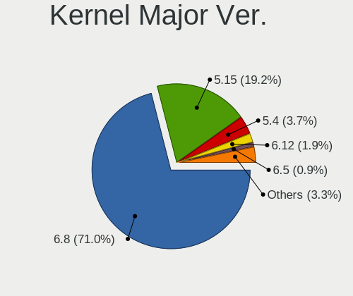
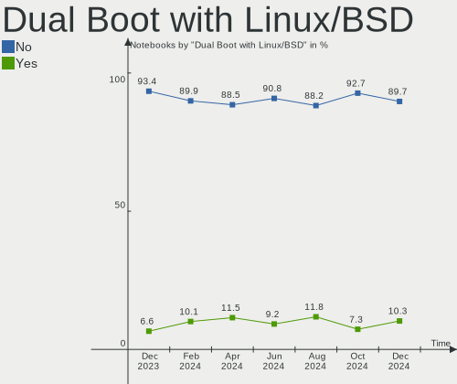
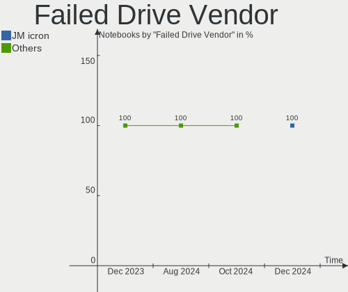
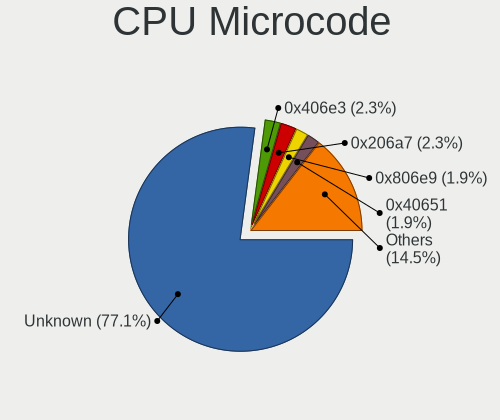
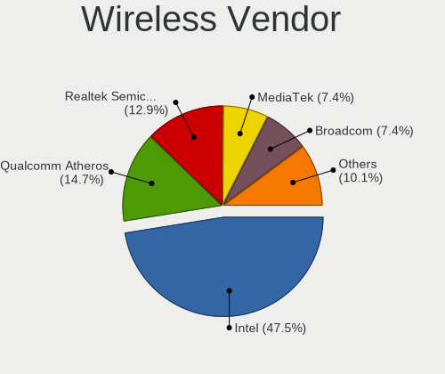
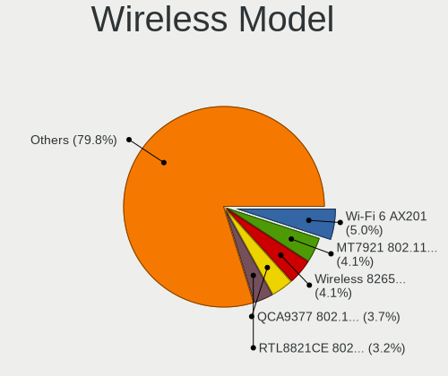
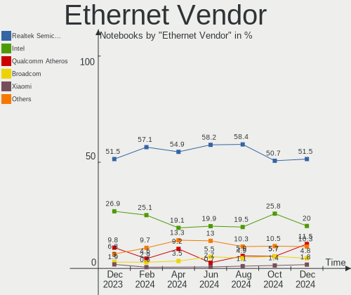
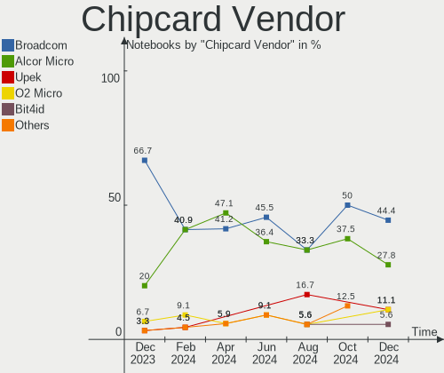

Linux Mint - Hardware Trends (Notebooks)
----------------------------------------

A project to identify most popular hardware characteristics and track their change
over time based on data collected by Linux users at https://Linux-Hardware.org.

Anyone can contribute to this report by the [hw-probe](https://github.com/linuxhw/hw-probe) tool:

    sudo -E hw-probe -all -upload

This report is for one last month. Overall report since the beginning of time: [TestDays](https://github.com/linuxhw/TestDays)

Period: Sep, 2023.

Contents
--------

* [ System ](#system)
  - [ OS                       ](#os)
  - [ OS Family                ](#os-family)
  - [ Kernel                   ](#kernel)
  - [ Kernel Family            ](#kernel-family)
  - [ Kernel Major Ver.        ](#kernel-major-ver)
  - [ Arch                     ](#arch)
  - [ DE                       ](#de)
  - [ Display Server           ](#display-server)
  - [ Display Manager          ](#display-manager)
  - [ OS Lang                  ](#os-lang)
  - [ Boot Mode                ](#boot-mode)
  - [ Filesystem               ](#filesystem)
  - [ Part. scheme             ](#part-scheme)
  - [ Dual Boot with Linux/BSD ](#dual-boot-with-linuxbsd)
  - [ Dual Boot (Win)          ](#dual-boot-win)

* [ Board ](#board)
  - [ Vendor                   ](#vendor)
  - [ Model                    ](#model)
  - [ Model Family             ](#model-family)
  - [ MFG Year                 ](#mfg-year)
  - [ Form Factor              ](#form-factor)
  - [ Secure Boot              ](#secure-boot)
  - [ Coreboot                 ](#coreboot)
  - [ RAM Size                 ](#ram-size)
  - [ RAM Used                 ](#ram-used)
  - [ Total Drives             ](#total-drives)
  - [ Has CD-ROM               ](#has-cd-rom)
  - [ Has Ethernet             ](#has-ethernet)
  - [ Has WiFi                 ](#has-wifi)
  - [ Has Bluetooth            ](#has-bluetooth)

* [ Location ](#location)
  - [ Country                  ](#country)
  - [ City                     ](#city)

* [ Drives ](#drives)
  - [ Drive Vendor             ](#drive-vendor)
  - [ Drive Model              ](#drive-model)
  - [ HDD Vendor               ](#hdd-vendor)
  - [ SSD Vendor               ](#ssd-vendor)
  - [ Drive Kind               ](#drive-kind)
  - [ Drive Connector          ](#drive-connector)
  - [ Drive Size               ](#drive-size)
  - [ Space Total              ](#space-total)
  - [ Space Used               ](#space-used)
  - [ Malfunc. Drives          ](#malfunc-drives)
  - [ Malfunc. Drive Vendor    ](#malfunc-drive-vendor)
  - [ Malfunc. HDD Vendor      ](#malfunc-hdd-vendor)
  - [ Malfunc. Drive Kind      ](#malfunc-drive-kind)
  - [ Failed Drives            ](#failed-drives)
  - [ Failed Drive Vendor      ](#failed-drive-vendor)
  - [ Drive Status             ](#drive-status)

* [ Storage controller ](#storage-controller)
  - [ Storage Vendor           ](#storage-vendor)
  - [ Storage Model            ](#storage-model)
  - [ Storage Kind             ](#storage-kind)

* [ Processor ](#processor)
  - [ CPU Vendor               ](#cpu-vendor)
  - [ CPU Model                ](#cpu-model)
  - [ CPU Model Family         ](#cpu-model-family)
  - [ CPU Cores                ](#cpu-cores)
  - [ CPU Sockets              ](#cpu-sockets)
  - [ CPU Threads              ](#cpu-threads)
  - [ CPU Op-Modes             ](#cpu-op-modes)
  - [ CPU Microcode            ](#cpu-microcode)
  - [ CPU Microarch            ](#cpu-microarch)

* [ Graphics ](#graphics)
  - [ GPU Vendor               ](#gpu-vendor)
  - [ GPU Model                ](#gpu-model)
  - [ GPU Combo                ](#gpu-combo)
  - [ GPU Driver               ](#gpu-driver)
  - [ GPU Memory               ](#gpu-memory)

* [ Monitor ](#monitor)
  - [ Monitor Vendor           ](#monitor-vendor)
  - [ Monitor Model            ](#monitor-model)
  - [ Monitor Resolution       ](#monitor-resolution)
  - [ Monitor Diagonal         ](#monitor-diagonal)
  - [ Monitor Width            ](#monitor-width)
  - [ Aspect Ratio             ](#aspect-ratio)
  - [ Monitor Area             ](#monitor-area)
  - [ Pixel Density            ](#pixel-density)
  - [ Multiple Monitors        ](#multiple-monitors)

* [ Network ](#network)
  - [ Net Controller Vendor    ](#net-controller-vendor)
  - [ Net Controller Model     ](#net-controller-model)
  - [ Wireless Vendor          ](#wireless-vendor)
  - [ Wireless Model           ](#wireless-model)
  - [ Ethernet Vendor          ](#ethernet-vendor)
  - [ Ethernet Model           ](#ethernet-model)
  - [ Net Controller Kind      ](#net-controller-kind)
  - [ Used Controller          ](#used-controller)
  - [ NICs                     ](#nics)
  - [ IPv6                     ](#ipv6)

* [ Bluetooth ](#bluetooth)
  - [ Bluetooth Vendor         ](#bluetooth-vendor)
  - [ Bluetooth Model          ](#bluetooth-model)

* [ Sound ](#sound)
  - [ Sound Vendor             ](#sound-vendor)
  - [ Sound Model              ](#sound-model)

* [ Memory ](#memory)
  - [ Memory Vendor            ](#memory-vendor)
  - [ Memory Model             ](#memory-model)
  - [ Memory Kind              ](#memory-kind)
  - [ Memory Form Factor       ](#memory-form-factor)
  - [ Memory Size              ](#memory-size)
  - [ Memory Speed             ](#memory-speed)

* [ Printers & scanners ](#printers--scanners)
  - [ Printer Vendor           ](#printer-vendor)
  - [ Printer Model            ](#printer-model)
  - [ Scanner Vendor           ](#scanner-vendor)
  - [ Scanner Model            ](#scanner-model)

* [ Camera ](#camera)
  - [ Camera Vendor            ](#camera-vendor)
  - [ Camera Model             ](#camera-model)

* [ Security ](#security)
  - [ Fingerprint Vendor       ](#fingerprint-vendor)
  - [ Fingerprint Model        ](#fingerprint-model)
  - [ Chipcard Vendor          ](#chipcard-vendor)
  - [ Chipcard Model           ](#chipcard-model)

* [ Unsupported ](#unsupported)
  - [ Unsupported Devices      ](#unsupported-devices)
  - [ Unsupported Device Types ](#unsupported-device-types)

System
------

OS
--

Installed operating systems

| Name            | Notebooks | Percent |
|-----------------|-----------|---------|
| Linux Mint 21.2 | 194       | 73.76%  |
| Linux Mint 21.1 | 31        | 11.79%  |
| Linux Mint 20.3 | 18        | 6.84%   |
| Linux Mint 21   | 8         | 3.04%   |
| Linux Mint 20   | 4         | 1.52%   |
| Linux Mint 19.3 | 3         | 1.14%   |
| Linux Mint 20.2 | 2         | 0.76%   |
| Linux Mint 19.2 | 1         | 0.38%   |
| Linux Mint 19.1 | 1         | 0.38%   |
| Linux Mint 18.3 | 1         | 0.38%   |

OS Family
---------

OS without a version

| Name       | Notebooks | Percent |
|------------|-----------|---------|
| Linux Mint | 263       | 100%    |

Kernel
------

Version of the Linux kernel

| Version                     | Notebooks | Percent |
|-----------------------------|-----------|---------|
| 5.15.0-83-generic           | 65        | 24.71%  |
| 5.15.0-84-generic           | 52        | 19.77%  |
| 5.15.0-82-generic           | 35        | 13.31%  |
| 5.15.0-76-generic           | 27        | 10.27%  |
| 6.2.0-32-generic            | 11        | 4.18%   |
| 6.2.0-33-generic            | 9         | 3.42%   |
| 5.15.0-79-generic           | 7         | 2.66%   |
| 5.4.0-162-generic           | 6         | 2.28%   |
| 5.4.0-163-generic           | 5         | 1.9%    |
| 5.15.0-56-generic           | 5         | 1.9%    |
| 6.2.0-31-generic            | 4         | 1.52%   |
| 5.4.0-156-generic           | 3         | 1.14%   |
| 5.15.0-72-generic           | 3         | 1.14%   |
| 6.5.1-060501-generic        | 2         | 0.76%   |
| 6.1.0-1021-oem              | 2         | 0.76%   |
| 5.4.0-91-generic            | 2         | 0.76%   |
| 5.4.0-150-generic           | 2         | 0.76%   |
| 5.15.0-78-generic           | 2         | 0.76%   |
| 6.5.5-060505-generic        | 1         | 0.38%   |
| 6.5.0-1003-oem              | 1         | 0.38%   |
| 6.5.0-060500-generic        | 1         | 0.38%   |
| 6.1.0-1022-oem              | 1         | 0.38%   |
| 6.1.0-1020-oem              | 1         | 0.38%   |
| 6.1.0-060100-generic        | 1         | 0.38%   |
| 6.0.0-1021-oem              | 1         | 0.38%   |
| 5.6.17-050617-generic       | 1         | 0.38%   |
| 5.4.0-26-generic            | 1         | 0.38%   |
| 5.4.0-159-generic           | 1         | 0.38%   |
| 5.4.0-146-generic           | 1         | 0.38%   |
| 5.4.0-137-generic           | 1         | 0.38%   |
| 5.15.0-84-lowlatency        | 1         | 0.38%   |
| 5.15.0-82-lowlatency        | 1         | 0.38%   |
| 5.15.0-60-generic           | 1         | 0.38%   |
| 5.15.0-58-generic           | 1         | 0.38%   |
| 5.15.0-522304060810-generic | 1         | 0.38%   |
| 5.15.0-47-generic           | 1         | 0.38%   |
| 4.15.0-54-generic           | 1         | 0.38%   |
| 4.15.0-213-generic          | 1         | 0.38%   |
| 4.15.0-142-generic          | 1         | 0.38%   |

Kernel Family
-------------

Linux kernel without a distro release

| Version | Notebooks | Percent |
|---------|-----------|---------|
| 5.15.0  | 202       | 76.81%  |
| 6.2.0   | 24        | 9.13%   |
| 5.4.0   | 22        | 8.37%   |
| 6.1.0   | 5         | 1.9%    |
| 4.15.0  | 3         | 1.14%   |
| 6.5.1   | 2         | 0.76%   |
| 6.5.0   | 2         | 0.76%   |
| 6.5.5   | 1         | 0.38%   |
| 6.0.0   | 1         | 0.38%   |
| 5.6.17  | 1         | 0.38%   |

Kernel Major Ver.
-----------------

Linux kernel major version

| Version | Notebooks | Percent |
|---------|-----------|---------|
| 5.15    | 202       | 76.81%  |
| 6.2     | 24        | 9.13%   |
| 5.4     | 22        | 8.37%   |
| 6.5     | 5         | 1.9%    |
| 6.1     | 5         | 1.9%    |
| 4.15    | 3         | 1.14%   |
| 6.0     | 1         | 0.38%   |
| 5.6     | 1         | 0.38%   |

Arch
----

OS architecture (x86_64, i586, etc.)

| Name   | Notebooks | Percent |
|--------|-----------|---------|
| x86_64 | 263       | 100%    |

DE
--

Desktop Environment

| Name       | Notebooks | Percent |
|------------|-----------|---------|
| X-Cinnamon | 190       | 72.24%  |
| XFCE       | 32        | 12.17%  |
| MATE       | 30        | 11.41%  |
| Unknown    | 4         | 1.52%   |
| KDE5       | 2         | 0.76%   |
| GNOME      | 2         | 0.76%   |
| Cinnamon   | 2         | 0.76%   |
| Jwm        | 1         | 0.38%   |

Display Server
--------------

X11 or Wayland

| Name | Notebooks | Percent |
|------|-----------|---------|
| X11  | 262       | 99.62%  |
| Tty  | 1         | 0.38%   |

Display Manager
---------------

SDDM, LightDM, etc.

| Name    | Notebooks | Percent |
|---------|-----------|---------|
| Unknown | 143       | 54.37%  |
| LightDM | 117       | 44.49%  |
| SDDM    | 1         | 0.38%   |
| LXDM    | 1         | 0.38%   |
| GDM3    | 1         | 0.38%   |

OS Lang
-------

Language

| Lang    | Notebooks | Percent |
|---------|-----------|---------|
| en_US   | 84        | 31.94%  |
| de_DE   | 34        | 12.93%  |
| pt_BR   | 16        | 6.08%   |
| C       | 14        | 5.32%   |
| ru_RU   | 12        | 4.56%   |
| fr_FR   | 10        | 3.8%    |
| en_GB   | 9         | 3.42%   |
| tr_TR   | 7         | 2.66%   |
| en_IN   | 7         | 2.66%   |
| es_ES   | 6         | 2.28%   |
| en_CA   | 6         | 2.28%   |
| pl_PL   | 5         | 1.9%    |
| nl_NL   | 5         | 1.9%    |
| it_IT   | 5         | 1.9%    |
| sk_SK   | 3         | 1.14%   |
| hu_HU   | 3         | 1.14%   |
| es_CO   | 3         | 1.14%   |
| es_AR   | 3         | 1.14%   |
| en_AU   | 3         | 1.14%   |
| de_AT   | 3         | 1.14%   |
| Unknown | 3         | 1.14%   |
| fr_BE   | 2         | 0.76%   |
| cs_CZ   | 2         | 0.76%   |
| uk_UA   | 1         | 0.38%   |
| sv_SE   | 1         | 0.38%   |
| ru_UA   | 1         | 0.38%   |
| pt_PT   | 1         | 0.38%   |
| nl_BE   | 1         | 0.38%   |
| ja_JP   | 1         | 0.38%   |
| es_UY   | 1         | 0.38%   |
| es_PE   | 1         | 0.38%   |
| es_NI   | 1         | 0.38%   |
| es_MX   | 1         | 0.38%   |
| es_EC   | 1         | 0.38%   |
| es_CL   | 1         | 0.38%   |
| en_SG   | 1         | 0.38%   |
| en_NG   | 1         | 0.38%   |
| en_IE   | 1         | 0.38%   |
| de_CH   | 1         | 0.38%   |
| da_DK   | 1         | 0.38%   |

Boot Mode
---------

EFI or BIOS

| Mode | Notebooks | Percent |
|------|-----------|---------|
| EFI  | 178       | 67.68%  |
| BIOS | 85        | 32.32%  |

Filesystem
----------

Type of filesystem

| Type    | Notebooks | Percent |
|---------|-----------|---------|
| Ext4    | 231       | 87.83%  |
| Overlay | 12        | 4.56%   |
| Tmpfs   | 8         | 3.04%   |
| Zfs     | 6         | 2.28%   |
| Btrfs   | 4         | 1.52%   |
| Xfs     | 1         | 0.38%   |
| Ext3    | 1         | 0.38%   |

Part. scheme
------------

Scheme of partitioning

| Type    | Notebooks | Percent |
|---------|-----------|---------|
| Unknown | 137       | 52.09%  |
| GPT     | 112       | 42.59%  |
| MBR     | 14        | 5.32%   |

Dual Boot with Linux/BSD
------------------------

Hosting more than one Linux/BSD

| Dual boot | Notebooks | Percent |
|-----------|-----------|---------|
| No        | 241       | 91.63%  |
| Yes       | 22        | 8.37%   |

Dual Boot (Win)
---------------

Hosting Linux and Windows

| Dual boot | Notebooks | Percent |
|-----------|-----------|---------|
| No        | 215       | 81.75%  |
| Yes       | 48        | 18.25%  |

Board
-----

Vendor
------

Motherboard manufacturer

| Name                | Notebooks | Percent |
|---------------------|-----------|---------|
| Hewlett-Packard     | 54        | 20.53%  |
| Lenovo              | 47        | 17.87%  |
| Dell                | 40        | 15.21%  |
| Acer                | 25        | 9.51%   |
| ASUSTek Computer    | 24        | 9.13%   |
| MSI                 | 7         | 2.66%   |
| Samsung Electronics | 6         | 2.28%   |
| HUAWEI              | 6         | 2.28%   |
| Packard Bell        | 5         | 1.9%    |
| Toshiba             | 4         | 1.52%   |
| Apple               | 4         | 1.52%   |
| Timi                | 3         | 1.14%   |
| Sony                | 3         | 1.14%   |
| Medion              | 3         | 1.14%   |
| Google              | 3         | 1.14%   |
| Unknown             | 3         | 1.14%   |
| Notebook            | 2         | 0.76%   |
| Fujitsu Siemens     | 2         | 0.76%   |
| Fujitsu             | 2         | 0.76%   |
| Wortmann AG         | 1         | 0.38%   |
| TUXEDO              | 1         | 0.38%   |
| Turbo-X             | 1         | 0.38%   |
| TrekStor            | 1         | 0.38%   |
| Tectoy              | 1         | 0.38%   |
| Star Labs           | 1         | 0.38%   |
| Standard            | 1         | 0.38%   |
| Prestigio           | 1         | 0.38%   |
| PC Specialist       | 1         | 0.38%   |
| Monster             | 1         | 0.38%   |
| LG Electronics      | 1         | 0.38%   |
| Jumper              | 1         | 0.38%   |
| Inter Sales A/S     | 1         | 0.38%   |
| Gigabyte Technology | 1         | 0.38%   |
| Gateway             | 1         | 0.38%   |
| eMachines           | 1         | 0.38%   |
| Clevo               | 1         | 0.38%   |
| Chuwi               | 1         | 0.38%   |
| AMI                 | 1         | 0.38%   |
| AIR                 | 1         | 0.38%   |

Model
-----

Motherboard model

| Name                                | Notebooks | Percent |
|-------------------------------------|-----------|---------|
| Unknown                             | 6         | 2.28%   |
| Samsung 550XDA                      | 2         | 0.76%   |
| Lenovo IdeaPad 3 14ALC6 82KT        | 2         | 0.76%   |
| HUAWEI BOM-WXX9                     | 2         | 0.76%   |
| HP Victus by Gaming Laptop 16-r0xxx | 2         | 0.76%   |
| HP Pavilion Notebook                | 2         | 0.76%   |
| HP Pavilion dv7                     | 2         | 0.76%   |
| HP Pavilion dv6                     | 2         | 0.76%   |
| HP Laptop 15-fc0xxx                 | 2         | 0.76%   |
| HP Laptop 15-da0xxx                 | 2         | 0.76%   |
| Dell Latitude E5550                 | 2         | 0.76%   |
| Dell Inspiron 15-3567               | 2         | 0.76%   |
| Acer Nitro AN515-58                 | 2         | 0.76%   |
| Acer Aspire 7741                    | 2         | 0.76%   |
| Wortmann AG TERRA_MOBILE_1749       | 1         | 0.38%   |
| Turbo-X III_IPS64gb                 | 1         | 0.38%   |
| TrekStor Primebook P14              | 1         | 0.38%   |
| Toshiba Satellite P50-B-117         | 1         | 0.38%   |
| Toshiba Satellite L875D             | 1         | 0.38%   |
| Toshiba Satellite L875-11M          | 1         | 0.38%   |
| Toshiba QOSMIO X770                 | 1         | 0.38%   |
| Timi Xiaomi Book Pro 14 2022        | 1         | 0.38%   |
| Timi TM1701                         | 1         | 0.38%   |
| Timi Redmi Book Pro 15 2022         | 1         | 0.38%   |
| Tectoy Pense Bem Notebook           | 1         | 0.38%   |
| Star Labs StarBook                  | 1         | 0.38%   |
| Standard MB45II/MB45IN              | 1         | 0.38%   |
| Sony VPCEB4J0E                      | 1         | 0.38%   |
| Sony VGN-AR71J                      | 1         | 0.38%   |
| Sony SVF1521V6EB                    | 1         | 0.38%   |
| Samsung RF511/RF411/RF711           | 1         | 0.38%   |
| Samsung N102SP/N100SP/N101SP        | 1         | 0.38%   |
| Samsung 340XAA/350XAA/550XAA        | 1         | 0.38%   |
| Samsung 300E5M/300E5L               | 1         | 0.38%   |
| Prestigio Smartbook PSB116A         | 1         | 0.38%   |
| PC Specialist Ionico 16             | 1         | 0.38%   |
| Packard Bell EasyNote TK36          | 1         | 0.38%   |
| Packard Bell EasyNote TE11HC        | 1         | 0.38%   |
| Packard Bell EasyNote MH36          | 1         | 0.38%   |
| Packard Bell EasyNote ENTG71BM      | 1         | 0.38%   |

Model Family
------------

Motherboard model prefix

| Name                  | Notebooks | Percent |
|-----------------------|-----------|---------|
| Dell Latitude         | 20        | 7.6%    |
| Lenovo IdeaPad        | 19        | 7.22%   |
| Lenovo ThinkPad       | 17        | 6.46%   |
| HP Pavilion           | 16        | 6.08%   |
| Acer Aspire           | 16        | 6.08%   |
| HP Laptop             | 11        | 4.18%   |
| Dell Inspiron         | 10        | 3.8%    |
| HP ProBook            | 8         | 3.04%   |
| Unknown               | 6         | 2.28%   |
| HP EliteBook          | 5         | 1.9%    |
| Acer Nitro            | 5         | 1.9%    |
| Packard Bell EasyNote | 4         | 1.52%   |
| Dell Precision        | 4         | 1.52%   |
| Toshiba Satellite     | 3         | 1.14%   |
| Dell XPS              | 3         | 1.14%   |
| ASUS VivoBook         | 3         | 1.14%   |
| Acer Swift            | 3         | 1.14%   |
| Samsung 550XDA        | 2         | 0.76%   |
| Medion Akoya          | 2         | 0.76%   |
| Lenovo Legion         | 2         | 0.76%   |
| HUAWEI BOM-WXX9       | 2         | 0.76%   |
| HP ZBook              | 2         | 0.76%   |
| HP Victus             | 2         | 0.76%   |
| HP OMEN               | 2         | 0.76%   |
| HP 250                | 2         | 0.76%   |
| Fujitsu Siemens AMILO | 2         | 0.76%   |
| ASUS ROG              | 2         | 0.76%   |
| ASUS ASUS             | 2         | 0.76%   |
| Wortmann AG TERRA     | 1         | 0.38%   |
| Turbo-X III           | 1         | 0.38%   |
| TrekStor Primebook    | 1         | 0.38%   |
| Toshiba QOSMIO        | 1         | 0.38%   |
| Timi Xiaomi           | 1         | 0.38%   |
| Timi TM1701           | 1         | 0.38%   |
| Timi Redmi            | 1         | 0.38%   |
| Tectoy Pense          | 1         | 0.38%   |
| Star Labs StarBook    | 1         | 0.38%   |
| Standard MB45II       | 1         | 0.38%   |
| Sony VPCEB4J0E        | 1         | 0.38%   |
| Sony VGN-AR71J        | 1         | 0.38%   |

MFG Year
--------

Motherboard manufacture year

| Year    | Notebooks | Percent |
|---------|-----------|---------|
| 2021    | 31        | 11.79%  |
| 2022    | 28        | 10.65%  |
| 2018    | 22        | 8.37%   |
| 2011    | 20        | 7.6%    |
| 2015    | 17        | 6.46%   |
| 2012    | 16        | 6.08%   |
| 2017    | 15        | 5.7%    |
| 2013    | 15        | 5.7%    |
| 2014    | 14        | 5.32%   |
| 2008    | 14        | 5.32%   |
| 2020    | 13        | 4.94%   |
| 2023    | 12        | 4.56%   |
| 2016    | 12        | 4.56%   |
| 2019    | 11        | 4.18%   |
| 2010    | 11        | 4.18%   |
| 2009    | 6         | 2.28%   |
| 2006    | 3         | 1.14%   |
| 2007    | 2         | 0.76%   |
| Unknown | 1         | 0.38%   |

Form Factor
-----------

Physical design of the computer

| Name     | Notebooks | Percent |
|----------|-----------|---------|
| Notebook | 263       | 100%    |

Secure Boot
-----------

Enabled or disabled

| State    | Notebooks | Percent |
|----------|-----------|---------|
| Disabled | 248       | 94.3%   |
| Enabled  | 15        | 5.7%    |

Coreboot
--------

Have coreboot on board

| Used | Notebooks | Percent |
|------|-----------|---------|
| No   | 257       | 97.72%  |
| Yes  | 6         | 2.28%   |

RAM Size
--------

Total RAM memory

| Size in GB  | Notebooks | Percent |
|-------------|-----------|---------|
| 4.01-8.0    | 74        | 28.14%  |
| 3.01-4.0    | 59        | 22.43%  |
| 8.01-16.0   | 47        | 17.87%  |
| 16.01-24.0  | 38        | 14.45%  |
| 32.01-64.0  | 20        | 7.6%    |
| 1.01-2.0    | 11        | 4.18%   |
| 2.01-3.0    | 6         | 2.28%   |
| 24.01-32.0  | 4         | 1.52%   |
| 64.01-256.0 | 3         | 1.14%   |
| 0.51-1.0    | 1         | 0.38%   |

RAM Used
--------

Used RAM memory

| Used GB    | Notebooks | Percent |
|------------|-----------|---------|
| 1.01-2.0   | 98        | 37.26%  |
| 2.01-3.0   | 81        | 30.8%   |
| 4.01-8.0   | 34        | 12.93%  |
| 3.01-4.0   | 27        | 10.27%  |
| 8.01-16.0  | 10        | 3.8%    |
| 0.51-1.0   | 10        | 3.8%    |
| 16.01-24.0 | 2         | 0.76%   |
| 24.01-32.0 | 1         | 0.38%   |

Total Drives
------------

Number of drives on board

| Drives | Notebooks | Percent |
|--------|-----------|---------|
| 1      | 190       | 72.24%  |
| 2      | 63        | 23.95%  |
| 3      | 8         | 3.04%   |
| 0      | 2         | 0.76%   |

Has CD-ROM
----------

Has CD-ROM on board

| Presented | Notebooks | Percent |
|-----------|-----------|---------|
| No        | 168       | 63.88%  |
| Yes       | 95        | 36.12%  |

Has Ethernet
------------

Has Ethernet on board

| Presented | Notebooks | Percent |
|-----------|-----------|---------|
| Yes       | 204       | 77.57%  |
| No        | 59        | 22.43%  |

Has WiFi
--------

Has WiFi module

| Presented | Notebooks | Percent |
|-----------|-----------|---------|
| Yes       | 258       | 98.1%   |
| No        | 5         | 1.9%    |

Has Bluetooth
-------------

Has Bluetooth module

| Presented | Notebooks | Percent |
|-----------|-----------|---------|
| Yes       | 202       | 76.81%  |
| No        | 61        | 23.19%  |

Location
--------

Country
-------

Geographic location (country)

| Country     | Notebooks | Percent |
|-------------|-----------|---------|
| Germany     | 38        | 14.45%  |
| USA         | 29        | 11.03%  |
| Brazil      | 18        | 6.84%   |
| Russia      | 13        | 4.94%   |
| UK          | 12        | 4.56%   |
| France      | 12        | 4.56%   |
| Spain       | 9         | 3.42%   |
| Italy       | 9         | 3.42%   |
| Turkey      | 8         | 3.04%   |
| Poland      | 8         | 3.04%   |
| Netherlands | 8         | 3.04%   |
| India       | 8         | 3.04%   |
| Canada      | 8         | 3.04%   |
| Portugal    | 6         | 2.28%   |
| Colombia    | 6         | 2.28%   |
| Slovakia    | 5         | 1.9%    |
| Hungary     | 5         | 1.9%    |
| Austria     | 5         | 1.9%    |
| Mexico      | 4         | 1.52%   |
| Argentina   | 4         | 1.52%   |
| Switzerland | 3         | 1.14%   |
| Sweden      | 3         | 1.14%   |
| Czechia     | 3         | 1.14%   |
| Belgium     | 3         | 1.14%   |
| Australia   | 3         | 1.14%   |
| Romania     | 2         | 0.76%   |
| Ecuador     | 2         | 0.76%   |
| Denmark     | 2         | 0.76%   |
| Uruguay     | 1         | 0.38%   |
| Ukraine     | 1         | 0.38%   |
| Tunisia     | 1         | 0.38%   |
| Singapore   | 1         | 0.38%   |
| Peru        | 1         | 0.38%   |
| Norway      | 1         | 0.38%   |
| Nigeria     | 1         | 0.38%   |
| Nicaragua   | 1         | 0.38%   |
| New Zealand | 1         | 0.38%   |
| Nepal       | 1         | 0.38%   |
| Luxembourg  | 1         | 0.38%   |
| Lithuania   | 1         | 0.38%   |

City
----

Geographic location (city)

| City                | Notebooks | Percent |
|---------------------|-----------|---------|
| Vienna              | 5         | 1.9%    |
| Munich              | 4         | 1.52%   |
| Moscow              | 4         | 1.52%   |
| Bratislava          | 4         | 1.52%   |
| Curitiba            | 3         | 1.14%   |
| Calvert Heights     | 3         | 1.14%   |
| Bogotá             | 3         | 1.14%   |
| Berlin              | 3         | 1.14%   |
| Toronto             | 2         | 0.76%   |
| San José           | 2         | 0.76%   |
| Rostov-on-Don       | 2         | 0.76%   |
| Osnabrück          | 2         | 0.76%   |
| Monterrey           | 2         | 0.76%   |
| Mersin              | 2         | 0.76%   |
| Medellín           | 2         | 0.76%   |
| Lüdenscheid        | 2         | 0.76%   |
| Lisbon              | 2         | 0.76%   |
| Hoeven              | 2         | 0.76%   |
| Glasgow             | 2         | 0.76%   |
| Chennai             | 2         | 0.76%   |
| Carnforth           | 2         | 0.76%   |
| Brasília           | 2         | 0.76%   |
| Barcelona           | 2         | 0.76%   |
| Adapazarı          | 2         | 0.76%   |
| Wroclaw             | 1         | 0.38%   |
| Worms               | 1         | 0.38%   |
| Worcester           | 1         | 0.38%   |
| Woodstock           | 1         | 0.38%   |
| Waterville          | 1         | 0.38%   |
| Waterloo            | 1         | 0.38%   |
| Vlotho              | 1         | 0.38%   |
| Vleuten             | 1         | 0.38%   |
| Vitkov              | 1         | 0.38%   |
| Visakhapatnam       | 1         | 0.38%   |
| Vilnius             | 1         | 0.38%   |
| Vigo                | 1         | 0.38%   |
| Vestby              | 1         | 0.38%   |
| Ventura             | 1         | 0.38%   |
| Valparaiso de Goias | 1         | 0.38%   |
| Valladolid          | 1         | 0.38%   |

Drives
------

Drive Vendor
------------

Hard drive vendors

| Vendor                      | Notebooks | Drives | Percent |
|-----------------------------|-----------|--------|---------|
| Samsung Electronics         | 49        | 50     | 15.12%  |
| WDC                         | 38        | 39     | 11.73%  |
| Seagate                     | 22        | 22     | 6.79%   |
| SanDisk                     | 20        | 22     | 6.17%   |
| Crucial                     | 20        | 21     | 6.17%   |
| Toshiba                     | 19        | 19     | 5.86%   |
| Unknown                     | 18        | 21     | 5.56%   |
| Micron Technology           | 18        | 18     | 5.56%   |
| Kingston                    | 12        | 12     | 3.7%    |
| Hitachi                     | 12        | 12     | 3.7%    |
| SK hynix                    | 10        | 10     | 3.09%   |
| Intel                       | 9         | 10     | 2.78%   |
| A-DATA Technology           | 6         | 6      | 1.85%   |
| KIOXIA                      | 5         | 5      | 1.54%   |
| Fujitsu                     | 4         | 6      | 1.23%   |
| SPCC                        | 3         | 3      | 0.93%   |
| Phison Electronics          | 3         | 3      | 0.93%   |
| Intenso                     | 3         | 3      | 0.93%   |
| HGST                        | 3         | 3      | 0.93%   |
| China                       | 3         | 3      | 0.93%   |
| Apple                       | 3         | 3      | 0.93%   |
| Unknown                     | 3         | 3      | 0.93%   |
| XrayDisk                    | 2         | 2      | 0.62%   |
| Netac                       | 2         | 2      | 0.62%   |
| Micron/Crucial Technology   | 2         | 2      | 0.62%   |
| Leven                       | 2         | 2      | 0.62%   |
| YMTC                        | 1         | 1      | 0.31%   |
| Yangtze Memory Technologies | 1         | 1      | 0.31%   |
| XPG                         | 1         | 1      | 0.31%   |
| Verbatim                    | 1         | 1      | 0.31%   |
| USB3.0                      | 1         | 1      | 0.31%   |
| TrekStor                    | 1         | 1      | 0.31%   |
| TCSUNBOW                    | 1         | 1      | 0.31%   |
| Super Talent                | 1         | 1      | 0.31%   |
| Solid State Storage         | 1         | 1      | 0.31%   |
| SM59XT2A                    | 1         | 1      | 0.31%   |
| SAGE                        | 1         | 1      | 0.31%   |
| PNY USB                     | 1         | 1      | 0.31%   |
| PNY                         | 1         | 1      | 0.31%   |
| Plextor                     | 1         | 1      | 0.31%   |

Drive Model
-----------

Hard drive models

| Model                                               | Notebooks | Percent |
|-----------------------------------------------------|-----------|---------|
| Unknown MMC Card  64GB                              | 6         | 1.81%   |
| Crucial CT500MX500SSD1 500GB                        | 5         | 1.51%   |
| Samsung SSD 860 EVO 250GB                           | 4         | 1.21%   |
| Kingston SA400S37960G 960GB SSD                     | 4         | 1.21%   |
| Kingston SA400S37480G 480GB SSD                     | 4         | 1.21%   |
| Hitachi HTS547575A9E384 752GB                       | 4         | 1.21%   |
| Unknown MMC Card  16GB                              | 3         | 0.91%   |
| Toshiba MQ04ABF100 1TB                              | 3         | 0.91%   |
| Toshiba MQ01ABF050 500GB                            | 3         | 0.91%   |
| Seagate ST1000LM024 HN-M101MBB 1TB                  | 3         | 0.91%   |
| SanDisk NVMe SSD Drive 1TB                          | 3         | 0.91%   |
| Samsung NVMe SSD Controller SM961/PM961/SM963 500GB | 3         | 0.91%   |
| Micron 1100 SATA 512GB SSD                          | 3         | 0.91%   |
| Crucial CT1000MX500SSD1 1TB                         | 3         | 0.91%   |
| Unknown                                             | 3         | 0.91%   |
| WDC WD10SPCX-24HWST1 1TB                            | 2         | 0.6%    |
| WDC WD10JPVX-22JC3T0 1TB                            | 2         | 0.6%    |
| Unknown MMC Card  32GB                              | 2         | 0.6%    |
| Toshiba TR200 240GB SSD                             | 2         | 0.6%    |
| Toshiba MQ01ABD100 1TB                              | 2         | 0.6%    |
| Seagate ST500LT012-1DG142 500GB                     | 2         | 0.6%    |
| Sandisk WD Blue SN500 / PC SN520 NVMe SSD 256GB     | 2         | 0.6%    |
| Samsung SSD 970 EVO Plus 500GB                      | 2         | 0.6%    |
| Samsung SSD 870 EVO 1TB                             | 2         | 0.6%    |
| Samsung SSD 860 EVO 1TB                             | 2         | 0.6%    |
| Samsung NVMe SSD Controller SM981/PM981/PM983 256GB | 2         | 0.6%    |
| Samsung NVMe SSD Controller PM9A1/PM9A3/980PRO 1TB  | 2         | 0.6%    |
| Samsung MZALQ512HBLU-00BL2 512GB                    | 2         | 0.6%    |
| Phison PS5013 E13 NVMe Controller 512GB             | 2         | 0.6%    |
| Micron/Crucial P2 NVMe PCIe SSD 1TB                 | 2         | 0.6%    |
| Micron 3400_MTFDKBA1T0TFH 1TB                       | 2         | 0.6%    |
| Micron 2450_MTFDKBA512TFK 512GB                     | 2         | 0.6%    |
| KIOXIA KBG50ZNV512G 512GB                           | 2         | 0.6%    |
| KIOXIA KBG40ZNV512G 512GB                           | 2         | 0.6%    |
| Kingston SA400S37240G 240GB SSD                     | 2         | 0.6%    |
| Intel SSDPEKNW512GZL 512GB                          | 2         | 0.6%    |
| Hitachi HTS545032B9A300 320GB                       | 2         | 0.6%    |
| HGST HTS545050A7E680 500GB                          | 2         | 0.6%    |
| Crucial CT500BX500SSD1 500GB                        | 2         | 0.6%    |
| Crucial CT240BX500SSD1 240GB                        | 2         | 0.6%    |

HDD Vendor
----------

Hard disk drive vendors

| Vendor              | Notebooks | Drives | Percent |
|---------------------|-----------|--------|---------|
| WDC                 | 30        | 30     | 32.97%  |
| Seagate             | 21        | 21     | 23.08%  |
| Toshiba             | 14        | 14     | 15.38%  |
| Hitachi             | 12        | 12     | 13.19%  |
| Samsung Electronics | 4         | 4      | 4.4%    |
| Fujitsu             | 4         | 6      | 4.4%    |
| HGST                | 3         | 3      | 3.3%    |
| USB3.0              | 1         | 1      | 1.1%    |
| SAGE                | 1         | 1      | 1.1%    |
| Maxone              | 1         | 1      | 1.1%    |

SSD Vendor
----------

Solid state drive vendors

| Vendor              | Notebooks | Drives | Percent |
|---------------------|-----------|--------|---------|
| Samsung Electronics | 20        | 20     | 18.35%  |
| Crucial             | 20        | 20     | 18.35%  |
| Kingston            | 12        | 12     | 11.01%  |
| A-DATA Technology   | 4         | 4      | 3.67%   |
| WDC                 | 3         | 3      | 2.75%   |
| Toshiba             | 3         | 3      | 2.75%   |
| SPCC                | 3         | 3      | 2.75%   |
| SK hynix            | 3         | 3      | 2.75%   |
| SanDisk             | 3         | 4      | 2.75%   |
| Micron Technology   | 3         | 3      | 2.75%   |
| Intenso             | 3         | 3      | 2.75%   |
| Intel               | 3         | 3      | 2.75%   |
| China               | 3         | 3      | 2.75%   |
| Netac               | 2         | 2      | 1.83%   |
| Leven               | 2         | 2      | 1.83%   |
| Apple               | 2         | 2      | 1.83%   |
| Unknown             | 2         | 2      | 1.83%   |
| XrayDisk            | 1         | 1      | 0.92%   |
| Verbatim            | 1         | 1      | 0.92%   |
| TrekStor            | 1         | 1      | 0.92%   |
| TCSUNBOW            | 1         | 1      | 0.92%   |
| Super Talent        | 1         | 1      | 0.92%   |
| PNY USB             | 1         | 1      | 0.92%   |
| PNY                 | 1         | 1      | 0.92%   |
| Plextor             | 1         | 1      | 0.92%   |
| Patriot             | 1         | 1      | 0.92%   |
| NT-256              | 1         | 1      | 0.92%   |
| Netac NV            | 1         | 1      | 0.92%   |
| LITEONIT            | 1         | 1      | 0.92%   |
| LITEON              | 1         | 1      | 0.92%   |
| Inateck             | 1         | 1      | 0.92%   |
| HJDK                | 1         | 1      | 0.92%   |
| DTECHCO             | 1         | 1      | 0.92%   |
| CT2000MX            | 1         | 1      | 0.92%   |
| ASL                 | 1         | 1      | 0.92%   |

Drive Kind
----------

HDD or SSD

| Kind    | Notebooks | Drives | Percent |
|---------|-----------|--------|---------|
| SSD     | 98        | 110    | 32.13%  |
| NVMe    | 94        | 103    | 30.82%  |
| HDD     | 87        | 93     | 28.52%  |
| MMC     | 19        | 22     | 6.23%   |
| Unknown | 7         | 7      | 2.3%    |

Drive Connector
---------------

SATA, SAS, NVMe, etc.

| Type | Notebooks | Drives | Percent |
|------|-----------|--------|---------|
| SATA | 175       | 196    | 58.14%  |
| NVMe | 94        | 103    | 31.23%  |
| MMC  | 19        | 22     | 6.31%   |
| SAS  | 13        | 14     | 4.32%   |

Drive Size
----------

Size of hard drive

| Size in TB | Notebooks | Drives | Percent |
|------------|-----------|--------|---------|
| 0.01-0.5   | 118       | 132    | 63.44%  |
| 0.51-1.0   | 59        | 61     | 31.72%  |
| 1.01-2.0   | 8         | 9      | 4.3%    |
| 4.01-10.0  | 1         | 1      | 0.54%   |

Space Total
-----------

Amount of disk space available on the file system

| Size in GB     | Notebooks | Percent |
|----------------|-----------|---------|
| 101-250        | 74        | 28.14%  |
| 251-500        | 69        | 26.24%  |
| 501-1000       | 46        | 17.49%  |
| 51-100         | 22        | 8.37%   |
| 1001-2000      | 20        | 7.6%    |
| 1-20           | 11        | 4.18%   |
| 21-50          | 8         | 3.04%   |
| Unknown        | 8         | 3.04%   |
| 2001-3000      | 3         | 1.14%   |
| More than 3000 | 2         | 0.76%   |

Space Used
----------

Amount of used disk space

| Used GB   | Notebooks | Percent |
|-----------|-----------|---------|
| 21-50     | 72        | 27.38%  |
| 1-20      | 65        | 24.71%  |
| 101-250   | 38        | 14.45%  |
| 51-100    | 38        | 14.45%  |
| 251-500   | 20        | 7.6%    |
| 501-1000  | 14        | 5.32%   |
| Unknown   | 8         | 3.04%   |
| 1001-2000 | 6         | 2.28%   |
| 2001-3000 | 2         | 0.76%   |

Malfunc. Drives
---------------

Drive models with a malfunction

| Model                                | Notebooks | Drives | Percent |
|--------------------------------------|-----------|--------|---------|
| Toshiba MQ01ABF050 500GB             | 2         | 2      | 11.76%  |
| WDC WD5000BPKT-75PK4T0 500GB         | 1         | 1      | 5.88%   |
| WDC WD3200BPVT-22ZEST0 320GB         | 1         | 1      | 5.88%   |
| WDC WD1200BEVS-07LAT0 120GB          | 1         | 1      | 5.88%   |
| WDC WD10SPZX-75Z10T2 1TB             | 1         | 1      | 5.88%   |
| SK hynix PC711 HFS512GDE9X073N 512GB | 1         | 1      | 5.88%   |
| Seagate ST96812AS 64GB               | 1         | 1      | 5.88%   |
| Netac SSD 256GB                      | 1         | 1      | 5.88%   |
| Kingston SA400S37240G 240GB SSD      | 1         | 1      | 5.88%   |
| Intel SSDSA2M080G2GC 80GB            | 1         | 1      | 5.88%   |
| Inateck ASM1153E 528GB SSD           | 1         | 1      | 5.88%   |
| Hitachi HTS725032A9A364 320GB        | 1         | 1      | 5.88%   |
| Fujitsu MHV2080AH 80GB               | 1         | 1      | 5.88%   |
| DTECHCO SSD 256GB                    | 1         | 1      | 5.88%   |
| Apple SSD SM0512F 500GB              | 1         | 1      | 5.88%   |
| Unknown                              | 1         | 1      | 5.88%   |

Malfunc. Drive Vendor
---------------------

Vendors of faulty drives

| Vendor   | Notebooks | Drives | Percent |
|----------|-----------|--------|---------|
| WDC      | 4         | 4      | 23.53%  |
| Toshiba  | 2         | 2      | 11.76%  |
| SK hynix | 1         | 1      | 5.88%   |
| Seagate  | 1         | 1      | 5.88%   |
| Netac    | 1         | 1      | 5.88%   |
| Kingston | 1         | 1      | 5.88%   |
| Intel    | 1         | 1      | 5.88%   |
| Inateck  | 1         | 1      | 5.88%   |
| Hitachi  | 1         | 1      | 5.88%   |
| Fujitsu  | 1         | 1      | 5.88%   |
| DTECHCO  | 1         | 1      | 5.88%   |
| Apple    | 1         | 1      | 5.88%   |
| Unknown  | 1         | 1      | 5.88%   |

Malfunc. HDD Vendor
-------------------

Vendors of faulty HDD drives

| Vendor  | Notebooks | Drives | Percent |
|---------|-----------|--------|---------|
| WDC     | 4         | 4      | 44.44%  |
| Toshiba | 2         | 2      | 22.22%  |
| Seagate | 1         | 1      | 11.11%  |
| Hitachi | 1         | 1      | 11.11%  |
| Fujitsu | 1         | 1      | 11.11%  |

Malfunc. Drive Kind
-------------------

Kinds of faulty drives

| Kind | Notebooks | Drives | Percent |
|------|-----------|--------|---------|
| HDD  | 9         | 9      | 52.94%  |
| SSD  | 7         | 7      | 41.18%  |
| NVMe | 1         | 1      | 5.88%   |

Failed Drives
-------------

Failed drive models

| Model                             | Notebooks | Drives | Percent |
|-----------------------------------|-----------|--------|---------|
| Samsung Electronics HM160HC 160GB | 1         | 1      | 100%    |

Failed Drive Vendor
-------------------

Failed drive vendors

| Vendor              | Notebooks | Drives | Percent |
|---------------------|-----------|--------|---------|
| Samsung Electronics | 1         | 1      | 100%    |

Drive Status
------------

Number of failed and malfunc. drives

| Status   | Notebooks | Drives | Percent |
|----------|-----------|--------|---------|
| Detected | 158       | 205    | 58.3%   |
| Works    | 96        | 112    | 35.42%  |
| Malfunc  | 16        | 17     | 5.9%    |
| Failed   | 1         | 1      | 0.37%   |

Storage controller
------------------

Storage Vendor
--------------

Storage controller vendors

| Vendor                         | Notebooks | Percent |
|--------------------------------|-----------|---------|
| Intel                          | 175       | 57.76%  |
| AMD                            | 28        | 9.24%   |
| Samsung Electronics            | 27        | 8.91%   |
| SanDisk                        | 20        | 6.6%    |
| Micron Technology              | 15        | 4.95%   |
| SK hynix                       | 7         | 2.31%   |
| Phison Electronics             | 6         | 1.98%   |
| KIOXIA                         | 5         | 1.65%   |
| Nvidia                         | 4         | 1.32%   |
| Micron/Crucial Technology      | 3         | 0.99%   |
| ADATA Technology               | 3         | 0.99%   |
| Yangtze Memory Technologies    | 2         | 0.66%   |
| Toshiba America Info Systems   | 2         | 0.66%   |
| Solid State Storage Technology | 1         | 0.33%   |
| Shenzhen Longsys Electronics   | 1         | 0.33%   |
| Seagate Technology             | 1         | 0.33%   |
| Kingston Technology Company    | 1         | 0.33%   |
| Hosin Global Electronics       | 1         | 0.33%   |
| Apple                          | 1         | 0.33%   |

Storage Model
-------------

Storage controller models

| Model                                                                            | Notebooks | Percent |
|----------------------------------------------------------------------------------|-----------|---------|
| AMD FCH SATA Controller [AHCI mode]                                              | 23        | 7.21%   |
| Intel Sunrise Point-LP SATA Controller [AHCI mode]                               | 22        | 6.9%    |
| Intel 6 Series/C200 Series Chipset Family 6 port Mobile SATA AHCI Controller     | 21        | 6.58%   |
| Intel 7 Series Chipset Family 6-port SATA Controller [AHCI mode]                 | 19        | 5.96%   |
| Intel 82801 Mobile SATA Controller [RAID mode]                                   | 16        | 5.02%   |
| Samsung NVMe SSD Controller 980                                                  | 10        | 3.13%   |
| Intel 5 Series/3400 Series Chipset 4 port SATA AHCI Controller                   | 9         | 2.82%   |
| Samsung NVMe SSD Controller SM981/PM981/PM983                                    | 8         | 2.51%   |
| Intel Volume Management Device NVMe RAID Controller                              | 8         | 2.51%   |
| Intel Wildcat Point-LP SATA Controller [AHCI Mode]                               | 7         | 2.19%   |
| Micron 2450 NVMe SSD [HendrixV] (DRAM-less)                                      | 6         | 1.88%   |
| Intel Celeron N3350/Pentium N4200/Atom E3900 Series SATA AHCI Controller         | 6         | 1.88%   |
| Intel 82801IBM/IEM (ICH9M/ICH9M-E) 4 port SATA Controller [AHCI mode]            | 6         | 1.88%   |
| Micron 3400 NVMe SSD [Hendrix]                                                   | 5         | 1.57%   |
| Intel SSD 670p Series [Keystone Harbor]                                          | 5         | 1.57%   |
| Intel Alder Lake-P SATA AHCI Controller                                          | 5         | 1.57%   |
| Intel 8 Series/C220 Series Chipset Family 6-port SATA Controller 1 [AHCI mode]   | 5         | 1.57%   |
| Intel 8 Series SATA Controller 1 [AHCI mode]                                     | 5         | 1.57%   |
| Intel Atom/Celeron/Pentium Processor x5-E8000/J3xxx/N3xxx Series SATA Controller | 4         | 1.25%   |
| SK hynix Gold P31/BC711/PC711 NVMe Solid State Drive                             | 3         | 0.94%   |
| SanDisk WD Blue SN550 NVMe SSD                                                   | 3         | 0.94%   |
| SanDisk WD Black SN770 / PC SN740 256GB / PC SN560 (DRAM-less) NVMe SSD          | 3         | 0.94%   |
| SanDisk WD Black SN750 / PC SN730 NVMe SSD                                       | 3         | 0.94%   |
| Samsung NVMe SSD Controller SM961/PM961/SM963                                    | 3         | 0.94%   |
| Samsung NVMe SSD Controller PM9A1/PM9A3/980PRO                                   | 3         | 0.94%   |
| Phison PS5013 E13 NVMe Controller                                                | 3         | 0.94%   |
| KIOXIA NVMe SSD Controller BG5 (DRAM-less)                                       | 3         | 0.94%   |
| Intel Tiger Lake-LP SATA Controller                                              | 3         | 0.94%   |
| Intel HM170/QM170 Chipset SATA Controller [AHCI Mode]                            | 3         | 0.94%   |
| Intel Cannon Point-LP SATA Controller [AHCI Mode]                                | 3         | 0.94%   |
| Intel Cannon Lake Mobile PCH SATA AHCI Controller                                | 3         | 0.94%   |
| Intel Atom Processor E3800 Series SATA AHCI Controller                           | 3         | 0.94%   |
| Intel 82801HM/HEM (ICH8M/ICH8M-E) SATA Controller [AHCI mode]                    | 3         | 0.94%   |
| Intel 82801HM/HEM (ICH8M/ICH8M-E) IDE Controller                                 | 3         | 0.94%   |
| AMD SB7x0/SB8x0/SB9x0 SATA Controller [AHCI mode]                                | 3         | 0.94%   |
| Yangtze Memory PC005 NVMe SSD                                                    | 2         | 0.63%   |
| SK hynix BC511 NVMe SSD                                                          | 2         | 0.63%   |
| Sandisk Western Digital WD Black SN850X NVMe SSD                                 | 2         | 0.63%   |
| SanDisk WD PC SN810 / Black SN850 NVMe SSD                                       | 2         | 0.63%   |
| SanDisk WD Green SN350 NVMe SSD 1 TB (DRAM-less)                                 | 2         | 0.63%   |

Storage Kind
------------

Kind of storage controller (IDE, SATA, NVMe, SAS, ...)

| Kind | Notebooks | Percent |
|------|-----------|---------|
| SATA | 175       | 56.82%  |
| NVMe | 94        | 30.52%  |
| RAID | 24        | 7.79%   |
| IDE  | 15        | 4.87%   |

Processor
---------

CPU Vendor
----------

Processor vendors

| Vendor | Notebooks | Percent |
|--------|-----------|---------|
| Intel  | 211       | 80.23%  |
| AMD    | 52        | 19.77%  |

CPU Model
---------

Processor models

| Model                                       | Notebooks | Percent |
|---------------------------------------------|-----------|---------|
| Intel Core i5-8250U CPU @ 1.60GHz           | 5         | 1.9%    |
| Intel Core i7-8550U CPU @ 1.80GHz           | 4         | 1.52%   |
| Intel Core i7-3610QM CPU @ 2.30GHz          | 4         | 1.52%   |
| Intel Core i7-2670QM CPU @ 2.20GHz          | 4         | 1.52%   |
| Intel Core i7-2630QM CPU @ 2.00GHz          | 4         | 1.52%   |
| Intel Core i5-2410M CPU @ 2.30GHz           | 4         | 1.52%   |
| Intel Core i3-6006U CPU @ 2.00GHz           | 4         | 1.52%   |
| Intel 12th Gen Core i7-12700H               | 4         | 1.52%   |
| Intel 11th Gen Core i5-1135G7 @ 2.40GHz     | 4         | 1.52%   |
| AMD Ryzen 5 5500U with Radeon Graphics      | 4         | 1.52%   |
| Intel Core i7-7700HQ CPU @ 2.80GHz          | 3         | 1.14%   |
| Intel Core i7-7500U CPU @ 2.70GHz           | 3         | 1.14%   |
| Intel Core i7-10750H CPU @ 2.60GHz          | 3         | 1.14%   |
| Intel Core i5-8265U CPU @ 1.60GHz           | 3         | 1.14%   |
| Intel Core i5-6200U CPU @ 2.30GHz           | 3         | 1.14%   |
| Intel Core i5-2520M CPU @ 2.50GHz           | 3         | 1.14%   |
| Intel Core i3-5005U CPU @ 2.00GHz           | 3         | 1.14%   |
| Intel Core i3-2330M CPU @ 2.20GHz           | 3         | 1.14%   |
| Intel Celeron CPU N3350 @ 1.10GHz           | 3         | 1.14%   |
| Intel 11th Gen Core i3-1115G4 @ 3.00GHz     | 3         | 1.14%   |
| AMD Ryzen 7 7730U with Radeon Graphics      | 3         | 1.14%   |
| AMD Ryzen 7 5800H with Radeon Graphics      | 3         | 1.14%   |
| AMD Ryzen 7 5700U with Radeon Graphics      | 3         | 1.14%   |
| Intel Pentium Dual-Core CPU T4300 @ 2.10GHz | 2         | 0.76%   |
| Intel Pentium CPU P6200 @ 2.13GHz           | 2         | 0.76%   |
| Intel Pentium CPU N3710 @ 1.60GHz           | 2         | 0.76%   |
| Intel Pentium CPU N3700 @ 1.60GHz           | 2         | 0.76%   |
| Intel Core i7-7600U CPU @ 2.80GHz           | 2         | 0.76%   |
| Intel Core i7-6500U CPU @ 2.50GHz           | 2         | 0.76%   |
| Intel Core i7-5600U CPU @ 2.60GHz           | 2         | 0.76%   |
| Intel Core i7-4720HQ CPU @ 2.60GHz          | 2         | 0.76%   |
| Intel Core i5-7200U CPU @ 2.50GHz           | 2         | 0.76%   |
| Intel Core i5-5200U CPU @ 2.20GHz           | 2         | 0.76%   |
| Intel Core i5-4210U CPU @ 1.70GHz           | 2         | 0.76%   |
| Intel Core i5-4210M CPU @ 2.60GHz           | 2         | 0.76%   |
| Intel Core i5-3320M CPU @ 2.60GHz           | 2         | 0.76%   |
| Intel Core i5-1035G1 CPU @ 1.00GHz          | 2         | 0.76%   |
| Intel Core i3-3120M CPU @ 2.50GHz           | 2         | 0.76%   |
| Intel Core i3-3110M CPU @ 2.40GHz           | 2         | 0.76%   |
| Intel Core i3 CPU M 380 @ 2.53GHz           | 2         | 0.76%   |

CPU Model Family
----------------

Processor model prefix

| Model                   | Notebooks | Percent |
|-------------------------|-----------|---------|
| Intel Core i7           | 53        | 20.15%  |
| Intel Core i5           | 49        | 18.63%  |
| Other                   | 37        | 14.07%  |
| Intel Core i3           | 27        | 10.27%  |
| Intel Celeron           | 13        | 4.94%   |
| AMD Ryzen 5             | 12        | 4.56%   |
| AMD Ryzen 7             | 11        | 4.18%   |
| Intel Pentium           | 10        | 3.8%    |
| Intel Atom              | 7         | 2.66%   |
| Intel Core 2 Duo        | 6         | 2.28%   |
| Intel Pentium Dual-Core | 3         | 1.14%   |
| AMD Turion 64 X2 Mobile | 3         | 1.14%   |
| AMD Ryzen 3             | 3         | 1.14%   |
| AMD A6                  | 3         | 1.14%   |
| AMD A4                  | 3         | 1.14%   |
| AMD A10                 | 3         | 1.14%   |
| Intel Core 2            | 2         | 0.76%   |
| AMD A8                  | 2         | 0.76%   |
| Intel Pentium Silver    | 1         | 0.38%   |
| Intel Pentium Dual      | 1         | 0.38%   |
| Intel Core m5           | 1         | 0.38%   |
| Intel Core M            | 1         | 0.38%   |
| Intel Core 2 Quad       | 1         | 0.38%   |
| Intel Celeron Dual-Core | 1         | 0.38%   |
| AMD V140                | 1         | 0.38%   |
| AMD Turion II Dual-Core | 1         | 0.38%   |
| AMD Turion 64 Mobile    | 1         | 0.38%   |
| AMD Ryzen 9             | 1         | 0.38%   |
| AMD Ryzen 7 PRO         | 1         | 0.38%   |
| AMD E2                  | 1         | 0.38%   |
| AMD E1                  | 1         | 0.38%   |
| AMD Athlon II           | 1         | 0.38%   |
| AMD Athlon              | 1         | 0.38%   |
| AMD A12                 | 1         | 0.38%   |

CPU Cores
---------

Number of processor cores

| Number | Notebooks | Percent |
|--------|-----------|---------|
| 2      | 126       | 47.91%  |
| 4      | 77        | 29.28%  |
| 8      | 17        | 6.46%   |
| 6      | 14        | 5.32%   |
| 14     | 9         | 3.42%   |
| 10     | 7         | 2.66%   |
| 12     | 6         | 2.28%   |
| 1      | 6         | 2.28%   |
| 16     | 1         | 0.38%   |

CPU Sockets
-----------

Number of sockets

| Number | Notebooks | Percent |
|--------|-----------|---------|
| 1      | 263       | 100%    |

CPU Threads
-----------

Threads per core (Hyper-Threading)

| Number | Notebooks | Percent |
|--------|-----------|---------|
| 2      | 195       | 74.14%  |
| 1      | 68        | 25.86%  |

CPU Op-Modes
------------

CPU Operation Modes (32-bit, 64-bit)

| Op mode        | Notebooks | Percent |
|----------------|-----------|---------|
| 32-bit, 64-bit | 263       | 100%    |

CPU Microcode
-------------

Microcode number

| Number     | Notebooks | Percent |
|------------|-----------|---------|
| Unknown    | 41        | 15.59%  |
| 0x206a7    | 23        | 8.75%   |
| 0x306a9    | 20        | 7.6%    |
| 0x406e3    | 12        | 4.56%   |
| 0x906a3    | 10        | 3.8%    |
| 0x806ea    | 9         | 3.42%   |
| 0x806e9    | 8         | 3.04%   |
| 0x806c1    | 8         | 3.04%   |
| 0x1067a    | 8         | 3.04%   |
| 0x306d4    | 7         | 2.66%   |
| 0x20655    | 7         | 2.66%   |
| 0x0a50000d | 7         | 2.66%   |
| 0x08608103 | 7         | 2.66%   |
| 0x40651    | 5         | 1.9%    |
| 0x06006705 | 5         | 1.9%    |
| 0x906a4    | 4         | 1.52%   |
| 0x506c9    | 4         | 1.52%   |
| 0x406c4    | 4         | 1.52%   |
| 0x306c3    | 4         | 1.52%   |
| 0x30678    | 4         | 1.52%   |
| 0x906e9    | 3         | 1.14%   |
| 0x806ec    | 3         | 1.14%   |
| 0x0a50000c | 3         | 1.14%   |
| 0x0a404101 | 3         | 1.14%   |
| 0x08108109 | 3         | 1.14%   |
| 0x06001119 | 3         | 1.14%   |
| 0xb06a2    | 2         | 0.76%   |
| 0xa0652    | 2         | 0.76%   |
| 0x906ed    | 2         | 0.76%   |
| 0x906ea    | 2         | 0.76%   |
| 0x906c0    | 2         | 0.76%   |
| 0x806d1    | 2         | 0.76%   |
| 0x706e5    | 2         | 0.76%   |
| 0x6fd      | 2         | 0.76%   |
| 0x6f6      | 2         | 0.76%   |
| 0x406c3    | 2         | 0.76%   |
| 0x30661    | 2         | 0.76%   |
| 0x20652    | 2         | 0.76%   |
| 0x06006118 | 2         | 0.76%   |
| 0x010000c8 | 2         | 0.76%   |

CPU Microarch
-------------

Microarchitecture

| Name             | Notebooks | Percent |
|------------------|-----------|---------|
| KabyLake         | 36        | 13.69%  |
| SandyBridge      | 25        | 9.51%   |
| IvyBridge        | 20        | 7.6%    |
| Unknown          | 20        | 7.6%    |
| Alderlake Hybrid | 17        | 6.46%   |
| Skylake          | 14        | 5.32%   |
| Haswell          | 14        | 5.32%   |
| Silvermont       | 11        | 4.18%   |
| Zen 3            | 10        | 3.8%    |
| Westmere         | 10        | 3.8%    |
| TigerLake        | 10        | 3.8%    |
| Penryn           | 10        | 3.8%    |
| Broadwell        | 10        | 3.8%    |
| Excavator        | 8         | 3.04%   |
| Goldmont         | 6         | 2.28%   |
| IceLake          | 5         | 1.9%    |
| Piledriver       | 4         | 1.52%   |
| K8 Hammer        | 4         | 1.52%   |
| Core             | 4         | 1.52%   |
| CometLake        | 4         | 1.52%   |
| Zen+             | 3         | 1.14%   |
| K10              | 3         | 1.14%   |
| Bonnell          | 3         | 1.14%   |
| Zen              | 2         | 0.76%   |
| Tremont          | 2         | 0.76%   |
| Goldmont plus    | 2         | 0.76%   |
| Zen 2            | 1         | 0.38%   |
| Puma             | 1         | 0.38%   |
| Nehalem          | 1         | 0.38%   |
| K10 Llano        | 1         | 0.38%   |
| Jaguar           | 1         | 0.38%   |
| Gracemont        | 1         | 0.38%   |

Graphics
--------

GPU Vendor
----------

Vendors of graphics cards

| Vendor | Notebooks | Percent |
|--------|-----------|---------|
| Intel  | 193       | 56.76%  |
| Nvidia | 77        | 22.65%  |
| AMD    | 70        | 20.59%  |

GPU Model
---------

Graphics card models

| Model                                                                                    | Notebooks | Percent |
|------------------------------------------------------------------------------------------|-----------|---------|
| Intel 2nd Generation Core Processor Family Integrated Graphics Controller                | 22        | 6.34%   |
| Intel 3rd Gen Core processor Graphics Controller                                         | 18        | 5.19%   |
| Intel UHD Graphics 620                                                                   | 11        | 3.17%   |
| Intel Alder Lake-P Integrated Graphics Controller                                        | 11        | 3.17%   |
| Intel Skylake GT2 [HD Graphics 520]                                                      | 10        | 2.88%   |
| Intel HD Graphics 620                                                                    | 9         | 2.59%   |
| Intel HD Graphics 5500                                                                   | 9         | 2.59%   |
| AMD Lucienne                                                                             | 9         | 2.59%   |
| Intel Core Processor Integrated Graphics Controller                                      | 8         | 2.31%   |
| Intel TigerLake-LP GT2 [Iris Xe Graphics]                                                | 7         | 2.02%   |
| Intel Haswell-ULT Integrated Graphics Controller                                         | 7         | 2.02%   |
| Intel Atom/Celeron/Pentium Processor x5-E8000/J3xxx/N3xxx Integrated Graphics Controller | 7         | 2.02%   |
| Intel 4th Gen Core Processor Integrated Graphics Controller                              | 7         | 2.02%   |
| AMD Stoney [Radeon R2/R3/R4/R5 Graphics]                                                 | 6         | 1.73%   |
| AMD Cezanne [Radeon Vega Series / Radeon Vega Mobile Series]                             | 6         | 1.73%   |
| Nvidia GA106M [GeForce RTX 3060 Mobile / Max-Q]                                          | 5         | 1.44%   |
| Intel Mobile 4 Series Chipset Integrated Graphics Controller                             | 5         | 1.44%   |
| Nvidia GP108M [GeForce MX150]                                                            | 4         | 1.15%   |
| Intel WhiskeyLake-U GT2 [UHD Graphics 620]                                               | 4         | 1.15%   |
| Intel HD Graphics 630                                                                    | 4         | 1.15%   |
| Intel HD Graphics 500                                                                    | 4         | 1.15%   |
| Intel CometLake-H GT2 [UHD Graphics]                                                     | 4         | 1.15%   |
| Intel Atom Processor Z36xxx/Z37xxx Series Graphics & Display                             | 4         | 1.15%   |
| Intel Alder Lake-UP3 GT2 [Iris Xe Graphics]                                              | 4         | 1.15%   |
| AMD Topaz XT [Radeon R7 M260/M265 / M340/M360 / M440/M445 / 530/535 / 620/625 Mobile]    | 4         | 1.15%   |
| AMD Sun XT [Radeon HD 8670A/8670M/8690M / R5 M330 / M430 / Radeon 520 Mobile]            | 4         | 1.15%   |
| AMD Picasso/Raven 2 [Radeon Vega Series / Radeon Vega Mobile Series]                     | 4         | 1.15%   |
| AMD Barcelo                                                                              | 4         | 1.15%   |
| Nvidia TU116M [GeForce GTX 1660 Ti Mobile]                                               | 3         | 0.86%   |
| Nvidia GA107M [GeForce RTX 3050 Ti Mobile]                                               | 3         | 0.86%   |
| Nvidia AD106M [GeForce RTX 4070 Max-Q / Mobile]                                          | 3         | 0.86%   |
| Intel Tiger Lake-LP GT2 [UHD Graphics G4]                                                | 3         | 0.86%   |
| Intel Raptor Lake-P [Iris Xe Graphics]                                                   | 3         | 0.86%   |
| Intel Iris Plus Graphics G1 (Ice Lake)                                                   | 3         | 0.86%   |
| Intel CoffeeLake-H GT2 [UHD Graphics 630]                                                | 3         | 0.86%   |
| AMD Whistler [Radeon HD 6730M/6770M/7690M XT]                                            | 3         | 0.86%   |
| AMD RS880M [Mobility Radeon HD 4225/4250]                                                | 3         | 0.86%   |
| AMD Rembrandt [Radeon 680M]                                                              | 3         | 0.86%   |
| Nvidia TU117M [GeForce MX550]                                                            | 2         | 0.58%   |
| Nvidia TU117M                                                                            | 2         | 0.58%   |

GPU Combo
---------

Combinations of graphics cards

| Name           | Notebooks | Percent |
|----------------|-----------|---------|
| 1 x Intel      | 125       | 47.53%  |
| Intel + Nvidia | 54        | 20.53%  |
| 1 x AMD        | 42        | 15.97%  |
| Intel + AMD    | 14        | 5.32%   |
| 1 x Nvidia     | 13        | 4.94%   |
| AMD + Nvidia   | 9         | 3.42%   |
| 2 x AMD        | 5         | 1.9%    |
| 2 x Nvidia     | 1         | 0.38%   |

GPU Driver
----------

Free vs proprietary

| Driver      | Notebooks | Percent |
|-------------|-----------|---------|
| Free        | 214       | 81.37%  |
| Proprietary | 42        | 15.97%  |
| Unknown     | 7         | 2.66%   |

GPU Memory
----------

Total video memory

| Size in GB | Notebooks | Percent |
|------------|-----------|---------|
| Unknown    | 151       | 57.41%  |
| 0.01-0.5   | 43        | 16.35%  |
| 1.01-2.0   | 30        | 11.41%  |
| 0.51-1.0   | 17        | 6.46%   |
| 3.01-4.0   | 12        | 4.56%   |
| 5.01-6.0   | 7         | 2.66%   |
| 7.01-8.0   | 2         | 0.76%   |
| 8.01-16.0  | 1         | 0.38%   |

Monitor
-------

Monitor Vendor
--------------

Monitor vendors

| Vendor                  | Notebooks | Percent |
|-------------------------|-----------|---------|
| AU Optronics            | 58        | 20.14%  |
| BOE                     | 50        | 17.36%  |
| LG Display              | 43        | 14.93%  |
| Chimei Innolux          | 41        | 14.24%  |
| Samsung Electronics     | 23        | 7.99%   |
| Chi Mei Optoelectronics | 10        | 3.47%   |
| Goldstar                | 7         | 2.43%   |
| Sharp                   | 6         | 2.08%   |
| AOC                     | 5         | 1.74%   |
| Sony                    | 4         | 1.39%   |
| Lenovo                  | 4         | 1.39%   |
| Apple                   | 4         | 1.39%   |
| Hewlett-Packard         | 3         | 1.04%   |
| BenQ                    | 3         | 1.04%   |
| PANDA                   | 2         | 0.69%   |
| LG Philips              | 2         | 0.69%   |
| InfoVision              | 2         | 0.69%   |
| Dell                    | 2         | 0.69%   |
| Acer                    | 2         | 0.69%   |
| Vizio                   | 1         | 0.35%   |
| TMX                     | 1         | 0.35%   |
| Quanta Display          | 1         | 0.35%   |
| Planar                  | 1         | 0.35%   |
| Philips                 | 1         | 0.35%   |
| Panasonic               | 1         | 0.35%   |
| Olevia                  | 1         | 0.35%   |
| OEM                     | 1         | 0.35%   |
| Nvidia                  | 1         | 0.35%   |
| LPL                     | 1         | 0.35%   |
| InnoLux Display         | 1         | 0.35%   |
| Iiyama                  | 1         | 0.35%   |
| HUAWEI                  | 1         | 0.35%   |
| Fujitsu Siemens         | 1         | 0.35%   |
| Eizo                    | 1         | 0.35%   |
| CSO                     | 1         | 0.35%   |
| Belinea                 | 1         | 0.35%   |

Monitor Model
-------------

Monitor models

| Model                                                                | Notebooks | Percent |
|----------------------------------------------------------------------|-----------|---------|
| AU Optronics LCD Monitor AUO71EC 1366x768 344x193mm 15.5-inch        | 5         | 1.73%   |
| LG Display LCD Monitor LGD02DC 1366x768 344x194mm 15.5-inch          | 4         | 1.38%   |
| Chimei Innolux LCD Monitor CMN1521 1920x1080 344x193mm 15.5-inch     | 4         | 1.38%   |
| AU Optronics LCD Monitor AUO139E 1600x900 382x214mm 17.2-inch        | 4         | 1.38%   |
| Samsung Electronics LCD Monitor SEC5441 1366x768 344x194mm 15.5-inch | 3         | 1.04%   |
| Chimei Innolux LCD Monitor CMN14D6 1366x768 309x173mm 13.9-inch      | 3         | 1.04%   |
| BOE LCD Monitor BOE0872 1920x1080 344x194mm 15.5-inch                | 3         | 1.04%   |
| BOE LCD Monitor BOE0812 1920x1080 344x194mm 15.5-inch                | 3         | 1.04%   |
| BOE LCD Monitor BOE06A4 1366x768 344x194mm 15.5-inch                 | 3         | 1.04%   |
| AU Optronics LCD Monitor AUO26EC 1366x768 344x193mm 15.5-inch        | 3         | 1.04%   |
| LG Display LCD Monitor LGD046D 1920x1080 309x174mm 14.0-inch         | 2         | 0.69%   |
| Lenovo LCD Monitor LEN40BA 1920x1080 344x194mm 15.5-inch             | 2         | 0.69%   |
| Chimei Innolux LCD Monitor CMN15E8 1920x1080 344x193mm 15.5-inch     | 2         | 0.69%   |
| Chimei Innolux LCD Monitor CMN140A 1920x1080 309x173mm 13.9-inch     | 2         | 0.69%   |
| BOE LCD Monitor BOE0B14 1920x1080 344x194mm 15.5-inch                | 2         | 0.69%   |
| BOE LCD Monitor BOE0893 2160x1440 296x197mm 14.0-inch                | 2         | 0.69%   |
| BOE LCD Monitor BOE0687 1920x1080 344x193mm 15.5-inch                | 2         | 0.69%   |
| BOE LCD Monitor BOE0660 1600x900 382x215mm 17.3-inch                 | 2         | 0.69%   |
| AU Optronics LCD Monitor AUO499F 1920x1080 344x194mm 15.5-inch       | 2         | 0.69%   |
| AU Optronics LCD Monitor AUO408D 1920x1080 309x174mm 14.0-inch       | 2         | 0.69%   |
| AU Optronics LCD Monitor AUO22EC 1366x768 344x193mm 15.5-inch        | 2         | 0.69%   |
| AU Optronics LCD Monitor AUO21ED 1920x1080 344x194mm 15.5-inch       | 2         | 0.69%   |
| AU Optronics LCD Monitor AUO106C 1366x768 277x156mm 12.5-inch        | 2         | 0.69%   |
| AU Optronics LCD Monitor AUO105C 1366x768 256x144mm 11.6-inch        | 2         | 0.69%   |
| Vizio E260MV VIZ0062 1920x1080 509x286mm 23.0-inch                   | 1         | 0.35%   |
| TMX TL156MDMP01-0 TMX1560 3200x2000 336x210mm 15.6-inch              | 1         | 0.35%   |
| Sony TV SNYAA01 1920x1080 880x490mm 39.7-inch                        | 1         | 0.35%   |
| Sony TV *00 SNY9D03 1920x1080 1107x623mm 50.0-inch                   | 1         | 0.35%   |
| Sony BW8 MS_9001 2560x1600                                           | 1         | 0.35%   |
| Sony AVAMP SNY8B02 1920x540                                          | 1         | 0.35%   |
| Sharp LQ156M1JW03 SHP155D 1920x1080 344x194mm 15.5-inch              | 1         | 0.35%   |
| Sharp LCD Monitor SHP14D6 3840x2400 366x229mm 17.0-inch              | 1         | 0.35%   |
| Sharp LCD Monitor SHP14BA 1920x1080 344x194mm 15.5-inch              | 1         | 0.35%   |
| Sharp LCD Monitor SHP1479 1920x1280 259x173mm 12.3-inch              | 1         | 0.35%   |
| Sharp LCD Monitor SHP1476 3840x2160 346x194mm 15.6-inch              | 1         | 0.35%   |
| Sharp HDMI SHP1048 1920x1080 820x460mm 37.0-inch                     | 1         | 0.35%   |
| Samsung Electronics LCD Monitor SEC544B 1600x900 382x215mm 17.3-inch | 1         | 0.35%   |
| Samsung Electronics LCD Monitor SEC504B 1600x900 382x215mm 17.3-inch | 1         | 0.35%   |
| Samsung Electronics LCD Monitor SEC4256 1600x900 382x215mm 17.3-inch | 1         | 0.35%   |
| Samsung Electronics LCD Monitor SEC4251 1366x768 344x194mm 15.5-inch | 1         | 0.35%   |

Monitor Resolution
------------------

Monitor screen resolution

| Resolution        | Notebooks | Percent |
|-------------------|-----------|---------|
| 1920x1080 (FHD)   | 119       | 43.12%  |
| 1366x768 (WXGA)   | 84        | 30.43%  |
| 1600x900 (HD+)    | 18        | 6.52%   |
| 3840x2160 (4K)    | 10        | 3.62%   |
| 1440x900 (WXGA+)  | 7         | 2.54%   |
| 1920x1200 (WUXGA) | 6         | 2.17%   |
| 2560x1440 (QHD)   | 4         | 1.45%   |
| 1280x800 (WXGA)   | 4         | 1.45%   |
| 2560x1600         | 3         | 1.09%   |
| 1280x1024 (SXGA)  | 3         | 1.09%   |
| 2880x1800         | 2         | 0.72%   |
| 2160x1440         | 2         | 0.72%   |
| 1920x540          | 2         | 0.72%   |
| 1920x1280         | 2         | 0.72%   |
| 1024x600          | 2         | 0.72%   |
| 3840x2400         | 1         | 0.36%   |
| 3440x1440         | 1         | 0.36%   |
| 3200x2000         | 1         | 0.36%   |
| 2560x2880         | 1         | 0.36%   |
| 2560x1080         | 1         | 0.36%   |
| 2304x1440         | 1         | 0.36%   |
| 1024x768 (XGA)    | 1         | 0.36%   |
| 1024x576          | 1         | 0.36%   |

Monitor Diagonal
----------------

Diagonal size in inches

| Inches  | Notebooks | Percent |
|---------|-----------|---------|
| 15      | 128       | 44.44%  |
| 17      | 33        | 11.46%  |
| 13      | 30        | 10.42%  |
| 14      | 28        | 9.72%   |
| 24      | 9         | 3.13%   |
| 12      | 8         | 2.78%   |
| 27      | 7         | 2.43%   |
| 21      | 7         | 2.43%   |
| 11      | 7         | 2.43%   |
| 16      | 6         | 2.08%   |
| 23      | 3         | 1.04%   |
| 19      | 3         | 1.04%   |
| 10      | 3         | 1.04%   |
| 84      | 2         | 0.69%   |
| 34      | 2         | 0.69%   |
| 18      | 2         | 0.69%   |
| Unknown | 2         | 0.69%   |
| 60      | 1         | 0.35%   |
| 55      | 1         | 0.35%   |
| 54      | 1         | 0.35%   |
| 39      | 1         | 0.35%   |
| 36      | 1         | 0.35%   |
| 31      | 1         | 0.35%   |
| 26      | 1         | 0.35%   |
| 8       | 1         | 0.35%   |

Monitor Width
-------------

Physical width

| Width in mm | Notebooks | Percent |
|-------------|-----------|---------|
| 301-350     | 174       | 60.84%  |
| 351-400     | 41        | 14.34%  |
| 201-300     | 29        | 10.14%  |
| 501-600     | 16        | 5.59%   |
| 401-500     | 11        | 3.85%   |
| 701-800     | 3         | 1.05%   |
| 601-700     | 3         | 1.05%   |
| 1001-1500   | 3         | 1.05%   |
| 1501-2000   | 2         | 0.7%    |
| Unknown     | 2         | 0.7%    |
| 801-900     | 1         | 0.35%   |
| 101-200     | 1         | 0.35%   |

Aspect Ratio
------------

Proportional relationship between the width and the height

| Ratio   | Notebooks | Percent |
|---------|-----------|---------|
| 16/9    | 222       | 85.71%  |
| 16/10   | 23        | 8.88%   |
| 3/2     | 4         | 1.54%   |
| 5/4     | 2         | 0.77%   |
| 21/9    | 2         | 0.77%   |
| Unknown | 2         | 0.77%   |
| 6/5     | 1         | 0.39%   |
| 4/3     | 1         | 0.39%   |
| 0.89    | 1         | 0.39%   |
| 0.62    | 1         | 0.39%   |

Monitor Area
------------

Area in inch²

| Area in inch² | Notebooks | Percent |
|----------------|-----------|---------|
| 101-110        | 130       | 45.45%  |
| 81-90          | 49        | 17.13%  |
| 121-130        | 26        | 9.09%   |
| 201-250        | 11        | 3.85%   |
| 71-80          | 9         | 3.15%   |
| 61-70          | 8         | 2.8%    |
| 131-140        | 8         | 2.8%    |
| 51-60          | 7         | 2.45%   |
| 151-200        | 7         | 2.45%   |
| 301-350        | 6         | 2.1%    |
| More than 1000 | 5         | 1.75%   |
| 351-500        | 4         | 1.4%    |
| 41-50          | 3         | 1.05%   |
| 251-300        | 3         | 1.05%   |
| 111-120        | 3         | 1.05%   |
| 141-150        | 2         | 0.7%    |
| 501-1000       | 2         | 0.7%    |
| Unknown        | 2         | 0.7%    |
| 1-40           | 1         | 0.35%   |

Pixel Density
-------------

Pixels per inch

| Density       | Notebooks | Percent |
|---------------|-----------|---------|
| 121-160       | 117       | 41.49%  |
| 101-120       | 93        | 32.98%  |
| 51-100        | 40        | 14.18%  |
| 161-240       | 16        | 5.67%   |
| More than 240 | 9         | 3.19%   |
| 1-50          | 5         | 1.77%   |
| Unknown       | 2         | 0.71%   |

Multiple Monitors
-----------------

Total monitors connected

| Total | Notebooks | Percent |
|-------|-----------|---------|
| 1     | 219       | 83.27%  |
| 2     | 32        | 12.17%  |
| 0     | 7         | 2.66%   |
| 3     | 5         | 1.9%    |

Network
-------

Net Controller Vendor
---------------------

Controller vendors

| Vendor                            | Notebooks | Percent |
|-----------------------------------|-----------|---------|
| Realtek Semiconductor             | 156       | 36.97%  |
| Intel                             | 127       | 30.09%  |
| Qualcomm Atheros                  | 48        | 11.37%  |
| Broadcom                          | 24        | 5.69%   |
| MediaTek                          | 11        | 2.61%   |
| Broadcom Limited                  | 10        | 2.37%   |
| TP-Link                           | 4         | 0.95%   |
| Ralink                            | 4         | 0.95%   |
| ASIX Electronics                  | 4         | 0.95%   |
| Samsung Electronics               | 3         | 0.71%   |
| Ralink Technology                 | 3         | 0.71%   |
| Nvidia                            | 3         | 0.71%   |
| Marvell Technology Group          | 3         | 0.71%   |
| Xiaomi                            | 2         | 0.47%   |
| Qualcomm Atheros Communications   | 2         | 0.47%   |
| JMicron Technology                | 2         | 0.47%   |
| Hewlett-Packard                   | 2         | 0.47%   |
| ZyDAS                             | 1         | 0.24%   |
| Sierra Wireless                   | 1         | 0.24%   |
| QinHeng Electronics               | 1         | 0.24%   |
| OPPO Electronics                  | 1         | 0.24%   |
| OnePlus Technology (Shenzhen)     | 1         | 0.24%   |
| NetGear                           | 1         | 0.24%   |
| Motorola PCS                      | 1         | 0.24%   |
| ICS Advent                        | 1         | 0.24%   |
| Fujitsu Siemens Computers         | 1         | 0.24%   |
| Ericsson Business Mobile Networks | 1         | 0.24%   |
| Edimax Technology                 | 1         | 0.24%   |
| Dell                              | 1         | 0.24%   |
| D-Link                            | 1         | 0.24%   |
| AMD                               | 1         | 0.24%   |

Net Controller Model
--------------------

Controller models

| Model                                                             | Notebooks | Percent |
|-------------------------------------------------------------------|-----------|---------|
| Realtek RTL8111/8168/8411 PCI Express Gigabit Ethernet Controller | 88        | 17.78%  |
| Realtek RTL810xE PCI Express Fast Ethernet controller             | 25        | 5.05%   |
| Intel Alder Lake-P PCH CNVi WiFi                                  | 13        | 2.63%   |
| Realtek RTL8821CE 802.11ac PCIe Wireless Network Adapter          | 11        | 2.22%   |
| Intel Wireless 8265 / 8275                                        | 10        | 2.02%   |
| Intel 82579LM Gigabit Network Connection (Lewisville)             | 10        | 2.02%   |
| Qualcomm Atheros AR9485 Wireless Network Adapter                  | 9         | 1.82%   |
| Intel Centrino Advanced-N 6205 [Taylor Peak]                      | 9         | 1.82%   |
| Realtek RTL8852BE PCIe 802.11ax Wireless Network Controller       | 8         | 1.62%   |
| Realtek RTL8822CE 802.11ac PCIe Wireless Network Adapter          | 8         | 1.62%   |
| Qualcomm Atheros QCA9377 802.11ac Wireless Network Adapter        | 8         | 1.62%   |
| Qualcomm Atheros AR9285 Wireless Network Adapter (PCI-Express)    | 8         | 1.62%   |
| Realtek RTL8153 Gigabit Ethernet Adapter                          | 7         | 1.41%   |
| Qualcomm Atheros QCA9565 / AR9565 Wireless Network Adapter        | 7         | 1.41%   |
| Intel Wireless 8260                                               | 7         | 1.41%   |
| Intel Wireless 7265                                               | 7         | 1.41%   |
| Broadcom BCM4313 802.11bgn Wireless Network Adapter               | 7         | 1.41%   |
| Intel Wireless 3160                                               | 6         | 1.21%   |
| Intel Wi-Fi 6 AX201                                               | 6         | 1.21%   |
| Realtek RTL8723BE PCIe Wireless Network Adapter                   | 5         | 1.01%   |
| Realtek Killer E2600 Gigabit Ethernet Controller                  | 5         | 1.01%   |
| MediaTek MT7921 802.11ax PCI Express Wireless Network Adapter     | 5         | 1.01%   |
| Intel Wireless-AC 9260                                            | 5         | 1.01%   |
| Intel Dual Band Wireless-AC 3168NGW [Stone Peak]                  | 5         | 1.01%   |
| Realtek RTL8188CE 802.11b/g/n WiFi Adapter                        | 4         | 0.81%   |
| Realtek 802.11n WLAN Adapter                                      | 4         | 0.81%   |
| Realtek 802.11ac NIC                                              | 4         | 0.81%   |
| Qualcomm Atheros QCA6174 802.11ac Wireless Network Adapter        | 4         | 0.81%   |
| MediaTek MT7922 802.11ax PCI Express Wireless Network Adapter     | 4         | 0.81%   |
| Intel Wireless 7260                                               | 4         | 0.81%   |
| Intel Wireless 3165                                               | 4         | 0.81%   |
| Intel Wi-Fi 6 AX210/AX211/AX411 160MHz                            | 4         | 0.81%   |
| Intel Raptor Lake PCH CNVi WiFi                                   | 4         | 0.81%   |
| Intel PRO/Wireless 3945ABG [Golan] Network Connection             | 4         | 0.81%   |
| Intel Ethernet Connection (4) I219-LM                             | 4         | 0.81%   |
| Intel Comet Lake PCH CNVi WiFi                                    | 4         | 0.81%   |
| Realtek RTL8852AE 802.11ax PCIe Wireless Network Adapter          | 3         | 0.61%   |
| Realtek RTL8152 Fast Ethernet Adapter                             | 3         | 0.61%   |
| Qualcomm Atheros AR9287 Wireless Network Adapter (PCI-Express)    | 3         | 0.61%   |
| Qualcomm Atheros AR8161 Gigabit Ethernet                          | 3         | 0.61%   |

Wireless Vendor
---------------

Wireless vendors

| Vendor                          | Notebooks | Percent |
|---------------------------------|-----------|---------|
| Intel                           | 125       | 45.45%  |
| Realtek Semiconductor           | 52        | 18.91%  |
| Qualcomm Atheros                | 44        | 16%     |
| Broadcom                        | 18        | 6.55%   |
| MediaTek                        | 11        | 4%      |
| Broadcom Limited                | 6         | 2.18%   |
| Ralink                          | 4         | 1.45%   |
| TP-Link                         | 3         | 1.09%   |
| Ralink Technology               | 3         | 1.09%   |
| Qualcomm Atheros Communications | 2         | 0.73%   |
| ZyDAS                           | 1         | 0.36%   |
| Sierra Wireless                 | 1         | 0.36%   |
| NetGear                         | 1         | 0.36%   |
| Hewlett-Packard                 | 1         | 0.36%   |
| Fujitsu Siemens Computers       | 1         | 0.36%   |
| Edimax Technology               | 1         | 0.36%   |
| D-Link                          | 1         | 0.36%   |

Wireless Model
--------------

Wireless models

| Model                                                          | Notebooks | Percent |
|----------------------------------------------------------------|-----------|---------|
| Intel Alder Lake-P PCH CNVi WiFi                               | 13        | 4.71%   |
| Realtek RTL8821CE 802.11ac PCIe Wireless Network Adapter       | 11        | 3.99%   |
| Intel Wireless 8265 / 8275                                     | 10        | 3.62%   |
| Qualcomm Atheros AR9485 Wireless Network Adapter               | 9         | 3.26%   |
| Intel Centrino Advanced-N 6205 [Taylor Peak]                   | 9         | 3.26%   |
| Realtek RTL8852BE PCIe 802.11ax Wireless Network Controller    | 8         | 2.9%    |
| Realtek RTL8822CE 802.11ac PCIe Wireless Network Adapter       | 8         | 2.9%    |
| Qualcomm Atheros QCA9377 802.11ac Wireless Network Adapter     | 8         | 2.9%    |
| Qualcomm Atheros AR9285 Wireless Network Adapter (PCI-Express) | 8         | 2.9%    |
| Qualcomm Atheros QCA9565 / AR9565 Wireless Network Adapter     | 7         | 2.54%   |
| Intel Wireless 8260                                            | 7         | 2.54%   |
| Intel Wireless 7265                                            | 7         | 2.54%   |
| Broadcom BCM4313 802.11bgn Wireless Network Adapter            | 7         | 2.54%   |
| Intel Wireless 3160                                            | 6         | 2.17%   |
| Intel Wi-Fi 6 AX201                                            | 6         | 2.17%   |
| Realtek RTL8723BE PCIe Wireless Network Adapter                | 5         | 1.81%   |
| MediaTek MT7921 802.11ax PCI Express Wireless Network Adapter  | 5         | 1.81%   |
| Intel Wireless-AC 9260                                         | 5         | 1.81%   |
| Intel Dual Band Wireless-AC 3168NGW [Stone Peak]               | 5         | 1.81%   |
| Realtek RTL8188CE 802.11b/g/n WiFi Adapter                     | 4         | 1.45%   |
| Realtek 802.11n WLAN Adapter                                   | 4         | 1.45%   |
| Realtek 802.11ac NIC                                           | 4         | 1.45%   |
| Qualcomm Atheros QCA6174 802.11ac Wireless Network Adapter     | 4         | 1.45%   |
| MediaTek MT7922 802.11ax PCI Express Wireless Network Adapter  | 4         | 1.45%   |
| Intel Wireless 7260                                            | 4         | 1.45%   |
| Intel Wireless 3165                                            | 4         | 1.45%   |
| Intel Wi-Fi 6 AX210/AX211/AX411 160MHz                         | 4         | 1.45%   |
| Intel Raptor Lake PCH CNVi WiFi                                | 4         | 1.45%   |
| Intel PRO/Wireless 3945ABG [Golan] Network Connection          | 4         | 1.45%   |
| Intel Comet Lake PCH CNVi WiFi                                 | 4         | 1.45%   |
| Realtek RTL8852AE 802.11ax PCIe Wireless Network Adapter       | 3         | 1.09%   |
| Qualcomm Atheros AR9287 Wireless Network Adapter (PCI-Express) | 3         | 1.09%   |
| Intel Wi-Fi 6 AX200                                            | 3         | 1.09%   |
| Intel Centrino Wireless-N 1000 [Condor Peak]                   | 3         | 1.09%   |
| Intel Centrino Advanced-N 6200                                 | 3         | 1.09%   |
| Ralink RT2870/RT3070 Wireless Adapter                          | 2         | 0.72%   |
| Ralink RT3290 Wireless 802.11n 1T/1R PCIe                      | 2         | 0.72%   |
| Qualcomm Atheros AR9271 802.11n                                | 2         | 0.72%   |
| Qualcomm Atheros AR9462 Wireless Network Adapter               | 2         | 0.72%   |
| Intel WiFi Link 5100                                           | 2         | 0.72%   |

Ethernet Vendor
---------------

Ethernet vendors

| Vendor                        | Notebooks | Percent |
|-------------------------------|-----------|---------|
| Realtek Semiconductor         | 128       | 60.38%  |
| Intel                         | 36        | 16.98%  |
| Qualcomm Atheros              | 11        | 5.19%   |
| Broadcom                      | 9         | 4.25%   |
| Broadcom Limited              | 5         | 2.36%   |
| ASIX Electronics              | 4         | 1.89%   |
| Samsung Electronics           | 3         | 1.42%   |
| Nvidia                        | 3         | 1.42%   |
| Marvell Technology Group      | 3         | 1.42%   |
| Xiaomi                        | 2         | 0.94%   |
| JMicron Technology            | 2         | 0.94%   |
| TP-Link                       | 1         | 0.47%   |
| OPPO Electronics              | 1         | 0.47%   |
| OnePlus Technology (Shenzhen) | 1         | 0.47%   |
| Motorola PCS                  | 1         | 0.47%   |
| ICS Advent                    | 1         | 0.47%   |
| Hewlett-Packard               | 1         | 0.47%   |

Ethernet Model
--------------

Ethernet models

| Model                                                             | Notebooks | Percent |
|-------------------------------------------------------------------|-----------|---------|
| Realtek RTL8111/8168/8411 PCI Express Gigabit Ethernet Controller | 88        | 40.93%  |
| Realtek RTL810xE PCI Express Fast Ethernet controller             | 25        | 11.63%  |
| Intel 82579LM Gigabit Network Connection (Lewisville)             | 10        | 4.65%   |
| Realtek RTL8153 Gigabit Ethernet Adapter                          | 7         | 3.26%   |
| Realtek Killer E2600 Gigabit Ethernet Controller                  | 5         | 2.33%   |
| Intel Ethernet Connection (4) I219-LM                             | 4         | 1.86%   |
| Realtek RTL8152 Fast Ethernet Adapter                             | 3         | 1.4%    |
| Qualcomm Atheros AR8161 Gigabit Ethernet                          | 3         | 1.4%    |
| Intel Ethernet Connection I219-LM                                 | 3         | 1.4%    |
| Intel Ethernet Connection (3) I218-LM                             | 3         | 1.4%    |
| Broadcom NetLink BCM57785 Gigabit Ethernet PCIe                   | 3         | 1.4%    |
| Broadcom NetLink BCM57780 Gigabit Ethernet PCIe                   | 3         | 1.4%    |
| ASIX AX88179 Gigabit Ethernet                                     | 3         | 1.4%    |
| Samsung GT-I9070 (network tethering, USB debugging enabled)       | 2         | 0.93%   |
| Realtek RTL-8100/8101L/8139 PCI Fast Ethernet Adapter             | 2         | 0.93%   |
| Qualcomm Atheros QCA8172 Fast Ethernet                            | 2         | 0.93%   |
| Qualcomm Atheros Killer E2500 Gigabit Ethernet Controller         | 2         | 0.93%   |
| JMicron JMC250 PCI Express Gigabit Ethernet Controller            | 2         | 0.93%   |
| Intel Ethernet Connection (4) I219-V                              | 2         | 0.93%   |
| Intel Ethernet Connection (13) I219-V                             | 2         | 0.93%   |
| Intel 82577LM Gigabit Network Connection                          | 2         | 0.93%   |
| Intel 82573L Gigabit Ethernet Controller                          | 2         | 0.93%   |
| Broadcom NetXtreme BCM5761 Gigabit Ethernet PCIe                  | 2         | 0.93%   |
| Broadcom Limited NetLink BCM5906M Fast Ethernet PCI Express       | 2         | 0.93%   |
| Broadcom Limited NetLink BCM57780 Gigabit Ethernet PCIe           | 2         | 0.93%   |
| Xiaomi Mi/Redmi series (RNDIS)                                    | 1         | 0.47%   |
| Xiaomi Mi/Redmi series (RNDIS + ADB)                              | 1         | 0.47%   |
| TP-Link UE300 10/100/1000 LAN (ethernet mode) [Realtek RTL8153]   | 1         | 0.47%   |
| Samsung Galaxy series, misc. (tethering mode)                     | 1         | 0.47%   |
| Realtek RTL8125 2.5GbE Controller                                 | 1         | 0.47%   |
| Qualcomm Atheros AR8152 v2.0 Fast Ethernet                        | 1         | 0.47%   |
| Qualcomm Atheros AR8151 v2.0 Gigabit Ethernet                     | 1         | 0.47%   |
| Qualcomm Atheros AR8131 Gigabit Ethernet                          | 1         | 0.47%   |
| Qualcomm Atheros AR8121/AR8113/AR8114 Gigabit or Fast Ethernet    | 1         | 0.47%   |
| OPPO 8                                                            | 1         | 0.47%   |
| OnePlus (Shenzhen) OnePlus                                        | 1         | 0.47%   |
| Nvidia MCP79 Ethernet                                             | 1         | 0.47%   |
| Nvidia MCP67 Ethernet                                             | 1         | 0.47%   |
| Nvidia MCP51 Ethernet Controller                                  | 1         | 0.47%   |
| Motorola PCS moto g51 5G                                          | 1         | 0.47%   |

Net Controller Kind
-------------------

Ethernet, WiFi or modem

| Kind     | Notebooks | Percent |
|----------|-----------|---------|
| WiFi     | 258       | 55.36%  |
| Ethernet | 204       | 43.78%  |
| Modem    | 4         | 0.86%   |

Used Controller
---------------

Currently used network controller

| Kind     | Notebooks | Percent |
|----------|-----------|---------|
| WiFi     | 214       | 79.26%  |
| Ethernet | 56        | 20.74%  |

NICs
----

Total network controllers on board

| Total | Notebooks | Percent |
|-------|-----------|---------|
| 2     | 184       | 69.96%  |
| 1     | 70        | 26.62%  |
| 0     | 8         | 3.04%   |
| 3     | 1         | 0.38%   |

IPv6
----

IPv6 vs IPv4

| Used | Notebooks | Percent |
|------|-----------|---------|
| No   | 163       | 61.98%  |
| Yes  | 100       | 38.02%  |

Bluetooth
---------

Bluetooth Vendor
----------------

Controller vendors

| Vendor                          | Notebooks | Percent |
|---------------------------------|-----------|---------|
| Intel                           | 98        | 47.8%   |
| Realtek Semiconductor           | 32        | 15.61%  |
| Foxconn / Hon Hai               | 18        | 8.78%   |
| Qualcomm Atheros Communications | 13        | 6.34%   |
| Broadcom                        | 9         | 4.39%   |
| IMC Networks                    | 8         | 3.9%    |
| Dell                            | 5         | 2.44%   |
| Lite-On Technology              | 4         | 1.95%   |
| Realtek                         | 3         | 1.46%   |
| Cambridge Silicon Radio         | 3         | 1.46%   |
| Apple                           | 3         | 1.46%   |
| Ralink                          | 2         | 0.98%   |
| Opticis                         | 2         | 0.98%   |
| Actions                         | 2         | 0.98%   |
| Hewlett-Packard                 | 1         | 0.49%   |
| Foxconn International           | 1         | 0.49%   |
| Askey Computer                  | 1         | 0.49%   |

Bluetooth Model
---------------

Controller models

| Model                                               | Notebooks | Percent |
|-----------------------------------------------------|-----------|---------|
| Intel Bluetooth wireless interface                  | 37        | 18.05%  |
| Realtek Bluetooth Radio                             | 26        | 12.68%  |
| Intel AX201 Bluetooth                               | 19        | 9.27%   |
| Intel Bluetooth Device                              | 12        | 5.85%   |
| Qualcomm Atheros  Bluetooth Device                  | 7         | 3.41%   |
| Intel Bluetooth 9460/9560 Jefferson Peak (JfP)      | 7         | 3.41%   |
| Intel Wireless-AC 3168 Bluetooth                    | 6         | 2.93%   |
| Intel Wireless-AC 9260 Bluetooth Adapter            | 5         | 2.44%   |
| Foxconn / Hon Hai Bluetooth Device                  | 5         | 2.44%   |
| Intel AX210 Bluetooth                               | 4         | 1.95%   |
| Realtek  Bluetooth 4.2 Adapter                      | 3         | 1.46%   |
| Realtek Bluetooth Radio                             | 3         | 1.46%   |
| Qualcomm Atheros QCA61x4 Bluetooth 4.0              | 3         | 1.46%   |
| Intel Centrino Bluetooth Wireless Transceiver       | 3         | 1.46%   |
| Intel AX200 Bluetooth                               | 3         | 1.46%   |
| IMC Networks Wireless_Device                        | 3         | 1.46%   |
| Foxconn / Hon Hai Wireless_Device                   | 3         | 1.46%   |
| Foxconn / Hon Hai MediaTek Bluetooth Adapter        | 3         | 1.46%   |
| Cambridge Silicon Radio Bluetooth Dongle (HCI mode) | 3         | 1.46%   |
| Realtek RTL8723B Bluetooth                          | 2         | 0.98%   |
| Ralink RT3290 Bluetooth                             | 2         | 0.98%   |
| Opticis Bluetooth Radio                             | 2         | 0.98%   |
| Lite-On Bluetooth Device                            | 2         | 0.98%   |
| Intel Centrino Advanced-N 6230 Bluetooth adapter    | 2         | 0.98%   |
| IMC Networks Bluetooth Device                       | 2         | 0.98%   |
| IMC Networks Atheros AR3012 Bluetooth 4.0 Adapter   | 2         | 0.98%   |
| Foxconn / Hon Hai BCM43142A0                        | 2         | 0.98%   |
| Dell Wireless 370 Bluetooth Mini-card               | 2         | 0.98%   |
| Dell DW375 Bluetooth Module                         | 2         | 0.98%   |
| Broadcom BCM2045B (BDC-2.1)                         | 2         | 0.98%   |
| Broadcom BCM2045 Bluetooth                          | 2         | 0.98%   |
| Apple Bluetooth USB Host Controller                 | 2         | 0.98%   |
| Actions general adapter                             | 2         | 0.98%   |
| Realtek RTL8821A Bluetooth                          | 1         | 0.49%   |
| Qualcomm Atheros AR9462 Bluetooth                   | 1         | 0.49%   |
| Qualcomm Atheros AR3012 Bluetooth 4.0               | 1         | 0.49%   |
| Qualcomm Atheros AR3011 Bluetooth                   | 1         | 0.49%   |
| Lite-On Wireless_Device                             | 1         | 0.49%   |
| Lite-On Qualcomm Atheros QCA9377 Bluetooth          | 1         | 0.49%   |
| IMC Networks Bluetooth Radio                        | 1         | 0.49%   |

Sound
-----

Sound Vendor
------------

Sound card vendors

| Vendor                      | Notebooks | Percent |
|-----------------------------|-----------|---------|
| Intel                       | 206       | 64.38%  |
| AMD                         | 55        | 17.19%  |
| Nvidia                      | 41        | 12.81%  |
| GN Netcom                   | 3         | 0.94%   |
| Logitech                    | 2         | 0.63%   |
| Lenovo                      | 2         | 0.63%   |
| Generalplus Technology      | 2         | 0.63%   |
| Texas Instruments           | 1         | 0.31%   |
| Razer USA                   | 1         | 0.31%   |
| FiiO Electronics Technology | 1         | 0.31%   |
| Elite Silicon               | 1         | 0.31%   |
| C-Media Electronics         | 1         | 0.31%   |
| BlackWeb                    | 1         | 0.31%   |
| Audio-Technica              | 1         | 0.31%   |
| ASUSTek Computer            | 1         | 0.31%   |
| Anlya.cn                    | 1         | 0.31%   |

Sound Model
-----------

Sound card models

| Model                                                                                             | Notebooks | Percent |
|---------------------------------------------------------------------------------------------------|-----------|---------|
| Intel Sunrise Point-LP HD Audio                                                                   | 34        | 8.88%   |
| AMD Family 17h/19h HD Audio Controller                                                            | 26        | 6.79%   |
| Intel 6 Series/C200 Series Chipset Family High Definition Audio Controller                        | 23        | 6.01%   |
| Intel 7 Series/C216 Chipset Family High Definition Audio Controller                               | 22        | 5.74%   |
| Intel Alder Lake PCH-P High Definition Audio Controller                                           | 16        | 4.18%   |
| AMD Renoir Radeon High Definition Audio Controller                                                | 16        | 4.18%   |
| Intel 5 Series/3400 Series Chipset High Definition Audio                                          | 11        | 2.87%   |
| Nvidia Audio device                                                                               | 10        | 2.61%   |
| Intel Wildcat Point-LP High Definition Audio Controller                                           | 10        | 2.61%   |
| Intel Tiger Lake-LP Smart Sound Technology Audio Controller                                       | 10        | 2.61%   |
| Intel Broadwell-U Audio Controller                                                                | 10        | 2.61%   |
| Intel Xeon E3-1200 v3/4th Gen Core Processor HD Audio Controller                                  | 7         | 1.83%   |
| Intel Haswell-ULT HD Audio Controller                                                             | 7         | 1.83%   |
| Intel 82801I (ICH9 Family) HD Audio Controller                                                    | 7         | 1.83%   |
| Intel 8 Series/C220 Series Chipset High Definition Audio Controller                               | 7         | 1.83%   |
| Intel 8 Series HD Audio Controller                                                                | 7         | 1.83%   |
| AMD FCH Azalia Controller                                                                         | 7         | 1.83%   |
| Intel Celeron N3350/Pentium N4200/Atom E3900 Series Audio Cluster                                 | 6         | 1.57%   |
| AMD High Definition Audio Controller                                                              | 6         | 1.57%   |
| AMD Family 15h (Models 60h-6fh) Audio Controller                                                  | 6         | 1.57%   |
| Nvidia GA106 High Definition Audio Controller                                                     | 5         | 1.31%   |
| Intel Raptor Lake-P/U/H cAVS                                                                      | 5         | 1.31%   |
| Intel NM10/ICH7 Family High Definition Audio Controller                                           | 5         | 1.31%   |
| Intel Cannon Lake PCH cAVS                                                                        | 5         | 1.31%   |
| Intel Atom/Celeron/Pentium Processor x5-E8000/J3xxx/N3xxx Series High Definition Audio Controller | 5         | 1.31%   |
| AMD Raven/Raven2/Fenghuang HDMI/DP Audio Controller                                               | 5         | 1.31%   |
| Intel Comet Lake PCH cAVS                                                                         | 4         | 1.04%   |
| Intel CM238 HD Audio Controller                                                                   | 4         | 1.04%   |
| Intel Cannon Point-LP High Definition Audio Controller                                            | 4         | 1.04%   |
| AMD Trinity HDMI Audio Controller                                                                 | 4         | 1.04%   |
| AMD Kabini HDMI/DP Audio                                                                          | 4         | 1.04%   |
| Nvidia TU116 High Definition Audio Controller                                                     | 3         | 0.78%   |
| Nvidia TU107 GeForce GTX 1650 High Definition Audio Controller                                    | 3         | 0.78%   |
| Nvidia GF108 High Definition Audio Controller                                                     | 3         | 0.78%   |
| Intel Ice Lake-LP Smart Sound Technology Audio Controller                                         | 3         | 0.78%   |
| Intel Atom Processor Z36xxx/Z37xxx Series High Definition Audio Controller                        | 3         | 0.78%   |
| Intel 82801H (ICH8 Family) HD Audio Controller                                                    | 3         | 0.78%   |
| AMD SBx00 Azalia (Intel HDA)                                                                      | 3         | 0.78%   |
| AMD RS880 HDMI Audio [Radeon HD 4200 Series]                                                      | 3         | 0.78%   |
| AMD Rembrandt Radeon High Definition Audio Controller                                             | 3         | 0.78%   |

Memory
------

Memory Vendor
-------------

Memory module vendors

| Vendor               | Notebooks | Percent |
|----------------------|-----------|---------|
| SK hynix             | 40        | 27.03%  |
| Samsung Electronics  | 38        | 25.68%  |
| Kingston             | 14        | 9.46%   |
| Unknown              | 12        | 8.11%   |
| Micron Technology    | 11        | 7.43%   |
| Elpida               | 7         | 4.73%   |
| Crucial              | 5         | 3.38%   |
| Ramaxel Technology   | 4         | 2.7%    |
| A-DATA Technology    | 3         | 2.03%   |
| Smart                | 2         | 1.35%   |
| Apacer               | 2         | 1.35%   |
| Unknown (ABCD)       | 1         | 0.68%   |
| Transcend            | 1         | 0.68%   |
| Teikon               | 1         | 0.68%   |
| SpecTek Incorporated | 1         | 0.68%   |
| Patriot              | 1         | 0.68%   |
| Nanya Technology     | 1         | 0.68%   |
| Magnum Tech          | 1         | 0.68%   |
| GSkill               | 1         | 0.68%   |
| G.Skill              | 1         | 0.68%   |
| Corsair              | 1         | 0.68%   |

Memory Model
------------

Memory module models

| Model                                                            | Notebooks | Percent |
|------------------------------------------------------------------|-----------|---------|
| SK hynix RAM HMA82GS6AFR8N-UH 16GB SODIMM DDR4 2667MT/s          | 4         | 2.61%   |
| SK hynix RAM HMT41GS6BFR8A-PB 8GB SODIMM DDR3 1600MT/s           | 3         | 1.96%   |
| SK hynix RAM HMAG68EXNSA051N 8GB SODIMM DDR4 3200MT/s            | 3         | 1.96%   |
| Unknown RAM Module 2GB SODIMM DRAM                               | 2         | 1.31%   |
| SK hynix RAM HMT41GS6AFR8A-PB 8192MB SODIMM DDR3 1600MT/s        | 2         | 1.31%   |
| SK hynix RAM HMT351S6CFR8C-PB 4GB SODIMM DDR3 1600MT/s           | 2         | 1.31%   |
| SK hynix RAM HMAA1GS6CJR6N-XN 8GB SODIMM DDR4 3200MT/s           | 2         | 1.31%   |
| SK hynix RAM HMA81GS6DJR8N-XN 8GB SODIMM DDR4 3200MT/s           | 2         | 1.31%   |
| SK hynix RAM HMA81GS6AFR8N-UH 8GB SODIMM DDR4 2667MT/s           | 2         | 1.31%   |
| SK hynix RAM H9JCNNNFA5MLYR-N6E 4GB Row Of Chips LPDDR5 6400MT/s | 2         | 1.31%   |
| SK hynix RAM H9JCNNNCP3MLYR-N6E 2GB Row Of Chips LPDDR5 6400MT/s | 2         | 1.31%   |
| Samsung RAM U6E3S4AA-MGCR 1GB Row Of Chips LPDDR4 4267MT/s       | 2         | 1.31%   |
| Samsung RAM Module 16GB SODIMM DDR4 3200MT/s                     | 2         | 1.31%   |
| Samsung RAM M471B5273DH0-CH9 4GB SODIMM DDR3 1334MT/s            | 2         | 1.31%   |
| Samsung RAM M471B1G73QH0-YK0 8GB SODIMM DDR3 1867MT/s            | 2         | 1.31%   |
| Samsung RAM M471A5244CB0-CWE 4GB SODIMM DDR4 3200MT/s            | 2         | 1.31%   |
| Samsung RAM M471A5244CB0-CRC 4GB SODIMM DDR4 2667MT/s            | 2         | 1.31%   |
| Samsung RAM M471A1G44AB0-CWE 8GB SODIMM DDR4 3200MT/s            | 2         | 1.31%   |
| Samsung RAM M425R1GB4BB0-CQKOL 8GB SODIMM DDR5 4800MT/s          | 2         | 1.31%   |
| Micron RAM 4ATF51264HZ-2G3B1 4GB SODIMM DDR4 3200MT/s            | 2         | 1.31%   |
| Micron RAM 4ATF1G64HZ-3G2E1 8GB Row Of Chips DDR4 3200MT/s       | 2         | 1.31%   |
| Elpida RAM Module 4GB SODIMM DDR3 1600MT/s                       | 2         | 1.31%   |
| Unknown RAM Module 8GB SODIMM DDR4 3200MT/s                      | 1         | 0.65%   |
| Unknown RAM Module 4GB SODIMM DDR3 1600MT/s                      | 1         | 0.65%   |
| Unknown RAM Module 4GB SODIMM DDR2 667MT/s                       | 1         | 0.65%   |
| Unknown RAM Module 4096MB Row Of Chips LPDDR3 1867MT/s           | 1         | 0.65%   |
| Unknown RAM Module 2GB SODIMM DDR2 667MT/s                       | 1         | 0.65%   |
| Unknown RAM Module 2GB SODIMM DDR2                               | 1         | 0.65%   |
| Unknown RAM Module 2GB SODIMM 800MT/s                            | 1         | 0.65%   |
| Unknown RAM Module 2GB DIMM DDR3 1333MT/s                        | 1         | 0.65%   |
| Unknown RAM Module 1GB SODIMM DRAM                               | 1         | 0.65%   |
| Unknown RAM Module 1GB SODIMM DDR2 533MT/s                       | 1         | 0.65%   |
| Unknown RAM Module 1GB SODIMM 800MT/s                            | 1         | 0.65%   |
| Unknown RAM Module 1GB SODIMM 667MT/s                            | 1         | 0.65%   |
| Unknown (ABCD) RAM 123456789012345678 1GB SODIMM LPDDR4 2400MT/s | 1         | 0.65%   |
| Transcend RAM TS1GSK64W6H 8GB SODIMM DDR3 1600MT/s               | 1         | 0.65%   |
| Teikon RAM TMA81GS6CJR8N-VKSC 8GB SODIMM DDR4 2667MT/s           | 1         | 0.65%   |
| SpecTek Incorporated RAM Module 16GB SODIMM DDR4 3200MT/s        | 1         | 0.65%   |
| Smart RAM SH5641G8FJ8NWRNSQG 8GB SODIMM DDR3 1600MT/s            | 1         | 0.65%   |
| Smart RAM SF4641G8CK8IEGKSBG 8GB SODIMM DDR4 2400MT/s            | 1         | 0.65%   |

Memory Kind
-----------

Memory module kinds

| Kind    | Notebooks | Percent |
|---------|-----------|---------|
| DDR4    | 57        | 45.6%   |
| DDR3    | 38        | 30.4%   |
| LPDDR4  | 7         | 5.6%    |
| DDR5    | 5         | 4%      |
| LPDDR5  | 4         | 3.2%    |
| DDR2    | 4         | 3.2%    |
| LPDDR3  | 3         | 2.4%    |
| DRAM    | 3         | 2.4%    |
| SDRAM   | 2         | 1.6%    |
| Unknown | 2         | 1.6%    |

Memory Form Factor
------------------

Physical design of the memory module

| Name         | Notebooks | Percent |
|--------------|-----------|---------|
| SODIMM       | 108       | 84.38%  |
| Row Of Chips | 18        | 14.06%  |
| DIMM         | 1         | 0.78%   |
| Unknown      | 1         | 0.78%   |

Memory Size
-----------

Memory module size

| Size  | Notebooks | Percent |
|-------|-----------|---------|
| 8192  | 55        | 38.73%  |
| 4096  | 36        | 25.35%  |
| 16384 | 24        | 16.9%   |
| 2048  | 19        | 13.38%  |
| 32768 | 4         | 2.82%   |
| 1024  | 4         | 2.82%   |

Memory Speed
------------

Memory module speed

| Speed   | Notebooks | Percent |
|---------|-----------|---------|
| 3200    | 34        | 25.56%  |
| 1600    | 27        | 20.3%   |
| 2667    | 21        | 15.79%  |
| 1334    | 7         | 5.26%   |
| 2400    | 6         | 4.51%   |
| 6400    | 4         | 3.01%   |
| 4267    | 4         | 3.01%   |
| 1333    | 4         | 3.01%   |
| Unknown | 4         | 3.01%   |
| 4800    | 3         | 2.26%   |
| 5600    | 2         | 1.5%    |
| 2133    | 2         | 1.5%    |
| 1867    | 2         | 1.5%    |
| 1067    | 2         | 1.5%    |
| 800     | 2         | 1.5%    |
| 667     | 2         | 1.5%    |
| 8400    | 1         | 0.75%   |
| 4266    | 1         | 0.75%   |
| 4199    | 1         | 0.75%   |
| 3266    | 1         | 0.75%   |
| 2048    | 1         | 0.75%   |
| 1066    | 1         | 0.75%   |
| 533     | 1         | 0.75%   |

Printers & scanners
-------------------

Printer Vendor
--------------

Printer device vendors

| Vendor              | Notebooks | Percent |
|---------------------|-----------|---------|
| Samsung Electronics | 1         | 50%     |
| Hewlett-Packard     | 1         | 50%     |

Printer Model
-------------

Printer device models

| Model                    | Notebooks | Percent |
|--------------------------|-----------|---------|
| Samsung SCX-4100 Scanner | 1         | 50%     |
| HP LaserJet 1020         | 1         | 50%     |

Scanner Vendor
--------------

Scanner device vendors

| Vendor | Notebooks | Percent |
|--------|-----------|---------|
| Canon  | 1         | 100%    |

Scanner Model
-------------

Scanner device models

| Model                   | Notebooks | Percent |
|-------------------------|-----------|---------|
| Canon CanoScan LiDE 120 | 1         | 100%    |

Camera
------

Camera Vendor
-------------

Camera device vendors

| Vendor                                 | Notebooks | Percent |
|----------------------------------------|-----------|---------|
| Chicony Electronics                    | 44        | 19.05%  |
| IMC Networks                           | 21        | 9.09%   |
| Microdia                               | 20        | 8.66%   |
| Sunplus Innovation Technology          | 17        | 7.36%   |
| Quanta                                 | 17        | 7.36%   |
| Realtek Semiconductor                  | 16        | 6.93%   |
| Suyin                                  | 13        | 5.63%   |
| Bison Electronics                      | 13        | 5.63%   |
| Cheng Uei Precision Industry (Foxlink) | 11        | 4.76%   |
| Syntek                                 | 8         | 3.46%   |
| Alcor Micro                            | 6         | 2.6%    |
| Luxvisions Innotech Limited            | 5         | 2.16%   |
| Silicon Motion                         | 4         | 1.73%   |
| Ricoh                                  | 4         | 1.73%   |
| Logitech                               | 4         | 1.73%   |
| SunplusIT                              | 3         | 1.3%    |
| Sonix Technology                       | 3         | 1.3%    |
| Apple                                  | 3         | 1.3%    |
| Primax Electronics                     | 2         | 0.87%   |
| Lite-On Technology                     | 2         | 0.87%   |
| icSpring                               | 2         | 0.87%   |
| ALi                                    | 2         | 0.87%   |
| Acer                                   | 2         | 0.87%   |
| Z-Star Microelectronics                | 1         | 0.43%   |
| Tripath Technology                     | 1         | 0.43%   |
| Samsung Electronics                    | 1         | 0.43%   |
| OYT Tech                               | 1         | 0.43%   |
| Intel                                  | 1         | 0.43%   |
| Importek                               | 1         | 0.43%   |
| Genesys Logic                          | 1         | 0.43%   |
| Generalplus Technology                 | 1         | 0.43%   |
| Arkmicro Technologies                  | 1         | 0.43%   |

Camera Model
------------

Camera device models

| Model                                                       | Notebooks | Percent |
|-------------------------------------------------------------|-----------|---------|
| Microdia Integrated_Webcam_HD                               | 7         | 3.02%   |
| IMC Networks Integrated Camera                              | 6         | 2.59%   |
| Chicony integrated camera                                   | 6         | 2.59%   |
| Syntek Integrated Camera                                    | 5         | 2.16%   |
| Sunplus Integrated_Webcam_HD                                | 5         | 2.16%   |
| Realtek Integrated_Webcam_HD                                | 5         | 2.16%   |
| Quanta ACER HD User Facing                                  | 5         | 2.16%   |
| Suyin HP TrueVision HD                                      | 4         | 1.72%   |
| Sunplus HD WebCam                                           | 4         | 1.72%   |
| Chicony HP TrueVision HD Camera                             | 4         | 1.72%   |
| Bison Integrated Camera                                     | 4         | 1.72%   |
| Suyin 1.3M WebCam (notebook emachines E730, Acer sub-brand) | 3         | 1.29%   |
| Sunplus Asus Webcam                                         | 3         | 1.29%   |
| Realtek Acer 640 x 480 laptop camera                        | 3         | 1.29%   |
| Microdia Integrated Webcam                                  | 3         | 1.29%   |
| Luxvisions Innotech Limited HP TrueVision HD Camera         | 3         | 1.29%   |
| IMC Networks USB2.0 VGA UVC WebCam                          | 3         | 1.29%   |
| IMC Networks HD Camera                                      | 3         | 1.29%   |
| Chicony USB2.0 HD UVC WebCam                                | 3         | 1.29%   |
| Chicony HD WebCam                                           | 3         | 1.29%   |
| Bison HD Webcam                                             | 3         | 1.29%   |
| SunplusIT HP True Vision HD Camera                          | 2         | 0.86%   |
| Sonix USB2.0 HD UVC WebCam                                  | 2         | 0.86%   |
| Silicon Motion Web Camera                                   | 2         | 0.86%   |
| Realtek USB2.0 VGA UVC WebCam                               | 2         | 0.86%   |
| Realtek Integrated Webcam HD                                | 2         | 0.86%   |
| Quanta ov9734_techfront_camera                              | 2         | 0.86%   |
| Quanta HP Wide Vision HD Camera                             | 2         | 0.86%   |
| Quanta HP HD Camera                                         | 2         | 0.86%   |
| Quanta HD User Facing                                       | 2         | 0.86%   |
| Microdia USB 2.0 Camera                                     | 2         | 0.86%   |
| Microdia Laptop_Integrated_Webcam_HD                        | 2         | 0.86%   |
| IMC Networks USB2.0 HD UVC WebCam                           | 2         | 0.86%   |
| IMC Networks HP TrueVision HD Camera                        | 2         | 0.86%   |
| icSpring camera                                             | 2         | 0.86%   |
| Chicony USB2.0 Camera                                       | 2         | 0.86%   |
| Chicony TOSHIBA Web Camera - HD                             | 2         | 0.86%   |
| Chicony Lenovo Integrated Camera (0.3MP)                    | 2         | 0.86%   |
| Chicony Lenovo EasyCamera                                   | 2         | 0.86%   |
| Chicony HP Webcam [2 MP Macro]                              | 2         | 0.86%   |

Security
--------

Fingerprint Vendor
------------------

Fingerprint sensor vendors

| Vendor                     | Notebooks | Percent |
|----------------------------|-----------|---------|
| Validity Sensors           | 13        | 34.21%  |
| Synaptics                  | 7         | 18.42%  |
| Shenzhen Goodix Technology | 6         | 15.79%  |
| Upek                       | 4         | 10.53%  |
| Elan Microelectronics      | 3         | 7.89%   |
| LighTuning Technology      | 2         | 5.26%   |
| AuthenTec                  | 2         | 5.26%   |
| STMicroelectronics         | 1         | 2.63%   |

Fingerprint Model
-----------------

Fingerprint sensor models

| Model                                                    | Notebooks | Percent |
|----------------------------------------------------------|-----------|---------|
| Validity Sensors VFS495 Fingerprint Reader               | 6         | 15.79%  |
| Upek Biometric Touchchip/Touchstrip Fingerprint Sensor   | 4         | 10.53%  |
| Shenzhen Goodix  Fingerprint Device                      | 4         | 10.53%  |
| Validity Sensors Fingerprint scanner                     | 3         | 7.89%   |
| Synaptics Prometheus MIS Touch Fingerprint Reader        | 2         | 5.26%   |
| Synaptics Metallica MIS Touch Fingerprint Reader         | 2         | 5.26%   |
| Elan ELAN:Fingerprint                                    | 2         | 5.26%   |
| Validity Sensors VFS491                                  | 1         | 2.63%   |
| Validity Sensors VFS451 Fingerprint Reader               | 1         | 2.63%   |
| Validity Sensors VFS101 Fingerprint Reader               | 1         | 2.63%   |
| Validity Sensors Synaptics WBDI                          | 1         | 2.63%   |
| Synaptics WBDI Fingerprint Reader USB 086                | 1         | 2.63%   |
| Synaptics Metallica MOH Touch Fingerprint Reader         | 1         | 2.63%   |
| Synaptics FS7604 Touch Fingerprint Sensor with PurePrint | 1         | 2.63%   |
| STMicroelectronics Fingerprint Reader                    | 1         | 2.63%   |
| Shenzhen Goodix Fingerprint Reader                       | 1         | 2.63%   |
| Shenzhen Goodix FingerPrint                              | 1         | 2.63%   |
| LighTuning Fingerprint Reader                            | 1         | 2.63%   |
| LighTuning EgisTec Touch Fingerprint Sensor              | 1         | 2.63%   |
| Elan ELAN:ARM-M4                                         | 1         | 2.63%   |
| AuthenTec Fingerprint Sensor                             | 1         | 2.63%   |
| AuthenTec AES2501 Fingerprint Sensor                     | 1         | 2.63%   |

Chipcard Vendor
---------------

Chipcard module vendors

| Vendor      | Notebooks | Percent |
|-------------|-----------|---------|
| Broadcom    | 11        | 73.33%  |
| Alcor Micro | 2         | 13.33%  |
| Upek        | 1         | 6.67%   |
| Lenovo      | 1         | 6.67%   |

Chipcard Model
--------------

Chipcard module models

| Model                                                                        | Notebooks | Percent |
|------------------------------------------------------------------------------|-----------|---------|
| Broadcom BCM5880 Secure Applications Processor                               | 5         | 33.33%  |
| Broadcom 5880                                                                | 3         | 20%     |
| Broadcom BCM5880 Secure Applications Processor with fingerprint swipe sensor | 2         | 13.33%  |
| Alcor Micro AU9540 Smartcard Reader                                          | 2         | 13.33%  |
| Upek TouchChip Fingerprint Coprocessor (WBF advanced mode)                   | 1         | 6.67%   |
| Lenovo Integrated Smart Card Reader                                          | 1         | 6.67%   |
| Broadcom 58200                                                               | 1         | 6.67%   |

Unsupported
-----------

Unsupported Devices
-------------------

Total unsupported devices on board

| Total | Notebooks | Percent |
|-------|-----------|---------|
| 0     | 172       | 65.4%   |
| 1     | 71        | 27%     |
| 2     | 16        | 6.08%   |
| 3     | 4         | 1.52%   |

Unsupported Device Types
------------------------

Types of unsupported devices

| Type                  | Notebooks | Percent |
|-----------------------|-----------|---------|
| Fingerprint reader    | 37        | 33.04%  |
| Graphics card         | 21        | 18.75%  |
| Net/wireless          | 14        | 12.5%   |
| Chipcard              | 13        | 11.61%  |
| Camera                | 10        | 8.93%   |
| Storage               | 6         | 5.36%   |
| Multimedia controller | 6         | 5.36%   |
| Bluetooth             | 3         | 2.68%   |
| Wireless              | 1         | 0.89%   |
| Net/ethernet          | 1         | 0.89%   |

