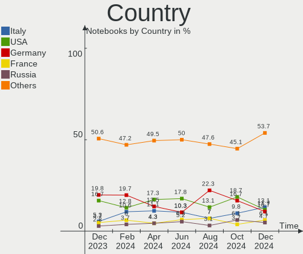
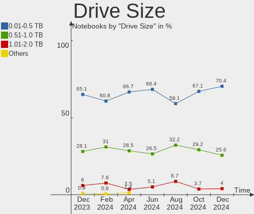
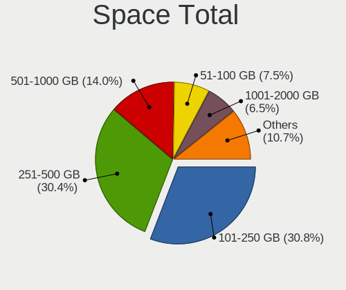
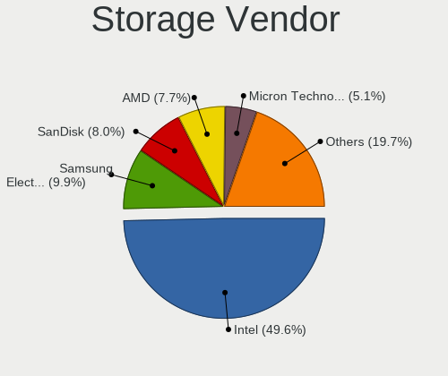
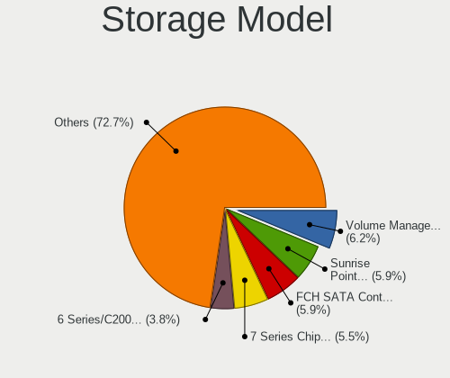
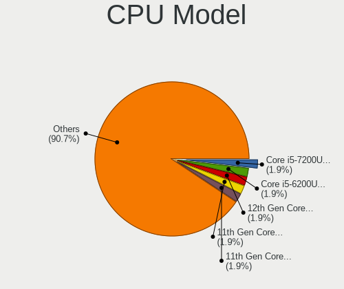
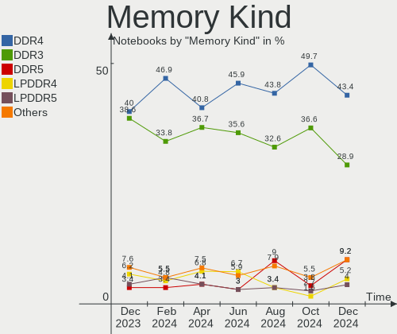
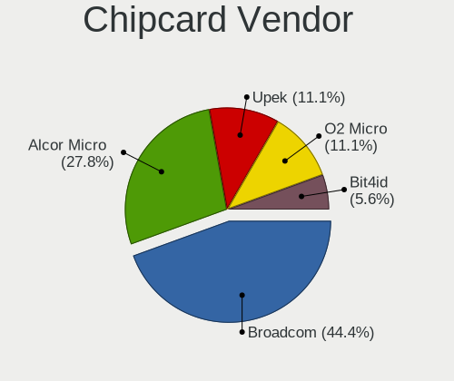
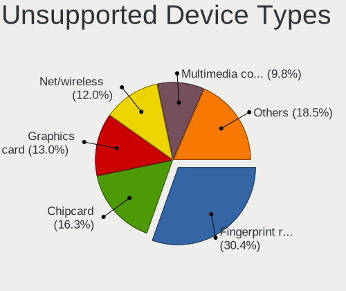

Linux Mint Hardware Trends (Notebooks)
--------------------------------------

A project to identify most popular hardware characteristics and track their change
over time based on data collected by Linux Mint users at https://Linux-Hardware.org.

Anyone can contribute to this report by the [hw-probe](https://github.com/linuxhw/hw-probe) tool:

    sudo -E hw-probe -all -upload

Full-feature report is available here: https://linux-hardware.org/?view=trends

Period: Feb, 2022.

Contents
--------

* [ System ](#system)
  - [ OS                       ](#os)
  - [ OS Family                ](#os-family)
  - [ Kernel                   ](#kernel)
  - [ Kernel Family            ](#kernel-family)
  - [ Kernel Major Ver.        ](#kernel-major-ver)
  - [ Arch                     ](#arch)
  - [ DE                       ](#de)
  - [ Display Server           ](#display-server)
  - [ Display Manager          ](#display-manager)
  - [ OS Lang                  ](#os-lang)
  - [ Boot Mode                ](#boot-mode)
  - [ Filesystem               ](#filesystem)
  - [ Part. scheme             ](#part-scheme)
  - [ Dual Boot with Linux/BSD ](#dual-boot-with-linuxbsd)
  - [ Dual Boot (Win)          ](#dual-boot-win)

* [ Board ](#board)
  - [ Vendor                   ](#vendor)
  - [ Model                    ](#model)
  - [ Model Family             ](#model-family)
  - [ MFG Year                 ](#mfg-year)
  - [ Form Factor              ](#form-factor)
  - [ Secure Boot              ](#secure-boot)
  - [ Coreboot                 ](#coreboot)
  - [ RAM Size                 ](#ram-size)
  - [ RAM Used                 ](#ram-used)
  - [ Total Drives             ](#total-drives)
  - [ Has CD-ROM               ](#has-cd-rom)
  - [ Has Ethernet             ](#has-ethernet)
  - [ Has WiFi                 ](#has-wifi)
  - [ Has Bluetooth            ](#has-bluetooth)

* [ Location ](#location)
  - [ Country                  ](#country)
  - [ City                     ](#city)

* [ Drives ](#drives)
  - [ Drive Vendor             ](#drive-vendor)
  - [ Drive Model              ](#drive-model)
  - [ HDD Vendor               ](#hdd-vendor)
  - [ SSD Vendor               ](#ssd-vendor)
  - [ Drive Kind               ](#drive-kind)
  - [ Drive Connector          ](#drive-connector)
  - [ Drive Size               ](#drive-size)
  - [ Space Total              ](#space-total)
  - [ Space Used               ](#space-used)
  - [ Malfunc. Drives          ](#malfunc-drives)
  - [ Malfunc. Drive Vendor    ](#malfunc-drive-vendor)
  - [ Malfunc. HDD Vendor      ](#malfunc-hdd-vendor)
  - [ Malfunc. Drive Kind      ](#malfunc-drive-kind)
  - [ Failed Drives            ](#failed-drives)
  - [ Failed Drive Vendor      ](#failed-drive-vendor)
  - [ Drive Status             ](#drive-status)

* [ Storage controller ](#storage-controller)
  - [ Storage Vendor           ](#storage-vendor)
  - [ Storage Model            ](#storage-model)
  - [ Storage Kind             ](#storage-kind)

* [ Processor ](#processor)
  - [ CPU Vendor               ](#cpu-vendor)
  - [ CPU Model                ](#cpu-model)
  - [ CPU Model Family         ](#cpu-model-family)
  - [ CPU Cores                ](#cpu-cores)
  - [ CPU Sockets              ](#cpu-sockets)
  - [ CPU Threads              ](#cpu-threads)
  - [ CPU Op-Modes             ](#cpu-op-modes)
  - [ CPU Microcode            ](#cpu-microcode)
  - [ CPU Microarch            ](#cpu-microarch)

* [ Graphics ](#graphics)
  - [ GPU Vendor               ](#gpu-vendor)
  - [ GPU Model                ](#gpu-model)
  - [ GPU Combo                ](#gpu-combo)
  - [ GPU Driver               ](#gpu-driver)
  - [ GPU Memory               ](#gpu-memory)

* [ Monitor ](#monitor)
  - [ Monitor Vendor           ](#monitor-vendor)
  - [ Monitor Model            ](#monitor-model)
  - [ Monitor Resolution       ](#monitor-resolution)
  - [ Monitor Diagonal         ](#monitor-diagonal)
  - [ Monitor Width            ](#monitor-width)
  - [ Aspect Ratio             ](#aspect-ratio)
  - [ Monitor Area             ](#monitor-area)
  - [ Pixel Density            ](#pixel-density)
  - [ Multiple Monitors        ](#multiple-monitors)

* [ Network ](#network)
  - [ Net Controller Vendor    ](#net-controller-vendor)
  - [ Net Controller Model     ](#net-controller-model)
  - [ Wireless Vendor          ](#wireless-vendor)
  - [ Wireless Model           ](#wireless-model)
  - [ Ethernet Vendor          ](#ethernet-vendor)
  - [ Ethernet Model           ](#ethernet-model)
  - [ Net Controller Kind      ](#net-controller-kind)
  - [ Used Controller          ](#used-controller)
  - [ NICs                     ](#nics)
  - [ IPv6                     ](#ipv6)

* [ Bluetooth ](#bluetooth)
  - [ Bluetooth Vendor         ](#bluetooth-vendor)
  - [ Bluetooth Model          ](#bluetooth-model)

* [ Sound ](#sound)
  - [ Sound Vendor             ](#sound-vendor)
  - [ Sound Model              ](#sound-model)

* [ Memory ](#memory)
  - [ Memory Vendor            ](#memory-vendor)
  - [ Memory Model             ](#memory-model)
  - [ Memory Kind              ](#memory-kind)
  - [ Memory Form Factor       ](#memory-form-factor)
  - [ Memory Size              ](#memory-size)
  - [ Memory Speed             ](#memory-speed)

* [ Printers & scanners ](#printers--scanners)
  - [ Printer Vendor           ](#printer-vendor)
  - [ Printer Model            ](#printer-model)
  - [ Scanner Vendor           ](#scanner-vendor)
  - [ Scanner Model            ](#scanner-model)

* [ Camera ](#camera)
  - [ Camera Vendor            ](#camera-vendor)
  - [ Camera Model             ](#camera-model)

* [ Security ](#security)
  - [ Fingerprint Vendor       ](#fingerprint-vendor)
  - [ Fingerprint Model        ](#fingerprint-model)
  - [ Chipcard Vendor          ](#chipcard-vendor)
  - [ Chipcard Model           ](#chipcard-model)

* [ Unsupported ](#unsupported)
  - [ Unsupported Devices      ](#unsupported-devices)
  - [ Unsupported Device Types ](#unsupported-device-types)

System
------

OS
--

Installed operating systems

| Name            | Notebooks | Percent |
|-----------------|-----------|---------|
| Linux Mint 20.3 | 226       | 77.4%   |
| Linux Mint 20.2 | 33        | 11.3%   |
| Linux Mint 20.1 | 12        | 4.11%   |
| Linux Mint 19.3 | 11        | 3.77%   |
| Linux Mint 20   | 7         | 2.4%    |
| Linux Mint 19.1 | 2         | 0.68%   |
| Linux Mint 19.2 | 1         | 0.34%   |

OS Family
---------

OS without a version

| Name       | Notebooks | Percent |
|------------|-----------|---------|
| Linux Mint | 292       | 100%    |

Kernel
------

Version of the Linux kernel

| Version                  | Notebooks | Percent |
|--------------------------|-----------|---------|
| 5.4.0-100-generic        | 79        | 27.05%  |
| 5.4.0-99-generic         | 68        | 23.29%  |
| 5.4.0-97-generic         | 39        | 13.36%  |
| 5.4.0-91-generic         | 21        | 7.19%   |
| 5.4.0-96-generic         | 16        | 5.48%   |
| 5.13.0-28-generic        | 14        | 4.79%   |
| 5.13.0-30-generic        | 10        | 3.42%   |
| 5.13.0-27-generic        | 6         | 2.05%   |
| 5.4.0-74-generic         | 5         | 1.71%   |
| 5.4.0-94-generic         | 4         | 1.37%   |
| 5.4.0-92-generic         | 4         | 1.37%   |
| 5.0.0-32-generic         | 3         | 1.03%   |
| 5.4.0-58-generic         | 2         | 0.68%   |
| 4.15.0-20-generic        | 2         | 0.68%   |
| 4.15.0-167-generic       | 2         | 0.68%   |
| 5.4.2-050402-generic     | 1         | 0.34%   |
| 5.4.0-88-generic         | 1         | 0.34%   |
| 5.4.0-81-generic         | 1         | 0.34%   |
| 5.4.0-80-generic         | 1         | 0.34%   |
| 5.4.0-70-generic         | 1         | 0.34%   |
| 5.4.0-26-generic         | 1         | 0.34%   |
| 5.3.0-76-generic         | 1         | 0.34%   |
| 5.16.7-051607-lowlatency | 1         | 0.34%   |
| 5.16.6-051606-generic    | 1         | 0.34%   |
| 5.16.4-051604-generic    | 1         | 0.34%   |
| 5.16.2-051602-generic    | 1         | 0.34%   |
| 5.15.15-76051515-generic | 1         | 0.34%   |
| 5.15.0-18-generic        | 1         | 0.34%   |
| 5.14.0-1020-oem          | 1         | 0.34%   |
| 5.13.0-22-generic        | 1         | 0.34%   |
| 5.11.0-60-generic        | 1         | 0.34%   |
| 5.10.0-1057-oem          | 1         | 0.34%   |

Kernel Family
-------------

Linux kernel without a distro release

| Version | Notebooks | Percent |
|---------|-----------|---------|
| 5.4.0   | 243       | 83.22%  |
| 5.13.0  | 31        | 10.62%  |
| 4.15.0  | 4         | 1.37%   |
| 5.0.0   | 3         | 1.03%   |
| 5.4.2   | 1         | 0.34%   |
| 5.3.0   | 1         | 0.34%   |
| 5.16.7  | 1         | 0.34%   |
| 5.16.6  | 1         | 0.34%   |
| 5.16.4  | 1         | 0.34%   |
| 5.16.2  | 1         | 0.34%   |
| 5.15.15 | 1         | 0.34%   |
| 5.15.0  | 1         | 0.34%   |
| 5.14.0  | 1         | 0.34%   |
| 5.11.0  | 1         | 0.34%   |
| 5.10.0  | 1         | 0.34%   |

Kernel Major Ver.
-----------------

Linux kernel major version

| Version | Notebooks | Percent |
|---------|-----------|---------|
| 5.4     | 244       | 83.56%  |
| 5.13    | 31        | 10.62%  |
| 5.16    | 4         | 1.37%   |
| 4.15    | 4         | 1.37%   |
| 5.0     | 3         | 1.03%   |
| 5.15    | 2         | 0.68%   |
| 5.3     | 1         | 0.34%   |
| 5.14    | 1         | 0.34%   |
| 5.11    | 1         | 0.34%   |
| 5.10    | 1         | 0.34%   |

Arch
----

OS architecture (x86_64, i586, etc.)

| Name   | Notebooks | Percent |
|--------|-----------|---------|
| x86_64 | 287       | 98.29%  |
| i686   | 5         | 1.71%   |

DE
--

Desktop Environment

| Name       | Notebooks | Percent |
|------------|-----------|---------|
| X-Cinnamon | 210       | 71.92%  |
| MATE       | 34        | 11.64%  |
| XFCE       | 25        | 8.56%   |
| Cinnamon   | 10        | 3.42%   |
| GNOME      | 7         | 2.4%    |
| Unknown    | 5         | 1.71%   |
| KDE5       | 1         | 0.34%   |

Display Server
--------------

X11 or Wayland

| Name    | Notebooks | Percent |
|---------|-----------|---------|
| X11     | 290       | 99.32%  |
| Wayland | 2         | 0.68%   |

Display Manager
---------------

SDDM, LightDM, etc.

| Name    | Notebooks | Percent |
|---------|-----------|---------|
| Unknown | 162       | 55.48%  |
| LightDM | 129       | 44.18%  |
| MDM     | 1         | 0.34%   |

OS Lang
-------

Language

| Lang    | Notebooks | Percent |
|---------|-----------|---------|
| en_US   | 84        | 28.77%  |
| de_DE   | 63        | 21.58%  |
| pt_BR   | 18        | 6.16%   |
| en_GB   | 15        | 5.14%   |
| C       | 13        | 4.45%   |
| ru_RU   | 11        | 3.77%   |
| pl_PL   | 11        | 3.77%   |
| it_IT   | 9         | 3.08%   |
| fr_FR   | 9         | 3.08%   |
| es_ES   | 9         | 3.08%   |
| en_CA   | 7         | 2.4%    |
| nl_NL   | 5         | 1.71%   |
| nl_BE   | 3         | 1.03%   |
| hu_HU   | 2         | 0.68%   |
| fr_BE   | 2         | 0.68%   |
| es_MX   | 2         | 0.68%   |
| es_CO   | 2         | 0.68%   |
| en_IN   | 2         | 0.68%   |
| en_AU   | 2         | 0.68%   |
| de_CH   | 2         | 0.68%   |
| cs_CZ   | 2         | 0.68%   |
| zh_TW   | 1         | 0.34%   |
| uk_UA   | 1         | 0.34%   |
| tr_TR   | 1         | 0.34%   |
| sv_SE   | 1         | 0.34%   |
| ru_UA   | 1         | 0.34%   |
| ja_JP   | 1         | 0.34%   |
| fr_CH   | 1         | 0.34%   |
| fi_FI   | 1         | 0.34%   |
| es_AR   | 1         | 0.34%   |
| en_ZW   | 1         | 0.34%   |
| en_ZA   | 1         | 0.34%   |
| en_PH   | 1         | 0.34%   |
| en_NZ   | 1         | 0.34%   |
| en_IE   | 1         | 0.34%   |
| en_HK   | 1         | 0.34%   |
| de_AT   | 1         | 0.34%   |
| da_DK   | 1         | 0.34%   |
| bg_BG   | 1         | 0.34%   |
| Unknown | 1         | 0.34%   |

Boot Mode
---------

EFI or BIOS

| Mode | Notebooks | Percent |
|------|-----------|---------|
| EFI  | 163       | 55.82%  |
| BIOS | 129       | 44.18%  |

Filesystem
----------

Type of filesystem

| Type    | Notebooks | Percent |
|---------|-----------|---------|
| Ext4    | 271       | 92.81%  |
| Overlay | 13        | 4.45%   |
| Btrfs   | 4         | 1.37%   |
| Xfs     | 2         | 0.68%   |
| Ext3    | 2         | 0.68%   |

Part. scheme
------------

Scheme of partitioning

| Type    | Notebooks | Percent |
|---------|-----------|---------|
| Unknown | 176       | 60.27%  |
| GPT     | 84        | 28.77%  |
| MBR     | 32        | 10.96%  |

Dual Boot with Linux/BSD
------------------------

Hosting more than one Linux/BSD

| Dual boot | Notebooks | Percent |
|-----------|-----------|---------|
| No        | 274       | 93.84%  |
| Yes       | 18        | 6.16%   |

Dual Boot (Win)
---------------

Hosting Linux and Windows

| Dual boot | Notebooks | Percent |
|-----------|-----------|---------|
| No        | 231       | 79.11%  |
| Yes       | 61        | 20.89%  |

Board
-----

Vendor
------

Motherboard manufacturer

| Name                  | Notebooks | Percent |
|-----------------------|-----------|---------|
| Hewlett-Packard       | 62        | 21.23%  |
| Lenovo                | 48        | 16.44%  |
| Dell                  | 41        | 14.04%  |
| ASUSTek Computer      | 35        | 11.99%  |
| Acer                  | 28        | 9.59%   |
| Apple                 | 10        | 3.42%   |
| Toshiba               | 9         | 3.08%   |
| Samsung Electronics   | 6         | 2.05%   |
| MSI                   | 5         | 1.71%   |
| Google                | 5         | 1.71%   |
| Medion                | 4         | 1.37%   |
| Sony                  | 3         | 1.03%   |
| Positivo              | 3         | 1.03%   |
| Chuwi                 | 3         | 1.03%   |
| Notebook              | 2         | 0.68%   |
| LG Electronics        | 2         | 0.68%   |
| HUAWEI                | 2         | 0.68%   |
| HONOR                 | 2         | 0.68%   |
| Fujitsu               | 2         | 0.68%   |
| ZEPTO                 | 1         | 0.34%   |
| TUXEDO                | 1         | 0.34%   |
| Timi                  | 1         | 0.34%   |
| System76              | 1         | 0.34%   |
| Schenker              | 1         | 0.34%   |
| Primux Tech           | 1         | 0.34%   |
| Positivo Bahia - VAIO | 1         | 0.34%   |
| Monster               | 1         | 0.34%   |
| Microtech             | 1         | 0.34%   |
| Mediacom              | 1         | 0.34%   |
| Jumper                | 1         | 0.34%   |
| Itautec               | 1         | 0.34%   |
| Intel                 | 1         | 0.34%   |
| Insyde                | 1         | 0.34%   |
| Hyundai Technology    | 1         | 0.34%   |
| Getac                 | 1         | 0.34%   |
| Fujitsu Siemens       | 1         | 0.34%   |
| eMachines             | 1         | 0.34%   |
| ECT                   | 1         | 0.34%   |
| Unknown               | 1         | 0.34%   |

Model
-----

Motherboard model

| Name                                        | Notebooks | Percent |
|---------------------------------------------|-----------|---------|
| Lenovo G50-70 20351                         | 3         | 1.03%   |
| Lenovo IdeaPad S206 2638                    | 2         | 0.68%   |
| HONOR HLYL-WXX9                             | 2         | 0.68%   |
| HP Pavilion 15                              | 2         | 0.68%   |
| HP Notebook                                 | 2         | 0.68%   |
| HP Laptop 17-ca0xxx                         | 2         | 0.68%   |
| HP Laptop 15s-eq2xxx                        | 2         | 0.68%   |
| HP Laptop 15-da2xxx                         | 2         | 0.68%   |
| Dell Latitude E7240                         | 2         | 0.68%   |
| Dell Inspiron 7501                          | 2         | 0.68%   |
| Acer Aspire 7750G                           | 2         | 0.68%   |
| ZEPTO ZNOTE                                 | 1         | 0.34%   |
| TUXEDO InfinityBook Pro 14 Gen6             | 1         | 0.34%   |
| Toshiba Satellite Z830                      | 1         | 0.34%   |
| Toshiba Satellite S855D                     | 1         | 0.34%   |
| Toshiba Satellite S55-C                     | 1         | 0.34%   |
| Toshiba Satellite Pro C850                  | 1         | 0.34%   |
| Toshiba Satellite P875                      | 1         | 0.34%   |
| Toshiba Satellite L350D                     | 1         | 0.34%   |
| Toshiba Satellite C70D-B                    | 1         | 0.34%   |
| Toshiba Satellite C50-A                     | 1         | 0.34%   |
| Toshiba QOSMIO F60                          | 1         | 0.34%   |
| Timi TM1701                                 | 1         | 0.34%   |
| System76 Oryx Pro                           | 1         | 0.34%   |
| Sony VPCEH2E0E                              | 1         | 0.34%   |
| Sony VPCEC2S1E                              | 1         | 0.34%   |
| Sony SVE1711V1EB                            | 1         | 0.34%   |
| Schenker XMG NEO (TGL/M21)                  | 1         | 0.34%   |
| Samsung RV411/RV511/E3511/S3511/RV711/E3411 | 1         | 0.34%   |
| Samsung RV411/RV511/E3511/S3511/RV711       | 1         | 0.34%   |
| Samsung NC210/NC110                         | 1         | 0.34%   |
| Samsung N150/N210/N220                      | 1         | 0.34%   |
| Samsung 700Z3A/700Z4A/700Z5A/700Z5B         | 1         | 0.34%   |
| Samsung 350V5C/351V5C/3540VC/3440VC         | 1         | 0.34%   |
| Primux Tech Ioxbook1402MC                   | 1         | 0.34%   |
| Positivo N4340                              | 1         | 0.34%   |
| Positivo Mobile                             | 1         | 0.34%   |
| Positivo C14CU51                            | 1         | 0.34%   |
| Positivo Bahia - VAIO VJFE52F11X-B1111S     | 1         | 0.34%   |
| Notebook W35xSTQ_370ST                      | 1         | 0.34%   |
| Notebook NP5x_NP7xHH_HJ_HK                  | 1         | 0.34%   |
| MSI WT72 2OM                                | 1         | 0.34%   |
| MSI GT70 2OC/2OD                            | 1         | 0.34%   |
| MSI GL73 8RC                                | 1         | 0.34%   |
| MSI GE60 2OC\2OD\2OE                        | 1         | 0.34%   |
| MSI Delta 15 A5EFK                          | 1         | 0.34%   |
| Monster ABRA A5 V16.6                       | 1         | 0.34%   |
| Microtech ebookPro                          | 1         | 0.34%   |
| Medion P7612                                | 1         | 0.34%   |
| Medion P6812                                | 1         | 0.34%   |
| Medion E7419 MD60025                        | 1         | 0.34%   |
| Medion E6226                                | 1         | 0.34%   |
| Mediacom SmartBook 14 FullHD - SB14UC       | 1         | 0.34%   |
| LG X170-LS10K                               | 1         | 0.34%   |
| LG 17Z90N-R.AAC8U1                          | 1         | 0.34%   |
| Lenovo Z50-75 80EC                          | 1         | 0.34%   |
| Lenovo Yoga 300-11IBR 80M1                  | 1         | 0.34%   |
| Lenovo Y520-15IKBN 80WK                     | 1         | 0.34%   |
| Lenovo Y310                                 | 1         | 0.34%   |
| Lenovo ThinkPad Yoga 11e 20DAS0V800         | 1         | 0.34%   |

Model Family
------------

Motherboard model prefix

| Name                                    | Notebooks | Percent |
|-----------------------------------------|-----------|---------|
| Lenovo ThinkPad                         | 21        | 7.19%   |
| Dell Latitude                           | 20        | 6.85%   |
| HP Pavilion                             | 19        | 6.51%   |
| Acer Aspire                             | 19        | 6.51%   |
| Dell Inspiron                           | 16        | 5.48%   |
| HP Laptop                               | 13        | 4.45%   |
| Lenovo IdeaPad                          | 12        | 4.11%   |
| HP EliteBook                            | 10        | 3.42%   |
| Toshiba Satellite                       | 8         | 2.74%   |
| HP ProBook                              | 5         | 1.71%   |
| ASUS VivoBook                           | 5         | 1.71%   |
| Lenovo G50-70                           | 3         | 1.03%   |
| ASUS ASUS                               | 3         | 1.03%   |
| Samsung RV411                           | 2         | 0.68%   |
| Lenovo Legion                           | 2         | 0.68%   |
| HONOR HLYL-WXX9                         | 2         | 0.68%   |
| HP Notebook                             | 2         | 0.68%   |
| HP 255                                  | 2         | 0.68%   |
| HP 250                                  | 2         | 0.68%   |
| Fujitsu LIFEBOOK                        | 2         | 0.68%   |
| Dell XPS                                | 2         | 0.68%   |
| Chuwi HeroBook                          | 2         | 0.68%   |
| ASUS ZenBook                            | 2         | 0.68%   |
| Apple MacBookPro8                       | 2         | 0.68%   |
| Acer TravelMate                         | 2         | 0.68%   |
| Acer Predator                           | 2         | 0.68%   |
| ZEPTO ZNOTE                             | 1         | 0.34%   |
| TUXEDO InfinityBook                     | 1         | 0.34%   |
| Toshiba QOSMIO                          | 1         | 0.34%   |
| Timi TM1701                             | 1         | 0.34%   |
| System76 Oryx                           | 1         | 0.34%   |
| Sony VPCEH2E0E                          | 1         | 0.34%   |
| Sony VPCEC2S1E                          | 1         | 0.34%   |
| Sony SVE1711V1EB                        | 1         | 0.34%   |
| Schenker XMG                            | 1         | 0.34%   |
| Samsung NC210                           | 1         | 0.34%   |
| Samsung N150                            | 1         | 0.34%   |
| Samsung 700Z3A                          | 1         | 0.34%   |
| Samsung 350V5C                          | 1         | 0.34%   |
| Primux Tech Ioxbook1402MC               | 1         | 0.34%   |
| Positivo N4340                          | 1         | 0.34%   |
| Positivo Mobile                         | 1         | 0.34%   |
| Positivo C14CU51                        | 1         | 0.34%   |
| Positivo Bahia - VAIO VJFE52F11X-B1111S | 1         | 0.34%   |
| Notebook W35xSTQ                        | 1         | 0.34%   |
| Notebook NP5x                           | 1         | 0.34%   |
| MSI WT72                                | 1         | 0.34%   |
| MSI GT70                                | 1         | 0.34%   |
| MSI GL73                                | 1         | 0.34%   |
| MSI GE60                                | 1         | 0.34%   |
| MSI Delta                               | 1         | 0.34%   |
| Monster ABRA                            | 1         | 0.34%   |
| Microtech ebookPro                      | 1         | 0.34%   |
| Medion P7612                            | 1         | 0.34%   |
| Medion P6812                            | 1         | 0.34%   |
| Medion E7419                            | 1         | 0.34%   |
| Medion E6226                            | 1         | 0.34%   |
| Mediacom SmartBook                      | 1         | 0.34%   |
| LG X170-LS10K                           | 1         | 0.34%   |
| LG 17Z90N-R.AAC8U1                      | 1         | 0.34%   |

MFG Year
--------

Motherboard manufacture year

| Year | Notebooks | Percent |
|------|-----------|---------|
| 2021 | 34        | 11.64%  |
| 2013 | 29        | 9.93%   |
| 2011 | 29        | 9.93%   |
| 2020 | 27        | 9.25%   |
| 2012 | 27        | 9.25%   |
| 2018 | 20        | 6.85%   |
| 2014 | 18        | 6.16%   |
| 2016 | 16        | 5.48%   |
| 2015 | 16        | 5.48%   |
| 2019 | 15        | 5.14%   |
| 2010 | 14        | 4.79%   |
| 2008 | 14        | 4.79%   |
| 2017 | 12        | 4.11%   |
| 2009 | 10        | 3.42%   |
| 2007 | 10        | 3.42%   |
| 2006 | 1         | 0.34%   |

Form Factor
-----------

Physical design of the computer

| Name     | Notebooks | Percent |
|----------|-----------|---------|
| Notebook | 292       | 100%    |

Secure Boot
-----------

Enabled or disabled

| State    | Notebooks | Percent |
|----------|-----------|---------|
| Disabled | 265       | 90.75%  |
| Enabled  | 27        | 9.25%   |

Coreboot
--------

Have coreboot on board

| Used | Notebooks | Percent |
|------|-----------|---------|
| No   | 286       | 97.95%  |
| Yes  | 6         | 2.05%   |

RAM Size
--------

Total RAM memory

| Size in GB  | Notebooks | Percent |
|-------------|-----------|---------|
| 4.01-8.0    | 88        | 30.14%  |
| 3.01-4.0    | 71        | 24.32%  |
| 8.01-16.0   | 54        | 18.49%  |
| 16.01-24.0  | 41        | 14.04%  |
| 1.01-2.0    | 19        | 6.51%   |
| 32.01-64.0  | 9         | 3.08%   |
| 2.01-3.0    | 3         | 1.03%   |
| 64.01-256.0 | 3         | 1.03%   |
| 24.01-32.0  | 2         | 0.68%   |
| 0.51-1.0    | 2         | 0.68%   |

RAM Used
--------

Used RAM memory

| Used GB   | Notebooks | Percent |
|-----------|-----------|---------|
| 1.01-2.0  | 142       | 48.63%  |
| 2.01-3.0  | 66        | 22.6%   |
| 4.01-8.0  | 29        | 9.93%   |
| 3.01-4.0  | 28        | 9.59%   |
| 0.51-1.0  | 24        | 8.22%   |
| 8.01-16.0 | 2         | 0.68%   |
| 0.01-0.5  | 1         | 0.34%   |

Total Drives
------------

Number of drives on board

| Drives | Notebooks | Percent |
|--------|-----------|---------|
| 1      | 217       | 74.32%  |
| 2      | 62        | 21.23%  |
| 3      | 8         | 2.74%   |
| 4      | 3         | 1.03%   |
| 5      | 1         | 0.34%   |
| 0      | 1         | 0.34%   |

Has CD-ROM
----------

Has CD-ROM on board

| Presented | Notebooks | Percent |
|-----------|-----------|---------|
| No        | 163       | 55.82%  |
| Yes       | 129       | 44.18%  |

Has Ethernet
------------

Has Ethernet on board

| Presented | Notebooks | Percent |
|-----------|-----------|---------|
| Yes       | 237       | 81.16%  |
| No        | 55        | 18.84%  |

Has WiFi
--------

Has WiFi module

| Presented | Notebooks | Percent |
|-----------|-----------|---------|
| Yes       | 286       | 97.95%  |
| No        | 6         | 2.05%   |

Has Bluetooth
-------------

Has Bluetooth module

| Presented | Notebooks | Percent |
|-----------|-----------|---------|
| Yes       | 222       | 76.03%  |
| No        | 70        | 23.97%  |

Location
--------

Country
-------

Geographic location (country)

| Country      | Notebooks | Percent |
|--------------|-----------|---------|
| Germany      | 65        | 22.26%  |
| USA          | 48        | 16.44%  |
| Brazil       | 23        | 7.88%   |
| UK           | 16        | 5.48%   |
| Italy        | 12        | 4.11%   |
| Poland       | 11        | 3.77%   |
| France       | 11        | 3.77%   |
| Russia       | 10        | 3.42%   |
| Canada       | 10        | 3.42%   |
| Spain        | 9         | 3.08%   |
| Netherlands  | 9         | 3.08%   |
| Belgium      | 8         | 2.74%   |
| Sweden       | 4         | 1.37%   |
| India        | 4         | 1.37%   |
| Hungary      | 4         | 1.37%   |
| Czechia      | 4         | 1.37%   |
| Ukraine      | 3         | 1.03%   |
| Switzerland  | 3         | 1.03%   |
| Bulgaria     | 3         | 1.03%   |
| Austria      | 3         | 1.03%   |
| Turkey       | 2         | 0.68%   |
| Mexico       | 2         | 0.68%   |
| Egypt        | 2         | 0.68%   |
| Colombia     | 2         | 0.68%   |
| Australia    | 2         | 0.68%   |
| Argentina    | 2         | 0.68%   |
| Zimbabwe     | 1         | 0.34%   |
| UAE          | 1         | 0.34%   |
| Thailand     | 1         | 0.34%   |
| Taiwan       | 1         | 0.34%   |
| South Africa | 1         | 0.34%   |
| Serbia       | 1         | 0.34%   |
| Philippines  | 1         | 0.34%   |
| New Zealand  | 1         | 0.34%   |
| Moldova      | 1         | 0.34%   |
| Latvia       | 1         | 0.34%   |
| Japan        | 1         | 0.34%   |
| Ireland      | 1         | 0.34%   |
| Finland      | 1         | 0.34%   |
| Ethiopia     | 1         | 0.34%   |
| Denmark      | 1         | 0.34%   |
| Cyprus       | 1         | 0.34%   |
| Costa Rica   | 1         | 0.34%   |
| China        | 1         | 0.34%   |
| Belarus      | 1         | 0.34%   |
| Algeria      | 1         | 0.34%   |

City
----

Geographic location (city)

| City              | Notebooks | Percent |
|-------------------|-----------|---------|
| Milan             | 4         | 1.37%   |
| Cologne           | 4         | 1.37%   |
| Stuttgart         | 3         | 1.03%   |
| Rio de Janeiro    | 3         | 1.03%   |
| New Delhi         | 3         | 1.03%   |
| Munich            | 3         | 1.03%   |
| Moscow            | 3         | 1.03%   |
| Montreal          | 3         | 1.03%   |
| Mannheim          | 3         | 1.03%   |
| Warsaw            | 2         | 0.68%   |
| Toronto           | 2         | 0.68%   |
| The Hague         | 2         | 0.68%   |
| Szolnok           | 2         | 0.68%   |
| Sofia             | 2         | 0.68%   |
| Sint-Truiden      | 2         | 0.68%   |
| Rockville         | 2         | 0.68%   |
| Prague            | 2         | 0.68%   |
| Odessa            | 2         | 0.68%   |
| Krasnodar         | 2         | 0.68%   |
| Gurnee            | 2         | 0.68%   |
| Frankfurt am Main | 2         | 0.68%   |
| Düsseldorf     | 2         | 0.68%   |
| Chicago           | 2         | 0.68%   |
| Canoas            | 2         | 0.68%   |
| Cairo             | 2         | 0.68%   |
| Blankenburg       | 2         | 0.68%   |
| Berlin            | 2         | 0.68%   |
| Antwerp           | 2         | 0.68%   |
| Zabrze            | 1         | 0.34%   |
| Yekaterinburg     | 1         | 0.34%   |
| Wroclaw           | 1         | 0.34%   |
| Woolloongabba     | 1         | 0.34%   |
| Witten            | 1         | 0.34%   |
| Winsen            | 1         | 0.34%   |
| Winnipeg          | 1         | 0.34%   |
| Windsor           | 1         | 0.34%   |
| Wellington        | 1         | 0.34%   |
| Wandsworth        | 1         | 0.34%   |
| Walsall           | 1         | 0.34%   |
| Waldkraiburg      | 1         | 0.34%   |
| Viry-Châtillon | 1         | 0.34%   |
| Vigo              | 1         | 0.34%   |
| Vienna            | 1         | 0.34%   |
| Varna             | 1         | 0.34%   |
| Vancouver         | 1         | 0.34%   |
| Unterweissbach    | 1         | 0.34%   |
| Uberlândia     | 1         | 0.34%   |
| Tranent           | 1         | 0.34%   |
| Trajano de Morais | 1         | 0.34%   |
| Tours             | 1         | 0.34%   |
| Tiete             | 1         | 0.34%   |
| The Bronx         | 1         | 0.34%   |
| Tampere           | 1         | 0.34%   |
| Tampa             | 1         | 0.34%   |
| Tallahassee       | 1         | 0.34%   |
| Takahashi         | 1         | 0.34%   |
| Szombathely       | 1         | 0.34%   |
| Syracuse          | 1         | 0.34%   |
| Syktyvkar         | 1         | 0.34%   |
| Sundbyberg        | 1         | 0.34%   |

Drives
------

Drive Vendor
------------

Hard drive vendors

| Vendor                         | Notebooks | Drives | Percent |
|--------------------------------|-----------|--------|---------|
| Samsung Electronics            | 53        | 56     | 14.52%  |
| Seagate                        | 48        | 50     | 13.15%  |
| WDC                            | 34        | 34     | 9.32%   |
| Unknown                        | 31        | 36     | 8.49%   |
| Toshiba                        | 23        | 25     | 6.3%    |
| SanDisk                        | 18        | 19     | 4.93%   |
| Crucial                        | 15        | 15     | 4.11%   |
| Hitachi                        | 14        | 15     | 3.84%   |
| HGST                           | 12        | 12     | 3.29%   |
| Intel                          | 10        | 10     | 2.74%   |
| SK Hynix                       | 9         | 9      | 2.47%   |
| Intenso                        | 9         | 9      | 2.47%   |
| KIOXIA                         | 8         | 8      | 2.19%   |
| Kingston                       | 8         | 8      | 2.19%   |
| A-DATA Technology              | 7         | 7      | 1.92%   |
| LITEONIT                       | 5         | 5      | 1.37%   |
| LITEON                         | 5         | 5      | 1.37%   |
| Apple                          | 5         | 5      | 1.37%   |
| Micron Technology              | 4         | 4      | 1.1%    |
| China                          | 4         | 4      | 1.1%    |
| PNY                            | 3         | 3      | 0.82%   |
| Netac                          | 3         | 3      | 0.82%   |
| SPCC                           | 2         | 2      | 0.55%   |
| Solid State Storage Technology | 2         | 2      | 0.55%   |
| SABRENT                        | 2         | 2      | 0.55%   |
| Patriot                        | 2         | 2      | 0.55%   |
| Fujitsu                        | 2         | 3      | 0.55%   |
| Dogfish                        | 2         | 2      | 0.55%   |
| Corsair                        | 2         | 2      | 0.55%   |
| Apacer                         | 2         | 2      | 0.55%   |
| Verbatim                       | 1         | 1      | 0.27%   |
| TO Exter                       | 1         | 1      | 0.27%   |
| SSSTC                          | 1         | 1      | 0.27%   |
| Phison                         | 1         | 1      | 0.27%   |
| OCZ                            | 1         | 1      | 0.27%   |
| Neo Forza                      | 1         | 1      | 0.27%   |
| MyDigitalSSD                   | 1         | 1      | 0.27%   |
| Microtech                      | 1         | 1      | 0.27%   |
| Micron/Crucial Technology      | 1         | 1      | 0.27%   |
| LVCARDS                        | 1         | 1      | 0.27%   |
| LS                             | 1         | 1      | 0.27%   |
| Lite-On                        | 1         | 1      | 0.27%   |
| Lexar                          | 1         | 1      | 0.27%   |
| INTEL SS                       | 1         | 1      | 0.27%   |
| Initio                         | 1         | 1      | 0.27%   |
| HGST HUS                       | 1         | 1      | 0.27%   |
| Gigabyte Technology            | 1         | 1      | 0.27%   |
| External                       | 1         | 1      | 0.27%   |
| ASMT                           | 1         | 2      | 0.27%   |
| ADATA Technology               | 1         | 1      | 0.27%   |
| Unknown                        | 1         | 1      | 0.27%   |

Drive Model
-----------

Hard drive models

| Model                                    | Notebooks | Percent |
|------------------------------------------|-----------|---------|
| Seagate ST1000LM024 HN-M101MBB 1TB       | 7         | 1.87%   |
| Seagate ST500LT012-1DG142 500GB          | 5         | 1.33%   |
| Seagate ST1000LM048-2E7172 1TB           | 5         | 1.33%   |
| HGST HTS721010A9E630 1TB                 | 5         | 1.33%   |
| Unknown MMC Card  32GB                   | 4         | 1.07%   |
| Unknown MMC Card  16GB                   | 4         | 1.07%   |
| Toshiba MQ01ABD100 1TB                   | 4         | 1.07%   |
| Seagate ST9320325AS 320GB                | 4         | 1.07%   |
| Seagate ST1000LM035-1RK172 1TB           | 4         | 1.07%   |
| Samsung SSD 970 EVO Plus 2TB             | 4         | 1.07%   |
| Samsung SSD 860 EVO 500GB                | 4         | 1.07%   |
| Intenso SSD SATAIII 480GB                | 4         | 1.07%   |
| Crucial CT500MX500SSD1 500GB             | 4         | 1.07%   |
| Unknown SD/MMC/MS PRO 64GB               | 3         | 0.8%    |
| Unknown MMC Card  64GB                   | 3         | 0.8%    |
| Unknown MMC Card  128GB                  | 3         | 0.8%    |
| Toshiba MQ01ABD075 752GB                 | 3         | 0.8%    |
| SanDisk SSD PLUS 480GB                   | 3         | 0.8%    |
| Sandisk NVMe SSD Drive 512GB             | 3         | 0.8%    |
| Samsung SSD 860 EVO 1TB                  | 3         | 0.8%    |
| Samsung NVMe SSD Drive 2TB               | 3         | 0.8%    |
| KIOXIA NVMe SSD Drive 256GB              | 3         | 0.8%    |
| Hitachi HTS547550A9E384 500GB            | 3         | 0.8%    |
| HGST HTS541010A9E680 1TB                 | 3         | 0.8%    |
| Crucial CT1000MX500SSD1 1TB              | 3         | 0.8%    |
| China SSD 256GB                          | 3         | 0.8%    |
| WDC WD3200BPVT-22JJ5T0 320GB             | 2         | 0.53%   |
| WDC WD3200BEVT-80A0RT0 320GB             | 2         | 0.53%   |
| WDC WD10SPZX-60Z10T0 1TB                 | 2         | 0.53%   |
| WDC PC SN530 SDBPNPZ-256G-1002 256GB     | 2         | 0.53%   |
| Unknown MMC Card  1GB                    | 2         | 0.53%   |
| Toshiba MQ04ABF100 1TB                   | 2         | 0.53%   |
| Toshiba MK1646GSX 160GB                  | 2         | 0.53%   |
| Solid State Storage NVMe SSD Drive 256GB | 2         | 0.53%   |
| Seagate ST9250410AS 250GB                | 2         | 0.53%   |
| Seagate ST500LM021-1KJ152 500GB          | 2         | 0.53%   |
| Seagate ST500LM012 HN-M500MBB 500GB      | 2         | 0.53%   |
| Seagate ST500LM000-1EJ162 500GB          | 2         | 0.53%   |
| Seagate ST1000LX015-1U7172 1TB           | 2         | 0.53%   |
| SanDisk SSD PLUS 120GB                   | 2         | 0.53%   |
| Samsung SSD 870 EVO 500GB                | 2         | 0.53%   |
| Samsung SSD 850 EVO 500GB                | 2         | 0.53%   |
| Samsung SSD 840 EVO 250GB                | 2         | 0.53%   |
| Samsung NVMe SSD Drive 1024GB            | 2         | 0.53%   |
| SABRENT Disk 1TB                         | 2         | 0.53%   |
| PNY CS900 120GB SSD                      | 2         | 0.53%   |
| Netac S535N8/256 256GB SSD               | 2         | 0.53%   |
| LITEONIT LCT-128M3S 128GB SSD            | 2         | 0.53%   |
| LITEON CV8-8E128-HP 128GB SSD            | 2         | 0.53%   |
| KIOXIA NVMe SSD Drive 512GB              | 2         | 0.53%   |
| Kingston SA400S37240G 240GB SSD          | 2         | 0.53%   |
| Kingston SA400S37120G 120GB SSD          | 2         | 0.53%   |
| Intenso SSD 128GB                        | 2         | 0.53%   |
| Intel SSDSC2KW256G8 256GB                | 2         | 0.53%   |
| Intel SSDPEKNU512GZ 512GB                | 2         | 0.53%   |
| Intel NVMe SSD Drive 512GB               | 2         | 0.53%   |
| Hitachi HTS727575A9E364 752GB            | 2         | 0.53%   |
| Hitachi HTS547575A9E384 752GB            | 2         | 0.53%   |
| Hitachi HTS543232A7A384 320GB            | 2         | 0.53%   |
| HGST HTS545050A7E680 500GB               | 2         | 0.53%   |

HDD Vendor
----------

Hard disk drive vendors

| Vendor              | Notebooks | Drives | Percent |
|---------------------|-----------|--------|---------|
| Seagate             | 47        | 49     | 37.9%   |
| WDC                 | 22        | 22     | 17.74%  |
| Toshiba             | 19        | 20     | 15.32%  |
| Hitachi             | 14        | 15     | 11.29%  |
| HGST                | 12        | 12     | 9.68%   |
| Unknown             | 3         | 3      | 2.42%   |
| Samsung Electronics | 2         | 2      | 1.61%   |
| SABRENT             | 2         | 2      | 1.61%   |
| Fujitsu             | 2         | 3      | 1.61%   |
| HGST HUS            | 1         | 1      | 0.81%   |

SSD Vendor
----------

Solid state drive vendors

| Vendor              | Notebooks | Drives | Percent |
|---------------------|-----------|--------|---------|
| Samsung Electronics | 30        | 31     | 21.43%  |
| Crucial             | 15        | 15     | 10.71%  |
| SanDisk             | 13        | 13     | 9.29%   |
| WDC                 | 7         | 7      | 5%      |
| Kingston            | 7         | 7      | 5%      |
| Intenso             | 7         | 7      | 5%      |
| A-DATA Technology   | 7         | 7      | 5%      |
| LITEONIT            | 5         | 5      | 3.57%   |
| LITEON              | 4         | 4      | 2.86%   |
| China               | 4         | 4      | 2.86%   |
| Toshiba             | 3         | 4      | 2.14%   |
| SK Hynix            | 3         | 3      | 2.14%   |
| PNY                 | 3         | 3      | 2.14%   |
| Netac               | 3         | 3      | 2.14%   |
| Intel               | 3         | 3      | 2.14%   |
| SPCC                | 2         | 2      | 1.43%   |
| Patriot             | 2         | 2      | 1.43%   |
| Micron Technology   | 2         | 2      | 1.43%   |
| DOGFISH             | 2         | 2      | 1.43%   |
| Apple               | 2         | 2      | 1.43%   |
| Apacer              | 2         | 2      | 1.43%   |
| Verbatim            | 1         | 1      | 0.71%   |
| TO Exter            | 1         | 1      | 0.71%   |
| Seagate             | 1         | 1      | 0.71%   |
| OCZ                 | 1         | 1      | 0.71%   |
| Neo Forza           | 1         | 1      | 0.71%   |
| MyDigitalSSD        | 1         | 1      | 0.71%   |
| Microtech           | 1         | 1      | 0.71%   |
| LVCARDS             | 1         | 1      | 0.71%   |
| LS                  | 1         | 1      | 0.71%   |
| Lexar               | 1         | 1      | 0.71%   |
| INTEL SS            | 1         | 1      | 0.71%   |
| Gigabyte Technology | 1         | 1      | 0.71%   |
| Corsair             | 1         | 1      | 0.71%   |
| Unknown             | 1         | 1      | 0.71%   |

Drive Kind
----------

HDD or SSD

| Kind    | Notebooks | Drives | Percent |
|---------|-----------|--------|---------|
| SSD     | 131       | 142    | 37.22%  |
| HDD     | 120       | 129    | 34.09%  |
| NVMe    | 67        | 71     | 19.03%  |
| MMC     | 29        | 33     | 8.24%   |
| Unknown | 5         | 6      | 1.42%   |

Drive Connector
---------------

SATA, SAS, NVMe, etc.

| Type | Notebooks | Drives | Percent |
|------|-----------|--------|---------|
| SATA | 220       | 257    | 66.27%  |
| NVMe | 67        | 70     | 20.18%  |
| MMC  | 29        | 33     | 8.73%   |
| SAS  | 16        | 21     | 4.82%   |

Drive Size
----------

Size of hard drive

| Size in TB | Notebooks | Drives | Percent |
|------------|-----------|--------|---------|
| 0.01-0.5   | 166       | 186    | 67.76%  |
| 0.51-1.0   | 71        | 76     | 28.98%  |
| 1.01-2.0   | 6         | 6      | 2.45%   |
| 3.01-4.0   | 1         | 1      | 0.41%   |
| 4.01-10.0  | 1         | 2      | 0.41%   |

Space Total
-----------

Amount of disk space available on the file system

| Size in GB     | Notebooks | Percent |
|----------------|-----------|---------|
| 101-250        | 98        | 33.56%  |
| 251-500        | 78        | 26.71%  |
| 501-1000       | 52        | 17.81%  |
| 51-100         | 18        | 6.16%   |
| 1-20           | 15        | 5.14%   |
| 21-50          | 12        | 4.11%   |
| 1001-2000      | 12        | 4.11%   |
| More than 3000 | 3         | 1.03%   |
| 2001-3000      | 3         | 1.03%   |
| Unknown        | 1         | 0.34%   |

Space Used
----------

Amount of used disk space

| Used GB        | Notebooks | Percent |
|----------------|-----------|---------|
| 1-20           | 87        | 29.79%  |
| 21-50          | 76        | 26.03%  |
| 101-250        | 49        | 16.78%  |
| 51-100         | 45        | 15.41%  |
| 251-500        | 19        | 6.51%   |
| 501-1000       | 11        | 3.77%   |
| 1001-2000      | 2         | 0.68%   |
| More than 3000 | 1         | 0.34%   |
| 2001-3000      | 1         | 0.34%   |
| Unknown        | 1         | 0.34%   |

Malfunc. Drives
---------------

Drive models with a malfunction

| Model                                    | Notebooks | Drives | Percent |
|------------------------------------------|-----------|--------|---------|
| WDC WD7500BPVX-22JC3T0 752GB             | 1         | 1      | 7.69%   |
| WDC WD3200BEVT-80A0RT0 320GB             | 1         | 1      | 7.69%   |
| Toshiba THNSNK256GVN8 M.2 2280 256GB SSD | 1         | 1      | 7.69%   |
| Toshiba MQ01ABD100 1TB                   | 1         | 1      | 7.69%   |
| Toshiba MK5075GSX 500GB                  | 1         | 1      | 7.69%   |
| Seagate ST500LM021-1KJ152 500GB          | 1         | 1      | 7.69%   |
| Seagate ST500LM012 HN-M500MBB 500GB      | 1         | 1      | 7.69%   |
| Seagate ST320LT020-9YG142 320GB          | 1         | 1      | 7.69%   |
| LITEON CV8-8E128-HP 128GB SSD            | 1         | 1      | 7.69%   |
| Hitachi HTS727575A9E364 752GB            | 1         | 1      | 7.69%   |
| Hitachi HTS547550A9E384 500GB            | 1         | 1      | 7.69%   |
| HGST HTS721010A9E630 1TB                 | 1         | 1      | 7.69%   |
| HGST HTS545050A7E680 500GB               | 1         | 1      | 7.69%   |

Malfunc. Drive Vendor
---------------------

Vendors of faulty drives

| Vendor  | Notebooks | Drives | Percent |
|---------|-----------|--------|---------|
| Toshiba | 3         | 3      | 23.08%  |
| Seagate | 3         | 3      | 23.08%  |
| WDC     | 2         | 2      | 15.38%  |
| Hitachi | 2         | 2      | 15.38%  |
| HGST    | 2         | 2      | 15.38%  |
| LITEON  | 1         | 1      | 7.69%   |

Malfunc. HDD Vendor
-------------------

Vendors of faulty HDD drives

| Vendor  | Notebooks | Drives | Percent |
|---------|-----------|--------|---------|
| Seagate | 3         | 3      | 27.27%  |
| WDC     | 2         | 2      | 18.18%  |
| Toshiba | 2         | 2      | 18.18%  |
| Hitachi | 2         | 2      | 18.18%  |
| HGST    | 2         | 2      | 18.18%  |

Malfunc. Drive Kind
-------------------

Kinds of faulty drives

| Kind | Notebooks | Drives | Percent |
|------|-----------|--------|---------|
| HDD  | 11        | 11     | 84.62%  |
| SSD  | 2         | 2      | 15.38%  |

Failed Drives
-------------

Failed drive models

| Model                               | Notebooks | Drives | Percent |
|-------------------------------------|-----------|--------|---------|
| Seagate ST1000LM 024 HN-M101MBB 1TB | 1         | 1      | 100%    |

Failed Drive Vendor
-------------------

Failed drive vendors

| Vendor  | Notebooks | Drives | Percent |
|---------|-----------|--------|---------|
| Seagate | 1         | 1      | 100%    |

Drive Status
------------

Number of failed and malfunc. drives

| Status   | Notebooks | Drives | Percent |
|----------|-----------|--------|---------|
| Detected | 189       | 249    | 61.76%  |
| Works    | 103       | 118    | 33.66%  |
| Malfunc  | 13        | 13     | 4.25%   |
| Failed   | 1         | 1      | 0.33%   |

Storage controller
------------------

Storage Vendor
--------------

Storage controller vendors

| Vendor                           | Notebooks | Percent |
|----------------------------------|-----------|---------|
| Intel                            | 207       | 64.89%  |
| AMD                              | 42        | 13.17%  |
| Samsung Electronics              | 23        | 7.21%   |
| Sandisk                          | 9         | 2.82%   |
| KIOXIA                           | 7         | 2.19%   |
| SK Hynix                         | 6         | 1.88%   |
| Nvidia                           | 4         | 1.25%   |
| Solid State Storage Technology   | 3         | 0.94%   |
| Silicon Integrated Systems [SiS] | 3         | 0.94%   |
| Apple                            | 3         | 0.94%   |
| Toshiba America Info Systems     | 2         | 0.63%   |
| Phison Electronics               | 2         | 0.63%   |
| Micron Technology                | 2         | 0.63%   |
| Lite-On Technology               | 2         | 0.63%   |
| Micron/Crucial Technology        | 1         | 0.31%   |
| Marvell Technology Group         | 1         | 0.31%   |
| Kingston Technology Company      | 1         | 0.31%   |
| ADATA Technology                 | 1         | 0.31%   |

Storage Model
-------------

Storage controller models

| Model                                                                                  | Notebooks | Percent |
|----------------------------------------------------------------------------------------|-----------|---------|
| AMD FCH SATA Controller [AHCI mode]                                                    | 30        | 8.47%   |
| Intel 6 Series/C200 Series Chipset Family 6 port Mobile SATA AHCI Controller           | 22        | 6.21%   |
| Intel 7 Series Chipset Family 6-port SATA Controller [AHCI mode]                       | 19        | 5.37%   |
| Intel Sunrise Point-LP SATA Controller [AHCI mode]                                     | 18        | 5.08%   |
| Intel 82801 Mobile SATA Controller [RAID mode]                                         | 17        | 4.8%    |
| Intel 8 Series SATA Controller 1 [AHCI mode]                                           | 14        | 3.95%   |
| Samsung NVMe SSD Controller SM981/PM981/PM983                                          | 13        | 3.67%   |
| Intel Wildcat Point-LP SATA Controller [AHCI Mode]                                     | 10        | 2.82%   |
| Intel 8 Series/C220 Series Chipset Family 6-port SATA Controller 1 [AHCI mode]         | 10        | 2.82%   |
| AMD SB7x0/SB8x0/SB9x0 SATA Controller [AHCI mode]                                      | 9         | 2.54%   |
| Intel Comet Lake SATA AHCI Controller                                                  | 8         | 2.26%   |
| Intel 82801IBM/IEM (ICH9M/ICH9M-E) 4 port SATA Controller [AHCI mode]                  | 8         | 2.26%   |
| KIOXIA Non-Volatile memory controller                                                  | 7         | 1.98%   |
| Intel Volume Management Device NVMe RAID Controller                                    | 7         | 1.98%   |
| Intel NM10/ICH7 Family SATA Controller [AHCI mode]                                     | 7         | 1.98%   |
| Intel Cannon Lake Mobile PCH SATA AHCI Controller                                      | 7         | 1.98%   |
| Intel Atom Processor E3800 Series SATA AHCI Controller                                 | 7         | 1.98%   |
| Intel 82801HM/HEM (ICH8M/ICH8M-E) IDE Controller                                       | 7         | 1.98%   |
| Intel 5 Series/3400 Series Chipset 4 port SATA AHCI Controller                         | 7         | 1.98%   |
| Samsung NVMe SSD Controller 980                                                        | 6         | 1.69%   |
| Intel Celeron/Pentium Silver Processor SATA Controller                                 | 6         | 1.69%   |
| SK Hynix Gold P31 SSD                                                                  | 5         | 1.41%   |
| Intel Tiger Lake-LP SATA Controller [AHCI mode]                                        | 5         | 1.41%   |
| Intel 400 Series Chipset Family SATA AHCI Controller                                   | 5         | 1.41%   |
| Sandisk WD Blue SN550 NVMe SSD                                                         | 4         | 1.13%   |
| Sandisk WD Black SN750 / PC SN730 NVMe SSD                                             | 4         | 1.13%   |
| Intel HM170/QM170 Chipset SATA Controller [AHCI Mode]                                  | 4         | 1.13%   |
| Intel 82801HM/HEM (ICH8M/ICH8M-E) SATA Controller [IDE mode]                           | 4         | 1.13%   |
| Intel 82801HM/HEM (ICH8M/ICH8M-E) SATA Controller [AHCI mode]                          | 4         | 1.13%   |
| AMD SB7x0/SB8x0/SB9x0 IDE Controller                                                   | 4         | 1.13%   |
| Solid State Storage Non-Volatile memory controller                                     | 3         | 0.85%   |
| Silicon Integrated Systems [SiS] SATA Controller / IDE mode                            | 3         | 0.85%   |
| Silicon Integrated Systems [SiS] 5513 IDE Controller                                   | 3         | 0.85%   |
| Samsung NVMe SSD Controller PM9A1/PM9A3/980PRO                                         | 3         | 0.85%   |
| Intel SSD 660P Series                                                                  | 3         | 0.85%   |
| Intel Non-Volatile memory controller                                                   | 3         | 0.85%   |
| Intel Celeron N3350/Pentium N4200/Atom E3900 Series SATA AHCI Controller               | 3         | 0.85%   |
| Intel 82801GBM/GHM (ICH7-M Family) SATA Controller [IDE mode]                          | 3         | 0.85%   |
| Micron Non-Volatile memory controller                                                  | 2         | 0.56%   |
| Intel Mobile 4 Series Chipset PT IDER Controller                                       | 2         | 0.56%   |
| Intel 82801IBM/IEM (ICH9M/ICH9M-E) 2 port SATA Controller [IDE mode]                   | 2         | 0.56%   |
| Intel 7 Series Chipset Family 4-port SATA Controller [IDE mode]                        | 2         | 0.56%   |
| Intel 7 Series Chipset Family 2-port SATA Controller [IDE mode]                        | 2         | 0.56%   |
| Intel 6 Series/C200 Series Chipset Family Mobile SATA Controller (IDE mode, ports 4-5) | 2         | 0.56%   |
| Intel 6 Series/C200 Series Chipset Family Mobile SATA Controller (IDE mode, ports 0-3) | 2         | 0.56%   |
| Intel 500 Series Chipset Family SATA AHCI Controller                                   | 2         | 0.56%   |
| Intel 5 Series/3400 Series Chipset 6 port SATA AHCI Controller                         | 2         | 0.56%   |
| Apple ANS2 NVMe Controller                                                             | 2         | 0.56%   |
| AMD SB600 Non-Raid-5 SATA                                                              | 2         | 0.56%   |
| AMD SB600 IDE                                                                          | 2         | 0.56%   |
| Toshiba America Info Systems XG6 NVMe SSD Controller                                   | 1         | 0.28%   |
| Toshiba America Info Systems Toshiba America Info Non-Volatile memory controller       | 1         | 0.28%   |
| SK Hynix BC511                                                                         | 1         | 0.28%   |
| Sandisk WD Blue SN570 NVMe SSD                                                         | 1         | 0.28%   |
| Sandisk Non-Volatile memory controller                                                 | 1         | 0.28%   |
| Samsung Apple PCIe SSD                                                                 | 1         | 0.28%   |
| Phison PS5013 E13 NVMe Controller                                                      | 1         | 0.28%   |
| Phison E12 NVMe Controller                                                             | 1         | 0.28%   |
| Nvidia MCP89 SATA Controller (AHCI mode)                                               | 1         | 0.28%   |
| Nvidia MCP79 AHCI Controller                                                           | 1         | 0.28%   |

Storage Kind
------------

Kind of storage controller (IDE, SATA, NVMe, SAS, ...)

| Kind | Notebooks | Percent |
|------|-----------|---------|
| SATA | 214       | 63.69%  |
| NVMe | 67        | 19.94%  |
| IDE  | 30        | 8.93%   |
| RAID | 25        | 7.44%   |

Processor
---------

CPU Vendor
----------

Processor vendors

| Vendor | Notebooks | Percent |
|--------|-----------|---------|
| Intel  | 230       | 78.77%  |
| AMD    | 62        | 21.23%  |

CPU Model
---------

Processor models

| Model                                         | Notebooks | Percent |
|-----------------------------------------------|-----------|---------|
| Intel Core i5-10210U CPU @ 1.60GHz            | 8         | 2.74%   |
| Intel Core i5-4200U CPU @ 1.60GHz             | 6         | 2.05%   |
| Intel Atom CPU N455 @ 1.66GHz                 | 5         | 1.71%   |
| Intel 11th Gen Core i5-1135G7 @ 2.40GHz       | 5         | 1.71%   |
| AMD Ryzen 5 5500U with Radeon Graphics        | 5         | 1.71%   |
| Intel Core i7-9750H CPU @ 2.60GHz             | 4         | 1.37%   |
| Intel Core i5-3210M CPU @ 2.50GHz             | 4         | 1.37%   |
| AMD Ryzen 7 5800H with Radeon Graphics        | 4         | 1.37%   |
| Intel Core i7-8750H CPU @ 2.20GHz             | 3         | 1.03%   |
| Intel Core i7-5500U CPU @ 2.40GHz             | 3         | 1.03%   |
| Intel Core i7-3520M CPU @ 2.90GHz             | 3         | 1.03%   |
| Intel Core i5-6300U CPU @ 2.40GHz             | 3         | 1.03%   |
| Intel Core i5-5200U CPU @ 2.20GHz             | 3         | 1.03%   |
| Intel Core i5-3320M CPU @ 2.60GHz             | 3         | 1.03%   |
| Intel Core i3-6006U CPU @ 2.00GHz             | 3         | 1.03%   |
| Intel Core i3-5005U CPU @ 2.00GHz             | 3         | 1.03%   |
| Intel Core i3-2350M CPU @ 2.30GHz             | 3         | 1.03%   |
| Intel Core i3-2310M CPU @ 2.10GHz             | 3         | 1.03%   |
| Intel Celeron N4020 CPU @ 1.10GHz             | 3         | 1.03%   |
| Intel Celeron CPU N3060 @ 1.60GHz             | 3         | 1.03%   |
| Intel 11th Gen Core i7-1165G7 @ 2.80GHz       | 3         | 1.03%   |
| AMD Ryzen 7 4700U with Radeon Graphics        | 3         | 1.03%   |
| AMD E2-1800 APU with Radeon HD Graphics       | 3         | 1.03%   |
| Intel Pentium CPU N3540 @ 2.16GHz             | 2         | 0.68%   |
| Intel Pentium CPU B960 @ 2.20GHz              | 2         | 0.68%   |
| Intel Core i7-7700HQ CPU @ 2.80GHz            | 2         | 0.68%   |
| Intel Core i7-6700HQ CPU @ 2.60GHz            | 2         | 0.68%   |
| Intel Core i7-4810MQ CPU @ 2.80GHz            | 2         | 0.68%   |
| Intel Core i7-4700MQ CPU @ 2.40GHz            | 2         | 0.68%   |
| Intel Core i7-4600U CPU @ 2.10GHz             | 2         | 0.68%   |
| Intel Core i7-4500U CPU @ 1.80GHz             | 2         | 0.68%   |
| Intel Core i7-3632QM CPU @ 2.20GHz            | 2         | 0.68%   |
| Intel Core i7-3630QM CPU @ 2.40GHz            | 2         | 0.68%   |
| Intel Core i7-10750H CPU @ 2.60GHz            | 2         | 0.68%   |
| Intel Core i7-10510U CPU @ 1.80GHz            | 2         | 0.68%   |
| Intel Core i5-9300H CPU @ 2.40GHz             | 2         | 0.68%   |
| Intel Core i5-6200U CPU @ 2.30GHz             | 2         | 0.68%   |
| Intel Core i5-5300U CPU @ 2.30GHz             | 2         | 0.68%   |
| Intel Core i5-4200M CPU @ 2.50GHz             | 2         | 0.68%   |
| Intel Core i5-2520M CPU @ 2.50GHz             | 2         | 0.68%   |
| Intel Core i5-2450M CPU @ 2.50GHz             | 2         | 0.68%   |
| Intel Core i5-2430M CPU @ 2.40GHz             | 2         | 0.68%   |
| Intel Core i5-2410M CPU @ 2.30GHz             | 2         | 0.68%   |
| Intel Core i5-10300H CPU @ 2.50GHz            | 2         | 0.68%   |
| Intel Core i5 CPU M 430 @ 2.27GHz             | 2         | 0.68%   |
| Intel Core i3-3110M CPU @ 2.40GHz             | 2         | 0.68%   |
| Intel Core 2 Duo CPU T7100 @ 1.80GHz          | 2         | 0.68%   |
| Intel Core 2 Duo CPU T6600 @ 2.20GHz          | 2         | 0.68%   |
| Intel Core 2 Duo CPU P8700 @ 2.53GHz          | 2         | 0.68%   |
| Intel Celeron CPU N3450 @ 1.10GHz             | 2         | 0.68%   |
| Intel Celeron CPU N2940 @ 1.83GHz             | 2         | 0.68%   |
| Intel Celeron CPU N2830 @ 2.16GHz             | 2         | 0.68%   |
| Intel Celeron CPU 1007U @ 1.50GHz             | 2         | 0.68%   |
| Intel Atom x5-Z8300 CPU @ 1.44GHz             | 2         | 0.68%   |
| Intel Atom CPU N270 @ 1.60GHz                 | 2         | 0.68%   |
| Intel 11th Gen Core i7-11800H @ 2.30GHz       | 2         | 0.68%   |
| AMD Ryzen 7 PRO 4750U with Radeon Graphics    | 2         | 0.68%   |
| AMD Ryzen 5 4600H with Radeon Graphics        | 2         | 0.68%   |
| AMD Ryzen 5 3500U with Radeon Vega Mobile Gfx | 2         | 0.68%   |
| AMD E1-1200 APU with Radeon HD Graphics       | 2         | 0.68%   |

CPU Model Family
----------------

Processor model prefix

| Model                   | Notebooks | Percent |
|-------------------------|-----------|---------|
| Intel Core i5           | 63        | 21.58%  |
| Intel Core i7           | 55        | 18.84%  |
| Intel Core i3           | 28        | 9.59%   |
| Intel Celeron           | 21        | 7.19%   |
| Intel Core 2 Duo        | 18        | 6.16%   |
| Other                   | 15        | 5.14%   |
| Intel Atom              | 13        | 4.45%   |
| AMD Ryzen 5             | 12        | 4.11%   |
| Intel Pentium           | 10        | 3.42%   |
| AMD Ryzen 7             | 9         | 3.08%   |
| AMD A4                  | 5         | 1.71%   |
| AMD E2                  | 4         | 1.37%   |
| AMD A10                 | 4         | 1.37%   |
| Intel Pentium Dual      | 3         | 1.03%   |
| AMD Turion 64 X2 Mobile | 3         | 1.03%   |
| AMD Ryzen 3             | 3         | 1.03%   |
| AMD E                   | 3         | 1.03%   |
| AMD A6                  | 3         | 1.03%   |
| AMD Ryzen 7 PRO         | 2         | 0.68%   |
| AMD E1                  | 2         | 0.68%   |
| AMD Athlon X2           | 2         | 0.68%   |
| AMD A8                  | 2         | 0.68%   |
| Intel Pentium Silver    | 1         | 0.34%   |
| Intel Pentium Dual-Core | 1         | 0.34%   |
| Intel Genuine           | 1         | 0.34%   |
| Intel Core m7           | 1         | 0.34%   |
| Intel Core i9           | 1         | 0.34%   |
| Intel Celeron Dual-Core | 1         | 0.34%   |
| AMD Turion 64 Mobile    | 1         | 0.34%   |
| AMD Ryzen 5 PRO         | 1         | 0.34%   |
| AMD PRO A10             | 1         | 0.34%   |
| AMD FX                  | 1         | 0.34%   |
| AMD Athlon II Dual-Core | 1         | 0.34%   |
| AMD Athlon II           | 1         | 0.34%   |

CPU Cores
---------

Number of processor cores

| Number | Notebooks | Percent |
|--------|-----------|---------|
| 2      | 169       | 57.88%  |
| 4      | 79        | 27.05%  |
| 6      | 20        | 6.85%   |
| 8      | 13        | 4.45%   |
| 1      | 11        | 3.77%   |

CPU Sockets
-----------

Number of sockets

| Number | Notebooks | Percent |
|--------|-----------|---------|
| 1      | 292       | 100%    |

CPU Threads
-----------

Threads per core (Hyper-Threading)

| Number | Notebooks | Percent |
|--------|-----------|---------|
| 2      | 197       | 67.47%  |
| 1      | 95        | 32.53%  |

CPU Op-Modes
------------

CPU Operation Modes (32-bit, 64-bit)

| Op mode        | Notebooks | Percent |
|----------------|-----------|---------|
| 32-bit, 64-bit | 289       | 98.97%  |
| 32-bit         | 3         | 1.03%   |

CPU Microcode
-------------

Microcode number

| Number     | Notebooks | Percent |
|------------|-----------|---------|
| 0x206a7    | 27        | 9.25%   |
| 0x306a9    | 20        | 6.85%   |
| 0x40651    | 19        | 6.51%   |
| Unknown    | 16        | 5.48%   |
| 0x806ec    | 12        | 4.11%   |
| 0x306d4    | 12        | 4.11%   |
| 0x906ea    | 11        | 3.77%   |
| 0x406e3    | 11        | 3.77%   |
| 0x306c3    | 11        | 3.77%   |
| 0x806c1    | 10        | 3.42%   |
| 0x1067a    | 10        | 3.42%   |
| 0x6fd      | 8         | 2.74%   |
| 0x05000119 | 7         | 2.4%    |
| 0x30678    | 6         | 2.05%   |
| 0x20655    | 6         | 2.05%   |
| 0x106ca    | 6         | 2.05%   |
| 0x08608103 | 6         | 2.05%   |
| 0x08600106 | 6         | 2.05%   |
| 0xa0652    | 5         | 1.71%   |
| 0x0a50000c | 5         | 1.71%   |
| 0x806ea    | 4         | 1.37%   |
| 0x706a8    | 4         | 1.37%   |
| 0x406c4    | 4         | 1.37%   |
| 0x406c3    | 4         | 1.37%   |
| 0x20652    | 4         | 1.37%   |
| 0x806e9    | 3         | 1.03%   |
| 0x506c9    | 3         | 1.03%   |
| 0x08600104 | 3         | 1.03%   |
| 0x0700010f | 3         | 1.03%   |
| 0x06006705 | 3         | 1.03%   |
| 0x0600611a | 3         | 1.03%   |
| 0x806d1    | 2         | 0.68%   |
| 0x706e5    | 2         | 0.68%   |
| 0x706a1    | 2         | 0.68%   |
| 0x6fa      | 2         | 0.68%   |
| 0x506e3    | 2         | 0.68%   |
| 0x106c2    | 2         | 0.68%   |
| 0x10676    | 2         | 0.68%   |
| 0x08108109 | 2         | 0.68%   |
| 0x0810100b | 2         | 0.68%   |
| 0x06006704 | 2         | 0.68%   |
| 0x06001119 | 2         | 0.68%   |
| 0xa0660    | 1         | 0.34%   |
| 0x906e9    | 1         | 0.34%   |
| 0x6e8      | 1         | 0.34%   |
| 0x40661    | 1         | 0.34%   |
| 0x30673    | 1         | 0.34%   |
| 0x30661    | 1         | 0.34%   |
| 0x106e5    | 1         | 0.34%   |
| 0x10661    | 1         | 0.34%   |
| 0x08200103 | 1         | 0.34%   |
| 0x08108102 | 1         | 0.34%   |
| 0x08101007 | 1         | 0.34%   |
| 0x07030105 | 1         | 0.34%   |
| 0x06006118 | 1         | 0.34%   |
| 0x06003106 | 1         | 0.34%   |
| 0x05000029 | 1         | 0.34%   |
| 0x03000027 | 1         | 0.34%   |
| 0x02000032 | 1         | 0.34%   |
| 0x010000c8 | 1         | 0.34%   |

CPU Microarch
-------------

Microarchitecture

| Name            | Notebooks | Percent |
|-----------------|-----------|---------|
| KabyLake        | 33        | 11.3%   |
| Haswell         | 32        | 10.96%  |
| SandyBridge     | 27        | 9.25%   |
| IvyBridge       | 20        | 6.85%   |
| Skylake         | 16        | 5.48%   |
| Silvermont      | 15        | 5.14%   |
| Penryn          | 13        | 4.45%   |
| Broadwell       | 12        | 4.11%   |
| TigerLake       | 11        | 3.77%   |
| Core            | 11        | 3.77%   |
| Westmere        | 10        | 3.42%   |
| Excavator       | 10        | 3.42%   |
| Zen 2           | 9         | 3.08%   |
| Bonnell         | 9         | 3.08%   |
| Bobcat          | 8         | 2.74%   |
| Goldmont plus   | 6         | 2.05%   |
| CometLake       | 6         | 2.05%   |
| Unknown         | 6         | 2.05%   |
| Zen 3           | 5         | 1.71%   |
| Zen+            | 4         | 1.37%   |
| Zen             | 4         | 1.37%   |
| K8 Hammer       | 4         | 1.37%   |
| IceLake         | 4         | 1.37%   |
| Jaguar          | 3         | 1.03%   |
| Goldmont        | 3         | 1.03%   |
| Piledriver      | 2         | 0.68%   |
| K8 & K10 hybrid | 2         | 0.68%   |
| K10             | 2         | 0.68%   |
| Steamroller     | 1         | 0.34%   |
| Puma            | 1         | 0.34%   |
| P6              | 1         | 0.34%   |
| Nehalem         | 1         | 0.34%   |
| K10 Llano       | 1         | 0.34%   |

Graphics
--------

GPU Vendor
----------

Vendors of graphics cards

| Vendor                           | Notebooks | Percent |
|----------------------------------|-----------|---------|
| Intel                            | 202       | 57.39%  |
| AMD                              | 85        | 24.15%  |
| Nvidia                           | 63        | 17.9%   |
| Silicon Integrated Systems [SiS] | 2         | 0.57%   |

GPU Model
---------

Graphics card models

| Model                                                                                    | Notebooks | Percent |
|------------------------------------------------------------------------------------------|-----------|---------|
| Intel 2nd Generation Core Processor Family Integrated Graphics Controller                | 25        | 6.79%   |
| Intel Haswell-ULT Integrated Graphics Controller                                         | 20        | 5.43%   |
| Intel 3rd Gen Core processor Graphics Controller                                         | 17        | 4.62%   |
| Intel HD Graphics 5500                                                                   | 11        | 2.99%   |
| Intel CometLake-U GT2 [UHD Graphics]                                                     | 11        | 2.99%   |
| Intel TigerLake-LP GT2 [Iris Xe Graphics]                                                | 10        | 2.72%   |
| Intel CoffeeLake-H GT2 [UHD Graphics 630]                                                | 10        | 2.72%   |
| Intel 4th Gen Core Processor Integrated Graphics Controller                              | 10        | 2.72%   |
| Intel Skylake GT2 [HD Graphics 520]                                                      | 9         | 2.45%   |
| AMD Renoir                                                                               | 9         | 2.45%   |
| Intel Atom/Celeron/Pentium Processor x5-E8000/J3xxx/N3xxx Integrated Graphics Controller | 8         | 2.17%   |
| Intel Atom Processor Z36xxx/Z37xxx Series Graphics & Display                             | 7         | 1.9%    |
| Intel Mobile 4 Series Chipset Integrated Graphics Controller                             | 6         | 1.63%   |
| Intel Core Processor Integrated Graphics Controller                                      | 6         | 1.63%   |
| Intel Atom Processor D4xx/D5xx/N4xx/N5xx Integrated Graphics Controller                  | 6         | 1.63%   |
| AMD Stoney [Radeon R2/R3/R4/R5 Graphics]                                                 | 6         | 1.63%   |
| AMD Lucienne                                                                             | 6         | 1.63%   |
| Intel Mobile GM965/GL960 Integrated Graphics Controller (secondary)                      | 5         | 1.36%   |
| Intel Mobile GM965/GL960 Integrated Graphics Controller (primary)                        | 5         | 1.36%   |
| Intel GeminiLake [UHD Graphics 600]                                                      | 5         | 1.36%   |
| AMD Picasso/Raven 2 [Radeon Vega Series / Radeon Vega Mobile Series]                     | 5         | 1.36%   |
| Nvidia GF117M [GeForce 610M/710M/810M/820M / GT 620M/625M/630M/720M]                     | 4         | 1.09%   |
| Intel UHD Graphics 620                                                                   | 4         | 1.09%   |
| Intel CometLake-H GT2 [UHD Graphics]                                                     | 4         | 1.09%   |
| AMD Whistler [Radeon HD 6630M/6650M/6750M/7670M/7690M]                                   | 4         | 1.09%   |
| AMD Wani [Radeon R5/R6/R7 Graphics]                                                      | 4         | 1.09%   |
| AMD Topaz XT [Radeon R7 M260/M265 / M340/M360 / M440/M445 / 530/535 / 620/625 Mobile]    | 4         | 1.09%   |
| Nvidia TU117M [GeForce GTX 1650 Mobile / Max-Q]                                          | 3         | 0.82%   |
| Nvidia GP107M [GeForce GTX 1050 Mobile]                                                  | 3         | 0.82%   |
| Intel HD Graphics 620                                                                    | 3         | 0.82%   |
| Intel HD Graphics 530                                                                    | 3         | 0.82%   |
| Intel HD Graphics 500                                                                    | 3         | 0.82%   |
| AMD Wrestler [Radeon HD 7340]                                                            | 3         | 0.82%   |
| AMD Sun XT [Radeon HD 8670A/8670M/8690M / R5 M330 / M430 / Radeon 520 Mobile]            | 3         | 0.82%   |
| AMD Raven Ridge [Radeon Vega Series / Radeon Vega Mobile Series]                         | 3         | 0.82%   |
| AMD Cezanne                                                                              | 3         | 0.82%   |
| Silicon Integrated Systems [SiS] 771/671 PCIE VGA Display Adapter                        | 2         | 0.54%   |
| Nvidia TU117M [GeForce GTX 1650 Ti Mobile]                                               | 2         | 0.54%   |
| Nvidia TU117M                                                                            | 2         | 0.54%   |
| Nvidia GP107M [GeForce GTX 1050 3 GB Max-Q]                                              | 2         | 0.54%   |
| Nvidia GM107M [GeForce GTX 960M]                                                         | 2         | 0.54%   |
| Nvidia GM107M [GeForce GTX 950M]                                                         | 2         | 0.54%   |
| Nvidia GK107M [GeForce GT 750M]                                                          | 2         | 0.54%   |
| Nvidia GK106M [GeForce GTX 765M]                                                         | 2         | 0.54%   |
| Nvidia GA107M [GeForce RTX 3050 Ti Mobile]                                               | 2         | 0.54%   |
| Nvidia GA106M [GeForce RTX 3060 Mobile / Max-Q]                                          | 2         | 0.54%   |
| Intel TigerLake-H GT1 [UHD Graphics]                                                     | 2         | 0.54%   |
| Intel Mobile 945GSE Express Integrated Graphics Controller                               | 2         | 0.54%   |
| Intel Mobile 945GM/GMS/GME, 943/940GML Express Integrated Graphics Controller            | 2         | 0.54%   |
| Intel HD Graphics 515                                                                    | 2         | 0.54%   |
| Intel Comet Lake UHD Graphics                                                            | 2         | 0.54%   |
| AMD Wrestler [Radeon HD 7310]                                                            | 2         | 0.54%   |
| AMD Wrestler [Radeon HD 6310]                                                            | 2         | 0.54%   |
| AMD Thames [Radeon HD 7550M/7570M/7650M]                                                 | 2         | 0.54%   |
| AMD Thames [Radeon HD 7500M/7600M Series]                                                | 2         | 0.54%   |
| AMD Sun LE [Radeon HD 8550M / R5 M230]                                                   | 2         | 0.54%   |
| AMD Seymour [Radeon HD 6400M/7400M Series]                                               | 2         | 0.54%   |
| AMD RV620/M82 [Mobility Radeon HD 3450/3470]                                             | 2         | 0.54%   |
| AMD RS780M [Mobility Radeon HD 3200]                                                     | 2         | 0.54%   |
| AMD Kabini [Radeon HD 8330]                                                              | 2         | 0.54%   |

GPU Combo
---------

Combinations of graphics cards

| Name           | Notebooks | Percent |
|----------------|-----------|---------|
| 1 x Intel      | 143       | 48.97%  |
| 1 x AMD        | 59        | 20.21%  |
| Intel + Nvidia | 43        | 14.73%  |
| 1 x Nvidia     | 19        | 6.51%   |
| Intel + AMD    | 16        | 5.48%   |
| 2 x AMD        | 9         | 3.08%   |
| 1 x SiS        | 2         | 0.68%   |
| AMD + Nvidia   | 1         | 0.34%   |

GPU Driver
----------

Free vs proprietary

| Driver      | Notebooks | Percent |
|-------------|-----------|---------|
| Free        | 236       | 80.82%  |
| Proprietary | 40        | 13.7%   |
| Unknown     | 16        | 5.48%   |

GPU Memory
----------

Total video memory

| Size in GB | Notebooks | Percent |
|------------|-----------|---------|
| Unknown    | 175       | 59.93%  |
| 0.01-0.5   | 52        | 17.81%  |
| 1.01-2.0   | 23        | 7.88%   |
| 0.51-1.0   | 21        | 7.19%   |
| 3.01-4.0   | 17        | 5.82%   |
| 5.01-6.0   | 3         | 1.03%   |
| 2.01-3.0   | 1         | 0.34%   |

Monitor
-------

Monitor Vendor
--------------

Monitor vendors

| Vendor                  | Notebooks | Percent |
|-------------------------|-----------|---------|
| AU Optronics            | 55        | 18.09%  |
| Chimei Innolux          | 42        | 13.82%  |
| BOE                     | 39        | 12.83%  |
| LG Display              | 36        | 11.84%  |
| Samsung Electronics     | 28        | 9.21%   |
| Chi Mei Optoelectronics | 12        | 3.95%   |
| Dell                    | 10        | 3.29%   |
| Apple                   | 10        | 3.29%   |
| Lenovo                  | 9         | 2.96%   |
| LG Philips              | 7         | 2.3%    |
| InfoVision              | 6         | 1.97%   |
| Sharp                   | 5         | 1.64%   |
| Goldstar                | 5         | 1.64%   |
| AOC                     | 5         | 1.64%   |
| CPT                     | 4         | 1.32%   |
| PANDA                   | 3         | 0.99%   |
| Hewlett-Packard         | 3         | 0.99%   |
| HannStar                | 3         | 0.99%   |
| Sony                    | 2         | 0.66%   |
| Seiko/Epson             | 2         | 0.66%   |
| CSO                     | 2         | 0.66%   |
| Ancor Communications    | 2         | 0.66%   |
| ___                     | 1         | 0.33%   |
| ViewSonic               | 1         | 0.33%   |
| Unknown                 | 1         | 0.33%   |
| Toshiba                 | 1         | 0.33%   |
| Quanta Display          | 1         | 0.33%   |
| NEC Computers           | 1         | 0.33%   |
| LPL                     | 1         | 0.33%   |
| Lenovo Group Limited    | 1         | 0.33%   |
| Iiyama                  | 1         | 0.33%   |
| HYT                     | 1         | 0.33%   |
| Hitachi                 | 1         | 0.33%   |
| Envision                | 1         | 0.33%   |
| Elgato                  | 1         | 0.33%   |
| Acer                    | 1         | 0.33%   |

Monitor Model
-------------

Monitor models

| Model                                                                     | Notebooks | Percent |
|---------------------------------------------------------------------------|-----------|---------|
| Chi Mei Optoelectronics LCD Monitor CMO1720 1920x1080 382x215mm 17.3-inch | 5         | 1.64%   |
| Samsung Electronics LCD Monitor SEC5441 1366x768 344x194mm 15.5-inch      | 3         | 0.98%   |
| LG Display LCD Monitor LGD0468 1366x768 344x194mm 15.5-inch               | 3         | 0.98%   |
| LG Display LCD Monitor LGD033A 1366x768 344x194mm 15.5-inch               | 3         | 0.98%   |
| HannStar HSD101PFW2 HSD03E9 1024x600 222x125mm 10.0-inch                  | 3         | 0.98%   |
| CPT LCD Monitor CPT1401 1280x800 331x207mm 15.4-inch                      | 3         | 0.98%   |
| Chimei Innolux LCD Monitor CMN15DB 1366x768 344x193mm 15.5-inch           | 3         | 0.98%   |
| Chimei Innolux LCD Monitor CMN14D4 1920x1080 309x173mm 13.9-inch          | 3         | 0.98%   |
| Chimei Innolux LCD Monitor CMN1118 1366x768 256x144mm 11.6-inch           | 3         | 0.98%   |
| AU Optronics LCD Monitor AUO71EC 1366x768 344x193mm 15.5-inch             | 3         | 0.98%   |
| AU Optronics LCD Monitor AUO38ED 1920x1080 344x193mm 15.5-inch            | 3         | 0.98%   |
| AU Optronics LCD Monitor AUO109D 1920x1080 381x214mm 17.2-inch            | 3         | 0.98%   |
| Samsung Electronics LCD Monitor SDC5441 1366x768 344x194mm 15.5-inch      | 2         | 0.66%   |
| LG Philips LCD Monitor LPLA101 1440x900 367x230mm 17.1-inch               | 2         | 0.66%   |
| LG Display LCD Monitor LGD0563 1920x1080 344x194mm 15.5-inch              | 2         | 0.66%   |
| LG Display LCD Monitor LGD0469 1920x1080 382x215mm 17.3-inch              | 2         | 0.66%   |
| LG Display LCD Monitor LGD02F2 1366x768 344x194mm 15.5-inch               | 2         | 0.66%   |
| LG Display LCD Monitor LGD02E3 1366x768 344x194mm 15.5-inch               | 2         | 0.66%   |
| LG Display LCD Monitor LGD0259 1920x1080 345x194mm 15.6-inch              | 2         | 0.66%   |
| Lenovo LCD Monitor LEN40B0 1366x768 344x194mm 15.5-inch                   | 2         | 0.66%   |
| InfoVision LCD Monitor IVO0489 1366x768 256x144mm 11.6-inch               | 2         | 0.66%   |
| InfoVision LCD Monitor IVO03F4 1024x600 223x125mm 10.1-inch               | 2         | 0.66%   |
| Chimei Innolux LCD Monitor CMN15F5 1920x1080 344x193mm 15.5-inch          | 2         | 0.66%   |
| Chimei Innolux LCD Monitor CMN15C6 1366x768 344x193mm 15.5-inch           | 2         | 0.66%   |
| Chimei Innolux LCD Monitor CMN15C3 1920x1080 344x193mm 15.5-inch          | 2         | 0.66%   |
| Chimei Innolux LCD Monitor CMN15AB 1366x768 344x193mm 15.5-inch           | 2         | 0.66%   |
| Chimei Innolux LCD Monitor CMN14D6 1366x768 309x173mm 13.9-inch           | 2         | 0.66%   |
| Chimei Innolux LCD Monitor CMN14C3 1366x768 309x173mm 13.9-inch           | 2         | 0.66%   |
| Chimei Innolux LCD Monitor CMN1490 1366x768 309x173mm 13.9-inch           | 2         | 0.66%   |
| Chimei Innolux LCD Monitor CMN1132 1366x768 256x144mm 11.6-inch           | 2         | 0.66%   |
| Chi Mei Optoelectronics LCD Monitor CMO15A7 1366x768 344x193mm 15.5-inch  | 2         | 0.66%   |
| BOE LCD Monitor BOE05DA 1366x768 277x156mm 12.5-inch                      | 2         | 0.66%   |
| AU Optronics LCD Monitor AUO23ED 1920x1080 344x194mm 15.5-inch            | 2         | 0.66%   |
| AU Optronics LCD Monitor AUO21EC 1366x768 344x193mm 15.5-inch             | 2         | 0.66%   |
| AU Optronics LCD Monitor AUO20EC 1366x768 344x193mm 15.5-inch             | 2         | 0.66%   |
| AU Optronics LCD Monitor AUO206C 1366x768 277x156mm 12.5-inch             | 2         | 0.66%   |
| AU Optronics LCD Monitor AUO159E 1600x900 382x214mm 17.2-inch             | 2         | 0.66%   |
| AU Optronics LCD Monitor AUO139E 1600x900 382x214mm 17.2-inch             | 2         | 0.66%   |
| ___ LCDTV ___0309 1920x1080 700x390mm 31.5-inch                           | 1         | 0.33%   |
| ViewSonic XG2405 VSC0D39 1920x1080 527x296mm 23.8-inch                    | 1         | 0.33%   |
| Unknown LCDTV 0309 1366x768 410x260mm 19.1-inch                           | 1         | 0.33%   |
| Toshiba ScreenXpert TSB8888 1080x2160                                     | 1         | 0.33%   |
| Sony TV SNY0902 1360x768                                                  | 1         | 0.33%   |
| Sony LCD Monitor MS_0025 1920x1080 340x190mm 15.3-inch                    | 1         | 0.33%   |
| Sharp LQ156M1JW03 SHP155D 1920x1080 344x194mm 15.5-inch                   | 1         | 0.33%   |
| Sharp LCD Monitor SHP1542 1920x1080 309x174mm 14.0-inch                   | 1         | 0.33%   |
| Sharp LCD Monitor SHP148D 3840x2160 344x194mm 15.5-inch                   | 1         | 0.33%   |
| Sharp LCD Monitor SHP1461 3200x1800 294x165mm 13.3-inch                   | 1         | 0.33%   |
| Sharp LCD Monitor SHP1421 3200x1800 294x165mm 13.3-inch                   | 1         | 0.33%   |
| Seiko/Epson LCD Monitor 1440x900                                          | 1         | 0.33%   |
| Seiko/Epson LCD Monitor 1280x800                                          | 1         | 0.33%   |
| Samsung Electronics SMT27A550 SAM07B8 1920x1080 598x336mm 27.0-inch       | 1         | 0.33%   |
| Samsung Electronics S27B350 SAM08DC 1920x1080 598x336mm 27.0-inch         | 1         | 0.33%   |
| Samsung Electronics LCD Monitor SEC5741 1280x800 261x163mm 12.1-inch      | 1         | 0.33%   |
| Samsung Electronics LCD Monitor SEC544B 1600x900 382x214mm 17.2-inch      | 1         | 0.33%   |
| Samsung Electronics LCD Monitor SEC5448 1920x1080 344x194mm 15.5-inch     | 1         | 0.33%   |
| Samsung Electronics LCD Monitor SEC5442 1440x900 367x230mm 17.1-inch      | 1         | 0.33%   |
| Samsung Electronics LCD Monitor SEC4542 1366x768 309x174mm 14.0-inch      | 1         | 0.33%   |
| Samsung Electronics LCD Monitor SEC325A 1366x768 344x194mm 15.5-inch      | 1         | 0.33%   |
| Samsung Electronics LCD Monitor SEC324A 1366x768 344x194mm 15.5-inch      | 1         | 0.33%   |

Monitor Resolution
------------------

Monitor screen resolution

| Resolution         | Notebooks | Percent |
|--------------------|-----------|---------|
| 1366x768 (WXGA)    | 105       | 36.33%  |
| 1920x1080 (FHD)    | 99        | 34.26%  |
| 1600x900 (HD+)     | 20        | 6.92%   |
| 1280x800 (WXGA)    | 15        | 5.19%   |
| 1440x900 (WXGA+)   | 12        | 4.15%   |
| 3840x2160 (4K)     | 6         | 2.08%   |
| 2560x1440 (QHD)    | 5         | 1.73%   |
| 1024x600           | 5         | 1.73%   |
| 2560x1600          | 3         | 1.04%   |
| 1920x1200 (WUXGA)  | 3         | 1.04%   |
| 1280x1024 (SXGA)   | 3         | 1.04%   |
| 3200x1800 (QHD+)   | 2         | 0.69%   |
| 2880x1800          | 2         | 0.69%   |
| 1680x1050 (WSXGA+) | 2         | 0.69%   |
| 1360x768           | 2         | 0.69%   |
| 3440x1440          | 1         | 0.35%   |
| 3072x1920          | 1         | 0.35%   |
| 2560x1080          | 1         | 0.35%   |
| 2160x1440          | 1         | 0.35%   |
| 1680x945           | 1         | 0.35%   |

Monitor Diagonal
----------------

Diagonal size in inches

| Inches  | Notebooks | Percent |
|---------|-----------|---------|
| 15      | 131       | 43.23%  |
| 17      | 37        | 12.21%  |
| 13      | 34        | 11.22%  |
| 14      | 21        | 6.93%   |
| 11      | 15        | 4.95%   |
| 27      | 9         | 2.97%   |
| 12      | 9         | 2.97%   |
| 24      | 8         | 2.64%   |
| Unknown | 6         | 1.98%   |
| 23      | 5         | 1.65%   |
| 18      | 5         | 1.65%   |
| 10      | 5         | 1.65%   |
| 32      | 3         | 0.99%   |
| 16      | 3         | 0.99%   |
| 34      | 2         | 0.66%   |
| 21      | 2         | 0.66%   |
| 84      | 1         | 0.33%   |
| 72      | 1         | 0.33%   |
| 31      | 1         | 0.33%   |
| 26      | 1         | 0.33%   |
| 22      | 1         | 0.33%   |
| 20      | 1         | 0.33%   |
| 19      | 1         | 0.33%   |
| 8       | 1         | 0.33%   |

Monitor Width
-------------

Physical width

| Width in mm | Notebooks | Percent |
|-------------|-----------|---------|
| 301-350     | 171       | 57%     |
| 201-300     | 42        | 14%     |
| 351-400     | 40        | 13.33%  |
| 501-600     | 23        | 7.67%   |
| 401-500     | 9         | 3%      |
| Unknown     | 6         | 2%      |
| 701-800     | 5         | 1.67%   |
| 1501-2000   | 2         | 0.67%   |
| 601-700     | 1         | 0.33%   |
| 101-200     | 1         | 0.33%   |

Aspect Ratio
------------

Proportional relationship between the width and the height

| Ratio   | Notebooks | Percent |
|---------|-----------|---------|
| 16/9    | 227       | 82.85%  |
| 16/10   | 34        | 12.41%  |
| Unknown | 6         | 2.19%   |
| 5/4     | 2         | 0.73%   |
| 21/9    | 2         | 0.73%   |
| 6/5     | 1         | 0.36%   |
| 4/3     | 1         | 0.36%   |
| 3/2     | 1         | 0.36%   |

Monitor Area
------------

Area in inch²

| Area in inch² | Notebooks | Percent |
|----------------|-----------|---------|
| 101-110        | 131       | 43.23%  |
| 81-90          | 45        | 14.85%  |
| 121-130        | 30        | 9.9%    |
| 51-60          | 15        | 4.95%   |
| 201-250        | 15        | 4.95%   |
| 71-80          | 10        | 3.3%    |
| 301-350        | 10        | 3.3%    |
| 61-70          | 9         | 2.97%   |
| 351-500        | 6         | 1.98%   |
| 141-150        | 6         | 1.98%   |
| 131-140        | 6         | 1.98%   |
| Unknown        | 6         | 1.98%   |
| 41-50          | 5         | 1.65%   |
| 151-200        | 3         | 0.99%   |
| More than 1000 | 2         | 0.66%   |
| 111-120        | 2         | 0.66%   |
| 1-40           | 1         | 0.33%   |
| 251-300        | 1         | 0.33%   |

Pixel Density
-------------

Pixels per inch

| Density       | Notebooks | Percent |
|---------------|-----------|---------|
| 101-120       | 110       | 37.04%  |
| 121-160       | 108       | 36.36%  |
| 51-100        | 51        | 17.17%  |
| 161-240       | 13        | 4.38%   |
| More than 240 | 6         | 2.02%   |
| Unknown       | 6         | 2.02%   |
| 1-50          | 3         | 1.01%   |

Multiple Monitors
-----------------

Total monitors connected

| Total | Notebooks | Percent |
|-------|-----------|---------|
| 1     | 238       | 81.51%  |
| 2     | 35        | 11.99%  |
| 0     | 15        | 5.14%   |
| 3     | 4         | 1.37%   |

Network
-------

Net Controller Vendor
---------------------

Controller vendors

| Vendor                           | Notebooks | Percent |
|----------------------------------|-----------|---------|
| Realtek Semiconductor            | 168       | 35.22%  |
| Intel                            | 133       | 27.88%  |
| Qualcomm Atheros                 | 72        | 15.09%  |
| Broadcom                         | 42        | 8.81%   |
| Broadcom Limited                 | 10        | 2.1%    |
| Ralink Technology                | 6         | 1.26%   |
| Marvell Technology Group         | 6         | 1.26%   |
| MEDIATEK                         | 5         | 1.05%   |
| Dell                             | 5         | 1.05%   |
| TP-Link                          | 4         | 0.84%   |
| Nvidia                           | 3         | 0.63%   |
| ASIX Electronics                 | 3         | 0.63%   |
| Ralink                           | 2         | 0.42%   |
| Hewlett-Packard                  | 2         | 0.42%   |
| Edimax Technology                | 2         | 0.42%   |
| Attansic Technology              | 2         | 0.42%   |
| Xiaomi                           | 1         | 0.21%   |
| Silicon Integrated Systems [SiS] | 1         | 0.21%   |
| Sierra Wireless                  | 1         | 0.21%   |
| SEGGER                           | 1         | 0.21%   |
| Samsung Electronics              | 1         | 0.21%   |
| Qualcomm Atheros Communications  | 1         | 0.21%   |
| Qualcomm                         | 1         | 0.21%   |
| Prusa                            | 1         | 0.21%   |
| OnePlus                          | 1         | 0.21%   |
| Motorola PCS                     | 1         | 0.21%   |
| Apple                            | 1         | 0.21%   |
| AMD                              | 1         | 0.21%   |

Net Controller Model
--------------------

Controller models

| Model                                                                                         | Notebooks | Percent |
|-----------------------------------------------------------------------------------------------|-----------|---------|
| Realtek RTL8111/8168/8411 PCI Express Gigabit Ethernet Controller                             | 97        | 17.2%   |
| Realtek RTL810xE PCI Express Fast Ethernet controller                                         | 28        | 4.96%   |
| Intel Wireless 7260                                                                           | 18        | 3.19%   |
| Qualcomm Atheros AR9285 Wireless Network Adapter (PCI-Express)                                | 14        | 2.48%   |
| Realtek RTL8821CE 802.11ac PCIe Wireless Network Adapter                                      | 13        | 2.3%    |
| Realtek RTL8153 Gigabit Ethernet Adapter                                                      | 12        | 2.13%   |
| Qualcomm Atheros QCA9565 / AR9565 Wireless Network Adapter                                    | 11        | 1.95%   |
| Qualcomm Atheros AR8151 v2.0 Gigabit Ethernet                                                 | 10        | 1.77%   |
| Intel 82579LM Gigabit Network Connection (Lewisville)                                         | 10        | 1.77%   |
| Intel Comet Lake PCH-LP CNVi WiFi                                                             | 9         | 1.6%    |
| Realtek RTL8822CE 802.11ac PCIe Wireless Network Adapter                                      | 8         | 1.42%   |
| Qualcomm Atheros QCA9377 802.11ac Wireless Network Adapter                                    | 8         | 1.42%   |
| Intel Wireless 7265                                                                           | 8         | 1.42%   |
| Intel Wireless 3160                                                                           | 8         | 1.42%   |
| Intel Wi-Fi 6 AX201                                                                           | 8         | 1.42%   |
| Qualcomm Atheros AR9485 Wireless Network Adapter                                              | 7         | 1.24%   |
| Intel Wi-Fi 6 AX200                                                                           | 7         | 1.24%   |
| Broadcom BCM43142 802.11b/g/n                                                                 | 7         | 1.24%   |
| Broadcom BCM4313 802.11bgn Wireless Network Adapter                                           | 7         | 1.24%   |
| Qualcomm Atheros AR242x / AR542x Wireless Network Adapter (PCI-Express)                       | 6         | 1.06%   |
| Intel Wireless 3165                                                                           | 6         | 1.06%   |
| Intel Centrino Advanced-N 6205 [Taylor Peak]                                                  | 6         | 1.06%   |
| Realtek RTL8822BE 802.11a/b/g/n/ac WiFi adapter                                               | 5         | 0.89%   |
| Realtek RTL8723BE PCIe Wireless Network Adapter                                               | 5         | 0.89%   |
| Qualcomm Atheros QCA6174 802.11ac Wireless Network Adapter                                    | 5         | 0.89%   |
| MEDIATEK MT7921 802.11ax PCI Express Wireless Network Adapter                                 | 5         | 0.89%   |
| Intel Wireless 8265 / 8275                                                                    | 5         | 0.89%   |
| Intel Wireless 8260                                                                           | 5         | 0.89%   |
| Intel PRO/Wireless 3945ABG [Golan] Network Connection                                         | 5         | 0.89%   |
| Intel Ethernet Connection I218-LM                                                             | 5         | 0.89%   |
| Intel Comet Lake PCH CNVi WiFi                                                                | 5         | 0.89%   |
| Intel Centrino Ultimate-N 6300                                                                | 4         | 0.71%   |
| Broadcom NetLink BCM5906M Fast Ethernet PCI Express                                           | 4         | 0.71%   |
| Realtek RTL8852AE 802.11ax PCIe Wireless Network Adapter                                      | 3         | 0.53%   |
| Realtek RTL8188CE 802.11b/g/n WiFi Adapter                                                    | 3         | 0.53%   |
| Realtek 802.11ac NIC                                                                          | 3         | 0.53%   |
| Ralink RT5370 Wireless Adapter                                                                | 3         | 0.53%   |
| Ralink MT7610U ("Archer T2U" 2.4G+5G WLAN Adapter                                             | 3         | 0.53%   |
| Qualcomm Atheros Killer E220x Gigabit Ethernet Controller                                     | 3         | 0.53%   |
| Qualcomm Atheros AR9462 Wireless Network Adapter                                              | 3         | 0.53%   |
| Qualcomm Atheros AR9287 Wireless Network Adapter (PCI-Express)                                | 3         | 0.53%   |
| Intel WiFi Link 5100                                                                          | 3         | 0.53%   |
| Intel PRO/Wireless 5100 AGN [Shiloh] Network Connection                                       | 3         | 0.53%   |
| Intel Ethernet Connection I217-LM                                                             | 3         | 0.53%   |
| Intel Ethernet Connection (4) I219-LM                                                         | 3         | 0.53%   |
| Intel Centrino Wireless-N 2230                                                                | 3         | 0.53%   |
| Intel Centrino Wireless-N 1030 [Rainbow Peak]                                                 | 3         | 0.53%   |
| Intel Centrino Wireless-N 1000 [Condor Peak]                                                  | 3         | 0.53%   |
| Intel Centrino Advanced-N 6200                                                                | 3         | 0.53%   |
| Intel Cannon Lake PCH CNVi WiFi                                                               | 3         | 0.53%   |
| Intel 82567LM Gigabit Network Connection                                                      | 3         | 0.53%   |
| Broadcom NetLink BCM5787M Gigabit Ethernet PCI Express                                        | 3         | 0.53%   |
| Broadcom Limited BCM4360 802.11ac Wireless Network Adapter                                    | 3         | 0.53%   |
| Realtek RTL88x2bu [AC1200 Techkey]                                                            | 2         | 0.35%   |
| Realtek RTL8723DE Wireless Network Adapter                                                    | 2         | 0.35%   |
| Realtek RTL8723AE PCIe Wireless Network Adapter                                               | 2         | 0.35%   |
| Realtek RTL8191SEvB Wireless LAN Controller                                                   | 2         | 0.35%   |
| Realtek RTL8152 Fast Ethernet Adapter                                                         | 2         | 0.35%   |
| Realtek RTL-8100/8101L/8139 PCI Fast Ethernet Adapter                                         | 2         | 0.35%   |
| Realtek Realtek 8812AU/8821AU 802.11ac WLAN Adapter [USB Wireless Dual-Band Adapter 2.4/5Ghz] | 2         | 0.35%   |

Wireless Vendor
---------------

Wireless vendors

| Vendor                          | Notebooks | Percent |
|---------------------------------|-----------|---------|
| Intel                           | 129       | 41.88%  |
| Qualcomm Atheros                | 59        | 19.16%  |
| Realtek Semiconductor           | 58        | 18.83%  |
| Broadcom                        | 30        | 9.74%   |
| Broadcom Limited                | 8         | 2.6%    |
| Ralink Technology               | 6         | 1.95%   |
| MEDIATEK                        | 5         | 1.62%   |
| Dell                            | 4         | 1.3%    |
| TP-Link                         | 3         | 0.97%   |
| Ralink                          | 2         | 0.65%   |
| Edimax Technology               | 2         | 0.65%   |
| Sierra Wireless                 | 1         | 0.32%   |
| Qualcomm Atheros Communications | 1         | 0.32%   |

Wireless Model
--------------

Wireless models

| Model                                                                                         | Notebooks | Percent |
|-----------------------------------------------------------------------------------------------|-----------|---------|
| Intel Wireless 7260                                                                           | 18        | 5.81%   |
| Qualcomm Atheros AR9285 Wireless Network Adapter (PCI-Express)                                | 14        | 4.52%   |
| Realtek RTL8821CE 802.11ac PCIe Wireless Network Adapter                                      | 13        | 4.19%   |
| Qualcomm Atheros QCA9565 / AR9565 Wireless Network Adapter                                    | 11        | 3.55%   |
| Intel Comet Lake PCH-LP CNVi WiFi                                                             | 9         | 2.9%    |
| Realtek RTL8822CE 802.11ac PCIe Wireless Network Adapter                                      | 8         | 2.58%   |
| Qualcomm Atheros QCA9377 802.11ac Wireless Network Adapter                                    | 8         | 2.58%   |
| Intel Wireless 7265                                                                           | 8         | 2.58%   |
| Intel Wireless 3160                                                                           | 8         | 2.58%   |
| Intel Wi-Fi 6 AX201                                                                           | 8         | 2.58%   |
| Qualcomm Atheros AR9485 Wireless Network Adapter                                              | 7         | 2.26%   |
| Intel Wi-Fi 6 AX200                                                                           | 7         | 2.26%   |
| Broadcom BCM43142 802.11b/g/n                                                                 | 7         | 2.26%   |
| Broadcom BCM4313 802.11bgn Wireless Network Adapter                                           | 7         | 2.26%   |
| Qualcomm Atheros AR242x / AR542x Wireless Network Adapter (PCI-Express)                       | 6         | 1.94%   |
| Intel Wireless 3165                                                                           | 6         | 1.94%   |
| Intel Centrino Advanced-N 6205 [Taylor Peak]                                                  | 6         | 1.94%   |
| Realtek RTL8822BE 802.11a/b/g/n/ac WiFi adapter                                               | 5         | 1.61%   |
| Realtek RTL8723BE PCIe Wireless Network Adapter                                               | 5         | 1.61%   |
| Qualcomm Atheros QCA6174 802.11ac Wireless Network Adapter                                    | 5         | 1.61%   |
| MEDIATEK MT7921 802.11ax PCI Express Wireless Network Adapter                                 | 5         | 1.61%   |
| Intel Wireless 8265 / 8275                                                                    | 5         | 1.61%   |
| Intel Wireless 8260                                                                           | 5         | 1.61%   |
| Intel PRO/Wireless 3945ABG [Golan] Network Connection                                         | 5         | 1.61%   |
| Intel Comet Lake PCH CNVi WiFi                                                                | 5         | 1.61%   |
| Intel Centrino Ultimate-N 6300                                                                | 4         | 1.29%   |
| Realtek RTL8852AE 802.11ax PCIe Wireless Network Adapter                                      | 3         | 0.97%   |
| Realtek RTL8188CE 802.11b/g/n WiFi Adapter                                                    | 3         | 0.97%   |
| Realtek 802.11ac NIC                                                                          | 3         | 0.97%   |
| Ralink RT5370 Wireless Adapter                                                                | 3         | 0.97%   |
| Ralink MT7610U ("Archer T2U" 2.4G+5G WLAN Adapter                                             | 3         | 0.97%   |
| Qualcomm Atheros AR9462 Wireless Network Adapter                                              | 3         | 0.97%   |
| Qualcomm Atheros AR9287 Wireless Network Adapter (PCI-Express)                                | 3         | 0.97%   |
| Intel WiFi Link 5100                                                                          | 3         | 0.97%   |
| Intel PRO/Wireless 5100 AGN [Shiloh] Network Connection                                       | 3         | 0.97%   |
| Intel Centrino Wireless-N 2230                                                                | 3         | 0.97%   |
| Intel Centrino Wireless-N 1030 [Rainbow Peak]                                                 | 3         | 0.97%   |
| Intel Centrino Wireless-N 1000 [Condor Peak]                                                  | 3         | 0.97%   |
| Intel Centrino Advanced-N 6200                                                                | 3         | 0.97%   |
| Intel Cannon Lake PCH CNVi WiFi                                                               | 3         | 0.97%   |
| Broadcom Limited BCM4360 802.11ac Wireless Network Adapter                                    | 3         | 0.97%   |
| Realtek RTL88x2bu [AC1200 Techkey]                                                            | 2         | 0.65%   |
| Realtek RTL8723DE Wireless Network Adapter                                                    | 2         | 0.65%   |
| Realtek RTL8723AE PCIe Wireless Network Adapter                                               | 2         | 0.65%   |
| Realtek RTL8191SEvB Wireless LAN Controller                                                   | 2         | 0.65%   |
| Realtek Realtek 8812AU/8821AU 802.11ac WLAN Adapter [USB Wireless Dual-Band Adapter 2.4/5Ghz] | 2         | 0.65%   |
| Ralink RT3290 Wireless 802.11n 1T/1R PCIe                                                     | 2         | 0.65%   |
| Qualcomm Atheros AR928X Wireless Network Adapter (PCI-Express)                                | 2         | 0.65%   |
| Intel Wireless-AC 9260                                                                        | 2         | 0.65%   |
| Intel Tiger Lake PCH CNVi WiFi                                                                | 2         | 0.65%   |
| Intel PRO/Wireless 4965 AG or AGN [Kedron] Network Connection                                 | 2         | 0.65%   |
| Intel Dual Band Wireless-AC 3168NGW [Stone Peak]                                              | 2         | 0.65%   |
| Edimax EW-7811Un 802.11n Wireless Adapter [Realtek RTL8188CUS]                                | 2         | 0.65%   |
| Dell DW5811e Snapdragon™ X7 LTE                                                          | 2         | 0.65%   |
| Broadcom Limited BCM4313 802.11bgn Wireless Network Adapter                                   | 2         | 0.65%   |
| Broadcom BCM4364 802.11ac Wireless Network Adapter                                            | 2         | 0.65%   |
| Broadcom BCM4331 802.11a/b/g/n                                                                | 2         | 0.65%   |
| Broadcom BCM43228 802.11a/b/g/n                                                               | 2         | 0.65%   |
| Broadcom BCM4322 802.11a/b/g/n Wireless LAN Controller                                        | 2         | 0.65%   |
| Broadcom BCM4312 802.11b/g LP-PHY                                                             | 2         | 0.65%   |

Ethernet Vendor
---------------

Ethernet vendors

| Vendor                           | Notebooks | Percent |
|----------------------------------|-----------|---------|
| Realtek Semiconductor            | 142       | 57.72%  |
| Intel                            | 40        | 16.26%  |
| Qualcomm Atheros                 | 24        | 9.76%   |
| Broadcom                         | 18        | 7.32%   |
| Marvell Technology Group         | 6         | 2.44%   |
| Nvidia                           | 3         | 1.22%   |
| ASIX Electronics                 | 3         | 1.22%   |
| Broadcom Limited                 | 2         | 0.81%   |
| Attansic Technology              | 2         | 0.81%   |
| Xiaomi                           | 1         | 0.41%   |
| TP-Link                          | 1         | 0.41%   |
| Silicon Integrated Systems [SiS] | 1         | 0.41%   |
| Qualcomm                         | 1         | 0.41%   |
| OnePlus                          | 1         | 0.41%   |
| Apple                            | 1         | 0.41%   |

Ethernet Model
--------------

Ethernet models

| Model                                                                          | Notebooks | Percent |
|--------------------------------------------------------------------------------|-----------|---------|
| Realtek RTL8111/8168/8411 PCI Express Gigabit Ethernet Controller              | 97        | 39.43%  |
| Realtek RTL810xE PCI Express Fast Ethernet controller                          | 28        | 11.38%  |
| Realtek RTL8153 Gigabit Ethernet Adapter                                       | 12        | 4.88%   |
| Qualcomm Atheros AR8151 v2.0 Gigabit Ethernet                                  | 10        | 4.07%   |
| Intel 82579LM Gigabit Network Connection (Lewisville)                          | 10        | 4.07%   |
| Intel Ethernet Connection I218-LM                                              | 5         | 2.03%   |
| Broadcom NetLink BCM5906M Fast Ethernet PCI Express                            | 4         | 1.63%   |
| Qualcomm Atheros Killer E220x Gigabit Ethernet Controller                      | 3         | 1.22%   |
| Intel Ethernet Connection I217-LM                                              | 3         | 1.22%   |
| Intel Ethernet Connection (4) I219-LM                                          | 3         | 1.22%   |
| Intel 82567LM Gigabit Network Connection                                       | 3         | 1.22%   |
| Broadcom NetLink BCM5787M Gigabit Ethernet PCI Express                         | 3         | 1.22%   |
| Realtek RTL8152 Fast Ethernet Adapter                                          | 2         | 0.81%   |
| Realtek RTL-8100/8101L/8139 PCI Fast Ethernet Adapter                          | 2         | 0.81%   |
| Qualcomm Atheros AR8161 Gigabit Ethernet                                       | 2         | 0.81%   |
| Intel Ethernet Connection I219-LM                                              | 2         | 0.81%   |
| Intel Ethernet Connection (3) I218-LM                                          | 2         | 0.81%   |
| Intel Ethernet Connection (13) I219-V                                          | 2         | 0.81%   |
| Intel Ethernet Connection (10) I219-LM                                         | 2         | 0.81%   |
| Intel 82579V Gigabit Network Connection                                        | 2         | 0.81%   |
| Intel 82577LM Gigabit Network Connection                                       | 2         | 0.81%   |
| Broadcom NetXtreme BCM57765 Gigabit Ethernet PCIe                              | 2         | 0.81%   |
| Broadcom NetXtreme BCM5761e Gigabit Ethernet PCIe                              | 2         | 0.81%   |
| Attansic AR8152 v2.0 Fast Ethernet                                             | 2         | 0.81%   |
| ASIX AX88179 Gigabit Ethernet                                                  | 2         | 0.81%   |
| Xiaomi Mi/Redmi series (RNDIS)                                                 | 1         | 0.41%   |
| TP-Link UE300 10/100/1000 LAN (ethernet mode) [Realtek RTL8153]                | 1         | 0.41%   |
| Silicon Integrated Systems [SiS] 191 Gigabit Ethernet Adapter                  | 1         | 0.41%   |
| Realtek RTL8125 2.5GbE Controller                                              | 1         | 0.41%   |
| Qualcomm Atheros QCA8172 Fast Ethernet                                         | 1         | 0.41%   |
| Qualcomm Atheros QCA8171 Gigabit Ethernet                                      | 1         | 0.41%   |
| Qualcomm Atheros Killer E2500 Gigabit Ethernet Controller                      | 1         | 0.41%   |
| Qualcomm Atheros Killer E2400 Gigabit Ethernet Controller                      | 1         | 0.41%   |
| Qualcomm Atheros Attansic L2 Fast Ethernet                                     | 1         | 0.41%   |
| Qualcomm Atheros AR8162 Fast Ethernet                                          | 1         | 0.41%   |
| Qualcomm Atheros AR8152 v2.0 Fast Ethernet                                     | 1         | 0.41%   |
| Qualcomm Atheros AR8131 Gigabit Ethernet                                       | 1         | 0.41%   |
| Qualcomm Atheros AR8121/AR8113/AR8114 Gigabit or Fast Ethernet                 | 1         | 0.41%   |
| Qualcomm 8920FT CD-ROM                                                         | 1         | 0.41%   |
| OnePlus OnePlus                                                                | 1         | 0.41%   |
| Nvidia MCP79 Ethernet                                                          | 1         | 0.41%   |
| Nvidia MCP65 Ethernet                                                          | 1         | 0.41%   |
| Nvidia MCP51 Ethernet Controller                                               | 1         | 0.41%   |
| Marvell Group Yukon Optima 88E8059 [PCIe Gigabit Ethernet Controller with AVB] | 1         | 0.41%   |
| Marvell Group 88E8057 PCI-E Gigabit Ethernet Controller                        | 1         | 0.41%   |
| Marvell Group 88E8055 PCI-E Gigabit Ethernet Controller                        | 1         | 0.41%   |
| Marvell Group 88E8053 PCI-E Gigabit Ethernet Controller                        | 1         | 0.41%   |
| Marvell Group 88E8042 PCI-E Fast Ethernet Controller                           | 1         | 0.41%   |
| Marvell Group 88E8040 PCI-E Fast Ethernet Controller                           | 1         | 0.41%   |
| Intel Ethernet Connection I217-V                                               | 1         | 0.41%   |
| Intel Ethernet Connection (13) I219-LM                                         | 1         | 0.41%   |
| Intel Ethernet Connection (10) I219-V                                          | 1         | 0.41%   |
| Intel 82566MM Gigabit Network Connection                                       | 1         | 0.41%   |
| Broadcom NetXtreme BCM5764M Gigabit Ethernet PCIe                              | 1         | 0.41%   |
| Broadcom NetXtreme BCM5762 Gigabit Ethernet PCIe                               | 1         | 0.41%   |
| Broadcom NetXtreme BCM5761 Gigabit Ethernet PCIe                               | 1         | 0.41%   |
| Broadcom NetXtreme BCM5755M Gigabit Ethernet PCI Express                       | 1         | 0.41%   |
| Broadcom NetLink BCM5784M Gigabit Ethernet PCIe                                | 1         | 0.41%   |
| Broadcom NetLink BCM57785 Gigabit Ethernet PCIe                                | 1         | 0.41%   |
| Broadcom NetLink BCM57780 Gigabit Ethernet PCIe                                | 1         | 0.41%   |

Net Controller Kind
-------------------

Ethernet, WiFi or modem

| Kind     | Notebooks | Percent |
|----------|-----------|---------|
| WiFi     | 286       | 53.96%  |
| Ethernet | 236       | 44.53%  |
| Modem    | 7         | 1.32%   |
| Unknown  | 1         | 0.19%   |

Used Controller
---------------

Currently used network controller

| Kind     | Notebooks | Percent |
|----------|-----------|---------|
| WiFi     | 260       | 59.77%  |
| Ethernet | 175       | 40.23%  |

NICs
----

Total network controllers on board

| Total | Notebooks | Percent |
|-------|-----------|---------|
| 2     | 212       | 72.6%   |
| 1     | 73        | 25%     |
| 0     | 5         | 1.71%   |
| 3     | 2         | 0.68%   |

IPv6
----

IPv6 vs IPv4

| Used | Notebooks | Percent |
|------|-----------|---------|
| No   | 201       | 68.84%  |
| Yes  | 91        | 31.16%  |

Bluetooth
---------

Bluetooth Vendor
----------------

Controller vendors

| Vendor                          | Notebooks | Percent |
|---------------------------------|-----------|---------|
| Intel                           | 92        | 40.89%  |
| Realtek Semiconductor           | 33        | 14.67%  |
| Broadcom                        | 22        | 9.78%   |
| Qualcomm Atheros Communications | 19        | 8.44%   |
| Lite-On Technology              | 10        | 4.44%   |
| IMC Networks                    | 10        | 4.44%   |
| Apple                           | 8         | 3.56%   |
| Foxconn / Hon Hai               | 5         | 2.22%   |
| Dell                            | 5         | 2.22%   |
| Hewlett-Packard                 | 4         | 1.78%   |
| Cambridge Silicon Radio         | 4         | 1.78%   |
| Toshiba                         | 3         | 1.33%   |
| Qualcomm Atheros                | 3         | 1.33%   |
| Realtek                         | 2         | 0.89%   |
| Ralink                          | 2         | 0.89%   |
| Foxconn International           | 1         | 0.44%   |
| Edimax Technology               | 1         | 0.44%   |
| ASUSTek Computer                | 1         | 0.44%   |

Bluetooth Model
---------------

Controller models

| Model                                                                               | Notebooks | Percent |
|-------------------------------------------------------------------------------------|-----------|---------|
| Intel Bluetooth wireless interface                                                  | 40        | 17.78%  |
| Realtek Bluetooth Radio                                                             | 24        | 10.67%  |
| Intel Bluetooth Device                                                              | 21        | 9.33%   |
| Intel AX201 Bluetooth                                                               | 17        | 7.56%   |
| Qualcomm Atheros  Bluetooth Device                                                  | 12        | 5.33%   |
| Realtek  Bluetooth 4.2 Adapter                                                      | 9         | 4%      |
| Intel AX200 Bluetooth                                                               | 7         | 3.11%   |
| Qualcomm Atheros AR3011 Bluetooth                                                   | 6         | 2.67%   |
| Lite-On Bluetooth Device                                                            | 5         | 2.22%   |
| Apple Bluetooth Host Controller                                                     | 5         | 2.22%   |
| Intel Centrino Bluetooth Wireless Transceiver                                       | 4         | 1.78%   |
| Cambridge Silicon Radio Bluetooth Dongle (HCI mode)                                 | 4         | 1.78%   |
| Qualcomm Atheros AR3012 Bluetooth 4.0                                               | 3         | 1.33%   |
| IMC Networks Bluetooth Device                                                       | 3         | 1.33%   |
| Broadcom HP Portable SoftSailing                                                    | 3         | 1.33%   |
| Realtek Bluetooth Radio                                                             | 2         | 0.89%   |
| Ralink RT3290 Bluetooth                                                             | 2         | 0.89%   |
| Lite-On Wireless_Device                                                             | 2         | 0.89%   |
| Intel Wireless-AC 3168 Bluetooth                                                    | 2         | 0.89%   |
| IMC Networks Wireless_Device                                                        | 2         | 0.89%   |
| IMC Networks Bluetooth Radio                                                        | 2         | 0.89%   |
| HP Broadcom 2070 Bluetooth Combo                                                    | 2         | 0.89%   |
| HP Bluetooth 2.0 Interface [Broadcom BCM2045]                                       | 2         | 0.89%   |
| Dell DW375 Bluetooth Module                                                         | 2         | 0.89%   |
| Broadcom BCM43142A0 Bluetooth 4.0                                                   | 2         | 0.89%   |
| Broadcom BCM43142 Bluetooth 4.0                                                     | 2         | 0.89%   |
| Broadcom BCM2070 Bluetooth 2.1 + EDR                                                | 2         | 0.89%   |
| Broadcom BCM2045B (BDC-2.1) [Bluetooth Controller]                                  | 2         | 0.89%   |
| Broadcom BCM2045 Bluetooth                                                          | 2         | 0.89%   |
| Apple Bluetooth USB Host Controller                                                 | 2         | 0.89%   |
| Toshiba Integrated Bluetooth HCI                                                    | 1         | 0.44%   |
| Toshiba Bluetooth Device                                                            | 1         | 0.44%   |
| Toshiba BCM43142A0                                                                  | 1         | 0.44%   |
| Qualcomm Atheros AR9462 Bluetooth                                                   | 1         | 0.44%   |
| Lite-On Qualcomm Atheros Bluetooth                                                  | 1         | 0.44%   |
| Lite-On Bluetooth 4.0 [Broadcom BCM20702A0]                                         | 1         | 0.44%   |
| Lite-On Atheros AR3012 Bluetooth                                                    | 1         | 0.44%   |
| Intel Wireless-AC 9260 Bluetooth Adapter                                            | 1         | 0.44%   |
| IMC Networks Broadcom Bluetooth 2.1                                                 | 1         | 0.44%   |
| IMC Networks Bluetooth                                                              | 1         | 0.44%   |
| IMC Networks Atheros AR3012 Bluetooth 4.0 Adapter                                   | 1         | 0.44%   |
| Foxconn International BCM43142A0 Bluetooth module                                   | 1         | 0.44%   |
| Foxconn / Hon Hai Wireless_Device                                                   | 1         | 0.44%   |
| Foxconn / Hon Hai Foxconn T77H114 BCM2070 [Single-Chip Bluetooth 2.1 + EDR Adapter] | 1         | 0.44%   |
| Foxconn / Hon Hai Broadcom BCM20702 Bluetooth                                       | 1         | 0.44%   |
| Foxconn / Hon Hai Bluetooth USB Host Controller                                     | 1         | 0.44%   |
| Foxconn / Hon Hai Bluetooth Device                                                  | 1         | 0.44%   |
| Edimax Bluetooth Adapter                                                            | 1         | 0.44%   |
| Dell Wireless 360 Bluetooth                                                         | 1         | 0.44%   |
| Dell Broadcom BCM20702A0 Bluetooth                                                  | 1         | 0.44%   |
| Dell BCM20702A0                                                                     | 1         | 0.44%   |
| Broadcom Bluetooth Device                                                           | 1         | 0.44%   |
| Broadcom Bluetooth 2.1 Device                                                       | 1         | 0.44%   |
| Broadcom BCM92046DG-CL1ROM Bluetooth 2.1 UHE Dongle                                 | 1         | 0.44%   |
| Broadcom BCM43142A0 Bluetooth                                                       | 1         | 0.44%   |
| Broadcom BCM20702A0                                                                 | 1         | 0.44%   |
| Broadcom BCM20702 Bluetooth 4.0 [ThinkPad]                                          | 1         | 0.44%   |
| Broadcom BCM2070 Bluetooth Device                                                   | 1         | 0.44%   |
| Broadcom BCM2046 Bluetooth Device                                                   | 1         | 0.44%   |
| Broadcom BCM2045B (BDC-2) [Bluetooth Controller]                                    | 1         | 0.44%   |

Sound
-----

Sound Vendor
------------

Sound card vendors

| Vendor                           | Notebooks | Percent |
|----------------------------------|-----------|---------|
| Intel                            | 218       | 63.74%  |
| AMD                              | 72        | 21.05%  |
| Nvidia                           | 33        | 9.65%   |
| Silicon Integrated Systems [SiS] | 3         | 0.88%   |
| Realtek Semiconductor            | 2         | 0.58%   |
| Razer USA                        | 2         | 0.58%   |
| C-Media Electronics              | 2         | 0.58%   |
| Apple                            | 2         | 0.58%   |
| OPPO Electronics                 | 1         | 0.29%   |
| Lenovo                           | 1         | 0.29%   |
| JMTek                            | 1         | 0.29%   |
| GN Netcom                        | 1         | 0.29%   |
| Focusrite-Novation               | 1         | 0.29%   |
| Creative Technology              | 1         | 0.29%   |
| BR25                             | 1         | 0.29%   |
| Audio-Technica                   | 1         | 0.29%   |

Sound Model
-----------

Sound card models

| Model                                                                                             | Notebooks | Percent |
|---------------------------------------------------------------------------------------------------|-----------|---------|
| AMD Family 17h/19h HD Audio Controller                                                            | 28        | 6.42%   |
| Intel 6 Series/C200 Series Chipset Family High Definition Audio Controller                        | 24        | 5.5%    |
| Intel 7 Series/C216 Chipset Family High Definition Audio Controller                               | 23        | 5.28%   |
| Intel Sunrise Point-LP HD Audio                                                                   | 20        | 4.59%   |
| Intel Haswell-ULT HD Audio Controller                                                             | 20        | 4.59%   |
| Intel 8 Series HD Audio Controller                                                                | 20        | 4.59%   |
| AMD Renoir Radeon High Definition Audio Controller                                                | 18        | 4.13%   |
| Intel Comet Lake PCH-LP cAVS                                                                      | 12        | 2.75%   |
| Intel Broadwell-U Audio Controller                                                                | 12        | 2.75%   |
| Intel 8 Series/C220 Series Chipset High Definition Audio Controller                               | 12        | 2.75%   |
| Intel Wildcat Point-LP High Definition Audio Controller                                           | 11        | 2.52%   |
| Intel Tiger Lake-LP Smart Sound Technology Audio Controller                                       | 11        | 2.52%   |
| Intel 5 Series/3400 Series Chipset High Definition Audio                                          | 11        | 2.52%   |
| AMD SBx00 Azalia (Intel HDA)                                                                      | 11        | 2.52%   |
| AMD FCH Azalia Controller                                                                         | 11        | 2.52%   |
| Intel NM10/ICH7 Family High Definition Audio Controller                                           | 10        | 2.29%   |
| Intel Cannon Lake PCH cAVS                                                                        | 10        | 2.29%   |
| Intel 82801I (ICH9 Family) HD Audio Controller                                                    | 10        | 2.29%   |
| Intel Xeon E3-1200 v3/4th Gen Core Processor HD Audio Controller                                  | 8         | 1.83%   |
| Intel 82801H (ICH8 Family) HD Audio Controller                                                    | 8         | 1.83%   |
| AMD Raven/Raven2/Fenghuang HDMI/DP Audio Controller                                               | 8         | 1.83%   |
| AMD Kabini HDMI/DP Audio                                                                          | 8         | 1.83%   |
| AMD Family 15h (Models 60h-6fh) Audio Controller                                                  | 8         | 1.83%   |
| Intel Atom Processor Z36xxx/Z37xxx Series High Definition Audio Controller                        | 7         | 1.61%   |
| AMD Wrestler HDMI Audio                                                                           | 7         | 1.61%   |
| Nvidia TU107 GeForce GTX 1650 High Definition Audio Controller                                    | 6         | 1.38%   |
| Intel Celeron/Pentium Silver Processor High Definition Audio                                      | 6         | 1.38%   |
| AMD High Definition Audio Controller                                                              | 6         | 1.38%   |
| Intel Comet Lake PCH cAVS                                                                         | 5         | 1.15%   |
| Nvidia Audio device                                                                               | 4         | 0.92%   |
| Intel Atom/Celeron/Pentium Processor x5-E8000/J3xxx/N3xxx Series High Definition Audio Controller | 4         | 0.92%   |
| Silicon Integrated Systems [SiS] Azalia Audio Controller                                          | 3         | 0.69%   |
| Nvidia GP107GL High Definition Audio Controller                                                   | 3         | 0.69%   |
| Nvidia GF108 High Definition Audio Controller                                                     | 3         | 0.69%   |
| Intel Celeron N3350/Pentium N4200/Atom E3900 Series Audio Cluster                                 | 3         | 0.69%   |
| Intel 100 Series/C230 Series Chipset Family HD Audio Controller                                   | 3         | 0.69%   |
| AMD Turks HDMI Audio [Radeon HD 6500/6600 / 6700M Series]                                         | 3         | 0.69%   |
| Realtek Semiconductor USB Audio                                                                   | 2         | 0.46%   |
| Nvidia High Definition Audio Controller                                                           | 2         | 0.46%   |
| Nvidia GM107 High Definition Audio Controller [GeForce 940MX]                                     | 2         | 0.46%   |
| Intel Tiger Lake-H HD Audio Controller                                                            | 2         | 0.46%   |
| Intel Ice Lake-LP Smart Sound Technology Audio Controller                                         | 2         | 0.46%   |
| Intel CM238 HD Audio Controller                                                                   | 2         | 0.46%   |
| Apple Audio Device                                                                                | 2         | 0.46%   |
| AMD Trinity HDMI Audio Controller                                                                 | 2         | 0.46%   |
| AMD Redwood HDMI Audio [Radeon HD 5000 Series]                                                    | 2         | 0.46%   |
| Razer USA Razer Seiren Mini                                                                       | 1         | 0.23%   |
| Razer USA Razer Ripsaw HD-Game Capture Card                                                       | 1         | 0.23%   |
| OPPO Electronics Electronics Multimedia audio controller                                          | 1         | 0.23%   |
| Nvidia TU106 High Definition Audio Controller                                                     | 1         | 0.23%   |
| Nvidia MCP89 High Definition Audio                                                                | 1         | 0.23%   |
| Nvidia MCP79 High Definition Audio                                                                | 1         | 0.23%   |
| Nvidia MCP65 High Definition Audio                                                                | 1         | 0.23%   |
| Nvidia MCP51 High Definition Audio                                                                | 1         | 0.23%   |
| Nvidia GT216 HDMI Audio Controller                                                                | 1         | 0.23%   |
| Nvidia GP106 High Definition Audio Controller                                                     | 1         | 0.23%   |
| Nvidia GP104 High Definition Audio Controller                                                     | 1         | 0.23%   |
| Nvidia GM204 High Definition Audio Controller                                                     | 1         | 0.23%   |
| Nvidia GK107 HDMI Audio Controller                                                                | 1         | 0.23%   |
| Nvidia GK104 HDMI Audio Controller                                                                | 1         | 0.23%   |

Memory
------

Memory Vendor
-------------

Memory module vendors

| Vendor              | Notebooks | Percent |
|---------------------|-----------|---------|
| SK Hynix            | 42        | 27.63%  |
| Samsung Electronics | 40        | 26.32%  |
| Micron Technology   | 16        | 10.53%  |
| Unknown             | 10        | 6.58%   |
| Kingston            | 9         | 5.92%   |
| Elpida              | 5         | 3.29%   |
| Unknown (ABCD)      | 4         | 2.63%   |
| Crucial             | 4         | 2.63%   |
| Unknown             | 3         | 1.97%   |
| Ramaxel Technology  | 2         | 1.32%   |
| Corsair             | 2         | 1.32%   |
| Apacer              | 2         | 1.32%   |
| A-DATA Technology   | 2         | 1.32%   |
| Veineda             | 1         | 0.66%   |
| Unknown (02BA)      | 1         | 0.66%   |
| Transcend           | 1         | 0.66%   |
| TIMETEC             | 1         | 0.66%   |
| Smart               | 1         | 0.66%   |
| Nanya Technology    | 1         | 0.66%   |
| Goldkey             | 1         | 0.66%   |
| G.Skill             | 1         | 0.66%   |
| Essencore Limited   | 1         | 0.66%   |
| ASint Technology    | 1         | 0.66%   |
| 48spaces            | 1         | 0.66%   |

Memory Model
------------

Memory module models

| Model                                                            | Notebooks | Percent |
|------------------------------------------------------------------|-----------|---------|
| Samsung RAM M471A1G44AB0-CWE 8GB SODIMM DDR4 3200MT/s            | 7         | 4.24%   |
| Unknown (ABCD) RAM 123456789012345678 2GB SODIMM LPDDR4 2400MT/s | 3         | 1.82%   |
| Samsung RAM M471A1K43EB1-CWE 8GB SODIMM DDR4 3200MT/s            | 3         | 1.82%   |
| Samsung RAM M471A1K43DB1-CWE 8GB SODIMM DDR4 3200MT/s            | 3         | 1.82%   |
| Unknown                                                          | 3         | 1.82%   |
| Unknown RAM Module 8192MB SODIMM DDR3 1600MT/s                   | 2         | 1.21%   |
| Unknown RAM Module 8192MB SODIMM DDR3 1333MT/s                   | 2         | 1.21%   |
| SK Hynix RAM Module 2048MB SODIMM DDR3 1600MT/s                  | 2         | 1.21%   |
| SK Hynix RAM HMT451S6BFR8A-PB 4096MB SODIMM DDR3 1600MT/s        | 2         | 1.21%   |
| SK Hynix RAM HMT41GS6BFR8A-PB 8GB SODIMM DDR3 1600MT/s           | 2         | 1.21%   |
| SK Hynix RAM HMA851S6DJR6N-XN 4GB SODIMM DDR4 3200MT/s           | 2         | 1.21%   |
| SK Hynix RAM HMA851S6CJR6N-VK 4GB SODIMM DDR4 2667MT/s           | 2         | 1.21%   |
| SK Hynix RAM HMA81GS6DJR8N-XN 8192MB SODIMM DDR4 3200MT/s        | 2         | 1.21%   |
| Samsung RAM M471B5773CHS-CH9 2GB SODIMM DDR3 4199MT/s            | 2         | 1.21%   |
| Samsung RAM M471B5173EB0-YK0 4GB SODIMM DDR3 1600MT/s            | 2         | 1.21%   |
| Samsung RAM M471B5173DB0-YK0 4GB SODIMM DDR3 1600MT/s            | 2         | 1.21%   |
| Samsung RAM M471A5244CB0-CWE 4GB SODIMM DDR4 3200MT/s            | 2         | 1.21%   |
| Samsung RAM M471A4G43AB1-CWE 32GB SODIMM DDR4 3200MT/s           | 2         | 1.21%   |
| Samsung RAM M471A1K43CB1-CTD 8192MB SODIMM DDR4 2667MT/s         | 2         | 1.21%   |
| Samsung RAM M4 70T5663QZ3-CF7 2048MB SODIMM DDR2 2048MT/s        | 2         | 1.21%   |
| Micron RAM 8ATF1G64HZ-2G6E1 8GB SODIMM DDR4 2667MT/s             | 2         | 1.21%   |
| Veineda RAM M471B1G73DB0-YK0 8192MB SODIMM DDR3 1333MT/s         | 1         | 0.61%   |
| Unknown RAM Module 4096MB SODIMM LPDDR3 1600MT/s                 | 1         | 0.61%   |
| Unknown RAM Module 2048MB SODIMM SDRAM                           | 1         | 0.61%   |
| Unknown RAM Module 2048MB SODIMM DDR3 1600MT/s                   | 1         | 0.61%   |
| Unknown RAM Module 2048MB SODIMM DDR3 1066MT/s                   | 1         | 0.61%   |
| Unknown RAM Module 2048MB SODIMM DDR2 800MT/s                    | 1         | 0.61%   |
| Unknown RAM Module 2048MB SODIMM DDR2 333MT/s                    | 1         | 0.61%   |
| Unknown RAM Module 1024MB SODIMM SDRAM                           | 1         | 0.61%   |
| Unknown RAM Module 1024MB SODIMM DRAM                            | 1         | 0.61%   |
| Unknown RAM Module 1024MB SODIMM DDR2 800MT/s                    | 1         | 0.61%   |
| Unknown (ABCD) RAM 123456789012345678 4GB DIMM DDR4 2400MT/s     | 1         | 0.61%   |
| Unknown (02BA) RAM Module 4096MB SODIMM DDR3 1066MT/s            | 1         | 0.61%   |
| Transcend RAM TS1GSK64W6H 8192MB SODIMM DDR3 1600MT/s            | 1         | 0.61%   |
| TIMETEC RAM SD3-1600 8192MB SODIMM DDR3 1600MT/s                 | 1         | 0.61%   |
| Smart RAM SF4641G8CK8IEHLSBG 8GB SODIMM DDR4 2667MT/s            | 1         | 0.61%   |
| SK Hynix RAM Module 8192MB SODIMM DDR4 3200MT/s                  | 1         | 0.61%   |
| SK Hynix RAM Module 8192MB SODIMM DDR3 1600MT/s                  | 1         | 0.61%   |
| SK Hynix RAM Module 1024MB SODIMM DDR2 667MT/s                   | 1         | 0.61%   |
| SK Hynix RAM HYMP125S64CP8-S6 2048MB SODIMM DDR2 800MT/s         | 1         | 0.61%   |
| SK Hynix RAM HMT451S6MFR8C-PB 4096MB SODIMM DDR3 1600MT/s        | 1         | 0.61%   |
| SK Hynix RAM HMT451S6MFR6A-PB 4096MB SODIMM DDR3 1600MT/s        | 1         | 0.61%   |
| SK Hynix RAM HMT451S6AFR8A-PB 4GB SODIMM DDR3 1600MT/s           | 1         | 0.61%   |
| SK Hynix RAM HMT425S6AFR6A-PB 2GB SODIMM DDR3 1600MT/s           | 1         | 0.61%   |
| SK Hynix RAM HMT425S6AFR6A-PB 2048MB SODIMM DDR3 1600MT/s        | 1         | 0.61%   |
| SK Hynix RAM HMT41GS6BFR8A-PB 8192MB SODIMM DDR3 1600MT/s        | 1         | 0.61%   |
| SK Hynix RAM HMT41GS6AFR8A-PB 8GB SODIMM DDR3 1600MT/s           | 1         | 0.61%   |
| SK Hynix RAM HMT41GS6AFR8A-PB 8192MB SODIMM DDR3 1600MT/s        | 1         | 0.61%   |
| SK Hynix RAM HMT351S6BFR8C-H9 4GB SODIMM DDR3 1334MT/s           | 1         | 0.61%   |
| SK Hynix RAM HMT325S6BFR8C-H9 2048MB SODIMM DDR3 1333MT/s        | 1         | 0.61%   |
| SK Hynix RAM HMT325S6BFR8C-G7 2048MB SODIMM DDR3 1067MT/s        | 1         | 0.61%   |
| SK Hynix RAM HMT125S6TFR8C-H9 2048MB SODIMM DDR3 1333MT/s        | 1         | 0.61%   |
| SK Hynix RAM HMT125S6BFR8C-G7 2048MB SODIMM DDR3 1067MT/s        | 1         | 0.61%   |
| SK Hynix RAM HMAA4GS6AJR8N-XN 32GB SODIMM DDR4 3200MT/s          | 1         | 0.61%   |
| SK Hynix RAM HMAA1GS6CMR6N-XN 8192MB Row Of Chips DDR4 3200MT/s  | 1         | 0.61%   |
| SK Hynix RAM HMAA1GS6CJR6N-XN 8GB SODIMM DDR4 3200MT/s           | 1         | 0.61%   |
| SK Hynix RAM HMA851S6JJR6N-VK 4096MB SODIMM DDR4 2667MT/s        | 1         | 0.61%   |
| SK Hynix RAM HMA851S6CJR6N-XN 4GB SODIMM DDR4 3200MT/s           | 1         | 0.61%   |
| SK Hynix RAM HMA82GS6JJR8N-VK 16GB SODIMM DDR4 2667MT/s          | 1         | 0.61%   |
| SK Hynix RAM HMA81GS6JJR8N-VK 8GB SODIMM DDR4 2667MT/s           | 1         | 0.61%   |

Memory Kind
-----------

Memory module kinds

| Kind   | Notebooks | Percent |
|--------|-----------|---------|
| DDR3   | 56        | 43.41%  |
| DDR4   | 54        | 41.86%  |
| SDRAM  | 6         | 4.65%   |
| LPDDR4 | 5         | 3.88%   |
| DDR2   | 4         | 3.1%    |
| LPDDR3 | 3         | 2.33%   |
| DRAM   | 1         | 0.78%   |

Memory Form Factor
------------------

Physical design of the memory module

| Name         | Notebooks | Percent |
|--------------|-----------|---------|
| SODIMM       | 116       | 92.8%   |
| Row Of Chips | 3         | 2.4%    |
| Unknown      | 3         | 2.4%    |
| Chip         | 2         | 1.6%    |
| DIMM         | 1         | 0.8%    |

Memory Size
-----------

Memory module size

| Size  | Notebooks | Percent |
|-------|-----------|---------|
| 8192  | 56        | 39.16%  |
| 4096  | 46        | 32.17%  |
| 2048  | 25        | 17.48%  |
| 16384 | 7         | 4.9%    |
| 1024  | 5         | 3.5%    |
| 32768 | 4         | 2.8%    |

Memory Speed
------------

Memory module speed

| Speed   | Notebooks | Percent |
|---------|-----------|---------|
| 1600    | 40        | 28.17%  |
| 3200    | 32        | 22.54%  |
| 2667    | 21        | 14.79%  |
| 2400    | 9         | 6.34%   |
| 1334    | 7         | 4.93%   |
| 1333    | 7         | 4.93%   |
| 4199    | 3         | 2.11%   |
| 1867    | 3         | 2.11%   |
| 1067    | 3         | 2.11%   |
| 2048    | 2         | 1.41%   |
| 1066    | 2         | 1.41%   |
| 800     | 2         | 1.41%   |
| 667     | 2         | 1.41%   |
| Unknown | 2         | 1.41%   |
| 4266    | 1         | 0.7%    |
| 3266    | 1         | 0.7%    |
| 2133    | 1         | 0.7%    |
| 1866    | 1         | 0.7%    |
| 1200    | 1         | 0.7%    |
| 933     | 1         | 0.7%    |
| 333     | 1         | 0.7%    |

Printers & scanners
-------------------

Printer Vendor
--------------

Printer device vendors

| Vendor              | Notebooks | Percent |
|---------------------|-----------|---------|
| Brother Industries  | 3         | 50%     |
| Samsung Electronics | 1         | 16.67%  |
| Dell                | 1         | 16.67%  |
| Canon               | 1         | 16.67%  |

Printer Model
-------------

Printer device models

| Model                        | Notebooks | Percent |
|------------------------------|-----------|---------|
| Samsung M2070 Series         | 1         | 14.29%  |
| Dell Laser Printer 1720dn    | 1         | 14.29%  |
| Canon TS8000 series          | 1         | 14.29%  |
| Brother QL-570 Label Printer | 1         | 14.29%  |
| Brother MFC-L2710DW series   | 1         | 14.29%  |
| Brother MFC-8690DW           | 1         | 14.29%  |
| Brother HL-2240 series       | 1         | 14.29%  |

Scanner Vendor
--------------

Scanner device vendors

| Vendor          | Notebooks | Percent |
|-----------------|-----------|---------|
| AGFA-Gevaert NV | 1         | 100%    |

Scanner Model
-------------

Scanner device models

| Model                              | Notebooks | Percent |
|------------------------------------|-----------|---------|
| AGFA-Gevaert NV SnapScan 1212U (?) | 1         | 100%    |

Camera
------

Camera Vendor
-------------

Camera device vendors

| Vendor                                 | Notebooks | Percent |
|----------------------------------------|-----------|---------|
| Chicony Electronics                    | 65        | 24.34%  |
| IMC Networks                           | 29        | 10.86%  |
| Microdia                               | 25        | 9.36%   |
| Realtek Semiconductor                  | 21        | 7.87%   |
| Acer                                   | 17        | 6.37%   |
| Sunplus Innovation Technology          | 15        | 5.62%   |
| Quanta                                 | 13        | 4.87%   |
| Cheng Uei Precision Industry (Foxlink) | 12        | 4.49%   |
| Suyin                                  | 10        | 3.75%   |
| Syntek                                 | 8         | 3%      |
| Lite-On Technology                     | 7         | 2.62%   |
| Apple                                  | 7         | 2.62%   |
| Alcor Micro                            | 6         | 2.25%   |
| Silicon Motion                         | 5         | 1.87%   |
| Luxvisions Innotech Limited            | 3         | 1.12%   |
| Importek                               | 3         | 1.12%   |
| Samsung Electronics                    | 2         | 0.75%   |
| Ricoh                                  | 2         | 0.75%   |
| Primax Electronics                     | 2         | 0.75%   |
| icSpring                               | 2         | 0.75%   |
| Z-Star Microelectronics                | 1         | 0.37%   |
| Sunplus Technology                     | 1         | 0.37%   |
| Sonix Technology                       | 1         | 0.37%   |
| SJ-180517-N                            | 1         | 0.37%   |
| Razer USA                              | 1         | 0.37%   |
| MacroSilicon                           | 1         | 0.37%   |
| Logitech                               | 1         | 0.37%   |
| Lenovo                                 | 1         | 0.37%   |
| Jieli Technology                       | 1         | 0.37%   |
| Intel                                  | 1         | 0.37%   |
| Generalplus Technology                 | 1         | 0.37%   |
| DJKANA1BIF866I                         | 1         | 0.37%   |
| ALi                                    | 1         | 0.37%   |

Camera Model
------------

Camera device models

| Model                                                           | Notebooks | Percent |
|-----------------------------------------------------------------|-----------|---------|
| Realtek Integrated_Webcam_HD                                    | 9         | 3.37%   |
| IMC Networks USB2.0 HD UVC WebCam                               | 7         | 2.62%   |
| Chicony Integrated Camera                                       | 7         | 2.62%   |
| Microdia Integrated_Webcam_HD                                   | 6         | 2.25%   |
| Microdia Integrated Webcam                                      | 5         | 1.87%   |
| Chicony HD WebCam                                               | 5         | 1.87%   |
| Acer Lenovo EasyCamera                                          | 5         | 1.87%   |
| IMC Networks Integrated Camera                                  | 4         | 1.5%    |
| Chicony HP Webcam                                               | 4         | 1.5%    |
| Chicony HP TrueVision HD Camera                                 | 4         | 1.5%    |
| Chicony HD User Facing                                          | 4         | 1.5%    |
| Syntek EasyCamera                                               | 3         | 1.12%   |
| Sunplus Laptop Integrated Webcam HD                             | 3         | 1.12%   |
| Sunplus Integrated_Webcam_HD                                    | 3         | 1.12%   |
| Realtek USB Camera                                              | 3         | 1.12%   |
| Quanta HP TrueVision HD Camera                                  | 3         | 1.12%   |
| Luxvisions Innotech Limited HP TrueVision HD Camera             | 3         | 1.12%   |
| Importek TOSHIBA Web Camera - HD                                | 3         | 1.12%   |
| IMC Networks UVC VGA Webcam                                     | 3         | 1.12%   |
| IMC Networks USB2.0 VGA UVC WebCam                              | 3         | 1.12%   |
| Chicony USB2.0 HD UVC WebCam                                    | 3         | 1.12%   |
| Chicony USB 2.0 Camera                                          | 3         | 1.12%   |
| Chicony Lenovo EasyCamera                                       | 3         | 1.12%   |
| Chicony HP TrueVision HD                                        | 3         | 1.12%   |
| Chicony HP HD Camera                                            | 3         | 1.12%   |
| Cheng Uei Precision Industry (Foxlink) Webcam                   | 3         | 1.12%   |
| Alcor Micro USB 2.0 Camera                                      | 3         | 1.12%   |
| Acer Integrated Camera                                          | 3         | 1.12%   |
| Acer BisonCam,NB Pro                                            | 3         | 1.12%   |
| Suyin HD WebCam                                                 | 2         | 0.75%   |
| Suyin Acer CrystalEye Webcam                                    | 2         | 0.75%   |
| Sunplus HP HD Webcam [Fixed]                                    | 2         | 0.75%   |
| Silicon Motion WebCam SCB-0385N                                 | 2         | 0.75%   |
| Samsung Galaxy A5 (MTP)                                         | 2         | 0.75%   |
| Realtek Lenovo EasyCamera                                       | 2         | 0.75%   |
| Realtek Integrated Camera                                       | 2         | 0.75%   |
| Realtek Acer 640 x 480 laptop camera                            | 2         | 0.75%   |
| Quanta HP Webcam                                                | 2         | 0.75%   |
| Quanta HD Camera                                                | 2         | 0.75%   |
| Primax HP HD Webcam [Fixed]                                     | 2         | 0.75%   |
| Microdia Webcam Vitade AF                                       | 2         | 0.75%   |
| Microdia Sonix USB 2.0 Camera                                   | 2         | 0.75%   |
| Microdia Laptop_Integrated_Webcam_HD                            | 2         | 0.75%   |
| Microdia Integrated Webcam HD                                   | 2         | 0.75%   |
| Microdia Dell Laptop Integrated Webcam HD                       | 2         | 0.75%   |
| Lite-On HP Wide Vision HD Camera                                | 2         | 0.75%   |
| Lite-On HP HD Camera                                            | 2         | 0.75%   |
| IMC Networks USB2.0 UVC HD Webcam                               | 2         | 0.75%   |
| IMC Networks USB 2.0 UVC VGA WebCam                             | 2         | 0.75%   |
| IMC Networks HD Camera                                          | 2         | 0.75%   |
| icSpring camera                                                 | 2         | 0.75%   |
| Chicony HP HD Webcam [Fixed]                                    | 2         | 0.75%   |
| Chicony HP HD Webcam                                            | 2         | 0.75%   |
| Chicony FJ Camera                                               | 2         | 0.75%   |
| Chicony EasyCamera                                              | 2         | 0.75%   |
| Cheng Uei Precision Industry (Foxlink) HP Wide Vision HD Camera | 2         | 0.75%   |
| Cheng Uei Precision Industry (Foxlink) HP TrueVision HD Camera  | 2         | 0.75%   |
| Apple iPhone 5/5C/5S/6/SE                                       | 2         | 0.75%   |
| Apple FaceTime HD Camera                                        | 2         | 0.75%   |
| Apple Built-in iSight                                           | 2         | 0.75%   |

Security
--------

Fingerprint Vendor
------------------

Fingerprint sensor vendors

| Vendor                     | Notebooks | Percent |
|----------------------------|-----------|---------|
| Validity Sensors           | 13        | 44.83%  |
| Synaptics                  | 4         | 13.79%  |
| Upek                       | 3         | 10.34%  |
| Shenzhen Goodix Technology | 3         | 10.34%  |
| AuthenTec                  | 3         | 10.34%  |
| LighTuning Technology      | 1         | 3.45%   |
| Focal-systems.Corp         | 1         | 3.45%   |
| Elan Microelectronics      | 1         | 3.45%   |

Fingerprint Model
-----------------

Fingerprint sensor models

| Model                                                     | Notebooks | Percent |
|-----------------------------------------------------------|-----------|---------|
| Validity Sensors Fingerprint scanner                      | 3         | 10.34%  |
| Upek Biometric Touchchip/Touchstrip Fingerprint Sensor    | 3         | 10.34%  |
| Validity Sensors VFS5011 Fingerprint Reader               | 2         | 6.9%    |
| Validity Sensors VFS495 Fingerprint Reader                | 2         | 6.9%    |
| Validity Sensors VFS491                                   | 2         | 6.9%    |
| Validity Sensors VFS471 Fingerprint Reader                | 2         | 6.9%    |
| Shenzhen Goodix Fingerprint Reader                        | 2         | 6.9%    |
| Validity Sensors VFS301 Fingerprint Reader                | 1         | 3.45%   |
| Validity Sensors Swipe Fingerprint Sensor                 | 1         | 3.45%   |
| Synaptics WBDI Device                                     | 1         | 3.45%   |
| Synaptics  FS7604 Touch Fingerprint Sensor with PurePrint | 1         | 3.45%   |
| Synaptics Prometheus MIS Touch Fingerprint Reader         | 1         | 3.45%   |
| Synaptics Metallica MOH Touch Fingerprint Reader          | 1         | 3.45%   |
| Shenzhen Goodix  FingerPrint Device                       | 1         | 3.45%   |
| LighTuning EgisTec Touch Fingerprint Sensor               | 1         | 3.45%   |
| Focal-systems.Corp FT9201Fingerprint.                     | 1         | 3.45%   |
| Elan ELAN:Fingerprint                                     | 1         | 3.45%   |
| AuthenTec Fingerprint Sensor                              | 1         | 3.45%   |
| AuthenTec AES2810                                         | 1         | 3.45%   |
| AuthenTec AES1600                                         | 1         | 3.45%   |

Chipcard Vendor
---------------

Chipcard module vendors

| Vendor                | Notebooks | Percent |
|-----------------------|-----------|---------|
| Broadcom              | 12        | 57.14%  |
| Alcor Micro           | 4         | 19.05%  |
| O2 Micro              | 2         | 9.52%   |
| Upek                  | 1         | 4.76%   |
| Realtek Semiconductor | 1         | 4.76%   |
| Lenovo                | 1         | 4.76%   |

Chipcard Model
--------------

Chipcard module models

| Model                                                                        | Notebooks | Percent |
|------------------------------------------------------------------------------|-----------|---------|
| Broadcom BCM5880 Secure Applications Processor with fingerprint swipe sensor | 5         | 23.81%  |
| Broadcom 5880                                                                | 4         | 19.05%  |
| Alcor Micro AU9540 Smartcard Reader                                          | 3         | 14.29%  |
| O2 Micro OZ776 CCID Smartcard Reader                                         | 2         | 9.52%   |
| Broadcom BCM5880 Secure Applications Processor                               | 2         | 9.52%   |
| Upek TouchChip Fingerprint Coprocessor (WBF advanced mode)                   | 1         | 4.76%   |
| Realtek Semiconductor Smart Card Reader Interface                            | 1         | 4.76%   |
| Lenovo Integrated Smart Card Reader                                          | 1         | 4.76%   |
| Broadcom 58200                                                               | 1         | 4.76%   |
| Alcor Micro Watchdata W 1981                                                 | 1         | 4.76%   |

Unsupported
-----------

Unsupported Devices
-------------------

Total unsupported devices on board

| Total | Notebooks | Percent |
|-------|-----------|---------|
| 0     | 193       | 66.1%   |
| 1     | 81        | 27.74%  |
| 2     | 13        | 4.45%   |
| 3     | 5         | 1.71%   |

Unsupported Device Types
------------------------

Types of unsupported devices

| Type                     | Notebooks | Percent |
|--------------------------|-----------|---------|
| Graphics card            | 31        | 26.27%  |
| Fingerprint reader       | 29        | 24.58%  |
| Chipcard                 | 18        | 15.25%  |
| Net/wireless             | 17        | 14.41%  |
| Multimedia controller    | 11        | 9.32%   |
| Net/ethernet             | 2         | 1.69%   |
| Communication controller | 2         | 1.69%   |
| Card reader              | 2         | 1.69%   |
| Camera                   | 2         | 1.69%   |
| Bluetooth                | 2         | 1.69%   |
| Sound                    | 1         | 0.85%   |
| Network                  | 1         | 0.85%   |

