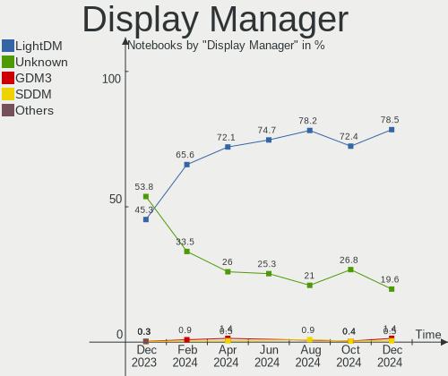
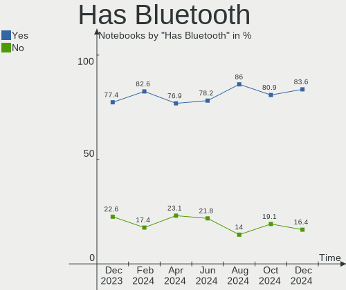
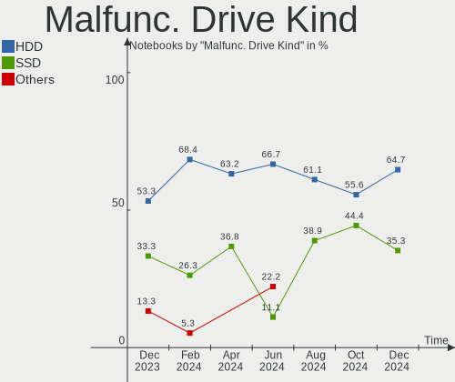
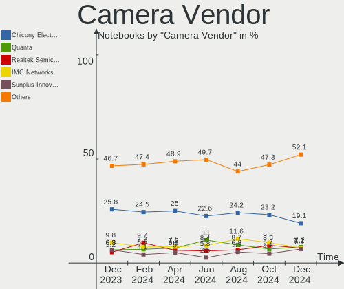

Linux Mint - Hardware Trends (Notebooks)
----------------------------------------

A project to identify most popular hardware characteristics and track their change
over time based on data collected by Linux users at https://Linux-Hardware.org.

Anyone can contribute to this report by the [hw-probe](https://github.com/linuxhw/hw-probe) tool:

    sudo -E hw-probe -all -upload

This report is for one last month. Overall report since the beginning of time: [TestCoverage](https://github.com/linuxhw/TestCoverage)

Period: Oct, 2022.

Contents
--------

* [ System ](#system)
  - [ OS                       ](#os)
  - [ OS Family                ](#os-family)
  - [ Kernel                   ](#kernel)
  - [ Kernel Family            ](#kernel-family)
  - [ Kernel Major Ver.        ](#kernel-major-ver)
  - [ Arch                     ](#arch)
  - [ DE                       ](#de)
  - [ Display Server           ](#display-server)
  - [ Display Manager          ](#display-manager)
  - [ OS Lang                  ](#os-lang)
  - [ Boot Mode                ](#boot-mode)
  - [ Filesystem               ](#filesystem)
  - [ Part. scheme             ](#part-scheme)
  - [ Dual Boot with Linux/BSD ](#dual-boot-with-linuxbsd)
  - [ Dual Boot (Win)          ](#dual-boot-win)

* [ Board ](#board)
  - [ Vendor                   ](#vendor)
  - [ Model                    ](#model)
  - [ Model Family             ](#model-family)
  - [ MFG Year                 ](#mfg-year)
  - [ Form Factor              ](#form-factor)
  - [ Secure Boot              ](#secure-boot)
  - [ Coreboot                 ](#coreboot)
  - [ RAM Size                 ](#ram-size)
  - [ RAM Used                 ](#ram-used)
  - [ Total Drives             ](#total-drives)
  - [ Has CD-ROM               ](#has-cd-rom)
  - [ Has Ethernet             ](#has-ethernet)
  - [ Has WiFi                 ](#has-wifi)
  - [ Has Bluetooth            ](#has-bluetooth)

* [ Location ](#location)
  - [ Country                  ](#country)
  - [ City                     ](#city)

* [ Drives ](#drives)
  - [ Drive Vendor             ](#drive-vendor)
  - [ Drive Model              ](#drive-model)
  - [ HDD Vendor               ](#hdd-vendor)
  - [ SSD Vendor               ](#ssd-vendor)
  - [ Drive Kind               ](#drive-kind)
  - [ Drive Connector          ](#drive-connector)
  - [ Drive Size               ](#drive-size)
  - [ Space Total              ](#space-total)
  - [ Space Used               ](#space-used)
  - [ Malfunc. Drives          ](#malfunc-drives)
  - [ Malfunc. Drive Vendor    ](#malfunc-drive-vendor)
  - [ Malfunc. HDD Vendor      ](#malfunc-hdd-vendor)
  - [ Malfunc. Drive Kind      ](#malfunc-drive-kind)
  - [ Failed Drives            ](#failed-drives)
  - [ Failed Drive Vendor      ](#failed-drive-vendor)
  - [ Drive Status             ](#drive-status)

* [ Storage controller ](#storage-controller)
  - [ Storage Vendor           ](#storage-vendor)
  - [ Storage Model            ](#storage-model)
  - [ Storage Kind             ](#storage-kind)

* [ Processor ](#processor)
  - [ CPU Vendor               ](#cpu-vendor)
  - [ CPU Model                ](#cpu-model)
  - [ CPU Model Family         ](#cpu-model-family)
  - [ CPU Cores                ](#cpu-cores)
  - [ CPU Sockets              ](#cpu-sockets)
  - [ CPU Threads              ](#cpu-threads)
  - [ CPU Op-Modes             ](#cpu-op-modes)
  - [ CPU Microcode            ](#cpu-microcode)
  - [ CPU Microarch            ](#cpu-microarch)

* [ Graphics ](#graphics)
  - [ GPU Vendor               ](#gpu-vendor)
  - [ GPU Model                ](#gpu-model)
  - [ GPU Combo                ](#gpu-combo)
  - [ GPU Driver               ](#gpu-driver)
  - [ GPU Memory               ](#gpu-memory)

* [ Monitor ](#monitor)
  - [ Monitor Vendor           ](#monitor-vendor)
  - [ Monitor Model            ](#monitor-model)
  - [ Monitor Resolution       ](#monitor-resolution)
  - [ Monitor Diagonal         ](#monitor-diagonal)
  - [ Monitor Width            ](#monitor-width)
  - [ Aspect Ratio             ](#aspect-ratio)
  - [ Monitor Area             ](#monitor-area)
  - [ Pixel Density            ](#pixel-density)
  - [ Multiple Monitors        ](#multiple-monitors)

* [ Network ](#network)
  - [ Net Controller Vendor    ](#net-controller-vendor)
  - [ Net Controller Model     ](#net-controller-model)
  - [ Wireless Vendor          ](#wireless-vendor)
  - [ Wireless Model           ](#wireless-model)
  - [ Ethernet Vendor          ](#ethernet-vendor)
  - [ Ethernet Model           ](#ethernet-model)
  - [ Net Controller Kind      ](#net-controller-kind)
  - [ Used Controller          ](#used-controller)
  - [ NICs                     ](#nics)
  - [ IPv6                     ](#ipv6)

* [ Bluetooth ](#bluetooth)
  - [ Bluetooth Vendor         ](#bluetooth-vendor)
  - [ Bluetooth Model          ](#bluetooth-model)

* [ Sound ](#sound)
  - [ Sound Vendor             ](#sound-vendor)
  - [ Sound Model              ](#sound-model)

* [ Memory ](#memory)
  - [ Memory Vendor            ](#memory-vendor)
  - [ Memory Model             ](#memory-model)
  - [ Memory Kind              ](#memory-kind)
  - [ Memory Form Factor       ](#memory-form-factor)
  - [ Memory Size              ](#memory-size)
  - [ Memory Speed             ](#memory-speed)

* [ Printers & scanners ](#printers--scanners)
  - [ Printer Vendor           ](#printer-vendor)
  - [ Printer Model            ](#printer-model)
  - [ Scanner Vendor           ](#scanner-vendor)
  - [ Scanner Model            ](#scanner-model)

* [ Camera ](#camera)
  - [ Camera Vendor            ](#camera-vendor)
  - [ Camera Model             ](#camera-model)

* [ Security ](#security)
  - [ Fingerprint Vendor       ](#fingerprint-vendor)
  - [ Fingerprint Model        ](#fingerprint-model)
  - [ Chipcard Vendor          ](#chipcard-vendor)
  - [ Chipcard Model           ](#chipcard-model)

* [ Unsupported ](#unsupported)
  - [ Unsupported Devices      ](#unsupported-devices)
  - [ Unsupported Device Types ](#unsupported-device-types)

System
------

OS
--

Installed operating systems

| Name            | Notebooks | Percent |
|-----------------|-----------|---------|
| Linux Mint 21   | 148       | 61.16%  |
| Linux Mint 20.3 | 66        | 27.27%  |
| Linux Mint 20.2 | 9         | 3.72%   |
| Linux Mint 20   | 5         | 2.07%   |
| Linux Mint 19.3 | 5         | 2.07%   |
| Linux Mint 20.1 | 3         | 1.24%   |
| Linux Mint 19.2 | 3         | 1.24%   |
| Linux Mint 19.1 | 2         | 0.83%   |
| Linux Mint 18.3 | 1         | 0.41%   |

OS Family
---------

OS without a version

| Name       | Notebooks | Percent |
|------------|-----------|---------|
| Linux Mint | 242       | 100%    |

Kernel
------

Version of the Linux kernel

| Version              | Notebooks | Percent |
|----------------------|-----------|---------|
| 5.15.0-48-generic    | 47        | 19.42%  |
| 5.15.0-52-generic    | 41        | 16.94%  |
| 5.15.0-50-generic    | 38        | 15.7%   |
| 5.15.0-41-generic    | 21        | 8.68%   |
| 5.4.0-131-generic    | 19        | 7.85%   |
| 5.4.0-126-generic    | 19        | 7.85%   |
| 5.4.0-128-generic    | 14        | 5.79%   |
| 5.4.0-107-generic    | 4         | 1.65%   |
| 5.15.0-47-generic    | 4         | 1.65%   |
| 6.0.0-060000-generic | 3         | 1.24%   |
| 5.4.0-125-generic    | 3         | 1.24%   |
| 5.14.0-1052-oem      | 3         | 1.24%   |
| 5.4.0-26-generic     | 2         | 0.83%   |
| 5.4.0-122-generic    | 2         | 0.83%   |
| 4.15.0-20-generic    | 2         | 0.83%   |
| 4.15.0-194-generic   | 2         | 0.83%   |
| 6.0.3-060003-generic | 1         | 0.41%   |
| 5.4.0-91-generic     | 1         | 0.41%   |
| 5.4.0-77-generic     | 1         | 0.41%   |
| 5.4.0-65-generic     | 1         | 0.41%   |
| 5.4.0-126-lowlatency | 1         | 0.41%   |
| 5.4.0-110-generic    | 1         | 0.41%   |
| 5.4.0-104-generic    | 1         | 0.41%   |
| 5.17.0-1020-oem      | 1         | 0.41%   |
| 5.17.0-1019-oem      | 1         | 0.41%   |
| 5.15.0-51-generic    | 1         | 0.41%   |
| 5.15.0-48-lowlatency | 1         | 0.41%   |
| 5.14.0-1054-oem      | 1         | 0.41%   |
| 5.13.0-52-generic    | 1         | 0.41%   |
| 5.0.0-32-generic     | 1         | 0.41%   |
| 4.15.0-54-generic    | 1         | 0.41%   |
| 4.15.0-193-generic   | 1         | 0.41%   |
| 4.15.0-142-generic   | 1         | 0.41%   |
| Unknown              | 1         | 0.41%   |

Kernel Family
-------------

Linux kernel without a distro release

| Version | Notebooks | Percent |
|---------|-----------|---------|
| 5.15.0  | 153       | 63.22%  |
| 5.4.0   | 69        | 28.51%  |
| 4.15.0  | 7         | 2.89%   |
| 5.14.0  | 4         | 1.65%   |
| 6.0.0   | 3         | 1.24%   |
| 5.17.0  | 2         | 0.83%   |
| 6.0.3   | 1         | 0.41%   |
| 5.13.0  | 1         | 0.41%   |
| 5.0.0   | 1         | 0.41%   |
| Unknown | 1         | 0.41%   |

Kernel Major Ver.
-----------------

Linux kernel major version

| Version | Notebooks | Percent |
|---------|-----------|---------|
| 5.15    | 153       | 63.22%  |
| 5.4     | 69        | 28.51%  |
| 4.15    | 7         | 2.89%   |
| 6.0     | 4         | 1.65%   |
| 5.14    | 4         | 1.65%   |
| 5.17    | 2         | 0.83%   |
| 5.13    | 1         | 0.41%   |
| 5.0     | 1         | 0.41%   |
| Unknown | 1         | 0.41%   |

Arch
----

OS architecture (x86_64, i586, etc.)

| Name   | Notebooks | Percent |
|--------|-----------|---------|
| x86_64 | 241       | 99.59%  |
| i686   | 1         | 0.41%   |

DE
--

Desktop Environment

| Name       | Notebooks | Percent |
|------------|-----------|---------|
| X-Cinnamon | 170       | 70.25%  |
| MATE       | 37        | 15.29%  |
| XFCE       | 23        | 9.5%    |
| Cinnamon   | 9         | 3.72%   |
| qtile      | 1         | 0.41%   |
| GNOME      | 1         | 0.41%   |
| Unknown    | 1         | 0.41%   |

Display Server
--------------

X11 or Wayland

| Name    | Notebooks | Percent |
|---------|-----------|---------|
| X11     | 241       | 99.59%  |
| Wayland | 1         | 0.41%   |

Display Manager
---------------

SDDM, LightDM, etc.

| Name    | Notebooks | Percent |
|---------|-----------|---------|
| Unknown | 121       | 50%     |
| LightDM | 120       | 49.59%  |
| MDM     | 1         | 0.41%   |

OS Lang
-------

Language

| Lang    | Notebooks | Percent |
|---------|-----------|---------|
| en_US   | 82        | 33.88%  |
| de_DE   | 27        | 11.16%  |
| fr_FR   | 18        | 7.44%   |
| pt_BR   | 16        | 6.61%   |
| it_IT   | 15        | 6.2%    |
| ru_RU   | 14        | 5.79%   |
| C       | 8         | 3.31%   |
| pl_PL   | 6         | 2.48%   |
| es_ES   | 6         | 2.48%   |
| en_CA   | 6         | 2.48%   |
| en_GB   | 5         | 2.07%   |
| nl_NL   | 3         | 1.24%   |
| hu_HU   | 3         | 1.24%   |
| zh_CN   | 2         | 0.83%   |
| pt_PT   | 2         | 0.83%   |
| es_MX   | 2         | 0.83%   |
| en_IN   | 2         | 0.83%   |
| en_AU   | 2         | 0.83%   |
| el_GR   | 2         | 0.83%   |
| de_CH   | 2         | 0.83%   |
| Unknown | 2         | 0.83%   |
| tr_TR   | 1         | 0.41%   |
| szl_PL  | 1         | 0.41%   |
| sv_SE   | 1         | 0.41%   |
| lv_LV   | 1         | 0.41%   |
| hr_HR   | 1         | 0.41%   |
| gl_ES   | 1         | 0.41%   |
| fr_CA   | 1         | 0.41%   |
| es_CL   | 1         | 0.41%   |
| es_BO   | 1         | 0.41%   |
| es_AR   | 1         | 0.41%   |
| en_ZA   | 1         | 0.41%   |
| en_PH   | 1         | 0.41%   |
| en_NZ   | 1         | 0.41%   |
| de_AT   | 1         | 0.41%   |
| cs_CZ   | 1         | 0.41%   |
| ca_ES   | 1         | 0.41%   |
| ar_SA   | 1         | 0.41%   |

Boot Mode
---------

EFI or BIOS

| Mode | Notebooks | Percent |
|------|-----------|---------|
| EFI  | 159       | 65.7%   |
| BIOS | 83        | 34.3%   |

Filesystem
----------

Type of filesystem

| Type    | Notebooks | Percent |
|---------|-----------|---------|
| Ext4    | 229       | 94.63%  |
| Overlay | 7         | 2.89%   |
| Zfs     | 2         | 0.83%   |
| Btrfs   | 2         | 0.83%   |
| Xfs     | 1         | 0.41%   |
| Ext3    | 1         | 0.41%   |

Part. scheme
------------

Scheme of partitioning

| Type    | Notebooks | Percent |
|---------|-----------|---------|
| Unknown | 120       | 49.59%  |
| GPT     | 100       | 41.32%  |
| MBR     | 22        | 9.09%   |

Dual Boot with Linux/BSD
------------------------

Hosting more than one Linux/BSD

| Dual boot | Notebooks | Percent |
|-----------|-----------|---------|
| No        | 232       | 95.87%  |
| Yes       | 10        | 4.13%   |

Dual Boot (Win)
---------------

Hosting Linux and Windows

| Dual boot | Notebooks | Percent |
|-----------|-----------|---------|
| No        | 197       | 81.4%   |
| Yes       | 45        | 18.6%   |

Board
-----

Vendor
------

Motherboard manufacturer

| Name                | Notebooks | Percent |
|---------------------|-----------|---------|
| Hewlett-Packard     | 48        | 19.83%  |
| Lenovo              | 36        | 14.88%  |
| Dell                | 34        | 14.05%  |
| ASUSTek Computer    | 33        | 13.64%  |
| Acer                | 24        | 9.92%   |
| Toshiba             | 7         | 2.89%   |
| Samsung Electronics | 6         | 2.48%   |
| Sony                | 4         | 1.65%   |
| HUAWEI              | 4         | 1.65%   |
| Google              | 4         | 1.65%   |
| Apple               | 4         | 1.65%   |
| Positivo            | 3         | 1.24%   |
| MSI                 | 3         | 1.24%   |
| Fujitsu             | 3         | 1.24%   |
| Timi                | 2         | 0.83%   |
| Unknown             | 2         | 0.83%   |
| Wortmann AG         | 1         | 0.41%   |
| Thomson             | 1         | 0.41%   |
| Standard            | 1         | 0.41%   |
| Schenker            | 1         | 0.41%   |
| SANTECH             | 1         | 0.41%   |
| Quanta              | 1         | 0.41%   |
| Qilive              | 1         | 0.41%   |
| Prestigio           | 1         | 0.41%   |
| Packard Bell        | 1         | 0.41%   |
| Olivetti            | 1         | 0.41%   |
| Multilaser          | 1         | 0.41%   |
| Monster             | 1         | 0.41%   |
| Microtech           | 1         | 0.41%   |
| Medion              | 1         | 0.41%   |
| MAXDATA             | 1         | 0.41%   |
| Letni               | 1         | 0.41%   |
| Kruger&Matz         | 1         | 0.41%   |
| HONOR               | 1         | 0.41%   |
| GPU Company         | 1         | 0.41%   |
| Gigabyte Technology | 1         | 0.41%   |
| Getac               | 1         | 0.41%   |
| Fujitsu Siemens     | 1         | 0.41%   |
| Daten Tecnologia    | 1         | 0.41%   |
| Compaq              | 1         | 0.41%   |

Model
-----

Motherboard model

| Name                                                  | Notebooks | Percent |
|-------------------------------------------------------|-----------|---------|
| Unknown                                               | 3         | 1.24%   |
| HP ProBook 6560b                                      | 2         | 0.83%   |
| HP ProBook 640 G1                                     | 2         | 0.83%   |
| HP ProBook 450 G3                                     | 2         | 0.83%   |
| HP Notebook                                           | 2         | 0.83%   |
| HP Laptop 17-by4xxx                                   | 2         | 0.83%   |
| HP EliteBook 840 G5                                   | 2         | 0.83%   |
| HP 15                                                 | 2         | 0.83%   |
| Dell Latitude E7240                                   | 2         | 0.83%   |
| Acer Aspire S3                                        | 2         | 0.83%   |
| Wortmann AG CR700                                     | 1         | 0.41%   |
| Toshiba Satellite U920t                               | 1         | 0.41%   |
| Toshiba Satellite P200                                | 1         | 0.41%   |
| Toshiba Satellite M50D-A                              | 1         | 0.41%   |
| Toshiba Satellite L55-B                               | 1         | 0.41%   |
| Toshiba Satellite L10W-B-101                          | 1         | 0.41%   |
| Toshiba Satellite C660                                | 1         | 0.41%   |
| Toshiba Satellite A300                                | 1         | 0.41%   |
| Timi TM1709                                           | 1         | 0.41%   |
| Timi RedmiBook Pro 15S                                | 1         | 0.41%   |
| Thomson NEO14A-4WH128                                 | 1         | 0.41%   |
| Standard MB40II                                       | 1         | 0.41%   |
| Sony VGN-N21E_W                                       | 1         | 0.41%   |
| Sony VGN-AR71J                                        | 1         | 0.41%   |
| Sony SVF15A13SAB                                      | 1         | 0.41%   |
| Sony SVE1712Z1EB                                      | 1         | 0.41%   |
| Schenker VISION 15 (SVS15E21)                         | 1         | 0.41%   |
| SANTECH PCx0Dx                                        | 1         | 0.41%   |
| Samsung RC530/RC730                                   | 1         | 0.41%   |
| Samsung R530/R730/R540                                | 1         | 0.41%   |
| Samsung 950XDB/951XDB/950XDY                          | 1         | 0.41%   |
| Samsung 300E5EV/300E4EV/270E5EV/270E4EV/2470EV/2470EE | 1         | 0.41%   |
| Samsung 300E4C/300E5C/300E7C                          | 1         | 0.41%   |
| Samsung 275E4E/275E5E                                 | 1         | 0.41%   |
| Quanta TWS                                            | 1         | 0.41%   |
| Qilive QW20141BSP                                     | 1         | 0.41%   |
| Prestigio PSB141S01                                   | 1         | 0.41%   |
| Positivo W940SU2                                      | 1         | 0.41%   |
| Positivo S14CT01                                      | 1         | 0.41%   |
| Positivo Mobile                                       | 1         | 0.41%   |

Model Family
------------

Motherboard model prefix

| Name                  | Notebooks | Percent |
|-----------------------|-----------|---------|
| Acer Aspire           | 18        | 7.44%   |
| Lenovo ThinkPad       | 14        | 5.79%   |
| Lenovo IdeaPad        | 12        | 4.96%   |
| Dell Inspiron         | 12        | 4.96%   |
| Dell Latitude         | 11        | 4.55%   |
| HP ProBook            | 10        | 4.13%   |
| HP EliteBook          | 9         | 3.72%   |
| HP Pavilion           | 8         | 3.31%   |
| Toshiba Satellite     | 7         | 2.89%   |
| ASUS VivoBook         | 7         | 2.89%   |
| HP Laptop             | 6         | 2.48%   |
| Dell XPS              | 4         | 1.65%   |
| HP ZBook              | 3         | 1.24%   |
| HP ENVY               | 3         | 1.24%   |
| Fujitsu LIFEBOOK      | 3         | 1.24%   |
| Acer Swift            | 3         | 1.24%   |
| Unknown               | 3         | 1.24%   |
| Lenovo V15            | 2         | 0.83%   |
| HP Notebook           | 2         | 0.83%   |
| HP 15                 | 2         | 0.83%   |
| Dell Precision        | 2         | 0.83%   |
| ASUS ROG              | 2         | 0.83%   |
| ASUS ASUS             | 2         | 0.83%   |
| Wortmann AG CR700     | 1         | 0.41%   |
| Timi TM1709           | 1         | 0.41%   |
| Timi RedmiBook        | 1         | 0.41%   |
| Thomson NEO14A-4WH128 | 1         | 0.41%   |
| Standard MB40II       | 1         | 0.41%   |
| Sony VGN-N21E         | 1         | 0.41%   |
| Sony VGN-AR71J        | 1         | 0.41%   |
| Sony SVF15A13SAB      | 1         | 0.41%   |
| Sony SVE1712Z1EB      | 1         | 0.41%   |
| Schenker VISION       | 1         | 0.41%   |
| SANTECH PCx0Dx        | 1         | 0.41%   |
| Samsung RC530         | 1         | 0.41%   |
| Samsung R530          | 1         | 0.41%   |
| Samsung 950XDB        | 1         | 0.41%   |
| Samsung 300E5EV       | 1         | 0.41%   |
| Samsung 300E4C        | 1         | 0.41%   |
| Samsung 275E4E        | 1         | 0.41%   |

MFG Year
--------

Motherboard manufacture year

| Year | Notebooks | Percent |
|------|-----------|---------|
| 2021 | 32        | 13.22%  |
| 2013 | 24        | 9.92%   |
| 2012 | 19        | 7.85%   |
| 2022 | 18        | 7.44%   |
| 2020 | 17        | 7.02%   |
| 2019 | 17        | 7.02%   |
| 2018 | 17        | 7.02%   |
| 2011 | 16        | 6.61%   |
| 2016 | 15        | 6.2%    |
| 2017 | 12        | 4.96%   |
| 2014 | 12        | 4.96%   |
| 2008 | 12        | 4.96%   |
| 2015 | 11        | 4.55%   |
| 2010 | 9         | 3.72%   |
| 2009 | 5         | 2.07%   |
| 2007 | 3         | 1.24%   |
| 2006 | 2         | 0.83%   |
| 2005 | 1         | 0.41%   |

Form Factor
-----------

Physical design of the computer

| Name     | Notebooks | Percent |
|----------|-----------|---------|
| Notebook | 242       | 100%    |

Secure Boot
-----------

Enabled or disabled

| State    | Notebooks | Percent |
|----------|-----------|---------|
| Disabled | 200       | 82.64%  |
| Enabled  | 42        | 17.36%  |

Coreboot
--------

Have coreboot on board

| Used | Notebooks | Percent |
|------|-----------|---------|
| No   | 237       | 97.93%  |
| Yes  | 5         | 2.07%   |

RAM Size
--------

Total RAM memory

| Size in GB  | Notebooks | Percent |
|-------------|-----------|---------|
| 4.01-8.0    | 80        | 33.06%  |
| 3.01-4.0    | 50        | 20.66%  |
| 16.01-24.0  | 40        | 16.53%  |
| 8.01-16.0   | 40        | 16.53%  |
| 1.01-2.0    | 15        | 6.2%    |
| 32.01-64.0  | 9         | 3.72%   |
| 2.01-3.0    | 3         | 1.24%   |
| 64.01-256.0 | 3         | 1.24%   |
| 24.01-32.0  | 1         | 0.41%   |
| 0.51-1.0    | 1         | 0.41%   |

RAM Used
--------

Used RAM memory

| Used GB   | Notebooks | Percent |
|-----------|-----------|---------|
| 1.01-2.0  | 92        | 38.02%  |
| 2.01-3.0  | 70        | 28.93%  |
| 4.01-8.0  | 34        | 14.05%  |
| 3.01-4.0  | 26        | 10.74%  |
| 0.51-1.0  | 12        | 4.96%   |
| 8.01-16.0 | 8         | 3.31%   |

Total Drives
------------

Number of drives on board

| Drives | Notebooks | Percent |
|--------|-----------|---------|
| 1      | 181       | 74.79%  |
| 2      | 49        | 20.25%  |
| 3      | 8         | 3.31%   |
| 4      | 2         | 0.83%   |
| 0      | 2         | 0.83%   |

Has CD-ROM
----------

Has CD-ROM on board

| Presented | Notebooks | Percent |
|-----------|-----------|---------|
| No        | 150       | 61.98%  |
| Yes       | 92        | 38.02%  |

Has Ethernet
------------

Has Ethernet on board

| Presented | Notebooks | Percent |
|-----------|-----------|---------|
| Yes       | 192       | 79.34%  |
| No        | 50        | 20.66%  |

Has WiFi
--------

Has WiFi module

| Presented | Notebooks | Percent |
|-----------|-----------|---------|
| Yes       | 236       | 97.52%  |
| No        | 6         | 2.48%   |

Has Bluetooth
-------------

Has Bluetooth module

| Presented | Notebooks | Percent |
|-----------|-----------|---------|
| Yes       | 175       | 72.31%  |
| No        | 67        | 27.69%  |

Location
--------

Country
-------

Geographic location (country)

| Country      | Notebooks | Percent |
|--------------|-----------|---------|
| USA          | 40        | 16.53%  |
| Germany      | 29        | 11.98%  |
| Italy        | 22        | 9.09%   |
| France       | 21        | 8.68%   |
| Brazil       | 16        | 6.61%   |
| Russia       | 15        | 6.2%    |
| Spain        | 11        | 4.55%   |
| Poland       | 8         | 3.31%   |
| Canada       | 8         | 3.31%   |
| Netherlands  | 6         | 2.48%   |
| UK           | 5         | 2.07%   |
| Switzerland  | 4         | 1.65%   |
| Portugal     | 4         | 1.65%   |
| Austria      | 4         | 1.65%   |
| Turkey       | 3         | 1.24%   |
| Ireland      | 3         | 1.24%   |
| Hungary      | 3         | 1.24%   |
| Australia    | 3         | 1.24%   |
| Sweden       | 2         | 0.83%   |
| Saudi Arabia | 2         | 0.83%   |
| Mexico       | 2         | 0.83%   |
| India        | 2         | 0.83%   |
| Greece       | 2         | 0.83%   |
| Croatia      | 2         | 0.83%   |
| Uzbekistan   | 1         | 0.41%   |
| Ukraine      | 1         | 0.41%   |
| South Africa | 1         | 0.41%   |
| Slovakia     | 1         | 0.41%   |
| Romania      | 1         | 0.41%   |
| Philippines  | 1         | 0.41%   |
| Norway       | 1         | 0.41%   |
| New Zealand  | 1         | 0.41%   |
| Nepal        | 1         | 0.41%   |
| Latvia       | 1         | 0.41%   |
| Kenya        | 1         | 0.41%   |
| Jamaica      | 1         | 0.41%   |
| Israel       | 1         | 0.41%   |
| Egypt        | 1         | 0.41%   |
| Czechia      | 1         | 0.41%   |
| China        | 1         | 0.41%   |

City
----

Geographic location (city)

| City                | Notebooks | Percent |
|---------------------|-----------|---------|
| Moscow              | 5         | 2.07%   |
| Milan               | 4         | 1.65%   |
| Zurich              | 3         | 1.24%   |
| Vienna              | 3         | 1.24%   |
| Paris               | 3         | 1.24%   |
| Madrid              | 3         | 1.24%   |
| Berlin              | 3         | 1.24%   |
| Zagreb              | 2         | 0.83%   |
| Uberlândia         | 2         | 0.83%   |
| The Bronx           | 2         | 0.83%   |
| Szolnok             | 2         | 0.83%   |
| Seia                | 2         | 0.83%   |
| Porto Alegre        | 2         | 0.83%   |
| Miami               | 2         | 0.83%   |
| Gurs                | 2         | 0.83%   |
| El Paso             | 2         | 0.83%   |
| Dresden             | 2         | 0.83%   |
| Chicago             | 2         | 0.83%   |
| Campinas            | 2         | 0.83%   |
| Barcelona           | 2         | 0.83%   |
| Athens              | 2         | 0.83%   |
| Zimmern ob Rottweil | 1         | 0.41%   |
| Zenica              | 1         | 0.41%   |
| Zacatecas City      | 1         | 0.41%   |
| Yoshkar-Ola         | 1         | 0.41%   |
| Xianyang            | 1         | 0.41%   |
| Xalapa              | 1         | 0.41%   |
| Wuppertal           | 1         | 0.41%   |
| Wozniki             | 1         | 0.41%   |
| Warsaw              | 1         | 0.41%   |
| Villach             | 1         | 0.41%   |
| Vignanello          | 1         | 0.41%   |
| Vigasio             | 1         | 0.41%   |
| Venice              | 1         | 0.41%   |
| Valencia            | 1         | 0.41%   |
| Ussuriysk           | 1         | 0.41%   |
| Tullamore           | 1         | 0.41%   |
| Trento              | 1         | 0.41%   |
| Tremblay-en-France  | 1         | 0.41%   |
| Traverse City       | 1         | 0.41%   |

Drives
------

Drive Vendor
------------

Hard drive vendors

| Vendor                         | Notebooks | Drives | Percent |
|--------------------------------|-----------|--------|---------|
| Samsung Electronics            | 52        | 55     | 17.69%  |
| WDC                            | 32        | 34     | 10.88%  |
| Seagate                        | 30        | 31     | 10.2%   |
| Toshiba                        | 23        | 23     | 7.82%   |
| Unknown                        | 20        | 24     | 6.8%    |
| SanDisk                        | 20        | 21     | 6.8%    |
| Kingston                       | 13        | 14     | 4.42%   |
| Crucial                        | 12        | 12     | 4.08%   |
| SK hynix                       | 9         | 9      | 3.06%   |
| Micron Technology              | 8         | 8      | 2.72%   |
| Hitachi                        | 8         | 8      | 2.72%   |
| HGST                           | 6         | 6      | 2.04%   |
| Fujitsu                        | 5         | 6      | 1.7%    |
| A-DATA Technology              | 5         | 5      | 1.7%    |
| PNY                            | 4         | 4      | 1.36%   |
| Intel                          | 4         | 4      | 1.36%   |
| China                          | 4         | 4      | 1.36%   |
| Unknown                        | 4         | 4      | 1.36%   |
| GOODRAM                        | 3         | 3      | 1.02%   |
| UMIS                           | 2         | 2      | 0.68%   |
| Team                           | 2         | 2      | 0.68%   |
| LITEON                         | 2         | 2      | 0.68%   |
| KIOXIA                         | 2         | 2      | 0.68%   |
| Apple                          | 2         | 2      | 0.68%   |
| Union Memory (Shenzhen)        | 1         | 1      | 0.34%   |
| Transcend                      | 1         | 1      | 0.34%   |
| TCSUNBOW                       | 1         | 1      | 0.34%   |
| SSSTC                          | 1         | 1      | 0.34%   |
| SPCC                           | 1         | 1      | 0.34%   |
| Solid State Storage Technology | 1         | 1      | 0.34%   |
| Silicon Motion                 | 1         | 1      | 0.34%   |
| ShiJi                          | 1         | 1      | 0.34%   |
| Ramaxel Technology             | 1         | 1      | 0.34%   |
| Plextor                        | 1         | 1      | 0.34%   |
| Phison Electronics             | 1         | 1      | 0.34%   |
| Patriot                        | 1         | 1      | 0.34%   |
| Netac                          | 1         | 1      | 0.34%   |
| Kingston Technology Company    | 1         | 1      | 0.34%   |
| Kingsand                       | 1         | 1      | 0.34%   |
| Kingchuxing                    | 1         | 1      | 0.34%   |

Drive Model
-----------

Hard drive models

| Model                                                | Notebooks | Percent |
|------------------------------------------------------|-----------|---------|
| Unknown MMC Card  64GB                               | 6         | 1.97%   |
| Unknown MMC Card  32GB                               | 6         | 1.97%   |
| Toshiba MQ01ABF050 500GB                             | 4         | 1.31%   |
| Seagate ST1000LM035-1RK172 1TB                       | 4         | 1.31%   |
| Samsung SSD 970 EVO Plus 500GB                       | 4         | 1.31%   |
| Unknown                                              | 4         | 1.31%   |
| Toshiba MQ04ABF100 1TB                               | 3         | 0.98%   |
| Toshiba MQ01ABD100 1TB                               | 3         | 0.98%   |
| Seagate ST1000LM024 HN-M101MBB 1TB                   | 3         | 0.98%   |
| Samsung SSD 850 EVO 500GB                            | 3         | 0.98%   |
| Kingston SV300S37A120G 120GB SSD                     | 3         | 0.98%   |
| Kingston SA400S37240G 240GB SSD                      | 3         | 0.98%   |
| Crucial CT500MX500SSD1 500GB                         | 3         | 0.98%   |
| Crucial CT480BX500SSD1 480GB                         | 3         | 0.98%   |
| WDC WD10SPZX-24Z10 1TB                               | 2         | 0.66%   |
| WDC WD10SPZX-21Z10T0 1TB                             | 2         | 0.66%   |
| WDC PC SN530 SDBPMPZ-256G-1101 256GB                 | 2         | 0.66%   |
| Unknown MMC Card  128GB                              | 2         | 0.66%   |
| Toshiba MK2546GSX 250GB                              | 2         | 0.66%   |
| Seagate ST500LT012-1DG142 500GB                      | 2         | 0.66%   |
| Seagate ST500LM021-1KJ152 500GB                      | 2         | 0.66%   |
| Seagate ST1000LM048-2E7172 1TB                       | 2         | 0.66%   |
| SanDisk SD8SN8U-256G-1006 256GB SSD                  | 2         | 0.66%   |
| Samsung SSD 980 PRO 2TB                              | 2         | 0.66%   |
| Samsung SSD 980 PRO 1TB                              | 2         | 0.66%   |
| Samsung SSD 870 EVO 250GB                            | 2         | 0.66%   |
| Samsung SSD 860 EVO 500GB                            | 2         | 0.66%   |
| Samsung SSD 860 EVO 1TB                              | 2         | 0.66%   |
| Samsung SSD 850 EVO 250GB                            | 2         | 0.66%   |
| Samsung NVMe SSD Controller SM981/PM981/PM983 500GB  | 2         | 0.66%   |
| Samsung NVMe SSD Controller PM9A1/PM9A3/980PRO 250GB | 2         | 0.66%   |
| Samsung MZVLQ512HALU-00000 512GB                     | 2         | 0.66%   |
| PNY CS900 500GB SSD                                  | 2         | 0.66%   |
| Micron 2450_MTFDKBA512TFK 512GB                      | 2         | 0.66%   |
| KIOXIA KBG40ZNS512G NVMe 512GB                       | 2         | 0.66%   |
| Kingston SNVS1000G 1TB                               | 2         | 0.66%   |
| Intel SSDPEKNW512G8 512GB                            | 2         | 0.66%   |
| HGST HTS721010A9E630 1TB                             | 2         | 0.66%   |
| Crucial CT525MX300SSD1 528GB                         | 2         | 0.66%   |
| China SATA SSD 20GB                                  | 2         | 0.66%   |

HDD Vendor
----------

Hard disk drive vendors

| Vendor              | Notebooks | Drives | Percent |
|---------------------|-----------|--------|---------|
| Seagate             | 30        | 31     | 35.29%  |
| WDC                 | 17        | 17     | 20%     |
| Toshiba             | 17        | 17     | 20%     |
| Hitachi             | 8         | 8      | 9.41%   |
| HGST                | 6         | 6      | 7.06%   |
| Fujitsu             | 5         | 6      | 5.88%   |
| Unknown             | 1         | 1      | 1.18%   |
| Samsung Electronics | 1         | 1      | 1.18%   |

SSD Vendor
----------

Solid state drive vendors

| Vendor              | Notebooks | Drives | Percent |
|---------------------|-----------|--------|---------|
| Samsung Electronics | 25        | 25     | 23.81%  |
| SanDisk             | 15        | 15     | 14.29%  |
| Crucial             | 12        | 12     | 11.43%  |
| Kingston            | 9         | 9      | 8.57%   |
| WDC                 | 8         | 8      | 7.62%   |
| A-DATA Technology   | 5         | 5      | 4.76%   |
| PNY                 | 4         | 4      | 3.81%   |
| China               | 4         | 4      | 3.81%   |
| Team                | 2         | 2      | 1.9%    |
| Micron Technology   | 2         | 2      | 1.9%    |
| LITEON              | 2         | 2      | 1.9%    |
| GOODRAM             | 2         | 2      | 1.9%    |
| Apple               | 2         | 2      | 1.9%    |
| Unknown             | 2         | 2      | 1.9%    |
| Transcend           | 1         | 1      | 0.95%   |
| Toshiba             | 1         | 1      | 0.95%   |
| TCSUNBOW            | 1         | 1      | 0.95%   |
| SPCC                | 1         | 1      | 0.95%   |
| SK hynix            | 1         | 1      | 0.95%   |
| Ramaxel Technology  | 1         | 1      | 0.95%   |
| Plextor             | 1         | 1      | 0.95%   |
| Patriot             | 1         | 1      | 0.95%   |
| Netac               | 1         | 1      | 0.95%   |
| HS-SSD-C100         | 1         | 1      | 0.95%   |
| Drevo               | 1         | 1      | 0.95%   |

Drive Kind
----------

HDD or SSD

| Kind    | Notebooks | Drives | Percent |
|---------|-----------|--------|---------|
| SSD     | 100       | 105    | 35.21%  |
| HDD     | 84        | 87     | 29.58%  |
| NVMe    | 74        | 83     | 26.06%  |
| MMC     | 21        | 26     | 7.39%   |
| Unknown | 5         | 6      | 1.76%   |

Drive Connector
---------------

SATA, SAS, NVMe, etc.

| Type | Notebooks | Drives | Percent |
|------|-----------|--------|---------|
| SATA | 166       | 191    | 62.17%  |
| NVMe | 73        | 82     | 27.34%  |
| MMC  | 21        | 26     | 7.87%   |
| SAS  | 7         | 8      | 2.62%   |

Drive Size
----------

Size of hard drive

| Size in TB | Notebooks | Drives | Percent |
|------------|-----------|--------|---------|
| 0.01-0.5   | 116       | 127    | 64.8%   |
| 0.51-1.0   | 55        | 57     | 30.73%  |
| 1.01-2.0   | 8         | 8      | 4.47%   |

Space Total
-----------

Amount of disk space available on the file system

| Size in GB | Notebooks | Percent |
|------------|-----------|---------|
| 251-500    | 74        | 30.58%  |
| 101-250    | 71        | 29.34%  |
| 501-1000   | 36        | 14.88%  |
| 51-100     | 20        | 8.26%   |
| 1001-2000  | 15        | 6.2%    |
| 21-50      | 14        | 5.79%   |
| 1-20       | 6         | 2.48%   |
| 2001-3000  | 4         | 1.65%   |
| Unknown    | 2         | 0.83%   |

Space Used
----------

Amount of used disk space

| Used GB   | Notebooks | Percent |
|-----------|-----------|---------|
| 21-50     | 66        | 27.27%  |
| 1-20      | 63        | 26.03%  |
| 101-250   | 41        | 16.94%  |
| 51-100    | 29        | 11.98%  |
| 251-500   | 24        | 9.92%   |
| 501-1000  | 14        | 5.79%   |
| 1001-2000 | 3         | 1.24%   |
| Unknown   | 2         | 0.83%   |

Malfunc. Drives
---------------

Drive models with a malfunction

| Model                                       | Notebooks | Drives | Percent |
|---------------------------------------------|-----------|--------|---------|
| WDC WD6400BPVT-75HXZT3 640GB                | 1         | 1      | 9.09%   |
| Seagate ST9320423AS 320GB                   | 1         | 1      | 9.09%   |
| Seagate ST9250410AS 250GB                   | 1         | 1      | 9.09%   |
| Seagate ST500LT012-9WS142 500GB             | 1         | 1      | 9.09%   |
| Seagate ST500LT012-1DG142 500GB             | 1         | 1      | 9.09%   |
| Seagate ST1000LM049-2GH172 1TB              | 1         | 1      | 9.09%   |
| Samsung Electronics SSD PM810 2.5 7mm 256GB | 1         | 1      | 9.09%   |
| Samsung Electronics HM160HC 160GB           | 1         | 1      | 9.09%   |
| PNY SSD2SC120G3LC726B104-370P 120GB         | 1         | 1      | 9.09%   |
| Hitachi HTS725050A9A364 500GB               | 1         | 1      | 9.09%   |
| Hitachi HTS547564A9E384 640GB               | 1         | 1      | 9.09%   |

Malfunc. Drive Vendor
---------------------

Vendors of faulty drives

| Vendor              | Notebooks | Drives | Percent |
|---------------------|-----------|--------|---------|
| Seagate             | 5         | 5      | 45.45%  |
| Samsung Electronics | 2         | 2      | 18.18%  |
| Hitachi             | 2         | 2      | 18.18%  |
| WDC                 | 1         | 1      | 9.09%   |
| PNY                 | 1         | 1      | 9.09%   |

Malfunc. HDD Vendor
-------------------

Vendors of faulty HDD drives

| Vendor              | Notebooks | Drives | Percent |
|---------------------|-----------|--------|---------|
| Seagate             | 5         | 5      | 55.56%  |
| Hitachi             | 2         | 2      | 22.22%  |
| WDC                 | 1         | 1      | 11.11%  |
| Samsung Electronics | 1         | 1      | 11.11%  |

Malfunc. Drive Kind
-------------------

Kinds of faulty drives

| Kind | Notebooks | Drives | Percent |
|------|-----------|--------|---------|
| HDD  | 9         | 9      | 81.82%  |
| SSD  | 2         | 2      | 18.18%  |

Failed Drives
-------------

Failed drive models

Zero info for selected period =(

Failed Drive Vendor
-------------------

Failed drive vendors

Zero info for selected period =(

Drive Status
------------

Number of failed and malfunc. drives

| Status   | Notebooks | Drives | Percent |
|----------|-----------|--------|---------|
| Detected | 137       | 170    | 55.02%  |
| Works    | 102       | 126    | 40.96%  |
| Malfunc  | 10        | 11     | 4.02%   |

Storage controller
------------------

Storage Vendor
--------------

Storage controller vendors

| Vendor                           | Notebooks | Percent |
|----------------------------------|-----------|---------|
| Intel                            | 171       | 60.21%  |
| AMD                              | 30        | 10.56%  |
| Samsung Electronics              | 29        | 10.21%  |
| SanDisk                          | 12        | 4.23%   |
| SK hynix                         | 7         | 2.46%   |
| Micron Technology                | 6         | 2.11%   |
| Kingston Technology Company      | 6         | 2.11%   |
| Toshiba America Info Systems     | 5         | 1.76%   |
| Union Memory (Shenzhen)          | 3         | 1.06%   |
| Nvidia                           | 3         | 1.06%   |
| Solid State Storage Technology   | 2         | 0.7%    |
| Silicon Motion                   | 2         | 0.7%    |
| Silicon Integrated Systems [SiS] | 2         | 0.7%    |
| Phison Electronics               | 2         | 0.7%    |
| KIOXIA                           | 2         | 0.7%    |
| Marvell Technology Group         | 1         | 0.35%   |
| ASMedia Technology               | 1         | 0.35%   |

Storage Model
-------------

Storage controller models

| Model                                                                            | Notebooks | Percent |
|----------------------------------------------------------------------------------|-----------|---------|
| AMD FCH SATA Controller [AHCI mode]                                              | 25        | 8.12%   |
| Intel Sunrise Point-LP SATA Controller [AHCI mode]                               | 20        | 6.49%   |
| Intel 7 Series Chipset Family 6-port SATA Controller [AHCI mode]                 | 18        | 5.84%   |
| Intel 8 Series SATA Controller 1 [AHCI mode]                                     | 15        | 4.87%   |
| Intel 82801 Mobile SATA Controller [RAID mode]                                   | 14        | 4.55%   |
| Intel 6 Series/C200 Series Chipset Family 6 port Mobile SATA AHCI Controller     | 14        | 4.55%   |
| Samsung NVMe SSD Controller SM981/PM981/PM983                                    | 12        | 3.9%    |
| Intel Volume Management Device NVMe RAID Controller                              | 10        | 3.25%   |
| Intel 82801IBM/IEM (ICH9M/ICH9M-E) 4 port SATA Controller [AHCI mode]            | 9         | 2.92%   |
| Samsung NVMe SSD Controller PM9A1/PM9A3/980PRO                                   | 8         | 2.6%    |
| Samsung NVMe SSD Controller 980                                                  | 8         | 2.6%    |
| SanDisk Non-Volatile memory controller                                           | 7         | 2.27%   |
| Intel Celeron/Pentium Silver Processor SATA Controller                           | 7         | 2.27%   |
| Micron Non-Volatile memory controller                                            | 6         | 1.95%   |
| Intel Wildcat Point-LP SATA Controller [AHCI Mode]                               | 6         | 1.95%   |
| Intel Comet Lake SATA AHCI Controller                                            | 6         | 1.95%   |
| Intel Celeron N3350/Pentium N4200/Atom E3900 Series SATA AHCI Controller         | 6         | 1.95%   |
| Intel 8 Series/C220 Series Chipset Family 6-port SATA Controller 1 [AHCI mode]   | 6         | 1.95%   |
| Intel 82801HM/HEM (ICH8M/ICH8M-E) SATA Controller [AHCI mode]                    | 5         | 1.62%   |
| Intel 5 Series/3400 Series Chipset 4 port SATA AHCI Controller                   | 5         | 1.62%   |
| Intel Atom/Celeron/Pentium Processor x5-E8000/J3xxx/N3xxx Series SATA Controller | 4         | 1.3%    |
| Intel 82801HM/HEM (ICH8M/ICH8M-E) IDE Controller                                 | 4         | 1.3%    |
| SK hynix Gold P31 SSD                                                            | 3         | 0.97%   |
| Kingston Company Company Non-Volatile memory controller                          | 3         | 0.97%   |
| Intel Ice Lake-LP SATA Controller [AHCI mode]                                    | 3         | 0.97%   |
| Intel 400 Series Chipset Family SATA AHCI Controller                             | 3         | 0.97%   |
| Union Memory (Shenzhen) Non-Volatile memory controller                           | 2         | 0.65%   |
| Toshiba America Info Systems Toshiba America Info Non-Volatile memory controller | 2         | 0.65%   |
| Solid State Storage Non-Volatile memory controller                               | 2         | 0.65%   |
| SK hynix Non-Volatile memory controller                                          | 2         | 0.65%   |
| SK hynix BC501 NVMe Solid State Drive                                            | 2         | 0.65%   |
| Silicon Motion SM2263EN/SM2263XT SSD Controller                                  | 2         | 0.65%   |
| Silicon Integrated Systems [SiS] SATA Controller / IDE mode                      | 2         | 0.65%   |
| Silicon Integrated Systems [SiS] 5513 IDE Controller                             | 2         | 0.65%   |
| SanDisk WD Blue SN550 NVMe SSD                                                   | 2         | 0.65%   |
| SanDisk WD Black SN750 / PC SN730 NVMe SSD                                       | 2         | 0.65%   |
| Phison PS5013 E13 NVMe Controller                                                | 2         | 0.65%   |
| KIOXIA NVMe SSD Controller BG4                                                   | 2         | 0.65%   |
| Kingston Company U-SNS8154P3 NVMe SSD                                            | 2         | 0.65%   |
| Intel Tiger Lake-LP SATA Controller                                              | 2         | 0.65%   |

Storage Kind
------------

Kind of storage controller (IDE, SATA, NVMe, SAS, ...)

| Kind | Notebooks | Percent |
|------|-----------|---------|
| SATA | 176       | 60.9%   |
| NVMe | 73        | 25.26%  |
| RAID | 24        | 8.3%    |
| IDE  | 16        | 5.54%   |

Processor
---------

CPU Vendor
----------

Processor vendors

| Vendor | Notebooks | Percent |
|--------|-----------|---------|
| Intel  | 198       | 81.82%  |
| AMD    | 44        | 18.18%  |

CPU Model
---------

Processor models

| Model                                         | Notebooks | Percent |
|-----------------------------------------------|-----------|---------|
| Intel Core i7-8550U CPU @ 1.80GHz             | 6         | 2.48%   |
| Intel Core i5-6200U CPU @ 2.30GHz             | 6         | 2.48%   |
| Intel 11th Gen Core i7-1165G7 @ 2.80GHz       | 6         | 2.48%   |
| AMD Ryzen 5 3500U with Radeon Vega Mobile Gfx | 6         | 2.48%   |
| Intel Celeron CPU N3350 @ 1.10GHz             | 5         | 2.07%   |
| Intel Core i5-5300U CPU @ 2.30GHz             | 4         | 1.65%   |
| Intel Core i5-3210M CPU @ 2.50GHz             | 4         | 1.65%   |
| Intel Core i7-4500U CPU @ 1.80GHz             | 3         | 1.24%   |
| Intel Core i7-3632QM CPU @ 2.20GHz            | 3         | 1.24%   |
| Intel Core i5-8250U CPU @ 1.60GHz             | 3         | 1.24%   |
| Intel Core i5-7200U CPU @ 2.50GHz             | 3         | 1.24%   |
| Intel Core i5-4310U CPU @ 2.00GHz             | 3         | 1.24%   |
| Intel Core i5-4300U CPU @ 1.90GHz             | 3         | 1.24%   |
| Intel Core i5-4200M CPU @ 2.50GHz             | 3         | 1.24%   |
| Intel Core i5-1035G1 CPU @ 1.00GHz            | 3         | 1.24%   |
| Intel Core i3-10110U CPU @ 2.10GHz            | 3         | 1.24%   |
| Intel Celeron N4000 CPU @ 1.10GHz             | 3         | 1.24%   |
| Intel Celeron CPU N3060 @ 1.60GHz             | 3         | 1.24%   |
| Intel Atom x5-Z8350 CPU @ 1.44GHz             | 3         | 1.24%   |
| Intel 11th Gen Core i7-11800H @ 2.30GHz       | 3         | 1.24%   |
| Intel 11th Gen Core i5-1135G7 @ 2.40GHz       | 3         | 1.24%   |
| Intel Pentium Dual CPU T3400 @ 2.16GHz        | 2         | 0.83%   |
| Intel Pentium CPU P6100 @ 2.00GHz             | 2         | 0.83%   |
| Intel Pentium CPU N4200 @ 1.10GHz             | 2         | 0.83%   |
| Intel Core i7-7700HQ CPU @ 2.80GHz            | 2         | 0.83%   |
| Intel Core i7-10750H CPU @ 2.60GHz            | 2         | 0.83%   |
| Intel Core i5-8365U CPU @ 1.60GHz             | 2         | 0.83%   |
| Intel Core i5-8300H CPU @ 2.30GHz             | 2         | 0.83%   |
| Intel Core i5-6300U CPU @ 2.40GHz             | 2         | 0.83%   |
| Intel Core i5-5200U CPU @ 2.20GHz             | 2         | 0.83%   |
| Intel Core i5-4200U CPU @ 1.60GHz             | 2         | 0.83%   |
| Intel Core i5-3337U CPU @ 1.80GHz             | 2         | 0.83%   |
| Intel Core i5-2520M CPU @ 2.50GHz             | 2         | 0.83%   |
| Intel Core i5-2467M CPU @ 1.60GHz             | 2         | 0.83%   |
| Intel Core i5-2430M CPU @ 2.40GHz             | 2         | 0.83%   |
| Intel Core i5-10210U CPU @ 1.60GHz            | 2         | 0.83%   |
| Intel Core i3-4010U CPU @ 1.70GHz             | 2         | 0.83%   |
| Intel Core i3-4005U CPU @ 1.70GHz             | 2         | 0.83%   |
| Intel Core i3-3110M CPU @ 2.40GHz             | 2         | 0.83%   |
| Intel Core 2 Duo CPU T9300 @ 2.50GHz          | 2         | 0.83%   |

CPU Model Family
----------------

Processor model prefix

| Model                   | Notebooks | Percent |
|-------------------------|-----------|---------|
| Intel Core i5           | 71        | 29.34%  |
| Intel Core i7           | 34        | 14.05%  |
| Other                   | 23        | 9.5%    |
| Intel Celeron           | 19        | 7.85%   |
| Intel Core i3           | 18        | 7.44%   |
| Intel Core 2 Duo        | 12        | 4.96%   |
| AMD Ryzen 5             | 11        | 4.55%   |
| Intel Pentium           | 9         | 3.72%   |
| Intel Atom              | 8         | 3.31%   |
| AMD Ryzen 7             | 7         | 2.89%   |
| Intel Pentium Dual      | 3         | 1.24%   |
| AMD E1                  | 3         | 1.24%   |
| AMD A6                  | 3         | 1.24%   |
| Intel Pentium Silver    | 2         | 0.83%   |
| AMD Turion 64 X2 Mobile | 2         | 0.83%   |
| AMD Ryzen 9             | 2         | 0.83%   |
| AMD Ryzen 5 PRO         | 2         | 0.83%   |
| AMD Ryzen 3             | 2         | 0.83%   |
| AMD A10                 | 2         | 0.83%   |
| Intel Pentium Dual-Core | 1         | 0.41%   |
| Intel Core 2            | 1         | 0.41%   |
| AMD Turion 64 Mobile    | 1         | 0.41%   |
| AMD Ryzen 7 PRO         | 1         | 0.41%   |
| AMD E2                  | 1         | 0.41%   |
| AMD Athlon 64 X2        | 1         | 0.41%   |
| AMD Athlon 64           | 1         | 0.41%   |
| AMD A8                  | 1         | 0.41%   |
| AMD A4                  | 1         | 0.41%   |

CPU Cores
---------

Number of processor cores

| Number | Notebooks | Percent |
|--------|-----------|---------|
| 2      | 132       | 54.55%  |
| 4      | 74        | 30.58%  |
| 8      | 13        | 5.37%   |
| 6      | 13        | 5.37%   |
| 1      | 4         | 1.65%   |
| 14     | 3         | 1.24%   |
| 10     | 2         | 0.83%   |
| 12     | 1         | 0.41%   |

CPU Sockets
-----------

Number of sockets

| Number | Notebooks | Percent |
|--------|-----------|---------|
| 1      | 242       | 100%    |

CPU Threads
-----------

Threads per core (Hyper-Threading)

| Number | Notebooks | Percent |
|--------|-----------|---------|
| 2      | 168       | 69.42%  |
| 1      | 74        | 30.58%  |

CPU Op-Modes
------------

CPU Operation Modes (32-bit, 64-bit)

| Op mode        | Notebooks | Percent |
|----------------|-----------|---------|
| 32-bit, 64-bit | 242       | 100%    |

CPU Microcode
-------------

Microcode number

| Number     | Notebooks | Percent |
|------------|-----------|---------|
| Unknown    | 19        | 7.85%   |
| 0x306a9    | 18        | 7.44%   |
| 0x40651    | 17        | 7.02%   |
| 0x206a7    | 15        | 6.2%    |
| 0x806ea    | 11        | 4.55%   |
| 0x806ec    | 9         | 3.72%   |
| 0x806c1    | 9         | 3.72%   |
| 0x306d4    | 8         | 3.31%   |
| 0x506c9    | 7         | 2.89%   |
| 0x1067a    | 7         | 2.89%   |
| 0x08108109 | 7         | 2.89%   |
| 0xa0652    | 6         | 2.48%   |
| 0x406e3    | 6         | 2.48%   |
| 0x406c4    | 6         | 2.48%   |
| 0x306c3    | 6         | 2.48%   |
| 0x0a50000c | 6         | 2.48%   |
| 0x6fd      | 5         | 2.07%   |
| 0x906ea    | 4         | 1.65%   |
| 0x906a3    | 4         | 1.65%   |
| 0x806e9    | 4         | 1.65%   |
| 0x806d1    | 4         | 1.65%   |
| 0x706a1    | 4         | 1.65%   |
| 0x30678    | 4         | 1.65%   |
| 0x20655    | 4         | 1.65%   |
| 0x10676    | 4         | 1.65%   |
| 0x06006705 | 4         | 1.65%   |
| 0x706e5    | 3         | 1.24%   |
| 0x706a8    | 3         | 1.24%   |
| 0x20652    | 3         | 1.24%   |
| 0x07030105 | 3         | 1.24%   |
| 0x906e9    | 2         | 0.83%   |
| 0x906c0    | 2         | 0.83%   |
| 0x906a4    | 2         | 0.83%   |
| 0x406c3    | 2         | 0.83%   |
| 0x0a404102 | 2         | 0.83%   |
| 0x08608103 | 2         | 0.83%   |
| 0x08600106 | 2         | 0.83%   |
| 0x08108102 | 2         | 0.83%   |
| 0x0700010f | 2         | 0.83%   |
| 0x05000119 | 2         | 0.83%   |

CPU Microarch
-------------

Microarchitecture

| Name             | Notebooks | Percent |
|------------------|-----------|---------|
| KabyLake         | 34        | 14.05%  |
| Haswell          | 24        | 9.92%   |
| IvyBridge        | 20        | 8.26%   |
| SandyBridge      | 17        | 7.02%   |
| Silvermont       | 12        | 4.96%   |
| Zen+             | 11        | 4.55%   |
| Penryn           | 11        | 4.55%   |
| Skylake          | 10        | 4.13%   |
| TigerLake        | 9         | 3.72%   |
| IceLake          | 8         | 3.31%   |
| Broadwell        | 8         | 3.31%   |
| Westmere         | 7         | 2.89%   |
| Goldmont plus    | 7         | 2.89%   |
| Goldmont         | 7         | 2.89%   |
| Core             | 7         | 2.89%   |
| Unknown          | 7         | 2.89%   |
| Zen 3            | 6         | 2.48%   |
| CometLake        | 6         | 2.48%   |
| K8 Hammer        | 5         | 2.07%   |
| Excavator        | 5         | 2.07%   |
| Alderlake Hybrid | 5         | 2.07%   |
| Puma             | 3         | 1.24%   |
| Bobcat           | 3         | 1.24%   |
| Zen 2            | 2         | 0.83%   |
| Tremont          | 2         | 0.83%   |
| Jaguar           | 2         | 0.83%   |
| Bonnell          | 2         | 0.83%   |
| Zen              | 1         | 0.41%   |
| Piledriver       | 1         | 0.41%   |

Graphics
--------

GPU Vendor
----------

Vendors of graphics cards

| Vendor                           | Notebooks | Percent |
|----------------------------------|-----------|---------|
| Intel                            | 183       | 61.82%  |
| Nvidia                           | 57        | 19.26%  |
| AMD                              | 54        | 18.24%  |
| Silicon Integrated Systems [SiS] | 2         | 0.68%   |

GPU Model
---------

Graphics card models

| Model                                                                                    | Notebooks | Percent |
|------------------------------------------------------------------------------------------|-----------|---------|
| Intel Haswell-ULT Integrated Graphics Controller                                         | 18        | 5.98%   |
| Intel 3rd Gen Core processor Graphics Controller                                         | 18        | 5.98%   |
| Intel 2nd Generation Core Processor Family Integrated Graphics Controller                | 16        | 5.32%   |
| Intel UHD Graphics 620                                                                   | 12        | 3.99%   |
| AMD Picasso/Raven 2 [Radeon Vega Series / Radeon Vega Mobile Series]                     | 10        | 3.32%   |
| Intel TigerLake-LP GT2 [Iris Xe Graphics]                                                | 9         | 2.99%   |
| Intel Skylake GT2 [HD Graphics 520]                                                      | 9         | 2.99%   |
| Intel Atom/Celeron/Pentium Processor x5-E8000/J3xxx/N3xxx Integrated Graphics Controller | 8         | 2.66%   |
| Intel HD Graphics 5500                                                                   | 7         | 2.33%   |
| Intel Core Processor Integrated Graphics Controller                                      | 7         | 2.33%   |
| Intel GeminiLake [UHD Graphics 600]                                                      | 6         | 1.99%   |
| Intel CometLake-U GT2 [UHD Graphics]                                                     | 6         | 1.99%   |
| Intel CometLake-H GT2 [UHD Graphics]                                                     | 6         | 1.99%   |
| Intel 4th Gen Core Processor Integrated Graphics Controller                              | 6         | 1.99%   |
| Intel TigerLake-H GT1 [UHD Graphics]                                                     | 5         | 1.66%   |
| Intel Mobile 4 Series Chipset Integrated Graphics Controller                             | 5         | 1.66%   |
| Intel HD Graphics 500                                                                    | 5         | 1.66%   |
| Nvidia GP107M [GeForce GTX 1050 Mobile]                                                  | 4         | 1.33%   |
| Nvidia GF117M [GeForce 610M/710M/810M/820M / GT 620M/625M/630M/720M]                     | 4         | 1.33%   |
| Nvidia GA107M [GeForce RTX 3050 Mobile]                                                  | 4         | 1.33%   |
| Intel WhiskeyLake-U GT2 [UHD Graphics 620]                                               | 4         | 1.33%   |
| Intel Iris Plus Graphics G1 (Ice Lake)                                                   | 4         | 1.33%   |
| Intel HD Graphics 620                                                                    | 4         | 1.33%   |
| Intel CoffeeLake-H GT2 [UHD Graphics 630]                                                | 4         | 1.33%   |
| Intel Atom Processor Z36xxx/Z37xxx Series Graphics & Display                             | 4         | 1.33%   |
| Intel Alder Lake-P Integrated Graphics Controller                                        | 4         | 1.33%   |
| AMD Stoney [Radeon R2/R3/R4/R5 Graphics]                                                 | 4         | 1.33%   |
| AMD Cezanne                                                                              | 4         | 1.33%   |
| Nvidia TU117M [GeForce GTX 1650 Mobile / Max-Q]                                          | 3         | 1%      |
| Nvidia GA106M [GeForce RTX 3060 Mobile / Max-Q]                                          | 3         | 1%      |
| Intel HD Graphics 630                                                                    | 3         | 1%      |
| AMD Lucienne                                                                             | 3         | 1%      |
| Silicon Integrated Systems [SiS] 771/671 PCIE VGA Display Adapter                        | 2         | 0.66%   |
| Nvidia TU117M                                                                            | 2         | 0.66%   |
| Nvidia GP108M [GeForce MX150]                                                            | 2         | 0.66%   |
| Nvidia GP104BM [GeForce GTX 1070 Mobile]                                                 | 2         | 0.66%   |
| Nvidia GM108M [GeForce 920MX]                                                            | 2         | 0.66%   |
| Nvidia GM108M [GeForce 840M]                                                             | 2         | 0.66%   |
| Nvidia GK107M [GeForce GT 750M]                                                          | 2         | 0.66%   |
| Nvidia GF108M [GeForce GT 635M]                                                          | 2         | 0.66%   |

GPU Combo
---------

Combinations of graphics cards

| Name           | Notebooks | Percent |
|----------------|-----------|---------|
| 1 x Intel      | 133       | 54.96%  |
| Intel + Nvidia | 44        | 18.18%  |
| 1 x AMD        | 42        | 17.36%  |
| 1 x Nvidia     | 10        | 4.13%   |
| Intel + AMD    | 6         | 2.48%   |
| AMD + Nvidia   | 3         | 1.24%   |
| 2 x AMD        | 2         | 0.83%   |
| 1 x SiS        | 2         | 0.83%   |

GPU Driver
----------

Free vs proprietary

| Driver      | Notebooks | Percent |
|-------------|-----------|---------|
| Free        | 209       | 86.36%  |
| Proprietary | 28        | 11.57%  |
| Unknown     | 5         | 2.07%   |

GPU Memory
----------

Total video memory

| Size in GB | Notebooks | Percent |
|------------|-----------|---------|
| Unknown    | 159       | 65.7%   |
| 0.01-0.5   | 32        | 13.22%  |
| 1.01-2.0   | 22        | 9.09%   |
| 0.51-1.0   | 14        | 5.79%   |
| 3.01-4.0   | 10        | 4.13%   |
| 7.01-8.0   | 2         | 0.83%   |
| 2.01-3.0   | 2         | 0.83%   |
| 5.01-6.0   | 1         | 0.41%   |

Monitor
-------

Monitor Vendor
--------------

Monitor vendors

| Vendor                  | Notebooks | Percent |
|-------------------------|-----------|---------|
| AU Optronics            | 49        | 18.15%  |
| Chimei Innolux          | 45        | 16.67%  |
| BOE                     | 39        | 14.44%  |
| LG Display              | 30        | 11.11%  |
| Samsung Electronics     | 28        | 10.37%  |
| PANDA                   | 6         | 2.22%   |
| Goldstar                | 6         | 2.22%   |
| Sharp                   | 5         | 1.85%   |
| LG Philips              | 5         | 1.85%   |
| InfoVision              | 5         | 1.85%   |
| Dell                    | 5         | 1.85%   |
| Chi Mei Optoelectronics | 4         | 1.48%   |
| Apple                   | 4         | 1.48%   |
| Ancor Communications    | 3         | 1.11%   |
| Acer                    | 3         | 1.11%   |
| Vestel Elektronik       | 2         | 0.74%   |
| TMX                     | 2         | 0.74%   |
| Lenovo                  | 2         | 0.74%   |
| Eizo                    | 2         | 0.74%   |
| ___                     | 1         | 0.37%   |
| ViewSonic               | 1         | 0.37%   |
| USR                     | 1         | 0.37%   |
| Unknown                 | 1         | 0.37%   |
| TR_                     | 1         | 0.37%   |
| Toshiba                 | 1         | 0.37%   |
| Tianma XM               | 1         | 0.37%   |
| STA                     | 1         | 0.37%   |
| Sony                    | 1         | 0.37%   |
| Seiki                   | 1         | 0.37%   |
| Quanta Display          | 1         | 0.37%   |
| Philips                 | 1         | 0.37%   |
| Packard Bell            | 1         | 0.37%   |
| Nvidia                  | 1         | 0.37%   |
| JDI                     | 1         | 0.37%   |
| InnoLux Display         | 1         | 0.37%   |
| HSI                     | 1         | 0.37%   |
| HJW                     | 1         | 0.37%   |
| Hewlett-Packard         | 1         | 0.37%   |
| Haier                   | 1         | 0.37%   |
| Gigabyte Technology     | 1         | 0.37%   |

Monitor Model
-------------

Monitor models

| Model                                                                  | Notebooks | Percent |
|------------------------------------------------------------------------|-----------|---------|
| Chimei Innolux LCD Monitor CMN15AB 1366x768 344x194mm 15.5-inch        | 4         | 1.47%   |
| Chimei Innolux LCD Monitor CMN14D4 1920x1080 309x173mm 13.9-inch       | 4         | 1.47%   |
| Samsung Electronics LCD Monitor SEC5441 1366x768 344x194mm 15.5-inch   | 3         | 1.1%    |
| Chimei Innolux LCD Monitor CMN15F5 1920x1080 344x193mm 15.5-inch       | 3         | 1.1%    |
| Chimei Innolux LCD Monitor CMN1130 1366x768 256x144mm 11.6-inch        | 3         | 1.1%    |
| Vestel Elektronik 50UHD_LCD_TV VES3700 3840x2160 1872x1053mm 84.6-inch | 2         | 0.74%   |
| Sharp LCD Monitor SHP1515 1920x1200 336x210mm 15.6-inch                | 2         | 0.74%   |
| Samsung Electronics LCD Monitor SEC324A 1366x768 344x194mm 15.5-inch   | 2         | 0.74%   |
| Samsung Electronics LCD Monitor SEC3245 1366x768 344x194mm 15.5-inch   | 2         | 0.74%   |
| Samsung Electronics LCD Monitor SDC4C48 1920x1080 410x230mm 18.5-inch  | 2         | 0.74%   |
| PANDA LCD Monitor NCP004D 1920x1080 344x194mm 15.5-inch                | 2         | 0.74%   |
| LG Display LCD Monitor LGD03DC 1366x768 277x156mm 12.5-inch            | 2         | 0.74%   |
| InfoVision LCD Monitor IVO03F4 1920x1080 309x173mm 13.9-inch           | 2         | 0.74%   |
| Chimei Innolux LCD Monitor CMN15DC 1366x768 344x193mm 15.5-inch        | 2         | 0.74%   |
| Chimei Innolux LCD Monitor CMN15DB 1366x768 344x193mm 15.5-inch        | 2         | 0.74%   |
| Chimei Innolux LCD Monitor CMN15C3 1920x1080 344x193mm 15.5-inch       | 2         | 0.74%   |
| Chimei Innolux LCD Monitor CMN15BB 1920x1080 344x194mm 15.5-inch       | 2         | 0.74%   |
| Chimei Innolux LCD Monitor CMN151E 1920x1080 344x193mm 15.5-inch       | 2         | 0.74%   |
| BOE LCD Monitor BOE08D5 1920x1080 344x194mm 15.5-inch                  | 2         | 0.74%   |
| BOE LCD Monitor BOE0675 1366x768 344x194mm 15.5-inch                   | 2         | 0.74%   |
| AU Optronics LCD Monitor AUO573D 1920x1080 309x174mm 14.0-inch         | 2         | 0.74%   |
| AU Optronics LCD Monitor AUO45EC 1366x768 344x193mm 15.5-inch          | 2         | 0.74%   |
| AU Optronics LCD Monitor AUO41EC 1366x768 344x193mm 15.5-inch          | 2         | 0.74%   |
| AU Optronics LCD Monitor AUO333C 1366x768 309x173mm 13.9-inch          | 2         | 0.74%   |
| AU Optronics LCD Monitor AUO26EC 1366x768 344x193mm 15.5-inch          | 2         | 0.74%   |
| AU Optronics LCD Monitor AUO22EC 1366x768 344x193mm 15.5-inch          | 2         | 0.74%   |
| Apple Color LCD APP9CDF 1440x900 286x179mm 13.3-inch                   | 2         | 0.74%   |
| ___ LCD TV ___9000 1360x768                                            | 1         | 0.37%   |
| ViewSonic VX2476 Series VSCD332 1920x1080 527x296mm 23.8-inch          | 1         | 0.37%   |
| USR GSV26 PASS USR0100 3840x2160 600x340mm 27.2-inch                   | 1         | 0.37%   |
| Unknown PHILCO 9000 1360x768 1600x900mm 72.3-inch                      | 1         | 0.37%   |
| TR_ LCD Monitor TR_5511 1366x768 518x333mm 24.2-inch                   | 1         | 0.37%   |
| Toshiba LCD Monitor LCD2207 1280x800 287x180mm 13.3-inch               | 1         | 0.37%   |
| TMX TL156MDMP01-0 TMX1560 3200x2000 336x210mm 15.6-inch                | 1         | 0.37%   |
| TMX TL140VDXP10 TMX1485 1920x1200 301x188mm 14.0-inch                  | 1         | 0.37%   |
| Tianma XM LCD Monitor TLX1388 3000x2000 293x196mm 13.9-inch            | 1         | 0.37%   |
| STA XR140EA1T STA0450 1366x768 310x174mm 14.0-inch                     | 1         | 0.37%   |
| Sony MP-CD1 SNY0D05 1280x720                                           | 1         | 0.37%   |
| Sharp LCD Monitor SHP14AE 1920x1080 294x165mm 13.3-inch                | 1         | 0.37%   |
| Sharp LCD Monitor SHP1484 1920x1080 294x165mm 13.3-inch                | 1         | 0.37%   |

Monitor Resolution
------------------

Monitor screen resolution

| Resolution        | Notebooks | Percent |
|-------------------|-----------|---------|
| 1920x1080 (FHD)   | 97        | 37.16%  |
| 1366x768 (WXGA)   | 91        | 34.87%  |
| 1600x900 (HD+)    | 20        | 7.66%   |
| 1440x900 (WXGA+)  | 9         | 3.45%   |
| 1280x800 (WXGA)   | 9         | 3.45%   |
| 3840x2160 (4K)    | 8         | 3.07%   |
| 1920x1200 (WUXGA) | 7         | 2.68%   |
| 2560x1440 (QHD)   | 6         | 2.3%    |
| 3000x2000         | 2         | 0.77%   |
| 1280x1024 (SXGA)  | 2         | 0.77%   |
| 3440x1440         | 1         | 0.38%   |
| 3200x2000         | 1         | 0.38%   |
| 3072x1920         | 1         | 0.38%   |
| 2560x1600         | 1         | 0.38%   |
| 2560x1080         | 1         | 0.38%   |
| 1920x540          | 1         | 0.38%   |
| 1360x768          | 1         | 0.38%   |
| 1280x960          | 1         | 0.38%   |
| 1280x720 (HD)     | 1         | 0.38%   |
| 1024x600          | 1         | 0.38%   |

Monitor Diagonal
----------------

Diagonal size in inches

| Inches  | Notebooks | Percent |
|---------|-----------|---------|
| 15      | 120       | 44.28%  |
| 13      | 31        | 11.44%  |
| 17      | 30        | 11.07%  |
| 14      | 27        | 9.96%   |
| 23      | 9         | 3.32%   |
| 24      | 8         | 2.95%   |
| 12      | 6         | 2.21%   |
| 11      | 6         | 2.21%   |
| 21      | 5         | 1.85%   |
| Unknown | 4         | 1.48%   |
| 32      | 3         | 1.11%   |
| 27      | 3         | 1.11%   |
| 18      | 3         | 1.11%   |
| 16      | 3         | 1.11%   |
| 84      | 2         | 0.74%   |
| 34      | 2         | 0.74%   |
| 20      | 2         | 0.74%   |
| 72      | 1         | 0.37%   |
| 60      | 1         | 0.37%   |
| 40      | 1         | 0.37%   |
| 31      | 1         | 0.37%   |
| 29      | 1         | 0.37%   |
| 26      | 1         | 0.37%   |
| 10      | 1         | 0.37%   |

Monitor Width
-------------

Physical width

| Width in mm | Notebooks | Percent |
|-------------|-----------|---------|
| 301-350     | 162       | 60.67%  |
| 351-400     | 34        | 12.73%  |
| 201-300     | 28        | 10.49%  |
| 501-600     | 17        | 6.37%   |
| 401-500     | 9         | 3.37%   |
| 701-800     | 5         | 1.87%   |
| Unknown     | 4         | 1.5%    |
| 601-700     | 3         | 1.12%   |
| 1501-2000   | 3         | 1.12%   |
| 801-900     | 1         | 0.37%   |
| 1001-1500   | 1         | 0.37%   |

Aspect Ratio
------------

Proportional relationship between the width and the height

| Ratio   | Notebooks | Percent |
|---------|-----------|---------|
| 16/9    | 209       | 86.36%  |
| 16/10   | 25        | 10.33%  |
| 21/9    | 3         | 1.24%   |
| 5/4     | 2         | 0.83%   |
| 3/2     | 2         | 0.83%   |
| Unknown | 1         | 0.41%   |

Monitor Area
------------

Area in inch²

| Area in inch² | Notebooks | Percent |
|----------------|-----------|---------|
| 101-110        | 119       | 44.4%   |
| 81-90          | 46        | 17.16%  |
| 121-130        | 21        | 7.84%   |
| 201-250        | 16        | 5.97%   |
| 71-80          | 12        | 4.48%   |
| 131-140        | 7         | 2.61%   |
| 61-70          | 6         | 2.24%   |
| 51-60          | 6         | 2.24%   |
| 351-500        | 6         | 2.24%   |
| 141-150        | 5         | 1.87%   |
| More than 1000 | 4         | 1.49%   |
| 301-350        | 4         | 1.49%   |
| 151-200        | 4         | 1.49%   |
| 111-120        | 4         | 1.49%   |
| Unknown        | 4         | 1.49%   |
| 251-300        | 2         | 0.75%   |
| 41-50          | 1         | 0.37%   |
| 501-1000       | 1         | 0.37%   |

Pixel Density
-------------

Pixels per inch

| Density       | Notebooks | Percent |
|---------------|-----------|---------|
| 101-120       | 95        | 35.98%  |
| 121-160       | 94        | 35.61%  |
| 51-100        | 51        | 19.32%  |
| 161-240       | 13        | 4.92%   |
| More than 240 | 5         | 1.89%   |
| Unknown       | 4         | 1.52%   |
| 1-50          | 2         | 0.76%   |

Multiple Monitors
-----------------

Total monitors connected

| Total | Notebooks | Percent |
|-------|-----------|---------|
| 1     | 201       | 83.06%  |
| 2     | 32        | 13.22%  |
| 0     | 5         | 2.07%   |
| 3     | 4         | 1.65%   |

Network
-------

Net Controller Vendor
---------------------

Controller vendors

| Vendor                           | Notebooks | Percent |
|----------------------------------|-----------|---------|
| Realtek Semiconductor            | 135       | 34.44%  |
| Intel                            | 105       | 26.79%  |
| Qualcomm Atheros                 | 66        | 16.84%  |
| Broadcom                         | 19        | 4.85%   |
| Broadcom Limited                 | 10        | 2.55%   |
| TP-Link                          | 6         | 1.53%   |
| Ralink                           | 6         | 1.53%   |
| MediaTek                         | 6         | 1.53%   |
| Marvell Technology Group         | 6         | 1.53%   |
| ASIX Electronics                 | 4         | 1.02%   |
| Ralink Technology                | 3         | 0.77%   |
| Nvidia                           | 3         | 0.77%   |
| Sierra Wireless                  | 2         | 0.51%   |
| Samsung Electronics              | 2         | 0.51%   |
| Qualcomm                         | 2         | 0.51%   |
| NetGear                          | 2         | 0.51%   |
| ICS Advent                       | 2         | 0.51%   |
| DisplayLink                      | 2         | 0.51%   |
| AMD                              | 2         | 0.51%   |
| Silicon Integrated Systems [SiS] | 1         | 0.26%   |
| Qualcomm Atheros Communications  | 1         | 0.26%   |
| Microsoft                        | 1         | 0.26%   |
| Huawei Technologies              | 1         | 0.26%   |
| Hewlett-Packard                  | 1         | 0.26%   |
| Espressi                         | 1         | 0.26%   |
| Dell                             | 1         | 0.26%   |
| Attansic Technology              | 1         | 0.26%   |
| Aquantia                         | 1         | 0.26%   |

Net Controller Model
--------------------

Controller models

| Model                                                                   | Notebooks | Percent |
|-------------------------------------------------------------------------|-----------|---------|
| Realtek RTL8111/8168/8411 PCI Express Gigabit Ethernet Controller       | 75        | 16.45%  |
| Realtek RTL810xE PCI Express Fast Ethernet controller                   | 26        | 5.7%    |
| Qualcomm Atheros QCA9377 802.11ac Wireless Network Adapter              | 13        | 2.85%   |
| Qualcomm Atheros AR9485 Wireless Network Adapter                        | 12        | 2.63%   |
| Intel Wireless 7265                                                     | 10        | 2.19%   |
| Realtek RTL8821CE 802.11ac PCIe Wireless Network Adapter                | 9         | 1.97%   |
| Qualcomm Atheros QCA9565 / AR9565 Wireless Network Adapter              | 9         | 1.97%   |
| Intel Wireless 7260                                                     | 9         | 1.97%   |
| Qualcomm Atheros AR9285 Wireless Network Adapter (PCI-Express)          | 8         | 1.75%   |
| Intel Wireless 8265 / 8275                                              | 8         | 1.75%   |
| Realtek RTL8723BE PCIe Wireless Network Adapter                         | 7         | 1.54%   |
| Intel Wi-Fi 6 AX200                                                     | 7         | 1.54%   |
| Intel Ethernet Connection I218-LM                                       | 7         | 1.54%   |
| Ralink RT3290 Wireless 802.11n 1T/1R PCIe                               | 6         | 1.32%   |
| Intel Alder Lake-P PCH CNVi WiFi                                        | 6         | 1.32%   |
| Realtek RTL8153 Gigabit Ethernet Adapter                                | 5         | 1.1%    |
| Qualcomm Atheros AR8151 v2.0 Gigabit Ethernet                           | 5         | 1.1%    |
| MediaTek MT7921 802.11ax PCI Express Wireless Network Adapter           | 5         | 1.1%    |
| Intel Wireless 8260                                                     | 5         | 1.1%    |
| Intel Wireless 3165                                                     | 5         | 1.1%    |
| Intel Comet Lake PCH-LP CNVi WiFi                                       | 5         | 1.1%    |
| TP-Link AC600 wireless Realtek RTL8811AU [Archer T2U Nano]              | 4         | 0.88%   |
| Realtek RTL8723BU 802.11b/g/n WLAN Adapter                              | 4         | 0.88%   |
| Qualcomm Atheros QCA6174 802.11ac Wireless Network Adapter              | 4         | 0.88%   |
| Qualcomm Atheros AR9462 Wireless Network Adapter                        | 4         | 0.88%   |
| Intel Wireless 3160                                                     | 4         | 0.88%   |
| Intel Wi-Fi 6 AX201                                                     | 4         | 0.88%   |
| Intel Tiger Lake PCH CNVi WiFi                                          | 4         | 0.88%   |
| Intel Ethernet Connection (3) I218-LM                                   | 4         | 0.88%   |
| Intel Comet Lake PCH CNVi WiFi                                          | 4         | 0.88%   |
| Intel 82579LM Gigabit Network Connection (Lewisville)                   | 4         | 0.88%   |
| Realtek RTL8822CE 802.11ac PCIe Wireless Network Adapter                | 3         | 0.66%   |
| Realtek RTL8822BE 802.11a/b/g/n/ac WiFi adapter                         | 3         | 0.66%   |
| Realtek RTL8188CE 802.11b/g/n WiFi Adapter                              | 3         | 0.66%   |
| Qualcomm Atheros AR242x / AR542x Wireless Network Adapter (PCI-Express) | 3         | 0.66%   |
| Intel Ice Lake-LP PCH CNVi WiFi                                         | 3         | 0.66%   |
| Intel Ethernet Connection (4) I219-LM                                   | 3         | 0.66%   |
| Intel Centrino Ultimate-N 6300                                          | 3         | 0.66%   |
| Intel Centrino Advanced-N 6205 [Taylor Peak]                            | 3         | 0.66%   |
| Intel 82579V Gigabit Network Connection                                 | 3         | 0.66%   |

Wireless Vendor
---------------

Wireless vendors

| Vendor                          | Notebooks | Percent |
|---------------------------------|-----------|---------|
| Intel                           | 100       | 39.37%  |
| Qualcomm Atheros                | 57        | 22.44%  |
| Realtek Semiconductor           | 46        | 18.11%  |
| Broadcom                        | 14        | 5.51%   |
| Broadcom Limited                | 9         | 3.54%   |
| TP-Link                         | 6         | 2.36%   |
| Ralink                          | 6         | 2.36%   |
| MediaTek                        | 6         | 2.36%   |
| Ralink Technology               | 3         | 1.18%   |
| Sierra Wireless                 | 2         | 0.79%   |
| NetGear                         | 2         | 0.79%   |
| Qualcomm Atheros Communications | 1         | 0.39%   |
| Qualcomm                        | 1         | 0.39%   |
| Dell                            | 1         | 0.39%   |

Wireless Model
--------------

Wireless models

| Model                                                                   | Notebooks | Percent |
|-------------------------------------------------------------------------|-----------|---------|
| Qualcomm Atheros QCA9377 802.11ac Wireless Network Adapter              | 13        | 5.12%   |
| Qualcomm Atheros AR9485 Wireless Network Adapter                        | 12        | 4.72%   |
| Intel Wireless 7265                                                     | 10        | 3.94%   |
| Realtek RTL8821CE 802.11ac PCIe Wireless Network Adapter                | 9         | 3.54%   |
| Qualcomm Atheros QCA9565 / AR9565 Wireless Network Adapter              | 9         | 3.54%   |
| Intel Wireless 7260                                                     | 9         | 3.54%   |
| Qualcomm Atheros AR9285 Wireless Network Adapter (PCI-Express)          | 8         | 3.15%   |
| Intel Wireless 8265 / 8275                                              | 8         | 3.15%   |
| Realtek RTL8723BE PCIe Wireless Network Adapter                         | 7         | 2.76%   |
| Intel Wi-Fi 6 AX200                                                     | 7         | 2.76%   |
| Ralink RT3290 Wireless 802.11n 1T/1R PCIe                               | 6         | 2.36%   |
| Intel Alder Lake-P PCH CNVi WiFi                                        | 6         | 2.36%   |
| MediaTek MT7921 802.11ax PCI Express Wireless Network Adapter           | 5         | 1.97%   |
| Intel Wireless 8260                                                     | 5         | 1.97%   |
| Intel Wireless 3165                                                     | 5         | 1.97%   |
| Intel Comet Lake PCH-LP CNVi WiFi                                       | 5         | 1.97%   |
| TP-Link AC600 wireless Realtek RTL8811AU [Archer T2U Nano]              | 4         | 1.57%   |
| Realtek RTL8723BU 802.11b/g/n WLAN Adapter                              | 4         | 1.57%   |
| Qualcomm Atheros QCA6174 802.11ac Wireless Network Adapter              | 4         | 1.57%   |
| Qualcomm Atheros AR9462 Wireless Network Adapter                        | 4         | 1.57%   |
| Intel Wireless 3160                                                     | 4         | 1.57%   |
| Intel Wi-Fi 6 AX201                                                     | 4         | 1.57%   |
| Intel Tiger Lake PCH CNVi WiFi                                          | 4         | 1.57%   |
| Intel Comet Lake PCH CNVi WiFi                                          | 4         | 1.57%   |
| Realtek RTL8822CE 802.11ac PCIe Wireless Network Adapter                | 3         | 1.18%   |
| Realtek RTL8822BE 802.11a/b/g/n/ac WiFi adapter                         | 3         | 1.18%   |
| Realtek RTL8188CE 802.11b/g/n WiFi Adapter                              | 3         | 1.18%   |
| Qualcomm Atheros AR242x / AR542x Wireless Network Adapter (PCI-Express) | 3         | 1.18%   |
| Intel Ice Lake-LP PCH CNVi WiFi                                         | 3         | 1.18%   |
| Intel Centrino Ultimate-N 6300                                          | 3         | 1.18%   |
| Intel Centrino Advanced-N 6205 [Taylor Peak]                            | 3         | 1.18%   |
| Broadcom Limited BCM4312 802.11b/g LP-PHY                               | 3         | 1.18%   |
| Broadcom BCM43142 802.11b/g/n                                           | 3         | 1.18%   |
| Broadcom BCM4313 802.11bgn Wireless Network Adapter                     | 3         | 1.18%   |
| Realtek RTL8821AE 802.11ac PCIe Wireless Network Adapter                | 2         | 0.79%   |
| Realtek RTL8188EE Wireless Network Adapter                              | 2         | 0.79%   |
| Realtek Realtek Network controller                                      | 2         | 0.79%   |
| Realtek 802.11n WLAN Adapter                                            | 2         | 0.79%   |
| Qualcomm Atheros AR928X Wireless Network Adapter (PCI-Express)          | 2         | 0.79%   |
| Intel WiFi Link 5100                                                    | 2         | 0.79%   |

Ethernet Vendor
---------------

Ethernet vendors

| Vendor                           | Notebooks | Percent |
|----------------------------------|-----------|---------|
| Realtek Semiconductor            | 111       | 56.35%  |
| Intel                            | 38        | 19.29%  |
| Qualcomm Atheros                 | 15        | 7.61%   |
| Broadcom                         | 7         | 3.55%   |
| Marvell Technology Group         | 6         | 3.05%   |
| ASIX Electronics                 | 4         | 2.03%   |
| Nvidia                           | 3         | 1.52%   |
| Samsung Electronics              | 2         | 1.02%   |
| ICS Advent                       | 2         | 1.02%   |
| DisplayLink                      | 2         | 1.02%   |
| Silicon Integrated Systems [SiS] | 1         | 0.51%   |
| Qualcomm                         | 1         | 0.51%   |
| Microsoft                        | 1         | 0.51%   |
| Huawei Technologies              | 1         | 0.51%   |
| Broadcom Limited                 | 1         | 0.51%   |
| Attansic Technology              | 1         | 0.51%   |
| Aquantia                         | 1         | 0.51%   |

Ethernet Model
--------------

Ethernet models

| Model                                                             | Notebooks | Percent |
|-------------------------------------------------------------------|-----------|---------|
| Realtek RTL8111/8168/8411 PCI Express Gigabit Ethernet Controller | 75        | 37.88%  |
| Realtek RTL810xE PCI Express Fast Ethernet controller             | 26        | 13.13%  |
| Intel Ethernet Connection I218-LM                                 | 7         | 3.54%   |
| Realtek RTL8153 Gigabit Ethernet Adapter                          | 5         | 2.53%   |
| Qualcomm Atheros AR8151 v2.0 Gigabit Ethernet                     | 5         | 2.53%   |
| Intel Ethernet Connection (3) I218-LM                             | 4         | 2.02%   |
| Intel 82579LM Gigabit Network Connection (Lewisville)             | 4         | 2.02%   |
| Intel Ethernet Connection (4) I219-LM                             | 3         | 1.52%   |
| Intel 82579V Gigabit Network Connection                           | 3         | 1.52%   |
| ASIX AX88179 Gigabit Ethernet                                     | 3         | 1.52%   |
| Samsung Galaxy series, misc. (tethering mode)                     | 2         | 1.01%   |
| Realtek RTL8125 2.5GbE Controller                                 | 2         | 1.01%   |
| Realtek RTL-8100/8101L/8139 PCI Fast Ethernet Adapter             | 2         | 1.01%   |
| Qualcomm Atheros QCA8172 Fast Ethernet                            | 2         | 1.01%   |
| Qualcomm Atheros AR8161 Gigabit Ethernet                          | 2         | 1.01%   |
| Qualcomm Atheros AR8131 Gigabit Ethernet                          | 2         | 1.01%   |
| Marvell Group 88E8055 PCI-E Gigabit Ethernet Controller           | 2         | 1.01%   |
| Marvell Group 88E8040 PCI-E Fast Ethernet Controller              | 2         | 1.01%   |
| Intel Ethernet Connection I219-V                                  | 2         | 1.01%   |
| Intel Ethernet Connection I219-LM                                 | 2         | 1.01%   |
| Intel Ethernet Connection I217-V                                  | 2         | 1.01%   |
| Silicon Integrated Systems [SiS] 191 Gigabit Ethernet Adapter     | 1         | 0.51%   |
| Realtek RTL8152 Fast Ethernet Adapter                             | 1         | 0.51%   |
| Realtek Realtek Ethernet controller                               | 1         | 0.51%   |
| Qualcomm Mobile Router                                            | 1         | 0.51%   |
| Qualcomm Atheros Killer E2500 Gigabit Ethernet Controller         | 1         | 0.51%   |
| Qualcomm Atheros AR8162 Fast Ethernet                             | 1         | 0.51%   |
| Qualcomm Atheros AR8132 Fast Ethernet                             | 1         | 0.51%   |
| Qualcomm Atheros AR8121/AR8113/AR8114 Gigabit or Fast Ethernet    | 1         | 0.51%   |
| Nvidia MCP79 Ethernet                                             | 1         | 0.51%   |
| Nvidia MCP67 Ethernet                                             | 1         | 0.51%   |
| Nvidia MCP51 Ethernet Controller                                  | 1         | 0.51%   |
| Microsoft Ethernet Adapter                                        | 1         | 0.51%   |
| Marvell Group 88E8072 PCI-E Gigabit Ethernet Controller           | 1         | 0.51%   |
| Marvell Group 88E8036 PCI-E Fast Ethernet Controller              | 1         | 0.51%   |
| Intel Ethernet Connection I217-LM                                 | 1         | 0.51%   |
| Intel Ethernet Connection (6) I219-LM                             | 1         | 0.51%   |
| Intel Ethernet Connection (4) I219-V                              | 1         | 0.51%   |
| Intel Ethernet Connection (2) I219-LM                             | 1         | 0.51%   |
| Intel Ethernet Connection (16) I219-V                             | 1         | 0.51%   |

Net Controller Kind
-------------------

Ethernet, WiFi or modem

| Kind     | Notebooks | Percent |
|----------|-----------|---------|
| WiFi     | 237       | 54.73%  |
| Ethernet | 192       | 44.34%  |
| Modem    | 4         | 0.92%   |

Used Controller
---------------

Currently used network controller

| Kind     | Notebooks | Percent |
|----------|-----------|---------|
| WiFi     | 199       | 79.28%  |
| Ethernet | 52        | 20.72%  |

NICs
----

Total network controllers on board

| Total | Notebooks | Percent |
|-------|-----------|---------|
| 2     | 171       | 70.66%  |
| 1     | 56        | 23.14%  |
| 0     | 12        | 4.96%   |
| 3     | 3         | 1.24%   |

IPv6
----

IPv6 vs IPv4

| Used | Notebooks | Percent |
|------|-----------|---------|
| No   | 174       | 71.9%   |
| Yes  | 68        | 28.1%   |

Bluetooth
---------

Bluetooth Vendor
----------------

Controller vendors

| Vendor                          | Notebooks | Percent |
|---------------------------------|-----------|---------|
| Intel                           | 77        | 43.5%   |
| Realtek Semiconductor           | 22        | 12.43%  |
| Qualcomm Atheros Communications | 15        | 8.47%   |
| IMC Networks                    | 12        | 6.78%   |
| Foxconn / Hon Hai               | 10        | 5.65%   |
| Lite-On Technology              | 8         | 4.52%   |
| Broadcom                        | 8         | 4.52%   |
| Ralink                          | 6         | 3.39%   |
| Hewlett-Packard                 | 4         | 2.26%   |
| Apple                           | 4         | 2.26%   |
| Dell                            | 3         | 1.69%   |
| Toshiba                         | 2         | 1.13%   |
| Taiyo Yuden                     | 1         | 0.56%   |
| Realtek                         | 1         | 0.56%   |
| Opticis                         | 1         | 0.56%   |
| Foxconn International           | 1         | 0.56%   |
| Cambridge Silicon Radio         | 1         | 0.56%   |
| ASUSTek Computer                | 1         | 0.56%   |

Bluetooth Model
---------------

Controller models

| Model                                            | Notebooks | Percent |
|--------------------------------------------------|-----------|---------|
| Intel Bluetooth wireless interface               | 36        | 20.34%  |
| Intel AX201 Bluetooth                            | 15        | 8.47%   |
| Realtek Bluetooth Radio                          | 14        | 7.91%   |
| Intel Bluetooth 9460/9560 Jefferson Peak (JfP)   | 9         | 5.08%   |
| Intel AX200 Bluetooth                            | 7         | 3.95%   |
| Ralink RT3290 Bluetooth                          | 6         | 3.39%   |
| Qualcomm Atheros  Bluetooth Device               | 6         | 3.39%   |
| Realtek  Bluetooth 4.2 Adapter                   | 5         | 2.82%   |
| Qualcomm Atheros AR3012 Bluetooth 4.0            | 4         | 2.26%   |
| Lite-On Qualcomm Atheros QCA9377 Bluetooth       | 4         | 2.26%   |
| IMC Networks Wireless_Device                     | 4         | 2.26%   |
| IMC Networks Bluetooth Radio                     | 4         | 2.26%   |
| IMC Networks Bluetooth Device                    | 4         | 2.26%   |
| Intel Centrino Bluetooth Wireless Transceiver    | 3         | 1.69%   |
| Intel Bluetooth Device                           | 3         | 1.69%   |
| HP Broadcom 2070 Bluetooth Combo                 | 3         | 1.69%   |
| Foxconn / Hon Hai Bluetooth Device               | 3         | 1.69%   |
| Realtek RTL8822BE Bluetooth 4.2 Adapter          | 2         | 1.13%   |
| Qualcomm Atheros QCA61x4 Bluetooth 4.0           | 2         | 1.13%   |
| Qualcomm Atheros AR3011 Bluetooth                | 2         | 1.13%   |
| Foxconn / Hon Hai Wireless_Device                | 2         | 1.13%   |
| Broadcom HP Portable SoftSailing                 | 2         | 1.13%   |
| Broadcom BCM2045B (BDC-2.1)                      | 2         | 1.13%   |
| Apple Bluetooth USB Host Controller              | 2         | 1.13%   |
| Apple Bluetooth Host Controller                  | 2         | 1.13%   |
| Toshiba Bluetooth Radio                          | 1         | 0.56%   |
| Toshiba Bluetooth Device                         | 1         | 0.56%   |
| Taiyo Yuden Bluetooth Device                     | 1         | 0.56%   |
| Realtek RTL8821A Bluetooth                       | 1         | 0.56%   |
| Realtek Bluetooth Radio                          | 1         | 0.56%   |
| Qualcomm Atheros AR9462 Bluetooth                | 1         | 0.56%   |
| Opticis Bluetooth Radio                          | 1         | 0.56%   |
| Lite-On Qualcomm Atheros Bluetooth               | 1         | 0.56%   |
| Lite-On Bluetooth USB Host Controller            | 1         | 0.56%   |
| Lite-On Bluetooth Device                         | 1         | 0.56%   |
| Lite-On Atheros AR3012 Bluetooth                 | 1         | 0.56%   |
| Intel Wireless-AC 9260 Bluetooth Adapter         | 1         | 0.56%   |
| Intel Wireless-AC 3168 Bluetooth                 | 1         | 0.56%   |
| Intel Centrino Advanced-N 6230 Bluetooth adapter | 1         | 0.56%   |
| Intel AX210 Bluetooth                            | 1         | 0.56%   |

Sound
-----

Sound Vendor
------------

Sound card vendors

| Vendor                                       | Notebooks | Percent |
|----------------------------------------------|-----------|---------|
| Intel                                        | 188       | 66.43%  |
| AMD                                          | 46        | 16.25%  |
| Nvidia                                       | 27        | 9.54%   |
| Silicon Integrated Systems [SiS]             | 2         | 0.71%   |
| Plantronics                                  | 2         | 0.71%   |
| GN Netcom                                    | 2         | 0.71%   |
| Dell                                         | 2         | 0.71%   |
| Creative Technology                          | 2         | 0.71%   |
| C-Media Electronics                          | 2         | 0.71%   |
| Zoran Co. Personal Media Division (Nogatech) | 1         | 0.35%   |
| Texas Instruments                            | 1         | 0.35%   |
| Sony                                         | 1         | 0.35%   |
| RODE Microphones                             | 1         | 0.35%   |
| Logitech                                     | 1         | 0.35%   |
| Lenovo                                       | 1         | 0.35%   |
| Kingston Technology                          | 1         | 0.35%   |
| eMeet Tech                                   | 1         | 0.35%   |
| Corsair                                      | 1         | 0.35%   |
| BEHRINGER International                      | 1         | 0.35%   |

Sound Model
-----------

Sound card models

| Model                                                                                             | Notebooks | Percent |
|---------------------------------------------------------------------------------------------------|-----------|---------|
| Intel Sunrise Point-LP HD Audio                                                                   | 25        | 7.14%   |
| Intel 7 Series/C216 Chipset Family High Definition Audio Controller                               | 21        | 6%      |
| AMD Family 17h/19h HD Audio Controller                                                            | 20        | 5.71%   |
| Intel Haswell-ULT HD Audio Controller                                                             | 18        | 5.14%   |
| Intel 8 Series HD Audio Controller                                                                | 18        | 5.14%   |
| Intel 6 Series/C200 Series Chipset Family High Definition Audio Controller                        | 15        | 4.29%   |
| AMD Renoir Radeon High Definition Audio Controller                                                | 10        | 2.86%   |
| AMD Raven/Raven2/Fenghuang HDMI/DP Audio Controller                                               | 10        | 2.86%   |
| Intel Tiger Lake-LP Smart Sound Technology Audio Controller                                       | 9         | 2.57%   |
| Intel 82801I (ICH9 Family) HD Audio Controller                                                    | 9         | 2.57%   |
| AMD FCH Azalia Controller                                                                         | 9         | 2.57%   |
| Intel Wildcat Point-LP High Definition Audio Controller                                           | 8         | 2.29%   |
| Intel Broadwell-U Audio Controller                                                                | 8         | 2.29%   |
| Intel Celeron/Pentium Silver Processor High Definition Audio                                      | 7         | 2%      |
| Intel Celeron N3350/Pentium N4200/Atom E3900 Series Audio Cluster                                 | 7         | 2%      |
| Intel 5 Series/3400 Series Chipset High Definition Audio                                          | 7         | 2%      |
| Nvidia GF108 High Definition Audio Controller                                                     | 6         | 1.71%   |
| Intel Xeon E3-1200 v3/4th Gen Core Processor HD Audio Controller                                  | 6         | 1.71%   |
| Intel Comet Lake PCH-LP cAVS                                                                      | 6         | 1.71%   |
| Intel Comet Lake PCH cAVS                                                                         | 6         | 1.71%   |
| Intel Alder Lake PCH-P High Definition Audio Controller                                           | 6         | 1.71%   |
| Intel 8 Series/C220 Series Chipset High Definition Audio Controller                               | 6         | 1.71%   |
| AMD Kabini HDMI/DP Audio                                                                          | 6         | 1.71%   |
| Intel Tiger Lake-H HD Audio Controller                                                            | 5         | 1.43%   |
| Intel 82801H (ICH8 Family) HD Audio Controller                                                    | 5         | 1.43%   |
| Intel Ice Lake-LP Smart Sound Technology Audio Controller                                         | 4         | 1.14%   |
| Intel CM238 HD Audio Controller                                                                   | 4         | 1.14%   |
| Intel Cannon Point-LP High Definition Audio Controller                                            | 4         | 1.14%   |
| Intel Cannon Lake PCH cAVS                                                                        | 4         | 1.14%   |
| Intel Atom/Celeron/Pentium Processor x5-E8000/J3xxx/N3xxx Series High Definition Audio Controller | 4         | 1.14%   |
| AMD High Definition Audio Controller                                                              | 4         | 1.14%   |
| AMD Family 15h (Models 60h-6fh) Audio Controller                                                  | 4         | 1.14%   |
| Nvidia GP107GL High Definition Audio Controller                                                   | 3         | 0.86%   |
| Nvidia GP104 High Definition Audio Controller                                                     | 3         | 0.86%   |
| Nvidia GA106 High Definition Audio Controller                                                     | 3         | 0.86%   |
| Intel NM10/ICH7 Family High Definition Audio Controller                                           | 3         | 0.86%   |
| AMD Wrestler HDMI Audio                                                                           | 3         | 0.86%   |
| Silicon Integrated Systems [SiS] Azalia Audio Controller                                          | 2         | 0.57%   |
| Nvidia TU107 GeForce GTX 1650 High Definition Audio Controller                                    | 2         | 0.57%   |
| Intel Jasper Lake HD Audio                                                                        | 2         | 0.57%   |

Memory
------

Memory Vendor
-------------

Memory module vendors

| Vendor              | Notebooks | Percent |
|---------------------|-----------|---------|
| Samsung Electronics | 36        | 24.83%  |
| SK hynix            | 26        | 17.93%  |
| Micron Technology   | 23        | 15.86%  |
| Unknown             | 13        | 8.97%   |
| Kingston            | 9         | 6.21%   |
| Crucial             | 9         | 6.21%   |
| Unknown (ABCD)      | 4         | 2.76%   |
| Ramaxel Technology  | 4         | 2.76%   |
| Nanya Technology    | 4         | 2.76%   |
| A-DATA Technology   | 4         | 2.76%   |
| G.Skill             | 3         | 2.07%   |
| Elpida              | 2         | 1.38%   |
| AMD                 | 2         | 1.38%   |
| Unknown (0x8394)    | 1         | 0.69%   |
| Timetec             | 1         | 0.69%   |
| Team                | 1         | 0.69%   |
| Sesame              | 1         | 0.69%   |
| ASint Technology    | 1         | 0.69%   |
| Unknown             | 1         | 0.69%   |

Memory Model
------------

Memory module models

| Model                                                            | Notebooks | Percent |
|------------------------------------------------------------------|-----------|---------|
| Unknown (ABCD) RAM 123456789012345678 2GB SODIMM LPDDR4 2400MT/s | 4         | 2.67%   |
| Samsung RAM M471B5173DB0-YK0 4GB SODIMM DDR3 1600MT/s            | 4         | 2.67%   |
| SK hynix RAM HMT451S6BFR8A-PB 4GB SODIMM DDR3 1600MT/s           | 3         | 2%      |
| SK hynix RAM HMT451S6MFR8C-PB 4GB SODIMM DDR3 1600MT/s           | 2         | 1.33%   |
| SK hynix RAM HMT451S6BFR8A-PB 4096MB SODIMM DDR3 1600MT/s        | 2         | 1.33%   |
| SK hynix RAM HMAA1GS6CJR6N-XN 8GB SODIMM DDR4 3200MT/s           | 2         | 1.33%   |
| SK hynix RAM HMA81GS6DJR8N-XN 8GB SODIMM DDR4 3200MT/s           | 2         | 1.33%   |
| SK hynix RAM HMA81GS6AFR8N-UH 8GB SODIMM DDR4 2667MT/s           | 2         | 1.33%   |
| Samsung RAM M471A2K43DB1-CWE 16GB SODIMM DDR4 3200MT/s           | 2         | 1.33%   |
| Samsung RAM M471A2K43CB1-CRC 16GB SODIMM DDR4 2667MT/s           | 2         | 1.33%   |
| Samsung RAM M471A1G44BB0-CWE 8GB SODIMM DDR4 3200MT/s            | 2         | 1.33%   |
| Nanya RAM NT4GC64B8HG0NS-CG 4GB SODIMM DDR3 1334MT/s             | 2         | 1.33%   |
| Micron RAM 8ATF1G64HZ-3G2R1 8GB SODIMM DDR4 3200MT/s             | 2         | 1.33%   |
| Unknown RAM Module 8GB SODIMM DDR4 2667MT/s                      | 1         | 0.67%   |
| Unknown RAM Module 8GB SODIMM DDR4 2400MT/s                      | 1         | 0.67%   |
| Unknown RAM Module 8GB SODIMM DDR4 2133MT/s                      | 1         | 0.67%   |
| Unknown RAM Module 8GB SODIMM DDR3 1333MT/s                      | 1         | 0.67%   |
| Unknown RAM Module 8192MB SODIMM DDR3 1600MT/s                   | 1         | 0.67%   |
| Unknown RAM Module 4GB SODIMM DDR4 2667MT/s                      | 1         | 0.67%   |
| Unknown RAM Module 4GB Chip DDR4 2133MT/s                        | 1         | 0.67%   |
| Unknown RAM Module 2GB SODIMM DDR2 667MT/s                       | 1         | 0.67%   |
| Unknown RAM Module 2048MB Row Of Chips LPDDR4 4267MT/s           | 1         | 0.67%   |
| Unknown RAM Module 1GB SODIMM DRAM                               | 1         | 0.67%   |
| Unknown RAM Module 1GB SODIMM DDR3 1600MT/s                      | 1         | 0.67%   |
| Unknown RAM Module 1GB SODIMM DDR3 1066MT/s                      | 1         | 0.67%   |
| Unknown RAM Module 1GB SODIMM DDR2                               | 1         | 0.67%   |
| Unknown (0x8394) RAM Module 2GB SODIMM DDR3 1067MT/s             | 1         | 0.67%   |
| Timetec RAM SD3-1600 8GB SODIMM DDR3 1600MT/s                    | 1         | 0.67%   |
| Team RAM Ind-1600 8192MB SODIMM DDR3 1600MT/s                    | 1         | 0.67%   |
| SK hynix RAM Module 8192MB SODIMM DDR4 2133MT/s                  | 1         | 0.67%   |
| SK hynix RAM Module 16GB SODIMM DDR4 2400MT/s                    | 1         | 0.67%   |
| SK hynix RAM HMT41GS6BFR8A-PB 8GB SODIMM DDR3 1600MT/s           | 1         | 0.67%   |
| SK hynix RAM HMT351S6CFR8C-PB 4GB SODIMM DDR3 1600MT/s           | 1         | 0.67%   |
| SK hynix RAM HMT125S6TFR8C-G7 2GB SODIMM DDR3 1067MT/s           | 1         | 0.67%   |
| SK hynix RAM HMT112S6TFR8C-G7 1GB SODIMM DDR3 1066MT/s           | 1         | 0.67%   |
| SK hynix RAM HMCG88MEBSA092N 32GB SODIMM DDR5 4800MT/s           | 1         | 0.67%   |
| SK hynix RAM HMAA2GS6CJR8N-XN 16GB SODIMM DDR4 3200MT/s          | 1         | 0.67%   |
| SK hynix RAM HMA851S6CJR6N-XN 4GB SODIMM DDR4 933MT/s            | 1         | 0.67%   |
| SK hynix RAM HMA851S6CJR6N-VK 4GB Row Of Chips DDR4 1866MT/s     | 1         | 0.67%   |
| SK hynix RAM HMA81GS6CJR8N-VK 8GB SODIMM DDR4 2667MT/s           | 1         | 0.67%   |

Memory Kind
-----------

Memory module kinds

| Kind   | Notebooks | Percent |
|--------|-----------|---------|
| DDR4   | 62        | 50.41%  |
| DDR3   | 39        | 31.71%  |
| LPDDR4 | 12        | 9.76%   |
| SDRAM  | 3         | 2.44%   |
| DDR5   | 2         | 1.63%   |
| DDR2   | 2         | 1.63%   |
| LPDDR5 | 1         | 0.81%   |
| LPDDR3 | 1         | 0.81%   |
| DRAM   | 1         | 0.81%   |

Memory Form Factor
------------------

Physical design of the memory module

| Name         | Notebooks | Percent |
|--------------|-----------|---------|
| SODIMM       | 104       | 85.95%  |
| Row Of Chips | 13        | 10.74%  |
| Chip         | 2         | 1.65%   |
| DIMM         | 1         | 0.83%   |
| Unknown      | 1         | 0.83%   |

Memory Size
-----------

Memory module size

| Size  | Notebooks | Percent |
|-------|-----------|---------|
| 8192  | 53        | 42.4%   |
| 4096  | 39        | 31.2%   |
| 16384 | 13        | 10.4%   |
| 2048  | 9         | 7.2%    |
| 1024  | 7         | 5.6%    |
| 32768 | 4         | 3.2%    |

Memory Speed
------------

Memory module speed

| Speed   | Notebooks | Percent |
|---------|-----------|---------|
| 1600    | 29        | 21.48%  |
| 3200    | 27        | 20%     |
| 2667    | 21        | 15.56%  |
| 2400    | 18        | 13.33%  |
| 2133    | 7         | 5.19%   |
| 4267    | 6         | 4.44%   |
| 1334    | 6         | 4.44%   |
| 1333    | 3         | 2.22%   |
| 1067    | 3         | 2.22%   |
| 4800    | 2         | 1.48%   |
| 4199    | 2         | 1.48%   |
| 1066    | 2         | 1.48%   |
| Unknown | 2         | 1.48%   |
| 8400    | 1         | 0.74%   |
| 6400    | 1         | 0.74%   |
| 3266    | 1         | 0.74%   |
| 2048    | 1         | 0.74%   |
| 1866    | 1         | 0.74%   |
| 933     | 1         | 0.74%   |
| 667     | 1         | 0.74%   |

Printers & scanners
-------------------

Printer Vendor
--------------

Printer device vendors

| Vendor              | Notebooks | Percent |
|---------------------|-----------|---------|
| Samsung Electronics | 1         | 33.33%  |
| Hewlett-Packard     | 1         | 33.33%  |
| Brother Industries  | 1         | 33.33%  |

Printer Model
-------------

Printer device models

| Model                | Notebooks | Percent |
|----------------------|-----------|---------|
| Samsung C3060 Series | 1         | 33.33%  |
| HP Deskjet 2050 J510 | 1         | 33.33%  |
| Brother MFC-J430W    | 1         | 33.33%  |

Scanner Vendor
--------------

Scanner device vendors

Zero info for selected period =(

Scanner Model
-------------

Scanner device models

Zero info for selected period =(

Camera
------

Camera Vendor
-------------

Camera device vendors

| Vendor                                 | Notebooks | Percent |
|----------------------------------------|-----------|---------|
| Chicony Electronics                    | 58        | 27.1%   |
| IMC Networks                           | 26        | 12.15%  |
| Acer                                   | 17        | 7.94%   |
| Cheng Uei Precision Industry (Foxlink) | 15        | 7.01%   |
| Microdia                               | 14        | 6.54%   |
| Realtek Semiconductor                  | 13        | 6.07%   |
| Suyin                                  | 10        | 4.67%   |
| Sunplus Innovation Technology          | 10        | 4.67%   |
| Quanta                                 | 10        | 4.67%   |
| Lite-On Technology                     | 5         | 2.34%   |
| Syntek                                 | 4         | 1.87%   |
| Silicon Motion                         | 4         | 1.87%   |
| Z-Star Microelectronics                | 3         | 1.4%    |
| icSpring                               | 3         | 1.4%    |
| Sonix Technology                       | 2         | 0.93%   |
| Ricoh                                  | 2         | 0.93%   |
| Primax Electronics                     | 2         | 0.93%   |
| Logitech                               | 2         | 0.93%   |
| Apple                                  | 2         | 0.93%   |
| Alcor Micro                            | 2         | 0.93%   |
| Y Media                                | 1         | 0.47%   |
| Unknown                                | 1         | 0.47%   |
| SHENZHEN AONI ELECTRONIC               | 1         | 0.47%   |
| Luxvisions Innotech Limited            | 1         | 0.47%   |
| Lenovo                                 | 1         | 0.47%   |
| HRY                                    | 1         | 0.47%   |
| Generalplus Technology                 | 1         | 0.47%   |
| GEMBIRD                                | 1         | 0.47%   |
| DigiTech                               | 1         | 0.47%   |
| Camera                                 | 1         | 0.47%   |

Camera Model
------------

Camera device models

| Model                                                           | Notebooks | Percent |
|-----------------------------------------------------------------|-----------|---------|
| Chicony Integrated Camera                                       | 8         | 3.72%   |
| Chicony HD WebCam                                               | 7         | 3.26%   |
| IMC Networks USB2.0 HD UVC WebCam                               | 6         | 2.79%   |
| IMC Networks Integrated Camera                                  | 5         | 2.33%   |
| Chicony USB2.0 HD UVC WebCam                                    | 5         | 2.33%   |
| Realtek Integrated_Webcam_HD                                    | 4         | 1.86%   |
| Microdia Integrated_Webcam_HD                                   | 4         | 1.86%   |
| IMC Networks USB2.0 VGA UVC WebCam                              | 4         | 1.86%   |
| Chicony USB2.0 VGA UVC WebCam                                   | 4         | 1.86%   |
| Suyin Acer/HP Integrated Webcam [CN0314]                        | 3         | 1.4%    |
| Sunplus Integrated_Webcam_HD                                    | 3         | 1.4%    |
| Quanta HP TrueVision HD Camera                                  | 3         | 1.4%    |
| Microdia Integrated Webcam                                      | 3         | 1.4%    |
| IMC Networks HD Camera                                          | 3         | 1.4%    |
| icSpring camera                                                 | 3         | 1.4%    |
| Chicony VGA WebCam                                              | 3         | 1.4%    |
| Chicony USB 2.0 Camera                                          | 3         | 1.4%    |
| Chicony HP HD Webcam                                            | 3         | 1.4%    |
| Chicony HP HD Camera                                            | 3         | 1.4%    |
| Chicony EasyCamera                                              | 3         | 1.4%    |
| Cheng Uei Precision Industry (Foxlink) HP Wide Vision HD Camera | 3         | 1.4%    |
| Acer Integrated Camera                                          | 3         | 1.4%    |
| Syntek Lenovo EasyCamera                                        | 2         | 0.93%   |
| Suyin HD WebCam                                                 | 2         | 0.93%   |
| Sunplus HD WebCam                                               | 2         | 0.93%   |
| Sonix USB2.0 HD UVC WebCam                                      | 2         | 0.93%   |
| Silicon Motion WebCam SC-10HDD12636N                            | 2         | 0.93%   |
| Realtek EasyCamera                                              | 2         | 0.93%   |
| Quanta VGA WebCam                                               | 2         | 0.93%   |
| Quanta HP HD Camera                                             | 2         | 0.93%   |
| Primax HP HD Webcam [Fixed]                                     | 2         | 0.93%   |
| Microdia Laptop_Integrated_Webcam_HD                            | 2         | 0.93%   |
| Microdia Integrated_Webcam_FHD                                  | 2         | 0.93%   |
| Lite-On HP HD Webcam                                            | 2         | 0.93%   |
| Lite-On HP HD Camera                                            | 2         | 0.93%   |
| IMC Networks TOSHIBA Web Camera - HD                            | 2         | 0.93%   |
| Chicony Integrated HP HD Webcam                                 | 2         | 0.93%   |
| Chicony HP Truevision HD camera                                 | 2         | 0.93%   |
| Chicony FJ Camera                                               | 2         | 0.93%   |
| Cheng Uei Precision Industry (Foxlink) HP Truevision HD         | 2         | 0.93%   |

Security
--------

Fingerprint Vendor
------------------

Fingerprint sensor vendors

| Vendor                     | Notebooks | Percent |
|----------------------------|-----------|---------|
| Validity Sensors           | 18        | 46.15%  |
| Synaptics                  | 7         | 17.95%  |
| Shenzhen Goodix Technology | 5         | 12.82%  |
| Elan Microelectronics      | 3         | 7.69%   |
| AuthenTec                  | 3         | 7.69%   |
| LighTuning Technology      | 2         | 5.13%   |
| Focal-systems.Corp         | 1         | 2.56%   |

Fingerprint Model
-----------------

Fingerprint sensor models

| Model                                                                      | Notebooks | Percent |
|----------------------------------------------------------------------------|-----------|---------|
| Validity Sensors VFS495 Fingerprint Reader                                 | 7         | 17.95%  |
| Shenzhen Goodix  Fingerprint Device                                        | 4         | 10.26%  |
| Validity Sensors VFS471 Fingerprint Reader                                 | 3         | 7.69%   |
| Synaptics Prometheus MIS Touch Fingerprint Reader                          | 3         | 7.69%   |
| Validity Sensors VFS491                                                    | 2         | 5.13%   |
| Validity Sensors VFS 5011 fingerprint sensor                               | 2         | 5.13%   |
| Validity Sensors Swipe Fingerprint Sensor                                  | 2         | 5.13%   |
| LighTuning EgisTec Touch Fingerprint Sensor                                | 2         | 5.13%   |
| Elan ELAN:Fingerprint                                                      | 2         | 5.13%   |
| Unknown                                                                    | 2         | 5.13%   |
| Validity Sensors VFS451 Fingerprint Reader                                 | 1         | 2.56%   |
| Validity Sensors Synaptics VFS7552 Touch Fingerprint Sensor with PurePrint | 1         | 2.56%   |
| Synaptics  WBDI                                                            | 1         | 2.56%   |
| Synaptics  VFS7552 Touch Fingerprint Sensor with PurePrint                 | 1         | 2.56%   |
| Shenzhen Goodix Fingerprint Reader                                         | 1         | 2.56%   |
| Focal-systems.Corp FT9201Fingerprint.                                      | 1         | 2.56%   |
| Elan ELAN:ARM-M4                                                           | 1         | 2.56%   |
| AuthenTec AES2810                                                          | 1         | 2.56%   |
| AuthenTec AES2501 Fingerprint Sensor                                       | 1         | 2.56%   |
| AuthenTec AES1600                                                          | 1         | 2.56%   |

Chipcard Vendor
---------------

Chipcard module vendors

| Vendor      | Notebooks | Percent |
|-------------|-----------|---------|
| Broadcom    | 5         | 41.67%  |
| Alcor Micro | 5         | 41.67%  |
| O2 Micro    | 1         | 8.33%   |
| Clay Logic  | 1         | 8.33%   |

Chipcard Model
--------------

Chipcard module models

| Model                                                                        | Notebooks | Percent |
|------------------------------------------------------------------------------|-----------|---------|
| Alcor Micro AU9540 Smartcard Reader                                          | 5         | 41.67%  |
| Broadcom BCM5880 Secure Applications Processor with fingerprint swipe sensor | 2         | 16.67%  |
| Broadcom BCM5880 Secure Applications Processor                               | 2         | 16.67%  |
| O2 Micro OZ776 CCID Smartcard Reader                                         | 1         | 8.33%   |
| Clay Logic Nitrokey Pro                                                      | 1         | 8.33%   |
| Broadcom 58200                                                               | 1         | 8.33%   |

Unsupported
-----------

Unsupported Devices
-------------------

Total unsupported devices on board

| Total | Notebooks | Percent |
|-------|-----------|---------|
| 0     | 158       | 65.29%  |
| 1     | 71        | 29.34%  |
| 2     | 11        | 4.55%   |
| 4     | 1         | 0.41%   |
| 3     | 1         | 0.41%   |

Unsupported Device Types
------------------------

Types of unsupported devices

| Type                     | Notebooks | Percent |
|--------------------------|-----------|---------|
| Fingerprint reader       | 37        | 37%     |
| Graphics card            | 17        | 17%     |
| Net/wireless             | 11        | 11%     |
| Chipcard                 | 11        | 11%     |
| Multimedia controller    | 9         | 9%      |
| Bluetooth                | 6         | 6%      |
| Camera                   | 3         | 3%      |
| Storage                  | 2         | 2%      |
| Sound                    | 2         | 2%      |
| Network                  | 1         | 1%      |
| Communication controller | 1         | 1%      |

