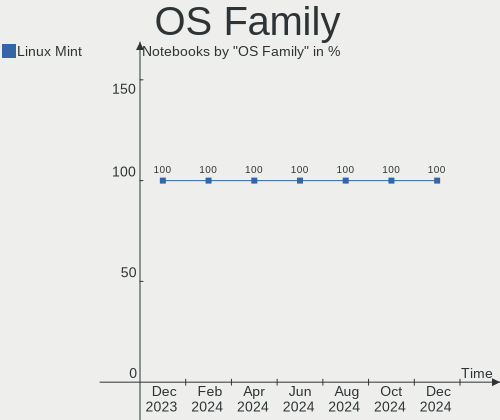
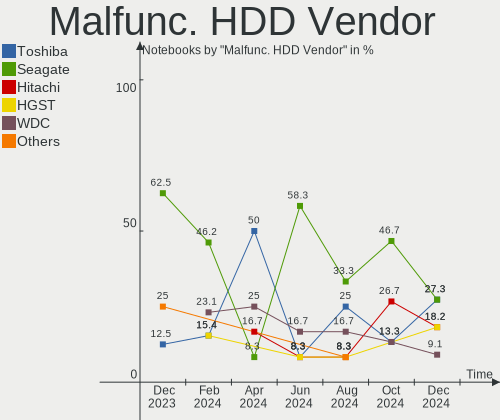
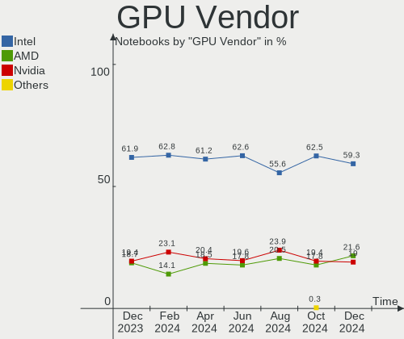
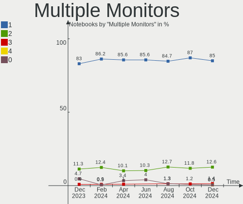
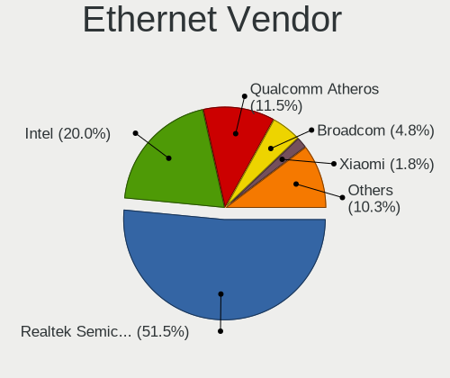
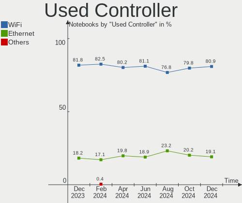
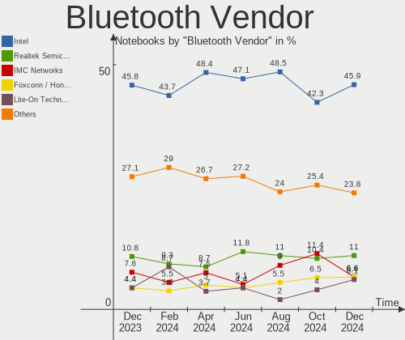
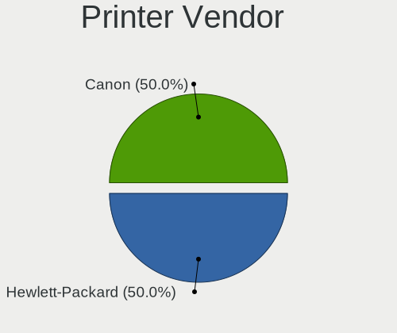

Linux Mint Hardware Trends (Notebooks)
--------------------------------------

A project to identify most popular hardware characteristics and track their change
over time based on data collected by Linux Mint users at https://Linux-Hardware.org.

Anyone can contribute to this report by the [hw-probe](https://github.com/linuxhw/hw-probe) tool:

    sudo -E hw-probe -all -upload

Full-feature report is available here: https://linux-hardware.org/?view=trends

Period: Mar, 2022.

Contents
--------

* [ System ](#system)
  - [ OS                       ](#os)
  - [ OS Family                ](#os-family)
  - [ Kernel                   ](#kernel)
  - [ Kernel Family            ](#kernel-family)
  - [ Kernel Major Ver.        ](#kernel-major-ver)
  - [ Arch                     ](#arch)
  - [ DE                       ](#de)
  - [ Display Server           ](#display-server)
  - [ Display Manager          ](#display-manager)
  - [ OS Lang                  ](#os-lang)
  - [ Boot Mode                ](#boot-mode)
  - [ Filesystem               ](#filesystem)
  - [ Part. scheme             ](#part-scheme)
  - [ Dual Boot with Linux/BSD ](#dual-boot-with-linuxbsd)
  - [ Dual Boot (Win)          ](#dual-boot-win)

* [ Board ](#board)
  - [ Vendor                   ](#vendor)
  - [ Model                    ](#model)
  - [ Model Family             ](#model-family)
  - [ MFG Year                 ](#mfg-year)
  - [ Form Factor              ](#form-factor)
  - [ Secure Boot              ](#secure-boot)
  - [ Coreboot                 ](#coreboot)
  - [ RAM Size                 ](#ram-size)
  - [ RAM Used                 ](#ram-used)
  - [ Total Drives             ](#total-drives)
  - [ Has CD-ROM               ](#has-cd-rom)
  - [ Has Ethernet             ](#has-ethernet)
  - [ Has WiFi                 ](#has-wifi)
  - [ Has Bluetooth            ](#has-bluetooth)

* [ Location ](#location)
  - [ Country                  ](#country)
  - [ City                     ](#city)

* [ Drives ](#drives)
  - [ Drive Vendor             ](#drive-vendor)
  - [ Drive Model              ](#drive-model)
  - [ HDD Vendor               ](#hdd-vendor)
  - [ SSD Vendor               ](#ssd-vendor)
  - [ Drive Kind               ](#drive-kind)
  - [ Drive Connector          ](#drive-connector)
  - [ Drive Size               ](#drive-size)
  - [ Space Total              ](#space-total)
  - [ Space Used               ](#space-used)
  - [ Malfunc. Drives          ](#malfunc-drives)
  - [ Malfunc. Drive Vendor    ](#malfunc-drive-vendor)
  - [ Malfunc. HDD Vendor      ](#malfunc-hdd-vendor)
  - [ Malfunc. Drive Kind      ](#malfunc-drive-kind)
  - [ Failed Drives            ](#failed-drives)
  - [ Failed Drive Vendor      ](#failed-drive-vendor)
  - [ Drive Status             ](#drive-status)

* [ Storage controller ](#storage-controller)
  - [ Storage Vendor           ](#storage-vendor)
  - [ Storage Model            ](#storage-model)
  - [ Storage Kind             ](#storage-kind)

* [ Processor ](#processor)
  - [ CPU Vendor               ](#cpu-vendor)
  - [ CPU Model                ](#cpu-model)
  - [ CPU Model Family         ](#cpu-model-family)
  - [ CPU Cores                ](#cpu-cores)
  - [ CPU Sockets              ](#cpu-sockets)
  - [ CPU Threads              ](#cpu-threads)
  - [ CPU Op-Modes             ](#cpu-op-modes)
  - [ CPU Microcode            ](#cpu-microcode)
  - [ CPU Microarch            ](#cpu-microarch)

* [ Graphics ](#graphics)
  - [ GPU Vendor               ](#gpu-vendor)
  - [ GPU Model                ](#gpu-model)
  - [ GPU Combo                ](#gpu-combo)
  - [ GPU Driver               ](#gpu-driver)
  - [ GPU Memory               ](#gpu-memory)

* [ Monitor ](#monitor)
  - [ Monitor Vendor           ](#monitor-vendor)
  - [ Monitor Model            ](#monitor-model)
  - [ Monitor Resolution       ](#monitor-resolution)
  - [ Monitor Diagonal         ](#monitor-diagonal)
  - [ Monitor Width            ](#monitor-width)
  - [ Aspect Ratio             ](#aspect-ratio)
  - [ Monitor Area             ](#monitor-area)
  - [ Pixel Density            ](#pixel-density)
  - [ Multiple Monitors        ](#multiple-monitors)

* [ Network ](#network)
  - [ Net Controller Vendor    ](#net-controller-vendor)
  - [ Net Controller Model     ](#net-controller-model)
  - [ Wireless Vendor          ](#wireless-vendor)
  - [ Wireless Model           ](#wireless-model)
  - [ Ethernet Vendor          ](#ethernet-vendor)
  - [ Ethernet Model           ](#ethernet-model)
  - [ Net Controller Kind      ](#net-controller-kind)
  - [ Used Controller          ](#used-controller)
  - [ NICs                     ](#nics)
  - [ IPv6                     ](#ipv6)

* [ Bluetooth ](#bluetooth)
  - [ Bluetooth Vendor         ](#bluetooth-vendor)
  - [ Bluetooth Model          ](#bluetooth-model)

* [ Sound ](#sound)
  - [ Sound Vendor             ](#sound-vendor)
  - [ Sound Model              ](#sound-model)

* [ Memory ](#memory)
  - [ Memory Vendor            ](#memory-vendor)
  - [ Memory Model             ](#memory-model)
  - [ Memory Kind              ](#memory-kind)
  - [ Memory Form Factor       ](#memory-form-factor)
  - [ Memory Size              ](#memory-size)
  - [ Memory Speed             ](#memory-speed)

* [ Printers & scanners ](#printers--scanners)
  - [ Printer Vendor           ](#printer-vendor)
  - [ Printer Model            ](#printer-model)
  - [ Scanner Vendor           ](#scanner-vendor)
  - [ Scanner Model            ](#scanner-model)

* [ Camera ](#camera)
  - [ Camera Vendor            ](#camera-vendor)
  - [ Camera Model             ](#camera-model)

* [ Security ](#security)
  - [ Fingerprint Vendor       ](#fingerprint-vendor)
  - [ Fingerprint Model        ](#fingerprint-model)
  - [ Chipcard Vendor          ](#chipcard-vendor)
  - [ Chipcard Model           ](#chipcard-model)

* [ Unsupported ](#unsupported)
  - [ Unsupported Devices      ](#unsupported-devices)
  - [ Unsupported Device Types ](#unsupported-device-types)

System
------

OS
--

Installed operating systems

| Name            | Notebooks | Percent |
|-----------------|-----------|---------|
| Linux Mint 20.3 | 211       | 79.92%  |
| Linux Mint 20.2 | 25        | 9.47%   |
| Linux Mint 19.3 | 11        | 4.17%   |
| Linux Mint 20.1 | 7         | 2.65%   |
| Linux Mint 20   | 4         | 1.52%   |
| Linux Mint 19.2 | 3         | 1.14%   |
| Linux Mint 19   | 2         | 0.76%   |
| Linux Mint 19.1 | 1         | 0.38%   |

OS Family
---------

OS without a version

| Name       | Notebooks | Percent |
|------------|-----------|---------|
| Linux Mint | 264       | 100%    |

Kernel
------

Version of the Linux kernel

| Version                    | Notebooks | Percent |
|----------------------------|-----------|---------|
| 5.4.0-104-generic          | 72        | 27.27%  |
| 5.4.0-100-generic          | 63        | 23.86%  |
| 5.4.0-105-generic          | 44        | 16.67%  |
| 5.4.0-91-generic           | 12        | 4.55%   |
| 5.4.0-107-generic          | 12        | 4.55%   |
| 5.13.0-27-generic          | 11        | 4.17%   |
| 5.13.0-35-generic          | 7         | 2.65%   |
| 5.13.0-30-generic          | 6         | 2.27%   |
| 5.4.0-97-generic           | 4         | 1.52%   |
| 5.14.0-1029-oem            | 3         | 1.14%   |
| 5.14.0-1027-oem            | 2         | 0.76%   |
| 5.13.0-39-generic          | 2         | 0.76%   |
| 5.13.0-28-generic          | 2         | 0.76%   |
| 4.15.0-54-generic          | 2         | 0.76%   |
| 5.8.0-63-generic           | 1         | 0.38%   |
| 5.4.0-99-generic           | 1         | 0.38%   |
| 5.4.0-94-generic           | 1         | 0.38%   |
| 5.4.0-92-generic           | 1         | 0.38%   |
| 5.4.0-81-generic           | 1         | 0.38%   |
| 5.4.0-77-generic           | 1         | 0.38%   |
| 5.4.0-70-generic           | 1         | 0.38%   |
| 5.4.0-26-generic           | 1         | 0.38%   |
| 5.17.0-xanmod1             | 1         | 0.38%   |
| 5.17-051700-generic        | 1         | 0.38%   |
| 5.16.12-051612-generic     | 1         | 0.38%   |
| 5.16.0-17.1-liquorix-amd64 | 1         | 0.38%   |
| 5.15.25-xanmod1            | 1         | 0.38%   |
| 5.14.0-1024-oem            | 1         | 0.38%   |
| 5.13.0-37-generic          | 1         | 0.38%   |
| 5.13.0-1009-intel          | 1         | 0.38%   |
| 5.13.0-1008-intel          | 1         | 0.38%   |
| 5.10.0-1052-oem            | 1         | 0.38%   |
| 4.15.0-20-generic          | 1         | 0.38%   |
| 4.15.0-175-generic         | 1         | 0.38%   |
| 4.15.0-171-generic         | 1         | 0.38%   |
| 4.15.0-106-generic         | 1         | 0.38%   |

Kernel Family
-------------

Linux kernel without a distro release

| Version | Notebooks | Percent |
|---------|-----------|---------|
| 5.4.0   | 214       | 81.06%  |
| 5.13.0  | 31        | 11.74%  |
| 5.14.0  | 6         | 2.27%   |
| 4.15.0  | 6         | 2.27%   |
| 5.8.0   | 1         | 0.38%   |
| 5.17.0  | 1         | 0.38%   |
| 5.17    | 1         | 0.38%   |
| 5.16.12 | 1         | 0.38%   |
| 5.16.0  | 1         | 0.38%   |
| 5.15.25 | 1         | 0.38%   |
| 5.10.0  | 1         | 0.38%   |

Kernel Major Ver.
-----------------

Linux kernel major version

| Version | Notebooks | Percent |
|---------|-----------|---------|
| 5.4     | 214       | 81.06%  |
| 5.13    | 31        | 11.74%  |
| 5.14    | 6         | 2.27%   |
| 4.15    | 6         | 2.27%   |
| 5.16    | 2         | 0.76%   |
| 5.8     | 1         | 0.38%   |
| 5.17    | 1         | 0.38%   |
| 5.15    | 1         | 0.38%   |
| 5.10    | 1         | 0.38%   |
| 5       | 1         | 0.38%   |

Arch
----

OS architecture (x86_64, i586, etc.)

| Name   | Notebooks | Percent |
|--------|-----------|---------|
| x86_64 | 257       | 97.35%  |
| i686   | 7         | 2.65%   |

DE
--

Desktop Environment

| Name       | Notebooks | Percent |
|------------|-----------|---------|
| X-Cinnamon | 177       | 67.05%  |
| MATE       | 42        | 15.91%  |
| XFCE       | 27        | 10.23%  |
| Cinnamon   | 15        | 5.68%   |
| GNOME      | 2         | 0.76%   |
| KDE        | 1         | 0.38%   |

Display Server
--------------

X11 or Wayland

| Name | Notebooks | Percent |
|------|-----------|---------|
| X11  | 263       | 99.62%  |
| Tty  | 1         | 0.38%   |

Display Manager
---------------

SDDM, LightDM, etc.

| Name    | Notebooks | Percent |
|---------|-----------|---------|
| Unknown | 160       | 60.61%  |
| LightDM | 102       | 38.64%  |
| SDDM    | 1         | 0.38%   |
| MDM     | 1         | 0.38%   |

OS Lang
-------

Language

| Lang  | Notebooks | Percent |
|-------|-----------|---------|
| en_US | 80        | 30.3%   |
| de_DE | 46        | 17.42%  |
| fr_FR | 17        | 6.44%   |
| pt_BR | 15        | 5.68%   |
| en_GB | 14        | 5.3%    |
| it_IT | 11        | 4.17%   |
| ru_RU | 9         | 3.41%   |
| pl_PL | 7         | 2.65%   |
| nl_NL | 6         | 2.27%   |
| es_ES | 5         | 1.89%   |
| en_IN | 5         | 1.89%   |
| en_AU | 5         | 1.89%   |
| C     | 5         | 1.89%   |
| en_CA | 4         | 1.52%   |
| fr_CA | 3         | 1.14%   |
| es_EC | 3         | 1.14%   |
| es_AR | 3         | 1.14%   |
| en_ZA | 3         | 1.14%   |
| pt_PT | 2         | 0.76%   |
| hu_HU | 2         | 0.76%   |
| de_AT | 2         | 0.76%   |
| cs_CZ | 2         | 0.76%   |
| tr_TR | 1         | 0.38%   |
| sv_SE | 1         | 0.38%   |
| sk_SK | 1         | 0.38%   |
| nl_BE | 1         | 0.38%   |
| fr_BE | 1         | 0.38%   |
| eu_ES | 1         | 0.38%   |
| es_NI | 1         | 0.38%   |
| es_MX | 1         | 0.38%   |
| es_CO | 1         | 0.38%   |
| en_PH | 1         | 0.38%   |
| en_NZ | 1         | 0.38%   |
| el_GR | 1         | 0.38%   |
| de_CH | 1         | 0.38%   |
| da_DK | 1         | 0.38%   |
| bg_BG | 1         | 0.38%   |

Boot Mode
---------

EFI or BIOS

| Mode | Notebooks | Percent |
|------|-----------|---------|
| EFI  | 144       | 54.55%  |
| BIOS | 120       | 45.45%  |

Filesystem
----------

Type of filesystem

| Type    | Notebooks | Percent |
|---------|-----------|---------|
| Ext4    | 258       | 97.73%  |
| Overlay | 3         | 1.14%   |
| Btrfs   | 2         | 0.76%   |
| Ext2    | 1         | 0.38%   |

Part. scheme
------------

Scheme of partitioning

| Type    | Notebooks | Percent |
|---------|-----------|---------|
| Unknown | 170       | 64.39%  |
| GPT     | 67        | 25.38%  |
| MBR     | 27        | 10.23%  |

Dual Boot with Linux/BSD
------------------------

Hosting more than one Linux/BSD

| Dual boot | Notebooks | Percent |
|-----------|-----------|---------|
| No        | 247       | 93.56%  |
| Yes       | 17        | 6.44%   |

Dual Boot (Win)
---------------

Hosting Linux and Windows

| Dual boot | Notebooks | Percent |
|-----------|-----------|---------|
| No        | 232       | 87.88%  |
| Yes       | 32        | 12.12%  |

Board
-----

Vendor
------

Motherboard manufacturer

| Name                        | Notebooks | Percent |
|-----------------------------|-----------|---------|
| Hewlett-Packard             | 67        | 25.38%  |
| Lenovo                      | 46        | 17.42%  |
| Dell                        | 29        | 10.98%  |
| Acer                        | 27        | 10.23%  |
| ASUSTek Computer            | 21        | 7.95%   |
| Toshiba                     | 10        | 3.79%   |
| Samsung Electronics         | 8         | 3.03%   |
| Sony                        | 6         | 2.27%   |
| Positivo                    | 5         | 1.89%   |
| Apple                       | 5         | 1.89%   |
| MSI                         | 4         | 1.52%   |
| Fujitsu Siemens             | 4         | 1.52%   |
| Fujitsu                     | 3         | 1.14%   |
| Unknown                     | 3         | 1.14%   |
| Chuwi                       | 2         | 0.76%   |
| Thomson                     | 1         | 0.38%   |
| Teclast                     | 1         | 0.38%   |
| SHENZHEN YOUDISI E-COMMERCE | 1         | 0.38%   |
| Schenker                    | 1         | 0.38%   |
| Quanta                      | 1         | 0.38%   |
| Positivo Bahia - VAIO       | 1         | 0.38%   |
| Packard Bell                | 1         | 0.38%   |
| Notebook                    | 1         | 0.38%   |
| Multilaser                  | 1         | 0.38%   |
| Microtech                   | 1         | 0.38%   |
| Micromax                    | 1         | 0.38%   |
| MicroByte                   | 1         | 0.38%   |
| MAXDATA                     | 1         | 0.38%   |
| LincPlus                    | 1         | 0.38%   |
| LG Electronics              | 1         | 0.38%   |
| Itautec                     | 1         | 0.38%   |
| GPU Company                 | 1         | 0.38%   |
| Google                      | 1         | 0.38%   |
| Gigabyte Technology         | 1         | 0.38%   |
| Exo                         | 1         | 0.38%   |
| eMachines                   | 1         | 0.38%   |
| DIODE                       | 1         | 0.38%   |
| Clevo                       | 1         | 0.38%   |
| Alienware                   | 1         | 0.38%   |

Model
-----

Motherboard model

| Name                                                                                     | Notebooks | Percent |
|------------------------------------------------------------------------------------------|-----------|---------|
| Unknown                                                                                  | 5         | 1.89%   |
| Lenovo IdeaPad 3 15ALC6 82KU                                                             | 2         | 0.76%   |
| Lenovo G510 20238                                                                        | 2         | 0.76%   |
| Lenovo G500 20236                                                                        | 2         | 0.76%   |
| Lenovo G50-70 20351                                                                      | 2         | 0.76%   |
| HP Pavilion g6                                                                           | 2         | 0.76%   |
| HP Pavilion dv7                                                                          | 2         | 0.76%   |
| HP Notebook                                                                              | 2         | 0.76%   |
| HP Laptop 17-cn0xxx                                                                      | 2         | 0.76%   |
| HP EliteBook 2560p                                                                       | 2         | 0.76%   |
| HP 15                                                                                    | 2         | 0.76%   |
| Dell Latitude E5420                                                                      | 2         | 0.76%   |
| ASUS P50IJ                                                                               | 2         | 0.76%   |
| Toshiba TECRA Z50-A                                                                      | 1         | 0.38%   |
| Toshiba Satellite P755                                                                   | 1         | 0.38%   |
| Toshiba Satellite L350D                                                                  | 1         | 0.38%   |
| Toshiba Satellite C75D-A                                                                 | 1         | 0.38%   |
| Toshiba Satellite C75-A                                                                  | 1         | 0.38%   |
| Toshiba Satellite C70-C-1G2                                                              | 1         | 0.38%   |
| Toshiba Satellite C655                                                                   | 1         | 0.38%   |
| Toshiba Satellite C50-A                                                                  | 1         | 0.38%   |
| Toshiba Satellite A215                                                                   | 1         | 0.38%   |
| Toshiba Satellite A105                                                                   | 1         | 0.38%   |
| Thomson N17C8SR1T                                                                        | 1         | 0.38%   |
| Teclast F15Plus 2                                                                        | 1         | 0.38%   |
| Sony VPCSB35FG                                                                           | 1         | 0.38%   |
| Sony VPCEB1S1E                                                                           | 1         | 0.38%   |
| Sony VGN-NR11Z_S                                                                         | 1         | 0.38%   |
| Sony VGN-FW21E                                                                           | 1         | 0.38%   |
| Sony SVE15111EBS                                                                         | 1         | 0.38%   |
| Sony SVE14A25CLB                                                                         | 1         | 0.38%   |
| SHENZHEN YOUDISI E-COMMERCE A8S PRO                                                      | 1         | 0.38%   |
| Schenker XMG NEO (M19, RTX 2060)                                                         | 1         | 0.38%   |
| Samsung RV420/RV520/RV720/E3530/S3530/E3420/E3520                                        | 1         | 0.38%   |
| Samsung R59P/R60P/R61P                                                                   | 1         | 0.38%   |
| Samsung N150/N210/N220                                                                   | 1         | 0.38%   |
| Samsung 550XDA                                                                           | 1         | 0.38%   |
| Samsung 370E4K                                                                           | 1         | 0.38%   |
| Samsung 350V5C/351V5C/3540VC/3440VC                                                      | 1         | 0.38%   |
| Samsung 350V5C/350V5X/350V4C/350V4X/351V5C/351V5X/351V4C/351V4X/3540VC/3540VX/3440VC/344 | 1         | 0.38%   |
| Samsung 300E4Z/300E5Z/300E7Z                                                             | 1         | 0.38%   |
| Quanta TW8/SW8/DW8                                                                       | 1         | 0.38%   |
| Positivo VJF155F11UAR                                                                    | 1         | 0.38%   |
| Positivo S14SL01                                                                         | 1         | 0.38%   |
| Positivo S14CT01                                                                         | 1         | 0.38%   |
| Positivo H14BT58                                                                         | 1         | 0.38%   |
| Positivo C14RV01                                                                         | 1         | 0.38%   |
| Positivo Bahia - VAIO VJC141F11X-B0111L                                                  | 1         | 0.38%   |
| Packard Bell EasyNote TS13SB                                                             | 1         | 0.38%   |
| Notebook NL5xRU                                                                          | 1         | 0.38%   |
| Multilaser PC13X_DS                                                                      | 1         | 0.38%   |
| MSI VR630                                                                                | 1         | 0.38%   |
| MSI Stealth GS77 12UGS                                                                   | 1         | 0.38%   |
| MSI GT80 2QE                                                                             | 1         | 0.38%   |
| MSI Alpha15 A3DD                                                                         | 1         | 0.38%   |
| Microtech ebookPro                                                                       | 1         | 0.38%   |
| Micromax Canvas Laptab LT777                                                             | 1         | 0.38%   |
| MicroByte ezbook                                                                         | 1         | 0.38%   |
| MAXDATA ECO4510IW                                                                        | 1         | 0.38%   |
| LincPlus LINNCPLUS P1                                                                    | 1         | 0.38%   |

Model Family
------------

Motherboard model prefix

| Name                                    | Notebooks | Percent |
|-----------------------------------------|-----------|---------|
| Lenovo ThinkPad                         | 24        | 9.09%   |
| Acer Aspire                             | 19        | 7.2%    |
| HP Pavilion                             | 15        | 5.68%   |
| HP Laptop                               | 13        | 4.92%   |
| Lenovo IdeaPad                          | 11        | 4.17%   |
| HP ProBook                              | 10        | 3.79%   |
| Dell Latitude                           | 10        | 3.79%   |
| Toshiba Satellite                       | 9         | 3.41%   |
| Dell Inspiron                           | 8         | 3.03%   |
| HP EliteBook                            | 7         | 2.65%   |
| Unknown                                 | 5         | 1.89%   |
| Dell XPS                                | 4         | 1.52%   |
| Dell Vostro                             | 4         | 1.52%   |
| HP ENVY                                 | 3         | 1.14%   |
| Fujitsu Siemens ESPRIMO                 | 3         | 1.14%   |
| ASUS VivoBook                           | 3         | 1.14%   |
| Acer TravelMate                         | 3         | 1.14%   |
| Samsung 350V5C                          | 2         | 0.76%   |
| Lenovo G510                             | 2         | 0.76%   |
| Lenovo G500                             | 2         | 0.76%   |
| Lenovo G50-70                           | 2         | 0.76%   |
| HP Notebook                             | 2         | 0.76%   |
| HP 255                                  | 2         | 0.76%   |
| HP 15                                   | 2         | 0.76%   |
| Fujitsu LIFEBOOK                        | 2         | 0.76%   |
| ASUS P50IJ                              | 2         | 0.76%   |
| Acer Swift                              | 2         | 0.76%   |
| Acer Nitro                              | 2         | 0.76%   |
| Toshiba TECRA                           | 1         | 0.38%   |
| Thomson N17C8SR1T                       | 1         | 0.38%   |
| Teclast F15Plus                         | 1         | 0.38%   |
| Sony VPCSB35FG                          | 1         | 0.38%   |
| Sony VPCEB1S1E                          | 1         | 0.38%   |
| Sony VGN-NR11Z                          | 1         | 0.38%   |
| Sony VGN-FW21E                          | 1         | 0.38%   |
| Sony SVE15111EBS                        | 1         | 0.38%   |
| Sony SVE14A25CLB                        | 1         | 0.38%   |
| SHENZHEN YOUDISI E-COMMERCE A8S         | 1         | 0.38%   |
| Schenker XMG                            | 1         | 0.38%   |
| Samsung RV420                           | 1         | 0.38%   |
| Samsung R59P                            | 1         | 0.38%   |
| Samsung N150                            | 1         | 0.38%   |
| Samsung 550XDA                          | 1         | 0.38%   |
| Samsung 370E4K                          | 1         | 0.38%   |
| Samsung 300E4Z                          | 1         | 0.38%   |
| Quanta TW8                              | 1         | 0.38%   |
| Positivo VJF155F11UAR                   | 1         | 0.38%   |
| Positivo S14SL01                        | 1         | 0.38%   |
| Positivo S14CT01                        | 1         | 0.38%   |
| Positivo H14BT58                        | 1         | 0.38%   |
| Positivo C14RV01                        | 1         | 0.38%   |
| Positivo Bahia - VAIO VJC141F11X-B0111L | 1         | 0.38%   |
| Packard Bell EasyNote                   | 1         | 0.38%   |
| Notebook NL5xRU                         | 1         | 0.38%   |
| Multilaser PC13X                        | 1         | 0.38%   |
| MSI VR630                               | 1         | 0.38%   |
| MSI Stealth                             | 1         | 0.38%   |
| MSI GT80                                | 1         | 0.38%   |
| MSI Alpha15                             | 1         | 0.38%   |
| Microtech ebookPro                      | 1         | 0.38%   |

MFG Year
--------

Motherboard manufacture year

| Year    | Notebooks | Percent |
|---------|-----------|---------|
| 2021    | 36        | 13.64%  |
| 2011    | 28        | 10.61%  |
| 2020    | 22        | 8.33%   |
| 2012    | 22        | 8.33%   |
| 2013    | 21        | 7.95%   |
| 2019    | 18        | 6.82%   |
| 2017    | 18        | 6.82%   |
| 2016    | 15        | 5.68%   |
| 2015    | 15        | 5.68%   |
| 2009    | 13        | 4.92%   |
| 2010    | 12        | 4.55%   |
| 2008    | 11        | 4.17%   |
| 2014    | 10        | 3.79%   |
| 2007    | 10        | 3.79%   |
| 2018    | 6         | 2.27%   |
| 2006    | 3         | 1.14%   |
| 2005    | 2         | 0.76%   |
| 2022    | 1         | 0.38%   |
| Unknown | 1         | 0.38%   |

Form Factor
-----------

Physical design of the computer

| Name     | Notebooks | Percent |
|----------|-----------|---------|
| Notebook | 264       | 100%    |

Secure Boot
-----------

Enabled or disabled

| State    | Notebooks | Percent |
|----------|-----------|---------|
| Disabled | 230       | 87.12%  |
| Enabled  | 34        | 12.88%  |

Coreboot
--------

Have coreboot on board

| Used | Notebooks | Percent |
|------|-----------|---------|
| No   | 263       | 99.62%  |
| Yes  | 1         | 0.38%   |

RAM Size
--------

Total RAM memory

| Size in GB  | Notebooks | Percent |
|-------------|-----------|---------|
| 4.01-8.0    | 77        | 29.17%  |
| 3.01-4.0    | 72        | 27.27%  |
| 8.01-16.0   | 55        | 20.83%  |
| 16.01-24.0  | 23        | 8.71%   |
| 1.01-2.0    | 14        | 5.3%    |
| 2.01-3.0    | 10        | 3.79%   |
| 32.01-64.0  | 7         | 2.65%   |
| 0.51-1.0    | 4         | 1.52%   |
| 24.01-32.0  | 1         | 0.38%   |
| 64.01-256.0 | 1         | 0.38%   |

RAM Used
--------

Used RAM memory

| Used GB   | Notebooks | Percent |
|-----------|-----------|---------|
| 1.01-2.0  | 107       | 40.53%  |
| 2.01-3.0  | 74        | 28.03%  |
| 0.51-1.0  | 30        | 11.36%  |
| 3.01-4.0  | 27        | 10.23%  |
| 4.01-8.0  | 20        | 7.58%   |
| 8.01-16.0 | 4         | 1.52%   |
| 0.01-0.5  | 2         | 0.76%   |

Total Drives
------------

Number of drives on board

| Drives | Notebooks | Percent |
|--------|-----------|---------|
| 1      | 197       | 74.62%  |
| 2      | 54        | 20.45%  |
| 3      | 10        | 3.79%   |
| 5      | 1         | 0.38%   |
| 4      | 1         | 0.38%   |
| 0      | 1         | 0.38%   |

Has CD-ROM
----------

Has CD-ROM on board

| Presented | Notebooks | Percent |
|-----------|-----------|---------|
| No        | 149       | 56.44%  |
| Yes       | 115       | 43.56%  |

Has Ethernet
------------

Has Ethernet on board

| Presented | Notebooks | Percent |
|-----------|-----------|---------|
| Yes       | 221       | 83.71%  |
| No        | 43        | 16.29%  |

Has WiFi
--------

Has WiFi module

| Presented | Notebooks | Percent |
|-----------|-----------|---------|
| Yes       | 262       | 99.24%  |
| No        | 2         | 0.76%   |

Has Bluetooth
-------------

Has Bluetooth module

| Presented | Notebooks | Percent |
|-----------|-----------|---------|
| Yes       | 189       | 71.59%  |
| No        | 75        | 28.41%  |

Location
--------

Country
-------

Geographic location (country)

| Country            | Notebooks | Percent |
|--------------------|-----------|---------|
| Germany            | 48        | 18.18%  |
| USA                | 42        | 15.91%  |
| France             | 20        | 7.58%   |
| Brazil             | 17        | 6.44%   |
| UK                 | 13        | 4.92%   |
| Italy              | 13        | 4.92%   |
| Russia             | 11        | 4.17%   |
| Poland             | 9         | 3.41%   |
| Netherlands        | 9         | 3.41%   |
| Spain              | 7         | 2.65%   |
| Canada             | 7         | 2.65%   |
| India              | 5         | 1.89%   |
| Australia          | 5         | 1.89%   |
| Portugal           | 4         | 1.52%   |
| Hungary            | 4         | 1.52%   |
| Argentina          | 4         | 1.52%   |
| South Africa       | 3         | 1.14%   |
| Norway             | 3         | 1.14%   |
| Ecuador            | 3         | 1.14%   |
| Czechia            | 3         | 1.14%   |
| Colombia           | 3         | 1.14%   |
| Belgium            | 3         | 1.14%   |
| Switzerland        | 2         | 0.76%   |
| Slovakia           | 2         | 0.76%   |
| Serbia             | 2         | 0.76%   |
| Romania            | 2         | 0.76%   |
| Bulgaria           | 2         | 0.76%   |
| Belarus            | 2         | 0.76%   |
| Austria            | 2         | 0.76%   |
| Turkey             | 1         | 0.38%   |
| Thailand           | 1         | 0.38%   |
| Sweden             | 1         | 0.38%   |
| Philippines        | 1         | 0.38%   |
| Paraguay           | 1         | 0.38%   |
| Nicaragua          | 1         | 0.38%   |
| New Zealand        | 1         | 0.38%   |
| Iran               | 1         | 0.38%   |
| Indonesia          | 1         | 0.38%   |
| Greece             | 1         | 0.38%   |
| Egypt              | 1         | 0.38%   |
| Dominican Republic | 1         | 0.38%   |
| Denmark            | 1         | 0.38%   |
| Croatia            | 1         | 0.38%   |

City
----

Geographic location (city)

| City                   | Notebooks | Percent |
|------------------------|-----------|---------|
| Leimuiden              | 5         | 1.89%   |
| St Petersburg          | 4         | 1.52%   |
| Paris                  | 4         | 1.52%   |
| Oslo                   | 3         | 1.14%   |
| Moscow                 | 3         | 1.14%   |
| Milan                  | 3         | 1.14%   |
| Berlin                 | 3         | 1.14%   |
| Warsaw                 | 2         | 0.76%   |
| Villingen-Schwenningen | 2         | 0.76%   |
| Toronto                | 2         | 0.76%   |
| Stuttgart              | 2         | 0.76%   |
| Sao Jose               | 2         | 0.76%   |
| Saarbrücken           | 2         | 0.76%   |
| Rockville              | 2         | 0.76%   |
| Porto Alegre           | 2         | 0.76%   |
| Minsk                  | 2         | 0.76%   |
| Guayaquil              | 2         | 0.76%   |
| Goiânia               | 2         | 0.76%   |
| Fairmont               | 2         | 0.76%   |
| Centreville            | 2         | 0.76%   |
| Cambridge              | 2         | 0.76%   |
| Buenos Aires           | 2         | 0.76%   |
| Bratislava             | 2         | 0.76%   |
| Bogotá                | 2         | 0.76%   |
| Zurich                 | 1         | 0.38%   |
| Zirndorf               | 1         | 0.38%   |
| Würzburg              | 1         | 0.38%   |
| Wuppertal              | 1         | 0.38%   |
| Wismar                 | 1         | 0.38%   |
| Wilkau-Hasslau         | 1         | 0.38%   |
| Wasselonne             | 1         | 0.38%   |
| Washougal              | 1         | 0.38%   |
| Washington             | 1         | 0.38%   |
| Warwick                | 1         | 0.38%   |
| Warstein               | 1         | 0.38%   |
| Walsall                | 1         | 0.38%   |
| Waldalgesheim          | 1         | 0.38%   |
| Vilvoorde              | 1         | 0.38%   |
| Villiersdorp           | 1         | 0.38%   |
| Villanova Mondovì     | 1         | 0.38%   |
| Villa Elisa            | 1         | 0.38%   |
| Vannes                 | 1         | 0.38%   |
| Trojanowice            | 1         | 0.38%   |
| Torres Vedras          | 1         | 0.38%   |
| Torres                 | 1         | 0.38%   |
| Teuchern               | 1         | 0.38%   |
| Teresina               | 1         | 0.38%   |
| Telgate                | 1         | 0.38%   |
| Tehran                 | 1         | 0.38%   |
| Tarragona              | 1         | 0.38%   |
| Tarbes                 | 1         | 0.38%   |
| Sydney                 | 1         | 0.38%   |
| Swansea                | 1         | 0.38%   |
| Svetla nad Sazavou     | 1         | 0.38%   |
| Surabaya               | 1         | 0.38%   |
| Superior               | 1         | 0.38%   |
| Stockholm              | 1         | 0.38%   |
| Steinmauern            | 1         | 0.38%   |
| Springfield            | 1         | 0.38%   |
| South Burlington       | 1         | 0.38%   |

Drives
------

Drive Vendor
------------

Hard drive vendors

| Vendor              | Notebooks | Drives | Percent |
|---------------------|-----------|--------|---------|
| Seagate             | 43        | 45     | 13.19%  |
| Toshiba             | 37        | 39     | 11.35%  |
| WDC                 | 36        | 37     | 11.04%  |
| Samsung Electronics | 34        | 36     | 10.43%  |
| SanDisk             | 25        | 26     | 7.67%   |
| Unknown             | 18        | 23     | 5.52%   |
| Hitachi             | 18        | 18     | 5.52%   |
| Kingston            | 12        | 13     | 3.68%   |
| Crucial             | 11        | 13     | 3.37%   |
| Intel               | 9         | 9      | 2.76%   |
| SK Hynix            | 8         | 8      | 2.45%   |
| Micron Technology   | 7         | 7      | 2.15%   |
| Unknown             | 6         | 6      | 1.84%   |
| HGST                | 5         | 5      | 1.53%   |
| China               | 4         | 4      | 1.23%   |
| A-DATA Technology   | 4         | 4      | 1.23%   |
| Patriot             | 3         | 3      | 0.92%   |
| LITEONIT            | 3         | 3      | 0.92%   |
| SPCC                | 2         | 2      | 0.61%   |
| Phison              | 2         | 2      | 0.61%   |
| Lexar               | 2         | 2      | 0.61%   |
| KIOXIA              | 2         | 2      | 0.61%   |
| Intenso             | 2         | 2      | 0.61%   |
| GOODRAM             | 2         | 2      | 0.61%   |
| Fujitsu             | 2         | 2      | 0.61%   |
| Apple               | 2         | 5      | 0.61%   |
| Zheino              | 1         | 1      | 0.31%   |
| XrayDisk            | 1         | 1      | 0.31%   |
| USB3.0              | 1         | 1      | 0.31%   |
| Transcend           | 1         | 1      | 0.31%   |
| Teclast             | 1         | 1      | 0.31%   |
| TEAM T25            | 1         | 1      | 0.31%   |
| Super Talent        | 1         | 1      | 0.31%   |
| SSSTC               | 1         | 1      | 0.31%   |
| SMART               | 1         | 1      | 0.31%   |
| sage                | 1         | 1      | 0.31%   |
| SABRENT             | 1         | 1      | 0.31%   |
| OWC                 | 1         | 1      | 0.31%   |
| Netac               | 1         | 1      | 0.31%   |
| Microtech           | 1         | 1      | 0.31%   |
| LITEON              | 1         | 1      | 0.31%   |
| Lenovo              | 1         | 1      | 0.31%   |
| IBM/Hitachi         | 1         | 1      | 0.31%   |
| HGST HUS            | 1         | 1      | 0.31%   |
| Hewlett-Packard     | 1         | 1      | 0.31%   |
| Gigabyte Technology | 1         | 1      | 0.31%   |
| FORESEE             | 1         | 1      | 0.31%   |
| External            | 1         | 1      | 0.31%   |
| Dell                | 1         | 1      | 0.31%   |
| Corsair             | 1         | 1      | 0.31%   |
| BHT                 | 1         | 1      | 0.31%   |
| Apacer              | 1         | 1      | 0.31%   |
| ADATA Technology    | 1         | 1      | 0.31%   |

Drive Model
-----------

Hard drive models

| Model                                | Notebooks | Percent |
|--------------------------------------|-----------|---------|
| Unknown MMC Card  32GB               | 6         | 1.76%   |
| Seagate ST1000LM035-1RK172 1TB       | 6         | 1.76%   |
| Seagate ST1000LM024 HN-M101MBB 1TB   | 6         | 1.76%   |
| Unknown                              | 6         | 1.76%   |
| Toshiba MQ04ABF100 1TB               | 5         | 1.47%   |
| Toshiba MQ01ABD100 1TB               | 5         | 1.47%   |
| Sandisk NVMe SSD Drive 512GB         | 5         | 1.47%   |
| Unknown SD/MMC/MS PRO 32GB           | 4         | 1.17%   |
| Toshiba MQ01ABF050 500GB             | 4         | 1.17%   |
| Toshiba MK5059GSXP 500GB             | 4         | 1.17%   |
| Seagate ST500LT012-1DG142 500GB      | 4         | 1.17%   |
| Seagate Expansion 320GB              | 4         | 1.17%   |
| Hitachi HTS723232A7A364 320GB        | 4         | 1.17%   |
| Hitachi HTS542525K9SA00 250GB        | 4         | 1.17%   |
| Samsung SSD 850 EVO 500GB            | 3         | 0.88%   |
| Micron NVMe SSD Drive 512GB          | 3         | 0.88%   |
| Intel NVMe SSD Drive 512GB           | 3         | 0.88%   |
| WDC WDS500G2B0A-00SM50 500GB SSD     | 2         | 0.59%   |
| WDC WD5000BPVT-55HXZT3 500GB         | 2         | 0.59%   |
| WDC WD10SPZX-21Z10T0 1TB             | 2         | 0.59%   |
| Unknown MMC Card  64GB               | 2         | 0.59%   |
| Toshiba KBG30ZMS128G 128GB NVMe SSD  | 2         | 0.59%   |
| SK Hynix BC711 HFM512GD3JX013N 512GB | 2         | 0.59%   |
| Seagate ST9500325AS 500GB            | 2         | 0.59%   |
| Seagate ST500LM012 HN-M500MBB 500GB  | 2         | 0.59%   |
| SanDisk SSD PLUS 240GB               | 2         | 0.59%   |
| SanDisk SSD PLUS 120GB               | 2         | 0.59%   |
| Sandisk NVMe SSD Drive 256GB         | 2         | 0.59%   |
| Samsung SSD 840 EVO 500GB            | 2         | 0.59%   |
| Samsung SSD 840 EVO 250GB            | 2         | 0.59%   |
| Samsung NVMe SSD Drive 512GB         | 2         | 0.59%   |
| Samsung NVMe SSD Drive 2TB           | 2         | 0.59%   |
| Samsung NVMe SSD Drive 128GB         | 2         | 0.59%   |
| KIOXIA KBG40ZNS256G NVMe 256GB       | 2         | 0.59%   |
| Intel SSDPEKNW512G8H 512GB           | 2         | 0.59%   |
| Hitachi HTS545032B9A300 320GB        | 2         | 0.59%   |
| Crucial M4-CT128M4SSD2 128GB         | 2         | 0.59%   |
| Crucial CT240BX500SSD1 240GB         | 2         | 0.59%   |
| Crucial CT1000MX500SSD1 1TB          | 2         | 0.59%   |
| Zheino CHN-25SATAC3-120 120GB        | 1         | 0.29%   |
| XrayDisk 240GB                       | 1         | 0.29%   |
| WDC WDS480G2G0A-00JH30 480GB SSD     | 1         | 0.29%   |
| WDC WDS240G2G0A-00JH30 240GB SSD     | 1         | 0.29%   |
| WDC WDS100T2B0B-00YS70 1TB SSD       | 1         | 0.29%   |
| WDC WDS100T1X0E-00AFY0 1TB           | 1         | 0.29%   |
| WDC WD7500BPKX-00HPJT0 752GB         | 1         | 0.29%   |
| WDC WD5000LPZX-35Z10T0 500GB         | 1         | 0.29%   |
| WDC WD5000LPVX-80V0TT0 500GB         | 1         | 0.29%   |
| WDC WD5000LPVX-60V0TT0 500GB         | 1         | 0.29%   |
| WDC WD5000LPVX-22V0TT0 500GB         | 1         | 0.29%   |
| WDC WD5000LPVT-24G33T1 500GB         | 1         | 0.29%   |
| WDC WD5000LPLX-08ZNTT0 500GB         | 1         | 0.29%   |
| WDC WD5000LPCX-24VHAT0 500GB         | 1         | 0.29%   |
| WDC WD5000LPCX-24C6HT0 500GB         | 1         | 0.29%   |
| WDC WD3200BEVT-80A0RT0 320GB         | 1         | 0.29%   |
| WDC WD2500BEVT-22A23T0 250GB         | 1         | 0.29%   |
| WDC WD2500BEVS-22UST0 250GB          | 1         | 0.29%   |
| WDC WD1600BEVT-60ZCT1 160GB          | 1         | 0.29%   |
| WDC WD1600BEVT-22ZCT0 160GB          | 1         | 0.29%   |
| WDC WD1600BEVT-22A23T0 160GB         | 1         | 0.29%   |

HDD Vendor
----------

Hard disk drive vendors

| Vendor              | Notebooks | Drives | Percent |
|---------------------|-----------|--------|---------|
| Seagate             | 41        | 43     | 30.37%  |
| Toshiba             | 29        | 29     | 21.48%  |
| WDC                 | 26        | 27     | 19.26%  |
| Hitachi             | 18        | 18     | 13.33%  |
| Samsung Electronics | 5         | 5      | 3.7%    |
| HGST                | 5         | 5      | 3.7%    |
| Unknown             | 4         | 4      | 2.96%   |
| Fujitsu             | 2         | 2      | 1.48%   |
| sage                | 1         | 1      | 0.74%   |
| SABRENT             | 1         | 1      | 0.74%   |
| IBM/Hitachi         | 1         | 1      | 0.74%   |
| HGST HUS            | 1         | 1      | 0.74%   |
| Apple               | 1         | 1      | 0.74%   |

SSD Vendor
----------

Solid state drive vendors

| Vendor              | Notebooks | Drives | Percent |
|---------------------|-----------|--------|---------|
| Samsung Electronics | 17        | 18     | 16.04%  |
| SanDisk             | 13        | 13     | 12.26%  |
| Kingston            | 11        | 12     | 10.38%  |
| Crucial             | 11        | 13     | 10.38%  |
| WDC                 | 5         | 5      | 4.72%   |
| China               | 4         | 4      | 3.77%   |
| A-DATA Technology   | 4         | 4      | 3.77%   |
| Toshiba             | 3         | 3      | 2.83%   |
| LITEONIT            | 3         | 3      | 2.83%   |
| SPCC                | 2         | 2      | 1.89%   |
| Patriot             | 2         | 2      | 1.89%   |
| Micron Technology   | 2         | 2      | 1.89%   |
| Lexar               | 2         | 2      | 1.89%   |
| Intenso             | 2         | 2      | 1.89%   |
| GOODRAM             | 2         | 2      | 1.89%   |
| Unknown             | 2         | 2      | 1.89%   |
| Zheino              | 1         | 1      | 0.94%   |
| USB3.0              | 1         | 1      | 0.94%   |
| Transcend           | 1         | 1      | 0.94%   |
| Teclast             | 1         | 1      | 0.94%   |
| TEAM T25            | 1         | 1      | 0.94%   |
| Super Talent        | 1         | 1      | 0.94%   |
| SMART               | 1         | 1      | 0.94%   |
| SK Hynix            | 1         | 1      | 0.94%   |
| Seagate             | 1         | 1      | 0.94%   |
| OWC                 | 1         | 1      | 0.94%   |
| Netac               | 1         | 1      | 0.94%   |
| Microtech           | 1         | 1      | 0.94%   |
| LITEON              | 1         | 1      | 0.94%   |
| Intel               | 1         | 1      | 0.94%   |
| Hewlett-Packard     | 1         | 1      | 0.94%   |
| Gigabyte Technology | 1         | 1      | 0.94%   |
| FORESEE             | 1         | 1      | 0.94%   |
| Dell                | 1         | 1      | 0.94%   |
| Corsair             | 1         | 1      | 0.94%   |
| BHT                 | 1         | 1      | 0.94%   |
| Apacer              | 1         | 1      | 0.94%   |

Drive Kind
----------

HDD or SSD

| Kind    | Notebooks | Drives | Percent |
|---------|-----------|--------|---------|
| HDD     | 128       | 138    | 41.16%  |
| SSD     | 100       | 110    | 32.15%  |
| NVMe    | 61        | 70     | 19.61%  |
| MMC     | 20        | 25     | 6.43%   |
| Unknown | 2         | 2      | 0.64%   |

Drive Connector
---------------

SATA, SAS, NVMe, etc.

| Type | Notebooks | Drives | Percent |
|------|-----------|--------|---------|
| SATA | 204       | 234    | 68%     |
| NVMe | 61        | 69     | 20.33%  |
| MMC  | 20        | 25     | 6.67%   |
| SAS  | 15        | 17     | 5%      |

Drive Size
----------

Size of hard drive

| Size in TB | Notebooks | Drives | Percent |
|------------|-----------|--------|---------|
| 0.01-0.5   | 156       | 179    | 70.59%  |
| 0.51-1.0   | 56        | 60     | 25.34%  |
| 1.01-2.0   | 6         | 6      | 2.71%   |
| 3.01-4.0   | 3         | 3      | 1.36%   |

Space Total
-----------

Amount of disk space available on the file system

| Size in GB     | Notebooks | Percent |
|----------------|-----------|---------|
| 101-250        | 92        | 34.85%  |
| 251-500        | 75        | 28.41%  |
| 501-1000       | 41        | 15.53%  |
| 51-100         | 19        | 7.2%    |
| 1001-2000      | 11        | 4.17%   |
| 21-50          | 9         | 3.41%   |
| More than 3000 | 6         | 2.27%   |
| 2001-3000      | 6         | 2.27%   |
| 1-20           | 4         | 1.52%   |
| Unknown        | 1         | 0.38%   |

Space Used
----------

Amount of used disk space

| Used GB   | Notebooks | Percent |
|-----------|-----------|---------|
| 1-20      | 79        | 29.92%  |
| 21-50     | 62        | 23.48%  |
| 51-100    | 42        | 15.91%  |
| 251-500   | 31        | 11.74%  |
| 101-250   | 30        | 11.36%  |
| 1001-2000 | 7         | 2.65%   |
| 501-1000  | 7         | 2.65%   |
| 2001-3000 | 5         | 1.89%   |
| Unknown   | 1         | 0.38%   |

Malfunc. Drives
---------------

Drive models with a malfunction

| Model                                | Notebooks | Drives | Percent |
|--------------------------------------|-----------|--------|---------|
| WDC WD5000BPVT-55HXZT3 500GB         | 1         | 1      | 9.09%   |
| Toshiba MK3265GSX 320GB              | 1         | 1      | 9.09%   |
| Toshiba MK1234GSX 120GB              | 1         | 1      | 9.09%   |
| SK Hynix BC711 HFM512GD3JX013N 512GB | 1         | 1      | 9.09%   |
| Seagate ST9500325AS 500GB            | 1         | 1      | 9.09%   |
| Seagate ST500LT012-1DG142 500GB      | 1         | 1      | 9.09%   |
| Seagate ST1000LM024 HN-M101MBB 1TB   | 1         | 1      | 9.09%   |
| SanDisk SD6SN1M-256G-1006 256GB SSD  | 1         | 1      | 9.09%   |
| Lenovo LENSE30512GMSP34MEAT3TA 512GB | 1         | 1      | 9.09%   |
| Hitachi HTS541616J9SA00 160GB        | 1         | 1      | 9.09%   |
| HGST HTS545050A7E380 500GB           | 1         | 1      | 9.09%   |

Malfunc. Drive Vendor
---------------------

Vendors of faulty drives

| Vendor   | Notebooks | Drives | Percent |
|----------|-----------|--------|---------|
| Seagate  | 3         | 3      | 27.27%  |
| Toshiba  | 2         | 2      | 18.18%  |
| WDC      | 1         | 1      | 9.09%   |
| SK Hynix | 1         | 1      | 9.09%   |
| SanDisk  | 1         | 1      | 9.09%   |
| Lenovo   | 1         | 1      | 9.09%   |
| Hitachi  | 1         | 1      | 9.09%   |
| HGST     | 1         | 1      | 9.09%   |

Malfunc. HDD Vendor
-------------------

Vendors of faulty HDD drives

| Vendor  | Notebooks | Drives | Percent |
|---------|-----------|--------|---------|
| Seagate | 3         | 3      | 37.5%   |
| Toshiba | 2         | 2      | 25%     |
| WDC     | 1         | 1      | 12.5%   |
| Hitachi | 1         | 1      | 12.5%   |
| HGST    | 1         | 1      | 12.5%   |

Malfunc. Drive Kind
-------------------

Kinds of faulty drives

| Kind | Notebooks | Drives | Percent |
|------|-----------|--------|---------|
| HDD  | 8         | 8      | 72.73%  |
| NVMe | 2         | 2      | 18.18%  |
| SSD  | 1         | 1      | 9.09%   |

Failed Drives
-------------

Failed drive models

| Model                                          | Notebooks | Drives | Percent |
|------------------------------------------------|-----------|--------|---------|
| Micron Technology 1100_MTFDDAV256TBN 256GB SSD | 1         | 1      | 100%    |

Failed Drive Vendor
-------------------

Failed drive vendors

| Vendor            | Notebooks | Drives | Percent |
|-------------------|-----------|--------|---------|
| Micron Technology | 1         | 1      | 100%    |

Drive Status
------------

Number of failed and malfunc. drives

| Status   | Notebooks | Drives | Percent |
|----------|-----------|--------|---------|
| Detected | 184       | 232    | 66.43%  |
| Works    | 81        | 101    | 29.24%  |
| Malfunc  | 11        | 11     | 3.97%   |
| Failed   | 1         | 1      | 0.36%   |

Storage controller
------------------

Storage Vendor
--------------

Storage controller vendors

| Vendor                           | Notebooks | Percent |
|----------------------------------|-----------|---------|
| Intel                            | 182       | 62.54%  |
| AMD                              | 44        | 15.12%  |
| Sandisk                          | 13        | 4.47%   |
| Samsung Electronics              | 13        | 4.47%   |
| SK Hynix                         | 7         | 2.41%   |
| Nvidia                           | 7         | 2.41%   |
| Toshiba America Info Systems     | 6         | 2.06%   |
| Micron Technology                | 5         | 1.72%   |
| Silicon Integrated Systems [SiS] | 2         | 0.69%   |
| Phison Electronics               | 2         | 0.69%   |
| KIOXIA                           | 2         | 0.69%   |
| Solid State Storage Technology   | 1         | 0.34%   |
| Silicon Motion                   | 1         | 0.34%   |
| Seagate Technology               | 1         | 0.34%   |
| OCZ Technology Group             | 1         | 0.34%   |
| Lenovo                           | 1         | 0.34%   |
| Kingston Technology Company      | 1         | 0.34%   |
| Apple                            | 1         | 0.34%   |
| ADATA Technology                 | 1         | 0.34%   |

Storage Model
-------------

Storage controller models

| Model                                                                            | Notebooks | Percent |
|----------------------------------------------------------------------------------|-----------|---------|
| AMD FCH SATA Controller [AHCI mode]                                              | 32        | 9.97%   |
| Intel 6 Series/C200 Series Chipset Family 6 port Mobile SATA AHCI Controller     | 26        | 8.1%    |
| Intel 7 Series Chipset Family 6-port SATA Controller [AHCI mode]                 | 20        | 6.23%   |
| Intel Sunrise Point-LP SATA Controller [AHCI mode]                               | 19        | 5.92%   |
| Intel 82801 Mobile SATA Controller [RAID mode]                                   | 14        | 4.36%   |
| Intel 8 Series SATA Controller 1 [AHCI mode]                                     | 13        | 4.05%   |
| Intel Celeron/Pentium Silver Processor SATA Controller                           | 10        | 3.12%   |
| Intel 82801IBM/IEM (ICH9M/ICH9M-E) 4 port SATA Controller [AHCI mode]            | 10        | 3.12%   |
| Intel Volume Management Device NVMe RAID Controller                              | 9         | 2.8%    |
| Sandisk WD Blue SN550 NVMe SSD                                                   | 8         | 2.49%   |
| Intel Tiger Lake-LP SATA Controller [AHCI mode]                                  | 8         | 2.49%   |
| SK Hynix Gold P31 SSD                                                            | 7         | 2.18%   |
| Intel 5 Series/3400 Series Chipset 4 port SATA AHCI Controller                   | 7         | 2.18%   |
| Samsung NVMe SSD Controller SM981/PM981/PM983                                    | 6         | 1.87%   |
| Intel Wildcat Point-LP SATA Controller [AHCI Mode]                               | 6         | 1.87%   |
| Intel Cannon Lake Mobile PCH SATA AHCI Controller                                | 6         | 1.87%   |
| Samsung NVMe SSD Controller 980                                                  | 5         | 1.56%   |
| Micron Non-Volatile memory controller                                            | 5         | 1.56%   |
| Intel Comet Lake SATA AHCI Controller                                            | 5         | 1.56%   |
| Intel SSD 660P Series                                                            | 4         | 1.25%   |
| Intel Atom Processor E3800 Series SATA AHCI Controller                           | 4         | 1.25%   |
| Intel 82801HM/HEM (ICH8M/ICH8M-E) IDE Controller                                 | 4         | 1.25%   |
| Intel 8 Series/C220 Series Chipset Family 6-port SATA Controller 1 [AHCI mode]   | 4         | 1.25%   |
| AMD SB7x0/SB8x0/SB9x0 SATA Controller [AHCI mode]                                | 4         | 1.25%   |
| AMD SB600 Non-Raid-5 SATA                                                        | 4         | 1.25%   |
| AMD SB600 IDE                                                                    | 4         | 1.25%   |
| Toshiba America Info Systems BG3 NVMe SSD Controller                             | 3         | 0.93%   |
| Intel Non-Volatile memory controller                                             | 3         | 0.93%   |
| Intel Atom/Celeron/Pentium Processor x5-E8000/J3xxx/N3xxx Series SATA Controller | 3         | 0.93%   |
| Intel 82801HM/HEM (ICH8M/ICH8M-E) SATA Controller [AHCI mode]                    | 3         | 0.93%   |
| AMD IXP SB4x0 IDE Controller                                                     | 3         | 0.93%   |
| Toshiba America Info Systems XG6 NVMe SSD Controller                             | 2         | 0.62%   |
| Silicon Integrated Systems [SiS] SATA Controller / IDE mode                      | 2         | 0.62%   |
| Silicon Integrated Systems [SiS] 5513 IDE Controller                             | 2         | 0.62%   |
| Sandisk Non-Volatile memory controller                                           | 2         | 0.62%   |
| Samsung NVMe SSD Controller PM9A1/PM9A3/980PRO                                   | 2         | 0.62%   |
| Nvidia MCP79 AHCI Controller                                                     | 2         | 0.62%   |
| Nvidia MCP78S [GeForce 8200] SATA Controller (non-AHCI mode)                     | 2         | 0.62%   |
| Nvidia MCP78S [GeForce 8200] IDE                                                 | 2         | 0.62%   |
| KIOXIA Non-Volatile memory controller                                            | 2         | 0.62%   |
| Intel NM10/ICH7 Family SATA Controller [AHCI mode]                               | 2         | 0.62%   |
| Intel Celeron N3350/Pentium N4200/Atom E3900 Series SATA AHCI Controller         | 2         | 0.62%   |
| Intel 82801HM/HEM (ICH8M/ICH8M-E) SATA Controller [IDE mode]                     | 2         | 0.62%   |
| Intel 82801GBM/GHM (ICH7-M Family) SATA Controller [IDE mode]                    | 2         | 0.62%   |
| Intel 82801G (ICH7 Family) IDE Controller                                        | 2         | 0.62%   |
| Intel 5 Series/3400 Series Chipset 6 port SATA AHCI Controller                   | 2         | 0.62%   |
| AMD IXP SB4x0 Serial ATA Controller                                              | 2         | 0.62%   |
| Toshiba America Info Systems Toshiba America Info Non-Volatile memory controller | 1         | 0.31%   |
| Solid State Storage Non-Volatile memory controller                               | 1         | 0.31%   |
| Silicon Motion SM2263EN/SM2263XT SSD Controller                                  | 1         | 0.31%   |
| Seagate FireCuda 510 SSD                                                         | 1         | 0.31%   |
| Sandisk WD PC SN810 / Black SN850 NVMe SSD                                       | 1         | 0.31%   |
| Sandisk WD Blue SN570 NVMe SSD                                                   | 1         | 0.31%   |
| Sandisk WD Blue SN500 / PC SN520 NVMe SSD                                        | 1         | 0.31%   |
| Sandisk WD Black 2018/SN750 / PC SN720 NVMe SSD                                  | 1         | 0.31%   |
| Phison E16 PCIe4 NVMe Controller                                                 | 1         | 0.31%   |
| Phison E12 NVMe Controller                                                       | 1         | 0.31%   |
| OCZ Group RD400/400A SSD                                                         | 1         | 0.31%   |
| Nvidia SATA controller                                                           | 1         | 0.31%   |
| Nvidia MCP89 SATA Controller (AHCI mode)                                         | 1         | 0.31%   |

Storage Kind
------------

Kind of storage controller (IDE, SATA, NVMe, SAS, ...)

| Kind | Notebooks | Percent |
|------|-----------|---------|
| SATA | 198       | 64.5%   |
| NVMe | 60        | 19.54%  |
| IDE  | 25        | 8.14%   |
| RAID | 24        | 7.82%   |

Processor
---------

CPU Vendor
----------

Processor vendors

| Vendor | Notebooks | Percent |
|--------|-----------|---------|
| Intel  | 205       | 77.65%  |
| AMD    | 59        | 22.35%  |

CPU Model
---------

Processor models

| Model                                           | Notebooks | Percent |
|-------------------------------------------------|-----------|---------|
| Intel Core i5-2540M CPU @ 2.60GHz               | 6         | 2.27%   |
| Intel Core i7-9750H CPU @ 2.60GHz               | 5         | 1.89%   |
| Intel Core i5-3210M CPU @ 2.50GHz               | 5         | 1.89%   |
| Intel Core i5-10210U CPU @ 1.60GHz              | 5         | 1.89%   |
| Intel 11th Gen Core i7-1165G7 @ 2.80GHz         | 5         | 1.89%   |
| Intel Core i5-7200U CPU @ 2.50GHz               | 4         | 1.52%   |
| Intel Core i5-3320M CPU @ 2.60GHz               | 4         | 1.52%   |
| Intel Core i3-6006U CPU @ 2.00GHz               | 4         | 1.52%   |
| Intel 11th Gen Core i5-1135G7 @ 2.40GHz         | 4         | 1.52%   |
| AMD Ryzen 7 5800H with Radeon Graphics          | 4         | 1.52%   |
| AMD Ryzen 5 5500U with Radeon Graphics          | 4         | 1.52%   |
| Intel Core i7-8550U CPU @ 1.80GHz               | 3         | 1.14%   |
| Intel Core i7-4510U CPU @ 2.00GHz               | 3         | 1.14%   |
| Intel Core i5-4200U CPU @ 1.60GHz               | 3         | 1.14%   |
| Intel Core i5-2520M CPU @ 2.50GHz               | 3         | 1.14%   |
| Intel Core i3-4000M CPU @ 2.40GHz               | 3         | 1.14%   |
| Intel Celeron N4020 CPU @ 1.10GHz               | 3         | 1.14%   |
| Intel Celeron N4000 CPU @ 1.10GHz               | 3         | 1.14%   |
| AMD Ryzen 7 4700U with Radeon Graphics          | 3         | 1.14%   |
| AMD A6-5200 APU with Radeon HD Graphics         | 3         | 1.14%   |
| Intel Pentium Dual-Core CPU T4200 @ 2.00GHz     | 2         | 0.76%   |
| Intel Pentium Dual CPU T2330 @ 1.60GHz          | 2         | 0.76%   |
| Intel Pentium CPU N3700 @ 1.60GHz               | 2         | 0.76%   |
| Intel Core i7-4500U CPU @ 1.80GHz               | 2         | 0.76%   |
| Intel Core i7-3610QM CPU @ 2.30GHz              | 2         | 0.76%   |
| Intel Core i7-3520M CPU @ 2.90GHz               | 2         | 0.76%   |
| Intel Core i7-2670QM CPU @ 2.20GHz              | 2         | 0.76%   |
| Intel Core i5-6300U CPU @ 2.40GHz               | 2         | 0.76%   |
| Intel Core i5-6200U CPU @ 2.30GHz               | 2         | 0.76%   |
| Intel Core i5-4210U CPU @ 1.70GHz               | 2         | 0.76%   |
| Intel Core i5-2430M CPU @ 2.40GHz               | 2         | 0.76%   |
| Intel Core i5-2410M CPU @ 2.30GHz               | 2         | 0.76%   |
| Intel Core i5 CPU M 430 @ 2.27GHz               | 2         | 0.76%   |
| Intel Core i3-3110M CPU @ 2.40GHz               | 2         | 0.76%   |
| Intel Core i3-2330M CPU @ 2.20GHz               | 2         | 0.76%   |
| Intel Core i3-2310M CPU @ 2.10GHz               | 2         | 0.76%   |
| Intel Core i3-10110U CPU @ 2.10GHz              | 2         | 0.76%   |
| Intel Core i3-1005G1 CPU @ 1.20GHz              | 2         | 0.76%   |
| Intel Core 2 Duo CPU T6670 @ 2.20GHz            | 2         | 0.76%   |
| Intel Core 2 Duo CPU T5870 @ 2.00GHz            | 2         | 0.76%   |
| Intel Core 2 Duo CPU T5450 @ 1.66GHz            | 2         | 0.76%   |
| Intel Core 2 Duo CPU P8600 @ 2.40GHz            | 2         | 0.76%   |
| Intel Celeron N4120 CPU @ 1.10GHz               | 2         | 0.76%   |
| Intel Celeron J4125 CPU @ 2.00GHz               | 2         | 0.76%   |
| Intel Celeron CPU N3450 @ 1.10GHz               | 2         | 0.76%   |
| Intel Atom x5-Z8300 CPU @ 1.44GHz               | 2         | 0.76%   |
| Intel Atom CPU N450 @ 1.66GHz                   | 2         | 0.76%   |
| Intel 11th Gen Core i7-1185G7 @ 3.00GHz         | 2         | 0.76%   |
| AMD Ryzen 7 5700U with Radeon Graphics          | 2         | 0.76%   |
| AMD Ryzen 7 4800H with Radeon Graphics          | 2         | 0.76%   |
| AMD Ryzen 7 3750H with Radeon Vega Mobile Gfx   | 2         | 0.76%   |
| AMD Ryzen 5 5600U with Radeon Graphics          | 2         | 0.76%   |
| AMD E2-7110 APU with AMD Radeon R2 Graphics     | 2         | 0.76%   |
| AMD A8-7410 APU with AMD Radeon R5 Graphics     | 2         | 0.76%   |
| AMD A4-3300M APU with Radeon HD Graphics        | 2         | 0.76%   |
| AMD A10-9620P RADEON R5, 10 COMPUTE CORES 4C+6G | 2         | 0.76%   |
| Intel Pentium Silver N6000 @ 1.10GHz            | 1         | 0.38%   |
| Intel Pentium Dual-Core CPU T4400 @ 2.20GHz     | 1         | 0.38%   |
| Intel Pentium Dual CPU T3400 @ 2.16GHz          | 1         | 0.38%   |
| Intel Pentium Dual CPU T3200 @ 2.00GHz          | 1         | 0.38%   |

CPU Model Family
----------------

Processor model prefix

| Model                                | Notebooks | Percent |
|--------------------------------------|-----------|---------|
| Intel Core i5                        | 53        | 20.08%  |
| Intel Core i7                        | 39        | 14.77%  |
| Intel Core i3                        | 29        | 10.98%  |
| Intel Celeron                        | 22        | 8.33%   |
| Other                                | 15        | 5.68%   |
| Intel Core 2 Duo                     | 15        | 5.68%   |
| AMD Ryzen 7                          | 14        | 5.3%    |
| Intel Pentium                        | 12        | 4.55%   |
| Intel Atom                           | 7         | 2.65%   |
| AMD Ryzen 5                          | 6         | 2.27%   |
| Intel Pentium Dual                   | 5         | 1.89%   |
| AMD A6                               | 5         | 1.89%   |
| AMD A8                               | 4         | 1.52%   |
| AMD A4                               | 4         | 1.52%   |
| AMD A10                              | 4         | 1.52%   |
| Intel Pentium Dual-Core              | 3         | 1.14%   |
| AMD Turion 64 X2 Mobile              | 3         | 1.14%   |
| Intel Genuine                        | 2         | 0.76%   |
| AMD E2                               | 2         | 0.76%   |
| AMD Athlon X2                        | 2         | 0.76%   |
| Intel Pentium Silver                 | 1         | 0.38%   |
| Intel Pentium 4                      | 1         | 0.38%   |
| Intel Core 2                         | 1         | 0.38%   |
| AMD Turion II Ultra Dual-Core Mobile | 1         | 0.38%   |
| AMD Turion II Dual-Core              | 1         | 0.38%   |
| AMD Turion Dual-Core                 | 1         | 0.38%   |
| AMD Turion 64 Mobile                 | 1         | 0.38%   |
| AMD Sempron                          | 1         | 0.38%   |
| AMD Ryzen 7 PRO                      | 1         | 0.38%   |
| AMD Ryzen 5 PRO                      | 1         | 0.38%   |
| AMD Ryzen 3                          | 1         | 0.38%   |
| AMD PRO A10                          | 1         | 0.38%   |
| AMD Mobile Sempron                   | 1         | 0.38%   |
| AMD FX                               | 1         | 0.38%   |
| AMD E1                               | 1         | 0.38%   |
| AMD E                                | 1         | 0.38%   |
| AMD C-60                             | 1         | 0.38%   |
| AMD Athlon                           | 1         | 0.38%   |

CPU Cores
---------

Number of processor cores

| Number | Notebooks | Percent |
|--------|-----------|---------|
| 2      | 161       | 60.98%  |
| 4      | 67        | 25.38%  |
| 8      | 15        | 5.68%   |
| 6      | 12        | 4.55%   |
| 1      | 8         | 3.03%   |
| 14     | 1         | 0.38%   |

CPU Sockets
-----------

Number of sockets

| Number | Notebooks | Percent |
|--------|-----------|---------|
| 1      | 264       | 100%    |

CPU Threads
-----------

Threads per core (Hyper-Threading)

| Number | Notebooks | Percent |
|--------|-----------|---------|
| 2      | 169       | 64.02%  |
| 1      | 95        | 35.98%  |

CPU Op-Modes
------------

CPU Operation Modes (32-bit, 64-bit)

| Op mode        | Notebooks | Percent |
|----------------|-----------|---------|
| 32-bit, 64-bit | 262       | 99.24%  |
| 32-bit         | 2         | 0.76%   |

CPU Microcode
-------------

Microcode number

| Number     | Notebooks | Percent |
|------------|-----------|---------|
| 0x206a7    | 31        | 11.74%  |
| 0x306a9    | 19        | 7.2%    |
| Unknown    | 18        | 6.82%   |
| 0x806c1    | 13        | 4.92%   |
| 0x40651    | 13        | 4.92%   |
| 0x6fd      | 11        | 4.17%   |
| 0x1067a    | 11        | 4.17%   |
| 0x406e3    | 9         | 3.41%   |
| 0x806ec    | 8         | 3.03%   |
| 0x0a50000c | 8         | 3.03%   |
| 0x906ea    | 7         | 2.65%   |
| 0x706a8    | 7         | 2.65%   |
| 0x806e9    | 6         | 2.27%   |
| 0x306d4    | 6         | 2.27%   |
| 0x306c3    | 6         | 2.27%   |
| 0x806ea    | 5         | 1.89%   |
| 0x08608103 | 5         | 1.89%   |
| 0x706a1    | 4         | 1.52%   |
| 0x406c3    | 4         | 1.52%   |
| 0x30678    | 4         | 1.52%   |
| 0x20655    | 4         | 1.52%   |
| 0x0700010f | 4         | 1.52%   |
| 0x106ca    | 3         | 1.14%   |
| 0x08600106 | 3         | 1.14%   |
| 0x08108109 | 3         | 1.14%   |
| 0x0600611a | 3         | 1.14%   |
| 0x02000032 | 3         | 1.14%   |
| 0x906c0    | 2         | 0.76%   |
| 0x806d1    | 2         | 0.76%   |
| 0x706e5    | 2         | 0.76%   |
| 0x506e3    | 2         | 0.76%   |
| 0x506c9    | 2         | 0.76%   |
| 0x20652    | 2         | 0.76%   |
| 0x106e5    | 2         | 0.76%   |
| 0x08600104 | 2         | 0.76%   |
| 0x07030106 | 2         | 0.76%   |
| 0x07030105 | 2         | 0.76%   |
| 0x06006704 | 2         | 0.76%   |
| 0x06003106 | 2         | 0.76%   |
| 0x05000119 | 2         | 0.76%   |
| 0x03000027 | 2         | 0.76%   |
| 0xf43      | 1         | 0.38%   |
| 0x906a3    | 1         | 0.38%   |
| 0x806eb    | 1         | 0.38%   |
| 0x6fa      | 1         | 0.38%   |
| 0x6f6      | 1         | 0.38%   |
| 0x6ec      | 1         | 0.38%   |
| 0x6e8      | 1         | 0.38%   |
| 0x406c4    | 1         | 0.38%   |
| 0x30673    | 1         | 0.38%   |
| 0x10676    | 1         | 0.38%   |
| 0x08608102 | 1         | 0.38%   |
| 0x08600102 | 1         | 0.38%   |
| 0x08108102 | 1         | 0.38%   |
| 0x07030104 | 1         | 0.38%   |
| 0x07000110 | 1         | 0.38%   |
| 0x06006118 | 1         | 0.38%   |
| 0x06001119 | 1         | 0.38%   |
| 0x02000057 | 1         | 0.38%   |

CPU Microarch
-------------

Microarchitecture

| Name             | Notebooks | Percent |
|------------------|-----------|---------|
| SandyBridge      | 31        | 11.74%  |
| KabyLake         | 31        | 11.74%  |
| IvyBridge        | 20        | 7.58%   |
| Haswell          | 19        | 7.2%    |
| TigerLake        | 13        | 4.92%   |
| Core             | 13        | 4.92%   |
| Skylake          | 12        | 4.55%   |
| Silvermont       | 12        | 4.55%   |
| Penryn           | 12        | 4.55%   |
| Goldmont plus    | 11        | 4.17%   |
| Zen 3            | 8         | 3.03%   |
| Westmere         | 7         | 2.65%   |
| Unknown          | 7         | 2.65%   |
| Zen 2            | 6         | 2.27%   |
| Excavator        | 6         | 2.27%   |
| Broadwell        | 6         | 2.27%   |
| Puma             | 5         | 1.89%   |
| K8 Hammer        | 5         | 1.89%   |
| Jaguar           | 5         | 1.89%   |
| IceLake          | 5         | 1.89%   |
| Zen+             | 4         | 1.52%   |
| K8 & K10 hybrid  | 4         | 1.52%   |
| Bonnell          | 3         | 1.14%   |
| Steamroller      | 2         | 0.76%   |
| Piledriver       | 2         | 0.76%   |
| P6               | 2         | 0.76%   |
| Nehalem          | 2         | 0.76%   |
| K10 Llano        | 2         | 0.76%   |
| K10              | 2         | 0.76%   |
| Goldmont         | 2         | 0.76%   |
| Bobcat           | 2         | 0.76%   |
| Tremont          | 1         | 0.38%   |
| NetBurst         | 1         | 0.38%   |
| Alderlake Hybrid | 1         | 0.38%   |

Graphics
--------

GPU Vendor
----------

Vendors of graphics cards

| Vendor                           | Notebooks | Percent |
|----------------------------------|-----------|---------|
| Intel                            | 186       | 59.62%  |
| AMD                              | 77        | 24.68%  |
| Nvidia                           | 47        | 15.06%  |
| Silicon Integrated Systems [SiS] | 2         | 0.64%   |

GPU Model
---------

Graphics card models

| Model                                                                                    | Notebooks | Percent |
|------------------------------------------------------------------------------------------|-----------|---------|
| Intel 2nd Generation Core Processor Family Integrated Graphics Controller                | 29        | 8.87%   |
| Intel 3rd Gen Core processor Graphics Controller                                         | 19        | 5.81%   |
| Intel Haswell-ULT Integrated Graphics Controller                                         | 13        | 3.98%   |
| Intel TigerLake-LP GT2 [Iris Xe Graphics]                                                | 11        | 3.36%   |
| Intel GeminiLake [UHD Graphics 600]                                                      | 11        | 3.36%   |
| Intel Skylake GT2 [HD Graphics 520]                                                      | 10        | 3.06%   |
| Intel Mobile 4 Series Chipset Integrated Graphics Controller                             | 9         | 2.75%   |
| Intel CoffeeLake-H GT2 [UHD Graphics 630]                                                | 8         | 2.45%   |
| Intel CometLake-U GT2 [UHD Graphics]                                                     | 7         | 2.14%   |
| Intel Atom/Celeron/Pentium Processor x5-E8000/J3xxx/N3xxx Integrated Graphics Controller | 7         | 2.14%   |
| AMD Cezanne                                                                              | 7         | 2.14%   |
| Intel HD Graphics 620                                                                    | 6         | 1.83%   |
| Intel 4th Gen Core Processor Integrated Graphics Controller                              | 6         | 1.83%   |
| AMD Renoir                                                                               | 6         | 1.83%   |
| AMD Lucienne                                                                             | 6         | 1.83%   |
| Intel UHD Graphics 620                                                                   | 5         | 1.53%   |
| Intel Mobile GM965/GL960 Integrated Graphics Controller (secondary)                      | 5         | 1.53%   |
| Intel Mobile GM965/GL960 Integrated Graphics Controller (primary)                        | 5         | 1.53%   |
| Intel HD Graphics 5500                                                                   | 5         | 1.53%   |
| Intel Core Processor Integrated Graphics Controller                                      | 5         | 1.53%   |
| Intel Atom Processor Z36xxx/Z37xxx Series Graphics & Display                             | 5         | 1.53%   |
| AMD Topaz XT [Radeon R7 M260/M265 / M340/M360 / M440/M445 / 530/535 / 620/625 Mobile]    | 5         | 1.53%   |
| Nvidia TU117M [GeForce GTX 1650 Mobile / Max-Q]                                          | 4         | 1.22%   |
| AMD Wani [Radeon R5/R6/R7 Graphics]                                                      | 4         | 1.22%   |
| AMD Thames [Radeon HD 7500M/7600M Series]                                                | 4         | 1.22%   |
| AMD Picasso/Raven 2 [Radeon Vega Series / Radeon Vega Mobile Series]                     | 4         | 1.22%   |
| Nvidia TU116M [GeForce GTX 1660 Ti Mobile]                                               | 3         | 0.92%   |
| Intel Atom Processor D4xx/D5xx/N4xx/N5xx Integrated Graphics Controller                  | 3         | 0.92%   |
| AMD Sun XT [Radeon HD 8670A/8670M/8690M / R5 M330 / M430 / Radeon 520 Mobile]            | 3         | 0.92%   |
| AMD Seymour [Radeon HD 6400M/7400M Series]                                               | 3         | 0.92%   |
| AMD Mullins [Radeon R3 Graphics]                                                         | 3         | 0.92%   |
| AMD Kabini [Radeon HD 8400 / R3 Series]                                                  | 3         | 0.92%   |
| Silicon Integrated Systems [SiS] 771/671 PCIE VGA Display Adapter                        | 2         | 0.61%   |
| Nvidia GF108M [GeForce GT 540M]                                                          | 2         | 0.61%   |
| Nvidia GF108GLM [Quadro 1000M]                                                           | 2         | 0.61%   |
| Nvidia GA107M [GeForce RTX 3050 Ti Mobile]                                               | 2         | 0.61%   |
| Nvidia C77 [GeForce 8200M G]                                                             | 2         | 0.61%   |
| Intel WhiskeyLake-U GT2 [UHD Graphics 620]                                               | 2         | 0.61%   |
| Intel TigerLake-H GT1 [UHD Graphics]                                                     | 2         | 0.61%   |
| Intel Tiger Lake UHD Graphics                                                            | 2         | 0.61%   |
| Intel Mobile 945GM/GMS/GME, 943/940GML Express Integrated Graphics Controller            | 2         | 0.61%   |
| Intel Mobile 945GM/GMS, 943/940GML Express Integrated Graphics Controller                | 2         | 0.61%   |
| Intel JasperLake [UHD Graphics]                                                          | 2         | 0.61%   |
| Intel Iris Plus Graphics G1 (Ice Lake)                                                   | 2         | 0.61%   |
| Intel HD Graphics 530                                                                    | 2         | 0.61%   |
| Intel HD Graphics 500                                                                    | 2         | 0.61%   |
| AMD Sumo [Radeon HD 6480G]                                                               | 2         | 0.61%   |
| AMD Stoney [Radeon R2/R3/R4/R5 Graphics]                                                 | 2         | 0.61%   |
| AMD RV710/M92 [Mobility Radeon HD 4530/4570/545v]                                        | 2         | 0.61%   |
| AMD RS690M [Radeon Xpress 1200/1250/1270]                                                | 2         | 0.61%   |
| AMD Mullins [Radeon R4/R5 Graphics]                                                      | 2         | 0.61%   |
| Nvidia TU106M [GeForce RTX 2060 Mobile]                                                  | 1         | 0.31%   |
| Nvidia MCP89 [GeForce 320M]                                                              | 1         | 0.31%   |
| Nvidia MCP79 [GeForce 8200M G]                                                           | 1         | 0.31%   |
| Nvidia GT216GLM [Quadro FX 880M]                                                         | 1         | 0.31%   |
| Nvidia GP108M [GeForce MX250]                                                            | 1         | 0.31%   |
| Nvidia GP108M [GeForce MX230]                                                            | 1         | 0.31%   |
| Nvidia GP108M [GeForce MX150]                                                            | 1         | 0.31%   |
| Nvidia GP108GLM [Quadro P500 Mobile]                                                     | 1         | 0.31%   |
| Nvidia GP107M [GeForce GTX 1050 Mobile]                                                  | 1         | 0.31%   |

GPU Combo
---------

Combinations of graphics cards

| Name           | Notebooks | Percent |
|----------------|-----------|---------|
| 1 x Intel      | 144       | 54.55%  |
| 1 x AMD        | 49        | 18.56%  |
| Intel + Nvidia | 28        | 10.61%  |
| Intel + AMD    | 14        | 5.3%    |
| 1 x Nvidia     | 13        | 4.92%   |
| 2 x AMD        | 8         | 3.03%   |
| AMD + Nvidia   | 6         | 2.27%   |
| 1 x SiS        | 2         | 0.76%   |

GPU Driver
----------

Free vs proprietary

| Driver      | Notebooks | Percent |
|-------------|-----------|---------|
| Free        | 211       | 79.92%  |
| Proprietary | 31        | 11.74%  |
| Unknown     | 22        | 8.33%   |

GPU Memory
----------

Total video memory

| Size in GB | Notebooks | Percent |
|------------|-----------|---------|
| Unknown    | 173       | 65.53%  |
| 0.01-0.5   | 42        | 15.91%  |
| 1.01-2.0   | 21        | 7.95%   |
| 3.01-4.0   | 12        | 4.55%   |
| 0.51-1.0   | 10        | 3.79%   |
| 5.01-6.0   | 4         | 1.52%   |
| 7.01-8.0   | 1         | 0.38%   |
| 2.01-3.0   | 1         | 0.38%   |

Monitor
-------

Monitor Vendor
--------------

Monitor vendors

| Vendor                  | Notebooks | Percent |
|-------------------------|-----------|---------|
| AU Optronics            | 61        | 22.43%  |
| LG Display              | 51        | 18.75%  |
| BOE                     | 30        | 11.03%  |
| Chimei Innolux          | 28        | 10.29%  |
| Samsung Electronics     | 27        | 9.93%   |
| Chi Mei Optoelectronics | 7         | 2.57%   |
| Goldstar                | 6         | 2.21%   |
| Dell                    | 6         | 2.21%   |
| Apple                   | 5         | 1.84%   |
| Sharp                   | 4         | 1.47%   |
| PANDA                   | 4         | 1.47%   |
| LG Philips              | 4         | 1.47%   |
| Lenovo                  | 4         | 1.47%   |
| Iiyama                  | 4         | 1.47%   |
| Quanta Display          | 2         | 0.74%   |
| KDC                     | 2         | 0.74%   |
| HannStar                | 2         | 0.74%   |
| ___                     | 1         | 0.37%   |
| ViewSonic               | 1         | 0.37%   |
| Vestel Elektronik       | 1         | 0.37%   |
| Unknown                 | 1         | 0.37%   |
| Toshiba                 | 1         | 0.37%   |
| STA                     | 1         | 0.37%   |
| Sony                    | 1         | 0.37%   |
| Seiko/Epson             | 1         | 0.37%   |
| Sanyo                   | 1         | 0.37%   |
| PZG                     | 1         | 0.37%   |
| Philips                 | 1         | 0.37%   |
| Panasonic               | 1         | 0.37%   |
| MSI                     | 1         | 0.37%   |
| Lenovo Group Limited    | 1         | 0.37%   |
| Insignia                | 1         | 0.37%   |
| InfoVision              | 1         | 0.37%   |
| Hitachi                 | 1         | 0.37%   |
| Hewlett-Packard         | 1         | 0.37%   |
| Gericom                 | 1         | 0.37%   |
| Fujitsu Siemens         | 1         | 0.37%   |
| Element                 | 1         | 0.37%   |
| CS_                     | 1         | 0.37%   |
| CPT                     | 1         | 0.37%   |
| BenQ                    | 1         | 0.37%   |
| AOC                     | 1         | 0.37%   |

Monitor Model
-------------

Monitor models

| Model                                                                 | Notebooks | Percent |
|-----------------------------------------------------------------------|-----------|---------|
| AU Optronics LCD Monitor AUO61ED 1920x1080 344x193mm 15.5-inch        | 4         | 1.46%   |
| LG Display LCD Monitor LGD0468 1366x768 344x194mm 15.5-inch           | 3         | 1.09%   |
| LG Display LCD Monitor LGD033A 1366x768 344x194mm 15.5-inch           | 3         | 1.09%   |
| AU Optronics LCD Monitor AUO38ED 1920x1080 344x193mm 15.5-inch        | 3         | 1.09%   |
| AU Optronics LCD Monitor AUO193C 1366x768 309x173mm 13.9-inch         | 3         | 1.09%   |
| AU Optronics LCD Monitor AUO10EC 1366x768 344x193mm 15.5-inch         | 3         | 1.09%   |
| Samsung Electronics LCD Monitor SEC504B 1600x900 382x215mm 17.3-inch  | 2         | 0.73%   |
| Samsung Electronics LCD Monitor SEC304C 1366x768 353x198mm 15.9-inch  | 2         | 0.73%   |
| Quanta Display LCD Monitor QDS0041 1280x800 331x207mm 15.4-inch       | 2         | 0.73%   |
| LG Display LCD Monitor LGD0493 1366x768 344x194mm 15.5-inch           | 2         | 0.73%   |
| LG Display LCD Monitor LGD033F 1366x768 310x174mm 14.0-inch           | 2         | 0.73%   |
| LG Display LCD Monitor LGD033E 1366x768 309x174mm 14.0-inch           | 2         | 0.73%   |
| LG Display LCD Monitor LGD02F1 1366x768 344x194mm 15.5-inch           | 2         | 0.73%   |
| LG Display LCD Monitor LGD02E3 1366x768 344x194mm 15.5-inch           | 2         | 0.73%   |
| LG Display LCD Monitor LGD02DC 1366x768 344x194mm 15.5-inch           | 2         | 0.73%   |
| HannStar HSD100IFW1 HSD03E9 1024x600 220x129mm 10.0-inch              | 2         | 0.73%   |
| Chimei Innolux LCD Monitor CMN1490 1366x768 309x173mm 13.9-inch       | 2         | 0.73%   |
| BOE LCD Monitor BOE0696 1366x768 309x173mm 13.9-inch                  | 2         | 0.73%   |
| BOE LCD Monitor BOE0687 1920x1080 344x193mm 15.5-inch                 | 2         | 0.73%   |
| AU Optronics LCD Monitor AUO45EC 1366x768 344x193mm 15.5-inch         | 2         | 0.73%   |
| AU Optronics LCD Monitor AUO43EC 1366x768 344x193mm 15.5-inch         | 2         | 0.73%   |
| AU Optronics LCD Monitor AUO42EC 1366x768 344x193mm 15.5-inch         | 2         | 0.73%   |
| AU Optronics LCD Monitor AUO312C 1366x768 293x164mm 13.2-inch         | 2         | 0.73%   |
| AU Optronics LCD Monitor AUO23EC 1366x768 344x193mm 15.5-inch         | 2         | 0.73%   |
| AU Optronics LCD Monitor AUO21EC 1366x768 344x193mm 15.5-inch         | 2         | 0.73%   |
| AU Optronics LCD Monitor AUO213E 1600x900 309x174mm 14.0-inch         | 2         | 0.73%   |
| AU Optronics LCD Monitor AUO206C 1366x768 277x156mm 12.5-inch         | 2         | 0.73%   |
| AU Optronics LCD Monitor AUO105C 1366x768 256x144mm 11.6-inch         | 2         | 0.73%   |
| ___ LCD TV ___9000 1360x768                                           | 1         | 0.36%   |
| ViewSonic VA1912wSERIES VSC711C 1440x900 410x256mm 19.0-inch          | 1         | 0.36%   |
| Vestel Elektronik 22W_LCD_TV VES3700 1920x540                         | 1         | 0.36%   |
| Unknown LCDTV16 9000 1360x768 1600x900mm 72.3-inch                    | 1         | 0.36%   |
| Toshiba TV TSB0108 1360x768 698x393mm 31.5-inch                       | 1         | 0.36%   |
| STA LCD Monitor STAAFC9 1920x1080 344x194mm 15.5-inch                 | 1         | 0.36%   |
| Sony LCD Monitor SNY05FA 1366x768 340x190mm 15.3-inch                 | 1         | 0.36%   |
| Sharp LQ133M1JW08 SHP1425 1920x1080 294x165mm 13.3-inch               | 1         | 0.36%   |
| Sharp LCD Monitor SHP1517 3840x2400 366x229mm 17.0-inch               | 1         | 0.36%   |
| Sharp LCD Monitor SHP14FA 3840x2400 288x180mm 13.4-inch               | 1         | 0.36%   |
| Sharp LCD Monitor SHP13F8 3200x1800 350x190mm 15.7-inch               | 1         | 0.36%   |
| Seiko/Epson LCD Monitor 1366x768                                      | 1         | 0.36%   |
| Sanyo LCD SAN0B74 1360x768 570x320mm 25.7-inch                        | 1         | 0.36%   |
| Samsung Electronics SyncMaster SAM011E 1280x1024 338x270mm 17.0-inch  | 1         | 0.36%   |
| Samsung Electronics S27F350 SAM0D22 1920x1080 600x340mm 27.2-inch     | 1         | 0.36%   |
| Samsung Electronics LCD Monitor SEC5741 1280x800 261x163mm 12.1-inch  | 1         | 0.36%   |
| Samsung Electronics LCD Monitor SEC5541 1366x768 344x193mm 15.5-inch  | 1         | 0.36%   |
| Samsung Electronics LCD Monitor SEC5441 1366x768 256x144mm 11.6-inch  | 1         | 0.36%   |
| Samsung Electronics LCD Monitor SEC5341 1366x768 344x193mm 15.5-inch  | 1         | 0.36%   |
| Samsung Electronics LCD Monitor SEC4D45 1280x800 331x207mm 15.4-inch  | 1         | 0.36%   |
| Samsung Electronics LCD Monitor SEC4351 1366x768 344x194mm 15.5-inch  | 1         | 0.36%   |
| Samsung Electronics LCD Monitor SEC3859 1366x768 293x165mm 13.2-inch  | 1         | 0.36%   |
| Samsung Electronics LCD Monitor SEC3633 1280x800 331x207mm 15.4-inch  | 1         | 0.36%   |
| Samsung Electronics LCD Monitor SEC354C 1366x768 353x198mm 15.9-inch  | 1         | 0.36%   |
| Samsung Electronics LCD Monitor SEC3445 1280x800 331x207mm 15.4-inch  | 1         | 0.36%   |
| Samsung Electronics LCD Monitor SEC324A 1366x768 344x194mm 15.5-inch  | 1         | 0.36%   |
| Samsung Electronics LCD Monitor SEC3245 1366x768 344x194mm 15.5-inch  | 1         | 0.36%   |
| Samsung Electronics LCD Monitor SEC3154 1600x900 382x215mm 17.3-inch  | 1         | 0.36%   |
| Samsung Electronics LCD Monitor SDCA029 3840x2160 344x194mm 15.5-inch | 1         | 0.36%   |
| Samsung Electronics LCD Monitor SDC5344 1920x1080 340x190mm 15.3-inch | 1         | 0.36%   |
| Samsung Electronics LCD Monitor SDC4C48 1920x1080 309x174mm 14.0-inch | 1         | 0.36%   |
| Samsung Electronics LCD Monitor SDC4752 1366x768 344x194mm 15.5-inch  | 1         | 0.36%   |

Monitor Resolution
------------------

Monitor screen resolution

| Resolution         | Notebooks | Percent |
|--------------------|-----------|---------|
| 1366x768 (WXGA)    | 113       | 42.48%  |
| 1920x1080 (FHD)    | 77        | 28.95%  |
| 1600x900 (HD+)     | 18        | 6.77%   |
| 1280x800 (WXGA)    | 18        | 6.77%   |
| 3840x2160 (4K)     | 7         | 2.63%   |
| 1920x1200 (WUXGA)  | 6         | 2.26%   |
| 1440x900 (WXGA+)   | 4         | 1.5%    |
| 1360x768           | 4         | 1.5%    |
| 3840x2400          | 2         | 0.75%   |
| 2560x1440 (QHD)    | 2         | 0.75%   |
| 2560x1080          | 2         | 0.75%   |
| 1920x540           | 2         | 0.75%   |
| 1680x1050 (WSXGA+) | 2         | 0.75%   |
| 1280x1024 (SXGA)   | 2         | 0.75%   |
| 1024x600           | 2         | 0.75%   |
| 3440x1440          | 1         | 0.38%   |
| 3200x1800 (QHD+)   | 1         | 0.38%   |
| 2880x1800          | 1         | 0.38%   |
| 2160x1440          | 1         | 0.38%   |
| 1024x768 (XGA)     | 1         | 0.38%   |

Monitor Diagonal
----------------

Diagonal size in inches

| Inches  | Notebooks | Percent |
|---------|-----------|---------|
| 15      | 123       | 45.05%  |
| 14      | 36        | 13.19%  |
| 13      | 29        | 10.62%  |
| 17      | 24        | 8.79%   |
| 12      | 9         | 3.3%    |
| 11      | 7         | 2.56%   |
| Unknown | 6         | 2.2%    |
| 24      | 5         | 1.83%   |
| 18      | 5         | 1.83%   |
| 23      | 4         | 1.47%   |
| 34      | 3         | 1.1%    |
| 27      | 3         | 1.1%    |
| 25      | 3         | 1.1%    |
| 22      | 3         | 1.1%    |
| 84      | 2         | 0.73%   |
| 72      | 2         | 0.73%   |
| 31      | 2         | 0.73%   |
| 19      | 2         | 0.73%   |
| 10      | 2         | 0.73%   |
| 52      | 1         | 0.37%   |
| 48      | 1         | 0.37%   |
| 29      | 1         | 0.37%   |

Monitor Width
-------------

Physical width

| Width in mm | Notebooks | Percent |
|-------------|-----------|---------|
| 301-350     | 168       | 61.76%  |
| 201-300     | 34        | 12.5%   |
| 351-400     | 28        | 10.29%  |
| 501-600     | 15        | 5.51%   |
| 401-500     | 9         | 3.31%   |
| Unknown     | 6         | 2.21%   |
| 1501-2000   | 4         | 1.47%   |
| 701-800     | 3         | 1.1%    |
| 601-700     | 3         | 1.1%    |
| 1001-1500   | 2         | 0.74%   |

Aspect Ratio
------------

Proportional relationship between the width and the height

| Ratio   | Notebooks | Percent |
|---------|-----------|---------|
| 16/9    | 207       | 82.8%   |
| 16/10   | 30        | 12%     |
| Unknown | 4         | 1.6%    |
| 21/9    | 3         | 1.2%    |
| 5/4     | 2         | 0.8%    |
| 3/2     | 2         | 0.8%    |
| 4/3     | 1         | 0.4%    |
| 1.96    | 1         | 0.4%    |

Monitor Area
------------

Area in inch²

| Area in inch² | Notebooks | Percent |
|----------------|-----------|---------|
| 101-110        | 122       | 44.69%  |
| 81-90          | 52        | 19.05%  |
| 121-130        | 20        | 7.33%   |
| 71-80          | 13        | 4.76%   |
| 201-250        | 10        | 3.66%   |
| 61-70          | 9         | 3.3%    |
| 51-60          | 7         | 2.56%   |
| 351-500        | 6         | 2.2%    |
| Unknown        | 6         | 2.2%    |
| More than 1000 | 5         | 1.83%   |
| 251-300        | 5         | 1.83%   |
| 141-150        | 5         | 1.83%   |
| 301-350        | 3         | 1.1%    |
| 151-200        | 3         | 1.1%    |
| 131-140        | 3         | 1.1%    |
| 41-50          | 2         | 0.73%   |
| 501-1000       | 1         | 0.37%   |
| 91-100         | 1         | 0.37%   |

Pixel Density
-------------

Pixels per inch

| Density       | Notebooks | Percent |
|---------------|-----------|---------|
| 101-120       | 118       | 43.7%   |
| 121-160       | 78        | 28.89%  |
| 51-100        | 48        | 17.78%  |
| 161-240       | 10        | 3.7%    |
| More than 240 | 6         | 2.22%   |
| Unknown       | 6         | 2.22%   |
| 1-50          | 4         | 1.48%   |

Multiple Monitors
-----------------

Total monitors connected

| Total | Notebooks | Percent |
|-------|-----------|---------|
| 1     | 204       | 77.27%  |
| 2     | 32        | 12.12%  |
| 0     | 24        | 9.09%   |
| 3     | 3         | 1.14%   |
| 4     | 1         | 0.38%   |

Network
-------

Net Controller Vendor
---------------------

Controller vendors

| Vendor                            | Notebooks | Percent |
|-----------------------------------|-----------|---------|
| Realtek Semiconductor             | 154       | 35.4%   |
| Intel                             | 107       | 24.6%   |
| Qualcomm Atheros                  | 74        | 17.01%  |
| Broadcom                          | 31        | 7.13%   |
| Broadcom Limited                  | 7         | 1.61%   |
| TP-Link                           | 6         | 1.38%   |
| Marvell Technology Group          | 6         | 1.38%   |
| MEDIATEK                          | 5         | 1.15%   |
| Ralink Technology                 | 4         | 0.92%   |
| Ralink                            | 4         | 0.92%   |
| Nvidia                            | 4         | 0.92%   |
| Ericsson Business Mobile Networks | 4         | 0.92%   |
| JMicron Technology                | 3         | 0.69%   |
| Hewlett-Packard                   | 3         | 0.69%   |
| ASIX Electronics                  | 3         | 0.69%   |
| Silicon Integrated Systems [SiS]  | 2         | 0.46%   |
| Sierra Wireless                   | 2         | 0.46%   |
| Samsung Electronics               | 2         | 0.46%   |
| Dell                              | 2         | 0.46%   |
| ZTE WCDMA Technologies MSM        | 1         | 0.23%   |
| Xiaomi                            | 1         | 0.23%   |
| T & A Mobile Phones               | 1         | 0.23%   |
| Qualcomm Atheros Communications   | 1         | 0.23%   |
| Qualcomm                          | 1         | 0.23%   |
| Nokia Mobile Phones               | 1         | 0.23%   |
| Edimax Technology                 | 1         | 0.23%   |
| DisplayLink                       | 1         | 0.23%   |
| D-Link                            | 1         | 0.23%   |
| Attansic Technology               | 1         | 0.23%   |
| ASUSTek Computer                  | 1         | 0.23%   |
| AMD                               | 1         | 0.23%   |

Net Controller Model
--------------------

Controller models

| Model                                                                   | Notebooks | Percent |
|-------------------------------------------------------------------------|-----------|---------|
| Realtek RTL8111/8168/8411 PCI Express Gigabit Ethernet Controller       | 87        | 16.6%   |
| Realtek RTL810xE PCI Express Fast Ethernet controller                   | 29        | 5.53%   |
| Qualcomm Atheros QCA9565 / AR9565 Wireless Network Adapter              | 16        | 3.05%   |
| Qualcomm Atheros AR9285 Wireless Network Adapter (PCI-Express)          | 16        | 3.05%   |
| Intel 82579LM Gigabit Network Connection (Lewisville)                   | 16        | 3.05%   |
| Intel Centrino Advanced-N 6205 [Taylor Peak]                            | 14        | 2.67%   |
| Realtek RTL8822CE 802.11ac PCIe Wireless Network Adapter                | 12        | 2.29%   |
| Realtek RTL8821CE 802.11ac PCIe Wireless Network Adapter                | 11        | 2.1%    |
| Qualcomm Atheros QCA9377 802.11ac Wireless Network Adapter              | 11        | 2.1%    |
| Intel Wireless 7265                                                     | 10        | 1.91%   |
| Qualcomm Atheros AR9485 Wireless Network Adapter                        | 8         | 1.53%   |
| Qualcomm Atheros AR242x / AR542x Wireless Network Adapter (PCI-Express) | 7         | 1.34%   |
| Intel Wireless 3165                                                     | 7         | 1.34%   |
| Intel Wi-Fi 6 AX200                                                     | 7         | 1.34%   |
| Intel PRO/Wireless 3945ABG [Golan] Network Connection                   | 7         | 1.34%   |
| Qualcomm Atheros AR8151 v2.0 Gigabit Ethernet                           | 6         | 1.15%   |
| Intel Wireless 8265 / 8275                                              | 6         | 1.15%   |
| Broadcom BCM43142 802.11b/g/n                                           | 6         | 1.15%   |
| Broadcom BCM4313 802.11bgn Wireless Network Adapter                     | 6         | 1.15%   |
| Realtek RTL8852AE 802.11ax PCIe Wireless Network Adapter                | 5         | 0.95%   |
| Realtek RTL-8100/8101L/8139 PCI Fast Ethernet Adapter                   | 5         | 0.95%   |
| MEDIATEK MT7921 802.11ax PCI Express Wireless Network Adapter           | 5         | 0.95%   |
| Intel Comet Lake PCH-LP CNVi WiFi                                       | 5         | 0.95%   |
| Intel Cannon Lake PCH CNVi WiFi                                         | 5         | 0.95%   |
| Realtek RTL8723BE PCIe Wireless Network Adapter                         | 4         | 0.76%   |
| Realtek RTL8188EE Wireless Network Adapter                              | 4         | 0.76%   |
| Realtek RTL8153 Gigabit Ethernet Adapter                                | 4         | 0.76%   |
| Qualcomm Atheros QCA8172 Fast Ethernet                                  | 4         | 0.76%   |
| Qualcomm Atheros AR8121/AR8113/AR8114 Gigabit or Fast Ethernet          | 4         | 0.76%   |
| Intel Wireless 3160                                                     | 4         | 0.76%   |
| Intel Wi-Fi 6 AX201                                                     | 4         | 0.76%   |
| Realtek RTL8822BE 802.11a/b/g/n/ac WiFi adapter                         | 3         | 0.57%   |
| Realtek RTL8723DE Wireless Network Adapter                              | 3         | 0.57%   |
| Realtek RTL8188CE 802.11b/g/n WiFi Adapter                              | 3         | 0.57%   |
| Realtek 802.11ac NIC                                                    | 3         | 0.57%   |
| Qualcomm Atheros AR928X Wireless Network Adapter (PCI-Express)          | 3         | 0.57%   |
| JMicron JMC250 PCI Express Gigabit Ethernet Controller                  | 3         | 0.57%   |
| Intel Wireless 8260                                                     | 3         | 0.57%   |
| Intel WiFi Link 5100                                                    | 3         | 0.57%   |
| Intel Ethernet Connection (3) I218-LM                                   | 3         | 0.57%   |
| Broadcom BCM43224 802.11a/b/g/n                                         | 3         | 0.57%   |
| Broadcom BCM4322 802.11a/b/g/n Wireless LAN Controller                  | 3         | 0.57%   |
| TP-Link Archer T2U PLUS [RTL8821AU]                                     | 2         | 0.38%   |
| TP-Link AC600 wireless Realtek RTL8811AU [Archer T2U Nano]              | 2         | 0.38%   |
| Silicon Integrated Systems [SiS] 191 Gigabit Ethernet Adapter           | 2         | 0.38%   |
| Realtek RTL8187B Wireless 802.11g 54Mbps Network Adapter                | 2         | 0.38%   |
| Realtek RTL8152 Fast Ethernet Adapter                                   | 2         | 0.38%   |
| Realtek Realtek Network controller                                      | 2         | 0.38%   |
| Realtek 802.11n WLAN Adapter                                            | 2         | 0.38%   |
| Ralink RT5370 Wireless Adapter                                          | 2         | 0.38%   |
| Ralink MT7601U Wireless Adapter                                         | 2         | 0.38%   |
| Qualcomm Atheros QCA6174 802.11ac Wireless Network Adapter              | 2         | 0.38%   |
| Nvidia MCP79 Ethernet                                                   | 2         | 0.38%   |
| Nvidia MCP77 Ethernet                                                   | 2         | 0.38%   |
| Marvell Group 88E8055 PCI-E Gigabit Ethernet Controller                 | 2         | 0.38%   |
| Marvell Group 88E8039 PCI-E Fast Ethernet Controller                    | 2         | 0.38%   |
| Intel Wireless 7260                                                     | 2         | 0.38%   |
| Intel Ultimate N WiFi Link 5300                                         | 2         | 0.38%   |
| Intel Ethernet Connection I219-V                                        | 2         | 0.38%   |
| Intel Ethernet Connection I217-LM                                       | 2         | 0.38%   |

Wireless Vendor
---------------

Wireless vendors

| Vendor                          | Notebooks | Percent |
|---------------------------------|-----------|---------|
| Intel                           | 100       | 35.59%  |
| Qualcomm Atheros                | 65        | 23.13%  |
| Realtek Semiconductor           | 62        | 22.06%  |
| Broadcom                        | 26        | 9.25%   |
| TP-Link                         | 6         | 2.14%   |
| MEDIATEK                        | 5         | 1.78%   |
| Ralink Technology               | 4         | 1.42%   |
| Ralink                          | 4         | 1.42%   |
| Sierra Wireless                 | 2         | 0.71%   |
| Broadcom Limited                | 2         | 0.71%   |
| Qualcomm Atheros Communications | 1         | 0.36%   |
| Qualcomm                        | 1         | 0.36%   |
| Edimax Technology               | 1         | 0.36%   |
| D-Link                          | 1         | 0.36%   |
| ASUSTek Computer                | 1         | 0.36%   |

Wireless Model
--------------

Wireless models

| Model                                                                   | Notebooks | Percent |
|-------------------------------------------------------------------------|-----------|---------|
| Qualcomm Atheros QCA9565 / AR9565 Wireless Network Adapter              | 16        | 5.67%   |
| Qualcomm Atheros AR9285 Wireless Network Adapter (PCI-Express)          | 16        | 5.67%   |
| Intel Centrino Advanced-N 6205 [Taylor Peak]                            | 14        | 4.96%   |
| Realtek RTL8822CE 802.11ac PCIe Wireless Network Adapter                | 12        | 4.26%   |
| Realtek RTL8821CE 802.11ac PCIe Wireless Network Adapter                | 11        | 3.9%    |
| Qualcomm Atheros QCA9377 802.11ac Wireless Network Adapter              | 11        | 3.9%    |
| Intel Wireless 7265                                                     | 10        | 3.55%   |
| Qualcomm Atheros AR9485 Wireless Network Adapter                        | 8         | 2.84%   |
| Qualcomm Atheros AR242x / AR542x Wireless Network Adapter (PCI-Express) | 7         | 2.48%   |
| Intel Wireless 3165                                                     | 7         | 2.48%   |
| Intel Wi-Fi 6 AX200                                                     | 7         | 2.48%   |
| Intel PRO/Wireless 3945ABG [Golan] Network Connection                   | 7         | 2.48%   |
| Intel Wireless 8265 / 8275                                              | 6         | 2.13%   |
| Broadcom BCM43142 802.11b/g/n                                           | 6         | 2.13%   |
| Broadcom BCM4313 802.11bgn Wireless Network Adapter                     | 6         | 2.13%   |
| Realtek RTL8852AE 802.11ax PCIe Wireless Network Adapter                | 5         | 1.77%   |
| MEDIATEK MT7921 802.11ax PCI Express Wireless Network Adapter           | 5         | 1.77%   |
| Intel Comet Lake PCH-LP CNVi WiFi                                       | 5         | 1.77%   |
| Intel Cannon Lake PCH CNVi WiFi                                         | 5         | 1.77%   |
| Realtek RTL8723BE PCIe Wireless Network Adapter                         | 4         | 1.42%   |
| Realtek RTL8188EE Wireless Network Adapter                              | 4         | 1.42%   |
| Intel Wireless 3160                                                     | 4         | 1.42%   |
| Intel Wi-Fi 6 AX201                                                     | 4         | 1.42%   |
| Realtek RTL8822BE 802.11a/b/g/n/ac WiFi adapter                         | 3         | 1.06%   |
| Realtek RTL8723DE Wireless Network Adapter                              | 3         | 1.06%   |
| Realtek RTL8188CE 802.11b/g/n WiFi Adapter                              | 3         | 1.06%   |
| Realtek 802.11ac NIC                                                    | 3         | 1.06%   |
| Qualcomm Atheros AR928X Wireless Network Adapter (PCI-Express)          | 3         | 1.06%   |
| Intel Wireless 8260                                                     | 3         | 1.06%   |
| Intel WiFi Link 5100                                                    | 3         | 1.06%   |
| Broadcom BCM43224 802.11a/b/g/n                                         | 3         | 1.06%   |
| Broadcom BCM4322 802.11a/b/g/n Wireless LAN Controller                  | 3         | 1.06%   |
| TP-Link Archer T2U PLUS [RTL8821AU]                                     | 2         | 0.71%   |
| TP-Link AC600 wireless Realtek RTL8811AU [Archer T2U Nano]              | 2         | 0.71%   |
| Realtek RTL8187B Wireless 802.11g 54Mbps Network Adapter                | 2         | 0.71%   |
| Realtek Realtek Network controller                                      | 2         | 0.71%   |
| Realtek 802.11n WLAN Adapter                                            | 2         | 0.71%   |
| Ralink RT5370 Wireless Adapter                                          | 2         | 0.71%   |
| Ralink MT7601U Wireless Adapter                                         | 2         | 0.71%   |
| Qualcomm Atheros QCA6174 802.11ac Wireless Network Adapter              | 2         | 0.71%   |
| Intel Wireless 7260                                                     | 2         | 0.71%   |
| Intel Ultimate N WiFi Link 5300                                         | 2         | 0.71%   |
| Intel Centrino Wireless-N 2230                                          | 2         | 0.71%   |
| Intel Centrino Wireless-N 135                                           | 2         | 0.71%   |
| Intel Centrino Wireless-N 1000 [Condor Peak]                            | 2         | 0.71%   |
| Intel Centrino Ultimate-N 6300                                          | 2         | 0.71%   |
| Intel Centrino Advanced-N 6235                                          | 2         | 0.71%   |
| Broadcom BCM4331 802.11a/b/g/n                                          | 2         | 0.71%   |
| Broadcom BCM4318 [AirForce One 54g] 802.11g Wireless LAN Controller     | 2         | 0.71%   |
| TP-Link TL-WN722N v2/v3 [Realtek RTL8188EUS]                            | 1         | 0.35%   |
| TP-Link Archer T3U [Realtek RTL8812BU]                                  | 1         | 0.35%   |
| Sierra Wireless MC8305 Modem                                            | 1         | 0.35%   |
| Sierra Wireless EM7345 4G LTE                                           | 1         | 0.35%   |
| Realtek RTL88x2bu [AC1200 Techkey]                                      | 1         | 0.35%   |
| Realtek RTL8723BU 802.11b/g/n WLAN Adapter                              | 1         | 0.35%   |
| Realtek RTL8192SE Wireless LAN Controller                               | 1         | 0.35%   |
| Realtek RTL8192EU 802.11b/g/n WLAN Adapter                              | 1         | 0.35%   |
| Realtek RTL8191SEvA Wireless LAN Controller                             | 1         | 0.35%   |
| Realtek RTL8188GU 802.11n WLAN Adapter (After Modeswitch)               | 1         | 0.35%   |
| Realtek RTL8188EUS 802.11n Wireless Network Adapter                     | 1         | 0.35%   |

Ethernet Vendor
---------------

Ethernet vendors

| Vendor                           | Notebooks | Percent |
|----------------------------------|-----------|---------|
| Realtek Semiconductor            | 128       | 56.14%  |
| Intel                            | 40        | 17.54%  |
| Qualcomm Atheros                 | 21        | 9.21%   |
| Broadcom                         | 8         | 3.51%   |
| Marvell Technology Group         | 6         | 2.63%   |
| Broadcom Limited                 | 5         | 2.19%   |
| Nvidia                           | 4         | 1.75%   |
| JMicron Technology               | 3         | 1.32%   |
| ASIX Electronics                 | 3         | 1.32%   |
| Silicon Integrated Systems [SiS] | 2         | 0.88%   |
| Samsung Electronics              | 2         | 0.88%   |
| ZTE WCDMA Technologies MSM       | 1         | 0.44%   |
| Xiaomi                           | 1         | 0.44%   |
| Nokia Mobile Phones              | 1         | 0.44%   |
| Hewlett-Packard                  | 1         | 0.44%   |
| DisplayLink                      | 1         | 0.44%   |
| Attansic Technology              | 1         | 0.44%   |

Ethernet Model
--------------

Ethernet models

| Model                                                                          | Notebooks | Percent |
|--------------------------------------------------------------------------------|-----------|---------|
| Realtek RTL8111/8168/8411 PCI Express Gigabit Ethernet Controller              | 87        | 37.83%  |
| Realtek RTL810xE PCI Express Fast Ethernet controller                          | 29        | 12.61%  |
| Intel 82579LM Gigabit Network Connection (Lewisville)                          | 16        | 6.96%   |
| Qualcomm Atheros AR8151 v2.0 Gigabit Ethernet                                  | 6         | 2.61%   |
| Realtek RTL-8100/8101L/8139 PCI Fast Ethernet Adapter                          | 5         | 2.17%   |
| Realtek RTL8153 Gigabit Ethernet Adapter                                       | 4         | 1.74%   |
| Qualcomm Atheros QCA8172 Fast Ethernet                                         | 4         | 1.74%   |
| Qualcomm Atheros AR8121/AR8113/AR8114 Gigabit or Fast Ethernet                 | 4         | 1.74%   |
| JMicron JMC250 PCI Express Gigabit Ethernet Controller                         | 3         | 1.3%    |
| Intel Ethernet Connection (3) I218-LM                                          | 3         | 1.3%    |
| Silicon Integrated Systems [SiS] 191 Gigabit Ethernet Adapter                  | 2         | 0.87%   |
| Realtek RTL8152 Fast Ethernet Adapter                                          | 2         | 0.87%   |
| Nvidia MCP79 Ethernet                                                          | 2         | 0.87%   |
| Nvidia MCP77 Ethernet                                                          | 2         | 0.87%   |
| Marvell Group 88E8055 PCI-E Gigabit Ethernet Controller                        | 2         | 0.87%   |
| Marvell Group 88E8039 PCI-E Fast Ethernet Controller                           | 2         | 0.87%   |
| Intel Ethernet Connection I219-V                                               | 2         | 0.87%   |
| Intel Ethernet Connection I217-LM                                              | 2         | 0.87%   |
| Intel Ethernet Connection (4) I219-LM                                          | 2         | 0.87%   |
| Intel 82579V Gigabit Network Connection                                        | 2         | 0.87%   |
| Intel 82567LM Gigabit Network Connection                                       | 2         | 0.87%   |
| Broadcom NetXtreme BCM57765 Gigabit Ethernet PCIe                              | 2         | 0.87%   |
| Broadcom Limited NetXtreme BCM5761 Gigabit Ethernet PCIe                       | 2         | 0.87%   |
| ASIX AX88179 Gigabit Ethernet                                                  | 2         | 0.87%   |
| ZTE WCDMA MSM Android                                                          | 1         | 0.43%   |
| Xiaomi Mi/Redmi series (RNDIS)                                                 | 1         | 0.43%   |
| Samsung GT-I9070 (network tethering, USB debugging enabled)                    | 1         | 0.43%   |
| Samsung Galaxy series, misc. (tethering mode)                                  | 1         | 0.43%   |
| Realtek Killer E3000 2.5GbE Controller                                         | 1         | 0.43%   |
| Realtek Killer E2600 Gigabit Ethernet Controller                               | 1         | 0.43%   |
| Realtek Killer E2500 Gigabit Ethernet Controller                               | 1         | 0.43%   |
| Qualcomm Atheros Killer E2400 Gigabit Ethernet Controller                      | 1         | 0.43%   |
| Qualcomm Atheros Killer E220x Gigabit Ethernet Controller                      | 1         | 0.43%   |
| Qualcomm Atheros Attansic L2 Fast Ethernet                                     | 1         | 0.43%   |
| Qualcomm Atheros AR8162 Fast Ethernet                                          | 1         | 0.43%   |
| Qualcomm Atheros AR8161 Gigabit Ethernet                                       | 1         | 0.43%   |
| Qualcomm Atheros AR8152 v1.1 Fast Ethernet                                     | 1         | 0.43%   |
| Qualcomm Atheros AR8132 Fast Ethernet                                          | 1         | 0.43%   |
| Nokia Mobile Phones N900 (PC-Suite Mode)                                       | 1         | 0.43%   |
| Marvell Group Yukon Optima 88E8059 [PCIe Gigabit Ethernet Controller with AVB] | 1         | 0.43%   |
| Marvell Group 88E8040 PCI-E Fast Ethernet Controller                           | 1         | 0.43%   |
| Intel PRO/100 VE Network Connection                                            | 1         | 0.43%   |
| Intel Ethernet Controller I225-V                                               | 1         | 0.43%   |
| Intel Ethernet Connection I219-LM                                              | 1         | 0.43%   |
| Intel Ethernet Connection I218-V                                               | 1         | 0.43%   |
| Intel Ethernet Connection I218-LM                                              | 1         | 0.43%   |
| Intel Ethernet Connection (7) I219-V                                           | 1         | 0.43%   |
| Intel Ethernet Connection (4) I219-V                                           | 1         | 0.43%   |
| Intel Ethernet Connection (2) I219-LM                                          | 1         | 0.43%   |
| Intel Ethernet Connection (13) I219-V                                          | 1         | 0.43%   |
| Intel 82577LM Gigabit Network Connection                                       | 1         | 0.43%   |
| Intel 82577LC Gigabit Network Connection                                       | 1         | 0.43%   |
| HP lt4120 Snapdragon X5 LTE                                                    | 1         | 0.43%   |
| DisplayLink USB3.0 dock                                                        | 1         | 0.43%   |
| Broadcom NetXtreme BCM5764M Gigabit Ethernet PCIe                              | 1         | 0.43%   |
| Broadcom NetXtreme BCM5762 Gigabit Ethernet PCIe                               | 1         | 0.43%   |
| Broadcom NetXtreme BCM5761 Gigabit Ethernet PCIe                               | 1         | 0.43%   |
| Broadcom NetLink BCM5906M Fast Ethernet PCI Express                            | 1         | 0.43%   |
| Broadcom NetLink BCM57785 Gigabit Ethernet PCIe                                | 1         | 0.43%   |
| Broadcom NetLink BCM57780 Gigabit Ethernet PCIe                                | 1         | 0.43%   |

Net Controller Kind
-------------------

Ethernet, WiFi or modem

| Kind     | Notebooks | Percent |
|----------|-----------|---------|
| WiFi     | 262       | 52.93%  |
| Ethernet | 221       | 44.65%  |
| Modem    | 11        | 2.22%   |
| Unknown  | 1         | 0.2%    |

Used Controller
---------------

Currently used network controller

| Kind     | Notebooks | Percent |
|----------|-----------|---------|
| WiFi     | 225       | 70.75%  |
| Ethernet | 91        | 28.62%  |
| Modem    | 2         | 0.63%   |

NICs
----

Total network controllers on board

| Total | Notebooks | Percent |
|-------|-----------|---------|
| 2     | 208       | 78.79%  |
| 1     | 48        | 18.18%  |
| 0     | 7         | 2.65%   |
| 3     | 1         | 0.38%   |

IPv6
----

IPv6 vs IPv4

| Used | Notebooks | Percent |
|------|-----------|---------|
| No   | 187       | 70.83%  |
| Yes  | 77        | 29.17%  |

Bluetooth
---------

Bluetooth Vendor
----------------

Controller vendors

| Vendor                          | Notebooks | Percent |
|---------------------------------|-----------|---------|
| Intel                           | 63        | 33.16%  |
| Realtek Semiconductor           | 37        | 19.47%  |
| Qualcomm Atheros Communications | 20        | 10.53%  |
| Broadcom                        | 17        | 8.95%   |
| Lite-On Technology              | 14        | 7.37%   |
| IMC Networks                    | 10        | 5.26%   |
| Foxconn / Hon Hai               | 6         | 3.16%   |
| Cambridge Silicon Radio         | 5         | 2.63%   |
| Dell                            | 4         | 2.11%   |
| Apple                           | 4         | 2.11%   |
| Hewlett-Packard                 | 3         | 1.58%   |
| Toshiba                         | 1         | 0.53%   |
| Ralink                          | 1         | 0.53%   |
| Qcom                            | 1         | 0.53%   |
| Foxconn International           | 1         | 0.53%   |
| Chicony Electronics             | 1         | 0.53%   |
| ASUSTek Computer                | 1         | 0.53%   |
| Alps Electric                   | 1         | 0.53%   |

Bluetooth Model
---------------

Controller models

| Model                                               | Notebooks | Percent |
|-----------------------------------------------------|-----------|---------|
| Intel Bluetooth wireless interface                  | 30        | 15.79%  |
| Realtek Bluetooth Radio                             | 28        | 14.74%  |
| Intel Bluetooth 9460/9560 Jefferson Peak (JfP)      | 9         | 4.74%   |
| Intel AX201 Bluetooth                               | 8         | 4.21%   |
| Realtek  Bluetooth 4.2 Adapter                      | 7         | 3.68%   |
| Intel AX200 Bluetooth                               | 7         | 3.68%   |
| Qualcomm Atheros  Bluetooth Device                  | 6         | 3.16%   |
| Lite-On Qualcomm Atheros QCA9377 Bluetooth          | 6         | 3.16%   |
| Qualcomm Atheros AR3012 Bluetooth 4.0               | 5         | 2.63%   |
| IMC Networks Bluetooth Device                       | 5         | 2.63%   |
| Cambridge Silicon Radio Bluetooth Dongle (HCI mode) | 5         | 2.63%   |
| Qualcomm Atheros AR3011 Bluetooth                   | 4         | 2.11%   |
| Intel Centrino Bluetooth Wireless Transceiver       | 4         | 2.11%   |
| Lite-On Atheros AR3012 Bluetooth                    | 3         | 1.58%   |
| Foxconn / Hon Hai BCM20702A0                        | 3         | 1.58%   |
| Broadcom BCM20702 Bluetooth 4.0 [ThinkPad]          | 3         | 1.58%   |
| Apple Bluetooth Host Controller                     | 3         | 1.58%   |
| Realtek RTL8723B Bluetooth                          | 2         | 1.05%   |
| Qualcomm Atheros AR9462 Bluetooth                   | 2         | 1.05%   |
| Lite-On Wireless_Device                             | 2         | 1.05%   |
| Lite-On Bluetooth Device                            | 2         | 1.05%   |
| Intel Centrino Advanced-N 6230 Bluetooth adapter    | 2         | 1.05%   |
| Intel Bluetooth Device                              | 2         | 1.05%   |
| IMC Networks Wireless_Device                        | 2         | 1.05%   |
| IMC Networks Bluetooth Radio                        | 2         | 1.05%   |
| HP Broadcom 2070 Bluetooth Combo                    | 2         | 1.05%   |
| Foxconn / Hon Hai Bluetooth USB Host Controller     | 2         | 1.05%   |
| Dell Wireless 370 Bluetooth Mini-card               | 2         | 1.05%   |
| Broadcom BCM43142 Bluetooth 4.0                     | 2         | 1.05%   |
| Broadcom BCM2045B (BDC-2.1)                         | 2         | 1.05%   |
| Broadcom BCM2045 Bluetooth                          | 2         | 1.05%   |
| Toshiba Bluetooth Device                            | 1         | 0.53%   |
| Ralink RT3290 Bluetooth                             | 1         | 0.53%   |
| Qualcomm Atheros QCA61x4 Bluetooth 4.0              | 1         | 0.53%   |
| Qualcomm Atheros Bluetooth USB Host Controller      | 1         | 0.53%   |
| Qualcomm Atheros AR3012 Bluetooth                   | 1         | 0.53%   |
| Qcom Broadcom Bluetooth USB                         | 1         | 0.53%   |
| Lite-On Bluetooth Radio                             | 1         | 0.53%   |
| Intel Wireless-AC 3168 Bluetooth                    | 1         | 0.53%   |
| IMC Networks Atheros AR3012 Bluetooth 4.0 Adapter   | 1         | 0.53%   |
| HP Bluetooth 2.0 Interface [Broadcom BCM2045]       | 1         | 0.53%   |
| Foxconn International BCM43142A0 Bluetooth module   | 1         | 0.53%   |
| Foxconn / Hon Hai Wireless_Device                   | 1         | 0.53%   |
| Dell DW375 Bluetooth Module                         | 1         | 0.53%   |
| Dell BCM20702A0 Bluetooth Module                    | 1         | 0.53%   |
| Chicony Bluetooth Radio                             | 1         | 0.53%   |
| Broadcom HP Portable Bumble Bee                     | 1         | 0.53%   |
| Broadcom Bluetooth 2.1 Device                       | 1         | 0.53%   |
| Broadcom BCM43142A0 Bluetooth Device                | 1         | 0.53%   |
| Broadcom BCM43142A0 Bluetooth 4.0                   | 1         | 0.53%   |
| Broadcom BCM20702A0 Bluetooth 4.0                   | 1         | 0.53%   |
| Broadcom BCM2070 Bluetooth Device                   | 1         | 0.53%   |
| Broadcom BCM2070 Bluetooth 2.1 + EDR                | 1         | 0.53%   |
| Broadcom BCM2045B (BDC-2.1) [Bluetooth Controller]  | 1         | 0.53%   |
| ASUS ASUS USB-BT500                                 | 1         | 0.53%   |
| Apple Bluetooth USB Host Controller                 | 1         | 0.53%   |
| Alps Electric BCM2046 Bluetooth Device              | 1         | 0.53%   |

Sound
-----

Sound Vendor
------------

Sound card vendors

| Vendor                           | Notebooks | Percent |
|----------------------------------|-----------|---------|
| Intel                            | 193       | 63.07%  |
| AMD                              | 63        | 20.59%  |
| Nvidia                           | 35        | 11.44%  |
| Logitech                         | 3         | 0.98%   |
| JMTek                            | 3         | 0.98%   |
| Silicon Integrated Systems [SiS] | 2         | 0.65%   |
| Realtek Semiconductor            | 1         | 0.33%   |
| ESI Audiotechnik                 | 1         | 0.33%   |
| Dell                             | 1         | 0.33%   |
| Corsair                          | 1         | 0.33%   |
| Cambridge Silicon Radio          | 1         | 0.33%   |
| C-Media Electronics              | 1         | 0.33%   |
| Alesis                           | 1         | 0.33%   |

Sound Model
-----------

Sound card models

| Model                                                                                             | Notebooks | Percent |
|---------------------------------------------------------------------------------------------------|-----------|---------|
| Intel 6 Series/C200 Series Chipset Family High Definition Audio Controller                        | 27        | 7.16%   |
| Intel Sunrise Point-LP HD Audio                                                                   | 24        | 6.37%   |
| Intel 7 Series/C216 Chipset Family High Definition Audio Controller                               | 24        | 6.37%   |
| AMD Family 17h/19h HD Audio Controller                                                            | 24        | 6.37%   |
| AMD Renoir Radeon High Definition Audio Controller                                                | 19        | 5.04%   |
| AMD FCH Azalia Controller                                                                         | 16        | 4.24%   |
| AMD Kabini HDMI/DP Audio                                                                          | 14        | 3.71%   |
| Intel Tiger Lake-LP Smart Sound Technology Audio Controller                                       | 13        | 3.45%   |
| Intel Haswell-ULT HD Audio Controller                                                             | 13        | 3.45%   |
| Intel 8 Series HD Audio Controller                                                                | 13        | 3.45%   |
| Intel Celeron/Pentium Silver Processor High Definition Audio                                      | 11        | 2.92%   |
| Intel 82801I (ICH9 Family) HD Audio Controller                                                    | 11        | 2.92%   |
| Intel 5 Series/3400 Series Chipset High Definition Audio                                          | 9         | 2.39%   |
| AMD SBx00 Azalia (Intel HDA)                                                                      | 9         | 2.39%   |
| Intel Cannon Lake PCH cAVS                                                                        | 8         | 2.12%   |
| Intel Comet Lake PCH-LP cAVS                                                                      | 7         | 1.86%   |
| Nvidia GF108 High Definition Audio Controller                                                     | 6         | 1.59%   |
| Intel Wildcat Point-LP High Definition Audio Controller                                           | 6         | 1.59%   |
| Intel NM10/ICH7 Family High Definition Audio Controller                                           | 6         | 1.59%   |
| Intel Broadwell-U Audio Controller                                                                | 6         | 1.59%   |
| Intel 8 Series/C220 Series Chipset High Definition Audio Controller                               | 6         | 1.59%   |
| AMD Family 15h (Models 60h-6fh) Audio Controller                                                  | 6         | 1.59%   |
| Nvidia Audio device                                                                               | 5         | 1.33%   |
| Intel Xeon E3-1200 v3/4th Gen Core Processor HD Audio Controller                                  | 5         | 1.33%   |
| Intel 82801H (ICH8 Family) HD Audio Controller                                                    | 5         | 1.33%   |
| Intel Atom/Celeron/Pentium Processor x5-E8000/J3xxx/N3xxx Series High Definition Audio Controller | 4         | 1.06%   |
| Intel Atom Processor Z36xxx/Z37xxx Series High Definition Audio Controller                        | 4         | 1.06%   |
| Nvidia TU116 High Definition Audio Controller                                                     | 3         | 0.8%    |
| Nvidia MCP79 High Definition Audio                                                                | 3         | 0.8%    |
| Nvidia MCP72XE/MCP72P/MCP78U/MCP78S High Definition Audio                                         | 3         | 0.8%    |
| Nvidia GP107GL High Definition Audio Controller                                                   | 3         | 0.8%    |
| JMTek USB PnP Audio Device                                                                        | 3         | 0.8%    |
| Intel Ice Lake-LP Smart Sound Technology Audio Controller                                         | 3         | 0.8%    |
| Silicon Integrated Systems [SiS] Azalia Audio Controller                                          | 2         | 0.53%   |
| Nvidia TU107 GeForce GTX 1650 High Definition Audio Controller                                    | 2         | 0.53%   |
| Nvidia GM107 High Definition Audio Controller [GeForce 940MX]                                     | 2         | 0.53%   |
| Nvidia GA104 High Definition Audio Controller                                                     | 2         | 0.53%   |
| Intel Tiger Lake-H HD Audio Controller                                                            | 2         | 0.53%   |
| Intel Jasper Lake HD Audio                                                                        | 2         | 0.53%   |
| Intel Celeron N3350/Pentium N4200/Atom E3900 Series Audio Cluster                                 | 2         | 0.53%   |
| Intel Cannon Point-LP High Definition Audio Controller                                            | 2         | 0.53%   |
| Intel 100 Series/C230 Series Chipset Family HD Audio Controller                                   | 2         | 0.53%   |
| AMD Trinity HDMI Audio Controller                                                                 | 2         | 0.53%   |
| AMD Raven/Raven2/Fenghuang HDMI/DP Audio Controller                                               | 2         | 0.53%   |
| AMD Kaveri HDMI/DP Audio Controller                                                               | 2         | 0.53%   |
| AMD IXP SB4x0 High Definition Audio Controller                                                    | 2         | 0.53%   |
| AMD High Definition Audio Controller                                                              | 2         | 0.53%   |
| AMD BeaverCreek HDMI Audio [Radeon HD 6500D and 6400G-6600G series]                               | 2         | 0.53%   |
| Realtek Semiconductor USB Audio                                                                   | 1         | 0.27%   |
| Nvidia TU106 High Definition Audio Controller                                                     | 1         | 0.27%   |
| Nvidia MCP89 High Definition Audio                                                                | 1         | 0.27%   |
| Nvidia GT216 HDMI Audio Controller                                                                | 1         | 0.27%   |
| Nvidia GM204 High Definition Audio Controller                                                     | 1         | 0.27%   |
| Nvidia GF119 HDMI Audio Controller                                                                | 1         | 0.27%   |
| Nvidia GF114 HDMI Audio Controller                                                                | 1         | 0.27%   |
| Logitech USB Headset                                                                              | 1         | 0.27%   |
| Logitech Speakerphone P710e                                                                       | 1         | 0.27%   |
| Logitech G432 Gaming Headset                                                                      | 1         | 0.27%   |
| Intel Alder Lake PCH-P High Definition Audio Controller                                           | 1         | 0.27%   |
| Intel 82801FB/FBM/FR/FW/FRW (ICH6 Family) AC'97 Audio Controller                                  | 1         | 0.27%   |

Memory
------

Memory Vendor
-------------

Memory module vendors

| Vendor              | Notebooks | Percent |
|---------------------|-----------|---------|
| Samsung Electronics | 29        | 23.2%   |
| SK Hynix            | 27        | 21.6%   |
| Unknown             | 14        | 11.2%   |
| Micron Technology   | 13        | 10.4%   |
| Kingston            | 9         | 7.2%    |
| Unknown (ABCD)      | 5         | 4%      |
| Smart               | 4         | 3.2%    |
| Elpida              | 4         | 3.2%    |
| Crucial             | 4         | 3.2%    |
| Ramaxel Technology  | 3         | 2.4%    |
| Corsair             | 2         | 1.6%    |
| A-DATA Technology   | 2         | 1.6%    |
| Transcend           | 1         | 0.8%    |
| TIMETEC             | 1         | 0.8%    |
| Teikon              | 1         | 0.8%    |
| Team                | 1         | 0.8%    |
| PNY                 | 1         | 0.8%    |
| Patriot             | 1         | 0.8%    |
| Neo Forza           | 1         | 0.8%    |
| Avant               | 1         | 0.8%    |
| Unknown             | 1         | 0.8%    |

Memory Model
------------

Memory module models

| Model                                                                     | Notebooks | Percent |
|---------------------------------------------------------------------------|-----------|---------|
| Unknown (ABCD) RAM 123456789012345678 2048MB SODIMM LPDDR4 2400MT/s       | 5         | 3.73%   |
| Unknown RAM Module 2048MB SODIMM DDR2                                     | 4         | 2.99%   |
| SK Hynix RAM HMT41GS6AFR8A-PB 8192MB SODIMM DDR3 1600MT/s                 | 4         | 2.99%   |
| Unknown RAM Module 2048MB SODIMM DDR3                                     | 2         | 1.49%   |
| Samsung RAM M471B5273EB0-CK0 4096MB SODIMM DDR3 4199MT/s                  | 2         | 1.49%   |
| Samsung RAM M471A1K43CB1-CTD 8192MB SODIMM DDR4 2667MT/s                  | 2         | 1.49%   |
| Samsung RAM M471A1K43CB1-CRC 8GB SODIMM DDR4 2667MT/s                     | 2         | 1.49%   |
| Samsung RAM M471A1G44AB0-CWE 8GB SODIMM DDR4 3200MT/s                     | 2         | 1.49%   |
| Kingston RAM 99U5428-018.A00LF 8GB SODIMM DDR3 1600MT/s                   | 2         | 1.49%   |
| Elpida RAM EBJ41UF8BCS0-DJ-F 4096MB SODIMM DDR3 1334MT/s                  | 2         | 1.49%   |
| Unknown RAM Module 512MB SODIMM DDR2                                      | 1         | 0.75%   |
| Unknown RAM Module 4GB Row Of Chips LPDDR4 4267MT/s                       | 1         | 0.75%   |
| Unknown RAM Module 4096MB SODIMM DDR4 2667MT/s                            | 1         | 0.75%   |
| Unknown RAM Module 4096MB SODIMM DDR3 1333MT/s                            | 1         | 0.75%   |
| Unknown RAM Module 4096MB SODIMM DDR3                                     | 1         | 0.75%   |
| Unknown RAM Module 2GB SODIMM DDR                                         | 1         | 0.75%   |
| Unknown RAM Module 2048MB SODIMM DRAM 667MT/s                             | 1         | 0.75%   |
| Unknown RAM Module 2048MB SODIMM DDR2 533MT/s                             | 1         | 0.75%   |
| Unknown RAM Module 2048MB DIMM DDR2 333MT/s                               | 1         | 0.75%   |
| Unknown RAM Module 1GB SODIMM DDR                                         | 1         | 0.75%   |
| Unknown RAM Module 1024MB SODIMM DRAM 667MT/s                             | 1         | 0.75%   |
| Unknown RAM Module 1024MB SODIMM DDR2                                     | 1         | 0.75%   |
| Unknown RAM Module 1024MB SODIMM 667MT/s                                  | 1         | 0.75%   |
| Transcend RAM TS256MSQ64V6U 1024MB DIMM DDR2 333MT/s                      | 1         | 0.75%   |
| TIMETEC RAM SD3-1600 8GB SODIMM DDR3 1600MT/s                             | 1         | 0.75%   |
| Teikon RAM TMA851S6AFR6N-UHHC 4096MB SODIMM DDR4 2400MT/s                 | 1         | 0.75%   |
| Team RAM TEAMGROUP-SD4-2666 8GB SODIMM DDR4 2667MT/s                      | 1         | 0.75%   |
| Smart RAM SH564568FH8NWPHSFG 2GB SODIMM DDR3 1333MT/s                     | 1         | 0.75%   |
| Smart RAM SH564128FJ8NWRNSQR 4096MB SODIMM DDR3 1600MT/s                  | 1         | 0.75%   |
| Smart RAM SH564128FJ8NWRNSQG 4GB SODIMM DDR3 1600MT/s                     | 1         | 0.75%   |
| Smart RAM SH564128FH8NZQNSCG 4GB SODIMM DDR3 1600MT/s                     | 1         | 0.75%   |
| Smart RAM SH564128FH8NZPHSCR 4096MB SODIMM DDR3 1333MT/s                  | 1         | 0.75%   |
| SK Hynix RAM Module 8192MB SODIMM DDR4 2400MT/s                           | 1         | 0.75%   |
| SK Hynix RAM Module 4096MB Row Of Chips LPDDR4 4267MT/s                   | 1         | 0.75%   |
| SK Hynix RAM Module 2GB DIMM DDR3 1600MT/s                                | 1         | 0.75%   |
| SK Hynix RAM Module 2048MB SODIMM DDR3 1600MT/s                           | 1         | 0.75%   |
| SK Hynix RAM Module 2048MB SODIMM DDR3 1066MT/s                           | 1         | 0.75%   |
| SK Hynix RAM HMT851S6AMR6R-PB 4096MB SODIMM DDR3 1600MT/s                 | 1         | 0.75%   |
| SK Hynix RAM HMT451S6BFR8A-PB 4096MB SODIMM DDR3 1600MT/s                 | 1         | 0.75%   |
| SK Hynix RAM HMT451S6AFR8A-PB 4GB SODIMM DDR3 1600MT/s                    | 1         | 0.75%   |
| SK Hynix RAM HMT451S6AFR8A-PB 4096MB SODIMM DDR3 1600MT/s                 | 1         | 0.75%   |
| SK Hynix RAM HMT451B6AFR8A-PB 4096MB SODIMM DDR3 1600MT/s                 | 1         | 0.75%   |
| SK Hynix RAM HMT41GS6BFR8A-PB 8192MB SODIMM DDR3 1600MT/s                 | 1         | 0.75%   |
| SK Hynix RAM HMP125S6EFR8C-S6 2048MB SODIMM DDR2 800MT/s                  | 1         | 0.75%   |
| SK Hynix RAM HMAA2GS6CJR8N-XN 16384MB SODIMM DDR4 3200MT/s                | 1         | 0.75%   |
| SK Hynix RAM HMAA1GS6CJR6N-XN 8GB SODIMM DDR4 3200MT/s                    | 1         | 0.75%   |
| SK Hynix RAM HMA851S6DJR6N-XN 4GB SODIMM DDR4 3200MT/s                    | 1         | 0.75%   |
| SK Hynix RAM HMA851S6CJR6N-VK 4096MB SODIMM DDR4 2667MT/s                 | 1         | 0.75%   |
| SK Hynix RAM HMA851S6AFR6N-UH 4096MB SODIMM DDR4 2667MT/s                 | 1         | 0.75%   |
| SK Hynix RAM HMA81GS6DJR8N-XN 8GB SODIMM DDR4 3200MT/s                    | 1         | 0.75%   |
| SK Hynix RAM HMA81GS6DJR8N-VK 8192MB SODIMM DDR4 2667MT/s                 | 1         | 0.75%   |
| SK Hynix RAM HMA81GS6CJR8N-VK 8192MB SODIMM DDR4 2667MT/s                 | 1         | 0.75%   |
| SK Hynix RAM HMA81GS6AFR8N-UH 8192MB SODIMM DDR4 2400MT/s                 | 1         | 0.75%   |
| SK Hynix RAM HCNNNBKMMLXR-NEE 4GB Row Of Chips LPDDR4 4267MT/s            | 1         | 0.75%   |
| SK Hynix RAM H9CCNNNBJTALAR-NUD 4096MB Row Of Chips LPDDR3 1867MT/s       | 1         | 0.75%   |
| SK Hynix RAM 363636363636363636363636363636363636 2GB SODIMM DDR2 667MT/s | 1         | 0.75%   |
| Samsung RAM Module 16384MB SODIMM DDR4 3200MT/s                           | 1         | 0.75%   |
| Samsung RAM M471B5773EB0-CK0 2048MB SODIMM DDR3 1600MT/s                  | 1         | 0.75%   |
| Samsung RAM M471B5674QH0-YK0 2048MB SODIMM DDR3 1600MT/s                  | 1         | 0.75%   |
| Samsung RAM M471B5273CH0-CK0 4GB SODIMM DDR3 1600MT/s                     | 1         | 0.75%   |

Memory Kind
-----------

Memory module kinds

| Kind    | Notebooks | Percent |
|---------|-----------|---------|
| DDR3    | 39        | 36.11%  |
| DDR4    | 36        | 33.33%  |
| LPDDR4  | 12        | 11.11%  |
| DDR2    | 9         | 8.33%   |
| SDRAM   | 4         | 3.7%    |
| LPDDR3  | 4         | 3.7%    |
| Unknown | 2         | 1.85%   |
| DRAM    | 1         | 0.93%   |
| DDR     | 1         | 0.93%   |

Memory Form Factor
------------------

Physical design of the memory module

| Name         | Notebooks | Percent |
|--------------|-----------|---------|
| SODIMM       | 95        | 88.79%  |
| Row Of Chips | 10        | 9.35%   |
| DIMM         | 2         | 1.87%   |

Memory Size
-----------

Memory module size

| Size  | Notebooks | Percent |
|-------|-----------|---------|
| 4096  | 43        | 36.13%  |
| 8192  | 35        | 29.41%  |
| 2048  | 24        | 20.17%  |
| 16384 | 8         | 6.72%   |
| 1024  | 6         | 5.04%   |
| 32768 | 2         | 1.68%   |
| 512   | 1         | 0.84%   |

Memory Speed
------------

Memory module speed

| Speed   | Notebooks | Percent |
|---------|-----------|---------|
| 1600    | 32        | 27.83%  |
| 3200    | 17        | 14.78%  |
| 2667    | 17        | 14.78%  |
| 2400    | 12        | 10.43%  |
| Unknown | 7         | 6.09%   |
| 4267    | 4         | 3.48%   |
| 667     | 4         | 3.48%   |
| 1867    | 3         | 2.61%   |
| 1334    | 3         | 2.61%   |
| 1333    | 3         | 2.61%   |
| 4199    | 2         | 1.74%   |
| 2133    | 2         | 1.74%   |
| 2048    | 2         | 1.74%   |
| 800     | 2         | 1.74%   |
| 4800    | 1         | 0.87%   |
| 1067    | 1         | 0.87%   |
| 1066    | 1         | 0.87%   |
| 533     | 1         | 0.87%   |
| 333     | 1         | 0.87%   |

Printers & scanners
-------------------

Printer Vendor
--------------

Printer device vendors

| Vendor              | Notebooks | Percent |
|---------------------|-----------|---------|
| Samsung Electronics | 1         | 33.33%  |
| Canon               | 1         | 33.33%  |
| Brother Industries  | 1         | 33.33%  |

Printer Model
-------------

Printer device models

| Model                     | Notebooks | Percent |
|---------------------------|-----------|---------|
| Samsung SCX-6545 Series   | 1         | 33.33%  |
| Canon PIXMA MG2500 Series | 1         | 33.33%  |
| Brother MFC-L2700DN       | 1         | 33.33%  |

Scanner Vendor
--------------

Scanner device vendors

| Vendor | Notebooks | Percent |
|--------|-----------|---------|
| Canon  | 1         | 100%    |

Scanner Model
-------------

Scanner device models

| Model                              | Notebooks | Percent |
|------------------------------------|-----------|---------|
| Canon CanoScan N670U/N676U/LiDE 20 | 1         | 100%    |

Camera
------

Camera Vendor
-------------

Camera device vendors

| Vendor                                 | Notebooks | Percent |
|----------------------------------------|-----------|---------|
| Chicony Electronics                    | 60        | 25.1%   |
| Microdia                               | 24        | 10.04%  |
| IMC Networks                           | 24        | 10.04%  |
| Quanta                                 | 20        | 8.37%   |
| Acer                                   | 18        | 7.53%   |
| Realtek Semiconductor                  | 13        | 5.44%   |
| Cheng Uei Precision Industry (Foxlink) | 12        | 5.02%   |
| Suyin                                  | 11        | 4.6%    |
| Sunplus Innovation Technology          | 9         | 3.77%   |
| Alcor Micro                            | 7         | 2.93%   |
| Syntek                                 | 6         | 2.51%   |
| Silicon Motion                         | 6         | 2.51%   |
| Lite-On Technology                     | 4         | 1.67%   |
| Apple                                  | 4         | 1.67%   |
| Samsung Electronics                    | 3         | 1.26%   |
| DJKANA1BIFZTDM                         | 3         | 1.26%   |
| Ricoh                                  | 2         | 0.84%   |
| Primax Electronics                     | 2         | 0.84%   |
| Luxvisions Innotech Limited            | 2         | 0.84%   |
| Importek                               | 2         | 0.84%   |
| Z-Star Microelectronics                | 1         | 0.42%   |
| Y Media                                | 1         | 0.42%   |
| Microsoft                              | 1         | 0.42%   |
| Logitech                               | 1         | 0.42%   |
| Lenovo                                 | 1         | 0.42%   |
| GenesysLogic Technology                | 1         | 0.42%   |
| Foxconn / Hon Hai                      | 1         | 0.42%   |

Camera Model
------------

Camera device models

| Model                                                                    | Notebooks | Percent |
|--------------------------------------------------------------------------|-----------|---------|
| Microdia Integrated_Webcam_HD                                            | 9         | 3.75%   |
| IMC Networks Integrated Camera                                           | 9         | 3.75%   |
| Chicony Integrated Camera                                                | 8         | 3.33%   |
| Chicony HD Webcam                                                        | 7         | 2.92%   |
| Syntek Lenovo EasyCamera                                                 | 4         | 1.67%   |
| Quanta HD Webcam                                                         | 4         | 1.67%   |
| Quanta HD User Facing                                                    | 4         | 1.67%   |
| Chicony USB2.0 Camera                                                    | 4         | 1.67%   |
| Acer Lenovo EasyCamera                                                   | 4         | 1.67%   |
| Acer Integrated Camera                                                   | 4         | 1.67%   |
| Samsung Galaxy series, misc. (MTP mode)                                  | 3         | 1.25%   |
| Quanta HP TrueVision HD Camera                                           | 3         | 1.25%   |
| Microdia Laptop_Integrated_Webcam_HD                                     | 3         | 1.25%   |
| Microdia Integrated Webcam                                               | 3         | 1.25%   |
| IMC Networks USB2.0 VGA UVC WebCam                                       | 3         | 1.25%   |
| IMC Networks USB2.0 HD UVC WebCam                                        | 3         | 1.25%   |
| IMC Networks HP TrueVision HD Camera                                     | 3         | 1.25%   |
| DJKANA1BIFZTDM HP Wide Vision HD Camera                                  | 3         | 1.25%   |
| Chicony Integrated HP HD Webcam                                          | 3         | 1.25%   |
| Chicony HP TrueVision HD Camera                                          | 3         | 1.25%   |
| Cheng Uei Precision Industry (Foxlink) HP Webcam                         | 3         | 1.25%   |
| Cheng Uei Precision Industry (Foxlink) HP TrueVision HD Camera           | 3         | 1.25%   |
| Alcor Micro USB 2.0 PC cam                                               | 3         | 1.25%   |
| Suyin UVC 1.3MPixel WebCam                                               | 2         | 0.83%   |
| Sunplus HD WebCam                                                        | 2         | 0.83%   |
| Realtek Lenovo EasyCamera                                                | 2         | 0.83%   |
| Realtek Integrated_Webcam_HD                                             | 2         | 0.83%   |
| Realtek Integrated Camera 2M                                             | 2         | 0.83%   |
| Quanta VGA WebCam                                                        | 2         | 0.83%   |
| Quanta HP Wide Vision HD Camera                                          | 2         | 0.83%   |
| Quanta HP Webcam                                                         | 2         | 0.83%   |
| Microdia Webcam Vitade AF                                                | 2         | 0.83%   |
| Microdia Laptop_Integrated_Webcam_2M                                     | 2         | 0.83%   |
| Lite-On HP HD Webcam                                                     | 2         | 0.83%   |
| IMC Networks USB2.0 UVC VGA WebCam                                       | 2         | 0.83%   |
| Chicony USB 2.0 Camera                                                   | 2         | 0.83%   |
| Chicony TOSHIBA Web Camera - HD                                          | 2         | 0.83%   |
| Chicony Lenovo Integrated Camera (0.3MP)                                 | 2         | 0.83%   |
| Chicony HP Truevision HD                                                 | 2         | 0.83%   |
| Chicony HP Integrated Webcam                                             | 2         | 0.83%   |
| Chicony HP HD Webcam [Fixed]                                             | 2         | 0.83%   |
| Chicony FJ Camera                                                        | 2         | 0.83%   |
| Chicony EasyCamera                                                       | 2         | 0.83%   |
| Cheng Uei Precision Industry (Foxlink) HP EliteBook integrated HD Webcam | 2         | 0.83%   |
| Apple FaceTime HD Camera                                                 | 2         | 0.83%   |
| Apple Built-in iSight                                                    | 2         | 0.83%   |
| Acer Orbicam                                                             | 2         | 0.83%   |
| Z-Star Webcam                                                            | 1         | 0.42%   |
| Y Media USB Camera                                                       | 1         | 0.42%   |
| Syntek Sonix 1.3MPixel USB 2.0 Camera                                    | 1         | 0.42%   |
| Syntek HD WebCam                                                         | 1         | 0.42%   |
| Suyin Lenovo EasyCamera                                                  | 1         | 0.42%   |
| Suyin Integrated_Webcam_HD                                               | 1         | 0.42%   |
| Suyin HP Webcam-101                                                      | 1         | 0.42%   |
| Suyin HP TrueVision HD Integrated Webcam                                 | 1         | 0.42%   |
| Suyin HP Truevision HD                                                   | 1         | 0.42%   |
| Suyin HD WebCam                                                          | 1         | 0.42%   |
| Suyin Asus Integrated Webcam                                             | 1         | 0.42%   |
| Suyin Acer/HP Integrated Webcam [CN0314]                                 | 1         | 0.42%   |
| Suyin 1.3M HD WebCam                                                     | 1         | 0.42%   |

Security
--------

Fingerprint Vendor
------------------

Fingerprint sensor vendors

| Vendor                     | Notebooks | Percent |
|----------------------------|-----------|---------|
| Validity Sensors           | 18        | 48.65%  |
| Elan Microelectronics      | 6         | 16.22%  |
| Synaptics                  | 4         | 10.81%  |
| AuthenTec                  | 4         | 10.81%  |
| Shenzhen Goodix Technology | 3         | 8.11%   |
| Upek                       | 1         | 2.7%    |
| Focal-systems.Corp         | 1         | 2.7%    |

Fingerprint Model
-----------------

Fingerprint sensor models

| Model                                                  | Notebooks | Percent |
|--------------------------------------------------------|-----------|---------|
| Elan ELAN:ARM-M4                                       | 6         | 16.22%  |
| Validity Sensors VFS471 Fingerprint Reader             | 4         | 10.81%  |
| Validity Sensors VFS495 Fingerprint Reader             | 3         | 8.11%   |
| Validity Sensors VFS 5011 fingerprint sensor           | 3         | 8.11%   |
| Synaptics Prometheus MIS Touch Fingerprint Reader      | 3         | 8.11%   |
| Validity Sensors Fingerprint scanner                   | 2         | 5.41%   |
| Shenzhen Goodix  FingerPrint Device                    | 2         | 5.41%   |
| AuthenTec Fingerprint Sensor                           | 2         | 5.41%   |
| Validity Sensors VFS7500 Touch Fingerprint Sensor      | 1         | 2.7%    |
| Validity Sensors VFS5011 Fingerprint Reader            | 1         | 2.7%    |
| Validity Sensors VFS491                                | 1         | 2.7%    |
| Validity Sensors VFS301 Fingerprint Reader             | 1         | 2.7%    |
| Validity Sensors Synaptics WBDI                        | 1         | 2.7%    |
| Validity Sensors Swipe Fingerprint Sensor              | 1         | 2.7%    |
| Upek Biometric Touchchip/Touchstrip Fingerprint Sensor | 1         | 2.7%    |
| Synaptics Metallica MIS Touch Fingerprint Reader       | 1         | 2.7%    |
| Shenzhen Goodix FingerPrint                            | 1         | 2.7%    |
| Focal-systems.Corp FT9201Fingerprint.                  | 1         | 2.7%    |
| AuthenTec AES2810                                      | 1         | 2.7%    |
| AuthenTec AES1660 Fingerprint Sensor                   | 1         | 2.7%    |

Chipcard Vendor
---------------

Chipcard module vendors

| Vendor                | Notebooks | Percent |
|-----------------------|-----------|---------|
| Alcor Micro           | 5         | 29.41%  |
| O2 Micro              | 4         | 23.53%  |
| Broadcom              | 3         | 17.65%  |
| Upek                  | 2         | 11.76%  |
| Lenovo                | 2         | 11.76%  |
| Gemalto (was Gemplus) | 1         | 5.88%   |

Chipcard Model
--------------

Chipcard module models

| Model                                                      | Notebooks | Percent |
|------------------------------------------------------------|-----------|---------|
| Alcor Micro AU9540 Smartcard Reader                        | 5         | 29.41%  |
| O2 Micro OZ776 CCID Smartcard Reader                       | 4         | 23.53%  |
| Broadcom BCM5880 Secure Applications Processor             | 3         | 17.65%  |
| Upek TouchChip Fingerprint Coprocessor (WBF advanced mode) | 2         | 11.76%  |
| Lenovo Integrated Smart Card Reader                        | 2         | 11.76%  |
| Gemalto (was Gemplus) Compact Smart Card Reader Writer     | 1         | 5.88%   |

Unsupported
-----------

Unsupported Devices
-------------------

Total unsupported devices on board

| Total | Notebooks | Percent |
|-------|-----------|---------|
| 0     | 167       | 63.26%  |
| 1     | 71        | 26.89%  |
| 2     | 20        | 7.58%   |
| 3     | 5         | 1.89%   |
| 4     | 1         | 0.38%   |

Unsupported Device Types
------------------------

Types of unsupported devices

| Type                     | Notebooks | Percent |
|--------------------------|-----------|---------|
| Fingerprint reader       | 36        | 28.8%   |
| Graphics card            | 30        | 24%     |
| Chipcard                 | 17        | 13.6%   |
| Net/wireless             | 15        | 12%     |
| Multimedia controller    | 8         | 6.4%    |
| Communication controller | 5         | 4%      |
| Storage                  | 4         | 3.2%    |
| Flash memory             | 3         | 2.4%    |
| Card reader              | 2         | 1.6%    |
| Camera                   | 2         | 1.6%    |
| Modem                    | 1         | 0.8%    |
| Firewire controller      | 1         | 0.8%    |
| Bluetooth                | 1         | 0.8%    |

