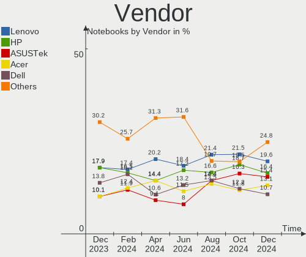
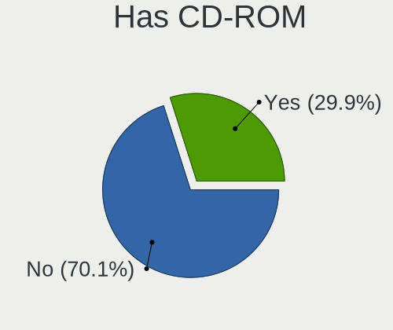
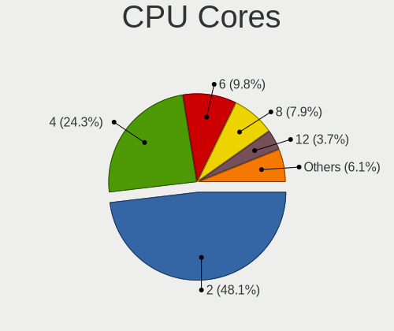
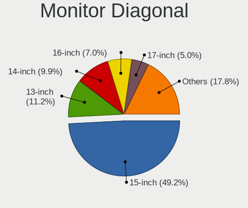
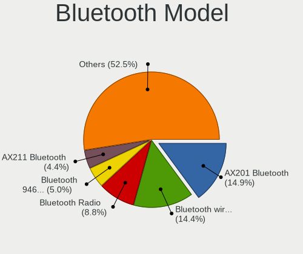
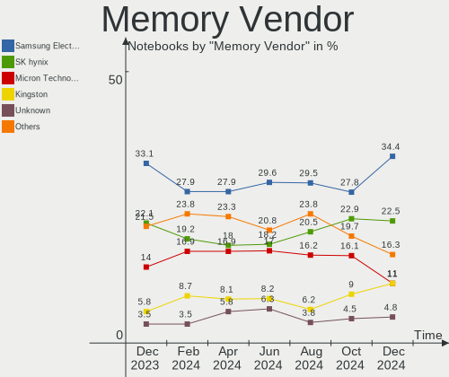

Linux Mint - Hardware Trends (Notebooks)
----------------------------------------

A project to identify most popular hardware characteristics and track their change
over time based on data collected by Linux users at https://Linux-Hardware.org.

Anyone can contribute to this report by the [hw-probe](https://github.com/linuxhw/hw-probe) tool:

    sudo -E hw-probe -all -upload

This report is for one last month. Overall report since the beginning of time: [TestDays](https://github.com/linuxhw/TestDays)

Period: Nov, 2023.

Contents
--------

* [ System ](#system)
  - [ OS                       ](#os)
  - [ OS Family                ](#os-family)
  - [ Kernel                   ](#kernel)
  - [ Kernel Family            ](#kernel-family)
  - [ Kernel Major Ver.        ](#kernel-major-ver)
  - [ Arch                     ](#arch)
  - [ DE                       ](#de)
  - [ Display Server           ](#display-server)
  - [ Display Manager          ](#display-manager)
  - [ OS Lang                  ](#os-lang)
  - [ Boot Mode                ](#boot-mode)
  - [ Filesystem               ](#filesystem)
  - [ Part. scheme             ](#part-scheme)
  - [ Dual Boot with Linux/BSD ](#dual-boot-with-linuxbsd)
  - [ Dual Boot (Win)          ](#dual-boot-win)

* [ Board ](#board)
  - [ Vendor                   ](#vendor)
  - [ Model                    ](#model)
  - [ Model Family             ](#model-family)
  - [ MFG Year                 ](#mfg-year)
  - [ Form Factor              ](#form-factor)
  - [ Secure Boot              ](#secure-boot)
  - [ Coreboot                 ](#coreboot)
  - [ RAM Size                 ](#ram-size)
  - [ RAM Used                 ](#ram-used)
  - [ Total Drives             ](#total-drives)
  - [ Has CD-ROM               ](#has-cd-rom)
  - [ Has Ethernet             ](#has-ethernet)
  - [ Has WiFi                 ](#has-wifi)
  - [ Has Bluetooth            ](#has-bluetooth)

* [ Location ](#location)
  - [ Country                  ](#country)
  - [ City                     ](#city)

* [ Drives ](#drives)
  - [ Drive Vendor             ](#drive-vendor)
  - [ Drive Model              ](#drive-model)
  - [ HDD Vendor               ](#hdd-vendor)
  - [ SSD Vendor               ](#ssd-vendor)
  - [ Drive Kind               ](#drive-kind)
  - [ Drive Connector          ](#drive-connector)
  - [ Drive Size               ](#drive-size)
  - [ Space Total              ](#space-total)
  - [ Space Used               ](#space-used)
  - [ Malfunc. Drives          ](#malfunc-drives)
  - [ Malfunc. Drive Vendor    ](#malfunc-drive-vendor)
  - [ Malfunc. HDD Vendor      ](#malfunc-hdd-vendor)
  - [ Malfunc. Drive Kind      ](#malfunc-drive-kind)
  - [ Failed Drives            ](#failed-drives)
  - [ Failed Drive Vendor      ](#failed-drive-vendor)
  - [ Drive Status             ](#drive-status)

* [ Storage controller ](#storage-controller)
  - [ Storage Vendor           ](#storage-vendor)
  - [ Storage Model            ](#storage-model)
  - [ Storage Kind             ](#storage-kind)

* [ Processor ](#processor)
  - [ CPU Vendor               ](#cpu-vendor)
  - [ CPU Model                ](#cpu-model)
  - [ CPU Model Family         ](#cpu-model-family)
  - [ CPU Cores                ](#cpu-cores)
  - [ CPU Sockets              ](#cpu-sockets)
  - [ CPU Threads              ](#cpu-threads)
  - [ CPU Op-Modes             ](#cpu-op-modes)
  - [ CPU Microcode            ](#cpu-microcode)
  - [ CPU Microarch            ](#cpu-microarch)

* [ Graphics ](#graphics)
  - [ GPU Vendor               ](#gpu-vendor)
  - [ GPU Model                ](#gpu-model)
  - [ GPU Combo                ](#gpu-combo)
  - [ GPU Driver               ](#gpu-driver)
  - [ GPU Memory               ](#gpu-memory)

* [ Monitor ](#monitor)
  - [ Monitor Vendor           ](#monitor-vendor)
  - [ Monitor Model            ](#monitor-model)
  - [ Monitor Resolution       ](#monitor-resolution)
  - [ Monitor Diagonal         ](#monitor-diagonal)
  - [ Monitor Width            ](#monitor-width)
  - [ Aspect Ratio             ](#aspect-ratio)
  - [ Monitor Area             ](#monitor-area)
  - [ Pixel Density            ](#pixel-density)
  - [ Multiple Monitors        ](#multiple-monitors)

* [ Network ](#network)
  - [ Net Controller Vendor    ](#net-controller-vendor)
  - [ Net Controller Model     ](#net-controller-model)
  - [ Wireless Vendor          ](#wireless-vendor)
  - [ Wireless Model           ](#wireless-model)
  - [ Ethernet Vendor          ](#ethernet-vendor)
  - [ Ethernet Model           ](#ethernet-model)
  - [ Net Controller Kind      ](#net-controller-kind)
  - [ Used Controller          ](#used-controller)
  - [ NICs                     ](#nics)
  - [ IPv6                     ](#ipv6)

* [ Bluetooth ](#bluetooth)
  - [ Bluetooth Vendor         ](#bluetooth-vendor)
  - [ Bluetooth Model          ](#bluetooth-model)

* [ Sound ](#sound)
  - [ Sound Vendor             ](#sound-vendor)
  - [ Sound Model              ](#sound-model)

* [ Memory ](#memory)
  - [ Memory Vendor            ](#memory-vendor)
  - [ Memory Model             ](#memory-model)
  - [ Memory Kind              ](#memory-kind)
  - [ Memory Form Factor       ](#memory-form-factor)
  - [ Memory Size              ](#memory-size)
  - [ Memory Speed             ](#memory-speed)

* [ Printers & scanners ](#printers--scanners)
  - [ Printer Vendor           ](#printer-vendor)
  - [ Printer Model            ](#printer-model)
  - [ Scanner Vendor           ](#scanner-vendor)
  - [ Scanner Model            ](#scanner-model)

* [ Camera ](#camera)
  - [ Camera Vendor            ](#camera-vendor)
  - [ Camera Model             ](#camera-model)

* [ Security ](#security)
  - [ Fingerprint Vendor       ](#fingerprint-vendor)
  - [ Fingerprint Model        ](#fingerprint-model)
  - [ Chipcard Vendor          ](#chipcard-vendor)
  - [ Chipcard Model           ](#chipcard-model)

* [ Unsupported ](#unsupported)
  - [ Unsupported Devices      ](#unsupported-devices)
  - [ Unsupported Device Types ](#unsupported-device-types)

System
------

OS
--

Installed operating systems

| Name            | Notebooks | Percent |
|-----------------|-----------|---------|
| Linux Mint 21.2 | 241       | 77.49%  |
| Linux Mint 21.1 | 25        | 8.04%   |
| Linux Mint 20.3 | 19        | 6.11%   |
| Linux Mint 21   | 15        | 4.82%   |
| Linux Mint 20.2 | 6         | 1.93%   |
| Linux Mint 20   | 2         | 0.64%   |
| Linux Mint 20.1 | 1         | 0.32%   |
| Linux Mint 19.3 | 1         | 0.32%   |
| Linux Mint 18.3 | 1         | 0.32%   |

OS Family
---------

OS without a version

| Name       | Notebooks | Percent |
|------------|-----------|---------|
| Linux Mint | 311       | 100%    |

Kernel
------

Version of the Linux kernel

| Version                 | Notebooks | Percent |
|-------------------------|-----------|---------|
| 5.15.0-88-generic       | 126       | 40.51%  |
| 5.15.0-89-generic       | 47        | 15.11%  |
| 6.2.0-36-generic        | 33        | 10.61%  |
| 5.15.0-76-generic       | 26        | 8.36%   |
| 5.4.0-166-generic       | 16        | 5.14%   |
| 6.2.0-37-generic        | 15        | 4.82%   |
| 5.15.0-86-generic       | 5         | 1.61%   |
| 6.2.0-33-generic        | 4         | 1.29%   |
| 5.15.0-87-generic       | 4         | 1.29%   |
| 6.5.0-1007-oem          | 2         | 0.64%   |
| 6.2.0-35-generic        | 2         | 0.64%   |
| 5.4.0-167-generic       | 2         | 0.64%   |
| 5.4.0-164-generic       | 2         | 0.64%   |
| 5.4.0-150-generic       | 2         | 0.64%   |
| 5.15.0-84-generic       | 2         | 0.64%   |
| 5.15.0-56-generic       | 2         | 0.64%   |
| 6.6.0-060600rc5-generic | 1         | 0.32%   |
| 6.5.5-060505-generic    | 1         | 0.32%   |
| 6.4.3-060403-generic    | 1         | 0.32%   |
| 6.3.5-060305-generic    | 1         | 0.32%   |
| 6.2.0-34-generic        | 1         | 0.32%   |
| 6.1.0-1025-oem          | 1         | 0.32%   |
| 5.4.0-26-generic        | 1         | 0.32%   |
| 5.4.0-165-generic       | 1         | 0.32%   |
| 5.4.0-148-generic       | 1         | 0.32%   |
| 5.4.0-113-generic       | 1         | 0.32%   |
| 5.15.0-88-lowlatency    | 1         | 0.32%   |
| 5.15.0-78-generic       | 1         | 0.32%   |
| 5.15.0-75-generic       | 1         | 0.32%   |
| 5.15.0-73-generic       | 1         | 0.32%   |
| 5.15.0-69-generic       | 1         | 0.32%   |
| 5.15.0-58-generic       | 1         | 0.32%   |
| 5.15.0-43-generic       | 1         | 0.32%   |
| 5.15.0-33-lowlatency    | 1         | 0.32%   |
| 5.15.0-1043-intel-iotg  | 1         | 0.32%   |
| 5.10.0-0.deb10.16-amd64 | 1         | 0.32%   |
| 4.4.0-21-generic        | 1         | 0.32%   |

Kernel Family
-------------

Linux kernel without a distro release

| Version | Notebooks | Percent |
|---------|-----------|---------|
| 5.15.0  | 221       | 71.06%  |
| 6.2.0   | 55        | 17.68%  |
| 5.4.0   | 26        | 8.36%   |
| 6.5.0   | 2         | 0.64%   |
| 6.6.0   | 1         | 0.32%   |
| 6.5.5   | 1         | 0.32%   |
| 6.4.3   | 1         | 0.32%   |
| 6.3.5   | 1         | 0.32%   |
| 6.1.0   | 1         | 0.32%   |
| 5.10.0  | 1         | 0.32%   |
| 4.4.0   | 1         | 0.32%   |

Kernel Major Ver.
-----------------

Linux kernel major version

| Version | Notebooks | Percent |
|---------|-----------|---------|
| 5.15    | 221       | 71.06%  |
| 6.2     | 55        | 17.68%  |
| 5.4     | 26        | 8.36%   |
| 6.5     | 3         | 0.96%   |
| 6.6     | 1         | 0.32%   |
| 6.4     | 1         | 0.32%   |
| 6.3     | 1         | 0.32%   |
| 6.1     | 1         | 0.32%   |
| 5.10    | 1         | 0.32%   |
| 4.4     | 1         | 0.32%   |

Arch
----

OS architecture (x86_64, i586, etc.)

| Name   | Notebooks | Percent |
|--------|-----------|---------|
| x86_64 | 311       | 100%    |

DE
--

Desktop Environment

| Name       | Notebooks | Percent |
|------------|-----------|---------|
| X-Cinnamon | 234       | 75.24%  |
| MATE       | 36        | 11.58%  |
| XFCE       | 33        | 10.61%  |
| Unknown    | 4         | 1.29%   |
| Cinnamon   | 3         | 0.96%   |
| GNOME      | 1         | 0.32%   |

Display Server
--------------

X11 or Wayland

| Name | Notebooks | Percent |
|------|-----------|---------|
| X11  | 311       | 100%    |

Display Manager
---------------

SDDM, LightDM, etc.

| Name    | Notebooks | Percent |
|---------|-----------|---------|
| Unknown | 174       | 55.95%  |
| LightDM | 136       | 43.73%  |
| LXDM    | 1         | 0.32%   |

OS Lang
-------

Language

| Lang    | Notebooks | Percent |
|---------|-----------|---------|
| en_US   | 105       | 33.76%  |
| de_DE   | 51        | 16.4%   |
| it_IT   | 23        | 7.4%    |
| pt_BR   | 21        | 6.75%   |
| fr_FR   | 13        | 4.18%   |
| C       | 11        | 3.54%   |
| ru_RU   | 9         | 2.89%   |
| en_GB   | 9         | 2.89%   |
| pl_PL   | 7         | 2.25%   |
| en_CA   | 6         | 1.93%   |
| es_ES   | 4         | 1.29%   |
| en_AU   | 4         | 1.29%   |
| cs_CZ   | 4         | 1.29%   |
| es_MX   | 3         | 0.96%   |
| en_NZ   | 3         | 0.96%   |
| de_CH   | 3         | 0.96%   |
| de_AT   | 3         | 0.96%   |
| Unknown | 3         | 0.96%   |
| tr_TR   | 2         | 0.64%   |
| nl_NL   | 2         | 0.64%   |
| fr_CA   | 2         | 0.64%   |
| es_CO   | 2         | 0.64%   |
| es_AR   | 2         | 0.64%   |
| en_ZA   | 2         | 0.64%   |
| en_IN   | 2         | 0.64%   |
| zh_TW   | 1         | 0.32%   |
| sl_SI   | 1         | 0.32%   |
| nb_NO   | 1         | 0.32%   |
| lv_LV   | 1         | 0.32%   |
| id_ID   | 1         | 0.32%   |
| hu_HU   | 1         | 0.32%   |
| hr_HR   | 1         | 0.32%   |
| fi_FI   | 1         | 0.32%   |
| es_VE   | 1         | 0.32%   |
| es_UY   | 1         | 0.32%   |
| es_SV   | 1         | 0.32%   |
| en_IE   | 1         | 0.32%   |
| el_GR   | 1         | 0.32%   |
| da_DK   | 1         | 0.32%   |
| bg_BG   | 1         | 0.32%   |

Boot Mode
---------

EFI or BIOS

| Mode | Notebooks | Percent |
|------|-----------|---------|
| EFI  | 221       | 71.06%  |
| BIOS | 90        | 28.94%  |

Filesystem
----------

Type of filesystem

| Type    | Notebooks | Percent |
|---------|-----------|---------|
| Ext4    | 288       | 92.6%   |
| Overlay | 9         | 2.89%   |
| Btrfs   | 5         | 1.61%   |
| Tmpfs   | 4         | 1.29%   |
| Xfs     | 3         | 0.96%   |
| Zfs     | 2         | 0.64%   |

Part. scheme
------------

Scheme of partitioning

| Type    | Notebooks | Percent |
|---------|-----------|---------|
| Unknown | 168       | 54.02%  |
| GPT     | 132       | 42.44%  |
| MBR     | 11        | 3.54%   |

Dual Boot with Linux/BSD
------------------------

Hosting more than one Linux/BSD

| Dual boot | Notebooks | Percent |
|-----------|-----------|---------|
| No        | 295       | 94.86%  |
| Yes       | 16        | 5.14%   |

Dual Boot (Win)
---------------

Hosting Linux and Windows

| Dual boot | Notebooks | Percent |
|-----------|-----------|---------|
| No        | 249       | 80.06%  |
| Yes       | 62        | 19.94%  |

Board
-----

Vendor
------

Motherboard manufacturer

| Name                   | Notebooks | Percent |
|------------------------|-----------|---------|
| Lenovo                 | 69        | 22.19%  |
| Hewlett-Packard        | 56        | 18.01%  |
| ASUSTek Computer       | 36        | 11.58%  |
| Dell                   | 34        | 10.93%  |
| Acer                   | 27        | 8.68%   |
| Apple                  | 14        | 4.5%    |
| Toshiba                | 13        | 4.18%   |
| Sony                   | 6         | 1.93%   |
| Samsung Electronics    | 6         | 1.93%   |
| MSI                    | 6         | 1.93%   |
| Fujitsu                | 6         | 1.93%   |
| Google                 | 4         | 1.29%   |
| Medion                 | 3         | 0.96%   |
| VALE                   | 2         | 0.64%   |
| Timi                   | 2         | 0.64%   |
| Teclast                | 2         | 0.64%   |
| GPU Company            | 2         | 0.64%   |
| Unknown                | 2         | 0.64%   |
| Wortmann AG            | 1         | 0.32%   |
| TUXEDO                 | 1         | 0.32%   |
| SGIN                   | 1         | 0.32%   |
| Schenker               | 1         | 0.32%   |
| Qilive                 | 1         | 0.32%   |
| Positivo               | 1         | 0.32%   |
| PC Specialist          | 1         | 0.32%   |
| Panasonic              | 1         | 0.32%   |
| Packard Bell           | 1         | 0.32%   |
| Multilaser             | 1         | 0.32%   |
| Jumper                 | 1         | 0.32%   |
| Inter Sales A/S        | 1         | 0.32%   |
| ILLEGEAR               | 1         | 0.32%   |
| HONOR                  | 1         | 0.32%   |
| Eluktronics            | 1         | 0.32%   |
| Digibras               | 1         | 0.32%   |
| Compal                 | 1         | 0.32%   |
| Avell High Performance | 1         | 0.32%   |
| AMI                    | 1         | 0.32%   |
| Alienware              | 1         | 0.32%   |
| Advantec               | 1         | 0.32%   |

Model
-----

Motherboard model

| Name                               | Notebooks | Percent |
|------------------------------------|-----------|---------|
| Unknown                            | 6         | 1.93%   |
| HP Pavilion dv6                    | 3         | 0.96%   |
| Dell Latitude E6540                | 3         | 0.96%   |
| Lenovo IdeaPad 5 15ITL05 82FG      | 2         | 0.64%   |
| HP Pavilion Notebook               | 2         | 0.64%   |
| HP Pavilion g7                     | 2         | 0.64%   |
| GPU Company GWTC116-2              | 2         | 0.64%   |
| Dell Latitude E5530 non-vPro       | 2         | 0.64%   |
| Dell Latitude 5580                 | 2         | 0.64%   |
| Dell Latitude 3480                 | 2         | 0.64%   |
| ASUS X580VD                        | 2         | 0.64%   |
| Apple MacBookPro9,2                | 2         | 0.64%   |
| Apple MacBookPro7,1                | 2         | 0.64%   |
| Acer Aspire A515-56                | 2         | 0.64%   |
| Wortmann AG CR700                  | 1         | 0.32%   |
| VALE Notebook Classic C170         | 1         | 0.32%   |
| VALE Notebook Classic C140         | 1         | 0.32%   |
| TUXEDO InfinityBook Pro Gen8 (MK1) | 1         | 0.32%   |
| Toshiba TECRA R940                 | 1         | 0.32%   |
| Toshiba Satellite Z30-B            | 1         | 0.32%   |
| Toshiba Satellite Pro L770-12Q     | 1         | 0.32%   |
| Toshiba Satellite L755             | 1         | 0.32%   |
| Toshiba Satellite L70-A            | 1         | 0.32%   |
| Toshiba Satellite L305             | 1         | 0.32%   |
| Toshiba Satellite C870D-116        | 1         | 0.32%   |
| Toshiba Satellite C660D            | 1         | 0.32%   |
| Toshiba Satellite C660             | 1         | 0.32%   |
| Toshiba Satellite A665D            | 1         | 0.32%   |
| Toshiba Satellite A215             | 1         | 0.32%   |
| Toshiba QOSMIO X505                | 1         | 0.32%   |
| Toshiba PORTEGE Z20t-B             | 1         | 0.32%   |
| Timi TM1701                        | 1         | 0.32%   |
| Timi RedmiBook 15                  | 1         | 0.32%   |
| Teclast F6 Pro                     | 1         | 0.32%   |
| Teclast F15Plus 2                  | 1         | 0.32%   |
| Sony VPCSB1Z9E                     | 1         | 0.32%   |
| Sony VPCSB16FH                     | 1         | 0.32%   |
| Sony VPCS13V9E                     | 1         | 0.32%   |
| Sony VPCEB4J0E                     | 1         | 0.32%   |
| Sony VGN-N21S_W                    | 1         | 0.32%   |

Model Family
------------

Motherboard model prefix

| Name                  | Notebooks | Percent |
|-----------------------|-----------|---------|
| Lenovo ThinkPad       | 36        | 11.58%  |
| Acer Aspire           | 19        | 6.11%   |
| Dell Latitude         | 18        | 5.79%   |
| Lenovo IdeaPad        | 14        | 4.5%    |
| HP Pavilion           | 12        | 3.86%   |
| ASUS VivoBook         | 11        | 3.54%   |
| Toshiba Satellite     | 10        | 3.22%   |
| HP EliteBook          | 9         | 2.89%   |
| HP ProBook            | 8         | 2.57%   |
| HP Laptop             | 8         | 2.57%   |
| Dell Inspiron         | 8         | 2.57%   |
| Unknown               | 6         | 1.93%   |
| Fujitsu LIFEBOOK      | 5         | 1.61%   |
| Lenovo Legion         | 4         | 1.29%   |
| Dell Precision        | 4         | 1.29%   |
| Acer Swift            | 4         | 1.29%   |
| MSI Modern            | 3         | 0.96%   |
| Lenovo ThinkBook      | 3         | 0.96%   |
| ASUS ASUS             | 3         | 0.96%   |
| Apple MacBookPro9     | 3         | 0.96%   |
| VALE Notebook         | 2         | 0.64%   |
| Medion Akoya          | 2         | 0.64%   |
| HP ENVY               | 2         | 0.64%   |
| HP 250                | 2         | 0.64%   |
| GPU Company GWTC116-2 | 2         | 0.64%   |
| Dell Vostro           | 2         | 0.64%   |
| ASUS X580VD           | 2         | 0.64%   |
| Apple MacBookPro8     | 2         | 0.64%   |
| Apple MacBookPro7     | 2         | 0.64%   |
| Apple MacBookPro5     | 2         | 0.64%   |
| Apple MacBookPro11    | 2         | 0.64%   |
| Acer Nitro            | 2         | 0.64%   |
| Wortmann AG CR700     | 1         | 0.32%   |
| TUXEDO InfinityBook   | 1         | 0.32%   |
| Toshiba TECRA         | 1         | 0.32%   |
| Toshiba QOSMIO        | 1         | 0.32%   |
| Toshiba PORTEGE       | 1         | 0.32%   |
| Timi TM1701           | 1         | 0.32%   |
| Timi RedmiBook        | 1         | 0.32%   |
| Teclast F6            | 1         | 0.32%   |

MFG Year
--------

Motherboard manufacture year

| Year | Notebooks | Percent |
|------|-----------|---------|
| 2021 | 38        | 12.22%  |
| 2011 | 29        | 9.32%   |
| 2012 | 28        | 9%      |
| 2013 | 26        | 8.36%   |
| 2023 | 20        | 6.43%   |
| 2019 | 20        | 6.43%   |
| 2020 | 18        | 5.79%   |
| 2017 | 18        | 5.79%   |
| 2016 | 18        | 5.79%   |
| 2015 | 18        | 5.79%   |
| 2018 | 17        | 5.47%   |
| 2022 | 16        | 5.14%   |
| 2010 | 14        | 4.5%    |
| 2014 | 11        | 3.54%   |
| 2008 | 10        | 3.22%   |
| 2009 | 6         | 1.93%   |
| 2006 | 3         | 0.96%   |
| 2007 | 1         | 0.32%   |

Form Factor
-----------

Physical design of the computer

| Name     | Notebooks | Percent |
|----------|-----------|---------|
| Notebook | 311       | 100%    |

Secure Boot
-----------

Enabled or disabled

| State    | Notebooks | Percent |
|----------|-----------|---------|
| Disabled | 279       | 89.71%  |
| Enabled  | 32        | 10.29%  |

Coreboot
--------

Have coreboot on board

| Used | Notebooks | Percent |
|------|-----------|---------|
| No   | 307       | 98.71%  |
| Yes  | 4         | 1.29%   |

RAM Size
--------

Total RAM memory

| Size in GB  | Notebooks | Percent |
|-------------|-----------|---------|
| 4.01-8.0    | 103       | 33.12%  |
| 3.01-4.0    | 69        | 22.19%  |
| 16.01-24.0  | 54        | 17.36%  |
| 8.01-16.0   | 39        | 12.54%  |
| 32.01-64.0  | 16        | 5.14%   |
| 1.01-2.0    | 10        | 3.22%   |
| 24.01-32.0  | 8         | 2.57%   |
| 2.01-3.0    | 6         | 1.93%   |
| 64.01-256.0 | 6         | 1.93%   |

RAM Used
--------

Used RAM memory

| Used GB    | Notebooks | Percent |
|------------|-----------|---------|
| 1.01-2.0   | 109       | 35.05%  |
| 2.01-3.0   | 103       | 33.12%  |
| 4.01-8.0   | 43        | 13.83%  |
| 3.01-4.0   | 39        | 12.54%  |
| 0.51-1.0   | 8         | 2.57%   |
| 8.01-16.0  | 6         | 1.93%   |
| 16.01-24.0 | 2         | 0.64%   |
| 24.01-32.0 | 1         | 0.32%   |

Total Drives
------------

Number of drives on board

| Drives | Notebooks | Percent |
|--------|-----------|---------|
| 1      | 231       | 74.28%  |
| 2      | 70        | 22.51%  |
| 3      | 7         | 2.25%   |
| 6      | 1         | 0.32%   |
| 4      | 1         | 0.32%   |
| 0      | 1         | 0.32%   |

Has CD-ROM
----------

Has CD-ROM on board

| Presented | Notebooks | Percent |
|-----------|-----------|---------|
| No        | 197       | 63.34%  |
| Yes       | 114       | 36.66%  |

Has Ethernet
------------

Has Ethernet on board

| Presented | Notebooks | Percent |
|-----------|-----------|---------|
| Yes       | 245       | 78.78%  |
| No        | 66        | 21.22%  |

Has WiFi
--------

Has WiFi module

| Presented | Notebooks | Percent |
|-----------|-----------|---------|
| Yes       | 305       | 98.07%  |
| No        | 6         | 1.93%   |

Has Bluetooth
-------------

Has Bluetooth module

| Presented | Notebooks | Percent |
|-----------|-----------|---------|
| Yes       | 252       | 81.03%  |
| No        | 59        | 18.97%  |

Location
--------

Country
-------

Geographic location (country)

| Country         | Notebooks | Percent |
|-----------------|-----------|---------|
| Germany         | 57        | 18.33%  |
| USA             | 51        | 16.4%   |
| Italy           | 27        | 8.68%   |
| Brazil          | 23        | 7.4%    |
| France          | 13        | 4.18%   |
| Poland          | 10        | 3.22%   |
| UK              | 9         | 2.89%   |
| Canada          | 9         | 2.89%   |
| Russia          | 8         | 2.57%   |
| Switzerland     | 7         | 2.25%   |
| Austria         | 7         | 2.25%   |
| Sweden          | 6         | 1.93%   |
| Hungary         | 6         | 1.93%   |
| Netherlands     | 5         | 1.61%   |
| Spain           | 4         | 1.29%   |
| Mexico          | 4         | 1.29%   |
| Czechia         | 4         | 1.29%   |
| Bulgaria        | 4         | 1.29%   |
| Australia       | 4         | 1.29%   |
| Turkey          | 3         | 0.96%   |
| New Zealand     | 3         | 0.96%   |
| Ukraine         | 2         | 0.64%   |
| The Netherlands | 2         | 0.64%   |
| South Africa    | 2         | 0.64%   |
| Slovakia        | 2         | 0.64%   |
| Romania         | 2         | 0.64%   |
| Moldova         | 2         | 0.64%   |
| Malaysia        | 2         | 0.64%   |
| India           | 2         | 0.64%   |
| Finland         | 2         | 0.64%   |
| Denmark         | 2         | 0.64%   |
| Colombia        | 2         | 0.64%   |
| Argentina       | 2         | 0.64%   |
| Venezuela       | 1         | 0.32%   |
| Uruguay         | 1         | 0.32%   |
| UAE             | 1         | 0.32%   |
| Tunisia         | 1         | 0.32%   |
| Taiwan          | 1         | 0.32%   |
| Slovenia        | 1         | 0.32%   |
| Singapore       | 1         | 0.32%   |

City
----

Geographic location (city)

| City              | Notebooks | Percent |
|-------------------|-----------|---------|
| Sao Paulo         | 5         | 1.61%   |
| Milan             | 5         | 1.61%   |
| Warsaw            | 4         | 1.29%   |
| Vienna            | 4         | 1.29%   |
| Stockholm         | 4         | 1.29%   |
| Skokie            | 4         | 1.29%   |
| Budapest          | 4         | 1.29%   |
| Berlin            | 4         | 1.29%   |
| Zurich            | 3         | 0.96%   |
| Wroclaw           | 3         | 0.96%   |
| Sofia             | 3         | 0.96%   |
| Seattle           | 3         | 0.96%   |
| Rome              | 3         | 0.96%   |
| Naples            | 3         | 0.96%   |
| Frankfurt am Main | 3         | 0.96%   |
| Edgware           | 3         | 0.96%   |
| Düsseldorf       | 3         | 0.96%   |
| Wellington        | 2         | 0.64%   |
| Vallejo           | 2         | 0.64%   |
| Turin             | 2         | 0.64%   |
| Toronto           | 2         | 0.64%   |
| Stuttgart         | 2         | 0.64%   |
| Santiago de Cali  | 2         | 0.64%   |
| Rio de Janeiro    | 2         | 0.64%   |
| Munich            | 2         | 0.64%   |
| Leipzig           | 2         | 0.64%   |
| Helsinki          | 2         | 0.64%   |
| Hamburg           | 2         | 0.64%   |
| Fortaleza         | 2         | 0.64%   |
| Dresden           | 2         | 0.64%   |
| Coburg            | 2         | 0.64%   |
| Chisinau          | 2         | 0.64%   |
| Chennai           | 2         | 0.64%   |
| Braunschweig      | 2         | 0.64%   |
| Bonn              | 2         | 0.64%   |
| Bologna           | 2         | 0.64%   |
| Birmingham        | 2         | 0.64%   |
| Auckland          | 2         | 0.64%   |
| Yalta             | 1         | 0.32%   |
| Wuppertal         | 1         | 0.32%   |

Drives
------

Drive Vendor
------------

Hard drive vendors

| Vendor                      | Notebooks | Drives | Percent |
|-----------------------------|-----------|--------|---------|
| Samsung Electronics         | 61        | 63     | 16.09%  |
| Seagate                     | 36        | 41     | 9.5%    |
| WDC                         | 33        | 33     | 8.71%   |
| Crucial                     | 24        | 25     | 6.33%   |
| Unknown                     | 23        | 24     | 6.07%   |
| Toshiba                     | 23        | 26     | 6.07%   |
| Kingston                    | 22        | 23     | 5.8%    |
| SanDisk                     | 21        | 22     | 5.54%   |
| Micron Technology           | 13        | 13     | 3.43%   |
| SK hynix                    | 11        | 11     | 2.9%    |
| Intel                       | 10        | 11     | 2.64%   |
| Hitachi                     | 10        | 10     | 2.64%   |
| China                       | 9         | 9      | 2.37%   |
| A-DATA Technology           | 8         | 8      | 2.11%   |
| Intenso                     | 6         | 6      | 1.58%   |
| HGST                        | 5         | 5      | 1.32%   |
| KIOXIA                      | 4         | 4      | 1.06%   |
| Kingston Technology Company | 4         | 4      | 1.06%   |
| SPCC                        | 3         | 3      | 0.79%   |
| Fujitsu                     | 3         | 3      | 0.79%   |
| Apple                       | 3         | 3      | 0.79%   |
| Unknown                     | 3         | 3      | 0.79%   |
| Transcend                   | 2         | 2      | 0.53%   |
| Silicon Motion              | 2         | 2      | 0.53%   |
| PNY                         | 2         | 2      | 0.53%   |
| Phison Electronics          | 2         | 2      | 0.53%   |
| OCZ                         | 2         | 2      | 0.53%   |
| Micron/Crucial Technology   | 2         | 2      | 0.53%   |
| Lexar                       | 2         | 2      | 0.53%   |
| CF400                       | 2         | 2      | 0.53%   |
| XrayDisk                    | 1         | 1      | 0.26%   |
| Verbatim                    | 1         | 1      | 0.26%   |
| Union Memory (Shenzhen)     | 1         | 1      | 0.26%   |
| tecmiyo                     | 1         | 1      | 0.26%   |
| Teclast                     | 1         | 1      | 0.26%   |
| Team                        | 1         | 1      | 0.26%   |
| Solid State Storage         | 1         | 1      | 0.26%   |
| Plextor                     | 1         | 1      | 0.26%   |
| Patriot                     | 1         | 1      | 0.26%   |
| Mass                        | 1         | 1      | 0.26%   |

Drive Model
-----------

Hard drive models

| Model                                                 | Notebooks | Percent |
|-------------------------------------------------------|-----------|---------|
| Seagate ST1000LM035-1RK172 1TB                        | 9         | 2.31%   |
| Toshiba MQ04ABF100 1TB                                | 6         | 1.54%   |
| Unknown MMC Card  64GB                                | 5         | 1.29%   |
| Samsung NVMe SSD Controller SM981/PM981/PM983 250GB   | 5         | 1.29%   |
| Unknown MMC Card  32GB                                | 4         | 1.03%   |
| Seagate ST500LT012-1DG142 500GB                       | 4         | 1.03%   |
| Kingston SA400S37480G 480GB SSD                       | 4         | 1.03%   |
| Crucial CT500MX500SSD1 500GB                          | 4         | 1.03%   |
| Unknown MMC Card  128GB                               | 3         | 0.77%   |
| Toshiba MQ01ABD100 1TB                                | 3         | 0.77%   |
| Seagate ST1000LM024 HN-M101MBB 1TB                    | 3         | 0.77%   |
| Samsung SSD 860 EVO 1TB                               | 3         | 0.77%   |
| Kingston SV300S37A120G 120GB SSD                      | 3         | 0.77%   |
| Crucial CT480BX500SSD1 480GB                          | 3         | 0.77%   |
| Crucial CT1000BX500SSD1 1TB                           | 3         | 0.77%   |
| Unknown                                               | 3         | 0.77%   |
| WDC WD7500BPVX-22JC3T0 752GB                          | 2         | 0.51%   |
| WDC WD3200BEKT-75PVMT1 320GB                          | 2         | 0.51%   |
| WDC WD10SPZX-60Z10T0 1TB                              | 2         | 0.51%   |
| WDC PC SN530 SDBPNPZ-256G-1002 256GB                  | 2         | 0.51%   |
| Unknown SD/MMC/MS PRO 128GB                           | 2         | 0.51%   |
| Toshiba MQ01ABF050 500GB                              | 2         | 0.51%   |
| SK hynix HFM512GD3JX016N 512GB                        | 2         | 0.51%   |
| Silicon Motion SM2263EN/SM2263XT SSD Controller 256GB | 2         | 0.51%   |
| Seagate ST9500420AS 500GB                             | 2         | 0.51%   |
| Seagate ST9500325AS 500GB                             | 2         | 0.51%   |
| Seagate ST2000LM015-2E8174 2TB                        | 2         | 0.51%   |
| Seagate Expansion Desk 6TB                            | 2         | 0.51%   |
| Sandisk WD_BLACK SN770 1TB                            | 2         | 0.51%   |
| Sandisk WD Blue SN550 NVMe SSD 512GB                  | 2         | 0.51%   |
| SanDisk SSD PLUS 1000GB                               | 2         | 0.51%   |
| Samsung SSD 980 PRO 2TB                               | 2         | 0.51%   |
| Samsung SSD 980 1TB                                   | 2         | 0.51%   |
| Samsung SSD 870 EVO 500GB                             | 2         | 0.51%   |
| Samsung SSD 860 EVO 500GB                             | 2         | 0.51%   |
| Samsung SSD 850 EVO 500GB                             | 2         | 0.51%   |
| Samsung MZVL21T0HCLR-00BL2 1TB                        | 2         | 0.51%   |
| Samsung MZALQ512HBLU-00BL2 512GB                      | 2         | 0.51%   |
| Micron 2210_MTFDHBA1T0QFD 1TB                         | 2         | 0.51%   |
| Kingston SA400S37120G 120GB SSD                       | 2         | 0.51%   |

HDD Vendor
----------

Hard disk drive vendors

| Vendor              | Notebooks | Drives | Percent |
|---------------------|-----------|--------|---------|
| Seagate             | 34        | 39     | 33.66%  |
| WDC                 | 26        | 26     | 25.74%  |
| Toshiba             | 18        | 18     | 17.82%  |
| Hitachi             | 10        | 10     | 9.9%    |
| HGST                | 5         | 5      | 4.95%   |
| Samsung Electronics | 3         | 3      | 2.97%   |
| Fujitsu             | 3         | 3      | 2.97%   |
| Unknown             | 2         | 2      | 1.98%   |

SSD Vendor
----------

Solid state drive vendors

| Vendor              | Notebooks | Drives | Percent |
|---------------------|-----------|--------|---------|
| Samsung Electronics | 27        | 27     | 19.29%  |
| Crucial             | 22        | 22     | 15.71%  |
| Kingston            | 18        | 19     | 12.86%  |
| SanDisk             | 13        | 13     | 9.29%   |
| China               | 9         | 9      | 6.43%   |
| A-DATA Technology   | 7         | 7      | 5%      |
| Intenso             | 4         | 4      | 2.86%   |
| Toshiba             | 3         | 3      | 2.14%   |
| Micron Technology   | 3         | 3      | 2.14%   |
| Apple               | 3         | 3      | 2.14%   |
| WDC                 | 2         | 2      | 1.43%   |
| SPCC                | 2         | 2      | 1.43%   |
| PNY                 | 2         | 2      | 1.43%   |
| OCZ                 | 2         | 2      | 1.43%   |
| XrayDisk            | 1         | 1      | 0.71%   |
| Verbatim            | 1         | 1      | 0.71%   |
| Unknown             | 1         | 1      | 0.71%   |
| Transcend           | 1         | 1      | 0.71%   |
| tecmiyo             | 1         | 1      | 0.71%   |
| Teclast             | 1         | 1      | 0.71%   |
| SK hynix            | 1         | 1      | 0.71%   |
| Plextor             | 1         | 1      | 0.71%   |
| Patriot             | 1         | 1      | 0.71%   |
| Lexar               | 1         | 1      | 0.71%   |
| KingDian            | 1         | 1      | 0.71%   |
| Jumper              | 1         | 1      | 0.71%   |
| Integral            | 1         | 1      | 0.71%   |
| HS-SSD-C100         | 1         | 1      | 0.71%   |
| Hewlett-Packard     | 1         | 1      | 0.71%   |
| GOODRAM             | 1         | 1      | 0.71%   |
| GLOWAY              | 1         | 1      | 0.71%   |
| FORESEE             | 1         | 1      | 0.71%   |
| Emtec               | 1         | 1      | 0.71%   |
| Dogfish             | 1         | 1      | 0.71%   |
| CF400               | 1         | 1      | 0.71%   |
| Aura                | 1         | 1      | 0.71%   |
| Apacer              | 1         | 1      | 0.71%   |

Drive Kind
----------

HDD or SSD

| Kind    | Notebooks | Drives | Percent |
|---------|-----------|--------|---------|
| SSD     | 128       | 141    | 35.85%  |
| NVMe    | 105       | 119    | 29.41%  |
| HDD     | 98        | 106    | 27.45%  |
| MMC     | 20        | 22     | 5.6%    |
| Unknown | 6         | 6      | 1.68%   |

Drive Connector
---------------

SATA, SAS, NVMe, etc.

| Type | Notebooks | Drives | Percent |
|------|-----------|--------|---------|
| SATA | 210       | 235    | 60%     |
| NVMe | 104       | 118    | 29.71%  |
| MMC  | 20        | 22     | 5.71%   |
| SAS  | 16        | 19     | 4.57%   |

Drive Size
----------

Size of hard drive

| Size in TB | Notebooks | Drives | Percent |
|------------|-----------|--------|---------|
| 0.01-0.5   | 149       | 166    | 65.93%  |
| 0.51-1.0   | 62        | 65     | 27.43%  |
| 1.01-2.0   | 10        | 10     | 4.42%   |
| 4.01-10.0  | 3         | 4      | 1.33%   |
| 3.01-4.0   | 2         | 2      | 0.88%   |

Space Total
-----------

Amount of disk space available on the file system

| Size in GB     | Notebooks | Percent |
|----------------|-----------|---------|
| 101-250        | 100       | 32.15%  |
| 251-500        | 83        | 26.69%  |
| 501-1000       | 54        | 17.36%  |
| 1001-2000      | 23        | 7.4%    |
| 51-100         | 18        | 5.79%   |
| 21-50          | 9         | 2.89%   |
| 1-20           | 9         | 2.89%   |
| More than 3000 | 8         | 2.57%   |
| 2001-3000      | 4         | 1.29%   |
| Unknown        | 3         | 0.96%   |

Space Used
----------

Amount of used disk space

| Used GB        | Notebooks | Percent |
|----------------|-----------|---------|
| 21-50          | 85        | 27.33%  |
| 1-20           | 68        | 21.86%  |
| 101-250        | 52        | 16.72%  |
| 51-100         | 50        | 16.08%  |
| 251-500        | 24        | 7.72%   |
| 501-1000       | 18        | 5.79%   |
| 1001-2000      | 6         | 1.93%   |
| More than 3000 | 3         | 0.96%   |
| Unknown        | 3         | 0.96%   |
| 2001-3000      | 2         | 0.64%   |

Malfunc. Drives
---------------

Drive models with a malfunction

| Model                                 | Notebooks | Drives | Percent |
|---------------------------------------|-----------|--------|---------|
| WDC WD5000BEVT-55A0RT0 500GB          | 1         | 1      | 7.14%   |
| Toshiba MQ04ABF100 1TB                | 1         | 1      | 7.14%   |
| Toshiba MK5065GSXF 500GB              | 1         | 1      | 7.14%   |
| Toshiba MK3275GSX 320GB               | 1         | 1      | 7.14%   |
| SK hynix HFS256G39TND-N210A 256GB SSD | 1         | 1      | 7.14%   |
| Seagate ST9320423AS 320GB             | 1         | 1      | 7.14%   |
| Seagate ST1000LM035-1RK172 1TB        | 1         | 1      | 7.14%   |
| Seagate ST1000LM024 HN-M101MBB 1TB    | 1         | 1      | 7.14%   |
| Hitachi HTS727550A9E364 500GB         | 1         | 1      | 7.14%   |
| Fujitsu MHV2080AH 80GB                | 1         | 1      | 7.14%   |
| China SSD 1TB                         | 1         | 1      | 7.14%   |
| China SATA3 512GB SSD                 | 1         | 1      | 7.14%   |
| China M.2 2280 SATA SSD 128GB         | 1         | 1      | 7.14%   |
| Aura Pro S MC258 1TB SSD              | 1         | 1      | 7.14%   |

Malfunc. Drive Vendor
---------------------

Vendors of faulty drives

| Vendor   | Notebooks | Drives | Percent |
|----------|-----------|--------|---------|
| Toshiba  | 3         | 3      | 21.43%  |
| Seagate  | 3         | 3      | 21.43%  |
| China    | 3         | 3      | 21.43%  |
| WDC      | 1         | 1      | 7.14%   |
| SK hynix | 1         | 1      | 7.14%   |
| Hitachi  | 1         | 1      | 7.14%   |
| Fujitsu  | 1         | 1      | 7.14%   |
| Aura     | 1         | 1      | 7.14%   |

Malfunc. HDD Vendor
-------------------

Vendors of faulty HDD drives

| Vendor  | Notebooks | Drives | Percent |
|---------|-----------|--------|---------|
| Toshiba | 3         | 3      | 33.33%  |
| Seagate | 3         | 3      | 33.33%  |
| WDC     | 1         | 1      | 11.11%  |
| Hitachi | 1         | 1      | 11.11%  |
| Fujitsu | 1         | 1      | 11.11%  |

Malfunc. Drive Kind
-------------------

Kinds of faulty drives

| Kind | Notebooks | Drives | Percent |
|------|-----------|--------|---------|
| HDD  | 9         | 9      | 64.29%  |
| SSD  | 5         | 5      | 35.71%  |

Failed Drives
-------------

Failed drive models

| Model                             | Notebooks | Drives | Percent |
|-----------------------------------|-----------|--------|---------|
| Samsung Electronics HM160HC 160GB | 1         | 1      | 100%    |

Failed Drive Vendor
-------------------

Failed drive vendors

| Vendor              | Notebooks | Drives | Percent |
|---------------------|-----------|--------|---------|
| Samsung Electronics | 1         | 1      | 100%    |

Drive Status
------------

Number of failed and malfunc. drives

| Status   | Notebooks | Drives | Percent |
|----------|-----------|--------|---------|
| Detected | 189       | 228    | 57.62%  |
| Works    | 124       | 151    | 37.8%   |
| Malfunc  | 14        | 14     | 4.27%   |
| Failed   | 1         | 1      | 0.3%    |

Storage controller
------------------

Storage Vendor
--------------

Storage controller vendors

| Vendor                         | Notebooks | Percent |
|--------------------------------|-----------|---------|
| Intel                          | 213       | 59.5%   |
| AMD                            | 35        | 9.78%   |
| Samsung Electronics            | 32        | 8.94%   |
| SanDisk                        | 13        | 3.63%   |
| SK hynix                       | 10        | 2.79%   |
| Micron Technology              | 10        | 2.79%   |
| KIOXIA                         | 7         | 1.96%   |
| Kingston Technology Company    | 7         | 1.96%   |
| Nvidia                         | 5         | 1.4%    |
| Micron/Crucial Technology      | 5         | 1.4%    |
| Silicon Motion                 | 4         | 1.12%   |
| Phison Electronics             | 3         | 0.84%   |
| Toshiba America Info Systems   | 2         | 0.56%   |
| Seagate Technology             | 2         | 0.56%   |
| ADATA Technology               | 2         | 0.56%   |
| Union Memory (Shenzhen)        | 1         | 0.28%   |
| Solidigm                       | 1         | 0.28%   |
| Solid State Storage Technology | 1         | 0.28%   |
| Shenzhen Longsys Electronics   | 1         | 0.28%   |
| Realtek Semiconductor          | 1         | 0.28%   |
| Marvell Technology Group       | 1         | 0.28%   |
| Lenovo                         | 1         | 0.28%   |
| INNOGRIT                       | 1         | 0.28%   |

Storage Model
-------------

Storage controller models

| Model                                                                          | Notebooks | Percent |
|--------------------------------------------------------------------------------|-----------|---------|
| Intel 6 Series/C200 Series Chipset Family 6 port Mobile SATA AHCI Controller   | 30        | 7.79%   |
| Intel Sunrise Point-LP SATA Controller [AHCI mode]                             | 29        | 7.53%   |
| AMD FCH SATA Controller [AHCI mode]                                            | 29        | 7.53%   |
| Intel 7 Series Chipset Family 6-port SATA Controller [AHCI mode]               | 23        | 5.97%   |
| Intel 8 Series SATA Controller 1 [AHCI mode]                                   | 16        | 4.16%   |
| Intel Volume Management Device NVMe RAID Controller                            | 15        | 3.9%    |
| Intel 82801 Mobile SATA Controller [RAID mode]                                 | 12        | 3.12%   |
| Samsung NVMe SSD Controller SM981/PM981/PM983                                  | 11        | 2.86%   |
| Intel Tiger Lake-LP SATA Controller                                            | 11        | 2.86%   |
| Intel Celeron/Pentium Silver Processor SATA Controller                         | 11        | 2.86%   |
| Samsung NVMe SSD Controller 980 (DRAM-less)                                    | 10        | 2.6%    |
| Intel Wildcat Point-LP SATA Controller [AHCI Mode]                             | 10        | 2.6%    |
| Samsung NVMe SSD Controller PM9A1/PM9A3/980PRO                                 | 6         | 1.56%   |
| Intel 8 Series/C220 Series Chipset Family 6-port SATA Controller 1 [AHCI mode] | 6         | 1.56%   |
| SK hynix Gold P31/BC711/PC711 NVMe Solid State Drive                           | 5         | 1.3%    |
| SanDisk Ultra 3D / WD Blue SN550 NVMe SSD                                      | 5         | 1.3%    |
| Micron 2210 NVMe SSD [Cobain]                                                  | 5         | 1.3%    |
| Intel SSD 670p Series [Keystone Harbor]                                        | 5         | 1.3%    |
| Intel Celeron N3350/Pentium N4200/Atom E3900 Series SATA AHCI Controller       | 5         | 1.3%    |
| Intel 82801IBM/IEM (ICH9M/ICH9M-E) 4 port SATA Controller [AHCI mode]          | 5         | 1.3%    |
| Intel 5 Series/3400 Series Chipset 4 port SATA AHCI Controller                 | 5         | 1.3%    |
| Micron/Crucial P2 [Nick P2] / P3 / P3 Plus NVMe PCIe SSD (DRAM-less)           | 4         | 1.04%   |
| KIOXIA NVMe SSD Controller BG4 (DRAM-less)                                     | 4         | 1.04%   |
| Intel Tiger Lake SATA AHCI Controller                                          | 4         | 1.04%   |
| Intel Cannon Lake Mobile PCH SATA AHCI Controller                              | 4         | 1.04%   |
| Intel 5 Series/3400 Series Chipset 6 port SATA AHCI Controller                 | 4         | 1.04%   |
| Silicon Motion SM2263EN/SM2263XT (DRAM-less) NVMe SSD Controllers              | 3         | 0.78%   |
| SanDisk WD Black SN770 / PC SN740 256GB / PC SN560 (DRAM-less) NVMe SSD        | 3         | 0.78%   |
| SanDisk Extreme Pro / WD Black SN750 / PC SN730 / Red SN700 NVMe SSD           | 3         | 0.78%   |
| Nvidia MCP89 SATA Controller (AHCI mode)                                       | 3         | 0.78%   |
| Intel SSD DC P4101/Pro 7600p/760p/E 6100p Series                               | 3         | 0.78%   |
| Intel Cannon Point-LP SATA Controller [AHCI Mode]                              | 3         | 0.78%   |
| Intel Atom Processor E3800 Series SATA AHCI Controller                         | 3         | 0.78%   |
| AMD SB7x0/SB8x0/SB9x0 SATA Controller [AHCI mode]                              | 3         | 0.78%   |
| SK hynix Platinum P41/PC801 NVMe Solid State Drive                             | 2         | 0.52%   |
| SK hynix BC501 NVMe Solid State Drive                                          | 2         | 0.52%   |
| Samsung S4LN058A01[SSUBX] AHCI SSD Controller (Apple slot)                     | 2         | 0.52%   |
| Samsung NVMe SSD Controller PM9B1 (DRAM-less)                                  | 2         | 0.52%   |
| Phison PS5013-E13 PCIe3 NVMe Controller (DRAM-less)                            | 2         | 0.52%   |
| Nvidia MCP79 AHCI Controller                                                   | 2         | 0.52%   |

Storage Kind
------------

Kind of storage controller (IDE, SATA, NVMe, SAS, ...)

| Kind | Notebooks | Percent |
|------|-----------|---------|
| SATA | 224       | 60.38%  |
| NVMe | 104       | 28.03%  |
| RAID | 29        | 7.82%   |
| IDE  | 14        | 3.77%   |

Processor
---------

CPU Vendor
----------

Processor vendors

| Vendor | Notebooks | Percent |
|--------|-----------|---------|
| Intel  | 254       | 81.67%  |
| AMD    | 57        | 18.33%  |

CPU Model
---------

Processor models

| Model                                         | Notebooks | Percent |
|-----------------------------------------------|-----------|---------|
| Intel 11th Gen Core i7-1165G7 @ 2.80GHz       | 8         | 2.57%   |
| Intel Celeron N4020 CPU @ 1.10GHz             | 7         | 2.25%   |
| Intel Core i5-7200U CPU @ 2.50GHz             | 6         | 1.93%   |
| Intel Core i5-4200U CPU @ 1.60GHz             | 6         | 1.93%   |
| Intel Core i7-8550U CPU @ 1.80GHz             | 5         | 1.61%   |
| Intel Core i5-6300U CPU @ 2.40GHz             | 5         | 1.61%   |
| Intel Core i5-5200U CPU @ 2.20GHz             | 5         | 1.61%   |
| Intel 11th Gen Core i3-1115G4 @ 3.00GHz       | 5         | 1.61%   |
| AMD Ryzen 5 3500U with Radeon Vega Mobile Gfx | 5         | 1.61%   |
| Intel Core i7-8650U CPU @ 1.90GHz             | 4         | 1.29%   |
| Intel Core i5-6200U CPU @ 2.30GHz             | 4         | 1.29%   |
| Intel Core i5-3210M CPU @ 2.50GHz             | 4         | 1.29%   |
| Intel Core i5-2520M CPU @ 2.50GHz             | 4         | 1.29%   |
| Intel Core i5-2410M CPU @ 2.30GHz             | 4         | 1.29%   |
| Intel Core i3-2310M CPU @ 2.10GHz             | 4         | 1.29%   |
| Intel Core 2 Duo CPU P8600 @ 2.40GHz          | 4         | 1.29%   |
| Intel 12th Gen Core i5-1235U                  | 4         | 1.29%   |
| Intel Core i7-3520M CPU @ 2.90GHz             | 3         | 0.96%   |
| Intel Core i7-2670QM CPU @ 2.20GHz            | 3         | 0.96%   |
| Intel Core i5-8350U CPU @ 1.70GHz             | 3         | 0.96%   |
| Intel Core i5-8250U CPU @ 1.60GHz             | 3         | 0.96%   |
| Intel Core i5-3230M CPU @ 2.60GHz             | 3         | 0.96%   |
| Intel Core i3-4005U CPU @ 1.70GHz             | 3         | 0.96%   |
| Intel Celeron CPU N3350 @ 1.10GHz             | 3         | 0.96%   |
| Intel 13th Gen Core i7-13700H                 | 3         | 0.96%   |
| Intel 11th Gen Core i5-1135G7 @ 2.40GHz       | 3         | 0.96%   |
| AMD Ryzen 3 3250U with Radeon Graphics        | 3         | 0.96%   |
| AMD E2-9000e RADEON R2, 4 COMPUTE CORES 2C+2G | 3         | 0.96%   |
| Intel Pentium Silver N6000 @ 1.10GHz          | 2         | 0.64%   |
| Intel Pentium CPU N3700 @ 1.60GHz             | 2         | 0.64%   |
| Intel Core i7-9750H CPU @ 2.60GHz             | 2         | 0.64%   |
| Intel Core i7-7700HQ CPU @ 2.80GHz            | 2         | 0.64%   |
| Intel Core i7-7500U CPU @ 2.70GHz             | 2         | 0.64%   |
| Intel Core i7-6600U CPU @ 2.60GHz             | 2         | 0.64%   |
| Intel Core i7-4810MQ CPU @ 2.80GHz            | 2         | 0.64%   |
| Intel Core i7-3610QM CPU @ 2.30GHz            | 2         | 0.64%   |
| Intel Core i7-2720QM CPU @ 2.20GHz            | 2         | 0.64%   |
| Intel Core i7-2630QM CPU @ 2.00GHz            | 2         | 0.64%   |
| Intel Core i7 CPU Q 720 @ 1.60GHz             | 2         | 0.64%   |
| Intel Core i5-7300U CPU @ 2.60GHz             | 2         | 0.64%   |

CPU Model Family
----------------

Processor model prefix

| Model                   | Notebooks | Percent |
|-------------------------|-----------|---------|
| Intel Core i5           | 78        | 25.08%  |
| Intel Core i7           | 54        | 17.36%  |
| Other                   | 40        | 12.86%  |
| Intel Core i3           | 27        | 8.68%   |
| Intel Celeron           | 24        | 7.72%   |
| AMD Ryzen 5             | 12        | 3.86%   |
| AMD Ryzen 7             | 11        | 3.54%   |
| Intel Core 2 Duo        | 10        | 3.22%   |
| Intel Pentium           | 8         | 2.57%   |
| AMD Ryzen 5 PRO         | 5         | 1.61%   |
| AMD Ryzen 3             | 5         | 1.61%   |
| AMD A6                  | 5         | 1.61%   |
| AMD A8                  | 4         | 1.29%   |
| Intel Pentium Silver    | 3         | 0.96%   |
| Intel Atom              | 3         | 0.96%   |
| AMD E2                  | 3         | 0.96%   |
| Intel Pentium Dual-Core | 2         | 0.64%   |
| Intel Core 2            | 2         | 0.64%   |
| AMD Ryzen 9             | 2         | 0.64%   |
| AMD E1                  | 2         | 0.64%   |
| Intel Pentium Dual      | 1         | 0.32%   |
| Intel Core m5           | 1         | 0.32%   |
| Intel Core m3           | 1         | 0.32%   |
| Intel Core M            | 1         | 0.32%   |
| AMD Turion 64 Mobile    | 1         | 0.32%   |
| AMD Phenom II           | 1         | 0.32%   |
| AMD C-60                | 1         | 0.32%   |
| AMD Athlon II           | 1         | 0.32%   |
| AMD Athlon 64 X2        | 1         | 0.32%   |
| AMD A4                  | 1         | 0.32%   |
| AMD A10                 | 1         | 0.32%   |

CPU Cores
---------

Number of processor cores

| Number | Notebooks | Percent |
|--------|-----------|---------|
| 2      | 172       | 55.31%  |
| 4      | 91        | 29.26%  |
| 8      | 17        | 5.47%   |
| 6      | 14        | 4.5%    |
| 10     | 7         | 2.25%   |
| 14     | 5         | 1.61%   |
| 1      | 3         | 0.96%   |
| 12     | 2         | 0.64%   |

CPU Sockets
-----------

Number of sockets

| Number | Notebooks | Percent |
|--------|-----------|---------|
| 1      | 311       | 100%    |

CPU Threads
-----------

Threads per core (Hyper-Threading)

| Number | Notebooks | Percent |
|--------|-----------|---------|
| 2      | 238       | 76.53%  |
| 1      | 73        | 23.47%  |

CPU Op-Modes
------------

CPU Operation Modes (32-bit, 64-bit)

| Op mode        | Notebooks | Percent |
|----------------|-----------|---------|
| 32-bit, 64-bit | 311       | 100%    |

CPU Microcode
-------------

Microcode number

| Number     | Notebooks | Percent |
|------------|-----------|---------|
| Unknown    | 64        | 20.58%  |
| 0x206a7    | 28        | 9%      |
| 0x40651    | 17        | 5.47%   |
| 0x306a9    | 17        | 5.47%   |
| 0x406e3    | 13        | 4.18%   |
| 0x806ea    | 12        | 3.86%   |
| 0x706a8    | 11        | 3.54%   |
| 0x1067a    | 10        | 3.22%   |
| 0x806e9    | 9         | 2.89%   |
| 0x08108109 | 9         | 2.89%   |
| 0x306d4    | 8         | 2.57%   |
| 0x806c1    | 7         | 2.25%   |
| 0x306c3    | 7         | 2.25%   |
| 0x20655    | 7         | 2.25%   |
| 0x806ec    | 4         | 1.29%   |
| 0x0a404102 | 4         | 1.29%   |
| 0x906e9    | 3         | 0.96%   |
| 0x906a4    | 3         | 0.96%   |
| 0x806d1    | 3         | 0.96%   |
| 0x406c3    | 3         | 0.96%   |
| 0x106e5    | 3         | 0.96%   |
| 0x0a50000d | 3         | 0.96%   |
| 0x08608103 | 3         | 0.96%   |
| 0x08600104 | 3         | 0.96%   |
| 0x0700010f | 3         | 0.96%   |
| 0x06006705 | 3         | 0.96%   |
| 0xb06a2    | 2         | 0.64%   |
| 0x906ea    | 2         | 0.64%   |
| 0x906c0    | 2         | 0.64%   |
| 0x706e5    | 2         | 0.64%   |
| 0x6fd      | 2         | 0.64%   |
| 0x6f6      | 2         | 0.64%   |
| 0x30678    | 2         | 0.64%   |
| 0x10676    | 2         | 0.64%   |
| 0x0a704103 | 2         | 0.64%   |
| 0x0a50000c | 2         | 0.64%   |
| 0x08600106 | 2         | 0.64%   |
| 0x07030105 | 2         | 0.64%   |
| 0x05000119 | 2         | 0.64%   |
| 0x03000027 | 2         | 0.64%   |

CPU Microarch
-------------

Microarchitecture

| Name             | Notebooks | Percent |
|------------------|-----------|---------|
| KabyLake         | 42        | 13.5%   |
| SandyBridge      | 36        | 11.58%  |
| IvyBridge        | 25        | 8.04%   |
| Haswell          | 25        | 8.04%   |
| TigerLake        | 19        | 6.11%   |
| Unknown          | 18        | 5.79%   |
| Skylake          | 17        | 5.47%   |
| Penryn           | 12        | 3.86%   |
| Goldmont plus    | 12        | 3.86%   |
| Alderlake Hybrid | 12        | 3.86%   |
| Broadwell        | 11        | 3.54%   |
| Zen+             | 10        | 3.22%   |
| Westmere         | 8         | 2.57%   |
| Silvermont       | 8         | 2.57%   |
| Excavator        | 7         | 2.25%   |
| Icelake          | 6         | 1.93%   |
| Zen 3            | 5         | 1.61%   |
| Zen 2            | 5         | 1.61%   |
| Goldmont         | 5         | 1.61%   |
| Core             | 4         | 1.29%   |
| Puma             | 3         | 0.96%   |
| Nehalem          | 3         | 0.96%   |
| Jaguar           | 3         | 0.96%   |
| Tremont          | 2         | 0.64%   |
| K8 Hammer        | 2         | 0.64%   |
| K10 Llano        | 2         | 0.64%   |
| K10              | 2         | 0.64%   |
| CometLake        | 2         | 0.64%   |
| Bobcat           | 2         | 0.64%   |
| Zen              | 1         | 0.32%   |
| Piledriver       | 1         | 0.32%   |
| Bonnell          | 1         | 0.32%   |

Graphics
--------

GPU Vendor
----------

Vendors of graphics cards

| Vendor | Notebooks | Percent |
|--------|-----------|---------|
| Intel  | 227       | 60.7%   |
| AMD    | 75        | 20.05%  |
| Nvidia | 72        | 19.25%  |

GPU Model
---------

Graphics card models

| Model                                                                                    | Notebooks | Percent |
|------------------------------------------------------------------------------------------|-----------|---------|
| Intel 2nd Generation Core Processor Family Integrated Graphics Controller                | 29        | 7.55%   |
| Intel 3rd Gen Core processor Graphics Controller                                         | 23        | 5.99%   |
| Intel Haswell-ULT Integrated Graphics Controller                                         | 16        | 4.17%   |
| Intel UHD Graphics 620                                                                   | 15        | 3.91%   |
| Intel TigerLake-LP GT2 [Iris Xe Graphics]                                                | 14        | 3.65%   |
| Intel Skylake GT2 [HD Graphics 520]                                                      | 14        | 3.65%   |
| Intel HD Graphics 620                                                                    | 12        | 3.13%   |
| Intel GeminiLake [UHD Graphics 600]                                                      | 11        | 2.86%   |
| AMD Picasso/Raven 2 [Radeon Vega Series / Radeon Vega Mobile Series]                     | 10        | 2.6%    |
| Intel HD Graphics 5500                                                                   | 9         | 2.34%   |
| Intel Mobile 4 Series Chipset Integrated Graphics Controller                             | 6         | 1.56%   |
| Intel 4th Gen Core Processor Integrated Graphics Controller                              | 6         | 1.56%   |
| AMD Stoney [Radeon R2/R3/R4/R5 Graphics]                                                 | 6         | 1.56%   |
| AMD Seymour [Radeon HD 6400M/7400M Series]                                               | 6         | 1.56%   |
| Intel Tiger Lake-LP GT2 [UHD Graphics G4]                                                | 5         | 1.3%    |
| Intel Raptor Lake-P [Iris Xe Graphics]                                                   | 5         | 1.3%    |
| Intel Core Processor Integrated Graphics Controller                                      | 5         | 1.3%    |
| AMD Lucienne                                                                             | 5         | 1.3%    |
| Nvidia GM108M [GeForce 930MX]                                                            | 4         | 1.04%   |
| Nvidia GF117M [GeForce 610M/710M/810M/820M / GT 620M/625M/630M/720M]                     | 4         | 1.04%   |
| Nvidia GA106M [GeForce RTX 3060 Mobile / Max-Q]                                          | 4         | 1.04%   |
| Intel HD Graphics 500                                                                    | 4         | 1.04%   |
| Intel CoffeeLake-H GT2 [UHD Graphics 630]                                                | 4         | 1.04%   |
| Intel Atom/Celeron/Pentium Processor x5-E8000/J3xxx/N3xxx Integrated Graphics Controller | 4         | 1.04%   |
| Intel Atom Processor Z36xxx/Z37xxx Series Graphics & Display                             | 4         | 1.04%   |
| AMD Renoir [Radeon RX Vega 6 (Ryzen 4000/5000 Mobile Series)]                            | 4         | 1.04%   |
| AMD Rembrandt [Radeon 680M]                                                              | 4         | 1.04%   |
| AMD Cezanne [Radeon Vega Series / Radeon Vega Mobile Series]                             | 4         | 1.04%   |
| Nvidia TU117M [GeForce GTX 1650 Mobile / Max-Q]                                          | 3         | 0.78%   |
| Nvidia MCP89 [GeForce 320M]                                                              | 3         | 0.78%   |
| Nvidia GK208M [GeForce GT 740M]                                                          | 3         | 0.78%   |
| Intel WhiskeyLake-U GT2 [UHD Graphics 620]                                               | 3         | 0.78%   |
| Intel HD Graphics 630                                                                    | 3         | 0.78%   |
| Intel CometLake-U GT2 [UHD Graphics]                                                     | 3         | 0.78%   |
| Intel Alder Lake-UP3 GT2 [Iris Xe Graphics]                                              | 3         | 0.78%   |
| AMD Topaz XT [Radeon R7 M260/M265 / M340/M360 / M440/M445 / 530/535 / 620/625 Mobile]    | 3         | 0.78%   |
| AMD Mullins [Radeon R4/R5 Graphics]                                                      | 3         | 0.78%   |
| AMD Mars XTX [Radeon HD 8790M]                                                           | 3         | 0.78%   |
| Nvidia TU117M [GeForce MX450]                                                            | 2         | 0.52%   |
| Nvidia TU117M [GeForce GTX 1650 Ti Mobile]                                               | 2         | 0.52%   |

GPU Combo
---------

Combinations of graphics cards

| Name           | Notebooks | Percent |
|----------------|-----------|---------|
| 1 x Intel      | 171       | 54.98%  |
| 1 x AMD        | 46        | 14.79%  |
| Intel + Nvidia | 41        | 13.18%  |
| 1 x Nvidia     | 23        | 7.4%    |
| Intel + AMD    | 14        | 4.5%    |
| AMD + Nvidia   | 8         | 2.57%   |
| 2 x AMD        | 7         | 2.25%   |
| Other          | 1         | 0.32%   |

GPU Driver
----------

Free vs proprietary

| Driver      | Notebooks | Percent |
|-------------|-----------|---------|
| Free        | 258       | 82.96%  |
| Proprietary | 44        | 14.15%  |
| Unknown     | 9         | 2.89%   |

GPU Memory
----------

Total video memory

| Size in GB | Notebooks | Percent |
|------------|-----------|---------|
| Unknown    | 198       | 63.67%  |
| 0.01-0.5   | 42        | 13.5%   |
| 1.01-2.0   | 37        | 11.9%   |
| 0.51-1.0   | 18        | 5.79%   |
| 5.01-6.0   | 6         | 1.93%   |
| 3.01-4.0   | 6         | 1.93%   |
| 7.01-8.0   | 2         | 0.64%   |
| 8.01-16.0  | 2         | 0.64%   |

Monitor
-------

Monitor Vendor
--------------

Monitor vendors

| Vendor                  | Notebooks | Percent |
|-------------------------|-----------|---------|
| AU Optronics            | 64        | 19.22%  |
| BOE                     | 61        | 18.32%  |
| Chimei Innolux          | 41        | 12.31%  |
| LG Display              | 38        | 11.41%  |
| Samsung Electronics     | 33        | 9.91%   |
| Apple                   | 14        | 4.2%    |
| InfoVision              | 7         | 2.1%    |
| Chi Mei Optoelectronics | 7         | 2.1%    |
| Sharp                   | 6         | 1.8%    |
| PANDA                   | 5         | 1.5%    |
| Lenovo                  | 5         | 1.5%    |
| Dell                    | 5         | 1.5%    |
| BenQ                    | 5         | 1.5%    |
| Ancor Communications    | 4         | 1.2%    |
| Acer                    | 4         | 1.2%    |
| LG Philips              | 3         | 0.9%    |
| Hewlett-Packard         | 3         | 0.9%    |
| CSO                     | 3         | 0.9%    |
| ASUSTek Computer        | 3         | 0.9%    |
| Vestel Elektronik       | 2         | 0.6%    |
| Sony                    | 2         | 0.6%    |
| Seiko/Epson             | 2         | 0.6%    |
| ViewSonic               | 1         | 0.3%    |
| Toshiba                 | 1         | 0.3%    |
| Sceptre Tech            | 1         | 0.3%    |
| RTK                     | 1         | 0.3%    |
| Philips                 | 1         | 0.3%    |
| Panasonic               | 1         | 0.3%    |
| Nvidia                  | 1         | 0.3%    |
| LGD                     | 1         | 0.3%    |
| KDC                     | 1         | 0.3%    |
| Iiyama                  | 1         | 0.3%    |
| HUAWEI                  | 1         | 0.3%    |
| HannStar                | 1         | 0.3%    |
| Goldstar                | 1         | 0.3%    |
| DENON                   | 1         | 0.3%    |
| CVT                     | 1         | 0.3%    |
| CTO                     | 1         | 0.3%    |

Monitor Model
-------------

Monitor models

| Model                                                                | Notebooks | Percent |
|----------------------------------------------------------------------|-----------|---------|
| BOE LCD Monitor BOE084E 1920x1080 382x215mm 17.3-inch                | 5         | 1.48%   |
| LG Display LCD Monitor LGD02DC 1366x768 344x194mm 15.5-inch          | 4         | 1.19%   |
| InfoVision LCD Monitor IVO057D 1920x1080 309x174mm 14.0-inch         | 3         | 0.89%   |
| Chimei Innolux LCD Monitor CMN15E7 1920x1080 344x193mm 15.5-inch     | 3         | 0.89%   |
| Chimei Innolux LCD Monitor CMN15E6 1366x768 344x193mm 15.5-inch      | 3         | 0.89%   |
| Chimei Innolux LCD Monitor CMN15D5 1920x1080 344x193mm 15.5-inch     | 3         | 0.89%   |
| Chimei Innolux LCD Monitor CMN14D4 1920x1080 309x173mm 13.9-inch     | 3         | 0.89%   |
| BOE LCD Monitor BOE07F1 1920x1080 344x193mm 15.5-inch                | 3         | 0.89%   |
| BOE LCD Monitor BOE07CB 1920x1080 344x193mm 15.5-inch                | 3         | 0.89%   |
| AU Optronics LCD Monitor AUO48EC 1366x768 344x193mm 15.5-inch        | 3         | 0.89%   |
| AU Optronics LCD Monitor AUO2E3C 1366x768 309x173mm 13.9-inch        | 3         | 0.89%   |
| AU Optronics LCD Monitor AUO21EC 1366x768 344x193mm 15.5-inch        | 3         | 0.89%   |
| AU Optronics LCD Monitor AUO219E 1600x900 382x214mm 17.2-inch        | 3         | 0.89%   |
| AU Optronics LCD Monitor AUO10EC 1366x768 344x193mm 15.5-inch        | 3         | 0.89%   |
| Vestel Elektronik 32W_LCD_TV VES3700 1920x1080 706x398mm 31.9-inch   | 2         | 0.59%   |
| Samsung Electronics LCD Monitor SEC4251 1366x768 344x194mm 15.5-inch | 2         | 0.59%   |
| Samsung Electronics LCD Monitor SEC325A 1366x768 344x194mm 15.5-inch | 2         | 0.59%   |
| PANDA LCD Monitor NCP0046 1920x1080 344x194mm 15.5-inch              | 2         | 0.59%   |
| Lenovo LCD Monitor LEN40BA 1920x1080 344x194mm 15.5-inch             | 2         | 0.59%   |
| Chimei Innolux LCD Monitor CMN14C9 1920x1080 309x173mm 13.9-inch     | 2         | 0.59%   |
| BOE LCD Monitor BOE08D7 1920x1080 309x174mm 14.0-inch                | 2         | 0.59%   |
| BOE LCD Monitor BOE07D3 1920x1080 309x174mm 14.0-inch                | 2         | 0.59%   |
| BOE LCD Monitor BOE0672 1366x768 344x194mm 15.5-inch                 | 2         | 0.59%   |
| AU Optronics LCD Monitor AUO499F 1920x1080 344x194mm 15.5-inch       | 2         | 0.59%   |
| AU Optronics LCD Monitor AUO403D 1920x1080 309x174mm 14.0-inch       | 2         | 0.59%   |
| AU Optronics LCD Monitor AUO243D 1920x1080 309x173mm 13.9-inch       | 2         | 0.59%   |
| AU Optronics LCD Monitor AUO21ED 1920x1080 344x194mm 15.5-inch       | 2         | 0.59%   |
| AU Optronics LCD Monitor AUO213E 1600x900 309x174mm 14.0-inch        | 2         | 0.59%   |
| AU Optronics LCD Monitor AUO20EC 1366x768 344x193mm 15.5-inch        | 2         | 0.59%   |
| Apple LCD Monitor APP9CCB 1280x800 286x179mm 13.3-inch               | 2         | 0.59%   |
| Apple LCD Monitor APP9CC5 1280x800 286x179mm 13.3-inch               | 2         | 0.59%   |
| Ancor Communications PB328 ACI32A5 2560x1440 708x399mm 32.0-inch     | 2         | 0.59%   |
| ViewSonic VA2719-2K VSC6B34 2560x1440 597x336mm 27.0-inch            | 1         | 0.3%    |
| Toshiba LCD-MONITOR LCDE981 1280x720 400x250mm 18.6-inch             | 1         | 0.3%    |
| Sony TV SNYEE01 1920x1080                                            | 1         | 0.3%    |
| Sony NvidiaDefault SNY05FA 1366x768 290x170mm 13.2-inch              | 1         | 0.3%    |
| Sharp LQ133M1JW02 SHP141A 1920x1080 294x165mm 13.3-inch              | 1         | 0.3%    |
| Sharp LQ133M1JW01 SHP141B 1920x1080 294x165mm 13.3-inch              | 1         | 0.3%    |
| Sharp LCD Monitor SHP1556 1920x1080 344x194mm 15.5-inch              | 1         | 0.3%    |
| Sharp LCD Monitor SHP1517 3840x2400 366x229mm 17.0-inch              | 1         | 0.3%    |

Monitor Resolution
------------------

Monitor screen resolution

| Resolution         | Notebooks | Percent |
|--------------------|-----------|---------|
| 1920x1080 (FHD)    | 130       | 40.88%  |
| 1366x768 (WXGA)    | 97        | 30.5%   |
| 1600x900 (HD+)     | 23        | 7.23%   |
| 1280x800 (WXGA)    | 12        | 3.77%   |
| 2560x1440 (QHD)    | 11        | 3.46%   |
| 3840x2160 (4K)     | 7         | 2.2%    |
| 1920x1200 (WUXGA)  | 7         | 2.2%    |
| 1440x900 (WXGA+)   | 7         | 2.2%    |
| 2560x1600          | 6         | 1.89%   |
| 2880x1800          | 4         | 1.26%   |
| 1680x1050 (WSXGA+) | 3         | 0.94%   |
| 1920x1280          | 2         | 0.63%   |
| 3840x2400          | 1         | 0.31%   |
| 3440x1440          | 1         | 0.31%   |
| 3200x2000          | 1         | 0.31%   |
| 3200x1800 (QHD+)   | 1         | 0.31%   |
| 2880x1620          | 1         | 0.31%   |
| 1360x768           | 1         | 0.31%   |
| 1280x1024 (SXGA)   | 1         | 0.31%   |
| 1024x768 (XGA)     | 1         | 0.31%   |
| 1024x600           | 1         | 0.31%   |

Monitor Diagonal
----------------

Diagonal size in inches

| Inches  | Notebooks | Percent |
|---------|-----------|---------|
| 15      | 140       | 41.54%  |
| 14      | 47        | 13.95%  |
| 13      | 46        | 13.65%  |
| 17      | 29        | 8.61%   |
| 24      | 12        | 3.56%   |
| 27      | 11        | 3.26%   |
| 16      | 7         | 2.08%   |
| 12      | 7         | 2.08%   |
| 11      | 7         | 2.08%   |
| Unknown | 5         | 1.48%   |
| 23      | 4         | 1.19%   |
| 18      | 4         | 1.19%   |
| 84      | 3         | 0.89%   |
| 21      | 3         | 0.89%   |
| 32      | 2         | 0.59%   |
| 19      | 2         | 0.59%   |
| 10      | 2         | 0.59%   |
| 72      | 1         | 0.3%    |
| 65      | 1         | 0.3%    |
| 40      | 1         | 0.3%    |
| 34      | 1         | 0.3%    |
| 26      | 1         | 0.3%    |
| 20      | 1         | 0.3%    |

Monitor Width
-------------

Physical width

| Width in mm | Notebooks | Percent |
|-------------|-----------|---------|
| 301-350     | 213       | 63.58%  |
| 201-300     | 38        | 11.34%  |
| 351-400     | 34        | 10.15%  |
| 501-600     | 27        | 8.06%   |
| 401-500     | 9         | 2.69%   |
| Unknown     | 5         | 1.49%   |
| 1501-2000   | 4         | 1.19%   |
| 701-800     | 3         | 0.9%    |
| 801-900     | 1         | 0.3%    |
| 1001-1500   | 1         | 0.3%    |

Aspect Ratio
------------

Proportional relationship between the width and the height

| Ratio   | Notebooks | Percent |
|---------|-----------|---------|
| 16/9    | 259       | 84.36%  |
| 16/10   | 39        | 12.7%   |
| Unknown | 5         | 1.63%   |
| 3/2     | 2         | 0.65%   |
| 4/3     | 1         | 0.33%   |
| 21/9    | 1         | 0.33%   |

Monitor Area
------------

Area in inch²

| Area in inch² | Notebooks | Percent |
|----------------|-----------|---------|
| 101-110        | 140       | 41.54%  |
| 81-90          | 78        | 23.15%  |
| 121-130        | 27        | 8.01%   |
| 71-80          | 15        | 4.45%   |
| 201-250        | 15        | 4.45%   |
| 301-350        | 11        | 3.26%   |
| 61-70          | 7         | 2.08%   |
| 51-60          | 7         | 2.08%   |
| More than 1000 | 5         | 1.48%   |
| 151-200        | 5         | 1.48%   |
| 111-120        | 5         | 1.48%   |
| Unknown        | 5         | 1.48%   |
| 251-300        | 4         | 1.19%   |
| 351-500        | 3         | 0.89%   |
| 141-150        | 3         | 0.89%   |
| 131-140        | 3         | 0.89%   |
| 41-50          | 2         | 0.59%   |
| 501-1000       | 1         | 0.3%    |
| 91-100         | 1         | 0.3%    |

Pixel Density
-------------

Pixels per inch

| Density       | Notebooks | Percent |
|---------------|-----------|---------|
| 121-160       | 132       | 39.4%   |
| 101-120       | 114       | 34.03%  |
| 51-100        | 47        | 14.03%  |
| 161-240       | 27        | 8.06%   |
| More than 240 | 8         | 2.39%   |
| Unknown       | 5         | 1.49%   |
| 1-50          | 2         | 0.6%    |

Multiple Monitors
-----------------

Total monitors connected

| Total | Notebooks | Percent |
|-------|-----------|---------|
| 1     | 262       | 84.24%  |
| 2     | 35        | 11.25%  |
| 0     | 10        | 3.22%   |
| 3     | 4         | 1.29%   |

Network
-------

Net Controller Vendor
---------------------

Controller vendors

| Vendor                          | Notebooks | Percent |
|---------------------------------|-----------|---------|
| Realtek Semiconductor           | 169       | 34.14%  |
| Intel                           | 146       | 29.49%  |
| Qualcomm Atheros                | 60        | 12.12%  |
| Broadcom                        | 38        | 7.68%   |
| MediaTek                        | 16        | 3.23%   |
| Ralink                          | 7         | 1.41%   |
| TP-Link                         | 5         | 1.01%   |
| Dell                            | 5         | 1.01%   |
| Sierra Wireless                 | 4         | 0.81%   |
| Xiaomi                          | 3         | 0.61%   |
| Samsung Electronics             | 3         | 0.61%   |
| Nvidia                          | 3         | 0.61%   |
| Motorola PCS                    | 3         | 0.61%   |
| Marvell Technology Group        | 3         | 0.61%   |
| Lenovo                          | 3         | 0.61%   |
| Hewlett-Packard                 | 3         | 0.61%   |
| DisplayLink                     | 3         | 0.61%   |
| Broadcom Limited                | 3         | 0.61%   |
| ASIX Electronics                | 3         | 0.61%   |
| Ralink Technology               | 2         | 0.4%    |
| OPPO Electronics                | 2         | 0.4%    |
| NetGear                         | 2         | 0.4%    |
| ZyXEL Communications            | 1         | 0.2%    |
| Qualcomm Atheros Communications | 1         | 0.2%    |
| Qualcomm                        | 1         | 0.2%    |
| Novatel Wireless                | 1         | 0.2%    |
| Huawei Technologies             | 1         | 0.2%    |
| Fibocom                         | 1         | 0.2%    |
| D-Link                          | 1         | 0.2%    |
| Apple                           | 1         | 0.2%    |
| AMD                             | 1         | 0.2%    |

Net Controller Model
--------------------

Controller models

| Model                                                             | Notebooks | Percent |
|-------------------------------------------------------------------|-----------|---------|
| Realtek RTL8111/8168/8411 PCI Express Gigabit Ethernet Controller | 92        | 15.33%  |
| Realtek RTL810xE PCI Express Fast Ethernet controller             | 32        | 5.33%   |
| Intel Wireless 8265 / 8275                                        | 19        | 3.17%   |
| Intel Wi-Fi 6 AX201                                               | 15        | 2.5%    |
| Realtek RTL8821CE 802.11ac PCIe Wireless Network Adapter          | 13        | 2.17%   |
| Intel Wireless 8260                                               | 12        | 2%      |
| Intel 82579LM Gigabit Network Connection (Lewisville)             | 12        | 2%      |
| Qualcomm Atheros QCA9377 802.11ac Wireless Network Adapter        | 10        | 1.67%   |
| Qualcomm Atheros AR9485 Wireless Network Adapter                  | 10        | 1.67%   |
| Intel Ethernet Connection (4) I219-LM                             | 10        | 1.67%   |
| Qualcomm Atheros QCA9565 / AR9565 Wireless Network Adapter        | 9         | 1.5%    |
| Qualcomm Atheros AR9285 Wireless Network Adapter (PCI-Express)    | 9         | 1.5%    |
| Realtek RTL8852BE PCIe 802.11ax Wireless Network Controller       | 8         | 1.33%   |
| Realtek RTL8188CE 802.11b/g/n WiFi Adapter                        | 8         | 1.33%   |
| Realtek RTL8153 Gigabit Ethernet Adapter                          | 8         | 1.33%   |
| Qualcomm Atheros AR8151 v2.0 Gigabit Ethernet                     | 8         | 1.33%   |
| MediaTek MT7921 802.11ax PCI Express Wireless Network Adapter     | 8         | 1.33%   |
| Intel Centrino Advanced-N 6205 [Taylor Peak]                      | 8         | 1.33%   |
| Intel Raptor Lake PCH CNVi WiFi                                   | 7         | 1.17%   |
| Intel Wireless 7260                                               | 6         | 1%      |
| Intel Wireless 3160                                               | 6         | 1%      |
| Intel Ethernet Connection I219-LM                                 | 6         | 1%      |
| Intel Centrino Advanced-N 6235                                    | 6         | 1%      |
| Broadcom BCM43142 802.11b/g/n                                     | 6         | 1%      |
| Broadcom BCM4313 802.11bgn Wireless Network Adapter               | 6         | 1%      |
| Realtek RTL8723BE PCIe Wireless Network Adapter                   | 5         | 0.83%   |
| Realtek 802.11n WLAN Adapter                                      | 5         | 0.83%   |
| Qualcomm Atheros QCA6174 802.11ac Wireless Network Adapter        | 5         | 0.83%   |
| Intel Wireless 7265                                               | 5         | 0.83%   |
| Intel Wi-Fi 6 AX200                                               | 5         | 0.83%   |
| Broadcom NetXtreme BCM57765 Gigabit Ethernet PCIe                 | 5         | 0.83%   |
| Broadcom BCM4331 802.11a/b/g/n                                    | 5         | 0.83%   |
| Realtek RTL8723DE Wireless Network Adapter                        | 4         | 0.67%   |
| Realtek RTL8125 2.5GbE Controller                                 | 4         | 0.67%   |
| MediaTek MT7922 802.11ax PCI Express Wireless Network Adapter     | 4         | 0.67%   |
| Intel Wireless 3165                                               | 4         | 0.67%   |
| Intel Tiger Lake PCH CNVi WiFi                                    | 4         | 0.67%   |
| Intel Dual Band Wireless-AC 3165 Plus Bluetooth                   | 4         | 0.67%   |
| Intel Centrino Wireless-N 2230                                    | 4         | 0.67%   |
| Intel Centrino Wireless-N 1000 [Condor Peak]                      | 4         | 0.67%   |

Wireless Vendor
---------------

Wireless vendors

| Vendor                          | Notebooks | Percent |
|---------------------------------|-----------|---------|
| Intel                           | 138       | 42.07%  |
| Realtek Semiconductor           | 64        | 19.51%  |
| Qualcomm Atheros                | 50        | 15.24%  |
| Broadcom                        | 30        | 9.15%   |
| MediaTek                        | 16        | 4.88%   |
| Ralink                          | 7         | 2.13%   |
| TP-Link                         | 5         | 1.52%   |
| Sierra Wireless                 | 4         | 1.22%   |
| Broadcom Limited                | 3         | 0.91%   |
| Ralink Technology               | 2         | 0.61%   |
| NetGear                         | 2         | 0.61%   |
| Dell                            | 2         | 0.61%   |
| ZyXEL Communications            | 1         | 0.3%    |
| Qualcomm Atheros Communications | 1         | 0.3%    |
| Qualcomm                        | 1         | 0.3%    |
| Fibocom                         | 1         | 0.3%    |
| D-Link                          | 1         | 0.3%    |

Wireless Model
--------------

Wireless models

| Model                                                                   | Notebooks | Percent |
|-------------------------------------------------------------------------|-----------|---------|
| Intel Wireless 8265 / 8275                                              | 19        | 5.76%   |
| Intel Wi-Fi 6 AX201                                                     | 15        | 4.55%   |
| Realtek RTL8821CE 802.11ac PCIe Wireless Network Adapter                | 13        | 3.94%   |
| Intel Wireless 8260                                                     | 12        | 3.64%   |
| Qualcomm Atheros QCA9377 802.11ac Wireless Network Adapter              | 10        | 3.03%   |
| Qualcomm Atheros AR9485 Wireless Network Adapter                        | 10        | 3.03%   |
| Qualcomm Atheros QCA9565 / AR9565 Wireless Network Adapter              | 9         | 2.73%   |
| Qualcomm Atheros AR9285 Wireless Network Adapter (PCI-Express)          | 9         | 2.73%   |
| Realtek RTL8852BE PCIe 802.11ax Wireless Network Controller             | 8         | 2.42%   |
| Realtek RTL8188CE 802.11b/g/n WiFi Adapter                              | 8         | 2.42%   |
| MediaTek MT7921 802.11ax PCI Express Wireless Network Adapter           | 8         | 2.42%   |
| Intel Centrino Advanced-N 6205 [Taylor Peak]                            | 8         | 2.42%   |
| Intel Raptor Lake PCH CNVi WiFi                                         | 7         | 2.12%   |
| Intel Wireless 7260                                                     | 6         | 1.82%   |
| Intel Wireless 3160                                                     | 6         | 1.82%   |
| Intel Centrino Advanced-N 6235                                          | 6         | 1.82%   |
| Broadcom BCM43142 802.11b/g/n                                           | 6         | 1.82%   |
| Broadcom BCM4313 802.11bgn Wireless Network Adapter                     | 6         | 1.82%   |
| Realtek RTL8723BE PCIe Wireless Network Adapter                         | 5         | 1.52%   |
| Realtek 802.11n WLAN Adapter                                            | 5         | 1.52%   |
| Qualcomm Atheros QCA6174 802.11ac Wireless Network Adapter              | 5         | 1.52%   |
| Intel Wireless 7265                                                     | 5         | 1.52%   |
| Intel Wi-Fi 6 AX200                                                     | 5         | 1.52%   |
| Broadcom BCM4331 802.11a/b/g/n                                          | 5         | 1.52%   |
| Realtek RTL8723DE Wireless Network Adapter                              | 4         | 1.21%   |
| MediaTek MT7922 802.11ax PCI Express Wireless Network Adapter           | 4         | 1.21%   |
| Intel Wireless 3165                                                     | 4         | 1.21%   |
| Intel Tiger Lake PCH CNVi WiFi                                          | 4         | 1.21%   |
| Intel Dual Band Wireless-AC 3165 Plus Bluetooth                         | 4         | 1.21%   |
| Intel Centrino Wireless-N 2230                                          | 4         | 1.21%   |
| Intel Centrino Wireless-N 1000 [Condor Peak]                            | 4         | 1.21%   |
| Realtek RTL88x2bu [AC1200 Techkey]                                      | 3         | 0.91%   |
| Realtek RTL8822CE 802.11ac PCIe Wireless Network Adapter                | 3         | 0.91%   |
| Ralink RT3290 Wireless 802.11n 1T/1R PCIe                               | 3         | 0.91%   |
| Qualcomm Atheros AR9287 Wireless Network Adapter (PCI-Express)          | 3         | 0.91%   |
| Qualcomm Atheros AR242x / AR542x Wireless Network Adapter (PCI-Express) | 3         | 0.91%   |
| Intel Dual Band Wireless-AC 3168NGW [Stone Peak]                        | 3         | 0.91%   |
| Intel Centrino Ultimate-N 6300                                          | 3         | 0.91%   |
| Intel Alder Lake-P PCH CNVi WiFi                                        | 3         | 0.91%   |
| Broadcom BCM43225 802.11b/g/n                                           | 3         | 0.91%   |

Ethernet Vendor
---------------

Ethernet vendors

| Vendor                   | Notebooks | Percent |
|--------------------------|-----------|---------|
| Realtek Semiconductor    | 136       | 51.91%  |
| Intel                    | 63        | 24.05%  |
| Qualcomm Atheros         | 17        | 6.49%   |
| Broadcom                 | 16        | 6.11%   |
| Xiaomi                   | 3         | 1.15%   |
| Nvidia                   | 3         | 1.15%   |
| Motorola PCS             | 3         | 1.15%   |
| Marvell Technology Group | 3         | 1.15%   |
| Lenovo                   | 3         | 1.15%   |
| Hewlett-Packard          | 3         | 1.15%   |
| DisplayLink              | 3         | 1.15%   |
| ASIX Electronics         | 3         | 1.15%   |
| OPPO Electronics         | 2         | 0.76%   |
| Samsung Electronics      | 1         | 0.38%   |
| Novatel Wireless         | 1         | 0.38%   |
| Huawei Technologies      | 1         | 0.38%   |
| Apple                    | 1         | 0.38%   |

Ethernet Model
--------------

Ethernet models

| Model                                                                          | Notebooks | Percent |
|--------------------------------------------------------------------------------|-----------|---------|
| Realtek RTL8111/8168/8411 PCI Express Gigabit Ethernet Controller              | 92        | 34.85%  |
| Realtek RTL810xE PCI Express Fast Ethernet controller                          | 32        | 12.12%  |
| Intel 82579LM Gigabit Network Connection (Lewisville)                          | 12        | 4.55%   |
| Intel Ethernet Connection (4) I219-LM                                          | 10        | 3.79%   |
| Realtek RTL8153 Gigabit Ethernet Adapter                                       | 8         | 3.03%   |
| Qualcomm Atheros AR8151 v2.0 Gigabit Ethernet                                  | 8         | 3.03%   |
| Intel Ethernet Connection I219-LM                                              | 6         | 2.27%   |
| Broadcom NetXtreme BCM57765 Gigabit Ethernet PCIe                              | 5         | 1.89%   |
| Realtek RTL8125 2.5GbE Controller                                              | 4         | 1.52%   |
| Qualcomm Atheros AR8131 Gigabit Ethernet                                       | 3         | 1.14%   |
| Motorola PCS moto g62 5G                                                       | 3         | 1.14%   |
| Intel Ethernet Connection I217-LM                                              | 3         | 1.14%   |
| Intel Ethernet Connection (3) I218-LM                                          | 3         | 1.14%   |
| Intel 82577LM Gigabit Network Connection                                       | 3         | 1.14%   |
| Intel 82567LM Gigabit Network Connection                                       | 3         | 1.14%   |
| HP lt4120 Snapdragon X5 LTE                                                    | 3         | 1.14%   |
| Broadcom NetXtreme BCM5761 Gigabit Ethernet PCIe                               | 3         | 1.14%   |
| ASIX AX88179 Gigabit Ethernet                                                  | 3         | 1.14%   |
| Xiaomi Mi/Redmi series (RNDIS + ADB)                                           | 2         | 0.76%   |
| Qualcomm Atheros AR8161 Gigabit Ethernet                                       | 2         | 0.76%   |
| Qualcomm Atheros AR8121/AR8113/AR8114 Gigabit or Fast Ethernet                 | 2         | 0.76%   |
| OPPO RMX3623                                                                   | 2         | 0.76%   |
| Nvidia MCP79 Ethernet                                                          | 2         | 0.76%   |
| Intel Ethernet Connection I219-V                                               | 2         | 0.76%   |
| Intel Ethernet Connection (4) I219-V                                           | 2         | 0.76%   |
| Intel Ethernet Connection (3) I218-V                                           | 2         | 0.76%   |
| Intel Ethernet Connection (16) I219-V                                          | 2         | 0.76%   |
| Intel Ethernet Connection (13) I219-V                                          | 2         | 0.76%   |
| Broadcom NetXtreme BCM57786 Gigabit Ethernet PCIe                              | 2         | 0.76%   |
| Broadcom NetXtreme BCM5764M Gigabit Ethernet PCIe                              | 2         | 0.76%   |
| Broadcom NetLink BCM57785 Gigabit Ethernet PCIe                                | 2         | 0.76%   |
| Xiaomi Mi/Redmi series (RNDIS)                                                 | 1         | 0.38%   |
| Samsung Galaxy series, misc. (tethering mode)                                  | 1         | 0.38%   |
| Realtek RTL-8100/8101L/8139 PCI Fast Ethernet Adapter                          | 1         | 0.38%   |
| Realtek Killer E2600 Gigabit Ethernet Controller                               | 1         | 0.38%   |
| Qualcomm Atheros Killer E220x Gigabit Ethernet Controller                      | 1         | 0.38%   |
| Qualcomm Atheros AR8152 v2.0 Fast Ethernet                                     | 1         | 0.38%   |
| Nvidia MCP89 Ethernet                                                          | 1         | 0.38%   |
| Novatel Wireless M2100                                                         | 1         | 0.38%   |
| Marvell Group Yukon Optima 88E8059 [PCIe Gigabit Ethernet Controller with AVB] | 1         | 0.38%   |

Net Controller Kind
-------------------

Ethernet, WiFi or modem

| Kind     | Notebooks | Percent |
|----------|-----------|---------|
| WiFi     | 305       | 54.86%  |
| Ethernet | 245       | 44.06%  |
| Modem    | 6         | 1.08%   |

Used Controller
---------------

Currently used network controller

| Kind     | Notebooks | Percent |
|----------|-----------|---------|
| WiFi     | 253       | 78.09%  |
| Ethernet | 70        | 21.6%   |
| Modem    | 1         | 0.31%   |

NICs
----

Total network controllers on board

| Total | Notebooks | Percent |
|-------|-----------|---------|
| 2     | 222       | 71.38%  |
| 1     | 79        | 25.4%   |
| 0     | 8         | 2.57%   |
| 3     | 2         | 0.64%   |

IPv6
----

IPv6 vs IPv4

| Used | Notebooks | Percent |
|------|-----------|---------|
| No   | 205       | 65.92%  |
| Yes  | 106       | 34.08%  |

Bluetooth
---------

Bluetooth Vendor
----------------

Controller vendors

| Vendor                          | Notebooks | Percent |
|---------------------------------|-----------|---------|
| Intel                           | 110       | 42.64%  |
| Realtek Semiconductor           | 33        | 12.79%  |
| Qualcomm Atheros Communications | 22        | 8.53%   |
| Broadcom                        | 16        | 6.2%    |
| IMC Networks                    | 14        | 5.43%   |
| Apple                           | 14        | 5.43%   |
| Foxconn / Hon Hai               | 11        | 4.26%   |
| Lite-On Technology              | 10        | 3.88%   |
| Cambridge Silicon Radio         | 6         | 2.33%   |
| Ralink                          | 3         | 1.16%   |
| Hewlett-Packard                 | 3         | 1.16%   |
| Toshiba                         | 2         | 0.78%   |
| MediaTek                        | 2         | 0.78%   |
| Dell                            | 2         | 0.78%   |
| ASUSTek Computer                | 2         | 0.78%   |
| Askey Computer                  | 2         | 0.78%   |
| USI                             | 1         | 0.39%   |
| Realtek                         | 1         | 0.39%   |
| Ralink Technology               | 1         | 0.39%   |
| Foxconn International           | 1         | 0.39%   |
| Edimax Technology               | 1         | 0.39%   |
| Alps Electric                   | 1         | 0.39%   |

Bluetooth Model
---------------

Controller models

| Model                                                                               | Notebooks | Percent |
|-------------------------------------------------------------------------------------|-----------|---------|
| Intel Bluetooth wireless interface                                                  | 52        | 20.16%  |
| Realtek Bluetooth Radio                                                             | 25        | 9.69%   |
| Intel AX201 Bluetooth                                                               | 23        | 8.91%   |
| Qualcomm Atheros  Bluetooth Device                                                  | 12        | 4.65%   |
| Intel Bluetooth 9460/9560 Jefferson Peak (JfP)                                      | 11        | 4.26%   |
| Apple Bluetooth Host Controller                                                     | 10        | 3.88%   |
| Intel Centrino Bluetooth Wireless Transceiver                                       | 9         | 3.49%   |
| Intel Bluetooth Device                                                              | 6         | 2.33%   |
| Cambridge Silicon Radio Bluetooth Dongle (HCI mode)                                 | 6         | 2.33%   |
| Realtek  Bluetooth 4.2 Adapter                                                      | 5         | 1.94%   |
| Qualcomm Atheros AR3011 Bluetooth                                                   | 5         | 1.94%   |
| Intel AX200 Bluetooth                                                               | 5         | 1.94%   |
| IMC Networks Bluetooth Radio                                                        | 5         | 1.94%   |
| IMC Networks Wireless_Device                                                        | 4         | 1.55%   |
| Foxconn / Hon Hai Wireless_Device                                                   | 4         | 1.55%   |
| Foxconn / Hon Hai Foxconn T77H114 BCM2070 [Single-Chip Bluetooth 2.1 + EDR Adapter] | 4         | 1.55%   |
| Broadcom BCM2045B (BDC-2.1)                                                         | 4         | 1.55%   |
| Ralink RT3290 Bluetooth                                                             | 3         | 1.16%   |
| Lite-On Wireless_Device                                                             | 3         | 1.16%   |
| Intel Wireless-AC 3168 Bluetooth                                                    | 3         | 1.16%   |
| IMC Networks Bluetooth Device                                                       | 3         | 1.16%   |
| Apple Bluetooth USB Host Controller                                                 | 3         | 1.16%   |
| Qualcomm Atheros QCA61x4 Bluetooth 4.0                                              | 2         | 0.78%   |
| Qualcomm Atheros AR9462 Bluetooth                                                   | 2         | 0.78%   |
| MediaTek Wireless_Device                                                            | 2         | 0.78%   |
| Lite-On Qualcomm Atheros QCA9377 Bluetooth                                          | 2         | 0.78%   |
| Lite-On Atheros AR3012 Bluetooth                                                    | 2         | 0.78%   |
| HP Broadcom 2070 Bluetooth Combo                                                    | 2         | 0.78%   |
| Dell BCM20702A0 Bluetooth Module                                                    | 2         | 0.78%   |
| Broadcom HP Portable SoftSailing                                                    | 2         | 0.78%   |
| Broadcom BCM43142A0 Bluetooth 4.0                                                   | 2         | 0.78%   |
| Broadcom BCM43142 Bluetooth 4.0                                                     | 2         | 0.78%   |
| Askey Bluetooth Device                                                              | 2         | 0.78%   |
| USI Bluetooth Device                                                                | 1         | 0.39%   |
| Toshiba RT Bluetooth Radio                                                          | 1         | 0.39%   |
| Toshiba Askey for                                                                   | 1         | 0.39%   |
| Realtek RTL8723B Bluetooth                                                          | 1         | 0.39%   |
| Realtek 802.11n WLAN Adapter                                                        | 1         | 0.39%   |
| Realtek 802.11ac WLAN Adapter                                                       | 1         | 0.39%   |
| Realtek 802.11ac WLAN Adapter                                                       | 1         | 0.39%   |

Sound
-----

Sound Vendor
------------

Sound card vendors

| Vendor                 | Notebooks | Percent |
|------------------------|-----------|---------|
| Intel                  | 247       | 66.22%  |
| AMD                    | 63        | 16.89%  |
| Nvidia                 | 41        | 10.99%  |
| Logitech               | 3         | 0.8%    |
| C-Media Electronics    | 3         | 0.8%    |
| GN Netcom              | 2         | 0.54%   |
| DSEA A/S               | 2         | 0.54%   |
| Texas Instruments      | 1         | 0.27%   |
| SteelSeries ApS        | 1         | 0.27%   |
| Samsung Electronics    | 1         | 0.27%   |
| Razer USA              | 1         | 0.27%   |
| No brand               | 1         | 0.27%   |
| Microsoft              | 1         | 0.27%   |
| Lenovo                 | 1         | 0.27%   |
| JMTek                  | 1         | 0.27%   |
| Generalplus Technology | 1         | 0.27%   |
| BR25                   | 1         | 0.27%   |
| ASUSTek Computer       | 1         | 0.27%   |
| Anlya.cn               | 1         | 0.27%   |

Sound Model
-----------

Sound card models

| Model                                                                      | Notebooks | Percent |
|----------------------------------------------------------------------------|-----------|---------|
| Intel Sunrise Point-LP HD Audio                                            | 44        | 9.65%   |
| AMD Family 17h/19h HD Audio Controller                                     | 35        | 7.68%   |
| Intel 6 Series/C200 Series Chipset Family High Definition Audio Controller | 31        | 6.8%    |
| Intel 7 Series/C216 Chipset Family High Definition Audio Controller        | 30        | 6.58%   |
| Intel Tiger Lake-LP Smart Sound Technology Audio Controller                | 19        | 4.17%   |
| Intel 8 Series HD Audio Controller                                         | 17        | 3.73%   |
| Intel Haswell-ULT HD Audio Controller                                      | 16        | 3.51%   |
| Intel Celeron/Pentium Silver Processor High Definition Audio               | 12        | 2.63%   |
| AMD Renoir Radeon High Definition Audio Controller                         | 12        | 2.63%   |
| Intel Wildcat Point-LP High Definition Audio Controller                    | 11        | 2.41%   |
| Intel Broadwell-U Audio Controller                                         | 11        | 2.41%   |
| Intel 5 Series/3400 Series Chipset High Definition Audio                   | 11        | 2.41%   |
| AMD Raven/Raven2/Fenghuang HDMI/DP Audio Controller                        | 11        | 2.41%   |
| AMD FCH Azalia Controller                                                  | 10        | 2.19%   |
| Intel Raptor Lake-P/U/H cAVS                                               | 9         | 1.97%   |
| Intel 8 Series/C220 Series Chipset High Definition Audio Controller        | 8         | 1.75%   |
| AMD Rembrandt Radeon High Definition Audio Controller                      | 8         | 1.75%   |
| Intel Xeon E3-1200 v3/4th Gen Core Processor HD Audio Controller           | 7         | 1.54%   |
| Intel Alder Lake PCH-P High Definition Audio Controller                    | 7         | 1.54%   |
| Intel 82801I (ICH9 Family) HD Audio Controller                             | 7         | 1.54%   |
| AMD Kabini HDMI/DP Audio                                                   | 7         | 1.54%   |
| Nvidia GF108 High Definition Audio Controller                              | 6         | 1.32%   |
| AMD High Definition Audio Controller                                       | 6         | 1.32%   |
| AMD Family 15h (Models 60h-6fh) Audio Controller                           | 6         | 1.32%   |
| Nvidia Audio device                                                        | 5         | 1.1%    |
| Intel Celeron N3350/Pentium N4200/Atom E3900 Series Audio Cluster          | 5         | 1.1%    |
| Nvidia High Definition Audio Controller                                    | 4         | 0.88%   |
| Nvidia GK107 HDMI Audio Controller                                         | 4         | 0.88%   |
| Nvidia GA106 High Definition Audio Controller                              | 4         | 0.88%   |
| Intel Tiger Lake-H HD Audio Controller                                     | 4         | 0.88%   |
| Intel Cannon Point-LP High Definition Audio Controller                     | 4         | 0.88%   |
| Intel Cannon Lake PCH cAVS                                                 | 4         | 0.88%   |
| Intel Atom Processor Z36xxx/Z37xxx Series High Definition Audio Controller | 4         | 0.88%   |
| AMD SBx00 Azalia (Intel HDA)                                               | 4         | 0.88%   |
| Nvidia TU107 GeForce GTX 1650 High Definition Audio Controller             | 3         | 0.66%   |
| Nvidia MCP89 High Definition Audio                                         | 3         | 0.66%   |
| Intel NM10/ICH7 Family High Definition Audio Controller                    | 3         | 0.66%   |
| Intel Comet Lake PCH-LP cAVS                                               | 3         | 0.66%   |
| Intel CM238 HD Audio Controller                                            | 3         | 0.66%   |
| Nvidia MCP79 High Definition Audio                                         | 2         | 0.44%   |

Memory
------

Memory Vendor
-------------

Memory module vendors

| Vendor                                  | Notebooks | Percent |
|-----------------------------------------|-----------|---------|
| Samsung Electronics                     | 41        | 23.84%  |
| SK hynix                                | 33        | 19.19%  |
| Micron Technology                       | 25        | 14.53%  |
| Kingston                                | 16        | 9.3%    |
| Crucial                                 | 13        | 7.56%   |
| Unknown                                 | 12        | 6.98%   |
| Unknown (ABCD)                          | 7         | 4.07%   |
| Nanya Technology                        | 4         | 2.33%   |
| G.Skill                                 | 3         | 1.74%   |
| Elpida                                  | 2         | 1.16%   |
| Corsair                                 | 2         | 1.16%   |
| A-DATA Technology                       | 2         | 1.16%   |
| Transcend                               | 1         | 0.58%   |
| Team                                    | 1         | 0.58%   |
| Silicon Power Computer & Communications | 1         | 0.58%   |
| Ramaxel Technology                      | 1         | 0.58%   |
| PUSKILL                                 | 1         | 0.58%   |
| Patriot                                 | 1         | 0.58%   |
| Micron/Elpida                           | 1         | 0.58%   |
| MCI Computer                            | 1         | 0.58%   |
| Magnum Tech                             | 1         | 0.58%   |
| Goldkey                                 | 1         | 0.58%   |
| AMD                                     | 1         | 0.58%   |
| Unknown                                 | 1         | 0.58%   |

Memory Model
------------

Memory module models

| Model                                                            | Notebooks | Percent |
|------------------------------------------------------------------|-----------|---------|
| Unknown (ABCD) RAM 123456789012345678 2GB SODIMM LPDDR4 2400MT/s | 7         | 3.91%   |
| Samsung RAM M471A1K43CB1-CRC 8GB SODIMM DDR4 2667MT/s            | 4         | 2.23%   |
| Unknown RAM Module 4GB SODIMM DDR3 1333MT/s                      | 2         | 1.12%   |
| Unknown RAM Module 4GB SODIMM DDR3                               | 2         | 1.12%   |
| SK hynix RAM HMT351S6CFR8C-PB 4GB SODIMM DDR3 1600MT/s           | 2         | 1.12%   |
| SK hynix RAM HMT351S6BFR8C-H9 4GB SODIMM DDR3 1333MT/s           | 2         | 1.12%   |
| SK hynix RAM HMA81GS6JJR8N-VK 8GB SODIMM DDR4 2667MT/s           | 2         | 1.12%   |
| Samsung RAM M471B5173DB0-YK0 4GB SODIMM DDR3 1600MT/s            | 2         | 1.12%   |
| Samsung RAM M471B1G73EB0-YK0 8GB SODIMM DDR3 1600MT/s            | 2         | 1.12%   |
| Samsung RAM M471A5244CB0-CRC 4096MB SODIMM DDR4 2667MT/s         | 2         | 1.12%   |
| Samsung RAM M471A1K43BB1-CRC 8192MB SODIMM DDR4 2667MT/s         | 2         | 1.12%   |
| Samsung RAM M471A1G44AB0-CWE 8GB SODIMM DDR4 3200MT/s            | 2         | 1.12%   |
| Micron RAM MTC8C1084S1SC48BA1 16GB SODIMM DDR5 4800MT/s          | 2         | 1.12%   |
| Micron RAM 4ATF1G64HZ-3G2F1 8GB SODIMM DDR4 3200MT/s             | 2         | 1.12%   |
| Micron RAM 4ATF1G64HZ-3G2E1 8GB SODIMM DDR4 3200MT/s             | 2         | 1.12%   |
| Kingston RAM Module 2GB SODIMM DDR2 667MT/s                      | 2         | 1.12%   |
| Kingston RAM LV32D4S2S8HD-8 8GB SODIMM DDR4 3200MT/s             | 2         | 1.12%   |
| Elpida RAM EBJ21UE8BFU0-DJ-F 2GB SODIMM DDR3 1334MT/s            | 2         | 1.12%   |
| Unknown RAM Module 8GB SODIMM DDR3 1600MT/s                      | 1         | 0.56%   |
| Unknown RAM Module 8GB Chip DDR4 2133MT/s                        | 1         | 0.56%   |
| Unknown RAM Module 4GB SODIMM DDR4 2133MT/s                      | 1         | 0.56%   |
| Unknown RAM Module 4GB SODIMM DDR3 1600MT/s                      | 1         | 0.56%   |
| Unknown RAM Module 4GB Chip DDR4 2133MT/s                        | 1         | 0.56%   |
| Unknown RAM Module 2GB SODIMM DDR3 1333MT/s                      | 1         | 0.56%   |
| Unknown RAM Module 2GB SODIMM DDR3                               | 1         | 0.56%   |
| Unknown RAM Module 2GB SODIMM DDR2                               | 1         | 0.56%   |
| Unknown RAM Module 1GB SODIMM DRAM                               | 1         | 0.56%   |
| Unknown RAM Module 1GB SODIMM DDR2                               | 1         | 0.56%   |
| Transcend RAM JM4800ASE-16G 16GB SODIMM DDR5 4800MT/s            | 1         | 0.56%   |
| Team RAM TEAMGROUP-SD4-2666 16GB SODIMM DDR4 2667MT/s            | 1         | 0.56%   |
| SK hynix RAM Module 8GB SODIMM DDR4 2400MT/s                     | 1         | 0.56%   |
| SK hynix RAM Module 2GB SODIMM DDR3 1333MT/s                     | 1         | 0.56%   |
| SK hynix RAM Module 2GB Row Of Chips LPDDR3 1600MT/s             | 1         | 0.56%   |
| SK hynix RAM HYMP125S64CP8-S6 2GB SODIMM DDR2 800MT/s            | 1         | 0.56%   |
| SK hynix RAM HMT451S6MFR8C-PB 4GB SODIMM DDR3 1600MT/s           | 1         | 0.56%   |
| SK hynix RAM HMT451S6CFR6A-PB 4GB SODIMM DDR3 1600MT/s           | 1         | 0.56%   |
| SK hynix RAM HMT451S6AFR8A-PB 4GB SODIMM DDR3 1600MT/s           | 1         | 0.56%   |
| SK hynix RAM HMT451B6BFR8A-PB 4GB SODIMM DDR3 1600MT/s           | 1         | 0.56%   |
| SK hynix RAM HMT425S6AFR6A-RD 2048MB SODIMM DDR3 1600MT/s        | 1         | 0.56%   |
| SK hynix RAM HMT351S6EFR8A-PB 4GB SODIMM DDR3 1600MT/s           | 1         | 0.56%   |

Memory Kind
-----------

Memory module kinds

| Kind   | Notebooks | Percent |
|--------|-----------|---------|
| DDR4   | 63        | 44.06%  |
| DDR3   | 50        | 34.97%  |
| LPDDR4 | 10        | 6.99%   |
| DDR5   | 5         | 3.5%    |
| LPDDR5 | 4         | 2.8%    |
| LPDDR3 | 4         | 2.8%    |
| DDR2   | 3         | 2.1%    |
| SDRAM  | 2         | 1.4%    |
| DRAM   | 1         | 0.7%    |
| DDR    | 1         | 0.7%    |

Memory Form Factor
------------------

Physical design of the memory module

| Name         | Notebooks | Percent |
|--------------|-----------|---------|
| SODIMM       | 130       | 90.28%  |
| Row Of Chips | 11        | 7.64%   |
| Chip         | 2         | 1.39%   |
| Unknown      | 1         | 0.69%   |

Memory Size
-----------

Memory module size

| Size  | Notebooks | Percent |
|-------|-----------|---------|
| 8192  | 71        | 44.1%   |
| 4096  | 44        | 27.33%  |
| 16384 | 20        | 12.42%  |
| 2048  | 19        | 11.8%   |
| 32768 | 4         | 2.48%   |
| 1024  | 2         | 1.24%   |
| 49152 | 1         | 0.62%   |

Memory Speed
------------

Memory module speed

| Speed   | Notebooks | Percent |
|---------|-----------|---------|
| 1600    | 36        | 22.64%  |
| 3200    | 31        | 19.5%   |
| 2667    | 23        | 14.47%  |
| 2400    | 13        | 8.18%   |
| 1333    | 12        | 7.55%   |
| 2133    | 10        | 6.29%   |
| 1334    | 6         | 3.77%   |
| 4800    | 4         | 2.52%   |
| Unknown | 4         | 2.52%   |
| 6400    | 3         | 1.89%   |
| 667     | 3         | 1.89%   |
| 5600    | 2         | 1.26%   |
| 4267    | 2         | 1.26%   |
| 4199    | 2         | 1.26%   |
| 1867    | 2         | 1.26%   |
| 1067    | 2         | 1.26%   |
| 5500    | 1         | 0.63%   |
| 4266    | 1         | 0.63%   |
| 3266    | 1         | 0.63%   |
| 800     | 1         | 0.63%   |

Printers & scanners
-------------------

Printer Vendor
--------------

Printer device vendors

| Vendor             | Notebooks | Percent |
|--------------------|-----------|---------|
| Seiko Epson        | 1         | 25%     |
| Kyocera            | 1         | 25%     |
| Canon              | 1         | 25%     |
| Brother Industries | 1         | 25%     |

Printer Model
-------------

Printer device models

| Model                    | Notebooks | Percent |
|--------------------------|-----------|---------|
| Seiko Epson L3150 Series | 1         | 25%     |
| Kyocera ECOSYS M5526cdw  | 1         | 25%     |
| Canon LBP6020            | 1         | 25%     |
| Brother HL-1210W series  | 1         | 25%     |

Scanner Vendor
--------------

Scanner device vendors

| Vendor | Notebooks | Percent |
|--------|-----------|---------|
| Canon  | 2         | 100%    |

Scanner Model
-------------

Scanner device models

| Model                   | Notebooks | Percent |
|-------------------------|-----------|---------|
| Canon CanoScan LiDE 120 | 1         | 50%     |
| Canon CanoScan LiDE 100 | 1         | 50%     |

Camera
------

Camera Vendor
-------------

Camera device vendors

| Vendor                                 | Notebooks | Percent |
|----------------------------------------|-----------|---------|
| Chicony Electronics                    | 68        | 23.86%  |
| IMC Networks                           | 29        | 10.18%  |
| Realtek Semiconductor                  | 21        | 7.37%   |
| Bison Electronics                      | 21        | 7.37%   |
| Sunplus Innovation Technology          | 18        | 6.32%   |
| Microdia                               | 17        | 5.96%   |
| Quanta                                 | 16        | 5.61%   |
| Cheng Uei Precision Industry (Foxlink) | 15        | 5.26%   |
| Apple                                  | 12        | 4.21%   |
| Suyin                                  | 10        | 3.51%   |
| Syntek                                 | 6         | 2.11%   |
| Silicon Motion                         | 5         | 1.75%   |
| Logitech                               | 5         | 1.75%   |
| Lite-On Technology                     | 5         | 1.75%   |
| SunplusIT                              | 4         | 1.4%    |
| Sonix Technology                       | 3         | 1.05%   |
| Primax Electronics                     | 3         | 1.05%   |
| Luxvisions Innotech Limited            | 3         | 1.05%   |
| Acer                                   | 3         | 1.05%   |
| Y Media                                | 2         | 0.7%    |
| Samsung Electronics                    | 2         | 0.7%    |
| Ricoh                                  | 2         | 0.7%    |
| Lenovo                                 | 2         | 0.7%    |
| Alcor Micro                            | 2         | 0.7%    |
| Z-Star Microelectronics                | 1         | 0.35%   |
| Shinetech                              | 1         | 0.35%   |
| Microsoft                              | 1         | 0.35%   |
| Leap Motion                            | 1         | 0.35%   |
| Importek                               | 1         | 0.35%   |
| icSpring                               | 1         | 0.35%   |
| HDR webcam                             | 1         | 0.35%   |
| Foxconn / Hon Hai                      | 1         | 0.35%   |
| Creative Technology                    | 1         | 0.35%   |
| BKX-210918                             | 1         | 0.35%   |
| ARC International                      | 1         | 0.35%   |

Camera Model
------------

Camera device models

| Model                                                       | Notebooks | Percent |
|-------------------------------------------------------------|-----------|---------|
| Chicony Integrated Camera                                   | 16        | 5.56%   |
| IMC Networks Integrated Camera                              | 10        | 3.47%   |
| IMC Networks USB2.0 HD UVC WebCam                           | 7         | 2.43%   |
| Sunplus Integrated_Webcam_HD                                | 6         | 2.08%   |
| Quanta HD User Facing                                       | 6         | 2.08%   |
| Bison Integrated Camera                                     | 6         | 2.08%   |
| Realtek USB Camera                                          | 5         | 1.74%   |
| IMC Networks USB2.0 VGA UVC WebCam                          | 5         | 1.74%   |
| Chicony HD Webcam                                           | 5         | 1.74%   |
| Cheng Uei Precision Industry (Foxlink) HP Truevision HD     | 5         | 1.74%   |
| Apple FaceTime HD Camera                                    | 5         | 1.74%   |
| Apple Built-in iSight                                       | 5         | 1.74%   |
| Syntek Integrated Camera                                    | 4         | 1.39%   |
| Microdia Integrated_Webcam_HD                               | 4         | 1.39%   |
| Bison SunplusIT Integrated Camera                           | 4         | 1.39%   |
| Sunplus HD WebCam                                           | 3         | 1.04%   |
| Realtek Integrated_Webcam_HD                                | 3         | 1.04%   |
| Quanta HP TrueVision HD Camera                              | 3         | 1.04%   |
| Microdia Integrated Webcam                                  | 3         | 1.04%   |
| Lite-On HP HD Camera                                        | 3         | 1.04%   |
| IMC Networks UVC VGA Webcam                                 | 3         | 1.04%   |
| Chicony USB2.0 HD UVC WebCam                                | 3         | 1.04%   |
| Chicony USB2.0 Camera                                       | 3         | 1.04%   |
| Chicony HP Truevision HD                                    | 3         | 1.04%   |
| Bison HD Webcam                                             | 3         | 1.04%   |
| Y Media USB Camera                                          | 2         | 0.69%   |
| Suyin HP TrueVision HD                                      | 2         | 0.69%   |
| Suyin HD WebCam                                             | 2         | 0.69%   |
| Suyin 1.3M WebCam (notebook emachines E730, Acer sub-brand) | 2         | 0.69%   |
| SunplusIT MTD camera                                        | 2         | 0.69%   |
| Sunplus HesTongCamera                                       | 2         | 0.69%   |
| Sonix USB2.0 HD UVC WebCam                                  | 2         | 0.69%   |
| Silicon Motion 300k Pixel Camera                            | 2         | 0.69%   |
| Samsung Galaxy series, misc. (MTP mode)                     | 2         | 0.69%   |
| Realtek USB2.0 HD UVC WebCam                                | 2         | 0.69%   |
| Realtek Integrated Webcam                                   | 2         | 0.69%   |
| Realtek Acer 640 x 480 laptop camera                        | 2         | 0.69%   |
| Quanta HP Webcam                                            | 2         | 0.69%   |
| Microdia Laptop_Integrated_Webcam_HD                        | 2         | 0.69%   |
| Lite-On Integrated Camera                                   | 2         | 0.69%   |

Security
--------

Fingerprint Vendor
------------------

Fingerprint sensor vendors

| Vendor                     | Notebooks | Percent |
|----------------------------|-----------|---------|
| Validity Sensors           | 26        | 46.43%  |
| Synaptics                  | 12        | 21.43%  |
| AuthenTec                  | 5         | 8.93%   |
| Upek                       | 4         | 7.14%   |
| Shenzhen Goodix Technology | 4         | 7.14%   |
| Elan Microelectronics      | 3         | 5.36%   |
| LighTuning Technology      | 1         | 1.79%   |
| HOLTEK                     | 1         | 1.79%   |

Fingerprint Model
-----------------

Fingerprint sensor models

| Model                                                                      | Notebooks | Percent |
|----------------------------------------------------------------------------|-----------|---------|
| Validity Sensors VFS495 Fingerprint Reader                                 | 7         | 12.5%   |
| Synaptics Metallica MIS Touch Fingerprint Reader                           | 4         | 7.14%   |
| Validity Sensors VFS7500 Touch Fingerprint Sensor                          | 3         | 5.36%   |
| Validity Sensors VFS5011 Fingerprint Reader                                | 3         | 5.36%   |
| Validity Sensors Fingerprint scanner                                       | 3         | 5.36%   |
| Upek Biometric Touchchip/Touchstrip Fingerprint Sensor                     | 3         | 5.36%   |
| Synaptics Prometheus MIS Touch Fingerprint Reader                          | 3         | 5.36%   |
| Shenzhen Goodix  FingerPrint Device                                        | 3         | 5.36%   |
| Elan ELAN:Fingerprint                                                      | 3         | 5.36%   |
| Validity Sensors VFS101 Fingerprint Reader                                 | 2         | 3.57%   |
| Validity Sensors Synaptics WBDI                                            | 2         | 3.57%   |
| Validity Sensors Swipe Fingerprint Sensor                                  | 2         | 3.57%   |
| Synaptics UWP WBDI Device                                                  | 2         | 3.57%   |
| AuthenTec AES2810                                                          | 2         | 3.57%   |
| AuthenTec AES1660 Fingerprint Sensor                                       | 2         | 3.57%   |
| Validity Sensors VFS491                                                    | 1         | 1.79%   |
| Validity Sensors VFS471 Fingerprint Reader                                 | 1         | 1.79%   |
| Validity Sensors VFS451 Fingerprint Reader                                 | 1         | 1.79%   |
| Validity Sensors Synaptics VFS7552 Touch Fingerprint Sensor with PurePrint | 1         | 1.79%   |
| Upek TCS5B Fingerprint sensor                                              | 1         | 1.79%   |
| Synaptics WBDI Fingerprint Reader USB 086                                  | 1         | 1.79%   |
| Synaptics  WBDI                                                            | 1         | 1.79%   |
| Synaptics Metallica MOH Touch Fingerprint Reader                           | 1         | 1.79%   |
| Shenzhen Goodix Fingerprint Reader                                         | 1         | 1.79%   |
| LighTuning Fingerprint Reader                                              | 1         | 1.79%   |
| HOLTEK FocalTech Fingerprint Device                                        | 1         | 1.79%   |
| AuthenTec Fingerprint Sensor                                               | 1         | 1.79%   |

Chipcard Vendor
---------------

Chipcard module vendors

| Vendor                   | Notebooks | Percent |
|--------------------------|-----------|---------|
| Broadcom                 | 10        | 40%     |
| Alcor Micro              | 7         | 28%     |
| O2 Micro                 | 5         | 20%     |
| Upek                     | 1         | 4%      |
| Reiner SCT Kartensysteme | 1         | 4%      |
| Lenovo                   | 1         | 4%      |

Chipcard Model
--------------

Chipcard module models

| Model                                                                        | Notebooks | Percent |
|------------------------------------------------------------------------------|-----------|---------|
| Alcor Micro AU9540 Smartcard Reader                                          | 7         | 28%     |
| O2 Micro OZ776 CCID Smartcard Reader                                         | 4         | 16%     |
| Broadcom 5880                                                                | 3         | 12%     |
| Broadcom BCM5880 Secure Applications Processor with fingerprint touch sensor | 2         | 8%      |
| Broadcom BCM5880 Secure Applications Processor                               | 2         | 8%      |
| Broadcom 58200                                                               | 2         | 8%      |
| Upek TouchChip Fingerprint Coprocessor (WBF advanced mode)                   | 1         | 4%      |
| Reiner SCT Kartensysteme cyberJack RFID basis contactless smartcard reader   | 1         | 4%      |
| O2 Micro Oz776 SmartCard Reader                                              | 1         | 4%      |
| Lenovo Integrated Smart Card Reader                                          | 1         | 4%      |
| Broadcom BCM5880 Secure Applications Processor with fingerprint swipe sensor | 1         | 4%      |

Unsupported
-----------

Unsupported Devices
-------------------

Total unsupported devices on board

| Total | Notebooks | Percent |
|-------|-----------|---------|
| 0     | 187       | 60.13%  |
| 1     | 100       | 32.15%  |
| 2     | 18        | 5.79%   |
| 3     | 5         | 1.61%   |
| 6     | 1         | 0.32%   |

Unsupported Device Types
------------------------

Types of unsupported devices

| Type                     | Notebooks | Percent |
|--------------------------|-----------|---------|
| Fingerprint reader       | 53        | 34.64%  |
| Graphics card            | 25        | 16.34%  |
| Chipcard                 | 25        | 16.34%  |
| Net/wireless             | 17        | 11.11%  |
| Multimedia controller    | 8         | 5.23%   |
| Camera                   | 7         | 4.58%   |
| Bluetooth                | 6         | 3.92%   |
| Storage                  | 5         | 3.27%   |
| Communication controller | 2         | 1.31%   |
| Card reader              | 2         | 1.31%   |
| Unassigned class         | 1         | 0.65%   |
| Sound                    | 1         | 0.65%   |
| Net/ethernet             | 1         | 0.65%   |

