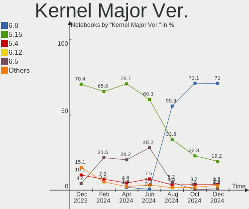
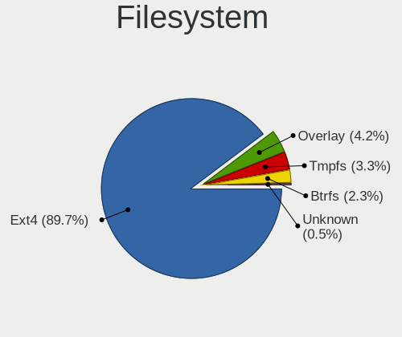
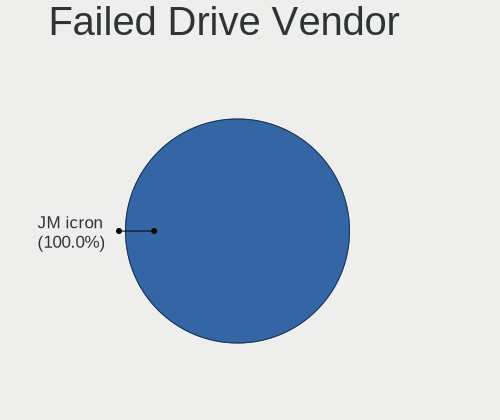
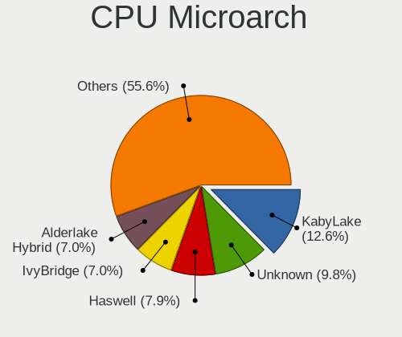
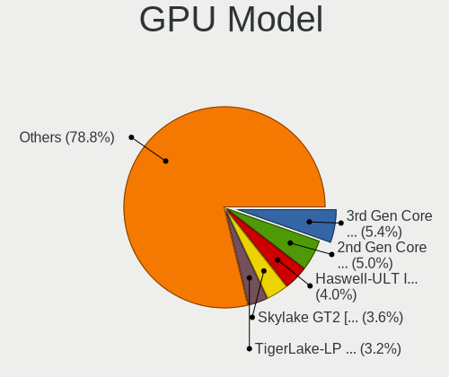
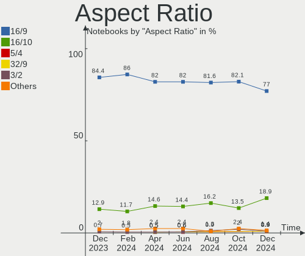

Linux Mint - Hardware Trends (Notebooks)
----------------------------------------

A project to identify most popular hardware characteristics and track their change
over time based on data collected by Linux users at https://Linux-Hardware.org.

Anyone can contribute to this report by the [hw-probe](https://github.com/linuxhw/hw-probe) tool:

    sudo -E hw-probe -all -upload

This report is for one last month. Overall report since the beginning of time: [TestDays](https://github.com/linuxhw/TestDays)

Period: Dec, 2024.

Contents
--------

* [ System ](#system)
  - [ OS                       ](#os)
  - [ OS Family                ](#os-family)
  - [ Kernel                   ](#kernel)
  - [ Kernel Family            ](#kernel-family)
  - [ Kernel Major Ver.        ](#kernel-major-ver)
  - [ Arch                     ](#arch)
  - [ DE                       ](#de)
  - [ Display Server           ](#display-server)
  - [ Display Manager          ](#display-manager)
  - [ OS Lang                  ](#os-lang)
  - [ Boot Mode                ](#boot-mode)
  - [ Filesystem               ](#filesystem)
  - [ Part. scheme             ](#part-scheme)
  - [ Dual Boot with Linux/BSD ](#dual-boot-with-linuxbsd)
  - [ Dual Boot (Win)          ](#dual-boot-win)

* [ Board ](#board)
  - [ Vendor                   ](#vendor)
  - [ Model                    ](#model)
  - [ Model Family             ](#model-family)
  - [ MFG Year                 ](#mfg-year)
  - [ Form Factor              ](#form-factor)
  - [ Secure Boot              ](#secure-boot)
  - [ Coreboot                 ](#coreboot)
  - [ RAM Size                 ](#ram-size)
  - [ RAM Used                 ](#ram-used)
  - [ Total Drives             ](#total-drives)
  - [ Has CD-ROM               ](#has-cd-rom)
  - [ Has Ethernet             ](#has-ethernet)
  - [ Has WiFi                 ](#has-wifi)
  - [ Has Bluetooth            ](#has-bluetooth)

* [ Location ](#location)
  - [ Country                  ](#country)
  - [ City                     ](#city)

* [ Drives ](#drives)
  - [ Drive Vendor             ](#drive-vendor)
  - [ Drive Model              ](#drive-model)
  - [ HDD Vendor               ](#hdd-vendor)
  - [ SSD Vendor               ](#ssd-vendor)
  - [ Drive Kind               ](#drive-kind)
  - [ Drive Connector          ](#drive-connector)
  - [ Drive Size               ](#drive-size)
  - [ Space Total              ](#space-total)
  - [ Space Used               ](#space-used)
  - [ Malfunc. Drives          ](#malfunc-drives)
  - [ Malfunc. Drive Vendor    ](#malfunc-drive-vendor)
  - [ Malfunc. HDD Vendor      ](#malfunc-hdd-vendor)
  - [ Malfunc. Drive Kind      ](#malfunc-drive-kind)
  - [ Failed Drives            ](#failed-drives)
  - [ Failed Drive Vendor      ](#failed-drive-vendor)
  - [ Drive Status             ](#drive-status)

* [ Storage controller ](#storage-controller)
  - [ Storage Vendor           ](#storage-vendor)
  - [ Storage Model            ](#storage-model)
  - [ Storage Kind             ](#storage-kind)

* [ Processor ](#processor)
  - [ CPU Vendor               ](#cpu-vendor)
  - [ CPU Model                ](#cpu-model)
  - [ CPU Model Family         ](#cpu-model-family)
  - [ CPU Cores                ](#cpu-cores)
  - [ CPU Sockets              ](#cpu-sockets)
  - [ CPU Threads              ](#cpu-threads)
  - [ CPU Op-Modes             ](#cpu-op-modes)
  - [ CPU Microcode            ](#cpu-microcode)
  - [ CPU Microarch            ](#cpu-microarch)

* [ Graphics ](#graphics)
  - [ GPU Vendor               ](#gpu-vendor)
  - [ GPU Model                ](#gpu-model)
  - [ GPU Combo                ](#gpu-combo)
  - [ GPU Driver               ](#gpu-driver)
  - [ GPU Memory               ](#gpu-memory)

* [ Monitor ](#monitor)
  - [ Monitor Vendor           ](#monitor-vendor)
  - [ Monitor Model            ](#monitor-model)
  - [ Monitor Resolution       ](#monitor-resolution)
  - [ Monitor Diagonal         ](#monitor-diagonal)
  - [ Monitor Width            ](#monitor-width)
  - [ Aspect Ratio             ](#aspect-ratio)
  - [ Monitor Area             ](#monitor-area)
  - [ Pixel Density            ](#pixel-density)
  - [ Multiple Monitors        ](#multiple-monitors)

* [ Network ](#network)
  - [ Net Controller Vendor    ](#net-controller-vendor)
  - [ Net Controller Model     ](#net-controller-model)
  - [ Wireless Vendor          ](#wireless-vendor)
  - [ Wireless Model           ](#wireless-model)
  - [ Ethernet Vendor          ](#ethernet-vendor)
  - [ Ethernet Model           ](#ethernet-model)
  - [ Net Controller Kind      ](#net-controller-kind)
  - [ Used Controller          ](#used-controller)
  - [ NICs                     ](#nics)
  - [ IPv6                     ](#ipv6)

* [ Bluetooth ](#bluetooth)
  - [ Bluetooth Vendor         ](#bluetooth-vendor)
  - [ Bluetooth Model          ](#bluetooth-model)

* [ Sound ](#sound)
  - [ Sound Vendor             ](#sound-vendor)
  - [ Sound Model              ](#sound-model)

* [ Memory ](#memory)
  - [ Memory Vendor            ](#memory-vendor)
  - [ Memory Model             ](#memory-model)
  - [ Memory Kind              ](#memory-kind)
  - [ Memory Form Factor       ](#memory-form-factor)
  - [ Memory Size              ](#memory-size)
  - [ Memory Speed             ](#memory-speed)

* [ Printers & scanners ](#printers--scanners)
  - [ Printer Vendor           ](#printer-vendor)
  - [ Printer Model            ](#printer-model)
  - [ Scanner Vendor           ](#scanner-vendor)
  - [ Scanner Model            ](#scanner-model)

* [ Camera ](#camera)
  - [ Camera Vendor            ](#camera-vendor)
  - [ Camera Model             ](#camera-model)

* [ Security ](#security)
  - [ Fingerprint Vendor       ](#fingerprint-vendor)
  - [ Fingerprint Model        ](#fingerprint-model)
  - [ Chipcard Vendor          ](#chipcard-vendor)
  - [ Chipcard Model           ](#chipcard-model)

* [ Unsupported ](#unsupported)
  - [ Unsupported Devices      ](#unsupported-devices)
  - [ Unsupported Device Types ](#unsupported-device-types)

System
------

OS
--

Installed operating systems

| Name            | Notebooks | Percent |
|-----------------|-----------|---------|
| Linux Mint 22   | 145       | 67.76%  |
| Linux Mint 21.3 | 38        | 17.76%  |
| Linux Mint 20.3 | 6         | 2.8%    |
| Linux Mint 21.2 | 5         | 2.34%   |
| Linux Mint 21.1 | 5         | 2.34%   |
| Linux Mint 21   | 5         | 2.34%   |
| Linux Mint 22.1 | 4         | 1.87%   |
| Linux Mint 20   | 2         | 0.93%   |
| Linux Mint 20.2 | 1         | 0.47%   |
| Linux Mint 20.1 | 1         | 0.47%   |
| Linux Mint 19.3 | 1         | 0.47%   |
| Linux Mint 18.2 | 1         | 0.47%   |

OS Family
---------

OS without a version

| Name       | Notebooks | Percent |
|------------|-----------|---------|
| Linux Mint | 214       | 100%    |

Kernel
------

Version of the Linux kernel

| Version                  | Notebooks | Percent |
|--------------------------|-----------|---------|
| 6.8.0-49-generic         | 60        | 28.04%  |
| 6.8.0-51-generic         | 43        | 20.09%  |
| 6.8.0-50-generic         | 23        | 10.75%  |
| 6.8.0-38-generic         | 17        | 7.94%   |
| 5.15.0-126-generic       | 15        | 7.01%   |
| 5.15.0-130-generic       | 12        | 5.61%   |
| 5.15.0-127-generic       | 4         | 1.87%   |
| 6.8.0-48-generic         | 3         | 1.4%    |
| 5.4.0-204-generic        | 3         | 1.4%    |
| 5.15.0-128-generic       | 3         | 1.4%    |
| 6.8.0-45-generic         | 2         | 0.93%   |
| 5.15.0-125-generic       | 2         | 0.93%   |
| 6.9.10-x64v3-xanmod1     | 1         | 0.47%   |
| 6.8.0-47-generic         | 1         | 0.47%   |
| 6.8.0-41-generic         | 1         | 0.47%   |
| 6.8.0-40-generic         | 1         | 0.47%   |
| 6.8.0-31-generic         | 1         | 0.47%   |
| 6.5.0-1027-oem           | 1         | 0.47%   |
| 6.5.0-1022-oem           | 1         | 0.47%   |
| 6.12.2-061202-generic    | 1         | 0.47%   |
| 6.12.1-1-liquorix-amd64  | 1         | 0.47%   |
| 6.12.1-061201-generic    | 1         | 0.47%   |
| 6.12.0-061200-generic    | 1         | 0.47%   |
| 6.11.11-x64v3-xanmod1    | 1         | 0.47%   |
| 6.11.10-1-liquorix-amd64 | 1         | 0.47%   |
| 6.1.0-28-amd64           | 1         | 0.47%   |
| 5.4.0-58-generic         | 1         | 0.47%   |
| 5.4.0-202-generic        | 1         | 0.47%   |
| 5.4.0-200-generic        | 1         | 0.47%   |
| 5.4.0-182-generic        | 1         | 0.47%   |
| 5.4.0-109-generic        | 1         | 0.47%   |
| 5.17.0-1033-oem          | 1         | 0.47%   |
| 5.15.0-72-generic        | 1         | 0.47%   |
| 5.15.0-124-generic       | 1         | 0.47%   |
| 5.15.0-119-generic       | 1         | 0.47%   |
| 5.15.0-113-generic       | 1         | 0.47%   |
| 5.15.0-102-generic       | 1         | 0.47%   |
| 4.8.0-53-generic         | 1         | 0.47%   |
| 4.15.0-213-generic       | 1         | 0.47%   |

Kernel Family
-------------

Linux kernel without a distro release

| Version | Notebooks | Percent |
|---------|-----------|---------|
| 6.8.0   | 152       | 71.03%  |
| 5.15.0  | 41        | 19.16%  |
| 5.4.0   | 8         | 3.74%   |
| 6.5.0   | 2         | 0.93%   |
| 6.12.1  | 2         | 0.93%   |
| 6.9.10  | 1         | 0.47%   |
| 6.12.2  | 1         | 0.47%   |
| 6.12.0  | 1         | 0.47%   |
| 6.11.11 | 1         | 0.47%   |
| 6.11.10 | 1         | 0.47%   |
| 6.1.0   | 1         | 0.47%   |
| 5.17.0  | 1         | 0.47%   |
| 4.8.0   | 1         | 0.47%   |
| 4.15.0  | 1         | 0.47%   |

Kernel Major Ver.
-----------------

Linux kernel major version

| Version | Notebooks | Percent |
|---------|-----------|---------|
| 6.8     | 152       | 71.03%  |
| 5.15    | 41        | 19.16%  |
| 5.4     | 8         | 3.74%   |
| 6.12    | 4         | 1.87%   |
| 6.5     | 2         | 0.93%   |
| 6.11    | 2         | 0.93%   |
| 6.9     | 1         | 0.47%   |
| 6.1     | 1         | 0.47%   |
| 5.17    | 1         | 0.47%   |
| 4.8     | 1         | 0.47%   |
| 4.15    | 1         | 0.47%   |

Arch
----

OS architecture (x86_64, i586, etc.)

| Name   | Notebooks | Percent |
|--------|-----------|---------|
| x86_64 | 214       | 100%    |

DE
--

Desktop Environment

| Name       | Notebooks | Percent |
|------------|-----------|---------|
| X-Cinnamon | 167       | 78.04%  |
| XFCE       | 23        | 10.75%  |
| MATE       | 17        | 7.94%   |
| GNOME      | 5         | 2.34%   |
| Cinnamon   | 1         | 0.47%   |
| Unknown    | 1         | 0.47%   |

Display Server
--------------

X11 or Wayland

| Name    | Notebooks | Percent |
|---------|-----------|---------|
| X11     | 210       | 98.13%  |
| Wayland | 3         | 1.4%    |
| Tty     | 1         | 0.47%   |

Display Manager
---------------

SDDM, LightDM, etc.

| Name    | Notebooks | Percent |
|---------|-----------|---------|
| LightDM | 168       | 78.5%   |
| Unknown | 42        | 19.63%  |
| GDM3    | 3         | 1.4%    |
| SDDM    | 1         | 0.47%   |

OS Lang
-------

Language

| Lang  | Notebooks | Percent |
|-------|-----------|---------|
| en_US | 59        | 27.57%  |
| it_IT | 29        | 13.55%  |
| de_DE | 19        | 8.88%   |
| fr_FR | 12        | 5.61%   |
| ru_RU | 11        | 5.14%   |
| pt_BR | 9         | 4.21%   |
| C     | 9         | 4.21%   |
| en_GB | 8         | 3.74%   |
| en_CA | 8         | 3.74%   |
| en_AU | 6         | 2.8%    |
| en_IN | 5         | 2.34%   |
| es_ES | 4         | 1.87%   |
| tr_TR | 3         | 1.4%    |
| pl_PL | 3         | 1.4%    |
| nl_BE | 3         | 1.4%    |
| es_MX | 3         | 1.4%    |
| de_AT | 3         | 1.4%    |
| sv_SE | 2         | 0.93%   |
| es_CL | 2         | 0.93%   |
| en_ZA | 2         | 0.93%   |
| zh_CN | 1         | 0.47%   |
| uk_UA | 1         | 0.47%   |
| ro_RO | 1         | 0.47%   |
| pt_PT | 1         | 0.47%   |
| nl_NL | 1         | 0.47%   |
| ja_JP | 1         | 0.47%   |
| hu_HU | 1         | 0.47%   |
| fr_CA | 1         | 0.47%   |
| fi_FI | 1         | 0.47%   |
| es_AR | 1         | 0.47%   |
| en_NG | 1         | 0.47%   |
| en_IE | 1         | 0.47%   |
| ca_ES | 1         | 0.47%   |
| bg_BG | 1         | 0.47%   |

Boot Mode
---------

EFI or BIOS

| Mode | Notebooks | Percent |
|------|-----------|---------|
| EFI  | 169       | 78.97%  |
| BIOS | 45        | 21.03%  |

Filesystem
----------

Type of filesystem

| Type    | Notebooks | Percent |
|---------|-----------|---------|
| Ext4    | 192       | 89.72%  |
| Overlay | 9         | 4.21%   |
| Tmpfs   | 7         | 3.27%   |
| Btrfs   | 5         | 2.34%   |
| Unknown | 1         | 0.47%   |

Part. scheme
------------

Scheme of partitioning

| Type    | Notebooks | Percent |
|---------|-----------|---------|
| GPT     | 153       | 71.5%   |
| Unknown | 42        | 19.63%  |
| MBR     | 19        | 8.88%   |

Dual Boot with Linux/BSD
------------------------

Hosting more than one Linux/BSD

| Dual boot | Notebooks | Percent |
|-----------|-----------|---------|
| No        | 192       | 89.72%  |
| Yes       | 22        | 10.28%  |

Dual Boot (Win)
---------------

Hosting Linux and Windows

| Dual boot | Notebooks | Percent |
|-----------|-----------|---------|
| No        | 143       | 66.82%  |
| Yes       | 71        | 33.18%  |

Board
-----

Vendor
------

Motherboard manufacturer

| Name                 | Notebooks | Percent |
|----------------------|-----------|---------|
| Lenovo               | 42        | 19.63%  |
| Hewlett-Packard      | 35        | 16.36%  |
| ASUSTek Computer     | 33        | 15.42%  |
| Acer                 | 28        | 13.08%  |
| Dell                 | 23        | 10.75%  |
| Apple                | 11        | 5.14%   |
| MSI                  | 6         | 2.8%    |
| HUAWEI               | 6         | 2.8%    |
| Samsung Electronics  | 5         | 2.34%   |
| Toshiba              | 4         | 1.87%   |
| Unknown              | 4         | 1.87%   |
| Sony                 | 2         | 0.93%   |
| Fujitsu              | 2         | 0.93%   |
| eMachines            | 2         | 0.93%   |
| VALE                 | 1         | 0.47%   |
| TECNO Mobile Limited | 1         | 0.47%   |
| Positivo             | 1         | 0.47%   |
| NEC Computers        | 1         | 0.47%   |
| MicroByte            | 1         | 0.47%   |
| Maibenben            | 1         | 0.47%   |
| LG Electronics       | 1         | 0.47%   |
| Google               | 1         | 0.47%   |
| Gateway              | 1         | 0.47%   |
| Fujitsu Siemens      | 1         | 0.47%   |
| Clevo                | 1         | 0.47%   |

Model
-----

Motherboard model

| Name                                     | Notebooks | Percent |
|------------------------------------------|-----------|---------|
| Unknown                                  | 5         | 2.34%   |
| ASUS VivoBook_ASUSLaptop X1404ZA_X1404ZA | 3         | 1.4%    |
| Samsung 550XDA                           | 2         | 0.93%   |
| Lenovo ThinkPad E16 Gen 2 21M5CTO1WW     | 2         | 0.93%   |
| HUAWEI KPL-W0X                           | 2         | 0.93%   |
| HP Pavilion Gaming Laptop 17-cd1xxx      | 2         | 0.93%   |
| HP Pavilion g6                           | 2         | 0.93%   |
| HP ENVY Laptop 13-ba1xxx                 | 2         | 0.93%   |
| Dell XPS 15 9510                         | 2         | 0.93%   |
| ASUS ASUS TUF Gaming F15 FX506HF_FX506HF | 2         | 0.93%   |
| Apple MacBookPro8,1                      | 2         | 0.93%   |
| Apple MacBookPro11,1                     | 2         | 0.93%   |
| Acer Aspire A515-45                      | 2         | 0.93%   |
| VALE Notebook Slim S132                  | 1         | 0.47%   |
| Toshiba Satellite Pro S500               | 1         | 0.47%   |
| Toshiba Satellite L850                   | 1         | 0.47%   |
| Toshiba Satellite C655D                  | 1         | 0.47%   |
| Toshiba PORTEGE X30-E                    | 1         | 0.47%   |
| TECNO Mobile Limited MEGABOOK T15DA      | 1         | 0.47%   |
| Sony VPCEA290X                           | 1         | 0.47%   |
| Sony VGN-FZ31M                           | 1         | 0.47%   |
| Samsung 700T1C                           | 1         | 0.47%   |
| Samsung 550P5C/550P7C                    | 1         | 0.47%   |
| Samsung 350V5C/351V5C/3540VC/3440VC      | 1         | 0.47%   |
| Positivo Q4128C                          | 1         | 0.47%   |
| NEC Computers PC-GN174FAAU               | 1         | 0.47%   |
| MSI Modern 15 A11MU                      | 1         | 0.47%   |
| MSI GT70                                 | 1         | 0.47%   |
| MSI GS60 6QE                             | 1         | 0.47%   |
| MSI GL63 8RC                             | 1         | 0.47%   |
| MSI GE60 2PE                             | 1         | 0.47%   |
| MSI CR61 2M/CX61 2OC/CX61 2OD            | 1         | 0.47%   |
| MicroByte ezbook                         | 1         | 0.47%   |
| Maibenben Typhoon Series                 | 1         | 0.47%   |
| LG 17Z90R-K.AA78A9                       | 1         | 0.47%   |
| Lenovo ThinkPad X250 20CLS11W0W          | 1         | 0.47%   |
| Lenovo ThinkPad X220 4290W4H             | 1         | 0.47%   |
| Lenovo ThinkPad X131e 33671P9            | 1         | 0.47%   |
| Lenovo ThinkPad X1 Carbon 6th 20KHCTO1WW | 1         | 0.47%   |
| Lenovo ThinkPad X1 Carbon 6th 20KGS0N400 | 1         | 0.47%   |

Model Family
------------

Motherboard model prefix

| Name                          | Notebooks | Percent |
|-------------------------------|-----------|---------|
| Lenovo ThinkPad               | 21        | 9.81%   |
| Acer Aspire                   | 18        | 8.41%   |
| Lenovo IdeaPad                | 12        | 5.61%   |
| Dell Latitude                 | 11        | 5.14%   |
| HP Pavilion                   | 9         | 4.21%   |
| Dell Inspiron                 | 8         | 3.74%   |
| ASUS VivoBook                 | 7         | 3.27%   |
| HP Laptop                     | 5         | 2.34%   |
| HP EliteBook                  | 5         | 2.34%   |
| ASUS ASUS                     | 5         | 2.34%   |
| Acer Swift                    | 5         | 2.34%   |
| Unknown                       | 5         | 2.34%   |
| HP ProBook                    | 4         | 1.87%   |
| Apple MacBookPro11            | 4         | 1.87%   |
| Toshiba Satellite             | 3         | 1.4%    |
| HP ENVY                       | 3         | 1.4%    |
| HP 250                        | 3         | 1.4%    |
| Dell XPS                      | 3         | 1.4%    |
| Samsung 550XDA                | 2         | 0.93%   |
| Lenovo Legion                 | 2         | 0.93%   |
| HUAWEI KPL-W0X                | 2         | 0.93%   |
| HP Victus                     | 2         | 0.93%   |
| Fujitsu LIFEBOOK              | 2         | 0.93%   |
| ASUS ROG                      | 2         | 0.93%   |
| Apple MacBookPro8             | 2         | 0.93%   |
| Apple MacBookAir6             | 2         | 0.93%   |
| VALE Notebook                 | 1         | 0.47%   |
| Toshiba PORTEGE               | 1         | 0.47%   |
| TECNO Mobile Limited MEGABOOK | 1         | 0.47%   |
| Sony VPCEA290X                | 1         | 0.47%   |
| Sony VGN-FZ31M                | 1         | 0.47%   |
| Samsung 700T1C                | 1         | 0.47%   |
| Samsung 550P5C                | 1         | 0.47%   |
| Samsung 350V5C                | 1         | 0.47%   |
| Positivo Q4128C               | 1         | 0.47%   |
| NEC Computers PC-GN174FAAU    | 1         | 0.47%   |
| MSI Modern                    | 1         | 0.47%   |
| MSI GT70                      | 1         | 0.47%   |
| MSI GS60                      | 1         | 0.47%   |
| MSI GL63                      | 1         | 0.47%   |

MFG Year
--------

Motherboard manufacture year

| Year | Notebooks | Percent |
|------|-----------|---------|
| 2021 | 22        | 10.28%  |
| 2024 | 17        | 7.94%   |
| 2023 | 17        | 7.94%   |
| 2020 | 17        | 7.94%   |
| 2022 | 15        | 7.01%   |
| 2011 | 15        | 7.01%   |
| 2015 | 14        | 6.54%   |
| 2012 | 13        | 6.07%   |
| 2018 | 12        | 5.61%   |
| 2017 | 12        | 5.61%   |
| 2013 | 12        | 5.61%   |
| 2014 | 11        | 5.14%   |
| 2019 | 8         | 3.74%   |
| 2016 | 7         | 3.27%   |
| 2010 | 7         | 3.27%   |
| 2009 | 6         | 2.8%    |
| 2008 | 6         | 2.8%    |
| 2007 | 3         | 1.4%    |

Form Factor
-----------

Physical design of the computer

| Name     | Notebooks | Percent |
|----------|-----------|---------|
| Notebook | 214       | 100%    |

Secure Boot
-----------

Enabled or disabled

| State    | Notebooks | Percent |
|----------|-----------|---------|
| Disabled | 185       | 86.45%  |
| Enabled  | 29        | 13.55%  |

Coreboot
--------

Have coreboot on board

| Used | Notebooks | Percent |
|------|-----------|---------|
| No   | 213       | 99.53%  |
| Yes  | 1         | 0.47%   |

RAM Size
--------

Total RAM memory

| Size in GB  | Notebooks | Percent |
|-------------|-----------|---------|
| 4.01-8.0    | 66        | 30.84%  |
| 8.01-16.0   | 47        | 21.96%  |
| 3.01-4.0    | 33        | 15.42%  |
| 16.01-24.0  | 33        | 15.42%  |
| 32.01-64.0  | 16        | 7.48%   |
| 24.01-32.0  | 8         | 3.74%   |
| 2.01-3.0    | 4         | 1.87%   |
| 1.01-2.0    | 4         | 1.87%   |
| 64.01-256.0 | 3         | 1.4%    |

RAM Used
--------

Used RAM memory

| Used GB    | Notebooks | Percent |
|------------|-----------|---------|
| 2.01-3.0   | 73        | 34.11%  |
| 1.01-2.0   | 52        | 24.3%   |
| 3.01-4.0   | 37        | 17.29%  |
| 4.01-8.0   | 35        | 16.36%  |
| 8.01-16.0  | 10        | 4.67%   |
| 0.51-1.0   | 6         | 2.8%    |
| 16.01-24.0 | 1         | 0.47%   |

Total Drives
------------

Number of drives on board

| Drives | Notebooks | Percent |
|--------|-----------|---------|
| 1      | 174       | 81.31%  |
| 2      | 35        | 16.36%  |
| 3      | 5         | 2.34%   |

Has CD-ROM
----------

Has CD-ROM on board

| Presented | Notebooks | Percent |
|-----------|-----------|---------|
| No        | 150       | 70.09%  |
| Yes       | 64        | 29.91%  |

Has Ethernet
------------

Has Ethernet on board

| Presented | Notebooks | Percent |
|-----------|-----------|---------|
| Yes       | 156       | 72.9%   |
| No        | 58        | 27.1%   |

Has WiFi
--------

Has WiFi module

| Presented | Notebooks | Percent |
|-----------|-----------|---------|
| Yes       | 210       | 98.13%  |
| No        | 4         | 1.87%   |

Has Bluetooth
-------------

Has Bluetooth module

| Presented | Notebooks | Percent |
|-----------|-----------|---------|
| Yes       | 179       | 83.64%  |
| No        | 35        | 16.36%  |

Location
--------

Country
-------

Geographic location (country)

| Country         | Notebooks | Percent |
|-----------------|-----------|---------|
| Italy           | 28        | 13.08%  |
| USA             | 25        | 11.68%  |
| Germany         | 23        | 10.75%  |
| France          | 13        | 6.07%   |
| Russia          | 10        | 4.67%   |
| Brazil          | 10        | 4.67%   |
| Canada          | 9         | 4.21%   |
| Poland          | 7         | 3.27%   |
| UK              | 6         | 2.8%    |
| India           | 6         | 2.8%    |
| Australia       | 6         | 2.8%    |
| Spain           | 5         | 2.34%   |
| Romania         | 5         | 2.34%   |
| Bulgaria        | 5         | 2.34%   |
| Mexico          | 4         | 1.87%   |
| Turkey          | 3         | 1.4%    |
| Switzerland     | 3         | 1.4%    |
| Sweden          | 3         | 1.4%    |
| Hungary         | 3         | 1.4%    |
| Belgium         | 3         | 1.4%    |
| Austria         | 3         | 1.4%    |
| Argentina       | 3         | 1.4%    |
| Ukraine         | 2         | 0.93%   |
| South Africa    | 2         | 0.93%   |
| Netherlands     | 2         | 0.93%   |
| Indonesia       | 2         | 0.93%   |
| Chile           | 2         | 0.93%   |
| Vietnam         | 1         | 0.47%   |
| Venezuela       | 1         | 0.47%   |
| UAE             | 1         | 0.47%   |
| The Netherlands | 1         | 0.47%   |
| Thailand        | 1         | 0.47%   |
| Saudi Arabia    | 1         | 0.47%   |
| Norway          | 1         | 0.47%   |
| Nigeria         | 1         | 0.47%   |
| Morocco         | 1         | 0.47%   |
| Kuwait          | 1         | 0.47%   |
| Kenya           | 1         | 0.47%   |
| Japan           | 1         | 0.47%   |
| Iran            | 1         | 0.47%   |

City
----

Geographic location (city)

| City                           | Notebooks | Percent |
|--------------------------------|-----------|---------|
| Sofia                          | 3         | 1.4%    |
| Milan                          | 3         | 1.4%    |
| Melbourne                      | 3         | 1.4%    |
| Darmstadt                      | 3         | 1.4%    |
| Berlin                         | 3         | 1.4%    |
| Verona                         | 2         | 0.93%   |
| Vero Beach                     | 2         | 0.93%   |
| Sydney                         | 2         | 0.93%   |
| Rome                           | 2         | 0.93%   |
| Passignano sul Trasimeno       | 2         | 0.93%   |
| Munich                         | 2         | 0.93%   |
| Moscow                         | 2         | 0.93%   |
| Lincolnton                     | 2         | 0.93%   |
| Istanbul                       | 2         | 0.93%   |
| Fossarmato                     | 2         | 0.93%   |
| Dallas                         | 2         | 0.93%   |
| Chateauguay                    | 2         | 0.93%   |
| Campinas                       | 2         | 0.93%   |
| Buenos Aires                   | 2         | 0.93%   |
| Bucharest                      | 2         | 0.93%   |
| Athens                         | 2         | 0.93%   |
| Amsterdam                      | 2         | 0.93%   |
| Yuzhno-Sakhalinsk              | 1         | 0.47%   |
| Wroclaw                        | 1         | 0.47%   |
| Wittingen                      | 1         | 0.47%   |
| Wiesbaden                      | 1         | 0.47%   |
| Voorhees Township              | 1         | 0.47%   |
| Villingen-Schwenningen         | 1         | 0.47%   |
| Vienna                         | 1         | 0.47%   |
| Venice                         | 1         | 0.47%   |
| Tychy                          | 1         | 0.47%   |
| Turobin                        | 1         | 0.47%   |
| Turin                          | 1         | 0.47%   |
| Tultitlán de Mariano Escobedo | 1         | 0.47%   |
| Tirana                         | 1         | 0.47%   |
| Tibau do Sul                   | 1         | 0.47%   |
| Terrebonne                     | 1         | 0.47%   |
| Tehran                         | 1         | 0.47%   |
| Târgu Mureş                  | 1         | 0.47%   |
| Tampere                        | 1         | 0.47%   |

Drives
------

Drive Vendor
------------

Hard drive vendors

| Vendor                         | Notebooks | Drives | Percent |
|--------------------------------|-----------|--------|---------|
| Samsung Electronics            | 44        | 46     | 17.39%  |
| WDC                            | 25        | 25     | 9.88%   |
| Sandisk                        | 16        | 16     | 6.32%   |
| Micron Technology              | 15        | 15     | 5.93%   |
| Seagate                        | 14        | 14     | 5.53%   |
| Kingston                       | 14        | 15     | 5.53%   |
| Crucial                        | 14        | 14     | 5.53%   |
| Toshiba                        | 13        | 13     | 5.14%   |
| SK hynix                       | 12        | 12     | 4.74%   |
| Unknown                        | 9         | 9      | 3.56%   |
| KIOXIA                         | 6         | 6      | 2.37%   |
| HGST                           | 6         | 6      | 2.37%   |
| Apple                          | 5         | 6      | 1.98%   |
| Intenso                        | 4         | 4      | 1.58%   |
| Hitachi                        | 4         | 4      | 1.58%   |
| UMIS                           | 3         | 3      | 1.19%   |
| A-DATA Technology              | 3         | 3      | 1.19%   |
| Transcend                      | 2         | 2      | 0.79%   |
| SPCC                           | 2         | 2      | 0.79%   |
| Silicon Motion                 | 2         | 2      | 0.79%   |
| MAXIO Technology (Hangzhou)    | 2         | 2      | 0.79%   |
| LITEONIT                       | 2         | 2      | 0.79%   |
| JMicron Technology             | 2         | 2      | 0.79%   |
| Intel                          | 2         | 3      | 0.79%   |
| HS-SSD-E100                    | 2         | 2      | 0.79%   |
| Unknown                        | 2         | 2      | 0.79%   |
| YMTC                           | 1         | 1      | 0.4%    |
| TO Exter                       | 1         | 1      | 0.4%    |
| Solid State Storage Technology | 1         | 1      | 0.4%    |
| ShiJi                          | 1         | 1      | 0.4%    |
| Shenzhen Longsys Electronics   | 1         | 1      | 0.4%    |
| PNY                            | 1         | 1      | 0.4%    |
| Plextor                        | 1         | 1      | 0.4%    |
| Phison                         | 1         | 1      | 0.4%    |
| Patriot                        | 1         | 1      | 0.4%    |
| NT-2TB                         | 1         | 1      | 0.4%    |
| Netac                          | 1         | 1      | 0.4%    |
| LITEON                         | 1         | 1      | 0.4%    |
| Lexar                          | 1         | 1      | 0.4%    |
| Leven                          | 1         | 1      | 0.4%    |

Drive Model
-----------

Hard drive models

| Model                                               | Notebooks | Percent |
|-----------------------------------------------------|-----------|---------|
| Sandisk WD Blue SN550 NVMe SSD 256GB                | 4         | 1.56%   |
| SanDisk NVMe SSD Drive 512GB                        | 4         | 1.56%   |
| Unknown MMC Card  128GB                             | 3         | 1.17%   |
| Seagate ST1000LM035-1RK172 1TB                      | 3         | 1.17%   |
| Samsung SSD 970 EVO Plus 2TB                        | 3         | 1.17%   |
| Samsung MZVLW256HEHP-000L7 256GB                    | 3         | 1.17%   |
| Kingston SA400S37240G 240GB SSD                     | 3         | 1.17%   |
| HGST HTS545050A7E680 500GB                          | 3         | 1.17%   |
| WDC WD3200BEVT-22ZCT0 320GB                         | 2         | 0.78%   |
| Unknown NVMe SSD Drive 1TB                          | 2         | 0.78%   |
| Toshiba MQ01ABF050 500GB                            | 2         | 0.78%   |
| SK hynix BC511 HFM512GDJTNI-82A0A 512GB             | 2         | 0.78%   |
| Seagate ST9500325AS 500GB                           | 2         | 0.78%   |
| SanDisk NVMe SSD Drive 1TB                          | 2         | 0.78%   |
| Samsung SSD 850 PRO 256GB                           | 2         | 0.78%   |
| Samsung NVMe SSD Controller SM981/PM981/PM983 512GB | 2         | 0.78%   |
| Samsung MZVLQ512HBLU-00B00 512GB                    | 2         | 0.78%   |
| Samsung MZVL21T0HCLR-00B00 1TB                      | 2         | 0.78%   |
| Samsung MZNLN256HMHQ-000H1 256GB SSD                | 2         | 0.78%   |
| Micron 2400_MTFDKBA512QFM 512GB                     | 2         | 0.78%   |
| Kingston SNV2S500G 500GB                            | 2         | 0.78%   |
| Kingston SA400S37480G 480GB SSD                     | 2         | 0.78%   |
| Kingston OM8PGP41024Q-A0 1TB                        | 2         | 0.78%   |
| HGST HTS721010A9E630 1TB                            | 2         | 0.78%   |
| Crucial CT525MX300SSD1 528GB                        | 2         | 0.78%   |
| Crucial CT500MX500SSD1 500GB                        | 2         | 0.78%   |
| Crucial CT500BX500SSD1 500GB                        | 2         | 0.78%   |
| Apple SSD SM0512F 500GB                             | 2         | 0.78%   |
| Unknown                                             | 2         | 0.78%   |
| YMTC PC300-512GB-B                                  | 1         | 0.39%   |
| WDC WDS480G2G0A-00JH30 480GB SSD                    | 1         | 0.39%   |
| WDC WDS250G1B0A-00H9H0 250GB SSD                    | 1         | 0.39%   |
| WDC WDS120G2G0A-00JH30 120GB SSD                    | 1         | 0.39%   |
| WDC WDS100T2B0A-00SM50 1TB SSD                      | 1         | 0.39%   |
| WDC WD7500BPVT-75A1YT0 752GB                        | 1         | 0.39%   |
| WDC WD5000LPCX-24VHAT0 500GB                        | 1         | 0.39%   |
| WDC WD3200BPVT-80JJ5T0 320GB                        | 1         | 0.39%   |
| WDC WD2500BEVT-22ZCT0 250GB                         | 1         | 0.39%   |
| WDC WD1600BEVT-75A23T0 160GB                        | 1         | 0.39%   |
| WDC WD10SPZX-08Z10 1TB                              | 1         | 0.39%   |

HDD Vendor
----------

Hard disk drive vendors

| Vendor              | Notebooks | Drives | Percent |
|---------------------|-----------|--------|---------|
| Seagate             | 14        | 14     | 31.82%  |
| WDC                 | 11        | 11     | 25%     |
| HGST                | 6         | 6      | 13.64%  |
| Toshiba             | 5         | 5      | 11.36%  |
| Hitachi             | 4         | 4      | 9.09%   |
| TO Exter            | 1         | 1      | 2.27%   |
| Samsung Electronics | 1         | 1      | 2.27%   |
| JMicron Technology  | 1         | 1      | 2.27%   |
| Fujitsu             | 1         | 1      | 2.27%   |

SSD Vendor
----------

Solid state drive vendors

| Vendor              | Notebooks | Drives | Percent |
|---------------------|-----------|--------|---------|
| Samsung Electronics | 19        | 19     | 22.09%  |
| Crucial             | 11        | 11     | 12.79%  |
| Kingston            | 10        | 11     | 11.63%  |
| WDC                 | 4         | 4      | 4.65%   |
| Toshiba             | 4         | 4      | 4.65%   |
| SanDisk             | 4         | 4      | 4.65%   |
| Intenso             | 4         | 4      | 4.65%   |
| Apple               | 4         | 4      | 4.65%   |
| Transcend           | 2         | 2      | 2.33%   |
| SPCC                | 2         | 2      | 2.33%   |
| SK hynix            | 2         | 2      | 2.33%   |
| Micron Technology   | 2         | 2      | 2.33%   |
| LITEONIT            | 2         | 2      | 2.33%   |
| ShiJi               | 1         | 1      | 1.16%   |
| PNY                 | 1         | 1      | 1.16%   |
| Patriot             | 1         | 1      | 1.16%   |
| NT-2TB              | 1         | 1      | 1.16%   |
| LITEON              | 1         | 1      | 1.16%   |
| Leven               | 1         | 1      | 1.16%   |
| KingSpec            | 1         | 1      | 1.16%   |
| Intel               | 1         | 1      | 1.16%   |
| Hewlett-Packard     | 1         | 1      | 1.16%   |
| GOODRAM             | 1         | 1      | 1.16%   |
| FIKWOT              | 1         | 1      | 1.16%   |
| Fanxiang            | 1         | 1      | 1.16%   |
| China               | 1         | 1      | 1.16%   |
| Azerty              | 1         | 1      | 1.16%   |
| A-DATA Technology   | 1         | 1      | 1.16%   |
| Unknown             | 1         | 1      | 1.16%   |

Drive Kind
----------

HDD or SSD

| Kind    | Notebooks | Drives | Percent |
|---------|-----------|--------|---------|
| NVMe    | 103       | 115    | 42.74%  |
| SSD     | 83        | 87     | 34.44%  |
| HDD     | 44        | 44     | 18.26%  |
| MMC     | 6         | 6      | 2.49%   |
| Unknown | 5         | 6      | 2.07%   |

Drive Connector
---------------

SATA, SAS, NVMe, etc.

| Type | Notebooks | Drives | Percent |
|------|-----------|--------|---------|
| SATA | 120       | 131    | 50.85%  |
| NVMe | 103       | 114    | 43.64%  |
| SAS  | 7         | 7      | 2.97%   |
| MMC  | 6         | 6      | 2.54%   |

Drive Size
----------

Size of hard drive

| Size in TB | Notebooks | Drives | Percent |
|------------|-----------|--------|---------|
| 0.01-0.5   | 88        | 93     | 70.4%   |
| 0.51-1.0   | 32        | 33     | 25.6%   |
| 1.01-2.0   | 5         | 5      | 4%      |

Space Total
-----------

Amount of disk space available on the file system

| Size in GB     | Notebooks | Percent |
|----------------|-----------|---------|
| 101-250        | 66        | 30.84%  |
| 251-500        | 65        | 30.37%  |
| 501-1000       | 30        | 14.02%  |
| 51-100         | 16        | 7.48%   |
| 1001-2000      | 14        | 6.54%   |
| 21-50          | 11        | 5.14%   |
| 1-20           | 5         | 2.34%   |
| More than 3000 | 4         | 1.87%   |
| 2001-3000      | 2         | 0.93%   |
| Unknown        | 1         | 0.47%   |

Space Used
----------

Amount of used disk space

| Used GB        | Notebooks | Percent |
|----------------|-----------|---------|
| 21-50          | 57        | 26.64%  |
| 1-20           | 52        | 24.3%   |
| 101-250        | 42        | 19.63%  |
| 51-100         | 23        | 10.75%  |
| 251-500        | 21        | 9.81%   |
| 501-1000       | 10        | 4.67%   |
| 1001-2000      | 5         | 2.34%   |
| 2001-3000      | 2         | 0.93%   |
| More than 3000 | 1         | 0.47%   |
| Unknown        | 1         | 0.47%   |

Malfunc. Drives
---------------

Drive models with a malfunction

| Model                                        | Notebooks | Drives | Percent |
|----------------------------------------------|-----------|--------|---------|
| HGST HTS545050A7E680 500GB                   | 2         | 2      | 11.76%  |
| WDC WDS120G2G0A-00JH30 120GB SSD             | 1         | 1      | 5.88%   |
| WDC WD3200BEVT-22ZCT0 320GB                  | 1         | 1      | 5.88%   |
| Toshiba MQ01ABF050 500GB                     | 1         | 1      | 5.88%   |
| Toshiba MQ01ABD100 1TB                       | 1         | 1      | 5.88%   |
| Toshiba MK3263GSX 320GB                      | 1         | 1      | 5.88%   |
| SK hynix HFS128G39TND-N210A 128GB SSD        | 1         | 1      | 5.88%   |
| Seagate ST9500325AS 500GB                    | 1         | 1      | 5.88%   |
| Seagate ST91603110CS 160GB                   | 1         | 1      | 5.88%   |
| Seagate ST2000LX001-1RG174 2TB               | 1         | 1      | 5.88%   |
| SanDisk SD8SN8U512G1002 512GB SSD            | 1         | 1      | 5.88%   |
| LITEONIT LMT-128M3M 128GB SSD                | 1         | 1      | 5.88%   |
| Leven JAJS600M512G-HUS1C172G1C344G 512GB SSD | 1         | 1      | 5.88%   |
| Kingston RBU-SMSM151S324GD 24GB SSD          | 1         | 1      | 5.88%   |
| Hitachi HTS725050A9A364 500GB                | 1         | 1      | 5.88%   |
| Hitachi HTS723232A7A364 320GB                | 1         | 1      | 5.88%   |

Malfunc. Drive Vendor
---------------------

Vendors of faulty drives

| Vendor   | Notebooks | Drives | Percent |
|----------|-----------|--------|---------|
| Toshiba  | 3         | 3      | 17.65%  |
| Seagate  | 3         | 3      | 17.65%  |
| WDC      | 2         | 2      | 11.76%  |
| Hitachi  | 2         | 2      | 11.76%  |
| HGST     | 2         | 2      | 11.76%  |
| SK hynix | 1         | 1      | 5.88%   |
| SanDisk  | 1         | 1      | 5.88%   |
| LITEONIT | 1         | 1      | 5.88%   |
| Leven    | 1         | 1      | 5.88%   |
| Kingston | 1         | 1      | 5.88%   |

Malfunc. HDD Vendor
-------------------

Vendors of faulty HDD drives

| Vendor  | Notebooks | Drives | Percent |
|---------|-----------|--------|---------|
| Toshiba | 3         | 3      | 27.27%  |
| Seagate | 3         | 3      | 27.27%  |
| Hitachi | 2         | 2      | 18.18%  |
| HGST    | 2         | 2      | 18.18%  |
| WDC     | 1         | 1      | 9.09%   |

Malfunc. Drive Kind
-------------------

Kinds of faulty drives

| Kind | Notebooks | Drives | Percent |
|------|-----------|--------|---------|
| HDD  | 11        | 11     | 64.71%  |
| SSD  | 6         | 6      | 35.29%  |

Failed Drives
-------------

Failed drive models

| Model             | Notebooks | Drives | Percent |
|-------------------|-----------|--------|---------|
| JM icron Tech 2TB | 1         | 1      | 100%    |

Failed Drive Vendor
-------------------

Failed drive vendors

| Vendor   | Notebooks | Drives | Percent |
|----------|-----------|--------|---------|
| JM icron | 1         | 1      | 100%    |

Drive Status
------------

Number of failed and malfunc. drives

| Status   | Notebooks | Drives | Percent |
|----------|-----------|--------|---------|
| Works    | 147       | 168    | 64.19%  |
| Detected | 64        | 72     | 27.95%  |
| Malfunc  | 17        | 17     | 7.42%   |
| Failed   | 1         | 1      | 0.44%   |

Storage controller
------------------

Storage Vendor
--------------

Storage controller vendors

| Vendor                           | Notebooks | Percent |
|----------------------------------|-----------|---------|
| Intel                            | 136       | 49.64%  |
| Samsung Electronics              | 27        | 9.85%   |
| SanDisk                          | 22        | 8.03%   |
| AMD                              | 21        | 7.66%   |
| Micron Technology                | 14        | 5.11%   |
| SK hynix                         | 9         | 3.28%   |
| KIOXIA                           | 6         | 2.19%   |
| Kingston Technology Company      | 5         | 1.82%   |
| Toshiba America Info Systems     | 4         | 1.46%   |
| Union Memory (Shenzhen)          | 3         | 1.09%   |
| Solidigm                         | 3         | 1.09%   |
| Shenzhen Longsys Electronics     | 3         | 1.09%   |
| Phison Electronics               | 3         | 1.09%   |
| MAXIO Technology (Hangzhou)      | 3         | 1.09%   |
| Solid State Storage Technology   | 2         | 0.73%   |
| Silicon Motion                   | 2         | 0.73%   |
| Nvidia                           | 2         | 0.73%   |
| Micron/Crucial Technology        | 2         | 0.73%   |
| Marvell Technology Group         | 2         | 0.73%   |
| ADATA Technology                 | 2         | 0.73%   |
| Yangtze Memory Technologies      | 1         | 0.36%   |
| Silicon Integrated Systems [SiS] | 1         | 0.36%   |
| JMicron Technology               | 1         | 0.36%   |

Storage Model
-------------

Storage controller models

| Model                                                                          | Notebooks | Percent |
|--------------------------------------------------------------------------------|-----------|---------|
| Intel Volume Management Device NVMe RAID Controller                            | 18        | 6.23%   |
| Intel Sunrise Point-LP SATA Controller [AHCI mode]                             | 17        | 5.88%   |
| AMD FCH SATA Controller [AHCI mode]                                            | 17        | 5.88%   |
| Intel 7 Series Chipset Family 6-port SATA Controller [AHCI mode]               | 16        | 5.54%   |
| Intel 6 Series/C200 Series Chipset Family 6 port Mobile SATA AHCI Controller   | 11        | 3.81%   |
| SanDisk Ultra 3D / WD PC SN530, IX SN530, Blue SN550 NVMe SSD (DRAM-less)      | 10        | 3.46%   |
| Intel 82801 Mobile SATA Controller [RAID mode]                                 | 10        | 3.46%   |
| Samsung NVMe SSD Controller SM981/PM981/PM983                                  | 8         | 2.77%   |
| Intel 8 Series SATA Controller 1 [AHCI mode]                                   | 7         | 2.42%   |
| Samsung NVMe SSD Controller 980 (DRAM-less)                                    | 6         | 2.08%   |
| Intel Cannon Lake Mobile PCH SATA AHCI Controller                              | 6         | 2.08%   |
| Micron 2400 NVMe SSD (DRAM-less)                                               | 5         | 1.73%   |
| Intel Wildcat Point-LP SATA Controller [AHCI Mode]                             | 5         | 1.73%   |
| Intel Celeron/Pentium Silver Processor SATA Controller                         | 5         | 1.73%   |
| Intel 82801IBM/IEM (ICH9M/ICH9M-E) 4 port SATA Controller [AHCI mode]          | 5         | 1.73%   |
| Intel 5 Series/3400 Series Chipset 4 port SATA AHCI Controller                 | 5         | 1.73%   |
| Intel Volume Management Device NVMe RAID Controller Intel Corporation          | 4         | 1.38%   |
| Intel Tiger Lake-LP SATA Controller                                            | 4         | 1.38%   |
| Intel HM170/QM170 Chipset SATA Controller [AHCI Mode]                          | 4         | 1.38%   |
| Intel Cannon Point-LP SATA Controller [AHCI Mode]                              | 4         | 1.38%   |
| Intel 8 Series/C220 Series Chipset Family 6-port SATA Controller 1 [AHCI mode] | 4         | 1.38%   |
| Solidigm P41 Plus NVMe SSD (DRAM-less) [Echo Harbor]                           | 3         | 1.04%   |
| SK hynix BC511 NVMe SSD                                                        | 3         | 1.04%   |
| Samsung NVMe SSD Controller SM961/PM961/SM963                                  | 3         | 1.04%   |
| Samsung NVMe SSD Controller S4LV008[Pascal]                                    | 3         | 1.04%   |
| Samsung NVMe SSD Controller PM9A1/PM9A3/980PRO                                 | 3         | 1.04%   |
| Micron 2550 NVMe SSD (DRAM-less)                                               | 3         | 1.04%   |
| KIOXIA NVMe SSD Controller BG4 (DRAM-less)                                     | 3         | 1.04%   |
| Kingston Company NV2 NVMe SSD [SM2267XT] (DRAM-less)                           | 3         | 1.04%   |
| Intel Alder Lake-P SATA AHCI Controller                                        | 3         | 1.04%   |
| Intel 82801HM/HEM (ICH8M/ICH8M-E) SATA Controller [AHCI mode]                  | 3         | 1.04%   |
| Intel 82801HM/HEM (ICH8M/ICH8M-E) IDE Controller                               | 3         | 1.04%   |
| AMD SB7x0/SB8x0/SB9x0 SATA Controller [AHCI mode]                              | 3         | 1.04%   |
| Toshiba America Info Systems XG6 NVMe SSD Controller                           | 2         | 0.69%   |
| SK hynix Gold P31/BC711/PC711 NVMe Solid State Drive                           | 2         | 0.69%   |
| SK hynix BC901 NVMe Solid State Drive (DRAM-less)                              | 2         | 0.69%   |
| Sandisk WD PC SN740 NVMe SSD 512GB (DRAM-less)                                 | 2         | 0.69%   |
| SanDisk PC SN520 x2 M.2 2242 NVMe SSD                                          | 2         | 0.69%   |
| Samsung S4LN053X01 AHCI SSD Controller(Apple slot)                             | 2         | 0.69%   |
| Samsung NVMe SSD Controller PM9C1a (DRAM-less)                                 | 2         | 0.69%   |

Storage Kind
------------

Kind of storage controller (IDE, SATA, NVMe, SAS, ...)

| Kind | Notebooks | Percent |
|------|-----------|---------|
| SATA | 134       | 48.38%  |
| NVMe | 102       | 36.82%  |
| RAID | 32        | 11.55%  |
| IDE  | 9         | 3.25%   |

Processor
---------

CPU Vendor
----------

Processor vendors

| Vendor | Notebooks | Percent |
|--------|-----------|---------|
| Intel  | 170       | 79.44%  |
| AMD    | 44        | 20.56%  |

CPU Model
---------

Processor models

| Model                                         | Notebooks | Percent |
|-----------------------------------------------|-----------|---------|
| Intel Core i5-7200U CPU @ 2.50GHz             | 4         | 1.87%   |
| Intel Core i5-6200U CPU @ 2.30GHz             | 4         | 1.87%   |
| Intel 12th Gen Core i3-1215U                  | 4         | 1.87%   |
| Intel 11th Gen Core i7-1165G7 @ 2.80GHz       | 4         | 1.87%   |
| Intel 11th Gen Core i3-1115G4 @ 3.00GHz       | 4         | 1.87%   |
| Intel Core Ultra 5 125U                       | 3         | 1.4%    |
| Intel Core i7-6700HQ CPU @ 2.60GHz            | 3         | 1.4%    |
| Intel Core i7-6600U CPU @ 2.60GHz             | 3         | 1.4%    |
| Intel Core i5-4210U CPU @ 1.70GHz             | 3         | 1.4%    |
| Intel Core i5-3230M CPU @ 2.60GHz             | 3         | 1.4%    |
| Intel Core i5-2520M CPU @ 2.50GHz             | 3         | 1.4%    |
| Intel 11th Gen Core i5-1135G7 @ 2.40GHz       | 3         | 1.4%    |
| Intel Core i7-8650U CPU @ 1.90GHz             | 2         | 0.93%   |
| Intel Core i7-2670QM CPU @ 2.20GHz            | 2         | 0.93%   |
| Intel Core i7-10750H CPU @ 2.60GHz            | 2         | 0.93%   |
| Intel Core i5-8365U CPU @ 1.60GHz             | 2         | 0.93%   |
| Intel Core i5-8350U CPU @ 1.70GHz             | 2         | 0.93%   |
| Intel Core i5-8300H CPU @ 2.30GHz             | 2         | 0.93%   |
| Intel Core i5-6300U CPU @ 2.40GHz             | 2         | 0.93%   |
| Intel Core i5-5200U CPU @ 2.20GHz             | 2         | 0.93%   |
| Intel Core i5-3320M CPU @ 2.60GHz             | 2         | 0.93%   |
| Intel Core i5-3210M CPU @ 2.50GHz             | 2         | 0.93%   |
| Intel Core i5-1035G1 CPU @ 1.00GHz            | 2         | 0.93%   |
| Intel Core i3-8145U CPU @ 2.10GHz             | 2         | 0.93%   |
| Intel Core i3-4005U CPU @ 1.70GHz             | 2         | 0.93%   |
| Intel Core i3-2330M CPU @ 2.20GHz             | 2         | 0.93%   |
| Intel Core 2 Duo CPU T7250 @ 2.00GHz          | 2         | 0.93%   |
| Intel Celeron N4020 CPU @ 1.10GHz             | 2         | 0.93%   |
| Intel Celeron CPU N3350 @ 1.10GHz             | 2         | 0.93%   |
| Intel 12th Gen Core i7-12700H                 | 2         | 0.93%   |
| Intel 11th Gen Core i9-11900H @ 2.50GHz       | 2         | 0.93%   |
| Intel 11th Gen Core i7-11800H @ 2.30GHz       | 2         | 0.93%   |
| Intel 11th Gen Core i5-11400H @ 2.70GHz       | 2         | 0.93%   |
| AMD Ryzen AI 9 HX 370 w/ Radeon 890M          | 2         | 0.93%   |
| AMD Ryzen 7 7730U with Radeon Graphics        | 2         | 0.93%   |
| AMD Ryzen 7 5700U with Radeon Graphics        | 2         | 0.93%   |
| AMD Ryzen 5 8645HS w/ Radeon 760M Graphics    | 2         | 0.93%   |
| AMD Ryzen 5 6600H with Radeon Graphics        | 2         | 0.93%   |
| AMD Ryzen 5 5500U with Radeon Graphics        | 2         | 0.93%   |
| AMD Ryzen 5 2500U with Radeon Vega Mobile Gfx | 2         | 0.93%   |

CPU Model Family
----------------

Processor model prefix

| Model                   | Notebooks | Percent |
|-------------------------|-----------|---------|
| Intel Core i5           | 51        | 23.83%  |
| Other                   | 40        | 18.69%  |
| Intel Core i7           | 31        | 14.49%  |
| Intel Core i3           | 18        | 8.41%   |
| AMD Ryzen 5             | 12        | 5.61%   |
| AMD Ryzen 7             | 10        | 4.67%   |
| Intel Core 2 Duo        | 9         | 4.21%   |
| Intel Celeron           | 9         | 4.21%   |
| Intel Pentium           | 5         | 2.34%   |
| Intel Core              | 5         | 2.34%   |
| AMD Ryzen 3             | 5         | 2.34%   |
| AMD Athlon              | 2         | 0.93%   |
| AMD A8                  | 2         | 0.93%   |
| Intel Pentium Silver    | 1         | 0.47%   |
| Intel Pentium Dual      | 1         | 0.47%   |
| Intel Genuine           | 1         | 0.47%   |
| Intel Celeron Dual-Core | 1         | 0.47%   |
| Intel Atom              | 1         | 0.47%   |
| AMD Ryzen 9             | 1         | 0.47%   |
| AMD Ryzen 7 PRO         | 1         | 0.47%   |
| AMD Ryzen 5 PRO         | 1         | 0.47%   |
| AMD E1                  | 1         | 0.47%   |
| AMD E                   | 1         | 0.47%   |
| AMD Athlon II           | 1         | 0.47%   |
| AMD Athlon 64 X2        | 1         | 0.47%   |
| AMD A6                  | 1         | 0.47%   |
| AMD A12                 | 1         | 0.47%   |
| AMD A10                 | 1         | 0.47%   |

CPU Cores
---------

Number of processor cores

| Number | Notebooks | Percent |
|--------|-----------|---------|
| 2      | 103       | 48.13%  |
| 4      | 52        | 24.3%   |
| 6      | 21        | 9.81%   |
| 8      | 17        | 7.94%   |
| 12     | 8         | 3.74%   |
| 14     | 4         | 1.87%   |
| 10     | 4         | 1.87%   |
| 16     | 2         | 0.93%   |
| 1      | 2         | 0.93%   |
| 24     | 1         | 0.47%   |

CPU Sockets
-----------

Number of sockets

| Number | Notebooks | Percent |
|--------|-----------|---------|
| 1      | 214       | 100%    |

CPU Threads
-----------

Threads per core (Hyper-Threading)

| Number | Notebooks | Percent |
|--------|-----------|---------|
| 2      | 178       | 83.18%  |
| 1      | 36        | 16.82%  |

CPU Op-Modes
------------

CPU Operation Modes (32-bit, 64-bit)

| Op mode        | Notebooks | Percent |
|----------------|-----------|---------|
| 32-bit, 64-bit | 214       | 100%    |

CPU Microcode
-------------

Microcode number

| Number     | Notebooks | Percent |
|------------|-----------|---------|
| Unknown    | 165       | 77.1%   |
| 0x406e3    | 5         | 2.34%   |
| 0x206a7    | 5         | 2.34%   |
| 0x806e9    | 4         | 1.87%   |
| 0x40651    | 4         | 1.87%   |
| 0x306a9    | 4         | 1.87%   |
| 0x6fd      | 3         | 1.4%    |
| 0x20655    | 3         | 1.4%    |
| 0xa0652    | 2         | 0.93%   |
| 0x806ea    | 2         | 0.93%   |
| 0x306d4    | 2         | 0.93%   |
| 0x10676    | 2         | 0.93%   |
| 0x906ed    | 1         | 0.47%   |
| 0x906a4    | 1         | 0.47%   |
| 0x806d1    | 1         | 0.47%   |
| 0x506e3    | 1         | 0.47%   |
| 0x406c4    | 1         | 0.47%   |
| 0x40661    | 1         | 0.47%   |
| 0x306c3    | 1         | 0.47%   |
| 0x30678    | 1         | 0.47%   |
| 0x1067a    | 1         | 0.47%   |
| 0x08600106 | 1         | 0.47%   |
| 0x08101007 | 1         | 0.47%   |
| 0x06006118 | 1         | 0.47%   |
| 0x05000119 | 1         | 0.47%   |

CPU Microarch
-------------

Microarchitecture

| Name              | Notebooks | Percent |
|-------------------|-----------|---------|
| KabyLake          | 27        | 12.62%  |
| Unknown           | 21        | 9.81%   |
| Haswell           | 17        | 7.94%   |
| IvyBridge         | 15        | 7.01%   |
| Alderlake Hybrid  | 15        | 7.01%   |
| Skylake           | 14        | 6.54%   |
| SandyBridge       | 14        | 6.54%   |
| TigerLake         | 13        | 6.07%   |
| Icelake           | 9         | 4.21%   |
| Westmere          | 7         | 3.27%   |
| Penryn            | 7         | 3.27%   |
| Broadwell         | 6         | 2.8%    |
| Zen 3             | 5         | 2.34%   |
| Meteorlake Hybrid | 5         | 2.34%   |
| Goldmont plus     | 5         | 2.34%   |
| Core              | 5         | 2.34%   |
| Zen+              | 4         | 1.87%   |
| Zen               | 4         | 1.87%   |
| Goldmont          | 3         | 1.4%    |
| CometLake         | 3         | 1.4%    |
| Zen 2             | 2         | 0.93%   |
| Silvermont        | 2         | 0.93%   |
| Piledriver        | 2         | 0.93%   |
| K8 Hammer         | 2         | 0.93%   |
| Excavator         | 2         | 0.93%   |
| Puma              | 1         | 0.47%   |
| K10 Llano         | 1         | 0.47%   |
| K10               | 1         | 0.47%   |
| Jaguar            | 1         | 0.47%   |
| Bobcat            | 1         | 0.47%   |

Graphics
--------

GPU Vendor
----------

Vendors of graphics cards

| Vendor | Notebooks | Percent |
|--------|-----------|---------|
| Intel  | 159       | 59.33%  |
| AMD    | 58        | 21.64%  |
| Nvidia | 51        | 19.03%  |

GPU Model
---------

Graphics card models

| Model                                                                                 | Notebooks | Percent |
|---------------------------------------------------------------------------------------|-----------|---------|
| Intel 3rd Gen Core processor Graphics Controller                                      | 15        | 5.4%    |
| Intel 2nd Generation Core Processor Family Integrated Graphics Controller             | 14        | 5.04%   |
| Intel Haswell-ULT Integrated Graphics Controller                                      | 11        | 3.96%   |
| Intel Skylake GT2 [HD Graphics 520]                                                   | 10        | 3.6%    |
| Intel TigerLake-LP GT2 [Iris Xe Graphics]                                             | 9         | 3.24%   |
| Intel UHD Graphics 620                                                                | 6         | 2.16%   |
| Intel TigerLake-H GT1 [UHD Graphics]                                                  | 6         | 2.16%   |
| Intel HD Graphics 620                                                                 | 6         | 2.16%   |
| AMD Lucienne                                                                          | 6         | 2.16%   |
| Intel Mobile 4 Series Chipset Integrated Graphics Controller                          | 5         | 1.8%    |
| Intel Core Processor Integrated Graphics Controller                                   | 5         | 1.8%    |
| Intel CoffeeLake-H GT2 [UHD Graphics 630]                                             | 5         | 1.8%    |
| AMD Sun XT [Radeon HD 8670A/8670M/8690M / R5 M330 / M430 / Radeon 520 Mobile]         | 5         | 1.8%    |
| AMD Rembrandt [Radeon 680M]                                                           | 5         | 1.8%    |
| Nvidia GA107M [GeForce RTX 3050 Ti Mobile]                                            | 4         | 1.44%   |
| Intel WhiskeyLake-U GT2 [UHD Graphics 620]                                            | 4         | 1.44%   |
| Intel Tiger Lake-LP GT2 [UHD Graphics G4]                                             | 4         | 1.44%   |
| Intel Meteor Lake-P [Intel Graphics]                                                  | 4         | 1.44%   |
| Intel HD Graphics 5500                                                                | 4         | 1.44%   |
| Intel GeminiLake [UHD Graphics 600]                                                   | 4         | 1.44%   |
| Intel Alder Lake-UP3 GT1 [UHD Graphics]                                               | 4         | 1.44%   |
| AMD Raven Ridge [Radeon Vega Series / Radeon Vega Mobile Series]                      | 4         | 1.44%   |
| AMD Picasso/Raven 2 [Radeon Vega Series / Radeon Vega Mobile Series]                  | 4         | 1.44%   |
| AMD Phoenix3                                                                          | 4         | 1.44%   |
| AMD Barcelo                                                                           | 4         | 1.44%   |
| Nvidia TU117M [GeForce GTX 1650 Mobile / Max-Q]                                       | 3         | 1.08%   |
| Intel Raptor Lake-S UHD Graphics                                                      | 3         | 1.08%   |
| Intel HD Graphics 530                                                                 | 3         | 1.08%   |
| Intel CometLake-U GT2 [UHD Graphics]                                                  | 3         | 1.08%   |
| Intel CometLake-H GT2 [UHD Graphics]                                                  | 3         | 1.08%   |
| AMD Topaz XT [Radeon R7 M260/M265 / M340/M360 / M440/M445 / 530/535 / 620/625 Mobile] | 3         | 1.08%   |
| Nvidia GP107M [GeForce MX350]                                                         | 2         | 0.72%   |
| Nvidia GP107M [GeForce GTX 1050 Mobile]                                               | 2         | 0.72%   |
| Nvidia GM108M [GeForce 840M]                                                          | 2         | 0.72%   |
| Nvidia GM107M [GeForce GTX 960M]                                                      | 2         | 0.72%   |
| Nvidia GA107M [GeForce RTX 3050 Mobile]                                               | 2         | 0.72%   |
| Nvidia GA107 [GeForce RTX 2050]                                                       | 2         | 0.72%   |
| Nvidia C79 [GeForce 9400M]                                                            | 2         | 0.72%   |
| Intel Raptor Lake-P [UHD Graphics]                                                    | 2         | 0.72%   |
| Intel Iris Plus Graphics G1 (Ice Lake)                                                | 2         | 0.72%   |

GPU Combo
---------

Combinations of graphics cards

| Name           | Notebooks | Percent |
|----------------|-----------|---------|
| 1 x Intel      | 103       | 48.13%  |
| Intel + Nvidia | 39        | 18.22%  |
| 1 x AMD        | 35        | 16.36%  |
| Intel + AMD    | 12        | 5.61%   |
| 1 x Nvidia     | 9         | 4.21%   |
| 2 x AMD        | 8         | 3.74%   |
| 2 x Intel      | 4         | 1.87%   |
| AMD + Nvidia   | 3         | 1.4%    |
| Other          | 1         | 0.47%   |

GPU Driver
----------

Free vs proprietary

| Driver      | Notebooks | Percent |
|-------------|-----------|---------|
| Free        | 163       | 76.17%  |
| Proprietary | 30        | 14.02%  |
| Unknown     | 21        | 9.81%   |

GPU Memory
----------

Total video memory

| Size in GB | Notebooks | Percent |
|------------|-----------|---------|
| Unknown    | 126       | 58.88%  |
| 0.01-0.5   | 30        | 14.02%  |
| 1.01-2.0   | 25        | 11.68%  |
| 0.51-1.0   | 13        | 6.07%   |
| 3.01-4.0   | 12        | 5.61%   |
| 5.01-6.0   | 3         | 1.4%    |
| 7.01-8.0   | 2         | 0.93%   |
| 2.01-3.0   | 2         | 0.93%   |
| 8.01-16.0  | 1         | 0.47%   |

Monitor
-------

Monitor Vendor
--------------

Monitor vendors

| Vendor                  | Notebooks | Percent |
|-------------------------|-----------|---------|
| AU Optronics            | 45        | 18.52%  |
| BOE                     | 40        | 16.46%  |
| Chimei Innolux          | 36        | 14.81%  |
| LG Display              | 29        | 11.93%  |
| Samsung Electronics     | 27        | 11.11%  |
| Apple                   | 11        | 4.53%   |
| Chi Mei Optoelectronics | 9         | 3.7%    |
| Goldstar                | 6         | 2.47%   |
| Hewlett-Packard         | 4         | 1.65%   |
| CSO                     | 4         | 1.65%   |
| Sharp                   | 3         | 1.23%   |
| PANDA                   | 3         | 1.23%   |
| Unknown                 | 2         | 0.82%   |
| Philips                 | 2         | 0.82%   |
| LG Philips              | 2         | 0.82%   |
| InfoVision              | 2         | 0.82%   |
| Dell                    | 2         | 0.82%   |
| AOC                     | 2         | 0.82%   |
| Westinghouse            | 1         | 0.41%   |
| ViewSonic               | 1         | 0.41%   |
| VIE                     | 1         | 0.41%   |
| Sony                    | 1         | 0.41%   |
| SLD                     | 1         | 0.41%   |
| Panasonic               | 1         | 0.41%   |
| NEC Computers           | 1         | 0.41%   |
| Lenovo                  | 1         | 0.41%   |
| Iiyama                  | 1         | 0.41%   |
| HannStar                | 1         | 0.41%   |
| CS_                     | 1         | 0.41%   |
| CPT                     | 1         | 0.41%   |
| ASUSTek Computer        | 1         | 0.41%   |
| Acer                    | 1         | 0.41%   |

Monitor Model
-------------

Monitor models

| Model                                                                    | Notebooks | Percent |
|--------------------------------------------------------------------------|-----------|---------|
| Samsung Electronics LCD Monitor SEC5441 1280x800 286x179mm 13.3-inch     | 4         | 1.65%   |
| LG Display LCD Monitor LGD02DC 1366x768 344x194mm 15.5-inch              | 4         | 1.65%   |
| Chimei Innolux LCD Monitor CMN1521 1920x1080 344x193mm 15.5-inch         | 4         | 1.65%   |
| Chimei Innolux LCD Monitor CMN15CA 1366x768 344x193mm 15.5-inch          | 3         | 1.23%   |
| Chi Mei Optoelectronics LCD Monitor CMO15A7 1366x768 344x193mm 15.5-inch | 3         | 1.23%   |
| AU Optronics LCD Monitor AUO81EC 1366x768 344x193mm 15.5-inch            | 3         | 1.23%   |
| AU Optronics LCD Monitor AUO403D 1920x1080 309x174mm 14.0-inch           | 3         | 1.23%   |
| Unknown LCD Monitor FFFF 2288x1287 2550x2550mm 142.0-inch                | 2         | 0.82%   |
| Samsung Electronics LCD Monitor SEC4251 1366x768 344x194mm 15.5-inch     | 2         | 0.82%   |
| Samsung Electronics LCD Monitor SDC4178 3200x2000 344x215mm 16.0-inch    | 2         | 0.82%   |
| LG Display LCD Monitor LGD0590 1920x1080 344x194mm 15.5-inch             | 2         | 0.82%   |
| Chimei Innolux LCD Monitor CMN15F5 1920x1080 344x193mm 15.5-inch         | 2         | 0.82%   |
| Chimei Innolux LCD Monitor CMN15E8 1920x1080 344x193mm 15.5-inch         | 2         | 0.82%   |
| Chimei Innolux LCD Monitor CMN15E7 1920x1080 344x193mm 15.5-inch         | 2         | 0.82%   |
| Chimei Innolux LCD Monitor CMN1471 1920x1200 301x188mm 14.0-inch         | 2         | 0.82%   |
| BOE LCD Monitor BOE0B56 1920x1080 309x174mm 14.0-inch                    | 2         | 0.82%   |
| BOE LCD Monitor BOE090F 1920x1080 344x194mm 15.5-inch                    | 2         | 0.82%   |
| BOE LCD Monitor BOE08F6 1920x1080 355x200mm 16.0-inch                    | 2         | 0.82%   |
| BOE LCD Monitor BOE083C 1920x1080 309x173mm 13.9-inch                    | 2         | 0.82%   |
| BOE LCD Monitor BOE0687 1920x1080 344x193mm 15.5-inch                    | 2         | 0.82%   |
| AU Optronics LCD Monitor AUODF87 1920x1080 344x193mm 15.5-inch           | 2         | 0.82%   |
| AU Optronics LCD Monitor AUO45EC 1366x768 344x193mm 15.5-inch            | 2         | 0.82%   |
| AU Optronics LCD Monitor AUO38ED 1920x1080 344x193mm 15.5-inch           | 2         | 0.82%   |
| AU Optronics LCD Monitor AUO21EC 1366x768 344x193mm 15.5-inch            | 2         | 0.82%   |
| Apple Color LCD APPA020 2560x1600 286x179mm 13.3-inch                    | 2         | 0.82%   |
| Westinghouse WD32HN1640 WET0316 1366x768 700x390mm 31.5-inch             | 1         | 0.41%   |
| ViewSonic VG710b VSCA318 1280x1024 338x270mm 17.0-inch                   | 1         | 0.41%   |
| VIE R200s VIE2022 1920x1080 527x336mm 24.6-inch                          | 1         | 0.41%   |
| Sony LCD Monitor SNY05FA 1366x768 310x170mm 13.9-inch                    | 1         | 0.41%   |
| SLD LCD Monitor SLD003C 1366x768 309x173mm 13.9-inch                     | 1         | 0.41%   |
| Sharp LCD Monitor SHP1516 3840x2400 336x210mm 15.6-inch                  | 1         | 0.41%   |
| Sharp LCD Monitor SHP14FA 3840x2400 288x180mm 13.4-inch                  | 1         | 0.41%   |
| Sharp LCD Monitor SHP14D0 3840x2400 336x210mm 15.6-inch                  | 1         | 0.41%   |
| Samsung Electronics SyncMaster SAM0304 1680x1050 494x320mm 23.2-inch     | 1         | 0.41%   |
| Samsung Electronics SyncMaster SAM02D0 1280x1024 376x301mm 19.0-inch     | 1         | 0.41%   |
| Samsung Electronics S24D330 SAM0D92 1920x1080 531x299mm 24.0-inch        | 1         | 0.41%   |
| Samsung Electronics S22F350 SAM0D1B 1920x1080 480x270mm 21.7-inch        | 1         | 0.41%   |
| Samsung Electronics S22C350 SAM0A32 1920x1080 477x268mm 21.5-inch        | 1         | 0.41%   |
| Samsung Electronics LS27CG51x SAM72FC 2560x1440 597x336mm 27.0-inch      | 1         | 0.41%   |
| Samsung Electronics LCD Monitor SEC5541 1366x768 344x193mm 15.5-inch     | 1         | 0.41%   |

Monitor Resolution
------------------

Monitor screen resolution

| Resolution         | Notebooks | Percent |
|--------------------|-----------|---------|
| 1920x1080 (FHD)    | 98        | 42.06%  |
| 1366x768 (WXGA)    | 68        | 29.18%  |
| 1920x1200 (WUXGA)  | 13        | 5.58%   |
| 1280x800 (WXGA)    | 9         | 3.86%   |
| 2560x1600          | 7         | 3%      |
| 3840x2160 (4K)     | 6         | 2.58%   |
| 2560x1440 (QHD)    | 4         | 1.72%   |
| 1600x900 (HD+)     | 4         | 1.72%   |
| 1440x900 (WXGA+)   | 4         | 1.72%   |
| 3840x2400          | 3         | 1.29%   |
| 2880x1800          | 3         | 1.29%   |
| 3840x1080          | 2         | 0.86%   |
| 3200x2000          | 2         | 0.86%   |
| 2288x1287          | 2         | 0.86%   |
| 1680x1050 (WSXGA+) | 2         | 0.86%   |
| 1280x1024 (SXGA)   | 2         | 0.86%   |
| 3840x1100          | 1         | 0.43%   |
| 3440x1440          | 1         | 0.43%   |
| 2160x1440          | 1         | 0.43%   |
| 1920x540           | 1         | 0.43%   |

Monitor Diagonal
----------------

Diagonal size in inches

| Inches | Notebooks | Percent |
|--------|-----------|---------|
| 15     | 119       | 49.17%  |
| 13     | 27        | 11.16%  |
| 14     | 24        | 9.92%   |
| 16     | 17        | 7.02%   |
| 17     | 12        | 4.96%   |
| 24     | 10        | 4.13%   |
| 12     | 5         | 2.07%   |
| 11     | 5         | 2.07%   |
| 27     | 4         | 1.65%   |
| 23     | 4         | 1.65%   |
| 21     | 3         | 1.24%   |
| 142    | 2         | 0.83%   |
| 31     | 2         | 0.83%   |
| 19     | 2         | 0.83%   |
| 72     | 1         | 0.41%   |
| 49     | 1         | 0.41%   |
| 48     | 1         | 0.41%   |
| 40     | 1         | 0.41%   |
| 32     | 1         | 0.41%   |
| 22     | 1         | 0.41%   |

Monitor Width
-------------

Physical width

| Width in mm    | Notebooks | Percent |
|----------------|-----------|---------|
| 301-350        | 159       | 66.81%  |
| 201-300        | 28        | 11.76%  |
| 351-400        | 21        | 8.82%   |
| 501-600        | 16        | 6.72%   |
| 401-500        | 5         | 2.1%    |
| More than 2000 | 2         | 0.84%   |
| 601-700        | 2         | 0.84%   |
| 1001-1500      | 2         | 0.84%   |
| 801-900        | 1         | 0.42%   |
| 701-800        | 1         | 0.42%   |
| 1501-2000      | 1         | 0.42%   |

Aspect Ratio
------------

Proportional relationship between the width and the height

| Ratio | Notebooks | Percent |
|-------|-----------|---------|
| 16/9  | 171       | 77.03%  |
| 16/10 | 42        | 18.92%  |
| 5/4   | 2         | 0.9%    |
| 32/9  | 2         | 0.9%    |
| 3/2   | 2         | 0.9%    |
| 1.00  | 2         | 0.9%    |
| 3.40  | 1         | 0.45%   |

Monitor Area
------------

Area in inch²

| Area in inch² | Notebooks | Percent |
|----------------|-----------|---------|
| 101-110        | 121       | 50%     |
| 81-90          | 37        | 15.29%  |
| 71-80          | 13        | 5.37%   |
| 111-120        | 13        | 5.37%   |
| 201-250        | 11        | 4.55%   |
| 121-130        | 10        | 4.13%   |
| 51-60          | 6         | 2.48%   |
| 251-300        | 6         | 2.48%   |
| 61-70          | 5         | 2.07%   |
| 301-350        | 4         | 1.65%   |
| More than 1000 | 3         | 1.24%   |
| 351-500        | 3         | 1.24%   |
| 151-200        | 3         | 1.24%   |
| 501-1000       | 3         | 1.24%   |
| 131-140        | 2         | 0.83%   |
| 141-150        | 1         | 0.41%   |
| 91-100         | 1         | 0.41%   |

Pixel Density
-------------

Pixels per inch

| Density       | Notebooks | Percent |
|---------------|-----------|---------|
| 121-160       | 97        | 40.93%  |
| 101-120       | 69        | 29.11%  |
| 51-100        | 37        | 15.61%  |
| 161-240       | 25        | 10.55%  |
| More than 240 | 6         | 2.53%   |
| 1-50          | 3         | 1.27%   |

Multiple Monitors
-----------------

Total monitors connected

| Total | Notebooks | Percent |
|-------|-----------|---------|
| 1     | 182       | 85.05%  |
| 2     | 27        | 12.62%  |
| 3     | 3         | 1.4%    |
| 4     | 1         | 0.47%   |
| 0     | 1         | 0.47%   |

Network
-------

Net Controller Vendor
---------------------

Controller vendors

| Vendor                            | Notebooks | Percent |
|-----------------------------------|-----------|---------|
| Intel                             | 106       | 31.55%  |
| Realtek Semiconductor             | 99        | 29.46%  |
| Qualcomm Atheros                  | 46        | 13.69%  |
| Broadcom                          | 21        | 6.25%   |
| MediaTek                          | 19        | 5.65%   |
| Broadcom Limited                  | 11        | 3.27%   |
| Ralink                            | 5         | 1.49%   |
| Samsung Electronics               | 4         | 1.19%   |
| Xiaomi                            | 3         | 0.89%   |
| Marvell Technology Group          | 2         | 0.6%    |
| Lenovo                            | 2         | 0.6%    |
| Dell                              | 2         | 0.6%    |
| TP-Link                           | 1         | 0.3%    |
| T & A Mobile Phones               | 1         | 0.3%    |
| Silicon Integrated Systems [SiS]  | 1         | 0.3%    |
| Shenzhen Goodix Technology        | 1         | 0.3%    |
| Realtek                           | 1         | 0.3%    |
| Ralink Technology                 | 1         | 0.3%    |
| Qualcomm Technologies             | 1         | 0.3%    |
| Qualcomm                          | 1         | 0.3%    |
| Nvidia                            | 1         | 0.3%    |
| Microsoft                         | 1         | 0.3%    |
| JMicron Technology                | 1         | 0.3%    |
| Huawei Technologies               | 1         | 0.3%    |
| Ericsson Business Mobile Networks | 1         | 0.3%    |
| DisplayLink                       | 1         | 0.3%    |
| D-Link                            | 1         | 0.3%    |
| ASIX Electronics                  | 1         | 0.3%    |

Net Controller Model
--------------------

Controller models

| Model                                                                   | Notebooks | Percent |
|-------------------------------------------------------------------------|-----------|---------|
| Realtek RTL8111/8168/8211/8411 PCI Express Gigabit Ethernet Controller  | 65        | 16.58%  |
| Realtek RTL810xE PCI Express Fast Ethernet controller                   | 15        | 3.83%   |
| Intel Wi-Fi 6 AX201                                                     | 11        | 2.81%   |
| MediaTek MT7921 802.11ax PCI Express Wireless Network Adapter           | 9         | 2.3%    |
| Intel Wireless 8265 / 8275                                              | 9         | 2.3%    |
| Qualcomm Atheros QCA9377 802.11ac Wireless Network Adapter              | 8         | 2.04%   |
| Realtek RTL8821CE 802.11ac PCIe Wireless Network Adapter                | 7         | 1.79%   |
| Qualcomm Atheros AR9485 Wireless Network Adapter                        | 7         | 1.79%   |
| Intel Wireless 7265                                                     | 7         | 1.79%   |
| Intel Alder Lake-P PCH CNVi WiFi                                        | 7         | 1.79%   |
| Realtek RTL8852BE PCIe 802.11ax Wireless Network Controller             | 6         | 1.53%   |
| Realtek RTL8153 Gigabit Ethernet Adapter                                | 6         | 1.53%   |
| MediaTek MT7922 802.11ax PCI Express Wireless Network Adapter           | 6         | 1.53%   |
| Intel Wireless 8260                                                     | 6         | 1.53%   |
| Intel Wi-Fi 6 AX200                                                     | 6         | 1.53%   |
| Intel Tiger Lake PCH CNVi WiFi                                          | 6         | 1.53%   |
| Broadcom BCM43142 802.11b/g/n                                           | 6         | 1.53%   |
| Qualcomm Atheros AR9285 Wireless Network Adapter (PCI-Express)          | 5         | 1.28%   |
| Intel Meteor Lake PCH CNVi WiFi                                         | 5         | 1.28%   |
| Intel Ethernet Connection I219-LM                                       | 5         | 1.28%   |
| Intel Centrino Advanced-N 6205 [Taylor Peak]                            | 5         | 1.28%   |
| Intel 82579LM Gigabit Network Connection (Lewisville)                   | 5         | 1.28%   |
| Ralink RT3290 Wireless 802.11n 1T/1R PCIe                               | 4         | 1.02%   |
| MediaTek Wi-Fi 6E MT7902 Wireless Network Adapter                       | 4         | 1.02%   |
| Intel Ethernet Connection (4) I219-LM                                   | 4         | 1.02%   |
| Broadcom Limited BCM4360 802.11ac Dual Band Wireless Network Adapter    | 4         | 1.02%   |
| Xiaomi Mi/Redmi series (RNDIS)                                          | 3         | 0.77%   |
| Realtek RTL8822CE 802.11ac PCIe Wireless Network Adapter                | 3         | 0.77%   |
| Realtek 802.11ac NIC                                                    | 3         | 0.77%   |
| Qualcomm Atheros QCA9565 / AR9565 Wireless Network Adapter              | 3         | 0.77%   |
| Qualcomm Atheros QCA6174 802.11ac Wireless Network Adapter              | 3         | 0.77%   |
| Qualcomm Atheros AR8132 Fast Ethernet                                   | 3         | 0.77%   |
| Qualcomm Atheros AR242x / AR542x Wireless Network Adapter (PCI-Express) | 3         | 0.77%   |
| Intel Wireless 7260                                                     | 3         | 0.77%   |
| Intel Wireless 3160                                                     | 3         | 0.77%   |
| Intel Raptor Lake PCH CNVi WiFi                                         | 3         | 0.77%   |
| Intel Comet Lake PCH-LP CNVi WiFi                                       | 3         | 0.77%   |
| Intel Comet Lake PCH CNVi WiFi                                          | 3         | 0.77%   |
| Intel Cannon Lake PCH CNVi WiFi                                         | 3         | 0.77%   |
| Broadcom BCM4313 802.11bgn Wireless Network Adapter                     | 3         | 0.77%   |

Wireless Vendor
---------------

Wireless vendors

| Vendor                | Notebooks | Percent |
|-----------------------|-----------|---------|
| Intel                 | 103       | 47.47%  |
| Qualcomm Atheros      | 32        | 14.75%  |
| Realtek Semiconductor | 28        | 12.9%   |
| MediaTek              | 16        | 7.37%   |
| Broadcom              | 16        | 7.37%   |
| Broadcom Limited      | 10        | 4.61%   |
| Ralink                | 5         | 2.3%    |
| TP-Link               | 1         | 0.46%   |
| Realtek               | 1         | 0.46%   |
| Ralink Technology     | 1         | 0.46%   |
| Qualcomm Technologies | 1         | 0.46%   |
| Qualcomm              | 1         | 0.46%   |
| Dell                  | 1         | 0.46%   |
| D-Link                | 1         | 0.46%   |

Wireless Model
--------------

Wireless models

| Model                                                                   | Notebooks | Percent |
|-------------------------------------------------------------------------|-----------|---------|
| Intel Wi-Fi 6 AX201                                                     | 11        | 5.05%   |
| MediaTek MT7921 802.11ax PCI Express Wireless Network Adapter           | 9         | 4.13%   |
| Intel Wireless 8265 / 8275                                              | 9         | 4.13%   |
| Qualcomm Atheros QCA9377 802.11ac Wireless Network Adapter              | 8         | 3.67%   |
| Realtek RTL8821CE 802.11ac PCIe Wireless Network Adapter                | 7         | 3.21%   |
| Qualcomm Atheros AR9485 Wireless Network Adapter                        | 7         | 3.21%   |
| Intel Wireless 7265                                                     | 7         | 3.21%   |
| Intel Alder Lake-P PCH CNVi WiFi                                        | 7         | 3.21%   |
| Realtek RTL8852BE PCIe 802.11ax Wireless Network Controller             | 6         | 2.75%   |
| Intel Wireless 8260                                                     | 6         | 2.75%   |
| Intel Wi-Fi 6 AX200                                                     | 6         | 2.75%   |
| Intel Tiger Lake PCH CNVi WiFi                                          | 6         | 2.75%   |
| Broadcom BCM43142 802.11b/g/n                                           | 6         | 2.75%   |
| Qualcomm Atheros AR9285 Wireless Network Adapter (PCI-Express)          | 5         | 2.29%   |
| Intel Meteor Lake PCH CNVi WiFi                                         | 5         | 2.29%   |
| Intel Centrino Advanced-N 6205 [Taylor Peak]                            | 5         | 2.29%   |
| Ralink RT3290 Wireless 802.11n 1T/1R PCIe                               | 4         | 1.83%   |
| MediaTek Wi-Fi 6E MT7902 Wireless Network Adapter                       | 4         | 1.83%   |
| Broadcom Limited BCM4360 802.11ac Dual Band Wireless Network Adapter    | 4         | 1.83%   |
| Realtek RTL8822CE 802.11ac PCIe Wireless Network Adapter                | 3         | 1.38%   |
| Realtek 802.11ac NIC                                                    | 3         | 1.38%   |
| Qualcomm Atheros QCA9565 / AR9565 Wireless Network Adapter              | 3         | 1.38%   |
| Qualcomm Atheros QCA6174 802.11ac Wireless Network Adapter              | 3         | 1.38%   |
| Qualcomm Atheros AR242x / AR542x Wireless Network Adapter (PCI-Express) | 3         | 1.38%   |
| MediaTek MT7922 802.11ax PCI Express Wireless Network Adapter           | 3         | 1.38%   |
| Intel Wireless 7260                                                     | 3         | 1.38%   |
| Intel Wireless 3160                                                     | 3         | 1.38%   |
| Intel Raptor Lake PCH CNVi WiFi                                         | 3         | 1.38%   |
| Intel Comet Lake PCH-LP CNVi WiFi                                       | 3         | 1.38%   |
| Intel Comet Lake PCH CNVi WiFi                                          | 3         | 1.38%   |
| Intel Cannon Lake PCH CNVi WiFi                                         | 3         | 1.38%   |
| Broadcom BCM4313 802.11bgn Wireless Network Adapter                     | 3         | 1.38%   |
| Realtek RTL8723BE PCIe Wireless Network Adapter                         | 2         | 0.92%   |
| Qualcomm Atheros AR928X Wireless Network Adapter (PCI-Express)          | 2         | 0.92%   |
| Intel Wi-Fi 6E(802.11ax) AX210/AX1675* 2x2 [Typhoon Peak]               | 2         | 0.92%   |
| Intel PRO/Wireless 4965 AG or AGN [Kedron] Network Connection           | 2         | 0.92%   |
| Intel Dual Band Wireless-AC 3168NGW [Stone Peak]                        | 2         | 0.92%   |
| Intel Dual Band Wireless-AC 3165 Plus Bluetooth                         | 2         | 0.92%   |
| Intel Centrino Wireless-N 1030 [Rainbow Peak]                           | 2         | 0.92%   |
| Intel Centrino Advanced-N 6235                                          | 2         | 0.92%   |

Ethernet Vendor
---------------

Ethernet vendors

| Vendor                           | Notebooks | Percent |
|----------------------------------|-----------|---------|
| Realtek Semiconductor            | 85        | 51.52%  |
| Intel                            | 33        | 20%     |
| Qualcomm Atheros                 | 19        | 11.52%  |
| Broadcom                         | 8         | 4.85%   |
| Xiaomi                           | 3         | 1.82%   |
| MediaTek                         | 3         | 1.82%   |
| Samsung Electronics              | 2         | 1.21%   |
| Marvell Technology Group         | 2         | 1.21%   |
| Lenovo                           | 2         | 1.21%   |
| T & A Mobile Phones              | 1         | 0.61%   |
| Silicon Integrated Systems [SiS] | 1         | 0.61%   |
| Nvidia                           | 1         | 0.61%   |
| Microsoft                        | 1         | 0.61%   |
| JMicron Technology               | 1         | 0.61%   |
| DisplayLink                      | 1         | 0.61%   |
| Broadcom Limited                 | 1         | 0.61%   |
| ASIX Electronics                 | 1         | 0.61%   |

Ethernet Model
--------------

Ethernet models

| Model                                                                          | Notebooks | Percent |
|--------------------------------------------------------------------------------|-----------|---------|
| Realtek RTL8111/8168/8211/8411 PCI Express Gigabit Ethernet Controller         | 65        | 38.69%  |
| Realtek RTL810xE PCI Express Fast Ethernet controller                          | 15        | 8.93%   |
| Realtek RTL8153 Gigabit Ethernet Adapter                                       | 6         | 3.57%   |
| Intel Ethernet Connection I219-LM                                              | 5         | 2.98%   |
| Intel 82579LM Gigabit Network Connection (Lewisville)                          | 5         | 2.98%   |
| Intel Ethernet Connection (4) I219-LM                                          | 4         | 2.38%   |
| Xiaomi Mi/Redmi series (RNDIS)                                                 | 3         | 1.79%   |
| Qualcomm Atheros AR8132 Fast Ethernet                                          | 3         | 1.79%   |
| MediaTek MT7922 802.11ax PCI Express Wireless Network Adapter                  | 3         | 1.79%   |
| Samsung Galaxy series, misc. (tethering mode)                                  | 2         | 1.19%   |
| Qualcomm Atheros QCA8171 Gigabit Ethernet                                      | 2         | 1.19%   |
| Qualcomm Atheros Killer E220x Gigabit Ethernet Controller                      | 2         | 1.19%   |
| Qualcomm Atheros AR8161 Gigabit Ethernet                                       | 2         | 1.19%   |
| Qualcomm Atheros AR8151 v2.0 Gigabit Ethernet                                  | 2         | 1.19%   |
| Intel Ethernet Controller I219-V                                               | 2         | 1.19%   |
| Intel Ethernet Connection I219-V                                               | 2         | 1.19%   |
| Intel Ethernet Connection I218-LM                                              | 2         | 1.19%   |
| Intel Ethernet Connection (7) I219-LM                                          | 2         | 1.19%   |
| Intel Ethernet Connection (6) I219-LM                                          | 2         | 1.19%   |
| Broadcom NetXtreme BCM57765 Gigabit Ethernet PCIe                              | 2         | 1.19%   |
| Broadcom NetXtreme BCM5761 Gigabit Ethernet PCIe                               | 2         | 1.19%   |
| T & A Mobile Phones TCL 50 NXTPAPER 5G                                         | 1         | 0.6%    |
| Silicon Integrated Systems [SiS] 191 Gigabit Ethernet Adapter                  | 1         | 0.6%    |
| Realtek RTL8125 2.5GbE Controller                                              | 1         | 0.6%    |
| Realtek Killer E2600 GbE Controller                                            | 1         | 0.6%    |
| Qualcomm Atheros QCA8172 Fast Ethernet                                         | 1         | 0.6%    |
| Qualcomm Atheros Killer E2400 Gigabit Ethernet Controller                      | 1         | 0.6%    |
| Qualcomm Atheros Attansic L1 Gigabit Ethernet                                  | 1         | 0.6%    |
| Qualcomm Atheros AR8162 Fast Ethernet                                          | 1         | 0.6%    |
| Qualcomm Atheros AR8152 v2.0 Fast Ethernet                                     | 1         | 0.6%    |
| Qualcomm Atheros AR8152 v1.1 Fast Ethernet                                     | 1         | 0.6%    |
| Qualcomm Atheros AR8151 v1.0 Gigabit Ethernet                                  | 1         | 0.6%    |
| Qualcomm Atheros AR8131 Gigabit Ethernet                                       | 1         | 0.6%    |
| Nvidia MCP79 Ethernet                                                          | 1         | 0.6%    |
| Microsoft RTL8153 GigE [Surface Ethernet Adapter]                              | 1         | 0.6%    |
| Marvell Group Yukon Optima 88E8059 [PCIe Gigabit Ethernet Controller with AVB] | 1         | 0.6%    |
| Marvell Group 88E8036 PCI-E Fast Ethernet Controller                           | 1         | 0.6%    |
| Lenovo ThinkPad TBT3 LAN                                                       | 1         | 0.6%    |
| Lenovo RTL8153 Gigabit Ethernet [ThinkPad OneLink Pro Dock]                    | 1         | 0.6%    |
| JMicron JMC250 PCI Express Gigabit Ethernet Controller                         | 1         | 0.6%    |

Net Controller Kind
-------------------

Ethernet, WiFi or modem

| Kind     | Notebooks | Percent |
|----------|-----------|---------|
| WiFi     | 210       | 56.45%  |
| Ethernet | 156       | 41.94%  |
| Modem    | 5         | 1.34%   |
| Unknown  | 1         | 0.27%   |

Used Controller
---------------

Currently used network controller

| Kind     | Notebooks | Percent |
|----------|-----------|---------|
| WiFi     | 178       | 80.91%  |
| Ethernet | 42        | 19.09%  |

NICs
----

Total network controllers on board

| Total | Notebooks | Percent |
|-------|-----------|---------|
| 2     | 144       | 67.29%  |
| 1     | 67        | 31.31%  |
| 3     | 2         | 0.93%   |
| 0     | 1         | 0.47%   |

IPv6
----

IPv6 vs IPv4

| Used | Notebooks | Percent |
|------|-----------|---------|
| No   | 143       | 66.82%  |
| Yes  | 71        | 33.18%  |

Bluetooth
---------

Bluetooth Vendor
----------------

Controller vendors

| Vendor                          | Notebooks | Percent |
|---------------------------------|-----------|---------|
| Intel                           | 83        | 45.86%  |
| Realtek Semiconductor           | 20        | 11.05%  |
| IMC Networks                    | 12        | 6.63%   |
| Foxconn / Hon Hai               | 12        | 6.63%   |
| Lite-On Technology              | 11        | 6.08%   |
| Apple                           | 11        | 6.08%   |
| Qualcomm Atheros Communications | 9         | 4.97%   |
| Broadcom                        | 9         | 4.97%   |
| Ralink                          | 4         | 2.21%   |
| Foxconn International           | 2         | 1.1%    |
| Dell                            | 2         | 1.1%    |
| USI                             | 1         | 0.55%   |
| TP-Link                         | 1         | 0.55%   |
| Realtek                         | 1         | 0.55%   |
| Hewlett-Packard                 | 1         | 0.55%   |
| Cambridge Silicon Radio         | 1         | 0.55%   |
| Alps Electric                   | 1         | 0.55%   |

Bluetooth Model
---------------

Controller models

| Model                                               | Notebooks | Percent |
|-----------------------------------------------------|-----------|---------|
| Intel AX201 Bluetooth                               | 27        | 14.92%  |
| Intel Bluetooth wireless interface                  | 26        | 14.36%  |
| Realtek Bluetooth Radio                             | 16        | 8.84%   |
| Intel Bluetooth 9460/9560 Jefferson Peak (JfP)      | 9         | 4.97%   |
| Intel AX211 Bluetooth                               | 8         | 4.42%   |
| Apple Bluetooth Host Controller                     | 8         | 4.42%   |
| Intel AX200 Bluetooth                               | 6         | 3.31%   |
| IMC Networks Wireless_Device                        | 6         | 3.31%   |
| Foxconn / Hon Hai Wireless_Device                   | 6         | 3.31%   |
| Qualcomm Atheros  Bluetooth Device                  | 5         | 2.76%   |
| Lite-On Wireless_Device                             | 5         | 2.76%   |
| Ralink RT3290 Bluetooth                             | 4         | 2.21%   |
| Realtek  Bluetooth 4.2 Adapter                      | 3         | 1.66%   |
| Lite-On Qualcomm Atheros QCA9377 Bluetooth          | 3         | 1.66%   |
| Intel Centrino Bluetooth Wireless Transceiver       | 3         | 1.66%   |
| IMC Networks Atheros AR3012 Bluetooth 4.0 Adapter   | 3         | 1.66%   |
| Apple Bluetooth USB Host Controller                 | 3         | 1.66%   |
| Qualcomm Atheros AR3012 Bluetooth 4.0               | 2         | 1.1%    |
| Lite-On Broadcom BCM43142A0 Bluetooth Device        | 2         | 1.1%    |
| Intel Wireless-AC 3168 Bluetooth                    | 2         | 1.1%    |
| Intel AX210 Bluetooth                               | 2         | 1.1%    |
| IMC Networks Bluetooth Device                       | 2         | 1.1%    |
| Foxconn International BCM43142A0 Bluetooth module   | 2         | 1.1%    |
| Foxconn / Hon Hai MediaTek Bluetooth Adapter        | 2         | 1.1%    |
| Foxconn / Hon Hai Bluetooth Device                  | 2         | 1.1%    |
| Dell DW375 Bluetooth Module                         | 2         | 1.1%    |
| Broadcom BCM20702 Bluetooth 4.0 [ThinkPad]          | 2         | 1.1%    |
| USI Bluetooth Device                                | 1         | 0.55%   |
| TP-Link TP-Link Bluetooth USB Adapter               | 1         | 0.55%   |
| Realtek RTL8822BE Bluetooth 4.2 Adapter             | 1         | 0.55%   |
| Realtek Bluetooth Radio                             | 1         | 0.55%   |
| Qualcomm Atheros QCA61x4 Bluetooth 4.0              | 1         | 0.55%   |
| Qualcomm Atheros AR3011 Bluetooth                   | 1         | 0.55%   |
| Lite-On Bluetooth Device                            | 1         | 0.55%   |
| IMC Networks Bluetooth                              | 1         | 0.55%   |
| HP Broadcom 2070 Bluetooth Combo                    | 1         | 0.55%   |
| Foxconn / Hon Hai Broadcom BCM20702 Bluetooth       | 1         | 0.55%   |
| Foxconn / Hon Hai Bluetooth USB Host Controller     | 1         | 0.55%   |
| Cambridge Silicon Radio Bluetooth Dongle (HCI mode) | 1         | 0.55%   |
| Broadcom BCM92046DG-CL1ROM Bluetooth 2.1 Adapter    | 1         | 0.55%   |

Sound
-----

Sound Vendor
------------

Sound card vendors

| Vendor                           | Notebooks | Percent |
|----------------------------------|-----------|---------|
| Intel                            | 165       | 63.71%  |
| AMD                              | 47        | 18.15%  |
| Nvidia                           | 31        | 11.97%  |
| Logitech                         | 4         | 1.54%   |
| C-Media Electronics              | 2         | 0.77%   |
| ASUSTek Computer                 | 2         | 0.77%   |
| Sony                             | 1         | 0.39%   |
| Silicon Integrated Systems [SiS] | 1         | 0.39%   |
| Lenovo                           | 1         | 0.39%   |
| Kingston Technology              | 1         | 0.39%   |
| Hewlett-Packard                  | 1         | 0.39%   |
| GN Netcom                        | 1         | 0.39%   |
| Fnatic Gear                      | 1         | 0.39%   |
| Comtrue                          | 1         | 0.39%   |

Sound Model
-----------

Sound card models

| Model                                                                      | Notebooks | Percent |
|----------------------------------------------------------------------------|-----------|---------|
| AMD Family 17h/19h/1ah HD Audio Controller                                 | 32        | 9.97%   |
| Intel Sunrise Point-LP HD Audio                                            | 24        | 7.48%   |
| Intel 7 Series/C216 Chipset Family High Definition Audio Controller        | 17        | 5.3%    |
| Intel Tiger Lake-LP Smart Sound Technology Audio Controller                | 13        | 4.05%   |
| AMD Renoir Radeon High Definition Audio Controller                         | 13        | 4.05%   |
| Intel 6 Series/C200 Series Chipset Family High Definition Audio Controller | 12        | 3.74%   |
| Intel Haswell-ULT HD Audio Controller                                      | 11        | 3.43%   |
| Intel Alder Lake PCH-P High Definition Audio Controller                    | 11        | 3.43%   |
| Intel 8 Series HD Audio Controller                                         | 11        | 3.43%   |
| AMD Rembrandt Radeon High Definition Audio Controller                      | 10        | 3.12%   |
| AMD Raven/Raven2/Fenghuang HDMI/DP Audio Controller                        | 8         | 2.49%   |
| Nvidia GA107 High Definition Audio Controller                              | 7         | 2.18%   |
| Intel 5 Series/3400 Series Chipset High Definition Audio                   | 7         | 2.18%   |
| Intel Wildcat Point-LP High Definition Audio Controller                    | 6         | 1.87%   |
| Intel Tiger Lake-H HD Audio Controller                                     | 6         | 1.87%   |
| Intel Cannon Lake PCH cAVS                                                 | 6         | 1.87%   |
| Intel Broadwell-U Audio Controller                                         | 6         | 1.87%   |
| Intel 82801I (ICH9 Family) HD Audio Controller                             | 6         | 1.87%   |
| Intel 8 Series/C220 Series Chipset High Definition Audio Controller        | 6         | 1.87%   |
| Intel Meteor Lake-P HD Audio Controller                                    | 5         | 1.56%   |
| Intel Celeron/Pentium Silver Processor High Definition Audio               | 5         | 1.56%   |
| AMD FCH Azalia Controller                                                  | 5         | 1.56%   |
| Nvidia TU107 GeForce GTX 1650 High Definition Audio Controller             | 4         | 1.25%   |
| Intel Cannon Point-LP High Definition Audio Controller                     | 4         | 1.25%   |
| AMD SBx00 Azalia (Intel HDA)                                               | 4         | 1.25%   |
| Nvidia GF108 High Definition Audio Controller                              | 3         | 0.93%   |
| Intel Xeon E3-1200 v3/4th Gen Core Processor HD Audio Controller           | 3         | 0.93%   |
| Intel Raptor Lake-P/U/H cAVS                                               | 3         | 0.93%   |
| Intel Raptor Lake High Definition Audio Controller                         | 3         | 0.93%   |
| Intel Comet Lake PCH-LP cAVS                                               | 3         | 0.93%   |
| Intel Comet Lake PCH cAVS                                                  | 3         | 0.93%   |
| Intel Celeron N3350/Pentium N4200/Atom E3900 Series Audio Cluster          | 3         | 0.93%   |
| Intel 82801H (ICH8 Family) HD Audio Controller                             | 3         | 0.93%   |
| Intel 100 Series/C230 Series Chipset Family HD Audio Controller            | 3         | 0.93%   |
| AMD Kabini HDMI/DP Audio                                                   | 3         | 0.93%   |
| Nvidia TU116 High Definition Audio Controller                              | 2         | 0.62%   |
| Nvidia MCP79 High Definition Audio                                         | 2         | 0.62%   |
| Nvidia GA104 High Definition Audio Controller                              | 2         | 0.62%   |
| Nvidia AD107 High Definition Audio Controller                              | 2         | 0.62%   |
| Logitech H390 headset with microphone                                      | 2         | 0.62%   |

Memory
------

Memory Vendor
-------------

Memory module vendors

| Vendor              | Notebooks | Percent |
|---------------------|-----------|---------|
| Samsung Electronics | 72        | 34.45%  |
| SK hynix            | 47        | 22.49%  |
| Micron Technology   | 23        | 11%     |
| Kingston            | 23        | 11%     |
| Unknown             | 10        | 4.78%   |
| Crucial             | 8         | 3.83%   |
| A-DATA Technology   | 5         | 2.39%   |
| Elpida              | 4         | 1.91%   |
| Unknown (ABCD)      | 2         | 0.96%   |
| Timetec             | 2         | 0.96%   |
| Ramaxel Technology  | 2         | 0.96%   |
| Corsair             | 2         | 0.96%   |
| Unifosa             | 1         | 0.48%   |
| Smart               | 1         | 0.48%   |
| Nanya Technology    | 1         | 0.48%   |
| Lexar Co Limited    | 1         | 0.48%   |
| Lexar               | 1         | 0.48%   |
| ASint Technology    | 1         | 0.48%   |
| Apacer              | 1         | 0.48%   |
| AMD                 | 1         | 0.48%   |
| Unknown             | 1         | 0.48%   |

Memory Model
------------

Memory module models

| Model                                                            | Notebooks | Percent |
|------------------------------------------------------------------|-----------|---------|
| Samsung RAM M471A1K43EB1-CWE 8GB SODIMM DDR4 3200MT/s            | 4         | 1.79%   |
| SK hynix RAM Module 8GB SODIMM DDR3 1600MT/s                     | 3         | 1.34%   |
| Samsung RAM M471B5773CHS-CH9 2GB SODIMM DDR3 4199MT/s            | 3         | 1.34%   |
| Samsung RAM M471B5273DH0-CH9 4GB SODIMM DDR3 1334MT/s            | 3         | 1.34%   |
| Samsung RAM M471B5173EB0-YK0 4GB SODIMM DDR3 1600MT/s            | 3         | 1.34%   |
| Samsung RAM M471A5244CB0-CTD 4GB SODIMM DDR4 3266MT/s            | 3         | 1.34%   |
| Samsung RAM M471A5244CB0-CRC 4GB SODIMM DDR4 2667MT/s            | 3         | 1.34%   |
| Samsung RAM M425R1GB4BB0-CQKOL 8GB SODIMM DDR5 4800MT/s          | 3         | 1.34%   |
| Micron RAM 4ATF1G64HZ-3G2F1 8GB SODIMM DDR4 3200MT/s             | 3         | 1.34%   |
| Crucial RAM CT16G56C46S5.C8D 16GB SODIMM DDR5 5600MT/s           | 3         | 1.34%   |
| Unknown RAM Module 2GB SODIMM DDR2 667MT/s                       | 2         | 0.89%   |
| Unknown (ABCD) RAM 123456789012345678 2GB SODIMM LPDDR3 2400MT/s | 2         | 0.89%   |
| SK hynix RAM HMT451S6CFR6A-PB 4GB SODIMM DDR3 1600MT/s           | 2         | 0.89%   |
| SK hynix RAM HMT451S6BFR8A-PB 4096MB SODIMM DDR3 1600MT/s        | 2         | 0.89%   |
| SK hynix RAM HMT451S6AFR8A-PB 4GB SODIMM DDR3 1600MT/s           | 2         | 0.89%   |
| SK hynix RAM HMAA1GS6CJR6N-XN 8GB SODIMM DDR4 3200MT/s           | 2         | 0.89%   |
| SK hynix RAM HMA81GS6CJR8N-VK 8GB SODIMM DDR4 2667MT/s           | 2         | 0.89%   |
| Samsung RAM Module 8GB SODIMM DDR4 2133MT/s                      | 2         | 0.89%   |
| Samsung RAM M471B5273DH0-CK0 4GB SODIMM DDR3 2400MT/s            | 2         | 0.89%   |
| Samsung RAM M471B5173DB0-YK0 4GB SODIMM DDR3 1600MT/s            | 2         | 0.89%   |
| Samsung RAM M471A2K43CB1-CRC 16GB SODIMM DDR4 2667MT/s           | 2         | 0.89%   |
| Samsung RAM M471A2G44AM0-CWE 16GB SODIMM DDR4 3200MT/s           | 2         | 0.89%   |
| Samsung RAM M471A1K43BB0-CPB 8GB SODIMM DDR4 2133MT/s            | 2         | 0.89%   |
| Samsung RAM M471A1G44CB0-CWE 8GB SODIMM DDR4 3200MT/s            | 2         | 0.89%   |
| Samsung RAM M471A1G44CB0-CWE 8GB Row Of Chips DDR4 3200MT/s      | 2         | 0.89%   |
| Samsung RAM M471A1G44BB0-CWE 8GB SODIMM DDR4 3200MT/s            | 2         | 0.89%   |
| Samsung RAM M471A1G43DB0-CPB 8GB SODIMM DDR4 3200MT/s            | 2         | 0.89%   |
| Samsung RAM K4EBE304EB-EGCG 8GB Row Of Chips LPDDR3 2133MT/s     | 2         | 0.89%   |
| Samsung RAM K3KL8L80CM-MGCT 4GB SODIMM LPDDR5 7500MT/s           | 2         | 0.89%   |
| Ramaxel RAM RMSB3410HA88IBF-5600 16GB SODIMM DDR5 5600MT/s       | 2         | 0.89%   |
| Micron RAM 8ATF1G64HZ-3G2R1 8GB SODIMM DDR4 3200MT/s             | 2         | 0.89%   |
| Micron RAM 4ATF1G64HZ-3G2E1 8GB SODIMM DDR4 3200MT/s             | 2         | 0.89%   |
| Micron RAM 16KTF1G64HZ-1G6E1 8GB SODIMM DDR3 1600MT/s            | 2         | 0.89%   |
| Kingston RAM ACR16D3LS1KNG/4G 4GB SODIMM DDR3 1600MT/s           | 2         | 0.89%   |
| Kingston RAM 9905700-122.A00G 16GB SODIMM DDR4 3200MT/s          | 2         | 0.89%   |
| Unknown RAM Module 8GB SODIMM DDR4 3200MT/s                      | 1         | 0.45%   |
| Unknown RAM Module 8GB SODIMM DDR4 2400MT/s                      | 1         | 0.45%   |
| Unknown RAM Module 4GB SODIMM DDR3                               | 1         | 0.45%   |
| Unknown RAM Module 4096MB Chip DDR4 2133MT/s                     | 1         | 0.45%   |
| Unknown RAM Module 2GB SODIMM DDR3                               | 1         | 0.45%   |

Memory Kind
-----------

Memory module kinds

| Kind    | Notebooks | Percent |
|---------|-----------|---------|
| DDR4    | 75        | 43.35%  |
| DDR3    | 50        | 28.9%   |
| DDR5    | 16        | 9.25%   |
| LPDDR4  | 9         | 5.2%    |
| LPDDR5  | 7         | 4.05%   |
| DDR2    | 7         | 4.05%   |
| SDRAM   | 5         | 2.89%   |
| LPDDR3  | 3         | 1.73%   |
| Unknown | 1         | 0.58%   |

Memory Form Factor
------------------

Physical design of the memory module

| Name         | Notebooks | Percent |
|--------------|-----------|---------|
| SODIMM       | 150       | 87.21%  |
| Row Of Chips | 19        | 11.05%  |
| Chip         | 3         | 1.74%   |

Memory Size
-----------

Memory module size

| Size  | Notebooks | Percent |
|-------|-----------|---------|
| 8192  | 81        | 41.54%  |
| 4096  | 53        | 27.18%  |
| 16384 | 29        | 14.87%  |
| 2048  | 23        | 11.79%  |
| 32768 | 5         | 2.56%   |
| 1024  | 4         | 2.05%   |

Memory Speed
------------

Memory module speed

| Speed   | Notebooks | Percent |
|---------|-----------|---------|
| 3200    | 42        | 22.11%  |
| 1600    | 38        | 20%     |
| 2667    | 23        | 12.11%  |
| 2400    | 15        | 7.89%   |
| 2133    | 10        | 5.26%   |
| 5600    | 9         | 4.74%   |
| 4800    | 7         | 3.68%   |
| 1334    | 6         | 3.16%   |
| 1333    | 6         | 3.16%   |
| 7500    | 5         | 2.63%   |
| 4267    | 5         | 2.63%   |
| 4199    | 4         | 2.11%   |
| 800     | 4         | 2.11%   |
| 667     | 4         | 2.11%   |
| 3266    | 3         | 1.58%   |
| 4266    | 2         | 1.05%   |
| 1867    | 2         | 1.05%   |
| Unknown | 2         | 1.05%   |
| 7467    | 1         | 0.53%   |
| 6400    | 1         | 0.53%   |
| 1067    | 1         | 0.53%   |

Printers & scanners
-------------------

Printer Vendor
--------------

Printer device vendors

| Vendor          | Notebooks | Percent |
|-----------------|-----------|---------|
| Hewlett-Packard | 1         | 50%     |
| Canon           | 1         | 50%     |

Printer Model
-------------

Printer device models

| Model                                | Notebooks | Percent |
|--------------------------------------|-----------|---------|
| HP LaserJet Professional P 1102w     | 1         | 50%     |
| Canon PIXMA MP270 All-In-One Printer | 1         | 50%     |

Scanner Vendor
--------------

Scanner device vendors

| Vendor | Notebooks | Percent |
|--------|-----------|---------|
| Canon  | 1         | 100%    |

Scanner Model
-------------

Scanner device models

| Model                  | Notebooks | Percent |
|------------------------|-----------|---------|
| Canon CanoScan LIDE 25 | 1         | 100%    |

Camera
------

Camera Vendor
-------------

Camera device vendors

| Vendor                                 | Notebooks | Percent |
|----------------------------------------|-----------|---------|
| Chicony Electronics                    | 37        | 19.07%  |
| Quanta                                 | 15        | 7.73%   |
| Realtek Semiconductor                  | 14        | 7.22%   |
| IMC Networks                           | 14        | 7.22%   |
| Sunplus Innovation Technology          | 13        | 6.7%    |
| Luxvisions Innotech Limited            | 12        | 6.19%   |
| Microdia                               | 10        | 5.15%   |
| Cheng Uei Precision Industry (Foxlink) | 10        | 5.15%   |
| Bison Electronics                      | 10        | 5.15%   |
| Lite-On Technology                     | 9         | 4.64%   |
| Suyin                                  | 8         | 4.12%   |
| Syntek                                 | 5         | 2.58%   |
| Apple                                  | 5         | 2.58%   |
| Sonix Technology                       | 4         | 2.06%   |
| ShineTech                              | 4         | 2.06%   |
| Alcor Micro                            | 4         | 2.06%   |
| Ricoh                                  | 3         | 1.55%   |
| Silicon Motion                         | 2         | 1.03%   |
| kingcome                               | 2         | 1.03%   |
| icSpring                               | 2         | 1.03%   |
| ALi                                    | 2         | 1.03%   |
| Z-Star Microelectronics                | 1         | 0.52%   |
| SunplusIT                              | 1         | 0.52%   |
| ShineOptics                            | 1         | 0.52%   |
| Logitech                               | 1         | 0.52%   |
| KYE Systems (Mouse Systems)            | 1         | 0.52%   |
| GEMBIRD                                | 1         | 0.52%   |
| BRS 2Mp Camera                         | 1         | 0.52%   |
| Arkmicro Technologies                  | 1         | 0.52%   |
| Acer                                   | 1         | 0.52%   |

Camera Model
------------

Camera device models

| Model                                               | Notebooks | Percent |
|-----------------------------------------------------|-----------|---------|
| Chicony Integrated Camera                           | 7         | 3.57%   |
| Realtek Integrated_Webcam_HD                        | 6         | 3.06%   |
| Luxvisions Innotech Limited Integrated Camera       | 6         | 3.06%   |
| IMC Networks USB2.0 HD UVC WebCam                   | 5         | 2.55%   |
| Syntek Integrated Camera                            | 4         | 2.04%   |
| Realtek USB Camera                                  | 4         | 2.04%   |
| Quanta HP Wide Vision HD Camera                     | 4         | 2.04%   |
| Microdia Integrated_Webcam_HD                       | 4         | 2.04%   |
| IMC Networks Integrated Camera                      | 4         | 2.04%   |
| Chicony HD WebCam                                   | 4         | 2.04%   |
| Suyin Acer/HP Integrated Webcam [CN0314]            | 3         | 1.53%   |
| Sonix USB2.0 HD UVC WebCam                          | 3         | 1.53%   |
| Quanta ACER HD User Facing                          | 3         | 1.53%   |
| Luxvisions Innotech Limited HP TrueVision HD Camera | 3         | 1.53%   |
| Lite-On Integrated Camera                           | 3         | 1.53%   |
| Lite-On HP HD Camera                                | 3         | 1.53%   |
| Chicony USB2.0 VGA UVC WebCam                       | 3         | 1.53%   |
| Chicony HP HD Camera                                | 3         | 1.53%   |
| Chicony HD User Facing                              | 3         | 1.53%   |
| Bison Integrated Camera                             | 3         | 1.53%   |
| Sunplus Integrated_Webcam_HD                        | 2         | 1.02%   |
| Sunplus HD WebCam                                   | 2         | 1.02%   |
| Sunplus Asus Webcam                                 | 2         | 1.02%   |
| ShineTech USB2.0 HD UVC WebCam                      | 2         | 1.02%   |
| Shinetech USB2.0 FHD UVC WebCam                     | 2         | 1.02%   |
| Quanta hm1091_techfront                             | 2         | 1.02%   |
| Quanta HD User Facing                               | 2         | 1.02%   |
| IMC Networks USB Camera                             | 2         | 1.02%   |
| icSpring camera                                     | 2         | 1.02%   |
| Chicony VGA WebCam                                  | 2         | 1.02%   |
| Chicony HP Truevision HD camera                     | 2         | 1.02%   |
| Cheng Uei Precision Industry (Foxlink) HD Camera    | 2         | 1.02%   |
| Bison Integrated RGB Camera                         | 2         | 1.02%   |
| Apple FaceTime HD Camera                            | 2         | 1.02%   |
| Apple Built-in iSight                               | 2         | 1.02%   |
| ALi Gateway Webcam                                  | 2         | 1.02%   |
| Alcor Micro Pop Cam HD USB WEBCAM                   | 2         | 1.02%   |
| Z-Star Venus USB2.0 Camera                          | 1         | 0.51%   |
| Syntek Sonix 1.3MPixel USB 2.0 Camera               | 1         | 0.51%   |
| Suyin TOSHIBA Web Camera - HD                       | 1         | 0.51%   |

Security
--------

Fingerprint Vendor
------------------

Fingerprint sensor vendors

| Vendor                     | Notebooks | Percent |
|----------------------------|-----------|---------|
| Validity Sensors           | 9         | 32.14%  |
| Synaptics                  | 8         | 28.57%  |
| Shenzhen Goodix Technology | 3         | 10.71%  |
| LighTuning Technology      | 3         | 10.71%  |
| Upek                       | 2         | 7.14%   |
| FocalTech                  | 1         | 3.57%   |
| Elan Microelectronics      | 1         | 3.57%   |
| AuthenTec                  | 1         | 3.57%   |

Fingerprint Model
-----------------

Fingerprint sensor models

| Model                                                    | Notebooks | Percent |
|----------------------------------------------------------|-----------|---------|
| Validity Sensors VFS 5011 fingerprint sensor             | 4         | 14.29%  |
| Validity Sensors VFS495 Fingerprint Reader               | 3         | 10.71%  |
| Upek Biometric Touchchip/Touchstrip Fingerprint Sensor   | 2         | 7.14%   |
| Synaptics UWP WBDI Device                                | 2         | 7.14%   |
| Synaptics UWP WBDI                                       | 2         | 7.14%   |
| Shenzhen Goodix  Fingerprint Device                      | 2         | 7.14%   |
| LighTuning EgisTec Touch Fingerprint Sensor              | 2         | 7.14%   |
| Validity Sensors VFS7500 Touch Fingerprint Sensor        | 1         | 3.57%   |
| Validity Sensors VFS451 Fingerprint Reader               | 1         | 3.57%   |
| Synaptics Prometheus MIS Touch Fingerprint Reader        | 1         | 3.57%   |
| Synaptics Metallica MOH Touch Fingerprint Reader         | 1         | 3.57%   |
| Synaptics Metallica MIS Touch Fingerprint Reader         | 1         | 3.57%   |
| Synaptics FS7604 Touch Fingerprint Sensor with PurePrint | 1         | 3.57%   |
| Shenzhen Goodix FingerPrint                              | 1         | 3.57%   |
| LighTuning ES603 Swipe Fingerprint Sensor                | 1         | 3.57%   |
| FocalTech FocalTech Fingerprint Device                   | 1         | 3.57%   |
| Elan ELAN:ARM-M4                                         | 1         | 3.57%   |
| AuthenTec Fingerprint Sensor                             | 1         | 3.57%   |

Chipcard Vendor
---------------

Chipcard module vendors

| Vendor      | Notebooks | Percent |
|-------------|-----------|---------|
| Broadcom    | 8         | 44.44%  |
| Alcor Micro | 5         | 27.78%  |
| Upek        | 2         | 11.11%  |
| O2 Micro    | 2         | 11.11%  |
| Bit4id      | 1         | 5.56%   |

Chipcard Model
--------------

Chipcard module models

| Model                                                      | Notebooks | Percent |
|------------------------------------------------------------|-----------|---------|
| Broadcom BCM5880 Secure Applications Processor             | 4         | 22.22%  |
| Alcor Micro AU9540 Smartcard Reader                        | 4         | 22.22%  |
| Broadcom 5880                                              | 3         | 16.67%  |
| Upek TouchChip Fingerprint Coprocessor (WBF advanced mode) | 2         | 11.11%  |
| O2 Micro OZ776 CCID Smartcard Reader                       | 2         | 11.11%  |
| Broadcom 58200                                             | 1         | 5.56%   |
| Bit4id miniLector EVO                                      | 1         | 5.56%   |
| Alcor Micro Watchdata W 1981                               | 1         | 5.56%   |

Unsupported
-----------

Unsupported Devices
-------------------

Total unsupported devices on board

| Total | Notebooks | Percent |
|-------|-----------|---------|
| 0     | 141       | 65.89%  |
| 1     | 56        | 26.17%  |
| 2     | 14        | 6.54%   |
| 3     | 2         | 0.93%   |
| 4     | 1         | 0.47%   |

Unsupported Device Types
------------------------

Types of unsupported devices

| Type                     | Notebooks | Percent |
|--------------------------|-----------|---------|
| Fingerprint reader       | 28        | 30.43%  |
| Chipcard                 | 15        | 16.3%   |
| Graphics card            | 12        | 13.04%  |
| Net/wireless             | 11        | 11.96%  |
| Multimedia controller    | 9         | 9.78%   |
| Bluetooth                | 6         | 6.52%   |
| Storage                  | 3         | 3.26%   |
| Card reader              | 2         | 2.17%   |
| Camera                   | 2         | 2.17%   |
| Unassigned class         | 1         | 1.09%   |
| Network                  | 1         | 1.09%   |
| Flash memory             | 1         | 1.09%   |
| Communication controller | 1         | 1.09%   |

