Linux Mint - Hardware Trends
----------------------------

A project to identify most popular hardware characteristics and track their change
over time based on data collected by Linux users at https://Linux-Hardware.org.

Anyone can contribute to this report by the [hw-probe](https://github.com/linuxhw/hw-probe) tool:

    sudo -E hw-probe -all -upload

This is a report for all computer types. See also reports for [desktops](/Dist/Linux_Mint/Desktop/README.md) and [notebooks](/Dist/Linux_Mint/Notebook/README.md).

This report is for one last month. Overall report since the beginning of time: [TestDays](https://github.com/linuxhw/TestDays)

Period: Dec, 2025.

Contents
--------

* [ System ](#system)
  - [ OS                       ](#os)
  - [ OS Family                ](#os-family)
  - [ Kernel                   ](#kernel)
  - [ Kernel Family            ](#kernel-family)
  - [ Kernel Major Ver.        ](#kernel-major-ver)
  - [ Arch                     ](#arch)
  - [ DE                       ](#de)
  - [ Display Server           ](#display-server)
  - [ Display Manager          ](#display-manager)
  - [ OS Lang                  ](#os-lang)
  - [ Boot Mode                ](#boot-mode)
  - [ Filesystem               ](#filesystem)
  - [ Part. scheme             ](#part-scheme)
  - [ Dual Boot with Linux/BSD ](#dual-boot-with-linuxbsd)
  - [ Dual Boot (Win)          ](#dual-boot-win)

* [ Board ](#board)
  - [ Vendor                   ](#vendor)
  - [ Model                    ](#model)
  - [ Model Family             ](#model-family)
  - [ MFG Year                 ](#mfg-year)
  - [ Form Factor              ](#form-factor)
  - [ Secure Boot              ](#secure-boot)
  - [ Coreboot                 ](#coreboot)
  - [ RAM Size                 ](#ram-size)
  - [ RAM Used                 ](#ram-used)
  - [ Total Drives             ](#total-drives)
  - [ Has CD-ROM               ](#has-cd-rom)
  - [ Has Ethernet             ](#has-ethernet)
  - [ Has WiFi                 ](#has-wifi)
  - [ Has Bluetooth            ](#has-bluetooth)

* [ Location ](#location)
  - [ Country                  ](#country)
  - [ City                     ](#city)

* [ Drives ](#drives)
  - [ Drive Vendor             ](#drive-vendor)
  - [ Drive Model              ](#drive-model)
  - [ HDD Vendor               ](#hdd-vendor)
  - [ SSD Vendor               ](#ssd-vendor)
  - [ Drive Kind               ](#drive-kind)
  - [ Drive Connector          ](#drive-connector)
  - [ Drive Size               ](#drive-size)
  - [ Space Total              ](#space-total)
  - [ Space Used               ](#space-used)
  - [ Malfunc. Drives          ](#malfunc-drives)
  - [ Malfunc. Drive Vendor    ](#malfunc-drive-vendor)
  - [ Malfunc. HDD Vendor      ](#malfunc-hdd-vendor)
  - [ Malfunc. Drive Kind      ](#malfunc-drive-kind)
  - [ Failed Drives            ](#failed-drives)
  - [ Failed Drive Vendor      ](#failed-drive-vendor)
  - [ Drive Status             ](#drive-status)

* [ Storage controller ](#storage-controller)
  - [ Storage Vendor           ](#storage-vendor)
  - [ Storage Model            ](#storage-model)
  - [ Storage Kind             ](#storage-kind)

* [ Processor ](#processor)
  - [ CPU Vendor               ](#cpu-vendor)
  - [ CPU Model                ](#cpu-model)
  - [ CPU Model Family         ](#cpu-model-family)
  - [ CPU Cores                ](#cpu-cores)
  - [ CPU Sockets              ](#cpu-sockets)
  - [ CPU Threads              ](#cpu-threads)
  - [ CPU Op-Modes             ](#cpu-op-modes)
  - [ CPU Microcode            ](#cpu-microcode)
  - [ CPU Microarch            ](#cpu-microarch)

* [ Graphics ](#graphics)
  - [ GPU Vendor               ](#gpu-vendor)
  - [ GPU Model                ](#gpu-model)
  - [ GPU Combo                ](#gpu-combo)
  - [ GPU Driver               ](#gpu-driver)
  - [ GPU Memory               ](#gpu-memory)

* [ Monitor ](#monitor)
  - [ Monitor Vendor           ](#monitor-vendor)
  - [ Monitor Model            ](#monitor-model)
  - [ Monitor Resolution       ](#monitor-resolution)
  - [ Monitor Diagonal         ](#monitor-diagonal)
  - [ Monitor Width            ](#monitor-width)
  - [ Aspect Ratio             ](#aspect-ratio)
  - [ Monitor Area             ](#monitor-area)
  - [ Pixel Density            ](#pixel-density)
  - [ Multiple Monitors        ](#multiple-monitors)

* [ Network ](#network)
  - [ Net Controller Vendor    ](#net-controller-vendor)
  - [ Net Controller Model     ](#net-controller-model)
  - [ Wireless Vendor          ](#wireless-vendor)
  - [ Wireless Model           ](#wireless-model)
  - [ Ethernet Vendor          ](#ethernet-vendor)
  - [ Ethernet Model           ](#ethernet-model)
  - [ Net Controller Kind      ](#net-controller-kind)
  - [ Used Controller          ](#used-controller)
  - [ NICs                     ](#nics)
  - [ IPv6                     ](#ipv6)

* [ Bluetooth ](#bluetooth)
  - [ Bluetooth Vendor         ](#bluetooth-vendor)
  - [ Bluetooth Model          ](#bluetooth-model)

* [ Sound ](#sound)
  - [ Sound Vendor             ](#sound-vendor)
  - [ Sound Model              ](#sound-model)

* [ Memory ](#memory)
  - [ Memory Vendor            ](#memory-vendor)
  - [ Memory Model             ](#memory-model)
  - [ Memory Kind              ](#memory-kind)
  - [ Memory Form Factor       ](#memory-form-factor)
  - [ Memory Size              ](#memory-size)
  - [ Memory Speed             ](#memory-speed)

* [ Printers & scanners ](#printers--scanners)
  - [ Printer Vendor           ](#printer-vendor)
  - [ Printer Model            ](#printer-model)
  - [ Scanner Vendor           ](#scanner-vendor)
  - [ Scanner Model            ](#scanner-model)

* [ Camera ](#camera)
  - [ Camera Vendor            ](#camera-vendor)
  - [ Camera Model             ](#camera-model)

* [ Security ](#security)
  - [ Fingerprint Vendor       ](#fingerprint-vendor)
  - [ Fingerprint Model        ](#fingerprint-model)
  - [ Chipcard Vendor          ](#chipcard-vendor)
  - [ Chipcard Model           ](#chipcard-model)

* [ Unsupported ](#unsupported)
  - [ Unsupported Devices      ](#unsupported-devices)
  - [ Unsupported Device Types ](#unsupported-device-types)

System
------

OS
--

Installed operating systems

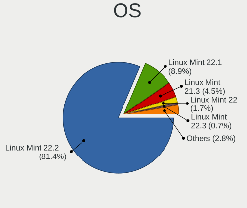

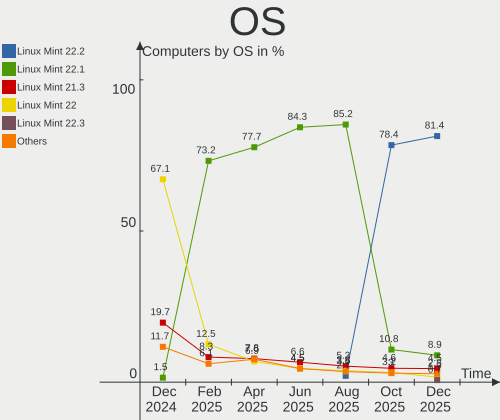

| Name            | Computers | Percent |
|-----------------|-----------|---------|
| Linux Mint 22.2 | 710       | 81.42%  |
| Linux Mint 22.1 | 78        | 8.94%   |
| Linux Mint 21.3 | 39        | 4.47%   |
| Linux Mint 22   | 15        | 1.72%   |
| Linux Mint 22.3 | 6         | 0.69%   |
| Linux Mint 21   | 6         | 0.69%   |
| Linux Mint 20.3 | 6         | 0.69%   |
| Linux Mint 21.2 | 5         | 0.57%   |
| Linux Mint 21.1 | 4         | 0.46%   |
| Linux Mint 20.1 | 1         | 0.11%   |
| Linux Mint 19.3 | 1         | 0.11%   |
| Linux Mint 18.1 | 1         | 0.11%   |

OS Family
---------

OS without a version

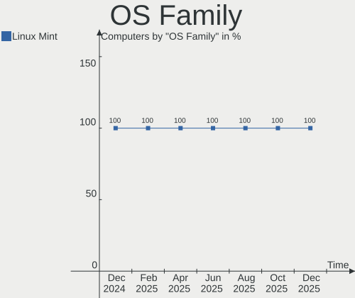

| Name       | Computers | Percent |
|------------|-----------|---------|
| Linux Mint | 872       | 100%    |

Kernel
------

Version of the Linux kernel

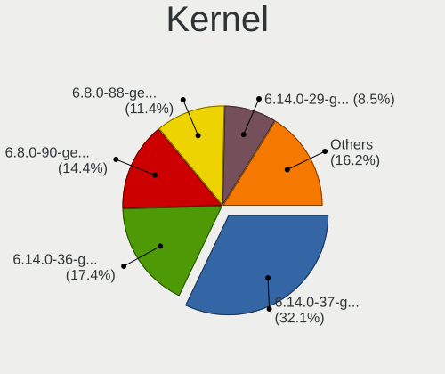

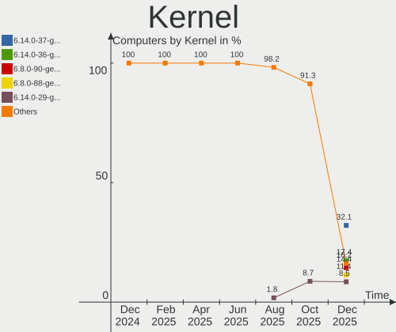

| Version                 | Computers | Percent |
|-------------------------|-----------|---------|
| 6.14.0-37-generic       | 280       | 32.11%  |
| 6.14.0-36-generic       | 152       | 17.43%  |
| 6.8.0-90-generic        | 126       | 14.45%  |
| 6.8.0-88-generic        | 99        | 11.35%  |
| 6.14.0-29-generic       | 74        | 8.49%   |
| 5.15.0-164-generic      | 13        | 1.49%   |
| 6.14.0-35-generic       | 11        | 1.26%   |
| 6.8.0-87-generic        | 10        | 1.15%   |
| 6.14.0-33-generic       | 9         | 1.03%   |
| 5.15.0-161-generic      | 9         | 1.03%   |
| 6.8.0-71-generic        | 5         | 0.57%   |
| 6.8.0-51-generic        | 5         | 0.57%   |
| 5.4.0-216-generic       | 5         | 0.57%   |
| 5.15.0-163-generic      | 5         | 0.57%   |
| 6.14.0-1016-oem         | 4         | 0.46%   |
| 6.8.0-86-generic        | 3         | 0.34%   |
| 6.8.0-79-generic        | 3         | 0.34%   |
| 6.18.0-061800-generic   | 3         | 0.34%   |
| 6.14.0-34-generic       | 3         | 0.34%   |
| 6.14.0-32-generic       | 3         | 0.34%   |
| 5.15.0-144-generic      | 3         | 0.34%   |
| 6.8.0-85-generic        | 2         | 0.23%   |
| 6.8.0-83-generic        | 2         | 0.23%   |
| 6.8.0-52-generic        | 2         | 0.23%   |
| 6.18.2-1-liquorix-amd64 | 2         | 0.23%   |
| 6.14.0-1018-oem         | 2         | 0.23%   |
| 5.15.0-91-generic       | 2         | 0.23%   |
| 5.15.0-160-generic      | 2         | 0.23%   |
| 5.15.0-139-generic      | 2         | 0.23%   |
| 6.8.0-90-lowlatency     | 1         | 0.11%   |
| 6.8.0-88-lowlatency     | 1         | 0.11%   |
| 6.8.0-84-generic        | 1         | 0.11%   |
| 6.8.0-78-generic        | 1         | 0.11%   |
| 6.8.0-64-generic        | 1         | 0.11%   |
| 6.8.0-60-generic        | 1         | 0.11%   |
| 6.8.0-55-generic        | 1         | 0.11%   |
| 6.8.0-54-generic        | 1         | 0.11%   |
| 6.8.0-53-generic        | 1         | 0.11%   |
| 6.8.0-38-generic        | 1         | 0.11%   |
| 6.4.2-surface           | 1         | 0.11%   |

Kernel Family
-------------

Linux kernel without a distro release

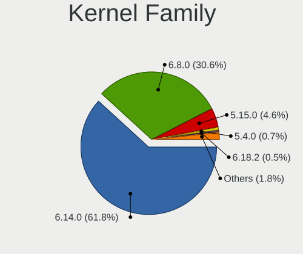

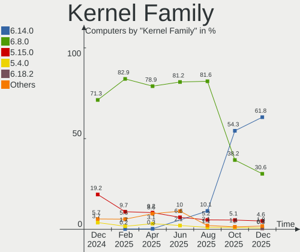

| Version | Computers | Percent |
|---------|-----------|---------|
| 6.14.0  | 539       | 61.81%  |
| 6.8.0   | 267       | 30.62%  |
| 5.15.0  | 40        | 4.59%   |
| 5.4.0   | 6         | 0.69%   |
| 6.18.2  | 4         | 0.46%   |
| 6.18.0  | 3         | 0.34%   |
| 6.11.0  | 2         | 0.23%   |
| 6.4.2   | 1         | 0.11%   |
| 6.17.12 | 1         | 0.11%   |
| 6.17.11 | 1         | 0.11%   |
| 6.17.10 | 1         | 0.11%   |
| 6.17.1  | 1         | 0.11%   |
| 6.17.0  | 1         | 0.11%   |
| 6.16.12 | 1         | 0.11%   |
| 6.15.5  | 1         | 0.11%   |
| 6.12.60 | 1         | 0.11%   |
| 6.1.0   | 1         | 0.11%   |
| 4.4.0   | 1         | 0.11%   |

Kernel Major Ver.
-----------------

Linux kernel major version

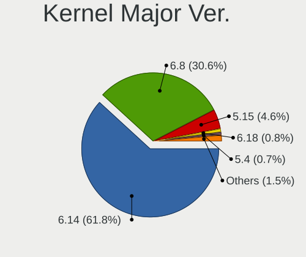

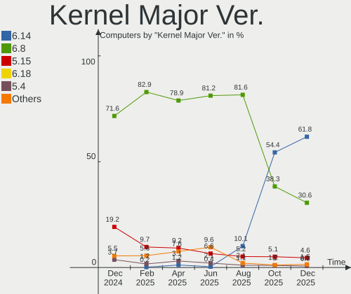

| Version | Computers | Percent |
|---------|-----------|---------|
| 6.14    | 539       | 61.81%  |
| 6.8     | 267       | 30.62%  |
| 5.15    | 40        | 4.59%   |
| 6.18    | 7         | 0.8%    |
| 5.4     | 6         | 0.69%   |
| 6.17    | 5         | 0.57%   |
| 6.11    | 2         | 0.23%   |
| 6.4     | 1         | 0.11%   |
| 6.16    | 1         | 0.11%   |
| 6.15    | 1         | 0.11%   |
| 6.12    | 1         | 0.11%   |
| 6.1     | 1         | 0.11%   |
| 4.4     | 1         | 0.11%   |

Arch
----

OS architecture (x86_64, i586, etc.)

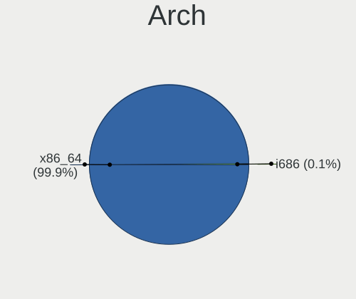

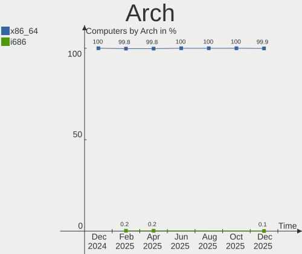

| Name   | Computers | Percent |
|--------|-----------|---------|
| x86_64 | 871       | 99.89%  |
| i686   | 1         | 0.11%   |

DE
--

Desktop Environment

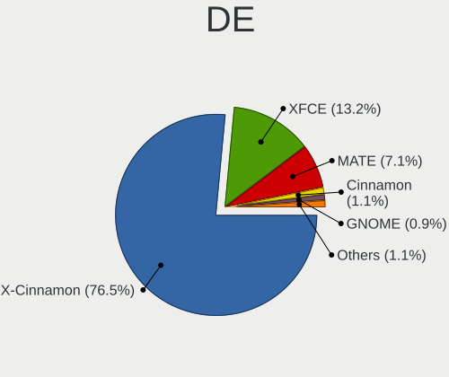

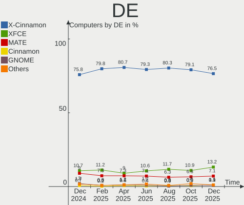

| Name       | Computers | Percent |
|------------|-----------|---------|
| X-Cinnamon | 667       | 76.49%  |
| XFCE       | 115       | 13.19%  |
| MATE       | 62        | 7.11%   |
| Cinnamon   | 10        | 1.15%   |
| GNOME      | 8         | 0.92%   |
| KDE5       | 6         | 0.69%   |
| Unknown    | 2         | 0.23%   |
| LXQt       | 1         | 0.11%   |
| KDE        | 1         | 0.11%   |

Display Server
--------------

X11 or Wayland

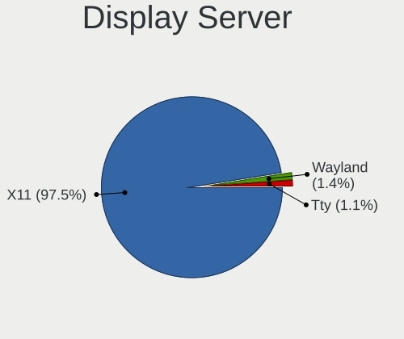

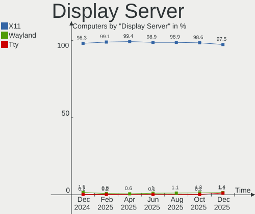

| Name    | Computers | Percent |
|---------|-----------|---------|
| X11     | 850       | 97.48%  |
| Wayland | 12        | 1.38%   |
| Tty     | 10        | 1.15%   |

Display Manager
---------------

SDDM, LightDM, etc.

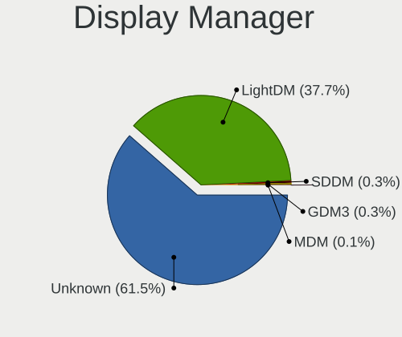

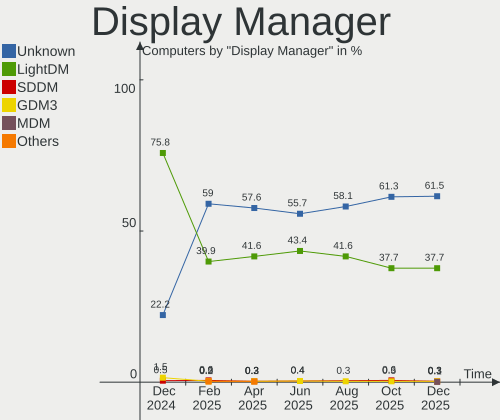

| Name    | Computers | Percent |
|---------|-----------|---------|
| Unknown | 536       | 61.47%  |
| LightDM | 329       | 37.73%  |
| SDDM    | 3         | 0.34%   |
| GDM3    | 3         | 0.34%   |
| MDM     | 1         | 0.11%   |

OS Lang
-------

Language

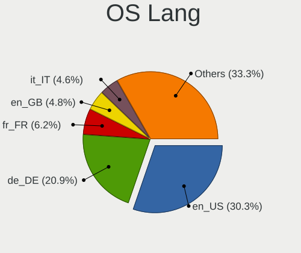

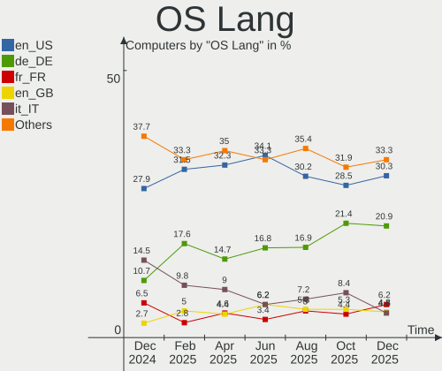

| Lang    | Computers | Percent |
|---------|-----------|---------|
| en_US   | 264       | 30.28%  |
| de_DE   | 182       | 20.87%  |
| fr_FR   | 54        | 6.19%   |
| en_GB   | 42        | 4.82%   |
| it_IT   | 40        | 4.59%   |
| pt_BR   | 31        | 3.56%   |
| C       | 31        | 3.56%   |
| en_AU   | 22        | 2.52%   |
| nl_NL   | 19        | 2.18%   |
| en_CA   | 18        | 2.06%   |
| es_ES   | 15        | 1.72%   |
| de_AT   | 13        | 1.49%   |
| pl_PL   | 12        | 1.38%   |
| ru_RU   | 11        | 1.26%   |
| es_AR   | 9         | 1.03%   |
| de_CH   | 9         | 1.03%   |
| en_ZA   | 8         | 0.92%   |
| hu_HU   | 7         | 0.8%    |
| en_IN   | 7         | 0.8%    |
| tr_TR   | 6         | 0.69%   |
| sv_SE   | 5         | 0.57%   |
| es_MX   | 5         | 0.57%   |
| en_NZ   | 5         | 0.57%   |
| pt_PT   | 4         | 0.46%   |
| fi_FI   | 4         | 0.46%   |
| cs_CZ   | 4         | 0.46%   |
| zh_CN   | 3         | 0.34%   |
| ja_JP   | 3         | 0.34%   |
| es_CL   | 3         | 0.34%   |
| en_IE   | 3         | 0.34%   |
| da_DK   | 3         | 0.34%   |
| uk_UA   | 2         | 0.23%   |
| ro_RO   | 2         | 0.23%   |
| fr_CA   | 2         | 0.23%   |
| Unknown | 2         | 0.23%   |
| zh_TW   | 1         | 0.11%   |
| sl_SI   | 1         | 0.11%   |
| nl_BE   | 1         | 0.11%   |
| nb_NO   | 1         | 0.11%   |
| lt_LT   | 1         | 0.11%   |

Boot Mode
---------

EFI or BIOS

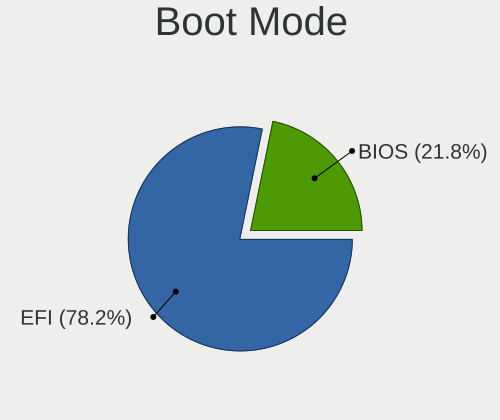

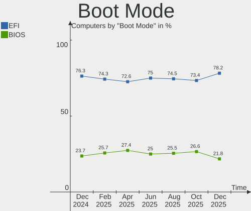

| Mode | Computers | Percent |
|------|-----------|---------|
| EFI  | 682       | 78.21%  |
| BIOS | 190       | 21.79%  |

Filesystem
----------

Type of filesystem

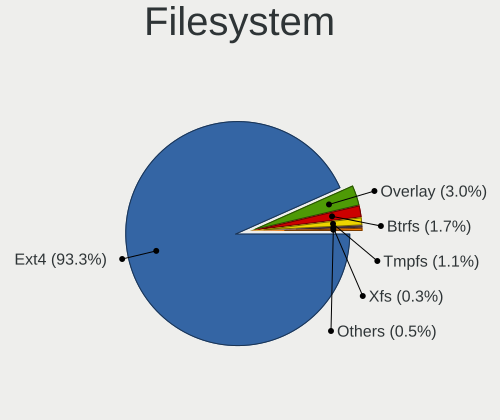

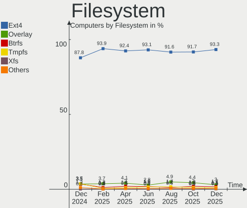

| Type    | Computers | Percent |
|---------|-----------|---------|
| Ext4    | 814       | 93.35%  |
| Overlay | 26        | 2.98%   |
| Btrfs   | 15        | 1.72%   |
| Tmpfs   | 10        | 1.15%   |
| Xfs     | 3         | 0.34%   |
| Ext2    | 2         | 0.23%   |
| Zfs     | 1         | 0.11%   |
| Ext3    | 1         | 0.11%   |

Part. scheme
------------

Scheme of partitioning

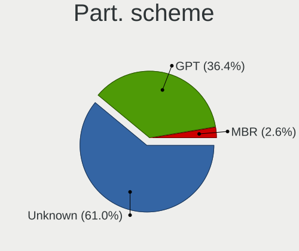

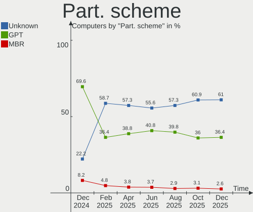

| Type    | Computers | Percent |
|---------|-----------|---------|
| Unknown | 532       | 61.01%  |
| GPT     | 317       | 36.35%  |
| MBR     | 23        | 2.64%   |

Dual Boot with Linux/BSD
------------------------

Hosting more than one Linux/BSD

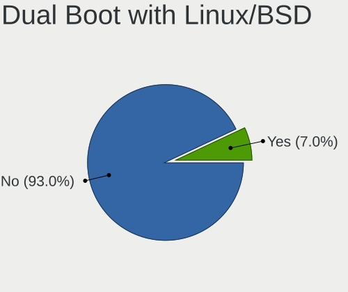

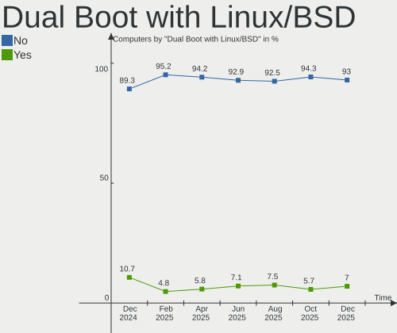

| Dual boot | Computers | Percent |
|-----------|-----------|---------|
| No        | 811       | 93%     |
| Yes       | 61        | 7%      |

Dual Boot (Win)
---------------

Hosting Linux and Windows

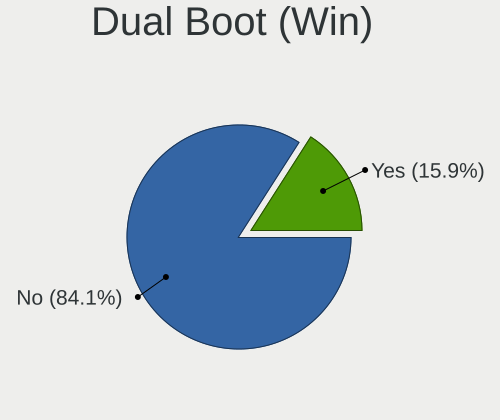

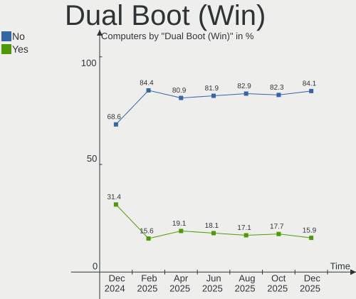

| Dual boot | Computers | Percent |
|-----------|-----------|---------|
| No        | 733       | 84.06%  |
| Yes       | 139       | 15.94%  |

Board
-----

Vendor
------

Motherboard manufacturer

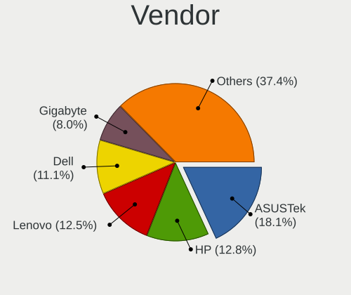

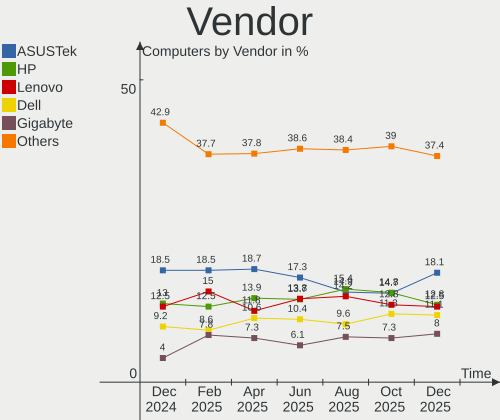

| Name                                  | Computers | Percent |
|---------------------------------------|-----------|---------|
| ASUSTek Computer                      | 158       | 18.12%  |
| Hewlett-Packard                       | 112       | 12.84%  |
| Lenovo                                | 109       | 12.5%   |
| Dell                                  | 97        | 11.12%  |
| Gigabyte Technology                   | 70        | 8.03%   |
| MSI                                   | 65        | 7.45%   |
| ASRock                                | 44        | 5.05%   |
| Apple                                 | 33        | 3.78%   |
| Acer                                  | 30        | 3.44%   |
| Unknown                               | 18        | 2.06%   |
| Intel                                 | 16        | 1.83%   |
| Fujitsu                               | 15        | 1.72%   |
| Toshiba                               | 12        | 1.38%   |
| Medion                                | 10        | 1.15%   |
| Alienware                             | 6         | 0.69%   |
| Pegatron                              | 5         | 0.57%   |
| Microsoft                             | 5         | 0.57%   |
| Google                                | 5         | 0.57%   |
| AZW                                   | 5         | 0.57%   |
| Sony                                  | 3         | 0.34%   |
| Samsung Electronics                   | 3         | 0.34%   |
| Foxconn                               | 3         | 0.34%   |
| Biostar                               | 3         | 0.34%   |
| Wortmann AG                           | 2         | 0.23%   |
| Supermicro                            | 2         | 0.23%   |
| Packard Bell                          | 2         | 0.23%   |
| Itautec                               | 2         | 0.23%   |
| HUAWEI                                | 2         | 0.23%   |
| Gateway                               | 2         | 0.23%   |
| XMG                                   | 1         | 0.11%   |
| UNIQCELL                              | 1         | 0.11%   |
| TrekStor                              | 1         | 0.11%   |
| Timi                                  | 1         | 0.11%   |
| Thirdwave                             | 1         | 0.11%   |
| TGT                                   | 1         | 0.11%   |
| SZMZ                                  | 1         | 0.11%   |
| SKIKK                                 | 1         | 0.11%   |
| Shuttle                               | 1         | 0.11%   |
| Shenzhen Meigao Innovation Technology | 1         | 0.11%   |
| Shenzhen Meigao Electronic Equipment  | 1         | 0.11%   |

Model
-----

Motherboard model

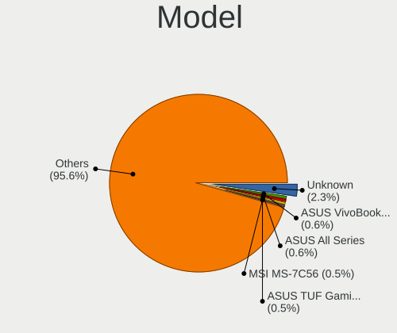

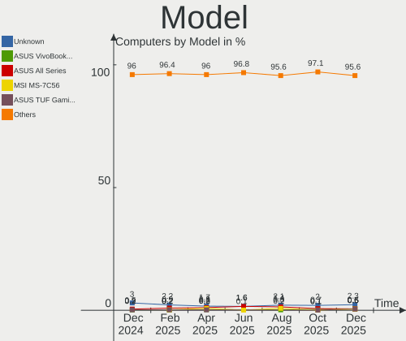

| Name                                     | Computers | Percent |
|------------------------------------------|-----------|---------|
| Unknown                                  | 20        | 2.29%   |
| ASUS VivoBook_ASUSLaptop M1605YA_M1605YA | 5         | 0.57%   |
| ASUS All Series                          | 5         | 0.57%   |
| MSI MS-7C56                              | 4         | 0.46%   |
| ASUS TUF Gaming X570-PLUS                | 4         | 0.46%   |
| MSI MS-7C91                              | 3         | 0.34%   |
| MSI MS-7C89                              | 3         | 0.34%   |
| MSI MS-7A38                              | 3         | 0.34%   |
| HP Pavilion 17                           | 3         | 0.34%   |
| HP Notebook                              | 3         | 0.34%   |
| Gigabyte B550I AORUS PRO AX              | 3         | 0.34%   |
| Gigabyte B450 AORUS M                    | 3         | 0.34%   |
| Gigabyte 970A-DS3P                       | 3         | 0.34%   |
| Dell OptiPlex 7050                       | 3         | 0.34%   |
| Dell Latitude E6430                      | 3         | 0.34%   |
| Dell Latitude D630                       | 3         | 0.34%   |
| ASUS TUF Gaming B550M-PLUS               | 3         | 0.34%   |
| Apple MacBookAir7,2                      | 3         | 0.34%   |
| Apple iMac18,3                           | 3         | 0.34%   |
| Apple iMac10,1                           | 3         | 0.34%   |
| MSI MS-7E49                              | 2         | 0.23%   |
| MSI MS-7C37                              | 2         | 0.23%   |
| MSI MS-7C09                              | 2         | 0.23%   |
| MSI MS-7850                              | 2         | 0.23%   |
| Lenovo V330-15IKB 81AX                   | 2         | 0.23%   |
| Lenovo Legion 7 16IAX10 83KY             | 2         | 0.23%   |
| Lenovo Legion 5 15IRX10 83LY             | 2         | 0.23%   |
| Intel H61                                | 2         | 0.23%   |
| HP ProDesk 400 G6 Desktop Mini PC        | 2         | 0.23%   |
| HP Laptop 17-by0xxx                      | 2         | 0.23%   |
| HP Laptop 15-bs0xx                       | 2         | 0.23%   |
| HP ENVY Notebook                         | 2         | 0.23%   |
| HP ENVY 15                               | 2         | 0.23%   |
| HP EliteBook 845 G8 Notebook PC          | 2         | 0.23%   |
| HP 350 G1                                | 2         | 0.23%   |
| HP 250 G8 Notebook PC                    | 2         | 0.23%   |
| Gigabyte Z790 AORUS ELITE AX             | 2         | 0.23%   |
| Gigabyte Z590 AORUS PRO AX               | 2         | 0.23%   |
| Gigabyte B550M AORUS ELITE               | 2         | 0.23%   |
| Gigabyte B550 AORUS ELITE V2             | 2         | 0.23%   |

Model Family
------------

Motherboard model prefix

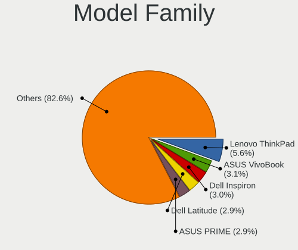

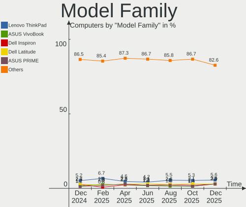

| Name               | Computers | Percent |
|--------------------|-----------|---------|
| Lenovo ThinkPad    | 49        | 5.62%   |
| ASUS VivoBook      | 27        | 3.1%    |
| Dell Inspiron      | 26        | 2.98%   |
| Dell Latitude      | 25        | 2.87%   |
| ASUS PRIME         | 25        | 2.87%   |
| Dell OptiPlex      | 20        | 2.29%   |
| ASUS TUF           | 20        | 2.29%   |
| Unknown            | 20        | 2.29%   |
| Acer Aspire        | 16        | 1.83%   |
| Lenovo IdeaPad     | 14        | 1.61%   |
| HP Pavilion        | 13        | 1.49%   |
| ASUS ROG           | 13        | 1.49%   |
| HP ENVY            | 11        | 1.26%   |
| HP Compaq          | 11        | 1.26%   |
| Toshiba Satellite  | 10        | 1.15%   |
| HP EliteBook       | 10        | 1.15%   |
| Lenovo ThinkCentre | 9         | 1.03%   |
| HP ProBook         | 9         | 1.03%   |
| HP Laptop          | 8         | 0.92%   |
| Dell XPS           | 8         | 0.92%   |
| Dell Precision     | 8         | 0.92%   |
| Fujitsu LIFEBOOK   | 7         | 0.8%    |
| Fujitsu ESPRIMO    | 7         | 0.8%    |
| Lenovo Legion      | 6         | 0.69%   |
| Microsoft Surface  | 5         | 0.57%   |
| HP ProDesk         | 5         | 0.57%   |
| HP 250             | 5         | 0.57%   |
| ASUS ASUS          | 5         | 0.57%   |
| ASUS All           | 5         | 0.57%   |
| Acer Swift         | 5         | 0.57%   |
| MSI MS-7C56        | 4         | 0.46%   |
| Gigabyte B550M     | 4         | 0.46%   |
| Gigabyte B450M     | 4         | 0.46%   |
| Gigabyte B450      | 4         | 0.46%   |
| Dell Vostro        | 4         | 0.46%   |
| Apple MacBookPro11 | 4         | 0.46%   |
| MSI MS-7C91        | 3         | 0.34%   |
| MSI MS-7C89        | 3         | 0.34%   |
| MSI MS-7A38        | 3         | 0.34%   |
| Lenovo Yoga        | 3         | 0.34%   |

MFG Year
--------

Motherboard manufacture year

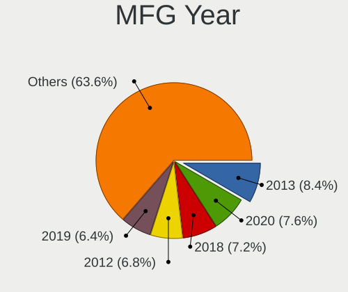

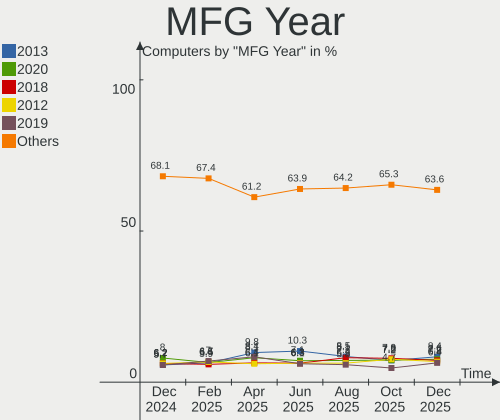

| Year | Computers | Percent |
|------|-----------|---------|
| 2013 | 73        | 8.37%   |
| 2020 | 66        | 7.57%   |
| 2018 | 63        | 7.22%   |
| 2012 | 59        | 6.77%   |
| 2019 | 56        | 6.42%   |
| 2021 | 52        | 5.96%   |
| 2017 | 52        | 5.96%   |
| 2023 | 49        | 5.62%   |
| 2022 | 49        | 5.62%   |
| 2024 | 48        | 5.5%    |
| 2011 | 44        | 5.05%   |
| 2015 | 42        | 4.82%   |
| 2014 | 41        | 4.7%    |
| 2016 | 40        | 4.59%   |
| 2009 | 36        | 4.13%   |
| 2010 | 31        | 3.56%   |
| 2025 | 30        | 3.44%   |
| 2008 | 22        | 2.52%   |
| 2007 | 15        | 1.72%   |
| 2006 | 4         | 0.46%   |

Form Factor
-----------

Physical design of the computer

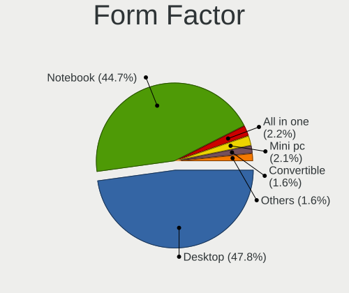

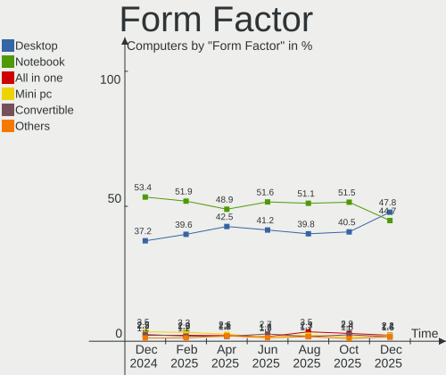

| Name        | Computers | Percent |
|-------------|-----------|---------|
| Desktop     | 417       | 47.82%  |
| Notebook    | 390       | 44.72%  |
| All in one  | 19        | 2.18%   |
| Mini pc     | 18        | 2.06%   |
| Convertible | 14        | 1.61%   |
| Tablet      | 10        | 1.15%   |
| Server      | 4         | 0.46%   |

Secure Boot
-----------

Enabled or disabled

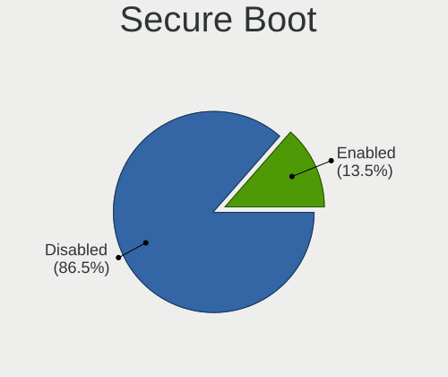

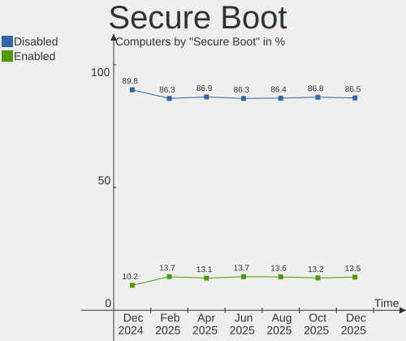

| State    | Computers | Percent |
|----------|-----------|---------|
| Disabled | 754       | 86.47%  |
| Enabled  | 118       | 13.53%  |

Coreboot
--------

Have coreboot on board

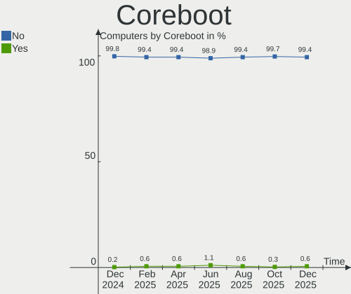

| Used | Computers | Percent |
|------|-----------|---------|
| No   | 867       | 99.43%  |
| Yes  | 5         | 0.57%   |

RAM Size
--------

Total RAM memory

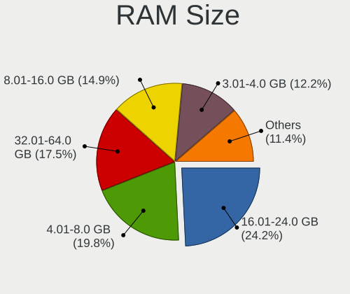

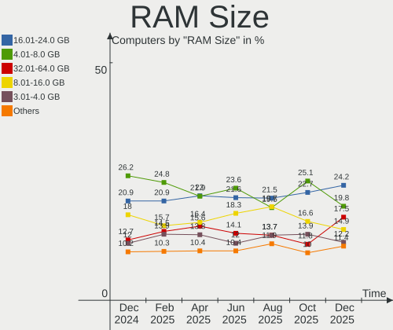

| Size in GB  | Computers | Percent |
|-------------|-----------|---------|
| 16.01-24.0  | 211       | 24.2%   |
| 4.01-8.0    | 173       | 19.84%  |
| 32.01-64.0  | 153       | 17.55%  |
| 8.01-16.0   | 130       | 14.91%  |
| 3.01-4.0    | 106       | 12.16%  |
| 24.01-32.0  | 41        | 4.7%    |
| 64.01-256.0 | 41        | 4.7%    |
| 1.01-2.0    | 10        | 1.15%   |
| 2.01-3.0    | 6         | 0.69%   |
| 0.51-1.0    | 1         | 0.11%   |

RAM Used
--------

Used RAM memory

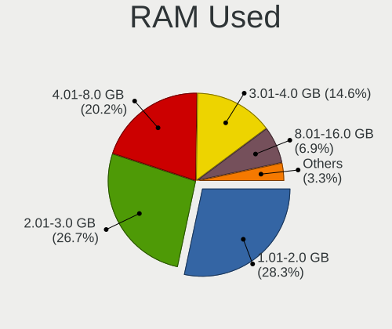

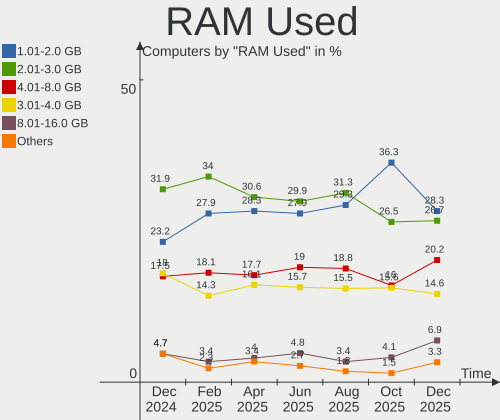

| Used GB     | Computers | Percent |
|-------------|-----------|---------|
| 1.01-2.0    | 247       | 28.33%  |
| 2.01-3.0    | 233       | 26.72%  |
| 4.01-8.0    | 176       | 20.18%  |
| 3.01-4.0    | 127       | 14.56%  |
| 8.01-16.0   | 60        | 6.88%   |
| 0.51-1.0    | 17        | 1.95%   |
| 16.01-24.0  | 6         | 0.69%   |
| 32.01-64.0  | 2         | 0.23%   |
| 24.01-32.0  | 2         | 0.23%   |
| 64.01-256.0 | 1         | 0.11%   |
| 0.01-0.5    | 1         | 0.11%   |

Total Drives
------------

Number of drives on board

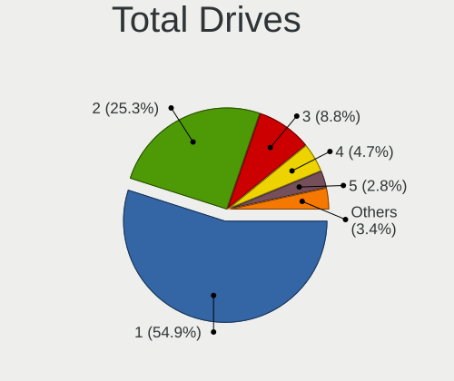

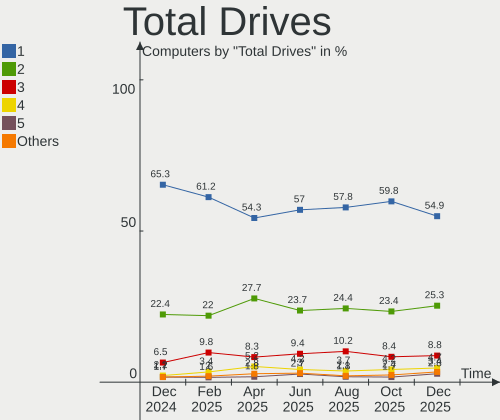

| Drives | Computers | Percent |
|--------|-----------|---------|
| 1      | 479       | 54.93%  |
| 2      | 221       | 25.34%  |
| 3      | 77        | 8.83%   |
| 4      | 41        | 4.7%    |
| 5      | 24        | 2.75%   |
| 6      | 18        | 2.06%   |
| 7      | 5         | 0.57%   |
| 0      | 4         | 0.46%   |
| 10     | 2         | 0.23%   |
| 8      | 1         | 0.11%   |

Has CD-ROM
----------

Has CD-ROM on board

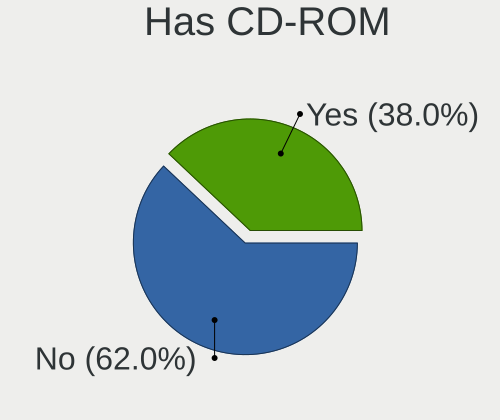

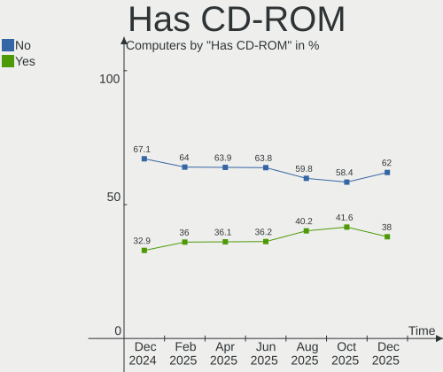

| Presented | Computers | Percent |
|-----------|-----------|---------|
| No        | 541       | 62.04%  |
| Yes       | 331       | 37.96%  |

Has Ethernet
------------

Has Ethernet on board

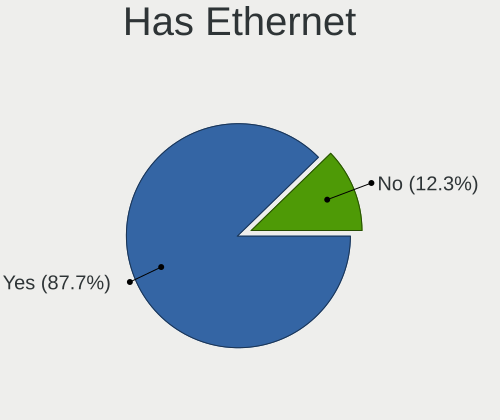

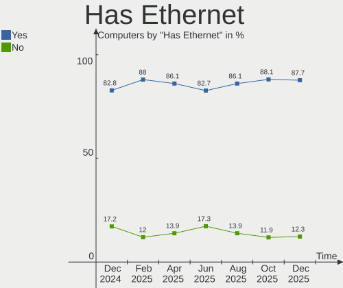

| Presented | Computers | Percent |
|-----------|-----------|---------|
| Yes       | 765       | 87.73%  |
| No        | 107       | 12.27%  |

Has WiFi
--------

Has WiFi module

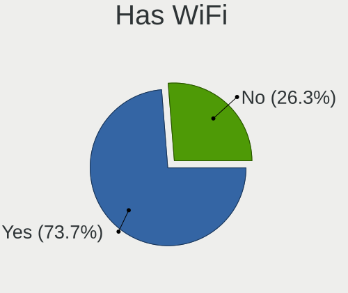

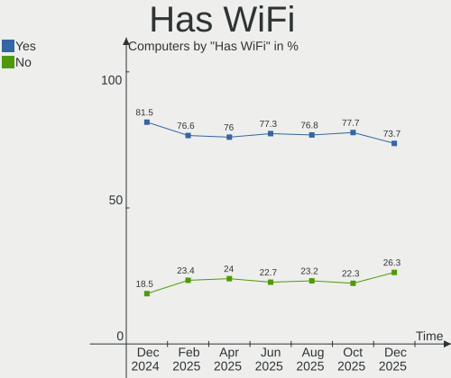

| Presented | Computers | Percent |
|-----------|-----------|---------|
| Yes       | 643       | 73.74%  |
| No        | 229       | 26.26%  |

Has Bluetooth
-------------

Has Bluetooth module

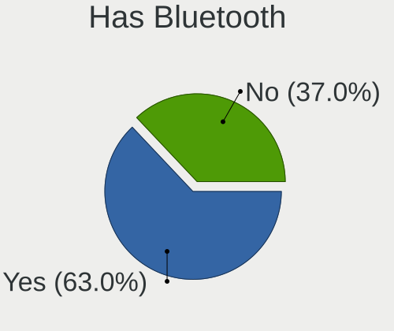

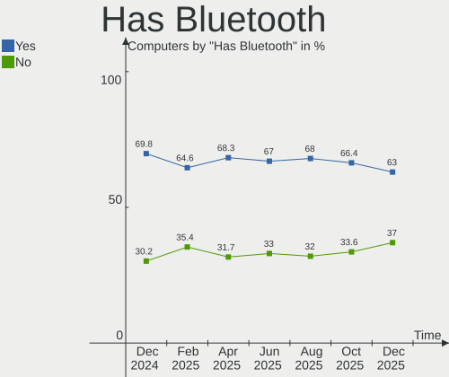

| Presented | Computers | Percent |
|-----------|-----------|---------|
| Yes       | 549       | 62.96%  |
| No        | 323       | 37.04%  |

Location
--------

Country
-------

Geographic location (country)

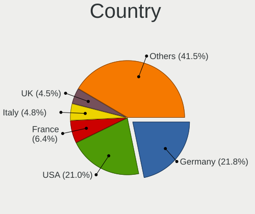

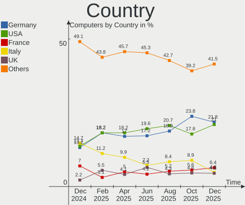

| Country         | Computers | Percent |
|-----------------|-----------|---------|
| Germany         | 190       | 21.79%  |
| USA             | 183       | 20.99%  |
| France          | 56        | 6.42%   |
| Italy           | 42        | 4.82%   |
| UK              | 39        | 4.47%   |
| Brazil          | 36        | 4.13%   |
| Canada          | 25        | 2.87%   |
| Australia       | 24        | 2.75%   |
| Spain           | 19        | 2.18%   |
| Poland          | 19        | 2.18%   |
| Netherlands     | 19        | 2.18%   |
| Switzerland     | 17        | 1.95%   |
| Austria         | 16        | 1.83%   |
| Argentina       | 10        | 1.15%   |
| Turkey          | 9         | 1.03%   |
| Sweden          | 9         | 1.03%   |
| South Africa    | 8         | 0.92%   |
| Russia          | 8         | 0.92%   |
| Mexico          | 8         | 0.92%   |
| India           | 8         | 0.92%   |
| Portugal        | 7         | 0.8%    |
| Indonesia       | 7         | 0.8%    |
| Hungary         | 7         | 0.8%    |
| Finland         | 7         | 0.8%    |
| Czechia         | 7         | 0.8%    |
| The Netherlands | 6         | 0.69%   |
| Denmark         | 6         | 0.69%   |
| Thailand        | 5         | 0.57%   |
| New Zealand     | 5         | 0.57%   |
| Morocco         | 5         | 0.57%   |
| Bulgaria        | 5         | 0.57%   |
| Japan           | 4         | 0.46%   |
| Ukraine         | 3         | 0.34%   |
| Romania         | 3         | 0.34%   |
| Pakistan        | 3         | 0.34%   |
| Ireland         | 3         | 0.34%   |
| China           | 3         | 0.34%   |
| Chile           | 3         | 0.34%   |
| Belgium         | 3         | 0.34%   |
| Slovakia        | 2         | 0.23%   |

City
----

Geographic location (city)

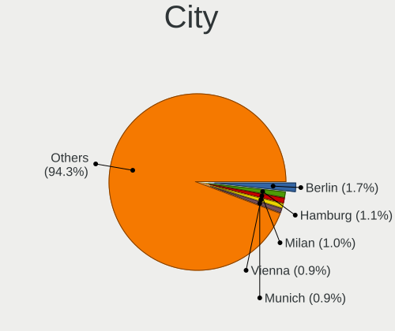

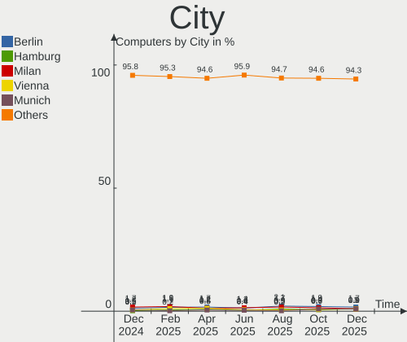

| City                | Computers | Percent |
|---------------------|-----------|---------|
| Berlin              | 15        | 1.72%   |
| Hamburg             | 10        | 1.15%   |
| Milan               | 9         | 1.03%   |
| Vienna              | 8         | 0.92%   |
| Munich              | 8         | 0.92%   |
| Melbourne           | 7         | 0.8%    |
| Fenouillet-du-Razes | 7         | 0.8%    |
| Traunstein          | 6         | 0.69%   |
| Rio de Janeiro      | 6         | 0.69%   |
| Houston             | 6         | 0.69%   |
| Warsaw              | 5         | 0.57%   |
| Sydney              | 5         | 0.57%   |
| Sao Paulo           | 5         | 0.57%   |
| Istanbul            | 5         | 0.57%   |
| Frankfurt am Main   | 5         | 0.57%   |
| Stockholm           | 4         | 0.46%   |
| Rome                | 4         | 0.46%   |
| Perth               | 4         | 0.46%   |
| Paris               | 4         | 0.46%   |
| Los Angeles         | 4         | 0.46%   |
| Bordeaux            | 4         | 0.46%   |
| Waukegan            | 3         | 0.34%   |
| Toronto             | 3         | 0.34%   |
| Tokushima           | 3         | 0.34%   |
| Phoenix             | 3         | 0.34%   |
| Miami               | 3         | 0.34%   |
| Madrid              | 3         | 0.34%   |
| Jacksonville        | 3         | 0.34%   |
| Helsinki            | 3         | 0.34%   |
| Hamminkeln          | 3         | 0.34%   |
| Essen               | 3         | 0.34%   |
| Düsseldorf         | 3         | 0.34%   |
| Dublin              | 3         | 0.34%   |
| Dortmund            | 3         | 0.34%   |
| Christchurch        | 3         | 0.34%   |
| Cape Town           | 3         | 0.34%   |
| Burg bei Magdeburg  | 3         | 0.34%   |
| Budapest            | 3         | 0.34%   |
| Brasília           | 3         | 0.34%   |
| Auckland            | 3         | 0.34%   |

Drives
------

Drive Vendor
------------

Hard drive vendors

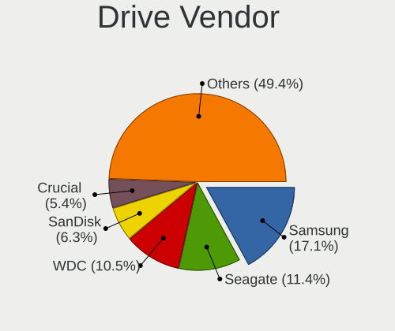

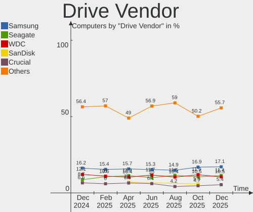

| Vendor                       | Computers | Drives | Percent |
|------------------------------|-----------|--------|---------|
| Samsung Electronics          | 233       | 321    | 17.08%  |
| Seagate                      | 155       | 195    | 11.36%  |
| WDC                          | 143       | 182    | 10.48%  |
| SanDisk                      | 86        | 93     | 6.3%    |
| Crucial                      | 73        | 84     | 5.35%   |
| Toshiba                      | 61        | 63     | 4.47%   |
| Kingston                     | 57        | 65     | 4.18%   |
| Micron Technology            | 38        | 38     | 2.79%   |
| Hitachi                      | 35        | 38     | 2.57%   |
| SK hynix                     | 32        | 32     | 2.35%   |
| Unknown                      | 30        | 33     | 2.2%    |
| Micron/Crucial Technology    | 28        | 34     | 2.05%   |
| HGST                         | 23        | 29     | 1.69%   |
| Intel                        | 21        | 22     | 1.54%   |
| Phison Electronics           | 19        | 21     | 1.39%   |
| Intenso                      | 17        | 19     | 1.25%   |
| A-DATA Technology            | 16        | 16     | 1.17%   |
| MAXIO Technology (Hangzhou)  | 15        | 16     | 1.1%    |
| Kingston Technology Company  | 14        | 14     | 1.03%   |
| Apple                        | 13        | 16     | 0.95%   |
| SPCC                         | 12        | 14     | 0.88%   |
| China                        | 11        | 13     | 0.81%   |
| Silicon Motion               | 10        | 10     | 0.73%   |
| KIOXIA                       | 10        | 11     | 0.73%   |
| PNY                          | 9         | 13     | 0.66%   |
| ASMT                         | 9         | 12     | 0.66%   |
| Transcend                    | 8         | 8      | 0.59%   |
| ADATA Technology             | 8         | 8      | 0.59%   |
| Lexar                        | 7         | 7      | 0.51%   |
| KingSpec                     | 7         | 8      | 0.51%   |
| Realtek Semiconductor        | 6         | 6      | 0.44%   |
| Patriot                      | 6         | 8      | 0.44%   |
| Netac                        | 6         | 6      | 0.44%   |
| JMicron Technology           | 6         | 6      | 0.44%   |
| Fanxiang                     | 6         | 6      | 0.44%   |
| Unknown                      | 5         | 5      | 0.37%   |
| Fujitsu                      | 4         | 4      | 0.29%   |
| X12                          | 3         | 3      | 0.22%   |
| Timetec                      | 3         | 3      | 0.22%   |
| Shenzhen Longsys Electronics | 3         | 3      | 0.22%   |

Drive Model
-----------

Hard drive models

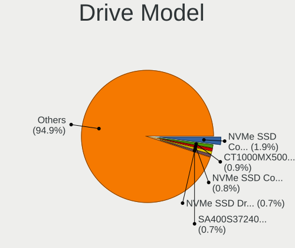

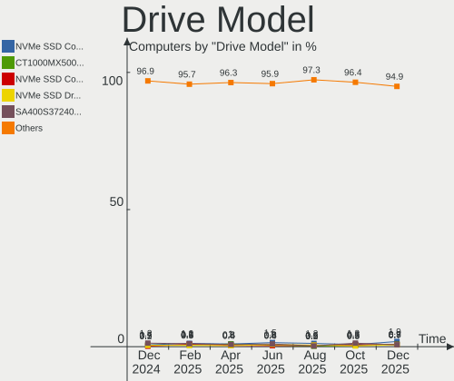

| Model                                                 | Computers | Percent |
|-------------------------------------------------------|-----------|---------|
| Samsung NVMe SSD Controller SM981/PM981/PM983 1TB     | 30        | 1.95%   |
| Crucial CT1000MX500SSD1 1TB                           | 14        | 0.91%   |
| Samsung NVMe SSD Controller SM961/PM961/SM963 1024GB  | 12        | 0.78%   |
| SanDisk NVMe SSD Drive 1TB                            | 11        | 0.71%   |
| Kingston SA400S37240G 240GB SSD                       | 11        | 0.71%   |
| Samsung SSD 870 EVO 500GB                             | 10        | 0.65%   |
| Samsung SSD 860 EVO 1TB                               | 10        | 0.65%   |
| Unknown MMC Card  64GB                                | 9         | 0.58%   |
| Seagate ST1000LM035-1RK172 1TB                        | 9         | 0.58%   |
| Samsung SSD 850 EVO 500GB                             | 9         | 0.58%   |
| Micron/Crucial P2 NVMe PCIe SSD 2TB                   | 9         | 0.58%   |
| MAXIO (Hangzhou) NVMe SSD Controller MAP1202 2TB      | 9         | 0.58%   |
| Seagate ST500DM002-1BD142 500GB                       | 8         | 0.52%   |
| Samsung SSD 850 EVO 250GB                             | 8         | 0.52%   |
| Kingston SA400S37480G 480GB SSD                       | 8         | 0.52%   |
| Seagate ST4000DM004-2CV104 4TB                        | 7         | 0.45%   |
| Seagate ST1000LM024 HN-M101MBB 1TB                    | 7         | 0.45%   |
| Seagate ST1000DM003-1CH162 1TB                        | 7         | 0.45%   |
| Samsung SSD 990 PRO 2TB                               | 7         | 0.45%   |
| Samsung SSD 980 1TB                                   | 7         | 0.45%   |
| Samsung SSD 860 EVO 500GB                             | 7         | 0.45%   |
| Samsung NVMe SSD Controller PM9A1/PM9A3/980PRO 1TB    | 7         | 0.45%   |
| Kingston SA400S37960G 960GB SSD                       | 7         | 0.45%   |
| Crucial CT480BX500SSD1 480GB                          | 7         | 0.45%   |
| WDC WD10EZEX-08WN4A0 1TB                              | 6         | 0.39%   |
| Toshiba MQ01ABD100 1TB                                | 6         | 0.39%   |
| SK hynix BC501 NVMe Solid State Drive 512GB           | 6         | 0.39%   |
| Seagate ST1000DM003-1ER162 1TB                        | 6         | 0.39%   |
| Samsung SSD 990 PRO 1TB                               | 6         | 0.39%   |
| Samsung SSD 870 QVO 1TB                               | 6         | 0.39%   |
| Phison E16 PCIe4 NVMe Controller 1TB                  | 6         | 0.39%   |
| Phison E12 NVMe Controller 1TB                        | 6         | 0.39%   |
| Hitachi HDS721010CLA332 1TB                           | 6         | 0.39%   |
| Crucial CT2000BX500SSD1 2TB                           | 6         | 0.39%   |
| Unknown MMC Card  128GB                               | 5         | 0.32%   |
| Silicon Motion SM2263EN/SM2263XT SSD Controller 512GB | 5         | 0.32%   |
| Seagate ST9500325AS 500GB                             | 5         | 0.32%   |
| Seagate ST1000DM010-2EP102 1TB                        | 5         | 0.32%   |
| Seagate Expansion Desk 4TB                            | 5         | 0.32%   |
| Sandisk WD_BLACK SN850X 2000GB                        | 5         | 0.32%   |

HDD Vendor
----------

Hard disk drive vendors

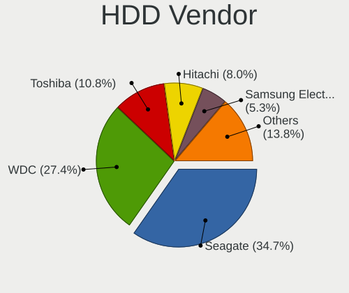

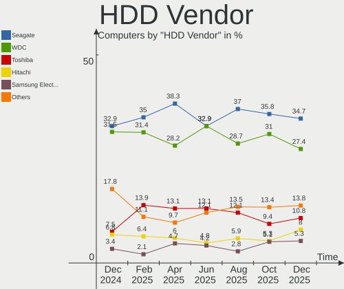

| Vendor              | Computers | Drives | Percent |
|---------------------|-----------|--------|---------|
| Seagate             | 151       | 190    | 34.71%  |
| WDC                 | 119       | 147    | 27.36%  |
| Toshiba             | 47        | 49     | 10.8%   |
| Hitachi             | 35        | 38     | 8.05%   |
| Samsung Electronics | 23        | 26     | 5.29%   |
| HGST                | 23        | 29     | 5.29%   |
| ASMT                | 8         | 9      | 1.84%   |
| Apple               | 5         | 5      | 1.15%   |
| Fujitsu             | 4         | 4      | 0.92%   |
| Unknown             | 3         | 3      | 0.69%   |
| JMicron Technology  | 3         | 3      | 0.69%   |
| USB3.0              | 2         | 2      | 0.46%   |
| TO Exter            | 2         | 2      | 0.46%   |
| Min Yi U            | 2         | 2      | 0.46%   |
| Maxtor              | 2         | 2      | 0.46%   |
| Intenso             | 2         | 2      | 0.46%   |
| T-FORCE             | 1         | 1      | 0.23%   |
| RSH-339             | 1         | 1      | 0.23%   |
| Maxone              | 1         | 1      | 0.23%   |
| HPE                 | 1         | 1      | 0.23%   |

SSD Vendor
----------

Solid state drive vendors

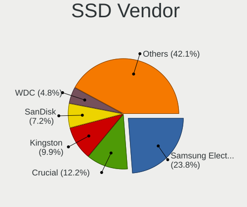

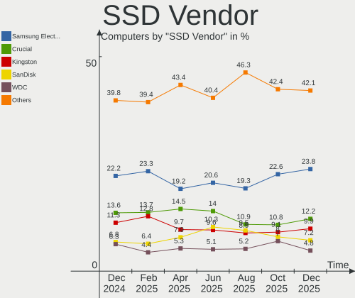

| Vendor              | Computers | Drives | Percent |
|---------------------|-----------|--------|---------|
| Samsung Electronics | 113       | 137    | 23.79%  |
| Crucial             | 58        | 66     | 12.21%  |
| Kingston            | 47        | 52     | 9.89%   |
| SanDisk             | 34        | 38     | 7.16%   |
| WDC                 | 23        | 25     | 4.84%   |
| Intenso             | 15        | 16     | 3.16%   |
| Micron Technology   | 13        | 13     | 2.74%   |
| SPCC                | 12        | 14     | 2.53%   |
| A-DATA Technology   | 12        | 12     | 2.53%   |
| China               | 11        | 13     | 2.32%   |
| SK hynix            | 10        | 10     | 2.11%   |
| Transcend           | 8         | 8      | 1.68%   |
| PNY                 | 7         | 9      | 1.47%   |
| KingSpec            | 7         | 8      | 1.47%   |
| Toshiba             | 6         | 6      | 1.26%   |
| Patriot             | 6         | 8      | 1.26%   |
| Netac               | 6         | 6      | 1.26%   |
| Intel               | 6         | 6      | 1.26%   |
| Apple               | 6         | 6      | 1.26%   |
| Lexar               | 4         | 4      | 0.84%   |
| X12                 | 3         | 3      | 0.63%   |
| Timetec             | 3         | 3      | 0.63%   |
| SD                  | 3         | 3      | 0.63%   |
| Plextor             | 3         | 3      | 0.63%   |
| OCZ                 | 3         | 3      | 0.63%   |
| LITEON              | 3         | 3      | 0.63%   |
| KIOXIA-EXCERIA      | 3         | 3      | 0.63%   |
| Fanxiang            | 3         | 3      | 0.63%   |
| Emtec               | 3         | 4      | 0.63%   |
| Vi550               | 2         | 2      | 0.42%   |
| Seagate             | 2         | 2      | 0.42%   |
| LITEONIT            | 2         | 2      | 0.42%   |
| Integral            | 2         | 2      | 0.42%   |
| Corsair             | 2         | 2      | 0.42%   |
| Unknown             | 2         | 2      | 0.42%   |
| ValueTech           | 1         | 1      | 0.21%   |
| V-GeN               | 1         | 1      | 0.21%   |
| UP                  | 1         | 1      | 0.21%   |
| Unknown             | 1         | 1      | 0.21%   |
| ThinkPlus           | 1         | 2      | 0.21%   |

Drive Kind
----------

HDD or SSD

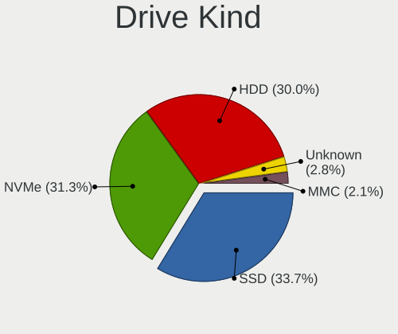

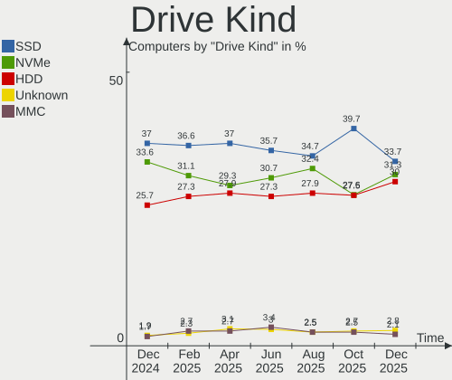

| Kind    | Computers | Drives | Percent |
|---------|-----------|--------|---------|
| SSD     | 411       | 532    | 33.74%  |
| NVMe    | 381       | 496    | 31.28%  |
| HDD     | 366       | 517    | 30.05%  |
| Unknown | 34        | 37     | 2.79%   |
| MMC     | 26        | 29     | 2.13%   |

Drive Connector
---------------

SATA, SAS, NVMe, etc.

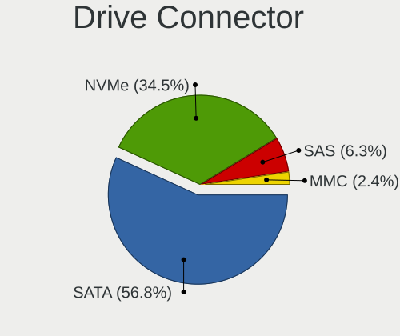

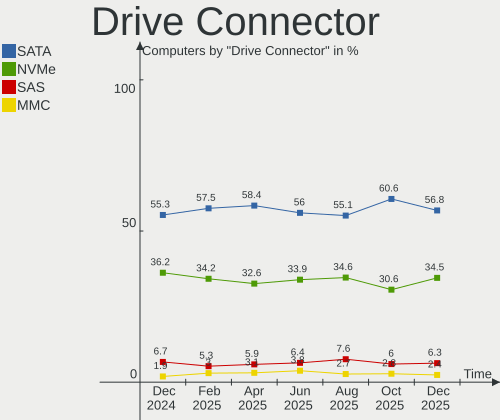

| Type | Computers | Drives | Percent |
|------|-----------|--------|---------|
| SATA | 628       | 1008   | 56.83%  |
| NVMe | 381       | 489    | 34.48%  |
| SAS  | 70        | 85     | 6.33%   |
| MMC  | 26        | 29     | 2.35%   |

Drive Size
----------

Size of hard drive

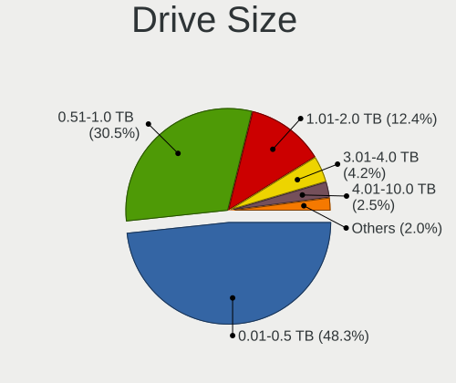

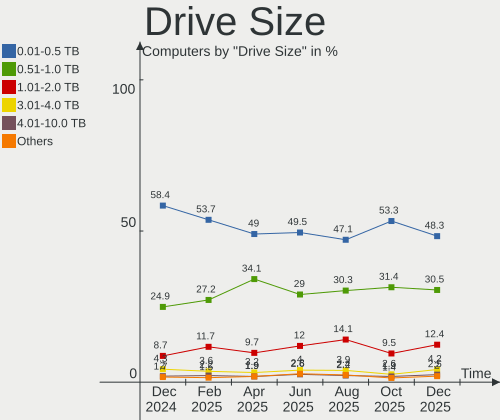

| Size in TB | Computers | Drives | Percent |
|------------|-----------|--------|---------|
| 0.01-0.5   | 402       | 517    | 48.32%  |
| 0.51-1.0   | 254       | 311    | 30.53%  |
| 1.01-2.0   | 103       | 118    | 12.38%  |
| 3.01-4.0   | 35        | 50     | 4.21%   |
| 4.01-10.0  | 21        | 33     | 2.52%   |
| 10.01-20.0 | 10        | 13     | 1.2%    |
| 2.01-3.0   | 7         | 7      | 0.84%   |

Space Total
-----------

Amount of disk space available on the file system

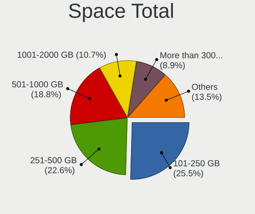

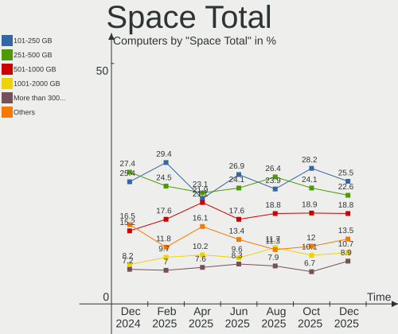

| Size in GB     | Computers | Percent |
|----------------|-----------|---------|
| 101-250        | 222       | 25.46%  |
| 251-500        | 197       | 22.59%  |
| 501-1000       | 164       | 18.81%  |
| 1001-2000      | 93        | 10.67%  |
| More than 3000 | 78        | 8.94%   |
| 51-100         | 42        | 4.82%   |
| 2001-3000      | 36        | 4.13%   |
| 1-20           | 26        | 2.98%   |
| 21-50          | 11        | 1.26%   |
| Unknown        | 3         | 0.34%   |

Space Used
----------

Amount of used disk space

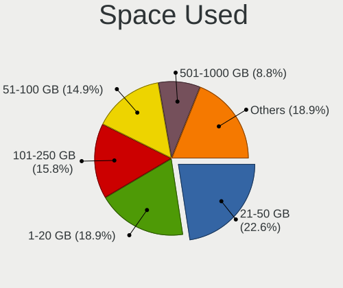

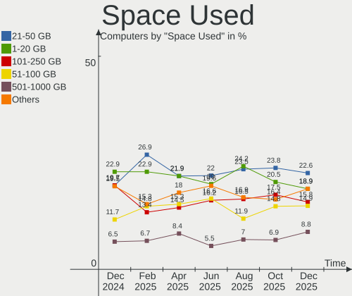

| Used GB        | Computers | Percent |
|----------------|-----------|---------|
| 21-50          | 197       | 22.59%  |
| 1-20           | 165       | 18.92%  |
| 101-250        | 138       | 15.83%  |
| 51-100         | 130       | 14.91%  |
| 501-1000       | 77        | 8.83%   |
| 251-500        | 71        | 8.14%   |
| 1001-2000      | 48        | 5.5%    |
| More than 3000 | 27        | 3.1%    |
| 2001-3000      | 16        | 1.83%   |
| Unknown        | 3         | 0.34%   |

Malfunc. Drives
---------------

Drive models with a malfunction

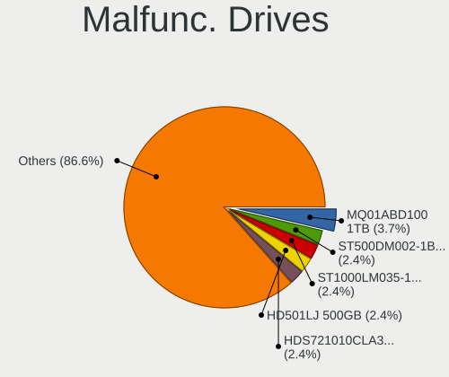

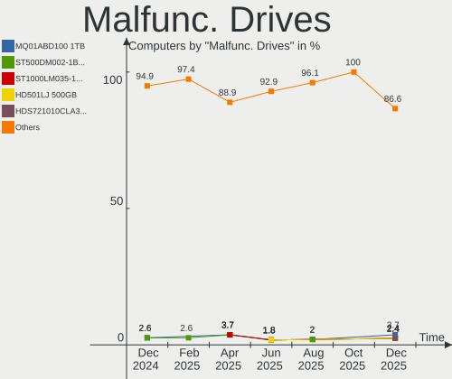

| Model                              | Computers | Drives | Percent |
|------------------------------------|-----------|--------|---------|
| Toshiba MQ01ABD100 1TB             | 3         | 3      | 3.66%   |
| Seagate ST500DM002-1BD142 500GB    | 2         | 2      | 2.44%   |
| Seagate ST1000LM035-1RK172 1TB     | 2         | 2      | 2.44%   |
| Samsung Electronics HD501LJ 500GB  | 2         | 2      | 2.44%   |
| Hitachi HDS721010CLA332 1TB        | 2         | 2      | 2.44%   |
| HGST HTS545050A7E680 500GB         | 2         | 2      | 2.44%   |
| HGST HTS541010A9E680 1TB           | 2         | 5      | 2.44%   |
| WDC WD5000AAKX-08U6AA0 500GB       | 1         | 1      | 1.22%   |
| WDC WD3200AAKS-00V1A0 320GB        | 1         | 1      | 1.22%   |
| WDC WD3200AAJS-00L7A0 320GB        | 1         | 1      | 1.22%   |
| WDC WD30EFRX-68EUZN0 3TB           | 1         | 1      | 1.22%   |
| WDC WD2500BPVT-00JJ5T0 250GB       | 1         | 1      | 1.22%   |
| WDC WD20EFRX-68EUZN0 2TB           | 1         | 1      | 1.22%   |
| WDC WD20EARS-00MVWB0 2TB           | 1         | 1      | 1.22%   |
| WDC WD10EZEX-08M2NA0 1TB           | 1         | 1      | 1.22%   |
| WDC WD10EVVS-63M5B0 1TB            | 1         | 1      | 1.22%   |
| WDC WD10EURX-63UY4Y0 1TB           | 1         | 1      | 1.22%   |
| WDC WD1003FZEX-00K3CA0 1TB         | 1         | 1      | 1.22%   |
| WDC WD Blue SA510 2.5 250GB        | 1         | 1      | 1.22%   |
| ValueTech SSD 512GB                | 1         | 1      | 1.22%   |
| Transcend TS512GSSD370S 512GB      | 1         | 1      | 1.22%   |
| Transcend TS512GMTS800 512GB SSD   | 1         | 1      | 1.22%   |
| Toshiba MK5056GSY 500GB            | 1         | 1      | 1.22%   |
| Toshiba MK5055GSXF 500GB           | 1         | 1      | 1.22%   |
| Toshiba MK3255GSXF 250GB           | 1         | 1      | 1.22%   |
| Toshiba DT01ACA100 1TB             | 1         | 1      | 1.22%   |
| Toshiba DT01ACA050 500GB           | 1         | 1      | 1.22%   |
| SK hynix SC401 SATA 256GB SSD      | 1         | 1      | 1.22%   |
| Seagate ST9500325AS 500GB          | 1         | 1      | 1.22%   |
| Seagate ST9160821AS 160GB          | 1         | 1      | 1.22%   |
| Seagate ST500LT012-1DG142 500GB    | 1         | 1      | 1.22%   |
| Seagate ST500LM000-1EJ162 500GB    | 1         | 1      | 1.22%   |
| Seagate ST4000DM004-2CV104 4TB     | 1         | 1      | 1.22%   |
| Seagate ST3500413AS 500GB          | 1         | 1      | 1.22%   |
| Seagate ST3250318AS 250GB          | 1         | 1      | 1.22%   |
| Seagate ST3000DM001-1CH166 3TB     | 1         | 1      | 1.22%   |
| Seagate ST2000LM003 HN-M201RAD 2TB | 1         | 2      | 1.22%   |
| Seagate ST2000DM001-1CH164 2TB     | 1         | 1      | 1.22%   |
| Seagate ST2000DL003-9VT166 2TB     | 1         | 1      | 1.22%   |
| Seagate ST1000VM002-1ET162 1TB     | 1         | 1      | 1.22%   |

Malfunc. Drive Vendor
---------------------

Vendors of faulty drives

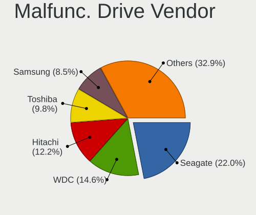

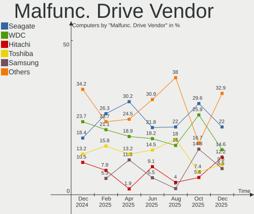

| Vendor                      | Computers | Drives | Percent |
|-----------------------------|-----------|--------|---------|
| Seagate                     | 18        | 19     | 21.95%  |
| WDC                         | 12        | 12     | 14.63%  |
| Hitachi                     | 10        | 10     | 12.2%   |
| Toshiba                     | 8         | 8      | 9.76%   |
| Samsung Electronics         | 7         | 7      | 8.54%   |
| HGST                        | 5         | 8      | 6.1%    |
| Intel                       | 3         | 3      | 3.66%   |
| Transcend                   | 2         | 2      | 2.44%   |
| Micron Technology           | 2         | 2      | 2.44%   |
| Corsair                     | 2         | 2      | 2.44%   |
| ValueTech                   | 1         | 1      | 1.22%   |
| SK hynix                    | 1         | 1      | 1.22%   |
| SanDisk                     | 1         | 1      | 1.22%   |
| Neo Forza                   | 1         | 1      | 1.22%   |
| Min Yi U                    | 1         | 1      | 1.22%   |
| Maxtor                      | 1         | 1      | 1.22%   |
| MAXIO Technology (Hangzhou) | 1         | 1      | 1.22%   |
| Kingston                    | 1         | 1      | 1.22%   |
| Intenso                     | 1         | 1      | 1.22%   |
| Fujitsu                     | 1         | 1      | 1.22%   |
| Crucial                     | 1         | 1      | 1.22%   |
| AFOX                        | 1         | 1      | 1.22%   |
| A-DATA Technology           | 1         | 1      | 1.22%   |

Malfunc. HDD Vendor
-------------------

Vendors of faulty HDD drives

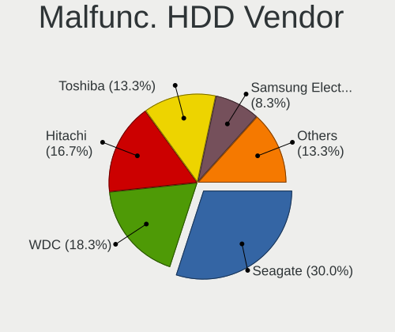

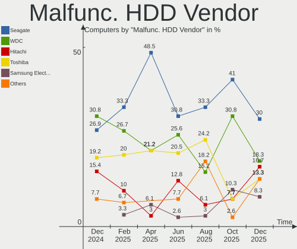

| Vendor              | Computers | Drives | Percent |
|---------------------|-----------|--------|---------|
| Seagate             | 18        | 19     | 30%     |
| WDC                 | 11        | 11     | 18.33%  |
| Hitachi             | 10        | 10     | 16.67%  |
| Toshiba             | 8         | 8      | 13.33%  |
| Samsung Electronics | 5         | 5      | 8.33%   |
| HGST                | 5         | 8      | 8.33%   |
| Min Yi U            | 1         | 1      | 1.67%   |
| Maxtor              | 1         | 1      | 1.67%   |
| Fujitsu             | 1         | 1      | 1.67%   |

Malfunc. Drive Kind
-------------------

Kinds of faulty drives

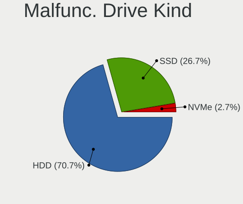

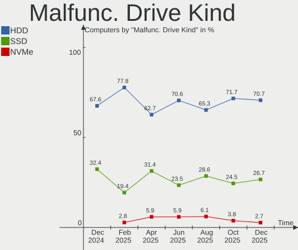

| Kind | Computers | Drives | Percent |
|------|-----------|--------|---------|
| HDD  | 53        | 64     | 70.67%  |
| SSD  | 20        | 20     | 26.67%  |
| NVMe | 2         | 2      | 2.67%   |

Failed Drives
-------------

Failed drive models

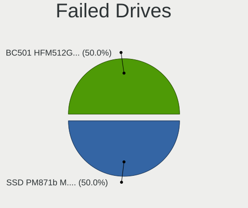

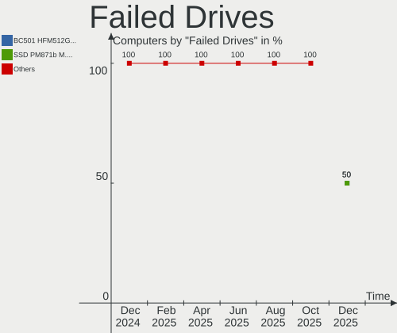

| Model                                         | Computers | Drives | Percent |
|-----------------------------------------------|-----------|--------|---------|
| SK hynix BC501 HFM512GDJTNG-8310A 512GB       | 1         | 1      | 50%     |
| Samsung Electronics SSD PM871b M.2 2280 128GB | 1         | 1      | 50%     |

Failed Drive Vendor
-------------------

Failed drive vendors

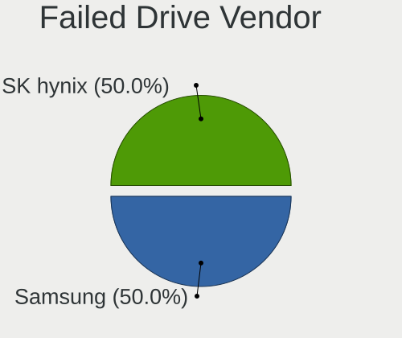

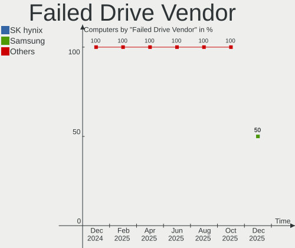

| Vendor              | Computers | Drives | Percent |
|---------------------|-----------|--------|---------|
| SK hynix            | 1         | 1      | 50%     |
| Samsung Electronics | 1         | 1      | 50%     |

Drive Status
------------

Number of failed and malfunc. drives

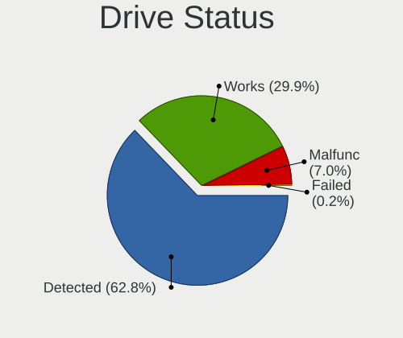

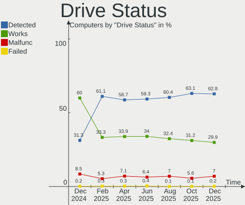

| Status   | Computers | Drives | Percent |
|----------|-----------|--------|---------|
| Detected | 590       | 1075   | 62.83%  |
| Works    | 281       | 448    | 29.93%  |
| Malfunc  | 66        | 86     | 7.03%   |
| Failed   | 2         | 2      | 0.21%   |

Storage controller
------------------

Storage Vendor
--------------

Storage controller vendors

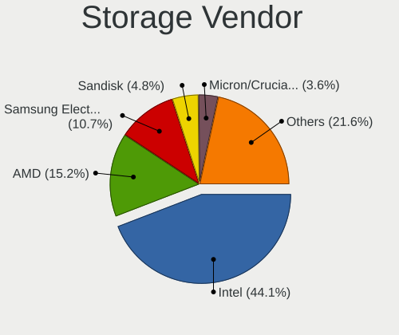

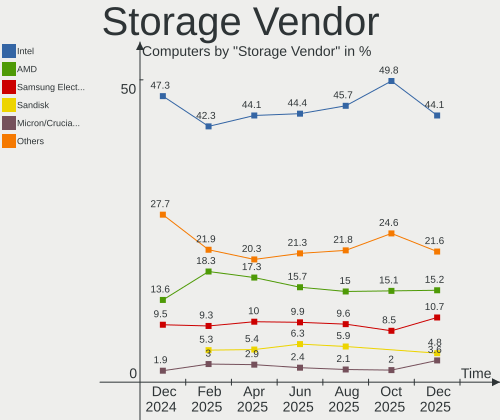

| Vendor                                  | Computers | Percent |
|-----------------------------------------|-----------|---------|
| Intel                                   | 547       | 44.15%  |
| AMD                                     | 188       | 15.17%  |
| Samsung Electronics                     | 133       | 10.73%  |
| Sandisk                                 | 59        | 4.76%   |
| Micron/Crucial Technology               | 44        | 3.55%   |
| ASMedia Technology                      | 32        | 2.58%   |
| Phison Electronics                      | 27        | 2.18%   |
| Micron Technology                       | 26        | 2.1%    |
| Kingston Technology Company             | 26        | 2.1%    |
| SK hynix                                | 22        | 1.78%   |
| MAXIO Technology (Hangzhou)             | 21        | 1.69%   |
| Marvell Technology Group                | 13        | 1.05%   |
| Silicon Motion                          | 12        | 0.97%   |
| Nvidia                                  | 12        | 0.97%   |
| JMicron Technology                      | 12        | 0.97%   |
| ADATA Technology                        | 11        | 0.89%   |
| KIOXIA                                  | 10        | 0.81%   |
| Toshiba America Info Systems            | 8         | 0.65%   |
| Shenzhen Longsys Electronics            | 7         | 0.56%   |
| Realtek Semiconductor                   | 6         | 0.48%   |
| Silicon Image                           | 4         | 0.32%   |
| VIA Technologies                        | 2         | 0.16%   |
| Solidigm                                | 2         | 0.16%   |
| Silicon Integrated Systems [SiS]        | 2         | 0.16%   |
| INNOGRIT                                | 2         | 0.16%   |
| Hosin Global Electronics                | 2         | 0.16%   |
| Apple                                   | 2         | 0.16%   |
| Solid State Storage Technology          | 1         | 0.08%   |
| Shenzhen Unionmemory Information System | 1         | 0.08%   |
| Seagate Technology                      | 1         | 0.08%   |
| Lenovo                                  | 1         | 0.08%   |
| Broadcom / LSI                          | 1         | 0.08%   |
| Biwin Storage Technology                | 1         | 0.08%   |
| Unknown                                 | 1         | 0.08%   |

Storage Model
-------------

Storage controller models

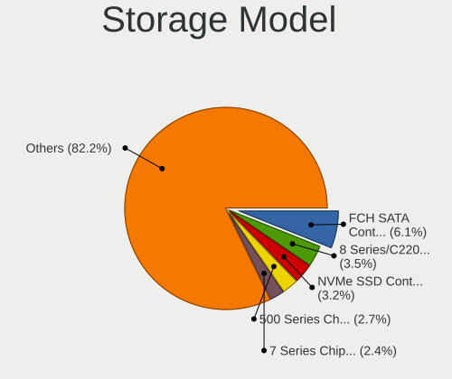

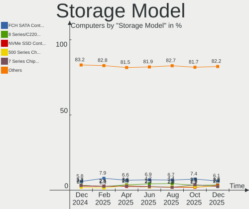

| Model                                                                                   | Computers | Percent |
|-----------------------------------------------------------------------------------------|-----------|---------|
| AMD FCH SATA Controller [AHCI mode]                                                     | 84        | 6.06%   |
| Intel 8 Series/C220 Series Chipset Family 6-port SATA Controller 1 [AHCI mode]          | 48        | 3.47%   |
| Samsung NVMe SSD Controller SM981/PM981/PM983                                           | 44        | 3.18%   |
| AMD 500 Series Chipset SATA Controller                                                  | 37        | 2.67%   |
| Intel 7 Series Chipset Family 6-port SATA Controller [AHCI mode]                        | 33        | 2.38%   |
| Intel Sunrise Point-LP SATA Controller [AHCI mode]                                      | 32        | 2.31%   |
| AMD 600 Series Chipset SATA Controller                                                  | 31        | 2.24%   |
| Intel 82801 Mobile SATA Controller [RAID mode]                                          | 26        | 1.88%   |
| Intel 200 Series PCH SATA controller [AHCI mode]                                        | 26        | 1.88%   |
| ASMedia ASM1061/ASM1062 Serial ATA Controller                                           | 25        | 1.81%   |
| AMD 400 Series Chipset SATA Controller                                                  | 24        | 1.73%   |
| Intel SATA Controller [RAID mode]                                                       | 23        | 1.66%   |
| Intel Q170/Q150/B150/H170/H110/Z170/CM236 Chipset SATA Controller [AHCI Mode]           | 23        | 1.66%   |
| Samsung NVMe SSD Controller 980 (DRAM-less)                                             | 21        | 1.52%   |
| Intel 6 Series/C200 Series Chipset Family 6 port Desktop SATA AHCI Controller           | 21        | 1.52%   |
| AMD SB7x0/SB8x0/SB9x0 SATA Controller [AHCI mode]                                       | 19        | 1.37%   |
| Intel Volume Management Device NVMe RAID Controller                                     | 18        | 1.3%    |
| Intel 8 Series SATA Controller 1 [AHCI mode]                                            | 18        | 1.3%    |
| Samsung NVMe SSD Controller PM9A1/PM9A3/980PRO                                          | 17        | 1.23%   |
| Samsung NVMe SSD Controller SM961/PM961/SM963                                           | 16        | 1.16%   |
| Micron/Crucial P2 [Nick P2] / P3 / P3 Plus NVMe PCIe SSD (DRAM-less)                    | 16        | 1.16%   |
| Samsung NVMe SSD Controller S4LV008[Pascal]                                             | 15        | 1.08%   |
| Intel Comet Lake SATA AHCI Controller                                                   | 15        | 1.08%   |
| Intel Alder Lake-S PCH SATA Controller [AHCI Mode]                                      | 14        | 1.01%   |
| MAXIO (Hangzhou) NVMe SSD Controller MAP1202 (DRAM-less)                                | 13        | 0.94%   |
| Intel Wildcat Point-LP SATA Controller [AHCI Mode]                                      | 13        | 0.94%   |
| Intel 7 Series/C210 Series Chipset Family 6-port SATA Controller [AHCI mode]            | 13        | 0.94%   |
| Intel 6 Series/C200 Series Chipset Family 6 port Mobile SATA AHCI Controller            | 13        | 0.94%   |
| Phison E12 NVMe Controller                                                              | 12        | 0.87%   |
| Intel 6 Series/C200 Series Chipset Family Desktop SATA Controller (IDE mode, ports 4-5) | 12        | 0.87%   |
| Intel 6 Series/C200 Series Chipset Family Desktop SATA Controller (IDE mode, ports 0-3) | 12        | 0.87%   |
| AMD SB7x0/SB8x0/SB9x0 IDE Controller                                                    | 12        | 0.87%   |
| SanDisk WD SN560/SN740/SN770/SN5000 NVMe SSD                                            | 11        | 0.79%   |
| Micron/Crucial P310 NVMe PCIe SSD (DRAM-less)                                           | 11        | 0.79%   |
| Intel Raptor Lake SATA AHCI Controller                                                  | 11        | 0.79%   |
| Intel Cannon Lake PCH SATA AHCI Controller                                              | 11        | 0.79%   |
| Samsung NVMe SSD Controller PM9C1a (DRAM-less)                                          | 10        | 0.72%   |
| Intel Celeron N3350/Pentium N4200/Atom E3900 Series SATA AHCI Controller                | 10        | 0.72%   |
| Intel 82801HM/HEM (ICH8M/ICH8M-E) IDE Controller                                        | 10        | 0.72%   |
| Intel 400 Series Chipset Family SATA AHCI Controller                                    | 10        | 0.72%   |

Storage Kind
------------

Kind of storage controller (IDE, SATA, NVMe, SAS, ...)

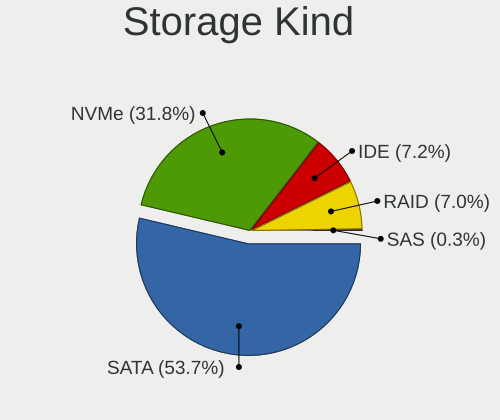

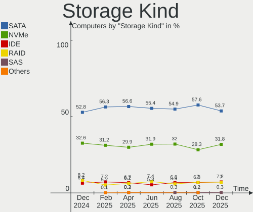

| Kind | Computers | Percent |
|------|-----------|---------|
| SATA | 640       | 53.69%  |
| NVMe | 379       | 31.8%   |
| IDE  | 86        | 7.21%   |
| RAID | 84        | 7.05%   |
| SAS  | 3         | 0.25%   |

Processor
---------

CPU Vendor
----------

Processor vendors

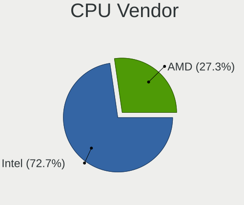

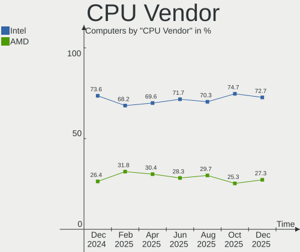

| Vendor | Computers | Percent |
|--------|-----------|---------|
| Intel  | 634       | 72.71%  |
| AMD    | 238       | 27.29%  |

CPU Model
---------

Processor models

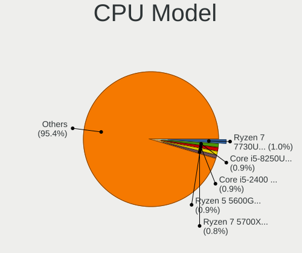

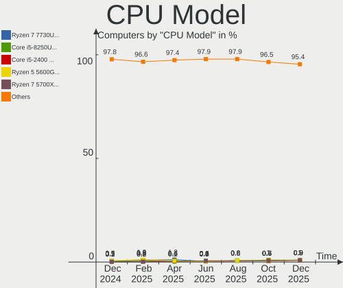

| Model                                   | Computers | Percent |
|-----------------------------------------|-----------|---------|
| AMD Ryzen 7 7730U with Radeon Graphics  | 9         | 1.03%   |
| Intel Core i5-8250U CPU @ 1.60GHz       | 8         | 0.92%   |
| Intel Core i5-2400 CPU @ 3.10GHz        | 8         | 0.92%   |
| AMD Ryzen 5 5600G with Radeon Graphics  | 8         | 0.92%   |
| AMD Ryzen 7 5700X 8-Core Processor      | 7         | 0.8%    |
| Intel Core i5-8265U CPU @ 1.60GHz       | 6         | 0.69%   |
| Intel Core i5-7200U CPU @ 2.50GHz       | 6         | 0.69%   |
| Intel Core i5-4590 CPU @ 3.30GHz        | 6         | 0.69%   |
| Intel Core i5-3320M CPU @ 2.60GHz       | 6         | 0.69%   |
| AMD Ryzen 7 5800X 8-Core Processor      | 6         | 0.69%   |
| Intel Core i7-8700 CPU @ 3.20GHz        | 5         | 0.57%   |
| Intel Core i7-6700K CPU @ 4.00GHz       | 5         | 0.57%   |
| Intel Core i5-8350U CPU @ 1.70GHz       | 5         | 0.57%   |
| Intel Core i5-7300U CPU @ 2.60GHz       | 5         | 0.57%   |
| Intel Core i5-3470 CPU @ 3.20GHz        | 5         | 0.57%   |
| Intel Core i5-3210M CPU @ 2.50GHz       | 5         | 0.57%   |
| Intel Core i5-2520M CPU @ 2.50GHz       | 5         | 0.57%   |
| Intel Core i3-4030U CPU @ 1.90GHz       | 5         | 0.57%   |
| Intel 11th Gen Core i5-1135G7 @ 2.40GHz | 5         | 0.57%   |
| AMD Ryzen 9 5900X 12-Core Processor     | 5         | 0.57%   |
| AMD Ryzen 7 9800X3D 8-Core Processor    | 5         | 0.57%   |
| AMD Ryzen 7 5700G with Radeon Graphics  | 5         | 0.57%   |
| AMD Ryzen 7 2700X Eight-Core Processor  | 5         | 0.57%   |
| AMD Ryzen 5 5600X 6-Core Processor      | 5         | 0.57%   |
| Intel Core i7-7700HQ CPU @ 2.80GHz      | 4         | 0.46%   |
| Intel Core i7-6700HQ CPU @ 2.60GHz      | 4         | 0.46%   |
| Intel Core i7-6700 CPU @ 3.40GHz        | 4         | 0.46%   |
| Intel Core i7-6500U CPU @ 2.50GHz       | 4         | 0.46%   |
| Intel Core i7-4700MQ CPU @ 2.40GHz      | 4         | 0.46%   |
| Intel Core i7-2600 CPU @ 3.40GHz        | 4         | 0.46%   |
| Intel Core i7 CPU 920 @ 2.67GHz         | 4         | 0.46%   |
| Intel Core i5-8400 CPU @ 2.80GHz        | 4         | 0.46%   |
| Intel Core i5-8365U CPU @ 1.60GHz       | 4         | 0.46%   |
| Intel Core i5-7600K CPU @ 3.80GHz       | 4         | 0.46%   |
| Intel Core i5-7500 CPU @ 3.40GHz        | 4         | 0.46%   |
| Intel Core i5-6500 CPU @ 3.20GHz        | 4         | 0.46%   |
| Intel Core i5-6200U CPU @ 2.30GHz       | 4         | 0.46%   |
| Intel Core i5-5300U CPU @ 2.30GHz       | 4         | 0.46%   |
| Intel Core 2 Duo CPU E8400 @ 3.00GHz    | 4         | 0.46%   |
| Intel Celeron CPU J3455 @ 1.50GHz       | 4         | 0.46%   |

CPU Model Family
----------------

Processor model prefix

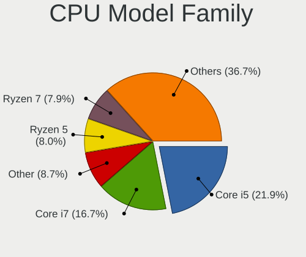

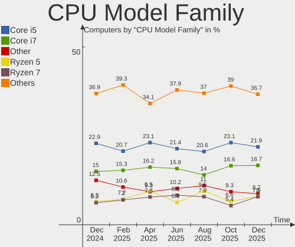

| Model                   | Computers | Percent |
|-------------------------|-----------|---------|
| Intel Core i5           | 191       | 21.9%   |
| Intel Core i7           | 146       | 16.74%  |
| Other                   | 76        | 8.72%   |
| AMD Ryzen 5             | 70        | 8.03%   |
| AMD Ryzen 7             | 69        | 7.91%   |
| Intel Core i3           | 65        | 7.45%   |
| Intel Core 2 Duo        | 35        | 4.01%   |
| Intel Celeron           | 34        | 3.9%    |
| AMD Ryzen 9             | 25        | 2.87%   |
| Intel Xeon              | 18        | 2.06%   |
| Intel Core              | 15        | 1.72%   |
| AMD FX                  | 14        | 1.61%   |
| Intel Pentium           | 13        | 1.49%   |
| Intel Core i9           | 10        | 1.15%   |
| Intel Pentium Dual-Core | 8         | 0.92%   |
| AMD Ryzen 3             | 7         | 0.8%    |
| AMD A8                  | 7         | 0.8%    |
| AMD A10                 | 7         | 0.8%    |
| Intel Core 2 Quad       | 6         | 0.69%   |
| Intel Pentium Silver    | 5         | 0.57%   |
| Intel Pentium Dual      | 4         | 0.46%   |
| AMD Ryzen 7 PRO         | 4         | 0.46%   |
| Intel Pentium Gold      | 3         | 0.34%   |
| AMD Ryzen 5 PRO         | 3         | 0.34%   |
| AMD E1                  | 3         | 0.34%   |
| AMD Athlon II X2        | 3         | 0.34%   |
| AMD A4                  | 3         | 0.34%   |
| Intel Core M            | 2         | 0.23%   |
| Intel Atom              | 2         | 0.23%   |
| AMD PRO A10             | 2         | 0.23%   |
| AMD A6                  | 2         | 0.23%   |
| Intel Xeon Gold         | 1         | 0.11%   |
| Intel Genuine           | 1         | 0.11%   |
| Intel Core 2            | 1         | 0.11%   |
| AMD Sempron             | 1         | 0.11%   |
| AMD Ryzen Threadripper  | 1         | 0.11%   |
| AMD Ryzen Embedded      | 1         | 0.11%   |
| AMD QC                  | 1         | 0.11%   |
| AMD Phenom II X6        | 1         | 0.11%   |
| AMD Phenom II X4        | 1         | 0.11%   |

CPU Cores
---------

Number of processor cores

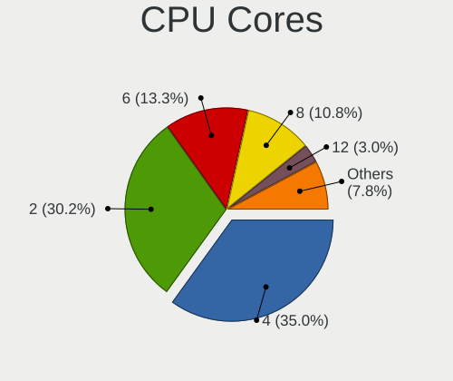

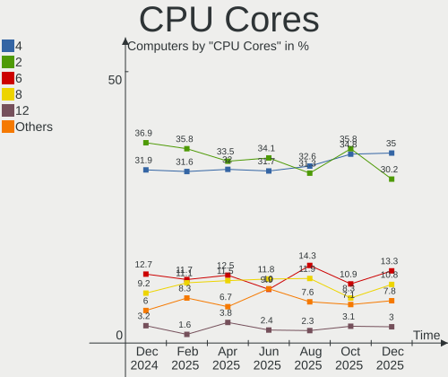

| Number | Computers | Percent |
|--------|-----------|---------|
| 4      | 305       | 34.98%  |
| 2      | 263       | 30.16%  |
| 6      | 116       | 13.3%   |
| 8      | 94        | 10.78%  |
| 12     | 26        | 2.98%   |
| 10     | 20        | 2.29%   |
| 16     | 17        | 1.95%   |
| 14     | 10        | 1.15%   |
| 20     | 8         | 0.92%   |
| 24     | 7         | 0.8%    |
| 3      | 4         | 0.46%   |
| 40     | 1         | 0.11%   |
| 1      | 1         | 0.11%   |

CPU Sockets
-----------

Number of sockets

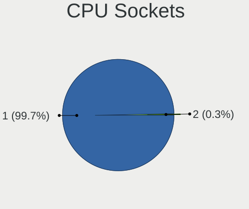

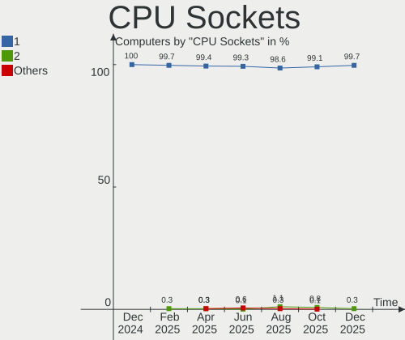

| Number | Computers | Percent |
|--------|-----------|---------|
| 1      | 869       | 99.66%  |
| 2      | 3         | 0.34%   |

CPU Threads
-----------

Threads per core (Hyper-Threading)

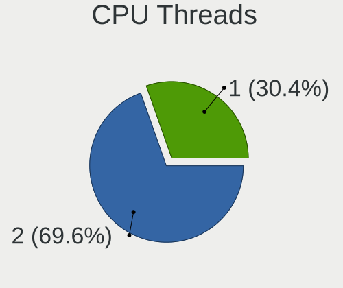

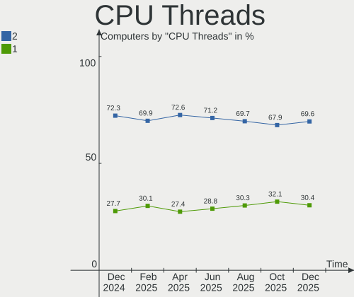

| Number | Computers | Percent |
|--------|-----------|---------|
| 2      | 607       | 69.61%  |
| 1      | 265       | 30.39%  |

CPU Op-Modes
------------

CPU Operation Modes (32-bit, 64-bit)

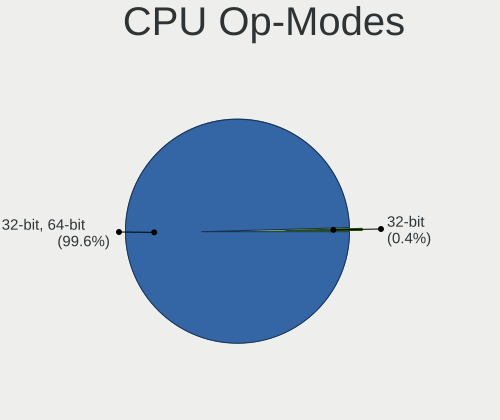

| Op mode        | Computers | Percent |
|----------------|-----------|---------|
| 32-bit, 64-bit | 872       | 100%    |

CPU Microcode
-------------

Microcode number

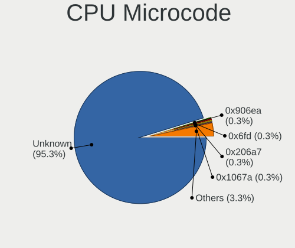

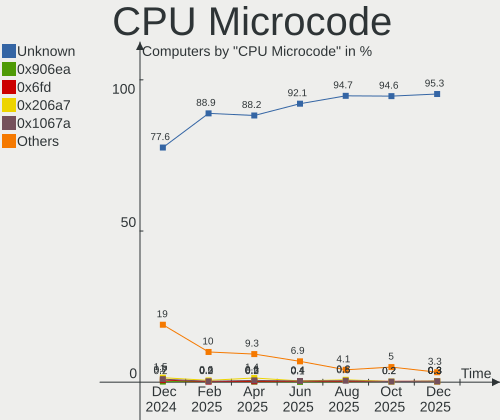

| Number     | Computers | Percent |
|------------|-----------|---------|
| Unknown    | 831       | 95.3%   |
| 0x906ea    | 3         | 0.34%   |
| 0x6fd      | 3         | 0.34%   |
| 0x206a7    | 3         | 0.34%   |
| 0x1067a    | 3         | 0.34%   |
| 0x906c0    | 2         | 0.23%   |
| 0x806e9    | 2         | 0.23%   |
| 0x6fb      | 2         | 0.23%   |
| 0x506e3    | 2         | 0.23%   |
| 0x406e3    | 2         | 0.23%   |
| 0x306a9    | 2         | 0.23%   |
| 0x20655    | 2         | 0.23%   |
| 0x06000852 | 2         | 0.23%   |
| 0xa0655    | 1         | 0.11%   |
| 0x906eb    | 1         | 0.11%   |
| 0x906e9    | 1         | 0.11%   |
| 0x806ec    | 1         | 0.11%   |
| 0x806c1    | 1         | 0.11%   |
| 0x6f2      | 1         | 0.11%   |
| 0x306c3    | 1         | 0.11%   |
| 0x0a50000b | 1         | 0.11%   |
| 0x08701021 | 1         | 0.11%   |
| 0x08608103 | 1         | 0.11%   |
| 0x08001138 | 1         | 0.11%   |
| 0x08001137 | 1         | 0.11%   |
| 0x010000dc | 1         | 0.11%   |

CPU Microarch
-------------

Microarchitecture

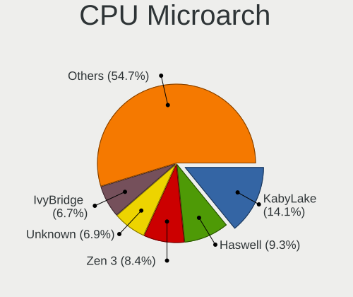

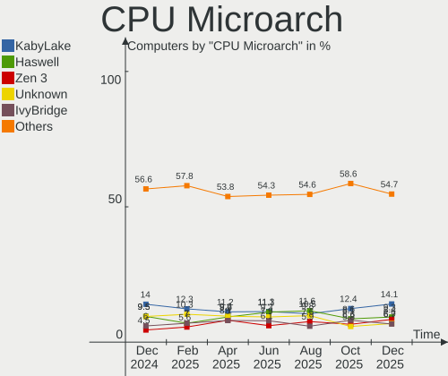

| Name               | Computers | Percent |
|--------------------|-----------|---------|
| KabyLake           | 123       | 14.11%  |
| Haswell            | 81        | 9.29%   |
| Zen 3              | 73        | 8.37%   |
| Unknown            | 60        | 6.88%   |
| IvyBridge          | 58        | 6.65%   |
| Alderlake Hybrid   | 53        | 6.08%   |
| SandyBridge        | 52        | 5.96%   |
| Skylake            | 47        | 5.39%   |
| Penryn             | 34        | 3.9%    |
| Zen+               | 27        | 3.1%    |
| Core               | 22        | 2.52%   |
| CometLake          | 21        | 2.41%   |
| Broadwell          | 19        | 2.18%   |
| Zen 2              | 18        | 2.06%   |
| Piledriver         | 18        | 2.06%   |
| TigerLake          | 16        | 1.83%   |
| Westmere           | 14        | 1.61%   |
| Icelake            | 14        | 1.61%   |
| Nehalem            | 13        | 1.49%   |
| Silvermont         | 12        | 1.38%   |
| Goldmont plus      | 11        | 1.26%   |
| Zen                | 10        | 1.15%   |
| K10                | 10        | 1.15%   |
| Goldmont           | 10        | 1.15%   |
| Lunarlake Hybrid   | 8         | 0.92%   |
| Tremont            | 7         | 0.8%    |
| Meteorlake Hybrid  | 6         | 0.69%   |
| Gracemont          | 6         | 0.69%   |
| Jaguar             | 5         | 0.57%   |
| K8 Hammer          | 4         | 0.46%   |
| Excavator          | 4         | 0.46%   |
| Bulldozer          | 4         | 0.46%   |
| Steamroller        | 3         | 0.34%   |
| Bobcat             | 3         | 0.34%   |
| Puma               | 2         | 0.23%   |
| K10 Llano          | 2         | 0.23%   |
| Bonnell            | 1         | 0.11%   |
| ArrowLake-H Hybrid | 1         | 0.11%   |

Graphics
--------

GPU Vendor
----------

Vendors of graphics cards

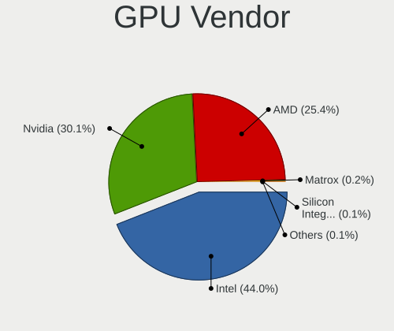

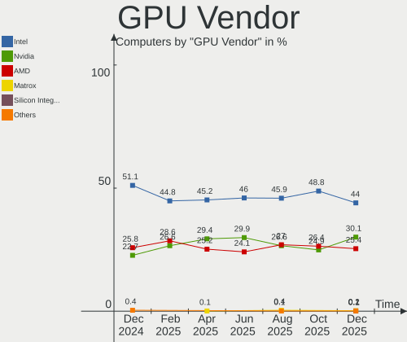

| Vendor                           | Computers | Percent |
|----------------------------------|-----------|---------|
| Intel                            | 447       | 44.04%  |
| Nvidia                           | 306       | 30.15%  |
| AMD                              | 258       | 25.42%  |
| Matrox Electronics Systems       | 2         | 0.2%    |
| Silicon Integrated Systems [SiS] | 1         | 0.1%    |
| ASPEED Technology                | 1         | 0.1%    |

GPU Model
---------

Graphics card models

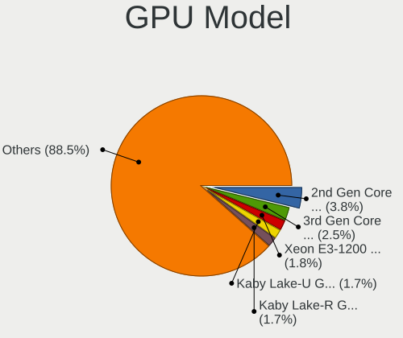

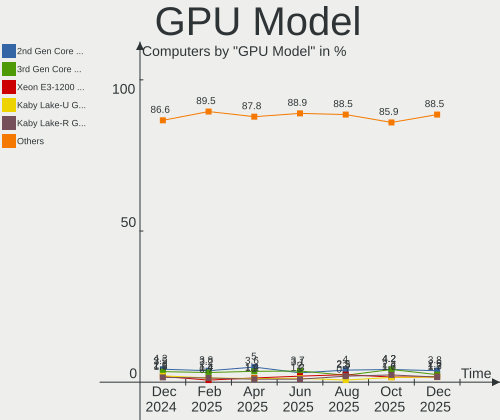

| Model                                                                       | Computers | Percent |
|-----------------------------------------------------------------------------|-----------|---------|
| Intel 2nd Generation Core Processor Family Integrated Graphics Controller   | 40        | 3.82%   |
| Intel 3rd Gen Core processor Graphics Controller                            | 26        | 2.48%   |
| Intel Xeon E3-1200 v3/4th Gen Core Processor Integrated Graphics Controller | 19        | 1.81%   |
| Intel Kaby Lake-U GT2 [HD Graphics 620]                                     | 18        | 1.72%   |
| Intel Kaby Lake-R GT2 [UHD Graphics 620]                                    | 18        | 1.72%   |
| Intel Haswell-ULT Integrated Graphics Controller                            | 18        | 1.72%   |
| AMD Cezanne [Radeon Vega Series / Radeon Vega Mobile Series]                | 18        | 1.72%   |
| AMD Picasso/Raven 2 [Radeon Vega Series / Radeon Vega Mobile Series]        | 16        | 1.53%   |
| AMD Ellesmere [Radeon RX 470/480/570/570X/580/580X/590]                     | 16        | 1.53%   |
| AMD Barcelo                                                                 | 16        | 1.53%   |
| Intel Skylake-U GT2 [HD Graphics 520]                                       | 14        | 1.34%   |
| Intel Skylake-S GT2 [HD Graphics 530]                                       | 14        | 1.34%   |
| Intel 4th Gen Core Processor Integrated Graphics Controller                 | 13        | 1.24%   |
| Nvidia GA106 [GeForce RTX 3060 Lite Hash Rate]                              | 12        | 1.15%   |
| Intel WhiskeyLake-U GT2 [UHD Graphics 620]                                  | 12        | 1.15%   |
| AMD Granite Ridge [Radeon Graphics]                                         | 12        | 1.15%   |
| Intel Broadwell-U GT2 [HD Graphics 5500]                                    | 11        | 1.05%   |
| Nvidia GF117M [GeForce 610M/710M/810M/820M / GT 620M/625M/630M/720M]        | 10        | 0.95%   |
| Intel TigerLake-LP GT2 [Iris Xe Graphics]                                   | 10        | 0.95%   |
| Intel CometLake-U GT2 [UHD Graphics]                                        | 10        | 0.95%   |
| Intel Raptor Lake-P [Iris Xe Graphics]                                      | 9         | 0.86%   |
| Intel Mobile 4 Series Chipset Integrated Graphics Controller                | 9         | 0.86%   |
| Intel JasperLake [UHD Graphics]                                             | 9         | 0.86%   |
| Intel GeminiLake [UHD Graphics 600]                                         | 9         | 0.86%   |
| Intel Apollo Lake GT1 [HD Graphics 500]                                     | 9         | 0.86%   |
| AMD Navi 23 [Radeon RX 6600/6600 XT/6600M]                                  | 9         | 0.86%   |
| Nvidia GK208B [GeForce GT 710]                                              | 8         | 0.76%   |
| Intel Atom Processor Z36xxx/Z37xxx Series Graphics & Display                | 8         | 0.76%   |
| AMD Raphael                                                                 | 8         | 0.76%   |
| Nvidia GP108 [GeForce GT 1030]                                              | 7         | 0.67%   |
| Nvidia GP107 [GeForce GTX 1050 Ti]                                          | 7         | 0.67%   |
| Nvidia GP106 [GeForce GTX 1060 6GB]                                         | 7         | 0.67%   |
| Nvidia GA104 [GeForce RTX 3070 Ti]                                          | 7         | 0.67%   |
| Intel Kaby Lake-S GT2 [HD Graphics 630]                                     | 7         | 0.67%   |
| Intel Core Processor Integrated Graphics Controller                         | 7         | 0.67%   |
| Intel CometLake-H GT2 [UHD Graphics]                                        | 7         | 0.67%   |
| Intel CoffeeLake-H GT2 [UHD Graphics 630]                                   | 7         | 0.67%   |
| Nvidia GT218 [GeForce 210]                                                  | 6         | 0.57%   |
| Nvidia GP104 [GeForce GTX 1070]                                             | 6         | 0.57%   |
| Intel Tiger Lake-LP GT2 [UHD Graphics G4]                                   | 6         | 0.57%   |

GPU Combo
---------

Combinations of graphics cards

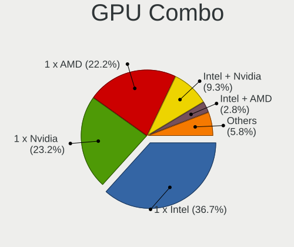

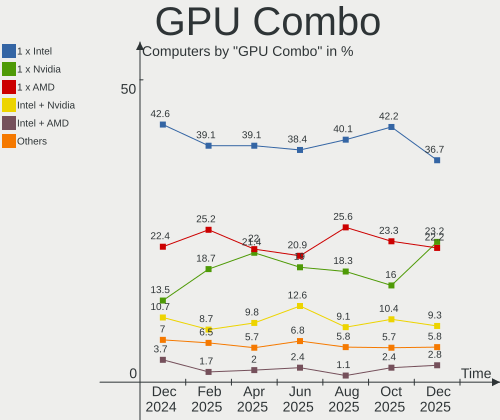

| Name            | Computers | Percent |
|-----------------|-----------|---------|
| 1 x Intel       | 320       | 36.7%   |
| 1 x Nvidia      | 202       | 23.17%  |
| 1 x AMD         | 194       | 22.25%  |
| Intel + Nvidia  | 81        | 9.29%   |
| Intel + AMD     | 24        | 2.75%   |
| 2 x AMD         | 19        | 2.18%   |
| AMD + Nvidia    | 17        | 1.95%   |
| 2 x Intel       | 6         | 0.69%   |
| 2 x Nvidia      | 4         | 0.46%   |
| AMD + Matrox    | 2         | 0.23%   |
| Other           | 1         | 0.11%   |
| 1 x SiS         | 1         | 0.11%   |
| Nvidia + ASPEED | 1         | 0.11%   |

GPU Driver
----------

Free vs proprietary

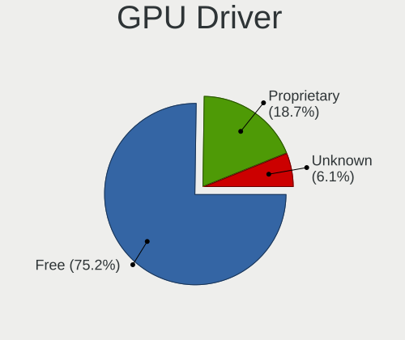

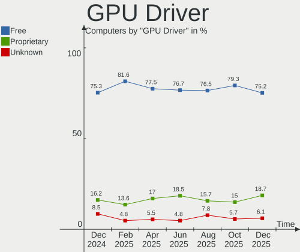

| Driver      | Computers | Percent |
|-------------|-----------|---------|
| Free        | 656       | 75.23%  |
| Proprietary | 163       | 18.69%  |
| Unknown     | 53        | 6.08%   |

GPU Memory
----------

Total video memory

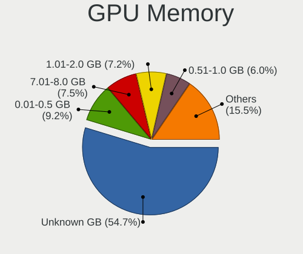

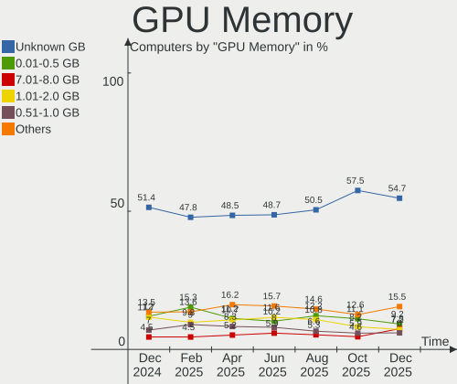

| Size in GB | Computers | Percent |
|------------|-----------|---------|
| Unknown    | 477       | 54.7%   |
| 0.01-0.5   | 80        | 9.17%   |
| 7.01-8.0   | 65        | 7.45%   |
| 1.01-2.0   | 63        | 7.22%   |
| 0.51-1.0   | 52        | 5.96%   |
| 8.01-16.0  | 48        | 5.5%    |
| 3.01-4.0   | 45        | 5.16%   |
| 5.01-6.0   | 25        | 2.87%   |
| 2.01-3.0   | 9         | 1.03%   |
| 16.01-24.0 | 5         | 0.57%   |
| 24.01-32.0 | 2         | 0.23%   |
| 4.01-5.0   | 1         | 0.11%   |

Monitor
-------

Monitor Vendor
--------------

Monitor vendors

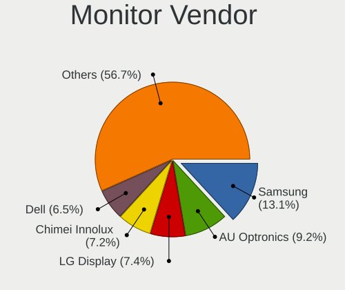

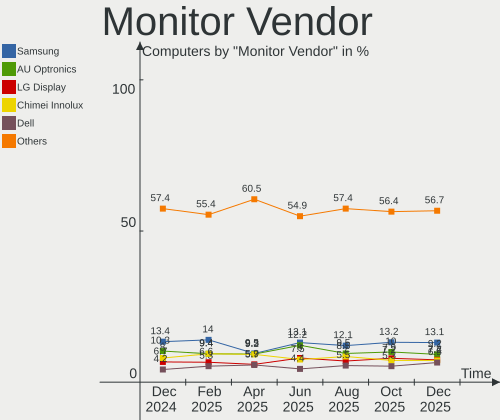

| Vendor                  | Computers | Percent |
|-------------------------|-----------|---------|
| Samsung Electronics     | 123       | 13.13%  |
| AU Optronics            | 86        | 9.18%   |
| LG Display              | 69        | 7.36%   |
| Chimei Innolux          | 67        | 7.15%   |
| Dell                    | 61        | 6.51%   |
| BOE                     | 61        | 6.51%   |
| Goldstar                | 58        | 6.19%   |
| Acer                    | 40        | 4.27%   |
| Apple                   | 32        | 3.42%   |
| Hewlett-Packard         | 30        | 3.2%    |
| AOC                     | 25        | 2.67%   |
| Lenovo                  | 23        | 2.45%   |
| Philips                 | 20        | 2.13%   |
| BenQ                    | 19        | 2.03%   |
| Ancor Communications    | 16        | 1.71%   |
| ASUSTek Computer        | 13        | 1.39%   |
| Iiyama                  | 12        | 1.28%   |
| Chi Mei Optoelectronics | 10        | 1.07%   |
| Unknown                 | 9         | 0.96%   |
| MSI                     | 8         | 0.85%   |
| InfoVision              | 7         | 0.75%   |
| Gigabyte Technology     | 7         | 0.75%   |
| ViewSonic               | 6         | 0.64%   |
| Sharp                   | 6         | 0.64%   |
| LG Electronics          | 6         | 0.64%   |
| Fujitsu Siemens         | 6         | 0.64%   |
| RTK                     | 5         | 0.53%   |
| Eizo                    | 5         | 0.53%   |
| CSOT                    | 5         | 0.53%   |
| Vizio                   | 4         | 0.43%   |
| Toshiba                 | 4         | 0.43%   |
| PANDA                   | 4         | 0.43%   |
| Medion                  | 4         | 0.43%   |
| LG Philips              | 4         | 0.43%   |
| Insignia                | 4         | 0.43%   |
| HannStar                | 4         | 0.43%   |
| Vestel Elektronik       | 3         | 0.32%   |
| Unknown (XXX)           | 3         | 0.32%   |
| Sony                    | 3         | 0.32%   |
| SKG                     | 3         | 0.32%   |

Monitor Model
-------------

Monitor models

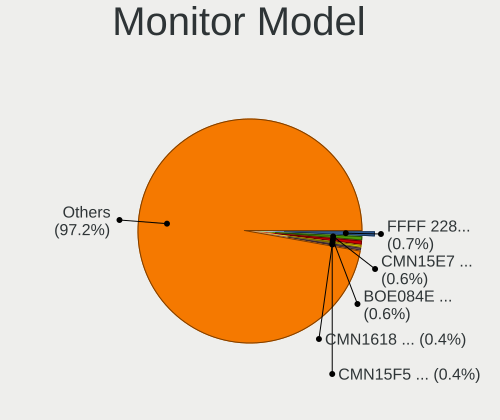

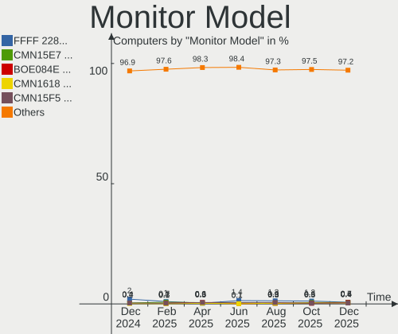

| Model                                                                 | Computers | Percent |
|-----------------------------------------------------------------------|-----------|---------|
| Unknown LCD Monitor FFFF 2288x1287 2550x2550mm 142.0-inch             | 7         | 0.73%   |
| Chimei Innolux LCD Monitor CMN15E7 1920x1080 344x193mm 15.5-inch      | 6         | 0.62%   |
| BOE LCD Monitor BOE084E 1920x1080 382x215mm 17.3-inch                 | 6         | 0.62%   |
| Chimei Innolux LCD Monitor CMN1618 1920x1200 344x215mm 16.0-inch      | 4         | 0.42%   |
| Chimei Innolux LCD Monitor CMN15F5 1920x1080 344x193mm 15.5-inch      | 4         | 0.42%   |
| AU Optronics LCD Monitor AUO45EC 1366x768 344x193mm 15.5-inch         | 4         | 0.42%   |
| AU Optronics LCD Monitor AUO10EC 1366x768 344x193mm 15.5-inch         | 4         | 0.42%   |
| Vestel Elektronik 40UHD_LCD_TV VES3700 3840x2160 880x500mm 39.8-inch  | 3         | 0.31%   |
| LG Display LCD Monitor LGD0521 1920x1080 309x174mm 14.0-inch          | 3         | 0.31%   |
| LG Display LCD Monitor LGD046F 1920x1080 344x194mm 15.5-inch          | 3         | 0.31%   |
| Goldstar HDR 4K GSM7707 3840x2160 600x340mm 27.2-inch                 | 3         | 0.31%   |
| Goldstar 27GL850 GSM5B7F 2560x1440 597x336mm 27.0-inch                | 3         | 0.31%   |
| Dell P2214H DELA097 1920x1080 477x268mm 21.5-inch                     | 3         | 0.31%   |
| Dell P2210 DEL404E 1680x1050 474x296mm 22.0-inch                      | 3         | 0.31%   |
| Chimei Innolux LCD Monitor CMN1521 1920x1080 344x193mm 15.5-inch      | 3         | 0.31%   |
| Chimei Innolux LCD Monitor CMN14D4 1920x1080 309x173mm 13.9-inch      | 3         | 0.31%   |
| AU Optronics LCD Monitor AUO2E3C 1366x768 309x173mm 13.9-inch         | 3         | 0.31%   |
| Apple iMac APPAE11 3840x2160 597x336mm 27.0-inch                      | 3         | 0.31%   |
| AOC U2790B AOC2790 3840x2160 597x336mm 27.0-inch                      | 3         | 0.31%   |
| Ancor Communications VE247 ACI2493 1920x1080 530x300mm 24.0-inch      | 3         | 0.31%   |
| Ancor Communications ASUS VS228 ACI22FD 1920x1080 476x268mm 21.5-inch | 3         | 0.31%   |
| Ancor Communications ASUS VP228 ACI22C3 1920x1080 476x268mm 21.5-inch | 3         | 0.31%   |
| Toshiba TV TSB0206 1920x1080                                          | 2         | 0.21%   |
| Samsung Electronics U28E590 SAM0C4D 3840x2160 607x345mm 27.5-inch     | 2         | 0.21%   |
| Samsung Electronics SyncMaster SAM0304 1680x1050 494x320mm 23.2-inch  | 2         | 0.21%   |
| Samsung Electronics SMB2030N SAM0634 1600x900 443x249mm 20.0-inch     | 2         | 0.21%   |
| Samsung Electronics S34J55x SAM0F72 3440x1440 797x333mm 34.0-inch     | 2         | 0.21%   |
| Samsung Electronics S27F350 SAM0D22 1920x1080 598x336mm 27.0-inch     | 2         | 0.21%   |
| Samsung Electronics S24F350 SAM0D20 1920x1080 521x293mm 23.5-inch     | 2         | 0.21%   |
| Samsung Electronics S22D300 SAM0B3E 1920x1080 477x268mm 21.5-inch     | 2         | 0.21%   |
| Samsung Electronics LCD Monitor SEC5441 1280x800 331x207mm 15.4-inch  | 2         | 0.21%   |
| Samsung Electronics LCD Monitor SDC5441 1366x768 344x193mm 15.5-inch  | 2         | 0.21%   |
| Samsung Electronics LCD Monitor SDC4A51 1366x768 344x194mm 15.5-inch  | 2         | 0.21%   |
| Samsung Electronics LCD Monitor SDC41B6 2880x1800 344x215mm 16.0-inch | 2         | 0.21%   |
| Samsung Electronics LCD Monitor SDC3654 1600x900 382x215mm 17.3-inch  | 2         | 0.21%   |
| Samsung Electronics LCD Monitor SDC3150 1920x1080 344x194mm 15.5-inch | 2         | 0.21%   |
| Samsung Electronics LCD Monitor SAM0C39 1920x1080 885x498mm 40.0-inch | 2         | 0.21%   |
| Samsung Electronics LCD Monitor SAM0902 1920x1080 890x500mm 40.2-inch | 2         | 0.21%   |
| Samsung Electronics C27F390 SAM0D32 1920x1080 598x336mm 27.0-inch     | 2         | 0.21%   |
| RTK HX150T RTK1920 1920x1080 344x195mm 15.6-inch                      | 2         | 0.21%   |

Monitor Resolution
------------------

Monitor screen resolution

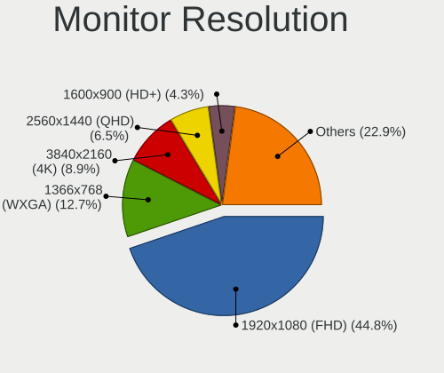

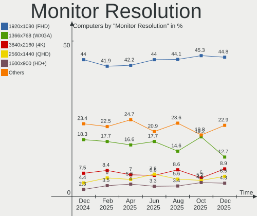

| Resolution         | Computers | Percent |
|--------------------|-----------|---------|
| 1920x1080 (FHD)    | 409       | 44.8%   |
| 1366x768 (WXGA)    | 116       | 12.71%  |
| 3840x2160 (4K)     | 81        | 8.87%   |
| 2560x1440 (QHD)    | 59        | 6.46%   |
| 1600x900 (HD+)     | 39        | 4.27%   |
| 1920x1200 (WUXGA)  | 38        | 4.16%   |
| 1680x1050 (WSXGA+) | 27        | 2.96%   |
| 1440x900 (WXGA+)   | 25        | 2.74%   |
| 1280x1024 (SXGA)   | 18        | 1.97%   |
| 3440x1440          | 15        | 1.64%   |
| 2880x1800          | 11        | 1.2%    |
| 1280x800 (WXGA)    | 10        | 1.1%    |
| Unknown            | 10        | 1.1%    |
| 3840x1080          | 7         | 0.77%   |
| 2288x1287          | 7         | 0.77%   |
| 2560x1600          | 6         | 0.66%   |
| 1360x768           | 6         | 0.66%   |
| 2560x1080          | 4         | 0.44%   |
| 1024x768 (XGA)     | 4         | 0.44%   |
| 2880x1920          | 3         | 0.33%   |
| 3200x1800 (QHD+)   | 2         | 0.22%   |
| 2736x1824          | 2         | 0.22%   |
| 2160x1440          | 2         | 0.22%   |
| 1920x540           | 2         | 0.22%   |
| 1920x1280          | 2         | 0.22%   |
| 7680x2160          | 1         | 0.11%   |
| 6880x1440          | 1         | 0.11%   |
| 3840x2400          | 1         | 0.11%   |
| 3840x1200          | 1         | 0.11%   |
| 2880x1620          | 1         | 0.11%   |
| 2240x1400          | 1         | 0.11%   |
| 1600x1200          | 1         | 0.11%   |
| 1280x720 (HD)      | 1         | 0.11%   |

Monitor Diagonal
----------------

Diagonal size in inches

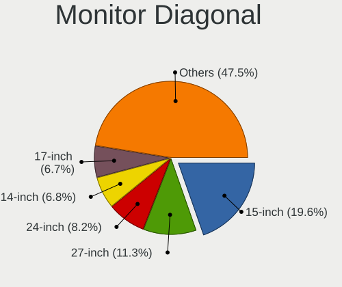

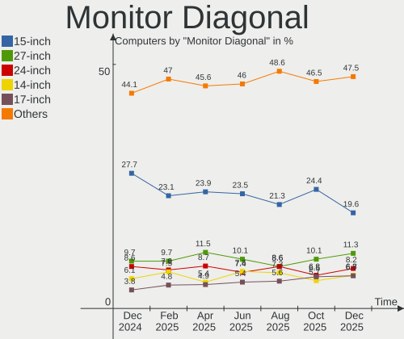

| Inches  | Computers | Percent |
|---------|-----------|---------|
| 15      | 185       | 19.64%  |
| 27      | 106       | 11.25%  |
| 24      | 77        | 8.17%   |
| 14      | 64        | 6.79%   |
| 17      | 63        | 6.69%   |
| 21      | 61        | 6.48%   |
| 23      | 60        | 6.37%   |
| 13      | 53        | 5.63%   |
| 31      | 39        | 4.14%   |
| Unknown | 29        | 3.08%   |
| 22      | 19        | 2.02%   |
| 18      | 18        | 1.91%   |
| 19      | 17        | 1.8%    |
| 16      | 17        | 1.8%    |
| 34      | 15        | 1.59%   |
| 54      | 14        | 1.49%   |
| 20      | 14        | 1.49%   |
| 11      | 12        | 1.27%   |
| 12      | 8         | 0.85%   |
| 142     | 7         | 0.74%   |
| 72      | 6         | 0.64%   |
| 84      | 5         | 0.53%   |
| 49      | 5         | 0.53%   |
| 32      | 5         | 0.53%   |
| 74      | 4         | 0.42%   |
| 63      | 4         | 0.42%   |
| 48      | 4         | 0.42%   |
| 26      | 4         | 0.42%   |
| 25      | 4         | 0.42%   |
| 47      | 3         | 0.32%   |
| 28      | 3         | 0.32%   |
| 42      | 2         | 0.21%   |
| 40      | 2         | 0.21%   |
| 39      | 2         | 0.21%   |
| 36      | 2         | 0.21%   |
| 29      | 2         | 0.21%   |
| 65      | 1         | 0.11%   |
| 64      | 1         | 0.11%   |
| 57      | 1         | 0.11%   |
| 52      | 1         | 0.11%   |

Monitor Width
-------------

Physical width

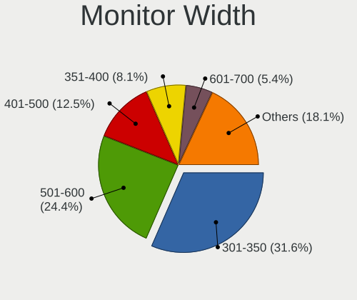

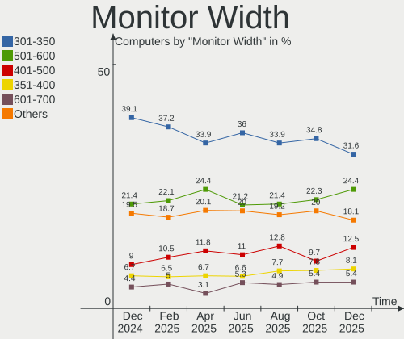

| Width in mm    | Computers | Percent |
|----------------|-----------|---------|
| 301-350        | 290       | 31.56%  |
| 501-600        | 224       | 24.37%  |
| 401-500        | 115       | 12.51%  |
| 351-400        | 74        | 8.05%   |
| 601-700        | 50        | 5.44%   |
| 201-300        | 50        | 5.44%   |
| 1001-1500      | 37        | 4.03%   |
| Unknown        | 29        | 3.16%   |
| 701-800        | 22        | 2.39%   |
| 1501-2000      | 15        | 1.63%   |
| More than 2000 | 7         | 0.76%   |
| 801-900        | 3         | 0.33%   |
| 901-1000       | 3         | 0.33%   |

Aspect Ratio
------------

Proportional relationship between the width and the height

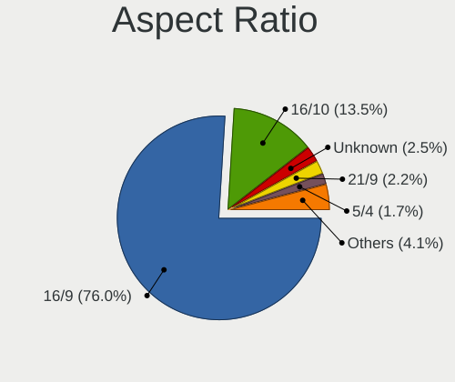

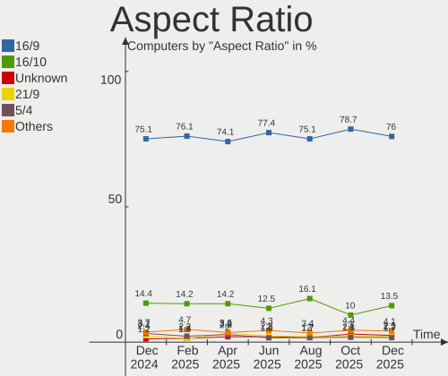

| Ratio   | Computers | Percent |
|---------|-----------|---------|
| 16/9    | 664       | 75.97%  |
| 16/10   | 118       | 13.5%   |
| Unknown | 22        | 2.52%   |
| 21/9    | 19        | 2.17%   |
| 5/4     | 15        | 1.72%   |
| 3/2     | 10        | 1.14%   |
| 4/3     | 9         | 1.03%   |
| 1.00    | 7         | 0.8%    |
| 32/9    | 6         | 0.69%   |
| 6/5     | 2         | 0.23%   |
| 3.20    | 1         | 0.11%   |
| 1.96    | 1         | 0.11%   |

Monitor Area
------------

Area in inch²

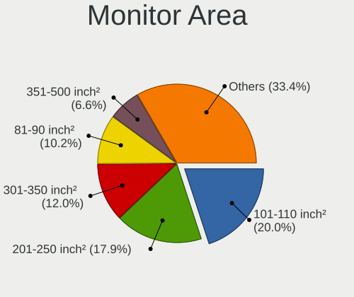

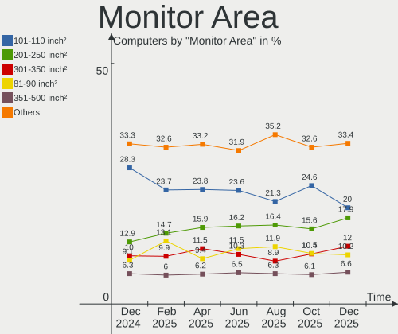

| Area in inch² | Computers | Percent |
|----------------|-----------|---------|
| 101-110        | 185       | 19.98%  |
| 201-250        | 166       | 17.93%  |
| 301-350        | 111       | 11.99%  |
| 81-90          | 94        | 10.15%  |
| 351-500        | 61        | 6.59%   |
| 121-130        | 50        | 5.4%    |
| 151-200        | 49        | 5.29%   |
| More than 1000 | 44        | 4.75%   |
| 251-300        | 32        | 3.46%   |
| Unknown        | 29        | 3.13%   |
| 71-80          | 22        | 2.38%   |
| 501-1000       | 20        | 2.16%   |
| 141-150        | 18        | 1.94%   |
| 111-120        | 15        | 1.62%   |
| 51-60          | 11        | 1.19%   |
| 131-140        | 10        | 1.08%   |
| 61-70          | 9         | 0.97%   |

Pixel Density
-------------

Pixels per inch

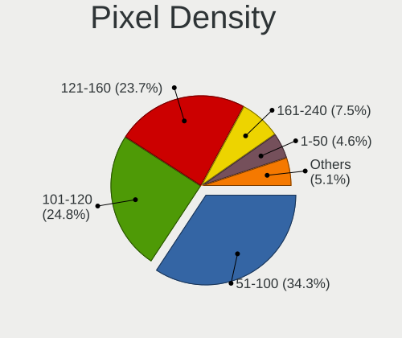

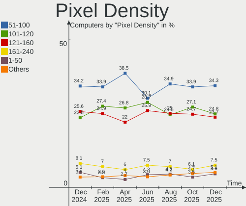

| Density       | Computers | Percent |
|---------------|-----------|---------|
| 51-100        | 312       | 34.29%  |
| 101-120       | 226       | 24.84%  |
| 121-160       | 216       | 23.74%  |
| 161-240       | 68        | 7.47%   |
| 1-50          | 42        | 4.62%   |
| Unknown       | 29        | 3.19%   |
| More than 240 | 17        | 1.87%   |

Multiple Monitors
-----------------

Total monitors connected

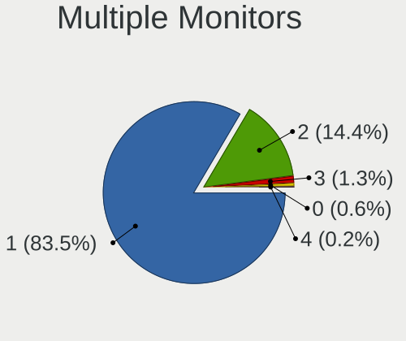

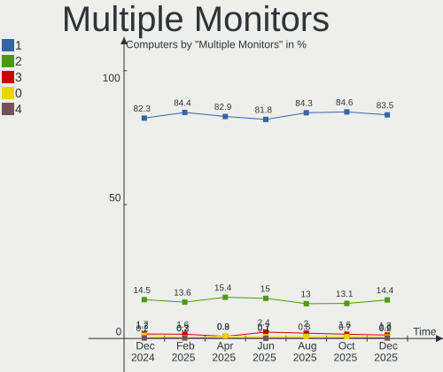

| Total | Computers | Percent |
|-------|-----------|---------|
| 1     | 728       | 83.49%  |
| 2     | 126       | 14.45%  |
| 3     | 11        | 1.26%   |
| 0     | 5         | 0.57%   |
| 4     | 2         | 0.23%   |

Network
-------

Net Controller Vendor
---------------------

Controller vendors

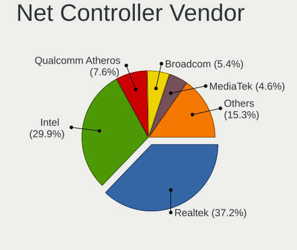

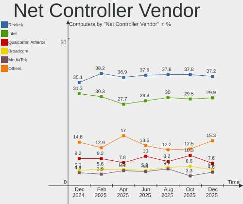

| Vendor                            | Computers | Percent |
|-----------------------------------|-----------|---------|
| Realtek Semiconductor             | 492       | 37.19%  |
| Intel                             | 395       | 29.86%  |
| Qualcomm Atheros                  | 101       | 7.63%   |
| Broadcom                          | 72        | 5.44%   |
| MediaTek                          | 61        | 4.61%   |
| TP-Link                           | 22        | 1.66%   |
| Ralink                            | 18        | 1.36%   |
| Marvell Technology Group          | 16        | 1.21%   |
| Broadcom Limited                  | 15        | 1.13%   |
| Ralink Technology                 | 11        | 0.83%   |
| Nvidia                            | 11        | 0.83%   |
| Sierra Wireless                   | 7         | 0.53%   |
| D-Link                            | 7         | 0.53%   |
| Samsung Electronics               | 6         | 0.45%   |
| NetGear                           | 6         | 0.45%   |
| Qualcomm Technologies             | 5         | 0.38%   |
| Qualcomm Atheros Communications   | 5         | 0.38%   |
| Ericsson Business Mobile Networks | 5         | 0.38%   |
| Xiaomi                            | 4         | 0.3%    |
| Qualcomm                          | 4         | 0.3%    |
| Microsoft                         | 4         | 0.3%    |
| IMC Networks                      | 4         | 0.3%    |
| Motorola PCS                      | 3         | 0.23%   |
| DisplayLink                       | 3         | 0.23%   |
| AVM                               | 3         | 0.23%   |
| ZyDAS                             | 2         | 0.15%   |
| Silicon Integrated Systems [SiS]  | 2         | 0.15%   |
| Shenzhen Goodix Technology        | 2         | 0.15%   |
| OPPO Electronics                  | 2         | 0.15%   |
| MicroPython                       | 2         | 0.15%   |
| Mercucys                          | 2         | 0.15%   |
| Hewlett-Packard                   | 2         | 0.15%   |
| Dell                              | 2         | 0.15%   |
| D-Link System                     | 2         | 0.15%   |
| ASUSTek Computer                  | 2         | 0.15%   |
| ASIX Electronics                  | 2         | 0.15%   |
| Aquantia                          | 2         | 0.15%   |
| ZyXEL Communications              | 1         | 0.08%   |
| T & A Mobile Phones               | 1         | 0.08%   |
| Spreadtrum Communications         | 1         | 0.08%   |

Net Controller Model
--------------------

Controller models

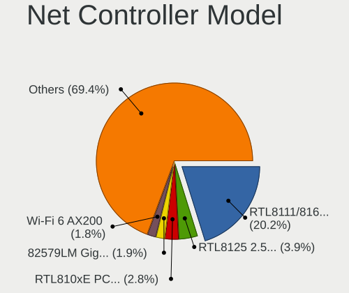

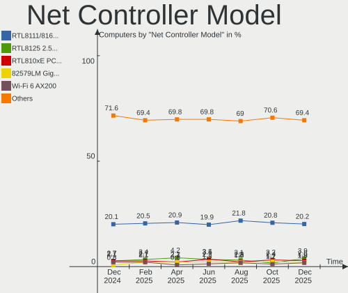

| Model                                                                           | Computers | Percent |
|---------------------------------------------------------------------------------|-----------|---------|
| Realtek RTL8111/8168/8211/8411 PCI Express Gigabit Ethernet Controller          | 313       | 20.19%  |
| Realtek RTL8125 2.5GbE Controller                                               | 61        | 3.94%   |
| Realtek RTL810xE PCI Express Fast Ethernet controller                           | 44        | 2.84%   |
| Intel 82579LM Gigabit Network Connection (Lewisville)                           | 29        | 1.87%   |
| Intel Wi-Fi 6 AX200                                                             | 28        | 1.81%   |
| MediaTek MT7902 802.11ax PCIe Wireless Network Adapter [Filogic 310]            | 25        | 1.61%   |
| Realtek RTL8821CE 802.11ac PCIe Wireless Network Adapter                        | 24        | 1.55%   |
| Intel Wireless 8265 / 8275                                                      | 23        | 1.48%   |
| Realtek RTL8153 Gigabit Ethernet Adapter                                        | 19        | 1.23%   |
| Intel Wireless 7265                                                             | 19        | 1.23%   |
| Intel Ethernet Connection (2) I219-V                                            | 18        | 1.16%   |
| Qualcomm Atheros QCA9565 / AR9565 Wireless Network Adapter                      | 17        | 1.1%    |
| Intel Ethernet Connection I217-LM                                               | 15        | 0.97%   |
| Qualcomm Atheros QCA6174 802.11ac Wireless Network Adapter                      | 14        | 0.9%    |
| Realtek 802.11ac NIC                                                            | 13        | 0.84%   |
| Qualcomm Atheros AR9485 Wireless Network Adapter                                | 13        | 0.84%   |
| Intel Wireless 7260                                                             | 13        | 0.84%   |
| Intel Ethernet Controller I225-V                                                | 13        | 0.84%   |
| Ralink RT3290 Wireless 802.11n 1T/1R PCIe                                       | 12        | 0.77%   |
| Qualcomm Atheros QCA9377 802.11ac Wireless Network Adapter                      | 12        | 0.77%   |
| MediaTek MT7922 802.11ax PCI Express Wireless Network Adapter                   | 12        | 0.77%   |
| Realtek RTL8852BE PCIe 802.11ax Wireless Network Controller                     | 11        | 0.71%   |
| Intel Wi-Fi 6E(802.11ax) AX210/AX1675* 2x2 [Typhoon Peak]                       | 11        | 0.71%   |
| Intel Wi-Fi 6 AX201                                                             | 11        | 0.71%   |
| Intel I211 Gigabit Network Connection                                           | 11        | 0.71%   |
| Broadcom BCM43142 802.11b/g/n                                                   | 11        | 0.71%   |
| Intel Wireless 8260                                                             | 10        | 0.65%   |
| Intel Raptor Lake PCH CNVi WiFi                                                 | 10        | 0.65%   |
| Intel Comet Lake PCH-LP CNVi WiFi                                               | 10        | 0.65%   |
| Intel Cannon Point-LP CNVi [Wireless-AC]                                        | 10        | 0.65%   |
| Realtek RTL8822CE 802.11ac PCIe Wireless Network Adapter                        | 9         | 0.58%   |
| Intel Wireless 3165                                                             | 9         | 0.58%   |
| Intel Wi-Fi 5(802.11ac) Wireless-AC 9x6x [Thunder Peak]                         | 9         | 0.58%   |
| Intel Ethernet Connection (4) I219-LM                                           | 9         | 0.58%   |
| Intel Centrino Advanced-N 6205 [Taylor Peak]                                    | 9         | 0.58%   |
| Broadcom NetXtreme BCM57766 Gigabit Ethernet PCIe                               | 9         | 0.58%   |
| Realtek RTL8126 5GbE Controller                                                 | 8         | 0.52%   |
| MediaTek MT7925 802.11be 160MHz 2x2 PCIe Wireless Network Adapter [Filogic 360] | 8         | 0.52%   |
| Intel Wireless 3160                                                             | 8         | 0.52%   |
| Intel Ethernet Connection (2) I219-LM                                           | 8         | 0.52%   |

Wireless Vendor
---------------

Wireless vendors

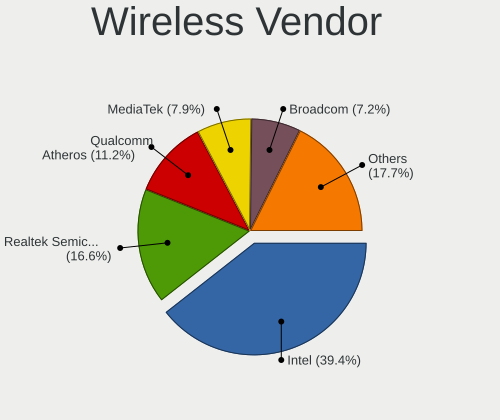

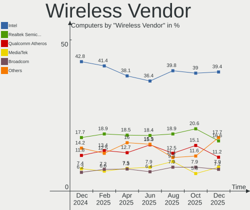

| Vendor                          | Computers | Percent |
|---------------------------------|-----------|---------|
| Intel                           | 270       | 39.42%  |
| Realtek Semiconductor           | 114       | 16.64%  |
| Qualcomm Atheros                | 77        | 11.24%  |
| MediaTek                        | 54        | 7.88%   |
| Broadcom                        | 49        | 7.15%   |
| TP-Link                         | 21        | 3.07%   |
| Ralink                          | 18        | 2.63%   |
| Ralink Technology               | 11        | 1.61%   |
| Broadcom Limited                | 11        | 1.61%   |
| Sierra Wireless                 | 7         | 1.02%   |
| D-Link                          | 7         | 1.02%   |
| NetGear                         | 6         | 0.88%   |
| Qualcomm Atheros Communications | 5         | 0.73%   |
| Microsoft                       | 4         | 0.58%   |
| Marvell Technology Group        | 4         | 0.58%   |
| IMC Networks                    | 4         | 0.58%   |
| Qualcomm                        | 3         | 0.44%   |
| AVM                             | 3         | 0.44%   |
| ZyDAS                           | 2         | 0.29%   |
| Mercucys                        | 2         | 0.29%   |
| Dell                            | 2         | 0.29%   |
| D-Link System                   | 2         | 0.29%   |
| ASUSTek Computer                | 2         | 0.29%   |
| ZyXEL Communications            | 1         | 0.15%   |
| Realtek                         | 1         | 0.15%   |
| Qualcomm Technologies           | 1         | 0.15%   |
| Ovislink                        | 1         | 0.15%   |
| Linksys                         | 1         | 0.15%   |
| Edimax Technology               | 1         | 0.15%   |
| Cypress Semiconductor           | 1         | 0.15%   |

Wireless Model
--------------

Wireless models

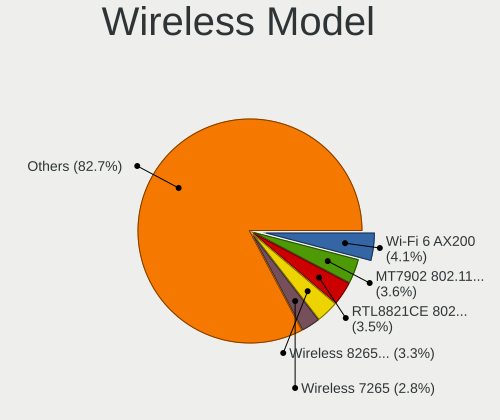

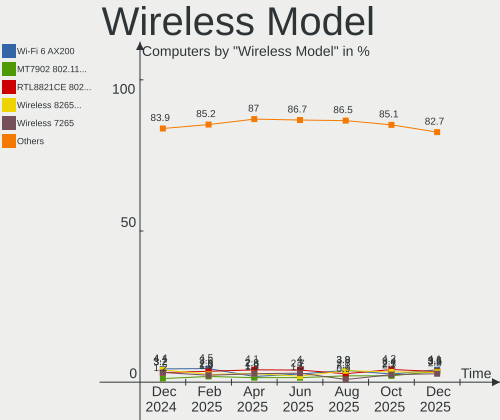

| Model                                                                           | Computers | Percent |
|---------------------------------------------------------------------------------|-----------|---------|
| Intel Wi-Fi 6 AX200                                                             | 28        | 4.06%   |
| MediaTek MT7902 802.11ax PCIe Wireless Network Adapter [Filogic 310]            | 25        | 3.63%   |
| Realtek RTL8821CE 802.11ac PCIe Wireless Network Adapter                        | 24        | 3.48%   |
| Intel Wireless 8265 / 8275                                                      | 23        | 3.34%   |
| Intel Wireless 7265                                                             | 19        | 2.76%   |
| Qualcomm Atheros QCA9565 / AR9565 Wireless Network Adapter                      | 17        | 2.47%   |
| Qualcomm Atheros QCA6174 802.11ac Wireless Network Adapter                      | 14        | 2.03%   |
| Realtek 802.11ac NIC                                                            | 13        | 1.89%   |
| Qualcomm Atheros AR9485 Wireless Network Adapter                                | 13        | 1.89%   |
| Intel Wireless 7260                                                             | 13        | 1.89%   |
| Ralink RT3290 Wireless 802.11n 1T/1R PCIe                                       | 12        | 1.74%   |
| Qualcomm Atheros QCA9377 802.11ac Wireless Network Adapter                      | 12        | 1.74%   |
| Intel Wi-Fi 6E(802.11ax) AX210/AX1675* 2x2 [Typhoon Peak]                       | 11        | 1.6%    |
| Intel Wi-Fi 6 AX201                                                             | 11        | 1.6%    |
| Broadcom BCM43142 802.11b/g/n                                                   | 11        | 1.6%    |
| MediaTek MT7922 802.11ax PCI Express Wireless Network Adapter                   | 10        | 1.45%   |
| Intel Wireless 8260                                                             | 10        | 1.45%   |
| Intel Raptor Lake PCH CNVi WiFi                                                 | 10        | 1.45%   |
| Intel Comet Lake PCH-LP CNVi WiFi                                               | 10        | 1.45%   |
| Intel Cannon Point-LP CNVi [Wireless-AC]                                        | 10        | 1.45%   |
| Realtek RTL8852BE PCIe 802.11ax Wireless Network Controller                     | 9         | 1.31%   |
| Realtek RTL8822CE 802.11ac PCIe Wireless Network Adapter                        | 9         | 1.31%   |
| Intel Wireless 3165                                                             | 9         | 1.31%   |
| Intel Wi-Fi 5(802.11ac) Wireless-AC 9x6x [Thunder Peak]                         | 9         | 1.31%   |
| Intel Centrino Advanced-N 6205 [Taylor Peak]                                    | 9         | 1.31%   |
| Intel Wireless 3160                                                             | 8         | 1.16%   |
| Intel Comet Lake PCH CNVi WiFi                                                  | 8         | 1.16%   |
| Broadcom BCM43602 802.11ac Wireless LAN SoC                                     | 8         | 1.16%   |
| MediaTek MT7921 802.11ax PCIe Wireless Network Adapter [Filogic 330]            | 7         | 1.02%   |
| Intel PRO/Wireless 3945ABG [Golan] Network Connection                           | 7         | 1.02%   |
| Intel Centrino Ultimate-N 6300                                                  | 7         | 1.02%   |
| Intel Cannon Lake PCH CNVi WiFi                                                 | 7         | 1.02%   |
| Intel 700 Series Chipset CNVi WiFi                                              | 7         | 1.02%   |
| Broadcom BCM4313 802.11bgn Wireless Network Adapter                             | 7         | 1.02%   |
| Qualcomm Atheros AR928X Wireless Network Adapter (PCI-Express)                  | 6         | 0.87%   |
| Qualcomm Atheros AR9285 Wireless Network Adapter (PCI-Express)                  | 6         | 0.87%   |
| MediaTek MT7925 802.11be 160MHz 2x2 PCIe Wireless Network Adapter [Filogic 360] | 6         | 0.87%   |
| Sierra Wireless EM7305 Modem                                                    | 5         | 0.73%   |
| Realtek RTL88x2bu [AC1200 Techkey]                                              | 5         | 0.73%   |
| Realtek RTL8852CE PCIe 802.11ax Wireless Network Controller                     | 5         | 0.73%   |

Ethernet Vendor
---------------

Ethernet vendors

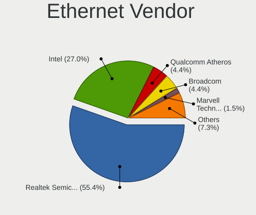

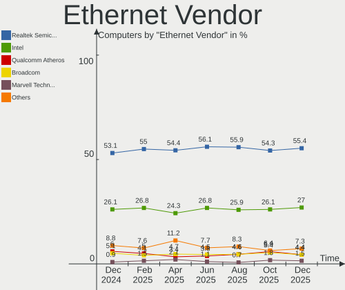

| Vendor                           | Computers | Percent |
|----------------------------------|-----------|---------|
| Realtek Semiconductor            | 453       | 55.38%  |
| Intel                            | 221       | 27.02%  |
| Qualcomm Atheros                 | 36        | 4.4%    |
| Broadcom                         | 36        | 4.4%    |
| Marvell Technology Group         | 12        | 1.47%   |
| Nvidia                           | 11        | 1.34%   |
| Samsung Electronics              | 6         | 0.73%   |
| MediaTek                         | 5         | 0.61%   |
| Xiaomi                           | 4         | 0.49%   |
| Qualcomm Technologies            | 4         | 0.49%   |
| Broadcom Limited                 | 4         | 0.49%   |
| Motorola PCS                     | 3         | 0.37%   |
| DisplayLink                      | 3         | 0.37%   |
| Silicon Integrated Systems [SiS] | 2         | 0.24%   |
| OPPO Electronics                 | 2         | 0.24%   |
| Hewlett-Packard                  | 2         | 0.24%   |
| ASIX Electronics                 | 2         | 0.24%   |
| Aquantia                         | 2         | 0.24%   |
| TP-Link                          | 1         | 0.12%   |
| T & A Mobile Phones              | 1         | 0.12%   |
| Spreadtrum Communications        | 1         | 0.12%   |
| Qualcomm                         | 1         | 0.12%   |
| QNAP System                      | 1         | 0.12%   |
| Mellanox Technologies            | 1         | 0.12%   |
| Lenovo                           | 1         | 0.12%   |
| JMicron Technology               | 1         | 0.12%   |
| Google                           | 1         | 0.12%   |
| Apple                            | 1         | 0.12%   |

Ethernet Model
--------------

Ethernet models

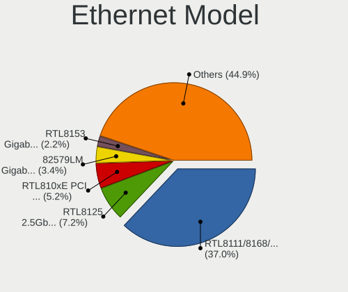

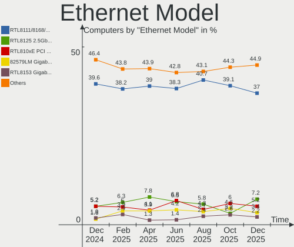

| Model                                                                  | Computers | Percent |
|------------------------------------------------------------------------|-----------|---------|
| Realtek RTL8111/8168/8211/8411 PCI Express Gigabit Ethernet Controller | 313       | 37.04%  |
| Realtek RTL8125 2.5GbE Controller                                      | 61        | 7.22%   |
| Realtek RTL810xE PCI Express Fast Ethernet controller                  | 44        | 5.21%   |
| Intel 82579LM Gigabit Network Connection (Lewisville)                  | 29        | 3.43%   |
| Realtek RTL8153 Gigabit Ethernet Adapter                               | 19        | 2.25%   |
| Intel Ethernet Connection (2) I219-V                                   | 18        | 2.13%   |
| Intel Ethernet Connection I217-LM                                      | 15        | 1.78%   |
| Intel Ethernet Controller I225-V                                       | 13        | 1.54%   |
| Intel I211 Gigabit Network Connection                                  | 11        | 1.3%    |
| Intel Ethernet Connection (4) I219-LM                                  | 9         | 1.07%   |
| Broadcom NetXtreme BCM57766 Gigabit Ethernet PCIe                      | 9         | 1.07%   |
| Realtek RTL8126 5GbE Controller                                        | 8         | 0.95%   |
| Intel Ethernet Connection (2) I219-LM                                  | 8         | 0.95%   |
| Intel Ethernet Connection I217-V                                       | 7         | 0.83%   |
| Intel Ethernet Connection (7) I219-V                                   | 7         | 0.83%   |
| Qualcomm Atheros QCA8171 Gigabit Ethernet                              | 6         | 0.71%   |
| Nvidia MCP79 Ethernet                                                  | 6         | 0.71%   |
| Intel Ethernet Controller I226-V                                       | 6         | 0.71%   |
| Intel Ethernet Connection I219-LM                                      | 6         | 0.71%   |
| Samsung Galaxy series, misc. (tethering mode)                          | 5         | 0.59%   |
| Realtek RTL8152 Fast Ethernet Adapter                                  | 5         | 0.59%   |
| Qualcomm Atheros Killer E2500 Gigabit Ethernet Controller              | 5         | 0.59%   |
| Qualcomm Atheros Killer E220x Gigabit Ethernet Controller              | 5         | 0.59%   |
| Qualcomm Atheros AR8131 Gigabit Ethernet                               | 5         | 0.59%   |
| Intel Ethernet Connection (5) I219-LM                                  | 5         | 0.59%   |
| Intel 82579V Gigabit Network Connection                                | 5         | 0.59%   |
| Intel 82567LM-3 Gigabit Network Connection                             | 5         | 0.59%   |
| Broadcom NetXtreme BCM57765 Gigabit Ethernet PCIe                      | 5         | 0.59%   |
| Realtek USB 10/100/1G/2.5 LAN                                          | 4         | 0.47%   |
| Qualcomm WCN785x Wi-Fi 7(802.11be) 320MHz 2x2 [FastConnect 7800]       | 4         | 0.47%   |
| Qualcomm Atheros AR8152 v2.0 Fast Ethernet                             | 4         | 0.47%   |
| Qualcomm Atheros AR8151 v2.0 Gigabit Ethernet                          | 4         | 0.47%   |
| Marvell Group 88E8056 PCI-E Gigabit Ethernet Controller                | 4         | 0.47%   |
| Intel Ethernet Connection (7) I219-LM                                  | 4         | 0.47%   |
| Intel Ethernet Connection (6) I219-LM                                  | 4         | 0.47%   |
| Intel Ethernet Connection (3) I218-LM                                  | 4         | 0.47%   |
| Intel Ethernet Connection (11) I219-LM                                 | 4         | 0.47%   |
| Intel Ethernet Connection (10) I219-LM                                 | 4         | 0.47%   |
| Intel 82577LM Gigabit Network Connection                               | 4         | 0.47%   |
| Broadcom NetXtreme BCM5764M Gigabit Ethernet PCIe                      | 4         | 0.47%   |

Net Controller Kind
-------------------

Ethernet, WiFi or modem

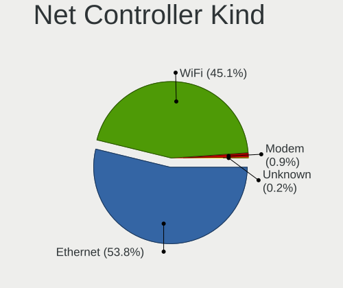

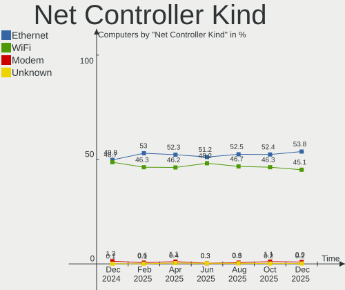

| Kind     | Computers | Percent |
|----------|-----------|---------|
| Ethernet | 765       | 53.8%   |
| WiFi     | 641       | 45.08%  |
| Modem    | 13        | 0.91%   |
| Unknown  | 3         | 0.21%   |

Used Controller
---------------

Currently used network controller

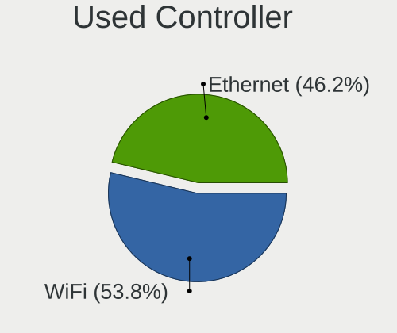

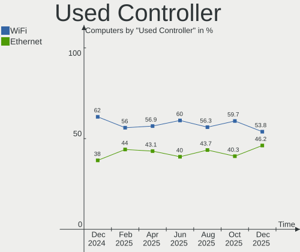

| Kind     | Computers | Percent |
|----------|-----------|---------|
| WiFi     | 487       | 53.75%  |
| Ethernet | 419       | 46.25%  |

NICs
----

Total network controllers on board

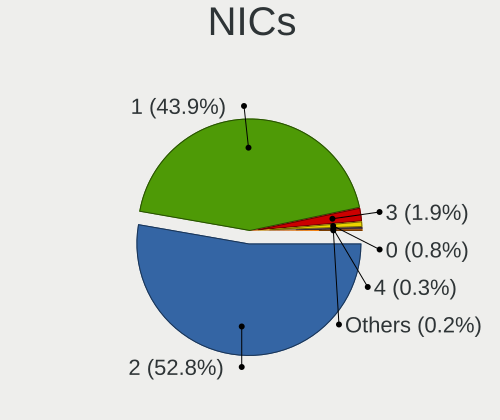

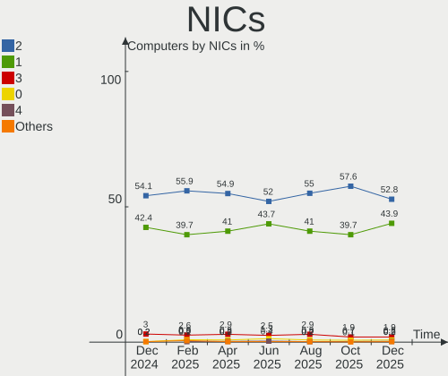

| Total | Computers | Percent |
|-------|-----------|---------|
| 2     | 460       | 52.75%  |
| 1     | 383       | 43.92%  |
| 3     | 17        | 1.95%   |
| 0     | 7         | 0.8%    |
| 4     | 3         | 0.34%   |
| 6     | 1         | 0.11%   |
| 5     | 1         | 0.11%   |

IPv6
----

IPv6 vs IPv4

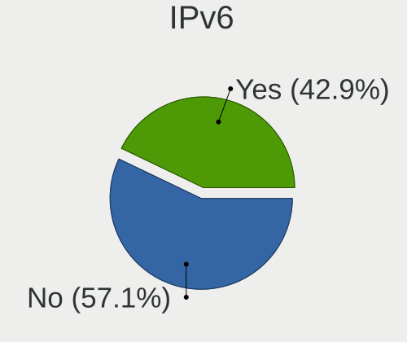

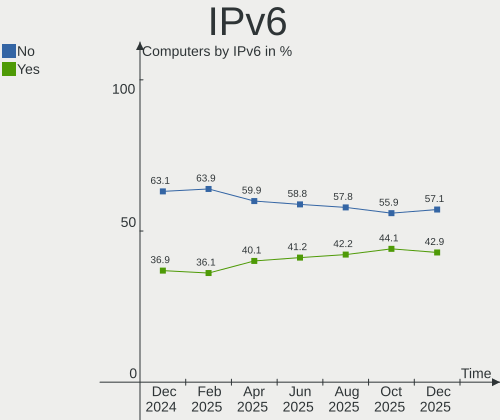

| Used | Computers | Percent |
|------|-----------|---------|
| No   | 498       | 57.11%  |
| Yes  | 374       | 42.89%  |

Bluetooth
---------

Bluetooth Vendor
----------------

Controller vendors

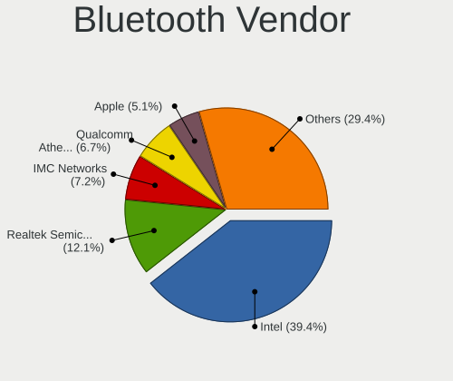

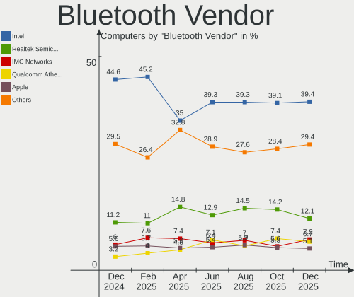

| Vendor                          | Computers | Percent |
|---------------------------------|-----------|---------|
| Intel                           | 224       | 39.44%  |
| Realtek Semiconductor           | 69        | 12.15%  |
| IMC Networks                    | 41        | 7.22%   |
| Qualcomm Atheros Communications | 38        | 6.69%   |
| Apple                           | 29        | 5.11%   |
| Cambridge Silicon Radio         | 27        | 4.75%   |
| Foxconn / Hon Hai               | 25        | 4.4%    |
| Broadcom                        | 24        | 4.23%   |
| MediaTek                        | 14        | 2.46%   |
| Ralink                          | 12        | 2.11%   |
| ASUSTek Computer                | 12        | 2.11%   |
| Lite-On Technology              | 9         | 1.58%   |
| Dell                            | 6         | 1.06%   |
| TP-Link                         | 5         | 0.88%   |
| Toshiba                         | 5         | 0.88%   |
| Marvell Semiconductor           | 4         | 0.7%    |
| Foxconn International           | 3         | 0.53%   |
| Actions                         | 3         | 0.53%   |
| Unknown                         | 3         | 0.53%   |
| USI                             | 2         | 0.35%   |
| Realtek                         | 2         | 0.35%   |
| Askey Computer                  | 2         | 0.35%   |
| AICSemi                         | 2         | 0.35%   |
| SiW                             | 1         | 0.18%   |
| Opticis                         | 1         | 0.18%   |
| Mercucys                        | 1         | 0.18%   |
| Integrated System Solution      | 1         | 0.18%   |
| Hewlett-Packard                 | 1         | 0.18%   |
| Edimax Technology               | 1         | 0.18%   |
| Conwise Technology              | 1         | 0.18%   |

Bluetooth Model
---------------

Controller models

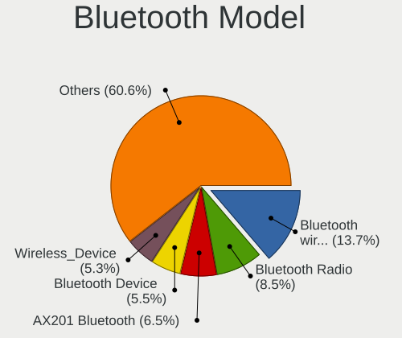

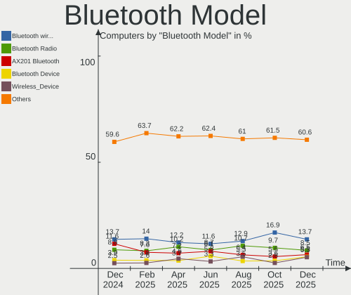

| Model                                               | Computers | Percent |
|-----------------------------------------------------|-----------|---------|
| Intel Bluetooth wireless interface                  | 78        | 13.73%  |
| Realtek Bluetooth Radio                             | 48        | 8.45%   |
| Intel AX201 Bluetooth                               | 37        | 6.51%   |
| Intel Bluetooth Device                              | 31        | 5.46%   |
| IMC Networks Wireless_Device                        | 30        | 5.28%   |
| Cambridge Silicon Radio Bluetooth Dongle (HCI mode) | 27        | 4.75%   |
| Intel AX200 Bluetooth                               | 26        | 4.58%   |
| Intel Bluetooth 9460/9560 Jefferson Peak (JfP)      | 23        | 4.05%   |
| Qualcomm Atheros  Bluetooth Device                  | 22        | 3.87%   |
| MediaTek Wireless_Device                            | 14        | 2.46%   |
| Apple Bluetooth Host Controller                     | 13        | 2.29%   |
| Ralink RT3290 Bluetooth                             | 12        | 2.11%   |
| Intel AX210 Bluetooth                               | 11        | 1.94%   |
| Foxconn / Hon Hai Wireless_Device                   | 10        | 1.76%   |
| Foxconn / Hon Hai Bluetooth Device                  | 10        | 1.76%   |
| Intel Wireless-AC 9260 Bluetooth Adapter            | 9         | 1.58%   |
| Apple Bluetooth USB Host Controller                 | 9         | 1.58%   |
| Realtek  Bluetooth 4.2 Adapter                      | 8         | 1.41%   |
| IMC Networks Bluetooth Radio                        | 8         | 1.41%   |
| Qualcomm Atheros QCA61x4 Bluetooth 4.0              | 6         | 1.06%   |
| Lite-On Bluetooth Device                            | 6         | 1.06%   |
| Apple Built-in Bluetooth 2.0+EDR HCI                | 6         | 1.06%   |
| TP-Link TP-T@- UB500 Adapter                        | 5         | 0.88%   |
| Realtek Bluetooth 5.3 Radio                         | 5         | 0.88%   |
| Qualcomm Atheros AR3012 Bluetooth 4.0               | 5         | 0.88%   |
| Realtek Bluetooth 5.4 Radio                         | 4         | 0.7%    |
| Marvell Bluetooth and Wireless LAN Composite        | 4         | 0.7%    |
| Broadcom BCM20702A0 Bluetooth 4.0                   | 4         | 0.7%    |
| Broadcom BCM20702 Bluetooth 4.0 [ThinkPad]          | 4         | 0.7%    |
| ASUS Broadcom BCM20702A0 Bluetooth                  | 4         | 0.7%    |
| Intel Centrino Bluetooth Wireless Transceiver       | 3         | 0.53%   |
| Foxconn International BCM43142A0 Bluetooth module   | 3         | 0.53%   |
| Broadcom BCM43142 Bluetooth 4.0                     | 3         | 0.53%   |
| Broadcom BCM2045B (BDC-2.1)                         | 3         | 0.53%   |
| ASUS ASUS USB-BT500                                 | 3         | 0.53%   |
| Actions general adapter                             | 3         | 0.53%   |
| Unknown                                             | 3         | 0.53%   |
| USI Bluetooth Device                                | 2         | 0.35%   |
| Toshiba Bluetooth Device                            | 2         | 0.35%   |
| Realtek 802.11ac WLAN Adapter                       | 2         | 0.35%   |

Sound
-----

Sound Vendor
------------

Sound card vendors

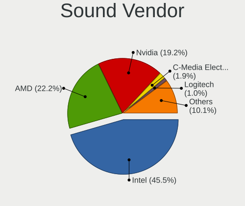

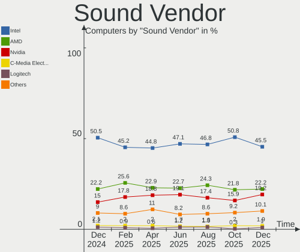

| Vendor                                       | Computers | Percent |
|----------------------------------------------|-----------|---------|
| Intel                                        | 616       | 45.53%  |
| AMD                                          | 301       | 22.25%  |
| Nvidia                                       | 260       | 19.22%  |
| C-Media Electronics                          | 26        | 1.92%   |
| Logitech                                     | 13        | 0.96%   |
| Creative Labs                                | 12        | 0.89%   |
| Razer USA                                    | 10        | 0.74%   |
| Texas Instruments                            | 8         | 0.59%   |
| JMTek                                        | 7         | 0.52%   |
| Micro Star International                     | 6         | 0.44%   |
| Generalplus Technology                       | 6         | 0.44%   |
| Sony                                         | 5         | 0.37%   |
| Focusrite-Novation                           | 5         | 0.37%   |
| SteelSeries ApS                              | 4         | 0.3%    |
| Jieli Technology                             | 4         | 0.3%    |
| Hewlett-Packard                              | 4         | 0.3%    |
| ASUSTek Computer                             | 4         | 0.3%    |
| Zoran Co. Personal Media Division (Nogatech) | 3         | 0.22%   |
| Realtek Semiconductor                        | 3         | 0.22%   |
| Creative Technology                          | 3         | 0.22%   |
| Corsair                                      | 3         | 0.22%   |
| ASRock                                       | 3         | 0.22%   |
| Tenx Technology                              | 2         | 0.15%   |
| Silicon Integrated Systems [SiS]             | 2         | 0.15%   |
| Kingston Technology                          | 2         | 0.15%   |
| GN Netcom                                    | 2         | 0.15%   |
| Giga-Byte Technology                         | 2         | 0.15%   |
| Audio-Technica                               | 2         | 0.15%   |
| Unknown                                      | 2         | 0.15%   |
| Yamaha                                       | 1         | 0.07%   |
| XMOS                                         | 1         | 0.07%   |
| Weltrend Semiconductor                       | 1         | 0.07%   |
| Walmart                                      | 1         | 0.07%   |
| VIA Technologies                             | 1         | 0.07%   |
| Valve Software                               | 1         | 0.07%   |
| Universal Audio                              | 1         | 0.07%   |
| TTGK Technology                              | 1         | 0.07%   |
| Trust                                        | 1         | 0.07%   |
| TerraTec Electronic                          | 1         | 0.07%   |
| PreSonus Audio Electronics                   | 1         | 0.07%   |

Sound Model
-----------

Sound card models

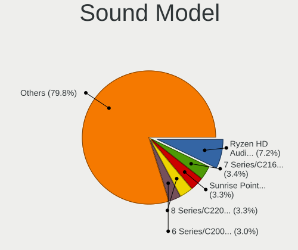

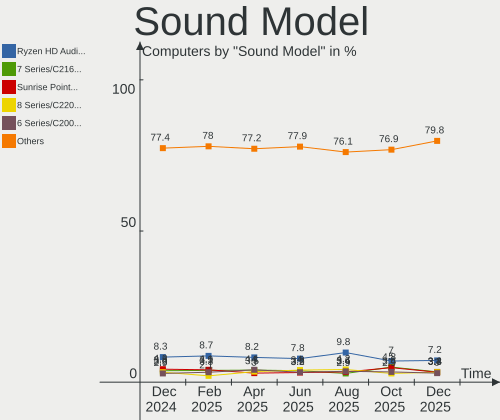

| Model                                                                      | Computers | Percent |
|----------------------------------------------------------------------------|-----------|---------|
| AMD Ryzen HD Audio Controller                                              | 116       | 7.18%   |
| Intel 7 Series/C216 Chipset Family High Definition Audio Controller        | 55        | 3.4%    |
| Intel Sunrise Point-LP HD Audio                                            | 54        | 3.34%   |
| Intel 8 Series/C220 Series Chipset High Definition Audio Controller        | 53        | 3.28%   |
| Intel 6 Series/C200 Series Chipset Family High Definition Audio Controller | 48        | 2.97%   |
| AMD Renoir/Cezanne HDMI/DP Audio Controller                                | 47        | 2.91%   |
| AMD Starship/Matisse HD Audio Controller                                   | 46        | 2.85%   |
| AMD Radeon High Definition Audio Controller                                | 36        | 2.23%   |
| Intel Xeon E3-1200 v3/4th Gen Core Processor HD Audio Controller           | 34        | 2.1%    |
| Intel 100 Series/C230 Series Chipset Family HD Audio Controller            | 34        | 2.1%    |
| Intel 200 Series PCH HD Audio                                              | 30        | 1.86%   |
| AMD SBx00 Azalia (Intel HDA)                                               | 25        | 1.55%   |
| Intel Cannon Lake PCH cAVS                                                 | 21        | 1.3%    |
| AMD FCH Azalia Controller                                                  | 21        | 1.3%    |
| AMD Ellesmere HDMI Audio [Radeon RX 470/480 / 570/580/590]                 | 20        | 1.24%   |
| Intel Haswell-ULT HD Audio Controller                                      | 19        | 1.18%   |
| Intel 8 Series HD Audio Controller                                         | 19        | 1.18%   |
| Intel 5 Series/3400 Series Chipset High Definition Audio                   | 19        | 1.18%   |
| AMD Navi 21/23 HDMI/DP Audio Controller                                    | 19        | 1.18%   |
| Intel 82801I (ICH9 Family) HD Audio Controller                             | 18        | 1.11%   |
| Intel Broadwell-U Audio Controller                                         | 17        | 1.05%   |
| AMD Raven/Raven2/Fenghuang HDMI/DP Audio Controller                        | 17        | 1.05%   |
| AMD Family 17h (Models 00h-0fh) HD Audio Controller                        | 17        | 1.05%   |
| Intel Wildcat Point-LP High Definition Audio Controller                    | 16        | 0.99%   |
| Intel Tiger Lake-LP Smart Sound Technology Audio Controller                | 16        | 0.99%   |
| Nvidia GA106 High Definition Audio Controller                              | 15        | 0.93%   |
| Intel Raptor Lake High Definition Audio Controller                         | 15        | 0.93%   |
| Intel Alder Lake-S HD Audio Controller                                     | 14        | 0.87%   |
| Nvidia GP107GL High Definition Audio Controller                            | 13        | 0.8%    |
| Nvidia GP104 High Definition Audio Controller                              | 13        | 0.8%    |
| Nvidia GA104 High Definition Audio Controller                              | 13        | 0.8%    |
| Intel Raptor Lake-P/U/H cAVS                                               | 13        | 0.8%    |
| Nvidia High Definition Audio Controller                                    | 12        | 0.74%   |
| Intel Cannon Point-LP High Definition Audio Controller                     | 12        | 0.74%   |
| Intel Alder Lake PCH-P High Definition Audio Controller                    | 12        | 0.74%   |
| AMD Oland/Hainan/Cape Verde/Pitcairn HDMI Audio [Radeon HD 7000 Series]    | 12        | 0.74%   |
| Nvidia GK208 HDMI/DP Audio Controller                                      | 11        | 0.68%   |
| Intel Comet Lake PCH cAVS                                                  | 11        | 0.68%   |
| Intel Celeron/Pentium Silver Processor High Definition Audio               | 11        | 0.68%   |
| Intel 82801JI (ICH10 Family) HD Audio Controller                           | 11        | 0.68%   |

Memory
------

Memory Vendor
-------------

Memory module vendors

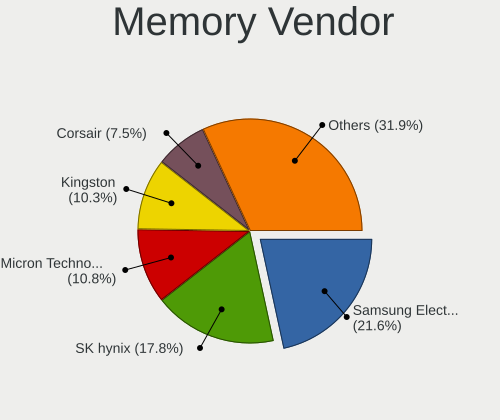

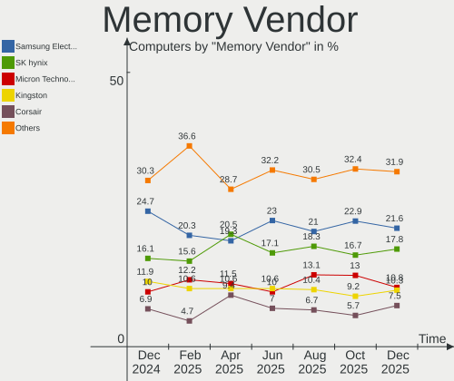

| Vendor                       | Computers | Percent |
|------------------------------|-----------|---------|
| Samsung Electronics          | 86        | 21.61%  |
| SK hynix                     | 71        | 17.84%  |
| Micron Technology            | 43        | 10.8%   |
| Kingston                     | 41        | 10.3%   |
| Corsair                      | 30        | 7.54%   |
| Unknown                      | 27        | 6.78%   |
| G.Skill                      | 20        | 5.03%   |
| Crucial                      | 20        | 5.03%   |
| Ramaxel Technology           | 7         | 1.76%   |
| Unknown                      | 6         | 1.51%   |
| Team                         | 5         | 1.26%   |
| Patriot                      | 4         | 1.01%   |
| Nanya Technology             | 4         | 1.01%   |
| A-DATA Technology            | 4         | 1.01%   |
| Unknown (ABCD)               | 3         | 0.75%   |
| Transcend                    | 3         | 0.75%   |
| Smart                        | 3         | 0.75%   |
| Elpida                       | 3         | 0.75%   |
| Patriot Memory (PDP Systems) | 2         | 0.5%    |
| GOODRAM                      | 2         | 0.5%    |
| Wodposit                     | 1         | 0.25%   |
| Unknown (0x0E2A)             | 1         | 0.25%   |
| Unknown (0x0D0B)             | 1         | 0.25%   |
| Unifosa                      | 1         | 0.25%   |
| TeamGroup                    | 1         | 0.25%   |
| Shenzhen SCY                 | 1         | 0.25%   |
| Sesame                       | 1         | 0.25%   |
| PNY                          | 1         | 0.25%   |
| Patriot Memory               | 1         | 0.25%   |
| Netac                        | 1         | 0.25%   |
| High Bridge                  | 1         | 0.25%   |
| GeIL                         | 1         | 0.25%   |
| AMD                          | 1         | 0.25%   |
| 48spaces                     | 1         | 0.25%   |

Memory Model
------------

Memory module models

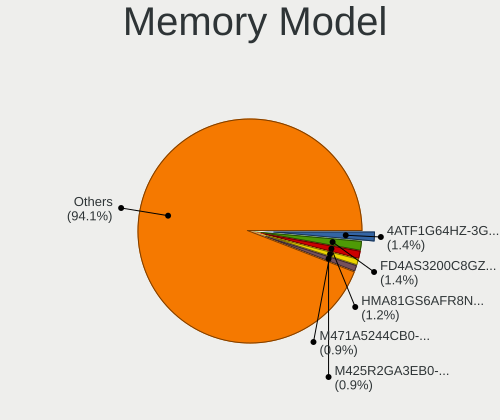

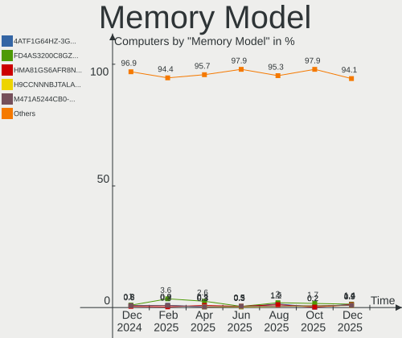

| Model                                                            | Computers | Percent |
|------------------------------------------------------------------|-----------|---------|
| Micron RAM 4ATF1G64HZ-3G2F1 8GB SODIMM DDR4 3200MT/s             | 6         | 1.41%   |
| Unknown                                                          | 6         | 1.41%   |
| SK hynix RAM HMA81GS6AFR8N-UH 8GB SODIMM DDR4 2667MT/s           | 5         | 1.18%   |
| SK hynix RAM H9CCNNNBJTALAR-NUD 4GB Row Of Chips LPDDR3 1867MT/s | 4         | 0.94%   |
| Samsung RAM M471A5244CB0-CTD 4GB SODIMM DDR4 3266MT/s            | 4         | 0.94%   |
| Samsung RAM M425R2GA3EB0-CWMOL 16GB SODIMM DDR5 5600MT/s         | 4         | 0.94%   |
| Micron RAM 4ATF51264HZ-2G6E1 4GB SODIMM DDR4 2667MT/s            | 4         | 0.94%   |
| Unknown RAM Module 2GB SODIMM DDR2 667MT/s                       | 3         | 0.71%   |
| SK hynix RAM HMAG68EXNSA051N 8GB SODIMM DDR4 3200MT/s            | 3         | 0.71%   |
| SK hynix RAM HMA851S6AFR6N-UH 4GB SODIMM DDR4 2667MT/s           | 3         | 0.71%   |
| Samsung RAM M471A2K43DB1-CTD 16GB SODIMM DDR4 2667MT/s           | 3         | 0.71%   |
| Samsung RAM M471A1K43EB1-CWE 8GB SODIMM DDR4 3200MT/s            | 3         | 0.71%   |
| Samsung RAM M471A1K43DB1-CWE 8GB SODIMM DDR4 3200MT/s            | 3         | 0.71%   |
| Samsung RAM M471A1K43DB1-CTD 8GB SODIMM DDR4 2667MT/s            | 3         | 0.71%   |
| Samsung RAM M471A1G44CB0-CWE 8GB SODIMM DDR4 3200MT/s            | 3         | 0.71%   |
| Kingston RAM KF3200C16D4/16GX 16GB DIMM DDR4 3733MT/s            | 3         | 0.71%   |
| Unknown RAM Module 8GB SODIMM DDR4 2400MT/s                      | 2         | 0.47%   |
| Unknown RAM Module 4GB DIMM 800MT/s                              | 2         | 0.47%   |
| Unknown (ABCD) RAM 123456789012345678 2GB DIMM LPDDR4 2133MT/s   | 2         | 0.47%   |
| Team RAM TEAMGROUP-UD4-3200 8GB DIMM DDR4 3800MT/s               | 2         | 0.47%   |
| SK hynix RAM Module 2GB SODIMM DDR3 1067MT/s                     | 2         | 0.47%   |
| SK hynix RAM HMT41GS6BFR8C-PB 8GB SODIMM DDR3 1600MT/s           | 2         | 0.47%   |
| SK hynix RAM HMT41GS6BFR8A-PB 8GB SODIMM DDR3 2667MT/s           | 2         | 0.47%   |
| SK hynix RAM HMT41GS6BFR8A-PB 8GB SODIMM DDR3 1600MT/s           | 2         | 0.47%   |
| SK hynix RAM HMT41GS6AFR8A-PB 8GiB SODIMM DDR3 2667MT/s          | 2         | 0.47%   |
| SK hynix RAM HMT351U6EFR8C-PB 4GB DIMM DDR3 1600MT/s             | 2         | 0.47%   |
| SK hynix RAM HMA82GS6AFR8N-UH 16GB SODIMM DDR4 2667MT/s          | 2         | 0.47%   |
| SK hynix RAM HMA81GS6MFR8N-UH 8GB SODIMM DDR4 2400MT/s           | 2         | 0.47%   |
| Samsung RAM M471B5273CH0-CH9 4GB SODIMM DDR3 1334MT/s            | 2         | 0.47%   |
| Samsung RAM M471B5173QH0-YK0 4GB SODIMM DDR3 1600MT/s            | 2         | 0.47%   |
| Samsung RAM M471B5173DB0-YK0 4GB SODIMM DDR3 1600MT/s            | 2         | 0.47%   |
| Samsung RAM M471A2K43CB1-CRC 16GB SODIMM DDR4 2667MT/s           | 2         | 0.47%   |
| Samsung RAM M471A1K43CB1-CRC 8GB SODIMM DDR4 8400MT/s            | 2         | 0.47%   |
| Samsung RAM M471A1K43BB1-CRC 8GB SODIMM DDR4 2667MT/s            | 2         | 0.47%   |
| Samsung RAM M425R2GA3EB0-CWMOD 16GB SODIMM DDR5 5600MT/s         | 2         | 0.47%   |
| Samsung RAM M425R1GB4PB0-CWMOL 8GB SODIMM DDR5 5600MT/s          | 2         | 0.47%   |
| Samsung RAM M425R1GB4PB0-CWMOD 8GiB SODIMM DDR5 5600MT/s         | 2         | 0.47%   |
| Samsung RAM M4 70T5663QZ3-CF7 2GB SODIMM DDR2 2048MT/s           | 2         | 0.47%   |
| Samsung RAM M4 70T2864QZ3-CE6 1GB SODIMM DDR 1639MT/s            | 2         | 0.47%   |
| Samsung RAM M378B5173EB0-YK0 4GB DIMM DDR3 1600MT/s              | 2         | 0.47%   |

Memory Kind
-----------

Memory module kinds

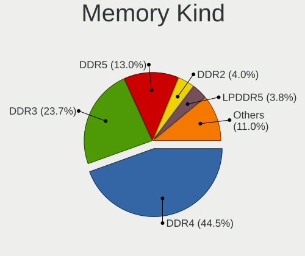

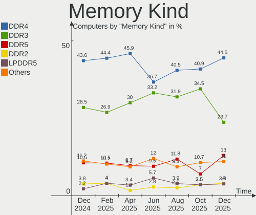

| Kind    | Computers | Percent |
|---------|-----------|---------|
| DDR4    | 154       | 44.51%  |
| DDR3    | 82        | 23.7%   |
| DDR5    | 45        | 13.01%  |
| DDR2    | 14        | 4.05%   |
| LPDDR5  | 13        | 3.76%   |
| SDRAM   | 11        | 3.18%   |
| LPDDR4  | 11        | 3.18%   |
| LPDDR3  | 8         | 2.31%   |
| Unknown | 7         | 2.02%   |
| DDR     | 1         | 0.29%   |

Memory Form Factor
------------------

Physical design of the memory module

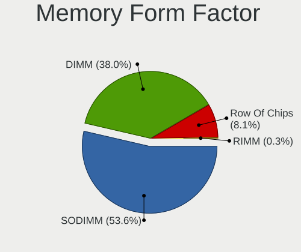

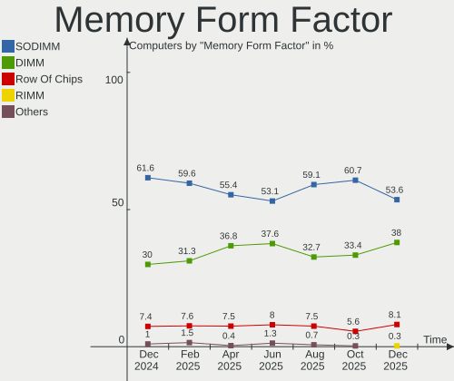

| Name         | Computers | Percent |
|--------------|-----------|---------|
| SODIMM       | 185       | 53.62%  |
| DIMM         | 131       | 37.97%  |
| Row Of Chips | 28        | 8.12%   |
| RIMM         | 1         | 0.29%   |

Memory Size
-----------

Memory module size

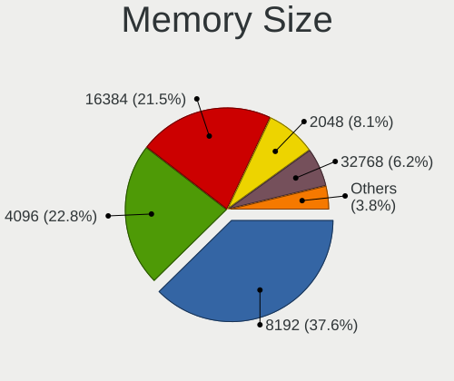

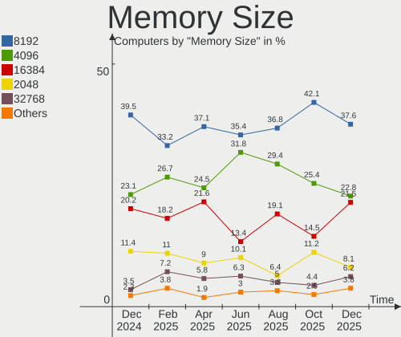

| Size  | Computers | Percent |
|-------|-----------|---------|
| 8192  | 140       | 37.63%  |
| 4096  | 85        | 22.85%  |
| 16384 | 80        | 21.51%  |
| 2048  | 30        | 8.06%   |
| 32768 | 23        | 6.18%   |
| 1024  | 8         | 2.15%   |
| 49152 | 4         | 1.08%   |
| 12288 | 1         | 0.27%   |
| 512   | 1         | 0.27%   |

Memory Speed
------------

Memory module speed

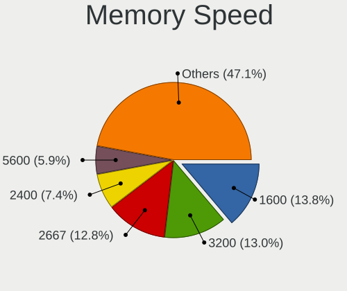

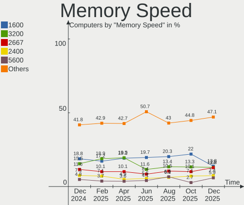

| Speed   | Computers | Percent |
|---------|-----------|---------|
| 1600    | 52        | 13.83%  |
| 3200    | 49        | 13.03%  |
| 2667    | 48        | 12.77%  |
| 2400    | 28        | 7.45%   |
| 5600    | 22        | 5.85%   |
| 1333    | 16        | 4.26%   |
| 2133    | 15        | 3.99%   |
| 3600    | 13        | 3.46%   |
| 6000    | 12        | 3.19%   |
| 667     | 9         | 2.39%   |
| 4800    | 8         | 2.13%   |
| 6400    | 7         | 1.86%   |
| 3800    | 7         | 1.86%   |
| 3733    | 7         | 1.86%   |
| 1867    | 7         | 1.86%   |
| 1067    | 6         | 1.6%    |
| 2933    | 5         | 1.33%   |
| 1334    | 5         | 1.33%   |
| 800     | 5         | 1.33%   |
| Unknown | 5         | 1.33%   |
| 3266    | 4         | 1.06%   |
| 2048    | 4         | 1.06%   |
| 1066    | 4         | 1.06%   |
| 8400    | 3         | 0.8%    |
| 4267    | 3         | 0.8%    |
| 3000    | 3         | 0.8%    |
| 1639    | 3         | 0.8%    |
| 12800   | 2         | 0.53%   |
| 8533    | 2         | 0.53%   |
| 7500    | 2         | 0.53%   |
| 6200    | 2         | 0.53%   |
| 3466    | 2         | 0.53%   |
| 3066    | 2         | 0.53%   |
| 1866    | 2         | 0.53%   |
| 1800    | 2         | 0.53%   |
| 8600    | 1         | 0.27%   |
| 8000    | 1         | 0.27%   |
| 4333    | 1         | 0.27%   |
| 4199    | 1         | 0.27%   |
| 3933    | 1         | 0.27%   |

Printers & scanners
-------------------

Printer Vendor
--------------

Printer device vendors

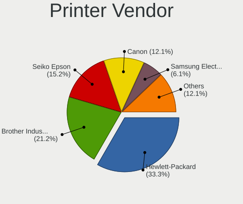

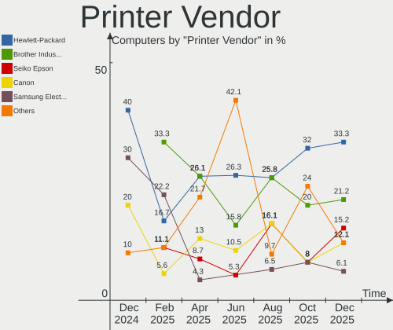

| Vendor                | Computers | Percent |
|-----------------------|-----------|---------|
| Hewlett-Packard       | 11        | 33.33%  |
| Brother Industries    | 7         | 21.21%  |
| Seiko Epson           | 5         | 15.15%  |
| Canon                 | 4         | 12.12%  |
| Samsung Electronics   | 2         | 6.06%   |
| Xerox                 | 1         | 3.03%   |
| STMicroelectronics    | 1         | 3.03%   |
| Prolific Technology   | 1         | 3.03%   |
| Lexmark International | 1         | 3.03%   |

Printer Model
-------------

Printer device models

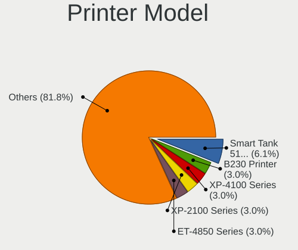

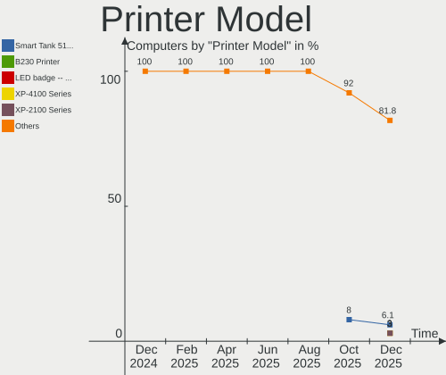

| Model                                                     | Computers | Percent |
|-----------------------------------------------------------|-----------|---------|
| HP Smart Tank 5100 series                                 | 2         | 6.06%   |
| Xerox B230 Printer                                        | 1         | 3.03%   |
| STMicroelectronics LED badge -- mini LED display -- 11x44 | 1         | 3.03%   |
| Seiko Epson XP-4100 Series                                | 1         | 3.03%   |
| Seiko Epson XP-2100 Series                                | 1         | 3.03%   |
| Seiko Epson ET-4850 Series                                | 1         | 3.03%   |
| Seiko Epson ET-2810 Series                                | 1         | 3.03%   |
| Seiko Epson ET-2710 Series                                | 1         | 3.03%   |
| Samsung ML-1710 Printer                                   | 1         | 3.03%   |
| Samsung M2070 Series                                      | 1         | 3.03%   |
| Prolific PL2305 Parallel Port                             | 1         | 3.03%   |
| Lexmark International C746                                | 1         | 3.03%   |
| HP Smart Tank 500 series                                  | 1         | 3.03%   |
| HP LaserJet P2015 series                                  | 1         | 3.03%   |
| HP LaserJet P1006                                         | 1         | 3.03%   |
| HP LaserJet CP1025nw                                      | 1         | 3.03%   |
| HP ENVY 6000 series                                       | 1         | 3.03%   |
| HP DeskJet Plus 4100 series                               | 1         | 3.03%   |
| HP DeskJet 6980 series                                    | 1         | 3.03%   |
| HP DeskJet 4100 series                                    | 1         | 3.03%   |
| HP DeskJet 2700 series                                    | 1         | 3.03%   |
| Canon TS700 series                                        | 1         | 3.03%   |
| Canon PIXMA iX6850 Printer                                | 1         | 3.03%   |
| Canon LiDE 400                                            | 1         | 3.03%   |
| Canon G7000 series                                        | 1         | 3.03%   |
| Brother PT-1500PC                                         | 1         | 3.03%   |
| Brother Printer                                           | 1         | 3.03%   |
| Brother MFC-L2860DWE                                      | 1         | 3.03%   |
| Brother MFC-J245                                          | 1         | 3.03%   |
| Brother HL-L2350DW series                                 | 1         | 3.03%   |
| Brother HL-L2340D series                                  | 1         | 3.03%   |
| Brother HL-3140CW series                                  | 1         | 3.03%   |

Scanner Vendor
--------------

Scanner device vendors

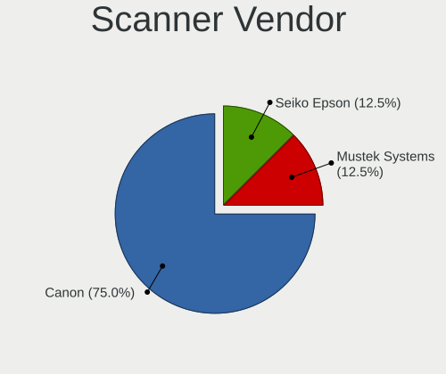

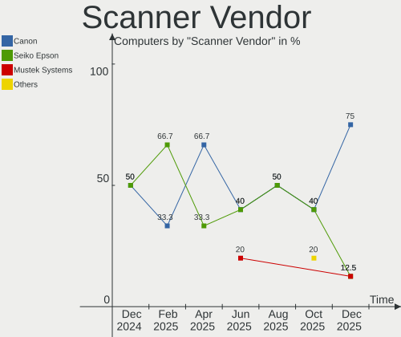

| Vendor         | Computers | Percent |
|----------------|-----------|---------|
| Canon          | 6         | 75%     |
| Seiko Epson    | 1         | 12.5%   |
| Mustek Systems | 1         | 12.5%   |

Scanner Model
-------------

Scanner device models

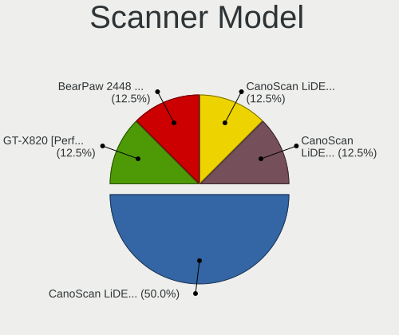

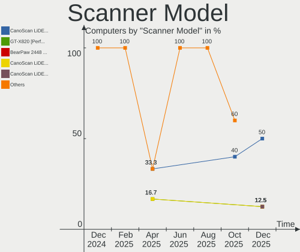

| Model                                       | Computers | Percent |
|---------------------------------------------|-----------|---------|
| Canon CanoScan LiDE 110                     | 4         | 50%     |
| Seiko Epson GT-X820 [Perfection V600 Photo] | 1         | 12.5%   |
| Mustek Systems BearPaw 2448 CU Pro          | 1         | 12.5%   |
| Canon CanoScan LiDE 220                     | 1         | 12.5%   |
| Canon CanoScan LiDE 210                     | 1         | 12.5%   |

Camera
------

Camera Vendor
-------------

Camera device vendors

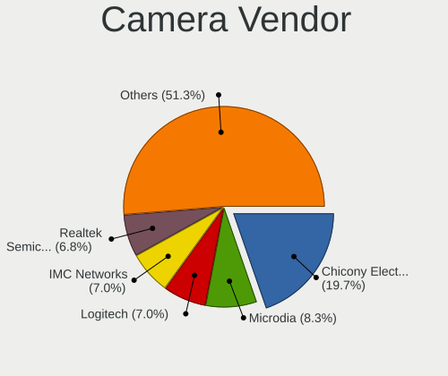

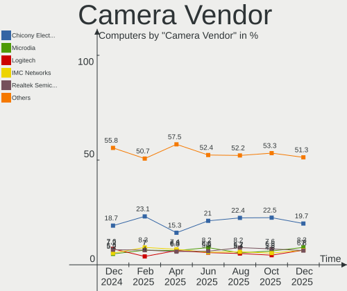

| Vendor                                 | Computers | Percent |
|----------------------------------------|-----------|---------|
| Chicony Electronics                    | 93        | 19.7%   |
| Microdia                               | 39        | 8.26%   |
| Logitech                               | 33        | 6.99%   |
| IMC Networks                           | 33        | 6.99%   |
| Realtek Semiconductor                  | 32        | 6.78%   |
| Bison Electronics                      | 30        | 6.36%   |
| Sunplus Innovation Technology          | 24        | 5.08%   |
| Apple                                  | 24        | 5.08%   |
| Quanta                                 | 20        | 4.24%   |
| Cheng Uei Precision Industry (Foxlink) | 16        | 3.39%   |
| Suyin                                  | 12        | 2.54%   |
| Luxvisions Innotech Limited            | 12        | 2.54%   |
| Syntek                                 | 11        | 2.33%   |
| Lite-On Technology                     | 11        | 2.33%   |
| ShineTech                              | 6         | 1.27%   |
| Sonix Technology                       | 5         | 1.06%   |
| Samsung Electronics                    | 5         | 1.06%   |
| Ricoh                                  | 4         | 0.85%   |
| Lenovo                                 | 3         | 0.64%   |
| Generalplus Technology                 | 3         | 0.64%   |
| Creative Technology                    | 3         | 0.64%   |
| Alcor Micro                            | 3         | 0.64%   |
| Z-Star Microelectronics                | 2         | 0.42%   |
| Sunplus Technology                     | 2         | 0.42%   |
| Silicon Motion                         | 2         | 0.42%   |
| Shine-optics                           | 2         | 0.42%   |
| Microsoft                              | 2         | 0.42%   |
| KYE Systems (Mouse Systems)            | 2         | 0.42%   |
| GEMBIRD                                | 2         | 0.42%   |
| eMeet                                  | 2         | 0.42%   |
| Anker PowerConf C200                   | 2         | 0.42%   |
| Acer                                   | 2         | 0.42%   |
| Unknown                                | 2         | 0.42%   |
| webcamvendor                           | 1         | 0.21%   |
| webcam                                 | 1         | 0.21%   |
| vivo                                   | 1         | 0.21%   |
| Valve Software                         | 1         | 0.21%   |
| Tobii Technology AB                    | 1         | 0.21%   |
| SunplusIT                              | 1         | 0.21%   |
| Shenzhen Kingcome Optoelectronic       | 1         | 0.21%   |

Camera Model
------------

Camera device models

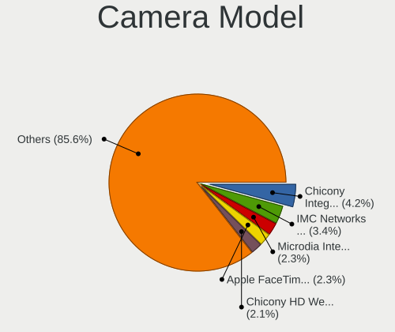

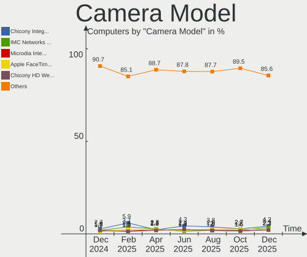

| Model                                                   | Computers | Percent |
|---------------------------------------------------------|-----------|---------|
| Chicony Integrated Camera                               | 20        | 4.24%   |
| IMC Networks USB2.0 HD UVC WebCam                       | 16        | 3.39%   |
| Microdia Integrated_Webcam_HD                           | 11        | 2.33%   |
| Apple FaceTime HD Camera (Built-in)                     | 11        | 2.33%   |
| Chicony HD WebCam                                       | 10        | 2.12%   |
| Sunplus Integrated_Webcam_HD                            | 9         | 1.91%   |
| Realtek Integrated_Webcam_HD                            | 8         | 1.69%   |
| IMC Networks Integrated Camera                          | 8         | 1.69%   |
| Apple Built-in iSight                                   | 8         | 1.69%   |
| Bison Integrated Camera                                 | 7         | 1.48%   |
| Suyin HP Truevision HD                                  | 6         | 1.27%   |
| Realtek USB Camera                                      | 6         | 1.27%   |
| Microdia Webcam Vitade AF                               | 6         | 1.27%   |
| Logitech Webcam C270                                    | 6         | 1.27%   |
| Bison SunplusIT Integrated Camera                       | 6         | 1.27%   |
| Sonix USB2.0 HD UVC WebCam                              | 5         | 1.06%   |
| ShineTech USB2.0 HD UVC WebCam                          | 5         | 1.06%   |
| Samsung Galaxy series, misc. (MTP mode)                 | 5         | 1.06%   |
| Logitech HD Pro Webcam C920                             | 5         | 1.06%   |
| Cheng Uei Precision Industry (Foxlink) Webcam           | 5         | 1.06%   |
| Cheng Uei Precision Industry (Foxlink) HP Truevision HD | 5         | 1.06%   |
| Syntek Integrated Camera                                | 4         | 0.85%   |
| Quanta HP TrueVision HD Camera                          | 4         | 0.85%   |
| Quanta HP HD Camera                                     | 4         | 0.85%   |
| Microdia Integrated Webcam                              | 4         | 0.85%   |
| Luxvisions Innotech Limited Integrated Camera           | 4         | 0.85%   |
| Logitech C922 Pro Stream Webcam                         | 4         | 0.85%   |
| Chicony TOSHIBA Web Camera - HD                         | 4         | 0.85%   |
| Chicony FJ Camera                                       | 4         | 0.85%   |
| Chicony Chicony USB2.0 Camera                           | 4         | 0.85%   |
| Syntek Lenovo EasyCamera                                | 3         | 0.64%   |
| Realtek Integrated_Webcam_FHD                           | 3         | 0.64%   |
| Realtek Integrated Webcam HD                            | 3         | 0.64%   |
| Quanta HD User Facing                                   | 3         | 0.64%   |
| Microdia USB 2.0 Camera                                 | 3         | 0.64%   |
| Microdia Integrated Webcam HD                           | 3         | 0.64%   |
| Luxvisions Innotech Limited HP TrueVision HD Camera     | 3         | 0.64%   |
| Logitech C920 PRO HD Webcam                             | 3         | 0.64%   |
| Lite-On Integrated Camera                               | 3         | 0.64%   |
| Lite-On HP HD Webcam                                    | 3         | 0.64%   |

Security
--------

Fingerprint Vendor
------------------

Fingerprint sensor vendors

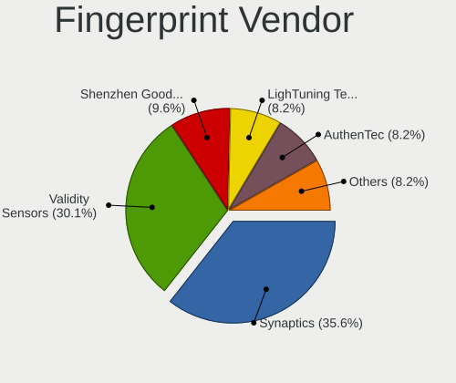

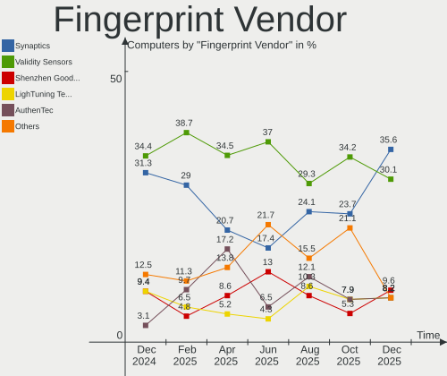

| Vendor                     | Computers | Percent |
|----------------------------|-----------|---------|
| Synaptics                  | 26        | 35.62%  |
| Validity Sensors           | 22        | 30.14%  |
| Shenzhen Goodix Technology | 7         | 9.59%   |
| LighTuning Technology      | 6         | 8.22%   |
| AuthenTec                  | 6         | 8.22%   |
| Upek                       | 4         | 5.48%   |
| STMicroelectronics         | 2         | 2.74%   |

Fingerprint Model
-----------------

Fingerprint sensor models

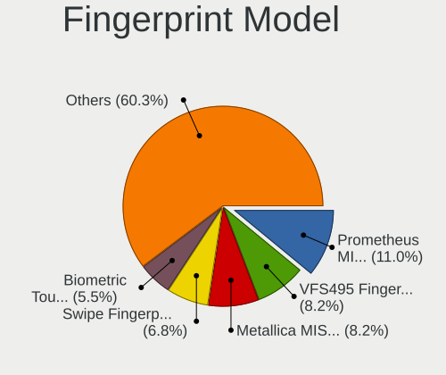

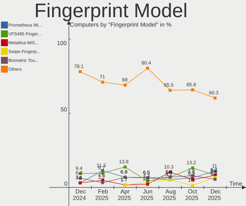

| Model                                                       | Computers | Percent |
|-------------------------------------------------------------|-----------|---------|
| Synaptics Prometheus MIS Touch Fingerprint Reader           | 8         | 10.96%  |
| Validity Sensors VFS495 Fingerprint Reader                  | 6         | 8.22%   |
| Synaptics Metallica MIS Touch Fingerprint Reader            | 6         | 8.22%   |
| Validity Sensors Swipe Fingerprint Sensor                   | 5         | 6.85%   |
| Upek Biometric Touchchip/Touchstrip Fingerprint Sensor      | 4         | 5.48%   |
| Synaptics FS7604 Touch Fingerprint Sensor with PurePrint    | 4         | 5.48%   |
| Shenzhen Goodix  FingerPrint Device                         | 4         | 5.48%   |
| LighTuning EgisTec Touch Fingerprint Sensor                 | 4         | 5.48%   |
| Validity Sensors VFS 5011 fingerprint sensor                | 3         | 4.11%   |
| Shenzhen Goodix Fingerprint Reader                          | 3         | 4.11%   |
| AuthenTec AES2501 Fingerprint Sensor                        | 3         | 4.11%   |
| Validity Sensors Synaptics WBDI                             | 2         | 2.74%   |
| Synaptics  WBDI                                             | 2         | 2.74%   |
| Synaptics Fingerprint reader [HP G6]                        | 2         | 2.74%   |
| STMicroelectronics Fingerprint Reader                       | 2         | 2.74%   |
| LighTuning ES603 Swipe Fingerprint Sensor                   | 2         | 2.74%   |
| AuthenTec AES1600                                           | 2         | 2.74%   |
| Validity Sensors VFS7552 Touch Fingerprint Sensor           | 1         | 1.37%   |
| Validity Sensors VFS5011 Fingerprint Reader                 | 1         | 1.37%   |
| Validity Sensors VFS491                                     | 1         | 1.37%   |
| Validity Sensors VFS Fingerprint sensor                     | 1         | 1.37%   |
| Validity Sensors Synaptics VFS7552 Touch Fingerprint Sensor | 1         | 1.37%   |
| Validity Sensors Fingerprint scanner                        | 1         | 1.37%   |
| Synaptics WBDI Device                                       | 1         | 1.37%   |
| Synaptics WBDI                                              | 1         | 1.37%   |
| Synaptics UWP WBDI                                          | 1         | 1.37%   |
| Synaptics  FS7604 Touch Fingerprint Sensor with PurePrint   | 1         | 1.37%   |
| AuthenTec AES2810                                           | 1         | 1.37%   |

Chipcard Vendor
---------------

Chipcard module vendors

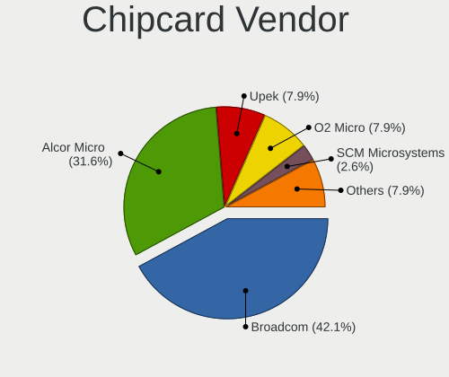

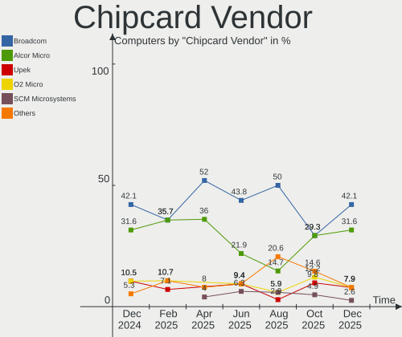

| Vendor                | Computers | Percent |
|-----------------------|-----------|---------|
| Broadcom              | 16        | 42.11%  |
| Alcor Micro           | 12        | 31.58%  |
| Upek                  | 3         | 7.89%   |
| O2 Micro              | 3         | 7.89%   |
| SCM Microsystems      | 1         | 2.63%   |
| Realtek Semiconductor | 1         | 2.63%   |
| Gemalto (was Gemplus) | 1         | 2.63%   |
| Cherry                | 1         | 2.63%   |

Chipcard Model
--------------

Chipcard module models

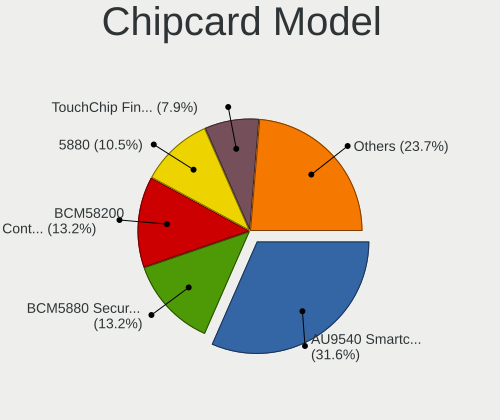

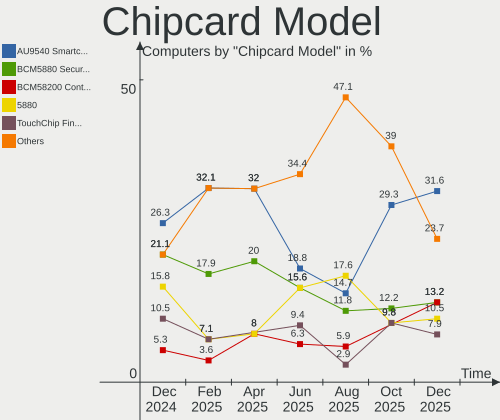

| Model                                                                        | Computers | Percent |
|------------------------------------------------------------------------------|-----------|---------|
| Alcor Micro AU9540 Smartcard Reader                                          | 12        | 31.58%  |
| Broadcom BCM5880 Secure Applications Processor                               | 5         | 13.16%  |
| Broadcom BCM58200 ControlVault 3 (FingerPrint sensor + Contacted SmartCard)  | 5         | 13.16%  |
| Broadcom 5880                                                                | 4         | 10.53%  |
| Upek TouchChip Fingerprint Coprocessor (WBF advanced mode)                   | 3         | 7.89%   |
| O2 Micro OZ776 CCID Smartcard Reader                                         | 3         | 7.89%   |
| Broadcom BCM5880 Secure Applications Processor with fingerprint swipe sensor | 2         | 5.26%   |
| SCM Microsystems SCR331-LC1 / SCR3310 SmartCard Reader                       | 1         | 2.63%   |
| Realtek Semiconductor Smart Card Reader Interface                            | 1         | 2.63%   |
| Gemalto (was Gemplus) GemPC Twin SmartCard Reader                            | 1         | 2.63%   |
| Cherry SmartTerminal ST-2xxx                                                 | 1         | 2.63%   |

Unsupported
-----------

Unsupported Devices
-------------------

Total unsupported devices on board

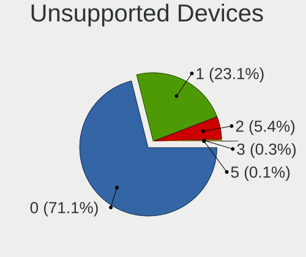

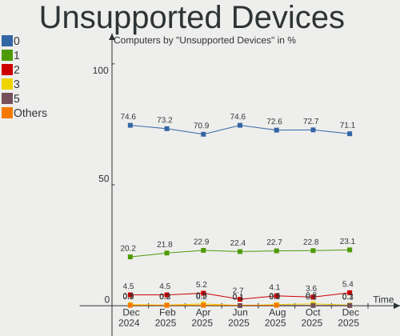

| Total | Computers | Percent |
|-------|-----------|---------|
| 0     | 620       | 71.1%   |
| 1     | 201       | 23.05%  |
| 2     | 47        | 5.39%   |
| 3     | 3         | 0.34%   |
| 5     | 1         | 0.11%   |

Unsupported Device Types
------------------------

Types of unsupported devices

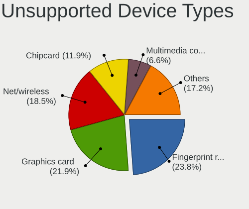

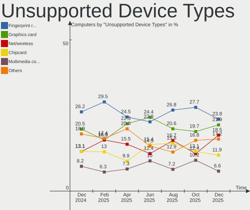

| Type                     | Computers | Percent |
|--------------------------|-----------|---------|
| Fingerprint reader       | 72        | 23.84%  |
| Graphics card            | 66        | 21.85%  |
| Net/wireless             | 56        | 18.54%  |
| Chipcard                 | 36        | 11.92%  |
| Multimedia controller    | 20        | 6.62%   |
| Bluetooth                | 14        | 4.64%   |
| Unassigned class         | 7         | 2.32%   |
| Communication controller | 7         | 2.32%   |
| Camera                   | 7         | 2.32%   |
| Storage                  | 6         | 1.99%   |
| Sound                    | 4         | 1.32%   |
| Net/ethernet             | 3         | 0.99%   |
| Storage/raid             | 1         | 0.33%   |
| Network                  | 1         | 0.33%   |
| Firewire controller      | 1         | 0.33%   |
| Card reader              | 1         | 0.33%   |

