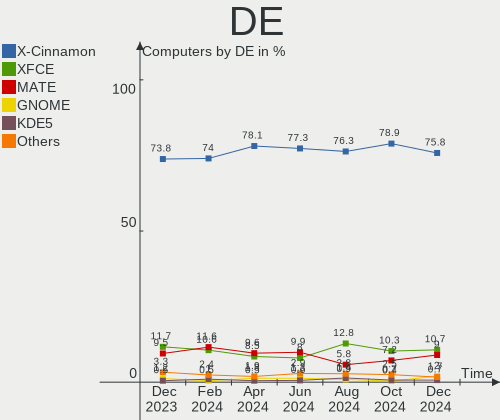
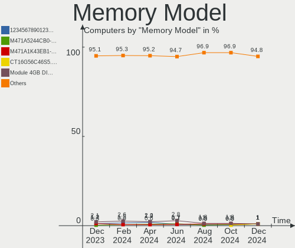
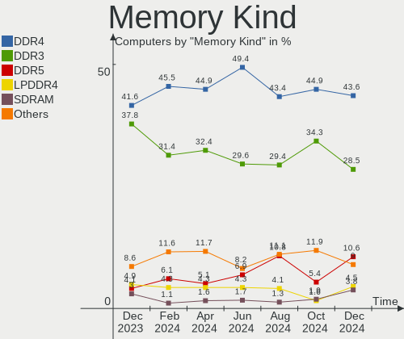
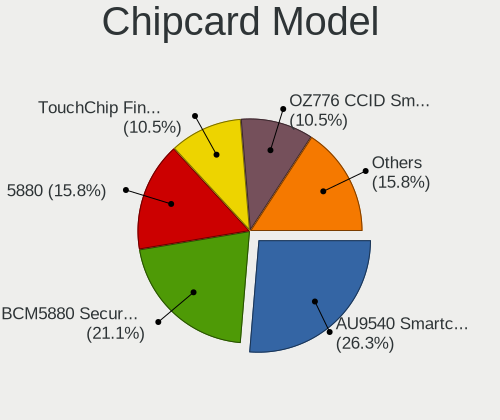

Linux Mint - Hardware Trends
----------------------------

A project to identify most popular hardware characteristics and track their change
over time based on data collected by Linux users at https://Linux-Hardware.org.

Anyone can contribute to this report by the [hw-probe](https://github.com/linuxhw/hw-probe) tool:

    sudo -E hw-probe -all -upload

This is a report for all computer types. See also reports for [desktops](/Dist/Linux_Mint/Desktop/README.md) and [notebooks](/Dist/Linux_Mint/Notebook/README.md).

This report is for one last month. Overall report since the beginning of time: [TestCoverage](https://github.com/linuxhw/TestCoverage)

Period: Sep, 2022.

Contents
--------

* [ System ](#system)
  - [ OS                       ](#os)
  - [ OS Family                ](#os-family)
  - [ Kernel                   ](#kernel)
  - [ Kernel Family            ](#kernel-family)
  - [ Kernel Major Ver.        ](#kernel-major-ver)
  - [ Arch                     ](#arch)
  - [ DE                       ](#de)
  - [ Display Server           ](#display-server)
  - [ Display Manager          ](#display-manager)
  - [ OS Lang                  ](#os-lang)
  - [ Boot Mode                ](#boot-mode)
  - [ Filesystem               ](#filesystem)
  - [ Part. scheme             ](#part-scheme)
  - [ Dual Boot with Linux/BSD ](#dual-boot-with-linuxbsd)
  - [ Dual Boot (Win)          ](#dual-boot-win)

* [ Board ](#board)
  - [ Vendor                   ](#vendor)
  - [ Model                    ](#model)
  - [ Model Family             ](#model-family)
  - [ MFG Year                 ](#mfg-year)
  - [ Form Factor              ](#form-factor)
  - [ Secure Boot              ](#secure-boot)
  - [ Coreboot                 ](#coreboot)
  - [ RAM Size                 ](#ram-size)
  - [ RAM Used                 ](#ram-used)
  - [ Total Drives             ](#total-drives)
  - [ Has CD-ROM               ](#has-cd-rom)
  - [ Has Ethernet             ](#has-ethernet)
  - [ Has WiFi                 ](#has-wifi)
  - [ Has Bluetooth            ](#has-bluetooth)

* [ Location ](#location)
  - [ Country                  ](#country)
  - [ City                     ](#city)

* [ Drives ](#drives)
  - [ Drive Vendor             ](#drive-vendor)
  - [ Drive Model              ](#drive-model)
  - [ HDD Vendor               ](#hdd-vendor)
  - [ SSD Vendor               ](#ssd-vendor)
  - [ Drive Kind               ](#drive-kind)
  - [ Drive Connector          ](#drive-connector)
  - [ Drive Size               ](#drive-size)
  - [ Space Total              ](#space-total)
  - [ Space Used               ](#space-used)
  - [ Malfunc. Drives          ](#malfunc-drives)
  - [ Malfunc. Drive Vendor    ](#malfunc-drive-vendor)
  - [ Malfunc. HDD Vendor      ](#malfunc-hdd-vendor)
  - [ Malfunc. Drive Kind      ](#malfunc-drive-kind)
  - [ Failed Drives            ](#failed-drives)
  - [ Failed Drive Vendor      ](#failed-drive-vendor)
  - [ Drive Status             ](#drive-status)

* [ Storage controller ](#storage-controller)
  - [ Storage Vendor           ](#storage-vendor)
  - [ Storage Model            ](#storage-model)
  - [ Storage Kind             ](#storage-kind)

* [ Processor ](#processor)
  - [ CPU Vendor               ](#cpu-vendor)
  - [ CPU Model                ](#cpu-model)
  - [ CPU Model Family         ](#cpu-model-family)
  - [ CPU Cores                ](#cpu-cores)
  - [ CPU Sockets              ](#cpu-sockets)
  - [ CPU Threads              ](#cpu-threads)
  - [ CPU Op-Modes             ](#cpu-op-modes)
  - [ CPU Microcode            ](#cpu-microcode)
  - [ CPU Microarch            ](#cpu-microarch)

* [ Graphics ](#graphics)
  - [ GPU Vendor               ](#gpu-vendor)
  - [ GPU Model                ](#gpu-model)
  - [ GPU Combo                ](#gpu-combo)
  - [ GPU Driver               ](#gpu-driver)
  - [ GPU Memory               ](#gpu-memory)

* [ Monitor ](#monitor)
  - [ Monitor Vendor           ](#monitor-vendor)
  - [ Monitor Model            ](#monitor-model)
  - [ Monitor Resolution       ](#monitor-resolution)
  - [ Monitor Diagonal         ](#monitor-diagonal)
  - [ Monitor Width            ](#monitor-width)
  - [ Aspect Ratio             ](#aspect-ratio)
  - [ Monitor Area             ](#monitor-area)
  - [ Pixel Density            ](#pixel-density)
  - [ Multiple Monitors        ](#multiple-monitors)

* [ Network ](#network)
  - [ Net Controller Vendor    ](#net-controller-vendor)
  - [ Net Controller Model     ](#net-controller-model)
  - [ Wireless Vendor          ](#wireless-vendor)
  - [ Wireless Model           ](#wireless-model)
  - [ Ethernet Vendor          ](#ethernet-vendor)
  - [ Ethernet Model           ](#ethernet-model)
  - [ Net Controller Kind      ](#net-controller-kind)
  - [ Used Controller          ](#used-controller)
  - [ NICs                     ](#nics)
  - [ IPv6                     ](#ipv6)

* [ Bluetooth ](#bluetooth)
  - [ Bluetooth Vendor         ](#bluetooth-vendor)
  - [ Bluetooth Model          ](#bluetooth-model)

* [ Sound ](#sound)
  - [ Sound Vendor             ](#sound-vendor)
  - [ Sound Model              ](#sound-model)

* [ Memory ](#memory)
  - [ Memory Vendor            ](#memory-vendor)
  - [ Memory Model             ](#memory-model)
  - [ Memory Kind              ](#memory-kind)
  - [ Memory Form Factor       ](#memory-form-factor)
  - [ Memory Size              ](#memory-size)
  - [ Memory Speed             ](#memory-speed)

* [ Printers & scanners ](#printers--scanners)
  - [ Printer Vendor           ](#printer-vendor)
  - [ Printer Model            ](#printer-model)
  - [ Scanner Vendor           ](#scanner-vendor)
  - [ Scanner Model            ](#scanner-model)

* [ Camera ](#camera)
  - [ Camera Vendor            ](#camera-vendor)
  - [ Camera Model             ](#camera-model)

* [ Security ](#security)
  - [ Fingerprint Vendor       ](#fingerprint-vendor)
  - [ Fingerprint Model        ](#fingerprint-model)
  - [ Chipcard Vendor          ](#chipcard-vendor)
  - [ Chipcard Model           ](#chipcard-model)

* [ Unsupported ](#unsupported)
  - [ Unsupported Devices      ](#unsupported-devices)
  - [ Unsupported Device Types ](#unsupported-device-types)

System
------

OS
--

Installed operating systems

| Name            | Computers | Percent |
|-----------------|-----------|---------|
| Linux Mint 21   | 268       | 59.56%  |
| Linux Mint 20.3 | 135       | 30%     |
| Linux Mint 20.2 | 16        | 3.56%   |
| Linux Mint 20.1 | 11        | 2.44%   |
| Linux Mint 19.3 | 10        | 2.22%   |
| Linux Mint 20   | 7         | 1.56%   |
| Linux Mint 19.2 | 1         | 0.22%   |
| Linux Mint 19.1 | 1         | 0.22%   |
| Linux Mint 18.3 | 1         | 0.22%   |

OS Family
---------

OS without a version

| Name       | Computers | Percent |
|------------|-----------|---------|
| Linux Mint | 450       | 100%    |

Kernel
------

Version of the Linux kernel

| Version                   | Computers | Percent |
|---------------------------|-----------|---------|
| 5.15.0-47-generic         | 156       | 34.67%  |
| 5.4.0-125-generic         | 83        | 18.44%  |
| 5.15.0-48-generic         | 75        | 16.67%  |
| 5.4.0-126-generic         | 31        | 6.89%   |
| 5.15.0-46-generic         | 28        | 6.22%   |
| 5.15.0-41-generic         | 28        | 6.22%   |
| 5.4.0-124-generic         | 7         | 1.56%   |
| 5.4.0-91-generic          | 3         | 0.67%   |
| 5.4.0-113-generic         | 3         | 0.67%   |
| 5.4.0-74-generic          | 2         | 0.44%   |
| 5.4.0-121-generic         | 2         | 0.44%   |
| 5.4.0-105-generic         | 2         | 0.44%   |
| 5.15.0-43-generic         | 2         | 0.44%   |
| 5.14.0-1051-oem           | 2         | 0.44%   |
| 4.15.0-192-generic        | 2         | 0.44%   |
| 5.8.0-63-generic          | 1         | 0.22%   |
| 5.4.0-90-generic          | 1         | 0.22%   |
| 5.4.0-81-generic          | 1         | 0.22%   |
| 5.4.0-80-generic          | 1         | 0.22%   |
| 5.4.0-77-generic          | 1         | 0.22%   |
| 5.4.0-58-generic          | 1         | 0.22%   |
| 5.4.0-125-lowlatency      | 1         | 0.22%   |
| 5.4.0-122-generic         | 1         | 0.22%   |
| 5.4.0-110-generic         | 1         | 0.22%   |
| 5.4.0-109-generic         | 1         | 0.22%   |
| 5.19.7-051907-generic     | 1         | 0.22%   |
| 5.19.6-surface            | 1         | 0.22%   |
| 5.19.3-051903-generic     | 1         | 0.22%   |
| 5.19.10                   | 1         | 0.22%   |
| 5.19.0-7.1-liquorix-amd64 | 1         | 0.22%   |
| 5.17.0-8-generic          | 1         | 0.22%   |
| 5.15.0-46-lowlatency      | 1         | 0.22%   |
| 5.14.0-1052-oem           | 1         | 0.22%   |
| 5.13.0-25-generic         | 1         | 0.22%   |
| 5.10.0-17-amd64           | 1         | 0.22%   |
| 4.15.0-54-generic         | 1         | 0.22%   |
| 4.15.0-32-generic         | 1         | 0.22%   |
| 4.15.0-191-generic        | 1         | 0.22%   |
| 4.15.0-163-generic        | 1         | 0.22%   |

Kernel Family
-------------

Linux kernel without a distro release

| Version | Computers | Percent |
|---------|-----------|---------|
| 5.15.0  | 290       | 64.44%  |
| 5.4.0   | 142       | 31.56%  |
| 4.15.0  | 6         | 1.33%   |
| 5.14.0  | 3         | 0.67%   |
| 5.8.0   | 1         | 0.22%   |
| 5.19.7  | 1         | 0.22%   |
| 5.19.6  | 1         | 0.22%   |
| 5.19.3  | 1         | 0.22%   |
| 5.19.10 | 1         | 0.22%   |
| 5.19.0  | 1         | 0.22%   |
| 5.17.0  | 1         | 0.22%   |
| 5.13.0  | 1         | 0.22%   |
| 5.10.0  | 1         | 0.22%   |

Kernel Major Ver.
-----------------

Linux kernel major version

| Version | Computers | Percent |
|---------|-----------|---------|
| 5.15    | 290       | 64.44%  |
| 5.4     | 142       | 31.56%  |
| 4.15    | 6         | 1.33%   |
| 5.19    | 5         | 1.11%   |
| 5.14    | 3         | 0.67%   |
| 5.8     | 1         | 0.22%   |
| 5.17    | 1         | 0.22%   |
| 5.13    | 1         | 0.22%   |
| 5.10    | 1         | 0.22%   |

Arch
----

OS architecture (x86_64, i586, etc.)

| Name   | Computers | Percent |
|--------|-----------|---------|
| x86_64 | 445       | 98.89%  |
| i686   | 5         | 1.11%   |

DE
--

Desktop Environment

| Name       | Computers | Percent |
|------------|-----------|---------|
| X-Cinnamon | 302       | 67.11%  |
| MATE       | 50        | 11.11%  |
| XFCE       | 46        | 10.22%  |
| Cinnamon   | 32        | 7.11%   |
| GNOME      | 13        | 2.89%   |
| KDE5       | 3         | 0.67%   |
| Unknown    | 2         | 0.44%   |
| Pantheon   | 1         | 0.22%   |
| i3         | 1         | 0.22%   |

Display Server
--------------

X11 or Wayland

| Name    | Computers | Percent |
|---------|-----------|---------|
| X11     | 444       | 98.67%  |
| Wayland | 4         | 0.89%   |
| Tty     | 2         | 0.44%   |

Display Manager
---------------

SDDM, LightDM, etc.

| Name    | Computers | Percent |
|---------|-----------|---------|
| Unknown | 245       | 54.44%  |
| LightDM | 201       | 44.67%  |
| GDM3    | 2         | 0.44%   |
| SDDM    | 1         | 0.22%   |
| GDM     | 1         | 0.22%   |

OS Lang
-------

Language

| Lang  | Computers | Percent |
|-------|-----------|---------|
| en_US | 148       | 32.89%  |
| de_DE | 66        | 14.67%  |
| it_IT | 30        | 6.67%   |
| ru_RU | 25        | 5.56%   |
| pt_BR | 25        | 5.56%   |
| fr_FR | 23        | 5.11%   |
| en_CA | 17        | 3.78%   |
| en_GB | 15        | 3.33%   |
| C     | 12        | 2.67%   |
| es_ES | 9         | 2%      |
| pl_PL | 8         | 1.78%   |
| en_AU | 8         | 1.78%   |
| es_MX | 7         | 1.56%   |
| nl_NL | 5         | 1.11%   |
| es_AR | 4         | 0.89%   |
| en_IN | 4         | 0.89%   |
| de_AT | 4         | 0.89%   |
| fr_CA | 3         | 0.67%   |
| es_CL | 3         | 0.67%   |
| cs_CZ | 3         | 0.67%   |
| sl_SI | 2         | 0.44%   |
| sk_SK | 2         | 0.44%   |
| nb_NO | 2         | 0.44%   |
| fr_BE | 2         | 0.44%   |
| es_CO | 2         | 0.44%   |
| en_NZ | 2         | 0.44%   |
| tr_TR | 1         | 0.22%   |
| sr_RS | 1         | 0.22%   |
| ro_RO | 1         | 0.22%   |
| nl_BE | 1         | 0.22%   |
| hu_HU | 1         | 0.22%   |
| fi_FI | 1         | 0.22%   |
| es_VE | 1         | 0.22%   |
| es_UY | 1         | 0.22%   |
| es_HN | 1         | 0.22%   |
| en_SG | 1         | 0.22%   |
| en_IL | 1         | 0.22%   |
| en_IE | 1         | 0.22%   |
| en_DK | 1         | 0.22%   |
| el_GR | 1         | 0.22%   |

Boot Mode
---------

EFI or BIOS

| Mode | Computers | Percent |
|------|-----------|---------|
| EFI  | 258       | 57.33%  |
| BIOS | 192       | 42.67%  |

Filesystem
----------

Type of filesystem

| Type    | Computers | Percent |
|---------|-----------|---------|
| Ext4    | 424       | 94.22%  |
| Overlay | 10        | 2.22%   |
| Btrfs   | 8         | 1.78%   |
| Zfs     | 5         | 1.11%   |
| Xfs     | 1         | 0.22%   |
| Ext3    | 1         | 0.22%   |
| Ext2    | 1         | 0.22%   |

Part. scheme
------------

Scheme of partitioning

| Type    | Computers | Percent |
|---------|-----------|---------|
| Unknown | 253       | 56.22%  |
| GPT     | 166       | 36.89%  |
| MBR     | 31        | 6.89%   |

Dual Boot with Linux/BSD
------------------------

Hosting more than one Linux/BSD

| Dual boot | Computers | Percent |
|-----------|-----------|---------|
| No        | 413       | 91.78%  |
| Yes       | 37        | 8.22%   |

Dual Boot (Win)
---------------

Hosting Linux and Windows

| Dual boot | Computers | Percent |
|-----------|-----------|---------|
| No        | 356       | 79.11%  |
| Yes       | 94        | 20.89%  |

Board
-----

Vendor
------

Motherboard manufacturer

| Name                | Computers | Percent |
|---------------------|-----------|---------|
| Dell                | 71        | 15.78%  |
| Lenovo              | 67        | 14.89%  |
| ASUSTek Computer    | 66        | 14.67%  |
| Hewlett-Packard     | 53        | 11.78%  |
| Gigabyte Technology | 37        | 8.22%   |
| Acer                | 24        | 5.33%   |
| MSI                 | 17        | 3.78%   |
| Apple               | 13        | 2.89%   |
| Toshiba             | 11        | 2.44%   |
| Samsung Electronics | 10        | 2.22%   |
| ASRock              | 9         | 2%      |
| Intel               | 6         | 1.33%   |
| Medion              | 4         | 0.89%   |
| ECS                 | 4         | 0.89%   |
| AZW                 | 4         | 0.89%   |
| HUAWEI              | 3         | 0.67%   |
| Fujitsu             | 3         | 0.67%   |
| Unknown             | 3         | 0.67%   |
| Timi                | 2         | 0.44%   |
| Sony                | 2         | 0.44%   |
| PCWare              | 2         | 0.44%   |
| Packard Bell        | 2         | 0.44%   |
| Microsoft           | 2         | 0.44%   |
| LG Electronics      | 2         | 0.44%   |
| Google              | 2         | 0.44%   |
| Gateway             | 2         | 0.44%   |
| Fujitsu Siemens     | 2         | 0.44%   |
| Foxconn             | 2         | 0.44%   |
| Daten Tecnologia    | 2         | 0.44%   |
| Chuwi               | 2         | 0.44%   |
| BESSTAR Tech        | 2         | 0.44%   |
| AMI                 | 2         | 0.44%   |
| Alienware           | 2         | 0.44%   |
| ZOTAC               | 1         | 0.22%   |
| Wistron             | 1         | 0.22%   |
| UMAX                | 1         | 0.22%   |
| System76            | 1         | 0.22%   |
| Standard            | 1         | 0.22%   |
| Positivo            | 1         | 0.22%   |
| Pegatron            | 1         | 0.22%   |

Model
-----

Motherboard model

| Name                             | Computers | Percent |
|----------------------------------|-----------|---------|
| ASUS All Series                  | 5         | 1.11%   |
| Dell Latitude E6540              | 4         | 0.89%   |
| Unknown                          | 4         | 0.89%   |
| Dell Inspiron 15-3567            | 3         | 0.67%   |
| Samsung R530/R730/R540           | 2         | 0.44%   |
| MSI MS-7C56                      | 2         | 0.44%   |
| MSI MS-7641                      | 2         | 0.44%   |
| Lenovo G780                      | 2         | 0.44%   |
| Lenovo G50-70 20351              | 2         | 0.44%   |
| Intel X79M-S                     | 2         | 0.44%   |
| HP ProLiant MicroServer          | 2         | 0.44%   |
| HP Compaq 8200 Elite CMT PC      | 2         | 0.44%   |
| HP 2000                          | 2         | 0.44%   |
| Google Akemi                     | 2         | 0.44%   |
| Gigabyte X470 AORUS ULTRA GAMING | 2         | 0.44%   |
| Dell XPS 17 9700                 | 2         | 0.44%   |
| Dell OptiPlex 990                | 2         | 0.44%   |
| Dell OptiPlex 7010               | 2         | 0.44%   |
| Dell Latitude E6520              | 2         | 0.44%   |
| Daten Tecnologia DT02-M4         | 2         | 0.44%   |
| AZW GK mini                      | 2         | 0.44%   |
| ASUS P5K                         | 2         | 0.44%   |
| ZOTAC ZBOX-CI320NANO series      | 1         | 0.22%   |
| Wistron ProLiant ML110 G6        | 1         | 0.22%   |
| UMAX VisionBook N15G Plus        | 1         | 0.22%   |
| Toshiba Satellite S70-A          | 1         | 0.22%   |
| Toshiba Satellite Pro C660       | 1         | 0.22%   |
| Toshiba Satellite L875-11M       | 1         | 0.22%   |
| Toshiba Satellite L670           | 1         | 0.22%   |
| Toshiba Satellite L50D-B         | 1         | 0.22%   |
| Toshiba Satellite L50-B          | 1         | 0.22%   |
| Toshiba Satellite C660           | 1         | 0.22%   |
| Toshiba Satellite C55-A-1JL      | 1         | 0.22%   |
| Toshiba Satellite C50-B          | 1         | 0.22%   |
| Toshiba QOSMIO X70-B             | 1         | 0.22%   |
| Toshiba ENCORE 2 WT8-B           | 1         | 0.22%   |
| Timi RedmiBook Pro 15S           | 1         | 0.22%   |
| Timi RedmiBook 16                | 1         | 0.22%   |
| System76 Thelio Mira             | 1         | 0.22%   |
| Standard AHV                     | 1         | 0.22%   |

Model Family
------------

Motherboard model prefix

| Name               | Computers | Percent |
|--------------------|-----------|---------|
| Lenovo ThinkPad    | 29        | 6.44%   |
| Dell Latitude      | 25        | 5.56%   |
| Dell Inspiron      | 21        | 4.67%   |
| Acer Aspire        | 18        | 4%      |
| Dell OptiPlex      | 12        | 2.67%   |
| ASUS VivoBook      | 11        | 2.44%   |
| Toshiba Satellite  | 9         | 2%      |
| Lenovo IdeaPad     | 9         | 2%      |
| HP Pavilion        | 9         | 2%      |
| ASUS PRIME         | 9         | 2%      |
| HP Compaq          | 6         | 1.33%   |
| Dell Precision     | 6         | 1.33%   |
| Lenovo ThinkCentre | 5         | 1.11%   |
| HP Laptop          | 5         | 1.11%   |
| Dell XPS           | 5         | 1.11%   |
| ASUS ROG           | 5         | 1.11%   |
| ASUS All           | 5         | 1.11%   |
| HP EliteBook       | 4         | 0.89%   |
| Unknown            | 4         | 0.89%   |
| HP ProBook         | 3         | 0.67%   |
| HP ENVY            | 3         | 0.67%   |
| Timi RedmiBook     | 2         | 0.44%   |
| Samsung R530       | 2         | 0.44%   |
| MSI MS-7C56        | 2         | 0.44%   |
| MSI MS-7641        | 2         | 0.44%   |
| Microsoft Surface  | 2         | 0.44%   |
| Medion Akoya       | 2         | 0.44%   |
| Lenovo ThinkBook   | 2         | 0.44%   |
| Lenovo Legion      | 2         | 0.44%   |
| Lenovo IdeaCentre  | 2         | 0.44%   |
| Lenovo G780        | 2         | 0.44%   |
| Lenovo G50-70      | 2         | 0.44%   |
| Lenovo G40-80      | 2         | 0.44%   |
| Intel X79M-S       | 2         | 0.44%   |
| HP ZBook           | 2         | 0.44%   |
| HP ProLiant        | 2         | 0.44%   |
| HP EliteDesk       | 2         | 0.44%   |
| HP 2000            | 2         | 0.44%   |
| Google Akemi       | 2         | 0.44%   |
| Gigabyte Z690      | 2         | 0.44%   |

MFG Year
--------

Motherboard manufacture year

| Year | Computers | Percent |
|------|-----------|---------|
| 2011 | 44        | 9.78%   |
| 2021 | 42        | 9.33%   |
| 2012 | 39        | 8.67%   |
| 2020 | 38        | 8.44%   |
| 2013 | 35        | 7.78%   |
| 2018 | 33        | 7.33%   |
| 2014 | 30        | 6.67%   |
| 2022 | 29        | 6.44%   |
| 2010 | 29        | 6.44%   |
| 2015 | 23        | 5.11%   |
| 2019 | 19        | 4.22%   |
| 2016 | 19        | 4.22%   |
| 2009 | 19        | 4.22%   |
| 2017 | 17        | 3.78%   |
| 2008 | 16        | 3.56%   |
| 2007 | 13        | 2.89%   |
| 2006 | 3         | 0.67%   |
| 2005 | 1         | 0.22%   |
| 2004 | 1         | 0.22%   |

Form Factor
-----------

Physical design of the computer

| Name        | Computers | Percent |
|-------------|-----------|---------|
| Notebook    | 252       | 56%     |
| Desktop     | 173       | 38.44%  |
| All in one  | 11        | 2.44%   |
| Convertible | 6         | 1.33%   |
| Mini pc     | 6         | 1.33%   |
| Tablet      | 2         | 0.44%   |

Secure Boot
-----------

Enabled or disabled

| State    | Computers | Percent |
|----------|-----------|---------|
| Disabled | 410       | 91.11%  |
| Enabled  | 40        | 8.89%   |

Coreboot
--------

Have coreboot on board

| Used | Computers | Percent |
|------|-----------|---------|
| No   | 447       | 99.33%  |
| Yes  | 3         | 0.67%   |

RAM Size
--------

Total RAM memory

| Size in GB  | Computers | Percent |
|-------------|-----------|---------|
| 4.01-8.0    | 127       | 28.22%  |
| 16.01-24.0  | 86        | 19.11%  |
| 8.01-16.0   | 83        | 18.44%  |
| 3.01-4.0    | 79        | 17.56%  |
| 32.01-64.0  | 34        | 7.56%   |
| 1.01-2.0    | 15        | 3.33%   |
| 64.01-256.0 | 10        | 2.22%   |
| 24.01-32.0  | 9         | 2%      |
| 2.01-3.0    | 6         | 1.33%   |
| 0.51-1.0    | 1         | 0.22%   |

RAM Used
--------

Used RAM memory

| Used GB    | Computers | Percent |
|------------|-----------|---------|
| 1.01-2.0   | 166       | 36.89%  |
| 2.01-3.0   | 127       | 28.22%  |
| 4.01-8.0   | 64        | 14.22%  |
| 3.01-4.0   | 61        | 13.56%  |
| 0.51-1.0   | 18        | 4%      |
| 8.01-16.0  | 12        | 2.67%   |
| 24.01-32.0 | 1         | 0.22%   |
| 0.01-0.5   | 1         | 0.22%   |

Total Drives
------------

Number of drives on board

| Drives | Computers | Percent |
|--------|-----------|---------|
| 1      | 252       | 56%     |
| 2      | 132       | 29.33%  |
| 3      | 33        | 7.33%   |
| 4      | 20        | 4.44%   |
| 5      | 6         | 1.33%   |
| 6      | 4         | 0.89%   |
| 10     | 1         | 0.22%   |
| 7      | 1         | 0.22%   |
| 0      | 1         | 0.22%   |

Has CD-ROM
----------

Has CD-ROM on board

| Presented | Computers | Percent |
|-----------|-----------|---------|
| No        | 231       | 51.33%  |
| Yes       | 219       | 48.67%  |

Has Ethernet
------------

Has Ethernet on board

| Presented | Computers | Percent |
|-----------|-----------|---------|
| Yes       | 396       | 88%     |
| No        | 54        | 12%     |

Has WiFi
--------

Has WiFi module

| Presented | Computers | Percent |
|-----------|-----------|---------|
| Yes       | 365       | 81.11%  |
| No        | 85        | 18.89%  |

Has Bluetooth
-------------

Has Bluetooth module

| Presented | Computers | Percent |
|-----------|-----------|---------|
| Yes       | 261       | 58%     |
| No        | 189       | 42%     |

Location
--------

Country
-------

Geographic location (country)

| Country            | Computers | Percent |
|--------------------|-----------|---------|
| USA                | 89        | 19.78%  |
| Germany            | 70        | 15.56%  |
| Italy              | 34        | 7.56%   |
| Brazil             | 30        | 6.67%   |
| Russia             | 27        | 6%      |
| France             | 24        | 5.33%   |
| Canada             | 19        | 4.22%   |
| UK                 | 11        | 2.44%   |
| Spain              | 10        | 2.22%   |
| Netherlands        | 10        | 2.22%   |
| Poland             | 9         | 2%      |
| Mexico             | 9         | 2%      |
| Australia          | 8         | 1.78%   |
| India              | 6         | 1.33%   |
| Czechia            | 6         | 1.33%   |
| Belgium            | 6         | 1.33%   |
| Serbia             | 5         | 1.11%   |
| Austria            | 5         | 1.11%   |
| Argentina          | 5         | 1.11%   |
| Turkey             | 4         | 0.89%   |
| Slovakia           | 4         | 0.89%   |
| Colombia           | 4         | 0.89%   |
| Romania            | 3         | 0.67%   |
| Norway             | 3         | 0.67%   |
| Indonesia          | 3         | 0.67%   |
| Greece             | 3         | 0.67%   |
| Egypt              | 3         | 0.67%   |
| Chile              | 3         | 0.67%   |
| Belarus            | 3         | 0.67%   |
| Switzerland        | 2         | 0.44%   |
| Slovenia           | 2         | 0.44%   |
| Singapore          | 2         | 0.44%   |
| Portugal           | 2         | 0.44%   |
| New Zealand        | 2         | 0.44%   |
| Israel             | 2         | 0.44%   |
| Hungary            | 2         | 0.44%   |
| Finland            | 2         | 0.44%   |
| Dominican Republic | 2         | 0.44%   |
| Denmark            | 2         | 0.44%   |
| Venezuela          | 1         | 0.22%   |

City
----

Geographic location (city)

| City               | Computers | Percent |
|--------------------|-----------|---------|
| Moscow             | 6         | 1.33%   |
| Munich             | 5         | 1.11%   |
| Frankfurt am Main  | 5         | 1.11%   |
| Berlin             | 5         | 1.11%   |
| Sao Paulo          | 4         | 0.89%   |
| Rome               | 4         | 0.89%   |
| Rio de Janeiro     | 4         | 0.89%   |
| Prague             | 4         | 0.89%   |
| Milan              | 4         | 0.89%   |
| Chicago            | 4         | 0.89%   |
| Vienna             | 3         | 0.67%   |
| Seattle            | 3         | 0.67%   |
| San Diego          | 3         | 0.67%   |
| Paris              | 3         | 0.67%   |
| Melbourne          | 3         | 0.67%   |
| Madrid             | 3         | 0.67%   |
| Krasnodar          | 3         | 0.67%   |
| Istanbul           | 3         | 0.67%   |
| Cairo              | 3         | 0.67%   |
| Bratislava         | 3         | 0.67%   |
| Belgrade           | 3         | 0.67%   |
| Woodbridge         | 2         | 0.44%   |
| Warsaw             | 2         | 0.44%   |
| Vleuten            | 2         | 0.44%   |
| Toronto            | 2         | 0.44%   |
| Tomsk              | 2         | 0.44%   |
| The Bronx          | 2         | 0.44%   |
| Sydney             | 2         | 0.44%   |
| St Petersburg      | 2         | 0.44%   |
| Singapore          | 2         | 0.44%   |
| Shaftesbury        | 2         | 0.44%   |
| Santo Domingo Este | 2         | 0.44%   |
| Santiago           | 2         | 0.44%   |
| Rosario            | 2         | 0.44%   |
| Porto Alegre       | 2         | 0.44%   |
| Palermo            | 2         | 0.44%   |
| Nuremberg          | 2         | 0.44%   |
| Montreal           | 2         | 0.44%   |
| Minsk              | 2         | 0.44%   |
| Los Angeles        | 2         | 0.44%   |

Drives
------

Drive Vendor
------------

Hard drive vendors

| Vendor                  | Computers | Drives | Percent |
|-------------------------|-----------|--------|---------|
| WDC                     | 118       | 139    | 17.56%  |
| Seagate                 | 92        | 114    | 13.69%  |
| Samsung Electronics     | 89        | 109    | 13.24%  |
| Kingston                | 39        | 41     | 5.8%    |
| Toshiba                 | 37        | 38     | 5.51%   |
| Crucial                 | 36        | 38     | 5.36%   |
| SanDisk                 | 35        | 38     | 5.21%   |
| Unknown                 | 24        | 28     | 3.57%   |
| Hitachi                 | 18        | 20     | 2.68%   |
| SK hynix                | 14        | 14     | 2.08%   |
| Intel                   | 13        | 15     | 1.93%   |
| HGST                    | 13        | 13     | 1.93%   |
| Micron Technology       | 11        | 11     | 1.64%   |
| China                   | 9         | 9      | 1.34%   |
| Intenso                 | 7         | 8      | 1.04%   |
| PNY                     | 6         | 6      | 0.89%   |
| Patriot                 | 6         | 6      | 0.89%   |
| A-DATA Technology       | 6         | 6      | 0.89%   |
| XPG                     | 4         | 4      | 0.6%    |
| Phison                  | 4         | 4      | 0.6%    |
| Netac                   | 4         | 4      | 0.6%    |
| LITEON                  | 4         | 4      | 0.6%    |
| Fujitsu                 | 4         | 4      | 0.6%    |
| Apple                   | 4         | 5      | 0.6%    |
| Unknown                 | 4         | 4      | 0.6%    |
| Realtek Semiconductor   | 3         | 3      | 0.45%   |
| Phison Electronics      | 3         | 3      | 0.45%   |
| NGFF                    | 3         | 3      | 0.45%   |
| Maxtor                  | 3         | 4      | 0.45%   |
| Lexar                   | 3         | 3      | 0.45%   |
| KIOXIA                  | 3         | 3      | 0.45%   |
| WALRAM                  | 2         | 2      | 0.3%    |
| Union Memory (Shenzhen) | 2         | 2      | 0.3%    |
| UMIS                    | 2         | 2      | 0.3%    |
| SPCC                    | 2         | 2      | 0.3%    |
| Silicon Motion          | 2         | 2      | 0.3%    |
| Mushkin                 | 2         | 2      | 0.3%    |
| JMicron Technology      | 2         | 2      | 0.3%    |
| GOODRAM                 | 2         | 2      | 0.3%    |
| Emtec                   | 2         | 2      | 0.3%    |

Drive Model
-----------

Hard drive models

| Model                               | Computers | Percent |
|-------------------------------------|-----------|---------|
| Kingston SA400S37240G 240GB SSD     | 7         | 0.95%   |
| Crucial CT500MX500SSD1 500GB        | 7         | 0.95%   |
| Toshiba MQ01ABD100 1TB              | 6         | 0.82%   |
| Seagate ST2000DM008-2FR102 2TB      | 6         | 0.82%   |
| Samsung SSD 860 EVO 500GB           | 6         | 0.82%   |
| Samsung SSD 850 EVO 250GB           | 6         | 0.82%   |
| Seagate ST500DM002-1BD142 500GB     | 5         | 0.68%   |
| Samsung SSD 850 EVO 500GB           | 5         | 0.68%   |
| Crucial CT1000MX500SSD1 1TB         | 5         | 0.68%   |
| Toshiba MQ01ABF050 500GB            | 4         | 0.55%   |
| Seagate ST2000DM001-1ER164 2TB      | 4         | 0.55%   |
| Seagate ST2000DM001-1CH164 2TB      | 4         | 0.55%   |
| SanDisk NVMe SSD Drive 512GB        | 4         | 0.55%   |
| Samsung SSD 970 EVO Plus 1TB        | 4         | 0.55%   |
| Samsung SSD 860 EVO 250GB           | 4         | 0.55%   |
| Samsung SSD 860 EVO 1TB             | 4         | 0.55%   |
| Kingston SV300S37A240G 240GB SSD    | 4         | 0.55%   |
| Kingston SV300S37A120G 120GB SSD    | 4         | 0.55%   |
| Kingston SA400S37480G 480GB SSD     | 4         | 0.55%   |
| HGST HTS721010A9E630 1TB            | 4         | 0.55%   |
| Unknown                             | 4         | 0.55%   |
| WDC WDS500G2B0A 500GB SSD           | 3         | 0.41%   |
| WDC WDS100T3X0C-00SJG0 1TB          | 3         | 0.41%   |
| WDC WD20EARS-00MVWB0 2TB            | 3         | 0.41%   |
| Unknown SD/MMC/MS PRO 2GB           | 3         | 0.41%   |
| Unknown MMC Card  64GB              | 3         | 0.41%   |
| Toshiba DT01ACA100 1TB              | 3         | 0.41%   |
| Toshiba DT01ACA050 500GB            | 3         | 0.41%   |
| Seagate ST500LT012-1DG142 500GB     | 3         | 0.41%   |
| Seagate ST500LM012 HN-M500MBB 500GB | 3         | 0.41%   |
| Seagate ST320LT020-9YG142 320GB     | 3         | 0.41%   |
| Seagate ST1000DM003-1CH162 1TB      | 3         | 0.41%   |
| SanDisk SSD PLUS 240GB              | 3         | 0.41%   |
| Samsung SSD 980 1TB                 | 3         | 0.41%   |
| Samsung NVMe SSD Drive 512GB        | 3         | 0.41%   |
| Samsung NVMe SSD Drive 1TB          | 3         | 0.41%   |
| Hitachi HTS545050B9A300 500GB       | 3         | 0.41%   |
| Crucial CT240BX500SSD1 240GB        | 3         | 0.41%   |
| A-DATA SU630 240GB SSD              | 3         | 0.41%   |
| XPG GAMMIX S5 512GB                 | 2         | 0.27%   |

HDD Vendor
----------

Hard disk drive vendors

| Vendor              | Computers | Drives | Percent |
|---------------------|-----------|--------|---------|
| WDC                 | 101       | 114    | 35.69%  |
| Seagate             | 91        | 113    | 32.16%  |
| Toshiba             | 33        | 33     | 11.66%  |
| Hitachi             | 18        | 20     | 6.36%   |
| HGST                | 13        | 13     | 4.59%   |
| Samsung Electronics | 10        | 12     | 3.53%   |
| Unknown             | 4         | 4      | 1.41%   |
| Fujitsu             | 4         | 4      | 1.41%   |
| Maxtor              | 3         | 4      | 1.06%   |
| RSH-319             | 1         | 1      | 0.35%   |
| KESU                | 1         | 1      | 0.35%   |
| Hewlett-Packard     | 1         | 2      | 0.35%   |
| ASMT                | 1         | 1      | 0.35%   |
| ASMedia             | 1         | 1      | 0.35%   |
| Apple               | 1         | 1      | 0.35%   |

SSD Vendor
----------

Solid state drive vendors

| Vendor              | Computers | Drives | Percent |
|---------------------|-----------|--------|---------|
| Samsung Electronics | 48        | 55     | 20.87%  |
| Crucial             | 35        | 37     | 15.22%  |
| Kingston            | 30        | 32     | 13.04%  |
| SanDisk             | 22        | 23     | 9.57%   |
| WDC                 | 10        | 11     | 4.35%   |
| China               | 9         | 9      | 3.91%   |
| Patriot             | 6         | 6      | 2.61%   |
| A-DATA Technology   | 6         | 6      | 2.61%   |
| PNY                 | 5         | 5      | 2.17%   |
| Intenso             | 5         | 5      | 2.17%   |
| LITEON              | 4         | 4      | 1.74%   |
| Intel               | 4         | 5      | 1.74%   |
| SK hynix            | 3         | 3      | 1.3%    |
| NGFF                | 3         | 3      | 1.3%    |
| Netac               | 3         | 3      | 1.3%    |
| Lexar               | 3         | 3      | 1.3%    |
| Toshiba             | 2         | 2      | 0.87%   |
| SPCC                | 2         | 2      | 0.87%   |
| Mushkin             | 2         | 2      | 0.87%   |
| GOODRAM             | 2         | 2      | 0.87%   |
| Emtec               | 2         | 2      | 0.87%   |
| Dogfish             | 2         | 4      | 0.87%   |
| Apple               | 2         | 2      | 0.87%   |
| Unknown             | 2         | 2      | 0.87%   |
| XPG                 | 1         | 1      | 0.43%   |
| Wellcomm            | 1         | 1      | 0.43%   |
| Unknown             | 1         | 1      | 0.43%   |
| TO Exter            | 1         | 1      | 0.43%   |
| Team                | 1         | 1      | 0.43%   |
| SP                  | 1         | 1      | 0.43%   |
| OCZ                 | 1         | 1      | 0.43%   |
| MidasForce          | 1         | 1      | 0.43%   |
| Micron Technology   | 1         | 1      | 0.43%   |
| LITEONIT            | 1         | 1      | 0.43%   |
| KLONER              | 1         | 1      | 0.43%   |
| KIOXIA-EXCERIA      | 1         | 1      | 0.43%   |
| KingSpec            | 1         | 1      | 0.43%   |
| KingFast            | 1         | 1      | 0.43%   |
| KINGBANK            | 1         | 1      | 0.43%   |
| JD                  | 1         | 1      | 0.43%   |

Drive Kind
----------

HDD or SSD

| Kind    | Computers | Drives | Percent |
|---------|-----------|--------|---------|
| HDD     | 233       | 324    | 38.51%  |
| SSD     | 209       | 246    | 34.55%  |
| NVMe    | 124       | 144    | 20.5%   |
| Unknown | 20        | 22     | 3.31%   |
| MMC     | 19        | 21     | 3.14%   |

Drive Connector
---------------

SATA, SAS, NVMe, etc.

| Type | Computers | Drives | Percent |
|------|-----------|--------|---------|
| SATA | 362       | 563    | 68.17%  |
| NVMe | 124       | 141    | 23.35%  |
| SAS  | 26        | 32     | 4.9%    |
| MMC  | 19        | 21     | 3.58%   |

Drive Size
----------

Size of hard drive

| Size in TB | Computers | Drives | Percent |
|------------|-----------|--------|---------|
| 0.01-0.5   | 269       | 336    | 58.48%  |
| 0.51-1.0   | 112       | 132    | 24.35%  |
| 1.01-2.0   | 49        | 68     | 10.65%  |
| 2.01-3.0   | 11        | 13     | 2.39%   |
| 3.01-4.0   | 10        | 11     | 2.17%   |
| 4.01-10.0  | 8         | 9      | 1.74%   |
| 10.01-20.0 | 1         | 1      | 0.22%   |

Space Total
-----------

Amount of disk space available on the file system

| Size in GB     | Computers | Percent |
|----------------|-----------|---------|
| 101-250        | 127       | 28.22%  |
| 251-500        | 109       | 24.22%  |
| 501-1000       | 67        | 14.89%  |
| 1001-2000      | 50        | 11.11%  |
| More than 3000 | 26        | 5.78%   |
| 51-100         | 25        | 5.56%   |
| 2001-3000      | 18        | 4%      |
| 1-20           | 13        | 2.89%   |
| 21-50          | 11        | 2.44%   |
| Unknown        | 4         | 0.89%   |

Space Used
----------

Amount of used disk space

| Used GB        | Computers | Percent |
|----------------|-----------|---------|
| 1-20           | 104       | 23.11%  |
| 21-50          | 82        | 18.22%  |
| 51-100         | 70        | 15.56%  |
| 101-250        | 69        | 15.33%  |
| 251-500        | 45        | 10%     |
| 501-1000       | 45        | 10%     |
| 1001-2000      | 13        | 2.89%   |
| More than 3000 | 9         | 2%      |
| 2001-3000      | 9         | 2%      |
| Unknown        | 4         | 0.89%   |

Malfunc. Drives
---------------

Drive models with a malfunction

| Model                                 | Computers | Drives | Percent |
|---------------------------------------|-----------|--------|---------|
| HGST HTS545050A7E680 500GB            | 2         | 2      | 5.13%   |
| WDC WD6400AACS-00G8B0 640GB           | 1         | 1      | 2.56%   |
| WDC WD5000AAKS-60Z1A0 500GB           | 1         | 1      | 2.56%   |
| WDC WD5000AAKS-00A7B0 500GB           | 1         | 1      | 2.56%   |
| WDC WD4005FZBX-00K5WB0 4TB            | 1         | 1      | 2.56%   |
| WDC WD3200BEVT-22ZCT0 320GB           | 1         | 1      | 2.56%   |
| WDC WD3200AAKS-75L9A0 320GB           | 1         | 1      | 2.56%   |
| WDC WD2500JB-00REA0 250GB             | 1         | 1      | 2.56%   |
| WDC WD2500AAJS-60Z0A0 250GB           | 1         | 1      | 2.56%   |
| WDC WD2002FAEX-00MJRA0 2TB            | 1         | 1      | 2.56%   |
| WDC WD10EURX-63FH1Y0 1TB              | 1         | 1      | 2.56%   |
| Toshiba MQ01ABD100 1TB                | 1         | 1      | 2.56%   |
| Toshiba HDWD120 2TB                   | 1         | 1      | 2.56%   |
| SK hynix HFS256G39TND-N210A 256GB SSD | 1         | 1      | 2.56%   |
| SK hynix BC711 HFM512GD3JX013N 512GB  | 1         | 1      | 2.56%   |
| Seagate ST9320423AS 320GB             | 1         | 1      | 2.56%   |
| Seagate ST8000DM004-2CX188 8TB        | 1         | 1      | 2.56%   |
| Seagate ST500LT012-9WS142 500GB       | 1         | 1      | 2.56%   |
| Seagate ST3500620AS 500GB             | 1         | 1      | 2.56%   |
| Seagate ST3500312CS 500GB             | 1         | 1      | 2.56%   |
| Seagate ST320LT007-9ZV142 320GB       | 1         | 1      | 2.56%   |
| Seagate ST31000528AS 1TB              | 1         | 1      | 2.56%   |
| Seagate ST2000DM008-2UB102 2TB        | 1         | 1      | 2.56%   |
| Seagate ST2000DM001-1ER164 2TB        | 1         | 2      | 2.56%   |
| Seagate ST2000DM001-1CH164 2TB        | 1         | 1      | 2.56%   |
| Seagate ST1000LM014-1EJ164 1TB        | 1         | 1      | 2.56%   |
| SanDisk SSD PLUS 120 GB               | 1         | 1      | 2.56%   |
| Samsung Electronics SSD 980 1TB       | 1         | 1      | 2.56%   |
| Samsung Electronics HM160HC 160GB     | 1         | 1      | 2.56%   |
| Samsung Electronics HD322HJ 320GB     | 1         | 1      | 2.56%   |
| Samsung Electronics HD321KJ 320GB     | 1         | 1      | 2.56%   |
| Kingston SV300S37A120G 120GB SSD      | 1         | 1      | 2.56%   |
| JD SSD 240GB                          | 1         | 1      | 2.56%   |
| Intel SSDSC2BW240A4 240GB             | 1         | 1      | 2.56%   |
| Hitachi HTS545050B9A300 500GB         | 1         | 1      | 2.56%   |
| Hitachi HDS725050KLA360 500GB         | 1         | 1      | 2.56%   |
| HGST HDN724040ALE640 4TB              | 1         | 1      | 2.56%   |
| China SSD 360GB                       | 1         | 1      | 2.56%   |

Malfunc. Drive Vendor
---------------------

Vendors of faulty drives

| Vendor              | Computers | Drives | Percent |
|---------------------|-----------|--------|---------|
| Seagate             | 11        | 12     | 28.95%  |
| WDC                 | 9         | 10     | 23.68%  |
| Samsung Electronics | 4         | 4      | 10.53%  |
| HGST                | 3         | 3      | 7.89%   |
| Toshiba             | 2         | 2      | 5.26%   |
| SK hynix            | 2         | 2      | 5.26%   |
| Hitachi             | 2         | 2      | 5.26%   |
| SanDisk             | 1         | 1      | 2.63%   |
| Kingston            | 1         | 1      | 2.63%   |
| JD                  | 1         | 1      | 2.63%   |
| Intel               | 1         | 1      | 2.63%   |
| China               | 1         | 1      | 2.63%   |

Malfunc. HDD Vendor
-------------------

Vendors of faulty HDD drives

| Vendor              | Computers | Drives | Percent |
|---------------------|-----------|--------|---------|
| Seagate             | 11        | 12     | 36.67%  |
| WDC                 | 9         | 10     | 30%     |
| Samsung Electronics | 3         | 3      | 10%     |
| HGST                | 3         | 3      | 10%     |
| Toshiba             | 2         | 2      | 6.67%   |
| Hitachi             | 2         | 2      | 6.67%   |

Malfunc. Drive Kind
-------------------

Kinds of faulty drives

| Kind | Computers | Drives | Percent |
|------|-----------|--------|---------|
| HDD  | 28        | 32     | 77.78%  |
| SSD  | 6         | 6      | 16.67%  |
| NVMe | 2         | 2      | 5.56%   |

Failed Drives
-------------

Failed drive models

Zero info for selected period =(

Failed Drive Vendor
-------------------

Failed drive vendors

Zero info for selected period =(

Drive Status
------------

Number of failed and malfunc. drives

| Status   | Computers | Drives | Percent |
|----------|-----------|--------|---------|
| Detected | 279       | 457    | 56.94%  |
| Works    | 176       | 260    | 35.92%  |
| Malfunc  | 35        | 40     | 7.14%   |

Storage controller
------------------

Storage Vendor
--------------

Storage controller vendors

| Vendor                           | Computers | Percent |
|----------------------------------|-----------|---------|
| Intel                            | 310       | 56.47%  |
| AMD                              | 86        | 15.66%  |
| Samsung Electronics              | 39        | 7.1%    |
| SanDisk                          | 24        | 4.37%   |
| Nvidia                           | 10        | 1.82%   |
| SK hynix                         | 9         | 1.64%   |
| Micron Technology                | 9         | 1.64%   |
| Kingston Technology Company      | 9         | 1.64%   |
| Phison Electronics               | 8         | 1.46%   |
| JMicron Technology               | 7         | 1.28%   |
| ASMedia Technology               | 6         | 1.09%   |
| Union Memory (Shenzhen)          | 4         | 0.73%   |
| Toshiba America Info Systems     | 4         | 0.73%   |
| Silicon Motion                   | 4         | 0.73%   |
| Realtek Semiconductor            | 4         | 0.73%   |
| Marvell Technology Group         | 4         | 0.73%   |
| Silicon Integrated Systems [SiS] | 2         | 0.36%   |
| Micron/Crucial Technology        | 2         | 0.36%   |
| KIOXIA                           | 2         | 0.36%   |
| ADATA Technology                 | 2         | 0.36%   |
| VIA Technologies                 | 1         | 0.18%   |
| LSI Logic / Symbios Logic        | 1         | 0.18%   |
| Broadcom / LSI                   | 1         | 0.18%   |
| Apple                            | 1         | 0.18%   |

Storage Model
-------------

Storage controller models

| Model                                                                                   | Computers | Percent |
|-----------------------------------------------------------------------------------------|-----------|---------|
| AMD FCH SATA Controller [AHCI mode]                                                     | 52        | 8.01%   |
| Intel Sunrise Point-LP SATA Controller [AHCI mode]                                      | 22        | 3.39%   |
| Intel 8 Series/C220 Series Chipset Family 6-port SATA Controller 1 [AHCI mode]          | 22        | 3.39%   |
| Intel 7 Series Chipset Family 6-port SATA Controller [AHCI mode]                        | 21        | 3.24%   |
| Intel 82801 Mobile SATA Controller [RAID mode]                                          | 19        | 2.93%   |
| Intel 6 Series/C200 Series Chipset Family 6 port Desktop SATA AHCI Controller           | 18        | 2.77%   |
| Samsung NVMe SSD Controller 980                                                         | 14        | 2.16%   |
| Intel 6 Series/C200 Series Chipset Family 6 port Mobile SATA AHCI Controller            | 14        | 2.16%   |
| Intel 5 Series/3400 Series Chipset 4 port SATA AHCI Controller                          | 14        | 2.16%   |
| AMD SB7x0/SB8x0/SB9x0 SATA Controller [AHCI mode]                                       | 14        | 2.16%   |
| Samsung NVMe SSD Controller SM981/PM981/PM983                                           | 13        | 2%      |
| AMD 400 Series Chipset SATA Controller                                                  | 13        | 2%      |
| Intel Volume Management Device NVMe RAID Controller                                     | 12        | 1.85%   |
| Intel Q170/Q150/B150/H170/H110/Z170/CM236 Chipset SATA Controller [AHCI Mode]           | 12        | 1.85%   |
| AMD SB7x0/SB8x0/SB9x0 IDE Controller                                                    | 12        | 1.85%   |
| Intel Celeron/Pentium Silver Processor SATA Controller                                  | 10        | 1.54%   |
| Intel 82801IBM/IEM (ICH9M/ICH9M-E) 4 port SATA Controller [AHCI mode]                   | 10        | 1.54%   |
| Samsung NVMe SSD Controller PM9A1/PM9A3/980PRO                                          | 9         | 1.39%   |
| Micron Non-Volatile memory controller                                                   | 9         | 1.39%   |
| Intel 8 Series SATA Controller 1 [AHCI mode]                                            | 9         | 1.39%   |
| Intel 7 Series/C210 Series Chipset Family 6-port SATA Controller [AHCI mode]            | 8         | 1.23%   |
| Sandisk Non-Volatile memory controller                                                  | 7         | 1.08%   |
| Intel NM10/ICH7 Family SATA Controller [IDE mode]                                       | 7         | 1.08%   |
| AMD SB7x0/SB8x0/SB9x0 SATA Controller [IDE mode]                                        | 7         | 1.08%   |
| AMD 500 Series Chipset SATA Controller                                                  | 7         | 1.08%   |
| Intel Wildcat Point-LP SATA Controller [AHCI Mode]                                      | 6         | 0.92%   |
| Intel Comet Lake SATA AHCI Controller                                                   | 6         | 0.92%   |
| Intel Cannon Lake PCH SATA AHCI Controller                                              | 6         | 0.92%   |
| Intel Atom Processor E3800 Series SATA AHCI Controller                                  | 6         | 0.92%   |
| Intel 9 Series Chipset Family SATA Controller [AHCI Mode]                               | 6         | 0.92%   |
| Intel 6 Series/C200 Series Chipset Family Desktop SATA Controller (IDE mode, ports 4-5) | 6         | 0.92%   |
| Intel 6 Series/C200 Series Chipset Family Desktop SATA Controller (IDE mode, ports 0-3) | 6         | 0.92%   |
| ASMedia ASM1062 Serial ATA Controller                                                   | 6         | 0.92%   |
| AMD 300 Series Chipset SATA Controller                                                  | 6         | 0.92%   |
| SK hynix Gold P31 SSD                                                                   | 5         | 0.77%   |
| SanDisk WD Blue SN550 NVMe SSD                                                          | 5         | 0.77%   |
| Nvidia MCP79 AHCI Controller                                                            | 5         | 0.77%   |
| Intel 82801HM/HEM (ICH8M/ICH8M-E) SATA Controller [AHCI mode]                           | 5         | 0.77%   |
| Intel 82801HM/HEM (ICH8M/ICH8M-E) IDE Controller                                        | 5         | 0.77%   |
| Intel 82801G (ICH7 Family) IDE Controller                                               | 5         | 0.77%   |

Storage Kind
------------

Kind of storage controller (IDE, SATA, NVMe, SAS, ...)

| Kind | Computers | Percent |
|------|-----------|---------|
| SATA | 333       | 58.32%  |
| NVMe | 123       | 21.54%  |
| IDE  | 72        | 12.61%  |
| RAID | 39        | 6.83%   |
| SAS  | 4         | 0.7%    |

Processor
---------

CPU Vendor
----------

Processor vendors

| Vendor | Computers | Percent |
|--------|-----------|---------|
| Intel  | 344       | 76.44%  |
| AMD    | 106       | 23.56%  |

CPU Model
---------

Processor models

| Model                                       | Computers | Percent |
|---------------------------------------------|-----------|---------|
| Intel 11th Gen Core i5-1135G7 @ 2.40GHz     | 9         | 2%      |
| Intel Core i5-6200U CPU @ 2.30GHz           | 6         | 1.33%   |
| Intel Core i5-3210M CPU @ 2.50GHz           | 6         | 1.33%   |
| AMD Ryzen 5 5500U with Radeon Graphics      | 6         | 1.33%   |
| Intel Core i5-3320M CPU @ 2.60GHz           | 5         | 1.11%   |
| Intel Core i5 CPU M 460 @ 2.53GHz           | 5         | 1.11%   |
| Intel Core i5-8250U CPU @ 1.60GHz           | 4         | 0.89%   |
| Intel Core i5-1035G1 CPU @ 1.00GHz          | 4         | 0.89%   |
| Intel Core i3-10110U CPU @ 2.10GHz          | 4         | 0.89%   |
| Intel Celeron N4020 CPU @ 1.10GHz           | 4         | 0.89%   |
| Intel Core i7-4510U CPU @ 2.00GHz           | 3         | 0.67%   |
| Intel Core i7-2600 CPU @ 3.40GHz            | 3         | 0.67%   |
| Intel Core i5-3470 CPU @ 3.20GHz            | 3         | 0.67%   |
| Intel Core i5-2540M CPU @ 2.60GHz           | 3         | 0.67%   |
| Intel Core i5-2400 CPU @ 3.10GHz            | 3         | 0.67%   |
| Intel Core i3-6006U CPU @ 2.00GHz           | 3         | 0.67%   |
| Intel Core i3-3217U CPU @ 1.80GHz           | 3         | 0.67%   |
| Intel Core i3-2310M CPU @ 2.10GHz           | 3         | 0.67%   |
| Intel Core i3-2100 CPU @ 3.10GHz            | 3         | 0.67%   |
| Intel Core 2 Duo CPU E8400 @ 3.00GHz        | 3         | 0.67%   |
| Intel Celeron J4125 CPU @ 2.00GHz           | 3         | 0.67%   |
| Intel 12th Gen Core i7-12700H               | 3         | 0.67%   |
| AMD Ryzen 7 5800H with Radeon Graphics      | 3         | 0.67%   |
| AMD Ryzen 7 5700U with Radeon Graphics      | 3         | 0.67%   |
| AMD Ryzen 7 5700G with Radeon Graphics      | 3         | 0.67%   |
| AMD Ryzen 5 3600 6-Core Processor           | 3         | 0.67%   |
| AMD Ryzen 5 2400G with Radeon Vega Graphics | 3         | 0.67%   |
| AMD Ryzen 5 1600 Six-Core Processor         | 3         | 0.67%   |
| AMD Phenom II X4 965 Processor              | 3         | 0.67%   |
| AMD FX-8350 Eight-Core Processor            | 3         | 0.67%   |
| Intel Xeon CPU E5-2650 v2 @ 2.60GHz         | 2         | 0.44%   |
| Intel Pentium Dual CPU E2200 @ 2.20GHz      | 2         | 0.44%   |
| Intel Pentium CPU P6100 @ 2.00GHz           | 2         | 0.44%   |
| Intel Core i9-10885H CPU @ 2.40GHz          | 2         | 0.44%   |
| Intel Core i7-8750H CPU @ 2.20GHz           | 2         | 0.44%   |
| Intel Core i7-7500U CPU @ 2.70GHz           | 2         | 0.44%   |
| Intel Core i7-6700 CPU @ 3.40GHz            | 2         | 0.44%   |
| Intel Core i7-6600U CPU @ 2.60GHz           | 2         | 0.44%   |
| Intel Core i7-4790S CPU @ 3.20GHz           | 2         | 0.44%   |
| Intel Core i7-4790K CPU @ 4.00GHz           | 2         | 0.44%   |

CPU Model Family
----------------

Processor model prefix

| Model                   | Computers | Percent |
|-------------------------|-----------|---------|
| Intel Core i5           | 106       | 23.56%  |
| Intel Core i7           | 55        | 12.22%  |
| Intel Core i3           | 52        | 11.56%  |
| AMD Ryzen 5             | 34        | 7.56%   |
| Other                   | 28        | 6.22%   |
| Intel Celeron           | 27        | 6%      |
| Intel Core 2 Duo        | 24        | 5.33%   |
| AMD Ryzen 7             | 17        | 3.78%   |
| Intel Xeon              | 13        | 2.89%   |
| Intel Pentium           | 9         | 2%      |
| AMD FX                  | 8         | 1.78%   |
| AMD Ryzen 3             | 6         | 1.33%   |
| Intel Pentium Dual-Core | 5         | 1.11%   |
| Intel Core i9           | 4         | 0.89%   |
| Intel Core 2 Quad       | 4         | 0.89%   |
| Intel Atom              | 4         | 0.89%   |
| AMD Ryzen 9             | 4         | 0.89%   |
| AMD E2                  | 4         | 0.89%   |
| AMD A6                  | 4         | 0.89%   |
| Intel Pentium Dual      | 3         | 0.67%   |
| Intel Core 2            | 3         | 0.67%   |
| AMD Phenom II X4        | 3         | 0.67%   |
| AMD Athlon              | 3         | 0.67%   |
| Intel Pentium Gold      | 2         | 0.44%   |
| AMD Ryzen Threadripper  | 2         | 0.44%   |
| AMD Ryzen 7 PRO         | 2         | 0.44%   |
| AMD E                   | 2         | 0.44%   |
| AMD Athlon 64 X2        | 2         | 0.44%   |
| Intel Pentium M         | 1         | 0.22%   |
| Intel Pentium D         | 1         | 0.22%   |
| Intel Pentium 4         | 1         | 0.22%   |
| Intel Genuine           | 1         | 0.22%   |
| Intel Celeron M         | 1         | 0.22%   |
| AMD Turion II Neo       | 1         | 0.22%   |
| AMD Turion II           | 1         | 0.22%   |
| AMD Turion 64 Mobile    | 1         | 0.22%   |
| AMD Sempron             | 1         | 0.22%   |
| AMD Ryzen Embedded      | 1         | 0.22%   |
| AMD Ryzen 5 PRO         | 1         | 0.22%   |
| AMD PRO A10             | 1         | 0.22%   |

CPU Cores
---------

Number of processor cores

| Number | Computers | Percent |
|--------|-----------|---------|
| 2      | 201       | 44.67%  |
| 4      | 145       | 32.22%  |
| 6      | 37        | 8.22%   |
| 8      | 30        | 6.67%   |
| 1      | 12        | 2.67%   |
| 16     | 7         | 1.56%   |
| 12     | 5         | 1.11%   |
| 14     | 4         | 0.89%   |
| 3      | 4         | 0.89%   |
| 10     | 3         | 0.67%   |
| 20     | 1         | 0.22%   |
| 18     | 1         | 0.22%   |

CPU Sockets
-----------

Number of sockets

| Number | Computers | Percent |
|--------|-----------|---------|
| 1      | 446       | 99.11%  |
| 2      | 4         | 0.89%   |

CPU Threads
-----------

Threads per core (Hyper-Threading)

| Number | Computers | Percent |
|--------|-----------|---------|
| 2      | 290       | 64.44%  |
| 1      | 160       | 35.56%  |

CPU Op-Modes
------------

CPU Operation Modes (32-bit, 64-bit)

| Op mode        | Computers | Percent |
|----------------|-----------|---------|
| 32-bit, 64-bit | 448       | 99.56%  |
| 32-bit         | 2         | 0.44%   |

CPU Microcode
-------------

Microcode number

| Number     | Computers | Percent |
|------------|-----------|---------|
| Unknown    | 43        | 9.56%   |
| 0x306a9    | 36        | 8%      |
| 0x206a7    | 35        | 7.78%   |
| 0x306c3    | 31        | 6.89%   |
| 0x1067a    | 25        | 5.56%   |
| 0x406e3    | 15        | 3.33%   |
| 0x20655    | 14        | 3.11%   |
| 0x806c1    | 13        | 2.89%   |
| 0x506e3    | 11        | 2.44%   |
| 0x806ec    | 10        | 2.22%   |
| 0x40651    | 10        | 2.22%   |
| 0x0a50000c | 8         | 1.78%   |
| 0x010000c8 | 8         | 1.78%   |
| 0x806e9    | 7         | 1.56%   |
| 0x706a8    | 7         | 1.56%   |
| 0x08108109 | 7         | 1.56%   |
| 0x906ea    | 6         | 1.33%   |
| 0x906a3    | 6         | 1.33%   |
| 0x806ea    | 6         | 1.33%   |
| 0x6fd      | 6         | 1.33%   |
| 0x306d4    | 6         | 1.33%   |
| 0x30678    | 6         | 1.33%   |
| 0x08600106 | 6         | 1.33%   |
| 0x06000852 | 6         | 1.33%   |
| 0x706e5    | 5         | 1.11%   |
| 0x406c4    | 5         | 1.11%   |
| 0x08608103 | 5         | 1.11%   |
| 0x0800820d | 5         | 1.11%   |
| 0xa0652    | 4         | 0.89%   |
| 0x20652    | 4         | 0.89%   |
| 0x05000119 | 4         | 0.89%   |
| 0x706a1    | 3         | 0.67%   |
| 0x306e4    | 3         | 0.67%   |
| 0x10676    | 3         | 0.67%   |
| 0x0a50000b | 3         | 0.67%   |
| 0x08701021 | 3         | 0.67%   |
| 0x0810100b | 3         | 0.67%   |
| 0xa0671    | 2         | 0.44%   |
| 0xa0653    | 2         | 0.44%   |
| 0x906ec    | 2         | 0.44%   |

CPU Microarch
-------------

Microarchitecture

| Name             | Computers | Percent |
|------------------|-----------|---------|
| IvyBridge        | 43        | 9.56%   |
| Haswell          | 42        | 9.33%   |
| KabyLake         | 41        | 9.11%   |
| SandyBridge      | 40        | 8.89%   |
| Penryn           | 30        | 6.67%   |
| Skylake          | 29        | 6.44%   |
| Westmere         | 20        | 4.44%   |
| Zen 3            | 19        | 4.22%   |
| TigerLake        | 16        | 3.56%   |
| Silvermont       | 15        | 3.33%   |
| Core             | 15        | 3.33%   |
| Zen+             | 14        | 3.11%   |
| Zen 2            | 13        | 2.89%   |
| Zen              | 13        | 2.89%   |
| K10              | 13        | 2.89%   |
| Unknown          | 13        | 2.89%   |
| Goldmont plus    | 10        | 2.22%   |
| CometLake        | 10        | 2.22%   |
| Piledriver       | 9         | 2%      |
| Icelake          | 8         | 1.78%   |
| Broadwell        | 7         | 1.56%   |
| Alderlake Hybrid | 7         | 1.56%   |
| K8 Hammer        | 4         | 0.89%   |
| Bobcat           | 4         | 0.89%   |
| Nehalem          | 3         | 0.67%   |
| Tremont          | 2         | 0.44%   |
| Puma             | 2         | 0.44%   |
| NetBurst         | 2         | 0.44%   |
| Excavator        | 2         | 0.44%   |
| P6               | 1         | 0.22%   |
| K8 & K10 hybrid  | 1         | 0.22%   |
| Jaguar           | 1         | 0.22%   |
| Bulldozer        | 1         | 0.22%   |

Graphics
--------

GPU Vendor
----------

Vendors of graphics cards

| Vendor                           | Computers | Percent |
|----------------------------------|-----------|---------|
| Intel                            | 259       | 49.9%   |
| Nvidia                           | 137       | 26.4%   |
| AMD                              | 120       | 23.12%  |
| Silicon Integrated Systems [SiS] | 2         | 0.39%   |
| Matrox Electronics Systems       | 1         | 0.19%   |

GPU Model
---------

Graphics card models

| Model                                                                                    | Computers | Percent |
|------------------------------------------------------------------------------------------|-----------|---------|
| Intel 2nd Generation Core Processor Family Integrated Graphics Controller                | 29        | 5.52%   |
| Intel 3rd Gen Core processor Graphics Controller                                         | 21        | 4%      |
| Intel 4th Gen Core Processor Integrated Graphics Controller                              | 15        | 2.86%   |
| Intel TigerLake-LP GT2 [Iris Xe Graphics]                                                | 14        | 2.67%   |
| Intel Skylake GT2 [HD Graphics 520]                                                      | 14        | 2.67%   |
| Intel Core Processor Integrated Graphics Controller                                      | 12        | 2.29%   |
| AMD Cezanne                                                                              | 11        | 2.1%    |
| Intel Haswell-ULT Integrated Graphics Controller                                         | 10        | 1.9%    |
| Intel GeminiLake [UHD Graphics 600]                                                      | 10        | 1.9%    |
| Intel Mobile 4 Series Chipset Integrated Graphics Controller                             | 9         | 1.71%   |
| AMD Lucienne                                                                             | 9         | 1.71%   |
| Intel Xeon E3-1200 v2/3rd Gen Core processor Graphics Controller                         | 8         | 1.52%   |
| Intel HD Graphics 620                                                                    | 8         | 1.52%   |
| Intel Atom Processor Z36xxx/Z37xxx Series Graphics & Display                             | 8         | 1.52%   |
| Nvidia GP108 [GeForce GT 1030]                                                           | 7         | 1.33%   |
| Intel HD Graphics 530                                                                    | 7         | 1.33%   |
| Intel CometLake-U GT2 [UHD Graphics]                                                     | 7         | 1.33%   |
| Intel Atom/Celeron/Pentium Processor x5-E8000/J3xxx/N3xxx Integrated Graphics Controller | 7         | 1.33%   |
| AMD Raven Ridge [Radeon Vega Series / Radeon Vega Mobile Series]                         | 7         | 1.33%   |
| AMD Picasso/Raven 2 [Radeon Vega Series / Radeon Vega Mobile Series]                     | 7         | 1.33%   |
| Intel UHD Graphics 620                                                                   | 6         | 1.14%   |
| Intel Iris Plus Graphics G1 (Ice Lake)                                                   | 6         | 1.14%   |
| Intel HD Graphics 5500                                                                   | 6         | 1.14%   |
| Intel CometLake-H GT2 [UHD Graphics]                                                     | 6         | 1.14%   |
| Intel Alder Lake-P Integrated Graphics Controller                                        | 6         | 1.14%   |
| AMD Renoir                                                                               | 6         | 1.14%   |
| Nvidia GP107 [GeForce GTX 1050 Ti]                                                       | 5         | 0.95%   |
| Intel Xeon E3-1200 v3/4th Gen Core Processor Integrated Graphics Controller              | 5         | 0.95%   |
| Intel 4 Series Chipset Integrated Graphics Controller                                    | 5         | 0.95%   |
| Nvidia TU117M [GeForce GTX 1650 Mobile / Max-Q]                                          | 4         | 0.76%   |
| Nvidia GM204 [GeForce GTX 970]                                                           | 4         | 0.76%   |
| Nvidia GF117M [GeForce 610M/710M/810M/820M / GT 620M/625M/630M/720M]                     | 4         | 0.76%   |
| Intel WhiskeyLake-U GT2 [UHD Graphics 620]                                               | 4         | 0.76%   |
| AMD Barcelo                                                                              | 4         | 0.76%   |
| Nvidia GT218 [GeForce 210]                                                               | 3         | 0.57%   |
| Nvidia GP106 [GeForce GTX 1060 6GB]                                                      | 3         | 0.57%   |
| Nvidia GP104 [GeForce GTX 1080]                                                          | 3         | 0.57%   |
| Nvidia GA106M [GeForce RTX 3060 Mobile / Max-Q]                                          | 3         | 0.57%   |
| Nvidia G96CM [GeForce 9600M GT]                                                          | 3         | 0.57%   |
| Intel HD Graphics 630                                                                    | 3         | 0.57%   |

GPU Combo
---------

Combinations of graphics cards

| Name           | Computers | Percent |
|----------------|-----------|---------|
| 1 x Intel      | 195       | 43.33%  |
| 1 x AMD        | 98        | 21.78%  |
| 1 x Nvidia     | 89        | 19.78%  |
| Intel + Nvidia | 40        | 8.89%   |
| Intel + AMD    | 15        | 3.33%   |
| 2 x Nvidia     | 4         | 0.89%   |
| AMD + Nvidia   | 4         | 0.89%   |
| 2 x AMD        | 2         | 0.44%   |
| 1 x SiS        | 2         | 0.44%   |
| 1 x Matrox     | 1         | 0.22%   |

GPU Driver
----------

Free vs proprietary

| Driver      | Computers | Percent |
|-------------|-----------|---------|
| Free        | 343       | 76.22%  |
| Proprietary | 94        | 20.89%  |
| Unknown     | 13        | 2.89%   |

GPU Memory
----------

Total video memory

| Size in GB | Computers | Percent |
|------------|-----------|---------|
| Unknown    | 235       | 52.22%  |
| 0.01-0.5   | 62        | 13.78%  |
| 1.01-2.0   | 57        | 12.67%  |
| 0.51-1.0   | 36        | 8%      |
| 3.01-4.0   | 31        | 6.89%   |
| 7.01-8.0   | 11        | 2.44%   |
| 5.01-6.0   | 9         | 2%      |
| 8.01-16.0  | 5         | 1.11%   |
| 2.01-3.0   | 3         | 0.67%   |
| 16.01-24.0 | 1         | 0.22%   |

Monitor
-------

Monitor Vendor
--------------

Monitor vendors

| Vendor                  | Computers | Percent |
|-------------------------|-----------|---------|
| Samsung Electronics     | 65        | 14.04%  |
| AU Optronics            | 57        | 12.31%  |
| BOE                     | 39        | 8.42%   |
| LG Display              | 37        | 7.99%   |
| Chimei Innolux          | 37        | 7.99%   |
| Goldstar                | 29        | 6.26%   |
| Dell                    | 29        | 6.26%   |
| Acer                    | 14        | 3.02%   |
| Hewlett-Packard         | 13        | 2.81%   |
| Apple                   | 11        | 2.38%   |
| Lenovo                  | 9         | 1.94%   |
| BenQ                    | 8         | 1.73%   |
| Philips                 | 7         | 1.51%   |
| Sharp                   | 6         | 1.3%    |
| AOC                     | 6         | 1.3%    |
| LG Philips              | 5         | 1.08%   |
| LG Electronics          | 5         | 1.08%   |
| Chi Mei Optoelectronics | 5         | 1.08%   |
| Ancor Communications    | 5         | 1.08%   |
| ViewSonic               | 4         | 0.86%   |
| NEC Computers           | 4         | 0.86%   |
| Iiyama                  | 4         | 0.86%   |
| Vizio                   | 3         | 0.65%   |
| Toshiba                 | 3         | 0.65%   |
| Panasonic               | 3         | 0.65%   |
| MSI                     | 3         | 0.65%   |
| Sony                    | 2         | 0.43%   |
| PANDA                   | 2         | 0.43%   |
| Mi                      | 2         | 0.43%   |
| InnoLux Display         | 2         | 0.43%   |
| InfoVision              | 2         | 0.43%   |
| HannStar Display        | 2         | 0.43%   |
| HannStar                | 2         | 0.43%   |
| Eizo                    | 2         | 0.43%   |
| CSO                     | 2         | 0.43%   |
| Compal                  | 2         | 0.43%   |
| ASUSTek Computer        | 2         | 0.43%   |
| Vestel Elektronik       | 1         | 0.22%   |
| TMX                     | 1         | 0.22%   |
| STA                     | 1         | 0.22%   |

Monitor Model
-------------

Monitor models

| Model                                                                 | Computers | Percent |
|-----------------------------------------------------------------------|-----------|---------|
| Samsung Electronics LCD Monitor SEC5441 1366x768 353x198mm 15.9-inch  | 4         | 0.83%   |
| Goldstar FULL HD GSM5B55 1920x1080 480x270mm 21.7-inch                | 3         | 0.62%   |
| Chimei Innolux LCD Monitor CMN15F5 1920x1080 344x193mm 15.5-inch      | 3         | 0.62%   |
| Chimei Innolux LCD Monitor CMN14D4 1920x1080 309x173mm 13.9-inch      | 3         | 0.62%   |
| Samsung Electronics SyncMaster SAM02AD 1440x900 410x257mm 19.1-inch   | 2         | 0.41%   |
| Samsung Electronics SMS24A450 SAM083A 1920x1200 518x324mm 24.1-inch   | 2         | 0.41%   |
| Samsung Electronics S32D850 SAM0BCB 2560x1440 708x398mm 32.0-inch     | 2         | 0.41%   |
| Samsung Electronics S24D300 SAM0B43 1920x1080 531x299mm 24.0-inch     | 2         | 0.41%   |
| Samsung Electronics LCD Monitor SEC3245 1366x768 344x194mm 15.5-inch  | 2         | 0.41%   |
| Samsung Electronics LCD Monitor SDC4171 2880x1800 302x189mm 14.0-inch | 2         | 0.41%   |
| Panasonic TDM13O56 MEI96A2 3000x2000 285x190mm 13.5-inch              | 2         | 0.41%   |
| NEC Computers LCD2170NX NEC6695 1600x1200 432x324mm 21.3-inch         | 2         | 0.41%   |
| LG Philips LCD Monitor LPLDB00 1280x800 331x207mm 15.4-inch           | 2         | 0.41%   |
| LG Display LCD Monitor LGD045C 1366x768 345x194mm 15.6-inch           | 2         | 0.41%   |
| LG Display LCD Monitor LGD03A3 1366x768 277x156mm 12.5-inch           | 2         | 0.41%   |
| LG Display LCD Monitor LGD02E9 1366x768 309x174mm 14.0-inch           | 2         | 0.41%   |
| LG Display LCD Monitor LGD02DC 1366x768 344x194mm 15.5-inch           | 2         | 0.41%   |
| Goldstar IPS FULLHD GSM5AB8 1920x1080 480x270mm 21.7-inch             | 2         | 0.41%   |
| Chimei Innolux LCD Monitor CMN1728 1600x900 382x215mm 17.3-inch       | 2         | 0.41%   |
| Chimei Innolux LCD Monitor CMN15E7 1920x1080 344x193mm 15.5-inch      | 2         | 0.41%   |
| Chimei Innolux LCD Monitor CMN15C5 1366x768 344x193mm 15.5-inch       | 2         | 0.41%   |
| Chimei Innolux LCD Monitor CMN15B7 1366x768 344x193mm 15.5-inch       | 2         | 0.41%   |
| Chimei Innolux LCD Monitor CMN14D6 1366x768 309x173mm 13.9-inch       | 2         | 0.41%   |
| Chimei Innolux LCD Monitor CMN14D5 1920x1080 309x173mm 13.9-inch      | 2         | 0.41%   |
| BOE LCD Monitor BOE0A23 1366x768 344x194mm 15.5-inch                  | 2         | 0.41%   |
| BOE LCD Monitor BOE0A06 1920x1080 344x194mm 15.5-inch                 | 2         | 0.41%   |
| BOE LCD Monitor BOE08A8 1920x1080 344x194mm 15.5-inch                 | 2         | 0.41%   |
| BOE LCD Monitor BOE0893 2160x1440 296x197mm 14.0-inch                 | 2         | 0.41%   |
| BOE LCD Monitor BOE0872 1920x1080 344x194mm 15.5-inch                 | 2         | 0.41%   |
| BOE LCD Monitor BOE07CB 1920x1080 344x193mm 15.5-inch                 | 2         | 0.41%   |
| BOE LCD Monitor BOE06A5 1366x768 344x194mm 15.5-inch                  | 2         | 0.41%   |
| AU Optronics LCD Monitor AUOE48D 1920x1080 344x194mm 15.5-inch        | 2         | 0.41%   |
| AU Optronics LCD Monitor AUO8294 1920x1080 382x215mm 17.3-inch        | 2         | 0.41%   |
| AU Optronics LCD Monitor AUO46EC 1366x768 344x193mm 15.5-inch         | 2         | 0.41%   |
| AU Optronics LCD Monitor AUO38ED 1920x1080 344x193mm 15.5-inch        | 2         | 0.41%   |
| AU Optronics LCD Monitor AUO26EC 1366x768 344x193mm 15.5-inch         | 2         | 0.41%   |
| AU Optronics LCD Monitor AUO21ED 1920x1080 344x193mm 15.5-inch        | 2         | 0.41%   |
| AU Optronics LCD Monitor AUO109D 1920x1080 381x214mm 17.2-inch        | 2         | 0.41%   |
| Vizio VO32L HDTV10A VIZ0042 1366x768 700x390mm 31.5-inch              | 1         | 0.21%   |
| Vizio E28h-C1 VIZ1002 1360x768 610x350mm 27.7-inch                    | 1         | 0.21%   |

Monitor Resolution
------------------

Monitor screen resolution

| Resolution         | Computers | Percent |
|--------------------|-----------|---------|
| 1920x1080 (FHD)    | 187       | 40.56%  |
| 1366x768 (WXGA)    | 103       | 22.34%  |
| 1600x900 (HD+)     | 29        | 6.29%   |
| 3840x2160 (4K)     | 19        | 4.12%   |
| 1440x900 (WXGA+)   | 17        | 3.69%   |
| 2560x1440 (QHD)    | 15        | 3.25%   |
| 1920x1200 (WUXGA)  | 11        | 2.39%   |
| 1680x1050 (WSXGA+) | 11        | 2.39%   |
| 1280x1024 (SXGA)   | 11        | 2.39%   |
| 1280x800 (WXGA)    | 9         | 1.95%   |
| 2880x1800          | 6         | 1.3%    |
| Unknown            | 6         | 1.3%    |
| 3840x1080          | 4         | 0.87%   |
| 1600x1200          | 4         | 0.87%   |
| 1360x768           | 4         | 0.87%   |
| 2560x1080          | 3         | 0.65%   |
| 2160x1440          | 3         | 0.65%   |
| 1024x768 (XGA)     | 3         | 0.65%   |
| 3440x1440          | 2         | 0.43%   |
| 2560x1600          | 2         | 0.43%   |
| 3840x2400          | 1         | 0.22%   |
| 3360x1200          | 1         | 0.22%   |
| 3200x2000          | 1         | 0.22%   |
| 3200x1800 (QHD+)   | 1         | 0.22%   |
| 3072x1920          | 1         | 0.22%   |
| 2960x1050          | 1         | 0.22%   |
| 2880x1440          | 1         | 0.22%   |
| 2732x768           | 1         | 0.22%   |
| 2646x1024          | 1         | 0.22%   |
| 2256x1504          | 1         | 0.22%   |
| 1920x540           | 1         | 0.22%   |
| 1920x1280          | 1         | 0.22%   |

Monitor Diagonal
----------------

Diagonal size in inches

| Inches  | Computers | Percent |
|---------|-----------|---------|
| 15      | 123       | 26.17%  |
| 13      | 40        | 8.51%   |
| 24      | 36        | 7.66%   |
| 14      | 34        | 7.23%   |
| 23      | 31        | 6.6%    |
| 17      | 30        | 6.38%   |
| 21      | 28        | 5.96%   |
| 27      | 27        | 5.74%   |
| Unknown | 27        | 5.74%   |
| 19      | 16        | 3.4%    |
| 18      | 11        | 2.34%   |
| 22      | 9         | 1.91%   |
| 20      | 9         | 1.91%   |
| 12      | 7         | 1.49%   |
| 31      | 6         | 1.28%   |
| 16      | 5         | 1.06%   |
| 84      | 4         | 0.85%   |
| 32      | 4         | 0.85%   |
| 11      | 4         | 0.85%   |
| 34      | 3         | 0.64%   |
| 48      | 2         | 0.43%   |
| 40      | 2         | 0.43%   |
| 72      | 1         | 0.21%   |
| 69      | 1         | 0.21%   |
| 64      | 1         | 0.21%   |
| 57      | 1         | 0.21%   |
| 54      | 1         | 0.21%   |
| 52      | 1         | 0.21%   |
| 50      | 1         | 0.21%   |
| 38      | 1         | 0.21%   |
| 29      | 1         | 0.21%   |
| 28      | 1         | 0.21%   |
| 26      | 1         | 0.21%   |
| 25      | 1         | 0.21%   |

Monitor Width
-------------

Physical width

| Width in mm | Computers | Percent |
|-------------|-----------|---------|
| 301-350     | 174       | 37.5%   |
| 501-600     | 92        | 19.83%  |
| 401-500     | 65        | 14.01%  |
| 351-400     | 41        | 8.84%   |
| 201-300     | 33        | 7.11%   |
| Unknown     | 27        | 5.82%   |
| 601-700     | 9         | 1.94%   |
| 701-800     | 7         | 1.51%   |
| 1001-1500   | 7         | 1.51%   |
| 1501-2000   | 6         | 1.29%   |
| 801-900     | 3         | 0.65%   |

Aspect Ratio
------------

Proportional relationship between the width and the height

| Ratio   | Computers | Percent |
|---------|-----------|---------|
| 16/9    | 323       | 74.42%  |
| 16/10   | 59        | 13.59%  |
| Unknown | 23        | 5.3%    |
| 5/4     | 8         | 1.84%   |
| 4/3     | 7         | 1.61%   |
| 3/2     | 6         | 1.38%   |
| 21/9    | 4         | 0.92%   |
| 32/9    | 2         | 0.46%   |
| 6/5     | 1         | 0.23%   |
| 2.00    | 1         | 0.23%   |

Monitor Area
------------

Area in inch

| Area in inch | Computers | Percent |
|----------------|-----------|---------|
| 101-110        | 125       | 26.88%  |
| 201-250        | 82        | 17.63%  |
| 81-90          | 56        | 12.04%  |
| 151-200        | 33        | 7.1%    |
| 301-350        | 27        | 5.81%   |
| Unknown        | 27        | 5.81%   |
| 121-130        | 23        | 4.95%   |
| 71-80          | 18        | 3.87%   |
| 251-300        | 15        | 3.23%   |
| 351-500        | 14        | 3.01%   |
| More than 1000 | 12        | 2.58%   |
| 141-150        | 12        | 2.58%   |
| 61-70          | 7         | 1.51%   |
| 51-60          | 4         | 0.86%   |
| 501-1000       | 4         | 0.86%   |
| 131-140        | 3         | 0.65%   |
| 111-120        | 3         | 0.65%   |

Pixel Density
-------------

Pixels per inch

| Density       | Computers | Percent |
|---------------|-----------|---------|
| 51-100        | 165       | 35.64%  |
| 101-120       | 130       | 28.08%  |
| 121-160       | 101       | 21.81%  |
| Unknown       | 27        | 5.83%   |
| 161-240       | 18        | 3.89%   |
| More than 240 | 11        | 2.38%   |
| 1-50          | 11        | 2.38%   |

Multiple Monitors
-----------------

Total monitors connected

| Total | Computers | Percent |
|-------|-----------|---------|
| 1     | 370       | 82.22%  |
| 2     | 65        | 14.44%  |
| 0     | 13        | 2.89%   |
| 3     | 2         | 0.44%   |

Network
-------

Net Controller Vendor
---------------------

Controller vendors

| Vendor                                 | Computers | Percent |
|----------------------------------------|-----------|---------|
| Realtek Semiconductor                  | 241       | 33.52%  |
| Intel                                  | 211       | 29.35%  |
| Qualcomm Atheros                       | 94        | 13.07%  |
| Broadcom                               | 35        | 4.87%   |
| MediaTek                               | 15        | 2.09%   |
| Broadcom Limited                       | 15        | 2.09%   |
| Ralink Technology                      | 13        | 1.81%   |
| TP-Link                                | 11        | 1.53%   |
| Nvidia                                 | 9         | 1.25%   |
| Marvell Technology Group               | 9         | 1.25%   |
| ASIX Electronics                       | 7         | 0.97%   |
| Xiaomi                                 | 4         | 0.56%   |
| Samsung Electronics                    | 4         | 0.56%   |
| Ralink                                 | 4         | 0.56%   |
| Lenovo                                 | 4         | 0.56%   |
| Huawei Technologies                    | 4         | 0.56%   |
| Linksys                                | 3         | 0.42%   |
| U-Blox                                 | 2         | 0.28%   |
| Silicon Integrated Systems [SiS]       | 2         | 0.28%   |
| Qualcomm                               | 2         | 0.28%   |
| Microsoft                              | 2         | 0.28%   |
| Microchip Technology                   | 2         | 0.28%   |
| Ericsson Business Mobile Networks      | 2         | 0.28%   |
| Edimax Technology                      | 2         | 0.28%   |
| Dell                                   | 2         | 0.28%   |
| D-Link                                 | 2         | 0.28%   |
| Aquantia                               | 2         | 0.28%   |
| VIA Technologies                       | 1         | 0.14%   |
| Tenda                                  | 1         | 0.14%   |
| Sony Ericsson Mobile Communications AB | 1         | 0.14%   |
| Sierra Wireless                        | 1         | 0.14%   |
| Qualcomm Atheros Communications        | 1         | 0.14%   |
| NetGear                                | 1         | 0.14%   |
| Motorola PCS                           | 1         | 0.14%   |
| Micro Star International               | 1         | 0.14%   |
| JMicron Technology                     | 1         | 0.14%   |
| InterBiometrics                        | 1         | 0.14%   |
| ICS Advent                             | 1         | 0.14%   |
| HMD Global                             | 1         | 0.14%   |
| D-Link System                          | 1         | 0.14%   |

Net Controller Model
--------------------

Controller models

| Model                                                             | Computers | Percent |
|-------------------------------------------------------------------|-----------|---------|
| Realtek RTL8111/8168/8411 PCI Express Gigabit Ethernet Controller | 157       | 18.85%  |
| Realtek RTL810xE PCI Express Fast Ethernet controller             | 31        | 3.72%   |
| Intel 82579LM Gigabit Network Connection (Lewisville)             | 30        | 3.6%    |
| Qualcomm Atheros AR9285 Wireless Network Adapter (PCI-Express)    | 18        | 2.16%   |
| Intel Wi-Fi 6 AX200                                               | 17        | 2.04%   |
| Qualcomm Atheros QCA9377 802.11ac Wireless Network Adapter        | 16        | 1.92%   |
| Realtek 802.11ac NIC                                              | 14        | 1.68%   |
| Intel Wi-Fi 6 AX201                                               | 12        | 1.44%   |
| Intel Ethernet Connection I217-LM                                 | 12        | 1.44%   |
| Intel I211 Gigabit Network Connection                             | 11        | 1.32%   |
| Realtek RTL8821CE 802.11ac PCIe Wireless Network Adapter          | 10        | 1.2%    |
| Qualcomm Atheros QCA9565 / AR9565 Wireless Network Adapter        | 10        | 1.2%    |
| Qualcomm Atheros AR9485 Wireless Network Adapter                  | 10        | 1.2%    |
| Intel Wireless 8265 / 8275                                        | 10        | 1.2%    |
| MediaTek MT7921 802.11ax PCI Express Wireless Network Adapter     | 9         | 1.08%   |
| Intel Wireless 7260                                               | 9         | 1.08%   |
| Realtek RTL8125 2.5GbE Controller                                 | 8         | 0.96%   |
| Intel Wireless 3160                                               | 8         | 0.96%   |
| Intel Centrino Advanced-N 6205 [Taylor Peak]                      | 8         | 0.96%   |
| Intel Wireless 8260                                               | 7         | 0.84%   |
| Intel Wireless 7265                                               | 7         | 0.84%   |
| Intel Comet Lake PCH-LP CNVi WiFi                                 | 7         | 0.84%   |
| Intel Centrino Ultimate-N 6300                                    | 7         | 0.84%   |
| Intel Alder Lake-P PCH CNVi WiFi                                  | 7         | 0.84%   |
| Qualcomm Atheros AR8151 v2.0 Gigabit Ethernet                     | 6         | 0.72%   |
| Intel Wireless 3165                                               | 6         | 0.72%   |
| Intel Ethernet Controller I225-V                                  | 6         | 0.72%   |
| Intel Ethernet Connection (2) I219-V                              | 6         | 0.72%   |
| ASIX AX88179 Gigabit Ethernet                                     | 6         | 0.72%   |
| Realtek RTL8822CE 802.11ac PCIe Wireless Network Adapter          | 5         | 0.6%    |
| Realtek RTL8723BE PCIe Wireless Network Adapter                   | 5         | 0.6%    |
| Realtek RTL8188EUS 802.11n Wireless Network Adapter               | 5         | 0.6%    |
| Realtek RTL8153 Gigabit Ethernet Adapter                          | 5         | 0.6%    |
| Ralink MT7601U Wireless Adapter                                   | 5         | 0.6%    |
| Qualcomm Atheros AR928X Wireless Network Adapter (PCI-Express)    | 5         | 0.6%    |
| Intel Ethernet Connection (2) I219-LM                             | 5         | 0.6%    |
| Samsung Galaxy series, misc. (tethering mode)                     | 4         | 0.48%   |
| Ralink RT2870/RT3070 Wireless Adapter                             | 4         | 0.48%   |
| Qualcomm Atheros AR93xx Wireless Network Adapter                  | 4         | 0.48%   |
| Nvidia MCP79 Ethernet                                             | 4         | 0.48%   |

Wireless Vendor
---------------

Wireless vendors

| Vendor                          | Computers | Percent |
|---------------------------------|-----------|---------|
| Intel                           | 153       | 38.64%  |
| Qualcomm Atheros                | 73        | 18.43%  |
| Realtek Semiconductor           | 71        | 17.93%  |
| Broadcom                        | 23        | 5.81%   |
| MediaTek                        | 15        | 3.79%   |
| Ralink Technology               | 13        | 3.28%   |
| TP-Link                         | 11        | 2.78%   |
| Broadcom Limited                | 10        | 2.53%   |
| Ralink                          | 4         | 1.01%   |
| Linksys                         | 3         | 0.76%   |
| Qualcomm                        | 2         | 0.51%   |
| Microsoft                       | 2         | 0.51%   |
| Marvell Technology Group        | 2         | 0.51%   |
| Edimax Technology               | 2         | 0.51%   |
| Dell                            | 2         | 0.51%   |
| D-Link                          | 2         | 0.51%   |
| Tenda                           | 1         | 0.25%   |
| Sierra Wireless                 | 1         | 0.25%   |
| Qualcomm Atheros Communications | 1         | 0.25%   |
| NetGear                         | 1         | 0.25%   |
| Micro Star International        | 1         | 0.25%   |
| D-Link System                   | 1         | 0.25%   |
| AVM                             | 1         | 0.25%   |
| ASUSTek Computer                | 1         | 0.25%   |

Wireless Model
--------------

Wireless models

| Model                                                          | Computers | Percent |
|----------------------------------------------------------------|-----------|---------|
| Qualcomm Atheros AR9285 Wireless Network Adapter (PCI-Express) | 18        | 4.5%    |
| Intel Wi-Fi 6 AX200                                            | 17        | 4.25%   |
| Qualcomm Atheros QCA9377 802.11ac Wireless Network Adapter     | 16        | 4%      |
| Realtek 802.11ac NIC                                           | 14        | 3.5%    |
| Intel Wi-Fi 6 AX201                                            | 12        | 3%      |
| Realtek RTL8821CE 802.11ac PCIe Wireless Network Adapter       | 10        | 2.5%    |
| Qualcomm Atheros QCA9565 / AR9565 Wireless Network Adapter     | 10        | 2.5%    |
| Qualcomm Atheros AR9485 Wireless Network Adapter               | 10        | 2.5%    |
| Intel Wireless 8265 / 8275                                     | 10        | 2.5%    |
| MediaTek MT7921 802.11ax PCI Express Wireless Network Adapter  | 9         | 2.25%   |
| Intel Wireless 7260                                            | 9         | 2.25%   |
| Intel Wireless 3160                                            | 8         | 2%      |
| Intel Centrino Advanced-N 6205 [Taylor Peak]                   | 8         | 2%      |
| Intel Wireless 8260                                            | 7         | 1.75%   |
| Intel Wireless 7265                                            | 7         | 1.75%   |
| Intel Comet Lake PCH-LP CNVi WiFi                              | 7         | 1.75%   |
| Intel Centrino Ultimate-N 6300                                 | 7         | 1.75%   |
| Intel Alder Lake-P PCH CNVi WiFi                               | 7         | 1.75%   |
| Intel Wireless 3165                                            | 6         | 1.5%    |
| Realtek RTL8822CE 802.11ac PCIe Wireless Network Adapter       | 5         | 1.25%   |
| Realtek RTL8723BE PCIe Wireless Network Adapter                | 5         | 1.25%   |
| Realtek RTL8188EUS 802.11n Wireless Network Adapter            | 5         | 1.25%   |
| Ralink MT7601U Wireless Adapter                                | 5         | 1.25%   |
| Qualcomm Atheros AR928X Wireless Network Adapter (PCI-Express) | 5         | 1.25%   |
| Ralink RT2870/RT3070 Wireless Adapter                          | 4         | 1%      |
| Qualcomm Atheros AR93xx Wireless Network Adapter               | 4         | 1%      |
| Intel WiFi Link 5100                                           | 4         | 1%      |
| Intel Wi-Fi 6 AX210/AX211/AX411 160MHz                         | 4         | 1%      |
| Intel Centrino Advanced-N 6235                                 | 4         | 1%      |
| Intel Cannon Lake PCH CNVi WiFi                                | 4         | 1%      |
| TP-Link TL-WN823N v2/v3 [Realtek RTL8192EU]                    | 3         | 0.75%   |
| Realtek RTL8852AE 802.11ax PCIe Wireless Network Adapter       | 3         | 0.75%   |
| Realtek RTL8723DE Wireless Network Adapter                     | 3         | 0.75%   |
| Realtek RTL8191SEvB Wireless LAN Controller                    | 3         | 0.75%   |
| Qualcomm Atheros QCA6174 802.11ac Wireless Network Adapter     | 3         | 0.75%   |
| MediaTek MT7921K (RZ608) Wi-Fi 6E 80MHz                        | 3         | 0.75%   |
| Intel Wireless-AC 9260                                         | 3         | 0.75%   |
| Intel Comet Lake PCH CNVi WiFi                                 | 3         | 0.75%   |
| Broadcom Limited BCM4312 802.11b/g LP-PHY                      | 3         | 0.75%   |
| Broadcom BCM4331 802.11a/b/g/n                                 | 3         | 0.75%   |

Ethernet Vendor
---------------

Ethernet vendors

| Vendor                           | Computers | Percent |
|----------------------------------|-----------|---------|
| Realtek Semiconductor            | 202       | 48.44%  |
| Intel                            | 115       | 27.58%  |
| Qualcomm Atheros                 | 28        | 6.71%   |
| Broadcom                         | 18        | 4.32%   |
| Nvidia                           | 9         | 2.16%   |
| Marvell Technology Group         | 7         | 1.68%   |
| ASIX Electronics                 | 7         | 1.68%   |
| Broadcom Limited                 | 6         | 1.44%   |
| Xiaomi                           | 4         | 0.96%   |
| Samsung Electronics              | 4         | 0.96%   |
| Lenovo                           | 4         | 0.96%   |
| Huawei Technologies              | 3         | 0.72%   |
| Silicon Integrated Systems [SiS] | 2         | 0.48%   |
| Aquantia                         | 2         | 0.48%   |
| VIA Technologies                 | 1         | 0.24%   |
| Motorola PCS                     | 1         | 0.24%   |
| Microchip Technology             | 1         | 0.24%   |
| JMicron Technology               | 1         | 0.24%   |
| ICS Advent                       | 1         | 0.24%   |
| HMD Global                       | 1         | 0.24%   |

Ethernet Model
--------------

Ethernet models

| Model                                                             | Computers | Percent |
|-------------------------------------------------------------------|-----------|---------|
| Realtek RTL8111/8168/8411 PCI Express Gigabit Ethernet Controller | 157       | 37.2%   |
| Realtek RTL810xE PCI Express Fast Ethernet controller             | 31        | 7.35%   |
| Intel 82579LM Gigabit Network Connection (Lewisville)             | 30        | 7.11%   |
| Intel Ethernet Connection I217-LM                                 | 12        | 2.84%   |
| Intel I211 Gigabit Network Connection                             | 11        | 2.61%   |
| Realtek RTL8125 2.5GbE Controller                                 | 8         | 1.9%    |
| Qualcomm Atheros AR8151 v2.0 Gigabit Ethernet                     | 6         | 1.42%   |
| Intel Ethernet Controller I225-V                                  | 6         | 1.42%   |
| Intel Ethernet Connection (2) I219-V                              | 6         | 1.42%   |
| ASIX AX88179 Gigabit Ethernet                                     | 6         | 1.42%   |
| Realtek RTL8153 Gigabit Ethernet Adapter                          | 5         | 1.18%   |
| Intel Ethernet Connection (2) I219-LM                             | 5         | 1.18%   |
| Samsung Galaxy series, misc. (tethering mode)                     | 4         | 0.95%   |
| Nvidia MCP79 Ethernet                                             | 4         | 0.95%   |
| Nvidia MCP61 Ethernet                                             | 4         | 0.95%   |
| Marvell Group 88E8040 PCI-E Fast Ethernet Controller              | 4         | 0.95%   |
| Intel Ethernet Connection I219-LM                                 | 4         | 0.95%   |
| Intel Ethernet Connection (7) I219-V                              | 4         | 0.95%   |
| Intel 82577LM Gigabit Network Connection                          | 4         | 0.95%   |
| Xiaomi Mi/Redmi series (RNDIS)                                    | 3         | 0.71%   |
| Qualcomm Atheros QCA8171 Gigabit Ethernet                         | 3         | 0.71%   |
| Qualcomm Atheros AR8161 Gigabit Ethernet                          | 3         | 0.71%   |
| Intel Ethernet Connection (10) I219-LM                            | 3         | 0.71%   |
| Intel 82579V Gigabit Network Connection                           | 3         | 0.71%   |
| Intel 82567LM-3 Gigabit Network Connection                        | 3         | 0.71%   |
| Broadcom NetXtreme BCM57765 Gigabit Ethernet PCIe                 | 3         | 0.71%   |
| Broadcom NetXtreme BCM5723 Gigabit Ethernet PCIe                  | 3         | 0.71%   |
| Broadcom NetLink BCM57780 Gigabit Ethernet PCIe                   | 3         | 0.71%   |
| Silicon Integrated Systems [SiS] 191 Gigabit Ethernet Adapter     | 2         | 0.47%   |
| Realtek RTL-8100/8101L/8139 PCI Fast Ethernet Adapter             | 2         | 0.47%   |
| Qualcomm Atheros Killer E2500 Gigabit Ethernet Controller         | 2         | 0.47%   |
| Qualcomm Atheros Attansic L1 Gigabit Ethernet                     | 2         | 0.47%   |
| Qualcomm Atheros AR8162 Fast Ethernet                             | 2         | 0.47%   |
| Qualcomm Atheros AR8152 v2.0 Fast Ethernet                        | 2         | 0.47%   |
| Qualcomm Atheros AR8131 Gigabit Ethernet                          | 2         | 0.47%   |
| Qualcomm Atheros AR8121/AR8113/AR8114 Gigabit or Fast Ethernet    | 2         | 0.47%   |
| Lenovo USB-C Dock Ethernet                                        | 2         | 0.47%   |
| Intel Ethernet Connection (4) I219-LM                             | 2         | 0.47%   |
| Intel Ethernet Connection (2) I218-V                              | 2         | 0.47%   |
| Intel 82574L Gigabit Network Connection                           | 2         | 0.47%   |

Net Controller Kind
-------------------

Ethernet, WiFi or modem

| Kind     | Computers | Percent |
|----------|-----------|---------|
| Ethernet | 395       | 51.17%  |
| WiFi     | 366       | 47.41%  |
| Modem    | 9         | 1.17%   |
| Unknown  | 2         | 0.26%   |

Used Controller
---------------

Currently used network controller

| Kind     | Computers | Percent |
|----------|-----------|---------|
| WiFi     | 282       | 60.65%  |
| Ethernet | 182       | 39.14%  |
| Unknown  | 1         | 0.22%   |

NICs
----

Total network controllers on board

| Total | Computers | Percent |
|-------|-----------|---------|
| 2     | 259       | 57.56%  |
| 1     | 177       | 39.33%  |
| 3     | 7         | 1.56%   |
| 0     | 6         | 1.33%   |
| 4     | 1         | 0.22%   |

IPv6
----

IPv6 vs IPv4

| Used | Computers | Percent |
|------|-----------|---------|
| No   | 299       | 66.44%  |
| Yes  | 151       | 33.56%  |

Bluetooth
---------

Bluetooth Vendor
----------------

Controller vendors

| Vendor                          | Computers | Percent |
|---------------------------------|-----------|---------|
| Intel                           | 115       | 44.06%  |
| Realtek Semiconductor           | 24        | 9.2%    |
| Qualcomm Atheros Communications | 21        | 8.05%   |
| Cambridge Silicon Radio         | 20        | 7.66%   |
| IMC Networks                    | 17        | 6.51%   |
| Broadcom                        | 13        | 4.98%   |
| Apple                           | 13        | 4.98%   |
| Foxconn / Hon Hai               | 12        | 4.6%    |
| Lite-On Technology              | 6         | 2.3%    |
| Realtek                         | 3         | 1.15%   |
| MediaTek                        | 3         | 1.15%   |
| Dell                            | 3         | 1.15%   |
| Toshiba                         | 2         | 0.77%   |
| Marvell Semiconductor           | 2         | 0.77%   |
| Ralink                          | 1         | 0.38%   |
| Opticis                         | 1         | 0.38%   |
| Hewlett-Packard                 | 1         | 0.38%   |
| Foxconn International           | 1         | 0.38%   |
| Cypress Semiconductor           | 1         | 0.38%   |
| ASUSTek Computer                | 1         | 0.38%   |
| Alps Electric                   | 1         | 0.38%   |

Bluetooth Model
---------------

Controller models

| Model                                               | Computers | Percent |
|-----------------------------------------------------|-----------|---------|
| Intel Bluetooth wireless interface                  | 45        | 17.24%  |
| Intel AX201 Bluetooth                               | 23        | 8.81%   |
| Cambridge Silicon Radio Bluetooth Dongle (HCI mode) | 20        | 7.66%   |
| Intel AX200 Bluetooth                               | 16        | 6.13%   |
| Realtek Bluetooth Radio                             | 14        | 5.36%   |
| Intel Bluetooth 9460/9560 Jefferson Peak (JfP)      | 11        | 4.21%   |
| Qualcomm Atheros  Bluetooth Device                  | 10        | 3.83%   |
| Realtek  Bluetooth 4.2 Adapter                      | 7         | 2.68%   |
| Intel Bluetooth Device                              | 6         | 2.3%    |
| IMC Networks Bluetooth Device                       | 6         | 2.3%    |
| Broadcom BCM20702A0 Bluetooth 4.0                   | 6         | 2.3%    |
| Qualcomm Atheros AR3011 Bluetooth                   | 5         | 1.92%   |
| IMC Networks Wireless_Device                        | 5         | 1.92%   |
| Intel Centrino Bluetooth Wireless Transceiver       | 4         | 1.53%   |
| Intel AX210 Bluetooth                               | 4         | 1.53%   |
| IMC Networks Bluetooth Radio                        | 4         | 1.53%   |
| Foxconn / Hon Hai Wireless_Device                   | 4         | 1.53%   |
| Apple Bluetooth USB Host Controller                 | 4         | 1.53%   |
| Apple Bluetooth Host Controller                     | 4         | 1.53%   |
| Realtek Bluetooth Radio                             | 3         | 1.15%   |
| MediaTek Wireless_Device                            | 3         | 1.15%   |
| Lite-On Qualcomm Atheros QCA9377 Bluetooth          | 3         | 1.15%   |
| Intel Wireless-AC 9260 Bluetooth Adapter            | 3         | 1.15%   |
| Broadcom BCM20702 Bluetooth 4.0 [ThinkPad]          | 3         | 1.15%   |
| Apple Built-in Bluetooth 2.0+EDR HCI                | 3         | 1.15%   |
| Realtek RTL8723B Bluetooth                          | 2         | 0.77%   |
| Qualcomm Atheros QCA61x4 Bluetooth 4.0              | 2         | 0.77%   |
| Qualcomm Atheros AR9462 Bluetooth                   | 2         | 0.77%   |
| Qualcomm Atheros AR3012 Bluetooth 4.0               | 2         | 0.77%   |
| Intel Centrino Advanced-N 6230 Bluetooth adapter    | 2         | 0.77%   |
| Foxconn / Hon Hai Broadcom Bluetooth 2.1 Device     | 2         | 0.77%   |
| Foxconn / Hon Hai Broadcom BCM20702 Bluetooth       | 2         | 0.77%   |
| Dell DW375 Bluetooth Module                         | 2         | 0.77%   |
| Apple Bluetooth HCI                                 | 2         | 0.77%   |
| Toshiba Bluetooth Device                            | 1         | 0.38%   |
| Toshiba BCM43142A0                                  | 1         | 0.38%   |
| Realtek RTL8822BE Bluetooth 4.2 Adapter             | 1         | 0.38%   |
| Ralink RT3290 Bluetooth                             | 1         | 0.38%   |
| Opticis Bluetooth Radio                             | 1         | 0.38%   |
| Marvell Bluetooth and Wireless LAN Composite Device | 1         | 0.38%   |

Sound
-----

Sound Vendor
------------

Sound card vendors

| Vendor                           | Computers | Percent |
|----------------------------------|-----------|---------|
| Intel                            | 329       | 52.64%  |
| AMD                              | 123       | 19.68%  |
| Nvidia                           | 103       | 16.48%  |
| C-Media Electronics              | 9         | 1.44%   |
| Texas Instruments                | 7         | 1.12%   |
| Logitech                         | 6         | 0.96%   |
| Lenovo                           | 4         | 0.64%   |
| JMTek                            | 3         | 0.48%   |
| Creative Labs                    | 3         | 0.48%   |
| Sony                             | 2         | 0.32%   |
| Silicon Integrated Systems [SiS] | 2         | 0.32%   |
| RODE Microphones                 | 2         | 0.32%   |
| Kingston Technology              | 2         | 0.32%   |
| GHW Micro                        | 2         | 0.32%   |
| Generalplus Technology           | 2         | 0.32%   |
| BR25                             | 2         | 0.32%   |
| BEHRINGER International          | 2         | 0.32%   |
| XMOS                             | 1         | 0.16%   |
| VIA Technologies                 | 1         | 0.16%   |
| Textech International            | 1         | 0.16%   |
| Syntek                           | 1         | 0.16%   |
| SteelSeries ApS                  | 1         | 0.16%   |
| Sennheiser Communications        | 1         | 0.16%   |
| SAVITECH                         | 1         | 0.16%   |
| Realtek Semiconductor            | 1         | 0.16%   |
| QinHeng Electronics              | 1         | 0.16%   |
| Plantronics                      | 1         | 0.16%   |
| Nordic Semiconductor ASA         | 1         | 0.16%   |
| Microchip Technology             | 1         | 0.16%   |
| M-Audio                          | 1         | 0.16%   |
| Hewlett-Packard                  | 1         | 0.16%   |
| GN Netcom                        | 1         | 0.16%   |
| Giga-Byte Technology             | 1         | 0.16%   |
| DSEA A/S                         | 1         | 0.16%   |
| Dell                             | 1         | 0.16%   |
| DCMT Technology                  | 1         | 0.16%   |
| Corsair                          | 1         | 0.16%   |
| Blue Microphones                 | 1         | 0.16%   |
| Apple                            | 1         | 0.16%   |

Sound Model
-----------

Sound card models

| Model                                                                      | Computers | Percent |
|----------------------------------------------------------------------------|-----------|---------|
| Intel 6 Series/C200 Series Chipset Family High Definition Audio Controller | 44        | 5.99%   |
| AMD Family 17h/19h HD Audio Controller                                     | 44        | 5.99%   |
| Intel 7 Series/C216 Chipset Family High Definition Audio Controller        | 34        | 4.63%   |
| Intel Sunrise Point-LP HD Audio                                            | 30        | 4.09%   |
| AMD Renoir Radeon High Definition Audio Controller                         | 30        | 4.09%   |
| Intel 8 Series/C220 Series Chipset High Definition Audio Controller        | 25        | 3.41%   |
| Intel Xeon E3-1200 v3/4th Gen Core Processor HD Audio Controller           | 21        | 2.86%   |
| Intel 5 Series/3400 Series Chipset High Definition Audio                   | 20        | 2.72%   |
| AMD SBx00 Azalia (Intel HDA)                                               | 19        | 2.59%   |
| Intel 82801I (ICH9 Family) HD Audio Controller                             | 18        | 2.45%   |
| Intel Tiger Lake-LP Smart Sound Technology Audio Controller                | 16        | 2.18%   |
| AMD Raven/Raven2/Fenghuang HDMI/DP Audio Controller                        | 14        | 1.91%   |
| AMD Family 17h (Models 00h-0fh) HD Audio Controller                        | 12        | 1.63%   |
| Intel 100 Series/C230 Series Chipset Family HD Audio Controller            | 11        | 1.5%    |
| Intel Celeron/Pentium Silver Processor High Definition Audio               | 10        | 1.36%   |
| Intel 8 Series HD Audio Controller                                         | 10        | 1.36%   |
| AMD Starship/Matisse HD Audio Controller                                   | 10        | 1.36%   |
| Intel NM10/ICH7 Family High Definition Audio Controller                    | 9         | 1.23%   |
| Intel Haswell-ULT HD Audio Controller                                      | 9         | 1.23%   |
| Intel Cannon Lake PCH cAVS                                                 | 9         | 1.23%   |
| Nvidia High Definition Audio Controller                                    | 8         | 1.09%   |
| Intel Comet Lake PCH-LP cAVS                                               | 8         | 1.09%   |
| Intel Alder Lake PCH-P High Definition Audio Controller                    | 8         | 1.09%   |
| Nvidia GP108 High Definition Audio Controller                              | 7         | 0.95%   |
| Nvidia GP107GL High Definition Audio Controller                            | 7         | 0.95%   |
| Nvidia GP104 High Definition Audio Controller                              | 7         | 0.95%   |
| Nvidia GF108 High Definition Audio Controller                              | 7         | 0.95%   |
| Intel Wildcat Point-LP High Definition Audio Controller                    | 7         | 0.95%   |
| Intel Broadwell-U Audio Controller                                         | 7         | 0.95%   |
| Intel Atom Processor Z36xxx/Z37xxx Series High Definition Audio Controller | 7         | 0.95%   |
| AMD Oland/Hainan/Cape Verde/Pitcairn HDMI Audio [Radeon HD 7000 Series]    | 7         | 0.95%   |
| AMD FCH Azalia Controller                                                  | 7         | 0.95%   |
| Nvidia GK208 HDMI/DP Audio Controller                                      | 6         | 0.82%   |
| Intel Ice Lake-LP Smart Sound Technology Audio Controller                  | 6         | 0.82%   |
| Intel Comet Lake PCH cAVS                                                  | 6         | 0.82%   |
| Intel 82801H (ICH8 Family) HD Audio Controller                             | 6         | 0.82%   |
| AMD Turks HDMI Audio [Radeon HD 6500/6600 / 6700M Series]                  | 6         | 0.82%   |
| Texas Instruments PCM2902 Audio Codec                                      | 5         | 0.68%   |
| Nvidia MCP79 High Definition Audio                                         | 5         | 0.68%   |
| Nvidia GM204 High Definition Audio Controller                              | 5         | 0.68%   |

Memory
------

Memory Vendor
-------------

Memory module vendors

| Vendor              | Computers | Percent |
|---------------------|-----------|---------|
| Samsung Electronics | 57        | 23.46%  |
| SK hynix            | 40        | 16.46%  |
| Micron Technology   | 34        | 13.99%  |
| Kingston            | 22        | 9.05%   |
| Unknown             | 19        | 7.82%   |
| Crucial             | 14        | 5.76%   |
| Corsair             | 14        | 5.76%   |
| G.Skill             | 6         | 2.47%   |
| Elpida              | 6         | 2.47%   |
| Ramaxel Technology  | 4         | 1.65%   |
| Unknown (ABCD)      | 3         | 1.23%   |
| Patriot             | 3         | 1.23%   |
| A-DATA Technology   | 3         | 1.23%   |
| Unknown             | 3         | 1.23%   |
| Smart               | 2         | 0.82%   |
| Sesame              | 2         | 0.82%   |
| Nanya Technology    | 2         | 0.82%   |
| Kllisre             | 2         | 0.82%   |
| Unknown (2C0B)      | 1         | 0.41%   |
| Transcend           | 1         | 0.41%   |
| Team                | 1         | 0.41%   |
| PNY                 | 1         | 0.41%   |
| Patriot Memory      | 1         | 0.41%   |
| High Bridge         | 1         | 0.41%   |
| Foxline             | 1         | 0.41%   |

Memory Model
------------

Memory module models

| Model                                                            | Computers | Percent |
|------------------------------------------------------------------|-----------|---------|
| Samsung RAM M471A1K43DB1-CWE 8192MB SODIMM DDR4 3200MT/s         | 4         | 1.52%   |
| SK hynix RAM HMT451S6BFR8A-PB 4096MB SODIMM DDR3 1600MT/s        | 3         | 1.14%   |
| SK hynix RAM HMA81GS6AFR8N-UH 8192MB SODIMM DDR4 2667MT/s        | 3         | 1.14%   |
| Samsung RAM M471A1G44AB0-CWE 8GB SODIMM DDR4 3200MT/s            | 3         | 1.14%   |
| Micron RAM 4ATF51264HZ-3G2J1 4GB SODIMM DDR4 3200MT/s            | 3         | 1.14%   |
| Unknown                                                          | 3         | 1.14%   |
| Unknown RAM Module 2048MB SODIMM DDR3 1333MT/s                   | 2         | 0.76%   |
| Unknown RAM Module 1024MB SODIMM DRAM                            | 2         | 0.76%   |
| Unknown (ABCD) RAM 123456789012345678 1GB SODIMM LPDDR4 2400MT/s | 2         | 0.76%   |
| SK hynix RAM Module 4GB DIMM DDR3 1333MT/s                       | 2         | 0.76%   |
| SK hynix RAM Module 2GB SODIMM DDR3 1600MT/s                     | 2         | 0.76%   |
| SK hynix RAM HMT451S6BFR8A-PB 4GB SODIMM DDR3 1600MT/s           | 2         | 0.76%   |
| SK hynix RAM HMA851S6DJR6N-XN 4GB SODIMM DDR4 3200MT/s           | 2         | 0.76%   |
| SK hynix RAM HMA851S6AFR6N-UH 4GB SODIMM DDR4 2667MT/s           | 2         | 0.76%   |
| SK hynix RAM HMA41GU6AFR8N-TF 8GB DIMM DDR4 2465MT/s             | 2         | 0.76%   |
| Samsung RAM UBE3D4AA-MGCR 2GB Row Of Chips LPDDR4 4267MT/s       | 2         | 0.76%   |
| Samsung RAM M471B5773CHS-CH9 2GB SODIMM DDR3 4199MT/s            | 2         | 0.76%   |
| Samsung RAM M471B5173QH0-YK0 4GB SODIMM DDR3 1600MT/s            | 2         | 0.76%   |
| Samsung RAM M471B5173EB0-YK0 4GB SODIMM DDR3 1600MT/s            | 2         | 0.76%   |
| Samsung RAM M471B1G73QH0-YK0 8192MB SODIMM DDR3 1600MT/s         | 2         | 0.76%   |
| Samsung RAM M471B1G73DB0-YK0 8GB SODIMM DDR3 1600MT/s            | 2         | 0.76%   |
| Samsung RAM M471A5244CB0-CWE 4GB SODIMM DDR4 3200MT/s            | 2         | 0.76%   |
| Samsung RAM M471A5244CB0-CTD 4GB SODIMM DDR4 3266MT/s            | 2         | 0.76%   |
| Samsung RAM M471A1G44BB0-CWE 8GB SODIMM DDR4 3200MT/s            | 2         | 0.76%   |
| Samsung RAM M471A1G44AB0-CWE 8GB Row Of Chips DDR4 3200MT/s      | 2         | 0.76%   |
| Micron RAM 8ATF1G64HZ-3G2J1 8GB SODIMM DDR4 3200MT/s             | 2         | 0.76%   |
| Micron RAM 8ATF1G64HZ-2G3E1 8GB SODIMM DDR4 2400MT/s             | 2         | 0.76%   |
| Micron RAM 4ATF51264HZ-2G3B1 4GB SODIMM DDR4 2400MT/s            | 2         | 0.76%   |
| Micron RAM 4ATF1G64HZ-3G2E1 8192MB SODIMM DDR4 3200MT/s          | 2         | 0.76%   |
| Micron RAM 16ATF4G64HZ-3G2B4 32GB SODIMM DDR4 3200MT/s           | 2         | 0.76%   |
| Kingston RAM 99U5474-038.A00LF 4GB DIMM DDR3 1333MT/s            | 2         | 0.76%   |
| Unknown RAM Module 8GB SODIMM DDR4 2667MT/s                      | 1         | 0.38%   |
| Unknown RAM Module 8GB DIMM 667MT/s                              | 1         | 0.38%   |
| Unknown RAM Module 8192MB DIMM DDR3 1333MT/s                     | 1         | 0.38%   |
| Unknown RAM Module 512MB SODIMM DRAM                             | 1         | 0.38%   |
| Unknown RAM Module 512MB DIMM SDRAM 533MT/s                      | 1         | 0.38%   |
| Unknown RAM Module 4GB SODIMM DDR4 2667MT/s                      | 1         | 0.38%   |
| Unknown RAM Module 4GB SODIMM DDR3 1333MT/s                      | 1         | 0.38%   |
| Unknown RAM Module 4GB DIMM 1333MT/s                             | 1         | 0.38%   |
| Unknown RAM Module 4096MB DIMM 1333MT/s                          | 1         | 0.38%   |

Memory Kind
-----------

Memory module kinds

| Kind    | Computers | Percent |
|---------|-----------|---------|
| DDR4    | 100       | 47.39%  |
| DDR3    | 67        | 31.75%  |
| LPDDR4  | 12        | 5.69%   |
| SDRAM   | 7         | 3.32%   |
| DDR2    | 7         | 3.32%   |
| LPDDR3  | 6         | 2.84%   |
| Unknown | 6         | 2.84%   |
| LPDDR5  | 2         | 0.95%   |
| DRAM    | 2         | 0.95%   |
| DDR5    | 2         | 0.95%   |

Memory Form Factor
------------------

Physical design of the memory module

| Name         | Computers | Percent |
|--------------|-----------|---------|
| SODIMM       | 120       | 57.69%  |
| DIMM         | 64        | 30.77%  |
| Row Of Chips | 20        | 9.62%   |
| Chip         | 3         | 1.44%   |
| RIMM         | 1         | 0.48%   |

Memory Size
-----------

Memory module size

| Size  | Computers | Percent |
|-------|-----------|---------|
| 8192  | 87        | 38.5%   |
| 4096  | 71        | 31.42%  |
| 16384 | 27        | 11.95%  |
| 2048  | 27        | 11.95%  |
| 32768 | 8         | 3.54%   |
| 1024  | 4         | 1.77%   |
| 512   | 2         | 0.88%   |

Memory Speed
------------

Memory module speed

| Speed   | Computers | Percent |
|---------|-----------|---------|
| 3200    | 53        | 22.94%  |
| 1600    | 42        | 18.18%  |
| 2667    | 26        | 11.26%  |
| 2400    | 20        | 8.66%   |
| 1333    | 19        | 8.23%   |
| 2133    | 8         | 3.46%   |
| 1334    | 8         | 3.46%   |
| 1867    | 7         | 3.03%   |
| 4267    | 5         | 2.16%   |
| 800     | 5         | 2.16%   |
| 4199    | 4         | 1.73%   |
| 3600    | 3         | 1.3%    |
| 3466    | 3         | 1.3%    |
| 1067    | 3         | 1.3%    |
| 6400    | 2         | 0.87%   |
| 4800    | 2         | 0.87%   |
| 3266    | 2         | 0.87%   |
| 2933    | 2         | 0.87%   |
| 2465    | 2         | 0.87%   |
| 667     | 2         | 0.87%   |
| Unknown | 2         | 0.87%   |
| 49926   | 1         | 0.43%   |
| 3733    | 1         | 0.43%   |
| 3400    | 1         | 0.43%   |
| 3000    | 1         | 0.43%   |
| 2666    | 1         | 0.43%   |
| 1800    | 1         | 0.43%   |
| 1332    | 1         | 0.43%   |
| 1066    | 1         | 0.43%   |
| 975     | 1         | 0.43%   |
| 533     | 1         | 0.43%   |
| 333     | 1         | 0.43%   |

Printers & scanners
-------------------

Printer Vendor
--------------

Printer device vendors

| Vendor                 | Computers | Percent |
|------------------------|-----------|---------|
| Hewlett-Packard        | 5         | 35.71%  |
| Seiko Epson            | 3         | 21.43%  |
| Samsung Electronics    | 2         | 14.29%  |
| Brother Industries     | 2         | 14.29%  |
| QinHeng Electronics    | 1         | 7.14%   |
| Panasonic (Matsushita) | 1         | 7.14%   |

Printer Model
-------------

Printer device models

| Model                              | Computers | Percent |
|------------------------------------|-----------|---------|
| Samsung M2020 Series               | 2         | 14.29%  |
| HP LaserJet Professional P1102w    | 2         | 14.29%  |
| Seiko Epson XP-3150 Series         | 1         | 7.14%   |
| Seiko Epson WF-7310 Series         | 1         | 7.14%   |
| Seiko Epson ET-2710 Series         | 1         | 7.14%   |
| QinHeng CH340S                     | 1         | 7.14%   |
| Panasonic (Matsushita) KX-MB1500RU | 1         | 7.14%   |
| HP OfficeJet Pro 8020 series       | 1         | 7.14%   |
| HP Deskjet 3050A                   | 1         | 7.14%   |
| HP DeskJet 2700 series             | 1         | 7.14%   |
| Brother HL-L2315D series           | 1         | 7.14%   |
| Brother DCP-7055 scanner/printer   | 1         | 7.14%   |

Scanner Vendor
--------------

Scanner device vendors

| Vendor | Computers | Percent |
|--------|-----------|---------|
| Canon  | 1         | 100%    |

Scanner Model
-------------

Scanner device models

| Model                   | Computers | Percent |
|-------------------------|-----------|---------|
| Canon CanoScan LiDE 100 | 1         | 100%    |

Camera
------

Camera Vendor
-------------

Camera device vendors

| Vendor                                 | Computers | Percent |
|----------------------------------------|-----------|---------|
| Chicony Electronics                    | 65        | 22.65%  |
| Microdia                               | 28        | 9.76%   |
| IMC Networks                           | 24        | 8.36%   |
| Acer                                   | 23        | 8.01%   |
| Realtek Semiconductor                  | 19        | 6.62%   |
| Sunplus Innovation Technology          | 18        | 6.27%   |
| Logitech                               | 18        | 6.27%   |
| Apple                                  | 11        | 3.83%   |
| Suyin                                  | 9         | 3.14%   |
| Quanta                                 | 9         | 3.14%   |
| Samsung Electronics                    | 8         | 2.79%   |
| Generalplus Technology                 | 6         | 2.09%   |
| Sonix Technology                       | 4         | 1.39%   |
| Silicon Motion                         | 4         | 1.39%   |
| Cheng Uei Precision Industry (Foxlink) | 4         | 1.39%   |
| Syntek                                 | 3         | 1.05%   |
| Microsoft                              | 3         | 1.05%   |
| Luxvisions Innotech Limited            | 3         | 1.05%   |
| Lite-On Technology                     | 3         | 1.05%   |
| Z-Star Microelectronics                | 2         | 0.7%    |
| Y Media                                | 2         | 0.7%    |
| SunplusIT                              | 2         | 0.7%    |
| SHENZHEN AONI ELECTRONIC               | 2         | 0.7%    |
| DigiTech                               | 2         | 0.7%    |
| ALi                                    | 2         | 0.7%    |
| Alcor Micro                            | 2         | 0.7%    |
| WaveRider Communications               | 1         | 0.35%   |
| Sony                                   | 1         | 0.35%   |
| Primax Electronics                     | 1         | 0.35%   |
| OmniVision Technologies                | 1         | 0.35%   |
| Lenovo                                 | 1         | 0.35%   |
| KYE Systems (Mouse Systems)            | 1         | 0.35%   |
| Importek                               | 1         | 0.35%   |
| icSpring                               | 1         | 0.35%   |
| Goodong                                | 1         | 0.35%   |
| 8SSC21D67422V1SR25503GH                | 1         | 0.35%   |
| 2M UVC CAMERA                          | 1         | 0.35%   |

Camera Model
------------

Camera device models

| Model                                         | Computers | Percent |
|-----------------------------------------------|-----------|---------|
| Acer Integrated Camera                        | 11        | 3.78%   |
| Realtek Integrated_Webcam_HD                  | 10        | 3.44%   |
| Chicony Integrated Camera                     | 10        | 3.44%   |
| Samsung Galaxy A5 (MTP)                       | 8         | 2.75%   |
| Chicony HD WebCam                             | 8         | 2.75%   |
| Microdia Integrated_Webcam_HD                 | 7         | 2.41%   |
| Acer Lenovo EasyCamera                        | 7         | 2.41%   |
| IMC Networks Integrated Camera                | 6         | 2.06%   |
| Microdia Integrated Webcam                    | 5         | 1.72%   |
| IMC Networks USB2.0 VGA UVC WebCam            | 5         | 1.72%   |
| IMC Networks USB2.0 HD UVC WebCam             | 5         | 1.72%   |
| Generalplus GENERAL WEBCAM                    | 5         | 1.72%   |
| Chicony TOSHIBA Web Camera - HD               | 5         | 1.72%   |
| Chicony HP HD Camera                          | 5         | 1.72%   |
| Sunplus Laptop_Integrated_Webcam_FHD          | 4         | 1.37%   |
| Microdia CameraA                              | 4         | 1.37%   |
| Apple Built-in iSight                         | 4         | 1.37%   |
| Sunplus Integrated_Webcam_HD                  | 3         | 1.03%   |
| Silicon Motion WebCam SC-0311139N             | 3         | 1.03%   |
| Realtek USB Camera                            | 3         | 1.03%   |
| Logitech Webcam C310                          | 3         | 1.03%   |
| Logitech Webcam C270                          | 3         | 1.03%   |
| Logitech HD Pro Webcam C920                   | 3         | 1.03%   |
| Chicony USB2.0 HD UVC WebCam                  | 3         | 1.03%   |
| Chicony Lenovo EasyCamera                     | 3         | 1.03%   |
| Chicony HP Wide Vision HD Camera              | 3         | 1.03%   |
| Chicony HD User Facing                        | 3         | 1.03%   |
| Chicony CNF9055 Toshiba Webcam                | 3         | 1.03%   |
| Apple iPhone5/5C/5S/6                         | 3         | 1.03%   |
| Y Media USB Camera                            | 2         | 0.69%   |
| Suyin Acer/HP Integrated Webcam [CN0314]      | 2         | 0.69%   |
| SunplusIT 720p HD Camera                      | 2         | 0.69%   |
| Sunplus HK 1080P K20Pro                       | 2         | 0.69%   |
| Sunplus HD WebCam                             | 2         | 0.69%   |
| Sonix USB2.0 HD UVC WebCam                    | 2         | 0.69%   |
| Quanta HP TrueVision HD Camera                | 2         | 0.69%   |
| Microdia Integrated_Webcam_FHD                | 2         | 0.69%   |
| Microdia Integrated_Webcam_1.3M               | 2         | 0.69%   |
| Luxvisions Innotech Limited Integrated Camera | 2         | 0.69%   |
| Logitech BRIO Ultra HD Webcam                 | 2         | 0.69%   |

Security
--------

Fingerprint Vendor
------------------

Fingerprint sensor vendors

| Vendor                     | Computers | Percent |
|----------------------------|-----------|---------|
| Validity Sensors           | 12        | 31.58%  |
| Shenzhen Goodix Technology | 9         | 23.68%  |
| Synaptics                  | 6         | 15.79%  |
| LighTuning Technology      | 5         | 13.16%  |
| Upek                       | 3         | 7.89%   |
| AuthenTec                  | 2         | 5.26%   |
| HOLTEK                     | 1         | 2.63%   |

Fingerprint Model
-----------------

Fingerprint sensor models

| Model                                                                      | Computers | Percent |
|----------------------------------------------------------------------------|-----------|---------|
| Shenzhen Goodix  FingerPrint Device                                        | 6         | 15.79%  |
| Validity Sensors VFS5011 Fingerprint Reader                                | 3         | 7.89%   |
| Upek Biometric Touchchip/Touchstrip Fingerprint Sensor                     | 3         | 7.89%   |
| Shenzhen Goodix FingerPrint                                                | 3         | 7.89%   |
| Validity Sensors VFS 5011 fingerprint sensor                               | 2         | 5.26%   |
| Validity Sensors Synaptics VFS7552 Touch Fingerprint Sensor with PurePrint | 2         | 5.26%   |
| Synaptics Prometheus MIS Touch Fingerprint Reader                          | 2         | 5.26%   |
| LighTuning Fingerprint Reader                                              | 2         | 5.26%   |
| LighTuning EgisTec Touch Fingerprint Sensor                                | 2         | 5.26%   |
| AuthenTec AES2810                                                          | 2         | 5.26%   |
| Unknown                                                                    | 2         | 5.26%   |
| Validity Sensors VFS7500 Touch Fingerprint Sensor                          | 1         | 2.63%   |
| Validity Sensors VFS495 Fingerprint Reader                                 | 1         | 2.63%   |
| Validity Sensors VFS471 Fingerprint Reader                                 | 1         | 2.63%   |
| Validity Sensors VFS451 Fingerprint Reader                                 | 1         | 2.63%   |
| Validity Sensors Synaptics WBDI                                            | 1         | 2.63%   |
| Synaptics Metallica MOH Touch Fingerprint Reader                           | 1         | 2.63%   |
| Synaptics Metallica MIS Touch Fingerprint Reader                           | 1         | 2.63%   |
| LighTuning ES603 Swipe Fingerprint Sensor                                  | 1         | 2.63%   |
| HOLTEK FocalTech Fingerprint Device                                        | 1         | 2.63%   |

Chipcard Vendor
---------------

Chipcard module vendors

| Vendor                | Computers | Percent |
|-----------------------|-----------|---------|
| Broadcom              | 12        | 52.17%  |
| Alcor Micro           | 5         | 21.74%  |
| Upek                  | 2         | 8.7%    |
| Precise Biometrics    | 1         | 4.35%   |
| NXP Semiconductors    | 1         | 4.35%   |
| Lenovo                | 1         | 4.35%   |
| Gemalto (was Gemplus) | 1         | 4.35%   |

Chipcard Model
--------------

Chipcard module models

| Model                                                                        | Computers | Percent |
|------------------------------------------------------------------------------|-----------|---------|
| Alcor Micro AU9540 Smartcard Reader                                          | 5         | 21.74%  |
| Broadcom BCM5880 Secure Applications Processor with fingerprint swipe sensor | 4         | 17.39%  |
| Broadcom BCM5880 Secure Applications Processor                               | 4         | 17.39%  |
| Broadcom 5880                                                                | 3         | 13.04%  |
| Upek TouchChip Fingerprint Coprocessor (WBF advanced mode)                   | 2         | 8.7%    |
| Precise Biometrics 200 MC FingerPrint and SmartCard Reader                   | 1         | 4.35%   |
| NXP Semiconductors PR533                                                     | 1         | 4.35%   |
| Lenovo Integrated Smart Card Reader                                          | 1         | 4.35%   |
| Gemalto (was Gemplus) GemPC Twin SmartCard Reader                            | 1         | 4.35%   |
| Broadcom BCM5880 Secure Applications Processor with fingerprint touch sensor | 1         | 4.35%   |

Unsupported
-----------

Unsupported Devices
-------------------

Total unsupported devices on board

| Total | Computers | Percent |
|-------|-----------|---------|
| 0     | 329       | 73.11%  |
| 1     | 94        | 20.89%  |
| 2     | 22        | 4.89%   |
| 3     | 4         | 0.89%   |
| 4     | 1         | 0.22%   |

Unsupported Device Types
------------------------

Types of unsupported devices

| Type                     | Computers | Percent |
|--------------------------|-----------|---------|
| Fingerprint reader       | 38        | 25.33%  |
| Net/wireless             | 27        | 18%     |
| Chipcard                 | 22        | 14.67%  |
| Graphics card            | 20        | 13.33%  |
| Multimedia controller    | 10        | 6.67%   |
| Storage                  | 5         | 3.33%   |
| Camera                   | 5         | 3.33%   |
| Bluetooth                | 4         | 2.67%   |
| Communication controller | 3         | 2%      |
| Unassigned class         | 2         | 1.33%   |
| Sound                    | 2         | 1.33%   |
| Network                  | 2         | 1.33%   |
| Net/ethernet             | 2         | 1.33%   |
| Modem                    | 2         | 1.33%   |
| Card reader              | 2         | 1.33%   |
| Tv card                  | 1         | 0.67%   |
| Storage/raid             | 1         | 0.67%   |
| Storage/ide              | 1         | 0.67%   |
| Firewire controller      | 1         | 0.67%   |

