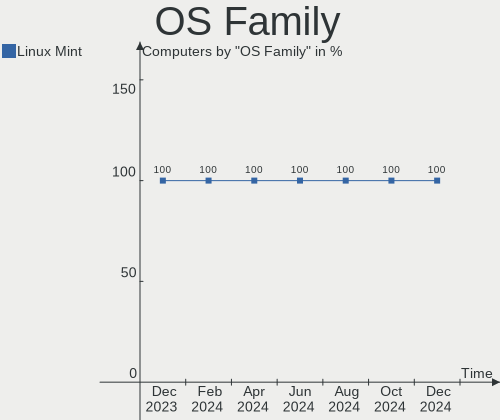
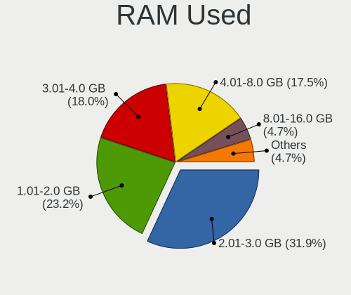
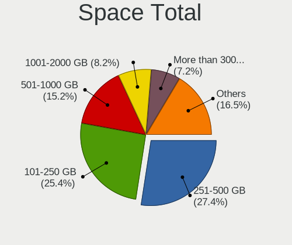
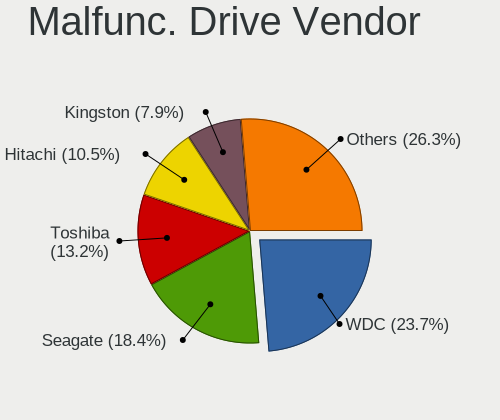
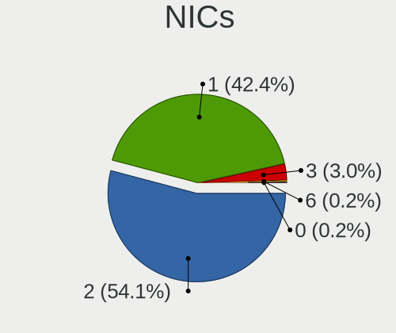

Linux Mint - Hardware Trends
----------------------------

A project to identify most popular hardware characteristics and track their change
over time based on data collected by Linux users at https://Linux-Hardware.org.

Anyone can contribute to this report by the [hw-probe](https://github.com/linuxhw/hw-probe) tool:

    sudo -E hw-probe -all -upload

This is a report for all computer types. See also reports for [desktops](/Dist/Linux_Mint/Desktop/README.md) and [notebooks](/Dist/Linux_Mint/Notebook/README.md).

This report is for one last month. Overall report since the beginning of time: [TestDays](https://github.com/linuxhw/TestDays)

Period: Jan, 2024.

Contents
--------

* [ System ](#system)
  - [ OS                       ](#os)
  - [ OS Family                ](#os-family)
  - [ Kernel                   ](#kernel)
  - [ Kernel Family            ](#kernel-family)
  - [ Kernel Major Ver.        ](#kernel-major-ver)
  - [ Arch                     ](#arch)
  - [ DE                       ](#de)
  - [ Display Server           ](#display-server)
  - [ Display Manager          ](#display-manager)
  - [ OS Lang                  ](#os-lang)
  - [ Boot Mode                ](#boot-mode)
  - [ Filesystem               ](#filesystem)
  - [ Part. scheme             ](#part-scheme)
  - [ Dual Boot with Linux/BSD ](#dual-boot-with-linuxbsd)
  - [ Dual Boot (Win)          ](#dual-boot-win)

* [ Board ](#board)
  - [ Vendor                   ](#vendor)
  - [ Model                    ](#model)
  - [ Model Family             ](#model-family)
  - [ MFG Year                 ](#mfg-year)
  - [ Form Factor              ](#form-factor)
  - [ Secure Boot              ](#secure-boot)
  - [ Coreboot                 ](#coreboot)
  - [ RAM Size                 ](#ram-size)
  - [ RAM Used                 ](#ram-used)
  - [ Total Drives             ](#total-drives)
  - [ Has CD-ROM               ](#has-cd-rom)
  - [ Has Ethernet             ](#has-ethernet)
  - [ Has WiFi                 ](#has-wifi)
  - [ Has Bluetooth            ](#has-bluetooth)

* [ Location ](#location)
  - [ Country                  ](#country)
  - [ City                     ](#city)

* [ Drives ](#drives)
  - [ Drive Vendor             ](#drive-vendor)
  - [ Drive Model              ](#drive-model)
  - [ HDD Vendor               ](#hdd-vendor)
  - [ SSD Vendor               ](#ssd-vendor)
  - [ Drive Kind               ](#drive-kind)
  - [ Drive Connector          ](#drive-connector)
  - [ Drive Size               ](#drive-size)
  - [ Space Total              ](#space-total)
  - [ Space Used               ](#space-used)
  - [ Malfunc. Drives          ](#malfunc-drives)
  - [ Malfunc. Drive Vendor    ](#malfunc-drive-vendor)
  - [ Malfunc. HDD Vendor      ](#malfunc-hdd-vendor)
  - [ Malfunc. Drive Kind      ](#malfunc-drive-kind)
  - [ Failed Drives            ](#failed-drives)
  - [ Failed Drive Vendor      ](#failed-drive-vendor)
  - [ Drive Status             ](#drive-status)

* [ Storage controller ](#storage-controller)
  - [ Storage Vendor           ](#storage-vendor)
  - [ Storage Model            ](#storage-model)
  - [ Storage Kind             ](#storage-kind)

* [ Processor ](#processor)
  - [ CPU Vendor               ](#cpu-vendor)
  - [ CPU Model                ](#cpu-model)
  - [ CPU Model Family         ](#cpu-model-family)
  - [ CPU Cores                ](#cpu-cores)
  - [ CPU Sockets              ](#cpu-sockets)
  - [ CPU Threads              ](#cpu-threads)
  - [ CPU Op-Modes             ](#cpu-op-modes)
  - [ CPU Microcode            ](#cpu-microcode)
  - [ CPU Microarch            ](#cpu-microarch)

* [ Graphics ](#graphics)
  - [ GPU Vendor               ](#gpu-vendor)
  - [ GPU Model                ](#gpu-model)
  - [ GPU Combo                ](#gpu-combo)
  - [ GPU Driver               ](#gpu-driver)
  - [ GPU Memory               ](#gpu-memory)

* [ Monitor ](#monitor)
  - [ Monitor Vendor           ](#monitor-vendor)
  - [ Monitor Model            ](#monitor-model)
  - [ Monitor Resolution       ](#monitor-resolution)
  - [ Monitor Diagonal         ](#monitor-diagonal)
  - [ Monitor Width            ](#monitor-width)
  - [ Aspect Ratio             ](#aspect-ratio)
  - [ Monitor Area             ](#monitor-area)
  - [ Pixel Density            ](#pixel-density)
  - [ Multiple Monitors        ](#multiple-monitors)

* [ Network ](#network)
  - [ Net Controller Vendor    ](#net-controller-vendor)
  - [ Net Controller Model     ](#net-controller-model)
  - [ Wireless Vendor          ](#wireless-vendor)
  - [ Wireless Model           ](#wireless-model)
  - [ Ethernet Vendor          ](#ethernet-vendor)
  - [ Ethernet Model           ](#ethernet-model)
  - [ Net Controller Kind      ](#net-controller-kind)
  - [ Used Controller          ](#used-controller)
  - [ NICs                     ](#nics)
  - [ IPv6                     ](#ipv6)

* [ Bluetooth ](#bluetooth)
  - [ Bluetooth Vendor         ](#bluetooth-vendor)
  - [ Bluetooth Model          ](#bluetooth-model)

* [ Sound ](#sound)
  - [ Sound Vendor             ](#sound-vendor)
  - [ Sound Model              ](#sound-model)

* [ Memory ](#memory)
  - [ Memory Vendor            ](#memory-vendor)
  - [ Memory Model             ](#memory-model)
  - [ Memory Kind              ](#memory-kind)
  - [ Memory Form Factor       ](#memory-form-factor)
  - [ Memory Size              ](#memory-size)
  - [ Memory Speed             ](#memory-speed)

* [ Printers & scanners ](#printers--scanners)
  - [ Printer Vendor           ](#printer-vendor)
  - [ Printer Model            ](#printer-model)
  - [ Scanner Vendor           ](#scanner-vendor)
  - [ Scanner Model            ](#scanner-model)

* [ Camera ](#camera)
  - [ Camera Vendor            ](#camera-vendor)
  - [ Camera Model             ](#camera-model)

* [ Security ](#security)
  - [ Fingerprint Vendor       ](#fingerprint-vendor)
  - [ Fingerprint Model        ](#fingerprint-model)
  - [ Chipcard Vendor          ](#chipcard-vendor)
  - [ Chipcard Model           ](#chipcard-model)

* [ Unsupported ](#unsupported)
  - [ Unsupported Devices      ](#unsupported-devices)
  - [ Unsupported Device Types ](#unsupported-device-types)

System
------

OS
--

Installed operating systems

| Name              | Computers | Percent |
|-------------------|-----------|---------|
| Linux Mint 21.2   | 285       | 50.71%  |
| Linux Mint 21.3   | 168       | 29.89%  |
| Linux Mint 20.3   | 38        | 6.76%   |
| Linux Mint 21.1   | 31        | 5.52%   |
| Linux Mint 21     | 10        | 1.78%   |
| Linux Mint 20.2   | 9         | 1.6%    |
| Linux Mint 20     | 7         | 1.25%   |
| Linux Mint 19.3   | 7         | 1.25%   |
| Linux Mint 20.1   | 3         | 0.53%   |
| Linux Mint 21.2.0 | 1         | 0.18%   |
| Linux Mint 19.2   | 1         | 0.18%   |
| Linux Mint 19.1   | 1         | 0.18%   |
| Linux Mint 19     | 1         | 0.18%   |

OS Family
---------

OS without a version

| Name       | Computers | Percent |
|------------|-----------|---------|
| Linux Mint | 562       | 100%    |

Kernel
------

Version of the Linux kernel

| Version               | Computers | Percent |
|-----------------------|-----------|---------|
| 5.15.0-91-generic     | 299       | 53.2%   |
| 5.15.0-92-generic     | 48        | 8.54%   |
| 6.5.0-14-generic      | 45        | 8.01%   |
| 5.4.0-169-generic     | 33        | 5.87%   |
| 5.15.0-76-generic     | 30        | 5.34%   |
| 6.5.0-15-generic      | 17        | 3.02%   |
| 6.2.0-39-generic      | 14        | 2.49%   |
| 5.15.0-89-generic     | 6         | 1.07%   |
| 5.4.0-150-generic     | 5         | 0.89%   |
| 5.15.0-88-generic     | 5         | 0.89%   |
| 5.4.0-170-generic     | 4         | 0.71%   |
| 6.1.0-1027-oem        | 3         | 0.53%   |
| 5.4.0-167-generic     | 3         | 0.53%   |
| 5.15.0-84-generic     | 3         | 0.53%   |
| 5.15.0-41-generic     | 3         | 0.53%   |
| 4.15.0-213-generic    | 3         | 0.53%   |
| 6.7.2-060702-generic  | 2         | 0.36%   |
| 6.7.0-060700-generic  | 2         | 0.36%   |
| 6.5.0-1011-oem        | 2         | 0.36%   |
| 6.2.0-35-generic      | 2         | 0.36%   |
| 6.2.0-33-generic      | 2         | 0.36%   |
| 5.4.0-74-generic      | 2         | 0.36%   |
| 5.15.0-87-generic     | 2         | 0.36%   |
| 5.15.0-83-generic     | 2         | 0.36%   |
| 5.15.0-78-generic     | 2         | 0.36%   |
| 5.15.0-56-generic     | 2         | 0.36%   |
| 6.6.6-surface-1       | 1         | 0.18%   |
| 6.5.8-kim1+           | 1         | 0.18%   |
| 6.5.7-060507-generic  | 1         | 0.18%   |
| 6.5.11-060511-generic | 1         | 0.18%   |
| 6.5.0-1013-oem        | 1         | 0.18%   |
| 6.5.0-060500-generic  | 1         | 0.18%   |
| 6.2.0-37-generic      | 1         | 0.18%   |
| 6.2.0-1018-lowlatency | 1         | 0.18%   |
| 6.2.0-060200-generic  | 1         | 0.18%   |
| 6.1.0-1029-oem        | 1         | 0.18%   |
| 5.4.0-91-generic      | 1         | 0.18%   |
| 5.4.0-73-generic      | 1         | 0.18%   |
| 5.4.0-65-generic      | 1         | 0.18%   |
| 5.4.0-155-generic     | 1         | 0.18%   |

Kernel Family
-------------

Linux kernel without a distro release

| Version | Computers | Percent |
|---------|-----------|---------|
| 5.15.0  | 407       | 72.42%  |
| 6.5.0   | 66        | 11.74%  |
| 5.4.0   | 52        | 9.25%   |
| 6.2.0   | 21        | 3.74%   |
| 6.1.0   | 4         | 0.71%   |
| 4.15.0  | 3         | 0.53%   |
| 6.7.2   | 2         | 0.36%   |
| 6.7.0   | 2         | 0.36%   |
| 6.6.6   | 1         | 0.18%   |
| 6.5.8   | 1         | 0.18%   |
| 6.5.7   | 1         | 0.18%   |
| 6.5.11  | 1         | 0.18%   |
| 5.0.0   | 1         | 0.18%   |

Kernel Major Ver.
-----------------

Linux kernel major version

| Version | Computers | Percent |
|---------|-----------|---------|
| 5.15    | 407       | 72.42%  |
| 6.5     | 69        | 12.28%  |
| 5.4     | 52        | 9.25%   |
| 6.2     | 21        | 3.74%   |
| 6.7     | 4         | 0.71%   |
| 6.1     | 4         | 0.71%   |
| 4.15    | 3         | 0.53%   |
| 6.6     | 1         | 0.18%   |
| 5.0     | 1         | 0.18%   |

Arch
----

OS architecture (x86_64, i586, etc.)

| Name   | Computers | Percent |
|--------|-----------|---------|
| x86_64 | 558       | 99.29%  |
| i686   | 4         | 0.71%   |

DE
--

Desktop Environment

| Name       | Computers | Percent |
|------------|-----------|---------|
| X-Cinnamon | 410       | 72.95%  |
| MATE       | 73        | 12.99%  |
| XFCE       | 61        | 10.85%  |
| Unknown    | 6         | 1.07%   |
| Cinnamon   | 5         | 0.89%   |
| GNOME      | 3         | 0.53%   |
| KDE5       | 2         | 0.36%   |
| KDE        | 1         | 0.18%   |
| i3         | 1         | 0.18%   |

Display Server
--------------

X11 or Wayland

| Name    | Computers | Percent |
|---------|-----------|---------|
| X11     | 554       | 98.58%  |
| Wayland | 5         | 0.89%   |
| Tty     | 3         | 0.53%   |

Display Manager
---------------

SDDM, LightDM, etc.

| Name    | Computers | Percent |
|---------|-----------|---------|
| LightDM | 298       | 53.02%  |
| Unknown | 261       | 46.44%  |
| GDM3    | 2         | 0.36%   |
| GDM     | 1         | 0.18%   |

OS Lang
-------

Language

| Lang    | Computers | Percent |
|---------|-----------|---------|
| en_US   | 177       | 31.49%  |
| de_DE   | 85        | 15.12%  |
| it_IT   | 37        | 6.58%   |
| en_GB   | 32        | 5.69%   |
| fr_FR   | 31        | 5.52%   |
| ru_RU   | 23        | 4.09%   |
| C       | 23        | 4.09%   |
| pt_BR   | 18        | 3.2%    |
| en_CA   | 15        | 2.67%   |
| en_AU   | 15        | 2.67%   |
| nl_NL   | 13        | 2.31%   |
| es_ES   | 11        | 1.96%   |
| pl_PL   | 8         | 1.42%   |
| en_IN   | 6         | 1.07%   |
| da_DK   | 6         | 1.07%   |
| Unknown | 6         | 1.07%   |
| fr_CA   | 4         | 0.71%   |
| fr_BE   | 4         | 0.71%   |
| es_MX   | 4         | 0.71%   |
| en_IE   | 4         | 0.71%   |
| de_CH   | 4         | 0.71%   |
| fi_FI   | 3         | 0.53%   |
| es_CL   | 3         | 0.53%   |
| de_AT   | 3         | 0.53%   |
| sv_SE   | 2         | 0.36%   |
| pt_PT   | 2         | 0.36%   |
| hu_HU   | 2         | 0.36%   |
| fr_CH   | 2         | 0.36%   |
| es_AR   | 2         | 0.36%   |
| en_NZ   | 2         | 0.36%   |
| el_GR   | 2         | 0.36%   |
| zh_CN   | 1         | 0.18%   |
| sk_SK   | 1         | 0.18%   |
| it_CH   | 1         | 0.18%   |
| es_VE   | 1         | 0.18%   |
| es_PE   | 1         | 0.18%   |
| es_CR   | 1         | 0.18%   |
| es_CO   | 1         | 0.18%   |
| en_ZA   | 1         | 0.18%   |
| en_PH   | 1         | 0.18%   |

Boot Mode
---------

EFI or BIOS

| Mode | Computers | Percent |
|------|-----------|---------|
| EFI  | 381       | 67.79%  |
| BIOS | 181       | 32.21%  |

Filesystem
----------

Type of filesystem

| Type    | Computers | Percent |
|---------|-----------|---------|
| Ext4    | 510       | 90.75%  |
| Tmpfs   | 15        | 2.67%   |
| Overlay | 13        | 2.31%   |
| Btrfs   | 9         | 1.6%    |
| Zfs     | 6         | 1.07%   |
| Ext3    | 6         | 1.07%   |
| Xfs     | 2         | 0.36%   |
| Ext2    | 1         | 0.18%   |

Part. scheme
------------

Scheme of partitioning

| Type    | Computers | Percent |
|---------|-----------|---------|
| GPT     | 270       | 48.04%  |
| Unknown | 257       | 45.73%  |
| MBR     | 35        | 6.23%   |

Dual Boot with Linux/BSD
------------------------

Hosting more than one Linux/BSD

| Dual boot | Computers | Percent |
|-----------|-----------|---------|
| No        | 511       | 90.93%  |
| Yes       | 51        | 9.07%   |

Dual Boot (Win)
---------------

Hosting Linux and Windows

| Dual boot | Computers | Percent |
|-----------|-----------|---------|
| No        | 451       | 80.25%  |
| Yes       | 111       | 19.75%  |

Board
-----

Vendor
------

Motherboard manufacturer

| Name                                 | Computers | Percent |
|--------------------------------------|-----------|---------|
| Lenovo                               | 89        | 15.84%  |
| Hewlett-Packard                      | 88        | 15.66%  |
| ASUSTek Computer                     | 79        | 14.06%  |
| Dell                                 | 65        | 11.57%  |
| Gigabyte Technology                  | 42        | 7.47%   |
| Acer                                 | 37        | 6.58%   |
| MSI                                  | 26        | 4.63%   |
| ASRock                               | 22        | 3.91%   |
| Apple                                | 16        | 2.85%   |
| Intel                                | 7         | 1.25%   |
| Toshiba                              | 6         | 1.07%   |
| Unknown                              | 6         | 1.07%   |
| Medion                               | 5         | 0.89%   |
| Fujitsu                              | 5         | 0.89%   |
| AZW                                  | 5         | 0.89%   |
| ECS                                  | 4         | 0.71%   |
| Biostar                              | 4         | 0.71%   |
| Sony                                 | 3         | 0.53%   |
| Samsung Electronics                  | 3         | 0.53%   |
| Packard Bell                         | 3         | 0.53%   |
| Microsoft                            | 3         | 0.53%   |
| Foxconn                              | 3         | 0.53%   |
| VALE                                 | 2         | 0.36%   |
| Shenzhen Meigao Electronic Equipment | 2         | 0.36%   |
| Positivo                             | 2         | 0.36%   |
| Pegatron                             | 2         | 0.36%   |
| HONOR                                | 2         | 0.36%   |
| Clevo                                | 2         | 0.36%   |
| Alienware                            | 2         | 0.36%   |
| Wortmann AG                          | 1         | 0.18%   |
| Schenker                             | 1         | 0.18%   |
| Sapphire                             | 1         | 0.18%   |
| Primux Tech                          | 1         | 0.18%   |
| PCBOX                                | 1         | 0.18%   |
| Onda TLC                             | 1         | 0.18%   |
| Notebook                             | 1         | 0.18%   |
| NEC Computers                        | 1         | 0.18%   |
| Megaware                             | 1         | 0.18%   |
| Mediacom                             | 1         | 0.18%   |
| Maibenben                            | 1         | 0.18%   |

Model
-----

Motherboard model

| Name                                  | Computers | Percent |
|---------------------------------------|-----------|---------|
| Unknown                               | 6         | 1.07%   |
| ASUS Vivobook Go E1504FA_E1504FA      | 5         | 0.89%   |
| ASUS All Series                       | 5         | 0.89%   |
| HP Pavilion 15                        | 3         | 0.53%   |
| Dell OptiPlex 9020                    | 3         | 0.53%   |
| Dell OptiPlex 7040                    | 3         | 0.53%   |
| Apple MacBookAir6,2                   | 3         | 0.53%   |
| VALE Notebook Classic C140            | 2         | 0.36%   |
| Lenovo Z50-70 20354                   | 2         | 0.36%   |
| Intel X99                             | 2         | 0.36%   |
| HP Spectre x360 Convertible 15-eb0xxx | 2         | 0.36%   |
| HP Pavilion dv6                       | 2         | 0.36%   |
| HP Pavilion 17                        | 2         | 0.36%   |
| HP Notebook                           | 2         | 0.36%   |
| HP EliteDesk 800 G2 SFF               | 2         | 0.36%   |
| HP EliteBook 8560p                    | 2         | 0.36%   |
| HP Compaq 8200 Elite SFF PC           | 2         | 0.36%   |
| Gigabyte X570 AORUS ULTRA             | 2         | 0.36%   |
| Gigabyte H81M-HD3                     | 2         | 0.36%   |
| Gigabyte A320M-S2H V2                 | 2         | 0.36%   |
| Dell XPS 15 9560                      | 2         | 0.36%   |
| Dell Precision T1700                  | 2         | 0.36%   |
| Dell Precision 7520                   | 2         | 0.36%   |
| Dell OptiPlex 7010                    | 2         | 0.36%   |
| Dell Latitude E6440                   | 2         | 0.36%   |
| Dell Latitude E6410                   | 2         | 0.36%   |
| Dell Latitude E6400                   | 2         | 0.36%   |
| Dell Latitude 7490                    | 2         | 0.36%   |
| AZW SEi                               | 2         | 0.36%   |
| ASUS ROG STRIX Z690-F GAMING WIFI     | 2         | 0.36%   |
| ASUS PRIME A520M-K                    | 2         | 0.36%   |
| ASUS PRIME A320M-K                    | 2         | 0.36%   |
| ASUS K52F                             | 2         | 0.36%   |
| Apple MacBookPro8,1                   | 2         | 0.36%   |
| Acer Aspire ES1-572                   | 2         | 0.36%   |
| Acer Aspire A715-74G                  | 2         | 0.36%   |
| Acer Aspire A515-54                   | 2         | 0.36%   |
| Acer Aspire A317-53                   | 2         | 0.36%   |
| Wortmann AG TERRA_MOBILE_1513A        | 1         | 0.18%   |
| Toshiba Satellite L635                | 1         | 0.18%   |

Model Family
------------

Motherboard model prefix

| Name                  | Computers | Percent |
|-----------------------|-----------|---------|
| Lenovo ThinkPad       | 32        | 5.69%   |
| Acer Aspire           | 30        | 5.34%   |
| Dell Latitude         | 23        | 4.09%   |
| Lenovo IdeaPad        | 18        | 3.2%    |
| HP Pavilion           | 18        | 3.2%    |
| Dell OptiPlex         | 16        | 2.85%   |
| ASUS ROG              | 15        | 2.67%   |
| HP EliteBook          | 12        | 2.14%   |
| Dell Inspiron         | 11        | 1.96%   |
| ASUS VivoBook         | 10        | 1.78%   |
| Lenovo ThinkCentre    | 9         | 1.6%    |
| HP ProBook            | 9         | 1.6%    |
| HP Laptop             | 8         | 1.42%   |
| Dell Precision        | 8         | 1.42%   |
| ASUS PRIME            | 8         | 1.42%   |
| HP Compaq             | 6         | 1.07%   |
| Unknown               | 6         | 1.07%   |
| Dell XPS              | 5         | 0.89%   |
| ASUS All              | 5         | 0.89%   |
| Toshiba Satellite     | 4         | 0.71%   |
| Lenovo Legion         | 4         | 0.71%   |
| HP Spectre            | 4         | 0.71%   |
| HP EliteDesk          | 4         | 0.71%   |
| Fujitsu LIFEBOOK      | 4         | 0.71%   |
| ASUS TUF              | 4         | 0.71%   |
| Acer Swift            | 4         | 0.71%   |
| Packard Bell EasyNote | 3         | 0.53%   |
| Microsoft Surface     | 3         | 0.53%   |
| HP ZBook              | 3         | 0.53%   |
| Gigabyte X570         | 3         | 0.53%   |
| Gigabyte A320M-S2H    | 3         | 0.53%   |
| ASRock X570           | 3         | 0.53%   |
| Apple MacBookPro8     | 3         | 0.53%   |
| Apple MacBookAir6     | 3         | 0.53%   |
| VALE Notebook         | 2         | 0.36%   |
| Lenovo Z50-70         | 2         | 0.36%   |
| Lenovo Yoga           | 2         | 0.36%   |
| Lenovo ThinkStation   | 2         | 0.36%   |
| Lenovo ThinkBook      | 2         | 0.36%   |
| Lenovo IdeaPadFlex    | 2         | 0.36%   |

MFG Year
--------

Motherboard manufacture year

| Year | Computers | Percent |
|------|-----------|---------|
| 2013 | 50        | 8.9%    |
| 2021 | 49        | 8.72%   |
| 2012 | 46        | 8.19%   |
| 2018 | 43        | 7.65%   |
| 2022 | 41        | 7.3%    |
| 2019 | 40        | 7.12%   |
| 2020 | 39        | 6.94%   |
| 2017 | 39        | 6.94%   |
| 2023 | 38        | 6.76%   |
| 2014 | 37        | 6.58%   |
| 2015 | 29        | 5.16%   |
| 2010 | 28        | 4.98%   |
| 2016 | 21        | 3.74%   |
| 2011 | 21        | 3.74%   |
| 2008 | 16        | 2.85%   |
| 2009 | 14        | 2.49%   |
| 2007 | 8         | 1.42%   |
| 2006 | 2         | 0.36%   |
| 2004 | 1         | 0.18%   |

Form Factor
-----------

Physical design of the computer

| Name        | Computers | Percent |
|-------------|-----------|---------|
| Notebook    | 306       | 54.45%  |
| Desktop     | 217       | 38.61%  |
| Convertible | 18        | 3.2%    |
| Mini pc     | 9         | 1.6%    |
| All in one  | 8         | 1.42%   |
| Tablet      | 4         | 0.71%   |

Secure Boot
-----------

Enabled or disabled

| State    | Computers | Percent |
|----------|-----------|---------|
| Disabled | 508       | 90.39%  |
| Enabled  | 54        | 9.61%   |

Coreboot
--------

Have coreboot on board

| Used | Computers | Percent |
|------|-----------|---------|
| No   | 561       | 99.82%  |
| Yes  | 1         | 0.18%   |

RAM Size
--------

Total RAM memory

| Size in GB  | Computers | Percent |
|-------------|-----------|---------|
| 4.01-8.0    | 161       | 28.65%  |
| 16.01-24.0  | 116       | 20.64%  |
| 8.01-16.0   | 101       | 17.97%  |
| 3.01-4.0    | 79        | 14.06%  |
| 32.01-64.0  | 59        | 10.5%   |
| 64.01-256.0 | 16        | 2.85%   |
| 24.01-32.0  | 14        | 2.49%   |
| 1.01-2.0    | 8         | 1.42%   |
| 2.01-3.0    | 6         | 1.07%   |
| 0.51-1.0    | 2         | 0.36%   |

RAM Used
--------

Used RAM memory

| Used GB    | Computers | Percent |
|------------|-----------|---------|
| 2.01-3.0   | 180       | 32.03%  |
| 1.01-2.0   | 163       | 29%     |
| 4.01-8.0   | 88        | 15.66%  |
| 3.01-4.0   | 83        | 14.77%  |
| 8.01-16.0  | 27        | 4.8%    |
| 0.51-1.0   | 17        | 3.02%   |
| 16.01-24.0 | 2         | 0.36%   |
| 0.01-0.5   | 2         | 0.36%   |

Total Drives
------------

Number of drives on board

| Drives | Computers | Percent |
|--------|-----------|---------|
| 1      | 337       | 59.96%  |
| 2      | 144       | 25.62%  |
| 3      | 43        | 7.65%   |
| 4      | 21        | 3.74%   |
| 5      | 9         | 1.6%    |
| 6      | 6         | 1.07%   |
| 0      | 2         | 0.36%   |

Has CD-ROM
----------

Has CD-ROM on board

| Presented | Computers | Percent |
|-----------|-----------|---------|
| No        | 345       | 61.39%  |
| Yes       | 217       | 38.61%  |

Has Ethernet
------------

Has Ethernet on board

| Presented | Computers | Percent |
|-----------|-----------|---------|
| Yes       | 483       | 85.94%  |
| No        | 79        | 14.06%  |

Has WiFi
--------

Has WiFi module

| Presented | Computers | Percent |
|-----------|-----------|---------|
| Yes       | 451       | 80.25%  |
| No        | 111       | 19.75%  |

Has Bluetooth
-------------

Has Bluetooth module

| Presented | Computers | Percent |
|-----------|-----------|---------|
| Yes       | 358       | 63.7%   |
| No        | 204       | 36.3%   |

Location
--------

Country
-------

Geographic location (country)

| Country         | Computers | Percent |
|-----------------|-----------|---------|
| USA             | 113       | 20.11%  |
| Germany         | 97        | 17.26%  |
| Italy           | 40        | 7.12%   |
| France          | 33        | 5.87%   |
| UK              | 31        | 5.52%   |
| Russia          | 24        | 4.27%   |
| Brazil          | 23        | 4.09%   |
| Canada          | 20        | 3.56%   |
| Netherlands     | 19        | 3.38%   |
| Australia       | 15        | 2.67%   |
| Switzerland     | 14        | 2.49%   |
| Spain           | 12        | 2.14%   |
| Poland          | 10        | 1.78%   |
| Sweden          | 8         | 1.42%   |
| Finland         | 8         | 1.42%   |
| Mexico          | 7         | 1.25%   |
| India           | 7         | 1.25%   |
| Hungary         | 6         | 1.07%   |
| Denmark         | 6         | 1.07%   |
| Austria         | 6         | 1.07%   |
| Romania         | 4         | 0.71%   |
| Czechia         | 4         | 0.71%   |
| Chile           | 4         | 0.71%   |
| Bulgaria        | 4         | 0.71%   |
| Belgium         | 4         | 0.71%   |
| Portugal        | 3         | 0.53%   |
| New Zealand     | 3         | 0.53%   |
| Ireland         | 3         | 0.53%   |
| Greece          | 3         | 0.53%   |
| Costa Rica      | 3         | 0.53%   |
| Argentina       | 3         | 0.53%   |
| Vietnam         | 2         | 0.36%   |
| Peru            | 2         | 0.36%   |
| Israel          | 2         | 0.36%   |
| Indonesia       | 2         | 0.36%   |
| Algeria         | 2         | 0.36%   |
| Venezuela       | 1         | 0.18%   |
| Turkey          | 1         | 0.18%   |
| The Netherlands | 1         | 0.18%   |
| Taiwan          | 1         | 0.18%   |

City
----

Geographic location (city)

| City          | Computers | Percent |
|---------------|-----------|---------|
| Phoenix       | 6         | 1.07%   |
| Milan         | 6         | 1.07%   |
| Melbourne     | 6         | 1.07%   |
| Helsinki      | 6         | 1.07%   |
| Budapest      | 6         | 1.07%   |
| Berlin        | 6         | 1.07%   |
| Amsterdam     | 5         | 0.89%   |
| Turin         | 4         | 0.71%   |
| Sao Paulo     | 4         | 0.71%   |
| Rome          | 4         | 0.71%   |
| Montreal      | 4         | 0.71%   |
| Düsseldorf   | 4         | 0.71%   |
| Sydney        | 3         | 0.53%   |
| Suhr          | 3         | 0.53%   |
| St Petersburg | 3         | 0.53%   |
| Munich        | 3         | 0.53%   |
| Mannheim      | 3         | 0.53%   |
| Los Angeles   | 3         | 0.53%   |
| Lincoln       | 3         | 0.53%   |
| Jacksonville  | 3         | 0.53%   |
| Innsbruck     | 3         | 0.53%   |
| Haarlem       | 3         | 0.53%   |
| Dublin        | 3         | 0.53%   |
| Brisbane      | 3         | 0.53%   |
| Warsaw        | 2         | 0.36%   |
| Vienna        | 2         | 0.36%   |
| Venice        | 2         | 0.36%   |
| Ulyanovsk     | 2         | 0.36%   |
| Trieste       | 2         | 0.36%   |
| Toronto       | 2         | 0.36%   |
| Thessaloniki  | 2         | 0.36%   |
| Tampa         | 2         | 0.36%   |
| Stockholm     | 2         | 0.36%   |
| Sofia         | 2         | 0.36%   |
| Sleaford      | 2         | 0.36%   |
| Siegsdorf     | 2         | 0.36%   |
| Seattle       | 2         | 0.36%   |
| Santiago      | 2         | 0.36%   |
| San Diego     | 2         | 0.36%   |
| Prague        | 2         | 0.36%   |

Drives
------

Drive Vendor
------------

Hard drive vendors

| Vendor                      | Computers | Drives | Percent |
|-----------------------------|-----------|--------|---------|
| Samsung Electronics         | 144       | 169    | 17.71%  |
| WDC                         | 121       | 137    | 14.88%  |
| Seagate                     | 102       | 132    | 12.55%  |
| SanDisk                     | 56        | 58     | 6.89%   |
| Kingston                    | 48        | 51     | 5.9%    |
| Crucial                     | 38        | 42     | 4.67%   |
| Toshiba                     | 27        | 29     | 3.32%   |
| Unknown                     | 26        | 34     | 3.2%    |
| SK hynix                    | 18        | 21     | 2.21%   |
| Intel                       | 17        | 22     | 2.09%   |
| Micron Technology           | 14        | 14     | 1.72%   |
| Intenso                     | 14        | 15     | 1.72%   |
| Hitachi                     | 14        | 15     | 1.72%   |
| A-DATA Technology           | 12        | 12     | 1.48%   |
| Apple                       | 11        | 13     | 1.35%   |
| China                       | 10        | 10     | 1.23%   |
| Micron/Crucial Technology   | 7         | 7      | 0.86%   |
| KIOXIA                      | 7         | 8      | 0.86%   |
| HGST                        | 7         | 7      | 0.86%   |
| Unknown                     | 7         | 7      | 0.86%   |
| Kingston Technology Company | 6         | 6      | 0.74%   |
| SPCC                        | 5         | 5      | 0.62%   |
| Patriot                     | 5         | 5      | 0.62%   |
| Netac                       | 5         | 5      | 0.62%   |
| MAXIO Technology (Hangzhou) | 5         | 6      | 0.62%   |
| PNY                         | 4         | 4      | 0.49%   |
| Phison                      | 4         | 5      | 0.49%   |
| Lexar                       | 4         | 4      | 0.49%   |
| Team                        | 3         | 3      | 0.37%   |
| Phison Electronics          | 3         | 3      | 0.37%   |
| Corsair                     | 3         | 3      | 0.37%   |
| BIWIN                       | 3         | 3      | 0.37%   |
| USB                         | 2         | 2      | 0.25%   |
| Silicon Motion              | 2         | 2      | 0.25%   |
| SD                          | 2         | 2      | 0.25%   |
| Realtek Semiconductor       | 2         | 2      | 0.25%   |
| Maxtor                      | 2         | 2      | 0.25%   |
| LITEON                      | 2         | 2      | 0.25%   |
| KingSpec                    | 2         | 2      | 0.25%   |
| Gigabyte Technology         | 2         | 2      | 0.25%   |

Drive Model
-----------

Hard drive models

| Model                                              | Computers | Percent |
|----------------------------------------------------|-----------|---------|
| Seagate ST1000LM035-1RK172 1TB                     | 13        | 1.47%   |
| Kingston SA400S37240G 240GB SSD                    | 13        | 1.47%   |
| Samsung NVMe SSD Controller SM981/PM981/PM983 1TB  | 10        | 1.13%   |
| Samsung SSD 860 EVO 1TB                            | 8         | 0.9%    |
| Samsung SSD 860 EVO 500GB                          | 7         | 0.79%   |
| Kingston SA400S37480G 480GB SSD                    | 7         | 0.79%   |
| Crucial CT1000BX500SSD1 1TB                        | 7         | 0.79%   |
| Unknown                                            | 7         | 0.79%   |
| Samsung SSD 850 EVO 500GB                          | 6         | 0.68%   |
| Seagate ST500DM002-1BD142 500GB                    | 5         | 0.56%   |
| Seagate ST1000DM010-2EP102 1TB                     | 5         | 0.56%   |
| Samsung SSD 850 EVO 250GB                          | 5         | 0.56%   |
| Samsung NVMe SSD Controller PM9A1/PM9A3/980PRO 2TB | 5         | 0.56%   |
| WDC WD10EZEX-08WN4A0 1TB                           | 4         | 0.45%   |
| Unknown Compact Flash 977MB                        | 4         | 0.45%   |
| Seagate ST9500325AS 500GB                          | 4         | 0.45%   |
| Seagate ST3500418AS 500GB                          | 4         | 0.45%   |
| Seagate ST2000DM008-2FR102 2TB                     | 4         | 0.45%   |
| Samsung SSD 970 EVO Plus 1TB                       | 4         | 0.45%   |
| Samsung MZVLW256HEHP-000L7 256GB                   | 4         | 0.45%   |
| Samsung MZALQ512HBLU-00BL2 512GB                   | 4         | 0.45%   |
| Kingston SA400S37960G 960GB SSD                    | 4         | 0.45%   |
| Crucial CT500MX500SSD1 500GB                       | 4         | 0.45%   |
| Crucial CT250MX500SSD1 250GB                       | 4         | 0.45%   |
| WDC WDS240G2G0A-00JH30 240GB SSD                   | 3         | 0.34%   |
| WDC WD40EZRZ-00GXCB0 4TB                           | 3         | 0.34%   |
| WDC WD10EZEX-00BN5A0 1TB                           | 3         | 0.34%   |
| Unknown SD/MMC/MS PRO 256GB                        | 3         | 0.34%   |
| Unknown SD/MMC 2GB                                 | 3         | 0.34%   |
| Unknown MMC Card  32GB                             | 3         | 0.34%   |
| Unknown MMC Card  16GB                             | 3         | 0.34%   |
| Unknown MMC Card  128GB                            | 3         | 0.34%   |
| Unknown M.S./M.S.Pro/HG 16GB                       | 3         | 0.34%   |
| Seagate ST250DM000-1BD141 250GB                    | 3         | 0.34%   |
| Seagate Expansion Desk 8TB                         | 3         | 0.34%   |
| Sandisk WD Blue SN550 NVMe SSD 512GB               | 3         | 0.34%   |
| Sandisk WD Blue SN500 / PC SN520 NVMe SSD 512GB    | 3         | 0.34%   |
| SanDisk SSD PLUS 240GB                             | 3         | 0.34%   |
| SanDisk NVMe SSD Drive 512GB                       | 3         | 0.34%   |
| Samsung SSD 870 EVO 500GB                          | 3         | 0.34%   |

HDD Vendor
----------

Hard disk drive vendors

| Vendor              | Computers | Drives | Percent |
|---------------------|-----------|--------|---------|
| Seagate             | 101       | 129    | 40.08%  |
| WDC                 | 89        | 102    | 35.32%  |
| Toshiba             | 18        | 18     | 7.14%   |
| Hitachi             | 14        | 15     | 5.56%   |
| Samsung Electronics | 7         | 9      | 2.78%   |
| HGST                | 7         | 7      | 2.78%   |
| Apple               | 4         | 4      | 1.59%   |
| Unknown             | 3         | 3      | 1.19%   |
| Maxtor              | 2         | 2      | 0.79%   |
| JMicron Technology  | 1         | 1      | 0.4%    |
| Intenso             | 1         | 1      | 0.4%    |
| Inateck             | 1         | 1      | 0.4%    |
| HPE                 | 1         | 1      | 0.4%    |
| Hewlett-Packard     | 1         | 1      | 0.4%    |
| External            | 1         | 1      | 0.4%    |
| ASMT                | 1         | 2      | 0.4%    |

SSD Vendor
----------

Solid state drive vendors

| Vendor              | Computers | Drives | Percent |
|---------------------|-----------|--------|---------|
| Samsung Electronics | 73        | 78     | 23.55%  |
| Kingston            | 38        | 40     | 12.26%  |
| Crucial             | 30        | 33     | 9.68%   |
| SanDisk             | 29        | 31     | 9.35%   |
| WDC                 | 17        | 17     | 5.48%   |
| Intenso             | 11        | 12     | 3.55%   |
| China               | 10        | 10     | 3.23%   |
| A-DATA Technology   | 9         | 9      | 2.9%    |
| Apple               | 7         | 7      | 2.26%   |
| SK hynix            | 6         | 6      | 1.94%   |
| Patriot             | 5         | 5      | 1.61%   |
| Netac               | 5         | 5      | 1.61%   |
| Toshiba             | 4         | 4      | 1.29%   |
| SPCC                | 4         | 4      | 1.29%   |
| PNY                 | 4         | 4      | 1.29%   |
| Lexar               | 4         | 4      | 1.29%   |
| Team                | 3         | 3      | 0.97%   |
| Micron Technology   | 3         | 3      | 0.97%   |
| Intel               | 3         | 3      | 0.97%   |
| SD                  | 2         | 2      | 0.65%   |
| LITEON              | 2         | 2      | 0.65%   |
| KingSpec            | 2         | 2      | 0.65%   |
| Fanxiang            | 2         | 2      | 0.65%   |
| Corsair             | 2         | 2      | 0.65%   |
| BIWIN               | 2         | 2      | 0.65%   |
| BAITITON            | 2         | 2      | 0.65%   |
| Unknown             | 2         | 2      | 0.65%   |
| VERICO              | 1         | 1      | 0.32%   |
| Verbatim            | 1         | 1      | 0.32%   |
| V7                  | 1         | 1      | 0.32%   |
| USB3.0              | 1         | 1      | 0.32%   |
| Unknown             | 1         | 1      | 0.32%   |
| Unique              | 1         | 1      | 0.32%   |
| Transcend           | 1         | 1      | 0.32%   |
| Timetec             | 1         | 1      | 0.32%   |
| tecmiyo             | 1         | 1      | 0.32%   |
| Teclast             | 1         | 1      | 0.32%   |
| Super Talent        | 1         | 1      | 0.32%   |
| SUNEAST             | 1         | 1      | 0.32%   |
| sobetter            | 1         | 1      | 0.32%   |

Drive Kind
----------

HDD or SSD

| Kind    | Computers | Drives | Percent |
|---------|-----------|--------|---------|
| SSD     | 281       | 323    | 37.22%  |
| HDD     | 221       | 297    | 29.27%  |
| NVMe    | 218       | 257    | 28.87%  |
| MMC     | 22        | 22     | 2.91%   |
| Unknown | 13        | 20     | 1.72%   |

Drive Connector
---------------

SATA, SAS, NVMe, etc.

| Type | Computers | Drives | Percent |
|------|-----------|--------|---------|
| SATA | 409       | 591    | 59.8%   |
| NVMe | 218       | 255    | 31.87%  |
| SAS  | 35        | 51     | 5.12%   |
| MMC  | 22        | 22     | 3.22%   |

Drive Size
----------

Size of hard drive

| Size in TB | Computers | Drives | Percent |
|------------|-----------|--------|---------|
| 0.01-0.5   | 286       | 345    | 54.79%  |
| 0.51-1.0   | 150       | 171    | 28.74%  |
| 1.01-2.0   | 45        | 56     | 8.62%   |
| 3.01-4.0   | 17        | 20     | 3.26%   |
| 2.01-3.0   | 11        | 11     | 2.11%   |
| 4.01-10.0  | 10        | 13     | 1.92%   |
| 10.01-20.0 | 3         | 4      | 0.57%   |

Space Total
-----------

Amount of disk space available on the file system

| Size in GB     | Computers | Percent |
|----------------|-----------|---------|
| 101-250        | 167       | 29.72%  |
| 251-500        | 136       | 24.2%   |
| 501-1000       | 96        | 17.08%  |
| 1001-2000      | 43        | 7.65%   |
| More than 3000 | 35        | 6.23%   |
| 51-100         | 28        | 4.98%   |
| 2001-3000      | 18        | 3.2%    |
| 1-20           | 17        | 3.02%   |
| 21-50          | 15        | 2.67%   |
| Unknown        | 7         | 1.25%   |

Space Used
----------

Amount of used disk space

| Used GB        | Computers | Percent |
|----------------|-----------|---------|
| 21-50          | 117       | 20.82%  |
| 101-250        | 104       | 18.51%  |
| 1-20           | 100       | 17.79%  |
| 51-100         | 87        | 15.48%  |
| 251-500        | 56        | 9.96%   |
| 501-1000       | 52        | 9.25%   |
| 1001-2000      | 21        | 3.74%   |
| More than 3000 | 11        | 1.96%   |
| 2001-3000      | 7         | 1.25%   |
| Unknown        | 7         | 1.25%   |

Malfunc. Drives
---------------

Drive models with a malfunction

| Model                                 | Computers | Drives | Percent |
|---------------------------------------|-----------|--------|---------|
| Seagate ST9500325AS 500GB             | 3         | 3      | 7.5%    |
| Seagate ST500DM002-1BD142 500GB       | 2         | 2      | 5%      |
| WDC WDS240G2G0A-00JH30 240GB SSD      | 1         | 1      | 2.5%    |
| WDC WD5000LPVX-75V0TT0 500GB          | 1         | 1      | 2.5%    |
| WDC WD30EZRZ-00Z5HB0 3TB              | 1         | 1      | 2.5%    |
| WDC WD20EARS-00MVWB0 2TB              | 1         | 1      | 2.5%    |
| Toshiba MQ01ABD100 1TB                | 1         | 1      | 2.5%    |
| SPCC Solid State Disk 240GB           | 1         | 1      | 2.5%    |
| SK hynix HFS128G3BTND-N210A 128GB SSD | 1         | 1      | 2.5%    |
| SK hynix HFS128G32TND-N210A 128GB SSD | 1         | 1      | 2.5%    |
| SK hynix HFS060G32MNB-2000A 64GB SSD  | 1         | 1      | 2.5%    |
| SK hynix BC711 HFM256GD3JX013N 256GB  | 1         | 1      | 2.5%    |
| Seagate ST9160314AS 160GB             | 1         | 1      | 2.5%    |
| Seagate ST380815AS 80GB               | 1         | 1      | 2.5%    |
| Seagate ST31000528AS 1TB              | 1         | 1      | 2.5%    |
| Seagate ST250DM000-1BD141 250GB       | 1         | 2      | 2.5%    |
| Seagate ST1000LM035-1RK172 1TB        | 1         | 1      | 2.5%    |
| Seagate ST1000DX001-1NS162 1TB        | 1         | 1      | 2.5%    |
| Seagate ST1000DM003-9YN162 1TB        | 1         | 1      | 2.5%    |
| SanDisk SDSSDHII120G 120GB            | 1         | 1      | 2.5%    |
| SanDisk SD9SN8W-128G-1006 128GB SSD   | 1         | 1      | 2.5%    |
| Samsung Electronics SSD 950 PRO 512GB | 1         | 1      | 2.5%    |
| Samsung Electronics HM250HI 250GB     | 1         | 1      | 2.5%    |
| Patriot P200 1TB SSD                  | 1         | 1      | 2.5%    |
| OCZ VECTOR150 120GB SSD               | 1         | 1      | 2.5%    |
| Kingston SKC600512G 512GB SSD         | 1         | 1      | 2.5%    |
| Kingston SA400S37240G 240GB SSD       | 1         | 1      | 2.5%    |
| Hitachi HUA723020ALA641 2TB           | 1         | 1      | 2.5%    |
| Hitachi HTS727550A9E364 500GB         | 1         | 1      | 2.5%    |
| Hitachi HDT725025VLA380 250GB         | 1         | 1      | 2.5%    |
| Hitachi HDP725050GLA360 500GB         | 1         | 1      | 2.5%    |
| HGST HTS545050A7E680 500GB            | 1         | 1      | 2.5%    |
| HGST HTS545050A7E380 500GB            | 1         | 1      | 2.5%    |
| China SATA3 512GB SSD                 | 1         | 1      | 2.5%    |
| BAITITON BT58SSD07N 128GB             | 1         | 1      | 2.5%    |
| Apple HDD ST1000DM003 1TB             | 1         | 1      | 2.5%    |
| Unknown                               | 1         | 1      | 2.5%    |

Malfunc. Drive Vendor
---------------------

Vendors of faulty drives

| Vendor              | Computers | Drives | Percent |
|---------------------|-----------|--------|---------|
| Seagate             | 12        | 13     | 30%     |
| WDC                 | 4         | 4      | 10%     |
| SK hynix            | 4         | 4      | 10%     |
| Hitachi             | 4         | 4      | 10%     |
| SanDisk             | 2         | 2      | 5%      |
| Samsung Electronics | 2         | 2      | 5%      |
| Kingston            | 2         | 2      | 5%      |
| HGST                | 2         | 2      | 5%      |
| Toshiba             | 1         | 1      | 2.5%    |
| SPCC                | 1         | 1      | 2.5%    |
| Patriot             | 1         | 1      | 2.5%    |
| OCZ                 | 1         | 1      | 2.5%    |
| China               | 1         | 1      | 2.5%    |
| BAITITON            | 1         | 1      | 2.5%    |
| Apple               | 1         | 1      | 2.5%    |
| Unknown             | 1         | 1      | 2.5%    |

Malfunc. HDD Vendor
-------------------

Vendors of faulty HDD drives

| Vendor              | Computers | Drives | Percent |
|---------------------|-----------|--------|---------|
| Seagate             | 12        | 13     | 50%     |
| Hitachi             | 4         | 4      | 16.67%  |
| WDC                 | 3         | 3      | 12.5%   |
| HGST                | 2         | 2      | 8.33%   |
| Toshiba             | 1         | 1      | 4.17%   |
| Samsung Electronics | 1         | 1      | 4.17%   |
| Apple               | 1         | 1      | 4.17%   |

Malfunc. Drive Kind
-------------------

Kinds of faulty drives

| Kind | Computers | Drives | Percent |
|------|-----------|--------|---------|
| HDD  | 23        | 25     | 58.97%  |
| SSD  | 14        | 14     | 35.9%   |
| NVMe | 2         | 2      | 5.13%   |

Failed Drives
-------------

Failed drive models

| Model                         | Computers | Drives | Percent |
|-------------------------------|-----------|--------|---------|
| Transcend TS120GSSD220S 120GB | 1         | 1      | 100%    |

Failed Drive Vendor
-------------------

Failed drive vendors

| Vendor    | Computers | Drives | Percent |
|-----------|-----------|--------|---------|
| Transcend | 1         | 1      | 100%    |

Drive Status
------------

Number of failed and malfunc. drives

| Status   | Computers | Drives | Percent |
|----------|-----------|--------|---------|
| Detected | 298       | 493    | 49.67%  |
| Works    | 263       | 384    | 43.83%  |
| Malfunc  | 38        | 41     | 6.33%   |
| Failed   | 1         | 1      | 0.17%   |

Storage controller
------------------

Storage Vendor
--------------

Storage controller vendors

| Vendor                           | Computers | Percent |
|----------------------------------|-----------|---------|
| Intel                            | 364       | 50.21%  |
| AMD                              | 112       | 15.45%  |
| Samsung Electronics              | 71        | 9.79%   |
| SanDisk                          | 45        | 6.21%   |
| Kingston Technology Company      | 15        | 2.07%   |
| ASMedia Technology               | 15        | 2.07%   |
| Micron/Crucial Technology        | 14        | 1.93%   |
| SK hynix                         | 11        | 1.52%   |
| Micron Technology                | 11        | 1.52%   |
| Phison Electronics               | 10        | 1.38%   |
| Marvell Technology Group         | 8         | 1.1%    |
| KIOXIA                           | 7         | 0.97%   |
| Toshiba America Info Systems     | 6         | 0.83%   |
| Nvidia                           | 5         | 0.69%   |
| MAXIO Technology (Hangzhou)      | 5         | 0.69%   |
| Silicon Motion                   | 4         | 0.55%   |
| Shenzhen Longsys Electronics     | 3         | 0.41%   |
| Seagate Technology               | 3         | 0.41%   |
| JMicron Technology               | 3         | 0.41%   |
| ADATA Technology                 | 3         | 0.41%   |
| VIA Technologies                 | 2         | 0.28%   |
| Realtek Semiconductor            | 2         | 0.28%   |
| Yangtze Memory Technologies      | 1         | 0.14%   |
| Solidigm                         | 1         | 0.14%   |
| Silicon Integrated Systems [SiS] | 1         | 0.14%   |
| Silicon Image                    | 1         | 0.14%   |
| Lite-On Technology               | 1         | 0.14%   |
| Apple                            | 1         | 0.14%   |

Storage Model
-------------

Storage controller models

| Model                                                                          | Computers | Percent |
|--------------------------------------------------------------------------------|-----------|---------|
| AMD FCH SATA Controller [AHCI mode]                                            | 66        | 8.11%   |
| Intel 8 Series/C220 Series Chipset Family 6-port SATA Controller 1 [AHCI mode] | 36        | 4.42%   |
| Samsung NVMe SSD Controller SM981/PM981/PM983                                  | 27        | 3.32%   |
| Intel Sunrise Point-LP SATA Controller [AHCI mode]                             | 25        | 3.07%   |
| Intel 7 Series Chipset Family 6-port SATA Controller [AHCI mode]               | 23        | 2.83%   |
| Intel 82801 Mobile SATA Controller [RAID mode]                                 | 19        | 2.33%   |
| Intel Q170/Q150/B150/H170/H110/Z170/CM236 Chipset SATA Controller [AHCI Mode]  | 18        | 2.21%   |
| Samsung NVMe SSD Controller 980 (DRAM-less)                                    | 15        | 1.84%   |
| Intel Volume Management Device NVMe RAID Controller                            | 15        | 1.84%   |
| AMD 500 Series Chipset SATA Controller                                         | 15        | 1.84%   |
| Intel 8 Series SATA Controller 1 [AHCI mode]                                   | 14        | 1.72%   |
| ASMedia ASM1061/ASM1062 Serial ATA Controller                                  | 14        | 1.72%   |
| Samsung NVMe SSD Controller PM9A1/PM9A3/980PRO                                 | 13        | 1.6%    |
| Intel SATA Controller [RAID mode]                                              | 13        | 1.6%    |
| AMD SB7x0/SB8x0/SB9x0 SATA Controller [AHCI mode]                              | 12        | 1.47%   |
| Intel 7 Series/C210 Series Chipset Family 6-port SATA Controller [AHCI mode]   | 11        | 1.35%   |
| Intel 6 Series/C200 Series Chipset Family 6 port Mobile SATA AHCI Controller   | 11        | 1.35%   |
| Intel 5 Series/3400 Series Chipset 4 port SATA AHCI Controller                 | 11        | 1.35%   |
| SanDisk Ultra 3D / WD Blue SN550 NVMe SSD                                      | 10        | 1.23%   |
| Intel Celeron/Pentium Silver Processor SATA Controller                         | 10        | 1.23%   |
| Intel 6 Series/C200 Series Chipset Family 6 port Desktop SATA AHCI Controller  | 10        | 1.23%   |
| AMD SB7x0/SB8x0/SB9x0 IDE Controller                                           | 10        | 1.23%   |
| AMD FCH SATA Controller D                                                      | 10        | 1.23%   |
| Intel Wildcat Point-LP SATA Controller [AHCI Mode]                             | 9         | 1.11%   |
| Intel Comet Lake SATA AHCI Controller                                          | 9         | 1.11%   |
| AMD 400 Series Chipset SATA Controller                                         | 9         | 1.11%   |
| Intel Tiger Lake-LP SATA Controller                                            | 8         | 0.98%   |
| Intel Celeron N3350/Pentium N4200/Atom E3900 Series SATA AHCI Controller       | 8         | 0.98%   |
| Intel Cannon Lake PCH SATA AHCI Controller                                     | 7         | 0.86%   |
| Intel Alder Lake-S PCH SATA Controller [AHCI Mode]                             | 7         | 0.86%   |
| Intel 5 Series/3400 Series Chipset 6 port SATA AHCI Controller                 | 7         | 0.86%   |
| Intel 200 Series PCH SATA controller [AHCI mode]                               | 7         | 0.86%   |
| SanDisk WD Black SN770 / PC SN740 256GB / PC SN560 (DRAM-less) NVMe SSD        | 6         | 0.74%   |
| SanDisk Extreme Pro / WD Black SN750 / PC SN730 / Red SN700 NVMe SSD           | 6         | 0.74%   |
| Samsung NVMe SSD Controller SM961/PM961/SM963                                  | 6         | 0.74%   |
| Micron/Crucial P2 [Nick P2] / P3 / P3 Plus NVMe PCIe SSD (DRAM-less)           | 6         | 0.74%   |
| Intel HM170/QM170 Chipset SATA Controller [AHCI Mode]                          | 6         | 0.74%   |
| Intel Cannon Point-LP SATA Controller [AHCI Mode]                              | 6         | 0.74%   |
| Intel 82801IBM/IEM (ICH9M/ICH9M-E) 4 port SATA Controller [AHCI mode]          | 6         | 0.74%   |
| AMD 600 Series Chipset SATA Controller                                         | 6         | 0.74%   |

Storage Kind
------------

Kind of storage controller (IDE, SATA, NVMe, SAS, ...)

| Kind | Computers | Percent |
|------|-----------|---------|
| SATA | 410       | 55.93%  |
| NVMe | 214       | 29.2%   |
| RAID | 55        | 7.5%    |
| IDE  | 54        | 7.37%   |

Processor
---------

CPU Vendor
----------

Processor vendors

| Vendor | Computers | Percent |
|--------|-----------|---------|
| Intel  | 418       | 74.38%  |
| AMD    | 144       | 25.62%  |

CPU Model
---------

Processor models

| Model                                   | Computers | Percent |
|-----------------------------------------|-----------|---------|
| Intel Core i7-7700HQ CPU @ 2.80GHz      | 8         | 1.42%   |
| Intel Core i5-8350U CPU @ 1.70GHz       | 8         | 1.42%   |
| Intel Core i5-3470 CPU @ 3.20GHz        | 8         | 1.42%   |
| Intel Core i5-3210M CPU @ 2.50GHz       | 8         | 1.42%   |
| Intel Core i7-6700 CPU @ 3.40GHz        | 7         | 1.25%   |
| Intel Core i5-5300U CPU @ 2.30GHz       | 6         | 1.07%   |
| Intel 11th Gen Core i5-1135G7 @ 2.40GHz | 6         | 1.07%   |
| Intel Core i7-8550U CPU @ 1.80GHz       | 5         | 0.89%   |
| Intel Core i5-8250U CPU @ 1.60GHz       | 5         | 0.89%   |
| Intel Core i5-4210U CPU @ 1.70GHz       | 5         | 0.89%   |
| Intel 12th Gen Core i5-1235U            | 5         | 0.89%   |
| Intel 11th Gen Core i3-1115G4 @ 3.00GHz | 5         | 0.89%   |
| AMD Ryzen 5 7520U with Radeon Graphics  | 5         | 0.89%   |
| Intel Core i7-9750H CPU @ 2.60GHz       | 4         | 0.71%   |
| Intel Core i7-8565U CPU @ 1.80GHz       | 4         | 0.71%   |
| Intel Core i5-8265U CPU @ 1.60GHz       | 4         | 0.71%   |
| Intel Core i5-7200U CPU @ 2.50GHz       | 4         | 0.71%   |
| Intel Core i5-6200U CPU @ 2.30GHz       | 4         | 0.71%   |
| Intel Core i5-4200U CPU @ 1.60GHz       | 4         | 0.71%   |
| Intel Core i5 CPU M 540 @ 2.53GHz       | 4         | 0.71%   |
| Intel Core i3-4130 CPU @ 3.40GHz        | 4         | 0.71%   |
| Intel 11th Gen Core i7-1165G7 @ 2.80GHz | 4         | 0.71%   |
| AMD Ryzen 7 5800X 8-Core Processor      | 4         | 0.71%   |
| AMD Ryzen 5 3600 6-Core Processor       | 4         | 0.71%   |
| Intel Pentium CPU N4200 @ 1.10GHz       | 3         | 0.53%   |
| Intel Core i7-8650U CPU @ 1.90GHz       | 3         | 0.53%   |
| Intel Core i7-10750H CPU @ 2.60GHz      | 3         | 0.53%   |
| Intel Core i7-10510U CPU @ 1.80GHz      | 3         | 0.53%   |
| Intel Core i5-6500 CPU @ 3.20GHz        | 3         | 0.53%   |
| Intel Core i5-6300U CPU @ 2.40GHz       | 3         | 0.53%   |
| Intel Core i5-4690 CPU @ 3.50GHz        | 3         | 0.53%   |
| Intel Core i5-4590 CPU @ 3.30GHz        | 3         | 0.53%   |
| Intel Core i5-4460 CPU @ 3.20GHz        | 3         | 0.53%   |
| Intel Core i5-4200M CPU @ 2.50GHz       | 3         | 0.53%   |
| Intel Core i5-3570 CPU @ 3.40GHz        | 3         | 0.53%   |
| Intel Core i5-3230M CPU @ 2.60GHz       | 3         | 0.53%   |
| Intel Core i5-2410M CPU @ 2.30GHz       | 3         | 0.53%   |
| Intel Core i3-10110U CPU @ 2.10GHz      | 3         | 0.53%   |
| Intel Core i3 CPU M 370 @ 2.40GHz       | 3         | 0.53%   |
| Intel Core i3 CPU M 350 @ 2.27GHz       | 3         | 0.53%   |

CPU Model Family
----------------

Processor model prefix

| Model                   | Computers | Percent |
|-------------------------|-----------|---------|
| Intel Core i5           | 137       | 24.38%  |
| Intel Core i7           | 96        | 17.08%  |
| Other                   | 51        | 9.07%   |
| Intel Core i3           | 42        | 7.47%   |
| AMD Ryzen 5             | 37        | 6.58%   |
| Intel Celeron           | 28        | 4.98%   |
| AMD Ryzen 7             | 28        | 4.98%   |
| Intel Pentium           | 16        | 2.85%   |
| Intel Core 2 Duo        | 14        | 2.49%   |
| AMD Ryzen 3             | 13        | 2.31%   |
| Intel Xeon              | 12        | 2.14%   |
| AMD Ryzen 9             | 10        | 1.78%   |
| AMD FX                  | 8         | 1.42%   |
| AMD A6                  | 7         | 1.25%   |
| AMD A8                  | 6         | 1.07%   |
| AMD Ryzen 5 PRO         | 5         | 0.89%   |
| Intel Pentium Silver    | 4         | 0.71%   |
| Intel Core 2 Quad       | 4         | 0.71%   |
| Intel Atom              | 4         | 0.71%   |
| AMD Phenom II X4        | 4         | 0.71%   |
| AMD Athlon              | 4         | 0.71%   |
| AMD A10                 | 4         | 0.71%   |
| Intel Core i9           | 3         | 0.53%   |
| AMD Athlon II X2        | 3         | 0.53%   |
| AMD Athlon 64 X2        | 3         | 0.53%   |
| Intel Pentium Dual-Core | 2         | 0.36%   |
| Intel Pentium 4         | 2         | 0.36%   |
| AMD Athlon X4           | 2         | 0.36%   |
| AMD A4                  | 2         | 0.36%   |
| Intel Genuine           | 1         | 0.18%   |
| Intel Core m3           | 1         | 0.18%   |
| Intel Core 2            | 1         | 0.18%   |
| AMD Turion II Neo       | 1         | 0.18%   |
| AMD PRO A10             | 1         | 0.18%   |
| AMD Phenom II X6        | 1         | 0.18%   |
| AMD Phenom II X2        | 1         | 0.18%   |
| AMD Phenom II           | 1         | 0.18%   |
| AMD E2                  | 1         | 0.18%   |
| AMD E1                  | 1         | 0.18%   |
| AMD Athlon II           | 1         | 0.18%   |

CPU Cores
---------

Number of processor cores

| Number | Computers | Percent |
|--------|-----------|---------|
| 4      | 210       | 37.37%  |
| 2      | 210       | 37.37%  |
| 6      | 59        | 10.5%   |
| 8      | 39        | 6.94%   |
| 10     | 15        | 2.67%   |
| 16     | 6         | 1.07%   |
| 14     | 6         | 1.07%   |
| 1      | 6         | 1.07%   |
| 3      | 5         | 0.89%   |
| 12     | 4         | 0.71%   |
| 36     | 1         | 0.18%   |
| 18     | 1         | 0.18%   |

CPU Sockets
-----------

Number of sockets

| Number | Computers | Percent |
|--------|-----------|---------|
| 1      | 560       | 99.64%  |
| 2      | 2         | 0.36%   |

CPU Threads
-----------

Threads per core (Hyper-Threading)

| Number | Computers | Percent |
|--------|-----------|---------|
| 2      | 398       | 70.82%  |
| 1      | 164       | 29.18%  |

CPU Op-Modes
------------

CPU Operation Modes (32-bit, 64-bit)

| Op mode        | Computers | Percent |
|----------------|-----------|---------|
| 32-bit, 64-bit | 560       | 99.64%  |
| 32-bit         | 2         | 0.36%   |

CPU Microcode
-------------

Microcode number

| Number     | Computers | Percent |
|------------|-----------|---------|
| Unknown    | 91        | 16.19%  |
| 0x306c3    | 36        | 6.41%   |
| 0x306a9    | 34        | 6.05%   |
| 0x806ea    | 21        | 3.74%   |
| 0x206a7    | 21        | 3.74%   |
| 0x806ec    | 17        | 3.02%   |
| 0x40651    | 15        | 2.67%   |
| 0x20655    | 13        | 2.31%   |
| 0x906e9    | 12        | 2.14%   |
| 0x506e3    | 12        | 2.14%   |
| 0x406e3    | 12        | 2.14%   |
| 0x806c1    | 10        | 1.78%   |
| 0x1067a    | 10        | 1.78%   |
| 0x306d4    | 9         | 1.6%    |
| 0x806e9    | 8         | 1.42%   |
| 0x20652    | 8         | 1.42%   |
| 0x0a50000d | 8         | 1.42%   |
| 0x08701021 | 8         | 1.42%   |
| 0x506c9    | 7         | 1.25%   |
| 0x906ea    | 6         | 1.07%   |
| 0x08600106 | 6         | 1.07%   |
| 0x08108109 | 6         | 1.07%   |
| 0x06001119 | 6         | 1.07%   |
| 0x06000852 | 6         | 1.07%   |
| 0x706a8    | 5         | 0.89%   |
| 0x6fd      | 5         | 0.89%   |
| 0x0a404102 | 5         | 0.89%   |
| 0x08101016 | 5         | 0.89%   |
| 0x03000027 | 5         | 0.89%   |
| 0x010000c8 | 5         | 0.89%   |
| 0x906ed    | 4         | 0.71%   |
| 0x906c0    | 4         | 0.71%   |
| 0x906a3    | 4         | 0.71%   |
| 0x6fb      | 4         | 0.71%   |
| 0x10676    | 4         | 0.71%   |
| 0x0a601206 | 4         | 0.71%   |
| 0x08a00008 | 4         | 0.71%   |
| 0x08600109 | 4         | 0.71%   |
| 0x08600104 | 4         | 0.71%   |
| 0xb06a3    | 3         | 0.53%   |

CPU Microarch
-------------

Microarchitecture

| Name             | Computers | Percent |
|------------------|-----------|---------|
| KabyLake         | 84        | 14.95%  |
| Haswell          | 66        | 11.74%  |
| IvyBridge        | 44        | 7.83%   |
| Unknown          | 39        | 6.94%   |
| Skylake          | 32        | 5.69%   |
| Zen 2            | 28        | 4.98%   |
| SandyBridge      | 25        | 4.45%   |
| Westmere         | 23        | 4.09%   |
| Zen 3            | 22        | 3.91%   |
| Alderlake Hybrid | 20        | 3.56%   |
| TigerLake        | 16        | 2.85%   |
| Penryn           | 14        | 2.49%   |
| Piledriver       | 12        | 2.14%   |
| K10              | 12        | 2.14%   |
| Broadwell        | 12        | 2.14%   |
| Zen+             | 11        | 1.96%   |
| Core             | 11        | 1.96%   |
| CometLake        | 11        | 1.96%   |
| Silvermont       | 10        | 1.78%   |
| Goldmont plus    | 10        | 1.78%   |
| Zen              | 9         | 1.6%    |
| Goldmont         | 8         | 1.42%   |
| Excavator        | 8         | 1.42%   |
| Tremont          | 6         | 1.07%   |
| K10 Llano        | 5         | 0.89%   |
| Icelake          | 5         | 0.89%   |
| K8 Hammer        | 3         | 0.53%   |
| Gracemont        | 3         | 0.53%   |
| Puma             | 2         | 0.36%   |
| NetBurst         | 2         | 0.36%   |
| Nehalem          | 2         | 0.36%   |
| Jaguar           | 2         | 0.36%   |
| Bulldozer        | 2         | 0.36%   |
| Bonnell          | 2         | 0.36%   |
| Steamroller      | 1         | 0.18%   |

Graphics
--------

GPU Vendor
----------

Vendors of graphics cards

| Vendor                           | Computers | Percent |
|----------------------------------|-----------|---------|
| Intel                            | 345       | 51.72%  |
| Nvidia                           | 170       | 25.49%  |
| AMD                              | 149       | 22.34%  |
| Silicon Integrated Systems [SiS] | 1         | 0.15%   |
| Matrox Electronics Systems       | 1         | 0.15%   |
| ASPEED Technology                | 1         | 0.15%   |

GPU Model
---------

Graphics card models

| Model                                                                                    | Computers | Percent |
|------------------------------------------------------------------------------------------|-----------|---------|
| Intel 3rd Gen Core processor Graphics Controller                                         | 25        | 3.65%   |
| Intel UHD Graphics 620                                                                   | 21        | 3.07%   |
| Intel Haswell-ULT Integrated Graphics Controller                                         | 18        | 2.63%   |
| Intel 2nd Generation Core Processor Family Integrated Graphics Controller                | 18        | 2.63%   |
| Intel Core Processor Integrated Graphics Controller                                      | 16        | 2.34%   |
| Intel HD Graphics 630                                                                    | 15        | 2.19%   |
| Intel Skylake GT2 [HD Graphics 520]                                                      | 14        | 2.05%   |
| Intel HD Graphics 530                                                                    | 13        | 1.9%    |
| AMD Renoir [Radeon RX Vega 6 (Ryzen 4000/5000 Mobile Series)]                            | 13        | 1.9%    |
| Intel Xeon E3-1200 v3/4th Gen Core Processor Integrated Graphics Controller              | 12        | 1.75%   |
| Intel TigerLake-LP GT2 [Iris Xe Graphics]                                                | 11        | 1.61%   |
| Intel Xeon E3-1200 v2/3rd Gen Core processor Graphics Controller                         | 10        | 1.46%   |
| Intel 4th Gen Core Processor Integrated Graphics Controller                              | 10        | 1.46%   |
| Intel WhiskeyLake-U GT2 [UHD Graphics 620]                                               | 9         | 1.32%   |
| Intel HD Graphics 5500                                                                   | 9         | 1.32%   |
| Intel HD Graphics 620                                                                    | 8         | 1.17%   |
| Intel CometLake-U GT2 [UHD Graphics]                                                     | 8         | 1.17%   |
| AMD Picasso/Raven 2 [Radeon Vega Series / Radeon Vega Mobile Series]                     | 8         | 1.17%   |
| AMD Ellesmere [Radeon RX 470/480/570/570X/580/580X/590]                                  | 8         | 1.17%   |
| AMD Cezanne [Radeon Vega Series / Radeon Vega Mobile Series]                             | 8         | 1.17%   |
| Intel Mobile 4 Series Chipset Integrated Graphics Controller                             | 7         | 1.02%   |
| Intel JasperLake [UHD Graphics]                                                          | 7         | 1.02%   |
| Intel GeminiLake [UHD Graphics 600]                                                      | 7         | 1.02%   |
| Intel CoffeeLake-H GT2 [UHD Graphics 630]                                                | 7         | 1.02%   |
| AMD Sun XT [Radeon HD 8670A/8670M/8690M / R5 M330 / M430 / Radeon 520 Mobile]            | 7         | 1.02%   |
| AMD Raven Ridge [Radeon Vega Series / Radeon Vega Mobile Series]                         | 7         | 1.02%   |
| Nvidia GP107 [GeForce GTX 1050 Ti]                                                       | 6         | 0.88%   |
| Nvidia GK208B [GeForce GT 710]                                                           | 6         | 0.88%   |
| Intel 4th Generation Core Processor Family Integrated Graphics Controller                | 6         | 0.88%   |
| AMD Raphael                                                                              | 6         | 0.88%   |
| AMD Lucienne                                                                             | 6         | 0.88%   |
| AMD Barcelo                                                                              | 6         | 0.88%   |
| Nvidia TU117M [GeForce GTX 1650 Mobile / Max-Q]                                          | 5         | 0.73%   |
| Nvidia GA106 [GeForce RTX 3060 Lite Hash Rate]                                           | 5         | 0.73%   |
| Intel Tiger Lake-LP GT2 [UHD Graphics G4]                                                | 5         | 0.73%   |
| Intel HD Graphics 500                                                                    | 5         | 0.73%   |
| Intel CometLake-H GT2 [UHD Graphics]                                                     | 5         | 0.73%   |
| Intel CoffeeLake-S GT2 [UHD Graphics 630]                                                | 5         | 0.73%   |
| Intel Atom/Celeron/Pentium Processor x5-E8000/J3xxx/N3xxx Integrated Graphics Controller | 5         | 0.73%   |
| Intel Atom Processor Z36xxx/Z37xxx Series Graphics & Display                             | 5         | 0.73%   |

GPU Combo
---------

Combinations of graphics cards

| Name            | Computers | Percent |
|-----------------|-----------|---------|
| 1 x Intel       | 254       | 45.2%   |
| 1 x AMD         | 106       | 18.86%  |
| 1 x Nvidia      | 94        | 16.73%  |
| Intel + Nvidia  | 61        | 10.85%  |
| Intel + AMD     | 16        | 2.85%   |
| 2 x AMD         | 14        | 2.49%   |
| AMD + Nvidia    | 13        | 2.31%   |
| 2 x Nvidia      | 1         | 0.18%   |
| 1 x SiS         | 1         | 0.18%   |
| Nvidia + ASPEED | 1         | 0.18%   |
| 1 x Matrox      | 1         | 0.18%   |

GPU Driver
----------

Free vs proprietary

| Driver      | Computers | Percent |
|-------------|-----------|---------|
| Free        | 438       | 77.94%  |
| Proprietary | 107       | 19.04%  |
| Unknown     | 17        | 3.02%   |

GPU Memory
----------

Total video memory

| Size in GB | Computers | Percent |
|------------|-----------|---------|
| Unknown    | 299       | 53.2%   |
| 0.01-0.5   | 72        | 12.81%  |
| 1.01-2.0   | 61        | 10.85%  |
| 0.51-1.0   | 43        | 7.65%   |
| 3.01-4.0   | 30        | 5.34%   |
| 7.01-8.0   | 29        | 5.16%   |
| 5.01-6.0   | 11        | 1.96%   |
| 8.01-16.0  | 11        | 1.96%   |
| 2.01-3.0   | 4         | 0.71%   |
| 16.01-24.0 | 2         | 0.36%   |

Monitor
-------

Monitor Vendor
--------------

Monitor vendors

| Vendor                  | Computers | Percent |
|-------------------------|-----------|---------|
| Samsung Electronics     | 77        | 12.85%  |
| AU Optronics            | 66        | 11.02%  |
| BOE                     | 59        | 9.85%   |
| Chimei Innolux          | 50        | 8.35%   |
| LG Display              | 45        | 7.51%   |
| Goldstar                | 29        | 4.84%   |
| Dell                    | 22        | 3.67%   |
| Ancor Communications    | 20        | 3.34%   |
| BenQ                    | 19        | 3.17%   |
| Acer                    | 18        | 3.01%   |
| Hewlett-Packard         | 16        | 2.67%   |
| Apple                   | 15        | 2.5%    |
| AOC                     | 15        | 2.5%    |
| Philips                 | 12        | 2%      |
| Lenovo                  | 10        | 1.67%   |
| PANDA                   | 9         | 1.5%    |
| Sharp                   | 8         | 1.34%   |
| Sony                    | 7         | 1.17%   |
| Chi Mei Optoelectronics | 7         | 1.17%   |
| ASUSTek Computer        | 7         | 1.17%   |
| Unknown                 | 6         | 1%      |
| ViewSonic               | 5         | 0.83%   |
| InfoVision              | 5         | 0.83%   |
| Iiyama                  | 5         | 0.83%   |
| MSI                     | 4         | 0.67%   |
| Eizo                    | 4         | 0.67%   |
| Sceptre Tech            | 3         | 0.5%    |
| LG Philips              | 3         | 0.5%    |
| LG Electronics          | 3         | 0.5%    |
| Toshiba                 | 2         | 0.33%   |
| SLD                     | 2         | 0.33%   |
| SKG                     | 2         | 0.33%   |
| SANSUI                  | 2         | 0.33%   |
| Plain Tree Systems      | 2         | 0.33%   |
| Panasonic               | 2         | 0.33%   |
| NEC Computers           | 2         | 0.33%   |
| MiTAC                   | 2         | 0.33%   |
| Mi                      | 2         | 0.33%   |
| Insignia                | 2         | 0.33%   |
| HKC                     | 2         | 0.33%   |

Monitor Model
-------------

Monitor models

| Model                                                                     | Computers | Percent |
|---------------------------------------------------------------------------|-----------|---------|
| Unknown                                                                   | 6         | 0.98%   |
| Chimei Innolux LCD Monitor CMN15F5 1920x1080 344x193mm 15.5-inch          | 4         | 0.66%   |
| Chimei Innolux LCD Monitor CMN15E7 1920x1080 344x193mm 15.5-inch          | 4         | 0.66%   |
| Samsung Electronics LCD Monitor SEC5441 1366x768 344x194mm 15.5-inch      | 3         | 0.49%   |
| LG Display LCD Monitor LGD038E 1366x768 344x194mm 15.5-inch               | 3         | 0.49%   |
| Chimei Innolux LCD Monitor CMN15DC 1366x768 344x193mm 15.5-inch           | 3         | 0.49%   |
| BOE LCD Monitor BOE084E 1920x1080 382x215mm 17.3-inch                     | 3         | 0.49%   |
| Apple Color LCD APP9CDF 1440x900 286x179mm 13.3-inch                      | 3         | 0.49%   |
| Ancor Communications ASUS VS247 ACI249A 1920x1080 521x293mm 23.5-inch     | 3         | 0.49%   |
| SLD LCD Monitor SLD003C 1366x768 309x173mm 13.9-inch                      | 2         | 0.33%   |
| Sharp LCD Monitor SHP1476 3840x2160 346x194mm 15.6-inch                   | 2         | 0.33%   |
| Samsung Electronics LCD Monitor SEC544B 1600x900 382x214mm 17.2-inch      | 2         | 0.33%   |
| Samsung Electronics LCD Monitor SDC4161 1920x1080 344x194mm 15.5-inch     | 2         | 0.33%   |
| Samsung Electronics LCD Monitor SDC4143 3840x2160 344x194mm 15.5-inch     | 2         | 0.33%   |
| PANDA LCD Monitor NCP0050 1920x1080 309x174mm 14.0-inch                   | 2         | 0.33%   |
| PANDA LCD Monitor NCP004A 1920x1080 309x174mm 14.0-inch                   | 2         | 0.33%   |
| LG Display LCD Monitor LGD0521 1920x1080 309x174mm 14.0-inch              | 2         | 0.33%   |
| LG Display LCD Monitor LGD02DC 1366x768 344x194mm 15.5-inch               | 2         | 0.33%   |
| LG Display LCD Monitor LGD0250 1366x768 345x194mm 15.6-inch               | 2         | 0.33%   |
| Lenovo LCD Monitor LEN40B1 1600x900 344x193mm 15.5-inch                   | 2         | 0.33%   |
| Lenovo LCD Monitor LEN4011 1280x800 261x163mm 12.1-inch                   | 2         | 0.33%   |
| InfoVision LCD Monitor IVO04E3 1366x768 277x156mm 12.5-inch               | 2         | 0.33%   |
| Hewlett-Packard 24w HPN3431 1920x1080 527x296mm 23.8-inch                 | 2         | 0.33%   |
| Goldstar Ultra HD GSM5B09 3840x2160 600x340mm 27.2-inch                   | 2         | 0.33%   |
| Goldstar Ultra HD GSM5B08 3840x2160 600x340mm 27.2-inch                   | 2         | 0.33%   |
| Goldstar MP59HT GSM5B44 1920x1080 480x270mm 21.7-inch                     | 2         | 0.33%   |
| Goldstar E2210 GSM57FB 1680x1050 474x296mm 22.0-inch                      | 2         | 0.33%   |
| Chimei Innolux LCD Monitor CMN1735 1920x1080 382x215mm 17.3-inch          | 2         | 0.33%   |
| Chimei Innolux LCD Monitor CMN15E6 1366x768 344x193mm 15.5-inch           | 2         | 0.33%   |
| Chimei Innolux LCD Monitor CMN15DB 1366x768 344x193mm 15.5-inch           | 2         | 0.33%   |
| Chimei Innolux LCD Monitor CMN15D5 1920x1080 344x193mm 15.5-inch          | 2         | 0.33%   |
| Chimei Innolux LCD Monitor CMN1521 1920x1080 344x193mm 15.5-inch          | 2         | 0.33%   |
| Chimei Innolux LCD Monitor CMN1406 1920x1080 309x173mm 13.9-inch          | 2         | 0.33%   |
| Chi Mei Optoelectronics LCD Monitor CMO1720 1920x1080 382x215mm 17.3-inch | 2         | 0.33%   |
| BOE LCD Monitor BOE0A9B 2560x1600 344x215mm 16.0-inch                     | 2         | 0.33%   |
| BOE LCD Monitor BOE0872 1920x1080 344x194mm 15.5-inch                     | 2         | 0.33%   |
| BOE LCD Monitor BOE0812 1920x1080 344x194mm 15.5-inch                     | 2         | 0.33%   |
| BOE LCD Monitor BOE0700 1920x1080 344x194mm 15.5-inch                     | 2         | 0.33%   |
| BOE LCD Monitor BOE0672 1366x768 344x194mm 15.5-inch                      | 2         | 0.33%   |
| BenQ GW2780 BNQ78E6 1920x1080 598x336mm 27.0-inch                         | 2         | 0.33%   |

Monitor Resolution
------------------

Monitor screen resolution

| Resolution         | Computers | Percent |
|--------------------|-----------|---------|
| 1920x1080 (FHD)    | 263       | 45.74%  |
| 1366x768 (WXGA)    | 95        | 16.52%  |
| 3840x2160 (4K)     | 39        | 6.78%   |
| 1600x900 (HD+)     | 38        | 6.61%   |
| 2560x1440 (QHD)    | 21        | 3.65%   |
| 1280x1024 (SXGA)   | 20        | 3.48%   |
| 1920x1200 (WUXGA)  | 16        | 2.78%   |
| 1280x800 (WXGA)    | 14        | 2.43%   |
| 1680x1050 (WSXGA+) | 13        | 2.26%   |
| 1440x900 (WXGA+)   | 13        | 2.26%   |
| 3440x1440          | 8         | 1.39%   |
| Unknown            | 5         | 0.87%   |
| 2560x1600          | 4         | 0.7%    |
| 2560x1080          | 4         | 0.7%    |
| 3840x1080          | 3         | 0.52%   |
| 1360x768           | 3         | 0.52%   |
| 3360x1080          | 2         | 0.35%   |
| 2880x1800          | 2         | 0.35%   |
| 1024x768 (XGA)     | 2         | 0.35%   |
| 5760x2160          | 1         | 0.17%   |
| 5360x1440          | 1         | 0.17%   |
| 3840x2400          | 1         | 0.17%   |
| 3200x2000          | 1         | 0.17%   |
| 3200x1080          | 1         | 0.17%   |
| 2880x1920          | 1         | 0.17%   |
| 2304x1440          | 1         | 0.17%   |
| 1920x1280          | 1         | 0.17%   |
| 1280x720 (HD)      | 1         | 0.17%   |
| 1024x600           | 1         | 0.17%   |

Monitor Diagonal
----------------

Diagonal size in inches

| Inches  | Computers | Percent |
|---------|-----------|---------|
| 15      | 145       | 24.37%  |
| 14      | 53        | 8.91%   |
| 27      | 50        | 8.4%    |
| 13      | 48        | 8.07%   |
| 24      | 46        | 7.73%   |
| 17      | 45        | 7.56%   |
| 23      | 33        | 5.55%   |
| Unknown | 24        | 4.03%   |
| 21      | 22        | 3.7%    |
| 18      | 15        | 2.52%   |
| 16      | 12        | 2.02%   |
| 12      | 11        | 1.85%   |
| 31      | 10        | 1.68%   |
| 22      | 10        | 1.68%   |
| 20      | 10        | 1.68%   |
| 19      | 10        | 1.68%   |
| 34      | 9         | 1.51%   |
| 54      | 5         | 0.84%   |
| 32      | 5         | 0.84%   |
| 84      | 4         | 0.67%   |
| 72      | 4         | 0.67%   |
| 75      | 2         | 0.34%   |
| 49      | 2         | 0.34%   |
| 46      | 2         | 0.34%   |
| 40      | 2         | 0.34%   |
| 25      | 2         | 0.34%   |
| 69      | 1         | 0.17%   |
| 65      | 1         | 0.17%   |
| 60      | 1         | 0.17%   |
| 58      | 1         | 0.17%   |
| 52      | 1         | 0.17%   |
| 48      | 1         | 0.17%   |
| 44      | 1         | 0.17%   |
| 43      | 1         | 0.17%   |
| 42      | 1         | 0.17%   |
| 36      | 1         | 0.17%   |
| 35      | 1         | 0.17%   |
| 26      | 1         | 0.17%   |
| 11      | 1         | 0.17%   |
| 10      | 1         | 0.17%   |

Monitor Width
-------------

Physical width

| Width in mm | Computers | Percent |
|-------------|-----------|---------|
| 301-350     | 243       | 41.05%  |
| 501-600     | 124       | 20.95%  |
| 401-500     | 59        | 9.97%   |
| 351-400     | 49        | 8.28%   |
| 201-300     | 32        | 5.41%   |
| Unknown     | 24        | 4.05%   |
| 701-800     | 15        | 2.53%   |
| 601-700     | 15        | 2.53%   |
| 1001-1500   | 15        | 2.53%   |
| 1501-2000   | 11        | 1.86%   |
| 801-900     | 3         | 0.51%   |
| 901-1000    | 2         | 0.34%   |

Aspect Ratio
------------

Proportional relationship between the width and the height

| Ratio   | Computers | Percent |
|---------|-----------|---------|
| 16/9    | 425       | 77.41%  |
| 16/10   | 65        | 11.84%  |
| 5/4     | 19        | 3.46%   |
| Unknown | 18        | 3.28%   |
| 21/9    | 12        | 2.19%   |
| 3/2     | 4         | 0.73%   |
| 4/3     | 3         | 0.55%   |
| 32/9    | 3         | 0.55%   |

Monitor Area
------------

Area in inch²

| Area in inch² | Computers | Percent |
|----------------|-----------|---------|
| 101-110        | 147       | 24.79%  |
| 201-250        | 88        | 14.84%  |
| 81-90          | 85        | 14.33%  |
| 301-350        | 51        | 8.6%    |
| 121-130        | 33        | 5.56%   |
| 151-200        | 28        | 4.72%   |
| 351-500        | 25        | 4.22%   |
| Unknown        | 24        | 4.05%   |
| 141-150        | 22        | 3.71%   |
| More than 1000 | 20        | 3.37%   |
| 251-300        | 20        | 3.37%   |
| 71-80          | 17        | 2.87%   |
| 501-1000       | 11        | 1.85%   |
| 61-70          | 10        | 1.69%   |
| 111-120        | 9         | 1.52%   |
| 51-60          | 1         | 0.17%   |
| 41-50          | 1         | 0.17%   |
| 131-140        | 1         | 0.17%   |

Pixel Density
-------------

Pixels per inch

| Density       | Computers | Percent |
|---------------|-----------|---------|
| 51-100        | 202       | 34.95%  |
| 121-160       | 156       | 26.99%  |
| 101-120       | 136       | 23.53%  |
| 161-240       | 35        | 6.06%   |
| Unknown       | 24        | 4.15%   |
| 1-50          | 16        | 2.77%   |
| More than 240 | 9         | 1.56%   |

Multiple Monitors
-----------------

Total monitors connected

| Total | Computers | Percent |
|-------|-----------|---------|
| 1     | 462       | 82.21%  |
| 2     | 77        | 13.7%   |
| 0     | 17        | 3.02%   |
| 3     | 6         | 1.07%   |

Network
-------

Net Controller Vendor
---------------------

Controller vendors

| Vendor                            | Computers | Percent |
|-----------------------------------|-----------|---------|
| Realtek Semiconductor             | 299       | 35.14%  |
| Intel                             | 270       | 31.73%  |
| Qualcomm Atheros                  | 96        | 11.28%  |
| Broadcom                          | 44        | 5.17%   |
| MediaTek                          | 29        | 3.41%   |
| Ralink Technology                 | 10        | 1.18%   |
| Broadcom Limited                  | 10        | 1.18%   |
| TP-Link                           | 9         | 1.06%   |
| Dell                              | 6         | 0.71%   |
| ASIX Electronics                  | 6         | 0.71%   |
| Sierra Wireless                   | 5         | 0.59%   |
| Ralink                            | 5         | 0.59%   |
| Xiaomi                            | 4         | 0.47%   |
| Nvidia                            | 4         | 0.47%   |
| Marvell Technology Group          | 4         | 0.47%   |
| Samsung Electronics               | 3         | 0.35%   |
| Motorola PCS                      | 3         | 0.35%   |
| Linksys                           | 3         | 0.35%   |
| JMicron Technology                | 3         | 0.35%   |
| Hewlett-Packard                   | 3         | 0.35%   |
| AVM                               | 3         | 0.35%   |
| ASUSTek Computer                  | 3         | 0.35%   |
| Lenovo                            | 2         | 0.24%   |
| Huawei Technologies               | 2         | 0.24%   |
| Fibocom                           | 2         | 0.24%   |
| Ericsson Business Mobile Networks | 2         | 0.24%   |
| Edimax Technology                 | 2         | 0.24%   |
| DisplayLink                       | 2         | 0.24%   |
| D-Link                            | 2         | 0.24%   |
| VIA Technologies                  | 1         | 0.12%   |
| T & A Mobile Phones               | 1         | 0.12%   |
| Silicon Integrated Systems [SiS]  | 1         | 0.12%   |
| Qualcomm Atheros Communications   | 1         | 0.12%   |
| QinHeng Electronics               | 1         | 0.12%   |
| NetGear                           | 1         | 0.12%   |
| IMC Networks                      | 1         | 0.12%   |
| Google                            | 1         | 0.12%   |
| GlobeSpan                         | 1         | 0.12%   |
| D-Link System                     | 1         | 0.12%   |
| Belkin Components                 | 1         | 0.12%   |

Net Controller Model
--------------------

Controller models

| Model                                                                  | Computers | Percent |
|------------------------------------------------------------------------|-----------|---------|
| Realtek RTL8111/8168/8211/8411 PCI Express Gigabit Ethernet Controller | 204       | 20.24%  |
| Realtek RTL810xE PCI Express Fast Ethernet controller                  | 25        | 2.48%   |
| Intel Wi-Fi 6 AX200                                                    | 24        | 2.38%   |
| Intel Wireless 8265 / 8275                                             | 21        | 2.08%   |
| Realtek RTL8125 2.5GbE Controller                                      | 19        | 1.88%   |
| Intel 82579LM Gigabit Network Connection (Lewisville)                  | 17        | 1.69%   |
| Realtek RTL8821CE 802.11ac PCIe Wireless Network Adapter               | 16        | 1.59%   |
| Qualcomm Atheros QCA9377 802.11ac Wireless Network Adapter             | 16        | 1.59%   |
| Intel Ethernet Controller I225-V                                       | 13        | 1.29%   |
| Intel Wi-Fi 6 AX201                                                    | 12        | 1.19%   |
| Intel Ethernet Connection (4) I219-LM                                  | 12        | 1.19%   |
| Intel Ethernet Connection I217-LM                                      | 11        | 1.09%   |
| Qualcomm Atheros AR9485 Wireless Network Adapter                       | 10        | 0.99%   |
| Qualcomm Atheros AR9285 Wireless Network Adapter (PCI-Express)         | 10        | 0.99%   |
| Intel Wireless 8260                                                    | 10        | 0.99%   |
| Intel Wireless 7265                                                    | 10        | 0.99%   |
| Qualcomm Atheros QCA9565 / AR9565 Wireless Network Adapter             | 9         | 0.89%   |
| Qualcomm Atheros QCA6174 802.11ac Wireless Network Adapter             | 9         | 0.89%   |
| Intel Wireless 7260                                                    | 9         | 0.89%   |
| Intel Wi-Fi 6E(802.11ax) AX210/AX1675* 2x2 [Typhoon Peak]              | 9         | 0.89%   |
| Intel Dual Band Wireless-AC 3168NGW [Stone Peak]                       | 9         | 0.89%   |
| Realtek RTL88x2bu [AC1200 Techkey]                                     | 8         | 0.79%   |
| Realtek RTL8852BE PCIe 802.11ax Wireless Network Controller            | 8         | 0.79%   |
| Realtek 802.11ac NIC                                                   | 8         | 0.79%   |
| MediaTek MT7921 802.11ax PCI Express Wireless Network Adapter          | 8         | 0.79%   |
| Intel Wireless 3165                                                    | 8         | 0.79%   |
| Intel I211 Gigabit Network Connection                                  | 8         | 0.79%   |
| Intel Ethernet Connection I217-V                                       | 8         | 0.79%   |
| Intel Comet Lake PCH-LP CNVi WiFi                                      | 8         | 0.79%   |
| Intel 82577LM Gigabit Network Connection                               | 8         | 0.79%   |
| Realtek RTL8153 Gigabit Ethernet Adapter                               | 7         | 0.69%   |
| MediaTek MT7922 802.11ax PCI Express Wireless Network Adapter          | 7         | 0.69%   |
| Intel Ethernet Connection (2) I219-V                                   | 7         | 0.69%   |
| Intel Centrino Advanced-N 6200                                         | 7         | 0.69%   |
| Intel Alder Lake-P PCH CNVi WiFi                                       | 7         | 0.69%   |
| Broadcom BCM43142 802.11b/g/n                                          | 7         | 0.69%   |
| Realtek RTL8822CE 802.11ac PCIe Wireless Network Adapter               | 6         | 0.6%    |
| Realtek RTL8822BE 802.11a/b/g/n/ac WiFi adapter                        | 6         | 0.6%    |
| Realtek RTL8188EE Wireless Network Adapter                             | 6         | 0.6%    |
| Qualcomm Atheros AR8131 Gigabit Ethernet                               | 6         | 0.6%    |

Wireless Vendor
---------------

Wireless vendors

| Vendor                          | Computers | Percent |
|---------------------------------|-----------|---------|
| Intel                           | 209       | 43.36%  |
| Realtek Semiconductor           | 83        | 17.22%  |
| Qualcomm Atheros                | 69        | 14.32%  |
| Broadcom                        | 31        | 6.43%   |
| MediaTek                        | 29        | 6.02%   |
| Ralink Technology               | 10        | 2.07%   |
| TP-Link                         | 9         | 1.87%   |
| Broadcom Limited                | 6         | 1.24%   |
| Sierra Wireless                 | 5         | 1.04%   |
| Ralink                          | 5         | 1.04%   |
| Linksys                         | 3         | 0.62%   |
| Dell                            | 3         | 0.62%   |
| AVM                             | 3         | 0.62%   |
| ASUSTek Computer                | 3         | 0.62%   |
| Fibocom                         | 2         | 0.41%   |
| Edimax Technology               | 2         | 0.41%   |
| D-Link                          | 2         | 0.41%   |
| Qualcomm Atheros Communications | 1         | 0.21%   |
| NetGear                         | 1         | 0.21%   |
| Marvell Technology Group        | 1         | 0.21%   |
| IMC Networks                    | 1         | 0.21%   |
| Hewlett-Packard                 | 1         | 0.21%   |
| GlobeSpan                       | 1         | 0.21%   |
| D-Link System                   | 1         | 0.21%   |
| Belkin Components               | 1         | 0.21%   |

Wireless Model
--------------

Wireless models

| Model                                                          | Computers | Percent |
|----------------------------------------------------------------|-----------|---------|
| Intel Wi-Fi 6 AX200                                            | 24        | 4.95%   |
| Intel Wireless 8265 / 8275                                     | 21        | 4.33%   |
| Realtek RTL8821CE 802.11ac PCIe Wireless Network Adapter       | 16        | 3.3%    |
| Qualcomm Atheros QCA9377 802.11ac Wireless Network Adapter     | 16        | 3.3%    |
| Intel Wi-Fi 6 AX201                                            | 12        | 2.47%   |
| Qualcomm Atheros AR9485 Wireless Network Adapter               | 10        | 2.06%   |
| Qualcomm Atheros AR9285 Wireless Network Adapter (PCI-Express) | 10        | 2.06%   |
| Intel Wireless 8260                                            | 10        | 2.06%   |
| Intel Wireless 7265                                            | 10        | 2.06%   |
| Qualcomm Atheros QCA9565 / AR9565 Wireless Network Adapter     | 9         | 1.86%   |
| Qualcomm Atheros QCA6174 802.11ac Wireless Network Adapter     | 9         | 1.86%   |
| Intel Wireless 7260                                            | 9         | 1.86%   |
| Intel Wi-Fi 6E(802.11ax) AX210/AX1675* 2x2 [Typhoon Peak]      | 9         | 1.86%   |
| Intel Dual Band Wireless-AC 3168NGW [Stone Peak]               | 9         | 1.86%   |
| Realtek RTL88x2bu [AC1200 Techkey]                             | 8         | 1.65%   |
| Realtek RTL8852BE PCIe 802.11ax Wireless Network Controller    | 8         | 1.65%   |
| Realtek 802.11ac NIC                                           | 8         | 1.65%   |
| MediaTek MT7921 802.11ax PCI Express Wireless Network Adapter  | 8         | 1.65%   |
| Intel Wireless 3165                                            | 8         | 1.65%   |
| Intel Comet Lake PCH-LP CNVi WiFi                              | 8         | 1.65%   |
| MediaTek MT7922 802.11ax PCI Express Wireless Network Adapter  | 7         | 1.44%   |
| Intel Centrino Advanced-N 6200                                 | 7         | 1.44%   |
| Intel Alder Lake-P PCH CNVi WiFi                               | 7         | 1.44%   |
| Broadcom BCM43142 802.11b/g/n                                  | 7         | 1.44%   |
| Realtek RTL8822CE 802.11ac PCIe Wireless Network Adapter       | 6         | 1.24%   |
| Realtek RTL8822BE 802.11a/b/g/n/ac WiFi adapter                | 6         | 1.24%   |
| Realtek RTL8188EE Wireless Network Adapter                     | 6         | 1.24%   |
| MediaTek MT7921K (RZ608) Wi-Fi 6E 80MHz                        | 6         | 1.24%   |
| Intel Raptor Lake PCH CNVi WiFi                                | 6         | 1.24%   |
| Intel Comet Lake PCH CNVi WiFi                                 | 6         | 1.24%   |
| Intel Centrino Advanced-N 6235                                 | 6         | 1.24%   |
| Intel Centrino Advanced-N 6205 [Taylor Peak]                   | 6         | 1.24%   |
| Broadcom BCM4313 802.11bgn Wireless Network Adapter            | 6         | 1.24%   |
| Qualcomm Atheros AR9462 Wireless Network Adapter               | 5         | 1.03%   |
| MediaTek Wi-Fi 6E MT7902 Wireless Network Adapter              | 5         | 1.03%   |
| Intel Cannon Point-LP CNVi [Wireless-AC]                       | 5         | 1.03%   |
| Intel Alder Lake-S PCH CNVi WiFi                               | 5         | 1.03%   |
| Ralink RT5370 Wireless Adapter                                 | 4         | 0.82%   |
| Intel Gemini Lake PCH CNVi WiFi                                | 4         | 0.82%   |
| Intel Centrino Ultimate-N 6300                                 | 4         | 0.82%   |

Ethernet Vendor
---------------

Ethernet vendors

| Vendor                           | Computers | Percent |
|----------------------------------|-----------|---------|
| Realtek Semiconductor            | 261       | 51.58%  |
| Intel                            | 149       | 29.45%  |
| Qualcomm Atheros                 | 34        | 6.72%   |
| Broadcom                         | 21        | 4.15%   |
| ASIX Electronics                 | 6         | 1.19%   |
| Xiaomi                           | 4         | 0.79%   |
| Nvidia                           | 4         | 0.79%   |
| Broadcom Limited                 | 4         | 0.79%   |
| Samsung Electronics              | 3         | 0.59%   |
| Motorola PCS                     | 3         | 0.59%   |
| Marvell Technology Group         | 3         | 0.59%   |
| JMicron Technology               | 3         | 0.59%   |
| DisplayLink                      | 2         | 0.4%    |
| VIA Technologies                 | 1         | 0.2%    |
| T & A Mobile Phones              | 1         | 0.2%    |
| Silicon Integrated Systems [SiS] | 1         | 0.2%    |
| Lenovo                           | 1         | 0.2%    |
| Huawei Technologies              | 1         | 0.2%    |
| Hewlett-Packard                  | 1         | 0.2%    |
| Google                           | 1         | 0.2%    |
| Attansic Technology              | 1         | 0.2%    |
| Aquantia                         | 1         | 0.2%    |

Ethernet Model
--------------

Ethernet models

| Model                                                                  | Computers | Percent |
|------------------------------------------------------------------------|-----------|---------|
| Realtek RTL8111/8168/8211/8411 PCI Express Gigabit Ethernet Controller | 204       | 39.84%  |
| Realtek RTL810xE PCI Express Fast Ethernet controller                  | 25        | 4.88%   |
| Realtek RTL8125 2.5GbE Controller                                      | 19        | 3.71%   |
| Intel 82579LM Gigabit Network Connection (Lewisville)                  | 17        | 3.32%   |
| Intel Ethernet Controller I225-V                                       | 13        | 2.54%   |
| Intel Ethernet Connection (4) I219-LM                                  | 12        | 2.34%   |
| Intel Ethernet Connection I217-LM                                      | 11        | 2.15%   |
| Intel I211 Gigabit Network Connection                                  | 8         | 1.56%   |
| Intel Ethernet Connection I217-V                                       | 8         | 1.56%   |
| Intel 82577LM Gigabit Network Connection                               | 8         | 1.56%   |
| Realtek RTL8153 Gigabit Ethernet Adapter                               | 7         | 1.37%   |
| Intel Ethernet Connection (2) I219-V                                   | 7         | 1.37%   |
| Qualcomm Atheros AR8131 Gigabit Ethernet                               | 6         | 1.17%   |
| Intel Ethernet Connection (3) I218-LM                                  | 6         | 1.17%   |
| Intel Ethernet Connection (2) I219-LM                                  | 6         | 1.17%   |
| Qualcomm Atheros AR8151 v2.0 Gigabit Ethernet                          | 5         | 0.98%   |
| Intel Ethernet Connection (4) I219-V                                   | 5         | 0.98%   |
| ASIX AX88179 Gigabit Ethernet                                          | 5         | 0.98%   |
| Xiaomi Mi/Redmi series (RNDIS)                                         | 4         | 0.78%   |
| Qualcomm Atheros QCA8171 Gigabit Ethernet                              | 4         | 0.78%   |
| Qualcomm Atheros Killer E2400 Gigabit Ethernet Controller              | 4         | 0.78%   |
| Qualcomm Atheros AR8161 Gigabit Ethernet                               | 4         | 0.78%   |
| Intel Ethernet Connection I219-LM                                      | 4         | 0.78%   |
| Samsung Galaxy series, misc. (tethering mode)                          | 3         | 0.59%   |
| Qualcomm Atheros AR8162 Fast Ethernet                                  | 3         | 0.59%   |
| Motorola PCS moto g52                                                  | 3         | 0.59%   |
| JMicron JMC250 PCI Express Gigabit Ethernet Controller                 | 3         | 0.59%   |
| Intel Ethernet Connection I219-V                                       | 3         | 0.59%   |
| Intel Ethernet Connection I218-LM                                      | 3         | 0.59%   |
| Intel Ethernet Connection (7) I219-LM                                  | 3         | 0.59%   |
| Intel Ethernet Connection (23) I219-LM                                 | 3         | 0.59%   |
| Intel Ethernet Connection (13) I219-V                                  | 3         | 0.59%   |
| Intel 82567LM Gigabit Network Connection                               | 3         | 0.59%   |
| Broadcom NetXtreme BCM57766 Gigabit Ethernet PCIe                      | 3         | 0.59%   |
| Broadcom NetXtreme BCM57765 Gigabit Ethernet PCIe                      | 3         | 0.59%   |
| Realtek RTL8169 PCI Gigabit Ethernet Controller                        | 2         | 0.39%   |
| Realtek RTL8152 Fast Ethernet Adapter                                  | 2         | 0.39%   |
| Realtek RTL-8100/8101L/8139 PCI Fast Ethernet Adapter                  | 2         | 0.39%   |
| Realtek Killer E3000 2.5GbE Controller                                 | 2         | 0.39%   |
| Qualcomm Atheros Killer E2500 Gigabit Ethernet Controller              | 2         | 0.39%   |

Net Controller Kind
-------------------

Ethernet, WiFi or modem

| Kind     | Computers | Percent |
|----------|-----------|---------|
| Ethernet | 482       | 51.06%  |
| WiFi     | 451       | 47.78%  |
| Modem    | 10        | 1.06%   |
| Unknown  | 1         | 0.11%   |

Used Controller
---------------

Currently used network controller

| Kind     | Computers | Percent |
|----------|-----------|---------|
| WiFi     | 346       | 59.45%  |
| Ethernet | 236       | 40.55%  |

NICs
----

Total network controllers on board

| Total | Computers | Percent |
|-------|-----------|---------|
| 2     | 322       | 57.3%   |
| 1     | 226       | 40.21%  |
| 0     | 9         | 1.6%    |
| 3     | 5         | 0.89%   |

IPv6
----

IPv6 vs IPv4

| Used | Computers | Percent |
|------|-----------|---------|
| No   | 373       | 66.37%  |
| Yes  | 189       | 33.63%  |

Bluetooth
---------

Bluetooth Vendor
----------------

Controller vendors

| Vendor                          | Computers | Percent |
|---------------------------------|-----------|---------|
| Intel                           | 172       | 47.51%  |
| Realtek Semiconductor           | 44        | 12.15%  |
| Qualcomm Atheros Communications | 23        | 6.35%   |
| Foxconn / Hon Hai               | 18        | 4.97%   |
| Lite-On Technology              | 15        | 4.14%   |
| IMC Networks                    | 15        | 4.14%   |
| Cambridge Silicon Radio         | 14        | 3.87%   |
| Broadcom                        | 14        | 3.87%   |
| Apple                           | 14        | 3.87%   |
| MediaTek                        | 8         | 2.21%   |
| Hewlett-Packard                 | 4         | 1.1%    |
| Dell                            | 3         | 0.83%   |
| ASUSTek Computer                | 3         | 0.83%   |
| TP-Link                         | 2         | 0.55%   |
| Ralink                          | 2         | 0.55%   |
| Marvell Semiconductor           | 2         | 0.55%   |
| Foxconn International           | 2         | 0.55%   |
| USI                             | 1         | 0.28%   |
| Toshiba                         | 1         | 0.28%   |
| Taiyo Yuden                     | 1         | 0.28%   |
| Realtek                         | 1         | 0.28%   |
| Edimax Technology               | 1         | 0.28%   |
| Belkin Components               | 1         | 0.28%   |
| Askey Computer                  | 1         | 0.28%   |

Bluetooth Model
---------------

Controller models

| Model                                                                               | Computers | Percent |
|-------------------------------------------------------------------------------------|-----------|---------|
| Intel Bluetooth wireless interface                                                  | 57        | 15.75%  |
| Realtek Bluetooth Radio                                                             | 38        | 10.5%   |
| Intel AX201 Bluetooth                                                               | 29        | 8.01%   |
| Intel AX200 Bluetooth                                                               | 24        | 6.63%   |
| Intel Bluetooth 9460/9560 Jefferson Peak (JfP)                                      | 22        | 6.08%   |
| Qualcomm Atheros  Bluetooth Device                                                  | 16        | 4.42%   |
| Intel Bluetooth Device                                                              | 15        | 4.14%   |
| Cambridge Silicon Radio Bluetooth Dongle (HCI mode)                                 | 14        | 3.87%   |
| Intel Wireless-AC 3168 Bluetooth                                                    | 9         | 2.49%   |
| Intel AX210 Bluetooth                                                               | 9         | 2.49%   |
| IMC Networks Wireless_Device                                                        | 9         | 2.49%   |
| Foxconn / Hon Hai Wireless_Device                                                   | 9         | 2.49%   |
| MediaTek Wireless_Device                                                            | 8         | 2.21%   |
| Lite-On Qualcomm Atheros QCA9377 Bluetooth                                          | 7         | 1.93%   |
| Realtek  Bluetooth 4.2 Adapter                                                      | 6         | 1.66%   |
| Intel Centrino Bluetooth Wireless Transceiver                                       | 6         | 1.66%   |
| Apple Bluetooth USB Host Controller                                                 | 6         | 1.66%   |
| Apple Bluetooth Host Controller                                                     | 6         | 1.66%   |
| Qualcomm Atheros AR3012 Bluetooth 4.0                                               | 5         | 1.38%   |
| Broadcom BCM20702 Bluetooth 4.0 [ThinkPad]                                          | 4         | 1.1%    |
| Lite-On Bluetooth Device                                                            | 3         | 0.83%   |
| IMC Networks Bluetooth Radio                                                        | 3         | 0.83%   |
| HP Broadcom 2070 Bluetooth Combo                                                    | 3         | 0.83%   |
| Foxconn / Hon Hai Bluetooth Device                                                  | 3         | 0.83%   |
| Broadcom BCM2045B (BDC-2.1)                                                         | 3         | 0.83%   |
| TP-Link UB500 Adapter                                                               | 2         | 0.55%   |
| Ralink RT3290 Bluetooth                                                             | 2         | 0.55%   |
| IMC Networks Bluetooth Device                                                       | 2         | 0.55%   |
| Foxconn International BCM43142A0 Bluetooth module                                   | 2         | 0.55%   |
| Foxconn / Hon Hai Foxconn T77H114 BCM2070 [Single-Chip Bluetooth 2.1 + EDR Adapter] | 2         | 0.55%   |
| Foxconn / Hon Hai Broadcom Bluetooth 2.1 Device                                     | 2         | 0.55%   |
| Dell DW375 Bluetooth Module                                                         | 2         | 0.55%   |
| Broadcom BCM43142A0 Bluetooth Device                                                | 2         | 0.55%   |
| Broadcom BCM20702A0 Bluetooth 4.0                                                   | 2         | 0.55%   |
| ASUS Bluetooth Radio                                                                | 2         | 0.55%   |
| USI Bluetooth Module BCM92070                                                       | 1         | 0.28%   |
| Toshiba Bluetooth Device                                                            | 1         | 0.28%   |
| Taiyo Yuden Bluetooth Device                                                        | 1         | 0.28%   |
| Realtek Bluetooth Radio                                                             | 1         | 0.28%   |
| Qualcomm Atheros Bluetooth USB Host Controller                                      | 1         | 0.28%   |

Sound
-----

Sound Vendor
------------

Sound card vendors

| Vendor                                       | Computers | Percent |
|----------------------------------------------|-----------|---------|
| Intel                                        | 412       | 52.96%  |
| AMD                                          | 154       | 19.79%  |
| Nvidia                                       | 135       | 17.35%  |
| C-Media Electronics                          | 16        | 2.06%   |
| Logitech                                     | 8         | 1.03%   |
| Texas Instruments                            | 6         | 0.77%   |
| GN Netcom                                    | 6         | 0.77%   |
| JMTek                                        | 5         | 0.64%   |
| ASUSTek Computer                             | 5         | 0.64%   |
| Zoran Co. Personal Media Division (Nogatech) | 2         | 0.26%   |
| Razer USA                                    | 2         | 0.26%   |
| JOUNIVO                                      | 2         | 0.26%   |
| Generalplus Technology                       | 2         | 0.26%   |
| Creative Technology                          | 2         | 0.26%   |
| Creative Labs                                | 2         | 0.26%   |
| Blue Microphones                             | 2         | 0.26%   |
| VIA Technologies                             | 1         | 0.13%   |
| Tenx Technology                              | 1         | 0.13%   |
| Silicon Integrated Systems [SiS]             | 1         | 0.13%   |
| SAVITECH                                     | 1         | 0.13%   |
| PreSonus Audio Electronics                   | 1         | 0.13%   |
| Micro Star International                     | 1         | 0.13%   |
| M-Audio                                      | 1         | 0.13%   |
| Lenovo                                       | 1         | 0.13%   |
| KTMicro                                      | 1         | 0.13%   |
| Kingston Technology                          | 1         | 0.13%   |
| IK Multimedia                                | 1         | 0.13%   |
| Hewlett-Packard                              | 1         | 0.13%   |
| GYROCOM C&C                                  | 1         | 0.13%   |
| FiiO Electronics Technology                  | 1         | 0.13%   |
| Corsair                                      | 1         | 0.13%   |
| AudioQuest                                   | 1         | 0.13%   |
| Anlya.cn                                     | 1         | 0.13%   |

Sound Model
-----------

Sound card models

| Model                                                                      | Computers | Percent |
|----------------------------------------------------------------------------|-----------|---------|
| AMD Family 17h/19h HD Audio Controller                                     | 71        | 7.42%   |
| Intel Sunrise Point-LP HD Audio                                            | 46        | 4.81%   |
| Intel 7 Series/C216 Chipset Family High Definition Audio Controller        | 43        | 4.49%   |
| Intel 8 Series/C220 Series Chipset High Definition Audio Controller        | 42        | 4.39%   |
| AMD Renoir Radeon High Definition Audio Controller                         | 36        | 3.76%   |
| Intel Xeon E3-1200 v3/4th Gen Core Processor HD Audio Controller           | 27        | 2.82%   |
| Intel 6 Series/C200 Series Chipset Family High Definition Audio Controller | 25        | 2.61%   |
| Intel 5 Series/3400 Series Chipset High Definition Audio                   | 23        | 2.4%    |
| Intel 100 Series/C230 Series Chipset Family HD Audio Controller            | 20        | 2.09%   |
| AMD Rembrandt Radeon High Definition Audio Controller                      | 20        | 2.09%   |
| AMD Starship/Matisse HD Audio Controller                                   | 19        | 1.99%   |
| Intel Haswell-ULT HD Audio Controller                                      | 18        | 1.88%   |
| Intel 8 Series HD Audio Controller                                         | 18        | 1.88%   |
| AMD SBx00 Azalia (Intel HDA)                                               | 17        | 1.78%   |
| Intel Tiger Lake-LP Smart Sound Technology Audio Controller                | 16        | 1.67%   |
| AMD FCH Azalia Controller                                                  | 16        | 1.67%   |
| AMD Raven/Raven2/Fenghuang HDMI/DP Audio Controller                        | 15        | 1.57%   |
| Intel Cannon Lake PCH cAVS                                                 | 13        | 1.36%   |
| Nvidia GP107GL High Definition Audio Controller                            | 12        | 1.25%   |
| Intel Cannon Point-LP High Definition Audio Controller                     | 12        | 1.25%   |
| Intel Alder Lake PCH-P High Definition Audio Controller                    | 12        | 1.25%   |
| Nvidia High Definition Audio Controller                                    | 11        | 1.15%   |
| Nvidia GF108 High Definition Audio Controller                              | 11        | 1.15%   |
| Intel 82801I (ICH9 Family) HD Audio Controller                             | 11        | 1.15%   |
| Intel Wildcat Point-LP High Definition Audio Controller                    | 10        | 1.04%   |
| Intel CM238 HD Audio Controller                                            | 10        | 1.04%   |
| Intel Celeron/Pentium Silver Processor High Definition Audio               | 10        | 1.04%   |
| Intel Broadwell-U Audio Controller                                         | 10        | 1.04%   |
| AMD Ellesmere HDMI Audio [Radeon RX 470/480 / 570/580/590]                 | 10        | 1.04%   |
| Nvidia TU107 GeForce GTX 1650 High Definition Audio Controller             | 9         | 0.94%   |
| Nvidia GA106 High Definition Audio Controller                              | 9         | 0.94%   |
| Intel Raptor Lake-P/U/H cAVS                                               | 9         | 0.94%   |
| Intel Comet Lake PCH-LP cAVS                                               | 9         | 0.94%   |
| AMD Navi 21/23 HDMI/DP Audio Controller                                    | 9         | 0.94%   |
| Intel NM10/ICH7 Family High Definition Audio Controller                    | 8         | 0.84%   |
| Intel Celeron N3350/Pentium N4200/Atom E3900 Series Audio Cluster          | 8         | 0.84%   |
| AMD Family 15h (Models 60h-6fh) Audio Controller                           | 8         | 0.84%   |
| Nvidia GK208 HDMI/DP Audio Controller                                      | 7         | 0.73%   |
| Nvidia GK107 HDMI Audio Controller                                         | 7         | 0.73%   |
| Nvidia GA104 High Definition Audio Controller                              | 7         | 0.73%   |

Memory
------

Memory Vendor
-------------

Memory module vendors

| Vendor                       | Computers | Percent |
|------------------------------|-----------|---------|
| Samsung Electronics          | 73        | 21.35%  |
| SK hynix                     | 69        | 20.18%  |
| Micron Technology            | 38        | 11.11%  |
| Kingston                     | 33        | 9.65%   |
| Crucial                      | 27        | 7.89%   |
| Corsair                      | 24        | 7.02%   |
| Unknown                      | 19        | 5.56%   |
| Ramaxel Technology           | 9         | 2.63%   |
| Elpida                       | 7         | 2.05%   |
| Unknown (ABCD)               | 6         | 1.75%   |
| A-DATA Technology            | 5         | 1.46%   |
| Nanya Technology             | 4         | 1.17%   |
| G.Skill                      | 4         | 1.17%   |
| Unknown                      | 4         | 1.17%   |
| Team                         | 3         | 0.88%   |
| Patriot                      | 2         | 0.58%   |
| Apacer                       | 2         | 0.58%   |
| Unknown (F785)               | 1         | 0.29%   |
| Unknown (0x7F7FBAFFFFFFFFFF) | 1         | 0.29%   |
| Unknown (0x0E9D)             | 1         | 0.29%   |
| Unknown (0BF7)               | 1         | 0.29%   |
| Unknown (0000000080CE)       | 1         | 0.29%   |
| Timetec                      | 1         | 0.29%   |
| Qumo                         | 1         | 0.29%   |
| PUSKILL                      | 1         | 0.29%   |
| PNY                          | 1         | 0.29%   |
| OLOY                         | 1         | 0.29%   |
| GOODRAM                      | 1         | 0.29%   |
| Exceleram                    | 1         | 0.29%   |
| ASint Technology             | 1         | 0.29%   |

Memory Model
------------

Memory module models

| Model                                                               | Computers | Percent |
|---------------------------------------------------------------------|-----------|---------|
| Unknown (ABCD) RAM 123456789012345678 2048MB SODIMM LPDDR4 2400MT/s | 5         | 1.4%    |
| SK hynix RAM HMA81GS6AFR8N-UH 8GB SODIMM DDR4 2667MT/s              | 4         | 1.12%   |
| Unknown                                                             | 4         | 1.12%   |
| SK hynix RAM HMT451S6BFR8A-PB 4GB SODIMM DDR3 1600MT/s              | 3         | 0.84%   |
| SK hynix RAM HMT351S6CFR8C-PB 4GB SODIMM DDR3 1600MT/s              | 3         | 0.84%   |
| SK hynix RAM HMCG78MEBSA095N 16GB SODIMM DDR5 4800MT/s              | 3         | 0.84%   |
| SK hynix RAM HMAA1GS6CJR6N-XN 8GB Row Of Chips DDR4 3200MT/s        | 3         | 0.84%   |
| Samsung RAM M471B5173QH0-YK0 4096MB SODIMM DDR3 1600MT/s            | 3         | 0.84%   |
| Samsung RAM M471B5173EB0-YK0 4GB SODIMM DDR3 1600MT/s               | 3         | 0.84%   |
| Samsung RAM M471A5244CB0-CWE 4GB SODIMM DDR4 3200MT/s               | 3         | 0.84%   |
| Samsung RAM M471A5244CB0-CTD 4096MB SODIMM DDR4 3266MT/s            | 3         | 0.84%   |
| Samsung RAM M471A5244CB0-CRC 4GB SODIMM DDR4 2667MT/s               | 3         | 0.84%   |
| Samsung RAM M471A2K43CB1-CRC 16GB SODIMM DDR4 2667MT/s              | 3         | 0.84%   |
| Samsung RAM M471A1K43EB1-CWE 8GB SODIMM DDR4 3200MT/s               | 3         | 0.84%   |
| Samsung RAM K3LKCKC0BM-MGCP 8GB SODIMM LPDDR5 6400MT/s              | 3         | 0.84%   |
| Unknown RAM Module 4GB SODIMM DDR3                                  | 2         | 0.56%   |
| Unknown RAM Module 2GB SODIMM DDR3                                  | 2         | 0.56%   |
| SK hynix RAM Module 8GB SODIMM DDR3 1600MT/s                        | 2         | 0.56%   |
| SK hynix RAM Module 2GB SODIMM DDR3 1333MT/s                        | 2         | 0.56%   |
| SK hynix RAM HMT451S6AFR8A-PB 4GB SODIMM DDR3 1600MT/s              | 2         | 0.56%   |
| SK hynix RAM HMT351U6CFR8C-PB 4GB DIMM DDR3 1800MT/s                | 2         | 0.56%   |
| SK hynix RAM HMT325S6CFR8C-PB 2GB SODIMM DDR3 1600MT/s              | 2         | 0.56%   |
| SK hynix RAM HMT325S6BFR8C-H9 2GB SODIMM DDR3 1600MT/s              | 2         | 0.56%   |
| SK hynix RAM HMAA1GS6CJR6N-XN 8GB SODIMM DDR4 3200MT/s              | 2         | 0.56%   |
| SK hynix RAM HMA851S6CJR6N-VK 4GB SODIMM DDR4 2667MT/s              | 2         | 0.56%   |
| SK hynix RAM HMA81GS6CJR8N-VK 8GB SODIMM DDR4 2667MT/s              | 2         | 0.56%   |
| Samsung RAM M471B5273EB0-CK0 4096MB SODIMM DDR3 4199MT/s            | 2         | 0.56%   |
| Samsung RAM M471A1K43DB1-CWE 8GB SODIMM DDR4 3200MT/s               | 2         | 0.56%   |
| Samsung RAM M471A1K43DB1-CTD 8GB SODIMM DDR4 2667MT/s               | 2         | 0.56%   |
| Samsung RAM M471A1K43CB1-CRC 8GB SODIMM DDR4 2667MT/s               | 2         | 0.56%   |
| Samsung RAM M471A1G44BB0-CWE 8GB SODIMM DDR4 3200MT/s               | 2         | 0.56%   |
| Micron RAM MT62F1G32D4DR-031 4GB SODIMM LPDDR5 5500MT/s             | 2         | 0.56%   |
| Micron RAM MT40A1G16RC-062E:B 8192MB SODIMM DDR4 3200MT/s           | 2         | 0.56%   |
| Micron RAM 8KTF51264HZ-1G9P1 4GB SODIMM DDR3 1867MT/s               | 2         | 0.56%   |
| Micron RAM 8KTF51264HZ-1G6E1 4096MB SODIMM DDR3 1600MT/s            | 2         | 0.56%   |
| Micron RAM 8ATF1G64HZ-3G2J1 8GB SODIMM DDR4 3200MT/s                | 2         | 0.56%   |
| Micron RAM 4ATF51264HZ-3G2J1 4GB SODIMM DDR4 3200MT/s               | 2         | 0.56%   |
| Micron RAM 4ATF1G64HZ-3G2F1 8GB SODIMM DDR4 3200MT/s                | 2         | 0.56%   |
| Kingston RAM KHX3200C16D4/8GX 8GB DIMM DDR4 3733MT/s                | 2         | 0.56%   |
| Kingston RAM 9905744-108.A00G 16GB SODIMM DDR4 3200MT/s             | 2         | 0.56%   |

Memory Kind
-----------

Memory module kinds

| Kind    | Computers | Percent |
|---------|-----------|---------|
| DDR4    | 125       | 41.12%  |
| DDR3    | 110       | 36.18%  |
| LPDDR4  | 18        | 5.92%   |
| DDR5    | 18        | 5.92%   |
| LPDDR5  | 8         | 2.63%   |
| LPDDR3  | 7         | 2.3%    |
| SDRAM   | 6         | 1.97%   |
| Unknown | 6         | 1.97%   |
| DDR2    | 5         | 1.64%   |
| DRAM    | 1         | 0.33%   |

Memory Form Factor
------------------

Physical design of the memory module

| Name         | Computers | Percent |
|--------------|-----------|---------|
| SODIMM       | 187       | 61.51%  |
| DIMM         | 90        | 29.61%  |
| Row Of Chips | 24        | 7.89%   |
| Chip         | 2         | 0.66%   |
| Unknown      | 1         | 0.33%   |

Memory Size
-----------

Memory module size

| Size  | Computers | Percent |
|-------|-----------|---------|
| 8192  | 124       | 37.69%  |
| 4096  | 89        | 27.05%  |
| 16384 | 58        | 17.63%  |
| 2048  | 39        | 11.85%  |
| 32768 | 12        | 3.65%   |
| 1024  | 6         | 1.82%   |
| 512   | 1         | 0.3%    |

Memory Speed
------------

Memory module speed

| Speed   | Computers | Percent |
|---------|-----------|---------|
| 1600    | 78        | 24.3%   |
| 3200    | 52        | 16.2%   |
| 2667    | 40        | 12.46%  |
| 1333    | 20        | 6.23%   |
| 2400    | 16        | 4.98%   |
| 2133    | 15        | 4.67%   |
| 4800    | 10        | 3.12%   |
| 1867    | 7         | 2.18%   |
| 1334    | 7         | 2.18%   |
| 6400    | 6         | 1.87%   |
| 5600    | 5         | 1.56%   |
| Unknown | 5         | 1.56%   |
| 4267    | 4         | 1.25%   |
| 3800    | 4         | 1.25%   |
| 3733    | 4         | 1.25%   |
| 3600    | 4         | 1.25%   |
| 667     | 4         | 1.25%   |
| 3266    | 3         | 0.93%   |
| 1800    | 3         | 0.93%   |
| 1067    | 3         | 0.93%   |
| 8400    | 2         | 0.62%   |
| 5500    | 2         | 0.62%   |
| 5200    | 2         | 0.62%   |
| 4266    | 2         | 0.62%   |
| 4199    | 2         | 0.62%   |
| 3400    | 2         | 0.62%   |
| 2666    | 2         | 0.62%   |
| 2048    | 2         | 0.62%   |
| 1866    | 2         | 0.62%   |
| 1066    | 2         | 0.62%   |
| 800     | 2         | 0.62%   |
| 6000    | 1         | 0.31%   |
| 5808    | 1         | 0.31%   |
| 3866    | 1         | 0.31%   |
| 3534    | 1         | 0.31%   |
| 3007    | 1         | 0.31%   |
| 3000    | 1         | 0.31%   |
| 2933    | 1         | 0.31%   |
| 2132    | 1         | 0.31%   |
| 333     | 1         | 0.31%   |

Printers & scanners
-------------------

Printer Vendor
--------------

Printer device vendors

| Vendor              | Computers | Percent |
|---------------------|-----------|---------|
| Seiko Epson         | 6         | 35.29%  |
| Canon               | 4         | 23.53%  |
| Brother Industries  | 3         | 17.65%  |
| Samsung Electronics | 2         | 11.76%  |
| Hewlett-Packard     | 2         | 11.76%  |

Printer Model
-------------

Printer device models

| Model                                | Computers | Percent |
|--------------------------------------|-----------|---------|
| Brother HL-1210W series              | 2         | 11.11%  |
| Seiko Epson XP-4100 Series           | 1         | 5.56%   |
| Seiko Epson WF-M5299 Series          | 1         | 5.56%   |
| Seiko Epson WF-2830 Series           | 1         | 5.56%   |
| Seiko Epson L3250 Series             | 1         | 5.56%   |
| Seiko Epson ET-4850 Series           | 1         | 5.56%   |
| Seiko Epson AL-M2400                 | 1         | 5.56%   |
| Samsung ML-1640 Series Laser Printer | 1         | 5.56%   |
| Samsung M332x 382x 402x Series       | 1         | 5.56%   |
| HP OfficeJet 4650 series             | 1         | 5.56%   |
| HP ENVY 5540 series                  | 1         | 5.56%   |
| Canon PIXMA MP280                    | 1         | 5.56%   |
| Canon LiDE 400                       | 1         | 5.56%   |
| Canon LBP810                         | 1         | 5.56%   |
| Canon LBP2900                        | 1         | 5.56%   |
| Brother Printer                      | 1         | 5.56%   |
| Brother DCP-7030                     | 1         | 5.56%   |

Scanner Vendor
--------------

Scanner device vendors

| Vendor | Computers | Percent |
|--------|-----------|---------|
| Canon  | 4         | 100%    |

Scanner Model
-------------

Scanner device models

| Model                   | Computers | Percent |
|-------------------------|-----------|---------|
| Canon CanoScan LiDE 60  | 1         | 25%     |
| Canon CanoScan LIDE 25  | 1         | 25%     |
| Canon CanoScan LiDE 210 | 1         | 25%     |
| Canon CanoScan LiDE 120 | 1         | 25%     |

Camera
------

Camera Vendor
-------------

Camera device vendors

| Vendor                                 | Computers | Percent |
|----------------------------------------|-----------|---------|
| Chicony Electronics                    | 87        | 25.89%  |
| Microdia                               | 28        | 8.33%   |
| Logitech                               | 22        | 6.55%   |
| IMC Networks                           | 20        | 5.95%   |
| Sunplus Innovation Technology          | 18        | 5.36%   |
| Realtek Semiconductor                  | 18        | 5.36%   |
| Quanta                                 | 18        | 5.36%   |
| Bison Electronics                      | 16        | 4.76%   |
| Cheng Uei Precision Industry (Foxlink) | 10        | 2.98%   |
| Apple                                  | 9         | 2.68%   |
| Syntek                                 | 8         | 2.38%   |
| Luxvisions Innotech Limited            | 7         | 2.08%   |
| Microsoft                              | 6         | 1.79%   |
| Lite-On Technology                     | 6         | 1.79%   |
| Acer                                   | 6         | 1.79%   |
| Suyin                                  | 5         | 1.49%   |
| ShineTech                              | 5         | 1.49%   |
| Importek                               | 4         | 1.19%   |
| Z-Star Microelectronics                | 3         | 0.89%   |
| Sonix Technology                       | 3         | 0.89%   |
| Samsung Electronics                    | 3         | 0.89%   |
| Lenovo                                 | 3         | 0.89%   |
| webcamvendor                           | 2         | 0.6%    |
| USB Camera                             | 2         | 0.6%    |
| Tobii Technology AB                    | 2         | 0.6%    |
| SunplusIT                              | 2         | 0.6%    |
| Silicon Motion                         | 2         | 0.6%    |
| Ricoh                                  | 2         | 0.6%    |
| OmniVision Technologies                | 2         | 0.6%    |
| BKX-210918                             | 2         | 0.6%    |
| Alcor Micro                            | 2         | 0.6%    |
| Remo Tech                              | 1         | 0.3%    |
| MacroSilicon                           | 1         | 0.3%    |
| Linux Foundation                       | 1         | 0.3%    |
| KYE Systems (Mouse Systems)            | 1         | 0.3%    |
| Jieli Technology                       | 1         | 0.3%    |
| Guillemot                              | 1         | 0.3%    |
| Generalplus Technology                 | 1         | 0.3%    |
| GEMBIRD                                | 1         | 0.3%    |
| Cubeternet                             | 1         | 0.3%    |

Camera Model
------------

Camera device models

| Model                                   | Computers | Percent |
|-----------------------------------------|-----------|---------|
| Chicony Integrated Camera               | 17        | 5.04%   |
| Microdia Integrated_Webcam_HD           | 8         | 2.37%   |
| IMC Networks Integrated Camera          | 8         | 2.37%   |
| Logitech HD Pro Webcam C920             | 7         | 2.08%   |
| Chicony HD WebCam                       | 7         | 2.08%   |
| Realtek Integrated_Webcam_HD            | 6         | 1.78%   |
| Chicony HD User Facing                  | 6         | 1.78%   |
| Syntek Integrated Camera                | 5         | 1.48%   |
| ShineTech USB2.0 HD UVC WebCam          | 5         | 1.48%   |
| Realtek USB Camera                      | 5         | 1.48%   |
| Microdia Integrated Webcam              | 5         | 1.48%   |
| Logitech Webcam C270                    | 5         | 1.48%   |
| Sunplus HD WebCam                       | 4         | 1.19%   |
| Quanta HD User Facing                   | 4         | 1.19%   |
| Microdia USB 2.0 Camera                 | 4         | 1.19%   |
| IMC Networks USB2.0 HD UVC WebCam       | 4         | 1.19%   |
| Chicony Lenovo EasyCamera               | 4         | 1.19%   |
| Chicony Integrated Camera (1280x720@30) | 4         | 1.19%   |
| Chicony HP TrueVision HD Camera         | 4         | 1.19%   |
| Bison Lenovo Integrated Webcam          | 4         | 1.19%   |
| Bison Integrated Camera                 | 4         | 1.19%   |
| Suyin HP Truevision HD                  | 3         | 0.89%   |
| Sunplus FHD Camera Microphone           | 3         | 0.89%   |
| Samsung Galaxy series, misc. (MTP mode) | 3         | 0.89%   |
| Quanta HD Camera                        | 3         | 0.89%   |
| Microsoft LifeCam HD-3000               | 3         | 0.89%   |
| Microdia Integrated_Webcam_FHD          | 3         | 0.89%   |
| Logitech Webcam Pro 9000                | 3         | 0.89%   |
| Chicony UVC 1.00 device HD UVC WebCam   | 3         | 0.89%   |
| Chicony USB2.0 HD UVC WebCam            | 3         | 0.89%   |
| Chicony USB2.0 0.3M UVC WebCam          | 3         | 0.89%   |
| Chicony FJ Camera                       | 3         | 0.89%   |
| Chicony EasyCamera                      | 3         | 0.89%   |
| Bison Lenovo EasyCamera                 | 3         | 0.89%   |
| Apple FaceTime HD Camera (Built-in)     | 3         | 0.89%   |
| Apple Built-in iSight                   | 3         | 0.89%   |
| Z-Star Integrated Camera                | 2         | 0.59%   |
| webcamvendor webcamproduct              | 2         | 0.59%   |
| USB Camera USB Camera                   | 2         | 0.59%   |
| Tobii AB EyeChip                        | 2         | 0.59%   |

Security
--------

Fingerprint Vendor
------------------

Fingerprint sensor vendors

| Vendor                     | Computers | Percent |
|----------------------------|-----------|---------|
| Validity Sensors           | 27        | 45.76%  |
| Synaptics                  | 18        | 30.51%  |
| LighTuning Technology      | 5         | 8.47%   |
| Upek                       | 3         | 5.08%   |
| AuthenTec                  | 3         | 5.08%   |
| Elan Microelectronics      | 2         | 3.39%   |
| Shenzhen Goodix Technology | 1         | 1.69%   |

Fingerprint Model
-----------------

Fingerprint sensor models

| Model                                                                      | Computers | Percent |
|----------------------------------------------------------------------------|-----------|---------|
| Validity Sensors VFS495 Fingerprint Reader                                 | 7         | 11.86%  |
| Synaptics Metallica MIS Touch Fingerprint Reader                           | 5         | 8.47%   |
| Validity Sensors Synaptics WBDI                                            | 4         | 6.78%   |
| Validity Sensors Fingerprint scanner                                       | 4         | 6.78%   |
| Synaptics Prometheus MIS Touch Fingerprint Reader                          | 4         | 6.78%   |
| Upek Biometric Touchchip/Touchstrip Fingerprint Sensor                     | 3         | 5.08%   |
| Synaptics UWP WBDI                                                         | 3         | 5.08%   |
| LighTuning EgisTec Touch Fingerprint Sensor                                | 3         | 5.08%   |
| Validity Sensors VFS5011 Fingerprint Reader                                | 2         | 3.39%   |
| Validity Sensors VFS451 Fingerprint Reader                                 | 2         | 3.39%   |
| Validity Sensors VFS 5011 fingerprint sensor                               | 2         | 3.39%   |
| Validity Sensors Synaptics VFS7552 Touch Fingerprint Sensor with PurePrint | 2         | 3.39%   |
| Synaptics FS7604 Touch Fingerprint Sensor with PurePrint                   | 2         | 3.39%   |
| Elan ELAN:Fingerprint                                                      | 2         | 3.39%   |
| AuthenTec AES2550 Fingerprint Sensor                                       | 2         | 3.39%   |
| Validity Sensors VFS7552 Touch Fingerprint Sensor                          | 1         | 1.69%   |
| Validity Sensors VFS491                                                    | 1         | 1.69%   |
| Validity Sensors VFS101 Fingerprint Reader                                 | 1         | 1.69%   |
| Validity Sensors Swipe Fingerprint Sensor                                  | 1         | 1.69%   |
| Synaptics WBDI                                                             | 1         | 1.69%   |
| Synaptics  FS7604 Touch Fingerprint Sensor with PurePrint                  | 1         | 1.69%   |
| Synaptics Fingerprint reader [HP G6]                                       | 1         | 1.69%   |
| Shenzhen Goodix Fingerprint Reader                                         | 1         | 1.69%   |
| LighTuning Fingerprint Reader                                              | 1         | 1.69%   |
| LighTuning ES603 Swipe Fingerprint Sensor                                  | 1         | 1.69%   |
| AuthenTec AES1660 Fingerprint Sensor                                       | 1         | 1.69%   |
| Unknown                                                                    | 1         | 1.69%   |

Chipcard Vendor
---------------

Chipcard module vendors

| Vendor                   | Computers | Percent |
|--------------------------|-----------|---------|
| Broadcom                 | 18        | 51.43%  |
| Alcor Micro              | 12        | 34.29%  |
| Upek                     | 3         | 8.57%   |
| SCM Microsystems         | 1         | 2.86%   |
| Reiner SCT Kartensysteme | 1         | 2.86%   |

Chipcard Model
--------------

Chipcard module models

| Model                                                                        | Computers | Percent |
|------------------------------------------------------------------------------|-----------|---------|
| Alcor Micro AU9540 Smartcard Reader                                          | 11        | 31.43%  |
| Broadcom BCM5880 Secure Applications Processor                               | 7         | 20%     |
| Broadcom 5880                                                                | 6         | 17.14%  |
| Broadcom 58200                                                               | 4         | 11.43%  |
| Upek TouchChip Fingerprint Coprocessor (WBF advanced mode)                   | 3         | 8.57%   |
| SCM Microsystems SCR3340 - ExpressCard54 Smart Card Reader                   | 1         | 2.86%   |
| Reiner SCT Kartensysteme cyberJack RFID basis contactless smartcard reader   | 1         | 2.86%   |
| Broadcom BCM5880 Secure Applications Processor with fingerprint swipe sensor | 1         | 2.86%   |
| Alcor Micro Watchdata W 1981                                                 | 1         | 2.86%   |

Unsupported
-----------

Unsupported Devices
-------------------

Total unsupported devices on board

| Total | Computers | Percent |
|-------|-----------|---------|
| 0     | 394       | 70.11%  |
| 1     | 131       | 23.31%  |
| 2     | 31        | 5.52%   |
| 3     | 5         | 0.89%   |
| 5     | 1         | 0.18%   |

Unsupported Device Types
------------------------

Types of unsupported devices

| Type                     | Computers | Percent |
|--------------------------|-----------|---------|
| Fingerprint reader       | 57        | 27.01%  |
| Graphics card            | 46        | 21.8%   |
| Chipcard                 | 34        | 16.11%  |
| Net/wireless             | 24        | 11.37%  |
| Multimedia controller    | 12        | 5.69%   |
| Camera                   | 9         | 4.27%   |
| Bluetooth                | 5         | 2.37%   |
| Network                  | 4         | 1.9%    |
| Communication controller | 4         | 1.9%    |
| Unassigned class         | 3         | 1.42%   |
| Sound                    | 3         | 1.42%   |
| Storage                  | 2         | 0.95%   |
| Net/ethernet             | 2         | 0.95%   |
| Flash memory             | 2         | 0.95%   |
| Card reader              | 2         | 0.95%   |
| Storage/raid             | 1         | 0.47%   |
| Modem                    | 1         | 0.47%   |

