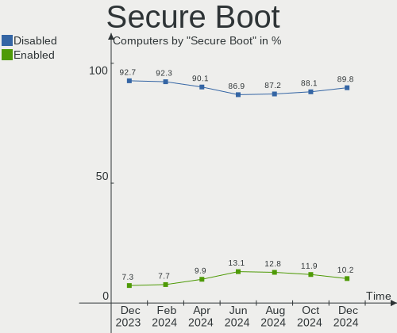
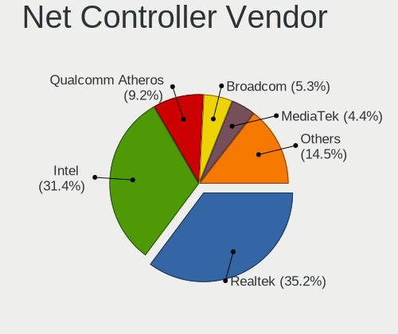
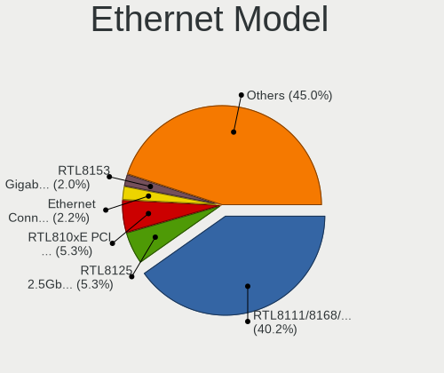
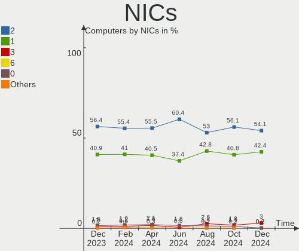
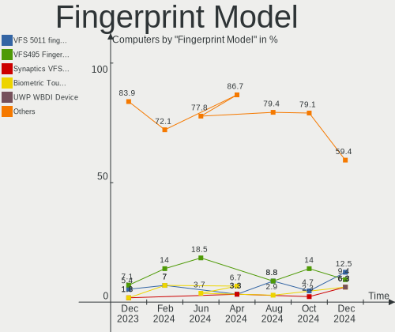

Linux Mint Hardware Trends
--------------------------

A project to identify most popular hardware characteristics and track their change
over time based on data collected by Linux Mint users at https://Linux-Hardware.org.

Anyone can contribute to this report by the [hw-probe](https://github.com/linuxhw/hw-probe) tool:

    sudo -E hw-probe -all -upload

This is a report for all computer types. See also reports for [desktops](/Dist/Linux_Mint/Desktop/README.md) and [notebooks](/Dist/Linux_Mint/Notebook/README.md).

Full-feature report is available here: https://linux-hardware.org/?view=trends

Period: Sep, 2021.

Contents
--------

* [ System ](#system)
  - [ OS                       ](#os)
  - [ OS Family                ](#os-family)
  - [ Kernel                   ](#kernel)
  - [ Kernel Family            ](#kernel-family)
  - [ Kernel Major Ver.        ](#kernel-major-ver)
  - [ Arch                     ](#arch)
  - [ DE                       ](#de)
  - [ Display Server           ](#display-server)
  - [ Display Manager          ](#display-manager)
  - [ OS Lang                  ](#os-lang)
  - [ Boot Mode                ](#boot-mode)
  - [ Filesystem               ](#filesystem)
  - [ Part. scheme             ](#part-scheme)
  - [ Dual Boot with Linux/BSD ](#dual-boot-with-linuxbsd)
  - [ Dual Boot (Win)          ](#dual-boot-win)

* [ Board ](#board)
  - [ Vendor                   ](#vendor)
  - [ Model                    ](#model)
  - [ Model Family             ](#model-family)
  - [ MFG Year                 ](#mfg-year)
  - [ Form Factor              ](#form-factor)
  - [ Secure Boot              ](#secure-boot)
  - [ Coreboot                 ](#coreboot)
  - [ RAM Size                 ](#ram-size)
  - [ RAM Used                 ](#ram-used)
  - [ Total Drives             ](#total-drives)
  - [ Has CD-ROM               ](#has-cd-rom)
  - [ Has Ethernet             ](#has-ethernet)
  - [ Has WiFi                 ](#has-wifi)
  - [ Has Bluetooth            ](#has-bluetooth)

* [ Location ](#location)
  - [ Country                  ](#country)
  - [ City                     ](#city)

* [ Drives ](#drives)
  - [ Drive Vendor             ](#drive-vendor)
  - [ Drive Model              ](#drive-model)
  - [ HDD Vendor               ](#hdd-vendor)
  - [ SSD Vendor               ](#ssd-vendor)
  - [ Drive Kind               ](#drive-kind)
  - [ Drive Connector          ](#drive-connector)
  - [ Drive Size               ](#drive-size)
  - [ Space Total              ](#space-total)
  - [ Space Used               ](#space-used)
  - [ Malfunc. Drives          ](#malfunc-drives)
  - [ Malfunc. Drive Vendor    ](#malfunc-drive-vendor)
  - [ Malfunc. HDD Vendor      ](#malfunc-hdd-vendor)
  - [ Malfunc. Drive Kind      ](#malfunc-drive-kind)
  - [ Failed Drives            ](#failed-drives)
  - [ Failed Drive Vendor      ](#failed-drive-vendor)
  - [ Drive Status             ](#drive-status)

* [ Storage controller ](#storage-controller)
  - [ Storage Vendor           ](#storage-vendor)
  - [ Storage Model            ](#storage-model)
  - [ Storage Kind             ](#storage-kind)

* [ Processor ](#processor)
  - [ CPU Vendor               ](#cpu-vendor)
  - [ CPU Model                ](#cpu-model)
  - [ CPU Model Family         ](#cpu-model-family)
  - [ CPU Cores                ](#cpu-cores)
  - [ CPU Sockets              ](#cpu-sockets)
  - [ CPU Threads              ](#cpu-threads)
  - [ CPU Op-Modes             ](#cpu-op-modes)
  - [ CPU Microcode            ](#cpu-microcode)
  - [ CPU Microarch            ](#cpu-microarch)

* [ Graphics ](#graphics)
  - [ GPU Vendor               ](#gpu-vendor)
  - [ GPU Model                ](#gpu-model)
  - [ GPU Combo                ](#gpu-combo)
  - [ GPU Driver               ](#gpu-driver)
  - [ GPU Memory               ](#gpu-memory)

* [ Monitor ](#monitor)
  - [ Monitor Vendor           ](#monitor-vendor)
  - [ Monitor Model            ](#monitor-model)
  - [ Monitor Resolution       ](#monitor-resolution)
  - [ Monitor Diagonal         ](#monitor-diagonal)
  - [ Monitor Width            ](#monitor-width)
  - [ Aspect Ratio             ](#aspect-ratio)
  - [ Monitor Area             ](#monitor-area)
  - [ Pixel Density            ](#pixel-density)
  - [ Multiple Monitors        ](#multiple-monitors)

* [ Network ](#network)
  - [ Net Controller Vendor    ](#net-controller-vendor)
  - [ Net Controller Model     ](#net-controller-model)
  - [ Wireless Vendor          ](#wireless-vendor)
  - [ Wireless Model           ](#wireless-model)
  - [ Ethernet Vendor          ](#ethernet-vendor)
  - [ Ethernet Model           ](#ethernet-model)
  - [ Net Controller Kind      ](#net-controller-kind)
  - [ Used Controller          ](#used-controller)
  - [ NICs                     ](#nics)
  - [ IPv6                     ](#ipv6)

* [ Bluetooth ](#bluetooth)
  - [ Bluetooth Vendor         ](#bluetooth-vendor)
  - [ Bluetooth Model          ](#bluetooth-model)

* [ Sound ](#sound)
  - [ Sound Vendor             ](#sound-vendor)
  - [ Sound Model              ](#sound-model)

* [ Memory ](#memory)
  - [ Memory Vendor            ](#memory-vendor)
  - [ Memory Model             ](#memory-model)
  - [ Memory Kind              ](#memory-kind)
  - [ Memory Form Factor       ](#memory-form-factor)
  - [ Memory Size              ](#memory-size)
  - [ Memory Speed             ](#memory-speed)

* [ Printers & scanners ](#printers--scanners)
  - [ Printer Vendor           ](#printer-vendor)
  - [ Printer Model            ](#printer-model)
  - [ Scanner Vendor           ](#scanner-vendor)
  - [ Scanner Model            ](#scanner-model)

* [ Camera ](#camera)
  - [ Camera Vendor            ](#camera-vendor)
  - [ Camera Model             ](#camera-model)

* [ Security ](#security)
  - [ Fingerprint Vendor       ](#fingerprint-vendor)
  - [ Fingerprint Model        ](#fingerprint-model)
  - [ Chipcard Vendor          ](#chipcard-vendor)
  - [ Chipcard Model           ](#chipcard-model)

* [ Unsupported ](#unsupported)
  - [ Unsupported Devices      ](#unsupported-devices)
  - [ Unsupported Device Types ](#unsupported-device-types)

System
------

OS
--

Installed operating systems

| Name            | Computers | Percent |
|-----------------|-----------|---------|
| Linux Mint 20.2 | 341       | 72.86%  |
| Linux Mint 19.3 | 44        | 9.4%    |
| Linux Mint 20.1 | 43        | 9.19%   |
| Linux Mint 20   | 30        | 6.41%   |
| Linux Mint 19   | 4         | 0.85%   |
| Linux Mint 18.3 | 3         | 0.64%   |
| Linux Mint 19.2 | 1         | 0.21%   |
| Linux Mint 19.1 | 1         | 0.21%   |
| Linux Mint 18   | 1         | 0.21%   |

OS Family
---------

OS without a version

| Name       | Computers | Percent |
|------------|-----------|---------|
| Linux Mint | 468       | 100%    |

Kernel
------

Version of the Linux kernel

| Version                     | Computers | Percent |
|-----------------------------|-----------|---------|
| 5.4.0-84-generic            | 150       | 32.05%  |
| 5.4.0-81-generic            | 84        | 17.95%  |
| 5.4.0-86-generic            | 44        | 9.4%    |
| 5.4.0-74-generic            | 34        | 7.26%   |
| 5.4.0-88-generic            | 28        | 5.98%   |
| 5.11.0-34-generic           | 19        | 4.06%   |
| 5.11.0-27-generic           | 12        | 2.56%   |
| 5.11.0-36-generic           | 10        | 2.14%   |
| 5.4.0-58-generic            | 8         | 1.71%   |
| 5.4.0-80-generic            | 7         | 1.5%    |
| 5.0.0-32-generic            | 7         | 1.5%    |
| 5.4.0-77-generic            | 6         | 1.28%   |
| 5.4.0-26-generic            | 6         | 1.28%   |
| 5.11.0-37-generic           | 6         | 1.28%   |
| 5.4.0-73-generic            | 3         | 0.64%   |
| 5.4.0-72-generic            | 3         | 0.64%   |
| 4.15.0-156-generic          | 3         | 0.64%   |
| 5.10.0-1045-oem             | 2         | 0.43%   |
| 4.15.0-20-generic           | 2         | 0.43%   |
| 4.15.0-142-generic          | 2         | 0.43%   |
| 5.8.10-050810-generic       | 1         | 0.21%   |
| 5.8.0-63-generic            | 1         | 0.21%   |
| 5.8.0-59-generic            | 1         | 0.21%   |
| 5.8.0-43-generic            | 1         | 0.21%   |
| 5.8.0-33-generic            | 1         | 0.21%   |
| 5.6.11-050611-generic       | 1         | 0.21%   |
| 5.4.0-84-lowlatency         | 1         | 0.21%   |
| 5.4.0-81-lowlatency         | 1         | 0.21%   |
| 5.4.0-70-generic            | 1         | 0.21%   |
| 5.4.0-67-generic            | 1         | 0.21%   |
| 5.4.0-65-generic            | 1         | 0.21%   |
| 5.4.0-62-generic            | 1         | 0.21%   |
| 5.4.0-52-generic            | 1         | 0.21%   |
| 5.4.0-45-generic            | 1         | 0.21%   |
| 5.14.6-051406-generic       | 1         | 0.21%   |
| 5.14.0-NekoMimi             | 1         | 0.21%   |
| 5.14.0-7.1-liquorix-amd64   | 1         | 0.21%   |
| 5.14.0-051400-generic       | 1         | 0.21%   |
| 5.13.4-051304-generic       | 1         | 0.21%   |
| 5.13.0-16-generic           | 1         | 0.21%   |
| 5.12.5-051205-generic       | 1         | 0.21%   |
| 5.11.0-342109090909-generic | 1         | 0.21%   |
| 5.11.0-22-generic           | 1         | 0.21%   |
| 5.11.0-051100-generic       | 1         | 0.21%   |
| 5.10.0-1044-oem             | 1         | 0.21%   |
| 5.10.0-1008-oem             | 1         | 0.21%   |
| 4.4.0-210-generic           | 1         | 0.21%   |
| 4.4.0-21-generic            | 1         | 0.21%   |
| 4.15.0-54-generic           | 1         | 0.21%   |
| 4.15.0-159-generic          | 1         | 0.21%   |
| 4.15.0-156-lowlatency       | 1         | 0.21%   |
| 4.15.0-154-generic          | 1         | 0.21%   |

Kernel Family
-------------

Linux kernel without a distro release

| Version | Computers | Percent |
|---------|-----------|---------|
| 5.4.0   | 381       | 81.41%  |
| 5.11.0  | 50        | 10.68%  |
| 4.15.0  | 11        | 2.35%   |
| 5.0.0   | 7         | 1.5%    |
| 5.8.0   | 4         | 0.85%   |
| 5.10.0  | 4         | 0.85%   |
| 5.14.0  | 3         | 0.64%   |
| 4.4.0   | 2         | 0.43%   |
| 5.8.10  | 1         | 0.21%   |
| 5.6.11  | 1         | 0.21%   |
| 5.14.6  | 1         | 0.21%   |
| 5.13.4  | 1         | 0.21%   |
| 5.13.0  | 1         | 0.21%   |
| 5.12.5  | 1         | 0.21%   |

Kernel Major Ver.
-----------------

Linux kernel major version

| Version | Computers | Percent |
|---------|-----------|---------|
| 5.4     | 381       | 81.41%  |
| 5.11    | 50        | 10.68%  |
| 4.15    | 11        | 2.35%   |
| 5.0     | 7         | 1.5%    |
| 5.8     | 5         | 1.07%   |
| 5.14    | 4         | 0.85%   |
| 5.10    | 4         | 0.85%   |
| 5.13    | 2         | 0.43%   |
| 4.4     | 2         | 0.43%   |
| 5.6     | 1         | 0.21%   |
| 5.12    | 1         | 0.21%   |

Arch
----

OS architecture (x86_64, i586, etc.)

| Name   | Computers | Percent |
|--------|-----------|---------|
| x86_64 | 455       | 97.22%  |
| i686   | 13        | 2.78%   |

DE
--

Desktop Environment

| Name       | Computers | Percent |
|------------|-----------|---------|
| X-Cinnamon | 296       | 63.25%  |
| XFCE       | 70        | 14.96%  |
| MATE       | 56        | 11.97%  |
| Cinnamon   | 24        | 5.13%   |
| GNOME      | 9         | 1.92%   |
| Unknown    | 8         | 1.71%   |
| KDE        | 4         | 0.85%   |
| KDE5       | 1         | 0.21%   |

Display Server
--------------

X11 or Wayland

| Name    | Computers | Percent |
|---------|-----------|---------|
| X11     | 465       | 99.36%  |
| Tty     | 2         | 0.43%   |
| Unknown | 1         | 0.21%   |

Display Manager
---------------

SDDM, LightDM, etc.

| Name    | Computers | Percent |
|---------|-----------|---------|
| Unknown | 294       | 62.82%  |
| LightDM | 169       | 36.11%  |
| GDM     | 4         | 0.85%   |
| MDM     | 1         | 0.21%   |

OS Lang
-------

Language

| Lang    | Computers | Percent |
|---------|-----------|---------|
| en_US   | 141       | 30.13%  |
| de_DE   | 90        | 19.23%  |
| pt_BR   | 37        | 7.91%   |
| fr_FR   | 25        | 5.34%   |
| en_GB   | 22        | 4.7%    |
| ru_RU   | 19        | 4.06%   |
| C       | 19        | 4.06%   |
| pl_PL   | 14        | 2.99%   |
| en_CA   | 10        | 2.14%   |
| it_IT   | 8         | 1.71%   |
| nl_NL   | 6         | 1.28%   |
| en_IN   | 6         | 1.28%   |
| hu_HU   | 5         | 1.07%   |
| fr_CA   | 5         | 1.07%   |
| es_ES   | 5         | 1.07%   |
| es_CO   | 5         | 1.07%   |
| en_AU   | 5         | 1.07%   |
| es_MX   | 4         | 0.85%   |
| de_AT   | 4         | 0.85%   |
| tr_TR   | 3         | 0.64%   |
| nl_BE   | 3         | 0.64%   |
| fr_BE   | 3         | 0.64%   |
| en_ZA   | 3         | 0.64%   |
| de_CH   | 3         | 0.64%   |
| uk_UA   | 2         | 0.43%   |
| ru_UA   | 2         | 0.43%   |
| pt_PT   | 2         | 0.43%   |
| es_CL   | 2         | 0.43%   |
| es_AR   | 2         | 0.43%   |
| en_NZ   | 2         | 0.43%   |
| en_IE   | 2         | 0.43%   |
| cs_CZ   | 2         | 0.43%   |
| Unknown | 2         | 0.43%   |
| zh_CN   | 1         | 0.21%   |
| sk_SK   | 1         | 0.21%   |
| es_US   | 1         | 0.21%   |
| en_PH   | 1         | 0.21%   |
| en_IL   | 1         | 0.21%   |

Boot Mode
---------

EFI or BIOS

| Mode | Computers | Percent |
|------|-----------|---------|
| EFI  | 238       | 50.85%  |
| BIOS | 230       | 49.15%  |

Filesystem
----------

Type of filesystem

| Type    | Computers | Percent |
|---------|-----------|---------|
| Ext4    | 434       | 92.74%  |
| Overlay | 17        | 3.63%   |
| Btrfs   | 10        | 2.14%   |
| Xfs     | 4         | 0.85%   |
| Ext2    | 2         | 0.43%   |
| Ext3    | 1         | 0.21%   |

Part. scheme
------------

Scheme of partitioning

| Type    | Computers | Percent |
|---------|-----------|---------|
| Unknown | 297       | 63.46%  |
| GPT     | 113       | 24.15%  |
| MBR     | 58        | 12.39%  |

Dual Boot with Linux/BSD
------------------------

Hosting more than one Linux/BSD

| Dual boot | Computers | Percent |
|-----------|-----------|---------|
| No        | 441       | 94.23%  |
| Yes       | 27        | 5.77%   |

Dual Boot (Win)
---------------

Hosting Linux and Windows

| Dual boot | Computers | Percent |
|-----------|-----------|---------|
| No        | 386       | 82.48%  |
| Yes       | 82        | 17.52%  |

Board
-----

Vendor
------

Motherboard manufacturer

| Name                   | Computers | Percent |
|------------------------|-----------|---------|
| ASUSTek Computer       | 75        | 16.03%  |
| Hewlett-Packard        | 69        | 14.74%  |
| Dell                   | 65        | 13.89%  |
| Lenovo                 | 56        | 11.97%  |
| Acer                   | 40        | 8.55%   |
| Gigabyte Technology    | 23        | 4.91%   |
| MSI                    | 20        | 4.27%   |
| ASRock                 | 17        | 3.63%   |
| Apple                  | 12        | 2.56%   |
| Toshiba                | 11        | 2.35%   |
| Medion                 | 6         | 1.28%   |
| Intel                  | 6         | 1.28%   |
| Pegatron               | 5         | 1.07%   |
| Fujitsu                | 5         | 1.07%   |
| Sony                   | 4         | 0.85%   |
| Positivo               | 4         | 0.85%   |
| Fujitsu Siemens        | 4         | 0.85%   |
| Biostar                | 4         | 0.85%   |
| Unknown                | 4         | 0.85%   |
| Samsung Electronics    | 3         | 0.64%   |
| Packard Bell           | 3         | 0.64%   |
| Gateway                | 3         | 0.64%   |
| Razer                  | 2         | 0.43%   |
| Notebook               | 2         | 0.43%   |
| GPU Company            | 2         | 0.43%   |
| Foxconn                | 2         | 0.43%   |
| ZOTAC                  | 1         | 0.21%   |
| XTRATECH COMPUTERS SA  | 1         | 0.21%   |
| Wortmann AG            | 1         | 0.21%   |
| TUXEDO                 | 1         | 0.21%   |
| Timi                   | 1         | 0.21%   |
| Supermicro             | 1         | 0.21%   |
| Schenker               | 1         | 0.21%   |
| NEC Computers          | 1         | 0.21%   |
| Linx                   | 1         | 0.21%   |
| Itautec                | 1         | 0.21%   |
| Intel Client Systems   | 1         | 0.21%   |
| Huanan                 | 1         | 0.21%   |
| HONOR                  | 1         | 0.21%   |
| HC                     | 1         | 0.21%   |
| HARDKERNEL             | 1         | 0.21%   |
| eMachines              | 1         | 0.21%   |
| ECS                    | 1         | 0.21%   |
| DFI                    | 1         | 0.21%   |
| Casper                 | 1         | 0.21%   |
| Avell High Performance | 1         | 0.21%   |
| AMI                    | 1         | 0.21%   |

Model
-----

Motherboard model

| Name                                   | Computers | Percent |
|----------------------------------------|-----------|---------|
| Unknown                                | 5         | 1.07%   |
| ASUS TUF GAMING X570-PLUS              | 4         | 0.85%   |
| MSI MS-7693                            | 3         | 0.64%   |
| HP Notebook                            | 3         | 0.64%   |
| Dell Latitude E6430                    | 3         | 0.64%   |
| Dell Latitude E6410                    | 3         | 0.64%   |
| Razer Blade                            | 2         | 0.43%   |
| MSI MS-7C83                            | 2         | 0.43%   |
| MSI MS-7788                            | 2         | 0.43%   |
| Lenovo IdeaPad S206 2638               | 2         | 0.43%   |
| HP Pavilion g6                         | 2         | 0.43%   |
| HP Pavilion dv6                        | 2         | 0.43%   |
| HP Laptop 15s-fq2xxx                   | 2         | 0.43%   |
| HP Laptop 15-bs0xx                     | 2         | 0.43%   |
| HP Desktop M01-F1xxx                   | 2         | 0.43%   |
| HP Compaq Pro 6300 SFF                 | 2         | 0.43%   |
| Dell XPS L702X                         | 2         | 0.43%   |
| Dell OptiPlex 790                      | 2         | 0.43%   |
| Dell OptiPlex 755                      | 2         | 0.43%   |
| Dell OptiPlex 390                      | 2         | 0.43%   |
| Dell Latitude E7450                    | 2         | 0.43%   |
| Dell Latitude 5480                     | 2         | 0.43%   |
| Dell Inspiron 7559                     | 2         | 0.43%   |
| ASUS M5A99FX PRO R2.0                  | 2         | 0.43%   |
| ASUS All Series                        | 2         | 0.43%   |
| Apple MacBookPro9,1                    | 2         | 0.43%   |
| Apple MacBookPro8,1                    | 2         | 0.43%   |
| Acer Aspire A515-54G                   | 2         | 0.43%   |
| Acer Aspire 4752                       | 2         | 0.43%   |
| ZOTAC ZBOX-AD04                        | 1         | 0.21%   |
| XTRATECH COMPUTERS SA MN-1022X         | 1         | 0.21%   |
| Wortmann AG 1220711_1470337            | 1         | 0.21%   |
| TUXEDO InfinityBook Pro 14 Gen6        | 1         | 0.21%   |
| Toshiba Satellite PRO C850-1HD         | 1         | 0.21%   |
| Toshiba Satellite P775D                | 1         | 0.21%   |
| Toshiba Satellite L40                  | 1         | 0.21%   |
| Toshiba Satellite L15W-B               | 1         | 0.21%   |
| Toshiba Satellite C850-1KN             | 1         | 0.21%   |
| Toshiba Satellite C660D                | 1         | 0.21%   |
| Toshiba Satellite C55t-A               | 1         | 0.21%   |
| Toshiba Satellite C55-B                | 1         | 0.21%   |
| Toshiba Satellite C50D-C               | 1         | 0.21%   |
| Toshiba QOSMIO X70-B                   | 1         | 0.21%   |
| Toshiba PORTEGE R500                   | 1         | 0.21%   |
| Timi Mi NoteBook Pro                   | 1         | 0.21%   |
| Supermicro Super Server                | 1         | 0.21%   |
| Sony VPCF13WFX                         | 1         | 0.21%   |
| Sony VPCF11S1R                         | 1         | 0.21%   |
| Sony VGN-BZ11MN                        | 1         | 0.21%   |
| Sony VGN-AR71J                         | 1         | 0.21%   |
| Schenker SCHENKER VISION 15 (SVS15E21) | 1         | 0.21%   |
| Samsung RV411/RV511/E3511/S3511/RV711  | 1         | 0.21%   |
| Samsung 730QDA                         | 1         | 0.21%   |
| Samsung 350V5C/351V5C/3540VC/3440VC    | 1         | 0.21%   |
| Positivo S14CT01                       | 1         | 0.21%   |
| Positivo POS-EINM70CS                  | 1         | 0.21%   |
| Positivo MOBILE                        | 1         | 0.21%   |
| Positivo EC10IS1                       | 1         | 0.21%   |
| Pegatron NC890AA-ABA a6803w            | 1         | 0.21%   |
| Pegatron KJ385AA-ABA a6433w            | 1         | 0.21%   |

Model Family
------------

Motherboard model prefix

| Name                           | Computers | Percent |
|--------------------------------|-----------|---------|
| Acer Aspire                    | 26        | 5.56%   |
| Dell Inspiron                  | 22        | 4.7%    |
| Lenovo ThinkPad                | 20        | 4.27%   |
| Dell Latitude                  | 19        | 4.06%   |
| Lenovo IdeaPad                 | 18        | 3.85%   |
| HP Pavilion                    | 14        | 2.99%   |
| HP EliteBook                   | 10        | 2.14%   |
| Dell OptiPlex                  | 10        | 2.14%   |
| Toshiba Satellite              | 9         | 1.92%   |
| ASUS PRIME                     | 8         | 1.71%   |
| HP Laptop                      | 7         | 1.5%    |
| Dell XPS                       | 7         | 1.5%    |
| ASUS VivoBook                  | 7         | 1.5%    |
| ASUS TUF                       | 7         | 1.5%    |
| HP Compaq                      | 6         | 1.28%   |
| ASUS ROG                       | 5         | 1.07%   |
| Unknown                        | 5         | 1.07%   |
| Fujitsu LIFEBOOK               | 4         | 0.85%   |
| MSI MS-7693                    | 3         | 0.64%   |
| Lenovo ThinkCentre             | 3         | 0.64%   |
| HP ProBook                     | 3         | 0.64%   |
| HP Notebook                    | 3         | 0.64%   |
| Fujitsu Siemens ESPRIMO        | 3         | 0.64%   |
| Dell Precision                 | 3         | 0.64%   |
| Apple MacBookPro9              | 3         | 0.64%   |
| Acer TravelMate                | 3         | 0.64%   |
| Razer Blade                    | 2         | 0.43%   |
| Packard Bell EasyNote          | 2         | 0.43%   |
| MSI MS-7C83                    | 2         | 0.43%   |
| MSI MS-7788                    | 2         | 0.43%   |
| Lenovo Legion                  | 2         | 0.43%   |
| Lenovo IdeaCentre              | 2         | 0.43%   |
| HP ProDesk                     | 2         | 0.43%   |
| HP Presario                    | 2         | 0.43%   |
| HP OMEN                        | 2         | 0.43%   |
| HP ENVY                        | 2         | 0.43%   |
| HP EliteDesk                   | 2         | 0.43%   |
| HP Desktop                     | 2         | 0.43%   |
| HP 250                         | 2         | 0.43%   |
| Dell Vostro                    | 2         | 0.43%   |
| ASUS ZenBook                   | 2         | 0.43%   |
| ASUS M5A99FX                   | 2         | 0.43%   |
| ASUS M5A78L-M                  | 2         | 0.43%   |
| ASUS M4N68T-M                  | 2         | 0.43%   |
| ASUS ASUS                      | 2         | 0.43%   |
| ASUS All                       | 2         | 0.43%   |
| ASRock 970                     | 2         | 0.43%   |
| Apple MacBookPro8              | 2         | 0.43%   |
| Acer Swift                     | 2         | 0.43%   |
| Acer Nitro                     | 2         | 0.43%   |
| Acer Extensa                   | 2         | 0.43%   |
| ZOTAC ZBOX-AD04                | 1         | 0.21%   |
| XTRATECH COMPUTERS SA MN-1022X | 1         | 0.21%   |
| Wortmann AG 1220711            | 1         | 0.21%   |
| TUXEDO InfinityBook            | 1         | 0.21%   |
| Toshiba QOSMIO                 | 1         | 0.21%   |
| Toshiba PORTEGE                | 1         | 0.21%   |
| Timi Mi                        | 1         | 0.21%   |
| Supermicro Super               | 1         | 0.21%   |
| Sony VPCF13WFX                 | 1         | 0.21%   |

MFG Year
--------

Motherboard manufacture year

| Year | Computers | Percent |
|------|-----------|---------|
| 2021 | 74        | 15.81%  |
| 2020 | 63        | 13.46%  |
| 2012 | 39        | 8.33%   |
| 2018 | 36        | 7.69%   |
| 2019 | 35        | 7.48%   |
| 2011 | 31        | 6.62%   |
| 2014 | 28        | 5.98%   |
| 2013 | 28        | 5.98%   |
| 2008 | 24        | 5.13%   |
| 2009 | 23        | 4.91%   |
| 2010 | 20        | 4.27%   |
| 2017 | 19        | 4.06%   |
| 2016 | 17        | 3.63%   |
| 2015 | 17        | 3.63%   |
| 2007 | 11        | 2.35%   |
| 2005 | 2         | 0.43%   |
| 2004 | 1         | 0.21%   |

Form Factor
-----------

Physical design of the computer

| Name        | Computers | Percent |
|-------------|-----------|---------|
| Notebook    | 278       | 59.4%   |
| Desktop     | 169       | 36.11%  |
| Convertible | 7         | 1.5%    |
| Mini pc     | 6         | 1.28%   |
| All in one  | 4         | 0.85%   |
| Tablet      | 2         | 0.43%   |
| Server      | 2         | 0.43%   |

Secure Boot
-----------

Enabled or disabled

| State    | Computers | Percent |
|----------|-----------|---------|
| Disabled | 434       | 92.74%  |
| Enabled  | 34        | 7.26%   |

Coreboot
--------

Have coreboot on board

| Used | Computers | Percent |
|------|-----------|---------|
| No   | 468       | 100%    |

RAM Size
--------

Total RAM memory

| Size in GB  | Computers | Percent |
|-------------|-----------|---------|
| 4.01-8.0    | 120       | 25.64%  |
| 3.01-4.0    | 96        | 20.51%  |
| 16.01-24.0  | 94        | 20.09%  |
| 8.01-16.0   | 77        | 16.45%  |
| 32.01-64.0  | 30        | 6.41%   |
| 1.01-2.0    | 23        | 4.91%   |
| 2.01-3.0    | 13        | 2.78%   |
| 24.01-32.0  | 7         | 1.5%    |
| 0.51-1.0    | 5         | 1.07%   |
| 64.01-256.0 | 3         | 0.64%   |

RAM Used
--------

Used RAM memory

| Used GB    | Computers | Percent |
|------------|-----------|---------|
| 1.01-2.0   | 208       | 44.44%  |
| 2.01-3.0   | 109       | 23.29%  |
| 4.01-8.0   | 59        | 12.61%  |
| 3.01-4.0   | 45        | 9.62%   |
| 0.51-1.0   | 36        | 7.69%   |
| 8.01-16.0  | 7         | 1.5%    |
| 0.01-0.5   | 3         | 0.64%   |
| 16.01-24.0 | 1         | 0.21%   |

Total Drives
------------

Number of drives on board

| Drives | Computers | Percent |
|--------|-----------|---------|
| 1      | 283       | 60.47%  |
| 2      | 116       | 24.79%  |
| 3      | 31        | 6.62%   |
| 4      | 25        | 5.34%   |
| 5      | 5         | 1.07%   |
| 6      | 3         | 0.64%   |
| 0      | 3         | 0.64%   |
| 10     | 1         | 0.21%   |
| 8      | 1         | 0.21%   |

Has CD-ROM
----------

Has CD-ROM on board

| Presented | Computers | Percent |
|-----------|-----------|---------|
| No        | 251       | 53.63%  |
| Yes       | 217       | 46.37%  |

Has Ethernet
------------

Has Ethernet on board

| Presented | Computers | Percent |
|-----------|-----------|---------|
| Yes       | 412       | 88.03%  |
| No        | 56        | 11.97%  |

Has WiFi
--------

Has WiFi module

| Presented | Computers | Percent |
|-----------|-----------|---------|
| Yes       | 357       | 76.28%  |
| No        | 111       | 23.72%  |

Has Bluetooth
-------------

Has Bluetooth module

| Presented | Computers | Percent |
|-----------|-----------|---------|
| Yes       | 265       | 56.62%  |
| No        | 203       | 43.38%  |

Location
--------

Country
-------

Geographic location (country)

| Country      | Computers | Percent |
|--------------|-----------|---------|
| Germany      | 95        | 20.3%   |
| USA          | 79        | 16.88%  |
| Brazil       | 44        | 9.4%    |
| France       | 26        | 5.56%   |
| UK           | 22        | 4.7%    |
| Poland       | 17        | 3.63%   |
| Russia       | 16        | 3.42%   |
| Canada       | 16        | 3.42%   |
| Italy        | 14        | 2.99%   |
| Netherlands  | 9         | 1.92%   |
| Ukraine      | 7         | 1.5%    |
| India        | 7         | 1.5%    |
| Austria      | 7         | 1.5%    |
| Hungary      | 6         | 1.28%   |
| Belgium      | 6         | 1.28%   |
| Spain        | 5         | 1.07%   |
| Colombia     | 5         | 1.07%   |
| Australia    | 5         | 1.07%   |
| Argentina    | 5         | 1.07%   |
| Switzerland  | 4         | 0.85%   |
| Mexico       | 4         | 0.85%   |
| Czechia      | 4         | 0.85%   |
| Bulgaria     | 4         | 0.85%   |
| Turkey       | 3         | 0.64%   |
| South Africa | 3         | 0.64%   |
| Serbia       | 3         | 0.64%   |
| Portugal     | 3         | 0.64%   |
| Philippines  | 3         | 0.64%   |
| Norway       | 3         | 0.64%   |
| Ireland      | 3         | 0.64%   |
| Chile        | 3         | 0.64%   |
| Belarus      | 3         | 0.64%   |
| Sweden       | 2         | 0.43%   |
| Slovakia     | 2         | 0.43%   |
| Romania      | 2         | 0.43%   |
| Pakistan     | 2         | 0.43%   |
| New Zealand  | 2         | 0.43%   |
| Israel       | 2         | 0.43%   |
| Indonesia    | 2         | 0.43%   |
| Denmark      | 2         | 0.43%   |
| Algeria      | 2         | 0.43%   |
| Puerto Rico  | 1         | 0.21%   |
| Nepal        | 1         | 0.21%   |
| Morocco      | 1         | 0.21%   |
| Moldova      | 1         | 0.21%   |
| Malaysia     | 1         | 0.21%   |
| Japan        | 1         | 0.21%   |
| Iran         | 1         | 0.21%   |
| Greece       | 1         | 0.21%   |
| Finland      | 1         | 0.21%   |
| Ecuador      | 1         | 0.21%   |
| Cuba         | 1         | 0.21%   |
| Croatia      | 1         | 0.21%   |
| China        | 1         | 0.21%   |
| Bangladesh   | 1         | 0.21%   |
| Armenia      | 1         | 0.21%   |
| Afghanistan  | 1         | 0.21%   |

City
----

Geographic location (city)

| City              | Computers | Percent |
|-------------------|-----------|---------|
| Moscow            | 6         | 1.28%   |
| Vienna            | 5         | 1.07%   |
| Leipzig           | 5         | 1.07%   |
| Paris             | 4         | 0.85%   |
| Nuremberg         | 4         | 0.85%   |
| London            | 4         | 0.85%   |
| Bogot??           | 4         | 0.85%   |
| S??o Paulo        | 3         | 0.64%   |
| Rio de Janeiro    | 3         | 0.64%   |
| Minsk             | 3         | 0.64%   |
| Krakow            | 3         | 0.64%   |
| Dallas            | 3         | 0.64%   |
| Cherkasy          | 3         | 0.64%   |
| Belgrade          | 3         | 0.64%   |
| Zaporizhzhya      | 2         | 0.43%   |
| Warsaw            | 2         | 0.43%   |
| Toronto           | 2         | 0.43%   |
| Sydney            | 2         | 0.43%   |
| Swindon           | 2         | 0.43%   |
| Stuttgart         | 2         | 0.43%   |
| Strasbourg        | 2         | 0.43%   |
| St Petersburg     | 2         | 0.43%   |
| Sofia             | 2         | 0.43%   |
| Santiago          | 2         | 0.43%   |
| Rome              | 2         | 0.43%   |
| Rockville         | 2         | 0.43%   |
| Porto Alegre      | 2         | 0.43%   |
| Oslo              | 2         | 0.43%   |
| Montreal          | 2         | 0.43%   |
| Milan             | 2         | 0.43%   |
| Melbourne         | 2         | 0.43%   |
| Marikina City     | 2         | 0.43%   |
| Lyon              | 2         | 0.43%   |
| Ludwigsburg       | 2         | 0.43%   |
| Louisville        | 2         | 0.43%   |
| Kolkata           | 2         | 0.43%   |
| Istanbul          | 2         | 0.43%   |
| Houston           | 2         | 0.43%   |
| Heilbronn         | 2         | 0.43%   |
| Hamburg           | 2         | 0.43%   |
| Goi??nia          | 2         | 0.43%   |
| Gateshead         | 2         | 0.43%   |
| Frankfurt am Main | 2         | 0.43%   |
| Essen             | 2         | 0.43%   |
| Erding            | 2         | 0.43%   |
| Dublin            | 2         | 0.43%   |
| Curitiba          | 2         | 0.43%   |
| Bras?­lia         | 2         | 0.43%   |
| Bielefeld         | 2         | 0.43%   |
| Berlin            | 2         | 0.43%   |
| Augsburg          | 2         | 0.43%   |
| Amsterdam         | 2         | 0.43%   |
| Amlwch            | 2         | 0.43%   |
| Zurich            | 1         | 0.21%   |
| Ziegendorf        | 1         | 0.21%   |
| Z?…bki            | 1         | 0.21%   |
| Zawiercie         | 1         | 0.21%   |
| Zanesville        | 1         | 0.21%   |
| Yerevan           | 1         | 0.21%   |
| Wuppertal         | 1         | 0.21%   |

Drives
------

Drive Vendor
------------

Hard drive vendors

| Vendor                       | Computers | Drives | Percent |
|------------------------------|-----------|--------|---------|
| WDC                          | 118       | 148    | 17.51%  |
| Seagate                      | 105       | 118    | 15.58%  |
| Samsung Electronics          | 93        | 112    | 13.8%   |
| Toshiba                      | 40        | 43     | 5.93%   |
| SanDisk                      | 38        | 39     | 5.64%   |
| Kingston                     | 36        | 36     | 5.34%   |
| Unknown                      | 30        | 35     | 4.45%   |
| Crucial                      | 24        | 31     | 3.56%   |
| Hitachi                      | 22        | 23     | 3.26%   |
| SK Hynix                     | 15        | 16     | 2.23%   |
| Intel                        | 12        | 13     | 1.78%   |
| A-DATA Technology            | 9         | 9      | 1.34%   |
| Phison                       | 8         | 8      | 1.19%   |
| Micron Technology            | 8         | 9      | 1.19%   |
| HGST                         | 8         | 9      | 1.19%   |
| Fujitsu                      | 6         | 6      | 0.89%   |
| China                        | 6         | 6      | 0.89%   |
| Intenso                      | 5         | 5      | 0.74%   |
| GOODRAM                      | 5         | 5      | 0.74%   |
| Apple                        | 5         | 5      | 0.74%   |
| Silicon Motion               | 4         | 5      | 0.59%   |
| PNY                          | 4         | 4      | 0.59%   |
| OCZ                          | 4         | 4      | 0.59%   |
| MAXTOR                       | 4         | 4      | 0.59%   |
| LITEONIT                     | 4         | 5      | 0.59%   |
| XPG                          | 3         | 3      | 0.45%   |
| Patriot                      | 3         | 3      | 0.45%   |
| Micron/Crucial Technology    | 3         | 3      | 0.45%   |
| LITEON                       | 3         | 3      | 0.45%   |
| JMicron                      | 3         | 3      | 0.45%   |
| Union Memory                 | 2         | 2      | 0.3%    |
| Transcend                    | 2         | 2      | 0.3%    |
| LDLC                         | 2         | 2      | 0.3%    |
| KIOXIA                       | 2         | 2      | 0.3%    |
| Corsair                      | 2         | 2      | 0.3%    |
| asmedia                      | 2         | 2      | 0.3%    |
| Yangtze Memory Technologies  | 1         | 1      | 0.15%   |
| Yangtze Memory               | 1         | 1      | 0.15%   |
| WD MediaMax                  | 1         | 1      | 0.15%   |
| W800SH                       | 1         | 1      | 0.15%   |
| Verbatim                     | 1         | 1      | 0.15%   |
| Team                         | 1         | 1      | 0.15%   |
| SSSTC                        | 1         | 1      | 0.15%   |
| SPCC                         | 1         | 1      | 0.15%   |
| Solid State Storage          | 1         | 1      | 0.15%   |
| SILICONMOTION                | 1         | 1      | 0.15%   |
| Shenzhen Longsys Electronics | 1         | 1      | 0.15%   |
| Realtek Semiconductor        | 1         | 1      | 0.15%   |
| Pichau                       | 1         | 1      | 0.15%   |
| ORICO                        | 1         | 1      | 0.15%   |
| Netac                        | 1         | 1      | 0.15%   |
| Mushkin                      | 1         | 1      | 0.15%   |
| Mass                         | 1         | 1      | 0.15%   |
| Lexar                        | 1         | 1      | 0.15%   |
| Leven                        | 1         | 1      | 0.15%   |
| KIOXIA-EXCERIA               | 1         | 1      | 0.15%   |
| KingFast                     | 1         | 2      | 0.15%   |
| JASTER                       | 1         | 1      | 0.15%   |
| HUAWEI                       | 1         | 1      | 0.15%   |
| HS-SSD-E100N                 | 1         | 1      | 0.15%   |

Drive Model
-----------

Hard drive models

| Model                                | Computers | Percent |
|--------------------------------------|-----------|---------|
| Seagate ST1000LM035-1RK172 1TB       | 11        | 1.48%   |
| Samsung SSD 850 EVO 250GB            | 8         | 1.07%   |
| Kingston SA400S37240G 240GB SSD      | 8         | 1.07%   |
| WDC WDS500G2B0A-00SM50 500GB SSD     | 7         | 0.94%   |
| Samsung NVMe SSD Drive 512GB         | 7         | 0.94%   |
| Toshiba MQ01ABD100 1TB               | 6         | 0.81%   |
| Seagate ST3500418AS 500GB            | 6         | 0.81%   |
| Samsung SSD 860 EVO 500GB            | 6         | 0.81%   |
| WDC WD10EZEX-08WN4A0 1TB             | 5         | 0.67%   |
| Unknown MMC Card  64GB               | 5         | 0.67%   |
| Toshiba MQ01ABF050 500GB             | 5         | 0.67%   |
| Seagate ST500DM002-1BD142 500GB      | 5         | 0.67%   |
| Seagate ST1000DM010-2EP102 1TB       | 5         | 0.67%   |
| Samsung NVMe SSD Drive 256GB         | 5         | 0.67%   |
| Kingston SA400S37480G 480GB SSD      | 5         | 0.67%   |
| Crucial CT1000MX500SSD1 1TB          | 5         | 0.67%   |
| WDC WDS120G2G0A-00JH30 120GB SSD     | 4         | 0.54%   |
| Unknown MMC Card  32GB               | 4         | 0.54%   |
| SK Hynix SC311 SATA 512GB SSD        | 4         | 0.54%   |
| Samsung SSD 860 EVO 250GB            | 4         | 0.54%   |
| Samsung SSD 850 EVO 500GB            | 4         | 0.54%   |
| Samsung SSD 840 EVO 250GB            | 4         | 0.54%   |
| Unknown SD/MMC/MS PRO 128GB          | 3         | 0.4%    |
| SK Hynix NVMe SSD Drive 256GB        | 3         | 0.4%    |
| Seagate ST2000DM008-2FR102 2TB       | 3         | 0.4%    |
| Seagate ST1000DM003-1ER162 1TB       | 3         | 0.4%    |
| SanDisk SSD PLUS 480GB               | 3         | 0.4%    |
| SanDisk SSD PLUS 240GB               | 3         | 0.4%    |
| SanDisk SSD PLUS 1000GB              | 3         | 0.4%    |
| SanDisk SDSSDA240G 240GB             | 3         | 0.4%    |
| Sandisk NVMe SSD Drive 512GB         | 3         | 0.4%    |
| Samsung SSD 840 PRO Series 128GB     | 3         | 0.4%    |
| Samsung NVMe SSD Drive 250GB         | 3         | 0.4%    |
| Phison NVMe SSD Drive 1TB            | 3         | 0.4%    |
| Kingston SA400S37120G 120GB SSD      | 3         | 0.4%    |
| Hitachi HTS545032B9A300 320GB        | 3         | 0.4%    |
| Crucial CT480BX500SSD1 480GB         | 3         | 0.4%    |
| WDC WDS480G2G0A-00JH30 480GB SSD     | 2         | 0.27%   |
| WDC WDS100T2B0A-00SM50 1TB SSD       | 2         | 0.27%   |
| WDC WD6400AAKS-65A7B2 640GB          | 2         | 0.27%   |
| WDC WD5000LPVX-80V0TT0 500GB         | 2         | 0.27%   |
| WDC WD5000AVDS-63U7B1 500GB          | 2         | 0.27%   |
| WDC WD5000AAKX-60U6AA0 500GB         | 2         | 0.27%   |
| WDC WD40EZRZ-00GXCB0 4TB             | 2         | 0.27%   |
| WDC WD2500BEVS-22UST0 250GB          | 2         | 0.27%   |
| WDC WD20EURX-63T0FY0 2TB             | 2         | 0.27%   |
| WDC WD1600BEVT-75ZCT2 160GB          | 2         | 0.27%   |
| WDC WD10SPZX-24Z10 1TB               | 2         | 0.27%   |
| WDC WD10JPVX-60JC3T0 1TB             | 2         | 0.27%   |
| WDC WD10JPVX-22JC3T0 1TB             | 2         | 0.27%   |
| WDC WD10EZEX-00BN5A0 1TB             | 2         | 0.27%   |
| WDC WD10EADS-00L5B1 1TB              | 2         | 0.27%   |
| WDC PC SN730 SDBPNTY-512G-1101 512GB | 2         | 0.27%   |
| Unknown NCard  32GB                  | 2         | 0.27%   |
| Unknown MMC Card  256GB              | 2         | 0.27%   |
| Toshiba MQ04ABF100 1TB               | 2         | 0.27%   |
| Toshiba MK7575GSX 752GB              | 2         | 0.27%   |
| Toshiba DT01ACA100 1TB               | 2         | 0.27%   |
| Silicon Motion NE-1TB                | 2         | 0.27%   |
| Seagate ST9500325AS 500GB            | 2         | 0.27%   |

HDD Vendor
----------

Hard disk drive vendors

| Vendor              | Computers | Drives | Percent |
|---------------------|-----------|--------|---------|
| Seagate             | 103       | 115    | 35.64%  |
| WDC                 | 91        | 115    | 31.49%  |
| Toshiba             | 32        | 34     | 11.07%  |
| Hitachi             | 22        | 23     | 7.61%   |
| Samsung Electronics | 12        | 13     | 4.15%   |
| HGST                | 8         | 9      | 2.77%   |
| Fujitsu             | 6         | 6      | 2.08%   |
| MAXTOR              | 4         | 4      | 1.38%   |
| Unknown             | 3         | 3      | 1.04%   |
| Apple               | 3         | 3      | 1.04%   |
| SILICONMOTION       | 1         | 1      | 0.35%   |
| Intenso             | 1         | 1      | 0.35%   |
| HGST HTS            | 1         | 1      | 0.35%   |
| ExcelStor           | 1         | 2      | 0.35%   |
| Asmedia             | 1         | 1      | 0.35%   |

SSD Vendor
----------

Solid state drive vendors

| Vendor              | Computers | Drives | Percent |
|---------------------|-----------|--------|---------|
| Samsung Electronics | 54        | 61     | 22.88%  |
| SanDisk             | 29        | 30     | 12.29%  |
| Kingston            | 27        | 27     | 11.44%  |
| WDC                 | 23        | 23     | 9.75%   |
| Crucial             | 22        | 29     | 9.32%   |
| A-DATA Technology   | 7         | 7      | 2.97%   |
| China               | 6         | 6      | 2.54%   |
| SK Hynix            | 5         | 5      | 2.12%   |
| GOODRAM             | 5         | 5      | 2.12%   |
| PNY                 | 4         | 4      | 1.69%   |
| OCZ                 | 4         | 4      | 1.69%   |
| LITEONIT            | 4         | 5      | 1.69%   |
| Unknown             | 3         | 3      | 1.27%   |
| Toshiba             | 3         | 3      | 1.27%   |
| Patriot             | 3         | 3      | 1.27%   |
| Micron Technology   | 3         | 3      | 1.27%   |
| Intel               | 3         | 3      | 1.27%   |
| Transcend           | 2         | 2      | 0.85%   |
| LITEON              | 2         | 2      | 0.85%   |
| LDLC                | 2         | 2      | 0.85%   |
| Intenso             | 2         | 2      | 0.85%   |
| Corsair             | 2         | 2      | 0.85%   |
| W800SH              | 1         | 1      | 0.42%   |
| Verbatim            | 1         | 1      | 0.42%   |
| Team                | 1         | 1      | 0.42%   |
| SSSTC               | 1         | 1      | 0.42%   |
| SPCC                | 1         | 1      | 0.42%   |
| Pichau              | 1         | 1      | 0.42%   |
| PHISON              | 1         | 1      | 0.42%   |
| ORICO               | 1         | 1      | 0.42%   |
| Mushkin             | 1         | 1      | 0.42%   |
| Lexar               | 1         | 1      | 0.42%   |
| Leven               | 1         | 1      | 0.42%   |
| KIOXIA-EXCERIA      | 1         | 1      | 0.42%   |
| KingFast            | 1         | 1      | 0.42%   |
| JMicron             | 1         | 1      | 0.42%   |
| JASTER              | 1         | 1      | 0.42%   |
| HS-SSD-E100N        | 1         | 1      | 0.42%   |
| HS-SSD-C100         | 1         | 1      | 0.42%   |
| Hewlett-Packard     | 1         | 1      | 0.42%   |
| ASMT                | 1         | 1      | 0.42%   |
| Apple               | 1         | 1      | 0.42%   |
| Apacer              | 1         | 1      | 0.42%   |

Drive Kind
----------

HDD or SSD

| Kind    | Computers | Drives | Percent |
|---------|-----------|--------|---------|
| HDD     | 240       | 331    | 40.13%  |
| SSD     | 200       | 252    | 33.44%  |
| NVMe    | 120       | 136    | 20.07%  |
| MMC     | 24        | 29     | 4.01%   |
| Unknown | 14        | 14     | 2.34%   |

Drive Connector
---------------

SATA, SAS, NVMe, etc.

| Type | Computers | Drives | Percent |
|------|-----------|--------|---------|
| SATA | 375       | 566    | 68.81%  |
| NVMe | 118       | 134    | 21.65%  |
| SAS  | 28        | 33     | 5.14%   |
| MMC  | 24        | 29     | 4.4%    |

Drive Size
----------

Size of hard drive

| Size in TB | Computers | Drives | Percent |
|------------|-----------|--------|---------|
| 0.01-0.5   | 282       | 363    | 61.04%  |
| 0.51-1.0   | 131       | 152    | 28.35%  |
| 1.01-2.0   | 34        | 40     | 7.36%   |
| 3.01-4.0   | 9         | 13     | 1.95%   |
| 4.01-10.0  | 4         | 12     | 0.87%   |
| 2.01-3.0   | 2         | 3      | 0.43%   |

Space Total
-----------

Amount of disk space available on the file system

| Size in GB     | Computers | Percent |
|----------------|-----------|---------|
| 101-250        | 154       | 32.91%  |
| 251-500        | 127       | 27.14%  |
| 501-1000       | 70        | 14.96%  |
| 1001-2000      | 34        | 7.26%   |
| 51-100         | 30        | 6.41%   |
| 2001-3000      | 19        | 4.06%   |
| More than 3000 | 16        | 3.42%   |
| 1-20           | 11        | 2.35%   |
| 21-50          | 5         | 1.07%   |
| Unknown        | 2         | 0.43%   |

Space Used
----------

Amount of used disk space

| Used GB        | Computers | Percent |
|----------------|-----------|---------|
| 1-20           | 134       | 28.63%  |
| 21-50          | 99        | 21.15%  |
| 101-250        | 82        | 17.52%  |
| 51-100         | 58        | 12.39%  |
| 251-500        | 33        | 7.05%   |
| 501-1000       | 31        | 6.62%   |
| 1001-2000      | 16        | 3.42%   |
| More than 3000 | 7         | 1.5%    |
| 2001-3000      | 6         | 1.28%   |
| Unknown        | 2         | 0.43%   |

Malfunc. Drives
---------------

Drive models with a malfunction

| Model                                          | Computers | Drives | Percent |
|------------------------------------------------|-----------|--------|---------|
| Toshiba MK7575GSX 752GB                        | 2         | 2      | 3.77%   |
| Seagate ST3500418AS 500GB                      | 2         | 2      | 3.77%   |
| Seagate ST3160812AS 160GB                      | 2         | 2      | 3.77%   |
| Seagate ST1000LM035-1RK172 1TB                 | 2         | 2      | 3.77%   |
| HGST HTS545050A7E680 500GB                     | 2         | 2      | 3.77%   |
| WDC WD5002ABYS-01B1B0 500GB                    | 1         | 1      | 1.89%   |
| WDC WD5000LPLX-75ZNTT0 500GB                   | 1         | 1      | 1.89%   |
| WDC WD5000AVDS-63U7B1 500GB                    | 1         | 1      | 1.89%   |
| WDC WD5000AAKX-22ERMA0 500GB                   | 1         | 1      | 1.89%   |
| WDC WD5000AAKX-003CA0 500GB                    | 1         | 1      | 1.89%   |
| WDC WD5000AAKS-00D2B0 500GB                    | 1         | 1      | 1.89%   |
| WDC WD2500BEVS-60UST0 250GB                    | 1         | 1      | 1.89%   |
| WDC WD1200JB-00CRA1 120GB                      | 1         | 1      | 1.89%   |
| WDC WD10JPVX-60JC3T0 1TB                       | 1         | 1      | 1.89%   |
| WDC WD10EACS-65D6B0 1TB                        | 1         | 1      | 1.89%   |
| Toshiba THNSNH128GCST 128GB SSD                | 1         | 1      | 1.89%   |
| Toshiba MQ04ABF100 1TB                         | 1         | 1      | 1.89%   |
| Toshiba MQ01ABD100 1TB                         | 1         | 1      | 1.89%   |
| Toshiba MK5065GSXF 500GB                       | 1         | 1      | 1.89%   |
| Toshiba MK1237GSX 120GB                        | 1         | 1      | 1.89%   |
| SSSTC CVB-8D128-HP 128GB SSD                   | 1         | 1      | 1.89%   |
| Seagate ST9750420AS 752GB                      | 1         | 1      | 1.89%   |
| Seagate ST9640320AS 640GB                      | 1         | 1      | 1.89%   |
| Seagate ST9500325ASG 500GB                     | 1         | 1      | 1.89%   |
| Seagate ST500LM000-1EJ162-SSHD-8GB             | 1         | 1      | 1.89%   |
| Seagate ST500DM002-1BD142 500GB                | 1         | 1      | 1.89%   |
| Seagate ST3500320AS 500GB                      | 1         | 1      | 1.89%   |
| Seagate ST3250620AS 250GB                      | 1         | 1      | 1.89%   |
| Seagate ST320LT020-9YG142 320GB                | 1         | 1      | 1.89%   |
| Seagate ST320LM001 HN-M320MBB 320GB            | 1         | 1      | 1.89%   |
| Seagate ST3160811AS 160GB                      | 1         | 1      | 1.89%   |
| Seagate ST31500341AS 1TB                       | 1         | 2      | 1.89%   |
| Seagate ST2000DM001-9YN164 2TB                 | 1         | 1      | 1.89%   |
| Seagate ST1000NM0033-9ZM173 1TB                | 1         | 2      | 1.89%   |
| Seagate ST1000LM024 HN-M101MBB 1TB             | 1         | 1      | 1.89%   |
| SanDisk SSD U100 24GB                          | 1         | 1      | 1.89%   |
| SanDisk SSD PLUS 240GB                         | 1         | 1      | 1.89%   |
| Samsung Electronics HD501LJ 500GB              | 1         | 1      | 1.89%   |
| Kingston SNS4151S316GD 16GB SSD                | 1         | 1      | 1.89%   |
| Kingston RBUSNS8180DS3128GJ 128GB SSD          | 1         | 1      | 1.89%   |
| Hitachi HUA722010CLA330 59Y5306 42C0423IBM 1TB | 1         | 1      | 1.89%   |
| Hitachi HTS545032B9A300 320GB                  | 1         | 1      | 1.89%   |
| Hitachi HDT722525DLAT80 250GB                  | 1         | 1      | 1.89%   |
| Hitachi HDS721050CLA362 500GB                  | 1         | 1      | 1.89%   |
| HGST HTS541010A9E680 1TB                       | 1         | 1      | 1.89%   |
| Fujitsu MHZ2250BH G2 250GB                     | 1         | 1      | 1.89%   |
| Crucial CT1050MX300SSD1 1TB                    | 1         | 1      | 1.89%   |
| Apple HDD HTS545050A7E362 500GB                | 1         | 1      | 1.89%   |

Malfunc. Drive Vendor
---------------------

Vendors of faulty drives

| Vendor              | Computers | Drives | Percent |
|---------------------|-----------|--------|---------|
| Seagate             | 20        | 22     | 39.22%  |
| WDC                 | 8         | 10     | 15.69%  |
| Toshiba             | 7         | 7      | 13.73%  |
| Hitachi             | 4         | 4      | 7.84%   |
| HGST                | 3         | 3      | 5.88%   |
| SanDisk             | 2         | 2      | 3.92%   |
| Kingston            | 2         | 2      | 3.92%   |
| SSSTC               | 1         | 1      | 1.96%   |
| Samsung Electronics | 1         | 1      | 1.96%   |
| Fujitsu             | 1         | 1      | 1.96%   |
| Crucial             | 1         | 1      | 1.96%   |
| Apple               | 1         | 1      | 1.96%   |

Malfunc. HDD Vendor
-------------------

Vendors of faulty HDD drives

| Vendor              | Computers | Drives | Percent |
|---------------------|-----------|--------|---------|
| Seagate             | 20        | 22     | 45.45%  |
| WDC                 | 8         | 10     | 18.18%  |
| Toshiba             | 6         | 6      | 13.64%  |
| Hitachi             | 4         | 4      | 9.09%   |
| HGST                | 3         | 3      | 6.82%   |
| Samsung Electronics | 1         | 1      | 2.27%   |
| Fujitsu             | 1         | 1      | 2.27%   |
| Apple               | 1         | 1      | 2.27%   |

Malfunc. Drive Kind
-------------------

Kinds of faulty drives

| Kind | Computers | Drives | Percent |
|------|-----------|--------|---------|
| HDD  | 39        | 48     | 84.78%  |
| SSD  | 7         | 7      | 15.22%  |

Failed Drives
-------------

Failed drive models

| Model                        | Computers | Drives | Percent |
|------------------------------|-----------|--------|---------|
| WDC WD5000LPVX-80V0TT0 500GB | 1         | 1      | 100%    |

Failed Drive Vendor
-------------------

Failed drive vendors

| Vendor | Computers | Drives | Percent |
|--------|-----------|--------|---------|
| WDC    | 1         | 1      | 100%    |

Drive Status
------------

Number of failed and malfunc. drives

| Status   | Computers | Drives | Percent |
|----------|-----------|--------|---------|
| Detected | 317       | 507    | 62.52%  |
| Works    | 145       | 199    | 28.6%   |
| Malfunc  | 44        | 55     | 8.68%   |
| Failed   | 1         | 1      | 0.2%    |

Storage controller
------------------

Storage Vendor
--------------

Storage controller vendors

| Vendor                           | Computers | Percent |
|----------------------------------|-----------|---------|
| Intel                            | 322       | 56.89%  |
| AMD                              | 83        | 14.66%  |
| Samsung Electronics              | 35        | 6.18%   |
| Sandisk                          | 16        | 2.83%   |
| Nvidia                           | 16        | 2.83%   |
| SK Hynix                         | 10        | 1.77%   |
| Kingston Technology Company      | 9         | 1.59%   |
| JMicron Technology               | 8         | 1.41%   |
| Phison Electronics               | 7         | 1.24%   |
| Silicon Integrated Systems [SiS] | 6         | 1.06%   |
| Toshiba America Info Systems     | 5         | 0.88%   |
| Micron/Crucial Technology        | 5         | 0.88%   |
| Micron Technology                | 5         | 0.88%   |
| ADATA Technology                 | 5         | 0.88%   |
| VIA Technologies                 | 4         | 0.71%   |
| Silicon Motion                   | 4         | 0.71%   |
| ASMedia Technology               | 4         | 0.71%   |
| Marvell Technology Group         | 3         | 0.53%   |
| KIOXIA                           | 3         | 0.53%   |
| Broadcom / LSI                   | 3         | 0.53%   |
| Union Memory (Shenzhen)          | 2         | 0.35%   |
| Solid State Storage Technology   | 2         | 0.35%   |
| Realtek Semiconductor            | 2         | 0.35%   |
| Yangtze Memory Technologies      | 1         | 0.18%   |
| Silicon Image                    | 1         | 0.18%   |
| Shenzhen Longsys Electronics     | 1         | 0.18%   |
| Seagate Technology               | 1         | 0.18%   |
| Lite-On Technology               | 1         | 0.18%   |
| Integrated Technology Express    | 1         | 0.18%   |
| Apple                            | 1         | 0.18%   |

Storage Model
-------------

Storage controller models

| Model                                                                                   | Computers | Percent |
|-----------------------------------------------------------------------------------------|-----------|---------|
| AMD FCH SATA Controller [AHCI mode]                                                     | 47        | 7.06%   |
| Intel Sunrise Point-LP SATA Controller [AHCI mode]                                      | 24        | 3.6%    |
| Intel 7 Series Chipset Family 6-port SATA Controller [AHCI mode]                        | 21        | 3.15%   |
| Samsung NVMe SSD Controller SM981/PM981/PM983                                           | 20        | 3%      |
| AMD SB7x0/SB8x0/SB9x0 SATA Controller [AHCI mode]                                       | 20        | 3%      |
| Intel 82801 Mobile SATA Controller [RAID mode]                                          | 19        | 2.85%   |
| Intel 8 Series/C220 Series Chipset Family 6-port SATA Controller 1 [AHCI mode]          | 17        | 2.55%   |
| Intel 6 Series/C200 Series Chipset Family 6 port Mobile SATA AHCI Controller            | 16        | 2.4%    |
| Intel 82801IBM/IEM (ICH9M/ICH9M-E) 4 port SATA Controller [AHCI mode]                   | 14        | 2.1%    |
| AMD SB7x0/SB8x0/SB9x0 IDE Controller                                                    | 11        | 1.65%   |
| Samsung NVMe SSD Controller 980                                                         | 10        | 1.5%    |
| Intel Volume Management Device NVMe RAID Controller                                     | 10        | 1.5%    |
| Intel Q170/Q150/B150/H170/H110/Z170/CM236 Chipset SATA Controller [AHCI Mode]           | 10        | 1.5%    |
| Intel 8 Series SATA Controller 1 [AHCI mode]                                            | 10        | 1.5%    |
| Intel 6 Series/C200 Series Chipset Family 6 port Desktop SATA AHCI Controller           | 10        | 1.5%    |
| Intel 400 Series Chipset Family SATA AHCI Controller                                    | 10        | 1.5%    |
| Nvidia MCP61 SATA Controller                                                            | 9         | 1.35%   |
| Intel 7 Series/C210 Series Chipset Family 6-port SATA Controller [AHCI mode]            | 9         | 1.35%   |
| Intel 6 Series/C200 Series Chipset Family Desktop SATA Controller (IDE mode, ports 4-5) | 9         | 1.35%   |
| Intel 6 Series/C200 Series Chipset Family Desktop SATA Controller (IDE mode, ports 0-3) | 9         | 1.35%   |
| Intel 82801HM/HEM (ICH8M/ICH8M-E) IDE Controller                                        | 8         | 1.2%    |
| Intel 5 Series/3400 Series Chipset 4 port SATA AHCI Controller                          | 8         | 1.2%    |
| Intel SATA Controller [RAID mode]                                                       | 7         | 1.05%   |
| Intel Atom Processor E3800 Series SATA AHCI Controller                                  | 7         | 1.05%   |
| Intel 82801HM/HEM (ICH8M/ICH8M-E) SATA Controller [AHCI mode]                           | 7         | 1.05%   |
| Intel 5 Series/3400 Series Chipset 6 port SATA AHCI Controller                          | 7         | 1.05%   |
| AMD Starship/Matisse Chipset SATA Controller [AHCI mode]                                | 7         | 1.05%   |
| Silicon Integrated Systems [SiS] SATA Controller / IDE mode                             | 6         | 0.9%    |
| Silicon Integrated Systems [SiS] 5513 IDE Controller                                    | 6         | 0.9%    |
| Nvidia MCP61 IDE                                                                        | 6         | 0.9%    |
| Intel Ice Lake-LP SATA Controller [AHCI mode]                                           | 6         | 0.9%    |
| Intel Celeron/Pentium Silver Processor SATA Controller                                  | 6         | 0.9%    |
| Intel 5 Series/3400 Series Chipset 4 port SATA IDE Controller                           | 6         | 0.9%    |
| AMD 400 Series Chipset SATA Controller                                                  | 6         | 0.9%    |
| Sandisk WD Blue SN550 NVMe SSD                                                          | 5         | 0.75%   |
| Sandisk WD Black SN750 / PC SN730 NVMe SSD                                              | 5         | 0.75%   |
| Samsung NVMe SSD Controller PM9A1/PM9A3/980PRO                                          | 5         | 0.75%   |
| Micron Non-Volatile memory controller                                                   | 5         | 0.75%   |
| JMicron JMB363 SATA/IDE Controller                                                      | 5         | 0.75%   |
| Intel SSD 660P Series                                                                   | 5         | 0.75%   |
| Intel Comet Lake SATA AHCI Controller                                                   | 5         | 0.75%   |
| Intel Celeron N3350/Pentium N4200/Atom E3900 Series SATA AHCI Controller                | 5         | 0.75%   |
| Intel Cannon Point-LP SATA Controller [AHCI Mode]                                       | 5         | 0.75%   |
| Intel Cannon Lake Mobile PCH SATA AHCI Controller                                       | 5         | 0.75%   |
| Intel 82801I (ICH9 Family) 2 port SATA Controller [IDE mode]                            | 5         | 0.75%   |
| Intel 5 Series/3400 Series Chipset 2 port SATA IDE Controller                           | 5         | 0.75%   |
| AMD SB7x0/SB8x0/SB9x0 SATA Controller [IDE mode]                                        | 5         | 0.75%   |
| Silicon Motion SM2263EN/SM2263XT SSD Controller                                         | 4         | 0.6%    |
| Kingston Company Company Non-Volatile memory controller                                 | 4         | 0.6%    |
| Intel Wildcat Point-LP SATA Controller [AHCI Mode]                                      | 4         | 0.6%    |
| Intel NM10/ICH7 Family SATA Controller [IDE mode]                                       | 4         | 0.6%    |
| Intel NM10/ICH7 Family SATA Controller [AHCI mode]                                      | 4         | 0.6%    |
| Intel Cannon Lake PCH SATA AHCI Controller                                              | 4         | 0.6%    |
| Intel 82801IR/IO/IH (ICH9R/DO/DH) 4 port SATA Controller [IDE mode]                     | 4         | 0.6%    |
| ASMedia ASM1062 Serial ATA Controller                                                   | 4         | 0.6%    |
| ADATA XPG SX8200 Pro PCIe Gen3x4 M.2 2280 Solid State Drive                             | 4         | 0.6%    |
| VIA VT6415 PATA IDE Host Controller                                                     | 3         | 0.45%   |
| SK Hynix Gold P31 SSD                                                                   | 3         | 0.45%   |
| Sandisk Non-Volatile memory controller                                                  | 3         | 0.45%   |
| Phison E12 NVMe Controller                                                              | 3         | 0.45%   |

Storage Kind
------------

Kind of storage controller (IDE, SATA, NVMe, SAS, ...)

| Kind | Computers | Percent |
|------|-----------|---------|
| SATA | 323       | 55.59%  |
| NVMe | 118       | 20.31%  |
| IDE  | 96        | 16.52%  |
| RAID | 41        | 7.06%   |
| SAS  | 2         | 0.34%   |
| SCSI | 1         | 0.17%   |

Processor
---------

CPU Vendor
----------

Processor vendors

| Vendor | Computers | Percent |
|--------|-----------|---------|
| Intel  | 358       | 76.5%   |
| AMD    | 110       | 23.5%   |

CPU Model
---------

Processor models

| Model                                         | Computers | Percent |
|-----------------------------------------------|-----------|---------|
| Intel 11th Gen Core i7-1165G7 @ 2.80GHz       | 9         | 1.92%   |
| Intel 11th Gen Core i5-1135G7 @ 2.40GHz       | 6         | 1.28%   |
| AMD FX-8350 Eight-Core Processor              | 6         | 1.28%   |
| Intel Core i7-8565U CPU @ 1.80GHz             | 5         | 1.07%   |
| Intel Core i5-7200U CPU @ 2.50GHz             | 5         | 1.07%   |
| Intel Core i5-10400 CPU @ 2.90GHz             | 5         | 1.07%   |
| Intel Core i7-9750H CPU @ 2.60GHz             | 4         | 0.85%   |
| Intel Core i7-8550U CPU @ 1.80GHz             | 4         | 0.85%   |
| Intel Core i7-7500U CPU @ 2.70GHz             | 4         | 0.85%   |
| Intel Core i5-3570 CPU @ 3.40GHz              | 4         | 0.85%   |
| Intel Core i5-3470 CPU @ 3.20GHz              | 4         | 0.85%   |
| Intel Core i5-3230M CPU @ 2.60GHz             | 4         | 0.85%   |
| Intel Core i5-3210M CPU @ 2.50GHz             | 4         | 0.85%   |
| Intel Atom x5-Z8350 CPU @ 1.44GHz             | 4         | 0.85%   |
| AMD Ryzen 7 3700X 8-Core Processor            | 4         | 0.85%   |
| AMD Ryzen 5 3500U with Radeon Vega Mobile Gfx | 4         | 0.85%   |
| Intel Core i7-8750H CPU @ 2.20GHz             | 3         | 0.64%   |
| Intel Core i7-7820HQ CPU @ 2.90GHz            | 3         | 0.64%   |
| Intel Core i7-3770 CPU @ 3.40GHz              | 3         | 0.64%   |
| Intel Core i7-2670QM CPU @ 2.20GHz            | 3         | 0.64%   |
| Intel Core i7-2600 CPU @ 3.40GHz              | 3         | 0.64%   |
| Intel Core i7-10750H CPU @ 2.60GHz            | 3         | 0.64%   |
| Intel Core i5-2520M CPU @ 2.50GHz             | 3         | 0.64%   |
| Intel Core i5-1035G1 CPU @ 1.00GHz            | 3         | 0.64%   |
| Intel Core i5 CPU M 520 @ 2.40GHz             | 3         | 0.64%   |
| Intel Core i3-1005G1 CPU @ 1.20GHz            | 3         | 0.64%   |
| Intel Core i3 CPU M 350 @ 2.27GHz             | 3         | 0.64%   |
| Intel Celeron CPU N2840 @ 2.16GHz             | 3         | 0.64%   |
| Intel Celeron CPU 847 @ 1.10GHz               | 3         | 0.64%   |
| AMD Ryzen 7 5800H with Radeon Graphics        | 3         | 0.64%   |
| AMD Ryzen 7 4700U with Radeon Graphics        | 3         | 0.64%   |
| AMD Ryzen 5 4500U with Radeon Graphics        | 3         | 0.64%   |
| AMD Ryzen 5 1600 Six-Core Processor           | 3         | 0.64%   |
| AMD FX-6300 Six-Core Processor                | 3         | 0.64%   |
| Intel Pentium Dual CPU T2390 @ 1.86GHz        | 2         | 0.43%   |
| Intel Pentium CPU N4200 @ 1.10GHz             | 2         | 0.43%   |
| Intel Core i7-7700HQ CPU @ 2.80GHz            | 2         | 0.43%   |
| Intel Core i7-6820HQ CPU @ 2.70GHz            | 2         | 0.43%   |
| Intel Core i7-6700HQ CPU @ 2.60GHz            | 2         | 0.43%   |
| Intel Core i7-6600U CPU @ 2.60GHz             | 2         | 0.43%   |
| Intel Core i7-4790K CPU @ 4.00GHz             | 2         | 0.43%   |
| Intel Core i7-4710HQ CPU @ 2.50GHz            | 2         | 0.43%   |
| Intel Core i7-4700MQ CPU @ 2.40GHz            | 2         | 0.43%   |
| Intel Core i7-3615QM CPU @ 2.30GHz            | 2         | 0.43%   |
| Intel Core i7-1065G7 CPU @ 1.30GHz            | 2         | 0.43%   |
| Intel Core i7-10510U CPU @ 1.80GHz            | 2         | 0.43%   |
| Intel Core i5-9400 CPU @ 2.90GHz              | 2         | 0.43%   |
| Intel Core i5-8300H CPU @ 2.30GHz             | 2         | 0.43%   |
| Intel Core i5-8265U CPU @ 1.60GHz             | 2         | 0.43%   |
| Intel Core i5-8250U CPU @ 1.60GHz             | 2         | 0.43%   |
| Intel Core i5-6500 CPU @ 3.20GHz              | 2         | 0.43%   |
| Intel Core i5-6300U CPU @ 2.40GHz             | 2         | 0.43%   |
| Intel Core i5-4200U CPU @ 1.60GHz             | 2         | 0.43%   |
| Intel Core i5-4200M CPU @ 2.50GHz             | 2         | 0.43%   |
| Intel Core i5-3320M CPU @ 2.60GHz             | 2         | 0.43%   |
| Intel Core i5-2450M CPU @ 2.50GHz             | 2         | 0.43%   |
| Intel Core i5-2400 CPU @ 3.10GHz              | 2         | 0.43%   |
| Intel Core i5-10400F CPU @ 2.90GHz            | 2         | 0.43%   |
| Intel Core i5 CPU M 560 @ 2.67GHz             | 2         | 0.43%   |
| Intel Core i5 CPU M 480 @ 2.67GHz             | 2         | 0.43%   |

CPU Model Family
----------------

Processor model prefix

| Model                   | Computers | Percent |
|-------------------------|-----------|---------|
| Intel Core i5           | 101       | 21.58%  |
| Intel Core i7           | 84        | 17.95%  |
| Intel Core i3           | 38        | 8.12%   |
| Intel Celeron           | 29        | 6.2%    |
| Intel Core 2 Duo        | 23        | 4.91%   |
| Other                   | 22        | 4.7%    |
| AMD Ryzen 5             | 20        | 4.27%   |
| AMD Ryzen 7             | 17        | 3.63%   |
| AMD FX                  | 14        | 2.99%   |
| Intel Atom              | 12        | 2.56%   |
| Intel Pentium Dual      | 8         | 1.71%   |
| Intel Pentium           | 8         | 1.71%   |
| Intel Xeon              | 7         | 1.5%    |
| Intel Core 2 Quad       | 6         | 1.28%   |
| AMD A8                  | 6         | 1.28%   |
| Intel Pentium Dual-Core | 5         | 1.07%   |
| AMD Athlon II X2        | 5         | 1.07%   |
| Intel Pentium Silver    | 3         | 0.64%   |
| AMD Sempron             | 3         | 0.64%   |
| AMD Ryzen 9             | 3         | 0.64%   |
| AMD Ryzen 3             | 3         | 0.64%   |
| AMD E1                  | 3         | 0.64%   |
| AMD E                   | 3         | 0.64%   |
| AMD A6                  | 3         | 0.64%   |
| AMD A4                  | 3         | 0.64%   |
| Intel Pentium 4         | 2         | 0.43%   |
| Intel Core i9           | 2         | 0.43%   |
| Intel Core 2            | 2         | 0.43%   |
| AMD Ryzen 7 PRO         | 2         | 0.43%   |
| AMD Ryzen 5 PRO         | 2         | 0.43%   |
| AMD Phenom II X4        | 2         | 0.43%   |
| AMD E2                  | 2         | 0.43%   |
| AMD Athlon II X4        | 2         | 0.43%   |
| AMD Athlon Dual Core    | 2         | 0.43%   |
| AMD Athlon 64 X2        | 2         | 0.43%   |
| AMD Athlon              | 2         | 0.43%   |
| AMD A12                 | 2         | 0.43%   |
| AMD A10                 | 2         | 0.43%   |
| Intel Pentium M         | 1         | 0.21%   |
| Intel Pentium Gold      | 1         | 0.21%   |
| Intel Pentium D         | 1         | 0.21%   |
| Intel Genuine           | 1         | 0.21%   |
| Intel Core m5           | 1         | 0.21%   |
| Intel Celeron M         | 1         | 0.21%   |
| Intel Celeron Dual-Core | 1         | 0.21%   |
| AMD Turion II           | 1         | 0.21%   |
| AMD Turion 64 X2 Mobile | 1         | 0.21%   |
| AMD PRO A10             | 1         | 0.21%   |
| AMD Opteron             | 1         | 0.21%   |
| AMD Athlon II Dual-Core | 1         | 0.21%   |
| AMD Athlon 64           | 1         | 0.21%   |

CPU Cores
---------

Number of processor cores

| Number | Computers | Percent |
|--------|-----------|---------|
| 2      | 208       | 44.44%  |
| 4      | 168       | 35.9%   |
| 6      | 39        | 8.33%   |
| 8      | 28        | 5.98%   |
| 1      | 18        | 3.85%   |
| 3      | 4         | 0.85%   |
| 16     | 2         | 0.43%   |
| 10     | 1         | 0.21%   |

CPU Sockets
-----------

Number of sockets

| Number | Computers | Percent |
|--------|-----------|---------|
| 1      | 466       | 99.57%  |
| 2      | 2         | 0.43%   |

CPU Threads
-----------

Threads per core (Hyper-Threading)

| Number | Computers | Percent |
|--------|-----------|---------|
| 2      | 289       | 61.75%  |
| 1      | 179       | 38.25%  |

CPU Op-Modes
------------

CPU Operation Modes (32-bit, 64-bit)

| Op mode        | Computers | Percent |
|----------------|-----------|---------|
| 32-bit, 64-bit | 464       | 99.15%  |
| 32-bit         | 4         | 0.85%   |

CPU Microcode
-------------

Microcode number

| Number     | Computers | Percent |
|------------|-----------|---------|
| Unknown    | 47        | 10.04%  |
| 0x206a7    | 37        | 7.91%   |
| 0x306a9    | 31        | 6.62%   |
| 0x1067a    | 20        | 4.27%   |
| 0x806c1    | 19        | 4.06%   |
| 0x306c3    | 17        | 3.63%   |
| 0x6fd      | 12        | 2.56%   |
| 0x806e9    | 11        | 2.35%   |
| 0x40651    | 11        | 2.35%   |
| 0x906ea    | 10        | 2.14%   |
| 0x20655    | 10        | 2.14%   |
| 0x06000852 | 10        | 2.14%   |
| 0x906e9    | 9         | 1.92%   |
| 0x20652    | 9         | 1.92%   |
| 0x806ec    | 8         | 1.71%   |
| 0x706e5    | 8         | 1.71%   |
| 0x406e3    | 8         | 1.71%   |
| 0xa0652    | 7         | 1.5%    |
| 0x506e3    | 7         | 1.5%    |
| 0x08701021 | 7         | 1.5%    |
| 0x010000c8 | 7         | 1.5%    |
| 0x6fb      | 6         | 1.28%   |
| 0x506c9    | 6         | 1.28%   |
| 0x406c4    | 6         | 1.28%   |
| 0x0a50000c | 6         | 1.28%   |
| 0xa0653    | 5         | 1.07%   |
| 0x806ea    | 5         | 1.07%   |
| 0x306d4    | 5         | 1.07%   |
| 0x30678    | 5         | 1.07%   |
| 0x10676    | 5         | 1.07%   |
| 0x08600106 | 5         | 1.07%   |
| 0x08108109 | 5         | 1.07%   |
| 0x08108102 | 5         | 1.07%   |
| 0x05000119 | 5         | 1.07%   |
| 0xa0655    | 4         | 0.85%   |
| 0x0800820d | 4         | 0.85%   |
| 0x07030105 | 4         | 0.85%   |
| 0x806eb    | 3         | 0.64%   |
| 0x706a8    | 3         | 0.64%   |
| 0x706a1    | 3         | 0.64%   |
| 0x406c3    | 3         | 0.64%   |
| 0x106e5    | 3         | 0.64%   |
| 0x106ca    | 3         | 0.64%   |
| 0x06003106 | 3         | 0.64%   |
| 0x03000027 | 3         | 0.64%   |
| 0x906ed    | 2         | 0.43%   |
| 0x806d1    | 2         | 0.43%   |
| 0x306f2    | 2         | 0.43%   |
| 0x30673    | 2         | 0.43%   |
| 0x206d7    | 2         | 0.43%   |
| 0x106c2    | 2         | 0.43%   |
| 0x10677    | 2         | 0.43%   |
| 0x10661    | 2         | 0.43%   |
| 0x0a201016 | 2         | 0.43%   |
| 0x08701013 | 2         | 0.43%   |
| 0x08600104 | 2         | 0.43%   |
| 0x08600103 | 2         | 0.43%   |
| 0x0810100b | 2         | 0.43%   |
| 0x0700010f | 2         | 0.43%   |
| 0x06001119 | 2         | 0.43%   |

CPU Microarch
-------------

Microarchitecture

| Name            | Computers | Percent |
|-----------------|-----------|---------|
| KabyLake        | 59        | 12.61%  |
| SandyBridge     | 40        | 8.55%   |
| IvyBridge       | 35        | 7.48%   |
| Haswell         | 33        | 7.05%   |
| Penryn          | 29        | 6.2%    |
| Core            | 24        | 5.13%   |
| Westmere        | 21        | 4.49%   |
| CometLake       | 20        | 4.27%   |
| TigerLake       | 19        | 4.06%   |
| Zen 2           | 18        | 3.85%   |
| Skylake         | 18        | 3.85%   |
| Silvermont      | 17        | 3.63%   |
| Piledriver      | 15        | 3.21%   |
| Zen+            | 14        | 2.99%   |
| K10             | 12        | 2.56%   |
| IceLake         | 10        | 2.14%   |
| Zen 3           | 9         | 1.92%   |
| K8 Hammer       | 9         | 1.92%   |
| Goldmont plus   | 6         | 1.28%   |
| Goldmont        | 6         | 1.28%   |
| Bonnell         | 6         | 1.28%   |
| Bobcat          | 6         | 1.28%   |
| Zen             | 5         | 1.07%   |
| Steamroller     | 5         | 1.07%   |
| Puma            | 5         | 1.07%   |
| Broadwell       | 5         | 1.07%   |
| Nehalem         | 4         | 0.85%   |
| K10 Llano       | 4         | 0.85%   |
| NetBurst        | 3         | 0.64%   |
| Excavator       | 3         | 0.64%   |
| P6              | 2         | 0.43%   |
| Jaguar          | 2         | 0.43%   |
| Unknown         | 2         | 0.43%   |
| K8 & K10 hybrid | 1         | 0.21%   |
| Bulldozer       | 1         | 0.21%   |

Graphics
--------

GPU Vendor
----------

Vendors of graphics cards

| Vendor                           | Computers | Percent |
|----------------------------------|-----------|---------|
| Intel                            | 279       | 51.1%   |
| Nvidia                           | 154       | 28.21%  |
| AMD                              | 107       | 19.6%   |
| Silicon Integrated Systems [SiS] | 3         | 0.55%   |
| ASPEED Technology                | 2         | 0.37%   |
| Matrox Electronics Systems       | 1         | 0.18%   |

GPU Model
---------

Graphics card models

| Model                                                                                    | Computers | Percent |
|------------------------------------------------------------------------------------------|-----------|---------|
| Intel 2nd Generation Core Processor Family Integrated Graphics Controller                | 31        | 5.54%   |
| Intel 3rd Gen Core processor Graphics Controller                                         | 19        | 3.39%   |
| Intel TigerLake-LP GT2 [Iris Xe Graphics]                                                | 16        | 2.86%   |
| Intel Core Processor Integrated Graphics Controller                                      | 13        | 2.32%   |
| Intel Mobile 4 Series Chipset Integrated Graphics Controller                             | 12        | 2.14%   |
| Intel HD Graphics 620                                                                    | 11        | 1.96%   |
| Intel Haswell-ULT Integrated Graphics Controller                                         | 11        | 1.96%   |
| Intel Xeon E3-1200 v2/3rd Gen Core processor Graphics Controller                         | 10        | 1.79%   |
| Intel CometLake-S GT2 [UHD Graphics 630]                                                 | 10        | 1.79%   |
| AMD Picasso                                                                              | 10        | 1.79%   |
| Intel HD Graphics 630                                                                    | 9         | 1.61%   |
| Intel CoffeeLake-H GT2 [UHD Graphics 630]                                                | 9         | 1.61%   |
| Intel Atom/Celeron/Pentium Processor x5-E8000/J3xxx/N3xxx Integrated Graphics Controller | 9         | 1.61%   |
| AMD Renoir                                                                               | 9         | 1.61%   |
| Intel WhiskeyLake-U GT2 [UHD Graphics 620]                                               | 8         | 1.43%   |
| Intel Skylake GT2 [HD Graphics 520]                                                      | 8         | 1.43%   |
| Intel Atom Processor Z36xxx/Z37xxx Series Graphics & Display                             | 8         | 1.43%   |
| Intel 4th Gen Core Processor Integrated Graphics Controller                              | 8         | 1.43%   |
| Intel UHD Graphics 620                                                                   | 7         | 1.25%   |
| Intel HD Graphics 530                                                                    | 7         | 1.25%   |
| Intel CometLake-H GT2 [UHD Graphics]                                                     | 7         | 1.25%   |
| Nvidia GP107 [GeForce GTX 1050 Ti]                                                       | 6         | 1.07%   |
| Intel Mobile GM965/GL960 Integrated Graphics Controller (secondary)                      | 6         | 1.07%   |
| Intel Mobile GM965/GL960 Integrated Graphics Controller (primary)                        | 6         | 1.07%   |
| Intel Iris Plus Graphics G1 (Ice Lake)                                                   | 6         | 1.07%   |
| Nvidia GP107M [GeForce GTX 1050 Mobile]                                                  | 5         | 0.89%   |
| AMD Topaz XT [Radeon R7 M260/M265 / M340/M360 / M440/M445 / 530/535 / 620/625 Mobile]    | 5         | 0.89%   |
| AMD Cezanne                                                                              | 5         | 0.89%   |
| Nvidia GP106 [GeForce GTX 1060 6GB]                                                      | 4         | 0.71%   |
| Nvidia GK208B [GeForce GT 730]                                                           | 4         | 0.71%   |
| Nvidia GK208B [GeForce GT 710]                                                           | 4         | 0.71%   |
| Intel HD Graphics 5500                                                                   | 4         | 0.71%   |
| Intel HD Graphics 500                                                                    | 4         | 0.71%   |
| Intel GeminiLake [UHD Graphics 600]                                                      | 4         | 0.71%   |
| Intel CometLake-U GT2 [UHD Graphics]                                                     | 4         | 0.71%   |
| Silicon Integrated Systems [SiS] 771/671 PCIE VGA Display Adapter                        | 3         | 0.54%   |
| Nvidia TU117M [GeForce GTX 1650 Ti Mobile]                                               | 3         | 0.54%   |
| Nvidia TU106M [GeForce RTX 2060 Mobile]                                                  | 3         | 0.54%   |
| Nvidia GT218 [GeForce 210]                                                               | 3         | 0.54%   |
| Nvidia GP108M [GeForce MX150]                                                            | 3         | 0.54%   |
| Nvidia GP108 [GeForce GT 1030]                                                           | 3         | 0.54%   |
| Nvidia GM206 [GeForce GTX 960]                                                           | 3         | 0.54%   |
| Nvidia C61 [GeForce 6150SE nForce 430]                                                   | 3         | 0.54%   |
| Intel Tiger Lake UHD Graphics                                                            | 3         | 0.54%   |
| Intel Atom Processor D4xx/D5xx/N4xx/N5xx Integrated Graphics Controller                  | 3         | 0.54%   |
| Intel 4 Series Chipset Integrated Graphics Controller                                    | 3         | 0.54%   |
| AMD Thames [Radeon HD 7500M/7600M Series]                                                | 3         | 0.54%   |
| AMD Raven Ridge [Radeon Vega Series / Radeon Vega Mobile Series]                         | 3         | 0.54%   |
| AMD Kaveri [Radeon R7 Graphics]                                                          | 3         | 0.54%   |
| Nvidia TU117M [GeForce GTX 1650 Mobile / Max-Q]                                          | 2         | 0.36%   |
| Nvidia TU117 [GeForce GTX 1650]                                                          | 2         | 0.36%   |
| Nvidia TU116 [GeForce GTX 1660]                                                          | 2         | 0.36%   |
| Nvidia TU106M [GeForce RTX 2070 Mobile]                                                  | 2         | 0.36%   |
| Nvidia GT216M [GeForce GT 330M]                                                          | 2         | 0.36%   |
| Nvidia GP108M [GeForce MX250]                                                            | 2         | 0.36%   |
| Nvidia GP107M [GeForce GTX 1050 Ti Mobile]                                               | 2         | 0.36%   |
| Nvidia GP107 [GeForce GTX 1050]                                                          | 2         | 0.36%   |
| Nvidia GP104 [GeForce GTX 1070]                                                          | 2         | 0.36%   |
| Nvidia GP102 [GeForce GTX 1080 Ti]                                                       | 2         | 0.36%   |
| Nvidia GM108M [GeForce 840M]                                                             | 2         | 0.36%   |

GPU Combo
---------

Combinations of graphics cards

| Name           | Computers | Percent |
|----------------|-----------|---------|
| 1 x Intel      | 207       | 44.23%  |
| 1 x Nvidia     | 93        | 19.87%  |
| 1 x AMD        | 84        | 17.95%  |
| Intel + Nvidia | 54        | 11.54%  |
| Intel + AMD    | 13        | 2.78%   |
| AMD + Nvidia   | 6         | 1.28%   |
| 2 x AMD        | 4         | 0.85%   |
| 1 x SiS        | 3         | 0.64%   |
| 1 x ASPEED     | 2         | 0.43%   |
| 2 x Nvidia     | 1         | 0.21%   |
| 1 x Matrox     | 1         | 0.21%   |

GPU Driver
----------

Free vs proprietary

| Driver      | Computers | Percent |
|-------------|-----------|---------|
| Free        | 326       | 69.66%  |
| Proprietary | 104       | 22.22%  |
| Unknown     | 38        | 8.12%   |

GPU Memory
----------

Total video memory

| Size in GB | Computers | Percent |
|------------|-----------|---------|
| Unknown    | 253       | 54.06%  |
| 1.01-2.0   | 63        | 13.46%  |
| 0.01-0.5   | 57        | 12.18%  |
| 0.51-1.0   | 36        | 7.69%   |
| 3.01-4.0   | 31        | 6.62%   |
| 7.01-8.0   | 13        | 2.78%   |
| 5.01-6.0   | 11        | 2.35%   |
| 8.01-16.0  | 3         | 0.64%   |
| 16.01-24.0 | 1         | 0.21%   |

Monitor
-------

Monitor Vendor
--------------

Monitor vendors

| Vendor                  | Computers | Percent |
|-------------------------|-----------|---------|
| AU Optronics            | 66        | 14.54%  |
| Samsung Electronics     | 51        | 11.23%  |
| LG Display              | 46        | 10.13%  |
| BOE                     | 43        | 9.47%   |
| Chimei Innolux          | 29        | 6.39%   |
| Acer                    | 19        | 4.19%   |
| Hewlett-Packard         | 18        | 3.96%   |
| Goldstar                | 16        | 3.52%   |
| Chi Mei Optoelectronics | 12        | 2.64%   |
| Apple                   | 10        | 2.2%    |
| Dell                    | 9         | 1.98%   |
| AOC                     | 9         | 1.98%   |
| Ancor Communications    | 9         | 1.98%   |
| Sharp                   | 8         | 1.76%   |
| LG Electronics          | 8         | 1.76%   |
| Philips                 | 7         | 1.54%   |
| BenQ                    | 7         | 1.54%   |
| Unknown                 | 7         | 1.54%   |
| Lenovo                  | 6         | 1.32%   |
| Iiyama                  | 6         | 1.32%   |
| Unknown                 | 4         | 0.88%   |
| Sony                    | 4         | 0.88%   |
| LG Philips              | 4         | 0.88%   |
| HannStar                | 4         | 0.88%   |
| Toshiba                 | 3         | 0.66%   |
| PANDA                   | 3         | 0.66%   |
| Panasonic               | 3         | 0.66%   |
| InfoVision              | 3         | 0.66%   |
| Fujitsu Siemens         | 3         | 0.66%   |
| Vizio                   | 2         | 0.44%   |
| ViewSonic               | 2         | 0.44%   |
| Packard Bell            | 2         | 0.44%   |
| Eizo                    | 2         | 0.44%   |
| YOC                     | 1         | 0.22%   |
| VIE                     | 1         | 0.22%   |
| Unknown (XXX)           | 1         | 0.22%   |
| TCL                     | 1         | 0.22%   |
| Seiko/Epson             | 1         | 0.22%   |
| Seiki                   | 1         | 0.22%   |
| Sceptre Tech            | 1         | 0.22%   |
| Sanyo                   | 1         | 0.22%   |
| SAC                     | 1         | 0.22%   |
| RTK                     | 1         | 0.22%   |
| RS                      | 1         | 0.22%   |
| RDS                     | 1         | 0.22%   |
| ONN                     | 1         | 0.22%   |
| Nvidia                  | 1         | 0.22%   |
| Multilaser              | 1         | 0.22%   |
| MStar                   | 1         | 0.22%   |
| Microstep               | 1         | 0.22%   |
| Medion                  | 1         | 0.22%   |
| LLL                     | 1         | 0.22%   |
| Kogan                   | 1         | 0.22%   |
| INS                     | 1         | 0.22%   |
| Grundig                 | 1         | 0.22%   |
| Gateway                 | 1         | 0.22%   |
| FUS                     | 1         | 0.22%   |
| eMachines               | 1         | 0.22%   |
| CPT                     | 1         | 0.22%   |
| Compal                  | 1         | 0.22%   |

Monitor Model
-------------

Monitor models

| Model                                                                     | Computers | Percent |
|---------------------------------------------------------------------------|-----------|---------|
| Unknown                                                                   | 7         | 1.49%   |
| Samsung Electronics LCD Monitor SEC5441 1366x768 344x194mm 15.5-inch      | 3         | 0.64%   |
| LG Display LCD Monitor LGD02DC 1366x768 344x194mm 15.5-inch               | 3         | 0.64%   |
| Goldstar FULL HD GSM5B55 1920x1080 480x270mm 21.7-inch                    | 3         | 0.64%   |
| Chimei Innolux LCD Monitor CMN1521 1920x1080 344x193mm 15.5-inch          | 3         | 0.64%   |
| AU Optronics LCD Monitor AUO38ED 1920x1080 340x190mm 15.3-inch            | 3         | 0.64%   |
| AU Optronics LCD Monitor AUO22EC 1366x768 344x193mm 15.5-inch             | 3         | 0.64%   |
| AU Optronics LCD Monitor AUO21ED 1920x1080 344x194mm 15.5-inch            | 3         | 0.64%   |
| Samsung Electronics SyncMaster SAM027F 1680x1050 474x296mm 22.0-inch      | 2         | 0.43%   |
| PANDA LCD Monitor NCP004D 1920x1080 344x194mm 15.5-inch                   | 2         | 0.43%   |
| Packard Bell Viseo 190W PKB00DF 1366x768 409x230mm 18.5-inch              | 2         | 0.43%   |
| LG Display LCD Monitor LGD0456 1366x768 344x194mm 15.5-inch               | 2         | 0.43%   |
| LG Display LCD Monitor LGD02DF 1600x900 310x174mm 14.0-inch               | 2         | 0.43%   |
| LG Display LCD Monitor LGD02AC 1366x768 344x194mm 15.5-inch               | 2         | 0.43%   |
| Iiyama PL2283H IVM562E 1920x1080 496x292mm 22.7-inch                      | 2         | 0.43%   |
| Goldstar IPS FULLHD GSM5AB8 1920x1080 480x270mm 21.7-inch                 | 2         | 0.43%   |
| Chimei Innolux LCD Monitor CMN15F5 1920x1080 344x193mm 15.5-inch          | 2         | 0.43%   |
| Chimei Innolux LCD Monitor CMN15E6 1366x768 344x193mm 15.5-inch           | 2         | 0.43%   |
| Chimei Innolux LCD Monitor CMN15D5 1920x1080 340x190mm 15.3-inch          | 2         | 0.43%   |
| Chimei Innolux LCD Monitor CMN15C6 1366x768 340x190mm 15.3-inch           | 2         | 0.43%   |
| Chimei Innolux LCD Monitor CMN14C4 1366x768 309x173mm 13.9-inch           | 2         | 0.43%   |
| Chi Mei Optoelectronics LCD Monitor CMO1720 1920x1080 382x215mm 17.3-inch | 2         | 0.43%   |
| Chi Mei Optoelectronics LCD Monitor CMO15A7 1366x768 350x190mm 15.7-inch  | 2         | 0.43%   |
| Chi Mei Optoelectronics LCD Monitor CMO1592 1366x768 344x193mm 15.5-inch  | 2         | 0.43%   |
| BOE LCD Monitor BOE08F5 1920x1080 344x194mm 15.5-inch                     | 2         | 0.43%   |
| BOE LCD Monitor BOE0802 1920x1080 344x193mm 15.5-inch                     | 2         | 0.43%   |
| BOE LCD Monitor BOE06A4 1366x768 344x194mm 15.5-inch                      | 2         | 0.43%   |
| AU Optronics LCD Monitor AUOCC81 1920x1080 344x193mm 15.5-inch            | 2         | 0.43%   |
| AU Optronics LCD Monitor AUO305C 1366x768 256x144mm 11.6-inch             | 2         | 0.43%   |
| AU Optronics LCD Monitor AUO23EC 1366x768 344x193mm 15.5-inch             | 2         | 0.43%   |
| AU Optronics LCD Monitor AUO21EC 1366x768 340x190mm 15.3-inch             | 2         | 0.43%   |
| AU Optronics LCD Monitor AUO206C 1366x768 277x156mm 12.5-inch             | 2         | 0.43%   |
| AU Optronics LCD Monitor AUO139E 1600x900 382x214mm 17.2-inch             | 2         | 0.43%   |
| AU Optronics LCD Monitor AUO119E 1600x900 382x214mm 17.2-inch             | 2         | 0.43%   |
| AU Optronics LCD Monitor AUO109D 1920x1080 381x214mm 17.2-inch            | 2         | 0.43%   |
| Apple LCD Monitor APP9CA3 1440x900 330x210mm 15.4-inch                    | 2         | 0.43%   |
| YOC MST3200 YOC6016 1440x900 708x398mm 32.0-inch                          | 1         | 0.21%   |
| Vizio VA19L HDTV10T VIZ0019 1360x768 410x230mm 18.5-inch                  | 1         | 0.21%   |
| Vizio E241i-A1 VIZ1005 1920x1080 521x293mm 23.5-inch                      | 1         | 0.21%   |
| ViewSonic VX2739 Series VSC3F24 1920x1080 598x336mm 27.0-inch             | 1         | 0.21%   |
| ViewSonic VG2732 Series VSC2A29 1920x1080 598x336mm 27.0-inch             | 1         | 0.21%   |
| VIE A2256 VIEE001 1920x1080 509x286mm 23.0-inch                           | 1         | 0.21%   |
| Unknown LCD Monitor Sony Nvidia Default Flat Panel 1600x900               | 1         | 0.21%   |
| Unknown LCD Monitor SAMSUNG 3840x2160                                     | 1         | 0.21%   |
| Unknown LCD Monitor SAMSUNG 3200x1080                                     | 1         | 0.21%   |
| Unknown LCD Monitor QMX Q24LED 1920x1080                                  | 1         | 0.21%   |
| Unknown (XXX) LED TV XXX3553 1920x1080 530x290mm 23.8-inch                | 1         | 0.21%   |
| Toshiba TV TSB0206 1920x1080 886x498mm 40.0-inch                          | 1         | 0.21%   |
| Toshiba TV TSB010F 1920x1080 882x498mm 39.9-inch                          | 1         | 0.21%   |
| Toshiba ScreenXpert TSB8888 1080x2160                                     | 1         | 0.21%   |
| TCL SMART TV TCL6586 3840x2160 1209x680mm 54.6-inch                       | 1         | 0.21%   |
| Sony TV SNYA401 1920x1080 1600x900mm 72.3-inch                            | 1         | 0.21%   |
| Sony TV SNY4302 1920x1080 1600x900mm 72.3-inch                            | 1         | 0.21%   |
| Sony TV *00 SNYA003 1920x1080 1218x685mm 55.0-inch                        | 1         | 0.21%   |
| Sony Nvidia Defaul t Flat Panel MS_0025 1920x1080 531x299mm 24.0-inch     | 1         | 0.21%   |
| Sharp LQ116M1JX06 SHP147A 1920x1080 256x144mm 11.6-inch                   | 1         | 0.21%   |
| Sharp LCD SHP4177 1920x1080 640x360mm 28.9-inch                           | 1         | 0.21%   |
| Sharp LCD Monitor SHP14F7 1920x1200 288x180mm 13.4-inch                   | 1         | 0.21%   |
| Sharp LCD Monitor SHP14D1 1920x1200 336x210mm 15.6-inch                   | 1         | 0.21%   |
| Sharp LCD Monitor SHP148D 3840x2160 344x194mm 15.5-inch                   | 1         | 0.21%   |

Monitor Resolution
------------------

Monitor screen resolution

| Resolution         | Computers | Percent |
|--------------------|-----------|---------|
| 1920x1080 (FHD)    | 190       | 42.79%  |
| 1366x768 (WXGA)    | 111       | 25%     |
| 3840x2160 (4K)     | 21        | 4.73%   |
| 1600x900 (HD+)     | 21        | 4.73%   |
| 1440x900 (WXGA+)   | 14        | 3.15%   |
| 1280x800 (WXGA)    | 14        | 3.15%   |
| Unknown            | 11        | 2.48%   |
| 1920x1200 (WUXGA)  | 10        | 2.25%   |
| 1280x1024 (SXGA)   | 10        | 2.25%   |
| 1680x1050 (WSXGA+) | 7         | 1.58%   |
| 2560x1440 (QHD)    | 5         | 1.13%   |
| 3840x1080          | 3         | 0.68%   |
| 4480x1440          | 2         | 0.45%   |
| 3200x1800 (QHD+)   | 2         | 0.45%   |
| 2560x1080          | 2         | 0.45%   |
| 1360x768           | 2         | 0.45%   |
| 1024x768 (XGA)     | 2         | 0.45%   |
| 1024x600           | 2         | 0.45%   |
| 8960x2160          | 1         | 0.23%   |
| 5760x1080          | 1         | 0.23%   |
| 4224x1080          | 1         | 0.23%   |
| 3840x1200          | 1         | 0.23%   |
| 3440x1440          | 1         | 0.23%   |
| 3286x1080          | 1         | 0.23%   |
| 3200x1080          | 1         | 0.23%   |
| 3072x1920          | 1         | 0.23%   |
| 2256x1504          | 1         | 0.23%   |
| 2048x1152          | 1         | 0.23%   |
| 1920x540           | 1         | 0.23%   |
| 1920x1280          | 1         | 0.23%   |
| 1680x945           | 1         | 0.23%   |
| 1280x720 (HD)      | 1         | 0.23%   |
| 1080x2160          | 1         | 0.23%   |

Monitor Diagonal
----------------

Diagonal size in inches

| Inches  | Computers | Percent |
|---------|-----------|---------|
| 15      | 139       | 30.75%  |
| Unknown | 48        | 10.62%  |
| 13      | 34        | 7.52%   |
| 23      | 32        | 7.08%   |
| 17      | 29        | 6.42%   |
| 14      | 25        | 5.53%   |
| 21      | 22        | 4.87%   |
| 27      | 19        | 4.2%    |
| 24      | 16        | 3.54%   |
| 18      | 16        | 3.54%   |
| 12      | 10        | 2.21%   |
| 31      | 9         | 1.99%   |
| 19      | 9         | 1.99%   |
| 11      | 9         | 1.99%   |
| 22      | 6         | 1.33%   |
| 20      | 4         | 0.88%   |
| 72      | 3         | 0.66%   |
| 34      | 3         | 0.66%   |
| 54      | 2         | 0.44%   |
| 32      | 2         | 0.44%   |
| 28      | 2         | 0.44%   |
| 16      | 2         | 0.44%   |
| 10      | 2         | 0.44%   |
| 84      | 1         | 0.22%   |
| 74      | 1         | 0.22%   |
| 55      | 1         | 0.22%   |
| 46      | 1         | 0.22%   |
| 40      | 1         | 0.22%   |
| 39      | 1         | 0.22%   |
| 36      | 1         | 0.22%   |
| 26      | 1         | 0.22%   |
| 5       | 1         | 0.22%   |

Monitor Width
-------------

Physical width

| Width in mm | Computers | Percent |
|-------------|-----------|---------|
| 301-350     | 184       | 40.98%  |
| 501-600     | 65        | 14.48%  |
| 401-500     | 51        | 11.36%  |
| Unknown     | 48        | 10.69%  |
| 201-300     | 38        | 8.46%   |
| 351-400     | 33        | 7.35%   |
| 601-700     | 12        | 2.67%   |
| 701-800     | 6         | 1.34%   |
| 1501-2000   | 5         | 1.11%   |
| 1001-1500   | 4         | 0.89%   |
| 801-900     | 2         | 0.45%   |
| 1-100       | 1         | 0.22%   |

Aspect Ratio
------------

Proportional relationship between the width and the height

| Ratio   | Computers | Percent |
|---------|-----------|---------|
| 16/9    | 311       | 74.94%  |
| Unknown | 46        | 11.08%  |
| 16/10   | 39        | 9.4%    |
| 5/4     | 10        | 2.41%   |
| 21/9    | 3         | 0.72%   |
| 4/3     | 2         | 0.48%   |
| 3/2     | 2         | 0.48%   |
| 11/10   | 1         | 0.24%   |
| 0.46    | 1         | 0.24%   |

Monitor Area
------------

Area in inch²

| Area in inch² | Computers | Percent |
|----------------|-----------|---------|
| 101-110        | 138       | 30.6%   |
| 201-250        | 64        | 14.19%  |
| Unknown        | 48        | 10.64%  |
| 81-90          | 46        | 10.2%   |
| 151-200        | 22        | 4.88%   |
| 121-130        | 22        | 4.88%   |
| 301-350        | 19        | 4.21%   |
| 141-150        | 18        | 3.99%   |
| 351-500        | 16        | 3.55%   |
| 71-80          | 13        | 2.88%   |
| 61-70          | 10        | 2.22%   |
| 51-60          | 9         | 2%      |
| More than 1000 | 8         | 1.77%   |
| 251-300        | 6         | 1.33%   |
| 501-1000       | 4         | 0.89%   |
| 131-140        | 3         | 0.67%   |
| 41-50          | 2         | 0.44%   |
| 1-40           | 1         | 0.22%   |
| 111-120        | 1         | 0.22%   |
| 91-100         | 1         | 0.22%   |

Pixel Density
-------------

Pixels per inch

| Density       | Computers | Percent |
|---------------|-----------|---------|
| 51-100        | 132       | 30%     |
| 101-120       | 120       | 27.27%  |
| 121-160       | 110       | 25%     |
| Unknown       | 48        | 10.91%  |
| 161-240       | 16        | 3.64%   |
| 1-50          | 9         | 2.05%   |
| More than 240 | 5         | 1.14%   |

Multiple Monitors
-----------------

Total monitors connected

| Total | Computers | Percent |
|-------|-----------|---------|
| 1     | 362       | 77.35%  |
| 2     | 61        | 13.03%  |
| 0     | 40        | 8.55%   |
| 3     | 5         | 1.07%   |

Network
-------

Net Controller Vendor
---------------------

Controller vendors

| Vendor                            | Computers | Percent |
|-----------------------------------|-----------|---------|
| Realtek Semiconductor             | 267       | 36.13%  |
| Intel                             | 195       | 26.39%  |
| Qualcomm Atheros                  | 97        | 13.13%  |
| Broadcom                          | 46        | 6.22%   |
| Ralink Technology                 | 14        | 1.89%   |
| Nvidia                            | 14        | 1.89%   |
| Ralink                            | 11        | 1.49%   |
| Marvell Technology Group          | 10        | 1.35%   |
| Broadcom Limited                  | 9         | 1.22%   |
| MediaTek                          | 8         | 1.08%   |
| Xiaomi                            | 4         | 0.54%   |
| TP-Link                           | 4         | 0.54%   |
| Silicon Integrated Systems [SiS]  | 4         | 0.54%   |
| Motorola PCS                      | 4         | 0.54%   |
| Microsoft                         | 4         | 0.54%   |
| Huawei Technologies               | 4         | 0.54%   |
| Ericsson Business Mobile Networks | 3         | 0.41%   |
| DisplayLink                       | 3         | 0.41%   |
| Dell                              | 3         | 0.41%   |
| ASIX Electronics                  | 3         | 0.41%   |
| Qualcomm                          | 2         | 0.27%   |
| NetGear                           | 2         | 0.27%   |
| JMicron Technology                | 2         | 0.27%   |
| ICS Advent                        | 2         | 0.27%   |
| Hewlett-Packard                   | 2         | 0.27%   |
| VIA Technologies                  | 1         | 0.14%   |
| U-Blox                            | 1         | 0.14%   |
| TRENDnet                          | 1         | 0.14%   |
| Tehuti Networks                   | 1         | 0.14%   |
| Sundance Technology Inc / IC Plus | 1         | 0.14%   |
| Sitecom Europe                    | 1         | 0.14%   |
| Sierra Wireless                   | 1         | 0.14%   |
| Samsung Electronics               | 1         | 0.14%   |
| Pegatron                          | 1         | 0.14%   |
| OPPO                              | 1         | 0.14%   |
| MCS                               | 1         | 0.14%   |
| Manta                             | 1         | 0.14%   |
| Linksys                           | 1         | 0.14%   |
| LG Electronics                    | 1         | 0.14%   |
| IMC Networks                      | 1         | 0.14%   |
| Edimax Technology                 | 1         | 0.14%   |
| Davicom Semiconductor             | 1         | 0.14%   |
| D-Link                            | 1         | 0.14%   |
| Belkin Components                 | 1         | 0.14%   |
| AVM                               | 1         | 0.14%   |
| ASUSTek Computer                  | 1         | 0.14%   |
| Arduino SA                        | 1         | 0.14%   |

Net Controller Model
--------------------

Controller models

| Model                                                                   | Computers | Percent |
|-------------------------------------------------------------------------|-----------|---------|
| Realtek RTL8111/8168/8411 PCI Express Gigabit Ethernet Controller       | 171       | 20.41%  |
| Realtek RTL810xE PCI Express Fast Ethernet controller                   | 45        | 5.37%   |
| Intel 82579LM Gigabit Network Connection (Lewisville)                   | 19        | 2.27%   |
| Qualcomm Atheros QCA9377 802.11ac Wireless Network Adapter              | 13        | 1.55%   |
| Intel Wireless 7265                                                     | 13        | 1.55%   |
| Intel Wi-Fi 6 AX201                                                     | 13        | 1.55%   |
| Intel Wi-Fi 6 AX200                                                     | 13        | 1.55%   |
| Qualcomm Atheros AR9285 Wireless Network Adapter (PCI-Express)          | 12        | 1.43%   |
| Intel Wireless 8265 / 8275                                              | 12        | 1.43%   |
| Realtek RTL8822CE 802.11ac PCIe Wireless Network Adapter                | 11        | 1.31%   |
| Qualcomm Atheros QCA9565 / AR9565 Wireless Network Adapter              | 11        | 1.31%   |
| Intel Wireless 7260                                                     | 11        | 1.31%   |
| Realtek RTL8723BE PCIe Wireless Network Adapter                         | 10        | 1.19%   |
| Realtek RTL8153 Gigabit Ethernet Adapter                                | 10        | 1.19%   |
| Ralink MT7601U Wireless Adapter                                         | 9         | 1.07%   |
| Intel Wireless 3165                                                     | 9         | 1.07%   |
| Intel Dual Band Wireless-AC 3168NGW [Stone Peak]                        | 9         | 1.07%   |
| Qualcomm Atheros AR9485 Wireless Network Adapter                        | 8         | 0.95%   |
| Qualcomm Atheros AR9287 Wireless Network Adapter (PCI-Express)          | 8         | 0.95%   |
| Intel Comet Lake PCH CNVi WiFi                                          | 8         | 0.95%   |
| Realtek RTL8821CE 802.11ac PCIe Wireless Network Adapter                | 7         | 0.84%   |
| Qualcomm Atheros AR242x / AR542x Wireless Network Adapter (PCI-Express) | 7         | 0.84%   |
| Nvidia MCP61 Ethernet                                                   | 7         | 0.84%   |
| Intel Wireless-AC 9260                                                  | 7         | 0.84%   |
| Intel Centrino Advanced-N 6205 [Taylor Peak]                            | 7         | 0.84%   |
| Qualcomm Atheros Killer E220x Gigabit Ethernet Controller               | 6         | 0.72%   |
| Qualcomm Atheros AR8151 v2.0 Gigabit Ethernet                           | 6         | 0.72%   |
| Intel Ice Lake-LP PCH CNVi WiFi                                         | 6         | 0.72%   |
| Broadcom NetLink BCM57780 Gigabit Ethernet PCIe                         | 6         | 0.72%   |
| Realtek RTL88x2bu [AC1200 Techkey]                                      | 5         | 0.6%    |
| Realtek RTL8188CE 802.11b/g/n WiFi Adapter                              | 5         | 0.6%    |
| Realtek RTL8125 2.5GbE Controller                                       | 5         | 0.6%    |
| Qualcomm Atheros QCA6174 802.11ac Wireless Network Adapter              | 5         | 0.6%    |
| Qualcomm Atheros AR9462 Wireless Network Adapter                        | 5         | 0.6%    |
| Qualcomm Atheros AR928X Wireless Network Adapter (PCI-Express)          | 5         | 0.6%    |
| Intel Ethernet Connection I217-LM                                       | 5         | 0.6%    |
| Intel Centrino Ultimate-N 6300                                          | 5         | 0.6%    |
| Intel 82577LM Gigabit Network Connection                                | 5         | 0.6%    |
| Broadcom NetXtreme BCM57765 Gigabit Ethernet PCIe                       | 5         | 0.6%    |
| Broadcom NetLink BCM57785 Gigabit Ethernet PCIe                         | 5         | 0.6%    |
| Broadcom BCM4331 802.11a/b/g/n                                          | 5         | 0.6%    |
| Xiaomi Mi/Redmi series (RNDIS)                                          | 4         | 0.48%   |
| Silicon Integrated Systems [SiS] 191 Gigabit Ethernet Adapter           | 4         | 0.48%   |
| Realtek RTL8192EU 802.11b/g/n WLAN Adapter                              | 4         | 0.48%   |
| Realtek RTL8188EUS 802.11n Wireless Network Adapter                     | 4         | 0.48%   |
| Realtek RTL-8100/8101L/8139 PCI Fast Ethernet Adapter                   | 4         | 0.48%   |
| Qualcomm Atheros Killer E2500 Gigabit Ethernet Controller               | 4         | 0.48%   |
| Intel Wireless 8260                                                     | 4         | 0.48%   |
| Intel I211 Gigabit Network Connection                                   | 4         | 0.48%   |
| Intel Ethernet Connection (4) I219-LM                                   | 4         | 0.48%   |
| Intel Ethernet Connection (2) I219-LM                                   | 4         | 0.48%   |
| Intel Centrino Wireless-N 1000 [Condor Peak]                            | 4         | 0.48%   |
| Intel Cannon Lake PCH CNVi WiFi                                         | 4         | 0.48%   |
| Broadcom BCM4313 802.11bgn Wireless Network Adapter                     | 4         | 0.48%   |
| Realtek RTL8852AE 802.11ax PCIe Wireless Network Adapter                | 3         | 0.36%   |
| Realtek RTL8192CU 802.11n WLAN Adapter                                  | 3         | 0.36%   |
| Ralink RT2870/RT3070 Wireless Adapter                                   | 3         | 0.36%   |
| Ralink RT2790 Wireless 802.11n 1T/2R PCIe                               | 3         | 0.36%   |
| Motorola PCS moto e5                                                    | 3         | 0.36%   |
| Microsoft Xbox 360 Wireless Adapter                                     | 3         | 0.36%   |

Wireless Vendor
---------------

Wireless vendors

| Vendor                | Computers | Percent |
|-----------------------|-----------|---------|
| Intel                 | 156       | 41.38%  |
| Qualcomm Atheros      | 77        | 20.42%  |
| Realtek Semiconductor | 61        | 16.18%  |
| Broadcom              | 24        | 6.37%   |
| Ralink Technology     | 14        | 3.71%   |
| Ralink                | 11        | 2.92%   |
| Broadcom Limited      | 6         | 1.59%   |
| TP-Link               | 4         | 1.06%   |
| Microsoft             | 4         | 1.06%   |
| MediaTek              | 4         | 1.06%   |
| NetGear               | 2         | 0.53%   |
| TRENDnet              | 1         | 0.27%   |
| Sitecom Europe        | 1         | 0.27%   |
| Sierra Wireless       | 1         | 0.27%   |
| Qualcomm              | 1         | 0.27%   |
| Pegatron              | 1         | 0.27%   |
| Linksys               | 1         | 0.27%   |
| IMC Networks          | 1         | 0.27%   |
| Hewlett-Packard       | 1         | 0.27%   |
| Edimax Technology     | 1         | 0.27%   |
| Dell                  | 1         | 0.27%   |
| D-Link                | 1         | 0.27%   |
| Belkin Components     | 1         | 0.27%   |
| AVM                   | 1         | 0.27%   |
| ASUSTek Computer      | 1         | 0.27%   |

Wireless Model
--------------

Wireless models

| Model                                                                   | Computers | Percent |
|-------------------------------------------------------------------------|-----------|---------|
| Qualcomm Atheros QCA9377 802.11ac Wireless Network Adapter              | 13        | 3.39%   |
| Intel Wireless 7265                                                     | 13        | 3.39%   |
| Intel Wi-Fi 6 AX201                                                     | 13        | 3.39%   |
| Intel Wi-Fi 6 AX200                                                     | 13        | 3.39%   |
| Qualcomm Atheros AR9285 Wireless Network Adapter (PCI-Express)          | 12        | 3.13%   |
| Intel Wireless 8265 / 8275                                              | 12        | 3.13%   |
| Realtek RTL8822CE 802.11ac PCIe Wireless Network Adapter                | 11        | 2.87%   |
| Qualcomm Atheros QCA9565 / AR9565 Wireless Network Adapter              | 11        | 2.87%   |
| Intel Wireless 7260                                                     | 11        | 2.87%   |
| Realtek RTL8723BE PCIe Wireless Network Adapter                         | 10        | 2.61%   |
| Ralink MT7601U Wireless Adapter                                         | 9         | 2.35%   |
| Intel Wireless 3165                                                     | 9         | 2.35%   |
| Intel Dual Band Wireless-AC 3168NGW [Stone Peak]                        | 9         | 2.35%   |
| Qualcomm Atheros AR9485 Wireless Network Adapter                        | 8         | 2.09%   |
| Qualcomm Atheros AR9287 Wireless Network Adapter (PCI-Express)          | 8         | 2.09%   |
| Intel Comet Lake PCH CNVi WiFi                                          | 8         | 2.09%   |
| Realtek RTL8821CE 802.11ac PCIe Wireless Network Adapter                | 7         | 1.83%   |
| Qualcomm Atheros AR242x / AR542x Wireless Network Adapter (PCI-Express) | 7         | 1.83%   |
| Intel Wireless-AC 9260                                                  | 7         | 1.83%   |
| Intel Centrino Advanced-N 6205 [Taylor Peak]                            | 7         | 1.83%   |
| Intel Ice Lake-LP PCH CNVi WiFi                                         | 6         | 1.57%   |
| Realtek RTL88x2bu [AC1200 Techkey]                                      | 5         | 1.31%   |
| Realtek RTL8188CE 802.11b/g/n WiFi Adapter                              | 5         | 1.31%   |
| Qualcomm Atheros QCA6174 802.11ac Wireless Network Adapter              | 5         | 1.31%   |
| Qualcomm Atheros AR9462 Wireless Network Adapter                        | 5         | 1.31%   |
| Qualcomm Atheros AR928X Wireless Network Adapter (PCI-Express)          | 5         | 1.31%   |
| Intel Centrino Ultimate-N 6300                                          | 5         | 1.31%   |
| Broadcom BCM4331 802.11a/b/g/n                                          | 5         | 1.31%   |
| Realtek RTL8192EU 802.11b/g/n WLAN Adapter                              | 4         | 1.04%   |
| Realtek RTL8188EUS 802.11n Wireless Network Adapter                     | 4         | 1.04%   |
| Intel Wireless 8260                                                     | 4         | 1.04%   |
| Intel Centrino Wireless-N 1000 [Condor Peak]                            | 4         | 1.04%   |
| Intel Cannon Lake PCH CNVi WiFi                                         | 4         | 1.04%   |
| Broadcom BCM4313 802.11bgn Wireless Network Adapter                     | 4         | 1.04%   |
| Realtek RTL8852AE 802.11ax PCIe Wireless Network Adapter                | 3         | 0.78%   |
| Realtek RTL8192CU 802.11n WLAN Adapter                                  | 3         | 0.78%   |
| Ralink RT2870/RT3070 Wireless Adapter                                   | 3         | 0.78%   |
| Ralink RT2790 Wireless 802.11n 1T/2R PCIe                               | 3         | 0.78%   |
| Microsoft Xbox 360 Wireless Adapter                                     | 3         | 0.78%   |
| MEDIATEK Network controller                                             | 3         | 0.78%   |
| Intel WiFi Link 5100                                                    | 3         | 0.78%   |
| Intel Tiger Lake PCH CNVi WiFi                                          | 3         | 0.78%   |
| Intel PRO/Wireless 5100 AGN [Shiloh] Network Connection                 | 3         | 0.78%   |
| Intel PRO/Wireless 4965 AG or AGN [Kedron] Network Connection           | 3         | 0.78%   |
| Intel Comet Lake PCH-LP CNVi WiFi                                       | 3         | 0.78%   |
| Intel Cannon Point-LP CNVi [Wireless-AC]                                | 3         | 0.78%   |
| TP-Link TL-WN823N v2/v3 [Realtek RTL8192EU]                             | 2         | 0.52%   |
| Realtek RTL8821AE 802.11ac PCIe Wireless Network Adapter                | 2         | 0.52%   |
| Realtek 802.11ac NIC                                                    | 2         | 0.52%   |
| Ralink MT7610U ("Archer T2U" 2.4G+5G WLAN Adapter                       | 2         | 0.52%   |
| Ralink RT3090 Wireless 802.11n 1T/1R PCIe                               | 2         | 0.52%   |
| Intel PRO/Wireless 3945ABG [Golan] Network Connection                   | 2         | 0.52%   |
| Intel Dual Band Wireless-AC 3165 Plus Bluetooth                         | 2         | 0.52%   |
| Intel Centrino Wireless-N 2230                                          | 2         | 0.52%   |
| Intel Centrino Advanced-N 6200                                          | 2         | 0.52%   |
| Broadcom Limited BCM4360 802.11ac Wireless Network Adapter              | 2         | 0.52%   |
| Broadcom BCM43228 802.11a/b/g/n                                         | 2         | 0.52%   |
| Broadcom BCM43224 802.11a/b/g/n                                         | 2         | 0.52%   |
| Broadcom BCM43142 802.11b/g/n                                           | 2         | 0.52%   |
| Broadcom BCM4311 802.11b/g WLAN                                         | 2         | 0.52%   |

Ethernet Vendor
---------------

Ethernet vendors

| Vendor                            | Computers | Percent |
|-----------------------------------|-----------|---------|
| Realtek Semiconductor             | 239       | 54.44%  |
| Intel                             | 80        | 18.22%  |
| Qualcomm Atheros                  | 28        | 6.38%   |
| Broadcom                          | 28        | 6.38%   |
| Nvidia                            | 14        | 3.19%   |
| Marvell Technology Group          | 10        | 2.28%   |
| Xiaomi                            | 4         | 0.91%   |
| Silicon Integrated Systems [SiS]  | 4         | 0.91%   |
| MediaTek                          | 4         | 0.91%   |
| Motorola PCS                      | 3         | 0.68%   |
| Huawei Technologies               | 3         | 0.68%   |
| DisplayLink                       | 3         | 0.68%   |
| Broadcom Limited                  | 3         | 0.68%   |
| ASIX Electronics                  | 3         | 0.68%   |
| JMicron Technology                | 2         | 0.46%   |
| ICS Advent                        | 2         | 0.46%   |
| VIA Technologies                  | 1         | 0.23%   |
| Tehuti Networks                   | 1         | 0.23%   |
| Sundance Technology Inc / IC Plus | 1         | 0.23%   |
| Samsung Electronics               | 1         | 0.23%   |
| Qualcomm                          | 1         | 0.23%   |
| OPPO                              | 1         | 0.23%   |
| LG Electronics                    | 1         | 0.23%   |
| Hewlett-Packard                   | 1         | 0.23%   |
| Davicom Semiconductor             | 1         | 0.23%   |

Ethernet Model
--------------

Ethernet models

| Model                                                                      | Computers | Percent |
|----------------------------------------------------------------------------|-----------|---------|
| Realtek RTL8111/8168/8411 PCI Express Gigabit Ethernet Controller          | 171       | 38.6%   |
| Realtek RTL810xE PCI Express Fast Ethernet controller                      | 45        | 10.16%  |
| Intel 82579LM Gigabit Network Connection (Lewisville)                      | 19        | 4.29%   |
| Realtek RTL8153 Gigabit Ethernet Adapter                                   | 10        | 2.26%   |
| Nvidia MCP61 Ethernet                                                      | 7         | 1.58%   |
| Qualcomm Atheros Killer E220x Gigabit Ethernet Controller                  | 6         | 1.35%   |
| Qualcomm Atheros AR8151 v2.0 Gigabit Ethernet                              | 6         | 1.35%   |
| Broadcom NetLink BCM57780 Gigabit Ethernet PCIe                            | 6         | 1.35%   |
| Realtek RTL8125 2.5GbE Controller                                          | 5         | 1.13%   |
| Intel Ethernet Connection I217-LM                                          | 5         | 1.13%   |
| Intel 82577LM Gigabit Network Connection                                   | 5         | 1.13%   |
| Broadcom NetXtreme BCM57765 Gigabit Ethernet PCIe                          | 5         | 1.13%   |
| Broadcom NetLink BCM57785 Gigabit Ethernet PCIe                            | 5         | 1.13%   |
| Xiaomi Mi/Redmi series (RNDIS)                                             | 4         | 0.9%    |
| Silicon Integrated Systems [SiS] 191 Gigabit Ethernet Adapter              | 4         | 0.9%    |
| Realtek RTL-8100/8101L/8139 PCI Fast Ethernet Adapter                      | 4         | 0.9%    |
| Qualcomm Atheros Killer E2500 Gigabit Ethernet Controller                  | 4         | 0.9%    |
| Intel I211 Gigabit Network Connection                                      | 4         | 0.9%    |
| Intel Ethernet Connection (4) I219-LM                                      | 4         | 0.9%    |
| Intel Ethernet Connection (2) I219-LM                                      | 4         | 0.9%    |
| Motorola PCS moto e5                                                       | 3         | 0.68%   |
| MediaTek Titan                                                             | 3         | 0.68%   |
| Marvell Group 88E8056 PCI-E Gigabit Ethernet Controller                    | 3         | 0.68%   |
| Intel Ethernet Connection I217-V                                           | 3         | 0.68%   |
| Intel Ethernet Connection (5) I219-LM                                      | 3         | 0.68%   |
| Intel 82567LM Gigabit Network Connection                                   | 3         | 0.68%   |
| Intel 82566DM-2 Gigabit Network Connection                                 | 3         | 0.68%   |
| Huawei ANE-LX1                                                             | 3         | 0.68%   |
| Realtek RTL8152 Fast Ethernet Adapter                                      | 2         | 0.45%   |
| Qualcomm Atheros QCA8171 Gigabit Ethernet                                  | 2         | 0.45%   |
| Qualcomm Atheros AR8151 v1.0 Gigabit Ethernet                              | 2         | 0.45%   |
| Qualcomm Atheros AR8132 Fast Ethernet                                      | 2         | 0.45%   |
| Qualcomm Atheros AR8131 Gigabit Ethernet                                   | 2         | 0.45%   |
| Nvidia MCP79 Ethernet                                                      | 2         | 0.45%   |
| Nvidia MCP77 Ethernet                                                      | 2         | 0.45%   |
| Nvidia MCP65 Ethernet                                                      | 2         | 0.45%   |
| Marvell Group 88E8058 PCI-E Gigabit Ethernet Controller                    | 2         | 0.45%   |
| Marvell Group 88E8057 PCI-E Gigabit Ethernet Controller                    | 2         | 0.45%   |
| Marvell Group 88E8001 Gigabit Ethernet Controller                          | 2         | 0.45%   |
| Intel I210 Gigabit Network Connection                                      | 2         | 0.45%   |
| Intel Ethernet Connection (3) I218-LM                                      | 2         | 0.45%   |
| Intel Ethernet Connection (2) I219-V                                       | 2         | 0.45%   |
| Intel 82574L Gigabit Network Connection                                    | 2         | 0.45%   |
| ICS Advent DM9601 Fast Ethernet Adapter                                    | 2         | 0.45%   |
| Broadcom NetXtreme BCM57766 Gigabit Ethernet PCIe                          | 2         | 0.45%   |
| Broadcom NetXtreme BCM5764M Gigabit Ethernet PCIe                          | 2         | 0.45%   |
| Broadcom NetXtreme BCM5761 Gigabit Ethernet PCIe                           | 2         | 0.45%   |
| VIA VT6102/VT6103 [Rhine-II]                                               | 1         | 0.23%   |
| Tehuti Networks TN9710P 10GBase-T/NBASE-T Ethernet Adapter                 | 1         | 0.23%   |
| Sundance Inc / IC Plus IC Plus IP100A Integrated 10/100 Ethernet MAC + PHY | 1         | 0.23%   |
| Samsung Galaxy series, misc. (tethering mode)                              | 1         | 0.23%   |
| Realtek RTL-8110SC/8169SC Gigabit Ethernet                                 | 1         | 0.23%   |
| Realtek Killer E2600 Gigabit Ethernet Controller                           | 1         | 0.23%   |
| Realtek Killer E2500 Gigabit Ethernet Controller                           | 1         | 0.23%   |
| Qualcomm Smart Ultra 6                                                     | 1         | 0.23%   |
| Qualcomm Atheros Attansic L2 Fast Ethernet                                 | 1         | 0.23%   |
| Qualcomm Atheros Attansic L1 Gigabit Ethernet                              | 1         | 0.23%   |
| Qualcomm Atheros AR8162 Fast Ethernet                                      | 1         | 0.23%   |
| Qualcomm Atheros AR8121/AR8113/AR8114 Gigabit or Fast Ethernet             | 1         | 0.23%   |
| OPPO SDM665-IDP _SN:6A6C23F9                                               | 1         | 0.23%   |

Net Controller Kind
-------------------

Ethernet, WiFi or modem

| Kind     | Computers | Percent |
|----------|-----------|---------|
| Ethernet | 412       | 52.62%  |
| WiFi     | 359       | 45.85%  |
| Modem    | 10        | 1.28%   |
| Unknown  | 2         | 0.26%   |

Used Controller
---------------

Currently used network controller

| Kind     | Computers | Percent |
|----------|-----------|---------|
| WiFi     | 328       | 50.85%  |
| Ethernet | 316       | 48.99%  |
| Modem    | 1         | 0.16%   |

NICs
----

Total network controllers on board

| Total | Computers | Percent |
|-------|-----------|---------|
| 2     | 265       | 56.62%  |
| 1     | 193       | 41.24%  |
| 0     | 7         | 1.5%    |
| 3     | 2         | 0.43%   |
| 4     | 1         | 0.21%   |

IPv6
----

IPv6 vs IPv4

| Used | Computers | Percent |
|------|-----------|---------|
| No   | 322       | 68.8%   |
| Yes  | 146       | 31.2%   |

Bluetooth
---------

Bluetooth Vendor
----------------

Controller vendors

| Vendor                          | Computers | Percent |
|---------------------------------|-----------|---------|
| Intel                           | 121       | 44.81%  |
| Realtek Semiconductor           | 31        | 11.48%  |
| Qualcomm Atheros Communications | 27        | 10%     |
| Cambridge Silicon Radio         | 21        | 7.78%   |
| Broadcom                        | 15        | 5.56%   |
| Apple                           | 11        | 4.07%   |
| Foxconn / Hon Hai               | 9         | 3.33%   |
| Lite-On Technology              | 8         | 2.96%   |
| IMC Networks                    | 8         | 2.96%   |
| Hewlett-Packard                 | 3         | 1.11%   |
| Dell                            | 3         | 1.11%   |
| ASUSTek Computer                | 3         | 1.11%   |
| Toshiba                         | 2         | 0.74%   |
| Realtek                         | 1         | 0.37%   |
| Ralink Technology               | 1         | 0.37%   |
| Ralink                          | 1         | 0.37%   |
| Motorola PCS                    | 1         | 0.37%   |
| Kensington                      | 1         | 0.37%   |
| Chicony Electronics             | 1         | 0.37%   |
| Belkin Components               | 1         | 0.37%   |
| Askey Computer                  | 1         | 0.37%   |

Bluetooth Model
---------------

Controller models

| Model                                                                               | Computers | Percent |
|-------------------------------------------------------------------------------------|-----------|---------|
| Intel Bluetooth Device                                                              | 40        | 14.81%  |
| Intel AX201 Bluetooth                                                               | 26        | 9.63%   |
| Realtek Bluetooth Radio                                                             | 25        | 9.26%   |
| Intel Bluetooth wireless interface                                                  | 25        | 9.26%   |
| Cambridge Silicon Radio Bluetooth Dongle (HCI mode)                                 | 21        | 7.78%   |
| Intel Bluetooth 9460/9560 Jefferson Peak (JfP)                                      | 15        | 5.56%   |
| Qualcomm Atheros  Bluetooth Device                                                  | 13        | 4.81%   |
| Intel AX200 Bluetooth                                                               | 12        | 4.44%   |
| Realtek  Bluetooth 4.2 Adapter                                                      | 6         | 2.22%   |
| Qualcomm Atheros AR3011 Bluetooth                                                   | 6         | 2.22%   |
| Apple Bluetooth USB Host Controller                                                 | 5         | 1.85%   |
| Foxconn / Hon Hai Bluetooth Device                                                  | 4         | 1.48%   |
| Qualcomm Atheros AR9462 Bluetooth                                                   | 3         | 1.11%   |
| Lite-On Bluetooth Device                                                            | 3         | 1.11%   |
| IMC Networks Bluetooth Radio                                                        | 3         | 1.11%   |
| HP Broadcom 2070 Bluetooth Combo                                                    | 3         | 1.11%   |
| Apple Bluetooth Host Controller                                                     | 3         | 1.11%   |
| Toshiba Bluetooth Radio                                                             | 2         | 0.74%   |
| Qualcomm Atheros QCA61x4 Bluetooth 4.0                                              | 2         | 0.74%   |
| Qualcomm Atheros AR3012 Bluetooth 4.0                                               | 2         | 0.74%   |
| Lite-On Qualcomm Atheros QCA9377 Bluetooth                                          | 2         | 0.74%   |
| Lite-On Atheros AR3012 Bluetooth                                                    | 2         | 0.74%   |
| Intel Centrino Advanced-N 6230 Bluetooth adapter                                    | 2         | 0.74%   |
| IMC Networks Wireless_Device                                                        | 2         | 0.74%   |
| IMC Networks Bluetooth Device                                                       | 2         | 0.74%   |
| Foxconn / Hon Hai Foxconn T77H114 BCM2070 [Single-Chip Bluetooth 2.1 + EDR Adapter] | 2         | 0.74%   |
| Foxconn / Hon Hai Bluetooth USB Host Controller                                     | 2         | 0.74%   |
| Dell BCM20702A0                                                                     | 2         | 0.74%   |
| Broadcom BCM43142A0 Bluetooth 4.0                                                   | 2         | 0.74%   |
| Apple Bluetooth HCI                                                                 | 2         | 0.74%   |
| Realtek Bluetooth Radio                                                             | 1         | 0.37%   |
| Ralink Motorola BC4 Bluetooth 3.0+HS Adapter                                        | 1         | 0.37%   |
| Ralink RT3290 Bluetooth                                                             | 1         | 0.37%   |
| Qualcomm Atheros Bluetooth USB Host Controller                                      | 1         | 0.37%   |
| Motorola PCS Bluetooth Device                                                       | 1         | 0.37%   |
| Lite-On Wireless_Device                                                             | 1         | 0.37%   |
| Kensington PocketMouse Bluetooth                                                    | 1         | 0.37%   |
| Intel Centrino Bluetooth Wireless Transceiver                                       | 1         | 0.37%   |
| IMC Networks Atheros AR3012 Bluetooth 4.0 Adapter                                   | 1         | 0.37%   |
| Foxconn / Hon Hai Acer Bluetooth module                                             | 1         | 0.37%   |
| Dell DW375 Bluetooth Module                                                         | 1         | 0.37%   |
| Chicony Bluetooth Radio                                                             | 1         | 0.37%   |
| Broadcom HP Portable SoftSailing                                                    | 1         | 0.37%   |
| Broadcom Bluetooth 3.0 Dongle                                                       | 1         | 0.37%   |
| Broadcom BCM20702A0 Bluetooth 4.0                                                   | 1         | 0.37%   |
| Broadcom BCM20702A0                                                                 | 1         | 0.37%   |
| Broadcom BCM20702 Bluetooth 4.0 [ThinkPad]                                          | 1         | 0.37%   |
| Broadcom BCM2070 Bluetooth Device                                                   | 1         | 0.37%   |
| Broadcom BCM2070 Bluetooth 3.0 + HS                                                 | 1         | 0.37%   |
| Broadcom BCM2070 Bluetooth 2.1 + EDR                                                | 1         | 0.37%   |
| Broadcom BCM2046 Bluetooth Device                                                   | 1         | 0.37%   |
| Broadcom BCM2045B (BDC-2.1) [Bluetooth Controller]                                  | 1         | 0.37%   |
| Broadcom BCM2045B (BDC-2.1)                                                         | 1         | 0.37%   |
| Broadcom BCM2045B (BDC-2) [Bluetooth Controller]                                    | 1         | 0.37%   |
| Broadcom BCM2035 Bluetooth dongle                                                   | 1         | 0.37%   |
| Belkin Components F8T003v2 Bluetooth                                                | 1         | 0.37%   |
| ASUS Broadcom BCM20702A0 Bluetooth                                                  | 1         | 0.37%   |
| ASUS BCM20702A0                                                                     | 1         | 0.37%   |
| ASUS ASUS USB-BT500                                                                 | 1         | 0.37%   |
| Askey Bluetooth Device                                                              | 1         | 0.37%   |

Sound
-----

Sound Vendor
------------

Sound card vendors

| Vendor                           | Computers | Percent |
|----------------------------------|-----------|---------|
| Intel                            | 335       | 53.95%  |
| AMD                              | 117       | 18.84%  |
| Nvidia                           | 111       | 17.87%  |
| C-Media Electronics              | 9         | 1.45%   |
| Silicon Integrated Systems [SiS] | 6         | 0.97%   |
| Plantronics                      | 5         | 0.81%   |
| Creative Labs                    | 5         | 0.81%   |
| JMTek                            | 4         | 0.64%   |
| Texas Instruments                | 3         | 0.48%   |
| TerraTec Electronic              | 2         | 0.32%   |
| Tenx Technology                  | 2         | 0.32%   |
| Realtek Semiconductor            | 2         | 0.32%   |
| Microsoft                        | 2         | 0.32%   |
| Kingston Technology              | 2         | 0.32%   |
| GN Netcom                        | 2         | 0.32%   |
| Generalplus Technology           | 2         | 0.32%   |
| VIA Technologies                 | 1         | 0.16%   |
| Trust                            | 1         | 0.16%   |
| SteelSeries ApS                  | 1         | 0.16%   |
| Razer USA                        | 1         | 0.16%   |
| M-Audio                          | 1         | 0.16%   |
| Griffin Technology               | 1         | 0.16%   |
| Ensoniq                          | 1         | 0.16%   |
| DCMT Technology                  | 1         | 0.16%   |
| Creative Technology              | 1         | 0.16%   |
| Corsair                          | 1         | 0.16%   |
| BY EDIFIER                       | 1         | 0.16%   |
| Apple                            | 1         | 0.16%   |

Sound Model
-----------

Sound card models

| Model                                                                                             | Computers | Percent |
|---------------------------------------------------------------------------------------------------|-----------|---------|
| Intel 6 Series/C200 Series Chipset Family High Definition Audio Controller                        | 37        | 5.2%    |
| Intel 7 Series/C216 Chipset Family High Definition Audio Controller                               | 35        | 4.92%   |
| Intel Sunrise Point-LP HD Audio                                                                   | 29        | 4.07%   |
| AMD Family 17h (Models 10h-1fh) HD Audio Controller                                               | 29        | 4.07%   |
| AMD SBx00 Azalia (Intel HDA)                                                                      | 26        | 3.65%   |
| Intel 5 Series/3400 Series Chipset High Definition Audio                                          | 24        | 3.37%   |
| Intel 82801I (ICH9 Family) HD Audio Controller                                                    | 23        | 3.23%   |
| Intel Tiger Lake-LP Smart Sound Technology Audio Controller                                       | 19        | 2.67%   |
| AMD FCH Azalia Controller                                                                         | 19        | 2.67%   |
| Intel 8 Series/C220 Series Chipset High Definition Audio Controller                               | 17        | 2.39%   |
| AMD Renoir Radeon High Definition Audio Controller                                                | 15        | 2.11%   |
| Intel Cannon Lake PCH cAVS                                                                        | 13        | 1.83%   |
| AMD Raven/Raven2/Fenghuang HDMI/DP Audio Controller                                               | 13        | 1.83%   |
| AMD Starship/Matisse HD Audio Controller                                                          | 12        | 1.69%   |
| Intel Haswell-ULT HD Audio Controller                                                             | 11        | 1.54%   |
| Intel Comet Lake PCH cAVS                                                                         | 11        | 1.54%   |
| Intel 8 Series HD Audio Controller                                                                | 11        | 1.54%   |
| Intel NM10/ICH7 Family High Definition Audio Controller                                           | 10        | 1.4%    |
| Intel 100 Series/C230 Series Chipset Family HD Audio Controller                                   | 10        | 1.4%    |
| Nvidia GP107GL High Definition Audio Controller                                                   | 9         | 1.26%   |
| Nvidia GK208 HDMI/DP Audio Controller                                                             | 9         | 1.26%   |
| Intel Xeon E3-1200 v3/4th Gen Core Processor HD Audio Controller                                  | 9         | 1.26%   |
| Intel Cannon Point-LP High Definition Audio Controller                                            | 9         | 1.26%   |
| Intel 82801H (ICH8 Family) HD Audio Controller                                                    | 9         | 1.26%   |
| Nvidia TU106 High Definition Audio Controller                                                     | 8         | 1.12%   |
| Intel Ice Lake-LP Smart Sound Technology Audio Controller                                         | 8         | 1.12%   |
| Nvidia MCP61 High Definition Audio                                                                | 7         | 0.98%   |
| Nvidia GF106 High Definition Audio Controller                                                     | 7         | 0.98%   |
| Intel Comet Lake PCH-V Smart Sound Technology Audio Controller                                    | 7         | 0.98%   |
| Intel Atom Processor Z36xxx/Z37xxx Series High Definition Audio Controller                        | 7         | 0.98%   |
| AMD RV710/730 HDMI Audio [Radeon HD 4000 series]                                                  | 7         | 0.98%   |
| AMD Kabini HDMI/DP Audio                                                                          | 7         | 0.98%   |
| Silicon Integrated Systems [SiS] Azalia Audio Controller                                          | 6         | 0.84%   |
| Nvidia TU107 GeForce GTX 1650 High Definition Audio Controller                                    | 6         | 0.84%   |
| Intel CM238 HD Audio Controller                                                                   | 6         | 0.84%   |
| Intel Celeron/Pentium Silver Processor High Definition Audio                                      | 6         | 0.84%   |
| Intel Celeron N3350/Pentium N4200/Atom E3900 Series Audio Cluster                                 | 6         | 0.84%   |
| AMD Oland/Hainan/Cape Verde/Pitcairn HDMI Audio [Radeon HD 7000 Series]                           | 6         | 0.84%   |
| AMD Family 17h (Models 00h-0fh) HD Audio Controller                                               | 6         | 0.84%   |
| Nvidia GP106 High Definition Audio Controller                                                     | 5         | 0.7%    |
| Nvidia GM206 High Definition Audio Controller                                                     | 5         | 0.7%    |
| Nvidia GK107 HDMI Audio Controller                                                                | 5         | 0.7%    |
| Intel Wildcat Point-LP High Definition Audio Controller                                           | 5         | 0.7%    |
| Intel Broadwell-U Audio Controller                                                                | 5         | 0.7%    |
| C-Media Electronics Audio Adapter (Unitek Y-247A)                                                 | 5         | 0.7%    |
| AMD Wrestler HDMI Audio                                                                           | 5         | 0.7%    |
| AMD Kaveri HDMI/DP Audio Controller                                                               | 5         | 0.7%    |
| Nvidia GT216 HDMI Audio Controller                                                                | 4         | 0.56%   |
| Nvidia Audio device                                                                               | 4         | 0.56%   |
| Intel Comet Lake PCH-LP cAVS                                                                      | 4         | 0.56%   |
| Intel Atom/Celeron/Pentium Processor x5-E8000/J3xxx/N3xxx Series High Definition Audio Controller | 4         | 0.56%   |
| Intel 82801JI (ICH10 Family) HD Audio Controller                                                  | 4         | 0.56%   |
| Intel 200 Series PCH HD Audio                                                                     | 4         | 0.56%   |
| AMD Turks HDMI Audio [Radeon HD 6500/6600 / 6700M Series]                                         | 4         | 0.56%   |
| AMD BeaverCreek HDMI Audio [Radeon HD 6500D and 6400G-6600G series]                               | 4         | 0.56%   |
| Nvidia TU116 High Definition Audio Controller                                                     | 3         | 0.42%   |
| Nvidia GP108 High Definition Audio Controller                                                     | 3         | 0.42%   |
| Nvidia GP104 High Definition Audio Controller                                                     | 3         | 0.42%   |
| Nvidia GK106 HDMI Audio Controller                                                                | 3         | 0.42%   |
| Nvidia GF119 HDMI Audio Controller                                                                | 3         | 0.42%   |

Memory
------

Memory Vendor
-------------

Memory module vendors

| Vendor              | Computers | Percent |
|---------------------|-----------|---------|
| Samsung Electronics | 50        | 21.46%  |
| SK Hynix            | 49        | 21.03%  |
| Unknown             | 33        | 14.16%  |
| Micron Technology   | 23        | 9.87%   |
| Crucial             | 15        | 6.44%   |
| Kingston            | 14        | 6.01%   |
| G.Skill             | 7         | 3%      |
| A-DATA Technology   | 7         | 3%      |
| Elpida              | 4         | 1.72%   |
| Teikon              | 3         | 1.29%   |
| Smart               | 3         | 1.29%   |
| Corsair             | 3         | 1.29%   |
| Ramaxel Technology  | 2         | 0.86%   |
| Patriot             | 2         | 0.86%   |
| Nanya Technology    | 2         | 0.86%   |
| GOODRAM             | 2         | 0.86%   |
| GeIL                | 2         | 0.86%   |
| Wilk Elektronik     | 1         | 0.43%   |
| Unknown (ABCD)      | 1         | 0.43%   |
| Unifosa             | 1         | 0.43%   |
| Team                | 1         | 0.43%   |
| SMART Brazil        | 1         | 0.43%   |
| Silicon Power       | 1         | 0.43%   |
| Qumo                | 1         | 0.43%   |
| PNY                 | 1         | 0.43%   |
| Neo Forza           | 1         | 0.43%   |
| Multilaser          | 1         | 0.43%   |
| Goldkey             | 1         | 0.43%   |
| Axiom               | 1         | 0.43%   |

Memory Model
------------

Memory module models

| Model                                                             | Computers | Percent |
|-------------------------------------------------------------------|-----------|---------|
| Samsung RAM M471A5244CB0-CTD 4096MB SODIMM DDR4 3266MT/s          | 4         | 1.61%   |
| Samsung RAM M471A1K43DB1-CWE 8192MB SODIMM DDR4 3200MT/s          | 4         | 1.61%   |
| SK Hynix RAM HMT451S6BFR8A-PB 4GB SODIMM DDR3 1600MT/s            | 3         | 1.21%   |
| SK Hynix RAM HMA81GS6AFR8N-UH 8192MB SODIMM DDR4 2667MT/s         | 3         | 1.21%   |
| Samsung RAM M471B5273DH0-CH9 4096MB SODIMM DDR3 1334MT/s          | 3         | 1.21%   |
| Unknown RAM Module 2048MB SODIMM SDRAM                            | 2         | 0.81%   |
| Unknown RAM Module 2048MB DIMM 400MT/s                            | 2         | 0.81%   |
| SK Hynix RAM Module 8192MB DIMM DDR4 3200MT/s                     | 2         | 0.81%   |
| SK Hynix RAM Module 4096MB SODIMM DDR3 1600MT/s                   | 2         | 0.81%   |
| SK Hynix RAM Module 2048MB SODIMM DDR3 1600MT/s                   | 2         | 0.81%   |
| SK Hynix RAM HMT451U6AFR8C-PB 4096MB DIMM DDR3 1600MT/s           | 2         | 0.81%   |
| SK Hynix RAM HMT451S6BFR8A-PB 4096MB SODIMM DDR3 1600MT/s         | 2         | 0.81%   |
| SK Hynix RAM HMAA2GS6AJR8N-XN 16GB SODIMM DDR4 3200MT/s           | 2         | 0.81%   |
| Samsung RAM M471B5273CH0-CK0 4096MB SODIMM DDR3 1600MT/s          | 2         | 0.81%   |
| Samsung RAM M471A2K43DB1-CWE 16384MB SODIMM DDR4 3200MT/s         | 2         | 0.81%   |
| Samsung RAM M471A1K43DB1-CTD 8192MB SODIMM DDR4 2667MT/s          | 2         | 0.81%   |
| Samsung RAM M471A1G44AB0-CWE 8GB SODIMM DDR4 3200MT/s             | 2         | 0.81%   |
| Samsung RAM M471A1G44AB0-CWE 8GB Row Of Chips DDR4 3200MT/s       | 2         | 0.81%   |
| Micron RAM 8ATF1G64HZ-3G2J1 8GB SODIMM DDR4 3200MT/s              | 2         | 0.81%   |
| Micron RAM 53E1G32D4NQ-046 2GB Row Of Chips LPDDR4 4267MT/s       | 2         | 0.81%   |
| G.Skill RAM F4-2666C15-4GVR 4096MB DIMM DDR4 2933MT/s             | 2         | 0.81%   |
| Elpida RAM EBJ21UE8BDF0-DJ-F 2048MB DIMM DDR3 1333MT/s            | 2         | 0.81%   |
| Wilk Elektronik RAM IRP3600D4V64L17S/8G 8192MB DIMM DDR4 3600MT/s | 1         | 0.4%    |
| Unknown SODIMM 2048MB SODIMM 1066MT/s                             | 1         | 0.4%    |
| Unknown RAM V02D4S84GB5285282400 4096MB SODIMM DDR4 2133MT/s      | 1         | 0.4%    |
| Unknown RAM Module 8192MB DIMM DDR3 1600MT/s                      | 1         | 0.4%    |
| Unknown RAM Module 8192MB DIMM 1333MT/s                           | 1         | 0.4%    |
| Unknown RAM Module 4GB SODIMM DDR3 1600MT/s                       | 1         | 0.4%    |
| Unknown RAM Module 4GB DIMM 800MT/s                               | 1         | 0.4%    |
| Unknown RAM Module 4096MB SODIMM DDR3 1333MT/s                    | 1         | 0.4%    |
| Unknown RAM Module 4096MB SODIMM 1067MT/s                         | 1         | 0.4%    |
| Unknown RAM Module 4096MB DIMM DDR 1333MT/s                       | 1         | 0.4%    |
| Unknown RAM Module 4096MB DIMM 667MT/s                            | 1         | 0.4%    |
| Unknown RAM Module 4096MB DIMM 1333MT/s                           | 1         | 0.4%    |
| Unknown RAM Module 2GB SODIMM DDR2                                | 1         | 0.4%    |
| Unknown RAM Module 2048MB SODIMM LPDDR4 2400MT/s                  | 1         | 0.4%    |
| Unknown RAM Module 2048MB SODIMM DRAM 667MT/s                     | 1         | 0.4%    |
| Unknown RAM Module 2048MB SODIMM DDR3 1333MT/s                    | 1         | 0.4%    |
| Unknown RAM Module 2048MB SODIMM DDR3                             | 1         | 0.4%    |
| Unknown RAM Module 2048MB SODIMM DDR2 800MT/s                     | 1         | 0.4%    |
| Unknown RAM Module 2048MB SODIMM 800MT/s                          | 1         | 0.4%    |
| Unknown RAM Module 2048MB SODIMM                                  | 1         | 0.4%    |
| Unknown RAM Module 2048MB DIMM DDR3 1600MT/s                      | 1         | 0.4%    |
| Unknown RAM Module 2048MB DIMM DDR2 800MT/s                       | 1         | 0.4%    |
| Unknown RAM Module 2048MB DIMM DDR2 667MT/s                       | 1         | 0.4%    |
| Unknown RAM Module 2048MB DIMM DDR2                               | 1         | 0.4%    |
| Unknown RAM Module 2048MB DIMM 800MT/s                            | 1         | 0.4%    |
| Unknown RAM Module 2048MB DIMM 1333MT/s                           | 1         | 0.4%    |
| Unknown RAM Module 16384MB DIMM 667MT/s                           | 1         | 0.4%    |
| Unknown RAM Module 1536MB DIMM DDR2                               | 1         | 0.4%    |
| Unknown RAM Module 1024MB SODIMM SDRAM                            | 1         | 0.4%    |
| Unknown RAM Module 1024MB SODIMM DDR3 1066MT/s                    | 1         | 0.4%    |
| Unknown RAM Module 1024MB SODIMM DDR2 667MT/s                     | 1         | 0.4%    |
| Unknown RAM Module 1024MB SODIMM DDR2                             | 1         | 0.4%    |
| Unknown RAM Module 1024MB SODIMM 800MT/s                          | 1         | 0.4%    |
| Unknown (ABCD) RAM 123456789012345678 2GB DIMM DDR3 2400MT/s      | 1         | 0.4%    |
| Unifosa RAM GU512303EP0202 2048MB DIMM 1333MT/s                   | 1         | 0.4%    |
| Teikon RAM TMT451U6BFR8C-PBHJ 4096MB DIMM DDR3 1067MT/s           | 1         | 0.4%    |
| Teikon RAM TMA81GS6CJR8N-VKSC 8192MB SODIMM DDR4 2667MT/s         | 1         | 0.4%    |
| Teikon RAM TMA451S6AFR8N-TFSC 4096MB SODIMM DDR4 2133MT/s         | 1         | 0.4%    |

Memory Kind
-----------

Memory module kinds

| Kind    | Computers | Percent |
|---------|-----------|---------|
| DDR4    | 79        | 39.3%   |
| DDR3    | 73        | 36.32%  |
| Unknown | 15        | 7.46%   |
| DDR2    | 13        | 6.47%   |
| SDRAM   | 8         | 3.98%   |
| LPDDR4  | 8         | 3.98%   |
| LPDDR3  | 3         | 1.49%   |
| DRAM    | 1         | 0.5%    |
| DDR     | 1         | 0.5%    |

Memory Form Factor
------------------

Physical design of the memory module

| Name         | Computers | Percent |
|--------------|-----------|---------|
| SODIMM       | 117       | 59.39%  |
| DIMM         | 65        | 32.99%  |
| Row Of Chips | 14        | 7.11%   |
| Unknown      | 1         | 0.51%   |

Memory Size
-----------

Memory module size

| Size  | Computers | Percent |
|-------|-----------|---------|
| 8192  | 76        | 35.19%  |
| 4096  | 66        | 30.56%  |
| 2048  | 42        | 19.44%  |
| 16384 | 19        | 8.8%    |
| 1024  | 8         | 3.7%    |
| 32768 | 3         | 1.39%   |
| 1536  | 1         | 0.46%   |
| 16    | 1         | 0.46%   |

Memory Speed
------------

Memory module speed

| Speed   | Computers | Percent |
|---------|-----------|---------|
| 1600    | 46        | 21.4%   |
| 3200    | 38        | 17.67%  |
| 2667    | 24        | 11.16%  |
| 1333    | 17        | 7.91%   |
| 2400    | 15        | 6.98%   |
| 1334    | 10        | 4.65%   |
| 800     | 8         | 3.72%   |
| Unknown | 7         | 3.26%   |
| 4267    | 6         | 2.79%   |
| 667     | 6         | 2.79%   |
| 3266    | 4         | 1.86%   |
| 2133    | 4         | 1.86%   |
| 1866    | 4         | 1.86%   |
| 1067    | 4         | 1.86%   |
| 1800    | 3         | 1.4%    |
| 1066    | 3         | 1.4%    |
| 3600    | 2         | 0.93%   |
| 3000    | 2         | 0.93%   |
| 2933    | 2         | 0.93%   |
| 2666    | 2         | 0.93%   |
| 1639    | 2         | 0.93%   |
| 400     | 2         | 0.93%   |
| 4199    | 1         | 0.47%   |
| 1867    | 1         | 0.47%   |
| 975     | 1         | 0.47%   |
| 266     | 1         | 0.47%   |

Printers & scanners
-------------------

Printer Vendor
--------------

Printer device vendors

| Vendor              | Computers | Percent |
|---------------------|-----------|---------|
| Brother Industries  | 6         | 28.57%  |
| Canon               | 5         | 23.81%  |
| Hewlett-Packard     | 4         | 19.05%  |
| Seiko Epson         | 2         | 9.52%   |
| Seiko Instruments   | 1         | 4.76%   |
| Samsung Electronics | 1         | 4.76%   |
| Ricoh               | 1         | 4.76%   |
| QinHeng Electronics | 1         | 4.76%   |

Printer Model
-------------

Printer device models

| Model                                | Computers | Percent |
|--------------------------------------|-----------|---------|
| Seiko Instruments SLP-450 Driver     | 1         | 4.55%   |
| Seiko Epson L395 Series              | 1         | 4.55%   |
| Seiko Epson L3150 Series             | 1         | 4.55%   |
| Samsung ML-216x Series Laser Printer | 1         | 4.55%   |
| Ricoh SP 311DNw                      | 1         | 4.55%   |
| QinHeng CH340S                       | 1         | 4.55%   |
| HP ENVY 5540 series                  | 1         | 4.55%   |
| HP ENVY 4520 series                  | 1         | 4.55%   |
| HP DeskJet 2300 series               | 1         | 4.55%   |
| HP Deskjet 1000 J110 series          | 1         | 4.55%   |
| Canon Pixma iP4500 Printer           | 1         | 4.55%   |
| Canon MG5700 series                  | 1         | 4.55%   |
| Canon MF4320-4350                    | 1         | 4.55%   |
| Canon MF210 Series                   | 1         | 4.55%   |
| Canon LBP6020                        | 1         | 4.55%   |
| Brother MFC-L8600CDW                 | 1         | 4.55%   |
| Brother MFC-9330CDW                  | 1         | 4.55%   |
| Brother HL-L2360D series             | 1         | 4.55%   |
| Brother HL-5340 series               | 1         | 4.55%   |
| Brother HL-3142CW series             | 1         | 4.55%   |
| Brother HL-3040CN series             | 1         | 4.55%   |
| Brother DCP-9020CDW                  | 1         | 4.55%   |

Scanner Vendor
--------------

Scanner device vendors

| Vendor      | Computers | Percent |
|-------------|-----------|---------|
| Canon       | 2         | 66.67%  |
| Seiko Epson | 1         | 33.33%  |

Scanner Model
-------------

Scanner device models

| Model                                         | Computers | Percent |
|-----------------------------------------------|-----------|---------|
| Seiko Epson GT-8300UF [Perfection 1660 PHOTO] | 1         | 25%     |
| Canon CanoScan LiDE 110                       | 1         | 25%     |
| Canon CanoScan 4400F                          | 1         | 25%     |
| Canon CanoScan 1220U                          | 1         | 25%     |

Camera
------

Camera Vendor
-------------

Camera device vendors

| Vendor                                 | Computers | Percent |
|----------------------------------------|-----------|---------|
| Chicony Electronics                    | 58        | 19.93%  |
| Realtek Semiconductor                  | 25        | 8.59%   |
| Microdia                               | 24        | 8.25%   |
| IMC Networks                           | 23        | 7.9%    |
| Logitech                               | 17        | 5.84%   |
| Suyin                                  | 16        | 5.5%    |
| Cheng Uei Precision Industry (Foxlink) | 16        | 5.5%    |
| Acer                                   | 16        | 5.5%    |
| Sunplus Innovation Technology          | 14        | 4.81%   |
| Quanta                                 | 12        | 4.12%   |
| Apple                                  | 9         | 3.09%   |
| Syntek                                 | 8         | 2.75%   |
| Lite-On Technology                     | 6         | 2.06%   |
| Microsoft                              | 5         | 1.72%   |
| Alcor Micro                            | 5         | 1.72%   |
| Samsung Electronics                    | 4         | 1.37%   |
| Generalplus Technology                 | 3         | 1.03%   |
| SunplusIT                              | 2         | 0.69%   |
| Sonix Technology                       | 2         | 0.69%   |
| Luxvisions Innotech Limited            | 2         | 0.69%   |
| LG Electronics                         | 2         | 0.69%   |
| DJKANA1BIEMDD7                         | 2         | 0.69%   |
| ALi                                    | 2         | 0.69%   |
| Unknown                                | 1         | 0.34%   |
| Sunplus Technology                     | 1         | 0.34%   |
| Silicon Motion                         | 1         | 0.34%   |
| Ricoh                                  | 1         | 0.34%   |
| Primax Electronics                     | 1         | 0.34%   |
| PrehKeyTec                             | 1         | 0.34%   |
| OmniVision Technologies                | 1         | 0.34%   |
| MacroSilicon                           | 1         | 0.34%   |
| Lenovo                                 | 1         | 0.34%   |
| Importek                               | 1         | 0.34%   |
| HY_JUNmeng                             | 1         | 0.34%   |
| Huawei Technologies                    | 1         | 0.34%   |
| HD USB Camera                          | 1         | 0.34%   |
| Genesys Logic                          | 1         | 0.34%   |
| eMPIA Technology                       | 1         | 0.34%   |
| DJEDDA19IE563E                         | 1         | 0.34%   |
| Asuscom Network                        | 1         | 0.34%   |
| Arkmicro Technologies                  | 1         | 0.34%   |

Camera Model
------------

Camera device models

| Model                                                           | Computers | Percent |
|-----------------------------------------------------------------|-----------|---------|
| Microdia Integrated_Webcam_HD                                   | 12        | 4.12%   |
| Realtek Integrated_Webcam_HD                                    | 9         | 3.09%   |
| Chicony Integrated Camera                                       | 9         | 3.09%   |
| Logitech Webcam C270                                            | 7         | 2.41%   |
| Syntek Integrated Camera                                        | 6         | 2.06%   |
| Sunplus Integrated_Webcam_HD                                    | 6         | 2.06%   |
| IMC Networks Integrated Camera                                  | 6         | 2.06%   |
| Chicony HD Webcam                                               | 6         | 2.06%   |
| Quanta HD User Facing                                           | 5         | 1.72%   |
| Apple FaceTime HD Camera                                        | 5         | 1.72%   |
| Samsung Galaxy A5 (MTP)                                         | 4         | 1.37%   |
| Logitech HD Pro Webcam C920                                     | 4         | 1.37%   |
| IMC Networks USB2.0 VGA UVC WebCam                              | 4         | 1.37%   |
| IMC Networks USB2.0 HD UVC WebCam                               | 4         | 1.37%   |
| Chicony HD User Facing                                          | 4         | 1.37%   |
| Suyin Acer/Lenovo Webcam [CN0316]                               | 3         | 1.03%   |
| Suyin 1.3M HD WebCam                                            | 3         | 1.03%   |
| Sunplus HD Webcam                                               | 3         | 1.03%   |
| Realtek USB2.0 HD UVC WebCam                                    | 3         | 1.03%   |
| Microdia Webcam Vitade AF                                       | 3         | 1.03%   |
| Microdia Laptop_Integrated_Webcam_HD                            | 3         | 1.03%   |
| Chicony USB2.0 VGA UVC WebCam                                   | 3         | 1.03%   |
| Chicony Acer CrystalEye Webcam                                  | 3         | 1.03%   |
| Alcor Micro USB 2.0 Camera                                      | 3         | 1.03%   |
| Acer Lenovo Integrated Webcam                                   | 3         | 1.03%   |
| Acer EasyCamera                                                 | 3         | 1.03%   |
| Suyin Sony Visual Communication Camera                          | 2         | 0.69%   |
| Suyin HP Truevision HD                                          | 2         | 0.69%   |
| Sunplus Laptop_Integrated_Webcam_FHD                            | 2         | 0.69%   |
| Sonix USB2.0 HD UVC WebCam                                      | 2         | 0.69%   |
| Realtek USB Camera                                              | 2         | 0.69%   |
| Realtek Lenovo EasyCamera                                       | 2         | 0.69%   |
| Realtek Integrated Webcam_HD                                    | 2         | 0.69%   |
| Realtek Integrated Webcam                                       | 2         | 0.69%   |
| Quanta Laptop_Integrated_Webcam_2HDM                            | 2         | 0.69%   |
| Quanta HP Webcam                                                | 2         | 0.69%   |
| Microdia Dell Integrated HD Webcam                              | 2         | 0.69%   |
| Lite-On Integrated Camera                                       | 2         | 0.69%   |
| Lite-On HP HD Webcam                                            | 2         | 0.69%   |
| IMC Networks USB2.0 HD IR UVC WebCam                            | 2         | 0.69%   |
| IMC Networks Integrated Webcam                                  | 2         | 0.69%   |
| Generalplus GENERAL WEBCAM                                      | 2         | 0.69%   |
| DJKANA1BIEMDD7 HP Wide Vision HD Camera                         | 2         | 0.69%   |
| Chicony USB2.0 HD UVC WebCam                                    | 2         | 0.69%   |
| Chicony TOSHIBA Web Camera - HD                                 | 2         | 0.69%   |
| Chicony Lenovo EasyCamera                                       | 2         | 0.69%   |
| Chicony HP Webcam                                               | 2         | 0.69%   |
| Chicony HP Truevision HD                                        | 2         | 0.69%   |
| Chicony FJ Camera                                               | 2         | 0.69%   |
| Chicony 1.3M HD WebCam                                          | 2         | 0.69%   |
| Cheng Uei Precision Industry (Foxlink) HP Wide Vision HD Camera | 2         | 0.69%   |
| Cheng Uei Precision Industry (Foxlink) HP Webcam                | 2         | 0.69%   |
| Cheng Uei Precision Industry (Foxlink) HP TrueVision HD Camera  | 2         | 0.69%   |
| Cheng Uei Precision Industry (Foxlink) HP TrueVision HD         | 2         | 0.69%   |
| Apple Built-in iSight                                           | 2         | 0.69%   |
| ALi Gateway Webcam                                              | 2         | 0.69%   |
| Acer Lenovo EasyCamera                                          | 2         | 0.69%   |
| Acer Integrated Camera                                          | 2         | 0.69%   |
| Acer HD Webcam                                                  | 2         | 0.69%   |
| Unknown 720p HD Camera                                          | 1         | 0.34%   |

Security
--------

Fingerprint Vendor
------------------

Fingerprint sensor vendors

| Vendor                     | Computers | Percent |
|----------------------------|-----------|---------|
| Validity Sensors           | 9         | 27.27%  |
| Synaptics                  | 8         | 24.24%  |
| Shenzhen Goodix Technology | 6         | 18.18%  |
| Upek                       | 5         | 15.15%  |
| AuthenTec                  | 2         | 6.06%   |
| STMicroelectronics         | 1         | 3.03%   |
| Samsung Electronics        | 1         | 3.03%   |
| Elan Microelectronics      | 1         | 3.03%   |

Fingerprint Model
-----------------

Fingerprint sensor models

| Model                                                                      | Computers | Percent |
|----------------------------------------------------------------------------|-----------|---------|
| Upek Biometric Touchchip/Touchstrip Fingerprint Sensor                     | 5         | 15.15%  |
| Validity Sensors VFS495 Fingerprint Reader                                 | 3         | 9.09%   |
| Synaptics Prometheus MIS Touch Fingerprint Reader                          | 3         | 9.09%   |
| Shenzhen Goodix  FingerPrint Device                                        | 3         | 9.09%   |
| Synaptics  FS7604 Touch Fingerprint Sensor with PurePrint                  | 2         | 6.06%   |
| Shenzhen Goodix Fingerprint Reader                                         | 2         | 6.06%   |
| AuthenTec AES1600                                                          | 2         | 6.06%   |
| Validity Sensors VFS7500 Touch Fingerprint Sensor                          | 1         | 3.03%   |
| Validity Sensors VFS5011 Fingerprint Reader                                | 1         | 3.03%   |
| Validity Sensors VFS471 Fingerprint Reader                                 | 1         | 3.03%   |
| Validity Sensors VFS451 Fingerprint Reader                                 | 1         | 3.03%   |
| Validity Sensors Synaptics WBDI                                            | 1         | 3.03%   |
| Validity Sensors Synaptics VFS7552 Touch Fingerprint Sensor with PurePrint | 1         | 3.03%   |
| Synaptics  VFS7552 Touch Fingerprint Sensor with PurePrint                 | 1         | 3.03%   |
| Synaptics Metallica MOH Touch Fingerprint Reader                           | 1         | 3.03%   |
| STMicroelectronics Fingerprint Reader                                      | 1         | 3.03%   |
| Shenzhen Goodix FingerPrint                                                | 1         | 3.03%   |
| Samsung Fingerprint Sensor Device - 730B                                   | 1         | 3.03%   |
| Elan ELAN:Fingerprint                                                      | 1         | 3.03%   |
| Unknown                                                                    | 1         | 3.03%   |

Chipcard Vendor
---------------

Chipcard module vendors

| Vendor           | Computers | Percent |
|------------------|-----------|---------|
| Broadcom         | 12        | 57.14%  |
| Alcor Micro      | 3         | 14.29%  |
| O2 Micro         | 2         | 9.52%   |
| Lenovo           | 2         | 9.52%   |
| In Focus Systems | 1         | 4.76%   |
| Cherry           | 1         | 4.76%   |

Chipcard Model
--------------

Chipcard module models

| Model                                                                        | Computers | Percent |
|------------------------------------------------------------------------------|-----------|---------|
| Broadcom BCM5880 Secure Applications Processor                               | 5         | 23.81%  |
| Broadcom BCM5880 Secure Applications Processor with fingerprint swipe sensor | 3         | 14.29%  |
| Broadcom 5880                                                                | 3         | 14.29%  |
| Alcor Micro AU9540 Smartcard Reader                                          | 3         | 14.29%  |
| O2 Micro OZ776 CCID Smartcard Reader                                         | 2         | 9.52%   |
| Lenovo Integrated Smart Card Reader                                          | 2         | 9.52%   |
| In Focus Systems EMV Smartcard Reader                                        | 1         | 4.76%   |
| Cherry SmartTerminal XX44                                                    | 1         | 4.76%   |
| Broadcom 58200                                                               | 1         | 4.76%   |

Unsupported
-----------

Unsupported Devices
-------------------

Total unsupported devices on board

| Total | Computers | Percent |
|-------|-----------|---------|
| 0     | 322       | 68.8%   |
| 1     | 116       | 24.79%  |
| 2     | 23        | 4.91%   |
| 3     | 5         | 1.07%   |
| 4     | 2         | 0.43%   |

Unsupported Device Types
------------------------

Types of unsupported devices

| Type                     | Computers | Percent |
|--------------------------|-----------|---------|
| Graphics card            | 57        | 32.2%   |
| Fingerprint reader       | 33        | 18.64%  |
| Chipcard                 | 21        | 11.86%  |
| Net/wireless             | 17        | 9.6%    |
| Multimedia controller    | 14        | 7.91%   |
| Communication controller | 7         | 3.95%   |
| Storage                  | 5         | 2.82%   |
| Sound                    | 5         | 2.82%   |
| Camera                   | 4         | 2.26%   |
| Unassigned class         | 3         | 1.69%   |
| Storage/ide              | 2         | 1.13%   |
| Net/ethernet             | 2         | 1.13%   |
| Bluetooth                | 2         | 1.13%   |
| Storage/raid             | 1         | 0.56%   |
| Network                  | 1         | 0.56%   |
| Modem                    | 1         | 0.56%   |
| Dvb card                 | 1         | 0.56%   |
| Card reader              | 1         | 0.56%   |

