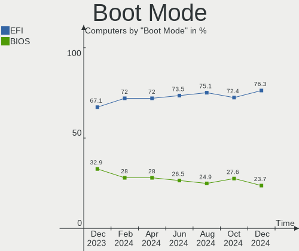
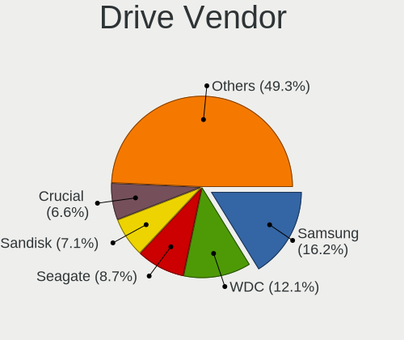
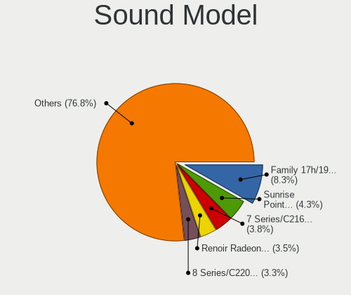
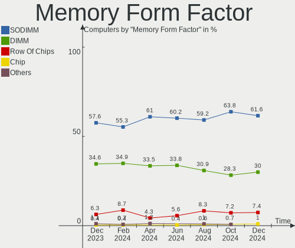

Linux Mint - Hardware Trends
----------------------------

A project to identify most popular hardware characteristics and track their change
over time based on data collected by Linux users at https://Linux-Hardware.org.

Anyone can contribute to this report by the [hw-probe](https://github.com/linuxhw/hw-probe) tool:

    sudo -E hw-probe -all -upload

This is a report for all computer types. See also reports for [desktops](/Dist/Linux_Mint/Desktop/README.md) and [notebooks](/Dist/Linux_Mint/Notebook/README.md).

This report is for one last month. Overall report since the beginning of time: [TestDays](https://github.com/linuxhw/TestDays)

Period: Apr, 2023.

Contents
--------

* [ System ](#system)
  - [ OS                       ](#os)
  - [ OS Family                ](#os-family)
  - [ Kernel                   ](#kernel)
  - [ Kernel Family            ](#kernel-family)
  - [ Kernel Major Ver.        ](#kernel-major-ver)
  - [ Arch                     ](#arch)
  - [ DE                       ](#de)
  - [ Display Server           ](#display-server)
  - [ Display Manager          ](#display-manager)
  - [ OS Lang                  ](#os-lang)
  - [ Boot Mode                ](#boot-mode)
  - [ Filesystem               ](#filesystem)
  - [ Part. scheme             ](#part-scheme)
  - [ Dual Boot with Linux/BSD ](#dual-boot-with-linuxbsd)
  - [ Dual Boot (Win)          ](#dual-boot-win)

* [ Board ](#board)
  - [ Vendor                   ](#vendor)
  - [ Model                    ](#model)
  - [ Model Family             ](#model-family)
  - [ MFG Year                 ](#mfg-year)
  - [ Form Factor              ](#form-factor)
  - [ Secure Boot              ](#secure-boot)
  - [ Coreboot                 ](#coreboot)
  - [ RAM Size                 ](#ram-size)
  - [ RAM Used                 ](#ram-used)
  - [ Total Drives             ](#total-drives)
  - [ Has CD-ROM               ](#has-cd-rom)
  - [ Has Ethernet             ](#has-ethernet)
  - [ Has WiFi                 ](#has-wifi)
  - [ Has Bluetooth            ](#has-bluetooth)

* [ Location ](#location)
  - [ Country                  ](#country)
  - [ City                     ](#city)

* [ Drives ](#drives)
  - [ Drive Vendor             ](#drive-vendor)
  - [ Drive Model              ](#drive-model)
  - [ HDD Vendor               ](#hdd-vendor)
  - [ SSD Vendor               ](#ssd-vendor)
  - [ Drive Kind               ](#drive-kind)
  - [ Drive Connector          ](#drive-connector)
  - [ Drive Size               ](#drive-size)
  - [ Space Total              ](#space-total)
  - [ Space Used               ](#space-used)
  - [ Malfunc. Drives          ](#malfunc-drives)
  - [ Malfunc. Drive Vendor    ](#malfunc-drive-vendor)
  - [ Malfunc. HDD Vendor      ](#malfunc-hdd-vendor)
  - [ Malfunc. Drive Kind      ](#malfunc-drive-kind)
  - [ Failed Drives            ](#failed-drives)
  - [ Failed Drive Vendor      ](#failed-drive-vendor)
  - [ Drive Status             ](#drive-status)

* [ Storage controller ](#storage-controller)
  - [ Storage Vendor           ](#storage-vendor)
  - [ Storage Model            ](#storage-model)
  - [ Storage Kind             ](#storage-kind)

* [ Processor ](#processor)
  - [ CPU Vendor               ](#cpu-vendor)
  - [ CPU Model                ](#cpu-model)
  - [ CPU Model Family         ](#cpu-model-family)
  - [ CPU Cores                ](#cpu-cores)
  - [ CPU Sockets              ](#cpu-sockets)
  - [ CPU Threads              ](#cpu-threads)
  - [ CPU Op-Modes             ](#cpu-op-modes)
  - [ CPU Microcode            ](#cpu-microcode)
  - [ CPU Microarch            ](#cpu-microarch)

* [ Graphics ](#graphics)
  - [ GPU Vendor               ](#gpu-vendor)
  - [ GPU Model                ](#gpu-model)
  - [ GPU Combo                ](#gpu-combo)
  - [ GPU Driver               ](#gpu-driver)
  - [ GPU Memory               ](#gpu-memory)

* [ Monitor ](#monitor)
  - [ Monitor Vendor           ](#monitor-vendor)
  - [ Monitor Model            ](#monitor-model)
  - [ Monitor Resolution       ](#monitor-resolution)
  - [ Monitor Diagonal         ](#monitor-diagonal)
  - [ Monitor Width            ](#monitor-width)
  - [ Aspect Ratio             ](#aspect-ratio)
  - [ Monitor Area             ](#monitor-area)
  - [ Pixel Density            ](#pixel-density)
  - [ Multiple Monitors        ](#multiple-monitors)

* [ Network ](#network)
  - [ Net Controller Vendor    ](#net-controller-vendor)
  - [ Net Controller Model     ](#net-controller-model)
  - [ Wireless Vendor          ](#wireless-vendor)
  - [ Wireless Model           ](#wireless-model)
  - [ Ethernet Vendor          ](#ethernet-vendor)
  - [ Ethernet Model           ](#ethernet-model)
  - [ Net Controller Kind      ](#net-controller-kind)
  - [ Used Controller          ](#used-controller)
  - [ NICs                     ](#nics)
  - [ IPv6                     ](#ipv6)

* [ Bluetooth ](#bluetooth)
  - [ Bluetooth Vendor         ](#bluetooth-vendor)
  - [ Bluetooth Model          ](#bluetooth-model)

* [ Sound ](#sound)
  - [ Sound Vendor             ](#sound-vendor)
  - [ Sound Model              ](#sound-model)

* [ Memory ](#memory)
  - [ Memory Vendor            ](#memory-vendor)
  - [ Memory Model             ](#memory-model)
  - [ Memory Kind              ](#memory-kind)
  - [ Memory Form Factor       ](#memory-form-factor)
  - [ Memory Size              ](#memory-size)
  - [ Memory Speed             ](#memory-speed)

* [ Printers & scanners ](#printers--scanners)
  - [ Printer Vendor           ](#printer-vendor)
  - [ Printer Model            ](#printer-model)
  - [ Scanner Vendor           ](#scanner-vendor)
  - [ Scanner Model            ](#scanner-model)

* [ Camera ](#camera)
  - [ Camera Vendor            ](#camera-vendor)
  - [ Camera Model             ](#camera-model)

* [ Security ](#security)
  - [ Fingerprint Vendor       ](#fingerprint-vendor)
  - [ Fingerprint Model        ](#fingerprint-model)
  - [ Chipcard Vendor          ](#chipcard-vendor)
  - [ Chipcard Model           ](#chipcard-model)

* [ Unsupported ](#unsupported)
  - [ Unsupported Devices      ](#unsupported-devices)
  - [ Unsupported Device Types ](#unsupported-device-types)

System
------

OS
--

Installed operating systems

| Name            | Computers | Percent |
|-----------------|-----------|---------|
| Linux Mint 21.1 | 399       | 77.63%  |
| Linux Mint 20.3 | 48        | 9.34%   |
| Linux Mint 21   | 38        | 7.39%   |
| Linux Mint 20.2 | 6         | 1.17%   |
| Linux Mint 20.1 | 6         | 1.17%   |
| Linux Mint 19.3 | 4         | 0.78%   |
| Linux Mint 18.3 | 4         | 0.78%   |
| Linux Mint 19   | 3         | 0.58%   |
| Linux Mint 20   | 2         | 0.39%   |
| Linux Mint 19.2 | 2         | 0.39%   |
| Linux Mint 19.1 | 1         | 0.19%   |
| Linux Mint 18   | 1         | 0.19%   |

OS Family
---------

OS without a version

| Name       | Computers | Percent |
|------------|-----------|---------|
| Linux Mint | 514       | 100%    |

Kernel
------

Version of the Linux kernel

| Version                 | Computers | Percent |
|-------------------------|-----------|---------|
| 5.15.0-69-generic       | 208       | 40.47%  |
| 5.15.0-70-generic       | 71        | 13.81%  |
| 5.15.0-56-generic       | 40        | 7.78%   |
| 5.15.0-71-generic       | 36        | 7%      |
| 5.4.0-146-generic       | 24        | 4.67%   |
| 5.19.0-38-generic       | 24        | 4.67%   |
| 5.15.0-67-generic       | 14        | 2.72%   |
| 5.4.0-147-generic       | 12        | 2.33%   |
| 5.19.0-40-generic       | 9         | 1.75%   |
| 5.19.0-41-generic       | 7         | 1.36%   |
| 5.15.0-58-generic       | 5         | 0.97%   |
| 5.4.0-148-generic       | 4         | 0.78%   |
| 6.2.0-060200-generic    | 3         | 0.58%   |
| 6.1.0-1009-oem          | 3         | 0.58%   |
| 5.4.0-144-generic       | 3         | 0.58%   |
| 5.15.0-41-generic       | 3         | 0.58%   |
| 4.15.0-209-generic      | 3         | 0.58%   |
| 6.2.9-060209-generic    | 2         | 0.39%   |
| 6.2.11-060211-generic   | 2         | 0.39%   |
| 6.1.0-1008-oem          | 2         | 0.39%   |
| 5.4.0-58-generic        | 2         | 0.39%   |
| 5.4.0-139-generic       | 2         | 0.39%   |
| 5.15.0-60-generic       | 2         | 0.39%   |
| 5.15.0-57-generic       | 2         | 0.39%   |
| 5.15.0-52-generic       | 2         | 0.39%   |
| 4.15.0-54-generic       | 2         | 0.39%   |
| 4.15.0-142-generic      | 2         | 0.39%   |
| 6.2.8-060208-generic    | 1         | 0.19%   |
| 6.2.8                   | 1         | 0.19%   |
| 6.2.7-060207-generic    | 1         | 0.19%   |
| 6.2.13-1-liquorix-amd64 | 1         | 0.19%   |
| 6.2.12-x64v3-xanmod1    | 1         | 0.19%   |
| 6.2.12-060212-generic   | 1         | 0.19%   |
| 6.2.10-060210-generic   | 1         | 0.19%   |
| 6.1.20-060120-generic   | 1         | 0.19%   |
| 6.1.13-060113-generic   | 1         | 0.19%   |
| 6.0.9-060009-generic    | 1         | 0.19%   |
| 6.0.3-060003-generic    | 1         | 0.19%   |
| 6.0.0-1013-oem          | 1         | 0.19%   |
| 5.4.0-80-generic        | 1         | 0.19%   |

Kernel Family
-------------

Linux kernel without a distro release

| Version | Computers | Percent |
|---------|-----------|---------|
| 5.15.0  | 383       | 74.51%  |
| 5.4.0   | 54        | 10.51%  |
| 5.19.0  | 40        | 7.78%   |
| 4.15.0  | 9         | 1.75%   |
| 6.1.0   | 5         | 0.97%   |
| 6.2.0   | 3         | 0.58%   |
| 6.2.9   | 2         | 0.39%   |
| 6.2.8   | 2         | 0.39%   |
| 6.2.12  | 2         | 0.39%   |
| 6.2.11  | 2         | 0.39%   |
| 6.2.7   | 1         | 0.19%   |
| 6.2.13  | 1         | 0.19%   |
| 6.2.10  | 1         | 0.19%   |
| 6.1.20  | 1         | 0.19%   |
| 6.1.13  | 1         | 0.19%   |
| 6.0.9   | 1         | 0.19%   |
| 6.0.3   | 1         | 0.19%   |
| 6.0.0   | 1         | 0.19%   |
| 5.17.0  | 1         | 0.19%   |
| 5.0.0   | 1         | 0.19%   |
| 4.4.0   | 1         | 0.19%   |
| 4.10.0  | 1         | 0.19%   |

Kernel Major Ver.
-----------------

Linux kernel major version

| Version | Computers | Percent |
|---------|-----------|---------|
| 5.15    | 383       | 74.51%  |
| 5.4     | 54        | 10.51%  |
| 5.19    | 40        | 7.78%   |
| 6.2     | 14        | 2.72%   |
| 4.15    | 9         | 1.75%   |
| 6.1     | 7         | 1.36%   |
| 6.0     | 3         | 0.58%   |
| 5.17    | 1         | 0.19%   |
| 5.0     | 1         | 0.19%   |
| 4.4     | 1         | 0.19%   |
| 4.10    | 1         | 0.19%   |

Arch
----

OS architecture (x86_64, i586, etc.)

| Name   | Computers | Percent |
|--------|-----------|---------|
| x86_64 | 513       | 99.81%  |
| i686   | 1         | 0.19%   |

DE
--

Desktop Environment

| Name       | Computers | Percent |
|------------|-----------|---------|
| X-Cinnamon | 352       | 68.48%  |
| MATE       | 73        | 14.2%   |
| XFCE       | 68        | 13.23%  |
| Cinnamon   | 9         | 1.75%   |
| KDE5       | 6         | 1.17%   |
| GNOME      | 3         | 0.58%   |
| Jwm        | 1         | 0.19%   |
| i3         | 1         | 0.19%   |
| Unknown    | 1         | 0.19%   |

Display Server
--------------

X11 or Wayland

| Name | Computers | Percent |
|------|-----------|---------|
| X11  | 514       | 100%    |

Display Manager
---------------

SDDM, LightDM, etc.

| Name    | Computers | Percent |
|---------|-----------|---------|
| Unknown | 258       | 50.19%  |
| LightDM | 251       | 48.83%  |
| SDDM    | 2         | 0.39%   |
| MDM     | 1         | 0.19%   |
| LXDM    | 1         | 0.19%   |
| GDM3    | 1         | 0.19%   |

OS Lang
-------

Language

| Lang  | Computers | Percent |
|-------|-----------|---------|
| en_US | 148       | 28.79%  |
| de_DE | 83        | 16.15%  |
| fr_FR | 46        | 8.95%   |
| en_GB | 30        | 5.84%   |
| ru_RU | 25        | 4.86%   |
| pt_BR | 22        | 4.28%   |
| C     | 19        | 3.7%    |
| en_CA | 18        | 3.5%    |
| it_IT | 17        | 3.31%   |
| en_AU | 11        | 2.14%   |
| nl_NL | 9         | 1.75%   |
| pl_PL | 8         | 1.56%   |
| es_ES | 8         | 1.56%   |
| sk_SK | 6         | 1.17%   |
| en_IN | 6         | 1.17%   |
| de_AT | 6         | 1.17%   |
| en_IE | 4         | 0.78%   |
| sv_SE | 3         | 0.58%   |
| hu_HU | 3         | 0.58%   |
| de_CH | 3         | 0.58%   |
| uk_UA | 2         | 0.39%   |
| pt_PT | 2         | 0.39%   |
| fr_CA | 2         | 0.39%   |
| fr_BE | 2         | 0.39%   |
| fi_FI | 2         | 0.39%   |
| es_MX | 2         | 0.39%   |
| es_CL | 2         | 0.39%   |
| es_AR | 2         | 0.39%   |
| en_ZA | 2         | 0.39%   |
| el_GR | 2         | 0.39%   |
| zh_CN | 1         | 0.19%   |
| tr_TR | 1         | 0.19%   |
| ro_RO | 1         | 0.19%   |
| ko_KR | 1         | 0.19%   |
| ja_JP | 1         | 0.19%   |
| es_VE | 1         | 0.19%   |
| es_GT | 1         | 0.19%   |
| es_EC | 1         | 0.19%   |
| es_DO | 1         | 0.19%   |
| es_CU | 1         | 0.19%   |

Boot Mode
---------

EFI or BIOS

| Mode | Computers | Percent |
|------|-----------|---------|
| EFI  | 336       | 65.37%  |
| BIOS | 178       | 34.63%  |

Filesystem
----------

Type of filesystem

| Type    | Computers | Percent |
|---------|-----------|---------|
| Ext4    | 469       | 91.25%  |
| Overlay | 20        | 3.89%   |
| Btrfs   | 9         | 1.75%   |
| Zfs     | 8         | 1.56%   |
| Tmpfs   | 5         | 0.97%   |
| Xfs     | 3         | 0.58%   |

Part. scheme
------------

Scheme of partitioning

| Type    | Computers | Percent |
|---------|-----------|---------|
| Unknown | 257       | 50%     |
| GPT     | 223       | 43.39%  |
| MBR     | 34        | 6.61%   |

Dual Boot with Linux/BSD
------------------------

Hosting more than one Linux/BSD

| Dual boot | Computers | Percent |
|-----------|-----------|---------|
| No        | 476       | 92.61%  |
| Yes       | 38        | 7.39%   |

Dual Boot (Win)
---------------

Hosting Linux and Windows

| Dual boot | Computers | Percent |
|-----------|-----------|---------|
| No        | 406       | 78.99%  |
| Yes       | 108       | 21.01%  |

Board
-----

Vendor
------

Motherboard manufacturer

| Name                                 | Computers | Percent |
|--------------------------------------|-----------|---------|
| ASUSTek Computer                     | 86        | 16.73%  |
| Hewlett-Packard                      | 82        | 15.95%  |
| Lenovo                               | 61        | 11.87%  |
| Dell                                 | 58        | 11.28%  |
| Acer                                 | 37        | 7.2%    |
| Gigabyte Technology                  | 36        | 7%      |
| MSI                                  | 32        | 6.23%   |
| Apple                                | 15        | 2.92%   |
| ASRock                               | 11        | 2.14%   |
| Samsung Electronics                  | 9         | 1.75%   |
| Toshiba                              | 7         | 1.36%   |
| Medion                               | 7         | 1.36%   |
| Intel                                | 7         | 1.36%   |
| HUAWEI                               | 7         | 1.36%   |
| Sony                                 | 4         | 0.78%   |
| OEM                                  | 3         | 0.58%   |
| GPU Company                          | 3         | 0.58%   |
| Google                               | 3         | 0.58%   |
| Gateway                              | 3         | 0.58%   |
| AZW                                  | 3         | 0.58%   |
| AMI                                  | 3         | 0.58%   |
| Unknown                              | 3         | 0.58%   |
| Wortmann AG                          | 2         | 0.39%   |
| PCWare                               | 2         | 0.39%   |
| Foxconn                              | 2         | 0.39%   |
| Biostar                              | 2         | 0.39%   |
| AMD                                  | 2         | 0.39%   |
| Valve                                | 1         | 0.19%   |
| Timi                                 | 1         | 0.19%   |
| Thomson                              | 1         | 0.19%   |
| Shuttle                              | 1         | 0.19%   |
| Shenzhen Meigao Electronic Equipment | 1         | 0.19%   |
| Positivo                             | 1         | 0.19%   |
| Pegatron                             | 1         | 0.19%   |
| Notebook                             | 1         | 0.19%   |
| Microsoft                            | 1         | 0.19%   |
| MACHENIKE                            | 1         | 0.19%   |
| KEIAN                                | 1         | 0.19%   |
| Inventec                             | 1         | 0.19%   |
| Huanan                               | 1         | 0.19%   |

Model
-----

Motherboard model

| Name                                        | Computers | Percent |
|---------------------------------------------|-----------|---------|
| HP Pavilion 15                              | 4         | 0.78%   |
| ASUS All Series                             | 4         | 0.78%   |
| MSI MS-7C37                                 | 3         | 0.58%   |
| HP Pavilion g6                              | 3         | 0.58%   |
| Gigabyte B550 AORUS ELITE V2                | 3         | 0.58%   |
| ASUS TUF Gaming B550M-PLUS                  | 3         | 0.58%   |
| Unknown                                     | 3         | 0.58%   |
| Samsung 300E4A/300E5A/300E7A                | 2         | 0.39%   |
| MSI MS-7C56                                 | 2         | 0.39%   |
| MSI MS-7C52                                 | 2         | 0.39%   |
| MSI MS-7B86                                 | 2         | 0.39%   |
| Lenovo ThinkPad X1 Carbon Gen 10 21CBCTO1WW | 2         | 0.39%   |
| Lenovo IdeaPad 330-15IKB 81DE               | 2         | 0.39%   |
| HUAWEI NBLK-WAX9X                           | 2         | 0.39%   |
| HP Pavilion dv7                             | 2         | 0.39%   |
| HP Pavilion 17                              | 2         | 0.39%   |
| HP Laptop 17-cp0xxx                         | 2         | 0.39%   |
| HP EliteBook 8460p                          | 2         | 0.39%   |
| HP EliteBook 840 G1                         | 2         | 0.39%   |
| HP 255 15.6 inch G9 Notebook PC             | 2         | 0.39%   |
| HP 2000                                     | 2         | 0.39%   |
| Gigabyte X570 GAMING X                      | 2         | 0.39%   |
| Gigabyte GA-MA785GM-US2H                    | 2         | 0.39%   |
| Gigabyte B450 AORUS M                       | 2         | 0.39%   |
| Dell OptiPlex 990                           | 2         | 0.39%   |
| Dell OptiPlex 9020                          | 2         | 0.39%   |
| Dell OptiPlex 780                           | 2         | 0.39%   |
| Dell OptiPlex 7010                          | 2         | 0.39%   |
| Dell OptiPlex 3020                          | 2         | 0.39%   |
| Dell Latitude E5520                         | 2         | 0.39%   |
| Dell Latitude 5430                          | 2         | 0.39%   |
| Dell Latitude 5420                          | 2         | 0.39%   |
| ASUS TUF Gaming X570-PLUS                   | 2         | 0.39%   |
| ASUS SABERTOOTH 990FX R2.0                  | 2         | 0.39%   |
| ASUS M5A78L-M PLUS/USB3                     | 2         | 0.39%   |
| Apple iMac18,3                              | 2         | 0.39%   |
| AMI Intel                                   | 2         | 0.39%   |
| Acer Aspire 5336                            | 2         | 0.39%   |
| Wortmann AG TERRA_MOBILE_1749               | 1         | 0.19%   |
| Wortmann AG TERRA_MOBILE_1160               | 1         | 0.19%   |

Model Family
------------

Motherboard model prefix

| Name               | Computers | Percent |
|--------------------|-----------|---------|
| Lenovo ThinkPad    | 26        | 5.06%   |
| Acer Aspire        | 26        | 5.06%   |
| Dell Latitude      | 23        | 4.47%   |
| HP Pavilion        | 21        | 4.09%   |
| Dell OptiPlex      | 16        | 3.11%   |
| Lenovo IdeaPad     | 12        | 2.33%   |
| HP EliteBook       | 12        | 2.33%   |
| Dell Inspiron      | 9         | 1.75%   |
| ASUS TUF           | 9         | 1.75%   |
| ASUS PRIME         | 9         | 1.75%   |
| Lenovo ThinkCentre | 7         | 1.36%   |
| Toshiba Satellite  | 6         | 1.17%   |
| HP Laptop          | 6         | 1.17%   |
| ASUS VivoBook      | 6         | 1.17%   |
| ASUS ROG           | 6         | 1.17%   |
| HP ProBook         | 5         | 0.97%   |
| HP Compaq          | 5         | 0.97%   |
| Dell Precision     | 5         | 0.97%   |
| ASUS Zenbook       | 5         | 0.97%   |
| Acer TravelMate    | 5         | 0.97%   |
| Lenovo Yoga        | 4         | 0.78%   |
| ASUS All           | 4         | 0.78%   |
| MSI MS-7C37        | 3         | 0.58%   |
| Lenovo Legion      | 3         | 0.58%   |
| HP ZBook           | 3         | 0.58%   |
| HP EliteDesk       | 3         | 0.58%   |
| HP 255             | 3         | 0.58%   |
| Gigabyte X570      | 3         | 0.58%   |
| Gigabyte B550      | 3         | 0.58%   |
| Dell XPS           | 3         | 0.58%   |
| ASUS M5A78L-M      | 3         | 0.58%   |
| ASUS ASUS          | 3         | 0.58%   |
| Unknown            | 3         | 0.58%   |
| Wortmann AG TERRA  | 2         | 0.39%   |
| Samsung 300E4A     | 2         | 0.39%   |
| MSI MS-7C56        | 2         | 0.39%   |
| MSI MS-7C52        | 2         | 0.39%   |
| MSI MS-7B86        | 2         | 0.39%   |
| Lenovo ThinkBook   | 2         | 0.39%   |
| HUAWEI NBLK-WAX9X  | 2         | 0.39%   |

MFG Year
--------

Motherboard manufacture year

| Year | Computers | Percent |
|------|-----------|---------|
| 2021 | 52        | 10.12%  |
| 2011 | 48        | 9.34%   |
| 2020 | 43        | 8.37%   |
| 2019 | 41        | 7.98%   |
| 2012 | 41        | 7.98%   |
| 2022 | 40        | 7.78%   |
| 2013 | 35        | 6.81%   |
| 2018 | 33        | 6.42%   |
| 2015 | 33        | 6.42%   |
| 2014 | 30        | 5.84%   |
| 2017 | 28        | 5.45%   |
| 2010 | 25        | 4.86%   |
| 2009 | 20        | 3.89%   |
| 2016 | 18        | 3.5%    |
| 2008 | 11        | 2.14%   |
| 2007 | 9         | 1.75%   |
| 2023 | 5         | 0.97%   |
| 2006 | 2         | 0.39%   |

Form Factor
-----------

Physical design of the computer

| Name        | Computers | Percent |
|-------------|-----------|---------|
| Notebook    | 279       | 54.28%  |
| Desktop     | 203       | 39.49%  |
| Convertible | 12        | 2.33%   |
| Mini pc     | 9         | 1.75%   |
| All in one  | 7         | 1.36%   |
| Tablet      | 3         | 0.58%   |
| Server      | 1         | 0.19%   |

Secure Boot
-----------

Enabled or disabled

| State    | Computers | Percent |
|----------|-----------|---------|
| Disabled | 472       | 91.83%  |
| Enabled  | 42        | 8.17%   |

Coreboot
--------

Have coreboot on board

| Used | Computers | Percent |
|------|-----------|---------|
| No   | 511       | 99.42%  |
| Yes  | 3         | 0.58%   |

RAM Size
--------

Total RAM memory

| Size in GB  | Computers | Percent |
|-------------|-----------|---------|
| 4.01-8.0    | 124       | 24.12%  |
| 16.01-24.0  | 114       | 22.18%  |
| 3.01-4.0    | 91        | 17.7%   |
| 8.01-16.0   | 86        | 16.73%  |
| 32.01-64.0  | 55        | 10.7%   |
| 64.01-256.0 | 15        | 2.92%   |
| 24.01-32.0  | 13        | 2.53%   |
| 1.01-2.0    | 11        | 2.14%   |
| 2.01-3.0    | 5         | 0.97%   |

RAM Used
--------

Used RAM memory

| Used GB    | Computers | Percent |
|------------|-----------|---------|
| 2.01-3.0   | 166       | 32.3%   |
| 1.01-2.0   | 165       | 32.1%   |
| 3.01-4.0   | 79        | 15.37%  |
| 4.01-8.0   | 65        | 12.65%  |
| 8.01-16.0  | 18        | 3.5%    |
| 0.51-1.0   | 17        | 3.31%   |
| 16.01-24.0 | 2         | 0.39%   |
| 24.01-32.0 | 1         | 0.19%   |
| 0.01-0.5   | 1         | 0.19%   |

Total Drives
------------

Number of drives on board

| Drives | Computers | Percent |
|--------|-----------|---------|
| 1      | 298       | 57.98%  |
| 2      | 133       | 25.88%  |
| 3      | 40        | 7.78%   |
| 4      | 21        | 4.09%   |
| 6      | 9         | 1.75%   |
| 5      | 9         | 1.75%   |
| 7      | 2         | 0.39%   |
| 28     | 1         | 0.19%   |
| 8      | 1         | 0.19%   |

Has CD-ROM
----------

Has CD-ROM on board

| Presented | Computers | Percent |
|-----------|-----------|---------|
| No        | 284       | 55.25%  |
| Yes       | 230       | 44.75%  |

Has Ethernet
------------

Has Ethernet on board

| Presented | Computers | Percent |
|-----------|-----------|---------|
| Yes       | 445       | 86.58%  |
| No        | 69        | 13.42%  |

Has WiFi
--------

Has WiFi module

| Presented | Computers | Percent |
|-----------|-----------|---------|
| Yes       | 392       | 76.26%  |
| No        | 122       | 23.74%  |

Has Bluetooth
-------------

Has Bluetooth module

| Presented | Computers | Percent |
|-----------|-----------|---------|
| Yes       | 313       | 60.89%  |
| No        | 201       | 39.11%  |

Location
--------

Country
-------

Geographic location (country)

| Country      | Computers | Percent |
|--------------|-----------|---------|
| Germany      | 91        | 17.7%   |
| USA          | 74        | 14.4%   |
| France       | 46        | 8.95%   |
| UK           | 30        | 5.84%   |
| Brazil       | 27        | 5.25%   |
| Italy        | 22        | 4.28%   |
| Russia       | 21        | 4.09%   |
| Canada       | 21        | 4.09%   |
| Poland       | 17        | 3.31%   |
| Netherlands  | 15        | 2.92%   |
| Spain        | 11        | 2.14%   |
| Australia    | 11        | 2.14%   |
| Sweden       | 9         | 1.75%   |
| Austria      | 8         | 1.56%   |
| Slovakia     | 7         | 1.36%   |
| India        | 7         | 1.36%   |
| Turkey       | 6         | 1.17%   |
| Greece       | 5         | 0.97%   |
| Ukraine      | 4         | 0.78%   |
| Switzerland  | 4         | 0.78%   |
| Pakistan     | 4         | 0.78%   |
| Indonesia    | 4         | 0.78%   |
| Chile        | 4         | 0.78%   |
| Mexico       | 3         | 0.58%   |
| Ireland      | 3         | 0.58%   |
| Hungary      | 3         | 0.58%   |
| Finland      | 3         | 0.58%   |
| Ecuador      | 3         | 0.58%   |
| Denmark      | 3         | 0.58%   |
| Belgium      | 3         | 0.58%   |
| Belarus      | 3         | 0.58%   |
| South Africa | 2         | 0.39%   |
| Serbia       | 2         | 0.39%   |
| Romania      | 2         | 0.39%   |
| Czechia      | 2         | 0.39%   |
| Croatia      | 2         | 0.39%   |
| Colombia     | 2         | 0.39%   |
| Bulgaria     | 2         | 0.39%   |
| Argentina    | 2         | 0.39%   |
| Vietnam      | 1         | 0.19%   |

City
----

Geographic location (city)

| City                  | Computers | Percent |
|-----------------------|-----------|---------|
| Stockholm             | 6         | 1.17%   |
| Poznan                | 6         | 1.17%   |
| London                | 6         | 1.17%   |
| Warsaw                | 5         | 0.97%   |
| Vienna                | 4         | 0.78%   |
| Montreal              | 4         | 0.78%   |
| Mannheim              | 4         | 0.78%   |
| Caen                  | 4         | 0.78%   |
| Vancouver             | 3         | 0.58%   |
| Toulouse              | 3         | 0.58%   |
| St Petersburg         | 3         | 0.58%   |
| Santiago              | 3         | 0.58%   |
| Rome                  | 3         | 0.58%   |
| Paris                 | 3         | 0.58%   |
| New Westminster       | 3         | 0.58%   |
| Moscow                | 3         | 0.58%   |
| Melbourne             | 3         | 0.58%   |
| Madrid                | 3         | 0.58%   |
| Lübeck               | 3         | 0.58%   |
| Lodz                  | 3         | 0.58%   |
| Cologne               | 3         | 0.58%   |
| Brisbane              | 3         | 0.58%   |
| Zurich                | 2         | 0.39%   |
| Yekaterinburg         | 2         | 0.39%   |
| West Valley City      | 2         | 0.39%   |
| Traunstein            | 2         | 0.39%   |
| Torricella Sicura     | 2         | 0.39%   |
| The Hague             | 2         | 0.39%   |
| Rio de Janeiro        | 2         | 0.39%   |
| Reutlingen            | 2         | 0.39%   |
| Podolsk               | 2         | 0.39%   |
| Nizhniy Novgorod      | 2         | 0.39%   |
| Munich                | 2         | 0.39%   |
| Milano                | 2         | 0.39%   |
| Milan                 | 2         | 0.39%   |
| Maxhutte-Haidhof      | 2         | 0.39%   |
| Ludwigshafen am Rhein | 2         | 0.39%   |
| Londrina              | 2         | 0.39%   |
| Lahore                | 2         | 0.39%   |
| Kiel                  | 2         | 0.39%   |

Drives
------

Drive Vendor
------------

Hard drive vendors

| Vendor                      | Computers | Drives | Percent |
|-----------------------------|-----------|--------|---------|
| Samsung Electronics         | 116       | 145    | 14.99%  |
| WDC                         | 108       | 149    | 13.95%  |
| Seagate                     | 90        | 118    | 11.63%  |
| SanDisk                     | 54        | 60     | 6.98%   |
| Toshiba                     | 44        | 51     | 5.68%   |
| Kingston                    | 44        | 49     | 5.68%   |
| Crucial                     | 35        | 39     | 4.52%   |
| Hitachi                     | 33        | 33     | 4.26%   |
| Unknown                     | 30        | 37     | 3.88%   |
| Intel                       | 18        | 19     | 2.33%   |
| SK hynix                    | 17        | 17     | 2.2%    |
| China                       | 13        | 13     | 1.68%   |
| Kingston Technology Company | 11        | 11     | 1.42%   |
| A-DATA Technology           | 10        | 10     | 1.29%   |
| HGST                        | 9         | 9      | 1.16%   |
| Intenso                     | 8         | 9      | 1.03%   |
| Apple                       | 8         | 12     | 1.03%   |
| Unknown                     | 7         | 7      | 0.9%    |
| Micron Technology           | 6         | 6      | 0.78%   |
| Transcend                   | 5         | 5      | 0.65%   |
| Phison Electronics          | 5         | 5      | 0.65%   |
| Phison                      | 5         | 5      | 0.65%   |
| KIOXIA                      | 5         | 5      | 0.65%   |
| JMicron Technology          | 5         | 7      | 0.65%   |
| GOODRAM                     | 5         | 5      | 0.65%   |
| PNY                         | 4         | 4      | 0.52%   |
| Micron/Crucial Technology   | 4         | 4      | 0.52%   |
| Fanxiang                    | 4         | 4      | 0.52%   |
| Team                        | 3         | 3      | 0.39%   |
| SPCC                        | 3         | 3      | 0.39%   |
| Realtek Semiconductor       | 3         | 3      | 0.39%   |
| Netac                       | 3         | 3      | 0.39%   |
| Maxtor                      | 3         | 3      | 0.39%   |
| FORESEE                     | 3         | 3      | 0.39%   |
| Verbatim                    | 2         | 2      | 0.26%   |
| UMIS                        | 2         | 2      | 0.26%   |
| Silicon Motion              | 2         | 2      | 0.26%   |
| SABRENT                     | 2         | 2      | 0.26%   |
| Patriot                     | 2         | 2      | 0.26%   |
| OCZ-VERTEX3                 | 2         | 2      | 0.26%   |

Drive Model
-----------

Hard drive models

| Model                                              | Computers | Percent |
|----------------------------------------------------|-----------|---------|
| Kingston SA400S37240G 240GB SSD                    | 15        | 1.71%   |
| Samsung NVMe SSD Controller SM981/PM981/PM983 1TB  | 11        | 1.26%   |
| Samsung SSD 860 EVO 500GB                          | 8         | 0.91%   |
| Samsung SSD 850 EVO 250GB                          | 8         | 0.91%   |
| Seagate ST1000DM010-2EP102 1TB                     | 7         | 0.8%    |
| Crucial CT480BX500SSD1 480GB                       | 7         | 0.8%    |
| Unknown                                            | 7         | 0.8%    |
| Seagate ST1000LM035-1RK172 970GB                   | 6         | 0.68%   |
| Samsung SSD 860 EVO 1TB                            | 6         | 0.68%   |
| Samsung SSD 850 EVO 500GB                          | 6         | 0.68%   |
| Kingston SA400S37480G 480GB SSD                    | 6         | 0.68%   |
| Unknown SD/MMC/MS PRO 249GB                        | 5         | 0.57%   |
| Toshiba DT01ACA200 2TB                             | 5         | 0.57%   |
| Toshiba DT01ACA100 1TB                             | 5         | 0.57%   |
| Seagate ST500DM002-1BD142 500GB                    | 5         | 0.57%   |
| Samsung SSD 870 EVO 500GB                          | 5         | 0.57%   |
| Samsung NVMe SSD Controller PM9A1/PM9A3/980PRO 2TB | 5         | 0.57%   |
| Crucial CT500MX500SSD1 500GB                       | 5         | 0.57%   |
| WDC WDS500G2B0A-00SM50 500GB SSD                   | 4         | 0.46%   |
| WDC WD10EZEX-08WN4A0 1TB                           | 4         | 0.46%   |
| WDC WD10EZEX-00BN5A0 1TB                           | 4         | 0.46%   |
| Unknown MMC Card  32GB                             | 4         | 0.46%   |
| Seagate ST9500325AS 500GB                          | 4         | 0.46%   |
| Seagate Expansion Desk 8TB                         | 4         | 0.46%   |
| SanDisk SDSSDH3512G 512GB                          | 4         | 0.46%   |
| Samsung SSD 870 QVO 2TB                            | 4         | 0.46%   |
| Samsung SSD 840 EVO 250GB                          | 4         | 0.46%   |
| Phison E12 NVMe Controller 512GB                   | 4         | 0.46%   |
| JMicron Generic 1TB                                | 4         | 0.46%   |
| Hitachi HTS547575A9E384 752GB                      | 4         | 0.46%   |
| Hitachi HTS545032B9A300 320GB                      | 4         | 0.46%   |
| Crucial CT1000BX500SSD1 1TB                        | 4         | 0.46%   |
| WDC WDS240G2G0A-00JH30 240GB SSD                   | 3         | 0.34%   |
| WDC WD2003FZEX-00Z4SA0 2TB                         | 3         | 0.34%   |
| Unknown MMC Card  7GB                              | 3         | 0.34%   |
| Unknown MMC Card  64GB                             | 3         | 0.34%   |
| Unknown MMC Card  16GB                             | 3         | 0.34%   |
| Unknown MMC Card  128GB                            | 3         | 0.34%   |
| Toshiba TR200 240GB SSD                            | 3         | 0.34%   |
| Seagate ST3500418AS 500GB                          | 3         | 0.34%   |

HDD Vendor
----------

Hard disk drive vendors

| Vendor              | Computers | Drives | Percent |
|---------------------|-----------|--------|---------|
| Seagate             | 88        | 115    | 31.65%  |
| WDC                 | 83        | 116    | 29.86%  |
| Hitachi             | 33        | 33     | 11.87%  |
| Toshiba             | 32        | 39     | 11.51%  |
| Samsung Electronics | 11        | 11     | 3.96%   |
| HGST                | 9         | 9      | 3.24%   |
| Unknown             | 5         | 5      | 1.8%    |
| JMicron Technology  | 5         | 7      | 1.8%    |
| Maxtor              | 3         | 3      | 1.08%   |
| Apple               | 3         | 3      | 1.08%   |
| Intenso             | 2         | 2      | 0.72%   |
| LaCie               | 1         | 1      | 0.36%   |
| Inateck             | 1         | 1      | 0.36%   |
| Fujitsu             | 1         | 1      | 0.36%   |
| ASMT                | 1         | 1      | 0.36%   |

SSD Vendor
----------

Solid state drive vendors

| Vendor              | Computers | Drives | Percent |
|---------------------|-----------|--------|---------|
| Samsung Electronics | 63        | 71     | 22.11%  |
| Kingston            | 40        | 43     | 14.04%  |
| SanDisk             | 33        | 34     | 11.58%  |
| Crucial             | 32        | 33     | 11.23%  |
| China               | 13        | 13     | 4.56%   |
| WDC                 | 12        | 12     | 4.21%   |
| A-DATA Technology   | 8         | 8      | 2.81%   |
| Toshiba             | 6         | 6      | 2.11%   |
| Intel               | 6         | 6      | 2.11%   |
| Intenso             | 5         | 5      | 1.75%   |
| GOODRAM             | 5         | 5      | 1.75%   |
| Transcend           | 4         | 4      | 1.4%    |
| SK hynix            | 4         | 4      | 1.4%    |
| PNY                 | 4         | 4      | 1.4%    |
| Team                | 3         | 3      | 1.05%   |
| SPCC                | 3         | 3      | 1.05%   |
| Netac               | 3         | 3      | 1.05%   |
| Fanxiang            | 3         | 3      | 1.05%   |
| Apple               | 3         | 3      | 1.05%   |
| Verbatim            | 2         | 2      | 0.7%    |
| Patriot             | 2         | 2      | 0.7%    |
| OCZ-VERTEX3         | 2         | 2      | 0.7%    |
| Lexar               | 2         | 2      | 0.7%    |
| KingSpec            | 2         | 2      | 0.7%    |
| FORESEE             | 2         | 2      | 0.7%    |
| Corsair             | 2         | 2      | 0.7%    |
| Unknown             | 2         | 2      | 0.7%    |
| XrayDisk            | 1         | 1      | 0.35%   |
| V-GeN               | 1         | 1      | 0.35%   |
| Seagate             | 1         | 1      | 0.35%   |
| Rogueware           | 1         | 1      | 0.35%   |
| POLION              | 1         | 1      | 0.35%   |
| Ovation             | 1         | 1      | 0.35%   |
| MyDigitalSSD        | 1         | 1      | 0.35%   |
| Micron Technology   | 1         | 1      | 0.35%   |
| LITEONIT            | 1         | 1      | 0.35%   |
| LITEON              | 1         | 1      | 0.35%   |
| Lenovo              | 1         | 1      | 0.35%   |
| KingFast            | 1         | 1      | 0.35%   |
| INNOVATION IT       | 1         | 1      | 0.35%   |

Drive Kind
----------

HDD or SSD

| Kind    | Computers | Drives | Percent |
|---------|-----------|--------|---------|
| SSD     | 245       | 298    | 35.25%  |
| HDD     | 221       | 347    | 31.8%   |
| NVMe    | 186       | 215    | 26.76%  |
| MMC     | 31        | 36     | 4.46%   |
| Unknown | 12        | 13     | 1.73%   |

Drive Connector
---------------

SATA, SAS, NVMe, etc.

| Type | Computers | Drives | Percent |
|------|-----------|--------|---------|
| SATA | 383       | 619    | 60.13%  |
| NVMe | 184       | 212    | 28.89%  |
| SAS  | 39        | 42     | 6.12%   |
| MMC  | 31        | 36     | 4.87%   |

Drive Size
----------

Size of hard drive

| Size in TB | Computers | Drives | Percent |
|------------|-----------|--------|---------|
| 0.01-0.5   | 284       | 359    | 55.58%  |
| 0.51-1.0   | 145       | 173    | 28.38%  |
| 1.01-2.0   | 48        | 54     | 9.39%   |
| 3.01-4.0   | 15        | 15     | 2.94%   |
| 2.01-3.0   | 10        | 13     | 1.96%   |
| 4.01-10.0  | 6         | 10     | 1.17%   |
| 10.01-20.0 | 3         | 21     | 0.59%   |

Space Total
-----------

Amount of disk space available on the file system

| Size in GB     | Computers | Percent |
|----------------|-----------|---------|
| 101-250        | 151       | 29.38%  |
| 251-500        | 134       | 26.07%  |
| 501-1000       | 73        | 14.2%   |
| 1001-2000      | 44        | 8.56%   |
| More than 3000 | 37        | 7.2%    |
| 51-100         | 22        | 4.28%   |
| 21-50          | 17        | 3.31%   |
| 2001-3000      | 17        | 3.31%   |
| 1-20           | 17        | 3.31%   |
| Unknown        | 2         | 0.39%   |

Space Used
----------

Amount of used disk space

| Used GB        | Computers | Percent |
|----------------|-----------|---------|
| 21-50          | 118       | 22.96%  |
| 1-20           | 104       | 20.23%  |
| 51-100         | 87        | 16.93%  |
| 101-250        | 78        | 15.18%  |
| 251-500        | 50        | 9.73%   |
| 501-1000       | 31        | 6.03%   |
| 1001-2000      | 23        | 4.47%   |
| More than 3000 | 12        | 2.33%   |
| 2001-3000      | 9         | 1.75%   |
| Unknown        | 2         | 0.39%   |

Malfunc. Drives
---------------

Drive models with a malfunction

| Model                                   | Computers | Drives | Percent |
|-----------------------------------------|-----------|--------|---------|
| Toshiba DT01ACA100 1TB                  | 2         | 2      | 3.57%   |
| Seagate ST9500325AS 500GB               | 2         | 2      | 3.57%   |
| WDC WD5000AAKX-22ERMA0 500GB            | 1         | 1      | 1.79%   |
| WDC WD3200AAKS-22L6A0 320GB             | 1         | 1      | 1.79%   |
| WDC WD3200AAJS-60M0A0 320GB             | 1         | 1      | 1.79%   |
| WDC WD3200AAJS-40H3A0 320GB             | 1         | 1      | 1.79%   |
| WDC WD30EZRZ-00Z5HB0 3TB                | 1         | 1      | 1.79%   |
| WDC WD2500BEKT-60A25T1 250GB            | 1         | 1      | 1.79%   |
| WDC WD10EZEX-75ZF5A0 1TB                | 1         | 1      | 1.79%   |
| WDC WD10EZEX-75WN4A0 1TB                | 1         | 1      | 1.79%   |
| WDC WD10EZEX-08WN4A0 1TB                | 1         | 1      | 1.79%   |
| WDC WD10EAVS-32D7B1 1TB                 | 1         | 1      | 1.79%   |
| WDC WD10EADX-22TDHB0 1TB                | 1         | 1      | 1.79%   |
| WDC WD1002FAEX-00Z3A0 1TB               | 1         | 1      | 1.79%   |
| Transcend TS256GSSD230S 256GB           | 1         | 1      | 1.79%   |
| Toshiba MQ01ABD100 1TB                  | 1         | 1      | 1.79%   |
| Toshiba MQ01ABB200 2TB                  | 1         | 1      | 1.79%   |
| Toshiba MK5075GSX 500GB                 | 1         | 1      | 1.79%   |
| Toshiba MK2546GSX 250GB                 | 1         | 1      | 1.79%   |
| Toshiba MK2035GSS 200GB                 | 1         | 1      | 1.79%   |
| Toshiba KSG60ZMV256G M.2 2280 256GB SSD | 1         | 1      | 1.79%   |
| SK hynix SC401 SATA 256GB SSD           | 1         | 1      | 1.79%   |
| SK hynix HFS128G39MNC-2300A 128GB SSD   | 1         | 1      | 1.79%   |
| Seagate ST500LT012-9WS142 500GB         | 1         | 1      | 1.79%   |
| Seagate ST500LM021-1KJ152 500GB         | 1         | 1      | 1.79%   |
| Seagate ST500LM012 HN-M500MBB 500GB     | 1         | 1      | 1.79%   |
| Seagate ST3500418AS 500GB               | 1         | 1      | 1.79%   |
| Seagate ST3500412AS 500GB               | 1         | 1      | 1.79%   |
| Seagate ST3320820AS 320GB               | 1         | 1      | 1.79%   |
| Seagate ST31000520AS 1TB                | 1         | 1      | 1.79%   |
| Seagate ST2000DM006-2DM164 2TB          | 1         | 1      | 1.79%   |
| SanDisk SDSSDH3512G 512GB               | 1         | 1      | 1.79%   |
| SanDisk SDSSDA-2T00 2TB                 | 1         | 1      | 1.79%   |
| Samsung Electronics SSD 970 EVO 1TB     | 1         | 1      | 1.79%   |
| Samsung Electronics HM160HC 160GB       | 1         | 1      | 1.79%   |
| Samsung Electronics HD753LJ 752GB       | 1         | 1      | 1.79%   |
| Samsung Electronics HD322HJ 320GB       | 1         | 1      | 1.79%   |
| Maxtor 7Y250M0 250GB                    | 1         | 1      | 1.79%   |
| Kingston SV300S37A60G 64GB SSD          | 1         | 1      | 1.79%   |
| Kingston SV300S37A120G 120GB SSD        | 1         | 1      | 1.79%   |

Malfunc. Drive Vendor
---------------------

Vendors of faulty drives

| Vendor              | Computers | Drives | Percent |
|---------------------|-----------|--------|---------|
| WDC                 | 11        | 12     | 20.37%  |
| Seagate             | 9         | 10     | 16.67%  |
| Toshiba             | 8         | 8      | 14.81%  |
| Hitachi             | 7         | 7      | 12.96%  |
| Samsung Electronics | 4         | 4      | 7.41%   |
| SK hynix            | 2         | 2      | 3.7%    |
| SanDisk             | 2         | 2      | 3.7%    |
| Kingston            | 2         | 2      | 3.7%    |
| Transcend           | 1         | 1      | 1.85%   |
| Maxtor              | 1         | 1      | 1.85%   |
| Intel               | 1         | 1      | 1.85%   |
| HGST                | 1         | 1      | 1.85%   |
| G.Skill             | 1         | 1      | 1.85%   |
| Fujitsu             | 1         | 1      | 1.85%   |
| Crucial             | 1         | 1      | 1.85%   |
| Apple               | 1         | 1      | 1.85%   |
| A-DATA Technology   | 1         | 1      | 1.85%   |

Malfunc. HDD Vendor
-------------------

Vendors of faulty HDD drives

| Vendor              | Computers | Drives | Percent |
|---------------------|-----------|--------|---------|
| WDC                 | 11        | 12     | 26.83%  |
| Seagate             | 9         | 10     | 21.95%  |
| Toshiba             | 7         | 7      | 17.07%  |
| Hitachi             | 7         | 7      | 17.07%  |
| Samsung Electronics | 3         | 3      | 7.32%   |
| Maxtor              | 1         | 1      | 2.44%   |
| HGST                | 1         | 1      | 2.44%   |
| Fujitsu             | 1         | 1      | 2.44%   |
| Apple               | 1         | 1      | 2.44%   |

Malfunc. Drive Kind
-------------------

Kinds of faulty drives

| Kind | Computers | Drives | Percent |
|------|-----------|--------|---------|
| HDD  | 39        | 43     | 75%     |
| SSD  | 11        | 11     | 21.15%  |
| NVMe | 2         | 2      | 3.85%   |

Failed Drives
-------------

Failed drive models

Zero info for selected period =(

Failed Drive Vendor
-------------------

Failed drive vendors

Zero info for selected period =(

Drive Status
------------

Number of failed and malfunc. drives

| Status   | Computers | Drives | Percent |
|----------|-----------|--------|---------|
| Detected | 297       | 537    | 52.85%  |
| Works    | 216       | 316    | 38.43%  |
| Malfunc  | 49        | 56     | 8.72%   |

Storage controller
------------------

Storage Vendor
--------------

Storage controller vendors

| Vendor                         | Computers | Percent |
|--------------------------------|-----------|---------|
| Intel                          | 314       | 47.65%  |
| AMD                            | 120       | 18.21%  |
| Samsung Electronics            | 57        | 8.65%   |
| SanDisk                        | 40        | 6.07%   |
| Kingston Technology Company    | 17        | 2.58%   |
| ASMedia Technology             | 16        | 2.43%   |
| SK hynix                       | 12        | 1.82%   |
| Phison Electronics             | 10        | 1.52%   |
| Micron/Crucial Technology      | 8         | 1.21%   |
| Nvidia                         | 7         | 1.06%   |
| Marvell Technology Group       | 7         | 1.06%   |
| JMicron Technology             | 7         | 1.06%   |
| KIOXIA                         | 6         | 0.91%   |
| Toshiba America Info Systems   | 5         | 0.76%   |
| Micron Technology              | 5         | 0.76%   |
| Silicon Motion                 | 4         | 0.61%   |
| Realtek Semiconductor          | 3         | 0.46%   |
| MAXIO Technology (Hangzhou)    | 3         | 0.46%   |
| Lite-On Technology             | 3         | 0.46%   |
| VIA Technologies               | 2         | 0.3%    |
| Union Memory (Shenzhen)        | 2         | 0.3%    |
| Silicon Image                  | 2         | 0.3%    |
| LSI Logic / Symbios Logic      | 2         | 0.3%    |
| ADATA Technology               | 2         | 0.3%    |
| Transcend                      | 1         | 0.15%   |
| Solid State Storage Technology | 1         | 0.15%   |
| Shenzhen Longsys Electronics   | 1         | 0.15%   |
| Broadcom / LSI                 | 1         | 0.15%   |
| Apple                          | 1         | 0.15%   |

Storage Model
-------------

Storage controller models

| Model                                                                                   | Computers | Percent |
|-----------------------------------------------------------------------------------------|-----------|---------|
| AMD FCH SATA Controller [AHCI mode]                                                     | 70        | 9.23%   |
| Intel 7 Series Chipset Family 6-port SATA Controller [AHCI mode]                        | 27        | 3.56%   |
| Intel 8 Series/C220 Series Chipset Family 6-port SATA Controller 1 [AHCI mode]          | 26        | 3.43%   |
| Intel 6 Series/C200 Series Chipset Family 6 port Mobile SATA AHCI Controller            | 24        | 3.17%   |
| Samsung NVMe SSD Controller SM981/PM981/PM983                                           | 20        | 2.64%   |
| Samsung NVMe SSD Controller 980                                                         | 18        | 2.37%   |
| AMD SB7x0/SB8x0/SB9x0 SATA Controller [AHCI mode]                                       | 18        | 2.37%   |
| Intel Q170/Q150/B150/H170/H110/Z170/CM236 Chipset SATA Controller [AHCI Mode]           | 16        | 2.11%   |
| AMD SB7x0/SB8x0/SB9x0 IDE Controller                                                    | 16        | 2.11%   |
| Intel 82801 Mobile SATA Controller [RAID mode]                                          | 15        | 1.98%   |
| AMD 500 Series Chipset SATA Controller                                                  | 14        | 1.85%   |
| AMD 400 Series Chipset SATA Controller                                                  | 14        | 1.85%   |
| SanDisk WD Blue SN550 NVMe SSD                                                          | 13        | 1.72%   |
| Intel Volume Management Device NVMe RAID Controller                                     | 13        | 1.72%   |
| Intel Sunrise Point-LP SATA Controller [AHCI mode]                                      | 13        | 1.72%   |
| ASMedia ASM1062 Serial ATA Controller                                                   | 13        | 1.72%   |
| Intel 5 Series/3400 Series Chipset 4 port SATA AHCI Controller                          | 12        | 1.58%   |
| Samsung NVMe SSD Controller PM9A1/PM9A3/980PRO                                          | 10        | 1.32%   |
| Intel Wildcat Point-LP SATA Controller [AHCI Mode]                                      | 10        | 1.32%   |
| Intel Celeron/Pentium Silver Processor SATA Controller                                  | 10        | 1.32%   |
| Intel 8 Series SATA Controller 1 [AHCI mode]                                            | 10        | 1.32%   |
| AMD SB7x0/SB8x0/SB9x0 SATA Controller [IDE mode]                                        | 10        | 1.32%   |
| Intel SATA Controller [RAID mode]                                                       | 9         | 1.19%   |
| Kingston Company Company Non-Volatile memory controller                                 | 8         | 1.06%   |
| SanDisk WD Black SN750 / PC SN730 NVMe SSD                                              | 7         | 0.92%   |
| Intel 200 Series PCH SATA controller [AHCI mode]                                        | 7         | 0.92%   |
| Samsung NVMe SSD Controller SM961/PM961/SM963                                           | 6         | 0.79%   |
| Micron/Crucial P2 NVMe PCIe SSD                                                         | 6         | 0.79%   |
| KIOXIA NVMe SSD Controller BG4                                                          | 6         | 0.79%   |
| JMicron JMB363 SATA/IDE Controller                                                      | 6         | 0.79%   |
| Intel Cannon Lake PCH SATA AHCI Controller                                              | 6         | 0.79%   |
| Intel 82801IBM/IEM (ICH9M/ICH9M-E) 4 port SATA Controller [AHCI mode]                   | 6         | 0.79%   |
| Intel 6 Series/C200 Series Chipset Family Desktop SATA Controller (IDE mode, ports 4-5) | 6         | 0.79%   |
| Intel 6 Series/C200 Series Chipset Family Desktop SATA Controller (IDE mode, ports 0-3) | 6         | 0.79%   |
| Phison E12 NVMe Controller                                                              | 5         | 0.66%   |
| Micron NVMe Storage Controller                                                          | 5         | 0.66%   |
| Intel Tiger Lake-LP SATA Controller                                                     | 5         | 0.66%   |
| Intel Comet Lake SATA AHCI Controller                                                   | 5         | 0.66%   |
| Intel Alder Lake-S PCH SATA Controller [AHCI Mode]                                      | 5         | 0.66%   |
| Intel 82801JI (ICH10 Family) SATA AHCI Controller                                       | 5         | 0.66%   |

Storage Kind
------------

Kind of storage controller (IDE, SATA, NVMe, SAS, ...)

| Kind | Computers | Percent |
|------|-----------|---------|
| SATA | 377       | 56.27%  |
| NVMe | 184       | 27.46%  |
| IDE  | 61        | 9.1%    |
| RAID | 46        | 6.87%   |
| SCSI | 2         | 0.3%    |

Processor
---------

CPU Vendor
----------

Processor vendors

| Vendor | Computers | Percent |
|--------|-----------|---------|
| Intel  | 369       | 71.79%  |
| AMD    | 145       | 28.21%  |

CPU Model
---------

Processor models

| Model                                         | Computers | Percent |
|-----------------------------------------------|-----------|---------|
| AMD Ryzen 5 5500U with Radeon Graphics        | 6         | 1.17%   |
| AMD Ryzen 5 1600 Six-Core Processor           | 6         | 1.17%   |
| Intel Core i7-2670QM CPU @ 2.20GHz            | 5         | 0.97%   |
| Intel Core i7-10510U CPU @ 1.80GHz            | 5         | 0.97%   |
| Intel Celeron N4000 CPU @ 1.10GHz             | 5         | 0.97%   |
| AMD Ryzen 7 3700X 8-Core Processor            | 5         | 0.97%   |
| AMD Ryzen 5 5600X 6-Core Processor            | 5         | 0.97%   |
| Intel Core i5-5300U CPU @ 2.30GHz             | 4         | 0.78%   |
| Intel Core i5-4440 CPU @ 3.10GHz              | 4         | 0.78%   |
| Intel Core i5-3470 CPU @ 3.20GHz              | 4         | 0.78%   |
| Intel Core i5 CPU M 520 @ 2.40GHz             | 4         | 0.78%   |
| Intel Core i3-4130 CPU @ 3.40GHz              | 4         | 0.78%   |
| Intel Core i3-4005U CPU @ 1.70GHz             | 4         | 0.78%   |
| Intel Core i3-2330M CPU @ 2.20GHz             | 4         | 0.78%   |
| Intel Atom x5-Z8350 CPU @ 1.44GHz             | 4         | 0.78%   |
| Intel 12th Gen Core i7-12700H                 | 4         | 0.78%   |
| AMD Ryzen 9 5900X 12-Core Processor           | 4         | 0.78%   |
| AMD Ryzen 7 5800X 8-Core Processor            | 4         | 0.78%   |
| AMD Ryzen 5 5625U with Radeon Graphics        | 4         | 0.78%   |
| AMD Ryzen 5 3500U with Radeon Vega Mobile Gfx | 4         | 0.78%   |
| AMD E-450 APU with Radeon HD Graphics         | 4         | 0.78%   |
| Intel Pentium Dual-Core CPU T4400 @ 2.20GHz   | 3         | 0.58%   |
| Intel Core i7-4790 CPU @ 3.60GHz              | 3         | 0.58%   |
| Intel Core i7-3632QM CPU @ 2.20GHz            | 3         | 0.58%   |
| Intel Core i7-2600 CPU @ 3.40GHz              | 3         | 0.58%   |
| Intel Core i5-6300U CPU @ 2.40GHz             | 3         | 0.58%   |
| Intel Core i5-5200U CPU @ 2.20GHz             | 3         | 0.58%   |
| Intel Core i5-4570 CPU @ 3.20GHz              | 3         | 0.58%   |
| Intel Core i5-4200U CPU @ 1.60GHz             | 3         | 0.58%   |
| Intel Core i5-4200M CPU @ 2.50GHz             | 3         | 0.58%   |
| Intel Core i5-3320M CPU @ 2.60GHz             | 3         | 0.58%   |
| Intel Core i5-2520M CPU @ 2.50GHz             | 3         | 0.58%   |
| Intel Core i5-2450M CPU @ 2.50GHz             | 3         | 0.58%   |
| Intel Core i5-1035G1 CPU @ 1.00GHz            | 3         | 0.58%   |
| Intel Core i5-10210U CPU @ 1.60GHz            | 3         | 0.58%   |
| Intel Core i3-3120M CPU @ 2.50GHz             | 3         | 0.58%   |
| Intel 12th Gen Core i7-1260P                  | 3         | 0.58%   |
| Intel 12th Gen Core i5-1235U                  | 3         | 0.58%   |
| Intel 11th Gen Core i5-1135G7 @ 2.40GHz       | 3         | 0.58%   |
| AMD Ryzen 5 5600H with Radeon Graphics        | 3         | 0.58%   |

CPU Model Family
----------------

Processor model prefix

| Model                   | Computers | Percent |
|-------------------------|-----------|---------|
| Intel Core i5           | 112       | 21.79%  |
| Intel Core i7           | 75        | 14.59%  |
| AMD Ryzen 5             | 51        | 9.92%   |
| Intel Core i3           | 49        | 9.53%   |
| Other                   | 43        | 8.37%   |
| Intel Celeron           | 30        | 5.84%   |
| AMD Ryzen 7             | 23        | 4.47%   |
| Intel Pentium           | 17        | 3.31%   |
| Intel Core 2 Duo        | 15        | 2.92%   |
| AMD Ryzen 9             | 10        | 1.95%   |
| Intel Xeon              | 9         | 1.75%   |
| Intel Pentium Dual-Core | 7         | 1.36%   |
| Intel Atom              | 7         | 1.36%   |
| AMD E                   | 7         | 1.36%   |
| AMD Ryzen 3             | 6         | 1.17%   |
| AMD FX                  | 6         | 1.17%   |
| AMD Phenom II X4        | 5         | 0.97%   |
| AMD A8                  | 4         | 0.78%   |
| AMD A10                 | 4         | 0.78%   |
| Intel Core 2 Quad       | 3         | 0.58%   |
| AMD Athlon II X4        | 3         | 0.58%   |
| AMD Athlon II X2        | 3         | 0.58%   |
| AMD A6                  | 3         | 0.58%   |
| AMD A4                  | 3         | 0.58%   |
| Intel Pentium Silver    | 2         | 0.39%   |
| Intel Core i9           | 2         | 0.39%   |
| AMD Ryzen 5 PRO         | 2         | 0.39%   |
| Intel Pentium Dual      | 1         | 0.19%   |
| Intel Core m5           | 1         | 0.19%   |
| Intel Core 2            | 1         | 0.19%   |
| AMD Turion 64 X2 Mobile | 1         | 0.19%   |
| AMD Turion 64 Mobile    | 1         | 0.19%   |
| AMD Phenom II X6        | 1         | 0.19%   |
| AMD Phenom II X3        | 1         | 0.19%   |
| AMD Phenom              | 1         | 0.19%   |
| AMD G                   | 1         | 0.19%   |
| AMD E2                  | 1         | 0.19%   |
| AMD E1                  | 1         | 0.19%   |
| AMD C-60                | 1         | 0.19%   |
| AMD Athlon 64 X2        | 1         | 0.19%   |

CPU Cores
---------

Number of processor cores

| Number | Computers | Percent |
|--------|-----------|---------|
| 2      | 203       | 39.49%  |
| 4      | 176       | 34.24%  |
| 6      | 59        | 11.48%  |
| 8      | 34        | 6.61%   |
| 12     | 10        | 1.95%   |
| 10     | 8         | 1.56%   |
| 1      | 8         | 1.56%   |
| 16     | 7         | 1.36%   |
| 14     | 6         | 1.17%   |
| 3      | 3         | 0.58%   |

CPU Sockets
-----------

Number of sockets

| Number | Computers | Percent |
|--------|-----------|---------|
| 1      | 511       | 99.42%  |
| 2      | 3         | 0.58%   |

CPU Threads
-----------

Threads per core (Hyper-Threading)

| Number | Computers | Percent |
|--------|-----------|---------|
| 2      | 351       | 68.29%  |
| 1      | 163       | 31.71%  |

CPU Op-Modes
------------

CPU Operation Modes (32-bit, 64-bit)

| Op mode        | Computers | Percent |
|----------------|-----------|---------|
| 32-bit, 64-bit | 514       | 100%    |

CPU Microcode
-------------

Microcode number

| Number     | Computers | Percent |
|------------|-----------|---------|
| Unknown    | 44        | 8.56%   |
| 0x206a7    | 39        | 7.59%   |
| 0x306a9    | 36        | 7%      |
| 0x306c3    | 26        | 5.06%   |
| 0x1067a    | 18        | 3.5%    |
| 0x806ec    | 14        | 2.72%   |
| 0x906e9    | 12        | 2.33%   |
| 0x306d4    | 12        | 2.33%   |
| 0x806ea    | 11        | 2.14%   |
| 0x20655    | 11        | 2.14%   |
| 0x806c1    | 10        | 1.95%   |
| 0x506e3    | 10        | 1.95%   |
| 0x40651    | 10        | 1.95%   |
| 0x08108109 | 10        | 1.95%   |
| 0x406e3    | 9         | 1.75%   |
| 0x08701021 | 9         | 1.75%   |
| 0x08608103 | 9         | 1.75%   |
| 0x0a50000d | 8         | 1.56%   |
| 0x0a50000c | 8         | 1.56%   |
| 0x906a3    | 7         | 1.36%   |
| 0x406c4    | 7         | 1.36%   |
| 0x0a20120a | 7         | 1.36%   |
| 0x906ea    | 6         | 1.17%   |
| 0x906c0    | 6         | 1.17%   |
| 0x706e5    | 6         | 1.17%   |
| 0x706a1    | 6         | 1.17%   |
| 0x0800820d | 6         | 1.17%   |
| 0x06001119 | 6         | 1.17%   |
| 0x010000c8 | 6         | 1.17%   |
| 0x906a4    | 5         | 0.97%   |
| 0x806e9    | 5         | 0.97%   |
| 0x6fb      | 5         | 0.97%   |
| 0x30678    | 5         | 0.97%   |
| 0x0a201016 | 5         | 0.97%   |
| 0x08600106 | 5         | 0.97%   |
| 0x05000119 | 5         | 0.97%   |
| 0x706a8    | 4         | 0.78%   |
| 0x6fd      | 4         | 0.78%   |
| 0x106e5    | 4         | 0.78%   |
| 0x08001138 | 4         | 0.78%   |

CPU Microarch
-------------

Microarchitecture

| Name             | Computers | Percent |
|------------------|-----------|---------|
| KabyLake         | 60        | 11.67%  |
| Haswell          | 45        | 8.75%   |
| SandyBridge      | 42        | 8.17%   |
| IvyBridge        | 41        | 7.98%   |
| Zen 3            | 33        | 6.42%   |
| Skylake          | 24        | 4.67%   |
| Penryn           | 22        | 4.28%   |
| Unknown          | 21        | 4.09%   |
| Zen 2            | 19        | 3.7%    |
| Alderlake Hybrid | 18        | 3.5%    |
| Zen+             | 16        | 3.11%   |
| Westmere         | 16        | 3.11%   |
| K10              | 14        | 2.72%   |
| Broadwell        | 14        | 2.72%   |
| Silvermont       | 13        | 2.53%   |
| TigerLake        | 12        | 2.33%   |
| Piledriver       | 12        | 2.33%   |
| Goldmont plus    | 12        | 2.33%   |
| Core             | 11        | 2.14%   |
| Zen              | 10        | 1.95%   |
| Icelake          | 10        | 1.95%   |
| Bobcat           | 9         | 1.75%   |
| Nehalem          | 8         | 1.56%   |
| CometLake        | 8         | 1.56%   |
| Tremont          | 5         | 0.97%   |
| Excavator        | 5         | 0.97%   |
| Steamroller      | 3         | 0.58%   |
| Puma             | 3         | 0.58%   |
| K8 Hammer        | 3         | 0.58%   |
| Jaguar           | 2         | 0.39%   |
| Goldmont         | 2         | 0.39%   |
| Bonnell          | 1         | 0.19%   |

Graphics
--------

GPU Vendor
----------

Vendors of graphics cards

| Vendor                     | Computers | Percent |
|----------------------------|-----------|---------|
| Intel                      | 288       | 48.48%  |
| Nvidia                     | 156       | 26.26%  |
| AMD                        | 148       | 24.92%  |
| VIA Technologies           | 1         | 0.17%   |
| Matrox Electronics Systems | 1         | 0.17%   |

GPU Model
---------

Graphics card models

| Model                                                                                    | Computers | Percent |
|------------------------------------------------------------------------------------------|-----------|---------|
| Intel 2nd Generation Core Processor Family Integrated Graphics Controller                | 31        | 5.12%   |
| Intel 3rd Gen Core processor Graphics Controller                                         | 28        | 4.63%   |
| Intel Core Processor Integrated Graphics Controller                                      | 13        | 2.15%   |
| AMD Ellesmere [Radeon RX 470/480/570/570X/580/580X/590]                                  | 13        | 2.15%   |
| AMD Cezanne [Radeon Vega Series / Radeon Vega Mobile Series]                             | 13        | 2.15%   |
| Intel HD Graphics 5500                                                                   | 11        | 1.82%   |
| Intel Haswell-ULT Integrated Graphics Controller                                         | 11        | 1.82%   |
| Intel CometLake-U GT2 [UHD Graphics]                                                     | 11        | 1.82%   |
| AMD Picasso/Raven 2 [Radeon Vega Series / Radeon Vega Mobile Series]                     | 11        | 1.82%   |
| AMD Lucienne                                                                             | 11        | 1.82%   |
| Intel TigerLake-LP GT2 [Iris Xe Graphics]                                                | 10        | 1.65%   |
| Intel GeminiLake [UHD Graphics 600]                                                      | 10        | 1.65%   |
| Intel Xeon E3-1200 v3/4th Gen Core Processor Integrated Graphics Controller              | 9         | 1.49%   |
| Intel Skylake GT2 [HD Graphics 520]                                                      | 9         | 1.49%   |
| Intel Alder Lake-P Integrated Graphics Controller                                        | 9         | 1.49%   |
| Nvidia GF117M [GeForce 610M/710M/810M/820M / GT 620M/625M/630M/720M]                     | 8         | 1.32%   |
| Intel UHD Graphics 620                                                                   | 8         | 1.32%   |
| Intel HD Graphics 630                                                                    | 8         | 1.32%   |
| Intel HD Graphics 530                                                                    | 8         | 1.32%   |
| Intel 4th Gen Core Processor Integrated Graphics Controller                              | 8         | 1.32%   |
| Nvidia GK208B [GeForce GT 710]                                                           | 7         | 1.16%   |
| Intel HD Graphics 620                                                                    | 7         | 1.16%   |
| Intel Atom/Celeron/Pentium Processor x5-E8000/J3xxx/N3xxx Integrated Graphics Controller | 7         | 1.16%   |
| Nvidia GP107 [GeForce GTX 1050 Ti]                                                       | 6         | 0.99%   |
| Intel JasperLake [UHD Graphics]                                                          | 6         | 0.99%   |
| Intel Atom Processor Z36xxx/Z37xxx Series Graphics & Display                             | 6         | 0.99%   |
| AMD Renoir                                                                               | 6         | 0.99%   |
| Intel Xeon E3-1200 v2/3rd Gen Core processor Graphics Controller                         | 5         | 0.83%   |
| Intel Mobile GM965/GL960 Integrated Graphics Controller (secondary)                      | 5         | 0.83%   |
| Intel Mobile GM965/GL960 Integrated Graphics Controller (primary)                        | 5         | 0.83%   |
| AMD Sun XT [Radeon HD 8670A/8670M/8690M / R5 M330 / M430 / Radeon 520 Mobile]            | 5         | 0.83%   |
| Nvidia GP108 [GeForce GT 1030]                                                           | 4         | 0.66%   |
| Nvidia GP106 [GeForce GTX 1060 6GB]                                                      | 4         | 0.66%   |
| Nvidia GM107 [GeForce GTX 750 Ti]                                                        | 4         | 0.66%   |
| Nvidia GA106M [GeForce RTX 3060 Mobile / Max-Q]                                          | 4         | 0.66%   |
| Intel WhiskeyLake-U GT2 [UHD Graphics 620]                                               | 4         | 0.66%   |
| Intel Mobile 4 Series Chipset Integrated Graphics Controller                             | 4         | 0.66%   |
| Intel Iris Plus Graphics G1 (Ice Lake)                                                   | 4         | 0.66%   |
| Intel CoffeeLake-H GT2 [UHD Graphics 630]                                                | 4         | 0.66%   |
| Intel Alder Lake-UP3 GT2 [Iris Xe Graphics]                                              | 4         | 0.66%   |

GPU Combo
---------

Combinations of graphics cards

| Name           | Computers | Percent |
|----------------|-----------|---------|
| 1 x Intel      | 217       | 42.22%  |
| 1 x AMD        | 119       | 23.15%  |
| 1 x Nvidia     | 96        | 18.68%  |
| Intel + Nvidia | 51        | 9.92%   |
| Intel + AMD    | 15        | 2.92%   |
| AMD + Nvidia   | 9         | 1.75%   |
| 2 x AMD        | 4         | 0.78%   |
| 3 x AMD        | 1         | 0.19%   |
| 1 x VIA        | 1         | 0.19%   |
| 1 x Matrox     | 1         | 0.19%   |

GPU Driver
----------

Free vs proprietary

| Driver      | Computers | Percent |
|-------------|-----------|---------|
| Free        | 396       | 77.04%  |
| Proprietary | 109       | 21.21%  |
| Unknown     | 9         | 1.75%   |

GPU Memory
----------

Total video memory

| Size in GB | Computers | Percent |
|------------|-----------|---------|
| Unknown    | 259       | 50.39%  |
| 0.01-0.5   | 64        | 12.45%  |
| 1.01-2.0   | 58        | 11.28%  |
| 0.51-1.0   | 47        | 9.14%   |
| 3.01-4.0   | 32        | 6.23%   |
| 7.01-8.0   | 24        | 4.67%   |
| 5.01-6.0   | 15        | 2.92%   |
| 8.01-16.0  | 11        | 2.14%   |
| 2.01-3.0   | 4         | 0.78%   |

Monitor
-------

Monitor Vendor
--------------

Monitor vendors

| Vendor                  | Computers | Percent |
|-------------------------|-----------|---------|
| Samsung Electronics     | 69        | 12.52%  |
| AU Optronics            | 64        | 11.62%  |
| LG Display              | 49        | 8.89%   |
| Chimei Innolux          | 42        | 7.62%   |
| BOE                     | 39        | 7.08%   |
| Dell                    | 28        | 5.08%   |
| Goldstar                | 27        | 4.9%    |
| Acer                    | 24        | 4.36%   |
| Hewlett-Packard         | 20        | 3.63%   |
| BenQ                    | 17        | 3.09%   |
| Apple                   | 15        | 2.72%   |
| AOC                     | 14        | 2.54%   |
| Ancor Communications    | 13        | 2.36%   |
| Lenovo                  | 9         | 1.63%   |
| Chi Mei Optoelectronics | 9         | 1.63%   |
| Iiyama                  | 8         | 1.45%   |
| PANDA                   | 7         | 1.27%   |
| InfoVision              | 6         | 1.09%   |
| Toshiba                 | 5         | 0.91%   |
| MSI                     | 5         | 0.91%   |
| Philips                 | 4         | 0.73%   |
| ASUSTek Computer        | 4         | 0.73%   |
| Vizio                   | 3         | 0.54%   |
| ViewSonic               | 3         | 0.54%   |
| Sony                    | 3         | 0.54%   |
| LG Electronics          | 3         | 0.54%   |
| HannStar                | 3         | 0.54%   |
| CSO                     | 3         | 0.54%   |
| Vestel Elektronik       | 2         | 0.36%   |
| Valve                   | 2         | 0.36%   |
| NEC Computers           | 2         | 0.36%   |
| LGD                     | 2         | 0.36%   |
| LG Philips              | 2         | 0.36%   |
| Idek Iiyama             | 2         | 0.36%   |
| HannStar Display        | 2         | 0.36%   |
| Fujitsu Siemens         | 2         | 0.36%   |
| Eizo                    | 2         | 0.36%   |
| Denver                  | 2         | 0.36%   |
| CPT                     | 2         | 0.36%   |
| Xiaomi                  | 1         | 0.18%   |

Monitor Model
-------------

Monitor models

| Model                                                                  | Computers | Percent |
|------------------------------------------------------------------------|-----------|---------|
| Chimei Innolux LCD Monitor CMN15F5 1920x1080 344x193mm 15.5-inch       | 4         | 0.71%   |
| Samsung Electronics LCD Monitor SyncMaster 1680x1050                   | 3         | 0.53%   |
| Samsung Electronics LCD Monitor SDC4171 2880x1800 302x189mm 14.0-inch  | 3         | 0.53%   |
| Samsung Electronics LC24RG50 SAM0F90 1920x1080 532x304mm 24.1-inch     | 3         | 0.53%   |
| LG Display LCD Monitor LGD068D 1920x1080 309x174mm 14.0-inch           | 3         | 0.53%   |
| LG Display LCD Monitor LGD02DC 1366x768 344x194mm 15.5-inch            | 3         | 0.53%   |
| Chimei Innolux LCD Monitor CMN15DB 1366x768 344x193mm 15.5-inch        | 3         | 0.53%   |
| AU Optronics LCD Monitor AUO323D 1920x1080 309x173mm 13.9-inch         | 3         | 0.53%   |
| Vestel Elektronik 55UHD_LCD_TV VES3700 3840x2160 1872x1053mm 84.6-inch | 2         | 0.35%   |
| Toshiba ScreenXpert TSB8888 1080x2160                                  | 2         | 0.35%   |
| Samsung Electronics S24D300 SAM0B43 1920x1080 531x299mm 24.0-inch      | 2         | 0.35%   |
| Samsung Electronics LCD Monitor SEC5441 1366x768 344x194mm 15.5-inch   | 2         | 0.35%   |
| Samsung Electronics LCD Monitor SDC3654 1600x900 382x215mm 17.3-inch   | 2         | 0.35%   |
| Samsung Electronics LCD Monitor SAM0C28 1920x1080 1209x680mm 54.6-inch | 2         | 0.35%   |
| Samsung Electronics LCD Monitor SAM07C5 1920x1080 700x390mm 31.5-inch  | 2         | 0.35%   |
| PANDA LCD Monitor NCP004D 1920x1080 344x194mm 15.5-inch                | 2         | 0.35%   |
| MSI MAG341CQ MSI1462 3440x1440 797x333mm 34.0-inch                     | 2         | 0.35%   |
| LG Display LCD Monitor LGD06ED 1920x1200 302x188mm 14.0-inch           | 2         | 0.35%   |
| LG Display LCD Monitor LGD02F2 1366x768 344x194mm 15.5-inch            | 2         | 0.35%   |
| LG Display LCD Monitor LGD02F1 1366x768 344x194mm 15.5-inch            | 2         | 0.35%   |
| Goldstar ULTRAWIDE GSM59F1 2560x1080 673x284mm 28.8-inch               | 2         | 0.35%   |
| Goldstar 2D HD TV GSM59C8 1366x768 575x323mm 26.0-inch                 | 2         | 0.35%   |
| Dell U2415 DELA0BC 1920x1080 518x324mm 24.1-inch                       | 2         | 0.35%   |
| Dell S2721HGF DEL41E7 1920x1080 597x336mm 27.0-inch                    | 2         | 0.35%   |
| CSO LCD Monitor CSO1404 1920x1200 302x189mm 14.0-inch                  | 2         | 0.35%   |
| Chimei Innolux LCD Monitor CMN15E8 1920x1080 344x193mm 15.5-inch       | 2         | 0.35%   |
| Chimei Innolux LCD Monitor CMN15E7 1920x1080 344x193mm 15.5-inch       | 2         | 0.35%   |
| Chimei Innolux LCD Monitor CMN15B7 1366x768 344x194mm 15.5-inch        | 2         | 0.35%   |
| Chimei Innolux LCD Monitor CMN1538 1920x1080 344x193mm 15.5-inch       | 2         | 0.35%   |
| Chimei Innolux LCD Monitor CMN14D6 1366x768 309x173mm 13.9-inch        | 2         | 0.35%   |
| Chimei Innolux LCD Monitor CMN1404 1920x1080 309x173mm 13.9-inch       | 2         | 0.35%   |
| BOE LCD Monitor BOE0A56 1920x1080 344x194mm 15.5-inch                  | 2         | 0.35%   |
| BOE LCD Monitor BOE0872 1920x1080 344x194mm 15.5-inch                  | 2         | 0.35%   |
| BOE LCD Monitor BOE06A5 1366x768 344x194mm 15.5-inch                   | 2         | 0.35%   |
| BenQ GL2580 BNQ78E5 1920x1080 544x303mm 24.5-inch                      | 2         | 0.35%   |
| AU Optronics LCD Monitor AUODF87 1920x1080 344x193mm 15.5-inch         | 2         | 0.35%   |
| AU Optronics LCD Monitor AUO45EC 1366x768 344x193mm 15.5-inch          | 2         | 0.35%   |
| AU Optronics LCD Monitor AUO325C 1366x768 256x144mm 11.6-inch          | 2         | 0.35%   |
| AU Optronics LCD Monitor AUO31EC 1366x768 344x193mm 15.5-inch          | 2         | 0.35%   |
| AU Optronics LCD Monitor AUO303D 1920x1080 309x174mm 14.0-inch         | 2         | 0.35%   |

Monitor Resolution
------------------

Monitor screen resolution

| Resolution         | Computers | Percent |
|--------------------|-----------|---------|
| 1920x1080 (FHD)    | 231       | 43.83%  |
| 1366x768 (WXGA)    | 99        | 18.79%  |
| 1600x900 (HD+)     | 32        | 6.07%   |
| 3840x2160 (4K)     | 29        | 5.5%    |
| 2560x1440 (QHD)    | 14        | 2.66%   |
| 1920x1200 (WUXGA)  | 14        | 2.66%   |
| 1680x1050 (WSXGA+) | 14        | 2.66%   |
| 1280x800 (WXGA)    | 13        | 2.47%   |
| 1280x1024 (SXGA)   | 13        | 2.47%   |
| Unknown            | 11        | 2.09%   |
| 1440x900 (WXGA+)   | 9         | 1.71%   |
| 3440x1440          | 7         | 1.33%   |
| 3840x1080          | 6         | 1.14%   |
| 2880x1800          | 6         | 1.14%   |
| 1360x768           | 6         | 1.14%   |
| 2560x1080          | 4         | 0.76%   |
| 2560x1600          | 3         | 0.57%   |
| 2048x1152          | 2         | 0.38%   |
| 1920x540           | 2         | 0.38%   |
| 1600x1200          | 2         | 0.38%   |
| 800x1280           | 1         | 0.19%   |
| 3840x2400          | 1         | 0.19%   |
| 3840x1200          | 1         | 0.19%   |
| 3840x1100          | 1         | 0.19%   |
| 3600x1080          | 1         | 0.19%   |
| 3200x2000          | 1         | 0.19%   |
| 2736x1824          | 1         | 0.19%   |
| 2160x1440          | 1         | 0.19%   |
| 1920x1280          | 1         | 0.19%   |
| 1366x1080          | 1         | 0.19%   |

Monitor Diagonal
----------------

Diagonal size in inches

| Inches  | Computers | Percent |
|---------|-----------|---------|
| 15      | 121       | 22.08%  |
| 14      | 55        | 10.04%  |
| 27      | 52        | 9.49%   |
| 23      | 39        | 7.12%   |
| 24      | 38        | 6.93%   |
| 13      | 38        | 6.93%   |
| Unknown | 34        | 6.2%    |
| 17      | 32        | 5.84%   |
| 21      | 28        | 5.11%   |
| 19      | 14        | 2.55%   |
| 31      | 11        | 2.01%   |
| 11      | 11        | 2.01%   |
| 20      | 9         | 1.64%   |
| 34      | 8         | 1.46%   |
| 12      | 7         | 1.28%   |
| 54      | 6         | 1.09%   |
| 84      | 5         | 0.91%   |
| 26      | 5         | 0.91%   |
| 22      | 5         | 0.91%   |
| 40      | 4         | 0.73%   |
| 16      | 4         | 0.73%   |
| 72      | 3         | 0.55%   |
| 18      | 3         | 0.55%   |
| 35      | 2         | 0.36%   |
| 32      | 2         | 0.36%   |
| 28      | 2         | 0.36%   |
| 65      | 1         | 0.18%   |
| 55      | 1         | 0.18%   |
| 52      | 1         | 0.18%   |
| 49      | 1         | 0.18%   |
| 48      | 1         | 0.18%   |
| 47      | 1         | 0.18%   |
| 46      | 1         | 0.18%   |
| 37      | 1         | 0.18%   |
| 10      | 1         | 0.18%   |
| 7       | 1         | 0.18%   |

Monitor Width
-------------

Physical width

| Width in mm | Computers | Percent |
|-------------|-----------|---------|
| 301-350     | 197       | 36.48%  |
| 501-600     | 122       | 22.59%  |
| 401-500     | 57        | 10.56%  |
| 201-300     | 39        | 7.22%   |
| 351-400     | 38        | 7.04%   |
| Unknown     | 34        | 6.3%    |
| 601-700     | 14        | 2.59%   |
| 1001-1500   | 13        | 2.41%   |
| 701-800     | 10        | 1.85%   |
| 1501-2000   | 8         | 1.48%   |
| 801-900     | 7         | 1.3%    |
| 1-100       | 1         | 0.19%   |

Aspect Ratio
------------

Proportional relationship between the width and the height

| Ratio   | Computers | Percent |
|---------|-----------|---------|
| 16/9    | 378       | 76.36%  |
| 16/10   | 58        | 11.72%  |
| Unknown | 28        | 5.66%   |
| 5/4     | 10        | 2.02%   |
| 21/9    | 10        | 2.02%   |
| 3/2     | 5         | 1.01%   |
| 4/3     | 3         | 0.61%   |
| 32/9    | 1         | 0.2%    |
| 3.40    | 1         | 0.2%    |
| 0.67    | 1         | 0.2%    |

Monitor Area
------------

Area in inch²

| Area in inch² | Computers | Percent |
|----------------|-----------|---------|
| 101-110        | 121       | 22.24%  |
| 201-250        | 79        | 14.52%  |
| 81-90          | 78        | 14.34%  |
| 301-350        | 53        | 9.74%   |
| 151-200        | 36        | 6.62%   |
| Unknown        | 34        | 6.25%   |
| 351-500        | 25        | 4.6%    |
| 121-130        | 24        | 4.41%   |
| More than 1000 | 18        | 3.31%   |
| 251-300        | 18        | 3.31%   |
| 71-80          | 13        | 2.39%   |
| 51-60          | 12        | 2.21%   |
| 501-1000       | 8         | 1.47%   |
| 141-150        | 7         | 1.29%   |
| 61-70          | 6         | 1.1%    |
| 131-140        | 4         | 0.74%   |
| 111-120        | 3         | 0.55%   |
| 91-100         | 3         | 0.55%   |
| 41-50          | 1         | 0.18%   |
| 1-40           | 1         | 0.18%   |

Pixel Density
-------------

Pixels per inch

| Density       | Computers | Percent |
|---------------|-----------|---------|
| 51-100        | 178       | 33.4%   |
| 101-120       | 141       | 26.45%  |
| 121-160       | 127       | 23.83%  |
| Unknown       | 34        | 6.38%   |
| 161-240       | 29        | 5.44%   |
| 1-50          | 15        | 2.81%   |
| More than 240 | 9         | 1.69%   |

Multiple Monitors
-----------------

Total monitors connected

| Total | Computers | Percent |
|-------|-----------|---------|
| 1     | 420       | 81.71%  |
| 2     | 70        | 13.62%  |
| 3     | 12        | 2.33%   |
| 0     | 12        | 2.33%   |

Network
-------

Net Controller Vendor
---------------------

Controller vendors

| Vendor                            | Computers | Percent |
|-----------------------------------|-----------|---------|
| Realtek Semiconductor             | 297       | 38.47%  |
| Intel                             | 221       | 28.63%  |
| Qualcomm Atheros                  | 78        | 10.1%   |
| Broadcom                          | 51        | 6.61%   |
| MediaTek                          | 18        | 2.33%   |
| TP-Link                           | 15        | 1.94%   |
| Broadcom Limited                  | 9         | 1.17%   |
| Ralink                            | 7         | 0.91%   |
| NetGear                           | 5         | 0.65%   |
| Marvell Technology Group          | 5         | 0.65%   |
| ASUSTek Computer                  | 5         | 0.65%   |
| Ralink Technology                 | 4         | 0.52%   |
| Nvidia                            | 4         | 0.52%   |
| Microsoft                         | 4         | 0.52%   |
| JMicron Technology                | 4         | 0.52%   |
| Samsung Electronics               | 3         | 0.39%   |
| Lenovo                            | 3         | 0.39%   |
| Ericsson Business Mobile Networks | 3         | 0.39%   |
| D-Link                            | 3         | 0.39%   |
| ASIX Electronics                  | 3         | 0.39%   |
| Xiaomi                            | 2         | 0.26%   |
| Sierra Wireless                   | 2         | 0.26%   |
| Qualcomm Atheros Communications   | 2         | 0.26%   |
| Qualcomm                          | 2         | 0.26%   |
| Hewlett-Packard                   | 2         | 0.26%   |
| DisplayLink                       | 2         | 0.26%   |
| Belkin Components                 | 2         | 0.26%   |
| AVM                               | 2         | 0.26%   |
| VIA Technologies                  | 1         | 0.13%   |
| Texas Instruments                 | 1         | 0.13%   |
| Tenda                             | 1         | 0.13%   |
| SIEMENS                           | 1         | 0.13%   |
| OPPO Electronics                  | 1         | 0.13%   |
| Motorola PCS                      | 1         | 0.13%   |
| Linksys                           | 1         | 0.13%   |
| ICS Advent                        | 1         | 0.13%   |
| Huawei Technologies               | 1         | 0.13%   |
| Fibocom                           | 1         | 0.13%   |
| D-Link System                     | 1         | 0.13%   |
| Arduino SA                        | 1         | 0.13%   |

Net Controller Model
--------------------

Controller models

| Model                                                             | Computers | Percent |
|-------------------------------------------------------------------|-----------|---------|
| Realtek RTL8111/8168/8411 PCI Express Gigabit Ethernet Controller | 201       | 22.26%  |
| Realtek RTL810xE PCI Express Fast Ethernet controller             | 35        | 3.88%   |
| Intel 82579LM Gigabit Network Connection (Lewisville)             | 19        | 2.1%    |
| Realtek RTL8125 2.5GbE Controller                                 | 16        | 1.77%   |
| Realtek RTL8822CE 802.11ac PCIe Wireless Network Adapter          | 15        | 1.66%   |
| Intel Wi-Fi 6 AX200                                               | 15        | 1.66%   |
| Qualcomm Atheros AR9285 Wireless Network Adapter (PCI-Express)    | 13        | 1.44%   |
| Intel Alder Lake-P PCH CNVi WiFi                                  | 13        | 1.44%   |
| Realtek RTL8821CE 802.11ac PCIe Wireless Network Adapter          | 12        | 1.33%   |
| Intel Wireless 7265                                               | 12        | 1.33%   |
| MediaTek MT7921 802.11ax PCI Express Wireless Network Adapter     | 11        | 1.22%   |
| Qualcomm Atheros QCA9565 / AR9565 Wireless Network Adapter        | 10        | 1.11%   |
| Intel Wireless 8265 / 8275                                        | 10        | 1.11%   |
| Intel Ethernet Connection I217-LM                                 | 10        | 1.11%   |
| Intel Comet Lake PCH-LP CNVi WiFi                                 | 10        | 1.11%   |
| Qualcomm Atheros QCA9377 802.11ac Wireless Network Adapter        | 9         | 1%      |
| Intel Wireless 8260                                               | 8         | 0.89%   |
| Intel Wi-Fi 6 AX210/AX211/AX411 160MHz                            | 8         | 0.89%   |
| Intel Wi-Fi 6 AX201                                               | 8         | 0.89%   |
| Intel Ethernet Connection (2) I219-V                              | 8         | 0.89%   |
| Intel Centrino Advanced-N 6205 [Taylor Peak]                      | 8         | 0.89%   |
| Realtek RTL8852BE PCIe 802.11ax Wireless Network Controller       | 7         | 0.78%   |
| Realtek RTL8153 Gigabit Ethernet Adapter                          | 7         | 0.78%   |
| Intel Wireless 7260                                               | 7         | 0.78%   |
| Intel Ethernet Controller I225-V                                  | 7         | 0.78%   |
| Realtek RTL88x2bu [AC1200 Techkey]                                | 6         | 0.66%   |
| Qualcomm Atheros QCA6174 802.11ac Wireless Network Adapter        | 6         | 0.66%   |
| Qualcomm Atheros AR9485 Wireless Network Adapter                  | 6         | 0.66%   |
| Intel Ethernet Connection I219-LM                                 | 6         | 0.66%   |
| Intel Ethernet Connection (2) I219-LM                             | 6         | 0.66%   |
| Intel Dual Band Wireless-AC 3168NGW [Stone Peak]                  | 6         | 0.66%   |
| Qualcomm Atheros AR9287 Wireless Network Adapter (PCI-Express)    | 5         | 0.55%   |
| Qualcomm Atheros AR8151 v2.0 Gigabit Ethernet                     | 5         | 0.55%   |
| Intel Ice Lake-LP PCH CNVi WiFi                                   | 5         | 0.55%   |
| Intel Ethernet Connection (3) I218-LM                             | 5         | 0.55%   |
| Intel Centrino Wireless-N 1000 [Condor Peak]                      | 5         | 0.55%   |
| Intel Centrino Ultimate-N 6300                                    | 5         | 0.55%   |
| Intel Centrino Advanced-N 6235                                    | 5         | 0.55%   |
| TP-Link Archer T4U ver.3                                          | 4         | 0.44%   |
| Realtek RTL8723BE PCIe Wireless Network Adapter                   | 4         | 0.44%   |

Wireless Vendor
---------------

Wireless vendors

| Vendor                          | Computers | Percent |
|---------------------------------|-----------|---------|
| Intel                           | 166       | 39.62%  |
| Realtek Semiconductor           | 82        | 19.57%  |
| Qualcomm Atheros                | 59        | 14.08%  |
| Broadcom                        | 37        | 8.83%   |
| MediaTek                        | 17        | 4.06%   |
| TP-Link                         | 13        | 3.1%    |
| Ralink                          | 7         | 1.67%   |
| NetGear                         | 5         | 1.19%   |
| ASUSTek Computer                | 5         | 1.19%   |
| Ralink Technology               | 4         | 0.95%   |
| Microsoft                       | 4         | 0.95%   |
| Broadcom Limited                | 4         | 0.95%   |
| D-Link                          | 3         | 0.72%   |
| Sierra Wireless                 | 2         | 0.48%   |
| Qualcomm Atheros Communications | 2         | 0.48%   |
| Belkin Components               | 2         | 0.48%   |
| AVM                             | 2         | 0.48%   |
| Texas Instruments               | 1         | 0.24%   |
| Tenda                           | 1         | 0.24%   |
| Linksys                         | 1         | 0.24%   |
| Fibocom                         | 1         | 0.24%   |
| D-Link System                   | 1         | 0.24%   |

Wireless Model
--------------

Wireless models

| Model                                                          | Computers | Percent |
|----------------------------------------------------------------|-----------|---------|
| Realtek RTL8822CE 802.11ac PCIe Wireless Network Adapter       | 15        | 3.57%   |
| Intel Wi-Fi 6 AX200                                            | 15        | 3.57%   |
| Qualcomm Atheros AR9285 Wireless Network Adapter (PCI-Express) | 13        | 3.1%    |
| Intel Alder Lake-P PCH CNVi WiFi                               | 13        | 3.1%    |
| Realtek RTL8821CE 802.11ac PCIe Wireless Network Adapter       | 12        | 2.86%   |
| Intel Wireless 7265                                            | 12        | 2.86%   |
| MediaTek MT7921 802.11ax PCI Express Wireless Network Adapter  | 11        | 2.62%   |
| Qualcomm Atheros QCA9565 / AR9565 Wireless Network Adapter     | 10        | 2.38%   |
| Intel Wireless 8265 / 8275                                     | 10        | 2.38%   |
| Intel Comet Lake PCH-LP CNVi WiFi                              | 10        | 2.38%   |
| Qualcomm Atheros QCA9377 802.11ac Wireless Network Adapter     | 9         | 2.14%   |
| Intel Wireless 8260                                            | 8         | 1.9%    |
| Intel Wi-Fi 6 AX210/AX211/AX411 160MHz                         | 8         | 1.9%    |
| Intel Wi-Fi 6 AX201                                            | 8         | 1.9%    |
| Intel Centrino Advanced-N 6205 [Taylor Peak]                   | 8         | 1.9%    |
| Realtek RTL8852BE PCIe 802.11ax Wireless Network Controller    | 7         | 1.67%   |
| Intel Wireless 7260                                            | 7         | 1.67%   |
| Realtek RTL88x2bu [AC1200 Techkey]                             | 6         | 1.43%   |
| Qualcomm Atheros QCA6174 802.11ac Wireless Network Adapter     | 6         | 1.43%   |
| Qualcomm Atheros AR9485 Wireless Network Adapter               | 6         | 1.43%   |
| Intel Dual Band Wireless-AC 3168NGW [Stone Peak]               | 6         | 1.43%   |
| Qualcomm Atheros AR9287 Wireless Network Adapter (PCI-Express) | 5         | 1.19%   |
| Intel Ice Lake-LP PCH CNVi WiFi                                | 5         | 1.19%   |
| Intel Centrino Wireless-N 1000 [Condor Peak]                   | 5         | 1.19%   |
| Intel Centrino Ultimate-N 6300                                 | 5         | 1.19%   |
| Intel Centrino Advanced-N 6235                                 | 5         | 1.19%   |
| TP-Link Archer T4U ver.3                                       | 4         | 0.95%   |
| Realtek RTL8723BE PCIe Wireless Network Adapter                | 4         | 0.95%   |
| Realtek RTL8188EE Wireless Network Adapter                     | 4         | 0.95%   |
| Realtek RTL8188CE 802.11b/g/n WiFi Adapter                     | 4         | 0.95%   |
| Ralink RT3290 Wireless 802.11n 1T/1R PCIe                      | 4         | 0.95%   |
| Intel Wireless-AC 9260                                         | 4         | 0.95%   |
| Intel Wireless 3165                                            | 4         | 0.95%   |
| Broadcom BCM43602 802.11ac Wireless LAN SoC                    | 4         | 0.95%   |
| Broadcom BCM43225 802.11b/g/n                                  | 4         | 0.95%   |
| Broadcom BCM43142 802.11b/g/n                                  | 4         | 0.95%   |
| Broadcom BCM4313 802.11bgn Wireless Network Adapter            | 4         | 0.95%   |
| Realtek RTL8852AE 802.11ax PCIe Wireless Network Adapter       | 3         | 0.71%   |
| Realtek RTL8188EUS 802.11n Wireless Network Adapter            | 3         | 0.71%   |
| Ralink MT7601U Wireless Adapter                                | 3         | 0.71%   |

Ethernet Vendor
---------------

Ethernet vendors

| Vendor                   | Computers | Percent |
|--------------------------|-----------|---------|
| Realtek Semiconductor    | 261       | 56.13%  |
| Intel                    | 117       | 25.16%  |
| Qualcomm Atheros         | 24        | 5.16%   |
| Broadcom                 | 22        | 4.73%   |
| Marvell Technology Group | 5         | 1.08%   |
| Broadcom Limited         | 5         | 1.08%   |
| Nvidia                   | 4         | 0.86%   |
| JMicron Technology       | 4         | 0.86%   |
| Lenovo                   | 3         | 0.65%   |
| ASIX Electronics         | 3         | 0.65%   |
| Xiaomi                   | 2         | 0.43%   |
| TP-Link                  | 2         | 0.43%   |
| Samsung Electronics      | 2         | 0.43%   |
| Hewlett-Packard          | 2         | 0.43%   |
| DisplayLink              | 2         | 0.43%   |
| VIA Technologies         | 1         | 0.22%   |
| Qualcomm                 | 1         | 0.22%   |
| OPPO Electronics         | 1         | 0.22%   |
| Motorola PCS             | 1         | 0.22%   |
| MediaTek                 | 1         | 0.22%   |
| ICS Advent               | 1         | 0.22%   |
| Aquantia                 | 1         | 0.22%   |

Ethernet Model
--------------

Ethernet models

| Model                                                             | Computers | Percent |
|-------------------------------------------------------------------|-----------|---------|
| Realtek RTL8111/8168/8411 PCI Express Gigabit Ethernet Controller | 201       | 42.41%  |
| Realtek RTL810xE PCI Express Fast Ethernet controller             | 35        | 7.38%   |
| Intel 82579LM Gigabit Network Connection (Lewisville)             | 19        | 4.01%   |
| Realtek RTL8125 2.5GbE Controller                                 | 16        | 3.38%   |
| Intel Ethernet Connection I217-LM                                 | 10        | 2.11%   |
| Intel Ethernet Connection (2) I219-V                              | 8         | 1.69%   |
| Realtek RTL8153 Gigabit Ethernet Adapter                          | 7         | 1.48%   |
| Intel Ethernet Controller I225-V                                  | 7         | 1.48%   |
| Intel Ethernet Connection I219-LM                                 | 6         | 1.27%   |
| Intel Ethernet Connection (2) I219-LM                             | 6         | 1.27%   |
| Qualcomm Atheros AR8151 v2.0 Gigabit Ethernet                     | 5         | 1.05%   |
| Intel Ethernet Connection (3) I218-LM                             | 5         | 1.05%   |
| Qualcomm Atheros AR8161 Gigabit Ethernet                          | 4         | 0.84%   |
| JMicron JMC250 PCI Express Gigabit Ethernet Controller            | 4         | 0.84%   |
| Intel I211 Gigabit Network Connection                             | 4         | 0.84%   |
| Intel Ethernet Connection (4) I219-LM                             | 4         | 0.84%   |
| Intel 82579V Gigabit Network Connection                           | 4         | 0.84%   |
| Intel 82577LM Gigabit Network Connection                          | 4         | 0.84%   |
| Broadcom NetXtreme BCM5761 Gigabit Ethernet PCIe                  | 4         | 0.84%   |
| Broadcom Limited NetLink BCM57780 Gigabit Ethernet PCIe           | 4         | 0.84%   |
| Realtek RTL8152 Fast Ethernet Adapter                             | 3         | 0.63%   |
| Qualcomm Atheros QCA8171 Gigabit Ethernet                         | 3         | 0.63%   |
| Qualcomm Atheros Killer E220x Gigabit Ethernet Controller         | 3         | 0.63%   |
| Qualcomm Atheros AR8152 v2.0 Fast Ethernet                        | 3         | 0.63%   |
| Intel Ethernet Connection I218-LM                                 | 3         | 0.63%   |
| Intel Ethernet Connection (4) I219-V                              | 3         | 0.63%   |
| Intel Ethernet Connection (16) I219-LM                            | 3         | 0.63%   |
| Intel Ethernet Connection (13) I219-LM                            | 3         | 0.63%   |
| Intel 82567LM-3 Gigabit Network Connection                        | 3         | 0.63%   |
| Broadcom NetXtreme BCM57766 Gigabit Ethernet PCIe                 | 3         | 0.63%   |
| ASIX AX88179 Gigabit Ethernet                                     | 3         | 0.63%   |
| TP-Link UE300 10/100/1000 LAN (ethernet mode) [Realtek RTL8153]   | 2         | 0.42%   |
| Samsung Galaxy series, misc. (tethering mode)                     | 2         | 0.42%   |
| Nvidia MCP79 Ethernet                                             | 2         | 0.42%   |
| Marvell Group 88E8056 PCI-E Gigabit Ethernet Controller           | 2         | 0.42%   |
| Intel I210 Gigabit Network Connection                             | 2         | 0.42%   |
| Intel Ethernet Connection (7) I219-LM                             | 2         | 0.42%   |
| Intel Ethernet Connection (3) I218-V                              | 2         | 0.42%   |
| Intel Ethernet Connection (17) I219-V                             | 2         | 0.42%   |
| Intel Ethernet Connection (11) I219-V                             | 2         | 0.42%   |

Net Controller Kind
-------------------

Ethernet, WiFi or modem

| Kind     | Computers | Percent |
|----------|-----------|---------|
| Ethernet | 444       | 52.54%  |
| WiFi     | 392       | 46.39%  |
| Modem    | 7         | 0.83%   |
| Unknown  | 2         | 0.24%   |

Used Controller
---------------

Currently used network controller

| Kind     | Computers | Percent |
|----------|-----------|---------|
| WiFi     | 318       | 59.11%  |
| Ethernet | 219       | 40.71%  |
| Unknown  | 1         | 0.19%   |

NICs
----

Total network controllers on board

| Total | Computers | Percent |
|-------|-----------|---------|
| 2     | 281       | 54.67%  |
| 1     | 218       | 42.41%  |
| 0     | 8         | 1.56%   |
| 3     | 7         | 1.36%   |

IPv6
----

IPv6 vs IPv4

| Used | Computers | Percent |
|------|-----------|---------|
| No   | 343       | 66.73%  |
| Yes  | 171       | 33.27%  |

Bluetooth
---------

Bluetooth Vendor
----------------

Controller vendors

| Vendor                          | Computers | Percent |
|---------------------------------|-----------|---------|
| Intel                           | 133       | 41.96%  |
| Realtek Semiconductor           | 41        | 12.93%  |
| Qualcomm Atheros Communications | 23        | 7.26%   |
| Cambridge Silicon Radio         | 22        | 6.94%   |
| Broadcom                        | 20        | 6.31%   |
| Apple                           | 13        | 4.1%    |
| Lite-On Technology              | 12        | 3.79%   |
| Foxconn / Hon Hai               | 11        | 3.47%   |
| IMC Networks                    | 9         | 2.84%   |
| Realtek                         | 5         | 1.58%   |
| TP-Link                         | 4         | 1.26%   |
| Toshiba                         | 4         | 1.26%   |
| Ralink                          | 4         | 1.26%   |
| Dell                            | 4         | 1.26%   |
| ASUSTek Computer                | 3         | 0.95%   |
| MediaTek                        | 2         | 0.63%   |
| Opticis                         | 1         | 0.32%   |
| Motorola PCS                    | 1         | 0.32%   |
| Logitech                        | 1         | 0.32%   |
| Hewlett-Packard                 | 1         | 0.32%   |
| Foxconn International           | 1         | 0.32%   |
| Belkin Components               | 1         | 0.32%   |
| Unknown                         | 1         | 0.32%   |

Bluetooth Model
---------------

Controller models

| Model                                               | Computers | Percent |
|-----------------------------------------------------|-----------|---------|
| Intel Bluetooth wireless interface                  | 43        | 13.52%  |
| Realtek Bluetooth Radio                             | 34        | 10.69%  |
| Intel AX201 Bluetooth                               | 25        | 7.86%   |
| Cambridge Silicon Radio Bluetooth Dongle (HCI mode) | 22        | 6.92%   |
| Qualcomm Atheros  Bluetooth Device                  | 13        | 4.09%   |
| Intel Bluetooth Device                              | 13        | 4.09%   |
| Intel AX200 Bluetooth                               | 13        | 4.09%   |
| Intel Bluetooth 9460/9560 Jefferson Peak (JfP)      | 12        | 3.77%   |
| Intel AX210 Bluetooth                               | 8         | 2.52%   |
| Qualcomm Atheros AR3011 Bluetooth                   | 7         | 2.2%    |
| Intel Centrino Bluetooth Wireless Transceiver       | 6         | 1.89%   |
| Foxconn / Hon Hai Wireless_Device                   | 6         | 1.89%   |
| Realtek 802.11ac WLAN Adapter                       | 5         | 1.57%   |
| Intel Wireless-AC 3168 Bluetooth                    | 5         | 1.57%   |
| Apple Bluetooth USB Host Controller                 | 5         | 1.57%   |
| Apple Bluetooth Host Controller                     | 5         | 1.57%   |
| TP-Link UB500 Adapter                               | 4         | 1.26%   |
| Realtek  Bluetooth 4.2 Adapter                      | 4         | 1.26%   |
| Ralink RT3290 Bluetooth                             | 4         | 1.26%   |
| Lite-On Wireless_Device                             | 4         | 1.26%   |
| Intel Wireless-AC 9260 Bluetooth Adapter            | 4         | 1.26%   |
| Intel Centrino Advanced-N 6230 Bluetooth adapter    | 4         | 1.26%   |
| Broadcom BCM20702A0 Bluetooth 4.0                   | 4         | 1.26%   |
| Lite-On Qualcomm Atheros QCA9377 Bluetooth          | 3         | 0.94%   |
| IMC Networks Wireless_Device                        | 3         | 0.94%   |
| IMC Networks Bluetooth Radio                        | 3         | 0.94%   |
| Realtek RTL8821A Bluetooth                          | 2         | 0.63%   |
| Lite-On Atheros AR3012 Bluetooth                    | 2         | 0.63%   |
| IMC Networks Bluetooth Device                       | 2         | 0.63%   |
| Foxconn / Hon Hai Bluetooth Device                  | 2         | 0.63%   |
| Dell DW375 Bluetooth Module                         | 2         | 0.63%   |
| Broadcom HP Portable SoftSailing                    | 2         | 0.63%   |
| Broadcom BCM20702 Bluetooth 4.0 [ThinkPad]          | 2         | 0.63%   |
| Broadcom BCM2045B (BDC-2.1)                         | 2         | 0.63%   |
| Broadcom BCM2045 Bluetooth                          | 2         | 0.63%   |
| ASUS ASUS USB-BT500                                 | 2         | 0.63%   |
| Apple Built-in Bluetooth 2.0+EDR HCI                | 2         | 0.63%   |
| Toshiba RT Bluetooth Radio                          | 1         | 0.31%   |
| Toshiba Bluetooth Radio                             | 1         | 0.31%   |
| Toshiba Bluetooth Device                            | 1         | 0.31%   |

Sound
-----

Sound Vendor
------------

Sound card vendors

| Vendor                                       | Computers | Percent |
|----------------------------------------------|-----------|---------|
| Intel                                        | 354       | 49.72%  |
| AMD                                          | 166       | 23.31%  |
| Nvidia                                       | 115       | 16.15%  |
| C-Media Electronics                          | 20        | 2.81%   |
| Logitech                                     | 9         | 1.26%   |
| Micro Star International                     | 3         | 0.42%   |
| ASUSTek Computer                             | 3         | 0.42%   |
| XMOS                                         | 2         | 0.28%   |
| Texas Instruments                            | 2         | 0.28%   |
| Samson Technologies                          | 2         | 0.28%   |
| Plantronics                                  | 2         | 0.28%   |
| Lenovo                                       | 2         | 0.28%   |
| Kingston Technology                          | 2         | 0.28%   |
| Focusrite-Novation                           | 2         | 0.28%   |
| Dell                                         | 2         | 0.28%   |
| Creative Technology                          | 2         | 0.28%   |
| BR25                                         | 2         | 0.28%   |
| Zoran Co. Personal Media Division (Nogatech) | 1         | 0.14%   |
| VIA Technologies                             | 1         | 0.14%   |
| Valve Software                               | 1         | 0.14%   |
| USB Audio                                    | 1         | 0.14%   |
| Trust                                        | 1         | 0.14%   |
| Syntek                                       | 1         | 0.14%   |
| Sony                                         | 1         | 0.14%   |
| Shure                                        | 1         | 0.14%   |
| Sennheiser Communications                    | 1         | 0.14%   |
| Realtek Semiconductor                        | 1         | 0.14%   |
| Razer USA                                    | 1         | 0.14%   |
| Polycom                                      | 1         | 0.14%   |
| No brand                                     | 1         | 0.14%   |
| MCS                                          | 1         | 0.14%   |
| KTMicro                                      | 1         | 0.14%   |
| JMTek                                        | 1         | 0.14%   |
| GN Netcom                                    | 1         | 0.14%   |
| DSEA A/S                                     | 1         | 0.14%   |
| Corsair                                      | 1         | 0.14%   |
| Audio-Technica                               | 1         | 0.14%   |
| Astro Gaming                                 | 1         | 0.14%   |
| Asahi Kasei Microsystems                     | 1         | 0.14%   |

Sound Model
-----------

Sound card models

| Model                                                                      | Computers | Percent |
|----------------------------------------------------------------------------|-----------|---------|
| AMD Family 17h/19h HD Audio Controller                                     | 47        | 5.49%   |
| Intel 7 Series/C216 Chipset Family High Definition Audio Controller        | 40        | 4.67%   |
| Intel 6 Series/C200 Series Chipset Family High Definition Audio Controller | 39        | 4.56%   |
| AMD Renoir Radeon High Definition Audio Controller                         | 31        | 3.62%   |
| Intel 8 Series/C220 Series Chipset High Definition Audio Controller        | 29        | 3.39%   |
| AMD SBx00 Azalia (Intel HDA)                                               | 29        | 3.39%   |
| Intel Sunrise Point-LP HD Audio                                            | 28        | 3.27%   |
| AMD Starship/Matisse HD Audio Controller                                   | 28        | 3.27%   |
| Intel 5 Series/3400 Series Chipset High Definition Audio                   | 20        | 2.34%   |
| Intel Xeon E3-1200 v3/4th Gen Core Processor HD Audio Controller           | 19        | 2.22%   |
| Intel 100 Series/C230 Series Chipset Family HD Audio Controller            | 18        | 2.1%    |
| Intel Alder Lake PCH-P High Definition Audio Controller                    | 14        | 1.64%   |
| AMD Raven/Raven2/Fenghuang HDMI/DP Audio Controller                        | 14        | 1.64%   |
| AMD FCH Azalia Controller                                                  | 14        | 1.64%   |
| AMD Ellesmere HDMI Audio [Radeon RX 470/480 / 570/580/590]                 | 14        | 1.64%   |
| Intel Wildcat Point-LP High Definition Audio Controller                    | 13        | 1.52%   |
| Intel Broadwell-U Audio Controller                                         | 13        | 1.52%   |
| Nvidia GK208 HDMI/DP Audio Controller                                      | 12        | 1.4%    |
| Intel Tiger Lake-LP Smart Sound Technology Audio Controller                | 12        | 1.4%    |
| Intel Celeron/Pentium Silver Processor High Definition Audio               | 12        | 1.4%    |
| AMD Family 17h (Models 00h-0fh) HD Audio Controller                        | 12        | 1.4%    |
| Intel Haswell-ULT HD Audio Controller                                      | 11        | 1.29%   |
| Intel Comet Lake PCH-LP cAVS                                               | 11        | 1.29%   |
| Intel 82801I (ICH9 Family) HD Audio Controller                             | 11        | 1.29%   |
| Intel 8 Series HD Audio Controller                                         | 11        | 1.29%   |
| AMD Navi 21/23 HDMI/DP Audio Controller                                    | 10        | 1.17%   |
| Nvidia TU106 High Definition Audio Controller                              | 9         | 1.05%   |
| Intel Cannon Lake PCH cAVS                                                 | 9         | 1.05%   |
| Nvidia GP107GL High Definition Audio Controller                            | 8         | 0.93%   |
| Intel 200 Series PCH HD Audio                                              | 8         | 0.93%   |
| Nvidia GP106 High Definition Audio Controller                              | 7         | 0.82%   |
| Nvidia Audio device                                                        | 7         | 0.82%   |
| Intel 82801H (ICH8 Family) HD Audio Controller                             | 7         | 0.82%   |
| AMD Kabini HDMI/DP Audio                                                   | 7         | 0.82%   |
| Nvidia TU116 High Definition Audio Controller                              | 6         | 0.7%    |
| Nvidia GM107 High Definition Audio Controller [GeForce 940MX]              | 6         | 0.7%    |
| Nvidia GF108 High Definition Audio Controller                              | 6         | 0.7%    |
| Intel Jasper Lake HD Audio                                                 | 6         | 0.7%    |
| Intel Ice Lake-LP Smart Sound Technology Audio Controller                  | 6         | 0.7%    |
| Intel 82801JI (ICH10 Family) HD Audio Controller                           | 6         | 0.7%    |

Memory
------

Memory Vendor
-------------

Memory module vendors

| Vendor                             | Computers | Percent |
|------------------------------------|-----------|---------|
| Samsung Electronics                | 68        | 22.3%   |
| SK hynix                           | 56        | 18.36%  |
| Micron Technology                  | 33        | 10.82%  |
| Kingston                           | 30        | 9.84%   |
| Unknown                            | 19        | 6.23%   |
| Crucial                            | 19        | 6.23%   |
| Corsair                            | 17        | 5.57%   |
| Elpida                             | 8         | 2.62%   |
| G.Skill                            | 6         | 1.97%   |
| Nanya Technology                   | 5         | 1.64%   |
| A-DATA Technology                  | 5         | 1.64%   |
| Unknown (ABCD)                     | 4         | 1.31%   |
| Team                               | 4         | 1.31%   |
| Transcend                          | 3         | 0.98%   |
| Smart                              | 3         | 0.98%   |
| Ramaxel Technology                 | 3         | 0.98%   |
| GOODRAM                            | 3         | 0.98%   |
| Unknown                            | 3         | 0.98%   |
| Timetec                            | 2         | 0.66%   |
| Unknown (0x5846)                   | 1         | 0.33%   |
| Unifosa                            | 1         | 0.33%   |
| tigo                               | 1         | 0.33%   |
| Sesame                             | 1         | 0.33%   |
| Qimonda                            | 1         | 0.33%   |
| PUSKILL                            | 1         | 0.33%   |
| Patriot                            | 1         | 0.33%   |
| Panram                             | 1         | 0.33%   |
| Kllisre                            | 1         | 0.33%   |
| Kimtigo Semiconductor (HK) Limited | 1         | 0.33%   |
| Avant                              | 1         | 0.33%   |
| Atermiter                          | 1         | 0.33%   |
| AMD                                | 1         | 0.33%   |
| 48spaces                           | 1         | 0.33%   |

Memory Model
------------

Memory module models

| Model                                                            | Computers | Percent |
|------------------------------------------------------------------|-----------|---------|
| SK hynix RAM HMAA1GS6CJR6N-XN 8GB SODIMM DDR4 3200MT/s           | 5         | 1.52%   |
| Unknown (ABCD) RAM 123456789012345678 3GB SODIMM LPDDR4 2400MT/s | 4         | 1.22%   |
| SK hynix RAM HMT451S6AFR8A-PB 4GB SODIMM DDR3 1600MT/s           | 4         | 1.22%   |
| Samsung RAM M471B5173QH0-YK0 4GB SODIMM DDR3 1600MT/s            | 4         | 1.22%   |
| SK hynix RAM HMT41GS6BFR8A-PB 8GB SODIMM DDR3 1600MT/s           | 3         | 0.91%   |
| SK hynix RAM HMA81GS6DJR8N-XN 8GB SODIMM DDR4 3200MT/s           | 3         | 0.91%   |
| Samsung RAM M471B1G73BH0-YK0 8GB SODIMM DDR3 1600MT/s            | 3         | 0.91%   |
| Samsung RAM M471A1K43EB1-CWE 8GB SODIMM DDR4 3200MT/s            | 3         | 0.91%   |
| Micron RAM 8KTF51264HZ-1G6E1 4GB SODIMM DDR3 1600MT/s            | 3         | 0.91%   |
| Unknown                                                          | 3         | 0.91%   |
| Unknown RAM Module 2GB DIMM DDR2 667MT/s                         | 2         | 0.61%   |
| SK hynix RAM HYMP112U64CP8-S6 1GB DIMM DDR2 800MT/s              | 2         | 0.61%   |
| SK hynix RAM HMT451S6BFR8A-PB 4GB SODIMM DDR3 1600MT/s           | 2         | 0.61%   |
| SK hynix RAM HMT325U6BFR8C-H9 2GB DIMM DDR3 1333MT/s             | 2         | 0.61%   |
| SK hynix RAM HMAA2GS6CJR8N-XN 16GB SODIMM DDR4 3200MT/s          | 2         | 0.61%   |
| SK hynix RAM HMA81GS6JJR8N-VK 8GB SODIMM DDR4 2667MT/s           | 2         | 0.61%   |
| SK hynix RAM HMA81GS6AFR8N-UH 8GB SODIMM DDR4 2667MT/s           | 2         | 0.61%   |
| SK hynix RAM H9JCNNNFA5MLYR-N6E 4096MB Row Of Chips 6400MT/s     | 2         | 0.61%   |
| Samsung RAM M471B1G73QH0-YK0 8GB SODIMM DDR3 1867MT/s            | 2         | 0.61%   |
| Samsung RAM M471B1G73DB0-YK0 8GB SODIMM DDR3 1600MT/s            | 2         | 0.61%   |
| Samsung RAM M471A5244BB0-CRC 4GB SODIMM DDR4 2667MT/s            | 2         | 0.61%   |
| Samsung RAM M471A2K43DB1-CWE 16GB SODIMM DDR4 3200MT/s           | 2         | 0.61%   |
| Samsung RAM M471A2G44AM0-CWE 16GB SODIMM DDR4 3200MT/s           | 2         | 0.61%   |
| Samsung RAM M471A1K43BB1-CRC 8GB SODIMM DDR4 2667MT/s            | 2         | 0.61%   |
| Samsung RAM M471A1K43BB0-CPB 8192MB SODIMM DDR4 2133MT/s         | 2         | 0.61%   |
| Samsung RAM M471A1G44AB0-CWE 8GB SODIMM DDR4 3200MT/s            | 2         | 0.61%   |
| Samsung RAM M471A1G44AB0-CWE 8GB Row Of Chips DDR4 3200MT/s      | 2         | 0.61%   |
| Nanya RAM NT4GC64B8HB0NS-CG 4GB SODIMM DDR3 1334MT/s             | 2         | 0.61%   |
| Micron RAM MT62F1G32D4DR-031 2GB Row Of Chips LPDDR5 6400MT/s    | 2         | 0.61%   |
| Micron RAM Module 8GB SODIMM DDR4 2400MT/s                       | 2         | 0.61%   |
| Micron RAM 8ATF1G64HZ-3G2R1 8GB SODIMM DDR4 3200MT/s             | 2         | 0.61%   |
| Micron RAM 4ATF51264HZ-3G2J1 4GB Row Of Chips DDR4 3200MT/s      | 2         | 0.61%   |
| Micron RAM 4ATF1G64HZ-3G2E1 8GB SODIMM DDR4 3200MT/s             | 2         | 0.61%   |
| Micron RAM 4ATF1G64HZ-3G2E1 8GB Row Of Chips DDR4 3200MT/s       | 2         | 0.61%   |
| Kingston RAM KF3200C16D4/8GX 8GB DIMM DDR4 3600MT/s              | 2         | 0.61%   |
| Kingston RAM KF3200C16D4/16GX 16GB DIMM DDR4 3200MT/s            | 2         | 0.61%   |
| G.Skill RAM F4-3200C16-16GIS 16GB DIMM DDR4 3600MT/s             | 2         | 0.61%   |
| Elpida RAM Module 4GB SODIMM DDR3 1600MT/s                       | 2         | 0.61%   |
| Elpida RAM EBJ41UF8BCS0-DJ-F 4GB SODIMM DDR3 1334MT/s            | 2         | 0.61%   |
| Elpida RAM EBJ40UG8BBU0-GN-F 4GB SODIMM DDR3 1600MT/s            | 2         | 0.61%   |

Memory Kind
-----------

Memory module kinds

| Kind    | Computers | Percent |
|---------|-----------|---------|
| DDR4    | 123       | 45.9%   |
| DDR3    | 97        | 36.19%  |
| LPDDR4  | 11        | 4.1%    |
| DDR2    | 10        | 3.73%   |
| SDRAM   | 6         | 2.24%   |
| LPDDR5  | 6         | 2.24%   |
| DDR5    | 5         | 1.87%   |
| LPDDR3  | 4         | 1.49%   |
| Unknown | 4         | 1.49%   |
| DRAM    | 1         | 0.37%   |
| DDR     | 1         | 0.37%   |

Memory Form Factor
------------------

Physical design of the memory module

| Name         | Computers | Percent |
|--------------|-----------|---------|
| SODIMM       | 157       | 59.7%   |
| DIMM         | 81        | 30.8%   |
| Row Of Chips | 23        | 8.75%   |
| Chip         | 1         | 0.38%   |
| Unknown      | 1         | 0.38%   |

Memory Size
-----------

Memory module size

| Size  | Computers | Percent |
|-------|-----------|---------|
| 8192  | 110       | 38.6%   |
| 4096  | 85        | 29.82%  |
| 16384 | 42        | 14.74%  |
| 2048  | 28        | 9.82%   |
| 32768 | 10        | 3.51%   |
| 1024  | 10        | 3.51%   |

Memory Speed
------------

Memory module speed

| Speed   | Computers | Percent |
|---------|-----------|---------|
| 1600    | 62        | 21.6%   |
| 3200    | 56        | 19.51%  |
| 2667    | 32        | 11.15%  |
| 1333    | 21        | 7.32%   |
| 2400    | 18        | 6.27%   |
| 1334    | 12        | 4.18%   |
| 2133    | 11        | 3.83%   |
| 3600    | 8         | 2.79%   |
| 800     | 8         | 2.79%   |
| 6400    | 6         | 2.09%   |
| 1067    | 6         | 2.09%   |
| 1867    | 5         | 1.74%   |
| 3000    | 4         | 1.39%   |
| 667     | 4         | 1.39%   |
| Unknown | 4         | 1.39%   |
| 4800    | 3         | 1.05%   |
| 4267    | 3         | 1.05%   |
| 1066    | 3         | 1.05%   |
| 3733    | 2         | 0.7%    |
| 3666    | 2         | 0.7%    |
| 6000    | 1         | 0.35%   |
| 5808    | 1         | 0.35%   |
| 4266    | 1         | 0.35%   |
| 3500    | 1         | 0.35%   |
| 3466    | 1         | 0.35%   |
| 3400    | 1         | 0.35%   |
| 3266    | 1         | 0.35%   |
| 3066    | 1         | 0.35%   |
| 2933    | 1         | 0.35%   |
| 2800    | 1         | 0.35%   |
| 2733    | 1         | 0.35%   |
| 2666    | 1         | 0.35%   |
| 1866    | 1         | 0.35%   |
| 1800    | 1         | 0.35%   |
| 1639    | 1         | 0.35%   |
| 1331    | 1         | 0.35%   |
| 533     | 1         | 0.35%   |

Printers & scanners
-------------------

Printer Vendor
--------------

Printer device vendors

| Vendor                | Computers | Percent |
|-----------------------|-----------|---------|
| Hewlett-Packard       | 9         | 37.5%   |
| Brother Industries    | 5         | 20.83%  |
| Seiko Epson           | 3         | 12.5%   |
| Canon                 | 3         | 12.5%   |
| Xerox                 | 2         | 8.33%   |
| Samsung Electronics   | 1         | 4.17%   |
| Lexmark International | 1         | 4.17%   |

Printer Model
-------------

Printer device models

| Model                                | Computers | Percent |
|--------------------------------------|-----------|---------|
| Brother HL-1210W series              | 2         | 8.33%   |
| Xerox WorkCentre 6015N/NI            | 1         | 4.17%   |
| Xerox Phaser 6510                    | 1         | 4.17%   |
| Seiko Epson WF-3520 Series           | 1         | 4.17%   |
| Seiko Epson L555 Series              | 1         | 4.17%   |
| Seiko Epson ET-2800 Series           | 1         | 4.17%   |
| Samsung ML-1640 Series Laser Printer | 1         | 4.17%   |
| Lexmark International MS415dn        | 1         | 4.17%   |
| HP OfficeJet 200 Mobile Series       | 1         | 4.17%   |
| HP LaserJet Professional P 1102w     | 1         | 4.17%   |
| HP LaserJet Pro M118-M119            | 1         | 4.17%   |
| HP ENVY 4500 series                  | 1         | 4.17%   |
| HP Deskjet F2280 series              | 1         | 4.17%   |
| HP DeskJet 990c                      | 1         | 4.17%   |
| HP DeskJet 3700 series               | 1         | 4.17%   |
| HP DeskJet 2620 All-in-One Printer   | 1         | 4.17%   |
| HP Color LaserJet CP2025dn           | 1         | 4.17%   |
| Canon PIXMA MX530 Series             | 1         | 4.17%   |
| Canon LBP3010/LBP3018/LBP3050        | 1         | 4.17%   |
| Canon LBP3000                        | 1         | 4.17%   |
| Brother MFC-7360N                    | 1         | 4.17%   |
| Brother HL-1110 series               | 1         | 4.17%   |
| Brother DCP-1600                     | 1         | 4.17%   |

Scanner Vendor
--------------

Scanner device vendors

| Vendor      | Computers | Percent |
|-------------|-----------|---------|
| Canon       | 3         | 60%     |
| Seiko Epson | 2         | 40%     |

Scanner Model
-------------

Scanner device models

| Model                                            | Computers | Percent |
|--------------------------------------------------|-----------|---------|
| Canon CanoScan LiDE 220                          | 2         | 40%     |
| Seiko Epson GT-X900 [Perfection V700/V750 Photo] | 1         | 20%     |
| Seiko Epson ES-D200 [GT-S50]                     | 1         | 20%     |
| Canon CanoScan LiDE 110                          | 1         | 20%     |

Camera
------

Camera Vendor
-------------

Camera device vendors

| Vendor                                 | Computers | Percent |
|----------------------------------------|-----------|---------|
| Chicony Electronics                    | 63        | 19.87%  |
| IMC Networks                           | 28        | 8.83%   |
| Sunplus Innovation Technology          | 20        | 6.31%   |
| Quanta                                 | 20        | 6.31%   |
| Logitech                               | 19        | 5.99%   |
| Cheng Uei Precision Industry (Foxlink) | 19        | 5.99%   |
| Microdia                               | 17        | 5.36%   |
| Realtek Semiconductor                  | 16        | 5.05%   |
| Apple                                  | 11        | 3.47%   |
| Suyin                                  | 10        | 3.15%   |
| Syntek                                 | 9         | 2.84%   |
| Silicon Motion                         | 9         | 2.84%   |
| Bison Electronics                      | 8         | 2.52%   |
| Microsoft                              | 6         | 1.89%   |
| Alcor Micro                            | 6         | 1.89%   |
| Acer                                   | 6         | 1.89%   |
| Luxvisions Innotech Limited            | 5         | 1.58%   |
| Sonix Technology                       | 4         | 1.26%   |
| Lite-On Technology                     | 4         | 1.26%   |
| Z-Star Microelectronics                | 3         | 0.95%   |
| Trust                                  | 2         | 0.63%   |
| Samsung Electronics                    | 2         | 0.63%   |
| Ricoh                                  | 2         | 0.63%   |
| Lenovo                                 | 2         | 0.63%   |
| icSpring                               | 2         | 0.63%   |
| Creative Technology                    | 2         | 0.63%   |
| ALi                                    | 2         | 0.63%   |
| Y Media                                | 1         | 0.32%   |
| WaveRider Communications               | 1         | 0.32%   |
| Valve Software                         | 1         | 0.32%   |
| Tobii Technology AB                    | 1         | 0.32%   |
| SunplusIT                              | 1         | 0.32%   |
| Sunplus Technology                     | 1         | 0.32%   |
| Sunplus IT                             | 1         | 0.32%   |
| Razer USA                              | 1         | 0.32%   |
| Primax Electronics                     | 1         | 0.32%   |
| OmniVision Technologies                | 1         | 0.32%   |
| LG Electronics                         | 1         | 0.32%   |
| Intel                                  | 1         | 0.32%   |
| HYGD-220628-A                          | 1         | 0.32%   |

Camera Model
------------

Camera device models

| Model                                                       | Computers | Percent |
|-------------------------------------------------------------|-----------|---------|
| Chicony Integrated Camera                                   | 10        | 3.14%   |
| IMC Networks USB2.0 HD UVC WebCam                           | 8         | 2.52%   |
| Sunplus Integrated_Webcam_HD                                | 7         | 2.2%    |
| Realtek Integrated_Webcam_HD                                | 6         | 1.89%   |
| Quanta HP TrueVision HD Camera                              | 6         | 1.89%   |
| Syntek Integrated Camera                                    | 5         | 1.57%   |
| Logitech Webcam C270                                        | 5         | 1.57%   |
| IMC Networks Integrated Camera                              | 5         | 1.57%   |
| Microsoft LifeCam HD-3000                                   | 4         | 1.26%   |
| Microdia Integrated_Webcam_HD                               | 4         | 1.26%   |
| Chicony TOSHIBA Web Camera - HD                             | 4         | 1.26%   |
| Chicony HP HD Camera                                        | 4         | 1.26%   |
| Chicony HD WebCam                                           | 4         | 1.26%   |
| Chicony HD User Facing                                      | 4         | 1.26%   |
| Apple FaceTime HD Camera (Built-in)                         | 4         | 1.26%   |
| Acer Integrated Camera                                      | 4         | 1.26%   |
| Syntek EasyCamera                                           | 3         | 0.94%   |
| Suyin HP Truevision HD                                      | 3         | 0.94%   |
| Silicon Motion WebCam SC-0311139N                           | 3         | 0.94%   |
| IMC Networks Integrated Webcam                              | 3         | 0.94%   |
| Chicony HP Wide Vision HD Camera                            | 3         | 0.94%   |
| Cheng Uei Precision Industry (Foxlink) HP Truevision HD     | 3         | 0.94%   |
| Cheng Uei Precision Industry (Foxlink) HP HD Webcam         | 3         | 0.94%   |
| Apple Built-in iSight                                       | 3         | 0.94%   |
| Z-Star Venus USB2.0 Camera                                  | 2         | 0.63%   |
| Suyin 1.3M WebCam (notebook emachines E730, Acer sub-brand) | 2         | 0.63%   |
| Sunplus FHD Camera Microphone                               | 2         | 0.63%   |
| Sunplus Asus Webcam                                         | 2         | 0.63%   |
| Sunplus 1.3M HD WebCam                                      | 2         | 0.63%   |
| Sonix USB2.0 HD UVC WebCam                                  | 2         | 0.63%   |
| Samsung Galaxy series, misc. (MTP mode)                     | 2         | 0.63%   |
| Realtek USB2.0 HD UVC WebCam                                | 2         | 0.63%   |
| Realtek USB Camera                                          | 2         | 0.63%   |
| Realtek HP Webcam                                           | 2         | 0.63%   |
| Quanta ov9734_techfront_camera                              | 2         | 0.63%   |
| Quanta HD User Facing                                       | 2         | 0.63%   |
| Quanta ACER HD User Facing                                  | 2         | 0.63%   |
| Microsoft LifeCam Studio                                    | 2         | 0.63%   |
| Microdia Laptop_Integrated_Webcam_HD                        | 2         | 0.63%   |
| Microdia Integrated_Webcam_FHD                              | 2         | 0.63%   |

Security
--------

Fingerprint Vendor
------------------

Fingerprint sensor vendors

| Vendor                             | Computers | Percent |
|------------------------------------|-----------|---------|
| Validity Sensors                   | 15        | 28.85%  |
| Synaptics                          | 14        | 26.92%  |
| Shenzhen Goodix Technology         | 9         | 17.31%  |
| Elan Microelectronics              | 4         | 7.69%   |
| Upek                               | 3         | 5.77%   |
| AuthenTec                          | 2         | 3.85%   |
| Realtek USB2.0 Finger Print Bridge | 1         | 1.92%   |
| Microsoft                          | 1         | 1.92%   |
| LighTuning Technology              | 1         | 1.92%   |
| HOLTEK                             | 1         | 1.92%   |
| Focal-systems.Corp                 | 1         | 1.92%   |

Fingerprint Model
-----------------

Fingerprint sensor models

| Model                                                                      | Computers | Percent |
|----------------------------------------------------------------------------|-----------|---------|
| Shenzhen Goodix  FingerPrint Device                                        | 9         | 17.31%  |
| Validity Sensors VFS495 Fingerprint Reader                                 | 4         | 7.69%   |
| Synaptics  FS7604 Touch Fingerprint Sensor with PurePrint                  | 4         | 7.69%   |
| Elan ELAN:ARM-M4                                                           | 4         | 7.69%   |
| Upek Biometric Touchchip/Touchstrip Fingerprint Sensor                     | 3         | 5.77%   |
| Synaptics Prometheus MIS Touch Fingerprint Reader                          | 3         | 5.77%   |
| Validity Sensors VFS471 Fingerprint Reader                                 | 2         | 3.85%   |
| Validity Sensors Synaptics WBDI                                            | 2         | 3.85%   |
| Validity Sensors Synaptics VFS7552 Touch Fingerprint Sensor with PurePrint | 2         | 3.85%   |
| Synaptics WBDI Fingerprint Reader USB 086                                  | 2         | 3.85%   |
| Synaptics UWP WBDI                                                         | 2         | 3.85%   |
| Validity Sensors VFS7500 Touch Fingerprint Sensor                          | 1         | 1.92%   |
| Validity Sensors VFS491                                                    | 1         | 1.92%   |
| Validity Sensors VFS301 Fingerprint Reader                                 | 1         | 1.92%   |
| Validity Sensors VFS 5011 fingerprint sensor                               | 1         | 1.92%   |
| Validity Sensors Synaptics VFS7552 Touch Fingerprint Sensor                | 1         | 1.92%   |
| Synaptics UWP WBDI Device                                                  | 1         | 1.92%   |
| Synaptics  WBDI                                                            | 1         | 1.92%   |
| Synaptics Metallica MIS Touch Fingerprint Reader                           | 1         | 1.92%   |
| Realtek USB2.0 Finger Print Bridge FocalTech Fingerprint Device            | 1         | 1.92%   |
| Microsoft Fingerprint Reader                                               | 1         | 1.92%   |
| LighTuning Fingerprint Reader                                              | 1         | 1.92%   |
| HOLTEK FocalTech Fingerprint Device                                        | 1         | 1.92%   |
| Focal-systems.Corp FT9201Fingerprint.                                      | 1         | 1.92%   |
| AuthenTec Fingerprint Sensor                                               | 1         | 1.92%   |
| AuthenTec AES1660 Fingerprint Sensor                                       | 1         | 1.92%   |

Chipcard Vendor
---------------

Chipcard module vendors

| Vendor                | Computers | Percent |
|-----------------------|-----------|---------|
| Broadcom              | 10        | 43.48%  |
| Alcor Micro           | 5         | 21.74%  |
| OmniKey               | 2         | 8.7%    |
| O2 Micro              | 2         | 8.7%    |
| Lenovo                | 2         | 8.7%    |
| Upek                  | 1         | 4.35%   |
| Gemalto (was Gemplus) | 1         | 4.35%   |

Chipcard Model
--------------

Chipcard module models

| Model                                                      | Computers | Percent |
|------------------------------------------------------------|-----------|---------|
| Alcor Micro AU9540 Smartcard Reader                        | 5         | 21.74%  |
| Broadcom BCM5880 Secure Applications Processor             | 4         | 17.39%  |
| Broadcom 58200                                             | 4         | 17.39%  |
| O2 Micro OZ776 CCID Smartcard Reader                       | 2         | 8.7%    |
| Lenovo Integrated Smart Card Reader                        | 2         | 8.7%    |
| Broadcom 5880                                              | 2         | 8.7%    |
| Upek TouchChip Fingerprint Coprocessor (WBF advanced mode) | 1         | 4.35%   |
| OmniKey CardMan 3121 (HID Technologies)                    | 1         | 4.35%   |
| OmniKey CardMan 3021 / 3121                                | 1         | 4.35%   |
| Gemalto (was Gemplus) GemPC Twin SmartCard Reader          | 1         | 4.35%   |

Unsupported
-----------

Unsupported Devices
-------------------

Total unsupported devices on board

| Total | Computers | Percent |
|-------|-----------|---------|
| 0     | 368       | 71.6%   |
| 1     | 123       | 23.93%  |
| 2     | 22        | 4.28%   |
| 4     | 1         | 0.19%   |

Unsupported Device Types
------------------------

Types of unsupported devices

| Type                     | Computers | Percent |
|--------------------------|-----------|---------|
| Fingerprint reader       | 52        | 30.59%  |
| Net/wireless             | 27        | 15.88%  |
| Graphics card            | 22        | 12.94%  |
| Chipcard                 | 22        | 12.94%  |
| Multimedia controller    | 13        | 7.65%   |
| Camera                   | 12        | 7.06%   |
| Bluetooth                | 9         | 5.29%   |
| Storage                  | 3         | 1.76%   |
| Communication controller | 3         | 1.76%   |
| Storage/ide              | 2         | 1.18%   |
| Card reader              | 2         | 1.18%   |
| Unassigned class         | 1         | 0.59%   |
| Network                  | 1         | 0.59%   |
| Net/ethernet             | 1         | 0.59%   |

