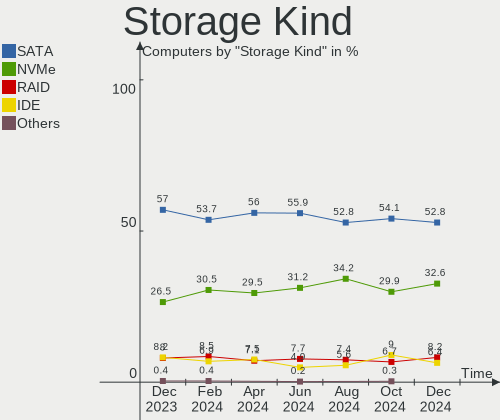
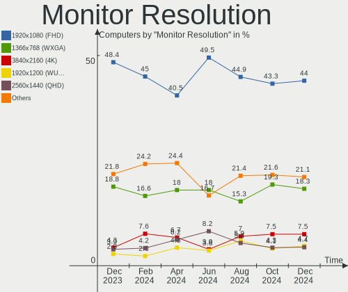
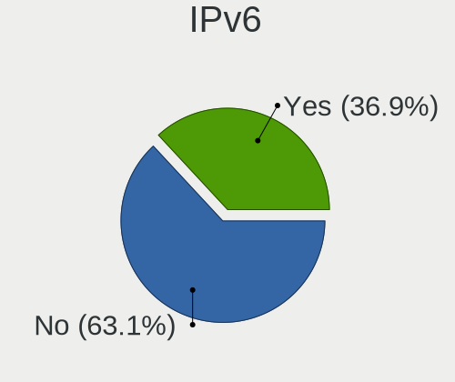
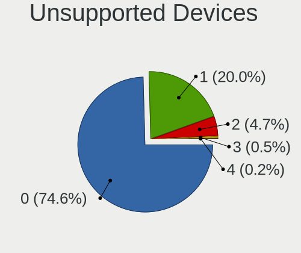

Linux Mint - Hardware Trends
----------------------------

A project to identify most popular hardware characteristics and track their change
over time based on data collected by Linux users at https://Linux-Hardware.org.

Anyone can contribute to this report by the [hw-probe](https://github.com/linuxhw/hw-probe) tool:

    sudo -E hw-probe -all -upload

This is a report for all computer types. See also reports for [desktops](/Dist/Linux_Mint/Desktop/README.md) and [notebooks](/Dist/Linux_Mint/Notebook/README.md).

This report is for one last month. Overall report since the beginning of time: [TestCoverage](https://github.com/linuxhw/TestCoverage)

Period: Oct, 2022.

Contents
--------

* [ System ](#system)
  - [ OS                       ](#os)
  - [ OS Family                ](#os-family)
  - [ Kernel                   ](#kernel)
  - [ Kernel Family            ](#kernel-family)
  - [ Kernel Major Ver.        ](#kernel-major-ver)
  - [ Arch                     ](#arch)
  - [ DE                       ](#de)
  - [ Display Server           ](#display-server)
  - [ Display Manager          ](#display-manager)
  - [ OS Lang                  ](#os-lang)
  - [ Boot Mode                ](#boot-mode)
  - [ Filesystem               ](#filesystem)
  - [ Part. scheme             ](#part-scheme)
  - [ Dual Boot with Linux/BSD ](#dual-boot-with-linuxbsd)
  - [ Dual Boot (Win)          ](#dual-boot-win)

* [ Board ](#board)
  - [ Vendor                   ](#vendor)
  - [ Model                    ](#model)
  - [ Model Family             ](#model-family)
  - [ MFG Year                 ](#mfg-year)
  - [ Form Factor              ](#form-factor)
  - [ Secure Boot              ](#secure-boot)
  - [ Coreboot                 ](#coreboot)
  - [ RAM Size                 ](#ram-size)
  - [ RAM Used                 ](#ram-used)
  - [ Total Drives             ](#total-drives)
  - [ Has CD-ROM               ](#has-cd-rom)
  - [ Has Ethernet             ](#has-ethernet)
  - [ Has WiFi                 ](#has-wifi)
  - [ Has Bluetooth            ](#has-bluetooth)

* [ Location ](#location)
  - [ Country                  ](#country)
  - [ City                     ](#city)

* [ Drives ](#drives)
  - [ Drive Vendor             ](#drive-vendor)
  - [ Drive Model              ](#drive-model)
  - [ HDD Vendor               ](#hdd-vendor)
  - [ SSD Vendor               ](#ssd-vendor)
  - [ Drive Kind               ](#drive-kind)
  - [ Drive Connector          ](#drive-connector)
  - [ Drive Size               ](#drive-size)
  - [ Space Total              ](#space-total)
  - [ Space Used               ](#space-used)
  - [ Malfunc. Drives          ](#malfunc-drives)
  - [ Malfunc. Drive Vendor    ](#malfunc-drive-vendor)
  - [ Malfunc. HDD Vendor      ](#malfunc-hdd-vendor)
  - [ Malfunc. Drive Kind      ](#malfunc-drive-kind)
  - [ Failed Drives            ](#failed-drives)
  - [ Failed Drive Vendor      ](#failed-drive-vendor)
  - [ Drive Status             ](#drive-status)

* [ Storage controller ](#storage-controller)
  - [ Storage Vendor           ](#storage-vendor)
  - [ Storage Model            ](#storage-model)
  - [ Storage Kind             ](#storage-kind)

* [ Processor ](#processor)
  - [ CPU Vendor               ](#cpu-vendor)
  - [ CPU Model                ](#cpu-model)
  - [ CPU Model Family         ](#cpu-model-family)
  - [ CPU Cores                ](#cpu-cores)
  - [ CPU Sockets              ](#cpu-sockets)
  - [ CPU Threads              ](#cpu-threads)
  - [ CPU Op-Modes             ](#cpu-op-modes)
  - [ CPU Microcode            ](#cpu-microcode)
  - [ CPU Microarch            ](#cpu-microarch)

* [ Graphics ](#graphics)
  - [ GPU Vendor               ](#gpu-vendor)
  - [ GPU Model                ](#gpu-model)
  - [ GPU Combo                ](#gpu-combo)
  - [ GPU Driver               ](#gpu-driver)
  - [ GPU Memory               ](#gpu-memory)

* [ Monitor ](#monitor)
  - [ Monitor Vendor           ](#monitor-vendor)
  - [ Monitor Model            ](#monitor-model)
  - [ Monitor Resolution       ](#monitor-resolution)
  - [ Monitor Diagonal         ](#monitor-diagonal)
  - [ Monitor Width            ](#monitor-width)
  - [ Aspect Ratio             ](#aspect-ratio)
  - [ Monitor Area             ](#monitor-area)
  - [ Pixel Density            ](#pixel-density)
  - [ Multiple Monitors        ](#multiple-monitors)

* [ Network ](#network)
  - [ Net Controller Vendor    ](#net-controller-vendor)
  - [ Net Controller Model     ](#net-controller-model)
  - [ Wireless Vendor          ](#wireless-vendor)
  - [ Wireless Model           ](#wireless-model)
  - [ Ethernet Vendor          ](#ethernet-vendor)
  - [ Ethernet Model           ](#ethernet-model)
  - [ Net Controller Kind      ](#net-controller-kind)
  - [ Used Controller          ](#used-controller)
  - [ NICs                     ](#nics)
  - [ IPv6                     ](#ipv6)

* [ Bluetooth ](#bluetooth)
  - [ Bluetooth Vendor         ](#bluetooth-vendor)
  - [ Bluetooth Model          ](#bluetooth-model)

* [ Sound ](#sound)
  - [ Sound Vendor             ](#sound-vendor)
  - [ Sound Model              ](#sound-model)

* [ Memory ](#memory)
  - [ Memory Vendor            ](#memory-vendor)
  - [ Memory Model             ](#memory-model)
  - [ Memory Kind              ](#memory-kind)
  - [ Memory Form Factor       ](#memory-form-factor)
  - [ Memory Size              ](#memory-size)
  - [ Memory Speed             ](#memory-speed)

* [ Printers & scanners ](#printers--scanners)
  - [ Printer Vendor           ](#printer-vendor)
  - [ Printer Model            ](#printer-model)
  - [ Scanner Vendor           ](#scanner-vendor)
  - [ Scanner Model            ](#scanner-model)

* [ Camera ](#camera)
  - [ Camera Vendor            ](#camera-vendor)
  - [ Camera Model             ](#camera-model)

* [ Security ](#security)
  - [ Fingerprint Vendor       ](#fingerprint-vendor)
  - [ Fingerprint Model        ](#fingerprint-model)
  - [ Chipcard Vendor          ](#chipcard-vendor)
  - [ Chipcard Model           ](#chipcard-model)

* [ Unsupported ](#unsupported)
  - [ Unsupported Devices      ](#unsupported-devices)
  - [ Unsupported Device Types ](#unsupported-device-types)

System
------

OS
--

Installed operating systems

| Name            | Computers | Percent |
|-----------------|-----------|---------|
| Linux Mint 21   | 281       | 59.28%  |
| Linux Mint 20.3 | 135       | 28.48%  |
| Linux Mint 20.2 | 19        | 4.01%   |
| Linux Mint 19.3 | 13        | 2.74%   |
| Linux Mint 20   | 8         | 1.69%   |
| Linux Mint 20.1 | 7         | 1.48%   |
| Linux Mint 19.2 | 3         | 0.63%   |
| Linux Mint 19.1 | 3         | 0.63%   |
| Linux Mint 18.3 | 3         | 0.63%   |
| Linux Mint 19   | 2         | 0.42%   |

OS Family
---------

OS without a version

| Name       | Computers | Percent |
|------------|-----------|---------|
| Linux Mint | 474       | 100%    |

Kernel
------

Version of the Linux kernel

| Version                     | Computers | Percent |
|-----------------------------|-----------|---------|
| 5.15.0-52-generic           | 91        | 19.2%   |
| 5.15.0-48-generic           | 88        | 18.57%  |
| 5.15.0-50-generic           | 77        | 16.24%  |
| 5.4.0-131-generic           | 40        | 8.44%   |
| 5.4.0-126-generic           | 38        | 8.02%   |
| 5.15.0-41-generic           | 35        | 7.38%   |
| 5.4.0-128-generic           | 28        | 5.91%   |
| 5.4.0-91-generic            | 6         | 1.27%   |
| 5.4.0-125-generic           | 5         | 1.05%   |
| 5.15.0-47-generic           | 5         | 1.05%   |
| 5.4.0-107-generic           | 4         | 0.84%   |
| 6.0.0-060000-generic        | 3         | 0.63%   |
| 5.4.0-122-generic           | 3         | 0.63%   |
| 5.14.0-1052-oem             | 3         | 0.63%   |
| 4.15.0-20-generic           | 3         | 0.63%   |
| 4.15.0-194-generic          | 3         | 0.63%   |
| 5.4.0-26-generic            | 2         | 0.42%   |
| 5.4.0-104-generic           | 2         | 0.42%   |
| 5.14.0-1054-oem             | 2         | 0.42%   |
| 5.0.0-32-generic            | 2         | 0.42%   |
| 4.15.0-142-generic          | 2         | 0.42%   |
| 6.0.3-x64v1-xanmod1         | 1         | 0.21%   |
| 6.0.3-060003-generic        | 1         | 0.21%   |
| 6.0.1-060001-generic        | 1         | 0.21%   |
| 5.4.0-94-generic            | 1         | 0.21%   |
| 5.4.0-90-generic            | 1         | 0.21%   |
| 5.4.0-80-generic            | 1         | 0.21%   |
| 5.4.0-77-generic            | 1         | 0.21%   |
| 5.4.0-74-generic            | 1         | 0.21%   |
| 5.4.0-65-generic            | 1         | 0.21%   |
| 5.4.0-126-lowlatency        | 1         | 0.21%   |
| 5.4.0-124-generic           | 1         | 0.21%   |
| 5.4.0-121-generic           | 1         | 0.21%   |
| 5.4.0-1152206031516-generic | 1         | 0.21%   |
| 5.4.0-110-generic           | 1         | 0.21%   |
| 5.4.0-109-generic           | 1         | 0.21%   |
| 5.4.0-100-generic           | 1         | 0.21%   |
| 5.19.0-051900-generic       | 1         | 0.21%   |
| 5.18.19-051819-generic      | 1         | 0.21%   |
| 5.17.9-051709-generic       | 1         | 0.21%   |

Kernel Family
-------------

Linux kernel without a distro release

| Version | Computers | Percent |
|---------|-----------|---------|
| 5.15.0  | 299       | 63.08%  |
| 5.4.0   | 141       | 29.75%  |
| 4.15.0  | 11        | 2.32%   |
| 5.14.0  | 5         | 1.05%   |
| 6.0.0   | 3         | 0.63%   |
| 6.0.3   | 2         | 0.42%   |
| 5.17.0  | 2         | 0.42%   |
| 5.0.0   | 2         | 0.42%   |
| 6.0.1   | 1         | 0.21%   |
| 5.19.0  | 1         | 0.21%   |
| 5.18.19 | 1         | 0.21%   |
| 5.17.9  | 1         | 0.21%   |
| 5.15.50 | 1         | 0.21%   |
| 5.13.0  | 1         | 0.21%   |
| 5.11.0  | 1         | 0.21%   |
| 4.18.0  | 1         | 0.21%   |
| Unknown | 1         | 0.21%   |

Kernel Major Ver.
-----------------

Linux kernel major version

| Version | Computers | Percent |
|---------|-----------|---------|
| 5.15    | 300       | 63.29%  |
| 5.4     | 141       | 29.75%  |
| 4.15    | 11        | 2.32%   |
| 6.0     | 6         | 1.27%   |
| 5.14    | 5         | 1.05%   |
| 5.17    | 3         | 0.63%   |
| 5.0     | 2         | 0.42%   |
| 5.19    | 1         | 0.21%   |
| 5.18    | 1         | 0.21%   |
| 5.13    | 1         | 0.21%   |
| 5.11    | 1         | 0.21%   |
| 4.18    | 1         | 0.21%   |
| Unknown | 1         | 0.21%   |

Arch
----

OS architecture (x86_64, i586, etc.)

| Name   | Computers | Percent |
|--------|-----------|---------|
| x86_64 | 472       | 99.58%  |
| i686   | 2         | 0.42%   |

DE
--

Desktop Environment

| Name       | Computers | Percent |
|------------|-----------|---------|
| X-Cinnamon | 338       | 71.31%  |
| MATE       | 67        | 14.14%  |
| XFCE       | 43        | 9.07%   |
| Cinnamon   | 18        | 3.8%    |
| KDE5       | 3         | 0.63%   |
| GNOME      | 3         | 0.63%   |
| qtile      | 1         | 0.21%   |
| Unknown    | 1         | 0.21%   |

Display Server
--------------

X11 or Wayland

| Name    | Computers | Percent |
|---------|-----------|---------|
| X11     | 471       | 99.37%  |
| Wayland | 2         | 0.42%   |
| Tty     | 1         | 0.21%   |

Display Manager
---------------

SDDM, LightDM, etc.

| Name    | Computers | Percent |
|---------|-----------|---------|
| Unknown | 244       | 51.48%  |
| LightDM | 227       | 47.89%  |
| SDDM    | 2         | 0.42%   |
| MDM     | 1         | 0.21%   |

OS Lang
-------

Language

| Lang    | Computers | Percent |
|---------|-----------|---------|
| en_US   | 154       | 32.49%  |
| de_DE   | 55        | 11.6%   |
| it_IT   | 36        | 7.59%   |
| fr_FR   | 31        | 6.54%   |
| pt_BR   | 28        | 5.91%   |
| ru_RU   | 23        | 4.85%   |
| en_GB   | 21        | 4.43%   |
| C       | 18        | 3.8%    |
| pl_PL   | 12        | 2.53%   |
| es_ES   | 12        | 2.53%   |
| en_CA   | 10        | 2.11%   |
| en_AU   | 9         | 1.9%    |
| nl_NL   | 6         | 1.27%   |
| hu_HU   | 5         | 1.05%   |
| sk_SK   | 3         | 0.63%   |
| pt_PT   | 3         | 0.63%   |
| es_MX   | 3         | 0.63%   |
| en_IN   | 3         | 0.63%   |
| de_AT   | 3         | 0.63%   |
| ca_ES   | 3         | 0.63%   |
| zh_CN   | 2         | 0.42%   |
| sv_SE   | 2         | 0.42%   |
| ja_JP   | 2         | 0.42%   |
| es_VE   | 2         | 0.42%   |
| en_PH   | 2         | 0.42%   |
| el_GR   | 2         | 0.42%   |
| de_CH   | 2         | 0.42%   |
| cs_CZ   | 2         | 0.42%   |
| Unknown | 2         | 0.42%   |
| tr_TR   | 1         | 0.21%   |
| szl_PL  | 1         | 0.21%   |
| nl_BE   | 1         | 0.21%   |
| lv_LV   | 1         | 0.21%   |
| ko_KR   | 1         | 0.21%   |
| hr_HR   | 1         | 0.21%   |
| gl_ES   | 1         | 0.21%   |
| fr_CA   | 1         | 0.21%   |
| fr_BE   | 1         | 0.21%   |
| fi_FI   | 1         | 0.21%   |
| es_CO   | 1         | 0.21%   |

Boot Mode
---------

EFI or BIOS

| Mode | Computers | Percent |
|------|-----------|---------|
| EFI  | 291       | 61.39%  |
| BIOS | 183       | 38.61%  |

Filesystem
----------

Type of filesystem

| Type    | Computers | Percent |
|---------|-----------|---------|
| Ext4    | 442       | 93.25%  |
| Overlay | 16        | 3.38%   |
| Btrfs   | 7         | 1.48%   |
| Zfs     | 4         | 0.84%   |
| Xfs     | 2         | 0.42%   |
| Ext2    | 2         | 0.42%   |
| Ext3    | 1         | 0.21%   |

Part. scheme
------------

Scheme of partitioning

| Type    | Computers | Percent |
|---------|-----------|---------|
| Unknown | 244       | 51.48%  |
| GPT     | 186       | 39.24%  |
| MBR     | 44        | 9.28%   |

Dual Boot with Linux/BSD
------------------------

Hosting more than one Linux/BSD

| Dual boot | Computers | Percent |
|-----------|-----------|---------|
| No        | 432       | 91.14%  |
| Yes       | 42        | 8.86%   |

Dual Boot (Win)
---------------

Hosting Linux and Windows

| Dual boot | Computers | Percent |
|-----------|-----------|---------|
| No        | 375       | 79.11%  |
| Yes       | 99        | 20.89%  |

Board
-----

Vendor
------

Motherboard manufacturer

| Name                | Computers | Percent |
|---------------------|-----------|---------|
| ASUSTek Computer    | 79        | 16.67%  |
| Hewlett-Packard     | 71        | 14.98%  |
| Lenovo              | 55        | 11.6%   |
| Dell                | 51        | 10.76%  |
| Gigabyte Technology | 36        | 7.59%   |
| Acer                | 29        | 6.12%   |
| MSI                 | 25        | 5.27%   |
| ASRock              | 17        | 3.59%   |
| Apple               | 14        | 2.95%   |
| Toshiba             | 7         | 1.48%   |
| Intel               | 7         | 1.48%   |
| Samsung Electronics | 6         | 1.27%   |
| Fujitsu             | 6         | 1.27%   |
| Unknown             | 6         | 1.27%   |
| Sony                | 4         | 0.84%   |
| Positivo            | 4         | 0.84%   |
| HUAWEI              | 4         | 0.84%   |
| Google              | 4         | 0.84%   |
| Pegatron            | 3         | 0.63%   |
| Timi                | 2         | 0.42%   |
| Medion              | 2         | 0.42%   |
| ECS                 | 2         | 0.42%   |
| Biostar             | 2         | 0.42%   |
| ZOTAC               | 1         | 0.21%   |
| Wortmann AG         | 1         | 0.21%   |
| Thomson             | 1         | 0.21%   |
| Teclast             | 1         | 0.21%   |
| Techvision          | 1         | 0.21%   |
| Standard            | 1         | 0.21%   |
| Shuttle             | 1         | 0.21%   |
| Semp Toshiba        | 1         | 0.21%   |
| Schenker            | 1         | 0.21%   |
| SANTECH             | 1         | 0.21%   |
| Quanta              | 1         | 0.21%   |
| QIYIDA              | 1         | 0.21%   |
| Qilive              | 1         | 0.21%   |
| Prestigio           | 1         | 0.21%   |
| PCWare              | 1         | 0.21%   |
| Packard Bell        | 1         | 0.21%   |
| Olivetti            | 1         | 0.21%   |

Model
-----

Motherboard model

| Name                             | Computers | Percent |
|----------------------------------|-----------|---------|
| Unknown                          | 7         | 1.48%   |
| MSI MS-7C56                      | 3         | 0.63%   |
| Dell OptiPlex 790                | 3         | 0.63%   |
| ASUS All Series                  | 3         | 0.63%   |
| Apple iMac12,1                   | 3         | 0.63%   |
| MSI MS-7B84                      | 2         | 0.42%   |
| MSI MS-7817                      | 2         | 0.42%   |
| MSI MS-7721                      | 2         | 0.42%   |
| HP Z420 Workstation              | 2         | 0.42%   |
| HP ProBook 6560b                 | 2         | 0.42%   |
| HP ProBook 640 G1                | 2         | 0.42%   |
| HP ProBook 450 G3                | 2         | 0.42%   |
| HP Notebook                      | 2         | 0.42%   |
| HP Laptop 17-by4xxx              | 2         | 0.42%   |
| HP EliteBook 840 G5              | 2         | 0.42%   |
| HP 15                            | 2         | 0.42%   |
| Gigabyte GA-MA770-UD3            | 2         | 0.42%   |
| Gigabyte B450M DS3H              | 2         | 0.42%   |
| Gigabyte B450 AORUS ELITE        | 2         | 0.42%   |
| Dell Precision WorkStation T5400 | 2         | 0.42%   |
| Dell Latitude E7240              | 2         | 0.42%   |
| Dell Inspiron 3847               | 2         | 0.42%   |
| ASUS P8Z68-V LX                  | 2         | 0.42%   |
| ASUS P8H77-M PRO                 | 2         | 0.42%   |
| ASRock H61M-VG4                  | 2         | 0.42%   |
| ASRock 970M Pro3                 | 2         | 0.42%   |
| Acer Aspire S3                   | 2         | 0.42%   |
| ZOTAC ZBOX-ECM73070C/53060C      | 1         | 0.21%   |
| Wortmann AG CR700                | 1         | 0.21%   |
| Toshiba Satellite U920t          | 1         | 0.21%   |
| Toshiba Satellite P200           | 1         | 0.21%   |
| Toshiba Satellite M50D-A         | 1         | 0.21%   |
| Toshiba Satellite L55-B          | 1         | 0.21%   |
| Toshiba Satellite L10W-B-101     | 1         | 0.21%   |
| Toshiba Satellite C660           | 1         | 0.21%   |
| Toshiba Satellite A300           | 1         | 0.21%   |
| Timi TM1709                      | 1         | 0.21%   |
| Timi RedmiBook Pro 15S           | 1         | 0.21%   |
| Thomson NEO14A-4WH128            | 1         | 0.21%   |
| Teclast TbooK 16 Power           | 1         | 0.21%   |

Model Family
------------

Motherboard model prefix

| Name               | Computers | Percent |
|--------------------|-----------|---------|
| Acer Aspire        | 22        | 4.64%   |
| Lenovo ThinkPad    | 16        | 3.38%   |
| Dell Inspiron      | 16        | 3.38%   |
| Lenovo IdeaPad     | 12        | 2.53%   |
| HP ProBook         | 11        | 2.32%   |
| Dell Latitude      | 11        | 2.32%   |
| HP Pavilion        | 10        | 2.11%   |
| HP EliteBook       | 10        | 2.11%   |
| Dell OptiPlex      | 9         | 1.9%    |
| HP ENVY            | 8         | 1.69%   |
| Toshiba Satellite  | 7         | 1.48%   |
| ASUS VivoBook      | 7         | 1.48%   |
| ASUS ROG           | 7         | 1.48%   |
| Unknown            | 7         | 1.48%   |
| Lenovo ThinkCentre | 6         | 1.27%   |
| Lenovo IdeaCentre  | 6         | 1.27%   |
| HP Laptop          | 6         | 1.27%   |
| Dell Precision     | 6         | 1.27%   |
| ASUS PRIME         | 6         | 1.27%   |
| HP Compaq          | 5         | 1.05%   |
| Gigabyte B450      | 4         | 0.84%   |
| Dell XPS           | 4         | 0.84%   |
| ASUS TUF           | 4         | 0.84%   |
| MSI MS-7C56        | 3         | 0.63%   |
| HP ZBook           | 3         | 0.63%   |
| HP EliteDesk       | 3         | 0.63%   |
| Gigabyte X570      | 3         | 0.63%   |
| Gigabyte B450M     | 3         | 0.63%   |
| Fujitsu LIFEBOOK   | 3         | 0.63%   |
| ASUS P8H77-M       | 3         | 0.63%   |
| ASUS ASUS          | 3         | 0.63%   |
| ASUS All           | 3         | 0.63%   |
| Apple iMac12       | 3         | 0.63%   |
| Acer Swift         | 3         | 0.63%   |
| MSI MS-7B84        | 2         | 0.42%   |
| MSI MS-7817        | 2         | 0.42%   |
| MSI MS-7721        | 2         | 0.42%   |
| Lenovo V15         | 2         | 0.42%   |
| HP Z420            | 2         | 0.42%   |
| HP Notebook        | 2         | 0.42%   |

MFG Year
--------

Motherboard manufacture year

| Year | Computers | Percent |
|------|-----------|---------|
| 2021 | 51        | 10.76%  |
| 2013 | 47        | 9.92%   |
| 2018 | 41        | 8.65%   |
| 2020 | 38        | 8.02%   |
| 2012 | 38        | 8.02%   |
| 2011 | 35        | 7.38%   |
| 2019 | 34        | 7.17%   |
| 2022 | 31        | 6.54%   |
| 2015 | 27        | 5.7%    |
| 2014 | 26        | 5.49%   |
| 2016 | 24        | 5.06%   |
| 2008 | 23        | 4.85%   |
| 2017 | 20        | 4.22%   |
| 2010 | 17        | 3.59%   |
| 2009 | 11        | 2.32%   |
| 2007 | 7         | 1.48%   |
| 2006 | 3         | 0.63%   |
| 2005 | 1         | 0.21%   |

Form Factor
-----------

Physical design of the computer

| Name        | Computers | Percent |
|-------------|-----------|---------|
| Notebook    | 242       | 51.05%  |
| Desktop     | 188       | 39.66%  |
| Convertible | 16        | 3.38%   |
| Mini pc     | 15        | 3.16%   |
| All in one  | 10        | 2.11%   |
| Tablet      | 3         | 0.63%   |

Secure Boot
-----------

Enabled or disabled

| State    | Computers | Percent |
|----------|-----------|---------|
| Disabled | 418       | 88.19%  |
| Enabled  | 56        | 11.81%  |

Coreboot
--------

Have coreboot on board

| Used | Computers | Percent |
|------|-----------|---------|
| No   | 469       | 98.95%  |
| Yes  | 5         | 1.05%   |

RAM Size
--------

Total RAM memory

| Size in GB  | Computers | Percent |
|-------------|-----------|---------|
| 4.01-8.0    | 128       | 27%     |
| 16.01-24.0  | 109       | 23%     |
| 8.01-16.0   | 85        | 17.93%  |
| 3.01-4.0    | 80        | 16.88%  |
| 32.01-64.0  | 35        | 7.38%   |
| 1.01-2.0    | 17        | 3.59%   |
| 64.01-256.0 | 9         | 1.9%    |
| 24.01-32.0  | 5         | 1.05%   |
| 2.01-3.0    | 4         | 0.84%   |
| 0.51-1.0    | 2         | 0.42%   |

RAM Used
--------

Used RAM memory

| Used GB    | Computers | Percent |
|------------|-----------|---------|
| 1.01-2.0   | 176       | 37.13%  |
| 2.01-3.0   | 142       | 29.96%  |
| 3.01-4.0   | 67        | 14.14%  |
| 4.01-8.0   | 60        | 12.66%  |
| 0.51-1.0   | 15        | 3.16%   |
| 8.01-16.0  | 12        | 2.53%   |
| 16.01-24.0 | 1         | 0.21%   |
| 0.01-0.5   | 1         | 0.21%   |

Total Drives
------------

Number of drives on board

| Drives | Computers | Percent |
|--------|-----------|---------|
| 1      | 276       | 58.23%  |
| 2      | 115       | 24.26%  |
| 3      | 50        | 10.55%  |
| 4      | 14        | 2.95%   |
| 5      | 9         | 1.9%    |
| 7      | 3         | 0.63%   |
| 6      | 3         | 0.63%   |
| 0      | 2         | 0.42%   |
| 9      | 1         | 0.21%   |
| 8      | 1         | 0.21%   |

Has CD-ROM
----------

Has CD-ROM on board

| Presented | Computers | Percent |
|-----------|-----------|---------|
| No        | 268       | 56.54%  |
| Yes       | 206       | 43.46%  |

Has Ethernet
------------

Has Ethernet on board

| Presented | Computers | Percent |
|-----------|-----------|---------|
| Yes       | 411       | 86.71%  |
| No        | 63        | 13.29%  |

Has WiFi
--------

Has WiFi module

| Presented | Computers | Percent |
|-----------|-----------|---------|
| Yes       | 359       | 75.74%  |
| No        | 115       | 24.26%  |

Has Bluetooth
-------------

Has Bluetooth module

| Presented | Computers | Percent |
|-----------|-----------|---------|
| Yes       | 272       | 57.38%  |
| No        | 202       | 42.62%  |

Location
--------

Country
-------

Geographic location (country)

| Country      | Computers | Percent |
|--------------|-----------|---------|
| USA          | 82        | 17.3%   |
| Germany      | 65        | 13.71%  |
| Italy        | 47        | 9.92%   |
| France       | 36        | 7.59%   |
| Brazil       | 31        | 6.54%   |
| Russia       | 25        | 5.27%   |
| Spain        | 19        | 4.01%   |
| UK           | 16        | 3.38%   |
| Poland       | 16        | 3.38%   |
| Canada       | 14        | 2.95%   |
| Netherlands  | 12        | 2.53%   |
| Australia    | 11        | 2.32%   |
| Austria      | 6         | 1.27%   |
| Switzerland  | 5         | 1.05%   |
| Sweden       | 5         | 1.05%   |
| Portugal     | 5         | 1.05%   |
| Belgium      | 5         | 1.05%   |
| Turkey       | 4         | 0.84%   |
| Slovakia     | 4         | 0.84%   |
| Mexico       | 4         | 0.84%   |
| Hungary      | 4         | 0.84%   |
| Greece       | 4         | 0.84%   |
| Ireland      | 3         | 0.63%   |
| India        | 3         | 0.63%   |
| Venezuela    | 2         | 0.42%   |
| Singapore    | 2         | 0.42%   |
| Saudi Arabia | 2         | 0.42%   |
| Philippines  | 2         | 0.42%   |
| Latvia       | 2         | 0.42%   |
| Kenya        | 2         | 0.42%   |
| Japan        | 2         | 0.42%   |
| Czechia      | 2         | 0.42%   |
| Croatia      | 2         | 0.42%   |
| Bangladesh   | 2         | 0.42%   |
| Uzbekistan   | 1         | 0.21%   |
| Ukraine      | 1         | 0.21%   |
| South Korea  | 1         | 0.21%   |
| South Africa | 1         | 0.21%   |
| Romania      | 1         | 0.21%   |
| Norway       | 1         | 0.21%   |

City
----

Geographic location (city)

| City              | Computers | Percent |
|-------------------|-----------|---------|
| Moscow            | 9         | 1.9%    |
| Milan             | 8         | 1.69%   |
| Rome              | 7         | 1.48%   |
| Sydney            | 5         | 1.05%   |
| Madrid            | 5         | 1.05%   |
| Berlin            | 5         | 1.05%   |
| Vienna            | 4         | 0.84%   |
| Athens            | 4         | 0.84%   |
| Amsterdam         | 4         | 0.84%   |
| Zurich            | 3         | 0.63%   |
| Sao Paulo         | 3         | 0.63%   |
| Paris             | 3         | 0.63%   |
| Miami             | 3         | 0.63%   |
| Frankfurt am Main | 3         | 0.63%   |
| Cologne           | 3         | 0.63%   |
| Campinas          | 3         | 0.63%   |
| Belo Horizonte    | 3         | 0.63%   |
| Barcelona         | 3         | 0.63%   |
| Zagreb            | 2         | 0.42%   |
| Yoshkar-Ola       | 2         | 0.42%   |
| Wuppertal         | 2         | 0.42%   |
| Wroclaw           | 2         | 0.42%   |
| Uberlândia       | 2         | 0.42%   |
| Trento            | 2         | 0.42%   |
| The Bronx         | 2         | 0.42%   |
| Szolnok           | 2         | 0.42%   |
| Singapore         | 2         | 0.42%   |
| Seia              | 2         | 0.42%   |
| Seedorf           | 2         | 0.42%   |
| Seattle           | 2         | 0.42%   |
| Rijswijk          | 2         | 0.42%   |
| Richmond          | 2         | 0.42%   |
| Reading           | 2         | 0.42%   |
| Porto Alegre      | 2         | 0.42%   |
| Perth             | 2         | 0.42%   |
| Padova            | 2         | 0.42%   |
| Nuremberg         | 2         | 0.42%   |
| Naples            | 2         | 0.42%   |
| Nairobi           | 2         | 0.42%   |
| Little Rock       | 2         | 0.42%   |

Drives
------

Drive Vendor
------------

Hard drive vendors

| Vendor                      | Computers | Drives | Percent |
|-----------------------------|-----------|--------|---------|
| Seagate                     | 115       | 133    | 16.13%  |
| Samsung Electronics         | 114       | 135    | 15.99%  |
| WDC                         | 100       | 123    | 14.03%  |
| Toshiba                     | 43        | 46     | 6.03%   |
| SanDisk                     | 37        | 40     | 5.19%   |
| Crucial                     | 37        | 39     | 5.19%   |
| Kingston                    | 36        | 41     | 5.05%   |
| Unknown                     | 31        | 38     | 4.35%   |
| Hitachi                     | 22        | 24     | 3.09%   |
| Micron Technology           | 14        | 14     | 1.96%   |
| A-DATA Technology           | 13        | 13     | 1.82%   |
| SK hynix                    | 12        | 12     | 1.68%   |
| Intel                       | 8         | 9      | 1.12%   |
| China                       | 8         | 9      | 1.12%   |
| Silicon Motion              | 7         | 7      | 0.98%   |
| HGST                        | 7         | 7      | 0.98%   |
| Fujitsu                     | 7         | 8      | 0.98%   |
| Intenso                     | 6         | 6      | 0.84%   |
| Unknown                     | 6         | 6      | 0.84%   |
| PNY                         | 5         | 5      | 0.7%    |
| Patriot                     | 5         | 5      | 0.7%    |
| Apple                       | 5         | 5      | 0.7%    |
| Maxtor                      | 4         | 5      | 0.56%   |
| LITEON                      | 4         | 4      | 0.56%   |
| GOODRAM                     | 4         | 4      | 0.56%   |
| UMIS                        | 3         | 3      | 0.42%   |
| KIOXIA                      | 3         | 3      | 0.42%   |
| JMicron Technology          | 3         | 3      | 0.42%   |
| HS-SSD-C100                 | 3         | 3      | 0.42%   |
| Corsair                     | 3         | 3      | 0.42%   |
| Team                        | 2         | 2      | 0.28%   |
| Netac                       | 2         | 2      | 0.28%   |
| Micron/Crucial Technology   | 2         | 2      | 0.28%   |
| Kingston Technology Company | 2         | 2      | 0.28%   |
| Hoodisk                     | 2         | 2      | 0.28%   |
| Drevo                       | 2         | 2      | 0.28%   |
| ADATA Technology            | 2         | 2      | 0.28%   |
| XrayDisk                    | 1         | 1      | 0.14%   |
| XPG                         | 1         | 1      | 0.14%   |
| WD MediaMax                 | 1         | 1      | 0.14%   |

Drive Model
-----------

Hard drive models

| Model                                                 | Computers | Percent |
|-------------------------------------------------------|-----------|---------|
| Samsung NVMe SSD Controller SM981/PM981/PM983 500GB   | 10        | 1.27%   |
| Kingston SA400S37240G 240GB SSD                       | 9         | 1.14%   |
| Unknown MMC Card  64GB                                | 8         | 1.02%   |
| Unknown MMC Card  32GB                                | 7         | 0.89%   |
| Samsung SSD 860 EVO 1TB                               | 7         | 0.89%   |
| Samsung SSD 850 EVO 500GB                             | 7         | 0.89%   |
| Samsung SSD 850 EVO 250GB                             | 7         | 0.89%   |
| Crucial CT240BX500SSD1 240GB                          | 7         | 0.89%   |
| Toshiba MQ01ABF050 500GB                              | 6         | 0.76%   |
| Samsung SSD 860 EVO 500GB                             | 6         | 0.76%   |
| Crucial CT480BX500SSD1 480GB                          | 6         | 0.76%   |
| Unknown                                               | 6         | 0.76%   |
| Seagate ST31000528AS 1TB                              | 5         | 0.63%   |
| Seagate ST2000DM008-2FR102 2TB                        | 5         | 0.63%   |
| Seagate ST1000LM035-1RK172 1TB                        | 5         | 0.63%   |
| Seagate ST1000DM010-2EP102 1TB                        | 5         | 0.63%   |
| Samsung SSD 970 EVO Plus 500GB                        | 5         | 0.63%   |
| Samsung SSD 870 EVO 1TB                               | 5         | 0.63%   |
| Kingston SV300S37A120G 120GB SSD                      | 5         | 0.63%   |
| Crucial CT500MX500SSD1 500GB                          | 5         | 0.63%   |
| Crucial CT1000MX500SSD1 1TB                           | 5         | 0.63%   |
| Unknown SD/MMC/MS PRO 1TB                             | 4         | 0.51%   |
| Toshiba MQ04ABF100 1TB                                | 4         | 0.51%   |
| Toshiba DT01ACA100 1TB                                | 4         | 0.51%   |
| Seagate ST1000LM024 HN-M101MBB 1TB                    | 4         | 0.51%   |
| Samsung SSD 870 EVO 250GB                             | 4         | 0.51%   |
| Kingston SA400S37480G 480GB SSD                       | 4         | 0.51%   |
| WDC WD20EARX-00PASB0 2TB                              | 3         | 0.38%   |
| WDC WD10EZEX-60M2NA0 1TB                              | 3         | 0.38%   |
| WDC WD10EZEX-08WN4A0 1TB                              | 3         | 0.38%   |
| WDC WD10EZEX-00BN5A0 1TB                              | 3         | 0.38%   |
| WDC WD1002FAEX-00Z3A0 1TB                             | 3         | 0.38%   |
| Toshiba MQ01ABD100 1TB                                | 3         | 0.38%   |
| Silicon Motion SM2263EN/SM2263XT SSD Controller 256GB | 3         | 0.38%   |
| Seagate ST500LT012-1DG142 500GB                       | 3         | 0.38%   |
| Seagate ST500LM021-1KJ152 500GB                       | 3         | 0.38%   |
| Seagate ST500DM002-1BD142 500GB                       | 3         | 0.38%   |
| Seagate ST3500418AS 500GB                             | 3         | 0.38%   |
| Seagate ST3500312CS 500GB                             | 3         | 0.38%   |
| Seagate ST2000DM006-2DM164 2TB                        | 3         | 0.38%   |

HDD Vendor
----------

Hard disk drive vendors

| Vendor              | Computers | Drives | Percent |
|---------------------|-----------|--------|---------|
| Seagate             | 112       | 129    | 40%     |
| WDC                 | 76        | 97     | 27.14%  |
| Toshiba             | 34        | 37     | 12.14%  |
| Hitachi             | 22        | 24     | 7.86%   |
| Samsung Electronics | 11        | 12     | 3.93%   |
| HGST                | 7         | 7      | 2.5%    |
| Fujitsu             | 6         | 7      | 2.14%   |
| Unknown             | 4         | 4      | 1.43%   |
| Maxtor              | 4         | 5      | 1.43%   |
| SAGE                | 1         | 1      | 0.36%   |
| RSH-319             | 1         | 1      | 0.36%   |
| ICY BOX             | 1         | 1      | 0.36%   |
| Apple               | 1         | 1      | 0.36%   |

SSD Vendor
----------

Solid state drive vendors

| Vendor              | Computers | Drives | Percent |
|---------------------|-----------|--------|---------|
| Samsung Electronics | 60        | 67     | 24.29%  |
| Crucial             | 35        | 36     | 14.17%  |
| Kingston            | 29        | 32     | 11.74%  |
| SanDisk             | 28        | 29     | 11.34%  |
| WDC                 | 13        | 13     | 5.26%   |
| A-DATA Technology   | 12        | 12     | 4.86%   |
| China               | 8         | 9      | 3.24%   |
| Micron Technology   | 6         | 6      | 2.43%   |
| PNY                 | 5         | 5      | 2.02%   |
| Patriot             | 5         | 5      | 2.02%   |
| Intenso             | 5         | 5      | 2.02%   |
| LITEON              | 4         | 4      | 1.62%   |
| GOODRAM             | 3         | 3      | 1.21%   |
| Apple               | 3         | 3      | 1.21%   |
| Team                | 2         | 2      | 0.81%   |
| SK hynix            | 2         | 2      | 0.81%   |
| HS-SSD-C100         | 2         | 2      | 0.81%   |
| Hoodisk             | 2         | 2      | 0.81%   |
| Drevo               | 2         | 2      | 0.81%   |
| Unknown             | 2         | 2      | 0.81%   |
| Transcend           | 1         | 1      | 0.4%    |
| Toshiba             | 1         | 1      | 0.4%    |
| Teclast             | 1         | 1      | 0.4%    |
| TCSUNBOW            | 1         | 1      | 0.4%    |
| SPCC                | 1         | 1      | 0.4%    |
| Ramaxel Technology  | 1         | 1      | 0.4%    |
| Plextor             | 1         | 1      | 0.4%    |
| OCZ                 | 1         | 2      | 0.4%    |
| NGFF                | 1         | 1      | 0.4%    |
| Netac               | 1         | 1      | 0.4%    |
| Lexar               | 1         | 1      | 0.4%    |
| Leven               | 1         | 1      | 0.4%    |
| KingFast            | 1         | 1      | 0.4%    |
| INNOVATION IT       | 1         | 1      | 0.4%    |
| Innodisk            | 1         | 1      | 0.4%    |
| Fujitsu             | 1         | 1      | 0.4%    |
| CT250MX5            | 1         | 1      | 0.4%    |
| Corsair             | 1         | 1      | 0.4%    |
| Acer                | 1         | 1      | 0.4%    |

Drive Kind
----------

HDD or SSD

| Kind    | Computers | Drives | Percent |
|---------|-----------|--------|---------|
| HDD     | 229       | 326    | 35.84%  |
| SSD     | 223       | 261    | 34.9%   |
| NVMe    | 142       | 161    | 22.22%  |
| MMC     | 28        | 33     | 4.38%   |
| Unknown | 17        | 21     | 2.66%   |

Drive Connector
---------------

SATA, SAS, NVMe, etc.

| Type | Computers | Drives | Percent |
|------|-----------|--------|---------|
| SATA | 365       | 569    | 64.72%  |
| NVMe | 139       | 158    | 24.65%  |
| SAS  | 32        | 42     | 5.67%   |
| MMC  | 28        | 33     | 4.96%   |

Drive Size
----------

Size of hard drive

| Size in TB | Computers | Drives | Percent |
|------------|-----------|--------|---------|
| 0.01-0.5   | 259       | 338    | 54.53%  |
| 0.51-1.0   | 137       | 168    | 28.84%  |
| 1.01-2.0   | 46        | 47     | 9.68%   |
| 3.01-4.0   | 12        | 12     | 2.53%   |
| 2.01-3.0   | 10        | 10     | 2.11%   |
| 4.01-10.0  | 10        | 11     | 2.11%   |
| 10.01-20.0 | 1         | 1      | 0.21%   |

Space Total
-----------

Amount of disk space available on the file system

| Size in GB     | Computers | Percent |
|----------------|-----------|---------|
| 101-250        | 119       | 25.11%  |
| 251-500        | 117       | 24.68%  |
| 501-1000       | 79        | 16.67%  |
| 1001-2000      | 40        | 8.44%   |
| More than 3000 | 31        | 6.54%   |
| 51-100         | 31        | 6.54%   |
| 2001-3000      | 22        | 4.64%   |
| 21-50          | 17        | 3.59%   |
| 1-20           | 15        | 3.16%   |
| Unknown        | 3         | 0.63%   |

Space Used
----------

Amount of used disk space

| Used GB        | Computers | Percent |
|----------------|-----------|---------|
| 21-50          | 110       | 23.21%  |
| 1-20           | 98        | 20.68%  |
| 101-250        | 80        | 16.88%  |
| 51-100         | 60        | 12.66%  |
| 251-500        | 47        | 9.92%   |
| 501-1000       | 31        | 6.54%   |
| 1001-2000      | 24        | 5.06%   |
| More than 3000 | 14        | 2.95%   |
| 2001-3000      | 7         | 1.48%   |
| Unknown        | 3         | 0.63%   |

Malfunc. Drives
---------------

Drive models with a malfunction

| Model                                               | Computers | Drives | Percent |
|-----------------------------------------------------|-----------|--------|---------|
| Seagate ST31000528AS 1TB                            | 3         | 3      | 6.52%   |
| WDC WDS240G2G0A-00JH30 240GB SSD                    | 1         | 1      | 2.17%   |
| WDC WD6400BPVT-75HXZT3 640GB                        | 1         | 1      | 2.17%   |
| WDC WD5000AAKS-00H2B0 500GB                         | 1         | 1      | 2.17%   |
| WDC WD30EURX-63T0FY0 3TB                            | 1         | 1      | 2.17%   |
| WDC WD2002FYPS-02W3B0 2TB                           | 1         | 1      | 2.17%   |
| WDC WD10EALS-00Z8A0 1TB                             | 1         | 1      | 2.17%   |
| WDC WD1002FBYS-05A6B0 1TB                           | 1         | 1      | 2.17%   |
| WDC WD1002FAEX-00Y9A0 1TB                           | 1         | 1      | 2.17%   |
| Toshiba DT01ACA100 1TB                              | 1         | 1      | 2.17%   |
| SK hynix BC711 HFM512GD3JX013N 512GB                | 1         | 1      | 2.17%   |
| Seagate ST9320423AS 320GB                           | 1         | 1      | 2.17%   |
| Seagate ST9250410AS 250GB                           | 1         | 1      | 2.17%   |
| Seagate ST500LT012-9WS142 500GB                     | 1         | 1      | 2.17%   |
| Seagate ST500LT012-1DG142 500GB                     | 1         | 1      | 2.17%   |
| Seagate ST3750528AS 752GB                           | 1         | 1      | 2.17%   |
| Seagate ST3500412AS 500GB                           | 1         | 1      | 2.17%   |
| Seagate ST3500320AS 500GB                           | 1         | 1      | 2.17%   |
| Seagate ST3250318AS 250GB                           | 1         | 1      | 2.17%   |
| Seagate ST320LM001 HN-M320MBB 320GB                 | 1         | 2      | 2.17%   |
| Seagate ST2000DM006-2DM164 2TB                      | 1         | 1      | 2.17%   |
| Seagate ST2000DM001-1CH164 2TB                      | 1         | 1      | 2.17%   |
| Seagate ST2000DL003-9VT166 2TB                      | 1         | 1      | 2.17%   |
| Seagate ST1000LM049-2GH172 1TB                      | 1         | 1      | 2.17%   |
| Seagate ST1000LM035-1RK172 1TB                      | 1         | 1      | 2.17%   |
| Seagate ST1000DM003-9YN162 1TB                      | 1         | 1      | 2.17%   |
| SanDisk SSD PLUS 480GB                              | 1         | 1      | 2.17%   |
| Samsung Electronics SSD PM810 2.5 7mm 256GB         | 1         | 1      | 2.17%   |
| Samsung Electronics SSD 970 EVO 500GB               | 1         | 1      | 2.17%   |
| Samsung Electronics SSD 870 EVO 1TB                 | 1         | 1      | 2.17%   |
| Samsung Electronics HM160HC 160GB                   | 1         | 1      | 2.17%   |
| Samsung Electronics HD322HJ 320GB                   | 1         | 1      | 2.17%   |
| Samsung Electronics HD320KJ 320GB                   | 1         | 1      | 2.17%   |
| PNY SSD2SC120G3LC726B104-370P 120GB                 | 1         | 1      | 2.17%   |
| Micron Technology MTFDDAK128MAY-1AH1ZABHA 128GB SSD | 1         | 1      | 2.17%   |
| Maxtor STM3500320AS 500GB                           | 1         | 1      | 2.17%   |
| Maxtor 6E040L0 41GB                                 | 1         | 1      | 2.17%   |
| Maxtor 2F040J0 41GB                                 | 1         | 1      | 2.17%   |
| LITEON CV8-8E128-HP 128GB SSD                       | 1         | 1      | 2.17%   |
| Hitachi HTS725050A9A364 500GB                       | 1         | 1      | 2.17%   |

Malfunc. Drive Vendor
---------------------

Vendors of faulty drives

| Vendor              | Computers | Drives | Percent |
|---------------------|-----------|--------|---------|
| Seagate             | 18        | 19     | 40%     |
| WDC                 | 8         | 8      | 17.78%  |
| Samsung Electronics | 6         | 6      | 13.33%  |
| Hitachi             | 4         | 4      | 8.89%   |
| Maxtor              | 2         | 3      | 4.44%   |
| Toshiba             | 1         | 1      | 2.22%   |
| SK hynix            | 1         | 1      | 2.22%   |
| SanDisk             | 1         | 1      | 2.22%   |
| PNY                 | 1         | 1      | 2.22%   |
| Micron Technology   | 1         | 1      | 2.22%   |
| LITEON              | 1         | 1      | 2.22%   |
| Crucial             | 1         | 1      | 2.22%   |

Malfunc. HDD Vendor
-------------------

Vendors of faulty HDD drives

| Vendor              | Computers | Drives | Percent |
|---------------------|-----------|--------|---------|
| Seagate             | 18        | 19     | 51.43%  |
| WDC                 | 7         | 7      | 20%     |
| Hitachi             | 4         | 4      | 11.43%  |
| Samsung Electronics | 3         | 3      | 8.57%   |
| Maxtor              | 2         | 3      | 5.71%   |
| Toshiba             | 1         | 1      | 2.86%   |

Malfunc. Drive Kind
-------------------

Kinds of faulty drives

| Kind | Computers | Drives | Percent |
|------|-----------|--------|---------|
| HDD  | 32        | 37     | 76.19%  |
| SSD  | 8         | 8      | 19.05%  |
| NVMe | 2         | 2      | 4.76%   |

Failed Drives
-------------

Failed drive models

| Model                         | Computers | Drives | Percent |
|-------------------------------|-----------|--------|---------|
| Hitachi HDS721050CLA362 500GB | 1         | 1      | 100%    |

Failed Drive Vendor
-------------------

Failed drive vendors

| Vendor  | Computers | Drives | Percent |
|---------|-----------|--------|---------|
| Hitachi | 1         | 1      | 100%    |

Drive Status
------------

Number of failed and malfunc. drives

| Status   | Computers | Drives | Percent |
|----------|-----------|--------|---------|
| Detected | 288       | 468    | 55.6%   |
| Works    | 188       | 286    | 36.29%  |
| Malfunc  | 41        | 47     | 7.92%   |
| Failed   | 1         | 1      | 0.19%   |

Storage controller
------------------

Storage Vendor
--------------

Storage controller vendors

| Vendor                           | Computers | Percent |
|----------------------------------|-----------|---------|
| Intel                            | 314       | 52.25%  |
| AMD                              | 103       | 17.14%  |
| Samsung Electronics              | 53        | 8.82%   |
| SanDisk                          | 21        | 3.49%   |
| ASMedia Technology               | 11        | 1.83%   |
| Kingston Technology Company      | 10        | 1.66%   |
| SK hynix                         | 9         | 1.5%    |
| Silicon Motion                   | 9         | 1.5%    |
| Toshiba America Info Systems     | 8         | 1.33%   |
| Micron Technology                | 8         | 1.33%   |
| Marvell Technology Group         | 8         | 1.33%   |
| Nvidia                           | 6         | 1%      |
| Phison Electronics               | 5         | 0.83%   |
| Micron/Crucial Technology        | 5         | 0.83%   |
| Union Memory (Shenzhen)          | 4         | 0.67%   |
| LSI Logic / Symbios Logic        | 4         | 0.67%   |
| JMicron Technology               | 4         | 0.67%   |
| KIOXIA                           | 3         | 0.5%    |
| ADATA Technology                 | 3         | 0.5%    |
| VIA Technologies                 | 2         | 0.33%   |
| Solid State Storage Technology   | 2         | 0.33%   |
| Silicon Integrated Systems [SiS] | 2         | 0.33%   |
| Unknown                          | 1         | 0.17%   |
| Silicon Image                    | 1         | 0.17%   |
| Shenzhen Longsys Electronics     | 1         | 0.17%   |
| Lite-On Technology               | 1         | 0.17%   |
| Integrated Technology Express    | 1         | 0.17%   |
| Apple                            | 1         | 0.17%   |
| Adaptec                          | 1         | 0.17%   |

Storage Model
-------------

Storage controller models

| Model                                                                                   | Computers | Percent |
|-----------------------------------------------------------------------------------------|-----------|---------|
| AMD FCH SATA Controller [AHCI mode]                                                     | 61        | 8.83%   |
| Intel 8 Series/C220 Series Chipset Family 6-port SATA Controller 1 [AHCI mode]          | 30        | 4.34%   |
| Samsung NVMe SSD Controller SM981/PM981/PM983                                           | 26        | 3.76%   |
| Intel Sunrise Point-LP SATA Controller [AHCI mode]                                      | 24        | 3.47%   |
| Intel 6 Series/C200 Series Chipset Family 6 port Desktop SATA AHCI Controller           | 21        | 3.04%   |
| Intel 7 Series Chipset Family 6-port SATA Controller [AHCI mode]                        | 20        | 2.89%   |
| Intel Volume Management Device NVMe RAID Controller                                     | 16        | 2.32%   |
| Samsung NVMe SSD Controller 980                                                         | 15        | 2.17%   |
| Intel 8 Series SATA Controller 1 [AHCI mode]                                            | 15        | 2.17%   |
| Intel 6 Series/C200 Series Chipset Family 6 port Mobile SATA AHCI Controller            | 15        | 2.17%   |
| Intel 82801 Mobile SATA Controller [RAID mode]                                          | 14        | 2.03%   |
| AMD 400 Series Chipset SATA Controller                                                  | 13        | 1.88%   |
| Samsung NVMe SSD Controller PM9A1/PM9A3/980PRO                                          | 11        | 1.59%   |
| AMD SB7x0/SB8x0/SB9x0 IDE Controller                                                    | 11        | 1.59%   |
| AMD 500 Series Chipset SATA Controller                                                  | 11        | 1.59%   |
| Intel Celeron/Pentium Silver Processor SATA Controller                                  | 10        | 1.45%   |
| Intel Q170/Q150/B150/H170/H110/Z170/CM236 Chipset SATA Controller [AHCI Mode]           | 9         | 1.3%    |
| Intel Comet Lake SATA AHCI Controller                                                   | 9         | 1.3%    |
| Intel 82801IBM/IEM (ICH9M/ICH9M-E) 4 port SATA Controller [AHCI mode]                   | 9         | 1.3%    |
| Silicon Motion SM2263EN/SM2263XT SSD Controller                                         | 8         | 1.16%   |
| SanDisk Non-Volatile memory controller                                                  | 8         | 1.16%   |
| Micron Non-Volatile memory controller                                                   | 8         | 1.16%   |
| Intel Wildcat Point-LP SATA Controller [AHCI Mode]                                      | 8         | 1.16%   |
| ASMedia ASM1062 Serial ATA Controller                                                   | 8         | 1.16%   |
| SanDisk WD Blue SN550 NVMe SSD                                                          | 7         | 1.01%   |
| Intel Celeron N3350/Pentium N4200/Atom E3900 Series SATA AHCI Controller                | 7         | 1.01%   |
| Intel 7 Series/C210 Series Chipset Family 6-port SATA Controller [AHCI mode]            | 7         | 1.01%   |
| AMD SB7x0/SB8x0/SB9x0 SATA Controller [IDE mode]                                        | 7         | 1.01%   |
| AMD SB7x0/SB8x0/SB9x0 SATA Controller [AHCI mode]                                       | 7         | 1.01%   |
| Intel NM10/ICH7 Family SATA Controller [IDE mode]                                       | 6         | 0.87%   |
| Intel 82801HM/HEM (ICH8M/ICH8M-E) SATA Controller [AHCI mode]                           | 6         | 0.87%   |
| Intel 400 Series Chipset Family SATA AHCI Controller                                    | 6         | 0.87%   |
| SK hynix Gold P31 SSD                                                                   | 5         | 0.72%   |
| Intel Jasper Lake SATA AHCI Controller                                                  | 5         | 0.72%   |
| Intel Atom/Celeron/Pentium Processor x5-E8000/J3xxx/N3xxx Series SATA Controller        | 5         | 0.72%   |
| Intel 82801HM/HEM (ICH8M/ICH8M-E) IDE Controller                                        | 5         | 0.72%   |
| Intel 82801G (ICH7 Family) IDE Controller                                               | 5         | 0.72%   |
| Intel 6 Series/C200 Series Chipset Family Desktop SATA Controller (IDE mode, ports 4-5) | 5         | 0.72%   |
| Intel 6 Series/C200 Series Chipset Family Desktop SATA Controller (IDE mode, ports 0-3) | 5         | 0.72%   |
| Intel 5 Series/3400 Series Chipset 4 port SATA AHCI Controller                          | 5         | 0.72%   |

Storage Kind
------------

Kind of storage controller (IDE, SATA, NVMe, SAS, ...)

| Kind | Computers | Percent |
|------|-----------|---------|
| SATA | 364       | 59.67%  |
| NVMe | 139       | 22.79%  |
| IDE  | 61        | 10%     |
| RAID | 42        | 6.89%   |
| SAS  | 2         | 0.33%   |
| SCSI | 2         | 0.33%   |

Processor
---------

CPU Vendor
----------

Processor vendors

| Vendor | Computers | Percent |
|--------|-----------|---------|
| Intel  | 350       | 73.84%  |
| AMD    | 124       | 26.16%  |

CPU Model
---------

Processor models

| Model                                         | Computers | Percent |
|-----------------------------------------------|-----------|---------|
| Intel 11th Gen Core i7-1165G7 @ 2.80GHz       | 7         | 1.48%   |
| Intel 11th Gen Core i5-1135G7 @ 2.40GHz       | 7         | 1.48%   |
| AMD Ryzen 5 3500U with Radeon Vega Mobile Gfx | 7         | 1.48%   |
| Intel Core i7-8550U CPU @ 1.80GHz             | 6         | 1.27%   |
| Intel Core i5-6200U CPU @ 2.30GHz             | 6         | 1.27%   |
| Intel Core i5-2400 CPU @ 3.10GHz              | 6         | 1.27%   |
| Intel Core i5-5300U CPU @ 2.30GHz             | 5         | 1.05%   |
| Intel Celeron CPU N3350 @ 1.10GHz             | 5         | 1.05%   |
| Intel Atom x5-Z8350 CPU @ 1.44GHz             | 5         | 1.05%   |
| Intel Core i7-6700 CPU @ 3.40GHz              | 4         | 0.84%   |
| Intel Core i5-7200U CPU @ 2.50GHz             | 4         | 0.84%   |
| Intel Core i5-4670 CPU @ 3.40GHz              | 4         | 0.84%   |
| Intel Core i5-3210M CPU @ 2.50GHz             | 4         | 0.84%   |
| AMD Ryzen 5 3600 6-Core Processor             | 4         | 0.84%   |
| Intel Core i7-4500U CPU @ 1.80GHz             | 3         | 0.63%   |
| Intel Core i7-3632QM CPU @ 2.20GHz            | 3         | 0.63%   |
| Intel Core i5-8250U CPU @ 1.60GHz             | 3         | 0.63%   |
| Intel Core i5-5200U CPU @ 2.20GHz             | 3         | 0.63%   |
| Intel Core i5-4590 CPU @ 3.30GHz              | 3         | 0.63%   |
| Intel Core i5-4440 CPU @ 3.10GHz              | 3         | 0.63%   |
| Intel Core i5-4310U CPU @ 2.00GHz             | 3         | 0.63%   |
| Intel Core i5-4300U CPU @ 1.90GHz             | 3         | 0.63%   |
| Intel Core i5-4200M CPU @ 2.50GHz             | 3         | 0.63%   |
| Intel Core i5-3550 CPU @ 3.30GHz              | 3         | 0.63%   |
| Intel Core i5-2520M CPU @ 2.50GHz             | 3         | 0.63%   |
| Intel Core i5-1035G1 CPU @ 1.00GHz            | 3         | 0.63%   |
| Intel Core i3-2100 CPU @ 3.10GHz              | 3         | 0.63%   |
| Intel Core i3-10110U CPU @ 2.10GHz            | 3         | 0.63%   |
| Intel Celeron N4000 CPU @ 1.10GHz             | 3         | 0.63%   |
| Intel Celeron CPU N3060 @ 1.60GHz             | 3         | 0.63%   |
| Intel 11th Gen Core i7-11800H @ 2.30GHz       | 3         | 0.63%   |
| AMD Ryzen 7 5700U with Radeon Graphics        | 3         | 0.63%   |
| AMD Ryzen 5 5600X 6-Core Processor            | 3         | 0.63%   |
| AMD Ryzen 5 5600G with Radeon Graphics        | 3         | 0.63%   |
| Intel Pentium Dual CPU T3400 @ 2.16GHz        | 2         | 0.42%   |
| Intel Pentium CPU P6100 @ 2.00GHz             | 2         | 0.42%   |
| Intel Pentium CPU N4200 @ 1.10GHz             | 2         | 0.42%   |
| Intel Pentium CPU G630 @ 2.70GHz              | 2         | 0.42%   |
| Intel Pentium CPU G2020 @ 2.90GHz             | 2         | 0.42%   |
| Intel Core i7-8650U CPU @ 1.90GHz             | 2         | 0.42%   |

CPU Model Family
----------------

Processor model prefix

| Model                   | Computers | Percent |
|-------------------------|-----------|---------|
| Intel Core i5           | 130       | 27.43%  |
| Intel Core i7           | 53        | 11.18%  |
| Other                   | 35        | 7.38%   |
| AMD Ryzen 5             | 35        | 7.38%   |
| Intel Core i3           | 34        | 7.17%   |
| Intel Celeron           | 31        | 6.54%   |
| AMD Ryzen 7             | 21        | 4.43%   |
| Intel Pentium           | 14        | 2.95%   |
| Intel Core 2 Duo        | 14        | 2.95%   |
| Intel Xeon              | 13        | 2.74%   |
| Intel Atom              | 11        | 2.32%   |
| AMD FX                  | 9         | 1.9%    |
| Intel Pentium Dual      | 5         | 1.05%   |
| Intel Core 2 Quad       | 5         | 1.05%   |
| AMD Ryzen 9             | 5         | 1.05%   |
| AMD Ryzen 3             | 5         | 1.05%   |
| AMD Athlon 64 X2        | 5         | 1.05%   |
| AMD A8                  | 5         | 1.05%   |
| AMD A6                  | 5         | 1.05%   |
| AMD A10                 | 4         | 0.84%   |
| Intel Pentium Silver    | 3         | 0.63%   |
| AMD Ryzen 5 PRO         | 3         | 0.63%   |
| AMD GX                  | 3         | 0.63%   |
| AMD E1                  | 3         | 0.63%   |
| Intel Pentium Dual-Core | 2         | 0.42%   |
| Intel Core 2            | 2         | 0.42%   |
| AMD Turion 64 X2 Mobile | 2         | 0.42%   |
| AMD Phenom II X4        | 2         | 0.42%   |
| AMD E2                  | 2         | 0.42%   |
| AMD Athlon II X4        | 2         | 0.42%   |
| Intel Core i9           | 1         | 0.21%   |
| AMD Turion 64 Mobile    | 1         | 0.21%   |
| AMD Ryzen Threadripper  | 1         | 0.21%   |
| AMD Ryzen 7 PRO         | 1         | 0.21%   |
| AMD PRO A10             | 1         | 0.21%   |
| AMD Phenom              | 1         | 0.21%   |
| AMD Athlon X4           | 1         | 0.21%   |
| AMD Athlon 64           | 1         | 0.21%   |
| AMD Athlon              | 1         | 0.21%   |
| AMD A4                  | 1         | 0.21%   |

CPU Cores
---------

Number of processor cores

| Number | Computers | Percent |
|--------|-----------|---------|
| 2      | 193       | 40.72%  |
| 4      | 176       | 37.13%  |
| 6      | 47        | 9.92%   |
| 8      | 32        | 6.75%   |
| 1      | 8         | 1.69%   |
| 12     | 7         | 1.48%   |
| 14     | 3         | 0.63%   |
| 10     | 3         | 0.63%   |
| 3      | 3         | 0.63%   |
| 18     | 1         | 0.21%   |
| 16     | 1         | 0.21%   |

CPU Sockets
-----------

Number of sockets

| Number | Computers | Percent |
|--------|-----------|---------|
| 1      | 472       | 99.58%  |
| 2      | 2         | 0.42%   |

CPU Threads
-----------

Threads per core (Hyper-Threading)

| Number | Computers | Percent |
|--------|-----------|---------|
| 2      | 293       | 61.81%  |
| 1      | 181       | 38.19%  |

CPU Op-Modes
------------

CPU Operation Modes (32-bit, 64-bit)

| Op mode        | Computers | Percent |
|----------------|-----------|---------|
| 32-bit, 64-bit | 474       | 100%    |

CPU Microcode
-------------

Microcode number

| Number     | Computers | Percent |
|------------|-----------|---------|
| Unknown    | 44        | 9.28%   |
| 0x206a7    | 36        | 7.59%   |
| 0x306a9    | 33        | 6.96%   |
| 0x306c3    | 27        | 5.7%    |
| 0x40651    | 18        | 3.8%    |
| 0x806c1    | 14        | 2.95%   |
| 0x1067a    | 14        | 2.95%   |
| 0x806ea    | 12        | 2.53%   |
| 0x08108109 | 11        | 2.32%   |
| 0x306d4    | 10        | 2.11%   |
| 0x906ea    | 9         | 1.9%    |
| 0x806ec    | 9         | 1.9%    |
| 0x506e3    | 9         | 1.9%    |
| 0x406c4    | 9         | 1.9%    |
| 0x0a50000c | 9         | 1.9%    |
| 0x08701021 | 9         | 1.9%    |
| 0x506c9    | 8         | 1.69%   |
| 0x406e3    | 8         | 1.69%   |
| 0x6fd      | 7         | 1.48%   |
| 0x06000852 | 7         | 1.48%   |
| 0xa0652    | 6         | 1.27%   |
| 0x806e9    | 6         | 1.27%   |
| 0x706a1    | 6         | 1.27%   |
| 0x10676    | 6         | 1.27%   |
| 0x08600106 | 6         | 1.27%   |
| 0x906c0    | 5         | 1.05%   |
| 0x906a3    | 5         | 1.05%   |
| 0x20655    | 5         | 1.05%   |
| 0x906e9    | 4         | 0.84%   |
| 0x806d1    | 4         | 0.84%   |
| 0x706e5    | 4         | 0.84%   |
| 0x706a8    | 4         | 0.84%   |
| 0x30678    | 4         | 0.84%   |
| 0x20652    | 4         | 0.84%   |
| 0x08608103 | 4         | 0.84%   |
| 0x08101016 | 4         | 0.84%   |
| 0x0800820d | 4         | 0.84%   |
| 0x0700010f | 4         | 0.84%   |
| 0x06006705 | 4         | 0.84%   |
| 0x06003106 | 4         | 0.84%   |

CPU Microarch
-------------

Microarchitecture

| Name             | Computers | Percent |
|------------------|-----------|---------|
| Haswell          | 53        | 11.18%  |
| KabyLake         | 46        | 9.7%    |
| SandyBridge      | 41        | 8.65%   |
| IvyBridge        | 38        | 8.02%   |
| Skylake          | 22        | 4.64%   |
| Penryn           | 21        | 4.43%   |
| Zen 2            | 19        | 4.01%   |
| Zen+             | 18        | 3.8%    |
| Zen 3            | 18        | 3.8%    |
| Silvermont       | 18        | 3.8%    |
| TigerLake        | 15        | 3.16%   |
| Core             | 12        | 2.53%   |
| CometLake        | 12        | 2.53%   |
| Broadwell        | 11        | 2.32%   |
| Unknown          | 11        | 2.32%   |
| Zen              | 10        | 2.11%   |
| Westmere         | 10        | 2.11%   |
| Piledriver       | 10        | 2.11%   |
| Goldmont plus    | 10        | 2.11%   |
| Excavator        | 10        | 2.11%   |
| K8 Hammer        | 9         | 1.9%    |
| IceLake          | 9         | 1.9%    |
| Alderlake Hybrid | 9         | 1.9%    |
| Goldmont         | 8         | 1.69%   |
| Tremont          | 5         | 1.05%   |
| K10              | 5         | 1.05%   |
| Jaguar           | 5         | 1.05%   |
| Steamroller      | 4         | 0.84%   |
| Nehalem          | 4         | 0.84%   |
| Bobcat           | 4         | 0.84%   |
| Puma             | 3         | 0.63%   |
| Bulldozer        | 2         | 0.42%   |
| Bonnell          | 2         | 0.42%   |

Graphics
--------

GPU Vendor
----------

Vendors of graphics cards

| Vendor                           | Computers | Percent |
|----------------------------------|-----------|---------|
| Intel                            | 274       | 50.09%  |
| Nvidia                           | 137       | 25.05%  |
| AMD                              | 133       | 24.31%  |
| Silicon Integrated Systems [SiS] | 2         | 0.37%   |
| Matrox Electronics Systems       | 1         | 0.18%   |

GPU Model
---------

Graphics card models

| Model                                                                                    | Computers | Percent |
|------------------------------------------------------------------------------------------|-----------|---------|
| Intel 2nd Generation Core Processor Family Integrated Graphics Controller                | 29        | 5.23%   |
| Intel Haswell-ULT Integrated Graphics Controller                                         | 19        | 3.42%   |
| Intel 3rd Gen Core processor Graphics Controller                                         | 19        | 3.42%   |
| Intel TigerLake-LP GT2 [Iris Xe Graphics]                                                | 14        | 2.52%   |
| AMD Picasso/Raven 2 [Radeon Vega Series / Radeon Vega Mobile Series]                     | 14        | 2.52%   |
| Intel UHD Graphics 620                                                                   | 13        | 2.34%   |
| Intel Atom/Celeron/Pentium Processor x5-E8000/J3xxx/N3xxx Integrated Graphics Controller | 12        | 2.16%   |
| Intel Skylake GT2 [HD Graphics 520]                                                      | 11        | 1.98%   |
| Intel Xeon E3-1200 v3/4th Gen Core Processor Integrated Graphics Controller              | 10        | 1.8%    |
| Intel Xeon E3-1200 v2/3rd Gen Core processor Graphics Controller                         | 9         | 1.62%   |
| Intel HD Graphics 5500                                                                   | 9         | 1.62%   |
| Intel Core Processor Integrated Graphics Controller                                      | 9         | 1.62%   |
| Nvidia GP108 [GeForce GT 1030]                                                           | 8         | 1.44%   |
| Intel GeminiLake [UHD Graphics 600]                                                      | 8         | 1.44%   |
| AMD Ellesmere [Radeon RX 470/480/570/570X/580/580X/590]                                  | 7         | 1.26%   |
| AMD Cezanne                                                                              | 7         | 1.26%   |
| Intel HD Graphics 620                                                                    | 6         | 1.08%   |
| Intel HD Graphics 500                                                                    | 6         | 1.08%   |
| Intel CometLake-U GT2 [UHD Graphics]                                                     | 6         | 1.08%   |
| Intel CometLake-H GT2 [UHD Graphics]                                                     | 6         | 1.08%   |
| Intel Atom Processor Z36xxx/Z37xxx Series Graphics & Display                             | 6         | 1.08%   |
| Intel 4th Gen Core Processor Integrated Graphics Controller                              | 6         | 1.08%   |
| AMD Renoir                                                                               | 6         | 1.08%   |
| Nvidia GP107 [GeForce GTX 1050 Ti]                                                       | 5         | 0.9%    |
| Nvidia GK208B [GeForce GT 710]                                                           | 5         | 0.9%    |
| Intel TigerLake-H GT1 [UHD Graphics]                                                     | 5         | 0.9%    |
| Intel Mobile 4 Series Chipset Integrated Graphics Controller                             | 5         | 0.9%    |
| Intel JasperLake [UHD Graphics]                                                          | 5         | 0.9%    |
| Intel HD Graphics 630                                                                    | 5         | 0.9%    |
| Intel CoffeeLake-H GT2 [UHD Graphics 630]                                                | 5         | 0.9%    |
| Intel Alder Lake-P Integrated Graphics Controller                                        | 5         | 0.9%    |
| AMD Wani [Radeon R5/R6/R7 Graphics]                                                      | 5         | 0.9%    |
| AMD Lucienne                                                                             | 5         | 0.9%    |
| AMD Cedar [Radeon HD 5000/6000/7350/8350 Series]                                         | 5         | 0.9%    |
| Nvidia GT218 [GeForce 210]                                                               | 4         | 0.72%   |
| Nvidia GP107M [GeForce GTX 1050 Mobile]                                                  | 4         | 0.72%   |
| Nvidia GF117M [GeForce 610M/710M/810M/820M / GT 620M/625M/630M/720M]                     | 4         | 0.72%   |
| Nvidia GA107M [GeForce RTX 3050 Mobile]                                                  | 4         | 0.72%   |
| Nvidia GA106 [GeForce RTX 3060 Lite Hash Rate]                                           | 4         | 0.72%   |
| Intel WhiskeyLake-U GT2 [UHD Graphics 620]                                               | 4         | 0.72%   |

GPU Combo
---------

Combinations of graphics cards

| Name           | Computers | Percent |
|----------------|-----------|---------|
| 1 x Intel      | 209       | 44.09%  |
| 1 x AMD        | 116       | 24.47%  |
| 1 x Nvidia     | 82        | 17.3%   |
| Intel + Nvidia | 49        | 10.34%  |
| Intel + AMD    | 7         | 1.48%   |
| 2 x AMD        | 4         | 0.84%   |
| AMD + Nvidia   | 4         | 0.84%   |
| 1 x SiS        | 2         | 0.42%   |
| 1 x Matrox     | 1         | 0.21%   |

GPU Driver
----------

Free vs proprietary

| Driver      | Computers | Percent |
|-------------|-----------|---------|
| Free        | 382       | 80.59%  |
| Proprietary | 83        | 17.51%  |
| Unknown     | 9         | 1.9%    |

GPU Memory
----------

Total video memory

| Size in GB | Computers | Percent |
|------------|-----------|---------|
| Unknown    | 252       | 53.16%  |
| 1.01-2.0   | 65        | 13.71%  |
| 0.01-0.5   | 61        | 12.87%  |
| 0.51-1.0   | 41        | 8.65%   |
| 3.01-4.0   | 21        | 4.43%   |
| 7.01-8.0   | 15        | 3.16%   |
| 5.01-6.0   | 8         | 1.69%   |
| 8.01-16.0  | 6         | 1.27%   |
| 2.01-3.0   | 4         | 0.84%   |
| 16.01-24.0 | 1         | 0.21%   |

Monitor
-------

Monitor Vendor
--------------

Monitor vendors

| Vendor                  | Computers | Percent |
|-------------------------|-----------|---------|
| Samsung Electronics     | 72        | 13.93%  |
| AU Optronics            | 53        | 10.25%  |
| Chimei Innolux          | 47        | 9.09%   |
| BOE                     | 42        | 8.12%   |
| LG Display              | 34        | 6.58%   |
| Goldstar                | 31        | 6%      |
| Dell                    | 27        | 5.22%   |
| Acer                    | 24        | 4.64%   |
| Hewlett-Packard         | 15        | 2.9%    |
| Ancor Communications    | 13        | 2.51%   |
| Philips                 | 10        | 1.93%   |
| Apple                   | 10        | 1.93%   |
| AOC                     | 8         | 1.55%   |
| ViewSonic               | 6         | 1.16%   |
| Sharp                   | 6         | 1.16%   |
| PANDA                   | 6         | 1.16%   |
| InfoVision              | 6         | 1.16%   |
| BenQ                    | 6         | 1.16%   |
| LG Philips              | 5         | 0.97%   |
| Lenovo                  | 5         | 0.97%   |
| ASUSTek Computer        | 5         | 0.97%   |
| Unknown                 | 4         | 0.77%   |
| Sony                    | 4         | 0.77%   |
| NEC Computers           | 4         | 0.77%   |
| Chi Mei Optoelectronics | 4         | 0.77%   |
| Vestel Elektronik       | 3         | 0.58%   |
| Panasonic               | 3         | 0.58%   |
| Eizo                    | 3         | 0.58%   |
| Vizio                   | 2         | 0.39%   |
| Toshiba                 | 2         | 0.39%   |
| TMX                     | 2         | 0.39%   |
| STD                     | 2         | 0.39%   |
| LG Electronics          | 2         | 0.39%   |
| Iiyama                  | 2         | 0.39%   |
| Idek Iiyama             | 2         | 0.39%   |
| Hitachi                 | 2         | 0.39%   |
| HannStar                | 2         | 0.39%   |
| Fujitsu Siemens         | 2         | 0.39%   |
| ___                     | 1         | 0.19%   |
| VIE                     | 1         | 0.19%   |

Monitor Model
-------------

Monitor models

| Model                                                                  | Computers | Percent |
|------------------------------------------------------------------------|-----------|---------|
| Chimei Innolux LCD Monitor CMN15AB 1366x768 344x194mm 15.5-inch        | 4         | 0.76%   |
| Chimei Innolux LCD Monitor CMN14D4 1920x1080 309x173mm 13.9-inch       | 4         | 0.76%   |
| Vestel Elektronik 50UHD_LCD_TV VES3700 3840x2160 1872x1053mm 84.6-inch | 3         | 0.57%   |
| Samsung Electronics LCD Monitor SEC5441 1366x768 344x194mm 15.5-inch   | 3         | 0.57%   |
| Goldstar TV SSCR2 GSMC0C8 3840x2160                                    | 3         | 0.57%   |
| Chimei Innolux LCD Monitor CMN15F5 1920x1080 344x193mm 15.5-inch       | 3         | 0.57%   |
| Chimei Innolux LCD Monitor CMN1130 1366x768 256x144mm 11.6-inch        | 3         | 0.57%   |
| Apple iMac APPA00C 1920x1080 475x267mm 21.5-inch                       | 3         | 0.57%   |
| Sharp LCD Monitor SHP1515 1920x1200 336x210mm 15.6-inch                | 2         | 0.38%   |
| Samsung Electronics S24F350 SAM0D20 1920x1080 521x293mm 23.5-inch      | 2         | 0.38%   |
| Samsung Electronics LCD Monitor SEC324A 1366x768 344x194mm 15.5-inch   | 2         | 0.38%   |
| Samsung Electronics LCD Monitor SEC3245 1366x768 344x194mm 15.5-inch   | 2         | 0.38%   |
| Samsung Electronics LCD Monitor SDC4C48 1920x1080 410x230mm 18.5-inch  | 2         | 0.38%   |
| Samsung Electronics C27F390 SAM0D32 1920x1080 598x336mm 27.0-inch      | 2         | 0.38%   |
| Philips PHL 243V7 PHLC155 1920x1080 530x300mm 24.0-inch                | 2         | 0.38%   |
| PANDA LCD Monitor NCP004D 1920x1080 344x194mm 15.5-inch                | 2         | 0.38%   |
| LG Display LCD Monitor LGD03DC 1366x768 277x156mm 12.5-inch            | 2         | 0.38%   |
| InfoVision LCD Monitor IVO03F4 1920x1080 309x173mm 13.9-inch           | 2         | 0.38%   |
| Eizo EV2436W ENC2385 1920x1200 519x324mm 24.1-inch                     | 2         | 0.38%   |
| Dell LCD Monitor 1907FP                                                | 2         | 0.38%   |
| Chimei Innolux LCD Monitor CMN15DC 1366x768 344x193mm 15.5-inch        | 2         | 0.38%   |
| Chimei Innolux LCD Monitor CMN15DB 1366x768 344x193mm 15.5-inch        | 2         | 0.38%   |
| Chimei Innolux LCD Monitor CMN15C3 1920x1080 344x193mm 15.5-inch       | 2         | 0.38%   |
| Chimei Innolux LCD Monitor CMN15BB 1920x1080 344x194mm 15.5-inch       | 2         | 0.38%   |
| Chimei Innolux LCD Monitor CMN151E 1920x1080 344x193mm 15.5-inch       | 2         | 0.38%   |
| Chimei Innolux LCD Monitor CMN1406 1920x1080 309x173mm 13.9-inch       | 2         | 0.38%   |
| BOE LCD Monitor BOE08D5 1920x1080 344x194mm 15.5-inch                  | 2         | 0.38%   |
| BOE LCD Monitor BOE0675 1366x768 344x194mm 15.5-inch                   | 2         | 0.38%   |
| AU Optronics LCD Monitor AUO573D 1920x1080 309x174mm 14.0-inch         | 2         | 0.38%   |
| AU Optronics LCD Monitor AUO45EC 1366x768 344x193mm 15.5-inch          | 2         | 0.38%   |
| AU Optronics LCD Monitor AUO41EC 1366x768 344x193mm 15.5-inch          | 2         | 0.38%   |
| AU Optronics LCD Monitor AUO333C 1366x768 309x173mm 13.9-inch          | 2         | 0.38%   |
| AU Optronics LCD Monitor AUO26EC 1366x768 344x193mm 15.5-inch          | 2         | 0.38%   |
| AU Optronics LCD Monitor AUO22EC 1366x768 344x193mm 15.5-inch          | 2         | 0.38%   |
| Apple Color LCD APP9CDF 1440x900 286x179mm 13.3-inch                   | 2         | 0.38%   |
| Acer X183H ACR0065 1366x768 344x194mm 15.5-inch                        | 2         | 0.38%   |
| Acer ET241Y ACR056C 1920x1080 527x296mm 23.8-inch                      | 2         | 0.38%   |
| ___ LCD TV ___9000 1360x768                                            | 1         | 0.19%   |
| Vizio E43u-D2 VIZ1018 3840x2160 953x543mm 43.2-inch                    | 1         | 0.19%   |
| Vizio E370VL VIZ0070 1920x1080 820x461mm 37.0-inch                     | 1         | 0.19%   |

Monitor Resolution
------------------

Monitor screen resolution

| Resolution         | Computers | Percent |
|--------------------|-----------|---------|
| 1920x1080 (FHD)    | 216       | 42.94%  |
| 1366x768 (WXGA)    | 102       | 20.28%  |
| 3840x2160 (4K)     | 34        | 6.76%   |
| 1600x900 (HD+)     | 25        | 4.97%   |
| 2560x1440 (QHD)    | 19        | 3.78%   |
| 1280x1024 (SXGA)   | 17        | 3.38%   |
| 1920x1200 (WUXGA)  | 15        | 2.98%   |
| 1680x1050 (WSXGA+) | 13        | 2.58%   |
| 1440x900 (WXGA+)   | 12        | 2.39%   |
| 1280x800 (WXGA)    | 9         | 1.79%   |
| 1360x768           | 6         | 1.19%   |
| Unknown            | 6         | 1.19%   |
| 3840x1080          | 4         | 0.8%    |
| 2560x1080          | 4         | 0.8%    |
| 5120x1440          | 2         | 0.4%    |
| 3440x1440          | 2         | 0.4%    |
| 3000x2000          | 2         | 0.4%    |
| 1280x720 (HD)      | 2         | 0.4%    |
| 3840x2400          | 1         | 0.2%    |
| 3200x2000          | 1         | 0.2%    |
| 3200x1080          | 1         | 0.2%    |
| 3072x1920          | 1         | 0.2%    |
| 2960x1050          | 1         | 0.2%    |
| 2736x1824          | 1         | 0.2%    |
| 2560x1600          | 1         | 0.2%    |
| 2288x1287          | 1         | 0.2%    |
| 2048x1152          | 1         | 0.2%    |
| 1920x540           | 1         | 0.2%    |
| 1600x1200          | 1         | 0.2%    |
| 1280x960           | 1         | 0.2%    |
| 1024x600           | 1         | 0.2%    |

Monitor Diagonal
----------------

Diagonal size in inches

| Inches  | Computers | Percent |
|---------|-----------|---------|
| 15      | 127       | 24.76%  |
| 24      | 38        | 7.41%   |
| 17      | 38        | 7.41%   |
| 13      | 37        | 7.21%   |
| 23      | 36        | 7.02%   |
| 21      | 29        | 5.65%   |
| 14      | 29        | 5.65%   |
| 27      | 28        | 5.46%   |
| Unknown | 24        | 4.68%   |
| 31      | 16        | 3.12%   |
| 19      | 13        | 2.53%   |
| 18      | 13        | 2.53%   |
| 22      | 12        | 2.34%   |
| 20      | 8         | 1.56%   |
| 12      | 7         | 1.36%   |
| 11      | 7         | 1.36%   |
| 84      | 6         | 1.17%   |
| 72      | 6         | 1.17%   |
| 34      | 6         | 1.17%   |
| 32      | 4         | 0.78%   |
| 40      | 3         | 0.58%   |
| 16      | 3         | 0.58%   |
| 74      | 2         | 0.39%   |
| 54      | 2         | 0.39%   |
| 50      | 2         | 0.39%   |
| 42      | 2         | 0.39%   |
| 10      | 2         | 0.39%   |
| 142     | 1         | 0.19%   |
| 75      | 1         | 0.19%   |
| 64      | 1         | 0.19%   |
| 63      | 1         | 0.19%   |
| 60      | 1         | 0.19%   |
| 48      | 1         | 0.19%   |
| 47      | 1         | 0.19%   |
| 39      | 1         | 0.19%   |
| 38      | 1         | 0.19%   |
| 36      | 1         | 0.19%   |
| 33      | 1         | 0.19%   |
| 29      | 1         | 0.19%   |
| 26      | 1         | 0.19%   |

Monitor Width
-------------

Physical width

| Width in mm    | Computers | Percent |
|----------------|-----------|---------|
| 301-350        | 180       | 35.71%  |
| 501-600        | 95        | 18.85%  |
| 401-500        | 61        | 12.1%   |
| 351-400        | 44        | 8.73%   |
| 201-300        | 35        | 6.94%   |
| Unknown        | 24        | 4.76%   |
| 601-700        | 21        | 4.17%   |
| 1501-2000      | 15        | 2.98%   |
| 701-800        | 12        | 2.38%   |
| 1001-1500      | 9         | 1.79%   |
| 801-900        | 5         | 0.99%   |
| 901-1000       | 2         | 0.4%    |
| More than 2000 | 1         | 0.2%    |

Aspect Ratio
------------

Proportional relationship between the width and the height

| Ratio   | Computers | Percent |
|---------|-----------|---------|
| 16/9    | 367       | 78.59%  |
| 16/10   | 49        | 10.49%  |
| Unknown | 19        | 4.07%   |
| 5/4     | 18        | 3.85%   |
| 21/9    | 7         | 1.5%    |
| 3/2     | 4         | 0.86%   |
| 4/3     | 1         | 0.21%   |
| 32/9    | 1         | 0.21%   |
| 1.00    | 1         | 0.21%   |

Monitor Area
------------

Area in inch²

| Area in inch² | Computers | Percent |
|----------------|-----------|---------|
| 101-110        | 126       | 24.95%  |
| 201-250        | 93        | 18.42%  |
| 81-90          | 50        | 9.9%    |
| 301-350        | 29        | 5.74%   |
| 351-500        | 27        | 5.35%   |
| 151-200        | 26        | 5.15%   |
| Unknown        | 24        | 4.75%   |
| More than 1000 | 23        | 4.55%   |
| 121-130        | 22        | 4.36%   |
| 141-150        | 20        | 3.96%   |
| 71-80          | 17        | 3.37%   |
| 251-300        | 12        | 2.38%   |
| 501-1000       | 10        | 1.98%   |
| 51-60          | 7         | 1.39%   |
| 131-140        | 7         | 1.39%   |
| 61-70          | 6         | 1.19%   |
| 111-120        | 4         | 0.79%   |
| 41-50          | 2         | 0.4%    |

Pixel Density
-------------

Pixels per inch

| Density       | Computers | Percent |
|---------------|-----------|---------|
| 51-100        | 184       | 37.17%  |
| 101-120       | 131       | 26.46%  |
| 121-160       | 115       | 23.23%  |
| Unknown       | 24        | 4.85%   |
| 161-240       | 19        | 3.84%   |
| 1-50          | 15        | 3.03%   |
| More than 240 | 7         | 1.41%   |

Multiple Monitors
-----------------

Total monitors connected

| Total | Computers | Percent |
|-------|-----------|---------|
| 1     | 391       | 82.49%  |
| 2     | 68        | 14.35%  |
| 0     | 9         | 1.9%    |
| 3     | 6         | 1.27%   |

Network
-------

Net Controller Vendor
---------------------

Controller vendors

| Vendor                           | Computers | Percent |
|----------------------------------|-----------|---------|
| Realtek Semiconductor            | 285       | 39.31%  |
| Intel                            | 198       | 27.31%  |
| Qualcomm Atheros                 | 85        | 11.72%  |
| Broadcom                         | 36        | 4.97%   |
| Ralink Technology                | 13        | 1.79%   |
| Broadcom Limited                 | 13        | 1.79%   |
| MediaTek                         | 11        | 1.52%   |
| TP-Link                          | 10        | 1.38%   |
| Marvell Technology Group         | 10        | 1.38%   |
| Ralink                           | 9         | 1.24%   |
| Samsung Electronics              | 6         | 0.83%   |
| Nvidia                           | 5         | 0.69%   |
| Microsoft                        | 4         | 0.55%   |
| D-Link System                    | 4         | 0.55%   |
| ASIX Electronics                 | 4         | 0.55%   |
| Sierra Wireless                  | 3         | 0.41%   |
| Qualcomm                         | 3         | 0.41%   |
| NetGear                          | 2         | 0.28%   |
| ICS Advent                       | 2         | 0.28%   |
| Hewlett-Packard                  | 2         | 0.28%   |
| DisplayLink                      | 2         | 0.28%   |
| Aquantia                         | 2         | 0.28%   |
| AMD                              | 2         | 0.28%   |
| Unknown                          | 1         | 0.14%   |
| Texas Instruments                | 1         | 0.14%   |
| Sitecom Europe                   | 1         | 0.14%   |
| Silicon Integrated Systems [SiS] | 1         | 0.14%   |
| Qualcomm Atheros Communications  | 1         | 0.14%   |
| QinHeng Electronics              | 1         | 0.14%   |
| Micro Star International         | 1         | 0.14%   |
| Huawei Technologies              | 1         | 0.14%   |
| Espressi                         | 1         | 0.14%   |
| Edimax Technology                | 1         | 0.14%   |
| Dell                             | 1         | 0.14%   |
| Attansic Technology              | 1         | 0.14%   |
| ASUSTek Computer                 | 1         | 0.14%   |
| Arduino SA                       | 1         | 0.14%   |

Net Controller Model
--------------------

Controller models

| Model                                                             | Computers | Percent |
|-------------------------------------------------------------------|-----------|---------|
| Realtek RTL8111/8168/8411 PCI Express Gigabit Ethernet Controller | 196       | 23.53%  |
| Realtek RTL810xE PCI Express Fast Ethernet controller             | 29        | 3.48%   |
| Intel 82579LM Gigabit Network Connection (Lewisville)             | 16        | 1.92%   |
| Intel Wi-Fi 6 AX200                                               | 15        | 1.8%    |
| Qualcomm Atheros QCA9377 802.11ac Wireless Network Adapter        | 13        | 1.56%   |
| Qualcomm Atheros AR9485 Wireless Network Adapter                  | 13        | 1.56%   |
| Intel Wireless 7265                                               | 12        | 1.44%   |
| Realtek RTL8821CE 802.11ac PCIe Wireless Network Adapter          | 11        | 1.32%   |
| Qualcomm Atheros QCA9565 / AR9565 Wireless Network Adapter        | 10        | 1.2%    |
| Qualcomm Atheros AR9285 Wireless Network Adapter (PCI-Express)    | 10        | 1.2%    |
| Intel Wireless 7260                                               | 10        | 1.2%    |
| Intel Wi-Fi 6 AX201                                               | 10        | 1.2%    |
| Realtek RTL8723BE PCIe Wireless Network Adapter                   | 9         | 1.08%   |
| Intel Wireless 8265 / 8275                                        | 9         | 1.08%   |
| Realtek RTL8153 Gigabit Ethernet Adapter                          | 8         | 0.96%   |
| Intel Wireless 8260                                               | 8         | 0.96%   |
| Intel Alder Lake-P PCH CNVi WiFi                                  | 8         | 0.96%   |
| Realtek RTL8125 2.5GbE Controller                                 | 7         | 0.84%   |
| Qualcomm Atheros AR8151 v2.0 Gigabit Ethernet                     | 7         | 0.84%   |
| Intel Wireless 3165                                               | 7         | 0.84%   |
| Intel Ethernet Connection I218-LM                                 | 7         | 0.84%   |
| Samsung Galaxy series, misc. (tethering mode)                     | 6         | 0.72%   |
| Realtek RTL88x2bu [AC1200 Techkey]                                | 6         | 0.72%   |
| Realtek RTL8822CE 802.11ac PCIe Wireless Network Adapter          | 6         | 0.72%   |
| Realtek RTL-8100/8101L/8139 PCI Fast Ethernet Adapter             | 6         | 0.72%   |
| Ralink RT3290 Wireless 802.11n 1T/1R PCIe                         | 6         | 0.72%   |
| Qualcomm Atheros AR9462 Wireless Network Adapter                  | 6         | 0.72%   |
| Qualcomm Atheros AR93xx Wireless Network Adapter                  | 6         | 0.72%   |
| Intel I211 Gigabit Network Connection                             | 6         | 0.72%   |
| Intel Ethernet Connection I217-LM                                 | 6         | 0.72%   |
| Intel Ethernet Connection (2) I219-V                              | 6         | 0.72%   |
| Intel Comet Lake PCH-LP CNVi WiFi                                 | 6         | 0.72%   |
| Intel 82579V Gigabit Network Connection                           | 6         | 0.72%   |
| TP-Link AC600 wireless Realtek RTL8811AU [Archer T2U Nano]        | 5         | 0.6%    |
| Realtek RTL8821AE 802.11ac PCIe Wireless Network Adapter          | 5         | 0.6%    |
| Realtek RTL8188CE 802.11b/g/n WiFi Adapter                        | 5         | 0.6%    |
| Qualcomm Atheros QCA6174 802.11ac Wireless Network Adapter        | 5         | 0.6%    |
| MediaTek MT7921 802.11ax PCI Express Wireless Network Adapter     | 5         | 0.6%    |
| Intel Tiger Lake PCH CNVi WiFi                                    | 5         | 0.6%    |
| Intel Ethernet Controller I225-V                                  | 5         | 0.6%    |

Wireless Vendor
---------------

Wireless vendors

| Vendor                          | Computers | Percent |
|---------------------------------|-----------|---------|
| Intel                           | 142       | 36.98%  |
| Realtek Semiconductor           | 79        | 20.57%  |
| Qualcomm Atheros                | 74        | 19.27%  |
| Broadcom                        | 19        | 4.95%   |
| Ralink Technology               | 13        | 3.39%   |
| Broadcom Limited                | 11        | 2.86%   |
| TP-Link                         | 10        | 2.6%    |
| Ralink                          | 9         | 2.34%   |
| MediaTek                        | 8         | 2.08%   |
| Sierra Wireless                 | 3         | 0.78%   |
| Microsoft                       | 3         | 0.78%   |
| D-Link System                   | 3         | 0.78%   |
| NetGear                         | 2         | 0.52%   |
| Sitecom Europe                  | 1         | 0.26%   |
| Qualcomm Atheros Communications | 1         | 0.26%   |
| Qualcomm                        | 1         | 0.26%   |
| Micro Star International        | 1         | 0.26%   |
| Marvell Technology Group        | 1         | 0.26%   |
| Edimax Technology               | 1         | 0.26%   |
| Dell                            | 1         | 0.26%   |
| ASUSTek Computer                | 1         | 0.26%   |

Wireless Model
--------------

Wireless models

| Model                                                                   | Computers | Percent |
|-------------------------------------------------------------------------|-----------|---------|
| Intel Wi-Fi 6 AX200                                                     | 15        | 3.91%   |
| Qualcomm Atheros QCA9377 802.11ac Wireless Network Adapter              | 13        | 3.39%   |
| Qualcomm Atheros AR9485 Wireless Network Adapter                        | 13        | 3.39%   |
| Intel Wireless 7265                                                     | 12        | 3.13%   |
| Realtek RTL8821CE 802.11ac PCIe Wireless Network Adapter                | 11        | 2.86%   |
| Qualcomm Atheros QCA9565 / AR9565 Wireless Network Adapter              | 10        | 2.6%    |
| Qualcomm Atheros AR9285 Wireless Network Adapter (PCI-Express)          | 10        | 2.6%    |
| Intel Wireless 7260                                                     | 10        | 2.6%    |
| Intel Wi-Fi 6 AX201                                                     | 10        | 2.6%    |
| Realtek RTL8723BE PCIe Wireless Network Adapter                         | 9         | 2.34%   |
| Intel Wireless 8265 / 8275                                              | 9         | 2.34%   |
| Intel Wireless 8260                                                     | 8         | 2.08%   |
| Intel Alder Lake-P PCH CNVi WiFi                                        | 8         | 2.08%   |
| Intel Wireless 3165                                                     | 7         | 1.82%   |
| Realtek RTL88x2bu [AC1200 Techkey]                                      | 6         | 1.56%   |
| Realtek RTL8822CE 802.11ac PCIe Wireless Network Adapter                | 6         | 1.56%   |
| Ralink RT3290 Wireless 802.11n 1T/1R PCIe                               | 6         | 1.56%   |
| Qualcomm Atheros AR9462 Wireless Network Adapter                        | 6         | 1.56%   |
| Qualcomm Atheros AR93xx Wireless Network Adapter                        | 6         | 1.56%   |
| Intel Comet Lake PCH-LP CNVi WiFi                                       | 6         | 1.56%   |
| TP-Link AC600 wireless Realtek RTL8811AU [Archer T2U Nano]              | 5         | 1.3%    |
| Realtek RTL8821AE 802.11ac PCIe Wireless Network Adapter                | 5         | 1.3%    |
| Realtek RTL8188CE 802.11b/g/n WiFi Adapter                              | 5         | 1.3%    |
| Qualcomm Atheros QCA6174 802.11ac Wireless Network Adapter              | 5         | 1.3%    |
| MediaTek MT7921 802.11ax PCI Express Wireless Network Adapter           | 5         | 1.3%    |
| Intel Tiger Lake PCH CNVi WiFi                                          | 5         | 1.3%    |
| Realtek RTL8822BE 802.11a/b/g/n/ac WiFi adapter                         | 4         | 1.04%   |
| Realtek RTL8723BU 802.11b/g/n WLAN Adapter                              | 4         | 1.04%   |
| Realtek 802.11ac NIC                                                    | 4         | 1.04%   |
| Ralink RT2870/RT3070 Wireless Adapter                                   | 4         | 1.04%   |
| Intel Wireless-AC 9260                                                  | 4         | 1.04%   |
| Intel Wireless 3160                                                     | 4         | 1.04%   |
| Intel Ice Lake-LP PCH CNVi WiFi                                         | 4         | 1.04%   |
| Intel Dual Band Wireless-AC 3168NGW [Stone Peak]                        | 4         | 1.04%   |
| Intel Comet Lake PCH CNVi WiFi                                          | 4         | 1.04%   |
| Realtek RTL8852AE 802.11ax PCIe Wireless Network Adapter                | 3         | 0.78%   |
| Realtek RTL8188EUS 802.11n Wireless Network Adapter                     | 3         | 0.78%   |
| Realtek 802.11n WLAN Adapter                                            | 3         | 0.78%   |
| Qualcomm Atheros AR242x / AR542x Wireless Network Adapter (PCI-Express) | 3         | 0.78%   |
| Intel Wi-Fi 6 AX210/AX211/AX411 160MHz                                  | 3         | 0.78%   |

Ethernet Vendor
---------------

Ethernet vendors

| Vendor                           | Computers | Percent |
|----------------------------------|-----------|---------|
| Realtek Semiconductor            | 248       | 57.41%  |
| Intel                            | 101       | 23.38%  |
| Broadcom                         | 22        | 5.09%   |
| Qualcomm Atheros                 | 18        | 4.17%   |
| Marvell Technology Group         | 9         | 2.08%   |
| Samsung Electronics              | 6         | 1.39%   |
| Nvidia                           | 5         | 1.16%   |
| ASIX Electronics                 | 4         | 0.93%   |
| MediaTek                         | 3         | 0.69%   |
| Qualcomm                         | 2         | 0.46%   |
| ICS Advent                       | 2         | 0.46%   |
| DisplayLink                      | 2         | 0.46%   |
| Broadcom Limited                 | 2         | 0.46%   |
| Aquantia                         | 2         | 0.46%   |
| Silicon Integrated Systems [SiS] | 1         | 0.23%   |
| Microsoft                        | 1         | 0.23%   |
| Huawei Technologies              | 1         | 0.23%   |
| Hewlett-Packard                  | 1         | 0.23%   |
| D-Link System                    | 1         | 0.23%   |
| Attansic Technology              | 1         | 0.23%   |

Ethernet Model
--------------

Ethernet models

| Model                                                             | Computers | Percent |
|-------------------------------------------------------------------|-----------|---------|
| Realtek RTL8111/8168/8411 PCI Express Gigabit Ethernet Controller | 196       | 44.44%  |
| Realtek RTL810xE PCI Express Fast Ethernet controller             | 29        | 6.58%   |
| Intel 82579LM Gigabit Network Connection (Lewisville)             | 16        | 3.63%   |
| Realtek RTL8153 Gigabit Ethernet Adapter                          | 8         | 1.81%   |
| Realtek RTL8125 2.5GbE Controller                                 | 7         | 1.59%   |
| Qualcomm Atheros AR8151 v2.0 Gigabit Ethernet                     | 7         | 1.59%   |
| Intel Ethernet Connection I218-LM                                 | 7         | 1.59%   |
| Samsung Galaxy series, misc. (tethering mode)                     | 6         | 1.36%   |
| Realtek RTL-8100/8101L/8139 PCI Fast Ethernet Adapter             | 6         | 1.36%   |
| Intel I211 Gigabit Network Connection                             | 6         | 1.36%   |
| Intel Ethernet Connection I217-LM                                 | 6         | 1.36%   |
| Intel Ethernet Connection (2) I219-V                              | 6         | 1.36%   |
| Intel 82579V Gigabit Network Connection                           | 6         | 1.36%   |
| Intel Ethernet Controller I225-V                                  | 5         | 1.13%   |
| Intel Ethernet Connection I217-V                                  | 5         | 1.13%   |
| Intel Ethernet Connection (3) I218-LM                             | 5         | 1.13%   |
| Broadcom NetXtreme BCM57765 Gigabit Ethernet PCIe                 | 5         | 1.13%   |
| Intel Ethernet Connection I219-LM                                 | 4         | 0.91%   |
| Intel Ethernet Connection (2) I219-LM                             | 4         | 0.91%   |
| Broadcom NetXtreme BCM57766 Gigabit Ethernet PCIe                 | 4         | 0.91%   |
| MediaTek TECNO Pouvoir 3 Air                                      | 3         | 0.68%   |
| Intel Ethernet Connection (4) I219-LM                             | 3         | 0.68%   |
| Broadcom NetXtreme BCM5761 Gigabit Ethernet PCIe                  | 3         | 0.68%   |
| ASIX AX88179 Gigabit Ethernet                                     | 3         | 0.68%   |
| Realtek RTL-8110SC/8169SC Gigabit Ethernet                        | 2         | 0.45%   |
| Qualcomm Mobile Router                                            | 2         | 0.45%   |
| Qualcomm Atheros QCA8172 Fast Ethernet                            | 2         | 0.45%   |
| Qualcomm Atheros AR8161 Gigabit Ethernet                          | 2         | 0.45%   |
| Qualcomm Atheros AR8131 Gigabit Ethernet                          | 2         | 0.45%   |
| Marvell Group 88E8055 PCI-E Gigabit Ethernet Controller           | 2         | 0.45%   |
| Marvell Group 88E8040 PCI-E Fast Ethernet Controller              | 2         | 0.45%   |
| Intel Ethernet Connection I219-V                                  | 2         | 0.45%   |
| Intel 82576 Gigabit Network Connection                            | 2         | 0.45%   |
| Intel 82567LM-3 Gigabit Network Connection                        | 2         | 0.45%   |
| Broadcom NetXtreme BCM5764M Gigabit Ethernet PCIe                 | 2         | 0.45%   |
| Broadcom NetXtreme BCM5754 Gigabit Ethernet PCI Express           | 2         | 0.45%   |
| Silicon Integrated Systems [SiS] 191 Gigabit Ethernet Adapter     | 1         | 0.23%   |
| Realtek RTL8169 PCI Gigabit Ethernet Controller                   | 1         | 0.23%   |
| Realtek RTL8152 Fast Ethernet Adapter                             | 1         | 0.23%   |
| Realtek Realtek Ethernet controller                               | 1         | 0.23%   |

Net Controller Kind
-------------------

Ethernet, WiFi or modem

| Kind     | Computers | Percent |
|----------|-----------|---------|
| Ethernet | 410       | 52.7%   |
| WiFi     | 360       | 46.27%  |
| Modem    | 7         | 0.9%    |
| Unknown  | 1         | 0.13%   |

Used Controller
---------------

Currently used network controller

| Kind     | Computers | Percent |
|----------|-----------|---------|
| WiFi     | 274       | 56.49%  |
| Ethernet | 211       | 43.51%  |

NICs
----

Total network controllers on board

| Total | Computers | Percent |
|-------|-----------|---------|
| 2     | 254       | 53.59%  |
| 1     | 194       | 40.93%  |
| 0     | 14        | 2.95%   |
| 3     | 8         | 1.69%   |
| 4     | 2         | 0.42%   |
| 7     | 1         | 0.21%   |
| 5     | 1         | 0.21%   |

IPv6
----

IPv6 vs IPv4

| Used | Computers | Percent |
|------|-----------|---------|
| No   | 328       | 69.2%   |
| Yes  | 146       | 30.8%   |

Bluetooth
---------

Bluetooth Vendor
----------------

Controller vendors

| Vendor                          | Computers | Percent |
|---------------------------------|-----------|---------|
| Intel                           | 118       | 43.07%  |
| Realtek Semiconductor           | 34        | 12.41%  |
| Cambridge Silicon Radio         | 20        | 7.3%    |
| Qualcomm Atheros Communications | 16        | 5.84%   |
| IMC Networks                    | 16        | 5.84%   |
| Apple                           | 13        | 4.74%   |
| Foxconn / Hon Hai               | 10        | 3.65%   |
| Broadcom                        | 10        | 3.65%   |
| Lite-On Technology              | 9         | 3.28%   |
| Ralink                          | 6         | 2.19%   |
| ASUSTek Computer                | 5         | 1.82%   |
| Hewlett-Packard                 | 4         | 1.46%   |
| Dell                            | 3         | 1.09%   |
| Toshiba                         | 2         | 0.73%   |
| Belkin Components               | 2         | 0.73%   |
| TP-Link                         | 1         | 0.36%   |
| Taiyo Yuden                     | 1         | 0.36%   |
| Realtek                         | 1         | 0.36%   |
| Opticis                         | 1         | 0.36%   |
| Foxconn International           | 1         | 0.36%   |
| Edimax Technology               | 1         | 0.36%   |

Bluetooth Model
---------------

Controller models

| Model                                               | Computers | Percent |
|-----------------------------------------------------|-----------|---------|
| Intel Bluetooth wireless interface                  | 46        | 16.79%  |
| Intel AX201 Bluetooth                               | 26        | 9.49%   |
| Realtek Bluetooth Radio                             | 22        | 8.03%   |
| Cambridge Silicon Radio Bluetooth Dongle (HCI mode) | 20        | 7.3%    |
| Intel AX200 Bluetooth                               | 14        | 5.11%   |
| Intel Bluetooth 9460/9560 Jefferson Peak (JfP)      | 11        | 4.01%   |
| Realtek  Bluetooth 4.2 Adapter                      | 6         | 2.19%   |
| Ralink RT3290 Bluetooth                             | 6         | 2.19%   |
| Qualcomm Atheros  Bluetooth Device                  | 6         | 2.19%   |
| IMC Networks Bluetooth Radio                        | 6         | 2.19%   |
| IMC Networks Bluetooth Device                       | 6         | 2.19%   |
| Intel Bluetooth Device                              | 5         | 1.82%   |
| Apple Bluetooth Host Controller                     | 5         | 1.82%   |
| Qualcomm Atheros AR3012 Bluetooth 4.0               | 4         | 1.46%   |
| Lite-On Qualcomm Atheros QCA9377 Bluetooth          | 4         | 1.46%   |
| Intel Wireless-AC 9260 Bluetooth Adapter            | 4         | 1.46%   |
| Intel Wireless-AC 3168 Bluetooth                    | 4         | 1.46%   |
| IMC Networks Wireless_Device                        | 4         | 1.46%   |
| Apple Built-in Bluetooth 2.0+EDR HCI                | 4         | 1.46%   |
| Realtek RTL8821A Bluetooth                          | 3         | 1.09%   |
| Intel Centrino Bluetooth Wireless Transceiver       | 3         | 1.09%   |
| Intel AX210 Bluetooth                               | 3         | 1.09%   |
| HP Broadcom 2070 Bluetooth Combo                    | 3         | 1.09%   |
| Foxconn / Hon Hai Bluetooth Device                  | 3         | 1.09%   |
| Apple Bluetooth USB Host Controller                 | 3         | 1.09%   |
| Realtek RTL8822BE Bluetooth 4.2 Adapter             | 2         | 0.73%   |
| Qualcomm Atheros QCA61x4 Bluetooth 4.0              | 2         | 0.73%   |
| Qualcomm Atheros AR9462 Bluetooth                   | 2         | 0.73%   |
| Qualcomm Atheros AR3011 Bluetooth                   | 2         | 0.73%   |
| Intel Centrino Advanced-N 6230 Bluetooth adapter    | 2         | 0.73%   |
| Foxconn / Hon Hai Wireless_Device                   | 2         | 0.73%   |
| Broadcom HP Portable SoftSailing                    | 2         | 0.73%   |
| Broadcom BCM20702A0 Bluetooth 4.0                   | 2         | 0.73%   |
| Broadcom BCM2045B (BDC-2.1)                         | 2         | 0.73%   |
| ASUS Broadcom BCM20702A0 Bluetooth                  | 2         | 0.73%   |
| TP-Link TPuLink UB500 Adapter                       | 1         | 0.36%   |
| Toshiba Bluetooth Radio                             | 1         | 0.36%   |
| Toshiba Bluetooth Device                            | 1         | 0.36%   |
| Taiyo Yuden Bluetooth Device                        | 1         | 0.36%   |
| Realtek RTL8723B Bluetooth                          | 1         | 0.36%   |

Sound
-----

Sound Vendor
------------

Sound card vendors

| Vendor                                       | Computers | Percent |
|----------------------------------------------|-----------|---------|
| Intel                                        | 332       | 50.69%  |
| AMD                                          | 151       | 23.05%  |
| Nvidia                                       | 98        | 14.96%  |
| C-Media Electronics                          | 12        | 1.83%   |
| Kingston Technology                          | 4         | 0.61%   |
| JMTek                                        | 4         | 0.61%   |
| Creative Technology                          | 4         | 0.61%   |
| Logitech                                     | 3         | 0.46%   |
| Creative Labs                                | 3         | 0.46%   |
| Texas Instruments                            | 2         | 0.31%   |
| Silicon Integrated Systems [SiS]             | 2         | 0.31%   |
| Realtek Semiconductor                        | 2         | 0.31%   |
| Razer USA                                    | 2         | 0.31%   |
| Plantronics                                  | 2         | 0.31%   |
| KTMicro                                      | 2         | 0.31%   |
| GN Netcom                                    | 2         | 0.31%   |
| Dell                                         | 2         | 0.31%   |
| Apple                                        | 2         | 0.31%   |
| AKAI Professional M.I.                       | 2         | 0.31%   |
| Zoran Co. Personal Media Division (Nogatech) | 1         | 0.15%   |
| Yamaha                                       | 1         | 0.15%   |
| Trust                                        | 1         | 0.15%   |
| TOWA Electronics                             | 1         | 0.15%   |
| Thesycon Systemsoftware & Consulting         | 1         | 0.15%   |
| TerraTec Electronic                          | 1         | 0.15%   |
| Sony                                         | 1         | 0.15%   |
| Sennheiser Communications                    | 1         | 0.15%   |
| Schiit Audio                                 | 1         | 0.15%   |
| RODE Microphones                             | 1         | 0.15%   |
| Nordic Semiconductor ASA                     | 1         | 0.15%   |
| Musical Fidelity                             | 1         | 0.15%   |
| MCS                                          | 1         | 0.15%   |
| Lenovo                                       | 1         | 0.15%   |
| Lautsprecher Teufel                          | 1         | 0.15%   |
| Harman International                         | 1         | 0.15%   |
| Generalplus Technology                       | 1         | 0.15%   |
| Ensoniq                                      | 1         | 0.15%   |
| eMeet Tech                                   | 1         | 0.15%   |
| Corsair                                      | 1         | 0.15%   |
| Cambridge Silicon Radio                      | 1         | 0.15%   |

Sound Model
-----------

Sound card models

| Model                                                                      | Computers | Percent |
|----------------------------------------------------------------------------|-----------|---------|
| Intel 6 Series/C200 Series Chipset Family High Definition Audio Controller | 41        | 5.21%   |
| AMD Family 17h/19h HD Audio Controller                                     | 39        | 4.96%   |
| Intel 7 Series/C216 Chipset Family High Definition Audio Controller        | 32        | 4.07%   |
| Intel Sunrise Point-LP HD Audio                                            | 30        | 3.81%   |
| Intel 8 Series/C220 Series Chipset High Definition Audio Controller        | 29        | 3.68%   |
| Intel Xeon E3-1200 v3/4th Gen Core Processor HD Audio Controller           | 21        | 2.67%   |
| AMD Renoir Radeon High Definition Audio Controller                         | 21        | 2.67%   |
| Intel Haswell-ULT HD Audio Controller                                      | 19        | 2.41%   |
| Intel 8 Series HD Audio Controller                                         | 19        | 2.41%   |
| AMD Starship/Matisse HD Audio Controller                                   | 19        | 2.41%   |
| AMD FCH Azalia Controller                                                  | 19        | 2.41%   |
| AMD Raven/Raven2/Fenghuang HDMI/DP Audio Controller                        | 18        | 2.29%   |
| Intel Tiger Lake-LP Smart Sound Technology Audio Controller                | 15        | 1.91%   |
| AMD SBx00 Azalia (Intel HDA)                                               | 15        | 1.91%   |
| AMD Kabini HDMI/DP Audio                                                   | 12        | 1.52%   |
| Intel 5 Series/3400 Series Chipset High Definition Audio                   | 11        | 1.4%    |
| Nvidia GP107GL High Definition Audio Controller                            | 10        | 1.27%   |
| Nvidia GF108 High Definition Audio Controller                              | 10        | 1.27%   |
| Intel Wildcat Point-LP High Definition Audio Controller                    | 10        | 1.27%   |
| Intel Celeron/Pentium Silver Processor High Definition Audio               | 10        | 1.27%   |
| Intel Broadwell-U Audio Controller                                         | 10        | 1.27%   |
| Intel 100 Series/C230 Series Chipset Family HD Audio Controller            | 10        | 1.27%   |
| AMD Family 17h (Models 00h-0fh) HD Audio Controller                        | 10        | 1.27%   |
| Intel NM10/ICH7 Family High Definition Audio Controller                    | 9         | 1.14%   |
| Intel 82801I (ICH9 Family) HD Audio Controller                             | 9         | 1.14%   |
| Nvidia GP108 High Definition Audio Controller                              | 8         | 1.02%   |
| Nvidia GK208 HDMI/DP Audio Controller                                      | 8         | 1.02%   |
| Intel Comet Lake PCH cAVS                                                  | 8         | 1.02%   |
| Intel Celeron N3350/Pentium N4200/Atom E3900 Series Audio Cluster          | 8         | 1.02%   |
| Intel Cannon Lake PCH cAVS                                                 | 8         | 1.02%   |
| Intel Alder Lake PCH-P High Definition Audio Controller                    | 8         | 1.02%   |
| Intel 82801H (ICH8 Family) HD Audio Controller                             | 8         | 1.02%   |
| AMD Turks HDMI Audio [Radeon HD 6500/6600 / 6700M Series]                  | 8         | 1.02%   |
| AMD Oland/Hainan/Cape Verde/Pitcairn HDMI Audio [Radeon HD 7000 Series]    | 8         | 1.02%   |
| AMD Family 15h (Models 60h-6fh) Audio Controller                           | 8         | 1.02%   |
| Nvidia High Definition Audio Controller                                    | 7         | 0.89%   |
| Nvidia GA106 High Definition Audio Controller                              | 7         | 0.89%   |
| Intel Comet Lake PCH-LP cAVS                                               | 7         | 0.89%   |
| AMD Ellesmere HDMI Audio [Radeon RX 470/480 / 570/580/590]                 | 7         | 0.89%   |
| Nvidia TU116 High Definition Audio Controller                              | 6         | 0.76%   |

Memory
------

Memory Vendor
-------------

Memory module vendors

| Vendor              | Computers | Percent |
|---------------------|-----------|---------|
| Samsung Electronics | 52        | 19.48%  |
| SK hynix            | 42        | 15.73%  |
| Micron Technology   | 30        | 11.24%  |
| Kingston            | 26        | 9.74%   |
| Unknown             | 25        | 9.36%   |
| Crucial             | 21        | 7.87%   |
| Corsair             | 17        | 6.37%   |
| G.Skill             | 13        | 4.87%   |
| Ramaxel Technology  | 7         | 2.62%   |
| Nanya Technology    | 6         | 2.25%   |
| Unknown (ABCD)      | 5         | 1.87%   |
| A-DATA Technology   | 5         | 1.87%   |
| Elpida              | 4         | 1.5%    |
| AMD                 | 2         | 0.75%   |
| Unknown             | 2         | 0.75%   |
| Unknown (0x8394)    | 1         | 0.37%   |
| Timetec             | 1         | 0.37%   |
| Team                | 1         | 0.37%   |
| Sesame              | 1         | 0.37%   |
| PNY                 | 1         | 0.37%   |
| Patriot             | 1         | 0.37%   |
| Kllisre             | 1         | 0.37%   |
| Hewlett-Packard     | 1         | 0.37%   |
| Avant               | 1         | 0.37%   |
| ASint Technology    | 1         | 0.37%   |

Memory Model
------------

Memory module models

| Model                                                            | Computers | Percent |
|------------------------------------------------------------------|-----------|---------|
| Unknown (ABCD) RAM 123456789012345678 2GB SODIMM LPDDR4 2400MT/s | 4         | 1.43%   |
| Samsung RAM M471B5173DB0-YK0 4GB SODIMM DDR3 1600MT/s            | 4         | 1.43%   |
| SK hynix RAM HMT451S6BFR8A-PB 4GB SODIMM DDR3 1600MT/s           | 3         | 1.08%   |
| SK hynix RAM HMT351S6CFR8C-PB 4GB SODIMM DDR3 1600MT/s           | 3         | 1.08%   |
| SK hynix RAM HMA81GS6DJR8N-XN 8GB SODIMM DDR4 3200MT/s           | 3         | 1.08%   |
| Samsung RAM M471A5244CB0-CWE 4GB SODIMM DDR4 3200MT/s            | 3         | 1.08%   |
| Unknown RAM Module 2048MB DIMM SDRAM                             | 2         | 0.72%   |
| SK hynix RAM HMT451S6MFR8C-PB 4GB SODIMM DDR3 1600MT/s           | 2         | 0.72%   |
| SK hynix RAM HMT451S6BFR8A-PB 4096MB SODIMM DDR3 1600MT/s        | 2         | 0.72%   |
| SK hynix RAM HMAA1GS6CJR6N-XN 8GB SODIMM DDR4 3200MT/s           | 2         | 0.72%   |
| SK hynix RAM HMA81GS6AFR8N-UH 8GB SODIMM DDR4 2667MT/s           | 2         | 0.72%   |
| Samsung RAM M471B5173BH0-CK0 4GB SODIMM DDR3 1600MT/s            | 2         | 0.72%   |
| Samsung RAM M471A5244CB0-CWE 4GB Row Of Chips DDR4 3200MT/s      | 2         | 0.72%   |
| Samsung RAM M471A2K43DB1-CWE 16GB SODIMM DDR4 3200MT/s           | 2         | 0.72%   |
| Samsung RAM M471A2K43CB1-CRC 16GB SODIMM DDR4 2667MT/s           | 2         | 0.72%   |
| Samsung RAM M471A2K43BB1-CRC 16GB SODIMM DDR4 2400MT/s           | 2         | 0.72%   |
| Samsung RAM M471A1K43EB1-CWE 8GB SODIMM DDR4 3200MT/s            | 2         | 0.72%   |
| Samsung RAM M471A1G44BB0-CWE 8GB SODIMM DDR4 3200MT/s            | 2         | 0.72%   |
| Nanya RAM NT4GC64B8HG0NS-CG 4GB SODIMM DDR3 1334MT/s             | 2         | 0.72%   |
| Micron RAM 8ATF1G64HZ-3G2R1 8GB SODIMM DDR4 3200MT/s             | 2         | 0.72%   |
| Micron RAM 8ATF1G64HZ-3G2J1 8GB SODIMM DDR4 3200MT/s             | 2         | 0.72%   |
| Micron RAM 4ATF51264HZ-2G6E1 4GB SODIMM DDR4 2667MT/s            | 2         | 0.72%   |
| Crucial RAM BLS8G3D1609DS1S00. 8GB DIMM DDR3 1600MT/s            | 2         | 0.72%   |
| Corsair RAM CMZ16GX3M2A1600C10 8GB DIMM DDR3 1600MT/s            | 2         | 0.72%   |
| Corsair RAM CMK16GX4M2B3200C16 8192MB DIMM DDR4 3600MT/s         | 2         | 0.72%   |
| Unknown                                                          | 2         | 0.72%   |
| Unknown RAM Module 8GB SODIMM DDR4 2667MT/s                      | 1         | 0.36%   |
| Unknown RAM Module 8GB SODIMM DDR4 2400MT/s                      | 1         | 0.36%   |
| Unknown RAM Module 8GB SODIMM DDR4 2133MT/s                      | 1         | 0.36%   |
| Unknown RAM Module 8GB SODIMM DDR3 1333MT/s                      | 1         | 0.36%   |
| Unknown RAM Module 8192MB SODIMM DDR3 1600MT/s                   | 1         | 0.36%   |
| Unknown RAM Module 4GB SODIMM DDR4 2667MT/s                      | 1         | 0.36%   |
| Unknown RAM Module 4GB DIMM DDR3 1333MT/s                        | 1         | 0.36%   |
| Unknown RAM Module 4GB DIMM DDR3 1067MT/s                        | 1         | 0.36%   |
| Unknown RAM Module 4GB Chip DDR4 2133MT/s                        | 1         | 0.36%   |
| Unknown RAM Module 4096MB DIMM 667MT/s                           | 1         | 0.36%   |
| Unknown RAM Module 2GB SODIMM DDR2 667MT/s                       | 1         | 0.36%   |
| Unknown RAM Module 2GB DIMM SDRAM                                | 1         | 0.36%   |
| Unknown RAM Module 2GB DIMM DDR2 800MT/s                         | 1         | 0.36%   |
| Unknown RAM Module 2GB DIMM DDR2 667MT/s                         | 1         | 0.36%   |

Memory Kind
-----------

Memory module kinds

| Kind    | Computers | Percent |
|---------|-----------|---------|
| DDR4    | 107       | 46.32%  |
| DDR3    | 83        | 35.93%  |
| LPDDR4  | 16        | 6.93%   |
| SDRAM   | 7         | 3.03%   |
| DDR2    | 5         | 2.16%   |
| Unknown | 5         | 2.16%   |
| LPDDR3  | 3         | 1.3%    |
| LPDDR5  | 2         | 0.87%   |
| DDR5    | 2         | 0.87%   |
| DRAM    | 1         | 0.43%   |

Memory Form Factor
------------------

Physical design of the memory module

| Name         | Computers | Percent |
|--------------|-----------|---------|
| SODIMM       | 132       | 57.64%  |
| DIMM         | 74        | 32.31%  |
| Row Of Chips | 19        | 8.3%    |
| Chip         | 3         | 1.31%   |
| Unknown      | 1         | 0.44%   |

Memory Size
-----------

Memory module size

| Size  | Computers | Percent |
|-------|-----------|---------|
| 8192  | 96        | 40.34%  |
| 4096  | 78        | 32.77%  |
| 16384 | 24        | 10.08%  |
| 2048  | 22        | 9.24%   |
| 1024  | 12        | 5.04%   |
| 32768 | 6         | 2.52%   |

Memory Speed
------------

Memory module speed

| Speed   | Computers | Percent |
|---------|-----------|---------|
| 1600    | 54        | 21.69%  |
| 3200    | 42        | 16.87%  |
| 2667    | 29        | 11.65%  |
| 2400    | 25        | 10.04%  |
| 1333    | 14        | 5.62%   |
| 2133    | 12        | 4.82%   |
| 4267    | 7         | 2.81%   |
| 1867    | 6         | 2.41%   |
| 1334    | 6         | 2.41%   |
| 667     | 5         | 2.01%   |
| Unknown | 5         | 2.01%   |
| 3600    | 4         | 1.61%   |
| 1067    | 4         | 1.61%   |
| 1066    | 4         | 1.61%   |
| 3400    | 3         | 1.2%    |
| 800     | 3         | 1.2%    |
| 6400    | 2         | 0.8%    |
| 4800    | 2         | 0.8%    |
| 4199    | 2         | 0.8%    |
| 2666    | 2         | 0.8%    |
| 1866    | 2         | 0.8%    |
| 8400    | 1         | 0.4%    |
| 4000    | 1         | 0.4%    |
| 3800    | 1         | 0.4%    |
| 3733    | 1         | 0.4%    |
| 3666    | 1         | 0.4%    |
| 3466    | 1         | 0.4%    |
| 3266    | 1         | 0.4%    |
| 3020    | 1         | 0.4%    |
| 3000    | 1         | 0.4%    |
| 2933    | 1         | 0.4%    |
| 2800    | 1         | 0.4%    |
| 2747    | 1         | 0.4%    |
| 2048    | 1         | 0.4%    |
| 1800    | 1         | 0.4%    |
| 933     | 1         | 0.4%    |
| 400     | 1         | 0.4%    |

Printers & scanners
-------------------

Printer Vendor
--------------

Printer device vendors

| Vendor              | Computers | Percent |
|---------------------|-----------|---------|
| Canon               | 4         | 33.33%  |
| Brother Industries  | 4         | 33.33%  |
| Hewlett-Packard     | 2         | 16.67%  |
| Samsung Electronics | 1         | 8.33%   |
| Dymo-CoStar         | 1         | 8.33%   |

Printer Model
-------------

Printer device models

| Model                         | Computers | Percent |
|-------------------------------|-----------|---------|
| Samsung C3060 Series          | 1         | 8.33%   |
| HP OfficeJet Pro 9010 series  | 1         | 8.33%   |
| HP Deskjet 2050 J510          | 1         | 8.33%   |
| Dymo-CoStar LabelWriter 330   | 1         | 8.33%   |
| Canon TS3100 series           | 1         | 8.33%   |
| Canon PIXMA MP230             | 1         | 8.33%   |
| Canon MF4800 Series           | 1         | 8.33%   |
| Canon D400-450                | 1         | 8.33%   |
| Brother MFC-L2700DW           | 1         | 8.33%   |
| Brother MFC-J430W             | 1         | 8.33%   |
| Brother HL-L2300D series      | 1         | 8.33%   |
| Brother HL-2030 Laser Printer | 1         | 8.33%   |

Scanner Vendor
--------------

Scanner device vendors

| Vendor | Computers | Percent |
|--------|-----------|---------|
| Canon  | 2         | 100%    |

Scanner Model
-------------

Scanner device models

| Model                   | Computers | Percent |
|-------------------------|-----------|---------|
| Canon CanoScan LiDE 120 | 2         | 100%    |

Camera
------

Camera Vendor
-------------

Camera device vendors

| Vendor                                 | Computers | Percent |
|----------------------------------------|-----------|---------|
| Chicony Electronics                    | 67        | 23.67%  |
| IMC Networks                           | 27        | 9.54%   |
| Microdia                               | 21        | 7.42%   |
| Logitech                               | 18        | 6.36%   |
| Realtek Semiconductor                  | 17        | 6.01%   |
| Acer                                   | 17        | 6.01%   |
| Cheng Uei Precision Industry (Foxlink) | 16        | 5.65%   |
| Quanta                                 | 12        | 4.24%   |
| Sunplus Innovation Technology          | 11        | 3.89%   |
| Suyin                                  | 10        | 3.53%   |
| Apple                                  | 10        | 3.53%   |
| Lite-On Technology                     | 7         | 2.47%   |
| Syntek                                 | 6         | 2.12%   |
| Z-Star Microelectronics                | 5         | 1.77%   |
| Silicon Motion                         | 4         | 1.41%   |
| Microsoft                              | 4         | 1.41%   |
| Sonix Technology                       | 3         | 1.06%   |
| icSpring                               | 3         | 1.06%   |
| Ricoh                                  | 2         | 0.71%   |
| Primax Electronics                     | 2         | 0.71%   |
| Alcor Micro                            | 2         | 0.71%   |
| Y Media                                | 1         | 0.35%   |
| WCM_USB                                | 1         | 0.35%   |
| Unknown                                | 1         | 0.35%   |
| Trust                                  | 1         | 0.35%   |
| Sunplus Technology                     | 1         | 0.35%   |
| SHENZHEN AONI ELECTRONIC               | 1         | 0.35%   |
| Razer USA                              | 1         | 0.35%   |
| Luxvisions Innotech Limited            | 1         | 0.35%   |
| Lenovo                                 | 1         | 0.35%   |
| KYE Systems (Mouse Systems)            | 1         | 0.35%   |
| Huawei Technologies                    | 1         | 0.35%   |
| HRY                                    | 1         | 0.35%   |
| Genesys Logic                          | 1         | 0.35%   |
| Generalplus Technology                 | 1         | 0.35%   |
| GEMBIRD                                | 1         | 0.35%   |
| DigiTech                               | 1         | 0.35%   |
| Camera                                 | 1         | 0.35%   |
| Aveo Technology                        | 1         | 0.35%   |
| Arkmicro Technologies                  | 1         | 0.35%   |

Camera Model
------------

Camera device models

| Model                                                           | Computers | Percent |
|-----------------------------------------------------------------|-----------|---------|
| Chicony Integrated Camera                                       | 9         | 3.16%   |
| IMC Networks USB2.0 HD UVC WebCam                               | 7         | 2.46%   |
| Chicony HD WebCam                                               | 7         | 2.46%   |
| Realtek Integrated_Webcam_HD                                    | 5         | 1.75%   |
| IMC Networks Integrated Camera                                  | 5         | 1.75%   |
| Chicony USB2.0 HD UVC WebCam                                    | 5         | 1.75%   |
| Microdia Integrated_Webcam_HD                                   | 4         | 1.4%    |
| IMC Networks USB2.0 VGA UVC WebCam                              | 4         | 1.4%    |
| Chicony USB2.0 VGA UVC WebCam                                   | 4         | 1.4%    |
| Chicony USB 2.0 Camera                                          | 4         | 1.4%    |
| Chicony HP HD Camera                                            | 4         | 1.4%    |
| Apple FaceTime HD Camera (Built-in)                             | 4         | 1.4%    |
| Syntek Integrated Camera                                        | 3         | 1.05%   |
| Suyin Acer/HP Integrated Webcam [CN0314]                        | 3         | 1.05%   |
| Sunplus Integrated_Webcam_HD                                    | 3         | 1.05%   |
| Quanta HP TrueVision HD Camera                                  | 3         | 1.05%   |
| Microsoft LifeCam HD-3000                                       | 3         | 1.05%   |
| Microdia Webcam Vitade AF                                       | 3         | 1.05%   |
| Microdia Integrated Webcam                                      | 3         | 1.05%   |
| Logitech Webcam C270                                            | 3         | 1.05%   |
| IMC Networks HD Camera                                          | 3         | 1.05%   |
| icSpring camera                                                 | 3         | 1.05%   |
| Chicony VGA WebCam                                              | 3         | 1.05%   |
| Chicony HP Wide Vision HD Camera                                | 3         | 1.05%   |
| Chicony HP HD Webcam                                            | 3         | 1.05%   |
| Chicony EasyCamera                                              | 3         | 1.05%   |
| Cheng Uei Precision Industry (Foxlink) HP Wide Vision HD Camera | 3         | 1.05%   |
| Acer Integrated Camera                                          | 3         | 1.05%   |
| Syntek Lenovo EasyCamera                                        | 2         | 0.7%    |
| Suyin HD WebCam                                                 | 2         | 0.7%    |
| Sunplus HD WebCam                                               | 2         | 0.7%    |
| Sonix USB2.0 HD UVC WebCam                                      | 2         | 0.7%    |
| Silicon Motion WebCam SC-10HDD12636N                            | 2         | 0.7%    |
| Realtek USB2.0 HD UVC WebCam                                    | 2         | 0.7%    |
| Realtek USB Camera                                              | 2         | 0.7%    |
| Realtek EasyCamera                                              | 2         | 0.7%    |
| Quanta VGA WebCam                                               | 2         | 0.7%    |
| Quanta USB2.0 HD UVC WebCam                                     | 2         | 0.7%    |
| Quanta HP HD Camera                                             | 2         | 0.7%    |
| Primax HP HD Webcam [Fixed]                                     | 2         | 0.7%    |

Security
--------

Fingerprint Vendor
------------------

Fingerprint sensor vendors

| Vendor                     | Computers | Percent |
|----------------------------|-----------|---------|
| Validity Sensors           | 20        | 47.62%  |
| Synaptics                  | 8         | 19.05%  |
| Shenzhen Goodix Technology | 5         | 11.9%   |
| Elan Microelectronics      | 3         | 7.14%   |
| AuthenTec                  | 3         | 7.14%   |
| LighTuning Technology      | 2         | 4.76%   |
| Focal-systems.Corp         | 1         | 2.38%   |

Fingerprint Model
-----------------

Fingerprint sensor models

| Model                                                                      | Computers | Percent |
|----------------------------------------------------------------------------|-----------|---------|
| Validity Sensors VFS495 Fingerprint Reader                                 | 7         | 16.67%  |
| Shenzhen Goodix  Fingerprint Device                                        | 4         | 9.52%   |
| Validity Sensors VFS471 Fingerprint Reader                                 | 3         | 7.14%   |
| Synaptics Prometheus MIS Touch Fingerprint Reader                          | 3         | 7.14%   |
| Unknown                                                                    | 3         | 7.14%   |
| Validity Sensors VFS491                                                    | 2         | 4.76%   |
| Validity Sensors VFS 5011 fingerprint sensor                               | 2         | 4.76%   |
| Validity Sensors Swipe Fingerprint Sensor                                  | 2         | 4.76%   |
| LighTuning EgisTec Touch Fingerprint Sensor                                | 2         | 4.76%   |
| Elan ELAN:Fingerprint                                                      | 2         | 4.76%   |
| Validity Sensors VFS7500 Touch Fingerprint Sensor                          | 1         | 2.38%   |
| Validity Sensors VFS451 Fingerprint Reader                                 | 1         | 2.38%   |
| Validity Sensors Synaptics VFS7552 Touch Fingerprint Sensor with PurePrint | 1         | 2.38%   |
| Validity Sensors Synaptics VFS7552 Touch Fingerprint Sensor                | 1         | 2.38%   |
| Synaptics  WBDI                                                            | 1         | 2.38%   |
| Synaptics  VFS7552 Touch Fingerprint Sensor with PurePrint                 | 1         | 2.38%   |
| Shenzhen Goodix Fingerprint Reader                                         | 1         | 2.38%   |
| Focal-systems.Corp FT9201Fingerprint.                                      | 1         | 2.38%   |
| Elan ELAN:ARM-M4                                                           | 1         | 2.38%   |
| AuthenTec AES2810                                                          | 1         | 2.38%   |
| AuthenTec AES2501 Fingerprint Sensor                                       | 1         | 2.38%   |
| AuthenTec AES1600                                                          | 1         | 2.38%   |

Chipcard Vendor
---------------

Chipcard module vendors

| Vendor                | Computers | Percent |
|-----------------------|-----------|---------|
| Broadcom              | 5         | 33.33%  |
| Alcor Micro           | 5         | 33.33%  |
| OmniKey               | 2         | 13.33%  |
| O2 Micro              | 1         | 6.67%   |
| Gemalto (was Gemplus) | 1         | 6.67%   |
| Clay Logic            | 1         | 6.67%   |

Chipcard Model
--------------

Chipcard module models

| Model                                                                        | Computers | Percent |
|------------------------------------------------------------------------------|-----------|---------|
| Alcor Micro AU9540 Smartcard Reader                                          | 5         | 33.33%  |
| Broadcom BCM5880 Secure Applications Processor with fingerprint swipe sensor | 2         | 13.33%  |
| Broadcom BCM5880 Secure Applications Processor                               | 2         | 13.33%  |
| OmniKey CardMan 1021                                                         | 1         | 6.67%   |
| OmniKey 5422 Smartcard Reader                                                | 1         | 6.67%   |
| O2 Micro OZ776 CCID Smartcard Reader                                         | 1         | 6.67%   |
| Gemalto (was Gemplus) GemPC Twin SmartCard Reader                            | 1         | 6.67%   |
| Clay Logic Nitrokey Pro                                                      | 1         | 6.67%   |
| Broadcom 58200                                                               | 1         | 6.67%   |

Unsupported
-----------

Unsupported Devices
-------------------

Total unsupported devices on board

| Total | Computers | Percent |
|-------|-----------|---------|
| 0     | 356       | 75.11%  |
| 1     | 98        | 20.68%  |
| 2     | 17        | 3.59%   |
| 4     | 2         | 0.42%   |
| 3     | 1         | 0.21%   |

Unsupported Device Types
------------------------

Types of unsupported devices

| Type                     | Computers | Percent |
|--------------------------|-----------|---------|
| Fingerprint reader       | 40        | 28.17%  |
| Graphics card            | 24        | 16.9%   |
| Net/wireless             | 18        | 12.68%  |
| Multimedia controller    | 13        | 9.15%   |
| Chipcard                 | 13        | 9.15%   |
| Bluetooth                | 7         | 4.93%   |
| Communication controller | 5         | 3.52%   |
| Sound                    | 4         | 2.82%   |
| Camera                   | 4         | 2.82%   |
| Storage/raid             | 3         | 2.11%   |
| Network                  | 3         | 2.11%   |
| Unassigned class         | 2         | 1.41%   |
| Storage/ide              | 2         | 1.41%   |
| Storage                  | 2         | 1.41%   |
| Card reader              | 2         | 1.41%   |

