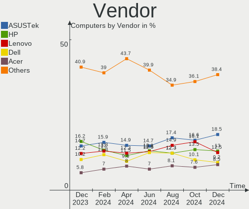
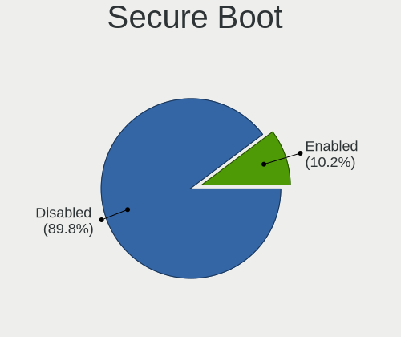
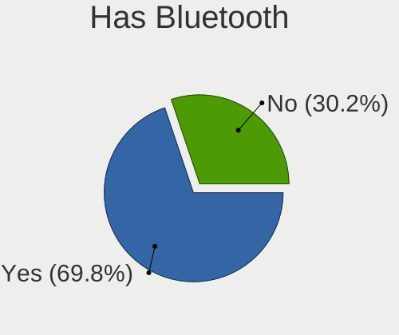
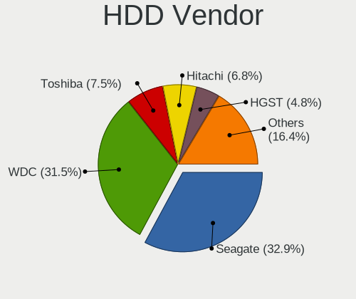
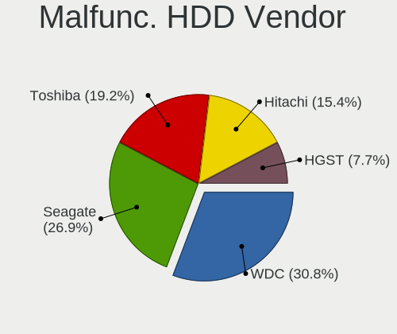
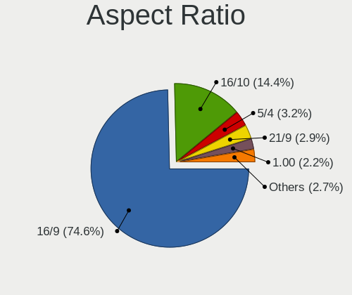
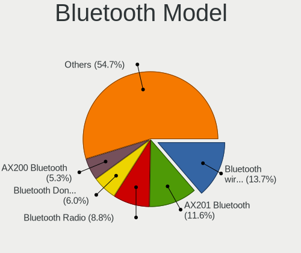
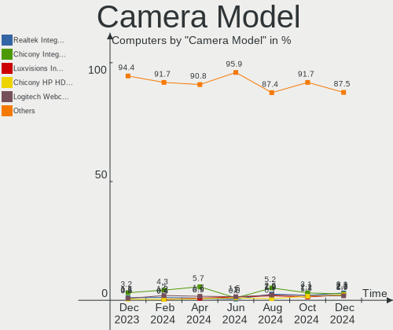

Linux Mint - Hardware Trends
----------------------------

A project to identify most popular hardware characteristics and track their change
over time based on data collected by Linux users at https://Linux-Hardware.org.

Anyone can contribute to this report by the [hw-probe](https://github.com/linuxhw/hw-probe) tool:

    sudo -E hw-probe -all -upload

This is a report for all computer types. See also reports for [desktops](/Dist/Linux_Mint/Desktop/README.md) and [notebooks](/Dist/Linux_Mint/Notebook/README.md).

This report is for one last month. Overall report since the beginning of time: [TestDays](https://github.com/linuxhw/TestDays)

Period: Jun, 2023.

Contents
--------

* [ System ](#system)
  - [ OS                       ](#os)
  - [ OS Family                ](#os-family)
  - [ Kernel                   ](#kernel)
  - [ Kernel Family            ](#kernel-family)
  - [ Kernel Major Ver.        ](#kernel-major-ver)
  - [ Arch                     ](#arch)
  - [ DE                       ](#de)
  - [ Display Server           ](#display-server)
  - [ Display Manager          ](#display-manager)
  - [ OS Lang                  ](#os-lang)
  - [ Boot Mode                ](#boot-mode)
  - [ Filesystem               ](#filesystem)
  - [ Part. scheme             ](#part-scheme)
  - [ Dual Boot with Linux/BSD ](#dual-boot-with-linuxbsd)
  - [ Dual Boot (Win)          ](#dual-boot-win)

* [ Board ](#board)
  - [ Vendor                   ](#vendor)
  - [ Model                    ](#model)
  - [ Model Family             ](#model-family)
  - [ MFG Year                 ](#mfg-year)
  - [ Form Factor              ](#form-factor)
  - [ Secure Boot              ](#secure-boot)
  - [ Coreboot                 ](#coreboot)
  - [ RAM Size                 ](#ram-size)
  - [ RAM Used                 ](#ram-used)
  - [ Total Drives             ](#total-drives)
  - [ Has CD-ROM               ](#has-cd-rom)
  - [ Has Ethernet             ](#has-ethernet)
  - [ Has WiFi                 ](#has-wifi)
  - [ Has Bluetooth            ](#has-bluetooth)

* [ Location ](#location)
  - [ Country                  ](#country)
  - [ City                     ](#city)

* [ Drives ](#drives)
  - [ Drive Vendor             ](#drive-vendor)
  - [ Drive Model              ](#drive-model)
  - [ HDD Vendor               ](#hdd-vendor)
  - [ SSD Vendor               ](#ssd-vendor)
  - [ Drive Kind               ](#drive-kind)
  - [ Drive Connector          ](#drive-connector)
  - [ Drive Size               ](#drive-size)
  - [ Space Total              ](#space-total)
  - [ Space Used               ](#space-used)
  - [ Malfunc. Drives          ](#malfunc-drives)
  - [ Malfunc. Drive Vendor    ](#malfunc-drive-vendor)
  - [ Malfunc. HDD Vendor      ](#malfunc-hdd-vendor)
  - [ Malfunc. Drive Kind      ](#malfunc-drive-kind)
  - [ Failed Drives            ](#failed-drives)
  - [ Failed Drive Vendor      ](#failed-drive-vendor)
  - [ Drive Status             ](#drive-status)

* [ Storage controller ](#storage-controller)
  - [ Storage Vendor           ](#storage-vendor)
  - [ Storage Model            ](#storage-model)
  - [ Storage Kind             ](#storage-kind)

* [ Processor ](#processor)
  - [ CPU Vendor               ](#cpu-vendor)
  - [ CPU Model                ](#cpu-model)
  - [ CPU Model Family         ](#cpu-model-family)
  - [ CPU Cores                ](#cpu-cores)
  - [ CPU Sockets              ](#cpu-sockets)
  - [ CPU Threads              ](#cpu-threads)
  - [ CPU Op-Modes             ](#cpu-op-modes)
  - [ CPU Microcode            ](#cpu-microcode)
  - [ CPU Microarch            ](#cpu-microarch)

* [ Graphics ](#graphics)
  - [ GPU Vendor               ](#gpu-vendor)
  - [ GPU Model                ](#gpu-model)
  - [ GPU Combo                ](#gpu-combo)
  - [ GPU Driver               ](#gpu-driver)
  - [ GPU Memory               ](#gpu-memory)

* [ Monitor ](#monitor)
  - [ Monitor Vendor           ](#monitor-vendor)
  - [ Monitor Model            ](#monitor-model)
  - [ Monitor Resolution       ](#monitor-resolution)
  - [ Monitor Diagonal         ](#monitor-diagonal)
  - [ Monitor Width            ](#monitor-width)
  - [ Aspect Ratio             ](#aspect-ratio)
  - [ Monitor Area             ](#monitor-area)
  - [ Pixel Density            ](#pixel-density)
  - [ Multiple Monitors        ](#multiple-monitors)

* [ Network ](#network)
  - [ Net Controller Vendor    ](#net-controller-vendor)
  - [ Net Controller Model     ](#net-controller-model)
  - [ Wireless Vendor          ](#wireless-vendor)
  - [ Wireless Model           ](#wireless-model)
  - [ Ethernet Vendor          ](#ethernet-vendor)
  - [ Ethernet Model           ](#ethernet-model)
  - [ Net Controller Kind      ](#net-controller-kind)
  - [ Used Controller          ](#used-controller)
  - [ NICs                     ](#nics)
  - [ IPv6                     ](#ipv6)

* [ Bluetooth ](#bluetooth)
  - [ Bluetooth Vendor         ](#bluetooth-vendor)
  - [ Bluetooth Model          ](#bluetooth-model)

* [ Sound ](#sound)
  - [ Sound Vendor             ](#sound-vendor)
  - [ Sound Model              ](#sound-model)

* [ Memory ](#memory)
  - [ Memory Vendor            ](#memory-vendor)
  - [ Memory Model             ](#memory-model)
  - [ Memory Kind              ](#memory-kind)
  - [ Memory Form Factor       ](#memory-form-factor)
  - [ Memory Size              ](#memory-size)
  - [ Memory Speed             ](#memory-speed)

* [ Printers & scanners ](#printers--scanners)
  - [ Printer Vendor           ](#printer-vendor)
  - [ Printer Model            ](#printer-model)
  - [ Scanner Vendor           ](#scanner-vendor)
  - [ Scanner Model            ](#scanner-model)

* [ Camera ](#camera)
  - [ Camera Vendor            ](#camera-vendor)
  - [ Camera Model             ](#camera-model)

* [ Security ](#security)
  - [ Fingerprint Vendor       ](#fingerprint-vendor)
  - [ Fingerprint Model        ](#fingerprint-model)
  - [ Chipcard Vendor          ](#chipcard-vendor)
  - [ Chipcard Model           ](#chipcard-model)

* [ Unsupported ](#unsupported)
  - [ Unsupported Devices      ](#unsupported-devices)
  - [ Unsupported Device Types ](#unsupported-device-types)

System
------

OS
--

Installed operating systems

| Name            | Computers | Percent |
|-----------------|-----------|---------|
| Linux Mint 21.1 | 379       | 77.19%  |
| Linux Mint 20.3 | 44        | 8.96%   |
| Linux Mint 21   | 34        | 6.92%   |
| Linux Mint 20.2 | 11        | 2.24%   |
| Linux Mint 19.3 | 7         | 1.43%   |
| Linux Mint 20.1 | 4         | 0.81%   |
| Linux Mint 20   | 4         | 0.81%   |
| Linux Mint 21.2 | 3         | 0.61%   |
| Linux Mint 19.2 | 2         | 0.41%   |
| Linux Mint 19.1 | 2         | 0.41%   |
| Linux Mint 18.3 | 1         | 0.2%    |

OS Family
---------

OS without a version

| Name       | Computers | Percent |
|------------|-----------|---------|
| Linux Mint | 491       | 100%    |

Kernel
------

Version of the Linux kernel

| Version                | Computers | Percent |
|------------------------|-----------|---------|
| 5.15.0-73-generic      | 163       | 33.2%   |
| 5.15.0-75-generic      | 112       | 22.81%  |
| 5.15.0-56-generic      | 31        | 6.31%   |
| 5.15.0-76-generic      | 22        | 4.48%   |
| 5.4.0-150-generic      | 21        | 4.28%   |
| 5.19.0-43-generic      | 19        | 3.87%   |
| 5.15.0-72-generic      | 18        | 3.67%   |
| 5.4.0-152-generic      | 12        | 2.44%   |
| 5.19.0-45-generic      | 9         | 1.83%   |
| 5.4.0-148-generic      | 6         | 1.22%   |
| 6.3.7-060307-generic   | 5         | 1.02%   |
| 5.15.0-69-generic      | 5         | 1.02%   |
| 5.4.0-149-generic      | 4         | 0.81%   |
| 6.1.0-1013-oem         | 3         | 0.61%   |
| 5.4.0-91-generic       | 3         | 0.61%   |
| 5.4.0-58-generic       | 3         | 0.61%   |
| 5.4.0-153-generic      | 3         | 0.61%   |
| 5.15.0-67-generic      | 3         | 0.61%   |
| 5.15.0-58-generic      | 3         | 0.61%   |
| 5.15.0-41-generic      | 3         | 0.61%   |
| 5.15.0-71-generic      | 2         | 0.41%   |
| 5.15.0-60-generic      | 2         | 0.41%   |
| 6.3.9-x64v1-xanmod1    | 1         | 0.2%    |
| 6.3.9                  | 1         | 0.2%    |
| 6.3.8-1-liquorix-amd64 | 1         | 0.2%    |
| 6.3.7-x64v1-xanmod1    | 1         | 0.2%    |
| 6.3.7-surface          | 1         | 0.2%    |
| 6.3.6-060306-generic   | 1         | 0.2%    |
| 6.3.5-x64v3-xanmod1    | 1         | 0.2%    |
| 6.3.5-060305-generic   | 1         | 0.2%    |
| 6.3.4-060304-generic   | 1         | 0.2%    |
| 6.3.3-1-liquorix-amd64 | 1         | 0.2%    |
| 6.2.0-060200-generic   | 1         | 0.2%    |
| 6.1.0-1014-oem         | 1         | 0.2%    |
| 6.1.0-1012-oem         | 1         | 0.2%    |
| 6.1.0-1010-oem         | 1         | 0.2%    |
| 6.0.0-1018-oem         | 1         | 0.2%    |
| 5.4.0-99-generic       | 1         | 0.2%    |
| 5.4.0-84-generic       | 1         | 0.2%    |
| 5.4.0-26-generic       | 1         | 0.2%    |

Kernel Family
-------------

Linux kernel without a distro release

| Version | Computers | Percent |
|---------|-----------|---------|
| 5.15.0  | 367       | 74.75%  |
| 5.4.0   | 62        | 12.63%  |
| 5.19.0  | 32        | 6.52%   |
| 6.3.7   | 7         | 1.43%   |
| 6.1.0   | 6         | 1.22%   |
| 4.15.0  | 4         | 0.81%   |
| 6.3.9   | 2         | 0.41%   |
| 6.3.5   | 2         | 0.41%   |
| 6.3.8   | 1         | 0.2%    |
| 6.3.6   | 1         | 0.2%    |
| 6.3.4   | 1         | 0.2%    |
| 6.3.3   | 1         | 0.2%    |
| 6.2.0   | 1         | 0.2%    |
| 6.0.0   | 1         | 0.2%    |
| 5.17.9  | 1         | 0.2%    |
| 5.17.0  | 1         | 0.2%    |
| 5.14.0  | 1         | 0.2%    |

Kernel Major Ver.
-----------------

Linux kernel major version

| Version | Computers | Percent |
|---------|-----------|---------|
| 5.15    | 367       | 74.75%  |
| 5.4     | 62        | 12.63%  |
| 5.19    | 32        | 6.52%   |
| 6.3     | 15        | 3.05%   |
| 6.1     | 6         | 1.22%   |
| 4.15    | 4         | 0.81%   |
| 5.17    | 2         | 0.41%   |
| 6.2     | 1         | 0.2%    |
| 6.0     | 1         | 0.2%    |
| 5.14    | 1         | 0.2%    |

Arch
----

OS architecture (x86_64, i586, etc.)

| Name   | Computers | Percent |
|--------|-----------|---------|
| x86_64 | 491       | 100%    |

DE
--

Desktop Environment

| Name       | Computers | Percent |
|------------|-----------|---------|
| X-Cinnamon | 358       | 72.91%  |
| MATE       | 67        | 13.65%  |
| XFCE       | 50        | 10.18%  |
| GNOME      | 6         | 1.22%   |
| KDE5       | 4         | 0.81%   |
| Cinnamon   | 4         | 0.81%   |
| Budgie     | 1         | 0.2%    |
| Unknown    | 1         | 0.2%    |

Display Server
--------------

X11 or Wayland

| Name    | Computers | Percent |
|---------|-----------|---------|
| X11     | 485       | 98.78%  |
| Wayland | 4         | 0.81%   |
| Tty     | 2         | 0.41%   |

Display Manager
---------------

SDDM, LightDM, etc.

| Name    | Computers | Percent |
|---------|-----------|---------|
| Unknown | 267       | 54.38%  |
| LightDM | 222       | 45.21%  |
| GDM3    | 2         | 0.41%   |

OS Lang
-------

Language

| Lang  | Computers | Percent |
|-------|-----------|---------|
| en_US | 155       | 31.57%  |
| de_DE | 83        | 16.9%   |
| pt_BR | 35        | 7.13%   |
| en_GB | 25        | 5.09%   |
| fr_FR | 21        | 4.28%   |
| en_CA | 17        | 3.46%   |
| C     | 17        | 3.46%   |
| ru_RU | 16        | 3.26%   |
| es_ES | 10        | 2.04%   |
| en_AU | 10        | 2.04%   |
| es_AR | 9         | 1.83%   |
| en_IN | 8         | 1.63%   |
| pl_PL | 7         | 1.43%   |
| it_IT | 7         | 1.43%   |
| es_MX | 6         | 1.22%   |
| de_AT | 6         | 1.22%   |
| hu_HU | 5         | 1.02%   |
| tr_TR | 4         | 0.81%   |
| en_NZ | 4         | 0.81%   |
| de_CH | 4         | 0.81%   |
| sk_SK | 3         | 0.61%   |
| fi_FI | 3         | 0.61%   |
| en_PH | 3         | 0.61%   |
| el_GR | 3         | 0.61%   |
| cs_CZ | 3         | 0.61%   |
| pt_PT | 2         | 0.41%   |
| nl_NL | 2         | 0.41%   |
| nb_NO | 2         | 0.41%   |
| es_PE | 2         | 0.41%   |
| es_CL | 2         | 0.41%   |
| en_ZA | 2         | 0.41%   |
| zh_TW | 1         | 0.2%    |
| uk_UA | 1         | 0.2%    |
| sv_SE | 1         | 0.2%    |
| sr_RS | 1         | 0.2%    |
| ru_UA | 1         | 0.2%    |
| ro_RO | 1         | 0.2%    |
| lv_LV | 1         | 0.2%    |
| ko_KR | 1         | 0.2%    |
| fr_BE | 1         | 0.2%    |

Boot Mode
---------

EFI or BIOS

| Mode | Computers | Percent |
|------|-----------|---------|
| EFI  | 323       | 65.78%  |
| BIOS | 168       | 34.22%  |

Filesystem
----------

Type of filesystem

| Type    | Computers | Percent |
|---------|-----------|---------|
| Ext4    | 457       | 93.08%  |
| Overlay | 13        | 2.65%   |
| Zfs     | 7         | 1.43%   |
| Tmpfs   | 7         | 1.43%   |
| Btrfs   | 6         | 1.22%   |
| Xfs     | 1         | 0.2%    |

Part. scheme
------------

Scheme of partitioning

| Type    | Computers | Percent |
|---------|-----------|---------|
| Unknown | 264       | 53.77%  |
| GPT     | 198       | 40.33%  |
| MBR     | 29        | 5.91%   |

Dual Boot with Linux/BSD
------------------------

Hosting more than one Linux/BSD

| Dual boot | Computers | Percent |
|-----------|-----------|---------|
| No        | 440       | 89.61%  |
| Yes       | 51        | 10.39%  |

Dual Boot (Win)
---------------

Hosting Linux and Windows

| Dual boot | Computers | Percent |
|-----------|-----------|---------|
| No        | 376       | 76.58%  |
| Yes       | 115       | 23.42%  |

Board
-----

Vendor
------

Motherboard manufacturer

| Name                | Computers | Percent |
|---------------------|-----------|---------|
| ASUSTek Computer    | 80        | 16.29%  |
| Hewlett-Packard     | 72        | 14.66%  |
| Lenovo              | 55        | 11.2%   |
| Dell                | 55        | 11.2%   |
| MSI                 | 41        | 8.35%   |
| Gigabyte Technology | 39        | 7.94%   |
| Acer                | 38        | 7.74%   |
| ASRock              | 14        | 2.85%   |
| Apple               | 12        | 2.44%   |
| Intel               | 9         | 1.83%   |
| Toshiba             | 8         | 1.63%   |
| Samsung Electronics | 6         | 1.22%   |
| Sony                | 4         | 0.81%   |
| Positivo            | 3         | 0.61%   |
| HUAWEI              | 3         | 0.61%   |
| Fujitsu             | 3         | 0.61%   |
| Biostar             | 3         | 0.61%   |
| AMI                 | 3         | 0.61%   |
| Unknown             | 3         | 0.61%   |
| Wortmann AG         | 2         | 0.41%   |
| VALE                | 2         | 0.41%   |
| TUXEDO              | 2         | 0.41%   |
| Timi                | 2         | 0.41%   |
| Shuttle             | 2         | 0.41%   |
| ECS                 | 2         | 0.41%   |
| Alienware           | 2         | 0.41%   |
| ZOTAC               | 1         | 0.2%    |
| win element         | 1         | 0.2%    |
| UMAX                | 1         | 0.2%    |
| TaNix               | 1         | 0.2%    |
| Supermicro          | 1         | 0.2%    |
| SDZ                 | 1         | 0.2%    |
| POWERX              | 1         | 0.2%    |
| Portwell            | 1         | 0.2%    |
| Pegatron            | 1         | 0.2%    |
| PCWare              | 1         | 0.2%    |
| Panasonic           | 1         | 0.2%    |
| Packard Bell        | 1         | 0.2%    |
| MW                  | 1         | 0.2%    |
| Multicom Norge AS   | 1         | 0.2%    |

Model
-----

Motherboard model

| Name                                 | Computers | Percent |
|--------------------------------------|-----------|---------|
| Unknown                              | 5         | 1.02%   |
| Gigabyte B450 AORUS ELITE            | 3         | 0.61%   |
| Dell OptiPlex 790                    | 3         | 0.61%   |
| MSI MS-7D54                          | 2         | 0.41%   |
| MSI MS-7B98                          | 2         | 0.41%   |
| MSI MS-7B86                          | 2         | 0.41%   |
| Lenovo V15 G2 ALC 82KD               | 2         | 0.41%   |
| Lenovo IdeaPad 330-15IKB 81DE        | 2         | 0.41%   |
| Intel H61                            | 2         | 0.41%   |
| HP Pavilion Notebook                 | 2         | 0.41%   |
| HP Pavilion dv6                      | 2         | 0.41%   |
| HP Notebook                          | 2         | 0.41%   |
| HP ENVY x360 2-in-1 Laptop 14-es0xxx | 2         | 0.41%   |
| HP ENVY Notebook                     | 2         | 0.41%   |
| HP EliteBook 840 G3                  | 2         | 0.41%   |
| HP Compaq Presario CQ60              | 2         | 0.41%   |
| HP Compaq Elite 8300 SFF             | 2         | 0.41%   |
| HP 255 15.6 inch G9 Notebook PC      | 2         | 0.41%   |
| Gigabyte H61M-S2PV                   | 2         | 0.41%   |
| Gigabyte B250M-D3H                   | 2         | 0.41%   |
| Gigabyte 970A-DS3P                   | 2         | 0.41%   |
| Dell XPS 8700                        | 2         | 0.41%   |
| Dell Precision M4800                 | 2         | 0.41%   |
| Dell Latitude E6540                  | 2         | 0.41%   |
| Dell Latitude E6410                  | 2         | 0.41%   |
| Dell Inspiron 15-3567                | 2         | 0.41%   |
| ASUS X75VC                           | 2         | 0.41%   |
| ASUS X556UQK                         | 2         | 0.41%   |
| ASUS X553MA                          | 2         | 0.41%   |
| ASUS TUF Gaming B550M-PLUS           | 2         | 0.41%   |
| ASUS PRIME A320M-K                   | 2         | 0.41%   |
| ASUS P8B75-M LE                      | 2         | 0.41%   |
| ASUS M5A78L-M PLUS/USB3              | 2         | 0.41%   |
| ASUS All Series                      | 2         | 0.41%   |
| ASRock A320M-HDV R3.0                | 2         | 0.41%   |
| Acer Aspire V3-772                   | 2         | 0.41%   |
| Acer Aspire E5-573G                  | 2         | 0.41%   |
| Acer Aspire A515-45                  | 2         | 0.41%   |
| ZOTAC ZBOX-CI622/CI642/CI662NANO     | 1         | 0.2%    |
| Wortmann AG NA92                     | 1         | 0.2%    |

Model Family
------------

Motherboard model prefix

| Name               | Computers | Percent |
|--------------------|-----------|---------|
| Acer Aspire        | 28        | 5.7%    |
| Lenovo ThinkPad    | 17        | 3.46%   |
| Dell Latitude      | 17        | 3.46%   |
| Lenovo IdeaPad     | 15        | 3.05%   |
| Dell Inspiron      | 13        | 2.65%   |
| HP EliteBook       | 12        | 2.44%   |
| HP Laptop          | 11        | 2.24%   |
| ASUS ROG           | 11        | 2.24%   |
| HP Compaq          | 9         | 1.83%   |
| Dell Precision     | 9         | 1.83%   |
| Dell OptiPlex      | 9         | 1.83%   |
| Toshiba Satellite  | 8         | 1.63%   |
| HP Pavilion        | 8         | 1.63%   |
| HP ENVY            | 6         | 1.22%   |
| ASUS VivoBook      | 6         | 1.22%   |
| Lenovo ThinkCentre | 5         | 1.02%   |
| Gigabyte B450      | 5         | 1.02%   |
| Dell XPS           | 5         | 1.02%   |
| ASUS TUF           | 5         | 1.02%   |
| ASUS PRIME         | 5         | 1.02%   |
| Acer Swift         | 5         | 1.02%   |
| Unknown            | 5         | 1.02%   |
| Lenovo V15         | 4         | 0.81%   |
| ASUS ASUS          | 4         | 0.81%   |
| Lenovo Yoga        | 3         | 0.61%   |
| HP ProBook         | 3         | 0.61%   |
| HP 255             | 3         | 0.61%   |
| ASRock A320M-HDV   | 3         | 0.61%   |
| Apple MacBookPro11 | 3         | 0.61%   |
| VALE Notebook      | 2         | 0.41%   |
| Timi RedmiBook     | 2         | 0.41%   |
| MSI MS-7D54        | 2         | 0.41%   |
| MSI MS-7B98        | 2         | 0.41%   |
| MSI MS-7B86        | 2         | 0.41%   |
| Intel H61          | 2         | 0.41%   |
| HP Notebook        | 2         | 0.41%   |
| HP 250             | 2         | 0.41%   |
| Gigabyte H61M-S2PV | 2         | 0.41%   |
| Gigabyte B250M-D3H | 2         | 0.41%   |
| Gigabyte 970A-DS3P | 2         | 0.41%   |

MFG Year
--------

Motherboard manufacture year

| Year | Computers | Percent |
|------|-----------|---------|
| 2021 | 43        | 8.76%   |
| 2018 | 41        | 8.35%   |
| 2013 | 41        | 8.35%   |
| 2016 | 40        | 8.15%   |
| 2012 | 34        | 6.92%   |
| 2011 | 33        | 6.72%   |
| 2022 | 32        | 6.52%   |
| 2014 | 32        | 6.52%   |
| 2020 | 31        | 6.31%   |
| 2019 | 31        | 6.31%   |
| 2017 | 28        | 5.7%    |
| 2010 | 26        | 5.3%    |
| 2015 | 23        | 4.68%   |
| 2009 | 18        | 3.67%   |
| 2008 | 13        | 2.65%   |
| 2023 | 12        | 2.44%   |
| 2007 | 8         | 1.63%   |
| 2006 | 4         | 0.81%   |
| 2005 | 1         | 0.2%    |

Form Factor
-----------

Physical design of the computer

| Name        | Computers | Percent |
|-------------|-----------|---------|
| Notebook    | 266       | 54.18%  |
| Desktop     | 192       | 39.1%   |
| Convertible | 14        | 2.85%   |
| All in one  | 9         | 1.83%   |
| Mini pc     | 5         | 1.02%   |
| Tablet      | 3         | 0.61%   |
| Server      | 2         | 0.41%   |

Secure Boot
-----------

Enabled or disabled

| State    | Computers | Percent |
|----------|-----------|---------|
| Disabled | 468       | 95.32%  |
| Enabled  | 23        | 4.68%   |

Coreboot
--------

Have coreboot on board

| Used | Computers | Percent |
|------|-----------|---------|
| No   | 490       | 99.8%   |
| Yes  | 1         | 0.2%    |

RAM Size
--------

Total RAM memory

| Size in GB      | Computers | Percent |
|-----------------|-----------|---------|
| 4.01-8.0        | 119       | 24.24%  |
| 16.01-24.0      | 97        | 19.76%  |
| 3.01-4.0        | 95        | 19.35%  |
| 8.01-16.0       | 90        | 18.33%  |
| 32.01-64.0      | 44        | 8.96%   |
| 64.01-256.0     | 18        | 3.67%   |
| 1.01-2.0        | 12        | 2.44%   |
| 24.01-32.0      | 8         | 1.63%   |
| 2.01-3.0        | 5         | 1.02%   |
| 0.51-1.0        | 2         | 0.41%   |
| More than 256.0 | 1         | 0.2%    |

RAM Used
--------

Used RAM memory

| Used GB    | Computers | Percent |
|------------|-----------|---------|
| 1.01-2.0   | 182       | 37.07%  |
| 2.01-3.0   | 133       | 27.09%  |
| 4.01-8.0   | 70        | 14.26%  |
| 3.01-4.0   | 70        | 14.26%  |
| 8.01-16.0  | 18        | 3.67%   |
| 0.51-1.0   | 15        | 3.05%   |
| 16.01-24.0 | 3         | 0.61%   |

Total Drives
------------

Number of drives on board

| Drives | Computers | Percent |
|--------|-----------|---------|
| 1      | 290       | 59.06%  |
| 2      | 124       | 25.25%  |
| 3      | 39        | 7.94%   |
| 4      | 19        | 3.87%   |
| 5      | 10        | 2.04%   |
| 6      | 7         | 1.43%   |
| 8      | 1         | 0.2%    |
| 0      | 1         | 0.2%    |

Has CD-ROM
----------

Has CD-ROM on board

| Presented | Computers | Percent |
|-----------|-----------|---------|
| No        | 287       | 58.45%  |
| Yes       | 204       | 41.55%  |

Has Ethernet
------------

Has Ethernet on board

| Presented | Computers | Percent |
|-----------|-----------|---------|
| Yes       | 437       | 89%     |
| No        | 54        | 11%     |

Has WiFi
--------

Has WiFi module

| Presented | Computers | Percent |
|-----------|-----------|---------|
| Yes       | 388       | 79.02%  |
| No        | 103       | 20.98%  |

Has Bluetooth
-------------

Has Bluetooth module

| Presented | Computers | Percent |
|-----------|-----------|---------|
| Yes       | 297       | 60.49%  |
| No        | 194       | 39.51%  |

Location
--------

Country
-------

Geographic location (country)

| Country      | Computers | Percent |
|--------------|-----------|---------|
| Germany      | 93        | 18.94%  |
| USA          | 87        | 17.72%  |
| Brazil       | 39        | 7.94%   |
| France       | 24        | 4.89%   |
| UK           | 20        | 4.07%   |
| Canada       | 19        | 3.87%   |
| Russia       | 15        | 3.05%   |
| Spain        | 13        | 2.65%   |
| Italy        | 12        | 2.44%   |
| India        | 10        | 2.04%   |
| Australia    | 10        | 2.04%   |
| Netherlands  | 9         | 1.83%   |
| Mexico       | 9         | 1.83%   |
| Argentina    | 9         | 1.83%   |
| Austria      | 8         | 1.63%   |
| Poland       | 7         | 1.43%   |
| Czechia      | 7         | 1.43%   |
| Turkey       | 6         | 1.22%   |
| Norway       | 6         | 1.22%   |
| Hungary      | 6         | 1.22%   |
| Ukraine      | 5         | 1.02%   |
| Slovakia     | 5         | 1.02%   |
| Greece       | 5         | 1.02%   |
| Switzerland  | 4         | 0.81%   |
| Portugal     | 4         | 0.81%   |
| New Zealand  | 4         | 0.81%   |
| Finland      | 4         | 0.81%   |
| South Africa | 3         | 0.61%   |
| Philippines  | 3         | 0.61%   |
| Latvia       | 3         | 0.61%   |
| Colombia     | 3         | 0.61%   |
| Chile        | 3         | 0.61%   |
| Thailand     | 2         | 0.41%   |
| Sweden       | 2         | 0.41%   |
| Serbia       | 2         | 0.41%   |
| Madagascar   | 2         | 0.41%   |
| Japan        | 2         | 0.41%   |
| Indonesia    | 2         | 0.41%   |
| Egypt        | 2         | 0.41%   |
| Bulgaria     | 2         | 0.41%   |

City
----

Geographic location (city)

| City              | Computers | Percent |
|-------------------|-----------|---------|
| Hamburg           | 8         | 1.63%   |
| Prague            | 4         | 0.81%   |
| Paris             | 4         | 0.81%   |
| Manchester        | 4         | 0.81%   |
| Fortaleza         | 4         | 0.81%   |
| Sydney            | 3         | 0.61%   |
| Sao Paulo         | 3         | 0.61%   |
| Rio de Janeiro    | 3         | 0.61%   |
| Munich            | 3         | 0.61%   |
| Kingston          | 3         | 0.61%   |
| Helsinki          | 3         | 0.61%   |
| Frankfurt am Main | 3         | 0.61%   |
| Cleveland         | 3         | 0.61%   |
| Chennai           | 3         | 0.61%   |
| Brisbane          | 3         | 0.61%   |
| Berlin            | 3         | 0.61%   |
| Auckland          | 3         | 0.61%   |
| Vienna            | 2         | 0.41%   |
| Ventspils         | 2         | 0.41%   |
| Ulm               | 2         | 0.41%   |
| Toronto           | 2         | 0.41%   |
| Stockholm         | 2         | 0.41%   |
| Sofia             | 2         | 0.41%   |
| Rostov-on-Don     | 2         | 0.41%   |
| Rome              | 2         | 0.41%   |
| Quilmes           | 2         | 0.41%   |
| Oslo              | 2         | 0.41%   |
| New York          | 2         | 0.41%   |
| New Hartford      | 2         | 0.41%   |
| Nashville         | 2         | 0.41%   |
| Münster          | 2         | 0.41%   |
| Moscow            | 2         | 0.41%   |
| Mönchengladbach  | 2         | 0.41%   |
| Maule             | 2         | 0.41%   |
| Macon             | 2         | 0.41%   |
| London            | 2         | 0.41%   |
| Leipzig           | 2         | 0.41%   |
| Lahr              | 2         | 0.41%   |
| Kyiv              | 2         | 0.41%   |
| Krefeld           | 2         | 0.41%   |

Drives
------

Drive Vendor
------------

Hard drive vendors

| Vendor                      | Computers | Drives | Percent |
|-----------------------------|-----------|--------|---------|
| Seagate                     | 105       | 129    | 14.17%  |
| Samsung Electronics         | 104       | 125    | 14.04%  |
| WDC                         | 100       | 114    | 13.5%   |
| Sandisk                     | 54        | 57     | 7.29%   |
| Crucial                     | 40        | 49     | 5.4%    |
| Toshiba                     | 39        | 39     | 5.26%   |
| Kingston                    | 39        | 40     | 5.26%   |
| Unknown                     | 22        | 26     | 2.97%   |
| Intel                       | 15        | 16     | 2.02%   |
| Micron Technology           | 13        | 13     | 1.75%   |
| SK hynix                    | 12        | 12     | 1.62%   |
| China                       | 12        | 12     | 1.62%   |
| Micron/Crucial Technology   | 10        | 12     | 1.35%   |
| Hitachi                     | 10        | 11     | 1.35%   |
| A-DATA Technology           | 10        | 10     | 1.35%   |
| KIOXIA                      | 8         | 8      | 1.08%   |
| Kingston Technology Company | 8         | 8      | 1.08%   |
| HGST                        | 7         | 7      | 0.94%   |
| PNY                         | 6         | 6      | 0.81%   |
| Phison Electronics          | 6         | 6      | 0.81%   |
| Apple                       | 6         | 6      | 0.81%   |
| SPCC                        | 5         | 5      | 0.67%   |
| GOODRAM                     | 5         | 5      | 0.67%   |
| Apacer                      | 5         | 5      | 0.67%   |
| Team                        | 4         | 4      | 0.54%   |
| LITEON                      | 4         | 4      | 0.54%   |
| Intenso                     | 4         | 4      | 0.54%   |
| Fujitsu                     | 4         | 4      | 0.54%   |
| ADATA Technology            | 4         | 5      | 0.54%   |
| Unknown                     | 4         | 4      | 0.54%   |
| Union Memory                | 3         | 3      | 0.4%    |
| Transcend                   | 3         | 3      | 0.4%    |
| Silicon Motion              | 3         | 3      | 0.4%    |
| Realtek Semiconductor       | 3         | 3      | 0.4%    |
| Patriot                     | 3         | 3      | 0.4%    |
| OCZ                         | 3         | 3      | 0.4%    |
| MAXIO Technology (Hangzhou) | 3         | 3      | 0.4%    |
| ASMT                        | 3         | 3      | 0.4%    |
| XrayDisk                    | 2         | 3      | 0.27%   |
| Verbatim                    | 2         | 2      | 0.27%   |

Drive Model
-----------

Hard drive models

| Model                                               | Computers | Percent |
|-----------------------------------------------------|-----------|---------|
| Seagate ST1000LM024 HN-M101MBB 1TB                  | 10        | 1.24%   |
| Kingston SA400S37240G 240GB SSD                     | 10        | 1.24%   |
| Toshiba MQ01ABD100 1TB                              | 9         | 1.12%   |
| Seagate ST2000DM008-2FR102 2TB                      | 8         | 0.99%   |
| Samsung NVMe SSD Controller SM981/PM981/PM983 250GB | 8         | 0.99%   |
| Seagate ST1000LM035-1RK172 1TB                      | 7         | 0.87%   |
| Samsung SSD 850 EVO 250GB                           | 7         | 0.87%   |
| Micron/Crucial P2 NVMe PCIe SSD 4TB                 | 7         | 0.87%   |
| Crucial CT1000MX500SSD1 1TB                         | 7         | 0.87%   |
| Crucial CT1000BX500SSD1 1TB                         | 7         | 0.87%   |
| Samsung SSD 860 EVO 1TB                             | 6         | 0.74%   |
| Unknown MMC Card  64GB                              | 5         | 0.62%   |
| Toshiba MQ04ABF100 1TB                              | 5         | 0.62%   |
| Seagate ST500DM002-1BD142 500GB                     | 5         | 0.62%   |
| Samsung SSD 870 EVO 1TB                             | 5         | 0.62%   |
| Samsung NVMe SSD Controller PM9A1/PM9A3/980PRO 2TB  | 5         | 0.62%   |
| Crucial CT480BX500SSD1 480GB                        | 5         | 0.62%   |
| WDC WDS240G2G0A-00JH30 240GB SSD                    | 4         | 0.5%    |
| WDC WD40EZRZ-00GXCB0 4TB                            | 4         | 0.5%    |
| Unknown SD/MMC/MS PRO 250GB                         | 4         | 0.5%    |
| Unknown MMC Card  32GB                              | 4         | 0.5%    |
| Toshiba DT01ACA100 1TB                              | 4         | 0.5%    |
| Seagate Expansion Desk 5TB                          | 4         | 0.5%    |
| Sandisk WD Blue SN550 NVMe SSD 1TB                  | 4         | 0.5%    |
| SanDisk SDSSDP128G 128GB                            | 4         | 0.5%    |
| SanDisk NVMe SSD Drive 1TB                          | 4         | 0.5%    |
| Kingston SV300S37A120G 120GB SSD                    | 4         | 0.5%    |
| Crucial CT500MX500SSD1 500GB                        | 4         | 0.5%    |
| Unknown                                             | 4         | 0.5%    |
| WDC WD10SPCX-24HWST1 1TB                            | 3         | 0.37%   |
| Seagate ST500LT012-9WS142 500GB                     | 3         | 0.37%   |
| Seagate ST1000DM010-2EP102 1TB                      | 3         | 0.37%   |
| Seagate ST1000DM003-1CH162 1TB                      | 3         | 0.37%   |
| Seagate Expansion 1TB                               | 3         | 0.37%   |
| SanDisk SSD PLUS 480GB                              | 3         | 0.37%   |
| SanDisk NVMe SSD Drive 512GB                        | 3         | 0.37%   |
| Samsung SSD 870 QVO 1TB                             | 3         | 0.37%   |
| Samsung SSD 870 EVO 500GB                           | 3         | 0.37%   |
| Samsung SSD 870 EVO 250GB                           | 3         | 0.37%   |
| Samsung SSD 860 EVO 250GB                           | 3         | 0.37%   |

HDD Vendor
----------

Hard disk drive vendors

| Vendor              | Computers | Drives | Percent |
|---------------------|-----------|--------|---------|
| Seagate             | 103       | 127    | 39.46%  |
| WDC                 | 79        | 88     | 30.27%  |
| Toshiba             | 35        | 35     | 13.41%  |
| Samsung Electronics | 15        | 17     | 5.75%   |
| Hitachi             | 10        | 11     | 3.83%   |
| HGST                | 7         | 7      | 2.68%   |
| Unknown             | 5         | 5      | 1.92%   |
| Fujitsu             | 4         | 4      | 1.53%   |
| Maxone              | 1         | 1      | 0.38%   |
| JMicron Technology  | 1         | 2      | 0.38%   |
| ASMT                | 1         | 1      | 0.38%   |

SSD Vendor
----------

Solid state drive vendors

| Vendor              | Computers | Drives | Percent |
|---------------------|-----------|--------|---------|
| Samsung Electronics | 56        | 63     | 19.72%  |
| Crucial             | 33        | 39     | 11.62%  |
| Kingston            | 32        | 33     | 11.27%  |
| SanDisk             | 28        | 28     | 9.86%   |
| WDC                 | 18        | 19     | 6.34%   |
| China               | 12        | 12     | 4.23%   |
| A-DATA Technology   | 9         | 9      | 3.17%   |
| Micron Technology   | 7         | 7      | 2.46%   |
| PNY                 | 6         | 6      | 2.11%   |
| Apple               | 6         | 6      | 2.11%   |
| SPCC                | 5         | 5      | 1.76%   |
| Intel               | 5         | 5      | 1.76%   |
| GOODRAM             | 5         | 5      | 1.76%   |
| Apacer              | 5         | 5      | 1.76%   |
| Team                | 4         | 4      | 1.41%   |
| Toshiba             | 3         | 3      | 1.06%   |
| OCZ                 | 3         | 3      | 1.06%   |
| LITEON              | 3         | 3      | 1.06%   |
| Intenso             | 3         | 3      | 1.06%   |
| Verbatim            | 2         | 2      | 0.7%    |
| Transcend           | 2         | 2      | 0.7%    |
| SK hynix            | 2         | 2      | 0.7%    |
| Patriot             | 2         | 2      | 0.7%    |
| Lexar               | 2         | 2      | 0.7%    |
| KingSpec            | 2         | 2      | 0.7%    |
| Gigabyte Technology | 2         | 2      | 0.7%    |
| XrayDisk            | 1         | 1      | 0.35%   |
| Win Memory          | 1         | 1      | 0.35%   |
| Teutons             | 1         | 1      | 0.35%   |
| T-FORCE             | 1         | 1      | 0.35%   |
| T-CREATE            | 1         | 1      | 0.35%   |
| Super Talent        | 1         | 1      | 0.35%   |
| SUNEAST             | 1         | 1      | 0.35%   |
| StoreJet            | 1         | 1      | 0.35%   |
| RZX                 | 1         | 1      | 0.35%   |
| Plextor             | 1         | 1      | 0.35%   |
| Pioneer             | 1         | 1      | 0.35%   |
| Mushkin             | 1         | 1      | 0.35%   |
| LITEONIT            | 1         | 1      | 0.35%   |
| KingFast            | 1         | 1      | 0.35%   |

Drive Kind
----------

HDD or SSD

| Kind    | Computers | Drives | Percent |
|---------|-----------|--------|---------|
| SSD     | 247       | 300    | 37.65%  |
| HDD     | 222       | 298    | 33.84%  |
| NVMe    | 155       | 189    | 23.63%  |
| MMC     | 21        | 23     | 3.2%    |
| Unknown | 11        | 15     | 1.68%   |

Drive Connector
---------------

SATA, SAS, NVMe, etc.

| Type | Computers | Drives | Percent |
|------|-----------|--------|---------|
| SATA | 384       | 569    | 64.65%  |
| NVMe | 152       | 185    | 25.59%  |
| SAS  | 37        | 48     | 6.23%   |
| MMC  | 21        | 23     | 3.54%   |

Drive Size
----------

Size of hard drive

| Size in TB | Computers | Drives | Percent |
|------------|-----------|--------|---------|
| 0.01-0.5   | 252       | 325    | 52.17%  |
| 0.51-1.0   | 162       | 189    | 33.54%  |
| 1.01-2.0   | 40        | 52     | 8.28%   |
| 3.01-4.0   | 16        | 18     | 3.31%   |
| 4.01-10.0  | 9         | 10     | 1.86%   |
| 2.01-3.0   | 3         | 3      | 0.62%   |
| 10.01-20.0 | 1         | 1      | 0.21%   |

Space Total
-----------

Amount of disk space available on the file system

| Size in GB     | Computers | Percent |
|----------------|-----------|---------|
| 101-250        | 123       | 25.05%  |
| 251-500        | 121       | 24.64%  |
| 501-1000       | 105       | 21.38%  |
| 1001-2000      | 39        | 7.94%   |
| More than 3000 | 35        | 7.13%   |
| 51-100         | 24        | 4.89%   |
| 2001-3000      | 16        | 3.26%   |
| 1-20           | 14        | 2.85%   |
| 21-50          | 11        | 2.24%   |
| Unknown        | 3         | 0.61%   |

Space Used
----------

Amount of used disk space

| Used GB        | Computers | Percent |
|----------------|-----------|---------|
| 21-50          | 110       | 22.4%   |
| 1-20           | 87        | 17.72%  |
| 101-250        | 84        | 17.11%  |
| 251-500        | 65        | 13.24%  |
| 51-100         | 63        | 12.83%  |
| 501-1000       | 37        | 7.54%   |
| 1001-2000      | 22        | 4.48%   |
| More than 3000 | 13        | 2.65%   |
| 2001-3000      | 7         | 1.43%   |
| Unknown        | 3         | 0.61%   |

Malfunc. Drives
---------------

Drive models with a malfunction

| Model                               | Computers | Drives | Percent |
|-------------------------------------|-----------|--------|---------|
| WDC WD20EARS-00J2GB0 2TB            | 2         | 2      | 3.39%   |
| Seagate ST500DM002-1BD142 500GB     | 2         | 2      | 3.39%   |
| Samsung Electronics SSD 970 EVO 2TB | 2         | 2      | 3.39%   |
| Samsung Electronics HD322HJ 320GB   | 2         | 2      | 3.39%   |
| WDC WDS200T2B0B 2TB SSD             | 1         | 1      | 1.69%   |
| WDC WDS120G2G0A-00JH30 128GB SSD    | 1         | 1      | 1.69%   |
| WDC WDS100T2G0A-00JH30 1TB SSD      | 1         | 2      | 1.69%   |
| WDC WD7500BPVT-60HXZT3 752GB        | 1         | 1      | 1.69%   |
| WDC WD5000LPVX-80V0TT0 500GB        | 1         | 1      | 1.69%   |
| WDC WD5000AAKX-00ERMA0 500GB        | 1         | 1      | 1.69%   |
| WDC WD5000AAKX-001CA0 500GB         | 1         | 1      | 1.69%   |
| WDC WD15EARS-00MVWB0 1TB            | 1         | 1      | 1.69%   |
| WDC WD10SPZX-60Z10T1 1TB            | 1         | 1      | 1.69%   |
| WDC WD10EZEX-75WN4A0 1TB            | 1         | 1      | 1.69%   |
| WDC WD10EURX-63C57Y0 1TB            | 1         | 1      | 1.69%   |
| WDC WD1003FZEX-00MK2A0 1TB          | 1         | 1      | 1.69%   |
| Toshiba MQ01ABD100 1TB              | 1         | 1      | 1.69%   |
| Toshiba MK8037GSX 80GB              | 1         | 1      | 1.69%   |
| Toshiba MK2556GSY 250GB             | 1         | 1      | 1.69%   |
| Silicon Motion NE-256 256GB         | 1         | 1      | 1.69%   |
| Seagate ST9500325AS 500GB           | 1         | 1      | 1.69%   |
| Seagate ST9320325AS 320GB           | 1         | 1      | 1.69%   |
| Seagate ST9160310AS 160GB           | 1         | 1      | 1.69%   |
| Seagate ST500LT012-9WS142 500GB     | 1         | 1      | 1.69%   |
| Seagate ST3500418AS 500GB           | 1         | 1      | 1.69%   |
| Seagate ST3500413AS 500GB           | 1         | 1      | 1.69%   |
| Seagate ST3500320AS 500GB           | 1         | 1      | 1.69%   |
| Seagate ST3320413CS 320GB           | 1         | 1      | 1.69%   |
| Seagate ST1000LM035-1RK172 1TB      | 1         | 2      | 1.69%   |
| Seagate ST1000LM024 HN-M101MBB 1TB  | 1         | 1      | 1.69%   |
| Seagate ST1000DM003-1SB102 1TB      | 1         | 1      | 1.69%   |
| SanDisk SSD PLUS 480GB              | 1         | 1      | 1.69%   |
| SanDisk SSD PLUS 120 GB             | 1         | 1      | 1.69%   |
| Samsung Electronics SSD 970 EVO 1TB | 1         | 1      | 1.69%   |
| Samsung Electronics SP2004C 200GB   | 1         | 1      | 1.69%   |
| Samsung Electronics HD501LJ 500GB   | 1         | 1      | 1.69%   |
| Samsung Electronics HD154UI 1TB     | 1         | 1      | 1.69%   |
| Patriot Blast 240GB SSD             | 1         | 1      | 1.69%   |
| LITEON CA3-8D256 256GB              | 1         | 1      | 1.69%   |
| Kingston SMSM150S324G 24GB SSD      | 1         | 1      | 1.69%   |

Malfunc. Drive Vendor
---------------------

Vendors of faulty drives

| Vendor              | Computers | Drives | Percent |
|---------------------|-----------|--------|---------|
| WDC                 | 14        | 15     | 23.73%  |
| Seagate             | 13        | 14     | 22.03%  |
| Samsung Electronics | 8         | 8      | 13.56%  |
| Hitachi             | 4         | 4      | 6.78%   |
| Toshiba             | 3         | 3      | 5.08%   |
| Crucial             | 3         | 3      | 5.08%   |
| SanDisk             | 2         | 2      | 3.39%   |
| Kingston            | 2         | 2      | 3.39%   |
| HGST                | 2         | 2      | 3.39%   |
| China               | 2         | 2      | 3.39%   |
| Silicon Motion      | 1         | 1      | 1.69%   |
| Patriot             | 1         | 1      | 1.69%   |
| LITEON              | 1         | 1      | 1.69%   |
| EYOTA               | 1         | 1      | 1.69%   |
| ASMT                | 1         | 1      | 1.69%   |
| A-DATA Technology   | 1         | 1      | 1.69%   |

Malfunc. HDD Vendor
-------------------

Vendors of faulty HDD drives

| Vendor              | Computers | Drives | Percent |
|---------------------|-----------|--------|---------|
| Seagate             | 13        | 14     | 33.33%  |
| WDC                 | 11        | 11     | 28.21%  |
| Samsung Electronics | 5         | 5      | 12.82%  |
| Hitachi             | 4         | 4      | 10.26%  |
| Toshiba             | 3         | 3      | 7.69%   |
| HGST                | 2         | 2      | 5.13%   |
| ASMT                | 1         | 1      | 2.56%   |

Malfunc. Drive Kind
-------------------

Kinds of faulty drives

| Kind | Computers | Drives | Percent |
|------|-----------|--------|---------|
| HDD  | 34        | 40     | 62.96%  |
| SSD  | 14        | 15     | 25.93%  |
| NVMe | 6         | 6      | 11.11%  |

Failed Drives
-------------

Failed drive models

Zero info for selected period =(

Failed Drive Vendor
-------------------

Failed drive vendors

Zero info for selected period =(

Drive Status
------------

Number of failed and malfunc. drives

| Status   | Computers | Drives | Percent |
|----------|-----------|--------|---------|
| Detected | 299       | 476    | 55.68%  |
| Works    | 187       | 288    | 34.82%  |
| Malfunc  | 51        | 61     | 9.5%    |

Storage controller
------------------

Storage Vendor
--------------

Storage controller vendors

| Vendor                           | Computers | Percent |
|----------------------------------|-----------|---------|
| Intel                            | 334       | 52.68%  |
| AMD                              | 98        | 15.46%  |
| Samsung Electronics              | 45        | 7.1%    |
| SanDisk                          | 32        | 5.05%   |
| Micron/Crucial Technology        | 18        | 2.84%   |
| Kingston Technology Company      | 15        | 2.37%   |
| ASMedia Technology               | 14        | 2.21%   |
| SK hynix                         | 9         | 1.42%   |
| KIOXIA                           | 9         | 1.42%   |
| JMicron Technology               | 7         | 1.1%    |
| Phison Electronics               | 6         | 0.95%   |
| Nvidia                           | 6         | 0.95%   |
| Micron Technology                | 6         | 0.95%   |
| ADATA Technology                 | 6         | 0.95%   |
| Silicon Motion                   | 5         | 0.79%   |
| Union Memory (Shenzhen)          | 3         | 0.47%   |
| Solid State Storage Technology   | 3         | 0.47%   |
| Realtek Semiconductor            | 3         | 0.47%   |
| MAXIO Technology (Hangzhou)      | 3         | 0.47%   |
| Marvell Technology Group         | 3         | 0.47%   |
| VIA Technologies                 | 2         | 0.32%   |
| Adaptec                          | 2         | 0.32%   |
| Silicon Integrated Systems [SiS] | 1         | 0.16%   |
| Shenzhen Longsys Electronics     | 1         | 0.16%   |
| LSI Logic / Symbios Logic        | 1         | 0.16%   |
| Lite-On Technology               | 1         | 0.16%   |
| HighPoint Technologies           | 1         | 0.16%   |

Storage Model
-------------

Storage controller models

| Model                                                                          | Computers | Percent |
|--------------------------------------------------------------------------------|-----------|---------|
| AMD FCH SATA Controller [AHCI mode]                                            | 61        | 8.34%   |
| Intel Sunrise Point-LP SATA Controller [AHCI mode]                             | 28        | 3.83%   |
| Intel 8 Series/C220 Series Chipset Family 6-port SATA Controller 1 [AHCI mode] | 27        | 3.69%   |
| Intel 8 Series SATA Controller 1 [AHCI mode]                                   | 20        | 2.74%   |
| Samsung NVMe SSD Controller SM981/PM981/PM983                                  | 19        | 2.6%    |
| Intel 6 Series/C200 Series Chipset Family 6 port Desktop SATA AHCI Controller  | 18        | 2.46%   |
| Intel 7 Series Chipset Family 6-port SATA Controller [AHCI mode]               | 17        | 2.33%   |
| Intel 82801 Mobile SATA Controller [RAID mode]                                 | 14        | 1.92%   |
| AMD 400 Series Chipset SATA Controller                                         | 14        | 1.92%   |
| Micron/Crucial P2 NVMe PCIe SSD                                                | 13        | 1.78%   |
| Intel 5 Series/3400 Series Chipset 6 port SATA AHCI Controller                 | 13        | 1.78%   |
| AMD SB7x0/SB8x0/SB9x0 IDE Controller                                           | 13        | 1.78%   |
| Intel Volume Management Device NVMe RAID Controller                            | 12        | 1.64%   |
| Intel Cannon Lake PCH SATA AHCI Controller                                     | 12        | 1.64%   |
| ASMedia ASM1062 Serial ATA Controller                                          | 12        | 1.64%   |
| AMD SB7x0/SB8x0/SB9x0 SATA Controller [AHCI mode]                              | 12        | 1.64%   |
| Intel 6 Series/C200 Series Chipset Family 6 port Mobile SATA AHCI Controller   | 11        | 1.5%    |
| Intel 82801IBM/IEM (ICH9M/ICH9M-E) 4 port SATA Controller [AHCI mode]          | 10        | 1.37%   |
| Samsung NVMe SSD Controller PM9A1/PM9A3/980PRO                                 | 9         | 1.23%   |
| Intel Wildcat Point-LP SATA Controller [AHCI Mode]                             | 9         | 1.23%   |
| Intel SATA Controller [RAID mode]                                              | 9         | 1.23%   |
| AMD 500 Series Chipset SATA Controller                                         | 9         | 1.23%   |
| Samsung NVMe SSD Controller 980                                                | 8         | 1.09%   |
| Intel Atom Processor E3800 Series SATA AHCI Controller                         | 8         | 1.09%   |
| Intel 200 Series PCH SATA controller [AHCI mode]                               | 8         | 1.09%   |
| AMD SB7x0/SB8x0/SB9x0 SATA Controller [IDE mode]                               | 8         | 1.09%   |
| SanDisk WD Blue SN550 NVMe SSD                                                 | 7         | 0.96%   |
| Kingston Company Company Non-Volatile memory controller                        | 7         | 0.96%   |
| Intel SSD 660P Series                                                          | 7         | 0.96%   |
| Intel Celeron/Pentium Silver Processor SATA Controller                         | 7         | 0.96%   |
| Intel 82801G (ICH7 Family) IDE Controller                                      | 7         | 0.96%   |
| Intel 7 Series/C210 Series Chipset Family 6-port SATA Controller [AHCI mode]   | 7         | 0.96%   |
| AMD FCH SATA Controller D                                                      | 7         | 0.96%   |
| KIOXIA NVMe SSD Controller BG4                                                 | 6         | 0.82%   |
| Intel Tiger Lake-LP SATA Controller                                            | 6         | 0.82%   |
| SanDisk WD Black 2018/SN750 / PC SN720 NVMe SSD                                | 5         | 0.68%   |
| Intel Q170/Q150/B150/H170/H110/Z170/CM236 Chipset SATA Controller [AHCI Mode]  | 5         | 0.68%   |
| Intel NM10/ICH7 Family SATA Controller [IDE mode]                              | 5         | 0.68%   |
| Intel HM170/QM170 Chipset SATA Controller [AHCI Mode]                          | 5         | 0.68%   |
| Intel Cannon Lake Mobile PCH SATA AHCI Controller                              | 5         | 0.68%   |

Storage Kind
------------

Kind of storage controller (IDE, SATA, NVMe, SAS, ...)

| Kind | Computers | Percent |
|------|-----------|---------|
| SATA | 378       | 60%     |
| NVMe | 152       | 24.13%  |
| IDE  | 59        | 9.37%   |
| RAID | 40        | 6.35%   |
| SCSI | 1         | 0.16%   |

Processor
---------

CPU Vendor
----------

Processor vendors

| Vendor | Computers | Percent |
|--------|-----------|---------|
| Intel  | 373       | 75.97%  |
| AMD    | 118       | 24.03%  |

CPU Model
---------

Processor models

| Model                                       | Computers | Percent |
|---------------------------------------------|-----------|---------|
| AMD Ryzen 5 5500U with Radeon Graphics      | 7         | 1.43%   |
| Intel Core i5-7200U CPU @ 2.50GHz           | 6         | 1.22%   |
| Intel Core i5-6200U CPU @ 2.30GHz           | 6         | 1.22%   |
| Intel Core i5-4200U CPU @ 1.60GHz           | 6         | 1.22%   |
| Intel Core i7-2600 CPU @ 3.40GHz            | 5         | 1.02%   |
| Intel Core i5-8250U CPU @ 1.60GHz           | 5         | 1.02%   |
| Intel 11th Gen Core i5-1135G7 @ 2.40GHz     | 5         | 1.02%   |
| AMD FX-8350 Eight-Core Processor            | 5         | 1.02%   |
| Intel Core i7-6700HQ CPU @ 2.60GHz          | 4         | 0.81%   |
| Intel Core i7-3770 CPU @ 3.40GHz            | 4         | 0.81%   |
| Intel Core i5-6300U CPU @ 2.40GHz           | 4         | 0.81%   |
| Intel Core i5-5200U CPU @ 2.20GHz           | 4         | 0.81%   |
| Intel Core i5-3230M CPU @ 2.60GHz           | 4         | 0.81%   |
| Intel Core i5 CPU M 520 @ 2.40GHz           | 4         | 0.81%   |
| Intel Core i3-6006U CPU @ 2.00GHz           | 4         | 0.81%   |
| Intel Core i3-2120 CPU @ 3.30GHz            | 4         | 0.81%   |
| Intel Celeron CPU N2840 @ 2.16GHz           | 4         | 0.81%   |
| Intel 11th Gen Core i7-11800H @ 2.30GHz     | 4         | 0.81%   |
| AMD Ryzen 5 5625U with Radeon Graphics      | 4         | 0.81%   |
| AMD Ryzen 3 2200G with Radeon Vega Graphics | 4         | 0.81%   |
| Intel Core i7-7500U CPU @ 2.70GHz           | 3         | 0.61%   |
| Intel Core i7-4702MQ CPU @ 2.20GHz          | 3         | 0.61%   |
| Intel Core i7-4500U CPU @ 1.80GHz           | 3         | 0.61%   |
| Intel Core i5-4210U CPU @ 1.70GHz           | 3         | 0.61%   |
| Intel Core i5-2400 CPU @ 3.10GHz            | 3         | 0.61%   |
| Intel Core i5-1035G1 CPU @ 1.00GHz          | 3         | 0.61%   |
| Intel Core i5 CPU 650 @ 3.20GHz             | 3         | 0.61%   |
| Intel Core i3-4005U CPU @ 1.70GHz           | 3         | 0.61%   |
| Intel Core i3-3220 CPU @ 3.30GHz            | 3         | 0.61%   |
| Intel Celeron N4020 CPU @ 1.10GHz           | 3         | 0.61%   |
| Intel Atom x5-Z8350 CPU @ 1.44GHz           | 3         | 0.61%   |
| Intel 13th Gen Core i5-1335U                | 3         | 0.61%   |
| Intel 11th Gen Core i7-1165G7 @ 2.80GHz     | 3         | 0.61%   |
| Intel 11th Gen Core i3-1115G4 @ 3.00GHz     | 3         | 0.61%   |
| AMD Ryzen 7 5800X 8-Core Processor          | 3         | 0.61%   |
| AMD Ryzen 7 5700U with Radeon Graphics      | 3         | 0.61%   |
| AMD Ryzen 7 3700X 8-Core Processor          | 3         | 0.61%   |
| AMD Ryzen 7 2700X Eight-Core Processor      | 3         | 0.61%   |
| AMD Ryzen 5 5600G with Radeon Graphics      | 3         | 0.61%   |
| Intel Pentium Dual-Core CPU T4500 @ 2.30GHz | 2         | 0.41%   |

CPU Model Family
----------------

Processor model prefix

| Model                   | Computers | Percent |
|-------------------------|-----------|---------|
| Intel Core i5           | 107       | 21.79%  |
| Intel Core i7           | 86        | 17.52%  |
| Other                   | 45        | 9.16%   |
| Intel Core i3           | 38        | 7.74%   |
| AMD Ryzen 5             | 30        | 6.11%   |
| Intel Celeron           | 28        | 5.7%    |
| AMD Ryzen 7             | 25        | 5.09%   |
| Intel Pentium           | 19        | 3.87%   |
| Intel Core 2 Duo        | 12        | 2.44%   |
| AMD Ryzen 3             | 12        | 2.44%   |
| AMD FX                  | 11        | 2.24%   |
| Intel Pentium Dual-Core | 7         | 1.43%   |
| Intel Atom              | 6         | 1.22%   |
| AMD Ryzen 9             | 6         | 1.22%   |
| Intel Xeon              | 5         | 1.02%   |
| AMD Phenom II X4        | 5         | 1.02%   |
| Intel Pentium Gold      | 4         | 0.81%   |
| Intel Core 2 Quad       | 4         | 0.81%   |
| AMD A6                  | 4         | 0.81%   |
| Intel Pentium Dual      | 3         | 0.61%   |
| Intel Core i9           | 3         | 0.61%   |
| AMD Ryzen 7 PRO         | 3         | 0.61%   |
| AMD Athlon              | 3         | 0.61%   |
| Intel Genuine           | 2         | 0.41%   |
| Intel Celeron Dual-Core | 2         | 0.41%   |
| AMD E1                  | 2         | 0.41%   |
| AMD E                   | 2         | 0.41%   |
| AMD Athlon 64 X2        | 2         | 0.41%   |
| AMD A8                  | 2         | 0.41%   |
| AMD A10                 | 2         | 0.41%   |
| Intel Xeon Gold         | 1         | 0.2%    |
| Intel Pentium Silver    | 1         | 0.2%    |
| Intel Pentium 4         | 1         | 0.2%    |
| Intel Core m7           | 1         | 0.2%    |
| Intel Core 2            | 1         | 0.2%    |
| AMD Ryzen 5 PRO         | 1         | 0.2%    |
| AMD Phenom II X6        | 1         | 0.2%    |
| AMD Athlon X4           | 1         | 0.2%    |
| AMD Athlon II Dual-Core | 1         | 0.2%    |
| AMD Athlon 64           | 1         | 0.2%    |

CPU Cores
---------

Number of processor cores

| Number | Computers | Percent |
|--------|-----------|---------|
| 2      | 205       | 41.75%  |
| 4      | 165       | 33.6%   |
| 8      | 44        | 8.96%   |
| 6      | 44        | 8.96%   |
| 12     | 9         | 1.83%   |
| 10     | 9         | 1.83%   |
| 16     | 4         | 0.81%   |
| 3      | 3         | 0.61%   |
| 1      | 3         | 0.61%   |
| 14     | 2         | 0.41%   |
| 40     | 1         | 0.2%    |
| 24     | 1         | 0.2%    |
| 5      | 1         | 0.2%    |

CPU Sockets
-----------

Number of sockets

| Number | Computers | Percent |
|--------|-----------|---------|
| 1      | 489       | 99.59%  |
| 2      | 2         | 0.41%   |

CPU Threads
-----------

Threads per core (Hyper-Threading)

| Number | Computers | Percent |
|--------|-----------|---------|
| 2      | 339       | 69.04%  |
| 1      | 152       | 30.96%  |

CPU Op-Modes
------------

CPU Operation Modes (32-bit, 64-bit)

| Op mode        | Computers | Percent |
|----------------|-----------|---------|
| 32-bit, 64-bit | 491       | 100%    |

CPU Microcode
-------------

Microcode number

| Number     | Computers | Percent |
|------------|-----------|---------|
| Unknown    | 41        | 8.35%   |
| 0x206a7    | 36        | 7.33%   |
| 0x306c3    | 30        | 6.11%   |
| 0x306a9    | 27        | 5.5%    |
| 0x40651    | 22        | 4.48%   |
| 0x406e3    | 16        | 3.26%   |
| 0x1067a    | 15        | 3.05%   |
| 0x906ea    | 14        | 2.85%   |
| 0x806c1    | 12        | 2.44%   |
| 0x806e9    | 10        | 2.04%   |
| 0x306d4    | 10        | 2.04%   |
| 0x08608103 | 10        | 2.04%   |
| 0x506e3    | 9         | 1.83%   |
| 0x30678    | 9         | 1.83%   |
| 0x20655    | 9         | 1.83%   |
| 0x20652    | 9         | 1.83%   |
| 0x906e9    | 8         | 1.63%   |
| 0x6fd      | 8         | 1.63%   |
| 0x0a50000d | 8         | 1.63%   |
| 0x406c4    | 7         | 1.43%   |
| 0x06000852 | 7         | 1.43%   |
| 0x806ea    | 6         | 1.22%   |
| 0x106e5    | 6         | 1.22%   |
| 0x08108109 | 6         | 1.22%   |
| 0x906a4    | 5         | 1.02%   |
| 0x706e5    | 5         | 1.02%   |
| 0x706a8    | 5         | 1.02%   |
| 0xb06a3    | 4         | 0.81%   |
| 0xb0671    | 4         | 0.81%   |
| 0x906ed    | 4         | 0.81%   |
| 0x806d1    | 4         | 0.81%   |
| 0x506c9    | 4         | 0.81%   |
| 0x0a50000c | 4         | 0.81%   |
| 0x08701021 | 4         | 0.81%   |
| 0x0800820d | 4         | 0.81%   |
| 0x0600063e | 4         | 0.81%   |
| 0xa0655    | 3         | 0.61%   |
| 0xa0652    | 3         | 0.61%   |
| 0x90672    | 3         | 0.61%   |
| 0x406c3    | 3         | 0.61%   |

CPU Microarch
-------------

Microarchitecture

| Name             | Computers | Percent |
|------------------|-----------|---------|
| Haswell          | 60        | 12.22%  |
| KabyLake         | 56        | 11.41%  |
| SandyBridge      | 38        | 7.74%   |
| IvyBridge        | 29        | 5.91%   |
| Skylake          | 28        | 5.7%    |
| Unknown          | 28        | 5.7%    |
| Penryn           | 21        | 4.28%   |
| Zen 3            | 20        | 4.07%   |
| Silvermont       | 20        | 4.07%   |
| Westmere         | 18        | 3.67%   |
| TigerLake        | 16        | 3.26%   |
| Zen 2            | 14        | 2.85%   |
| Alderlake Hybrid | 13        | 2.65%   |
| Zen+             | 12        | 2.44%   |
| Zen              | 12        | 2.44%   |
| Core             | 12        | 2.44%   |
| Broadwell        | 11        | 2.24%   |
| IceLake          | 10        | 2.04%   |
| Piledriver       | 9         | 1.83%   |
| CometLake        | 9         | 1.83%   |
| K10              | 8         | 1.63%   |
| Goldmont plus    | 8         | 1.63%   |
| Nehalem          | 7         | 1.43%   |
| Excavator        | 5         | 1.02%   |
| Puma             | 4         | 0.81%   |
| Goldmont         | 4         | 0.81%   |
| Bulldozer        | 4         | 0.81%   |
| K8 Hammer        | 3         | 0.61%   |
| Tremont          | 2         | 0.41%   |
| K10 Llano        | 2         | 0.41%   |
| Bobcat           | 2         | 0.41%   |
| Steamroller      | 1         | 0.2%    |
| NetBurst         | 1         | 0.2%    |
| K8 & K10 hybrid  | 1         | 0.2%    |
| Jaguar           | 1         | 0.2%    |
| Gracemont        | 1         | 0.2%    |
| Bonnell          | 1         | 0.2%    |

Graphics
--------

GPU Vendor
----------

Vendors of graphics cards

| Vendor                           | Computers | Percent |
|----------------------------------|-----------|---------|
| Intel                            | 295       | 51.48%  |
| Nvidia                           | 146       | 25.48%  |
| AMD                              | 130       | 22.69%  |
| VIA Technologies                 | 1         | 0.17%   |
| Silicon Integrated Systems [SiS] | 1         | 0.17%   |

GPU Model
---------

Graphics card models

| Model                                                                                    | Computers | Percent |
|------------------------------------------------------------------------------------------|-----------|---------|
| Intel 2nd Generation Core Processor Family Integrated Graphics Controller                | 27        | 4.62%   |
| Intel Haswell-ULT Integrated Graphics Controller                                         | 22        | 3.76%   |
| Intel 3rd Gen Core processor Graphics Controller                                         | 17        | 2.91%   |
| Intel Skylake GT2 [HD Graphics 520]                                                      | 15        | 2.56%   |
| Intel 4th Gen Core Processor Integrated Graphics Controller                              | 14        | 2.39%   |
| Intel TigerLake-LP GT2 [Iris Xe Graphics]                                                | 13        | 2.22%   |
| AMD Lucienne                                                                             | 12        | 2.05%   |
| Intel HD Graphics 620                                                                    | 11        | 1.88%   |
| Intel Mobile 4 Series Chipset Integrated Graphics Controller                             | 10        | 1.71%   |
| Intel Core Processor Integrated Graphics Controller                                      | 10        | 1.71%   |
| Intel Atom/Celeron/Pentium Processor x5-E8000/J3xxx/N3xxx Integrated Graphics Controller | 10        | 1.71%   |
| Intel Atom Processor Z36xxx/Z37xxx Series Graphics & Display                             | 10        | 1.71%   |
| AMD Cezanne [Radeon Vega Series / Radeon Vega Mobile Series]                             | 10        | 1.71%   |
| Intel UHD Graphics 620                                                                   | 9         | 1.54%   |
| Intel HD Graphics 5500                                                                   | 9         | 1.54%   |
| Intel Xeon E3-1200 v3/4th Gen Core Processor Integrated Graphics Controller              | 8         | 1.37%   |
| Nvidia GK208B [GeForce GT 710]                                                           | 7         | 1.2%    |
| Nvidia GF117M [GeForce 610M/710M/810M/820M / GT 620M/625M/630M/720M]                     | 7         | 1.2%    |
| Intel HD Graphics 630                                                                    | 7         | 1.2%    |
| Intel HD Graphics 530                                                                    | 7         | 1.2%    |
| Intel GeminiLake [UHD Graphics 600]                                                      | 7         | 1.2%    |
| AMD Ellesmere [Radeon RX 470/480/570/570X/580/580X/590]                                  | 7         | 1.2%    |
| Intel CoffeeLake-S GT2 [UHD Graphics 630]                                                | 6         | 1.03%   |
| AMD Picasso/Raven 2 [Radeon Vega Series / Radeon Vega Mobile Series]                     | 6         | 1.03%   |
| Nvidia TU117 [GeForce GTX 1650]                                                          | 5         | 0.85%   |
| Nvidia GT218 [GeForce 210]                                                               | 5         | 0.85%   |
| Intel Raptor Lake-P [Iris Xe Graphics]                                                   | 5         | 0.85%   |
| Intel CoffeeLake-H GT2 [UHD Graphics 630]                                                | 5         | 0.85%   |
| AMD Topaz XT [Radeon R7 M260/M265 / M340/M360 / M440/M445 / 530/535 / 620/625 Mobile]    | 5         | 0.85%   |
| AMD Raven Ridge [Radeon Vega Series / Radeon Vega Mobile Series]                         | 5         | 0.85%   |
| Intel Xeon E3-1200 v2/3rd Gen Core processor Graphics Controller                         | 4         | 0.68%   |
| Intel CometLake-H GT2 [UHD Graphics]                                                     | 4         | 0.68%   |
| AMD Stoney [Radeon R2/R3/R4/R5 Graphics]                                                 | 4         | 0.68%   |
| AMD Barcelo                                                                              | 4         | 0.68%   |
| Nvidia TU117M [GeForce GTX 1650 Mobile / Max-Q]                                          | 3         | 0.51%   |
| Nvidia GT218M [NVS 3100M]                                                                | 3         | 0.51%   |
| Nvidia GP108M [GeForce MX150]                                                            | 3         | 0.51%   |
| Nvidia GP108 [GeForce GT 1030]                                                           | 3         | 0.51%   |
| Nvidia GP107 [GeForce GTX 1050 Ti]                                                       | 3         | 0.51%   |
| Nvidia GM108M [GeForce 940MX]                                                            | 3         | 0.51%   |

GPU Combo
---------

Combinations of graphics cards

| Name           | Computers | Percent |
|----------------|-----------|---------|
| 1 x Intel      | 220       | 44.81%  |
| 1 x AMD        | 102       | 20.77%  |
| 1 x Nvidia     | 86        | 17.52%  |
| Intel + Nvidia | 52        | 10.59%  |
| Intel + AMD    | 16        | 3.26%   |
| AMD + Nvidia   | 7         | 1.43%   |
| 2 x AMD        | 5         | 1.02%   |
| 2 x Nvidia     | 1         | 0.2%    |
| 1 x VIA        | 1         | 0.2%    |
| 1 x SiS        | 1         | 0.2%    |

GPU Driver
----------

Free vs proprietary

| Driver      | Computers | Percent |
|-------------|-----------|---------|
| Free        | 386       | 78.62%  |
| Proprietary | 94        | 19.14%  |
| Unknown     | 11        | 2.24%   |

GPU Memory
----------

Total video memory

| Size in GB | Computers | Percent |
|------------|-----------|---------|
| Unknown    | 261       | 53.16%  |
| 1.01-2.0   | 58        | 11.81%  |
| 0.01-0.5   | 58        | 11.81%  |
| 0.51-1.0   | 40        | 8.15%   |
| 3.01-4.0   | 30        | 6.11%   |
| 7.01-8.0   | 21        | 4.28%   |
| 8.01-16.0  | 13        | 2.65%   |
| 5.01-6.0   | 7         | 1.43%   |
| 2.01-3.0   | 2         | 0.41%   |
| 16.01-24.0 | 1         | 0.2%    |

Monitor
-------

Monitor Vendor
--------------

Monitor vendors

| Vendor                  | Computers | Percent |
|-------------------------|-----------|---------|
| Samsung Electronics     | 76        | 14.87%  |
| AU Optronics            | 64        | 12.52%  |
| LG Display              | 51        | 9.98%   |
| Chimei Innolux          | 50        | 9.78%   |
| BOE                     | 45        | 8.81%   |
| Goldstar                | 33        | 6.46%   |
| Dell                    | 22        | 4.31%   |
| Acer                    | 20        | 3.91%   |
| Ancor Communications    | 17        | 3.33%   |
| Hewlett-Packard         | 14        | 2.74%   |
| AOC                     | 14        | 2.74%   |
| Apple                   | 12        | 2.35%   |
| ViewSonic               | 8         | 1.57%   |
| Philips                 | 7         | 1.37%   |
| Lenovo                  | 7         | 1.37%   |
| BenQ                    | 7         | 1.37%   |
| Chi Mei Optoelectronics | 6         | 1.17%   |
| Sharp                   | 5         | 0.98%   |
| MSI                     | 5         | 0.98%   |
| Vestel Elektronik       | 3         | 0.59%   |
| ASUSTek Computer        | 3         | 0.59%   |
| Unknown                 | 2         | 0.39%   |
| SLD                     | 2         | 0.39%   |
| NEC Computers           | 2         | 0.39%   |
| Iiyama                  | 2         | 0.39%   |
| Eizo                    | 2         | 0.39%   |
| ZMT                     | 1         | 0.2%    |
| Yamaha                  | 1         | 0.2%    |
| Vizio                   | 1         | 0.2%    |
| Unknown (AAA)           | 1         | 0.2%    |
| Toshiba                 | 1         | 0.2%    |
| Sony                    | 1         | 0.2%    |
| SOG                     | 1         | 0.2%    |
| Ruijiang                | 1         | 0.2%    |
| Positivo                | 1         | 0.2%    |
| Planar                  | 1         | 0.2%    |
| PANDA                   | 1         | 0.2%    |
| Panasonic               | 1         | 0.2%    |
| Olevia                  | 1         | 0.2%    |
| Microstep               | 1         | 0.2%    |

Monitor Model
-------------

Monitor models

| Model                                                                     | Computers | Percent |
|---------------------------------------------------------------------------|-----------|---------|
| Samsung Electronics LCD Monitor SEC5441 1366x768 293x165mm 13.2-inch      | 5         | 0.97%   |
| AU Optronics LCD Monitor AUO38ED 1920x1080 344x193mm 15.5-inch            | 5         | 0.97%   |
| Goldstar FULL HD GSM5B55 1920x1080 480x270mm 21.7-inch                    | 4         | 0.77%   |
| Chimei Innolux LCD Monitor CMN15E7 1920x1080 344x193mm 15.5-inch          | 4         | 0.77%   |
| AU Optronics LCD Monitor AUO21ED 1920x1080 344x194mm 15.5-inch            | 4         | 0.77%   |
| Vestel Elektronik 32FHD_LCD_TV VES3700 1920x1080 700x400mm 31.7-inch      | 3         | 0.58%   |
| Chimei Innolux LCD Monitor CMN1728 1600x900 382x215mm 17.3-inch           | 3         | 0.58%   |
| Chimei Innolux LCD Monitor CMN15DB 1366x768 344x193mm 15.5-inch           | 3         | 0.58%   |
| Chimei Innolux LCD Monitor CMN1538 1920x1080 344x193mm 15.5-inch          | 3         | 0.58%   |
| SLD LCD Monitor SLD003C 1366x768 309x173mm 13.9-inch                      | 2         | 0.39%   |
| LG Display LP156WH1-TLA1 LGD6301 1366x768 344x194mm 15.5-inch             | 2         | 0.39%   |
| LG Display LCD Monitor LGD0456 1366x768 344x194mm 15.5-inch               | 2         | 0.39%   |
| LG Display LCD Monitor LGD0390 1600x900 382x215mm 17.3-inch               | 2         | 0.39%   |
| Hewlett-Packard 2009 HWP2827 1600x900 440x250mm 19.9-inch                 | 2         | 0.39%   |
| Goldstar W2043 GSM4E9D 1600x900 443x249mm 20.0-inch                       | 2         | 0.39%   |
| Goldstar ULTRAWIDE GSM59F1 2560x1080 673x284mm 28.8-inch                  | 2         | 0.39%   |
| Dell SE2416H DELD082 1920x1080 527x296mm 23.8-inch                        | 2         | 0.39%   |
| Chimei Innolux LCD Monitor CMN1735 1920x1080 382x215mm 17.3-inch          | 2         | 0.39%   |
| Chimei Innolux LCD Monitor CMN15F5 1920x1080 344x193mm 15.5-inch          | 2         | 0.39%   |
| Chimei Innolux LCD Monitor CMN15CA 1366x768 344x193mm 15.5-inch           | 2         | 0.39%   |
| Chimei Innolux LCD Monitor CMN15C9 1366x768 344x193mm 15.5-inch           | 2         | 0.39%   |
| Chimei Innolux LCD Monitor CMN14D4 1920x1080 309x173mm 13.9-inch          | 2         | 0.39%   |
| Chi Mei Optoelectronics LCD Monitor CMO1720 1920x1080 382x215mm 17.3-inch | 2         | 0.39%   |
| BOE LCD Monitor BOE06A4 1366x768 344x194mm 15.5-inch                      | 2         | 0.39%   |
| BOE LCD Monitor BOE069B 1600x900 382x215mm 17.3-inch                      | 2         | 0.39%   |
| AU Optronics LCD Monitor AUO61ED 1920x1080 344x194mm 15.5-inch            | 2         | 0.39%   |
| AU Optronics LCD Monitor AUO46EC 1366x768 344x193mm 15.5-inch             | 2         | 0.39%   |
| AU Optronics LCD Monitor AUO45EC 1366x768 344x193mm 15.5-inch             | 2         | 0.39%   |
| AU Optronics LCD Monitor AUO159E 1600x900 382x214mm 17.2-inch             | 2         | 0.39%   |
| AU Optronics LCD Monitor AUO139E 1600x900 382x214mm 17.2-inch             | 2         | 0.39%   |
| AU Optronics LCD Monitor AUO103C 1366x768 309x173mm 13.9-inch             | 2         | 0.39%   |
| Apple Color LCD APPA022 2880x1800 331x207mm 15.4-inch                     | 2         | 0.39%   |
| AOC 27G2G4 AOC2702 1920x1080 598x336mm 27.0-inch                          | 2         | 0.39%   |
| ZMT MZ240ED ZMT00F0 1920x1080 443x249mm 20.0-inch                         | 1         | 0.19%   |
| Yamaha RX-V385 YMH31EC 1920x540                                           | 1         | 0.19%   |
| Vizio D32hn-E0 VIZ1007 1366x768 697x392mm 31.5-inch                       | 1         | 0.19%   |
| ViewSonic VX3276-UHD VSC5138 3840x2160 697x392mm 31.5-inch                | 1         | 0.19%   |
| ViewSonic VX3258 series VSCDE35 2560x1440 700x390mm 31.5-inch             | 1         | 0.19%   |
| ViewSonic VX2858Sml VSCD02F 1920x1080 621x341mm 27.9-inch                 | 1         | 0.19%   |
| ViewSonic VX2252 Series VSCDC2E 1920x1080 477x268mm 21.5-inch             | 1         | 0.19%   |

Monitor Resolution
------------------

Monitor screen resolution

| Resolution         | Computers | Percent |
|--------------------|-----------|---------|
| 1920x1080 (FHD)    | 221       | 44.56%  |
| 1366x768 (WXGA)    | 108       | 21.77%  |
| 3840x2160 (4K)     | 36        | 7.26%   |
| 1600x900 (HD+)     | 32        | 6.45%   |
| 2560x1440 (QHD)    | 16        | 3.23%   |
| 1920x1200 (WUXGA)  | 13        | 2.62%   |
| 1440x900 (WXGA+)   | 13        | 2.62%   |
| 1280x1024 (SXGA)   | 13        | 2.62%   |
| 1280x800 (WXGA)    | 8         | 1.61%   |
| 1680x1050 (WSXGA+) | 6         | 1.21%   |
| 2560x1600          | 4         | 0.81%   |
| 3440x1440          | 3         | 0.6%    |
| 2880x1800          | 3         | 0.6%    |
| 1360x768           | 3         | 0.6%    |
| 2560x1080          | 2         | 0.4%    |
| 5760x2160          | 1         | 0.2%    |
| 3840x2400          | 1         | 0.2%    |
| 3840x1600          | 1         | 0.2%    |
| 3840x1080          | 1         | 0.2%    |
| 3000x2000          | 1         | 0.2%    |
| 2736x1824          | 1         | 0.2%    |
| 2256x1504          | 1         | 0.2%    |
| 2160x1440          | 1         | 0.2%    |
| 1920x540           | 1         | 0.2%    |
| 1920x1280          | 1         | 0.2%    |
| 1600x1200          | 1         | 0.2%    |
| 1280x960           | 1         | 0.2%    |
| 1280x720 (HD)      | 1         | 0.2%    |
| 1024x768 (XGA)     | 1         | 0.2%    |
| Unknown            | 1         | 0.2%    |

Monitor Diagonal
----------------

Diagonal size in inches

| Inches  | Computers | Percent |
|---------|-----------|---------|
| 15      | 134       | 26.17%  |
| 17      | 42        | 8.2%    |
| 27      | 40        | 7.81%   |
| 13      | 38        | 7.42%   |
| 14      | 34        | 6.64%   |
| 24      | 33        | 6.45%   |
| 23      | 33        | 6.45%   |
| 21      | 33        | 6.45%   |
| Unknown | 22        | 4.3%    |
| 19      | 17        | 3.32%   |
| 18      | 12        | 2.34%   |
| 20      | 10        | 1.95%   |
| 84      | 8         | 1.56%   |
| 31      | 8         | 1.56%   |
| 12      | 8         | 1.56%   |
| 11      | 8         | 1.56%   |
| 34      | 5         | 0.98%   |
| 22      | 4         | 0.78%   |
| 16      | 4         | 0.78%   |
| 43      | 3         | 0.59%   |
| 72      | 2         | 0.39%   |
| 54      | 2         | 0.39%   |
| 40      | 2         | 0.39%   |
| 32      | 2         | 0.39%   |
| 86      | 1         | 0.2%    |
| 52      | 1         | 0.2%    |
| 46      | 1         | 0.2%    |
| 42      | 1         | 0.2%    |
| 38      | 1         | 0.2%    |
| 37      | 1         | 0.2%    |
| 28      | 1         | 0.2%    |
| 26      | 1         | 0.2%    |

Monitor Width
-------------

Physical width

| Width in mm | Computers | Percent |
|-------------|-----------|---------|
| 301-350     | 191       | 37.75%  |
| 501-600     | 95        | 18.77%  |
| 401-500     | 67        | 13.24%  |
| 351-400     | 55        | 10.87%  |
| 201-300     | 31        | 6.13%   |
| Unknown     | 22        | 4.35%   |
| 601-700     | 15        | 2.96%   |
| 1501-2000   | 11        | 2.17%   |
| 701-800     | 7         | 1.38%   |
| 1001-1500   | 5         | 0.99%   |
| 801-900     | 4         | 0.79%   |
| 901-1000    | 3         | 0.59%   |

Aspect Ratio
------------

Proportional relationship between the width and the height

| Ratio   | Computers | Percent |
|---------|-----------|---------|
| 16/9    | 378       | 80.6%   |
| 16/10   | 45        | 9.59%   |
| Unknown | 17        | 3.62%   |
| 5/4     | 13        | 2.77%   |
| 21/9    | 6         | 1.28%   |
| 3/2     | 5         | 1.07%   |
| 4/3     | 3         | 0.64%   |
| 32/9    | 2         | 0.43%   |

Monitor Area
------------

Area in inch²

| Area in inch² | Computers | Percent |
|----------------|-----------|---------|
| 101-110        | 135       | 26.57%  |
| 201-250        | 81        | 15.94%  |
| 81-90          | 64        | 12.6%   |
| 301-350        | 41        | 8.07%   |
| 151-200        | 34        | 6.69%   |
| 121-130        | 31        | 6.1%    |
| Unknown        | 22        | 4.33%   |
| 351-500        | 17        | 3.35%   |
| 141-150        | 15        | 2.95%   |
| More than 1000 | 14        | 2.76%   |
| 251-300        | 12        | 2.36%   |
| 71-80          | 9         | 1.77%   |
| 51-60          | 8         | 1.57%   |
| 501-1000       | 8         | 1.57%   |
| 61-70          | 7         | 1.38%   |
| 131-140        | 7         | 1.38%   |
| 111-120        | 3         | 0.59%   |

Pixel Density
-------------

Pixels per inch

| Density       | Computers | Percent |
|---------------|-----------|---------|
| 51-100        | 159       | 32.19%  |
| 101-120       | 148       | 29.96%  |
| 121-160       | 129       | 26.11%  |
| Unknown       | 22        | 4.45%   |
| 161-240       | 20        | 4.05%   |
| 1-50          | 9         | 1.82%   |
| More than 240 | 7         | 1.42%   |

Multiple Monitors
-----------------

Total monitors connected

| Total | Computers | Percent |
|-------|-----------|---------|
| 1     | 418       | 85.13%  |
| 2     | 52        | 10.59%  |
| 0     | 11        | 2.24%   |
| 3     | 8         | 1.63%   |
| 4     | 2         | 0.41%   |

Network
-------

Net Controller Vendor
---------------------

Controller vendors

| Vendor                            | Computers | Percent |
|-----------------------------------|-----------|---------|
| Realtek Semiconductor             | 304       | 39.95%  |
| Intel                             | 209       | 27.46%  |
| Qualcomm Atheros                  | 84        | 11.04%  |
| Broadcom                          | 39        | 5.12%   |
| MediaTek                          | 17        | 2.23%   |
| TP-Link                           | 14        | 1.84%   |
| Broadcom Limited                  | 11        | 1.45%   |
| Ralink Technology                 | 10        | 1.31%   |
| Ralink                            | 6         | 0.79%   |
| Nvidia                            | 6         | 0.79%   |
| Samsung Electronics               | 5         | 0.66%   |
| Marvell Technology Group          | 5         | 0.66%   |
| Qualcomm Atheros Communications   | 4         | 0.53%   |
| Dell                              | 4         | 0.53%   |
| D-Link System                     | 4         | 0.53%   |
| ASIX Electronics                  | 4         | 0.53%   |
| VIA Technologies                  | 3         | 0.39%   |
| Huawei Technologies               | 3         | 0.39%   |
| Qualcomm                          | 2         | 0.26%   |
| Edimax Technology                 | 2         | 0.26%   |
| Belkin Components                 | 2         | 0.26%   |
| Aquantia                          | 2         | 0.26%   |
| ZyXEL Communications              | 1         | 0.13%   |
| Xiaomi                            | 1         | 0.13%   |
| vivo                              | 1         | 0.13%   |
| TRENDnet                          | 1         | 0.13%   |
| Silicon Integrated Systems [SiS]  | 1         | 0.13%   |
| Sierra Wireless                   | 1         | 0.13%   |
| ROCCAT                            | 1         | 0.13%   |
| OPPO Electronics                  | 1         | 0.13%   |
| NetGear                           | 1         | 0.13%   |
| Microsoft                         | 1         | 0.13%   |
| Microchip Technology              | 1         | 0.13%   |
| Linksys                           | 1         | 0.13%   |
| JMicron Technology                | 1         | 0.13%   |
| ICS Advent                        | 1         | 0.13%   |
| Hewlett-Packard                   | 1         | 0.13%   |
| Google                            | 1         | 0.13%   |
| Ericsson Business Mobile Networks | 1         | 0.13%   |
| DisplayLink                       | 1         | 0.13%   |

Net Controller Model
--------------------

Controller models

| Model                                                             | Computers | Percent |
|-------------------------------------------------------------------|-----------|---------|
| Realtek RTL8111/8168/8411 PCI Express Gigabit Ethernet Controller | 205       | 22.88%  |
| Realtek RTL810xE PCI Express Fast Ethernet controller             | 37        | 4.13%   |
| Intel 82579LM Gigabit Network Connection (Lewisville)             | 23        | 2.57%   |
| Qualcomm Atheros QCA9377 802.11ac Wireless Network Adapter        | 21        | 2.34%   |
| Realtek RTL8125 2.5GbE Controller                                 | 18        | 2.01%   |
| Realtek RTL8821CE 802.11ac PCIe Wireless Network Adapter          | 17        | 1.9%    |
| Qualcomm Atheros AR9485 Wireless Network Adapter                  | 16        | 1.79%   |
| Intel Wi-Fi 6 AX201                                               | 13        | 1.45%   |
| MediaTek MT7921 802.11ax PCI Express Wireless Network Adapter     | 11        | 1.23%   |
| Intel Wireless 7260                                               | 11        | 1.23%   |
| Intel Wi-Fi 6 AX200                                               | 11        | 1.23%   |
| Qualcomm Atheros QCA9565 / AR9565 Wireless Network Adapter        | 10        | 1.12%   |
| Intel Ethernet Controller I225-V                                  | 10        | 1.12%   |
| Realtek 802.11ac NIC                                              | 9         | 1%      |
| Intel I211 Gigabit Network Connection                             | 9         | 1%      |
| Intel Ethernet Connection (7) I219-V                              | 9         | 1%      |
| Intel Centrino Advanced-N 6205 [Taylor Peak]                      | 9         | 1%      |
| Realtek RTL88x2bu [AC1200 Techkey]                                | 8         | 0.89%   |
| Intel Wireless 8260                                               | 8         | 0.89%   |
| Intel Wireless 3160                                               | 8         | 0.89%   |
| Intel Ethernet Connection I217-LM                                 | 8         | 0.89%   |
| Intel Ethernet Connection (2) I219-V                              | 8         | 0.89%   |
| Intel 82577LM Gigabit Network Connection                          | 8         | 0.89%   |
| Broadcom BCM43142 802.11b/g/n                                     | 8         | 0.89%   |
| Realtek RTL8723BE PCIe Wireless Network Adapter                   | 7         | 0.78%   |
| Realtek RTL8153 Gigabit Ethernet Adapter                          | 7         | 0.78%   |
| Intel Cannon Lake PCH CNVi WiFi                                   | 7         | 0.78%   |
| Broadcom BCM4313 802.11bgn Wireless Network Adapter               | 7         | 0.78%   |
| TP-Link TL-WN823N v2/v3 [Realtek RTL8192EU]                       | 6         | 0.67%   |
| Realtek RTL8852BE PCIe 802.11ax Wireless Network Controller       | 6         | 0.67%   |
| Qualcomm Atheros AR9285 Wireless Network Adapter (PCI-Express)    | 6         | 0.67%   |
| Intel Wireless-AC 9260                                            | 6         | 0.67%   |
| Intel Wireless 8265 / 8275                                        | 6         | 0.67%   |
| Intel Wireless 7265                                               | 6         | 0.67%   |
| Intel Wi-Fi 6 AX210/AX211/AX411 160MHz                            | 6         | 0.67%   |
| Realtek RTL8822CE 802.11ac PCIe Wireless Network Adapter          | 5         | 0.56%   |
| Ralink MT7601U Wireless Adapter                                   | 5         | 0.56%   |
| Qualcomm Atheros AR93xx Wireless Network Adapter                  | 5         | 0.56%   |
| Intel Ethernet Connection I219-LM                                 | 5         | 0.56%   |
| Intel Ethernet Connection (4) I219-LM                             | 5         | 0.56%   |

Wireless Vendor
---------------

Wireless vendors

| Vendor                          | Computers | Percent |
|---------------------------------|-----------|---------|
| Intel                           | 146       | 34.43%  |
| Realtek Semiconductor           | 95        | 22.41%  |
| Qualcomm Atheros                | 73        | 17.22%  |
| Broadcom                        | 30        | 7.08%   |
| MediaTek                        | 17        | 4.01%   |
| TP-Link                         | 14        | 3.3%    |
| Ralink Technology               | 10        | 2.36%   |
| Broadcom Limited                | 8         | 1.89%   |
| Ralink                          | 6         | 1.42%   |
| Qualcomm Atheros Communications | 4         | 0.94%   |
| Dell                            | 4         | 0.94%   |
| D-Link System                   | 3         | 0.71%   |
| Qualcomm                        | 2         | 0.47%   |
| Edimax Technology               | 2         | 0.47%   |
| ZyXEL Communications            | 1         | 0.24%   |
| TRENDnet                        | 1         | 0.24%   |
| Sierra Wireless                 | 1         | 0.24%   |
| NetGear                         | 1         | 0.24%   |
| Microsoft                       | 1         | 0.24%   |
| Linksys                         | 1         | 0.24%   |
| Hewlett-Packard                 | 1         | 0.24%   |
| D-Link                          | 1         | 0.24%   |
| Belkin Components               | 1         | 0.24%   |
| ASUSTek Computer                | 1         | 0.24%   |

Wireless Model
--------------

Wireless models

| Model                                                          | Computers | Percent |
|----------------------------------------------------------------|-----------|---------|
| Qualcomm Atheros QCA9377 802.11ac Wireless Network Adapter     | 21        | 4.94%   |
| Realtek RTL8821CE 802.11ac PCIe Wireless Network Adapter       | 17        | 4%      |
| Qualcomm Atheros AR9485 Wireless Network Adapter               | 16        | 3.76%   |
| Intel Wi-Fi 6 AX201                                            | 13        | 3.06%   |
| MediaTek MT7921 802.11ax PCI Express Wireless Network Adapter  | 11        | 2.59%   |
| Intel Wireless 7260                                            | 11        | 2.59%   |
| Intel Wi-Fi 6 AX200                                            | 11        | 2.59%   |
| Qualcomm Atheros QCA9565 / AR9565 Wireless Network Adapter     | 10        | 2.35%   |
| Realtek 802.11ac NIC                                           | 9         | 2.12%   |
| Intel Centrino Advanced-N 6205 [Taylor Peak]                   | 9         | 2.12%   |
| Realtek RTL88x2bu [AC1200 Techkey]                             | 8         | 1.88%   |
| Intel Wireless 8260                                            | 8         | 1.88%   |
| Intel Wireless 3160                                            | 8         | 1.88%   |
| Broadcom BCM43142 802.11b/g/n                                  | 8         | 1.88%   |
| Realtek RTL8723BE PCIe Wireless Network Adapter                | 7         | 1.65%   |
| Intel Cannon Lake PCH CNVi WiFi                                | 7         | 1.65%   |
| Broadcom BCM4313 802.11bgn Wireless Network Adapter            | 7         | 1.65%   |
| TP-Link TL-WN823N v2/v3 [Realtek RTL8192EU]                    | 6         | 1.41%   |
| Realtek RTL8852BE PCIe 802.11ax Wireless Network Controller    | 6         | 1.41%   |
| Qualcomm Atheros AR9285 Wireless Network Adapter (PCI-Express) | 6         | 1.41%   |
| Intel Wireless-AC 9260                                         | 6         | 1.41%   |
| Intel Wireless 8265 / 8275                                     | 6         | 1.41%   |
| Intel Wireless 7265                                            | 6         | 1.41%   |
| Intel Wi-Fi 6 AX210/AX211/AX411 160MHz                         | 6         | 1.41%   |
| Realtek RTL8822CE 802.11ac PCIe Wireless Network Adapter       | 5         | 1.18%   |
| Ralink MT7601U Wireless Adapter                                | 5         | 1.18%   |
| Qualcomm Atheros AR93xx Wireless Network Adapter               | 5         | 1.18%   |
| Intel Centrino Wireless-N 2230                                 | 5         | 1.18%   |
| Realtek RTL8188EE Wireless Network Adapter                     | 4         | 0.94%   |
| Qualcomm Atheros QCA6174 802.11ac Wireless Network Adapter     | 4         | 0.94%   |
| Qualcomm Atheros AR9462 Wireless Network Adapter               | 4         | 0.94%   |
| MediaTek MT7922 802.11ax PCI Express Wireless Network Adapter  | 4         | 0.94%   |
| Intel Wireless 3165                                            | 4         | 0.94%   |
| Intel Dual Band Wireless-AC 3168NGW [Stone Peak]               | 4         | 0.94%   |
| Intel Comet Lake PCH CNVi WiFi                                 | 4         | 0.94%   |
| Intel Centrino Ultimate-N 6300                                 | 4         | 0.94%   |
| Realtek RTL8852AE 802.11ax PCIe Wireless Network Adapter       | 3         | 0.71%   |
| Realtek RTL8723DE Wireless Network Adapter                     | 3         | 0.71%   |
| Realtek RTL8192EE PCIe Wireless Network Adapter                | 3         | 0.71%   |
| Realtek RTL8188EUS 802.11n Wireless Network Adapter            | 3         | 0.71%   |

Ethernet Vendor
---------------

Ethernet vendors

| Vendor                           | Computers | Percent |
|----------------------------------|-----------|---------|
| Realtek Semiconductor            | 266       | 58.72%  |
| Intel                            | 120       | 26.49%  |
| Qualcomm Atheros                 | 18        | 3.97%   |
| Broadcom                         | 12        | 2.65%   |
| Nvidia                           | 6         | 1.32%   |
| Marvell Technology Group         | 5         | 1.1%    |
| ASIX Electronics                 | 4         | 0.88%   |
| VIA Technologies                 | 3         | 0.66%   |
| Samsung Electronics              | 3         | 0.66%   |
| Broadcom Limited                 | 3         | 0.66%   |
| Aquantia                         | 2         | 0.44%   |
| Xiaomi                           | 1         | 0.22%   |
| vivo                             | 1         | 0.22%   |
| Silicon Integrated Systems [SiS] | 1         | 0.22%   |
| OPPO Electronics                 | 1         | 0.22%   |
| JMicron Technology               | 1         | 0.22%   |
| ICS Advent                       | 1         | 0.22%   |
| Huawei Technologies              | 1         | 0.22%   |
| Google                           | 1         | 0.22%   |
| DisplayLink                      | 1         | 0.22%   |
| D-Link System                    | 1         | 0.22%   |
| Belkin Components                | 1         | 0.22%   |

Ethernet Model
--------------

Ethernet models

| Model                                                             | Computers | Percent |
|-------------------------------------------------------------------|-----------|---------|
| Realtek RTL8111/8168/8411 PCI Express Gigabit Ethernet Controller | 205       | 44.28%  |
| Realtek RTL810xE PCI Express Fast Ethernet controller             | 37        | 7.99%   |
| Intel 82579LM Gigabit Network Connection (Lewisville)             | 23        | 4.97%   |
| Realtek RTL8125 2.5GbE Controller                                 | 18        | 3.89%   |
| Intel Ethernet Controller I225-V                                  | 10        | 2.16%   |
| Intel I211 Gigabit Network Connection                             | 9         | 1.94%   |
| Intel Ethernet Connection (7) I219-V                              | 9         | 1.94%   |
| Intel Ethernet Connection I217-LM                                 | 8         | 1.73%   |
| Intel Ethernet Connection (2) I219-V                              | 8         | 1.73%   |
| Intel 82577LM Gigabit Network Connection                          | 8         | 1.73%   |
| Realtek RTL8153 Gigabit Ethernet Adapter                          | 7         | 1.51%   |
| Intel Ethernet Connection I219-LM                                 | 5         | 1.08%   |
| Intel Ethernet Connection (4) I219-LM                             | 5         | 1.08%   |
| Qualcomm Atheros Killer E220x Gigabit Ethernet Controller         | 4         | 0.86%   |
| Qualcomm Atheros AR8161 Gigabit Ethernet                          | 4         | 0.86%   |
| VIA VT6102/VT6103 [Rhine-II]                                      | 3         | 0.65%   |
| Samsung Galaxy series, misc. (tethering mode)                     | 3         | 0.65%   |
| Qualcomm Atheros AR8151 v2.0 Gigabit Ethernet                     | 3         | 0.65%   |
| Intel Ethernet Controller I226-V                                  | 3         | 0.65%   |
| Intel Ethernet Connection I217-V                                  | 3         | 0.65%   |
| Intel Ethernet Connection (3) I218-LM                             | 3         | 0.65%   |
| Broadcom NetXtreme BCM57765 Gigabit Ethernet PCIe                 | 3         | 0.65%   |
| ASIX AX88179 Gigabit Ethernet                                     | 3         | 0.65%   |
| Qualcomm Atheros AR8152 v2.0 Fast Ethernet                        | 2         | 0.43%   |
| Qualcomm Atheros AR8132 Fast Ethernet                             | 2         | 0.43%   |
| Nvidia MCP79 Ethernet                                             | 2         | 0.43%   |
| Nvidia MCP61 Ethernet                                             | 2         | 0.43%   |
| Marvell Group 88E8040 PCI-E Fast Ethernet Controller              | 2         | 0.43%   |
| Intel Ethernet Connection I219-V                                  | 2         | 0.43%   |
| Intel Ethernet Connection I218-LM                                 | 2         | 0.43%   |
| Intel Ethernet Connection (2) I218-V                              | 2         | 0.43%   |
| Intel Ethernet Connection (13) I219-LM                            | 2         | 0.43%   |
| Intel 82578DM Gigabit Network Connection                          | 2         | 0.43%   |
| Intel 82577LC Gigabit Network Connection                          | 2         | 0.43%   |
| Intel 82574L Gigabit Network Connection                           | 2         | 0.43%   |
| Broadcom NetXtreme BCM5761 Gigabit Ethernet PCIe                  | 2         | 0.43%   |
| Broadcom NetXtreme BCM5752 Gigabit Ethernet PCI Express           | 2         | 0.43%   |
| Broadcom NetLink BCM5784M Gigabit Ethernet PCIe                   | 2         | 0.43%   |
| Broadcom Limited NetLink BCM57780 Gigabit Ethernet PCIe           | 2         | 0.43%   |
| Aquantia AQC107 NBase-T/IEEE 802.3bz Ethernet Controller [AQtion] | 2         | 0.43%   |

Net Controller Kind
-------------------

Ethernet, WiFi or modem

| Kind     | Computers | Percent |
|----------|-----------|---------|
| Ethernet | 437       | 52.46%  |
| WiFi     | 388       | 46.58%  |
| Modem    | 7         | 0.84%   |
| Unknown  | 1         | 0.12%   |

Used Controller
---------------

Currently used network controller

| Kind     | Computers | Percent |
|----------|-----------|---------|
| WiFi     | 300       | 58.59%  |
| Ethernet | 212       | 41.41%  |

NICs
----

Total network controllers on board

| Total | Computers | Percent |
|-------|-----------|---------|
| 2     | 287       | 58.45%  |
| 1     | 188       | 38.29%  |
| 3     | 7         | 1.43%   |
| 0     | 6         | 1.22%   |
| 4     | 2         | 0.41%   |
| 10    | 1         | 0.2%    |

IPv6
----

IPv6 vs IPv4

| Used | Computers | Percent |
|------|-----------|---------|
| No   | 293       | 59.67%  |
| Yes  | 198       | 40.33%  |

Bluetooth
---------

Bluetooth Vendor
----------------

Controller vendors

| Vendor                          | Computers | Percent |
|---------------------------------|-----------|---------|
| Intel                           | 117       | 39%     |
| Realtek Semiconductor           | 42        | 14%     |
| Cambridge Silicon Radio         | 21        | 7%      |
| Qualcomm Atheros Communications | 19        | 6.33%   |
| IMC Networks                    | 18        | 6%      |
| Foxconn / Hon Hai               | 16        | 5.33%   |
| Lite-On Technology              | 14        | 4.67%   |
| Broadcom                        | 11        | 3.67%   |
| Apple                           | 11        | 3.67%   |
| Dell                            | 6         | 2%      |
| Toshiba                         | 5         | 1.67%   |
| TP-Link                         | 4         | 1.33%   |
| Ralink                          | 3         | 1%      |
| ASUSTek Computer                | 3         | 1%      |
| MediaTek                        | 2         | 0.67%   |
| Alps Electric                   | 2         | 0.67%   |
| Ralink Technology               | 1         | 0.33%   |
| Opticis                         | 1         | 0.33%   |
| Integrated System Solution      | 1         | 0.33%   |
| Hewlett-Packard                 | 1         | 0.33%   |
| Belkin Components               | 1         | 0.33%   |
| Unknown                         | 1         | 0.33%   |

Bluetooth Model
---------------

Controller models

| Model                                               | Computers | Percent |
|-----------------------------------------------------|-----------|---------|
| Intel Bluetooth wireless interface                  | 40        | 13.33%  |
| Realtek Bluetooth Radio                             | 34        | 11.33%  |
| Intel AX201 Bluetooth                               | 21        | 7%      |
| Cambridge Silicon Radio Bluetooth Dongle (HCI mode) | 21        | 7%      |
| Intel Bluetooth 9460/9560 Jefferson Peak (JfP)      | 15        | 5%      |
| Qualcomm Atheros  Bluetooth Device                  | 14        | 4.67%   |
| Intel AX200 Bluetooth                               | 10        | 3.33%   |
| Intel Bluetooth Device                              | 7         | 2.33%   |
| Foxconn / Hon Hai Bluetooth Device                  | 7         | 2.33%   |
| Realtek  Bluetooth 4.2 Adapter                      | 6         | 2%      |
| Intel Wireless-AC 9260 Bluetooth Adapter            | 6         | 2%      |
| Intel AX210 Bluetooth                               | 6         | 2%      |
| Apple Bluetooth Host Controller                     | 6         | 2%      |
| Intel Centrino Bluetooth Wireless Transceiver       | 5         | 1.67%   |
| IMC Networks Wireless_Device                        | 5         | 1.67%   |
| IMC Networks Bluetooth Device                       | 5         | 1.67%   |
| TP-Link UB500 Adapter                               | 4         | 1.33%   |
| Lite-On Wireless_Device                             | 4         | 1.33%   |
| Lite-On Qualcomm Atheros QCA9377 Bluetooth          | 4         | 1.33%   |
| Intel Wireless-AC 3168 Bluetooth                    | 4         | 1.33%   |
| IMC Networks Bluetooth Radio                        | 4         | 1.33%   |
| Ralink RT3290 Bluetooth                             | 3         | 1%      |
| Lite-On Bluetooth Device                            | 3         | 1%      |
| Intel Centrino Advanced-N 6230 Bluetooth adapter    | 3         | 1%      |
| Dell DW375 Bluetooth Module                         | 3         | 1%      |
| Qualcomm Atheros QCA61x4 Bluetooth 4.0              | 2         | 0.67%   |
| MediaTek Wireless_Device                            | 2         | 0.67%   |
| Lite-On Atheros AR3012 Bluetooth                    | 2         | 0.67%   |
| IMC Networks Atheros AR3012 Bluetooth 4.0 Adapter   | 2         | 0.67%   |
| Foxconn / Hon Hai MediaTek Bluetooth Adapter        | 2         | 0.67%   |
| Foxconn / Hon Hai BCM43142A0                        | 2         | 0.67%   |
| Broadcom BCM43142A0 Bluetooth 4.0                   | 2         | 0.67%   |
| Broadcom BCM20702A0 Bluetooth 4.0                   | 2         | 0.67%   |
| ASUS ASUS USB-BT500                                 | 2         | 0.67%   |
| Apple Built-in Bluetooth 2.0+EDR HCI                | 2         | 0.67%   |
| Apple Bluetooth USB Host Controller                 | 2         | 0.67%   |
| Toshiba RT Bluetooth Radio                          | 1         | 0.33%   |
| Toshiba Bluetooth USB Host Controller               | 1         | 0.33%   |
| Toshiba Bluetooth Device                            | 1         | 0.33%   |
| Toshiba BCM43142A0                                  | 1         | 0.33%   |

Sound
-----

Sound Vendor
------------

Sound card vendors

| Vendor                               | Computers | Percent |
|--------------------------------------|-----------|---------|
| Intel                                | 357       | 52.35%  |
| AMD                                  | 142       | 20.82%  |
| Nvidia                               | 107       | 15.69%  |
| C-Media Electronics                  | 10        | 1.47%   |
| Logitech                             | 7         | 1.03%   |
| Micro Star International             | 5         | 0.73%   |
| Creative Labs                        | 4         | 0.59%   |
| ASUSTek Computer                     | 4         | 0.59%   |
| VIA Technologies                     | 3         | 0.44%   |
| Plantronics                          | 3         | 0.44%   |
| Kingston Technology                  | 3         | 0.44%   |
| Blue Microphones                     | 3         | 0.44%   |
| SteelSeries ApS                      | 2         | 0.29%   |
| iCreate Technologies                 | 2         | 0.29%   |
| Generalplus Technology               | 2         | 0.29%   |
| Corsair                              | 2         | 0.29%   |
| Zeroplus                             | 1         | 0.15%   |
| Thesycon Systemsoftware & Consulting | 1         | 0.15%   |
| Silicon Integrated Systems [SiS]     | 1         | 0.15%   |
| Scarlett                             | 1         | 0.15%   |
| SAVITECH                             | 1         | 0.15%   |
| RODE Microphones                     | 1         | 0.15%   |
| Razer USA                            | 1         | 0.15%   |
| QinHeng Electronics                  | 1         | 0.15%   |
| PreSonus Audio Electronics           | 1         | 0.15%   |
| Pioneer DJ                           | 1         | 0.15%   |
| Oculus VR                            | 1         | 0.15%   |
| Mytek Digital                        | 1         | 0.15%   |
| Micronas                             | 1         | 0.15%   |
| Mark of the Unicorn                  | 1         | 0.15%   |
| Lenovo                               | 1         | 0.15%   |
| GN Netcom                            | 1         | 0.15%   |
| Giga-Byte Technology                 | 1         | 0.15%   |
| Dell                                 | 1         | 0.15%   |
| Cyber Acoustics                      | 1         | 0.15%   |
| Creative Technology                  | 1         | 0.15%   |
| BY EDIFIER                           | 1         | 0.15%   |
| Asahi Kasei Microsystems             | 1         | 0.15%   |
| Arturia                              | 1         | 0.15%   |
| Alesis                               | 1         | 0.15%   |

Sound Model
-----------

Sound card models

| Model                                                                      | Computers | Percent |
|----------------------------------------------------------------------------|-----------|---------|
| AMD Family 17h/19h HD Audio Controller                                     | 50        | 6.05%   |
| Intel Sunrise Point-LP HD Audio                                            | 38        | 4.59%   |
| Intel 6 Series/C200 Series Chipset Family High Definition Audio Controller | 36        | 4.35%   |
| Intel 8 Series/C220 Series Chipset High Definition Audio Controller        | 32        | 3.87%   |
| Intel 7 Series/C216 Chipset Family High Definition Audio Controller        | 29        | 3.51%   |
| AMD Renoir Radeon High Definition Audio Controller                         | 29        | 3.51%   |
| Intel Xeon E3-1200 v3/4th Gen Core Processor HD Audio Controller           | 24        | 2.9%    |
| Intel 5 Series/3400 Series Chipset High Definition Audio                   | 24        | 2.9%    |
| Intel Haswell-ULT HD Audio Controller                                      | 23        | 2.78%   |
| Intel 8 Series HD Audio Controller                                         | 23        | 2.78%   |
| AMD SBx00 Azalia (Intel HDA)                                               | 19        | 2.3%    |
| Intel Cannon Lake PCH cAVS                                                 | 18        | 2.18%   |
| Intel Tiger Lake-LP Smart Sound Technology Audio Controller                | 16        | 1.93%   |
| AMD Starship/Matisse HD Audio Controller                                   | 15        | 1.81%   |
| Nvidia GK208 HDMI/DP Audio Controller                                      | 14        | 1.69%   |
| Intel 82801I (ICH9 Family) HD Audio Controller                             | 13        | 1.57%   |
| Intel Wildcat Point-LP High Definition Audio Controller                    | 11        | 1.33%   |
| Intel Broadwell-U Audio Controller                                         | 11        | 1.33%   |
| AMD Raven/Raven2/Fenghuang HDMI/DP Audio Controller                        | 11        | 1.33%   |
| AMD Oland/Hainan/Cape Verde/Pitcairn HDMI Audio [Radeon HD 7000 Series]    | 11        | 1.33%   |
| AMD Family 17h (Models 00h-0fh) HD Audio Controller                        | 11        | 1.33%   |
| Nvidia High Definition Audio Controller                                    | 10        | 1.21%   |
| Intel Atom Processor Z36xxx/Z37xxx Series High Definition Audio Controller | 10        | 1.21%   |
| Intel 100 Series/C230 Series Chipset Family HD Audio Controller            | 10        | 1.21%   |
| AMD FCH Azalia Controller                                                  | 10        | 1.21%   |
| Nvidia TU107 GeForce GTX 1650 High Definition Audio Controller             | 9         | 1.09%   |
| Intel 200 Series PCH HD Audio                                              | 9         | 1.09%   |
| AMD Ellesmere HDMI Audio [Radeon RX 470/480 / 570/580/590]                 | 9         | 1.09%   |
| Nvidia TU106 High Definition Audio Controller                              | 8         | 0.97%   |
| Intel Celeron/Pentium Silver Processor High Definition Audio               | 8         | 0.97%   |
| Intel NM10/ICH7 Family High Definition Audio Controller                    | 7         | 0.85%   |
| Intel Comet Lake PCH cAVS                                                  | 7         | 0.85%   |
| Nvidia GA104 High Definition Audio Controller                              | 6         | 0.73%   |
| Intel Alder Lake PCH-P High Definition Audio Controller                    | 6         | 0.73%   |
| AMD Rembrandt Radeon High Definition Audio Controller                      | 6         | 0.73%   |
| AMD Navi 21/23 HDMI/DP Audio Controller                                    | 6         | 0.73%   |
| AMD Kabini HDMI/DP Audio                                                   | 6         | 0.73%   |
| AMD Baffin HDMI/DP Audio [Radeon RX 550 640SP / RX 560/560X]               | 6         | 0.73%   |
| Nvidia GP107GL High Definition Audio Controller                            | 5         | 0.6%    |
| Nvidia GK107 HDMI Audio Controller                                         | 5         | 0.6%    |

Memory
------

Memory Vendor
-------------

Memory module vendors

| Vendor              | Computers | Percent |
|---------------------|-----------|---------|
| Samsung Electronics | 56        | 21.37%  |
| SK hynix            | 51        | 19.47%  |
| Crucial             | 25        | 9.54%   |
| Micron Technology   | 22        | 8.4%    |
| Kingston            | 22        | 8.4%    |
| Unknown             | 18        | 6.87%   |
| Corsair             | 17        | 6.49%   |
| G.Skill             | 11        | 4.2%    |
| A-DATA Technology   | 7         | 2.67%   |
| Ramaxel Technology  | 4         | 1.53%   |
| Unknown (ABCD)      | 3         | 1.15%   |
| Team                | 3         | 1.15%   |
| TakeMS              | 2         | 0.76%   |
| Elpida              | 2         | 0.76%   |
| AMD                 | 2         | 0.76%   |
| Unknown (88F1)      | 1         | 0.38%   |
| Unknown (3D7F)      | 1         | 0.38%   |
| Transcend           | 1         | 0.38%   |
| Super Talent        | 1         | 0.38%   |
| Smart               | 1         | 0.38%   |
| Patriot             | 1         | 0.38%   |
| Multilaser          | 1         | 0.38%   |
| MTase               | 1         | 0.38%   |
| Kllisre             | 1         | 0.38%   |
| Kingmax             | 1         | 0.38%   |
| High Bridge         | 1         | 0.38%   |
| GOODRAM             | 1         | 0.38%   |
| Exceleram           | 1         | 0.38%   |
| Essencore           | 1         | 0.38%   |
| ChangXin Memory     | 1         | 0.38%   |
| Apacer              | 1         | 0.38%   |
| Unknown             | 1         | 0.38%   |

Memory Model
------------

Memory module models

| Model                                                            | Computers | Percent |
|------------------------------------------------------------------|-----------|---------|
| Samsung RAM M471A5244CB0-CRC 4GB SODIMM DDR4 2667MT/s            | 5         | 1.78%   |
| Unknown (ABCD) RAM 123456789012345678 3GB SODIMM LPDDR4 2400MT/s | 3         | 1.07%   |
| SK hynix RAM HMT451S6BFR8A-PB 4GB SODIMM DDR3 1600MT/s           | 3         | 1.07%   |
| SK hynix RAM HMT41GS6AFR8A-PB 8192MB SODIMM DDR3 1600MT/s        | 3         | 1.07%   |
| SK hynix RAM HMAA1GS6CJR6N-XN 8GB SODIMM DDR4 3200MT/s           | 3         | 1.07%   |
| Samsung RAM M471B1G73EB0-YK0 8GB SODIMM DDR3 1600MT/s            | 3         | 1.07%   |
| Samsung RAM M471A5244CB0-CWE 4GB SODIMM DDR4 3200MT/s            | 3         | 1.07%   |
| Samsung RAM M471A1K43EB1-CWE 8GB SODIMM DDR4 3200MT/s            | 3         | 1.07%   |
| Unknown RAM Module 4GB DIMM SDRAM                                | 2         | 0.71%   |
| Unknown RAM Module 2GB SODIMM DDR2 667MT/s                       | 2         | 0.71%   |
| SK hynix RAM HMT451S6AFR8A-PB 4GB SODIMM DDR3 1600MT/s           | 2         | 0.71%   |
| SK hynix RAM HMT41GS6BFR8A-PB 8GB SODIMM DDR3 1600MT/s           | 2         | 0.71%   |
| SK hynix RAM HMT351S6CFR8C-PB 4GB SODIMM DDR3 1600MT/s           | 2         | 0.71%   |
| SK hynix RAM HMT351S6BFR8C-H9 4GB SODIMM DDR3 1333MT/s           | 2         | 0.71%   |
| SK hynix RAM HMA851S6DJR6N-XN 4GB SODIMM DDR4 3200MT/s           | 2         | 0.71%   |
| SK hynix RAM H9JCNNNCP3MLYR-N6E 2GB Row Of Chips LPDDR5 6400MT/s | 2         | 0.71%   |
| Samsung RAM Module 4GB SODIMM DDR3 1333MT/s                      | 2         | 0.71%   |
| Samsung RAM M471A5244CB0-CWE 4GB Row Of Chips DDR4 3200MT/s      | 2         | 0.71%   |
| Samsung RAM M471A5244BB0-CRC 4GB SODIMM DDR4 2667MT/s            | 2         | 0.71%   |
| Samsung RAM M471A1G44BB0-CWE 8GB SODIMM DDR4 3200MT/s            | 2         | 0.71%   |
| Samsung RAM M471A1G44AB0-CWE 8GB SODIMM DDR4 3200MT/s            | 2         | 0.71%   |
| Samsung RAM M471A1G44AB0-CWE 8GB Row Of Chips DDR4 3200MT/s      | 2         | 0.71%   |
| Micron RAM 4ATF51264HZ-2G3B1 4GB SODIMM DDR4 2400MT/s            | 2         | 0.71%   |
| Micron RAM 4ATF1G64HZ-3G2F1 8GB SODIMM DDR4 3200MT/s             | 2         | 0.71%   |
| Kingston RAM Module 8GB DIMM DDR3 1333MT/s                       | 2         | 0.71%   |
| Crucial RAM CT16G4SFRA32A.C8FE 16GB SODIMM DDR4 3200MT/s         | 2         | 0.71%   |
| Corsair RAM CMK16GX4M2B3200C16 8192MB DIMM DDR4 3600MT/s         | 2         | 0.71%   |
| Unknown RAM Module 8GB SODIMM DDR3 1333MT/s                      | 1         | 0.36%   |
| Unknown RAM Module 8192MB DIMM DDR3 1333MT/s                     | 1         | 0.36%   |
| Unknown RAM Module 4GB SODIMM DDR4 2133MT/s                      | 1         | 0.36%   |
| Unknown RAM Module 4GB SODIMM DDR3 1600MT/s                      | 1         | 0.36%   |
| Unknown RAM Module 4GB SODIMM DDR3                               | 1         | 0.36%   |
| Unknown RAM Module 2GB SODIMM DDR3 1600MT/s                      | 1         | 0.36%   |
| Unknown RAM Module 2GB SODIMM DDR2 800MT/s                       | 1         | 0.36%   |
| Unknown RAM Module 2GB DIMM DDR2 800MT/s                         | 1         | 0.36%   |
| Unknown RAM Module 2GB DIMM DDR2 667MT/s                         | 1         | 0.36%   |
| Unknown RAM Module 2GB DIMM 1066MT/s                             | 1         | 0.36%   |
| Unknown RAM Module 2048MB SODIMM DDR3                            | 1         | 0.36%   |
| Unknown RAM Module 2048MB DIMM 800MT/s                           | 1         | 0.36%   |
| Unknown RAM Module 2048MB DIMM 667MT/s                           | 1         | 0.36%   |

Memory Kind
-----------

Memory module kinds

| Kind    | Computers | Percent |
|---------|-----------|---------|
| DDR4    | 96        | 42.29%  |
| DDR3    | 88        | 38.77%  |
| LPDDR4  | 9         | 3.96%   |
| DDR2    | 9         | 3.96%   |
| DDR5    | 7         | 3.08%   |
| SDRAM   | 6         | 2.64%   |
| LPDDR5  | 4         | 1.76%   |
| LPDDR3  | 4         | 1.76%   |
| Unknown | 4         | 1.76%   |

Memory Form Factor
------------------

Physical design of the memory module

| Name         | Computers | Percent |
|--------------|-----------|---------|
| SODIMM       | 135       | 59.47%  |
| DIMM         | 75        | 33.04%  |
| Row Of Chips | 17        | 7.49%   |

Memory Size
-----------

Memory module size

| Size  | Computers | Percent |
|-------|-----------|---------|
| 8192  | 95        | 38.46%  |
| 4096  | 73        | 29.55%  |
| 16384 | 35        | 14.17%  |
| 2048  | 26        | 10.53%  |
| 32768 | 11        | 4.45%   |
| 1024  | 6         | 2.43%   |
| 512   | 1         | 0.4%    |

Memory Speed
------------

Memory module speed

| Speed   | Computers | Percent |
|---------|-----------|---------|
| 1600    | 57        | 23.36%  |
| 3200    | 39        | 15.98%  |
| 2667    | 26        | 10.66%  |
| 1333    | 23        | 9.43%   |
| 2133    | 15        | 6.15%   |
| 2400    | 12        | 4.92%   |
| 3600    | 8         | 3.28%   |
| 667     | 7         | 2.87%   |
| 6400    | 5         | 2.05%   |
| 4267    | 5         | 2.05%   |
| 800     | 5         | 2.05%   |
| 1066    | 4         | 1.64%   |
| Unknown | 4         | 1.64%   |
| 4800    | 3         | 1.23%   |
| 2933    | 3         | 1.23%   |
| 2048    | 3         | 1.23%   |
| 1867    | 3         | 1.23%   |
| 3800    | 2         | 0.82%   |
| 2666    | 2         | 0.82%   |
| 1866    | 2         | 0.82%   |
| 1334    | 2         | 0.82%   |
| 8400    | 1         | 0.41%   |
| 6000    | 1         | 0.41%   |
| 5800    | 1         | 0.41%   |
| 5600    | 1         | 0.41%   |
| 4199    | 1         | 0.41%   |
| 4000    | 1         | 0.41%   |
| 3933    | 1         | 0.41%   |
| 3866    | 1         | 0.41%   |
| 3733    | 1         | 0.41%   |
| 3533    | 1         | 0.41%   |
| 3400    | 1         | 0.41%   |
| 1777    | 1         | 0.41%   |
| 1067    | 1         | 0.41%   |
| 533     | 1         | 0.41%   |

Printers & scanners
-------------------

Printer Vendor
--------------

Printer device vendors

| Vendor                | Computers | Percent |
|-----------------------|-----------|---------|
| Hewlett-Packard       | 8         | 34.78%  |
| Brother Industries    | 4         | 17.39%  |
| Samsung Electronics   | 3         | 13.04%  |
| Canon                 | 3         | 13.04%  |
| Seiko Epson           | 2         | 8.7%    |
| Pantum                | 1         | 4.35%   |
| Lexmark International | 1         | 4.35%   |
| Dymo-CoStar           | 1         | 4.35%   |

Printer Model
-------------

Printer device models

| Model                            | Computers | Percent |
|----------------------------------|-----------|---------|
| Seiko Epson L210 Series          | 1         | 4.35%   |
| Seiko Epson ET-2800 Series       | 1         | 4.35%   |
| Samsung M337x 387x 407x Series   | 1         | 4.35%   |
| Samsung M267x 287x Series        | 1         | 4.35%   |
| Samsung M2020 Series             | 1         | 4.35%   |
| Pantum M6550NW series            | 1         | 4.35%   |
| Lexmark International E350d      | 1         | 4.35%   |
| HP Smart Tank 610 series         | 1         | 4.35%   |
| HP OfficeJet 8010 series         | 1         | 4.35%   |
| HP OfficeJet 4650 series         | 1         | 4.35%   |
| HP LaserJet P1102                | 1         | 4.35%   |
| HP LaserJet M14-M17              | 1         | 4.35%   |
| HP LaserJet 1020                 | 1         | 4.35%   |
| HP DeskJet 2700 series           | 1         | 4.35%   |
| HP DeskJet 2130 series           | 1         | 4.35%   |
| Dymo-CoStar DYMO LabelWriter 4XL | 1         | 4.35%   |
| Canon LiDE 400                   | 1         | 4.35%   |
| Canon LBP6020                    | 1         | 4.35%   |
| Canon G3060 series               | 1         | 4.35%   |
| Brother MFC-L2690DW              | 1         | 4.35%   |
| Brother MFC-J497DW               | 1         | 4.35%   |
| Brother HL-L2340D series         | 1         | 4.35%   |
| Brother HL-3170CDW series        | 1         | 4.35%   |

Scanner Vendor
--------------

Scanner device vendors

| Vendor         | Computers | Percent |
|----------------|-----------|---------|
| Canon          | 5         | 83.33%  |
| Mustek Systems | 1         | 16.67%  |

Scanner Model
-------------

Scanner device models

| Model                              | Computers | Percent |
|------------------------------------|-----------|---------|
| Mustek Systems ScanExpress 1200 UB | 1         | 16.67%  |
| Canon CanoScan N670U/N676U/LiDE 20 | 1         | 16.67%  |
| Canon CanoScan LiDE 60             | 1         | 16.67%  |
| Canon CanoScan LiDE 220            | 1         | 16.67%  |
| Canon CanoScan LiDE 200            | 1         | 16.67%  |
| Canon CanoScan LiDE 120            | 1         | 16.67%  |

Camera
------

Camera Vendor
-------------

Camera device vendors

| Vendor                                 | Computers | Percent |
|----------------------------------------|-----------|---------|
| Chicony Electronics                    | 72        | 24.24%  |
| IMC Networks                           | 24        | 8.08%   |
| Microdia                               | 23        | 7.74%   |
| Quanta                                 | 20        | 6.73%   |
| Sunplus Innovation Technology          | 18        | 6.06%   |
| Logitech                               | 16        | 5.39%   |
| Syntek                                 | 13        | 4.38%   |
| Realtek Semiconductor                  | 11        | 3.7%    |
| Cheng Uei Precision Industry (Foxlink) | 11        | 3.7%    |
| Bison Electronics                      | 11        | 3.7%    |
| Suyin                                  | 7         | 2.36%   |
| Apple                                  | 7         | 2.36%   |
| Ricoh                                  | 5         | 1.68%   |
| Microsoft                              | 5         | 1.68%   |
| Acer                                   | 5         | 1.68%   |
| Sonix Technology                       | 4         | 1.35%   |
| Silicon Motion                         | 4         | 1.35%   |
| Lite-On Technology                     | 4         | 1.35%   |
| Luxvisions Innotech Limited            | 3         | 1.01%   |
| USB Camera                             | 2         | 0.67%   |
| Lenovo                                 | 2         | 0.67%   |
| Jieli Technology                       | 2         | 0.67%   |
| Alcor Micro                            | 2         | 0.67%   |
| Y Media                                | 1         | 0.34%   |
| Xiaomi                                 | 1         | 0.34%   |
| Unknown                                | 1         | 0.34%   |
| Sunplus Technology                     | 1         | 0.34%   |
| Sunplus IT                             | 1         | 0.34%   |
| SHENZHEN EMEET TECHNOLOGY              | 1         | 0.34%   |
| Samsung Electronics                    | 1         | 0.34%   |
| Ruision                                | 1         | 0.34%   |
| Razer USA                              | 1         | 0.34%   |
| Primax Electronics                     | 1         | 0.34%   |
| Pixart Imaging                         | 1         | 0.34%   |
| OPPO Electronics                       | 1         | 0.34%   |
| OmniVision Technologies                | 1         | 0.34%   |
| Nebraska Furniture Mart                | 1         | 0.34%   |
| MacroSilicon                           | 1         | 0.34%   |
| KYE Systems (Mouse Systems)            | 1         | 0.34%   |
| kingcome                               | 1         | 0.34%   |

Camera Model
------------

Camera device models

| Model                                                   | Computers | Percent |
|---------------------------------------------------------|-----------|---------|
| Chicony HD WebCam                                       | 10        | 3.37%   |
| Chicony Integrated Camera                               | 9         | 3.03%   |
| Chicony USB2.0 HD UVC WebCam                            | 7         | 2.36%   |
| Logitech Webcam C270                                    | 6         | 2.02%   |
| Syntek Integrated Camera                                | 5         | 1.68%   |
| Quanta HD User Facing                                   | 5         | 1.68%   |
| Microdia Integrated_Webcam_HD                           | 5         | 1.68%   |
| IMC Networks USB2.0 VGA UVC WebCam                      | 5         | 1.68%   |
| IMC Networks USB2.0 HD UVC WebCam                       | 5         | 1.68%   |
| Syntek Lenovo EasyCamera                                | 4         | 1.35%   |
| Sunplus Integrated_Webcam_HD                            | 4         | 1.35%   |
| Sunplus FHD Camera Microphone                           | 4         | 1.35%   |
| Quanta HP TrueVision HD Camera                          | 4         | 1.35%   |
| Microdia Integrated Webcam                              | 4         | 1.35%   |
| IMC Networks Integrated Camera                          | 4         | 1.35%   |
| Chicony USB2.0 VGA UVC WebCam                           | 4         | 1.35%   |
| Chicony HP TrueVision HD Camera                         | 4         | 1.35%   |
| Chicony HP HD Camera                                    | 4         | 1.35%   |
| Syntek EasyCamera                                       | 3         | 1.01%   |
| Sonix USB2.0 HD UVC WebCam                              | 3         | 1.01%   |
| Quanta HP Webcam                                        | 3         | 1.01%   |
| Logitech C922 Pro Stream Webcam                         | 3         | 1.01%   |
| Chicony VGA WebCam                                      | 3         | 1.01%   |
| Chicony HD User Facing                                  | 3         | 1.01%   |
| Cheng Uei Precision Industry (Foxlink) HP Truevision HD | 3         | 1.01%   |
| Bison Integrated Camera                                 | 3         | 1.01%   |
| USB Camera USB Camera                                   | 2         | 0.67%   |
| Sunplus HD WebCam                                       | 2         | 0.67%   |
| Sunplus Asus Webcam                                     | 2         | 0.67%   |
| Silicon Motion WebCam SC-0311139N                       | 2         | 0.67%   |
| Ricoh HD Webcam                                         | 2         | 0.67%   |
| Realtek HP Truevision HD                                | 2         | 0.67%   |
| Realtek Acer 640 x 480 laptop camera                    | 2         | 0.67%   |
| Realtek 2SF022                                          | 2         | 0.67%   |
| Quanta HP True Vision 5MP Camera                        | 2         | 0.67%   |
| Quanta ACER HD User Facing                              | 2         | 0.67%   |
| Microsoft LifeCam HD-3000                               | 2         | 0.67%   |
| Luxvisions Innotech Limited HP TrueVision HD Camera     | 2         | 0.67%   |
| Lite-On Integrated Camera                               | 2         | 0.67%   |
| Lenovo Integrated Webcam [R5U877]                       | 2         | 0.67%   |

Security
--------

Fingerprint Vendor
------------------

Fingerprint sensor vendors

| Vendor                             | Computers | Percent |
|------------------------------------|-----------|---------|
| Validity Sensors                   | 18        | 47.37%  |
| Synaptics                          | 7         | 18.42%  |
| Shenzhen Goodix Technology         | 4         | 10.53%  |
| Elan Microelectronics              | 3         | 7.89%   |
| STMicroelectronics                 | 2         | 5.26%   |
| Upek                               | 1         | 2.63%   |
| Realtek USB2.0 Finger Print Bridge | 1         | 2.63%   |
| LighTuning Technology              | 1         | 2.63%   |
| Dell                               | 1         | 2.63%   |

Fingerprint Model
-----------------

Fingerprint sensor models

| Model                                                                      | Computers | Percent |
|----------------------------------------------------------------------------|-----------|---------|
| Validity Sensors VFS495 Fingerprint Reader                                 | 7         | 18.42%  |
| Validity Sensors VFS 5011 fingerprint sensor                               | 2         | 5.26%   |
| Validity Sensors Swipe Fingerprint Sensor                                  | 2         | 5.26%   |
| Synaptics Metallica MIS Touch Fingerprint Reader                           | 2         | 5.26%   |
| STMicroelectronics Fingerprint Reader                                      | 2         | 5.26%   |
| Shenzhen Goodix  Fingerprint Device                                        | 2         | 5.26%   |
| Elan ELAN:ARM-M4                                                           | 2         | 5.26%   |
| Validity Sensors VFS5011 Fingerprint Reader                                | 1         | 2.63%   |
| Validity Sensors VFS471 Fingerprint Reader                                 | 1         | 2.63%   |
| Validity Sensors VFS451 Fingerprint Reader                                 | 1         | 2.63%   |
| Validity Sensors VFS301 Fingerprint Reader                                 | 1         | 2.63%   |
| Validity Sensors VFS101 Fingerprint Reader                                 | 1         | 2.63%   |
| Validity Sensors Synaptics VFS7552 Touch Fingerprint Sensor with PurePrint | 1         | 2.63%   |
| Validity Sensors Fingerprint scanner                                       | 1         | 2.63%   |
| Upek Biometric Touchchip/Touchstrip Fingerprint Sensor                     | 1         | 2.63%   |
| Synaptics WBDI Device                                                      | 1         | 2.63%   |
| Synaptics WBDI                                                             | 1         | 2.63%   |
| Synaptics  WBDI                                                            | 1         | 2.63%   |
| Synaptics Prometheus MIS Touch Fingerprint Reader                          | 1         | 2.63%   |
| Synaptics FS7604 Touch Fingerprint Sensor with PurePrint                   | 1         | 2.63%   |
| Shenzhen Goodix Fingerprint Reader                                         | 1         | 2.63%   |
| Shenzhen Goodix FingerPrint                                                | 1         | 2.63%   |
| Realtek USB2.0 Finger Print Bridge FocalTech Fingerprint Device            | 1         | 2.63%   |
| LighTuning EgisTec Touch Fingerprint Sensor                                | 1         | 2.63%   |
| Elan ELAN:Fingerprint                                                      | 1         | 2.63%   |
| Dell MS819 Wired Mouse With Fingerprint Reader                             | 1         | 2.63%   |

Chipcard Vendor
---------------

Chipcard module vendors

| Vendor      | Computers | Percent |
|-------------|-----------|---------|
| Broadcom    | 15        | 60%     |
| Upek        | 3         | 12%     |
| Alcor Micro | 3         | 12%     |
| OmniKey     | 2         | 8%      |
| O2 Micro    | 2         | 8%      |

Chipcard Model
--------------

Chipcard module models

| Model                                                                        | Computers | Percent |
|------------------------------------------------------------------------------|-----------|---------|
| Broadcom BCM5880 Secure Applications Processor                               | 9         | 36%     |
| Upek TouchChip Fingerprint Coprocessor (WBF advanced mode)                   | 3         | 12%     |
| Alcor Micro AU9540 Smartcard Reader                                          | 3         | 12%     |
| Broadcom BCM5880 Secure Applications Processor with fingerprint swipe sensor | 2         | 8%      |
| Broadcom 5880                                                                | 2         | 8%      |
| Broadcom 58200                                                               | 2         | 8%      |
| OmniKey CardMan 3121 (HID Technologies)                                      | 1         | 4%      |
| OmniKey CardMan 3021 / 3121                                                  | 1         | 4%      |
| O2 Micro Oz776 SmartCard Reader                                              | 1         | 4%      |
| O2 Micro OZ776 CCID Smartcard Reader                                         | 1         | 4%      |

Unsupported
-----------

Unsupported Devices
-------------------

Total unsupported devices on board

| Total | Computers | Percent |
|-------|-----------|---------|
| 0     | 362       | 73.73%  |
| 1     | 103       | 20.98%  |
| 2     | 23        | 4.68%   |
| 3     | 2         | 0.41%   |
| 4     | 1         | 0.2%    |

Unsupported Device Types
------------------------

Types of unsupported devices

| Type                     | Computers | Percent |
|--------------------------|-----------|---------|
| Fingerprint reader       | 37        | 24.03%  |
| Net/wireless             | 30        | 19.48%  |
| Chipcard                 | 25        | 16.23%  |
| Graphics card            | 24        | 15.58%  |
| Multimedia controller    | 13        | 8.44%   |
| Camera                   | 6         | 3.9%    |
| Communication controller | 5         | 3.25%   |
| Storage                  | 3         | 1.95%   |
| Bluetooth                | 3         | 1.95%   |
| Unassigned class         | 2         | 1.3%    |
| Net/ethernet             | 2         | 1.3%    |
| Storage/ide              | 1         | 0.65%   |
| Sound                    | 1         | 0.65%   |
| Network                  | 1         | 0.65%   |
| Card reader              | 1         | 0.65%   |

