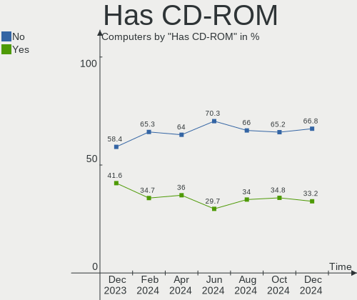
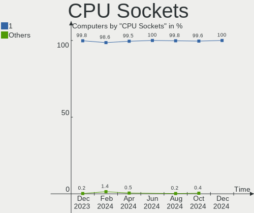
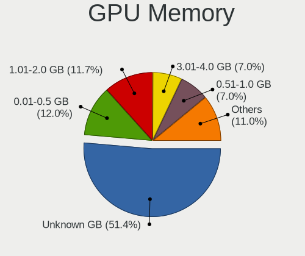
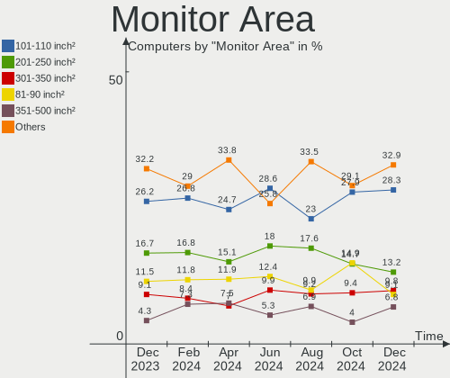
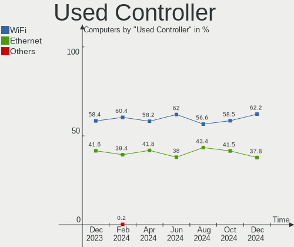
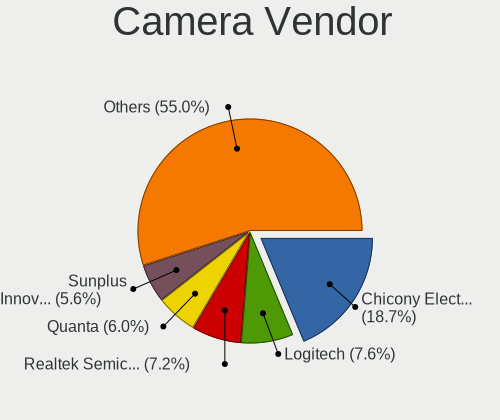

Linux Mint Hardware Trends
--------------------------

A project to identify most popular hardware characteristics and track their change
over time based on data collected by Linux Mint users at https://Linux-Hardware.org.

Anyone can contribute to this report by the [hw-probe](https://github.com/linuxhw/hw-probe) tool:

    sudo -E hw-probe -all -upload

This is a report for all computer types. See also reports for [desktops](/Dist/Linux_Mint/Desktop/README.md) and [notebooks](/Dist/Linux_Mint/Notebook/README.md).

Full-feature report is available here: https://linux-hardware.org/?view=trends

Period: Dec, 2021.

Contents
--------

* [ System ](#system)
  - [ OS                       ](#os)
  - [ OS Family                ](#os-family)
  - [ Kernel                   ](#kernel)
  - [ Kernel Family            ](#kernel-family)
  - [ Kernel Major Ver.        ](#kernel-major-ver)
  - [ Arch                     ](#arch)
  - [ DE                       ](#de)
  - [ Display Server           ](#display-server)
  - [ Display Manager          ](#display-manager)
  - [ OS Lang                  ](#os-lang)
  - [ Boot Mode                ](#boot-mode)
  - [ Filesystem               ](#filesystem)
  - [ Part. scheme             ](#part-scheme)
  - [ Dual Boot with Linux/BSD ](#dual-boot-with-linuxbsd)
  - [ Dual Boot (Win)          ](#dual-boot-win)

* [ Board ](#board)
  - [ Vendor                   ](#vendor)
  - [ Model                    ](#model)
  - [ Model Family             ](#model-family)
  - [ MFG Year                 ](#mfg-year)
  - [ Form Factor              ](#form-factor)
  - [ Secure Boot              ](#secure-boot)
  - [ Coreboot                 ](#coreboot)
  - [ RAM Size                 ](#ram-size)
  - [ RAM Used                 ](#ram-used)
  - [ Total Drives             ](#total-drives)
  - [ Has CD-ROM               ](#has-cd-rom)
  - [ Has Ethernet             ](#has-ethernet)
  - [ Has WiFi                 ](#has-wifi)
  - [ Has Bluetooth            ](#has-bluetooth)

* [ Location ](#location)
  - [ Country                  ](#country)
  - [ City                     ](#city)

* [ Drives ](#drives)
  - [ Drive Vendor             ](#drive-vendor)
  - [ Drive Model              ](#drive-model)
  - [ HDD Vendor               ](#hdd-vendor)
  - [ SSD Vendor               ](#ssd-vendor)
  - [ Drive Kind               ](#drive-kind)
  - [ Drive Connector          ](#drive-connector)
  - [ Drive Size               ](#drive-size)
  - [ Space Total              ](#space-total)
  - [ Space Used               ](#space-used)
  - [ Malfunc. Drives          ](#malfunc-drives)
  - [ Malfunc. Drive Vendor    ](#malfunc-drive-vendor)
  - [ Malfunc. HDD Vendor      ](#malfunc-hdd-vendor)
  - [ Malfunc. Drive Kind      ](#malfunc-drive-kind)
  - [ Failed Drives            ](#failed-drives)
  - [ Failed Drive Vendor      ](#failed-drive-vendor)
  - [ Drive Status             ](#drive-status)

* [ Storage controller ](#storage-controller)
  - [ Storage Vendor           ](#storage-vendor)
  - [ Storage Model            ](#storage-model)
  - [ Storage Kind             ](#storage-kind)

* [ Processor ](#processor)
  - [ CPU Vendor               ](#cpu-vendor)
  - [ CPU Model                ](#cpu-model)
  - [ CPU Model Family         ](#cpu-model-family)
  - [ CPU Cores                ](#cpu-cores)
  - [ CPU Sockets              ](#cpu-sockets)
  - [ CPU Threads              ](#cpu-threads)
  - [ CPU Op-Modes             ](#cpu-op-modes)
  - [ CPU Microcode            ](#cpu-microcode)
  - [ CPU Microarch            ](#cpu-microarch)

* [ Graphics ](#graphics)
  - [ GPU Vendor               ](#gpu-vendor)
  - [ GPU Model                ](#gpu-model)
  - [ GPU Combo                ](#gpu-combo)
  - [ GPU Driver               ](#gpu-driver)
  - [ GPU Memory               ](#gpu-memory)

* [ Monitor ](#monitor)
  - [ Monitor Vendor           ](#monitor-vendor)
  - [ Monitor Model            ](#monitor-model)
  - [ Monitor Resolution       ](#monitor-resolution)
  - [ Monitor Diagonal         ](#monitor-diagonal)
  - [ Monitor Width            ](#monitor-width)
  - [ Aspect Ratio             ](#aspect-ratio)
  - [ Monitor Area             ](#monitor-area)
  - [ Pixel Density            ](#pixel-density)
  - [ Multiple Monitors        ](#multiple-monitors)

* [ Network ](#network)
  - [ Net Controller Vendor    ](#net-controller-vendor)
  - [ Net Controller Model     ](#net-controller-model)
  - [ Wireless Vendor          ](#wireless-vendor)
  - [ Wireless Model           ](#wireless-model)
  - [ Ethernet Vendor          ](#ethernet-vendor)
  - [ Ethernet Model           ](#ethernet-model)
  - [ Net Controller Kind      ](#net-controller-kind)
  - [ Used Controller          ](#used-controller)
  - [ NICs                     ](#nics)
  - [ IPv6                     ](#ipv6)

* [ Bluetooth ](#bluetooth)
  - [ Bluetooth Vendor         ](#bluetooth-vendor)
  - [ Bluetooth Model          ](#bluetooth-model)

* [ Sound ](#sound)
  - [ Sound Vendor             ](#sound-vendor)
  - [ Sound Model              ](#sound-model)

* [ Memory ](#memory)
  - [ Memory Vendor            ](#memory-vendor)
  - [ Memory Model             ](#memory-model)
  - [ Memory Kind              ](#memory-kind)
  - [ Memory Form Factor       ](#memory-form-factor)
  - [ Memory Size              ](#memory-size)
  - [ Memory Speed             ](#memory-speed)

* [ Printers & scanners ](#printers--scanners)
  - [ Printer Vendor           ](#printer-vendor)
  - [ Printer Model            ](#printer-model)
  - [ Scanner Vendor           ](#scanner-vendor)
  - [ Scanner Model            ](#scanner-model)

* [ Camera ](#camera)
  - [ Camera Vendor            ](#camera-vendor)
  - [ Camera Model             ](#camera-model)

* [ Security ](#security)
  - [ Fingerprint Vendor       ](#fingerprint-vendor)
  - [ Fingerprint Model        ](#fingerprint-model)
  - [ Chipcard Vendor          ](#chipcard-vendor)
  - [ Chipcard Model           ](#chipcard-model)

* [ Unsupported ](#unsupported)
  - [ Unsupported Devices      ](#unsupported-devices)
  - [ Unsupported Device Types ](#unsupported-device-types)

System
------

OS
--

Installed operating systems

| Name            | Computers | Percent |
|-----------------|-----------|---------|
| Linux Mint 20.2 | 452       | 83.24%  |
| Linux Mint 19.3 | 28        | 5.16%   |
| Linux Mint 20.1 | 23        | 4.24%   |
| Linux Mint 20.3 | 14        | 2.58%   |
| Linux Mint 20   | 12        | 2.21%   |
| Linux Mint 19.1 | 5         | 0.92%   |
| Linux Mint 19.2 | 4         | 0.74%   |
| Linux Mint 19   | 3         | 0.55%   |
| Linux Mint 18.3 | 2         | 0.37%   |

OS Family
---------

OS without a version

| Name       | Computers | Percent |
|------------|-----------|---------|
| Linux Mint | 543       | 100%    |

Kernel
------

Version of the Linux kernel

| Version                     | Computers | Percent |
|-----------------------------|-----------|---------|
| 5.4.0-91-generic            | 351       | 64.64%  |
| 5.13.0-22-generic           | 44        | 8.1%    |
| 5.4.0-74-generic            | 35        | 6.45%   |
| 5.4.0-90-generic            | 21        | 3.87%   |
| 5.11.0-43-generic           | 8         | 1.47%   |
| 5.11.0-41-generic           | 7         | 1.29%   |
| 5.4.0-89-generic            | 5         | 0.92%   |
| 5.4.0-77-generic            | 5         | 0.92%   |
| 4.15.0-163-generic          | 5         | 0.92%   |
| 5.13.0-21-generic           | 4         | 0.74%   |
| 5.4.0-88-generic            | 3         | 0.55%   |
| 5.15.10-051510-generic      | 3         | 0.55%   |
| 5.10.0-1052-oem             | 3         | 0.55%   |
| 5.0.0-32-generic            | 3         | 0.55%   |
| 4.15.0-54-generic           | 3         | 0.55%   |
| 5.8.18-050818-generic       | 2         | 0.37%   |
| 5.4.0-81-generic            | 2         | 0.37%   |
| 5.4.0-26-generic            | 2         | 0.37%   |
| 5.15.11-xanmod1             | 2         | 0.37%   |
| 5.11.0-40-generic           | 2         | 0.37%   |
| 5.11.0-22-generic           | 2         | 0.37%   |
| 4.15.0-142-generic          | 2         | 0.37%   |
| 5.8.0-63-lowlatency         | 1         | 0.18%   |
| 5.8.0-55-generic            | 1         | 0.18%   |
| 5.8.0-43-generic            | 1         | 0.18%   |
| 5.6.17-050617-generic       | 1         | 0.18%   |
| 5.4.0-91-lowlatency         | 1         | 0.18%   |
| 5.4.0-86-generic            | 1         | 0.18%   |
| 5.4.0-84-generic            | 1         | 0.18%   |
| 5.4.0-73-generic            | 1         | 0.18%   |
| 5.4.0-71-generic            | 1         | 0.18%   |
| 5.4.0-67-generic            | 1         | 0.18%   |
| 5.4.0-65-generic            | 1         | 0.18%   |
| 5.4.0-56-generic            | 1         | 0.18%   |
| 5.4.0-54-generic            | 1         | 0.18%   |
| 5.15.9-051509-generic       | 1         | 0.18%   |
| 5.15.6-surface              | 1         | 0.18%   |
| 5.15.6-051506-generic       | 1         | 0.18%   |
| 5.15.5-76051505-generic     | 1         | 0.18%   |
| 5.15.5-051505-generic       | 1         | 0.18%   |
| 5.14.11-dickynh             | 1         | 0.18%   |
| 5.14.10-051410-generic      | 1         | 0.18%   |
| 5.14.0-1007-oem             | 1         | 0.18%   |
| 5.13.0-22-lowlatency        | 1         | 0.18%   |
| 5.11.0-402110311031-generic | 1         | 0.18%   |
| 5.11.0-27-generic           | 1         | 0.18%   |
| 4.18.0-25-generic           | 1         | 0.18%   |
| 4.15.0-43-generic           | 1         | 0.18%   |
| 4.15.0-20-generic           | 1         | 0.18%   |
| 4.15.0-163-lowlatency       | 1         | 0.18%   |
| 4.15.0-159-generic          | 1         | 0.18%   |

Kernel Family
-------------

Linux kernel without a distro release

| Version | Computers | Percent |
|---------|-----------|---------|
| 5.4.0   | 433       | 79.74%  |
| 5.13.0  | 49        | 9.02%   |
| 5.11.0  | 21        | 3.87%   |
| 4.15.0  | 14        | 2.58%   |
| 5.8.0   | 3         | 0.55%   |
| 5.15.10 | 3         | 0.55%   |
| 5.10.0  | 3         | 0.55%   |
| 5.0.0   | 3         | 0.55%   |
| 5.8.18  | 2         | 0.37%   |
| 5.15.6  | 2         | 0.37%   |
| 5.15.5  | 2         | 0.37%   |
| 5.15.11 | 2         | 0.37%   |
| 5.6.17  | 1         | 0.18%   |
| 5.15.9  | 1         | 0.18%   |
| 5.14.11 | 1         | 0.18%   |
| 5.14.10 | 1         | 0.18%   |
| 5.14.0  | 1         | 0.18%   |
| 4.18.0  | 1         | 0.18%   |

Kernel Major Ver.
-----------------

Linux kernel major version

| Version | Computers | Percent |
|---------|-----------|---------|
| 5.4     | 433       | 79.74%  |
| 5.13    | 49        | 9.02%   |
| 5.11    | 21        | 3.87%   |
| 4.15    | 14        | 2.58%   |
| 5.15    | 10        | 1.84%   |
| 5.8     | 5         | 0.92%   |
| 5.14    | 3         | 0.55%   |
| 5.10    | 3         | 0.55%   |
| 5.0     | 3         | 0.55%   |
| 5.6     | 1         | 0.18%   |
| 4.18    | 1         | 0.18%   |

Arch
----

OS architecture (x86_64, i586, etc.)

| Name   | Computers | Percent |
|--------|-----------|---------|
| x86_64 | 530       | 97.61%  |
| i686   | 13        | 2.39%   |

DE
--

Desktop Environment

| Name       | Computers | Percent |
|------------|-----------|---------|
| X-Cinnamon | 378       | 69.61%  |
| MATE       | 68        | 12.52%  |
| XFCE       | 53        | 9.76%   |
| Cinnamon   | 27        | 4.97%   |
| GNOME      | 7         | 1.29%   |
| LXDE       | 2         | 0.37%   |
| KDE5       | 2         | 0.37%   |
| KDE        | 2         | 0.37%   |
| i3         | 2         | 0.37%   |
| Unknown    | 2         | 0.37%   |

Display Server
--------------

X11 or Wayland

| Name | Computers | Percent |
|------|-----------|---------|
| X11  | 541       | 99.63%  |
| Tty  | 2         | 0.37%   |

Display Manager
---------------

SDDM, LightDM, etc.

| Name    | Computers | Percent |
|---------|-----------|---------|
| Unknown | 303       | 55.8%   |
| LightDM | 234       | 43.09%  |
| GDM     | 5         | 0.92%   |
| MDM     | 1         | 0.18%   |

OS Lang
-------

Language

| Lang    | Computers | Percent |
|---------|-----------|---------|
| en_US   | 151       | 27.81%  |
| de_DE   | 126       | 23.2%   |
| en_GB   | 31        | 5.71%   |
| pt_BR   | 23        | 4.24%   |
| fr_FR   | 23        | 4.24%   |
| ru_RU   | 19        | 3.5%    |
| C       | 15        | 2.76%   |
| pl_PL   | 14        | 2.58%   |
| en_CA   | 13        | 2.39%   |
| it_IT   | 12        | 2.21%   |
| hu_HU   | 10        | 1.84%   |
| es_AR   | 10        | 1.84%   |
| en_AU   | 10        | 1.84%   |
| de_CH   | 7         | 1.29%   |
| nl_NL   | 6         | 1.1%    |
| es_ES   | 6         | 1.1%    |
| de_AT   | 6         | 1.1%    |
| cs_CZ   | 5         | 0.92%   |
| uk_UA   | 4         | 0.74%   |
| sk_SK   | 4         | 0.74%   |
| en_IN   | 4         | 0.74%   |
| en_IE   | 4         | 0.74%   |
| ru_UA   | 3         | 0.55%   |
| pt_PT   | 3         | 0.55%   |
| hr_HR   | 3         | 0.55%   |
| en_NZ   | 3         | 0.55%   |
| el_GR   | 3         | 0.55%   |
| sv_SE   | 2         | 0.37%   |
| sl_SI   | 2         | 0.37%   |
| fr_CH   | 2         | 0.37%   |
| fr_CA   | 2         | 0.37%   |
| fr_BE   | 2         | 0.37%   |
| es_MX   | 2         | 0.37%   |
| en_ZA   | 2         | 0.37%   |
| Unknown | 2         | 0.37%   |
| ro_RO   | 1         | 0.18%   |
| nl_BE   | 1         | 0.18%   |
| id_ID   | 1         | 0.18%   |
| es_UY   | 1         | 0.18%   |
| es_CO   | 1         | 0.18%   |
| es_CL   | 1         | 0.18%   |
| en_IL   | 1         | 0.18%   |
| da_DK   | 1         | 0.18%   |
| bg_BG   | 1         | 0.18%   |

Boot Mode
---------

EFI or BIOS

| Mode | Computers | Percent |
|------|-----------|---------|
| BIOS | 280       | 51.57%  |
| EFI  | 263       | 48.43%  |

Filesystem
----------

Type of filesystem

| Type    | Computers | Percent |
|---------|-----------|---------|
| Ext4    | 518       | 95.4%   |
| Overlay | 12        | 2.21%   |
| Btrfs   | 9         | 1.66%   |
| Xfs     | 1         | 0.18%   |
| Ext3    | 1         | 0.18%   |
| Ext2    | 1         | 0.18%   |
| Unknown | 1         | 0.18%   |

Part. scheme
------------

Scheme of partitioning

| Type    | Computers | Percent |
|---------|-----------|---------|
| Unknown | 334       | 61.51%  |
| GPT     | 139       | 25.6%   |
| MBR     | 70        | 12.89%  |

Dual Boot with Linux/BSD
------------------------

Hosting more than one Linux/BSD

| Dual boot | Computers | Percent |
|-----------|-----------|---------|
| No        | 510       | 93.92%  |
| Yes       | 33        | 6.08%   |

Dual Boot (Win)
---------------

Hosting Linux and Windows

| Dual boot | Computers | Percent |
|-----------|-----------|---------|
| No        | 454       | 83.61%  |
| Yes       | 89        | 16.39%  |

Board
-----

Vendor
------

Motherboard manufacturer

| Name                  | Computers | Percent |
|-----------------------|-----------|---------|
| Hewlett-Packard       | 94        | 17.31%  |
| ASUSTek Computer      | 75        | 13.81%  |
| Dell                  | 70        | 12.89%  |
| Lenovo                | 59        | 10.87%  |
| Acer                  | 48        | 8.84%   |
| Gigabyte Technology   | 28        | 5.16%   |
| ASRock                | 23        | 4.24%   |
| MSI                   | 22        | 4.05%   |
| Apple                 | 12        | 2.21%   |
| Samsung Electronics   | 10        | 1.84%   |
| Intel                 | 9         | 1.66%   |
| Toshiba               | 8         | 1.47%   |
| Sony                  | 8         | 1.47%   |
| Medion                | 6         | 1.1%    |
| Unknown               | 6         | 1.1%    |
| Fujitsu Siemens       | 5         | 0.92%   |
| Fujitsu               | 5         | 0.92%   |
| Google                | 4         | 0.74%   |
| Pegatron              | 3         | 0.55%   |
| Packard Bell          | 3         | 0.55%   |
| HUAWEI                | 3         | 0.55%   |
| Microsoft             | 2         | 0.37%   |
| Huanan                | 2         | 0.37%   |
| ECS                   | 2         | 0.37%   |
| Chuwi                 | 2         | 0.37%   |
| Biostar               | 2         | 0.37%   |
| BANGHO                | 2         | 0.37%   |
| ZOTAC                 | 1         | 0.18%   |
| ZEPTO                 | 1         | 0.18%   |
| Wortmann AG           | 1         | 0.18%   |
| Winnovo               | 1         | 0.18%   |
| TrekStor              | 1         | 0.18%   |
| Timi                  | 1         | 0.18%   |
| System76              | 1         | 0.18%   |
| Shuttle               | 1         | 0.18%   |
| Semp Toshiba          | 1         | 0.18%   |
| Schenker              | 1         | 0.18%   |
| Positivo              | 1         | 0.18%   |
| PC Specialist         | 1         | 0.18%   |
| Panasonic             | 1         | 0.18%   |
| Notebook              | 1         | 0.18%   |
| NEC Computers         | 1         | 0.18%   |
| MiTAC                 | 1         | 0.18%   |
| Microtech             | 1         | 0.18%   |
| HPE                   | 1         | 0.18%   |
| GEO                   | 1         | 0.18%   |
| Foxconn               | 1         | 0.18%   |
| Exo                   | 1         | 0.18%   |
| eMachine              | 1         | 0.18%   |
| Clevo                 | 1         | 0.18%   |
| Casper                | 1         | 0.18%   |
| BESSTAR Tech          | 1         | 0.18%   |
| AVITA                 | 1         | 0.18%   |
| ASUSTeK_COMPUTER_INC. | 1         | 0.18%   |
| ASRockRack            | 1         | 0.18%   |
| AMI                   | 1         | 0.18%   |
| Alienware             | 1         | 0.18%   |

Model
-----

Motherboard model

| Name                                       | Computers | Percent |
|--------------------------------------------|-----------|---------|
| Unknown                                    | 7         | 1.29%   |
| Dell OptiPlex 790                          | 5         | 0.92%   |
| Lenovo IdeaPadFlex 5 15IIL05 81X3          | 3         | 0.55%   |
| HP EliteBook 8460p                         | 3         | 0.55%   |
| Apple MacPro5,1                            | 3         | 0.55%   |
| Apple MacBookPro8,1                        | 3         | 0.55%   |
| Acer Aspire A515-56                        | 3         | 0.55%   |
| Toshiba Satellite L40                      | 2         | 0.37%   |
| Packard Bell EasyNote LS11HR               | 2         | 0.37%   |
| MSI MS-7B98                                | 2         | 0.37%   |
| MSI MS-7B79                                | 2         | 0.37%   |
| Lenovo IdeaPad S145-15IGM 81WT             | 2         | 0.37%   |
| Intel NUC7i5BNH                            | 2         | 0.37%   |
| HUAWEI KLVL-WXX9                           | 2         | 0.37%   |
| HP ProBook 6460b                           | 2         | 0.37%   |
| HP Pavilion x360 Convertible 15-er0xxx     | 2         | 0.37%   |
| HP Pavilion Laptop 15-eh1xxx               | 2         | 0.37%   |
| HP Pavilion dv7                            | 2         | 0.37%   |
| HP Pavilion dv6                            | 2         | 0.37%   |
| HP OMEN by Laptop 16-c0xxx                 | 2         | 0.37%   |
| HP Laptop 17-ca0xxx                        | 2         | 0.37%   |
| HP Laptop 15z-ef2xxx                       | 2         | 0.37%   |
| HP ENVY x360 Convertible 15-eu0xxx         | 2         | 0.37%   |
| HP EliteBook 2540p                         | 2         | 0.37%   |
| HP 250 G7 Notebook PC                      | 2         | 0.37%   |
| Gigabyte G31M-ES2L                         | 2         | 0.37%   |
| Gigabyte B550 AORUS ELITE                  | 2         | 0.37%   |
| Dell OptiPlex 760                          | 2         | 0.37%   |
| Dell OptiPlex 755                          | 2         | 0.37%   |
| Dell Latitude E6510                        | 2         | 0.37%   |
| Dell Inspiron 3505                         | 2         | 0.37%   |
| Chuwi HeroBook Air                         | 2         | 0.37%   |
| ASUS VivoBook 15_ASUS Laptop X540MA_X540MA | 2         | 0.37%   |
| ASUS TUF GAMING B550-PLUS                  | 2         | 0.37%   |
| ASUS ROG STRIX X470-F GAMING               | 2         | 0.37%   |
| ASUS P8Z77-V LX                            | 2         | 0.37%   |
| ASUS K53E                                  | 2         | 0.37%   |
| ASUS All Series                            | 2         | 0.37%   |
| ASRock M3A770DE                            | 2         | 0.37%   |
| ASRock AB350M Pro4                         | 2         | 0.37%   |
| Acer Swift SF114-34                        | 2         | 0.37%   |
| Acer Aspire ES1-523                        | 2         | 0.37%   |
| ZOTAC ZBOX-EN1070/1060                     | 1         | 0.18%   |
| ZEPTO ZNOTE                                | 1         | 0.18%   |
| Wortmann AG TERRA_MOBILE_1512/1712         | 1         | 0.18%   |
| Winnovo V146                               | 1         | 0.18%   |
| TrekStor Surfbook E11B                     | 1         | 0.18%   |
| Toshiba Satellite Pro A200                 | 1         | 0.18%   |
| Toshiba Satellite L500                     | 1         | 0.18%   |
| Toshiba Satellite L50-B                    | 1         | 0.18%   |
| Toshiba Satellite L350D                    | 1         | 0.18%   |
| Toshiba Satellite C660                     | 1         | 0.18%   |
| Toshiba Satellite C55D-B                   | 1         | 0.18%   |
| Timi RedmiBook Pro 14                      | 1         | 0.18%   |
| System76 Oryx Pro                          | 1         | 0.18%   |
| Sony VPCSE1C5E                             | 1         | 0.18%   |
| Sony VPCEA3S1E                             | 1         | 0.18%   |
| Sony VGN-CR41SR_P                          | 1         | 0.18%   |
| Sony VGN-AW41JF_H                          | 1         | 0.18%   |
| Sony SVL24145CXB                           | 1         | 0.18%   |

Model Family
------------

Motherboard model prefix

| Name                    | Computers | Percent |
|-------------------------|-----------|---------|
| Acer Aspire             | 36        | 6.63%   |
| Lenovo ThinkPad         | 22        | 4.05%   |
| Dell Inspiron           | 20        | 3.68%   |
| Dell Latitude           | 18        | 3.31%   |
| HP Pavilion             | 17        | 3.13%   |
| Dell OptiPlex           | 15        | 2.76%   |
| HP EliteBook            | 12        | 2.21%   |
| Lenovo IdeaPad          | 11        | 2.03%   |
| HP ProBook              | 11        | 2.03%   |
| HP Laptop               | 10        | 1.84%   |
| Toshiba Satellite       | 8         | 1.47%   |
| Lenovo ThinkCentre      | 8         | 1.47%   |
| HP Compaq               | 8         | 1.47%   |
| Unknown                 | 7         | 1.29%   |
| Dell Precision          | 6         | 1.1%    |
| ASUS VivoBook           | 6         | 1.1%    |
| ASUS ROG                | 6         | 1.1%    |
| ASUS PRIME              | 6         | 1.1%    |
| Acer Swift              | 6         | 1.1%    |
| Dell Vostro             | 5         | 0.92%   |
| ASUS ZenBook            | 5         | 0.92%   |
| HP ProDesk              | 4         | 0.74%   |
| HP ENVY                 | 4         | 0.74%   |
| HP 250                  | 4         | 0.74%   |
| ASUS TUF                | 4         | 0.74%   |
| Lenovo Yoga             | 3         | 0.55%   |
| Lenovo IdeaPadFlex      | 3         | 0.55%   |
| Fujitsu ESPRIMO         | 3         | 0.55%   |
| Dell XPS                | 3         | 0.55%   |
| ASUS SABERTOOTH         | 3         | 0.55%   |
| Apple MacPro5           | 3         | 0.55%   |
| Apple MacBookPro8       | 3         | 0.55%   |
| Packard Bell EasyNote   | 2         | 0.37%   |
| MSI MS-7B98             | 2         | 0.37%   |
| MSI MS-7B79             | 2         | 0.37%   |
| Microsoft Surface       | 2         | 0.37%   |
| Intel NUC7i5BNH         | 2         | 0.37%   |
| HUAWEI KLVL-WXX9        | 2         | 0.37%   |
| Huanan X79              | 2         | 0.37%   |
| HP ZBook                | 2         | 0.37%   |
| HP Presario             | 2         | 0.37%   |
| HP OMEN                 | 2         | 0.37%   |
| Gigabyte G31M-ES2L      | 2         | 0.37%   |
| Gigabyte B550           | 2         | 0.37%   |
| Fujitsu Siemens ESPRIMO | 2         | 0.37%   |
| Fujitsu Siemens AMILO   | 2         | 0.37%   |
| Fujitsu LIFEBOOK        | 2         | 0.37%   |
| Dell Studio             | 2         | 0.37%   |
| Chuwi HeroBook          | 2         | 0.37%   |
| ASUS P8Z77-V            | 2         | 0.37%   |
| ASUS P8H61-M            | 2         | 0.37%   |
| ASUS K53E               | 2         | 0.37%   |
| ASUS All                | 2         | 0.37%   |
| ASRock M3A770DE         | 2         | 0.37%   |
| ASRock B450M            | 2         | 0.37%   |
| ASRock AB350M           | 2         | 0.37%   |
| ZOTAC ZBOX-EN1070       | 1         | 0.18%   |
| ZEPTO ZNOTE             | 1         | 0.18%   |
| Wortmann AG TERRA       | 1         | 0.18%   |
| Winnovo V146            | 1         | 0.18%   |

MFG Year
--------

Motherboard manufacture year

| Year | Computers | Percent |
|------|-----------|---------|
| 2021 | 105       | 19.34%  |
| 2019 | 53        | 9.76%   |
| 2020 | 43        | 7.92%   |
| 2014 | 40        | 7.37%   |
| 2010 | 40        | 7.37%   |
| 2018 | 37        | 6.81%   |
| 2011 | 36        | 6.63%   |
| 2013 | 32        | 5.89%   |
| 2012 | 31        | 5.71%   |
| 2015 | 26        | 4.79%   |
| 2016 | 22        | 4.05%   |
| 2009 | 21        | 3.87%   |
| 2017 | 17        | 3.13%   |
| 2008 | 16        | 2.95%   |
| 2007 | 14        | 2.58%   |
| 2006 | 7         | 1.29%   |
| 2004 | 2         | 0.37%   |
| 2005 | 1         | 0.18%   |

Form Factor
-----------

Physical design of the computer

| Name        | Computers | Percent |
|-------------|-----------|---------|
| Notebook    | 309       | 56.91%  |
| Desktop     | 196       | 36.1%   |
| Convertible | 14        | 2.58%   |
| All in one  | 11        | 2.03%   |
| Mini pc     | 8         | 1.47%   |
| Tablet      | 3         | 0.55%   |
| Server      | 2         | 0.37%   |

Secure Boot
-----------

Enabled or disabled

| State    | Computers | Percent |
|----------|-----------|---------|
| Disabled | 484       | 89.13%  |
| Enabled  | 59        | 10.87%  |

Coreboot
--------

Have coreboot on board

| Used | Computers | Percent |
|------|-----------|---------|
| No   | 539       | 99.26%  |
| Yes  | 4         | 0.74%   |

RAM Size
--------

Total RAM memory

| Size in GB  | Computers | Percent |
|-------------|-----------|---------|
| 4.01-8.0    | 141       | 25.97%  |
| 3.01-4.0    | 140       | 25.78%  |
| 8.01-16.0   | 92        | 16.94%  |
| 16.01-24.0  | 84        | 15.47%  |
| 32.01-64.0  | 37        | 6.81%   |
| 1.01-2.0    | 26        | 4.79%   |
| 2.01-3.0    | 9         | 1.66%   |
| 64.01-256.0 | 8         | 1.47%   |
| 24.01-32.0  | 4         | 0.74%   |
| 0.51-1.0    | 2         | 0.37%   |

RAM Used
--------

Used RAM memory

| Used GB    | Computers | Percent |
|------------|-----------|---------|
| 1.01-2.0   | 237       | 43.65%  |
| 2.01-3.0   | 137       | 25.23%  |
| 3.01-4.0   | 60        | 11.05%  |
| 4.01-8.0   | 58        | 10.68%  |
| 0.51-1.0   | 40        | 7.37%   |
| 8.01-16.0  | 10        | 1.84%   |
| 16.01-24.0 | 1         | 0.18%   |

Total Drives
------------

Number of drives on board

| Drives | Computers | Percent |
|--------|-----------|---------|
| 1      | 345       | 63.54%  |
| 2      | 128       | 23.57%  |
| 3      | 35        | 6.45%   |
| 4      | 13        | 2.39%   |
| 5      | 12        | 2.21%   |
| 6      | 4         | 0.74%   |
| 0      | 4         | 0.74%   |
| 8      | 1         | 0.18%   |
| 7      | 1         | 0.18%   |

Has CD-ROM
----------

Has CD-ROM on board

| Presented | Computers | Percent |
|-----------|-----------|---------|
| No        | 272       | 50.09%  |
| Yes       | 271       | 49.91%  |

Has Ethernet
------------

Has Ethernet on board

| Presented | Computers | Percent |
|-----------|-----------|---------|
| Yes       | 468       | 86.19%  |
| No        | 75        | 13.81%  |

Has WiFi
--------

Has WiFi module

| Presented | Computers | Percent |
|-----------|-----------|---------|
| Yes       | 419       | 77.16%  |
| No        | 124       | 22.84%  |

Has Bluetooth
-------------

Has Bluetooth module

| Presented | Computers | Percent |
|-----------|-----------|---------|
| Yes       | 299       | 55.06%  |
| No        | 244       | 44.94%  |

Location
--------

Country
-------

Geographic location (country)

| Country                | Computers | Percent |
|------------------------|-----------|---------|
| Germany                | 132       | 24.31%  |
| USA                    | 89        | 16.39%  |
| Brazil                 | 34        | 6.26%   |
| UK                     | 30        | 5.52%   |
| France                 | 24        | 4.42%   |
| Russia                 | 19        | 3.5%    |
| Poland                 | 16        | 2.95%   |
| Netherlands            | 13        | 2.39%   |
| Italy                  | 13        | 2.39%   |
| Canada                 | 13        | 2.39%   |
| Argentina              | 13        | 2.39%   |
| Switzerland            | 12        | 2.21%   |
| Austria                | 12        | 2.21%   |
| Ukraine                | 10        | 1.84%   |
| Hungary                | 10        | 1.84%   |
| Australia              | 10        | 1.84%   |
| Slovakia               | 6         | 1.1%    |
| Sweden                 | 5         | 0.92%   |
| Norway                 | 5         | 0.92%   |
| Czechia                | 5         | 0.92%   |
| Croatia                | 5         | 0.92%   |
| Belgium                | 5         | 0.92%   |
| Spain                  | 4         | 0.74%   |
| Ireland                | 4         | 0.74%   |
| India                  | 4         | 0.74%   |
| Greece                 | 4         | 0.74%   |
| New Zealand            | 3         | 0.55%   |
| Mexico                 | 3         | 0.55%   |
| Denmark                | 3         | 0.55%   |
| Bulgaria               | 3         | 0.55%   |
| Uzbekistan             | 2         | 0.37%   |
| Tunisia                | 2         | 0.37%   |
| South Africa           | 2         | 0.37%   |
| Slovenia               | 2         | 0.37%   |
| Portugal               | 2         | 0.37%   |
| Israel                 | 2         | 0.37%   |
| Indonesia              | 2         | 0.37%   |
| Bosnia and Herzegovina | 2         | 0.37%   |
| Uruguay                | 1         | 0.18%   |
| Turkey                 | 1         | 0.18%   |
| Thailand               | 1         | 0.18%   |
| Serbia                 | 1         | 0.18%   |
| Romania                | 1         | 0.18%   |
| Puerto Rico            | 1         | 0.18%   |
| Pakistan               | 1         | 0.18%   |
| Morocco                | 1         | 0.18%   |
| Malta                  | 1         | 0.18%   |
| Malaysia               | 1         | 0.18%   |
| Lithuania              | 1         | 0.18%   |
| Jordan                 | 1         | 0.18%   |
| Japan                  | 1         | 0.18%   |
| Iceland                | 1         | 0.18%   |
| Estonia                | 1         | 0.18%   |
| Costa Rica             | 1         | 0.18%   |
| Colombia               | 1         | 0.18%   |
| Chile                  | 1         | 0.18%   |

City
----

Geographic location (city)

| City                 | Computers | Percent |
|----------------------|-----------|---------|
| Berlin               | 16        | 2.95%   |
| Moscow               | 8         | 1.47%   |
| Vienna               | 6         | 1.1%    |
| Montgomery Village   | 6         | 1.1%    |
| Cologne              | 6         | 1.1%    |
| Rio de Janeiro       | 5         | 0.92%   |
| Paris                | 5         | 0.92%   |
| Kaiserslautern       | 5         | 0.92%   |
| Zagreb               | 4         | 0.74%   |
| Sydney               | 4         | 0.74%   |
| Nuremberg            | 4         | 0.74%   |
| La Marque            | 4         | 0.74%   |
| Buenos Aires         | 4         | 0.74%   |
| Sofia                | 3         | 0.55%   |
| Rosario              | 3         | 0.55%   |
| Melbourne            | 3         | 0.55%   |
| Kyiv                 | 3         | 0.55%   |
| Krakow               | 3         | 0.55%   |
| Hamburg              | 3         | 0.55%   |
| Frankfurt am Main    | 3         | 0.55%   |
| Dublin               | 3         | 0.55%   |
| Bratislava           | 3         | 0.55%   |
| Zurich               | 2         | 0.37%   |
| Wuppertal            | 2         | 0.37%   |
| Wroclaw              | 2         | 0.37%   |
| Uxbridge             | 2         | 0.37%   |
| Uberl??ndia          | 2         | 0.37%   |
| Tunis                | 2         | 0.37%   |
| Stuttgart            | 2         | 0.37%   |
| Stockholm            | 2         | 0.37%   |
| St Petersburg        | 2         | 0.37%   |
| Salvador             | 2         | 0.37%   |
| Reutlingen           | 2         | 0.37%   |
| Purmerend            | 2         | 0.37%   |
| Prague               | 2         | 0.37%   |
| Padova               | 2         | 0.37%   |
| Oslo                 | 2         | 0.37%   |
| Opelousas            | 2         | 0.37%   |
| Mumbai               | 2         | 0.37%   |
| Mjoelby              | 2         | 0.37%   |
| Los Angeles          | 2         | 0.37%   |
| London               | 2         | 0.37%   |
| Kassel               | 2         | 0.37%   |
| Herne                | 2         | 0.37%   |
| Edmonton             | 2         | 0.37%   |
| Edinburgh            | 2         | 0.37%   |
| East Longmeadow      | 2         | 0.37%   |
| Duna??jv??ros        | 2         | 0.37%   |
| Curitiba             | 2         | 0.37%   |
| Chemnitz             | 2         | 0.37%   |
| Calgary              | 2         | 0.37%   |
| Budapest             | 2         | 0.37%   |
| Bottrop              | 2         | 0.37%   |
| Bordeaux             | 2         | 0.37%   |
| Balne??rio Cambori?? | 2         | 0.37%   |
| ??ilina              | 2         | 0.37%   |
| Auckland             | 2         | 0.37%   |
| Athens               | 2         | 0.37%   |
| Assen                | 2         | 0.37%   |
| Zoetermeer           | 1         | 0.18%   |

Drives
------

Drive Vendor
------------

Hard drive vendors

| Vendor                         | Computers | Drives | Percent |
|--------------------------------|-----------|--------|---------|
| WDC                            | 132       | 157    | 17.48%  |
| Samsung Electronics            | 112       | 132    | 14.83%  |
| Seagate                        | 108       | 127    | 14.3%   |
| Kingston                       | 54        | 56     | 7.15%   |
| Toshiba                        | 52        | 54     | 6.89%   |
| Sandisk                        | 33        | 33     | 4.37%   |
| Hitachi                        | 28        | 29     | 3.71%   |
| Crucial                        | 28        | 33     | 3.71%   |
| Unknown                        | 24        | 31     | 3.18%   |
| Intel                          | 19        | 19     | 2.52%   |
| A-DATA Technology              | 14        | 15     | 1.85%   |
| Phison                         | 12        | 14     | 1.59%   |
| HGST                           | 10        | 10     | 1.32%   |
| Micron Technology              | 9         | 10     | 1.19%   |
| SK Hynix                       | 8         | 8      | 1.06%   |
| Unknown                        | 8         | 8      | 1.06%   |
| KIOXIA                         | 7         | 7      | 0.93%   |
| China                          | 7         | 7      | 0.93%   |
| Netac                          | 6         | 6      | 0.79%   |
| SSSTC                          | 5         | 5      | 0.66%   |
| Intenso                        | 5         | 5      | 0.66%   |
| Fujitsu                        | 5         | 5      | 0.66%   |
| XPG                            | 4         | 4      | 0.53%   |
| Transcend                      | 4         | 4      | 0.53%   |
| Silicon Motion                 | 4         | 5      | 0.53%   |
| OCZ                            | 3         | 3      | 0.4%    |
| KingSpec                       | 3         | 3      | 0.4%    |
| GOODRAM                        | 3         | 3      | 0.4%    |
| Corsair                        | 3         | 3      | 0.4%    |
| Apacer                         | 3         | 3      | 0.4%    |
| Team                           | 2         | 2      | 0.26%   |
| SPCC                           | 2         | 3      | 0.26%   |
| Mushkin                        | 2         | 2      | 0.26%   |
| Lite-On                        | 2         | 2      | 0.26%   |
| Apple                          | 2         | 2      | 0.26%   |
| ADATA Technology               | 2         | 2      | 0.26%   |
| XrayDisk                       | 1         | 1      | 0.13%   |
| TO Exter                       | 1         | 1      | 0.13%   |
| TCSUNBOW                       | 1         | 1      | 0.13%   |
| Solid State Storage Technology | 1         | 1      | 0.13%   |
| QUANTUM                        | 1         | 1      | 0.13%   |
| PNY                            | 1         | 1      | 0.13%   |
| PLEXTOR                        | 1         | 1      | 0.13%   |
| Patriot                        | 1         | 1      | 0.13%   |
| oyunkey                        | 1         | 1      | 0.13%   |
| Microtech                      | 1         | 1      | 0.13%   |
| Micron/Crucial Technology      | 1         | 1      | 0.13%   |
| MAXTOR                         | 1         | 1      | 0.13%   |
| LITEON                         | 1         | 1      | 0.13%   |
| Lexar                          | 1         | 1      | 0.13%   |
| Kingrich                       | 1         | 1      | 0.13%   |
| KINGPAN                        | 1         | 1      | 0.13%   |
| KingFast                       | 1         | 1      | 0.13%   |
| KingDian                       | 1         | 1      | 0.13%   |
| Kingchuxing                    | 1         | 1      | 0.13%   |
| JMicron                        | 1         | 1      | 0.13%   |
| JetFlash                       | 1         | 1      | 0.13%   |
| INNOVATION IT                  | 1         | 1      | 0.13%   |
| Gigabyte Technology            | 1         | 1      | 0.13%   |
| GALAX                          | 1         | 1      | 0.13%   |

Drive Model
-----------

Hard drive models

| Model                              | Computers | Percent |
|------------------------------------|-----------|---------|
| Kingston SA400S37240G 240GB SSD    | 13        | 1.58%   |
| Samsung SSD 860 EVO 500GB          | 10        | 1.22%   |
| Samsung SSD 860 EVO 1TB            | 8         | 0.97%   |
| Unknown                            | 8         | 0.97%   |
| Unknown MMC Card  32GB             | 7         | 0.85%   |
| Crucial CT500MX500SSD1 500GB       | 7         | 0.85%   |
| Seagate ST500LT012-1DG142 500GB    | 6         | 0.73%   |
| Seagate ST1000LM024 HN-M101MBB 1TB | 6         | 0.73%   |
| Kingston SA400S37480G 480GB SSD    | 6         | 0.73%   |
| Toshiba MQ01ABF050 500GB           | 5         | 0.61%   |
| Seagate ST2000DM008-2FR102 2TB     | 5         | 0.61%   |
| Seagate ST1000DM003-1CH162 1TB     | 5         | 0.61%   |
| Samsung SSD 850 EVO 500GB          | 5         | 0.61%   |
| Samsung HD103SJ 1TB                | 5         | 0.61%   |
| Phison NVMe SSD Drive 1TB          | 5         | 0.61%   |
| Kingston SV300S37A120G 120GB SSD   | 5         | 0.61%   |
| WDC WDS500G2B0A-00SM50 500GB SSD   | 4         | 0.49%   |
| WDC WD20EZRZ-00Z5HB0 2TB           | 4         | 0.49%   |
| Toshiba MQ01ABD100 1TB             | 4         | 0.49%   |
| Seagate ST3500418AS 500GB          | 4         | 0.49%   |
| Seagate ST31000528AS 1TB           | 4         | 0.49%   |
| Seagate ST1000LM035-1RK172 1TB     | 4         | 0.49%   |
| Samsung SSD 850 EVO 250GB          | 4         | 0.49%   |
| Samsung NVMe SSD Drive 512GB       | 4         | 0.49%   |
| Samsung NVMe SSD Drive 500GB       | 4         | 0.49%   |
| Samsung NVMe SSD Drive 250GB       | 4         | 0.49%   |
| Samsung NVMe SSD Drive 1TB         | 4         | 0.49%   |
| Kingston SA400S37120G 120GB SSD    | 4         | 0.49%   |
| Crucial CT240BX500SSD1 240GB       | 4         | 0.49%   |
| WDC WDS250G2B0A-00SM50 250GB SSD   | 3         | 0.36%   |
| WDC WDS240G2G0A-00JH30 240GB SSD   | 3         | 0.36%   |
| WDC WD5000AAKX-60U6AA0 500GB       | 3         | 0.36%   |
| WDC WD10SPZX-21Z10T0 1TB           | 3         | 0.36%   |
| Unknown MMC Card  64GB             | 3         | 0.36%   |
| Toshiba NVMe SSD Drive 512GB       | 3         | 0.36%   |
| Toshiba DT01ACA300 3TB             | 3         | 0.36%   |
| Toshiba DT01ACA100 1TB             | 3         | 0.36%   |
| Toshiba DT01ACA050 500GB           | 3         | 0.36%   |
| Seagate ST9250410AS 250GB          | 3         | 0.36%   |
| Seagate ST500DM002-1BD142 500GB    | 3         | 0.36%   |
| Seagate ST31000524AS 1TB           | 3         | 0.36%   |
| Seagate ST1000DM010-2EP102 1TB     | 3         | 0.36%   |
| Seagate Expansion Desk 5TB         | 3         | 0.36%   |
| Seagate Expansion 1TB              | 3         | 0.36%   |
| SanDisk SDSSDH3 500G               | 3         | 0.36%   |
| SanDisk SDSSDA240G 240GB           | 3         | 0.36%   |
| Samsung SSD 980 1TB                | 3         | 0.36%   |
| Samsung SSD 970 EVO Plus 500GB     | 3         | 0.36%   |
| Samsung SSD 870 EVO 500GB          | 3         | 0.36%   |
| Samsung SSD 840 EVO 250GB          | 3         | 0.36%   |
| Samsung HD753LJ 752GB              | 3         | 0.36%   |
| Samsung HD080HJ 80GB               | 3         | 0.36%   |
| Kingston SUV400S37240G 240GB SSD   | 3         | 0.36%   |
| Kingston SA400S37960G 960GB SSD    | 3         | 0.36%   |
| Kingston NVMe SSD Drive 512GB      | 3         | 0.36%   |
| Kingston NVMe SSD Drive 250GB      | 3         | 0.36%   |
| Intel SSDPEKNW512G8H 512GB         | 3         | 0.36%   |
| Intel NVMe SSD Drive 512GB         | 3         | 0.36%   |
| Hitachi HTS545032B9A300 320GB      | 3         | 0.36%   |
| Hitachi HTS543225L9A300 250GB      | 3         | 0.36%   |

HDD Vendor
----------

Hard disk drive vendors

| Vendor              | Computers | Drives | Percent |
|---------------------|-----------|--------|---------|
| Seagate             | 107       | 124    | 32.82%  |
| WDC                 | 105       | 126    | 32.21%  |
| Toshiba             | 46        | 47     | 14.11%  |
| Hitachi             | 28        | 29     | 8.59%   |
| Samsung Electronics | 18        | 19     | 5.52%   |
| HGST                | 10        | 10     | 3.07%   |
| Fujitsu             | 5         | 5      | 1.53%   |
| Unknown             | 2         | 2      | 0.61%   |
| Unknown             | 2         | 2      | 0.61%   |
| TO Exter            | 1         | 1      | 0.31%   |
| QUANTUM             | 1         | 1      | 0.31%   |
| MAXTOR              | 1         | 1      | 0.31%   |

SSD Vendor
----------

Solid state drive vendors

| Vendor              | Computers | Drives | Percent |
|---------------------|-----------|--------|---------|
| Samsung Electronics | 58        | 64     | 22.22%  |
| Kingston            | 46        | 48     | 17.62%  |
| Crucial             | 26        | 31     | 9.96%   |
| SanDisk             | 25        | 25     | 9.58%   |
| WDC                 | 18        | 19     | 6.9%    |
| A-DATA Technology   | 10        | 11     | 3.83%   |
| Intel               | 7         | 7      | 2.68%   |
| China               | 7         | 7      | 2.68%   |
| Netac               | 6         | 6      | 2.3%    |
| Intenso             | 4         | 4      | 1.53%   |
| Transcend           | 3         | 3      | 1.15%   |
| Toshiba             | 3         | 3      | 1.15%   |
| OCZ                 | 3         | 3      | 1.15%   |
| Micron Technology   | 3         | 3      | 1.15%   |
| KingSpec            | 3         | 3      | 1.15%   |
| GOODRAM             | 3         | 3      | 1.15%   |
| Apacer              | 3         | 3      | 1.15%   |
| Unknown             | 3         | 3      | 1.15%   |
| Team                | 2         | 2      | 0.77%   |
| SPCC                | 2         | 3      | 0.77%   |
| Corsair             | 2         | 2      | 0.77%   |
| Apple               | 2         | 2      | 0.77%   |
| TCSUNBOW            | 1         | 1      | 0.38%   |
| SK Hynix            | 1         | 1      | 0.38%   |
| Seagate             | 1         | 1      | 0.38%   |
| PNY                 | 1         | 1      | 0.38%   |
| PLEXTOR             | 1         | 1      | 0.38%   |
| PHISON              | 1         | 1      | 0.38%   |
| Patriot             | 1         | 1      | 0.38%   |
| Mushkin             | 1         | 1      | 0.38%   |
| Microtech           | 1         | 1      | 0.38%   |
| LITEON              | 1         | 1      | 0.38%   |
| Lexar               | 1         | 1      | 0.38%   |
| Kingrich            | 1         | 1      | 0.38%   |
| KINGPAN             | 1         | 1      | 0.38%   |
| KingFast            | 1         | 1      | 0.38%   |
| KingDian            | 1         | 1      | 0.38%   |
| Kingchuxing         | 1         | 1      | 0.38%   |
| INNOVATION IT       | 1         | 1      | 0.38%   |
| GALAX               | 1         | 1      | 0.38%   |
| FORESEE             | 1         | 1      | 0.38%   |
| EMTEC               | 1         | 1      | 0.38%   |
| DOGFISH             | 1         | 1      | 0.38%   |
| AFOX                | 1         | 1      | 0.38%   |

Drive Kind
----------

HDD or SSD

| Kind    | Computers | Drives | Percent |
|---------|-----------|--------|---------|
| HDD     | 284       | 367    | 41.22%  |
| SSD     | 230       | 277    | 33.38%  |
| NVMe    | 143       | 159    | 20.75%  |
| MMC     | 23        | 30     | 3.34%   |
| Unknown | 9         | 9      | 1.31%   |

Drive Connector
---------------

SATA, SAS, NVMe, etc.

| Type | Computers | Drives | Percent |
|------|-----------|--------|---------|
| SATA | 432       | 632    | 69.79%  |
| NVMe | 143       | 159    | 23.1%   |
| MMC  | 23        | 30     | 3.72%   |
| SAS  | 21        | 21     | 3.39%   |

Drive Size
----------

Size of hard drive

| Size in TB | Computers | Drives | Percent |
|------------|-----------|--------|---------|
| 0.01-0.5   | 332       | 416    | 63.12%  |
| 0.51-1.0   | 131       | 158    | 24.9%   |
| 1.01-2.0   | 38        | 43     | 7.22%   |
| 3.01-4.0   | 10        | 10     | 1.9%    |
| 2.01-3.0   | 9         | 11     | 1.71%   |
| 4.01-10.0  | 6         | 6      | 1.14%   |

Space Total
-----------

Amount of disk space available on the file system

| Size in GB     | Computers | Percent |
|----------------|-----------|---------|
| 101-250        | 174       | 32.04%  |
| 251-500        | 141       | 25.97%  |
| 501-1000       | 73        | 13.44%  |
| 1001-2000      | 43        | 7.92%   |
| More than 3000 | 29        | 5.34%   |
| 51-100         | 29        | 5.34%   |
| 2001-3000      | 23        | 4.24%   |
| 21-50          | 19        | 3.5%    |
| 1-20           | 10        | 1.84%   |
| Unknown        | 2         | 0.37%   |

Space Used
----------

Amount of used disk space

| Used GB        | Computers | Percent |
|----------------|-----------|---------|
| 1-20           | 152       | 27.99%  |
| 21-50          | 117       | 21.55%  |
| 101-250        | 82        | 15.1%   |
| 51-100         | 75        | 13.81%  |
| 251-500        | 42        | 7.73%   |
| 501-1000       | 34        | 6.26%   |
| 1001-2000      | 21        | 3.87%   |
| More than 3000 | 12        | 2.21%   |
| 2001-3000      | 6         | 1.1%    |
| Unknown        | 2         | 0.37%   |

Malfunc. Drives
---------------

Drive models with a malfunction

| Model                                         | Computers | Drives | Percent |
|-----------------------------------------------|-----------|--------|---------|
| Seagate ST1000LM035-1RK172 1TB                | 2         | 2      | 5%      |
| WDC WDS240G2G0A-00JH30 240GB SSD              | 1         | 1      | 2.5%    |
| WDC WD7500BPVX-22JC3T0 752GB                  | 1         | 1      | 2.5%    |
| WDC WD5002ABYS-01B1B0 500GB                   | 1         | 1      | 2.5%    |
| WDC WD5000AAJS-00A8B0 500GB                   | 1         | 1      | 2.5%    |
| WDC WD5000AADS-00S9B0 500GB                   | 1         | 1      | 2.5%    |
| WDC WD1600BEVT-00ZCT0 160GB                   | 1         | 1      | 2.5%    |
| WDC WD10SPZX-60Z10T0 1TB                      | 1         | 1      | 2.5%    |
| WDC WD10EZEX-00BN5A0 1TB                      | 1         | 1      | 2.5%    |
| WDC WD1002FAEX-00Z3A0 1TB                     | 1         | 1      | 2.5%    |
| Transcend TS512GSSD720 512GB                  | 1         | 1      | 2.5%    |
| Toshiba MK7575GSX 752GB                       | 1         | 1      | 2.5%    |
| Toshiba MK1237GSX 120GB                       | 1         | 1      | 2.5%    |
| Seagate ST9500325AS 500GB                     | 1         | 1      | 2.5%    |
| Seagate ST9320325AS 320GB                     | 1         | 1      | 2.5%    |
| Seagate ST500LT012-1DG142 500GB               | 1         | 1      | 2.5%    |
| Seagate ST500LM000-SSHD-8GB                   | 1         | 1      | 2.5%    |
| Seagate ST3500418AS 500GB                     | 1         | 1      | 2.5%    |
| Seagate ST3400633AS 400GB                     | 1         | 1      | 2.5%    |
| Seagate ST2000DM008-2FR102 2TB                | 1         | 1      | 2.5%    |
| Seagate ST1000LM 024 HN-M101MBB 1TB           | 1         | 1      | 2.5%    |
| Seagate ST1000DM003-1CH162 1TB                | 1         | 1      | 2.5%    |
| SanDisk SDSA6MM-016G-1006 16GB SSD            | 1         | 1      | 2.5%    |
| Samsung Electronics SSD 750 EVO 250GB         | 1         | 1      | 2.5%    |
| Samsung Electronics HD753LJ 752GB             | 1         | 1      | 2.5%    |
| Samsung Electronics HD103SJ 1TB               | 1         | 1      | 2.5%    |
| Micron Technology C300-MTFDDAC064MAG 64GB SSD | 1         | 1      | 2.5%    |
| Kingston SMS200S3120G 120GB SSD               | 1         | 1      | 2.5%    |
| Intenso SSD SATAIII 128GB                     | 1         | 1      | 2.5%    |
| Hitachi HTS547575A9E384 752GB                 | 1         | 1      | 2.5%    |
| Hitachi HTS543232A7A384 320GB                 | 1         | 1      | 2.5%    |
| Hitachi HTS542525K9SA00 250GB                 | 1         | 1      | 2.5%    |
| Hitachi HTS541612J9SA00 120GB                 | 1         | 1      | 2.5%    |
| Hitachi HDS721010CLA332 1TB                   | 1         | 1      | 2.5%    |
| HGST HTS721010A9E630 1TB                      | 1         | 1      | 2.5%    |
| HGST HTS545050A7E380 500GB                    | 1         | 1      | 2.5%    |
| HGST HTS541010A7E630 1TB                      | 1         | 1      | 2.5%    |
| A-DATA Technology SU800 2TB SSD               | 1         | 1      | 2.5%    |
| Unknown                                       | 1         | 1      | 2.5%    |

Malfunc. Drive Vendor
---------------------

Vendors of faulty drives

| Vendor              | Computers | Drives | Percent |
|---------------------|-----------|--------|---------|
| Seagate             | 10        | 11     | 26.32%  |
| WDC                 | 9         | 9      | 23.68%  |
| Hitachi             | 5         | 5      | 13.16%  |
| HGST                | 3         | 3      | 7.89%   |
| Toshiba             | 2         | 2      | 5.26%   |
| Samsung Electronics | 2         | 3      | 5.26%   |
| Transcend           | 1         | 1      | 2.63%   |
| SanDisk             | 1         | 1      | 2.63%   |
| Micron Technology   | 1         | 1      | 2.63%   |
| Kingston            | 1         | 1      | 2.63%   |
| Intenso             | 1         | 1      | 2.63%   |
| A-DATA Technology   | 1         | 1      | 2.63%   |
| Unknown             | 1         | 1      | 2.63%   |

Malfunc. HDD Vendor
-------------------

Vendors of faulty HDD drives

| Vendor              | Computers | Drives | Percent |
|---------------------|-----------|--------|---------|
| Seagate             | 10        | 11     | 33.33%  |
| WDC                 | 8         | 8      | 26.67%  |
| Hitachi             | 5         | 5      | 16.67%  |
| HGST                | 3         | 3      | 10%     |
| Toshiba             | 2         | 2      | 6.67%   |
| Samsung Electronics | 1         | 2      | 3.33%   |
| Unknown             | 1         | 1      | 3.33%   |

Malfunc. Drive Kind
-------------------

Kinds of faulty drives

| Kind | Computers | Drives | Percent |
|------|-----------|--------|---------|
| HDD  | 28        | 32     | 77.78%  |
| SSD  | 8         | 8      | 22.22%  |

Failed Drives
-------------

Failed drive models

Zero info for selected period =(

Failed Drive Vendor
-------------------

Failed drive vendors

Zero info for selected period =(

Drive Status
------------

Number of failed and malfunc. drives

| Status   | Computers | Drives | Percent |
|----------|-----------|--------|---------|
| Detected | 352       | 546    | 61.54%  |
| Works    | 184       | 256    | 32.17%  |
| Malfunc  | 36        | 40     | 6.29%   |

Storage controller
------------------

Storage Vendor
--------------

Storage controller vendors

| Vendor                           | Computers | Percent |
|----------------------------------|-----------|---------|
| Intel                            | 388       | 58.43%  |
| AMD                              | 96        | 14.46%  |
| Samsung Electronics              | 47        | 7.08%   |
| Sandisk                          | 19        | 2.86%   |
| Phison Electronics               | 14        | 2.11%   |
| Nvidia                           | 9         | 1.36%   |
| Kingston Technology Company      | 8         | 1.2%    |
| JMicron Technology               | 8         | 1.2%    |
| ASMedia Technology               | 8         | 1.2%    |
| ADATA Technology                 | 8         | 1.2%    |
| SK Hynix                         | 7         | 1.05%   |
| Micron Technology                | 7         | 1.05%   |
| Marvell Technology Group         | 7         | 1.05%   |
| KIOXIA                           | 7         | 1.05%   |
| Solid State Storage Technology   | 6         | 0.9%    |
| Silicon Motion                   | 6         | 0.9%    |
| VIA Technologies                 | 4         | 0.6%    |
| Toshiba America Info Systems     | 4         | 0.6%    |
| Silicon Integrated Systems [SiS] | 3         | 0.45%   |
| Realtek Semiconductor            | 2         | 0.3%    |
| Micron/Crucial Technology        | 2         | 0.3%    |
| Lite-On Technology               | 2         | 0.3%    |
| Broadcom / LSI                   | 2         | 0.3%    |

Storage Model
-------------

Storage controller models

| Model                                                                                   | Computers | Percent |
|-----------------------------------------------------------------------------------------|-----------|---------|
| AMD FCH SATA Controller [AHCI mode]                                                     | 51        | 6.59%   |
| Intel 8 Series/C220 Series Chipset Family 6-port SATA Controller 1 [AHCI mode]          | 25        | 3.23%   |
| Samsung NVMe SSD Controller SM981/PM981/PM983                                           | 24        | 3.1%    |
| Intel 7 Series Chipset Family 6-port SATA Controller [AHCI mode]                        | 24        | 3.1%    |
| Intel Sunrise Point-LP SATA Controller [AHCI mode]                                      | 23        | 2.97%   |
| Intel 6 Series/C200 Series Chipset Family 6 port Desktop SATA AHCI Controller           | 23        | 2.97%   |
| Intel 6 Series/C200 Series Chipset Family 6 port Mobile SATA AHCI Controller            | 21        | 2.71%   |
| Intel Volume Management Device NVMe RAID Controller                                     | 17        | 2.2%    |
| Intel 82801IBM/IEM (ICH9M/ICH9M-E) 4 port SATA Controller [AHCI mode]                   | 17        | 2.2%    |
| Intel Q170/Q150/B150/H170/H110/Z170/CM236 Chipset SATA Controller [AHCI Mode]           | 16        | 2.07%   |
| Intel 82801 Mobile SATA Controller [RAID mode]                                          | 16        | 2.07%   |
| AMD SB7x0/SB8x0/SB9x0 SATA Controller [AHCI mode]                                       | 15        | 1.94%   |
| AMD SB7x0/SB8x0/SB9x0 IDE Controller                                                    | 14        | 1.81%   |
| Intel Celeron/Pentium Silver Processor SATA Controller                                  | 13        | 1.68%   |
| Intel 5 Series/3400 Series Chipset 6 port SATA AHCI Controller                          | 13        | 1.68%   |
| Intel Tiger Lake-LP SATA Controller [AHCI mode]                                         | 12        | 1.55%   |
| Intel 8 Series SATA Controller 1 [AHCI mode]                                            | 12        | 1.55%   |
| AMD 400 Series Chipset SATA Controller                                                  | 12        | 1.55%   |
| Intel 82801HM/HEM (ICH8M/ICH8M-E) SATA Controller [AHCI mode]                           | 11        | 1.42%   |
| Samsung NVMe SSD Controller 980                                                         | 10        | 1.29%   |
| Intel 82801HM/HEM (ICH8M/ICH8M-E) IDE Controller                                        | 10        | 1.29%   |
| AMD Starship/Matisse Chipset SATA Controller [AHCI mode]                                | 10        | 1.29%   |
| Sandisk WD Blue SN550 NVMe SSD                                                          | 9         | 1.16%   |
| Phison E12 NVMe Controller                                                              | 9         | 1.16%   |
| Intel 7 Series/C210 Series Chipset Family 6-port SATA Controller [AHCI mode]            | 9         | 1.16%   |
| Intel 5 Series/3400 Series Chipset 4 port SATA AHCI Controller                          | 9         | 1.16%   |
| Intel SSD 660P Series                                                                   | 8         | 1.03%   |
| Intel NM10/ICH7 Family SATA Controller [IDE mode]                                       | 8         | 1.03%   |
| Intel Comet Lake SATA AHCI Controller                                                   | 8         | 1.03%   |
| Intel Cannon Lake PCH SATA AHCI Controller                                              | 8         | 1.03%   |
| Intel 82801G (ICH7 Family) IDE Controller                                               | 8         | 1.03%   |
| Intel 6 Series/C200 Series Chipset Family Desktop SATA Controller (IDE mode, ports 0-3) | 8         | 1.03%   |
| Intel 200 Series PCH SATA controller [AHCI mode]                                        | 8         | 1.03%   |
| ASMedia ASM1062 Serial ATA Controller                                                   | 8         | 1.03%   |
| Micron Non-Volatile memory controller                                                   | 7         | 0.9%    |
| KIOXIA Non-Volatile memory controller                                                   | 7         | 0.9%    |
| Intel Atom Processor E3800 Series SATA AHCI Controller                                  | 7         | 0.9%    |
| Intel 6 Series/C200 Series Chipset Family Desktop SATA Controller (IDE mode, ports 4-5) | 7         | 0.9%    |
| AMD SB7x0/SB8x0/SB9x0 SATA Controller [IDE mode]                                        | 7         | 0.9%    |
| Solid State Storage Non-Volatile memory controller                                      | 6         | 0.78%   |
| Intel 82801GBM/GHM (ICH7-M Family) SATA Controller [IDE mode]                           | 6         | 0.78%   |
| Intel 5 Series/3400 Series Chipset 4 port SATA IDE Controller                           | 6         | 0.78%   |
| Intel 5 Series/3400 Series Chipset 2 port SATA IDE Controller                           | 6         | 0.78%   |
| ADATA XPG SX8200 Pro PCIe Gen3x4 M.2 2280 Solid State Drive                             | 6         | 0.78%   |
| Samsung NVMe SSD Controller SM961/PM961/SM963                                           | 5         | 0.65%   |
| Samsung NVMe SSD Controller PM9A1/PM9A3/980PRO                                          | 5         | 0.65%   |
| Intel Wildcat Point-LP SATA Controller [AHCI Mode]                                      | 5         | 0.65%   |
| Intel Atom/Celeron/Pentium Processor x5-E8000/J3xxx/N3xxx Series SATA Controller        | 5         | 0.65%   |
| Intel 9 Series Chipset Family SATA Controller [AHCI Mode]                               | 5         | 0.65%   |
| AMD 300 Series Chipset SATA Controller                                                  | 5         | 0.65%   |
| Sandisk WD Blue SN500 / PC SN520 NVMe SSD                                               | 4         | 0.52%   |
| Nvidia MCP61 SATA Controller                                                            | 4         | 0.52%   |
| Intel SATA Controller [RAID mode]                                                       | 4         | 0.52%   |
| Intel Ice Lake-LP SATA Controller [AHCI mode]                                           | 4         | 0.52%   |
| Intel 82801JD/DO (ICH10 Family) SATA AHCI Controller                                    | 4         | 0.52%   |
| Intel 4 Series Chipset PT IDER Controller                                               | 4         | 0.52%   |
| AMD SB600 Non-Raid-5 SATA                                                               | 4         | 0.52%   |
| AMD SB600 IDE                                                                           | 4         | 0.52%   |
| VIA VT82C586A/B/VT82C686/A/B/VT823x/A/C PIPC Bus Master IDE                             | 3         | 0.39%   |
| SK Hynix BC511                                                                          | 3         | 0.39%   |

Storage Kind
------------

Kind of storage controller (IDE, SATA, NVMe, SAS, ...)

| Kind | Computers | Percent |
|------|-----------|---------|
| SATA | 406       | 58.84%  |
| NVMe | 144       | 20.87%  |
| IDE  | 99        | 14.35%  |
| RAID | 39        | 5.65%   |
| SAS  | 2         | 0.29%   |

Processor
---------

CPU Vendor
----------

Processor vendors

| Vendor | Computers | Percent |
|--------|-----------|---------|
| Intel  | 417       | 76.8%   |
| AMD    | 126       | 23.2%   |

CPU Model
---------

Processor models

| Model                                         | Computers | Percent |
|-----------------------------------------------|-----------|---------|
| Intel 11th Gen Core i7-1165G7 @ 2.80GHz       | 9         | 1.66%   |
| Intel 11th Gen Core i5-1135G7 @ 2.40GHz       | 9         | 1.66%   |
| Intel Core i5 CPU M 520 @ 2.40GHz             | 7         | 1.29%   |
| Intel Core i7-1065G7 CPU @ 1.30GHz            | 6         | 1.1%    |
| Intel Core i5-7200U CPU @ 2.50GHz             | 6         | 1.1%    |
| Intel Celeron N4000 CPU @ 1.10GHz             | 6         | 1.1%    |
| AMD Ryzen 5 5500U with Radeon Graphics        | 6         | 1.1%    |
| Intel Core i5-3230M CPU @ 2.60GHz             | 5         | 0.92%   |
| Intel Core i5-2520M CPU @ 2.50GHz             | 5         | 0.92%   |
| Intel Core i5-2450M CPU @ 2.50GHz             | 5         | 0.92%   |
| Intel Celeron N4020 CPU @ 1.10GHz             | 5         | 0.92%   |
| AMD Ryzen 7 5700U with Radeon Graphics        | 5         | 0.92%   |
| AMD Ryzen 5 3500U with Radeon Vega Mobile Gfx | 5         | 0.92%   |
| Intel Core i7-3770K CPU @ 3.50GHz             | 4         | 0.74%   |
| Intel Core i5-3470 CPU @ 3.20GHz              | 4         | 0.74%   |
| Intel Core i5-3210M CPU @ 2.50GHz             | 4         | 0.74%   |
| Intel Core i5-2500K CPU @ 3.30GHz             | 4         | 0.74%   |
| Intel Core i3-6006U CPU @ 2.00GHz             | 4         | 0.74%   |
| Intel Core 2 Duo CPU E8500 @ 3.16GHz          | 4         | 0.74%   |
| Intel Pentium Dual CPU T2330 @ 1.60GHz        | 3         | 0.55%   |
| Intel Pentium Dual CPU E2140 @ 1.60GHz        | 3         | 0.55%   |
| Intel Core i7-8565U CPU @ 1.80GHz             | 3         | 0.55%   |
| Intel Core i7-8550U CPU @ 1.80GHz             | 3         | 0.55%   |
| Intel Core i7-6700 CPU @ 3.40GHz              | 3         | 0.55%   |
| Intel Core i7-4500U CPU @ 1.80GHz             | 3         | 0.55%   |
| Intel Core i7-3770 CPU @ 3.40GHz              | 3         | 0.55%   |
| Intel Core i7-2600 CPU @ 3.40GHz              | 3         | 0.55%   |
| Intel Core i5-8250U CPU @ 1.60GHz             | 3         | 0.55%   |
| Intel Core i5-6200U CPU @ 2.30GHz             | 3         | 0.55%   |
| Intel Core i5-5200U CPU @ 2.20GHz             | 3         | 0.55%   |
| Intel Core i5 CPU M 540 @ 2.53GHz             | 3         | 0.55%   |
| Intel Core i5 CPU 760 @ 2.80GHz               | 3         | 0.55%   |
| Intel Core i3-3220 CPU @ 3.30GHz              | 3         | 0.55%   |
| Intel Core i3 CPU M 370 @ 2.40GHz             | 3         | 0.55%   |
| Intel Core i3 CPU M 350 @ 2.27GHz             | 3         | 0.55%   |
| Intel Celeron CPU N2840 @ 2.16GHz             | 3         | 0.55%   |
| Intel 11th Gen Core i3-1115G4 @ 3.00GHz       | 3         | 0.55%   |
| AMD Ryzen 7 5800H with Radeon Graphics        | 3         | 0.55%   |
| AMD Ryzen 7 4800H with Radeon Graphics        | 3         | 0.55%   |
| AMD Ryzen 7 2700 Eight-Core Processor         | 3         | 0.55%   |
| AMD Ryzen 5 5600G with Radeon Graphics        | 3         | 0.55%   |
| AMD Ryzen 5 3600 6-Core Processor             | 3         | 0.55%   |
| Intel Xeon CPU X5690 @ 3.47GHz                | 2         | 0.37%   |
| Intel Pentium Silver N6000 @ 1.10GHz          | 2         | 0.37%   |
| Intel Pentium Silver N5030 CPU @ 1.10GHz      | 2         | 0.37%   |
| Intel Pentium Gold 7505 @ 2.00GHz             | 2         | 0.37%   |
| Intel Pentium Dual-Core CPU T4300 @ 2.10GHz   | 2         | 0.37%   |
| Intel Pentium Dual-Core CPU T4200 @ 2.00GHz   | 2         | 0.37%   |
| Intel Pentium CPU N3540 @ 2.16GHz             | 2         | 0.37%   |
| Intel Pentium CPU G2030 @ 3.00GHz             | 2         | 0.37%   |
| Intel Core i7-8750H CPU @ 2.20GHz             | 2         | 0.37%   |
| Intel Core i7-8086K CPU @ 4.00GHz             | 2         | 0.37%   |
| Intel Core i7-7500U CPU @ 2.70GHz             | 2         | 0.37%   |
| Intel Core i7-6820HQ CPU @ 2.70GHz            | 2         | 0.37%   |
| Intel Core i7-6700K CPU @ 4.00GHz             | 2         | 0.37%   |
| Intel Core i7-4510U CPU @ 2.00GHz             | 2         | 0.37%   |
| Intel Core i7-3520M CPU @ 2.90GHz             | 2         | 0.37%   |
| Intel Core i7-2620M CPU @ 2.70GHz             | 2         | 0.37%   |
| Intel Core i7-10510U CPU @ 1.80GHz            | 2         | 0.37%   |
| Intel Core i7 CPU L 640 @ 2.13GHz             | 2         | 0.37%   |

CPU Model Family
----------------

Processor model prefix

| Model                   | Computers | Percent |
|-------------------------|-----------|---------|
| Intel Core i5           | 122       | 22.47%  |
| Intel Core i7           | 76        | 14%     |
| Intel Core i3           | 48        | 8.84%   |
| Intel Core 2 Duo        | 32        | 5.89%   |
| AMD Ryzen 5             | 31        | 5.71%   |
| Intel Celeron           | 30        | 5.52%   |
| Other                   | 29        | 5.34%   |
| AMD Ryzen 7             | 22        | 4.05%   |
| Intel Pentium           | 20        | 3.68%   |
| Intel Pentium Dual      | 9         | 1.66%   |
| AMD FX                  | 9         | 1.66%   |
| Intel Xeon              | 8         | 1.47%   |
| Intel Pentium Dual-Core | 8         | 1.47%   |
| Intel Atom              | 8         | 1.47%   |
| Intel Core 2 Quad       | 7         | 1.29%   |
| Intel Core 2            | 7         | 1.29%   |
| AMD Ryzen 9             | 6         | 1.1%    |
| AMD Ryzen 3             | 5         | 0.92%   |
| AMD Athlon 64 X2        | 5         | 0.92%   |
| AMD A8                  | 5         | 0.92%   |
| Intel Pentium Silver    | 4         | 0.74%   |
| AMD A6                  | 4         | 0.74%   |
| Intel Core i9           | 3         | 0.55%   |
| AMD E2                  | 3         | 0.55%   |
| AMD E1                  | 3         | 0.55%   |
| Intel Pentium Gold      | 2         | 0.37%   |
| Intel Pentium 4         | 2         | 0.37%   |
| Intel Genuine           | 2         | 0.37%   |
| AMD Turion 64 X2 Mobile | 2         | 0.37%   |
| AMD Ryzen 7 PRO         | 2         | 0.37%   |
| AMD Ryzen 5 PRO         | 2         | 0.37%   |
| AMD Athlon X2           | 2         | 0.37%   |
| AMD Athlon II X4        | 2         | 0.37%   |
| AMD Athlon II           | 2         | 0.37%   |
| AMD Athlon              | 2         | 0.37%   |
| Intel Xeon Silver       | 1         | 0.18%   |
| Intel Pentium D         | 1         | 0.18%   |
| Intel Celeron M         | 1         | 0.18%   |
| AMD V120                | 1         | 0.18%   |
| AMD Quad-Core           | 1         | 0.18%   |
| AMD Phenom II X4        | 1         | 0.18%   |
| AMD Phenom II X3        | 1         | 0.18%   |
| AMD Phenom II X2        | 1         | 0.18%   |
| AMD Mobile Sempron      | 1         | 0.18%   |
| AMD Mobile Athlon 64    | 1         | 0.18%   |
| AMD GX                  | 1         | 0.18%   |
| AMD E                   | 1         | 0.18%   |
| AMD C-60                | 1         | 0.18%   |
| AMD Athlon X4           | 1         | 0.18%   |
| AMD Athlon II X3        | 1         | 0.18%   |
| AMD Athlon II X2        | 1         | 0.18%   |
| AMD Athlon II Dual-Core | 1         | 0.18%   |
| AMD A4                  | 1         | 0.18%   |
| AMD A10                 | 1         | 0.18%   |

CPU Cores
---------

Number of processor cores

| Number | Computers | Percent |
|--------|-----------|---------|
| 2      | 276       | 50.83%  |
| 4      | 173       | 31.86%  |
| 8      | 33        | 6.08%   |
| 6      | 33        | 6.08%   |
| 1      | 12        | 2.21%   |
| 3      | 6         | 1.1%    |
| 12     | 4         | 0.74%   |
| 10     | 3         | 0.55%   |
| 16     | 2         | 0.37%   |
| 20     | 1         | 0.18%   |

CPU Sockets
-----------

Number of sockets

| Number | Computers | Percent |
|--------|-----------|---------|
| 1      | 539       | 99.26%  |
| 2      | 4         | 0.74%   |

CPU Threads
-----------

Threads per core (Hyper-Threading)

| Number | Computers | Percent |
|--------|-----------|---------|
| 2      | 322       | 59.3%   |
| 1      | 221       | 40.7%   |

CPU Op-Modes
------------

CPU Operation Modes (32-bit, 64-bit)

| Op mode        | Computers | Percent |
|----------------|-----------|---------|
| 32-bit, 64-bit | 539       | 99.26%  |
| 32-bit         | 4         | 0.74%   |

CPU Microcode
-------------

Microcode number

| Number     | Computers | Percent |
|------------|-----------|---------|
| 0x206a7    | 51        | 9.39%   |
| Unknown    | 46        | 8.47%   |
| 0x306a9    | 36        | 6.63%   |
| 0x306c3    | 29        | 5.34%   |
| 0x1067a    | 29        | 5.34%   |
| 0x806c1    | 25        | 4.6%    |
| 0x20655    | 19        | 3.5%    |
| 0x6fd      | 16        | 2.95%   |
| 0x406e3    | 12        | 2.21%   |
| 0x40651    | 12        | 2.21%   |
| 0x806e9    | 11        | 2.03%   |
| 0x08108109 | 11        | 2.03%   |
| 0x706e5    | 10        | 1.84%   |
| 0x0a50000c | 10        | 1.84%   |
| 0x08701021 | 10        | 1.84%   |
| 0x806ea    | 9         | 1.66%   |
| 0x506e3    | 9         | 1.66%   |
| 0x906e9    | 7         | 1.29%   |
| 0x806ec    | 7         | 1.29%   |
| 0x706a8    | 7         | 1.29%   |
| 0x08608103 | 7         | 1.29%   |
| 0x010000c8 | 7         | 1.29%   |
| 0x906ea    | 6         | 1.1%    |
| 0x706a1    | 6         | 1.1%    |
| 0x406c3    | 6         | 1.1%    |
| 0x306d4    | 6         | 1.1%    |
| 0x20652    | 6         | 1.1%    |
| 0x05000119 | 6         | 1.1%    |
| 0x806eb    | 5         | 0.92%   |
| 0x30678    | 5         | 0.92%   |
| 0x06000852 | 5         | 0.92%   |
| 0x6fb      | 4         | 0.74%   |
| 0x6f6      | 4         | 0.74%   |
| 0x406c4    | 4         | 0.74%   |
| 0x10676    | 4         | 0.74%   |
| 0x08600106 | 4         | 0.74%   |
| 0x08600104 | 4         | 0.74%   |
| 0x0800820d | 4         | 0.74%   |
| 0x906ed    | 3         | 0.55%   |
| 0x906c0    | 3         | 0.55%   |
| 0x6fa      | 3         | 0.55%   |
| 0x206c2    | 3         | 0.55%   |
| 0x106e5    | 3         | 0.55%   |
| 0x08108102 | 3         | 0.55%   |
| 0x07030105 | 3         | 0.55%   |
| 0x06006705 | 3         | 0.55%   |
| 0x0600063e | 3         | 0.55%   |
| 0x03000027 | 3         | 0.55%   |
| 0xa0655    | 2         | 0.37%   |
| 0x906eb    | 2         | 0.37%   |
| 0x90672    | 2         | 0.37%   |
| 0x6f2      | 2         | 0.37%   |
| 0x506c9    | 2         | 0.37%   |
| 0x106ca    | 2         | 0.37%   |
| 0x08701013 | 2         | 0.37%   |
| 0x0700010f | 2         | 0.37%   |
| 0x06001119 | 2         | 0.37%   |
| 0xf65      | 1         | 0.18%   |
| 0xf49      | 1         | 0.18%   |
| 0xf41      | 1         | 0.18%   |

CPU Microarch
-------------

Microarchitecture

| Name            | Computers | Percent |
|-----------------|-----------|---------|
| SandyBridge     | 56        | 10.31%  |
| KabyLake        | 56        | 10.31%  |
| Haswell         | 45        | 8.29%   |
| IvyBridge       | 41        | 7.55%   |
| Penryn          | 34        | 6.26%   |
| Core            | 31        | 5.71%   |
| Westmere        | 30        | 5.52%   |
| Skylake         | 27        | 4.97%   |
| TigerLake       | 25        | 4.6%    |
| Zen 2           | 22        | 4.05%   |
| Zen+            | 19        | 3.5%    |
| Silvermont      | 19        | 3.5%    |
| Unknown         | 15        | 2.76%   |
| Goldmont plus   | 13        | 2.39%   |
| Zen 3           | 12        | 2.21%   |
| K10             | 12        | 2.21%   |
| IceLake         | 11        | 2.03%   |
| K8 Hammer       | 9         | 1.66%   |
| Piledriver      | 8         | 1.47%   |
| Bobcat          | 7         | 1.29%   |
| Excavator       | 6         | 1.1%    |
| Broadwell       | 6         | 1.1%    |
| Zen             | 5         | 0.92%   |
| Puma            | 4         | 0.74%   |
| CometLake       | 4         | 0.74%   |
| NetBurst        | 3         | 0.55%   |
| Nehalem         | 3         | 0.55%   |
| K10 Llano       | 3         | 0.55%   |
| Goldmont        | 3         | 0.55%   |
| Bulldozer       | 3         | 0.55%   |
| Bonnell         | 3         | 0.55%   |
| Tremont         | 2         | 0.37%   |
| Steamroller     | 2         | 0.37%   |
| Jaguar          | 2         | 0.37%   |
| P6              | 1         | 0.18%   |
| K8 & K10 hybrid | 1         | 0.18%   |

Graphics
--------

GPU Vendor
----------

Vendors of graphics cards

| Vendor                           | Computers | Percent |
|----------------------------------|-----------|---------|
| Intel                            | 317       | 51.71%  |
| AMD                              | 162       | 26.43%  |
| Nvidia                           | 129       | 21.04%  |
| Silicon Integrated Systems [SiS] | 2         | 0.33%   |
| Matrox Electronics Systems       | 2         | 0.33%   |
| VIA Technologies                 | 1         | 0.16%   |

GPU Model
---------

Graphics card models

| Model                                                                                    | Computers | Percent |
|------------------------------------------------------------------------------------------|-----------|---------|
| Intel 2nd Generation Core Processor Family Integrated Graphics Controller                | 41        | 6.45%   |
| Intel Core Processor Integrated Graphics Controller                                      | 22        | 3.46%   |
| Intel TigerLake-LP GT2 [Iris Xe Graphics]                                                | 19        | 2.99%   |
| Intel 3rd Gen Core processor Graphics Controller                                         | 19        | 2.99%   |
| AMD Ellesmere [Radeon RX 470/480/570/570X/580/580X/590]                                  | 14        | 2.2%    |
| Intel Haswell-ULT Integrated Graphics Controller                                         | 13        | 2.04%   |
| AMD Picasso/Raven 2 [Radeon Vega Series / Radeon Vega Mobile Series]                     | 12        | 1.89%   |
| Intel HD Graphics 620                                                                    | 11        | 1.73%   |
| Intel HD Graphics 530                                                                    | 11        | 1.73%   |
| Intel GeminiLake [UHD Graphics 600]                                                      | 11        | 1.73%   |
| AMD Lucienne                                                                             | 11        | 1.73%   |
| Intel Mobile 4 Series Chipset Integrated Graphics Controller                             | 10        | 1.57%   |
| Intel Atom/Celeron/Pentium Processor x5-E8000/J3xxx/N3xxx Integrated Graphics Controller | 10        | 1.57%   |
| Intel 4th Gen Core Processor Integrated Graphics Controller                              | 10        | 1.57%   |
| AMD Renoir                                                                               | 10        | 1.57%   |
| AMD Cezanne                                                                              | 10        | 1.57%   |
| Intel Xeon E3-1200 v3/4th Gen Core Processor Integrated Graphics Controller              | 9         | 1.42%   |
| Intel Skylake GT2 [HD Graphics 520]                                                      | 9         | 1.42%   |
| Intel Atom Processor Z36xxx/Z37xxx Series Graphics & Display                             | 9         | 1.42%   |
| Nvidia GK208B [GeForce GT 710]                                                           | 8         | 1.26%   |
| Intel UHD Graphics 620                                                                   | 8         | 1.26%   |
| Intel Xeon E3-1200 v2/3rd Gen Core processor Graphics Controller                         | 6         | 0.94%   |
| Intel WhiskeyLake-U GT2 [UHD Graphics 620]                                               | 6         | 0.94%   |
| Intel Tiger Lake UHD Graphics                                                            | 6         | 0.94%   |
| Intel Mobile GM965/GL960 Integrated Graphics Controller (secondary)                      | 6         | 0.94%   |
| Intel Mobile GM965/GL960 Integrated Graphics Controller (primary)                        | 6         | 0.94%   |
| Intel Iris Plus Graphics G7                                                              | 6         | 0.94%   |
| AMD Whistler [Radeon HD 6630M/6650M/6750M/7670M/7690M]                                   | 6         | 0.94%   |
| AMD Stoney [Radeon R2/R3/R4/R5 Graphics]                                                 | 6         | 0.94%   |
| Intel HD Graphics 630                                                                    | 5         | 0.79%   |
| Intel HD Graphics 5500                                                                   | 5         | 0.79%   |
| Intel CometLake-U GT2 [UHD Graphics]                                                     | 5         | 0.79%   |
| AMD Sun XT [Radeon HD 8670A/8670M/8690M / R5 M330 / M430 / Radeon 520 Mobile]            | 5         | 0.79%   |
| Nvidia GP108M [GeForce MX330]                                                            | 4         | 0.63%   |
| Nvidia GM108M [GeForce 940MX]                                                            | 4         | 0.63%   |
| Intel Mobile 945GM/GMS/GME, 943/940GML Express Integrated Graphics Controller            | 4         | 0.63%   |
| Intel Iris Plus Graphics G1 (Ice Lake)                                                   | 4         | 0.63%   |
| Intel CoffeeLake-S GT2 [UHD Graphics 630]                                                | 4         | 0.63%   |
| Intel CoffeeLake-H GT2 [UHD Graphics 630]                                                | 4         | 0.63%   |
| Intel 4 Series Chipset Integrated Graphics Controller                                    | 4         | 0.63%   |
| AMD Thames [Radeon HD 7550M/7570M/7650M]                                                 | 4         | 0.63%   |
| AMD RS880M [Mobility Radeon HD 4225/4250]                                                | 4         | 0.63%   |
| AMD Park [Mobility Radeon HD 5430/5450/5470]                                             | 4         | 0.63%   |
| AMD Cedar [Radeon HD 5000/6000/7350/8350 Series]                                         | 4         | 0.63%   |
| Nvidia TU117 [GeForce GTX 1650]                                                          | 3         | 0.47%   |
| Nvidia GP108 [GeForce GT 1030]                                                           | 3         | 0.47%   |
| Nvidia GP106 [GeForce GTX 1060 6GB]                                                      | 3         | 0.47%   |
| Nvidia GM107 [GeForce GTX 750 Ti]                                                        | 3         | 0.47%   |
| Intel Mobile 945GM/GMS, 943/940GML Express Integrated Graphics Controller                | 3         | 0.47%   |
| Intel JasperLake [UHD Graphics]                                                          | 3         | 0.47%   |
| Intel HD Graphics 500                                                                    | 3         | 0.47%   |
| Intel 82G33/G31 Express Integrated Graphics Controller                                   | 3         | 0.47%   |
| Intel 82945G/GZ Integrated Graphics Controller                                           | 3         | 0.47%   |
| AMD Wrestler [Radeon HD 7310]                                                            | 3         | 0.47%   |
| AMD Mullins [Radeon R4/R5 Graphics]                                                      | 3         | 0.47%   |
| Silicon Integrated Systems [SiS] 771/671 PCIE VGA Display Adapter                        | 2         | 0.31%   |
| Nvidia TU117M [GeForce GTX 1650 Mobile / Max-Q]                                          | 2         | 0.31%   |
| Nvidia GT218 [GeForce 210]                                                               | 2         | 0.31%   |
| Nvidia GT216M [GeForce GT 330M]                                                          | 2         | 0.31%   |
| Nvidia GP108M [GeForce MX150]                                                            | 2         | 0.31%   |

GPU Combo
---------

Combinations of graphics cards

| Name           | Computers | Percent |
|----------------|-----------|---------|
| 1 x Intel      | 254       | 46.78%  |
| 1 x AMD        | 127       | 23.39%  |
| 1 x Nvidia     | 84        | 15.47%  |
| Intel + Nvidia | 38        | 7%      |
| Intel + AMD    | 19        | 3.5%    |
| 2 x AMD        | 10        | 1.84%   |
| AMD + Nvidia   | 5         | 0.92%   |
| 1 x SiS        | 2         | 0.37%   |
| 1 x Matrox     | 2         | 0.37%   |
| 2 x Nvidia     | 1         | 0.18%   |
| 1 x VIA        | 1         | 0.18%   |

GPU Driver
----------

Free vs proprietary

| Driver      | Computers | Percent |
|-------------|-----------|---------|
| Free        | 418       | 76.98%  |
| Proprietary | 90        | 16.57%  |
| Unknown     | 35        | 6.45%   |

GPU Memory
----------

Total video memory

| Size in GB | Computers | Percent |
|------------|-----------|---------|
| Unknown    | 297       | 54.7%   |
| 0.01-0.5   | 81        | 14.92%  |
| 1.01-2.0   | 60        | 11.05%  |
| 0.51-1.0   | 47        | 8.66%   |
| 3.01-4.0   | 27        | 4.97%   |
| 7.01-8.0   | 19        | 3.5%    |
| 5.01-6.0   | 6         | 1.1%    |
| 8.01-16.0  | 4         | 0.74%   |
| 2.01-3.0   | 1         | 0.18%   |
| 16.01-24.0 | 1         | 0.18%   |

Monitor
-------

Monitor Vendor
--------------

Monitor vendors

| Vendor                  | Computers | Percent |
|-------------------------|-----------|---------|
| Samsung Electronics     | 77        | 14.18%  |
| AU Optronics            | 74        | 13.63%  |
| LG Display              | 49        | 9.02%   |
| Chimei Innolux          | 41        | 7.55%   |
| BOE                     | 38        | 7%      |
| Dell                    | 35        | 6.45%   |
| Acer                    | 22        | 4.05%   |
| Goldstar                | 21        | 3.87%   |
| Hewlett-Packard         | 15        | 2.76%   |
| AOC                     | 15        | 2.76%   |
| Ancor Communications    | 10        | 1.84%   |
| Sony                    | 9         | 1.66%   |
| LG Electronics          | 9         | 1.66%   |
| Chi Mei Optoelectronics | 9         | 1.66%   |
| BenQ                    | 9         | 1.66%   |
| Apple                   | 9         | 1.66%   |
| ViewSonic               | 6         | 1.1%    |
| Philips                 | 6         | 1.1%    |
| Medion                  | 6         | 1.1%    |
| LG Philips              | 6         | 1.1%    |
| InfoVision              | 6         | 1.1%    |
| Lenovo                  | 5         | 0.92%   |
| PANDA                   | 4         | 0.74%   |
| NEC Computers           | 4         | 0.74%   |
| Unknown                 | 3         | 0.55%   |
| InnoLux Display         | 3         | 0.55%   |
| Iiyama                  | 3         | 0.55%   |
| Eizo                    | 3         | 0.55%   |
| CPT                     | 3         | 0.55%   |
| VIZ                     | 2         | 0.37%   |
| Unknown (XXX)           | 2         | 0.37%   |
| Toshiba                 | 2         | 0.37%   |
| Nvidia                  | 2         | 0.37%   |
| LPL                     | 2         | 0.37%   |
| LGD                     | 2         | 0.37%   |
| Vestel Elektronik       | 1         | 0.18%   |
| UPD                     | 1         | 0.18%   |
| Tech Concepts           | 1         | 0.18%   |
| TCL                     | 1         | 0.18%   |
| STD                     | 1         | 0.18%   |
| Skyworth                | 1         | 0.18%   |
| Sharp                   | 1         | 0.18%   |
| Sampo                   | 1         | 0.18%   |
| SAC                     | 1         | 0.18%   |
| Quanta Display          | 1         | 0.18%   |
| Pioneer Electronic      | 1         | 0.18%   |
| PDI                     | 1         | 0.18%   |
| Panasonic               | 1         | 0.18%   |
| Onkyo                   | 1         | 0.18%   |
| MTD                     | 1         | 0.18%   |
| MStar                   | 1         | 0.18%   |
| Mi                      | 1         | 0.18%   |
| KTC                     | 1         | 0.18%   |
| Hyundai ImageQuest      | 1         | 0.18%   |
| GKE                     | 1         | 0.18%   |
| Gateway                 | 1         | 0.18%   |
| FUS                     | 1         | 0.18%   |
| Fujitsu Siemens         | 1         | 0.18%   |
| Denver                  | 1         | 0.18%   |
| CHE                     | 1         | 0.18%   |

Monitor Model
-------------

Monitor models

| Model                                                                    | Computers | Percent |
|--------------------------------------------------------------------------|-----------|---------|
| Chimei Innolux LCD Monitor CMN15DB 1366x768 344x193mm 15.5-inch          | 5         | 0.89%   |
| Chimei Innolux LCD Monitor CMN15E7 1920x1080 344x193mm 15.5-inch         | 4         | 0.71%   |
| Chimei Innolux LCD Monitor CMN14D4 1920x1080 309x173mm 13.9-inch         | 4         | 0.71%   |
| Samsung Electronics C27F390 SAM0D32 1920x1080 600x340mm 27.2-inch        | 3         | 0.53%   |
| AU Optronics LCD Monitor AUO81EC 1366x768 344x193mm 15.5-inch            | 3         | 0.53%   |
| AU Optronics LCD Monitor AUO25ED 1920x1080 344x193mm 15.5-inch           | 3         | 0.53%   |
| AU Optronics LCD Monitor AUO22EC 1366x768 344x193mm 15.5-inch            | 3         | 0.53%   |
| AU Optronics LCD Monitor AUO21EC 1366x768 340x190mm 15.3-inch            | 3         | 0.53%   |
| Samsung Electronics SMB2230N SAM0635 1920x1080 477x268mm 21.5-inch       | 2         | 0.36%   |
| Samsung Electronics LCD Monitor SEC5442 1440x900 367x230mm 17.1-inch     | 2         | 0.36%   |
| Samsung Electronics LCD Monitor SEC5441 1366x768 344x194mm 15.5-inch     | 2         | 0.36%   |
| Samsung Electronics LCD Monitor SEC3645 1280x800 331x207mm 15.4-inch     | 2         | 0.36%   |
| Samsung Electronics LCD Monitor SEC304C 1920x1080 353x198mm 15.9-inch    | 2         | 0.36%   |
| Samsung Electronics LCD Monitor SAM0658 1920x1080 886x498mm 40.0-inch    | 2         | 0.36%   |
| LG Electronics LCD Monitor LG FULL HD 1920x1080                          | 2         | 0.36%   |
| LG Display LCD Monitor LGD0340 1600x900 380x220mm 17.3-inch              | 2         | 0.36%   |
| LG Display LCD Monitor LGD033B 1366x768 344x194mm 15.5-inch              | 2         | 0.36%   |
| LG Display LCD Monitor LGD0306 1600x900 310x174mm 14.0-inch              | 2         | 0.36%   |
| LG Display LCD Monitor LGD02DC 1366x768 344x194mm 15.5-inch              | 2         | 0.36%   |
| Goldstar LG ULTRAWIDE GSM59F2 1920x1080 800x340mm 34.2-inch              | 2         | 0.36%   |
| Goldstar HDR 4K GSM7750 3840x2160 697x392mm 31.5-inch                    | 2         | 0.36%   |
| Goldstar 22EN43 GSM59D8 1920x1080 477x268mm 21.5-inch                    | 2         | 0.36%   |
| Dell U3415W DELA0AA 3440x1440 798x335mm 34.1-inch                        | 2         | 0.36%   |
| Dell U2711 DELA057 2560x1440 597x336mm 27.0-inch                         | 2         | 0.36%   |
| Dell LCD Monitor U2415 1920x1200                                         | 2         | 0.36%   |
| Dell 1704FPT DEL4005 1280x1024 338x270mm 17.0-inch                       | 2         | 0.36%   |
| Chimei Innolux LCD Monitor CMN14D6 1366x768 309x173mm 13.9-inch          | 2         | 0.36%   |
| Chimei Innolux LCD Monitor CMN142B 1920x1080 309x173mm 13.9-inch         | 2         | 0.36%   |
| Chi Mei Optoelectronics LCD Monitor CMO15A7 1366x768 350x190mm 15.7-inch | 2         | 0.36%   |
| Chi Mei Optoelectronics LCD Monitor CMO15A2 1366x768 344x193mm 15.5-inch | 2         | 0.36%   |
| BOE LCD Monitor BOE097B 1366x768 256x144mm 11.6-inch                     | 2         | 0.36%   |
| BOE LCD Monitor BOE0893 2160x1440 296x197mm 14.0-inch                    | 2         | 0.36%   |
| BOE LCD Monitor BOE0819 1920x1080 344x194mm 15.5-inch                    | 2         | 0.36%   |
| BOE LCD Monitor BOE0757 1366x768 344x194mm 15.5-inch                     | 2         | 0.36%   |
| BOE LCD Monitor BOE0747 1920x1080 344x194mm 15.5-inch                    | 2         | 0.36%   |
| BOE LCD Monitor BOE06A5 1366x768 344x194mm 15.5-inch                     | 2         | 0.36%   |
| AU Optronics LCD Monitor AUO5B2D 1920x1080 293x162mm 13.2-inch           | 2         | 0.36%   |
| AU Optronics LCD Monitor AUO499F 1920x1080 344x194mm 15.5-inch           | 2         | 0.36%   |
| AU Optronics LCD Monitor AUO38ED 1920x1080 340x190mm 15.3-inch           | 2         | 0.36%   |
| AU Optronics LCD Monitor AUO21ED 1920x1080 344x194mm 15.5-inch           | 2         | 0.36%   |
| AU Optronics LCD Monitor AUO219E 1600x900 382x214mm 17.2-inch            | 2         | 0.36%   |
| AU Optronics LCD Monitor AUO20EC 1366x768 344x193mm 15.5-inch            | 2         | 0.36%   |
| Apple LCD Monitor APP9CC5 1280x800 286x179mm 13.3-inch                   | 2         | 0.36%   |
| AOC 27E1 AOC2701 1920x1080 598x336mm 27.0-inch                           | 2         | 0.36%   |
| VIZ LCD Monitor E43u-D2                                                  | 1         | 0.18%   |
| VIZ LCD Monitor E43-E2 3840x2160                                         | 1         | 0.18%   |
| ViewSonic VX3276-UHD VSC5138 3840x2160 697x392mm 31.5-inch               | 1         | 0.18%   |
| ViewSonic VT2645 VSC2397 1440x900 710x400mm 32.1-inch                    | 1         | 0.18%   |
| ViewSonic VP2765 SERIES VSC9F28 1920x1080 598x336mm 27.0-inch            | 1         | 0.18%   |
| ViewSonic VA2323wm VSC3323 1920x1080 510x290mm 23.1-inch                 | 1         | 0.18%   |
| ViewSonic VA2248 SERIES VSC0E28 1920x1080 477x268mm 21.5-inch            | 1         | 0.18%   |
| ViewSonic LCD Monitor VSCF433 1920x1080 530x300mm 24.0-inch              | 1         | 0.18%   |
| Vestel Elektronik 50UHD_LCD_TV VES3700 3840x2160 1872x1053mm 84.6-inch   | 1         | 0.18%   |
| UPD LCD801 UPD4843 1920x1080 708x398mm 32.0-inch                         | 1         | 0.18%   |
| Unknown LCD Monitor SAMSUNG 3200x1080                                    | 1         | 0.18%   |
| Unknown LCD Monitor Medion23.6 PC 1920x1080                              | 1         | 0.18%   |
| Unknown LCD Monitor HRX 32H4030 1920x1080                                | 1         | 0.18%   |
| Unknown (XXX) Union TV XXX2841 1920x1080 1209x680mm 54.6-inch            | 1         | 0.18%   |
| Unknown (XXX) Beyond TV XXX2851 3840x2160 1209x680mm 54.6-inch           | 1         | 0.18%   |
| Toshiba TV TSB0206 1920x1080 886x498mm 40.0-inch                         | 1         | 0.18%   |

Monitor Resolution
------------------

Monitor screen resolution

| Resolution         | Computers | Percent |
|--------------------|-----------|---------|
| 1920x1080 (FHD)    | 205       | 38.39%  |
| 1366x768 (WXGA)    | 123       | 23.03%  |
| 1600x900 (HD+)     | 30        | 5.62%   |
| 3840x2160 (4K)     | 25        | 4.68%   |
| 1280x1024 (SXGA)   | 23        | 4.31%   |
| 1280x800 (WXGA)    | 22        | 4.12%   |
| 1440x900 (WXGA+)   | 18        | 3.37%   |
| 2560x1440 (QHD)    | 13        | 2.43%   |
| 1920x1200 (WUXGA)  | 13        | 2.43%   |
| Unknown            | 12        | 2.25%   |
| 1680x1050 (WSXGA+) | 10        | 1.87%   |
| 3840x1080          | 5         | 0.94%   |
| 3440x1440          | 4         | 0.75%   |
| 2560x1080          | 4         | 0.75%   |
| 1360x768           | 4         | 0.75%   |
| 2560x1600          | 3         | 0.56%   |
| 2160x1440          | 3         | 0.56%   |
| 1680x945           | 3         | 0.56%   |
| 1024x768 (XGA)     | 2         | 0.37%   |
| 1024x600           | 2         | 0.37%   |
| 8960x2160          | 1         | 0.19%   |
| 640x480            | 1         | 0.19%   |
| 5120x1080          | 1         | 0.19%   |
| 3200x1080          | 1         | 0.19%   |
| 2960x1050          | 1         | 0.19%   |
| 2944x1080          | 1         | 0.19%   |
| 2736x1824          | 1         | 0.19%   |
| 2656x1494          | 1         | 0.19%   |
| 2560x1024          | 1         | 0.19%   |
| 1360x765           | 1         | 0.19%   |

Monitor Diagonal
----------------

Diagonal size in inches

| Inches  | Computers | Percent |
|---------|-----------|---------|
| 15      | 143       | 26.24%  |
| Unknown | 52        | 9.54%   |
| 17      | 46        | 8.44%   |
| 13      | 43        | 7.89%   |
| 14      | 34        | 6.24%   |
| 23      | 32        | 5.87%   |
| 27      | 29        | 5.32%   |
| 24      | 28        | 5.14%   |
| 21      | 28        | 5.14%   |
| 19      | 16        | 2.94%   |
| 12      | 11        | 2.02%   |
| 31      | 10        | 1.83%   |
| 18      | 9         | 1.65%   |
| 34      | 8         | 1.47%   |
| 84      | 6         | 1.1%    |
| 22      | 6         | 1.1%    |
| 20      | 6         | 1.1%    |
| 11      | 6         | 1.1%    |
| 16      | 4         | 0.73%   |
| 10      | 4         | 0.73%   |
| 72      | 3         | 0.55%   |
| 54      | 3         | 0.55%   |
| 40      | 3         | 0.55%   |
| 32      | 3         | 0.55%   |
| 55      | 2         | 0.37%   |
| 28      | 2         | 0.37%   |
| 25      | 2         | 0.37%   |
| 74      | 1         | 0.18%   |
| 65      | 1         | 0.18%   |
| 52      | 1         | 0.18%   |
| 48      | 1         | 0.18%   |
| 37      | 1         | 0.18%   |
| 26      | 1         | 0.18%   |

Monitor Width
-------------

Physical width

| Width in mm | Computers | Percent |
|-------------|-----------|---------|
| 301-350     | 198       | 37.08%  |
| 501-600     | 84        | 15.73%  |
| 401-500     | 54        | 10.11%  |
| 351-400     | 53        | 9.93%   |
| Unknown     | 52        | 9.74%   |
| 201-300     | 45        | 8.43%   |
| 601-700     | 15        | 2.81%   |
| 701-800     | 11        | 2.06%   |
| 1501-2000   | 10        | 1.87%   |
| 1001-1500   | 8         | 1.5%    |
| 801-900     | 4         | 0.75%   |

Aspect Ratio
------------

Proportional relationship between the width and the height

| Ratio   | Computers | Percent |
|---------|-----------|---------|
| 16/9    | 361       | 71.06%  |
| 16/10   | 61        | 12.01%  |
| Unknown | 48        | 9.45%   |
| 5/4     | 20        | 3.94%   |
| 21/9    | 8         | 1.57%   |
| 3/2     | 6         | 1.18%   |
| 4/3     | 3         | 0.59%   |
| 32/9    | 1         | 0.2%    |

Monitor Area
------------

Area in inch

| Area in inch | Computers | Percent |
|----------------|-----------|---------|
| 101-110        | 145       | 26.75%  |
| 201-250        | 73        | 13.47%  |
| 81-90          | 59        | 10.89%  |
| Unknown        | 52        | 9.59%   |
| 301-350        | 30        | 5.54%   |
| 151-200        | 29        | 5.35%   |
| 121-130        | 26        | 4.8%    |
| 351-500        | 22        | 4.06%   |
| 71-80          | 20        | 3.69%   |
| 141-150        | 19        | 3.51%   |
| More than 1000 | 17        | 3.14%   |
| 251-300        | 15        | 2.77%   |
| 61-70          | 9         | 1.66%   |
| 131-140        | 9         | 1.66%   |
| 51-60          | 6         | 1.11%   |
| 501-1000       | 5         | 0.92%   |
| 41-50          | 4         | 0.74%   |
| 111-120        | 1         | 0.18%   |
| 91-100         | 1         | 0.18%   |

Pixel Density
-------------

Pixels per inch

| Density       | Computers | Percent |
|---------------|-----------|---------|
| 51-100        | 175       | 32.89%  |
| 101-120       | 156       | 29.32%  |
| 121-160       | 115       | 21.62%  |
| Unknown       | 52        | 9.77%   |
| 161-240       | 19        | 3.57%   |
| 1-50          | 10        | 1.88%   |
| More than 240 | 5         | 0.94%   |

Multiple Monitors
-----------------

Total monitors connected

| Total | Computers | Percent |
|-------|-----------|---------|
| 1     | 433       | 79.74%  |
| 2     | 67        | 12.34%  |
| 0     | 36        | 6.63%   |
| 3     | 6         | 1.1%    |
| 4     | 1         | 0.18%   |

Network
-------

Net Controller Vendor
---------------------

Controller vendors

| Vendor                                 | Computers | Percent |
|----------------------------------------|-----------|---------|
| Realtek Semiconductor                  | 298       | 36.43%  |
| Intel                                  | 242       | 29.58%  |
| Qualcomm Atheros                       | 87        | 10.64%  |
| Broadcom                               | 51        | 6.23%   |
| Ralink Technology                      | 17        | 2.08%   |
| Broadcom Limited                       | 13        | 1.59%   |
| Marvell Technology Group               | 11        | 1.34%   |
| Ralink                                 | 10        | 1.22%   |
| MEDIATEK                               | 9         | 1.1%    |
| Qualcomm Atheros Communications        | 8         | 0.98%   |
| Nvidia                                 | 8         | 0.98%   |
| TP-Link                                | 7         | 0.86%   |
| Xiaomi                                 | 6         | 0.73%   |
| VIA Technologies                       | 5         | 0.61%   |
| Samsung Electronics                    | 4         | 0.49%   |
| ASIX Electronics                       | 4         | 0.49%   |
| Hewlett-Packard                        | 3         | 0.37%   |
| Silicon Integrated Systems [SiS]       | 2         | 0.24%   |
| Sierra Wireless                        | 2         | 0.24%   |
| IMC Networks                           | 2         | 0.24%   |
| Ericsson Business Mobile Networks      | 2         | 0.24%   |
| DisplayLink                            | 2         | 0.24%   |
| D-Link System                          | 2         | 0.24%   |
| Belkin Components                      | 2         | 0.24%   |
| AVM                                    | 2         | 0.24%   |
| ASUSTek Computer                       | 2         | 0.24%   |
| Aquantia                               | 2         | 0.24%   |
| ZTE WCDMA Technologies MSM             | 1         | 0.12%   |
| U-Blox                                 | 1         | 0.12%   |
| Texas Instruments                      | 1         | 0.12%   |
| Sony Ericsson Mobile Communications AB | 1         | 0.12%   |
| Sitecom Europe                         | 1         | 0.12%   |
| Sagem                                  | 1         | 0.12%   |
| Pulse-Eight                            | 1         | 0.12%   |
| OnePlus                                | 1         | 0.12%   |
| JMicron Technology                     | 1         | 0.12%   |
| Huawei Technologies                    | 1         | 0.12%   |
| Google                                 | 1         | 0.12%   |
| Fujitsu Siemens Computers              | 1         | 0.12%   |
| Edimax Technology                      | 1         | 0.12%   |
| Dell                                   | 1         | 0.12%   |
| D-Link                                 | 1         | 0.12%   |

Net Controller Model
--------------------

Controller models

| Model                                                                   | Computers | Percent |
|-------------------------------------------------------------------------|-----------|---------|
| Realtek RTL8111/8168/8411 PCI Express Gigabit Ethernet Controller       | 194       | 20.23%  |
| Realtek RTL810xE PCI Express Fast Ethernet controller                   | 42        | 4.38%   |
| Intel 82579LM Gigabit Network Connection (Lewisville)                   | 25        | 2.61%   |
| Intel Wi-Fi 6 AX200                                                     | 17        | 1.77%   |
| Intel Wi-Fi 6 AX201                                                     | 16        | 1.67%   |
| Realtek RTL8821CE 802.11ac PCIe Wireless Network Adapter                | 15        | 1.56%   |
| Qualcomm Atheros AR9485 Wireless Network Adapter                        | 13        | 1.36%   |
| Intel Wireless 8265 / 8275                                              | 13        | 1.36%   |
| Intel Centrino Advanced-N 6200                                          | 13        | 1.36%   |
| Qualcomm Atheros QCA9377 802.11ac Wireless Network Adapter              | 12        | 1.25%   |
| Intel Wireless 7260                                                     | 12        | 1.25%   |
| Intel Wireless 3165                                                     | 12        | 1.25%   |
| Realtek RTL8153 Gigabit Ethernet Adapter                                | 11        | 1.15%   |
| Realtek RTL8125 2.5GbE Controller                                       | 11        | 1.15%   |
| Intel 82577LM Gigabit Network Connection                                | 11        | 1.15%   |
| Qualcomm Atheros AR9285 Wireless Network Adapter (PCI-Express)          | 10        | 1.04%   |
| Intel Ethernet Connection (2) I219-V                                    | 10        | 1.04%   |
| Intel Centrino Advanced-N 6205 [Taylor Peak]                            | 10        | 1.04%   |
| Intel 82579V Gigabit Network Connection                                 | 9         | 0.94%   |
| Realtek RTL8822CE 802.11ac PCIe Wireless Network Adapter                | 8         | 0.83%   |
| Realtek 802.11ac NIC                                                    | 8         | 0.83%   |
| Qualcomm Atheros QCA9565 / AR9565 Wireless Network Adapter              | 8         | 0.83%   |
| Qualcomm Atheros AR242x / AR542x Wireless Network Adapter (PCI-Express) | 8         | 0.83%   |
| Realtek RTL8852AE 802.11ax PCIe Wireless Network Adapter                | 7         | 0.73%   |
| Qualcomm Atheros AR9271 802.11n                                         | 7         | 0.73%   |
| MEDIATEK Network controller                                             | 7         | 0.73%   |
| Intel Wireless 7265                                                     | 7         | 0.73%   |
| Intel I211 Gigabit Network Connection                                   | 7         | 0.73%   |
| Intel Ethernet Connection I217-LM                                       | 7         | 0.73%   |
| Intel Comet Lake PCH-LP CNVi WiFi                                       | 7         | 0.73%   |
| Broadcom BCM43142 802.11b/g/n                                           | 7         | 0.73%   |
| Realtek RTL8723BE PCIe Wireless Network Adapter                         | 6         | 0.63%   |
| Ralink MT7601U Wireless Adapter                                         | 6         | 0.63%   |
| Qualcomm Atheros AR928X Wireless Network Adapter (PCI-Express)          | 6         | 0.63%   |
| Qualcomm Atheros AR8151 v2.0 Gigabit Ethernet                           | 6         | 0.63%   |
| Intel Dual Band Wireless-AC 3168NGW [Stone Peak]                        | 6         | 0.63%   |
| Realtek RTL8822BE 802.11a/b/g/n/ac WiFi adapter                         | 5         | 0.52%   |
| Realtek RTL8188EUS 802.11n Wireless Network Adapter                     | 5         | 0.52%   |
| Realtek RTL-8100/8101L/8139 PCI Fast Ethernet Adapter                   | 5         | 0.52%   |
| Qualcomm Atheros AR9287 Wireless Network Adapter (PCI-Express)          | 5         | 0.52%   |
| Intel Wireless 8260                                                     | 5         | 0.52%   |
| Intel PRO/Wireless 3945ABG [Golan] Network Connection                   | 5         | 0.52%   |
| Intel Ice Lake-LP PCH CNVi WiFi                                         | 5         | 0.52%   |
| Intel Ethernet Connection I217-V                                        | 5         | 0.52%   |
| Intel Ethernet Connection (7) I219-V                                    | 5         | 0.52%   |
| Intel 82574L Gigabit Network Connection                                 | 5         | 0.52%   |
| Broadcom BCM4313 802.11bgn Wireless Network Adapter                     | 5         | 0.52%   |
| Xiaomi Mi/Redmi series (RNDIS)                                          | 4         | 0.42%   |
| Realtek RTL88x2bu [AC1200 Techkey]                                      | 4         | 0.42%   |
| Realtek RTL8187B Wireless Adapter                                       | 4         | 0.42%   |
| Qualcomm Atheros QCA6174 802.11ac Wireless Network Adapter              | 4         | 0.42%   |
| Qualcomm Atheros AR8161 Gigabit Ethernet                                | 4         | 0.42%   |
| Qualcomm Atheros AR8131 Gigabit Ethernet                                | 4         | 0.42%   |
| Nvidia MCP61 Ethernet                                                   | 4         | 0.42%   |
| Intel Wireless 3160                                                     | 4         | 0.42%   |
| Intel WiFi Link 5100                                                    | 4         | 0.42%   |
| Intel Ethernet Controller I225-V                                        | 4         | 0.42%   |
| Intel Ethernet Connection (4) I219-V                                    | 4         | 0.42%   |
| Intel Dual Band Wireless-AC 3165 Plus Bluetooth                         | 4         | 0.42%   |
| VIA VT6102/VT6103 [Rhine-II]                                            | 3         | 0.31%   |

Wireless Vendor
---------------

Wireless vendors

| Vendor                          | Computers | Percent |
|---------------------------------|-----------|---------|
| Intel                           | 175       | 39.41%  |
| Realtek Semiconductor           | 88        | 19.82%  |
| Qualcomm Atheros                | 73        | 16.44%  |
| Broadcom                        | 32        | 7.21%   |
| Ralink Technology               | 17        | 3.83%   |
| Ralink                          | 10        | 2.25%   |
| Qualcomm Atheros Communications | 8         | 1.8%    |
| MEDIATEK                        | 8         | 1.8%    |
| TP-Link                         | 7         | 1.58%   |
| Broadcom Limited                | 6         | 1.35%   |
| Sierra Wireless                 | 2         | 0.45%   |
| IMC Networks                    | 2         | 0.45%   |
| D-Link System                   | 2         | 0.45%   |
| Belkin Components               | 2         | 0.45%   |
| AVM                             | 2         | 0.45%   |
| ASUSTek Computer                | 2         | 0.45%   |
| VIA Technologies                | 1         | 0.23%   |
| Texas Instruments               | 1         | 0.23%   |
| Sitecom Europe                  | 1         | 0.23%   |
| Sagem                           | 1         | 0.23%   |
| Marvell Technology Group        | 1         | 0.23%   |
| Fujitsu Siemens Computers       | 1         | 0.23%   |
| Edimax Technology               | 1         | 0.23%   |
| D-Link                          | 1         | 0.23%   |

Wireless Model
--------------

Wireless models

| Model                                                                   | Computers | Percent |
|-------------------------------------------------------------------------|-----------|---------|
| Intel Wi-Fi 6 AX200                                                     | 17        | 3.81%   |
| Intel Wi-Fi 6 AX201                                                     | 16        | 3.59%   |
| Realtek RTL8821CE 802.11ac PCIe Wireless Network Adapter                | 15        | 3.36%   |
| Qualcomm Atheros AR9485 Wireless Network Adapter                        | 13        | 2.91%   |
| Intel Wireless 8265 / 8275                                              | 13        | 2.91%   |
| Intel Centrino Advanced-N 6200                                          | 13        | 2.91%   |
| Qualcomm Atheros QCA9377 802.11ac Wireless Network Adapter              | 12        | 2.69%   |
| Intel Wireless 7260                                                     | 12        | 2.69%   |
| Intel Wireless 3165                                                     | 12        | 2.69%   |
| Qualcomm Atheros AR9285 Wireless Network Adapter (PCI-Express)          | 10        | 2.24%   |
| Intel Centrino Advanced-N 6205 [Taylor Peak]                            | 10        | 2.24%   |
| Realtek RTL8822CE 802.11ac PCIe Wireless Network Adapter                | 8         | 1.79%   |
| Realtek 802.11ac NIC                                                    | 8         | 1.79%   |
| Qualcomm Atheros QCA9565 / AR9565 Wireless Network Adapter              | 8         | 1.79%   |
| Qualcomm Atheros AR242x / AR542x Wireless Network Adapter (PCI-Express) | 8         | 1.79%   |
| Realtek RTL8852AE 802.11ax PCIe Wireless Network Adapter                | 7         | 1.57%   |
| Qualcomm Atheros AR9271 802.11n                                         | 7         | 1.57%   |
| MEDIATEK Network controller                                             | 7         | 1.57%   |
| Intel Wireless 7265                                                     | 7         | 1.57%   |
| Intel Comet Lake PCH-LP CNVi WiFi                                       | 7         | 1.57%   |
| Broadcom BCM43142 802.11b/g/n                                           | 7         | 1.57%   |
| Realtek RTL8723BE PCIe Wireless Network Adapter                         | 6         | 1.35%   |
| Ralink MT7601U Wireless Adapter                                         | 6         | 1.35%   |
| Qualcomm Atheros AR928X Wireless Network Adapter (PCI-Express)          | 6         | 1.35%   |
| Intel Dual Band Wireless-AC 3168NGW [Stone Peak]                        | 6         | 1.35%   |
| Realtek RTL8822BE 802.11a/b/g/n/ac WiFi adapter                         | 5         | 1.12%   |
| Realtek RTL8188EUS 802.11n Wireless Network Adapter                     | 5         | 1.12%   |
| Qualcomm Atheros AR9287 Wireless Network Adapter (PCI-Express)          | 5         | 1.12%   |
| Intel Wireless 8260                                                     | 5         | 1.12%   |
| Intel PRO/Wireless 3945ABG [Golan] Network Connection                   | 5         | 1.12%   |
| Intel Ice Lake-LP PCH CNVi WiFi                                         | 5         | 1.12%   |
| Broadcom BCM4313 802.11bgn Wireless Network Adapter                     | 5         | 1.12%   |
| Realtek RTL88x2bu [AC1200 Techkey]                                      | 4         | 0.9%    |
| Realtek RTL8187B Wireless Adapter                                       | 4         | 0.9%    |
| Qualcomm Atheros QCA6174 802.11ac Wireless Network Adapter              | 4         | 0.9%    |
| Intel Wireless 3160                                                     | 4         | 0.9%    |
| Intel WiFi Link 5100                                                    | 4         | 0.9%    |
| Intel Dual Band Wireless-AC 3165 Plus Bluetooth                         | 4         | 0.9%    |
| Ralink RT5370 Wireless Adapter                                          | 3         | 0.67%   |
| Ralink RT3290 Wireless 802.11n 1T/1R PCIe                               | 3         | 0.67%   |
| Ralink RT3090 Wireless 802.11n 1T/1R PCIe                               | 3         | 0.67%   |
| Qualcomm Atheros AR9462 Wireless Network Adapter                        | 3         | 0.67%   |
| Intel Wi-Fi 6 AX210/AX211/AX411 160MHz                                  | 3         | 0.67%   |
| Intel Wi-Fi 6 AX201 160MHz                                              | 3         | 0.67%   |
| Intel Centrino Wireless-N 1000 [Condor Peak]                            | 3         | 0.67%   |
| Intel Centrino Ultimate-N 6300                                          | 3         | 0.67%   |
| Intel Centrino Advanced-N 6235                                          | 3         | 0.67%   |
| Intel Cannon Point-LP CNVi [Wireless-AC]                                | 3         | 0.67%   |
| Broadcom BCM4331 802.11a/b/g/n                                          | 3         | 0.67%   |
| Broadcom BCM43228 802.11a/b/g/n                                         | 3         | 0.67%   |
| Broadcom BCM43224 802.11a/b/g/n                                         | 3         | 0.67%   |
| Broadcom BCM4322 802.11a/b/g/n Wireless LAN Controller                  | 3         | 0.67%   |
| Realtek RTL8723AE PCIe Wireless Network Adapter                         | 2         | 0.45%   |
| Realtek RTL8192EU 802.11b/g/n WLAN Adapter                              | 2         | 0.45%   |
| Realtek RTL8192EE PCIe Wireless Network Adapter                         | 2         | 0.45%   |
| Realtek RTL8192CU 802.11n WLAN Adapter                                  | 2         | 0.45%   |
| Realtek RTL8191SEvB Wireless LAN Controller                             | 2         | 0.45%   |
| Realtek RTL8191SEvA Wireless LAN Controller                             | 2         | 0.45%   |
| Realtek RTL8188SU 802.11n WLAN Adapter                                  | 2         | 0.45%   |
| Realtek RTL8188EE Wireless Network Adapter                              | 2         | 0.45%   |

Ethernet Vendor
---------------

Ethernet vendors

| Vendor                                 | Computers | Percent |
|----------------------------------------|-----------|---------|
| Realtek Semiconductor                  | 261       | 52.62%  |
| Intel                                  | 129       | 26.01%  |
| Broadcom                               | 26        | 5.24%   |
| Qualcomm Atheros                       | 23        | 4.64%   |
| Marvell Technology Group               | 10        | 2.02%   |
| Nvidia                                 | 8         | 1.61%   |
| Broadcom Limited                       | 8         | 1.61%   |
| Xiaomi                                 | 6         | 1.21%   |
| VIA Technologies                       | 4         | 0.81%   |
| Samsung Electronics                    | 4         | 0.81%   |
| ASIX Electronics                       | 4         | 0.81%   |
| Silicon Integrated Systems [SiS]       | 2         | 0.4%    |
| DisplayLink                            | 2         | 0.4%    |
| Aquantia                               | 2         | 0.4%    |
| ZTE WCDMA Technologies MSM             | 1         | 0.2%    |
| Sony Ericsson Mobile Communications AB | 1         | 0.2%    |
| OnePlus                                | 1         | 0.2%    |
| MediaTek                               | 1         | 0.2%    |
| JMicron Technology                     | 1         | 0.2%    |
| Huawei Technologies                    | 1         | 0.2%    |
| Google                                 | 1         | 0.2%    |

Ethernet Model
--------------

Ethernet models

| Model                                                                          | Computers | Percent |
|--------------------------------------------------------------------------------|-----------|---------|
| Realtek RTL8111/8168/8411 PCI Express Gigabit Ethernet Controller              | 194       | 38.49%  |
| Realtek RTL810xE PCI Express Fast Ethernet controller                          | 42        | 8.33%   |
| Intel 82579LM Gigabit Network Connection (Lewisville)                          | 25        | 4.96%   |
| Realtek RTL8153 Gigabit Ethernet Adapter                                       | 11        | 2.18%   |
| Realtek RTL8125 2.5GbE Controller                                              | 11        | 2.18%   |
| Intel 82577LM Gigabit Network Connection                                       | 11        | 2.18%   |
| Intel Ethernet Connection (2) I219-V                                           | 10        | 1.98%   |
| Intel 82579V Gigabit Network Connection                                        | 9         | 1.79%   |
| Intel I211 Gigabit Network Connection                                          | 7         | 1.39%   |
| Intel Ethernet Connection I217-LM                                              | 7         | 1.39%   |
| Qualcomm Atheros AR8151 v2.0 Gigabit Ethernet                                  | 6         | 1.19%   |
| Realtek RTL-8100/8101L/8139 PCI Fast Ethernet Adapter                          | 5         | 0.99%   |
| Intel Ethernet Connection I217-V                                               | 5         | 0.99%   |
| Intel Ethernet Connection (7) I219-V                                           | 5         | 0.99%   |
| Intel 82574L Gigabit Network Connection                                        | 5         | 0.99%   |
| Xiaomi Mi/Redmi series (RNDIS)                                                 | 4         | 0.79%   |
| Qualcomm Atheros AR8161 Gigabit Ethernet                                       | 4         | 0.79%   |
| Qualcomm Atheros AR8131 Gigabit Ethernet                                       | 4         | 0.79%   |
| Nvidia MCP61 Ethernet                                                          | 4         | 0.79%   |
| Intel Ethernet Controller I225-V                                               | 4         | 0.79%   |
| Intel Ethernet Connection (4) I219-V                                           | 4         | 0.79%   |
| VIA VT6102/VT6103 [Rhine-II]                                                   | 3         | 0.6%    |
| Qualcomm Atheros AR8121/AR8113/AR8114 Gigabit or Fast Ethernet                 | 3         | 0.6%    |
| Intel Ethernet Connection I218-LM                                              | 3         | 0.6%    |
| Intel Ethernet Connection (2) I219-LM                                          | 3         | 0.6%    |
| Intel 82567LM-3 Gigabit Network Connection                                     | 3         | 0.6%    |
| Intel 82566DM-2 Gigabit Network Connection                                     | 3         | 0.6%    |
| Broadcom NetXtreme BCM57765 Gigabit Ethernet PCIe                              | 3         | 0.6%    |
| ASIX AX88179 Gigabit Ethernet                                                  | 3         | 0.6%    |
| Xiaomi Mi/Redmi series (RNDIS + ADB)                                           | 2         | 0.4%    |
| Silicon Integrated Systems [SiS] 191 Gigabit Ethernet Adapter                  | 2         | 0.4%    |
| Samsung GT-I9070 (network tethering, USB debugging enabled)                    | 2         | 0.4%    |
| Samsung Galaxy series, misc. (tethering mode)                                  | 2         | 0.4%    |
| Nvidia MCP79 Ethernet                                                          | 2         | 0.4%    |
| Nvidia MCP77 Ethernet                                                          | 2         | 0.4%    |
| Marvell Group Yukon Optima 88E8059 [PCIe Gigabit Ethernet Controller with AVB] | 2         | 0.4%    |
| Marvell Group 88E8056 PCI-E Gigabit Ethernet Controller                        | 2         | 0.4%    |
| Marvell Group 88E8055 PCI-E Gigabit Ethernet Controller                        | 2         | 0.4%    |
| Marvell Group 88E8040 PCI-E Fast Ethernet Controller                           | 2         | 0.4%    |
| Intel Ethernet Connection I219-V                                               | 2         | 0.4%    |
| Intel Ethernet Connection (4) I219-LM                                          | 2         | 0.4%    |
| Intel Ethernet Connection (2) I218-V                                           | 2         | 0.4%    |
| Intel Ethernet Connection (13) I219-V                                          | 2         | 0.4%    |
| Intel 82577LC Gigabit Network Connection                                       | 2         | 0.4%    |
| Broadcom NetXtreme BCM57786 Gigabit Ethernet PCIe                              | 2         | 0.4%    |
| Broadcom NetXtreme BCM5754 Gigabit Ethernet PCI Express                        | 2         | 0.4%    |
| Broadcom NetLink BCM5906M Fast Ethernet PCI Express                            | 2         | 0.4%    |
| Broadcom NetLink BCM5787M Gigabit Ethernet PCI Express                         | 2         | 0.4%    |
| Broadcom NetLink BCM5784M Gigabit Ethernet PCIe                                | 2         | 0.4%    |
| Aquantia AQC107 NBase-T/IEEE 802.3bz Ethernet Controller [AQtion]              | 2         | 0.4%    |
| ZTE WCDMA MSM Spreadtrum Phone                                                 | 1         | 0.2%    |
| VIA VT6105/VT6106S [Rhine-III]                                                 | 1         | 0.2%    |
| Sony Ericsson Mobile AB H9436                                                  | 1         | 0.2%    |
| Realtek USB 10/100/1G/2.5G LAN                                                 | 1         | 0.2%    |
| Realtek RTL8169 PCI Gigabit Ethernet Controller                                | 1         | 0.2%    |
| Realtek RTL-8110SC/8169SC Gigabit Ethernet                                     | 1         | 0.2%    |
| Qualcomm Atheros QCA8171 Gigabit Ethernet                                      | 1         | 0.2%    |
| Qualcomm Atheros Killer E2400 Gigabit Ethernet Controller                      | 1         | 0.2%    |
| Qualcomm Atheros Killer E220x Gigabit Ethernet Controller                      | 1         | 0.2%    |
| Qualcomm Atheros AR8152 v2.0 Fast Ethernet                                     | 1         | 0.2%    |

Net Controller Kind
-------------------

Ethernet, WiFi or modem

| Kind     | Computers | Percent |
|----------|-----------|---------|
| Ethernet | 468       | 52.23%  |
| WiFi     | 419       | 46.76%  |
| Modem    | 9         | 1%      |

Used Controller
---------------

Currently used network controller

| Kind     | Computers | Percent |
|----------|-----------|---------|
| Ethernet | 370       | 50.34%  |
| WiFi     | 365       | 49.66%  |

NICs
----

Total network controllers on board

| Total | Computers | Percent |
|-------|-----------|---------|
| 2     | 294       | 54.14%  |
| 1     | 226       | 41.62%  |
| 0     | 14        | 2.58%   |
| 3     | 9         | 1.66%   |

IPv6
----

IPv6 vs IPv4

| Used | Computers | Percent |
|------|-----------|---------|
| No   | 379       | 69.8%   |
| Yes  | 164       | 30.2%   |

Bluetooth
---------

Bluetooth Vendor
----------------

Controller vendors

| Vendor                          | Computers | Percent |
|---------------------------------|-----------|---------|
| Intel                           | 122       | 40.67%  |
| Realtek Semiconductor           | 41        | 13.67%  |
| Broadcom                        | 24        | 8%      |
| Qualcomm Atheros Communications | 22        | 7.33%   |
| Cambridge Silicon Radio         | 16        | 5.33%   |
| Lite-On Technology              | 13        | 4.33%   |
| Apple                           | 11        | 3.67%   |
| Hewlett-Packard                 | 10        | 3.33%   |
| IMC Networks                    | 8         | 2.67%   |
| Foxconn / Hon Hai               | 7         | 2.33%   |
| Dell                            | 5         | 1.67%   |
| ASUSTek Computer                | 4         | 1.33%   |
| Realtek                         | 3         | 1%      |
| Ralink                          | 3         | 1%      |
| Alps Electric                   | 3         | 1%      |
| Ralink Technology               | 2         | 0.67%   |
| Unknown                         | 1         | 0.33%   |
| Toshiba                         | 1         | 0.33%   |
| MediaTek                        | 1         | 0.33%   |
| Marvell Semiconductor           | 1         | 0.33%   |
| Dynex                           | 1         | 0.33%   |
| Askey Computer                  | 1         | 0.33%   |

Bluetooth Model
---------------

Controller models

| Model                                                                               | Computers | Percent |
|-------------------------------------------------------------------------------------|-----------|---------|
| Intel Bluetooth Device                                                              | 58        | 19.33%  |
| Intel Bluetooth wireless interface                                                  | 37        | 12.33%  |
| Realtek Bluetooth Radio                                                             | 29        | 9.67%   |
| Cambridge Silicon Radio Bluetooth Dongle (HCI mode)                                 | 16        | 5.33%   |
| Intel AX200 Bluetooth                                                               | 15        | 5%      |
| Qualcomm Atheros  Bluetooth Device                                                  | 10        | 3.33%   |
| HP Broadcom 2070 Bluetooth Combo                                                    | 9         | 3%      |
| Realtek  Bluetooth 4.2 Adapter                                                      | 7         | 2.33%   |
| Qualcomm Atheros AR3012 Bluetooth 4.0                                               | 5         | 1.67%   |
| Lite-On Wireless_Device                                                             | 5         | 1.67%   |
| Intel Wireless-AC 3168 Bluetooth                                                    | 5         | 1.67%   |
| Apple Bluetooth Host Controller                                                     | 5         | 1.67%   |
| Lite-On Qualcomm Atheros QCA9377 Bluetooth                                          | 4         | 1.33%   |
| Intel Centrino Bluetooth Wireless Transceiver                                       | 4         | 1.33%   |
| Broadcom BCM20702A0 Bluetooth 4.0                                                   | 4         | 1.33%   |
| Apple Built-in Bluetooth 2.0+EDR HCI                                                | 4         | 1.33%   |
| Realtek RTL8723B Bluetooth                                                          | 3         | 1%      |
| Realtek Bluetooth Radio                                                             | 3         | 1%      |
| Ralink RT3290 Bluetooth                                                             | 3         | 1%      |
| Qualcomm Atheros AR3011 Bluetooth                                                   | 3         | 1%      |
| IMC Networks Bluetooth Radio                                                        | 3         | 1%      |
| Foxconn / Hon Hai Bluetooth USB Host Controller                                     | 3         | 1%      |
| Dell DW375 Bluetooth Module                                                         | 3         | 1%      |
| Broadcom BCM2045 Bluetooth                                                          | 3         | 1%      |
| Realtek RTL8822BE Bluetooth 4.2 Adapter                                             | 2         | 0.67%   |
| Ralink Motorola BC4 Bluetooth 3.0+HS Adapter                                        | 2         | 0.67%   |
| Qualcomm Atheros Bluetooth                                                          | 2         | 0.67%   |
| Lite-On Bluetooth Device                                                            | 2         | 0.67%   |
| Intel Wireless-AC 9260 Bluetooth Adapter                                            | 2         | 0.67%   |
| IMC Networks Bluetooth Device                                                       | 2         | 0.67%   |
| Dell Wireless 370 Bluetooth Mini-card                                               | 2         | 0.67%   |
| Broadcom HP Portable Valentine                                                      | 2         | 0.67%   |
| Broadcom HP Portable SoftSailing                                                    | 2         | 0.67%   |
| Broadcom BCM43142A0 Bluetooth 4.0                                                   | 2         | 0.67%   |
| Broadcom BCM20702A0                                                                 | 2         | 0.67%   |
| Broadcom BCM2045B (BDC-2.1)                                                         | 2         | 0.67%   |
| ASUS Broadcom BCM20702A0 Bluetooth                                                  | 2         | 0.67%   |
| Unknown Bluetooth Device                                                            | 1         | 0.33%   |
| Toshiba Bluetooth Device                                                            | 1         | 0.33%   |
| Qualcomm Atheros Bluetooth USB Host Controller                                      | 1         | 0.33%   |
| Qualcomm Atheros AR9462 Bluetooth                                                   | 1         | 0.33%   |
| MediaTek MT7630e Bluetooth Adapter                                                  | 1         | 0.33%   |
| Marvell Bluetooth and Wireless LAN Composite                                        | 1         | 0.33%   |
| Lite-On Bluetooth Radio                                                             | 1         | 0.33%   |
| Lite-On Atheros AR3012 Bluetooth                                                    | 1         | 0.33%   |
| Intel Centrino Advanced-N 6230 Bluetooth adapter                                    | 1         | 0.33%   |
| IMC Networks Wireless_Device                                                        | 1         | 0.33%   |
| IMC Networks Bluetooth Module                                                       | 1         | 0.33%   |
| IMC Networks Bluetooth                                                              | 1         | 0.33%   |
| HP Bluetooth 2.0 Interface [Broadcom BCM2045]                                       | 1         | 0.33%   |
| Foxconn / Hon Hai Wireless_Device                                                   | 1         | 0.33%   |
| Foxconn / Hon Hai Foxconn T77H114 BCM2070 [Single-Chip Bluetooth 2.1 + EDR Adapter] | 1         | 0.33%   |
| Foxconn / Hon Hai Bluetooth Device                                                  | 1         | 0.33%   |
| Foxconn / Hon Hai BCM43142A0                                                        | 1         | 0.33%   |
| Dynex Bluetooth 4.0 Adapter [Broadcom, 1.12, BCM20702A0]                            | 1         | 0.33%   |
| Broadcom HP Portable Bumble Bee                                                     | 1         | 0.33%   |
| Broadcom HP Bluethunder                                                             | 1         | 0.33%   |
| Broadcom Bluetooth Device                                                           | 1         | 0.33%   |
| Broadcom Bluetooth 2.1 Device                                                       | 1         | 0.33%   |
| Broadcom BCM43142A0 Bluetooth Device                                                | 1         | 0.33%   |

Sound
-----

Sound Vendor
------------

Sound card vendors

| Vendor                           | Computers | Percent |
|----------------------------------|-----------|---------|
| Intel                            | 399       | 56.84%  |
| AMD                              | 158       | 22.51%  |
| Nvidia                           | 89        | 12.68%  |
| C-Media Electronics              | 14        | 1.99%   |
| VIA Technologies                 | 5         | 0.71%   |
| Creative Labs                    | 5         | 0.71%   |
| Realtek Semiconductor            | 4         | 0.57%   |
| Silicon Integrated Systems [SiS] | 3         | 0.43%   |
| Texas Instruments                | 2         | 0.28%   |
| SteelSeries ApS                  | 2         | 0.28%   |
| Logitech                         | 2         | 0.28%   |
| Kingston Technology              | 2         | 0.28%   |
| GN Netcom                        | 2         | 0.28%   |
| Generalplus Technology           | 2         | 0.28%   |
| Tt eSPORTS                       | 1         | 0.14%   |
| TerraTec Electronic              | 1         | 0.14%   |
| Sony                             | 1         | 0.14%   |
| SAVITECH                         | 1         | 0.14%   |
| RODE Microphones                 | 1         | 0.14%   |
| Razer USA                        | 1         | 0.14%   |
| PreSonus Audio Electronics       | 1         | 0.14%   |
| Lenovo                           | 1         | 0.14%   |
| JBL                              | 1         | 0.14%   |
| Focusrite-Novation               | 1         | 0.14%   |
| Dell                             | 1         | 0.14%   |
| Cambridge Audio                  | 1         | 0.14%   |
| BEHRINGER International          | 1         | 0.14%   |

Sound Model
-----------

Sound card models

| Model                                                                                             | Computers | Percent |
|---------------------------------------------------------------------------------------------------|-----------|---------|
| Intel 6 Series/C200 Series Chipset Family High Definition Audio Controller                        | 54        | 6.46%   |
| AMD Family 17h (Models 10h-1fh) HD Audio Controller                                               | 46        | 5.5%    |
| Intel 7 Series/C216 Chipset Family High Definition Audio Controller                               | 38        | 4.55%   |
| Intel Sunrise Point-LP HD Audio                                                                   | 33        | 3.95%   |
| AMD Renoir Radeon High Definition Audio Controller                                                | 31        | 3.71%   |
| Intel 5 Series/3400 Series Chipset High Definition Audio                                          | 30        | 3.59%   |
| Intel 8 Series/C220 Series Chipset High Definition Audio Controller                               | 27        | 3.23%   |
| Intel Tiger Lake-LP Smart Sound Technology Audio Controller                                       | 25        | 2.99%   |
| Intel 82801I (ICH9 Family) HD Audio Controller                                                    | 25        | 2.99%   |
| AMD SBx00 Azalia (Intel HDA)                                                                      | 24        | 2.87%   |
| Intel Xeon E3-1200 v3/4th Gen Core Processor HD Audio Controller                                  | 21        | 2.51%   |
| Intel NM10/ICH7 Family High Definition Audio Controller                                           | 17        | 2.03%   |
| Intel 100 Series/C230 Series Chipset Family HD Audio Controller                                   | 17        | 2.03%   |
| AMD FCH Azalia Controller                                                                         | 17        | 2.03%   |
| Intel 82801H (ICH8 Family) HD Audio Controller                                                    | 14        | 1.67%   |
| AMD Raven/Raven2/Fenghuang HDMI/DP Audio Controller                                               | 14        | 1.67%   |
| AMD Ellesmere HDMI Audio [Radeon RX 470/480 / 570/580/590]                                        | 14        | 1.67%   |
| Intel Haswell-ULT HD Audio Controller                                                             | 13        | 1.56%   |
| Intel Celeron/Pentium Silver Processor High Definition Audio                                      | 13        | 1.56%   |
| Intel 8 Series HD Audio Controller                                                                | 13        | 1.56%   |
| AMD Starship/Matisse HD Audio Controller                                                          | 12        | 1.44%   |
| Nvidia GK208 HDMI/DP Audio Controller                                                             | 10        | 1.2%    |
| Intel Ice Lake-LP Smart Sound Technology Audio Controller                                         | 10        | 1.2%    |
| Intel Cannon Lake PCH cAVS                                                                        | 10        | 1.2%    |
| Intel Atom Processor Z36xxx/Z37xxx Series High Definition Audio Controller                        | 9         | 1.08%   |
| Intel 200 Series PCH HD Audio                                                                     | 8         | 0.96%   |
| AMD Family 17h (Models 00h-0fh) HD Audio Controller                                               | 8         | 0.96%   |
| Intel Comet Lake PCH-LP cAVS                                                                      | 7         | 0.84%   |
| AMD RV710/730 HDMI Audio [Radeon HD 4000 series]                                                  | 7         | 0.84%   |
| AMD Oland/Hainan/Cape Verde/Pitcairn HDMI Audio [Radeon HD 7000 Series]                           | 7         | 0.84%   |
| AMD Cedar HDMI Audio [Radeon HD 5400/6300/7300 Series]                                            | 7         | 0.84%   |
| Nvidia High Definition Audio Controller                                                           | 6         | 0.72%   |
| Nvidia GK107 HDMI Audio Controller                                                                | 6         | 0.72%   |
| Nvidia GF108 High Definition Audio Controller                                                     | 6         | 0.72%   |
| Intel Wildcat Point-LP High Definition Audio Controller                                           | 6         | 0.72%   |
| Intel Cannon Point-LP High Definition Audio Controller                                            | 6         | 0.72%   |
| Intel Broadwell-U Audio Controller                                                                | 6         | 0.72%   |
| Intel 82801JI (ICH10 Family) HD Audio Controller                                                  | 6         | 0.72%   |
| AMD Kabini HDMI/DP Audio                                                                          | 6         | 0.72%   |
| AMD High Definition Audio Controller                                                              | 6         | 0.72%   |
| Nvidia TU107 GeForce GTX 1650 High Definition Audio Controller                                    | 5         | 0.6%    |
| Nvidia GP106 High Definition Audio Controller                                                     | 5         | 0.6%    |
| Nvidia GM107 High Definition Audio Controller [GeForce 940MX]                                     | 5         | 0.6%    |
| Intel Atom/Celeron/Pentium Processor x5-E8000/J3xxx/N3xxx Series High Definition Audio Controller | 5         | 0.6%    |
| Intel 9 Series Chipset Family HD Audio Controller                                                 | 5         | 0.6%    |
| AMD Wrestler HDMI Audio                                                                           | 5         | 0.6%    |
| AMD Turks HDMI Audio [Radeon HD 6500/6600 / 6700M Series]                                         | 5         | 0.6%    |
| AMD Family 15h (Models 60h-6fh) Audio Controller                                                  | 5         | 0.6%    |
| Nvidia MCP61 High Definition Audio                                                                | 4         | 0.48%   |
| Nvidia GP104 High Definition Audio Controller                                                     | 4         | 0.48%   |
| Nvidia GM204 High Definition Audio Controller                                                     | 4         | 0.48%   |
| Intel 82801JD/DO (ICH10 Family) HD Audio Controller                                               | 4         | 0.48%   |
| Creative Labs Sound Core3D [Sound Blaster Recon3D / Z-Series]                                     | 4         | 0.48%   |
| Silicon Integrated Systems [SiS] Azalia Audio Controller                                          | 3         | 0.36%   |
| Nvidia TU116 High Definition Audio Controller                                                     | 3         | 0.36%   |
| Nvidia MCP72XE/MCP72P/MCP78U/MCP78S High Definition Audio                                         | 3         | 0.36%   |
| Nvidia GP108 High Definition Audio Controller                                                     | 3         | 0.36%   |
| Nvidia GK104 HDMI Audio Controller                                                                | 3         | 0.36%   |
| Nvidia Audio device                                                                               | 3         | 0.36%   |
| Intel Jasper Lake HD Graphics SGPC                                                                | 3         | 0.36%   |

Memory
------

Memory Vendor
-------------

Memory module vendors

| Vendor              | Computers | Percent |
|---------------------|-----------|---------|
| Samsung Electronics | 67        | 26.59%  |
| SK Hynix            | 47        | 18.65%  |
| Unknown             | 24        | 9.52%   |
| Micron Technology   | 24        | 9.52%   |
| Kingston            | 18        | 7.14%   |
| Corsair             | 14        | 5.56%   |
| Crucial             | 13        | 5.16%   |
| G.Skill             | 11        | 4.37%   |
| Unknown (ABCD)      | 6         | 2.38%   |
| A-DATA Technology   | 5         | 1.98%   |
| Nanya Technology    | 4         | 1.59%   |
| Ramaxel Technology  | 3         | 1.19%   |
| Elpida              | 3         | 1.19%   |
| Smart               | 2         | 0.79%   |
| GOODRAM             | 2         | 0.79%   |
| Uroad               | 1         | 0.4%    |
| Teikon              | 1         | 0.4%    |
| Smart Brazil        | 1         | 0.4%    |
| Sesame              | 1         | 0.4%    |
| Qimonda             | 1         | 0.4%    |
| HPE                 | 1         | 0.4%    |
| Goldkey             | 1         | 0.4%    |
| ASint Technology    | 1         | 0.4%    |
| Unknown             | 1         | 0.4%    |

Memory Model
------------

Memory module models

| Model                                                            | Computers | Percent |
|------------------------------------------------------------------|-----------|---------|
| Unknown (ABCD) RAM 123456789012345678 2GB SODIMM LPDDR4 2400MT/s | 4         | 1.48%   |
| SK Hynix RAM HMT451S6AFR8A-PB 4GB SODIMM DDR3 1600MT/s           | 4         | 1.48%   |
| Samsung RAM M471B5273DH0-CH9 4096MB SODIMM DDR3 1334MT/s         | 4         | 1.48%   |
| Samsung RAM M471B5173EB0-YK0 4GB SODIMM DDR3 1600MT/s            | 4         | 1.48%   |
| Samsung RAM M471A1G44AB0-CWE 8GB SODIMM DDR4 3200MT/s            | 4         | 1.48%   |
| Unknown RAM Module 4096MB DIMM 1333MT/s                          | 3         | 1.11%   |
| Unknown RAM Module 2048MB SODIMM DDR2 667MT/s                    | 3         | 1.11%   |
| SK Hynix RAM HMAA1GS6CJR6N-XN 8192MB SODIMM DDR4 3200MT/s        | 3         | 1.11%   |
| SK Hynix RAM HMA851S6CJR6N-VK 4096MB SODIMM DDR4 2667MT/s        | 3         | 1.11%   |
| SK Hynix RAM HMA81GS6DJR8N-XN 8192MB SODIMM DDR4 3200MT/s        | 3         | 1.11%   |
| Samsung RAM M471B1G73DB0-YK0 8192MB SODIMM DDR3 1600MT/s         | 3         | 1.11%   |
| Samsung RAM M471A1K43EB1-CWE 8GB SODIMM DDR4 3200MT/s            | 3         | 1.11%   |
| Samsung RAM M471A1K43CB1-CRC 8192MB SODIMM DDR4 2667MT/s         | 3         | 1.11%   |
| G.Skill RAM F4-3200C16-16GVK 16GB DIMM DDR4 3600MT/s             | 3         | 1.11%   |
| Corsair RAM CMK16GX4M2B3000C15 8GB DIMM DDR4 3466MT/s            | 3         | 1.11%   |
| Unknown RAM Module 4096MB SODIMM DDR3                            | 2         | 0.74%   |
| Unknown RAM Module 2048MB DIMM 1333MT/s                          | 2         | 0.74%   |
| Unknown (ABCD) RAM 123456789012345678 4GB DIMM DDR4 2400MT/s     | 2         | 0.74%   |
| SK Hynix RAM HYMP125S64CP8-S6 2048MB SODIMM DDR2 975MT/s         | 2         | 0.74%   |
| SK Hynix RAM HMT451S6BFR8A-PB 4GB SODIMM DDR3 1600MT/s           | 2         | 0.74%   |
| SK Hynix RAM HMA851S6CJR6N-VK 4GB SODIMM DDR4 2667MT/s           | 2         | 0.74%   |
| SK Hynix RAM HMA81GS6DJR8N-VK 8GB SODIMM DDR4 2667MT/s           | 2         | 0.74%   |
| Samsung RAM U6E3S4AA-MGCR 4GB Row Of Chips LPDDR4 4267MT/s       | 2         | 0.74%   |
| Samsung RAM M471B5773DH0-CK0 2048MB SODIMM DDR3 1600MT/s         | 2         | 0.74%   |
| Samsung RAM M471B5173QH0-YK0 4GB SODIMM DDR3 1600MT/s            | 2         | 0.74%   |
| Samsung RAM M471B5173CB0-YK0 4096MB SODIMM DDR3 1600MT/s         | 2         | 0.74%   |
| Samsung RAM M471A5244CB0-CWE 4GB SODIMM DDR4 3200MT/s            | 2         | 0.74%   |
| Samsung RAM M471A5244CB0-CTD 4GB SODIMM DDR4 3266MT/s            | 2         | 0.74%   |
| Samsung RAM M471A1K43DB1-CTD 8GB SODIMM DDR4 2667MT/s            | 2         | 0.74%   |
| Samsung RAM M471A1G44AB0-CWE 8GB Row Of Chips DDR4 3200MT/s      | 2         | 0.74%   |
| Samsung RAM M378B5773CH0-CH9 2048MB DIMM DDR3 1867MT/s           | 2         | 0.74%   |
| Micron RAM 4ATF51264HZ-2G6E1 4GB SODIMM DDR4 2667MT/s            | 2         | 0.74%   |
| Micron RAM 4ATF1G64HZ-3G2E1 8GB SODIMM DDR4 3200MT/s             | 2         | 0.74%   |
| A-DATA RAM AO1L16BC4R1-BQSS 4096MB SODIMM DDR3 1600MT/s          | 2         | 0.74%   |
| Uroad RAM WJD8G8M16N12800 8192MB DIMM DDR3 1600MT/s              | 1         | 0.37%   |
| Unknown RAM Module 8192MB SODIMM DDR3 1333MT/s                   | 1         | 0.37%   |
| Unknown RAM Module 8192MB DIMM 667MT/s                           | 1         | 0.37%   |
| Unknown RAM Module 4096MB SODIMM DDR3 1333MT/s                   | 1         | 0.37%   |
| Unknown RAM Module 2048MB SODIMM SDRAM                           | 1         | 0.37%   |
| Unknown RAM Module 2048MB SODIMM DDR3 1600MT/s                   | 1         | 0.37%   |
| Unknown RAM Module 2048MB SODIMM DDR2 533MT/s                    | 1         | 0.37%   |
| Unknown RAM Module 2048MB SODIMM DDR2 400MT/s                    | 1         | 0.37%   |
| Unknown RAM Module 2048MB Row Of Chips LPDDR4 4267MT/s           | 1         | 0.37%   |
| Unknown RAM Module 2048MB DIMM DDR2 800MT/s                      | 1         | 0.37%   |
| Unknown RAM Module 2048MB DIMM DDR2 667MT/s                      | 1         | 0.37%   |
| Unknown RAM Module 2048MB DIMM DDR2 1067MT/s                     | 1         | 0.37%   |
| Unknown RAM Module 2048MB DIMM DDR 667MT/s                       | 1         | 0.37%   |
| Unknown RAM Module 2048MB DIMM 800MT/s                           | 1         | 0.37%   |
| Unknown RAM Module 1024MB SODIMM SDRAM                           | 1         | 0.37%   |
| Unknown RAM Module 1024MB SODIMM DDR2 667MT/s                    | 1         | 0.37%   |
| Unknown RAM Module 1024MB SODIMM DDR2                            | 1         | 0.37%   |
| Unknown RAM Module 1024MB DIMM DDR2                              | 1         | 0.37%   |
| Unknown RAM DDR4 NB 16G 2666 16384MB SODIMM DDR4 2667MT/s        | 1         | 0.37%   |
| Teikon RAM TMA81GS6CJR8N-VKSC 8192MB SODIMM DDR4 2667MT/s        | 1         | 0.37%   |
| Smart RAM SH564128FJ8NWRNSQG 4096MB SODIMM DDR3 1600MT/s         | 1         | 0.37%   |
| Smart RAM SF5641G8CJ8NWMNSEG 8192MB SODIMM DDR3 1600MT/s         | 1         | 0.37%   |
| Smart Brazil RAM SMS4WEC8C1K0446FCG 8192MB SODIMM DDR4 2933MT/s  | 1         | 0.37%   |
| SK Hynix RAM MPPS4GB13338Chip 4096MB SODIMM DDR3 1333MT/s        | 1         | 0.37%   |
| SK Hynix RAM Module 8192MB SODIMM DDR4 2133MT/s                  | 1         | 0.37%   |
| SK Hynix RAM Module 8192MB SODIMM DDR3 1600MT/s                  | 1         | 0.37%   |

Memory Kind
-----------

Memory module kinds

| Kind    | Computers | Percent |
|---------|-----------|---------|
| DDR4    | 96        | 43.24%  |
| DDR3    | 81        | 36.49%  |
| DDR2    | 16        | 7.21%   |
| LPDDR4  | 14        | 6.31%   |
| SDRAM   | 6         | 2.7%    |
| Unknown | 5         | 2.25%   |
| LPDDR3  | 3         | 1.35%   |
| DDR     | 1         | 0.45%   |

Memory Form Factor
------------------

Physical design of the memory module

| Name         | Computers | Percent |
|--------------|-----------|---------|
| SODIMM       | 143       | 65%     |
| DIMM         | 64        | 29.09%  |
| Row Of Chips | 13        | 5.91%   |

Memory Size
-----------

Memory module size

| Size  | Computers | Percent |
|-------|-----------|---------|
| 8192  | 81        | 34.18%  |
| 4096  | 81        | 34.18%  |
| 2048  | 40        | 16.88%  |
| 16384 | 27        | 11.39%  |
| 1024  | 8         | 3.38%   |

Memory Speed
------------

Memory module speed

| Speed   | Computers | Percent |
|---------|-----------|---------|
| 1600    | 50        | 21.46%  |
| 3200    | 35        | 15.02%  |
| 2667    | 30        | 12.88%  |
| 2400    | 20        | 8.58%   |
| 1333    | 18        | 7.73%   |
| 2133    | 12        | 5.15%   |
| 4267    | 7         | 3%      |
| 1334    | 7         | 3%      |
| 800     | 6         | 2.58%   |
| 667     | 6         | 2.58%   |
| 1067    | 5         | 2.15%   |
| Unknown | 5         | 2.15%   |
| 3600    | 4         | 1.72%   |
| 1867    | 4         | 1.72%   |
| 3466    | 3         | 1.29%   |
| 2048    | 3         | 1.29%   |
| 1066    | 3         | 1.29%   |
| 3266    | 2         | 0.86%   |
| 2666    | 2         | 0.86%   |
| 533     | 2         | 0.86%   |
| 4199    | 1         | 0.43%   |
| 3866    | 1         | 0.43%   |
| 3800    | 1         | 0.43%   |
| 3000    | 1         | 0.43%   |
| 2933    | 1         | 0.43%   |
| 2197    | 1         | 0.43%   |
| 1800    | 1         | 0.43%   |
| 975     | 1         | 0.43%   |
| 400     | 1         | 0.43%   |

Printers & scanners
-------------------

Printer Vendor
--------------

Printer device vendors

| Vendor              | Computers | Percent |
|---------------------|-----------|---------|
| Brother Industries  | 7         | 31.82%  |
| Hewlett-Packard     | 5         | 22.73%  |
| Canon               | 3         | 13.64%  |
| Seiko Epson         | 2         | 9.09%   |
| Samsung Electronics | 2         | 9.09%   |
| QinHeng Electronics | 1         | 4.55%   |
| NXP Semiconductors  | 1         | 4.55%   |
| Kyocera             | 1         | 4.55%   |

Printer Model
-------------

Printer device models

| Model                                        | Computers | Percent |
|----------------------------------------------|-----------|---------|
| Brother HL-1110 series                       | 2         | 9.09%   |
| Seiko Epson ME 320/330 Series [Stylus SX125] | 1         | 4.55%   |
| Seiko Epson L375 Series                      | 1         | 4.55%   |
| Samsung SCX-3400 Series                      | 1         | 4.55%   |
| Samsung M2020 Series                         | 1         | 4.55%   |
| QinHeng CH340S                               | 1         | 4.55%   |
| NXP Semiconductors Printer-80                | 1         | 4.55%   |
| Kyocera Mita FS-820                          | 1         | 4.55%   |
| HP OfficeJet Pro 69                          | 1         | 4.55%   |
| HP OfficeJet 5200 series                     | 1         | 4.55%   |
| HP OfficeJet 4650 series                     | 1         | 4.55%   |
| HP Officejet 4500 G510n-z                    | 1         | 4.55%   |
| HP ENVY 5540 series                          | 1         | 4.55%   |
| Canon PIXMA MX720 Series                     | 1         | 4.55%   |
| Canon MB5100 series                          | 1         | 4.55%   |
| Canon CanoScan LiDE 300                      | 1         | 4.55%   |
| Brother MFC-L2710DW series                   | 1         | 4.55%   |
| Brother MFC-J480DW                           | 1         | 4.55%   |
| Brother MFC-1810                             | 1         | 4.55%   |
| Brother HL-L2340D series                     | 1         | 4.55%   |
| Brother HL-3142CW series                     | 1         | 4.55%   |

Scanner Vendor
--------------

Scanner device vendors

| Vendor          | Computers | Percent |
|-----------------|-----------|---------|
| Canon           | 4         | 50%     |
| Hewlett-Packard | 3         | 37.5%   |
| AGFA-Gevaert NV | 1         | 12.5%   |

Scanner Model
-------------

Scanner device models

| Model                          | Computers | Percent |
|--------------------------------|-----------|---------|
| HP ScanJet G3010               | 1         | 12.5%   |
| HP ScanJet 4070 PhotoSmart     | 1         | 12.5%   |
| HP ScanJet 2200c               | 1         | 12.5%   |
| Canon CanoScan LiDE 500F       | 1         | 12.5%   |
| Canon CanoScan LIDE 25         | 1         | 12.5%   |
| Canon CanoScan LiDE 120        | 1         | 12.5%   |
| Canon CanoScan LiDE 110        | 1         | 12.5%   |
| AGFA-Gevaert NV SnapScan 1212U | 1         | 12.5%   |

Camera
------

Camera Vendor
-------------

Camera device vendors

| Vendor                                 | Computers | Percent |
|----------------------------------------|-----------|---------|
| Chicony Electronics                    | 77        | 22.85%  |
| Microdia                               | 26        | 7.72%   |
| Logitech                               | 24        | 7.12%   |
| Sunplus Innovation Technology          | 21        | 6.23%   |
| IMC Networks                           | 21        | 6.23%   |
| Acer                                   | 21        | 6.23%   |
| Quanta                                 | 19        | 5.64%   |
| Realtek Semiconductor                  | 18        | 5.34%   |
| Suyin                                  | 17        | 5.04%   |
| Cheng Uei Precision Industry (Foxlink) | 17        | 5.04%   |
| Syntek                                 | 9         | 2.67%   |
| Samsung Electronics                    | 6         | 1.78%   |
| Ricoh                                  | 6         | 1.78%   |
| Lite-On Technology                     | 6         | 1.78%   |
| Microsoft                              | 5         | 1.48%   |
| Apple                                  | 5         | 1.48%   |
| Z-Star Microelectronics                | 4         | 1.19%   |
| Silicon Motion                         | 4         | 1.19%   |
| Alcor Micro                            | 4         | 1.19%   |
| GEMBIRD                                | 3         | 0.89%   |
| USB Camera                             | 2         | 0.59%   |
| Luxvisions Innotech Limited            | 2         | 0.59%   |
| KYE Systems (Mouse Systems)            | 2         | 0.59%   |
| Generalplus Technology                 | 2         | 0.59%   |
| DLEQNA1G4FA2WJ                         | 2         | 0.59%   |
| Unknown                                | 1         | 0.3%    |
| TP                                     | 1         | 0.3%    |
| SunplusIT                              | 1         | 0.3%    |
| Sony                                   | 1         | 0.3%    |
| Sonix Technology                       | 1         | 0.3%    |
| Ruision                                | 1         | 0.3%    |
| Primax Electronics                     | 1         | 0.3%    |
| OmniVision Technologies                | 1         | 0.3%    |
| LG Electronics                         | 1         | 0.3%    |
| Lenovo                                 | 1         | 0.3%    |
| Genesys Logic                          | 1         | 0.3%    |
| DJEDDA19IE51V5                         | 1         | 0.3%    |
| AVerMedia Technologies                 | 1         | 0.3%    |
| ALi                                    | 1         | 0.3%    |

Camera Model
------------

Camera device models

| Model                                                           | Computers | Percent |
|-----------------------------------------------------------------|-----------|---------|
| Microdia Integrated_Webcam_HD                                   | 9         | 2.67%   |
| Chicony HD User Facing                                          | 9         | 2.67%   |
| Syntek Integrated Camera                                        | 7         | 2.08%   |
| IMC Networks USB2.0 HD UVC WebCam                               | 7         | 2.08%   |
| Chicony Integrated Camera                                       | 7         | 2.08%   |
| Samsung Galaxy A5 (MTP)                                         | 6         | 1.78%   |
| Quanta HD User Facing                                           | 6         | 1.78%   |
| Microdia Integrated Webcam                                      | 6         | 1.78%   |
| Chicony HP Wide Vision HD Camera                                | 6         | 1.78%   |
| Chicony HD WebCam                                               | 6         | 1.78%   |
| Logitech Webcam C270                                            | 5         | 1.48%   |
| Logitech HD Pro Webcam C920                                     | 5         | 1.48%   |
| IMC Networks USB2.0 VGA UVC WebCam                              | 5         | 1.48%   |
| Acer Integrated Camera                                          | 5         | 1.48%   |
| Suyin Acer/HP Integrated Webcam [CN0314]                        | 4         | 1.19%   |
| Sunplus HP HD Webcam [Fixed]                                    | 4         | 1.19%   |
| Quanta VGA WebCam                                               | 4         | 1.19%   |
| Chicony EasyCamera                                              | 4         | 1.19%   |
| Sunplus Laptop_Integrated_Webcam_FHD                            | 3         | 0.89%   |
| Realtek USB Camera                                              | 3         | 0.89%   |
| Quanta HP Wide Vision HD Camera                                 | 3         | 0.89%   |
| Quanta HP Webcam                                                | 3         | 0.89%   |
| Microsoft LifeCam HD-3000                                       | 3         | 0.89%   |
| Microdia Camera                                                 | 3         | 0.89%   |
| Chicony USB2.0 HD UVC WebCam                                    | 3         | 0.89%   |
| Chicony HP Webcam [2 MP Macro]                                  | 3         | 0.89%   |
| Chicony HP Webcam                                               | 3         | 0.89%   |
| Chicony HP TrueVision HD Camera                                 | 3         | 0.89%   |
| Cheng Uei Precision Industry (Foxlink) HP Webcam                | 3         | 0.89%   |
| Cheng Uei Precision Industry (Foxlink) HD Camera                | 3         | 0.89%   |
| Apple FaceTime HD Camera                                        | 3         | 0.89%   |
| Acer SunplusIT Integrated Camera                                | 3         | 0.89%   |
| Acer Lenovo EasyCamera                                          | 3         | 0.89%   |
| USB Camera USB Camera                                           | 2         | 0.59%   |
| Suyin Integrated_Webcam_HD                                      | 2         | 0.59%   |
| Suyin HP Webcam                                                 | 2         | 0.59%   |
| Sunplus HD WebCam                                               | 2         | 0.59%   |
| Ricoh USB2.0 Camera                                             | 2         | 0.59%   |
| Realtek Integrated_Webcam_HD                                    | 2         | 0.59%   |
| Realtek Integrated Webcam_HD                                    | 2         | 0.59%   |
| Realtek Integrated Webcam HD                                    | 2         | 0.59%   |
| Microdia Webcam Vitade AF                                       | 2         | 0.59%   |
| Luxvisions Innotech Limited HP TrueVision HD Camera             | 2         | 0.59%   |
| Logitech Webcam C200                                            | 2         | 0.59%   |
| Logitech HD Webcam C510                                         | 2         | 0.59%   |
| Lite-On Integrated Camera                                       | 2         | 0.59%   |
| Lite-On HP HD Camera                                            | 2         | 0.59%   |
| KYE Systems (Mouse Systems) Genius Webcam                       | 2         | 0.59%   |
| IMC Networks UVC VGA Webcam                                     | 2         | 0.59%   |
| Generalplus GENERAL WEBCAM                                      | 2         | 0.59%   |
| GEMBIRD Generic UVC 1.00 camera [AppoTech AX2311]               | 2         | 0.59%   |
| DLEQNA1G4FA2WJ HP TrueVision HD Camera                          | 2         | 0.59%   |
| Chicony USB2.0 VGA UVC WebCam                                   | 2         | 0.59%   |
| Chicony USB 2.0 Camera                                          | 2         | 0.59%   |
| Chicony Integrated HP HD Webcam                                 | 2         | 0.59%   |
| Chicony HP TrueVision HD                                        | 2         | 0.59%   |
| Chicony HP HD Webcam [Fixed]                                    | 2         | 0.59%   |
| Chicony HP HD Camera                                            | 2         | 0.59%   |
| Cheng Uei Precision Industry (Foxlink) HP Wide Vision HD Camera | 2         | 0.59%   |
| Cheng Uei Precision Industry (Foxlink) HP Webcam-101            | 2         | 0.59%   |

Security
--------

Fingerprint Vendor
------------------

Fingerprint sensor vendors

| Vendor                     | Computers | Percent |
|----------------------------|-----------|---------|
| Validity Sensors           | 25        | 47.17%  |
| Synaptics                  | 9         | 16.98%  |
| Upek                       | 5         | 9.43%   |
| Shenzhen Goodix Technology | 4         | 7.55%   |
| LighTuning Technology      | 3         | 5.66%   |
| AuthenTec                  | 3         | 5.66%   |
| Focal-systems.Corp         | 2         | 3.77%   |
| Elan Microelectronics      | 2         | 3.77%   |

Fingerprint Model
-----------------

Fingerprint sensor models

| Model                                                                      | Computers | Percent |
|----------------------------------------------------------------------------|-----------|---------|
| Upek Biometric Touchchip/Touchstrip Fingerprint Sensor                     | 5         | 9.43%   |
| Validity Sensors VFS471 Fingerprint Reader                                 | 4         | 7.55%   |
| Unknown                                                                    | 4         | 7.55%   |
| Validity Sensors VFS5011 Fingerprint Reader                                | 3         | 5.66%   |
| Validity Sensors VFS451 Fingerprint Reader                                 | 3         | 5.66%   |
| Shenzhen Goodix  Fingerprint Device                                        | 3         | 5.66%   |
| LighTuning EgisTec Touch Fingerprint Sensor                                | 3         | 5.66%   |
| Validity Sensors VFS495 Fingerprint Reader                                 | 2         | 3.77%   |
| Validity Sensors VFS491                                                    | 2         | 3.77%   |
| Validity Sensors VFS101 Fingerprint Reader                                 | 2         | 3.77%   |
| Validity Sensors VFS 5011 fingerprint sensor                               | 2         | 3.77%   |
| Validity Sensors Synaptics WBDI                                            | 2         | 3.77%   |
| Validity Sensors Synaptics VFS7552 Touch Fingerprint Sensor with PurePrint | 2         | 3.77%   |
| Validity Sensors Fingerprint scanner                                       | 2         | 3.77%   |
| Synaptics Prometheus MIS Touch Fingerprint Reader                          | 2         | 3.77%   |
| Focal-systems.Corp FT9201Fingerprint.                                      | 2         | 3.77%   |
| Elan ELAN:Fingerprint                                                      | 2         | 3.77%   |
| AuthenTec AES2810                                                          | 2         | 3.77%   |
| Validity Sensors VFS301 Fingerprint Reader                                 | 1         | 1.89%   |
| Synaptics WBDI Device                                                      | 1         | 1.89%   |
| Synaptics  WBDI                                                            | 1         | 1.89%   |
| Synaptics  FS7604 Touch Fingerprint Sensor with PurePrint                  | 1         | 1.89%   |
| Shenzhen Goodix Fingerprint Reader                                         | 1         | 1.89%   |
| AuthenTec AES1660 Fingerprint Sensor                                       | 1         | 1.89%   |

Chipcard Vendor
---------------

Chipcard module vendors

| Vendor              | Computers | Percent |
|---------------------|-----------|---------|
| Broadcom            | 9         | 40.91%  |
| Alcor Micro         | 4         | 18.18%  |
| Upek                | 3         | 13.64%  |
| Lenovo              | 3         | 13.64%  |
| SCM Microsystems    | 1         | 4.55%   |
| O2 Micro            | 1         | 4.55%   |
| Giesecke & Devrient | 1         | 4.55%   |

Chipcard Model
--------------

Chipcard module models

| Model                                                                        | Computers | Percent |
|------------------------------------------------------------------------------|-----------|---------|
| Broadcom BCM5880 Secure Applications Processor                               | 6         | 27.27%  |
| Alcor Micro AU9540 Smartcard Reader                                          | 4         | 18.18%  |
| Upek TouchChip Fingerprint Coprocessor (WBF advanced mode)                   | 3         | 13.64%  |
| Lenovo Integrated Smart Card Reader                                          | 3         | 13.64%  |
| Broadcom 58200                                                               | 2         | 9.09%   |
| SCM Microsystems SCR3340 - ExpressCard54 Smart Card Reader                   | 1         | 4.55%   |
| O2 Micro Oz776 SmartCard Reader                                              | 1         | 4.55%   |
| Giesecke & Devrient StarSign CUT                                             | 1         | 4.55%   |
| Broadcom BCM5880 Secure Applications Processor with fingerprint swipe sensor | 1         | 4.55%   |

Unsupported
-----------

Unsupported Devices
-------------------

Total unsupported devices on board

| Total | Computers | Percent |
|-------|-----------|---------|
| 0     | 380       | 69.98%  |
| 1     | 117       | 21.55%  |
| 2     | 35        | 6.45%   |
| 3     | 4         | 0.74%   |
| 4     | 3         | 0.55%   |
| 5     | 2         | 0.37%   |
| 7     | 1         | 0.18%   |
| 6     | 1         | 0.18%   |

Unsupported Device Types
------------------------

Types of unsupported devices

| Type                     | Computers | Percent |
|--------------------------|-----------|---------|
| Fingerprint reader       | 52        | 23.21%  |
| Graphics card            | 51        | 22.77%  |
| Net/wireless             | 39        | 17.41%  |
| Chipcard                 | 20        | 8.93%   |
| Multimedia controller    | 12        | 5.36%   |
| Communication controller | 10        | 4.46%   |
| Bluetooth                | 8         | 3.57%   |
| Storage                  | 7         | 3.13%   |
| Unassigned class         | 5         | 2.23%   |
| Sound                    | 5         | 2.23%   |
| Camera                   | 5         | 2.23%   |
| Net/ethernet             | 4         | 1.79%   |
| Tv card                  | 1         | 0.45%   |
| Network                  | 1         | 0.45%   |
| Flash memory             | 1         | 0.45%   |
| Firewire controller      | 1         | 0.45%   |
| Dvb card                 | 1         | 0.45%   |
| Card reader              | 1         | 0.45%   |

