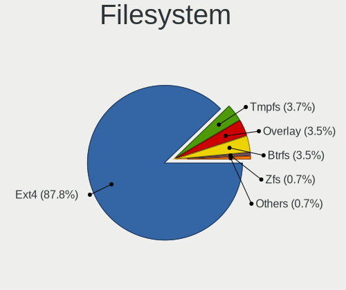
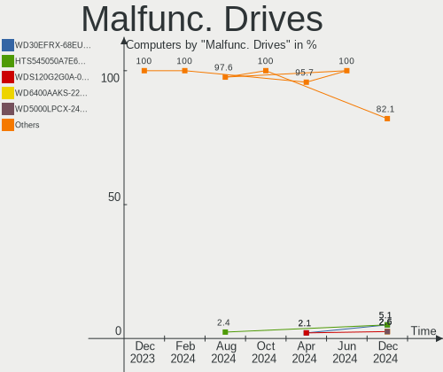
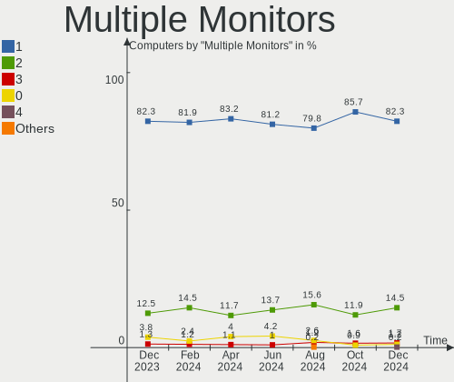
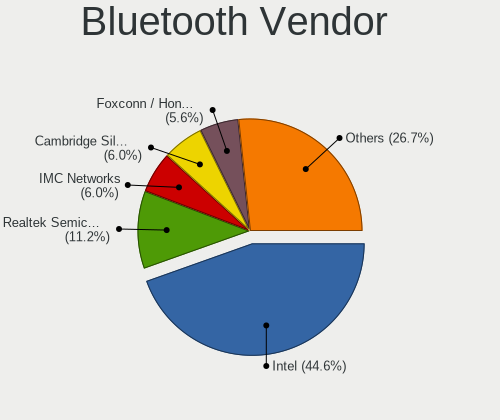
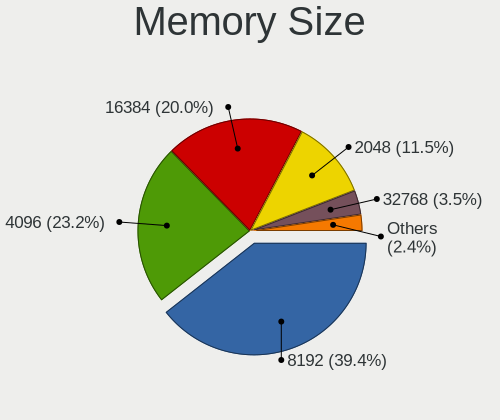
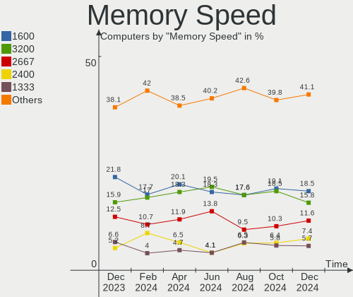
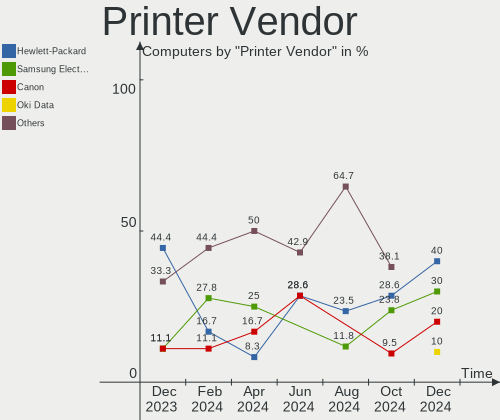
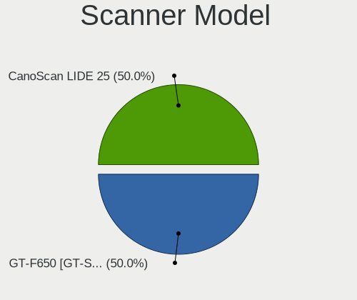

Linux Mint - Hardware Trends
----------------------------

A project to identify most popular hardware characteristics and track their change
over time based on data collected by Linux users at https://Linux-Hardware.org.

Anyone can contribute to this report by the [hw-probe](https://github.com/linuxhw/hw-probe) tool:

    sudo -E hw-probe -all -upload

This is a report for all computer types. See also reports for [desktops](/Dist/Linux_Mint/Desktop/README.md) and [notebooks](/Dist/Linux_Mint/Notebook/README.md).

This report is for one last month. Overall report since the beginning of time: [TestDays](https://github.com/linuxhw/TestDays)

Period: Sep, 2023.

Contents
--------

* [ System ](#system)
  - [ OS                       ](#os)
  - [ OS Family                ](#os-family)
  - [ Kernel                   ](#kernel)
  - [ Kernel Family            ](#kernel-family)
  - [ Kernel Major Ver.        ](#kernel-major-ver)
  - [ Arch                     ](#arch)
  - [ DE                       ](#de)
  - [ Display Server           ](#display-server)
  - [ Display Manager          ](#display-manager)
  - [ OS Lang                  ](#os-lang)
  - [ Boot Mode                ](#boot-mode)
  - [ Filesystem               ](#filesystem)
  - [ Part. scheme             ](#part-scheme)
  - [ Dual Boot with Linux/BSD ](#dual-boot-with-linuxbsd)
  - [ Dual Boot (Win)          ](#dual-boot-win)

* [ Board ](#board)
  - [ Vendor                   ](#vendor)
  - [ Model                    ](#model)
  - [ Model Family             ](#model-family)
  - [ MFG Year                 ](#mfg-year)
  - [ Form Factor              ](#form-factor)
  - [ Secure Boot              ](#secure-boot)
  - [ Coreboot                 ](#coreboot)
  - [ RAM Size                 ](#ram-size)
  - [ RAM Used                 ](#ram-used)
  - [ Total Drives             ](#total-drives)
  - [ Has CD-ROM               ](#has-cd-rom)
  - [ Has Ethernet             ](#has-ethernet)
  - [ Has WiFi                 ](#has-wifi)
  - [ Has Bluetooth            ](#has-bluetooth)

* [ Location ](#location)
  - [ Country                  ](#country)
  - [ City                     ](#city)

* [ Drives ](#drives)
  - [ Drive Vendor             ](#drive-vendor)
  - [ Drive Model              ](#drive-model)
  - [ HDD Vendor               ](#hdd-vendor)
  - [ SSD Vendor               ](#ssd-vendor)
  - [ Drive Kind               ](#drive-kind)
  - [ Drive Connector          ](#drive-connector)
  - [ Drive Size               ](#drive-size)
  - [ Space Total              ](#space-total)
  - [ Space Used               ](#space-used)
  - [ Malfunc. Drives          ](#malfunc-drives)
  - [ Malfunc. Drive Vendor    ](#malfunc-drive-vendor)
  - [ Malfunc. HDD Vendor      ](#malfunc-hdd-vendor)
  - [ Malfunc. Drive Kind      ](#malfunc-drive-kind)
  - [ Failed Drives            ](#failed-drives)
  - [ Failed Drive Vendor      ](#failed-drive-vendor)
  - [ Drive Status             ](#drive-status)

* [ Storage controller ](#storage-controller)
  - [ Storage Vendor           ](#storage-vendor)
  - [ Storage Model            ](#storage-model)
  - [ Storage Kind             ](#storage-kind)

* [ Processor ](#processor)
  - [ CPU Vendor               ](#cpu-vendor)
  - [ CPU Model                ](#cpu-model)
  - [ CPU Model Family         ](#cpu-model-family)
  - [ CPU Cores                ](#cpu-cores)
  - [ CPU Sockets              ](#cpu-sockets)
  - [ CPU Threads              ](#cpu-threads)
  - [ CPU Op-Modes             ](#cpu-op-modes)
  - [ CPU Microcode            ](#cpu-microcode)
  - [ CPU Microarch            ](#cpu-microarch)

* [ Graphics ](#graphics)
  - [ GPU Vendor               ](#gpu-vendor)
  - [ GPU Model                ](#gpu-model)
  - [ GPU Combo                ](#gpu-combo)
  - [ GPU Driver               ](#gpu-driver)
  - [ GPU Memory               ](#gpu-memory)

* [ Monitor ](#monitor)
  - [ Monitor Vendor           ](#monitor-vendor)
  - [ Monitor Model            ](#monitor-model)
  - [ Monitor Resolution       ](#monitor-resolution)
  - [ Monitor Diagonal         ](#monitor-diagonal)
  - [ Monitor Width            ](#monitor-width)
  - [ Aspect Ratio             ](#aspect-ratio)
  - [ Monitor Area             ](#monitor-area)
  - [ Pixel Density            ](#pixel-density)
  - [ Multiple Monitors        ](#multiple-monitors)

* [ Network ](#network)
  - [ Net Controller Vendor    ](#net-controller-vendor)
  - [ Net Controller Model     ](#net-controller-model)
  - [ Wireless Vendor          ](#wireless-vendor)
  - [ Wireless Model           ](#wireless-model)
  - [ Ethernet Vendor          ](#ethernet-vendor)
  - [ Ethernet Model           ](#ethernet-model)
  - [ Net Controller Kind      ](#net-controller-kind)
  - [ Used Controller          ](#used-controller)
  - [ NICs                     ](#nics)
  - [ IPv6                     ](#ipv6)

* [ Bluetooth ](#bluetooth)
  - [ Bluetooth Vendor         ](#bluetooth-vendor)
  - [ Bluetooth Model          ](#bluetooth-model)

* [ Sound ](#sound)
  - [ Sound Vendor             ](#sound-vendor)
  - [ Sound Model              ](#sound-model)

* [ Memory ](#memory)
  - [ Memory Vendor            ](#memory-vendor)
  - [ Memory Model             ](#memory-model)
  - [ Memory Kind              ](#memory-kind)
  - [ Memory Form Factor       ](#memory-form-factor)
  - [ Memory Size              ](#memory-size)
  - [ Memory Speed             ](#memory-speed)

* [ Printers & scanners ](#printers--scanners)
  - [ Printer Vendor           ](#printer-vendor)
  - [ Printer Model            ](#printer-model)
  - [ Scanner Vendor           ](#scanner-vendor)
  - [ Scanner Model            ](#scanner-model)

* [ Camera ](#camera)
  - [ Camera Vendor            ](#camera-vendor)
  - [ Camera Model             ](#camera-model)

* [ Security ](#security)
  - [ Fingerprint Vendor       ](#fingerprint-vendor)
  - [ Fingerprint Model        ](#fingerprint-model)
  - [ Chipcard Vendor          ](#chipcard-vendor)
  - [ Chipcard Model           ](#chipcard-model)

* [ Unsupported ](#unsupported)
  - [ Unsupported Devices      ](#unsupported-devices)
  - [ Unsupported Device Types ](#unsupported-device-types)

System
------

OS
--

Installed operating systems

| Name            | Computers | Percent |
|-----------------|-----------|---------|
| Linux Mint 21.2 | 342       | 72.15%  |
| Linux Mint 21.1 | 56        | 11.81%  |
| Linux Mint 20.3 | 38        | 8.02%   |
| Linux Mint 21   | 15        | 3.16%   |
| Linux Mint 20   | 8         | 1.69%   |
| Linux Mint 19.3 | 5         | 1.05%   |
| Linux Mint 20.2 | 4         | 0.84%   |
| Linux Mint 20.1 | 2         | 0.42%   |
| Linux Mint 19.2 | 2         | 0.42%   |
| Linux Mint 19.1 | 1         | 0.21%   |
| Linux Mint 18.3 | 1         | 0.21%   |

OS Family
---------

OS without a version

| Name       | Computers | Percent |
|------------|-----------|---------|
| Linux Mint | 474       | 100%    |

Kernel
------

Version of the Linux kernel

| Version               | Computers | Percent |
|-----------------------|-----------|---------|
| 5.15.0-83-generic     | 118       | 24.89%  |
| 5.15.0-84-generic     | 97        | 20.46%  |
| 5.15.0-82-generic     | 58        | 12.24%  |
| 5.15.0-76-generic     | 43        | 9.07%   |
| 6.2.0-32-generic      | 20        | 4.22%   |
| 5.4.0-162-generic     | 15        | 3.16%   |
| 5.15.0-79-generic     | 15        | 3.16%   |
| 6.2.0-33-generic      | 14        | 2.95%   |
| 5.4.0-163-generic     | 11        | 2.32%   |
| 5.15.0-56-generic     | 10        | 2.11%   |
| 6.2.0-31-generic      | 7         | 1.48%   |
| 5.4.0-159-generic     | 6         | 1.27%   |
| 5.4.0-91-generic      | 4         | 0.84%   |
| 6.5.1-060501-generic  | 3         | 0.63%   |
| 5.4.0-156-generic     | 3         | 0.63%   |
| 5.4.0-150-generic     | 3         | 0.63%   |
| 5.15.0-78-generic     | 3         | 0.63%   |
| 5.15.0-72-generic     | 3         | 0.63%   |
| 6.5.0-060500-generic  | 2         | 0.42%   |
| 6.4.12-surface        | 2         | 0.42%   |
| 6.1.0-1021-oem        | 2         | 0.42%   |
| 5.4.0-137-generic     | 2         | 0.42%   |
| 5.15.0-60-generic     | 2         | 0.42%   |
| 4.15.0-213-generic    | 2         | 0.42%   |
| 6.5.5-060505-generic  | 1         | 0.21%   |
| 6.5.3-060503-generic  | 1         | 0.21%   |
| 6.5.0-1003-oem        | 1         | 0.21%   |
| 6.3.0-060300-generic  | 1         | 0.21%   |
| 6.2.12-060212-generic | 1         | 0.21%   |
| 6.2.0-26-generic      | 1         | 0.21%   |
| 6.2.0-1012-aws        | 1         | 0.21%   |
| 6.1.0-1022-oem        | 1         | 0.21%   |
| 6.1.0-1020-oem        | 1         | 0.21%   |
| 6.1.0-1016-oem        | 1         | 0.21%   |
| 6.1.0-060100-generic  | 1         | 0.21%   |
| 6.0.0-1021-oem        | 1         | 0.21%   |
| 5.6.17-050617-generic | 1         | 0.21%   |
| 5.4.23520230914       | 1         | 0.21%   |
| 5.4.0-58-generic      | 1         | 0.21%   |
| 5.4.0-26-generic      | 1         | 0.21%   |

Kernel Family
-------------

Linux kernel without a distro release

| Version         | Computers | Percent |
|-----------------|-----------|---------|
| 5.15.0          | 357       | 75.32%  |
| 5.4.0           | 48        | 10.13%  |
| 6.2.0           | 43        | 9.07%   |
| 6.1.0           | 6         | 1.27%   |
| 4.15.0          | 4         | 0.84%   |
| 6.5.1           | 3         | 0.63%   |
| 6.5.0           | 3         | 0.63%   |
| 6.4.12          | 2         | 0.42%   |
| 6.5.5           | 1         | 0.21%   |
| 6.5.3           | 1         | 0.21%   |
| 6.3.0           | 1         | 0.21%   |
| 6.2.12          | 1         | 0.21%   |
| 6.0.0           | 1         | 0.21%   |
| 5.6.17          | 1         | 0.21%   |
| 5.4.23520230914 | 1         | 0.21%   |
| 5.0.0           | 1         | 0.21%   |

Kernel Major Ver.
-----------------

Linux kernel major version

| Version | Computers | Percent |
|---------|-----------|---------|
| 5.15    | 357       | 75.32%  |
| 5.4     | 49        | 10.34%  |
| 6.2     | 44        | 9.28%   |
| 6.5     | 8         | 1.69%   |
| 6.1     | 6         | 1.27%   |
| 4.15    | 4         | 0.84%   |
| 6.4     | 2         | 0.42%   |
| 6.3     | 1         | 0.21%   |
| 6.0     | 1         | 0.21%   |
| 5.6     | 1         | 0.21%   |
| 5.0     | 1         | 0.21%   |

Arch
----

OS architecture (x86_64, i586, etc.)

| Name   | Computers | Percent |
|--------|-----------|---------|
| x86_64 | 474       | 100%    |

DE
--

Desktop Environment

| Name       | Computers | Percent |
|------------|-----------|---------|
| X-Cinnamon | 346       | 73%     |
| XFCE       | 56        | 11.81%  |
| MATE       | 49        | 10.34%  |
| GNOME      | 7         | 1.48%   |
| Unknown    | 6         | 1.27%   |
| Cinnamon   | 4         | 0.84%   |
| KDE5       | 3         | 0.63%   |
| Jwm        | 1         | 0.21%   |
| i3         | 1         | 0.21%   |
| Budgie     | 1         | 0.21%   |

Display Server
--------------

X11 or Wayland

| Name    | Computers | Percent |
|---------|-----------|---------|
| X11     | 470       | 99.16%  |
| Tty     | 3         | 0.63%   |
| Wayland | 1         | 0.21%   |

Display Manager
---------------

SDDM, LightDM, etc.

| Name    | Computers | Percent |
|---------|-----------|---------|
| Unknown | 267       | 56.33%  |
| LightDM | 203       | 42.83%  |
| SDDM    | 2         | 0.42%   |
| LXDM    | 1         | 0.21%   |
| GDM3    | 1         | 0.21%   |

OS Lang
-------

Language

| Lang    | Computers | Percent |
|---------|-----------|---------|
| en_US   | 153       | 32.28%  |
| de_DE   | 60        | 12.66%  |
| pt_BR   | 28        | 5.91%   |
| en_GB   | 22        | 4.64%   |
| ru_RU   | 21        | 4.43%   |
| C       | 21        | 4.43%   |
| it_IT   | 17        | 3.59%   |
| fr_FR   | 17        | 3.59%   |
| es_ES   | 13        | 2.74%   |
| en_CA   | 11        | 2.32%   |
| pl_PL   | 10        | 2.11%   |
| tr_TR   | 8         | 1.69%   |
| nl_NL   | 8         | 1.69%   |
| en_AU   | 8         | 1.69%   |
| en_IN   | 7         | 1.48%   |
| de_AT   | 6         | 1.27%   |
| es_AR   | 5         | 1.05%   |
| Unknown | 5         | 1.05%   |
| sk_SK   | 4         | 0.84%   |
| hu_HU   | 4         | 0.84%   |
| es_CO   | 4         | 0.84%   |
| es_CL   | 3         | 0.63%   |
| en_IE   | 3         | 0.63%   |
| uk_UA   | 2         | 0.42%   |
| sv_SE   | 2         | 0.42%   |
| pt_PT   | 2         | 0.42%   |
| nl_BE   | 2         | 0.42%   |
| fr_CA   | 2         | 0.42%   |
| fr_BE   | 2         | 0.42%   |
| fi_FI   | 2         | 0.42%   |
| es_MX   | 2         | 0.42%   |
| en_PH   | 2         | 0.42%   |
| de_CH   | 2         | 0.42%   |
| cs_CZ   | 2         | 0.42%   |
| zh_CN   | 1         | 0.21%   |
| ru_UA   | 1         | 0.21%   |
| ja_JP   | 1         | 0.21%   |
| es_VE   | 1         | 0.21%   |
| es_UY   | 1         | 0.21%   |
| es_PE   | 1         | 0.21%   |

Boot Mode
---------

EFI or BIOS

| Mode | Computers | Percent |
|------|-----------|---------|
| EFI  | 322       | 67.93%  |
| BIOS | 152       | 32.07%  |

Filesystem
----------

Type of filesystem

| Type    | Computers | Percent |
|---------|-----------|---------|
| Ext4    | 421       | 88.82%  |
| Tmpfs   | 20        | 4.22%   |
| Overlay | 15        | 3.16%   |
| Zfs     | 8         | 1.69%   |
| Btrfs   | 6         | 1.27%   |
| Ext3    | 2         | 0.42%   |
| Xfs     | 1         | 0.21%   |
| Ext2    | 1         | 0.21%   |

Part. scheme
------------

Scheme of partitioning

| Type    | Computers | Percent |
|---------|-----------|---------|
| Unknown | 258       | 54.43%  |
| GPT     | 191       | 40.3%   |
| MBR     | 25        | 5.27%   |

Dual Boot with Linux/BSD
------------------------

Hosting more than one Linux/BSD

| Dual boot | Computers | Percent |
|-----------|-----------|---------|
| No        | 438       | 92.41%  |
| Yes       | 36        | 7.59%   |

Dual Boot (Win)
---------------

Hosting Linux and Windows

| Dual boot | Computers | Percent |
|-----------|-----------|---------|
| No        | 391       | 82.49%  |
| Yes       | 83        | 17.51%  |

Board
-----

Vendor
------

Motherboard manufacturer

| Name                | Computers | Percent |
|---------------------|-----------|---------|
| Hewlett-Packard     | 82        | 17.3%   |
| Lenovo              | 64        | 13.5%   |
| Dell                | 61        | 12.87%  |
| ASUSTek Computer    | 60        | 12.66%  |
| MSI                 | 27        | 5.7%    |
| Acer                | 26        | 5.49%   |
| Gigabyte Technology | 23        | 4.85%   |
| ASRock              | 15        | 3.16%   |
| Apple               | 13        | 2.74%   |
| Unknown             | 9         | 1.9%    |
| Samsung Electronics | 6         | 1.27%   |
| HUAWEI              | 6         | 1.27%   |
| Packard Bell        | 5         | 1.05%   |
| Microsoft           | 5         | 1.05%   |
| Intel               | 5         | 1.05%   |
| AZW                 | 5         | 1.05%   |
| Toshiba             | 4         | 0.84%   |
| Fujitsu             | 4         | 0.84%   |
| Timi                | 3         | 0.63%   |
| Sony                | 3         | 0.63%   |
| Medion              | 3         | 0.63%   |
| Google              | 3         | 0.63%   |
| Foxconn             | 3         | 0.63%   |
| Positivo            | 2         | 0.42%   |
| Notebook            | 2         | 0.42%   |
| Gateway             | 2         | 0.42%   |
| Fujitsu Siemens     | 2         | 0.42%   |
| Chuwi               | 2         | 0.42%   |
| Biostar             | 2         | 0.42%   |
| BESSTAR Tech        | 2         | 0.42%   |
| AMI                 | 2         | 0.42%   |
| wpc                 | 1         | 0.21%   |
| Wortmann AG         | 1         | 0.21%   |
| TUXEDO              | 1         | 0.21%   |
| Turbo-X             | 1         | 0.21%   |
| TrekStor            | 1         | 0.21%   |
| Tectoy              | 1         | 0.21%   |
| Star Labs           | 1         | 0.21%   |
| Standard            | 1         | 0.21%   |
| Prestigio           | 1         | 0.21%   |

Model
-----

Motherboard model

| Name                                | Computers | Percent |
|-------------------------------------|-----------|---------|
| Unknown                             | 12        | 2.53%   |
| AZW SER                             | 3         | 0.63%   |
| ASRock B450 Pro4                    | 3         | 0.63%   |
| Samsung 550XDA                      | 2         | 0.42%   |
| MSI MS-7C02                         | 2         | 0.42%   |
| Lenovo IdeaPad 3 14ALC6 82KT        | 2         | 0.42%   |
| HUAWEI BOM-WXX9                     | 2         | 0.42%   |
| HP Victus by Gaming Laptop 16-r0xxx | 2         | 0.42%   |
| HP ProDesk 600 G1 SFF               | 2         | 0.42%   |
| HP Pavilion Notebook                | 2         | 0.42%   |
| HP Pavilion dv7                     | 2         | 0.42%   |
| HP Pavilion dv6                     | 2         | 0.42%   |
| HP Laptop 15-fc0xxx                 | 2         | 0.42%   |
| HP Laptop 15-da0xxx                 | 2         | 0.42%   |
| HP Compaq Pro 4300 SFF PC           | 2         | 0.42%   |
| Dell Latitude E5550                 | 2         | 0.42%   |
| Dell Inspiron 15-3567               | 2         | 0.42%   |
| ASUS PRIME X370-PRO                 | 2         | 0.42%   |
| ASUS All Series                     | 2         | 0.42%   |
| Acer Nitro AN515-58                 | 2         | 0.42%   |
| Acer Aspire 7741                    | 2         | 0.42%   |
| wpc wpc616                          | 1         | 0.21%   |
| Wortmann AG TERRA_MOBILE_1749       | 1         | 0.21%   |
| Turbo-X III_IPS64gb                 | 1         | 0.21%   |
| TrekStor Primebook P14              | 1         | 0.21%   |
| Toshiba Satellite P50-B-117         | 1         | 0.21%   |
| Toshiba Satellite L875D             | 1         | 0.21%   |
| Toshiba Satellite L875-11M          | 1         | 0.21%   |
| Toshiba QOSMIO X770                 | 1         | 0.21%   |
| Timi Xiaomi Book Pro 14 2022        | 1         | 0.21%   |
| Timi TM1701                         | 1         | 0.21%   |
| Timi Redmi Book Pro 15 2022         | 1         | 0.21%   |
| Tectoy Pense Bem Notebook           | 1         | 0.21%   |
| Star Labs StarBook                  | 1         | 0.21%   |
| Standard MB45II/MB45IN              | 1         | 0.21%   |
| Sony VPCEB4J0E                      | 1         | 0.21%   |
| Sony VGN-AR71J                      | 1         | 0.21%   |
| Sony SVF1521V6EB                    | 1         | 0.21%   |
| Samsung RF511/RF411/RF711           | 1         | 0.21%   |
| Samsung N102SP/N100SP/N101SP        | 1         | 0.21%   |

Model Family
------------

Motherboard model prefix

| Name                  | Computers | Percent |
|-----------------------|-----------|---------|
| Lenovo ThinkPad       | 21        | 4.43%   |
| Dell Latitude         | 21        | 4.43%   |
| Lenovo IdeaPad        | 20        | 4.22%   |
| HP Pavilion           | 19        | 4.01%   |
| Acer Aspire           | 17        | 3.59%   |
| Unknown               | 12        | 2.53%   |
| HP Laptop             | 11        | 2.32%   |
| Dell OptiPlex         | 11        | 2.32%   |
| Dell Inspiron         | 11        | 2.32%   |
| ASUS PRIME            | 9         | 1.9%    |
| Lenovo ThinkCentre    | 8         | 1.69%   |
| HP ProBook            | 8         | 1.69%   |
| HP Compaq             | 8         | 1.69%   |
| Dell Precision        | 7         | 1.48%   |
| HP EliteBook          | 6         | 1.27%   |
| Microsoft Surface     | 5         | 1.05%   |
| ASRock B450           | 5         | 1.05%   |
| Acer Nitro            | 5         | 1.05%   |
| Packard Bell EasyNote | 4         | 0.84%   |
| Dell XPS              | 4         | 0.84%   |
| ASUS ROG              | 4         | 0.84%   |
| Toshiba Satellite     | 3         | 0.63%   |
| Lenovo Legion         | 3         | 0.63%   |
| HP ZBook              | 3         | 0.63%   |
| HP ProDesk            | 3         | 0.63%   |
| HP EliteDesk          | 3         | 0.63%   |
| Gigabyte B550         | 3         | 0.63%   |
| Dell Vostro           | 3         | 0.63%   |
| AZW SER               | 3         | 0.63%   |
| ASUS VivoBook         | 3         | 0.63%   |
| ASUS ASUS             | 3         | 0.63%   |
| Acer Swift            | 3         | 0.63%   |
| Samsung 550XDA        | 2         | 0.42%   |
| MSI MS-7C02           | 2         | 0.42%   |
| Medion Akoya          | 2         | 0.42%   |
| HUAWEI BOM-WXX9       | 2         | 0.42%   |
| HP Victus             | 2         | 0.42%   |
| HP OMEN               | 2         | 0.42%   |
| HP 250                | 2         | 0.42%   |
| Gigabyte H310M        | 2         | 0.42%   |

MFG Year
--------

Motherboard manufacture year

| Year    | Computers | Percent |
|---------|-----------|---------|
| 2022    | 48        | 10.13%  |
| 2018    | 47        | 9.92%   |
| 2021    | 43        | 9.07%   |
| 2012    | 33        | 6.96%   |
| 2020    | 32        | 6.75%   |
| 2011    | 32        | 6.75%   |
| 2013    | 30        | 6.33%   |
| 2017    | 27        | 5.7%    |
| 2019    | 25        | 5.27%   |
| 2015    | 24        | 5.06%   |
| 2014    | 23        | 4.85%   |
| 2010    | 23        | 4.85%   |
| 2016    | 20        | 4.22%   |
| 2008    | 20        | 4.22%   |
| 2023    | 19        | 4.01%   |
| 2009    | 14        | 2.95%   |
| 2006    | 7         | 1.48%   |
| 2007    | 6         | 1.27%   |
| Unknown | 1         | 0.21%   |

Form Factor
-----------

Physical design of the computer

| Name        | Computers | Percent |
|-------------|-----------|---------|
| Notebook    | 263       | 55.49%  |
| Desktop     | 169       | 35.65%  |
| Mini pc     | 13        | 2.74%   |
| All in one  | 11        | 2.32%   |
| Convertible | 10        | 2.11%   |
| Tablet      | 6         | 1.27%   |
| Server      | 2         | 0.42%   |

Secure Boot
-----------

Enabled or disabled

| State    | Computers | Percent |
|----------|-----------|---------|
| Disabled | 441       | 93.04%  |
| Enabled  | 33        | 6.96%   |

Coreboot
--------

Have coreboot on board

| Used | Computers | Percent |
|------|-----------|---------|
| No   | 468       | 98.73%  |
| Yes  | 6         | 1.27%   |

RAM Size
--------

Total RAM memory

| Size in GB      | Computers | Percent |
|-----------------|-----------|---------|
| 4.01-8.0        | 119       | 25.11%  |
| 3.01-4.0        | 97        | 20.46%  |
| 16.01-24.0      | 90        | 18.99%  |
| 8.01-16.0       | 70        | 14.77%  |
| 32.01-64.0      | 50        | 10.55%  |
| 64.01-256.0     | 16        | 3.38%   |
| 24.01-32.0      | 12        | 2.53%   |
| 1.01-2.0        | 11        | 2.32%   |
| 2.01-3.0        | 6         | 1.27%   |
| 0.51-1.0        | 2         | 0.42%   |
| More than 256.0 | 1         | 0.21%   |

RAM Used
--------

Used RAM memory

| Used GB    | Computers | Percent |
|------------|-----------|---------|
| 2.01-3.0   | 153       | 32.28%  |
| 1.01-2.0   | 152       | 32.07%  |
| 4.01-8.0   | 69        | 14.56%  |
| 3.01-4.0   | 54        | 11.39%  |
| 8.01-16.0  | 21        | 4.43%   |
| 0.51-1.0   | 17        | 3.59%   |
| 16.01-24.0 | 6         | 1.27%   |
| 24.01-32.0 | 2         | 0.42%   |

Total Drives
------------

Number of drives on board

| Drives | Computers | Percent |
|--------|-----------|---------|
| 1      | 289       | 60.97%  |
| 2      | 119       | 25.11%  |
| 3      | 35        | 7.38%   |
| 4      | 12        | 2.53%   |
| 5      | 9         | 1.9%    |
| 0      | 6         | 1.27%   |
| 6      | 2         | 0.42%   |
| 9      | 1         | 0.21%   |
| 7      | 1         | 0.21%   |

Has CD-ROM
----------

Has CD-ROM on board

| Presented | Computers | Percent |
|-----------|-----------|---------|
| No        | 286       | 60.34%  |
| Yes       | 188       | 39.66%  |

Has Ethernet
------------

Has Ethernet on board

| Presented | Computers | Percent |
|-----------|-----------|---------|
| Yes       | 405       | 85.44%  |
| No        | 69        | 14.56%  |

Has WiFi
--------

Has WiFi module

| Presented | Computers | Percent |
|-----------|-----------|---------|
| Yes       | 387       | 81.65%  |
| No        | 87        | 18.35%  |

Has Bluetooth
-------------

Has Bluetooth module

| Presented | Computers | Percent |
|-----------|-----------|---------|
| Yes       | 302       | 63.71%  |
| No        | 172       | 36.29%  |

Location
--------

Country
-------

Geographic location (country)

| Country     | Computers | Percent |
|-------------|-----------|---------|
| USA         | 73        | 15.4%   |
| Germany     | 73        | 15.4%   |
| Brazil      | 30        | 6.33%   |
| UK          | 24        | 5.06%   |
| Russia      | 24        | 5.06%   |
| Italy       | 23        | 4.85%   |
| France      | 18        | 3.8%    |
| Spain       | 17        | 3.59%   |
| Canada      | 15        | 3.16%   |
| Poland      | 13        | 2.74%   |
| Netherlands | 12        | 2.53%   |
| Turkey      | 9         | 1.9%    |
| Austria     | 9         | 1.9%    |
| Australia   | 9         | 1.9%    |
| Portugal    | 8         | 1.69%   |
| India       | 8         | 1.69%   |
| Hungary     | 7         | 1.48%   |
| Colombia    | 7         | 1.48%   |
| Slovakia    | 6         | 1.27%   |
| Mexico      | 6         | 1.27%   |
| Belgium     | 6         | 1.27%   |
| Argentina   | 6         | 1.27%   |
| Switzerland | 5         | 1.05%   |
| Sweden      | 5         | 1.05%   |
| Indonesia   | 4         | 0.84%   |
| Ireland     | 3         | 0.63%   |
| Finland     | 3         | 0.63%   |
| Czechia     | 3         | 0.63%   |
| Chile       | 3         | 0.63%   |
| Ukraine     | 2         | 0.42%   |
| UAE         | 2         | 0.42%   |
| Romania     | 2         | 0.42%   |
| Philippines | 2         | 0.42%   |
| Kenya       | 2         | 0.42%   |
| Japan       | 2         | 0.42%   |
| Greece      | 2         | 0.42%   |
| Ecuador     | 2         | 0.42%   |
| Denmark     | 2         | 0.42%   |
| Venezuela   | 1         | 0.21%   |
| Uruguay     | 1         | 0.21%   |

City
----

Geographic location (city)

| City                 | Computers | Percent |
|----------------------|-----------|---------|
| Berlin               | 9         | 1.9%    |
| Vienna               | 8         | 1.69%   |
| Moscow               | 7         | 1.48%   |
| Curitiba             | 5         | 1.05%   |
| Munich               | 4         | 0.84%   |
| Hamburg              | 4         | 0.84%   |
| Bratislava           | 4         | 0.84%   |
| Rio de Janeiro       | 3         | 0.63%   |
| Milan                | 3         | 0.63%   |
| Melbourne            | 3         | 0.63%   |
| Lisbon               | 3         | 0.63%   |
| Calvert Heights      | 3         | 0.63%   |
| Brasília            | 3         | 0.63%   |
| Bogotá              | 3         | 0.63%   |
| Whittier             | 2         | 0.42%   |
| Warsaw               | 2         | 0.42%   |
| Toronto              | 2         | 0.42%   |
| Tlalnepantla         | 2         | 0.42%   |
| Thessaloniki         | 2         | 0.42%   |
| Sao José dos Campos | 2         | 0.42%   |
| Santiago             | 2         | 0.42%   |
| San José            | 2         | 0.42%   |
| Rostov-on-Don        | 2         | 0.42%   |
| Rome                 | 2         | 0.42%   |
| Phoenix              | 2         | 0.42%   |
| Perth                | 2         | 0.42%   |
| Paris                | 2         | 0.42%   |
| Osnabrück           | 2         | 0.42%   |
| Nairobi              | 2         | 0.42%   |
| Montreal             | 2         | 0.42%   |
| Monterrey            | 2         | 0.42%   |
| Mersin               | 2         | 0.42%   |
| Medellín            | 2         | 0.42%   |
| Mannheim             | 2         | 0.42%   |
| Lüdenscheid         | 2         | 0.42%   |
| Keller               | 2         | 0.42%   |
| Hoeven               | 2         | 0.42%   |
| Helsinki             | 2         | 0.42%   |
| Hanover              | 2         | 0.42%   |
| Glasgow              | 2         | 0.42%   |

Drives
------

Drive Vendor
------------

Hard drive vendors

| Vendor                      | Computers | Drives | Percent |
|-----------------------------|-----------|--------|---------|
| WDC                         | 97        | 115    | 14.22%  |
| Samsung Electronics         | 89        | 97     | 13.05%  |
| Seagate                     | 75        | 83     | 11%     |
| Toshiba                     | 40        | 40     | 5.87%   |
| Sandisk                     | 39        | 46     | 5.72%   |
| Crucial                     | 39        | 43     | 5.72%   |
| Kingston                    | 35        | 38     | 5.13%   |
| Unknown                     | 30        | 36     | 4.4%    |
| Micron Technology           | 21        | 21     | 3.08%   |
| Hitachi                     | 21        | 21     | 3.08%   |
| SK hynix                    | 19        | 19     | 2.79%   |
| Intel                       | 16        | 17     | 2.35%   |
| A-DATA Technology           | 10        | 10     | 1.47%   |
| Kingston Technology Company | 9         | 9      | 1.32%   |
| China                       | 8         | 8      | 1.17%   |
| PNY                         | 6         | 8      | 0.88%   |
| Micron/Crucial Technology   | 6         | 8      | 0.88%   |
| KIOXIA                      | 6         | 6      | 0.88%   |
| Intenso                     | 6         | 6      | 0.88%   |
| HGST                        | 6         | 6      | 0.88%   |
| Apple                       | 6         | 6      | 0.88%   |
| Unknown                     | 6         | 6      | 0.88%   |
| SPCC                        | 4         | 4      | 0.59%   |
| Phison Electronics          | 4         | 4      | 0.59%   |
| Hewlett-Packard             | 4         | 4      | 0.59%   |
| Fujitsu                     | 4         | 6      | 0.59%   |
| ADATA Technology            | 4         | 5      | 0.59%   |
| XrayDisk                    | 3         | 3      | 0.44%   |
| Transcend                   | 3         | 3      | 0.44%   |
| Realtek Semiconductor       | 3         | 4      | 0.44%   |
| Netac                       | 3         | 3      | 0.44%   |
| Lexar                       | 3         | 3      | 0.44%   |
| Silicon Motion              | 2         | 2      | 0.29%   |
| Patriot                     | 2         | 2      | 0.29%   |
| LITEON                      | 2         | 2      | 0.29%   |
| Leven                       | 2         | 2      | 0.29%   |
| Gigabyte Technology         | 2         | 2      | 0.29%   |
| Fanxiang                    | 2         | 2      | 0.29%   |
| Emtec                       | 2         | 2      | 0.29%   |
| Apacer                      | 2         | 2      | 0.29%   |

Drive Model
-----------

Hard drive models

| Model                                               | Computers | Percent |
|-----------------------------------------------------|-----------|---------|
| Kingston SA400S37240G 240GB SSD                     | 10        | 1.39%   |
| Crucial CT500MX500SSD1 500GB                        | 9         | 1.25%   |
| Seagate ST500DM002-1BD142 500GB                     | 7         | 0.97%   |
| Samsung SSD 850 EVO 250GB                           | 7         | 0.97%   |
| Kingston SA400S37960G 960GB SSD                     | 7         | 0.97%   |
| Unknown MMC Card  64GB                              | 6         | 0.83%   |
| Samsung SSD 860 EVO 1TB                             | 6         | 0.83%   |
| Unknown                                             | 6         | 0.83%   |
| WDC WD10EZEX-08WN4A0 1TB                            | 5         | 0.69%   |
| Toshiba MQ01ABF050 500GB                            | 5         | 0.69%   |
| Toshiba DT01ACA100 1TB                              | 5         | 0.69%   |
| Seagate ST2000DM008-2FR102 2TB                      | 5         | 0.69%   |
| SanDisk NVMe SSD Drive 1TB                          | 5         | 0.69%   |
| Samsung NVMe SSD Controller SM961/PM961/SM963 500GB | 5         | 0.69%   |
| Micron/Crucial P2 NVMe PCIe SSD 1TB                 | 5         | 0.69%   |
| Kingston SA400S37480G 480GB SSD                     | 5         | 0.69%   |
| Hitachi HTS547575A9E384 752GB                       | 5         | 0.69%   |
| Crucial CT1000MX500SSD1 1TB                         | 5         | 0.69%   |
| Crucial CT1000BX500SSD1 1TB                         | 5         | 0.69%   |
| Toshiba MQ04ABF100 1TB                              | 4         | 0.55%   |
| Seagate ST1000DM010-2EP102 1TB                      | 4         | 0.55%   |
| SanDisk SSD PLUS 1000GB                             | 4         | 0.55%   |
| Samsung SSD 870 EVO 1TB                             | 4         | 0.55%   |
| Samsung SSD 860 EVO 250GB                           | 4         | 0.55%   |
| Kingston Company A2000 NVMe SSD 1TB                 | 4         | 0.55%   |
| Crucial CT240BX500SSD1 240GB                        | 4         | 0.55%   |
| WDC WD40EZRZ-00GXCB0 4TB                            | 3         | 0.42%   |
| Unknown SD/MMC/MS PRO 128GB                         | 3         | 0.42%   |
| Unknown NVMe SSD Drive 512GB                        | 3         | 0.42%   |
| Unknown MMC Card  16GB                              | 3         | 0.42%   |
| Toshiba MQ01ABD100 1TB                              | 3         | 0.42%   |
| Seagate ST500LT012-1DG142 500GB                     | 3         | 0.42%   |
| Seagate ST1000LM024 HN-M101MBB 1TB                  | 3         | 0.42%   |
| Seagate Backup+ Hub BK 8TB                          | 3         | 0.42%   |
| SanDisk SSD PLUS 480GB                              | 3         | 0.42%   |
| Samsung SSD 860 EVO 500GB                           | 3         | 0.42%   |
| Samsung SSD 850 EVO 500GB                           | 3         | 0.42%   |
| Samsung NVMe SSD Controller SM981/PM981/PM983 256GB | 3         | 0.42%   |
| Samsung NVMe SSD Controller PM9A1/PM9A3/980PRO 1TB  | 3         | 0.42%   |
| PNY CS900 500GB SSD                                 | 3         | 0.42%   |

HDD Vendor
----------

Hard disk drive vendors

| Vendor              | Computers | Drives | Percent |
|---------------------|-----------|--------|---------|
| WDC                 | 83        | 97     | 35.02%  |
| Seagate             | 73        | 81     | 30.8%   |
| Toshiba             | 32        | 32     | 13.5%   |
| Hitachi             | 21        | 21     | 8.86%   |
| Samsung Electronics | 7         | 7      | 2.95%   |
| HGST                | 6         | 6      | 2.53%   |
| Fujitsu             | 4         | 6      | 1.69%   |
| Unknown             | 3         | 3      | 1.27%   |
| Hewlett-Packard     | 2         | 2      | 0.84%   |
| Apple               | 2         | 2      | 0.84%   |
| USB3.0              | 1         | 1      | 0.42%   |
| SAGE                | 1         | 1      | 0.42%   |
| Maxtor              | 1         | 1      | 0.42%   |
| Maxone              | 1         | 1      | 0.42%   |

SSD Vendor
----------

Solid state drive vendors

| Vendor              | Computers | Drives | Percent |
|---------------------|-----------|--------|---------|
| Samsung Electronics | 48        | 51     | 20.25%  |
| Crucial             | 36        | 39     | 15.19%  |
| Kingston            | 31        | 33     | 13.08%  |
| SanDisk             | 16        | 17     | 6.75%   |
| WDC                 | 11        | 11     | 4.64%   |
| China               | 8         | 8      | 3.38%   |
| A-DATA Technology   | 8         | 8      | 3.38%   |
| PNY                 | 6         | 8      | 2.53%   |
| Micron Technology   | 6         | 6      | 2.53%   |
| Intel               | 6         | 6      | 2.53%   |
| SK hynix            | 5         | 5      | 2.11%   |
| Intenso             | 4         | 4      | 1.69%   |
| Transcend           | 3         | 3      | 1.27%   |
| Toshiba             | 3         | 3      | 1.27%   |
| SPCC                | 3         | 3      | 1.27%   |
| Netac               | 3         | 3      | 1.27%   |
| Apple               | 3         | 3      | 1.27%   |
| Patriot             | 2         | 2      | 0.84%   |
| LITEON              | 2         | 2      | 0.84%   |
| Leven               | 2         | 2      | 0.84%   |
| Emtec               | 2         | 2      | 0.84%   |
| Unknown             | 2         | 2      | 0.84%   |
| XrayDisk            | 1         | 1      | 0.42%   |
| Win Memory          | 1         | 1      | 0.42%   |
| Verbatim            | 1         | 1      | 0.42%   |
| TrekStor            | 1         | 1      | 0.42%   |
| TCSUNBOW            | 1         | 1      | 0.42%   |
| Super Talent        | 1         | 1      | 0.42%   |
| PNY USB             | 1         | 1      | 0.42%   |
| Plextor             | 1         | 1      | 0.42%   |
| NT-256              | 1         | 1      | 0.42%   |
| NGFF                | 1         | 1      | 0.42%   |
| Netac NV            | 1         | 1      | 0.42%   |
| MidasForce          | 1         | 1      | 0.42%   |
| LITEONIT            | 1         | 1      | 0.42%   |
| Lexar               | 1         | 1      | 0.42%   |
| Lenovo              | 1         | 1      | 0.42%   |
| Kingchuxing         | 1         | 1      | 0.42%   |
| Integral            | 1         | 1      | 0.42%   |
| Inateck             | 1         | 1      | 0.42%   |

Drive Kind
----------

HDD or SSD

| Kind    | Computers | Drives | Percent |
|---------|-----------|--------|---------|
| HDD     | 204       | 261    | 33.55%  |
| SSD     | 200       | 249    | 32.89%  |
| NVMe    | 166       | 191    | 27.3%   |
| MMC     | 22        | 27     | 3.62%   |
| Unknown | 16        | 20     | 2.63%   |

Drive Connector
---------------

SATA, SAS, NVMe, etc.

| Type | Computers | Drives | Percent |
|------|-----------|--------|---------|
| SATA | 348       | 492    | 61.48%  |
| NVMe | 166       | 191    | 29.33%  |
| SAS  | 30        | 38     | 5.3%    |
| MMC  | 22        | 27     | 3.89%   |

Drive Size
----------

Size of hard drive

| Size in TB | Computers | Drives | Percent |
|------------|-----------|--------|---------|
| 0.01-0.5   | 236       | 281    | 54.5%   |
| 0.51-1.0   | 137       | 153    | 31.64%  |
| 1.01-2.0   | 35        | 42     | 8.08%   |
| 3.01-4.0   | 10        | 11     | 2.31%   |
| 4.01-10.0  | 9         | 12     | 2.08%   |
| 2.01-3.0   | 4         | 5      | 0.92%   |
| 10.01-20.0 | 2         | 6      | 0.46%   |

Space Total
-----------

Amount of disk space available on the file system

| Size in GB     | Computers | Percent |
|----------------|-----------|---------|
| 101-250        | 125       | 26.37%  |
| 251-500        | 119       | 25.11%  |
| 501-1000       | 83        | 17.51%  |
| 1001-2000      | 50        | 10.55%  |
| 51-100         | 25        | 5.27%   |
| More than 3000 | 20        | 4.22%   |
| 1-20           | 17        | 3.59%   |
| 21-50          | 13        | 2.74%   |
| Unknown        | 13        | 2.74%   |
| 2001-3000      | 9         | 1.9%    |

Space Used
----------

Amount of used disk space

| Used GB        | Computers | Percent |
|----------------|-----------|---------|
| 21-50          | 124       | 26.16%  |
| 1-20           | 97        | 20.46%  |
| 101-250        | 77        | 16.24%  |
| 51-100         | 62        | 13.08%  |
| 251-500        | 40        | 8.44%   |
| 501-1000       | 28        | 5.91%   |
| 1001-2000      | 20        | 4.22%   |
| Unknown        | 13        | 2.74%   |
| More than 3000 | 8         | 1.69%   |
| 2001-3000      | 5         | 1.05%   |

Malfunc. Drives
---------------

Drive models with a malfunction

| Model                                     | Computers | Drives | Percent |
|-------------------------------------------|-----------|--------|---------|
| Toshiba MQ01ABF050 500GB                  | 3         | 3      | 7.14%   |
| Seagate ST500DM002-1BD142 500GB           | 3         | 3      | 7.14%   |
| WDC WD5000BPKT-75PK4T0 500GB              | 1         | 1      | 2.38%   |
| WDC WD5000AZLX-08K2TA0 500GB              | 1         | 1      | 2.38%   |
| WDC WD5000AVDS-63U7B1 500GB               | 1         | 1      | 2.38%   |
| WDC WD5000AAKX-60U6AA0 500GB              | 1         | 1      | 2.38%   |
| WDC WD5000AAKX-08ERMA0 500GB              | 1         | 1      | 2.38%   |
| WDC WD5000AAKS-402AA0 500GB               | 1         | 1      | 2.38%   |
| WDC WD3200BPVT-22ZEST0 320GB              | 1         | 1      | 2.38%   |
| WDC WD3200AAJS-40H3A0 320GB               | 1         | 1      | 2.38%   |
| WDC WD20EARX-32PASB0 2TB                  | 1         | 1      | 2.38%   |
| WDC WD20EADS-00S2B0 2TB                   | 1         | 1      | 2.38%   |
| WDC WD2002FYPS-02W3B0 2TB                 | 1         | 1      | 2.38%   |
| WDC WD1600JD-75HBB0 160GB                 | 1         | 1      | 2.38%   |
| WDC WD1200BEVS-07LAT0 120GB               | 1         | 1      | 2.38%   |
| WDC WD10SPZX-75Z10T2 1TB                  | 1         | 1      | 2.38%   |
| Toshiba DT01ABA200V 2TB                   | 1         | 1      | 2.38%   |
| SK hynix PC711 HFS512GDE9X073N 512GB      | 1         | 1      | 2.38%   |
| Seagate ST96812AS 64GB                    | 1         | 1      | 2.38%   |
| Seagate ST3250310AS 250GB                 | 1         | 1      | 2.38%   |
| Seagate ST31000528AS 1TB                  | 1         | 1      | 2.38%   |
| Seagate ST2000DX001-1CM164 2TB            | 1         | 1      | 2.38%   |
| Seagate ST1000LX015-1U7172 1TB            | 1         | 1      | 2.38%   |
| Seagate ST1000DL002-9TT153 1TB            | 1         | 1      | 2.38%   |
| Samsung Electronics HD322HJ 320GB         | 1         | 1      | 2.38%   |
| Samsung Electronics HD103SI 1TB           | 1         | 1      | 2.38%   |
| Netac SSD 256GB                           | 1         | 1      | 2.38%   |
| Micron Technology MTFDDAK256TDL 256GB SSD | 1         | 1      | 2.38%   |
| Kingston SA400S37240G 240GB SSD           | 1         | 1      | 2.38%   |
| Intel SSDSC2CW120A3 120GB                 | 1         | 1      | 2.38%   |
| Intel SSDSA2M080G2GC 80GB                 | 1         | 1      | 2.38%   |
| Inateck ASM1153E 528GB SSD                | 1         | 1      | 2.38%   |
| Hitachi HTS725032A9A364 320GB             | 1         | 1      | 2.38%   |
| Fujitsu MHV2080AH 80GB                    | 1         | 1      | 2.38%   |
| DTECHCO SSD 256GB                         | 1         | 1      | 2.38%   |
| Apple SSD SM0512F 500GB                   | 1         | 1      | 2.38%   |
| Apple HDD HTS541010A9E632 1TB             | 1         | 1      | 2.38%   |
| Unknown                                   | 1         | 1      | 2.38%   |

Malfunc. Drive Vendor
---------------------

Vendors of faulty drives

| Vendor              | Computers | Drives | Percent |
|---------------------|-----------|--------|---------|
| WDC                 | 14        | 14     | 34.15%  |
| Seagate             | 8         | 9      | 19.51%  |
| Toshiba             | 4         | 4      | 9.76%   |
| Samsung Electronics | 2         | 2      | 4.88%   |
| Intel               | 2         | 2      | 4.88%   |
| Apple               | 2         | 2      | 4.88%   |
| SK hynix            | 1         | 1      | 2.44%   |
| Netac               | 1         | 1      | 2.44%   |
| Micron Technology   | 1         | 1      | 2.44%   |
| Kingston            | 1         | 1      | 2.44%   |
| Inateck             | 1         | 1      | 2.44%   |
| Hitachi             | 1         | 1      | 2.44%   |
| Fujitsu             | 1         | 1      | 2.44%   |
| DTECHCO             | 1         | 1      | 2.44%   |
| Unknown             | 1         | 1      | 2.44%   |

Malfunc. HDD Vendor
-------------------

Vendors of faulty HDD drives

| Vendor              | Computers | Drives | Percent |
|---------------------|-----------|--------|---------|
| WDC                 | 14        | 14     | 45.16%  |
| Seagate             | 8         | 9      | 25.81%  |
| Toshiba             | 4         | 4      | 12.9%   |
| Samsung Electronics | 2         | 2      | 6.45%   |
| Hitachi             | 1         | 1      | 3.23%   |
| Fujitsu             | 1         | 1      | 3.23%   |
| Apple               | 1         | 1      | 3.23%   |

Malfunc. Drive Kind
-------------------

Kinds of faulty drives

| Kind | Computers | Drives | Percent |
|------|-----------|--------|---------|
| HDD  | 28        | 32     | 73.68%  |
| SSD  | 9         | 9      | 23.68%  |
| NVMe | 1         | 1      | 2.63%   |

Failed Drives
-------------

Failed drive models

| Model                             | Computers | Drives | Percent |
|-----------------------------------|-----------|--------|---------|
| Samsung Electronics HM160HC 160GB | 1         | 1      | 100%    |

Failed Drive Vendor
-------------------

Failed drive vendors

| Vendor              | Computers | Drives | Percent |
|---------------------|-----------|--------|---------|
| Samsung Electronics | 1         | 1      | 100%    |

Drive Status
------------

Number of failed and malfunc. drives

| Status   | Computers | Drives | Percent |
|----------|-----------|--------|---------|
| Detected | 298       | 480    | 60.57%  |
| Works    | 156       | 225    | 31.71%  |
| Malfunc  | 37        | 42     | 7.52%   |
| Failed   | 1         | 1      | 0.2%    |

Storage controller
------------------

Storage Vendor
--------------

Storage controller vendors

| Vendor                         | Computers | Percent |
|--------------------------------|-----------|---------|
| Intel                          | 309       | 51.67%  |
| AMD                            | 85        | 14.21%  |
| Samsung Electronics            | 39        | 6.52%   |
| SanDisk                        | 28        | 4.68%   |
| Micron Technology              | 15        | 2.51%   |
| SK hynix                       | 14        | 2.34%   |
| Kingston Technology Company    | 14        | 2.34%   |
| ASMedia Technology             | 11        | 1.84%   |
| Phison Electronics             | 10        | 1.67%   |
| Nvidia                         | 10        | 1.67%   |
| Micron/Crucial Technology      | 10        | 1.67%   |
| JMicron Technology             | 8         | 1.34%   |
| ADATA Technology               | 8         | 1.34%   |
| KIOXIA                         | 6         | 1%      |
| Toshiba America Info Systems   | 5         | 0.84%   |
| Silicon Motion                 | 5         | 0.84%   |
| Realtek Semiconductor          | 4         | 0.67%   |
| Yangtze Memory Technologies    | 2         | 0.33%   |
| Solidigm                       | 2         | 0.33%   |
| MAXIO Technology (Hangzhou)    | 2         | 0.33%   |
| Marvell Technology Group       | 2         | 0.33%   |
| VIA Technologies               | 1         | 0.17%   |
| Solid State Storage Technology | 1         | 0.17%   |
| Shenzhen Longsys Electronics   | 1         | 0.17%   |
| Seagate Technology             | 1         | 0.17%   |
| Netac Technology               | 1         | 0.17%   |
| LSI Logic / Symbios Logic      | 1         | 0.17%   |
| Hosin Global Electronics       | 1         | 0.17%   |
| HighPoint Technologies         | 1         | 0.17%   |
| Apple                          | 1         | 0.17%   |

Storage Model
-------------

Storage controller models

| Model                                                                            | Computers | Percent |
|----------------------------------------------------------------------------------|-----------|---------|
| AMD FCH SATA Controller [AHCI mode]                                              | 50        | 7.51%   |
| Intel Sunrise Point-LP SATA Controller [AHCI mode]                               | 23        | 3.45%   |
| Intel 7 Series Chipset Family 6-port SATA Controller [AHCI mode]                 | 21        | 3.15%   |
| Intel 6 Series/C200 Series Chipset Family 6 port Mobile SATA AHCI Controller     | 21        | 3.15%   |
| Intel 8 Series/C220 Series Chipset Family 6-port SATA Controller 1 [AHCI mode]   | 18        | 2.7%    |
| Intel 82801 Mobile SATA Controller [RAID mode]                                   | 16        | 2.4%    |
| Intel Cannon Lake PCH SATA AHCI Controller                                       | 14        | 2.1%    |
| Samsung NVMe SSD Controller 980                                                  | 13        | 1.95%   |
| AMD 400 Series Chipset SATA Controller                                           | 13        | 1.95%   |
| Samsung NVMe SSD Controller SM981/PM981/PM983                                    | 12        | 1.8%    |
| Intel 6 Series/C200 Series Chipset Family 6 port Desktop SATA AHCI Controller    | 12        | 1.8%    |
| Intel Volume Management Device NVMe RAID Controller                              | 11        | 1.65%   |
| Intel SATA Controller [RAID mode]                                                | 11        | 1.65%   |
| AMD SB7x0/SB8x0/SB9x0 SATA Controller [AHCI mode]                                | 11        | 1.65%   |
| AMD 500 Series Chipset SATA Controller                                           | 11        | 1.65%   |
| ASMedia ASM1062 Serial ATA Controller                                            | 10        | 1.5%    |
| AMD SB7x0/SB8x0/SB9x0 IDE Controller                                             | 10        | 1.5%    |
| Intel 5 Series/3400 Series Chipset 4 port SATA AHCI Controller                   | 9         | 1.35%   |
| Intel Wildcat Point-LP SATA Controller [AHCI Mode]                               | 8         | 1.2%    |
| SanDisk WD Black SN770 / PC SN740 256GB / PC SN560 (DRAM-less) NVMe SSD          | 7         | 1.05%   |
| Intel Celeron N3350/Pentium N4200/Atom E3900 Series SATA AHCI Controller         | 7         | 1.05%   |
| Intel 200 Series PCH SATA controller [AHCI mode]                                 | 7         | 1.05%   |
| Micron/Crucial P2 [Nick P2] / P3 / P3 Plus NVMe PCIe SSD (DRAM-less)             | 6         | 0.9%    |
| Micron 2450 NVMe SSD [HendrixV] (DRAM-less)                                      | 6         | 0.9%    |
| Kingston Company A2000 NVMe SSD                                                  | 6         | 0.9%    |
| Intel Q170/Q150/B150/H170/H110/Z170/CM236 Chipset SATA Controller [AHCI Mode]    | 6         | 0.9%    |
| Intel 82801IBM/IEM (ICH9M/ICH9M-E) 4 port SATA Controller [AHCI mode]            | 6         | 0.9%    |
| Intel 82801G (ICH7 Family) IDE Controller                                        | 6         | 0.9%    |
| Intel 8 Series SATA Controller 1 [AHCI mode]                                     | 6         | 0.9%    |
| Intel 7 Series/C210 Series Chipset Family 6-port SATA Controller [AHCI mode]     | 6         | 0.9%    |
| SK hynix Gold P31/BC711/PC711 NVMe Solid State Drive                             | 5         | 0.75%   |
| Samsung NVMe SSD Controller SM961/PM961/SM963                                    | 5         | 0.75%   |
| Samsung NVMe SSD Controller PM9A1/PM9A3/980PRO                                   | 5         | 0.75%   |
| Micron 3400 NVMe SSD [Hendrix]                                                   | 5         | 0.75%   |
| Intel Tiger Lake-LP SATA Controller                                              | 5         | 0.75%   |
| Intel SSD 670p Series [Keystone Harbor]                                          | 5         | 0.75%   |
| Intel NM10/ICH7 Family SATA Controller [IDE mode]                                | 5         | 0.75%   |
| Intel Comet Lake SATA AHCI Controller                                            | 5         | 0.75%   |
| Intel Atom/Celeron/Pentium Processor x5-E8000/J3xxx/N3xxx Series SATA Controller | 5         | 0.75%   |
| Intel Atom Processor E3800 Series SATA AHCI Controller                           | 5         | 0.75%   |

Storage Kind
------------

Kind of storage controller (IDE, SATA, NVMe, SAS, ...)

| Kind | Computers | Percent |
|------|-----------|---------|
| SATA | 334       | 56.04%  |
| NVMe | 166       | 27.85%  |
| IDE  | 51        | 8.56%   |
| RAID | 43        | 7.21%   |
| SAS  | 2         | 0.34%   |

Processor
---------

CPU Vendor
----------

Processor vendors

| Vendor | Computers | Percent |
|--------|-----------|---------|
| Intel  | 359       | 75.74%  |
| AMD    | 115       | 24.26%  |

CPU Model
---------

Processor models

| Model                                       | Computers | Percent |
|---------------------------------------------|-----------|---------|
| Intel Core i7-8550U CPU @ 1.80GHz           | 6         | 1.27%   |
| Intel Core i5-8250U CPU @ 1.60GHz           | 5         | 1.05%   |
| Intel 11th Gen Core i5-1135G7 @ 2.40GHz     | 5         | 1.05%   |
| AMD Ryzen 5 5500U with Radeon Graphics      | 5         | 1.05%   |
| AMD Ryzen 5 3600 6-Core Processor           | 5         | 1.05%   |
| Intel Core i7-3610QM CPU @ 2.30GHz          | 4         | 0.84%   |
| Intel Core i7-2670QM CPU @ 2.20GHz          | 4         | 0.84%   |
| Intel Core i7-2630QM CPU @ 2.00GHz          | 4         | 0.84%   |
| Intel Core i7-2600 CPU @ 3.40GHz            | 4         | 0.84%   |
| Intel Core i5-2410M CPU @ 2.30GHz           | 4         | 0.84%   |
| Intel Core i3-6006U CPU @ 2.00GHz           | 4         | 0.84%   |
| Intel 12th Gen Core i7-12700H               | 4         | 0.84%   |
| Intel 11th Gen Core i3-1115G4 @ 3.00GHz     | 4         | 0.84%   |
| AMD Ryzen 7 5800H with Radeon Graphics      | 4         | 0.84%   |
| AMD Ryzen 7 5700U with Radeon Graphics      | 4         | 0.84%   |
| Intel Core i7-9700K CPU @ 3.60GHz           | 3         | 0.63%   |
| Intel Core i7-7700HQ CPU @ 2.80GHz          | 3         | 0.63%   |
| Intel Core i7-7600U CPU @ 2.80GHz           | 3         | 0.63%   |
| Intel Core i7-7500U CPU @ 2.70GHz           | 3         | 0.63%   |
| Intel Core i7-4790 CPU @ 3.60GHz            | 3         | 0.63%   |
| Intel Core i7-10750H CPU @ 2.60GHz          | 3         | 0.63%   |
| Intel Core i5-8265U CPU @ 1.60GHz           | 3         | 0.63%   |
| Intel Core i5-7200U CPU @ 2.50GHz           | 3         | 0.63%   |
| Intel Core i5-6500 CPU @ 3.20GHz            | 3         | 0.63%   |
| Intel Core i5-6200U CPU @ 2.30GHz           | 3         | 0.63%   |
| Intel Core i5-4590 CPU @ 3.30GHz            | 3         | 0.63%   |
| Intel Core i5-2520M CPU @ 2.50GHz           | 3         | 0.63%   |
| Intel Core i5-2400 CPU @ 3.10GHz            | 3         | 0.63%   |
| Intel Core i3-5005U CPU @ 2.00GHz           | 3         | 0.63%   |
| Intel Core i3-3220 CPU @ 3.30GHz            | 3         | 0.63%   |
| Intel Core i3-2330M CPU @ 2.20GHz           | 3         | 0.63%   |
| Intel Celeron CPU N3350 @ 1.10GHz           | 3         | 0.63%   |
| AMD Ryzen 7 7730U with Radeon Graphics      | 3         | 0.63%   |
| AMD Ryzen 5 5600X 6-Core Processor          | 3         | 0.63%   |
| Intel Pentium Gold G5400 CPU @ 3.70GHz      | 2         | 0.42%   |
| Intel Pentium Dual-Core CPU T4300 @ 2.10GHz | 2         | 0.42%   |
| Intel Pentium CPU P6200 @ 2.13GHz           | 2         | 0.42%   |
| Intel Pentium CPU N4200 @ 1.10GHz           | 2         | 0.42%   |
| Intel Pentium CPU N3710 @ 1.60GHz           | 2         | 0.42%   |
| Intel Pentium CPU N3700 @ 1.60GHz           | 2         | 0.42%   |

CPU Model Family
----------------

Processor model prefix

| Model                   | Computers | Percent |
|-------------------------|-----------|---------|
| Intel Core i5           | 96        | 20.25%  |
| Intel Core i7           | 85        | 17.93%  |
| Other                   | 53        | 11.18%  |
| Intel Core i3           | 38        | 8.02%   |
| AMD Ryzen 5             | 30        | 6.33%   |
| AMD Ryzen 7             | 26        | 5.49%   |
| Intel Celeron           | 22        | 4.64%   |
| Intel Core 2 Duo        | 14        | 2.95%   |
| Intel Pentium           | 13        | 2.74%   |
| Intel Xeon              | 9         | 1.9%    |
| Intel Atom              | 8         | 1.69%   |
| Intel Core 2 Quad       | 5         | 1.05%   |
| AMD Ryzen 3             | 5         | 1.05%   |
| AMD A6                  | 5         | 1.05%   |
| AMD Ryzen 9             | 4         | 0.84%   |
| AMD Phenom II X4        | 4         | 0.84%   |
| AMD FX                  | 4         | 0.84%   |
| AMD A8                  | 4         | 0.84%   |
| AMD A10                 | 4         | 0.84%   |
| Intel Pentium Dual-Core | 3         | 0.63%   |
| Intel Core 2            | 3         | 0.63%   |
| AMD Turion 64 X2 Mobile | 3         | 0.63%   |
| AMD A4                  | 3         | 0.63%   |
| Intel Xeon Gold         | 2         | 0.42%   |
| Intel Pentium Silver    | 2         | 0.42%   |
| Intel Pentium Gold      | 2         | 0.42%   |
| Intel Pentium 4         | 2         | 0.42%   |
| Intel Core i9           | 2         | 0.42%   |
| AMD Ryzen 5 PRO         | 2         | 0.42%   |
| AMD Phenom              | 2         | 0.42%   |
| Intel Pentium Dual      | 1         | 0.21%   |
| Intel Core m5           | 1         | 0.21%   |
| Intel Core M            | 1         | 0.21%   |
| Intel Celeron Dual-Core | 1         | 0.21%   |
| AMD V140                | 1         | 0.21%   |
| AMD Turion II Dual-Core | 1         | 0.21%   |
| AMD Turion 64 Mobile    | 1         | 0.21%   |
| AMD Ryzen 7 PRO         | 1         | 0.21%   |
| AMD Phenom II X2        | 1         | 0.21%   |
| AMD Embedded            | 1         | 0.21%   |

CPU Cores
---------

Number of processor cores

| Number | Computers | Percent |
|--------|-----------|---------|
| 2      | 170       | 35.86%  |
| 4      | 168       | 35.44%  |
| 6      | 46        | 9.7%    |
| 8      | 42        | 8.86%   |
| 12     | 13        | 2.74%   |
| 1      | 10        | 2.11%   |
| 14     | 9         | 1.9%    |
| 10     | 9         | 1.9%    |
| 3      | 4         | 0.84%   |
| 40     | 1         | 0.21%   |
| 36     | 1         | 0.21%   |
| 16     | 1         | 0.21%   |

CPU Sockets
-----------

Number of sockets

| Number | Computers | Percent |
|--------|-----------|---------|
| 1      | 470       | 99.16%  |
| 2      | 4         | 0.84%   |

CPU Threads
-----------

Threads per core (Hyper-Threading)

| Number | Computers | Percent |
|--------|-----------|---------|
| 2      | 315       | 66.46%  |
| 1      | 159       | 33.54%  |

CPU Op-Modes
------------

CPU Operation Modes (32-bit, 64-bit)

| Op mode        | Computers | Percent |
|----------------|-----------|---------|
| 32-bit, 64-bit | 474       | 100%    |

CPU Microcode
-------------

Microcode number

| Number     | Computers | Percent |
|------------|-----------|---------|
| Unknown    | 68        | 14.35%  |
| 0x206a7    | 35        | 7.38%   |
| 0x306a9    | 31        | 6.54%   |
| 0x306c3    | 19        | 4.01%   |
| 0x1067a    | 17        | 3.59%   |
| 0x806ea    | 12        | 2.53%   |
| 0x406e3    | 12        | 2.53%   |
| 0x0a50000d | 11        | 2.32%   |
| 0x906a3    | 10        | 2.11%   |
| 0x806e9    | 10        | 2.11%   |
| 0x906ea    | 9         | 1.9%    |
| 0x806c1    | 9         | 1.9%    |
| 0x20655    | 9         | 1.9%    |
| 0x08608103 | 9         | 1.9%    |
| 0x506e3    | 8         | 1.69%   |
| 0x306d4    | 8         | 1.69%   |
| 0x906ed    | 7         | 1.48%   |
| 0x06001119 | 7         | 1.48%   |
| 0x010000c8 | 7         | 1.48%   |
| 0x906e9    | 6         | 1.27%   |
| 0x40651    | 6         | 1.27%   |
| 0x08108109 | 6         | 1.27%   |
| 0x06006705 | 6         | 1.27%   |
| 0x806ec    | 5         | 1.05%   |
| 0x506c9    | 5         | 1.05%   |
| 0x406c4    | 5         | 1.05%   |
| 0x30678    | 5         | 1.05%   |
| 0x08701021 | 5         | 1.05%   |
| 0xa0653    | 4         | 0.84%   |
| 0x906c0    | 4         | 0.84%   |
| 0x906a4    | 4         | 0.84%   |
| 0x6fd      | 4         | 0.84%   |
| 0x20652    | 4         | 0.84%   |
| 0x0a601203 | 4         | 0.84%   |
| 0x08701030 | 4         | 0.84%   |
| 0xa0671    | 3         | 0.63%   |
| 0x706e5    | 3         | 0.63%   |
| 0x706a8    | 3         | 0.63%   |
| 0x6f6      | 3         | 0.63%   |
| 0x50654    | 3         | 0.63%   |

CPU Microarch
-------------

Microarchitecture

| Name             | Computers | Percent |
|------------------|-----------|---------|
| KabyLake         | 65        | 13.71%  |
| SandyBridge      | 40        | 8.44%   |
| IvyBridge        | 34        | 7.17%   |
| Haswell          | 30        | 6.33%   |
| Unknown          | 28        | 5.91%   |
| Skylake          | 26        | 5.49%   |
| Zen 3            | 23        | 4.85%   |
| Penryn           | 21        | 4.43%   |
| Alderlake Hybrid | 21        | 4.43%   |
| Westmere         | 15        | 3.16%   |
| TigerLake        | 14        | 2.95%   |
| Silvermont       | 14        | 2.95%   |
| Broadwell        | 14        | 2.95%   |
| K10              | 13        | 2.74%   |
| Zen 2            | 12        | 2.53%   |
| Zen+             | 11        | 2.32%   |
| Piledriver       | 11        | 2.32%   |
| IceLake          | 11        | 2.32%   |
| Excavator        | 11        | 2.32%   |
| CometLake        | 11        | 2.32%   |
| Core             | 8         | 1.69%   |
| Goldmont         | 7         | 1.48%   |
| K8 Hammer        | 5         | 1.05%   |
| Zen              | 4         | 0.84%   |
| Tremont          | 4         | 0.84%   |
| Nehalem          | 4         | 0.84%   |
| Goldmont plus    | 4         | 0.84%   |
| Bonnell          | 4         | 0.84%   |
| Puma             | 2         | 0.42%   |
| NetBurst         | 2         | 0.42%   |
| Gracemont        | 2         | 0.42%   |
| K10 Llano        | 1         | 0.21%   |
| Jaguar           | 1         | 0.21%   |
| Bulldozer        | 1         | 0.21%   |

Graphics
--------

GPU Vendor
----------

Vendors of graphics cards

| Vendor | Computers | Percent |
|--------|-----------|---------|
| Intel  | 282       | 49.74%  |
| Nvidia | 150       | 26.46%  |
| AMD    | 135       | 23.81%  |

GPU Model
---------

Graphics card models

| Model                                                                                    | Computers | Percent |
|------------------------------------------------------------------------------------------|-----------|---------|
| Intel 2nd Generation Core Processor Family Integrated Graphics Controller                | 29        | 5.02%   |
| Intel 3rd Gen Core processor Graphics Controller                                         | 20        | 3.46%   |
| Intel UHD Graphics 620                                                                   | 14        | 2.42%   |
| Intel Xeon E3-1200 v3/4th Gen Core Processor Integrated Graphics Controller              | 11        | 1.9%    |
| Intel HD Graphics 620                                                                    | 11        | 1.9%    |
| Intel Alder Lake-P Integrated Graphics Controller                                        | 11        | 1.9%    |
| AMD Lucienne                                                                             | 11        | 1.9%    |
| Intel TigerLake-LP GT2 [Iris Xe Graphics]                                                | 10        | 1.73%   |
| Intel Skylake GT2 [HD Graphics 520]                                                      | 10        | 1.73%   |
| Intel HD Graphics 5500                                                                   | 10        | 1.73%   |
| Intel Core Processor Integrated Graphics Controller                                      | 10        | 1.73%   |
| AMD Cezanne [Radeon Vega Series / Radeon Vega Mobile Series]                             | 10        | 1.73%   |
| Intel HD Graphics 530                                                                    | 8         | 1.38%   |
| Intel Haswell-ULT Integrated Graphics Controller                                         | 8         | 1.38%   |
| Intel CoffeeLake-S GT2 [UHD Graphics 630]                                                | 8         | 1.38%   |
| Intel Atom/Celeron/Pentium Processor x5-E8000/J3xxx/N3xxx Integrated Graphics Controller | 8         | 1.38%   |
| Intel 4th Gen Core Processor Integrated Graphics Controller                              | 7         | 1.21%   |
| AMD Stoney [Radeon R2/R3/R4/R5 Graphics]                                                 | 7         | 1.21%   |
| AMD Picasso/Raven 2 [Radeon Vega Series / Radeon Vega Mobile Series]                     | 7         | 1.21%   |
| Intel Xeon E3-1200 v2/3rd Gen Core processor Graphics Controller                         | 6         | 1.04%   |
| Intel WhiskeyLake-U GT2 [UHD Graphics 620]                                               | 6         | 1.04%   |
| Intel Atom Processor Z36xxx/Z37xxx Series Graphics & Display                             | 6         | 1.04%   |
| Nvidia GP108 [GeForce GT 1030]                                                           | 5         | 0.87%   |
| Nvidia GA106M [GeForce RTX 3060 Mobile / Max-Q]                                          | 5         | 0.87%   |
| Intel Mobile 4 Series Chipset Integrated Graphics Controller                             | 5         | 0.87%   |
| Intel JasperLake [UHD Graphics]                                                          | 5         | 0.87%   |
| Intel HD Graphics 630                                                                    | 5         | 0.87%   |
| Nvidia TU116M [GeForce GTX 1660 Ti Mobile]                                               | 4         | 0.69%   |
| Nvidia TU116 [GeForce GTX 1660 SUPER]                                                    | 4         | 0.69%   |
| Nvidia GP108M [GeForce MX150]                                                            | 4         | 0.69%   |
| Nvidia GP107 [GeForce GTX 1050 Ti]                                                       | 4         | 0.69%   |
| Nvidia GA106 [GeForce RTX 3060 Lite Hash Rate]                                           | 4         | 0.69%   |
| Intel Tiger Lake-LP GT2 [UHD Graphics G4]                                                | 4         | 0.69%   |
| Intel HD Graphics 500                                                                    | 4         | 0.69%   |
| Intel CometLake-H GT2 [UHD Graphics]                                                     | 4         | 0.69%   |
| Intel Alder Lake-UP3 GT2 [Iris Xe Graphics]                                              | 4         | 0.69%   |
| Intel Alder Lake-N [UHD Graphics]                                                        | 4         | 0.69%   |
| AMD Topaz XT [Radeon R7 M260/M265 / M340/M360 / M440/M445 / 530/535 / 620/625 Mobile]    | 4         | 0.69%   |
| AMD Sun XT [Radeon HD 8670A/8670M/8690M / R5 M330 / M430 / Radeon 520 Mobile]            | 4         | 0.69%   |
| AMD Rembrandt [Radeon 680M]                                                              | 4         | 0.69%   |

GPU Combo
---------

Combinations of graphics cards

| Name           | Computers | Percent |
|----------------|-----------|---------|
| 1 x Intel      | 203       | 42.83%  |
| 1 x AMD        | 99        | 20.89%  |
| 1 x Nvidia     | 76        | 16.03%  |
| Intel + Nvidia | 57        | 12.03%  |
| Intel + AMD    | 16        | 3.38%   |
| AMD + Nvidia   | 13        | 2.74%   |
| 2 x AMD        | 7         | 1.48%   |
| 2 x Nvidia     | 3         | 0.63%   |

GPU Driver
----------

Free vs proprietary

| Driver      | Computers | Percent |
|-------------|-----------|---------|
| Free        | 367       | 77.43%  |
| Proprietary | 94        | 19.83%  |
| Unknown     | 13        | 2.74%   |

GPU Memory
----------

Total video memory

| Size in GB | Computers | Percent |
|------------|-----------|---------|
| Unknown    | 243       | 51.27%  |
| 0.01-0.5   | 61        | 12.87%  |
| 1.01-2.0   | 59        | 12.45%  |
| 0.51-1.0   | 39        | 8.23%   |
| 3.01-4.0   | 25        | 5.27%   |
| 5.01-6.0   | 19        | 4.01%   |
| 7.01-8.0   | 17        | 3.59%   |
| 8.01-16.0  | 7         | 1.48%   |
| 2.01-3.0   | 2         | 0.42%   |
| 16.01-24.0 | 2         | 0.42%   |

Monitor
-------

Monitor Vendor
--------------

Monitor vendors

| Vendor                  | Computers | Percent |
|-------------------------|-----------|---------|
| AU Optronics            | 59        | 11.59%  |
| Samsung Electronics     | 57        | 11.2%   |
| BOE                     | 52        | 10.22%  |
| LG Display              | 49        | 9.63%   |
| Chimei Innolux          | 44        | 8.64%   |
| Goldstar                | 28        | 5.5%    |
| Hewlett-Packard         | 24        | 4.72%   |
| Dell                    | 19        | 3.73%   |
| BenQ                    | 16        | 3.14%   |
| Acer                    | 14        | 2.75%   |
| AOC                     | 13        | 2.55%   |
| Lenovo                  | 12        | 2.36%   |
| Chi Mei Optoelectronics | 10        | 1.96%   |
| Apple                   | 10        | 1.96%   |
| Philips                 | 8         | 1.57%   |
| Sharp                   | 7         | 1.38%   |
| Ancor Communications    | 7         | 1.38%   |
| ViewSonic               | 6         | 1.18%   |
| Sony                    | 5         | 0.98%   |
| InfoVision              | 4         | 0.79%   |
| Vizio                   | 3         | 0.59%   |
| MSI                     | 3         | 0.59%   |
| HannStar                | 3         | 0.59%   |
| Eizo                    | 3         | 0.59%   |
| Unknown (XXX)           | 2         | 0.39%   |
| Toshiba                 | 2         | 0.39%   |
| Positivo                | 2         | 0.39%   |
| PANDA                   | 2         | 0.39%   |
| Panasonic               | 2         | 0.39%   |
| LG Philips              | 2         | 0.39%   |
| LG Electronics          | 2         | 0.39%   |
| Insignia                | 2         | 0.39%   |
| Iiyama                  | 2         | 0.39%   |
| Fujitsu Siemens         | 2         | 0.39%   |
| ASUSTek Computer        | 2         | 0.39%   |
| WAN                     | 1         | 0.2%    |
| Videoseven              | 1         | 0.2%    |
| Vestel Elektronik       | 1         | 0.2%    |
| UpStar                  | 1         | 0.2%    |
| TMX                     | 1         | 0.2%    |

Monitor Model
-------------

Monitor models

| Model                                                                 | Computers | Percent |
|-----------------------------------------------------------------------|-----------|---------|
| AU Optronics LCD Monitor AUO71EC 1366x768 344x193mm 15.5-inch         | 5         | 0.97%   |
| LG Display LCD Monitor LGD02DC 1366x768 344x194mm 15.5-inch           | 4         | 0.77%   |
| Chimei Innolux LCD Monitor CMN1521 1920x1080 344x193mm 15.5-inch      | 4         | 0.77%   |
| AU Optronics LCD Monitor AUO139E 1600x900 382x214mm 17.2-inch         | 4         | 0.77%   |
| Samsung Electronics LCD Monitor SEC5441 1366x768 344x194mm 15.5-inch  | 3         | 0.58%   |
| Goldstar ULTRAWIDE GSM59F1 2560x1080 673x284mm 28.8-inch              | 3         | 0.58%   |
| Chimei Innolux LCD Monitor CMN14D6 1366x768 309x173mm 13.9-inch       | 3         | 0.58%   |
| BOE LCD Monitor BOE0872 1920x1080 344x194mm 15.5-inch                 | 3         | 0.58%   |
| BOE LCD Monitor BOE0812 1920x1080 344x194mm 15.5-inch                 | 3         | 0.58%   |
| BOE LCD Monitor BOE06A4 1366x768 344x194mm 15.5-inch                  | 3         | 0.58%   |
| AU Optronics LCD Monitor AUO26EC 1366x768 344x193mm 15.5-inch         | 3         | 0.58%   |
| AOC 27B2 AOC2702 1920x1080 598x336mm 27.0-inch                        | 3         | 0.58%   |
| Unknown (XXX) Union TV XXX2841 1920x1080 1209x680mm 54.6-inch         | 2         | 0.39%   |
| LG Display LCD Monitor LGD0555 2736x1824 260x173mm 12.3-inch          | 2         | 0.39%   |
| LG Display LCD Monitor LGD046D 1920x1080 309x174mm 14.0-inch          | 2         | 0.39%   |
| Lenovo LEN T2054pC LEN60D9 1440x900 419x262mm 19.5-inch               | 2         | 0.39%   |
| Lenovo LCD Monitor LEN40BA 1920x1080 344x194mm 15.5-inch              | 2         | 0.39%   |
| Hewlett-Packard w2207 HWP26A9 1680x1050 473x296mm 22.0-inch           | 2         | 0.39%   |
| Hewlett-Packard 24f HPN3545 1920x1080 527x296mm 23.8-inch             | 2         | 0.39%   |
| Goldstar ULTRAGEAR GSM5BB1 1920x1080 527x296mm 23.8-inch              | 2         | 0.39%   |
| Goldstar L227W GSM566F 1680x1050 474x296mm 22.0-inch                  | 2         | 0.39%   |
| Goldstar FULL HD GSM5B55 1920x1080 480x270mm 21.7-inch                | 2         | 0.39%   |
| Chimei Innolux LCD Monitor CMN15E8 1920x1080 344x193mm 15.5-inch      | 2         | 0.39%   |
| Chimei Innolux LCD Monitor CMN140A 1920x1080 309x173mm 13.9-inch      | 2         | 0.39%   |
| BOE LCD Monitor BOE0B14 1920x1080 344x194mm 15.5-inch                 | 2         | 0.39%   |
| BOE LCD Monitor BOE0893 2160x1440 296x197mm 14.0-inch                 | 2         | 0.39%   |
| BOE LCD Monitor BOE0687 1920x1080 344x193mm 15.5-inch                 | 2         | 0.39%   |
| BOE LCD Monitor BOE0660 1600x900 382x215mm 17.3-inch                  | 2         | 0.39%   |
| BenQ GL2460 BNQ78CE 1920x1080 531x299mm 24.0-inch                     | 2         | 0.39%   |
| AU Optronics LCD Monitor AUO499F 1920x1080 344x194mm 15.5-inch        | 2         | 0.39%   |
| AU Optronics LCD Monitor AUO408D 1920x1080 309x174mm 14.0-inch        | 2         | 0.39%   |
| AU Optronics LCD Monitor AUO22EC 1366x768 344x193mm 15.5-inch         | 2         | 0.39%   |
| AU Optronics LCD Monitor AUO21ED 1920x1080 344x194mm 15.5-inch        | 2         | 0.39%   |
| AU Optronics LCD Monitor AUO106C 1366x768 277x156mm 12.5-inch         | 2         | 0.39%   |
| AU Optronics LCD Monitor AUO105C 1366x768 256x144mm 11.6-inch         | 2         | 0.39%   |
| Ancor Communications ASUS VS247 ACI249A 1920x1080 521x293mm 23.5-inch | 2         | 0.39%   |
| Acer QG241Y ACR06F9 1920x1080 527x296mm 23.8-inch                     | 2         | 0.39%   |
| WAN MGN-002-21S WAN2150 1920x1080 410x230mm 18.5-inch                 | 1         | 0.19%   |
| Vizio E320VL VIZ0067 1920x1080 698x393mm 31.5-inch                    | 1         | 0.19%   |
| Vizio E280i-A1 VIZ1002 1360x768 607x345mm 27.5-inch                   | 1         | 0.19%   |

Monitor Resolution
------------------

Monitor screen resolution

| Resolution         | Computers | Percent |
|--------------------|-----------|---------|
| 1920x1080 (FHD)    | 225       | 45.55%  |
| 1366x768 (WXGA)    | 97        | 19.64%  |
| 3840x2160 (4K)     | 35        | 7.09%   |
| 1600x900 (HD+)     | 24        | 4.86%   |
| 2560x1440 (QHD)    | 16        | 3.24%   |
| 1440x900 (WXGA+)   | 15        | 3.04%   |
| 1280x1024 (SXGA)   | 13        | 2.63%   |
| 1920x1200 (WUXGA)  | 12        | 2.43%   |
| 1680x1050 (WSXGA+) | 10        | 2.02%   |
| 2560x1600          | 6         | 1.21%   |
| 2560x1080          | 6         | 1.21%   |
| 3440x1440          | 5         | 1.01%   |
| 1280x800 (WXGA)    | 4         | 0.81%   |
| 3840x1080          | 2         | 0.4%    |
| 2880x1800          | 2         | 0.4%    |
| 2736x1824          | 2         | 0.4%    |
| 2160x1440          | 2         | 0.4%    |
| 1920x540           | 2         | 0.4%    |
| 1920x1280          | 2         | 0.4%    |
| 1360x768           | 2         | 0.4%    |
| 1024x600           | 2         | 0.4%    |
| Unknown            | 2         | 0.4%    |
| 3840x2400          | 1         | 0.2%    |
| 3240x2160          | 1         | 0.2%    |
| 3200x2000          | 1         | 0.2%    |
| 2880x1920          | 1         | 0.2%    |
| 2560x2880          | 1         | 0.2%    |
| 2304x1440          | 1         | 0.2%    |
| 1024x768 (XGA)     | 1         | 0.2%    |
| 1024x576           | 1         | 0.2%    |

Monitor Diagonal
----------------

Diagonal size in inches

| Inches  | Computers | Percent |
|---------|-----------|---------|
| 15      | 133       | 26.23%  |
| 17      | 41        | 8.09%   |
| 13      | 36        | 7.1%    |
| 27      | 35        | 6.9%    |
| 24      | 35        | 6.9%    |
| 23      | 33        | 6.51%   |
| 14      | 30        | 5.92%   |
| 21      | 29        | 5.72%   |
| 18      | 16        | 3.16%   |
| Unknown | 16        | 3.16%   |
| 19      | 14        | 2.76%   |
| 34      | 10        | 1.97%   |
| 12      | 10        | 1.97%   |
| 84      | 8         | 1.58%   |
| 11      | 8         | 1.58%   |
| 16      | 6         | 1.18%   |
| 54      | 5         | 0.99%   |
| 31      | 5         | 0.99%   |
| 22      | 5         | 0.99%   |
| 20      | 4         | 0.79%   |
| 52      | 3         | 0.59%   |
| 26      | 3         | 0.59%   |
| 10      | 3         | 0.59%   |
| 40      | 2         | 0.39%   |
| 36      | 2         | 0.39%   |
| 29      | 2         | 0.39%   |
| 25      | 2         | 0.39%   |
| 74      | 1         | 0.2%    |
| 63      | 1         | 0.2%    |
| 60      | 1         | 0.2%    |
| 58      | 1         | 0.2%    |
| 55      | 1         | 0.2%    |
| 49      | 1         | 0.2%    |
| 39      | 1         | 0.2%    |
| 38      | 1         | 0.2%    |
| 35      | 1         | 0.2%    |
| 32      | 1         | 0.2%    |
| 8       | 1         | 0.2%    |

Monitor Width
-------------

Physical width

| Width in mm | Computers | Percent |
|-------------|-----------|---------|
| 301-350     | 189       | 37.95%  |
| 501-600     | 92        | 18.47%  |
| 401-500     | 64        | 12.85%  |
| 351-400     | 47        | 9.44%   |
| 201-300     | 36        | 7.23%   |
| Unknown     | 16        | 3.21%   |
| 701-800     | 13        | 2.61%   |
| 601-700     | 13        | 2.61%   |
| 1001-1500   | 13        | 2.61%   |
| 1501-2000   | 9         | 1.81%   |
| 801-900     | 5         | 1%      |
| 101-200     | 1         | 0.2%    |

Aspect Ratio
------------

Proportional relationship between the width and the height

| Ratio   | Computers | Percent |
|---------|-----------|---------|
| 16/9    | 366       | 78.71%  |
| 16/10   | 50        | 10.75%  |
| Unknown | 12        | 2.58%   |
| 5/4     | 11        | 2.37%   |
| 21/9    | 11        | 2.37%   |
| 3/2     | 10        | 2.15%   |
| 6/5     | 2         | 0.43%   |
| 4/3     | 1         | 0.22%   |
| 0.89    | 1         | 0.22%   |
| 0.62    | 1         | 0.22%   |

Monitor Area
------------

Area in inch²

| Area in inch² | Computers | Percent |
|----------------|-----------|---------|
| 101-110        | 135       | 26.73%  |
| 201-250        | 81        | 16.04%  |
| 81-90          | 53        | 10.5%   |
| 301-350        | 36        | 7.13%   |
| 151-200        | 31        | 6.14%   |
| 121-130        | 28        | 5.54%   |
| More than 1000 | 22        | 4.36%   |
| 351-500        | 19        | 3.76%   |
| 141-150        | 19        | 3.76%   |
| Unknown        | 16        | 3.17%   |
| 71-80          | 15        | 2.97%   |
| 251-300        | 13        | 2.57%   |
| 61-70          | 8         | 1.58%   |
| 51-60          | 8         | 1.58%   |
| 131-140        | 8         | 1.58%   |
| 501-1000       | 6         | 1.19%   |
| 41-50          | 3         | 0.59%   |
| 111-120        | 3         | 0.59%   |
| 1-40           | 1         | 0.2%    |

Pixel Density
-------------

Pixels per inch

| Density       | Computers | Percent |
|---------------|-----------|---------|
| 51-100        | 162       | 33.4%   |
| 121-160       | 129       | 26.6%   |
| 101-120       | 128       | 26.39%  |
| 161-240       | 24        | 4.95%   |
| Unknown       | 16        | 3.3%    |
| 1-50          | 14        | 2.89%   |
| More than 240 | 12        | 2.47%   |

Multiple Monitors
-----------------

Total monitors connected

| Total | Computers | Percent |
|-------|-----------|---------|
| 1     | 388       | 81.86%  |
| 2     | 59        | 12.45%  |
| 0     | 16        | 3.38%   |
| 3     | 10        | 2.11%   |
| 4     | 1         | 0.21%   |

Network
-------

Net Controller Vendor
---------------------

Controller vendors

| Vendor                            | Computers | Percent |
|-----------------------------------|-----------|---------|
| Realtek Semiconductor             | 279       | 38.27%  |
| Intel                             | 223       | 30.59%  |
| Qualcomm Atheros                  | 67        | 9.19%   |
| Broadcom                          | 41        | 5.62%   |
| MediaTek                          | 17        | 2.33%   |
| Broadcom Limited                  | 14        | 1.92%   |
| TP-Link                           | 12        | 1.65%   |
| Ralink Technology                 | 9         | 1.23%   |
| Ralink                            | 8         | 1.1%    |
| Nvidia                            | 8         | 1.1%    |
| Marvell Technology Group          | 7         | 0.96%   |
| Samsung Electronics               | 5         | 0.69%   |
| ASIX Electronics                  | 5         | 0.69%   |
| Xiaomi                            | 3         | 0.41%   |
| Motorola PCS                      | 3         | 0.41%   |
| D-Link System                     | 3         | 0.41%   |
| Qualcomm Atheros Communications   | 2         | 0.27%   |
| NetGear                           | 2         | 0.27%   |
| JMicron Technology                | 2         | 0.27%   |
| Hewlett-Packard                   | 2         | 0.27%   |
| ZyDAS                             | 1         | 0.14%   |
| VIA Technologies                  | 1         | 0.14%   |
| Sierra Wireless                   | 1         | 0.14%   |
| QinHeng Electronics               | 1         | 0.14%   |
| OPPO Electronics                  | 1         | 0.14%   |
| OnePlus Technology (Shenzhen)     | 1         | 0.14%   |
| Linksys                           | 1         | 0.14%   |
| ICS Advent                        | 1         | 0.14%   |
| Fujitsu Siemens Computers         | 1         | 0.14%   |
| Ericsson Business Mobile Networks | 1         | 0.14%   |
| Edimax Technology                 | 1         | 0.14%   |
| Dell                              | 1         | 0.14%   |
| D-Link                            | 1         | 0.14%   |
| AVM                               | 1         | 0.14%   |
| ASUSTek Computer                  | 1         | 0.14%   |
| Apple                             | 1         | 0.14%   |
| AMD                               | 1         | 0.14%   |

Net Controller Model
--------------------

Controller models

| Model                                                             | Computers | Percent |
|-------------------------------------------------------------------|-----------|---------|
| Realtek RTL8111/8168/8411 PCI Express Gigabit Ethernet Controller | 174       | 20.49%  |
| Realtek RTL810xE PCI Express Fast Ethernet controller             | 33        | 3.89%   |
| Intel 82579LM Gigabit Network Connection (Lewisville)             | 19        | 2.24%   |
| Intel Wireless 8265 / 8275                                        | 15        | 1.77%   |
| Realtek RTL8125 2.5GbE Controller                                 | 14        | 1.65%   |
| Intel Alder Lake-P PCH CNVi WiFi                                  | 14        | 1.65%   |
| Realtek RTL8821CE 802.11ac PCIe Wireless Network Adapter          | 13        | 1.53%   |
| Realtek 802.11ac NIC                                              | 13        | 1.53%   |
| Intel Wi-Fi 6 AX200                                               | 13        | 1.53%   |
| Realtek RTL8153 Gigabit Ethernet Adapter                          | 11        | 1.3%    |
| Qualcomm Atheros QCA9377 802.11ac Wireless Network Adapter        | 11        | 1.3%    |
| Realtek RTL8852BE PCIe 802.11ax Wireless Network Controller       | 10        | 1.18%   |
| Qualcomm Atheros AR9485 Wireless Network Adapter                  | 10        | 1.18%   |
| Qualcomm Atheros AR9285 Wireless Network Adapter (PCI-Express)    | 10        | 1.18%   |
| Intel Wireless 8260                                               | 10        | 1.18%   |
| Intel Centrino Advanced-N 6205 [Taylor Peak]                      | 10        | 1.18%   |
| Intel Ethernet Connection I217-LM                                 | 9         | 1.06%   |
| Intel Dual Band Wireless-AC 3168NGW [Stone Peak]                  | 9         | 1.06%   |
| Realtek RTL8822CE 802.11ac PCIe Wireless Network Adapter          | 8         | 0.94%   |
| Intel Wireless 7265                                               | 8         | 0.94%   |
| Intel Wireless 3165                                               | 8         | 0.94%   |
| Intel Wi-Fi 6 AX201                                               | 8         | 0.94%   |
| Broadcom BCM4313 802.11bgn Wireless Network Adapter               | 8         | 0.94%   |
| Qualcomm Atheros QCA9565 / AR9565 Wireless Network Adapter        | 7         | 0.82%   |
| Intel Wireless-AC 9260                                            | 7         | 0.82%   |
| Realtek RTL8723BE PCIe Wireless Network Adapter                   | 6         | 0.71%   |
| Realtek Killer E2600 Gigabit Ethernet Controller                  | 6         | 0.71%   |
| MediaTek MT7922 802.11ax PCI Express Wireless Network Adapter     | 6         | 0.71%   |
| MediaTek MT7921 802.11ax PCI Express Wireless Network Adapter     | 6         | 0.71%   |
| Intel Wireless 3160                                               | 6         | 0.71%   |
| Intel Wi-Fi 6 AX210/AX211/AX411 160MHz                            | 6         | 0.71%   |
| Realtek 802.11n WLAN Adapter                                      | 5         | 0.59%   |
| Qualcomm Atheros QCA6174 802.11ac Wireless Network Adapter        | 5         | 0.59%   |
| Intel Wireless 7260                                               | 5         | 0.59%   |
| Intel I211 Gigabit Network Connection                             | 5         | 0.59%   |
| Intel Ethernet Controller I225-V                                  | 5         | 0.59%   |
| Intel Ethernet Connection (4) I219-LM                             | 5         | 0.59%   |
| Intel Ethernet Connection (2) I219-V                              | 5         | 0.59%   |
| Intel Ethernet Connection (2) I219-LM                             | 5         | 0.59%   |
| Intel Comet Lake PCH CNVi WiFi                                    | 5         | 0.59%   |

Wireless Vendor
---------------

Wireless vendors

| Vendor                          | Computers | Percent |
|---------------------------------|-----------|---------|
| Intel                           | 172       | 41.95%  |
| Realtek Semiconductor           | 81        | 19.76%  |
| Qualcomm Atheros                | 59        | 14.39%  |
| Broadcom                        | 28        | 6.83%   |
| MediaTek                        | 17        | 4.15%   |
| TP-Link                         | 11        | 2.68%   |
| Ralink Technology               | 9         | 2.2%    |
| Ralink                          | 8         | 1.95%   |
| Broadcom Limited                | 8         | 1.95%   |
| Qualcomm Atheros Communications | 2         | 0.49%   |
| NetGear                         | 2         | 0.49%   |
| Marvell Technology Group        | 2         | 0.49%   |
| D-Link System                   | 2         | 0.49%   |
| ZyDAS                           | 1         | 0.24%   |
| Sierra Wireless                 | 1         | 0.24%   |
| Linksys                         | 1         | 0.24%   |
| Hewlett-Packard                 | 1         | 0.24%   |
| Fujitsu Siemens Computers       | 1         | 0.24%   |
| Edimax Technology               | 1         | 0.24%   |
| D-Link                          | 1         | 0.24%   |
| AVM                             | 1         | 0.24%   |
| ASUSTek Computer                | 1         | 0.24%   |

Wireless Model
--------------

Wireless models

| Model                                                          | Computers | Percent |
|----------------------------------------------------------------|-----------|---------|
| Intel Wireless 8265 / 8275                                     | 15        | 3.64%   |
| Intel Alder Lake-P PCH CNVi WiFi                               | 14        | 3.4%    |
| Realtek RTL8821CE 802.11ac PCIe Wireless Network Adapter       | 13        | 3.16%   |
| Realtek 802.11ac NIC                                           | 13        | 3.16%   |
| Intel Wi-Fi 6 AX200                                            | 13        | 3.16%   |
| Qualcomm Atheros QCA9377 802.11ac Wireless Network Adapter     | 11        | 2.67%   |
| Realtek RTL8852BE PCIe 802.11ax Wireless Network Controller    | 10        | 2.43%   |
| Qualcomm Atheros AR9485 Wireless Network Adapter               | 10        | 2.43%   |
| Qualcomm Atheros AR9285 Wireless Network Adapter (PCI-Express) | 10        | 2.43%   |
| Intel Wireless 8260                                            | 10        | 2.43%   |
| Intel Centrino Advanced-N 6205 [Taylor Peak]                   | 10        | 2.43%   |
| Intel Dual Band Wireless-AC 3168NGW [Stone Peak]               | 9         | 2.18%   |
| Realtek RTL8822CE 802.11ac PCIe Wireless Network Adapter       | 8         | 1.94%   |
| Intel Wireless 7265                                            | 8         | 1.94%   |
| Intel Wireless 3165                                            | 8         | 1.94%   |
| Intel Wi-Fi 6 AX201                                            | 8         | 1.94%   |
| Broadcom BCM4313 802.11bgn Wireless Network Adapter            | 8         | 1.94%   |
| Qualcomm Atheros QCA9565 / AR9565 Wireless Network Adapter     | 7         | 1.7%    |
| Intel Wireless-AC 9260                                         | 7         | 1.7%    |
| Realtek RTL8723BE PCIe Wireless Network Adapter                | 6         | 1.46%   |
| MediaTek MT7922 802.11ax PCI Express Wireless Network Adapter  | 6         | 1.46%   |
| MediaTek MT7921 802.11ax PCI Express Wireless Network Adapter  | 6         | 1.46%   |
| Intel Wireless 3160                                            | 6         | 1.46%   |
| Intel Wi-Fi 6 AX210/AX211/AX411 160MHz                         | 6         | 1.46%   |
| Realtek 802.11n WLAN Adapter                                   | 5         | 1.21%   |
| Qualcomm Atheros QCA6174 802.11ac Wireless Network Adapter     | 5         | 1.21%   |
| Intel Wireless 7260                                            | 5         | 1.21%   |
| Intel Comet Lake PCH CNVi WiFi                                 | 5         | 1.21%   |
| Realtek RTL8188CE 802.11b/g/n WiFi Adapter                     | 4         | 0.97%   |
| Ralink MT7601U Wireless Adapter                                | 4         | 0.97%   |
| Qualcomm Atheros AR93xx Wireless Network Adapter               | 4         | 0.97%   |
| Intel Raptor Lake PCH CNVi WiFi                                | 4         | 0.97%   |
| Intel PRO/Wireless 3945ABG [Golan] Network Connection          | 4         | 0.97%   |
| Intel Cannon Lake PCH CNVi WiFi                                | 4         | 0.97%   |
| TP-Link TL-WN823N v2/v3 [Realtek RTL8192EU]                    | 3         | 0.73%   |
| TP-Link TL-WN822N Version 4 RTL8192EU                          | 3         | 0.73%   |
| Realtek RTL8852AE 802.11ax PCIe Wireless Network Adapter       | 3         | 0.73%   |
| Ralink RT2870/RT3070 Wireless Adapter                          | 3         | 0.73%   |
| Ralink RT3090 Wireless 802.11n 1T/1R PCIe                      | 3         | 0.73%   |
| Qualcomm Atheros AR9287 Wireless Network Adapter (PCI-Express) | 3         | 0.73%   |

Ethernet Vendor
---------------

Ethernet vendors

| Vendor                        | Computers | Percent |
|-------------------------------|-----------|---------|
| Realtek Semiconductor         | 237       | 56.43%  |
| Intel                         | 101       | 24.05%  |
| Broadcom                      | 21        | 5%      |
| Qualcomm Atheros              | 15        | 3.57%   |
| Nvidia                        | 8         | 1.9%    |
| Broadcom Limited              | 7         | 1.67%   |
| Samsung Electronics           | 5         | 1.19%   |
| Marvell Technology Group      | 5         | 1.19%   |
| ASIX Electronics              | 5         | 1.19%   |
| Xiaomi                        | 3         | 0.71%   |
| Motorola PCS                  | 3         | 0.71%   |
| JMicron Technology            | 2         | 0.48%   |
| VIA Technologies              | 1         | 0.24%   |
| TP-Link                       | 1         | 0.24%   |
| OPPO Electronics              | 1         | 0.24%   |
| OnePlus Technology (Shenzhen) | 1         | 0.24%   |
| ICS Advent                    | 1         | 0.24%   |
| Hewlett-Packard               | 1         | 0.24%   |
| D-Link System                 | 1         | 0.24%   |
| Apple                         | 1         | 0.24%   |

Ethernet Model
--------------

Ethernet models

| Model                                                             | Computers | Percent |
|-------------------------------------------------------------------|-----------|---------|
| Realtek RTL8111/8168/8411 PCI Express Gigabit Ethernet Controller | 174       | 40.18%  |
| Realtek RTL810xE PCI Express Fast Ethernet controller             | 33        | 7.62%   |
| Intel 82579LM Gigabit Network Connection (Lewisville)             | 19        | 4.39%   |
| Realtek RTL8125 2.5GbE Controller                                 | 14        | 3.23%   |
| Realtek RTL8153 Gigabit Ethernet Adapter                          | 11        | 2.54%   |
| Intel Ethernet Connection I217-LM                                 | 9         | 2.08%   |
| Realtek Killer E2600 Gigabit Ethernet Controller                  | 6         | 1.39%   |
| Intel I211 Gigabit Network Connection                             | 5         | 1.15%   |
| Intel Ethernet Controller I225-V                                  | 5         | 1.15%   |
| Intel Ethernet Connection (4) I219-LM                             | 5         | 1.15%   |
| Intel Ethernet Connection (2) I219-V                              | 5         | 1.15%   |
| Intel Ethernet Connection (2) I219-LM                             | 5         | 1.15%   |
| Qualcomm Atheros AR8161 Gigabit Ethernet                          | 4         | 0.92%   |
| Intel I210 Gigabit Network Connection                             | 4         | 0.92%   |
| Intel Ethernet Connection I219-LM                                 | 4         | 0.92%   |
| Intel Ethernet Connection (7) I219-V                              | 4         | 0.92%   |
| Intel Ethernet Connection (4) I219-V                              | 4         | 0.92%   |
| Intel Ethernet Connection (3) I218-LM                             | 4         | 0.92%   |
| Intel Ethernet Connection (13) I219-V                             | 4         | 0.92%   |
| Broadcom NetXtreme BCM57766 Gigabit Ethernet PCIe                 | 4         | 0.92%   |
| ASIX AX88179 Gigabit Ethernet                                     | 4         | 0.92%   |
| Samsung Galaxy series, misc. (tethering mode)                     | 3         | 0.69%   |
| Realtek RTL8152 Fast Ethernet Adapter                             | 3         | 0.69%   |
| Qualcomm Atheros AR8121/AR8113/AR8114 Gigabit or Fast Ethernet    | 3         | 0.69%   |
| Motorola PCS moto g51 5G                                          | 3         | 0.69%   |
| Intel 82573L Gigabit Ethernet Controller                          | 3         | 0.69%   |
| Broadcom NetXtreme BCM57765 Gigabit Ethernet PCIe                 | 3         | 0.69%   |
| Broadcom NetLink BCM57785 Gigabit Ethernet PCIe                   | 3         | 0.69%   |
| Broadcom NetLink BCM57780 Gigabit Ethernet PCIe                   | 3         | 0.69%   |
| Xiaomi Mi/Redmi series (RNDIS + ADB)                              | 2         | 0.46%   |
| Samsung GT-I9070 (network tethering, USB debugging enabled)       | 2         | 0.46%   |
| Realtek RTL-8100/8101L/8139 PCI Fast Ethernet Adapter             | 2         | 0.46%   |
| Qualcomm Atheros QCA8172 Fast Ethernet                            | 2         | 0.46%   |
| Qualcomm Atheros Killer E2500 Gigabit Ethernet Controller         | 2         | 0.46%   |
| Qualcomm Atheros AR8151 v2.0 Gigabit Ethernet                     | 2         | 0.46%   |
| Nvidia MCP79 Ethernet                                             | 2         | 0.46%   |
| Nvidia MCP61 Ethernet                                             | 2         | 0.46%   |
| JMicron JMC250 PCI Express Gigabit Ethernet Controller            | 2         | 0.46%   |
| Intel Ethernet Connection I217-V                                  | 2         | 0.46%   |
| Intel Ethernet Connection (7) I219-LM                             | 2         | 0.46%   |

Net Controller Kind
-------------------

Ethernet, WiFi or modem

| Kind     | Computers | Percent |
|----------|-----------|---------|
| Ethernet | 405       | 50.88%  |
| WiFi     | 387       | 48.62%  |
| Modem    | 4         | 0.5%    |

Used Controller
---------------

Currently used network controller

| Kind     | Computers | Percent |
|----------|-----------|---------|
| WiFi     | 301       | 60.93%  |
| Ethernet | 193       | 39.07%  |

NICs
----

Total network controllers on board

| Total | Computers | Percent |
|-------|-----------|---------|
| 2     | 274       | 57.81%  |
| 1     | 181       | 38.19%  |
| 0     | 11        | 2.32%   |
| 3     | 7         | 1.48%   |
| 5     | 1         | 0.21%   |

IPv6
----

IPv6 vs IPv4

| Used | Computers | Percent |
|------|-----------|---------|
| No   | 304       | 64.14%  |
| Yes  | 170       | 35.86%  |

Bluetooth
---------

Bluetooth Vendor
----------------

Controller vendors

| Vendor                          | Computers | Percent |
|---------------------------------|-----------|---------|
| Intel                           | 140       | 45.75%  |
| Realtek Semiconductor           | 45        | 14.71%  |
| Foxconn / Hon Hai               | 21        | 6.86%   |
| Cambridge Silicon Radio         | 18        | 5.88%   |
| Qualcomm Atheros Communications | 17        | 5.56%   |
| Broadcom                        | 13        | 4.25%   |
| Apple                           | 12        | 3.92%   |
| IMC Networks                    | 8         | 2.61%   |
| Dell                            | 5         | 1.63%   |
| Realtek                         | 4         | 1.31%   |
| MediaTek                        | 4         | 1.31%   |
| Lite-On Technology              | 4         | 1.31%   |
| Actions                         | 3         | 0.98%   |
| TP-Link                         | 2         | 0.65%   |
| Ralink                          | 2         | 0.65%   |
| Opticis                         | 2         | 0.65%   |
| Marvell Semiconductor           | 1         | 0.33%   |
| Hewlett-Packard                 | 1         | 0.33%   |
| Foxconn International           | 1         | 0.33%   |
| ASUSTek Computer                | 1         | 0.33%   |
| Askey Computer                  | 1         | 0.33%   |
| Unknown                         | 1         | 0.33%   |

Bluetooth Model
---------------

Controller models

| Model                                               | Computers | Percent |
|-----------------------------------------------------|-----------|---------|
| Intel Bluetooth wireless interface                  | 50        | 16.34%  |
| Realtek Bluetooth Radio                             | 37        | 12.09%  |
| Intel AX201 Bluetooth                               | 24        | 7.84%   |
| Cambridge Silicon Radio Bluetooth Dongle (HCI mode) | 18        | 5.88%   |
| Intel Bluetooth Device                              | 13        | 4.25%   |
| Intel AX200 Bluetooth                               | 13        | 4.25%   |
| Intel Bluetooth 9460/9560 Jefferson Peak (JfP)      | 12        | 3.92%   |
| Qualcomm Atheros  Bluetooth Device                  | 11        | 3.59%   |
| Intel Wireless-AC 3168 Bluetooth                    | 10        | 3.27%   |
| Intel Wireless-AC 9260 Bluetooth Adapter            | 7         | 2.29%   |
| Intel AX210 Bluetooth                               | 6         | 1.96%   |
| Foxconn / Hon Hai Wireless_Device                   | 5         | 1.63%   |
| Foxconn / Hon Hai Bluetooth Device                  | 5         | 1.63%   |
| Apple Bluetooth USB Host Controller                 | 5         | 1.63%   |
| Realtek  Bluetooth 4.2 Adapter                      | 4         | 1.31%   |
| Realtek Bluetooth Radio                             | 4         | 1.31%   |
| MediaTek Wireless_Device                            | 4         | 1.31%   |
| Foxconn / Hon Hai MediaTek Bluetooth Adapter        | 4         | 1.31%   |
| Apple Built-in Bluetooth 2.0+EDR HCI                | 4         | 1.31%   |
| Qualcomm Atheros QCA61x4 Bluetooth 4.0              | 3         | 0.98%   |
| Intel Centrino Bluetooth Wireless Transceiver       | 3         | 0.98%   |
| IMC Networks Wireless_Device                        | 3         | 0.98%   |
| Broadcom BCM20702A0 Bluetooth 4.0                   | 3         | 0.98%   |
| Actions general adapter                             | 3         | 0.98%   |
| TP-Link UB5A Adapter                                | 2         | 0.65%   |
| Realtek RTL8821A Bluetooth                          | 2         | 0.65%   |
| Realtek RTL8723B Bluetooth                          | 2         | 0.65%   |
| Ralink RT3290 Bluetooth                             | 2         | 0.65%   |
| Opticis Bluetooth Radio                             | 2         | 0.65%   |
| Lite-On Bluetooth Device                            | 2         | 0.65%   |
| Intel Centrino Advanced-N 6230 Bluetooth adapter    | 2         | 0.65%   |
| IMC Networks Bluetooth Device                       | 2         | 0.65%   |
| IMC Networks Atheros AR3012 Bluetooth 4.0 Adapter   | 2         | 0.65%   |
| Foxconn / Hon Hai BCM43142A0                        | 2         | 0.65%   |
| Dell Wireless 370 Bluetooth Mini-card               | 2         | 0.65%   |
| Dell DW375 Bluetooth Module                         | 2         | 0.65%   |
| Broadcom BCM2045B (BDC-2.1)                         | 2         | 0.65%   |
| Broadcom BCM2045 Bluetooth                          | 2         | 0.65%   |
| Apple Bluetooth Host Controller                     | 2         | 0.65%   |
| Qualcomm Atheros AR9462 Bluetooth                   | 1         | 0.33%   |

Sound
-----

Sound Vendor
------------

Sound card vendors

| Vendor                                       | Computers | Percent |
|----------------------------------------------|-----------|---------|
| Intel                                        | 349       | 51.86%  |
| AMD                                          | 140       | 20.8%   |
| Nvidia                                       | 109       | 16.2%   |
| C-Media Electronics                          | 11        | 1.63%   |
| Generalplus Technology                       | 5         | 0.74%   |
| ASUSTek Computer                             | 4         | 0.59%   |
| Texas Instruments                            | 3         | 0.45%   |
| Micro Star International                     | 3         | 0.45%   |
| Logitech                                     | 3         | 0.45%   |
| Kingston Technology                          | 3         | 0.45%   |
| GN Netcom                                    | 3         | 0.45%   |
| Creative Labs                                | 3         | 0.45%   |
| Corsair                                      | 3         | 0.45%   |
| Razer USA                                    | 2         | 0.3%    |
| Plantronics                                  | 2         | 0.3%    |
| Lenovo                                       | 2         | 0.3%    |
| KTMicro                                      | 2         | 0.3%    |
| Zoran Co. Personal Media Division (Nogatech) | 1         | 0.15%   |
| Xiaomi                                       | 1         | 0.15%   |
| VIA Technologies                             | 1         | 0.15%   |
| Unknown                                      | 1         | 0.15%   |
| Thesycon Systemsoftware & Consulting         | 1         | 0.15%   |
| SteelSeries ApS                              | 1         | 0.15%   |
| SAVITECH                                     | 1         | 0.15%   |
| Realtek Semiconductor                        | 1         | 0.15%   |
| Pyle USB Microphone                          | 1         | 0.15%   |
| Nordic Semiconductor ASA                     | 1         | 0.15%   |
| KESUMO                                       | 1         | 0.15%   |
| JMTek                                        | 1         | 0.15%   |
| Hewlett-Packard                              | 1         | 0.15%   |
| Hangzhou Worlde                              | 1         | 0.15%   |
| FiiO Electronics Technology                  | 1         | 0.15%   |
| Elite Silicon                                | 1         | 0.15%   |
| Dell                                         | 1         | 0.15%   |
| DCMT Technology                              | 1         | 0.15%   |
| Creative Technology                          | 1         | 0.15%   |
| CME                                          | 1         | 0.15%   |
| BR23                                         | 1         | 0.15%   |
| BlackWeb                                     | 1         | 0.15%   |
| BEHRINGER International                      | 1         | 0.15%   |

Sound Model
-----------

Sound card models

| Model                                                                                             | Computers | Percent |
|---------------------------------------------------------------------------------------------------|-----------|---------|
| AMD Family 17h/19h HD Audio Controller                                                            | 41        | 5.22%   |
| Intel Sunrise Point-LP HD Audio                                                                   | 39        | 4.96%   |
| Intel 6 Series/C200 Series Chipset Family High Definition Audio Controller                        | 39        | 4.96%   |
| Intel 7 Series/C216 Chipset Family High Definition Audio Controller                               | 33        | 4.2%    |
| AMD Renoir Radeon High Definition Audio Controller                                                | 24        | 3.05%   |
| Intel 8 Series/C220 Series Chipset High Definition Audio Controller                               | 22        | 2.8%    |
| Intel Cannon Lake PCH cAVS                                                                        | 21        | 2.67%   |
| Intel Xeon E3-1200 v3/4th Gen Core Processor HD Audio Controller                                  | 19        | 2.42%   |
| AMD Starship/Matisse HD Audio Controller                                                          | 18        | 2.29%   |
| Intel 5 Series/3400 Series Chipset High Definition Audio                                          | 17        | 2.16%   |
| Intel Alder Lake PCH-P High Definition Audio Controller                                           | 16        | 2.04%   |
| Intel Tiger Lake-LP Smart Sound Technology Audio Controller                                       | 14        | 1.78%   |
| AMD SBx00 Azalia (Intel HDA)                                                                      | 13        | 1.65%   |
| Intel NM10/ICH7 Family High Definition Audio Controller                                           | 12        | 1.53%   |
| Intel Broadwell-U Audio Controller                                                                | 12        | 1.53%   |
| AMD FCH Azalia Controller                                                                         | 12        | 1.53%   |
| Nvidia Audio device                                                                               | 11        | 1.4%    |
| Intel Wildcat Point-LP High Definition Audio Controller                                           | 11        | 1.4%    |
| Nvidia GA106 High Definition Audio Controller                                                     | 10        | 1.27%   |
| Nvidia TU116 High Definition Audio Controller                                                     | 9         | 1.15%   |
| Nvidia GP107GL High Definition Audio Controller                                                   | 9         | 1.15%   |
| Intel 100 Series/C230 Series Chipset Family HD Audio Controller                                   | 9         | 1.15%   |
| AMD Raven/Raven2/Fenghuang HDMI/DP Audio Controller                                               | 9         | 1.15%   |
| AMD Family 15h (Models 60h-6fh) Audio Controller                                                  | 9         | 1.15%   |
| Intel Haswell-ULT HD Audio Controller                                                             | 8         | 1.02%   |
| Intel 82801I (ICH9 Family) HD Audio Controller                                                    | 8         | 1.02%   |
| Intel 8 Series HD Audio Controller                                                                | 8         | 1.02%   |
| Intel 200 Series PCH HD Audio                                                                     | 8         | 1.02%   |
| Intel Comet Lake PCH cAVS                                                                         | 7         | 0.89%   |
| Intel Celeron N3350/Pentium N4200/Atom E3900 Series Audio Cluster                                 | 7         | 0.89%   |
| AMD High Definition Audio Controller                                                              | 7         | 0.89%   |
| Nvidia TU106 High Definition Audio Controller                                                     | 6         | 0.76%   |
| Nvidia GK208 HDMI/DP Audio Controller                                                             | 6         | 0.76%   |
| Nvidia GF108 High Definition Audio Controller                                                     | 6         | 0.76%   |
| Nvidia GA104 High Definition Audio Controller                                                     | 6         | 0.76%   |
| Intel Cannon Point-LP High Definition Audio Controller                                            | 6         | 0.76%   |
| Intel Atom/Celeron/Pentium Processor x5-E8000/J3xxx/N3xxx Series High Definition Audio Controller | 6         | 0.76%   |
| AMD Trinity HDMI Audio Controller                                                                 | 6         | 0.76%   |
| AMD Rembrandt Radeon High Definition Audio Controller                                             | 6         | 0.76%   |
| AMD Kabini HDMI/DP Audio                                                                          | 6         | 0.76%   |

Memory
------

Memory Vendor
-------------

Memory module vendors

| Vendor               | Computers | Percent |
|----------------------|-----------|---------|
| SK hynix             | 55        | 22.92%  |
| Samsung Electronics  | 52        | 21.67%  |
| Kingston             | 25        | 10.42%  |
| Unknown              | 22        | 9.17%   |
| Micron Technology    | 18        | 7.5%    |
| Crucial              | 12        | 5%      |
| Elpida               | 9         | 3.75%   |
| Corsair              | 7         | 2.92%   |
| G.Skill              | 5         | 2.08%   |
| A-DATA Technology    | 5         | 2.08%   |
| Ramaxel Technology   | 4         | 1.67%   |
| Unknown (ABCD)       | 2         | 0.83%   |
| Team                 | 2         | 0.83%   |
| Smart                | 2         | 0.83%   |
| Magnum Tech          | 2         | 0.83%   |
| Apacer               | 2         | 0.83%   |
| Unknown (0x5846)     | 1         | 0.42%   |
| Unknown (0x0E9D)     | 1         | 0.42%   |
| Unknown (0x0B79)     | 1         | 0.42%   |
| Transcend            | 1         | 0.42%   |
| Timetec              | 1         | 0.42%   |
| Teikon               | 1         | 0.42%   |
| SpecTek Incorporated | 1         | 0.42%   |
| Patriot              | 1         | 0.42%   |
| Nanya Technology     | 1         | 0.42%   |
| Multilaser           | 1         | 0.42%   |
| GSkill               | 1         | 0.42%   |
| GOODRAM              | 1         | 0.42%   |
| Exceleram            | 1         | 0.42%   |
| CSX                  | 1         | 0.42%   |
| Asgard               | 1         | 0.42%   |
| AMD                  | 1         | 0.42%   |

Memory Model
------------

Memory module models

| Model                                                            | Computers | Percent |
|------------------------------------------------------------------|-----------|---------|
| SK hynix RAM HMA82GS6AFR8N-UH 16GB SODIMM DDR4 2667MT/s          | 4         | 1.57%   |
| SK hynix RAM HMT41GS6BFR8A-PB 8GB SODIMM DDR3 1600MT/s           | 3         | 1.18%   |
| SK hynix RAM HMAG68EXNSA051N 8GB SODIMM DDR4 3200MT/s            | 3         | 1.18%   |
| Samsung RAM M471B1G73QH0-YK0 8GB SODIMM DDR3 1867MT/s            | 3         | 1.18%   |
| Unknown RAM Module 2GB SODIMM DRAM                               | 2         | 0.78%   |
| Unknown (ABCD) RAM 123456789012345678 1GB SODIMM LPDDR4 2400MT/s | 2         | 0.78%   |
| SK hynix RAM HMT451S6BFR8A-PB 4GB SODIMM DDR3 1600MT/s           | 2         | 0.78%   |
| SK hynix RAM HMT41GS6AFR8A-PB 8192MB SODIMM DDR3 1600MT/s        | 2         | 0.78%   |
| SK hynix RAM HMT351S6CFR8C-PB 4GB SODIMM DDR3 1600MT/s           | 2         | 0.78%   |
| SK hynix RAM HMAA1GS6CJR6N-XN 8GB SODIMM DDR4 3200MT/s           | 2         | 0.78%   |
| SK hynix RAM HMA81GS6DJR8N-XN 8GB SODIMM DDR4 3200MT/s           | 2         | 0.78%   |
| SK hynix RAM HMA81GS6AFR8N-UH 8GB SODIMM DDR4 2667MT/s           | 2         | 0.78%   |
| SK hynix RAM H9JCNNNFA5MLYR-N6E 4GB Row Of Chips LPDDR5 6400MT/s | 2         | 0.78%   |
| SK hynix RAM H9JCNNNCP3MLYR-N6E 2GB Row Of Chips LPDDR5 6400MT/s | 2         | 0.78%   |
| Samsung RAM U6E3S4AA-MGCR 1GB Row Of Chips LPDDR4 4267MT/s       | 2         | 0.78%   |
| Samsung RAM Module 16GB SODIMM DDR4 3200MT/s                     | 2         | 0.78%   |
| Samsung RAM Module 16GB SODIMM DDR4 2667MT/s                     | 2         | 0.78%   |
| Samsung RAM M471B5273DH0-CH9 4GB SODIMM DDR3 1334MT/s            | 2         | 0.78%   |
| Samsung RAM M471A5244CB0-CWE 4GB SODIMM DDR4 3200MT/s            | 2         | 0.78%   |
| Samsung RAM M471A5244CB0-CRC 4GB SODIMM DDR4 2667MT/s            | 2         | 0.78%   |
| Samsung RAM M471A1G44AB0-CWE 8GB SODIMM DDR4 3200MT/s            | 2         | 0.78%   |
| Samsung RAM M425R1GB4BB0-CQKOL 8GB SODIMM DDR5 4800MT/s          | 2         | 0.78%   |
| Micron RAM 4ATF51264HZ-2G3B1 4GB SODIMM DDR4 3200MT/s            | 2         | 0.78%   |
| Micron RAM 4ATF1G64HZ-3G2E1 8GB Row Of Chips DDR4 3200MT/s       | 2         | 0.78%   |
| G.Skill RAM F4-3200C16-8GVKB 8GB DIMM DDR4 3866MT/s              | 2         | 0.78%   |
| Elpida RAM Module 4GB SODIMM DDR3 1600MT/s                       | 2         | 0.78%   |
| Crucial RAM CT16G4SFRA32A.M16FR 16GB SODIMM DDR4 3200MT/s        | 2         | 0.78%   |
| Unknown RAM Module 8GB SODIMM DDR4 3200MT/s                      | 1         | 0.39%   |
| Unknown RAM Module 8GB SODIMM DDR3 1333MT/s                      | 1         | 0.39%   |
| Unknown RAM Module 8GB DIMM DDR4 2667MT/s                        | 1         | 0.39%   |
| Unknown RAM Module 8GB DIMM 667MT/s                              | 1         | 0.39%   |
| Unknown RAM Module 8192MB DIMM DDR4 2666MT/s                     | 1         | 0.39%   |
| Unknown RAM Module 4GB SODIMM DDR3 1600MT/s                      | 1         | 0.39%   |
| Unknown RAM Module 4GB SODIMM DDR2 667MT/s                       | 1         | 0.39%   |
| Unknown RAM Module 4096MB Row Of Chips LPDDR3 1867MT/s           | 1         | 0.39%   |
| Unknown RAM Module 2GB SODIMM DDR2 667MT/s                       | 1         | 0.39%   |
| Unknown RAM Module 2GB SODIMM DDR2                               | 1         | 0.39%   |
| Unknown RAM Module 2GB SODIMM 800MT/s                            | 1         | 0.39%   |
| Unknown RAM Module 2GB DIMM DDR3 1600MT/s                        | 1         | 0.39%   |
| Unknown RAM Module 2GB DIMM DDR3 1333MT/s                        | 1         | 0.39%   |

Memory Kind
-----------

Memory module kinds

| Kind    | Computers | Percent |
|---------|-----------|---------|
| DDR4    | 96        | 46.6%   |
| DDR3    | 63        | 30.58%  |
| LPDDR4  | 12        | 5.83%   |
| LPDDR5  | 6         | 2.91%   |
| LPDDR3  | 6         | 2.91%   |
| DDR5    | 6         | 2.91%   |
| DDR2    | 5         | 2.43%   |
| Unknown | 5         | 2.43%   |
| DRAM    | 3         | 1.46%   |
| SDRAM   | 2         | 0.97%   |
| DDR     | 2         | 0.97%   |

Memory Form Factor
------------------

Physical design of the memory module

| Name         | Computers | Percent |
|--------------|-----------|---------|
| SODIMM       | 128       | 61.24%  |
| DIMM         | 53        | 25.36%  |
| Row Of Chips | 27        | 12.92%  |
| Unknown      | 1         | 0.48%   |

Memory Size
-----------

Memory module size

| Size  | Computers | Percent |
|-------|-----------|---------|
| 8192  | 84        | 36.84%  |
| 4096  | 62        | 27.19%  |
| 16384 | 40        | 17.54%  |
| 2048  | 28        | 12.28%  |
| 32768 | 7         | 3.07%   |
| 1024  | 6         | 2.63%   |
| 3072  | 1         | 0.44%   |

Memory Speed
------------

Memory module speed

| Speed   | Computers | Percent |
|---------|-----------|---------|
| 3200    | 44        | 19.56%  |
| 1600    | 39        | 17.33%  |
| 2667    | 31        | 13.78%  |
| 2400    | 16        | 7.11%   |
| 1333    | 14        | 6.22%   |
| 1334    | 7         | 3.11%   |
| 6400    | 6         | 2.67%   |
| 4267    | 6         | 2.67%   |
| 3600    | 6         | 2.67%   |
| 667     | 6         | 2.67%   |
| 2133    | 5         | 2.22%   |
| 1867    | 4         | 1.78%   |
| 1067    | 4         | 1.78%   |
| Unknown | 4         | 1.78%   |
| 4800    | 3         | 1.33%   |
| 2666    | 3         | 1.33%   |
| 5600    | 2         | 0.89%   |
| 4266    | 2         | 0.89%   |
| 3866    | 2         | 0.89%   |
| 3733    | 2         | 0.89%   |
| 800     | 2         | 0.89%   |
| 8400    | 1         | 0.44%   |
| 6000    | 1         | 0.44%   |
| 4199    | 1         | 0.44%   |
| 3933    | 1         | 0.44%   |
| 3400    | 1         | 0.44%   |
| 3266    | 1         | 0.44%   |
| 3100    | 1         | 0.44%   |
| 3000    | 1         | 0.44%   |
| 2933    | 1         | 0.44%   |
| 2800    | 1         | 0.44%   |
| 2200    | 1         | 0.44%   |
| 2048    | 1         | 0.44%   |
| 2000    | 1         | 0.44%   |
| 1866    | 1         | 0.44%   |
| 1066    | 1         | 0.44%   |
| 533     | 1         | 0.44%   |
| 400     | 1         | 0.44%   |

Printers & scanners
-------------------

Printer Vendor
--------------

Printer device vendors

| Vendor                 | Computers | Percent |
|------------------------|-----------|---------|
| Brother Industries     | 5         | 29.41%  |
| Hewlett-Packard        | 3         | 17.65%  |
| Seiko Epson            | 2         | 11.76%  |
| Samsung Electronics    | 2         | 11.76%  |
| Canon                  | 2         | 11.76%  |
| Pantum                 | 1         | 5.88%   |
| Oki Data               | 1         | 5.88%   |
| Agere Systems (Lucent) | 1         | 5.88%   |

Printer Model
-------------

Printer device models

| Model                                       | Computers | Percent |
|---------------------------------------------|-----------|---------|
| Seiko Epson L3110 Series                    | 1         | 5.88%   |
| Seiko Epson ET-2710 Series                  | 1         | 5.88%   |
| Samsung SCX-4100 Scanner                    | 1         | 5.88%   |
| Samsung M2020 Series                        | 1         | 5.88%   |
| Pantum M6500NW-series                       | 1         | 5.88%   |
| Oki Data USB Device                         | 1         | 5.88%   |
| HP OfficeJet 8010 series                    | 1         | 5.88%   |
| HP Officejet 4500 G510a-f                   | 1         | 5.88%   |
| HP LaserJet 1020                            | 1         | 5.88%   |
| Canon TS6100 series                         | 1         | 5.88%   |
| Canon LiDE 400                              | 1         | 5.88%   |
| Brother MFC-7360N                           | 1         | 5.88%   |
| Brother HL-L3230CDW series                  | 1         | 5.88%   |
| Brother HL-L2360D series                    | 1         | 5.88%   |
| Brother HL-L2300D series                    | 1         | 5.88%   |
| Brother HL-1210W series                     | 1         | 5.88%   |
| Agere Systems (Lucent) USS720 Parallel Port | 1         | 5.88%   |

Scanner Vendor
--------------

Scanner device vendors

| Vendor | Computers | Percent |
|--------|-----------|---------|
| Canon  | 2         | 100%    |

Scanner Model
-------------

Scanner device models

| Model                   | Computers | Percent |
|-------------------------|-----------|---------|
| Canon CanoScan LiDE 120 | 1         | 50%     |
| Canon CanoScan LiDE 110 | 1         | 50%     |

Camera
------

Camera Vendor
-------------

Camera device vendors

| Vendor                                 | Computers | Percent |
|----------------------------------------|-----------|---------|
| Chicony Electronics                    | 49        | 17.25%  |
| IMC Networks                           | 27        | 9.51%   |
| Microdia                               | 24        | 8.45%   |
| Sunplus Innovation Technology          | 20        | 7.04%   |
| Quanta                                 | 18        | 6.34%   |
| Realtek Semiconductor                  | 17        | 5.99%   |
| Logitech                               | 15        | 5.28%   |
| Apple                                  | 14        | 4.93%   |
| Suyin                                  | 13        | 4.58%   |
| Bison Electronics                      | 13        | 4.58%   |
| Cheng Uei Precision Industry (Foxlink) | 11        | 3.87%   |
| Syntek                                 | 8         | 2.82%   |
| Alcor Micro                            | 6         | 2.11%   |
| Luxvisions Innotech Limited            | 5         | 1.76%   |
| Silicon Motion                         | 4         | 1.41%   |
| Ricoh                                  | 4         | 1.41%   |
| Microsoft                              | 4         | 1.41%   |
| Z-Star Microelectronics                | 3         | 1.06%   |
| SunplusIT                              | 3         | 1.06%   |
| Sonix Technology                       | 3         | 1.06%   |
| Acer                                   | 3         | 1.06%   |
| Primax Electronics                     | 2         | 0.7%    |
| Lite-On Technology                     | 2         | 0.7%    |
| icSpring                               | 2         | 0.7%    |
| ALi                                    | 2         | 0.7%    |
| WaveRider Communications               | 1         | 0.35%   |
| Tripath Technology                     | 1         | 0.35%   |
| Samsung Electronics                    | 1         | 0.35%   |
| OYT Tech                               | 1         | 0.35%   |
| KYE Systems (Mouse Systems)            | 1         | 0.35%   |
| Intel                                  | 1         | 0.35%   |
| Importek                               | 1         | 0.35%   |
| Hewlett-Packard                        | 1         | 0.35%   |
| Genesys Logic                          | 1         | 0.35%   |
| Generalplus Technology                 | 1         | 0.35%   |
| GEMBIRD                                | 1         | 0.35%   |
| Arkmicro Technologies                  | 1         | 0.35%   |

Camera Model
------------

Camera device models

| Model                                                       | Computers | Percent |
|-------------------------------------------------------------|-----------|---------|
| Microdia Integrated_Webcam_HD                               | 7         | 2.44%   |
| IMC Networks Integrated Camera                              | 7         | 2.44%   |
| Chicony integrated camera                                   | 7         | 2.44%   |
| Apple iPhone 5/5C/5S/6/SE/7/8/X/XR                          | 6         | 2.09%   |
| Syntek Integrated Camera                                    | 5         | 1.74%   |
| Sunplus Integrated_Webcam_HD                                | 5         | 1.74%   |
| Realtek Integrated_Webcam_HD                                | 5         | 1.74%   |
| Quanta ACER HD User Facing                                  | 5         | 1.74%   |
| Apple FaceTime HD Camera (Built-in)                         | 5         | 1.74%   |
| Suyin HP TrueVision HD                                      | 4         | 1.39%   |
| Sunplus HD WebCam                                           | 4         | 1.39%   |
| Logitech Webcam C270                                        | 4         | 1.39%   |
| IMC Networks USB2.0 HD UVC WebCam                           | 4         | 1.39%   |
| Chicony HP TrueVision HD Camera                             | 4         | 1.39%   |
| Bison Integrated Camera                                     | 4         | 1.39%   |
| Suyin 1.3M WebCam (notebook emachines E730, Acer sub-brand) | 3         | 1.05%   |
| Sunplus Asus Webcam                                         | 3         | 1.05%   |
| Realtek Acer 640 x 480 laptop camera                        | 3         | 1.05%   |
| Quanta HP HD Camera                                         | 3         | 1.05%   |
| Microdia USB 2.0 Camera                                     | 3         | 1.05%   |
| Microdia Integrated Webcam                                  | 3         | 1.05%   |
| Luxvisions Innotech Limited HP TrueVision HD Camera         | 3         | 1.05%   |
| IMC Networks USB2.0 VGA UVC WebCam                          | 3         | 1.05%   |
| IMC Networks HD Camera                                      | 3         | 1.05%   |
| Chicony USB2.0 HD UVC WebCam                                | 3         | 1.05%   |
| Chicony HD WebCam                                           | 3         | 1.05%   |
| Bison HD Webcam                                             | 3         | 1.05%   |
| Apple Built-in iSight                                       | 3         | 1.05%   |
| Z-Star Integrated Camera                                    | 2         | 0.7%    |
| SunplusIT HP True Vision HD Camera                          | 2         | 0.7%    |
| Sunplus Integrated_Webcam_FHD                               | 2         | 0.7%    |
| Sonix USB2.0 HD UVC WebCam                                  | 2         | 0.7%    |
| Silicon Motion Web Camera                                   | 2         | 0.7%    |
| Realtek USB2.0 VGA UVC WebCam                               | 2         | 0.7%    |
| Realtek Integrated Webcam HD                                | 2         | 0.7%    |
| Quanta ov9734_techfront_camera                              | 2         | 0.7%    |
| Quanta HP Wide Vision HD Camera                             | 2         | 0.7%    |
| Quanta HD User Facing                                       | 2         | 0.7%    |
| Microdia Laptop_Integrated_Webcam_HD                        | 2         | 0.7%    |
| Logitech HD Webcam C615                                     | 2         | 0.7%    |

Security
--------

Fingerprint Vendor
------------------

Fingerprint sensor vendors

| Vendor                     | Computers | Percent |
|----------------------------|-----------|---------|
| Validity Sensors           | 16        | 34.78%  |
| Synaptics                  | 11        | 23.91%  |
| Shenzhen Goodix Technology | 6         | 13.04%  |
| Upek                       | 4         | 8.7%    |
| Elan Microelectronics      | 3         | 6.52%   |
| STMicroelectronics         | 2         | 4.35%   |
| LighTuning Technology      | 2         | 4.35%   |
| AuthenTec                  | 2         | 4.35%   |

Fingerprint Model
-----------------

Fingerprint sensor models

| Model                                                                      | Computers | Percent |
|----------------------------------------------------------------------------|-----------|---------|
| Validity Sensors VFS495 Fingerprint Reader                                 | 6         | 13.04%  |
| Upek Biometric Touchchip/Touchstrip Fingerprint Sensor                     | 4         | 8.7%    |
| Shenzhen Goodix  Fingerprint Device                                        | 4         | 8.7%    |
| Validity Sensors Synaptics WBDI                                            | 3         | 6.52%   |
| Validity Sensors Fingerprint scanner                                       | 3         | 6.52%   |
| Synaptics Prometheus MIS Touch Fingerprint Reader                          | 3         | 6.52%   |
| Synaptics Metallica MIS Touch Fingerprint Reader                           | 3         | 6.52%   |
| STMicroelectronics Fingerprint Reader                                      | 2         | 4.35%   |
| Elan ELAN:Fingerprint                                                      | 2         | 4.35%   |
| Validity Sensors VFS491                                                    | 1         | 2.17%   |
| Validity Sensors VFS451 Fingerprint Reader                                 | 1         | 2.17%   |
| Validity Sensors VFS101 Fingerprint Reader                                 | 1         | 2.17%   |
| Validity Sensors Synaptics VFS7552 Touch Fingerprint Sensor with PurePrint | 1         | 2.17%   |
| Synaptics WBDI Fingerprint Reader USB 086                                  | 1         | 2.17%   |
| Synaptics WBDI                                                             | 1         | 2.17%   |
| Synaptics Metallica MOH Touch Fingerprint Reader                           | 1         | 2.17%   |
| Synaptics FS7604 Touch Fingerprint Sensor with PurePrint                   | 1         | 2.17%   |
| Synaptics Fingerprint reader [HP G6]                                       | 1         | 2.17%   |
| Shenzhen Goodix Fingerprint Reader                                         | 1         | 2.17%   |
| Shenzhen Goodix FingerPrint                                                | 1         | 2.17%   |
| LighTuning Fingerprint Reader                                              | 1         | 2.17%   |
| LighTuning EgisTec Touch Fingerprint Sensor                                | 1         | 2.17%   |
| Elan ELAN:ARM-M4                                                           | 1         | 2.17%   |
| AuthenTec Fingerprint Sensor                                               | 1         | 2.17%   |
| AuthenTec AES2501 Fingerprint Sensor                                       | 1         | 2.17%   |

Chipcard Vendor
---------------

Chipcard module vendors

| Vendor                | Computers | Percent |
|-----------------------|-----------|---------|
| Broadcom              | 12        | 66.67%  |
| Alcor Micro           | 3         | 16.67%  |
| Upek                  | 1         | 5.56%   |
| Lenovo                | 1         | 5.56%   |
| Advanced Card Systems | 1         | 5.56%   |

Chipcard Model
--------------

Chipcard module models

| Model                                                                        | Computers | Percent |
|------------------------------------------------------------------------------|-----------|---------|
| Broadcom BCM5880 Secure Applications Processor                               | 5         | 27.78%  |
| Broadcom 5880                                                                | 3         | 16.67%  |
| Broadcom BCM5880 Secure Applications Processor with fingerprint swipe sensor | 2         | 11.11%  |
| Broadcom 58200                                                               | 2         | 11.11%  |
| Alcor Micro AU9540 Smartcard Reader                                          | 2         | 11.11%  |
| Upek TouchChip Fingerprint Coprocessor (WBF advanced mode)                   | 1         | 5.56%   |
| Lenovo Integrated Smart Card Reader                                          | 1         | 5.56%   |
| Alcor Micro Watchdata W 1981                                                 | 1         | 5.56%   |
| Advanced Card Systems ACR122U                                                | 1         | 5.56%   |

Unsupported
-----------

Unsupported Devices
-------------------

Total unsupported devices on board

| Total | Computers | Percent |
|-------|-----------|---------|
| 0     | 335       | 70.68%  |
| 1     | 107       | 22.57%  |
| 2     | 25        | 5.27%   |
| 3     | 6         | 1.27%   |
| 4     | 1         | 0.21%   |

Unsupported Device Types
------------------------

Types of unsupported devices

| Type                     | Computers | Percent |
|--------------------------|-----------|---------|
| Fingerprint reader       | 44        | 26.04%  |
| Graphics card            | 33        | 19.53%  |
| Net/wireless             | 27        | 15.98%  |
| Multimedia controller    | 16        | 9.47%   |
| Chipcard                 | 15        | 8.88%   |
| Camera                   | 10        | 5.92%   |
| Storage                  | 6         | 3.55%   |
| Bluetooth                | 4         | 2.37%   |
| Unassigned class         | 3         | 1.78%   |
| Storage/ide              | 2         | 1.18%   |
| Sound                    | 2         | 1.18%   |
| Network                  | 2         | 1.18%   |
| Net/ethernet             | 2         | 1.18%   |
| Wireless                 | 1         | 0.59%   |
| Firewire controller      | 1         | 0.59%   |
| Communication controller | 1         | 0.59%   |

