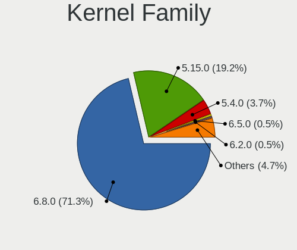
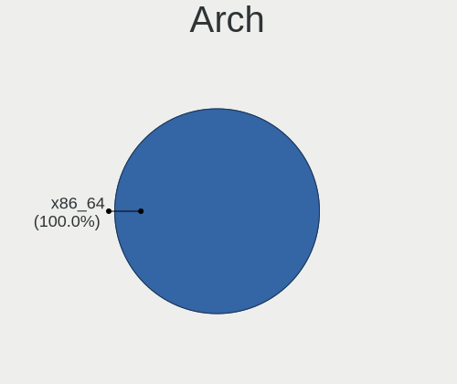
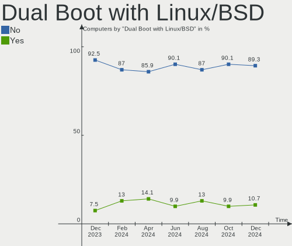
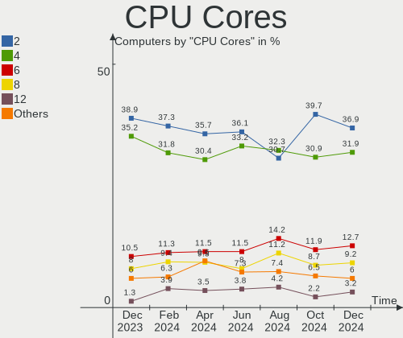
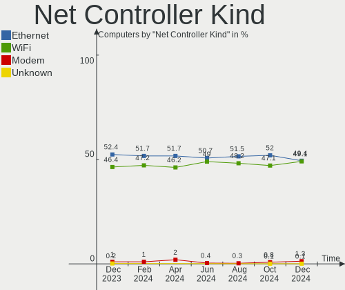
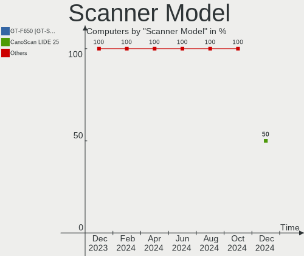

Linux Mint - Hardware Trends
----------------------------

A project to identify most popular hardware characteristics and track their change
over time based on data collected by Linux users at https://Linux-Hardware.org.

Anyone can contribute to this report by the [hw-probe](https://github.com/linuxhw/hw-probe) tool:

    sudo -E hw-probe -all -upload

This is a report for all computer types. See also reports for [desktops](/Dist/Linux_Mint/Desktop/README.md) and [notebooks](/Dist/Linux_Mint/Notebook/README.md).

This report is for one last month. Overall report since the beginning of time: [TestDays](https://github.com/linuxhw/TestDays)

Period: Jul, 2023.

Contents
--------

* [ System ](#system)
  - [ OS                       ](#os)
  - [ OS Family                ](#os-family)
  - [ Kernel                   ](#kernel)
  - [ Kernel Family            ](#kernel-family)
  - [ Kernel Major Ver.        ](#kernel-major-ver)
  - [ Arch                     ](#arch)
  - [ DE                       ](#de)
  - [ Display Server           ](#display-server)
  - [ Display Manager          ](#display-manager)
  - [ OS Lang                  ](#os-lang)
  - [ Boot Mode                ](#boot-mode)
  - [ Filesystem               ](#filesystem)
  - [ Part. scheme             ](#part-scheme)
  - [ Dual Boot with Linux/BSD ](#dual-boot-with-linuxbsd)
  - [ Dual Boot (Win)          ](#dual-boot-win)

* [ Board ](#board)
  - [ Vendor                   ](#vendor)
  - [ Model                    ](#model)
  - [ Model Family             ](#model-family)
  - [ MFG Year                 ](#mfg-year)
  - [ Form Factor              ](#form-factor)
  - [ Secure Boot              ](#secure-boot)
  - [ Coreboot                 ](#coreboot)
  - [ RAM Size                 ](#ram-size)
  - [ RAM Used                 ](#ram-used)
  - [ Total Drives             ](#total-drives)
  - [ Has CD-ROM               ](#has-cd-rom)
  - [ Has Ethernet             ](#has-ethernet)
  - [ Has WiFi                 ](#has-wifi)
  - [ Has Bluetooth            ](#has-bluetooth)

* [ Location ](#location)
  - [ Country                  ](#country)
  - [ City                     ](#city)

* [ Drives ](#drives)
  - [ Drive Vendor             ](#drive-vendor)
  - [ Drive Model              ](#drive-model)
  - [ HDD Vendor               ](#hdd-vendor)
  - [ SSD Vendor               ](#ssd-vendor)
  - [ Drive Kind               ](#drive-kind)
  - [ Drive Connector          ](#drive-connector)
  - [ Drive Size               ](#drive-size)
  - [ Space Total              ](#space-total)
  - [ Space Used               ](#space-used)
  - [ Malfunc. Drives          ](#malfunc-drives)
  - [ Malfunc. Drive Vendor    ](#malfunc-drive-vendor)
  - [ Malfunc. HDD Vendor      ](#malfunc-hdd-vendor)
  - [ Malfunc. Drive Kind      ](#malfunc-drive-kind)
  - [ Failed Drives            ](#failed-drives)
  - [ Failed Drive Vendor      ](#failed-drive-vendor)
  - [ Drive Status             ](#drive-status)

* [ Storage controller ](#storage-controller)
  - [ Storage Vendor           ](#storage-vendor)
  - [ Storage Model            ](#storage-model)
  - [ Storage Kind             ](#storage-kind)

* [ Processor ](#processor)
  - [ CPU Vendor               ](#cpu-vendor)
  - [ CPU Model                ](#cpu-model)
  - [ CPU Model Family         ](#cpu-model-family)
  - [ CPU Cores                ](#cpu-cores)
  - [ CPU Sockets              ](#cpu-sockets)
  - [ CPU Threads              ](#cpu-threads)
  - [ CPU Op-Modes             ](#cpu-op-modes)
  - [ CPU Microcode            ](#cpu-microcode)
  - [ CPU Microarch            ](#cpu-microarch)

* [ Graphics ](#graphics)
  - [ GPU Vendor               ](#gpu-vendor)
  - [ GPU Model                ](#gpu-model)
  - [ GPU Combo                ](#gpu-combo)
  - [ GPU Driver               ](#gpu-driver)
  - [ GPU Memory               ](#gpu-memory)

* [ Monitor ](#monitor)
  - [ Monitor Vendor           ](#monitor-vendor)
  - [ Monitor Model            ](#monitor-model)
  - [ Monitor Resolution       ](#monitor-resolution)
  - [ Monitor Diagonal         ](#monitor-diagonal)
  - [ Monitor Width            ](#monitor-width)
  - [ Aspect Ratio             ](#aspect-ratio)
  - [ Monitor Area             ](#monitor-area)
  - [ Pixel Density            ](#pixel-density)
  - [ Multiple Monitors        ](#multiple-monitors)

* [ Network ](#network)
  - [ Net Controller Vendor    ](#net-controller-vendor)
  - [ Net Controller Model     ](#net-controller-model)
  - [ Wireless Vendor          ](#wireless-vendor)
  - [ Wireless Model           ](#wireless-model)
  - [ Ethernet Vendor          ](#ethernet-vendor)
  - [ Ethernet Model           ](#ethernet-model)
  - [ Net Controller Kind      ](#net-controller-kind)
  - [ Used Controller          ](#used-controller)
  - [ NICs                     ](#nics)
  - [ IPv6                     ](#ipv6)

* [ Bluetooth ](#bluetooth)
  - [ Bluetooth Vendor         ](#bluetooth-vendor)
  - [ Bluetooth Model          ](#bluetooth-model)

* [ Sound ](#sound)
  - [ Sound Vendor             ](#sound-vendor)
  - [ Sound Model              ](#sound-model)

* [ Memory ](#memory)
  - [ Memory Vendor            ](#memory-vendor)
  - [ Memory Model             ](#memory-model)
  - [ Memory Kind              ](#memory-kind)
  - [ Memory Form Factor       ](#memory-form-factor)
  - [ Memory Size              ](#memory-size)
  - [ Memory Speed             ](#memory-speed)

* [ Printers & scanners ](#printers--scanners)
  - [ Printer Vendor           ](#printer-vendor)
  - [ Printer Model            ](#printer-model)
  - [ Scanner Vendor           ](#scanner-vendor)
  - [ Scanner Model            ](#scanner-model)

* [ Camera ](#camera)
  - [ Camera Vendor            ](#camera-vendor)
  - [ Camera Model             ](#camera-model)

* [ Security ](#security)
  - [ Fingerprint Vendor       ](#fingerprint-vendor)
  - [ Fingerprint Model        ](#fingerprint-model)
  - [ Chipcard Vendor          ](#chipcard-vendor)
  - [ Chipcard Model           ](#chipcard-model)

* [ Unsupported ](#unsupported)
  - [ Unsupported Devices      ](#unsupported-devices)
  - [ Unsupported Device Types ](#unsupported-device-types)

System
------

OS
--

Installed operating systems

| Name              | Computers | Percent |
|-------------------|-----------|---------|
| Linux Mint 21.1   | 274       | 52.29%  |
| Linux Mint 21.2   | 162       | 30.92%  |
| Linux Mint 20.3   | 45        | 8.59%   |
| Linux Mint 21     | 19        | 3.63%   |
| Linux Mint 20.2   | 9         | 1.72%   |
| Linux Mint 20.1   | 4         | 0.76%   |
| Linux Mint 20     | 4         | 0.76%   |
| Linux Mint 19.3   | 3         | 0.57%   |
| Linux Mint 21.2.0 | 2         | 0.38%   |
| Linux Mint 19.2   | 1         | 0.19%   |
| Linux Mint 18.3   | 1         | 0.19%   |

OS Family
---------

OS without a version

| Name       | Computers | Percent |
|------------|-----------|---------|
| Linux Mint | 524       | 100%    |

Kernel
------

Version of the Linux kernel

| Version                       | Computers | Percent |
|-------------------------------|-----------|---------|
| 5.15.0-76-generic             | 273       | 52.1%   |
| 5.15.0-78-generic             | 73        | 13.93%  |
| 5.4.0-153-generic             | 35        | 6.68%   |
| 5.19.0-46-generic             | 23        | 4.39%   |
| 5.15.0-56-generic             | 23        | 4.39%   |
| 5.15.0-75-generic             | 12        | 2.29%   |
| 6.2.0-26-generic              | 7         | 1.34%   |
| 6.4.3-060403-generic          | 6         | 1.15%   |
| 6.2.0-25-generic              | 6         | 1.15%   |
| 5.15.0-73-generic             | 6         | 1.15%   |
| 5.4.0-155-generic             | 5         | 0.95%   |
| 6.1.0-1016-oem                | 4         | 0.76%   |
| 5.15.0-72-generic             | 4         | 0.76%   |
| 5.15.0-69-generic             | 4         | 0.76%   |
| 6.4.6-060406-generic          | 3         | 0.57%   |
| 5.4.0-74-generic              | 3         | 0.57%   |
| 5.4.0-150-generic             | 3         | 0.57%   |
| 5.19.0-43-generic             | 3         | 0.57%   |
| 5.15.0-67-generic             | 3         | 0.57%   |
| 6.4.0-060400-generic          | 2         | 0.38%   |
| 5.4.0-91-generic              | 2         | 0.38%   |
| 5.4.0-144-generic             | 2         | 0.38%   |
| 6.5.0-060500rc3-generic       | 1         | 0.19%   |
| 6.4.5-x64v1-xanmod1           | 1         | 0.19%   |
| 6.4.2-060402-generic          | 1         | 0.19%   |
| 6.3.4-060304-generic          | 1         | 0.19%   |
| 6.1.0-1017-oem                | 1         | 0.19%   |
| 6.1.0-1015-oem                | 1         | 0.19%   |
| 6.1.0-1013-oem                | 1         | 0.19%   |
| 6.0.0-1020-oem                | 1         | 0.19%   |
| 5.4.0-88-generic              | 1         | 0.19%   |
| 5.4.0-73-generic              | 1         | 0.19%   |
| 5.4.0-152-generic             | 1         | 0.19%   |
| 5.4.0-117-generic             | 1         | 0.19%   |
| 5.15.6-051506-generic         | 1         | 0.19%   |
| 5.15.0-76-lowlatency          | 1         | 0.19%   |
| 5.15.0-71-generic             | 1         | 0.19%   |
| 5.15.0-60-generic             | 1         | 0.19%   |
| 5.15.0-522304060810-generic   | 1         | 0.19%   |
| 5.15.0-1007-nvidia-lowlatency | 1         | 0.19%   |

Kernel Family
-------------

Linux kernel without a distro release

| Version | Computers | Percent |
|---------|-----------|---------|
| 5.15.0  | 403       | 76.91%  |
| 5.4.0   | 54        | 10.31%  |
| 5.19.0  | 26        | 4.96%   |
| 6.2.0   | 13        | 2.48%   |
| 6.1.0   | 7         | 1.34%   |
| 6.4.3   | 6         | 1.15%   |
| 6.4.6   | 3         | 0.57%   |
| 6.4.0   | 2         | 0.38%   |
| 4.15.0  | 2         | 0.38%   |
| 6.5.0   | 1         | 0.19%   |
| 6.4.5   | 1         | 0.19%   |
| 6.4.2   | 1         | 0.19%   |
| 6.3.4   | 1         | 0.19%   |
| 6.0.0   | 1         | 0.19%   |
| 5.15.6  | 1         | 0.19%   |
| 5.14.0  | 1         | 0.19%   |
| 5.11.0  | 1         | 0.19%   |

Kernel Major Ver.
-----------------

Linux kernel major version

| Version | Computers | Percent |
|---------|-----------|---------|
| 5.15    | 404       | 77.1%   |
| 5.4     | 54        | 10.31%  |
| 5.19    | 26        | 4.96%   |
| 6.4     | 13        | 2.48%   |
| 6.2     | 13        | 2.48%   |
| 6.1     | 7         | 1.34%   |
| 4.15    | 2         | 0.38%   |
| 6.5     | 1         | 0.19%   |
| 6.3     | 1         | 0.19%   |
| 6.0     | 1         | 0.19%   |
| 5.14    | 1         | 0.19%   |
| 5.11    | 1         | 0.19%   |

Arch
----

OS architecture (x86_64, i586, etc.)

| Name   | Computers | Percent |
|--------|-----------|---------|
| x86_64 | 524       | 100%    |

DE
--

Desktop Environment

| Name       | Computers | Percent |
|------------|-----------|---------|
| X-Cinnamon | 384       | 73.28%  |
| XFCE       | 65        | 12.4%   |
| MATE       | 49        | 9.35%   |
| Cinnamon   | 12        | 2.29%   |
| KDE5       | 6         | 1.15%   |
| GNOME      | 4         | 0.76%   |
| Unknown    | 2         | 0.38%   |
| LXDE       | 1         | 0.19%   |
| Jwm        | 1         | 0.19%   |

Display Server
--------------

X11 or Wayland

| Name    | Computers | Percent |
|---------|-----------|---------|
| X11     | 520       | 99.24%  |
| Wayland | 3         | 0.57%   |
| Tty     | 1         | 0.19%   |

Display Manager
---------------

SDDM, LightDM, etc.

| Name    | Computers | Percent |
|---------|-----------|---------|
| Unknown | 306       | 58.4%   |
| LightDM | 215       | 41.03%  |
| SDDM    | 1         | 0.19%   |
| LXDM    | 1         | 0.19%   |
| GDM3    | 1         | 0.19%   |

OS Lang
-------

Language

| Lang    | Computers | Percent |
|---------|-----------|---------|
| en_US   | 143       | 27.29%  |
| de_DE   | 93        | 17.75%  |
| pt_BR   | 40        | 7.63%   |
| fr_FR   | 26        | 4.96%   |
| en_GB   | 26        | 4.96%   |
| ru_RU   | 18        | 3.44%   |
| en_CA   | 18        | 3.44%   |
| it_IT   | 17        | 3.24%   |
| C       | 15        | 2.86%   |
| es_ES   | 13        | 2.48%   |
| pl_PL   | 11        | 2.1%    |
| en_IN   | 10        | 1.91%   |
| es_MX   | 9         | 1.72%   |
| en_AU   | 7         | 1.34%   |
| nl_NL   | 6         | 1.15%   |
| de_AT   | 6         | 1.15%   |
| cs_CZ   | 6         | 1.15%   |
| sv_SE   | 4         | 0.76%   |
| hu_HU   | 4         | 0.76%   |
| fr_CA   | 4         | 0.76%   |
| es_CO   | 4         | 0.76%   |
| tr_TR   | 3         | 0.57%   |
| nb_NO   | 3         | 0.57%   |
| es_VE   | 3         | 0.57%   |
| es_AR   | 3         | 0.57%   |
| de_CH   | 3         | 0.57%   |
| sk_SK   | 2         | 0.38%   |
| pt_PT   | 2         | 0.38%   |
| nl_BE   | 2         | 0.38%   |
| fi_FI   | 2         | 0.38%   |
| es_PE   | 2         | 0.38%   |
| es_CL   | 2         | 0.38%   |
| en_ZA   | 2         | 0.38%   |
| da_DK   | 2         | 0.38%   |
| Unknown | 2         | 0.38%   |
| zh_CN   | 1         | 0.19%   |
| ru_UA   | 1         | 0.19%   |
| ro_RO   | 1         | 0.19%   |
| lv_LV   | 1         | 0.19%   |
| lt_LT   | 1         | 0.19%   |

Boot Mode
---------

EFI or BIOS

| Mode | Computers | Percent |
|------|-----------|---------|
| EFI  | 337       | 64.31%  |
| BIOS | 187       | 35.69%  |

Filesystem
----------

Type of filesystem

| Type    | Computers | Percent |
|---------|-----------|---------|
| Ext4    | 476       | 90.84%  |
| Btrfs   | 13        | 2.48%   |
| Overlay | 12        | 2.29%   |
| Zfs     | 11        | 2.1%    |
| Tmpfs   | 9         | 1.72%   |
| XXXX    | 1         | 0.19%   |
| Ext3    | 1         | 0.19%   |
| Ext2    | 1         | 0.19%   |

Part. scheme
------------

Scheme of partitioning

| Type    | Computers | Percent |
|---------|-----------|---------|
| Unknown | 304       | 58.02%  |
| GPT     | 192       | 36.64%  |
| MBR     | 28        | 5.34%   |

Dual Boot with Linux/BSD
------------------------

Hosting more than one Linux/BSD

| Dual boot | Computers | Percent |
|-----------|-----------|---------|
| No        | 489       | 93.32%  |
| Yes       | 35        | 6.68%   |

Dual Boot (Win)
---------------

Hosting Linux and Windows

| Dual boot | Computers | Percent |
|-----------|-----------|---------|
| No        | 441       | 84.16%  |
| Yes       | 83        | 15.84%  |

Board
-----

Vendor
------

Motherboard manufacturer

| Name                                 | Computers | Percent |
|--------------------------------------|-----------|---------|
| ASUSTek Computer                     | 77        | 14.69%  |
| Lenovo                               | 73        | 13.93%  |
| Hewlett-Packard                      | 72        | 13.74%  |
| Dell                                 | 58        | 11.07%  |
| Gigabyte Technology                  | 43        | 8.21%   |
| Acer                                 | 37        | 7.06%   |
| MSI                                  | 28        | 5.34%   |
| ASRock                               | 19        | 3.63%   |
| Intel                                | 13        | 2.48%   |
| Apple                                | 12        | 2.29%   |
| Unknown                              | 9         | 1.72%   |
| Toshiba                              | 8         | 1.53%   |
| HUAWEI                               | 6         | 1.15%   |
| Fujitsu                              | 5         | 0.95%   |
| Thomson                              | 4         | 0.76%   |
| Samsung Electronics                  | 4         | 0.76%   |
| Positivo                             | 4         | 0.76%   |
| Multilaser                           | 3         | 0.57%   |
| Supermicro                           | 2         | 0.38%   |
| Sony                                 | 2         | 0.38%   |
| Panasonic                            | 2         | 0.38%   |
| Medion                               | 2         | 0.38%   |
| Google                               | 2         | 0.38%   |
| Gateway                              | 2         | 0.38%   |
| Foxconn                              | 2         | 0.38%   |
| Compaq                               | 2         | 0.38%   |
| Chuwi                                | 2         | 0.38%   |
| Wortmann AG                          | 1         | 0.19%   |
| VANT                                 | 1         | 0.19%   |
| TUXEDO                               | 1         | 0.19%   |
| Timi                                 | 1         | 0.19%   |
| Teclast                              | 1         | 0.19%   |
| System76                             | 1         | 0.19%   |
| Shenzhen Meigao Electronic Equipment | 1         | 0.19%   |
| POWERX                               | 1         | 0.19%   |
| Pegatron                             | 1         | 0.19%   |
| PCChips                              | 1         | 0.19%   |
| PC Specialist                        | 1         | 0.19%   |
| Packard Bell                         | 1         | 0.19%   |
| OEM                                  | 1         | 0.19%   |

Model
-----

Motherboard model

| Name                       | Computers | Percent |
|----------------------------|-----------|---------|
| Unknown                    | 12        | 2.29%   |
| MSI MS-7C56                | 3         | 0.57%   |
| HUAWEI BOM-WXX9            | 3         | 0.57%   |
| Dell OptiPlex 7050         | 3         | 0.57%   |
| ASRock B450M Pro4          | 3         | 0.57%   |
| Thomson N15C4SL128         | 2         | 0.38%   |
| MSI MS-7C91                | 2         | 0.38%   |
| MSI MS-7B93                | 2         | 0.38%   |
| Lenovo V15 G2 ALC 82KD     | 2         | 0.38%   |
| Lenovo MIIX 320-10ICR 80XF | 2         | 0.38%   |
| Lenovo G550 2958           | 2         | 0.38%   |
| Lenovo C205                | 2         | 0.38%   |
| Intel H61                  | 2         | 0.38%   |
| Intel H55                  | 2         | 0.38%   |
| HP Pavilion 15             | 2         | 0.38%   |
| HP Laptop 17-cp0xxx        | 2         | 0.38%   |
| HP EliteBook 840 G5        | 2         | 0.38%   |
| Gigabyte 970A-DS3P         | 2         | 0.38%   |
| Dell OptiPlex 790          | 2         | 0.38%   |
| Dell OptiPlex 760          | 2         | 0.38%   |
| Dell Latitude E6540        | 2         | 0.38%   |
| Dell Latitude 5480         | 2         | 0.38%   |
| Dell Inspiron 5570         | 2         | 0.38%   |
| ASUS X555LAB               | 2         | 0.38%   |
| ASUS MINIPC PN50-E1        | 2         | 0.38%   |
| ASUS M5A78L-M/USB3         | 2         | 0.38%   |
| ASUS All Series            | 2         | 0.38%   |
| Acer Swift SF515-51T       | 2         | 0.38%   |
| Acer Aspire A515-52G       | 2         | 0.38%   |
| Wortmann AG CR700          | 1         | 0.19%   |
| VANT MOOVE15_2023          | 1         | 0.19%   |
| Toshiba Satellite S855     | 1         | 0.19%   |
| Toshiba Satellite S55-A    | 1         | 0.19%   |
| Toshiba Satellite P500     | 1         | 0.19%   |
| Toshiba Satellite L755     | 1         | 0.19%   |
| Toshiba Satellite C850-1MN | 1         | 0.19%   |
| Toshiba Satellite C660     | 1         | 0.19%   |
| Toshiba PORTEGE R30-C      | 1         | 0.19%   |
| Toshiba PORTEGE M700       | 1         | 0.19%   |
| Timi RedmiBook 16          | 1         | 0.19%   |

Model Family
------------

Motherboard model prefix

| Name               | Computers | Percent |
|--------------------|-----------|---------|
| Acer Aspire        | 27        | 5.15%   |
| Lenovo ThinkPad    | 23        | 4.39%   |
| Dell Latitude      | 18        | 3.44%   |
| Dell OptiPlex      | 15        | 2.86%   |
| Lenovo IdeaPad     | 14        | 2.67%   |
| HP Pavilion        | 13        | 2.48%   |
| Dell Inspiron      | 12        | 2.29%   |
| Unknown            | 12        | 2.29%   |
| HP Laptop          | 11        | 2.1%    |
| Lenovo ThinkCentre | 8         | 1.53%   |
| HP ProBook         | 8         | 1.53%   |
| HP EliteBook       | 8         | 1.53%   |
| ASUS VivoBook      | 8         | 1.53%   |
| ASUS ROG           | 8         | 1.53%   |
| ASUS PRIME         | 7         | 1.34%   |
| Toshiba Satellite  | 6         | 1.15%   |
| Dell Vostro        | 5         | 0.95%   |
| ASUS Zenbook       | 5         | 0.95%   |
| Acer Swift         | 5         | 0.95%   |
| Lenovo V15         | 4         | 0.76%   |
| Lenovo IdeaCentre  | 4         | 0.76%   |
| HP ProDesk         | 4         | 0.76%   |
| HP Compaq          | 4         | 0.76%   |
| ASUS M5A78L-M      | 4         | 0.76%   |
| MSI MS-7C56        | 3         | 0.57%   |
| Lenovo IdeaPadFlex | 3         | 0.57%   |
| HUAWEI BOM-WXX9    | 3         | 0.57%   |
| HP ENVY            | 3         | 0.57%   |
| Fujitsu ESPRIMO    | 3         | 0.57%   |
| ASUS TUF           | 3         | 0.57%   |
| ASUS MINIPC        | 3         | 0.57%   |
| ASRock B450M       | 3         | 0.57%   |
| Apple MacBookPro11 | 3         | 0.57%   |
| Toshiba PORTEGE    | 2         | 0.38%   |
| Thomson N15C4SL128 | 2         | 0.38%   |
| MSI MS-7C91        | 2         | 0.38%   |
| MSI MS-7B93        | 2         | 0.38%   |
| Lenovo Yoga        | 2         | 0.38%   |
| Lenovo MIIX        | 2         | 0.38%   |
| Lenovo G550        | 2         | 0.38%   |

MFG Year
--------

Motherboard manufacture year

| Year | Computers | Percent |
|------|-----------|---------|
| 2021 | 54        | 10.31%  |
| 2017 | 44        | 8.4%    |
| 2011 | 44        | 8.4%    |
| 2018 | 43        | 8.21%   |
| 2013 | 42        | 8.02%   |
| 2022 | 39        | 7.44%   |
| 2020 | 36        | 6.87%   |
| 2012 | 32        | 6.11%   |
| 2010 | 32        | 6.11%   |
| 2019 | 29        | 5.53%   |
| 2016 | 23        | 4.39%   |
| 2014 | 23        | 4.39%   |
| 2015 | 22        | 4.2%    |
| 2009 | 22        | 4.2%    |
| 2007 | 15        | 2.86%   |
| 2023 | 13        | 2.48%   |
| 2008 | 10        | 1.91%   |
| 2006 | 1         | 0.19%   |

Form Factor
-----------

Physical design of the computer

| Name        | Computers | Percent |
|-------------|-----------|---------|
| Notebook    | 268       | 51.15%  |
| Desktop     | 217       | 41.41%  |
| Convertible | 12        | 2.29%   |
| Mini pc     | 9         | 1.72%   |
| All in one  | 9         | 1.72%   |
| Tablet      | 6         | 1.15%   |
| Server      | 3         | 0.57%   |

Secure Boot
-----------

Enabled or disabled

| State    | Computers | Percent |
|----------|-----------|---------|
| Disabled | 496       | 94.66%  |
| Enabled  | 28        | 5.34%   |

Coreboot
--------

Have coreboot on board

| Used | Computers | Percent |
|------|-----------|---------|
| No   | 522       | 99.62%  |
| Yes  | 2         | 0.38%   |

RAM Size
--------

Total RAM memory

| Size in GB      | Computers | Percent |
|-----------------|-----------|---------|
| 4.01-8.0        | 154       | 29.39%  |
| 3.01-4.0        | 97        | 18.51%  |
| 8.01-16.0       | 93        | 17.75%  |
| 16.01-24.0      | 92        | 17.56%  |
| 32.01-64.0      | 41        | 7.82%   |
| 64.01-256.0     | 18        | 3.44%   |
| 1.01-2.0        | 16        | 3.05%   |
| 24.01-32.0      | 7         | 1.34%   |
| 2.01-3.0        | 4         | 0.76%   |
| More than 256.0 | 1         | 0.19%   |
| 0.51-1.0        | 1         | 0.19%   |

RAM Used
--------

Used RAM memory

| Used GB    | Computers | Percent |
|------------|-----------|---------|
| 1.01-2.0   | 198       | 37.79%  |
| 2.01-3.0   | 163       | 31.11%  |
| 3.01-4.0   | 67        | 12.79%  |
| 4.01-8.0   | 60        | 11.45%  |
| 8.01-16.0  | 16        | 3.05%   |
| 0.51-1.0   | 14        | 2.67%   |
| 32.01-64.0 | 2         | 0.38%   |
| 16.01-24.0 | 2         | 0.38%   |
| 0.01-0.5   | 2         | 0.38%   |

Total Drives
------------

Number of drives on board

| Drives | Computers | Percent |
|--------|-----------|---------|
| 1      | 287       | 54.77%  |
| 2      | 134       | 25.57%  |
| 3      | 56        | 10.69%  |
| 4      | 23        | 4.39%   |
| 5      | 15        | 2.86%   |
| 6      | 4         | 0.76%   |
| 0      | 3         | 0.57%   |
| 7      | 2         | 0.38%   |

Has CD-ROM
----------

Has CD-ROM on board

| Presented | Computers | Percent |
|-----------|-----------|---------|
| No        | 302       | 57.63%  |
| Yes       | 222       | 42.37%  |

Has Ethernet
------------

Has Ethernet on board

| Presented | Computers | Percent |
|-----------|-----------|---------|
| Yes       | 448       | 85.5%   |
| No        | 76        | 14.5%   |

Has WiFi
--------

Has WiFi module

| Presented | Computers | Percent |
|-----------|-----------|---------|
| Yes       | 399       | 76.15%  |
| No        | 125       | 23.85%  |

Has Bluetooth
-------------

Has Bluetooth module

| Presented | Computers | Percent |
|-----------|-----------|---------|
| Yes       | 301       | 57.44%  |
| No        | 223       | 42.56%  |

Location
--------

Country
-------

Geographic location (country)

| Country      | Computers | Percent |
|--------------|-----------|---------|
| Germany      | 103       | 19.66%  |
| USA          | 92        | 17.56%  |
| Brazil       | 48        | 9.16%   |
| UK           | 28        | 5.34%   |
| France       | 25        | 4.77%   |
| Canada       | 20        | 3.82%   |
| Italy        | 18        | 3.44%   |
| Russia       | 16        | 3.05%   |
| Spain        | 13        | 2.48%   |
| Netherlands  | 13        | 2.48%   |
| Poland       | 12        | 2.29%   |
| Mexico       | 11        | 2.1%    |
| India        | 10        | 1.91%   |
| Sweden       | 8         | 1.53%   |
| Australia    | 7         | 1.34%   |
| Czechia      | 6         | 1.15%   |
| Austria      | 6         | 1.15%   |
| Switzerland  | 5         | 0.95%   |
| Norway       | 5         | 0.95%   |
| Hungary      | 5         | 0.95%   |
| Belgium      | 5         | 0.95%   |
| Turkey       | 4         | 0.76%   |
| Romania      | 4         | 0.76%   |
| Colombia     | 4         | 0.76%   |
| Venezuela    | 3         | 0.57%   |
| Slovakia     | 3         | 0.57%   |
| Latvia       | 3         | 0.57%   |
| Finland      | 3         | 0.57%   |
| Denmark      | 3         | 0.57%   |
| Argentina    | 3         | 0.57%   |
| South Africa | 2         | 0.38%   |
| Portugal     | 2         | 0.38%   |
| Peru         | 2         | 0.38%   |
| Lithuania    | 2         | 0.38%   |
| Israel       | 2         | 0.38%   |
| Indonesia    | 2         | 0.38%   |
| Greece       | 2         | 0.38%   |
| Egypt        | 2         | 0.38%   |
| Chile        | 2         | 0.38%   |
| Bulgaria     | 2         | 0.38%   |

City
----

Geographic location (city)

| City              | Computers | Percent |
|-------------------|-----------|---------|
| Berlin            | 8         | 1.53%   |
| Rio de Janeiro    | 5         | 0.95%   |
| Montreal          | 5         | 0.95%   |
| Los Angeles       | 5         | 0.95%   |
| Dresden           | 5         | 0.95%   |
| Vienna            | 4         | 0.76%   |
| Paris             | 4         | 0.76%   |
| Zurich            | 3         | 0.57%   |
| Warsaw            | 3         | 0.57%   |
| Sydney            | 3         | 0.57%   |
| Prague            | 3         | 0.57%   |
| Moscow            | 3         | 0.57%   |
| Milan             | 3         | 0.57%   |
| Mexico City       | 3         | 0.57%   |
| Lemgo             | 3         | 0.57%   |
| Karlsruhe         | 3         | 0.57%   |
| Helsinki          | 3         | 0.57%   |
| Frankfurt am Main | 3         | 0.57%   |
| Dortmund          | 3         | 0.57%   |
| Cologne           | 3         | 0.57%   |
| Bornheim          | 3         | 0.57%   |
| Bielefeld         | 3         | 0.57%   |
| Bendorf           | 3         | 0.57%   |
| Winnipeg          | 2         | 0.38%   |
| Wheaton           | 2         | 0.38%   |
| Vilnius           | 2         | 0.38%   |
| Vancouver         | 2         | 0.38%   |
| Telford           | 2         | 0.38%   |
| Swindon           | 2         | 0.38%   |
| Sao Paulo         | 2         | 0.38%   |
| Saarbrücken      | 2         | 0.38%   |
| Richardson        | 2         | 0.38%   |
| Porto Alegre      | 2         | 0.38%   |
| Pittsburgh        | 2         | 0.38%   |
| Pirna             | 2         | 0.38%   |
| Phoenix           | 2         | 0.38%   |
| Nyiregyhaza       | 2         | 0.38%   |
| Muncie            | 2         | 0.38%   |
| Mangalore         | 2         | 0.38%   |
| Madrid            | 2         | 0.38%   |

Drives
------

Drive Vendor
------------

Hard drive vendors

| Vendor                      | Computers | Drives | Percent |
|-----------------------------|-----------|--------|---------|
| WDC                         | 121       | 132    | 14.96%  |
| Seagate                     | 115       | 143    | 14.22%  |
| Samsung Electronics         | 112       | 140    | 13.84%  |
| Kingston                    | 56        | 59     | 6.92%   |
| SanDisk                     | 48        | 56     | 5.93%   |
| Toshiba                     | 37        | 43     | 4.57%   |
| Unknown                     | 31        | 38     | 3.83%   |
| Crucial                     | 28        | 28     | 3.46%   |
| Hitachi                     | 25        | 26     | 3.09%   |
| China                       | 22        | 22     | 2.72%   |
| Intel                       | 18        | 19     | 2.22%   |
| A-DATA Technology           | 12        | 12     | 1.48%   |
| SK hynix                    | 11        | 11     | 1.36%   |
| Silicon Motion              | 11        | 11     | 1.36%   |
| Micron/Crucial Technology   | 11        | 12     | 1.36%   |
| Micron Technology           | 11        | 11     | 1.36%   |
| Kingston Technology Company | 8         | 9      | 0.99%   |
| Intenso                     | 8         | 10     | 0.99%   |
| HGST                        | 8         | 8      | 0.99%   |
| KIOXIA                      | 7         | 7      | 0.87%   |
| SPCC                        | 6         | 7      | 0.74%   |
| Apple                       | 6         | 7      | 0.74%   |
| Team                        | 5         | 6      | 0.62%   |
| Phison Electronics          | 5         | 5      | 0.62%   |
| Unknown                     | 5         | 6      | 0.62%   |
| Patriot                     | 4         | 4      | 0.49%   |
| JMicron Technology          | 4         | 4      | 0.49%   |
| Verbatim                    | 3         | 3      | 0.37%   |
| Transcend                   | 3         | 3      | 0.37%   |
| Realtek Semiconductor       | 3         | 3      | 0.37%   |
| PNY                         | 3         | 4      | 0.37%   |
| Netac                       | 3         | 4      | 0.37%   |
| KingSpec                    | 3         | 7      | 0.37%   |
| FORESEE                     | 3         | 3      | 0.37%   |
| XrayDisk                    | 2         | 2      | 0.25%   |
| Maxtor                      | 2         | 2      | 0.25%   |
| Hewlett-Packard             | 2         | 2      | 0.25%   |
| GOODRAM                     | 2         | 2      | 0.25%   |
| Fujitsu                     | 2         | 2      | 0.25%   |
| Emtec                       | 2         | 2      | 0.25%   |

Drive Model
-----------

Hard drive models

| Model                                                 | Computers | Percent |
|-------------------------------------------------------|-----------|---------|
| Kingston SA400S37240G 240GB SSD                       | 14        | 1.58%   |
| Kingston SA400S37480G 480GB SSD                       | 11        | 1.24%   |
| Seagate ST1000DM010-2EP102 1TB                        | 8         | 0.9%    |
| Micron/Crucial P2 NVMe PCIe SSD 1TB                   | 8         | 0.9%    |
| Seagate ST2000DM008-2FR102 2TB                        | 6         | 0.68%   |
| Seagate ST1000LM035-1RK172 1TB                        | 6         | 0.68%   |
| Seagate Expansion 1TB                                 | 6         | 0.68%   |
| Samsung SSD 850 EVO 500GB                             | 6         | 0.68%   |
| Samsung NVMe SSD Controller PM9A1/PM9A3/980PRO 1TB    | 6         | 0.68%   |
| Kingston SA400S37120G 120GB SSD                       | 6         | 0.68%   |
| Unknown MMC Card  64GB                                | 5         | 0.56%   |
| Unknown MMC Card  32GB                                | 5         | 0.56%   |
| Silicon Motion SM2263EN/SM2263XT SSD Controller 500GB | 5         | 0.56%   |
| Seagate ST1000DM003-1ER162 1TB                        | 5         | 0.56%   |
| Seagate Expansion Desk 8TB                            | 5         | 0.56%   |
| Samsung SSD 970 EVO Plus 1TB                          | 5         | 0.56%   |
| Samsung SSD 860 EVO 500GB                             | 5         | 0.56%   |
| Samsung SSD 850 EVO 250GB                             | 5         | 0.56%   |
| Unknown                                               | 5         | 0.56%   |
| Unknown MMC Card  128GB                               | 4         | 0.45%   |
| Toshiba MQ04ABF100 1TB                                | 4         | 0.45%   |
| Toshiba MQ01ABD100 1TB                                | 4         | 0.45%   |
| Seagate ST3500418AS 500GB                             | 4         | 0.45%   |
| SanDisk SSD PLUS 240GB                                | 4         | 0.45%   |
| Samsung SSD 870 EVO 2TB                               | 4         | 0.45%   |
| Samsung SSD 860 EVO 1TB                               | 4         | 0.45%   |
| Samsung NVMe SSD Controller SM981/PM981/PM983 500GB   | 4         | 0.45%   |
| Samsung HD322HJ 320GB                                 | 4         | 0.45%   |
| Kingston SV300S37A120G 120GB SSD                      | 4         | 0.45%   |
| Intel SSD 660P Series 1024GB                          | 4         | 0.45%   |
| WDC WDS500G2B0A-00SM50 500GB SSD                      | 3         | 0.34%   |
| Unknown SD/MMC/MS PRO 128GB                           | 3         | 0.34%   |
| SPCC Solid State Disk 512GB                           | 3         | 0.34%   |
| Seagate ST500LT012-9WS142 500GB                       | 3         | 0.34%   |
| Seagate ST500LM000-SSHD-8GB                           | 3         | 0.34%   |
| Seagate ST500DM002-1BD142 500GB                       | 3         | 0.34%   |
| Seagate ST4000DM000-1F2168 4TB                        | 3         | 0.34%   |
| Seagate ST3500312CS 500GB                             | 3         | 0.34%   |
| Seagate ST1000LM024 HN-M101MBB 1TB                    | 3         | 0.34%   |
| Sandisk WD Blue SN570 500GB                           | 3         | 0.34%   |

HDD Vendor
----------

Hard disk drive vendors

| Vendor              | Computers | Drives | Percent |
|---------------------|-----------|--------|---------|
| Seagate             | 112       | 137    | 36.6%   |
| WDC                 | 97        | 107    | 31.7%   |
| Toshiba             | 26        | 30     | 8.5%    |
| Hitachi             | 25        | 26     | 8.17%   |
| Samsung Electronics | 16        | 16     | 5.23%   |
| HGST                | 8         | 8      | 2.61%   |
| Unknown             | 4         | 4      | 1.31%   |
| JMicron Technology  | 3         | 3      | 0.98%   |
| Apple               | 3         | 3      | 0.98%   |
| Maxtor              | 2         | 2      | 0.65%   |
| Fujitsu             | 2         | 2      | 0.65%   |
| PHD 3.0             | 1         | 1      | 0.33%   |
| MDT                 | 1         | 1      | 0.33%   |
| LaCie               | 1         | 1      | 0.33%   |
| Intenso             | 1         | 1      | 0.33%   |
| HPE                 | 1         | 1      | 0.33%   |
| Hewlett-Packard     | 1         | 1      | 0.33%   |
| China               | 1         | 1      | 0.33%   |
| ASMT                | 1         | 1      | 0.33%   |

SSD Vendor
----------

Solid state drive vendors

| Vendor              | Computers | Drives | Percent |
|---------------------|-----------|--------|---------|
| Samsung Electronics | 61        | 68     | 20.47%  |
| Kingston            | 50        | 52     | 16.78%  |
| SanDisk             | 29        | 30     | 9.73%   |
| Crucial             | 23        | 23     | 7.72%   |
| China               | 20        | 20     | 6.71%   |
| WDC                 | 14        | 14     | 4.7%    |
| A-DATA Technology   | 12        | 12     | 4.03%   |
| Intel               | 7         | 7      | 2.35%   |
| Micron Technology   | 6         | 6      | 2.01%   |
| Intenso             | 6         | 7      | 2.01%   |
| Toshiba             | 5         | 5      | 1.68%   |
| Team                | 5         | 5      | 1.68%   |
| SPCC                | 5         | 6      | 1.68%   |
| Verbatim            | 3         | 3      | 1.01%   |
| Transcend           | 3         | 3      | 1.01%   |
| PNY                 | 3         | 4      | 1.01%   |
| Patriot             | 3         | 3      | 1.01%   |
| KingSpec            | 3         | 7      | 1.01%   |
| Apple               | 3         | 3      | 1.01%   |
| Netac               | 2         | 3      | 0.67%   |
| GOODRAM             | 2         | 2      | 0.67%   |
| FORESEE             | 2         | 2      | 0.67%   |
| Emtec               | 2         | 2      | 0.67%   |
| Unknown             | 2         | 2      | 0.67%   |
| WODPOSIT            | 1         | 2      | 0.34%   |
| Vaseky              | 1         | 1      | 0.34%   |
| tecmiyo             | 1         | 1      | 0.34%   |
| Teclast             | 1         | 1      | 0.34%   |
| Tanbassh            | 1         | 1      | 0.34%   |
| T-FORCE             | 1         | 1      | 0.34%   |
| Supersonic          | 1         | 1      | 0.34%   |
| Super Talent        | 1         | 1      | 0.34%   |
| SSSTC               | 1         | 1      | 0.34%   |
| Seagate             | 1         | 1      | 0.34%   |
| Plextor             | 1         | 1      | 0.34%   |
| Pioneer             | 1         | 1      | 0.34%   |
| OCZ                 | 1         | 1      | 0.34%   |
| Mushkin             | 1         | 1      | 0.34%   |
| MII                 | 1         | 1      | 0.34%   |
| LITEON              | 1         | 1      | 0.34%   |

Drive Kind
----------

HDD or SSD

| Kind    | Computers | Drives | Percent |
|---------|-----------|--------|---------|
| SSD     | 266       | 318    | 36.29%  |
| HDD     | 253       | 346    | 34.52%  |
| NVMe    | 169       | 197    | 23.06%  |
| MMC     | 28        | 33     | 3.82%   |
| Unknown | 17        | 25     | 2.32%   |

Drive Connector
---------------

SATA, SAS, NVMe, etc.

| Type | Computers | Drives | Percent |
|------|-----------|--------|---------|
| SATA | 414       | 628    | 62.82%  |
| NVMe | 168       | 195    | 25.49%  |
| SAS  | 49        | 63     | 7.44%   |
| MMC  | 28        | 33     | 4.25%   |

Drive Size
----------

Size of hard drive

| Size in TB | Computers | Drives | Percent |
|------------|-----------|--------|---------|
| 0.01-0.5   | 299       | 388    | 55.89%  |
| 0.51-1.0   | 151       | 174    | 28.22%  |
| 1.01-2.0   | 42        | 47     | 7.85%   |
| 3.01-4.0   | 21        | 27     | 3.93%   |
| 4.01-10.0  | 14        | 20     | 2.62%   |
| 2.01-3.0   | 6         | 6      | 1.12%   |
| 10.01-20.0 | 2         | 2      | 0.37%   |

Space Total
-----------

Amount of disk space available on the file system

| Size in GB     | Computers | Percent |
|----------------|-----------|---------|
| 101-250        | 153       | 29.2%   |
| 251-500        | 129       | 24.62%  |
| 501-1000       | 75        | 14.31%  |
| More than 3000 | 44        | 8.4%    |
| 1001-2000      | 43        | 8.21%   |
| 51-100         | 25        | 4.77%   |
| 2001-3000      | 19        | 3.63%   |
| 21-50          | 16        | 3.05%   |
| 1-20           | 11        | 2.1%    |
| Unknown        | 9         | 1.72%   |

Space Used
----------

Amount of used disk space

| Used GB        | Computers | Percent |
|----------------|-----------|---------|
| 1-20           | 108       | 20.61%  |
| 101-250        | 104       | 19.85%  |
| 21-50          | 98        | 18.7%   |
| 51-100         | 79        | 15.08%  |
| 251-500        | 51        | 9.73%   |
| 501-1000       | 33        | 6.3%    |
| More than 3000 | 18        | 3.44%   |
| 1001-2000      | 16        | 3.05%   |
| Unknown        | 9         | 1.72%   |
| 2001-3000      | 8         | 1.53%   |

Malfunc. Drives
---------------

Drive models with a malfunction

| Model                                                           | Computers | Drives | Percent |
|-----------------------------------------------------------------|-----------|--------|---------|
| Toshiba MQ01ABD100 1TB                                          | 2         | 2      | 3.57%   |
| Samsung Electronics SSD 970 EVO Plus 1TB                        | 2         | 3      | 3.57%   |
| Samsung Electronics HD322HJ 320GB                               | 2         | 2      | 3.57%   |
| WDC WD800AAJB-00J3A0 80GB                                       | 1         | 1      | 1.79%   |
| WDC WD6400AAKS-22A7B2 640GB                                     | 1         | 1      | 1.79%   |
| WDC WD5003ABYX-01WERA1 500GB                                    | 1         | 1      | 1.79%   |
| WDC WD5000BEKT-60KA9T0 500GB                                    | 1         | 1      | 1.79%   |
| WDC WD5000AVDS-63U7B1 500GB                                     | 1         | 1      | 1.79%   |
| WDC WD5000AAKX-08ERMA0 500GB                                    | 1         | 1      | 1.79%   |
| WDC WD30EFRX-68EUZN0 3TB                                        | 1         | 1      | 1.79%   |
| WDC WD2500AAJS-00VTA0 250GB                                     | 1         | 1      | 1.79%   |
| WDC WD20EARS-00J2GB0 2TB                                        | 1         | 1      | 1.79%   |
| WDC WD1200BB-22GUA0 120GB                                       | 1         | 1      | 1.79%   |
| WDC WD10SPZX-60Z10T0 1TB                                        | 1         | 1      | 1.79%   |
| WDC WD10EZRX-22A3KB0 1TB                                        | 1         | 1      | 1.79%   |
| WDC WD10EARS-00Y5B1 1TB                                         | 1         | 1      | 1.79%   |
| tecmiyo SATA SSD 128GB                                          | 1         | 1      | 1.79%   |
| Supersonic SSD 256 256GB                                        | 1         | 1      | 1.79%   |
| SSSTC CV8-8E128-HP 128GB SSD                                    | 1         | 1      | 1.79%   |
| Seagate ST9750420AS 752GB                                       | 1         | 1      | 1.79%   |
| Seagate ST9250410ASG 250GB                                      | 1         | 1      | 1.79%   |
| Seagate ST500DM002-1BD142 500GB                                 | 1         | 1      | 1.79%   |
| Seagate ST3250410AS 250GB                                       | 1         | 1      | 1.79%   |
| Seagate ST2000DM001-1CH164 2TB                                  | 1         | 1      | 1.79%   |
| Seagate ST1000LM035-1RK172 1TB                                  | 1         | 1      | 1.79%   |
| Seagate ST1000DM003-1SB102 1TB                                  | 1         | 1      | 1.79%   |
| Samsung Electronics PM9A1 NVMe 2048GB                           | 1         | 2      | 1.79%   |
| Samsung Electronics NVMe SSD Controller SM981/PM981/PM983 500GB | 1         | 2      | 1.79%   |
| Samsung Electronics MZNLH128HBHQ-000H1 128GB SSD                | 1         | 1      | 1.79%   |
| Samsung Electronics HM160HC 160GB                               | 1         | 1      | 1.79%   |
| Samsung Electronics HD502HI 500GB                               | 1         | 1      | 1.79%   |
| Samsung Electronics HD501LJ 500GB                               | 1         | 1      | 1.79%   |
| PNY CS1311 240GB SSD                                            | 1         | 1      | 1.79%   |
| MDT MD6400AAKS-00A7B0 640GB                                     | 1         | 1      | 1.79%   |
| Kingston SA400S37480G 480GB SSD                                 | 1         | 1      | 1.79%   |
| KingSpec Q-360 360GB SSD                                        | 1         | 1      | 1.79%   |
| Intel SSDSC2KF128G8L 128GB                                      | 1         | 1      | 1.79%   |
| Intel SSDSC2CW120A3 120GB                                       | 1         | 1      | 1.79%   |
| Intel SSDPEKKW512G7 512GB                                       | 1         | 1      | 1.79%   |
| Hitachi HTS723216L9SA60 160GB                                   | 1         | 1      | 1.79%   |

Malfunc. Drive Vendor
---------------------

Vendors of faulty drives

| Vendor              | Computers | Drives | Percent |
|---------------------|-----------|--------|---------|
| WDC                 | 11        | 13     | 20.37%  |
| Samsung Electronics | 10        | 13     | 18.52%  |
| Seagate             | 7         | 7      | 12.96%  |
| Hitachi             | 6         | 6      | 11.11%  |
| Intel               | 3         | 3      | 5.56%   |
| Toshiba             | 2         | 2      | 3.7%    |
| HGST                | 2         | 2      | 3.7%    |
| Crucial             | 2         | 2      | 3.7%    |
| China               | 2         | 2      | 3.7%    |
| tecmiyo             | 1         | 1      | 1.85%   |
| Supersonic          | 1         | 1      | 1.85%   |
| SSSTC               | 1         | 1      | 1.85%   |
| PNY                 | 1         | 1      | 1.85%   |
| MDT                 | 1         | 1      | 1.85%   |
| Kingston            | 1         | 1      | 1.85%   |
| KingSpec            | 1         | 1      | 1.85%   |
| Fujitsu             | 1         | 1      | 1.85%   |
| ASMT                | 1         | 2      | 1.85%   |

Malfunc. HDD Vendor
-------------------

Vendors of faulty HDD drives

| Vendor              | Computers | Drives | Percent |
|---------------------|-----------|--------|---------|
| WDC                 | 11        | 13     | 31.43%  |
| Seagate             | 7         | 7      | 20%     |
| Hitachi             | 6         | 6      | 17.14%  |
| Samsung Electronics | 5         | 5      | 14.29%  |
| Toshiba             | 2         | 2      | 5.71%   |
| HGST                | 2         | 2      | 5.71%   |
| MDT                 | 1         | 1      | 2.86%   |
| Fujitsu             | 1         | 1      | 2.86%   |

Malfunc. Drive Kind
-------------------

Kinds of faulty drives

| Kind | Computers | Drives | Percent |
|------|-----------|--------|---------|
| HDD  | 31        | 37     | 62%     |
| SSD  | 14        | 15     | 28%     |
| NVMe | 5         | 8      | 10%     |

Failed Drives
-------------

Failed drive models

Zero info for selected period =(

Failed Drive Vendor
-------------------

Failed drive vendors

Zero info for selected period =(

Drive Status
------------

Number of failed and malfunc. drives

| Status   | Computers | Drives | Percent |
|----------|-----------|--------|---------|
| Detected | 338       | 594    | 59.82%  |
| Works    | 179       | 265    | 31.68%  |
| Malfunc  | 48        | 60     | 8.5%    |

Storage controller
------------------

Storage Vendor
--------------

Storage controller vendors

| Vendor                       | Computers | Percent |
|------------------------------|-----------|---------|
| Intel                        | 350       | 51.62%  |
| AMD                          | 112       | 16.52%  |
| Samsung Electronics          | 52        | 7.67%   |
| SanDisk                      | 30        | 4.42%   |
| Micron/Crucial Technology    | 16        | 2.36%   |
| Silicon Motion               | 13        | 1.92%   |
| Kingston Technology Company  | 13        | 1.92%   |
| SK hynix                     | 11        | 1.62%   |
| ASMedia Technology           | 11        | 1.62%   |
| JMicron Technology           | 9         | 1.33%   |
| Marvell Technology Group     | 8         | 1.18%   |
| Nvidia                       | 7         | 1.03%   |
| KIOXIA                       | 7         | 1.03%   |
| Toshiba America Info Systems | 6         | 0.88%   |
| Phison Electronics           | 5         | 0.74%   |
| Micron Technology            | 5         | 0.74%   |
| Silicon Image                | 3         | 0.44%   |
| Realtek Semiconductor        | 3         | 0.44%   |
| LSI Logic / Symbios Logic    | 3         | 0.44%   |
| VIA Technologies             | 2         | 0.29%   |
| Seagate Technology           | 2         | 0.29%   |
| MAXIO Technology (Hangzhou)  | 2         | 0.29%   |
| Yangtze Memory Technologies  | 1         | 0.15%   |
| Shenzhen Longsys Electronics | 1         | 0.15%   |
| Netac Technology             | 1         | 0.15%   |
| Lenovo                       | 1         | 0.15%   |
| HighPoint Technologies       | 1         | 0.15%   |
| Broadcom / LSI               | 1         | 0.15%   |
| Artop Electronic             | 1         | 0.15%   |
| Apple                        | 1         | 0.15%   |

Storage Model
-------------

Storage controller models

| Model                                                                          | Computers | Percent |
|--------------------------------------------------------------------------------|-----------|---------|
| AMD FCH SATA Controller [AHCI mode]                                            | 65        | 8.45%   |
| Intel Sunrise Point-LP SATA Controller [AHCI mode]                             | 32        | 4.16%   |
| Intel 7 Series Chipset Family 6-port SATA Controller [AHCI mode]               | 29        | 3.77%   |
| Intel 8 Series/C220 Series Chipset Family 6-port SATA Controller 1 [AHCI mode] | 23        | 2.99%   |
| Intel 6 Series/C200 Series Chipset Family 6 port Desktop SATA AHCI Controller  | 21        | 2.73%   |
| Samsung NVMe SSD Controller SM981/PM981/PM983                                  | 17        | 2.21%   |
| AMD SB7x0/SB8x0/SB9x0 IDE Controller                                           | 17        | 2.21%   |
| Intel 6 Series/C200 Series Chipset Family 6 port Mobile SATA AHCI Controller   | 16        | 2.08%   |
| AMD 500 Series Chipset SATA Controller                                         | 16        | 2.08%   |
| Intel Q170/Q150/B150/H170/H110/Z170/CM236 Chipset SATA Controller [AHCI Mode]  | 14        | 1.82%   |
| Intel 82801 Mobile SATA Controller [RAID mode]                                 | 14        | 1.82%   |
| Samsung NVMe SSD Controller PM9A1/PM9A3/980PRO                                 | 13        | 1.69%   |
| Intel Celeron/Pentium Silver Processor SATA Controller                         | 13        | 1.69%   |
| AMD SB7x0/SB8x0/SB9x0 SATA Controller [AHCI mode]                              | 13        | 1.69%   |
| Samsung NVMe SSD Controller 980                                                | 12        | 1.56%   |
| Micron/Crucial P2 [Nick P2] / P3 / P3 Plus NVMe PCIe SSD (DRAM-less)           | 12        | 1.56%   |
| AMD 400 Series Chipset SATA Controller                                         | 12        | 1.56%   |
| Intel NM10/ICH7 Family SATA Controller [IDE mode]                              | 11        | 1.43%   |
| Silicon Motion SM2263EN/SM2263XT (DRAM-less) NVMe SSD Controllers              | 10        | 1.3%    |
| Intel 8 Series SATA Controller 1 [AHCI mode]                                   | 10        | 1.3%    |
| Intel 5 Series/3400 Series Chipset 4 port SATA AHCI Controller                 | 10        | 1.3%    |
| AMD SB7x0/SB8x0/SB9x0 SATA Controller [IDE mode]                               | 10        | 1.3%    |
| Intel 82801HM/HEM (ICH8M/ICH8M-E) SATA Controller [AHCI mode]                  | 9         | 1.17%   |
| Intel 82801HM/HEM (ICH8M/ICH8M-E) IDE Controller                               | 9         | 1.17%   |
| Intel 82801G (ICH7 Family) IDE Controller                                      | 9         | 1.17%   |
| ASMedia ASM1062 Serial ATA Controller                                          | 9         | 1.17%   |
| SanDisk WD Blue SN550 NVMe SSD                                                 | 8         | 1.04%   |
| Intel Wildcat Point-LP SATA Controller [AHCI Mode]                             | 8         | 1.04%   |
| Intel Comet Lake SATA AHCI Controller                                          | 8         | 1.04%   |
| Intel 200 Series PCH SATA controller [AHCI mode]                               | 8         | 1.04%   |
| Intel Cannon Point-LP SATA Controller [AHCI Mode]                              | 7         | 0.91%   |
| Intel Cannon Lake PCH SATA AHCI Controller                                     | 7         | 0.91%   |
| Intel 82801IBM/IEM (ICH9M/ICH9M-E) 4 port SATA Controller [AHCI mode]          | 7         | 0.91%   |
| Intel 7 Series/C210 Series Chipset Family 6-port SATA Controller [AHCI mode]   | 7         | 0.91%   |
| Intel 5 Series/3400 Series Chipset 6 port SATA AHCI Controller                 | 7         | 0.91%   |
| KIOXIA NVMe SSD Controller BG4 (DRAM-less)                                     | 6         | 0.78%   |
| JMicron JMB363 SATA/IDE Controller                                             | 6         | 0.78%   |
| Intel Volume Management Device NVMe RAID Controller                            | 6         | 0.78%   |
| SK hynix Gold P31/BC711/PC711 NVMe Solid State Drive                           | 5         | 0.65%   |
| SanDisk WD Blue SN500 / PC SN520 NVMe SSD                                      | 5         | 0.65%   |

Storage Kind
------------

Kind of storage controller (IDE, SATA, NVMe, SAS, ...)

| Kind | Computers | Percent |
|------|-----------|---------|
| SATA | 409       | 59.53%  |
| NVMe | 168       | 24.45%  |
| IDE  | 72        | 10.48%  |
| RAID | 32        | 4.66%   |
| SAS  | 4         | 0.58%   |
| SCSI | 2         | 0.29%   |

Processor
---------

CPU Vendor
----------

Processor vendors

| Vendor | Computers | Percent |
|--------|-----------|---------|
| Intel  | 383       | 73.09%  |
| AMD    | 141       | 26.91%  |

CPU Model
---------

Processor models

| Model                                       | Computers | Percent |
|---------------------------------------------|-----------|---------|
| AMD Ryzen 5 3600 6-Core Processor           | 8         | 1.53%   |
| Intel Core i7-8565U CPU @ 1.80GHz           | 6         | 1.15%   |
| Intel Core i5-8265U CPU @ 1.60GHz           | 6         | 1.15%   |
| Intel Core i5-6300U CPU @ 2.40GHz           | 6         | 1.15%   |
| Intel Core i5-2520M CPU @ 2.50GHz           | 6         | 1.15%   |
| Intel Atom x5-Z8350 CPU @ 1.44GHz           | 6         | 1.15%   |
| AMD Ryzen 5 5500U with Radeon Graphics      | 6         | 1.15%   |
| Intel Core i7-8550U CPU @ 1.80GHz           | 5         | 0.95%   |
| Intel Core i5-6200U CPU @ 2.30GHz           | 5         | 0.95%   |
| Intel Core i5-3230M CPU @ 2.60GHz           | 5         | 0.95%   |
| AMD Ryzen 7 5700U with Radeon Graphics      | 5         | 0.95%   |
| Intel Core i7-4810MQ CPU @ 2.80GHz          | 4         | 0.76%   |
| Intel Core i5-4590 CPU @ 3.30GHz            | 4         | 0.76%   |
| Intel Core i5-3470 CPU @ 3.20GHz            | 4         | 0.76%   |
| Intel Core i5-2400 CPU @ 3.10GHz            | 4         | 0.76%   |
| Intel Core i5 CPU 650 @ 3.20GHz             | 4         | 0.76%   |
| Intel Core i3-3110M CPU @ 2.40GHz           | 4         | 0.76%   |
| Intel Core 2 Duo CPU E8400 @ 3.00GHz        | 4         | 0.76%   |
| Intel Celeron N4120 CPU @ 1.10GHz           | 4         | 0.76%   |
| Intel Celeron N4020 CPU @ 1.10GHz           | 4         | 0.76%   |
| Intel Celeron CPU N3350 @ 1.10GHz           | 4         | 0.76%   |
| Intel 11th Gen Core i5-1135G7 @ 2.40GHz     | 4         | 0.76%   |
| Intel 11th Gen Core i3-1115G4 @ 3.00GHz     | 4         | 0.76%   |
| AMD Ryzen 3 3200G with Radeon Vega Graphics | 4         | 0.76%   |
| Intel Core i7-9750H CPU @ 2.60GHz           | 3         | 0.57%   |
| Intel Core i7-7700 CPU @ 3.60GHz            | 3         | 0.57%   |
| Intel Core i7-7500U CPU @ 2.70GHz           | 3         | 0.57%   |
| Intel Core i7-6700K CPU @ 4.00GHz           | 3         | 0.57%   |
| Intel Core i7-4790K CPU @ 4.00GHz           | 3         | 0.57%   |
| Intel Core i7-2670QM CPU @ 2.20GHz          | 3         | 0.57%   |
| Intel Core i5-8250U CPU @ 1.60GHz           | 3         | 0.57%   |
| Intel Core i5-6500 CPU @ 3.20GHz            | 3         | 0.57%   |
| Intel Core i5-6400 CPU @ 2.70GHz            | 3         | 0.57%   |
| Intel Core i5-4200U CPU @ 1.60GHz           | 3         | 0.57%   |
| Intel Core i5-4200M CPU @ 2.50GHz           | 3         | 0.57%   |
| Intel Core i5-2450M CPU @ 2.50GHz           | 3         | 0.57%   |
| Intel Core i5-1035G1 CPU @ 1.00GHz          | 3         | 0.57%   |
| Intel Core i3-6006U CPU @ 2.00GHz           | 3         | 0.57%   |
| Intel Core i3-4005U CPU @ 1.70GHz           | 3         | 0.57%   |
| Intel Core i3-2330M CPU @ 2.20GHz           | 3         | 0.57%   |

CPU Model Family
----------------

Processor model prefix

| Model                   | Computers | Percent |
|-------------------------|-----------|---------|
| Intel Core i5           | 113       | 21.56%  |
| Intel Core i7           | 82        | 15.65%  |
| Intel Core i3           | 57        | 10.88%  |
| Other                   | 36        | 6.87%   |
| AMD Ryzen 5             | 36        | 6.87%   |
| Intel Celeron           | 31        | 5.92%   |
| AMD Ryzen 7             | 31        | 5.92%   |
| Intel Core 2 Duo        | 22        | 4.2%    |
| AMD Ryzen 3             | 10        | 1.91%   |
| AMD FX                  | 10        | 1.91%   |
| Intel Xeon              | 9         | 1.72%   |
| Intel Pentium           | 8         | 1.53%   |
| Intel Atom              | 8         | 1.53%   |
| AMD Ryzen 9             | 8         | 1.53%   |
| AMD Phenom II X4        | 7         | 1.34%   |
| Intel Pentium Dual-Core | 5         | 0.95%   |
| Intel Core 2 Quad       | 4         | 0.76%   |
| AMD Athlon              | 4         | 0.76%   |
| Intel Core i9           | 3         | 0.57%   |
| AMD A8                  | 3         | 0.57%   |
| AMD A6                  | 3         | 0.57%   |
| AMD A10                 | 3         | 0.57%   |
| Intel Pentium Dual      | 2         | 0.38%   |
| AMD E                   | 2         | 0.38%   |
| AMD Athlon X4           | 2         | 0.38%   |
| AMD Athlon 64 X2        | 2         | 0.38%   |
| AMD A4                  | 2         | 0.38%   |
| Intel Xeon Silver       | 1         | 0.19%   |
| Intel Pentium Silver    | 1         | 0.19%   |
| Intel Genuine           | 1         | 0.19%   |
| Intel Core m5           | 1         | 0.19%   |
| Intel Celeron M         | 1         | 0.19%   |
| Intel Celeron Dual-Core | 1         | 0.19%   |
| AMD Turion 64 Mobile    | 1         | 0.19%   |
| AMD Sempron             | 1         | 0.19%   |
| AMD Ryzen Threadripper  | 1         | 0.19%   |
| AMD Ryzen 5 PRO         | 1         | 0.19%   |
| AMD PRO A8              | 1         | 0.19%   |
| AMD Phenom II X6        | 1         | 0.19%   |
| AMD Phenom II X2        | 1         | 0.19%   |

CPU Cores
---------

Number of processor cores

| Number | Computers | Percent |
|--------|-----------|---------|
| 2      | 217       | 41.41%  |
| 4      | 176       | 33.59%  |
| 6      | 51        | 9.73%   |
| 8      | 39        | 7.44%   |
| 1      | 11        | 2.1%    |
| 12     | 9         | 1.72%   |
| 10     | 6         | 1.15%   |
| 16     | 5         | 0.95%   |
| 3      | 5         | 0.95%   |
| 14     | 3         | 0.57%   |
| 24     | 2         | 0.38%   |

CPU Sockets
-----------

Number of sockets

| Number | Computers | Percent |
|--------|-----------|---------|
| 1      | 521       | 99.43%  |
| 2      | 3         | 0.57%   |

CPU Threads
-----------

Threads per core (Hyper-Threading)

| Number | Computers | Percent |
|--------|-----------|---------|
| 2      | 351       | 66.98%  |
| 1      | 173       | 33.02%  |

CPU Op-Modes
------------

CPU Operation Modes (32-bit, 64-bit)

| Op mode        | Computers | Percent |
|----------------|-----------|---------|
| 32-bit, 64-bit | 524       | 100%    |

CPU Microcode
-------------

Microcode number

| Number     | Computers | Percent |
|------------|-----------|---------|
| Unknown    | 58        | 11.07%  |
| 0x206a7    | 39        | 7.44%   |
| 0x306a9    | 36        | 6.87%   |
| 0x306c3    | 25        | 4.77%   |
| 0x1067a    | 17        | 3.24%   |
| 0x406e3    | 15        | 2.86%   |
| 0x506e3    | 13        | 2.48%   |
| 0x20655    | 13        | 2.48%   |
| 0x0a50000d | 11        | 2.1%    |
| 0x306d4    | 10        | 1.91%   |
| 0x08608103 | 10        | 1.91%   |
| 0x906e9    | 9         | 1.72%   |
| 0x806ea    | 9         | 1.72%   |
| 0x706a8    | 9         | 1.72%   |
| 0x406c4    | 9         | 1.72%   |
| 0x08701021 | 9         | 1.72%   |
| 0x806e9    | 8         | 1.53%   |
| 0x706e5    | 8         | 1.53%   |
| 0x6fd      | 8         | 1.53%   |
| 0x40651    | 8         | 1.53%   |
| 0x10676    | 7         | 1.34%   |
| 0x08108109 | 7         | 1.34%   |
| 0x06000852 | 7         | 1.34%   |
| 0x806ec    | 6         | 1.15%   |
| 0x806eb    | 6         | 1.15%   |
| 0x806c1    | 6         | 1.15%   |
| 0x20652    | 6         | 1.15%   |
| 0x106a5    | 5         | 0.95%   |
| 0x0a50000c | 5         | 0.95%   |
| 0x08600106 | 5         | 0.95%   |
| 0x06006705 | 5         | 0.95%   |
| 0x010000c8 | 5         | 0.95%   |
| 0x906ea    | 4         | 0.76%   |
| 0x90672    | 4         | 0.76%   |
| 0x706a1    | 4         | 0.76%   |
| 0x0a20120a | 4         | 0.76%   |
| 0x010000db | 4         | 0.76%   |
| 0xa0653    | 3         | 0.57%   |
| 0x906eb    | 3         | 0.57%   |
| 0x906a4    | 3         | 0.57%   |

CPU Microarch
-------------

Microarchitecture

| Name             | Computers | Percent |
|------------------|-----------|---------|
| KabyLake         | 59        | 11.26%  |
| SandyBridge      | 43        | 8.21%   |
| IvyBridge        | 41        | 7.82%   |
| Haswell          | 41        | 7.82%   |
| Skylake          | 35        | 6.68%   |
| Unknown          | 31        | 5.92%   |
| Zen 3            | 25        | 4.77%   |
| Penryn           | 25        | 4.77%   |
| Zen 2            | 22        | 4.2%    |
| Westmere         | 20        | 3.82%   |
| Core             | 15        | 2.86%   |
| Goldmont plus    | 14        | 2.67%   |
| Alderlake Hybrid | 13        | 2.48%   |
| Zen+             | 12        | 2.29%   |
| Silvermont       | 12        | 2.29%   |
| Piledriver       | 12        | 2.29%   |
| K10              | 12        | 2.29%   |
| Broadwell        | 12        | 2.29%   |
| Zen              | 10        | 1.91%   |
| TigerLake        | 10        | 1.91%   |
| IceLake          | 9         | 1.72%   |
| Nehalem          | 8         | 1.53%   |
| CometLake        | 8         | 1.53%   |
| Excavator        | 7         | 1.34%   |
| Steamroller      | 5         | 0.95%   |
| K8 Hammer        | 5         | 0.95%   |
| Goldmont         | 5         | 0.95%   |
| Tremont          | 2         | 0.38%   |
| K10 Llano        | 2         | 0.38%   |
| Jaguar           | 2         | 0.38%   |
| Bulldozer        | 2         | 0.38%   |
| Bonnell          | 2         | 0.38%   |
| Bobcat           | 2         | 0.38%   |
| Puma             | 1         | 0.19%   |

Graphics
--------

GPU Vendor
----------

Vendors of graphics cards

| Vendor                     | Computers | Percent |
|----------------------------|-----------|---------|
| Intel                      | 307       | 51%     |
| AMD                        | 147       | 24.42%  |
| Nvidia                     | 145       | 24.09%  |
| Matrox Electronics Systems | 2         | 0.33%   |
| ASPEED Technology          | 1         | 0.17%   |

GPU Model
---------

Graphics card models

| Model                                                                                    | Computers | Percent |
|------------------------------------------------------------------------------------------|-----------|---------|
| Intel 2nd Generation Core Processor Family Integrated Graphics Controller                | 30        | 4.84%   |
| Intel 3rd Gen Core processor Graphics Controller                                         | 24        | 3.87%   |
| Intel Skylake GT2 [HD Graphics 520]                                                      | 18        | 2.9%    |
| Intel Xeon E3-1200 v3/4th Gen Core Processor Integrated Graphics Controller              | 14        | 2.26%   |
| Intel Core Processor Integrated Graphics Controller                                      | 14        | 2.26%   |
| Intel WhiskeyLake-U GT2 [UHD Graphics 620]                                               | 13        | 2.1%    |
| Intel GeminiLake [UHD Graphics 600]                                                      | 13        | 2.1%    |
| AMD Lucienne                                                                             | 13        | 2.1%    |
| Intel UHD Graphics 620                                                                   | 12        | 1.94%   |
| AMD Cezanne [Radeon Vega Series / Radeon Vega Mobile Series]                             | 11        | 1.77%   |
| Intel Haswell-ULT Integrated Graphics Controller                                         | 10        | 1.61%   |
| Intel 4th Gen Core Processor Integrated Graphics Controller                              | 10        | 1.61%   |
| AMD Picasso/Raven 2 [Radeon Vega Series / Radeon Vega Mobile Series]                     | 10        | 1.61%   |
| Intel Xeon E3-1200 v2/3rd Gen Core processor Graphics Controller                         | 9         | 1.45%   |
| Intel Atom/Celeron/Pentium Processor x5-E8000/J3xxx/N3xxx Integrated Graphics Controller | 9         | 1.45%   |
| Intel HD Graphics 630                                                                    | 8         | 1.29%   |
| Intel HD Graphics 620                                                                    | 8         | 1.29%   |
| AMD Renoir                                                                               | 8         | 1.29%   |
| Nvidia GP108M [GeForce MX150]                                                            | 7         | 1.13%   |
| Nvidia GP108 [GeForce GT 1030]                                                           | 7         | 1.13%   |
| Intel Mobile GM965/GL960 Integrated Graphics Controller (secondary)                      | 7         | 1.13%   |
| Intel Mobile GM965/GL960 Integrated Graphics Controller (primary)                        | 7         | 1.13%   |
| Intel HD Graphics 530                                                                    | 7         | 1.13%   |
| AMD Ellesmere [Radeon RX 470/480/570/570X/580/580X/590]                                  | 7         | 1.13%   |
| Nvidia GK208B [GeForce GT 710]                                                           | 6         | 0.97%   |
| Intel TigerLake-LP GT2 [Iris Xe Graphics]                                                | 6         | 0.97%   |
| Intel Iris Plus Graphics G1 (Ice Lake)                                                   | 6         | 0.97%   |
| Intel HD Graphics 5500                                                                   | 6         | 0.97%   |
| AMD Sun XT [Radeon HD 8670A/8670M/8690M / R5 M330 / M430 / Radeon 520 Mobile]            | 6         | 0.97%   |
| AMD Stoney [Radeon R2/R3/R4/R5 Graphics]                                                 | 6         | 0.97%   |
| Nvidia GM107 [GeForce GTX 750 Ti]                                                        | 5         | 0.81%   |
| Intel Mobile 4 Series Chipset Integrated Graphics Controller                             | 5         | 0.81%   |
| Intel HD Graphics 500                                                                    | 5         | 0.81%   |
| Intel 4 Series Chipset Integrated Graphics Controller                                    | 5         | 0.81%   |
| AMD Rembrandt [Radeon 680M]                                                              | 5         | 0.81%   |
| AMD Raven Ridge [Radeon Vega Series / Radeon Vega Mobile Series]                         | 5         | 0.81%   |
| AMD Cedar [Radeon HD 5000/6000/7350/8350 Series]                                         | 5         | 0.81%   |
| AMD Barcelo                                                                              | 5         | 0.81%   |
| Nvidia GP107 [GeForce GTX 1050 Ti]                                                       | 4         | 0.65%   |
| Intel Tiger Lake-LP GT2 [UHD Graphics G4]                                                | 4         | 0.65%   |

GPU Combo
---------

Combinations of graphics cards

| Name            | Computers | Percent |
|-----------------|-----------|---------|
| 1 x Intel       | 240       | 45.8%   |
| 1 x AMD         | 116       | 22.14%  |
| 1 x Nvidia      | 89        | 16.98%  |
| Intel + Nvidia  | 43        | 8.21%   |
| Intel + AMD     | 15        | 2.86%   |
| AMD + Nvidia    | 9         | 1.72%   |
| 2 x AMD         | 7         | 1.34%   |
| 2 x Nvidia      | 2         | 0.38%   |
| 1 x Matrox      | 2         | 0.38%   |
| Nvidia + ASPEED | 1         | 0.19%   |

GPU Driver
----------

Free vs proprietary

| Driver      | Computers | Percent |
|-------------|-----------|---------|
| Free        | 414       | 79.01%  |
| Proprietary | 96        | 18.32%  |
| Unknown     | 14        | 2.67%   |

GPU Memory
----------

Total video memory

| Size in GB | Computers | Percent |
|------------|-----------|---------|
| Unknown    | 283       | 54.01%  |
| 1.01-2.0   | 68        | 12.98%  |
| 0.01-0.5   | 67        | 12.79%  |
| 0.51-1.0   | 44        | 8.4%    |
| 3.01-4.0   | 21        | 4.01%   |
| 7.01-8.0   | 16        | 3.05%   |
| 5.01-6.0   | 12        | 2.29%   |
| 8.01-16.0  | 11        | 2.1%    |
| 4.01-5.0   | 1         | 0.19%   |
| 16.01-24.0 | 1         | 0.19%   |

Monitor
-------

Monitor Vendor
--------------

Monitor vendors

| Vendor                  | Computers | Percent |
|-------------------------|-----------|---------|
| Samsung Electronics     | 62        | 11.29%  |
| AU Optronics            | 57        | 10.38%  |
| BOE                     | 51        | 9.29%   |
| Chimei Innolux          | 48        | 8.74%   |
| LG Display              | 46        | 8.38%   |
| Goldstar                | 37        | 6.74%   |
| Dell                    | 27        | 4.92%   |
| Acer                    | 24        | 4.37%   |
| Hewlett-Packard         | 23        | 4.19%   |
| AOC                     | 16        | 2.91%   |
| BenQ                    | 15        | 2.73%   |
| Apple                   | 11        | 2%      |
| Chi Mei Optoelectronics | 10        | 1.82%   |
| Ancor Communications    | 10        | 1.82%   |
| Philips                 | 9         | 1.64%   |
| Lenovo                  | 9         | 1.64%   |
| Iiyama                  | 7         | 1.28%   |
| LG Philips              | 5         | 0.91%   |
| ASUSTek Computer        | 5         | 0.91%   |
| ViewSonic               | 4         | 0.73%   |
| Vestel Elektronik       | 4         | 0.73%   |
| Unknown                 | 4         | 0.73%   |
| Sony                    | 4         | 0.73%   |
| InfoVision              | 4         | 0.73%   |
| PANDA                   | 3         | 0.55%   |
| Panasonic               | 3         | 0.55%   |
| Hitachi                 | 3         | 0.55%   |
| Fujitsu Siemens         | 3         | 0.55%   |
| Toshiba                 | 2         | 0.36%   |
| STA                     | 2         | 0.36%   |
| Sceptre Tech            | 2         | 0.36%   |
| Pixio                   | 2         | 0.36%   |
| LG Electronics          | 2         | 0.36%   |
| HannStar                | 2         | 0.36%   |
| Eizo                    | 2         | 0.36%   |
| CSO                     | 2         | 0.36%   |
| Yamaha                  | 1         | 0.18%   |
| Xiaomi                  | 1         | 0.18%   |
| WAN                     | 1         | 0.18%   |
| Wacom                   | 1         | 0.18%   |

Monitor Model
-------------

Monitor models

| Model                                                                     | Computers | Percent |
|---------------------------------------------------------------------------|-----------|---------|
| LG Display LCD Monitor LGD02DC 1366x768 344x194mm 15.5-inch               | 6         | 1.07%   |
| BOE LCD Monitor BOE0872 1920x1080 344x194mm 15.5-inch                     | 5         | 0.89%   |
| Vestel Elektronik 42 FHD_LCD-TV VES3700 1920x540                          | 4         | 0.72%   |
| Samsung Electronics LCD Monitor SEC5441 1366x768 344x194mm 15.5-inch      | 4         | 0.72%   |
| AU Optronics LCD Monitor AUO61ED 1920x1080 344x193mm 15.5-inch            | 4         | 0.72%   |
| AU Optronics LCD Monitor AUO21ED 1920x1080 344x194mm 15.5-inch            | 4         | 0.72%   |
| Samsung Electronics C24F390 SAM0D2C 1920x1080 521x293mm 23.5-inch         | 3         | 0.54%   |
| Goldstar LG IPS FULLHD GSM5AB8 1920x1080 480x270mm 21.7-inch              | 3         | 0.54%   |
| Chimei Innolux LCD Monitor CMN15E6 1366x768 344x193mm 15.5-inch           | 3         | 0.54%   |
| Chimei Innolux LCD Monitor CMN14D4 1920x1080 309x173mm 13.9-inch          | 3         | 0.54%   |
| Chimei Innolux LCD Monitor CMN14C3 1366x768 309x173mm 13.9-inch           | 3         | 0.54%   |
| BenQ GL2460 BNQ78CE 1920x1080 531x299mm 24.0-inch                         | 3         | 0.54%   |
| AOC 2770 AOC2770 1920x1080 598x336mm 27.0-inch                            | 3         | 0.54%   |
| Unknown LCD Monitor SAMSUNG 1920x1080                                     | 2         | 0.36%   |
| Sony TV SNYE903 1920x1080                                                 | 2         | 0.36%   |
| Samsung Electronics LCD Monitor SyncMaster                                | 2         | 0.36%   |
| Samsung Electronics LCD Monitor SAM0900 1366x768 410x230mm 18.5-inch      | 2         | 0.36%   |
| LG Display LCD Monitor LGD05F7 1920x1080 344x194mm 15.5-inch              | 2         | 0.36%   |
| LG Display LCD Monitor LGD04E1 1366x768 344x194mm 15.5-inch               | 2         | 0.36%   |
| LG Display LCD Monitor LGD02E3 1366x768 344x194mm 15.5-inch               | 2         | 0.36%   |
| Lenovo LCD Monitor LEN40B1 1600x900 345x194mm 15.6-inch                   | 2         | 0.36%   |
| Hitachi HISENSE HEC0030 3840x2160 1095x616mm 49.5-inch                    | 2         | 0.36%   |
| Goldstar HDR 4K GSM7706 3840x2160 600x340mm 27.2-inch                     | 2         | 0.36%   |
| Goldstar E2250 GSM578E 1920x1080 477x268mm 21.5-inch                      | 2         | 0.36%   |
| Dell S3422DWG DELD12C 3440x1440 797x334mm 34.0-inch                       | 2         | 0.36%   |
| Dell S2722DGM DEL4239 2560x1440 597x336mm 27.0-inch                       | 2         | 0.36%   |
| Chimei Innolux LCD Monitor CMN15C3 1920x1080 344x193mm 15.5-inch          | 2         | 0.36%   |
| Chimei Innolux LCD Monitor CMN14C9 1920x1080 309x173mm 13.9-inch          | 2         | 0.36%   |
| Chimei Innolux LCD Monitor CMN1487 1366x768 309x173mm 13.9-inch           | 2         | 0.36%   |
| Chi Mei Optoelectronics LCD Monitor CMO1720 1920x1080 382x215mm 17.3-inch | 2         | 0.36%   |
| Chi Mei Optoelectronics LCD Monitor CMO1570 1366x768 350x190mm 15.7-inch  | 2         | 0.36%   |
| BOE LCD Monitor BOE08D5 1920x1080 344x194mm 15.5-inch                     | 2         | 0.36%   |
| BOE LCD Monitor BOE0812 1920x1080 344x194mm 15.5-inch                     | 2         | 0.36%   |
| BOE LCD Monitor BOE0700 1920x1080 344x194mm 15.5-inch                     | 2         | 0.36%   |
| BOE LCD Monitor BOE06A9 1920x1080 344x193mm 15.5-inch                     | 2         | 0.36%   |
| BOE LCD Monitor BOE06A4 1366x768 344x194mm 15.5-inch                      | 2         | 0.36%   |
| BOE LCD Monitor BOE0696 1366x768 309x173mm 13.9-inch                      | 2         | 0.36%   |
| AU Optronics LCD Monitor AUOF992 1920x1080 382x215mm 17.3-inch            | 2         | 0.36%   |
| AU Optronics LCD Monitor AUO38ED 1920x1080 344x193mm 15.5-inch            | 2         | 0.36%   |
| AU Optronics LCD Monitor AUO106C 1366x768 277x156mm 12.5-inch             | 2         | 0.36%   |

Monitor Resolution
------------------

Monitor screen resolution

| Resolution         | Computers | Percent |
|--------------------|-----------|---------|
| 1920x1080 (FHD)    | 233       | 43.8%   |
| 1366x768 (WXGA)    | 119       | 22.37%  |
| 1600x900 (HD+)     | 27        | 5.08%   |
| 3840x2160 (4K)     | 26        | 4.89%   |
| 2560x1440 (QHD)    | 19        | 3.57%   |
| 1280x1024 (SXGA)   | 14        | 2.63%   |
| 1920x1200 (WUXGA)  | 12        | 2.26%   |
| 3440x1440          | 11        | 2.07%   |
| 1680x1050 (WSXGA+) | 10        | 1.88%   |
| 1440x900 (WXGA+)   | 10        | 1.88%   |
| 1280x800 (WXGA)    | 9         | 1.69%   |
| 2560x1600          | 5         | 0.94%   |
| 1360x768           | 5         | 0.94%   |
| Unknown            | 5         | 0.94%   |
| 2880x1800          | 4         | 0.75%   |
| 1024x768 (XGA)     | 4         | 0.75%   |
| 2560x1080          | 3         | 0.56%   |
| 1920x540           | 3         | 0.56%   |
| 1280x720 (HD)      | 2         | 0.38%   |
| 7120x2160          | 1         | 0.19%   |
| 3840x2400          | 1         | 0.19%   |
| 3840x1200          | 1         | 0.19%   |
| 3840x1080          | 1         | 0.19%   |
| 3456x2160          | 1         | 0.19%   |
| 3072x1920          | 1         | 0.19%   |
| 2580x1440          | 1         | 0.19%   |
| 2560x1024          | 1         | 0.19%   |
| 1920x1280          | 1         | 0.19%   |
| 1680x945           | 1         | 0.19%   |
| 1024x600           | 1         | 0.19%   |

Monitor Diagonal
----------------

Diagonal size in inches

| Inches  | Computers | Percent |
|---------|-----------|---------|
| 15      | 139       | 25.69%  |
| 27      | 53        | 9.8%    |
| 17      | 39        | 7.21%   |
| 24      | 37        | 6.84%   |
| 14      | 35        | 6.47%   |
| 13      | 35        | 6.47%   |
| 21      | 31        | 5.73%   |
| 23      | 30        | 5.55%   |
| Unknown | 22        | 4.07%   |
| 19      | 15        | 2.77%   |
| 18      | 12        | 2.22%   |
| 34      | 11        | 2.03%   |
| 84      | 10        | 1.85%   |
| 16      | 10        | 1.85%   |
| 31      | 9         | 1.66%   |
| 20      | 8         | 1.48%   |
| 12      | 7         | 1.29%   |
| 22      | 6         | 1.11%   |
| 11      | 6         | 1.11%   |
| 72      | 4         | 0.74%   |
| 54      | 3         | 0.55%   |
| 26      | 3         | 0.55%   |
| 47      | 2         | 0.37%   |
| 29      | 2         | 0.37%   |
| 25      | 2         | 0.37%   |
| 60      | 1         | 0.18%   |
| 52      | 1         | 0.18%   |
| 40      | 1         | 0.18%   |
| 39      | 1         | 0.18%   |
| 37      | 1         | 0.18%   |
| 36      | 1         | 0.18%   |
| 35      | 1         | 0.18%   |
| 33      | 1         | 0.18%   |
| 32      | 1         | 0.18%   |
| 10      | 1         | 0.18%   |

Monitor Width
-------------

Physical width

| Width in mm | Computers | Percent |
|-------------|-----------|---------|
| 301-350     | 206       | 38.58%  |
| 501-600     | 114       | 21.35%  |
| 401-500     | 64        | 11.99%  |
| 351-400     | 51        | 9.55%   |
| 201-300     | 24        | 4.49%   |
| Unknown     | 22        | 4.12%   |
| 701-800     | 14        | 2.62%   |
| 601-700     | 14        | 2.62%   |
| 1501-2000   | 14        | 2.62%   |
| 1001-1500   | 7         | 1.31%   |
| 801-900     | 4         | 0.75%   |

Aspect Ratio
------------

Proportional relationship between the width and the height

| Ratio   | Computers | Percent |
|---------|-----------|---------|
| 16/9    | 393       | 78.13%  |
| 16/10   | 53        | 10.54%  |
| Unknown | 19        | 3.78%   |
| 5/4     | 14        | 2.78%   |
| 21/9    | 13        | 2.58%   |
| 4/3     | 5         | 0.99%   |
| 3/2     | 5         | 0.99%   |
| 32/9    | 1         | 0.2%    |

Monitor Area
------------

Area in inch²

| Area in inch² | Computers | Percent |
|----------------|-----------|---------|
| 101-110        | 139       | 25.84%  |
| 201-250        | 84        | 15.61%  |
| 81-90          | 62        | 11.52%  |
| 301-350        | 54        | 10.04%  |
| 151-200        | 32        | 5.95%   |
| 121-130        | 27        | 5.02%   |
| 351-500        | 23        | 4.28%   |
| Unknown        | 22        | 4.09%   |
| More than 1000 | 19        | 3.53%   |
| 141-150        | 16        | 2.97%   |
| 251-300        | 15        | 2.79%   |
| 111-120        | 10        | 1.86%   |
| 71-80          | 8         | 1.49%   |
| 61-70          | 7         | 1.3%    |
| 131-140        | 7         | 1.3%    |
| 51-60          | 6         | 1.12%   |
| 501-1000       | 6         | 1.12%   |
| 41-50          | 1         | 0.19%   |

Pixel Density
-------------

Pixels per inch

| Density       | Computers | Percent |
|---------------|-----------|---------|
| 51-100        | 183       | 34.72%  |
| 101-120       | 163       | 30.93%  |
| 121-160       | 120       | 22.77%  |
| Unknown       | 22        | 4.17%   |
| 161-240       | 21        | 3.98%   |
| 1-50          | 14        | 2.66%   |
| More than 240 | 4         | 0.76%   |

Multiple Monitors
-----------------

Total monitors connected

| Total | Computers | Percent |
|-------|-----------|---------|
| 1     | 431       | 82.25%  |
| 2     | 68        | 12.98%  |
| 0     | 16        | 3.05%   |
| 3     | 8         | 1.53%   |
| 4     | 1         | 0.19%   |

Network
-------

Net Controller Vendor
---------------------

Controller vendors

| Vendor                            | Computers | Percent |
|-----------------------------------|-----------|---------|
| Realtek Semiconductor             | 303       | 38.21%  |
| Intel                             | 237       | 29.89%  |
| Qualcomm Atheros                  | 76        | 9.58%   |
| Broadcom                          | 49        | 6.18%   |
| MediaTek                          | 19        | 2.4%    |
| TP-Link                           | 13        | 1.64%   |
| Broadcom Limited                  | 10        | 1.26%   |
| Samsung Electronics               | 7         | 0.88%   |
| Ralink                            | 7         | 0.88%   |
| Nvidia                            | 7         | 0.88%   |
| Ralink Technology                 | 6         | 0.76%   |
| ASIX Electronics                  | 6         | 0.76%   |
| Marvell Technology Group          | 5         | 0.63%   |
| Ericsson Business Mobile Networks | 5         | 0.63%   |
| NetGear                           | 4         | 0.5%    |
| Hewlett-Packard                   | 3         | 0.38%   |
| D-Link                            | 3         | 0.38%   |
| Aquantia                          | 3         | 0.38%   |
| ZTE WCDMA Technologies MSM        | 2         | 0.25%   |
| Qualcomm Atheros Communications   | 2         | 0.25%   |
| Qualcomm                          | 2         | 0.25%   |
| Huawei Technologies               | 2         | 0.25%   |
| Dell                              | 2         | 0.25%   |
| Xiaomi                            | 1         | 0.13%   |
| VIA Technologies                  | 1         | 0.13%   |
| Sierra Wireless                   | 1         | 0.13%   |
| Panasonic (Matsushita)            | 1         | 0.13%   |
| OPPO Electronics                  | 1         | 0.13%   |
| Motorola PCS                      | 1         | 0.13%   |
| Microsoft                         | 1         | 0.13%   |
| MCS                               | 1         | 0.13%   |
| Linksys                           | 1         | 0.13%   |
| LG Electronics                    | 1         | 0.13%   |
| Leaflabs                          | 1         | 0.13%   |
| InterBiometrics                   | 1         | 0.13%   |
| Google                            | 1         | 0.13%   |
| Fibocom                           | 1         | 0.13%   |
| Edimax Technology                 | 1         | 0.13%   |
| AVM                               | 1         | 0.13%   |
| ASUSTek Computer                  | 1         | 0.13%   |

Net Controller Model
--------------------

Controller models

| Model                                                             | Computers | Percent |
|-------------------------------------------------------------------|-----------|---------|
| Realtek RTL8111/8168/8411 PCI Express Gigabit Ethernet Controller | 190       | 20.5%   |
| Realtek RTL810xE PCI Express Fast Ethernet controller             | 27        | 2.91%   |
| Realtek RTL8821CE 802.11ac PCIe Wireless Network Adapter          | 21        | 2.27%   |
| Realtek RTL8125 2.5GbE Controller                                 | 21        | 2.27%   |
| Intel 82579LM Gigabit Network Connection (Lewisville)             | 18        | 1.94%   |
| Intel I211 Gigabit Network Connection                             | 13        | 1.4%    |
| Realtek RTL8822CE 802.11ac PCIe Wireless Network Adapter          | 12        | 1.29%   |
| Realtek 802.11ac NIC                                              | 12        | 1.29%   |
| Qualcomm Atheros QCA9377 802.11ac Wireless Network Adapter        | 12        | 1.29%   |
| Qualcomm Atheros AR9485 Wireless Network Adapter                  | 12        | 1.29%   |
| Intel Wi-Fi 6 AX200                                               | 12        | 1.29%   |
| Intel Wireless 8265 / 8275                                        | 11        | 1.19%   |
| Intel Ethernet Connection I217-LM                                 | 11        | 1.19%   |
| Intel Wireless 7260                                               | 10        | 1.08%   |
| Intel Cannon Point-LP CNVi [Wireless-AC]                          | 10        | 1.08%   |
| Intel Wireless 7265                                               | 9         | 0.97%   |
| Intel Ethernet Controller I225-V                                  | 9         | 0.97%   |
| Intel Ethernet Connection (2) I219-V                              | 9         | 0.97%   |
| Intel Wireless 3165                                               | 8         | 0.86%   |
| Intel Centrino Advanced-N 6205 [Taylor Peak]                      | 8         | 0.86%   |
| Realtek RTL8188EUS 802.11n Wireless Network Adapter               | 7         | 0.76%   |
| Realtek RTL8153 Gigabit Ethernet Adapter                          | 7         | 0.76%   |
| Qualcomm Atheros AR9285 Wireless Network Adapter (PCI-Express)    | 7         | 0.76%   |
| Intel Wireless 8260                                               | 7         | 0.76%   |
| Intel Wi-Fi 6 AX210/AX211/AX411 160MHz                            | 7         | 0.76%   |
| Intel Ethernet Connection I219-LM                                 | 7         | 0.76%   |
| Realtek RTL88x2bu [AC1200 Techkey]                                | 6         | 0.65%   |
| Qualcomm Atheros QCA9565 / AR9565 Wireless Network Adapter        | 6         | 0.65%   |
| Qualcomm Atheros QCA6174 802.11ac Wireless Network Adapter        | 6         | 0.65%   |
| Qualcomm Atheros AR9462 Wireless Network Adapter                  | 6         | 0.65%   |
| Qualcomm Atheros AR8161 Gigabit Ethernet                          | 6         | 0.65%   |
| Qualcomm Atheros AR8131 Gigabit Ethernet                          | 6         | 0.65%   |
| Intel Wi-Fi 6 AX201                                               | 6         | 0.65%   |
| Intel Ethernet Connection (4) I219-LM                             | 6         | 0.65%   |
| Intel Centrino Advanced-N 6200                                    | 6         | 0.65%   |
| Intel 82579V Gigabit Network Connection                           | 6         | 0.65%   |
| Broadcom BCM43142 802.11b/g/n                                     | 6         | 0.65%   |
| Realtek RTL8188EE Wireless Network Adapter                        | 5         | 0.54%   |
| Qualcomm Atheros AR8151 v2.0 Gigabit Ethernet                     | 5         | 0.54%   |
| MediaTek MT7921K (RZ608) Wi-Fi 6E 80MHz                           | 5         | 0.54%   |

Wireless Vendor
---------------

Wireless vendors

| Vendor                            | Computers | Percent |
|-----------------------------------|-----------|---------|
| Intel                             | 160       | 37.47%  |
| Realtek Semiconductor             | 104       | 24.36%  |
| Qualcomm Atheros                  | 59        | 13.82%  |
| Broadcom                          | 34        | 7.96%   |
| MediaTek                          | 18        | 4.22%   |
| TP-Link                           | 12        | 2.81%   |
| Ralink                            | 7         | 1.64%   |
| Ralink Technology                 | 6         | 1.41%   |
| Broadcom Limited                  | 5         | 1.17%   |
| NetGear                           | 4         | 0.94%   |
| D-Link                            | 3         | 0.7%    |
| Qualcomm Atheros Communications   | 2         | 0.47%   |
| Ericsson Business Mobile Networks | 2         | 0.47%   |
| Sierra Wireless                   | 1         | 0.23%   |
| Qualcomm                          | 1         | 0.23%   |
| Panasonic (Matsushita)            | 1         | 0.23%   |
| Microsoft                         | 1         | 0.23%   |
| Linksys                           | 1         | 0.23%   |
| LG Electronics                    | 1         | 0.23%   |
| Fibocom                           | 1         | 0.23%   |
| Edimax Technology                 | 1         | 0.23%   |
| AVM                               | 1         | 0.23%   |
| ASUSTek Computer                  | 1         | 0.23%   |
| Accton Technology                 | 1         | 0.23%   |

Wireless Model
--------------

Wireless models

| Model                                                          | Computers | Percent |
|----------------------------------------------------------------|-----------|---------|
| Realtek RTL8821CE 802.11ac PCIe Wireless Network Adapter       | 21        | 4.87%   |
| Realtek RTL8822CE 802.11ac PCIe Wireless Network Adapter       | 12        | 2.78%   |
| Realtek 802.11ac NIC                                           | 12        | 2.78%   |
| Qualcomm Atheros QCA9377 802.11ac Wireless Network Adapter     | 12        | 2.78%   |
| Qualcomm Atheros AR9485 Wireless Network Adapter               | 12        | 2.78%   |
| Intel Wi-Fi 6 AX200                                            | 12        | 2.78%   |
| Intel Wireless 8265 / 8275                                     | 11        | 2.55%   |
| Intel Wireless 7260                                            | 10        | 2.32%   |
| Intel Cannon Point-LP CNVi [Wireless-AC]                       | 10        | 2.32%   |
| Intel Wireless 7265                                            | 9         | 2.09%   |
| Intel Wireless 3165                                            | 8         | 1.86%   |
| Intel Centrino Advanced-N 6205 [Taylor Peak]                   | 8         | 1.86%   |
| Realtek RTL8188EUS 802.11n Wireless Network Adapter            | 7         | 1.62%   |
| Qualcomm Atheros AR9285 Wireless Network Adapter (PCI-Express) | 7         | 1.62%   |
| Intel Wireless 8260                                            | 7         | 1.62%   |
| Intel Wi-Fi 6 AX210/AX211/AX411 160MHz                         | 7         | 1.62%   |
| Realtek RTL88x2bu [AC1200 Techkey]                             | 6         | 1.39%   |
| Qualcomm Atheros QCA9565 / AR9565 Wireless Network Adapter     | 6         | 1.39%   |
| Qualcomm Atheros QCA6174 802.11ac Wireless Network Adapter     | 6         | 1.39%   |
| Qualcomm Atheros AR9462 Wireless Network Adapter               | 6         | 1.39%   |
| Intel Wi-Fi 6 AX201                                            | 6         | 1.39%   |
| Intel Centrino Advanced-N 6200                                 | 6         | 1.39%   |
| Broadcom BCM43142 802.11b/g/n                                  | 6         | 1.39%   |
| Realtek RTL8188EE Wireless Network Adapter                     | 5         | 1.16%   |
| MediaTek MT7921K (RZ608) Wi-Fi 6E 80MHz                        | 5         | 1.16%   |
| Intel Dual Band Wireless-AC 3168NGW [Stone Peak]               | 5         | 1.16%   |
| Broadcom BCM4313 802.11bgn Wireless Network Adapter            | 5         | 1.16%   |
| Realtek RTL8852AE 802.11ax PCIe Wireless Network Adapter       | 4         | 0.93%   |
| Realtek RTL8723DE Wireless Network Adapter                     | 4         | 0.93%   |
| Realtek RTL8723BU 802.11b/g/n WLAN Adapter                     | 4         | 0.93%   |
| Realtek RTL8723BE PCIe Wireless Network Adapter                | 4         | 0.93%   |
| MediaTek MT7922 802.11ax PCI Express Wireless Network Adapter  | 4         | 0.93%   |
| MediaTek MT7921 802.11ax PCI Express Wireless Network Adapter  | 4         | 0.93%   |
| Intel Wireless 3160                                            | 4         | 0.93%   |
| Intel Comet Lake PCH CNVi WiFi                                 | 4         | 0.93%   |
| Intel Centrino Wireless-N 2230                                 | 4         | 0.93%   |
| Intel Centrino Ultimate-N 6300                                 | 4         | 0.93%   |
| Intel Alder Lake-P PCH CNVi WiFi                               | 4         | 0.93%   |
| Broadcom BCM43602 802.11ac Wireless LAN SoC                    | 4         | 0.93%   |
| Broadcom BCM4322 802.11a/b/g/n Wireless LAN Controller         | 4         | 0.93%   |

Ethernet Vendor
---------------

Ethernet vendors

| Vendor                     | Computers | Percent |
|----------------------------|-----------|---------|
| Realtek Semiconductor      | 251       | 53.07%  |
| Intel                      | 130       | 27.48%  |
| Qualcomm Atheros           | 26        | 5.5%    |
| Broadcom                   | 23        | 4.86%   |
| Nvidia                     | 7         | 1.48%   |
| ASIX Electronics           | 6         | 1.27%   |
| Marvell Technology Group   | 5         | 1.06%   |
| Broadcom Limited           | 5         | 1.06%   |
| Samsung Electronics        | 4         | 0.85%   |
| Hewlett-Packard            | 3         | 0.63%   |
| Aquantia                   | 3         | 0.63%   |
| ZTE WCDMA Technologies MSM | 2         | 0.42%   |
| Xiaomi                     | 1         | 0.21%   |
| VIA Technologies           | 1         | 0.21%   |
| TP-Link                    | 1         | 0.21%   |
| Qualcomm                   | 1         | 0.21%   |
| OPPO Electronics           | 1         | 0.21%   |
| MediaTek                   | 1         | 0.21%   |
| Huawei Technologies        | 1         | 0.21%   |
| Google                     | 1         | 0.21%   |

Ethernet Model
--------------

Ethernet models

| Model                                                                          | Computers | Percent |
|--------------------------------------------------------------------------------|-----------|---------|
| Realtek RTL8111/8168/8411 PCI Express Gigabit Ethernet Controller              | 190       | 39.5%   |
| Realtek RTL810xE PCI Express Fast Ethernet controller                          | 27        | 5.61%   |
| Realtek RTL8125 2.5GbE Controller                                              | 21        | 4.37%   |
| Intel 82579LM Gigabit Network Connection (Lewisville)                          | 18        | 3.74%   |
| Intel I211 Gigabit Network Connection                                          | 13        | 2.7%    |
| Intel Ethernet Connection I217-LM                                              | 11        | 2.29%   |
| Intel Ethernet Controller I225-V                                               | 9         | 1.87%   |
| Intel Ethernet Connection (2) I219-V                                           | 9         | 1.87%   |
| Realtek RTL8153 Gigabit Ethernet Adapter                                       | 7         | 1.46%   |
| Intel Ethernet Connection I219-LM                                              | 7         | 1.46%   |
| Qualcomm Atheros AR8161 Gigabit Ethernet                                       | 6         | 1.25%   |
| Qualcomm Atheros AR8131 Gigabit Ethernet                                       | 6         | 1.25%   |
| Intel Ethernet Connection (4) I219-LM                                          | 6         | 1.25%   |
| Intel 82579V Gigabit Network Connection                                        | 6         | 1.25%   |
| Qualcomm Atheros AR8151 v2.0 Gigabit Ethernet                                  | 5         | 1.04%   |
| ASIX AX88179 Gigabit Ethernet                                                  | 5         | 1.04%   |
| Samsung Galaxy series, misc. (tethering mode)                                  | 4         | 0.83%   |
| Qualcomm Atheros Killer E220x Gigabit Ethernet Controller                      | 4         | 0.83%   |
| Intel Ethernet Connection (5) I219-LM                                          | 4         | 0.83%   |
| Intel 82577LM Gigabit Network Connection                                       | 4         | 0.83%   |
| Broadcom NetLink BCM57785 Gigabit Ethernet PCIe                                | 4         | 0.83%   |
| Realtek RTL8152 Fast Ethernet Adapter                                          | 3         | 0.62%   |
| Realtek RTL-8100/8101L/8139 PCI Fast Ethernet Adapter                          | 3         | 0.62%   |
| Nvidia MCP79 Ethernet                                                          | 3         | 0.62%   |
| Intel Ethernet Connection I217-V                                               | 3         | 0.62%   |
| Intel Ethernet Connection (7) I219-V                                           | 3         | 0.62%   |
| Intel Ethernet Connection (4) I219-V                                           | 3         | 0.62%   |
| Intel 82567LM-3 Gigabit Network Connection                                     | 3         | 0.62%   |
| HP lt4120 Snapdragon X5 LTE                                                    | 3         | 0.62%   |
| Broadcom NetXtreme BCM5764M Gigabit Ethernet PCIe                              | 3         | 0.62%   |
| Broadcom NetXtreme BCM5761 Gigabit Ethernet PCIe                               | 3         | 0.62%   |
| Broadcom NetLink BCM5906M Fast Ethernet PCI Express                            | 3         | 0.62%   |
| Qualcomm Atheros AR8152 v2.0 Fast Ethernet                                     | 2         | 0.42%   |
| Nvidia MCP61 Ethernet                                                          | 2         | 0.42%   |
| Marvell Group Yukon Optima 88E8059 [PCIe Gigabit Ethernet Controller with AVB] | 2         | 0.42%   |
| Intel I350 Gigabit Network Connection                                          | 2         | 0.42%   |
| Intel Ethernet Connection I219-V                                               | 2         | 0.42%   |
| Intel Ethernet Connection I218-LM                                              | 2         | 0.42%   |
| Intel Ethernet Connection (3) I218-V                                           | 2         | 0.42%   |
| Intel Ethernet Connection (2) I218-V                                           | 2         | 0.42%   |

Net Controller Kind
-------------------

Ethernet, WiFi or modem

| Kind     | Computers | Percent |
|----------|-----------|---------|
| Ethernet | 448       | 52.09%  |
| WiFi     | 397       | 46.16%  |
| Modem    | 14        | 1.63%   |
| Unknown  | 1         | 0.12%   |

Used Controller
---------------

Currently used network controller

| Kind     | Computers | Percent |
|----------|-----------|---------|
| WiFi     | 304       | 56.72%  |
| Ethernet | 232       | 43.28%  |

NICs
----

Total network controllers on board

| Total | Computers | Percent |
|-------|-----------|---------|
| 2     | 269       | 51.34%  |
| 1     | 234       | 44.66%  |
| 3     | 9         | 1.72%   |
| 0     | 9         | 1.72%   |
| 4     | 3         | 0.57%   |

IPv6
----

IPv6 vs IPv4

| Used | Computers | Percent |
|------|-----------|---------|
| No   | 321       | 61.26%  |
| Yes  | 203       | 38.74%  |

Bluetooth
---------

Bluetooth Vendor
----------------

Controller vendors

| Vendor                          | Computers | Percent |
|---------------------------------|-----------|---------|
| Intel                           | 122       | 40.26%  |
| Realtek Semiconductor           | 48        | 15.84%  |
| Cambridge Silicon Radio         | 23        | 7.59%   |
| Qualcomm Atheros Communications | 21        | 6.93%   |
| IMC Networks                    | 12        | 3.96%   |
| Broadcom                        | 11        | 3.63%   |
| Apple                           | 11        | 3.63%   |
| Lite-On Technology              | 10        | 3.3%    |
| Foxconn / Hon Hai               | 10        | 3.3%    |
| MediaTek                        | 6         | 1.98%   |
| Realtek                         | 5         | 1.65%   |
| ASUSTek Computer                | 4         | 1.32%   |
| Ralink                          | 3         | 0.99%   |
| Hewlett-Packard                 | 3         | 0.99%   |
| Dell                            | 3         | 0.99%   |
| Foxconn International           | 2         | 0.66%   |
| Alps Electric                   | 2         | 0.66%   |
| TP-Link                         | 1         | 0.33%   |
| Toshiba                         | 1         | 0.33%   |
| Qcom                            | 1         | 0.33%   |
| Integrated System Solution      | 1         | 0.33%   |
| Belkin Components               | 1         | 0.33%   |
| Askey Computer                  | 1         | 0.33%   |
| Unknown                         | 1         | 0.33%   |

Bluetooth Model
---------------

Controller models

| Model                                               | Computers | Percent |
|-----------------------------------------------------|-----------|---------|
| Intel Bluetooth wireless interface                  | 44        | 14.52%  |
| Realtek Bluetooth Radio                             | 32        | 10.56%  |
| Cambridge Silicon Radio Bluetooth Dongle (HCI mode) | 23        | 7.59%   |
| Intel Bluetooth 9460/9560 Jefferson Peak (JfP)      | 19        | 6.27%   |
| Intel AX201 Bluetooth                               | 16        | 5.28%   |
| Qualcomm Atheros  Bluetooth Device                  | 12        | 3.96%   |
| Intel AX200 Bluetooth                               | 12        | 3.96%   |
| Realtek  Bluetooth 4.2 Adapter                      | 9         | 2.97%   |
| Intel Centrino Bluetooth Wireless Transceiver       | 8         | 2.64%   |
| Intel Bluetooth Device                              | 8         | 2.64%   |
| MediaTek Wireless_Device                            | 6         | 1.98%   |
| Intel AX210 Bluetooth                               | 6         | 1.98%   |
| Intel Wireless-AC 3168 Bluetooth                    | 5         | 1.65%   |
| IMC Networks Bluetooth Radio                        | 5         | 1.65%   |
| Apple Bluetooth Host Controller                     | 5         | 1.65%   |
| Realtek 802.11ac WLAN Adapter                       | 4         | 1.32%   |
| Qualcomm Atheros AR3011 Bluetooth                   | 4         | 1.32%   |
| Lite-On Bluetooth Device                            | 4         | 1.32%   |
| IMC Networks Bluetooth Device                       | 4         | 1.32%   |
| Realtek RTL8821A Bluetooth                          | 3         | 0.99%   |
| Ralink RT3290 Bluetooth                             | 3         | 0.99%   |
| Lite-On Qualcomm Atheros QCA9377 Bluetooth          | 3         | 0.99%   |
| Intel Wireless-AC 9260 Bluetooth Adapter            | 3         | 0.99%   |
| IMC Networks Wireless_Device                        | 3         | 0.99%   |
| Foxconn / Hon Hai Wireless_Device                   | 3         | 0.99%   |
| Foxconn / Hon Hai Bluetooth Device                  | 3         | 0.99%   |
| Apple Bluetooth USB Host Controller                 | 3         | 0.99%   |
| Realtek Bluetooth 5.1 Radio                         | 2         | 0.66%   |
| Qualcomm Atheros QCA61x4 Bluetooth 4.0              | 2         | 0.66%   |
| Qualcomm Atheros AR3012 Bluetooth 4.0               | 2         | 0.66%   |
| Lite-On Wireless_Device                             | 2         | 0.66%   |
| HP Broadcom 2070 Bluetooth Combo                    | 2         | 0.66%   |
| Foxconn International BCM43142A0 Bluetooth module   | 2         | 0.66%   |
| Foxconn / Hon Hai MediaTek Bluetooth Adapter        | 2         | 0.66%   |
| Dell DW375 Bluetooth Module                         | 2         | 0.66%   |
| Broadcom BCM43142A0 Bluetooth Device                | 2         | 0.66%   |
| Broadcom BCM2045B (BDC-2.1)                         | 2         | 0.66%   |
| ASUS ASUS USB-BT500                                 | 2         | 0.66%   |
| Apple Built-in Bluetooth 2.0+EDR HCI                | 2         | 0.66%   |
| Alps Electric UGTZ4 Bluetooth                       | 2         | 0.66%   |

Sound
-----

Sound Vendor
------------

Sound card vendors

| Vendor                                       | Computers | Percent |
|----------------------------------------------|-----------|---------|
| Intel                                        | 366       | 51.4%   |
| AMD                                          | 154       | 21.63%  |
| Nvidia                                       | 116       | 16.29%  |
| C-Media Electronics                          | 18        | 2.53%   |
| Logitech                                     | 4         | 0.56%   |
| Hewlett-Packard                              | 4         | 0.56%   |
| Generalplus Technology                       | 4         | 0.56%   |
| ASUSTek Computer                             | 4         | 0.56%   |
| GN Netcom                                    | 3         | 0.42%   |
| VIA Technologies                             | 2         | 0.28%   |
| Texas Instruments                            | 2         | 0.28%   |
| Tenx Technology                              | 2         | 0.28%   |
| RODE Microphones                             | 2         | 0.28%   |
| Micro Star International                     | 2         | 0.28%   |
| Corsair                                      | 2         | 0.28%   |
| BEHRINGER International                      | 2         | 0.28%   |
| Zoran Co. Personal Media Division (Nogatech) | 1         | 0.14%   |
| Universal Audio                              | 1         | 0.14%   |
| Syntek                                       | 1         | 0.14%   |
| Sony                                         | 1         | 0.14%   |
| Samson Technologies                          | 1         | 0.14%   |
| ROCCAT                                       | 1         | 0.14%   |
| Razer USA                                    | 1         | 0.14%   |
| Plantronics                                  | 1         | 0.14%   |
| Native Instruments                           | 1         | 0.14%   |
| Midiplus                                     | 1         | 0.14%   |
| Medeli Electronics                           | 1         | 0.14%   |
| MCS                                          | 1         | 0.14%   |
| Lenovo                                       | 1         | 0.14%   |
| JMTek                                        | 1         | 0.14%   |
| Hauppauge                                    | 1         | 0.14%   |
| Fry's Electronics                            | 1         | 0.14%   |
| Focusrite-Novation                           | 1         | 0.14%   |
| Edifier Technology                           | 1         | 0.14%   |
| DigiTech                                     | 1         | 0.14%   |
| Dell                                         | 1         | 0.14%   |
| Cambridge Silicon Radio                      | 1         | 0.14%   |
| Blue Microphones                             | 1         | 0.14%   |
| BigBen Interactive                           | 1         | 0.14%   |
| Apple                                        | 1         | 0.14%   |

Sound Model
-----------

Sound card models

| Model                                                                      | Computers | Percent |
|----------------------------------------------------------------------------|-----------|---------|
| AMD Family 17h/19h HD Audio Controller                                     | 59        | 6.83%   |
| Intel 6 Series/C200 Series Chipset Family High Definition Audio Controller | 41        | 4.75%   |
| Intel Sunrise Point-LP HD Audio                                            | 40        | 4.63%   |
| Intel 7 Series/C216 Chipset Family High Definition Audio Controller        | 40        | 4.63%   |
| AMD Renoir Radeon High Definition Audio Controller                         | 36        | 4.17%   |
| Intel 8 Series/C220 Series Chipset High Definition Audio Controller        | 28        | 3.24%   |
| Intel Xeon E3-1200 v3/4th Gen Core Processor HD Audio Controller           | 23        | 2.66%   |
| Intel 5 Series/3400 Series Chipset High Definition Audio                   | 23        | 2.66%   |
| AMD SBx00 Azalia (Intel HDA)                                               | 22        | 2.55%   |
| AMD Starship/Matisse HD Audio Controller                                   | 21        | 2.43%   |
| AMD Raven/Raven2/Fenghuang HDMI/DP Audio Controller                        | 15        | 1.74%   |
| Intel NM10/ICH7 Family High Definition Audio Controller                    | 14        | 1.62%   |
| Intel Celeron/Pentium Silver Processor High Definition Audio               | 14        | 1.62%   |
| Intel 100 Series/C230 Series Chipset Family HD Audio Controller            | 14        | 1.62%   |
| AMD FCH Azalia Controller                                                  | 14        | 1.62%   |
| Intel Cannon Point-LP High Definition Audio Controller                     | 13        | 1.5%    |
| Intel Cannon Lake PCH cAVS                                                 | 12        | 1.39%   |
| Nvidia GK208 HDMI/DP Audio Controller                                      | 11        | 1.27%   |
| Intel 82801I (ICH9 Family) HD Audio Controller                             | 11        | 1.27%   |
| Intel Wildcat Point-LP High Definition Audio Controller                    | 10        | 1.16%   |
| Intel Tiger Lake-LP Smart Sound Technology Audio Controller                | 10        | 1.16%   |
| Intel Haswell-ULT HD Audio Controller                                      | 10        | 1.16%   |
| Intel Broadwell-U Audio Controller                                         | 10        | 1.16%   |
| Intel 82801H (ICH8 Family) HD Audio Controller                             | 10        | 1.16%   |
| Intel 8 Series HD Audio Controller                                         | 10        | 1.16%   |
| Intel 200 Series PCH HD Audio                                              | 10        | 1.16%   |
| AMD Navi 21/23 HDMI/DP Audio Controller                                    | 10        | 1.16%   |
| Nvidia High Definition Audio Controller                                    | 8         | 0.93%   |
| Intel Ice Lake-LP Smart Sound Technology Audio Controller                  | 8         | 0.93%   |
| Nvidia TU106 High Definition Audio Controller                              | 7         | 0.81%   |
| Nvidia GT216 HDMI Audio Controller                                         | 7         | 0.81%   |
| Nvidia GP108 High Definition Audio Controller                              | 7         | 0.81%   |
| Nvidia GM107 High Definition Audio Controller [GeForce 940MX]              | 7         | 0.81%   |
| AMD Rembrandt Radeon High Definition Audio Controller                      | 7         | 0.81%   |
| AMD Family 15h (Models 60h-6fh) Audio Controller                           | 7         | 0.81%   |
| AMD Ellesmere HDMI Audio [Radeon RX 470/480 / 570/580/590]                 | 7         | 0.81%   |
| Nvidia TU116 High Definition Audio Controller                              | 6         | 0.69%   |
| Nvidia TU107 GeForce GTX 1650 High Definition Audio Controller             | 6         | 0.69%   |
| Nvidia Audio device                                                        | 6         | 0.69%   |
| Intel Comet Lake PCH cAVS                                                  | 6         | 0.69%   |

Memory
------

Memory Vendor
-------------

Memory module vendors

| Vendor              | Computers | Percent |
|---------------------|-----------|---------|
| SK hynix            | 48        | 18.97%  |
| Samsung Electronics | 46        | 18.18%  |
| Micron Technology   | 31        | 12.25%  |
| Kingston            | 29        | 11.46%  |
| Crucial             | 22        | 8.7%    |
| Unknown             | 19        | 7.51%   |
| G.Skill             | 12        | 4.74%   |
| Corsair             | 12        | 4.74%   |
| Unknown (ABCD)      | 8         | 3.16%   |
| A-DATA Technology   | 4         | 1.58%   |
| Unknown             | 3         | 1.19%   |
| Smart               | 2         | 0.79%   |
| Elpida              | 2         | 0.79%   |
| Unknown (AB)        | 1         | 0.4%    |
| Unknown (8AF1)      | 1         | 0.4%    |
| Unknown (0B45)      | 1         | 0.4%    |
| Transcend           | 1         | 0.4%    |
| Toshiba             | 1         | 0.4%    |
| Team                | 1         | 0.4%    |
| Smart Brazil        | 1         | 0.4%    |
| Sesame              | 1         | 0.4%    |
| Ramaxel Technology  | 1         | 0.4%    |
| PNY                 | 1         | 0.4%    |
| GeIL                | 1         | 0.4%    |
| Exceleram           | 1         | 0.4%    |
| Avant               | 1         | 0.4%    |
| Asgard              | 1         | 0.4%    |
| 8ECE000000000000    | 1         | 0.4%    |

Memory Model
------------

Memory module models

| Model                                                             | Computers | Percent |
|-------------------------------------------------------------------|-----------|---------|
| Unknown (ABCD) RAM 123456789012345678 2GB SODIMM LPDDR4 2400MT/s  | 6         | 2.27%   |
| SK hynix RAM HMA81GS6JJR8N-VK 8GB SODIMM DDR4 2667MT/s            | 4         | 1.52%   |
| SK hynix RAM Module 8GB SODIMM DDR3 1600MT/s                      | 3         | 1.14%   |
| SK hynix RAM HMT451S6BFR8A-PB 4GB SODIMM DDR3 1600MT/s            | 3         | 1.14%   |
| SK hynix RAM HMA81GS6AFR8N-UH 8GB SODIMM DDR4 2667MT/s            | 3         | 1.14%   |
| Samsung RAM M471A5244CB0-CRC 4GB SODIMM DDR4 2667MT/s             | 3         | 1.14%   |
| Samsung RAM M471A1K43EB1-CWE 8GB SODIMM DDR4 3200MT/s             | 3         | 1.14%   |
| Micron RAM 4ATF51264HZ-2G6E1 4GB SODIMM DDR4 2667MT/s             | 3         | 1.14%   |
| Unknown                                                           | 3         | 1.14%   |
| Unknown RAM Module 4GB DIMM SDRAM                                 | 2         | 0.76%   |
| Unknown RAM Module 2GB DIMM SDRAM                                 | 2         | 0.76%   |
| Unknown (ABCD) RAM 123456789012345678 1536MB DIMM LPDDR4 2400MT/s | 2         | 0.76%   |
| SK hynix RAM HMT41GS6BFR8A-PB 8GB SODIMM DDR3 1600MT/s            | 2         | 0.76%   |
| SK hynix RAM HMT351S6CFR8C-PB 4GB SODIMM DDR3 1600MT/s            | 2         | 0.76%   |
| SK hynix RAM HMA851S6CJR6N-VK 4GB SODIMM DDR4 2667MT/s            | 2         | 0.76%   |
| Samsung RAM M471B5773DH0-CH9 2GB SODIMM 1600MT/s                  | 2         | 0.76%   |
| Samsung RAM M471B5273DH0-CH9 4GB SODIMM DDR3 1334MT/s             | 2         | 0.76%   |
| Samsung RAM M471B5173QH0-YK0 4096MB SODIMM DDR3 1600MT/s          | 2         | 0.76%   |
| Samsung RAM M471B1G73DB0-YK0 8GB SODIMM DDR3 1600MT/s             | 2         | 0.76%   |
| Samsung RAM M471A1G44AB0-CWE 8GB SODIMM DDR4 3200MT/s             | 2         | 0.76%   |
| Micron RAM 4ATF1G64HZ-3G2F1 8GB SODIMM DDR4 3200MT/s              | 2         | 0.76%   |
| Micron RAM 4ATF1G64HZ-3G2E1 8GB Row Of Chips DDR4 3200MT/s        | 2         | 0.76%   |
| Kingston RAM Module 2GB DIMM DDR3 1333MT/s                        | 2         | 0.76%   |
| Kingston RAM KHX1600C10D3/8G 8GB DIMM DDR3 1600MT/s               | 2         | 0.76%   |
| Crucial RAM CT16G48C40S5.M8A1 16GB SODIMM DDR5 4800MT/s           | 2         | 0.76%   |
| Corsair RAM CMK16GX4M2B3000C15 8GB DIMM DDR4 3533MT/s             | 2         | 0.76%   |
| Unknown RAM Module 8GB SODIMM DDR3 1600MT/s                       | 1         | 0.38%   |
| Unknown RAM Module 512MB DIMM DDR2 533MT/s                        | 1         | 0.38%   |
| Unknown RAM Module 4GB DIMM DDR3 667MT/s                          | 1         | 0.38%   |
| Unknown RAM Module 4GB DIMM 1066MT/s                              | 1         | 0.38%   |
| Unknown RAM Module 4096MB SODIMM DDR3                             | 1         | 0.38%   |
| Unknown RAM Module 2GB SODIMM DDR3 1600MT/s                       | 1         | 0.38%   |
| Unknown RAM Module 2GB SODIMM DDR2 667MT/s                        | 1         | 0.38%   |
| Unknown RAM Module 2GB DIMM DDR2 667MT/s                          | 1         | 0.38%   |
| Unknown RAM Module 2GB DIMM DDR2 533MT/s                          | 1         | 0.38%   |
| Unknown RAM Module 2GB DIMM DDR2 1067MT/s                         | 1         | 0.38%   |
| Unknown RAM Module 2GB DIMM 400MT/s                               | 1         | 0.38%   |
| Unknown RAM Module 2GB DIMM 1333MT/s                              | 1         | 0.38%   |
| Unknown RAM Module 2048MB DIMM 667MT/s                            | 1         | 0.38%   |
| Unknown RAM Module 1GB SODIMM DRAM                                | 1         | 0.38%   |

Memory Kind
-----------

Memory module kinds

| Kind    | Computers | Percent |
|---------|-----------|---------|
| DDR4    | 101       | 44.89%  |
| DDR3    | 72        | 32%     |
| LPDDR4  | 13        | 5.78%   |
| DDR5    | 11        | 4.89%   |
| SDRAM   | 9         | 4%      |
| DDR2    | 8         | 3.56%   |
| LPDDR3  | 4         | 1.78%   |
| Unknown | 4         | 1.78%   |
| LPDDR5  | 2         | 0.89%   |
| DRAM    | 1         | 0.44%   |

Memory Form Factor
------------------

Physical design of the memory module

| Name         | Computers | Percent |
|--------------|-----------|---------|
| SODIMM       | 137       | 61.16%  |
| DIMM         | 72        | 32.14%  |
| Row Of Chips | 14        | 6.25%   |
| Chip         | 1         | 0.45%   |

Memory Size
-----------

Memory module size

| Size  | Computers | Percent |
|-------|-----------|---------|
| 8192  | 96        | 40.34%  |
| 4096  | 73        | 30.67%  |
| 16384 | 29        | 12.18%  |
| 2048  | 27        | 11.34%  |
| 32768 | 8         | 3.36%   |
| 1024  | 4         | 1.68%   |
| 512   | 1         | 0.42%   |

Memory Speed
------------

Memory module speed

| Speed   | Computers | Percent |
|---------|-----------|---------|
| 1600    | 46        | 19.41%  |
| 3200    | 32        | 13.5%   |
| 2667    | 31        | 13.08%  |
| 2400    | 28        | 11.81%  |
| 1333    | 14        | 5.91%   |
| 2133    | 9         | 3.8%    |
| 4800    | 8         | 3.38%   |
| 667     | 7         | 2.95%   |
| Unknown | 6         | 2.53%   |
| 3600    | 5         | 2.11%   |
| 1334    | 5         | 2.11%   |
| 3733    | 4         | 1.69%   |
| 1867    | 4         | 1.69%   |
| 1067    | 4         | 1.69%   |
| 1066    | 4         | 1.69%   |
| 4199    | 3         | 1.27%   |
| 6400    | 2         | 0.84%   |
| 3866    | 2         | 0.84%   |
| 3533    | 2         | 0.84%   |
| 3400    | 2         | 0.84%   |
| 2666    | 2         | 0.84%   |
| 2048    | 2         | 0.84%   |
| 5808    | 1         | 0.42%   |
| 5800    | 1         | 0.42%   |
| 5600    | 1         | 0.42%   |
| 4267    | 1         | 0.42%   |
| 4266    | 1         | 0.42%   |
| 3466    | 1         | 0.42%   |
| 3333    | 1         | 0.42%   |
| 3266    | 1         | 0.42%   |
| 3000    | 1         | 0.42%   |
| 2933    | 1         | 0.42%   |
| 1866    | 1         | 0.42%   |
| 975     | 1         | 0.42%   |
| 800     | 1         | 0.42%   |
| 533     | 1         | 0.42%   |
| 400     | 1         | 0.42%   |

Printers & scanners
-------------------

Printer Vendor
--------------

Printer device vendors

| Vendor              | Computers | Percent |
|---------------------|-----------|---------|
| Samsung Electronics | 4         | 25%     |
| Canon               | 3         | 18.75%  |
| Seiko Epson         | 2         | 12.5%   |
| Hewlett-Packard     | 2         | 12.5%   |
| Brother Industries  | 2         | 12.5%   |
| Zebra               | 1         | 6.25%   |
| Prolific Technology | 1         | 6.25%   |
| Dymo-CoStar         | 1         | 6.25%   |

Printer Model
-------------

Printer device models

| Model                             | Computers | Percent |
|-----------------------------------|-----------|---------|
| Samsung M2070 Series              | 3         | 18.75%  |
| Zebra ZTC GX430t                  | 1         | 6.25%   |
| Seiko Epson WF-2840 Series        | 1         | 6.25%   |
| Seiko Epson L3250 Series          | 1         | 6.25%   |
| Samsung ML-1630W Series           | 1         | 6.25%   |
| Prolific PL2305 Parallel Port     | 1         | 6.25%   |
| HP LaserJet 1018                  | 1         | 6.25%   |
| HP DeskJet 3630 series            | 1         | 6.25%   |
| Dymo-CoStar LabelWriter 400 Turbo | 1         | 6.25%   |
| Canon PIXMA TS6250                | 1         | 6.25%   |
| Canon G3060 series                | 1         | 6.25%   |
| Canon D400-450                    | 1         | 6.25%   |
| Brother MFC-J460DW                | 1         | 6.25%   |
| Brother HL-2270DW Laser Printer   | 1         | 6.25%   |

Scanner Vendor
--------------

Scanner device vendors

| Vendor           | Computers | Percent |
|------------------|-----------|---------|
| Canon            | 3         | 50%     |
| Salix Technology | 1         | 16.67%  |
| Mustek Systems   | 1         | 16.67%  |
| Hewlett-Packard  | 1         | 16.67%  |

Scanner Model
-------------

Scanner device models

| Model                              | Computers | Percent |
|------------------------------------|-----------|---------|
| Salix USB Scanner.                 | 1         | 16.67%  |
| Mustek Systems ScanExpress 1200 UB | 1         | 16.67%  |
| HP ScanJet 2200c                   | 1         | 16.67%  |
| Canon CanoScan N670U/N676U/LiDE 20 | 1         | 16.67%  |
| Canon CanoScan LiDE 210            | 1         | 16.67%  |
| Canon CanoScan LiDE 200            | 1         | 16.67%  |

Camera
------

Camera Vendor
-------------

Camera device vendors

| Vendor                                 | Computers | Percent |
|----------------------------------------|-----------|---------|
| Chicony Electronics                    | 69        | 23.15%  |
| Microdia                               | 29        | 9.73%   |
| IMC Networks                           | 27        | 9.06%   |
| Quanta                                 | 21        | 7.05%   |
| Logitech                               | 15        | 5.03%   |
| Sunplus Innovation Technology          | 14        | 4.7%    |
| Realtek Semiconductor                  | 12        | 4.03%   |
| Bison Electronics                      | 11        | 3.69%   |
| Cheng Uei Precision Industry (Foxlink) | 10        | 3.36%   |
| Apple                                  | 9         | 3.02%   |
| Suyin                                  | 8         | 2.68%   |
| Luxvisions Innotech Limited            | 8         | 2.68%   |
| Syntek                                 | 7         | 2.35%   |
| Acer                                   | 6         | 2.01%   |
| Y Media                                | 5         | 1.68%   |
| Z-Star Microelectronics                | 4         | 1.34%   |
| Microsoft                              | 4         | 1.34%   |
| Lite-On Technology                     | 3         | 1.01%   |
| icSpring                               | 3         | 1.01%   |
| Sonix Technology                       | 2         | 0.67%   |
| Silicon Motion                         | 2         | 0.67%   |
| SHENZHEN AONI ELECTRONIC               | 2         | 0.67%   |
| Ricoh                                  | 2         | 0.67%   |
| Primax Electronics                     | 2         | 0.67%   |
| MacroSilicon                           | 2         | 0.67%   |
| Importek                               | 2         | 0.67%   |
| Alcor Micro                            | 2         | 0.67%   |
| YT-221117-J                            | 1         | 0.34%   |
| Xiaomi                                 | 1         | 0.34%   |
| USB Camera CS                          | 1         | 0.34%   |
| Sunplus Technology                     | 1         | 0.34%   |
| Razer USA                              | 1         | 0.34%   |
| Nihon KOHDEN                           | 1         | 0.34%   |
| Mimaki Engineering                     | 1         | 0.34%   |
| KYE Systems                            | 1         | 0.34%   |
| Google                                 | 1         | 0.34%   |
| GEMBIRD                                | 1         | 0.34%   |
| eMeet                                  | 1         | 0.34%   |
| Creative Technology                    | 1         | 0.34%   |
| Camera                                 | 1         | 0.34%   |

Camera Model
------------

Camera device models

| Model                                               | Computers | Percent |
|-----------------------------------------------------|-----------|---------|
| Chicony HD WebCam                                   | 10        | 3.34%   |
| IMC Networks Integrated Camera                      | 8         | 2.68%   |
| Chicony Integrated Camera                           | 8         | 2.68%   |
| Chicony HP TrueVision HD Camera                     | 7         | 2.34%   |
| Quanta HD User Facing                               | 6         | 2.01%   |
| IMC Networks USB2.0 HD UVC WebCam                   | 6         | 2.01%   |
| Y Media USB Camera                                  | 5         | 1.67%   |
| Sunplus Integrated_Webcam_HD                        | 4         | 1.34%   |
| Microdia Integrated_Webcam_HD                       | 4         | 1.34%   |
| Luxvisions Innotech Limited HP TrueVision HD Camera | 4         | 1.34%   |
| Logitech Webcam C270                                | 4         | 1.34%   |
| IMC Networks USB2.0 VGA UVC WebCam                  | 4         | 1.34%   |
| Chicony USB2.0 VGA UVC WebCam                       | 4         | 1.34%   |
| Chicony HP HD Camera                                | 4         | 1.34%   |
| Apple Built-in iSight                               | 4         | 1.34%   |
| Z-Star Lenovo IdeaCentre Web Camera                 | 3         | 1%      |
| Syntek Integrated Camera                            | 3         | 1%      |
| Sunplus HD WebCam                                   | 3         | 1%      |
| Microdia Sonix USB 2.0 Camera                       | 3         | 1%      |
| icSpring camera                                     | 3         | 1%      |
| Chicony TOSHIBA Web Camera - HD                     | 3         | 1%      |
| Chicony HP Webcam [2 MP Macro]                      | 3         | 1%      |
| Apple FaceTime HD Camera (Built-in)                 | 3         | 1%      |
| Syntek EasyCamera                                   | 2         | 0.67%   |
| Suyin Acer/HP Integrated Webcam [CN0314]            | 2         | 0.67%   |
| Suyin Acer CrystalEye Webcam                        | 2         | 0.67%   |
| Sonix USB2.0 HD UVC WebCam                          | 2         | 0.67%   |
| Realtek USB Camera                                  | 2         | 0.67%   |
| Realtek Integrated_Webcam_HD                        | 2         | 0.67%   |
| Realtek Integrated Webcam                           | 2         | 0.67%   |
| Quanta ov9734_techfront_camera                      | 2         | 0.67%   |
| Quanta HP Webcam                                    | 2         | 0.67%   |
| Quanta HP TrueVision HD Camera                      | 2         | 0.67%   |
| Quanta HD Camera                                    | 2         | 0.67%   |
| Microdia Webcam Vitade AF                           | 2         | 0.67%   |
| Microdia USB 2.0 Camera                             | 2         | 0.67%   |
| Microdia Sonix Integrated Webcam                    | 2         | 0.67%   |
| Microdia Laptop_Integrated_Webcam_HD                | 2         | 0.67%   |
| Microdia Laptop_Integrated_Webcam_1.3M              | 2         | 0.67%   |
| Microdia Integrated Webcam                          | 2         | 0.67%   |

Security
--------

Fingerprint Vendor
------------------

Fingerprint sensor vendors

| Vendor                     | Computers | Percent |
|----------------------------|-----------|---------|
| Validity Sensors           | 15        | 33.33%  |
| Synaptics                  | 8         | 17.78%  |
| Shenzhen Goodix Technology | 7         | 15.56%  |
| LighTuning Technology      | 5         | 11.11%  |
| AuthenTec                  | 4         | 8.89%   |
| Upek                       | 3         | 6.67%   |
| STMicroelectronics         | 1         | 2.22%   |
| Focal-systems.Corp         | 1         | 2.22%   |
| Elan Microelectronics      | 1         | 2.22%   |

Fingerprint Model
-----------------

Fingerprint sensor models

| Model                                                                      | Computers | Percent |
|----------------------------------------------------------------------------|-----------|---------|
| Shenzhen Goodix  Fingerprint Device                                        | 5         | 11.11%  |
| LighTuning EgisTec Touch Fingerprint Sensor                                | 5         | 11.11%  |
| Validity Sensors VFS495 Fingerprint Reader                                 | 3         | 6.67%   |
| Upek Biometric Touchchip/Touchstrip Fingerprint Sensor                     | 3         | 6.67%   |
| Validity Sensors VFS451 Fingerprint Reader                                 | 2         | 4.44%   |
| Validity Sensors VFS 5011 fingerprint sensor                               | 2         | 4.44%   |
| Validity Sensors Synaptics WBDI                                            | 2         | 4.44%   |
| Synaptics Prometheus MIS Touch Fingerprint Reader                          | 2         | 4.44%   |
| Synaptics FS7604 Touch Fingerprint Sensor with PurePrint                   | 2         | 4.44%   |
| Shenzhen Goodix Fingerprint Reader                                         | 2         | 4.44%   |
| AuthenTec AES2501 Fingerprint Sensor                                       | 2         | 4.44%   |
| AuthenTec AES1600                                                          | 2         | 4.44%   |
| Validity Sensors VFS5011 Fingerprint Reader                                | 1         | 2.22%   |
| Validity Sensors VFS491                                                    | 1         | 2.22%   |
| Validity Sensors VFS471 Fingerprint Reader                                 | 1         | 2.22%   |
| Validity Sensors VFS Fingerprint sensor                                    | 1         | 2.22%   |
| Validity Sensors Synaptics VFS7552 Touch Fingerprint Sensor with PurePrint | 1         | 2.22%   |
| Validity Sensors Fingerprint scanner                                       | 1         | 2.22%   |
| Synaptics WBDI                                                             | 1         | 2.22%   |
| Synaptics UWP WBDI Device                                                  | 1         | 2.22%   |
| Synaptics  WBDI                                                            | 1         | 2.22%   |
| Synaptics  FS7604 Touch Fingerprint Sensor with PurePrint                  | 1         | 2.22%   |
| STMicroelectronics Fingerprint Reader                                      | 1         | 2.22%   |
| Focal-systems.Corp FT9201Fingerprint.                                      | 1         | 2.22%   |
| Elan ELAN:ARM-M4                                                           | 1         | 2.22%   |

Chipcard Vendor
---------------

Chipcard module vendors

| Vendor           | Computers | Percent |
|------------------|-----------|---------|
| Broadcom         | 8         | 40%     |
| Alcor Micro      | 6         | 30%     |
| Upek             | 2         | 10%     |
| SCM Microsystems | 1         | 5%      |
| OmniKey          | 1         | 5%      |
| O2 Micro         | 1         | 5%      |
| Cherry           | 1         | 5%      |

Chipcard Model
--------------

Chipcard module models

| Model                                                                        | Computers | Percent |
|------------------------------------------------------------------------------|-----------|---------|
| Alcor Micro AU9540 Smartcard Reader                                          | 6         | 30%     |
| Broadcom BCM5880 Secure Applications Processor                               | 4         | 20%     |
| Upek TouchChip Fingerprint Coprocessor (WBF advanced mode)                   | 2         | 10%     |
| Broadcom 5880                                                                | 2         | 10%     |
| SCM Microsystems SCR331-LC1 / SCR3310 SmartCard Reader                       | 1         | 5%      |
| OmniKey CardMan 3121 (HID Technologies)                                      | 1         | 5%      |
| O2 Micro Oz776 SmartCard Reader                                              | 1         | 5%      |
| Cherry SmartCard Reader Keyboard KC 1000 SC                                  | 1         | 5%      |
| Broadcom BCM5880 Secure Applications Processor with fingerprint swipe sensor | 1         | 5%      |
| Broadcom 58200                                                               | 1         | 5%      |

Unsupported
-----------

Unsupported Devices
-------------------

Total unsupported devices on board

| Total | Computers | Percent |
|-------|-----------|---------|
| 0     | 360       | 68.7%   |
| 1     | 137       | 26.15%  |
| 2     | 21        | 4.01%   |
| 3     | 4         | 0.76%   |
| 8     | 1         | 0.19%   |
| 7     | 1         | 0.19%   |

Unsupported Device Types
------------------------

Types of unsupported devices

| Type                     | Computers | Percent |
|--------------------------|-----------|---------|
| Fingerprint reader       | 45        | 23.44%  |
| Net/wireless             | 34        | 17.71%  |
| Graphics card            | 34        | 17.71%  |
| Multimedia controller    | 18        | 9.38%   |
| Chipcard                 | 18        | 9.38%   |
| Camera                   | 9         | 4.69%   |
| Communication controller | 7         | 3.65%   |
| Storage                  | 6         | 3.13%   |
| Sound                    | 6         | 3.13%   |
| Bluetooth                | 5         | 2.6%    |
| Unassigned class         | 2         | 1.04%   |
| Storage/ide              | 2         | 1.04%   |
| Card reader              | 2         | 1.04%   |
| Storage/raid             | 1         | 0.52%   |
| Net/ethernet             | 1         | 0.52%   |
| Modem                    | 1         | 0.52%   |
| Firewire controller      | 1         | 0.52%   |

