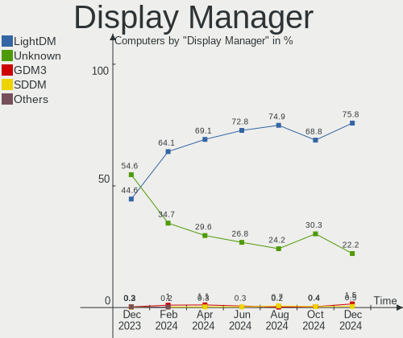
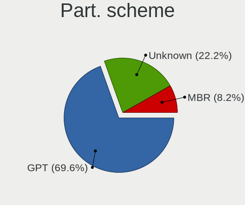
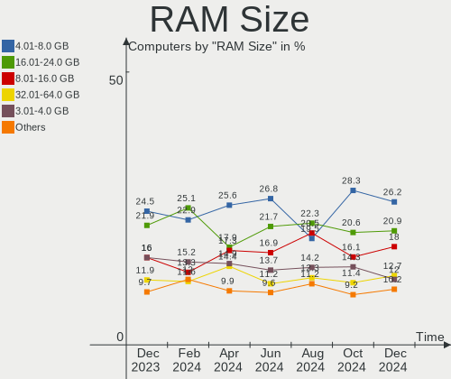
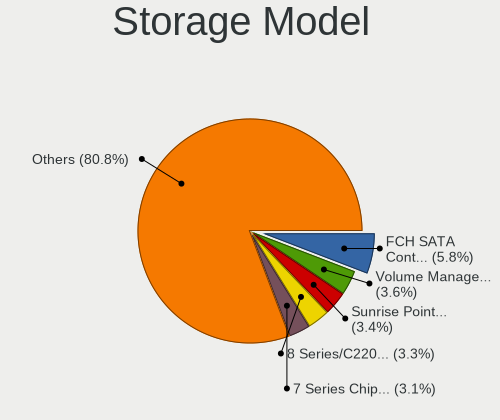
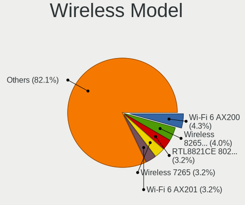
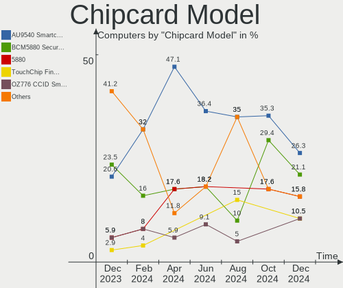

Linux Mint Hardware Trends
--------------------------

A project to identify most popular hardware characteristics and track their change
over time based on data collected by Linux Mint users at https://Linux-Hardware.org.

Anyone can contribute to this report by the [hw-probe](https://github.com/linuxhw/hw-probe) tool:

    sudo -E hw-probe -all -upload

This is a report for all computer types. See also reports for [desktops](/Dist/Linux_Mint/Desktop/README.md) and [notebooks](/Dist/Linux_Mint/Notebook/README.md).

This report is for one last month. Overall report since the beginning of time: [TestCoverage](https://github.com/linuxhw/TestCoverage)

Period: Apr, 2022.

Contents
--------

* [ System ](#system)
  - [ OS                       ](#os)
  - [ OS Family                ](#os-family)
  - [ Kernel                   ](#kernel)
  - [ Kernel Family            ](#kernel-family)
  - [ Kernel Major Ver.        ](#kernel-major-ver)
  - [ Arch                     ](#arch)
  - [ DE                       ](#de)
  - [ Display Server           ](#display-server)
  - [ Display Manager          ](#display-manager)
  - [ OS Lang                  ](#os-lang)
  - [ Boot Mode                ](#boot-mode)
  - [ Filesystem               ](#filesystem)
  - [ Part. scheme             ](#part-scheme)
  - [ Dual Boot with Linux/BSD ](#dual-boot-with-linuxbsd)
  - [ Dual Boot (Win)          ](#dual-boot-win)

* [ Board ](#board)
  - [ Vendor                   ](#vendor)
  - [ Model                    ](#model)
  - [ Model Family             ](#model-family)
  - [ MFG Year                 ](#mfg-year)
  - [ Form Factor              ](#form-factor)
  - [ Secure Boot              ](#secure-boot)
  - [ Coreboot                 ](#coreboot)
  - [ RAM Size                 ](#ram-size)
  - [ RAM Used                 ](#ram-used)
  - [ Total Drives             ](#total-drives)
  - [ Has CD-ROM               ](#has-cd-rom)
  - [ Has Ethernet             ](#has-ethernet)
  - [ Has WiFi                 ](#has-wifi)
  - [ Has Bluetooth            ](#has-bluetooth)

* [ Location ](#location)
  - [ Country                  ](#country)
  - [ City                     ](#city)

* [ Drives ](#drives)
  - [ Drive Vendor             ](#drive-vendor)
  - [ Drive Model              ](#drive-model)
  - [ HDD Vendor               ](#hdd-vendor)
  - [ SSD Vendor               ](#ssd-vendor)
  - [ Drive Kind               ](#drive-kind)
  - [ Drive Connector          ](#drive-connector)
  - [ Drive Size               ](#drive-size)
  - [ Space Total              ](#space-total)
  - [ Space Used               ](#space-used)
  - [ Malfunc. Drives          ](#malfunc-drives)
  - [ Malfunc. Drive Vendor    ](#malfunc-drive-vendor)
  - [ Malfunc. HDD Vendor      ](#malfunc-hdd-vendor)
  - [ Malfunc. Drive Kind      ](#malfunc-drive-kind)
  - [ Failed Drives            ](#failed-drives)
  - [ Failed Drive Vendor      ](#failed-drive-vendor)
  - [ Drive Status             ](#drive-status)

* [ Storage controller ](#storage-controller)
  - [ Storage Vendor           ](#storage-vendor)
  - [ Storage Model            ](#storage-model)
  - [ Storage Kind             ](#storage-kind)

* [ Processor ](#processor)
  - [ CPU Vendor               ](#cpu-vendor)
  - [ CPU Model                ](#cpu-model)
  - [ CPU Model Family         ](#cpu-model-family)
  - [ CPU Cores                ](#cpu-cores)
  - [ CPU Sockets              ](#cpu-sockets)
  - [ CPU Threads              ](#cpu-threads)
  - [ CPU Op-Modes             ](#cpu-op-modes)
  - [ CPU Microcode            ](#cpu-microcode)
  - [ CPU Microarch            ](#cpu-microarch)

* [ Graphics ](#graphics)
  - [ GPU Vendor               ](#gpu-vendor)
  - [ GPU Model                ](#gpu-model)
  - [ GPU Combo                ](#gpu-combo)
  - [ GPU Driver               ](#gpu-driver)
  - [ GPU Memory               ](#gpu-memory)

* [ Monitor ](#monitor)
  - [ Monitor Vendor           ](#monitor-vendor)
  - [ Monitor Model            ](#monitor-model)
  - [ Monitor Resolution       ](#monitor-resolution)
  - [ Monitor Diagonal         ](#monitor-diagonal)
  - [ Monitor Width            ](#monitor-width)
  - [ Aspect Ratio             ](#aspect-ratio)
  - [ Monitor Area             ](#monitor-area)
  - [ Pixel Density            ](#pixel-density)
  - [ Multiple Monitors        ](#multiple-monitors)

* [ Network ](#network)
  - [ Net Controller Vendor    ](#net-controller-vendor)
  - [ Net Controller Model     ](#net-controller-model)
  - [ Wireless Vendor          ](#wireless-vendor)
  - [ Wireless Model           ](#wireless-model)
  - [ Ethernet Vendor          ](#ethernet-vendor)
  - [ Ethernet Model           ](#ethernet-model)
  - [ Net Controller Kind      ](#net-controller-kind)
  - [ Used Controller          ](#used-controller)
  - [ NICs                     ](#nics)
  - [ IPv6                     ](#ipv6)

* [ Bluetooth ](#bluetooth)
  - [ Bluetooth Vendor         ](#bluetooth-vendor)
  - [ Bluetooth Model          ](#bluetooth-model)

* [ Sound ](#sound)
  - [ Sound Vendor             ](#sound-vendor)
  - [ Sound Model              ](#sound-model)

* [ Memory ](#memory)
  - [ Memory Vendor            ](#memory-vendor)
  - [ Memory Model             ](#memory-model)
  - [ Memory Kind              ](#memory-kind)
  - [ Memory Form Factor       ](#memory-form-factor)
  - [ Memory Size              ](#memory-size)
  - [ Memory Speed             ](#memory-speed)

* [ Printers & scanners ](#printers--scanners)
  - [ Printer Vendor           ](#printer-vendor)
  - [ Printer Model            ](#printer-model)
  - [ Scanner Vendor           ](#scanner-vendor)
  - [ Scanner Model            ](#scanner-model)

* [ Camera ](#camera)
  - [ Camera Vendor            ](#camera-vendor)
  - [ Camera Model             ](#camera-model)

* [ Security ](#security)
  - [ Fingerprint Vendor       ](#fingerprint-vendor)
  - [ Fingerprint Model        ](#fingerprint-model)
  - [ Chipcard Vendor          ](#chipcard-vendor)
  - [ Chipcard Model           ](#chipcard-model)

* [ Unsupported ](#unsupported)
  - [ Unsupported Devices      ](#unsupported-devices)
  - [ Unsupported Device Types ](#unsupported-device-types)

System
------

OS
--

Installed operating systems

| Name            | Computers | Percent |
|-----------------|-----------|---------|
| Linux Mint 20.3 | 383       | 81.84%  |
| Linux Mint 20.2 | 29        | 6.2%    |
| Linux Mint 19.3 | 26        | 5.56%   |
| Linux Mint 20.1 | 13        | 2.78%   |
| Linux Mint 20   | 10        | 2.14%   |
| Linux Mint 19.2 | 5         | 1.07%   |
| Linux Mint 18.3 | 2         | 0.43%   |

OS Family
---------

OS without a version

| Name       | Computers | Percent |
|------------|-----------|---------|
| Linux Mint | 468       | 100%    |

Kernel
------

Version of the Linux kernel

| Version                     | Computers | Percent |
|-----------------------------|-----------|---------|
| 5.4.0-107-generic           | 205       | 43.8%   |
| 5.4.0-109-generic           | 101       | 21.58%  |
| 5.4.0-91-generic            | 32        | 6.84%   |
| 5.13.0-39-generic           | 26        | 5.56%   |
| 5.4.0-105-generic           | 12        | 2.56%   |
| 5.13.0-27-generic           | 12        | 2.56%   |
| 5.13.0-40-generic           | 10        | 2.14%   |
| 5.4.0-104-generic           | 7         | 1.5%    |
| 5.4.0-100-generic           | 7         | 1.5%    |
| 5.14.0-1032-oem             | 6         | 1.28%   |
| 5.4.0-74-generic            | 4         | 0.85%   |
| 5.4.0-26-generic            | 3         | 0.64%   |
| 5.13.0-35-generic           | 3         | 0.64%   |
| 4.15.0-54-generic           | 3         | 0.64%   |
| 5.4.0-94-generic            | 2         | 0.43%   |
| 5.4.0-107-lowlatency        | 2         | 0.43%   |
| 5.17.4-051704-generic       | 2         | 0.43%   |
| 5.11.0-46-generic           | 2         | 0.43%   |
| 5.4.0-97-generic            | 1         | 0.21%   |
| 5.4.0-96-generic            | 1         | 0.21%   |
| 5.4.0-90-generic            | 1         | 0.21%   |
| 5.4.0-81-generic            | 1         | 0.21%   |
| 5.4.0-73-generic            | 1         | 0.21%   |
| 5.4.0-58-generic            | 1         | 0.21%   |
| 5.4.0-45-generic            | 1         | 0.21%   |
| 5.4.0-1062203222222-generic | 1         | 0.21%   |
| 5.17.2-051702-generic       | 1         | 0.21%   |
| 5.17.1-051701-generic       | 1         | 0.21%   |
| 5.17.0-051700-generic       | 1         | 0.21%   |
| 5.15.33-xanmod1             | 1         | 0.21%   |
| 5.15.32-xanmod1             | 1         | 0.21%   |
| 5.15.0-25-generic           | 1         | 0.21%   |
| 5.14.0-1034-oem             | 1         | 0.21%   |
| 5.14.0-1033-oem             | 1         | 0.21%   |
| 5.14.0-1031-oem             | 1         | 0.21%   |
| 5.13.0-39-lowlatency        | 1         | 0.21%   |
| 5.13.0-30-generic           | 1         | 0.21%   |
| 5.13.0-25-generic           | 1         | 0.21%   |
| 5.13.0-1021-oracle          | 1         | 0.21%   |
| 5.13.0-1010-intel           | 1         | 0.21%   |
| 5.11.0-41-generic           | 1         | 0.21%   |
| 5.0.0-32-generic            | 1         | 0.21%   |
| 4.7.10-040710-generic       | 1         | 0.21%   |
| 4.4.0-154-lowlatency        | 1         | 0.21%   |
| 4.15.0-175-generic          | 1         | 0.21%   |
| 4.15.0-171-generic          | 1         | 0.21%   |
| 4.15.0-142-generic          | 1         | 0.21%   |

Kernel Family
-------------

Linux kernel without a distro release

| Version | Computers | Percent |
|---------|-----------|---------|
| 5.4.0   | 383       | 81.84%  |
| 5.13.0  | 56        | 11.97%  |
| 5.14.0  | 9         | 1.92%   |
| 4.15.0  | 6         | 1.28%   |
| 5.11.0  | 3         | 0.64%   |
| 5.17.4  | 2         | 0.43%   |
| 5.17.2  | 1         | 0.21%   |
| 5.17.1  | 1         | 0.21%   |
| 5.17.0  | 1         | 0.21%   |
| 5.15.33 | 1         | 0.21%   |
| 5.15.32 | 1         | 0.21%   |
| 5.15.0  | 1         | 0.21%   |
| 5.0.0   | 1         | 0.21%   |
| 4.7.10  | 1         | 0.21%   |
| 4.4.0   | 1         | 0.21%   |

Kernel Major Ver.
-----------------

Linux kernel major version

| Version | Computers | Percent |
|---------|-----------|---------|
| 5.4     | 383       | 81.84%  |
| 5.13    | 56        | 11.97%  |
| 5.14    | 9         | 1.92%   |
| 4.15    | 6         | 1.28%   |
| 5.17    | 5         | 1.07%   |
| 5.15    | 3         | 0.64%   |
| 5.11    | 3         | 0.64%   |
| 5.0     | 1         | 0.21%   |
| 4.7     | 1         | 0.21%   |
| 4.4     | 1         | 0.21%   |

Arch
----

OS architecture (x86_64, i586, etc.)

| Name   | Computers | Percent |
|--------|-----------|---------|
| x86_64 | 456       | 97.44%  |
| i686   | 12        | 2.56%   |

DE
--

Desktop Environment

| Name       | Computers | Percent |
|------------|-----------|---------|
| X-Cinnamon | 325       | 69.44%  |
| MATE       | 53        | 11.32%  |
| XFCE       | 39        | 8.33%   |
| Cinnamon   | 35        | 7.48%   |
| GNOME      | 8         | 1.71%   |
| KDE5       | 3         | 0.64%   |
| LXQt       | 2         | 0.43%   |
| Unknown    | 2         | 0.43%   |
| i3         | 1         | 0.21%   |

Display Server
--------------

X11 or Wayland

| Name | Computers | Percent |
|------|-----------|---------|
| X11  | 463       | 98.93%  |
| Tty  | 5         | 1.07%   |

Display Manager
---------------

SDDM, LightDM, etc.

| Name    | Computers | Percent |
|---------|-----------|---------|
| Unknown | 264       | 56.41%  |
| LightDM | 199       | 42.52%  |
| GDM     | 3         | 0.64%   |
| SDDM    | 1         | 0.21%   |
| MDM     | 1         | 0.21%   |

OS Lang
-------

Language

| Lang    | Computers | Percent |
|---------|-----------|---------|
| en_US   | 140       | 29.91%  |
| de_DE   | 84        | 17.95%  |
| fr_FR   | 28        | 5.98%   |
| ru_RU   | 22        | 4.7%    |
| pt_BR   | 22        | 4.7%    |
| en_GB   | 22        | 4.7%    |
| en_CA   | 17        | 3.63%   |
| pl_PL   | 16        | 3.42%   |
| es_ES   | 12        | 2.56%   |
| C       | 12        | 2.56%   |
| nl_NL   | 9         | 1.92%   |
| en_IN   | 9         | 1.92%   |
| it_IT   | 8         | 1.71%   |
| en_AU   | 8         | 1.71%   |
| en_ZA   | 6         | 1.28%   |
| tr_TR   | 5         | 1.07%   |
| sv_SE   | 4         | 0.85%   |
| zh_CN   | 3         | 0.64%   |
| sk_SK   | 3         | 0.64%   |
| es_CO   | 3         | 0.64%   |
| de_CH   | 3         | 0.64%   |
| pt_PT   | 2         | 0.43%   |
| es_PE   | 2         | 0.43%   |
| es_MX   | 2         | 0.43%   |
| de_AT   | 2         | 0.43%   |
| cs_CZ   | 2         | 0.43%   |
| Unknown | 2         | 0.43%   |
| ro_RO   | 1         | 0.21%   |
| nl_BE   | 1         | 0.21%   |
| ko_KR   | 1         | 0.21%   |
| ja_JP   | 1         | 0.21%   |
| it_CH   | 1         | 0.21%   |
| hu_HU   | 1         | 0.21%   |
| hr_HR   | 1         | 0.21%   |
| fr_BE   | 1         | 0.21%   |
| fi_FI   | 1         | 0.21%   |
| eu_ES   | 1         | 0.21%   |
| es_EC   | 1         | 0.21%   |
| es_DO   | 1         | 0.21%   |
| es_BO   | 1         | 0.21%   |
| es_AR   | 1         | 0.21%   |
| en_NZ   | 1         | 0.21%   |
| en_IE   | 1         | 0.21%   |
| en_HK   | 1         | 0.21%   |
| el_GR   | 1         | 0.21%   |
| de_BE   | 1         | 0.21%   |
| bg_BG   | 1         | 0.21%   |

Boot Mode
---------

EFI or BIOS

| Mode | Computers | Percent |
|------|-----------|---------|
| EFI  | 246       | 52.56%  |
| BIOS | 222       | 47.44%  |

Filesystem
----------

Type of filesystem

| Type    | Computers | Percent |
|---------|-----------|---------|
| Ext4    | 452       | 96.58%  |
| Overlay | 9         | 1.92%   |
| Btrfs   | 6         | 1.28%   |
| Zfs     | 1         | 0.21%   |

Part. scheme
------------

Scheme of partitioning

| Type    | Computers | Percent |
|---------|-----------|---------|
| Unknown | 279       | 59.62%  |
| GPT     | 136       | 29.06%  |
| MBR     | 53        | 11.32%  |

Dual Boot with Linux/BSD
------------------------

Hosting more than one Linux/BSD

| Dual boot | Computers | Percent |
|-----------|-----------|---------|
| No        | 440       | 94.02%  |
| Yes       | 28        | 5.98%   |

Dual Boot (Win)
---------------

Hosting Linux and Windows

| Dual boot | Computers | Percent |
|-----------|-----------|---------|
| No        | 388       | 82.91%  |
| Yes       | 80        | 17.09%  |

Board
-----

Vendor
------

Motherboard manufacturer

| Name                | Computers | Percent |
|---------------------|-----------|---------|
| Dell                | 71        | 15.17%  |
| Lenovo              | 68        | 14.53%  |
| ASUSTek Computer    | 63        | 13.46%  |
| Hewlett-Packard     | 62        | 13.25%  |
| MSI                 | 27        | 5.77%   |
| Gigabyte Technology | 25        | 5.34%   |
| Acer                | 25        | 5.34%   |
| ASRock              | 21        | 4.49%   |
| Toshiba             | 14        | 2.99%   |
| Apple               | 13        | 2.78%   |
| Medion              | 7         | 1.5%    |
| Samsung Electronics | 6         | 1.28%   |
| Positivo            | 5         | 1.07%   |
| Notebook            | 4         | 0.85%   |
| Intel               | 4         | 0.85%   |
| Fujitsu             | 4         | 0.85%   |
| Biostar             | 4         | 0.85%   |
| Sony                | 3         | 0.64%   |
| Pegatron            | 3         | 0.64%   |
| Packard Bell        | 3         | 0.64%   |
| Google              | 3         | 0.64%   |
| Unknown             | 3         | 0.64%   |
| TUXEDO              | 2         | 0.43%   |
| Supermicro          | 2         | 0.43%   |
| Fujitsu Siemens     | 2         | 0.43%   |
| Foxconn             | 2         | 0.43%   |
| eMachines           | 2         | 0.43%   |
| BESSTAR Tech        | 2         | 0.43%   |
| AZW                 | 2         | 0.43%   |
| Alienware           | 2         | 0.43%   |
| Timi                | 1         | 0.21%   |
| Semp Toshiba        | 1         | 0.21%   |
| QUANMAX             | 1         | 0.21%   |
| Microtech           | 1         | 0.21%   |
| MECHREVO            | 1         | 0.21%   |
| LincPlus            | 1         | 0.21%   |
| LG Electronics      | 1         | 0.21%   |
| LattePanda          | 1         | 0.21%   |
| Itautec             | 1         | 0.21%   |
| IP3 Tech            | 1         | 0.21%   |
| ECS                 | 1         | 0.21%   |
| CSL-Computer        | 1         | 0.21%   |
| BLAUPUNKT           | 1         | 0.21%   |
| AMI                 | 1         | 0.21%   |

Model
-----

Motherboard model

| Name                            | Computers | Percent |
|---------------------------------|-----------|---------|
| Dell OptiPlex 7010              | 4         | 0.85%   |
| ASUS All Series                 | 4         | 0.85%   |
| MSI MS-7D22                     | 3         | 0.64%   |
| MSI MS-7C02                     | 3         | 0.64%   |
| MSI MS-7B79                     | 3         | 0.64%   |
| Dell OptiPlex 790               | 3         | 0.64%   |
| Dell Inspiron 3542              | 3         | 0.64%   |
| Unknown                         | 3         | 0.64%   |
| Positivo S14CT01                | 2         | 0.43%   |
| Positivo Mobile                 | 2         | 0.43%   |
| MSI MS-7C37                     | 2         | 0.43%   |
| Lenovo IdeaPad 3 15ALC6 82KU    | 2         | 0.43%   |
| HP Pavilion dv6                 | 2         | 0.43%   |
| HP Pavilion 17                  | 2         | 0.43%   |
| HP Notebook                     | 2         | 0.43%   |
| HP EliteDesk 800 G1 SFF         | 2         | 0.43%   |
| HP EliteBook 840 G2             | 2         | 0.43%   |
| HP 625                          | 2         | 0.43%   |
| Gigabyte GA-78LMT-USB3 6.0      | 2         | 0.43%   |
| Dell XPS 15 9560                | 2         | 0.43%   |
| Dell OptiPlex 990               | 2         | 0.43%   |
| Dell OptiPlex 9020              | 2         | 0.43%   |
| Dell OptiPlex 780               | 2         | 0.43%   |
| Dell OptiPlex 3010              | 2         | 0.43%   |
| Dell Latitude E6520             | 2         | 0.43%   |
| Dell Latitude 5490              | 2         | 0.43%   |
| Dell Inspiron 5570              | 2         | 0.43%   |
| Dell Inspiron 3583              | 2         | 0.43%   |
| Dell Inspiron 3543              | 2         | 0.43%   |
| AZW U59                         | 2         | 0.43%   |
| ASUS ROG STRIX B550-I GAMING    | 2         | 0.43%   |
| ASRock X300M-STX                | 2         | 0.43%   |
| ASRock B550M Pro4               | 2         | 0.43%   |
| Apple Macmini7,1                | 2         | 0.43%   |
| Apple MacBookPro8,2             | 2         | 0.43%   |
| Apple MacBookPro7,1             | 2         | 0.43%   |
| TUXEDO N15_17RD                 | 1         | 0.21%   |
| TUXEDO InfinityBook S 15 Gen6   | 1         | 0.21%   |
| Toshiba TECRA M11               | 1         | 0.21%   |
| Toshiba Satellite S55-C         | 1         | 0.21%   |
| Toshiba Satellite Pro L850-B339 | 1         | 0.21%   |
| Toshiba Satellite P755          | 1         | 0.21%   |
| Toshiba Satellite P75-A         | 1         | 0.21%   |
| Toshiba Satellite L735D         | 1         | 0.21%   |
| Toshiba Satellite L300          | 1         | 0.21%   |
| Toshiba Satellite C850-F31Q     | 1         | 0.21%   |
| Toshiba Satellite C655D         | 1         | 0.21%   |
| Toshiba Satellite C650          | 1         | 0.21%   |
| Toshiba Satellite C55-C         | 1         | 0.21%   |
| Toshiba Satellite C50D-A0386    | 1         | 0.21%   |
| Toshiba PORTEGE M800            | 1         | 0.21%   |
| Toshiba NB520                   | 1         | 0.21%   |
| Timi TM1701                     | 1         | 0.21%   |
| Supermicro T10                  | 1         | 0.21%   |
| Supermicro Altus 1804           | 1         | 0.21%   |
| Sony VPCEH3F1R                  | 1         | 0.21%   |
| Sony VGN-SZ120P                 | 1         | 0.21%   |
| Sony VGN-CS31S_W                | 1         | 0.21%   |
| Semp Toshiba STI                | 1         | 0.21%   |
| Samsung SX10P                   | 1         | 0.21%   |

Model Family
------------

Motherboard model prefix

| Name                   | Computers | Percent |
|------------------------|-----------|---------|
| Lenovo ThinkPad        | 33        | 7.05%   |
| Dell OptiPlex          | 22        | 4.7%    |
| Dell Inspiron          | 22        | 4.7%    |
| HP Pavilion            | 17        | 3.63%   |
| Dell Latitude          | 17        | 3.63%   |
| Lenovo IdeaPad         | 13        | 2.78%   |
| Acer Aspire            | 13        | 2.78%   |
| Toshiba Satellite      | 11        | 2.35%   |
| HP Laptop              | 7         | 1.5%    |
| ASUS PRIME             | 7         | 1.5%    |
| HP EliteBook           | 6         | 1.28%   |
| ASUS ROG               | 6         | 1.28%   |
| HP Compaq              | 5         | 1.07%   |
| Lenovo Legion          | 4         | 0.85%   |
| HP ProBook             | 4         | 0.85%   |
| Dell XPS               | 4         | 0.85%   |
| ASUS All               | 4         | 0.85%   |
| MSI MS-7D22            | 3         | 0.64%   |
| MSI MS-7C02            | 3         | 0.64%   |
| MSI MS-7B79            | 3         | 0.64%   |
| HP EliteDesk           | 3         | 0.64%   |
| ASUS VivoBook          | 3         | 0.64%   |
| ASUS TUF               | 3         | 0.64%   |
| Acer TravelMate        | 3         | 0.64%   |
| Acer Swift             | 3         | 0.64%   |
| Unknown                | 3         | 0.64%   |
| Positivo S14CT01       | 2         | 0.43%   |
| Positivo Mobile        | 2         | 0.43%   |
| Packard Bell EasyNote  | 2         | 0.43%   |
| MSI MS-7C37            | 2         | 0.43%   |
| Medion Akoya           | 2         | 0.43%   |
| Lenovo ThinkCentre     | 2         | 0.43%   |
| Lenovo IdeaPadFlex     | 2         | 0.43%   |
| HP ZBook               | 2         | 0.43%   |
| HP Stream              | 2         | 0.43%   |
| HP OMEN                | 2         | 0.43%   |
| HP Notebook            | 2         | 0.43%   |
| HP ENVY                | 2         | 0.43%   |
| HP 625                 | 2         | 0.43%   |
| Gigabyte GA-78LMT-USB3 | 2         | 0.43%   |
| Gigabyte B550          | 2         | 0.43%   |
| Fujitsu LIFEBOOK       | 2         | 0.43%   |
| Fujitsu CELSIUS        | 2         | 0.43%   |
| Dell Precision         | 2         | 0.43%   |
| AZW U59                | 2         | 0.43%   |
| ASUS P8H67-M           | 2         | 0.43%   |
| ASUS M5A97             | 2         | 0.43%   |
| ASRock X300M-STX       | 2         | 0.43%   |
| ASRock B550M           | 2         | 0.43%   |
| ASRock B450            | 2         | 0.43%   |
| ASRock 970             | 2         | 0.43%   |
| Apple Macmini7         | 2         | 0.43%   |
| Apple MacBookPro8      | 2         | 0.43%   |
| Apple MacBookPro7      | 2         | 0.43%   |
| TUXEDO N15             | 1         | 0.21%   |
| TUXEDO InfinityBook    | 1         | 0.21%   |
| Toshiba TECRA          | 1         | 0.21%   |
| Toshiba PORTEGE        | 1         | 0.21%   |
| Toshiba NB520          | 1         | 0.21%   |
| Timi TM1701            | 1         | 0.21%   |

MFG Year
--------

Motherboard manufacture year

| Year    | Computers | Percent |
|---------|-----------|---------|
| 2020    | 52        | 11.11%  |
| 2013    | 47        | 10.04%  |
| 2021    | 43        | 9.19%   |
| 2011    | 40        | 8.55%   |
| 2019    | 34        | 7.26%   |
| 2012    | 32        | 6.84%   |
| 2018    | 29        | 6.2%    |
| 2015    | 29        | 6.2%    |
| 2014    | 29        | 6.2%    |
| 2010    | 26        | 5.56%   |
| 2017    | 25        | 5.34%   |
| 2008    | 24        | 5.13%   |
| 2016    | 22        | 4.7%    |
| 2009    | 15        | 3.21%   |
| 2007    | 10        | 2.14%   |
| 2006    | 7         | 1.5%    |
| 2022    | 2         | 0.43%   |
| 2004    | 1         | 0.21%   |
| Unknown | 1         | 0.21%   |

Form Factor
-----------

Physical design of the computer

| Name        | Computers | Percent |
|-------------|-----------|---------|
| Notebook    | 257       | 54.91%  |
| Desktop     | 190       | 40.6%   |
| Convertible | 8         | 1.71%   |
| Mini pc     | 5         | 1.07%   |
| All in one  | 5         | 1.07%   |
| Server      | 2         | 0.43%   |
| Tablet      | 1         | 0.21%   |

Secure Boot
-----------

Enabled or disabled

| State    | Computers | Percent |
|----------|-----------|---------|
| Disabled | 430       | 91.88%  |
| Enabled  | 38        | 8.12%   |

Coreboot
--------

Have coreboot on board

| Used | Computers | Percent |
|------|-----------|---------|
| No   | 465       | 99.36%  |
| Yes  | 3         | 0.64%   |

RAM Size
--------

Total RAM memory

| Size in GB  | Computers | Percent |
|-------------|-----------|---------|
| 4.01-8.0    | 106       | 22.65%  |
| 3.01-4.0    | 94        | 20.09%  |
| 16.01-24.0  | 90        | 19.23%  |
| 8.01-16.0   | 87        | 18.59%  |
| 32.01-64.0  | 47        | 10.04%  |
| 1.01-2.0    | 20        | 4.27%   |
| 24.01-32.0  | 8         | 1.71%   |
| 2.01-3.0    | 7         | 1.5%    |
| 64.01-256.0 | 6         | 1.28%   |
| 0.51-1.0    | 3         | 0.64%   |

RAM Used
--------

Used RAM memory

| Used GB    | Computers | Percent |
|------------|-----------|---------|
| 1.01-2.0   | 188       | 40.17%  |
| 2.01-3.0   | 131       | 27.99%  |
| 3.01-4.0   | 58        | 12.39%  |
| 4.01-8.0   | 56        | 11.97%  |
| 0.51-1.0   | 24        | 5.13%   |
| 8.01-16.0  | 10        | 2.14%   |
| 16.01-24.0 | 1         | 0.21%   |

Total Drives
------------

Number of drives on board

| Drives | Computers | Percent |
|--------|-----------|---------|
| 1      | 278       | 59.4%   |
| 2      | 118       | 25.21%  |
| 3      | 43        | 9.19%   |
| 4      | 16        | 3.42%   |
| 5      | 4         | 0.85%   |
| 8      | 3         | 0.64%   |
| 0      | 3         | 0.64%   |
| 6      | 2         | 0.43%   |
| 7      | 1         | 0.21%   |

Has CD-ROM
----------

Has CD-ROM on board

| Presented | Computers | Percent |
|-----------|-----------|---------|
| No        | 250       | 53.42%  |
| Yes       | 218       | 46.58%  |

Has Ethernet
------------

Has Ethernet on board

| Presented | Computers | Percent |
|-----------|-----------|---------|
| Yes       | 419       | 89.53%  |
| No        | 49        | 10.47%  |

Has WiFi
--------

Has WiFi module

| Presented | Computers | Percent |
|-----------|-----------|---------|
| Yes       | 364       | 77.78%  |
| No        | 104       | 22.22%  |

Has Bluetooth
-------------

Has Bluetooth module

| Presented | Computers | Percent |
|-----------|-----------|---------|
| Yes       | 263       | 56.2%   |
| No        | 205       | 43.8%   |

Location
--------

Country
-------

Geographic location (country)

| Country            | Computers | Percent |
|--------------------|-----------|---------|
| Germany            | 89        | 19.02%  |
| USA                | 81        | 17.31%  |
| Brazil             | 29        | 6.2%    |
| France             | 24        | 5.13%   |
| Russia             | 23        | 4.91%   |
| UK                 | 20        | 4.27%   |
| Poland             | 18        | 3.85%   |
| Canada             | 16        | 3.42%   |
| Netherlands        | 13        | 2.78%   |
| Spain              | 12        | 2.56%   |
| Italy              | 10        | 2.14%   |
| India              | 10        | 2.14%   |
| Australia          | 10        | 2.14%   |
| Belgium            | 7         | 1.5%    |
| Switzerland        | 6         | 1.28%   |
| Austria            | 6         | 1.28%   |
| Turkey             | 5         | 1.07%   |
| South Africa       | 5         | 1.07%   |
| Romania            | 5         | 1.07%   |
| Sweden             | 4         | 0.85%   |
| Portugal           | 4         | 0.85%   |
| Croatia            | 4         | 0.85%   |
| Colombia           | 4         | 0.85%   |
| Taiwan             | 3         | 0.64%   |
| Slovakia           | 3         | 0.64%   |
| Norway             | 3         | 0.64%   |
| Mexico             | 3         | 0.64%   |
| Greece             | 3         | 0.64%   |
| China              | 3         | 0.64%   |
| Ukraine            | 2         | 0.43%   |
| Tunisia            | 2         | 0.43%   |
| Thailand           | 2         | 0.43%   |
| South Korea        | 2         | 0.43%   |
| New Zealand        | 2         | 0.43%   |
| Iran               | 2         | 0.43%   |
| Hungary            | 2         | 0.43%   |
| Ecuador            | 2         | 0.43%   |
| Dominican Republic | 2         | 0.43%   |
| Czechia            | 2         | 0.43%   |
| Cyprus             | 2         | 0.43%   |
| Uzbekistan         | 1         | 0.21%   |
| Singapore          | 1         | 0.21%   |
| Réunion           | 1         | 0.21%   |
| Puerto Rico        | 1         | 0.21%   |
| Peru               | 1         | 0.21%   |
| Pakistan           | 1         | 0.21%   |
| North Macedonia    | 1         | 0.21%   |
| Malaysia           | 1         | 0.21%   |
| Lithuania          | 1         | 0.21%   |
| Latvia             | 1         | 0.21%   |
| Japan              | 1         | 0.21%   |
| Israel             | 1         | 0.21%   |
| Ireland            | 1         | 0.21%   |
| Hong Kong          | 1         | 0.21%   |
| Finland            | 1         | 0.21%   |
| Egypt              | 1         | 0.21%   |
| Costa Rica         | 1         | 0.21%   |
| Chile              | 1         | 0.21%   |
| Bulgaria           | 1         | 0.21%   |
| Bolivia            | 1         | 0.21%   |

City
----

Geographic location (city)

| City              | Computers | Percent |
|-------------------|-----------|---------|
| Berlin            | 8         | 1.71%   |
| Warsaw            | 6         | 1.28%   |
| Sao Paulo         | 6         | 1.28%   |
| Vienna            | 4         | 0.85%   |
| Moscow            | 4         | 0.85%   |
| Târgu Mureş     | 3         | 0.64%   |
| Sydney            | 3         | 0.64%   |
| Munich            | 3         | 0.64%   |
| London            | 3         | 0.64%   |
| Hamburg           | 3         | 0.64%   |
| Chicago           | 3         | 0.64%   |
| Zagreb            | 2         | 0.43%   |
| Yerington         | 2         | 0.43%   |
| Worcester Park    | 2         | 0.43%   |
| Toronto           | 2         | 0.43%   |
| Todmorden         | 2         | 0.43%   |
| Taipei            | 2         | 0.43%   |
| Szczecin          | 2         | 0.43%   |
| Stuttgart         | 2         | 0.43%   |
| Stockholm         | 2         | 0.43%   |
| St Louis          | 2         | 0.43%   |
| Sao Luís         | 2         | 0.43%   |
| Rio de Janeiro    | 2         | 0.43%   |
| Rendsburg         | 2         | 0.43%   |
| Poznan            | 2         | 0.43%   |
| Porto             | 2         | 0.43%   |
| Pittsburgh        | 2         | 0.43%   |
| Mumbai            | 2         | 0.43%   |
| Miramichi         | 2         | 0.43%   |
| Melbourne         | 2         | 0.43%   |
| Mainz             | 2         | 0.43%   |
| Lyon              | 2         | 0.43%   |
| Lutjegast         | 2         | 0.43%   |
| Limassol          | 2         | 0.43%   |
| Kolkata           | 2         | 0.43%   |
| Koblenz           | 2         | 0.43%   |
| Johnson City      | 2         | 0.43%   |
| Houston           | 2         | 0.43%   |
| Guayaquil         | 2         | 0.43%   |
| Grand Rapids      | 2         | 0.43%   |
| Essen             | 2         | 0.43%   |
| Delhi             | 2         | 0.43%   |
| Cologne           | 2         | 0.43%   |
| Clinton Township  | 2         | 0.43%   |
| Chemnitz          | 2         | 0.43%   |
| Chandler          | 2         | 0.43%   |
| Cape Town         | 2         | 0.43%   |
| Brisbane          | 2         | 0.43%   |
| Bratislava        | 2         | 0.43%   |
| Birmingham        | 2         | 0.43%   |
| Belgorod          | 2         | 0.43%   |
| Bangkok           | 2         | 0.43%   |
| Athens            | 2         | 0.43%   |
| Zurich            | 1         | 0.21%   |
| Zumpango          | 1         | 0.21%   |
| Zoetermeer        | 1         | 0.21%   |
| Zhukovskiy        | 1         | 0.21%   |
| Zaragoza          | 1         | 0.21%   |
| Yuzhno-Sakhalinsk | 1         | 0.21%   |
| Yorktown Heights  | 1         | 0.21%   |

Drives
------

Drive Vendor
------------

Hard drive vendors

| Vendor                      | Computers | Drives | Percent |
|-----------------------------|-----------|--------|---------|
| Samsung Electronics         | 109       | 140    | 16.2%   |
| Seagate                     | 107       | 123    | 15.9%   |
| WDC                         | 100       | 112    | 14.86%  |
| Toshiba                     | 46        | 48     | 6.84%   |
| Crucial                     | 42        | 44     | 6.24%   |
| Kingston                    | 39        | 41     | 5.79%   |
| Unknown                     | 35        | 41     | 5.2%    |
| Sandisk                     | 28        | 29     | 4.16%   |
| SK Hynix                    | 17        | 17     | 2.53%   |
| Hitachi                     | 17        | 17     | 2.53%   |
| HGST                        | 11        | 11     | 1.63%   |
| Micron Technology           | 7         | 7      | 1.04%   |
| Intel                       | 7         | 7      | 1.04%   |
| GOODRAM                     | 7         | 7      | 1.04%   |
| Intenso                     | 6         | 8      | 0.89%   |
| A-DATA Technology           | 6         | 6      | 0.89%   |
| KIOXIA                      | 5         | 5      | 0.74%   |
| Apple                       | 5         | 5      | 0.74%   |
| Transcend                   | 4         | 4      | 0.59%   |
| Micron/Crucial Technology   | 4         | 5      | 0.59%   |
| MAXTOR                      | 4         | 4      | 0.59%   |
| Unknown                     | 4         | 4      | 0.59%   |
| SPCC                        | 3         | 3      | 0.45%   |
| Phison                      | 3         | 3      | 0.45%   |
| Patriot                     | 3         | 3      | 0.45%   |
| LITEON                      | 3         | 3      | 0.45%   |
| UMIS                        | 2         | 2      | 0.3%    |
| Team                        | 2         | 2      | 0.3%    |
| Silicon Motion              | 2         | 2      | 0.3%    |
| SABRENT                     | 2         | 2      | 0.3%    |
| OCZ                         | 2         | 2      | 0.3%    |
| NGFF                        | 2         | 2      | 0.3%    |
| Mushkin                     | 2         | 3      | 0.3%    |
| Fujitsu                     | 2         | 2      | 0.3%    |
| EMTEC                       | 2         | 2      | 0.3%    |
| Corsair                     | 2         | 3      | 0.3%    |
| China                       | 2         | 2      | 0.3%    |
| XPG                         | 1         | 1      | 0.15%   |
| USB 3.0                     | 1         | 1      | 0.15%   |
| Teclast                     | 1         | 1      | 0.15%   |
| SSSTC                       | 1         | 1      | 0.15%   |
| Realtek Semiconductor       | 1         | 1      | 0.15%   |
| QUMO                        | 1         | 1      | 0.15%   |
| PNY                         | 1         | 1      | 0.15%   |
| PLEXTOR                     | 1         | 1      | 0.15%   |
| OWC                         | 1         | 1      | 0.15%   |
| Netac                       | 1         | 1      | 0.15%   |
| Microtech                   | 1         | 1      | 0.15%   |
| Maxtor 6                    | 1         | 1      | 0.15%   |
| MAXIO Technology (Hangzhou) | 1         | 1      | 0.15%   |
| MAX                         | 1         | 1      | 0.15%   |
| LuminouTek                  | 1         | 1      | 0.15%   |
| Lite-On                     | 1         | 1      | 0.15%   |
| LDLC                        | 1         | 1      | 0.15%   |
| INTEL SS                    | 1         | 1      | 0.15%   |
| ICY BOX                     | 1         | 1      | 0.15%   |
| HS-SSD-E100                 | 1         | 1      | 0.15%   |
| HS-SSD-C100                 | 1         | 1      | 0.15%   |
| GALAX                       | 1         | 1      | 0.15%   |
| DragonDiamond               | 1         | 1      | 0.15%   |

Drive Model
-----------

Hard drive models

| Model                                | Computers | Percent |
|--------------------------------------|-----------|---------|
| Samsung SSD 850 EVO 500GB            | 10        | 1.37%   |
| Toshiba DT01ACA100 1TB               | 9         | 1.23%   |
| Samsung SSD 850 EVO 250GB            | 9         | 1.23%   |
| Kingston SA400S37240G 240GB SSD      | 9         | 1.23%   |
| Unknown MMC Card  64GB               | 8         | 1.1%    |
| Seagate ST1000LM024 HN-M101MBB 1TB   | 7         | 0.96%   |
| Samsung SSD 860 EVO 1TB              | 6         | 0.82%   |
| Crucial CT525MX300SSD1 528GB         | 6         | 0.82%   |
| Crucial CT1000MX500SSD1 1TB          | 6         | 0.82%   |
| Unknown MMC Card  32GB               | 5         | 0.69%   |
| Toshiba MQ01ABD100 1TB               | 5         | 0.69%   |
| Seagate ST500DM002-1BD142 500GB      | 5         | 0.69%   |
| Seagate Expansion+ 2TB               | 5         | 0.69%   |
| Samsung SSD 860 EVO 500GB            | 5         | 0.69%   |
| Crucial CT500MX500SSD1 500GB         | 5         | 0.69%   |
| Unknown SD/MMC/MS PRO 16GB           | 4         | 0.55%   |
| Unknown MMC Card  128GB              | 4         | 0.55%   |
| SK Hynix NVMe SSD Drive 512GB        | 4         | 0.55%   |
| Seagate ST9500325AS 500GB            | 4         | 0.55%   |
| Seagate ST3500418AS 500GB            | 4         | 0.55%   |
| Seagate ST1000LM035-1RK172 1TB       | 4         | 0.55%   |
| Sandisk NVMe SSD Drive 1TB           | 4         | 0.55%   |
| Samsung SSD 870 QVO 1TB              | 4         | 0.55%   |
| Samsung NVMe SSD Drive 512GB         | 4         | 0.55%   |
| Samsung NVMe SSD Drive 250GB         | 4         | 0.55%   |
| Kingston SA400S37480G 480GB SSD      | 4         | 0.55%   |
| HGST HTS545050A7E680 500GB           | 4         | 0.55%   |
| Unknown                              | 4         | 0.55%   |
| WDC WDS240G2G0B-00EPW0 240GB SSD     | 3         | 0.41%   |
| Toshiba MQ04ABF100 1TB               | 3         | 0.41%   |
| Toshiba MQ01ABF050 500GB             | 3         | 0.41%   |
| Toshiba HDWD110 1TB                  | 3         | 0.41%   |
| SK Hynix NVMe SSD Drive 256GB        | 3         | 0.41%   |
| Seagate ST500LM000-1EJ162 500GB      | 3         | 0.41%   |
| Seagate ST4000DM004-2CV104 4TB       | 3         | 0.41%   |
| Seagate ST31000528AS 1TB             | 3         | 0.41%   |
| Seagate ST2000DM001-1ER164 2TB       | 3         | 0.41%   |
| Seagate ST1000DM003-1CH162 1TB       | 3         | 0.41%   |
| Sandisk NVMe SSD Drive 256GB         | 3         | 0.41%   |
| Samsung SSD 980 1TB                  | 3         | 0.41%   |
| Samsung SSD 970 EVO Plus 1TB         | 3         | 0.41%   |
| Samsung SSD 840 PRO Series 128GB     | 3         | 0.41%   |
| Samsung SSD 840 EVO 500GB            | 3         | 0.41%   |
| Samsung SSD 840 EVO 250GB            | 3         | 0.41%   |
| Micron/Crucial NVMe SSD Drive 1TB    | 3         | 0.41%   |
| Kingston SA400S37120G 120GB SSD      | 3         | 0.41%   |
| Intenso SSD SATAIII 512GB            | 3         | 0.41%   |
| Crucial CT250MX500SSD1 250GB         | 3         | 0.41%   |
| WDC WDS100T2B0B-00YS70 1TB SSD       | 2         | 0.27%   |
| WDC WD40EZRX-00SPEB0 4TB             | 2         | 0.27%   |
| WDC WD30EFRX-68EUZN0 3TB             | 2         | 0.27%   |
| WDC WD20EZRZ-00Z5HB0 2TB             | 2         | 0.27%   |
| WDC WD20EZBX-00AYRA0 2TB             | 2         | 0.27%   |
| WDC WD20EARX-00PASB0 2TB             | 2         | 0.27%   |
| WDC WD10SPSX-00A6WT0 1TB             | 2         | 0.27%   |
| WDC WD10JPVX-75JC3T0 1TB             | 2         | 0.27%   |
| WDC WD1001FALS-00E8B0 1TB            | 2         | 0.27%   |
| WDC PC SN730 SDBQNTY-512G-1001 512GB | 2         | 0.27%   |
| Unknown MMC Card  16GB               | 2         | 0.27%   |
| Toshiba MK7575GSX 752GB              | 2         | 0.27%   |

HDD Vendor
----------

Hard disk drive vendors

| Vendor              | Computers | Drives | Percent |
|---------------------|-----------|--------|---------|
| Seagate             | 106       | 121    | 38.27%  |
| WDC                 | 81        | 91     | 29.24%  |
| Toshiba             | 35        | 37     | 12.64%  |
| Hitachi             | 17        | 17     | 6.14%   |
| Samsung Electronics | 11        | 13     | 3.97%   |
| HGST                | 11        | 11     | 3.97%   |
| Unknown             | 4         | 4      | 1.44%   |
| MAXTOR              | 4         | 4      | 1.44%   |
| SABRENT             | 2         | 2      | 0.72%   |
| Fujitsu             | 2         | 2      | 0.72%   |
| USB 3.0             | 1         | 1      | 0.36%   |
| Maxtor 6            | 1         | 1      | 0.36%   |
| APPLE HD            | 1         | 1      | 0.36%   |
| Apple               | 1         | 1      | 0.36%   |

SSD Vendor
----------

Solid state drive vendors

| Vendor              | Computers | Drives | Percent |
|---------------------|-----------|--------|---------|
| Samsung Electronics | 66        | 84     | 27.73%  |
| Crucial             | 37        | 39     | 15.55%  |
| Kingston            | 27        | 28     | 11.34%  |
| SanDisk             | 18        | 19     | 7.56%   |
| WDC                 | 11        | 11     | 4.62%   |
| GOODRAM             | 7         | 7      | 2.94%   |
| Toshiba             | 5         | 5      | 2.1%    |
| Intenso             | 5         | 7      | 2.1%    |
| Intel               | 5         | 5      | 2.1%    |
| A-DATA Technology   | 5         | 5      | 2.1%    |
| Micron Technology   | 4         | 4      | 1.68%   |
| Apple               | 4         | 4      | 1.68%   |
| Transcend           | 3         | 3      | 1.26%   |
| SPCC                | 3         | 3      | 1.26%   |
| SK Hynix            | 3         | 3      | 1.26%   |
| Patriot             | 3         | 3      | 1.26%   |
| LITEON              | 3         | 3      | 1.26%   |
| Unknown             | 3         | 3      | 1.26%   |
| OCZ                 | 2         | 2      | 0.84%   |
| NGFF                | 2         | 2      | 0.84%   |
| Mushkin             | 2         | 3      | 0.84%   |
| EMTEC               | 2         | 2      | 0.84%   |
| China               | 2         | 2      | 0.84%   |
| Teclast             | 1         | 1      | 0.42%   |
| Team                | 1         | 1      | 0.42%   |
| Seagate             | 1         | 1      | 0.42%   |
| QUMO                | 1         | 1      | 0.42%   |
| PNY                 | 1         | 1      | 0.42%   |
| PLEXTOR             | 1         | 1      | 0.42%   |
| OWC                 | 1         | 1      | 0.42%   |
| Netac               | 1         | 1      | 0.42%   |
| Microtech           | 1         | 1      | 0.42%   |
| LDLC                | 1         | 1      | 0.42%   |
| INTEL SS            | 1         | 1      | 0.42%   |
| GALAX               | 1         | 1      | 0.42%   |
| DOGFISH             | 1         | 1      | 0.42%   |
| Corsair             | 1         | 1      | 0.42%   |
| BHT                 | 1         | 1      | 0.42%   |
| Apacer              | 1         | 1      | 0.42%   |

Drive Kind
----------

HDD or SSD

| Kind    | Computers | Drives | Percent |
|---------|-----------|--------|---------|
| HDD     | 234       | 306    | 38.61%  |
| SSD     | 213       | 263    | 35.15%  |
| NVMe    | 119       | 135    | 19.64%  |
| MMC     | 30        | 34     | 4.95%   |
| Unknown | 10        | 12     | 1.65%   |

Drive Connector
---------------

SATA, SAS, NVMe, etc.

| Type | Computers | Drives | Percent |
|------|-----------|--------|---------|
| SATA | 369       | 548    | 67.96%  |
| NVMe | 119       | 135    | 21.92%  |
| MMC  | 30        | 34     | 5.52%   |
| SAS  | 25        | 33     | 4.6%    |

Drive Size
----------

Size of hard drive

| Size in TB | Computers | Drives | Percent |
|------------|-----------|--------|---------|
| 0.01-0.5   | 269       | 329    | 56.75%  |
| 0.51-1.0   | 136       | 160    | 28.69%  |
| 1.01-2.0   | 45        | 49     | 9.49%   |
| 3.01-4.0   | 14        | 19     | 2.95%   |
| 4.01-10.0  | 6         | 6      | 1.27%   |
| 2.01-3.0   | 4         | 6      | 0.84%   |

Space Total
-----------

Amount of disk space available on the file system

| Size in GB     | Computers | Percent |
|----------------|-----------|---------|
| 101-250        | 148       | 31.62%  |
| 251-500        | 112       | 23.93%  |
| 501-1000       | 74        | 15.81%  |
| 1001-2000      | 44        | 9.4%    |
| 51-100         | 25        | 5.34%   |
| More than 3000 | 24        | 5.13%   |
| 2001-3000      | 17        | 3.63%   |
| 21-50          | 12        | 2.56%   |
| 1-20           | 11        | 2.35%   |
| Unknown        | 1         | 0.21%   |

Space Used
----------

Amount of used disk space

| Used GB        | Computers | Percent |
|----------------|-----------|---------|
| 1-20           | 122       | 26.07%  |
| 21-50          | 98        | 20.94%  |
| 101-250        | 78        | 16.67%  |
| 51-100         | 67        | 14.32%  |
| 251-500        | 38        | 8.12%   |
| 501-1000       | 31        | 6.62%   |
| 1001-2000      | 20        | 4.27%   |
| 2001-3000      | 8         | 1.71%   |
| More than 3000 | 5         | 1.07%   |
| Unknown        | 1         | 0.21%   |

Malfunc. Drives
---------------

Drive models with a malfunction

| Model                                 | Computers | Drives | Percent |
|---------------------------------------|-----------|--------|---------|
| WDC WDS240G2G0B-00EPW0 240GB SSD      | 2         | 2      | 4.65%   |
| Seagate ST9500325AS 500GB             | 2         | 2      | 4.65%   |
| Seagate ST3500418AS 500GB             | 2         | 2      | 4.65%   |
| Seagate ST1000DM003-9YN162 1TB        | 2         | 2      | 4.65%   |
| XPG GAMMIX S11 Pro 512GB              | 1         | 1      | 2.33%   |
| WDC WD5002ABYS-01B1B0 500GB           | 1         | 1      | 2.33%   |
| WDC WD5000LPVX-75V0TT0 500GB          | 1         | 1      | 2.33%   |
| WDC WD40EFRX-68WT0N0 4TB              | 1         | 1      | 2.33%   |
| WDC WD2002FYPS-01U1B1 2TB             | 1         | 1      | 2.33%   |
| WDC WD15EARS-00S0XB0 1TB              | 1         | 1      | 2.33%   |
| WDC WD10EADS-11M2B2 1TB               | 1         | 1      | 2.33%   |
| Toshiba MQ04ABF100 1TB                | 1         | 1      | 2.33%   |
| Toshiba MK7575GSX 752GB               | 1         | 1      | 2.33%   |
| SPCC Solid State Disk 120GB           | 1         | 1      | 2.33%   |
| SK Hynix SC308 SATA 128GB SSD         | 1         | 1      | 2.33%   |
| Seagate ST9500420AS 500GB             | 1         | 1      | 2.33%   |
| Seagate ST9160314AS 160GB             | 1         | 1      | 2.33%   |
| Seagate ST500LT012-9WS142 500GB       | 1         | 1      | 2.33%   |
| Seagate ST3320613AS 320GB             | 1         | 1      | 2.33%   |
| Seagate ST3250820AS 250GB             | 1         | 1      | 2.33%   |
| Seagate ST31500341AS 1TB              | 1         | 1      | 2.33%   |
| Seagate ST3120813AS 120GB             | 1         | 1      | 2.33%   |
| Seagate ST2000DM006-2DM164 2TB        | 1         | 1      | 2.33%   |
| Seagate ST1000LX015-1U7172-SSHD 1TB   | 1         | 1      | 2.33%   |
| Seagate OOS1000G 1TB                  | 1         | 1      | 2.33%   |
| Samsung Electronics SSD 980 PRO 250GB | 1         | 1      | 2.33%   |
| Samsung Electronics SSD 970 EVO 500GB | 1         | 2      | 2.33%   |
| Samsung Electronics SSD 840 EVO 250GB | 1         | 1      | 2.33%   |
| Samsung Electronics SSD 840 EVO 120GB | 1         | 1      | 2.33%   |
| Samsung Electronics SP1604N 160GB     | 1         | 1      | 2.33%   |
| LDLC SSD 256GB                        | 1         | 1      | 2.33%   |
| Hitachi HTS547575A9E384 752GB         | 1         | 1      | 2.33%   |
| HGST HTS545050A7E680 500GB            | 1         | 1      | 2.33%   |
| HGST HTS541010A9E680 1TB              | 1         | 1      | 2.33%   |
| Crucial CT525MX300SSD1 528GB          | 1         | 1      | 2.33%   |
| Crucial CT240M500SSD1 240GB           | 1         | 1      | 2.33%   |
| Crucial CT2000MX500SSD1 2TB           | 1         | 1      | 2.33%   |
| Crucial CT1050MX300SSD1 1TB           | 1         | 1      | 2.33%   |
| Apple SSD TS0128F 121GB               | 1         | 1      | 2.33%   |

Malfunc. Drive Vendor
---------------------

Vendors of faulty drives

| Vendor              | Computers | Drives | Percent |
|---------------------|-----------|--------|---------|
| Seagate             | 16        | 16     | 37.21%  |
| WDC                 | 8         | 8      | 18.6%   |
| Samsung Electronics | 5         | 6      | 11.63%  |
| Crucial             | 4         | 4      | 9.3%    |
| Toshiba             | 2         | 2      | 4.65%   |
| HGST                | 2         | 2      | 4.65%   |
| XPG                 | 1         | 1      | 2.33%   |
| SPCC                | 1         | 1      | 2.33%   |
| SK Hynix            | 1         | 1      | 2.33%   |
| LDLC                | 1         | 1      | 2.33%   |
| Hitachi             | 1         | 1      | 2.33%   |
| Apple               | 1         | 1      | 2.33%   |

Malfunc. HDD Vendor
-------------------

Vendors of faulty HDD drives

| Vendor              | Computers | Drives | Percent |
|---------------------|-----------|--------|---------|
| Seagate             | 16        | 16     | 57.14%  |
| WDC                 | 6         | 6      | 21.43%  |
| Toshiba             | 2         | 2      | 7.14%   |
| HGST                | 2         | 2      | 7.14%   |
| Samsung Electronics | 1         | 1      | 3.57%   |
| Hitachi             | 1         | 1      | 3.57%   |

Malfunc. Drive Kind
-------------------

Kinds of faulty drives

| Kind | Computers | Drives | Percent |
|------|-----------|--------|---------|
| HDD  | 28        | 28     | 65.12%  |
| SSD  | 12        | 12     | 27.91%  |
| NVMe | 3         | 4      | 6.98%   |

Failed Drives
-------------

Failed drive models

| Model                       | Computers | Drives | Percent |
|-----------------------------|-----------|--------|---------|
| Toshiba THNSN5512GPU7 512GB | 1         | 1      | 100%    |

Failed Drive Vendor
-------------------

Failed drive vendors

| Vendor  | Computers | Drives | Percent |
|---------|-----------|--------|---------|
| Toshiba | 1         | 1      | 100%    |

Drive Status
------------

Number of failed and malfunc. drives

| Status   | Computers | Drives | Percent |
|----------|-----------|--------|---------|
| Detected | 297       | 456    | 59.05%  |
| Works    | 164       | 249    | 32.6%   |
| Malfunc  | 41        | 44     | 8.15%   |
| Failed   | 1         | 1      | 0.2%    |

Storage controller
------------------

Storage Vendor
--------------

Storage controller vendors

| Vendor                           | Computers | Percent |
|----------------------------------|-----------|---------|
| Intel                            | 312       | 55.32%  |
| AMD                              | 95        | 16.84%  |
| Samsung Electronics              | 38        | 6.74%   |
| Sandisk                          | 20        | 3.55%   |
| SK Hynix                         | 14        | 2.48%   |
| Kingston Technology Company      | 12        | 2.13%   |
| ASMedia Technology               | 9         | 1.6%    |
| Micron/Crucial Technology        | 8         | 1.42%   |
| Toshiba America Info Systems     | 7         | 1.24%   |
| Marvell Technology Group         | 6         | 1.06%   |
| Silicon Motion                   | 4         | 0.71%   |
| Phison Electronics               | 4         | 0.71%   |
| Micron Technology                | 4         | 0.71%   |
| JMicron Technology               | 4         | 0.71%   |
| VIA Technologies                 | 3         | 0.53%   |
| Nvidia                           | 3         | 0.53%   |
| KIOXIA                           | 3         | 0.53%   |
| ADATA Technology                 | 3         | 0.53%   |
| Union Memory (Shenzhen)          | 2         | 0.35%   |
| OCZ Technology Group             | 2         | 0.35%   |
| LSI Logic / Symbios Logic        | 2         | 0.35%   |
| Broadcom / LSI                   | 2         | 0.35%   |
| Solid State Storage Technology   | 1         | 0.18%   |
| Silicon Integrated Systems [SiS] | 1         | 0.18%   |
| Silicon Image                    | 1         | 0.18%   |
| Realtek Semiconductor            | 1         | 0.18%   |
| MAXIO Technology (Hangzhou)      | 1         | 0.18%   |
| Lite-On Technology               | 1         | 0.18%   |
| Biwin Storage Technology         | 1         | 0.18%   |

Storage Model
-------------

Storage controller models

| Model                                                                                   | Computers | Percent |
|-----------------------------------------------------------------------------------------|-----------|---------|
| AMD FCH SATA Controller [AHCI mode]                                                     | 52        | 8.07%   |
| Intel 8 Series/C220 Series Chipset Family 6-port SATA Controller 1 [AHCI mode]          | 30        | 4.66%   |
| Intel 82801 Mobile SATA Controller [RAID mode]                                          | 20        | 3.11%   |
| Intel 7 Series Chipset Family 6-port SATA Controller [AHCI mode]                        | 18        | 2.8%    |
| Intel 6 Series/C200 Series Chipset Family 6 port Desktop SATA AHCI Controller           | 18        | 2.8%    |
| Samsung NVMe SSD Controller SM981/PM981/PM983                                           | 16        | 2.48%   |
| AMD SB7x0/SB8x0/SB9x0 SATA Controller [AHCI mode]                                       | 16        | 2.48%   |
| Intel 8 Series SATA Controller 1 [AHCI mode]                                            | 15        | 2.33%   |
| Intel 6 Series/C200 Series Chipset Family 6 port Mobile SATA AHCI Controller            | 15        | 2.33%   |
| Intel 82801IBM/IEM (ICH9M/ICH9M-E) 4 port SATA Controller [AHCI mode]                   | 14        | 2.17%   |
| AMD 400 Series Chipset SATA Controller                                                  | 14        | 2.17%   |
| Intel Wildcat Point-LP SATA Controller [AHCI Mode]                                      | 13        | 2.02%   |
| Intel Sunrise Point-LP SATA Controller [AHCI mode]                                      | 13        | 2.02%   |
| Intel SATA Controller [RAID mode]                                                       | 13        | 2.02%   |
| AMD SB7x0/SB8x0/SB9x0 IDE Controller                                                    | 13        | 2.02%   |
| Samsung NVMe SSD Controller 980                                                         | 12        | 1.86%   |
| AMD 500 Series Chipset SATA Controller                                                  | 11        | 1.71%   |
| Intel NM10/ICH7 Family SATA Controller [IDE mode]                                       | 10        | 1.55%   |
| Intel 500 Series Chipset Family SATA AHCI Controller                                    | 10        | 1.55%   |
| AMD SB7x0/SB8x0/SB9x0 SATA Controller [IDE mode]                                        | 9         | 1.4%    |
| Sandisk WD Black SN750 / PC SN730 NVMe SSD                                              | 8         | 1.24%   |
| Samsung NVMe SSD Controller PM9A1/PM9A3/980PRO                                          | 8         | 1.24%   |
| Kingston Company Company Non-Volatile memory controller                                 | 8         | 1.24%   |
| Intel Volume Management Device NVMe RAID Controller                                     | 8         | 1.24%   |
| Intel Celeron/Pentium Silver Processor SATA Controller                                  | 8         | 1.24%   |
| Intel 82801G (ICH7 Family) IDE Controller                                               | 8         | 1.24%   |
| Intel 7 Series/C210 Series Chipset Family 6-port SATA Controller [AHCI mode]            | 8         | 1.24%   |
| ASMedia ASM1062 Serial ATA Controller                                                   | 8         | 1.24%   |
| Intel Tiger Lake-LP SATA Controller [AHCI mode]                                         | 7         | 1.09%   |
| Intel Cannon Lake PCH SATA AHCI Controller                                              | 7         | 1.09%   |
| Intel 82801HM/HEM (ICH8M/ICH8M-E) SATA Controller [AHCI mode]                           | 7         | 1.09%   |
| Intel 82801HM/HEM (ICH8M/ICH8M-E) IDE Controller                                        | 7         | 1.09%   |
| Intel 5 Series/3400 Series Chipset 6 port SATA AHCI Controller                          | 7         | 1.09%   |
| Intel Q170/Q150/B150/H170/H110/Z170/CM236 Chipset SATA Controller [AHCI Mode]           | 6         | 0.93%   |
| Intel 5 Series/3400 Series Chipset 4 port SATA AHCI Controller                          | 6         | 0.93%   |
| Samsung NVMe SSD Controller SM961/PM961/SM963                                           | 5         | 0.78%   |
| Intel 200 Series PCH SATA controller [AHCI mode]                                        | 5         | 0.78%   |
| SK Hynix BC511                                                                          | 4         | 0.62%   |
| SK Hynix BC501 NVMe Solid State Drive                                                   | 4         | 0.62%   |
| Sandisk WD Blue SN550 NVMe SSD                                                          | 4         | 0.62%   |
| Sandisk WD Blue SN500 / PC SN520 NVMe SSD                                               | 4         | 0.62%   |
| Micron/Crucial P2 NVMe PCIe SSD                                                         | 4         | 0.62%   |
| Micron Non-Volatile memory controller                                                   | 4         | 0.62%   |
| Intel NM10/ICH7 Family SATA Controller [AHCI mode]                                      | 4         | 0.62%   |
| Intel Atom/Celeron/Pentium Processor x5-E8000/J3xxx/N3xxx Series SATA Controller        | 4         | 0.62%   |
| VIA VT82C586A/B/VT82C686/A/B/VT823x/A/C PIPC Bus Master IDE                             | 3         | 0.47%   |
| Toshiba America Info Systems XG6 NVMe SSD Controller                                    | 3         | 0.47%   |
| SK Hynix Gold P31 SSD                                                                   | 3         | 0.47%   |
| Micron/Crucial P1 NVMe PCIe SSD                                                         | 3         | 0.47%   |
| Marvell Group 88SE6111/6121 SATA II / PATA Controller                                   | 3         | 0.47%   |
| KIOXIA Non-Volatile memory controller                                                   | 3         | 0.47%   |
| Intel HM170/QM170 Chipset SATA Controller [AHCI Mode]                                   | 3         | 0.47%   |
| Intel Comet Lake SATA AHCI Controller                                                   | 3         | 0.47%   |
| Intel Cannon Point-LP SATA Controller [AHCI Mode]                                       | 3         | 0.47%   |
| Intel C600/X79 series chipset 6-Port SATA AHCI Controller                               | 3         | 0.47%   |
| Intel 82801IBM/IEM (ICH9M/ICH9M-E) 2 port SATA Controller [IDE mode]                    | 3         | 0.47%   |
| Intel 6 Series/C200 Series Chipset Family Desktop SATA Controller (IDE mode, ports 4-5) | 3         | 0.47%   |
| Intel 6 Series/C200 Series Chipset Family Desktop SATA Controller (IDE mode, ports 0-3) | 3         | 0.47%   |
| AMD 300 Series Chipset SATA Controller                                                  | 3         | 0.47%   |
| Union Memory (Shenzhen) Non-Volatile memory controller                                  | 2         | 0.31%   |

Storage Kind
------------

Kind of storage controller (IDE, SATA, NVMe, SAS, ...)

| Kind | Computers | Percent |
|------|-----------|---------|
| SATA | 342       | 59.07%  |
| NVMe | 119       | 20.55%  |
| IDE  | 67        | 11.57%  |
| RAID | 48        | 8.29%   |
| SAS  | 2         | 0.35%   |
| SCSI | 1         | 0.17%   |

Processor
---------

CPU Vendor
----------

Processor vendors

| Vendor | Computers | Percent |
|--------|-----------|---------|
| Intel  | 358       | 76.5%   |
| AMD    | 110       | 23.5%   |

CPU Model
---------

Processor models

| Model                                    | Computers | Percent |
|------------------------------------------|-----------|---------|
| Intel 11th Gen Core i7-1165G7 @ 2.80GHz  | 11        | 2.35%   |
| Intel Core i5-8250U CPU @ 1.60GHz        | 5         | 1.07%   |
| Intel Core i5-3210M CPU @ 2.50GHz        | 5         | 1.07%   |
| Intel Core i5-2520M CPU @ 2.50GHz        | 5         | 1.07%   |
| AMD Ryzen 5 5600G with Radeon Graphics   | 5         | 1.07%   |
| AMD Ryzen 5 3600 6-Core Processor        | 5         | 1.07%   |
| Intel Core i7-8700 CPU @ 3.20GHz         | 4         | 0.85%   |
| Intel Core i7-8565U CPU @ 1.80GHz        | 4         | 0.85%   |
| Intel Core i5-7200U CPU @ 2.50GHz        | 4         | 0.85%   |
| Intel Core i5-2430M CPU @ 2.40GHz        | 4         | 0.85%   |
| Intel Core i3-3110M CPU @ 2.40GHz        | 4         | 0.85%   |
| Intel Core 2 Duo CPU E8400 @ 3.00GHz     | 4         | 0.85%   |
| Intel Celeron N4020 CPU @ 1.10GHz        | 4         | 0.85%   |
| Intel 11th Gen Core i5-1135G7 @ 2.40GHz  | 4         | 0.85%   |
| Intel Pentium CPU P6200 @ 2.13GHz        | 3         | 0.64%   |
| Intel Core i7-7700HQ CPU @ 2.80GHz       | 3         | 0.64%   |
| Intel Core i7-6700HQ CPU @ 2.60GHz       | 3         | 0.64%   |
| Intel Core i7-5500U CPU @ 2.40GHz        | 3         | 0.64%   |
| Intel Core i7-4790K CPU @ 4.00GHz        | 3         | 0.64%   |
| Intel Core i7-4500U CPU @ 1.80GHz        | 3         | 0.64%   |
| Intel Core i7-3770 CPU @ 3.40GHz         | 3         | 0.64%   |
| Intel Core i7-2600 CPU @ 3.40GHz         | 3         | 0.64%   |
| Intel Core i7-10750H CPU @ 2.60GHz       | 3         | 0.64%   |
| Intel Core i5-8265U CPU @ 1.60GHz        | 3         | 0.64%   |
| Intel Core i5-5300U CPU @ 2.30GHz        | 3         | 0.64%   |
| Intel Core i5-4570 CPU @ 3.20GHz         | 3         | 0.64%   |
| Intel Core i5-4200M CPU @ 2.50GHz        | 3         | 0.64%   |
| Intel Core i5-3470 CPU @ 3.20GHz         | 3         | 0.64%   |
| Intel Core i5-2500 CPU @ 3.30GHz         | 3         | 0.64%   |
| Intel Core i5-2450M CPU @ 2.50GHz        | 3         | 0.64%   |
| Intel Core i5-10210U CPU @ 1.60GHz       | 3         | 0.64%   |
| Intel Core i5 CPU M 460 @ 2.53GHz        | 3         | 0.64%   |
| Intel Core i3-5005U CPU @ 2.00GHz        | 3         | 0.64%   |
| Intel Core i3-2100 CPU @ 3.10GHz         | 3         | 0.64%   |
| Intel Core 2 Quad CPU Q6600 @ 2.40GHz    | 3         | 0.64%   |
| Intel Core 2 Duo CPU P8600 @ 2.40GHz     | 3         | 0.64%   |
| Intel Core 2 Duo CPU P8400 @ 2.26GHz     | 3         | 0.64%   |
| AMD Ryzen 9 3900X 12-Core Processor      | 3         | 0.64%   |
| AMD Ryzen 7 5800X 8-Core Processor       | 3         | 0.64%   |
| AMD Ryzen 7 5700U with Radeon Graphics   | 3         | 0.64%   |
| AMD Ryzen 7 4700U with Radeon Graphics   | 3         | 0.64%   |
| AMD Ryzen 5 5500U with Radeon Graphics   | 3         | 0.64%   |
| AMD FX-8350 Eight-Core Processor         | 3         | 0.64%   |
| Intel Pentium Silver N5000 CPU @ 1.10GHz | 2         | 0.43%   |
| Intel Pentium Dual CPU T3200 @ 2.00GHz   | 2         | 0.43%   |
| Intel Core i7-8650U CPU @ 1.90GHz        | 2         | 0.43%   |
| Intel Core i7-8550U CPU @ 1.80GHz        | 2         | 0.43%   |
| Intel Core i7-6600U CPU @ 2.60GHz        | 2         | 0.43%   |
| Intel Core i7-6500U CPU @ 2.50GHz        | 2         | 0.43%   |
| Intel Core i7-5600U CPU @ 2.60GHz        | 2         | 0.43%   |
| Intel Core i7-4770 CPU @ 3.40GHz         | 2         | 0.43%   |
| Intel Core i7-4702MQ CPU @ 2.20GHz       | 2         | 0.43%   |
| Intel Core i7-4510U CPU @ 2.00GHz        | 2         | 0.43%   |
| Intel Core i7-3820QM CPU @ 2.70GHz       | 2         | 0.43%   |
| Intel Core i7-1065G7 CPU @ 1.30GHz       | 2         | 0.43%   |
| Intel Core i5-8400 CPU @ 2.80GHz         | 2         | 0.43%   |
| Intel Core i5-6200U CPU @ 2.30GHz        | 2         | 0.43%   |
| Intel Core i5-5200U CPU @ 2.20GHz        | 2         | 0.43%   |
| Intel Core i5-4440 CPU @ 3.10GHz         | 2         | 0.43%   |
| Intel Core i5-4278U CPU @ 2.60GHz        | 2         | 0.43%   |

CPU Model Family
----------------

Processor model prefix

| Model                   | Computers | Percent |
|-------------------------|-----------|---------|
| Intel Core i5           | 101       | 21.58%  |
| Intel Core i7           | 87        | 18.59%  |
| Other                   | 32        | 6.84%   |
| Intel Core i3           | 29        | 6.2%    |
| Intel Core 2 Duo        | 28        | 5.98%   |
| AMD Ryzen 5             | 25        | 5.34%   |
| Intel Celeron           | 24        | 5.13%   |
| AMD Ryzen 7             | 20        | 4.27%   |
| Intel Atom              | 12        | 2.56%   |
| Intel Pentium           | 11        | 2.35%   |
| AMD FX                  | 9         | 1.92%   |
| Intel Xeon              | 7         | 1.5%    |
| Intel Core 2 Quad       | 7         | 1.5%    |
| AMD Ryzen 9             | 5         | 1.07%   |
| AMD Phenom II X4        | 5         | 1.07%   |
| Intel Pentium Dual      | 4         | 0.85%   |
| AMD Ryzen 3             | 4         | 0.85%   |
| AMD A6                  | 4         | 0.85%   |
| Intel Pentium Silver    | 3         | 0.64%   |
| Intel Genuine           | 3         | 0.64%   |
| AMD Ryzen 7 PRO         | 3         | 0.64%   |
| AMD E2                  | 3         | 0.64%   |
| AMD Athlon              | 3         | 0.64%   |
| Intel Pentium Gold      | 2         | 0.43%   |
| Intel Pentium Dual-Core | 2         | 0.43%   |
| Intel Core 2            | 2         | 0.43%   |
| AMD V140                | 2         | 0.43%   |
| AMD Ryzen 5 PRO         | 2         | 0.43%   |
| AMD E1                  | 2         | 0.43%   |
| AMD E                   | 2         | 0.43%   |
| AMD Athlon II X2        | 2         | 0.43%   |
| AMD A8                  | 2         | 0.43%   |
| AMD A12                 | 2         | 0.43%   |
| AMD A10                 | 2         | 0.43%   |
| Intel Pentium M         | 1         | 0.21%   |
| Intel Pentium 4         | 1         | 0.21%   |
| Intel Core m3           | 1         | 0.21%   |
| Intel Core i9           | 1         | 0.21%   |
| Intel Celeron M         | 1         | 0.21%   |
| AMD Turion 64 Mobile    | 1         | 0.21%   |
| AMD Sempron             | 1         | 0.21%   |
| AMD Ryzen Threadripper  | 1         | 0.21%   |
| AMD Ryzen 3 PRO         | 1         | 0.21%   |
| AMD Phenom II X6        | 1         | 0.21%   |
| AMD Opteron             | 1         | 0.21%   |
| AMD C-60                | 1         | 0.21%   |
| AMD C-50                | 1         | 0.21%   |
| AMD Athlon X4           | 1         | 0.21%   |
| AMD Athlon II X4        | 1         | 0.21%   |
| AMD Athlon 64 X2        | 1         | 0.21%   |
| AMD Athlon 64           | 1         | 0.21%   |

CPU Cores
---------

Number of processor cores

| Number | Computers | Percent |
|--------|-----------|---------|
| 2      | 197       | 42.09%  |
| 4      | 166       | 35.47%  |
| 6      | 42        | 8.97%   |
| 8      | 36        | 7.69%   |
| 1      | 13        | 2.78%   |
| 12     | 10        | 2.14%   |
| 3      | 3         | 0.64%   |
| 10     | 1         | 0.21%   |

CPU Sockets
-----------

Number of sockets

| Number | Computers | Percent |
|--------|-----------|---------|
| 1      | 464       | 99.15%  |
| 2      | 4         | 0.85%   |

CPU Threads
-----------

Threads per core (Hyper-Threading)

| Number | Computers | Percent |
|--------|-----------|---------|
| 2      | 296       | 63.25%  |
| 1      | 172       | 36.75%  |

CPU Op-Modes
------------

CPU Operation Modes (32-bit, 64-bit)

| Op mode        | Computers | Percent |
|----------------|-----------|---------|
| 32-bit, 64-bit | 463       | 98.93%  |
| 32-bit         | 5         | 1.07%   |

CPU Microcode
-------------

Microcode number

| Number     | Computers | Percent |
|------------|-----------|---------|
| Unknown    | 40        | 8.55%   |
| 0x306c3    | 33        | 7.05%   |
| 0x206a7    | 33        | 7.05%   |
| 0x306a9    | 32        | 6.84%   |
| 0x1067a    | 21        | 4.49%   |
| 0x806c1    | 18        | 3.85%   |
| 0x40651    | 16        | 3.42%   |
| 0x306d4    | 14        | 2.99%   |
| 0x6fd      | 10        | 2.14%   |
| 0x06000852 | 10        | 2.14%   |
| 0x08701021 | 9         | 1.92%   |
| 0x010000c8 | 9         | 1.92%   |
| 0x806ec    | 8         | 1.71%   |
| 0x406e3    | 8         | 1.71%   |
| 0x20655    | 8         | 1.71%   |
| 0x0a50000c | 8         | 1.71%   |
| 0x08108109 | 8         | 1.71%   |
| 0x906ea    | 7         | 1.5%    |
| 0x806ea    | 7         | 1.5%    |
| 0x806e9    | 7         | 1.5%    |
| 0x406c3    | 7         | 1.5%    |
| 0xa0671    | 6         | 1.28%   |
| 0x906e9    | 6         | 1.28%   |
| 0x706a8    | 6         | 1.28%   |
| 0x30678    | 6         | 1.28%   |
| 0x10676    | 6         | 1.28%   |
| 0x0800820d | 6         | 1.28%   |
| 0x806d1    | 5         | 1.07%   |
| 0x6fb      | 5         | 1.07%   |
| 0xa0652    | 4         | 0.85%   |
| 0x706e5    | 4         | 0.85%   |
| 0x506e3    | 4         | 0.85%   |
| 0x20652    | 4         | 0.85%   |
| 0x0700010f | 4         | 0.85%   |
| 0x05000119 | 4         | 0.85%   |
| 0x906ed    | 3         | 0.64%   |
| 0x906c0    | 3         | 0.64%   |
| 0x806eb    | 3         | 0.64%   |
| 0x6e8      | 3         | 0.64%   |
| 0x106e5    | 3         | 0.64%   |
| 0x106ca    | 3         | 0.64%   |
| 0x08701013 | 3         | 0.64%   |
| 0x08608102 | 3         | 0.64%   |
| 0x08600106 | 3         | 0.64%   |
| 0x08600103 | 3         | 0.64%   |
| 0x06003106 | 3         | 0.64%   |
| 0xa0653    | 2         | 0.43%   |
| 0x90672    | 2         | 0.43%   |
| 0x706a1    | 2         | 0.43%   |
| 0x6f6      | 2         | 0.43%   |
| 0x406c4    | 2         | 0.43%   |
| 0x306f2    | 2         | 0.43%   |
| 0x306e4    | 2         | 0.43%   |
| 0x30661    | 2         | 0.43%   |
| 0x0a201016 | 2         | 0.43%   |
| 0x0a201009 | 2         | 0.43%   |
| 0x08608103 | 2         | 0.43%   |
| 0x08600104 | 2         | 0.43%   |
| 0x08108102 | 2         | 0.43%   |
| 0x08101016 | 2         | 0.43%   |

CPU Microarch
-------------

Microarchitecture

| Name             | Computers | Percent |
|------------------|-----------|---------|
| Haswell          | 56        | 11.97%  |
| KabyLake         | 50        | 10.68%  |
| IvyBridge        | 38        | 8.12%   |
| SandyBridge      | 35        | 7.48%   |
| Penryn           | 29        | 6.2%    |
| Zen 2            | 21        | 4.49%   |
| TigerLake        | 19        | 4.06%   |
| Skylake          | 18        | 3.85%   |
| Core             | 18        | 3.85%   |
| Zen+             | 17        | 3.63%   |
| Silvermont       | 17        | 3.63%   |
| Zen 3            | 15        | 3.21%   |
| Broadwell        | 14        | 2.99%   |
| Unknown          | 14        | 2.99%   |
| Westmere         | 13        | 2.78%   |
| Piledriver       | 12        | 2.56%   |
| K10              | 12        | 2.56%   |
| Goldmont plus    | 10        | 2.14%   |
| IceLake          | 9         | 1.92%   |
| CometLake        | 7         | 1.5%    |
| Zen              | 5         | 1.07%   |
| Bonnell          | 5         | 1.07%   |
| Bobcat           | 5         | 1.07%   |
| Steamroller      | 4         | 0.85%   |
| P6               | 4         | 0.85%   |
| Nehalem          | 4         | 0.85%   |
| K8 Hammer        | 4         | 0.85%   |
| Jaguar           | 4         | 0.85%   |
| Excavator        | 3         | 0.64%   |
| Tremont          | 2         | 0.43%   |
| Puma             | 2         | 0.43%   |
| NetBurst         | 1         | 0.21%   |
| Alderlake Hybrid | 1         | 0.21%   |

Graphics
--------

GPU Vendor
----------

Vendors of graphics cards

| Vendor                           | Computers | Percent |
|----------------------------------|-----------|---------|
| Intel                            | 271       | 50.09%  |
| Nvidia                           | 137       | 25.32%  |
| AMD                              | 128       | 23.66%  |
| Matrox Electronics Systems       | 3         | 0.55%   |
| VIA Technologies                 | 1         | 0.18%   |
| Silicon Integrated Systems [SiS] | 1         | 0.18%   |

GPU Model
---------

Graphics card models

| Model                                                                                    | Computers | Percent |
|------------------------------------------------------------------------------------------|-----------|---------|
| Intel 2nd Generation Core Processor Family Integrated Graphics Controller                | 24        | 4.33%   |
| Intel Haswell-ULT Integrated Graphics Controller                                         | 17        | 3.07%   |
| Intel TigerLake-LP GT2 [Iris Xe Graphics]                                                | 16        | 2.89%   |
| Intel 3rd Gen Core processor Graphics Controller                                         | 16        | 2.89%   |
| Intel 4th Gen Core Processor Integrated Graphics Controller                              | 14        | 2.53%   |
| Intel Xeon E3-1200 v3/4th Gen Core Processor Integrated Graphics Controller              | 13        | 2.35%   |
| Intel HD Graphics 5500                                                                   | 13        | 2.35%   |
| Intel Mobile 4 Series Chipset Integrated Graphics Controller                             | 12        | 2.17%   |
| AMD Ellesmere [Radeon RX 470/480/570/570X/580/580X/590]                                  | 12        | 2.17%   |
| AMD Picasso/Raven 2 [Radeon Vega Series / Radeon Vega Mobile Series]                     | 11        | 1.99%   |
| Intel UHD Graphics 620                                                                   | 10        | 1.81%   |
| Intel Atom/Celeron/Pentium Processor x5-E8000/J3xxx/N3xxx Integrated Graphics Controller | 10        | 1.81%   |
| Intel WhiskeyLake-U GT2 [UHD Graphics 620]                                               | 8         | 1.44%   |
| Intel GeminiLake [UHD Graphics 600]                                                      | 8         | 1.44%   |
| Intel Core Processor Integrated Graphics Controller                                      | 8         | 1.44%   |
| AMD Renoir                                                                               | 8         | 1.44%   |
| AMD Cezanne                                                                              | 8         | 1.44%   |
| Intel Skylake GT2 [HD Graphics 520]                                                      | 7         | 1.26%   |
| Intel HD Graphics 620                                                                    | 7         | 1.26%   |
| Intel HD Graphics 530                                                                    | 7         | 1.26%   |
| Intel CoffeeLake-S GT2 [UHD Graphics 630]                                                | 7         | 1.26%   |
| Intel Atom Processor Z36xxx/Z37xxx Series Graphics & Display                             | 7         | 1.26%   |
| Intel Xeon E3-1200 v2/3rd Gen Core processor Graphics Controller                         | 6         | 1.08%   |
| Intel Mobile GM965/GL960 Integrated Graphics Controller (secondary)                      | 6         | 1.08%   |
| Intel Mobile GM965/GL960 Integrated Graphics Controller (primary)                        | 6         | 1.08%   |
| AMD Lucienne                                                                             | 6         | 1.08%   |
| Nvidia GP106 [GeForce GTX 1060 6GB]                                                      | 5         | 0.9%    |
| Nvidia GF117M [GeForce 610M/710M/810M/820M / GT 620M/625M/630M/720M]                     | 5         | 0.9%    |
| Intel HD Graphics 630                                                                    | 5         | 0.9%    |
| AMD Caicos [Radeon HD 6450/7450/8450 / R5 230 OEM]                                       | 5         | 0.9%    |
| Nvidia GM108M [GeForce 840M]                                                             | 4         | 0.72%   |
| Intel TigerLake-H GT1 [UHD Graphics]                                                     | 4         | 0.72%   |
| Intel CometLake-H GT2 [UHD Graphics]                                                     | 4         | 0.72%   |
| Intel 4 Series Chipset Integrated Graphics Controller                                    | 4         | 0.72%   |
| Nvidia GT218 [GeForce 210]                                                               | 3         | 0.54%   |
| Nvidia GP108 [GeForce GT 1030]                                                           | 3         | 0.54%   |
| Nvidia GP106 [GeForce GTX 1060 3GB]                                                      | 3         | 0.54%   |
| Nvidia GM107 [GeForce GTX 750]                                                           | 3         | 0.54%   |
| Nvidia GK208B [GeForce GT 710]                                                           | 3         | 0.54%   |
| Nvidia GA106M [GeForce RTX 3060 Mobile / Max-Q]                                          | 3         | 0.54%   |
| Intel Tiger Lake UHD Graphics                                                            | 3         | 0.54%   |
| Intel JasperLake [UHD Graphics]                                                          | 3         | 0.54%   |
| Intel CometLake-U GT2 [UHD Graphics]                                                     | 3         | 0.54%   |
| AMD Sun XT [Radeon HD 8670A/8670M/8690M / R5 M330 / M430 / Radeon 520 Mobile]            | 3         | 0.54%   |
| Nvidia TU116 [GeForce GTX 1660 SUPER]                                                    | 2         | 0.36%   |
| Nvidia MCP89 [GeForce 320M]                                                              | 2         | 0.36%   |
| Nvidia GP107M [GeForce GTX 1050 Mobile]                                                  | 2         | 0.36%   |
| Nvidia GP107 [GeForce GTX 1050 Ti]                                                       | 2         | 0.36%   |
| Nvidia GP104 [GeForce GTX 1070]                                                          | 2         | 0.36%   |
| Nvidia GM206 [GeForce GTX 950]                                                           | 2         | 0.36%   |
| Nvidia GM204 [GeForce GTX 970]                                                           | 2         | 0.36%   |
| Nvidia GM200 [GeForce GTX 980 Ti]                                                        | 2         | 0.36%   |
| Nvidia GM108M [GeForce MX110]                                                            | 2         | 0.36%   |
| Nvidia GM108M [GeForce 940MX]                                                            | 2         | 0.36%   |
| Nvidia GM107M [GeForce GTX 960M]                                                         | 2         | 0.36%   |
| Nvidia GM107 [GeForce GTX 750 Ti]                                                        | 2         | 0.36%   |
| Nvidia GK107M [GeForce GT 750M]                                                          | 2         | 0.36%   |
| Nvidia GK106GL [Quadro K4000]                                                            | 2         | 0.36%   |
| Nvidia GF119M [Quadro NVS 4200M]                                                         | 2         | 0.36%   |
| Nvidia GF108M [GeForce GT 620M/630M/635M/640M LE]                                        | 2         | 0.36%   |

GPU Combo
---------

Combinations of graphics cards

| Name           | Computers | Percent |
|----------------|-----------|---------|
| 1 x Intel      | 202       | 43.16%  |
| 1 x AMD        | 105       | 22.44%  |
| 1 x Nvidia     | 82        | 17.52%  |
| Intel + Nvidia | 50        | 10.68%  |
| Intel + AMD    | 16        | 3.42%   |
| 2 x AMD        | 3         | 0.64%   |
| AMD + Nvidia   | 3         | 0.64%   |
| 2 x Nvidia     | 2         | 0.43%   |
| 1 x Matrox     | 2         | 0.43%   |
| 1 x VIA        | 1         | 0.21%   |
| 1 x SiS        | 1         | 0.21%   |
| AMD + Matrox   | 1         | 0.21%   |

GPU Driver
----------

Free vs proprietary

| Driver      | Computers | Percent |
|-------------|-----------|---------|
| Free        | 341       | 72.86%  |
| Proprietary | 96        | 20.51%  |
| Unknown     | 31        | 6.62%   |

GPU Memory
----------

Total video memory

| Size in GB | Computers | Percent |
|------------|-----------|---------|
| Unknown    | 246       | 52.56%  |
| 0.01-0.5   | 61        | 13.03%  |
| 1.01-2.0   | 60        | 12.82%  |
| 0.51-1.0   | 32        | 6.84%   |
| 3.01-4.0   | 23        | 4.91%   |
| 7.01-8.0   | 21        | 4.49%   |
| 5.01-6.0   | 12        | 2.56%   |
| 2.01-3.0   | 7         | 1.5%    |
| 8.01-16.0  | 6         | 1.28%   |

Monitor
-------

Monitor Vendor
--------------

Monitor vendors

| Vendor                  | Computers | Percent |
|-------------------------|-----------|---------|
| AU Optronics            | 55        | 11.9%   |
| LG Display              | 48        | 10.39%  |
| Samsung Electronics     | 43        | 9.31%   |
| Chimei Innolux          | 38        | 8.23%   |
| BOE                     | 34        | 7.36%   |
| Dell                    | 27        | 5.84%   |
| Acer                    | 20        | 4.33%   |
| Goldstar                | 16        | 3.46%   |
| Hewlett-Packard         | 12        | 2.6%    |
| Ancor Communications    | 12        | 2.6%    |
| Apple                   | 11        | 2.38%   |
| AOC                     | 10        | 2.16%   |
| BenQ                    | 9         | 1.95%   |
| Iiyama                  | 8         | 1.73%   |
| Sharp                   | 7         | 1.52%   |
| LG Electronics          | 7         | 1.52%   |
| Chi Mei Optoelectronics | 7         | 1.52%   |
| ViewSonic               | 6         | 1.3%    |
| Unknown                 | 6         | 1.3%    |
| Philips                 | 6         | 1.3%    |
| LG Philips              | 6         | 1.3%    |
| Lenovo                  | 6         | 1.3%    |
| ASUSTek Computer        | 5         | 1.08%   |
| Sony                    | 4         | 0.87%   |
| PANDA                   | 3         | 0.65%   |
| Panasonic               | 3         | 0.65%   |
| Medion                  | 3         | 0.65%   |
| InfoVision              | 3         | 0.65%   |
| Unknown                 | 3         | 0.65%   |
| Vizio                   | 2         | 0.43%   |
| Toshiba                 | 2         | 0.43%   |
| Seiko/Epson             | 2         | 0.43%   |
| Sceptre Tech            | 2         | 0.43%   |
| NEC Computers           | 2         | 0.43%   |
| MSI                     | 2         | 0.43%   |
| Idek Iiyama             | 2         | 0.43%   |
| HannStar                | 2         | 0.43%   |
| WST                     | 1         | 0.22%   |
| VIZ                     | 1         | 0.22%   |
| Viotek                  | 1         | 0.22%   |
| VIE                     | 1         | 0.22%   |
| Vestel Elektronik       | 1         | 0.22%   |
| Unknown (DAE)           | 1         | 0.22%   |
| TMX                     | 1         | 0.22%   |
| STD                     | 1         | 0.22%   |
| STA                     | 1         | 0.22%   |
| SAC                     | 1         | 0.22%   |
| S2-Tek                  | 1         | 0.22%   |
| Plain Tree Systems      | 1         | 0.22%   |
| Pixio                   | 1         | 0.22%   |
| ONN                     | 1         | 0.22%   |
| Olevia                  | 1         | 0.22%   |
| Nvidia                  | 1         | 0.22%   |
| NEX                     | 1         | 0.22%   |
| MStar                   | 1         | 0.22%   |
| Monoprice               | 1         | 0.22%   |
| LPL                     | 1         | 0.22%   |
| JRY                     | 1         | 0.22%   |
| HPN                     | 1         | 0.22%   |
| Eizo                    | 1         | 0.22%   |

Monitor Model
-------------

Monitor models

| Model                                                                     | Computers | Percent |
|---------------------------------------------------------------------------|-----------|---------|
| Samsung Electronics LCD Monitor SEC4251 1366x768 344x194mm 15.5-inch      | 3         | 0.63%   |
| LG Display LCD Monitor LGD02DC 1366x768 344x194mm 15.5-inch               | 3         | 0.63%   |
| Lenovo LCD Monitor LEN4031 1280x800 304x190mm 14.1-inch                   | 3         | 0.63%   |
| Goldstar LCD Monitor GSM5AB8 1920x1080 480x270mm 21.7-inch                | 3         | 0.63%   |
| AU Optronics LCD Monitor AUO38ED 1920x1080 344x193mm 15.5-inch            | 3         | 0.63%   |
| AU Optronics LCD Monitor AUO21ED 1920x1080 344x194mm 15.5-inch            | 3         | 0.63%   |
| Apple LCD Monitor APP9CCB 1280x800 286x179mm 13.3-inch                    | 3         | 0.63%   |
| Unknown                                                                   | 3         | 0.63%   |
| Samsung Electronics U28E590 SAM0C4E 3840x2160 608x345mm 27.5-inch         | 2         | 0.42%   |
| Samsung Electronics S19C200 SAM09B3 1440x900 408x255mm 18.9-inch          | 2         | 0.42%   |
| Samsung Electronics LU28R55 SAM1017 3840x2160 632x360mm 28.6-inch         | 2         | 0.42%   |
| Panasonic TV MEIA296 3840x2160 1280x720mm 57.8-inch                       | 2         | 0.42%   |
| LG Display LP156WH2-TLAA LGD0230 1366x768 344x194mm 15.5-inch             | 2         | 0.42%   |
| LG Display LCD Monitor LGD0468 1366x768 344x194mm 15.5-inch               | 2         | 0.42%   |
| LG Display LCD Monitor LGD0456 1366x768 344x194mm 15.5-inch               | 2         | 0.42%   |
| LG Display LCD Monitor LGD02E3 1366x768 344x194mm 15.5-inch               | 2         | 0.42%   |
| LG Display LCD Monitor LGD02D8 1366x768 277x156mm 12.5-inch               | 2         | 0.42%   |
| LG Display LCD Monitor LGD02AD 1366x768 344x194mm 15.5-inch               | 2         | 0.42%   |
| Goldstar FULL HD GSM5B55 1920x1080 480x270mm 21.7-inch                    | 2         | 0.42%   |
| Dell U2415 DELA0BA 1920x1200 518x324mm 24.1-inch                          | 2         | 0.42%   |
| Dell E197FP DELA024 1280x1024 380x305mm 19.2-inch                         | 2         | 0.42%   |
| Chimei Innolux LCD Monitor CMN1735 1920x1080 382x215mm 17.3-inch          | 2         | 0.42%   |
| Chimei Innolux LCD Monitor CMN15DB 1366x768 344x193mm 15.5-inch           | 2         | 0.42%   |
| Chimei Innolux LCD Monitor CMN15C6 1366x768 344x193mm 15.5-inch           | 2         | 0.42%   |
| Chimei Innolux LCD Monitor CMN1482 1600x900 309x174mm 14.0-inch           | 2         | 0.42%   |
| Chi Mei Optoelectronics LCD Monitor CMO1720 1920x1080 382x215mm 17.3-inch | 2         | 0.42%   |
| BOE LCD Monitor BOE07A8 1366x768 256x144mm 11.6-inch                      | 2         | 0.42%   |
| BOE LCD Monitor BOE0747 1920x1080 344x194mm 15.5-inch                     | 2         | 0.42%   |
| BOE LCD Monitor BOE0696 1366x768 309x173mm 13.9-inch                      | 2         | 0.42%   |
| BOE LCD Monitor BOE05F4 1366x768 277x156mm 12.5-inch                      | 2         | 0.42%   |
| AU Optronics LCD Monitor AUO61ED 1920x1080 344x194mm 15.5-inch            | 2         | 0.42%   |
| AU Optronics LCD Monitor AUO573D 1920x1080 309x174mm 14.0-inch            | 2         | 0.42%   |
| AU Optronics LCD Monitor AUO423D 1920x1080 309x173mm 13.9-inch            | 2         | 0.42%   |
| AU Optronics LCD Monitor AUO312C 1366x768 293x164mm 13.2-inch             | 2         | 0.42%   |
| AU Optronics LCD Monitor AUO2E3C 1366x768 309x173mm 13.9-inch             | 2         | 0.42%   |
| AU Optronics LCD Monitor AUO133D 1920x1080 309x173mm 13.9-inch            | 2         | 0.42%   |
| ASUSTek Computer VZ249 AUS24CC 1920x1080 527x296mm 23.8-inch              | 2         | 0.42%   |
| AOC 2369 AOC2369 1920x1080 509x286mm 23.0-inch                            | 2         | 0.42%   |
| Ancor Communications VS248 ACI2498 1920x1080 530x300mm 24.0-inch          | 2         | 0.42%   |
| Ancor Communications ASUS VS247 ACI249A 1920x1080 521x293mm 23.5-inch     | 2         | 0.42%   |
| Ancor Communications ASUS VP228 ACI22C3 1920x1080 480x270mm 21.7-inch     | 2         | 0.42%   |
| WST KL.1350W.005 WST2C34 2256x1504 285x190mm 13.5-inch                    | 1         | 0.21%   |
| Vizio V505-G9 VIZ1033 3840x2160 1096x616mm 49.5-inch                      | 1         | 0.21%   |
| Vizio M260VA VIZ0067 1360x768 575x323mm 26.0-inch                         | 1         | 0.21%   |
| VIZ LCD Monitor E241i-A1 3840x1080                                        | 1         | 0.21%   |
| Viotek GFV22CB VTK0236 1920x1080 476x267mm 21.5-inch                      | 1         | 0.21%   |
| ViewSonic VX3218-PC-mhd VSCEB3A 1920x1080 609x348mm 27.6-inch             | 1         | 0.21%   |
| ViewSonic VG930m-3 VSC991E 1280x1024 376x301mm 19.0-inch                  | 1         | 0.21%   |
| ViewSonic VA2719-2K VSC6B34 2560x1440 597x336mm 27.0-inch                 | 1         | 0.21%   |
| ViewSonic VA1931 Series VSC5826 1366x768 410x230mm 18.5-inch              | 1         | 0.21%   |
| ViewSonic LCD Monitor VSCC132 1920x1080 600x340mm 27.2-inch               | 1         | 0.21%   |
| ViewSonic LCD Monitor VSC3136 1920x1080 480x270mm 21.7-inch               | 1         | 0.21%   |
| ViewSonic LCD Monitor VA2719 Series 1920x1080                             | 1         | 0.21%   |
| VIE H238 VIE2380 1920x1080 521x293mm 23.5-inch                            | 1         | 0.21%   |
| Vestel Elektronik 40UHD_LCD_TV VES3700 3840x2160 890x500mm 40.2-inch      | 1         | 0.21%   |
| Unknown SMART TV 0563 1920x1080 1209x680mm 54.6-inch                      | 1         | 0.21%   |
| Unknown LCD Monitor XXX AAA 1920x1080                                     | 1         | 0.21%   |
| Unknown LCD Monitor Toshiba PA3552                                        | 1         | 0.21%   |
| Unknown LCD Monitor SAMSUNG 1920x1080                                     | 1         | 0.21%   |
| Unknown LCD Monitor Medion23.6 PC 1920x1080                               | 1         | 0.21%   |

Monitor Resolution
------------------

Monitor screen resolution

| Resolution         | Computers | Percent |
|--------------------|-----------|---------|
| 1920x1080 (FHD)    | 184       | 40%     |
| 1366x768 (WXGA)    | 102       | 22.17%  |
| 1600x900 (HD+)     | 25        | 5.43%   |
| 3840x2160 (4K)     | 21        | 4.57%   |
| 2560x1440 (QHD)    | 21        | 4.57%   |
| 1280x800 (WXGA)    | 15        | 3.26%   |
| 1440x900 (WXGA+)   | 12        | 2.61%   |
| 1680x1050 (WSXGA+) | 11        | 2.39%   |
| 1920x1200 (WUXGA)  | 9         | 1.96%   |
| 1280x1024 (SXGA)   | 9         | 1.96%   |
| Unknown            | 9         | 1.96%   |
| 1360x768           | 6         | 1.3%    |
| 3840x1080          | 5         | 1.09%   |
| 3440x1440          | 5         | 1.09%   |
| 2560x1600          | 3         | 0.65%   |
| 2560x1080          | 3         | 0.65%   |
| 1920x540           | 3         | 0.65%   |
| 1024x600           | 3         | 0.65%   |
| 1680x945           | 2         | 0.43%   |
| 1280x768           | 2         | 0.43%   |
| 1024x768 (XGA)     | 2         | 0.43%   |
| 5520x1080          | 1         | 0.22%   |
| 5120x1440          | 1         | 0.22%   |
| 3840x1200          | 1         | 0.22%   |
| 3200x2000          | 1         | 0.22%   |
| 3200x1080          | 1         | 0.22%   |
| 2880x1800          | 1         | 0.22%   |
| 2256x1504          | 1         | 0.22%   |
| 1400x1050          | 1         | 0.22%   |

Monitor Diagonal
----------------

Diagonal size in inches

| Inches  | Computers | Percent |
|---------|-----------|---------|
| 15      | 107       | 23.11%  |
| 13      | 50        | 10.8%   |
| Unknown | 38        | 8.21%   |
| 27      | 35        | 7.56%   |
| 14      | 35        | 7.56%   |
| 24      | 27        | 5.83%   |
| 23      | 26        | 5.62%   |
| 17      | 25        | 5.4%    |
| 21      | 16        | 3.46%   |
| 19      | 13        | 2.81%   |
| 18      | 13        | 2.81%   |
| 31      | 11        | 2.38%   |
| 11      | 10        | 2.16%   |
| 22      | 7         | 1.51%   |
| 20      | 7         | 1.51%   |
| 12      | 6         | 1.3%    |
| 34      | 4         | 0.86%   |
| 25      | 4         | 0.86%   |
| 84      | 3         | 0.65%   |
| 72      | 3         | 0.65%   |
| 32      | 3         | 0.65%   |
| 28      | 3         | 0.65%   |
| 10      | 3         | 0.65%   |
| 37      | 2         | 0.43%   |
| 26      | 2         | 0.43%   |
| 16      | 2         | 0.43%   |
| 69      | 1         | 0.22%   |
| 55      | 1         | 0.22%   |
| 54      | 1         | 0.22%   |
| 52      | 1         | 0.22%   |
| 49      | 1         | 0.22%   |
| 42      | 1         | 0.22%   |
| 39      | 1         | 0.22%   |
| 33      | 1         | 0.22%   |

Monitor Width
-------------

Physical width

| Width in mm | Computers | Percent |
|-------------|-----------|---------|
| 301-350     | 168       | 36.68%  |
| 501-600     | 86        | 18.78%  |
| 401-500     | 46        | 10.04%  |
| 201-300     | 43        | 9.39%   |
| Unknown     | 38        | 8.3%    |
| 351-400     | 35        | 7.64%   |
| 601-700     | 19        | 4.15%   |
| 701-800     | 8         | 1.75%   |
| 1501-2000   | 7         | 1.53%   |
| 1001-1500   | 4         | 0.87%   |
| 801-900     | 3         | 0.66%   |
| 901-1000    | 1         | 0.22%   |

Aspect Ratio
------------

Proportional relationship between the width and the height

| Ratio   | Computers | Percent |
|---------|-----------|---------|
| 16/9    | 329       | 75.46%  |
| 16/10   | 53        | 12.16%  |
| Unknown | 37        | 8.49%   |
| 5/4     | 8         | 1.83%   |
| 21/9    | 4         | 0.92%   |
| 4/3     | 3         | 0.69%   |
| 32/9    | 1         | 0.23%   |
| 3/2     | 1         | 0.23%   |

Monitor Area
------------

Area in inch²

| Area in inch² | Computers | Percent |
|----------------|-----------|---------|
| 101-110        | 107       | 23.26%  |
| 81-90          | 63        | 13.7%   |
| 201-250        | 62        | 13.48%  |
| Unknown        | 38        | 8.26%   |
| 301-350        | 36        | 7.83%   |
| 151-200        | 26        | 5.65%   |
| 121-130        | 24        | 5.22%   |
| 351-500        | 22        | 4.78%   |
| 71-80          | 21        | 4.57%   |
| 251-300        | 14        | 3.04%   |
| More than 1000 | 10        | 2.17%   |
| 51-60          | 10        | 2.17%   |
| 141-150        | 9         | 1.96%   |
| 61-70          | 6         | 1.3%    |
| 501-1000       | 5         | 1.09%   |
| 41-50          | 3         | 0.65%   |
| 111-120        | 2         | 0.43%   |
| 131-140        | 1         | 0.22%   |
| 91-100         | 1         | 0.22%   |

Pixel Density
-------------

Pixels per inch

| Density       | Computers | Percent |
|---------------|-----------|---------|
| 101-120       | 140       | 30.84%  |
| 51-100        | 133       | 29.3%   |
| 121-160       | 110       | 24.23%  |
| Unknown       | 38        | 8.37%   |
| 161-240       | 20        | 4.41%   |
| 1-50          | 11        | 2.42%   |
| More than 240 | 2         | 0.44%   |

Multiple Monitors
-----------------

Total monitors connected

| Total | Computers | Percent |
|-------|-----------|---------|
| 1     | 381       | 81.41%  |
| 2     | 50        | 10.68%  |
| 0     | 29        | 6.2%    |
| 3     | 8         | 1.71%   |

Network
-------

Net Controller Vendor
---------------------

Controller vendors

| Vendor                            | Computers | Percent |
|-----------------------------------|-----------|---------|
| Realtek Semiconductor             | 268       | 37.54%  |
| Intel                             | 219       | 30.67%  |
| Qualcomm Atheros                  | 73        | 10.22%  |
| Broadcom                          | 49        | 6.86%   |
| Ralink Technology                 | 12        | 1.68%   |
| Broadcom Limited                  | 11        | 1.54%   |
| MediaTek                          | 9         | 1.26%   |
| TP-Link                           | 8         | 1.12%   |
| Marvell Technology Group          | 8         | 1.12%   |
| Ralink                            | 7         | 0.98%   |
| VIA Technologies                  | 5         | 0.7%    |
| ASIX Electronics                  | 5         | 0.7%    |
| Xiaomi                            | 4         | 0.56%   |
| Ericsson Business Mobile Networks | 4         | 0.56%   |
| AVM                               | 3         | 0.42%   |
| NetGear                           | 2         | 0.28%   |
| Microsoft                         | 2         | 0.28%   |
| Linksys                           | 2         | 0.28%   |
| Edimax Technology                 | 2         | 0.28%   |
| Dell                              | 2         | 0.28%   |
| D-Link System                     | 2         | 0.28%   |
| D-Link                            | 2         | 0.28%   |
| ASUSTek Computer                  | 2         | 0.28%   |
| U-Blox                            | 1         | 0.14%   |
| Silicon Integrated Systems [SiS]  | 1         | 0.14%   |
| Sierra Wireless                   | 1         | 0.14%   |
| Samsung Electronics               | 1         | 0.14%   |
| Qualcomm                          | 1         | 0.14%   |
| Nvidia                            | 1         | 0.14%   |
| Motorola                          | 1         | 0.14%   |
| Lenovo                            | 1         | 0.14%   |
| JMicron Technology                | 1         | 0.14%   |
| Hewlett-Packard                   | 1         | 0.14%   |
| Exar                              | 1         | 0.14%   |
| Davicom Semiconductor             | 1         | 0.14%   |
| Belkin Components                 | 1         | 0.14%   |

Net Controller Model
--------------------

Controller models

| Model                                                                                         | Computers | Percent |
|-----------------------------------------------------------------------------------------------|-----------|---------|
| Realtek RTL8111/8168/8411 PCI Express Gigabit Ethernet Controller                             | 171       | 20.38%  |
| Realtek RTL810xE PCI Express Fast Ethernet controller                                         | 44        | 5.24%   |
| Intel 82579LM Gigabit Network Connection (Lewisville)                                         | 25        | 2.98%   |
| Intel Wi-Fi 6 AX200                                                                           | 18        | 2.15%   |
| Intel Wireless 7265                                                                           | 14        | 1.67%   |
| Realtek RTL8821CE 802.11ac PCIe Wireless Network Adapter                                      | 11        | 1.31%   |
| Realtek RTL8125 2.5GbE Controller                                                             | 11        | 1.31%   |
| Intel Wireless 8265 / 8275                                                                    | 11        | 1.31%   |
| Intel Wi-Fi 6 AX201                                                                           | 11        | 1.31%   |
| Intel Ethernet Connection I217-LM                                                             | 11        | 1.31%   |
| Qualcomm Atheros QCA9565 / AR9565 Wireless Network Adapter                                    | 10        | 1.19%   |
| Qualcomm Atheros QCA9377 802.11ac Wireless Network Adapter                                    | 10        | 1.19%   |
| Qualcomm Atheros AR9285 Wireless Network Adapter (PCI-Express)                                | 10        | 1.19%   |
| Intel Wireless 7260                                                                           | 10        | 1.19%   |
| Intel Wireless 3165                                                                           | 10        | 1.19%   |
| Intel Centrino Advanced-N 6205 [Taylor Peak]                                                  | 10        | 1.19%   |
| Realtek RTL8822CE 802.11ac PCIe Wireless Network Adapter                                      | 9         | 1.07%   |
| Qualcomm Atheros AR9485 Wireless Network Adapter                                              | 9         | 1.07%   |
| Intel Centrino Advanced-N 6235                                                                | 8         | 0.95%   |
| Broadcom BCM43142 802.11b/g/n                                                                 | 8         | 0.95%   |
| Realtek RTL8153 Gigabit Ethernet Adapter                                                      | 7         | 0.83%   |
| Intel I211 Gigabit Network Connection                                                         | 7         | 0.83%   |
| Intel Dual Band Wireless-AC 3168NGW [Stone Peak]                                              | 7         | 0.83%   |
| Realtek 802.11ac NIC                                                                          | 6         | 0.72%   |
| Qualcomm Atheros QCA6174 802.11ac Wireless Network Adapter                                    | 6         | 0.72%   |
| Intel PRO/Wireless 3945ABG [Golan] Network Connection                                         | 6         | 0.72%   |
| Intel Ethernet Controller I225-V                                                              | 6         | 0.72%   |
| Intel Ethernet Connection (7) I219-V                                                          | 6         | 0.72%   |
| Broadcom BCM4313 802.11bgn Wireless Network Adapter                                           | 6         | 0.72%   |
| Realtek RTL88x2bu [AC1200 Techkey]                                                            | 5         | 0.6%    |
| Realtek RTL8822BE 802.11a/b/g/n/ac WiFi adapter                                               | 5         | 0.6%    |
| Qualcomm Atheros AR8151 v2.0 Gigabit Ethernet                                                 | 5         | 0.6%    |
| Intel WiFi Link 5100                                                                          | 5         | 0.6%    |
| Intel Tiger Lake PCH CNVi WiFi                                                                | 5         | 0.6%    |
| Intel Ethernet Connection (3) I218-LM                                                         | 5         | 0.6%    |
| Intel Ethernet Connection (2) I219-V                                                          | 5         | 0.6%    |
| Intel Cannon Point-LP CNVi [Wireless-AC]                                                      | 5         | 0.6%    |
| ASIX AX88179 Gigabit Ethernet                                                                 | 5         | 0.6%    |
| Realtek RTL8723BE PCIe Wireless Network Adapter                                               | 4         | 0.48%   |
| Realtek Realtek 8812AU/8821AU 802.11ac WLAN Adapter [USB Wireless Dual-Band Adapter 2.4/5Ghz] | 4         | 0.48%   |
| Intel Wireless 8260                                                                           | 4         | 0.48%   |
| Intel Ethernet Connection (4) I219-LM                                                         | 4         | 0.48%   |
| Intel Ethernet Connection (10) I219-V                                                         | 4         | 0.48%   |
| Intel Comet Lake PCH CNVi WiFi                                                                | 4         | 0.48%   |
| Intel Cannon Lake PCH CNVi WiFi                                                               | 4         | 0.48%   |
| Intel 82567LM-3 Gigabit Network Connection                                                    | 4         | 0.48%   |
| Broadcom NetXtreme BCM57765 Gigabit Ethernet PCIe                                             | 4         | 0.48%   |
| Broadcom NetXtreme BCM5764M Gigabit Ethernet PCIe                                             | 4         | 0.48%   |
| Broadcom Limited BCM4360 802.11ac Wireless Network Adapter                                    | 4         | 0.48%   |
| Xiaomi Mi/Redmi series (RNDIS)                                                                | 3         | 0.36%   |
| VIA VT6102/VT6103 [Rhine-II]                                                                  | 3         | 0.36%   |
| TP-Link TL-WN722N v2/v3 [Realtek RTL8188EUS]                                                  | 3         | 0.36%   |
| Realtek RTL8191SEvB Wireless LAN Controller                                                   | 3         | 0.36%   |
| Realtek RTL8188FTV 802.11b/g/n 1T1R 2.4G WLAN Adapter                                         | 3         | 0.36%   |
| Realtek RTL8187B Wireless 802.11g 54Mbps Network Adapter                                      | 3         | 0.36%   |
| Ralink RT2870/RT3070 Wireless Adapter                                                         | 3         | 0.36%   |
| Ralink MT7601U Wireless Adapter                                                               | 3         | 0.36%   |
| Ralink RT3290 Wireless 802.11n 1T/1R PCIe                                                     | 3         | 0.36%   |
| Qualcomm Atheros QCA8172 Fast Ethernet                                                        | 3         | 0.36%   |
| Qualcomm Atheros AR9462 Wireless Network Adapter                                              | 3         | 0.36%   |

Wireless Vendor
---------------

Wireless vendors

| Vendor                | Computers | Percent |
|-----------------------|-----------|---------|
| Intel                 | 162       | 41.86%  |
| Realtek Semiconductor | 81        | 20.93%  |
| Qualcomm Atheros      | 59        | 15.25%  |
| Broadcom              | 25        | 6.46%   |
| Ralink Technology     | 12        | 3.1%    |
| Broadcom Limited      | 9         | 2.33%   |
| TP-Link               | 7         | 1.81%   |
| Ralink                | 7         | 1.81%   |
| MEDIATEK              | 7         | 1.81%   |
| AVM                   | 3         | 0.78%   |
| Microsoft             | 2         | 0.52%   |
| Edimax Technology     | 2         | 0.52%   |
| D-Link System         | 2         | 0.52%   |
| D-Link                | 2         | 0.52%   |
| ASUSTek Computer      | 2         | 0.52%   |
| Sierra Wireless       | 1         | 0.26%   |
| NetGear               | 1         | 0.26%   |
| Linksys               | 1         | 0.26%   |
| Dell                  | 1         | 0.26%   |
| Belkin Components     | 1         | 0.26%   |

Wireless Model
--------------

Wireless models

| Model                                                                                         | Computers | Percent |
|-----------------------------------------------------------------------------------------------|-----------|---------|
| Intel Wi-Fi 6 AX200                                                                           | 18        | 4.65%   |
| Intel Wireless 7265                                                                           | 14        | 3.62%   |
| Realtek RTL8821CE 802.11ac PCIe Wireless Network Adapter                                      | 11        | 2.84%   |
| Intel Wireless 8265 / 8275                                                                    | 11        | 2.84%   |
| Intel Wi-Fi 6 AX201                                                                           | 11        | 2.84%   |
| Qualcomm Atheros QCA9565 / AR9565 Wireless Network Adapter                                    | 10        | 2.58%   |
| Qualcomm Atheros QCA9377 802.11ac Wireless Network Adapter                                    | 10        | 2.58%   |
| Qualcomm Atheros AR9285 Wireless Network Adapter (PCI-Express)                                | 10        | 2.58%   |
| Intel Wireless 7260                                                                           | 10        | 2.58%   |
| Intel Wireless 3165                                                                           | 10        | 2.58%   |
| Intel Centrino Advanced-N 6205 [Taylor Peak]                                                  | 10        | 2.58%   |
| Realtek RTL8822CE 802.11ac PCIe Wireless Network Adapter                                      | 9         | 2.33%   |
| Qualcomm Atheros AR9485 Wireless Network Adapter                                              | 9         | 2.33%   |
| Intel Centrino Advanced-N 6235                                                                | 8         | 2.07%   |
| Broadcom BCM43142 802.11b/g/n                                                                 | 8         | 2.07%   |
| Intel Dual Band Wireless-AC 3168NGW [Stone Peak]                                              | 7         | 1.81%   |
| Realtek 802.11ac NIC                                                                          | 6         | 1.55%   |
| Qualcomm Atheros QCA6174 802.11ac Wireless Network Adapter                                    | 6         | 1.55%   |
| Intel PRO/Wireless 3945ABG [Golan] Network Connection                                         | 6         | 1.55%   |
| Broadcom BCM4313 802.11bgn Wireless Network Adapter                                           | 6         | 1.55%   |
| Realtek RTL88x2bu [AC1200 Techkey]                                                            | 5         | 1.29%   |
| Realtek RTL8822BE 802.11a/b/g/n/ac WiFi adapter                                               | 5         | 1.29%   |
| Intel WiFi Link 5100                                                                          | 5         | 1.29%   |
| Intel Tiger Lake PCH CNVi WiFi                                                                | 5         | 1.29%   |
| Intel Cannon Point-LP CNVi [Wireless-AC]                                                      | 5         | 1.29%   |
| Realtek RTL8723BE PCIe Wireless Network Adapter                                               | 4         | 1.03%   |
| Realtek Realtek 8812AU/8821AU 802.11ac WLAN Adapter [USB Wireless Dual-Band Adapter 2.4/5Ghz] | 4         | 1.03%   |
| Intel Wireless 8260                                                                           | 4         | 1.03%   |
| Intel Comet Lake PCH CNVi WiFi                                                                | 4         | 1.03%   |
| Intel Cannon Lake PCH CNVi WiFi                                                               | 4         | 1.03%   |
| Broadcom Limited BCM4360 802.11ac Wireless Network Adapter                                    | 4         | 1.03%   |
| TP-Link TL-WN722N v2/v3 [Realtek RTL8188EUS]                                                  | 3         | 0.78%   |
| Realtek RTL8191SEvB Wireless LAN Controller                                                   | 3         | 0.78%   |
| Realtek RTL8188FTV 802.11b/g/n 1T1R 2.4G WLAN Adapter                                         | 3         | 0.78%   |
| Realtek RTL8187B Wireless 802.11g 54Mbps Network Adapter                                      | 3         | 0.78%   |
| Ralink RT2870/RT3070 Wireless Adapter                                                         | 3         | 0.78%   |
| Ralink MT7601U Wireless Adapter                                                               | 3         | 0.78%   |
| Ralink RT3290 Wireless 802.11n 1T/1R PCIe                                                     | 3         | 0.78%   |
| Qualcomm Atheros AR9462 Wireless Network Adapter                                              | 3         | 0.78%   |
| Qualcomm Atheros AR93xx Wireless Network Adapter                                              | 3         | 0.78%   |
| MEDIATEK RZ608 Wi-Fi 6E 80MHz                                                                 | 3         | 0.78%   |
| MEDIATEK MT7921 802.11ax PCI Express Wireless Network Adapter                                 | 3         | 0.78%   |
| Intel Wireless-AC 9260                                                                        | 3         | 0.78%   |
| Intel Wireless 3160                                                                           | 3         | 0.78%   |
| Intel PRO/Wireless 5100 AGN [Shiloh] Network Connection                                       | 3         | 0.78%   |
| Intel Ice Lake-LP PCH CNVi WiFi                                                               | 3         | 0.78%   |
| Intel Centrino Ultimate-N 6300                                                                | 3         | 0.78%   |
| Broadcom BCM4331 802.11a/b/g/n                                                                | 3         | 0.78%   |
| Realtek RTL8852AE 802.11ax PCIe Wireless Network Adapter                                      | 2         | 0.52%   |
| Realtek RTL8814AU 802.11a/b/g/n/ac Wireless Adapter                                           | 2         | 0.52%   |
| Realtek RTL8723BU 802.11b/g/n WLAN Adapter                                                    | 2         | 0.52%   |
| Realtek RTL8723AE PCIe Wireless Network Adapter                                               | 2         | 0.52%   |
| Realtek RTL8192EE PCIe Wireless Network Adapter                                               | 2         | 0.52%   |
| Realtek RTL8191SEvA Wireless LAN Controller                                                   | 2         | 0.52%   |
| Realtek RTL8188EUS 802.11n Wireless Network Adapter                                           | 2         | 0.52%   |
| Realtek RTL8188CE 802.11b/g/n WiFi Adapter                                                    | 2         | 0.52%   |
| Realtek 802.11ac WLAN Adapter                                                                 | 2         | 0.52%   |
| Ralink RT5572 Wireless Adapter                                                                | 2         | 0.52%   |
| Ralink RT5370 Wireless Adapter                                                                | 2         | 0.52%   |
| Ralink RT5390 Wireless 802.11n 1T/1R PCIe                                                     | 2         | 0.52%   |

Ethernet Vendor
---------------

Ethernet vendors

| Vendor                           | Computers | Percent |
|----------------------------------|-----------|---------|
| Realtek Semiconductor            | 236       | 54.25%  |
| Intel                            | 112       | 25.75%  |
| Broadcom                         | 30        | 6.9%    |
| Qualcomm Atheros                 | 22        | 5.06%   |
| Marvell Technology Group         | 8         | 1.84%   |
| VIA Technologies                 | 5         | 1.15%   |
| ASIX Electronics                 | 5         | 1.15%   |
| Xiaomi                           | 4         | 0.92%   |
| Broadcom Limited                 | 2         | 0.46%   |
| TP-Link                          | 1         | 0.23%   |
| Silicon Integrated Systems [SiS] | 1         | 0.23%   |
| Samsung Electronics              | 1         | 0.23%   |
| Qualcomm                         | 1         | 0.23%   |
| Nvidia                           | 1         | 0.23%   |
| NetGear                          | 1         | 0.23%   |
| MediaTek                         | 1         | 0.23%   |
| Linksys                          | 1         | 0.23%   |
| Lenovo                           | 1         | 0.23%   |
| JMicron Technology               | 1         | 0.23%   |
| Davicom Semiconductor            | 1         | 0.23%   |

Ethernet Model
--------------

Ethernet models

| Model                                                             | Computers | Percent |
|-------------------------------------------------------------------|-----------|---------|
| Realtek RTL8111/8168/8411 PCI Express Gigabit Ethernet Controller | 171       | 38.78%  |
| Realtek RTL810xE PCI Express Fast Ethernet controller             | 44        | 9.98%   |
| Intel 82579LM Gigabit Network Connection (Lewisville)             | 25        | 5.67%   |
| Realtek RTL8125 2.5GbE Controller                                 | 11        | 2.49%   |
| Intel Ethernet Connection I217-LM                                 | 11        | 2.49%   |
| Realtek RTL8153 Gigabit Ethernet Adapter                          | 7         | 1.59%   |
| Intel I211 Gigabit Network Connection                             | 7         | 1.59%   |
| Intel Ethernet Controller I225-V                                  | 6         | 1.36%   |
| Intel Ethernet Connection (7) I219-V                              | 6         | 1.36%   |
| Qualcomm Atheros AR8151 v2.0 Gigabit Ethernet                     | 5         | 1.13%   |
| Intel Ethernet Connection (3) I218-LM                             | 5         | 1.13%   |
| Intel Ethernet Connection (2) I219-V                              | 5         | 1.13%   |
| ASIX AX88179 Gigabit Ethernet                                     | 5         | 1.13%   |
| Intel Ethernet Connection (4) I219-LM                             | 4         | 0.91%   |
| Intel Ethernet Connection (10) I219-V                             | 4         | 0.91%   |
| Intel 82567LM-3 Gigabit Network Connection                        | 4         | 0.91%   |
| Broadcom NetXtreme BCM57765 Gigabit Ethernet PCIe                 | 4         | 0.91%   |
| Broadcom NetXtreme BCM5764M Gigabit Ethernet PCIe                 | 4         | 0.91%   |
| Xiaomi Mi/Redmi series (RNDIS)                                    | 3         | 0.68%   |
| VIA VT6102/VT6103 [Rhine-II]                                      | 3         | 0.68%   |
| Qualcomm Atheros QCA8172 Fast Ethernet                            | 3         | 0.68%   |
| Marvell Group 88E8056 PCI-E Gigabit Ethernet Controller           | 3         | 0.68%   |
| Intel Ethernet Connection (13) I219-V                             | 3         | 0.68%   |
| Broadcom NetXtreme BCM57766 Gigabit Ethernet PCIe                 | 3         | 0.68%   |
| Broadcom NetLink BCM57780 Gigabit Ethernet PCIe                   | 3         | 0.68%   |
| Realtek RTL-8100/8101L/8139 PCI Fast Ethernet Adapter             | 2         | 0.45%   |
| Qualcomm Atheros Killer E220x Gigabit Ethernet Controller         | 2         | 0.45%   |
| Qualcomm Atheros AR8161 Gigabit Ethernet                          | 2         | 0.45%   |
| Qualcomm Atheros AR8152 v1.1 Fast Ethernet                        | 2         | 0.45%   |
| Qualcomm Atheros AR8121/AR8113/AR8114 Gigabit or Fast Ethernet    | 2         | 0.45%   |
| Intel Ethernet Connection I219-V                                  | 2         | 0.45%   |
| Intel Ethernet Connection I219-LM                                 | 2         | 0.45%   |
| Intel Ethernet Connection (6) I219-V                              | 2         | 0.45%   |
| Intel Ethernet Connection (2) I219-LM                             | 2         | 0.45%   |
| Intel Ethernet Connection (17) I219-V                             | 2         | 0.45%   |
| Intel 82579V Gigabit Network Connection                           | 2         | 0.45%   |
| Intel 82577LM Gigabit Network Connection                          | 2         | 0.45%   |
| Intel 82574L Gigabit Network Connection                           | 2         | 0.45%   |
| Intel 82567LM Gigabit Network Connection                          | 2         | 0.45%   |
| Broadcom NetXtreme BCM5761 Gigabit Ethernet PCIe                  | 2         | 0.45%   |
| Broadcom NetLink BCM5784M Gigabit Ethernet PCIe                   | 2         | 0.45%   |
| Broadcom BCM4401-B0 100Base-TX                                    | 2         | 0.45%   |
| Xiaomi Mi/Redmi series (RNDIS + ADB)                              | 1         | 0.23%   |
| VIA VT86C100A [Rhine]                                             | 1         | 0.23%   |
| VIA VT6105/VT6106S [Rhine-III]                                    | 1         | 0.23%   |
| TP-Link USB 10/100/1000 LAN                                       | 1         | 0.23%   |
| Silicon Integrated Systems [SiS] 191 Gigabit Ethernet Adapter     | 1         | 0.23%   |
| Samsung Galaxy series, misc. (tethering mode)                     | 1         | 0.23%   |
| Realtek RTL8169 PCI Gigabit Ethernet Controller                   | 1         | 0.23%   |
| Realtek RTL8152 Fast Ethernet Adapter                             | 1         | 0.23%   |
| Realtek RTL-8110SC/8169SC Gigabit Ethernet                        | 1         | 0.23%   |
| Realtek Killer E2600 Gigabit Ethernet Controller                  | 1         | 0.23%   |
| Qualcomm Mi A1                                                    | 1         | 0.23%   |
| Qualcomm Atheros QCA8171 Gigabit Ethernet                         | 1         | 0.23%   |
| Qualcomm Atheros Killer E2400 Gigabit Ethernet Controller         | 1         | 0.23%   |
| Qualcomm Atheros Attansic L2 Fast Ethernet                        | 1         | 0.23%   |
| Qualcomm Atheros AR8152 v2.0 Fast Ethernet                        | 1         | 0.23%   |
| Qualcomm Atheros AR8132 Fast Ethernet                             | 1         | 0.23%   |
| Qualcomm Atheros AR8131 Gigabit Ethernet                          | 1         | 0.23%   |
| Nvidia MCP61 Ethernet                                             | 1         | 0.23%   |

Net Controller Kind
-------------------

Ethernet, WiFi or modem

| Kind     | Computers | Percent |
|----------|-----------|---------|
| Ethernet | 419       | 52.77%  |
| WiFi     | 364       | 45.84%  |
| Modem    | 11        | 1.39%   |

Used Controller
---------------

Currently used network controller

| Kind     | Computers | Percent |
|----------|-----------|---------|
| WiFi     | 280       | 56.57%  |
| Ethernet | 215       | 43.43%  |

NICs
----

Total network controllers on board

| Total | Computers | Percent |
|-------|-----------|---------|
| 2     | 264       | 56.41%  |
| 1     | 191       | 40.81%  |
| 3     | 6         | 1.28%   |
| 0     | 6         | 1.28%   |
| 6     | 1         | 0.21%   |

IPv6
----

IPv6 vs IPv4

| Used | Computers | Percent |
|------|-----------|---------|
| No   | 326       | 69.66%  |
| Yes  | 142       | 30.34%  |

Bluetooth
---------

Bluetooth Vendor
----------------

Controller vendors

| Vendor                          | Computers | Percent |
|---------------------------------|-----------|---------|
| Intel                           | 118       | 44.7%   |
| Realtek Semiconductor           | 29        | 10.98%  |
| Qualcomm Atheros Communications | 21        | 7.95%   |
| Broadcom                        | 17        | 6.44%   |
| Cambridge Silicon Radio         | 16        | 6.06%   |
| Apple                           | 12        | 4.55%   |
| IMC Networks                    | 9         | 3.41%   |
| Lite-On Technology              | 8         | 3.03%   |
| Foxconn / Hon Hai               | 6         | 2.27%   |
| Toshiba                         | 5         | 1.89%   |
| Ralink                          | 3         | 1.14%   |
| MediaTek                        | 3         | 1.14%   |
| ASUSTek Computer                | 3         | 1.14%   |
| Hewlett-Packard                 | 2         | 0.76%   |
| Foxconn International           | 2         | 0.76%   |
| Dell                            | 2         | 0.76%   |
| TP-Link                         | 1         | 0.38%   |
| Ralink Technology               | 1         | 0.38%   |
| Micro Star International        | 1         | 0.38%   |
| Logitech                        | 1         | 0.38%   |
| Integrated System Solution      | 1         | 0.38%   |
| Chicony Electronics             | 1         | 0.38%   |
| Belkin Components               | 1         | 0.38%   |
| Alps Electric                   | 1         | 0.38%   |

Bluetooth Model
---------------

Controller models

| Model                                                 | Computers | Percent |
|-------------------------------------------------------|-----------|---------|
| Intel Bluetooth wireless interface                    | 46        | 17.42%  |
| Intel Bluetooth Device                                | 23        | 8.71%   |
| Realtek Bluetooth Radio                               | 20        | 7.58%   |
| Intel AX200 Bluetooth                                 | 17        | 6.44%   |
| Cambridge Silicon Radio Bluetooth Dongle (HCI mode)   | 16        | 6.06%   |
| Intel Bluetooth 9460/9560 Jefferson Peak (JfP)        | 13        | 4.92%   |
| Qualcomm Atheros  Bluetooth Device                    | 9         | 3.41%   |
| Realtek  Bluetooth 4.2 Adapter                        | 8         | 3.03%   |
| Intel Centrino Bluetooth Wireless Transceiver         | 7         | 2.65%   |
| Intel Wireless-AC 3168 Bluetooth                      | 6         | 2.27%   |
| Apple Bluetooth USB Host Controller                   | 5         | 1.89%   |
| Apple Bluetooth Host Controller                       | 5         | 1.89%   |
| Qualcomm Atheros AR3011 Bluetooth                     | 4         | 1.52%   |
| Lite-On Bluetooth Device                              | 4         | 1.52%   |
| Ralink RT3290 Bluetooth                               | 3         | 1.14%   |
| Qualcomm Atheros AR9462 Bluetooth                     | 3         | 1.14%   |
| Qualcomm Atheros AR3012 Bluetooth 4.0                 | 3         | 1.14%   |
| MediaTek Wireless_Device                              | 3         | 1.14%   |
| Intel Wireless-AC 9260 Bluetooth Adapter              | 3         | 1.14%   |
| IMC Networks Bluetooth Device                         | 3         | 1.14%   |
| Broadcom BCM43142 Bluetooth 4.0                       | 3         | 1.14%   |
| Broadcom BCM2045 Bluetooth                            | 3         | 1.14%   |
| Lite-On Atheros AR3012 Bluetooth                      | 2         | 0.76%   |
| Intel Centrino Advanced-N 6230 Bluetooth adapter      | 2         | 0.76%   |
| HP Bluetooth 2.0 Interface [Broadcom BCM2045]         | 2         | 0.76%   |
| Foxconn International BCM43142A0 Bluetooth module     | 2         | 0.76%   |
| Foxconn / Hon Hai Bluetooth Device                    | 2         | 0.76%   |
| Broadcom BCM20702A0 Bluetooth 4.0                     | 2         | 0.76%   |
| Broadcom BCM2070 Bluetooth 2.1 + EDR                  | 2         | 0.76%   |
| Broadcom BCM2045B (BDC-2.1)                           | 2         | 0.76%   |
| ASUS Broadcom BCM20702A0 Bluetooth                    | 2         | 0.76%   |
| TP-Link UB500 Adapter                                 | 1         | 0.38%   |
| Toshiba RT Bluetooth Radio                            | 1         | 0.38%   |
| Toshiba Integrated Bluetooth HCI                      | 1         | 0.38%   |
| Toshiba Integrated Bluetooth (Taiyo Yuden)            | 1         | 0.38%   |
| Toshiba Bluetooth USB Host Controller                 | 1         | 0.38%   |
| Toshiba BCM43142A0                                    | 1         | 0.38%   |
| Realtek RTL8821A Bluetooth                            | 1         | 0.38%   |
| Ralink Motorola BC4 Bluetooth 3.0+HS Adapter          | 1         | 0.38%   |
| Qualcomm Atheros QCA61x4 Bluetooth 4.0                | 1         | 0.38%   |
| Qualcomm Atheros AR3012 Bluetooth                     | 1         | 0.38%   |
| Micro Star International Bluetooth EDR Device         | 1         | 0.38%   |
| Logitech BT Mini-Receiver (HCI mode)                  | 1         | 0.38%   |
| Lite-On Wireless_Device                               | 1         | 0.38%   |
| Lite-On Broadcom BCM43142A0 Bluetooth Device          | 1         | 0.38%   |
| Intel AX210 Bluetooth                                 | 1         | 0.38%   |
| Integrated System Solution KY-BT100 Bluetooth Adapter | 1         | 0.38%   |
| IMC Networks Wireless_Device                          | 1         | 0.38%   |
| IMC Networks Bluetooth USB Host Controller            | 1         | 0.38%   |
| IMC Networks Bluetooth Radio                          | 1         | 0.38%   |
| IMC Networks Bluetooth Module                         | 1         | 0.38%   |
| IMC Networks Bluetooth                                | 1         | 0.38%   |
| IMC Networks Atheros AR3012 Bluetooth 4.0 Adapter     | 1         | 0.38%   |
| Foxconn / Hon Hai Wireless_Device                     | 1         | 0.38%   |
| Foxconn / Hon Hai Broadcom BCM20702 Bluetooth         | 1         | 0.38%   |
| Foxconn / Hon Hai BCM20702A0                          | 1         | 0.38%   |
| Foxconn / Hon Hai BCM2045A0                           | 1         | 0.38%   |
| Dell BT Mini-Receiver                                 | 1         | 0.38%   |
| Dell BCM20702A0 Bluetooth Module                      | 1         | 0.38%   |
| Chicony Bluetooth (RTL8723BE)                         | 1         | 0.38%   |

Sound
-----

Sound Vendor
------------

Sound card vendors

| Vendor                           | Computers | Percent |
|----------------------------------|-----------|---------|
| Intel                            | 338       | 53.91%  |
| AMD                              | 136       | 21.69%  |
| Nvidia                           | 95        | 15.15%  |
| Logitech                         | 8         | 1.28%   |
| C-Media Electronics              | 8         | 1.28%   |
| VIA Technologies                 | 4         | 0.64%   |
| Texas Instruments                | 4         | 0.64%   |
| Realtek Semiconductor            | 3         | 0.48%   |
| Plantronics                      | 3         | 0.48%   |
| M-Audio                          | 2         | 0.32%   |
| GN Netcom                        | 2         | 0.32%   |
| Generalplus Technology           | 2         | 0.32%   |
| Creative Labs                    | 2         | 0.32%   |
| ZOOM                             | 1         | 0.16%   |
| Veho                             | 1         | 0.16%   |
| TOWA Electronics                 | 1         | 0.16%   |
| SteelSeries ApS                  | 1         | 0.16%   |
| Silicon Integrated Systems [SiS] | 1         | 0.16%   |
| RODE Microphones                 | 1         | 0.16%   |
| PreSonus Audio Electronics       | 1         | 0.16%   |
| ONN                              | 1         | 0.16%   |
| KTMicro                          | 1         | 0.16%   |
| Kingston Technology              | 1         | 0.16%   |
| JMTek                            | 1         | 0.16%   |
| Hewlett-Packard                  | 1         | 0.16%   |
| Harman International             | 1         | 0.16%   |
| Google                           | 1         | 0.16%   |
| Focusrite-Novation               | 1         | 0.16%   |
| DCMT Technology                  | 1         | 0.16%   |
| Creative Technology              | 1         | 0.16%   |
| BR25                             | 1         | 0.16%   |
| ASUSTek Computer                 | 1         | 0.16%   |
| Apple                            | 1         | 0.16%   |

Sound Model
-----------

Sound card models

| Model                                                                                             | Computers | Percent |
|---------------------------------------------------------------------------------------------------|-----------|---------|
| Intel 6 Series/C200 Series Chipset Family High Definition Audio Controller                        | 37        | 4.85%   |
| AMD Family 17h/19h HD Audio Controller                                                            | 37        | 4.85%   |
| Intel 8 Series/C220 Series Chipset High Definition Audio Controller                               | 35        | 4.59%   |
| Intel 7 Series/C216 Chipset Family High Definition Audio Controller                               | 30        | 3.93%   |
| Intel Xeon E3-1200 v3/4th Gen Core Processor HD Audio Controller                                  | 29        | 3.8%    |
| Intel Sunrise Point-LP HD Audio                                                                   | 27        | 3.54%   |
| AMD SBx00 Azalia (Intel HDA)                                                                      | 25        | 3.28%   |
| AMD Renoir Radeon High Definition Audio Controller                                                | 22        | 2.88%   |
| Intel Tiger Lake-LP Smart Sound Technology Audio Controller                                       | 19        | 2.49%   |
| Intel 82801I (ICH9 Family) HD Audio Controller                                                    | 19        | 2.49%   |
| Intel NM10/ICH7 Family High Definition Audio Controller                                           | 17        | 2.23%   |
| Intel Haswell-ULT HD Audio Controller                                                             | 17        | 2.23%   |
| Intel 8 Series HD Audio Controller                                                                | 17        | 2.23%   |
| AMD Starship/Matisse HD Audio Controller                                                          | 17        | 2.23%   |
| Intel 5 Series/3400 Series Chipset High Definition Audio                                          | 15        | 1.97%   |
| Intel Wildcat Point-LP High Definition Audio Controller                                           | 14        | 1.83%   |
| Intel Broadwell-U Audio Controller                                                                | 14        | 1.83%   |
| AMD Raven/Raven2/Fenghuang HDMI/DP Audio Controller                                               | 13        | 1.7%    |
| AMD FCH Azalia Controller                                                                         | 13        | 1.7%    |
| AMD Ellesmere HDMI Audio [Radeon RX 470/480 / 570/580/590]                                        | 12        | 1.57%   |
| Intel Tiger Lake-H HD Audio Controller                                                            | 10        | 1.31%   |
| Intel Celeron/Pentium Silver Processor High Definition Audio                                      | 10        | 1.31%   |
| Intel 82801H (ICH8 Family) HD Audio Controller                                                    | 9         | 1.18%   |
| Nvidia GP106 High Definition Audio Controller                                                     | 8         | 1.05%   |
| Nvidia GM107 High Definition Audio Controller [GeForce 940MX]                                     | 8         | 1.05%   |
| Intel Cannon Point-LP High Definition Audio Controller                                            | 8         | 1.05%   |
| Intel Cannon Lake PCH cAVS                                                                        | 8         | 1.05%   |
| Intel 100 Series/C230 Series Chipset Family HD Audio Controller                                   | 8         | 1.05%   |
| AMD Kabini HDMI/DP Audio                                                                          | 8         | 1.05%   |
| AMD Family 17h (Models 00h-0fh) HD Audio Controller                                               | 8         | 1.05%   |
| Nvidia GF108 High Definition Audio Controller                                                     | 7         | 0.92%   |
| Intel 200 Series PCH HD Audio                                                                     | 7         | 0.92%   |
| AMD Caicos HDMI Audio [Radeon HD 6450 / 7450/8450/8490 OEM / R5 230/235/235X OEM]                 | 7         | 0.92%   |
| Nvidia High Definition Audio Controller                                                           | 6         | 0.79%   |
| Intel Atom/Celeron/Pentium Processor x5-E8000/J3xxx/N3xxx Series High Definition Audio Controller | 6         | 0.79%   |
| AMD Oland/Hainan/Cape Verde/Pitcairn HDMI Audio [Radeon HD 7000 Series]                           | 6         | 0.79%   |
| Nvidia GK208 HDMI/DP Audio Controller                                                             | 5         | 0.66%   |
| Nvidia GA104 High Definition Audio Controller                                                     | 5         | 0.66%   |
| Nvidia Audio device                                                                               | 5         | 0.66%   |
| Nvidia TU116 High Definition Audio Controller                                                     | 4         | 0.52%   |
| Nvidia GP107GL High Definition Audio Controller                                                   | 4         | 0.52%   |
| Intel Ice Lake-LP Smart Sound Technology Audio Controller                                         | 4         | 0.52%   |
| Intel Comet Lake PCH-LP cAVS                                                                      | 4         | 0.52%   |
| Intel Comet Lake PCH cAVS                                                                         | 4         | 0.52%   |
| Intel CM238 HD Audio Controller                                                                   | 4         | 0.52%   |
| Intel Atom Processor Z36xxx/Z37xxx Series High Definition Audio Controller                        | 4         | 0.52%   |
| Intel 82801JI (ICH10 Family) HD Audio Controller                                                  | 4         | 0.52%   |
| Intel 82801JD/DO (ICH10 Family) HD Audio Controller                                               | 4         | 0.52%   |
| AMD Redwood HDMI Audio [Radeon HD 5000 Series]                                                    | 4         | 0.52%   |
| AMD Navi 21/23 HDMI/DP Audio Controller                                                           | 4         | 0.52%   |
| Realtek Semiconductor USB Audio                                                                   | 3         | 0.39%   |
| Nvidia TU107 GeForce GTX 1650 High Definition Audio Controller                                    | 3         | 0.39%   |
| Nvidia TU104 HD Audio Controller                                                                  | 3         | 0.39%   |
| Nvidia GP108 High Definition Audio Controller                                                     | 3         | 0.39%   |
| Nvidia GP104 High Definition Audio Controller                                                     | 3         | 0.39%   |
| Nvidia GM206 High Definition Audio Controller                                                     | 3         | 0.39%   |
| Nvidia GM204 High Definition Audio Controller                                                     | 3         | 0.39%   |
| Nvidia GK107 HDMI Audio Controller                                                                | 3         | 0.39%   |
| Nvidia GK106 HDMI Audio Controller                                                                | 3         | 0.39%   |
| Intel Jasper Lake HD Audio                                                                        | 3         | 0.39%   |

Memory
------

Memory Vendor
-------------

Memory module vendors

| Vendor              | Computers | Percent |
|---------------------|-----------|---------|
| SK Hynix            | 46        | 19.66%  |
| Samsung Electronics | 39        | 16.67%  |
| Kingston            | 27        | 11.54%  |
| Micron Technology   | 25        | 10.68%  |
| Unknown             | 18        | 7.69%   |
| Crucial             | 17        | 7.26%   |
| Corsair             | 14        | 5.98%   |
| G.Skill             | 8         | 3.42%   |
| Unknown (ABCD)      | 5         | 2.14%   |
| Ramaxel Technology  | 5         | 2.14%   |
| Nanya Technology    | 5         | 2.14%   |
| A-DATA Technology   | 4         | 1.71%   |
| Team                | 3         | 1.28%   |
| Patriot             | 3         | 1.28%   |
| ELPIDA              | 3         | 1.28%   |
| Smart               | 2         | 0.85%   |
| Wilk Elektronik     | 1         | 0.43%   |
| Transcend           | 1         | 0.43%   |
| Teikon              | 1         | 0.43%   |
| SHARETRONIC         | 1         | 0.43%   |
| Sesame              | 1         | 0.43%   |
| Ramos Technology    | 1         | 0.43%   |
| Kingmax             | 1         | 0.43%   |
| Hyundai Elect       | 1         | 0.43%   |
| GOODRAM             | 1         | 0.43%   |
| Unknown             | 1         | 0.43%   |

Memory Model
------------

Memory module models

| Model                                                              | Computers | Percent |
|--------------------------------------------------------------------|-----------|---------|
| Unknown (ABCD) RAM 123456789012345678 3GB SODIMM LPDDR4 2400MT/s   | 4         | 1.6%    |
| Samsung RAM M471A5244CB0-CWE 4GB Row Of Chips DDR4 3200MT/s        | 4         | 1.6%    |
| Samsung RAM M471A1G44AB0-CWE 8192MB SODIMM DDR4 3200MT/s           | 4         | 1.6%    |
| SK Hynix RAM Module 2048MB SODIMM DDR3 1600MT/s                    | 3         | 1.2%    |
| SK Hynix RAM HMT451S6BFR8A-PB 4096MB SODIMM DDR3 1600MT/s          | 3         | 1.2%    |
| Samsung RAM M471B5273DH0-CH9 4096MB SODIMM DDR3 1334MT/s           | 3         | 1.2%    |
| Samsung RAM M471B5173QH0-YK0 4GB SODIMM DDR3 1600MT/s              | 3         | 1.2%    |
| Samsung RAM M471B1G73EB0-YK0 8192MB SODIMM DDR3 1600MT/s           | 3         | 1.2%    |
| Samsung RAM M471A5244CB0-CWE 4GB SODIMM DDR4 3200MT/s              | 3         | 1.2%    |
| Unknown RAM Module 4096MB SODIMM DDR4 2400MT/s                     | 2         | 0.8%    |
| Unknown RAM Module 2048MB SODIMM DDR2                              | 2         | 0.8%    |
| SK Hynix RAM HMT451S6AFR8A-PB 4096MB SODIMM DDR3 1600MT/s          | 2         | 0.8%    |
| SK Hynix RAM HMT41GS6BFR8A-PB 8192MB SODIMM DDR3 1600MT/s          | 2         | 0.8%    |
| SK Hynix RAM HMT325S6CFR8C-PB 2048MB SODIMM DDR3 1600MT/s          | 2         | 0.8%    |
| SK Hynix RAM HMA851S6CJR6N-XN 4096MB SODIMM DDR4 3200MT/s          | 2         | 0.8%    |
| SK Hynix RAM HMA82GS6DJR8N-XN 16384MB SODIMM DDR4 3200MT/s         | 2         | 0.8%    |
| SK Hynix RAM HMA82GS6DJR8N-VK 16384MB SODIMM DDR4 2667MT/s         | 2         | 0.8%    |
| SK Hynix RAM HMA81GS6DJR8N-XN 8GB SODIMM DDR4 3200MT/s             | 2         | 0.8%    |
| SK Hynix RAM HMA81GS6CJR8N-VK 8192MB SODIMM DDR4 2667MT/s          | 2         | 0.8%    |
| Samsung RAM M471A4G43AB1-CWE 32GB SODIMM DDR4 3200MT/s             | 2         | 0.8%    |
| Samsung RAM M471A1K43EB1-CWE 8GB SODIMM DDR4 3200MT/s              | 2         | 0.8%    |
| Micron RAM 8KTF51264HZ-1G6N1 4GB SODIMM DDR3 1600MT/s              | 2         | 0.8%    |
| Micron RAM 4ATF1G64HZ-3G2E1 8GB SODIMM DDR4 3200MT/s               | 2         | 0.8%    |
| Micron RAM 16KTF51264HZ-1G6M1 4096MB SODIMM DDR3 1600MT/s          | 2         | 0.8%    |
| Kingston RAM 9905744-064.A00G 32GB SODIMM DDR4 3200MT/s            | 2         | 0.8%    |
| Crucial RAM BLS8G3D1609DS1S00. 8192MB DIMM DDR3 1600MT/s           | 2         | 0.8%    |
| Corsair RAM CMK16GX4M2B3200C16 8GB DIMM DDR4 3600MT/s              | 2         | 0.8%    |
| Wilk Elektronik RAM IRP3600D4V64L17/16G 16384MB DIMM DDR4 3600MT/s | 1         | 0.4%    |
| Unknown RAM Module 8192MB DIMM DDR3 1600MT/s                       | 1         | 0.4%    |
| Unknown RAM Module 4096MB SODIMM DDR3                              | 1         | 0.4%    |
| Unknown RAM Module 4096MB DIMM DDR3 800MT/s                        | 1         | 0.4%    |
| Unknown RAM Module 4096MB DIMM 1600MT/s                            | 1         | 0.4%    |
| Unknown RAM Module 2048MB SODIMM DDR3 1600MT/s                     | 1         | 0.4%    |
| Unknown RAM Module 2048MB SODIMM DDR3                              | 1         | 0.4%    |
| Unknown RAM Module 2048MB SODIMM 800MT/s                           | 1         | 0.4%    |
| Unknown RAM Module 2048MB SODIMM 667MT/s                           | 1         | 0.4%    |
| Unknown RAM Module 2048MB DIMM DDR3 1333MT/s                       | 1         | 0.4%    |
| Unknown RAM Module 2048MB DIMM DDR2 800MT/s                        | 1         | 0.4%    |
| Unknown RAM Module 2048MB DIMM DDR2 333MT/s                        | 1         | 0.4%    |
| Unknown RAM Module 2048MB DIMM DDR 667MT/s                         | 1         | 0.4%    |
| Unknown RAM Module 2048MB DIMM 1333MT/s                            | 1         | 0.4%    |
| Unknown RAM Module 1024MB SODIMM DDR                               | 1         | 0.4%    |
| Unknown RAM DDR4 NB 8G 2666 8GB SODIMM DDR4 2667MT/s               | 1         | 0.4%    |
| Unknown (ABCD) RAM 123456789012345678 2GB DIMM LPDDR3 2400MT/s     | 1         | 0.4%    |
| Transcend RAM JM2666HLB-8G 8192MB DIMM DDR4 2667MT/s               | 1         | 0.4%    |
| Teikon RAM TMA81GS6AFR8N-UHSC 8192MB SODIMM DDR4 2400MT/s          | 1         | 0.4%    |
| Team RAM TEAMGROUP-UD4-3600 16GB DIMM DDR4 3600MT/s                | 1         | 0.4%    |
| Team RAM TEAMGROUP-UD4-3200 16GB DIMM DDR4 3733MT/s                | 1         | 0.4%    |
| Team RAM TEAMGROUP-SD4-2666 16384MB SODIMM DDR4 2667MT/s           | 1         | 0.4%    |
| Smart RAM SH564568FH8N0QHSCG 2048MB DIMM DDR3 1333MT/s             | 1         | 0.4%    |
| SMART RAM Module 8192MB SODIMM DDR4 3200MT/s                       | 1         | 0.4%    |
| SK Hynix RAM Module 8192MB SODIMM DDR3 1600MT/s                    | 1         | 0.4%    |
| SK Hynix RAM Module 16384MB SODIMM DDR4 2667MT/s                   | 1         | 0.4%    |
| SK Hynix RAM Module 16384MB SODIMM DDR4 2133MT/s                   | 1         | 0.4%    |
| SK Hynix RAM HYMP325S64AMP8-Y5 2048MB SODIMM DDR 667MT/s           | 1         | 0.4%    |
| SK Hynix RAM HMT851S6AMR6R-PB 4096MB Chip DDR3 1600MT/s            | 1         | 0.4%    |
| SK Hynix RAM HMT451U6AFR8C-PB 4096MB DIMM DDR3 1600MT/s            | 1         | 0.4%    |
| SK Hynix RAM HMT451S6MFR8C-PB 4GB SODIMM DDR3 1600MT/s             | 1         | 0.4%    |
| SK Hynix RAM HMT451S6MFR6A-PB 4096MB SODIMM DDR3 1600MT/s          | 1         | 0.4%    |
| SK Hynix RAM HMT351U6CFR8C-PBA 4096MB DIMM DDR3 1600MT/s           | 1         | 0.4%    |

Memory Kind
-----------

Memory module kinds

| Kind    | Computers | Percent |
|---------|-----------|---------|
| DDR3    | 91        | 44.39%  |
| DDR4    | 89        | 43.41%  |
| LPDDR4  | 8         | 3.9%    |
| DDR2    | 6         | 2.93%   |
| Unknown | 5         | 2.44%   |
| SDRAM   | 3         | 1.46%   |
| DDR     | 2         | 0.98%   |
| LPDDR3  | 1         | 0.49%   |

Memory Form Factor
------------------

Physical design of the memory module

| Name         | Computers | Percent |
|--------------|-----------|---------|
| SODIMM       | 117       | 56.8%   |
| DIMM         | 76        | 36.89%  |
| Row Of Chips | 11        | 5.34%   |
| Chip         | 2         | 0.97%   |

Memory Size
-----------

Memory module size

| Size  | Computers | Percent |
|-------|-----------|---------|
| 8192  | 75        | 34.72%  |
| 4096  | 69        | 31.94%  |
| 2048  | 34        | 15.74%  |
| 16384 | 30        | 13.89%  |
| 32768 | 7         | 3.24%   |
| 1024  | 1         | 0.46%   |

Memory Speed
------------

Memory module speed

| Speed   | Computers | Percent |
|---------|-----------|---------|
| 1600    | 65        | 30.52%  |
| 3200    | 46        | 21.6%   |
| 1333    | 19        | 8.92%   |
| 2667    | 18        | 8.45%   |
| 2400    | 15        | 7.04%   |
| 2133    | 6         | 2.82%   |
| 3600    | 5         | 2.35%   |
| 1334    | 5         | 2.35%   |
| 800     | 4         | 1.88%   |
| Unknown | 4         | 1.88%   |
| 1867    | 3         | 1.41%   |
| 667     | 3         | 1.41%   |
| 4267    | 2         | 0.94%   |
| 3000    | 2         | 0.94%   |
| 2933    | 2         | 0.94%   |
| 1066    | 2         | 0.94%   |
| 4199    | 1         | 0.47%   |
| 3733    | 1         | 0.47%   |
| 3500    | 1         | 0.47%   |
| 3466    | 1         | 0.47%   |
| 3266    | 1         | 0.47%   |
| 2800    | 1         | 0.47%   |
| 2666    | 1         | 0.47%   |
| 2134    | 1         | 0.47%   |
| 2132    | 1         | 0.47%   |
| 1800    | 1         | 0.47%   |
| 1088    | 1         | 0.47%   |
| 333     | 1         | 0.47%   |

Printers & scanners
-------------------

Printer Vendor
--------------

Printer device vendors

| Vendor                 | Computers | Percent |
|------------------------|-----------|---------|
| Hewlett-Packard        | 4         | 26.67%  |
| Brother Industries     | 4         | 26.67%  |
| Seiko Epson            | 3         | 20%     |
| Samsung Electronics    | 1         | 6.67%   |
| Oki Data               | 1         | 6.67%   |
| Canon                  | 1         | 6.67%   |
| Agere Systems (Lucent) | 1         | 6.67%   |

Printer Model
-------------

Printer device models

| Model                                       | Computers | Percent |
|---------------------------------------------|-----------|---------|
| Seiko Epson WF-2860 Series                  | 1         | 6.67%   |
| Seiko Epson L312 Series                     | 1         | 6.67%   |
| Seiko Epson L210 Series                     | 1         | 6.67%   |
| Samsung M267x 287x Series                   | 1         | 6.67%   |
| Oki Data USB Device                         | 1         | 6.67%   |
| HP OfficeJet 5200 series                    | 1         | 6.67%   |
| HP OfficeJet 4650 series                    | 1         | 6.67%   |
| HP LaserJet 1018                            | 1         | 6.67%   |
| HP Deskjet 1510                             | 1         | 6.67%   |
| Canon TR4500 series                         | 1         | 6.67%   |
| Brother MFC-L8690CDW series                 | 1         | 6.67%   |
| Brother MFC-L8600CDW                        | 1         | 6.67%   |
| Brother MFC-J480DW                          | 1         | 6.67%   |
| Brother HL-L2300D series                    | 1         | 6.67%   |
| Agere Systems (Lucent) USS720 Parallel Port | 1         | 6.67%   |

Scanner Vendor
--------------

Scanner device vendors

| Vendor | Computers | Percent |
|--------|-----------|---------|
| Canon  | 4         | 100%    |

Scanner Model
-------------

Scanner device models

| Model                      | Computers | Percent |
|----------------------------|-----------|---------|
| Canon CanoScan N650U/N656U | 1         | 25%     |
| Canon CanoScan LiDE 90     | 1         | 25%     |
| Canon CanoScan LiDE 60     | 1         | 25%     |
| Canon CanoScan LiDE 110    | 1         | 25%     |

Camera
------

Camera Vendor
-------------

Camera device vendors

| Vendor                                 | Computers | Percent |
|----------------------------------------|-----------|---------|
| Chicony Electronics                    | 68        | 24.91%  |
| Microdia                               | 22        | 8.06%   |
| Acer                                   | 22        | 8.06%   |
| Sunplus Innovation Technology          | 21        | 7.69%   |
| IMC Networks                           | 19        | 6.96%   |
| Logitech                               | 17        | 6.23%   |
| Realtek Semiconductor                  | 15        | 5.49%   |
| Quanta                                 | 10        | 3.66%   |
| Cheng Uei Precision Industry (Foxlink) | 10        | 3.66%   |
| Suyin                                  | 9         | 3.3%    |
| Syntek                                 | 8         | 2.93%   |
| Apple                                  | 8         | 2.93%   |
| Lite-On Technology                     | 6         | 2.2%    |
| Luxvisions Innotech Limited            | 4         | 1.47%   |
| Creative Technology                    | 4         | 1.47%   |
| Samsung Electronics                    | 3         | 1.1%    |
| Ricoh                                  | 3         | 1.1%    |
| Microsoft                              | 3         | 1.1%    |
| ALi                                    | 3         | 1.1%    |
| Z-Star Microelectronics                | 2         | 0.73%   |
| Silicon Motion                         | 2         | 0.73%   |
| AVerMedia Technologies                 | 2         | 0.73%   |
| Alcor Micro                            | 2         | 0.73%   |
| YGTek                                  | 1         | 0.37%   |
| WaveRider Communications               | 1         | 0.37%   |
| Unknown                                | 1         | 0.37%   |
| KYE Systems (Mouse Systems)            | 1         | 0.37%   |
| Jieli Technology                       | 1         | 0.37%   |
| Importek                               | 1         | 0.37%   |
| HD USB Camera                          | 1         | 0.37%   |
| GEMBIRD                                | 1         | 0.37%   |
| EMEET                                  | 1         | 0.37%   |
| ARC International                      | 1         | 0.37%   |

Camera Model
------------

Camera device models

| Model                                                          | Computers | Percent |
|----------------------------------------------------------------|-----------|---------|
| Chicony Integrated Camera                                      | 16        | 5.84%   |
| Microdia Integrated_Webcam_HD                                  | 9         | 3.28%   |
| Chicony HD WebCam                                              | 8         | 2.92%   |
| Acer Integrated Camera                                         | 8         | 2.92%   |
| Sunplus Integrated_Webcam_HD                                   | 7         | 2.55%   |
| Sunplus HD WebCam                                              | 5         | 1.82%   |
| Logitech Webcam C310                                           | 4         | 1.46%   |
| Logitech Webcam C270                                           | 4         | 1.46%   |
| IMC Networks Integrated Camera                                 | 4         | 1.46%   |
| Syntek Integrated Camera                                       | 3         | 1.09%   |
| Samsung Galaxy A5 (MTP)                                        | 3         | 1.09%   |
| Realtek Integrated_Webcam_HD                                   | 3         | 1.09%   |
| Luxvisions Innotech Limited HP Wide Vision HD Camera           | 3         | 1.09%   |
| IMC Networks USB2.0 VGA UVC WebCam                             | 3         | 1.09%   |
| IMC Networks USB2.0 UVC HD Webcam                              | 3         | 1.09%   |
| Chicony USB2.0 HD UVC WebCam                                   | 3         | 1.09%   |
| Apple FaceTime HD Camera (Built-in)                            | 3         | 1.09%   |
| Apple FaceTime HD Camera                                       | 3         | 1.09%   |
| Acer BisonCam, NB Pro                                          | 3         | 1.09%   |
| Syntek Lenovo EasyCamera                                       | 2         | 0.73%   |
| Sunplus Live Camera                                            | 2         | 0.73%   |
| Realtek Integrated Webcam                                      | 2         | 0.73%   |
| Realtek Integrated Camera 2M                                   | 2         | 0.73%   |
| Realtek HP Truevision HD                                       | 2         | 0.73%   |
| Quanta HP Wide Vision HD Camera                                | 2         | 0.73%   |
| Quanta HP TrueVision HD Camera                                 | 2         | 0.73%   |
| Quanta HD User Facing                                          | 2         | 0.73%   |
| Microsoft LifeCam HD-3000                                      | 2         | 0.73%   |
| Microdia Sonix USB 2.0 Camera                                  | 2         | 0.73%   |
| Microdia Integrated Webcam HD                                  | 2         | 0.73%   |
| Logitech HD Pro Webcam C920                                    | 2         | 0.73%   |
| Lite-On TOSHIBA Web Camera - HD                                | 2         | 0.73%   |
| Lite-On HP HD Webcam                                           | 2         | 0.73%   |
| IMC Networks Lenovo EasyCamera                                 | 2         | 0.73%   |
| Creative Live! Cam Sync HD [VF0770]                            | 2         | 0.73%   |
| Chicony VGA WebCam                                             | 2         | 0.73%   |
| Chicony USB 2.0 Camera                                         | 2         | 0.73%   |
| Chicony Lenovo Integrated Camera (0.3MP)                       | 2         | 0.73%   |
| Chicony Integrated Camera (1280x720@30)                        | 2         | 0.73%   |
| Chicony HP Laptop Integrated Webcam [2 MP Fixed]               | 2         | 0.73%   |
| Chicony HP HD Camera                                           | 2         | 0.73%   |
| Chicony HD User Facing                                         | 2         | 0.73%   |
| Cheng Uei Precision Industry (Foxlink) HP TrueVision HD Camera | 2         | 0.73%   |
| Cheng Uei Precision Industry (Foxlink) HP TrueVision HD        | 2         | 0.73%   |
| AVerMedia Live Streamer CAM 313                                | 2         | 0.73%   |
| Apple Built-in iSight                                          | 2         | 0.73%   |
| Acer Lenovo EasyCamera                                         | 2         | 0.73%   |
| Acer BisonCam,NB Pro                                           | 2         | 0.73%   |
| Z-Star Vimicro USB Camera (Altair)                             | 1         | 0.36%   |
| Z-Star Lenovo USB2.0 UVC Camera                                | 1         | 0.36%   |
| YGTek Webcam                                                   | 1         | 0.36%   |
| WaveRider USB Live camera                                      | 1         | 0.36%   |
| Unknown 720p HD Camera                                         | 1         | 0.36%   |
| Syntek Sonix USB 2.0 Camera                                    | 1         | 0.36%   |
| Syntek HD WebCam                                               | 1         | 0.36%   |
| Syntek EasyCamera                                              | 1         | 0.36%   |
| Suyin USB2.0 UVC 1.3M WebCam                                   | 1         | 0.36%   |
| Suyin Laptop_Integrated_Webcam_FHD                             | 1         | 0.36%   |
| Suyin Integrated Webcam                                        | 1         | 0.36%   |
| Suyin HP Webcam                                                | 1         | 0.36%   |

Security
--------

Fingerprint Vendor
------------------

Fingerprint sensor vendors

| Vendor                     | Computers | Percent |
|----------------------------|-----------|---------|
| Validity Sensors           | 18        | 33.96%  |
| Synaptics                  | 11        | 20.75%  |
| Shenzhen Goodix Technology | 5         | 9.43%   |
| LighTuning Technology      | 5         | 9.43%   |
| Upek                       | 4         | 7.55%   |
| AuthenTec                  | 4         | 7.55%   |
| Elan Microelectronics      | 2         | 3.77%   |
| STMicroelectronics         | 1         | 1.89%   |
| Samsung Electronics        | 1         | 1.89%   |
| HOLTEK                     | 1         | 1.89%   |
| Focal-systems.Corp         | 1         | 1.89%   |

Fingerprint Model
-----------------

Fingerprint sensor models

| Model                                                  | Computers | Percent |
|--------------------------------------------------------|-----------|---------|
| Unknown                                                | 5         | 9.43%   |
| Upek Biometric Touchchip/Touchstrip Fingerprint Sensor | 4         | 7.55%   |
| Synaptics Prometheus MIS Touch Fingerprint Reader      | 4         | 7.55%   |
| Validity Sensors VFS495 Fingerprint Reader             | 3         | 5.66%   |
| Validity Sensors VFS 5011 fingerprint sensor           | 3         | 5.66%   |
| Shenzhen Goodix  FingerPrint Device                    | 3         | 5.66%   |
| Validity Sensors Synaptics WBDI                        | 2         | 3.77%   |
| Validity Sensors Fingerprint scanner                   | 2         | 3.77%   |
| Synaptics Metallica MOH Touch Fingerprint Reader       | 2         | 3.77%   |
| Shenzhen Goodix Fingerprint Reader                     | 2         | 3.77%   |
| LighTuning ES603 Swipe Fingerprint Sensor              | 2         | 3.77%   |
| LighTuning EgisTec Touch Fingerprint Sensor            | 2         | 3.77%   |
| Elan ELAN:Fingerprint                                  | 2         | 3.77%   |
| Validity Sensors VFS7552 Touch Fingerprint Sensor      | 1         | 1.89%   |
| Validity Sensors VFS7500 Touch Fingerprint Sensor      | 1         | 1.89%   |
| Validity Sensors VFS5011 Fingerprint Reader            | 1         | 1.89%   |
| Validity Sensors VFS491                                | 1         | 1.89%   |
| Validity Sensors VFS451 Fingerprint Reader             | 1         | 1.89%   |
| Validity Sensors VFS101 Fingerprint Reader             | 1         | 1.89%   |
| Validity Sensors VFS Fingerprint sensor                | 1         | 1.89%   |
| Validity Sensors Swipe Fingerprint Sensor              | 1         | 1.89%   |
| STMicroelectronics Fingerprint Reader                  | 1         | 1.89%   |
| Samsung Fingerprint Sensor Device - 730B               | 1         | 1.89%   |
| LighTuning Fingerprint Reader                          | 1         | 1.89%   |
| HOLTEK FocalTech Fingerprint Device                    | 1         | 1.89%   |
| Focal-systems.Corp FT9201Fingerprint.                  | 1         | 1.89%   |
| AuthenTec Fingerprint Sensor                           | 1         | 1.89%   |
| AuthenTec AES3500 TruePrint Sensor                     | 1         | 1.89%   |
| AuthenTec AES2501 Fingerprint Sensor                   | 1         | 1.89%   |
| AuthenTec AES1600                                      | 1         | 1.89%   |

Chipcard Vendor
---------------

Chipcard module vendors

| Vendor                | Computers | Percent |
|-----------------------|-----------|---------|
| Broadcom              | 11        | 45.83%  |
| Alcor Micro           | 5         | 20.83%  |
| O2 Micro              | 2         | 8.33%   |
| Lenovo                | 2         | 8.33%   |
| Gemalto (was Gemplus) | 2         | 8.33%   |
| Realtek Semiconductor | 1         | 4.17%   |
| Chicony Electronics   | 1         | 4.17%   |

Chipcard Model
--------------

Chipcard module models

| Model                                                                        | Computers | Percent |
|------------------------------------------------------------------------------|-----------|---------|
| Broadcom BCM5880 Secure Applications Processor                               | 5         | 20.83%  |
| Alcor Micro AU9540 Smartcard Reader                                          | 5         | 20.83%  |
| Broadcom 5880                                                                | 3         | 12.5%   |
| O2 Micro OZ776 CCID Smartcard Reader                                         | 2         | 8.33%   |
| Lenovo Integrated Smart Card Reader                                          | 2         | 8.33%   |
| Broadcom 58200                                                               | 2         | 8.33%   |
| Realtek Semiconductor Smart Card Reader Interface                            | 1         | 4.17%   |
| Gemalto (was Gemplus) GemPC Twin SmartCard Reader                            | 1         | 4.17%   |
| Gemalto (was Gemplus) Compact Smart Card Reader Writer                       | 1         | 4.17%   |
| Chicony Electronics HP Skylab USB Smartcard Keyboard                         | 1         | 4.17%   |
| Broadcom BCM5880 Secure Applications Processor with fingerprint swipe sensor | 1         | 4.17%   |

Unsupported
-----------

Unsupported Devices
-------------------

Total unsupported devices on board

| Total | Computers | Percent |
|-------|-----------|---------|
| 0     | 304       | 64.96%  |
| 1     | 123       | 26.28%  |
| 2     | 36        | 7.69%   |
| 3     | 4         | 0.85%   |
| 4     | 1         | 0.21%   |

Unsupported Device Types
------------------------

Types of unsupported devices

| Type                     | Computers | Percent |
|--------------------------|-----------|---------|
| Fingerprint reader       | 53        | 25.85%  |
| Graphics card            | 50        | 24.39%  |
| Net/wireless             | 29        | 14.15%  |
| Chipcard                 | 23        | 11.22%  |
| Communication controller | 16        | 7.8%    |
| Multimedia controller    | 14        | 6.83%   |
| Bluetooth                | 5         | 2.44%   |
| Storage                  | 4         | 1.95%   |
| Net/ethernet             | 3         | 1.46%   |
| Unassigned class         | 2         | 0.98%   |
| Modem                    | 2         | 0.98%   |
| Card reader              | 2         | 0.98%   |
| Sound                    | 1         | 0.49%   |
| Camera                   | 1         | 0.49%   |

