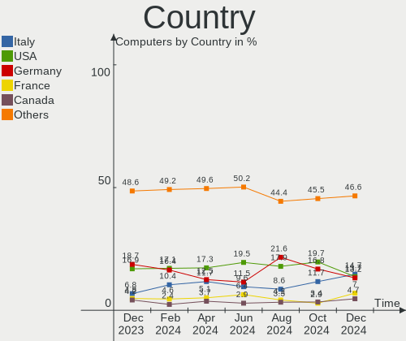
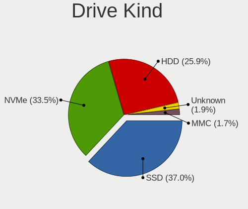
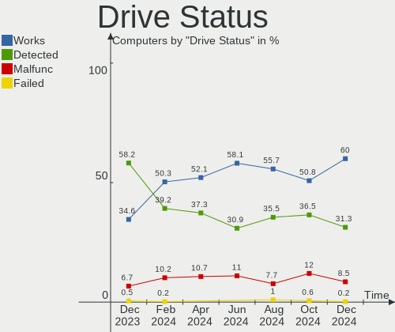
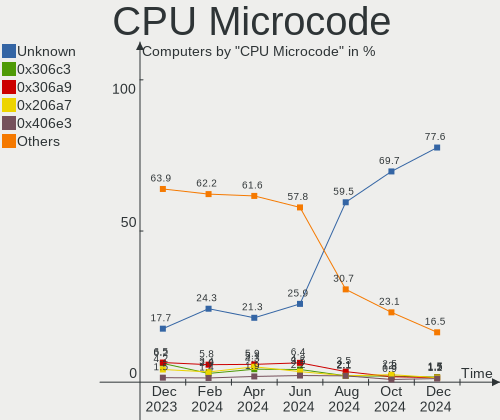
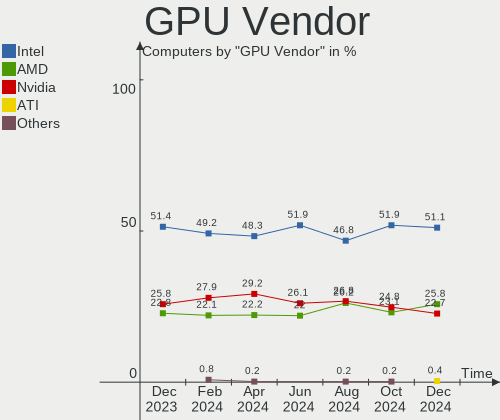
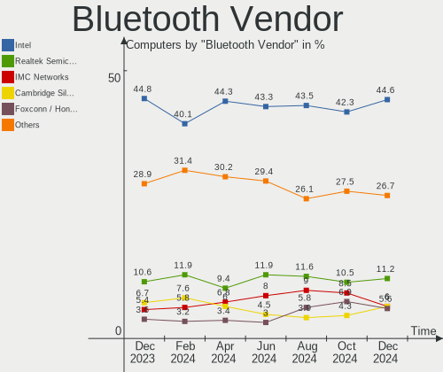
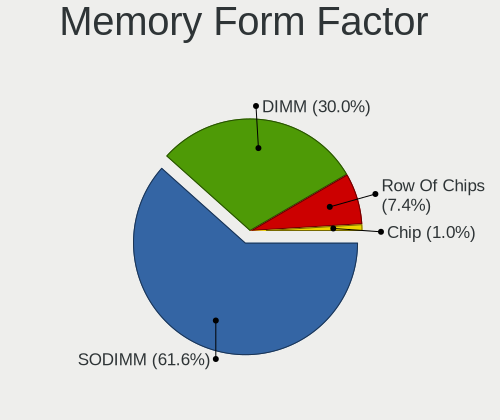
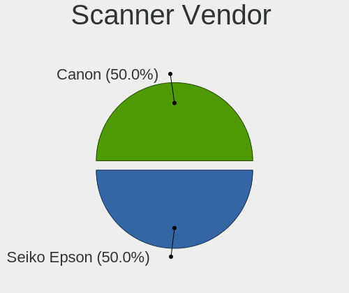
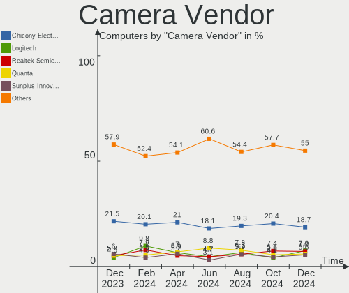

Linux Mint Hardware Trends
--------------------------

A project to identify most popular hardware characteristics and track their change
over time based on data collected by Linux Mint users at https://Linux-Hardware.org.

Anyone can contribute to this report by the [hw-probe](https://github.com/linuxhw/hw-probe) tool:

    sudo -E hw-probe -all -upload

This is a report for all computer types. See also reports for [desktops](/Dist/Linux_Mint/Desktop/README.md) and [notebooks](/Dist/Linux_Mint/Notebook/README.md).

Full-feature report is available here: https://linux-hardware.org/?view=trends

Period: Nov, 2021.

Contents
--------

* [ System ](#system)
  - [ OS                       ](#os)
  - [ OS Family                ](#os-family)
  - [ Kernel                   ](#kernel)
  - [ Kernel Family            ](#kernel-family)
  - [ Kernel Major Ver.        ](#kernel-major-ver)
  - [ Arch                     ](#arch)
  - [ DE                       ](#de)
  - [ Display Server           ](#display-server)
  - [ Display Manager          ](#display-manager)
  - [ OS Lang                  ](#os-lang)
  - [ Boot Mode                ](#boot-mode)
  - [ Filesystem               ](#filesystem)
  - [ Part. scheme             ](#part-scheme)
  - [ Dual Boot with Linux/BSD ](#dual-boot-with-linuxbsd)
  - [ Dual Boot (Win)          ](#dual-boot-win)

* [ Board ](#board)
  - [ Vendor                   ](#vendor)
  - [ Model                    ](#model)
  - [ Model Family             ](#model-family)
  - [ MFG Year                 ](#mfg-year)
  - [ Form Factor              ](#form-factor)
  - [ Secure Boot              ](#secure-boot)
  - [ Coreboot                 ](#coreboot)
  - [ RAM Size                 ](#ram-size)
  - [ RAM Used                 ](#ram-used)
  - [ Total Drives             ](#total-drives)
  - [ Has CD-ROM               ](#has-cd-rom)
  - [ Has Ethernet             ](#has-ethernet)
  - [ Has WiFi                 ](#has-wifi)
  - [ Has Bluetooth            ](#has-bluetooth)

* [ Location ](#location)
  - [ Country                  ](#country)
  - [ City                     ](#city)

* [ Drives ](#drives)
  - [ Drive Vendor             ](#drive-vendor)
  - [ Drive Model              ](#drive-model)
  - [ HDD Vendor               ](#hdd-vendor)
  - [ SSD Vendor               ](#ssd-vendor)
  - [ Drive Kind               ](#drive-kind)
  - [ Drive Connector          ](#drive-connector)
  - [ Drive Size               ](#drive-size)
  - [ Space Total              ](#space-total)
  - [ Space Used               ](#space-used)
  - [ Malfunc. Drives          ](#malfunc-drives)
  - [ Malfunc. Drive Vendor    ](#malfunc-drive-vendor)
  - [ Malfunc. HDD Vendor      ](#malfunc-hdd-vendor)
  - [ Malfunc. Drive Kind      ](#malfunc-drive-kind)
  - [ Failed Drives            ](#failed-drives)
  - [ Failed Drive Vendor      ](#failed-drive-vendor)
  - [ Drive Status             ](#drive-status)

* [ Storage controller ](#storage-controller)
  - [ Storage Vendor           ](#storage-vendor)
  - [ Storage Model            ](#storage-model)
  - [ Storage Kind             ](#storage-kind)

* [ Processor ](#processor)
  - [ CPU Vendor               ](#cpu-vendor)
  - [ CPU Model                ](#cpu-model)
  - [ CPU Model Family         ](#cpu-model-family)
  - [ CPU Cores                ](#cpu-cores)
  - [ CPU Sockets              ](#cpu-sockets)
  - [ CPU Threads              ](#cpu-threads)
  - [ CPU Op-Modes             ](#cpu-op-modes)
  - [ CPU Microcode            ](#cpu-microcode)
  - [ CPU Microarch            ](#cpu-microarch)

* [ Graphics ](#graphics)
  - [ GPU Vendor               ](#gpu-vendor)
  - [ GPU Model                ](#gpu-model)
  - [ GPU Combo                ](#gpu-combo)
  - [ GPU Driver               ](#gpu-driver)
  - [ GPU Memory               ](#gpu-memory)

* [ Monitor ](#monitor)
  - [ Monitor Vendor           ](#monitor-vendor)
  - [ Monitor Model            ](#monitor-model)
  - [ Monitor Resolution       ](#monitor-resolution)
  - [ Monitor Diagonal         ](#monitor-diagonal)
  - [ Monitor Width            ](#monitor-width)
  - [ Aspect Ratio             ](#aspect-ratio)
  - [ Monitor Area             ](#monitor-area)
  - [ Pixel Density            ](#pixel-density)
  - [ Multiple Monitors        ](#multiple-monitors)

* [ Network ](#network)
  - [ Net Controller Vendor    ](#net-controller-vendor)
  - [ Net Controller Model     ](#net-controller-model)
  - [ Wireless Vendor          ](#wireless-vendor)
  - [ Wireless Model           ](#wireless-model)
  - [ Ethernet Vendor          ](#ethernet-vendor)
  - [ Ethernet Model           ](#ethernet-model)
  - [ Net Controller Kind      ](#net-controller-kind)
  - [ Used Controller          ](#used-controller)
  - [ NICs                     ](#nics)
  - [ IPv6                     ](#ipv6)

* [ Bluetooth ](#bluetooth)
  - [ Bluetooth Vendor         ](#bluetooth-vendor)
  - [ Bluetooth Model          ](#bluetooth-model)

* [ Sound ](#sound)
  - [ Sound Vendor             ](#sound-vendor)
  - [ Sound Model              ](#sound-model)

* [ Memory ](#memory)
  - [ Memory Vendor            ](#memory-vendor)
  - [ Memory Model             ](#memory-model)
  - [ Memory Kind              ](#memory-kind)
  - [ Memory Form Factor       ](#memory-form-factor)
  - [ Memory Size              ](#memory-size)
  - [ Memory Speed             ](#memory-speed)

* [ Printers & scanners ](#printers--scanners)
  - [ Printer Vendor           ](#printer-vendor)
  - [ Printer Model            ](#printer-model)
  - [ Scanner Vendor           ](#scanner-vendor)
  - [ Scanner Model            ](#scanner-model)

* [ Camera ](#camera)
  - [ Camera Vendor            ](#camera-vendor)
  - [ Camera Model             ](#camera-model)

* [ Security ](#security)
  - [ Fingerprint Vendor       ](#fingerprint-vendor)
  - [ Fingerprint Model        ](#fingerprint-model)
  - [ Chipcard Vendor          ](#chipcard-vendor)
  - [ Chipcard Model           ](#chipcard-model)

* [ Unsupported ](#unsupported)
  - [ Unsupported Devices      ](#unsupported-devices)
  - [ Unsupported Device Types ](#unsupported-device-types)

System
------

OS
--

Installed operating systems

| Name            | Computers | Percent |
|-----------------|-----------|---------|
| Linux Mint 20.2 | 440       | 80.59%  |
| Linux Mint 19.3 | 37        | 6.78%   |
| Linux Mint 20   | 30        | 5.49%   |
| Linux Mint 20.1 | 27        | 4.95%   |
| Linux Mint 19.2 | 6         | 1.1%    |
| Linux Mint 19.1 | 3         | 0.55%   |
| Linux Mint 19   | 1         | 0.18%   |
| Linux Mint 18.3 | 1         | 0.18%   |
| Linux Mint 18   | 1         | 0.18%   |

OS Family
---------

OS without a version

| Name       | Computers | Percent |
|------------|-----------|---------|
| Linux Mint | 546       | 100%    |

Kernel
------

Version of the Linux kernel

| Version                    | Computers | Percent |
|----------------------------|-----------|---------|
| 5.4.0-90-generic           | 222       | 40.66%  |
| 5.4.0-89-generic           | 116       | 21.25%  |
| 5.4.0-74-generic           | 42        | 7.69%   |
| 5.13.0-21-generic          | 23        | 4.21%   |
| 5.11.0-38-generic          | 21        | 3.85%   |
| 5.11.0-40-generic          | 15        | 2.75%   |
| 5.4.0-91-generic           | 14        | 2.56%   |
| 5.4.0-88-generic           | 9         | 1.65%   |
| 5.0.0-32-generic           | 7         | 1.28%   |
| 5.4.0-58-generic           | 5         | 0.92%   |
| 4.15.0-162-generic         | 5         | 0.92%   |
| 5.4.0-77-generic           | 4         | 0.73%   |
| 5.4.0-26-generic           | 4         | 0.73%   |
| 5.10.0-1051-oem            | 4         | 0.73%   |
| 5.4.0-90-lowlatency        | 3         | 0.55%   |
| 5.4.0-81-generic           | 3         | 0.55%   |
| 4.15.0-20-generic          | 3         | 0.55%   |
| 5.4.0-87-generic           | 2         | 0.37%   |
| 5.4.0-86-generic           | 2         | 0.37%   |
| 5.4.0-84-generic           | 2         | 0.37%   |
| 5.4.0-80-generic           | 2         | 0.37%   |
| 5.4.0-66-generic           | 2         | 0.37%   |
| 5.4.0-62-generic           | 2         | 0.37%   |
| 5.4.0-40-generic           | 2         | 0.37%   |
| 5.10.0-1050-oem            | 2         | 0.37%   |
| 4.15.0-161-generic         | 2         | 0.37%   |
| 5.8.0-43-generic           | 1         | 0.18%   |
| 5.6.10-050610-generic      | 1         | 0.18%   |
| 5.4.0-89-lowlatency        | 1         | 0.18%   |
| 5.4.0-67-generic           | 1         | 0.18%   |
| 5.4.0-65-generic           | 1         | 0.18%   |
| 5.4.0-48-generic           | 1         | 0.18%   |
| 5.3.0-46-generic           | 1         | 0.18%   |
| 5.3.0-26-generic           | 1         | 0.18%   |
| 5.15.5-051505-generic      | 1         | 0.18%   |
| 5.15.4-xanmod1             | 1         | 0.18%   |
| 5.15.4-051504-generic      | 1         | 0.18%   |
| 5.15.3-surface             | 1         | 0.18%   |
| 5.15.1-xanmod1-tt          | 1         | 0.18%   |
| 5.15.0-ericb               | 1         | 0.18%   |
| 5.15-051500-generic        | 1         | 0.18%   |
| 5.14.0-18.1-liquorix-amd64 | 1         | 0.18%   |
| 5.13.0-22-generic          | 1         | 0.18%   |
| 5.11.16-051116-generic     | 1         | 0.18%   |
| 5.11.13-051113-generic     | 1         | 0.18%   |
| 5.11.0-27-generic          | 1         | 0.18%   |
| 4.4.0-57-generic           | 1         | 0.18%   |
| 4.19.163-0419163-generic   | 1         | 0.18%   |
| 4.15.0-70-generic          | 1         | 0.18%   |
| 4.15.0-54-generic          | 1         | 0.18%   |
| 4.15.0-43-generic          | 1         | 0.18%   |
| 4.15.0-162-lowlatency      | 1         | 0.18%   |
| 4.15.0-147-generic         | 1         | 0.18%   |
| 4.15.0-136-generic         | 1         | 0.18%   |

Kernel Family
-------------

Linux kernel without a distro release

| Version  | Computers | Percent |
|----------|-----------|---------|
| 5.4.0    | 440       | 80.59%  |
| 5.11.0   | 37        | 6.78%   |
| 5.13.0   | 24        | 4.4%    |
| 4.15.0   | 16        | 2.93%   |
| 5.0.0    | 7         | 1.28%   |
| 5.10.0   | 6         | 1.1%    |
| 5.3.0    | 2         | 0.37%   |
| 5.15.4   | 2         | 0.37%   |
| 5.8.0    | 1         | 0.18%   |
| 5.6.10   | 1         | 0.18%   |
| 5.15.5   | 1         | 0.18%   |
| 5.15.3   | 1         | 0.18%   |
| 5.15.1   | 1         | 0.18%   |
| 5.15.0   | 1         | 0.18%   |
| 5.15     | 1         | 0.18%   |
| 5.14.0   | 1         | 0.18%   |
| 5.11.16  | 1         | 0.18%   |
| 5.11.13  | 1         | 0.18%   |
| 4.4.0    | 1         | 0.18%   |
| 4.19.163 | 1         | 0.18%   |

Kernel Major Ver.
-----------------

Linux kernel major version

| Version | Computers | Percent |
|---------|-----------|---------|
| 5.4     | 440       | 80.59%  |
| 5.11    | 39        | 7.14%   |
| 5.13    | 24        | 4.4%    |
| 4.15    | 16        | 2.93%   |
| 5.0     | 7         | 1.28%   |
| 5.15    | 6         | 1.1%    |
| 5.10    | 6         | 1.1%    |
| 5.3     | 2         | 0.37%   |
| 5.8     | 1         | 0.18%   |
| 5.6     | 1         | 0.18%   |
| 5.14    | 1         | 0.18%   |
| 5       | 1         | 0.18%   |
| 4.4     | 1         | 0.18%   |
| 4.19    | 1         | 0.18%   |

Arch
----

OS architecture (x86_64, i586, etc.)

| Name   | Computers | Percent |
|--------|-----------|---------|
| x86_64 | 532       | 97.44%  |
| i686   | 14        | 2.56%   |

DE
--

Desktop Environment

| Name       | Computers | Percent |
|------------|-----------|---------|
| X-Cinnamon | 372       | 68.13%  |
| MATE       | 75        | 13.74%  |
| XFCE       | 47        | 8.61%   |
| Cinnamon   | 38        | 6.96%   |
| GNOME      | 6         | 1.1%    |
| Unknown    | 6         | 1.1%    |
| LXDE       | 1         | 0.18%   |
| KDE        | 1         | 0.18%   |

Display Server
--------------

X11 or Wayland

| Name    | Computers | Percent |
|---------|-----------|---------|
| X11     | 542       | 99.27%  |
| Wayland | 2         | 0.37%   |
| Tty     | 2         | 0.37%   |

Display Manager
---------------

SDDM, LightDM, etc.

| Name    | Computers | Percent |
|---------|-----------|---------|
| Unknown | 313       | 57.33%  |
| LightDM | 229       | 41.94%  |
| GDM     | 3         | 0.55%   |
| MDM     | 1         | 0.18%   |

OS Lang
-------

Language

| Lang    | Computers | Percent |
|---------|-----------|---------|
| en_US   | 138       | 25.27%  |
| de_DE   | 125       | 22.89%  |
| pt_BR   | 36        | 6.59%   |
| en_GB   | 32        | 5.86%   |
| ru_RU   | 19        | 3.48%   |
| C       | 18        | 3.3%    |
| pl_PL   | 16        | 2.93%   |
| fr_FR   | 15        | 2.75%   |
| en_AU   | 13        | 2.38%   |
| es_ES   | 11        | 2.01%   |
| en_CA   | 10        | 1.83%   |
| nl_NL   | 9         | 1.65%   |
| en_IN   | 9         | 1.65%   |
| it_IT   | 8         | 1.47%   |
| hu_HU   | 6         | 1.1%    |
| de_AT   | 6         | 1.1%    |
| sv_SE   | 5         | 0.92%   |
| ru_UA   | 5         | 0.92%   |
| el_GR   | 5         | 0.92%   |
| de_CH   | 5         | 0.92%   |
| sk_SK   | 4         | 0.73%   |
| fi_FI   | 4         | 0.73%   |
| cs_CZ   | 4         | 0.73%   |
| hr_HR   | 3         | 0.55%   |
| fr_CA   | 3         | 0.55%   |
| fr_BE   | 3         | 0.55%   |
| en_ZA   | 3         | 0.55%   |
| ca_ES   | 3         | 0.55%   |
| zh_CN   | 2         | 0.37%   |
| pt_PT   | 2         | 0.37%   |
| es_US   | 2         | 0.37%   |
| es_PE   | 2         | 0.37%   |
| es_MX   | 2         | 0.37%   |
| es_CL   | 2         | 0.37%   |
| es_AR   | 2         | 0.37%   |
| en_PH   | 2         | 0.37%   |
| ro_RO   | 1         | 0.18%   |
| fr_CH   | 1         | 0.18%   |
| es_EC   | 1         | 0.18%   |
| es_CR   | 1         | 0.18%   |
| es_CO   | 1         | 0.18%   |
| en_NZ   | 1         | 0.18%   |
| en_IL   | 1         | 0.18%   |
| en_IE   | 1         | 0.18%   |
| en_DK   | 1         | 0.18%   |
| da_DK   | 1         | 0.18%   |
| bg_BG   | 1         | 0.18%   |
| Unknown | 1         | 0.18%   |

Boot Mode
---------

EFI or BIOS

| Mode | Computers | Percent |
|------|-----------|---------|
| EFI  | 290       | 53.11%  |
| BIOS | 256       | 46.89%  |

Filesystem
----------

Type of filesystem

| Type    | Computers | Percent |
|---------|-----------|---------|
| Ext4    | 522       | 95.6%   |
| Overlay | 15        | 2.75%   |
| Btrfs   | 5         | 0.92%   |
| Ext3    | 2         | 0.37%   |
| Xfs     | 1         | 0.18%   |
| Unknown | 1         | 0.18%   |

Part. scheme
------------

Scheme of partitioning

| Type    | Computers | Percent |
|---------|-----------|---------|
| Unknown | 343       | 62.82%  |
| GPT     | 142       | 26.01%  |
| MBR     | 61        | 11.17%  |

Dual Boot with Linux/BSD
------------------------

Hosting more than one Linux/BSD

| Dual boot | Computers | Percent |
|-----------|-----------|---------|
| No        | 512       | 93.77%  |
| Yes       | 34        | 6.23%   |

Dual Boot (Win)
---------------

Hosting Linux and Windows

| Dual boot | Computers | Percent |
|-----------|-----------|---------|
| No        | 457       | 83.7%   |
| Yes       | 89        | 16.3%   |

Board
-----

Vendor
------

Motherboard manufacturer

| Name                | Computers | Percent |
|---------------------|-----------|---------|
| ASUSTek Computer    | 84        | 15.38%  |
| Hewlett-Packard     | 75        | 13.74%  |
| Dell                | 75        | 13.74%  |
| Lenovo              | 62        | 11.36%  |
| Gigabyte Technology | 31        | 5.68%   |
| MSI                 | 30        | 5.49%   |
| Acer                | 29        | 5.31%   |
| ASRock              | 26        | 4.76%   |
| Apple               | 17        | 3.11%   |
| Samsung Electronics | 11        | 2.01%   |
| Sony                | 10        | 1.83%   |
| Toshiba             | 8         | 1.47%   |
| Unknown             | 8         | 1.47%   |
| Medion              | 7         | 1.28%   |
| Fujitsu             | 7         | 1.28%   |
| Positivo            | 5         | 0.92%   |
| Intel               | 5         | 0.92%   |
| Notebook            | 4         | 0.73%   |
| Google              | 4         | 0.73%   |
| Foxconn             | 4         | 0.73%   |
| Packard Bell        | 3         | 0.55%   |
| Microsoft           | 3         | 0.55%   |
| HUAWEI              | 3         | 0.55%   |
| GPU Company         | 3         | 0.55%   |
| ECS                 | 3         | 0.55%   |
| Biostar             | 3         | 0.55%   |
| TUXEDO              | 2         | 0.37%   |
| Semp Toshiba        | 2         | 0.37%   |
| Panasonic           | 2         | 0.37%   |
| Fujitsu Siemens     | 2         | 0.37%   |
| Timi                | 1         | 0.18%   |
| SZMZ                | 1         | 0.18%   |
| System76            | 1         | 0.18%   |
| SIMPC               | 1         | 0.18%   |
| Shuttle             | 1         | 0.18%   |
| On by NetOnNet      | 1         | 0.18%   |
| OEM                 | 1         | 0.18%   |
| Multilaser          | 1         | 0.18%   |
| IBM                 | 1         | 0.18%   |
| Huanan              | 1         | 0.18%   |
| HC                  | 1         | 0.18%   |
| Gateway             | 1         | 0.18%   |
| Emaxx Technology.   | 1         | 0.18%   |
| COM1                | 1         | 0.18%   |
| Casper              | 1         | 0.18%   |
| BANGHO              | 1         | 0.18%   |
| AZW                 | 1         | 0.18%   |
| Alienware           | 1         | 0.18%   |

Model
-----

Motherboard model

| Name                              | Computers | Percent |
|-----------------------------------|-----------|---------|
| Unknown                           | 9         | 1.65%   |
| ASUS All Series                   | 8         | 1.47%   |
| HP Pavilion 15                    | 3         | 0.55%   |
| HP EliteDesk 800 G1 TWR           | 3         | 0.55%   |
| HP EliteDesk 800 G1 SFF           | 3         | 0.55%   |
| Gigabyte B560M AORUS ELITE        | 3         | 0.55%   |
| Dell OptiPlex 7010                | 3         | 0.55%   |
| ASUS M5A99FX PRO R2.0             | 3         | 0.55%   |
| Apple iMac18,2                    | 3         | 0.55%   |
| Samsung 550XCJ/550XCR             | 2         | 0.37%   |
| Positivo Mobile                   | 2         | 0.37%   |
| MSI MS-B06211                     | 2         | 0.37%   |
| MSI MS-7B89                       | 2         | 0.37%   |
| MSI MS-7808                       | 2         | 0.37%   |
| MSI MS-7693                       | 2         | 0.37%   |
| Lenovo IdeaPadFlex 5 14ARE05 81X2 | 2         | 0.37%   |
| Lenovo IdeaPad 5 Pro 16ACH6 82L5  | 2         | 0.37%   |
| Lenovo G470 20078                 | 2         | 0.37%   |
| HP Pavilion g7                    | 2         | 0.37%   |
| GPU Company GWTN156-11            | 2         | 0.37%   |
| Gigabyte B550M S2H                | 2         | 0.37%   |
| ECS H61H2-M6                      | 2         | 0.37%   |
| Dell XPS 13 7390                  | 2         | 0.37%   |
| Dell OptiPlex 9020                | 2         | 0.37%   |
| Dell OptiPlex 790                 | 2         | 0.37%   |
| Dell OptiPlex 780                 | 2         | 0.37%   |
| Dell Latitude E6540               | 2         | 0.37%   |
| Dell Latitude E6420               | 2         | 0.37%   |
| Dell Latitude E6400               | 2         | 0.37%   |
| Dell Inspiron MP061               | 2         | 0.37%   |
| Dell Inspiron 5402                | 2         | 0.37%   |
| Dell Inspiron 3501                | 2         | 0.37%   |
| ASUS TUF GAMING X570-PLUS         | 2         | 0.37%   |
| ASUS A68HM-PLUS                   | 2         | 0.37%   |
| ASRock Z77 Extreme6               | 2         | 0.37%   |
| ASRock 970M Pro3                  | 2         | 0.37%   |
| Apple MacPro2,1                   | 2         | 0.37%   |
| Acer Aspire E5-575G               | 2         | 0.37%   |
| TUXEDO P7xxTM1                    | 1         | 0.18%   |
| TUXEDO InfinityBook Pro 14 Gen6   | 1         | 0.18%   |
| Toshiba Satellite S55-C           | 1         | 0.18%   |
| Toshiba Satellite Pro S300L       | 1         | 0.18%   |
| Toshiba Satellite P750            | 1         | 0.18%   |
| Toshiba Satellite L655D           | 1         | 0.18%   |
| Toshiba Satellite L640            | 1         | 0.18%   |
| Toshiba Satellite L40             | 1         | 0.18%   |
| Toshiba Satellite C850-1KN        | 1         | 0.18%   |
| Toshiba Satellite A300            | 1         | 0.18%   |
| Timi Mi NoteBook Pro              | 1         | 0.18%   |
| SZMZ X99M-G2                      | 1         | 0.18%   |
| System76 Gazelle                  | 1         | 0.18%   |
| Sony VPCZ21V9E                    | 1         | 0.18%   |
| Sony VPCS12L9E                    | 1         | 0.18%   |
| Sony VPCEB3E4E                    | 1         | 0.18%   |
| Sony VGN-Z31WN_B                  | 1         | 0.18%   |
| Sony VGN-Z11MN_B                  | 1         | 0.18%   |
| Sony VGN-FZ480E                   | 1         | 0.18%   |
| Sony SVF1521A1EW                  | 1         | 0.18%   |
| Sony SVE1713Y1EB                  | 1         | 0.18%   |
| Sony SVE1513Y1ESI                 | 1         | 0.18%   |

Model Family
------------

Motherboard model prefix

| Name                   | Computers | Percent |
|------------------------|-----------|---------|
| Lenovo ThinkPad        | 27        | 4.95%   |
| Dell Inspiron          | 22        | 4.03%   |
| Acer Aspire            | 21        | 3.85%   |
| HP Pavilion            | 16        | 2.93%   |
| Dell Latitude          | 16        | 2.93%   |
| Dell OptiPlex          | 12        | 2.2%    |
| Lenovo IdeaPad         | 10        | 1.83%   |
| Unknown                | 9         | 1.65%   |
| Toshiba Satellite      | 8         | 1.47%   |
| HP Laptop              | 8         | 1.47%   |
| HP EliteDesk           | 8         | 1.47%   |
| Dell Vostro            | 8         | 1.47%   |
| ASUS PRIME             | 8         | 1.47%   |
| ASUS All               | 8         | 1.47%   |
| HP Compaq              | 7         | 1.28%   |
| Dell Precision         | 7         | 1.28%   |
| ASUS TUF               | 6         | 1.1%    |
| Lenovo ThinkCentre     | 5         | 0.92%   |
| HP EliteBook           | 5         | 0.92%   |
| Fujitsu LIFEBOOK       | 5         | 0.92%   |
| HP ProBook             | 4         | 0.73%   |
| Gigabyte B560M         | 4         | 0.73%   |
| Dell XPS               | 4         | 0.73%   |
| ASUS VivoBook          | 4         | 0.73%   |
| Microsoft Surface      | 3         | 0.55%   |
| Lenovo IdeaPadFlex     | 3         | 0.55%   |
| HP ZBook               | 3         | 0.55%   |
| HP Spectre             | 3         | 0.55%   |
| HP ENVY                | 3         | 0.55%   |
| ASUS SABERTOOTH        | 3         | 0.55%   |
| ASUS ROG               | 3         | 0.55%   |
| ASUS M5A99FX           | 3         | 0.55%   |
| ASUS M5A78L-M          | 3         | 0.55%   |
| ASUS ASUS              | 3         | 0.55%   |
| Apple iMac18           | 3         | 0.55%   |
| Samsung 550XCJ         | 2         | 0.37%   |
| Positivo Mobile        | 2         | 0.37%   |
| Packard Bell EasyNote  | 2         | 0.37%   |
| MSI MS-B06211          | 2         | 0.37%   |
| MSI MS-7B89            | 2         | 0.37%   |
| MSI MS-7808            | 2         | 0.37%   |
| MSI MS-7693            | 2         | 0.37%   |
| Lenovo Yoga            | 2         | 0.37%   |
| Lenovo G470            | 2         | 0.37%   |
| HP ProDesk             | 2         | 0.37%   |
| GPU Company GWTN156-11 | 2         | 0.37%   |
| Gigabyte B550M         | 2         | 0.37%   |
| Gigabyte B550          | 2         | 0.37%   |
| Fujitsu Siemens AMILO  | 2         | 0.37%   |
| ECS H61H2-M6           | 2         | 0.37%   |
| Dell Studio            | 2         | 0.37%   |
| Dell G3                | 2         | 0.37%   |
| ASUS P8Z77-V           | 2         | 0.37%   |
| ASUS Maximus           | 2         | 0.37%   |
| ASUS M5A97             | 2         | 0.37%   |
| ASUS A68HM-PLUS        | 2         | 0.37%   |
| ASRock Z77             | 2         | 0.37%   |
| ASRock X570            | 2         | 0.37%   |
| ASRock B450M           | 2         | 0.37%   |
| ASRock 970M            | 2         | 0.37%   |

MFG Year
--------

Motherboard manufacture year

| Year | Computers | Percent |
|------|-----------|---------|
| 2021 | 101       | 18.5%   |
| 2020 | 52        | 9.52%   |
| 2013 | 51        | 9.34%   |
| 2019 | 45        | 8.24%   |
| 2012 | 43        | 7.88%   |
| 2018 | 41        | 7.51%   |
| 2011 | 37        | 6.78%   |
| 2014 | 30        | 5.49%   |
| 2015 | 27        | 4.95%   |
| 2016 | 21        | 3.85%   |
| 2009 | 21        | 3.85%   |
| 2010 | 19        | 3.48%   |
| 2008 | 19        | 3.48%   |
| 2017 | 17        | 3.11%   |
| 2007 | 15        | 2.75%   |
| 2006 | 3         | 0.55%   |
| 2005 | 3         | 0.55%   |
| 2002 | 1         | 0.18%   |

Form Factor
-----------

Physical design of the computer

| Name        | Computers | Percent |
|-------------|-----------|---------|
| Notebook    | 287       | 52.56%  |
| Desktop     | 220       | 40.29%  |
| All in one  | 14        | 2.56%   |
| Convertible | 13        | 2.38%   |
| Mini pc     | 6         | 1.1%    |
| Tablet      | 4         | 0.73%   |
| Server      | 2         | 0.37%   |

Secure Boot
-----------

Enabled or disabled

| State    | Computers | Percent |
|----------|-----------|---------|
| Disabled | 496       | 90.84%  |
| Enabled  | 50        | 9.16%   |

Coreboot
--------

Have coreboot on board

| Used | Computers | Percent |
|------|-----------|---------|
| No   | 542       | 99.27%  |
| Yes  | 4         | 0.73%   |

RAM Size
--------

Total RAM memory

| Size in GB  | Computers | Percent |
|-------------|-----------|---------|
| 16.01-24.0  | 127       | 23.26%  |
| 4.01-8.0    | 122       | 22.34%  |
| 3.01-4.0    | 114       | 20.88%  |
| 8.01-16.0   | 93        | 17.03%  |
| 32.01-64.0  | 47        | 8.61%   |
| 1.01-2.0    | 24        | 4.4%    |
| 2.01-3.0    | 11        | 2.01%   |
| 24.01-32.0  | 5         | 0.92%   |
| 64.01-256.0 | 2         | 0.37%   |
| 0.51-1.0    | 1         | 0.18%   |

RAM Used
--------

Used RAM memory

| Used GB   | Computers | Percent |
|-----------|-----------|---------|
| 1.01-2.0  | 231       | 42.31%  |
| 2.01-3.0  | 149       | 27.29%  |
| 4.01-8.0  | 62        | 11.36%  |
| 3.01-4.0  | 53        | 9.71%   |
| 0.51-1.0  | 33        | 6.04%   |
| 8.01-16.0 | 15        | 2.75%   |
| 0.01-0.5  | 3         | 0.55%   |

Total Drives
------------

Number of drives on board

| Drives | Computers | Percent |
|--------|-----------|---------|
| 1      | 322       | 58.97%  |
| 2      | 145       | 26.56%  |
| 3      | 41        | 7.51%   |
| 4      | 21        | 3.85%   |
| 5      | 6         | 1.1%    |
| 0      | 5         | 0.92%   |
| 6      | 4         | 0.73%   |
| 8      | 1         | 0.18%   |
| 7      | 1         | 0.18%   |

Has CD-ROM
----------

Has CD-ROM on board

| Presented | Computers | Percent |
|-----------|-----------|---------|
| No        | 278       | 50.92%  |
| Yes       | 268       | 49.08%  |

Has Ethernet
------------

Has Ethernet on board

| Presented | Computers | Percent |
|-----------|-----------|---------|
| Yes       | 487       | 89.19%  |
| No        | 59        | 10.81%  |

Has WiFi
--------

Has WiFi module

| Presented | Computers | Percent |
|-----------|-----------|---------|
| Yes       | 416       | 76.19%  |
| No        | 130       | 23.81%  |

Has Bluetooth
-------------

Has Bluetooth module

| Presented | Computers | Percent |
|-----------|-----------|---------|
| Yes       | 283       | 51.83%  |
| No        | 263       | 48.17%  |

Location
--------

Country
-------

Geographic location (country)

| Country                | Computers | Percent |
|------------------------|-----------|---------|
| Germany                | 131       | 23.99%  |
| USA                    | 90        | 16.48%  |
| Brazil                 | 45        | 8.24%   |
| UK                     | 29        | 5.31%   |
| Russia                 | 19        | 3.48%   |
| Spain                  | 17        | 3.11%   |
| Poland                 | 17        | 3.11%   |
| France                 | 17        | 3.11%   |
| Netherlands            | 14        | 2.56%   |
| Italy                  | 13        | 2.38%   |
| Australia              | 13        | 2.38%   |
| Canada                 | 12        | 2.2%    |
| Ukraine                | 10        | 1.83%   |
| India                  | 10        | 1.83%   |
| Switzerland            | 9         | 1.65%   |
| Sweden                 | 8         | 1.47%   |
| Hungary                | 7         | 1.28%   |
| Greece                 | 7         | 1.28%   |
| Austria                | 6         | 1.1%    |
| Slovakia               | 5         | 0.92%   |
| Finland                | 5         | 0.92%   |
| Belgium                | 5         | 0.92%   |
| Mexico                 | 4         | 0.73%   |
| South Africa           | 3         | 0.55%   |
| Morocco                | 3         | 0.55%   |
| Ecuador                | 3         | 0.55%   |
| Denmark                | 3         | 0.55%   |
| Czechia                | 3         | 0.55%   |
| China                  | 3         | 0.55%   |
| Romania                | 2         | 0.37%   |
| Portugal               | 2         | 0.37%   |
| Philippines            | 2         | 0.37%   |
| Pakistan               | 2         | 0.37%   |
| Chile                  | 2         | 0.37%   |
| Bosnia and Herzegovina | 2         | 0.37%   |
| Argentina              | 2         | 0.37%   |
| Vietnam                | 1         | 0.18%   |
| Turkey                 | 1         | 0.18%   |
| Serbia                 | 1         | 0.18%   |
| Puerto Rico            | 1         | 0.18%   |
| Peru                   | 1         | 0.18%   |
| New Zealand            | 1         | 0.18%   |
| Montenegro             | 1         | 0.18%   |
| Malaysia               | 1         | 0.18%   |
| Lebanon                | 1         | 0.18%   |
| Kyrgyzstan             | 1         | 0.18%   |
| Israel                 | 1         | 0.18%   |
| Ireland                | 1         | 0.18%   |
| Indonesia              | 1         | 0.18%   |
| Ethiopia               | 1         | 0.18%   |
| Equatorial Guinea      | 1         | 0.18%   |
| Egypt                  | 1         | 0.18%   |
| Croatia                | 1         | 0.18%   |
| Costa Rica             | 1         | 0.18%   |
| Colombia               | 1         | 0.18%   |
| Bangladesh             | 1         | 0.18%   |
| Bahrain                | 1         | 0.18%   |

City
----

Geographic location (city)

| City               | Computers | Percent |
|--------------------|-----------|---------|
| Berlin             | 15        | 2.75%   |
| Moscow             | 7         | 1.28%   |
| Frankfurt am Main  | 7         | 1.28%   |
| Sydney             | 6         | 1.1%    |
| London             | 6         | 1.1%    |
| Rio de Janeiro     | 5         | 0.92%   |
| Paris              | 4         | 0.73%   |
| New York           | 4         | 0.73%   |
| Albuquerque        | 4         | 0.73%   |
| Zurich             | 3         | 0.55%   |
| Warsaw             | 3         | 0.55%   |
| Portland           | 3         | 0.55%   |
| Nuremberg          | 3         | 0.55%   |
| Melbourne          | 3         | 0.55%   |
| Kyiv               | 3         | 0.55%   |
| Helsinki           | 3         | 0.55%   |
| Hamburg            | 3         | 0.55%   |
| Florence           | 3         | 0.55%   |
| Budapest           | 3         | 0.55%   |
| Brussels           | 3         | 0.55%   |
| Bottrop            | 3         | 0.55%   |
| Barcelona          | 3         | 0.55%   |
| Zapel              | 2         | 0.37%   |
| Wiesbaden          | 2         | 0.37%   |
| Vienna             | 2         | 0.37%   |
| Tangier            | 2         | 0.37%   |
| Stelle             | 2         | 0.37%   |
| Schmalkalden       | 2         | 0.37%   |
| S??o Paulo         | 2         | 0.37%   |
| Sao Goncalo        | 2         | 0.37%   |
| Rostock            | 2         | 0.37%   |
| Porto Alegre       | 2         | 0.37%   |
| Patos de Minas     | 2         | 0.37%   |
| Palhoca            | 2         | 0.37%   |
| Orlando            | 2         | 0.37%   |
| New Delhi          | 2         | 0.37%   |
| Munich             | 2         | 0.37%   |
| Montgomery Village | 2         | 0.37%   |
| Mexico City        | 2         | 0.37%   |
| Marktredwitz       | 2         | 0.37%   |
| Mannheim           | 2         | 0.37%   |
| Madrid             | 2         | 0.37%   |
| Leipzig            | 2         | 0.37%   |
| Krefeld            | 2         | 0.37%   |
| Khabarovsk         | 2         | 0.37%   |
| Karlsruhe          | 2         | 0.37%   |
| Gothenburg         | 2         | 0.37%   |
| Gelsenkirchen      | 2         | 0.37%   |
| Dresden            | 2         | 0.37%   |
| Dortmund           | 2         | 0.37%   |
| Bucharest          | 2         | 0.37%   |
| Bochum             | 2         | 0.37%   |
| Bilbao             | 2         | 0.37%   |
| Bila Tserkva       | 2         | 0.37%   |
| Bialystok          | 2         | 0.37%   |
| Bendorf            | 2         | 0.37%   |
| Athens             | 2         | 0.37%   |
| Amsterdam          | 2         | 0.37%   |
| Adelaide CBD       | 2         | 0.37%   |
| Zutphen            | 1         | 0.18%   |

Drives
------

Drive Vendor
------------

Hard drive vendors

| Vendor                      | Computers | Drives | Percent |
|-----------------------------|-----------|--------|---------|
| WDC                         | 136       | 161    | 17.46%  |
| Seagate                     | 124       | 142    | 15.92%  |
| Samsung Electronics         | 111       | 133    | 14.25%  |
| SanDisk                     | 46        | 53     | 5.91%   |
| Toshiba                     | 45        | 47     | 5.78%   |
| Kingston                    | 44        | 45     | 5.65%   |
| Hitachi                     | 31        | 31     | 3.98%   |
| Crucial                     | 28        | 30     | 3.59%   |
| Unknown                     | 22        | 22     | 2.82%   |
| Intel                       | 19        | 21     | 2.44%   |
| SK Hynix                    | 16        | 16     | 2.05%   |
| Intenso                     | 10        | 11     | 1.28%   |
| A-DATA Technology           | 10        | 10     | 1.28%   |
| HGST                        | 9         | 9      | 1.16%   |
| Patriot                     | 7         | 7      | 0.9%    |
| Micron Technology           | 7         | 7      | 0.9%    |
| China                       | 7         | 7      | 0.9%    |
| Apple                       | 7         | 9      | 0.9%    |
| KIOXIA                      | 6         | 6      | 0.77%   |
| Fujitsu                     | 6         | 6      | 0.77%   |
| Unknown                     | 6         | 6      | 0.77%   |
| Silicon Motion              | 4         | 4      | 0.51%   |
| Phison                      | 4         | 5      | 0.51%   |
| MAXTOR                      | 4         | 4      | 0.51%   |
| UMIS                        | 3         | 3      | 0.39%   |
| PNY                         | 3         | 3      | 0.39%   |
| LITEONIT                    | 3         | 4      | 0.39%   |
| Lexar                       | 3         | 3      | 0.39%   |
| KingSpec                    | 3         | 3      | 0.39%   |
| XPG                         | 2         | 2      | 0.26%   |
| Transcend                   | 2         | 2      | 0.26%   |
| Team                        | 2         | 2      | 0.26%   |
| SPCC                        | 2         | 2      | 0.26%   |
| SABRENT                     | 2         | 2      | 0.26%   |
| Realtek                     | 2         | 2      | 0.26%   |
| Pioneer                     | 2         | 2      | 0.26%   |
| LITEON                      | 2         | 2      | 0.26%   |
| JMicron                     | 2         | 2      | 0.26%   |
| GOODRAM                     | 2         | 2      | 0.26%   |
| Emtec                       | 2         | 2      | 0.26%   |
| asmedia                     | 2         | 2      | 0.26%   |
| ADATA Technology            | 2         | 2      | 0.26%   |
| Yangtze Memory Technologies | 1         | 1      | 0.13%   |
| XrayDisk                    | 1         | 1      | 0.13%   |
| Verbatim                    | 1         | 1      | 0.13%   |
| USB3.0                      | 1         | 1      | 0.13%   |
| Union Memory (Shenzhen)     | 1         | 1      | 0.13%   |
| Teclast                     | 1         | 1      | 0.13%   |
| TDAS                        | 1         | 4      | 0.13%   |
| Secureye                    | 1         | 1      | 0.13%   |
| Realtek Semiconductor       | 1         | 1      | 0.13%   |
| PLEXTOR                     | 1         | 1      | 0.13%   |
| OCZ                         | 1         | 1      | 0.13%   |
| Novation                    | 1         | 1      | 0.13%   |
| Mushkin                     | 1         | 1      | 0.13%   |
| Leven                       | 1         | 1      | 0.13%   |
| LDLC                        | 1         | 1      | 0.13%   |
| LaCie                       | 1         | 1      | 0.13%   |
| KingFast                    | 1         | 1      | 0.13%   |
| KingDian                    | 1         | 1      | 0.13%   |

Drive Model
-----------

Hard drive models

| Model                               | Computers | Percent |
|-------------------------------------|-----------|---------|
| Kingston SA400S37240G 240GB SSD     | 13        | 1.54%   |
| Seagate ST1000DM010-2EP102 1TB      | 11        | 1.3%    |
| Samsung SSD 860 EVO 500GB           | 9         | 1.07%   |
| Seagate ST500DM002-1BD142 500GB     | 7         | 0.83%   |
| Unknown MMC Card  32GB              | 6         | 0.71%   |
| Seagate Expansion 1TB               | 6         | 0.71%   |
| SanDisk SSD PLUS 480GB              | 6         | 0.71%   |
| Kingston SA400S37120G 120GB SSD     | 6         | 0.71%   |
| Crucial CT500MX500SSD1 500GB        | 6         | 0.71%   |
| Unknown                             | 6         | 0.71%   |
| Unknown MMC Card  64GB              | 5         | 0.59%   |
| Seagate ST500LM012 HN-M500MBB 500GB | 5         | 0.59%   |
| Seagate ST2000DM006-2DM164 2TB      | 5         | 0.59%   |
| Seagate ST1000LM035-1RK172 1TB      | 5         | 0.59%   |
| Samsung SSD 970 EVO Plus 1TB        | 5         | 0.59%   |
| Samsung SSD 860 EVO 1TB             | 5         | 0.59%   |
| Samsung SSD 850 EVO 500GB           | 5         | 0.59%   |
| Samsung NVMe SSD Drive 500GB        | 5         | 0.59%   |
| Crucial CT240BX500SSD1 240GB        | 5         | 0.59%   |
| Toshiba MQ04ABF100 1TB              | 4         | 0.47%   |
| Toshiba DT01ACA100 1TB              | 4         | 0.47%   |
| SK Hynix NVMe SSD Drive 512GB       | 4         | 0.47%   |
| Seagate ST9500325AS 500GB           | 4         | 0.47%   |
| Seagate ST2000DM008-2FR102 2TB      | 4         | 0.47%   |
| Seagate ST1000LM024 HN-M101MBB 1TB  | 4         | 0.47%   |
| SanDisk SSD PLUS 240GB              | 4         | 0.47%   |
| Sandisk NVMe SSD Drive 1TB          | 4         | 0.47%   |
| Samsung NVMe SSD Drive 1TB          | 4         | 0.47%   |
| Kingston SA400S37480G 480GB SSD     | 4         | 0.47%   |
| Kingston NVMe SSD Drive 512GB       | 4         | 0.47%   |
| WDC WDS240G2G0A-00JH30 240GB SSD    | 3         | 0.36%   |
| WDC WDS100T2B0C-00PXH0 1TB          | 3         | 0.36%   |
| WDC WD40EZRZ-00GXCB0 4TB            | 3         | 0.36%   |
| WDC WD20EZRX-00D8PB0 2TB            | 3         | 0.36%   |
| WDC WD10JPVX-22JC3T0 1TB            | 3         | 0.36%   |
| WDC WD10EZEX-08WN4A0 1TB            | 3         | 0.36%   |
| WDC WD10EADS-00L5B1 1TB             | 3         | 0.36%   |
| Unknown MMC Card  128GB             | 3         | 0.36%   |
| Seagate ST750LM022 HN-M750MBB 752GB | 3         | 0.36%   |
| Seagate ST3500418AS 500GB           | 3         | 0.36%   |
| Seagate ST2000DX001-1NS164 2TB      | 3         | 0.36%   |
| Seagate ST2000DM001-1CH164 2TB      | 3         | 0.36%   |
| Seagate ST1000DM003-1ER162 1TB      | 3         | 0.36%   |
| Seagate ST1000DM003-1CH162 1TB      | 3         | 0.36%   |
| SanDisk SDSSDH3 500G                | 3         | 0.36%   |
| Samsung SSD 980 PRO 500GB           | 3         | 0.36%   |
| Samsung SSD 870 QVO 1TB             | 3         | 0.36%   |
| Samsung SSD 850 EVO 250GB           | 3         | 0.36%   |
| Samsung NVMe SSD Drive 512GB        | 3         | 0.36%   |
| Samsung NVMe SSD Drive 256GB        | 3         | 0.36%   |
| Samsung HD204UI 2TB                 | 3         | 0.36%   |
| Patriot Burst 240GB SSD             | 3         | 0.36%   |
| KIOXIA KBG40ZNS512G NVMe 512GB      | 3         | 0.36%   |
| Kingston SV300S37A240G 240GB SSD    | 3         | 0.36%   |
| Hitachi HTS545032B9A300 320GB       | 3         | 0.36%   |
| Crucial CT1000BX500SSD1 1TB         | 3         | 0.36%   |
| WDC WDS500G2B0A-00SM50 500GB SSD    | 2         | 0.24%   |
| WDC WD5000BEVT-22ZAT0 500GB         | 2         | 0.24%   |
| WDC WD20EARS-00MVWB0 2TB            | 2         | 0.24%   |
| WDC WD2000FYYZ-01UL1B1 2TB          | 2         | 0.24%   |

HDD Vendor
----------

Hard disk drive vendors

| Vendor              | Computers | Drives | Percent |
|---------------------|-----------|--------|---------|
| Seagate             | 123       | 140    | 34.17%  |
| WDC                 | 112       | 133    | 31.11%  |
| Toshiba             | 35        | 35     | 9.72%   |
| Hitachi             | 31        | 31     | 8.61%   |
| Samsung Electronics | 22        | 24     | 6.11%   |
| HGST                | 9         | 9      | 2.5%    |
| Fujitsu             | 6         | 6      | 1.67%   |
| Apple               | 5         | 5      | 1.39%   |
| MAXTOR              | 4         | 4      | 1.11%   |
| Unknown             | 2         | 2      | 0.56%   |
| Intenso             | 2         | 2      | 0.56%   |
| asmedia             | 2         | 2      | 0.56%   |
| USB3.0              | 1         | 1      | 0.28%   |
| LaCie               | 1         | 1      | 0.28%   |
| KESU                | 1         | 1      | 0.28%   |
| HGST HTS            | 1         | 1      | 0.28%   |
| External            | 1         | 1      | 0.28%   |
| ExcelStor           | 1         | 1      | 0.28%   |
| Unknown             | 1         | 1      | 0.28%   |

SSD Vendor
----------

Solid state drive vendors

| Vendor              | Computers | Drives | Percent |
|---------------------|-----------|--------|---------|
| Samsung Electronics | 61        | 64     | 22.59%  |
| SanDisk             | 38        | 42     | 14.07%  |
| Kingston            | 34        | 34     | 12.59%  |
| Crucial             | 27        | 29     | 10%     |
| WDC                 | 12        | 12     | 4.44%   |
| Intel               | 11        | 11     | 4.07%   |
| Intenso             | 8         | 8      | 2.96%   |
| China               | 7         | 7      | 2.59%   |
| A-DATA Technology   | 7         | 7      | 2.59%   |
| SK Hynix            | 6         | 6      | 2.22%   |
| Patriot             | 6         | 6      | 2.22%   |
| Toshiba             | 5         | 5      | 1.85%   |
| PNY                 | 3         | 3      | 1.11%   |
| Micron Technology   | 3         | 3      | 1.11%   |
| LITEONIT            | 3         | 4      | 1.11%   |
| Lexar               | 3         | 3      | 1.11%   |
| KingSpec            | 3         | 3      | 1.11%   |
| Apple               | 3         | 3      | 1.11%   |
| Transcend           | 2         | 2      | 0.74%   |
| Team                | 2         | 2      | 0.74%   |
| SPCC                | 2         | 2      | 0.74%   |
| Pioneer             | 2         | 2      | 0.74%   |
| LITEON              | 2         | 2      | 0.74%   |
| GOODRAM             | 2         | 2      | 0.74%   |
| Emtec               | 2         | 2      | 0.74%   |
| Unknown             | 2         | 2      | 0.74%   |
| Verbatim            | 1         | 1      | 0.37%   |
| Teclast             | 1         | 1      | 0.37%   |
| Secureye            | 1         | 1      | 0.37%   |
| PLEXTOR             | 1         | 1      | 0.37%   |
| OCZ                 | 1         | 1      | 0.37%   |
| Mushkin             | 1         | 1      | 0.37%   |
| Leven               | 1         | 1      | 0.37%   |
| KingDian            | 1         | 1      | 0.37%   |
| JMicron             | 1         | 1      | 0.37%   |
| Hewlett-Packard     | 1         | 1      | 0.37%   |
| BHT                 | 1         | 1      | 0.37%   |
| Apacer              | 1         | 1      | 0.37%   |
| ADATA SU            | 1         | 1      | 0.37%   |
| 1TB                 | 1         | 1      | 0.37%   |

Drive Kind
----------

HDD or SSD

| Kind    | Computers | Drives | Percent |
|---------|-----------|--------|---------|
| HDD     | 292       | 400    | 41.48%  |
| SSD     | 248       | 280    | 35.23%  |
| NVMe    | 129       | 148    | 18.32%  |
| MMC     | 21        | 21     | 2.98%   |
| Unknown | 14        | 17     | 1.99%   |

Drive Connector
---------------

SATA, SAS, NVMe, etc.

| Type | Computers | Drives | Percent |
|------|-----------|--------|---------|
| SATA | 445       | 655    | 70.52%  |
| NVMe | 127       | 144    | 20.13%  |
| SAS  | 38        | 46     | 6.02%   |
| MMC  | 21        | 21     | 3.33%   |

Drive Size
----------

Size of hard drive

| Size in TB | Computers | Drives | Percent |
|------------|-----------|--------|---------|
| 0.01-0.5   | 338       | 408    | 59.61%  |
| 0.51-1.0   | 151       | 176    | 26.63%  |
| 1.01-2.0   | 50        | 59     | 8.82%   |
| 3.01-4.0   | 15        | 19     | 2.65%   |
| 2.01-3.0   | 8         | 11     | 1.41%   |
| 4.01-10.0  | 5         | 7      | 0.88%   |

Space Total
-----------

Amount of disk space available on the file system

| Size in GB     | Computers | Percent |
|----------------|-----------|---------|
| 251-500        | 149       | 27.29%  |
| 101-250        | 146       | 26.74%  |
| 501-1000       | 85        | 15.57%  |
| 1001-2000      | 53        | 9.71%   |
| More than 3000 | 35        | 6.41%   |
| 51-100         | 35        | 6.41%   |
| 21-50          | 16        | 2.93%   |
| 2001-3000      | 15        | 2.75%   |
| 1-20           | 11        | 2.01%   |
| Unknown        | 1         | 0.18%   |

Space Used
----------

Amount of used disk space

| Used GB        | Computers | Percent |
|----------------|-----------|---------|
| 1-20           | 147       | 26.92%  |
| 21-50          | 113       | 20.7%   |
| 101-250        | 93        | 17.03%  |
| 51-100         | 74        | 13.55%  |
| 251-500        | 39        | 7.14%   |
| 501-1000       | 32        | 5.86%   |
| 1001-2000      | 31        | 5.68%   |
| More than 3000 | 9         | 1.65%   |
| 2001-3000      | 7         | 1.28%   |
| Unknown        | 1         | 0.18%   |

Malfunc. Drives
---------------

Drive models with a malfunction

| Model                                         | Computers | Drives | Percent |
|-----------------------------------------------|-----------|--------|---------|
| Seagate ST500LM012 HN-M500MBB 500GB           | 2         | 2      | 5%      |
| WDC WD6400BEVT-60A0RT0 640GB                  | 1         | 1      | 2.5%    |
| WDC WD5002ABYS-01B1B0 500GB                   | 1         | 1      | 2.5%    |
| WDC WD5000LPVX-80V0TT0 500GB                  | 1         | 1      | 2.5%    |
| WDC WD5000BPVT-22HXZT3 500GB                  | 1         | 1      | 2.5%    |
| WDC WD5000AAKX-603CA0 500GB                   | 1         | 1      | 2.5%    |
| WDC WD15EARS-00MVWB0 1TB                      | 1         | 1      | 2.5%    |
| WDC WD10JPVX-60JC3T0 1TB                      | 1         | 1      | 2.5%    |
| Toshiba THNSNK256GVN8 M.2 2280 256GB SSD      | 1         | 1      | 2.5%    |
| Toshiba MQ01ABD100 1TB                        | 1         | 1      | 2.5%    |
| Toshiba MK5065GSX 500GB                       | 1         | 1      | 2.5%    |
| Toshiba MK2546GSX 200 200GB                   | 1         | 1      | 2.5%    |
| Toshiba MK1237GSX 120GB                       | 1         | 1      | 2.5%    |
| Seagate ST9500325AS 500GB                     | 1         | 1      | 2.5%    |
| Seagate ST9120823ASG 120GB                    | 1         | 1      | 2.5%    |
| Seagate ST500LM021-1KJ152 500GB               | 1         | 1      | 2.5%    |
| Seagate ST500DM002-1BD142 500GB               | 1         | 1      | 2.5%    |
| Seagate ST3500418AS 500GB                     | 1         | 1      | 2.5%    |
| Seagate ST1000LM035-1RK172 1TB                | 1         | 1      | 2.5%    |
| Seagate ST1000LM024 HN-M101MBB 1TB            | 1         | 1      | 2.5%    |
| Seagate ST1000DM003-9YN162 1TB                | 1         | 1      | 2.5%    |
| SanDisk SSD U100 128GB                        | 1         | 1      | 2.5%    |
| SanDisk SDSSDA120G 120GB                      | 1         | 1      | 2.5%    |
| Samsung Electronics SP2504C 250GB             | 1         | 1      | 2.5%    |
| Samsung Electronics HM080HI 80GB              | 1         | 1      | 2.5%    |
| Samsung Electronics HD103UI 1TB               | 1         | 1      | 2.5%    |
| Micron Technology MTFDDAK512MAM-1K1 512GB SSD | 1         | 1      | 2.5%    |
| MAXTOR STM3500320AS 500GB                     | 1         | 1      | 2.5%    |
| MAXTOR STM3250310AS 250GB                     | 1         | 1      | 2.5%    |
| LITEONIT LCS-128L9S-11 2.5 7mm 128GB SSD      | 1         | 1      | 2.5%    |
| LITEON CV8-8E128-HP 128GB SSD                 | 1         | 1      | 2.5%    |
| Intel SSDSC2CW120A3 120GB                     | 1         | 1      | 2.5%    |
| Hitachi HTS725050A9A364 500GB                 | 1         | 1      | 2.5%    |
| Hitachi HDS728080PLA380 82GB                  | 1         | 1      | 2.5%    |
| Hitachi HDS721050CLA660 500GB                 | 1         | 1      | 2.5%    |
| ExcelStor Technology J8160S 165GB             | 1         | 1      | 2.5%    |
| Crucial M4-CT256M4SSD2 256GB                  | 1         | 1      | 2.5%    |
| Crucial CT128MX100SSD1 128GB                  | 1         | 1      | 2.5%    |
| Unknown                                       | 1         | 1      | 2.5%    |

Malfunc. Drive Vendor
---------------------

Vendors of faulty drives

| Vendor              | Computers | Drives | Percent |
|---------------------|-----------|--------|---------|
| Seagate             | 10        | 10     | 25%     |
| WDC                 | 7         | 7      | 17.5%   |
| Toshiba             | 5         | 5      | 12.5%   |
| Samsung Electronics | 3         | 3      | 7.5%    |
| Hitachi             | 3         | 3      | 7.5%    |
| SanDisk             | 2         | 2      | 5%      |
| MAXTOR              | 2         | 2      | 5%      |
| Crucial             | 2         | 2      | 5%      |
| Micron Technology   | 1         | 1      | 2.5%    |
| LITEONIT            | 1         | 1      | 2.5%    |
| LITEON              | 1         | 1      | 2.5%    |
| Intel               | 1         | 1      | 2.5%    |
| ExcelStor           | 1         | 1      | 2.5%    |
| Unknown             | 1         | 1      | 2.5%    |

Malfunc. HDD Vendor
-------------------

Vendors of faulty HDD drives

| Vendor              | Computers | Drives | Percent |
|---------------------|-----------|--------|---------|
| Seagate             | 10        | 10     | 32.26%  |
| WDC                 | 7         | 7      | 22.58%  |
| Toshiba             | 4         | 4      | 12.9%   |
| Samsung Electronics | 3         | 3      | 9.68%   |
| Hitachi             | 3         | 3      | 9.68%   |
| MAXTOR              | 2         | 2      | 6.45%   |
| ExcelStor           | 1         | 1      | 3.23%   |
| Unknown             | 1         | 1      | 3.23%   |

Malfunc. Drive Kind
-------------------

Kinds of faulty drives

| Kind | Computers | Drives | Percent |
|------|-----------|--------|---------|
| HDD  | 31        | 31     | 77.5%   |
| SSD  | 9         | 9      | 22.5%   |

Failed Drives
-------------

Failed drive models

Zero info for selected period =(

Failed Drive Vendor
-------------------

Failed drive vendors

Zero info for selected period =(

Drive Status
------------

Number of failed and malfunc. drives

| Status   | Computers | Drives | Percent |
|----------|-----------|--------|---------|
| Detected | 351       | 563    | 61.58%  |
| Works    | 179       | 263    | 31.4%   |
| Malfunc  | 40        | 40     | 7.02%   |

Storage controller
------------------

Storage Vendor
--------------

Storage controller vendors

| Vendor                           | Computers | Percent |
|----------------------------------|-----------|---------|
| Intel                            | 387       | 58.02%  |
| AMD                              | 102       | 15.29%  |
| Samsung Electronics              | 43        | 6.45%   |
| Sandisk                          | 23        | 3.45%   |
| ASMedia Technology               | 16        | 2.4%    |
| Nvidia                           | 11        | 1.65%   |
| Kingston Technology Company      | 11        | 1.65%   |
| SK Hynix                         | 10        | 1.5%    |
| JMicron Technology               | 8         | 1.2%    |
| Toshiba America Info Systems     | 7         | 1.05%   |
| Marvell Technology Group         | 7         | 1.05%   |
| Silicon Motion                   | 6         | 0.9%    |
| KIOXIA                           | 6         | 0.9%    |
| VIA Technologies                 | 4         | 0.6%    |
| Phison Electronics               | 4         | 0.6%    |
| Micron Technology                | 4         | 0.6%    |
| ADATA Technology                 | 4         | 0.6%    |
| Union Memory (Shenzhen)          | 3         | 0.45%   |
| Realtek Semiconductor            | 3         | 0.45%   |
| Silicon Integrated Systems [SiS] | 2         | 0.3%    |
| Yangtze Memory Technologies      | 1         | 0.15%   |
| Micron/Crucial Technology        | 1         | 0.15%   |
| LSI Logic / Symbios Logic        | 1         | 0.15%   |
| Lite-On IT Corp. / Plextor       | 1         | 0.15%   |
| HighPoint Technologies           | 1         | 0.15%   |
| Hewlett-Packard                  | 1         | 0.15%   |

Storage Model
-------------

Storage controller models

| Model                                                                                   | Computers | Percent |
|-----------------------------------------------------------------------------------------|-----------|---------|
| AMD FCH SATA Controller [AHCI mode]                                                     | 59        | 7.59%   |
| Intel 8 Series/C220 Series Chipset Family 6-port SATA Controller 1 [AHCI mode]          | 37        | 4.76%   |
| Intel 7 Series Chipset Family 6-port SATA Controller [AHCI mode]                        | 37        | 4.76%   |
| Samsung NVMe SSD Controller SM981/PM981/PM983                                           | 21        | 2.7%    |
| AMD SB7x0/SB8x0/SB9x0 SATA Controller [AHCI mode]                                       | 21        | 2.7%    |
| Intel Sunrise Point-LP SATA Controller [AHCI mode]                                      | 20        | 2.57%   |
| Intel 6 Series/C200 Series Chipset Family 6 port Mobile SATA AHCI Controller            | 17        | 2.19%   |
| Intel 82801IBM/IEM (ICH9M/ICH9M-E) 4 port SATA Controller [AHCI mode]                   | 15        | 1.93%   |
| Intel 6 Series/C200 Series Chipset Family 6 port Desktop SATA AHCI Controller           | 15        | 1.93%   |
| ASMedia ASM1062 Serial ATA Controller                                                   | 15        | 1.93%   |
| Intel NM10/ICH7 Family SATA Controller [IDE mode]                                       | 13        | 1.67%   |
| Intel 82801 Mobile SATA Controller [RAID mode]                                          | 13        | 1.67%   |
| Intel 8 Series SATA Controller 1 [AHCI mode]                                            | 13        | 1.67%   |
| Intel 7 Series/C210 Series Chipset Family 6-port SATA Controller [AHCI mode]            | 13        | 1.67%   |
| AMD SB7x0/SB8x0/SB9x0 IDE Controller                                                    | 13        | 1.67%   |
| Intel 82801HM/HEM (ICH8M/ICH8M-E) IDE Controller                                        | 12        | 1.54%   |
| Intel 5 Series/3400 Series Chipset 4 port SATA AHCI Controller                          | 12        | 1.54%   |
| Intel Volume Management Device NVMe RAID Controller                                     | 11        | 1.42%   |
| AMD 400 Series Chipset SATA Controller                                                  | 11        | 1.42%   |
| Intel Comet Lake SATA AHCI Controller                                                   | 10        | 1.29%   |
| Intel 82801HM/HEM (ICH8M/ICH8M-E) SATA Controller [AHCI mode]                           | 10        | 1.29%   |
| Intel 500 Series Chipset Family SATA AHCI Controller                                    | 10        | 1.29%   |
| Sandisk WD Blue SN550 NVMe SSD                                                          | 9         | 1.16%   |
| Samsung NVMe SSD Controller 980                                                         | 9         | 1.16%   |
| Intel Q170/Q150/B150/H170/H110/Z170/CM236 Chipset SATA Controller [AHCI Mode]           | 9         | 1.16%   |
| Intel Cannon Lake PCH SATA AHCI Controller                                              | 9         | 1.16%   |
| Intel 200 Series PCH SATA controller [AHCI mode]                                        | 9         | 1.16%   |
| AMD Starship/Matisse Chipset SATA Controller [AHCI mode]                                | 9         | 1.16%   |
| Intel Tiger Lake-LP SATA Controller [AHCI mode]                                         | 8         | 1.03%   |
| Intel 5 Series/3400 Series Chipset 6 port SATA AHCI Controller                          | 8         | 1.03%   |
| Sandisk WD Black SN750 / PC SN730 NVMe SSD                                              | 7         | 0.9%    |
| Intel Wildcat Point-LP SATA Controller [AHCI Mode]                                      | 7         | 0.9%    |
| Intel 82801G (ICH7 Family) IDE Controller                                               | 7         | 0.9%    |
| AMD SB7x0/SB8x0/SB9x0 SATA Controller [IDE mode]                                        | 7         | 0.9%    |
| Samsung NVMe SSD Controller PM9A1/PM9A3/980PRO                                          | 6         | 0.77%   |
| KIOXIA Non-Volatile memory controller                                                   | 6         | 0.77%   |
| Intel SATA Controller [RAID mode]                                                       | 6         | 0.77%   |
| Intel Cannon Point-LP SATA Controller [AHCI Mode]                                       | 6         | 0.77%   |
| Intel 82801JI (ICH10 Family) SATA AHCI Controller                                       | 6         | 0.77%   |
| Intel 6 Series/C200 Series Chipset Family Desktop SATA Controller (IDE mode, ports 4-5) | 6         | 0.77%   |
| Intel 6 Series/C200 Series Chipset Family Desktop SATA Controller (IDE mode, ports 0-3) | 6         | 0.77%   |
| Toshiba America Info Systems XG6 NVMe SSD Controller                                    | 5         | 0.64%   |
| SK Hynix Gold P31 SSD                                                                   | 5         | 0.64%   |
| Silicon Motion SM2263EN/SM2263XT SSD Controller                                         | 5         | 0.64%   |
| Intel Celeron N3350/Pentium N4200/Atom E3900 Series SATA AHCI Controller                | 5         | 0.64%   |
| Intel 400 Series Chipset Family SATA AHCI Controller                                    | 5         | 0.64%   |
| Samsung NVMe SSD Controller SM961/PM961/SM963                                           | 4         | 0.51%   |
| Micron Non-Volatile memory controller                                                   | 4         | 0.51%   |
| JMicron JMB368 IDE controller                                                           | 4         | 0.51%   |
| Intel Celeron/Pentium Silver Processor SATA Controller                                  | 4         | 0.51%   |
| Intel Cannon Lake Mobile PCH SATA AHCI Controller                                       | 4         | 0.51%   |
| Intel 9 Series Chipset Family SATA Controller [AHCI Mode]                               | 4         | 0.51%   |
| Intel 82801JI (ICH10 Family) 4 port SATA IDE Controller #1                              | 4         | 0.51%   |
| Intel 82801JI (ICH10 Family) 2 port SATA IDE Controller #2                              | 4         | 0.51%   |
| Intel 82801GBM/GHM (ICH7-M Family) SATA Controller [IDE mode]                           | 4         | 0.51%   |
| AMD 300 Series Chipset SATA Controller                                                  | 4         | 0.51%   |
| VIA VT82C586A/B/VT82C686/A/B/VT823x/A/C PIPC Bus Master IDE                             | 3         | 0.39%   |
| Union Memory (Shenzhen) Non-Volatile memory controller                                  | 3         | 0.39%   |
| Nvidia MCP79 AHCI Controller                                                            | 3         | 0.39%   |
| Nvidia MCP61 SATA Controller                                                            | 3         | 0.39%   |

Storage Kind
------------

Kind of storage controller (IDE, SATA, NVMe, SAS, ...)

| Kind | Computers | Percent |
|------|-----------|---------|
| SATA | 420       | 61.67%  |
| NVMe | 126       | 18.5%   |
| IDE  | 98        | 14.39%  |
| RAID | 37        | 5.43%   |

Processor
---------

CPU Vendor
----------

Processor vendors

| Vendor | Computers | Percent |
|--------|-----------|---------|
| Intel  | 425       | 77.84%  |
| AMD    | 121       | 22.16%  |

CPU Model
---------

Processor models

| Model                                         | Computers | Percent |
|-----------------------------------------------|-----------|---------|
| Intel 11th Gen Core i5-1135G7 @ 2.40GHz       | 8         | 1.47%   |
| Intel Core i7-10510U CPU @ 1.80GHz            | 7         | 1.28%   |
| Intel 11th Gen Core i7-1165G7 @ 2.80GHz       | 7         | 1.28%   |
| Intel Core i5-2520M CPU @ 2.50GHz             | 6         | 1.1%    |
| AMD FX-8350 Eight-Core Processor              | 6         | 1.1%    |
| Intel Core i7-2600 CPU @ 3.40GHz              | 5         | 0.92%   |
| Intel Core i5-7200U CPU @ 2.50GHz             | 5         | 0.92%   |
| Intel Core i5-10210U CPU @ 1.60GHz            | 5         | 0.92%   |
| Intel Core i3-3220 CPU @ 3.30GHz              | 5         | 0.92%   |
| AMD Ryzen 5 3600 6-Core Processor             | 5         | 0.92%   |
| Intel Core i7-2600K CPU @ 3.40GHz             | 4         | 0.73%   |
| Intel Core i5-4570 CPU @ 3.20GHz              | 4         | 0.73%   |
| Intel Core i5-3320M CPU @ 2.60GHz             | 4         | 0.73%   |
| Intel Core i5-3230M CPU @ 2.60GHz             | 4         | 0.73%   |
| Intel Core i5-2410M CPU @ 2.30GHz             | 4         | 0.73%   |
| Intel Core 2 Duo CPU T8100 @ 2.10GHz          | 4         | 0.73%   |
| AMD Ryzen 7 3700X 8-Core Processor            | 4         | 0.73%   |
| AMD Ryzen 5 3500U with Radeon Vega Mobile Gfx | 4         | 0.73%   |
| Intel Pentium Silver N5030 CPU @ 1.10GHz      | 3         | 0.55%   |
| Intel Pentium CPU P6200 @ 2.13GHz             | 3         | 0.55%   |
| Intel Core i7-8700 CPU @ 3.20GHz              | 3         | 0.55%   |
| Intel Core i7-7500U CPU @ 2.70GHz             | 3         | 0.55%   |
| Intel Core i7-4790 CPU @ 3.60GHz              | 3         | 0.55%   |
| Intel Core i7-4770K CPU @ 3.50GHz             | 3         | 0.55%   |
| Intel Core i7-4770 CPU @ 3.40GHz              | 3         | 0.55%   |
| Intel Core i7-4710HQ CPU @ 2.50GHz            | 3         | 0.55%   |
| Intel Core i7-3770 CPU @ 3.40GHz              | 3         | 0.55%   |
| Intel Core i7-3632QM CPU @ 2.20GHz            | 3         | 0.55%   |
| Intel Core i7-3520M CPU @ 2.90GHz             | 3         | 0.55%   |
| Intel Core i5-7400 CPU @ 3.00GHz              | 3         | 0.55%   |
| Intel Core i5-6300U CPU @ 2.40GHz             | 3         | 0.55%   |
| Intel Core i5-4460 CPU @ 3.20GHz              | 3         | 0.55%   |
| Intel Core i5-3210M CPU @ 2.50GHz             | 3         | 0.55%   |
| Intel Core i3-4005U CPU @ 1.70GHz             | 3         | 0.55%   |
| Intel Core i3-2350M CPU @ 2.30GHz             | 3         | 0.55%   |
| Intel Core 2 Quad CPU Q9550 @ 2.83GHz         | 3         | 0.55%   |
| Intel Core 2 Duo CPU T6670 @ 2.20GHz          | 3         | 0.55%   |
| Intel Core 2 Duo CPU P8700 @ 2.53GHz          | 3         | 0.55%   |
| Intel Core 2 Duo CPU E8400 @ 3.00GHz          | 3         | 0.55%   |
| AMD Ryzen 5 5600X 6-Core Processor            | 3         | 0.55%   |
| AMD FX-8300 Eight-Core Processor              | 3         | 0.55%   |
| AMD FX-6300 Six-Core Processor                | 3         | 0.55%   |
| Intel Xeon CPU E5345 @ 2.33GHz                | 2         | 0.37%   |
| Intel Pentium Dual-Core CPU T4300 @ 2.10GHz   | 2         | 0.37%   |
| Intel Pentium Dual-Core CPU E5400 @ 2.70GHz   | 2         | 0.37%   |
| Intel Pentium Dual CPU T2330 @ 1.60GHz        | 2         | 0.37%   |
| Intel Pentium 4 CPU 3.00GHz                   | 2         | 0.37%   |
| Intel Core i7-8565U CPU @ 1.80GHz             | 2         | 0.37%   |
| Intel Core i7-7700K CPU @ 4.20GHz             | 2         | 0.37%   |
| Intel Core i7-7600U CPU @ 2.80GHz             | 2         | 0.37%   |
| Intel Core i7-6500U CPU @ 2.50GHz             | 2         | 0.37%   |
| Intel Core i7-5600U CPU @ 2.60GHz             | 2         | 0.37%   |
| Intel Core i7-5500U CPU @ 2.40GHz             | 2         | 0.37%   |
| Intel Core i7-4650U CPU @ 1.70GHz             | 2         | 0.37%   |
| Intel Core i7-4600U CPU @ 2.10GHz             | 2         | 0.37%   |
| Intel Core i7-4500U CPU @ 1.80GHz             | 2         | 0.37%   |
| Intel Core i7-3770K CPU @ 3.50GHz             | 2         | 0.37%   |
| Intel Core i7-3630QM CPU @ 2.40GHz            | 2         | 0.37%   |
| Intel Core i7-3537U CPU @ 2.00GHz             | 2         | 0.37%   |
| Intel Core i7-2670QM CPU @ 2.20GHz            | 2         | 0.37%   |

CPU Model Family
----------------

Processor model prefix

| Model                   | Computers | Percent |
|-------------------------|-----------|---------|
| Intel Core i5           | 115       | 21.06%  |
| Intel Core i7           | 110       | 20.15%  |
| Intel Core i3           | 45        | 8.24%   |
| Intel Core 2 Duo        | 33        | 6.04%   |
| Other                   | 32        | 5.86%   |
| AMD Ryzen 5             | 23        | 4.21%   |
| Intel Celeron           | 18        | 3.3%    |
| AMD FX                  | 18        | 3.3%    |
| Intel Pentium           | 16        | 2.93%   |
| AMD Ryzen 7             | 15        | 2.75%   |
| Intel Xeon              | 9         | 1.65%   |
| Intel Pentium Dual-Core | 9         | 1.65%   |
| Intel Atom              | 9         | 1.65%   |
| Intel Core 2 Quad       | 6         | 1.1%    |
| AMD Athlon              | 6         | 1.1%    |
| AMD A4                  | 6         | 1.1%    |
| Intel Pentium Silver    | 5         | 0.92%   |
| Intel Pentium Dual      | 5         | 0.92%   |
| Intel Pentium 4         | 5         | 0.92%   |
| AMD Ryzen 3             | 5         | 0.92%   |
| AMD E2                  | 4         | 0.73%   |
| AMD A8                  | 4         | 0.73%   |
| AMD A10                 | 4         | 0.73%   |
| Intel Core 2            | 3         | 0.55%   |
| AMD Ryzen 9             | 3         | 0.55%   |
| AMD Ryzen 7 PRO         | 3         | 0.55%   |
| AMD Phenom II X4        | 3         | 0.55%   |
| AMD Athlon 64 X2        | 3         | 0.55%   |
| AMD A6                  | 3         | 0.55%   |
| Intel Genuine           | 2         | 0.37%   |
| Intel Celeron M         | 2         | 0.37%   |
| AMD Turion 64 X2 Mobile | 2         | 0.37%   |
| AMD Ryzen 5 PRO         | 2         | 0.37%   |
| AMD E                   | 2         | 0.37%   |
| Intel Pentium Gold      | 1         | 0.18%   |
| Intel Pentium D         | 1         | 0.18%   |
| Intel Core i9           | 1         | 0.18%   |
| Intel Core Duo          | 1         | 0.18%   |
| AMD Turion II           | 1         | 0.18%   |
| AMD Sempron             | 1         | 0.18%   |
| AMD PRO A10             | 1         | 0.18%   |
| AMD Phenom II           | 1         | 0.18%   |
| AMD Phenom              | 1         | 0.18%   |
| AMD E1                  | 1         | 0.18%   |
| AMD C-70                | 1         | 0.18%   |
| AMD C-60                | 1         | 0.18%   |
| AMD Athlon X4           | 1         | 0.18%   |
| AMD Athlon X2           | 1         | 0.18%   |
| AMD Athlon II X4        | 1         | 0.18%   |
| AMD Athlon II           | 1         | 0.18%   |

CPU Cores
---------

Number of processor cores

| Number | Computers | Percent |
|--------|-----------|---------|
| 2      | 245       | 44.87%  |
| 4      | 202       | 37%     |
| 6      | 46        | 8.42%   |
| 8      | 30        | 5.49%   |
| 1      | 15        | 2.75%   |
| 12     | 3         | 0.55%   |
| 3      | 3         | 0.55%   |
| 16     | 2         | 0.37%   |

CPU Sockets
-----------

Number of sockets

| Number | Computers | Percent |
|--------|-----------|---------|
| 1      | 541       | 99.08%  |
| 2      | 5         | 0.92%   |

CPU Threads
-----------

Threads per core (Hyper-Threading)

| Number | Computers | Percent |
|--------|-----------|---------|
| 2      | 341       | 62.45%  |
| 1      | 205       | 37.55%  |

CPU Op-Modes
------------

CPU Operation Modes (32-bit, 64-bit)

| Op mode        | Computers | Percent |
|----------------|-----------|---------|
| 32-bit, 64-bit | 539       | 98.72%  |
| 32-bit         | 7         | 1.28%   |

CPU Microcode
-------------

Microcode number

| Number     | Computers | Percent |
|------------|-----------|---------|
| 0x206a7    | 49        | 8.97%   |
| 0x306a9    | 47        | 8.61%   |
| Unknown    | 39        | 7.14%   |
| 0x306c3    | 38        | 6.96%   |
| 0x1067a    | 32        | 5.86%   |
| 0x806c1    | 20        | 3.66%   |
| 0x40651    | 15        | 2.75%   |
| 0x906ea    | 14        | 2.56%   |
| 0x06000852 | 14        | 2.56%   |
| 0x806ec    | 13        | 2.38%   |
| 0x20655    | 12        | 2.2%    |
| 0x906e9    | 10        | 1.83%   |
| 0x6fd      | 10        | 1.83%   |
| 0x08701021 | 10        | 1.83%   |
| 0x806e9    | 9         | 1.65%   |
| 0x406e3    | 9         | 1.65%   |
| 0x010000c8 | 8         | 1.47%   |
| 0x806ea    | 7         | 1.28%   |
| 0x506e3    | 7         | 1.28%   |
| 0x306d4    | 7         | 1.28%   |
| 0x20652    | 7         | 1.28%   |
| 0x08600106 | 7         | 1.28%   |
| 0xa0671    | 6         | 1.1%    |
| 0x10676    | 6         | 1.1%    |
| 0x0a50000c | 6         | 1.1%    |
| 0x506c9    | 5         | 0.92%   |
| 0x30678    | 5         | 0.92%   |
| 0x06006705 | 5         | 0.92%   |
| 0x06001119 | 5         | 0.92%   |
| 0xa0655    | 4         | 0.73%   |
| 0x706e5    | 4         | 0.73%   |
| 0x706a8    | 4         | 0.73%   |
| 0x406c4    | 4         | 0.73%   |
| 0x106e5    | 4         | 0.73%   |
| 0x0a201016 | 4         | 0.73%   |
| 0x08108109 | 4         | 0.73%   |
| 0x0810100b | 4         | 0.73%   |
| 0x07030105 | 4         | 0.73%   |
| 0x05000119 | 4         | 0.73%   |
| 0x03000027 | 4         | 0.73%   |
| 0xa0660    | 3         | 0.55%   |
| 0xa0653    | 3         | 0.55%   |
| 0x906eb    | 3         | 0.55%   |
| 0x806d1    | 3         | 0.55%   |
| 0x6f2      | 3         | 0.55%   |
| 0x08608103 | 3         | 0.55%   |
| 0x08108102 | 3         | 0.55%   |
| 0x0700010f | 3         | 0.55%   |
| 0xf49      | 2         | 0.37%   |
| 0xa0652    | 2         | 0.37%   |
| 0x906ed    | 2         | 0.37%   |
| 0x906c0    | 2         | 0.37%   |
| 0x806eb    | 2         | 0.37%   |
| 0x6fb      | 2         | 0.37%   |
| 0x6ec      | 2         | 0.37%   |
| 0x306f2    | 2         | 0.37%   |
| 0x206d7    | 2         | 0.37%   |
| 0x106ca    | 2         | 0.37%   |
| 0x106c2    | 2         | 0.37%   |
| 0x106a5    | 2         | 0.37%   |

CPU Microarch
-------------

Microarchitecture

| Name          | Computers | Percent |
|---------------|-----------|---------|
| KabyLake      | 68        | 12.45%  |
| Haswell       | 59        | 10.81%  |
| SandyBridge   | 51        | 9.34%   |
| IvyBridge     | 51        | 9.34%   |
| Penryn        | 43        | 7.88%   |
| Zen 2         | 23        | 4.21%   |
| TigerLake     | 21        | 3.85%   |
| Piledriver    | 21        | 3.85%   |
| Westmere      | 20        | 3.66%   |
| Core          | 18        | 3.3%    |
| Skylake       | 16        | 2.93%   |
| CometLake     | 14        | 2.56%   |
| Zen+          | 10        | 1.83%   |
| Zen 3         | 10        | 1.83%   |
| Silvermont    | 10        | 1.83%   |
| K10           | 10        | 1.83%   |
| Excavator     | 10        | 1.83%   |
| Zen           | 9         | 1.65%   |
| Unknown       | 9         | 1.65%   |
| IceLake       | 8         | 1.47%   |
| Broadwell     | 8         | 1.47%   |
| Nehalem       | 7         | 1.28%   |
| NetBurst      | 6         | 1.1%    |
| K8 Hammer     | 5         | 0.92%   |
| K10 Llano     | 5         | 0.92%   |
| Goldmont      | 5         | 0.92%   |
| Bonnell       | 5         | 0.92%   |
| Bobcat        | 5         | 0.92%   |
| Puma          | 4         | 0.73%   |
| P6            | 4         | 0.73%   |
| Goldmont plus | 4         | 0.73%   |
| Jaguar        | 3         | 0.55%   |
| Steamroller   | 2         | 0.37%   |
| Tremont       | 1         | 0.18%   |
| Bulldozer     | 1         | 0.18%   |

Graphics
--------

GPU Vendor
----------

Vendors of graphics cards

| Vendor                           | Computers | Percent |
|----------------------------------|-----------|---------|
| Intel                            | 302       | 48.63%  |
| Nvidia                           | 168       | 27.05%  |
| AMD                              | 148       | 23.83%  |
| VIA Technologies                 | 2         | 0.32%   |
| Silicon Integrated Systems [SiS] | 1         | 0.16%   |

GPU Model
---------

Graphics card models

| Model                                                                                    | Computers | Percent |
|------------------------------------------------------------------------------------------|-----------|---------|
| Intel 2nd Generation Core Processor Family Integrated Graphics Controller                | 36        | 5.63%   |
| Intel 3rd Gen Core processor Graphics Controller                                         | 29        | 4.54%   |
| Intel TigerLake-LP GT2 [Iris Xe Graphics]                                                | 18        | 2.82%   |
| Intel Haswell-ULT Integrated Graphics Controller                                         | 16        | 2.5%    |
| Intel Xeon E3-1200 v3/4th Gen Core Processor Integrated Graphics Controller              | 15        | 2.35%   |
| Intel Mobile 4 Series Chipset Integrated Graphics Controller                             | 12        | 1.88%   |
| Intel HD Graphics 620                                                                    | 12        | 1.88%   |
| Intel Core Processor Integrated Graphics Controller                                      | 12        | 1.88%   |
| Intel CometLake-U GT2 [UHD Graphics]                                                     | 12        | 1.88%   |
| Intel 4th Gen Core Processor Integrated Graphics Controller                              | 11        | 1.72%   |
| Nvidia GK208B [GeForce GT 710]                                                           | 10        | 1.56%   |
| AMD Renoir                                                                               | 10        | 1.56%   |
| AMD Picasso/Raven 2 [Radeon Vega Series / Radeon Vega Mobile Series]                     | 9         | 1.41%   |
| Intel Skylake GT2 [HD Graphics 520]                                                      | 8         | 1.25%   |
| Intel Mobile GM965/GL960 Integrated Graphics Controller (secondary)                      | 8         | 1.25%   |
| Intel Mobile GM965/GL960 Integrated Graphics Controller (primary)                        | 8         | 1.25%   |
| Intel 4 Series Chipset Integrated Graphics Controller                                    | 7         | 1.1%    |
| Nvidia GP107 [GeForce GTX 1050 Ti]                                                       | 6         | 0.94%   |
| Intel Xeon E3-1200 v2/3rd Gen Core processor Graphics Controller                         | 6         | 0.94%   |
| Intel HD Graphics 630                                                                    | 6         | 0.94%   |
| Intel HD Graphics 5500                                                                   | 6         | 0.94%   |
| Intel CoffeeLake-S GT2 [UHD Graphics 630]                                                | 6         | 0.94%   |
| Intel Atom Processor Z36xxx/Z37xxx Series Graphics & Display                             | 6         | 0.94%   |
| AMD Stoney [Radeon R2/R3/R4/R5 Graphics]                                                 | 6         | 0.94%   |
| AMD Raven Ridge [Radeon Vega Series / Radeon Vega Mobile Series]                         | 6         | 0.94%   |
| AMD Ellesmere [Radeon RX 470/480/570/570X/580/580X/590]                                  | 6         | 0.94%   |
| AMD Cezanne                                                                              | 6         | 0.94%   |
| AMD Cedar [Radeon HD 5000/6000/7350/8350 Series]                                         | 6         | 0.94%   |
| Intel WhiskeyLake-U GT2 [UHD Graphics 620]                                               | 5         | 0.78%   |
| Intel CoffeeLake-H GT2 [UHD Graphics 630]                                                | 5         | 0.78%   |
| AMD Thames [Radeon HD 7500M/7600M Series]                                                | 5         | 0.78%   |
| Nvidia GT218 [GeForce 210]                                                               | 4         | 0.63%   |
| Nvidia GP108 [GeForce GT 1030]                                                           | 4         | 0.63%   |
| Nvidia GP106 [GeForce GTX 1060 6GB]                                                      | 4         | 0.63%   |
| Nvidia GM206 [GeForce GTX 960]                                                           | 4         | 0.63%   |
| Nvidia GM107 [GeForce GTX 750 Ti]                                                        | 4         | 0.63%   |
| Nvidia GF116 [GeForce GTX 550 Ti]                                                        | 4         | 0.63%   |
| Intel UHD Graphics 620                                                                   | 4         | 0.63%   |
| Intel HD Graphics 500                                                                    | 4         | 0.63%   |
| Intel Atom/Celeron/Pentium Processor x5-E8000/J3xxx/N3xxx Integrated Graphics Controller | 4         | 0.63%   |
| AMD Seymour [Radeon HD 6400M/7400M Series]                                               | 4         | 0.63%   |
| AMD Park [Mobility Radeon HD 5430/5450/5470]                                             | 4         | 0.63%   |
| AMD Baffin [Radeon RX 460/560D / Pro 450/455/460/555/555X/560/560X]                      | 4         | 0.63%   |
| Nvidia TU117M [GeForce GTX 1650 Ti Mobile]                                               | 3         | 0.47%   |
| Nvidia GP108M [GeForce MX330]                                                            | 3         | 0.47%   |
| Nvidia GP107M [GeForce GTX 1050 Mobile]                                                  | 3         | 0.47%   |
| Nvidia GP104 [GeForce GTX 1080]                                                          | 3         | 0.47%   |
| Nvidia GP104 [GeForce GTX 1070]                                                          | 3         | 0.47%   |
| Intel TigerLake-H GT1 [UHD Graphics]                                                     | 3         | 0.47%   |
| Intel Tiger Lake UHD Graphics                                                            | 3         | 0.47%   |
| Intel Mobile 945GM/GMS/GME, 943/940GML Express Integrated Graphics Controller            | 3         | 0.47%   |
| Intel HD Graphics 530                                                                    | 3         | 0.47%   |
| Intel GeminiLake [UHD Graphics 605]                                                      | 3         | 0.47%   |
| Intel CometLake-S GT2 [UHD Graphics 630]                                                 | 3         | 0.47%   |
| Intel CometLake-H GT2 [UHD Graphics]                                                     | 3         | 0.47%   |
| Intel Comet Lake UHD Graphics                                                            | 3         | 0.47%   |
| Intel 82945G/GZ Integrated Graphics Controller                                           | 3         | 0.47%   |
| AMD Sumo [Radeon HD 6520G]                                                               | 3         | 0.47%   |
| AMD RS880M [Mobility Radeon HD 4225/4250]                                                | 3         | 0.47%   |
| AMD Lucienne                                                                             | 3         | 0.47%   |

GPU Combo
---------

Combinations of graphics cards

| Name           | Computers | Percent |
|----------------|-----------|---------|
| 1 x Intel      | 235       | 43.04%  |
| 1 x AMD        | 122       | 22.34%  |
| 1 x Nvidia     | 113       | 20.7%   |
| Intel + Nvidia | 47        | 8.61%   |
| Intel + AMD    | 12        | 2.2%    |
| 2 x AMD        | 7         | 1.28%   |
| AMD + Nvidia   | 6         | 1.1%    |
| 1 x VIA        | 2         | 0.37%   |
| 2 x Nvidia     | 1         | 0.18%   |
| 1 x SiS        | 1         | 0.18%   |

GPU Driver
----------

Free vs proprietary

| Driver      | Computers | Percent |
|-------------|-----------|---------|
| Free        | 396       | 72.53%  |
| Proprietary | 119       | 21.79%  |
| Unknown     | 31        | 5.68%   |

GPU Memory
----------

Total video memory

| Size in GB | Computers | Percent |
|------------|-----------|---------|
| Unknown    | 283       | 51.83%  |
| 0.01-0.5   | 73        | 13.37%  |
| 1.01-2.0   | 68        | 12.45%  |
| 0.51-1.0   | 59        | 10.81%  |
| 3.01-4.0   | 27        | 4.95%   |
| 7.01-8.0   | 20        | 3.66%   |
| 5.01-6.0   | 11        | 2.01%   |
| 8.01-16.0  | 4         | 0.73%   |
| 2.01-3.0   | 1         | 0.18%   |

Monitor
-------

Monitor Vendor
--------------

Monitor vendors

| Vendor                  | Computers | Percent |
|-------------------------|-----------|---------|
| Samsung Electronics     | 72        | 13.46%  |
| LG Display              | 58        | 10.84%  |
| AU Optronics            | 53        | 9.91%   |
| BOE                     | 35        | 6.54%   |
| Dell                    | 34        | 6.36%   |
| Chimei Innolux          | 32        | 5.98%   |
| Goldstar                | 25        | 4.67%   |
| Acer                    | 24        | 4.49%   |
| Philips                 | 17        | 3.18%   |
| Hewlett-Packard         | 16        | 2.99%   |
| Ancor Communications    | 14        | 2.62%   |
| Apple                   | 13        | 2.43%   |
| AOC                     | 10        | 1.87%   |
| Lenovo                  | 9         | 1.68%   |
| Chi Mei Optoelectronics | 8         | 1.5%    |
| BenQ                    | 8         | 1.5%    |
| LG Electronics          | 6         | 1.12%   |
| Sony                    | 5         | 0.93%   |
| Sharp                   | 5         | 0.93%   |
| InfoVision              | 5         | 0.93%   |
| ViewSonic               | 4         | 0.75%   |
| PANDA                   | 4         | 0.75%   |
| LG Philips              | 4         | 0.75%   |
| Eizo                    | 4         | 0.75%   |
| Unknown                 | 3         | 0.56%   |
| Toshiba                 | 3         | 0.56%   |
| Medion                  | 3         | 0.56%   |
| LGD                     | 3         | 0.56%   |
| Iiyama                  | 3         | 0.56%   |
| HannStar                | 3         | 0.56%   |
| CPT                     | 3         | 0.56%   |
| ASUSTek Computer        | 3         | 0.56%   |
| NEC Computers           | 2         | 0.37%   |
| MSI                     | 2         | 0.37%   |
| InnoLux Display         | 2         | 0.37%   |
| Idek Iiyama             | 2         | 0.37%   |
| FUS                     | 2         | 0.37%   |
| CSO                     | 2         | 0.37%   |
| AUS                     | 2         | 0.37%   |
| ___                     | 1         | 0.19%   |
| Vestel                  | 1         | 0.19%   |
| TCL                     | 1         | 0.19%   |
| STD                     | 1         | 0.19%   |
| STA                     | 1         | 0.19%   |
| Sceptre Tech            | 1         | 0.19%   |
| RTK                     | 1         | 0.19%   |
| PZG                     | 1         | 0.19%   |
| Positivo                | 1         | 0.19%   |
| Pioneer Electronic      | 1         | 0.19%   |
| Packard Bell            | 1         | 0.19%   |
| ONN                     | 1         | 0.19%   |
| Nvidia                  | 1         | 0.19%   |
| NECCI                   | 1         | 0.19%   |
| MStar                   | 1         | 0.19%   |
| Microstep               | 1         | 0.19%   |
| LPL                     | 1         | 0.19%   |
| Lenovo Group Limited    | 1         | 0.19%   |
| JDI                     | 1         | 0.19%   |
| HPN                     | 1         | 0.19%   |
| HKC                     | 1         | 0.19%   |

Monitor Model
-------------

Monitor models

| Model                                                                                 | Computers | Percent |
|---------------------------------------------------------------------------------------|-----------|---------|
| Goldstar W1943 GSM4BAD 1024x768 410x230mm 18.5-inch                                   | 3         | 0.55%   |
| Goldstar ULTRAWIDE GSM76F9 2560x1080 531x298mm 24.0-inch                              | 3         | 0.55%   |
| Goldstar FULL HD GSM5B55 1920x1080 480x270mm 21.7-inch                                | 3         | 0.55%   |
| Chimei Innolux LCD Monitor CMN15DB 1366x768 344x193mm 15.5-inch                       | 3         | 0.55%   |
| Chimei Innolux LCD Monitor CMN14D4 1920x1080 309x173mm 13.9-inch                      | 3         | 0.55%   |
| Apple iMac APPAE19 3840x2160 475x267mm 21.5-inch                                      | 3         | 0.55%   |
| Samsung Electronics SMB2230N SAM0635 1920x1080 477x268mm 21.5-inch                    | 2         | 0.36%   |
| Samsung Electronics S22B300 SAM08AA 1920x1080 477x268mm 21.5-inch                     | 2         | 0.36%   |
| Samsung Electronics LCD Monitor SyncMaster 1920x1200                                  | 2         | 0.36%   |
| Samsung Electronics LCD Monitor SEC5557 1920x1200 367x230mm 17.1-inch                 | 2         | 0.36%   |
| Samsung Electronics LCD Monitor SEC5541 1366x768 344x193mm 15.5-inch                  | 2         | 0.36%   |
| Samsung Electronics LCD Monitor SEC5448 1920x1080 344x194mm 15.5-inch                 | 2         | 0.36%   |
| Samsung Electronics LCD Monitor SEC5442 1440x900 367x230mm 17.1-inch                  | 2         | 0.36%   |
| Samsung Electronics LCD Monitor SEC5441 1366x768 344x194mm 15.5-inch                  | 2         | 0.36%   |
| Samsung Electronics LCD Monitor SEC384A 1366x768 344x194mm 15.5-inch                  | 2         | 0.36%   |
| Samsung Electronics LCD Monitor SEC3741 1280x800 331x207mm 15.4-inch                  | 2         | 0.36%   |
| Philips PHL 193V5 PHLC0CD 1366x768 410x230mm 18.5-inch                                | 2         | 0.36%   |
| Philips LCD Monitor PHILIPS FTV 1920x1080                                             | 2         | 0.36%   |
| MSI Optix MAG27CQ MSI1462 2560x1440 597x336mm 27.0-inch                               | 2         | 0.36%   |
| LG Display LCD Monitor LGD0555 2736x1824 260x173mm 12.3-inch                          | 2         | 0.36%   |
| LG Display LCD Monitor LGD039F 1366x768 345x194mm 15.6-inch                           | 2         | 0.36%   |
| LG Display LCD Monitor LGD0385 1366x768 309x174mm 14.0-inch                           | 2         | 0.36%   |
| LG Display LCD Monitor LGD0362 1600x900 309x174mm 14.0-inch                           | 2         | 0.36%   |
| LG Display LCD Monitor LGD0340 1600x900 380x220mm 17.3-inch                           | 2         | 0.36%   |
| LG Display LCD Monitor LGD02DC 1366x768 344x194mm 15.5-inch                           | 2         | 0.36%   |
| LG Display LCD Monitor LGD02AC 1366x768 344x194mm 15.5-inch                           | 2         | 0.36%   |
| Lenovo LEN LT2452pwC LEN1144 1920x1200 518x324mm 24.1-inch                            | 2         | 0.36%   |
| Lenovo LCD Monitor LEN4050 1280x800 331x207mm 15.4-inch                               | 2         | 0.36%   |
| Iiyama PL2792H IVM664F 1920x1080 598x336mm 27.0-inch                                  | 2         | 0.36%   |
| Hewlett-Packard 27es HWP3325 1920x1080 600x340mm 27.2-inch                            | 2         | 0.36%   |
| Chimei Innolux LCD Monitor CMN15E7 1920x1080 344x193mm 15.5-inch                      | 2         | 0.36%   |
| Chimei Innolux LCD Monitor CMN15AB 1366x768 350x190mm 15.7-inch                       | 2         | 0.36%   |
| Chimei Innolux LCD Monitor CMN1490 1366x768 309x173mm 13.9-inch                       | 2         | 0.36%   |
| Chi Mei Optoelectronics LCD Monitor CMO1592 1366x768 344x193mm 15.5-inch              | 2         | 0.36%   |
| BOE LCD Monitor BOE08EF 1366x768 344x194mm 15.5-inch                                  | 2         | 0.36%   |
| BOE LCD Monitor BOE078B 1366x768 344x194mm 15.5-inch                                  | 2         | 0.36%   |
| BOE LCD Monitor BOE06A5 1366x768 344x194mm 15.5-inch                                  | 2         | 0.36%   |
| BOE LCD Monitor BOE0660 1600x900 382x215mm 17.3-inch                                  | 2         | 0.36%   |
| AUS LCD Monitor ASUS VA27EHE 1920x1080                                                | 2         | 0.36%   |
| AU Optronics LCD Monitor AUO61ED 1920x1080 340x190mm 15.3-inch                        | 2         | 0.36%   |
| AU Optronics LCD Monitor AUO21ED 1920x1080 344x194mm 15.5-inch                        | 2         | 0.36%   |
| AU Optronics LCD Monitor AUO21EC 1366x768 340x190mm 15.3-inch                         | 2         | 0.36%   |
| AU Optronics LCD Monitor AUO159E 1600x900 380x210mm 17.1-inch                         | 2         | 0.36%   |
| Acer AL1715 ACR06B0 1280x1024 338x270mm 17.0-inch                                     | 2         | 0.36%   |
| ___ Monitor ranges (GTF): 48-62Hz V, 14-68kHz H, max dotclock 150MHz ___9000 1440x900 | 1         | 0.18%   |
| ViewSonic VP2765 SERIES VSC9F28 1920x1080 598x336mm 27.0-inch                         | 1         | 0.18%   |
| ViewSonic VA712-2SERIES VSC941C 1280x1024 338x270mm 17.0-inch                         | 1         | 0.18%   |
| ViewSonic VA2223wm VSC0523 1920x1080 480x270mm 21.7-inch                              | 1         | 0.18%   |
| ViewSonic LCD Monitor VX2770 SERIES 3600x1080                                         | 1         | 0.18%   |
| Vestel LCD Monitor 49FHD_LCD_TV 1920x1080                                             | 1         | 0.18%   |
| Unknown LCDTV16 9000 1360x768 1600x900mm 72.3-inch                                    | 1         | 0.18%   |
| Unknown LCD Monitor SAMSUNG 3200x1080                                                 | 1         | 0.18%   |
| Unknown LCD Monitor Dell S2716DG 2560x1440                                            | 1         | 0.18%   |
| Toshiba TV TSB2017 3840x2160                                                          | 1         | 0.18%   |
| Toshiba TV TSB0206 1920x1080 886x498mm 40.0-inch                                      | 1         | 0.18%   |
| Toshiba TV TSB0108 1920x1080 890x500mm 40.2-inch                                      | 1         | 0.18%   |
| TCL SMART TV TCL6586 3840x2160 1209x680mm 54.6-inch                                   | 1         | 0.18%   |
| STD STD HDMI TV STD00C7 1920x1080 698x392mm 31.5-inch                                 | 1         | 0.18%   |
| STA SEMP LEDTV STA0030 1920x540 708x398mm 32.0-inch                                   | 1         | 0.18%   |
| Sony TV SNYA401 1920x1080 1600x900mm 72.3-inch                                        | 1         | 0.18%   |

Monitor Resolution
------------------

Monitor screen resolution

| Resolution         | Computers | Percent |
|--------------------|-----------|---------|
| 1920x1080 (FHD)    | 191       | 35.7%   |
| 1366x768 (WXGA)    | 119       | 22.24%  |
| 3840x2160 (4K)     | 36        | 6.73%   |
| 1600x900 (HD+)     | 30        | 5.61%   |
| 1280x1024 (SXGA)   | 20        | 3.74%   |
| 1440x900 (WXGA+)   | 18        | 3.36%   |
| Unknown            | 17        | 3.18%   |
| 1280x800 (WXGA)    | 16        | 2.99%   |
| 1920x1200 (WUXGA)  | 15        | 2.8%    |
| 2560x1440 (QHD)    | 14        | 2.62%   |
| 1680x1050 (WSXGA+) | 8         | 1.5%    |
| 1360x768           | 8         | 1.5%    |
| 3840x1080          | 7         | 1.31%   |
| 2560x1080          | 5         | 0.93%   |
| 3600x1080          | 3         | 0.56%   |
| 1024x768 (XGA)     | 3         | 0.56%   |
| 3440x1440          | 2         | 0.37%   |
| 2736x1824          | 2         | 0.37%   |
| 2560x1600          | 2         | 0.37%   |
| 1920x540           | 2         | 0.37%   |
| 4480x1440          | 1         | 0.19%   |
| 3840x1600          | 1         | 0.19%   |
| 3840x1200          | 1         | 0.19%   |
| 3520x1080          | 1         | 0.19%   |
| 3360x1080          | 1         | 0.19%   |
| 3200x1200          | 1         | 0.19%   |
| 3200x1080          | 1         | 0.19%   |
| 3072x1920          | 1         | 0.19%   |
| 3000x2000          | 1         | 0.19%   |
| 2960x1050          | 1         | 0.19%   |
| 2880x1800          | 1         | 0.19%   |
| 2256x1504          | 1         | 0.19%   |
| 2160x1440          | 1         | 0.19%   |
| 1920x1280          | 1         | 0.19%   |
| 1280x720 (HD)      | 1         | 0.19%   |
| 1152x864           | 1         | 0.19%   |
| 1024x600           | 1         | 0.19%   |

Monitor Diagonal
----------------

Diagonal size in inches

| Inches  | Computers | Percent |
|---------|-----------|---------|
| 15      | 128       | 24.2%   |
| Unknown | 66        | 12.48%  |
| 14      | 45        | 8.51%   |
| 17      | 39        | 7.37%   |
| 27      | 38        | 7.18%   |
| 13      | 30        | 5.67%   |
| 23      | 29        | 5.48%   |
| 24      | 28        | 5.29%   |
| 21      | 26        | 4.91%   |
| 18      | 17        | 3.21%   |
| 19      | 16        | 3.02%   |
| 11      | 8         | 1.51%   |
| 72      | 7         | 1.32%   |
| 31      | 7         | 1.32%   |
| 12      | 7         | 1.32%   |
| 34      | 6         | 1.13%   |
| 22      | 5         | 0.95%   |
| 16      | 4         | 0.76%   |
| 20      | 3         | 0.57%   |
| 84      | 2         | 0.38%   |
| 46      | 2         | 0.38%   |
| 40      | 2         | 0.38%   |
| 37      | 2         | 0.38%   |
| 32      | 2         | 0.38%   |
| 10      | 2         | 0.38%   |
| 74      | 1         | 0.19%   |
| 54      | 1         | 0.19%   |
| 52      | 1         | 0.19%   |
| 39      | 1         | 0.19%   |
| 29      | 1         | 0.19%   |
| 28      | 1         | 0.19%   |
| 25      | 1         | 0.19%   |
| 8       | 1         | 0.19%   |

Monitor Width
-------------

Physical width

| Width in mm | Computers | Percent |
|-------------|-----------|---------|
| 301-350     | 194       | 36.74%  |
| 501-600     | 89        | 16.86%  |
| Unknown     | 66        | 12.5%   |
| 401-500     | 60        | 11.36%  |
| 351-400     | 42        | 7.95%   |
| 201-300     | 34        | 6.44%   |
| 601-700     | 15        | 2.84%   |
| 1501-2000   | 10        | 1.89%   |
| 701-800     | 8         | 1.52%   |
| 801-900     | 5         | 0.95%   |
| 1001-1500   | 4         | 0.76%   |
| 101-200     | 1         | 0.19%   |

Aspect Ratio
------------

Proportional relationship between the width and the height

| Ratio   | Computers | Percent |
|---------|-----------|---------|
| 16/9    | 346       | 69.34%  |
| Unknown | 61        | 12.22%  |
| 16/10   | 58        | 11.62%  |
| 5/4     | 18        | 3.61%   |
| 21/9    | 8         | 1.6%    |
| 3/2     | 6         | 1.2%    |
| 4/3     | 2         | 0.4%    |

Monitor Area
------------

Area in inch

| Area in inch | Computers | Percent |
|----------------|-----------|---------|
| 101-110        | 128       | 24.24%  |
| 201-250        | 70        | 13.26%  |
| Unknown        | 66        | 12.5%   |
| 81-90          | 61        | 11.55%  |
| 301-350        | 39        | 7.39%   |
| 151-200        | 28        | 5.3%    |
| 141-150        | 24        | 4.55%   |
| 121-130        | 23        | 4.36%   |
| 71-80          | 17        | 3.22%   |
| 351-500        | 17        | 3.22%   |
| More than 1000 | 12        | 2.27%   |
| 251-300        | 12        | 2.27%   |
| 51-60          | 8         | 1.52%   |
| 131-140        | 6         | 1.14%   |
| 501-1000       | 6         | 1.14%   |
| 61-70          | 4         | 0.76%   |
| 111-120        | 3         | 0.57%   |
| 41-50          | 2         | 0.38%   |
| 1-40           | 1         | 0.19%   |
| 91-100         | 1         | 0.19%   |

Pixel Density
-------------

Pixels per inch

| Density       | Computers | Percent |
|---------------|-----------|---------|
| 51-100        | 177       | 33.71%  |
| 101-120       | 143       | 27.24%  |
| 121-160       | 96        | 18.29%  |
| Unknown       | 66        | 12.57%  |
| 161-240       | 25        | 4.76%   |
| 1-50          | 11        | 2.1%    |
| More than 240 | 7         | 1.33%   |

Multiple Monitors
-----------------

Total monitors connected

| Total | Computers | Percent |
|-------|-----------|---------|
| 1     | 440       | 80.59%  |
| 2     | 68        | 12.45%  |
| 0     | 36        | 6.59%   |
| 3     | 2         | 0.37%   |

Network
-------

Net Controller Vendor
---------------------

Controller vendors

| Vendor                            | Computers | Percent |
|-----------------------------------|-----------|---------|
| Realtek Semiconductor             | 304       | 36.02%  |
| Intel                             | 230       | 27.25%  |
| Qualcomm Atheros                  | 113       | 13.39%  |
| Broadcom                          | 54        | 6.4%    |
| Broadcom Limited                  | 18        | 2.13%   |
| Ralink Technology                 | 16        | 1.9%    |
| TP-Link                           | 12        | 1.42%   |
| Marvell Technology Group          | 11        | 1.3%    |
| Ralink                            | 10        | 1.18%   |
| Nvidia                            | 7         | 0.83%   |
| ASUSTek Computer                  | 6         | 0.71%   |
| ASIX Electronics                  | 5         | 0.59%   |
| Xiaomi                            | 4         | 0.47%   |
| VIA Technologies                  | 4         | 0.47%   |
| Samsung Electronics               | 4         | 0.47%   |
| NetGear                           | 3         | 0.36%   |
| D-Link                            | 3         | 0.36%   |
| Microsoft                         | 2         | 0.24%   |
| MEDIATEK                          | 2         | 0.24%   |
| Linksys                           | 2         | 0.24%   |
| Lenovo                            | 2         | 0.24%   |
| JMicron Technology                | 2         | 0.24%   |
| Ericsson Business Mobile Networks | 2         | 0.24%   |
| Edimax Technology                 | 2         | 0.24%   |
| Dell                              | 2         | 0.24%   |
| Sundance Technology Inc / IC Plus | 1         | 0.12%   |
| STMicroelectronics                | 1         | 0.12%   |
| Silicon Integrated Systems [SiS]  | 1         | 0.12%   |
| Sigma Designs                     | 1         | 0.12%   |
| Sierra Wireless                   | 1         | 0.12%   |
| ROCCAT                            | 1         | 0.12%   |
| Qualcomm Atheros Communications   | 1         | 0.12%   |
| Qualcomm                          | 1         | 0.12%   |
| Novatel Wireless                  | 1         | 0.12%   |
| Motorola PCS                      | 1         | 0.12%   |
| Microchip Technology              | 1         | 0.12%   |
| Loupedeck                         | 1         | 0.12%   |
| IMC Networks                      | 1         | 0.12%   |
| IBM                               | 1         | 0.12%   |
| Huawei Technologies               | 1         | 0.12%   |
| Hewlett-Packard                   | 1         | 0.12%   |
| Google                            | 1         | 0.12%   |
| DisplayLink                       | 1         | 0.12%   |
| D-Link System                     | 1         | 0.12%   |
| Belkin Components                 | 1         | 0.12%   |
| Arduino SA                        | 1         | 0.12%   |
| ADMtek                            | 1         | 0.12%   |
| Accton Technology                 | 1         | 0.12%   |
| AboCom Systems                    | 1         | 0.12%   |

Net Controller Model
--------------------

Controller models

| Model                                                                   | Computers | Percent |
|-------------------------------------------------------------------------|-----------|---------|
| Realtek RTL8111/8168/8411 PCI Express Gigabit Ethernet Controller       | 212       | 21.83%  |
| Realtek RTL810xE PCI Express Fast Ethernet controller                   | 37        | 3.81%   |
| Intel 82579LM Gigabit Network Connection (Lewisville)                   | 29        | 2.99%   |
| Intel Wi-Fi 6 AX200                                                     | 20        | 2.06%   |
| Qualcomm Atheros AR9485 Wireless Network Adapter                        | 17        | 1.75%   |
| Intel Wi-Fi 6 AX201                                                     | 17        | 1.75%   |
| Qualcomm Atheros AR9285 Wireless Network Adapter (PCI-Express)          | 16        | 1.65%   |
| Qualcomm Atheros QCA9377 802.11ac Wireless Network Adapter              | 13        | 1.34%   |
| Intel Wireless 7260                                                     | 12        | 1.24%   |
| Intel Ethernet Connection I217-LM                                       | 12        | 1.24%   |
| Realtek RTL8821CE 802.11ac PCIe Wireless Network Adapter                | 11        | 1.13%   |
| Intel Comet Lake PCH-LP CNVi WiFi                                       | 11        | 1.13%   |
| Realtek RTL8153 Gigabit Ethernet Adapter                                | 10        | 1.03%   |
| Intel Wireless 8265 / 8275                                              | 10        | 1.03%   |
| Intel Wireless 7265                                                     | 10        | 1.03%   |
| Intel Centrino Advanced-N 6205 [Taylor Peak]                            | 10        | 1.03%   |
| Intel PRO/Wireless 3945ABG [Golan] Network Connection                   | 9         | 0.93%   |
| Realtek RTL8125 2.5GbE Controller                                       | 8         | 0.82%   |
| Qualcomm Atheros QCA9565 / AR9565 Wireless Network Adapter              | 8         | 0.82%   |
| Qualcomm Atheros QCA6174 802.11ac Wireless Network Adapter              | 8         | 0.82%   |
| Intel WiFi Link 5100                                                    | 8         | 0.82%   |
| Intel 82579V Gigabit Network Connection                                 | 8         | 0.82%   |
| Realtek RTL8822CE 802.11ac PCIe Wireless Network Adapter                | 7         | 0.72%   |
| Ralink MT7601U Wireless Adapter                                         | 7         | 0.72%   |
| Qualcomm Atheros AR8151 v2.0 Gigabit Ethernet                           | 7         | 0.72%   |
| Broadcom BCM4313 802.11bgn Wireless Network Adapter                     | 7         | 0.72%   |
| Realtek RTL8188EE Wireless Network Adapter                              | 6         | 0.62%   |
| Realtek 802.11ac NIC                                                    | 6         | 0.62%   |
| Qualcomm Atheros AR928X Wireless Network Adapter (PCI-Express)          | 6         | 0.62%   |
| Qualcomm Atheros AR9287 Wireless Network Adapter (PCI-Express)          | 6         | 0.62%   |
| Qualcomm Atheros AR242x / AR542x Wireless Network Adapter (PCI-Express) | 6         | 0.62%   |
| Intel Ethernet Connection (2) I219-V                                    | 6         | 0.62%   |
| Intel Dual Band Wireless-AC 3168NGW [Stone Peak]                        | 6         | 0.62%   |
| Intel Cannon Lake PCH CNVi WiFi                                         | 6         | 0.62%   |
| Broadcom NetXtreme BCM57766 Gigabit Ethernet PCIe                       | 6         | 0.62%   |
| Broadcom BCM43142 802.11b/g/n                                           | 6         | 0.62%   |
| Realtek RTL8852AE 802.11ax PCIe Wireless Network Adapter                | 5         | 0.51%   |
| Realtek RTL8188CE 802.11b/g/n WiFi Adapter                              | 5         | 0.51%   |
| Realtek RTL-8100/8101L/8139 PCI Fast Ethernet Adapter                   | 5         | 0.51%   |
| Qualcomm Atheros AR8131 Gigabit Ethernet                                | 5         | 0.51%   |
| Intel Wireless 3165                                                     | 5         | 0.51%   |
| Intel 82567LM Gigabit Network Connection                                | 5         | 0.51%   |
| Samsung Galaxy series, misc. (tethering mode)                           | 4         | 0.41%   |
| Realtek RTL8188EUS 802.11n Wireless Network Adapter                     | 4         | 0.41%   |
| Ralink RT5390 Wireless 802.11n 1T/1R PCIe                               | 4         | 0.41%   |
| Qualcomm Atheros Killer E220x Gigabit Ethernet Controller               | 4         | 0.41%   |
| Qualcomm Atheros AR9462 Wireless Network Adapter                        | 4         | 0.41%   |
| Qualcomm Atheros AR8161 Gigabit Ethernet                                | 4         | 0.41%   |
| Intel Wireless-AC 9260                                                  | 4         | 0.41%   |
| Intel Wireless 8260                                                     | 4         | 0.41%   |
| Intel Ethernet Connection (7) I219-LM                                   | 4         | 0.41%   |
| Intel Centrino Advanced-N 6235                                          | 4         | 0.41%   |
| Intel Centrino Advanced-N 6200                                          | 4         | 0.41%   |
| Intel Cannon Point-LP CNVi [Wireless-AC]                                | 4         | 0.41%   |
| Broadcom NetLink BCM57780 Gigabit Ethernet PCIe                         | 4         | 0.41%   |
| Broadcom BCM43602 802.11ac Wireless LAN SoC                             | 4         | 0.41%   |
| Broadcom BCM4331 802.11a/b/g/n                                          | 4         | 0.41%   |
| ASIX AX88179 Gigabit Ethernet                                           | 4         | 0.41%   |
| Xiaomi Mi/Redmi series (RNDIS)                                          | 3         | 0.31%   |
| VIA VT6102/VT6103 [Rhine-II]                                            | 3         | 0.31%   |

Wireless Vendor
---------------

Wireless vendors

| Vendor                          | Computers | Percent |
|---------------------------------|-----------|---------|
| Intel                           | 172       | 38.74%  |
| Qualcomm Atheros                | 87        | 19.59%  |
| Realtek Semiconductor           | 77        | 17.34%  |
| Broadcom                        | 35        | 7.88%   |
| Ralink Technology               | 16        | 3.6%    |
| TP-Link                         | 12        | 2.7%    |
| Ralink                          | 10        | 2.25%   |
| Broadcom Limited                | 7         | 1.58%   |
| ASUSTek Computer                | 6         | 1.35%   |
| NetGear                         | 3         | 0.68%   |
| D-Link                          | 3         | 0.68%   |
| Microsoft                       | 2         | 0.45%   |
| Marvell Technology Group        | 2         | 0.45%   |
| Linksys                         | 2         | 0.45%   |
| Edimax Technology               | 2         | 0.45%   |
| VIA Technologies                | 1         | 0.23%   |
| Sierra Wireless                 | 1         | 0.23%   |
| Qualcomm Atheros Communications | 1         | 0.23%   |
| MEDIATEK                        | 1         | 0.23%   |
| IMC Networks                    | 1         | 0.23%   |
| Hewlett-Packard                 | 1         | 0.23%   |
| Belkin Components               | 1         | 0.23%   |
| AboCom Systems                  | 1         | 0.23%   |

Wireless Model
--------------

Wireless models

| Model                                                                   | Computers | Percent |
|-------------------------------------------------------------------------|-----------|---------|
| Intel Wi-Fi 6 AX200                                                     | 20        | 4.49%   |
| Qualcomm Atheros AR9485 Wireless Network Adapter                        | 17        | 3.82%   |
| Intel Wi-Fi 6 AX201                                                     | 17        | 3.82%   |
| Qualcomm Atheros AR9285 Wireless Network Adapter (PCI-Express)          | 16        | 3.6%    |
| Qualcomm Atheros QCA9377 802.11ac Wireless Network Adapter              | 13        | 2.92%   |
| Intel Wireless 7260                                                     | 12        | 2.7%    |
| Realtek RTL8821CE 802.11ac PCIe Wireless Network Adapter                | 11        | 2.47%   |
| Intel Comet Lake PCH-LP CNVi WiFi                                       | 11        | 2.47%   |
| Intel Wireless 8265 / 8275                                              | 10        | 2.25%   |
| Intel Wireless 7265                                                     | 10        | 2.25%   |
| Intel Centrino Advanced-N 6205 [Taylor Peak]                            | 10        | 2.25%   |
| Intel PRO/Wireless 3945ABG [Golan] Network Connection                   | 9         | 2.02%   |
| Qualcomm Atheros QCA9565 / AR9565 Wireless Network Adapter              | 8         | 1.8%    |
| Qualcomm Atheros QCA6174 802.11ac Wireless Network Adapter              | 8         | 1.8%    |
| Intel WiFi Link 5100                                                    | 8         | 1.8%    |
| Realtek RTL8822CE 802.11ac PCIe Wireless Network Adapter                | 7         | 1.57%   |
| Ralink MT7601U Wireless Adapter                                         | 7         | 1.57%   |
| Broadcom BCM4313 802.11bgn Wireless Network Adapter                     | 7         | 1.57%   |
| Realtek RTL8188EE Wireless Network Adapter                              | 6         | 1.35%   |
| Realtek 802.11ac NIC                                                    | 6         | 1.35%   |
| Qualcomm Atheros AR928X Wireless Network Adapter (PCI-Express)          | 6         | 1.35%   |
| Qualcomm Atheros AR9287 Wireless Network Adapter (PCI-Express)          | 6         | 1.35%   |
| Qualcomm Atheros AR242x / AR542x Wireless Network Adapter (PCI-Express) | 6         | 1.35%   |
| Intel Dual Band Wireless-AC 3168NGW [Stone Peak]                        | 6         | 1.35%   |
| Intel Cannon Lake PCH CNVi WiFi                                         | 6         | 1.35%   |
| Broadcom BCM43142 802.11b/g/n                                           | 6         | 1.35%   |
| Realtek RTL8852AE 802.11ax PCIe Wireless Network Adapter                | 5         | 1.12%   |
| Realtek RTL8188CE 802.11b/g/n WiFi Adapter                              | 5         | 1.12%   |
| Intel Wireless 3165                                                     | 5         | 1.12%   |
| Realtek RTL8188EUS 802.11n Wireless Network Adapter                     | 4         | 0.9%    |
| Ralink RT5390 Wireless 802.11n 1T/1R PCIe                               | 4         | 0.9%    |
| Qualcomm Atheros AR9462 Wireless Network Adapter                        | 4         | 0.9%    |
| Intel Wireless-AC 9260                                                  | 4         | 0.9%    |
| Intel Wireless 8260                                                     | 4         | 0.9%    |
| Intel Centrino Advanced-N 6235                                          | 4         | 0.9%    |
| Intel Centrino Advanced-N 6200                                          | 4         | 0.9%    |
| Intel Cannon Point-LP CNVi [Wireless-AC]                                | 4         | 0.9%    |
| Broadcom BCM43602 802.11ac Wireless LAN SoC                             | 4         | 0.9%    |
| Broadcom BCM4331 802.11a/b/g/n                                          | 4         | 0.9%    |
| TP-Link TL-WN822N Version 4 RTL8192EU                                   | 3         | 0.67%   |
| TP-Link TL-WN722N v2/v3 [Realtek RTL8188EUS]                            | 3         | 0.67%   |
| Realtek RTL88x2bu [AC1200 Techkey]                                      | 3         | 0.67%   |
| Realtek RTL8822BE 802.11a/b/g/n/ac WiFi adapter                         | 3         | 0.67%   |
| Realtek RTL8723BE PCIe Wireless Network Adapter                         | 3         | 0.67%   |
| Realtek RTL8192EU 802.11b/g/n WLAN Adapter                              | 3         | 0.67%   |
| Realtek RTL8191SEvB Wireless LAN Controller                             | 3         | 0.67%   |
| Realtek RTL8187B Wireless 802.11g 54Mbps Network Adapter                | 3         | 0.67%   |
| Realtek 802.11n WLAN Adapter                                            | 3         | 0.67%   |
| Ralink MT7610U ("Archer T2U" 2.4G+5G WLAN Adapter                       | 3         | 0.67%   |
| Intel PRO/Wireless 4965 AG or AGN [Kedron] Network Connection           | 3         | 0.67%   |
| Intel Ice Lake-LP PCH CNVi WiFi                                         | 3         | 0.67%   |
| Intel Comet Lake PCH CNVi WiFi                                          | 3         | 0.67%   |
| Intel Centrino Ultimate-N 6300                                          | 3         | 0.67%   |
| Broadcom BCM4322 802.11a/b/g/n Wireless LAN Controller                  | 3         | 0.67%   |
| Realtek RTL8812AE 802.11ac PCIe Wireless Network Adapter                | 2         | 0.45%   |
| Ralink RT5372 Wireless Adapter                                          | 2         | 0.45%   |
| Ralink RT5370 Wireless Adapter                                          | 2         | 0.45%   |
| Ralink RT3290 Wireless 802.11n 1T/1R PCIe                               | 2         | 0.45%   |
| NetGear WNA1100 Wireless-N 150 [Atheros AR9271]                         | 2         | 0.45%   |
| Microsoft Xbox 360 Wireless Adapter                                     | 2         | 0.45%   |

Ethernet Vendor
---------------

Ethernet vendors

| Vendor                            | Computers | Percent |
|-----------------------------------|-----------|---------|
| Realtek Semiconductor             | 273       | 53.32%  |
| Intel                             | 113       | 22.07%  |
| Qualcomm Atheros                  | 36        | 7.03%   |
| Broadcom                          | 28        | 5.47%   |
| Broadcom Limited                  | 12        | 2.34%   |
| Marvell Technology Group          | 9         | 1.76%   |
| Nvidia                            | 7         | 1.37%   |
| ASIX Electronics                  | 5         | 0.98%   |
| Xiaomi                            | 4         | 0.78%   |
| Samsung Electronics               | 4         | 0.78%   |
| VIA Technologies                  | 3         | 0.59%   |
| Lenovo                            | 2         | 0.39%   |
| JMicron Technology                | 2         | 0.39%   |
| Sundance Technology Inc / IC Plus | 1         | 0.2%    |
| Silicon Integrated Systems [SiS]  | 1         | 0.2%    |
| Qualcomm                          | 1         | 0.2%    |
| Novatel Wireless                  | 1         | 0.2%    |
| Motorola PCS                      | 1         | 0.2%    |
| Microchip Technology              | 1         | 0.2%    |
| MediaTek                          | 1         | 0.2%    |
| IBM                               | 1         | 0.2%    |
| Huawei Technologies               | 1         | 0.2%    |
| Google                            | 1         | 0.2%    |
| DisplayLink                       | 1         | 0.2%    |
| D-Link System                     | 1         | 0.2%    |
| ADMtek                            | 1         | 0.2%    |
| Accton Technology                 | 1         | 0.2%    |

Ethernet Model
--------------

Ethernet models

| Model                                                                      | Computers | Percent |
|----------------------------------------------------------------------------|-----------|---------|
| Realtek RTL8111/8168/8411 PCI Express Gigabit Ethernet Controller          | 212       | 41.09%  |
| Realtek RTL810xE PCI Express Fast Ethernet controller                      | 37        | 7.17%   |
| Intel 82579LM Gigabit Network Connection (Lewisville)                      | 29        | 5.62%   |
| Intel Ethernet Connection I217-LM                                          | 12        | 2.33%   |
| Realtek RTL8153 Gigabit Ethernet Adapter                                   | 10        | 1.94%   |
| Realtek RTL8125 2.5GbE Controller                                          | 8         | 1.55%   |
| Intel 82579V Gigabit Network Connection                                    | 8         | 1.55%   |
| Qualcomm Atheros AR8151 v2.0 Gigabit Ethernet                              | 7         | 1.36%   |
| Intel Ethernet Connection (2) I219-V                                       | 6         | 1.16%   |
| Broadcom NetXtreme BCM57766 Gigabit Ethernet PCIe                          | 6         | 1.16%   |
| Realtek RTL-8100/8101L/8139 PCI Fast Ethernet Adapter                      | 5         | 0.97%   |
| Qualcomm Atheros AR8131 Gigabit Ethernet                                   | 5         | 0.97%   |
| Intel 82567LM Gigabit Network Connection                                   | 5         | 0.97%   |
| Samsung Galaxy series, misc. (tethering mode)                              | 4         | 0.78%   |
| Qualcomm Atheros Killer E220x Gigabit Ethernet Controller                  | 4         | 0.78%   |
| Qualcomm Atheros AR8161 Gigabit Ethernet                                   | 4         | 0.78%   |
| Intel Ethernet Connection (7) I219-LM                                      | 4         | 0.78%   |
| Broadcom NetLink BCM57780 Gigabit Ethernet PCIe                            | 4         | 0.78%   |
| ASIX AX88179 Gigabit Ethernet                                              | 4         | 0.78%   |
| Xiaomi Mi/Redmi series (RNDIS)                                             | 3         | 0.58%   |
| VIA VT6102/VT6103 [Rhine-II]                                               | 3         | 0.58%   |
| Qualcomm Atheros Killer E2500 Gigabit Ethernet Controller                  | 3         | 0.58%   |
| Qualcomm Atheros AR8152 v2.0 Fast Ethernet                                 | 3         | 0.58%   |
| Qualcomm Atheros AR8121/AR8113/AR8114 Gigabit or Fast Ethernet             | 3         | 0.58%   |
| Intel I211 Gigabit Network Connection                                      | 3         | 0.58%   |
| Intel Ethernet Connection I219-LM                                          | 3         | 0.58%   |
| Intel Ethernet Connection I217-V                                           | 3         | 0.58%   |
| Intel Ethernet Connection (7) I219-V                                       | 3         | 0.58%   |
| Intel Ethernet Connection (4) I219-V                                       | 3         | 0.58%   |
| Intel 82577LM Gigabit Network Connection                                   | 3         | 0.58%   |
| Intel 82567LM-3 Gigabit Network Connection                                 | 3         | 0.58%   |
| Broadcom NetXtreme BCM57765 Gigabit Ethernet PCIe                          | 3         | 0.58%   |
| Broadcom NetLink BCM5787M Gigabit Ethernet PCI Express                     | 3         | 0.58%   |
| Broadcom Limited BCM4401-B0 100Base-TX                                     | 3         | 0.58%   |
| Realtek RTL-8110SC/8169SC Gigabit Ethernet                                 | 2         | 0.39%   |
| Qualcomm Atheros AR8162 Fast Ethernet                                      | 2         | 0.39%   |
| Qualcomm Atheros AR8152 v1.1 Fast Ethernet                                 | 2         | 0.39%   |
| Nvidia MCP67 Ethernet                                                      | 2         | 0.39%   |
| Nvidia MCP61 Ethernet                                                      | 2         | 0.39%   |
| Marvell Group 88E8056 PCI-E Gigabit Ethernet Controller                    | 2         | 0.39%   |
| Lenovo ThinkPad TBT 3 Dock                                                 | 2         | 0.39%   |
| JMicron JMC250 PCI Express Gigabit Ethernet Controller                     | 2         | 0.39%   |
| Intel Ethernet Connection I218-LM                                          | 2         | 0.39%   |
| Intel Ethernet Connection (4) I219-LM                                      | 2         | 0.39%   |
| Intel Ethernet Connection (3) I218-LM                                      | 2         | 0.39%   |
| Intel Ethernet Connection (14) I219-V                                      | 2         | 0.39%   |
| Intel Ethernet Connection (13) I219-V                                      | 2         | 0.39%   |
| Intel Ethernet Connection (10) I219-V                                      | 2         | 0.39%   |
| Intel 80003ES2LAN Gigabit Ethernet Controller (Copper)                     | 2         | 0.39%   |
| Broadcom NetLink BCM57781 Gigabit Ethernet PCIe                            | 2         | 0.39%   |
| Broadcom Limited NetXtreme BCM5761e Gigabit Ethernet PCIe                  | 2         | 0.39%   |
| Xiaomi Mi/Redmi series (RNDIS + ADB)                                       | 1         | 0.19%   |
| Sundance Inc / IC Plus IC Plus IP100A Integrated 10/100 Ethernet MAC + PHY | 1         | 0.19%   |
| Silicon Integrated Systems [SiS] 191 Gigabit Ethernet Adapter              | 1         | 0.19%   |
| Realtek RTL8152 Fast Ethernet Adapter                                      | 1         | 0.19%   |
| Realtek Realtek Ethernet controller                                        | 1         | 0.19%   |
| Qualcomm BOLT!-JUNO                                                        | 1         | 0.19%   |
| Qualcomm Atheros QCA8172 Fast Ethernet                                     | 1         | 0.19%   |
| Qualcomm Atheros Killer E2400 Gigabit Ethernet Controller                  | 1         | 0.19%   |
| Qualcomm Atheros AR8132 Fast Ethernet                                      | 1         | 0.19%   |

Net Controller Kind
-------------------

Ethernet, WiFi or modem

| Kind     | Computers | Percent |
|----------|-----------|---------|
| Ethernet | 487       | 53.28%  |
| WiFi     | 417       | 45.62%  |
| Modem    | 9         | 0.98%   |
| Unknown  | 1         | 0.11%   |

Used Controller
---------------

Currently used network controller

| Kind     | Computers | Percent |
|----------|-----------|---------|
| Ethernet | 378       | 50.87%  |
| WiFi     | 364       | 48.99%  |
| Unknown  | 1         | 0.13%   |

NICs
----

Total network controllers on board

| Total | Computers | Percent |
|-------|-----------|---------|
| 2     | 309       | 56.59%  |
| 1     | 223       | 40.84%  |
| 0     | 11        | 2.01%   |
| 3     | 2         | 0.37%   |
| 4     | 1         | 0.18%   |

IPv6
----

IPv6 vs IPv4

| Used | Computers | Percent |
|------|-----------|---------|
| No   | 375       | 68.68%  |
| Yes  | 171       | 31.32%  |

Bluetooth
---------

Bluetooth Vendor
----------------

Controller vendors

| Vendor                          | Computers | Percent |
|---------------------------------|-----------|---------|
| Intel                           | 118       | 41.11%  |
| Cambridge Silicon Radio         | 31        | 10.8%   |
| Realtek Semiconductor           | 25        | 8.71%   |
| Qualcomm Atheros Communications | 24        | 8.36%   |
| Broadcom                        | 17        | 5.92%   |
| Apple                           | 15        | 5.23%   |
| Lite-On Technology              | 12        | 4.18%   |
| IMC Networks                    | 10        | 3.48%   |
| Foxconn / Hon Hai               | 7         | 2.44%   |
| Dell                            | 6         | 2.09%   |
| ASUSTek Computer                | 5         | 1.74%   |
| Alps Electric                   | 3         | 1.05%   |
| Realtek                         | 2         | 0.7%    |
| Ralink                          | 2         | 0.7%    |
| Marvell Semiconductor           | 2         | 0.7%    |
| Hewlett-Packard                 | 2         | 0.7%    |
| TP-Link                         | 1         | 0.35%   |
| Toshiba                         | 1         | 0.35%   |
| Foxconn International           | 1         | 0.35%   |
| Edimax Technology               | 1         | 0.35%   |
| Dynex                           | 1         | 0.35%   |
| Chicony Electronics             | 1         | 0.35%   |

Bluetooth Model
---------------

Controller models

| Model                                                                               | Computers | Percent |
|-------------------------------------------------------------------------------------|-----------|---------|
| Intel Bluetooth wireless interface                                                  | 40        | 13.94%  |
| Cambridge Silicon Radio Bluetooth Dongle (HCI mode)                                 | 31        | 10.8%   |
| Intel Bluetooth Device                                                              | 28        | 9.76%   |
| Intel Bluetooth 9460/9560 Jefferson Peak (JfP)                                      | 20        | 6.97%   |
| Realtek Bluetooth Radio                                                             | 16        | 5.57%   |
| Intel AX200 Bluetooth                                                               | 16        | 5.57%   |
| Qualcomm Atheros  Bluetooth Device                                                  | 9         | 3.14%   |
| Lite-On Qualcomm Atheros QCA9377 Bluetooth                                          | 8         | 2.79%   |
| Apple Bluetooth USB Host Controller                                                 | 7         | 2.44%   |
| Realtek  Bluetooth 4.2 Adapter                                                      | 6         | 2.09%   |
| Intel Wireless-AC 3168 Bluetooth                                                    | 6         | 2.09%   |
| Qualcomm Atheros QCA61x4 Bluetooth 4.0                                              | 5         | 1.74%   |
| Apple Bluetooth Host Controller                                                     | 5         | 1.74%   |
| Intel Wireless-AC 9260 Bluetooth Adapter                                            | 4         | 1.39%   |
| Foxconn / Hon Hai Bluetooth USB Host Controller                                     | 4         | 1.39%   |
| Dell DW375 Bluetooth Module                                                         | 4         | 1.39%   |
| Qualcomm Atheros AR3012 Bluetooth 4.0                                               | 3         | 1.05%   |
| Qualcomm Atheros AR3011 Bluetooth                                                   | 3         | 1.05%   |
| Intel Centrino Advanced-N 6230 Bluetooth adapter                                    | 3         | 1.05%   |
| IMC Networks Bluetooth Radio                                                        | 3         | 1.05%   |
| Broadcom BCM43142 Bluetooth 4.0                                                     | 3         | 1.05%   |
| Realtek Bluetooth Radio                                                             | 2         | 0.7%    |
| Ralink RT3290 Bluetooth                                                             | 2         | 0.7%    |
| Qualcomm Atheros AR9462 Bluetooth                                                   | 2         | 0.7%    |
| Marvell Bluetooth and Wireless LAN Composite Device                                 | 2         | 0.7%    |
| Lite-On Bluetooth Device                                                            | 2         | 0.7%    |
| Lite-On Atheros AR3012 Bluetooth                                                    | 2         | 0.7%    |
| IMC Networks Bluetooth Device                                                       | 2         | 0.7%    |
| HP Bluetooth 2.0 Interface [Broadcom BCM2045]                                       | 2         | 0.7%    |
| Dell Wireless 370 Bluetooth Mini-card                                               | 2         | 0.7%    |
| Broadcom BCM20702A0 Bluetooth 4.0                                                   | 2         | 0.7%    |
| Broadcom BCM2070 Bluetooth 2.1 + EDR                                                | 2         | 0.7%    |
| Broadcom BCM2045B (BDC-2.1)                                                         | 2         | 0.7%    |
| Apple Built-in Bluetooth 2.0+EDR HCI                                                | 2         | 0.7%    |
| TP-Link UB500 Adapter                                                               | 1         | 0.35%   |
| Toshiba Askey Bluetooth Module                                                      | 1         | 0.35%   |
| Realtek RTL8723B Bluetooth                                                          | 1         | 0.35%   |
| Realtek RTL8723A Bluetooth                                                          | 1         | 0.35%   |
| Realtek 802.11n WLAN Adapter                                                        | 1         | 0.35%   |
| Qualcomm Atheros Bluetooth USB Host Controller                                      | 1         | 0.35%   |
| Qualcomm Atheros AR3012 Bluetooth                                                   | 1         | 0.35%   |
| Intel AX210 Bluetooth                                                               | 1         | 0.35%   |
| IMC Networks Wireless_Device                                                        | 1         | 0.35%   |
| IMC Networks Internal Bluetooth                                                     | 1         | 0.35%   |
| IMC Networks Bluetooth USB Host Controller                                          | 1         | 0.35%   |
| IMC Networks Atheros AR3012 Bluetooth 4.0 Adapter                                   | 1         | 0.35%   |
| IMC Networks Asus Integrated Bluetooth module [AR3011]                              | 1         | 0.35%   |
| Foxconn International BCM43142A0 Bluetooth module                                   | 1         | 0.35%   |
| Foxconn / Hon Hai Foxconn T77H114 BCM2070 [Single-Chip Bluetooth 2.1 + EDR Adapter] | 1         | 0.35%   |
| Foxconn / Hon Hai BCM43142A0                                                        | 1         | 0.35%   |
| Foxconn / Hon Hai BCM20702A0                                                        | 1         | 0.35%   |
| Edimax Bluetooth Adapter                                                            | 1         | 0.35%   |
| Dynex Bluetooth 4.0 Adapter [Broadcom, 1.12, BCM20702A0]                            | 1         | 0.35%   |
| Chicony Bluetooth (RTL8723BE)                                                       | 1         | 0.35%   |
| Broadcom HP Portable Bumble Bee                                                     | 1         | 0.35%   |
| Broadcom Bluetooth 2.0+eDR dongle                                                   | 1         | 0.35%   |
| Broadcom BCM92046DG-CL1ROM Bluetooth 2.1 Adapter                                    | 1         | 0.35%   |
| Broadcom BCM43142A0 Bluetooth Device                                                | 1         | 0.35%   |
| Broadcom BCM20702 Bluetooth 4.0 [ThinkPad]                                          | 1         | 0.35%   |
| Broadcom BCM2070 Bluetooth 3.0 + HS                                                 | 1         | 0.35%   |

Sound
-----

Sound Vendor
------------

Sound card vendors

| Vendor                                          | Computers | Percent |
|-------------------------------------------------|-----------|---------|
| Intel                                           | 406       | 54.28%  |
| AMD                                             | 157       | 20.99%  |
| Nvidia                                          | 124       | 16.58%  |
| C-Media Electronics                             | 13        | 1.74%   |
| Creative Labs                                   | 7         | 0.94%   |
| VIA Technologies                                | 3         | 0.4%    |
| Silicon Integrated Systems [SiS]                | 2         | 0.27%   |
| Realtek Semiconductor                           | 2         | 0.27%   |
| Logitech                                        | 2         | 0.27%   |
| Lenovo                                          | 2         | 0.27%   |
| JMTek                                           | 2         | 0.27%   |
| GN Netcom                                       | 2         | 0.27%   |
| Generalplus Technology                          | 2         | 0.27%   |
| Winbond Electronics                             | 1         | 0.13%   |
| Trust                                           | 1         | 0.13%   |
| Texas Instruments                               | 1         | 0.13%   |
| Sony                                            | 1         | 0.13%   |
| Samson Technologies                             | 1         | 0.13%   |
| RODE Microphones                                | 1         | 0.13%   |
| Polycom                                         | 1         | 0.13%   |
| Plantronics                                     | 1         | 0.13%   |
| OPPO Electronics                                | 1         | 0.13%   |
| Nordic Semiconductor ASA                        | 1         | 0.13%   |
| Microsoft                                       | 1         | 0.13%   |
| Licensed by Sony Computer Entertainment America | 1         | 0.13%   |
| Kawai Musical Instruments Mfg.                  | 1         | 0.13%   |
| Jieli Technology                                | 1         | 0.13%   |
| Hewlett-Packard                                 | 1         | 0.13%   |
| Focusrite-Novation                              | 1         | 0.13%   |
| Elgato Systems                                  | 1         | 0.13%   |
| Creative Technology                             | 1         | 0.13%   |
| Conrad Electronic SE                            | 1         | 0.13%   |
| Cambridge Silicon Radio                         | 1         | 0.13%   |
| Cambridge Audio                                 | 1         | 0.13%   |
| C-Thru Music                                    | 1         | 0.13%   |
| BEHRINGER International                         | 1         | 0.13%   |
| Afatech                                         | 1         | 0.13%   |

Sound Model
-----------

Sound card models

| Model                                                                             | Computers | Percent |
|-----------------------------------------------------------------------------------|-----------|---------|
| Intel 7 Series/C216 Chipset Family High Definition Audio Controller               | 56        | 6.36%   |
| Intel 6 Series/C200 Series Chipset Family High Definition Audio Controller        | 43        | 4.89%   |
| Intel 8 Series/C220 Series Chipset High Definition Audio Controller               | 39        | 4.43%   |
| AMD Family 17h (Models 10h-1fh) HD Audio Controller                               | 34        | 3.86%   |
| AMD SBx00 Azalia (Intel HDA)                                                      | 28        | 3.18%   |
| Intel Xeon E3-1200 v3/4th Gen Core Processor HD Audio Controller                  | 27        | 3.07%   |
| Intel Sunrise Point-LP HD Audio                                                   | 26        | 2.95%   |
| Intel 5 Series/3400 Series Chipset High Definition Audio                          | 23        | 2.61%   |
| Intel Tiger Lake-LP Smart Sound Technology Audio Controller                       | 20        | 2.27%   |
| AMD FCH Azalia Controller                                                         | 20        | 2.27%   |
| Intel 82801I (ICH9 Family) HD Audio Controller                                    | 18        | 2.05%   |
| AMD Renoir Radeon High Definition Audio Controller                                | 17        | 1.93%   |
| Intel NM10/ICH7 Family High Definition Audio Controller                           | 16        | 1.82%   |
| Intel Haswell-ULT HD Audio Controller                                             | 16        | 1.82%   |
| Intel 8 Series HD Audio Controller                                                | 16        | 1.82%   |
| AMD Starship/Matisse HD Audio Controller                                          | 16        | 1.82%   |
| Intel Comet Lake PCH-LP cAVS                                                      | 15        | 1.7%    |
| Intel 82801H (ICH8 Family) HD Audio Controller                                    | 15        | 1.7%    |
| AMD Raven/Raven2/Fenghuang HDMI/DP Audio Controller                               | 15        | 1.7%    |
| Intel Cannon Lake PCH cAVS                                                        | 14        | 1.59%   |
| Nvidia GK208 HDMI/DP Audio Controller                                             | 11        | 1.25%   |
| AMD Cedar HDMI Audio [Radeon HD 5400/6300/7300 Series]                            | 11        | 1.25%   |
| Intel 200 Series PCH HD Audio                                                     | 10        | 1.14%   |
| Intel 100 Series/C230 Series Chipset Family HD Audio Controller                   | 10        | 1.14%   |
| Intel Tiger Lake-H HD Audio Controller                                            | 9         | 1.02%   |
| Intel 82801JI (ICH10 Family) HD Audio Controller                                  | 9         | 1.02%   |
| AMD Family 15h (Models 60h-6fh) Audio Controller                                  | 9         | 1.02%   |
| Nvidia TU107 GeForce GTX 1650 High Definition Audio Controller                    | 8         | 0.91%   |
| Nvidia High Definition Audio Controller                                           | 8         | 0.91%   |
| Nvidia GP107GL High Definition Audio Controller                                   | 8         | 0.91%   |
| Nvidia GP104 High Definition Audio Controller                                     | 8         | 0.91%   |
| Intel Broadwell-U Audio Controller                                                | 8         | 0.91%   |
| AMD Kabini HDMI/DP Audio                                                          | 8         | 0.91%   |
| Nvidia GP106 High Definition Audio Controller                                     | 7         | 0.8%    |
| Intel Wildcat Point-LP High Definition Audio Controller                           | 7         | 0.8%    |
| Intel Cannon Point-LP High Definition Audio Controller                            | 7         | 0.8%    |
| AMD Turks HDMI Audio [Radeon HD 6500/6600 / 6700M Series]                         | 7         | 0.8%    |
| AMD Oland/Hainan/Cape Verde/Pitcairn HDMI Audio [Radeon HD 7000 Series]           | 7         | 0.8%    |
| Nvidia GM107 High Definition Audio Controller [GeForce 940MX]                     | 6         | 0.68%   |
| Nvidia GK107 HDMI Audio Controller                                                | 6         | 0.68%   |
| AMD High Definition Audio Controller                                              | 6         | 0.68%   |
| AMD Ellesmere HDMI Audio [Radeon RX 470/480 / 570/580/590]                        | 6         | 0.68%   |
| AMD Baffin HDMI/DP Audio [Radeon RX 550 640SP / RX 560/560X]                      | 6         | 0.68%   |
| Nvidia GM206 High Definition Audio Controller                                     | 5         | 0.57%   |
| Nvidia GF108 High Definition Audio Controller                                     | 5         | 0.57%   |
| Nvidia GF106 High Definition Audio Controller                                     | 5         | 0.57%   |
| Intel Comet Lake PCH cAVS                                                         | 5         | 0.57%   |
| Intel Celeron N3350/Pentium N4200/Atom E3900 Series Audio Cluster                 | 5         | 0.57%   |
| AMD Wrestler HDMI Audio                                                           | 5         | 0.57%   |
| AMD Caicos HDMI Audio [Radeon HD 6450 / 7450/8450/8490 OEM / R5 230/235/235X OEM] | 5         | 0.57%   |
| Nvidia TU106 High Definition Audio Controller                                     | 4         | 0.45%   |
| Nvidia GP108 High Definition Audio Controller                                     | 4         | 0.45%   |
| Nvidia GF116 High Definition Audio Controller                                     | 4         | 0.45%   |
| Intel Ice Lake-LP Smart Sound Technology Audio Controller                         | 4         | 0.45%   |
| Intel CM238 HD Audio Controller                                                   | 4         | 0.45%   |
| Intel Celeron/Pentium Silver Processor High Definition Audio                      | 4         | 0.45%   |
| Intel Audio device                                                                | 4         | 0.45%   |
| Intel 9 Series Chipset Family HD Audio Controller                                 | 4         | 0.45%   |
| AMD Juniper HDMI Audio [Radeon HD 5700 Series]                                    | 4         | 0.45%   |
| AMD Family 17h (Models 00h-0fh) HD Audio Controller                               | 4         | 0.45%   |

Memory
------

Memory Vendor
-------------

Memory module vendors

| Vendor              | Computers | Percent |
|---------------------|-----------|---------|
| Samsung Electronics | 56        | 21.29%  |
| SK Hynix            | 45        | 17.11%  |
| Kingston            | 33        | 12.55%  |
| Micron Technology   | 29        | 11.03%  |
| Unknown             | 16        | 6.08%   |
| Crucial             | 16        | 6.08%   |
| G.Skill             | 12        | 4.56%   |
| Corsair             | 11        | 4.18%   |
| ELPIDA              | 8         | 3.04%   |
| Nanya Technology    | 6         | 2.28%   |
| Ramaxel Technology  | 4         | 1.52%   |
| Smart               | 3         | 1.14%   |
| Patriot             | 3         | 1.14%   |
| A-DATA Technology   | 3         | 1.14%   |
| GOODRAM             | 2         | 0.76%   |
| Wilk Elektronik     | 1         | 0.38%   |
| Wilk                | 1         | 0.38%   |
| Unknown (ABCD)      | 1         | 0.38%   |
| Unknown (0x8551)    | 1         | 0.38%   |
| Unigen              | 1         | 0.38%   |
| Transcend           | 1         | 0.38%   |
| Teikon              | 1         | 0.38%   |
| Team                | 1         | 0.38%   |
| Smart Modular       | 1         | 0.38%   |
| SHARETRONIC         | 1         | 0.38%   |
| PNY                 | 1         | 0.38%   |
| Magnum Tech         | 1         | 0.38%   |
| GeIL                | 1         | 0.38%   |
| CSX                 | 1         | 0.38%   |
| Avant               | 1         | 0.38%   |
| Unknown             | 1         | 0.38%   |

Memory Model
------------

Memory module models

| Model                                                              | Computers | Percent |
|--------------------------------------------------------------------|-----------|---------|
| Samsung RAM M471B5773CHS-CH9 2048MB SODIMM DDR3 4199MT/s           | 4         | 1.41%   |
| SK Hynix RAM HMAA1GS6CJR6N-XN 8GB SODIMM DDR4 3200MT/s             | 3         | 1.06%   |
| Samsung RAM M471B5173DB0-YK0 4GB SODIMM DDR3 1600MT/s              | 3         | 1.06%   |
| Samsung RAM M471A5244CB0-CWE 4GB SODIMM DDR4 3200MT/s              | 3         | 1.06%   |
| Samsung RAM M378A4G43MB1-CTD 32GB DIMM DDR4 2667MT/s               | 3         | 1.06%   |
| Unknown RAM Module 2048MB SODIMM 1067MT/s                          | 2         | 0.71%   |
| SK Hynix RAM Module 4096MB SODIMM DDR3 1600MT/s                    | 2         | 0.71%   |
| SK Hynix RAM HMAA2GS6CJR8N-XN 16384MB SODIMM DDR4 3200MT/s         | 2         | 0.71%   |
| SK Hynix RAM HMA851S6AFR6N-UH 4096MB SODIMM DDR4 2667MT/s          | 2         | 0.71%   |
| Samsung RAM Module 8192MB SODIMM DDR4 2133MT/s                     | 2         | 0.71%   |
| Samsung RAM M471B5273EB0-CK0 4096MB SODIMM DDR3 4199MT/s           | 2         | 0.71%   |
| Samsung RAM M471B1G73EB0-YK0 8GB SODIMM DDR3 1600MT/s              | 2         | 0.71%   |
| Samsung RAM M471B1G73DB0-YK0 8GB SODIMM DDR3 1600MT/s              | 2         | 0.71%   |
| Samsung RAM M471A1K43EB1-CWE 8192MB SODIMM DDR4 3200MT/s           | 2         | 0.71%   |
| Samsung RAM M471A1G44AB0-CWE 8192MB SODIMM DDR4 3200MT/s           | 2         | 0.71%   |
| Samsung RAM M378B5773CH0-CH9 2048MB DIMM DDR3 1867MT/s             | 2         | 0.71%   |
| Micron RAM 4ATF51264HZ-3G2J1 4GB SODIMM DDR4 3200MT/s              | 2         | 0.71%   |
| Micron RAM 4ATF1G64HZ-3G2E1 8192MB Row Of Chips DDR4 3200MT/s      | 2         | 0.71%   |
| Kingston RAM KHX2133C14D4/4G 4GB DIMM DDR4 2933MT/s                | 2         | 0.71%   |
| Elpida RAM EBJ41UF8BCS0-DJ-F 4096MB SODIMM DDR3 1334MT/s           | 2         | 0.71%   |
| Crucial RAM CT102464BA160B.C16 8GB DIMM DDR3 1600MT/s              | 2         | 0.71%   |
| Crucial RAM BLS8G3D1609DS1S00. 8192MB DIMM DDR3 1600MT/s           | 2         | 0.71%   |
| Corsair RAM CMK16GX4M2B3000C15 8GB DIMM DDR4 3466MT/s              | 2         | 0.71%   |
| Wilk RAM IRX3000D464L16/16G 16384MB DIMM DDR4 2400MT/s             | 1         | 0.35%   |
| Wilk Elektronik RAM IRP3600D4V64L17/16G 16384MB DIMM DDR4 3600MT/s | 1         | 0.35%   |
| Unknown RAM Module 8192MB SODIMM DDR3 1867MT/s                     | 1         | 0.35%   |
| Unknown RAM Module 8192MB SODIMM DDR3 1600MT/s                     | 1         | 0.35%   |
| Unknown RAM Module 8192MB DIMM DDR3 1066MT/s                       | 1         | 0.35%   |
| Unknown RAM Module 8192MB DIMM 1600MT/s                            | 1         | 0.35%   |
| Unknown RAM Module 4096MB DIMM DDR3 1600MT/s                       | 1         | 0.35%   |
| Unknown RAM Module 2048MB SODIMM SDRAM                             | 1         | 0.35%   |
| Unknown RAM Module 2048MB SODIMM DDR3 1067MT/s                     | 1         | 0.35%   |
| Unknown RAM Module 2048MB SODIMM DDR3                              | 1         | 0.35%   |
| Unknown RAM Module 2048MB SODIMM DDR2 667MT/s                      | 1         | 0.35%   |
| Unknown RAM Module 2048MB DIMM SDRAM 1333MT/s                      | 1         | 0.35%   |
| Unknown RAM Module 2048MB DIMM SDRAM                               | 1         | 0.35%   |
| Unknown RAM Module 2048MB DIMM DDR 800MT/s                         | 1         | 0.35%   |
| Unknown RAM Module 2048MB DIMM 1333MT/s                            | 1         | 0.35%   |
| Unknown RAM Module 1024MB SODIMM SDRAM                             | 1         | 0.35%   |
| Unknown RAM Module 1024MB SODIMM DDR2                              | 1         | 0.35%   |
| Unknown RAM Module 1024MB DIMM SDRAM                               | 1         | 0.35%   |
| Unknown (ABCD) RAM 123456789012345678 2GB SODIMM DDR4 2400MT/s     | 1         | 0.35%   |
| Unknown (0x8551) RAM Module 4096MB FB-DIMM DDR2 667MT/s            | 1         | 0.35%   |
| Unigen RAM UG25T640xM8SU-8C 2048MB SODIMM DDR 667MT/s              | 1         | 0.35%   |
| Transcend RAM JM1600KLN-2G 2048MB DIMM DDR3 1333MT/s               | 1         | 0.35%   |
| Teikon RAM TMT325S6EFR8A-PBHJ 2048MB SODIMM DDR3 1600MT/s          | 1         | 0.35%   |
| Team RAM TEAMGROUP-SD4-2666 16384MB SODIMM DDR4 2667MT/s           | 1         | 0.35%   |
| Smart RAM SH564128FJ8NWRNSQG 4GB SODIMM DDR3 1600MT/s              | 1         | 0.35%   |
| Smart RAM SH564128FH8N6TNSQR 4096MB DIMM DDR3 1600MT/s             | 1         | 0.35%   |
| Smart RAM SF4641G8CK8IEHLSBG 8192MB DDR4 2667MT/s                  | 1         | 0.35%   |
| Smart Modular RAM SMS4WEC3C0K0446SCG 4096MB SODIMM DDR4 3200MT/s   | 1         | 0.35%   |
| SK Hynix RAM SNOAMOO Ltd:009.0C 4096MB DIMM DDR3 1333MT/s          | 1         | 0.35%   |
| SK Hynix RAM Module 4GB SODIMM DDR3 1600MT/s                       | 1         | 0.35%   |
| SK Hynix RAM Module 2048MB SODIMM DDR3 1600MT/s                    | 1         | 0.35%   |
| SK Hynix RAM Module 2048MB SODIMM DDR3 1333MT/s                    | 1         | 0.35%   |
| SK Hynix RAM Module 16384MB SODIMM DDR4 2133MT/s                   | 1         | 0.35%   |
| SK Hynix RAM HMT451U6AFR8C-PB 4GB DIMM DDR3 1600MT/s               | 1         | 0.35%   |
| SK Hynix RAM HMT451U6AFR8C-PB 4096MB DIMM DDR3 1600MT/s            | 1         | 0.35%   |
| SK Hynix RAM HMT451S6BFR8A-PB 4GB SODIMM DDR3 1600MT/s             | 1         | 0.35%   |
| SK Hynix RAM HMT451S6AFR8A-PB 4096MB SODIMM DDR3 1600MT/s          | 1         | 0.35%   |

Memory Kind
-----------

Memory module kinds

| Kind    | Computers | Percent |
|---------|-----------|---------|
| DDR4    | 102       | 44.54%  |
| DDR3    | 95        | 41.48%  |
| SDRAM   | 12        | 5.24%   |
| LPDDR4  | 6         | 2.62%   |
| DDR2    | 5         | 2.18%   |
| Unknown | 5         | 2.18%   |
| LPDDR3  | 2         | 0.87%   |
| DDR     | 2         | 0.87%   |

Memory Form Factor
------------------

Physical design of the memory module

| Name         | Computers | Percent |
|--------------|-----------|---------|
| SODIMM       | 127       | 56.7%   |
| DIMM         | 82        | 36.61%  |
| Row Of Chips | 13        | 5.8%    |
| FB-DIMM      | 1         | 0.45%   |
| Unknown      | 1         | 0.45%   |

Memory Size
-----------

Memory module size

| Size  | Computers | Percent |
|-------|-----------|---------|
| 8192  | 83        | 33.88%  |
| 4096  | 82        | 33.47%  |
| 2048  | 41        | 16.73%  |
| 16384 | 28        | 11.43%  |
| 1024  | 6         | 2.45%   |
| 32768 | 5         | 2.04%   |

Memory Speed
------------

Memory module speed

| Speed   | Computers | Percent |
|---------|-----------|---------|
| 1600    | 54        | 21.95%  |
| 3200    | 35        | 14.23%  |
| 2667    | 27        | 10.98%  |
| 1333    | 24        | 9.76%   |
| 2400    | 20        | 8.13%   |
| 2133    | 12        | 4.88%   |
| 1867    | 10        | 4.07%   |
| 1334    | 10        | 4.07%   |
| 4199    | 7         | 2.85%   |
| 1067    | 6         | 2.44%   |
| 3600    | 5         | 2.03%   |
| 2933    | 4         | 1.63%   |
| 1066    | 4         | 1.63%   |
| Unknown | 4         | 1.63%   |
| 4267    | 3         | 1.22%   |
| 800     | 3         | 1.22%   |
| 667     | 3         | 1.22%   |
| 3466    | 2         | 0.81%   |
| 3000    | 2         | 0.81%   |
| 3866    | 1         | 0.41%   |
| 3733    | 1         | 0.41%   |
| 3400    | 1         | 0.41%   |
| 3007    | 1         | 0.41%   |
| 2800    | 1         | 0.41%   |
| 2666    | 1         | 0.41%   |
| 2465    | 1         | 0.41%   |
| 2048    | 1         | 0.41%   |
| 1866    | 1         | 0.41%   |
| 1800    | 1         | 0.41%   |
| 1400    | 1         | 0.41%   |

Printers & scanners
-------------------

Printer Vendor
--------------

Printer device vendors

| Vendor              | Computers | Percent |
|---------------------|-----------|---------|
| Hewlett-Packard     | 13        | 44.83%  |
| Brother Industries  | 6         | 20.69%  |
| Samsung Electronics | 3         | 10.34%  |
| Canon               | 3         | 10.34%  |
| Seiko Epson         | 2         | 6.9%    |
| QinHeng Electronics | 1         | 3.45%   |
| Kyocera             | 1         | 3.45%   |

Printer Model
-------------

Printer device models

| Model                          | Computers | Percent |
|--------------------------------|-----------|---------|
| Seiko Epson WF-3520 Series     | 1         | 3.45%   |
| Seiko Epson L805 Series        | 1         | 3.45%   |
| Samsung SCX-3400 Series        | 1         | 3.45%   |
| Samsung ML-1865W Series        | 1         | 3.45%   |
| Samsung M337x 387x 407x Series | 1         | 3.45%   |
| QinHeng CH340S                 | 1         | 3.45%   |
| Kyocera ECOSYS M5526cdw        | 1         | 3.45%   |
| HP Officejet J4680             | 1         | 3.45%   |
| HP OfficeJet 6950              | 1         | 3.45%   |
| HP LaserJet P2035              | 1         | 3.45%   |
| HP LaserJet P2015 series       | 1         | 3.45%   |
| HP LaserJet M14-M17            | 1         | 3.45%   |
| HP LaserJet 1012               | 1         | 3.45%   |
| HP EWS UPD                     | 1         | 3.45%   |
| HP ENVY 5540 series            | 1         | 3.45%   |
| HP Deskjet F4500 series        | 1         | 3.45%   |
| HP Deskjet F2280 series        | 1         | 3.45%   |
| HP DeskJet 3700 series         | 1         | 3.45%   |
| HP Deskjet 2540 series         | 1         | 3.45%   |
| HP Deskjet 1000 J110 series    | 1         | 3.45%   |
| Canon PIXMA MP230              | 1         | 3.45%   |
| Canon Pixma iP4500 Printer     | 1         | 3.45%   |
| Canon LBP7110Cw                | 1         | 3.45%   |
| Brother Printer                | 1         | 3.45%   |
| Brother MFC-L2750DW series     | 1         | 3.45%   |
| Brother MFC-7320               | 1         | 3.45%   |
| Brother HL-3152CDW series      | 1         | 3.45%   |
| Brother HL-3142CW series       | 1         | 3.45%   |
| Brother DCP-7030               | 1         | 3.45%   |

Scanner Vendor
--------------

Scanner device vendors

| Vendor          | Computers | Percent |
|-----------------|-----------|---------|
| Hewlett-Packard | 2         | 40%     |
| Canon           | 2         | 40%     |
| Seiko Epson     | 1         | 20%     |

Scanner Model
-------------

Scanner device models

| Model                                                    | Computers | Percent |
|----------------------------------------------------------|-----------|---------|
| HP ScanJet 2200c                                         | 2         | 40%     |
| Seiko Epson GT-F500/GT-F550 [Perfection 2480/2580 PHOTO] | 1         | 20%     |
| Canon CanoScan LiDE 50/LiDE 35/LiDE 40                   | 1         | 20%     |
| Canon CanoScan LiDE 110                                  | 1         | 20%     |

Camera
------

Camera Vendor
-------------

Camera device vendors

| Vendor                                 | Computers | Percent |
|----------------------------------------|-----------|---------|
| Chicony Electronics                    | 56        | 18.36%  |
| Microdia                               | 32        | 10.49%  |
| Realtek Semiconductor                  | 23        | 7.54%   |
| IMC Networks                           | 23        | 7.54%   |
| Logitech                               | 17        | 5.57%   |
| Acer                                   | 17        | 5.57%   |
| Cheng Uei Precision Industry (Foxlink) | 15        | 4.92%   |
| Suyin                                  | 12        | 3.93%   |
| Quanta                                 | 12        | 3.93%   |
| Sunplus Innovation Technology          | 11        | 3.61%   |
| Apple                                  | 11        | 3.61%   |
| Ricoh                                  | 9         | 2.95%   |
| Syntek                                 | 7         | 2.3%    |
| Silicon Motion                         | 7         | 2.3%    |
| Samsung Electronics                    | 6         | 1.97%   |
| Alcor Micro                            | 6         | 1.97%   |
| Generalplus Technology                 | 5         | 1.64%   |
| Microsoft                              | 4         | 1.31%   |
| Lite-On Technology                     | 4         | 1.31%   |
| Z-Star Microelectronics                | 3         | 0.98%   |
| Primax Electronics                     | 2         | 0.66%   |
| Lenovo                                 | 2         | 0.66%   |
| Jieli Technology                       | 2         | 0.66%   |
| WaveRider Communications               | 1         | 0.33%   |
| SunplusIT                              | 1         | 0.33%   |
| Sonix Technology                       | 1         | 0.33%   |
| Novatek Microelectronics               | 1         | 0.33%   |
| Magic Control Technology               | 1         | 0.33%   |
| Leap Motion                            | 1         | 0.33%   |
| kingcome                               | 1         | 0.33%   |
| Importek                               | 1         | 0.33%   |
| icSpring                               | 1         | 0.33%   |
| Huawei Technologies                    | 1         | 0.33%   |
| Genesys Logic                          | 1         | 0.33%   |
| GEMBIRD                                | 1         | 0.33%   |
| DLUPCA1UIFLF5U                         | 1         | 0.33%   |
| Camera                                 | 1         | 0.33%   |
| BKX-Usb2.0 2MP Camera                  | 1         | 0.33%   |
| Aveo Technology                        | 1         | 0.33%   |
| Arkmicro Technologies                  | 1         | 0.33%   |
| ARC International                      | 1         | 0.33%   |
| Alpha Imaging Technology               | 1         | 0.33%   |

Camera Model
------------

Camera device models

| Model                                                       | Computers | Percent |
|-------------------------------------------------------------|-----------|---------|
| Microdia Integrated_Webcam_HD                               | 12        | 3.9%    |
| Chicony integrated camera                                   | 8         | 2.6%    |
| Logitech Webcam C270                                        | 7         | 2.27%   |
| IMC Networks Integrated Camera                              | 7         | 2.27%   |
| Chicony HD WebCam                                           | 7         | 2.27%   |
| Samsung Galaxy A5 (MTP)                                     | 6         | 1.95%   |
| Realtek Integrated_Webcam_HD                                | 6         | 1.95%   |
| Acer Integrated Camera                                      | 6         | 1.95%   |
| Syntek Integrated Camera                                    | 5         | 1.62%   |
| Apple FaceTime HD Camera (Built-in)                         | 5         | 1.62%   |
| Sunplus Integrated_Webcam_HD                                | 4         | 1.3%    |
| Logitech HD Pro Webcam C920                                 | 4         | 1.3%    |
| Chicony USB 2.0 Camera                                      | 4         | 1.3%    |
| Acer Lenovo EasyCamera                                      | 4         | 1.3%    |
| Quanta HD User Facing                                       | 3         | 0.97%   |
| Microdia USB Live camera                                    | 3         | 0.97%   |
| Microdia USB 2.0 Camera                                     | 3         | 0.97%   |
| IMC Networks USB2.0 HD UVC WebCam                           | 3         | 0.97%   |
| Generalplus GENERAL WEBCAM                                  | 3         | 0.97%   |
| Chicony thinkpad t430s camera                               | 3         | 0.97%   |
| Chicony HP TrueVision HD Camera                             | 3         | 0.97%   |
| Chicony FJ Camera                                           | 3         | 0.97%   |
| Chicony EasyCamera                                          | 3         | 0.97%   |
| Cheng Uei Precision Industry (Foxlink) HP Webcam            | 3         | 0.97%   |
| Apple FaceTime HD Camera                                    | 3         | 0.97%   |
| Apple Built-in iSight                                       | 3         | 0.97%   |
| Suyin Integrated Webcam                                     | 2         | 0.65%   |
| Suyin HP Webcam                                             | 2         | 0.65%   |
| Suyin 1.3M WebCam (notebook emachines E730, Acer sub-brand) | 2         | 0.65%   |
| Silicon Motion WebCam SC-0311139N                           | 2         | 0.65%   |
| Silicon Motion Web Camera                                   | 2         | 0.65%   |
| Ricoh Sony Vaio Integrated Webcam                           | 2         | 0.65%   |
| Ricoh Laptop_Integrated_Webcam_FHD                          | 2         | 0.65%   |
| Realtek USB Camera                                          | 2         | 0.65%   |
| Realtek Lenovo EasyCamera                                   | 2         | 0.65%   |
| Realtek HP Truevision HD integrated webcam                  | 2         | 0.65%   |
| Realtek HP "Truevision HD" laptop camera                    | 2         | 0.65%   |
| Realtek HD WebCam                                           | 2         | 0.65%   |
| Quanta VGA WebCam                                           | 2         | 0.65%   |
| Microsoft LifeCam HD-3000                                   | 2         | 0.65%   |
| Microdia Webcam Vitade AF                                   | 2         | 0.65%   |
| Microdia PC Microscope camera                               | 2         | 0.65%   |
| Microdia Dell Laptop Integrated Webcam HD                   | 2         | 0.65%   |
| Microdia Camera                                             | 2         | 0.65%   |
| Lite-On Integrated Camera                                   | 2         | 0.65%   |
| Jieli USB PHY 2.0                                           | 2         | 0.65%   |
| IMC Networks USB2.0 VGA UVC WebCam                          | 2         | 0.65%   |
| IMC Networks USB2.0 UVC VGA WebCam                          | 2         | 0.65%   |
| IMC Networks USB2.0 UVC HD Webcam                           | 2         | 0.65%   |
| IMC Networks USB 2.0 Camera                                 | 2         | 0.65%   |
| Chicony USB2.0 Camera                                       | 2         | 0.65%   |
| Chicony HP HD Camera                                        | 2         | 0.65%   |
| Chicony CNF9055 Toshiba Webcam                              | 2         | 0.65%   |
| Cheng Uei Precision Industry (Foxlink) HP HD Webcam         | 2         | 0.65%   |
| Cheng Uei Precision Industry (Foxlink) HP HD Camera         | 2         | 0.65%   |
| Alcor Micro USB 2.0 Camera                                  | 2         | 0.65%   |
| Alcor Micro Acer Integrated Webcam                          | 2         | 0.65%   |
| Acer USB2.0 Camera                                          | 2         | 0.65%   |
| Acer EasyCamera                                             | 2         | 0.65%   |
| Z-Star WebCam SC-03FFL11739P                                | 1         | 0.32%   |

Security
--------

Fingerprint Vendor
------------------

Fingerprint sensor vendors

| Vendor                     | Computers | Percent |
|----------------------------|-----------|---------|
| Synaptics                  | 16        | 39.02%  |
| Validity Sensors           | 11        | 26.83%  |
| AuthenTec                  | 5         | 12.2%   |
| Upek                       | 4         | 9.76%   |
| Shenzhen Goodix Technology | 2         | 4.88%   |
| Elan Microelectronics      | 2         | 4.88%   |
| LighTuning Technology      | 1         | 2.44%   |

Fingerprint Model
-----------------

Fingerprint sensor models

| Model                                                                      | Computers | Percent |
|----------------------------------------------------------------------------|-----------|---------|
| Synaptics Prometheus MIS Touch Fingerprint Reader                          | 6         | 14.63%  |
| Unknown                                                                    | 5         | 12.2%   |
| Upek Biometric Touchchip/Touchstrip Fingerprint Sensor                     | 4         | 9.76%   |
| Validity Sensors VFS495 Fingerprint Reader                                 | 3         | 7.32%   |
| Validity Sensors VFS 5011 fingerprint sensor                               | 2         | 4.88%   |
| Validity Sensors Swipe Fingerprint Sensor                                  | 2         | 4.88%   |
| Shenzhen Goodix  Fingerprint Device                                        | 2         | 4.88%   |
| AuthenTec AES2501 Fingerprint Sensor                                       | 2         | 4.88%   |
| Validity Sensors VFS471 Fingerprint Reader                                 | 1         | 2.44%   |
| Validity Sensors VFS301 Fingerprint Reader                                 | 1         | 2.44%   |
| Validity Sensors Synaptics WBDI                                            | 1         | 2.44%   |
| Validity Sensors Synaptics VFS7552 Touch Fingerprint Sensor with PurePrint | 1         | 2.44%   |
| Synaptics WBDI Device                                                      | 1         | 2.44%   |
| Synaptics  VFS7552 Touch Fingerprint Sensor with PurePrint                 | 1         | 2.44%   |
| Synaptics  FS7604 Touch Fingerprint Sensor with PurePrint                  | 1         | 2.44%   |
| Synaptics Metallica MOH Touch Fingerprint Reader                           | 1         | 2.44%   |
| Synaptics Metallica MIS Touch Fingerprint Reader                           | 1         | 2.44%   |
| LighTuning Fingerprint Reader                                              | 1         | 2.44%   |
| Elan fingerprint sensor [FeinTech FPS00200]                                | 1         | 2.44%   |
| Elan ELAN:Fingerprint                                                      | 1         | 2.44%   |
| AuthenTec AES2810                                                          | 1         | 2.44%   |
| AuthenTec AES1660 Fingerprint Sensor                                       | 1         | 2.44%   |
| AuthenTec AES1600                                                          | 1         | 2.44%   |

Chipcard Vendor
---------------

Chipcard module vendors

| Vendor           | Computers | Percent |
|------------------|-----------|---------|
| Broadcom         | 13        | 44.83%  |
| Alcor Micro      | 6         | 20.69%  |
| O2 Micro         | 5         | 17.24%  |
| Lenovo           | 3         | 10.34%  |
| Upek             | 1         | 3.45%   |
| SCM Microsystems | 1         | 3.45%   |

Chipcard Model
--------------

Chipcard module models

| Model                                                                        | Computers | Percent |
|------------------------------------------------------------------------------|-----------|---------|
| Broadcom BCM5880 Secure Applications Processor                               | 7         | 24.14%  |
| Alcor Micro AU9540 Smartcard Reader                                          | 6         | 20.69%  |
| O2 Micro OZ776 CCID Smartcard Reader                                         | 4         | 13.79%  |
| Lenovo Integrated Smart Card Reader                                          | 3         | 10.34%  |
| Broadcom BCM5880 Secure Applications Processor with fingerprint swipe sensor | 3         | 10.34%  |
| Broadcom 5880                                                                | 2         | 6.9%    |
| Upek TouchChip Fingerprint Coprocessor (WBF advanced mode)                   | 1         | 3.45%   |
| SCM Microsystems SCR35xx Smart Card Reader                                   | 1         | 3.45%   |
| O2 Micro Oz776 SmartCard Reader                                              | 1         | 3.45%   |
| Broadcom BCM5880 Secure Applications Processor with fingerprint touch sensor | 1         | 3.45%   |

Unsupported
-----------

Unsupported Devices
-------------------

Total unsupported devices on board

| Total | Computers | Percent |
|-------|-----------|---------|
| 0     | 379       | 69.41%  |
| 1     | 132       | 24.18%  |
| 2     | 25        | 4.58%   |
| 3     | 9         | 1.65%   |
| 4     | 1         | 0.18%   |

Unsupported Device Types
------------------------

Types of unsupported devices

| Type                     | Computers | Percent |
|--------------------------|-----------|---------|
| Graphics card            | 53        | 25.48%  |
| Fingerprint reader       | 40        | 19.23%  |
| Chipcard                 | 29        | 13.94%  |
| Net/wireless             | 26        | 12.5%   |
| Communication controller | 19        | 9.13%   |
| Multimedia controller    | 11        | 5.29%   |
| Storage                  | 5         | 2.4%    |
| Net/ethernet             | 5         | 2.4%    |
| Camera                   | 5         | 2.4%    |
| Bluetooth                | 4         | 1.92%   |
| Network                  | 3         | 1.44%   |
| Unassigned class         | 2         | 0.96%   |
| Sound                    | 2         | 0.96%   |
| Storage/raid             | 1         | 0.48%   |
| Storage/nvme             | 1         | 0.48%   |
| Flash memory             | 1         | 0.48%   |
| Card reader              | 1         | 0.48%   |

