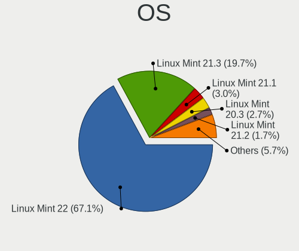
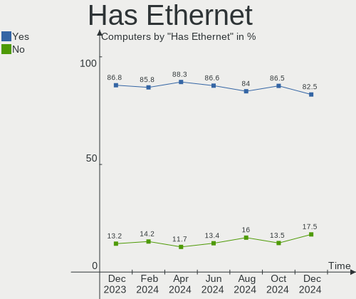
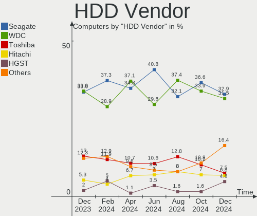
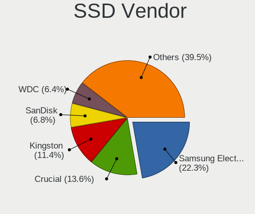
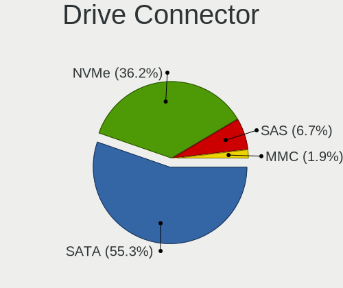
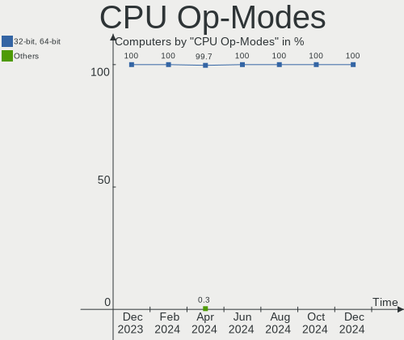
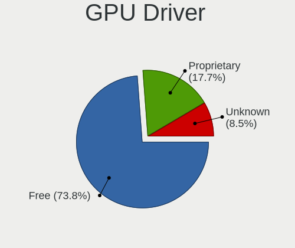

Linux Mint Hardware Trends
--------------------------

A project to identify most popular hardware characteristics and track their change
over time based on data collected by Linux Mint users at https://Linux-Hardware.org.

Anyone can contribute to this report by the [hw-probe](https://github.com/linuxhw/hw-probe) tool:

    sudo -E hw-probe -all -upload

This is a report for all computer types. See also reports for [desktops](/Dist/Linux_Mint/Desktop/README.md) and [notebooks](/Dist/Linux_Mint/Notebook/README.md).

Full-feature report is available here: https://linux-hardware.org/?view=trends

Period: Jan, 2022.

Contents
--------

* [ System ](#system)
  - [ OS                       ](#os)
  - [ OS Family                ](#os-family)
  - [ Kernel                   ](#kernel)
  - [ Kernel Family            ](#kernel-family)
  - [ Kernel Major Ver.        ](#kernel-major-ver)
  - [ Arch                     ](#arch)
  - [ DE                       ](#de)
  - [ Display Server           ](#display-server)
  - [ Display Manager          ](#display-manager)
  - [ OS Lang                  ](#os-lang)
  - [ Boot Mode                ](#boot-mode)
  - [ Filesystem               ](#filesystem)
  - [ Part. scheme             ](#part-scheme)
  - [ Dual Boot with Linux/BSD ](#dual-boot-with-linuxbsd)
  - [ Dual Boot (Win)          ](#dual-boot-win)

* [ Board ](#board)
  - [ Vendor                   ](#vendor)
  - [ Model                    ](#model)
  - [ Model Family             ](#model-family)
  - [ MFG Year                 ](#mfg-year)
  - [ Form Factor              ](#form-factor)
  - [ Secure Boot              ](#secure-boot)
  - [ Coreboot                 ](#coreboot)
  - [ RAM Size                 ](#ram-size)
  - [ RAM Used                 ](#ram-used)
  - [ Total Drives             ](#total-drives)
  - [ Has CD-ROM               ](#has-cd-rom)
  - [ Has Ethernet             ](#has-ethernet)
  - [ Has WiFi                 ](#has-wifi)
  - [ Has Bluetooth            ](#has-bluetooth)

* [ Location ](#location)
  - [ Country                  ](#country)
  - [ City                     ](#city)

* [ Drives ](#drives)
  - [ Drive Vendor             ](#drive-vendor)
  - [ Drive Model              ](#drive-model)
  - [ HDD Vendor               ](#hdd-vendor)
  - [ SSD Vendor               ](#ssd-vendor)
  - [ Drive Kind               ](#drive-kind)
  - [ Drive Connector          ](#drive-connector)
  - [ Drive Size               ](#drive-size)
  - [ Space Total              ](#space-total)
  - [ Space Used               ](#space-used)
  - [ Malfunc. Drives          ](#malfunc-drives)
  - [ Malfunc. Drive Vendor    ](#malfunc-drive-vendor)
  - [ Malfunc. HDD Vendor      ](#malfunc-hdd-vendor)
  - [ Malfunc. Drive Kind      ](#malfunc-drive-kind)
  - [ Failed Drives            ](#failed-drives)
  - [ Failed Drive Vendor      ](#failed-drive-vendor)
  - [ Drive Status             ](#drive-status)

* [ Storage controller ](#storage-controller)
  - [ Storage Vendor           ](#storage-vendor)
  - [ Storage Model            ](#storage-model)
  - [ Storage Kind             ](#storage-kind)

* [ Processor ](#processor)
  - [ CPU Vendor               ](#cpu-vendor)
  - [ CPU Model                ](#cpu-model)
  - [ CPU Model Family         ](#cpu-model-family)
  - [ CPU Cores                ](#cpu-cores)
  - [ CPU Sockets              ](#cpu-sockets)
  - [ CPU Threads              ](#cpu-threads)
  - [ CPU Op-Modes             ](#cpu-op-modes)
  - [ CPU Microcode            ](#cpu-microcode)
  - [ CPU Microarch            ](#cpu-microarch)

* [ Graphics ](#graphics)
  - [ GPU Vendor               ](#gpu-vendor)
  - [ GPU Model                ](#gpu-model)
  - [ GPU Combo                ](#gpu-combo)
  - [ GPU Driver               ](#gpu-driver)
  - [ GPU Memory               ](#gpu-memory)

* [ Monitor ](#monitor)
  - [ Monitor Vendor           ](#monitor-vendor)
  - [ Monitor Model            ](#monitor-model)
  - [ Monitor Resolution       ](#monitor-resolution)
  - [ Monitor Diagonal         ](#monitor-diagonal)
  - [ Monitor Width            ](#monitor-width)
  - [ Aspect Ratio             ](#aspect-ratio)
  - [ Monitor Area             ](#monitor-area)
  - [ Pixel Density            ](#pixel-density)
  - [ Multiple Monitors        ](#multiple-monitors)

* [ Network ](#network)
  - [ Net Controller Vendor    ](#net-controller-vendor)
  - [ Net Controller Model     ](#net-controller-model)
  - [ Wireless Vendor          ](#wireless-vendor)
  - [ Wireless Model           ](#wireless-model)
  - [ Ethernet Vendor          ](#ethernet-vendor)
  - [ Ethernet Model           ](#ethernet-model)
  - [ Net Controller Kind      ](#net-controller-kind)
  - [ Used Controller          ](#used-controller)
  - [ NICs                     ](#nics)
  - [ IPv6                     ](#ipv6)

* [ Bluetooth ](#bluetooth)
  - [ Bluetooth Vendor         ](#bluetooth-vendor)
  - [ Bluetooth Model          ](#bluetooth-model)

* [ Sound ](#sound)
  - [ Sound Vendor             ](#sound-vendor)
  - [ Sound Model              ](#sound-model)

* [ Memory ](#memory)
  - [ Memory Vendor            ](#memory-vendor)
  - [ Memory Model             ](#memory-model)
  - [ Memory Kind              ](#memory-kind)
  - [ Memory Form Factor       ](#memory-form-factor)
  - [ Memory Size              ](#memory-size)
  - [ Memory Speed             ](#memory-speed)

* [ Printers & scanners ](#printers--scanners)
  - [ Printer Vendor           ](#printer-vendor)
  - [ Printer Model            ](#printer-model)
  - [ Scanner Vendor           ](#scanner-vendor)
  - [ Scanner Model            ](#scanner-model)

* [ Camera ](#camera)
  - [ Camera Vendor            ](#camera-vendor)
  - [ Camera Model             ](#camera-model)

* [ Security ](#security)
  - [ Fingerprint Vendor       ](#fingerprint-vendor)
  - [ Fingerprint Model        ](#fingerprint-model)
  - [ Chipcard Vendor          ](#chipcard-vendor)
  - [ Chipcard Model           ](#chipcard-model)

* [ Unsupported ](#unsupported)
  - [ Unsupported Devices      ](#unsupported-devices)
  - [ Unsupported Device Types ](#unsupported-device-types)

System
------

OS
--

Installed operating systems

| Name            | Computers | Percent |
|-----------------|-----------|---------|
| Linux Mint 20.3 | 319       | 55.48%  |
| Linux Mint 20.2 | 172       | 29.91%  |
| Linux Mint 19.3 | 32        | 5.57%   |
| Linux Mint 20.1 | 26        | 4.52%   |
| Linux Mint 20   | 13        | 2.26%   |
| Linux Mint 19.1 | 6         | 1.04%   |
| Linux Mint 19.2 | 3         | 0.52%   |
| Linux Mint 19   | 2         | 0.35%   |
| Linux Mint 18.3 | 2         | 0.35%   |

OS Family
---------

OS without a version

| Name       | Computers | Percent |
|------------|-----------|---------|
| Linux Mint | 575       | 100%    |

Kernel
------

Version of the Linux kernel

| Version                    | Computers | Percent |
|----------------------------|-----------|---------|
| 5.4.0-96-generic           | 144       | 25.04%  |
| 5.4.0-91-generic           | 115       | 20%     |
| 5.4.0-92-generic           | 103       | 17.91%  |
| 5.4.0-94-generic           | 74        | 12.87%  |
| 5.13.0-27-generic          | 21        | 3.65%   |
| 5.4.0-74-generic           | 18        | 3.13%   |
| 5.13.0-23-generic          | 13        | 2.26%   |
| 5.13.0-25-generic          | 10        | 1.74%   |
| 5.13.0-22-generic          | 7         | 1.22%   |
| 5.11.0-46-generic          | 6         | 1.04%   |
| 5.0.0-32-generic           | 6         | 1.04%   |
| 4.15.0-166-generic         | 5         | 0.87%   |
| 5.4.0-90-generic           | 4         | 0.7%    |
| 5.11.0-43-generic          | 4         | 0.7%    |
| 5.4.0-89-generic           | 3         | 0.52%   |
| 5.11.0-44-generic          | 3         | 0.52%   |
| 4.15.0-142-generic         | 3         | 0.52%   |
| 5.4.0-81-generic           | 2         | 0.35%   |
| 5.4.0-58-generic           | 2         | 0.35%   |
| 5.4.0-26-generic           | 2         | 0.35%   |
| 5.15.13-051513-generic     | 2         | 0.35%   |
| 4.15.0-163-generic         | 2         | 0.35%   |
| 4.15.0-161-generic         | 2         | 0.35%   |
| 5.4.0-97-generic           | 1         | 0.17%   |
| 5.4.0-94-lowlatency        | 1         | 0.17%   |
| 5.4.0-902110311031-generic | 1         | 0.17%   |
| 5.4.0-88-generic           | 1         | 0.17%   |
| 5.4.0-87-generic           | 1         | 0.17%   |
| 5.4.0-70-generic           | 1         | 0.17%   |
| 5.4.0-67-generic           | 1         | 0.17%   |
| 5.16.0-rc8                 | 1         | 0.17%   |
| 5.15.16-xanmod1            | 1         | 0.17%   |
| 5.15.15-051515-generic     | 1         | 0.17%   |
| 5.15.14-051514-generic     | 1         | 0.17%   |
| 5.15.13-xanmod1            | 1         | 0.17%   |
| 5.15.12-051512-generic     | 1         | 0.17%   |
| 5.15.0-17.1-liquorix-amd64 | 1         | 0.17%   |
| 5.14.8-051408-generic      | 1         | 0.17%   |
| 5.14.0-1018-oem            | 1         | 0.17%   |
| 5.14.0-1013-oem            | 1         | 0.17%   |
| 5.13.19-051319-generic     | 1         | 0.17%   |
| 5.13.0-1022-oem            | 1         | 0.17%   |
| 5.11.0-22-generic          | 1         | 0.17%   |
| 5.0.0-31-generic           | 1         | 0.17%   |
| 4.18.0-25-generic          | 1         | 0.17%   |
| 4.15.0-20-generic          | 1         | 0.17%   |
| 4.15.0-109-generic         | 1         | 0.17%   |

Kernel Family
-------------

Linux kernel without a distro release

| Version | Computers | Percent |
|---------|-----------|---------|
| 5.4.0   | 474       | 82.43%  |
| 5.13.0  | 52        | 9.04%   |
| 5.11.0  | 14        | 2.43%   |
| 4.15.0  | 14        | 2.43%   |
| 5.0.0   | 7         | 1.22%   |
| 5.15.13 | 3         | 0.52%   |
| 5.14.0  | 2         | 0.35%   |
| 5.16.0  | 1         | 0.17%   |
| 5.15.16 | 1         | 0.17%   |
| 5.15.15 | 1         | 0.17%   |
| 5.15.14 | 1         | 0.17%   |
| 5.15.12 | 1         | 0.17%   |
| 5.15.0  | 1         | 0.17%   |
| 5.14.8  | 1         | 0.17%   |
| 5.13.19 | 1         | 0.17%   |
| 4.18.0  | 1         | 0.17%   |

Kernel Major Ver.
-----------------

Linux kernel major version

| Version | Computers | Percent |
|---------|-----------|---------|
| 5.4     | 474       | 82.43%  |
| 5.13    | 53        | 9.22%   |
| 5.11    | 14        | 2.43%   |
| 4.15    | 14        | 2.43%   |
| 5.15    | 8         | 1.39%   |
| 5.0     | 7         | 1.22%   |
| 5.14    | 3         | 0.52%   |
| 5.16    | 1         | 0.17%   |
| 4.18    | 1         | 0.17%   |

Arch
----

OS architecture (x86_64, i586, etc.)

| Name   | Computers | Percent |
|--------|-----------|---------|
| x86_64 | 562       | 97.74%  |
| i686   | 13        | 2.26%   |

DE
--

Desktop Environment

| Name       | Computers | Percent |
|------------|-----------|---------|
| X-Cinnamon | 398       | 69.22%  |
| MATE       | 68        | 11.83%  |
| XFCE       | 50        | 8.7%    |
| Cinnamon   | 37        | 6.43%   |
| GNOME      | 12        | 2.09%   |
| Unknown    | 5         | 0.87%   |
| KDE5       | 2         | 0.35%   |
| LXDE       | 1         | 0.17%   |
| KDE        | 1         | 0.17%   |
| i3         | 1         | 0.17%   |

Display Server
--------------

X11 or Wayland

| Name | Computers | Percent |
|------|-----------|---------|
| X11  | 574       | 99.83%  |
| Tty  | 1         | 0.17%   |

Display Manager
---------------

SDDM, LightDM, etc.

| Name    | Computers | Percent |
|---------|-----------|---------|
| Unknown | 334       | 58.09%  |
| LightDM | 238       | 41.39%  |
| GDM     | 3         | 0.52%   |

OS Lang
-------

Language

| Lang    | Computers | Percent |
|---------|-----------|---------|
| en_US   | 157       | 27.3%   |
| de_DE   | 114       | 19.83%  |
| pt_BR   | 44        | 7.65%   |
| en_GB   | 33        | 5.74%   |
| fr_FR   | 25        | 4.35%   |
| en_CA   | 24        | 4.17%   |
| C       | 20        | 3.48%   |
| ru_RU   | 19        | 3.3%    |
| it_IT   | 16        | 2.78%   |
| es_ES   | 10        | 1.74%   |
| nl_NL   | 9         | 1.57%   |
| hu_HU   | 9         | 1.57%   |
| fi_FI   | 9         | 1.57%   |
| pl_PL   | 8         | 1.39%   |
| en_AU   | 8         | 1.39%   |
| ru_UA   | 6         | 1.04%   |
| de_AT   | 6         | 1.04%   |
| sk_SK   | 4         | 0.7%    |
| es_MX   | 4         | 0.7%    |
| es_AR   | 4         | 0.7%    |
| de_CH   | 4         | 0.7%    |
| cs_CZ   | 4         | 0.7%    |
| uk_UA   | 3         | 0.52%   |
| ja_JP   | 3         | 0.52%   |
| en_ZA   | 3         | 0.52%   |
| en_IN   | 3         | 0.52%   |
| da_DK   | 3         | 0.52%   |
| sv_SE   | 2         | 0.35%   |
| pt_PT   | 2         | 0.35%   |
| id_ID   | 2         | 0.35%   |
| en_NZ   | 2         | 0.35%   |
| tr_TR   | 1         | 0.17%   |
| sr_RS   | 1         | 0.17%   |
| ro_RO   | 1         | 0.17%   |
| nl_BE   | 1         | 0.17%   |
| nb_NO   | 1         | 0.17%   |
| nan_TW  | 1         | 0.17%   |
| fr_CA   | 1         | 0.17%   |
| es_VE   | 1         | 0.17%   |
| es_SV   | 1         | 0.17%   |
| es_EC   | 1         | 0.17%   |
| es_CO   | 1         | 0.17%   |
| es_CL   | 1         | 0.17%   |
| en_IL   | 1         | 0.17%   |
| ar_SA   | 1         | 0.17%   |
| Unknown | 1         | 0.17%   |

Boot Mode
---------

EFI or BIOS

| Mode | Computers | Percent |
|------|-----------|---------|
| BIOS | 291       | 50.61%  |
| EFI  | 284       | 49.39%  |

Filesystem
----------

Type of filesystem

| Type     | Computers | Percent |
|----------|-----------|---------|
| Ext4     | 543       | 94.43%  |
| Overlay  | 20        | 3.48%   |
| Btrfs    | 4         | 0.7%    |
| Xfs      | 3         | 0.52%   |
| Ext3     | 3         | 0.52%   |
| Zfs      | 1         | 0.17%   |
| Reiserfs | 1         | 0.17%   |

Part. scheme
------------

Scheme of partitioning

| Type    | Computers | Percent |
|---------|-----------|---------|
| Unknown | 358       | 62.26%  |
| GPT     | 155       | 26.96%  |
| MBR     | 62        | 10.78%  |

Dual Boot with Linux/BSD
------------------------

Hosting more than one Linux/BSD

| Dual boot | Computers | Percent |
|-----------|-----------|---------|
| No        | 546       | 94.96%  |
| Yes       | 29        | 5.04%   |

Dual Boot (Win)
---------------

Hosting Linux and Windows

| Dual boot | Computers | Percent |
|-----------|-----------|---------|
| No        | 474       | 82.43%  |
| Yes       | 101       | 17.57%  |

Board
-----

Vendor
------

Motherboard manufacturer

| Name                        | Computers | Percent |
|-----------------------------|-----------|---------|
| ASUSTek Computer            | 84        | 14.61%  |
| Dell                        | 80        | 13.91%  |
| Hewlett-Packard             | 71        | 12.35%  |
| Lenovo                      | 69        | 12%     |
| Acer                        | 47        | 8.17%   |
| Gigabyte Technology         | 35        | 6.09%   |
| MSI                         | 26        | 4.52%   |
| ASRock                      | 21        | 3.65%   |
| Apple                       | 14        | 2.43%   |
| Toshiba                     | 11        | 1.91%   |
| Intel                       | 11        | 1.91%   |
| Samsung Electronics         | 10        | 1.74%   |
| Sony                        | 8         | 1.39%   |
| Medion                      | 8         | 1.39%   |
| Fujitsu                     | 7         | 1.22%   |
| Positivo                    | 6         | 1.04%   |
| LG Electronics              | 4         | 0.7%    |
| Timi                        | 3         | 0.52%   |
| Pegatron                    | 3         | 0.52%   |
| Packard Bell                | 3         | 0.52%   |
| Fujitsu Siemens             | 3         | 0.52%   |
| Unknown                     | 3         | 0.52%   |
| Microsoft                   | 2         | 0.35%   |
| HUAWEI                      | 2         | 0.35%   |
| Google                      | 2         | 0.35%   |
| Gateway                     | 2         | 0.35%   |
| ECS                         | 2         | 0.35%   |
| Compal                      | 2         | 0.35%   |
| Biostar                     | 2         | 0.35%   |
| AMI                         | 2         | 0.35%   |
| Alienware                   | 2         | 0.35%   |
| Wortmann AG                 | 1         | 0.17%   |
| win element                 | 1         | 0.17%   |
| VIT                         | 1         | 0.17%   |
| TUXEDO                      | 1         | 0.17%   |
| Teclast                     | 1         | 0.17%   |
| Supermicro                  | 1         | 0.17%   |
| Shuttle                     | 1         | 0.17%   |
| Semp Toshiba                | 1         | 0.17%   |
| Schenker                    | 1         | 0.17%   |
| Primux Tech                 | 1         | 0.17%   |
| Phoenix/SiS                 | 1         | 0.17%   |
| Panasonic                   | 1         | 0.17%   |
| ONDA                        | 1         | 0.17%   |
| Notebook                    | 1         | 0.17%   |
| Microtech                   | 1         | 0.17%   |
| MediaVue                    | 1         | 0.17%   |
| KLLISRE                     | 1         | 0.17%   |
| Jumper                      | 1         | 0.17%   |
| Itautec                     | 1         | 0.17%   |
| IBM                         | 1         | 0.17%   |
| I-Life Digital Technologies | 1         | 0.17%   |
| HONOR                       | 1         | 0.17%   |
| GPD                         | 1         | 0.17%   |
| Foxconn                     | 1         | 0.17%   |
| Digibras                    | 1         | 0.17%   |
| DFI                         | 1         | 0.17%   |
| Clevo                       | 1         | 0.17%   |
| BESSTAR Tech                | 1         | 0.17%   |
| AURES                       | 1         | 0.17%   |

Model
-----

Motherboard model

| Name                                   | Computers | Percent |
|----------------------------------------|-----------|---------|
| Unknown                                | 6         | 1.04%   |
| ASUS All Series                        | 5         | 0.87%   |
| HP Notebook                            | 3         | 0.52%   |
| Dell OptiPlex 790                      | 3         | 0.52%   |
| Dell Latitude E6410                    | 3         | 0.52%   |
| Dell Latitude 5480                     | 3         | 0.52%   |
| ASUS P50IJ                             | 3         | 0.52%   |
| Timi TM1701                            | 2         | 0.35%   |
| Samsung 550XDA                         | 2         | 0.35%   |
| MSI MS-7C52                            | 2         | 0.35%   |
| MSI MS-7B86                            | 2         | 0.35%   |
| MSI MS-7721                            | 2         | 0.35%   |
| Lenovo ThinkCentre M90 5485W45         | 2         | 0.35%   |
| Lenovo Flex 2-15 20405                 | 2         | 0.35%   |
| Intel H61                              | 2         | 0.35%   |
| HP ProBook 450 G5                      | 2         | 0.35%   |
| HP Pavilion Laptop 14-dv0xxx           | 2         | 0.35%   |
| HP EliteBook 8570p                     | 2         | 0.35%   |
| HP EliteBook 840 G5                    | 2         | 0.35%   |
| HP EliteBook 820 G1                    | 2         | 0.35%   |
| HP 250 G6 Notebook PC                  | 2         | 0.35%   |
| Gigabyte B550M DS3H                    | 2         | 0.35%   |
| Dell XPS 15 9510                       | 2         | 0.35%   |
| Dell Vostro 3560                       | 2         | 0.35%   |
| Dell OptiPlex 990                      | 2         | 0.35%   |
| Dell OptiPlex 745                      | 2         | 0.35%   |
| Dell OptiPlex 7010                     | 2         | 0.35%   |
| Dell Latitude E6540                    | 2         | 0.35%   |
| Dell Latitude E6400                    | 2         | 0.35%   |
| Dell Inspiron 7706 2n1                 | 2         | 0.35%   |
| Dell Inspiron 7560                     | 2         | 0.35%   |
| Dell Inspiron 660                      | 2         | 0.35%   |
| Dell Inspiron 15-3567                  | 2         | 0.35%   |
| ASUS VivoBook_ASUSLaptop X515DA_M515DA | 2         | 0.35%   |
| ASUS P8Z77-M                           | 2         | 0.35%   |
| ASUS M2N68-AM Plus                     | 2         | 0.35%   |
| Apple MacBookAir6,2                    | 2         | 0.35%   |
| Apple iMac7,1                          | 2         | 0.35%   |
| Apple iMac10,1                         | 2         | 0.35%   |
| Acer Swift SF114-34                    | 2         | 0.35%   |
| Acer Aspire E5-521                     | 2         | 0.35%   |
| Acer Aspire A515-45                    | 2         | 0.35%   |
| Wortmann AG TERRA_MOBILE_1512/1712     | 1         | 0.17%   |
| win element MoreFine S500+             | 1         | 0.17%   |
| VIT M2421                              | 1         | 0.17%   |
| TUXEDO P65_67HSHP                      | 1         | 0.17%   |
| Toshiba Satellite S55-C                | 1         | 0.17%   |
| Toshiba Satellite Pro L770-15L         | 1         | 0.17%   |
| Toshiba Satellite P870                 | 1         | 0.17%   |
| Toshiba Satellite L750                 | 1         | 0.17%   |
| Toshiba Satellite L655                 | 1         | 0.17%   |
| Toshiba Satellite L355                 | 1         | 0.17%   |
| Toshiba Satellite E55-A                | 1         | 0.17%   |
| Toshiba Satellite E45-B                | 1         | 0.17%   |
| Toshiba Satellite C660D                | 1         | 0.17%   |
| Toshiba Satellite C55D-B               | 1         | 0.17%   |
| Toshiba Satellite C55-C                | 1         | 0.17%   |
| Timi RedmiBook Pro 14                  | 1         | 0.17%   |
| Teclast F5                             | 1         | 0.17%   |
| Supermicro X7DWE                       | 1         | 0.17%   |

Model Family
------------

Motherboard model prefix

| Name                   | Computers | Percent |
|------------------------|-----------|---------|
| Acer Aspire            | 36        | 6.26%   |
| Lenovo ThinkPad        | 26        | 4.52%   |
| Dell Latitude          | 25        | 4.35%   |
| Dell Inspiron          | 23        | 4%      |
| Lenovo IdeaPad         | 16        | 2.78%   |
| Dell OptiPlex          | 15        | 2.61%   |
| HP Pavilion            | 14        | 2.43%   |
| Toshiba Satellite      | 11        | 1.91%   |
| HP EliteBook           | 11        | 1.91%   |
| Dell Vostro            | 10        | 1.74%   |
| Lenovo ThinkCentre     | 8         | 1.39%   |
| HP ProBook             | 8         | 1.39%   |
| HP Laptop              | 8         | 1.39%   |
| ASUS PRIME             | 8         | 1.39%   |
| HP Compaq              | 7         | 1.22%   |
| Unknown                | 6         | 1.04%   |
| ASUS ZenBook           | 5         | 0.87%   |
| ASUS VivoBook          | 5         | 0.87%   |
| ASUS All               | 5         | 0.87%   |
| Lenovo Yoga            | 4         | 0.7%    |
| HP ENVY                | 4         | 0.7%    |
| HP 250                 | 4         | 0.7%    |
| Dell XPS               | 4         | 0.7%    |
| ASUS ROG               | 4         | 0.7%    |
| HP Notebook            | 3         | 0.52%   |
| ASUS P50IJ             | 3         | 0.52%   |
| Acer Extensa           | 3         | 0.52%   |
| Timi TM1701            | 2         | 0.35%   |
| Samsung RV411          | 2         | 0.35%   |
| Samsung 550XDA         | 2         | 0.35%   |
| Packard Bell EasyNote  | 2         | 0.35%   |
| MSI MS-7C52            | 2         | 0.35%   |
| MSI MS-7B86            | 2         | 0.35%   |
| MSI MS-7721            | 2         | 0.35%   |
| Microsoft Surface      | 2         | 0.35%   |
| Lenovo ThinkBook       | 2         | 0.35%   |
| Lenovo Flex            | 2         | 0.35%   |
| Intel H61              | 2         | 0.35%   |
| Gigabyte Z370          | 2         | 0.35%   |
| Gigabyte X570          | 2         | 0.35%   |
| Gigabyte GA-78LMT-USB3 | 2         | 0.35%   |
| Gigabyte B550M         | 2         | 0.35%   |
| Fujitsu PRIMERGY       | 2         | 0.35%   |
| Fujitsu LIFEBOOK       | 2         | 0.35%   |
| Dell Precision         | 2         | 0.35%   |
| ASUS P8Z77-M           | 2         | 0.35%   |
| ASUS P8H61-M           | 2         | 0.35%   |
| ASUS P5G41T-M          | 2         | 0.35%   |
| ASUS M5A97             | 2         | 0.35%   |
| ASUS M2N68-AM          | 2         | 0.35%   |
| Apple MacBookAir6      | 2         | 0.35%   |
| Apple iMac7            | 2         | 0.35%   |
| Apple iMac10           | 2         | 0.35%   |
| Acer Veriton           | 2         | 0.35%   |
| Acer Swift             | 2         | 0.35%   |
| Acer Predator          | 2         | 0.35%   |
| Wortmann AG TERRA      | 1         | 0.17%   |
| win element MoreFine   | 1         | 0.17%   |
| VIT M2421              | 1         | 0.17%   |
| TUXEDO P65             | 1         | 0.17%   |

MFG Year
--------

Motherboard manufacture year

| Year    | Computers | Percent |
|---------|-----------|---------|
| 2012    | 53        | 9.22%   |
| 2021    | 52        | 9.04%   |
| 2013    | 48        | 8.35%   |
| 2011    | 45        | 7.83%   |
| 2020    | 41        | 7.13%   |
| 2018    | 41        | 7.13%   |
| 2017    | 41        | 7.13%   |
| 2014    | 40        | 6.96%   |
| 2010    | 36        | 6.26%   |
| 2019    | 34        | 5.91%   |
| 2009    | 33        | 5.74%   |
| 2016    | 30        | 5.22%   |
| 2015    | 28        | 4.87%   |
| 2008    | 27        | 4.7%    |
| 2007    | 17        | 2.96%   |
| 2006    | 5         | 0.87%   |
| 2005    | 3         | 0.52%   |
| Unknown | 1         | 0.17%   |

Form Factor
-----------

Physical design of the computer

| Name        | Computers | Percent |
|-------------|-----------|---------|
| Notebook    | 332       | 57.74%  |
| Desktop     | 212       | 36.87%  |
| All in one  | 11        | 1.91%   |
| Convertible | 9         | 1.57%   |
| Tablet      | 5         | 0.87%   |
| Mini pc     | 3         | 0.52%   |
| Server      | 2         | 0.35%   |
| Other       | 1         | 0.17%   |

Secure Boot
-----------

Enabled or disabled

| State    | Computers | Percent |
|----------|-----------|---------|
| Disabled | 520       | 90.43%  |
| Enabled  | 55        | 9.57%   |

Coreboot
--------

Have coreboot on board

| Used | Computers | Percent |
|------|-----------|---------|
| No   | 573       | 99.65%  |
| Yes  | 2         | 0.35%   |

RAM Size
--------

Total RAM memory

| Size in GB  | Computers | Percent |
|-------------|-----------|---------|
| 3.01-4.0    | 143       | 24.87%  |
| 4.01-8.0    | 142       | 24.7%   |
| 8.01-16.0   | 103       | 17.91%  |
| 16.01-24.0  | 96        | 16.7%   |
| 32.01-64.0  | 44        | 7.65%   |
| 1.01-2.0    | 23        | 4%      |
| 2.01-3.0    | 11        | 1.91%   |
| 24.01-32.0  | 8         | 1.39%   |
| 64.01-256.0 | 4         | 0.7%    |
| 0.51-1.0    | 1         | 0.17%   |

RAM Used
--------

Used RAM memory

| Used GB    | Computers | Percent |
|------------|-----------|---------|
| 1.01-2.0   | 253       | 44%     |
| 2.01-3.0   | 141       | 24.52%  |
| 3.01-4.0   | 73        | 12.7%   |
| 4.01-8.0   | 49        | 8.52%   |
| 0.51-1.0   | 41        | 7.13%   |
| 8.01-16.0  | 17        | 2.96%   |
| 16.01-24.0 | 1         | 0.17%   |

Total Drives
------------

Number of drives on board

| Drives | Computers | Percent |
|--------|-----------|---------|
| 1      | 345       | 60%     |
| 2      | 147       | 25.57%  |
| 3      | 45        | 7.83%   |
| 4      | 20        | 3.48%   |
| 5      | 11        | 1.91%   |
| 9      | 2         | 0.35%   |
| 6      | 2         | 0.35%   |
| 8      | 1         | 0.17%   |
| 7      | 1         | 0.17%   |
| 0      | 1         | 0.17%   |

Has CD-ROM
----------

Has CD-ROM on board

| Presented | Computers | Percent |
|-----------|-----------|---------|
| Yes       | 291       | 50.61%  |
| No        | 284       | 49.39%  |

Has Ethernet
------------

Has Ethernet on board

| Presented | Computers | Percent |
|-----------|-----------|---------|
| Yes       | 516       | 89.74%  |
| No        | 59        | 10.26%  |

Has WiFi
--------

Has WiFi module

| Presented | Computers | Percent |
|-----------|-----------|---------|
| Yes       | 452       | 78.61%  |
| No        | 123       | 21.39%  |

Has Bluetooth
-------------

Has Bluetooth module

| Presented | Computers | Percent |
|-----------|-----------|---------|
| Yes       | 338       | 58.78%  |
| No        | 237       | 41.22%  |

Location
--------

Country
-------

Geographic location (country)

| Country      | Computers | Percent |
|--------------|-----------|---------|
| Germany      | 117       | 20.35%  |
| USA          | 94        | 16.35%  |
| Brazil       | 47        | 8.17%   |
| UK           | 28        | 4.87%   |
| France       | 25        | 4.35%   |
| Canada       | 24        | 4.17%   |
| Ukraine      | 19        | 3.3%    |
| Russia       | 15        | 2.61%   |
| Italy        | 15        | 2.61%   |
| Switzerland  | 11        | 1.91%   |
| Poland       | 11        | 1.91%   |
| Mexico       | 11        | 1.91%   |
| Hungary      | 11        | 1.91%   |
| Spain        | 10        | 1.74%   |
| Netherlands  | 10        | 1.74%   |
| Finland      | 9         | 1.57%   |
| Australia    | 9         | 1.57%   |
| Slovakia     | 8         | 1.39%   |
| Austria      | 7         | 1.22%   |
| Serbia       | 6         | 1.04%   |
| Norway       | 5         | 0.87%   |
| India        | 5         | 0.87%   |
| Czechia      | 5         | 0.87%   |
| South Africa | 4         | 0.7%    |
| Romania      | 4         | 0.7%    |
| Indonesia    | 4         | 0.7%    |
| Denmark      | 4         | 0.7%    |
| Belarus      | 4         | 0.7%    |
| Argentina    | 4         | 0.7%    |
| Turkey       | 3         | 0.52%   |
| Sweden       | 3         | 0.52%   |
| Japan        | 3         | 0.52%   |
| Belgium      | 3         | 0.52%   |
| Uzbekistan   | 2         | 0.35%   |
| Portugal     | 2         | 0.35%   |
| New Zealand  | 2         | 0.35%   |
| Morocco      | 2         | 0.35%   |
| Luxembourg   | 2         | 0.35%   |
| Iran         | 2         | 0.35%   |
| Bulgaria     | 2         | 0.35%   |
| Vietnam      | 1         | 0.17%   |
| Venezuela    | 1         | 0.17%   |
| South Korea  | 1         | 0.17%   |
| Saudi Arabia | 1         | 0.17%   |
| R?©union     | 1         | 0.17%   |
| Qatar        | 1         | 0.17%   |
| Peru         | 1         | 0.17%   |
| Nepal        | 1         | 0.17%   |
| Moldova      | 1         | 0.17%   |
| Lebanon      | 1         | 0.17%   |
| Kyrgyzstan   | 1         | 0.17%   |
| Kenya        | 1         | 0.17%   |
| Israel       | 1         | 0.17%   |
| Ireland      | 1         | 0.17%   |
| Greece       | 1         | 0.17%   |
| El Salvador  | 1         | 0.17%   |
| Egypt        | 1         | 0.17%   |
| Ecuador      | 1         | 0.17%   |
| Croatia      | 1         | 0.17%   |
| Colombia     | 1         | 0.17%   |

City
----

Geographic location (city)

| City              | Computers | Percent |
|-------------------|-----------|---------|
| Berlin            | 8         | 1.39%   |
| Kyiv              | 7         | 1.22%   |
| Vienna            | 6         | 1.04%   |
| Chicago           | 6         | 1.04%   |
| Belgrade          | 6         | 1.04%   |
| Guadalajara       | 5         | 0.87%   |
| Zurich            | 4         | 0.7%    |
| Sydney            | 4         | 0.7%    |
| Paris             | 4         | 0.7%    |
| Munich            | 4         | 0.7%    |
| Milan             | 4         | 0.7%    |
| Budapest          | 4         | 0.7%    |
| Bratislava        | 4         | 0.7%    |
| S??o Paulo        | 3         | 0.52%   |
| Rome              | 3         | 0.52%   |
| Rockfish          | 3         | 0.52%   |
| Rio de Janeiro    | 3         | 0.52%   |
| Reutlingen        | 3         | 0.52%   |
| Remscheid         | 3         | 0.52%   |
| Oslo              | 3         | 0.52%   |
| Moscow            | 3         | 0.52%   |
| Luton             | 3         | 0.52%   |
| Leipzig           | 3         | 0.52%   |
| Lansdale          | 3         | 0.52%   |
| Helsinki          | 3         | 0.52%   |
| Hamburg           | 3         | 0.52%   |
| Buenos Aires      | 3         | 0.52%   |
| Brisbane          | 3         | 0.52%   |
| Winnipeg          | 2         | 0.35%   |
| Urasoe            | 2         | 0.35%   |
| Toronto           | 2         | 0.35%   |
| The Hague         | 2         | 0.35%   |
| The Bronx         | 2         | 0.35%   |
| Tashkent          | 2         | 0.35%   |
| Stuttgart         | 2         | 0.35%   |
| Staufen           | 2         | 0.35%   |
| St Petersburg     | 2         | 0.35%   |
| Sault Ste. Marie  | 2         | 0.35%   |
| Rostov-on-Don     | 2         | 0.35%   |
| Recklinghausen    | 2         | 0.35%   |
| Reading           | 2         | 0.35%   |
| Osnabr??ck        | 2         | 0.35%   |
| Nuremberg         | 2         | 0.35%   |
| Minsk             | 2         | 0.35%   |
| Luxembourg        | 2         | 0.35%   |
| Londrina          | 2         | 0.35%   |
| London            | 2         | 0.35%   |
| Johannesburg      | 2         | 0.35%   |
| Jakarta           | 2         | 0.35%   |
| Ilsede            | 2         | 0.35%   |
| Heerbrugg         | 2         | 0.35%   |
| Hamilton          | 2         | 0.35%   |
| Frankfurt am Main | 2         | 0.35%   |
| Essen             | 2         | 0.35%   |
| D??sseldorf       | 2         | 0.35%   |
| Dagenham          | 2         | 0.35%   |
| Cambridge         | 2         | 0.35%   |
| Burgas            | 2         | 0.35%   |
| Bonn              | 2         | 0.35%   |
| Belo Horizonte    | 2         | 0.35%   |

Drives
------

Drive Vendor
------------

Hard drive vendors

| Vendor                    | Computers | Drives | Percent |
|---------------------------|-----------|--------|---------|
| Seagate                   | 134       | 157    | 16.14%  |
| WDC                       | 129       | 159    | 15.54%  |
| Samsung Electronics       | 126       | 146    | 15.18%  |
| Sandisk                   | 51        | 53     | 6.14%   |
| Toshiba                   | 49        | 51     | 5.9%    |
| Kingston                  | 45        | 48     | 5.42%   |
| Unknown                   | 38        | 46     | 4.58%   |
| Hitachi                   | 36        | 38     | 4.34%   |
| Crucial                   | 31        | 33     | 3.73%   |
| SK Hynix                  | 19        | 19     | 2.29%   |
| Intel                     | 17        | 19     | 2.05%   |
| A-DATA Technology         | 17        | 17     | 2.05%   |
| HGST                      | 14        | 15     | 1.69%   |
| KIOXIA                    | 9         | 9      | 1.08%   |
| China                     | 8         | 8      | 0.96%   |
| Intenso                   | 7         | 7      | 0.84%   |
| JMicron                   | 6         | 6      | 0.72%   |
| Apple                     | 6         | 7      | 0.72%   |
| SPCC                      | 5         | 5      | 0.6%    |
| PNY                       | 5         | 5      | 0.6%    |
| MAXTOR                    | 5         | 7      | 0.6%    |
| Patriot                   | 4         | 4      | 0.48%   |
| Micron Technology         | 4         | 4      | 0.48%   |
| LITEON                    | 4         | 4      | 0.48%   |
| Corsair                   | 4         | 5      | 0.48%   |
| Unknown                   | 4         | 4      | 0.48%   |
| Phison                    | 3         | 3      | 0.36%   |
| GOODRAM                   | 3         | 3      | 0.36%   |
| Fujitsu                   | 3         | 3      | 0.36%   |
| Transcend                 | 2         | 2      | 0.24%   |
| SSSTC                     | 2         | 2      | 0.24%   |
| Micron/Crucial Technology | 2         | 2      | 0.24%   |
| Lexar                     | 2         | 2      | 0.24%   |
| KingSpec                  | 2         | 2      | 0.24%   |
| ASMT                      | 2         | 2      | 0.24%   |
| Apacer                    | 2         | 2      | 0.24%   |
| ZOTAC                     | 1         | 1      | 0.12%   |
| XPG                       | 1         | 1      | 0.12%   |
| WDC WDS2                  | 1         | 1      | 0.12%   |
| USB30                     | 1         | 1      | 0.12%   |
| USB                       | 1         | 1      | 0.12%   |
| TrueNAS                   | 1         | 1      | 0.12%   |
| TCSUNBOW                  | 1         | 2      | 0.12%   |
| Sabrent                   | 1         | 1      | 0.12%   |
| Realtek Semiconductor     | 1         | 1      | 0.12%   |
| PLEXTOR                   | 1         | 1      | 0.12%   |
| PHD 3.0                   | 1         | 1      | 0.12%   |
| oyunkey                   | 1         | 1      | 0.12%   |
| OCZ                       | 1         | 1      | 0.12%   |
| Microtech                 | 1         | 1      | 0.12%   |
| Maxtor 6                  | 1         | 1      | 0.12%   |
| LITEONIT                  | 1         | 1      | 0.12%   |
| Leven                     | 1         | 1      | 0.12%   |
| Kolink                    | 1         | 1      | 0.12%   |
| KLLISRE                   | 1         | 1      | 0.12%   |
| INNOVATION IT             | 1         | 1      | 0.12%   |
| Initio                    | 1         | 1      | 0.12%   |
| Indilinx                  | 1         | 1      | 0.12%   |
| Hewlett-Packard           | 1         | 1      | 0.12%   |
| GN256                     | 1         | 1      | 0.12%   |

Drive Model
-----------

Hard drive models

| Model                               | Computers | Percent |
|-------------------------------------|-----------|---------|
| Samsung SSD 860 EVO 500GB           | 13        | 1.44%   |
| Unknown MMC Card  32GB              | 10        | 1.11%   |
| Kingston SA400S37240G 240GB SSD     | 10        | 1.11%   |
| Seagate ST1000LM035-1RK172 1TB      | 9         | 1%      |
| Kingston SA400S37480G 480GB SSD     | 9         | 1%      |
| Seagate ST1000LM024 HN-M101MBB 1TB  | 8         | 0.89%   |
| Samsung SSD 860 EVO 250GB           | 8         | 0.89%   |
| Samsung SSD 850 EVO 250GB           | 8         | 0.89%   |
| Unknown MMC Card  64GB              | 7         | 0.78%   |
| Toshiba MQ04ABF100 1TB              | 6         | 0.67%   |
| Seagate ST9500325AS 500GB           | 6         | 0.67%   |
| Seagate ST2000DM008-2FR102 2TB      | 6         | 0.67%   |
| Seagate Expansion 1TB               | 6         | 0.67%   |
| Samsung SSD 850 EVO 500GB           | 6         | 0.67%   |
| Samsung SSD 840 EVO 500GB           | 6         | 0.67%   |
| WDC WDS500G2B0A-00SM50 500GB SSD    | 5         | 0.55%   |
| SK Hynix NVMe SSD Drive 512GB       | 5         | 0.55%   |
| SanDisk SSD PLUS 240GB              | 5         | 0.55%   |
| Sandisk NVMe SSD Drive 512GB        | 5         | 0.55%   |
| Samsung SSD 860 EVO 1TB             | 5         | 0.55%   |
| Kingston SV300S37A120G 120GB SSD    | 5         | 0.55%   |
| Crucial CT500MX500SSD1 500GB        | 5         | 0.55%   |
| WDC WD20EZRZ-00Z5HB0 2TB            | 4         | 0.44%   |
| WDC WD10EZEX-08WN4A0 1TB            | 4         | 0.44%   |
| Toshiba DT01ACA050 500GB            | 4         | 0.44%   |
| SanDisk SDSSDA240G 240GB            | 4         | 0.44%   |
| Samsung NVMe SSD Drive 500GB        | 4         | 0.44%   |
| Samsung NVMe SSD Drive 250GB        | 4         | 0.44%   |
| Kingston SA400S37120G 120GB SSD     | 4         | 0.44%   |
| JMicron Generic 128GB               | 4         | 0.44%   |
| Crucial CT240BX500SSD1 240GB        | 4         | 0.44%   |
| Unknown                             | 4         | 0.44%   |
| WDC WD10JPVX-22JC3T0 1TB            | 3         | 0.33%   |
| Unknown SD/MMC/MS PRO 128GB         | 3         | 0.33%   |
| Unknown MMC Card  16GB              | 3         | 0.33%   |
| Unknown MMC Card  128GB             | 3         | 0.33%   |
| Toshiba MQ01ABD075 752GB            | 3         | 0.33%   |
| Toshiba KBG30ZMS128G 128GB NVMe SSD | 3         | 0.33%   |
| Toshiba DT01ACA200 2TB              | 3         | 0.33%   |
| SK Hynix NVMe SSD Drive 256GB       | 3         | 0.33%   |
| Seagate ST9320325AS 320GB           | 3         | 0.33%   |
| Seagate ST500LT012-1DG142 500GB     | 3         | 0.33%   |
| Seagate ST500DM002-1BD142 500GB     | 3         | 0.33%   |
| Seagate ST3500413AS 500GB           | 3         | 0.33%   |
| Seagate ST3500312CS 500GB           | 3         | 0.33%   |
| Seagate ST2000LM003 HN-M201RAD 2TB  | 3         | 0.33%   |
| Seagate ST2000DM006-2DM164 2TB      | 3         | 0.33%   |
| Seagate ST2000DM001-1ER164 2TB      | 3         | 0.33%   |
| Seagate ST1000DM003-1CH162 1TB      | 3         | 0.33%   |
| Seagate Expansion Desk 8TB          | 3         | 0.33%   |
| SanDisk SSD PLUS 480GB              | 3         | 0.33%   |
| SanDisk SSD PLUS 1000GB             | 3         | 0.33%   |
| Sandisk NVMe SSD Drive 500GB        | 3         | 0.33%   |
| Samsung SSD 970 EVO Plus 1TB        | 3         | 0.33%   |
| Samsung SSD 860 QVO 1TB             | 3         | 0.33%   |
| Samsung HD154UI 1TB                 | 3         | 0.33%   |
| Patriot Burst 120GB SSD             | 3         | 0.33%   |
| KIOXIA NVMe SSD Drive 256GB         | 3         | 0.33%   |
| Hitachi HTS543225L9A300 250GB       | 3         | 0.33%   |
| Hitachi HTS543216L9A300 160GB       | 3         | 0.33%   |

HDD Vendor
----------

Hard disk drive vendors

| Vendor              | Computers | Drives | Percent |
|---------------------|-----------|--------|---------|
| Seagate             | 132       | 154    | 37.29%  |
| WDC                 | 96        | 121    | 27.12%  |
| Toshiba             | 39        | 41     | 11.02%  |
| Hitachi             | 36        | 38     | 10.17%  |
| Samsung Electronics | 16        | 19     | 4.52%   |
| HGST                | 14        | 15     | 3.95%   |
| MAXTOR              | 5         | 7      | 1.41%   |
| Unknown             | 4         | 4      | 1.13%   |
| Fujitsu             | 3         | 3      | 0.85%   |
| Apple               | 3         | 3      | 0.85%   |
| USB                 | 1         | 1      | 0.28%   |
| Sabrent             | 1         | 1      | 0.28%   |
| PHD 3.0             | 1         | 1      | 0.28%   |
| Maxtor 6            | 1         | 1      | 0.28%   |
| Intenso             | 1         | 1      | 0.28%   |
| China               | 1         | 1      | 0.28%   |

SSD Vendor
----------

Solid state drive vendors

| Vendor              | Computers | Drives | Percent |
|---------------------|-----------|--------|---------|
| Samsung Electronics | 81        | 93     | 26.47%  |
| Kingston            | 40        | 43     | 13.07%  |
| SanDisk             | 35        | 35     | 11.44%  |
| Crucial             | 30        | 32     | 9.8%    |
| WDC                 | 20        | 21     | 6.54%   |
| A-DATA Technology   | 16        | 16     | 5.23%   |
| Intel               | 7         | 7      | 2.29%   |
| China               | 7         | 7      | 2.29%   |
| Toshiba             | 5         | 5      | 1.63%   |
| SPCC                | 5         | 5      | 1.63%   |
| PNY                 | 5         | 5      | 1.63%   |
| Patriot             | 4         | 4      | 1.31%   |
| LITEON              | 4         | 4      | 1.31%   |
| Intenso             | 4         | 4      | 1.31%   |
| Apple               | 4         | 4      | 1.31%   |
| GOODRAM             | 3         | 3      | 0.98%   |
| Corsair             | 3         | 3      | 0.98%   |
| Micron Technology   | 2         | 2      | 0.65%   |
| Lexar               | 2         | 2      | 0.65%   |
| KingSpec            | 2         | 2      | 0.65%   |
| Apacer              | 2         | 2      | 0.65%   |
| Unknown             | 2         | 2      | 0.65%   |
| ZOTAC               | 1         | 1      | 0.33%   |
| WDC WDS2            | 1         | 1      | 0.33%   |
| USB30               | 1         | 1      | 0.33%   |
| Unknown             | 1         | 1      | 0.33%   |
| TrueNAS             | 1         | 1      | 0.33%   |
| Transcend           | 1         | 1      | 0.33%   |
| TCSUNBOW            | 1         | 2      | 0.33%   |
| SK Hynix            | 1         | 1      | 0.33%   |
| Seagate             | 1         | 1      | 0.33%   |
| PLEXTOR             | 1         | 1      | 0.33%   |
| OCZ                 | 1         | 1      | 0.33%   |
| Microtech           | 1         | 1      | 0.33%   |
| LITEONIT            | 1         | 1      | 0.33%   |
| Leven               | 1         | 1      | 0.33%   |
| Kolink              | 1         | 1      | 0.33%   |
| INNOVATION IT       | 1         | 1      | 0.33%   |
| Indilinx            | 1         | 1      | 0.33%   |
| Hewlett-Packard     | 1         | 1      | 0.33%   |
| GN256               | 1         | 1      | 0.33%   |
| Dogfish             | 1         | 1      | 0.33%   |
| ASMT                | 1         | 1      | 0.33%   |
| AMD                 | 1         | 1      | 0.33%   |
| AFOX                | 1         | 1      | 0.33%   |

Drive Kind
----------

HDD or SSD

| Kind    | Computers | Drives | Percent |
|---------|-----------|--------|---------|
| HDD     | 293       | 411    | 39.65%  |
| SSD     | 273       | 325    | 36.94%  |
| NVMe    | 126       | 138    | 17.05%  |
| MMC     | 36        | 45     | 4.87%   |
| Unknown | 11        | 11     | 1.49%   |

Drive Connector
---------------

SATA, SAS, NVMe, etc.

| Type | Computers | Drives | Percent |
|------|-----------|--------|---------|
| SATA | 472       | 692    | 69.82%  |
| NVMe | 123       | 134    | 18.2%   |
| SAS  | 45        | 59     | 6.66%   |
| MMC  | 36        | 45     | 5.33%   |

Drive Size
----------

Size of hard drive

| Size in TB | Computers | Drives | Percent |
|------------|-----------|--------|---------|
| 0.01-0.5   | 353       | 453    | 60.34%  |
| 0.51-1.0   | 159       | 187    | 27.18%  |
| 1.01-2.0   | 42        | 52     | 7.18%   |
| 4.01-10.0  | 12        | 15     | 2.05%   |
| 3.01-4.0   | 10        | 11     | 1.71%   |
| 2.01-3.0   | 8         | 10     | 1.37%   |
| 10.01-20.0 | 1         | 8      | 0.17%   |

Space Total
-----------

Amount of disk space available on the file system

| Size in GB     | Computers | Percent |
|----------------|-----------|---------|
| 101-250        | 182       | 31.65%  |
| 251-500        | 139       | 24.17%  |
| 501-1000       | 83        | 14.43%  |
| 1001-2000      | 47        | 8.17%   |
| 51-100         | 37        | 6.43%   |
| More than 3000 | 30        | 5.22%   |
| 21-50          | 22        | 3.83%   |
| 2001-3000      | 17        | 2.96%   |
| 1-20           | 17        | 2.96%   |
| Unknown        | 1         | 0.17%   |

Space Used
----------

Amount of used disk space

| Used GB        | Computers | Percent |
|----------------|-----------|---------|
| 1-20           | 160       | 27.83%  |
| 21-50          | 122       | 21.22%  |
| 101-250        | 84        | 14.61%  |
| 51-100         | 80        | 13.91%  |
| 251-500        | 54        | 9.39%   |
| 501-1000       | 34        | 5.91%   |
| 1001-2000      | 21        | 3.65%   |
| More than 3000 | 12        | 2.09%   |
| 2001-3000      | 7         | 1.22%   |
| Unknown        | 1         | 0.17%   |

Malfunc. Drives
---------------

Drive models with a malfunction

| Model                                    | Computers | Drives | Percent |
|------------------------------------------|-----------|--------|---------|
| Seagate ST9500325AS 500GB                | 3         | 3      | 6.82%   |
| Seagate ST1000LM035-1RK172 1TB           | 3         | 3      | 6.82%   |
| HGST HTS725050A7E630 500GB               | 2         | 2      | 4.55%   |
| HGST HTS545050A7E680 500GB               | 2         | 2      | 4.55%   |
| WDC WDS2 40G2G0A-00JH30 240GB SSD        | 1         | 1      | 2.27%   |
| WDC WD5002ABYS-01B1B0 500GB              | 1         | 1      | 2.27%   |
| WDC WD40EFRX-68N32N0 4TB                 | 1         | 1      | 2.27%   |
| WDC WD3200AAJS-60Z0A0 320GB              | 1         | 1      | 2.27%   |
| WDC WD2500SD-01KCB0 250GB                | 1         | 1      | 2.27%   |
| WDC WD10EZEX-00WN4A0 1TB                 | 1         | 1      | 2.27%   |
| WDC WD1002FAEX-00Z3A0 1TB                | 1         | 1      | 2.27%   |
| Toshiba THNSNK256GVN8 M.2 2280 256GB SSD | 1         | 1      | 2.27%   |
| Toshiba MK7575GSX 752GB                  | 1         | 1      | 2.27%   |
| Toshiba MK7559GSXF 752GB                 | 1         | 1      | 2.27%   |
| Toshiba MK3265GSX 320GB                  | 1         | 1      | 2.27%   |
| Toshiba HDWD110 1TB                      | 1         | 1      | 2.27%   |
| Toshiba DT01ACA300 3TB                   | 1         | 1      | 2.27%   |
| SK Hynix PC711 HFS001TDE9X073N 1TB       | 1         | 1      | 2.27%   |
| Seagate ST9250410AS 250GB                | 1         | 1      | 2.27%   |
| Seagate ST4000DM000-1F21 4TB             | 1         | 1      | 2.27%   |
| Seagate ST380817AS 80GB                  | 1         | 1      | 2.27%   |
| Seagate ST3500418AS 500GB                | 1         | 1      | 2.27%   |
| Seagate ST3500312CS 500GB                | 1         | 1      | 2.27%   |
| Seagate ST320LT020-9YG142 320GB          | 1         | 1      | 2.27%   |
| Seagate ST31000528AS 1TB                 | 1         | 1      | 2.27%   |
| Seagate ST2000DM001-1CH164 2TB           | 1         | 1      | 2.27%   |
| Samsung Electronics SP2504C 250GB        | 1         | 1      | 2.27%   |
| Samsung Electronics HM321HI 320GB        | 1         | 1      | 2.27%   |
| MAXTOR 6Y080M0 80GB                      | 1         | 1      | 2.27%   |
| KingSpec NT-128 128GB                    | 1         | 1      | 2.27%   |
| Hitachi HDT725040VLA360 400GB            | 1         | 1      | 2.27%   |
| Hitachi HDT725025VLA380 250GB            | 1         | 1      | 2.27%   |
| Hitachi HDS723020BLA642 2TB              | 1         | 1      | 2.27%   |
| HGST HTS721010A9E630 1TB                 | 1         | 1      | 2.27%   |
| HGST HTS541010A9E680 1TB                 | 1         | 1      | 2.27%   |
| Crucial CT512M550SSD3 512GB              | 1         | 1      | 2.27%   |
| Crucial CT128MX100SSD1 128GB             | 1         | 2      | 2.27%   |
| Corsair Force 3 SSD 120GB                | 1         | 1      | 2.27%   |

Malfunc. Drive Vendor
---------------------

Vendors of faulty drives

| Vendor              | Computers | Drives | Percent |
|---------------------|-----------|--------|---------|
| Seagate             | 13        | 14     | 30.23%  |
| WDC                 | 6         | 6      | 13.95%  |
| Toshiba             | 6         | 6      | 13.95%  |
| HGST                | 6         | 6      | 13.95%  |
| Hitachi             | 3         | 3      | 6.98%   |
| Samsung Electronics | 2         | 2      | 4.65%   |
| Crucial             | 2         | 3      | 4.65%   |
| WDC WDS2            | 1         | 1      | 2.33%   |
| SK Hynix            | 1         | 1      | 2.33%   |
| MAXTOR              | 1         | 1      | 2.33%   |
| KingSpec            | 1         | 1      | 2.33%   |
| Corsair             | 1         | 1      | 2.33%   |

Malfunc. HDD Vendor
-------------------

Vendors of faulty HDD drives

| Vendor              | Computers | Drives | Percent |
|---------------------|-----------|--------|---------|
| Seagate             | 13        | 14     | 36.11%  |
| WDC                 | 6         | 6      | 16.67%  |
| HGST                | 6         | 6      | 16.67%  |
| Toshiba             | 5         | 5      | 13.89%  |
| Hitachi             | 3         | 3      | 8.33%   |
| Samsung Electronics | 2         | 2      | 5.56%   |
| MAXTOR              | 1         | 1      | 2.78%   |

Malfunc. Drive Kind
-------------------

Kinds of faulty drives

| Kind | Computers | Drives | Percent |
|------|-----------|--------|---------|
| HDD  | 33        | 37     | 82.5%   |
| SSD  | 6         | 7      | 15%     |
| NVMe | 1         | 1      | 2.5%    |

Failed Drives
-------------

Failed drive models

Zero info for selected period =(

Failed Drive Vendor
-------------------

Failed drive vendors

Zero info for selected period =(

Drive Status
------------

Number of failed and malfunc. drives

| Status   | Computers | Drives | Percent |
|----------|-----------|--------|---------|
| Detected | 386       | 630    | 62.87%  |
| Works    | 188       | 255    | 30.62%  |
| Malfunc  | 40        | 45     | 6.51%   |

Storage controller
------------------

Storage Vendor
--------------

Storage controller vendors

| Vendor                           | Computers | Percent |
|----------------------------------|-----------|---------|
| Intel                            | 393       | 59.1%   |
| AMD                              | 101       | 15.19%  |
| Samsung Electronics              | 37        | 5.56%   |
| Sandisk                          | 30        | 4.51%   |
| SK Hynix                         | 18        | 2.71%   |
| Nvidia                           | 18        | 2.71%   |
| KIOXIA                           | 9         | 1.35%   |
| ASMedia Technology               | 8         | 1.2%    |
| Silicon Integrated Systems [SiS] | 7         | 1.05%   |
| JMicron Technology               | 6         | 0.9%    |
| Toshiba America Info Systems     | 5         | 0.75%   |
| Phison Electronics               | 5         | 0.75%   |
| Marvell Technology Group         | 5         | 0.75%   |
| Kingston Technology Company      | 5         | 0.75%   |
| Micron/Crucial Technology        | 3         | 0.45%   |
| ADATA Technology                 | 3         | 0.45%   |
| Solid State Storage Technology   | 2         | 0.3%    |
| Silicon Motion                   | 2         | 0.3%    |
| Micron Technology                | 2         | 0.3%    |
| VIA Technologies                 | 1         | 0.15%   |
| Unknown                          | 1         | 0.15%   |
| Realtek Semiconductor            | 1         | 0.15%   |
| LSI Logic / Symbios Logic        | 1         | 0.15%   |
| Dell                             | 1         | 0.15%   |
| Broadcom / LSI                   | 1         | 0.15%   |

Storage Model
-------------

Storage controller models

| Model                                                                                   | Computers | Percent |
|-----------------------------------------------------------------------------------------|-----------|---------|
| AMD FCH SATA Controller [AHCI mode]                                                     | 65        | 8.4%    |
| Intel 7 Series Chipset Family 6-port SATA Controller [AHCI mode]                        | 34        | 4.39%   |
| Intel Sunrise Point-LP SATA Controller [AHCI mode]                                      | 33        | 4.26%   |
| Intel 8 Series/C220 Series Chipset Family 6-port SATA Controller 1 [AHCI mode]          | 33        | 4.26%   |
| Intel 6 Series/C200 Series Chipset Family 6 port Desktop SATA AHCI Controller           | 23        | 2.97%   |
| Intel 82801 Mobile SATA Controller [RAID mode]                                          | 21        | 2.71%   |
| Intel 8 Series SATA Controller 1 [AHCI mode]                                            | 20        | 2.58%   |
| AMD SB7x0/SB8x0/SB9x0 SATA Controller [AHCI mode]                                       | 20        | 2.58%   |
| Intel 82801IBM/IEM (ICH9M/ICH9M-E) 4 port SATA Controller [AHCI mode]                   | 18        | 2.33%   |
| Intel 6 Series/C200 Series Chipset Family 6 port Mobile SATA AHCI Controller            | 17        | 2.2%    |
| Samsung NVMe SSD Controller SM981/PM981/PM983                                           | 16        | 2.07%   |
| Intel Q170/Q150/B150/H170/H110/Z170/CM236 Chipset SATA Controller [AHCI Mode]           | 12        | 1.55%   |
| Intel 7 Series/C210 Series Chipset Family 6-port SATA Controller [AHCI mode]            | 12        | 1.55%   |
| Intel Volume Management Device NVMe RAID Controller                                     | 11        | 1.42%   |
| AMD SB7x0/SB8x0/SB9x0 IDE Controller                                                    | 11        | 1.42%   |
| SK Hynix Gold P31 SSD                                                                   | 10        | 1.29%   |
| Intel 82801HM/HEM (ICH8M/ICH8M-E) IDE Controller                                        | 10        | 1.29%   |
| Intel 5 Series/3400 Series Chipset 6 port SATA AHCI Controller                          | 10        | 1.29%   |
| Sandisk Non-Volatile memory controller                                                  | 9         | 1.16%   |
| KIOXIA Non-Volatile memory controller                                                   | 9         | 1.16%   |
| Intel 82801G (ICH7 Family) IDE Controller                                               | 9         | 1.16%   |
| Intel 5 Series/3400 Series Chipset 4 port SATA AHCI Controller                          | 9         | 1.16%   |
| AMD 400 Series Chipset SATA Controller                                                  | 9         | 1.16%   |
| Intel Wildcat Point-LP SATA Controller [AHCI Mode]                                      | 8         | 1.03%   |
| Intel NM10/ICH7 Family SATA Controller [IDE mode]                                       | 8         | 1.03%   |
| Intel 82801HM/HEM (ICH8M/ICH8M-E) SATA Controller [AHCI mode]                           | 8         | 1.03%   |
| Silicon Integrated Systems [SiS] 5513 IDE Controller                                    | 7         | 0.9%    |
| Sandisk WD Black SN750 / PC SN730 NVMe SSD                                              | 7         | 0.9%    |
| Samsung NVMe SSD Controller SM961/PM961/SM963                                           | 7         | 0.9%    |
| Nvidia MCP61 SATA Controller                                                            | 7         | 0.9%    |
| Intel Tiger Lake-LP SATA Controller [AHCI mode]                                         | 7         | 0.9%    |
| Intel Cannon Lake PCH SATA AHCI Controller                                              | 7         | 0.9%    |
| Intel 500 Series Chipset Family SATA AHCI Controller                                    | 7         | 0.9%    |
| Intel 200 Series PCH SATA controller [AHCI mode]                                        | 7         | 0.9%    |
| ASMedia ASM1062 Serial ATA Controller                                                   | 7         | 0.9%    |
| Silicon Integrated Systems [SiS] SATA Controller / IDE mode                             | 6         | 0.78%   |
| Sandisk WD Blue SN550 NVMe SSD                                                          | 6         | 0.78%   |
| Samsung NVMe SSD Controller 980                                                         | 6         | 0.78%   |
| Intel Comet Lake SATA AHCI Controller                                                   | 6         | 0.78%   |
| AMD SB7x0/SB8x0/SB9x0 SATA Controller [IDE mode]                                        | 6         | 0.78%   |
| SK Hynix BC501 NVMe Solid State Drive                                                   | 5         | 0.65%   |
| Nvidia MCP79 AHCI Controller                                                            | 5         | 0.65%   |
| Nvidia MCP61 IDE                                                                        | 5         | 0.65%   |
| Intel SATA Controller [RAID mode]                                                       | 5         | 0.65%   |
| Intel Celeron/Pentium Silver Processor SATA Controller                                  | 5         | 0.65%   |
| Intel Atom Processor E3800 Series SATA AHCI Controller                                  | 5         | 0.65%   |
| Intel 6 Series/C200 Series Chipset Family Desktop SATA Controller (IDE mode, ports 4-5) | 5         | 0.65%   |
| Intel 6 Series/C200 Series Chipset Family Desktop SATA Controller (IDE mode, ports 0-3) | 5         | 0.65%   |
| Intel 4 Series Chipset PT IDER Controller                                               | 5         | 0.65%   |
| AMD Starship/Matisse Chipset SATA Controller [AHCI mode]                                | 5         | 0.65%   |
| AMD FCH SATA Controller D                                                               | 5         | 0.65%   |
| Samsung NVMe SSD Controller PM9A1/PM9A3/980PRO                                          | 4         | 0.52%   |
| Intel NM10/ICH7 Family SATA Controller [AHCI mode]                                      | 4         | 0.52%   |
| Intel HM170/QM170 Chipset SATA Controller [AHCI Mode]                                   | 4         | 0.52%   |
| Intel Cannon Lake Mobile PCH SATA AHCI Controller                                       | 4         | 0.52%   |
| Intel Atom/Celeron/Pentium Processor x5-E8000/J3xxx/N3xxx Series SATA Controller        | 4         | 0.52%   |
| Intel 82801JD/DO (ICH10 Family) SATA AHCI Controller                                    | 4         | 0.52%   |
| Intel 82801HM/HEM (ICH8M/ICH8M-E) SATA Controller [IDE mode]                            | 4         | 0.52%   |
| AMD 300 Series Chipset SATA Controller                                                  | 4         | 0.52%   |
| Sandisk WD Blue SN500 / PC SN520 NVMe SSD                                               | 3         | 0.39%   |

Storage Kind
------------

Kind of storage controller (IDE, SATA, NVMe, SAS, ...)

| Kind | Computers | Percent |
|------|-----------|---------|
| SATA | 428       | 62.85%  |
| NVMe | 123       | 18.06%  |
| IDE  | 87        | 12.78%  |
| RAID | 42        | 6.17%   |
| SAS  | 1         | 0.15%   |

Processor
---------

CPU Vendor
----------

Processor vendors

| Vendor | Computers | Percent |
|--------|-----------|---------|
| Intel  | 446       | 77.57%  |
| AMD    | 129       | 22.43%  |

CPU Model
---------

Processor models

| Model                                         | Computers | Percent |
|-----------------------------------------------|-----------|---------|
| Intel Core i3-6006U CPU @ 2.00GHz             | 10        | 1.74%   |
| AMD Ryzen 5 5500U with Radeon Graphics        | 9         | 1.57%   |
| Intel Core i5-3210M CPU @ 2.50GHz             | 8         | 1.39%   |
| Intel 11th Gen Core i5-1135G7 @ 2.40GHz       | 8         | 1.39%   |
| Intel 11th Gen Core i7-1165G7 @ 2.80GHz       | 7         | 1.22%   |
| Intel Core i5-8250U CPU @ 1.60GHz             | 6         | 1.04%   |
| AMD Ryzen 5 3500U with Radeon Vega Mobile Gfx | 6         | 1.04%   |
| Intel Core i5-7200U CPU @ 2.50GHz             | 5         | 0.87%   |
| Intel Core i5-4200U CPU @ 1.60GHz             | 5         | 0.87%   |
| Intel Core i5-3470 CPU @ 3.20GHz              | 5         | 0.87%   |
| Intel Core 2 Duo CPU T6670 @ 2.20GHz          | 5         | 0.87%   |
| Intel 11th Gen Core i3-1115G4 @ 3.00GHz       | 5         | 0.87%   |
| AMD FX-8350 Eight-Core Processor              | 5         | 0.87%   |
| Intel Core i7-8550U CPU @ 1.80GHz             | 4         | 0.7%    |
| Intel Core i7-7500U CPU @ 2.70GHz             | 4         | 0.7%    |
| Intel Core i7-6700HQ CPU @ 2.60GHz            | 4         | 0.7%    |
| Intel Core i7-6600U CPU @ 2.60GHz             | 4         | 0.7%    |
| Intel Core i7-2600 CPU @ 3.40GHz              | 4         | 0.7%    |
| Intel Core i5-3337U CPU @ 1.80GHz             | 4         | 0.7%    |
| Intel Core i5-2450M CPU @ 2.50GHz             | 4         | 0.7%    |
| Intel Core i5-10210U CPU @ 1.60GHz            | 4         | 0.7%    |
| Intel Celeron N4000 CPU @ 1.10GHz             | 4         | 0.7%    |
| Intel Atom x5-Z8300 CPU @ 1.44GHz             | 4         | 0.7%    |
| AMD Ryzen 5 4500U with Radeon Graphics        | 4         | 0.7%    |
| Intel Pentium Dual-Core CPU E5400 @ 2.70GHz   | 3         | 0.52%   |
| Intel Pentium CPU G630 @ 2.70GHz              | 3         | 0.52%   |
| Intel Core i7-4790K CPU @ 4.00GHz             | 3         | 0.52%   |
| Intel Core i7-4790 CPU @ 3.60GHz              | 3         | 0.52%   |
| Intel Core i7-4510U CPU @ 2.00GHz             | 3         | 0.52%   |
| Intel Core i7-4500U CPU @ 1.80GHz             | 3         | 0.52%   |
| Intel Core i7-2600K CPU @ 3.40GHz             | 3         | 0.52%   |
| Intel Core i7-10510U CPU @ 1.80GHz            | 3         | 0.52%   |
| Intel Core i5-6300U CPU @ 2.40GHz             | 3         | 0.52%   |
| Intel Core i5-6200U CPU @ 2.30GHz             | 3         | 0.52%   |
| Intel Core i5-5200U CPU @ 2.20GHz             | 3         | 0.52%   |
| Intel Core i5-4590 CPU @ 3.30GHz              | 3         | 0.52%   |
| Intel Core i5-4200M CPU @ 2.50GHz             | 3         | 0.52%   |
| Intel Core i5-3230M CPU @ 2.60GHz             | 3         | 0.52%   |
| Intel Core i5-2520M CPU @ 2.50GHz             | 3         | 0.52%   |
| Intel Core i5-2500 CPU @ 3.30GHz              | 3         | 0.52%   |
| Intel Core i5-2400 CPU @ 3.10GHz              | 3         | 0.52%   |
| Intel Core i5 CPU M 520 @ 2.40GHz             | 3         | 0.52%   |
| Intel Core i3-6100 CPU @ 3.70GHz              | 3         | 0.52%   |
| Intel Core i3-4130 CPU @ 3.40GHz              | 3         | 0.52%   |
| Intel Core i3-4005U CPU @ 1.70GHz             | 3         | 0.52%   |
| Intel Core i3-3220 CPU @ 3.30GHz              | 3         | 0.52%   |
| Intel Core i3-3217U CPU @ 1.80GHz             | 3         | 0.52%   |
| Intel Core 2 Quad CPU Q6600 @ 2.40GHz         | 3         | 0.52%   |
| Intel Core 2 Duo CPU T7500 @ 2.20GHz          | 3         | 0.52%   |
| Intel Core 2 Duo CPU P7350 @ 2.00GHz          | 3         | 0.52%   |
| Intel Celeron CPU N3350 @ 1.10GHz             | 3         | 0.52%   |
| Intel Celeron CPU N3060 @ 1.60GHz             | 3         | 0.52%   |
| Intel Atom x5-Z8350 CPU @ 1.44GHz             | 3         | 0.52%   |
| AMD Ryzen 5 3600 6-Core Processor             | 3         | 0.52%   |
| AMD FX-4300 Quad-Core Processor               | 3         | 0.52%   |
| Intel Pentium Silver N6000 @ 1.10GHz          | 2         | 0.35%   |
| Intel Pentium Dual CPU T3200 @ 2.00GHz        | 2         | 0.35%   |
| Intel Pentium Dual CPU T2390 @ 1.86GHz        | 2         | 0.35%   |
| Intel Core i9-9900K CPU @ 3.60GHz             | 2         | 0.35%   |
| Intel Core i7-8750H CPU @ 2.20GHz             | 2         | 0.35%   |

CPU Model Family
----------------

Processor model prefix

| Model                   | Computers | Percent |
|-------------------------|-----------|---------|
| Intel Core i5           | 126       | 21.91%  |
| Intel Core i7           | 94        | 16.35%  |
| Intel Core i3           | 53        | 9.22%   |
| AMD Ryzen 5             | 34        | 5.91%   |
| Intel Core 2 Duo        | 33        | 5.74%   |
| Other                   | 31        | 5.39%   |
| Intel Celeron           | 29        | 5.04%   |
| Intel Atom              | 14        | 2.43%   |
| AMD Ryzen 7             | 13        | 2.26%   |
| AMD FX                  | 12        | 2.09%   |
| Intel Pentium           | 11        | 1.91%   |
| AMD A8                  | 11        | 1.91%   |
| Intel Xeon              | 10        | 1.74%   |
| Intel Core 2 Quad       | 9         | 1.57%   |
| Intel Pentium Dual      | 7         | 1.22%   |
| AMD Ryzen 9             | 7         | 1.22%   |
| Intel Pentium Dual-Core | 6         | 1.04%   |
| Intel Pentium Silver    | 4         | 0.7%    |
| AMD Athlon 64 X2        | 4         | 0.7%    |
| AMD A10                 | 4         | 0.7%    |
| Intel Pentium D         | 3         | 0.52%   |
| Intel Genuine           | 3         | 0.52%   |
| AMD Turion 64 X2 Mobile | 3         | 0.52%   |
| AMD Ryzen 3             | 3         | 0.52%   |
| AMD Phenom II X4        | 3         | 0.52%   |
| AMD E2                  | 3         | 0.52%   |
| AMD Athlon II X2        | 3         | 0.52%   |
| AMD Athlon              | 3         | 0.52%   |
| AMD A6                  | 3         | 0.52%   |
| AMD A4                  | 3         | 0.52%   |
| Intel Pentium Gold      | 2         | 0.35%   |
| Intel Core i9           | 2         | 0.35%   |
| Intel Core 2 Extreme    | 2         | 0.35%   |
| Intel Core 2            | 2         | 0.35%   |
| AMD Ryzen 5 PRO         | 2         | 0.35%   |
| AMD E                   | 2         | 0.35%   |
| AMD Athlon X2           | 2         | 0.35%   |
| AMD Athlon II X4        | 2         | 0.35%   |
| AMD Athlon II           | 2         | 0.35%   |
| Intel Pentium M         | 1         | 0.17%   |
| Intel Pentium 4         | 1         | 0.17%   |
| Intel Core m7           | 1         | 0.17%   |
| Intel Core m5           | 1         | 0.17%   |
| Intel Core m3           | 1         | 0.17%   |
| Intel Celeron Dual-Core | 1         | 0.17%   |
| AMD Ryzen 7 PRO         | 1         | 0.17%   |
| AMD Phenom II X6        | 1         | 0.17%   |
| AMD Phenom              | 1         | 0.17%   |
| AMD Mobile Sempron      | 1         | 0.17%   |
| AMD C-60                | 1         | 0.17%   |
| AMD Athlon X4           | 1         | 0.17%   |
| AMD Athlon II X3        | 1         | 0.17%   |
| AMD Athlon II Dual-Core | 1         | 0.17%   |
| AMD Athlon 64           | 1         | 0.17%   |

CPU Cores
---------

Number of processor cores

| Number | Computers | Percent |
|--------|-----------|---------|
| 2      | 291       | 50.61%  |
| 4      | 190       | 33.04%  |
| 6      | 44        | 7.65%   |
| 8      | 26        | 4.52%   |
| 1      | 13        | 2.26%   |
| 12     | 7         | 1.22%   |
| 3      | 3         | 0.52%   |
| 16     | 1         | 0.17%   |

CPU Sockets
-----------

Number of sockets

| Number | Computers | Percent |
|--------|-----------|---------|
| 1      | 571       | 99.3%   |
| 2      | 4         | 0.7%    |

CPU Threads
-----------

Threads per core (Hyper-Threading)

| Number | Computers | Percent |
|--------|-----------|---------|
| 2      | 362       | 62.96%  |
| 1      | 213       | 37.04%  |

CPU Op-Modes
------------

CPU Operation Modes (32-bit, 64-bit)

| Op mode        | Computers | Percent |
|----------------|-----------|---------|
| 32-bit, 64-bit | 571       | 99.3%   |
| 32-bit         | 3         | 0.52%   |
| Unknown        | 1         | 0.17%   |

CPU Microcode
-------------

Microcode number

| Number     | Computers | Percent |
|------------|-----------|---------|
| Unknown    | 60        | 10.43%  |
| 0x306a9    | 45        | 7.83%   |
| 0x206a7    | 41        | 7.13%   |
| 0x1067a    | 34        | 5.91%   |
| 0x306c3    | 29        | 5.04%   |
| 0x406e3    | 24        | 4.17%   |
| 0x40651    | 23        | 4%      |
| 0x806c1    | 21        | 3.65%   |
| 0x20655    | 17        | 2.96%   |
| 0x906ea    | 15        | 2.61%   |
| 0x6fd      | 13        | 2.26%   |
| 0x506e3    | 13        | 2.26%   |
| 0x806ea    | 10        | 1.74%   |
| 0x806e9    | 10        | 1.74%   |
| 0x306d4    | 9         | 1.57%   |
| 0x08608103 | 9         | 1.57%   |
| 0x010000c8 | 9         | 1.57%   |
| 0x806ec    | 7         | 1.22%   |
| 0x406c3    | 7         | 1.22%   |
| 0x30678    | 7         | 1.22%   |
| 0x08108102 | 7         | 1.22%   |
| 0x06000852 | 7         | 1.22%   |
| 0x706a1    | 6         | 1.04%   |
| 0x406c4    | 6         | 1.04%   |
| 0x08701021 | 6         | 1.04%   |
| 0x08108109 | 6         | 1.04%   |
| 0x0a50000c | 5         | 0.87%   |
| 0x08600106 | 5         | 0.87%   |
| 0xa0671    | 4         | 0.7%    |
| 0x906e9    | 4         | 0.7%    |
| 0x706e5    | 4         | 0.7%    |
| 0x10676    | 4         | 0.7%    |
| 0x05000119 | 4         | 0.7%    |
| 0xa0655    | 3         | 0.52%   |
| 0x6fb      | 3         | 0.52%   |
| 0x6fa      | 3         | 0.52%   |
| 0x506c9    | 3         | 0.52%   |
| 0x106e5    | 3         | 0.52%   |
| 0x106ca    | 3         | 0.52%   |
| 0x106a5    | 3         | 0.52%   |
| 0x0a201016 | 3         | 0.52%   |
| 0x0800820d | 3         | 0.52%   |
| 0x08001138 | 3         | 0.52%   |
| 0x07030105 | 3         | 0.52%   |
| 0x06003106 | 3         | 0.52%   |
| 0xf65      | 2         | 0.35%   |
| 0xa0660    | 2         | 0.35%   |
| 0x906c0    | 2         | 0.35%   |
| 0x90672    | 2         | 0.35%   |
| 0x806eb    | 2         | 0.35%   |
| 0x706a8    | 2         | 0.35%   |
| 0x20652    | 2         | 0.35%   |
| 0x10661    | 2         | 0.35%   |
| 0x08608102 | 2         | 0.35%   |
| 0x08600104 | 2         | 0.35%   |
| 0x07030104 | 2         | 0.35%   |
| 0x0700010f | 2         | 0.35%   |
| 0x06006118 | 2         | 0.35%   |
| 0x06001119 | 2         | 0.35%   |
| 0x0600063e | 2         | 0.35%   |

CPU Microarch
-------------

Microarchitecture

| Name            | Computers | Percent |
|-----------------|-----------|---------|
| Haswell         | 60        | 10.43%  |
| KabyLake        | 56        | 9.74%   |
| IvyBridge       | 52        | 9.04%   |
| SandyBridge     | 47        | 8.17%   |
| Penryn          | 40        | 6.96%   |
| Skylake         | 39        | 6.78%   |
| Core            | 26        | 4.52%   |
| TigerLake       | 24        | 4.17%   |
| Westmere        | 21        | 3.65%   |
| Silvermont      | 21        | 3.65%   |
| Zen+            | 18        | 3.13%   |
| Unknown         | 18        | 3.13%   |
| K10             | 16        | 2.78%   |
| Zen 2           | 15        | 2.61%   |
| Piledriver      | 15        | 2.61%   |
| Zen 3           | 10        | 1.74%   |
| K8 Hammer       | 9         | 1.57%   |
| Broadwell       | 9         | 1.57%   |
| Zen             | 8         | 1.39%   |
| Goldmont plus   | 8         | 1.39%   |
| CometLake       | 8         | 1.39%   |
| Nehalem         | 7         | 1.22%   |
| Icelake         | 7         | 1.22%   |
| Puma            | 6         | 1.04%   |
| Excavator       | 6         | 1.04%   |
| Bonnell         | 5         | 0.87%   |
| Steamroller     | 4         | 0.7%    |
| NetBurst        | 4         | 0.7%    |
| Bobcat          | 4         | 0.7%    |
| Goldmont        | 3         | 0.52%   |
| P6              | 2         | 0.35%   |
| K10 Llano       | 2         | 0.35%   |
| Jaguar          | 2         | 0.35%   |
| Bulldozer       | 2         | 0.35%   |
| K8 & K10 hybrid | 1         | 0.17%   |

Graphics
--------

GPU Vendor
----------

Vendors of graphics cards

| Vendor                                       | Computers | Percent |
|----------------------------------------------|-----------|---------|
| Intel                                        | 340       | 50.6%   |
| Nvidia                                       | 169       | 25.15%  |
| AMD                                          | 154       | 22.92%  |
| Silicon Integrated Systems [SiS]             | 7         | 1.04%   |
| XGI Technology (eXtreme Graphics Innovation) | 1         | 0.15%   |
| ATI Technologies                             | 1         | 0.15%   |

GPU Model
---------

Graphics card models

| Model                                                                                    | Computers | Percent |
|------------------------------------------------------------------------------------------|-----------|---------|
| Intel 3rd Gen Core processor Graphics Controller                                         | 30        | 4.38%   |
| Intel 2nd Generation Core Processor Family Integrated Graphics Controller                | 26        | 3.8%    |
| Intel Haswell-ULT Integrated Graphics Controller                                         | 24        | 3.5%    |
| Intel Skylake GT2 [HD Graphics 520]                                                      | 20        | 2.92%   |
| Intel Mobile 4 Series Chipset Integrated Graphics Controller                             | 17        | 2.48%   |
| Intel TigerLake-LP GT2 [Iris Xe Graphics]                                                | 16        | 2.34%   |
| Intel Core Processor Integrated Graphics Controller                                      | 15        | 2.19%   |
| AMD Picasso/Raven 2 [Radeon Vega Series / Radeon Vega Mobile Series]                     | 14        | 2.04%   |
| Intel Atom/Celeron/Pentium Processor x5-E8000/J3xxx/N3xxx Integrated Graphics Controller | 13        | 1.9%    |
| Intel Xeon E3-1200 v2/3rd Gen Core processor Graphics Controller                         | 12        | 1.75%   |
| Intel UHD Graphics 620                                                                   | 11        | 1.61%   |
| AMD Lucienne                                                                             | 11        | 1.61%   |
| Nvidia GK208B [GeForce GT 710]                                                           | 10        | 1.46%   |
| Intel HD Graphics 620                                                                    | 10        | 1.46%   |
| Intel HD Graphics 530                                                                    | 10        | 1.46%   |
| Intel Xeon E3-1200 v3/4th Gen Core Processor Integrated Graphics Controller              | 9         | 1.31%   |
| AMD Ellesmere [Radeon RX 470/480/570/570X/580/580X/590]                                  | 9         | 1.31%   |
| Intel Tiger Lake UHD Graphics                                                            | 8         | 1.17%   |
| Intel HD Graphics 5500                                                                   | 8         | 1.17%   |
| Intel Atom Processor Z36xxx/Z37xxx Series Graphics & Display                             | 8         | 1.17%   |
| Intel 4th Gen Core Processor Integrated Graphics Controller                              | 8         | 1.17%   |
| Nvidia GF117M [GeForce 610M/710M/810M/820M / GT 620M/625M/630M/720M]                     | 7         | 1.02%   |
| Intel CoffeeLake-H GT2 [UHD Graphics 630]                                                | 7         | 1.02%   |
| Intel 4 Series Chipset Integrated Graphics Controller                                    | 7         | 1.02%   |
| AMD Renoir                                                                               | 7         | 1.02%   |
| Silicon Integrated Systems [SiS] 771/671 PCIE VGA Display Adapter                        | 6         | 0.88%   |
| Nvidia GP108 [GeForce GT 1030]                                                           | 6         | 0.88%   |
| Nvidia GP107 [GeForce GTX 1050 Ti]                                                       | 6         | 0.88%   |
| Intel GeminiLake [UHD Graphics 600]                                                      | 6         | 0.88%   |
| Intel CometLake-U GT2 [UHD Graphics]                                                     | 6         | 0.88%   |
| AMD Thames [Radeon HD 7500M/7600M Series]                                                | 6         | 0.88%   |
| AMD Cezanne                                                                              | 6         | 0.88%   |
| Nvidia GT218 [GeForce 210]                                                               | 5         | 0.73%   |
| Nvidia GF119 [GeForce GT 610]                                                            | 5         | 0.73%   |
| Intel WhiskeyLake-U GT2 [UHD Graphics 620]                                               | 5         | 0.73%   |
| Intel Mobile GM965/GL960 Integrated Graphics Controller (secondary)                      | 4         | 0.58%   |
| Intel Mobile GM965/GL960 Integrated Graphics Controller (primary)                        | 4         | 0.58%   |
| Intel CoffeeLake-S GT2 [UHD Graphics 630]                                                | 4         | 0.58%   |
| Intel Atom Processor D4xx/D5xx/N4xx/N5xx Integrated Graphics Controller                  | 4         | 0.58%   |
| Intel 4th Generation Core Processor Family Integrated Graphics Controller                | 4         | 0.58%   |
| AMD Mullins [Radeon R4/R5 Graphics]                                                      | 4         | 0.58%   |
| Nvidia GT216M [GeForce GT 330M]                                                          | 3         | 0.44%   |
| Nvidia GP108M [GeForce MX250]                                                            | 3         | 0.44%   |
| Nvidia GP108M [GeForce MX150]                                                            | 3         | 0.44%   |
| Nvidia GP107M [GeForce MX350]                                                            | 3         | 0.44%   |
| Nvidia GK107M [GeForce GT 750M]                                                          | 3         | 0.44%   |
| Nvidia G96C [GeForce 9500 GT]                                                            | 3         | 0.44%   |
| Intel IvyBridge GT2 [HD Graphics 4000]                                                   | 3         | 0.44%   |
| Intel Iris Plus Graphics G1 (Ice Lake)                                                   | 3         | 0.44%   |
| Intel HD Graphics 630                                                                    | 3         | 0.44%   |
| Intel HD Graphics 520                                                                    | 3         | 0.44%   |
| Intel HD Graphics 500                                                                    | 3         | 0.44%   |
| Intel 82G33/G31 Express Integrated Graphics Controller                                   | 3         | 0.44%   |
| AMD Wani [Radeon R5/R6/R7 Graphics]                                                      | 3         | 0.44%   |
| AMD Topaz XT [Radeon R7 M260/M265 / M340/M360 / M440/M445 / 530/535 / 620/625 Mobile]    | 3         | 0.44%   |
| AMD RV730 XT [Radeon HD 4670]                                                            | 3         | 0.44%   |
| AMD RV710 [Radeon HD 4350/4550]                                                          | 3         | 0.44%   |
| AMD Raven Ridge [Radeon Vega Series / Radeon Vega Mobile Series]                         | 3         | 0.44%   |
| AMD Cedar [Radeon HD 5000/6000/7350/8350 Series]                                         | 3         | 0.44%   |
| AMD Caicos [Radeon HD 6450/7450/8450 / R5 230 OEM]                                       | 3         | 0.44%   |

GPU Combo
---------

Combinations of graphics cards

| Name           | Computers | Percent |
|----------------|-----------|---------|
| 1 x Intel      | 251       | 43.65%  |
| 1 x AMD        | 125       | 21.74%  |
| 1 x Nvidia     | 101       | 17.57%  |
| Intel + Nvidia | 61        | 10.61%  |
| Intel + AMD    | 20        | 3.48%   |
| 1 x SiS        | 7         | 1.22%   |
| 2 x AMD        | 4         | 0.7%    |
| AMD + Nvidia   | 4         | 0.7%    |
| 2 x Nvidia     | 1         | 0.17%   |
| Nvidia + XGI   | 1         | 0.17%   |

GPU Driver
----------

Free vs proprietary

| Driver      | Computers | Percent |
|-------------|-----------|---------|
| Free        | 414       | 72%     |
| Proprietary | 109       | 18.96%  |
| Unknown     | 52        | 9.04%   |

GPU Memory
----------

Total video memory

| Size in GB | Computers | Percent |
|------------|-----------|---------|
| Unknown    | 313       | 54.43%  |
| 0.01-0.5   | 87        | 15.13%  |
| 1.01-2.0   | 69        | 12%     |
| 0.51-1.0   | 54        | 9.39%   |
| 3.01-4.0   | 25        | 4.35%   |
| 7.01-8.0   | 13        | 2.26%   |
| 5.01-6.0   | 6         | 1.04%   |
| 2.01-3.0   | 4         | 0.7%    |
| 8.01-16.0  | 4         | 0.7%    |

Monitor
-------

Monitor Vendor
--------------

Monitor vendors

| Vendor                  | Computers | Percent |
|-------------------------|-----------|---------|
| AU Optronics            | 73        | 13.11%  |
| Samsung Electronics     | 67        | 12.03%  |
| LG Display              | 55        | 9.87%   |
| BOE                     | 45        | 8.08%   |
| Chimei Innolux          | 38        | 6.82%   |
| Dell                    | 28        | 5.03%   |
| Goldstar                | 24        | 4.31%   |
| Hewlett-Packard         | 23        | 4.13%   |
| Acer                    | 23        | 4.13%   |
| Philips                 | 14        | 2.51%   |
| Apple                   | 12        | 2.15%   |
| Ancor Communications    | 12        | 2.15%   |
| Chi Mei Optoelectronics | 11        | 1.97%   |
| BenQ                    | 10        | 1.8%    |
| AOC                     | 10        | 1.8%    |
| LG Electronics          | 8         | 1.44%   |
| Lenovo                  | 7         | 1.26%   |
| InfoVision              | 6         | 1.08%   |
| Iiyama                  | 6         | 1.08%   |
| Fujitsu Siemens         | 6         | 1.08%   |
| Unknown                 | 5         | 0.9%    |
| Sony                    | 5         | 0.9%    |
| PANDA                   | 5         | 0.9%    |
| NEC Computers           | 5         | 0.9%    |
| LG Philips              | 5         | 0.9%    |
| ViewSonic               | 4         | 0.72%   |
| Toshiba                 | 4         | 0.72%   |
| Sharp                   | 4         | 0.72%   |
| Seiko/Epson             | 3         | 0.54%   |
| Panasonic               | 3         | 0.54%   |
| HannStar                | 3         | 0.54%   |
| Gateway                 | 3         | 0.54%   |
| Eizo                    | 3         | 0.54%   |
| ASUSTek Computer        | 3         | 0.54%   |
| LGD                     | 2         | 0.36%   |
| Vizio                   | 1         | 0.18%   |
| UGD                     | 1         | 0.18%   |
| TXD                     | 1         | 0.18%   |
| SKY                     | 1         | 0.18%   |
| Sceptre Tech            | 1         | 0.18%   |
| Sanyo                   | 1         | 0.18%   |
| Quanta Display          | 1         | 0.18%   |
| Packard Bell            | 1         | 0.18%   |
| Onkyo                   | 1         | 0.18%   |
| Microstep               | 1         | 0.18%   |
| Medion                  | 1         | 0.18%   |
| Lenovo Group Limited    | 1         | 0.18%   |
| JRY                     | 1         | 0.18%   |
| InnoLux Display         | 1         | 0.18%   |
| Impression              | 1         | 0.18%   |
| Idek Iiyama             | 1         | 0.18%   |
| IBM                     | 1         | 0.18%   |
| FUS                     | 1         | 0.18%   |
| CHE                     | 1         | 0.18%   |
| Belinea                 | 1         | 0.18%   |
| AUS                     | 1         | 0.18%   |
| Unknown                 | 1         | 0.18%   |

Monitor Model
-------------

Monitor models

| Model                                                                     | Computers | Percent |
|---------------------------------------------------------------------------|-----------|---------|
| Samsung Electronics LCD Monitor SEC5441 1366x768 344x194mm 15.5-inch      | 4         | 0.7%    |
| AU Optronics LCD Monitor AUO21EC 1366x768 344x193mm 15.5-inch             | 4         | 0.7%    |
| LG Display LCD Monitor LGD046F 1920x1080 340x190mm 15.3-inch              | 3         | 0.53%   |
| Chimei Innolux LCD Monitor CMN15E6 1366x768 344x193mm 15.5-inch           | 3         | 0.53%   |
| AU Optronics LCD Monitor AUO71EC 1366x768 344x193mm 15.5-inch             | 3         | 0.53%   |
| AU Optronics LCD Monitor AUO40EC 1366x768 344x193mm 15.5-inch             | 3         | 0.53%   |
| AU Optronics LCD Monitor AUO38ED 1920x1080 344x193mm 15.5-inch            | 3         | 0.53%   |
| AU Optronics LCD Monitor AUO2E3C 1366x768 309x173mm 13.9-inch             | 3         | 0.53%   |
| AU Optronics LCD Monitor AUO23EC 1366x768 344x193mm 15.5-inch             | 3         | 0.53%   |
| Toshiba TV TSB0206 1920x1080 886x498mm 40.0-inch                          | 2         | 0.35%   |
| Samsung Electronics SyncMaster SAM0598 1360x768 410x230mm 18.5-inch       | 2         | 0.35%   |
| Samsung Electronics S24E650 SAM0CB8 1920x1080 521x293mm 23.5-inch         | 2         | 0.35%   |
| Samsung Electronics C27F390 SAM0D32 1920x1080 598x336mm 27.0-inch         | 2         | 0.35%   |
| Philips PHL 243V5 PHLC0D1 1920x1080 521x293mm 23.5-inch                   | 2         | 0.35%   |
| Panasonic LCD Monitor MEI96A2 2880x1620 344x193mm 15.5-inch               | 2         | 0.35%   |
| LG Display LP156WH2-TLAA LGD0230 1366x768 344x194mm 15.5-inch             | 2         | 0.35%   |
| LG Display LCD Monitor LGD40A0 1366x768 310x174mm 14.0-inch               | 2         | 0.35%   |
| LG Display LCD Monitor LGD02DC 1366x768 344x194mm 15.5-inch               | 2         | 0.35%   |
| Lenovo LCD Monitor LEN40BA 1920x1080 344x194mm 15.5-inch                  | 2         | 0.35%   |
| InfoVision LCD Monitor IVO0489 1366x768 256x144mm 11.6-inch               | 2         | 0.35%   |
| InfoVision LCD Monitor IVO03F4 1024x600 223x125mm 10.1-inch               | 2         | 0.35%   |
| Iiyama PL2483H IVM6138 1920x1080 531x299mm 24.0-inch                      | 2         | 0.35%   |
| Goldstar HDR WFHD GSM7714 2560x1080 798x334mm 34.1-inch                   | 2         | 0.35%   |
| Goldstar 2D FHD TV GSM59C6 1920x1080 509x286mm 23.0-inch                  | 2         | 0.35%   |
| Dell P2419H DELD0DA 1920x1080 530x300mm 24.0-inch                         | 2         | 0.35%   |
| Dell E197FP DELA024 1280x1024 380x305mm 19.2-inch                         | 2         | 0.35%   |
| Chimei Innolux LCD Monitor CMN1735 1920x1080 382x215mm 17.3-inch          | 2         | 0.35%   |
| Chimei Innolux LCD Monitor CMN15F5 1920x1080 344x193mm 15.5-inch          | 2         | 0.35%   |
| Chimei Innolux LCD Monitor CMN15BE 1366x768 344x193mm 15.5-inch           | 2         | 0.35%   |
| Chimei Innolux LCD Monitor CMN15B9 1920x1080 344x194mm 15.5-inch          | 2         | 0.35%   |
| Chimei Innolux LCD Monitor CMN1471 1366x768 309x174mm 14.0-inch           | 2         | 0.35%   |
| Chimei Innolux LCD Monitor CMN1469 1366x768 309x174mm 14.0-inch           | 2         | 0.35%   |
| Chi Mei Optoelectronics LCD Monitor CMO1720 1920x1080 382x215mm 17.3-inch | 2         | 0.35%   |
| Chi Mei Optoelectronics LCD Monitor CMO15A7 1366x768 344x193mm 15.5-inch  | 2         | 0.35%   |
| Chi Mei Optoelectronics LCD Monitor 1366x768                              | 2         | 0.35%   |
| BOE LCD Monitor BOE0812 1920x1080 344x194mm 15.5-inch                     | 2         | 0.35%   |
| BOE LCD Monitor BOE07B4 1366x768 344x194mm 15.5-inch                      | 2         | 0.35%   |
| BOE LCD Monitor BOE0747 1920x1080 344x194mm 15.5-inch                     | 2         | 0.35%   |
| BOE LCD Monitor BOE06DF 1920x1080 309x173mm 13.9-inch                     | 2         | 0.35%   |
| BOE LCD Monitor BOE06A5 1366x768 344x194mm 15.5-inch                      | 2         | 0.35%   |
| BOE LCD Monitor BOE0687 1920x1080 344x193mm 15.5-inch                     | 2         | 0.35%   |
| BOE LCD Monitor BOE0672 1366x768 344x194mm 15.5-inch                      | 2         | 0.35%   |
| AU Optronics LCD Monitor AUO683D 1920x1080 309x174mm 14.0-inch            | 2         | 0.35%   |
| AU Optronics LCD Monitor AUO48EC 1366x768 344x193mm 15.5-inch             | 2         | 0.35%   |
| AU Optronics LCD Monitor AUO41EC 1366x768 344x193mm 15.5-inch             | 2         | 0.35%   |
| AU Optronics LCD Monitor AUO26EC 1366x768 344x193mm 15.5-inch             | 2         | 0.35%   |
| AU Optronics LCD Monitor AUO235C 1366x768 256x144mm 11.6-inch             | 2         | 0.35%   |
| AU Optronics LCD Monitor AUO20EC 1366x768 344x193mm 15.5-inch             | 2         | 0.35%   |
| AU Optronics LCD Monitor 1366x768                                         | 2         | 0.35%   |
| Vizio E320-A0 VIZ0095 1366x768 700x390mm 31.5-inch                        | 1         | 0.18%   |
| ViewSonic VX2270 SERIES VSCE02C 1920x1080 476x267mm 21.5-inch             | 1         | 0.18%   |
| ViewSonic VA2459 Series VSCF433 1920x1080 527x296mm 23.8-inch             | 1         | 0.18%   |
| ViewSonic VA2248 SERIES VSC0E28 1920x1080 477x268mm 21.5-inch             | 1         | 0.18%   |
| ViewSonic LCD Monitor VX2770 SERIES 3600x1080                             | 1         | 0.18%   |
| Unknown LCD Monitor SAMSUNG 3200x1080                                     | 1         | 0.18%   |
| Unknown LCD Monitor SAMSUNG 1920x1080                                     | 1         | 0.18%   |
| Unknown LCD Monitor Medion23.6 PC 1920x1080                               | 1         | 0.18%   |
| Unknown LCD Monitor HRX 32H4030 1920x1080                                 | 1         | 0.18%   |
| Unknown LCD Monitor DTV CHHWJT 1920x1080                                  | 1         | 0.18%   |
| UGD Artist22R Pro UGD2202 1920x1080 476x268mm 21.5-inch                   | 1         | 0.18%   |

Monitor Resolution
------------------

Monitor screen resolution

| Resolution         | Computers | Percent |
|--------------------|-----------|---------|
| 1920x1080 (FHD)    | 212       | 38.97%  |
| 1366x768 (WXGA)    | 139       | 25.55%  |
| 1600x900 (HD+)     | 29        | 5.33%   |
| 1280x1024 (SXGA)   | 26        | 4.78%   |
| 3840x2160 (4K)     | 19        | 3.49%   |
| 1680x1050 (WSXGA+) | 19        | 3.49%   |
| 1440x900 (WXGA+)   | 18        | 3.31%   |
| 1920x1200 (WUXGA)  | 16        | 2.94%   |
| 1280x800 (WXGA)    | 14        | 2.57%   |
| 2560x1440 (QHD)    | 12        | 2.21%   |
| Unknown            | 8         | 1.47%   |
| 2560x1600          | 4         | 0.74%   |
| 2560x1080          | 4         | 0.74%   |
| 1360x768           | 4         | 0.74%   |
| 3840x1080          | 3         | 0.55%   |
| 3440x1440          | 2         | 0.37%   |
| 3200x1080          | 2         | 0.37%   |
| 1600x1200          | 2         | 0.37%   |
| 1024x600           | 2         | 0.37%   |
| 4480x1440          | 1         | 0.18%   |
| 3840x2400          | 1         | 0.18%   |
| 3600x1080          | 1         | 0.18%   |
| 3200x1800 (QHD+)   | 1         | 0.18%   |
| 2736x1824          | 1         | 0.18%   |
| 1920x540           | 1         | 0.18%   |
| 1680x945           | 1         | 0.18%   |
| 1600x2560          | 1         | 0.18%   |
| 1280x720 (HD)      | 1         | 0.18%   |

Monitor Diagonal
----------------

Diagonal size in inches

| Inches  | Computers | Percent |
|---------|-----------|---------|
| 15      | 151       | 27.16%  |
| Unknown | 61        | 10.97%  |
| 14      | 41        | 7.37%   |
| 17      | 39        | 7.01%   |
| 24      | 34        | 6.12%   |
| 23      | 33        | 5.94%   |
| 13      | 33        | 5.94%   |
| 27      | 26        | 4.68%   |
| 19      | 24        | 4.32%   |
| 21      | 23        | 4.14%   |
| 18      | 14        | 2.52%   |
| 22      | 13        | 2.34%   |
| 31      | 11        | 1.98%   |
| 12      | 10        | 1.8%    |
| 20      | 9         | 1.62%   |
| 11      | 8         | 1.44%   |
| 34      | 6         | 1.08%   |
| 16      | 3         | 0.54%   |
| 10      | 3         | 0.54%   |
| 74      | 2         | 0.36%   |
| 32      | 2         | 0.36%   |
| 25      | 2         | 0.36%   |
| 72      | 1         | 0.18%   |
| 65      | 1         | 0.18%   |
| 54      | 1         | 0.18%   |
| 48      | 1         | 0.18%   |
| 46      | 1         | 0.18%   |
| 40      | 1         | 0.18%   |
| 39      | 1         | 0.18%   |
| 33      | 1         | 0.18%   |

Monitor Width
-------------

Physical width

| Width in mm | Computers | Percent |
|-------------|-----------|---------|
| 301-350     | 213       | 38.94%  |
| 501-600     | 87        | 15.9%   |
| 401-500     | 64        | 11.7%   |
| Unknown     | 61        | 11.15%  |
| 351-400     | 53        | 9.69%   |
| 201-300     | 37        | 6.76%   |
| 601-700     | 14        | 2.56%   |
| 701-800     | 9         | 1.65%   |
| 1001-1500   | 4         | 0.73%   |
| 1501-2000   | 3         | 0.55%   |
| 801-900     | 2         | 0.37%   |

Aspect Ratio
------------

Proportional relationship between the width and the height

| Ratio   | Computers | Percent |
|---------|-----------|---------|
| 16/9    | 358       | 69.25%  |
| 16/10   | 66        | 12.77%  |
| Unknown | 57        | 11.03%  |
| 5/4     | 24        | 4.64%   |
| 21/9    | 6         | 1.16%   |
| 4/3     | 2         | 0.39%   |
| 3/2     | 2         | 0.39%   |
| 6/5     | 1         | 0.19%   |
| 32/9    | 1         | 0.19%   |

Monitor Area
------------

Area in inch²

| Area in inch² | Computers | Percent |
|----------------|-----------|---------|
| 101-110        | 152       | 27.59%  |
| 201-250        | 83        | 15.06%  |
| 81-90          | 62        | 11.25%  |
| Unknown        | 61        | 11.07%  |
| 151-200        | 40        | 7.26%   |
| 121-130        | 28        | 5.08%   |
| 301-350        | 26        | 4.72%   |
| 351-500        | 20        | 3.63%   |
| 141-150        | 19        | 3.45%   |
| 71-80          | 14        | 2.54%   |
| 251-300        | 13        | 2.36%   |
| 61-70          | 8         | 1.45%   |
| 51-60          | 8         | 1.45%   |
| More than 1000 | 6         | 1.09%   |
| 131-140        | 4         | 0.73%   |
| 41-50          | 3         | 0.54%   |
| 501-1000       | 3         | 0.54%   |
| 111-120        | 1         | 0.18%   |

Pixel Density
-------------

Pixels per inch

| Density       | Computers | Percent |
|---------------|-----------|---------|
| 51-100        | 168       | 31.23%  |
| 101-120       | 159       | 29.55%  |
| 121-160       | 118       | 21.93%  |
| Unknown       | 61        | 11.34%  |
| 161-240       | 14        | 2.6%    |
| 1-50          | 10        | 1.86%   |
| More than 240 | 8         | 1.49%   |

Multiple Monitors
-----------------

Total monitors connected

| Total | Computers | Percent |
|-------|-----------|---------|
| 1     | 446       | 77.57%  |
| 2     | 78        | 13.57%  |
| 0     | 49        | 8.52%   |
| 4     | 1         | 0.17%   |
| 3     | 1         | 0.17%   |

Network
-------

Net Controller Vendor
---------------------

Controller vendors

| Vendor                                | Computers | Percent |
|---------------------------------------|-----------|---------|
| Realtek Semiconductor                 | 333       | 36.63%  |
| Intel                                 | 252       | 27.72%  |
| Qualcomm Atheros                      | 114       | 12.54%  |
| Broadcom                              | 50        | 5.5%    |
| Marvell Technology Group              | 18        | 1.98%   |
| Ralink                                | 16        | 1.76%   |
| Nvidia                                | 16        | 1.76%   |
| Broadcom Limited                      | 16        | 1.76%   |
| Ralink Technology                     | 10        | 1.1%    |
| TP-Link                               | 9         | 0.99%   |
| MEDIATEK                              | 8         | 0.88%   |
| Silicon Integrated Systems [SiS]      | 6         | 0.66%   |
| ASIX Electronics                      | 6         | 0.66%   |
| Dell                                  | 4         | 0.44%   |
| Xiaomi                                | 3         | 0.33%   |
| Sierra Wireless                       | 3         | 0.33%   |
| Qualcomm Atheros Communications       | 3         | 0.33%   |
| NetGear                               | 3         | 0.33%   |
| Ericsson Business Mobile Networks     | 3         | 0.33%   |
| D-Link                                | 3         | 0.33%   |
| OPPO Electronics                      | 2         | 0.22%   |
| JMicron Technology                    | 2         | 0.22%   |
| IMC Networks                          | 2         | 0.22%   |
| ICS Advent                            | 2         | 0.22%   |
| Belkin Components                     | 2         | 0.22%   |
| Aquantia                              | 2         | 0.22%   |
| ZTE WCDMA Technologies MSM            | 1         | 0.11%   |
| VIA Technologies                      | 1         | 0.11%   |
| U-Blox                                | 1         | 0.11%   |
| Toshiba                               | 1         | 0.11%   |
| Sitecom Europe                        | 1         | 0.11%   |
| Samsung Electronics                   | 1         | 0.11%   |
| Pulse-Eight                           | 1         | 0.11%   |
| Oculus VR                             | 1         | 0.11%   |
| Motorola PCS                          | 1         | 0.11%   |
| Motorola                              | 1         | 0.11%   |
| Microchip Technology                  | 1         | 0.11%   |
| HMD Global                            | 1         | 0.11%   |
| Hewlett-Packard                       | 1         | 0.11%   |
| Google                                | 1         | 0.11%   |
| Fujitsu Siemens Computers             | 1         | 0.11%   |
| Fairphone                             | 1         | 0.11%   |
| Edimax Technology                     | 1         | 0.11%   |
| DisplayLink                           | 1         | 0.11%   |
| D-Link System                         | 1         | 0.11%   |
| Attansic Technology                   | 1         | 0.11%   |
| 802.11g Adapter [Linksys WUSB54GC v3] | 1         | 0.11%   |

Net Controller Model
--------------------

Controller models

| Model                                                                   | Computers | Percent |
|-------------------------------------------------------------------------|-----------|---------|
| Realtek RTL8111/8168/8411 PCI Express Gigabit Ethernet Controller       | 229       | 22%     |
| Realtek RTL810xE PCI Express Fast Ethernet controller                   | 44        | 4.23%   |
| Intel 82579LM Gigabit Network Connection (Lewisville)                   | 26        | 2.5%    |
| Qualcomm Atheros AR9285 Wireless Network Adapter (PCI-Express)          | 20        | 1.92%   |
| Qualcomm Atheros QCA9377 802.11ac Wireless Network Adapter              | 19        | 1.83%   |
| Intel Wi-Fi 6 AX201                                                     | 19        | 1.83%   |
| Qualcomm Atheros QCA9565 / AR9565 Wireless Network Adapter              | 18        | 1.73%   |
| Intel Wi-Fi 6 AX200                                                     | 15        | 1.44%   |
| Qualcomm Atheros AR9485 Wireless Network Adapter                        | 14        | 1.34%   |
| Intel Wireless 8265 / 8275                                              | 13        | 1.25%   |
| Intel Wireless 7260                                                     | 13        | 1.25%   |
| Realtek RTL8822CE 802.11ac PCIe Wireless Network Adapter                | 12        | 1.15%   |
| Realtek RTL8821CE 802.11ac PCIe Wireless Network Adapter                | 11        | 1.06%   |
| Realtek RTL8153 Gigabit Ethernet Adapter                                | 11        | 1.06%   |
| Realtek 802.11ac NIC                                                    | 10        | 0.96%   |
| Intel Wireless 3165                                                     | 10        | 0.96%   |
| Intel Wireless 3160                                                     | 10        | 0.96%   |
| Intel Ethernet Connection (2) I219-V                                    | 10        | 0.96%   |
| Intel Ethernet Connection I217-LM                                       | 9         | 0.86%   |
| Broadcom BCM43142 802.11b/g/n                                           | 9         | 0.86%   |
| Intel Wireless 8260                                                     | 8         | 0.77%   |
| Intel I211 Gigabit Network Connection                                   | 8         | 0.77%   |
| Intel Centrino Advanced-N 6205 [Taylor Peak]                            | 8         | 0.77%   |
| Realtek RTL8188EUS 802.11n Wireless Network Adapter                     | 7         | 0.67%   |
| Realtek RTL8188CE 802.11b/g/n WiFi Adapter                              | 7         | 0.67%   |
| Intel Wireless 7265                                                     | 7         | 0.67%   |
| Broadcom BCM4313 802.11bgn Wireless Network Adapter                     | 7         | 0.67%   |
| Ralink RT3290 Wireless 802.11n 1T/1R PCIe                               | 6         | 0.58%   |
| Qualcomm Atheros QCA6174 802.11ac Wireless Network Adapter              | 6         | 0.58%   |
| Qualcomm Atheros AR8151 v2.0 Gigabit Ethernet                           | 6         | 0.58%   |
| Qualcomm Atheros AR8121/AR8113/AR8114 Gigabit or Fast Ethernet          | 6         | 0.58%   |
| Nvidia MCP61 Ethernet                                                   | 6         | 0.58%   |
| MEDIATEK MT7921 802.11ax PCI Express Wireless Network Adapter           | 6         | 0.58%   |
| Intel Ethernet Connection I219-LM                                       | 6         | 0.58%   |
| Intel Comet Lake PCH-LP CNVi WiFi                                       | 6         | 0.58%   |
| Intel Cannon Lake PCH CNVi WiFi                                         | 6         | 0.58%   |
| Intel 82577LM Gigabit Network Connection                                | 6         | 0.58%   |
| Silicon Integrated Systems [SiS] 191 Gigabit Ethernet Adapter           | 5         | 0.48%   |
| Realtek RTL8723BE PCIe Wireless Network Adapter                         | 5         | 0.48%   |
| Realtek RTL8125 2.5GbE Controller                                       | 5         | 0.48%   |
| Qualcomm Atheros AR928X Wireless Network Adapter (PCI-Express)          | 5         | 0.48%   |
| Qualcomm Atheros AR242x / AR542x Wireless Network Adapter (PCI-Express) | 5         | 0.48%   |
| Nvidia MCP79 Ethernet                                                   | 5         | 0.48%   |
| Intel Wi-Fi 6 AX210/AX211/AX411 160MHz                                  | 5         | 0.48%   |
| Intel Ethernet Controller I225-V                                        | 5         | 0.48%   |
| Intel Centrino Wireless-N 2230                                          | 5         | 0.48%   |
| Intel 82579V Gigabit Network Connection                                 | 5         | 0.48%   |
| Intel 82567LM-3 Gigabit Network Connection                              | 5         | 0.48%   |
| ASIX AX88179 Gigabit Ethernet                                           | 5         | 0.48%   |
| Realtek RTL88x2bu [AC1200 Techkey]                                      | 4         | 0.38%   |
| Ralink RT5370 Wireless Adapter                                          | 4         | 0.38%   |
| Ralink MT7601U Wireless Adapter                                         | 4         | 0.38%   |
| Ralink RT3090 Wireless 802.11n 1T/1R PCIe                               | 4         | 0.38%   |
| Qualcomm Atheros AR9462 Wireless Network Adapter                        | 4         | 0.38%   |
| Intel WiFi Link 5100                                                    | 4         | 0.38%   |
| Intel PRO/Wireless 4965 AG or AGN [Kedron] Network Connection           | 4         | 0.38%   |
| Intel PRO/Wireless 3945ABG [Golan] Network Connection                   | 4         | 0.38%   |
| Intel Ethernet Connection I218-LM                                       | 4         | 0.38%   |
| Intel Ethernet Connection I217-V                                        | 4         | 0.38%   |
| Intel Ethernet Connection (7) I219-V                                    | 4         | 0.38%   |

Wireless Vendor
---------------

Wireless vendors

| Vendor                                | Computers | Percent |
|---------------------------------------|-----------|---------|
| Intel                                 | 180       | 37.58%  |
| Qualcomm Atheros                      | 99        | 20.67%  |
| Realtek Semiconductor                 | 88        | 18.37%  |
| Broadcom                              | 37        | 7.72%   |
| Ralink                                | 16        | 3.34%   |
| Ralink Technology                     | 10        | 2.09%   |
| TP-Link                               | 9         | 1.88%   |
| MEDIATEK                              | 7         | 1.46%   |
| Broadcom Limited                      | 7         | 1.46%   |
| Sierra Wireless                       | 3         | 0.63%   |
| Qualcomm Atheros Communications       | 3         | 0.63%   |
| NetGear                               | 3         | 0.63%   |
| D-Link                                | 3         | 0.63%   |
| Marvell Technology Group              | 2         | 0.42%   |
| IMC Networks                          | 2         | 0.42%   |
| Belkin Components                     | 2         | 0.42%   |
| VIA Technologies                      | 1         | 0.21%   |
| Sitecom Europe                        | 1         | 0.21%   |
| Hewlett-Packard                       | 1         | 0.21%   |
| Fujitsu Siemens Computers             | 1         | 0.21%   |
| Edimax Technology                     | 1         | 0.21%   |
| Dell                                  | 1         | 0.21%   |
| D-Link System                         | 1         | 0.21%   |
| 802.11g Adapter [Linksys WUSB54GC v3] | 1         | 0.21%   |

Wireless Model
--------------

Wireless models

| Model                                                                   | Computers | Percent |
|-------------------------------------------------------------------------|-----------|---------|
| Qualcomm Atheros AR9285 Wireless Network Adapter (PCI-Express)          | 20        | 4.15%   |
| Qualcomm Atheros QCA9377 802.11ac Wireless Network Adapter              | 19        | 3.94%   |
| Intel Wi-Fi 6 AX201                                                     | 19        | 3.94%   |
| Qualcomm Atheros QCA9565 / AR9565 Wireless Network Adapter              | 18        | 3.73%   |
| Intel Wi-Fi 6 AX200                                                     | 15        | 3.11%   |
| Qualcomm Atheros AR9485 Wireless Network Adapter                        | 14        | 2.9%    |
| Intel Wireless 8265 / 8275                                              | 13        | 2.7%    |
| Intel Wireless 7260                                                     | 13        | 2.7%    |
| Realtek RTL8822CE 802.11ac PCIe Wireless Network Adapter                | 12        | 2.49%   |
| Realtek RTL8821CE 802.11ac PCIe Wireless Network Adapter                | 11        | 2.28%   |
| Realtek 802.11ac NIC                                                    | 10        | 2.07%   |
| Intel Wireless 3165                                                     | 10        | 2.07%   |
| Intel Wireless 3160                                                     | 10        | 2.07%   |
| Broadcom BCM43142 802.11b/g/n                                           | 9         | 1.87%   |
| Intel Wireless 8260                                                     | 8         | 1.66%   |
| Intel Centrino Advanced-N 6205 [Taylor Peak]                            | 8         | 1.66%   |
| Realtek RTL8188EUS 802.11n Wireless Network Adapter                     | 7         | 1.45%   |
| Realtek RTL8188CE 802.11b/g/n WiFi Adapter                              | 7         | 1.45%   |
| Intel Wireless 7265                                                     | 7         | 1.45%   |
| Broadcom BCM4313 802.11bgn Wireless Network Adapter                     | 7         | 1.45%   |
| Ralink RT3290 Wireless 802.11n 1T/1R PCIe                               | 6         | 1.24%   |
| Qualcomm Atheros QCA6174 802.11ac Wireless Network Adapter              | 6         | 1.24%   |
| MEDIATEK MT7921 802.11ax PCI Express Wireless Network Adapter           | 6         | 1.24%   |
| Intel Comet Lake PCH-LP CNVi WiFi                                       | 6         | 1.24%   |
| Intel Cannon Lake PCH CNVi WiFi                                         | 6         | 1.24%   |
| Realtek RTL8723BE PCIe Wireless Network Adapter                         | 5         | 1.04%   |
| Qualcomm Atheros AR928X Wireless Network Adapter (PCI-Express)          | 5         | 1.04%   |
| Qualcomm Atheros AR242x / AR542x Wireless Network Adapter (PCI-Express) | 5         | 1.04%   |
| Intel Wi-Fi 6 AX210/AX211/AX411 160MHz                                  | 5         | 1.04%   |
| Intel Centrino Wireless-N 2230                                          | 5         | 1.04%   |
| Realtek RTL88x2bu [AC1200 Techkey]                                      | 4         | 0.83%   |
| Ralink RT5370 Wireless Adapter                                          | 4         | 0.83%   |
| Ralink MT7601U Wireless Adapter                                         | 4         | 0.83%   |
| Ralink RT3090 Wireless 802.11n 1T/1R PCIe                               | 4         | 0.83%   |
| Qualcomm Atheros AR9462 Wireless Network Adapter                        | 4         | 0.83%   |
| Intel WiFi Link 5100                                                    | 4         | 0.83%   |
| Intel PRO/Wireless 4965 AG or AGN [Kedron] Network Connection           | 4         | 0.83%   |
| Intel PRO/Wireless 3945ABG [Golan] Network Connection                   | 4         | 0.83%   |
| Intel Dual Band Wireless-AC 3168NGW [Stone Peak]                        | 4         | 0.83%   |
| Intel Dual Band Wireless-AC 3165 Plus Bluetooth                         | 4         | 0.83%   |
| Intel Centrino Ultimate-N 6300                                          | 4         | 0.83%   |
| Intel Cannon Point-LP CNVi [Wireless-AC]                                | 4         | 0.83%   |
| Broadcom BCM43228 802.11a/b/g/n                                         | 4         | 0.83%   |
| Broadcom BCM4321 802.11a/b/g/n                                          | 4         | 0.83%   |
| TP-Link 802.11ac WLAN Adapter                                           | 3         | 0.62%   |
| Realtek RTL8822BE 802.11a/b/g/n/ac WiFi adapter                         | 3         | 0.62%   |
| Realtek RTL8723DE Wireless Network Adapter                              | 3         | 0.62%   |
| Realtek RTL8192EU 802.11b/g/n WLAN Adapter                              | 3         | 0.62%   |
| Realtek RTL8191SEvB Wireless LAN Controller                             | 3         | 0.62%   |
| Realtek RTL8188FTV 802.11b/g/n 1T1R 2.4G WLAN Adapter                   | 3         | 0.62%   |
| Qualcomm Atheros AR9287 Wireless Network Adapter (PCI-Express)          | 3         | 0.62%   |
| Intel Wireless-AC 9260                                                  | 3         | 0.62%   |
| Intel Ice Lake-LP PCH CNVi WiFi                                         | 3         | 0.62%   |
| Intel Centrino Wireless-N 1030 [Rainbow Peak]                           | 3         | 0.62%   |
| TP-Link TL-WN823N v2/v3 [Realtek RTL8192EU]                             | 2         | 0.41%   |
| Realtek RTL8852AE 802.11ax PCIe Wireless Network Adapter                | 2         | 0.41%   |
| Realtek RTL8192EE PCIe Wireless Network Adapter                         | 2         | 0.41%   |
| Realtek RTL8192CE PCIe Wireless Network Adapter                         | 2         | 0.41%   |
| Realtek RTL8187B Wireless 802.11g 54Mbps Network Adapter                | 2         | 0.41%   |
| Realtek RTL8187 Wireless Adapter                                        | 2         | 0.41%   |

Ethernet Vendor
---------------

Ethernet vendors

| Vendor                           | Computers | Percent |
|----------------------------------|-----------|---------|
| Realtek Semiconductor            | 295       | 55.24%  |
| Intel                            | 123       | 23.03%  |
| Qualcomm Atheros                 | 28        | 5.24%   |
| Broadcom                         | 18        | 3.37%   |
| Nvidia                           | 16        | 3%      |
| Marvell Technology Group         | 16        | 3%      |
| Broadcom Limited                 | 9         | 1.69%   |
| Silicon Integrated Systems [SiS] | 6         | 1.12%   |
| ASIX Electronics                 | 6         | 1.12%   |
| Xiaomi                           | 3         | 0.56%   |
| OPPO Electronics                 | 2         | 0.37%   |
| JMicron Technology               | 2         | 0.37%   |
| ICS Advent                       | 2         | 0.37%   |
| Aquantia                         | 2         | 0.37%   |
| Samsung Electronics              | 1         | 0.19%   |
| MediaTek                         | 1         | 0.19%   |
| HMD Global                       | 1         | 0.19%   |
| Google                           | 1         | 0.19%   |
| DisplayLink                      | 1         | 0.19%   |
| Attansic Technology              | 1         | 0.19%   |

Ethernet Model
--------------

Ethernet models

| Model                                                             | Computers | Percent |
|-------------------------------------------------------------------|-----------|---------|
| Realtek RTL8111/8168/8411 PCI Express Gigabit Ethernet Controller | 229       | 42.25%  |
| Realtek RTL810xE PCI Express Fast Ethernet controller             | 44        | 8.12%   |
| Intel 82579LM Gigabit Network Connection (Lewisville)             | 26        | 4.8%    |
| Realtek RTL8153 Gigabit Ethernet Adapter                          | 11        | 2.03%   |
| Intel Ethernet Connection (2) I219-V                              | 10        | 1.85%   |
| Intel Ethernet Connection I217-LM                                 | 9         | 1.66%   |
| Intel I211 Gigabit Network Connection                             | 8         | 1.48%   |
| Qualcomm Atheros AR8151 v2.0 Gigabit Ethernet                     | 6         | 1.11%   |
| Qualcomm Atheros AR8121/AR8113/AR8114 Gigabit or Fast Ethernet    | 6         | 1.11%   |
| Nvidia MCP61 Ethernet                                             | 6         | 1.11%   |
| Intel Ethernet Connection I219-LM                                 | 6         | 1.11%   |
| Intel 82577LM Gigabit Network Connection                          | 6         | 1.11%   |
| Silicon Integrated Systems [SiS] 191 Gigabit Ethernet Adapter     | 5         | 0.92%   |
| Realtek RTL8125 2.5GbE Controller                                 | 5         | 0.92%   |
| Nvidia MCP79 Ethernet                                             | 5         | 0.92%   |
| Intel Ethernet Controller I225-V                                  | 5         | 0.92%   |
| Intel 82579V Gigabit Network Connection                           | 5         | 0.92%   |
| Intel 82567LM-3 Gigabit Network Connection                        | 5         | 0.92%   |
| ASIX AX88179 Gigabit Ethernet                                     | 5         | 0.92%   |
| Intel Ethernet Connection I218-LM                                 | 4         | 0.74%   |
| Intel Ethernet Connection I217-V                                  | 4         | 0.74%   |
| Intel Ethernet Connection (7) I219-V                              | 4         | 0.74%   |
| Intel 82567LM Gigabit Network Connection                          | 4         | 0.74%   |
| Broadcom Limited NetLink BCM57780 Gigabit Ethernet PCIe           | 4         | 0.74%   |
| Xiaomi Mi/Redmi series (RNDIS)                                    | 3         | 0.55%   |
| Realtek RTL8152 Fast Ethernet Adapter                             | 3         | 0.55%   |
| Realtek RTL-8100/8101L/8139 PCI Fast Ethernet Adapter             | 3         | 0.55%   |
| Qualcomm Atheros AR8161 Gigabit Ethernet                          | 3         | 0.55%   |
| Marvell Group 88E8058 PCI-E Gigabit Ethernet Controller           | 3         | 0.55%   |
| Marvell Group 88E8040 PCI-E Fast Ethernet Controller              | 3         | 0.55%   |
| Intel Ethernet Connection (4) I219-V                              | 3         | 0.55%   |
| Intel Ethernet Connection (4) I219-LM                             | 3         | 0.55%   |
| Intel Ethernet Connection (10) I219-V                             | 3         | 0.55%   |
| Intel 82574L Gigabit Network Connection                           | 3         | 0.55%   |
| Broadcom NetLink BCM5787M Gigabit Ethernet PCI Express            | 3         | 0.55%   |
| Qualcomm Atheros QCA8172 Fast Ethernet                            | 2         | 0.37%   |
| Qualcomm Atheros Killer E2400 Gigabit Ethernet Controller         | 2         | 0.37%   |
| Qualcomm Atheros AR8152 v2.0 Fast Ethernet                        | 2         | 0.37%   |
| OPPO RMX3381                                                      | 2         | 0.37%   |
| Marvell Group 88E8057 PCI-E Gigabit Ethernet Controller           | 2         | 0.37%   |
| Marvell Group 88E8036 PCI-E Fast Ethernet Controller              | 2         | 0.37%   |
| Intel Ethernet Connection (7) I219-LM                             | 2         | 0.37%   |
| Intel 82578DM Gigabit Network Connection                          | 2         | 0.37%   |
| ICS Advent DM9601 Fast Ethernet Adapter                           | 2         | 0.37%   |
| Broadcom NetXtreme BCM5764M Gigabit Ethernet PCIe                 | 2         | 0.37%   |
| Broadcom NetXtreme BCM5754 Gigabit Ethernet PCI Express           | 2         | 0.37%   |
| Broadcom NetLink BCM5906M Fast Ethernet PCI Express               | 2         | 0.37%   |
| Broadcom NetLink BCM57788 Gigabit Ethernet PCIe                   | 2         | 0.37%   |
| Broadcom Limited NetXtreme BCM5722 Gigabit Ethernet PCI Express   | 2         | 0.37%   |
| Silicon Integrated Systems [SiS] SiS900 PCI Fast Ethernet         | 1         | 0.18%   |
| Samsung GT-I9070 (network tethering, USB debugging enabled)       | 1         | 0.18%   |
| Realtek USB 10/100/1G/2.5G LAN                                    | 1         | 0.18%   |
| Realtek RTL8169 PCI Gigabit Ethernet Controller                   | 1         | 0.18%   |
| Realtek RTL-8110SC/8169SC Gigabit Ethernet                        | 1         | 0.18%   |
| Realtek Killer E3000 2.5GbE Controller                            | 1         | 0.18%   |
| Realtek Killer E2600 Gigabit Ethernet Controller                  | 1         | 0.18%   |
| Qualcomm Atheros QCA8171 Gigabit Ethernet                         | 1         | 0.18%   |
| Qualcomm Atheros Killer E2500 Gigabit Ethernet Controller         | 1         | 0.18%   |
| Qualcomm Atheros Attansic L2 Fast Ethernet                        | 1         | 0.18%   |
| Qualcomm Atheros Attansic L1 Gigabit Ethernet                     | 1         | 0.18%   |

Net Controller Kind
-------------------

Ethernet, WiFi or modem

| Kind     | Computers | Percent |
|----------|-----------|---------|
| Ethernet | 516       | 52.33%  |
| WiFi     | 453       | 45.94%  |
| Modem    | 15        | 1.52%   |
| Unknown  | 2         | 0.2%    |

Used Controller
---------------

Currently used network controller

| Kind     | Computers | Percent |
|----------|-----------|---------|
| Ethernet | 417       | 51.61%  |
| WiFi     | 386       | 47.77%  |
| Modem    | 4         | 0.5%    |
| Unknown  | 1         | 0.12%   |

NICs
----

Total network controllers on board

| Total | Computers | Percent |
|-------|-----------|---------|
| 2     | 336       | 58.43%  |
| 1     | 223       | 38.78%  |
| 0     | 8         | 1.39%   |
| 3     | 7         | 1.22%   |
| 4     | 1         | 0.17%   |

IPv6
----

IPv6 vs IPv4

| Used | Computers | Percent |
|------|-----------|---------|
| No   | 408       | 70.96%  |
| Yes  | 167       | 29.04%  |

Bluetooth
---------

Bluetooth Vendor
----------------

Controller vendors

| Vendor                          | Computers | Percent |
|---------------------------------|-----------|---------|
| Intel                           | 132       | 38.26%  |
| Realtek Semiconductor           | 39        | 11.3%   |
| Qualcomm Atheros Communications | 33        | 9.57%   |
| Broadcom                        | 25        | 7.25%   |
| Cambridge Silicon Radio         | 22        | 6.38%   |
| Lite-On Technology              | 17        | 4.93%   |
| IMC Networks                    | 15        | 4.35%   |
| Apple                           | 14        | 4.06%   |
| Foxconn / Hon Hai               | 11        | 3.19%   |
| Ralink                          | 6         | 1.74%   |
| ASUSTek Computer                | 5         | 1.45%   |
| Hewlett-Packard                 | 4         | 1.16%   |
| Dell                            | 4         | 1.16%   |
| Foxconn International           | 3         | 0.87%   |
| Realtek                         | 2         | 0.58%   |
| Qcom                            | 2         | 0.58%   |
| Marvell Semiconductor           | 2         | 0.58%   |
| Integrated System Solution      | 2         | 0.58%   |
| Alps Electric                   | 2         | 0.58%   |
| TP-Link                         | 1         | 0.29%   |
| Toshiba                         | 1         | 0.29%   |
| Ralink Technology               | 1         | 0.29%   |
| Fujitsu Siemens Computers       | 1         | 0.29%   |
| Belkin Components               | 1         | 0.29%   |

Bluetooth Model
---------------

Controller models

| Model                                                 | Computers | Percent |
|-------------------------------------------------------|-----------|---------|
| Intel Bluetooth Device                                | 79        | 22.9%   |
| Realtek Bluetooth Radio                               | 26        | 7.54%   |
| Cambridge Silicon Radio Bluetooth Dongle (HCI mode)   | 22        | 6.38%   |
| Qualcomm Atheros  Bluetooth Device                    | 19        | 5.51%   |
| Intel Bluetooth 9460/9560 Jefferson Peak (JfP)        | 19        | 5.51%   |
| Intel Bluetooth wireless interface                    | 15        | 4.35%   |
| Realtek  Bluetooth 4.2 Adapter                        | 9         | 2.61%   |
| Qualcomm Atheros AR3011 Bluetooth                     | 7         | 2.03%   |
| Ralink RT3290 Bluetooth                               | 6         | 1.74%   |
| Qualcomm Atheros AR3012 Bluetooth 4.0                 | 5         | 1.45%   |
| Lite-On Qualcomm Atheros QCA9377 Bluetooth            | 5         | 1.45%   |
| Lite-On Atheros AR3012 Bluetooth                      | 5         | 1.45%   |
| Intel Centrino Bluetooth Wireless Transceiver         | 5         | 1.45%   |
| Intel AX210 Bluetooth                                 | 5         | 1.45%   |
| Intel Wireless-AC 3168 Bluetooth                      | 4         | 1.16%   |
| IMC Networks Wireless_Device                          | 4         | 1.16%   |
| Foxconn / Hon Hai Bluetooth Device                    | 4         | 1.16%   |
| Apple Bluetooth USB Host Controller                   | 4         | 1.16%   |
| Apple Bluetooth Host Controller                       | 4         | 1.16%   |
| Lite-On Bluetooth Device                              | 3         | 0.87%   |
| Intel Wireless-AC 9260 Bluetooth Adapter              | 3         | 0.87%   |
| IMC Networks Bluetooth Radio                          | 3         | 0.87%   |
| IMC Networks Bluetooth Device                         | 3         | 0.87%   |
| HP Broadcom 2070 Bluetooth Combo                      | 3         | 0.87%   |
| Foxconn International BCM43142A0 Bluetooth module     | 3         | 0.87%   |
| Foxconn / Hon Hai Bluetooth USB Host Controller       | 3         | 0.87%   |
| Broadcom HP Portable SoftSailing                      | 3         | 0.87%   |
| Broadcom BCM2045 Bluetooth                            | 3         | 0.87%   |
| Apple Built-in Bluetooth 2.0+EDR HCI                  | 3         | 0.87%   |
| Apple Bluetooth HCI                                   | 3         | 0.87%   |
| Realtek RTL8723B Bluetooth                            | 2         | 0.58%   |
| Realtek Bluetooth Radio                               | 2         | 0.58%   |
| Qcom Broadcom Bluetooth USB                           | 2         | 0.58%   |
| Marvell Bluetooth and Wireless LAN Composite Device   | 2         | 0.58%   |
| Lite-On Qualcomm Atheros Bluetooth                    | 2         | 0.58%   |
| Intel Centrino Advanced-N 6230 Bluetooth adapter      | 2         | 0.58%   |
| Foxconn / Hon Hai Wireless_Device                     | 2         | 0.58%   |
| Foxconn / Hon Hai BCM20702A0                          | 2         | 0.58%   |
| Dell Wireless 360 Bluetooth                           | 2         | 0.58%   |
| Broadcom HP Portable Bumble Bee                       | 2         | 0.58%   |
| Broadcom BCM43142A0 Bluetooth 4.0                     | 2         | 0.58%   |
| Broadcom BCM43142 Bluetooth 4.0                       | 2         | 0.58%   |
| Broadcom BCM20702A0 Bluetooth 4.0                     | 2         | 0.58%   |
| Broadcom BCM20702A0                                   | 2         | 0.58%   |
| Broadcom BCM2070 Bluetooth Device                     | 2         | 0.58%   |
| ASUS Broadcom BCM20702A0 Bluetooth                    | 2         | 0.58%   |
| ASUS ASUS USB-BT500                                   | 2         | 0.58%   |
| TP-Link UB500 Adapter                                 | 1         | 0.29%   |
| Toshiba Bluetooth Device                              | 1         | 0.29%   |
| Realtek RTL8822BE Bluetooth 4.2 Adapter               | 1         | 0.29%   |
| Realtek CSR BS8510                                    | 1         | 0.29%   |
| Ralink Motorola BC4 Bluetooth 3.0+HS Adapter          | 1         | 0.29%   |
| Qualcomm Atheros QCA61x4 Bluetooth 4.0                | 1         | 0.29%   |
| Qualcomm Atheros AR9462 Bluetooth                     | 1         | 0.29%   |
| Lite-On Bluetooth Radio                               | 1         | 0.29%   |
| Lite-On BCM43142A0                                    | 1         | 0.29%   |
| Integrated System Solution KY-BT100 Bluetooth Adapter | 1         | 0.29%   |
| Integrated System Solution Bluetooth Device           | 1         | 0.29%   |
| IMC Networks Broadcom Bluetooth 2.1                   | 1         | 0.29%   |
| IMC Networks Bluetooth USB Host Controller            | 1         | 0.29%   |

Sound
-----

Sound Vendor
------------

Sound card vendors

| Vendor                           | Computers | Percent |
|----------------------------------|-----------|---------|
| Intel                            | 418       | 55.81%  |
| AMD                              | 154       | 20.56%  |
| Nvidia                           | 120       | 16.02%  |
| C-Media Electronics              | 14        | 1.87%   |
| Silicon Integrated Systems [SiS] | 7         | 0.93%   |
| Logitech                         | 5         | 0.67%   |
| VIA Technologies                 | 2         | 0.27%   |
| Realtek Semiconductor            | 2         | 0.27%   |
| Razer USA                        | 2         | 0.27%   |
| Focusrite-Novation               | 2         | 0.27%   |
| Creative Technology              | 2         | 0.27%   |
| ZOOM                             | 1         | 0.13%   |
| Texas Instruments                | 1         | 0.13%   |
| Tenx Technology                  | 1         | 0.13%   |
| SteelSeries ApS                  | 1         | 0.13%   |
| Sennheiser Communications        | 1         | 0.13%   |
| SAVITECH                         | 1         | 0.13%   |
| Qualsense                        | 1         | 0.13%   |
| Plantronics                      | 1         | 0.13%   |
| Nuforce                          | 1         | 0.13%   |
| mvsilicon                        | 1         | 0.13%   |
| Micro Star International         | 1         | 0.13%   |
| Lenovo                           | 1         | 0.13%   |
| Kingston Technology              | 1         | 0.13%   |
| JMTek                            | 1         | 0.13%   |
| Hewlett-Packard                  | 1         | 0.13%   |
| Generalplus Technology           | 1         | 0.13%   |
| Digidesign                       | 1         | 0.13%   |
| Creative Labs                    | 1         | 0.13%   |
| BR25                             | 1         | 0.13%   |
| Blue Microphones                 | 1         | 0.13%   |
| ATI Technologies                 | 1         | 0.13%   |

Sound Model
-----------

Sound card models

| Model                                                                                             | Computers | Percent |
|---------------------------------------------------------------------------------------------------|-----------|---------|
| Intel 7 Series/C216 Chipset Family High Definition Audio Controller                               | 52        | 5.86%   |
| Intel Sunrise Point-LP HD Audio                                                                   | 47        | 5.3%    |
| Intel 6 Series/C200 Series Chipset Family High Definition Audio Controller                        | 44        | 4.96%   |
| AMD Family 17h (Models 10h-1fh) HD Audio Controller                                               | 40        | 4.51%   |
| Intel 8 Series/C220 Series Chipset High Definition Audio Controller                               | 33        | 3.72%   |
| AMD SBx00 Azalia (Intel HDA)                                                                      | 28        | 3.16%   |
| Intel Tiger Lake-LP Smart Sound Technology Audio Controller                                       | 24        | 2.71%   |
| Intel Haswell-ULT HD Audio Controller                                                             | 24        | 2.71%   |
| Intel 8 Series HD Audio Controller                                                                | 24        | 2.71%   |
| Intel 5 Series/3400 Series Chipset High Definition Audio                                          | 24        | 2.71%   |
| Intel 82801I (ICH9 Family) HD Audio Controller                                                    | 23        | 2.59%   |
| AMD Renoir Radeon High Definition Audio Controller                                                | 23        | 2.59%   |
| Intel Xeon E3-1200 v3/4th Gen Core Processor HD Audio Controller                                  | 20        | 2.25%   |
| AMD FCH Azalia Controller                                                                         | 20        | 2.25%   |
| AMD Raven/Raven2/Fenghuang HDMI/DP Audio Controller                                               | 17        | 1.92%   |
| Intel 82801H (ICH8 Family) HD Audio Controller                                                    | 15        | 1.69%   |
| Nvidia GK208 HDMI/DP Audio Controller                                                             | 14        | 1.58%   |
| Intel NM10/ICH7 Family High Definition Audio Controller                                           | 14        | 1.58%   |
| Intel 100 Series/C230 Series Chipset Family HD Audio Controller                                   | 14        | 1.58%   |
| Intel Cannon Lake PCH cAVS                                                                        | 13        | 1.47%   |
| Nvidia High Definition Audio Controller                                                           | 11        | 1.24%   |
| AMD Starship/Matisse HD Audio Controller                                                          | 11        | 1.24%   |
| AMD Kabini HDMI/DP Audio                                                                          | 11        | 1.24%   |
| Nvidia GP107GL High Definition Audio Controller                                                   | 9         | 1.01%   |
| Intel Wildcat Point-LP High Definition Audio Controller                                           | 9         | 1.01%   |
| Intel Broadwell-U Audio Controller                                                                | 9         | 1.01%   |
| AMD Family 17h (Models 00h-0fh) HD Audio Controller                                               | 9         | 1.01%   |
| AMD Ellesmere HDMI Audio [Radeon RX 470/480 / 570/580/590]                                        | 9         | 1.01%   |
| Intel Comet Lake PCH-LP cAVS                                                                      | 8         | 0.9%    |
| Intel Celeron/Pentium Silver Processor High Definition Audio                                      | 8         | 0.9%    |
| Intel 200 Series PCH HD Audio                                                                     | 8         | 0.9%    |
| AMD RV710/730 HDMI Audio [Radeon HD 4000 series]                                                  | 8         | 0.9%    |
| AMD Oland/Hainan/Cape Verde/Pitcairn HDMI Audio [Radeon HD 7000 Series]                           | 8         | 0.9%    |
| Nvidia MCP61 High Definition Audio                                                                | 7         | 0.79%   |
| Nvidia GF119 HDMI Audio Controller                                                                | 7         | 0.79%   |
| Silicon Integrated Systems [SiS] Azalia Audio Controller                                          | 6         | 0.68%   |
| Nvidia TU106 High Definition Audio Controller                                                     | 6         | 0.68%   |
| Nvidia MCP79 High Definition Audio                                                                | 6         | 0.68%   |
| Nvidia GP108 High Definition Audio Controller                                                     | 6         | 0.68%   |
| Intel Tiger Lake-H HD Audio Controller                                                            | 6         | 0.68%   |
| Intel Atom/Celeron/Pentium Processor x5-E8000/J3xxx/N3xxx Series High Definition Audio Controller | 6         | 0.68%   |
| Intel Atom Processor Z36xxx/Z37xxx Series High Definition Audio Controller                        | 6         | 0.68%   |
| Nvidia GT216 HDMI Audio Controller                                                                | 5         | 0.56%   |
| Nvidia GF108 High Definition Audio Controller                                                     | 5         | 0.56%   |
| Intel Cannon Point-LP High Definition Audio Controller                                            | 5         | 0.56%   |
| Intel 82801JD/DO (ICH10 Family) HD Audio Controller                                               | 5         | 0.56%   |
| AMD Redwood HDMI Audio [Radeon HD 5000 Series]                                                    | 5         | 0.56%   |
| AMD Family 15h (Models 60h-6fh) Audio Controller                                                  | 5         | 0.56%   |
| AMD Cedar HDMI Audio [Radeon HD 5400/6300/7300 Series]                                            | 5         | 0.56%   |
| Nvidia GP104 High Definition Audio Controller                                                     | 4         | 0.45%   |
| Nvidia GM107 High Definition Audio Controller [GeForce 940MX]                                     | 4         | 0.45%   |
| Nvidia GK107 HDMI Audio Controller                                                                | 4         | 0.45%   |
| Intel Ice Lake-LP Smart Sound Technology Audio Controller                                         | 4         | 0.45%   |
| Intel 82801JI (ICH10 Family) HD Audio Controller                                                  | 4         | 0.45%   |
| C-Media Electronics Audio Adapter (Unitek Y-247A)                                                 | 4         | 0.45%   |
| AMD Caicos HDMI Audio [Radeon HD 6450 / 7450/8450/8490 OEM / R5 230/235/235X OEM]                 | 4         | 0.45%   |
| Nvidia TU116 High Definition Audio Controller                                                     | 3         | 0.34%   |
| Nvidia GP106 High Definition Audio Controller                                                     | 3         | 0.34%   |
| Nvidia GM204 High Definition Audio Controller                                                     | 3         | 0.34%   |
| Nvidia GF110 High Definition Audio Controller                                                     | 3         | 0.34%   |

Memory
------

Memory Vendor
-------------

Memory module vendors

| Vendor              | Computers | Percent |
|---------------------|-----------|---------|
| Samsung Electronics | 61        | 23.11%  |
| SK Hynix            | 45        | 17.05%  |
| Micron Technology   | 35        | 13.26%  |
| Kingston            | 32        | 12.12%  |
| Unknown             | 19        | 7.2%    |
| G.Skill             | 15        | 5.68%   |
| Crucial             | 11        | 4.17%   |
| Corsair             | 11        | 4.17%   |
| Ramaxel Technology  | 7         | 2.65%   |
| A-DATA Technology   | 6         | 2.27%   |
| Unknown (ABCD)      | 4         | 1.52%   |
| Nanya Technology    | 4         | 1.52%   |
| Transcend           | 2         | 0.76%   |
| Smart               | 2         | 0.76%   |
| ELPIDA              | 2         | 0.76%   |
| ASint Technology    | 2         | 0.76%   |
| Unknown             | 2         | 0.76%   |
| Unifosa             | 1         | 0.38%   |
| SMART Brazil        | 1         | 0.38%   |
| OCZ                 | 1         | 0.38%   |
| GeIL                | 1         | 0.38%   |

Memory Model
------------

Memory module models

| Model                                                                     | Computers | Percent |
|---------------------------------------------------------------------------|-----------|---------|
| Unknown (ABCD) RAM 123456789012345678 4GB SODIMM LPDDR3 2400MT/s          | 4         | 1.42%   |
| SK Hynix RAM HMA81GS6AFR8N-UH 8192MB SODIMM DDR4 2667MT/s                 | 3         | 1.07%   |
| Samsung RAM U6E3S4AA-MGCR 1024MB Row Of Chips LPDDR4 4267MT/s             | 3         | 1.07%   |
| Samsung RAM M471B5273DH0-CK0 4096MB SODIMM DDR3 1600MT/s                  | 3         | 1.07%   |
| Samsung RAM M471B5173QH0-YK0 4GB SODIMM DDR3 1600MT/s                     | 3         | 1.07%   |
| Samsung RAM M471B1G73DB0-YK0 8GB SODIMM DDR3 1600MT/s                     | 3         | 1.07%   |
| Samsung RAM M471A1G44AB0-CWE 8192MB SODIMM DDR4 3200MT/s                  | 3         | 1.07%   |
| Micron RAM Module 4096MB SODIMM DDR3 1600MT/s                             | 3         | 1.07%   |
| Micron RAM 4ATF51264HZ-3G2J1 4GB SODIMM DDR4 3200MT/s                     | 3         | 1.07%   |
| G.Skill RAM F4-3200C16-16GVK 16GB DIMM DDR4 3600MT/s                      | 3         | 1.07%   |
| SK Hynix RAM HMT451S6AFR8A-PB 4GB SODIMM DDR3 1600MT/s                    | 2         | 0.71%   |
| SK Hynix RAM HMT351U6CFR8C-PB 4GB DIMM DDR3 1800MT/s                      | 2         | 0.71%   |
| SK Hynix RAM HMAA1GS6CJR6N-XN 8192MB SODIMM DDR4 3200MT/s                 | 2         | 0.71%   |
| SK Hynix RAM HMA851S6AFR6N-UH 4096MB SODIMM DDR4 2667MT/s                 | 2         | 0.71%   |
| SK Hynix RAM HMA81GS6DJR8N-XN 8GB SODIMM DDR4 3200MT/s                    | 2         | 0.71%   |
| Samsung RAM M471B5273DH0-CH9 4GB SODIMM DDR3 1334MT/s                     | 2         | 0.71%   |
| Samsung RAM M471B5273CH0-CH9 4GB SODIMM DDR3 1334MT/s                     | 2         | 0.71%   |
| Samsung RAM M471B5173DB0-YK0 4GB SODIMM DDR3 1600MT/s                     | 2         | 0.71%   |
| Samsung RAM M471B1G73QH0-YK0 8192MB SODIMM DDR3 2667MT/s                  | 2         | 0.71%   |
| Samsung RAM M471A5244CB0-CRC 4096MB SODIMM DDR4 2667MT/s                  | 2         | 0.71%   |
| Samsung RAM M471A2K43CB1-CTD 16384MB SODIMM DDR4 2667MT/s                 | 2         | 0.71%   |
| Samsung RAM M471A1K43DB1-CWE 8GB SODIMM DDR4 3200MT/s                     | 2         | 0.71%   |
| Samsung RAM M471A1K43CB1-CTD 8GB SODIMM DDR4 2667MT/s                     | 2         | 0.71%   |
| Samsung RAM M471A1G44AB0-CWE 8GB Row Of Chips DDR4 3200MT/s               | 2         | 0.71%   |
| Ramaxel RAM RMT3170EB68F9W1600 4096MB SODIMM DDR3 1600MT/s                | 2         | 0.71%   |
| Nanya RAM NT2GC64B88B0NS-CG 2048MB SODIMM DDR3 1334MT/s                   | 2         | 0.71%   |
| Micron RAM CT51264BF160B.16FM 4096MB SODIMM DDR3 1600MT/s                 | 2         | 0.71%   |
| Micron RAM 8KTF51264HZ-1G6E1 4096MB SODIMM DDR3 1600MT/s                  | 2         | 0.71%   |
| Micron RAM 4ATF1G64HZ-3G2E1 8192MB Row Of Chips DDR4 3200MT/s             | 2         | 0.71%   |
| Kingston RAM KHX3200C16D4/8GX 8192MB DIMM DDR4 3533MT/s                   | 2         | 0.71%   |
| Kingston RAM HP16D3LS1KFG/4G 4096MB SODIMM DDR3 1600MT/s                  | 2         | 0.71%   |
| Corsair RAM CMSO4GX3M1A1333C9 4096MB SODIMM DDR3 1334MT/s                 | 2         | 0.71%   |
| Corsair RAM CMK16GX4M2B3000C15 8192MB DIMM DDR4 2400MT/s                  | 2         | 0.71%   |
| Unknown                                                                   | 2         | 0.71%   |
| Unknown RAM Module 8192MB SODIMM DDR3 1867MT/s                            | 1         | 0.36%   |
| Unknown RAM Module 8192MB DIMM DDR3 1600MT/s                              | 1         | 0.36%   |
| Unknown RAM Module 8192MB DIMM 1333MT/s                                   | 1         | 0.36%   |
| Unknown RAM Module 512MB DIMM DDR2 667MT/s                                | 1         | 0.36%   |
| Unknown RAM Module 4GB SODIMM DDR3                                        | 1         | 0.36%   |
| Unknown RAM Module 4096MB SODIMM LPDDR3 1600MT/s                          | 1         | 0.36%   |
| Unknown RAM Module 4096MB SODIMM DDR4 2667MT/s                            | 1         | 0.36%   |
| Unknown RAM Module 4096MB SODIMM DDR3 1600MT/s                            | 1         | 0.36%   |
| Unknown RAM Module 4096MB SODIMM DDR3 1066MT/s                            | 1         | 0.36%   |
| Unknown RAM Module 4096MB SODIMM DDR3                                     | 1         | 0.36%   |
| Unknown RAM Module 4096MB DIMM DDR3 1067MT/s                              | 1         | 0.36%   |
| Unknown RAM Module 4096MB DIMM 800MT/s                                    | 1         | 0.36%   |
| Unknown RAM Module 2048MB SODIMM DDR3 800MT/s                             | 1         | 0.36%   |
| Unknown RAM Module 2048MB SODIMM DDR3 1600MT/s                            | 1         | 0.36%   |
| Unknown RAM Module 2048MB SODIMM DDR2 667MT/s                             | 1         | 0.36%   |
| Unknown RAM Module 2048MB DIMM DDR2 667MT/s                               | 1         | 0.36%   |
| Unknown RAM Module 2048MB DIMM DDR 800MT/s                                | 1         | 0.36%   |
| Unknown RAM Module 2048MB DIMM                                            | 1         | 0.36%   |
| Unknown RAM Module 1024MB DIMM DDR2 667MT/s                               | 1         | 0.36%   |
| Unknown RAM Module 1024MB DIMM 800MT/s                                    | 1         | 0.36%   |
| Unifosa RAM Module 4096MB DIMM DDR3 1333MT/s                              | 1         | 0.36%   |
| Transcend RAM JM667QSU-2G 2048MB SODIMM DDR2 667MT/s                      | 1         | 0.36%   |
| Transcend RAM JM2666HSE-16G 16384MB SODIMM DDR4 2667MT/s                  | 1         | 0.36%   |
| Smart RAM SH564128FJ8NWRNSQR 4GB SODIMM DDR3 1600MT/s                     | 1         | 0.36%   |
| Smart RAM Module 2048MB SODIMM DDR2 800MT/s                               | 1         | 0.36%   |
| Smart RAM FFFFFFFFFFFFFFFFFFFFFFFFFFFFFFFFFFFF 2048MB SODIMM DDR2 800MT/s | 1         | 0.36%   |

Memory Kind
-----------

Memory module kinds

| Kind         | Computers | Percent |
|--------------|-----------|---------|
| DDR4         | 93        | 40.79%  |
| DDR3         | 92        | 40.35%  |
| LPDDR4       | 15        | 6.58%   |
| LPDDR3       | 8         | 3.51%   |
| DDR2         | 8         | 3.51%   |
| SDRAM        | 5         | 2.19%   |
| Unknown      | 5         | 2.19%   |
| DDR2 FB-DIMM | 1         | 0.44%   |
| DDR          | 1         | 0.44%   |

Memory Form Factor
------------------

Physical design of the memory module

| Name         | Computers | Percent |
|--------------|-----------|---------|
| SODIMM       | 139       | 61.5%   |
| DIMM         | 66        | 29.2%   |
| Row Of Chips | 19        | 8.41%   |
| FB-DIMM      | 1         | 0.44%   |
| Unknown      | 1         | 0.44%   |

Memory Size
-----------

Memory module size

| Size  | Computers | Percent |
|-------|-----------|---------|
| 8192  | 93        | 37.96%  |
| 4096  | 91        | 37.14%  |
| 2048  | 35        | 14.29%  |
| 16384 | 19        | 7.76%   |
| 1024  | 4         | 1.63%   |
| 32768 | 2         | 0.82%   |
| 512   | 1         | 0.41%   |

Memory Speed
------------

Memory module speed

| Speed   | Computers | Percent |
|---------|-----------|---------|
| 1600    | 61        | 25%     |
| 2667    | 34        | 13.93%  |
| 3200    | 33        | 13.52%  |
| 2400    | 16        | 6.56%   |
| 1333    | 13        | 5.33%   |
| 1334    | 12        | 4.92%   |
| 3600    | 10        | 4.1%    |
| 2133    | 8         | 3.28%   |
| 1867    | 8         | 3.28%   |
| 800     | 7         | 2.87%   |
| 4267    | 6         | 2.46%   |
| 667     | 5         | 2.05%   |
| 4266    | 3         | 1.23%   |
| 1067    | 3         | 1.23%   |
| Unknown | 3         | 1.23%   |
| 4199    | 2         | 0.82%   |
| 3533    | 2         | 0.82%   |
| 3466    | 2         | 0.82%   |
| 1800    | 2         | 0.82%   |
| 1066    | 2         | 0.82%   |
| 975     | 2         | 0.82%   |
| 4800    | 1         | 0.41%   |
| 3733    | 1         | 0.41%   |
| 3151    | 1         | 0.41%   |
| 3007    | 1         | 0.41%   |
| 3000    | 1         | 0.41%   |
| 2933    | 1         | 0.41%   |
| 2800    | 1         | 0.41%   |
| 2132    | 1         | 0.41%   |
| 2000    | 1         | 0.41%   |
| 1866    | 1         | 0.41%   |

Printers & scanners
-------------------

Printer Vendor
--------------

Printer device vendors

| Vendor                 | Computers | Percent |
|------------------------|-----------|---------|
| Hewlett-Packard        | 10        | 33.33%  |
| Canon                  | 5         | 16.67%  |
| Brother Industries     | 4         | 13.33%  |
| Seiko Epson            | 3         | 10%     |
| Samsung Electronics    | 3         | 10%     |
| Seiko Instruments      | 1         | 3.33%   |
| QinHeng Electronics    | 1         | 3.33%   |
| Lexmark International  | 1         | 3.33%   |
| Kyocera                | 1         | 3.33%   |
| Agere Systems (Lucent) | 1         | 3.33%   |

Printer Model
-------------

Printer device models

| Model                                       | Computers | Percent |
|---------------------------------------------|-----------|---------|
| HP Officejet 4500 G510n-z                   | 2         | 6.67%   |
| HP DeskJet 2700 series                      | 2         | 6.67%   |
| Seiko Instruments Smart Label Printer 620   | 1         | 3.33%   |
| Seiko Epson Printer                         | 1         | 3.33%   |
| Seiko Epson L222 Series                     | 1         | 3.33%   |
| Seiko Epson ET-2710 Series                  | 1         | 3.33%   |
| Samsung ML-1740 Printer                     | 1         | 3.33%   |
| Samsung ML-1670 Series                      | 1         | 3.33%   |
| Samsung M2020 Series                        | 1         | 3.33%   |
| QinHeng CH340S                              | 1         | 3.33%   |
| Lexmark International InkJet Color Printer  | 1         | 3.33%   |
| Kyocera FS-1041                             | 1         | 3.33%   |
| HP Officejet Pro 8100                       | 1         | 3.33%   |
| HP LaserJet Professional P 1102w            | 1         | 3.33%   |
| HP LaserJet P2055 series                    | 1         | 3.33%   |
| HP LaserJet 3050                            | 1         | 3.33%   |
| HP DeskJet F300 series                      | 1         | 3.33%   |
| HP Deskjet 3520 series                      | 1         | 3.33%   |
| Canon TS700 series                          | 1         | 3.33%   |
| Canon PIXMA MX490 Series                    | 1         | 3.33%   |
| Canon LBP6030/6030B/6018L                   | 1         | 3.33%   |
| Canon iP4800 series                         | 1         | 3.33%   |
| Canon iP1300                                | 1         | 3.33%   |
| Brother MFC-L2730DW series                  | 1         | 3.33%   |
| Brother MFC-J480DW                          | 1         | 3.33%   |
| Brother HL-L2350DW series                   | 1         | 3.33%   |
| Brother HL-5450DN series                    | 1         | 3.33%   |
| Agere Systems (Lucent) USS720 Parallel Port | 1         | 3.33%   |

Scanner Vendor
--------------

Scanner device vendors

| Vendor            | Computers | Percent |
|-------------------|-----------|---------|
| Canon             | 5         | 62.5%   |
| Seiko Epson       | 1         | 12.5%   |
| Hewlett-Packard   | 1         | 12.5%   |
| Canon Electronics | 1         | 12.5%   |

Scanner Model
-------------

Scanner device models

| Model                                       | Computers | Percent |
|---------------------------------------------|-----------|---------|
| Seiko Epson GT-X800 [Perfection 4990 PHOTO] | 1         | 12.5%   |
| HP ScanJet 2200c                            | 1         | 12.5%   |
| Canon P-150 Scanner                         | 1         | 12.5%   |
| Canon CanoScan LiDE 600F                    | 1         | 12.5%   |
| Canon CanoScan LIDE 25                      | 1         | 12.5%   |
| Canon CanoScan LiDE 220                     | 1         | 12.5%   |
| Canon CanoScan 3200F                        | 1         | 12.5%   |
| Canon CanoScan                              | 1         | 12.5%   |

Camera
------

Camera Vendor
-------------

Camera device vendors

| Vendor                                 | Computers | Percent |
|----------------------------------------|-----------|---------|
| Chicony Electronics                    | 84        | 23.93%  |
| Microdia                               | 33        | 9.4%    |
| IMC Networks                           | 30        | 8.55%   |
| Sunplus Innovation Technology          | 28        | 7.98%   |
| Acer                                   | 23        | 6.55%   |
| Realtek Semiconductor                  | 21        | 5.98%   |
| Logitech                               | 21        | 5.98%   |
| Quanta                                 | 16        | 4.56%   |
| Suyin                                  | 13        | 3.7%    |
| Cheng Uei Precision Industry (Foxlink) | 12        | 3.42%   |
| Syntek                                 | 11        | 3.13%   |
| Apple                                  | 10        | 2.85%   |
| Silicon Motion                         | 7         | 1.99%   |
| Alcor Micro                            | 6         | 1.71%   |
| Lite-On Technology                     | 5         | 1.42%   |
| Samsung Electronics                    | 3         | 0.85%   |
| Ricoh                                  | 3         | 0.85%   |
| Microsoft                              | 3         | 0.85%   |
| Z-Star Microelectronics                | 2         | 0.57%   |
| Primax Electronics                     | 2         | 0.57%   |
| Unknown                                | 1         | 0.28%   |
| SunplusIT                              | 1         | 0.28%   |
| Sonix Technology                       | 1         | 0.28%   |
| PC-LM1E                                | 1         | 0.28%   |
| OmniVision Technologies                | 1         | 0.28%   |
| Novatek Microelectronics               | 1         | 0.28%   |
| MacroSilicon                           | 1         | 0.28%   |
| Luxvisions Innotech Limited            | 1         | 0.28%   |
| Jieli Technology                       | 1         | 0.28%   |
| Intel                                  | 1         | 0.28%   |
| Importek                               | 1         | 0.28%   |
| Google                                 | 1         | 0.28%   |
| Generalplus Technology                 | 1         | 0.28%   |
| GEMBIRD                                | 1         | 0.28%   |
| EC2U200                                | 1         | 0.28%   |
| Creative Technology                    | 1         | 0.28%   |
| ALi                                    | 1         | 0.28%   |
| 8SSC20X55495V1SR0BH49GK                | 1         | 0.28%   |

Camera Model
------------

Camera device models

| Model                                    | Computers | Percent |
|------------------------------------------|-----------|---------|
| Microdia Integrated_Webcam_HD            | 13        | 3.69%   |
| Chicony Integrated Camera                | 12        | 3.41%   |
| Chicony HD WebCam                        | 10        | 2.84%   |
| Sunplus Integrated_Webcam_HD             | 8         | 2.27%   |
| IMC Networks Integrated Camera           | 8         | 2.27%   |
| IMC Networks USB2.0 HD UVC WebCam        | 7         | 1.99%   |
| Acer Integrated Camera                   | 7         | 1.99%   |
| Logitech Webcam C270                     | 6         | 1.7%    |
| Chicony USB2.0 HD UVC WebCam             | 6         | 1.7%    |
| Apple Built-in iSight                    | 6         | 1.7%    |
| Acer Lenovo EasyCamera                   | 6         | 1.7%    |
| Realtek Integrated_Webcam_HD             | 5         | 1.42%   |
| Acer BisonCam, NB Pro                    | 5         | 1.42%   |
| Quanta HD User Facing                    | 4         | 1.14%   |
| Microdia Integrated Webcam               | 4         | 1.14%   |
| Chicony HP TrueVision HD Camera          | 4         | 1.14%   |
| Chicony HP HD Camera                     | 4         | 1.14%   |
| Syntek Integrated Camera                 | 3         | 0.85%   |
| Realtek Integrated Webcam                | 3         | 0.85%   |
| Microdia Sonix USB 2.0 Camera            | 3         | 0.85%   |
| IMC Networks USB2.0 UVC VGA WebCam       | 3         | 0.85%   |
| IMC Networks Integrated Webcam           | 3         | 0.85%   |
| Chicony HP Wide Vision HD Camera         | 3         | 0.85%   |
| Chicony HP Webcam                        | 3         | 0.85%   |
| Chicony HP HD Webcam                     | 3         | 0.85%   |
| Chicony HD User Facing                   | 3         | 0.85%   |
| Chicony EasyCamera                       | 3         | 0.85%   |
| Alcor Micro USB 2.0 Web Camera           | 3         | 0.85%   |
| Syntek USB2.0 Camera                     | 2         | 0.57%   |
| Syntek Lenovo EasyCamera                 | 2         | 0.57%   |
| Syntek EasyCamera                        | 2         | 0.57%   |
| Suyin HP TrueVision HD Integrated Webcam | 2         | 0.57%   |
| Suyin Acer/HP Integrated Webcam [CN0314] | 2         | 0.57%   |
| Sunplus USB2.0 Camera                    | 2         | 0.57%   |
| Sunplus HP HD Webcam [Fixed]             | 2         | 0.57%   |
| Sunplus HD WebCam                        | 2         | 0.57%   |
| Sunplus Asus Webcam                      | 2         | 0.57%   |
| Silicon Motion WebCam SCB-0385N          | 2         | 0.57%   |
| Silicon Motion Silicon Motion Camera     | 2         | 0.57%   |
| Samsung Galaxy A5 (MTP)                  | 2         | 0.57%   |
| Realtek Integrated Webcam_HD             | 2         | 0.57%   |
| Realtek HD Webcam - Realtek              | 2         | 0.57%   |
| Quanta VGA WebCam                        | 2         | 0.57%   |
| Quanta HP TrueVision HD Camera           | 2         | 0.57%   |
| Quanta HD Webcam                         | 2         | 0.57%   |
| Microsoft LifeCam HD-3000                | 2         | 0.57%   |
| Microdia Webcam Vitade AF                | 2         | 0.57%   |
| Microdia HP Integrated Webcam            | 2         | 0.57%   |
| Logitech Webcam C310                     | 2         | 0.57%   |
| Logitech HD Webcam C510                  | 2         | 0.57%   |
| Logitech C920 PRO HD Webcam              | 2         | 0.57%   |
| Lite-On TOSHIBA Web Camera - HD          | 2         | 0.57%   |
| IMC Networks VGA camera                  | 2         | 0.57%   |
| Chicony VGA Webcam                       | 2         | 0.57%   |
| Chicony USB2.0 VGA UVC WebCam            | 2         | 0.57%   |
| Chicony USB 2.0 Camera                   | 2         | 0.57%   |
| Chicony TOSHIBA Web Camera - HD          | 2         | 0.57%   |
| Chicony Lenovo EasyCamera                | 2         | 0.57%   |
| Chicony HP TrueVision HD                 | 2         | 0.57%   |
| Chicony FJ Camera                        | 2         | 0.57%   |

Security
--------

Fingerprint Vendor
------------------

Fingerprint sensor vendors

| Vendor                     | Computers | Percent |
|----------------------------|-----------|---------|
| Validity Sensors           | 23        | 47.92%  |
| Synaptics                  | 6         | 12.5%   |
| Shenzhen Goodix Technology | 5         | 10.42%  |
| AuthenTec                  | 4         | 8.33%   |
| Elan Microelectronics      | 3         | 6.25%   |
| Upek                       | 2         | 4.17%   |
| LighTuning Technology      | 2         | 4.17%   |
| STMicroelectronics         | 1         | 2.08%   |
| HOLTEK                     | 1         | 2.08%   |
| Focal-systems.Corp         | 1         | 2.08%   |

Fingerprint Model
-----------------

Fingerprint sensor models

| Model                                                                      | Computers | Percent |
|----------------------------------------------------------------------------|-----------|---------|
| Validity Sensors VFS495 Fingerprint Reader                                 | 5         | 10.42%  |
| Synaptics Prometheus MIS Touch Fingerprint Reader                          | 4         | 8.33%   |
| Shenzhen Goodix  FingerPrint Device                                        | 4         | 8.33%   |
| Validity Sensors VFS5011 Fingerprint Reader                                | 3         | 6.25%   |
| Elan ELAN:Fingerprint                                                      | 3         | 6.25%   |
| Validity Sensors VFS7500 Touch Fingerprint Sensor                          | 2         | 4.17%   |
| Validity Sensors VFS101 Fingerprint Reader                                 | 2         | 4.17%   |
| Validity Sensors VFS 5011 fingerprint sensor                               | 2         | 4.17%   |
| Validity Sensors Swipe Fingerprint Sensor                                  | 2         | 4.17%   |
| Upek Biometric Touchchip/Touchstrip Fingerprint Sensor                     | 2         | 4.17%   |
| AuthenTec AES2810                                                          | 2         | 4.17%   |
| Unknown                                                                    | 2         | 4.17%   |
| Validity Sensors VFS491                                                    | 1         | 2.08%   |
| Validity Sensors VFS451 Fingerprint Reader                                 | 1         | 2.08%   |
| Validity Sensors VFS300 Fingerprint Reader                                 | 1         | 2.08%   |
| Validity Sensors Synaptics WBDI                                            | 1         | 2.08%   |
| Validity Sensors Synaptics VFS7552 Touch Fingerprint Sensor with PurePrint | 1         | 2.08%   |
| Validity Sensors Synaptics VFS7552 Touch Fingerprint Sensor                | 1         | 2.08%   |
| Validity Sensors Fingerprint scanner                                       | 1         | 2.08%   |
| STMicroelectronics Fingerprint Reader                                      | 1         | 2.08%   |
| Shenzhen Goodix Fingerprint Reader                                         | 1         | 2.08%   |
| LighTuning Fingerprint Reader                                              | 1         | 2.08%   |
| LighTuning ES603 Swipe Fingerprint Sensor                                  | 1         | 2.08%   |
| HOLTEK FocalTech Fingerprint Device                                        | 1         | 2.08%   |
| Focal-systems.Corp FT9201Fingerprint.                                      | 1         | 2.08%   |
| AuthenTec Fingerprint Sensor                                               | 1         | 2.08%   |
| AuthenTec AES1660 Fingerprint Sensor                                       | 1         | 2.08%   |

Chipcard Vendor
---------------

Chipcard module vendors

| Vendor           | Computers | Percent |
|------------------|-----------|---------|
| Broadcom         | 13        | 50%     |
| Alcor Micro      | 6         | 23.08%  |
| Lenovo           | 3         | 11.54%  |
| O2 Micro         | 2         | 7.69%   |
| Upek             | 1         | 3.85%   |
| SCM Microsystems | 1         | 3.85%   |

Chipcard Model
--------------

Chipcard module models

| Model                                                                        | Computers | Percent |
|------------------------------------------------------------------------------|-----------|---------|
| Broadcom BCM5880 Secure Applications Processor                               | 7         | 26.92%  |
| Alcor Micro AU9540 Smartcard Reader                                          | 6         | 23.08%  |
| Lenovo Integrated Smart Card Reader                                          | 3         | 11.54%  |
| Broadcom 5880                                                                | 3         | 11.54%  |
| O2 Micro OZ776 CCID Smartcard Reader                                         | 2         | 7.69%   |
| Broadcom BCM5880 Secure Applications Processor with fingerprint swipe sensor | 2         | 7.69%   |
| Upek TouchChip Fingerprint Coprocessor (WBF advanced mode)                   | 1         | 3.85%   |
| SCM Microsystems SCR331-LC1 / SCR3310 SmartCard Reader                       | 1         | 3.85%   |
| Broadcom 58200                                                               | 1         | 3.85%   |

Unsupported
-----------

Unsupported Devices
-------------------

Total unsupported devices on board

| Total | Computers | Percent |
|-------|-----------|---------|
| 0     | 382       | 66.43%  |
| 1     | 144       | 25.04%  |
| 2     | 34        | 5.91%   |
| 3     | 11        | 1.91%   |
| 4     | 3         | 0.52%   |
| 6     | 1         | 0.17%   |

Unsupported Device Types
------------------------

Types of unsupported devices

| Type                     | Computers | Percent |
|--------------------------|-----------|---------|
| Graphics card            | 77        | 30.68%  |
| Fingerprint reader       | 48        | 19.12%  |
| Net/wireless             | 33        | 13.15%  |
| Chipcard                 | 25        | 9.96%   |
| Multimedia controller    | 21        | 8.37%   |
| Communication controller | 16        | 6.37%   |
| Bluetooth                | 10        | 3.98%   |
| Net/ethernet             | 4         | 1.59%   |
| Modem                    | 3         | 1.2%    |
| Card reader              | 3         | 1.2%    |
| Camera                   | 3         | 1.2%    |
| Storage                  | 2         | 0.8%    |
| Network                  | 2         | 0.8%    |
| Unassigned class         | 1         | 0.4%    |
| Sound                    | 1         | 0.4%    |
| Flash memory             | 1         | 0.4%    |
| Dvb card                 | 1         | 0.4%    |

