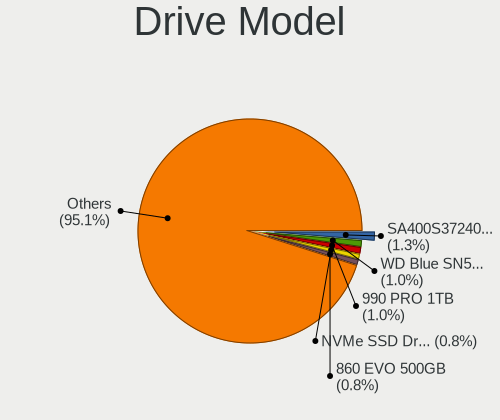
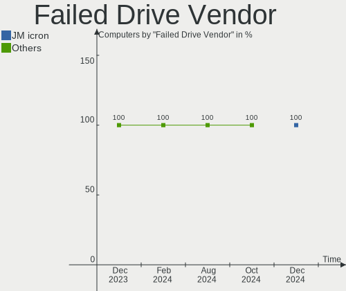
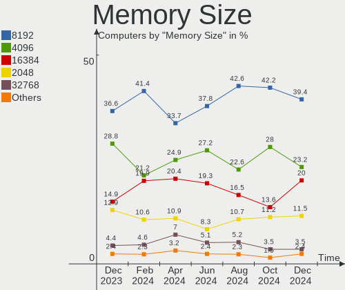
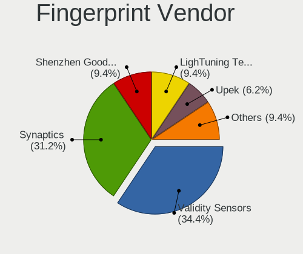

Linux Mint - Hardware Trends
----------------------------

A project to identify most popular hardware characteristics and track their change
over time based on data collected by Linux users at https://Linux-Hardware.org.

Anyone can contribute to this report by the [hw-probe](https://github.com/linuxhw/hw-probe) tool:

    sudo -E hw-probe -all -upload

This is a report for all computer types. See also reports for [desktops](/Dist/Linux_Mint/Desktop/README.md) and [notebooks](/Dist/Linux_Mint/Notebook/README.md).

This report is for one last month. Overall report since the beginning of time: [TestCoverage](https://github.com/linuxhw/TestCoverage)

Period: Aug, 2022.

Contents
--------

* [ System ](#system)
  - [ OS                       ](#os)
  - [ OS Family                ](#os-family)
  - [ Kernel                   ](#kernel)
  - [ Kernel Family            ](#kernel-family)
  - [ Kernel Major Ver.        ](#kernel-major-ver)
  - [ Arch                     ](#arch)
  - [ DE                       ](#de)
  - [ Display Server           ](#display-server)
  - [ Display Manager          ](#display-manager)
  - [ OS Lang                  ](#os-lang)
  - [ Boot Mode                ](#boot-mode)
  - [ Filesystem               ](#filesystem)
  - [ Part. scheme             ](#part-scheme)
  - [ Dual Boot with Linux/BSD ](#dual-boot-with-linuxbsd)
  - [ Dual Boot (Win)          ](#dual-boot-win)

* [ Board ](#board)
  - [ Vendor                   ](#vendor)
  - [ Model                    ](#model)
  - [ Model Family             ](#model-family)
  - [ MFG Year                 ](#mfg-year)
  - [ Form Factor              ](#form-factor)
  - [ Secure Boot              ](#secure-boot)
  - [ Coreboot                 ](#coreboot)
  - [ RAM Size                 ](#ram-size)
  - [ RAM Used                 ](#ram-used)
  - [ Total Drives             ](#total-drives)
  - [ Has CD-ROM               ](#has-cd-rom)
  - [ Has Ethernet             ](#has-ethernet)
  - [ Has WiFi                 ](#has-wifi)
  - [ Has Bluetooth            ](#has-bluetooth)

* [ Location ](#location)
  - [ Country                  ](#country)
  - [ City                     ](#city)

* [ Drives ](#drives)
  - [ Drive Vendor             ](#drive-vendor)
  - [ Drive Model              ](#drive-model)
  - [ HDD Vendor               ](#hdd-vendor)
  - [ SSD Vendor               ](#ssd-vendor)
  - [ Drive Kind               ](#drive-kind)
  - [ Drive Connector          ](#drive-connector)
  - [ Drive Size               ](#drive-size)
  - [ Space Total              ](#space-total)
  - [ Space Used               ](#space-used)
  - [ Malfunc. Drives          ](#malfunc-drives)
  - [ Malfunc. Drive Vendor    ](#malfunc-drive-vendor)
  - [ Malfunc. HDD Vendor      ](#malfunc-hdd-vendor)
  - [ Malfunc. Drive Kind      ](#malfunc-drive-kind)
  - [ Failed Drives            ](#failed-drives)
  - [ Failed Drive Vendor      ](#failed-drive-vendor)
  - [ Drive Status             ](#drive-status)

* [ Storage controller ](#storage-controller)
  - [ Storage Vendor           ](#storage-vendor)
  - [ Storage Model            ](#storage-model)
  - [ Storage Kind             ](#storage-kind)

* [ Processor ](#processor)
  - [ CPU Vendor               ](#cpu-vendor)
  - [ CPU Model                ](#cpu-model)
  - [ CPU Model Family         ](#cpu-model-family)
  - [ CPU Cores                ](#cpu-cores)
  - [ CPU Sockets              ](#cpu-sockets)
  - [ CPU Threads              ](#cpu-threads)
  - [ CPU Op-Modes             ](#cpu-op-modes)
  - [ CPU Microcode            ](#cpu-microcode)
  - [ CPU Microarch            ](#cpu-microarch)

* [ Graphics ](#graphics)
  - [ GPU Vendor               ](#gpu-vendor)
  - [ GPU Model                ](#gpu-model)
  - [ GPU Combo                ](#gpu-combo)
  - [ GPU Driver               ](#gpu-driver)
  - [ GPU Memory               ](#gpu-memory)

* [ Monitor ](#monitor)
  - [ Monitor Vendor           ](#monitor-vendor)
  - [ Monitor Model            ](#monitor-model)
  - [ Monitor Resolution       ](#monitor-resolution)
  - [ Monitor Diagonal         ](#monitor-diagonal)
  - [ Monitor Width            ](#monitor-width)
  - [ Aspect Ratio             ](#aspect-ratio)
  - [ Monitor Area             ](#monitor-area)
  - [ Pixel Density            ](#pixel-density)
  - [ Multiple Monitors        ](#multiple-monitors)

* [ Network ](#network)
  - [ Net Controller Vendor    ](#net-controller-vendor)
  - [ Net Controller Model     ](#net-controller-model)
  - [ Wireless Vendor          ](#wireless-vendor)
  - [ Wireless Model           ](#wireless-model)
  - [ Ethernet Vendor          ](#ethernet-vendor)
  - [ Ethernet Model           ](#ethernet-model)
  - [ Net Controller Kind      ](#net-controller-kind)
  - [ Used Controller          ](#used-controller)
  - [ NICs                     ](#nics)
  - [ IPv6                     ](#ipv6)

* [ Bluetooth ](#bluetooth)
  - [ Bluetooth Vendor         ](#bluetooth-vendor)
  - [ Bluetooth Model          ](#bluetooth-model)

* [ Sound ](#sound)
  - [ Sound Vendor             ](#sound-vendor)
  - [ Sound Model              ](#sound-model)

* [ Memory ](#memory)
  - [ Memory Vendor            ](#memory-vendor)
  - [ Memory Model             ](#memory-model)
  - [ Memory Kind              ](#memory-kind)
  - [ Memory Form Factor       ](#memory-form-factor)
  - [ Memory Size              ](#memory-size)
  - [ Memory Speed             ](#memory-speed)

* [ Printers & scanners ](#printers--scanners)
  - [ Printer Vendor           ](#printer-vendor)
  - [ Printer Model            ](#printer-model)
  - [ Scanner Vendor           ](#scanner-vendor)
  - [ Scanner Model            ](#scanner-model)

* [ Camera ](#camera)
  - [ Camera Vendor            ](#camera-vendor)
  - [ Camera Model             ](#camera-model)

* [ Security ](#security)
  - [ Fingerprint Vendor       ](#fingerprint-vendor)
  - [ Fingerprint Model        ](#fingerprint-model)
  - [ Chipcard Vendor          ](#chipcard-vendor)
  - [ Chipcard Model           ](#chipcard-model)

* [ Unsupported ](#unsupported)
  - [ Unsupported Devices      ](#unsupported-devices)
  - [ Unsupported Device Types ](#unsupported-device-types)

System
------

OS
--

Installed operating systems

| Name            | Computers | Percent |
|-----------------|-----------|---------|
| Linux Mint 20.3 | 178       | 43.63%  |
| Linux Mint 21   | 177       | 43.38%  |
| Linux Mint 20.2 | 15        | 3.68%   |
| Linux Mint 19.3 | 13        | 3.19%   |
| Linux Mint 20   | 10        | 2.45%   |
| Linux Mint 20.1 | 8         | 1.96%   |
| Linux Mint 19.1 | 4         | 0.98%   |
| Linux Mint 19   | 2         | 0.49%   |
| Linux Mint 19.2 | 1         | 0.25%   |

OS Family
---------

OS without a version

| Name       | Computers | Percent |
|------------|-----------|---------|
| Linux Mint | 408       | 100%    |

Kernel
------

Version of the Linux kernel

| Version                  | Computers | Percent |
|--------------------------|-----------|---------|
| 5.15.0-46-generic        | 128       | 31.37%  |
| 5.4.0-122-generic        | 62        | 15.2%   |
| 5.4.0-124-generic        | 52        | 12.75%  |
| 5.15.0-43-generic        | 50        | 12.25%  |
| 5.4.0-125-generic        | 29        | 7.11%   |
| 5.15.0-41-generic        | 22        | 5.39%   |
| 5.4.0-91-generic         | 11        | 2.7%    |
| 5.4.0-26-generic         | 5         | 1.23%   |
| 5.4.0-113-generic        | 4         | 0.98%   |
| 5.15.0-46-lowlatency     | 4         | 0.98%   |
| 4.15.0-191-generic       | 4         | 0.98%   |
| 5.4.0-58-generic         | 3         | 0.74%   |
| 5.4.0-109-generic        | 2         | 0.49%   |
| 5.19.0-051900-generic    | 2         | 0.49%   |
| 5.18.10-76051810-generic | 2         | 0.49%   |
| 5.15.0-47-generic        | 2         | 0.49%   |
| 5.15.0-33-generic        | 2         | 0.49%   |
| 5.14.0-1048-oem          | 2         | 0.49%   |
| 5.14.0-1047-oem          | 2         | 0.49%   |
| 5.13.0-52-generic        | 2         | 0.49%   |
| 5.4.0-92-generic         | 1         | 0.25%   |
| 5.4.0-65-generic         | 1         | 0.25%   |
| 5.4.0-124-lowlatency     | 1         | 0.25%   |
| 5.4.0-121-generic        | 1         | 0.25%   |
| 5.4.0-120-generic        | 1         | 0.25%   |
| 5.4.0-110-generic        | 1         | 0.25%   |
| 5.4.0-105-generic        | 1         | 0.25%   |
| 5.18.12-tkg-pds          | 1         | 0.25%   |
| 5.15.0-43-lowlatency     | 1         | 0.25%   |
| 5.15.0-25-generic        | 1         | 0.25%   |
| 5.14.0-1044-oem          | 1         | 0.25%   |
| 5.13.0-41-generic        | 1         | 0.25%   |
| 5.11.0-7614-generic      | 1         | 0.25%   |
| 5.11.0-16-generic        | 1         | 0.25%   |
| 5.0.0-32-generic         | 1         | 0.25%   |
| 4.15.0-20-generic        | 1         | 0.25%   |
| 4.15.0-189-generic       | 1         | 0.25%   |
| 4.15.0-173-generic       | 1         | 0.25%   |

Kernel Family
-------------

Linux kernel without a distro release

| Version | Computers | Percent |
|---------|-----------|---------|
| 5.15.0  | 210       | 51.47%  |
| 5.4.0   | 175       | 42.89%  |
| 4.15.0  | 7         | 1.72%   |
| 5.14.0  | 5         | 1.23%   |
| 5.13.0  | 3         | 0.74%   |
| 5.19.0  | 2         | 0.49%   |
| 5.18.10 | 2         | 0.49%   |
| 5.11.0  | 2         | 0.49%   |
| 5.18.12 | 1         | 0.25%   |
| 5.0.0   | 1         | 0.25%   |

Kernel Major Ver.
-----------------

Linux kernel major version

| Version | Computers | Percent |
|---------|-----------|---------|
| 5.15    | 210       | 51.47%  |
| 5.4     | 175       | 42.89%  |
| 4.15    | 7         | 1.72%   |
| 5.14    | 5         | 1.23%   |
| 5.18    | 3         | 0.74%   |
| 5.13    | 3         | 0.74%   |
| 5.19    | 2         | 0.49%   |
| 5.11    | 2         | 0.49%   |
| 5.0     | 1         | 0.25%   |

Arch
----

OS architecture (x86_64, i586, etc.)

| Name   | Computers | Percent |
|--------|-----------|---------|
| x86_64 | 406       | 99.51%  |
| i686   | 2         | 0.49%   |

DE
--

Desktop Environment

| Name       | Computers | Percent |
|------------|-----------|---------|
| X-Cinnamon | 282       | 69.12%  |
| MATE       | 53        | 12.99%  |
| XFCE       | 47        | 11.52%  |
| Cinnamon   | 15        | 3.68%   |
| GNOME      | 6         | 1.47%   |
| KDE5       | 3         | 0.74%   |
| Unknown    | 2         | 0.49%   |

Display Server
--------------

X11 or Wayland

| Name | Computers | Percent |
|------|-----------|---------|
| X11  | 406       | 99.51%  |
| Tty  | 2         | 0.49%   |

Display Manager
---------------

SDDM, LightDM, etc.

| Name    | Computers | Percent |
|---------|-----------|---------|
| Unknown | 235       | 57.6%   |
| LightDM | 170       | 41.67%  |
| SDDM    | 3         | 0.74%   |

OS Lang
-------

Language

| Lang  | Computers | Percent |
|-------|-----------|---------|
| en_US | 139       | 34.07%  |
| de_DE | 64        | 15.69%  |
| pt_BR | 25        | 6.13%   |
| fr_FR | 23        | 5.64%   |
| en_GB | 18        | 4.41%   |
| ru_RU | 16        | 3.92%   |
| en_CA | 15        | 3.68%   |
| it_IT | 10        | 2.45%   |
| C     | 8         | 1.96%   |
| pl_PL | 7         | 1.72%   |
| en_IN | 7         | 1.72%   |
| en_AU | 7         | 1.72%   |
| es_ES | 6         | 1.47%   |
| pt_PT | 5         | 1.23%   |
| nl_NL | 5         | 1.23%   |
| cs_CZ | 5         | 1.23%   |
| fi_FI | 4         | 0.98%   |
| en_NZ | 4         | 0.98%   |
| de_CH | 4         | 0.98%   |
| nb_NO | 3         | 0.74%   |
| es_CO | 3         | 0.74%   |
| es_AR | 3         | 0.74%   |
| fr_CA | 2         | 0.49%   |
| es_CL | 2         | 0.49%   |
| en_ZA | 2         | 0.49%   |
| en_IL | 2         | 0.49%   |
| en_IE | 2         | 0.49%   |
| zh_CN | 1         | 0.25%   |
| uk_UA | 1         | 0.25%   |
| tr_TR | 1         | 0.25%   |
| sv_SE | 1         | 0.25%   |
| sk_SK | 1         | 0.25%   |
| ja_JP | 1         | 0.25%   |
| hu_HU | 1         | 0.25%   |
| fr_BE | 1         | 0.25%   |
| es_VE | 1         | 0.25%   |
| es_UY | 1         | 0.25%   |
| es_PE | 1         | 0.25%   |
| es_NI | 1         | 0.25%   |
| es_CR | 1         | 0.25%   |
| en_PH | 1         | 0.25%   |
| el_GR | 1         | 0.25%   |
| de_AT | 1         | 0.25%   |
| bg_BG | 1         | 0.25%   |

Boot Mode
---------

EFI or BIOS

| Mode | Computers | Percent |
|------|-----------|---------|
| EFI  | 244       | 59.8%   |
| BIOS | 164       | 40.2%   |

Filesystem
----------

Type of filesystem

| Type    | Computers | Percent |
|---------|-----------|---------|
| Ext4    | 386       | 94.61%  |
| Btrfs   | 13        | 3.19%   |
| Overlay | 5         | 1.23%   |
| Zfs     | 2         | 0.49%   |
| Xfs     | 1         | 0.25%   |
| Ext2    | 1         | 0.25%   |

Part. scheme
------------

Scheme of partitioning

| Type    | Computers | Percent |
|---------|-----------|---------|
| Unknown | 246       | 60.29%  |
| GPT     | 128       | 31.37%  |
| MBR     | 34        | 8.33%   |

Dual Boot with Linux/BSD
------------------------

Hosting more than one Linux/BSD

| Dual boot | Computers | Percent |
|-----------|-----------|---------|
| No        | 381       | 93.38%  |
| Yes       | 27        | 6.62%   |

Dual Boot (Win)
---------------

Hosting Linux and Windows

| Dual boot | Computers | Percent |
|-----------|-----------|---------|
| No        | 336       | 82.35%  |
| Yes       | 72        | 17.65%  |

Board
-----

Vendor
------

Motherboard manufacturer

| Name                           | Computers | Percent |
|--------------------------------|-----------|---------|
| ASUSTek Computer               | 69        | 16.91%  |
| Hewlett-Packard                | 66        | 16.18%  |
| Lenovo                         | 53        | 12.99%  |
| Dell                           | 38        | 9.31%   |
| Acer                           | 24        | 5.88%   |
| MSI                            | 23        | 5.64%   |
| Gigabyte Technology            | 20        | 4.9%    |
| ASRock                         | 16        | 3.92%   |
| Apple                          | 16        | 3.92%   |
| Samsung Electronics            | 8         | 1.96%   |
| Toshiba                        | 7         | 1.72%   |
| Intel                          | 4         | 0.98%   |
| HUAWEI                         | 4         | 0.98%   |
| Sony                           | 3         | 0.74%   |
| Medion                         | 3         | 0.74%   |
| Google                         | 3         | 0.74%   |
| Foxconn                        | 3         | 0.74%   |
| Biostar                        | 3         | 0.74%   |
| ReachingTech                   | 2         | 0.49%   |
| Positivo                       | 2         | 0.49%   |
| Packard Bell                   | 2         | 0.49%   |
| OnLogic                        | 2         | 0.49%   |
| OEM                            | 2         | 0.49%   |
| Notebook                       | 2         | 0.49%   |
| Fujitsu                        | 2         | 0.49%   |
| ECS                            | 2         | 0.49%   |
| Daten Tecnologia               | 2         | 0.49%   |
| AMI                            | 2         | 0.49%   |
| Alienware                      | 2         | 0.49%   |
| Unknown                        | 2         | 0.49%   |
| Vorke                          | 1         | 0.25%   |
| TrekStor                       | 1         | 0.25%   |
| The Warehouse Group            | 1         | 0.25%   |
| System76                       | 1         | 0.25%   |
| Standard                       | 1         | 0.25%   |
| Shuttle                        | 1         | 0.25%   |
| Schenker                       | 1         | 0.25%   |
| Razer                          | 1         | 0.25%   |
| Plaisio                        | 1         | 0.25%   |
| Pegatron                       | 1         | 0.25%   |
| PCWare                         | 1         | 0.25%   |
| Panasonic                      | 1         | 0.25%   |
| Microsoft                      | 1         | 0.25%   |
| Matsushita Electric Industrial | 1         | 0.25%   |
| LG Electronics                 | 1         | 0.25%   |
| JGINYUE                        | 1         | 0.25%   |
| IBASE Technology               | 1         | 0.25%   |
| Huanan                         | 1         | 0.25%   |
| GPU Company                    | 1         | 0.25%   |
| Chuwi                          | 1         | 0.25%   |
| AZW                            | 1         | 0.25%   |

Model
-----

Motherboard model

| Name                                  | Computers | Percent |
|---------------------------------------|-----------|---------|
| Apple MacBookPro9,2                   | 4         | 0.98%   |
| Unknown                               | 4         | 0.98%   |
| ReachingTech Dream Quest Office 2021  | 2         | 0.49%   |
| OnLogic Helix3X0                      | 2         | 0.49%   |
| MSI MS-7C94                           | 2         | 0.49%   |
| MSI MS-7C56                           | 2         | 0.49%   |
| HP ProBook 4540s                      | 2         | 0.49%   |
| HP Mini 110-3100                      | 2         | 0.49%   |
| HP Laptop 17-cp0xxx                   | 2         | 0.49%   |
| HP 2000                               | 2         | 0.49%   |
| Dell Latitude 5521                    | 2         | 0.49%   |
| Daten Tecnologia DT02-M4              | 2         | 0.49%   |
| ASUS TUF Gaming B550M-PLUS            | 2         | 0.49%   |
| ASUS All Series                       | 2         | 0.49%   |
| Apple MacBookPro8,1                   | 2         | 0.49%   |
| Apple MacBookPro12,1                  | 2         | 0.49%   |
| Vorke V1 Plus                         | 1         | 0.25%   |
| TrekStor Primebook P14                | 1         | 0.25%   |
| Toshiba Satellite L855                | 1         | 0.25%   |
| Toshiba Satellite L300                | 1         | 0.25%   |
| Toshiba Satellite C660                | 1         | 0.25%   |
| Toshiba QOSMIO X70-B                  | 1         | 0.25%   |
| Toshiba PORTEGE M800                  | 1         | 0.25%   |
| Toshiba dynabook T75/RW               | 1         | 0.25%   |
| Toshiba dynabook R732/G               | 1         | 0.25%   |
| The Warehouse Group E2037             | 1         | 0.25%   |
| System76 Oryx Pro                     | 1         | 0.25%   |
| Standard X50-V2                       | 1         | 0.25%   |
| Sony VPCSB35FB                        | 1         | 0.25%   |
| Sony VGN-NR210FH                      | 1         | 0.25%   |
| Sony SVF1521L1RW                      | 1         | 0.25%   |
| Shuttle XH310V2                       | 1         | 0.25%   |
| Schenker VISION 15 (SVS15E21)         | 1         | 0.25%   |
| Samsung RV411/RV511/E3511/S3511/RV711 | 1         | 0.25%   |
| Samsung R430/R480/R440                | 1         | 0.25%   |
| Samsung 950QCG                        | 1         | 0.25%   |
| Samsung 700Z3A/700Z4A/700Z5A/700Z5B   | 1         | 0.25%   |
| Samsung 550XDA                        | 1         | 0.25%   |
| Samsung 550XCJ/550XCR                 | 1         | 0.25%   |
| Samsung 340XAA/350XAA/550XAA          | 1         | 0.25%   |
| Samsung 300E4C/300E5C/300E7C          | 1         | 0.25%   |
| Razer Blade                           | 1         | 0.25%   |
| Positivo Q4128C-S                     | 1         | 0.25%   |
| Positivo POS-PIQ77CL                  | 1         | 0.25%   |
| Plaisio Turbo X                       | 1         | 0.25%   |
| Pegatron 505B Microtower PC           | 1         | 0.25%   |
| PCWare IPMH61R3                       | 1         | 0.25%   |
| Panasonic CF-53AAGZXDX                | 1         | 0.25%   |
| Packard Bell EasyNote LS11HR          | 1         | 0.25%   |
| Packard Bell EasyNote LE69KB          | 1         | 0.25%   |
| OEM Intel H81                         | 1         | 0.25%   |
| OEM G41 775 ICH7 8712                 | 1         | 0.25%   |
| Notebook NJ50_70CU                    | 1         | 0.25%   |
| Notebook N9x0TC                       | 1         | 0.25%   |
| MSI MS-7D54                           | 1         | 0.25%   |
| MSI MS-7D22                           | 1         | 0.25%   |
| MSI MS-7D13                           | 1         | 0.25%   |
| MSI MS-7C91                           | 1         | 0.25%   |
| MSI MS-7C84                           | 1         | 0.25%   |
| MSI MS-7C37                           | 1         | 0.25%   |

Model Family
------------

Motherboard model prefix

| Name                      | Computers | Percent |
|---------------------------|-----------|---------|
| Lenovo ThinkPad           | 21        | 5.15%   |
| Acer Aspire               | 18        | 4.41%   |
| Dell Latitude             | 16        | 3.92%   |
| Lenovo IdeaPad            | 10        | 2.45%   |
| Dell Inspiron             | 10        | 2.45%   |
| HP EliteBook              | 9         | 2.21%   |
| ASUS VivoBook             | 7         | 1.72%   |
| HP ProBook                | 6         | 1.47%   |
| HP Compaq                 | 6         | 1.47%   |
| ASUS PRIME                | 6         | 1.47%   |
| HP Pavilion               | 5         | 1.23%   |
| HP Laptop                 | 5         | 1.23%   |
| HP EliteDesk              | 5         | 1.23%   |
| ASUS ROG                  | 5         | 1.23%   |
| Lenovo ThinkCentre        | 4         | 0.98%   |
| HP ProDesk                | 4         | 0.98%   |
| Dell XPS                  | 4         | 0.98%   |
| Dell OptiPlex             | 4         | 0.98%   |
| Apple MacBookPro9         | 4         | 0.98%   |
| Unknown                   | 4         | 0.98%   |
| Toshiba Satellite         | 3         | 0.74%   |
| HP OMEN                   | 3         | 0.74%   |
| ASUS TUF                  | 3         | 0.74%   |
| ASUS ASUS                 | 3         | 0.74%   |
| Toshiba dynabook          | 2         | 0.49%   |
| ReachingTech Dream        | 2         | 0.49%   |
| Packard Bell EasyNote     | 2         | 0.49%   |
| OnLogic Helix3X0          | 2         | 0.49%   |
| MSI MS-7C94               | 2         | 0.49%   |
| MSI MS-7C56               | 2         | 0.49%   |
| Lenovo Yoga               | 2         | 0.49%   |
| Lenovo MIIX               | 2         | 0.49%   |
| HP Mini                   | 2         | 0.49%   |
| HP ENVY                   | 2         | 0.49%   |
| HP 2000                   | 2         | 0.49%   |
| Gigabyte X570             | 2         | 0.49%   |
| Gigabyte B550             | 2         | 0.49%   |
| Dell Precision            | 2         | 0.49%   |
| Daten Tecnologia DT02-M4  | 2         | 0.49%   |
| ASUS MINIPC               | 2         | 0.49%   |
| ASUS All                  | 2         | 0.49%   |
| ASRock N68-S              | 2         | 0.49%   |
| Apple MacBookPro8         | 2         | 0.49%   |
| Apple MacBookPro12        | 2         | 0.49%   |
| Vorke V1                  | 1         | 0.25%   |
| TrekStor Primebook        | 1         | 0.25%   |
| Toshiba QOSMIO            | 1         | 0.25%   |
| Toshiba PORTEGE           | 1         | 0.25%   |
| The Warehouse Group E2037 | 1         | 0.25%   |
| System76 Oryx             | 1         | 0.25%   |
| Standard X50-V2           | 1         | 0.25%   |
| Sony VPCSB35FB            | 1         | 0.25%   |
| Sony VGN-NR210FH          | 1         | 0.25%   |
| Sony SVF1521L1RW          | 1         | 0.25%   |
| Shuttle XH310V2           | 1         | 0.25%   |
| Schenker VISION           | 1         | 0.25%   |
| Samsung RV411             | 1         | 0.25%   |
| Samsung R430              | 1         | 0.25%   |
| Samsung 950QCG            | 1         | 0.25%   |
| Samsung 700Z3A            | 1         | 0.25%   |

MFG Year
--------

Motherboard manufacture year

| Year | Computers | Percent |
|------|-----------|---------|
| 2020 | 43        | 10.54%  |
| 2012 | 43        | 10.54%  |
| 2021 | 40        | 9.8%    |
| 2011 | 36        | 8.82%   |
| 2018 | 33        | 8.09%   |
| 2013 | 30        | 7.35%   |
| 2019 | 27        | 6.62%   |
| 2008 | 21        | 5.15%   |
| 2010 | 20        | 4.9%    |
| 2016 | 19        | 4.66%   |
| 2015 | 19        | 4.66%   |
| 2017 | 18        | 4.41%   |
| 2022 | 16        | 3.92%   |
| 2014 | 15        | 3.68%   |
| 2006 | 10        | 2.45%   |
| 2007 | 9         | 2.21%   |
| 2009 | 8         | 1.96%   |
| 2004 | 1         | 0.25%   |

Form Factor
-----------

Physical design of the computer

| Name        | Computers | Percent |
|-------------|-----------|---------|
| Notebook    | 234       | 57.35%  |
| Desktop     | 151       | 37.01%  |
| Convertible | 8         | 1.96%   |
| Mini pc     | 7         | 1.72%   |
| All in one  | 4         | 0.98%   |
| Tablet      | 3         | 0.74%   |
| Server      | 1         | 0.25%   |

Secure Boot
-----------

Enabled or disabled

| State    | Computers | Percent |
|----------|-----------|---------|
| Disabled | 365       | 89.46%  |
| Enabled  | 43        | 10.54%  |

Coreboot
--------

Have coreboot on board

| Used | Computers | Percent |
|------|-----------|---------|
| No   | 405       | 99.26%  |
| Yes  | 3         | 0.74%   |

RAM Size
--------

Total RAM memory

| Size in GB      | Computers | Percent |
|-----------------|-----------|---------|
| 4.01-8.0        | 100       | 24.51%  |
| 3.01-4.0        | 76        | 18.63%  |
| 8.01-16.0       | 76        | 18.63%  |
| 16.01-24.0      | 75        | 18.38%  |
| 32.01-64.0      | 32        | 7.84%   |
| 1.01-2.0        | 22        | 5.39%   |
| 24.01-32.0      | 9         | 2.21%   |
| 64.01-256.0     | 9         | 2.21%   |
| 2.01-3.0        | 6         | 1.47%   |
| 0.51-1.0        | 2         | 0.49%   |
| More than 256.0 | 1         | 0.25%   |

RAM Used
--------

Used RAM memory

| Used GB    | Computers | Percent |
|------------|-----------|---------|
| 1.01-2.0   | 173       | 42.4%   |
| 2.01-3.0   | 94        | 23.04%  |
| 3.01-4.0   | 54        | 13.24%  |
| 4.01-8.0   | 50        | 12.25%  |
| 0.51-1.0   | 22        | 5.39%   |
| 8.01-16.0  | 12        | 2.94%   |
| 16.01-24.0 | 3         | 0.74%   |

Total Drives
------------

Number of drives on board

| Drives | Computers | Percent |
|--------|-----------|---------|
| 1      | 245       | 60.05%  |
| 2      | 108       | 26.47%  |
| 3      | 21        | 5.15%   |
| 4      | 15        | 3.68%   |
| 6      | 10        | 2.45%   |
| 5      | 8         | 1.96%   |
| 7      | 1         | 0.25%   |

Has CD-ROM
----------

Has CD-ROM on board

| Presented | Computers | Percent |
|-----------|-----------|---------|
| No        | 234       | 57.35%  |
| Yes       | 174       | 42.65%  |

Has Ethernet
------------

Has Ethernet on board

| Presented | Computers | Percent |
|-----------|-----------|---------|
| Yes       | 355       | 87.01%  |
| No        | 53        | 12.99%  |

Has WiFi
--------

Has WiFi module

| Presented | Computers | Percent |
|-----------|-----------|---------|
| Yes       | 324       | 79.41%  |
| No        | 84        | 20.59%  |

Has Bluetooth
-------------

Has Bluetooth module

| Presented | Computers | Percent |
|-----------|-----------|---------|
| Yes       | 248       | 60.78%  |
| No        | 160       | 39.22%  |

Location
--------

Country
-------

Geographic location (country)

| Country      | Computers | Percent |
|--------------|-----------|---------|
| USA          | 68        | 16.67%  |
| Germany      | 67        | 16.42%  |
| Brazil       | 29        | 7.11%   |
| France       | 23        | 5.64%   |
| Canada       | 18        | 4.41%   |
| Russia       | 15        | 3.68%   |
| UK           | 13        | 3.19%   |
| Netherlands  | 13        | 3.19%   |
| Italy        | 12        | 2.94%   |
| Poland       | 10        | 2.45%   |
| Australia    | 9         | 2.21%   |
| India        | 7         | 1.72%   |
| Finland      | 7         | 1.72%   |
| Thailand     | 6         | 1.47%   |
| Switzerland  | 6         | 1.47%   |
| Spain        | 6         | 1.47%   |
| Czechia      | 6         | 1.47%   |
| Austria      | 6         | 1.47%   |
| Turkey       | 5         | 1.23%   |
| Portugal     | 5         | 1.23%   |
| Greece       | 5         | 1.23%   |
| New Zealand  | 4         | 0.98%   |
| Mexico       | 4         | 0.98%   |
| Argentina    | 4         | 0.98%   |
| Norway       | 3         | 0.74%   |
| Israel       | 3         | 0.74%   |
| Indonesia    | 3         | 0.74%   |
| Colombia     | 3         | 0.74%   |
| Bulgaria     | 3         | 0.74%   |
| Belarus      | 3         | 0.74%   |
| Taiwan       | 2         | 0.49%   |
| South Africa | 2         | 0.49%   |
| Morocco      | 2         | 0.49%   |
| Latvia       | 2         | 0.49%   |
| Kenya        | 2         | 0.49%   |
| Japan        | 2         | 0.49%   |
| Ireland      | 2         | 0.49%   |
| Chile        | 2         | 0.49%   |
| Belgium      | 2         | 0.49%   |
| Vietnam      | 1         | 0.25%   |
| Venezuela    | 1         | 0.25%   |
| Uruguay      | 1         | 0.25%   |
| Sweden       | 1         | 0.25%   |
| Slovakia     | 1         | 0.25%   |
| Singapore    | 1         | 0.25%   |
| Serbia       | 1         | 0.25%   |
| Saudi Arabia | 1         | 0.25%   |
| Romania      | 1         | 0.25%   |
| Philippines  | 1         | 0.25%   |
| Peru         | 1         | 0.25%   |
| Oman         | 1         | 0.25%   |
| Nicaragua    | 1         | 0.25%   |
| Malaysia     | 1         | 0.25%   |
| Iran         | 1         | 0.25%   |
| Hungary      | 1         | 0.25%   |
| Honduras     | 1         | 0.25%   |
| Georgia      | 1         | 0.25%   |
| El Salvador  | 1         | 0.25%   |
| Egypt        | 1         | 0.25%   |
| Denmark      | 1         | 0.25%   |

City
----

Geographic location (city)

| City                 | Computers | Percent |
|----------------------|-----------|---------|
| Berlin               | 9         | 2.21%   |
| Vienna               | 6         | 1.47%   |
| Moscow               | 5         | 1.23%   |
| Milan                | 4         | 0.98%   |
| Sydney               | 3         | 0.74%   |
| Helsinki             | 3         | 0.74%   |
| Hamburg              | 3         | 0.74%   |
| Chandler             | 3         | 0.74%   |
| Bangkok              | 3         | 0.74%   |
| Auckland             | 3         | 0.74%   |
| Athens               | 3         | 0.74%   |
| Amsterdam            | 3         | 0.74%   |
| Wroclaw              | 2         | 0.49%   |
| Windsor              | 2         | 0.49%   |
| Victoria             | 2         | 0.49%   |
| Tel Aviv             | 2         | 0.49%   |
| Sofia                | 2         | 0.49%   |
| Sao Paulo            | 2         | 0.49%   |
| San José            | 2         | 0.49%   |
| Salt Lake City       | 2         | 0.49%   |
| Rio de Janeiro       | 2         | 0.49%   |
| Rijswijk             | 2         | 0.49%   |
| Reading              | 2         | 0.49%   |
| Prague               | 2         | 0.49%   |
| Poznan               | 2         | 0.49%   |
| Portland             | 2         | 0.49%   |
| Pismo Beach          | 2         | 0.49%   |
| Paris                | 2         | 0.49%   |
| Nuremberg            | 2         | 0.49%   |
| Nairobi              | 2         | 0.49%   |
| Munich               | 2         | 0.49%   |
| Mumbai               | 2         | 0.49%   |
| Minsk                | 2         | 0.49%   |
| Melbourne            | 2         | 0.49%   |
| Markneukirchen       | 2         | 0.49%   |
| Lisbon               | 2         | 0.49%   |
| Koblenz              | 2         | 0.49%   |
| Kirchheim unter Teck | 2         | 0.49%   |
| Hamm                 | 2         | 0.49%   |
| Fortaleza            | 2         | 0.49%   |
| Edmonton             | 2         | 0.49%   |
| Dallas               | 2         | 0.49%   |
| Bursa                | 2         | 0.49%   |
| Brasília            | 2         | 0.49%   |
| Albstadt             | 2         | 0.49%   |
| Ząbki               | 1         | 0.25%   |
| Ystradgynlais        | 1         | 0.25%   |
| Yoshkar-Ola          | 1         | 0.25%   |
| Winter Springs       | 1         | 0.25%   |
| Wimbledon            | 1         | 0.25%   |
| Willisau             | 1         | 0.25%   |
| Wichita              | 1         | 0.25%   |
| Werder               | 1         | 0.25%   |
| Wegberg              | 1         | 0.25%   |
| Washington           | 1         | 0.25%   |
| Warren               | 1         | 0.25%   |
| Virginia Beach       | 1         | 0.25%   |
| Vijfhuizen           | 1         | 0.25%   |
| Ventspils            | 1         | 0.25%   |
| Venice               | 1         | 0.25%   |

Drives
------

Drive Vendor
------------

Hard drive vendors

| Vendor                    | Computers | Drives | Percent |
|---------------------------|-----------|--------|---------|
| Samsung Electronics       | 84        | 104    | 13.73%  |
| Seagate                   | 82        | 96     | 13.4%   |
| WDC                       | 73        | 87     | 11.93%  |
| Kingston                  | 43        | 45     | 7.03%   |
| Toshiba                   | 33        | 37     | 5.39%   |
| SanDisk                   | 33        | 35     | 5.39%   |
| Unknown                   | 27        | 32     | 4.41%   |
| Crucial                   | 25        | 27     | 4.08%   |
| Intel                     | 18        | 19     | 2.94%   |
| SK hynix                  | 17        | 17     | 2.78%   |
| HGST                      | 13        | 14     | 2.12%   |
| Hitachi                   | 9         | 10     | 1.47%   |
| Micron Technology         | 8         | 8      | 1.31%   |
| Apple                     | 8         | 9      | 1.31%   |
| A-DATA Technology         | 8         | 10     | 1.31%   |
| PNY                       | 7         | 7      | 1.14%   |
| KIOXIA                    | 7         | 7      | 1.14%   |
| SPCC                      | 6         | 6      | 0.98%   |
| Patriot                   | 6         | 6      | 0.98%   |
| Micron/Crucial Technology | 6         | 6      | 0.98%   |
| China                     | 6         | 7      | 0.98%   |
| Transcend                 | 5         | 5      | 0.82%   |
| Maxtor                    | 5         | 6      | 0.82%   |
| JMicron Technology        | 5         | 5      | 0.82%   |
| Unknown                   | 5         | 5      | 0.82%   |
| Phison                    | 4         | 4      | 0.65%   |
| GOODRAM                   | 4         | 4      | 0.65%   |
| Apacer                    | 4         | 4      | 0.65%   |
| Silicon Motion            | 3         | 3      | 0.49%   |
| NGFF                      | 3         | 3      | 0.49%   |
| UMIS                      | 2         | 2      | 0.33%   |
| Team                      | 2         | 2      | 0.33%   |
| Realtek Semiconductor     | 2         | 2      | 0.33%   |
| OCZ                       | 2         | 2      | 0.33%   |
| Netac                     | 2         | 2      | 0.33%   |
| KingSpec                  | 2         | 2      | 0.33%   |
| KingDian                  | 2         | 3      | 0.33%   |
| Intenso                   | 2         | 2      | 0.33%   |
| HS-SSD-C100               | 2         | 2      | 0.33%   |
| Fujitsu                   | 2         | 2      | 0.33%   |
| Corsair                   | 2         | 2      | 0.33%   |
| AMD                       | 2         | 2      | 0.33%   |
| YS                        | 1         | 1      | 0.16%   |
| YMTC                      | 1         | 1      | 0.16%   |
| XPG                       | 1         | 1      | 0.16%   |
| W800S                     | 1         | 1      | 0.16%   |
| Vaseky                    | 1         | 1      | 0.16%   |
| Union Memory (Shenzhen)   | 1         | 1      | 0.16%   |
| TrekStor                  | 1         | 1      | 0.16%   |
| TO Exter                  | 1         | 1      | 0.16%   |
| TCSUNBOW                  | 1         | 2      | 0.16%   |
| TANDBERG                  | 1         | 1      | 0.16%   |
| Storeva                   | 1         | 1      | 0.16%   |
| ShiJi                     | 1         | 1      | 0.16%   |
| SABRENT                   | 1         | 1      | 0.16%   |
| PHD 3.0                   | 1         | 1      | 0.16%   |
| Palit                     | 1         | 1      | 0.16%   |
| MidasForce                | 1         | 1      | 0.16%   |
| MAX                       | 1         | 1      | 0.16%   |
| Lite-On                   | 1         | 1      | 0.16%   |

Drive Model
-----------

Hard drive models

| Model                               | Computers | Percent |
|-------------------------------------|-----------|---------|
| Kingston SA400S37480G 480GB SSD     | 8         | 1.2%    |
| Seagate Expansion 500GB             | 7         | 1.05%   |
| Seagate ST1000LM024 HN-M101MBB 1TB  | 6         | 0.9%    |
| Kingston SA400S37240G 240GB SSD     | 6         | 0.9%    |
| Crucial CT500MX500SSD1 500GB        | 6         | 0.9%    |
| Unknown MMC Card  64GB              | 5         | 0.75%   |
| Unknown MMC Card  128GB             | 5         | 0.75%   |
| SanDisk SSD PLUS 240GB              | 5         | 0.75%   |
| Samsung SSD 870 EVO 500GB           | 5         | 0.75%   |
| Samsung NVMe SSD Drive 500GB        | 5         | 0.75%   |
| Kingston SV300S37A240G 240GB SSD    | 5         | 0.75%   |
| Unknown                             | 5         | 0.75%   |
| Unknown SD/MMC/MS PRO 128GB         | 4         | 0.6%    |
| Unknown MMC Card  32GB              | 4         | 0.6%    |
| Toshiba MQ04ABF100 1TB              | 4         | 0.6%    |
| Toshiba MQ01ABD100 1TB              | 4         | 0.6%    |
| Seagate ST500LT012-1DG142 500GB     | 4         | 0.6%    |
| Seagate ST500DM002-1BD142 500GB     | 4         | 0.6%    |
| Seagate ST2000DM008-2FR102 2TB      | 4         | 0.6%    |
| Seagate ST2000DM001-1ER164 2TB      | 4         | 0.6%    |
| SanDisk SSD PLUS 480GB              | 4         | 0.6%    |
| Samsung SSD 970 EVO Plus 500GB      | 4         | 0.6%    |
| Samsung SSD 970 EVO Plus 1TB        | 4         | 0.6%    |
| Samsung SSD 850 EVO 250GB           | 4         | 0.6%    |
| Intel NVMe SSD Drive 512GB          | 4         | 0.6%    |
| HGST HTS721010A9E630 1TB            | 4         | 0.6%    |
| WDC WDS100T2B0A-00SM50 1TB SSD      | 3         | 0.45%   |
| Toshiba DT01ACA100 1TB              | 3         | 0.45%   |
| SPCC Solid State Disk 256GB         | 3         | 0.45%   |
| SK hynix NVMe SSD Drive 256GB       | 3         | 0.45%   |
| Seagate ST1000LM035-1RK172 1TB      | 3         | 0.45%   |
| SanDisk DF4032  32GB                | 3         | 0.45%   |
| Samsung SSD 980 PRO 1TB             | 3         | 0.45%   |
| Samsung SSD 860 EVO 500GB           | 3         | 0.45%   |
| Samsung SSD 860 EVO 250GB           | 3         | 0.45%   |
| Samsung SSD 860 EVO 1TB             | 3         | 0.45%   |
| Micron/Crucial NVMe SSD Drive 500GB | 3         | 0.45%   |
| Micron/Crucial NVMe SSD Drive 1TB   | 3         | 0.45%   |
| Kingston SV300S37A120G 120GB SSD    | 3         | 0.45%   |
| Kingston SUV400S37240G 240GB SSD    | 3         | 0.45%   |
| Kingston SA400S37120G 120GB SSD     | 3         | 0.45%   |
| Crucial CT250MX500SSD1 250GB        | 3         | 0.45%   |
| Crucial CT240BX500SSD1 240GB        | 3         | 0.45%   |
| Crucial CT1000MX500SSD1 1TB         | 3         | 0.45%   |
| WDC WDS500G2B0A-00SM50 500GB SSD    | 2         | 0.3%    |
| WDC WDS240G2G0A-00JH30 240GB SSD    | 2         | 0.3%    |
| WDC WDS120G2G0A-00JH30 120GB SSD    | 2         | 0.3%    |
| WDC WD30EFRX-68AX9N0 3TB            | 2         | 0.3%    |
| WDC WD1002FAEX-00Z3A0 1TB           | 2         | 0.3%    |
| Unknown SD/MMC 16GB                 | 2         | 0.3%    |
| Unknown M.S./M.S.Pro/HG 16GB        | 2         | 0.3%    |
| UMIS RPFTJ128PDD2EWX 128GB          | 2         | 0.3%    |
| Transcend TS128GMTS952T2 128GB SSD  | 2         | 0.3%    |
| Toshiba MQ01ABF050 500GB            | 2         | 0.3%    |
| Toshiba DT01ACA200 2TB              | 2         | 0.3%    |
| Silicon Motion NVMe SSD Drive 128GB | 2         | 0.3%    |
| Seagate ST9500420AS 500GB           | 2         | 0.3%    |
| Seagate ST6000DM003-2CY186 6TB      | 2         | 0.3%    |
| Seagate ST4000DM004-2CV104 4TB      | 2         | 0.3%    |
| Seagate ST4000DM000-1F2168 4TB      | 2         | 0.3%    |

HDD Vendor
----------

Hard disk drive vendors

| Vendor              | Computers | Drives | Percent |
|---------------------|-----------|--------|---------|
| Seagate             | 79        | 93     | 36.92%  |
| WDC                 | 58        | 68     | 27.1%   |
| Toshiba             | 27        | 31     | 12.62%  |
| HGST                | 13        | 14     | 6.07%   |
| Hitachi             | 9         | 10     | 4.21%   |
| Samsung Electronics | 7         | 8      | 3.27%   |
| Unknown             | 5         | 5      | 2.34%   |
| Maxtor              | 5         | 6      | 2.34%   |
| Apple               | 3         | 4      | 1.4%    |
| Fujitsu             | 2         | 2      | 0.93%   |
| TANDBERG            | 1         | 1      | 0.47%   |
| Storeva             | 1         | 1      | 0.47%   |
| SABRENT             | 1         | 1      | 0.47%   |
| PHD 3.0             | 1         | 1      | 0.47%   |
| JMicron Technology  | 1         | 1      | 0.47%   |
| ASMedia             | 1         | 1      | 0.47%   |

SSD Vendor
----------

Solid state drive vendors

| Vendor              | Computers | Drives | Percent |
|---------------------|-----------|--------|---------|
| Samsung Electronics | 47        | 53     | 19.11%  |
| Kingston            | 35        | 36     | 14.23%  |
| SanDisk             | 23        | 25     | 9.35%   |
| Crucial             | 22        | 23     | 8.94%   |
| WDC                 | 15        | 16     | 6.1%    |
| PNY                 | 7         | 7      | 2.85%   |
| Intel               | 7         | 7      | 2.85%   |
| Patriot             | 6         | 6      | 2.44%   |
| China               | 6         | 7      | 2.44%   |
| A-DATA Technology   | 6         | 6      | 2.44%   |
| Transcend           | 5         | 5      | 2.03%   |
| SPCC                | 5         | 5      | 2.03%   |
| SK hynix            | 5         | 5      | 2.03%   |
| Micron Technology   | 5         | 5      | 2.03%   |
| Apple               | 5         | 5      | 2.03%   |
| GOODRAM             | 4         | 4      | 1.63%   |
| Apacer              | 4         | 4      | 1.63%   |
| Toshiba             | 3         | 3      | 1.22%   |
| NGFF                | 3         | 3      | 1.22%   |
| Unknown             | 3         | 3      | 1.22%   |
| Team                | 2         | 2      | 0.81%   |
| OCZ                 | 2         | 2      | 0.81%   |
| Netac               | 2         | 2      | 0.81%   |
| KingSpec            | 2         | 2      | 0.81%   |
| KingDian            | 2         | 3      | 0.81%   |
| JMicron Technology  | 2         | 2      | 0.81%   |
| YS                  | 1         | 1      | 0.41%   |
| Vaseky              | 1         | 1      | 0.41%   |
| Unknown             | 1         | 1      | 0.41%   |
| TrekStor            | 1         | 1      | 0.41%   |
| TO Exter            | 1         | 1      | 0.41%   |
| TCSUNBOW            | 1         | 2      | 0.41%   |
| Palit               | 1         | 1      | 0.41%   |
| MidasForce          | 1         | 1      | 0.41%   |
| Lexar               | 1         | 1      | 0.41%   |
| Hoodisk             | 1         | 1      | 0.41%   |
| Hikvision           | 1         | 1      | 0.41%   |
| Gigabyte Technology | 1         | 1      | 0.41%   |
| FORESEE             | 1         | 1      | 0.41%   |
| Dogfish             | 1         | 1      | 0.41%   |
| Corsair             | 1         | 1      | 0.41%   |
| BlueRay             | 1         | 1      | 0.41%   |
| AMD                 | 1         | 1      | 0.41%   |
| ADATA SU            | 1         | 1      | 0.41%   |

Drive Kind
----------

HDD or SSD

| Kind    | Computers | Drives | Percent |
|---------|-----------|--------|---------|
| SSD     | 205       | 260    | 37.75%  |
| HDD     | 182       | 247    | 33.52%  |
| NVMe    | 114       | 130    | 20.99%  |
| MMC     | 22        | 25     | 4.05%   |
| Unknown | 20        | 23     | 3.68%   |

Drive Connector
---------------

SATA, SAS, NVMe, etc.

| Type | Computers | Drives | Percent |
|------|-----------|--------|---------|
| SATA | 322       | 487    | 65.58%  |
| NVMe | 114       | 130    | 23.22%  |
| SAS  | 33        | 43     | 6.72%   |
| MMC  | 22        | 25     | 4.48%   |

Drive Size
----------

Size of hard drive

| Size in TB | Computers | Drives | Percent |
|------------|-----------|--------|---------|
| 0.01-0.5   | 255       | 337    | 63.59%  |
| 0.51-1.0   | 84        | 93     | 20.95%  |
| 1.01-2.0   | 35        | 41     | 8.73%   |
| 3.01-4.0   | 14        | 16     | 3.49%   |
| 2.01-3.0   | 5         | 6      | 1.25%   |
| 4.01-10.0  | 5         | 7      | 1.25%   |
| 10.01-20.0 | 3         | 7      | 0.75%   |

Space Total
-----------

Amount of disk space available on the file system

| Size in GB     | Computers | Percent |
|----------------|-----------|---------|
| 101-250        | 137       | 33.58%  |
| 251-500        | 103       | 25.25%  |
| 501-1000       | 62        | 15.2%   |
| More than 3000 | 29        | 7.11%   |
| 1001-2000      | 29        | 7.11%   |
| 51-100         | 21        | 5.15%   |
| 21-50          | 9         | 2.21%   |
| 2001-3000      | 9         | 2.21%   |
| 1-20           | 8         | 1.96%   |
| Unknown        | 1         | 0.25%   |

Space Used
----------

Amount of used disk space

| Used GB        | Computers | Percent |
|----------------|-----------|---------|
| 1-20           | 104       | 25.49%  |
| 21-50          | 77        | 18.87%  |
| 51-100         | 75        | 18.38%  |
| 101-250        | 55        | 13.48%  |
| 251-500        | 34        | 8.33%   |
| 501-1000       | 25        | 6.13%   |
| 1001-2000      | 21        | 5.15%   |
| More than 3000 | 13        | 3.19%   |
| 2001-3000      | 3         | 0.74%   |
| Unknown        | 1         | 0.25%   |

Malfunc. Drives
---------------

Drive models with a malfunction

| Model                                               | Computers | Drives | Percent |
|-----------------------------------------------------|-----------|--------|---------|
| WDC WD4003FZEX-00Z4SA0 4TB                          | 1         | 1      | 2.86%   |
| WDC WD4000FYYZ-01UL1B2 4TB                          | 1         | 2      | 2.86%   |
| WDC WD3200BUDT-63DPZY0 320GB                        | 1         | 1      | 2.86%   |
| WDC WD3200BPVT-00ZEST0 320GB                        | 1         | 1      | 2.86%   |
| WDC WD2000JD-00HBB0 200GB                           | 1         | 1      | 2.86%   |
| Toshiba MQ01ABF050 500GB                            | 1         | 1      | 2.86%   |
| Toshiba MQ01ABD100 1TB                              | 1         | 1      | 2.86%   |
| Toshiba MK2555GSX H 250GB                           | 1         | 1      | 2.86%   |
| Toshiba MK2555GSX 250GB                             | 1         | 1      | 2.86%   |
| SK hynix PC711 HFS512GDE9X073N 512GB                | 1         | 1      | 2.86%   |
| Seagate ST9500620NS 500GB                           | 1         | 1      | 2.86%   |
| Seagate ST500LT012-1DG142 500GB                     | 1         | 1      | 2.86%   |
| Seagate ST500LM000-1EJ162 500GB                     | 1         | 1      | 2.86%   |
| Seagate ST500DM002-1BD142 500GB                     | 1         | 1      | 2.86%   |
| Seagate ST2000LM007-1R8174 2TB                      | 1         | 1      | 2.86%   |
| Seagate ST1500DL003-9VT16L 1TB                      | 1         | 1      | 2.86%   |
| Seagate ST1000LM014-1EJ164 1TB                      | 1         | 1      | 2.86%   |
| Seagate ST1000DM003-1SB102 1TB                      | 1         | 1      | 2.86%   |
| SanDisk SSD PLUS 120GB                              | 1         | 1      | 2.86%   |
| Samsung Electronics HM500JI 500GB                   | 1         | 1      | 2.86%   |
| Samsung Electronics HD501LJ 500GB                   | 1         | 1      | 2.86%   |
| Samsung Electronics HD322HJ 320GB                   | 1         | 1      | 2.86%   |
| OCZ VERTEX 64GB SSD                                 | 1         | 1      | 2.86%   |
| Micron Technology MTFDDAK256TBN-1AR1ZABHA 256GB SSD | 1         | 1      | 2.86%   |
| Maxtor STM3250824AS 250GB                           | 1         | 1      | 2.86%   |
| Kingston SUV400S37240G 240GB SSD                    | 1         | 1      | 2.86%   |
| JMicron Technology Disk 250GB                       | 1         | 1      | 2.86%   |
| Intel SSDSC2CT180A4 180GB                           | 1         | 1      | 2.86%   |
| Hitachi HDT721064SLA360 640GB                       | 1         | 1      | 2.86%   |
| HGST HTS541010A9E680 1TB                            | 1         | 1      | 2.86%   |
| HGST HCC545050A7E380 500GB                          | 1         | 1      | 2.86%   |
| China SSD 360GB                                     | 1         | 1      | 2.86%   |
| China SSD 128GB                                     | 1         | 1      | 2.86%   |
| China SATA3 480GB SSD                               | 1         | 1      | 2.86%   |
| A-DATA Technology SP900 256GB SSD                   | 1         | 1      | 2.86%   |

Malfunc. Drive Vendor
---------------------

Vendors of faulty drives

| Vendor              | Computers | Drives | Percent |
|---------------------|-----------|--------|---------|
| Seagate             | 8         | 8      | 22.86%  |
| WDC                 | 5         | 6      | 14.29%  |
| Toshiba             | 4         | 4      | 11.43%  |
| Samsung Electronics | 3         | 3      | 8.57%   |
| China               | 3         | 3      | 8.57%   |
| HGST                | 2         | 2      | 5.71%   |
| SK hynix            | 1         | 1      | 2.86%   |
| SanDisk             | 1         | 1      | 2.86%   |
| OCZ                 | 1         | 1      | 2.86%   |
| Micron Technology   | 1         | 1      | 2.86%   |
| Maxtor              | 1         | 1      | 2.86%   |
| Kingston            | 1         | 1      | 2.86%   |
| JMicron Technology  | 1         | 1      | 2.86%   |
| Intel               | 1         | 1      | 2.86%   |
| Hitachi             | 1         | 1      | 2.86%   |
| A-DATA Technology   | 1         | 1      | 2.86%   |

Malfunc. HDD Vendor
-------------------

Vendors of faulty HDD drives

| Vendor              | Computers | Drives | Percent |
|---------------------|-----------|--------|---------|
| Seagate             | 8         | 8      | 32%     |
| WDC                 | 5         | 6      | 20%     |
| Toshiba             | 4         | 4      | 16%     |
| Samsung Electronics | 3         | 3      | 12%     |
| HGST                | 2         | 2      | 8%      |
| Maxtor              | 1         | 1      | 4%      |
| JMicron Technology  | 1         | 1      | 4%      |
| Hitachi             | 1         | 1      | 4%      |

Malfunc. Drive Kind
-------------------

Kinds of faulty drives

| Kind | Computers | Drives | Percent |
|------|-----------|--------|---------|
| HDD  | 21        | 26     | 67.74%  |
| SSD  | 9         | 9      | 29.03%  |
| NVMe | 1         | 1      | 3.23%   |

Failed Drives
-------------

Failed drive models

| Model                           | Computers | Drives | Percent |
|---------------------------------|-----------|--------|---------|
| Samsung Electronics SSD 980 1TB | 1         | 1      | 100%    |

Failed Drive Vendor
-------------------

Failed drive vendors

| Vendor              | Computers | Drives | Percent |
|---------------------|-----------|--------|---------|
| Samsung Electronics | 1         | 1      | 100%    |

Drive Status
------------

Number of failed and malfunc. drives

| Status   | Computers | Drives | Percent |
|----------|-----------|--------|---------|
| Detected | 273       | 434    | 61.21%  |
| Works    | 143       | 214    | 32.06%  |
| Malfunc  | 29        | 36     | 6.5%    |
| Failed   | 1         | 1      | 0.22%   |

Storage controller
------------------

Storage Vendor
--------------

Storage controller vendors

| Vendor                       | Computers | Percent |
|------------------------------|-----------|---------|
| Intel                        | 277       | 55.73%  |
| AMD                          | 75        | 15.09%  |
| Samsung Electronics          | 43        | 8.65%   |
| SK hynix                     | 12        | 2.41%   |
| SanDisk                      | 10        | 2.01%   |
| Micron/Crucial Technology    | 10        | 2.01%   |
| ASMedia Technology           | 10        | 2.01%   |
| Nvidia                       | 8         | 1.61%   |
| KIOXIA                       | 8         | 1.61%   |
| Kingston Technology Company  | 8         | 1.61%   |
| JMicron Technology           | 6         | 1.21%   |
| Phison Electronics           | 5         | 1.01%   |
| VIA Technologies             | 4         | 0.8%    |
| Union Memory (Shenzhen)      | 3         | 0.6%    |
| Silicon Motion               | 3         | 0.6%    |
| Realtek Semiconductor        | 3         | 0.6%    |
| Micron Technology            | 3         | 0.6%    |
| Toshiba America Info Systems | 2         | 0.4%    |
| Broadcom / LSI               | 2         | 0.4%    |
| ADATA Technology             | 2         | 0.4%    |
| Yangtze Memory Technologies  | 1         | 0.2%    |
| Marvell Technology Group     | 1         | 0.2%    |
| Lite-On Technology           | 1         | 0.2%    |

Storage Model
-------------

Storage controller models

| Model                                                                          | Computers | Percent |
|--------------------------------------------------------------------------------|-----------|---------|
| AMD FCH SATA Controller [AHCI mode]                                            | 42        | 7.29%   |
| Intel 7 Series Chipset Family 6-port SATA Controller [AHCI mode]               | 30        | 5.21%   |
| Samsung NVMe SSD Controller SM981/PM981/PM983                                  | 23        | 3.99%   |
| Intel Sunrise Point-LP SATA Controller [AHCI mode]                             | 20        | 3.47%   |
| Intel 8 Series/C220 Series Chipset Family 6-port SATA Controller 1 [AHCI mode] | 20        | 3.47%   |
| Intel 6 Series/C200 Series Chipset Family 6 port Mobile SATA AHCI Controller   | 19        | 3.3%    |
| Intel 82801 Mobile SATA Controller [RAID mode]                                 | 14        | 2.43%   |
| AMD 500 Series Chipset SATA Controller                                         | 14        | 2.43%   |
| Intel 6 Series/C200 Series Chipset Family 6 port Desktop SATA AHCI Controller  | 11        | 1.91%   |
| Intel Celeron/Pentium Silver Processor SATA Controller                         | 10        | 1.74%   |
| Intel 82801IBM/IEM (ICH9M/ICH9M-E) 4 port SATA Controller [AHCI mode]          | 10        | 1.74%   |
| Intel 5 Series/3400 Series Chipset 4 port SATA AHCI Controller                 | 10        | 1.74%   |
| Intel SSD 660P Series                                                          | 9         | 1.56%   |
| Intel Q170/Q150/B150/H170/H110/Z170/CM236 Chipset SATA Controller [AHCI Mode]  | 9         | 1.56%   |
| Intel NM10/ICH7 Family SATA Controller [IDE mode]                              | 9         | 1.56%   |
| ASMedia ASM1062 Serial ATA Controller                                          | 9         | 1.56%   |
| KIOXIA NVMe SSD Controller BG4                                                 | 8         | 1.39%   |
| Intel Volume Management Device NVMe RAID Controller                            | 8         | 1.39%   |
| Intel 82801G (ICH7 Family) IDE Controller                                      | 8         | 1.39%   |
| AMD SB7x0/SB8x0/SB9x0 IDE Controller                                           | 8         | 1.39%   |
| AMD 400 Series Chipset SATA Controller                                         | 8         | 1.39%   |
| AMD SB7x0/SB8x0/SB9x0 SATA Controller [AHCI mode]                              | 7         | 1.22%   |
| Samsung NVMe SSD Controller PM9A1/PM9A3/980PRO                                 | 6         | 1.04%   |
| Samsung NVMe SSD Controller 980                                                | 6         | 1.04%   |
| Intel Tiger Lake-LP SATA Controller                                            | 6         | 1.04%   |
| Intel 400 Series Chipset Family SATA AHCI Controller                           | 6         | 1.04%   |
| AMD SB7x0/SB8x0/SB9x0 SATA Controller [IDE mode]                               | 6         | 1.04%   |
| Kingston Company Company Non-Volatile memory controller                        | 5         | 0.87%   |
| JMicron JMB363 SATA/IDE Controller                                             | 5         | 0.87%   |
| Intel Wildcat Point-LP SATA Controller [AHCI Mode]                             | 5         | 0.87%   |
| Intel Celeron N3350/Pentium N4200/Atom E3900 Series SATA AHCI Controller       | 5         | 0.87%   |
| Intel 82801HM/HEM (ICH8M/ICH8M-E) IDE Controller                               | 5         | 0.87%   |
| Intel 5 Series/3400 Series Chipset 6 port SATA AHCI Controller                 | 5         | 0.87%   |
| VIA VT82C586A/B/VT82C686/A/B/VT823x/A/C PIPC Bus Master IDE                    | 4         | 0.69%   |
| SK hynix Gold P31 SSD                                                          | 4         | 0.69%   |
| SK hynix BC511                                                                 | 4         | 0.69%   |
| SanDisk WD Black SN750 / PC SN730 NVMe SSD                                     | 4         | 0.69%   |
| Phison E12 NVMe Controller                                                     | 4         | 0.69%   |
| Nvidia MCP61 SATA Controller                                                   | 4         | 0.69%   |
| Intel Comet Lake SATA AHCI Controller                                          | 4         | 0.69%   |
| Intel 82801HM/HEM (ICH8M/ICH8M-E) SATA Controller [AHCI mode]                  | 4         | 0.69%   |
| Intel 82801GBM/GHM (ICH7-M Family) SATA Controller [IDE mode]                  | 4         | 0.69%   |
| Intel 8 Series SATA Controller 1 [AHCI mode]                                   | 4         | 0.69%   |
| Intel 7 Series/C210 Series Chipset Family 6-port SATA Controller [AHCI mode]   | 4         | 0.69%   |
| Intel 500 Series Chipset Family SATA AHCI Controller                           | 4         | 0.69%   |
| Intel 200 Series PCH SATA controller [AHCI mode]                               | 4         | 0.69%   |
| AMD X370 Series Chipset SATA Controller                                        | 4         | 0.69%   |
| VIA VT8237A SATA 2-Port Controller                                             | 3         | 0.52%   |
| Union Memory (Shenzhen) Non-Volatile memory controller                         | 3         | 0.52%   |
| SK hynix Non-Volatile memory controller                                        | 3         | 0.52%   |
| Silicon Motion SM2263EN/SM2263XT SSD Controller                                | 3         | 0.52%   |
| SanDisk WD Blue SN550 NVMe SSD                                                 | 3         | 0.52%   |
| Samsung NVMe SSD Controller SM961/PM961/SM963                                  | 3         | 0.52%   |
| Samsung Electronics SATA controller                                            | 3         | 0.52%   |
| Nvidia MCP61 IDE                                                               | 3         | 0.52%   |
| Micron/Crucial P2 NVMe PCIe SSD                                                | 3         | 0.52%   |
| Micron/Crucial P1 NVMe PCIe SSD                                                | 3         | 0.52%   |
| Micron/Crucial NVMe Controller                                                 | 3         | 0.52%   |
| Micron Non-Volatile memory controller                                          | 3         | 0.52%   |
| Intel NM10/ICH7 Family SATA Controller [AHCI mode]                             | 3         | 0.52%   |

Storage Kind
------------

Kind of storage controller (IDE, SATA, NVMe, SAS, ...)

| Kind | Computers | Percent |
|------|-----------|---------|
| SATA | 307       | 60.2%   |
| NVMe | 114       | 22.35%  |
| IDE  | 58        | 11.37%  |
| RAID | 29        | 5.69%   |
| SAS  | 1         | 0.2%    |
| SCSI | 1         | 0.2%    |

Processor
---------

CPU Vendor
----------

Processor vendors

| Vendor | Computers | Percent |
|--------|-----------|---------|
| Intel  | 310       | 75.98%  |
| AMD    | 98        | 24.02%  |

CPU Model
---------

Processor models

| Model                                         | Computers | Percent |
|-----------------------------------------------|-----------|---------|
| Intel Core i5-3210M CPU @ 2.50GHz             | 8         | 1.96%   |
| Intel Core i7-8565U CPU @ 1.80GHz             | 6         | 1.47%   |
| Intel Core i5-3320M CPU @ 2.60GHz             | 6         | 1.47%   |
| Intel Core i7-6700HQ CPU @ 2.60GHz            | 5         | 1.23%   |
| Intel Core i7-8550U CPU @ 1.80GHz             | 4         | 0.98%   |
| Intel Core i7-1065G7 CPU @ 1.30GHz            | 4         | 0.98%   |
| Intel Core i5-3470 CPU @ 3.20GHz              | 4         | 0.98%   |
| Intel Core i5-2430M CPU @ 2.40GHz             | 4         | 0.98%   |
| Intel Core i5 CPU M 460 @ 2.53GHz             | 4         | 0.98%   |
| Intel Celeron J4125 CPU @ 2.00GHz             | 4         | 0.98%   |
| Intel 11th Gen Core i7-1165G7 @ 2.80GHz       | 4         | 0.98%   |
| Intel Core i7-5500U CPU @ 2.40GHz             | 3         | 0.74%   |
| Intel Core i7-4800MQ CPU @ 2.70GHz            | 3         | 0.74%   |
| Intel Core i7-10750H CPU @ 2.60GHz            | 3         | 0.74%   |
| Intel Core i5-7200U CPU @ 2.50GHz             | 3         | 0.74%   |
| Intel Core i5-6500 CPU @ 3.20GHz              | 3         | 0.74%   |
| Intel Core i5-6300U CPU @ 2.40GHz             | 3         | 0.74%   |
| Intel Core i5-6200U CPU @ 2.30GHz             | 3         | 0.74%   |
| Intel Core i5-4570 CPU @ 3.20GHz              | 3         | 0.74%   |
| Intel Core i5-3230M CPU @ 2.60GHz             | 3         | 0.74%   |
| Intel Core i5-2520M CPU @ 2.50GHz             | 3         | 0.74%   |
| Intel Core i5-1035G1 CPU @ 1.00GHz            | 3         | 0.74%   |
| Intel Celeron N4000 CPU @ 1.10GHz             | 3         | 0.74%   |
| Intel Atom x5-Z8350 CPU @ 1.44GHz             | 3         | 0.74%   |
| AMD Ryzen 9 5900X 12-Core Processor           | 3         | 0.74%   |
| AMD Ryzen 7 5800X 8-Core Processor            | 3         | 0.74%   |
| AMD Ryzen 5 5600X 6-Core Processor            | 3         | 0.74%   |
| AMD Ryzen 5 5600H with Radeon Graphics        | 3         | 0.74%   |
| AMD Ryzen 5 5500U with Radeon Graphics        | 3         | 0.74%   |
| AMD Ryzen 5 3500U with Radeon Vega Mobile Gfx | 3         | 0.74%   |
| AMD FX-8350 Eight-Core Processor              | 3         | 0.74%   |
| Intel Pentium J6426 @ 2.00GHz                 | 2         | 0.49%   |
| Intel Pentium Dual CPU E2180 @ 2.00GHz        | 2         | 0.49%   |
| Intel Core i7-9700 CPU @ 3.00GHz              | 2         | 0.49%   |
| Intel Core i7-6500U CPU @ 2.50GHz             | 2         | 0.49%   |
| Intel Core i7-4790K CPU @ 4.00GHz             | 2         | 0.49%   |
| Intel Core i7-4790 CPU @ 3.60GHz              | 2         | 0.49%   |
| Intel Core i7-3770 CPU @ 3.40GHz              | 2         | 0.49%   |
| Intel Core i7-3520M CPU @ 2.90GHz             | 2         | 0.49%   |
| Intel Core i7-2600K CPU @ 3.40GHz             | 2         | 0.49%   |
| Intel Core i5-8350U CPU @ 1.70GHz             | 2         | 0.49%   |
| Intel Core i5-8250U CPU @ 1.60GHz             | 2         | 0.49%   |
| Intel Core i5-4690 CPU @ 3.50GHz              | 2         | 0.49%   |
| Intel Core i5-4300M CPU @ 2.60GHz             | 2         | 0.49%   |
| Intel Core i5-4200U CPU @ 1.60GHz             | 2         | 0.49%   |
| Intel Core i5-2540M CPU @ 2.60GHz             | 2         | 0.49%   |
| Intel Core i5-2450M CPU @ 2.50GHz             | 2         | 0.49%   |
| Intel Core i5-2415M CPU @ 2.30GHz             | 2         | 0.49%   |
| Intel Core i5-10210U CPU @ 1.60GHz            | 2         | 0.49%   |
| Intel Core i5 CPU M 520 @ 2.40GHz             | 2         | 0.49%   |
| Intel Core i5 CPU M 430 @ 2.27GHz             | 2         | 0.49%   |
| Intel Core i3-8145U CPU @ 2.10GHz             | 2         | 0.49%   |
| Intel Core i3-7020U CPU @ 2.30GHz             | 2         | 0.49%   |
| Intel Core i3-3217U CPU @ 1.80GHz             | 2         | 0.49%   |
| Intel Core i3-2370M CPU @ 2.40GHz             | 2         | 0.49%   |
| Intel Core i3-2350M CPU @ 2.30GHz             | 2         | 0.49%   |
| Intel Core i3-2328M CPU @ 2.20GHz             | 2         | 0.49%   |
| Intel Celeron N4020 CPU @ 1.10GHz             | 2         | 0.49%   |
| Intel Celeron CPU N3350 @ 1.10GHz             | 2         | 0.49%   |
| Intel Celeron CPU N2840 @ 2.16GHz             | 2         | 0.49%   |

CPU Model Family
----------------

Processor model prefix

| Model                   | Computers | Percent |
|-------------------------|-----------|---------|
| Intel Core i5           | 98        | 24.02%  |
| Intel Core i7           | 65        | 15.93%  |
| Intel Core i3           | 28        | 6.86%   |
| Intel Celeron           | 27        | 6.62%   |
| AMD Ryzen 5             | 27        | 6.62%   |
| Other                   | 22        | 5.39%   |
| Intel Core 2 Duo        | 18        | 4.41%   |
| AMD Ryzen 7             | 13        | 3.19%   |
| Intel Xeon              | 11        | 2.7%    |
| Intel Pentium           | 11        | 2.7%    |
| Intel Atom              | 9         | 2.21%   |
| AMD Ryzen 9             | 7         | 1.72%   |
| AMD FX                  | 5         | 1.23%   |
| Intel Pentium Dual-Core | 4         | 0.98%   |
| Intel Pentium Dual      | 4         | 0.98%   |
| Intel Core 2            | 4         | 0.98%   |
| AMD Ryzen 3             | 4         | 0.98%   |
| AMD Athlon 64 X2        | 4         | 0.98%   |
| AMD A4                  | 4         | 0.98%   |
| Intel Core i9           | 3         | 0.74%   |
| Intel Core 2 Quad       | 3         | 0.74%   |
| AMD Ryzen 5 PRO         | 3         | 0.74%   |
| AMD E2                  | 3         | 0.74%   |
| AMD E                   | 3         | 0.74%   |
| AMD Athlon II X4        | 3         | 0.74%   |
| Intel Pentium Silver    | 2         | 0.49%   |
| Intel Pentium 4         | 2         | 0.49%   |
| AMD Ryzen Threadripper  | 2         | 0.49%   |
| AMD Phenom II X4        | 2         | 0.49%   |
| AMD Athlon              | 2         | 0.49%   |
| AMD A10                 | 2         | 0.49%   |
| Intel Pentium D         | 1         | 0.25%   |
| Intel Genuine           | 1         | 0.25%   |
| AMD Turion 64 X2 Mobile | 1         | 0.25%   |
| AMD Turion              | 1         | 0.25%   |
| AMD Sempron             | 1         | 0.25%   |
| AMD Ryzen 7 PRO         | 1         | 0.25%   |
| AMD PRO A10             | 1         | 0.25%   |
| AMD Mobile Sempron      | 1         | 0.25%   |
| AMD E1                  | 1         | 0.25%   |
| AMD C-70                | 1         | 0.25%   |
| AMD Athlon X4           | 1         | 0.25%   |
| AMD A8                  | 1         | 0.25%   |
| AMD A6                  | 1         | 0.25%   |

CPU Cores
---------

Number of processor cores

| Number | Computers | Percent |
|--------|-----------|---------|
| 2      | 183       | 44.85%  |
| 4      | 139       | 34.07%  |
| 6      | 35        | 8.58%   |
| 8      | 26        | 6.37%   |
| 1      | 10        | 2.45%   |
| 12     | 6         | 1.47%   |
| 16     | 3         | 0.74%   |
| 10     | 3         | 0.74%   |
| 64     | 1         | 0.25%   |
| 14     | 1         | 0.25%   |
| 3      | 1         | 0.25%   |

CPU Sockets
-----------

Number of sockets

| Number | Computers | Percent |
|--------|-----------|---------|
| 1      | 406       | 99.51%  |
| 2      | 2         | 0.49%   |

CPU Threads
-----------

Threads per core (Hyper-Threading)

| Number | Computers | Percent |
|--------|-----------|---------|
| 2      | 259       | 63.48%  |
| 1      | 149       | 36.52%  |

CPU Op-Modes
------------

CPU Operation Modes (32-bit, 64-bit)

| Op mode        | Computers | Percent |
|----------------|-----------|---------|
| 32-bit, 64-bit | 407       | 99.75%  |
| 32-bit         | 1         | 0.25%   |

CPU Microcode
-------------

Microcode number

| Number     | Computers | Percent |
|------------|-----------|---------|
| 0x306a9    | 37        | 9.07%   |
| Unknown    | 34        | 8.33%   |
| 0x206a7    | 31        | 7.6%    |
| 0x306c3    | 22        | 5.39%   |
| 0x1067a    | 17        | 4.17%   |
| 0x506e3    | 12        | 2.94%   |
| 0x806ea    | 11        | 2.7%    |
| 0x20655    | 10        | 2.45%   |
| 0x806c1    | 9         | 2.21%   |
| 0x406e3    | 9         | 2.21%   |
| 0x306d4    | 9         | 2.21%   |
| 0x08108109 | 9         | 2.21%   |
| 0x806ec    | 8         | 1.96%   |
| 0x6fd      | 7         | 1.72%   |
| 0x08600106 | 7         | 1.72%   |
| 0x706a8    | 6         | 1.47%   |
| 0x506c9    | 6         | 1.47%   |
| 0x406c4    | 6         | 1.47%   |
| 0x0a50000c | 6         | 1.47%   |
| 0xa0652    | 5         | 1.23%   |
| 0x806e9    | 5         | 1.23%   |
| 0x706e5    | 5         | 1.23%   |
| 0x0a201016 | 5         | 1.23%   |
| 0x08701021 | 5         | 1.23%   |
| 0x906ed    | 4         | 0.98%   |
| 0x806eb    | 4         | 0.98%   |
| 0x706a1    | 4         | 0.98%   |
| 0x40651    | 4         | 0.98%   |
| 0x30678    | 4         | 0.98%   |
| 0x20652    | 4         | 0.98%   |
| 0x10676    | 4         | 0.98%   |
| 0x06000852 | 4         | 0.98%   |
| 0x05000119 | 4         | 0.98%   |
| 0x906ea    | 3         | 0.74%   |
| 0x906c0    | 3         | 0.74%   |
| 0x90672    | 3         | 0.74%   |
| 0x806d1    | 3         | 0.74%   |
| 0x6fb      | 3         | 0.74%   |
| 0x6f6      | 3         | 0.74%   |
| 0x206d7    | 3         | 0.74%   |
| 0x0a50000d | 3         | 0.74%   |
| 0x0a201204 | 3         | 0.74%   |
| 0x08608103 | 3         | 0.74%   |
| 0x0800820d | 3         | 0.74%   |
| 0x06006705 | 3         | 0.74%   |
| 0x06003106 | 3         | 0.74%   |
| 0x010000c8 | 3         | 0.74%   |
| 0xa0660    | 2         | 0.49%   |
| 0xa0655    | 2         | 0.49%   |
| 0x906e9    | 2         | 0.49%   |
| 0x906a3    | 2         | 0.49%   |
| 0x406c3    | 2         | 0.49%   |
| 0x106ca    | 2         | 0.49%   |
| 0x10661    | 2         | 0.49%   |
| 0x0830104d | 2         | 0.49%   |
| 0x06001119 | 2         | 0.49%   |
| 0xa0671    | 1         | 0.25%   |
| 0xa0653    | 1         | 0.25%   |
| 0x906ec    | 1         | 0.25%   |
| 0x90661    | 1         | 0.25%   |

CPU Microarch
-------------

Microarchitecture

| Name             | Computers | Percent |
|------------------|-----------|---------|
| KabyLake         | 40        | 9.8%    |
| IvyBridge        | 39        | 9.56%   |
| SandyBridge      | 36        | 8.82%   |
| Haswell          | 29        | 7.11%   |
| Zen 3            | 22        | 5.39%   |
| Skylake          | 22        | 5.39%   |
| Penryn           | 22        | 5.39%   |
| Core             | 18        | 4.41%   |
| Zen+             | 15        | 3.68%   |
| Zen 2            | 15        | 3.68%   |
| Westmere         | 14        | 3.43%   |
| Silvermont       | 12        | 2.94%   |
| TigerLake        | 11        | 2.7%    |
| Icelake          | 11        | 2.7%    |
| Goldmont plus    | 11        | 2.7%    |
| CometLake        | 10        | 2.45%   |
| Broadwell        | 9         | 2.21%   |
| K8 Hammer        | 7         | 1.72%   |
| K10              | 7         | 1.72%   |
| Unknown          | 7         | 1.72%   |
| Piledriver       | 6         | 1.47%   |
| Goldmont         | 6         | 1.47%   |
| Excavator        | 6         | 1.47%   |
| Bobcat           | 5         | 1.23%   |
| Zen              | 4         | 0.98%   |
| Alderlake Hybrid | 4         | 0.98%   |
| Steamroller      | 3         | 0.74%   |
| NetBurst         | 3         | 0.74%   |
| Nehalem          | 3         | 0.74%   |
| Bonnell          | 3         | 0.74%   |
| Tremont          | 2         | 0.49%   |
| Puma             | 1         | 0.25%   |
| P6               | 1         | 0.25%   |
| K8 & K10 hybrid  | 1         | 0.25%   |
| K10 Llano        | 1         | 0.25%   |
| Jaguar           | 1         | 0.25%   |
| Bulldozer        | 1         | 0.25%   |

Graphics
--------

GPU Vendor
----------

Vendors of graphics cards

| Vendor                     | Computers | Percent |
|----------------------------|-----------|---------|
| Intel                      | 242       | 51.6%   |
| Nvidia                     | 116       | 24.73%  |
| AMD                        | 107       | 22.81%  |
| VIA Technologies           | 2         | 0.43%   |
| Matrox Electronics Systems | 2         | 0.43%   |

GPU Model
---------

Graphics card models

| Model                                                                                    | Computers | Percent |
|------------------------------------------------------------------------------------------|-----------|---------|
| Intel 2nd Generation Core Processor Family Integrated Graphics Controller                | 29        | 6.05%   |
| Intel 3rd Gen Core processor Graphics Controller                                         | 26        | 5.43%   |
| Intel WhiskeyLake-U GT2 [UHD Graphics 620]                                               | 10        | 2.09%   |
| Intel GeminiLake [UHD Graphics 600]                                                      | 10        | 2.09%   |
| AMD Cezanne                                                                              | 10        | 2.09%   |
| Intel UHD Graphics 620                                                                   | 9         | 1.88%   |
| Intel Skylake GT2 [HD Graphics 520]                                                      | 9         | 1.88%   |
| Intel HD Graphics 530                                                                    | 9         | 1.88%   |
| Intel TigerLake-LP GT2 [Iris Xe Graphics]                                                | 8         | 1.67%   |
| Intel Core Processor Integrated Graphics Controller                                      | 8         | 1.67%   |
| Intel Atom/Celeron/Pentium Processor x5-E8000/J3xxx/N3xxx Integrated Graphics Controller | 8         | 1.67%   |
| AMD Picasso/Raven 2 [Radeon Vega Series / Radeon Vega Mobile Series]                     | 8         | 1.67%   |
| Intel Xeon E3-1200 v3/4th Gen Core Processor Integrated Graphics Controller              | 7         | 1.46%   |
| Intel 4th Gen Core Processor Integrated Graphics Controller                              | 7         | 1.46%   |
| Intel HD Graphics 620                                                                    | 6         | 1.25%   |
| AMD Renoir                                                                               | 6         | 1.25%   |
| AMD Ellesmere [Radeon RX 470/480/570/570X/580/580X/590]                                  | 6         | 1.25%   |
| Intel Mobile 4 Series Chipset Integrated Graphics Controller                             | 5         | 1.04%   |
| Nvidia GP108 [GeForce GT 1030]                                                           | 4         | 0.84%   |
| Nvidia GF117M [GeForce 610M/710M/810M/820M / GT 620M/625M/630M/720M]                     | 4         | 0.84%   |
| Intel Xeon E3-1200 v2/3rd Gen Core processor Graphics Controller                         | 4         | 0.84%   |
| Intel Mobile GM965/GL960 Integrated Graphics Controller (secondary)                      | 4         | 0.84%   |
| Intel Mobile GM965/GL960 Integrated Graphics Controller (primary)                        | 4         | 0.84%   |
| Intel Iris Plus Graphics G7                                                              | 4         | 0.84%   |
| Intel HD Graphics 5500                                                                   | 4         | 0.84%   |
| Intel HD Graphics 500                                                                    | 4         | 0.84%   |
| Intel Haswell-ULT Integrated Graphics Controller                                         | 4         | 0.84%   |
| Intel CometLake-H GT2 [UHD Graphics]                                                     | 4         | 0.84%   |
| Intel Atom Processor Z36xxx/Z37xxx Series Graphics & Display                             | 4         | 0.84%   |
| Intel 4 Series Chipset Integrated Graphics Controller                                    | 4         | 0.84%   |
| AMD Stoney [Radeon R2/R3/R4/R5 Graphics]                                                 | 4         | 0.84%   |
| AMD Lexa PRO [Radeon 540/540X/550/550X / RX 540X/550/550X]                               | 4         | 0.84%   |
| Nvidia GM206 [GeForce GTX 960]                                                           | 3         | 0.63%   |
| Nvidia GM107M [GeForce GTX 960M]                                                         | 3         | 0.63%   |
| Nvidia GK208B [GeForce GT 710]                                                           | 3         | 0.63%   |
| Intel TigerLake-H GT1 [UHD Graphics]                                                     | 3         | 0.63%   |
| Intel Tiger Lake UHD Graphics                                                            | 3         | 0.63%   |
| Intel JasperLake [UHD Graphics]                                                          | 3         | 0.63%   |
| Intel Iris Plus Graphics G1 (Ice Lake)                                                   | 3         | 0.63%   |
| Intel CometLake-U GT2 [UHD Graphics]                                                     | 3         | 0.63%   |
| Intel CoffeeLake-S GT2 [UHD Graphics 630]                                                | 3         | 0.63%   |
| Intel Atom Processor D4xx/D5xx/N4xx/N5xx Integrated Graphics Controller                  | 3         | 0.63%   |
| AMD Wrestler [Radeon HD 6310]                                                            | 3         | 0.63%   |
| AMD Sun XT [Radeon HD 8670A/8670M/8690M / R5 M330 / M430 / Radeon 520 Mobile]            | 3         | 0.63%   |
| AMD Lucienne                                                                             | 3         | 0.63%   |
| AMD Kaveri [Radeon R7 Graphics]                                                          | 3         | 0.63%   |
| AMD Caicos [Radeon HD 6450/7450/8450 / R5 230 OEM]                                       | 3         | 0.63%   |
| VIA Technologies CN896/VN896/P4M900 [Chrome 9 HC]                                        | 2         | 0.42%   |
| Nvidia TU117 [GeForce GTX 1650]                                                          | 2         | 0.42%   |
| Nvidia TU116M [GeForce GTX 1660 Ti Mobile]                                               | 2         | 0.42%   |
| Nvidia TU116 [GeForce GTX 1660 Ti]                                                       | 2         | 0.42%   |
| Nvidia GP108M [GeForce MX230]                                                            | 2         | 0.42%   |
| Nvidia GM108M [GeForce MX110]                                                            | 2         | 0.42%   |
| Nvidia GM107M [GeForce GTX 950M]                                                         | 2         | 0.42%   |
| Nvidia GF108 [GeForce GT 630]                                                            | 2         | 0.42%   |
| Nvidia GA106M [GeForce RTX 3060 Mobile / Max-Q]                                          | 2         | 0.42%   |
| Nvidia GA104 [GeForce RTX 3060 Ti Lite Hash Rate]                                        | 2         | 0.42%   |
| Nvidia GA102 [GeForce RTX 3080 Ti]                                                       | 2         | 0.42%   |
| Nvidia G96CM [GeForce 9600M GS]                                                          | 2         | 0.42%   |
| Intel VGA compatible controller                                                          | 2         | 0.42%   |

GPU Combo
---------

Combinations of graphics cards

| Name           | Computers | Percent |
|----------------|-----------|---------|
| 1 x Intel      | 185       | 45.34%  |
| 1 x AMD        | 84        | 20.59%  |
| 1 x Nvidia     | 73        | 17.89%  |
| Intel + Nvidia | 37        | 9.07%   |
| Intel + AMD    | 16        | 3.92%   |
| AMD + Nvidia   | 4         | 0.98%   |
| 2 x AMD        | 3         | 0.74%   |
| 1 x VIA        | 2         | 0.49%   |
| 1 x Matrox     | 2         | 0.49%   |
| Other          | 1         | 0.25%   |
| 2 x Nvidia     | 1         | 0.25%   |

GPU Driver
----------

Free vs proprietary

| Driver      | Computers | Percent |
|-------------|-----------|---------|
| Free        | 321       | 78.68%  |
| Proprietary | 74        | 18.14%  |
| Unknown     | 13        | 3.19%   |

GPU Memory
----------

Total video memory

| Size in GB | Computers | Percent |
|------------|-----------|---------|
| Unknown    | 221       | 54.17%  |
| 0.01-0.5   | 54        | 13.24%  |
| 1.01-2.0   | 39        | 9.56%   |
| 0.51-1.0   | 39        | 9.56%   |
| 3.01-4.0   | 18        | 4.41%   |
| 7.01-8.0   | 16        | 3.92%   |
| 5.01-6.0   | 10        | 2.45%   |
| 8.01-16.0  | 8         | 1.96%   |
| 4.01-5.0   | 1         | 0.25%   |
| 2.01-3.0   | 1         | 0.25%   |
| 16.01-24.0 | 1         | 0.25%   |

Monitor
-------

Monitor Vendor
--------------

Monitor vendors

| Vendor                  | Computers | Percent |
|-------------------------|-----------|---------|
| AU Optronics            | 57        | 13.04%  |
| Samsung Electronics     | 53        | 12.13%  |
| BOE                     | 38        | 8.7%    |
| Chimei Innolux          | 36        | 8.24%   |
| LG Display              | 34        | 7.78%   |
| Goldstar                | 22        | 5.03%   |
| Dell                    | 19        | 4.35%   |
| Apple                   | 15        | 3.43%   |
| Ancor Communications    | 15        | 3.43%   |
| Philips                 | 14        | 3.2%    |
| Hewlett-Packard         | 13        | 2.97%   |
| AOC                     | 12        | 2.75%   |
| Acer                    | 12        | 2.75%   |
| Sharp                   | 6         | 1.37%   |
| Iiyama                  | 6         | 1.37%   |
| Chi Mei Optoelectronics | 6         | 1.37%   |
| BenQ                    | 6         | 1.37%   |
| ViewSonic               | 5         | 1.14%   |
| Lenovo                  | 5         | 1.14%   |
| Toshiba                 | 4         | 0.92%   |
| Seiko/Epson             | 4         | 0.92%   |
| InfoVision              | 4         | 0.92%   |
| Eizo                    | 4         | 0.92%   |
| ASUSTek Computer        | 4         | 0.92%   |
| Sony                    | 3         | 0.69%   |
| PANDA                   | 3         | 0.69%   |
| Fujitsu Siemens         | 3         | 0.69%   |
| Compal                  | 3         | 0.69%   |
| Unknown                 | 3         | 0.69%   |
| Unknown                 | 2         | 0.46%   |
| Sceptre Tech            | 2         | 0.46%   |
| LG Electronics          | 2         | 0.46%   |
| CSO                     | 2         | 0.46%   |
| Vestel Elektronik       | 1         | 0.23%   |
| UpStar                  | 1         | 0.23%   |
| STA                     | 1         | 0.23%   |
| SLD                     | 1         | 0.23%   |
| SANYO                   | 1         | 0.23%   |
| RCA                     | 1         | 0.23%   |
| Quanta Display          | 1         | 0.23%   |
| Planar                  | 1         | 0.23%   |
| Panasonic               | 1         | 0.23%   |
| OEM                     | 1         | 0.23%   |
| Medion Akoya            | 1         | 0.23%   |
| LGD                     | 1         | 0.23%   |
| HKC                     | 1         | 0.23%   |
| HJW                     | 1         | 0.23%   |
| Hitachi                 | 1         | 0.23%   |
| Higer                   | 1         | 0.23%   |
| Gigabyte Technology     | 1         | 0.23%   |
| FUS                     | 1         | 0.23%   |
| CVTE                    | 1         | 0.23%   |
| AGO                     | 1         | 0.23%   |

Monitor Model
-------------

Monitor models

| Model                                                                    | Computers | Percent |
|--------------------------------------------------------------------------|-----------|---------|
| LG Display LCD Monitor LGD02DC 1366x768 344x194mm 15.5-inch              | 5         | 1.12%   |
| Chimei Innolux LCD Monitor CMN15DB 1366x768 344x193mm 15.5-inch          | 4         | 0.89%   |
| Samsung Electronics C24F390 SAM0D2C 1920x1080 520x290mm 23.4-inch        | 3         | 0.67%   |
| Goldstar LCD Monitor GSM5AB8 1920x1080 480x270mm 21.7-inch               | 3         | 0.67%   |
| Chimei Innolux LCD Monitor CMN1735 1920x1080 382x215mm 17.3-inch         | 3         | 0.67%   |
| AU Optronics LCD Monitor AUO8174 1280x800 331x207mm 15.4-inch            | 3         | 0.67%   |
| AU Optronics LCD Monitor AUO34ED 1920x1080 344x193mm 15.5-inch           | 3         | 0.67%   |
| AU Optronics LCD Monitor AUO159E 1600x900 382x214mm 17.2-inch            | 3         | 0.67%   |
| Apple LCD Monitor APP9CC3 1280x800 286x179mm 13.3-inch                   | 3         | 0.67%   |
| Unknown                                                                  | 3         | 0.67%   |
| Sceptre Tech Sceptre C27 SPT0AD7 1920x1080 598x336mm 27.0-inch           | 2         | 0.45%   |
| Samsung Electronics S24F350 SAM0D20 1920x1080 521x293mm 23.5-inch        | 2         | 0.45%   |
| Samsung Electronics C27F390 SAM0D32 1920x1080 600x340mm 27.2-inch        | 2         | 0.45%   |
| Philips PHL 223V5 PHLC0CF 1920x1080 477x268mm 21.5-inch                  | 2         | 0.45%   |
| LG Display LCD Monitor LGD02DF 1600x900 310x174mm 14.0-inch              | 2         | 0.45%   |
| InfoVision LCD Monitor IVO03F4 1024x600 223x125mm 10.1-inch              | 2         | 0.45%   |
| Iiyama PL2595W IVM6143 1920x1200 535x339mm 24.9-inch                     | 2         | 0.45%   |
| Dell P2419H DELD0DA 1920x1080 527x296mm 23.8-inch                        | 2         | 0.45%   |
| Chimei Innolux LCD Monitor CMN1745 1600x900 382x214mm 17.2-inch          | 2         | 0.45%   |
| Chimei Innolux LCD Monitor CMN1728 1600x900 382x215mm 17.3-inch          | 2         | 0.45%   |
| Chimei Innolux LCD Monitor CMN15E6 1366x768 344x193mm 15.5-inch          | 2         | 0.45%   |
| Chimei Innolux LCD Monitor CMN14D6 1366x768 309x173mm 13.9-inch          | 2         | 0.45%   |
| Chi Mei Optoelectronics LCD Monitor CMO15A7 1366x768 344x193mm 15.5-inch | 2         | 0.45%   |
| BOE LCD Monitor BOE0A86 1920x1080 344x194mm 15.5-inch                    | 2         | 0.45%   |
| BOE LCD Monitor BOE0A23 1366x768 344x194mm 15.5-inch                     | 2         | 0.45%   |
| BOE LCD Monitor BOE07F1 1920x1080 344x193mm 15.5-inch                    | 2         | 0.45%   |
| BOE LCD Monitor BOE06B3 1366x768 309x173mm 13.9-inch                     | 2         | 0.45%   |
| BOE LCD Monitor BOE0697 1366x768 309x173mm 13.9-inch                     | 2         | 0.45%   |
| BenQ EW2775ZH BNQ7944 1920x1080 598x336mm 27.0-inch                      | 2         | 0.45%   |
| AU Optronics LCD Monitor AUO82ED 1920x1080 344x193mm 15.5-inch           | 2         | 0.45%   |
| AU Optronics LCD Monitor AUO71EC 1366x768 344x193mm 15.5-inch            | 2         | 0.45%   |
| AU Optronics LCD Monitor AUO573D 1920x1080 309x174mm 14.0-inch           | 2         | 0.45%   |
| AU Optronics LCD Monitor AUO235C 1366x768 256x144mm 11.6-inch            | 2         | 0.45%   |
| AU Optronics LCD Monitor AUO2174 1280x800 331x207mm 15.4-inch            | 2         | 0.45%   |
| AU Optronics LCD Monitor AUO106C 1366x768 277x156mm 12.5-inch            | 2         | 0.45%   |
| Apple Color LCD APPA02A 2560x1600 286x179mm 13.3-inch                    | 2         | 0.45%   |
| Apple Color LCD APP9CC7 1280x800 286x179mm 13.3-inch                     | 2         | 0.45%   |
| Acer EB321HQ A ACR0506 1920x1080 698x393mm 31.5-inch                     | 2         | 0.45%   |
| ViewSonic VX3276-QHD VSCE635 2560x1440 698x393mm 31.5-inch               | 1         | 0.22%   |
| ViewSonic VX2770 SERIES VSC3A2C 1920x1080 597x336mm 27.0-inch            | 1         | 0.22%   |
| ViewSonic VA2405-FHD VSCA939 1920x1080 527x296mm 23.8-inch               | 1         | 0.22%   |
| ViewSonic LCD Monitor VA2855 SERIES 1920x1080                            | 1         | 0.22%   |
| ViewSonic LCD Monitor VA2746 SERIES 3840x1080                            | 1         | 0.22%   |
| ViewSonic LCD Monitor VA2746 SERIES                                      | 1         | 0.22%   |
| Vestel Elektronik 50UHD_LCD_TV VES3700 3840x2160 1872x1053mm 84.6-inch   | 1         | 0.22%   |
| UpStar M27A1 UPS2700 1920x1080 597x336mm 27.0-inch                       | 1         | 0.22%   |
| Unknown LCD Monitor SAMSUNG 1920x1080                                    | 1         | 0.22%   |
| Unknown LCD Monitor SAMSUNG                                              | 1         | 0.22%   |
| Unknown LCD Monitor Medion23.6 PC 1920x1080                              | 1         | 0.22%   |
| Toshiba TV TSB0106 1920x1080 708x398mm 32.0-inch                         | 1         | 0.22%   |
| Toshiba SP9106 LCD9106 1280x1024 338x301mm 17.8-inch                     | 1         | 0.22%   |
| Toshiba LCD Monitor TV 3840x1080                                         | 1         | 0.22%   |
| Toshiba LCD Monitor TV                                                   | 1         | 0.22%   |
| STA SEMP LEDTV STA0030 1920x1080 708x398mm 32.0-inch                     | 1         | 0.22%   |
| Sony TV XV SNY5C01 1920x1080                                             | 1         | 0.22%   |
| Sony TV SNY8200 1920x1080 560x420mm 27.6-inch                            | 1         | 0.22%   |
| Sony HD FORU SNY1A02 1920x1080                                           | 1         | 0.22%   |
| SLD LCD Monitor SLD003C 1366x768 309x173mm 13.9-inch                     | 1         | 0.22%   |
| Sharp LQ140Z1JW01 SHP1401 3200x1800 310x174mm 14.0-inch                  | 1         | 0.22%   |
| Sharp LCD Monitor SHP1542 1920x1080 309x174mm 14.0-inch                  | 1         | 0.22%   |

Monitor Resolution
------------------

Monitor screen resolution

| Resolution         | Computers | Percent |
|--------------------|-----------|---------|
| 1920x1080 (FHD)    | 155       | 36.56%  |
| 1366x768 (WXGA)    | 85        | 20.05%  |
| 1600x900 (HD+)     | 29        | 6.84%   |
| 3840x2160 (4K)     | 24        | 5.66%   |
| 1280x800 (WXGA)    | 20        | 4.72%   |
| 2560x1440 (QHD)    | 17        | 4.01%   |
| 1920x1200 (WUXGA)  | 12        | 2.83%   |
| 1680x1050 (WSXGA+) | 12        | 2.83%   |
| 1440x900 (WXGA+)   | 11        | 2.59%   |
| 1280x1024 (SXGA)   | 8         | 1.89%   |
| Unknown            | 8         | 1.89%   |
| 1360x768           | 5         | 1.18%   |
| 3840x1080          | 4         | 0.94%   |
| 1920x540           | 4         | 0.94%   |
| 2880x1800          | 3         | 0.71%   |
| 2560x1600          | 3         | 0.71%   |
| 2560x1080          | 3         | 0.71%   |
| 1280x720 (HD)      | 3         | 0.71%   |
| 3440x1440          | 2         | 0.47%   |
| 3200x1800 (QHD+)   | 2         | 0.47%   |
| 1680x945           | 2         | 0.47%   |
| 1600x1200          | 2         | 0.47%   |
| 3840x2400          | 1         | 0.24%   |
| 3456x2160          | 1         | 0.24%   |
| 3360x1200          | 1         | 0.24%   |
| 3280x1080          | 1         | 0.24%   |
| 2736x1824          | 1         | 0.24%   |
| 2726x768           | 1         | 0.24%   |
| 2646x1024          | 1         | 0.24%   |
| 1280x960           | 1         | 0.24%   |
| 1280x768           | 1         | 0.24%   |
| 1024x768 (XGA)     | 1         | 0.24%   |

Monitor Diagonal
----------------

Diagonal size in inches

| Inches  | Computers | Percent |
|---------|-----------|---------|
| 15      | 101       | 23.54%  |
| 13      | 44        | 10.26%  |
| 27      | 32        | 7.46%   |
| 17      | 28        | 6.53%   |
| 14      | 27        | 6.29%   |
| Unknown | 27        | 6.29%   |
| 23      | 26        | 6.06%   |
| 24      | 23        | 5.36%   |
| 21      | 23        | 5.36%   |
| 19      | 16        | 3.73%   |
| 18      | 13        | 3.03%   |
| 12      | 10        | 2.33%   |
| 31      | 8         | 1.86%   |
| 22      | 8         | 1.86%   |
| 11      | 8         | 1.86%   |
| 20      | 6         | 1.4%    |
| 34      | 4         | 0.93%   |
| 25      | 4         | 0.93%   |
| 84      | 3         | 0.7%    |
| 16      | 3         | 0.7%    |
| 72      | 2         | 0.47%   |
| 54      | 2         | 0.47%   |
| 47      | 2         | 0.47%   |
| 52      | 1         | 0.23%   |
| 43      | 1         | 0.23%   |
| 40      | 1         | 0.23%   |
| 39      | 1         | 0.23%   |
| 37      | 1         | 0.23%   |
| 36      | 1         | 0.23%   |
| 35      | 1         | 0.23%   |
| 33      | 1         | 0.23%   |
| 29      | 1         | 0.23%   |

Monitor Width
-------------

Physical width

| Width in mm | Computers | Percent |
|-------------|-----------|---------|
| 301-350     | 155       | 36.3%   |
| 501-600     | 78        | 18.27%  |
| 401-500     | 58        | 13.58%  |
| 201-300     | 37        | 8.67%   |
| 351-400     | 36        | 8.43%   |
| Unknown     | 27        | 6.32%   |
| 601-700     | 15        | 3.51%   |
| 701-800     | 6         | 1.41%   |
| 1501-2000   | 5         | 1.17%   |
| 1001-1500   | 5         | 1.17%   |
| 801-900     | 4         | 0.94%   |
| 901-1000    | 1         | 0.23%   |

Aspect Ratio
------------

Proportional relationship between the width and the height

| Ratio   | Computers | Percent |
|---------|-----------|---------|
| 16/9    | 294       | 73.87%  |
| 16/10   | 60        | 15.08%  |
| Unknown | 22        | 5.53%   |
| 5/4     | 9         | 2.26%   |
| 21/9    | 5         | 1.26%   |
| 4/3     | 4         | 1.01%   |
| 32/9    | 2         | 0.5%    |
| 3/2     | 1         | 0.25%   |
| 11/10   | 1         | 0.25%   |

Monitor Area
------------

Area in inch²

| Area in inch² | Computers | Percent |
|----------------|-----------|---------|
| 101-110        | 103       | 24.29%  |
| 81-90          | 62        | 14.62%  |
| 201-250        | 57        | 13.44%  |
| 301-350        | 32        | 7.55%   |
| 151-200        | 31        | 7.31%   |
| Unknown        | 27        | 6.37%   |
| 121-130        | 22        | 5.19%   |
| 351-500        | 15        | 3.54%   |
| 141-150        | 15        | 3.54%   |
| 251-300        | 14        | 3.3%    |
| 71-80          | 11        | 2.59%   |
| More than 1000 | 8         | 1.89%   |
| 61-70          | 8         | 1.89%   |
| 51-60          | 8         | 1.89%   |
| 501-1000       | 7         | 1.65%   |
| 131-140        | 4         | 0.94%   |

Pixel Density
-------------

Pixels per inch

| Density       | Computers | Percent |
|---------------|-----------|---------|
| 51-100        | 135       | 32.22%  |
| 101-120       | 124       | 29.59%  |
| 121-160       | 99        | 23.63%  |
| Unknown       | 27        | 6.44%   |
| 161-240       | 18        | 4.3%    |
| More than 240 | 9         | 2.15%   |
| 1-50          | 7         | 1.67%   |

Multiple Monitors
-----------------

Total monitors connected

| Total | Computers | Percent |
|-------|-----------|---------|
| 1     | 333       | 81.62%  |
| 2     | 60        | 14.71%  |
| 0     | 11        | 2.7%    |
| 3     | 4         | 0.98%   |

Network
-------

Net Controller Vendor
---------------------

Controller vendors

| Vendor                                 | Computers | Percent |
|----------------------------------------|-----------|---------|
| Realtek Semiconductor                  | 221       | 34.42%  |
| Intel                                  | 185       | 28.82%  |
| Qualcomm Atheros                       | 71        | 11.06%  |
| Broadcom                               | 50        | 7.79%   |
| TP-Link                                | 12        | 1.87%   |
| Ralink Technology                      | 9         | 1.4%    |
| Broadcom Limited                       | 8         | 1.25%   |
| ASIX Electronics                       | 7         | 1.09%   |
| Ralink                                 | 6         | 0.93%   |
| Nvidia                                 | 6         | 0.93%   |
| NetGear                                | 6         | 0.93%   |
| MediaTek                               | 6         | 0.93%   |
| Marvell Technology Group               | 5         | 0.78%   |
| Hewlett-Packard                        | 4         | 0.62%   |
| Samsung Electronics                    | 3         | 0.47%   |
| Dell                                   | 3         | 0.47%   |
| Xiaomi                                 | 2         | 0.31%   |
| VIA Technologies                       | 2         | 0.31%   |
| Sierra Wireless                        | 2         | 0.31%   |
| Qualcomm                               | 2         | 0.31%   |
| Motorola PCS                           | 2         | 0.31%   |
| Microsoft                              | 2         | 0.31%   |
| LeafLabs                               | 2         | 0.31%   |
| JMicron Technology                     | 2         | 0.31%   |
| D-Link System                          | 2         | 0.31%   |
| ASUSTek Computer                       | 2         | 0.31%   |
| ZyXEL Communications                   | 1         | 0.16%   |
| ZyDAS                                  | 1         | 0.16%   |
| Sundance Technology Inc / IC Plus      | 1         | 0.16%   |
| Spreadtrum Communications              | 1         | 0.16%   |
| Sony Ericsson Mobile Communications AB | 1         | 0.16%   |
| SEGGER                                 | 1         | 0.16%   |
| Qualcomm Atheros Communications        | 1         | 0.16%   |
| Promise Technology                     | 1         | 0.16%   |
| OPPO Electronics                       | 1         | 0.16%   |
| MicroPython                            | 1         | 0.16%   |
| Linksys                                | 1         | 0.16%   |
| Lenovo                                 | 1         | 0.16%   |
| ICS Advent                             | 1         | 0.16%   |
| Huawei Technologies                    | 1         | 0.16%   |
| Holtek Semiconductor                   | 1         | 0.16%   |
| Ericsson Business Mobile Networks      | 1         | 0.16%   |
| DisplayLink                            | 1         | 0.16%   |
| D-Link                                 | 1         | 0.16%   |
| AVM                                    | 1         | 0.16%   |
| Aquantia                               | 1         | 0.16%   |

Net Controller Model
--------------------

Controller models

| Model                                                             | Computers | Percent |
|-------------------------------------------------------------------|-----------|---------|
| Realtek RTL8111/8168/8411 PCI Express Gigabit Ethernet Controller | 136       | 18.11%  |
| Realtek RTL810xE PCI Express Fast Ethernet controller             | 29        | 3.86%   |
| Intel Wi-Fi 6 AX200                                               | 25        | 3.33%   |
| Intel 82579LM Gigabit Network Connection (Lewisville)             | 20        | 2.66%   |
| Realtek RTL8821CE 802.11ac PCIe Wireless Network Adapter          | 12        | 1.6%    |
| Realtek RTL8125 2.5GbE Controller                                 | 12        | 1.6%    |
| Intel Ethernet Connection I217-LM                                 | 12        | 1.6%    |
| Qualcomm Atheros QCA9377 802.11ac Wireless Network Adapter        | 11        | 1.46%   |
| Intel Wireless 7265                                               | 11        | 1.46%   |
| Intel Wi-Fi 6 AX201                                               | 10        | 1.33%   |
| Broadcom BCM4313 802.11bgn Wireless Network Adapter               | 10        | 1.33%   |
| Realtek RTL8153 Gigabit Ethernet Adapter                          | 9         | 1.2%    |
| Qualcomm Atheros QCA9565 / AR9565 Wireless Network Adapter        | 9         | 1.2%    |
| Intel Centrino Advanced-N 6205 [Taylor Peak]                      | 9         | 1.2%    |
| Qualcomm Atheros AR9285 Wireless Network Adapter (PCI-Express)    | 8         | 1.07%   |
| Intel Wireless 8265 / 8275                                        | 8         | 1.07%   |
| Intel I211 Gigabit Network Connection                             | 8         | 1.07%   |
| Realtek 802.11ac NIC                                              | 7         | 0.93%   |
| Intel Wireless-AC 9260                                            | 7         | 0.93%   |
| Broadcom BCM4331 802.11a/b/g/n                                    | 7         | 0.93%   |
| Realtek RTL8188FTV 802.11b/g/n 1T1R 2.4G WLAN Adapter             | 6         | 0.8%    |
| Qualcomm Atheros QCA6174 802.11ac Wireless Network Adapter        | 6         | 0.8%    |
| Qualcomm Atheros AR8151 v2.0 Gigabit Ethernet                     | 6         | 0.8%    |
| Intel Wireless 3165                                               | 6         | 0.8%    |
| Broadcom NetXtreme BCM57765 Gigabit Ethernet PCIe                 | 6         | 0.8%    |
| Realtek RTL88x2bu [AC1200 Techkey]                                | 5         | 0.67%   |
| Realtek RTL8822CE 802.11ac PCIe Wireless Network Adapter          | 5         | 0.67%   |
| MediaTek MT7921 802.11ax PCI Express Wireless Network Adapter     | 5         | 0.67%   |
| Intel Wireless 3160                                               | 5         | 0.67%   |
| Intel Ice Lake-LP PCH CNVi WiFi                                   | 5         | 0.67%   |
| Intel Dual Band Wireless-AC 3168NGW [Stone Peak]                  | 5         | 0.67%   |
| Intel Centrino Ultimate-N 6300                                    | 5         | 0.67%   |
| Intel Cannon Point-LP CNVi [Wireless-AC]                          | 5         | 0.67%   |
| ASIX AX88179 Gigabit Ethernet                                     | 5         | 0.67%   |
| TP-Link TL-WN722N v2                                              | 4         | 0.53%   |
| Realtek RTL8188CE 802.11b/g/n WiFi Adapter                        | 4         | 0.53%   |
| Ralink MT7601U Wireless Adapter                                   | 4         | 0.53%   |
| Qualcomm Atheros AR9485 Wireless Network Adapter                  | 4         | 0.53%   |
| Qualcomm Atheros AR9462 Wireless Network Adapter                  | 4         | 0.53%   |
| Intel Ethernet Controller I225-V                                  | 4         | 0.53%   |
| Intel Ethernet Connection (2) I219-V                              | 4         | 0.53%   |
| Intel Dual Band Wireless-AC 3165 Plus Bluetooth                   | 4         | 0.53%   |
| Intel Comet Lake PCH-LP CNVi WiFi                                 | 4         | 0.53%   |
| Broadcom NetLink BCM57780 Gigabit Ethernet PCIe                   | 4         | 0.53%   |
| Broadcom BCM43225 802.11b/g/n                                     | 4         | 0.53%   |
| TP-Link AC600 wireless Realtek RTL8811AU [Archer T2U Nano]        | 3         | 0.4%    |
| Samsung GT-I9070 (network tethering, USB debugging enabled)       | 3         | 0.4%    |
| Realtek RTL8723DE Wireless Network Adapter                        | 3         | 0.4%    |
| Realtek RTL8723BE PCIe Wireless Network Adapter                   | 3         | 0.4%    |
| Realtek RTL8188EUS 802.11n Wireless Network Adapter               | 3         | 0.4%    |
| Ralink RT2870/RT3070 Wireless Adapter                             | 3         | 0.4%    |
| Qualcomm Atheros AR8152 v2.0 Fast Ethernet                        | 3         | 0.4%    |
| Qualcomm Atheros AR8131 Gigabit Ethernet                          | 3         | 0.4%    |
| Qualcomm Atheros AR8121/AR8113/AR8114 Gigabit or Fast Ethernet    | 3         | 0.4%    |
| Nvidia MCP61 Ethernet                                             | 3         | 0.4%    |
| Intel Wireless 8260                                               | 3         | 0.4%    |
| Intel Wireless 7260                                               | 3         | 0.4%    |
| Intel Tiger Lake PCH CNVi WiFi                                    | 3         | 0.4%    |
| Intel Ethernet Connection I219-LM                                 | 3         | 0.4%    |
| Intel Comet Lake PCH CNVi WiFi                                    | 3         | 0.4%    |

Wireless Vendor
---------------

Wireless vendors

| Vendor                          | Computers | Percent |
|---------------------------------|-----------|---------|
| Intel                           | 145       | 40.96%  |
| Realtek Semiconductor           | 65        | 18.36%  |
| Qualcomm Atheros                | 52        | 14.69%  |
| Broadcom                        | 37        | 10.45%  |
| TP-Link                         | 12        | 3.39%   |
| Ralink Technology               | 9         | 2.54%   |
| Ralink                          | 6         | 1.69%   |
| NetGear                         | 6         | 1.69%   |
| MediaTek                        | 6         | 1.69%   |
| Broadcom Limited                | 5         | 1.41%   |
| Sierra Wireless                 | 2         | 0.56%   |
| ASUSTek Computer                | 2         | 0.56%   |
| ZyXEL Communications            | 1         | 0.28%   |
| ZyDAS                           | 1         | 0.28%   |
| Qualcomm Atheros Communications | 1         | 0.28%   |
| Microsoft                       | 1         | 0.28%   |
| Linksys                         | 1         | 0.28%   |
| D-Link                          | 1         | 0.28%   |
| AVM                             | 1         | 0.28%   |

Wireless Model
--------------

Wireless models

| Model                                                                   | Computers | Percent |
|-------------------------------------------------------------------------|-----------|---------|
| Intel Wi-Fi 6 AX200                                                     | 25        | 7.02%   |
| Realtek RTL8821CE 802.11ac PCIe Wireless Network Adapter                | 12        | 3.37%   |
| Qualcomm Atheros QCA9377 802.11ac Wireless Network Adapter              | 11        | 3.09%   |
| Intel Wireless 7265                                                     | 11        | 3.09%   |
| Intel Wi-Fi 6 AX201                                                     | 10        | 2.81%   |
| Broadcom BCM4313 802.11bgn Wireless Network Adapter                     | 10        | 2.81%   |
| Qualcomm Atheros QCA9565 / AR9565 Wireless Network Adapter              | 9         | 2.53%   |
| Intel Centrino Advanced-N 6205 [Taylor Peak]                            | 9         | 2.53%   |
| Qualcomm Atheros AR9285 Wireless Network Adapter (PCI-Express)          | 8         | 2.25%   |
| Intel Wireless 8265 / 8275                                              | 8         | 2.25%   |
| Realtek 802.11ac NIC                                                    | 7         | 1.97%   |
| Intel Wireless-AC 9260                                                  | 7         | 1.97%   |
| Broadcom BCM4331 802.11a/b/g/n                                          | 7         | 1.97%   |
| Realtek RTL8188FTV 802.11b/g/n 1T1R 2.4G WLAN Adapter                   | 6         | 1.69%   |
| Qualcomm Atheros QCA6174 802.11ac Wireless Network Adapter              | 6         | 1.69%   |
| Intel Wireless 3165                                                     | 6         | 1.69%   |
| Realtek RTL88x2bu [AC1200 Techkey]                                      | 5         | 1.4%    |
| Realtek RTL8822CE 802.11ac PCIe Wireless Network Adapter                | 5         | 1.4%    |
| MediaTek MT7921 802.11ax PCI Express Wireless Network Adapter           | 5         | 1.4%    |
| Intel Wireless 3160                                                     | 5         | 1.4%    |
| Intel Ice Lake-LP PCH CNVi WiFi                                         | 5         | 1.4%    |
| Intel Dual Band Wireless-AC 3168NGW [Stone Peak]                        | 5         | 1.4%    |
| Intel Centrino Ultimate-N 6300                                          | 5         | 1.4%    |
| Intel Cannon Point-LP CNVi [Wireless-AC]                                | 5         | 1.4%    |
| TP-Link TL-WN722N v2                                                    | 4         | 1.12%   |
| Realtek RTL8188CE 802.11b/g/n WiFi Adapter                              | 4         | 1.12%   |
| Ralink MT7601U Wireless Adapter                                         | 4         | 1.12%   |
| Qualcomm Atheros AR9485 Wireless Network Adapter                        | 4         | 1.12%   |
| Qualcomm Atheros AR9462 Wireless Network Adapter                        | 4         | 1.12%   |
| Intel Dual Band Wireless-AC 3165 Plus Bluetooth                         | 4         | 1.12%   |
| Intel Comet Lake PCH-LP CNVi WiFi                                       | 4         | 1.12%   |
| Broadcom BCM43225 802.11b/g/n                                           | 4         | 1.12%   |
| TP-Link AC600 wireless Realtek RTL8811AU [Archer T2U Nano]              | 3         | 0.84%   |
| Realtek RTL8723DE Wireless Network Adapter                              | 3         | 0.84%   |
| Realtek RTL8723BE PCIe Wireless Network Adapter                         | 3         | 0.84%   |
| Realtek RTL8188EUS 802.11n Wireless Network Adapter                     | 3         | 0.84%   |
| Ralink RT2870/RT3070 Wireless Adapter                                   | 3         | 0.84%   |
| Intel Wireless 8260                                                     | 3         | 0.84%   |
| Intel Wireless 7260                                                     | 3         | 0.84%   |
| Intel Tiger Lake PCH CNVi WiFi                                          | 3         | 0.84%   |
| Intel Comet Lake PCH CNVi WiFi                                          | 3         | 0.84%   |
| Broadcom BCM43602 802.11ac Wireless LAN SoC                             | 3         | 0.84%   |
| Broadcom BCM43142 802.11b/g/n                                           | 3         | 0.84%   |
| TP-Link Archer T4U ver.3                                                | 2         | 0.56%   |
| TP-Link Archer T3U [Realtek RTL8812BU]                                  | 2         | 0.56%   |
| Realtek RTL8852AE 802.11ax PCIe Wireless Network Adapter                | 2         | 0.56%   |
| Realtek RTL8822BE 802.11a/b/g/n/ac WiFi adapter                         | 2         | 0.56%   |
| Realtek RTL8191SEvB Wireless LAN Controller                             | 2         | 0.56%   |
| Realtek 802.11n WLAN Adapter                                            | 2         | 0.56%   |
| Ralink RT5370 Wireless Adapter                                          | 2         | 0.56%   |
| Ralink RT3290 Wireless 802.11n 1T/1R PCIe                               | 2         | 0.56%   |
| Qualcomm Atheros AR93xx Wireless Network Adapter                        | 2         | 0.56%   |
| Qualcomm Atheros AR9227 Wireless Network Adapter                        | 2         | 0.56%   |
| Qualcomm Atheros AR242x / AR542x Wireless Network Adapter (PCI-Express) | 2         | 0.56%   |
| Intel WiFi Link 5100                                                    | 2         | 0.56%   |
| Intel PRO/Wireless 5100 AGN [Shiloh] Network Connection                 | 2         | 0.56%   |
| Intel PRO/Wireless 4965 AG or AGN [Kedron] Network Connection           | 2         | 0.56%   |
| Intel Centrino Wireless-N 2230                                          | 2         | 0.56%   |
| Intel Centrino Advanced-N 6235                                          | 2         | 0.56%   |
| Intel Centrino Advanced-N 6200                                          | 2         | 0.56%   |

Ethernet Vendor
---------------

Ethernet vendors

| Vendor                            | Computers | Percent |
|-----------------------------------|-----------|---------|
| Realtek Semiconductor             | 191       | 50.26%  |
| Intel                             | 89        | 23.42%  |
| Qualcomm Atheros                  | 26        | 6.84%   |
| Broadcom                          | 25        | 6.58%   |
| ASIX Electronics                  | 7         | 1.84%   |
| Nvidia                            | 6         | 1.58%   |
| Marvell Technology Group          | 5         | 1.32%   |
| Samsung Electronics               | 3         | 0.79%   |
| Hewlett-Packard                   | 3         | 0.79%   |
| Broadcom Limited                  | 3         | 0.79%   |
| Xiaomi                            | 2         | 0.53%   |
| VIA Technologies                  | 2         | 0.53%   |
| Qualcomm                          | 2         | 0.53%   |
| Motorola PCS                      | 2         | 0.53%   |
| JMicron Technology                | 2         | 0.53%   |
| D-Link System                     | 2         | 0.53%   |
| Sundance Technology Inc / IC Plus | 1         | 0.26%   |
| Spreadtrum Communications         | 1         | 0.26%   |
| Promise Technology                | 1         | 0.26%   |
| OPPO Electronics                  | 1         | 0.26%   |
| Microsoft                         | 1         | 0.26%   |
| Lenovo                            | 1         | 0.26%   |
| ICS Advent                        | 1         | 0.26%   |
| Huawei Technologies               | 1         | 0.26%   |
| DisplayLink                       | 1         | 0.26%   |
| Aquantia                          | 1         | 0.26%   |

Ethernet Model
--------------

Ethernet models

| Model                                                                      | Computers | Percent |
|----------------------------------------------------------------------------|-----------|---------|
| Realtek RTL8111/8168/8411 PCI Express Gigabit Ethernet Controller          | 136       | 35.42%  |
| Realtek RTL810xE PCI Express Fast Ethernet controller                      | 29        | 7.55%   |
| Intel 82579LM Gigabit Network Connection (Lewisville)                      | 20        | 5.21%   |
| Realtek RTL8125 2.5GbE Controller                                          | 12        | 3.13%   |
| Intel Ethernet Connection I217-LM                                          | 12        | 3.13%   |
| Realtek RTL8153 Gigabit Ethernet Adapter                                   | 9         | 2.34%   |
| Intel I211 Gigabit Network Connection                                      | 8         | 2.08%   |
| Qualcomm Atheros AR8151 v2.0 Gigabit Ethernet                              | 6         | 1.56%   |
| Broadcom NetXtreme BCM57765 Gigabit Ethernet PCIe                          | 6         | 1.56%   |
| ASIX AX88179 Gigabit Ethernet                                              | 5         | 1.3%    |
| Intel Ethernet Controller I225-V                                           | 4         | 1.04%   |
| Intel Ethernet Connection (2) I219-V                                       | 4         | 1.04%   |
| Broadcom NetLink BCM57780 Gigabit Ethernet PCIe                            | 4         | 1.04%   |
| Samsung GT-I9070 (network tethering, USB debugging enabled)                | 3         | 0.78%   |
| Qualcomm Atheros AR8152 v2.0 Fast Ethernet                                 | 3         | 0.78%   |
| Qualcomm Atheros AR8131 Gigabit Ethernet                                   | 3         | 0.78%   |
| Qualcomm Atheros AR8121/AR8113/AR8114 Gigabit or Fast Ethernet             | 3         | 0.78%   |
| Nvidia MCP61 Ethernet                                                      | 3         | 0.78%   |
| Intel Ethernet Connection I219-LM                                          | 3         | 0.78%   |
| Intel 82579V Gigabit Network Connection                                    | 3         | 0.78%   |
| HP lt4120 Snapdragon X5 LTE                                                | 3         | 0.78%   |
| Broadcom NetXtreme BCM57766 Gigabit Ethernet PCIe                          | 3         | 0.78%   |
| Xiaomi Mi/Redmi series (RNDIS)                                             | 2         | 0.52%   |
| VIA VT6102/VT6103 [Rhine-II]                                               | 2         | 0.52%   |
| Realtek RTL-8110SC/8169SC Gigabit Ethernet                                 | 2         | 0.52%   |
| Realtek RTL-8100/8101L/8139 PCI Fast Ethernet Adapter                      | 2         | 0.52%   |
| Realtek Killer E2600 Gigabit Ethernet Controller                           | 2         | 0.52%   |
| Qualcomm Redmi 5 Plus                                                      | 2         | 0.52%   |
| Qualcomm Atheros QCA8172 Fast Ethernet                                     | 2         | 0.52%   |
| Qualcomm Atheros QCA8171 Gigabit Ethernet                                  | 2         | 0.52%   |
| Qualcomm Atheros Killer E220x Gigabit Ethernet Controller                  | 2         | 0.52%   |
| Qualcomm Atheros AR8162 Fast Ethernet                                      | 2         | 0.52%   |
| Nvidia MCP79 Ethernet                                                      | 2         | 0.52%   |
| Motorola PCS Moto E (4) Plus                                               | 2         | 0.52%   |
| Intel Ethernet controller                                                  | 2         | 0.52%   |
| Intel Ethernet Connection I219-V                                           | 2         | 0.52%   |
| Intel Ethernet Connection I217-V                                           | 2         | 0.52%   |
| Intel Ethernet Connection (7) I219-V                                       | 2         | 0.52%   |
| Intel Ethernet Connection (4) I219-V                                       | 2         | 0.52%   |
| Intel Ethernet Connection (4) I219-LM                                      | 2         | 0.52%   |
| Intel Ethernet Connection (14) I219-LM                                     | 2         | 0.52%   |
| Intel Ethernet Connection (10) I219-V                                      | 2         | 0.52%   |
| Intel 82577LM Gigabit Network Connection                                   | 2         | 0.52%   |
| Intel 82567LM Gigabit Network Connection                                   | 2         | 0.52%   |
| Intel 82566DM-2 Gigabit Network Connection                                 | 2         | 0.52%   |
| Broadcom NetXtreme BCM5762 Gigabit Ethernet PCIe                           | 2         | 0.52%   |
| Broadcom NetLink BCM57785 Gigabit Ethernet PCIe                            | 2         | 0.52%   |
| Broadcom Limited NetXtreme BCM5751 Gigabit Ethernet PCI Express            | 2         | 0.52%   |
| Broadcom BCM4401-B0 100Base-TX                                             | 2         | 0.52%   |
| ASIX AX88772B                                                              | 2         | 0.52%   |
| Sundance Inc / IC Plus IC Plus IP100A Integrated 10/100 Ethernet MAC + PHY | 1         | 0.26%   |
| Spreadtrum Note 6                                                          | 1         | 0.26%   |
| Realtek RTL8169 PCI Gigabit Ethernet Controller                            | 1         | 0.26%   |
| Qualcomm Atheros Killer E2400 Gigabit Ethernet Controller                  | 1         | 0.26%   |
| Qualcomm Atheros Attansic L1 Gigabit Ethernet                              | 1         | 0.26%   |
| Qualcomm Atheros AR8151 v1.0 Gigabit Ethernet                              | 1         | 0.26%   |
| Promise Ethernet controller                                                | 1         | 0.26%   |
| OPPO 9R                                                                    | 1         | 0.26%   |
| Nvidia MCP55 Ethernet                                                      | 1         | 0.26%   |
| Microsoft RTL8153B GigE [Surface Ethernet Adapter]                         | 1         | 0.26%   |

Net Controller Kind
-------------------

Ethernet, WiFi or modem

| Kind     | Computers | Percent |
|----------|-----------|---------|
| Ethernet | 354       | 51.45%  |
| WiFi     | 324       | 47.09%  |
| Modem    | 8         | 1.16%   |
| Unknown  | 2         | 0.29%   |

Used Controller
---------------

Currently used network controller

| Kind     | Computers | Percent |
|----------|-----------|---------|
| WiFi     | 249       | 58.18%  |
| Ethernet | 178       | 41.59%  |
| Unknown  | 1         | 0.23%   |

NICs
----

Total network controllers on board

| Total | Computers | Percent |
|-------|-----------|---------|
| 2     | 234       | 57.35%  |
| 1     | 159       | 38.97%  |
| 0     | 9         | 2.21%   |
| 3     | 6         | 1.47%   |

IPv6
----

IPv6 vs IPv4

| Used | Computers | Percent |
|------|-----------|---------|
| No   | 268       | 65.69%  |
| Yes  | 140       | 34.31%  |

Bluetooth
---------

Bluetooth Vendor
----------------

Controller vendors

| Vendor                          | Computers | Percent |
|---------------------------------|-----------|---------|
| Intel                           | 113       | 44.84%  |
| Realtek Semiconductor           | 21        | 8.33%   |
| Broadcom                        | 20        | 7.94%   |
| Qualcomm Atheros Communications | 19        | 7.54%   |
| IMC Networks                    | 16        | 6.35%   |
| Apple                           | 16        | 6.35%   |
| Cambridge Silicon Radio         | 9         | 3.57%   |
| Lite-On Technology              | 8         | 3.17%   |
| Dell                            | 6         | 2.38%   |
| Foxconn / Hon Hai               | 5         | 1.98%   |
| Hewlett-Packard                 | 4         | 1.59%   |
| Realtek                         | 3         | 1.19%   |
| ASUSTek Computer                | 3         | 1.19%   |
| Ralink                          | 2         | 0.79%   |
| Dynex                           | 2         | 0.79%   |
| Toshiba                         | 1         | 0.4%    |
| Qcom                            | 1         | 0.4%    |
| Foxconn International           | 1         | 0.4%    |
| Belkin Components               | 1         | 0.4%    |
| Alps Electric                   | 1         | 0.4%    |

Bluetooth Model
---------------

Controller models

| Model                                                    | Computers | Percent |
|----------------------------------------------------------|-----------|---------|
| Intel Bluetooth wireless interface                       | 38        | 15.08%  |
| Intel AX200 Bluetooth                                    | 24        | 9.52%   |
| Intel AX201 Bluetooth                                    | 22        | 8.73%   |
| Realtek Bluetooth Radio                                  | 15        | 5.95%   |
| Intel Bluetooth 9460/9560 Jefferson Peak (JfP)           | 12        | 4.76%   |
| Qualcomm Atheros  Bluetooth Device                       | 9         | 3.57%   |
| Cambridge Silicon Radio Bluetooth Dongle (HCI mode)      | 9         | 3.57%   |
| Intel Wireless-AC 9260 Bluetooth Adapter                 | 7         | 2.78%   |
| IMC Networks Bluetooth Device                            | 7         | 2.78%   |
| Apple Bluetooth USB Host Controller                      | 7         | 2.78%   |
| Apple Bluetooth Host Controller                          | 7         | 2.78%   |
| Realtek  Bluetooth 4.2 Adapter                           | 5         | 1.98%   |
| IMC Networks Bluetooth Radio                             | 5         | 1.98%   |
| Broadcom BCM20702A0 Bluetooth 4.0                        | 5         | 1.98%   |
| Qualcomm Atheros QCA61x4 Bluetooth 4.0                   | 4         | 1.59%   |
| Intel Wireless-AC 3168 Bluetooth                         | 4         | 1.59%   |
| HP Broadcom 2070 Bluetooth Combo                         | 4         | 1.59%   |
| Broadcom BCM2045 Bluetooth                               | 4         | 1.59%   |
| Realtek Bluetooth Radio                                  | 3         | 1.19%   |
| Qualcomm Atheros AR3011 Bluetooth                        | 3         | 1.19%   |
| Lite-On Bluetooth Device                                 | 3         | 1.19%   |
| Intel Centrino Bluetooth Wireless Transceiver            | 3         | 1.19%   |
| IMC Networks Wireless_Device                             | 3         | 1.19%   |
| Dell DW375 Bluetooth Module                              | 3         | 1.19%   |
| ASUS Broadcom BCM20702A0 Bluetooth                       | 3         | 1.19%   |
| Ralink RT3290 Bluetooth                                  | 2         | 0.79%   |
| Lite-On Qualcomm Atheros QCA9377 Bluetooth               | 2         | 0.79%   |
| Intel Bluetooth Device                                   | 2         | 0.79%   |
| Foxconn / Hon Hai Broadcom Bluetooth 2.1 Device          | 2         | 0.79%   |
| Dynex Bluetooth 4.0 Adapter [Broadcom, 1.12, BCM20702A0] | 2         | 0.79%   |
| Dell BCM20702A0 Bluetooth Module                         | 2         | 0.79%   |
| Broadcom BCM2070 Bluetooth Device                        | 2         | 0.79%   |
| Broadcom BCM2070 Bluetooth 2.1 + EDR                     | 2         | 0.79%   |
| Toshiba Integrated Bluetooth HCI                         | 1         | 0.4%    |
| Realtek RTL8723B Bluetooth                               | 1         | 0.4%    |
| Qualcomm Atheros Bluetooth USB Host Controller           | 1         | 0.4%    |
| Qualcomm Atheros AR9462 Bluetooth                        | 1         | 0.4%    |
| Qualcomm Atheros AR3012 Bluetooth 4.0                    | 1         | 0.4%    |
| Qcom Broadcom Bluetooth USB                              | 1         | 0.4%    |
| Lite-On Wireless_Device                                  | 1         | 0.4%    |
| Lite-On Qualcomm Atheros Bluetooth                       | 1         | 0.4%    |
| Lite-On Atheros AR3012 Bluetooth                         | 1         | 0.4%    |
| Intel Centrino Advanced-N 6230 Bluetooth adapter         | 1         | 0.4%    |
| IMC Networks Bluetooth Module                            | 1         | 0.4%    |
| Foxconn International BCM43142A0 Bluetooth module        | 1         | 0.4%    |
| Foxconn / Hon Hai Wireless_Device                        | 1         | 0.4%    |
| Foxconn / Hon Hai BCM43142A0                             | 1         | 0.4%    |
| Foxconn / Hon Hai Acer Bluetooth module                  | 1         | 0.4%    |
| Dell Wireless 370 Bluetooth Mini-card                    | 1         | 0.4%    |
| Broadcom HP Portable Bumble Bee                          | 1         | 0.4%    |
| Broadcom Bluetooth Device                                | 1         | 0.4%    |
| Broadcom Bluetooth 3.0 Dongle                            | 1         | 0.4%    |
| Broadcom BCM20703A1 Bluetooth 4.1 + LE                   | 1         | 0.4%    |
| Broadcom BCM20702 Bluetooth 4.0 [ThinkPad]               | 1         | 0.4%    |
| Broadcom BCM2045B (BDC-2.1) [Bluetooth Controller]       | 1         | 0.4%    |
| Broadcom BCM2045B (BDC-2.1)                              | 1         | 0.4%    |
| Belkin Components F8T012 Bluetooth Adapter               | 1         | 0.4%    |
| Apple Built-in Bluetooth 2.0+EDR HCI                     | 1         | 0.4%    |
| Apple Bluetooth HCI                                      | 1         | 0.4%    |
| Alps Electric UGTZ4 Bluetooth                            | 1         | 0.4%    |

Sound
-----

Sound Vendor
------------

Sound card vendors

| Vendor                               | Computers | Percent |
|--------------------------------------|-----------|---------|
| Intel                                | 297       | 53.32%  |
| AMD                                  | 114       | 20.47%  |
| Nvidia                               | 84        | 15.08%  |
| C-Media Electronics                  | 10        | 1.8%    |
| Logitech                             | 7         | 1.26%   |
| VIA Technologies                     | 4         | 0.72%   |
| Kingston Technology                  | 3         | 0.54%   |
| Generalplus Technology               | 3         | 0.54%   |
| Creative Labs                        | 3         | 0.54%   |
| Blue Microphones                     | 3         | 0.54%   |
| Texas Instruments                    | 2         | 0.36%   |
| SteelSeries ApS                      | 2         | 0.36%   |
| Sennheiser Communications            | 2         | 0.36%   |
| JMTek                                | 2         | 0.36%   |
| Unknown                              | 1         | 0.18%   |
| Thesycon Systemsoftware & Consulting | 1         | 0.18%   |
| Samson Technologies                  | 1         | 0.18%   |
| ROCCAT                               | 1         | 0.18%   |
| Panasonic (Matsushita)               | 1         | 0.18%   |
| OPPO Electronics                     | 1         | 0.18%   |
| ONN                                  | 1         | 0.18%   |
| Microsoft                            | 1         | 0.18%   |
| Micronas                             | 1         | 0.18%   |
| Micro Star International             | 1         | 0.18%   |
| Lenovo                               | 1         | 0.18%   |
| KTMicro                              | 1         | 0.18%   |
| Hewlett-Packard                      | 1         | 0.18%   |
| GN Netcom                            | 1         | 0.18%   |
| Giga-Byte Technology                 | 1         | 0.18%   |
| Focusrite-Novation                   | 1         | 0.18%   |
| Corsair                              | 1         | 0.18%   |
| Chicony Electronics                  | 1         | 0.18%   |
| Cambridge Silicon Radio              | 1         | 0.18%   |
| Audio-Technica                       | 1         | 0.18%   |
| ASUSTek Computer                     | 1         | 0.18%   |

Sound Model
-----------

Sound card models

| Model                                                                                             | Computers | Percent |
|---------------------------------------------------------------------------------------------------|-----------|---------|
| Intel 7 Series/C216 Chipset Family High Definition Audio Controller                               | 39        | 6.01%   |
| Intel 6 Series/C200 Series Chipset Family High Definition Audio Controller                        | 33        | 5.08%   |
| AMD Family 17h/19h HD Audio Controller                                                            | 30        | 4.62%   |
| Intel Sunrise Point-LP HD Audio                                                                   | 26        | 4.01%   |
| Intel 8 Series/C220 Series Chipset High Definition Audio Controller                               | 22        | 3.39%   |
| AMD Renoir Radeon High Definition Audio Controller                                                | 20        | 3.08%   |
| AMD Starship/Matisse HD Audio Controller                                                          | 17        | 2.62%   |
| Intel NM10/ICH7 Family High Definition Audio Controller                                           | 16        | 2.47%   |
| Intel Xeon E3-1200 v3/4th Gen Core Processor HD Audio Controller                                  | 15        | 2.31%   |
| Intel 82801I (ICH9 Family) HD Audio Controller                                                    | 15        | 2.31%   |
| Intel 5 Series/3400 Series Chipset High Definition Audio                                          | 15        | 2.31%   |
| AMD SBx00 Azalia (Intel HDA)                                                                      | 14        | 2.16%   |
| Intel 100 Series/C230 Series Chipset Family HD Audio Controller                                   | 13        | 2%      |
| Intel Tiger Lake-LP Smart Sound Technology Audio Controller                                       | 11        | 1.69%   |
| Intel Celeron/Pentium Silver Processor High Definition Audio                                      | 11        | 1.69%   |
| Intel Cannon Point-LP High Definition Audio Controller                                            | 11        | 1.69%   |
| AMD FCH Azalia Controller                                                                         | 11        | 1.69%   |
| Intel Wildcat Point-LP High Definition Audio Controller                                           | 9         | 1.39%   |
| Intel Broadwell-U Audio Controller                                                                | 9         | 1.39%   |
| AMD Raven/Raven2/Fenghuang HDMI/DP Audio Controller                                               | 9         | 1.39%   |
| Nvidia GK107 HDMI Audio Controller                                                                | 8         | 1.23%   |
| AMD Family 17h (Models 00h-0fh) HD Audio Controller                                               | 8         | 1.23%   |
| Nvidia GA104 High Definition Audio Controller                                                     | 7         | 1.08%   |
| Intel Ice Lake-LP Smart Sound Technology Audio Controller                                         | 7         | 1.08%   |
| Intel Comet Lake PCH cAVS                                                                         | 6         | 0.92%   |
| Intel Celeron N3350/Pentium N4200/Atom E3900 Series Audio Cluster                                 | 6         | 0.92%   |
| Intel 82801H (ICH8 Family) HD Audio Controller                                                    | 6         | 0.92%   |
| AMD Ellesmere HDMI Audio [Radeon RX 470/480 / 570/580/590]                                        | 6         | 0.92%   |
| Nvidia TU116 High Definition Audio Controller                                                     | 5         | 0.77%   |
| Nvidia TU106 High Definition Audio Controller                                                     | 5         | 0.77%   |
| Nvidia GA102 High Definition Audio Controller                                                     | 5         | 0.77%   |
| Intel Comet Lake PCH-LP cAVS                                                                      | 5         | 0.77%   |
| Intel Cannon Lake PCH cAVS                                                                        | 5         | 0.77%   |
| AMD Navi 21/23 HDMI/DP Audio Controller                                                           | 5         | 0.77%   |
| AMD Family 15h (Models 60h-6fh) Audio Controller                                                  | 5         | 0.77%   |
| VIA Technologies VX900/VT8xxx High Definition Audio Controller                                    | 4         | 0.62%   |
| Nvidia TU107 GeForce GTX 1650 High Definition Audio Controller                                    | 4         | 0.62%   |
| Nvidia High Definition Audio Controller                                                           | 4         | 0.62%   |
| Nvidia GP108 High Definition Audio Controller                                                     | 4         | 0.62%   |
| Nvidia GF108 High Definition Audio Controller                                                     | 4         | 0.62%   |
| Intel Tiger Lake-H HD Audio Controller                                                            | 4         | 0.62%   |
| Intel Atom Processor Z36xxx/Z37xxx Series High Definition Audio Controller                        | 4         | 0.62%   |
| Intel 8 Series HD Audio Controller                                                                | 4         | 0.62%   |
| Intel 200 Series PCH HD Audio                                                                     | 4         | 0.62%   |
| AMD Wrestler HDMI Audio                                                                           | 4         | 0.62%   |
| AMD Redwood HDMI Audio [Radeon HD 5000 Series]                                                    | 4         | 0.62%   |
| AMD High Definition Audio Controller                                                              | 4         | 0.62%   |
| AMD Caicos HDMI Audio [Radeon HD 6450 / 7450/8450/8490 OEM / R5 230/235/235X OEM]                 | 4         | 0.62%   |
| AMD Baffin HDMI/DP Audio [Radeon RX 550 640SP / RX 560/560X]                                      | 4         | 0.62%   |
| Nvidia MCP61 High Definition Audio                                                                | 3         | 0.46%   |
| Nvidia GP106 High Definition Audio Controller                                                     | 3         | 0.46%   |
| Nvidia GM206 High Definition Audio Controller                                                     | 3         | 0.46%   |
| Nvidia GK208 HDMI/DP Audio Controller                                                             | 3         | 0.46%   |
| Nvidia GA106 High Definition Audio Controller                                                     | 3         | 0.46%   |
| Intel Jasper Lake HD Audio                                                                        | 3         | 0.46%   |
| Intel Haswell-ULT HD Audio Controller                                                             | 3         | 0.46%   |
| Intel Atom/Celeron/Pentium Processor x5-E8000/J3xxx/N3xxx Series High Definition Audio Controller | 3         | 0.46%   |
| Intel Alder Lake-S HD Audio Controller                                                            | 3         | 0.46%   |
| Intel 9 Series Chipset Family HD Audio Controller                                                 | 3         | 0.46%   |
| Generalplus Technology USB Audio Device                                                           | 3         | 0.46%   |

Memory
------

Memory Vendor
-------------

Memory module vendors

| Vendor              | Computers | Percent |
|---------------------|-----------|---------|
| Samsung Electronics | 47        | 22.82%  |
| SK hynix            | 36        | 17.48%  |
| Unknown             | 22        | 10.68%  |
| Kingston            | 20        | 9.71%   |
| Micron Technology   | 18        | 8.74%   |
| Crucial             | 12        | 5.83%   |
| Corsair             | 12        | 5.83%   |
| G.Skill             | 5         | 2.43%   |
| Elpida              | 5         | 2.43%   |
| A-DATA Technology   | 4         | 1.94%   |
| GOODRAM             | 3         | 1.46%   |
| Unknown (ABCD)      | 2         | 0.97%   |
| Team                | 2         | 0.97%   |
| Ramaxel Technology  | 2         | 0.97%   |
| Qumo                | 2         | 0.97%   |
| Nanya Technology    | 2         | 0.97%   |
| Kllisre             | 2         | 0.97%   |
| Timetec             | 1         | 0.49%   |
| Teikon              | 1         | 0.49%   |
| Smart               | 1         | 0.49%   |
| Sesame              | 1         | 0.49%   |
| PNY                 | 1         | 0.49%   |
| Patriot             | 1         | 0.49%   |
| Lexar               | 1         | 0.49%   |
| Goldkey             | 1         | 0.49%   |
| fef5                | 1         | 0.49%   |
| Avant               | 1         | 0.49%   |

Memory Model
------------

Memory module models

| Model                                                               | Computers | Percent |
|---------------------------------------------------------------------|-----------|---------|
| Samsung RAM M471A5244CB0-CTD 4096MB SODIMM DDR4 3266MT/s            | 4         | 1.79%   |
| Samsung RAM M471B5173EB0-YK0 4GB SODIMM DDR3 1600MT/s               | 3         | 1.34%   |
| Samsung RAM M471A1K43EB1-CWE 8GB SODIMM DDR4 3200MT/s               | 3         | 1.34%   |
| Unknown RAM Module 2048MB SODIMM DDR2 667MT/s                       | 2         | 0.89%   |
| SK hynix RAM HMT41GS6BFR8A-PB 8GB SODIMM DDR3 1600MT/s              | 2         | 0.89%   |
| SK hynix RAM HMA81GS6DJR8N-XN 8GB SODIMM DDR4 3200MT/s              | 2         | 0.89%   |
| SK hynix RAM HMA81GS6AFR8N-UH 8GB SODIMM DDR4 2667MT/s              | 2         | 0.89%   |
| Samsung RAM M471B5273DH0-CH9 4096MB SODIMM DDR3 1334MT/s            | 2         | 0.89%   |
| Samsung RAM M471B5273CH0-CK0 4GB SODIMM DDR3 1600MT/s               | 2         | 0.89%   |
| Samsung RAM M471B1G73QH0-YK0 8GB SODIMM DDR3 1600MT/s               | 2         | 0.89%   |
| Samsung RAM M471A5244CB0-CRC 4GB SODIMM DDR4 2667MT/s               | 2         | 0.89%   |
| Samsung RAM M471A2G44AM0-CWE 16GB SODIMM DDR4 3200MT/s              | 2         | 0.89%   |
| Samsung RAM M471A1K43CB1-CRC 8GB SODIMM DDR4 2667MT/s               | 2         | 0.89%   |
| Kingston RAM 99U5584-005.A00LF 4GB DIMM DDR3 1600MT/s               | 2         | 0.89%   |
| GOODRAM RAM GR3200S464L22/16G 16384MB SODIMM DDR4 3200MT/s          | 2         | 0.89%   |
| Crucial RAM CT8G4DFS8266.M8FD 8192MB DIMM DDR4 2667MT/s             | 2         | 0.89%   |
| Unknown RAM Module 8GB SODIMM DDR4 2667MT/s                         | 1         | 0.45%   |
| Unknown RAM Module 8192MB SODIMM DDR3 1600MT/s                      | 1         | 0.45%   |
| Unknown RAM Module 4GB SODIMM DDR4 2133MT/s                         | 1         | 0.45%   |
| Unknown RAM Module 4GB SODIMM DDR3 1600MT/s                         | 1         | 0.45%   |
| Unknown RAM Module 4GB DIMM 1333MT/s                                | 1         | 0.45%   |
| Unknown RAM Module 4096MB DIMM 1333MT/s                             | 1         | 0.45%   |
| Unknown RAM Module 2GB SODIMM DDR3 1600MT/s                         | 1         | 0.45%   |
| Unknown RAM Module 2GB Row Of Chips LPDDR4 4267MT/s                 | 1         | 0.45%   |
| Unknown RAM Module 2GB DIMM SDRAM                                   | 1         | 0.45%   |
| Unknown RAM Module 2GB DIMM DDR 1066MT/s                            | 1         | 0.45%   |
| Unknown RAM Module 2048MB SODIMM DDR3 1600MT/s                      | 1         | 0.45%   |
| Unknown RAM Module 2048MB DIMM DDR2                                 | 1         | 0.45%   |
| Unknown RAM Module 2048MB DIMM 667MT/s                              | 1         | 0.45%   |
| Unknown RAM Module 1GB SODIMM DRAM                                  | 1         | 0.45%   |
| Unknown RAM Module 1GB DIMM SDRAM 800MT/s                           | 1         | 0.45%   |
| Unknown RAM Module 1GB DIMM DDR2 667MT/s                            | 1         | 0.45%   |
| Unknown RAM Module 16384MB SODIMM DDR4 2400MT/s                     | 1         | 0.45%   |
| Unknown RAM Module 1024MB SODIMM LPDDR4 2400MT/s                    | 1         | 0.45%   |
| Unknown RAM Module 1024MB SODIMM DDR2 667MT/s                       | 1         | 0.45%   |
| Unknown RAM Module 1024MB DIMM DDR2 800MT/s                         | 1         | 0.45%   |
| Unknown RAM Module 1024MB DIMM DDR2 333MT/s                         | 1         | 0.45%   |
| Unknown RAM Module 1024MB DIMM 800MT/s                              | 1         | 0.45%   |
| Unknown (ABCD) RAM 123456789012345678 2048MB SODIMM LPDDR4 2400MT/s | 1         | 0.45%   |
| Unknown (ABCD) RAM 123456789012345678 1GB DIMM DDR3 2400MT/s        | 1         | 0.45%   |
| Timetec RAM SD3-1600 8192MB SODIMM DDR3 1600MT/s                    | 1         | 0.45%   |
| Teikon RAM TMT451S6BFR8A-PBHJ 4096MB SODIMM DDR3 1600MT/s           | 1         | 0.45%   |
| Team RAM TEAMGROUP-UD4-3200 32GB DIMM DDR4 3200MT/s                 | 1         | 0.45%   |
| Team RAM TEAMGROUP-SD3-1600 8192MB SODIMM DDR3 1600MT/s             | 1         | 0.45%   |
| Smart RAM SH564128FH8N0QNSCG 4096MB DIMM DDR3 1600MT/s              | 1         | 0.45%   |
| Smart RAM SF564128CJ8N6NNSEG 4096MB DIMM DDR3 1333MT/s              | 1         | 0.45%   |
| SK hynix RAM Module 8GB SODIMM DDR4 3200MT/s                        | 1         | 0.45%   |
| SK hynix RAM Module 8192MB SODIMM DDR4 2133MT/s                     | 1         | 0.45%   |
| SK hynix RAM Module 8192MB DIMM DDR4 3200MT/s                       | 1         | 0.45%   |
| SK hynix RAM Module 4GB SODIMM DDR3 1867MT/s                        | 1         | 0.45%   |
| SK hynix RAM Module 2GB SODIMM DDR3 1333MT/s                        | 1         | 0.45%   |
| SK hynix RAM Module 2GB DIMM DDR3 1600MT/s                          | 1         | 0.45%   |
| SK hynix RAM Module 1024MB SODIMM DDR2 533MT/s                      | 1         | 0.45%   |
| SK hynix RAM HYMP125S64CP8-S6 2GB SODIMM DDR2 800MT/s               | 1         | 0.45%   |
| SK hynix RAM HMT451S6AFR8A-PB 4096MB SODIMM DDR3 1600MT/s           | 1         | 0.45%   |
| SK hynix RAM HMT41GU7AFR8C-PB 8192MB DIMM DDR3 1600MT/s             | 1         | 0.45%   |
| SK hynix RAM HMT41GS6AFR8A-PB 8GB SODIMM DDR3 1600MT/s              | 1         | 0.45%   |
| SK hynix RAM HMT41GS6AFR8A-PB 8192MB SODIMM DDR3 1600MT/s           | 1         | 0.45%   |
| SK hynix RAM HMT351U6CFR8C-PBA 2GB DIMM DDR3 1600MT/s               | 1         | 0.45%   |
| SK hynix RAM HMT351U6CFR8C-PB 4GB DIMM DDR3 1800MT/s                | 1         | 0.45%   |

Memory Kind
-----------

Memory module kinds

| Kind    | Computers | Percent |
|---------|-----------|---------|
| DDR4    | 77        | 43.02%  |
| DDR3    | 61        | 34.08%  |
| LPDDR4  | 13        | 7.26%   |
| DDR2    | 10        | 5.59%   |
| Unknown | 7         | 3.91%   |
| SDRAM   | 6         | 3.35%   |
| LPDDR3  | 2         | 1.12%   |
| DDR     | 2         | 1.12%   |
| DRAM    | 1         | 0.56%   |

Memory Form Factor
------------------

Physical design of the memory module

| Name         | Computers | Percent |
|--------------|-----------|---------|
| SODIMM       | 95        | 54.29%  |
| DIMM         | 63        | 36%     |
| Row Of Chips | 16        | 9.14%   |
| Unknown      | 1         | 0.57%   |

Memory Size
-----------

Memory module size

| Size  | Computers | Percent |
|-------|-----------|---------|
| 8192  | 68        | 35.6%   |
| 4096  | 56        | 29.32%  |
| 16384 | 29        | 15.18%  |
| 2048  | 20        | 10.47%  |
| 1024  | 12        | 6.28%   |
| 32768 | 6         | 3.14%   |

Memory Speed
------------

Memory module speed

| Speed   | Computers | Percent |
|---------|-----------|---------|
| 1600    | 43        | 21.61%  |
| 3200    | 28        | 14.07%  |
| 2667    | 26        | 13.07%  |
| 2400    | 14        | 7.04%   |
| 1333    | 13        | 6.53%   |
| 2133    | 8         | 4.02%   |
| 1334    | 6         | 3.02%   |
| 4267    | 5         | 2.51%   |
| 3266    | 5         | 2.51%   |
| 667     | 5         | 2.51%   |
| 3000    | 4         | 2.01%   |
| 4199    | 3         | 1.51%   |
| 3733    | 3         | 1.51%   |
| 3600    | 3         | 1.51%   |
| 1867    | 3         | 1.51%   |
| 800     | 3         | 1.51%   |
| Unknown | 3         | 1.51%   |
| 2933    | 2         | 1.01%   |
| 2666    | 2         | 1.01%   |
| 1866    | 2         | 1.01%   |
| 975     | 2         | 1.01%   |
| 6400    | 1         | 0.5%    |
| 5600    | 1         | 0.5%    |
| 4800    | 1         | 0.5%    |
| 4266    | 1         | 0.5%    |
| 3866    | 1         | 0.5%    |
| 3334    | 1         | 0.5%    |
| 3134    | 1         | 0.5%    |
| 3100    | 1         | 0.5%    |
| 2733    | 1         | 0.5%    |
| 2200    | 1         | 0.5%    |
| 2000    | 1         | 0.5%    |
| 1800    | 1         | 0.5%    |
| 1067    | 1         | 0.5%    |
| 1066    | 1         | 0.5%    |
| 533     | 1         | 0.5%    |
| 333     | 1         | 0.5%    |

Printers & scanners
-------------------

Printer Vendor
--------------

Printer device vendors

| Vendor             | Computers | Percent |
|--------------------|-----------|---------|
| Hewlett-Packard    | 4         | 40%     |
| Brother Industries | 3         | 30%     |
| Xerox              | 1         | 10%     |
| Seiko Epson        | 1         | 10%     |
| Dell               | 1         | 10%     |

Printer Model
-------------

Printer device models

| Model                           | Computers | Percent |
|---------------------------------|-----------|---------|
| Xerox Phaser 6022               | 1         | 10%     |
| Seiko Epson L3150 Series        | 1         | 10%     |
| HP Officejet 4630 series        | 1         | 10%     |
| HP LaserJet CM1415fnw           | 1         | 10%     |
| HP LaserJet 4250                | 1         | 10%     |
| HP Ink Tank Wireless 410 series | 1         | 10%     |
| Dell Laser Printer 1720dn       | 1         | 10%     |
| Brother MFC-9335CDW             | 1         | 10%     |
| Brother HL-L2320D series        | 1         | 10%     |
| Brother DCP-9022CDW             | 1         | 10%     |

Scanner Vendor
--------------

Scanner device vendors

| Vendor | Computers | Percent |
|--------|-----------|---------|
| Canon  | 2         | 100%    |

Scanner Model
-------------

Scanner device models

| Model                   | Computers | Percent |
|-------------------------|-----------|---------|
| Canon CanoScan LiDE 100 | 1         | 50%     |
| Canon CanoScan 8800F    | 1         | 50%     |

Camera
------

Camera Vendor
-------------

Camera device vendors

| Vendor                                 | Computers | Percent |
|----------------------------------------|-----------|---------|
| Chicony Electronics                    | 40        | 16.88%  |
| IMC Networks                           | 33        | 13.92%  |
| Sunplus Innovation Technology          | 20        | 8.44%   |
| Quanta                                 | 17        | 7.17%   |
| Realtek Semiconductor                  | 14        | 5.91%   |
| Microdia                               | 14        | 5.91%   |
| Logitech                               | 13        | 5.49%   |
| Apple                                  | 13        | 5.49%   |
| Acer                                   | 12        | 5.06%   |
| Suyin                                  | 9         | 3.8%    |
| Silicon Motion                         | 7         | 2.95%   |
| Cheng Uei Precision Industry (Foxlink) | 7         | 2.95%   |
| Syntek                                 | 4         | 1.69%   |
| Alcor Micro                            | 4         | 1.69%   |
| Z-Star Microelectronics                | 3         | 1.27%   |
| Sonix Technology                       | 3         | 1.27%   |
| Y Media                                | 2         | 0.84%   |
| Unknown                                | 2         | 0.84%   |
| Ricoh                                  | 2         | 0.84%   |
| Microsoft                              | 2         | 0.84%   |
| Luxvisions Innotech Limited            | 2         | 0.84%   |
| Lite-On Technology                     | 2         | 0.84%   |
| icSpring                               | 2         | 0.84%   |
| Trust                                  | 1         | 0.42%   |
| SHENZHEN EMEET TECHNOLOGY              | 1         | 0.42%   |
| Samsung Electronics                    | 1         | 0.42%   |
| Lenovo                                 | 1         | 0.42%   |
| Jieli Technology                       | 1         | 0.42%   |
| Importek                               | 1         | 0.42%   |
| Guillemot                              | 1         | 0.42%   |
| Generalplus Technology                 | 1         | 0.42%   |
| ANYKA                                  | 1         | 0.42%   |
| ALi                                    | 1         | 0.42%   |

Camera Model
------------

Camera device models

| Model                                                           | Computers | Percent |
|-----------------------------------------------------------------|-----------|---------|
| Chicony Integrated Camera                                       | 7         | 2.92%   |
| IMC Networks USB2.0 VGA UVC WebCam                              | 6         | 2.5%    |
| IMC Networks Integrated Camera                                  | 6         | 2.5%    |
| Apple FaceTime HD Camera                                        | 6         | 2.5%    |
| Sunplus Integrated_Webcam_HD                                    | 5         | 2.08%   |
| IMC Networks USB2.0 HD UVC WebCam                               | 5         | 2.08%   |
| Quanta HP TrueVision HD Camera                                  | 4         | 1.67%   |
| Quanta HD User Facing                                           | 4         | 1.67%   |
| Microdia Integrated_Webcam_HD                                   | 4         | 1.67%   |
| Chicony HP HD Camera                                            | 4         | 1.67%   |
| Realtek Integrated_Webcam_HD                                    | 3         | 1.25%   |
| Logitech Webcam C310                                            | 3         | 1.25%   |
| Chicony USB 2.0 Camera                                          | 3         | 1.25%   |
| Chicony HD WebCam                                               | 3         | 1.25%   |
| Apple iPhone 5/5C/5S/6/SE                                       | 3         | 1.25%   |
| Acer Integrated Camera                                          | 3         | 1.25%   |
| Y Media USB Camera                                              | 2         | 0.83%   |
| Syntek Integrated Camera                                        | 2         | 0.83%   |
| Suyin 1.3M WebCam (notebook emachines E730, Acer sub-brand)     | 2         | 0.83%   |
| Sunplus HP TrueVision HD Camera                                 | 2         | 0.83%   |
| Sunplus HP HD Webcam [Fixed]                                    | 2         | 0.83%   |
| Sunplus HD WebCam                                               | 2         | 0.83%   |
| Sunplus Depstech webcam MIC                                     | 2         | 0.83%   |
| Sonix USB2.0 HD UVC WebCam                                      | 2         | 0.83%   |
| Silicon Motion Web Camera                                       | 2         | 0.83%   |
| Realtek Integrated Webcam HD                                    | 2         | 0.83%   |
| Realtek HP Truevision HD                                        | 2         | 0.83%   |
| Quanta HP Wide Vision HD Camera                                 | 2         | 0.83%   |
| Quanta HP HD Camera                                             | 2         | 0.83%   |
| Quanta HD Webcam                                                | 2         | 0.83%   |
| Microsoft LifeCam Cinema                                        | 2         | 0.83%   |
| Microdia Webcam Vitade AF                                       | 2         | 0.83%   |
| Microdia Integrated Webcam                                      | 2         | 0.83%   |
| Lite-On Integrated Camera                                       | 2         | 0.83%   |
| IMC Networks USB2.0 UVC 2M WebCam                               | 2         | 0.83%   |
| IMC Networks ov9734_azurewave_camera                            | 2         | 0.83%   |
| IMC Networks Lenovo EasyCamera                                  | 2         | 0.83%   |
| IMC Networks Integrated Webcam                                  | 2         | 0.83%   |
| IMC Networks HD Camera                                          | 2         | 0.83%   |
| icSpring camera                                                 | 2         | 0.83%   |
| Chicony USB2.0 VGA UVC WebCam                                   | 2         | 0.83%   |
| Chicony TOSHIBA Web Camera - HD                                 | 2         | 0.83%   |
| Cheng Uei Precision Industry (Foxlink) HP Wide Vision HD Camera | 2         | 0.83%   |
| Apple Built-in iSight                                           | 2         | 0.83%   |
| Acer ThinkPad Integrated Camera                                 | 2         | 0.83%   |
| Acer Lenovo Integrated Webcam                                   | 2         | 0.83%   |
| Z-Star Webcam                                                   | 1         | 0.42%   |
| Z-Star Venus USB2.0 Camera                                      | 1         | 0.42%   |
| Z-Star A4 TECH USB2.0 PC Camera E                               | 1         | 0.42%   |
| Unknown 720p HD Camera                                          | 1         | 0.42%   |
| Trust WB-6250X Webcam                                           | 1         | 0.42%   |
| Syntek Lenovo EasyCamera                                        | 1         | 0.42%   |
| Syntek EasyCamera                                               | 1         | 0.42%   |
| Suyin VGA Webcam                                                | 1         | 0.42%   |
| Suyin Laptop_Integrated_Webcam_HD                               | 1         | 0.42%   |
| Suyin HP webcam [dv6-1190en]                                    | 1         | 0.42%   |
| Suyin HP TrueVision HD Integrated Webcam                        | 1         | 0.42%   |
| Suyin HD Video WebCam                                           | 1         | 0.42%   |
| Suyin Asus Integrated Webcam                                    | 1         | 0.42%   |
| Suyin Acer/HP Integrated Webcam [CN0314]                        | 1         | 0.42%   |

Security
--------

Fingerprint Vendor
------------------

Fingerprint sensor vendors

| Vendor                     | Computers | Percent |
|----------------------------|-----------|---------|
| Validity Sensors           | 16        | 37.21%  |
| Synaptics                  | 10        | 23.26%  |
| Shenzhen Goodix Technology | 5         | 11.63%  |
| AuthenTec                  | 4         | 9.3%    |
| Elan Microelectronics      | 3         | 6.98%   |
| Upek                       | 2         | 4.65%   |
| LighTuning Technology      | 2         | 4.65%   |
| Samsung Electronics        | 1         | 2.33%   |

Fingerprint Model
-----------------

Fingerprint sensor models

| Model                                                                      | Computers | Percent |
|----------------------------------------------------------------------------|-----------|---------|
| Shenzhen Goodix  Fingerprint Device                                        | 4         | 9.3%    |
| Validity Sensors VFS451 Fingerprint Reader                                 | 3         | 6.98%   |
| Synaptics Prometheus MIS Touch Fingerprint Reader                          | 3         | 6.98%   |
| Validity Sensors VFS495 Fingerprint Reader                                 | 2         | 4.65%   |
| Validity Sensors VFS471 Fingerprint Reader                                 | 2         | 4.65%   |
| Validity Sensors VFS101 Fingerprint Reader                                 | 2         | 4.65%   |
| Upek Biometric Touchchip/Touchstrip Fingerprint Sensor                     | 2         | 4.65%   |
| Synaptics Metallica MIS Touch Fingerprint Reader                           | 2         | 4.65%   |
| LighTuning Fingerprint Reader                                              | 2         | 4.65%   |
| AuthenTec AES2810                                                          | 2         | 4.65%   |
| Unknown                                                                    | 2         | 4.65%   |
| Validity Sensors VFS7500 Touch Fingerprint Sensor                          | 1         | 2.33%   |
| Validity Sensors VFS5011 Fingerprint Reader                                | 1         | 2.33%   |
| Validity Sensors VFS491                                                    | 1         | 2.33%   |
| Validity Sensors VFS300 Fingerprint Reader                                 | 1         | 2.33%   |
| Validity Sensors VFS 5011 fingerprint sensor                               | 1         | 2.33%   |
| Validity Sensors Synaptics VFS7552 Touch Fingerprint Sensor with PurePrint | 1         | 2.33%   |
| Validity Sensors Synaptics VFS7552 Touch Fingerprint Sensor                | 1         | 2.33%   |
| Synaptics WBDI Device                                                      | 1         | 2.33%   |
| Synaptics  FS7604 Touch Fingerprint Sensor with PurePrint                  | 1         | 2.33%   |
| Synaptics Metallica MOH Touch Fingerprint Reader                           | 1         | 2.33%   |
| Shenzhen Goodix Fingerprint Reader                                         | 1         | 2.33%   |
| Samsung Fingerprint Sensor Device - 730B                                   | 1         | 2.33%   |
| Elan fingerprint sensor [FeinTech FPS00200]                                | 1         | 2.33%   |
| Elan ELAN:Fingerprint                                                      | 1         | 2.33%   |
| Elan ELAN:ARM-M4                                                           | 1         | 2.33%   |
| AuthenTec Fingerprint Sensor                                               | 1         | 2.33%   |
| AuthenTec AES1660 Fingerprint Sensor                                       | 1         | 2.33%   |

Chipcard Vendor
---------------

Chipcard module vendors

| Vendor                | Computers | Percent |
|-----------------------|-----------|---------|
| Broadcom              | 12        | 48%     |
| Alcor Micro           | 6         | 24%     |
| Lenovo                | 3         | 12%     |
| Upek                  | 1         | 4%      |
| SCM Microsystems      | 1         | 4%      |
| O2 Micro              | 1         | 4%      |
| Gemalto (was Gemplus) | 1         | 4%      |

Chipcard Model
--------------

Chipcard module models

| Model                                                                        | Computers | Percent |
|------------------------------------------------------------------------------|-----------|---------|
| Alcor Micro AU9540 Smartcard Reader                                          | 6         | 24%     |
| Broadcom 58200                                                               | 4         | 16%     |
| Lenovo Integrated Smart Card Reader                                          | 3         | 12%     |
| Broadcom BCM5880 Secure Applications Processor with fingerprint swipe sensor | 3         | 12%     |
| Broadcom BCM5880 Secure Applications Processor                               | 3         | 12%     |
| Broadcom 5880                                                                | 2         | 8%      |
| Upek TouchChip Fingerprint Coprocessor (WBF advanced mode)                   | 1         | 4%      |
| SCM Microsystems SCR331-LC1 / SCR3310 SmartCard Reader                       | 1         | 4%      |
| O2 Micro OZ776 CCID Smartcard Reader                                         | 1         | 4%      |
| Gemalto (was Gemplus) Compact Smart Card Reader Writer                       | 1         | 4%      |

Unsupported
-----------

Unsupported Devices
-------------------

Total unsupported devices on board

| Total | Computers | Percent |
|-------|-----------|---------|
| 0     | 265       | 64.95%  |
| 1     | 121       | 29.66%  |
| 2     | 17        | 4.17%   |
| 4     | 3         | 0.74%   |
| 5     | 1         | 0.25%   |
| 3     | 1         | 0.25%   |

Unsupported Device Types
------------------------

Types of unsupported devices

| Type                     | Computers | Percent |
|--------------------------|-----------|---------|
| Fingerprint reader       | 43        | 26.06%  |
| Graphics card            | 27        | 16.36%  |
| Net/wireless             | 26        | 15.76%  |
| Chipcard                 | 23        | 13.94%  |
| Multimedia controller    | 14        | 8.48%   |
| Bluetooth                | 6         | 3.64%   |
| Camera                   | 5         | 3.03%   |
| Sound                    | 4         | 2.42%   |
| Communication controller | 4         | 2.42%   |
| Storage                  | 3         | 1.82%   |
| Net/ethernet             | 2         | 1.21%   |
| Flash memory             | 2         | 1.21%   |
| Card reader              | 2         | 1.21%   |
| Unassigned class         | 1         | 0.61%   |
| Storage/raid             | 1         | 0.61%   |
| Network                  | 1         | 0.61%   |
| Modem                    | 1         | 0.61%   |

