Lubuntu - Hardware Trends
-------------------------

A project to identify most popular hardware characteristics and track their change
over time based on data collected by Linux users at https://Linux-Hardware.org.

Anyone can contribute to this report by the [hw-probe](https://github.com/linuxhw/hw-probe) tool:

    sudo -E hw-probe -all -upload

This is a report for all computer types. See also reports for [desktops](/Dist/Lubuntu/Desktop/README.md) and [notebooks](/Dist/Lubuntu/Notebook/README.md).

This report is for one last month. Overall report since the beginning of time: [TestDays](https://github.com/linuxhw/TestDays)

Period: Dec, 2025.

Contents
--------

* [ System ](#system)
  - [ OS                       ](#os)
  - [ OS Family                ](#os-family)
  - [ Kernel                   ](#kernel)
  - [ Kernel Family            ](#kernel-family)
  - [ Kernel Major Ver.        ](#kernel-major-ver)
  - [ Arch                     ](#arch)
  - [ DE                       ](#de)
  - [ Display Server           ](#display-server)
  - [ Display Manager          ](#display-manager)
  - [ OS Lang                  ](#os-lang)
  - [ Boot Mode                ](#boot-mode)
  - [ Filesystem               ](#filesystem)
  - [ Part. scheme             ](#part-scheme)
  - [ Dual Boot with Linux/BSD ](#dual-boot-with-linuxbsd)
  - [ Dual Boot (Win)          ](#dual-boot-win)

* [ Board ](#board)
  - [ Vendor                   ](#vendor)
  - [ Model                    ](#model)
  - [ Model Family             ](#model-family)
  - [ MFG Year                 ](#mfg-year)
  - [ Form Factor              ](#form-factor)
  - [ Secure Boot              ](#secure-boot)
  - [ Coreboot                 ](#coreboot)
  - [ RAM Size                 ](#ram-size)
  - [ RAM Used                 ](#ram-used)
  - [ Total Drives             ](#total-drives)
  - [ Has CD-ROM               ](#has-cd-rom)
  - [ Has Ethernet             ](#has-ethernet)
  - [ Has WiFi                 ](#has-wifi)
  - [ Has Bluetooth            ](#has-bluetooth)

* [ Location ](#location)
  - [ Country                  ](#country)
  - [ City                     ](#city)

* [ Drives ](#drives)
  - [ Drive Vendor             ](#drive-vendor)
  - [ Drive Model              ](#drive-model)
  - [ HDD Vendor               ](#hdd-vendor)
  - [ SSD Vendor               ](#ssd-vendor)
  - [ Drive Kind               ](#drive-kind)
  - [ Drive Connector          ](#drive-connector)
  - [ Drive Size               ](#drive-size)
  - [ Space Total              ](#space-total)
  - [ Space Used               ](#space-used)
  - [ Malfunc. Drives          ](#malfunc-drives)
  - [ Malfunc. Drive Vendor    ](#malfunc-drive-vendor)
  - [ Malfunc. HDD Vendor      ](#malfunc-hdd-vendor)
  - [ Malfunc. Drive Kind      ](#malfunc-drive-kind)
  - [ Failed Drives            ](#failed-drives)
  - [ Failed Drive Vendor      ](#failed-drive-vendor)
  - [ Drive Status             ](#drive-status)

* [ Storage controller ](#storage-controller)
  - [ Storage Vendor           ](#storage-vendor)
  - [ Storage Model            ](#storage-model)
  - [ Storage Kind             ](#storage-kind)

* [ Processor ](#processor)
  - [ CPU Vendor               ](#cpu-vendor)
  - [ CPU Model                ](#cpu-model)
  - [ CPU Model Family         ](#cpu-model-family)
  - [ CPU Cores                ](#cpu-cores)
  - [ CPU Sockets              ](#cpu-sockets)
  - [ CPU Threads              ](#cpu-threads)
  - [ CPU Op-Modes             ](#cpu-op-modes)
  - [ CPU Microcode            ](#cpu-microcode)
  - [ CPU Microarch            ](#cpu-microarch)

* [ Graphics ](#graphics)
  - [ GPU Vendor               ](#gpu-vendor)
  - [ GPU Model                ](#gpu-model)
  - [ GPU Combo                ](#gpu-combo)
  - [ GPU Driver               ](#gpu-driver)
  - [ GPU Memory               ](#gpu-memory)

* [ Monitor ](#monitor)
  - [ Monitor Vendor           ](#monitor-vendor)
  - [ Monitor Model            ](#monitor-model)
  - [ Monitor Resolution       ](#monitor-resolution)
  - [ Monitor Diagonal         ](#monitor-diagonal)
  - [ Monitor Width            ](#monitor-width)
  - [ Aspect Ratio             ](#aspect-ratio)
  - [ Monitor Area             ](#monitor-area)
  - [ Pixel Density            ](#pixel-density)
  - [ Multiple Monitors        ](#multiple-monitors)

* [ Network ](#network)
  - [ Net Controller Vendor    ](#net-controller-vendor)
  - [ Net Controller Model     ](#net-controller-model)
  - [ Wireless Vendor          ](#wireless-vendor)
  - [ Wireless Model           ](#wireless-model)
  - [ Ethernet Vendor          ](#ethernet-vendor)
  - [ Ethernet Model           ](#ethernet-model)
  - [ Net Controller Kind      ](#net-controller-kind)
  - [ Used Controller          ](#used-controller)
  - [ NICs                     ](#nics)
  - [ IPv6                     ](#ipv6)

* [ Bluetooth ](#bluetooth)
  - [ Bluetooth Vendor         ](#bluetooth-vendor)
  - [ Bluetooth Model          ](#bluetooth-model)

* [ Sound ](#sound)
  - [ Sound Vendor             ](#sound-vendor)
  - [ Sound Model              ](#sound-model)

* [ Memory ](#memory)
  - [ Memory Vendor            ](#memory-vendor)
  - [ Memory Model             ](#memory-model)
  - [ Memory Kind              ](#memory-kind)
  - [ Memory Form Factor       ](#memory-form-factor)
  - [ Memory Size              ](#memory-size)
  - [ Memory Speed             ](#memory-speed)

* [ Printers & scanners ](#printers--scanners)
  - [ Printer Vendor           ](#printer-vendor)
  - [ Printer Model            ](#printer-model)
  - [ Scanner Vendor           ](#scanner-vendor)
  - [ Scanner Model            ](#scanner-model)

* [ Camera ](#camera)
  - [ Camera Vendor            ](#camera-vendor)
  - [ Camera Model             ](#camera-model)

* [ Security ](#security)
  - [ Fingerprint Vendor       ](#fingerprint-vendor)
  - [ Fingerprint Model        ](#fingerprint-model)
  - [ Chipcard Vendor          ](#chipcard-vendor)
  - [ Chipcard Model           ](#chipcard-model)

* [ Unsupported ](#unsupported)
  - [ Unsupported Devices      ](#unsupported-devices)
  - [ Unsupported Device Types ](#unsupported-device-types)

System
------

OS
--

Installed operating systems

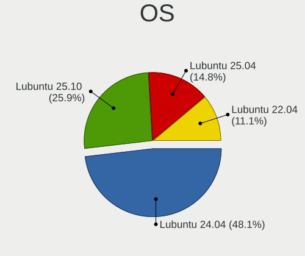

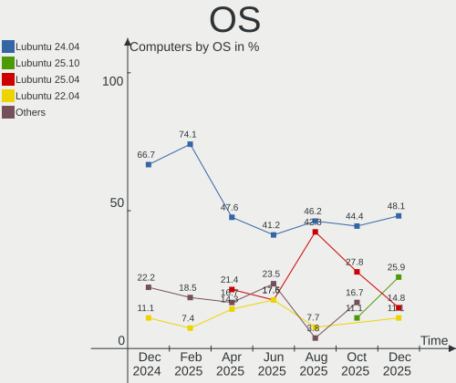

| Name          | Computers | Percent |
|---------------|-----------|---------|
| Lubuntu 24.04 | 13        | 48.15%  |
| Lubuntu 25.10 | 7         | 25.93%  |
| Lubuntu 25.04 | 4         | 14.81%  |
| Lubuntu 22.04 | 3         | 11.11%  |

OS Family
---------

OS without a version

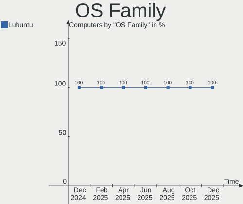

| Name    | Computers | Percent |
|---------|-----------|---------|
| Lubuntu | 27        | 100%    |

Kernel
------

Version of the Linux kernel

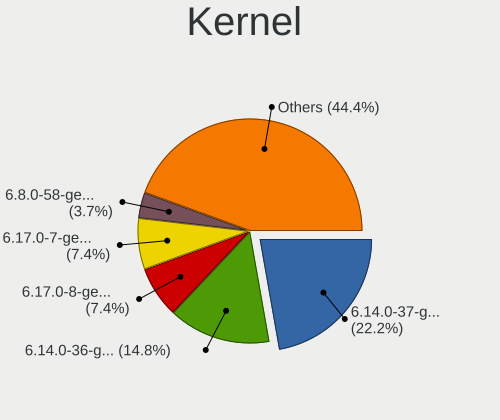

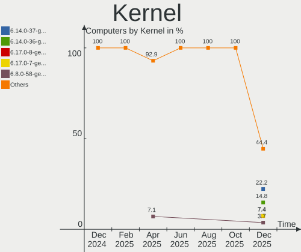

| Version                 | Computers | Percent |
|-------------------------|-----------|---------|
| 6.14.0-37-generic       | 6         | 22.22%  |
| 6.14.0-36-generic       | 4         | 14.81%  |
| 6.17.0-8-generic        | 2         | 7.41%   |
| 6.17.0-7-generic        | 2         | 7.41%   |
| 6.8.0-58-generic        | 1         | 3.7%    |
| 6.8.0-41-generic        | 1         | 3.7%    |
| 6.5.0-17-generic        | 1         | 3.7%    |
| 6.2.0-39-generic        | 1         | 3.7%    |
| 6.18.0-x86-64-v3-custom | 1         | 3.7%    |
| 6.17.8-061708-generic   | 1         | 3.7%    |
| 6.17.1-surface-2        | 1         | 3.7%    |
| 6.17.0-5-generic        | 1         | 3.7%    |
| 6.14.0-28-generic       | 1         | 3.7%    |
| 6.14.0-27-generic       | 1         | 3.7%    |
| 6.14.0-15-generic       | 1         | 3.7%    |
| 5.15.0-164-generic      | 1         | 3.7%    |
| 5.15.0-107-generic      | 1         | 3.7%    |

Kernel Family
-------------

Linux kernel without a distro release

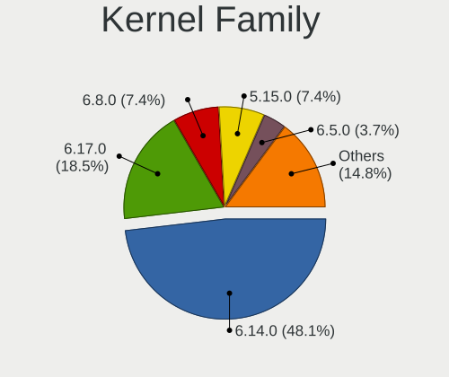

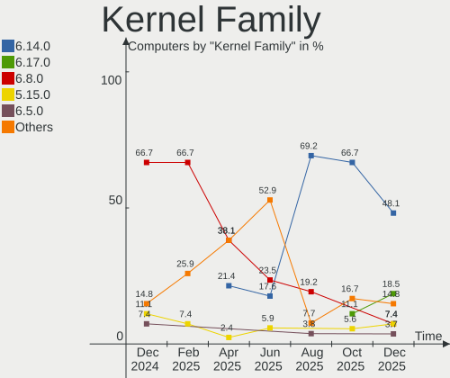

| Version | Computers | Percent |
|---------|-----------|---------|
| 6.14.0  | 13        | 48.15%  |
| 6.17.0  | 5         | 18.52%  |
| 6.8.0   | 2         | 7.41%   |
| 5.15.0  | 2         | 7.41%   |
| 6.5.0   | 1         | 3.7%    |
| 6.2.0   | 1         | 3.7%    |
| 6.18.0  | 1         | 3.7%    |
| 6.17.8  | 1         | 3.7%    |
| 6.17.1  | 1         | 3.7%    |

Kernel Major Ver.
-----------------

Linux kernel major version

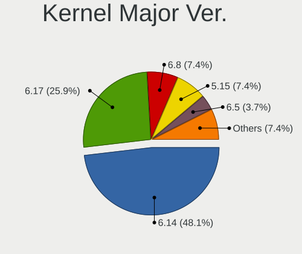

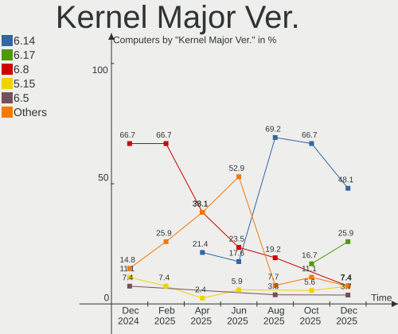

| Version | Computers | Percent |
|---------|-----------|---------|
| 6.14    | 13        | 48.15%  |
| 6.17    | 7         | 25.93%  |
| 6.8     | 2         | 7.41%   |
| 5.15    | 2         | 7.41%   |
| 6.5     | 1         | 3.7%    |
| 6.2     | 1         | 3.7%    |
| 6.18    | 1         | 3.7%    |

Arch
----

OS architecture (x86_64, i586, etc.)

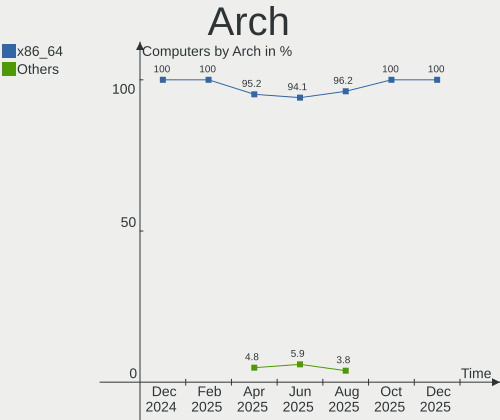

| Name   | Computers | Percent |
|--------|-----------|---------|
| x86_64 | 27        | 100%    |

DE
--

Desktop Environment

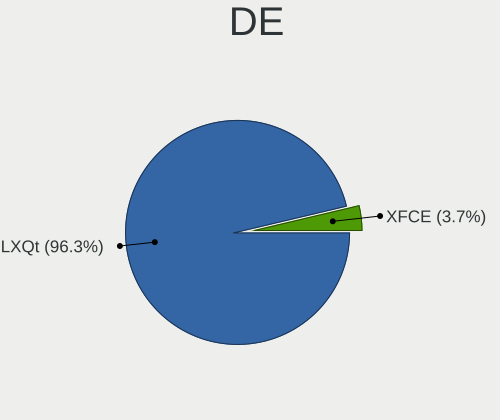

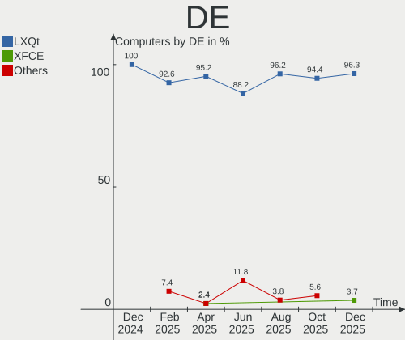

| Name | Computers | Percent |
|------|-----------|---------|
| LXQt | 26        | 96.3%   |
| XFCE | 1         | 3.7%    |

Display Server
--------------

X11 or Wayland

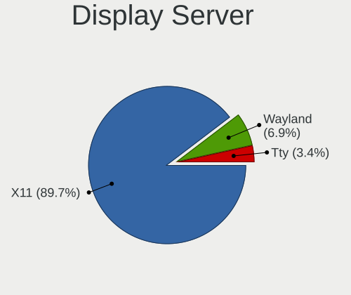

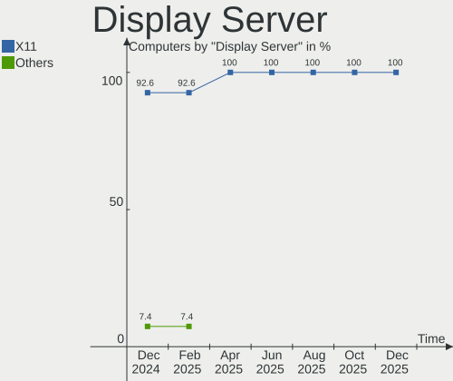

| Name | Computers | Percent |
|------|-----------|---------|
| X11  | 27        | 100%    |

Display Manager
---------------

SDDM, LightDM, etc.

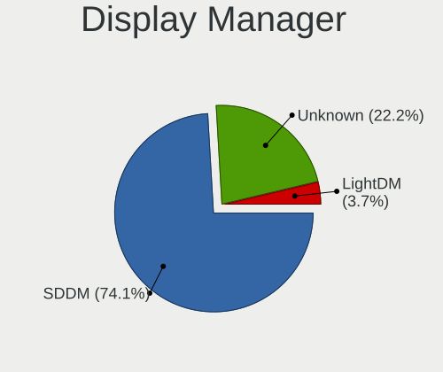

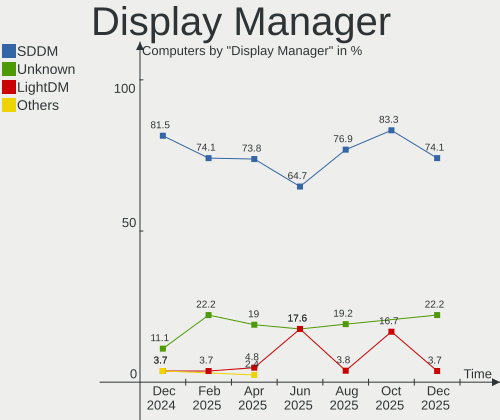

| Name    | Computers | Percent |
|---------|-----------|---------|
| SDDM    | 20        | 74.07%  |
| Unknown | 6         | 22.22%  |
| LightDM | 1         | 3.7%    |

OS Lang
-------

Language

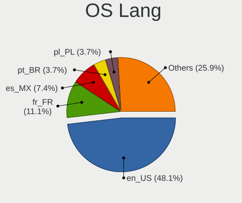

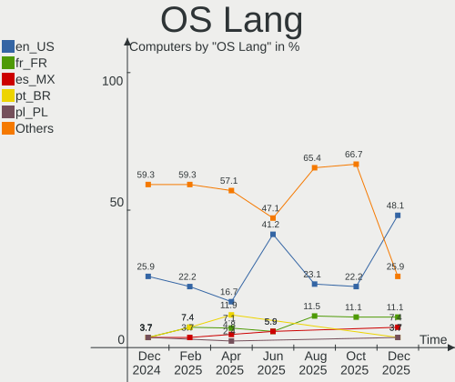

| Lang  | Computers | Percent |
|-------|-----------|---------|
| en_US | 13        | 48.15%  |
| fr_FR | 3         | 11.11%  |
| es_MX | 2         | 7.41%   |
| pt_BR | 1         | 3.7%    |
| pl_PL | 1         | 3.7%    |
| nl_NL | 1         | 3.7%    |
| it_IT | 1         | 3.7%    |
| en_GB | 1         | 3.7%    |
| en_CA | 1         | 3.7%    |
| de_AT | 1         | 3.7%    |
| C     | 1         | 3.7%    |
| ar_DZ | 1         | 3.7%    |

Boot Mode
---------

EFI or BIOS

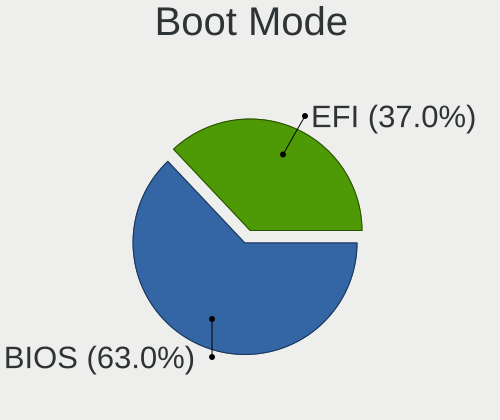

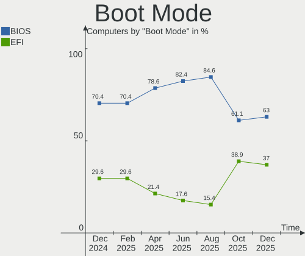

| Mode | Computers | Percent |
|------|-----------|---------|
| BIOS | 17        | 62.96%  |
| EFI  | 10        | 37.04%  |

Filesystem
----------

Type of filesystem

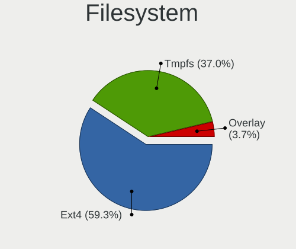

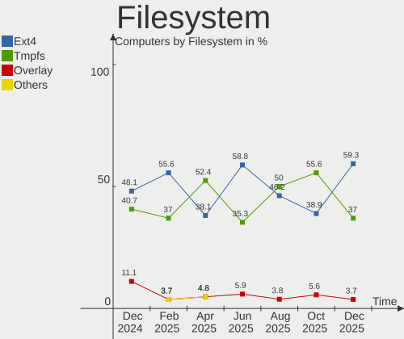

| Type    | Computers | Percent |
|---------|-----------|---------|
| Ext4    | 16        | 59.26%  |
| Tmpfs   | 10        | 37.04%  |
| Overlay | 1         | 3.7%    |

Part. scheme
------------

Scheme of partitioning

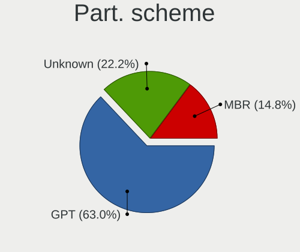

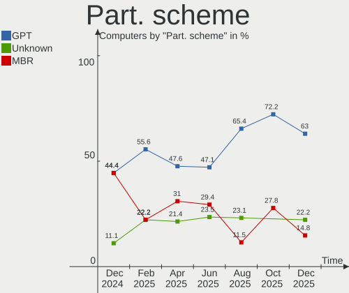

| Type    | Computers | Percent |
|---------|-----------|---------|
| GPT     | 17        | 62.96%  |
| Unknown | 6         | 22.22%  |
| MBR     | 4         | 14.81%  |

Dual Boot with Linux/BSD
------------------------

Hosting more than one Linux/BSD

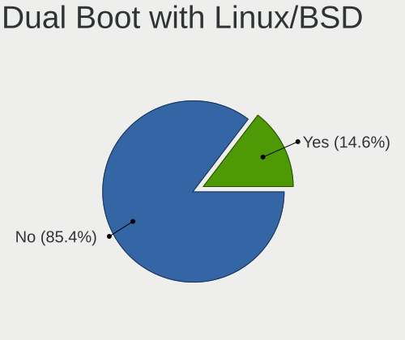

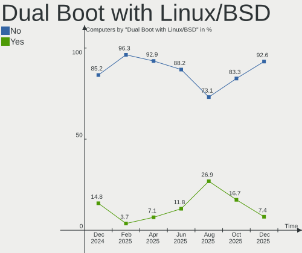

| Dual boot | Computers | Percent |
|-----------|-----------|---------|
| No        | 25        | 92.59%  |
| Yes       | 2         | 7.41%   |

Dual Boot (Win)
---------------

Hosting Linux and Windows

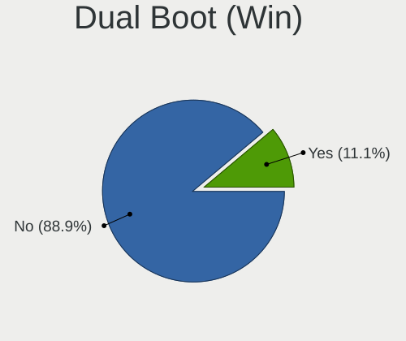

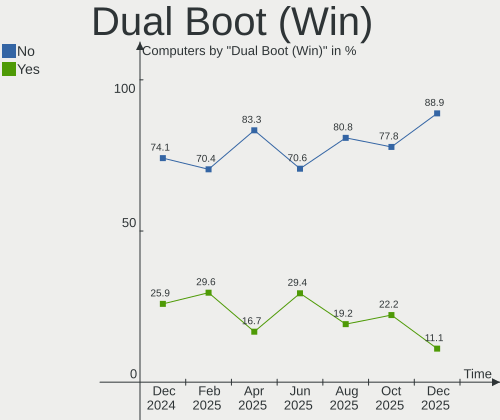

| Dual boot | Computers | Percent |
|-----------|-----------|---------|
| No        | 24        | 88.89%  |
| Yes       | 3         | 11.11%  |

Board
-----

Vendor
------

Motherboard manufacturer

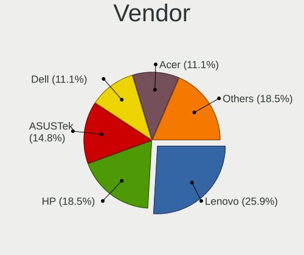

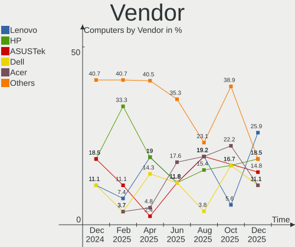

| Name             | Computers | Percent |
|------------------|-----------|---------|
| Lenovo           | 7         | 25.93%  |
| Hewlett-Packard  | 5         | 18.52%  |
| ASUSTek Computer | 4         | 14.81%  |
| Dell             | 3         | 11.11%  |
| Acer             | 3         | 11.11%  |
| TianBei          | 1         | 3.7%    |
| Positivo         | 1         | 3.7%    |
| Microsoft        | 1         | 3.7%    |
| ASRock           | 1         | 3.7%    |
| Unknown          | 1         | 3.7%    |

Model
-----

Motherboard model

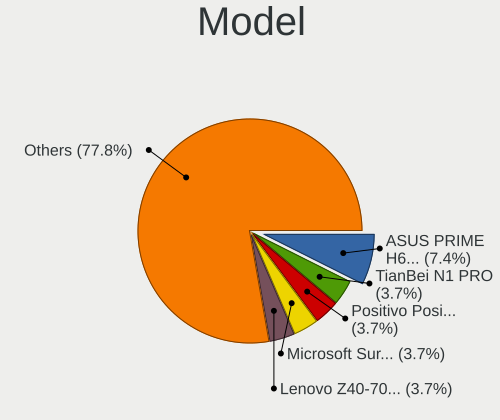

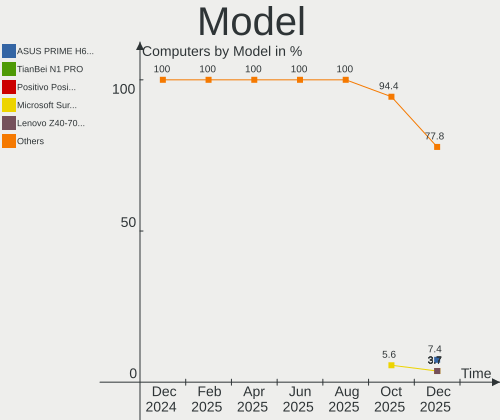

| Name                                  | Computers | Percent |
|---------------------------------------|-----------|---------|
| ASUS PRIME H610I-PLUS D4              | 2         | 7.41%   |
| TianBei N1 PRO                        | 1         | 3.7%    |
| Positivo Positivo Master C610 MiniPro | 1         | 3.7%    |
| Microsoft Surface 3                   | 1         | 3.7%    |
| Lenovo Z40-70 20366                   | 1         | 3.7%    |
| Lenovo ThinkPad W520 42763JU          | 1         | 3.7%    |
| Lenovo ThinkPad E595 20NFCTO1WW       | 1         | 3.7%    |
| Lenovo IdeaPad 1 14IAU7 82QC          | 1         | 3.7%    |
| Lenovo G770 20089                     | 1         | 3.7%    |
| Lenovo C40-05 F0B50052US              | 1         | 3.7%    |
| Lenovo B50-10 80QR                    | 1         | 3.7%    |
| HP ZBook 15 G5                        | 1         | 3.7%    |
| HP Pavilion dv7                       | 1         | 3.7%    |
| HP Laptop 17z-ca200                   | 1         | 3.7%    |
| HP Laptop 17-cp2xxx                   | 1         | 3.7%    |
| HP Compaq 6005 Pro SFF PC             | 1         | 3.7%    |
| Dell XPS 8930                         | 1         | 3.7%    |
| Dell OptiPlex 3070                    | 1         | 3.7%    |
| Dell OptiPlex 3020                    | 1         | 3.7%    |
| ASUS UX21E                            | 1         | 3.7%    |
| ASUS TUF B450M-PLUS GAMING            | 1         | 3.7%    |
| ASRock H81M-DGS R2.0                  | 1         | 3.7%    |
| Acer Aspire XC-215                    | 1         | 3.7%    |
| Acer Aspire V7-582PG                  | 1         | 3.7%    |
| Acer Aspire E5-575G                   | 1         | 3.7%    |
| Unknown                               | 1         | 3.7%    |

Model Family
------------

Motherboard model prefix

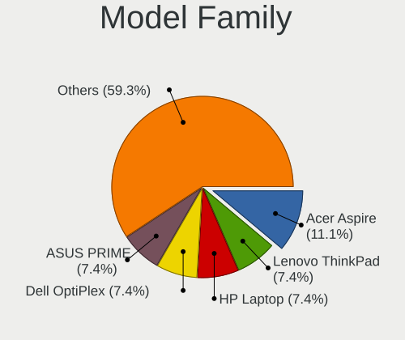

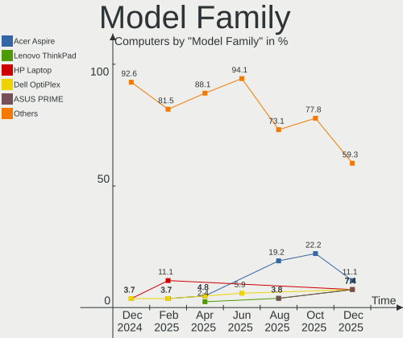

| Name              | Computers | Percent |
|-------------------|-----------|---------|
| Acer Aspire       | 3         | 11.11%  |
| Lenovo ThinkPad   | 2         | 7.41%   |
| HP Laptop         | 2         | 7.41%   |
| Dell OptiPlex     | 2         | 7.41%   |
| ASUS PRIME        | 2         | 7.41%   |
| TianBei N1        | 1         | 3.7%    |
| Positivo Positivo | 1         | 3.7%    |
| Microsoft Surface | 1         | 3.7%    |
| Lenovo Z40-70     | 1         | 3.7%    |
| Lenovo IdeaPad    | 1         | 3.7%    |
| Lenovo G770       | 1         | 3.7%    |
| Lenovo C40-05     | 1         | 3.7%    |
| Lenovo B50-10     | 1         | 3.7%    |
| HP ZBook          | 1         | 3.7%    |
| HP Pavilion       | 1         | 3.7%    |
| HP Compaq         | 1         | 3.7%    |
| Dell XPS          | 1         | 3.7%    |
| ASUS UX21E        | 1         | 3.7%    |
| ASUS TUF          | 1         | 3.7%    |
| ASRock H81M-DGS   | 1         | 3.7%    |
| Unknown           | 1         | 3.7%    |

MFG Year
--------

Motherboard manufacture year

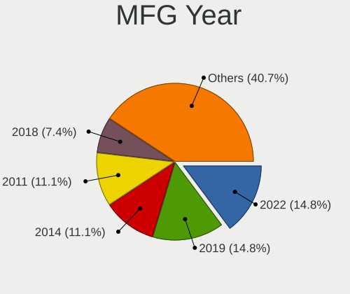

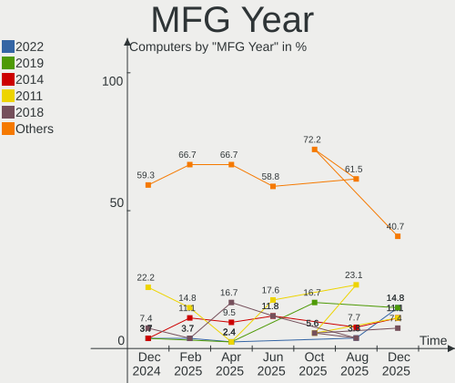

| Year | Computers | Percent |
|------|-----------|---------|
| 2022 | 4         | 14.81%  |
| 2019 | 4         | 14.81%  |
| 2014 | 3         | 11.11%  |
| 2011 | 3         | 11.11%  |
| 2018 | 2         | 7.41%   |
| 2016 | 2         | 7.41%   |
| 2015 | 2         | 7.41%   |
| 2013 | 2         | 7.41%   |
| 2025 | 1         | 3.7%    |
| 2024 | 1         | 3.7%    |
| 2017 | 1         | 3.7%    |
| 2009 | 1         | 3.7%    |
| 2008 | 1         | 3.7%    |

Form Factor
-----------

Physical design of the computer

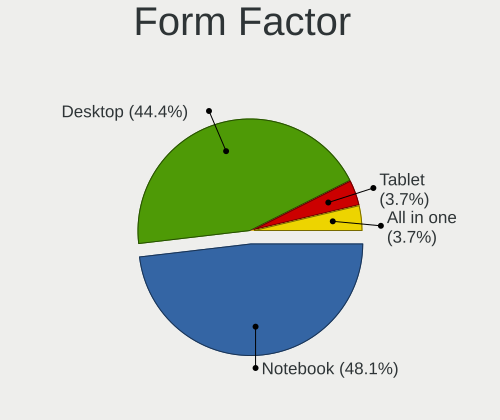

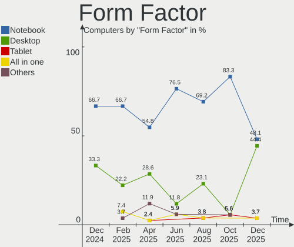

| Name       | Computers | Percent |
|------------|-----------|---------|
| Notebook   | 13        | 48.15%  |
| Desktop    | 12        | 44.44%  |
| Tablet     | 1         | 3.7%    |
| All in one | 1         | 3.7%    |

Secure Boot
-----------

Enabled or disabled

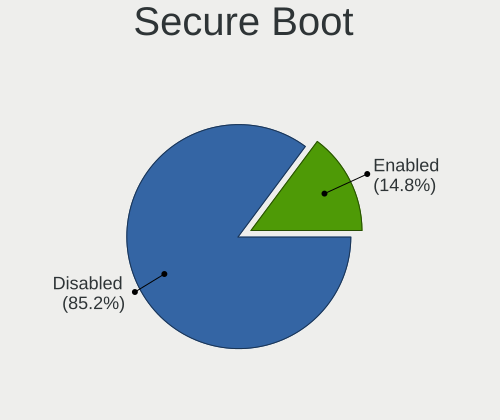

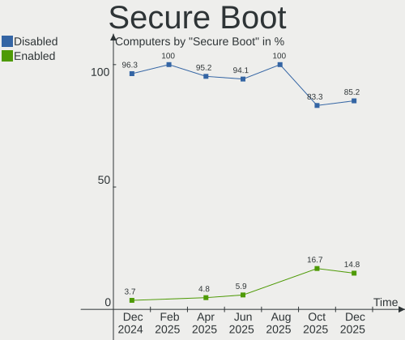

| State    | Computers | Percent |
|----------|-----------|---------|
| Disabled | 23        | 85.19%  |
| Enabled  | 4         | 14.81%  |

Coreboot
--------

Have coreboot on board

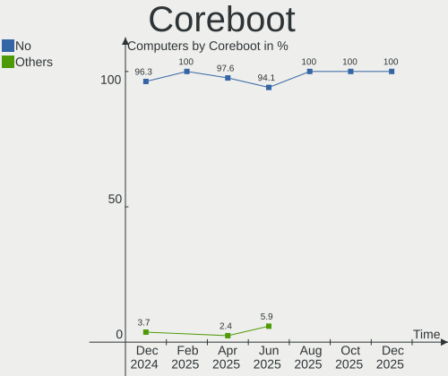

| Used | Computers | Percent |
|------|-----------|---------|
| No   | 27        | 100%    |

RAM Size
--------

Total RAM memory

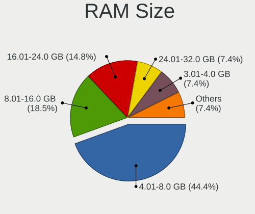

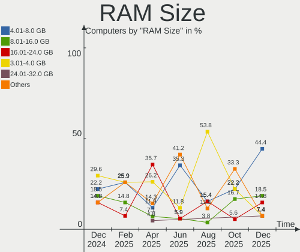

| Size in GB  | Computers | Percent |
|-------------|-----------|---------|
| 4.01-8.0    | 12        | 44.44%  |
| 8.01-16.0   | 5         | 18.52%  |
| 16.01-24.0  | 4         | 14.81%  |
| 3.01-4.0    | 2         | 7.41%   |
| 24.01-32.0  | 2         | 7.41%   |
| 64.01-256.0 | 1         | 3.7%    |
| 1.01-2.0    | 1         | 3.7%    |

RAM Used
--------

Used RAM memory

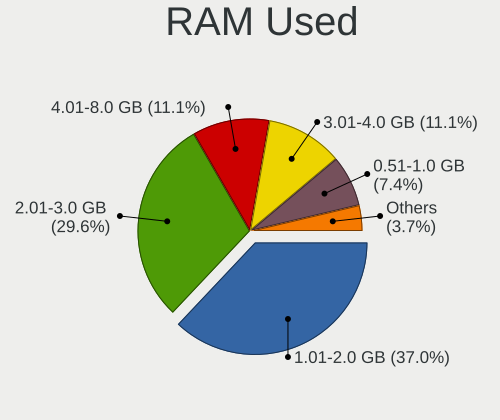

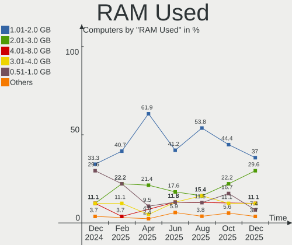

| Used GB   | Computers | Percent |
|-----------|-----------|---------|
| 1.01-2.0  | 10        | 37.04%  |
| 2.01-3.0  | 8         | 29.63%  |
| 4.01-8.0  | 3         | 11.11%  |
| 3.01-4.0  | 3         | 11.11%  |
| 0.51-1.0  | 2         | 7.41%   |
| 8.01-16.0 | 1         | 3.7%    |

Total Drives
------------

Number of drives on board

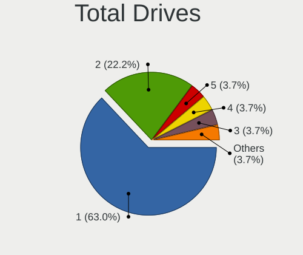

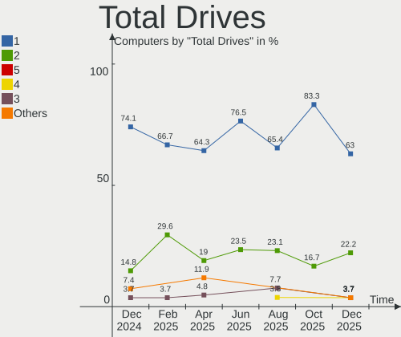

| Drives | Computers | Percent |
|--------|-----------|---------|
| 1      | 17        | 62.96%  |
| 2      | 6         | 22.22%  |
| 5      | 1         | 3.7%    |
| 4      | 1         | 3.7%    |
| 3      | 1         | 3.7%    |
| 0      | 1         | 3.7%    |

Has CD-ROM
----------

Has CD-ROM on board

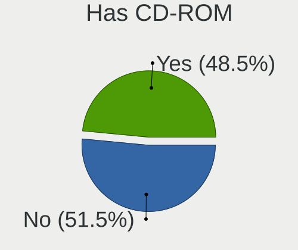

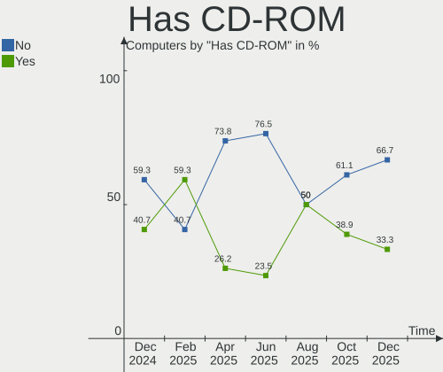

| Presented | Computers | Percent |
|-----------|-----------|---------|
| No        | 18        | 66.67%  |
| Yes       | 9         | 33.33%  |

Has Ethernet
------------

Has Ethernet on board

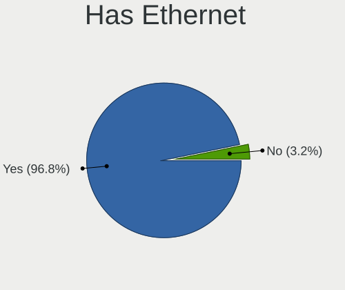

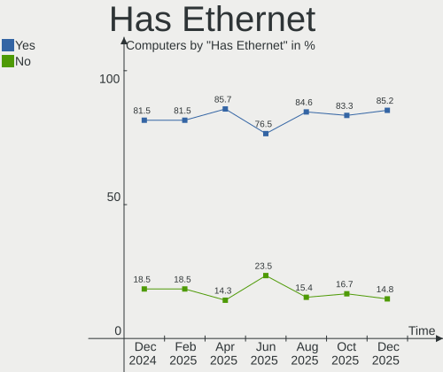

| Presented | Computers | Percent |
|-----------|-----------|---------|
| Yes       | 23        | 85.19%  |
| No        | 4         | 14.81%  |

Has WiFi
--------

Has WiFi module

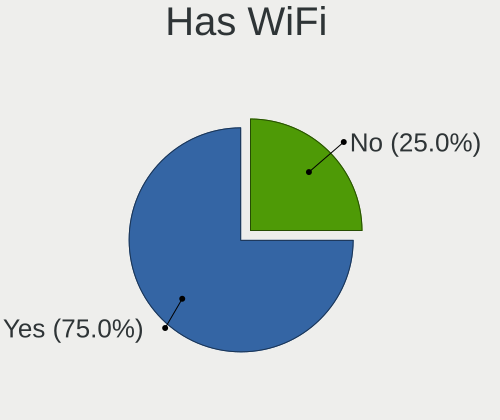

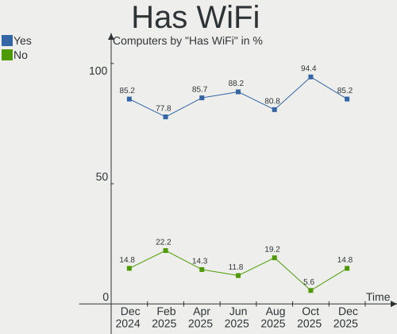

| Presented | Computers | Percent |
|-----------|-----------|---------|
| Yes       | 23        | 85.19%  |
| No        | 4         | 14.81%  |

Has Bluetooth
-------------

Has Bluetooth module

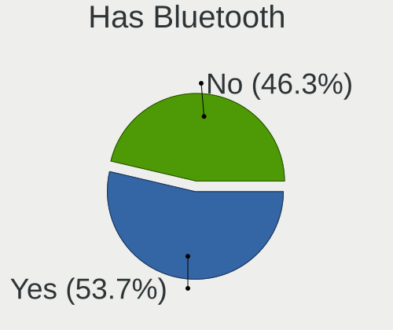

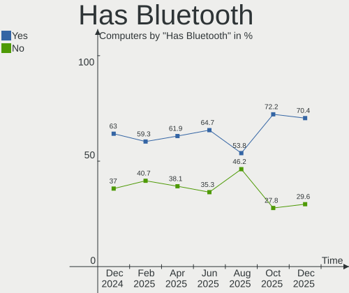

| Presented | Computers | Percent |
|-----------|-----------|---------|
| Yes       | 19        | 70.37%  |
| No        | 8         | 29.63%  |

Location
--------

Country
-------

Geographic location (country)

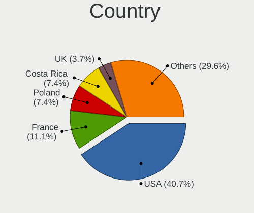

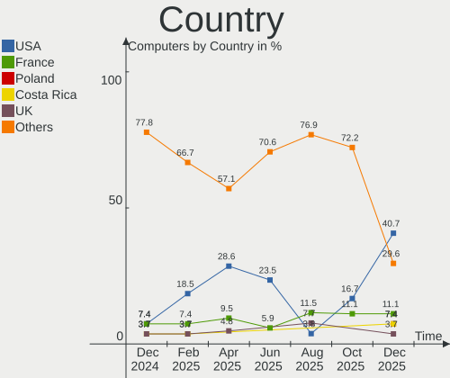

| Country    | Computers | Percent |
|------------|-----------|---------|
| USA        | 11        | 40.74%  |
| France     | 3         | 11.11%  |
| Poland     | 2         | 7.41%   |
| Costa Rica | 2         | 7.41%   |
| UK         | 1         | 3.7%    |
| Russia     | 1         | 3.7%    |
| Romania    | 1         | 3.7%    |
| Norway     | 1         | 3.7%    |
| Italy      | 1         | 3.7%    |
| India      | 1         | 3.7%    |
| Canada     | 1         | 3.7%    |
| Brazil     | 1         | 3.7%    |
| Algeria    | 1         | 3.7%    |

City
----

Geographic location (city)

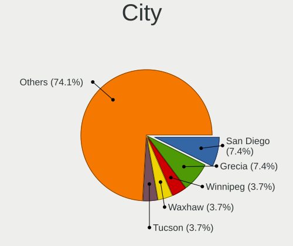

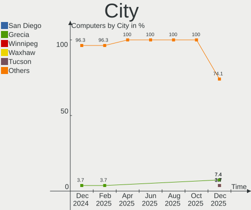

| City                      | Computers | Percent |
|---------------------------|-----------|---------|
| San Diego                 | 2         | 7.41%   |
| Grecia                    | 2         | 7.41%   |
| Winnipeg                  | 1         | 3.7%    |
| Waxhaw                    | 1         | 3.7%    |
| Tucson                    | 1         | 3.7%    |
| State College             | 1         | 3.7%    |
| Secaucus                  | 1         | 3.7%    |
| Salt Lake City            | 1         | 3.7%    |
| Rosny-sous-Bois           | 1         | 3.7%    |
| Poitiers                  | 1         | 3.7%    |
| Otwock                    | 1         | 3.7%    |
| Moscow                    | 1         | 3.7%    |
| Monroe                    | 1         | 3.7%    |
| Milan                     | 1         | 3.7%    |
| Marituba                  | 1         | 3.7%    |
| Lucknow                   | 1         | 3.7%    |
| Live Oak                  | 1         | 3.7%    |
| La Chapelle-des-Fougeretz | 1         | 3.7%    |
| Iasi                      | 1         | 3.7%    |
| Holen                     | 1         | 3.7%    |
| Gmina Połaniec           | 1         | 3.7%    |
| Dundalk                   | 1         | 3.7%    |
| Charleston                | 1         | 3.7%    |
| Bristol                   | 1         | 3.7%    |
| Algiers                   | 1         | 3.7%    |

Drives
------

Drive Vendor
------------

Hard drive vendors

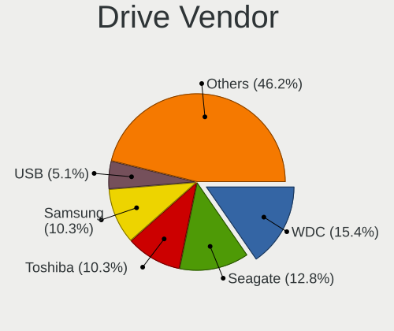

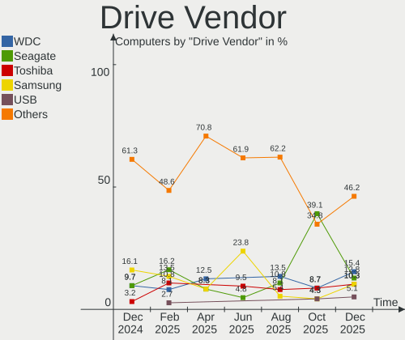

| Vendor              | Computers | Drives | Percent |
|---------------------|-----------|--------|---------|
| WDC                 | 6         | 6      | 15.38%  |
| Seagate             | 5         | 6      | 12.82%  |
| Toshiba             | 4         | 6      | 10.26%  |
| Samsung Electronics | 4         | 4      | 10.26%  |
| USB                 | 2         | 2      | 5.13%   |
| SK hynix            | 2         | 2      | 5.13%   |
| MicroFrom           | 2         | 2      | 5.13%   |
| KIOXIA              | 2         | 2      | 5.13%   |
| A-DATA Technology   | 2         | 2      | 5.13%   |
| Unknown             | 1         | 1      | 2.56%   |
| UMIS                | 1         | 1      | 2.56%   |
| SPCC                | 1         | 1      | 2.56%   |
| Sandisk             | 1         | 1      | 2.56%   |
| Phison Electronics  | 1         | 1      | 2.56%   |
| Lexar               | 1         | 1      | 2.56%   |
| Hitachi             | 1         | 1      | 2.56%   |
| HGST                | 1         | 1      | 2.56%   |
| Crucial             | 1         | 1      | 2.56%   |
| ASint Technology    | 1         | 1      | 2.56%   |

Drive Model
-----------

Hard drive models

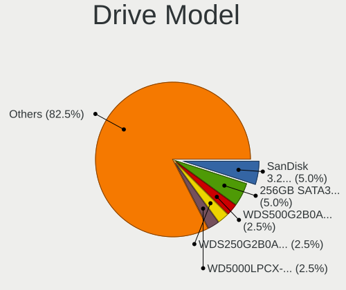

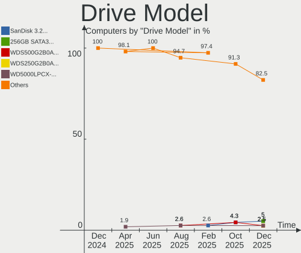

| Model                                  | Computers | Percent |
|----------------------------------------|-----------|---------|
| USB SanDisk 3.2Gen1 496GB              | 2         | 5%      |
| MicroFrom 256GB SATA3 SSD              | 2         | 5%      |
| WDC WDS500G2B0A-00SM50 500GB           | 1         | 2.5%    |
| WDC WDS250G2B0A-00SM50 250GB SSD       | 1         | 2.5%    |
| WDC WD5000LPCX-24VHAT0 500GB           | 1         | 2.5%    |
| WDC WD5000L12X-21UJGT0 516GB           | 1         | 2.5%    |
| WDC WD2500AAJS-75M0A0 249GB            | 1         | 2.5%    |
| WDC WD20EZRX-22D8PB0 2TB               | 1         | 2.5%    |
| Unknown SD/MMC/MS PRO 2GB              | 1         | 2.5%    |
| UMIS RPJTJ256MEE1OWX 256GB             | 1         | 2.5%    |
| Toshiba MQ04ABF100 1TB                 | 1         | 2.5%    |
| Toshiba MQ04ABD200 2TB                 | 1         | 2.5%    |
| Toshiba HDWD130 3TB                    | 1         | 2.5%    |
| Toshiba DT01ABA300 3TB                 | 1         | 2.5%    |
| SPCC Solid State Disk 256GB            | 1         | 2.5%    |
| SK hynix PC601 NVMe 256GB              | 1         | 2.5%    |
| SK hynix HFM512GDHTNG-8710B 512GB      | 1         | 2.5%    |
| Seagate ST9500420ASG 500GB             | 1         | 2.5%    |
| Seagate ST9500325AS 500GB              | 1         | 2.5%    |
| Seagate ST500LM000-SSHD-8GB            | 1         | 2.5%    |
| Seagate ST4000DM004-2CV104 4TB         | 1         | 2.5%    |
| Seagate ST380815AS 80GB                | 1         | 2.5%    |
| Seagate Expansion 2TB                  | 1         | 2.5%    |
| Sandisk WD_BLACK SN770 1TB             | 1         | 2.5%    |
| Samsung SSD 870 EVO 1TB                | 1         | 2.5%    |
| Samsung SSD 860 EVO 1TB                | 1         | 2.5%    |
| Samsung SSD 850 EVO M.2 500GB          | 1         | 2.5%    |
| Samsung SSD 850 EVO 250GB              | 1         | 2.5%    |
| Phison E12 NVMe Controller 1TB         | 1         | 2.5%    |
| Lexar 256GB SSD                        | 1         | 2.5%    |
| KIOXIA KBG60ZNV256G 256GB              | 1         | 2.5%    |
| KIOXIA KBG40ZNS256G NVMe TOSHIBA 256GB | 1         | 2.5%    |
| Hitachi HDS725050KLA360 500GB          | 1         | 2.5%    |
| HGST HTS725050A7E630 500GB             | 1         | 2.5%    |
| Crucial CT1000BX500SSD1 1TB            | 1         | 2.5%    |
| ASint AS606 256GB SSD                  | 1         | 2.5%    |
| A-DATA XPG EX500 500GB SSD             | 1         | 2.5%    |
| A-DATA XM11 128GB SSD                  | 1         | 2.5%    |

HDD Vendor
----------

Hard disk drive vendors

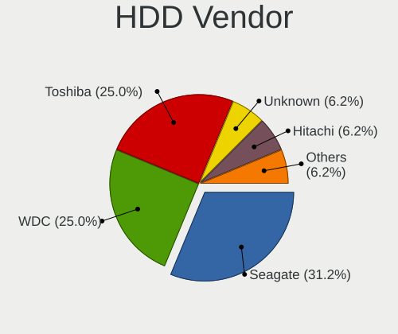

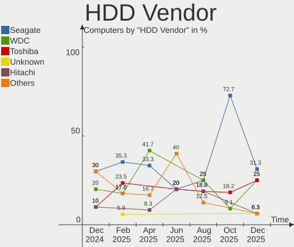

| Vendor  | Computers | Drives | Percent |
|---------|-----------|--------|---------|
| Seagate | 5         | 6      | 31.25%  |
| WDC     | 4         | 4      | 25%     |
| Toshiba | 4         | 6      | 25%     |
| Unknown | 1         | 1      | 6.25%   |
| Hitachi | 1         | 1      | 6.25%   |
| HGST    | 1         | 1      | 6.25%   |

SSD Vendor
----------

Solid state drive vendors

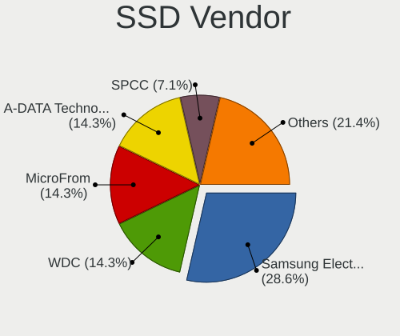

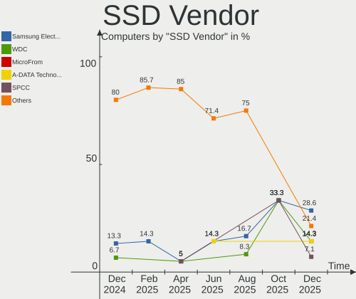

| Vendor              | Computers | Drives | Percent |
|---------------------|-----------|--------|---------|
| Samsung Electronics | 4         | 4      | 28.57%  |
| WDC                 | 2         | 2      | 14.29%  |
| MicroFrom           | 2         | 2      | 14.29%  |
| A-DATA Technology   | 2         | 2      | 14.29%  |
| SPCC                | 1         | 1      | 7.14%   |
| Lexar               | 1         | 1      | 7.14%   |
| Crucial             | 1         | 1      | 7.14%   |
| ASint Technology    | 1         | 1      | 7.14%   |

Drive Kind
----------

HDD or SSD

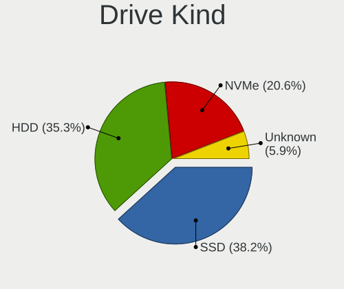

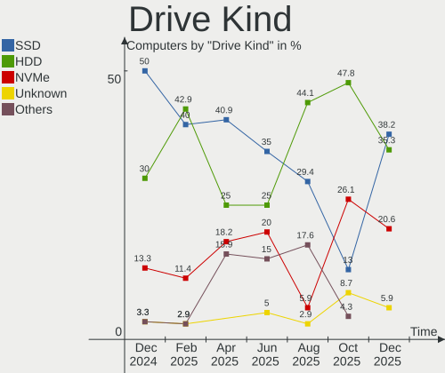

| Kind    | Computers | Drives | Percent |
|---------|-----------|--------|---------|
| SSD     | 13        | 14     | 38.24%  |
| HDD     | 12        | 19     | 35.29%  |
| NVMe    | 7         | 7      | 20.59%  |
| Unknown | 2         | 2      | 5.88%   |

Drive Connector
---------------

SATA, SAS, NVMe, etc.

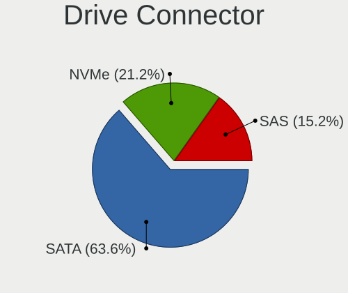

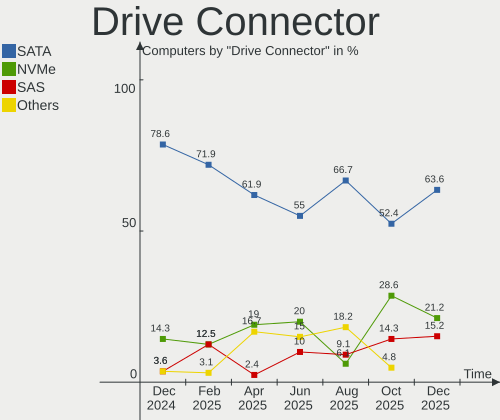

| Type | Computers | Drives | Percent |
|------|-----------|--------|---------|
| SATA | 21        | 30     | 63.64%  |
| NVMe | 7         | 7      | 21.21%  |
| SAS  | 5         | 5      | 15.15%  |

Drive Size
----------

Size of hard drive

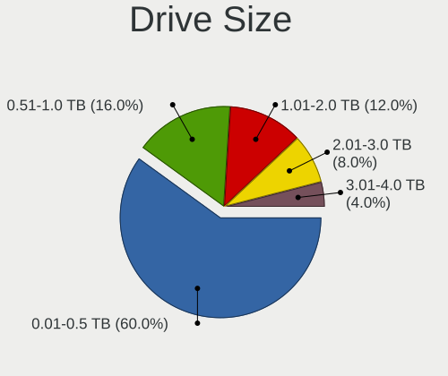

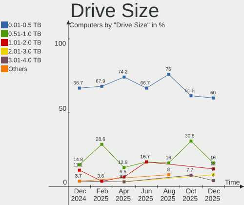

| Size in TB | Computers | Drives | Percent |
|------------|-----------|--------|---------|
| 0.01-0.5   | 15        | 20     | 60%     |
| 0.51-1.0   | 4         | 5      | 16%     |
| 1.01-2.0   | 3         | 3      | 12%     |
| 2.01-3.0   | 2         | 4      | 8%      |
| 3.01-4.0   | 1         | 1      | 4%      |

Space Total
-----------

Amount of disk space available on the file system

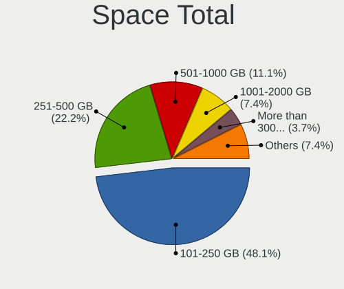

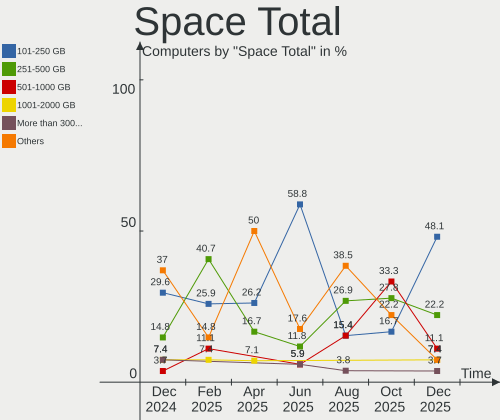

| Size in GB     | Computers | Percent |
|----------------|-----------|---------|
| 101-250        | 13        | 48.15%  |
| 251-500        | 6         | 22.22%  |
| 501-1000       | 3         | 11.11%  |
| 1001-2000      | 2         | 7.41%   |
| More than 3000 | 1         | 3.7%    |
| 2001-3000      | 1         | 3.7%    |
| 1-20           | 1         | 3.7%    |

Space Used
----------

Amount of used disk space

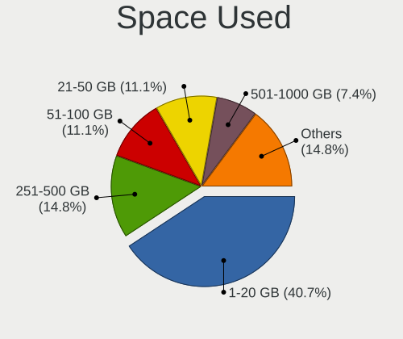

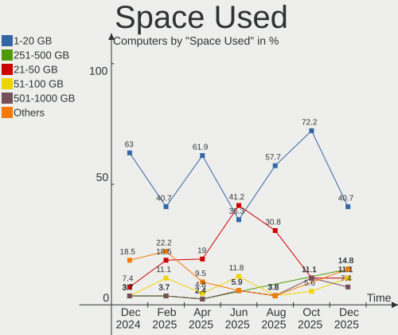

| Used GB        | Computers | Percent |
|----------------|-----------|---------|
| 1-20           | 11        | 40.74%  |
| 251-500        | 4         | 14.81%  |
| 21-50          | 3         | 11.11%  |
| 51-100         | 3         | 11.11%  |
| 501-1000       | 2         | 7.41%   |
| More than 3000 | 1         | 3.7%    |
| 2001-3000      | 1         | 3.7%    |
| 101-250        | 1         | 3.7%    |
| 1001-2000      | 1         | 3.7%    |

Malfunc. Drives
---------------

Drive models with a malfunction

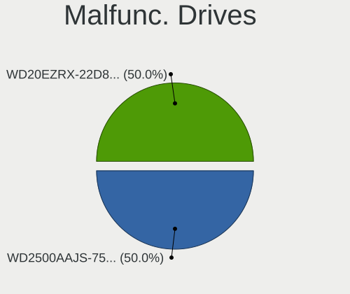

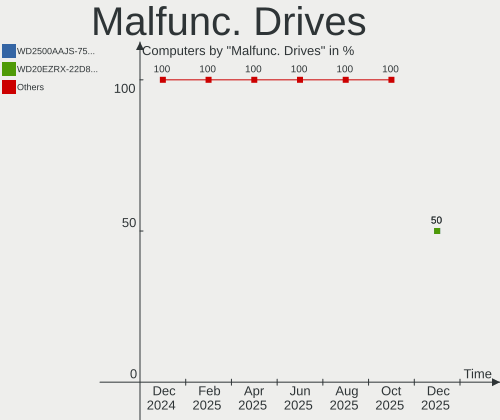

| Model                       | Computers | Drives | Percent |
|-----------------------------|-----------|--------|---------|
| WDC WD2500AAJS-75M0A0 249GB | 1         | 1      | 50%     |
| WDC WD20EZRX-22D8PB0 2TB    | 1         | 1      | 50%     |

Malfunc. Drive Vendor
---------------------

Vendors of faulty drives

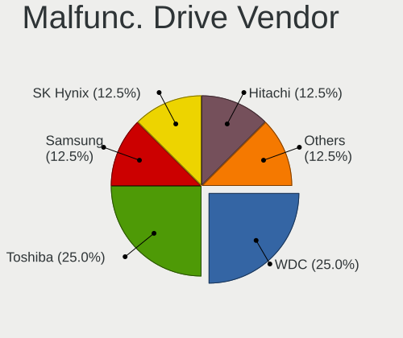

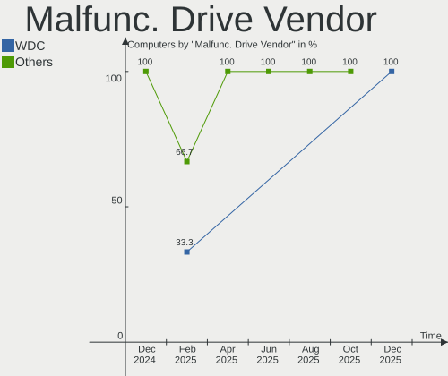

| Vendor | Computers | Drives | Percent |
|--------|-----------|--------|---------|
| WDC    | 2         | 2      | 100%    |

Malfunc. HDD Vendor
-------------------

Vendors of faulty HDD drives

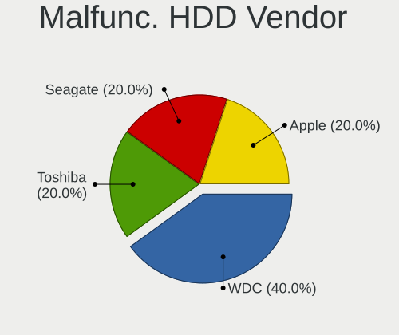

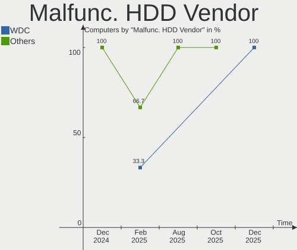

| Vendor | Computers | Drives | Percent |
|--------|-----------|--------|---------|
| WDC    | 2         | 2      | 100%    |

Malfunc. Drive Kind
-------------------

Kinds of faulty drives

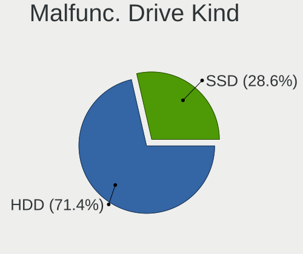

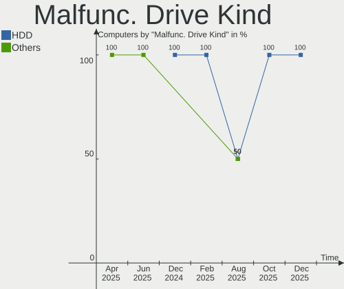

| Kind | Computers | Drives | Percent |
|------|-----------|--------|---------|
| HDD  | 2         | 2      | 100%    |

Failed Drives
-------------

Failed drive models

Zero info for selected period =(

Failed Drive Vendor
-------------------

Failed drive vendors

Zero info for selected period =(

Drive Status
------------

Number of failed and malfunc. drives

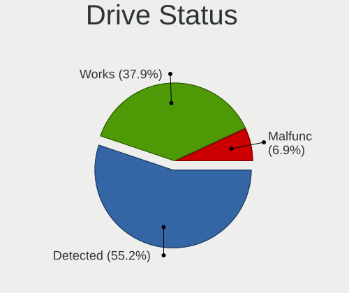

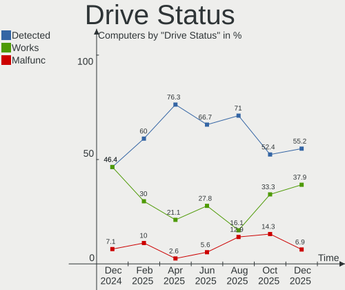

| Status   | Computers | Drives | Percent |
|----------|-----------|--------|---------|
| Detected | 16        | 25     | 55.17%  |
| Works    | 11        | 15     | 37.93%  |
| Malfunc  | 2         | 2      | 6.9%    |

Storage controller
------------------

Storage Vendor
--------------

Storage controller vendors

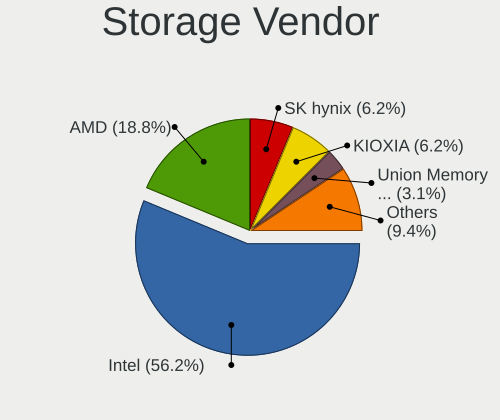

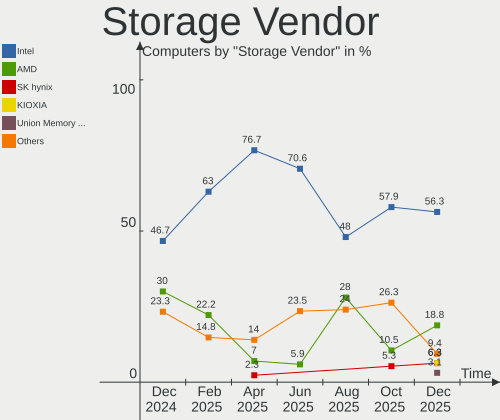

| Vendor                  | Computers | Percent |
|-------------------------|-----------|---------|
| Intel                   | 18        | 56.25%  |
| AMD                     | 6         | 18.75%  |
| SK hynix                | 2         | 6.25%   |
| KIOXIA                  | 2         | 6.25%   |
| Union Memory (Shenzhen) | 1         | 3.13%   |
| SanDisk                 | 1         | 3.13%   |
| Phison Electronics      | 1         | 3.13%   |
| ASMedia Technology      | 1         | 3.13%   |

Storage Model
-------------

Storage controller models

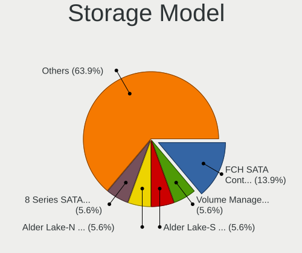

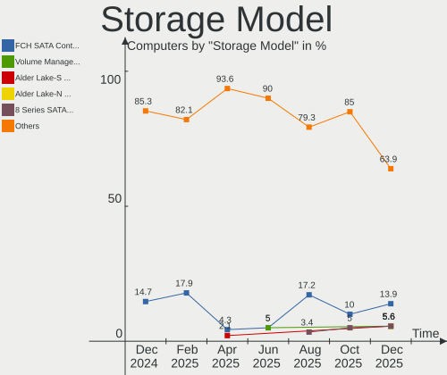

| Model                                                                                  | Computers | Percent |
|----------------------------------------------------------------------------------------|-----------|---------|
| AMD FCH SATA Controller [AHCI mode]                                                    | 5         | 13.89%  |
| Intel Volume Management Device NVMe RAID Controller                                    | 2         | 5.56%   |
| Intel Alder Lake-S PCH SATA Controller [AHCI Mode]                                     | 2         | 5.56%   |
| Intel Alder Lake-N SATA AHCI Controller                                                | 2         | 5.56%   |
| Intel 8 Series SATA Controller 1 [AHCI mode]                                           | 2         | 5.56%   |
| Intel 6 Series/C200 Series Chipset Family 6 port Mobile SATA AHCI Controller           | 2         | 5.56%   |
| Union Memory (Shenzhen) AM620 PCIe 3.0 NVMe SSD 256GB                                  | 1         | 2.78%   |
| SK hynix PC601 NVMe Solid State Drive                                                  | 1         | 2.78%   |
| SK hynix BC501 NVMe Solid State Drive                                                  | 1         | 2.78%   |
| SanDisk WD SN560/SN740/SN770/SN5000 NVMe SSD                                           | 1         | 2.78%   |
| Phison E12 NVMe Controller                                                             | 1         | 2.78%   |
| KIOXIA NVMe SSD Controller BG6 (DRAM-less)                                             | 1         | 2.78%   |
| KIOXIA NVMe SSD Controller BG4 (DRAM-less)                                             | 1         | 2.78%   |
| Intel Sunrise Point-LP SATA Controller [AHCI mode]                                     | 1         | 2.78%   |
| Intel Q170/Q150/B150/H170/H110/Z170/CM236 Chipset SATA Controller [AHCI Mode]          | 1         | 2.78%   |
| Intel Cannon Lake PCH SATA AHCI Controller                                             | 1         | 2.78%   |
| Intel Cannon Lake Mobile PCH SATA AHCI Controller                                      | 1         | 2.78%   |
| Intel Atom Processor E3800 Series SATA AHCI Controller                                 | 1         | 2.78%   |
| Intel Alder Lake-P SATA AHCI Controller                                                | 1         | 2.78%   |
| Intel 82801IBM/IEM (ICH9M/ICH9M-E) 4 port SATA Controller [AHCI mode]                  | 1         | 2.78%   |
| Intel 8 Series/C220 Series Chipset Family 6-port SATA Controller 1 [AHCI mode]         | 1         | 2.78%   |
| Intel 6 Series/C200 Series Chipset Family Mobile SATA Controller (IDE mode, ports 4-5) | 1         | 2.78%   |
| Intel 6 Series/C200 Series Chipset Family Mobile SATA Controller (IDE mode, ports 0-3) | 1         | 2.78%   |
| Intel 200 Series PCH SATA controller [AHCI mode]                                       | 1         | 2.78%   |
| ASMedia ASM1061/ASM1062 Serial ATA Controller                                          | 1         | 2.78%   |
| AMD SB7x0/SB8x0/SB9x0 SATA Controller [AHCI mode]                                      | 1         | 2.78%   |
| AMD 400 Series Chipset SATA Controller                                                 | 1         | 2.78%   |

Storage Kind
------------

Kind of storage controller (IDE, SATA, NVMe, SAS, ...)

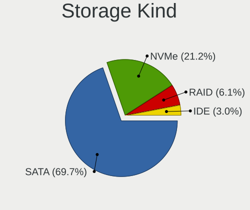

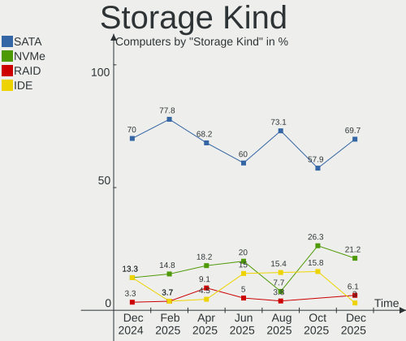

| Kind | Computers | Percent |
|------|-----------|---------|
| SATA | 23        | 69.7%   |
| NVMe | 7         | 21.21%  |
| RAID | 2         | 6.06%   |
| IDE  | 1         | 3.03%   |

Processor
---------

CPU Vendor
----------

Processor vendors

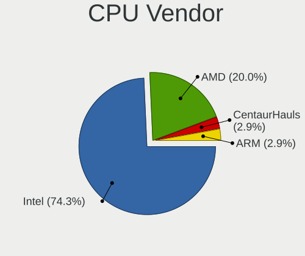

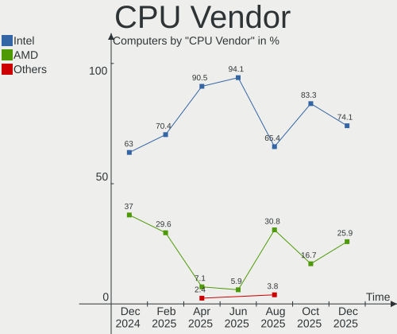

| Vendor | Computers | Percent |
|--------|-----------|---------|
| Intel  | 20        | 74.07%  |
| AMD    | 7         | 25.93%  |

CPU Model
---------

Processor models

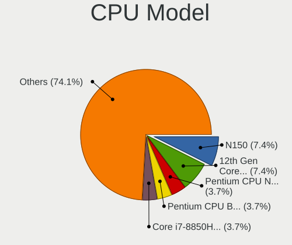

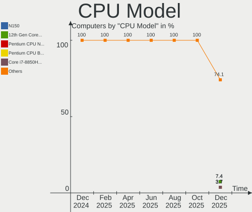

| Model                                         | Computers | Percent |
|-----------------------------------------------|-----------|---------|
| Intel N150                                    | 2         | 7.41%   |
| Intel 12th Gen Core i5-12600K                 | 2         | 7.41%   |
| Intel Pentium CPU N3540 @ 2.16GHz             | 1         | 3.7%    |
| Intel Pentium CPU B960 @ 2.20GHz              | 1         | 3.7%    |
| Intel Core i7-8850H CPU @ 2.60GHz             | 1         | 3.7%    |
| Intel Core i7-2760QM CPU @ 2.40GHz            | 1         | 3.7%    |
| Intel Core i5-9400 CPU @ 2.90GHz              | 1         | 3.7%    |
| Intel Core i5-8500 CPU @ 3.00GHz              | 1         | 3.7%    |
| Intel Core i5-4590 CPU @ 3.30GHz              | 1         | 3.7%    |
| Intel Core i5-4210U CPU @ 1.70GHz             | 1         | 3.7%    |
| Intel Core i5-4200U CPU @ 1.60GHz             | 1         | 3.7%    |
| Intel Core i5-2467M CPU @ 1.60GHz             | 1         | 3.7%    |
| Intel Core i3-6300T CPU @ 3.30GHz             | 1         | 3.7%    |
| Intel Core i3-6006U CPU @ 2.00GHz             | 1         | 3.7%    |
| Intel Core i3-4150 CPU @ 3.50GHz              | 1         | 3.7%    |
| Intel Core 2 Duo CPU P8600 @ 2.40GHz          | 1         | 3.7%    |
| Intel Atom x7-Z8700 CPU @ 1.60GHz             | 1         | 3.7%    |
| Intel 12th Gen Core i3-1215U                  | 1         | 3.7%    |
| AMD Ryzen 7 3700X 8-Core Processor            | 1         | 3.7%    |
| AMD Ryzen 7 3700U with Radeon Vega Mobile Gfx | 1         | 3.7%    |
| AMD Ryzen 5 7520U with Radeon Graphics        | 1         | 3.7%    |
| AMD Phenom II X2 B55 Processor                | 1         | 3.7%    |
| AMD E2-6110 APU with AMD Radeon R2 Graphics   | 1         | 3.7%    |
| AMD Athlon Gold 3150U with Radeon Graphics    | 1         | 3.7%    |
| AMD A6-7310 APU with AMD Radeon R4 Graphics   | 1         | 3.7%    |

CPU Model Family
----------------

Processor model prefix

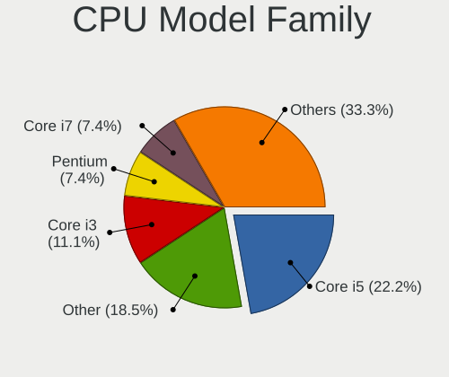

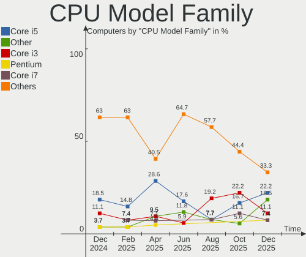

| Model            | Computers | Percent |
|------------------|-----------|---------|
| Intel Core i5    | 6         | 22.22%  |
| Other            | 5         | 18.52%  |
| Intel Core i3    | 3         | 11.11%  |
| Intel Pentium    | 2         | 7.41%   |
| Intel Core i7    | 2         | 7.41%   |
| AMD Ryzen 7      | 2         | 7.41%   |
| Intel Core 2 Duo | 1         | 3.7%    |
| Intel Atom       | 1         | 3.7%    |
| AMD Ryzen 5      | 1         | 3.7%    |
| AMD Phenom II X2 | 1         | 3.7%    |
| AMD E2           | 1         | 3.7%    |
| AMD Athlon       | 1         | 3.7%    |
| AMD A6           | 1         | 3.7%    |

CPU Cores
---------

Number of processor cores

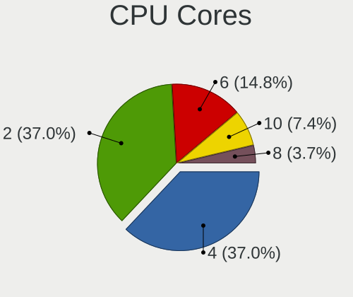

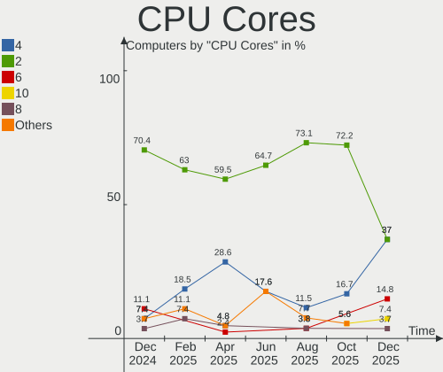

| Number | Computers | Percent |
|--------|-----------|---------|
| 4      | 10        | 37.04%  |
| 2      | 10        | 37.04%  |
| 6      | 4         | 14.81%  |
| 10     | 2         | 7.41%   |
| 8      | 1         | 3.7%    |

CPU Sockets
-----------

Number of sockets

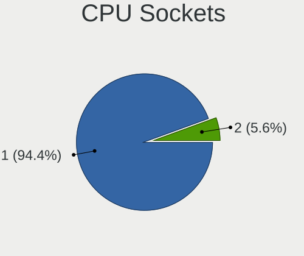

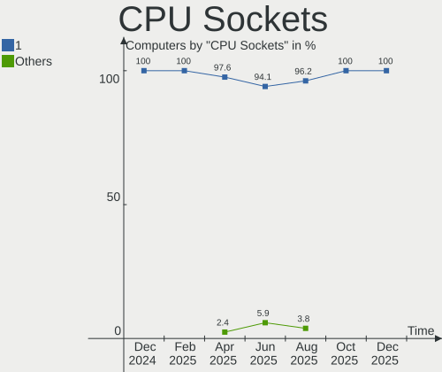

| Number | Computers | Percent |
|--------|-----------|---------|
| 1      | 27        | 100%    |

CPU Threads
-----------

Threads per core (Hyper-Threading)

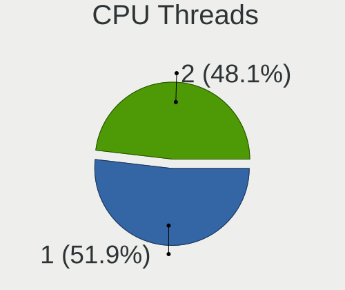

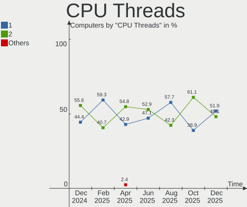

| Number | Computers | Percent |
|--------|-----------|---------|
| 1      | 14        | 51.85%  |
| 2      | 13        | 48.15%  |

CPU Op-Modes
------------

CPU Operation Modes (32-bit, 64-bit)

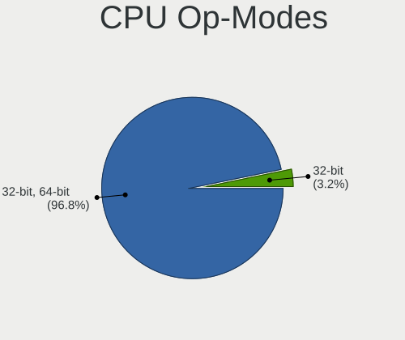

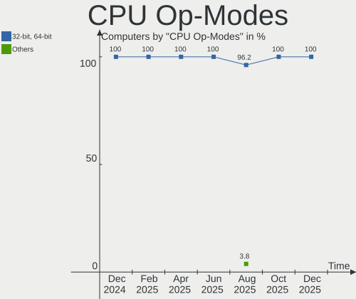

| Op mode        | Computers | Percent |
|----------------|-----------|---------|
| 32-bit, 64-bit | 27        | 100%    |

CPU Microcode
-------------

Microcode number

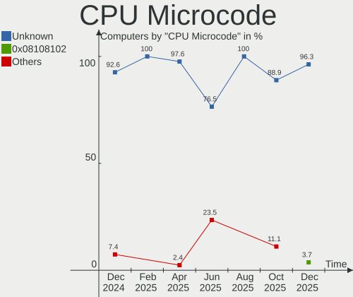

| Number     | Computers | Percent |
|------------|-----------|---------|
| Unknown    | 26        | 96.3%   |
| 0x08108102 | 1         | 3.7%    |

CPU Microarch
-------------

Microarchitecture

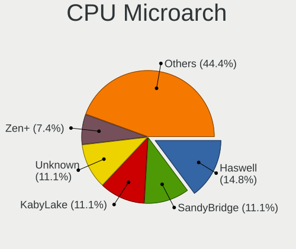

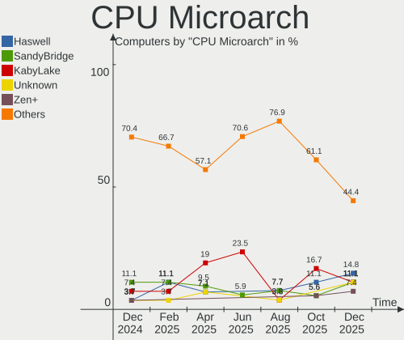

| Name             | Computers | Percent |
|------------------|-----------|---------|
| Haswell          | 4         | 14.81%  |
| SandyBridge      | 3         | 11.11%  |
| KabyLake         | 3         | 11.11%  |
| Unknown          | 3         | 11.11%  |
| Zen+             | 2         | 7.41%   |
| Skylake          | 2         | 7.41%   |
| Silvermont       | 2         | 7.41%   |
| Puma             | 2         | 7.41%   |
| Gracemont        | 2         | 7.41%   |
| Zen 2            | 1         | 3.7%    |
| Penryn           | 1         | 3.7%    |
| K10              | 1         | 3.7%    |
| Alderlake Hybrid | 1         | 3.7%    |

Graphics
--------

GPU Vendor
----------

Vendors of graphics cards

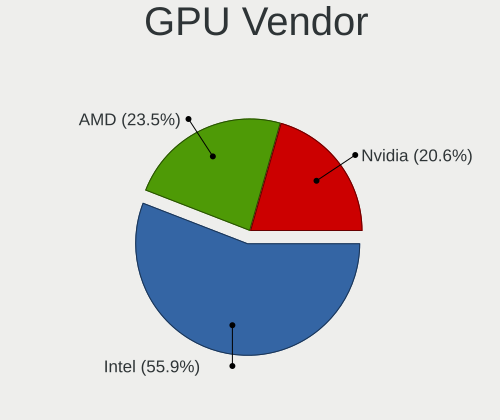

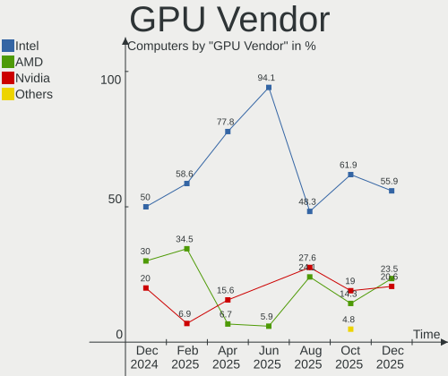

| Vendor | Computers | Percent |
|--------|-----------|---------|
| Intel  | 19        | 55.88%  |
| AMD    | 8         | 23.53%  |
| Nvidia | 7         | 20.59%  |

GPU Model
---------

Graphics card models

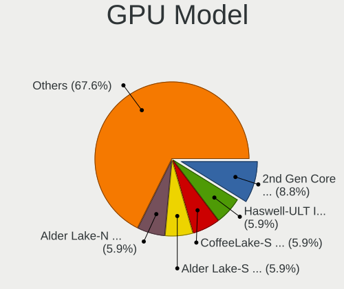

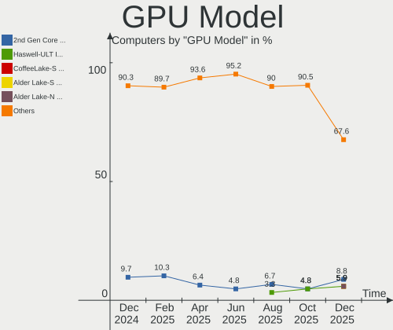

| Model                                                                                    | Computers | Percent |
|------------------------------------------------------------------------------------------|-----------|---------|
| Intel 2nd Generation Core Processor Family Integrated Graphics Controller                | 3         | 8.82%   |
| Intel Haswell-ULT Integrated Graphics Controller                                         | 2         | 5.88%   |
| Intel CoffeeLake-S GT2 [UHD Graphics 630]                                                | 2         | 5.88%   |
| Intel Alder Lake-S GT1 [UHD Graphics 770]                                                | 2         | 5.88%   |
| Intel Alder Lake-N [Intel Graphics]                                                      | 2         | 5.88%   |
| AMD Picasso/Raven 2 [Radeon Vega Series / Radeon Vega Mobile Series]                     | 2         | 5.88%   |
| Nvidia GP107GLM [Quadro P2000 Mobile]                                                    | 1         | 2.94%   |
| Nvidia GM107 [GeForce 940MX]                                                             | 1         | 2.94%   |
| Nvidia GK107M [GeForce GT 750M]                                                          | 1         | 2.94%   |
| Nvidia GK107 [NVS 510]                                                                   | 1         | 2.94%   |
| Nvidia GF117M [GeForce 610M/710M/810M/820M / GT 620M/625M/630M/720M]                     | 1         | 2.94%   |
| Nvidia GF108GLM [Quadro 1000M]                                                           | 1         | 2.94%   |
| Nvidia G96CM [GeForce 9600M GT]                                                          | 1         | 2.94%   |
| Intel Xeon E3-1200 v3/4th Gen Core Processor Integrated Graphics Controller              | 1         | 2.94%   |
| Intel Skylake-U GT2 [HD Graphics 520]                                                    | 1         | 2.94%   |
| Intel Skylake-S GT2 [HD Graphics 530]                                                    | 1         | 2.94%   |
| Intel CoffeeLake-H GT2 [UHD Graphics 630]                                                | 1         | 2.94%   |
| Intel Atom/Celeron/Pentium Processor x5-E8000/J3xxx/N3xxx Integrated Graphics Controller | 1         | 2.94%   |
| Intel Atom Processor Z36xxx/Z37xxx Series Graphics & Display                             | 1         | 2.94%   |
| Intel Alder Lake-UP3 GT1 [UHD Graphics]                                                  | 1         | 2.94%   |
| Intel 4th Generation Core Processor Family Integrated Graphics Controller                | 1         | 2.94%   |
| AMD Whistler [Radeon HD 6630M/6650M/6750M/7670M/7690M]                                   | 1         | 2.94%   |
| AMD Mullins [Radeon R4/R5 Graphics]                                                      | 1         | 2.94%   |
| AMD Mullins [Radeon R2 Graphics]                                                         | 1         | 2.94%   |
| AMD Mendocino [Radeon 610M]                                                              | 1         | 2.94%   |
| AMD Lexa XT [Radeon PRO WX 3100]                                                         | 1         | 2.94%   |
| AMD Ellesmere [Radeon RX 470/480/570/570X/580/580X/590]                                  | 1         | 2.94%   |

GPU Combo
---------

Combinations of graphics cards

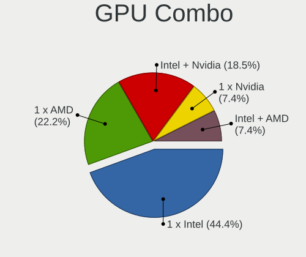

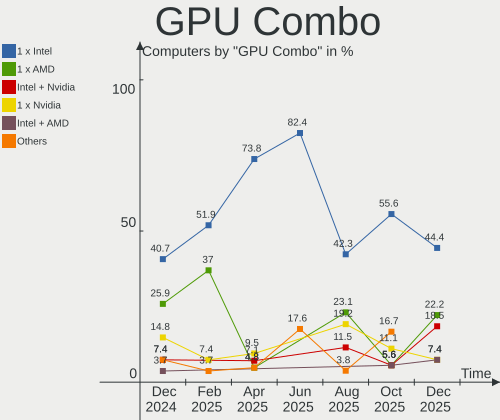

| Name           | Computers | Percent |
|----------------|-----------|---------|
| 1 x Intel      | 12        | 44.44%  |
| 1 x AMD        | 6         | 22.22%  |
| Intel + Nvidia | 5         | 18.52%  |
| 1 x Nvidia     | 2         | 7.41%   |
| Intel + AMD    | 2         | 7.41%   |

GPU Driver
----------

Free vs proprietary

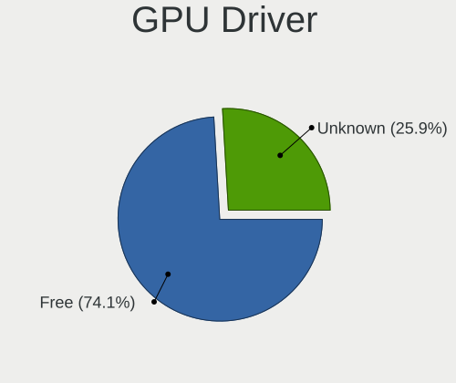

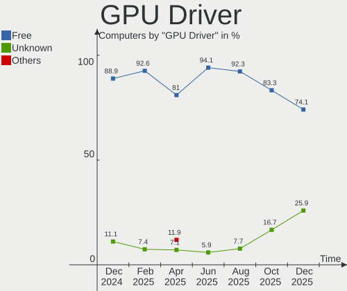

| Driver  | Computers | Percent |
|---------|-----------|---------|
| Free    | 20        | 74.07%  |
| Unknown | 7         | 25.93%  |

GPU Memory
----------

Total video memory

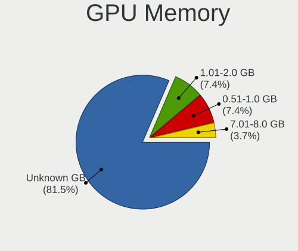

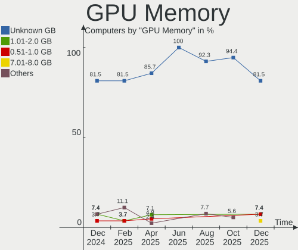

| Size in GB | Computers | Percent |
|------------|-----------|---------|
| Unknown    | 22        | 81.48%  |
| 1.01-2.0   | 2         | 7.41%   |
| 0.51-1.0   | 2         | 7.41%   |
| 7.01-8.0   | 1         | 3.7%    |

Monitor
-------

Monitor Vendor
--------------

Monitor vendors

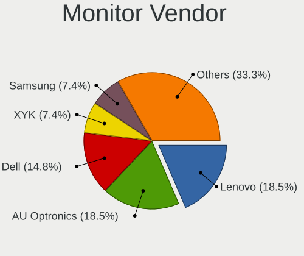

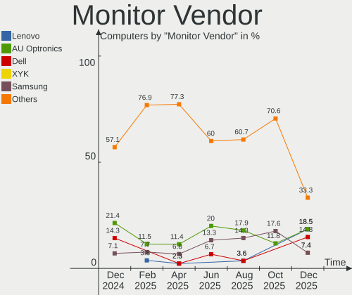

| Vendor               | Computers | Percent |
|----------------------|-----------|---------|
| Lenovo               | 5         | 18.52%  |
| AU Optronics         | 5         | 18.52%  |
| Dell                 | 4         | 14.81%  |
| XYK                  | 2         | 7.41%   |
| Samsung Electronics  | 2         | 7.41%   |
| Goldstar             | 2         | 7.41%   |
| Chimei Innolux       | 2         | 7.41%   |
| Ancor Communications | 2         | 7.41%   |
| LG Display           | 1         | 3.7%    |
| CPT                  | 1         | 3.7%    |
| BOE                  | 1         | 3.7%    |

Monitor Model
-------------

Monitor models

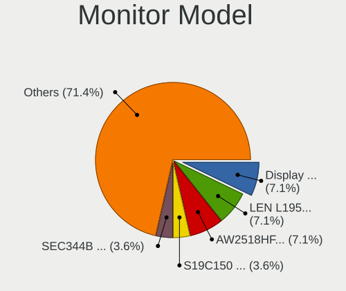

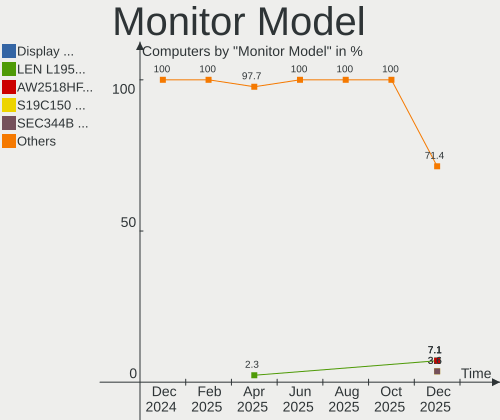

| Model                                                                 | Computers | Percent |
|-----------------------------------------------------------------------|-----------|---------|
| XYK Display XYK1200 1920x1200 301x188mm 14.0-inch                     | 2         | 7.14%   |
| Lenovo LEN L1950wD LEN1086 1920x1080 150x100mm 7.1-inch               | 2         | 7.14%   |
| Dell AW2518HF DELA101 1920x1080 544x303mm 24.5-inch                   | 2         | 7.14%   |
| Samsung Electronics S19C150 SAM0AE6 1366x768 410x230mm 18.5-inch      | 1         | 3.57%   |
| Samsung Electronics LCD Monitor SEC344B 1440x900 367x230mm 17.1-inch  | 1         | 3.57%   |
| LG Display LCD Monitor LGD0618 1920x1080 344x194mm 15.5-inch          | 1         | 3.57%   |
| Lenovo LCD Monitor LEN40BA 1920x1080 344x194mm 15.5-inch              | 1         | 3.57%   |
| Lenovo LCD Monitor LEN40B2 1920x1080 344x193mm 15.5-inch              | 1         | 3.57%   |
| Lenovo LBG AIO PC LEN8000 1920x1080 480x270mm 21.7-inch               | 1         | 3.57%   |
| Goldstar W2261 GSM56CF 1920x1080 477x268mm 21.5-inch                  | 1         | 3.57%   |
| Goldstar LG IPS FULLHD GSM5AB8 1920x1080 480x270mm 21.7-inch          | 1         | 3.57%   |
| Dell P2214H DELA098 1920x1080 477x268mm 21.5-inch                     | 1         | 3.57%   |
| Dell P2214H DELA097 1920x1080 477x268mm 21.5-inch                     | 1         | 3.57%   |
| Dell E207WFP DELD010 1680x1050 430x270mm 20.0-inch                    | 1         | 3.57%   |
| CPT P116NWR1 R2 COR0489 1366x768 256x144mm 11.6-inch                  | 1         | 3.57%   |
| Chimei Innolux LCD Monitor CMN1745 1600x900 382x214mm 17.2-inch       | 1         | 3.57%   |
| Chimei Innolux LCD Monitor CMN15DB 1366x768 344x193mm 15.5-inch       | 1         | 3.57%   |
| BOE LCD Monitor BOE08F2 1920x1080 310x174mm 14.0-inch                 | 1         | 3.57%   |
| AU Optronics LCD Monitor AUO9C92 1600x900 382x215mm 17.3-inch         | 1         | 3.57%   |
| AU Optronics LCD Monitor AUO70EC 1366x768 344x193mm 15.5-inch         | 1         | 3.57%   |
| AU Optronics LCD Monitor AUO163D 1920x1080 309x173mm 13.9-inch        | 1         | 3.57%   |
| AU Optronics LCD Monitor AUO139E 1600x900 382x214mm 17.2-inch         | 1         | 3.57%   |
| AU Optronics LCD Monitor AUO12ED 1920x1080 344x193mm 15.5-inch        | 1         | 3.57%   |
| Ancor Communications BE24A ACI24AB 1920x1200 518x324mm 24.1-inch      | 1         | 3.57%   |
| Ancor Communications ASUS VN247 ACI24C3 1920x1080 521x293mm 23.5-inch | 1         | 3.57%   |

Monitor Resolution
------------------

Monitor screen resolution

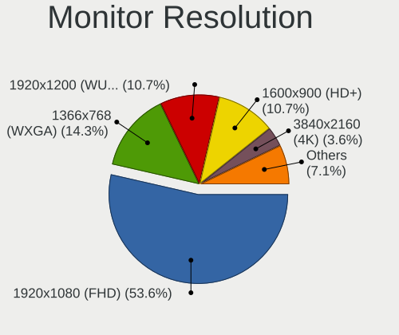

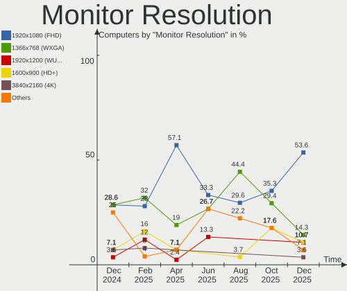

| Resolution         | Computers | Percent |
|--------------------|-----------|---------|
| 1920x1080 (FHD)    | 15        | 53.57%  |
| 1366x768 (WXGA)    | 4         | 14.29%  |
| 1920x1200 (WUXGA)  | 3         | 10.71%  |
| 1600x900 (HD+)     | 3         | 10.71%  |
| 3840x2160 (4K)     | 1         | 3.57%   |
| 1680x1050 (WSXGA+) | 1         | 3.57%   |
| 1440x900 (WXGA+)   | 1         | 3.57%   |

Monitor Diagonal
----------------

Diagonal size in inches

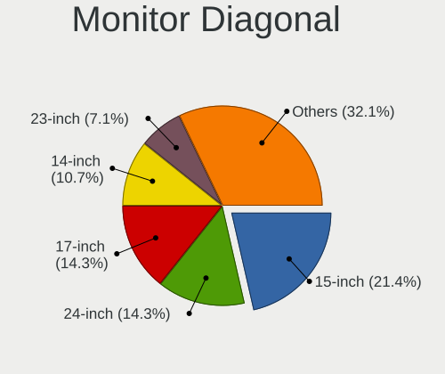

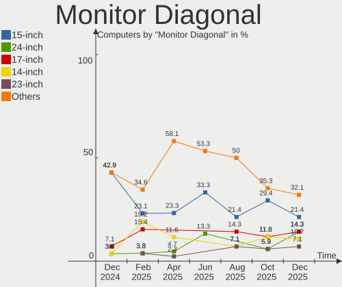

| Inches | Computers | Percent |
|--------|-----------|---------|
| 15     | 6         | 21.43%  |
| 24     | 4         | 14.29%  |
| 17     | 4         | 14.29%  |
| 14     | 3         | 10.71%  |
| 23     | 2         | 7.14%   |
| 21     | 2         | 7.14%   |
| 19     | 2         | 7.14%   |
| 27     | 1         | 3.57%   |
| 20     | 1         | 3.57%   |
| 18     | 1         | 3.57%   |
| 13     | 1         | 3.57%   |
| 11     | 1         | 3.57%   |

Monitor Width
-------------

Physical width

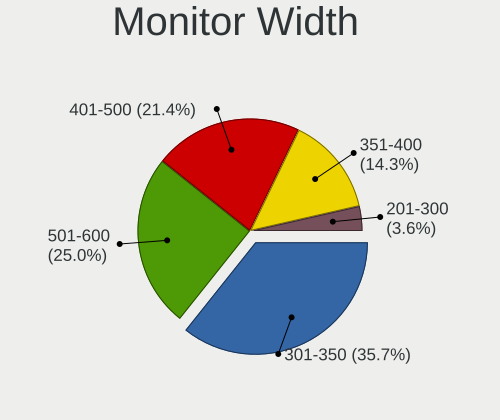

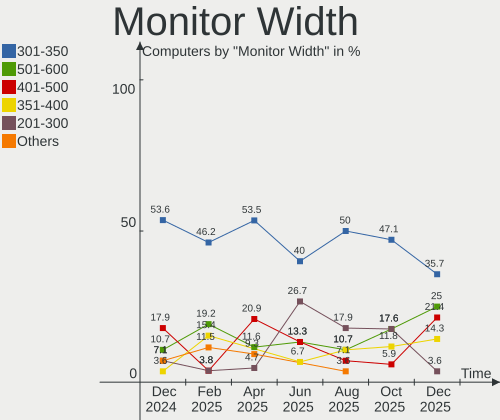

| Width in mm | Computers | Percent |
|-------------|-----------|---------|
| 301-350     | 10        | 35.71%  |
| 501-600     | 7         | 25%     |
| 401-500     | 6         | 21.43%  |
| 351-400     | 4         | 14.29%  |
| 201-300     | 1         | 3.57%   |

Aspect Ratio
------------

Proportional relationship between the width and the height

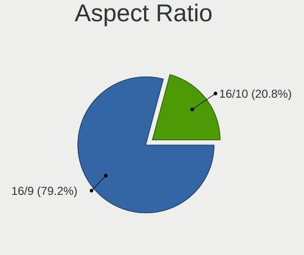

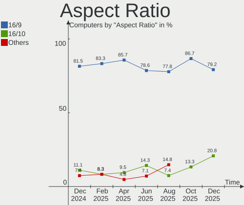

| Ratio | Computers | Percent |
|-------|-----------|---------|
| 16/9  | 19        | 79.17%  |
| 16/10 | 5         | 20.83%  |

Monitor Area
------------

Area in inch²

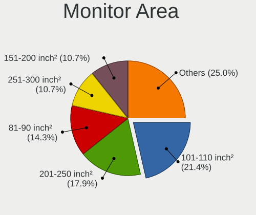

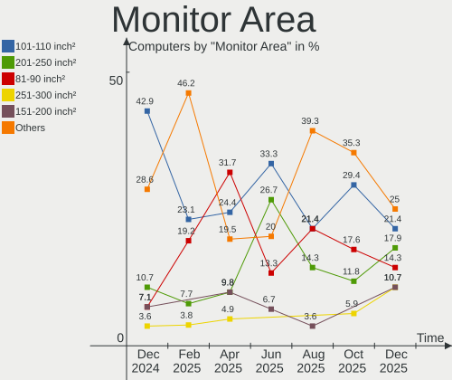

| Area in inch² | Computers | Percent |
|----------------|-----------|---------|
| 101-110        | 6         | 21.43%  |
| 201-250        | 5         | 17.86%  |
| 81-90          | 4         | 14.29%  |
| 251-300        | 3         | 10.71%  |
| 151-200        | 3         | 10.71%  |
| 121-130        | 3         | 10.71%  |
| 51-60          | 1         | 3.57%   |
| 301-350        | 1         | 3.57%   |
| 141-150        | 1         | 3.57%   |
| 131-140        | 1         | 3.57%   |

Pixel Density
-------------

Pixels per inch

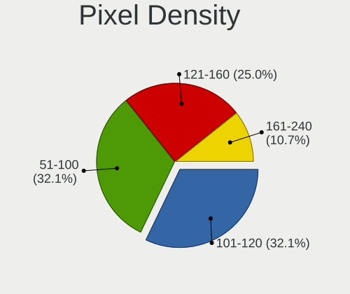

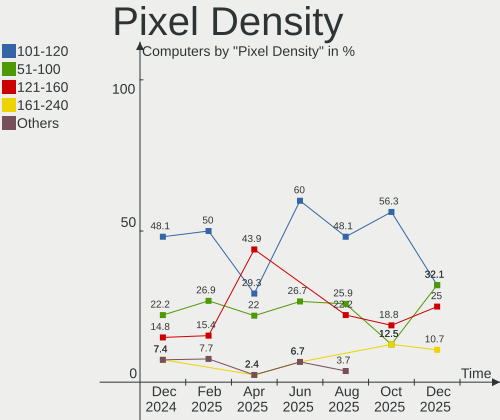

| Density | Computers | Percent |
|---------|-----------|---------|
| 101-120 | 9         | 32.14%  |
| 51-100  | 9         | 32.14%  |
| 121-160 | 7         | 25%     |
| 161-240 | 3         | 10.71%  |

Multiple Monitors
-----------------

Total monitors connected

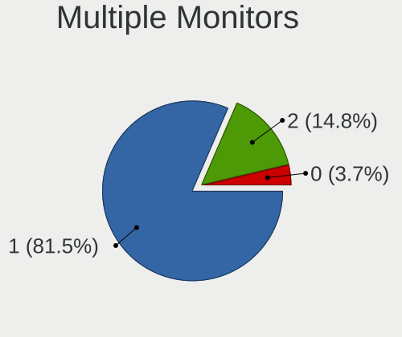

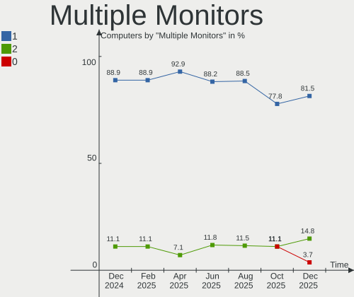

| Total | Computers | Percent |
|-------|-----------|---------|
| 1     | 22        | 81.48%  |
| 2     | 4         | 14.81%  |
| 0     | 1         | 3.7%    |

Network
-------

Net Controller Vendor
---------------------

Controller vendors

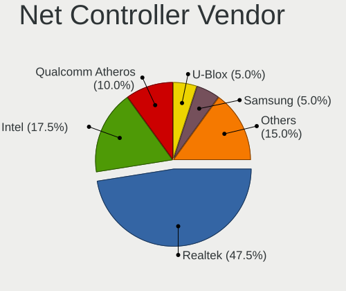

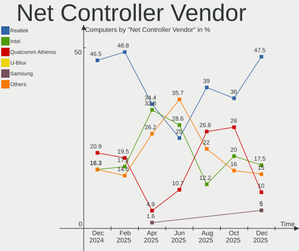

| Vendor                          | Computers | Percent |
|---------------------------------|-----------|---------|
| Realtek Semiconductor           | 19        | 47.5%   |
| Intel                           | 7         | 17.5%   |
| Qualcomm Atheros                | 4         | 10%     |
| U-Blox                          | 2         | 5%      |
| Samsung Electronics             | 2         | 5%      |
| TP-Link                         | 1         | 2.5%    |
| Ralink Technology               | 1         | 2.5%    |
| Qualcomm Atheros Communications | 1         | 2.5%    |
| Marvell Technology Group        | 1         | 2.5%    |
| Edimax Technology               | 1         | 2.5%    |
| Broadcom                        | 1         | 2.5%    |

Net Controller Model
--------------------

Controller models

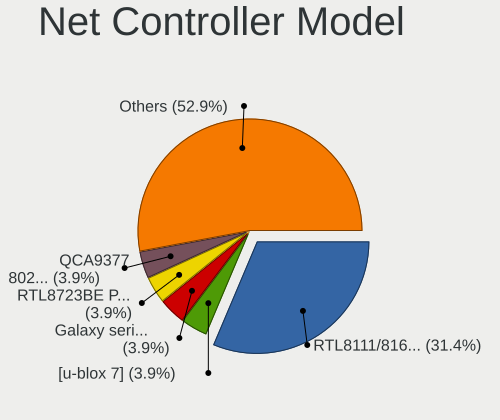

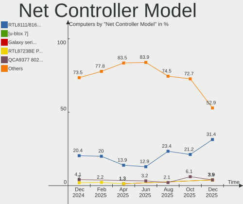

| Model                                                                  | Computers | Percent |
|------------------------------------------------------------------------|-----------|---------|
| Realtek RTL8111/8168/8211/8411 PCI Express Gigabit Ethernet Controller | 16        | 31.37%  |
| U-Blox [u-blox 7]                                                      | 2         | 3.92%   |
| Samsung Galaxy series, misc. (tethering mode)                          | 2         | 3.92%   |
| Realtek RTL8723BE PCIe Wireless Network Adapter                        | 2         | 3.92%   |
| Qualcomm Atheros QCA9377 802.11ac Wireless Network Adapter             | 2         | 3.92%   |
| TP-Link Archer T3U [Realtek RTL8812BU]                                 | 1         | 1.96%   |
| Realtek RTL8852BE-VT PCIe 802.11ax Wireless Network Controller         | 1         | 1.96%   |
| Realtek RTL8852BE PCIe 802.11ax Wireless Network Controller            | 1         | 1.96%   |
| Realtek RTL8822CE 802.11ac PCIe Wireless Network Adapter               | 1         | 1.96%   |
| Realtek RTL8821CE 802.11ac PCIe Wireless Network Adapter               | 1         | 1.96%   |
| Realtek RTL8821AE 802.11ac PCIe Wireless Network Adapter               | 1         | 1.96%   |
| Realtek RTL8125 2.5GbE Controller                                      | 1         | 1.96%   |
| Realtek RTL810xE PCI Express Fast Ethernet controller                  | 1         | 1.96%   |
| Ralink MT7610U ("Archer T2U" 2.4G+5G WLAN Adapter                      | 1         | 1.96%   |
| Qualcomm Atheros Killer E2400 Gigabit Ethernet Controller              | 1         | 1.96%   |
| Qualcomm Atheros AR9271 802.11n                                        | 1         | 1.96%   |
| Qualcomm Atheros AR9485 Wireless Network Adapter                       | 1         | 1.96%   |
| Qualcomm Atheros AR9285 Wireless Network Adapter (PCI-Express)         | 1         | 1.96%   |
| Qualcomm Atheros AR8152 v2.0 Fast Ethernet                             | 1         | 1.96%   |
| Marvell Group 88W8897 [AVASTAR] 802.11ac Wireless                      | 1         | 1.96%   |
| Intel Wireless 7260                                                    | 1         | 1.96%   |
| Intel Wi-Fi 6E(802.11ax) AX210/AX1675* 2x2 [Typhoon Peak]              | 1         | 1.96%   |
| Intel Wi-Fi 6 AX200                                                    | 1         | 1.96%   |
| Intel Wi-Fi 5(802.11ac) Wireless-AC 9x6x [Thunder Peak]                | 1         | 1.96%   |
| Intel PRO/Wireless 5100 AGN [Shiloh] Network Connection                | 1         | 1.96%   |
| Intel Ethernet Controller I226-V                                       | 1         | 1.96%   |
| Intel Ethernet Connection (7) I219-LM                                  | 1         | 1.96%   |
| Intel Centrino Advanced-N 6205 [Taylor Peak]                           | 1         | 1.96%   |
| Intel Cannon Lake PCH CNVi WiFi                                        | 1         | 1.96%   |
| Intel 82579LM Gigabit Network Connection (Lewisville)                  | 1         | 1.96%   |
| Edimax Edimax N150 Adapter                                             | 1         | 1.96%   |
| Broadcom NetXtreme BCM5761 Gigabit Ethernet PCIe                       | 1         | 1.96%   |

Wireless Vendor
---------------

Wireless vendors

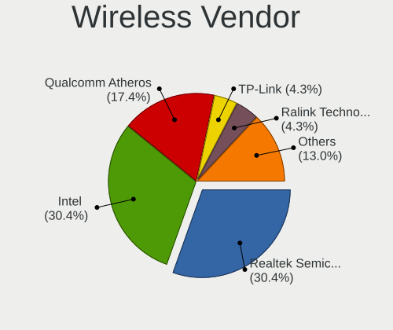

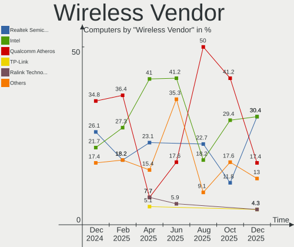

| Vendor                          | Computers | Percent |
|---------------------------------|-----------|---------|
| Realtek Semiconductor           | 7         | 30.43%  |
| Intel                           | 7         | 30.43%  |
| Qualcomm Atheros                | 4         | 17.39%  |
| TP-Link                         | 1         | 4.35%   |
| Ralink Technology               | 1         | 4.35%   |
| Qualcomm Atheros Communications | 1         | 4.35%   |
| Marvell Technology Group        | 1         | 4.35%   |
| Edimax Technology               | 1         | 4.35%   |

Wireless Model
--------------

Wireless models

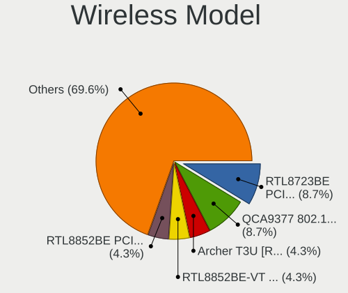

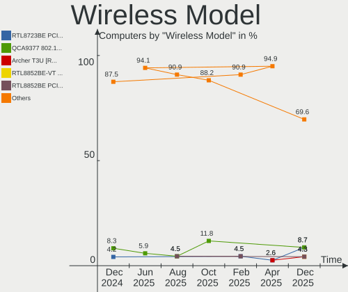

| Model                                                          | Computers | Percent |
|----------------------------------------------------------------|-----------|---------|
| Realtek RTL8723BE PCIe Wireless Network Adapter                | 2         | 8.7%    |
| Qualcomm Atheros QCA9377 802.11ac Wireless Network Adapter     | 2         | 8.7%    |
| TP-Link Archer T3U [Realtek RTL8812BU]                         | 1         | 4.35%   |
| Realtek RTL8852BE-VT PCIe 802.11ax Wireless Network Controller | 1         | 4.35%   |
| Realtek RTL8852BE PCIe 802.11ax Wireless Network Controller    | 1         | 4.35%   |
| Realtek RTL8822CE 802.11ac PCIe Wireless Network Adapter       | 1         | 4.35%   |
| Realtek RTL8821CE 802.11ac PCIe Wireless Network Adapter       | 1         | 4.35%   |
| Realtek RTL8821AE 802.11ac PCIe Wireless Network Adapter       | 1         | 4.35%   |
| Ralink MT7610U ("Archer T2U" 2.4G+5G WLAN Adapter              | 1         | 4.35%   |
| Qualcomm Atheros AR9271 802.11n                                | 1         | 4.35%   |
| Qualcomm Atheros AR9485 Wireless Network Adapter               | 1         | 4.35%   |
| Qualcomm Atheros AR9285 Wireless Network Adapter (PCI-Express) | 1         | 4.35%   |
| Marvell Group 88W8897 [AVASTAR] 802.11ac Wireless              | 1         | 4.35%   |
| Intel Wireless 7260                                            | 1         | 4.35%   |
| Intel Wi-Fi 6E(802.11ax) AX210/AX1675* 2x2 [Typhoon Peak]      | 1         | 4.35%   |
| Intel Wi-Fi 6 AX200                                            | 1         | 4.35%   |
| Intel Wi-Fi 5(802.11ac) Wireless-AC 9x6x [Thunder Peak]        | 1         | 4.35%   |
| Intel PRO/Wireless 5100 AGN [Shiloh] Network Connection        | 1         | 4.35%   |
| Intel Centrino Advanced-N 6205 [Taylor Peak]                   | 1         | 4.35%   |
| Intel Cannon Lake PCH CNVi WiFi                                | 1         | 4.35%   |
| Edimax Edimax N150 Adapter                                     | 1         | 4.35%   |

Ethernet Vendor
---------------

Ethernet vendors

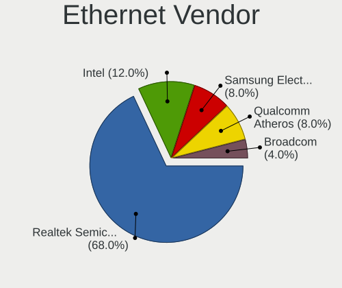

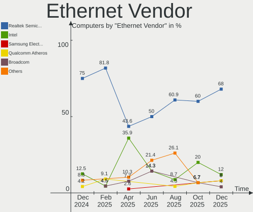

| Vendor                | Computers | Percent |
|-----------------------|-----------|---------|
| Realtek Semiconductor | 17        | 68%     |
| Intel                 | 3         | 12%     |
| Samsung Electronics   | 2         | 8%      |
| Qualcomm Atheros      | 2         | 8%      |
| Broadcom              | 1         | 4%      |

Ethernet Model
--------------

Ethernet models

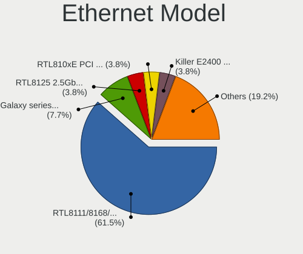

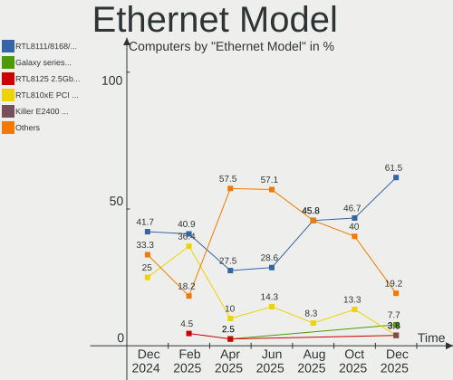

| Model                                                                  | Computers | Percent |
|------------------------------------------------------------------------|-----------|---------|
| Realtek RTL8111/8168/8211/8411 PCI Express Gigabit Ethernet Controller | 16        | 61.54%  |
| Samsung Galaxy series, misc. (tethering mode)                          | 2         | 7.69%   |
| Realtek RTL8125 2.5GbE Controller                                      | 1         | 3.85%   |
| Realtek RTL810xE PCI Express Fast Ethernet controller                  | 1         | 3.85%   |
| Qualcomm Atheros Killer E2400 Gigabit Ethernet Controller              | 1         | 3.85%   |
| Qualcomm Atheros AR8152 v2.0 Fast Ethernet                             | 1         | 3.85%   |
| Intel Ethernet Controller I226-V                                       | 1         | 3.85%   |
| Intel Ethernet Connection (7) I219-LM                                  | 1         | 3.85%   |
| Intel 82579LM Gigabit Network Connection (Lewisville)                  | 1         | 3.85%   |
| Broadcom NetXtreme BCM5761 Gigabit Ethernet PCIe                       | 1         | 3.85%   |

Net Controller Kind
-------------------

Ethernet, WiFi or modem

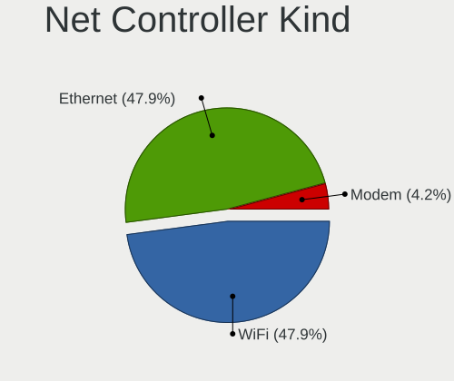

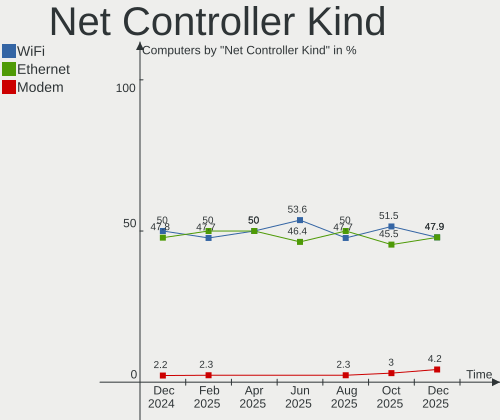

| Kind     | Computers | Percent |
|----------|-----------|---------|
| WiFi     | 23        | 47.92%  |
| Ethernet | 23        | 47.92%  |
| Modem    | 2         | 4.17%   |

Used Controller
---------------

Currently used network controller

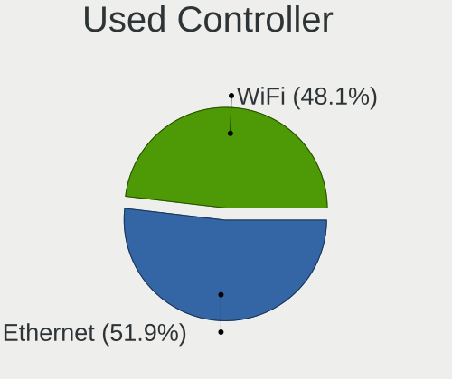

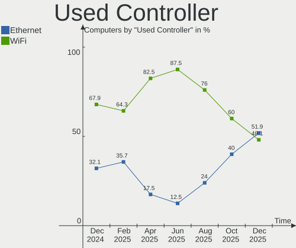

| Kind     | Computers | Percent |
|----------|-----------|---------|
| Ethernet | 14        | 51.85%  |
| WiFi     | 13        | 48.15%  |

NICs
----

Total network controllers on board

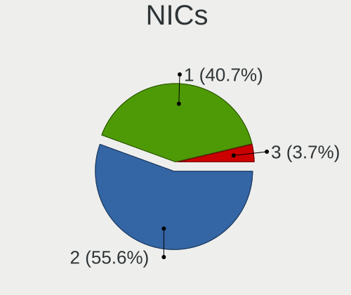

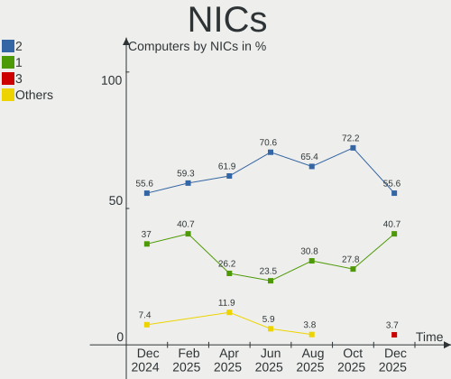

| Total | Computers | Percent |
|-------|-----------|---------|
| 2     | 15        | 55.56%  |
| 1     | 11        | 40.74%  |
| 3     | 1         | 3.7%    |

IPv6
----

IPv6 vs IPv4

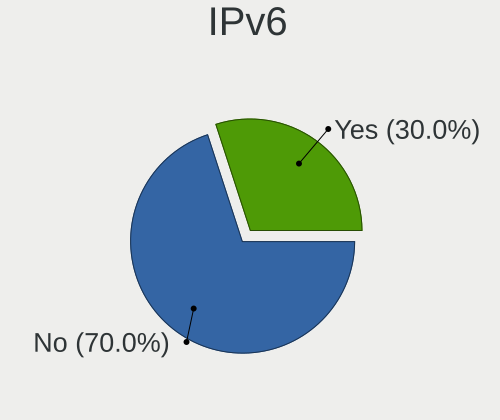

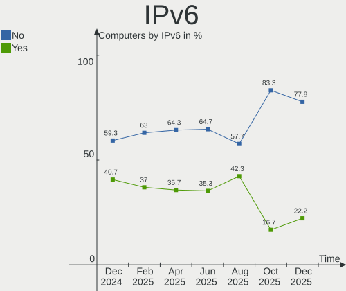

| Used | Computers | Percent |
|------|-----------|---------|
| No   | 21        | 77.78%  |
| Yes  | 6         | 22.22%  |

Bluetooth
---------

Bluetooth Vendor
----------------

Controller vendors

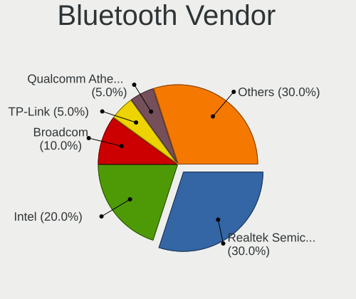

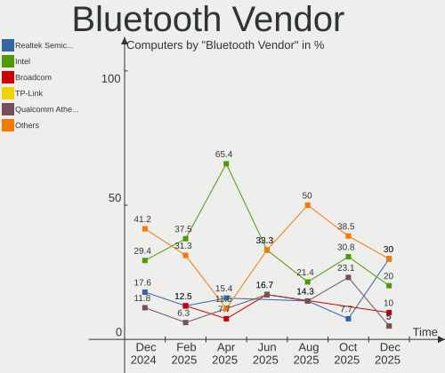

| Vendor                          | Computers | Percent |
|---------------------------------|-----------|---------|
| Realtek Semiconductor           | 6         | 30%     |
| Intel                           | 4         | 20%     |
| Broadcom                        | 2         | 10%     |
| TP-Link                         | 1         | 5%      |
| Qualcomm Atheros Communications | 1         | 5%      |
| Marvell Semiconductor           | 1         | 5%      |
| Lite-On Technology              | 1         | 5%      |
| IMC Networks                    | 1         | 5%      |
| Foxconn / Hon Hai               | 1         | 5%      |
| Chicony Electronics             | 1         | 5%      |
| Cambridge Silicon Radio         | 1         | 5%      |

Bluetooth Model
---------------

Controller models

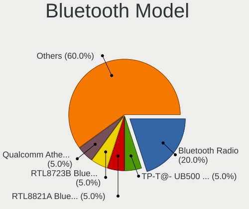

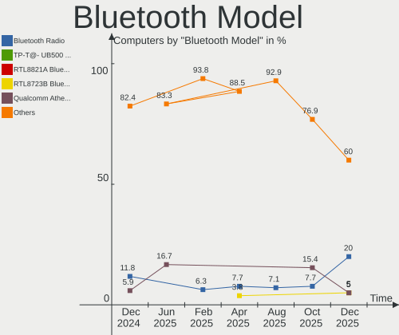

| Model                                               | Computers | Percent |
|-----------------------------------------------------|-----------|---------|
| Realtek Bluetooth Radio                             | 4         | 20%     |
| TP-Link TP-T@- UB500 Adapter                        | 1         | 5%      |
| Realtek RTL8821A Bluetooth                          | 1         | 5%      |
| Realtek RTL8723B Bluetooth                          | 1         | 5%      |
| Qualcomm Atheros  Bluetooth Device                  | 1         | 5%      |
| Marvell Bluetooth and Wireless LAN Composite        | 1         | 5%      |
| Lite-On Qualcomm Atheros QCA9377 Bluetooth          | 1         | 5%      |
| Intel Bluetooth wireless interface                  | 1         | 5%      |
| Intel Bluetooth 9460/9560 Jefferson Peak (JfP)      | 1         | 5%      |
| Intel AX210 Bluetooth                               | 1         | 5%      |
| Intel AX200 Bluetooth                               | 1         | 5%      |
| IMC Networks Atheros AR3012 Bluetooth 4.0 Adapter   | 1         | 5%      |
| Foxconn / Hon Hai Broadcom Bluetooth 2.1 Device     | 1         | 5%      |
| Chicony Bluetooth (RTL8723BE)                       | 1         | 5%      |
| Cambridge Silicon Radio Bluetooth Dongle (HCI mode) | 1         | 5%      |
| Broadcom BCM20702A0 Bluetooth 4.0                   | 1         | 5%      |
| Broadcom BCM2045B (BDC-2.1)                         | 1         | 5%      |

Sound
-----

Sound Vendor
------------

Sound card vendors

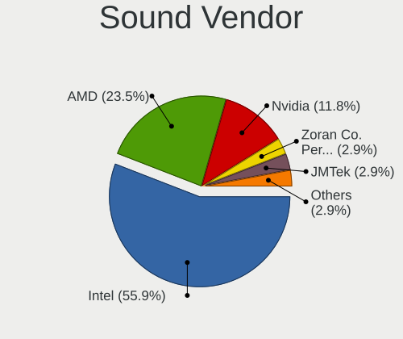

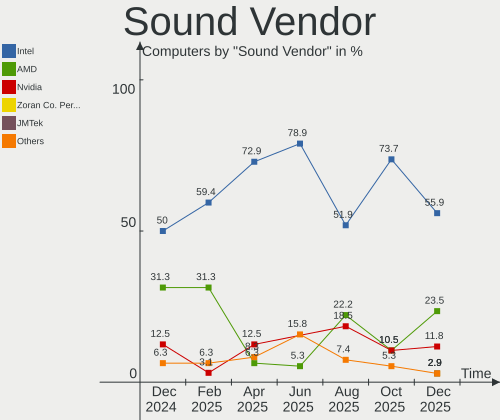

| Vendor                                       | Computers | Percent |
|----------------------------------------------|-----------|---------|
| Intel                                        | 19        | 55.88%  |
| AMD                                          | 8         | 23.53%  |
| Nvidia                                       | 4         | 11.76%  |
| Zoran Co. Personal Media Division (Nogatech) | 1         | 2.94%   |
| JMTek                                        | 1         | 2.94%   |
| GN Netcom                                    | 1         | 2.94%   |

Sound Model
-----------

Sound card models

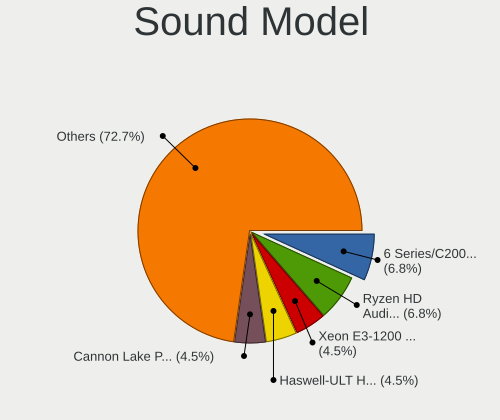

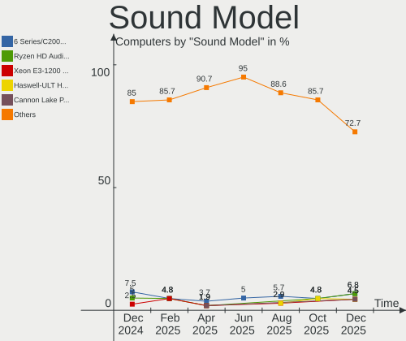

| Model                                                                      | Computers | Percent |
|----------------------------------------------------------------------------|-----------|---------|
| Intel 6 Series/C200 Series Chipset Family High Definition Audio Controller | 3         | 6.82%   |
| AMD Ryzen HD Audio Controller                                              | 3         | 6.82%   |
| Intel Xeon E3-1200 v3/4th Gen Core Processor HD Audio Controller           | 2         | 4.55%   |
| Intel Haswell-ULT HD Audio Controller                                      | 2         | 4.55%   |
| Intel Cannon Lake PCH cAVS                                                 | 2         | 4.55%   |
| Intel Alder Lake-S HD Audio Controller                                     | 2         | 4.55%   |
| Intel Alder Lake-N PCH High Definition Audio Controller                    | 2         | 4.55%   |
| Intel 8 Series/C220 Series Chipset High Definition Audio Controller        | 2         | 4.55%   |
| Intel 8 Series HD Audio Controller                                         | 2         | 4.55%   |
| AMD Raven/Raven2/Fenghuang HDMI/DP Audio Controller                        | 2         | 4.55%   |
| AMD Kabini HDMI/DP Audio                                                   | 2         | 4.55%   |
| AMD FCH Azalia Controller                                                  | 2         | 4.55%   |
| Zoran Co. Personal Media Division (Nogatech) USB Audio and HID             | 1         | 2.27%   |
| Nvidia GP107GL High Definition Audio Controller                            | 1         | 2.27%   |
| Nvidia GM107 High Definition Audio Controller [GeForce 940MX]              | 1         | 2.27%   |
| Nvidia GK107 HDMI Audio Controller                                         | 1         | 2.27%   |
| Nvidia GF108 High Definition Audio Controller                              | 1         | 2.27%   |
| JMTek USB Speaker                                                          | 1         | 2.27%   |
| Intel Sunrise Point-LP HD Audio                                            | 1         | 2.27%   |
| Intel Atom Processor Z36xxx/Z37xxx Series High Definition Audio Controller | 1         | 2.27%   |
| Intel Alder Lake PCH-P High Definition Audio Controller                    | 1         | 2.27%   |
| Intel 82801I (ICH9 Family) HD Audio Controller                             | 1         | 2.27%   |
| Intel 200 Series PCH HD Audio                                              | 1         | 2.27%   |
| Intel 100 Series/C230 Series Chipset Family HD Audio Controller            | 1         | 2.27%   |
| GN Netcom Jabra BIZ 1500                                                   | 1         | 2.27%   |
| AMD Starship/Matisse HD Audio Controller                                   | 1         | 2.27%   |
| AMD SBx00 Azalia (Intel HDA)                                               | 1         | 2.27%   |
| AMD Radeon High Definition Audio Controller                                | 1         | 2.27%   |
| AMD Ellesmere HDMI Audio [Radeon RX 470/480 / 570/580/590]                 | 1         | 2.27%   |
| AMD Baffin HDMI/DP Audio [Radeon RX 550 640SP / RX 560/560X]               | 1         | 2.27%   |

Memory
------

Memory Vendor
-------------

Memory module vendors

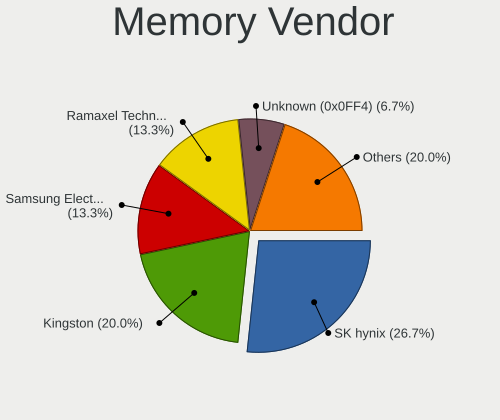

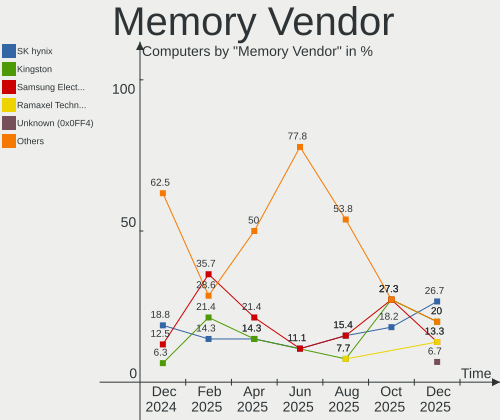

| Vendor              | Computers | Percent |
|---------------------|-----------|---------|
| SK hynix            | 4         | 26.67%  |
| Kingston            | 3         | 20%     |
| Samsung Electronics | 2         | 13.33%  |
| Ramaxel Technology  | 2         | 13.33%  |
| Unknown (0x0FF4)    | 1         | 6.67%   |
| Team                | 1         | 6.67%   |
| Smart               | 1         | 6.67%   |
| EDB536160000        | 1         | 6.67%   |

Memory Model
------------

Memory module models

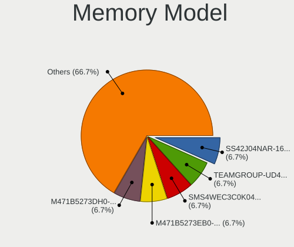

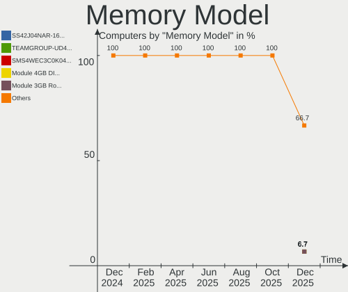

| Model                                                        | Computers | Percent |
|--------------------------------------------------------------|-----------|---------|
| Unknown (0x0FF4) RAM SS42J04NAR-16 16GB SODIMM DDR4 2667MT/s | 1         | 6.67%   |
| Team RAM TEAMGROUP-UD4-2666 8GB DIMM DDR4 3000MT/s           | 1         | 6.67%   |
| Smart RAM SMS4WEC3C0K0446SCG 4GB SODIMM DDR4 3200MT/s        | 1         | 6.67%   |
| SK hynix RAM Module 4GB DIMM DDR3 1600MT/s                   | 1         | 6.67%   |
| SK hynix RAM Module 3GB Row Of Chips LPDDR5 4800MT/s         | 1         | 6.67%   |
| SK hynix RAM HMT41GS6BFR8A-PB 8GB SODIMM DDR3 2667MT/s       | 1         | 6.67%   |
| SK hynix RAM HMAA1GS6CJR6N-XN 8GB Row Of Chips DDR4 3200MT/s | 1         | 6.67%   |
| Samsung RAM M471B5273EB0-CK0 4GB SODIMM DDR3 4199MT/s        | 1         | 6.67%   |
| Samsung RAM M471B5273DH0-CH9 4GB SODIMM DDR3 1600MT/s        | 1         | 6.67%   |
| Ramaxel RAM RMT3160ME68FAF1600 8GB SODIMM DDR3 1600MT/s      | 1         | 6.67%   |
| Ramaxel RAM RMSA3300ME78HBF-2666 16GB SODIMM DDR4 2667MT/s   | 1         | 6.67%   |
| Kingston RAM Module 2GB DIMM DDR3 1600MT/s                   | 1         | 6.67%   |
| Kingston RAM ACR512X64D3S1333C 4GB DIMM DDR3 1333MT/s        | 1         | 6.67%   |
| Kingston RAM 99U5428-018.A00LF 8GB SODIMM DDR3 1600MT/s      | 1         | 6.67%   |
| EDB536160000 RAM CMK16GX4M1A2666C16 16GB DIMM DDR4 2133MT/s  | 1         | 6.67%   |

Memory Kind
-----------

Memory module kinds

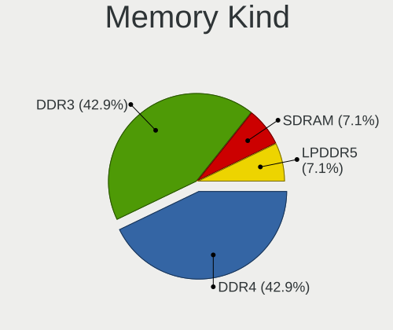

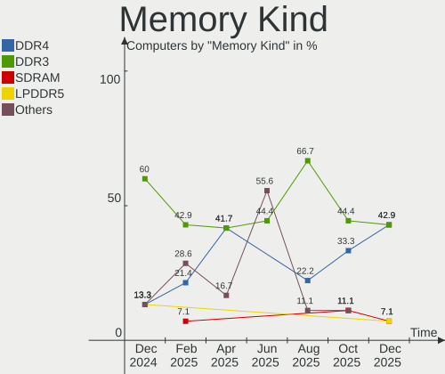

| Kind   | Computers | Percent |
|--------|-----------|---------|
| DDR4   | 6         | 42.86%  |
| DDR3   | 6         | 42.86%  |
| SDRAM  | 1         | 7.14%   |
| LPDDR5 | 1         | 7.14%   |

Memory Form Factor
------------------

Physical design of the memory module

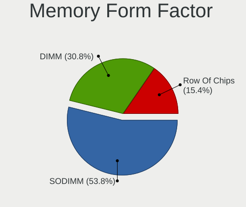

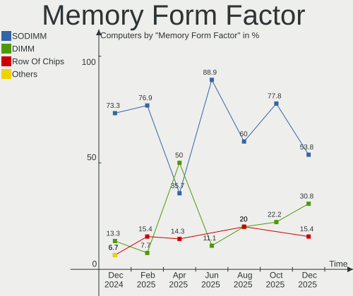

| Name         | Computers | Percent |
|--------------|-----------|---------|
| SODIMM       | 7         | 53.85%  |
| DIMM         | 4         | 30.77%  |
| Row Of Chips | 2         | 15.38%  |

Memory Size
-----------

Memory module size

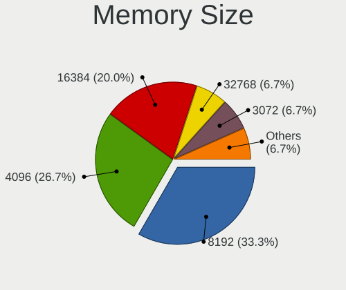

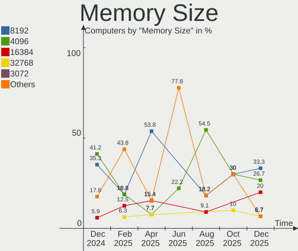

| Size  | Computers | Percent |
|-------|-----------|---------|
| 8192  | 5         | 33.33%  |
| 4096  | 4         | 26.67%  |
| 16384 | 3         | 20%     |
| 32768 | 1         | 6.67%   |
| 3072  | 1         | 6.67%   |
| 2048  | 1         | 6.67%   |

Memory Speed
------------

Memory module speed

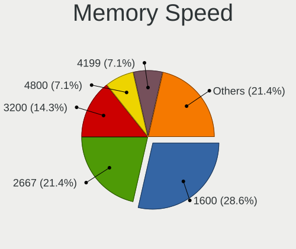

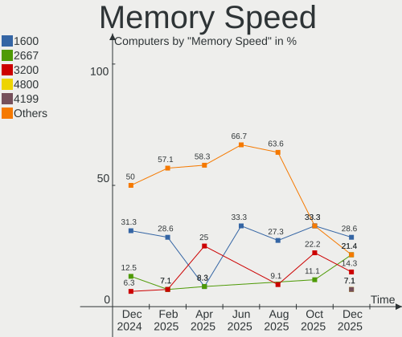

| Speed | Computers | Percent |
|-------|-----------|---------|
| 1600  | 4         | 28.57%  |
| 2667  | 3         | 21.43%  |
| 3200  | 2         | 14.29%  |
| 4800  | 1         | 7.14%   |
| 4199  | 1         | 7.14%   |
| 3000  | 1         | 7.14%   |
| 2133  | 1         | 7.14%   |
| 1333  | 1         | 7.14%   |

Printers & scanners
-------------------

Printer Vendor
--------------

Printer device vendors

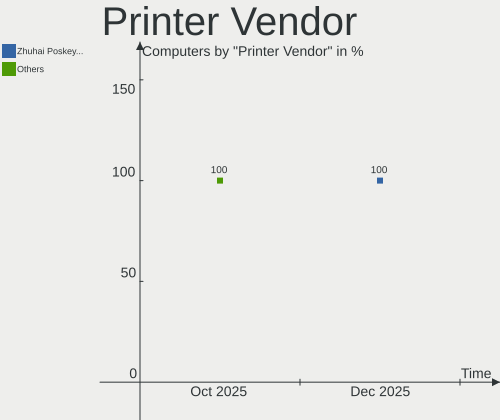

| Vendor                   | Computers | Percent |
|--------------------------|-----------|---------|
| Zhuhai Poskey Technology | 1         | 100%    |

Printer Model
-------------

Printer device models

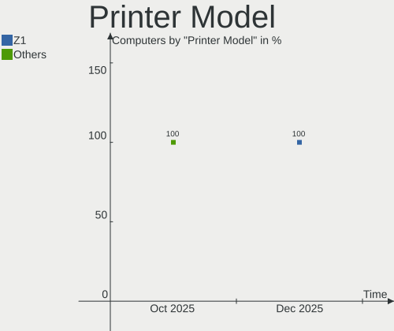

| Model            | Computers | Percent |
|------------------|-----------|---------|
| Zhuhai Poskey Z1 | 1         | 100%    |

Scanner Vendor
--------------

Scanner device vendors

Zero info for selected period =(

Scanner Model
-------------

Scanner device models

Zero info for selected period =(

Camera
------

Camera Vendor
-------------

Camera device vendors

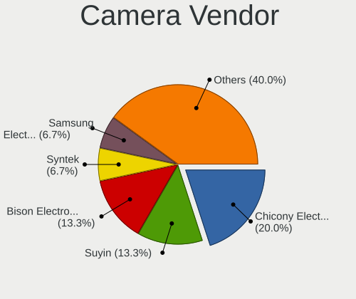

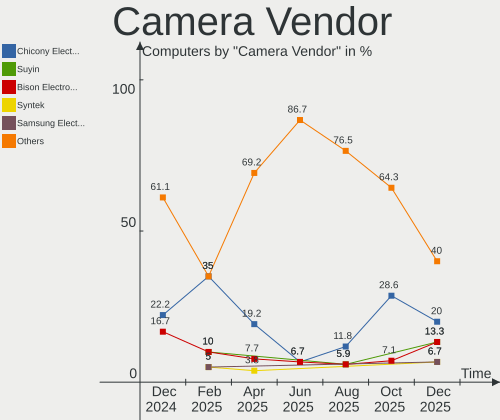

| Vendor                      | Computers | Percent |
|-----------------------------|-----------|---------|
| Chicony Electronics         | 3         | 20%     |
| Suyin                       | 2         | 13.33%  |
| Bison Electronics           | 2         | 13.33%  |
| Syntek                      | 1         | 6.67%   |
| Samsung Electronics         | 1         | 6.67%   |
| Realtek Semiconductor       | 1         | 6.67%   |
| Quanta                      | 1         | 6.67%   |
| Nokia Mobile Phones         | 1         | 6.67%   |
| Luxvisions Innotech Limited | 1         | 6.67%   |
| Logitech                    | 1         | 6.67%   |
| IMC Networks                | 1         | 6.67%   |

Camera Model
------------

Camera device models

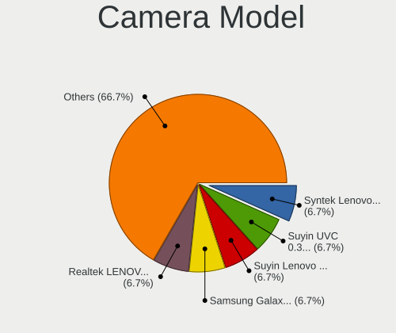

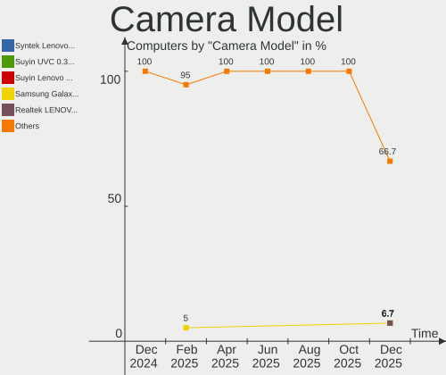

| Model                                                | Computers | Percent |
|------------------------------------------------------|-----------|---------|
| Syntek Lenovo EasyCamera                             | 1         | 6.67%   |
| Suyin UVC 0.3M Webcam                                | 1         | 6.67%   |
| Suyin Lenovo EasyCamera                              | 1         | 6.67%   |
| Samsung Galaxy series, misc. (MTP mode)              | 1         | 6.67%   |
| Realtek LENOVO LBG 720P CAM                          | 1         | 6.67%   |
| Quanta HP TrueVision HD Camera                       | 1         | 6.67%   |
| Nokia Mobile Phones Lumia 640 Phone                  | 1         | 6.67%   |
| Luxvisions Innotech Limited HP True Vision HD Camera | 1         | 6.67%   |
| Logitech HP Webcam                                   | 1         | 6.67%   |
| IMC Networks Integrated Camera                       | 1         | 6.67%   |
| Chicony Lenovo Integrated Camera (0.3MP)             | 1         | 6.67%   |
| Chicony HD WebCam (Acer)                             | 1         | 6.67%   |
| Chicony HD WebCam                                    | 1         | 6.67%   |
| Bison Lenovo EasyCamera                              | 1         | 6.67%   |
| Bison Integrated Camera                              | 1         | 6.67%   |

Security
--------

Fingerprint Vendor
------------------

Fingerprint sensor vendors

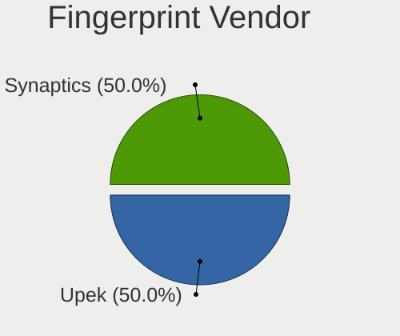

| Vendor | Computers | Percent |
|--------|-----------|---------|
| Upek   | 1         | 100%    |

Fingerprint Model
-----------------

Fingerprint sensor models

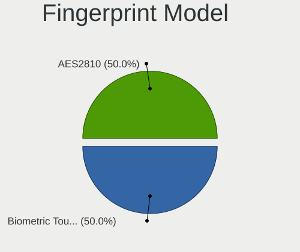

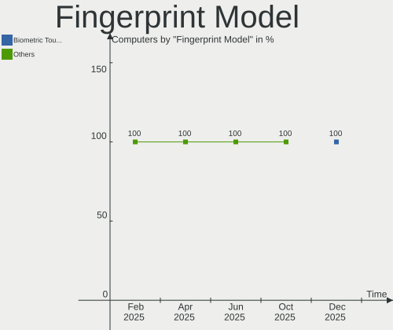

| Model                                                  | Computers | Percent |
|--------------------------------------------------------|-----------|---------|
| Upek Biometric Touchchip/Touchstrip Fingerprint Sensor | 1         | 100%    |

Chipcard Vendor
---------------

Chipcard module vendors

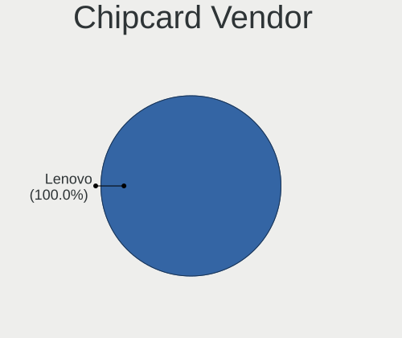

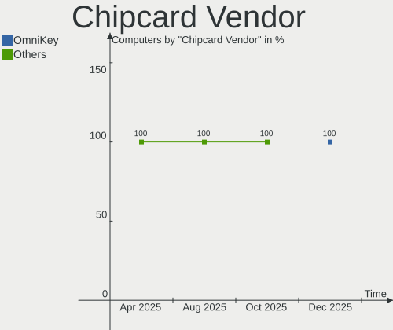

| Vendor  | Computers | Percent |
|---------|-----------|---------|
| OmniKey | 1         | 100%    |

Chipcard Model
--------------

Chipcard module models

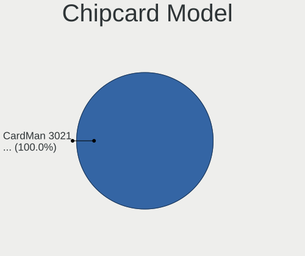

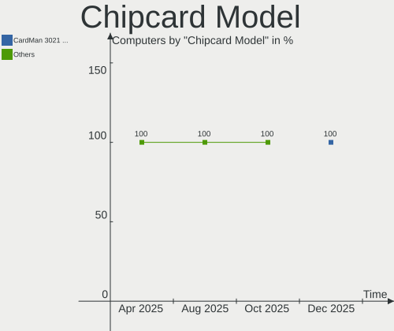

| Model                       | Computers | Percent |
|-----------------------------|-----------|---------|
| OmniKey CardMan 3021 / 3121 | 1         | 100%    |

Unsupported
-----------

Unsupported Devices
-------------------

Total unsupported devices on board

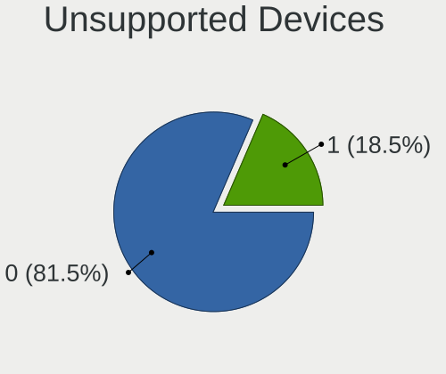

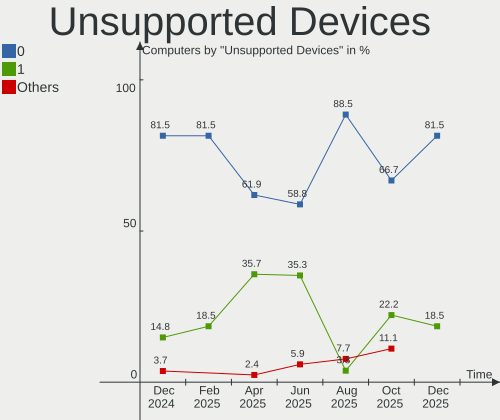

| Total | Computers | Percent |
|-------|-----------|---------|
| 0     | 22        | 81.48%  |
| 1     | 5         | 18.52%  |

Unsupported Device Types
------------------------

Types of unsupported devices

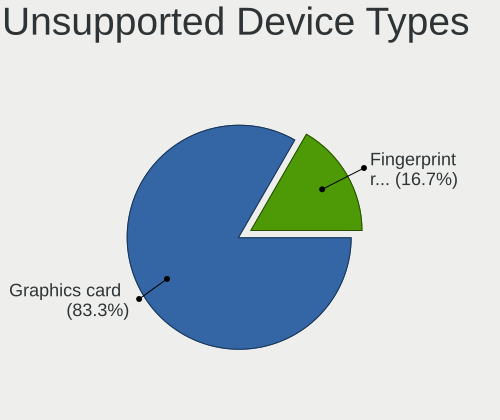

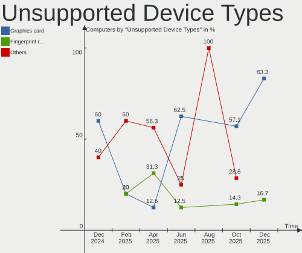

| Type               | Computers | Percent |
|--------------------|-----------|---------|
| Graphics card      | 5         | 83.33%  |
| Fingerprint reader | 1         | 16.67%  |

