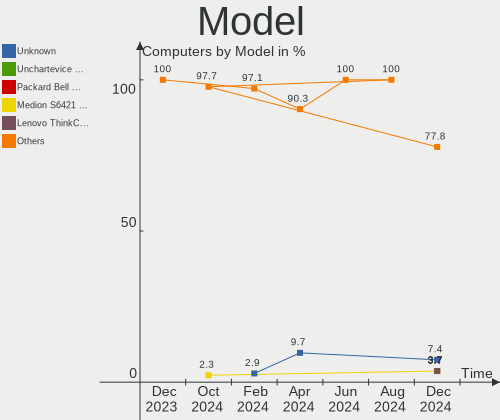
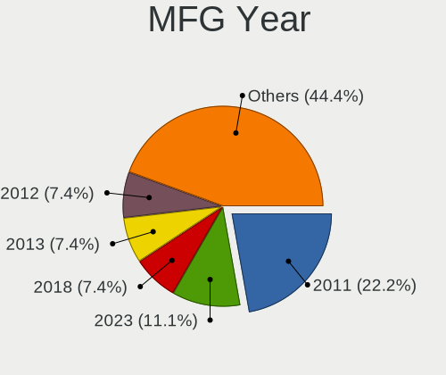
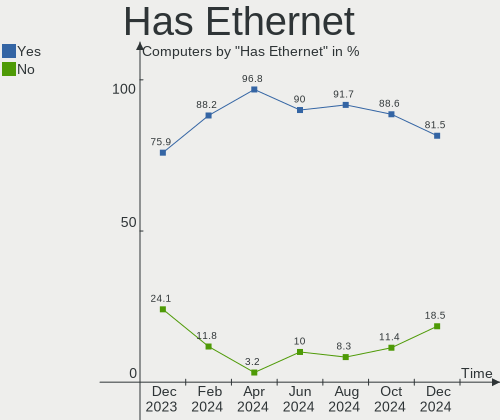
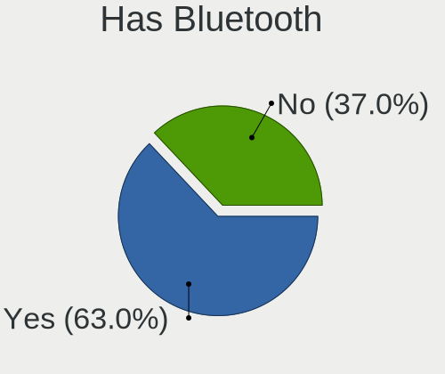
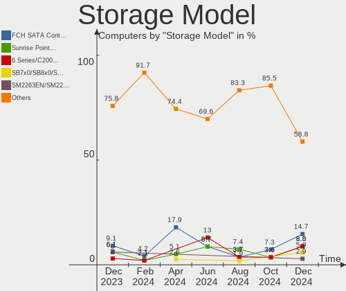
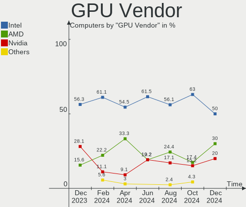
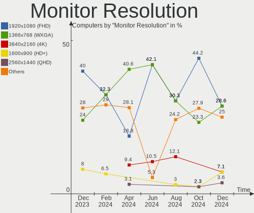
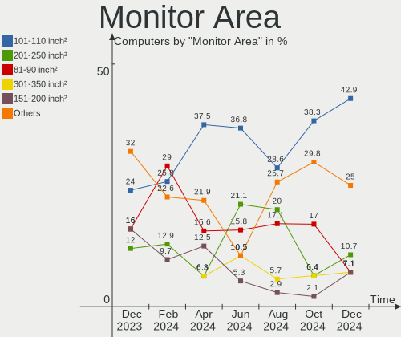
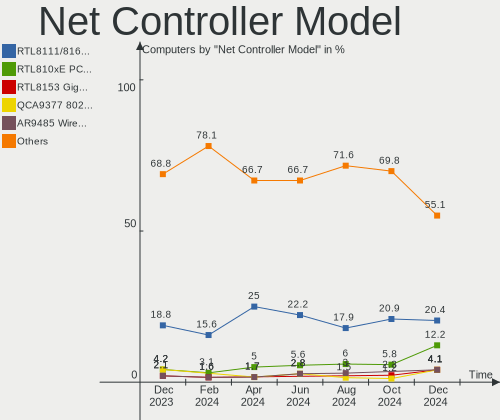
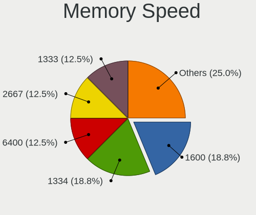

Lubuntu - Hardware Trends
-------------------------

A project to identify most popular hardware characteristics and track their change
over time based on data collected by Linux users at https://Linux-Hardware.org.

Anyone can contribute to this report by the [hw-probe](https://github.com/linuxhw/hw-probe) tool:

    sudo -E hw-probe -all -upload

This is a report for all computer types. See also reports for [desktops](/Dist/Lubuntu/Desktop/README.md) and [notebooks](/Dist/Lubuntu/Notebook/README.md).

This report is for one last month. Overall report since the beginning of time: [TestCoverage](https://github.com/linuxhw/TestCoverage)

Period: Nov, 2022.

Contents
--------

* [ System ](#system)
  - [ OS                       ](#os)
  - [ OS Family                ](#os-family)
  - [ Kernel                   ](#kernel)
  - [ Kernel Family            ](#kernel-family)
  - [ Kernel Major Ver.        ](#kernel-major-ver)
  - [ Arch                     ](#arch)
  - [ DE                       ](#de)
  - [ Display Server           ](#display-server)
  - [ Display Manager          ](#display-manager)
  - [ OS Lang                  ](#os-lang)
  - [ Boot Mode                ](#boot-mode)
  - [ Filesystem               ](#filesystem)
  - [ Part. scheme             ](#part-scheme)
  - [ Dual Boot with Linux/BSD ](#dual-boot-with-linuxbsd)
  - [ Dual Boot (Win)          ](#dual-boot-win)

* [ Board ](#board)
  - [ Vendor                   ](#vendor)
  - [ Model                    ](#model)
  - [ Model Family             ](#model-family)
  - [ MFG Year                 ](#mfg-year)
  - [ Form Factor              ](#form-factor)
  - [ Secure Boot              ](#secure-boot)
  - [ Coreboot                 ](#coreboot)
  - [ RAM Size                 ](#ram-size)
  - [ RAM Used                 ](#ram-used)
  - [ Total Drives             ](#total-drives)
  - [ Has CD-ROM               ](#has-cd-rom)
  - [ Has Ethernet             ](#has-ethernet)
  - [ Has WiFi                 ](#has-wifi)
  - [ Has Bluetooth            ](#has-bluetooth)

* [ Location ](#location)
  - [ Country                  ](#country)
  - [ City                     ](#city)

* [ Drives ](#drives)
  - [ Drive Vendor             ](#drive-vendor)
  - [ Drive Model              ](#drive-model)
  - [ HDD Vendor               ](#hdd-vendor)
  - [ SSD Vendor               ](#ssd-vendor)
  - [ Drive Kind               ](#drive-kind)
  - [ Drive Connector          ](#drive-connector)
  - [ Drive Size               ](#drive-size)
  - [ Space Total              ](#space-total)
  - [ Space Used               ](#space-used)
  - [ Malfunc. Drives          ](#malfunc-drives)
  - [ Malfunc. Drive Vendor    ](#malfunc-drive-vendor)
  - [ Malfunc. HDD Vendor      ](#malfunc-hdd-vendor)
  - [ Malfunc. Drive Kind      ](#malfunc-drive-kind)
  - [ Failed Drives            ](#failed-drives)
  - [ Failed Drive Vendor      ](#failed-drive-vendor)
  - [ Drive Status             ](#drive-status)

* [ Storage controller ](#storage-controller)
  - [ Storage Vendor           ](#storage-vendor)
  - [ Storage Model            ](#storage-model)
  - [ Storage Kind             ](#storage-kind)

* [ Processor ](#processor)
  - [ CPU Vendor               ](#cpu-vendor)
  - [ CPU Model                ](#cpu-model)
  - [ CPU Model Family         ](#cpu-model-family)
  - [ CPU Cores                ](#cpu-cores)
  - [ CPU Sockets              ](#cpu-sockets)
  - [ CPU Threads              ](#cpu-threads)
  - [ CPU Op-Modes             ](#cpu-op-modes)
  - [ CPU Microcode            ](#cpu-microcode)
  - [ CPU Microarch            ](#cpu-microarch)

* [ Graphics ](#graphics)
  - [ GPU Vendor               ](#gpu-vendor)
  - [ GPU Model                ](#gpu-model)
  - [ GPU Combo                ](#gpu-combo)
  - [ GPU Driver               ](#gpu-driver)
  - [ GPU Memory               ](#gpu-memory)

* [ Monitor ](#monitor)
  - [ Monitor Vendor           ](#monitor-vendor)
  - [ Monitor Model            ](#monitor-model)
  - [ Monitor Resolution       ](#monitor-resolution)
  - [ Monitor Diagonal         ](#monitor-diagonal)
  - [ Monitor Width            ](#monitor-width)
  - [ Aspect Ratio             ](#aspect-ratio)
  - [ Monitor Area             ](#monitor-area)
  - [ Pixel Density            ](#pixel-density)
  - [ Multiple Monitors        ](#multiple-monitors)

* [ Network ](#network)
  - [ Net Controller Vendor    ](#net-controller-vendor)
  - [ Net Controller Model     ](#net-controller-model)
  - [ Wireless Vendor          ](#wireless-vendor)
  - [ Wireless Model           ](#wireless-model)
  - [ Ethernet Vendor          ](#ethernet-vendor)
  - [ Ethernet Model           ](#ethernet-model)
  - [ Net Controller Kind      ](#net-controller-kind)
  - [ Used Controller          ](#used-controller)
  - [ NICs                     ](#nics)
  - [ IPv6                     ](#ipv6)

* [ Bluetooth ](#bluetooth)
  - [ Bluetooth Vendor         ](#bluetooth-vendor)
  - [ Bluetooth Model          ](#bluetooth-model)

* [ Sound ](#sound)
  - [ Sound Vendor             ](#sound-vendor)
  - [ Sound Model              ](#sound-model)

* [ Memory ](#memory)
  - [ Memory Vendor            ](#memory-vendor)
  - [ Memory Model             ](#memory-model)
  - [ Memory Kind              ](#memory-kind)
  - [ Memory Form Factor       ](#memory-form-factor)
  - [ Memory Size              ](#memory-size)
  - [ Memory Speed             ](#memory-speed)

* [ Printers & scanners ](#printers--scanners)
  - [ Printer Vendor           ](#printer-vendor)
  - [ Printer Model            ](#printer-model)
  - [ Scanner Vendor           ](#scanner-vendor)
  - [ Scanner Model            ](#scanner-model)

* [ Camera ](#camera)
  - [ Camera Vendor            ](#camera-vendor)
  - [ Camera Model             ](#camera-model)

* [ Security ](#security)
  - [ Fingerprint Vendor       ](#fingerprint-vendor)
  - [ Fingerprint Model        ](#fingerprint-model)
  - [ Chipcard Vendor          ](#chipcard-vendor)
  - [ Chipcard Model           ](#chipcard-model)

* [ Unsupported ](#unsupported)
  - [ Unsupported Devices      ](#unsupported-devices)
  - [ Unsupported Device Types ](#unsupported-device-types)

System
------

OS
--

Installed operating systems

| Name          | Computers | Percent |
|---------------|-----------|---------|
| Lubuntu 22.04 | 25        | 55.56%  |
| Lubuntu 20.04 | 10        | 22.22%  |
| Lubuntu 22.10 | 5         | 11.11%  |
| Lubuntu 18.10 | 2         | 4.44%   |
| Lubuntu 21.04 | 1         | 2.22%   |
| Lubuntu 18.04 | 1         | 2.22%   |
| Lubuntu 16.04 | 1         | 2.22%   |

OS Family
---------

OS without a version

| Name    | Computers | Percent |
|---------|-----------|---------|
| Lubuntu | 45        | 100%    |

Kernel
------

Version of the Linux kernel

| Version              | Computers | Percent |
|----------------------|-----------|---------|
| 5.15.0-53-generic    | 10        | 22.22%  |
| 5.15.0-52-generic    | 8         | 17.78%  |
| 5.19.0-23-generic    | 5         | 11.11%  |
| 5.15.0-43-generic    | 5         | 11.11%  |
| 5.4.0-131-generic    | 4         | 8.89%   |
| 4.18.0-10-generic    | 2         | 4.44%   |
| 6.0.8-060008-generic | 1         | 2.22%   |
| 5.15.0-54-generic    | 1         | 2.22%   |
| 5.15.0-50-generic    | 1         | 2.22%   |
| 5.15.0-46-generic    | 1         | 2.22%   |
| 5.15.0-41-generic    | 1         | 2.22%   |
| 5.15.0-25-generic    | 1         | 2.22%   |
| 5.15.0-1017-raspi    | 1         | 2.22%   |
| 5.14.0-1040-oem      | 1         | 2.22%   |
| 5.11.0-38-generic    | 1         | 2.22%   |
| 4.15.0-197-generic   | 1         | 2.22%   |
| 4.15.0-142-generic   | 1         | 2.22%   |

Kernel Family
-------------

Linux kernel without a distro release

| Version | Computers | Percent |
|---------|-----------|---------|
| 5.15.0  | 29        | 64.44%  |
| 5.19.0  | 5         | 11.11%  |
| 5.4.0   | 4         | 8.89%   |
| 4.18.0  | 2         | 4.44%   |
| 4.15.0  | 2         | 4.44%   |
| 6.0.8   | 1         | 2.22%   |
| 5.14.0  | 1         | 2.22%   |
| 5.11.0  | 1         | 2.22%   |

Kernel Major Ver.
-----------------

Linux kernel major version

| Version | Computers | Percent |
|---------|-----------|---------|
| 5.15    | 29        | 64.44%  |
| 5.19    | 5         | 11.11%  |
| 5.4     | 4         | 8.89%   |
| 4.18    | 2         | 4.44%   |
| 4.15    | 2         | 4.44%   |
| 6.0     | 1         | 2.22%   |
| 5.14    | 1         | 2.22%   |
| 5.11    | 1         | 2.22%   |

Arch
----

OS architecture (x86_64, i586, etc.)

| Name    | Computers | Percent |
|---------|-----------|---------|
| x86_64  | 42        | 93.33%  |
| i686    | 2         | 4.44%   |
| aarch64 | 1         | 2.22%   |

DE
--

Desktop Environment

| Name       | Computers | Percent |
|------------|-----------|---------|
| LXQt       | 41        | 91.11%  |
| LXDE       | 3         | 6.67%   |
| X-Cinnamon | 1         | 2.22%   |

Display Server
--------------

X11 or Wayland

| Name    | Computers | Percent |
|---------|-----------|---------|
| X11     | 41        | 91.11%  |
| Tty     | 3         | 6.67%   |
| Wayland | 1         | 2.22%   |

Display Manager
---------------

SDDM, LightDM, etc.

| Name    | Computers | Percent |
|---------|-----------|---------|
| SDDM    | 32        | 71.11%  |
| LightDM | 5         | 11.11%  |
| Unknown | 4         | 8.89%   |
| GDM3    | 2         | 4.44%   |
| LXDM    | 1         | 2.22%   |
| GDM     | 1         | 2.22%   |

OS Lang
-------

Language

| Lang  | Computers | Percent |
|-------|-----------|---------|
| en_US | 12        | 26.67%  |
| it_IT | 6         | 13.33%  |
| fr_FR | 6         | 13.33%  |
| en_GB | 4         | 8.89%   |
| de_DE | 3         | 6.67%   |
| pl_PL | 2         | 4.44%   |
| cs_CZ | 2         | 4.44%   |
| tr_TR | 1         | 2.22%   |
| ru_RU | 1         | 2.22%   |
| pt_BR | 1         | 2.22%   |
| fr_CA | 1         | 2.22%   |
| es_AR | 1         | 2.22%   |
| en_CA | 1         | 2.22%   |
| en_AU | 1         | 2.22%   |
| en_AG | 1         | 2.22%   |
| C     | 1         | 2.22%   |
| aa_DJ | 1         | 2.22%   |

Boot Mode
---------

EFI or BIOS

| Mode | Computers | Percent |
|------|-----------|---------|
| BIOS | 27        | 60%     |
| EFI  | 18        | 40%     |

Filesystem
----------

Type of filesystem

| Type    | Computers | Percent |
|---------|-----------|---------|
| Ext4    | 43        | 95.56%  |
| Overlay | 2         | 4.44%   |

Part. scheme
------------

Scheme of partitioning

| Type    | Computers | Percent |
|---------|-----------|---------|
| GPT     | 28        | 62.22%  |
| MBR     | 11        | 24.44%  |
| Unknown | 6         | 13.33%  |

Dual Boot with Linux/BSD
------------------------

Hosting more than one Linux/BSD

| Dual boot | Computers | Percent |
|-----------|-----------|---------|
| No        | 37        | 82.22%  |
| Yes       | 8         | 17.78%  |

Dual Boot (Win)
---------------

Hosting Linux and Windows

| Dual boot | Computers | Percent |
|-----------|-----------|---------|
| No        | 31        | 68.89%  |
| Yes       | 14        | 31.11%  |

Board
-----

Vendor
------

Motherboard manufacturer

| Name                    | Computers | Percent |
|-------------------------|-----------|---------|
| Hewlett-Packard         | 9         | 20%     |
| ASUSTek Computer        | 7         | 15.56%  |
| Lenovo                  | 5         | 11.11%  |
| Dell                    | 3         | 6.67%   |
| Toshiba                 | 2         | 4.44%   |
| MSI                     | 2         | 4.44%   |
| Intel                   | 2         | 4.44%   |
| Fujitsu                 | 2         | 4.44%   |
| Acer                    | 2         | 4.44%   |
| Unknown                 | 2         | 4.44%   |
| Samsung Electronics     | 1         | 2.22%   |
| Raspberry Pi Foundation | 1         | 2.22%   |
| Pretech                 | 1         | 2.22%   |
| Positivo                | 1         | 2.22%   |
| GPU Company             | 1         | 2.22%   |
| Foxconn                 | 1         | 2.22%   |
| ASRock                  | 1         | 2.22%   |
| Apple                   | 1         | 2.22%   |
| AMI                     | 1         | 2.22%   |

Model
-----

Motherboard model

| Name                                       | Computers | Percent |
|--------------------------------------------|-----------|---------|
| HP 620                                     | 2         | 4.44%   |
| Fujitsu LIFEBOOK A3510                     | 2         | 4.44%   |
| Unknown                                    | 2         | 4.44%   |
| Toshiba Satellite Pro S500                 | 1         | 2.22%   |
| Toshiba Satellite L15-B                    | 1         | 2.22%   |
| Samsung 300V3A/300V4A/300V5A/200A4B/200A5B | 1         | 2.22%   |
| RPi Raspberry Pi                           | 1         | 2.22%   |
| Pretech EVE 1801 3G ES1049EG               | 1         | 2.22%   |
| Positivo i500pro                           | 1         | 2.22%   |
| MSI MS-7C96                                | 1         | 2.22%   |
| MSI MS-7C95                                | 1         | 2.22%   |
| Lenovo Yoga C940-14IIL 81Q9                | 1         | 2.22%   |
| Lenovo V145-15AST 81MT                     | 1         | 2.22%   |
| Lenovo ThinkCentre E73 10AU003JFR          | 1         | 2.22%   |
| Lenovo G50-45 80E3                         | 1         | 2.22%   |
| Lenovo 62 2122AAP                          | 1         | 2.22%   |
| Intel D33217GKE G76540-203                 | 1         | 2.22%   |
| Intel BTC-T37                              | 1         | 2.22%   |
| HP Spectre x360 Convertible 13-aw0xxx      | 1         | 2.22%   |
| HP ProBook 450 15.6 inch G9 Notebook PC    | 1         | 2.22%   |
| HP ProBook 430 G7                          | 1         | 2.22%   |
| HP Pavilion g6                             | 1         | 2.22%   |
| HP EliteBook 850 G5                        | 1         | 2.22%   |
| HP Compaq 6000 Pro MT PC                   | 1         | 2.22%   |
| HP 250 G7 Notebook PC                      | 1         | 2.22%   |
| GPU Company GWTC116-2                      | 1         | 2.22%   |
| Foxconn G41MXP/G41MXP-V                    | 1         | 2.22%   |
| Dell Latitude E6520                        | 1         | 2.22%   |
| Dell Latitude 3310 2-in-1                  | 1         | 2.22%   |
| Dell Inspiron 15-3552                      | 1         | 2.22%   |
| ASUS T100TA                                | 1         | 2.22%   |
| ASUS M4A87TD/USB3                          | 1         | 2.22%   |
| ASUS M2NPV-VM                              | 1         | 2.22%   |
| ASUS K70IO                                 | 1         | 2.22%   |
| ASUS K55A                                  | 1         | 2.22%   |
| ASUS IP4BL-ME                              | 1         | 2.22%   |
| ASUS EB1501P                               | 1         | 2.22%   |
| ASRock FM2A88X Extreme4+                   | 1         | 2.22%   |
| Apple Macmini6,1                           | 1         | 2.22%   |
| AMI Z83 II                                 | 1         | 2.22%   |

Model Family
------------

Motherboard model prefix

| Name                  | Computers | Percent |
|-----------------------|-----------|---------|
| Toshiba Satellite     | 2         | 4.44%   |
| HP ProBook            | 2         | 4.44%   |
| HP 620                | 2         | 4.44%   |
| Fujitsu LIFEBOOK      | 2         | 4.44%   |
| Dell Latitude         | 2         | 4.44%   |
| Unknown               | 2         | 4.44%   |
| Samsung 300V3A        | 1         | 2.22%   |
| RPi Raspberry         | 1         | 2.22%   |
| Pretech EVE           | 1         | 2.22%   |
| Positivo i500pro      | 1         | 2.22%   |
| MSI MS-7C96           | 1         | 2.22%   |
| MSI MS-7C95           | 1         | 2.22%   |
| Lenovo Yoga           | 1         | 2.22%   |
| Lenovo V145-15AST     | 1         | 2.22%   |
| Lenovo ThinkCentre    | 1         | 2.22%   |
| Lenovo G50-45         | 1         | 2.22%   |
| Lenovo 62             | 1         | 2.22%   |
| Intel D33217GKE       | 1         | 2.22%   |
| Intel BTC-T37         | 1         | 2.22%   |
| HP Spectre            | 1         | 2.22%   |
| HP Pavilion           | 1         | 2.22%   |
| HP EliteBook          | 1         | 2.22%   |
| HP Compaq             | 1         | 2.22%   |
| HP 250                | 1         | 2.22%   |
| GPU Company GWTC116-2 | 1         | 2.22%   |
| Foxconn G41MXP        | 1         | 2.22%   |
| Dell Inspiron         | 1         | 2.22%   |
| ASUS T100TA           | 1         | 2.22%   |
| ASUS M4A87TD          | 1         | 2.22%   |
| ASUS M2NPV-VM         | 1         | 2.22%   |
| ASUS K70IO            | 1         | 2.22%   |
| ASUS K55A             | 1         | 2.22%   |
| ASUS IP4BL-ME         | 1         | 2.22%   |
| ASUS EB1501P          | 1         | 2.22%   |
| ASRock FM2A88X        | 1         | 2.22%   |
| Apple Macmini6        | 1         | 2.22%   |
| AMI Z83               | 1         | 2.22%   |
| Acer AOD255E          | 1         | 2.22%   |
| Acer AO722            | 1         | 2.22%   |

MFG Year
--------

Motherboard manufacture year

| Year    | Computers | Percent |
|---------|-----------|---------|
| 2020    | 7         | 15.56%  |
| 2010    | 7         | 15.56%  |
| 2013    | 5         | 11.11%  |
| 2011    | 4         | 8.89%   |
| 2021    | 3         | 6.67%   |
| 2018    | 3         | 6.67%   |
| 2019    | 2         | 4.44%   |
| 2015    | 2         | 4.44%   |
| 2014    | 2         | 4.44%   |
| 2012    | 2         | 4.44%   |
| 2009    | 2         | 4.44%   |
| 2022    | 1         | 2.22%   |
| 2017    | 1         | 2.22%   |
| 2016    | 1         | 2.22%   |
| 2008    | 1         | 2.22%   |
| 2006    | 1         | 2.22%   |
| Unknown | 1         | 2.22%   |

Form Factor
-----------

Physical design of the computer

| Name           | Computers | Percent |
|----------------|-----------|---------|
| Notebook       | 25        | 55.56%  |
| Desktop        | 15        | 33.33%  |
| Convertible    | 3         | 6.67%   |
| System on chip | 1         | 2.22%   |
| Mini pc        | 1         | 2.22%   |

Secure Boot
-----------

Enabled or disabled

| State    | Computers | Percent |
|----------|-----------|---------|
| Disabled | 42        | 93.33%  |
| Enabled  | 3         | 6.67%   |

Coreboot
--------

Have coreboot on board

| Used | Computers | Percent |
|------|-----------|---------|
| No   | 45        | 100%    |

RAM Size
--------

Total RAM memory

| Size in GB | Computers | Percent |
|------------|-----------|---------|
| 4.01-8.0   | 11        | 24.44%  |
| 3.01-4.0   | 11        | 24.44%  |
| 8.01-16.0  | 8         | 17.78%  |
| 16.01-24.0 | 5         | 11.11%  |
| 1.01-2.0   | 5         | 11.11%  |
| 32.01-64.0 | 2         | 4.44%   |
| 2.01-3.0   | 2         | 4.44%   |
| 0.51-1.0   | 1         | 2.22%   |

RAM Used
--------

Used RAM memory

| Used GB   | Computers | Percent |
|-----------|-----------|---------|
| 1.01-2.0  | 23        | 51.11%  |
| 2.01-3.0  | 11        | 24.44%  |
| 0.51-1.0  | 6         | 13.33%  |
| 3.01-4.0  | 2         | 4.44%   |
| 4.01-8.0  | 1         | 2.22%   |
| 8.01-16.0 | 1         | 2.22%   |
| 0.01-0.5  | 1         | 2.22%   |

Total Drives
------------

Number of drives on board

| Drives | Computers | Percent |
|--------|-----------|---------|
| 1      | 32        | 71.11%  |
| 2      | 10        | 22.22%  |
| 5      | 2         | 4.44%   |
| 0      | 1         | 2.22%   |

Has CD-ROM
----------

Has CD-ROM on board

| Presented | Computers | Percent |
|-----------|-----------|---------|
| No        | 29        | 64.44%  |
| Yes       | 16        | 35.56%  |

Has Ethernet
------------

Has Ethernet on board

| Presented | Computers | Percent |
|-----------|-----------|---------|
| Yes       | 36        | 80%     |
| No        | 9         | 20%     |

Has WiFi
--------

Has WiFi module

| Presented | Computers | Percent |
|-----------|-----------|---------|
| Yes       | 33        | 73.33%  |
| No        | 12        | 26.67%  |

Has Bluetooth
-------------

Has Bluetooth module

| Presented | Computers | Percent |
|-----------|-----------|---------|
| Yes       | 23        | 51.11%  |
| No        | 22        | 48.89%  |

Location
--------

Country
-------

Geographic location (country)

| Country     | Computers | Percent |
|-------------|-----------|---------|
| Germany     | 7         | 15.56%  |
| Italy       | 6         | 13.33%  |
| France      | 6         | 13.33%  |
| USA         | 5         | 11.11%  |
| UK          | 4         | 8.89%   |
| Poland      | 3         | 6.67%   |
| Czechia     | 2         | 4.44%   |
| Canada      | 2         | 4.44%   |
| Turkey      | 1         | 2.22%   |
| Russia      | 1         | 2.22%   |
| Romania     | 1         | 2.22%   |
| Norway      | 1         | 2.22%   |
| Netherlands | 1         | 2.22%   |
| Martinique  | 1         | 2.22%   |
| Indonesia   | 1         | 2.22%   |
| Brazil      | 1         | 2.22%   |
| Australia   | 1         | 2.22%   |
| Argentina   | 1         | 2.22%   |

City
----

Geographic location (city)

| City                      | Computers | Percent |
|---------------------------|-----------|---------|
| Chomutov                  | 2         | 4.44%   |
| Zawiercie                 | 1         | 2.22%   |
| Verona                    | 1         | 2.22%   |
| Vannes                    | 1         | 2.22%   |
| Texas City                | 1         | 2.22%   |
| Sylt-Ost                  | 1         | 2.22%   |
| Seez                      | 1         | 2.22%   |
| Sao Paulo                 | 1         | 2.22%   |
| Saint-Raymond-de-Portneuf | 1         | 2.22%   |
| Riverenert                | 1         | 2.22%   |
| Richmond Hill             | 1         | 2.22%   |
| Poole                     | 1         | 2.22%   |
| Plan-dAups-Sainte-Baume   | 1         | 2.22%   |
| Nuremberg                 | 1         | 2.22%   |
| Novi                      | 1         | 2.22%   |
| New Florence              | 1         | 2.22%   |
| Nederland                 | 1         | 2.22%   |
| Naples                    | 1         | 2.22%   |
| Munich                    | 1         | 2.22%   |
| Meylan                    | 1         | 2.22%   |
| Melhus                    | 1         | 2.22%   |
| Melbourne                 | 1         | 2.22%   |
| Malang                    | 1         | 2.22%   |
| Mainz                     | 1         | 2.22%   |
| London                    | 1         | 2.22%   |
| Lincoln                   | 1         | 2.22%   |
| Kielce                    | 1         | 2.22%   |
| Kazan’                  | 1         | 2.22%   |
| Ituzaingo                 | 1         | 2.22%   |
| Hemel Hempstead           | 1         | 2.22%   |
| Heidelberg                | 1         | 2.22%   |
| Hayes                     | 1         | 2.22%   |
| Gdansk                    | 1         | 2.22%   |
| Frankfurt am Main         | 1         | 2.22%   |
| Fort-de-France            | 1         | 2.22%   |
| Fehmarn                   | 1         | 2.22%   |
| Cormeilles-en-Parisis     | 1         | 2.22%   |
| Cesano Maderno            | 1         | 2.22%   |
| Cameri                    | 1         | 2.22%   |
| Bucharest                 | 1         | 2.22%   |

Drives
------

Drive Vendor
------------

Hard drive vendors

| Vendor                       | Computers | Drives | Percent |
|------------------------------|-----------|--------|---------|
| Seagate                      | 12        | 14     | 21.05%  |
| Samsung Electronics          | 11        | 12     | 19.3%   |
| Unknown                      | 4         | 4      | 7.02%   |
| Toshiba                      | 4         | 4      | 7.02%   |
| WDC                          | 3         | 3      | 5.26%   |
| Crucial                      | 3         | 3      | 5.26%   |
| SanDisk                      | 2         | 2      | 3.51%   |
| Kingston                     | 2         | 2      | 3.51%   |
| Hitachi                      | 2         | 2      | 3.51%   |
| GOODRAM                      | 2         | 2      | 3.51%   |
| Teclast                      | 1         | 1      | 1.75%   |
| Shenzhen Longsys Electronics | 1         | 1      | 1.75%   |
| QGEEM                        | 1         | 1      | 1.75%   |
| PNY                          | 1         | 1      | 1.75%   |
| Micron Technology            | 1         | 1      | 1.75%   |
| Kston                        | 1         | 1      | 1.75%   |
| KIOXIA                       | 1         | 1      | 1.75%   |
| Intel                        | 1         | 2      | 1.75%   |
| Hewlett-Packard              | 1         | 1      | 1.75%   |
| China                        | 1         | 1      | 1.75%   |
| Apple                        | 1         | 1      | 1.75%   |
| Unknown                      | 1         | 1      | 1.75%   |

Drive Model
-----------

Hard drive models

| Model                                    | Computers | Percent |
|------------------------------------------|-----------|---------|
| Seagate ST500DM002-1BD142 500GB          | 3         | 4.92%   |
| Toshiba MK5061GSYN 500GB                 | 2         | 3.28%   |
| Seagate ST9500325AS 500GB                | 2         | 3.28%   |
| Seagate ST8000DM004-2CX188 8TB           | 2         | 3.28%   |
| Seagate ST2000DM008-2FR102 2TB           | 2         | 3.28%   |
| Kingston SNVS500G 500GB                  | 2         | 3.28%   |
| WDC WD5000LPCX-24C6HT0 500GB             | 1         | 1.64%   |
| WDC WD20EARS-00S8B1 2TB                  | 1         | 1.64%   |
| WDC WD1600BEVT-22A23T0 160GB             | 1         | 1.64%   |
| Unknown SEM64G  64GB                     | 1         | 1.64%   |
| Unknown SC64G  64GB                      | 1         | 1.64%   |
| Unknown Biwin  64GB                      | 1         | 1.64%   |
| Unknown 032G74  32GB                     | 1         | 1.64%   |
| Toshiba THNSNJ128GMCU 128GB SSD          | 1         | 1.64%   |
| Toshiba MQ01ABD100 1TB                   | 1         | 1.64%   |
| Teclast BD256GB SHCB-2280 SSD            | 1         | 1.64%   |
| Shenzhen Longsys M2 Series NVMe SSD 250G | 1         | 1.64%   |
| Seagate ST500LM030-1RK17D 500GB          | 1         | 1.64%   |
| Seagate ST3320820AS 320GB                | 1         | 1.64%   |
| Seagate ST3160812AS 160GB                | 1         | 1.64%   |
| Seagate ST1000LM024 HN-M101MBB 1TB       | 1         | 1.64%   |
| Seagate Backup+ Hub BK 8TB               | 1         | 1.64%   |
| SanDisk SD8SNAT-256G-1006 256GB SSD      | 1         | 1.64%   |
| SanDisk DF4032  32GB                     | 1         | 1.64%   |
| Samsung SSD 870 EVO 500GB                | 1         | 1.64%   |
| Samsung SSD 860 EVO mSATA 500GB          | 1         | 1.64%   |
| Samsung SSD 840 EVO 250GB                | 1         | 1.64%   |
| Samsung SSD 840 EVO 120GB                | 1         | 1.64%   |
| Samsung SSD 830 Series 64GB              | 1         | 1.64%   |
| Samsung MZVLQ512HALU-00007 512GB         | 1         | 1.64%   |
| Samsung MZVLQ256HAJD-000H1 256GB         | 1         | 1.64%   |
| Samsung MZVLB1T0HBLR-000L2 1TB           | 1         | 1.64%   |
| Samsung MZ7LN256HAJQ-000L2 256GB SSD     | 1         | 1.64%   |
| Samsung HD502HJ 500GB                    | 1         | 1.64%   |
| Samsung HD161HJ 160GB                    | 1         | 1.64%   |
| Samsung HD154UI 1TB                      | 1         | 1.64%   |
| QGEEM Disk 250GB                         | 1         | 1.64%   |
| PNY CS900 120GB SSD                      | 1         | 1.64%   |
| Micron CT2000P5SSD8 2TB                  | 1         | 1.64%   |
| Kston SSD 128GB                          | 1         | 1.64%   |

HDD Vendor
----------

Hard disk drive vendors

| Vendor              | Computers | Drives | Percent |
|---------------------|-----------|--------|---------|
| Seagate             | 12        | 14     | 48%     |
| WDC                 | 3         | 3      | 12%     |
| Toshiba             | 3         | 3      | 12%     |
| Samsung Electronics | 3         | 3      | 12%     |
| Hitachi             | 2         | 2      | 8%      |
| Hewlett-Packard     | 1         | 1      | 4%      |
| Apple               | 1         | 1      | 4%      |

SSD Vendor
----------

Solid state drive vendors

| Vendor              | Computers | Drives | Percent |
|---------------------|-----------|--------|---------|
| Samsung Electronics | 6         | 6      | 40%     |
| GOODRAM             | 2         | 2      | 13.33%  |
| Crucial             | 2         | 2      | 13.33%  |
| Toshiba             | 1         | 1      | 6.67%   |
| Teclast             | 1         | 1      | 6.67%   |
| SanDisk             | 1         | 1      | 6.67%   |
| PNY                 | 1         | 1      | 6.67%   |
| Kston               | 1         | 1      | 6.67%   |

Drive Kind
----------

HDD or SSD

| Kind    | Computers | Drives | Percent |
|---------|-----------|--------|---------|
| HDD     | 22        | 27     | 43.14%  |
| SSD     | 14        | 15     | 27.45%  |
| NVMe    | 9         | 11     | 17.65%  |
| MMC     | 4         | 6      | 7.84%   |
| Unknown | 2         | 2      | 3.92%   |

Drive Connector
---------------

SATA, SAS, NVMe, etc.

| Type | Computers | Drives | Percent |
|------|-----------|--------|---------|
| SATA | 33        | 42     | 68.75%  |
| NVMe | 9         | 11     | 18.75%  |
| MMC  | 4         | 6      | 8.33%   |
| SAS  | 2         | 2      | 4.17%   |

Drive Size
----------

Size of hard drive

| Size in TB | Computers | Drives | Percent |
|------------|-----------|--------|---------|
| 0.01-0.5   | 28        | 31     | 73.68%  |
| 0.51-1.0   | 5         | 5      | 13.16%  |
| 1.01-2.0   | 3         | 3      | 7.89%   |
| 4.01-10.0  | 2         | 3      | 5.26%   |

Space Total
-----------

Amount of disk space available on the file system

| Size in GB     | Computers | Percent |
|----------------|-----------|---------|
| 251-500        | 15        | 33.33%  |
| 101-250        | 10        | 22.22%  |
| 51-100         | 7         | 15.56%  |
| 1-20           | 4         | 8.89%   |
| More than 3000 | 2         | 4.44%   |
| 1001-2000      | 2         | 4.44%   |
| 501-1000       | 2         | 4.44%   |
| 21-50          | 1         | 2.22%   |
| 2001-3000      | 1         | 2.22%   |
| Unknown        | 1         | 2.22%   |

Space Used
----------

Amount of used disk space

| Used GB        | Computers | Percent |
|----------------|-----------|---------|
| 1-20           | 25        | 55.56%  |
| 21-50          | 9         | 20%     |
| 251-500        | 3         | 6.67%   |
| More than 3000 | 2         | 4.44%   |
| 101-250        | 2         | 4.44%   |
| 51-100         | 2         | 4.44%   |
| 1001-2000      | 1         | 2.22%   |
| Unknown        | 1         | 2.22%   |

Malfunc. Drives
---------------

Drive models with a malfunction

| Model                             | Computers | Drives | Percent |
|-----------------------------------|-----------|--------|---------|
| Seagate ST3160812AS 160GB         | 1         | 1      | 50%     |
| Samsung Electronics HD161HJ 160GB | 1         | 1      | 50%     |

Malfunc. Drive Vendor
---------------------

Vendors of faulty drives

| Vendor              | Computers | Drives | Percent |
|---------------------|-----------|--------|---------|
| Seagate             | 1         | 1      | 50%     |
| Samsung Electronics | 1         | 1      | 50%     |

Malfunc. HDD Vendor
-------------------

Vendors of faulty HDD drives

| Vendor              | Computers | Drives | Percent |
|---------------------|-----------|--------|---------|
| Seagate             | 1         | 1      | 50%     |
| Samsung Electronics | 1         | 1      | 50%     |

Malfunc. Drive Kind
-------------------

Kinds of faulty drives

| Kind | Computers | Drives | Percent |
|------|-----------|--------|---------|
| HDD  | 2         | 2      | 100%    |

Failed Drives
-------------

Failed drive models

Zero info for selected period =(

Failed Drive Vendor
-------------------

Failed drive vendors

Zero info for selected period =(

Drive Status
------------

Number of failed and malfunc. drives

| Status   | Computers | Drives | Percent |
|----------|-----------|--------|---------|
| Detected | 23        | 31     | 48.94%  |
| Works    | 22        | 28     | 46.81%  |
| Malfunc  | 2         | 2      | 4.26%   |

Storage controller
------------------

Storage Vendor
--------------

Storage controller vendors

| Vendor                       | Computers | Percent |
|------------------------------|-----------|---------|
| Intel                        | 29        | 60.42%  |
| AMD                          | 7         | 14.58%  |
| Samsung Electronics          | 3         | 6.25%   |
| Nvidia                       | 2         | 4.17%   |
| Kingston Technology Company  | 2         | 4.17%   |
| Shenzhen Longsys Electronics | 1         | 2.08%   |
| Micron/Crucial Technology    | 1         | 2.08%   |
| Micron Technology            | 1         | 2.08%   |
| KIOXIA                       | 1         | 2.08%   |
| JMicron Technology           | 1         | 2.08%   |

Storage Model
-------------

Storage controller models

| Model                                                                                   | Computers | Percent |
|-----------------------------------------------------------------------------------------|-----------|---------|
| Intel 7 Series Chipset Family 6-port SATA Controller [AHCI mode]                        | 5         | 9.09%   |
| Intel Celeron/Pentium Silver Processor SATA Controller                                  | 3         | 5.45%   |
| AMD FCH SATA Controller [AHCI mode]                                                     | 3         | 5.45%   |
| Samsung NVMe SSD Controller 980                                                         | 2         | 3.64%   |
| Intel NM10/ICH7 Family SATA Controller [IDE mode]                                       | 2         | 3.64%   |
| Intel NM10/ICH7 Family SATA Controller [AHCI mode]                                      | 2         | 3.64%   |
| Intel Ice Lake-LP SATA Controller [AHCI mode]                                           | 2         | 3.64%   |
| Intel 82801IBM/IEM (ICH9M/ICH9M-E) 4 port SATA Controller [AHCI mode]                   | 2         | 3.64%   |
| Intel 82801G (ICH7 Family) IDE Controller                                               | 2         | 3.64%   |
| Intel 82801 Mobile SATA Controller [RAID mode]                                          | 2         | 3.64%   |
| Intel 6 Series/C200 Series Chipset Family 6 port Mobile SATA AHCI Controller            | 2         | 3.64%   |
| AMD SB7x0/SB8x0/SB9x0 SATA Controller [AHCI mode]                                       | 2         | 3.64%   |
| AMD 500 Series Chipset SATA Controller                                                  | 2         | 3.64%   |
| Shenzhen Longsys Electronics Non-Volatile memory controller                             | 1         | 1.82%   |
| Samsung NVMe SSD Controller SM981/PM981/PM983                                           | 1         | 1.82%   |
| Nvidia MCP79 AHCI Controller                                                            | 1         | 1.82%   |
| Nvidia MCP51 Serial ATA Controller                                                      | 1         | 1.82%   |
| Nvidia MCP51 IDE                                                                        | 1         | 1.82%   |
| Micron/Crucial P2 NVMe PCIe SSD                                                         | 1         | 1.82%   |
| Micron Non-Volatile memory controller                                                   | 1         | 1.82%   |
| KIOXIA NVMe SSD Controller BG4                                                          | 1         | 1.82%   |
| Kingston Company Company Non-Volatile memory controller                                 | 1         | 1.82%   |
| Kingston Company SNVS2000G [NV1 NVMe PCIe SSD 2TB]                                      | 1         | 1.82%   |
| JMicron JMB368 IDE controller                                                           | 1         | 1.82%   |
| Intel Sunrise Point-LP SATA Controller [AHCI mode]                                      | 1         | 1.82%   |
| Intel Non-Volatile memory controller                                                    | 1         | 1.82%   |
| Intel Comet Lake SATA AHCI Controller                                                   | 1         | 1.82%   |
| Intel Atom/Celeron/Pentium Processor x5-E8000/J3xxx/N3xxx Series SATA Controller        | 1         | 1.82%   |
| Intel Atom Processor E3800 Series SATA AHCI Controller                                  | 1         | 1.82%   |
| Intel 82801JD/DO (ICH10 Family) SATA AHCI Controller                                    | 1         | 1.82%   |
| Intel 8 Series/C220 Series Chipset Family 6-port SATA Controller 1 [AHCI mode]          | 1         | 1.82%   |
| Intel 6 Series/C200 Series Chipset Family Mobile SATA Controller (IDE mode, ports 4-5)  | 1         | 1.82%   |
| Intel 6 Series/C200 Series Chipset Family Mobile SATA Controller (IDE mode, ports 0-3)  | 1         | 1.82%   |
| Intel 6 Series/C200 Series Chipset Family Desktop SATA Controller (IDE mode, ports 4-5) | 1         | 1.82%   |
| Intel 6 Series/C200 Series Chipset Family Desktop SATA Controller (IDE mode, ports 0-3) | 1         | 1.82%   |
| Intel 5 Series/3400 Series Chipset 4 port SATA AHCI Controller                          | 1         | 1.82%   |
| AMD FCH IDE Controller                                                                  | 1         | 1.82%   |

Storage Kind
------------

Kind of storage controller (IDE, SATA, NVMe, SAS, ...)

| Kind | Computers | Percent |
|------|-----------|---------|
| SATA | 31        | 63.27%  |
| NVMe | 9         | 18.37%  |
| IDE  | 7         | 14.29%  |
| RAID | 2         | 4.08%   |

Processor
---------

CPU Vendor
----------

Processor vendors

| Vendor | Computers | Percent |
|--------|-----------|---------|
| Intel  | 36        | 80%     |
| AMD    | 8         | 17.78%  |
| ARM    | 1         | 2.22%   |

CPU Model
---------

Processor models

| Model                                        | Computers | Percent |
|----------------------------------------------|-----------|---------|
| Intel Core i7-1065G7 CPU @ 1.30GHz           | 2         | 4.44%   |
| Intel Core i5-8265U CPU @ 1.60GHz            | 2         | 4.44%   |
| Intel Celeron Dual-Core CPU T3000 @ 1.80GHz  | 2         | 4.44%   |
| AMD Ryzen 5 5600G with Radeon Graphics       | 2         | 4.44%   |
| Intel Pentium Dual-Core CPU E5700 @ 3.00GHz  | 1         | 2.22%   |
| Intel Pentium Dual CPU E2160 @ 1.80GHz       | 1         | 2.22%   |
| Intel Pentium CPU N3710 @ 1.60GHz            | 1         | 2.22%   |
| Intel Pentium CPU G3220 @ 3.00GHz            | 1         | 2.22%   |
| Intel Pentium CPU 2020M @ 2.40GHz            | 1         | 2.22%   |
| Intel Core i5-8250U CPU @ 1.60GHz            | 1         | 2.22%   |
| Intel Core i5-3210M CPU @ 2.50GHz            | 1         | 2.22%   |
| Intel Core i5-2450M CPU @ 2.50GHz            | 1         | 2.22%   |
| Intel Core i5-1035G1 CPU @ 1.00GHz           | 1         | 2.22%   |
| Intel Core i3-3220 CPU @ 3.30GHz             | 1         | 2.22%   |
| Intel Core i3-3217U CPU @ 1.80GHz            | 1         | 2.22%   |
| Intel Core i3-2350M CPU @ 2.30GHz            | 1         | 2.22%   |
| Intel Core i3-2330M CPU @ 2.20GHz            | 1         | 2.22%   |
| Intel Core i3-2310M CPU @ 2.10GHz            | 1         | 2.22%   |
| Intel Core i3-10110U CPU @ 2.10GHz           | 1         | 2.22%   |
| Intel Core i3-1005G1 CPU @ 1.20GHz           | 1         | 2.22%   |
| Intel Core i3 CPU M 370 @ 2.40GHz            | 1         | 2.22%   |
| Intel Core 2 Duo CPU T6500 @ 2.10GHz         | 1         | 2.22%   |
| Intel Core 2 Duo CPU E8400 @ 3.00GHz         | 1         | 2.22%   |
| Intel Celeron N4120 CPU @ 1.10GHz            | 1         | 2.22%   |
| Intel Celeron N4020 CPU @ 1.10GHz            | 1         | 2.22%   |
| Intel Celeron J4125 CPU @ 2.00GHz            | 1         | 2.22%   |
| Intel Celeron CPU N2840 @ 2.16GHz            | 1         | 2.22%   |
| Intel Celeron CPU 847 @ 1.10GHz              | 1         | 2.22%   |
| Intel Atom x5-Z8350 CPU @ 1.44GHz            | 1         | 2.22%   |
| Intel Atom x5-Z8300 CPU @ 1.44GHz            | 1         | 2.22%   |
| Intel Atom CPU Z3775 @ 1.46GHz               | 1         | 2.22%   |
| Intel Atom CPU N455 @ 1.66GHz                | 1         | 2.22%   |
| Intel Atom CPU D525 @ 1.80GHz                | 1         | 2.22%   |
| Intel 12th Gen Core i7-1255U                 | 1         | 2.22%   |
| ARM Processor                                | 1         | 2.22%   |
| AMD Phenom II X6 1090T Processor             | 1         | 2.22%   |
| AMD E1-6010 APU with AMD Radeon R2 Graphics  | 1         | 2.22%   |
| AMD C-60 APU with Radeon HD Graphics         | 1         | 2.22%   |
| AMD Athlon 64 X2 Dual Core Processor 3600+   | 1         | 2.22%   |
| AMD A4-9125 RADEON R3, 4 COMPUTE CORES 2C+2G | 1         | 2.22%   |

CPU Model Family
----------------

Processor model prefix

| Model                   | Computers | Percent |
|-------------------------|-----------|---------|
| Intel Core i3           | 8         | 17.78%  |
| Intel Core i5           | 6         | 13.33%  |
| Intel Celeron           | 5         | 11.11%  |
| Intel Atom              | 5         | 11.11%  |
| Intel Pentium           | 3         | 6.67%   |
| Other                   | 2         | 4.44%   |
| Intel Core i7           | 2         | 4.44%   |
| Intel Core 2 Duo        | 2         | 4.44%   |
| Intel Celeron Dual-Core | 2         | 4.44%   |
| AMD Ryzen 5             | 2         | 4.44%   |
| Intel Pentium Dual-Core | 1         | 2.22%   |
| Intel Pentium Dual      | 1         | 2.22%   |
| AMD Phenom II X6        | 1         | 2.22%   |
| AMD E1                  | 1         | 2.22%   |
| AMD C-60                | 1         | 2.22%   |
| AMD Athlon 64 X2        | 1         | 2.22%   |
| AMD A4                  | 1         | 2.22%   |
| AMD A10                 | 1         | 2.22%   |

CPU Cores
---------

Number of processor cores

| Number | Computers | Percent |
|--------|-----------|---------|
| 2      | 27        | 60%     |
| 4      | 13        | 28.89%  |
| 6      | 3         | 6.67%   |
| 10     | 1         | 2.22%   |
| 1      | 1         | 2.22%   |

CPU Sockets
-----------

Number of sockets

| Number | Computers | Percent |
|--------|-----------|---------|
| 1      | 45        | 100%    |

CPU Threads
-----------

Threads per core (Hyper-Threading)

| Number | Computers | Percent |
|--------|-----------|---------|
| 1      | 23        | 51.11%  |
| 2      | 22        | 48.89%  |

CPU Op-Modes
------------

CPU Operation Modes (32-bit, 64-bit)

| Op mode        | Computers | Percent |
|----------------|-----------|---------|
| 32-bit, 64-bit | 45        | 100%    |

CPU Microcode
-------------

Microcode number

| Number     | Computers | Percent |
|------------|-----------|---------|
| Unknown    | 12        | 26.67%  |
| 0x1067a    | 5         | 11.11%  |
| 0x706e5    | 4         | 8.89%   |
| 0x306a9    | 3         | 6.67%   |
| 0x806ec    | 2         | 4.44%   |
| 0x30678    | 2         | 4.44%   |
| 0x206a7    | 2         | 4.44%   |
| 0x106ca    | 2         | 4.44%   |
| 0x906a4    | 1         | 2.22%   |
| 0x806eb    | 1         | 2.22%   |
| 0x806ea    | 1         | 2.22%   |
| 0x706a8    | 1         | 2.22%   |
| 0x6fb      | 1         | 2.22%   |
| 0x406c4    | 1         | 2.22%   |
| 0x406c3    | 1         | 2.22%   |
| 0x306c3    | 1         | 2.22%   |
| 0x0a50000c | 1         | 2.22%   |
| 0x0a50000b | 1         | 2.22%   |
| 0x06006705 | 1         | 2.22%   |
| 0x06003106 | 1         | 2.22%   |
| 0x05000119 | 1         | 2.22%   |

CPU Microarch
-------------

Microarchitecture

| Name             | Computers | Percent |
|------------------|-----------|---------|
| Silvermont       | 5         | 11.11%  |
| SandyBridge      | 5         | 11.11%  |
| Penryn           | 5         | 11.11%  |
| KabyLake         | 4         | 8.89%   |
| IvyBridge        | 4         | 8.89%   |
| IceLake          | 4         | 8.89%   |
| Goldmont plus    | 3         | 6.67%   |
| Zen 3            | 2         | 4.44%   |
| Bonnell          | 2         | 4.44%   |
| Westmere         | 1         | 2.22%   |
| Steamroller      | 1         | 2.22%   |
| Puma             | 1         | 2.22%   |
| K8 Hammer        | 1         | 2.22%   |
| K10              | 1         | 2.22%   |
| Haswell          | 1         | 2.22%   |
| Excavator        | 1         | 2.22%   |
| Core             | 1         | 2.22%   |
| Bobcat           | 1         | 2.22%   |
| Alderlake Hybrid | 1         | 2.22%   |
| Unknown          | 1         | 2.22%   |

Graphics
--------

GPU Vendor
----------

Vendors of graphics cards

| Vendor | Computers | Percent |
|--------|-----------|---------|
| Intel  | 33        | 70.21%  |
| AMD    | 9         | 19.15%  |
| Nvidia | 5         | 10.64%  |

GPU Model
---------

Graphics card models

| Model                                                                                    | Computers | Percent |
|------------------------------------------------------------------------------------------|-----------|---------|
| Intel 2nd Generation Core Processor Family Integrated Graphics Controller                | 5         | 10.42%  |
| Intel GeminiLake [UHD Graphics 600]                                                      | 3         | 6.25%   |
| Intel Atom/Celeron/Pentium Processor x5-E8000/J3xxx/N3xxx Integrated Graphics Controller | 3         | 6.25%   |
| Intel 3rd Gen Core processor Graphics Controller                                         | 3         | 6.25%   |
| Intel WhiskeyLake-U GT2 [UHD Graphics 620]                                               | 2         | 4.17%   |
| Intel Mobile 4 Series Chipset Integrated Graphics Controller                             | 2         | 4.17%   |
| Intel Iris Plus Graphics G7                                                              | 2         | 4.17%   |
| Intel Iris Plus Graphics G1 (Ice Lake)                                                   | 2         | 4.17%   |
| Intel Atom Processor Z36xxx/Z37xxx Series Graphics & Display                             | 2         | 4.17%   |
| Intel 4 Series Chipset Integrated Graphics Controller                                    | 2         | 4.17%   |
| AMD Cezanne [Radeon Vega Series / Radeon Vega Mobile Series]                             | 2         | 4.17%   |
| Nvidia GT218 [ION]                                                                       | 1         | 2.08%   |
| Nvidia GT218 [GeForce 210]                                                               | 1         | 2.08%   |
| Nvidia GK106 [GeForce GTX 660]                                                           | 1         | 2.08%   |
| Nvidia GF119M [GeForce GT 520MX]                                                         | 1         | 2.08%   |
| Nvidia G96CM [GeForce GT 120M]                                                           | 1         | 2.08%   |
| Intel Xeon E3-1200 v3/4th Gen Core Processor Integrated Graphics Controller              | 1         | 2.08%   |
| Intel Xeon E3-1200 v2/3rd Gen Core processor Graphics Controller                         | 1         | 2.08%   |
| Intel UHD Graphics 620                                                                   | 1         | 2.08%   |
| Intel Core Processor Integrated Graphics Controller                                      | 1         | 2.08%   |
| Intel CometLake-U GT2 [UHD Graphics]                                                     | 1         | 2.08%   |
| Intel Atom Processor D4xx/D5xx/N4xx/N5xx Integrated Graphics Controller                  | 1         | 2.08%   |
| Intel Alder Lake-UP3 GT2 [Iris Xe Graphics]                                              | 1         | 2.08%   |
| AMD Wrestler [Radeon HD 6290]                                                            | 1         | 2.08%   |
| AMD Thames [Radeon HD 7500M/7600M Series]                                                | 1         | 2.08%   |
| AMD Stoney [Radeon R2/R3/R4/R5 Graphics]                                                 | 1         | 2.08%   |
| AMD Navi 23 [Radeon RX 6600/6600 XT/6600M]                                               | 1         | 2.08%   |
| AMD Navi 22 [Radeon RX 6700/6700 XT/6750 XT / 6800M]                                     | 1         | 2.08%   |
| AMD Mullins [Radeon R2 Graphics]                                                         | 1         | 2.08%   |
| AMD Kaveri [Radeon R7 Graphics]                                                          | 1         | 2.08%   |
| AMD Cedar [Radeon HD 5000/6000/7350/8350 Series]                                         | 1         | 2.08%   |

GPU Combo
---------

Combinations of graphics cards

| Name            | Computers | Percent |
|-----------------|-----------|---------|
| 1 x Intel       | 30        | 66.67%  |
| 1 x AMD         | 7         | 15.56%  |
| 1 x Nvidia      | 4         | 8.89%   |
| Other           | 1         | 2.22%   |
| Intel + 2 x AMD | 1         | 2.22%   |
| Intel + Nvidia  | 1         | 2.22%   |
| Intel + AMD     | 1         | 2.22%   |

GPU Driver
----------

Free vs proprietary

| Driver      | Computers | Percent |
|-------------|-----------|---------|
| Free        | 40        | 88.89%  |
| Unknown     | 4         | 8.89%   |
| Proprietary | 1         | 2.22%   |

GPU Memory
----------

Total video memory

| Size in GB | Computers | Percent |
|------------|-----------|---------|
| Unknown    | 35        | 77.78%  |
| 0.01-0.5   | 4         | 8.89%   |
| 0.51-1.0   | 3         | 6.67%   |
| 1.01-2.0   | 2         | 4.44%   |
| 8.01-16.0  | 1         | 2.22%   |

Monitor
-------

Monitor Vendor
--------------

Monitor vendors

| Vendor                  | Computers | Percent |
|-------------------------|-----------|---------|
| LG Display              | 8         | 20%     |
| AU Optronics            | 4         | 10%     |
| Samsung Electronics     | 3         | 7.5%    |
| Philips                 | 3         | 7.5%    |
| Chimei Innolux          | 3         | 7.5%    |
| Chi Mei Optoelectronics | 3         | 7.5%    |
| BOE                     | 3         | 7.5%    |
| Goldstar                | 2         | 5%      |
| Dell                    | 2         | 5%      |
| Toshiba                 | 1         | 2.5%    |
| InfoVision              | 1         | 2.5%    |
| Iiyama                  | 1         | 2.5%    |
| GJX                     | 1         | 2.5%    |
| Eizo                    | 1         | 2.5%    |
| CPT                     | 1         | 2.5%    |
| Compaq Computer         | 1         | 2.5%    |
| Belinea                 | 1         | 2.5%    |
| AOC                     | 1         | 2.5%    |

Monitor Model
-------------

Monitor models

| Model                                                                    | Computers | Percent |
|--------------------------------------------------------------------------|-----------|---------|
| LG Display LCD Monitor LGD02AD 1366x768 344x194mm 15.5-inch              | 2         | 5%      |
| Toshiba TV TSB0108 1360x768 580x320mm 26.1-inch                          | 1         | 2.5%    |
| Samsung Electronics SyncMaster SAM01E1 1280x1024 380x300mm 19.1-inch     | 1         | 2.5%    |
| Samsung Electronics LCD Monitor SEC324A 1366x768 344x194mm 15.5-inch     | 1         | 2.5%    |
| Samsung Electronics LCD Monitor SAM0DFB 3840x2160 1872x1053mm 84.6-inch  | 1         | 2.5%    |
| Philips PHL 243V7 PHLC155 1920x1080 527x296mm 23.8-inch                  | 1         | 2.5%    |
| Philips PHL 193V5 PHLC0CD 1366x768 410x230mm 18.5-inch                   | 1         | 2.5%    |
| Philips PHL 15"XGATV PHL4650 1024x768 304x228mm 15.0-inch                | 1         | 2.5%    |
| LG Display LCD Monitor LGD0680 1920x1080 344x194mm 15.5-inch             | 1         | 2.5%    |
| LG Display LCD Monitor LGD061F 1920x1080 309x174mm 14.0-inch             | 1         | 2.5%    |
| LG Display LCD Monitor LGD05CE 1920x1080 344x194mm 15.5-inch             | 1         | 2.5%    |
| LG Display LCD Monitor LGD0468 1366x768 344x194mm 15.5-inch              | 1         | 2.5%    |
| LG Display LCD Monitor LGD0456 1366x768 344x194mm 15.5-inch              | 1         | 2.5%    |
| LG Display LCD Monitor LGD02DC 1366x768 344x194mm 15.5-inch              | 1         | 2.5%    |
| InfoVision LCD Monitor IVO0536 1920x1080 294x165mm 13.3-inch             | 1         | 2.5%    |
| Iiyama PL2283H IVM562E 1920x1080 496x292mm 22.7-inch                     | 1         | 2.5%    |
| Goldstar M197WD GSM4BA2 1360x768 410x230mm 18.5-inch                     | 1         | 2.5%    |
| Goldstar 2D HD TV GSM59CA 1366x768 509x286mm 23.0-inch                   | 1         | 2.5%    |
| GJX LCD Monitor GJX075C 1366x768 256x144mm 11.6-inch                     | 1         | 2.5%    |
| Eizo M1700 ENC1789 1280x1024 338x271mm 17.1-inch                         | 1         | 2.5%    |
| Dell LCD Monitor U2412M 1920x1200                                        | 1         | 2.5%    |
| Dell LCD Monitor E196FP 1280x1024                                        | 1         | 2.5%    |
| CPT LCD Monitor CPTD003 1920x1080 309x174mm 14.0-inch                    | 1         | 2.5%    |
| Compaq Computer Q1859 CPQ2826 1366x768 410x230mm 18.5-inch               | 1         | 2.5%    |
| Chimei Innolux LCD Monitor CMN15E7 1920x1080 344x193mm 15.5-inch         | 1         | 2.5%    |
| Chimei Innolux LCD Monitor CMN1394 1366x768 293x165mm 13.2-inch          | 1         | 2.5%    |
| Chimei Innolux LCD Monitor CMN1128 1366x768 256x144mm 11.6-inch          | 1         | 2.5%    |
| Chi Mei Optoelectronics LCD Monitor CMO15A7 1366x768 344x193mm 15.5-inch | 1         | 2.5%    |
| Chi Mei Optoelectronics LCD Monitor CMO15A3 1366x768 344x193mm 15.5-inch | 1         | 2.5%    |
| Chi Mei Optoelectronics LCD Monitor CMO1018 1024x600 222x125mm 10.0-inch | 1         | 2.5%    |
| BOE LCD Monitor BOE09D8 1920x1080 344x194mm 15.5-inch                    | 1         | 2.5%    |
| BOE LCD Monitor BOE06A5 1366x768 344x194mm 15.5-inch                     | 1         | 2.5%    |
| BOE LCD Monitor BOE0675 1366x768 344x194mm 15.5-inch                     | 1         | 2.5%    |
| Belinea Monitor MAX06B5 1280x1024                                        | 1         | 2.5%    |
| AU Optronics LCD Monitor AUO5E2D 1920x1080 293x165mm 13.2-inch           | 1         | 2.5%    |
| AU Optronics LCD Monitor AUO325C 1366x768 256x144mm 11.6-inch            | 1         | 2.5%    |
| AU Optronics LCD Monitor AUO183C 1366x768 309x173mm 13.9-inch            | 1         | 2.5%    |
| AU Optronics LCD Monitor AUO109E 1600x900 382x214mm 17.2-inch            | 1         | 2.5%    |
| AOC 24V2W1G5 AOC2402 1920x1080 527x296mm 23.8-inch                       | 1         | 2.5%    |

Monitor Resolution
------------------

Monitor screen resolution

| Resolution        | Computers | Percent |
|-------------------|-----------|---------|
| 1366x768 (WXGA)   | 17        | 42.5%   |
| 1920x1080 (FHD)   | 12        | 30%     |
| 1280x1024 (SXGA)  | 4         | 10%     |
| 3840x2160 (4K)    | 1         | 2.5%    |
| 1920x540          | 1         | 2.5%    |
| 1920x1200 (WUXGA) | 1         | 2.5%    |
| 1600x900 (HD+)    | 1         | 2.5%    |
| 1360x768          | 1         | 2.5%    |
| 1280x768          | 1         | 2.5%    |
| 1024x600          | 1         | 2.5%    |

Monitor Diagonal
----------------

Diagonal size in inches

| Inches  | Computers | Percent |
|---------|-----------|---------|
| 15      | 14        | 35%     |
| 13      | 4         | 10%     |
| 18      | 3         | 7.5%    |
| 11      | 3         | 7.5%    |
| Unknown | 3         | 7.5%    |
| 23      | 2         | 5%      |
| 17      | 2         | 5%      |
| 14      | 2         | 5%      |
| 84      | 1         | 2.5%    |
| 72      | 1         | 2.5%    |
| 34      | 1         | 2.5%    |
| 24      | 1         | 2.5%    |
| 22      | 1         | 2.5%    |
| 19      | 1         | 2.5%    |
| 10      | 1         | 2.5%    |

Monitor Width
-------------

Physical width

| Width in mm | Computers | Percent |
|-------------|-----------|---------|
| 301-350     | 18        | 45%     |
| 201-300     | 7         | 17.5%   |
| 401-500     | 4         | 10%     |
| 501-600     | 3         | 7.5%    |
| Unknown     | 3         | 7.5%    |
| 351-400     | 2         | 5%      |
| 1501-2000   | 2         | 5%      |
| 701-800     | 1         | 2.5%    |

Aspect Ratio
------------

Proportional relationship between the width and the height

| Ratio   | Computers | Percent |
|---------|-----------|---------|
| 16/9    | 34        | 87.18%  |
| 5/4     | 3         | 7.69%   |
| Unknown | 2         | 5.13%   |

Monitor Area
------------

Area in inch²

| Area in inch² | Computers | Percent |
|----------------|-----------|---------|
| 101-110        | 14        | 35%     |
| 201-250        | 4         | 10%     |
| 141-150        | 4         | 10%     |
| 81-90          | 3         | 7.5%    |
| 71-80          | 3         | 7.5%    |
| 51-60          | 3         | 7.5%    |
| Unknown        | 3         | 7.5%    |
| More than 1000 | 2         | 5%      |
| 41-50          | 1         | 2.5%    |
| 151-200        | 1         | 2.5%    |
| 121-130        | 1         | 2.5%    |
| 501-1000       | 1         | 2.5%    |

Pixel Density
-------------

Pixels per inch

| Density | Computers | Percent |
|---------|-----------|---------|
| 101-120 | 12        | 30%     |
| 51-100  | 12        | 30%     |
| 121-160 | 9         | 22.5%   |
| Unknown | 3         | 7.5%    |
| 1-50    | 2         | 5%      |
| 161-240 | 2         | 5%      |

Multiple Monitors
-----------------

Total monitors connected

| Total | Computers | Percent |
|-------|-----------|---------|
| 1     | 43        | 95.56%  |
| 2     | 1         | 2.22%   |
| 0     | 1         | 2.22%   |

Network
-------

Net Controller Vendor
---------------------

Controller vendors

| Vendor                          | Computers | Percent |
|---------------------------------|-----------|---------|
| Realtek Semiconductor           | 30        | 45.45%  |
| Intel                           | 15        | 22.73%  |
| Qualcomm Atheros                | 10        | 15.15%  |
| Broadcom                        | 3         | 4.55%   |
| TP-Link                         | 1         | 1.52%   |
| Samsung Electronics             | 1         | 1.52%   |
| Ralink Technology               | 1         | 1.52%   |
| Qualcomm Atheros Communications | 1         | 1.52%   |
| Nvidia                          | 1         | 1.52%   |
| MediaTek                        | 1         | 1.52%   |
| Huawei Technologies             | 1         | 1.52%   |
| ASUSTek Computer                | 1         | 1.52%   |

Net Controller Model
--------------------

Controller models

| Model                                                             | Computers | Percent |
|-------------------------------------------------------------------|-----------|---------|
| Realtek RTL8111/8168/8411 PCI Express Gigabit Ethernet Controller | 20        | 25.97%  |
| Intel Ice Lake-LP PCH CNVi WiFi                                   | 4         | 5.19%   |
| Realtek RTL8821CE 802.11ac PCIe Wireless Network Adapter          | 3         | 3.9%    |
| Realtek RTL810xE PCI Express Fast Ethernet controller             | 3         | 3.9%    |
| Qualcomm Atheros AR9285 Wireless Network Adapter (PCI-Express)    | 3         | 3.9%    |
| Realtek RTL8191SEvA Wireless LAN Controller                       | 2         | 2.6%    |
| Realtek RTL8153 Gigabit Ethernet Adapter                          | 2         | 2.6%    |
| Qualcomm Atheros QCA9565 / AR9565 Wireless Network Adapter        | 2         | 2.6%    |
| Qualcomm Atheros AR9485 Wireless Network Adapter                  | 2         | 2.6%    |
| Intel 82579LM Gigabit Network Connection (Lewisville)             | 2         | 2.6%    |
| TP-Link TL-WN722N v2/v3 [Realtek RTL8188EUS]                      | 1         | 1.3%    |
| Samsung GT-I9070 (network tethering, USB debugging enabled)       | 1         | 1.3%    |
| Realtek RTL8723BE PCIe Wireless Network Adapter                   | 1         | 1.3%    |
| Realtek RTL8192CU 802.11n WLAN Adapter                            | 1         | 1.3%    |
| Realtek RTL8188CUS 802.11n WLAN Adapter                           | 1         | 1.3%    |
| Realtek Realtek Network controller                                | 1         | 1.3%    |
| Realtek 802.11n WLAN Adapter                                      | 1         | 1.3%    |
| Realtek 802.11n NIC                                               | 1         | 1.3%    |
| Realtek 802.11n                                                   | 1         | 1.3%    |
| Ralink RT2870/RT3070 Wireless Adapter                             | 1         | 1.3%    |
| Qualcomm Atheros QCA8171 Gigabit Ethernet                         | 1         | 1.3%    |
| Qualcomm Atheros AR9271 802.11n                                   | 1         | 1.3%    |
| Qualcomm Atheros AR8152 v2.0 Fast Ethernet                        | 1         | 1.3%    |
| Qualcomm Atheros AR8152 v1.1 Fast Ethernet                        | 1         | 1.3%    |
| Qualcomm Atheros AR8131 Gigabit Ethernet                          | 1         | 1.3%    |
| Nvidia MCP51 Ethernet Controller                                  | 1         | 1.3%    |
| MediaTek MT7921 802.11ax PCI Express Wireless Network Adapter     | 1         | 1.3%    |
| Intel Wireless 8265 / 8275                                        | 1         | 1.3%    |
| Intel PRODUCT_MODEM                                               | 1         | 1.3%    |
| Intel Ethernet Connection (4) I219-V                              | 1         | 1.3%    |
| Intel Comet Lake PCH-LP CNVi WiFi                                 | 1         | 1.3%    |
| Intel Centrino Wireless-N 130                                     | 1         | 1.3%    |
| Intel Centrino Wireless-N 1000 [Condor Peak]                      | 1         | 1.3%    |
| Intel Centrino Advanced-N 6235                                    | 1         | 1.3%    |
| Intel Cannon Point-LP CNVi [Wireless-AC]                          | 1         | 1.3%    |
| Intel 82579V Gigabit Network Connection                           | 1         | 1.3%    |
| Intel 82577LC Gigabit Network Connection                          | 1         | 1.3%    |
| Intel 82567LM-3 Gigabit Network Connection                        | 1         | 1.3%    |
| Huawei SNE-LX1                                                    | 1         | 1.3%    |
| Broadcom NetXtreme BCM57766 Gigabit Ethernet PCIe                 | 1         | 1.3%    |

Wireless Vendor
---------------

Wireless vendors

| Vendor                          | Computers | Percent |
|---------------------------------|-----------|---------|
| Realtek Semiconductor           | 12        | 31.58%  |
| Intel                           | 11        | 28.95%  |
| Qualcomm Atheros                | 7         | 18.42%  |
| Broadcom                        | 3         | 7.89%   |
| TP-Link                         | 1         | 2.63%   |
| Ralink Technology               | 1         | 2.63%   |
| Qualcomm Atheros Communications | 1         | 2.63%   |
| MediaTek                        | 1         | 2.63%   |
| ASUSTek Computer                | 1         | 2.63%   |

Wireless Model
--------------

Wireless models

| Model                                                          | Computers | Percent |
|----------------------------------------------------------------|-----------|---------|
| Intel Ice Lake-LP PCH CNVi WiFi                                | 4         | 10.53%  |
| Realtek RTL8821CE 802.11ac PCIe Wireless Network Adapter       | 3         | 7.89%   |
| Qualcomm Atheros AR9285 Wireless Network Adapter (PCI-Express) | 3         | 7.89%   |
| Realtek RTL8191SEvA Wireless LAN Controller                    | 2         | 5.26%   |
| Qualcomm Atheros QCA9565 / AR9565 Wireless Network Adapter     | 2         | 5.26%   |
| Qualcomm Atheros AR9485 Wireless Network Adapter               | 2         | 5.26%   |
| TP-Link TL-WN722N v2/v3 [Realtek RTL8188EUS]                   | 1         | 2.63%   |
| Realtek RTL8723BE PCIe Wireless Network Adapter                | 1         | 2.63%   |
| Realtek RTL8192CU 802.11n WLAN Adapter                         | 1         | 2.63%   |
| Realtek RTL8188CUS 802.11n WLAN Adapter                        | 1         | 2.63%   |
| Realtek Realtek Network controller                             | 1         | 2.63%   |
| Realtek 802.11n WLAN Adapter                                   | 1         | 2.63%   |
| Realtek 802.11n NIC                                            | 1         | 2.63%   |
| Realtek 802.11n                                                | 1         | 2.63%   |
| Ralink RT2870/RT3070 Wireless Adapter                          | 1         | 2.63%   |
| Qualcomm Atheros AR9271 802.11n                                | 1         | 2.63%   |
| MediaTek MT7921 802.11ax PCI Express Wireless Network Adapter  | 1         | 2.63%   |
| Intel Wireless 8265 / 8275                                     | 1         | 2.63%   |
| Intel PRODUCT_MODEM                                            | 1         | 2.63%   |
| Intel Comet Lake PCH-LP CNVi WiFi                              | 1         | 2.63%   |
| Intel Centrino Wireless-N 130                                  | 1         | 2.63%   |
| Intel Centrino Wireless-N 1000 [Condor Peak]                   | 1         | 2.63%   |
| Intel Centrino Advanced-N 6235                                 | 1         | 2.63%   |
| Intel Cannon Point-LP CNVi [Wireless-AC]                       | 1         | 2.63%   |
| Broadcom BCM4331 802.11a/b/g/n                                 | 1         | 2.63%   |
| Broadcom BCM43228 802.11a/b/g/n                                | 1         | 2.63%   |
| Broadcom BCM4313 802.11bgn Wireless Network Adapter            | 1         | 2.63%   |
| ASUS AC51 802.11a/b/g/n/ac Wireless Adapter [Mediatek MT7610U] | 1         | 2.63%   |

Ethernet Vendor
---------------

Ethernet vendors

| Vendor                | Computers | Percent |
|-----------------------|-----------|---------|
| Realtek Semiconductor | 24        | 63.16%  |
| Intel                 | 6         | 15.79%  |
| Qualcomm Atheros      | 4         | 10.53%  |
| Samsung Electronics   | 1         | 2.63%   |
| Nvidia                | 1         | 2.63%   |
| Huawei Technologies   | 1         | 2.63%   |
| Broadcom              | 1         | 2.63%   |

Ethernet Model
--------------

Ethernet models

| Model                                                             | Computers | Percent |
|-------------------------------------------------------------------|-----------|---------|
| Realtek RTL8111/8168/8411 PCI Express Gigabit Ethernet Controller | 20        | 51.28%  |
| Realtek RTL810xE PCI Express Fast Ethernet controller             | 3         | 7.69%   |
| Realtek RTL8153 Gigabit Ethernet Adapter                          | 2         | 5.13%   |
| Intel 82579LM Gigabit Network Connection (Lewisville)             | 2         | 5.13%   |
| Samsung GT-I9070 (network tethering, USB debugging enabled)       | 1         | 2.56%   |
| Qualcomm Atheros QCA8171 Gigabit Ethernet                         | 1         | 2.56%   |
| Qualcomm Atheros AR8152 v2.0 Fast Ethernet                        | 1         | 2.56%   |
| Qualcomm Atheros AR8152 v1.1 Fast Ethernet                        | 1         | 2.56%   |
| Qualcomm Atheros AR8131 Gigabit Ethernet                          | 1         | 2.56%   |
| Nvidia MCP51 Ethernet Controller                                  | 1         | 2.56%   |
| Intel Ethernet Connection (4) I219-V                              | 1         | 2.56%   |
| Intel 82579V Gigabit Network Connection                           | 1         | 2.56%   |
| Intel 82577LC Gigabit Network Connection                          | 1         | 2.56%   |
| Intel 82567LM-3 Gigabit Network Connection                        | 1         | 2.56%   |
| Huawei SNE-LX1                                                    | 1         | 2.56%   |
| Broadcom NetXtreme BCM57766 Gigabit Ethernet PCIe                 | 1         | 2.56%   |

Net Controller Kind
-------------------

Ethernet, WiFi or modem

| Kind     | Computers | Percent |
|----------|-----------|---------|
| Ethernet | 36        | 52.17%  |
| WiFi     | 33        | 47.83%  |

Used Controller
---------------

Currently used network controller

| Kind     | Computers | Percent |
|----------|-----------|---------|
| WiFi     | 23        | 54.76%  |
| Ethernet | 19        | 45.24%  |

NICs
----

Total network controllers on board

| Total | Computers | Percent |
|-------|-----------|---------|
| 2     | 21        | 46.67%  |
| 1     | 19        | 42.22%  |
| 0     | 4         | 8.89%   |
| 3     | 1         | 2.22%   |

IPv6
----

IPv6 vs IPv4

| Used | Computers | Percent |
|------|-----------|---------|
| No   | 34        | 75.56%  |
| Yes  | 11        | 24.44%  |

Bluetooth
---------

Bluetooth Vendor
----------------

Controller vendors

| Vendor                          | Computers | Percent |
|---------------------------------|-----------|---------|
| Intel                           | 9         | 39.13%  |
| Realtek Semiconductor           | 4         | 17.39%  |
| Toshiba                         | 2         | 8.7%    |
| Qualcomm Atheros Communications | 2         | 8.7%    |
| MediaTek                        | 1         | 4.35%   |
| Hewlett-Packard                 | 1         | 4.35%   |
| Cambridge Silicon Radio         | 1         | 4.35%   |
| Broadcom                        | 1         | 4.35%   |
| ASUSTek Computer                | 1         | 4.35%   |
| Apple                           | 1         | 4.35%   |

Bluetooth Model
---------------

Controller models

| Model                                               | Computers | Percent |
|-----------------------------------------------------|-----------|---------|
| Realtek Bluetooth Radio                             | 4         | 17.39%  |
| Intel Bluetooth 9460/9560 Jefferson Peak (JfP)      | 3         | 13.04%  |
| Intel AX201 Bluetooth                               | 3         | 13.04%  |
| Toshiba Integrated Bluetooth HCI                    | 1         | 4.35%   |
| Toshiba Bluetooth Radio                             | 1         | 4.35%   |
| Qualcomm Atheros  Bluetooth Device                  | 1         | 4.35%   |
| Qualcomm Atheros AR3012 Bluetooth 4.0               | 1         | 4.35%   |
| MediaTek Wireless_Device                            | 1         | 4.35%   |
| Intel Centrino Bluetooth Wireless Transceiver       | 1         | 4.35%   |
| Intel Centrino Advanced-N 6230 Bluetooth adapter    | 1         | 4.35%   |
| Intel Bluetooth wireless interface                  | 1         | 4.35%   |
| HP Broadcom 2070 Bluetooth Combo                    | 1         | 4.35%   |
| Cambridge Silicon Radio Bluetooth Dongle (HCI mode) | 1         | 4.35%   |
| Broadcom HP Portable Valentine                      | 1         | 4.35%   |
| ASUS ASUS USB-BT500                                 | 1         | 4.35%   |
| Apple Bluetooth USB Host Controller                 | 1         | 4.35%   |

Sound
-----

Sound Vendor
------------

Sound card vendors

| Vendor                                       | Computers | Percent |
|----------------------------------------------|-----------|---------|
| Intel                                        | 32        | 68.09%  |
| AMD                                          | 9         | 19.15%  |
| Nvidia                                       | 4         | 8.51%   |
| Zoran Co. Personal Media Division (Nogatech) | 1         | 2.13%   |
| Texas Instruments                            | 1         | 2.13%   |

Sound Model
-----------

Sound card models

| Model                                                                                             | Computers | Percent |
|---------------------------------------------------------------------------------------------------|-----------|---------|
| Intel 7 Series/C216 Chipset Family High Definition Audio Controller                               | 5         | 9.09%   |
| Intel NM10/ICH7 Family High Definition Audio Controller                                           | 4         | 7.27%   |
| Intel Ice Lake-LP Smart Sound Technology Audio Controller                                         | 4         | 7.27%   |
| Intel 6 Series/C200 Series Chipset Family High Definition Audio Controller                        | 4         | 7.27%   |
| Intel Celeron/Pentium Silver Processor High Definition Audio                                      | 3         | 5.45%   |
| Nvidia High Definition Audio Controller                                                           | 2         | 3.64%   |
| Intel Cannon Point-LP High Definition Audio Controller                                            | 2         | 3.64%   |
| Intel 82801I (ICH9 Family) HD Audio Controller                                                    | 2         | 3.64%   |
| AMD SBx00 Azalia (Intel HDA)                                                                      | 2         | 3.64%   |
| AMD Renoir Radeon High Definition Audio Controller                                                | 2         | 3.64%   |
| AMD FCH Azalia Controller                                                                         | 2         | 3.64%   |
| AMD Family 17h/19h HD Audio Controller                                                            | 2         | 3.64%   |
| Zoran Co. Personal Media Division (Nogatech) USB Audio and HID                                    | 1         | 1.82%   |
| Texas Instruments PCM2902 Audio Codec                                                             | 1         | 1.82%   |
| Nvidia MCP79 High Definition Audio                                                                | 1         | 1.82%   |
| Nvidia MCP51 High Definition Audio                                                                | 1         | 1.82%   |
| Nvidia GK106 HDMI Audio Controller                                                                | 1         | 1.82%   |
| Intel Xeon E3-1200 v3/4th Gen Core Processor HD Audio Controller                                  | 1         | 1.82%   |
| Intel Sunrise Point-LP HD Audio                                                                   | 1         | 1.82%   |
| Intel Comet Lake PCH-LP cAVS                                                                      | 1         | 1.82%   |
| Intel Atom/Celeron/Pentium Processor x5-E8000/J3xxx/N3xxx Series High Definition Audio Controller | 1         | 1.82%   |
| Intel Atom Processor Z36xxx/Z37xxx Series High Definition Audio Controller                        | 1         | 1.82%   |
| Intel Alder Lake PCH-P High Definition Audio Controller                                           | 1         | 1.82%   |
| Intel 82801JD/DO (ICH10 Family) HD Audio Controller                                               | 1         | 1.82%   |
| Intel 8 Series/C220 Series Chipset High Definition Audio Controller                               | 1         | 1.82%   |
| Intel 5 Series/3400 Series Chipset High Definition Audio                                          | 1         | 1.82%   |
| AMD Wrestler HDMI Audio                                                                           | 1         | 1.82%   |
| AMD Navi 21/23 HDMI/DP Audio Controller                                                           | 1         | 1.82%   |
| AMD Kaveri HDMI/DP Audio Controller                                                               | 1         | 1.82%   |
| AMD Kabini HDMI/DP Audio                                                                          | 1         | 1.82%   |
| AMD High Definition Audio Controller                                                              | 1         | 1.82%   |
| AMD Family 15h (Models 60h-6fh) Audio Controller                                                  | 1         | 1.82%   |
| AMD Cedar HDMI Audio [Radeon HD 5400/6300/7300 Series]                                            | 1         | 1.82%   |

Memory
------

Memory Vendor
-------------

Memory module vendors

| Vendor              | Computers | Percent |
|---------------------|-----------|---------|
| Unknown             | 7         | 21.21%  |
| Samsung Electronics | 6         | 18.18%  |
| Micron Technology   | 4         | 12.12%  |
| SK hynix            | 3         | 9.09%   |
| PNY                 | 2         | 6.06%   |
| Kingston            | 2         | 6.06%   |
| Crucial             | 2         | 6.06%   |
| Unknown (ABCD)      | 1         | 3.03%   |
| GOODRAM             | 1         | 3.03%   |
| G.Skill             | 1         | 3.03%   |
| Corsair             | 1         | 3.03%   |
| AMD                 | 1         | 3.03%   |
| A-DATA Technology   | 1         | 3.03%   |
| Unknown             | 1         | 3.03%   |

Memory Model
------------

Memory module models

| Model                                                            | Computers | Percent |
|------------------------------------------------------------------|-----------|---------|
| PNY RAM Module 8192MB SODIMM DDR3 1600MT/s                       | 2         | 5.88%   |
| Unknown RAM Module 4GB SODIMM DDR2 800MT/s                       | 1         | 2.94%   |
| Unknown RAM Module 2GB DIMM DDR2 667MT/s                         | 1         | 2.94%   |
| Unknown RAM Module 2048MB SODIMM DDR3 1333MT/s                   | 1         | 2.94%   |
| Unknown RAM Module 1GB SODIMM DDR3 1066MT/s                      | 1         | 2.94%   |
| Unknown RAM Module 1GB DIMM DDR2 667MT/s                         | 1         | 2.94%   |
| Unknown RAM Module 1024MB SODIMM DDR3 667MT/s                    | 1         | 2.94%   |
| Unknown RAM Module 1024MB DIMM DDR2 533MT/s                      | 1         | 2.94%   |
| Unknown RAM GSA8G4SCL156P-21 8192MB SODIMM DDR4 2133MT/s         | 1         | 2.94%   |
| Unknown (ABCD) RAM 123456789012345678 2GB SODIMM LPDDR4 2400MT/s | 1         | 2.94%   |
| SK hynix RAM Module 8192MB SODIMM DDR4 2400MT/s                  | 1         | 2.94%   |
| SK hynix RAM Module 2GB SODIMM DDR3 1600MT/s                     | 1         | 2.94%   |
| SK hynix RAM Module 2048MB DIMM DDR3 1066MT/s                    | 1         | 2.94%   |
| Samsung RAM Module 8192MB SODIMM DDR4 2400MT/s                   | 1         | 2.94%   |
| Samsung RAM M471B5773DH0-CH9 2GB SODIMM DDR3 1600MT/s            | 1         | 2.94%   |
| Samsung RAM M471A5244CB0-CTD 4GB SODIMM DDR4 3266MT/s            | 1         | 2.94%   |
| Samsung RAM M471A2G43AB2-CWE 16GB SODIMM DDR4 3200MT/s           | 1         | 2.94%   |
| Samsung RAM M471A1K43DB1-CWE 8192MB SODIMM DDR4 3200MT/s         | 1         | 2.94%   |
| Samsung RAM K4UBE3D4AA-MGCL 8GB Row Of Chips LPDDR4 4267MT/s     | 1         | 2.94%   |
| Micron RAM Module 8GB SODIMM DDR4 3200MT/s                       | 1         | 2.94%   |
| Micron RAM Module 8GB Row Of Chips LPDDR4 4267MT/s               | 1         | 2.94%   |
| Micron RAM CT51264BF160BJ.M8F 4GB SODIMM DDR3 1600MT/s           | 1         | 2.94%   |
| Micron RAM 4ATF1G64HZ-3G2E1 8GB SODIMM DDR4 3200MT/s             | 1         | 2.94%   |
| Kingston RAM Module 2GB SODIMM SDRAM 2048MT/s                    | 1         | 2.94%   |
| Kingston RAM KF3200C16D4/32GX 32GB DIMM DDR4 3200MT/s            | 1         | 2.94%   |
| GOODRAM RAM GR2666S464L19S/8G 8192MB SODIMM DDR4 2667MT/s        | 1         | 2.94%   |
| G.Skill RAM F3-2400C11-4GXM 4GB DIMM DDR3 1600MT/s               | 1         | 2.94%   |
| Crucial RAM CT16G4SFRA32A.C16FN 16GB SODIMM DDR4 3200MT/s        | 1         | 2.94%   |
| Crucial RAM CT102464BF160B.C16 8GB SODIMM DDR3 1600MT/s          | 1         | 2.94%   |
| Corsair RAM CMSX8GX3M1A1600C10 8GB SODIMM DDR3 1600MT/s          | 1         | 2.94%   |
| AMD RAM R538G1601S2S 8GB SODIMM DDR3 1600MT/s                    | 1         | 2.94%   |
| A-DATA RAM Module 16GB SODIMM DDR4 3200MT/s                      | 1         | 2.94%   |
| Unknown                                                          | 1         | 2.94%   |

Memory Kind
-----------

Memory module kinds

| Kind   | Computers | Percent |
|--------|-----------|---------|
| DDR3   | 12        | 41.38%  |
| DDR4   | 10        | 34.48%  |
| LPDDR4 | 3         | 10.34%  |
| DDR2   | 3         | 10.34%  |
| SDRAM  | 1         | 3.45%   |

Memory Form Factor
------------------

Physical design of the memory module

| Name         | Computers | Percent |
|--------------|-----------|---------|
| SODIMM       | 22        | 75.86%  |
| DIMM         | 5         | 17.24%  |
| Row Of Chips | 2         | 6.9%    |

Memory Size
-----------

Memory module size

| Size  | Computers | Percent |
|-------|-----------|---------|
| 8192  | 14        | 45.16%  |
| 4096  | 5         | 16.13%  |
| 2048  | 5         | 16.13%  |
| 1024  | 4         | 12.9%   |
| 16384 | 2         | 6.45%   |
| 32768 | 1         | 3.23%   |

Memory Speed
------------

Memory module speed

| Speed | Computers | Percent |
|-------|-----------|---------|
| 1600  | 7         | 24.14%  |
| 3200  | 6         | 20.69%  |
| 1066  | 3         | 10.34%  |
| 4267  | 2         | 6.9%    |
| 2400  | 2         | 6.9%    |
| 667   | 2         | 6.9%    |
| 3266  | 1         | 3.45%   |
| 2667  | 1         | 3.45%   |
| 2133  | 1         | 3.45%   |
| 2048  | 1         | 3.45%   |
| 1333  | 1         | 3.45%   |
| 800   | 1         | 3.45%   |
| 533   | 1         | 3.45%   |

Printers & scanners
-------------------

Printer Vendor
--------------

Printer device vendors

| Vendor             | Computers | Percent |
|--------------------|-----------|---------|
| Brother Industries | 1         | 100%    |

Printer Model
-------------

Printer device models

| Model             | Computers | Percent |
|-------------------|-----------|---------|
| Brother DCP-7055W | 1         | 100%    |

Scanner Vendor
--------------

Scanner device vendors

Zero info for selected period =(

Scanner Model
-------------

Scanner device models

Zero info for selected period =(

Camera
------

Camera Vendor
-------------

Camera device vendors

| Vendor                                 | Computers | Percent |
|----------------------------------------|-----------|---------|
| Chicony Electronics                    | 9         | 34.62%  |
| Microdia                               | 4         | 15.38%  |
| Cheng Uei Precision Industry (Foxlink) | 2         | 7.69%   |
| ALi                                    | 2         | 7.69%   |
| Acer                                   | 2         | 7.69%   |
| WaveRider Communications               | 1         | 3.85%   |
| Syntek                                 | 1         | 3.85%   |
| Sunplus Innovation Technology          | 1         | 3.85%   |
| Silicon Motion                         | 1         | 3.85%   |
| Realtek Semiconductor                  | 1         | 3.85%   |
| Lite-On Technology                     | 1         | 3.85%   |
| Genesys Logic                          | 1         | 3.85%   |

Camera Model
------------

Camera device models

| Model                                                                      | Computers | Percent |
|----------------------------------------------------------------------------|-----------|---------|
| Chicony FJ Camera                                                          | 2         | 7.69%   |
| WaveRider USB 2.0 Camera                                                   | 1         | 3.85%   |
| Syntek HD WebCam                                                           | 1         | 3.85%   |
| Sunplus Laptop Integrated Webcam FHD                                       | 1         | 3.85%   |
| Silicon Motion WebCam SCB-1100N                                            | 1         | 3.85%   |
| Realtek Integrated_Webcam_HD                                               | 1         | 3.85%   |
| Microdia Lenovo EasyCamera                                                 | 1         | 3.85%   |
| Microdia Integrated_Webcam_HD                                              | 1         | 3.85%   |
| Microdia Hy-HD-Camera                                                      | 1         | 3.85%   |
| Microdia HP Webcam-50                                                      | 1         | 3.85%   |
| Lite-On HP Webcam                                                          | 1         | 3.85%   |
| Genesys Logic Camera                                                       | 1         | 3.85%   |
| Chicony UVC 1.00 device HD UVC WebCam                                      | 1         | 3.85%   |
| Chicony USB2.0 UVC WebCam                                                  | 1         | 3.85%   |
| Chicony USB 2.0 Camera                                                     | 1         | 3.85%   |
| Chicony TOSHIBA Web Camera - HD                                            | 1         | 3.85%   |
| Chicony HP True Vision HD Camera                                           | 1         | 3.85%   |
| Chicony HP HD Camera                                                       | 1         | 3.85%   |
| Chicony 2.0M UVC Webcam / CNF7129                                          | 1         | 3.85%   |
| Cheng Uei Precision Industry (Foxlink) HP Wide Vision HD Integrated Webcam | 1         | 3.85%   |
| Cheng Uei Precision Industry (Foxlink) HP HD Camera                        | 1         | 3.85%   |
| ALi WebCam                                                                 | 1         | 3.85%   |
| ALi Gateway Webcam                                                         | 1         | 3.85%   |
| Acer Integrated Camera                                                     | 1         | 3.85%   |
| Acer EasyCamera                                                            | 1         | 3.85%   |

Security
--------

Fingerprint Vendor
------------------

Fingerprint sensor vendors

| Vendor    | Computers | Percent |
|-----------|-----------|---------|
| Synaptics | 2         | 66.67%  |
| AuthenTec | 1         | 33.33%  |

Fingerprint Model
-----------------

Fingerprint sensor models

| Model                        | Computers | Percent |
|------------------------------|-----------|---------|
| Unknown                      | 2         | 66.67%  |
| AuthenTec Fingerprint Sensor | 1         | 33.33%  |

Chipcard Vendor
---------------

Chipcard module vendors

| Vendor   | Computers | Percent |
|----------|-----------|---------|
| Broadcom | 1         | 100%    |

Chipcard Model
--------------

Chipcard module models

| Model                                          | Computers | Percent |
|------------------------------------------------|-----------|---------|
| Broadcom BCM5880 Secure Applications Processor | 1         | 100%    |

Unsupported
-----------

Unsupported Devices
-------------------

Total unsupported devices on board

| Total | Computers | Percent |
|-------|-----------|---------|
| 0     | 35        | 77.78%  |
| 1     | 9         | 20%     |
| 2     | 1         | 2.22%   |

Unsupported Device Types
------------------------

Types of unsupported devices

| Type               | Computers | Percent |
|--------------------|-----------|---------|
| Graphics card      | 4         | 36.36%  |
| Fingerprint reader | 3         | 27.27%  |
| Storage            | 1         | 9.09%   |
| Net/wireless       | 1         | 9.09%   |
| Chipcard           | 1         | 9.09%   |
| Camera             | 1         | 9.09%   |

