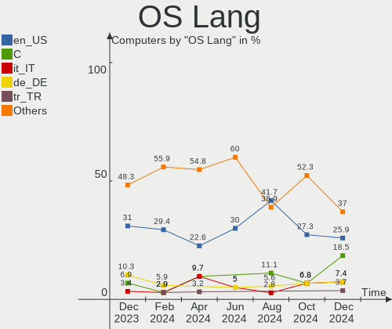
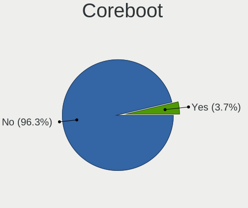
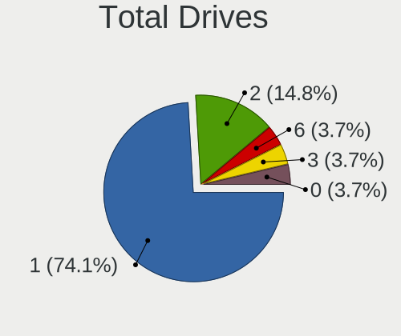
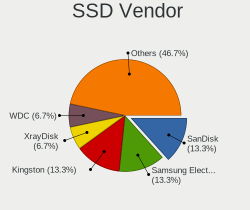
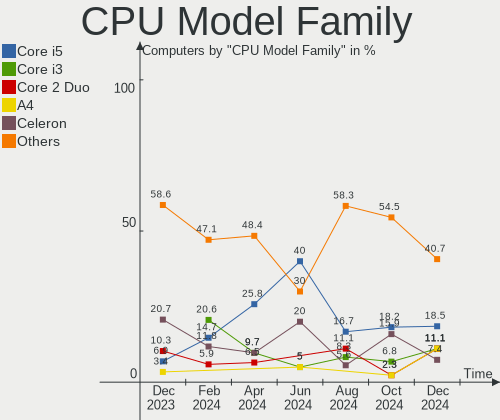
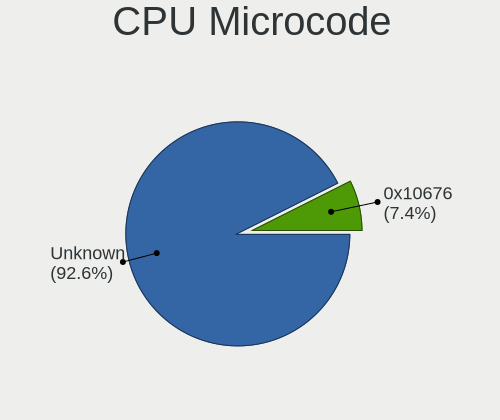
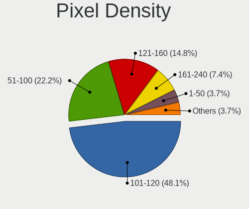
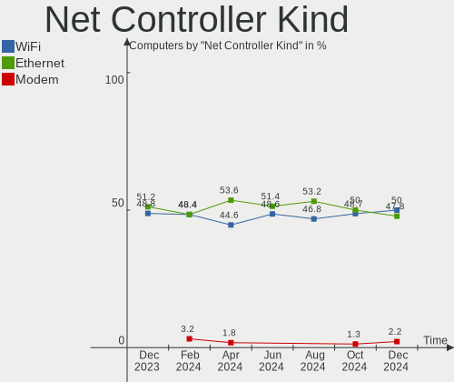

Lubuntu - Hardware Trends
-------------------------

A project to identify most popular hardware characteristics and track their change
over time based on data collected by Linux users at https://Linux-Hardware.org.

Anyone can contribute to this report by the [hw-probe](https://github.com/linuxhw/hw-probe) tool:

    sudo -E hw-probe -all -upload

This is a report for all computer types. See also reports for [desktops](/Dist/Lubuntu/Desktop/README.md) and [notebooks](/Dist/Lubuntu/Notebook/README.md).

This report is for one last month. Overall report since the beginning of time: [TestCoverage](https://github.com/linuxhw/TestCoverage)

Period: Jan, 2023.

Contents
--------

* [ System ](#system)
  - [ OS                       ](#os)
  - [ OS Family                ](#os-family)
  - [ Kernel                   ](#kernel)
  - [ Kernel Family            ](#kernel-family)
  - [ Kernel Major Ver.        ](#kernel-major-ver)
  - [ Arch                     ](#arch)
  - [ DE                       ](#de)
  - [ Display Server           ](#display-server)
  - [ Display Manager          ](#display-manager)
  - [ OS Lang                  ](#os-lang)
  - [ Boot Mode                ](#boot-mode)
  - [ Filesystem               ](#filesystem)
  - [ Part. scheme             ](#part-scheme)
  - [ Dual Boot with Linux/BSD ](#dual-boot-with-linuxbsd)
  - [ Dual Boot (Win)          ](#dual-boot-win)

* [ Board ](#board)
  - [ Vendor                   ](#vendor)
  - [ Model                    ](#model)
  - [ Model Family             ](#model-family)
  - [ MFG Year                 ](#mfg-year)
  - [ Form Factor              ](#form-factor)
  - [ Secure Boot              ](#secure-boot)
  - [ Coreboot                 ](#coreboot)
  - [ RAM Size                 ](#ram-size)
  - [ RAM Used                 ](#ram-used)
  - [ Total Drives             ](#total-drives)
  - [ Has CD-ROM               ](#has-cd-rom)
  - [ Has Ethernet             ](#has-ethernet)
  - [ Has WiFi                 ](#has-wifi)
  - [ Has Bluetooth            ](#has-bluetooth)

* [ Location ](#location)
  - [ Country                  ](#country)
  - [ City                     ](#city)

* [ Drives ](#drives)
  - [ Drive Vendor             ](#drive-vendor)
  - [ Drive Model              ](#drive-model)
  - [ HDD Vendor               ](#hdd-vendor)
  - [ SSD Vendor               ](#ssd-vendor)
  - [ Drive Kind               ](#drive-kind)
  - [ Drive Connector          ](#drive-connector)
  - [ Drive Size               ](#drive-size)
  - [ Space Total              ](#space-total)
  - [ Space Used               ](#space-used)
  - [ Malfunc. Drives          ](#malfunc-drives)
  - [ Malfunc. Drive Vendor    ](#malfunc-drive-vendor)
  - [ Malfunc. HDD Vendor      ](#malfunc-hdd-vendor)
  - [ Malfunc. Drive Kind      ](#malfunc-drive-kind)
  - [ Failed Drives            ](#failed-drives)
  - [ Failed Drive Vendor      ](#failed-drive-vendor)
  - [ Drive Status             ](#drive-status)

* [ Storage controller ](#storage-controller)
  - [ Storage Vendor           ](#storage-vendor)
  - [ Storage Model            ](#storage-model)
  - [ Storage Kind             ](#storage-kind)

* [ Processor ](#processor)
  - [ CPU Vendor               ](#cpu-vendor)
  - [ CPU Model                ](#cpu-model)
  - [ CPU Model Family         ](#cpu-model-family)
  - [ CPU Cores                ](#cpu-cores)
  - [ CPU Sockets              ](#cpu-sockets)
  - [ CPU Threads              ](#cpu-threads)
  - [ CPU Op-Modes             ](#cpu-op-modes)
  - [ CPU Microcode            ](#cpu-microcode)
  - [ CPU Microarch            ](#cpu-microarch)

* [ Graphics ](#graphics)
  - [ GPU Vendor               ](#gpu-vendor)
  - [ GPU Model                ](#gpu-model)
  - [ GPU Combo                ](#gpu-combo)
  - [ GPU Driver               ](#gpu-driver)
  - [ GPU Memory               ](#gpu-memory)

* [ Monitor ](#monitor)
  - [ Monitor Vendor           ](#monitor-vendor)
  - [ Monitor Model            ](#monitor-model)
  - [ Monitor Resolution       ](#monitor-resolution)
  - [ Monitor Diagonal         ](#monitor-diagonal)
  - [ Monitor Width            ](#monitor-width)
  - [ Aspect Ratio             ](#aspect-ratio)
  - [ Monitor Area             ](#monitor-area)
  - [ Pixel Density            ](#pixel-density)
  - [ Multiple Monitors        ](#multiple-monitors)

* [ Network ](#network)
  - [ Net Controller Vendor    ](#net-controller-vendor)
  - [ Net Controller Model     ](#net-controller-model)
  - [ Wireless Vendor          ](#wireless-vendor)
  - [ Wireless Model           ](#wireless-model)
  - [ Ethernet Vendor          ](#ethernet-vendor)
  - [ Ethernet Model           ](#ethernet-model)
  - [ Net Controller Kind      ](#net-controller-kind)
  - [ Used Controller          ](#used-controller)
  - [ NICs                     ](#nics)
  - [ IPv6                     ](#ipv6)

* [ Bluetooth ](#bluetooth)
  - [ Bluetooth Vendor         ](#bluetooth-vendor)
  - [ Bluetooth Model          ](#bluetooth-model)

* [ Sound ](#sound)
  - [ Sound Vendor             ](#sound-vendor)
  - [ Sound Model              ](#sound-model)

* [ Memory ](#memory)
  - [ Memory Vendor            ](#memory-vendor)
  - [ Memory Model             ](#memory-model)
  - [ Memory Kind              ](#memory-kind)
  - [ Memory Form Factor       ](#memory-form-factor)
  - [ Memory Size              ](#memory-size)
  - [ Memory Speed             ](#memory-speed)

* [ Printers & scanners ](#printers--scanners)
  - [ Printer Vendor           ](#printer-vendor)
  - [ Printer Model            ](#printer-model)
  - [ Scanner Vendor           ](#scanner-vendor)
  - [ Scanner Model            ](#scanner-model)

* [ Camera ](#camera)
  - [ Camera Vendor            ](#camera-vendor)
  - [ Camera Model             ](#camera-model)

* [ Security ](#security)
  - [ Fingerprint Vendor       ](#fingerprint-vendor)
  - [ Fingerprint Model        ](#fingerprint-model)
  - [ Chipcard Vendor          ](#chipcard-vendor)
  - [ Chipcard Model           ](#chipcard-model)

* [ Unsupported ](#unsupported)
  - [ Unsupported Devices      ](#unsupported-devices)
  - [ Unsupported Device Types ](#unsupported-device-types)

System
------

OS
--

Installed operating systems

| Name          | Computers | Percent |
|---------------|-----------|---------|
| Lubuntu 22.04 | 29        | 74.36%  |
| Lubuntu 22.10 | 3         | 7.69%   |
| Lubuntu 18.04 | 3         | 7.69%   |
| Lubuntu 21.04 | 1         | 2.56%   |
| Lubuntu 20.10 | 1         | 2.56%   |
| Lubuntu 20.04 | 1         | 2.56%   |
| Lubuntu 16.04 | 1         | 2.56%   |

OS Family
---------

OS without a version

| Name    | Computers | Percent |
|---------|-----------|---------|
| Lubuntu | 39        | 100%    |

Kernel
------

Version of the Linux kernel

| Version              | Computers | Percent |
|----------------------|-----------|---------|
| 5.15.0-56-generic    | 8         | 20.51%  |
| 5.15.0-58-generic    | 7         | 17.95%  |
| 5.15.0-43-generic    | 7         | 17.95%  |
| 5.15.0-57-generic    | 3         | 7.69%   |
| 4.15.0-202-generic   | 3         | 7.69%   |
| 6.1.6-custom         | 1         | 2.56%   |
| 6.1.3-x64v1-xanmod1  | 1         | 2.56%   |
| 5.8.0-25-generic     | 1         | 2.56%   |
| 5.4.0-136-generic    | 1         | 2.56%   |
| 5.19.0-21-generic    | 1         | 2.56%   |
| 5.15.0-59-lowlatency | 1         | 2.56%   |
| 5.15.0-53-generic    | 1         | 2.56%   |
| 5.15.0-47-generic    | 1         | 2.56%   |
| 5.15.0-25-generic    | 1         | 2.56%   |
| 5.11.0-38-generic    | 1         | 2.56%   |
| 4.15.0-142-generic   | 1         | 2.56%   |

Kernel Family
-------------

Linux kernel without a distro release

| Version | Computers | Percent |
|---------|-----------|---------|
| 5.15.0  | 29        | 74.36%  |
| 4.15.0  | 4         | 10.26%  |
| 6.1.6   | 1         | 2.56%   |
| 6.1.3   | 1         | 2.56%   |
| 5.8.0   | 1         | 2.56%   |
| 5.4.0   | 1         | 2.56%   |
| 5.19.0  | 1         | 2.56%   |
| 5.11.0  | 1         | 2.56%   |

Kernel Major Ver.
-----------------

Linux kernel major version

| Version | Computers | Percent |
|---------|-----------|---------|
| 5.15    | 29        | 74.36%  |
| 4.15    | 4         | 10.26%  |
| 6.1     | 2         | 5.13%   |
| 5.8     | 1         | 2.56%   |
| 5.4     | 1         | 2.56%   |
| 5.19    | 1         | 2.56%   |
| 5.11    | 1         | 2.56%   |

Arch
----

OS architecture (x86_64, i586, etc.)

| Name   | Computers | Percent |
|--------|-----------|---------|
| x86_64 | 36        | 92.31%  |
| i686   | 3         | 7.69%   |

DE
--

Desktop Environment

| Name       | Computers | Percent |
|------------|-----------|---------|
| LXQt       | 31        | 79.49%  |
| LXDE       | 5         | 12.82%  |
| XFCE       | 1         | 2.56%   |
| X-Cinnamon | 1         | 2.56%   |
| GNOME      | 1         | 2.56%   |

Display Server
--------------

X11 or Wayland

| Name | Computers | Percent |
|------|-----------|---------|
| X11  | 39        | 100%    |

Display Manager
---------------

SDDM, LightDM, etc.

| Name    | Computers | Percent |
|---------|-----------|---------|
| SDDM    | 29        | 74.36%  |
| LightDM | 7         | 17.95%  |
| Unknown | 2         | 5.13%   |
| GDM3    | 1         | 2.56%   |

OS Lang
-------

Language

| Lang   | Computers | Percent |
|--------|-----------|---------|
| fr_FR  | 7         | 17.95%  |
| en_US  | 7         | 17.95%  |
| de_DE  | 5         | 12.82%  |
| es_ES  | 4         | 10.26%  |
| en_AG  | 3         | 7.69%   |
| it_IT  | 2         | 5.13%   |
| C      | 2         | 5.13%   |
| ru_RU  | 1         | 2.56%   |
| pt_BR  | 1         | 2.56%   |
| nl_BE  | 1         | 2.56%   |
| lzh_TW | 1         | 2.56%   |
| hu_HU  | 1         | 2.56%   |
| es_EC  | 1         | 2.56%   |
| es_CR  | 1         | 2.56%   |
| en_GB  | 1         | 2.56%   |
| cs_CZ  | 1         | 2.56%   |

Boot Mode
---------

EFI or BIOS

| Mode | Computers | Percent |
|------|-----------|---------|
| BIOS | 29        | 74.36%  |
| EFI  | 10        | 25.64%  |

Filesystem
----------

Type of filesystem

| Type    | Computers | Percent |
|---------|-----------|---------|
| Ext4    | 38        | 97.44%  |
| Overlay | 1         | 2.56%   |

Part. scheme
------------

Scheme of partitioning

| Type    | Computers | Percent |
|---------|-----------|---------|
| MBR     | 18        | 46.15%  |
| GPT     | 17        | 43.59%  |
| Unknown | 4         | 10.26%  |

Dual Boot with Linux/BSD
------------------------

Hosting more than one Linux/BSD

| Dual boot | Computers | Percent |
|-----------|-----------|---------|
| No        | 35        | 89.74%  |
| Yes       | 4         | 10.26%  |

Dual Boot (Win)
---------------

Hosting Linux and Windows

| Dual boot | Computers | Percent |
|-----------|-----------|---------|
| No        | 24        | 61.54%  |
| Yes       | 15        | 38.46%  |

Board
-----

Vendor
------

Motherboard manufacturer

| Name             | Computers | Percent |
|------------------|-----------|---------|
| ASUSTek Computer | 8         | 20.51%  |
| Acer             | 5         | 12.82%  |
| Lenovo           | 4         | 10.26%  |
| MSI              | 3         | 7.69%   |
| Intel            | 2         | 5.13%   |
| Hewlett-Packard  | 2         | 5.13%   |
| Google           | 2         | 5.13%   |
| Fujitsu Siemens  | 2         | 5.13%   |
| Dell             | 2         | 5.13%   |
| ASRock           | 2         | 5.13%   |
| Toshiba          | 1         | 2.56%   |
| Thomson          | 1         | 2.56%   |
| Positivo         | 1         | 2.56%   |
| OEM              | 1         | 2.56%   |
| NEC Computers    | 1         | 2.56%   |
| Apple            | 1         | 2.56%   |
| Alienware        | 1         | 2.56%   |

Model
-----

Motherboard model

| Name                                   | Computers | Percent |
|----------------------------------------|-----------|---------|
| Toshiba Satellite Pro S500             | 1         | 2.56%   |
| Thomson N14C4WH64                      | 1         | 2.56%   |
| Positivo POS-AG31AP                    | 1         | 2.56%   |
| OEM M882CWP                            | 1         | 2.56%   |
| NEC Computers ECS-945G                 | 1         | 2.56%   |
| MSI MS-7C51                            | 1         | 2.56%   |
| MSI MS-7501                            | 1         | 2.56%   |
| MSI MS-7032                            | 1         | 2.56%   |
| Lenovo ThinkPad X220 4291H82           | 1         | 2.56%   |
| Lenovo ThinkPad P14s Gen 2a 21A1S00D00 | 1         | 2.56%   |
| Lenovo G505s 20255                     | 1         | 2.56%   |
| Lenovo G50-30 80G0                     | 1         | 2.56%   |
| Intel powered classmate PC             | 1         | 2.56%   |
| HP Laptop 15-da0xxx                    | 1         | 2.56%   |
| HP Compaq 6510b (GM108UC#AB0)          | 1         | 2.56%   |
| Google Celes                           | 1         | 2.56%   |
| Google Candy                           | 1         | 2.56%   |
| Fujitsu Siemens AMILO Si 2636          | 1         | 2.56%   |
| Fujitsu Siemens AMILO Desktop Pi3630A  | 1         | 2.56%   |
| Dell Latitude E6410                    | 1         | 2.56%   |
| Dell Dimension 4500S                   | 1         | 2.56%   |
| ASUS W5Fe                              | 1         | 2.56%   |
| ASUS TUF B450-PRO GAMING               | 1         | 2.56%   |
| ASUS T100TA                            | 1         | 2.56%   |
| ASUS ROG STRIX Z590-E GAMING WIFI      | 1         | 2.56%   |
| ASUS M5A97 PRO                         | 1         | 2.56%   |
| ASUS F8SG                              | 1         | 2.56%   |
| ASUS F50SV                             | 1         | 2.56%   |
| ASUS 1011PX                            | 1         | 2.56%   |
| ASRock ION3D-HT                        | 1         | 2.56%   |
| ASRock H110M-HDV                       | 1         | 2.56%   |
| Apple iMac10,1                         | 1         | 2.56%   |
| Alienware 15 R3                        | 1         | 2.56%   |
| Acer Swift SF314-54G                   | 1         | 2.56%   |
| Acer Aspire SW3-013                    | 1         | 2.56%   |
| Acer Aspire One 721                    | 1         | 2.56%   |
| Acer Aspire ES1-711                    | 1         | 2.56%   |
| Acer Aspire E5-573                     | 1         | 2.56%   |
| Unknown                                | 1         | 2.56%   |

Model Family
------------

Motherboard model prefix

| Name                   | Computers | Percent |
|------------------------|-----------|---------|
| Acer Aspire            | 4         | 10.26%  |
| Lenovo ThinkPad        | 2         | 5.13%   |
| Fujitsu Siemens AMILO  | 2         | 5.13%   |
| Toshiba Satellite      | 1         | 2.56%   |
| Thomson N14C4WH64      | 1         | 2.56%   |
| Positivo POS-AG31AP    | 1         | 2.56%   |
| OEM M882CWP            | 1         | 2.56%   |
| NEC Computers ECS-945G | 1         | 2.56%   |
| MSI MS-7C51            | 1         | 2.56%   |
| MSI MS-7501            | 1         | 2.56%   |
| MSI MS-7032            | 1         | 2.56%   |
| Lenovo G505s           | 1         | 2.56%   |
| Lenovo G50-30          | 1         | 2.56%   |
| Intel powered          | 1         | 2.56%   |
| HP Laptop              | 1         | 2.56%   |
| HP Compaq              | 1         | 2.56%   |
| Google Celes           | 1         | 2.56%   |
| Google Candy           | 1         | 2.56%   |
| Dell Latitude          | 1         | 2.56%   |
| Dell Dimension         | 1         | 2.56%   |
| ASUS W5Fe              | 1         | 2.56%   |
| ASUS TUF               | 1         | 2.56%   |
| ASUS T100TA            | 1         | 2.56%   |
| ASUS ROG               | 1         | 2.56%   |
| ASUS M5A97             | 1         | 2.56%   |
| ASUS F8SG              | 1         | 2.56%   |
| ASUS F50SV             | 1         | 2.56%   |
| ASUS 1011PX            | 1         | 2.56%   |
| ASRock ION3D-HT        | 1         | 2.56%   |
| ASRock H110M-HDV       | 1         | 2.56%   |
| Apple iMac10           | 1         | 2.56%   |
| Alienware 15           | 1         | 2.56%   |
| Acer Swift             | 1         | 2.56%   |
| Unknown                | 1         | 2.56%   |

MFG Year
--------

Motherboard manufacture year

| Year | Computers | Percent |
|------|-----------|---------|
| 2011 | 5         | 12.82%  |
| 2009 | 4         | 10.26%  |
| 2008 | 4         | 10.26%  |
| 2021 | 3         | 7.69%   |
| 2015 | 3         | 7.69%   |
| 2010 | 3         | 7.69%   |
| 2022 | 2         | 5.13%   |
| 2020 | 2         | 5.13%   |
| 2019 | 2         | 5.13%   |
| 2018 | 2         | 5.13%   |
| 2014 | 2         | 5.13%   |
| 2013 | 2         | 5.13%   |
| 2007 | 2         | 5.13%   |
| 2016 | 1         | 2.56%   |
| 2002 | 1         | 2.56%   |
| 2001 | 1         | 2.56%   |

Form Factor
-----------

Physical design of the computer

| Name       | Computers | Percent |
|------------|-----------|---------|
| Notebook   | 25        | 64.1%   |
| Desktop    | 12        | 30.77%  |
| Tablet     | 1         | 2.56%   |
| All in one | 1         | 2.56%   |

Secure Boot
-----------

Enabled or disabled

| State    | Computers | Percent |
|----------|-----------|---------|
| Disabled | 38        | 97.44%  |
| Enabled  | 1         | 2.56%   |

Coreboot
--------

Have coreboot on board

| Used | Computers | Percent |
|------|-----------|---------|
| No   | 37        | 94.87%  |
| Yes  | 2         | 5.13%   |

RAM Size
--------

Total RAM memory

| Size in GB  | Computers | Percent |
|-------------|-----------|---------|
| 3.01-4.0    | 15        | 38.46%  |
| 1.01-2.0    | 7         | 17.95%  |
| 4.01-8.0    | 5         | 12.82%  |
| 8.01-16.0   | 4         | 10.26%  |
| 2.01-3.0    | 2         | 5.13%   |
| 16.01-24.0  | 2         | 5.13%   |
| 0.51-1.0    | 2         | 5.13%   |
| 32.01-64.0  | 1         | 2.56%   |
| 64.01-256.0 | 1         | 2.56%   |

RAM Used
--------

Used RAM memory

| Used GB   | Computers | Percent |
|-----------|-----------|---------|
| 1.01-2.0  | 17        | 43.59%  |
| 0.51-1.0  | 12        | 30.77%  |
| 2.01-3.0  | 4         | 10.26%  |
| 3.01-4.0  | 3         | 7.69%   |
| 4.01-8.0  | 1         | 2.56%   |
| 8.01-16.0 | 1         | 2.56%   |
| 0.01-0.5  | 1         | 2.56%   |

Total Drives
------------

Number of drives on board

| Drives | Computers | Percent |
|--------|-----------|---------|
| 1      | 28        | 71.79%  |
| 2      | 6         | 15.38%  |
| 3      | 3         | 7.69%   |
| 4      | 2         | 5.13%   |

Has CD-ROM
----------

Has CD-ROM on board

| Presented | Computers | Percent |
|-----------|-----------|---------|
| No        | 21        | 53.85%  |
| Yes       | 18        | 46.15%  |

Has Ethernet
------------

Has Ethernet on board

| Presented | Computers | Percent |
|-----------|-----------|---------|
| Yes       | 32        | 82.05%  |
| No        | 7         | 17.95%  |

Has WiFi
--------

Has WiFi module

| Presented | Computers | Percent |
|-----------|-----------|---------|
| Yes       | 29        | 74.36%  |
| No        | 10        | 25.64%  |

Has Bluetooth
-------------

Has Bluetooth module

| Presented | Computers | Percent |
|-----------|-----------|---------|
| No        | 21        | 53.85%  |
| Yes       | 18        | 46.15%  |

Location
--------

Country
-------

Geographic location (country)

| Country     | Computers | Percent |
|-------------|-----------|---------|
| France      | 7         | 17.95%  |
| Germany     | 6         | 15.38%  |
| Spain       | 5         | 12.82%  |
| USA         | 2         | 5.13%   |
| Ukraine     | 2         | 5.13%   |
| Italy       | 2         | 5.13%   |
| Belgium     | 2         | 5.13%   |
| UK          | 1         | 2.56%   |
| Taiwan      | 1         | 2.56%   |
| Russia      | 1         | 2.56%   |
| Poland      | 1         | 2.56%   |
| Netherlands | 1         | 2.56%   |
| Latvia      | 1         | 2.56%   |
| Indonesia   | 1         | 2.56%   |
| Ecuador     | 1         | 2.56%   |
| Czechia     | 1         | 2.56%   |
| Costa Rica  | 1         | 2.56%   |
| Brazil      | 1         | 2.56%   |
| Armenia     | 1         | 2.56%   |
| Argentina   | 1         | 2.56%   |

City
----

Geographic location (city)

| City                     | Computers | Percent |
|--------------------------|-----------|---------|
| Madrid                   | 2         | 5.13%   |
| Ghent                    | 2         | 5.13%   |
| Yerevan                  | 1         | 2.56%   |
| West Stockbridge         | 1         | 2.56%   |
| Warsaw                   | 1         | 2.56%   |
| Warendorf                | 1         | 2.56%   |
| Versailles               | 1         | 2.56%   |
| Taipei                   | 1         | 2.56%   |
| Santiago de Compostela   | 1         | 2.56%   |
| Saint-Martin-Lacaussade  | 1         | 2.56%   |
| Rio Segundo              | 1         | 2.56%   |
| Riga                     | 1         | 2.56%   |
| Quito                    | 1         | 2.56%   |
| Prague                   | 1         | 2.56%   |
| Posadas                  | 1         | 2.56%   |
| Port Washington          | 1         | 2.56%   |
| Paris                    | 1         | 2.56%   |
| Novosibirsk              | 1         | 2.56%   |
| Mukacheve                | 1         | 2.56%   |
| Mostoles                 | 1         | 2.56%   |
| Milan                    | 1         | 2.56%   |
| Mannheim                 | 1         | 2.56%   |
| London                   | 1         | 2.56%   |
| Leverkusen               | 1         | 2.56%   |
| Leiden                   | 1         | 2.56%   |
| La Rochelle              | 1         | 2.56%   |
| Kyiv                     | 1         | 2.56%   |
| Jakarta                  | 1         | 2.56%   |
| Huelva                   | 1         | 2.56%   |
| Heinsberg                | 1         | 2.56%   |
| Geislingen an der Steige | 1         | 2.56%   |
| Delmenhorst              | 1         | 2.56%   |
| Chainee-des-Coupis       | 1         | 2.56%   |
| Canelli                  | 1         | 2.56%   |
| Bourg-Saint-Maurice      | 1         | 2.56%   |
| Belo Horizonte           | 1         | 2.56%   |
| Ambazac                  | 1         | 2.56%   |

Drives
------

Drive Vendor
------------

Hard drive vendors

| Vendor                    | Computers | Drives | Percent |
|---------------------------|-----------|--------|---------|
| Seagate                   | 11        | 12     | 21.57%  |
| WDC                       | 8         | 9      | 15.69%  |
| Unknown                   | 5         | 5      | 9.8%    |
| Kingston                  | 4         | 4      | 7.84%   |
| Samsung Electronics       | 3         | 4      | 5.88%   |
| Hitachi                   | 3         | 3      | 5.88%   |
| Toshiba                   | 2         | 2      | 3.92%   |
| HGST                      | 2         | 2      | 3.92%   |
| A-DATA Technology         | 2         | 2      | 3.92%   |
| Transcend                 | 1         | 1      | 1.96%   |
| SK hynix                  | 1         | 1      | 1.96%   |
| ShanDianZhe               | 1         | 1      | 1.96%   |
| SanDisk                   | 1         | 1      | 1.96%   |
| Micron/Crucial Technology | 1         | 1      | 1.96%   |
| Maxtor                    | 1         | 1      | 1.96%   |
| GOODRAM                   | 1         | 1      | 1.96%   |
| Emtec                     | 1         | 1      | 1.96%   |
| Crucial                   | 1         | 1      | 1.96%   |
| AMD                       | 1         | 1      | 1.96%   |
| Unknown                   | 1         | 1      | 1.96%   |

Drive Model
-----------

Hard drive models

| Model                                | Computers | Percent |
|--------------------------------------|-----------|---------|
| Kingston SA400S37240G 240GB SSD      | 3         | 5.66%   |
| WDC WDS500G2B0C-00PXH0 500GB         | 1         | 1.89%   |
| WDC WD5000LUCT-63RC2Y0 500GB         | 1         | 1.89%   |
| WDC WD5000LPVX-22V0TT0 500GB         | 1         | 1.89%   |
| WDC WD400BB-75CAA0 40GB              | 1         | 1.89%   |
| WDC WD3200BPVT-80JJ5T0 320GB         | 1         | 1.89%   |
| WDC WD2500KS-00MJB0 250GB            | 1         | 1.89%   |
| WDC WD2500BEVS-22UST0 250GB          | 1         | 1.89%   |
| WDC WD10SPZX-21Z10T0 1TB             | 1         | 1.89%   |
| WDC WD10EACS-00D6B1 1TB              | 1         | 1.89%   |
| Unknown SEM64G  64GB                 | 1         | 1.89%   |
| Unknown MMC Card  64GB               | 1         | 1.89%   |
| Unknown MMC Card  32GB               | 1         | 1.89%   |
| Unknown MMC Card  16GB               | 1         | 1.89%   |
| Unknown DA4064  64GB                 | 1         | 1.89%   |
| Transcend TS128GSSD340 128GB         | 1         | 1.89%   |
| Toshiba MQ01ABD050 500GB             | 1         | 1.89%   |
| Toshiba MK2576GSX 250GB              | 1         | 1.89%   |
| SK hynix SKHynix_HFS001TDE9X081N 1TB | 1         | 1.89%   |
| ShanDianZhe 512G                     | 1         | 1.89%   |
| Seagate ST9500325AS 500GB            | 1         | 1.89%   |
| Seagate ST500LT012-1DG142 500GB      | 1         | 1.89%   |
| Seagate ST500DM002-1BD142 500GB      | 1         | 1.89%   |
| Seagate ST3360320AS 360GB            | 1         | 1.89%   |
| Seagate ST3250823AS 250GB            | 1         | 1.89%   |
| Seagate ST3200826AS 200GB            | 1         | 1.89%   |
| Seagate ST31000528ASQ 1TB            | 1         | 1.89%   |
| Seagate ST2000DM001-1CH164 2TB       | 1         | 1.89%   |
| Seagate ST1000LM048-2E7172 1TB       | 1         | 1.89%   |
| Seagate ST1000LM024 HN-M101MBB 1TB   | 1         | 1.89%   |
| Seagate ST1000DM010-2EP102 1TB       | 1         | 1.89%   |
| Seagate ST1000DM003-1CH162 1TB       | 1         | 1.89%   |
| SanDisk DF4064  64GB                 | 1         | 1.89%   |
| Samsung SSD 850 EVO 250GB            | 1         | 1.89%   |
| Samsung SSD 830 Series 512GB         | 1         | 1.89%   |
| Samsung HD204UI 2TB                  | 1         | 1.89%   |
| Micron/Crucial CT500P5PSSD8 500GB    | 1         | 1.89%   |
| Maxtor 6L200M0 208GB                 | 1         | 1.89%   |
| Kingston SHFS37A120G 120GB SSD       | 1         | 1.89%   |
| Hitachi HTS722080K9SA00 80GB         | 1         | 1.89%   |

HDD Vendor
----------

Hard disk drive vendors

| Vendor              | Computers | Drives | Percent |
|---------------------|-----------|--------|---------|
| Seagate             | 11        | 12     | 39.29%  |
| WDC                 | 8         | 8      | 28.57%  |
| Hitachi             | 3         | 3      | 10.71%  |
| Toshiba             | 2         | 2      | 7.14%   |
| HGST                | 2         | 2      | 7.14%   |
| Samsung Electronics | 1         | 2      | 3.57%   |
| Maxtor              | 1         | 1      | 3.57%   |

SSD Vendor
----------

Solid state drive vendors

| Vendor              | Computers | Drives | Percent |
|---------------------|-----------|--------|---------|
| Kingston            | 4         | 4      | 33.33%  |
| Samsung Electronics | 2         | 2      | 16.67%  |
| A-DATA Technology   | 2         | 2      | 16.67%  |
| Transcend           | 1         | 1      | 8.33%   |
| GOODRAM             | 1         | 1      | 8.33%   |
| Emtec               | 1         | 1      | 8.33%   |
| Crucial             | 1         | 1      | 8.33%   |

Drive Kind
----------

HDD or SSD

| Kind    | Computers | Drives | Percent |
|---------|-----------|--------|---------|
| HDD     | 25        | 30     | 53.19%  |
| SSD     | 11        | 12     | 23.4%   |
| MMC     | 6         | 7      | 12.77%  |
| NVMe    | 4         | 4      | 8.51%   |
| Unknown | 1         | 1      | 2.13%   |

Drive Connector
---------------

SATA, SAS, NVMe, etc.

| Type | Computers | Drives | Percent |
|------|-----------|--------|---------|
| SATA | 32        | 43     | 76.19%  |
| MMC  | 6         | 7      | 14.29%  |
| NVMe | 4         | 4      | 9.52%   |

Drive Size
----------

Size of hard drive

| Size in TB | Computers | Drives | Percent |
|------------|-----------|--------|---------|
| 0.01-0.5   | 24        | 29     | 68.57%  |
| 0.51-1.0   | 9         | 10     | 25.71%  |
| 1.01-2.0   | 2         | 3      | 5.71%   |

Space Total
-----------

Amount of disk space available on the file system

| Size in GB     | Computers | Percent |
|----------------|-----------|---------|
| 251-500        | 10        | 25.64%  |
| 101-250        | 10        | 25.64%  |
| 51-100         | 6         | 15.38%  |
| 21-50          | 4         | 10.26%  |
| 1-20           | 4         | 10.26%  |
| 1001-2000      | 2         | 5.13%   |
| 501-1000       | 2         | 5.13%   |
| More than 3000 | 1         | 2.56%   |

Space Used
----------

Amount of used disk space

| Used GB        | Computers | Percent |
|----------------|-----------|---------|
| 1-20           | 20        | 51.28%  |
| 21-50          | 8         | 20.51%  |
| 51-100         | 4         | 10.26%  |
| 101-250        | 3         | 7.69%   |
| 501-1000       | 2         | 5.13%   |
| More than 3000 | 1         | 2.56%   |
| 251-500        | 1         | 2.56%   |

Malfunc. Drives
---------------

Drive models with a malfunction

| Model                               | Computers | Drives | Percent |
|-------------------------------------|-----------|--------|---------|
| WDC WD400BB-75CAA0 40GB             | 1         | 1      | 14.29%  |
| WDC WD10EACS-00D6B1 1TB             | 1         | 1      | 14.29%  |
| Seagate ST500LT012-1DG142 500GB     | 1         | 1      | 14.29%  |
| Seagate ST1000LM024 HN-M101MBB 1TB  | 1         | 1      | 14.29%  |
| Maxtor 6L200M0 208GB                | 1         | 1      | 14.29%  |
| Hitachi HTS722080K9SA00 80GB        | 1         | 1      | 14.29%  |
| A-DATA Technology SP920SS 256GB SSD | 1         | 1      | 14.29%  |

Malfunc. Drive Vendor
---------------------

Vendors of faulty drives

| Vendor            | Computers | Drives | Percent |
|-------------------|-----------|--------|---------|
| WDC               | 2         | 2      | 28.57%  |
| Seagate           | 2         | 2      | 28.57%  |
| Maxtor            | 1         | 1      | 14.29%  |
| Hitachi           | 1         | 1      | 14.29%  |
| A-DATA Technology | 1         | 1      | 14.29%  |

Malfunc. HDD Vendor
-------------------

Vendors of faulty HDD drives

| Vendor  | Computers | Drives | Percent |
|---------|-----------|--------|---------|
| WDC     | 2         | 2      | 33.33%  |
| Seagate | 2         | 2      | 33.33%  |
| Maxtor  | 1         | 1      | 16.67%  |
| Hitachi | 1         | 1      | 16.67%  |

Malfunc. Drive Kind
-------------------

Kinds of faulty drives

| Kind | Computers | Drives | Percent |
|------|-----------|--------|---------|
| HDD  | 6         | 6      | 85.71%  |
| SSD  | 1         | 1      | 14.29%  |

Failed Drives
-------------

Failed drive models

| Model                  | Computers | Drives | Percent |
|------------------------|-----------|--------|---------|
| HGST HTS725025A7 250GB | 1         | 1      | 100%    |

Failed Drive Vendor
-------------------

Failed drive vendors

| Vendor | Computers | Drives | Percent |
|--------|-----------|--------|---------|
| HGST   | 1         | 1      | 100%    |

Drive Status
------------

Number of failed and malfunc. drives

| Status   | Computers | Drives | Percent |
|----------|-----------|--------|---------|
| Detected | 24        | 33     | 57.14%  |
| Works    | 10        | 13     | 23.81%  |
| Malfunc  | 7         | 7      | 16.67%  |
| Failed   | 1         | 1      | 2.38%   |

Storage controller
------------------

Storage Vendor
--------------

Storage controller vendors

| Vendor                           | Computers | Percent |
|----------------------------------|-----------|---------|
| Intel                            | 23        | 60.53%  |
| AMD                              | 6         | 15.79%  |
| Nvidia                           | 2         | 5.26%   |
| VIA Technologies                 | 1         | 2.63%   |
| SK hynix                         | 1         | 2.63%   |
| Silicon Integrated Systems [SiS] | 1         | 2.63%   |
| Silicon Image                    | 1         | 2.63%   |
| SanDisk                          | 1         | 2.63%   |
| Micron/Crucial Technology        | 1         | 2.63%   |
| JMicron Technology               | 1         | 2.63%   |

Storage Model
-------------

Storage controller models

| Model                                                                         | Computers | Percent |
|-------------------------------------------------------------------------------|-----------|---------|
| Intel 82801HM/HEM (ICH8M/ICH8M-E) IDE Controller                              | 4         | 7.84%   |
| Intel 82801HM/HEM (ICH8M/ICH8M-E) SATA Controller [AHCI mode]                 | 3         | 5.88%   |
| Intel 82801G (ICH7 Family) IDE Controller                                     | 3         | 5.88%   |
| Intel Q170/Q150/B150/H170/H110/Z170/CM236 Chipset SATA Controller [AHCI Mode] | 2         | 3.92%   |
| Intel NM10/ICH7 Family SATA Controller [IDE mode]                             | 2         | 3.92%   |
| Intel NM10/ICH7 Family SATA Controller [AHCI mode]                            | 2         | 3.92%   |
| Intel Celeron N3350/Pentium N4200/Atom E3900 Series SATA AHCI Controller      | 2         | 3.92%   |
| Intel Atom Processor E3800 Series SATA AHCI Controller                        | 2         | 3.92%   |
| AMD SB7x0/SB8x0/SB9x0 SATA Controller [AHCI mode]                             | 2         | 3.92%   |
| AMD FCH SATA Controller [AHCI mode]                                           | 2         | 3.92%   |
| VIA VT82C586A/B/VT82C686/A/B/VT823x/A/C PIPC Bus Master IDE                   | 1         | 1.96%   |
| VIA VIA VT6420 SATA RAID Controller                                           | 1         | 1.96%   |
| SK hynix Gold P31/PC711 NVMe Solid State Drive                                | 1         | 1.96%   |
| Silicon Integrated Systems [SiS] SATA Controller / IDE mode                   | 1         | 1.96%   |
| Silicon Integrated Systems [SiS] 5513 IDE Controller                          | 1         | 1.96%   |
| Silicon Image SiI 3531 [SATALink/SATARaid] Serial ATA Controller              | 1         | 1.96%   |
| SanDisk WD Blue SN550 NVMe SSD                                                | 1         | 1.96%   |
| Nvidia MCP79 AHCI Controller                                                  | 1         | 1.96%   |
| Nvidia MCP73 SATA Controller (IDE mode)                                       | 1         | 1.96%   |
| Micron/Crucial P5 Plus NVMe PCIe SSD                                          | 1         | 1.96%   |
| JMicron JMB362 SATA Controller                                                | 1         | 1.96%   |
| Intel Sunrise Point-LP SATA Controller [AHCI mode]                            | 1         | 1.96%   |
| Intel Celeron/Pentium Silver Processor SATA Controller                        | 1         | 1.96%   |
| Intel 82801HM/HEM (ICH8M/ICH8M-E) SATA Controller [IDE mode]                  | 1         | 1.96%   |
| Intel 82801GBM/GHM (ICH7-M Family) SATA Controller [IDE mode]                 | 1         | 1.96%   |
| Intel 82801DB (ICH4) IDE Controller                                           | 1         | 1.96%   |
| Intel 82801 Mobile SATA Controller [RAID mode]                                | 1         | 1.96%   |
| Intel 8 Series SATA Controller 1 [AHCI mode]                                  | 1         | 1.96%   |
| Intel 6 Series/C200 Series Chipset Family 6 port Mobile SATA AHCI Controller  | 1         | 1.96%   |
| Intel 500 Series Chipset Family SATA AHCI Controller                          | 1         | 1.96%   |
| Intel 5 Series/3400 Series Chipset 4 port SATA AHCI Controller                | 1         | 1.96%   |
| AMD SB7x0/SB8x0/SB9x0 SATA Controller [IDE mode]                              | 1         | 1.96%   |
| AMD SB7x0/SB8x0/SB9x0 IDE Controller                                          | 1         | 1.96%   |
| AMD RAID Bottom Device                                                        | 1         | 1.96%   |
| AMD FCH SATA Controller [IDE mode]                                            | 1         | 1.96%   |
| AMD FCH SATA Controller D                                                     | 1         | 1.96%   |
| AMD 400 Series Chipset SATA Controller                                        | 1         | 1.96%   |

Storage Kind
------------

Kind of storage controller (IDE, SATA, NVMe, SAS, ...)

| Kind | Computers | Percent |
|------|-----------|---------|
| SATA | 24        | 55.81%  |
| IDE  | 12        | 27.91%  |
| NVMe | 4         | 9.3%    |
| RAID | 3         | 6.98%   |

Processor
---------

CPU Vendor
----------

Processor vendors

| Vendor | Computers | Percent |
|--------|-----------|---------|
| Intel  | 31        | 79.49%  |
| AMD    | 8         | 20.51%  |

CPU Model
---------

Processor models

| Model                                          | Computers | Percent |
|------------------------------------------------|-----------|---------|
| Intel Core 2 Duo CPU T7250 @ 2.00GHz           | 2         | 5.13%   |
| Intel Pentium Dual CPU E2140 @ 1.60GHz         | 1         | 2.56%   |
| Intel Pentium 4 CPU 2.00GHz                    | 1         | 2.56%   |
| Intel Core i7-7700HQ CPU @ 2.80GHz             | 1         | 2.56%   |
| Intel Core i5-8250U CPU @ 1.60GHz              | 1         | 2.56%   |
| Intel Core i5-6500 CPU @ 3.20GHz               | 1         | 2.56%   |
| Intel Core i5-2520M CPU @ 2.50GHz              | 1         | 2.56%   |
| Intel Core i5 CPU M 560 @ 2.67GHz              | 1         | 2.56%   |
| Intel Core i3-4005U CPU @ 1.70GHz              | 1         | 2.56%   |
| Intel Core i3 CPU M 370 @ 2.40GHz              | 1         | 2.56%   |
| Intel Core 2 Quad CPU Q8300 @ 2.50GHz          | 1         | 2.56%   |
| Intel Core 2 Duo CPU T8100 @ 2.10GHz           | 1         | 2.56%   |
| Intel Core 2 Duo CPU P7350 @ 2.00GHz           | 1         | 2.56%   |
| Intel Core 2 Duo CPU E7600 @ 3.06GHz           | 1         | 2.56%   |
| Intel Core 2 CPU T5500 @ 1.66GHz               | 1         | 2.56%   |
| Intel Celeron N4000 CPU @ 1.10GHz              | 1         | 2.56%   |
| Intel Celeron CPU N3350 @ 1.10GHz              | 1         | 2.56%   |
| Intel Celeron CPU N3060 @ 1.60GHz              | 1         | 2.56%   |
| Intel Celeron CPU N2940 @ 1.83GHz              | 1         | 2.56%   |
| Intel Celeron CPU N2840 @ 2.16GHz              | 1         | 2.56%   |
| Intel Celeron CPU N2830 @ 2.16GHz              | 1         | 2.56%   |
| Intel Celeron CPU J3455 @ 1.50GHz              | 1         | 2.56%   |
| Intel Celeron CPU E3300 @ 2.50GHz              | 1         | 2.56%   |
| Intel Atom x5-Z8350 CPU @ 1.44GHz              | 1         | 2.56%   |
| Intel Atom CPU Z3775 @ 1.46GHz                 | 1         | 2.56%   |
| Intel Atom CPU Z3735F @ 1.33GHz                | 1         | 2.56%   |
| Intel Atom CPU N570 @ 1.66GHz                  | 1         | 2.56%   |
| Intel Atom CPU N450 @ 1.66GHz                  | 1         | 2.56%   |
| Intel Atom CPU D525 @ 1.80GHz                  | 1         | 2.56%   |
| Intel 11th Gen Core i7-11700 @ 2.50GHz         | 1         | 2.56%   |
| AMD Unknown Processor                          | 1         | 2.56%   |
| AMD Ryzen 7 PRO 5850U with Radeon Graphics     | 1         | 2.56%   |
| AMD Ryzen 5 PRO 2400GE w/ Radeon Vega Graphics | 1         | 2.56%   |
| AMD Ryzen 5 3400G with Radeon Vega Graphics    | 1         | 2.56%   |
| AMD Phenom II X4 945 Processor                 | 1         | 2.56%   |
| AMD FX-4100 Quad-Core Processor                | 1         | 2.56%   |
| AMD Athlon II Neo K125 Processor               | 1         | 2.56%   |
| AMD A8-4500M APU with Radeon HD Graphics       | 1         | 2.56%   |

CPU Model Family
----------------

Processor model prefix

| Model              | Computers | Percent |
|--------------------|-----------|---------|
| Intel Celeron      | 8         | 20.51%  |
| Intel Atom         | 6         | 15.38%  |
| Intel Core 2 Duo   | 5         | 12.82%  |
| Intel Core i5      | 4         | 10.26%  |
| Other              | 2         | 5.13%   |
| Intel Core i3      | 2         | 5.13%   |
| Intel Pentium Dual | 1         | 2.56%   |
| Intel Pentium 4    | 1         | 2.56%   |
| Intel Core i7      | 1         | 2.56%   |
| Intel Core 2 Quad  | 1         | 2.56%   |
| Intel Core 2       | 1         | 2.56%   |
| AMD Ryzen 7 PRO    | 1         | 2.56%   |
| AMD Ryzen 5 PRO    | 1         | 2.56%   |
| AMD Ryzen 5        | 1         | 2.56%   |
| AMD Phenom II X4   | 1         | 2.56%   |
| AMD FX             | 1         | 2.56%   |
| AMD Athlon II Neo  | 1         | 2.56%   |
| AMD A8             | 1         | 2.56%   |

CPU Cores
---------

Number of processor cores

| Number | Computers | Percent |
|--------|-----------|---------|
| 2      | 21        | 53.85%  |
| 4      | 12        | 30.77%  |
| 1      | 4         | 10.26%  |
| 8      | 2         | 5.13%   |

CPU Sockets
-----------

Number of sockets

| Number | Computers | Percent |
|--------|-----------|---------|
| 1      | 39        | 100%    |

CPU Threads
-----------

Threads per core (Hyper-Threading)

| Number | Computers | Percent |
|--------|-----------|---------|
| 1      | 24        | 61.54%  |
| 2      | 15        | 38.46%  |

CPU Op-Modes
------------

CPU Operation Modes (32-bit, 64-bit)

| Op mode        | Computers | Percent |
|----------------|-----------|---------|
| 32-bit, 64-bit | 38        | 97.44%  |
| 32-bit         | 1         | 2.56%   |

CPU Microcode
-------------

Microcode number

| Number     | Computers | Percent |
|------------|-----------|---------|
| Unknown    | 19        | 48.72%  |
| 0x1067a    | 3         | 7.69%   |
| 0x6fd      | 2         | 5.13%   |
| 0x406c4    | 2         | 5.13%   |
| 0x30678    | 2         | 5.13%   |
| 0xf24      | 1         | 2.56%   |
| 0xa0671    | 1         | 2.56%   |
| 0x806ea    | 1         | 2.56%   |
| 0x706a1    | 1         | 2.56%   |
| 0x506c9    | 1         | 2.56%   |
| 0x20655    | 1         | 2.56%   |
| 0x106ca    | 1         | 2.56%   |
| 0x0a50000c | 1         | 2.56%   |
| 0x06001119 | 1         | 2.56%   |
| 0x010000db | 1         | 2.56%   |
| 0x010000c8 | 1         | 2.56%   |

CPU Microarch
-------------

Microarchitecture

| Name          | Computers | Percent |
|---------------|-----------|---------|
| Silvermont    | 7         | 17.95%  |
| Penryn        | 5         | 12.82%  |
| Core          | 4         | 10.26%  |
| Bonnell       | 3         | 7.69%   |
| Westmere      | 2         | 5.13%   |
| KabyLake      | 2         | 5.13%   |
| K10           | 2         | 5.13%   |
| Goldmont      | 2         | 5.13%   |
| Zen+          | 1         | 2.56%   |
| Zen 3         | 1         | 2.56%   |
| Zen           | 1         | 2.56%   |
| Skylake       | 1         | 2.56%   |
| SandyBridge   | 1         | 2.56%   |
| Piledriver    | 1         | 2.56%   |
| NetBurst      | 1         | 2.56%   |
| K8 Hammer     | 1         | 2.56%   |
| Haswell       | 1         | 2.56%   |
| Goldmont plus | 1         | 2.56%   |
| Bulldozer     | 1         | 2.56%   |
| Unknown       | 1         | 2.56%   |

Graphics
--------

GPU Vendor
----------

Vendors of graphics cards

| Vendor | Computers | Percent |
|--------|-----------|---------|
| Intel  | 22        | 53.66%  |
| Nvidia | 11        | 26.83%  |
| AMD    | 8         | 19.51%  |

GPU Model
---------

Graphics card models

| Model                                                                                    | Computers | Percent |
|------------------------------------------------------------------------------------------|-----------|---------|
| Intel Atom Processor Z36xxx/Z37xxx Series Graphics & Display                             | 5         | 10.87%  |
| Nvidia GT218 [GeForce 210]                                                               | 2         | 4.35%   |
| Intel Mobile GM965/GL960 Integrated Graphics Controller (secondary)                      | 2         | 4.35%   |
| Intel Mobile GM965/GL960 Integrated Graphics Controller (primary)                        | 2         | 4.35%   |
| Intel HD Graphics 500                                                                    | 2         | 4.35%   |
| Intel Atom/Celeron/Pentium Processor x5-E8000/J3xxx/N3xxx Integrated Graphics Controller | 2         | 4.35%   |
| Intel Atom Processor D4xx/D5xx/N4xx/N5xx Integrated Graphics Controller                  | 2         | 4.35%   |
| Nvidia GT218M [NVS 3100M]                                                                | 1         | 2.17%   |
| Nvidia GT218 [ION]                                                                       | 1         | 2.17%   |
| Nvidia GP108M [GeForce MX150]                                                            | 1         | 2.17%   |
| Nvidia GP106BM [GeForce GTX 1060 Mobile 6GB]                                             | 1         | 2.17%   |
| Nvidia GK208B [GeForce GT 720]                                                           | 1         | 2.17%   |
| Nvidia G96CM [GeForce GT 120M]                                                           | 1         | 2.17%   |
| Nvidia G96C [GeForce 9500 GT]                                                            | 1         | 2.17%   |
| Nvidia G86M [GeForce 9300M G]                                                            | 1         | 2.17%   |
| Nvidia C73 [GeForce 7100 / nForce 630i]                                                  | 1         | 2.17%   |
| Intel UHD Graphics 620                                                                   | 1         | 2.17%   |
| Intel RocketLake-S GT1 [UHD Graphics 750]                                                | 1         | 2.17%   |
| Intel Mobile 945GM/GMS/GME, 943/940GML Express Integrated Graphics Controller            | 1         | 2.17%   |
| Intel Mobile 945GM/GMS, 943/940GML Express Integrated Graphics Controller                | 1         | 2.17%   |
| Intel HD Graphics 630                                                                    | 1         | 2.17%   |
| Intel Haswell-ULT Integrated Graphics Controller                                         | 1         | 2.17%   |
| Intel GeminiLake [UHD Graphics 600]                                                      | 1         | 2.17%   |
| Intel Core Processor Integrated Graphics Controller                                      | 1         | 2.17%   |
| Intel 82845G/GL[Brookdale-G]/GE Chipset Integrated Graphics Device                       | 1         | 2.17%   |
| Intel 2nd Generation Core Processor Family Integrated Graphics Controller                | 1         | 2.17%   |
| AMD Trinity [Radeon HD 7640G]                                                            | 1         | 2.17%   |
| AMD Sun PRO [Radeon HD 8570A/8570M]                                                      | 1         | 2.17%   |
| AMD RV730/M96-XT [Mobility Radeon HD 4670]                                               | 1         | 2.17%   |
| AMD RV350 [Radeon 9550] (Secondary)                                                      | 1         | 2.17%   |
| AMD RV350 [Radeon 9550]                                                                  | 1         | 2.17%   |
| AMD RS880M [Mobility Radeon HD 4225/4250]                                                | 1         | 2.17%   |
| AMD RS780C [Radeon 3100]                                                                 | 1         | 2.17%   |
| AMD Raven Ridge [Radeon Vega Series / Radeon Vega Mobile Series]                         | 1         | 2.17%   |
| AMD Picasso/Raven 2 [Radeon Vega Series / Radeon Vega Mobile Series]                     | 1         | 2.17%   |
| AMD Cezanne [Radeon Vega Series / Radeon Vega Mobile Series]                             | 1         | 2.17%   |

GPU Combo
---------

Combinations of graphics cards

| Name           | Computers | Percent |
|----------------|-----------|---------|
| 1 x Intel      | 20        | 51.28%  |
| 1 x Nvidia     | 10        | 25.64%  |
| 1 x AMD        | 6         | 15.38%  |
| 2 x AMD        | 2         | 5.13%   |
| Intel + Nvidia | 1         | 2.56%   |

GPU Driver
----------

Free vs proprietary

| Driver      | Computers | Percent |
|-------------|-----------|---------|
| Free        | 35        | 89.74%  |
| Unknown     | 3         | 7.69%   |
| Proprietary | 1         | 2.56%   |

GPU Memory
----------

Total video memory

| Size in GB | Computers | Percent |
|------------|-----------|---------|
| Unknown    | 28        | 71.79%  |
| 0.01-0.5   | 7         | 17.95%  |
| 5.01-6.0   | 1         | 2.56%   |
| 3.01-4.0   | 1         | 2.56%   |
| 1.01-2.0   | 1         | 2.56%   |
| 0.51-1.0   | 1         | 2.56%   |

Monitor
-------

Monitor Vendor
--------------

Monitor vendors

| Vendor                  | Computers | Percent |
|-------------------------|-----------|---------|
| LG Display              | 5         | 14.71%  |
| AU Optronics            | 5         | 14.71%  |
| Samsung Electronics     | 3         | 8.82%   |
| BOE                     | 3         | 8.82%   |
| Hewlett-Packard         | 2         | 5.88%   |
| Goldstar                | 2         | 5.88%   |
| CPT                     | 2         | 5.88%   |
| Acer                    | 2         | 5.88%   |
| Vizio                   | 1         | 2.94%   |
| VHT                     | 1         | 2.94%   |
| Positivo                | 1         | 2.94%   |
| Philips                 | 1         | 2.94%   |
| LG Philips              | 1         | 2.94%   |
| Lenovo                  | 1         | 2.94%   |
| CS_                     | 1         | 2.94%   |
| Chi Mei Optoelectronics | 1         | 2.94%   |
| Belinea                 | 1         | 2.94%   |
| AOC                     | 1         | 2.94%   |

Monitor Model
-------------

Monitor models

| Model                                                                    | Computers | Percent |
|--------------------------------------------------------------------------|-----------|---------|
| Vizio VO420E VIZ0050 1920x1080 930x520mm 41.9-inch                       | 1         | 2.94%   |
| VHT Monitor VHTDDDD 1024x768                                             | 1         | 2.94%   |
| Samsung Electronics SMS19A450 SAM0833 1440x900 408x255mm 18.9-inch       | 1         | 2.94%   |
| Samsung Electronics SMB2230N SAM0635 1920x1080 477x268mm 21.5-inch       | 1         | 2.94%   |
| Samsung Electronics LCD Monitor SEC3130 1024x600 223x125mm 10.1-inch     | 1         | 2.94%   |
| Positivo SMILE4XX NON1400 1360x768 309x174mm 14.0-inch                   | 1         | 2.94%   |
| Philips 220S4L PHL08BE 1680x1050 474x296mm 22.0-inch                     | 1         | 2.94%   |
| LG Philips LCD Monitor LPL1101 1280x800 304x190mm 14.1-inch              | 1         | 2.94%   |
| LG Display LCD Monitor LGD0599 1920x1080 309x174mm 14.0-inch             | 1         | 2.94%   |
| LG Display LCD Monitor LGD049B 1920x1080 344x194mm 15.5-inch             | 1         | 2.94%   |
| LG Display LCD Monitor LGD039F 1366x768 345x194mm 15.6-inch              | 1         | 2.94%   |
| LG Display LCD Monitor LGD02D8 1366x768 277x156mm 12.5-inch              | 1         | 2.94%   |
| LG Display LCD Monitor LGD0257 1440x900 304x190mm 14.1-inch              | 1         | 2.94%   |
| Lenovo LCD Monitor LEN4031 1280x800 303x190mm 14.1-inch                  | 1         | 2.94%   |
| Hewlett-Packard 24mq HPN366F 2560x1440 527x296mm 23.8-inch               | 1         | 2.94%   |
| Hewlett-Packard 2310 HWP2890 1920x1080 510x287mm 23.0-inch               | 1         | 2.94%   |
| Goldstar Ultra HD GSM5B08 3840x2160 600x340mm 27.2-inch                  | 1         | 2.94%   |
| Goldstar FULL HD GSM5BDF 1920x1080 480x270mm 21.7-inch                   | 1         | 2.94%   |
| CS_ LCD Monitor CS_5211 1366x768 518x333mm 24.2-inch                     | 1         | 2.94%   |
| CPT LCD Monitor CPT1C85 1366x768 222x125mm 10.0-inch                     | 1         | 2.94%   |
| CPT LCD Monitor CPT1B5A 1280x800 261x163mm 12.1-inch                     | 1         | 2.94%   |
| Chi Mei Optoelectronics LCD Monitor CMO1425 1280x800 303x190mm 14.1-inch | 1         | 2.94%   |
| BOE LCD Monitor BOE07DB 1920x1080 309x174mm 14.0-inch                    | 1         | 2.94%   |
| BOE LCD Monitor BOE06A4 1366x768 344x194mm 15.5-inch                     | 1         | 2.94%   |
| BOE LCD Monitor BOE0623 1366x768 256x144mm 11.6-inch                     | 1         | 2.94%   |
| Belinea 101710 MAX06C0 1280x1024 337x270mm 17.0-inch                     | 1         | 2.94%   |
| AU Optronics LCD Monitor AUO41EC 1366x768 344x193mm 15.5-inch            | 1         | 2.94%   |
| AU Optronics LCD Monitor AUO40EC 1366x768 344x193mm 15.5-inch            | 1         | 2.94%   |
| AU Optronics LCD Monitor AUO235C 1366x768 256x144mm 11.6-inch            | 1         | 2.94%   |
| AU Optronics LCD Monitor AUO205C 1366x768 256x144mm 11.6-inch            | 1         | 2.94%   |
| AU Optronics LCD Monitor AUO119E 1600x900 382x214mm 17.2-inch            | 1         | 2.94%   |
| AOC 2070W AOC2070 1600x900 434x236mm 19.4-inch                           | 1         | 2.94%   |
| Acer X223W ACR0009 1680x1050 473x296mm 22.0-inch                         | 1         | 2.94%   |
| Acer S201HL ACR01A5 1600x900 443x249mm 20.0-inch                         | 1         | 2.94%   |

Monitor Resolution
------------------

Monitor screen resolution

| Resolution         | Computers | Percent |
|--------------------|-----------|---------|
| 1366x768 (WXGA)    | 9         | 26.47%  |
| 1920x1080 (FHD)    | 8         | 23.53%  |
| 1280x800 (WXGA)    | 4         | 11.76%  |
| 1600x900 (HD+)     | 3         | 8.82%   |
| 1680x1050 (WSXGA+) | 2         | 5.88%   |
| 1440x900 (WXGA+)   | 2         | 5.88%   |
| 3840x2160 (4K)     | 1         | 2.94%   |
| 2560x1440 (QHD)    | 1         | 2.94%   |
| 1360x768           | 1         | 2.94%   |
| 1280x1024 (SXGA)   | 1         | 2.94%   |
| 1024x768 (XGA)     | 1         | 2.94%   |
| 1024x600           | 1         | 2.94%   |

Monitor Diagonal
----------------

Diagonal size in inches

| Inches  | Computers | Percent |
|---------|-----------|---------|
| 14      | 7         | 20.59%  |
| 15      | 5         | 14.71%  |
| 11      | 3         | 8.82%   |
| 24      | 2         | 5.88%   |
| 22      | 2         | 5.88%   |
| 21      | 2         | 5.88%   |
| 17      | 2         | 5.88%   |
| 12      | 2         | 5.88%   |
| 10      | 2         | 5.88%   |
| 47      | 1         | 2.94%   |
| 27      | 1         | 2.94%   |
| 23      | 1         | 2.94%   |
| 20      | 1         | 2.94%   |
| 19      | 1         | 2.94%   |
| 18      | 1         | 2.94%   |
| Unknown | 1         | 2.94%   |

Monitor Width
-------------

Physical width

| Width in mm | Computers | Percent |
|-------------|-----------|---------|
| 301-350     | 13        | 38.24%  |
| 401-500     | 7         | 20.59%  |
| 201-300     | 7         | 20.59%  |
| 501-600     | 4         | 11.76%  |
| 351-400     | 1         | 2.94%   |
| 1001-1500   | 1         | 2.94%   |
| Unknown     | 1         | 2.94%   |

Aspect Ratio
------------

Proportional relationship between the width and the height

| Ratio | Computers | Percent |
|-------|-----------|---------|
| 16/9  | 19        | 61.29%  |
| 16/10 | 10        | 32.26%  |
| 5/4   | 1         | 3.23%   |
| 4/3   | 1         | 3.23%   |

Monitor Area
------------

Area in inch

| Area in inch | Computers | Percent |
|----------------|-----------|---------|
| 81-90          | 7         | 20.59%  |
| 201-250        | 6         | 17.65%  |
| 101-110        | 5         | 14.71%  |
| 51-60          | 3         | 8.82%   |
| 151-200        | 3         | 8.82%   |
| 61-70          | 2         | 5.88%   |
| 41-50          | 2         | 5.88%   |
| 301-350        | 1         | 2.94%   |
| 251-300        | 1         | 2.94%   |
| 141-150        | 1         | 2.94%   |
| 121-130        | 1         | 2.94%   |
| 501-1000       | 1         | 2.94%   |
| Unknown        | 1         | 2.94%   |

Pixel Density
-------------

Pixels per inch

| Density | Computers | Percent |
|---------|-----------|---------|
| 101-120 | 11        | 33.33%  |
| 121-160 | 10        | 30.3%   |
| 51-100  | 9         | 27.27%  |
| 1-50    | 1         | 3.03%   |
| 161-240 | 1         | 3.03%   |
| Unknown | 1         | 3.03%   |

Multiple Monitors
-----------------

Total monitors connected

| Total | Computers | Percent |
|-------|-----------|---------|
| 1     | 33        | 84.62%  |
| 2     | 3         | 7.69%   |
| 0     | 3         | 7.69%   |

Network
-------

Net Controller Vendor
---------------------

Controller vendors

| Vendor                          | Computers | Percent |
|---------------------------------|-----------|---------|
| Realtek Semiconductor           | 17        | 31.48%  |
| Intel                           | 11        | 20.37%  |
| Qualcomm Atheros                | 10        | 18.52%  |
| Nvidia                          | 2         | 3.7%    |
| ASIX Electronics                | 2         | 3.7%    |
| VIA Technologies                | 1         | 1.85%   |
| TP-Link                         | 1         | 1.85%   |
| Qualcomm Atheros Communications | 1         | 1.85%   |
| Qualcomm                        | 1         | 1.85%   |
| NetGear                         | 1         | 1.85%   |
| Marvell Technology Group        | 1         | 1.85%   |
| JMicron Technology              | 1         | 1.85%   |
| IMC Networks                    | 1         | 1.85%   |
| ICS Advent                      | 1         | 1.85%   |
| Broadcom Limited                | 1         | 1.85%   |
| Broadcom                        | 1         | 1.85%   |
| Attansic Technology             | 1         | 1.85%   |

Net Controller Model
--------------------

Controller models

| Model                                                             | Computers | Percent |
|-------------------------------------------------------------------|-----------|---------|
| Realtek RTL8111/8168/8411 PCI Express Gigabit Ethernet Controller | 13        | 20.31%  |
| Qualcomm Atheros AR928X Wireless Network Adapter (PCI-Express)    | 3         | 4.69%   |
| Realtek RTL8723BE PCIe Wireless Network Adapter                   | 2         | 3.13%   |
| Qualcomm Atheros AR9285 Wireless Network Adapter (PCI-Express)    | 2         | 3.13%   |
| Intel Wireless 7265                                               | 2         | 3.13%   |
| Intel PRO/Wireless 4965 AG or AGN [Kedron] Network Connection     | 2         | 3.13%   |
| ASIX AX88179 Gigabit Ethernet                                     | 2         | 3.13%   |
| VIA VT6102/VT6103 [Rhine-II]                                      | 1         | 1.56%   |
| TP-Link AC600 wireless Realtek RTL8811AU [Archer T2U Nano]        | 1         | 1.56%   |
| Realtek RTL8852AE 802.11ax PCIe Wireless Network Adapter          | 1         | 1.56%   |
| Realtek RTL8723DE Wireless Network Adapter                        | 1         | 1.56%   |
| Realtek RTL8191SU 802.11n WLAN Adapter                            | 1         | 1.56%   |
| Realtek RTL8169 PCI Gigabit Ethernet Controller                   | 1         | 1.56%   |
| Realtek RTL8152 Fast Ethernet Adapter                             | 1         | 1.56%   |
| Realtek RTL-8100/8101L/8139 PCI Fast Ethernet Adapter             | 1         | 1.56%   |
| Realtek 802.11n WLAN Adapter                                      | 1         | 1.56%   |
| Qualcomm Atheros QCA9377 802.11ac Wireless Network Adapter        | 1         | 1.56%   |
| Qualcomm Atheros QCA8172 Fast Ethernet                            | 1         | 1.56%   |
| Qualcomm Atheros QCA6174 802.11ac Wireless Network Adapter        | 1         | 1.56%   |
| Qualcomm Atheros Killer E2500 Gigabit Ethernet Controller         | 1         | 1.56%   |
| Qualcomm Atheros AR9271 802.11n                                   | 1         | 1.56%   |
| Qualcomm Atheros Attansic L1 Gigabit Ethernet                     | 1         | 1.56%   |
| Qualcomm Atheros AR9485 Wireless Network Adapter                  | 1         | 1.56%   |
| Qualcomm Atheros AR8151 v1.0 Gigabit Ethernet                     | 1         | 1.56%   |
| Qualcomm Android                                                  | 1         | 1.56%   |
| Nvidia MCP79 Ethernet                                             | 1         | 1.56%   |
| Nvidia MCP73 Ethernet                                             | 1         | 1.56%   |
| NetGear A6210                                                     | 1         | 1.56%   |
| Marvell Group 88E8055 PCI-E Gigabit Ethernet Controller           | 1         | 1.56%   |
| JMicron JMC260 PCI Express Fast Ethernet Controller               | 1         | 1.56%   |
| Intel Wireless 7260                                               | 1         | 1.56%   |
| Intel Wireless 3165                                               | 1         | 1.56%   |
| Intel Wi-Fi 6 AX210/AX211/AX411 160MHz                            | 1         | 1.56%   |
| Intel PRO/Wireless 3945ABG [Golan] Network Connection             | 1         | 1.56%   |
| Intel Ethernet Controller I225-V                                  | 1         | 1.56%   |
| Intel Centrino Advanced-N 6205 [Taylor Peak]                      | 1         | 1.56%   |
| Intel Centrino Advanced-N 6200                                    | 1         | 1.56%   |
| Intel 82579LM Gigabit Network Connection (Lewisville)             | 1         | 1.56%   |
| Intel 82577LM Gigabit Network Connection                          | 1         | 1.56%   |
| Intel 82577LC Gigabit Network Connection                          | 1         | 1.56%   |

Wireless Vendor
---------------

Wireless vendors

| Vendor                          | Computers | Percent |
|---------------------------------|-----------|---------|
| Intel                           | 10        | 34.48%  |
| Qualcomm Atheros                | 8         | 27.59%  |
| Realtek Semiconductor           | 6         | 20.69%  |
| TP-Link                         | 1         | 3.45%   |
| Qualcomm Atheros Communications | 1         | 3.45%   |
| NetGear                         | 1         | 3.45%   |
| IMC Networks                    | 1         | 3.45%   |
| Broadcom                        | 1         | 3.45%   |

Wireless Model
--------------

Wireless models

| Model                                                                  | Computers | Percent |
|------------------------------------------------------------------------|-----------|---------|
| Qualcomm Atheros AR928X Wireless Network Adapter (PCI-Express)         | 3         | 10.34%  |
| Realtek RTL8723BE PCIe Wireless Network Adapter                        | 2         | 6.9%    |
| Qualcomm Atheros AR9285 Wireless Network Adapter (PCI-Express)         | 2         | 6.9%    |
| Intel Wireless 7265                                                    | 2         | 6.9%    |
| Intel PRO/Wireless 4965 AG or AGN [Kedron] Network Connection          | 2         | 6.9%    |
| TP-Link AC600 wireless Realtek RTL8811AU [Archer T2U Nano]             | 1         | 3.45%   |
| Realtek RTL8852AE 802.11ax PCIe Wireless Network Adapter               | 1         | 3.45%   |
| Realtek RTL8723DE Wireless Network Adapter                             | 1         | 3.45%   |
| Realtek RTL8191SU 802.11n WLAN Adapter                                 | 1         | 3.45%   |
| Realtek 802.11n WLAN Adapter                                           | 1         | 3.45%   |
| Qualcomm Atheros QCA9377 802.11ac Wireless Network Adapter             | 1         | 3.45%   |
| Qualcomm Atheros QCA6174 802.11ac Wireless Network Adapter             | 1         | 3.45%   |
| Qualcomm Atheros AR9271 802.11n                                        | 1         | 3.45%   |
| Qualcomm Atheros AR9485 Wireless Network Adapter                       | 1         | 3.45%   |
| NetGear A6210                                                          | 1         | 3.45%   |
| Intel Wireless 7260                                                    | 1         | 3.45%   |
| Intel Wireless 3165                                                    | 1         | 3.45%   |
| Intel Wi-Fi 6 AX210/AX211/AX411 160MHz                                 | 1         | 3.45%   |
| Intel PRO/Wireless 3945ABG [Golan] Network Connection                  | 1         | 3.45%   |
| Intel Centrino Advanced-N 6205 [Taylor Peak]                           | 1         | 3.45%   |
| Intel Centrino Advanced-N 6200                                         | 1         | 3.45%   |
| IMC Networks AW-NU222 802.11bgn Wireless Module [Ralink RT2770+RT2720] | 1         | 3.45%   |
| Broadcom BCM43225 802.11b/g/n                                          | 1         | 3.45%   |

Ethernet Vendor
---------------

Ethernet vendors

| Vendor                   | Computers | Percent |
|--------------------------|-----------|---------|
| Realtek Semiconductor    | 16        | 45.71%  |
| Qualcomm Atheros         | 4         | 11.43%  |
| Intel                    | 4         | 11.43%  |
| Nvidia                   | 2         | 5.71%   |
| ASIX Electronics         | 2         | 5.71%   |
| VIA Technologies         | 1         | 2.86%   |
| Qualcomm                 | 1         | 2.86%   |
| Marvell Technology Group | 1         | 2.86%   |
| JMicron Technology       | 1         | 2.86%   |
| ICS Advent               | 1         | 2.86%   |
| Broadcom Limited         | 1         | 2.86%   |
| Attansic Technology      | 1         | 2.86%   |

Ethernet Model
--------------

Ethernet models

| Model                                                             | Computers | Percent |
|-------------------------------------------------------------------|-----------|---------|
| Realtek RTL8111/8168/8411 PCI Express Gigabit Ethernet Controller | 13        | 37.14%  |
| ASIX AX88179 Gigabit Ethernet                                     | 2         | 5.71%   |
| VIA VT6102/VT6103 [Rhine-II]                                      | 1         | 2.86%   |
| Realtek RTL8169 PCI Gigabit Ethernet Controller                   | 1         | 2.86%   |
| Realtek RTL8152 Fast Ethernet Adapter                             | 1         | 2.86%   |
| Realtek RTL-8100/8101L/8139 PCI Fast Ethernet Adapter             | 1         | 2.86%   |
| Qualcomm Atheros QCA8172 Fast Ethernet                            | 1         | 2.86%   |
| Qualcomm Atheros Killer E2500 Gigabit Ethernet Controller         | 1         | 2.86%   |
| Qualcomm Atheros Attansic L1 Gigabit Ethernet                     | 1         | 2.86%   |
| Qualcomm Atheros AR8151 v1.0 Gigabit Ethernet                     | 1         | 2.86%   |
| Qualcomm Android                                                  | 1         | 2.86%   |
| Nvidia MCP79 Ethernet                                             | 1         | 2.86%   |
| Nvidia MCP73 Ethernet                                             | 1         | 2.86%   |
| Marvell Group 88E8055 PCI-E Gigabit Ethernet Controller           | 1         | 2.86%   |
| JMicron JMC260 PCI Express Fast Ethernet Controller               | 1         | 2.86%   |
| Intel Ethernet Controller I225-V                                  | 1         | 2.86%   |
| Intel 82579LM Gigabit Network Connection (Lewisville)             | 1         | 2.86%   |
| Intel 82577LM Gigabit Network Connection                          | 1         | 2.86%   |
| Intel 82577LC Gigabit Network Connection                          | 1         | 2.86%   |
| ICS Advent USB 10/100 LAN                                         | 1         | 2.86%   |
| Broadcom Limited NetLink BCM5787M Gigabit Ethernet PCI Express    | 1         | 2.86%   |
| Attansic AR8152 v2.0 Fast Ethernet                                | 1         | 2.86%   |

Net Controller Kind
-------------------

Ethernet, WiFi or modem

| Kind     | Computers | Percent |
|----------|-----------|---------|
| Ethernet | 33        | 53.23%  |
| WiFi     | 29        | 46.77%  |

Used Controller
---------------

Currently used network controller

| Kind     | Computers | Percent |
|----------|-----------|---------|
| WiFi     | 22        | 56.41%  |
| Ethernet | 17        | 43.59%  |

NICs
----

Total network controllers on board

| Total | Computers | Percent |
|-------|-----------|---------|
| 1     | 17        | 43.59%  |
| 2     | 16        | 41.03%  |
| 0     | 4         | 10.26%  |
| 3     | 2         | 5.13%   |

IPv6
----

IPv6 vs IPv4

| Used | Computers | Percent |
|------|-----------|---------|
| No   | 33        | 84.62%  |
| Yes  | 6         | 15.38%  |

Bluetooth
---------

Bluetooth Vendor
----------------

Controller vendors

| Vendor                          | Computers | Percent |
|---------------------------------|-----------|---------|
| Intel                           | 5         | 27.78%  |
| Realtek Semiconductor           | 4         | 22.22%  |
| Qualcomm Atheros Communications | 2         | 11.11%  |
| Toshiba                         | 1         | 5.56%   |
| Lite-On Technology              | 1         | 5.56%   |
| Hewlett-Packard                 | 1         | 5.56%   |
| Foxconn / Hon Hai               | 1         | 5.56%   |
| Broadcom                        | 1         | 5.56%   |
| ASUSTek Computer                | 1         | 5.56%   |
| Apple                           | 1         | 5.56%   |

Bluetooth Model
---------------

Controller models

| Model                                         | Computers | Percent |
|-----------------------------------------------|-----------|---------|
| Intel Bluetooth wireless interface            | 4         | 22.22%  |
| Realtek Bluetooth Radio                       | 2         | 11.11%  |
| Toshiba Integrated Bluetooth HCI              | 1         | 5.56%   |
| Realtek RTL8723B Bluetooth                    | 1         | 5.56%   |
| Realtek  Bluetooth 4.2 Adapter                | 1         | 5.56%   |
| Qualcomm Atheros  Bluetooth Device            | 1         | 5.56%   |
| Qualcomm Atheros AR3012 Bluetooth 4.0         | 1         | 5.56%   |
| Lite-On Bluetooth Device                      | 1         | 5.56%   |
| Intel AX210 Bluetooth                         | 1         | 5.56%   |
| HP Bluetooth 2.0 Interface [Broadcom BCM2045] | 1         | 5.56%   |
| Foxconn / Hon Hai Acer Bluetooth module       | 1         | 5.56%   |
| Broadcom BCM2045B (BDC-2.1)                   | 1         | 5.56%   |
| ASUS BT-183 Bluetooth 2.0+EDR adapter         | 1         | 5.56%   |
| Apple Built-in Bluetooth 2.0+EDR HCI          | 1         | 5.56%   |

Sound
-----

Sound Vendor
------------

Sound card vendors

| Vendor              | Computers | Percent |
|---------------------|-----------|---------|
| Intel               | 25        | 54.35%  |
| Nvidia              | 8         | 17.39%  |
| AMD                 | 8         | 17.39%  |
| VIA Technologies    | 1         | 2.17%   |
| Sony                | 1         | 2.17%   |
| QinHeng Electronics | 1         | 2.17%   |
| EGO SYStems         | 1         | 2.17%   |
| ASUSTek Computer    | 1         | 2.17%   |

Sound Model
-----------

Sound card models

| Model                                                                                             | Computers | Percent |
|---------------------------------------------------------------------------------------------------|-----------|---------|
| Intel NM10/ICH7 Family High Definition Audio Controller                                           | 5         | 9.62%   |
| Nvidia High Definition Audio Controller                                                           | 4         | 7.69%   |
| Intel 82801H (ICH8 Family) HD Audio Controller                                                    | 4         | 7.69%   |
| Intel Atom Processor Z36xxx/Z37xxx Series High Definition Audio Controller                        | 3         | 5.77%   |
| AMD SBx00 Azalia (Intel HDA)                                                                      | 3         | 5.77%   |
| AMD Family 17h/19h HD Audio Controller                                                            | 3         | 5.77%   |
| Intel Celeron N3350/Pentium N4200/Atom E3900 Series Audio Cluster                                 | 2         | 3.85%   |
| Intel 5 Series/3400 Series Chipset High Definition Audio                                          | 2         | 3.85%   |
| AMD Raven/Raven2/Fenghuang HDMI/DP Audio Controller                                               | 2         | 3.85%   |
| VIA Technologies VT8233/A/8235/8237 AC97 Audio Controller                                         | 1         | 1.92%   |
| Sony DualShock 4 [CUH-ZCT2x]                                                                      | 1         | 1.92%   |
| QinHeng Electronics CH345 MIDI adapter                                                            | 1         | 1.92%   |
| Nvidia MCP79 High Definition Audio                                                                | 1         | 1.92%   |
| Nvidia MCP73 High Definition Audio                                                                | 1         | 1.92%   |
| Nvidia GP106 High Definition Audio Controller                                                     | 1         | 1.92%   |
| Nvidia GK208 HDMI/DP Audio Controller                                                             | 1         | 1.92%   |
| Intel Tiger Lake-H HD Audio Controller                                                            | 1         | 1.92%   |
| Intel Sunrise Point-LP HD Audio                                                                   | 1         | 1.92%   |
| Intel Haswell-ULT HD Audio Controller                                                             | 1         | 1.92%   |
| Intel CM238 HD Audio Controller                                                                   | 1         | 1.92%   |
| Intel Celeron/Pentium Silver Processor High Definition Audio                                      | 1         | 1.92%   |
| Intel Atom/Celeron/Pentium Processor x5-E8000/J3xxx/N3xxx Series High Definition Audio Controller | 1         | 1.92%   |
| Intel 82801DB/DBL/DBM (ICH4/ICH4-L/ICH4-M) AC'97 Audio Controller                                 | 1         | 1.92%   |
| Intel 8 Series HD Audio Controller                                                                | 1         | 1.92%   |
| Intel 6 Series/C200 Series Chipset Family High Definition Audio Controller                        | 1         | 1.92%   |
| Intel 100 Series/C230 Series Chipset Family HD Audio Controller                                   | 1         | 1.92%   |
| EGO SYStems U46                                                                                   | 1         | 1.92%   |
| ASUSTek Computer USB Audio                                                                        | 1         | 1.92%   |
| AMD Trinity HDMI Audio Controller                                                                 | 1         | 1.92%   |
| AMD RV710/730 HDMI Audio [Radeon HD 4000 series]                                                  | 1         | 1.92%   |
| AMD RS880 HDMI Audio [Radeon HD 4200 Series]                                                      | 1         | 1.92%   |
| AMD Renoir Radeon High Definition Audio Controller                                                | 1         | 1.92%   |
| AMD FCH Azalia Controller                                                                         | 1         | 1.92%   |

Memory
------

Memory Vendor
-------------

Memory module vendors

| Vendor              | Computers | Percent |
|---------------------|-----------|---------|
| Unknown             | 6         | 31.58%  |
| Samsung Electronics | 5         | 26.32%  |
| SK hynix            | 2         | 10.53%  |
| Unknown (ABCD)      | 1         | 5.26%   |
| Transcend           | 1         | 5.26%   |
| Nanya Technology    | 1         | 5.26%   |
| Micron Technology   | 1         | 5.26%   |
| Kingston            | 1         | 5.26%   |
| GOODRAM             | 1         | 5.26%   |

Memory Model
------------

Memory module models

| Model                                                            | Computers | Percent |
|------------------------------------------------------------------|-----------|---------|
| Unknown RAM Module 512MB DIMM SDRAM 266MT/s                      | 1         | 5%      |
| Unknown RAM Module 4GB SODIMM DDR3 1600MT/s                      | 1         | 5%      |
| Unknown RAM Module 2GB DIMM DDR2 800MT/s                         | 1         | 5%      |
| Unknown RAM Module 2GB DIMM DDR2 333MT/s                         | 1         | 5%      |
| Unknown RAM Module 1GB SODIMM DDR3 1066MT/s                      | 1         | 5%      |
| Unknown RAM Module 1GB SODIMM DDR2 667MT/s                       | 1         | 5%      |
| Unknown (ABCD) RAM 123456789012345678 2GB SODIMM LPDDR4 2400MT/s | 1         | 5%      |
| Transcend RAM JM800QSU-2G 2GB SODIMM DDR2 975MT/s                | 1         | 5%      |
| SK hynix RAM Module 2GB SODIMM DDR3 1067MT/s                     | 1         | 5%      |
| SK hynix RAM HMT451S6AFR8A-PB 4096MB SODIMM DDR3 1600MT/s        | 1         | 5%      |
| SK hynix RAM HMT425S6AFR6A-PB 2GB SODIMM DDR3 1600MT/s           | 1         | 5%      |
| Samsung RAM M471B5673FH0-CH9 2GB SODIMM DDR3 1334MT/s            | 1         | 5%      |
| Samsung RAM M471A5244CB0-CTD 4GB SODIMM DDR4 3266MT/s            | 1         | 5%      |
| Samsung RAM M471A2G44AM0-CWE 16GB SODIMM DDR4 3200MT/s           | 1         | 5%      |
| Samsung RAM K4E8E324EB-EGCF 2GB LPDDR3 1867MT/s                  | 1         | 5%      |
| Samsung RAM DDR3 1600 8G 8GB SODIMM DDR3 1600MT/s                | 1         | 5%      |
| Nanya RAM NT2GC64B88B0NS-CG 2GB SODIMM DDR3 1334MT/s             | 1         | 5%      |
| Micron RAM 4ATF51264HZ-2G6E1 4GB SODIMM DDR4 2667MT/s            | 1         | 5%      |
| Kingston RAM ACR16D3LS1KFG/4G 4GB SODIMM DDR3 1600MT/s           | 1         | 5%      |
| GOODRAM RAM IRX3200D464L16S/8G 8GB DIMM DDR4 3200MT/s            | 1         | 5%      |

Memory Kind
-----------

Memory module kinds

| Kind   | Computers | Percent |
|--------|-----------|---------|
| DDR3   | 8         | 42.11%  |
| DDR4   | 4         | 21.05%  |
| DDR2   | 3         | 15.79%  |
| SDRAM  | 2         | 10.53%  |
| LPDDR4 | 1         | 5.26%   |
| LPDDR3 | 1         | 5.26%   |

Memory Form Factor
------------------

Physical design of the memory module

| Name    | Computers | Percent |
|---------|-----------|---------|
| SODIMM  | 14        | 73.68%  |
| DIMM    | 4         | 21.05%  |
| Unknown | 1         | 5.26%   |

Memory Size
-----------

Memory module size

| Size  | Computers | Percent |
|-------|-----------|---------|
| 2048  | 8         | 40%     |
| 4096  | 5         | 25%     |
| 8192  | 3         | 15%     |
| 1024  | 2         | 10%     |
| 16384 | 1         | 5%      |
| 512   | 1         | 5%      |

Memory Speed
------------

Memory module speed

| Speed | Computers | Percent |
|-------|-----------|---------|
| 1600  | 4         | 21.05%  |
| 3200  | 2         | 10.53%  |
| 1334  | 2         | 10.53%  |
| 3266  | 1         | 5.26%   |
| 2667  | 1         | 5.26%   |
| 2400  | 1         | 5.26%   |
| 1867  | 1         | 5.26%   |
| 1067  | 1         | 5.26%   |
| 1066  | 1         | 5.26%   |
| 975   | 1         | 5.26%   |
| 800   | 1         | 5.26%   |
| 667   | 1         | 5.26%   |
| 333   | 1         | 5.26%   |
| 266   | 1         | 5.26%   |

Printers & scanners
-------------------

Printer Vendor
--------------

Printer device vendors

| Vendor          | Computers | Percent |
|-----------------|-----------|---------|
| Canon           | 2         | 66.67%  |
| Hewlett-Packard | 1         | 33.33%  |

Printer Model
-------------

Printer device models

| Model             | Computers | Percent |
|-------------------|-----------|---------|
| HP LaserJet P1102 | 1         | 33.33%  |
| Canon PIXMA MP250 | 1         | 33.33%  |
| Canon MF3110      | 1         | 33.33%  |

Scanner Vendor
--------------

Scanner device vendors

Zero info for selected period =(

Scanner Model
-------------

Scanner device models

Zero info for selected period =(

Camera
------

Camera Vendor
-------------

Camera device vendors

| Vendor                        | Computers | Percent |
|-------------------------------|-----------|---------|
| Chicony Electronics           | 7         | 31.82%  |
| Realtek Semiconductor         | 3         | 13.64%  |
| Suyin                         | 2         | 9.09%   |
| Sunplus Innovation Technology | 2         | 9.09%   |
| Logitech                      | 2         | 9.09%   |
| Y Media                       | 1         | 4.55%   |
| Syntek                        | 1         | 4.55%   |
| Quanta                        | 1         | 4.55%   |
| IMC Networks                  | 1         | 4.55%   |
| Apple                         | 1         | 4.55%   |
| Acer                          | 1         | 4.55%   |

Camera Model
------------

Camera device models

| Model                                    | Computers | Percent |
|------------------------------------------|-----------|---------|
| Y Media USB Camera                       | 1         | 4.55%   |
| Syntek Sonix USB 2.0 Camera              | 1         | 4.55%   |
| Suyin Intel Webcam                       | 1         | 4.55%   |
| Suyin Integrated_Webcam_HD               | 1         | 4.55%   |
| Sunplus HD WebCam                        | 1         | 4.55%   |
| Sunplus HD User Facing                   | 1         | 4.55%   |
| Realtek USB Camera                       | 1         | 4.55%   |
| Realtek Lenovo EasyCamera                | 1         | 4.55%   |
| Realtek Integrated Webcam HD             | 1         | 4.55%   |
| Quanta HP Webcam                         | 1         | 4.55%   |
| Logitech Webcam C270                     | 1         | 4.55%   |
| Logitech HD Pro Webcam C920              | 1         | 4.55%   |
| IMC Networks USB 2.0 UVC VGA WebCam      | 1         | 4.55%   |
| Chicony VGA Webcam                       | 1         | 4.55%   |
| Chicony USB2.0 UVC WebCam                | 1         | 4.55%   |
| Chicony Lenovo Integrated Camera (0.3MP) | 1         | 4.55%   |
| Chicony Integrated Camera                | 1         | 4.55%   |
| Chicony 720p HD Camera                   | 1         | 4.55%   |
| Chicony 2.0M UVC Webcam / CNF7129        | 1         | 4.55%   |
| Chicony 1.3M Webcam                      | 1         | 4.55%   |
| Apple Built-in iSight                    | 1         | 4.55%   |
| Acer Lenovo EasyCamera                   | 1         | 4.55%   |

Security
--------

Fingerprint Vendor
------------------

Fingerprint sensor vendors

| Vendor                | Computers | Percent |
|-----------------------|-----------|---------|
| AuthenTec             | 3         | 60%     |
| Upek                  | 1         | 20%     |
| LighTuning Technology | 1         | 20%     |

Fingerprint Model
-----------------

Fingerprint sensor models

| Model                                                  | Computers | Percent |
|--------------------------------------------------------|-----------|---------|
| Upek Biometric Touchchip/Touchstrip Fingerprint Sensor | 1         | 20%     |
| LighTuning EgisTec Touch Fingerprint Sensor            | 1         | 20%     |
| AuthenTec Fingerprint Sensor                           | 1         | 20%     |
| AuthenTec AES2501 Fingerprint Sensor                   | 1         | 20%     |
| AuthenTec AES1600                                      | 1         | 20%     |

Chipcard Vendor
---------------

Chipcard module vendors

| Vendor      | Computers | Percent |
|-------------|-----------|---------|
| Broadcom    | 1         | 50%     |
| Alcor Micro | 1         | 50%     |

Chipcard Model
--------------

Chipcard module models

| Model                                          | Computers | Percent |
|------------------------------------------------|-----------|---------|
| Broadcom BCM5880 Secure Applications Processor | 1         | 50%     |
| Alcor Micro AU9540 Smartcard Reader            | 1         | 50%     |

Unsupported
-----------

Unsupported Devices
-------------------

Total unsupported devices on board

| Total | Computers | Percent |
|-------|-----------|---------|
| 0     | 28        | 71.79%  |
| 1     | 8         | 20.51%  |
| 2     | 2         | 5.13%   |
| 4     | 1         | 2.56%   |

Unsupported Device Types
------------------------

Types of unsupported devices

| Type                     | Computers | Percent |
|--------------------------|-----------|---------|
| Fingerprint reader       | 5         | 31.25%  |
| Graphics card            | 3         | 18.75%  |
| Communication controller | 2         | 12.5%   |
| Chipcard                 | 2         | 12.5%   |
| Net/wireless             | 1         | 6.25%   |
| Net/ethernet             | 1         | 6.25%   |
| Dvb card                 | 1         | 6.25%   |
| Camera                   | 1         | 6.25%   |

