Lubuntu - Hardware Trends
-------------------------

A project to identify most popular hardware characteristics and track their change
over time based on data collected by Linux users at https://Linux-Hardware.org.

Anyone can contribute to this report by the [hw-probe](https://github.com/linuxhw/hw-probe) tool:

    sudo -E hw-probe -all -upload

This is a report for all computer types. See also reports for [desktops](/Dist/Lubuntu/Desktop/README.md) and [notebooks](/Dist/Lubuntu/Notebook/README.md).

This report is for one last month. Overall report since the beginning of time: [TestDays](https://github.com/linuxhw/TestDays)

Period: Mar, 2023.

Contents
--------

* [ System ](#system)
  - [ OS                       ](#os)
  - [ OS Family                ](#os-family)
  - [ Kernel                   ](#kernel)
  - [ Kernel Family            ](#kernel-family)
  - [ Kernel Major Ver.        ](#kernel-major-ver)
  - [ Arch                     ](#arch)
  - [ DE                       ](#de)
  - [ Display Server           ](#display-server)
  - [ Display Manager          ](#display-manager)
  - [ OS Lang                  ](#os-lang)
  - [ Boot Mode                ](#boot-mode)
  - [ Filesystem               ](#filesystem)
  - [ Part. scheme             ](#part-scheme)
  - [ Dual Boot with Linux/BSD ](#dual-boot-with-linuxbsd)
  - [ Dual Boot (Win)          ](#dual-boot-win)

* [ Board ](#board)
  - [ Vendor                   ](#vendor)
  - [ Model                    ](#model)
  - [ Model Family             ](#model-family)
  - [ MFG Year                 ](#mfg-year)
  - [ Form Factor              ](#form-factor)
  - [ Secure Boot              ](#secure-boot)
  - [ Coreboot                 ](#coreboot)
  - [ RAM Size                 ](#ram-size)
  - [ RAM Used                 ](#ram-used)
  - [ Total Drives             ](#total-drives)
  - [ Has CD-ROM               ](#has-cd-rom)
  - [ Has Ethernet             ](#has-ethernet)
  - [ Has WiFi                 ](#has-wifi)
  - [ Has Bluetooth            ](#has-bluetooth)

* [ Location ](#location)
  - [ Country                  ](#country)
  - [ City                     ](#city)

* [ Drives ](#drives)
  - [ Drive Vendor             ](#drive-vendor)
  - [ Drive Model              ](#drive-model)
  - [ HDD Vendor               ](#hdd-vendor)
  - [ SSD Vendor               ](#ssd-vendor)
  - [ Drive Kind               ](#drive-kind)
  - [ Drive Connector          ](#drive-connector)
  - [ Drive Size               ](#drive-size)
  - [ Space Total              ](#space-total)
  - [ Space Used               ](#space-used)
  - [ Malfunc. Drives          ](#malfunc-drives)
  - [ Malfunc. Drive Vendor    ](#malfunc-drive-vendor)
  - [ Malfunc. HDD Vendor      ](#malfunc-hdd-vendor)
  - [ Malfunc. Drive Kind      ](#malfunc-drive-kind)
  - [ Failed Drives            ](#failed-drives)
  - [ Failed Drive Vendor      ](#failed-drive-vendor)
  - [ Drive Status             ](#drive-status)

* [ Storage controller ](#storage-controller)
  - [ Storage Vendor           ](#storage-vendor)
  - [ Storage Model            ](#storage-model)
  - [ Storage Kind             ](#storage-kind)

* [ Processor ](#processor)
  - [ CPU Vendor               ](#cpu-vendor)
  - [ CPU Model                ](#cpu-model)
  - [ CPU Model Family         ](#cpu-model-family)
  - [ CPU Cores                ](#cpu-cores)
  - [ CPU Sockets              ](#cpu-sockets)
  - [ CPU Threads              ](#cpu-threads)
  - [ CPU Op-Modes             ](#cpu-op-modes)
  - [ CPU Microcode            ](#cpu-microcode)
  - [ CPU Microarch            ](#cpu-microarch)

* [ Graphics ](#graphics)
  - [ GPU Vendor               ](#gpu-vendor)
  - [ GPU Model                ](#gpu-model)
  - [ GPU Combo                ](#gpu-combo)
  - [ GPU Driver               ](#gpu-driver)
  - [ GPU Memory               ](#gpu-memory)

* [ Monitor ](#monitor)
  - [ Monitor Vendor           ](#monitor-vendor)
  - [ Monitor Model            ](#monitor-model)
  - [ Monitor Resolution       ](#monitor-resolution)
  - [ Monitor Diagonal         ](#monitor-diagonal)
  - [ Monitor Width            ](#monitor-width)
  - [ Aspect Ratio             ](#aspect-ratio)
  - [ Monitor Area             ](#monitor-area)
  - [ Pixel Density            ](#pixel-density)
  - [ Multiple Monitors        ](#multiple-monitors)

* [ Network ](#network)
  - [ Net Controller Vendor    ](#net-controller-vendor)
  - [ Net Controller Model     ](#net-controller-model)
  - [ Wireless Vendor          ](#wireless-vendor)
  - [ Wireless Model           ](#wireless-model)
  - [ Ethernet Vendor          ](#ethernet-vendor)
  - [ Ethernet Model           ](#ethernet-model)
  - [ Net Controller Kind      ](#net-controller-kind)
  - [ Used Controller          ](#used-controller)
  - [ NICs                     ](#nics)
  - [ IPv6                     ](#ipv6)

* [ Bluetooth ](#bluetooth)
  - [ Bluetooth Vendor         ](#bluetooth-vendor)
  - [ Bluetooth Model          ](#bluetooth-model)

* [ Sound ](#sound)
  - [ Sound Vendor             ](#sound-vendor)
  - [ Sound Model              ](#sound-model)

* [ Memory ](#memory)
  - [ Memory Vendor            ](#memory-vendor)
  - [ Memory Model             ](#memory-model)
  - [ Memory Kind              ](#memory-kind)
  - [ Memory Form Factor       ](#memory-form-factor)
  - [ Memory Size              ](#memory-size)
  - [ Memory Speed             ](#memory-speed)

* [ Printers & scanners ](#printers--scanners)
  - [ Printer Vendor           ](#printer-vendor)
  - [ Printer Model            ](#printer-model)
  - [ Scanner Vendor           ](#scanner-vendor)
  - [ Scanner Model            ](#scanner-model)

* [ Camera ](#camera)
  - [ Camera Vendor            ](#camera-vendor)
  - [ Camera Model             ](#camera-model)

* [ Security ](#security)
  - [ Fingerprint Vendor       ](#fingerprint-vendor)
  - [ Fingerprint Model        ](#fingerprint-model)
  - [ Chipcard Vendor          ](#chipcard-vendor)
  - [ Chipcard Model           ](#chipcard-model)

* [ Unsupported ](#unsupported)
  - [ Unsupported Devices      ](#unsupported-devices)
  - [ Unsupported Device Types ](#unsupported-device-types)

System
------

OS
--

Installed operating systems

| Name          | Computers | Percent |
|---------------|-----------|---------|
| Lubuntu 22.04 | 24        | 60%     |
| Lubuntu 22.10 | 8         | 20%     |
| Lubuntu 20.04 | 4         | 10%     |
| Lubuntu 18.04 | 4         | 10%     |

OS Family
---------

OS without a version

| Name    | Computers | Percent |
|---------|-----------|---------|
| Lubuntu | 40        | 100%    |

Kernel
------

Version of the Linux kernel

| Version              | Computers | Percent |
|----------------------|-----------|---------|
| 5.19.0-35-generic    | 11        | 27.5%   |
| 5.15.0-67-generic    | 9         | 22.5%   |
| 5.19.0-32-generic    | 3         | 7.5%    |
| 5.15.0-60-generic    | 3         | 7.5%    |
| 5.4.0-139-generic    | 2         | 5%      |
| 4.15.0-206-generic   | 2         | 5%      |
| 6.2.8-x64v3-xanmod1  | 1         | 2.5%    |
| 6.2.6-060206-generic | 1         | 2.5%    |
| 6.0.14               | 1         | 2.5%    |
| 5.4.0-84-generic     | 1         | 2.5%    |
| 5.19.0-38-generic    | 1         | 2.5%    |
| 5.19.0-37-generic    | 1         | 2.5%    |
| 5.19.0-31-generic    | 1         | 2.5%    |
| 5.15.0-56-generic    | 1         | 2.5%    |
| 5.15.0-25-generic    | 1         | 2.5%    |
| 4.15.0-153-generic   | 1         | 2.5%    |

Kernel Family
-------------

Linux kernel without a distro release

| Version | Computers | Percent |
|---------|-----------|---------|
| 5.19.0  | 17        | 42.5%   |
| 5.15.0  | 14        | 35%     |
| 5.4.0   | 3         | 7.5%    |
| 4.15.0  | 3         | 7.5%    |
| 6.2.8   | 1         | 2.5%    |
| 6.2.6   | 1         | 2.5%    |
| 6.0.14  | 1         | 2.5%    |

Kernel Major Ver.
-----------------

Linux kernel major version

| Version | Computers | Percent |
|---------|-----------|---------|
| 5.19    | 17        | 42.5%   |
| 5.15    | 14        | 35%     |
| 5.4     | 3         | 7.5%    |
| 4.15    | 3         | 7.5%    |
| 6.2     | 2         | 5%      |
| 6.0     | 1         | 2.5%    |

Arch
----

OS architecture (x86_64, i586, etc.)

| Name   | Computers | Percent |
|--------|-----------|---------|
| x86_64 | 38        | 95%     |
| i686   | 2         | 5%      |

DE
--

Desktop Environment

| Name       | Computers | Percent |
|------------|-----------|---------|
| LXQt       | 34        | 85%     |
| LXDE       | 5         | 12.5%   |
| X-Cinnamon | 1         | 2.5%    |

Display Server
--------------

X11 or Wayland

| Name | Computers | Percent |
|------|-----------|---------|
| X11  | 39        | 97.5%   |
| Tty  | 1         | 2.5%    |

Display Manager
---------------

SDDM, LightDM, etc.

| Name    | Computers | Percent |
|---------|-----------|---------|
| SDDM    | 30        | 75%     |
| LightDM | 8         | 20%     |
| Unknown | 2         | 5%      |

OS Lang
-------

Language

| Lang  | Computers | Percent |
|-------|-----------|---------|
| en_US | 13        | 32.5%   |
| pt_BR | 4         | 10%     |
| fr_FR | 4         | 10%     |
| ru_RU | 3         | 7.5%    |
| it_IT | 3         | 7.5%    |
| de_DE | 3         | 7.5%    |
| es_ES | 2         | 5%      |
| es_AR | 2         | 5%      |
| zh_TW | 1         | 2.5%    |
| nl_NL | 1         | 2.5%    |
| es_PE | 1         | 2.5%    |
| en_GB | 1         | 2.5%    |
| de_CH | 1         | 2.5%    |
| C     | 1         | 2.5%    |

Boot Mode
---------

EFI or BIOS

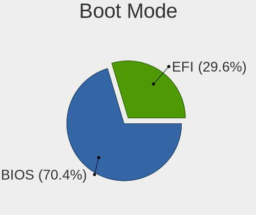

| Mode | Computers | Percent |
|------|-----------|---------|
| BIOS | 21        | 52.5%   |
| EFI  | 19        | 47.5%   |

Filesystem
----------

Type of filesystem

| Type    | Computers | Percent |
|---------|-----------|---------|
| Ext4    | 37        | 92.5%   |
| Xfs     | 1         | 2.5%    |
| Overlay | 1         | 2.5%    |
| Ext3    | 1         | 2.5%    |

Part. scheme
------------

Scheme of partitioning

| Type    | Computers | Percent |
|---------|-----------|---------|
| GPT     | 23        | 57.5%   |
| MBR     | 14        | 35%     |
| Unknown | 3         | 7.5%    |

Dual Boot with Linux/BSD
------------------------

Hosting more than one Linux/BSD

| Dual boot | Computers | Percent |
|-----------|-----------|---------|
| No        | 34        | 85%     |
| Yes       | 6         | 15%     |

Dual Boot (Win)
---------------

Hosting Linux and Windows

| Dual boot | Computers | Percent |
|-----------|-----------|---------|
| No        | 21        | 52.5%   |
| Yes       | 19        | 47.5%   |

Board
-----

Vendor
------

Motherboard manufacturer

| Name                | Computers | Percent |
|---------------------|-----------|---------|
| Hewlett-Packard     | 6         | 15%     |
| ASRock              | 5         | 12.5%   |
| Dell                | 4         | 10%     |
| MSI                 | 3         | 7.5%    |
| Lenovo              | 3         | 7.5%    |
| ASUSTek Computer    | 3         | 7.5%    |
| Pegatron            | 2         | 5%      |
| Intel               | 2         | 5%      |
| Gigabyte Technology | 2         | 5%      |
| YANYU               | 1         | 2.5%    |
| Samsung Electronics | 1         | 2.5%    |
| Positivo            | 1         | 2.5%    |
| Packard Bell        | 1         | 2.5%    |
| Google              | 1         | 2.5%    |
| DEXP                | 1         | 2.5%    |
| Chuwi               | 1         | 2.5%    |
| BANGHO              | 1         | 2.5%    |
| Apple               | 1         | 2.5%    |
| Acer                | 1         | 2.5%    |

Model
-----

Motherboard model

| Name                                             | Computers | Percent |
|--------------------------------------------------|-----------|---------|
| YANYU ITX-S192                                   | 1         | 2.5%    |
| Samsung 530XBB                                   | 1         | 2.5%    |
| Positivo P5VD2-MX                                | 1         | 2.5%    |
| Pegatron NC689AA-ABA s3700y                      | 1         | 2.5%    |
| Pegatron h8-1350ef                               | 1         | 2.5%    |
| Packard Bell EasyNote SB65                       | 1         | 2.5%    |
| MSI S12T 3M/S12 3M                               | 1         | 2.5%    |
| MSI MS-7C56                                      | 1         | 2.5%    |
| MSI GS65 Stealth 9SD                             | 1         | 2.5%    |
| Lenovo ThinkPad X201 3626AL3                     | 1         | 2.5%    |
| Lenovo IdeaPad L340-15IRH Gaming 81TR            | 1         | 2.5%    |
| Lenovo IdeaPad 1 15AMN7 82VG                     | 1         | 2.5%    |
| Intel X79 V2.72A                                 | 1         | 2.5%    |
| Intel Infoway                                    | 1         | 2.5%    |
| HP ZBook Fury 15.6 inch G8 Mobile Workstation PC | 1         | 2.5%    |
| HP Pavilion All-in-One Desktop 27-ca1xxx         | 1         | 2.5%    |
| HP Laptop 17-ak0xx                               | 1         | 2.5%    |
| HP Laptop 15-da0xxx                              | 1         | 2.5%    |
| HP Laptop 14-dk0xxx                              | 1         | 2.5%    |
| HP Compaq Presario CQ60                          | 1         | 2.5%    |
| Google Celes                                     | 1         | 2.5%    |
| Gigabyte GB-BMCE-5105                            | 1         | 2.5%    |
| Gigabyte B360M-DS3H                              | 1         | 2.5%    |
| DEXP Aquilon C15                                 | 1         | 2.5%    |
| Dell Precision M3800                             | 1         | 2.5%    |
| Dell Latitude E6230                              | 1         | 2.5%    |
| Dell Latitude 7480                               | 1         | 2.5%    |
| Dell Latitude 5290                               | 1         | 2.5%    |
| Chuwi LarkBox Pro                                | 1         | 2.5%    |
| BANGHO LITE E34                                  | 1         | 2.5%    |
| ASUS VivoBook_ASUSLaptop X515DA_M515DA           | 1         | 2.5%    |
| ASUS T200TA                                      | 1         | 2.5%    |
| ASUS A7N8X-E                                     | 1         | 2.5%    |
| ASRock Z87 Extreme4                              | 1         | 2.5%    |
| ASRock N68-GS4/USB3 FX                           | 1         | 2.5%    |
| ASRock H110M-HDV                                 | 1         | 2.5%    |
| ASRock G41M-VS3                                  | 1         | 2.5%    |
| ASRock G31M-S                                    | 1         | 2.5%    |
| Apple MacBookPro9,2                              | 1         | 2.5%    |
| Acer Aspire one 1-131                            | 1         | 2.5%    |

Model Family
------------

Motherboard model prefix

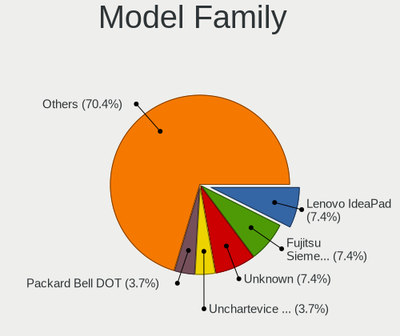

| Name                  | Computers | Percent |
|-----------------------|-----------|---------|
| HP Laptop             | 3         | 7.5%    |
| Dell Latitude         | 3         | 7.5%    |
| Lenovo IdeaPad        | 2         | 5%      |
| YANYU ITX-S192        | 1         | 2.5%    |
| Samsung 530XBB        | 1         | 2.5%    |
| Positivo P5VD2-MX     | 1         | 2.5%    |
| Pegatron NC689AA-ABA  | 1         | 2.5%    |
| Pegatron h8-1350ef    | 1         | 2.5%    |
| Packard Bell EasyNote | 1         | 2.5%    |
| MSI S12T              | 1         | 2.5%    |
| MSI MS-7C56           | 1         | 2.5%    |
| MSI GS65              | 1         | 2.5%    |
| Lenovo ThinkPad       | 1         | 2.5%    |
| Intel X79             | 1         | 2.5%    |
| Intel Infoway         | 1         | 2.5%    |
| HP ZBook              | 1         | 2.5%    |
| HP Pavilion           | 1         | 2.5%    |
| HP Compaq             | 1         | 2.5%    |
| Google Celes          | 1         | 2.5%    |
| Gigabyte GB-BMCE-5105 | 1         | 2.5%    |
| Gigabyte B360M-DS3H   | 1         | 2.5%    |
| DEXP Aquilon          | 1         | 2.5%    |
| Dell Precision        | 1         | 2.5%    |
| Chuwi LarkBox         | 1         | 2.5%    |
| BANGHO LITE           | 1         | 2.5%    |
| ASUS VivoBook         | 1         | 2.5%    |
| ASUS T200TA           | 1         | 2.5%    |
| ASUS A7N8X-E          | 1         | 2.5%    |
| ASRock Z87            | 1         | 2.5%    |
| ASRock N68-GS4        | 1         | 2.5%    |
| ASRock H110M-HDV      | 1         | 2.5%    |
| ASRock G41M-VS3       | 1         | 2.5%    |
| ASRock G31M-S         | 1         | 2.5%    |
| Apple MacBookPro9     | 1         | 2.5%    |
| Acer Aspire           | 1         | 2.5%    |

MFG Year
--------

Motherboard manufacture year

| Year | Computers | Percent |
|------|-----------|---------|
| 2019 | 6         | 15%     |
| 2008 | 5         | 12.5%   |
| 2020 | 4         | 10%     |
| 2018 | 4         | 10%     |
| 2021 | 3         | 7.5%    |
| 2013 | 3         | 7.5%    |
| 2012 | 3         | 7.5%    |
| 2022 | 2         | 5%      |
| 2017 | 2         | 5%      |
| 2015 | 2         | 5%      |
| 2010 | 2         | 5%      |
| 2023 | 1         | 2.5%    |
| 2014 | 1         | 2.5%    |
| 2007 | 1         | 2.5%    |
| 2004 | 1         | 2.5%    |

Form Factor
-----------

Physical design of the computer

| Name       | Computers | Percent |
|------------|-----------|---------|
| Notebook   | 23        | 57.5%   |
| Desktop    | 15        | 37.5%   |
| Mini pc    | 1         | 2.5%    |
| All in one | 1         | 2.5%    |

Secure Boot
-----------

Enabled or disabled

| State    | Computers | Percent |
|----------|-----------|---------|
| Disabled | 36        | 90%     |
| Enabled  | 4         | 10%     |

Coreboot
--------

Have coreboot on board

| Used | Computers | Percent |
|------|-----------|---------|
| No   | 39        | 97.5%   |
| Yes  | 1         | 2.5%    |

RAM Size
--------

Total RAM memory

| Size in GB  | Computers | Percent |
|-------------|-----------|---------|
| 3.01-4.0    | 10        | 25%     |
| 4.01-8.0    | 9         | 22.5%   |
| 2.01-3.0    | 5         | 12.5%   |
| 16.01-24.0  | 5         | 12.5%   |
| 8.01-16.0   | 4         | 10%     |
| 32.01-64.0  | 2         | 5%      |
| 1.01-2.0    | 2         | 5%      |
| 24.01-32.0  | 1         | 2.5%    |
| 64.01-256.0 | 1         | 2.5%    |
| 0.51-1.0    | 1         | 2.5%    |

RAM Used
--------

Used RAM memory

| Used GB  | Computers | Percent |
|----------|-----------|---------|
| 1.01-2.0 | 14        | 35%     |
| 2.01-3.0 | 12        | 30%     |
| 0.51-1.0 | 9         | 22.5%   |
| 4.01-8.0 | 4         | 10%     |
| 3.01-4.0 | 1         | 2.5%    |

Total Drives
------------

Number of drives on board

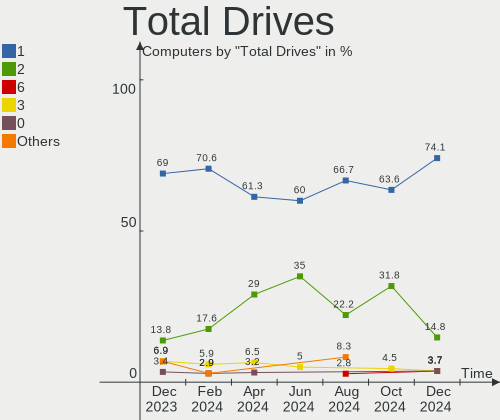

| Drives | Computers | Percent |
|--------|-----------|---------|
| 1      | 21        | 52.5%   |
| 2      | 17        | 42.5%   |
| 12     | 1         | 2.5%    |
| 3      | 1         | 2.5%    |

Has CD-ROM
----------

Has CD-ROM on board

| Presented | Computers | Percent |
|-----------|-----------|---------|
| No        | 27        | 67.5%   |
| Yes       | 13        | 32.5%   |

Has Ethernet
------------

Has Ethernet on board

| Presented | Computers | Percent |
|-----------|-----------|---------|
| Yes       | 34        | 85%     |
| No        | 6         | 15%     |

Has WiFi
--------

Has WiFi module

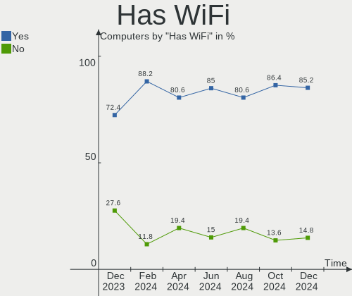

| Presented | Computers | Percent |
|-----------|-----------|---------|
| Yes       | 30        | 75%     |
| No        | 10        | 25%     |

Has Bluetooth
-------------

Has Bluetooth module

| Presented | Computers | Percent |
|-----------|-----------|---------|
| No        | 21        | 52.5%   |
| Yes       | 19        | 47.5%   |

Location
--------

Country
-------

Geographic location (country)

| Country     | Computers | Percent |
|-------------|-----------|---------|
| USA         | 10        | 25%     |
| Germany     | 4         | 10%     |
| France      | 4         | 10%     |
| Brazil      | 4         | 10%     |
| Russia      | 3         | 7.5%    |
| Italy       | 3         | 7.5%    |
| Switzerland | 2         | 5%      |
| Spain       | 2         | 5%      |
| Iran        | 2         | 5%      |
| Argentina   | 2         | 5%      |
| Taiwan      | 1         | 2.5%    |
| Poland      | 1         | 2.5%    |
| Peru        | 1         | 2.5%    |
| Netherlands | 1         | 2.5%    |

City
----

Geographic location (city)

| City                  | Computers | Percent |
|-----------------------|-----------|---------|
| Tehran                | 2         | 5%      |
| Eberbach              | 2         | 5%      |
| Zurich                | 1         | 2.5%    |
| West Stockbridge      | 1         | 2.5%    |
| Valsamoggia           | 1         | 2.5%    |
| Ulyanovsk             | 1         | 2.5%    |
| Toulouse              | 1         | 2.5%    |
| Torrejón de Ardoz    | 1         | 2.5%    |
| Taipei                | 1         | 2.5%    |
| St Louis              | 1         | 2.5%    |
| Sao Paulo             | 1         | 2.5%    |
| San Pablo             | 1         | 2.5%    |
| Paris                 | 1         | 2.5%    |
| Omaha                 | 1         | 2.5%    |
| Novo Gama             | 1         | 2.5%    |
| Moscow                | 1         | 2.5%    |
| Monza                 | 1         | 2.5%    |
| Montesano             | 1         | 2.5%    |
| Maple Grove           | 1         | 2.5%    |
| Macon                 | 1         | 2.5%    |
| Lurcy-Levis           | 1         | 2.5%    |
| Lourdes               | 1         | 2.5%    |
| Lima                  | 1         | 2.5%    |
| Liebefeld             | 1         | 2.5%    |
| Lansing               | 1         | 2.5%    |
| Lakewood              | 1         | 2.5%    |
| Krakow                | 1         | 2.5%    |
| Koenigswinter         | 1         | 2.5%    |
| Huelva                | 1         | 2.5%    |
| Hilversum             | 1         | 2.5%    |
| Goya                  | 1         | 2.5%    |
| Goryachiy Klyuch      | 1         | 2.5%    |
| Fleischwangen         | 1         | 2.5%    |
| Corrientes            | 1         | 2.5%    |
| Cidade Universitária | 1         | 2.5%    |
| Castenaso             | 1         | 2.5%    |
| Burlington            | 1         | 2.5%    |
| Araras                | 1         | 2.5%    |

Drives
------

Drive Vendor
------------

Hard drive vendors

| Vendor                    | Computers | Drives | Percent |
|---------------------------|-----------|--------|---------|
| WDC                       | 8         | 14     | 13.79%  |
| Samsung Electronics       | 8         | 9      | 13.79%  |
| Unknown                   | 6         | 6      | 10.34%  |
| Seagate                   | 4         | 7      | 6.9%    |
| Sandisk                   | 4         | 4      | 6.9%    |
| Toshiba                   | 3         | 3      | 5.17%   |
| Kingston                  | 3         | 3      | 5.17%   |
| Micron/Crucial Technology | 2         | 2      | 3.45%   |
| Hitachi                   | 2         | 2      | 3.45%   |
| Crucial                   | 2         | 2      | 3.45%   |
| China                     | 2         | 2      | 3.45%   |
| XrayDisk                  | 1         | 1      | 1.72%   |
| UMIS                      | 1         | 1      | 1.72%   |
| Transcend                 | 1         | 1      | 1.72%   |
| SK hynix                  | 1         | 1      | 1.72%   |
| Plextor                   | 1         | 1      | 1.72%   |
| Patriot                   | 1         | 1      | 1.72%   |
| OCZ                       | 1         | 1      | 1.72%   |
| Micron Technology         | 1         | 1      | 1.72%   |
| Maxtor                    | 1         | 1      | 1.72%   |
| Intel                     | 1         | 1      | 1.72%   |
| HGST                      | 1         | 1      | 1.72%   |
| BR                        | 1         | 1      | 1.72%   |
| addlink                   | 1         | 1      | 1.72%   |
| A-DATA Technology         | 1         | 1      | 1.72%   |

Drive Model
-----------

Hard drive models

| Model                                               | Computers | Percent |
|-----------------------------------------------------|-----------|---------|
| Unknown MMC Card  32GB                              | 2         | 3.03%   |
| Unknown DA4064  64GB                                | 2         | 3.03%   |
| Toshiba MQ04ABF100 1TB                              | 2         | 3.03%   |
| Seagate ST1000DM010-2EP102 1TB                      | 2         | 3.03%   |
| Kingston SA400S37240G 240GB SSD                     | 2         | 3.03%   |
| XrayDisk SSD 128GB                                  | 1         | 1.52%   |
| WDC WDS240G2G0A-00JH30 240GB SSD                    | 1         | 1.52%   |
| WDC WD60EFRX-68L0BN1 6TB                            | 1         | 1.52%   |
| WDC WD5000LPVX-22V0TT0 500GB                        | 1         | 1.52%   |
| WDC WD5000AAVS-00ZTB0 500GB                         | 1         | 1.52%   |
| WDC WD3200AAJS-65M0A0 320GB                         | 1         | 1.52%   |
| WDC WD3200AAJS-00L7A0 320GB                         | 1         | 1.52%   |
| WDC WD2003FYYS-02W0B0 2TB                           | 1         | 1.52%   |
| WDC WD10SPZX-24Z10 1TB                              | 1         | 1.52%   |
| WDC WD10SPZX-08Z10 1TB                              | 1         | 1.52%   |
| WDC WD10S21X-24R1BT0-SSHD-8GB                       | 1         | 1.52%   |
| WDC WD1002FAEX-00Z3A0 1TB                           | 1         | 1.52%   |
| WDC PC SN730 SDBPNTY-512G-1006 512GB                | 1         | 1.52%   |
| WDC PC SN530 SDBPNPZ-256G-1114 256GB                | 1         | 1.52%   |
| Unknown SC256  256GB                                | 1         | 1.52%   |
| Unknown hDEaP3  128GB                               | 1         | 1.52%   |
| UMIS RPJTJ128MEE1MWX 128GB                          | 1         | 1.52%   |
| Transcend TS512GMTS800 512GB SSD                    | 1         | 1.52%   |
| Toshiba MK1652GSX 160GB                             | 1         | 1.52%   |
| SK hynix HBG4e  32GB                                | 1         | 1.52%   |
| Seagate ST8000NM0045-1RL112 8TB                     | 1         | 1.52%   |
| Seagate ST3200826AS 200GB                           | 1         | 1.52%   |
| Seagate ST1000LM035-1RK172 1TB                      | 1         | 1.52%   |
| Seagate ST1000LM024 HN-M101MBB 1TB                  | 1         | 1.52%   |
| Sandisk WD Blue SN500 / PC SN520 NVMe SSD 512GB     | 1         | 1.52%   |
| SanDisk SD9SN8W-128G-1006 128GB SSD                 | 1         | 1.52%   |
| SanDisk SD8SN8U-128G-1006 128GB SSD                 | 1         | 1.52%   |
| SanDisk DF4032  32GB                                | 1         | 1.52%   |
| Samsung SSD 970 EVO Plus 500GB                      | 1         | 1.52%   |
| Samsung SSD 950 PRO 512GB                           | 1         | 1.52%   |
| Samsung SSD 860 EVO M.2 500GB                       | 1         | 1.52%   |
| Samsung SSD 860 EVO 500GB                           | 1         | 1.52%   |
| Samsung SP1614C 160GB                               | 1         | 1.52%   |
| Samsung NVMe SSD Controller SM981/PM981/PM983 250GB | 1         | 1.52%   |
| Samsung MZVLB512HBJQ-000H1 512GB                    | 1         | 1.52%   |

HDD Vendor
----------

Hard disk drive vendors

| Vendor              | Computers | Drives | Percent |
|---------------------|-----------|--------|---------|
| WDC                 | 6         | 11     | 31.58%  |
| Seagate             | 4         | 7      | 21.05%  |
| Toshiba             | 3         | 3      | 15.79%  |
| Samsung Electronics | 2         | 3      | 10.53%  |
| Hitachi             | 2         | 2      | 10.53%  |
| Maxtor              | 1         | 1      | 5.26%   |
| HGST                | 1         | 1      | 5.26%   |

SSD Vendor
----------

Solid state drive vendors

| Vendor              | Computers | Drives | Percent |
|---------------------|-----------|--------|---------|
| Kingston            | 3         | 3      | 15.79%  |
| SanDisk             | 2         | 2      | 10.53%  |
| Samsung Electronics | 2         | 2      | 10.53%  |
| China               | 2         | 2      | 10.53%  |
| XrayDisk            | 1         | 1      | 5.26%   |
| WDC                 | 1         | 1      | 5.26%   |
| Transcend           | 1         | 1      | 5.26%   |
| Plextor             | 1         | 1      | 5.26%   |
| Patriot             | 1         | 1      | 5.26%   |
| OCZ                 | 1         | 1      | 5.26%   |
| Intel               | 1         | 1      | 5.26%   |
| Crucial             | 1         | 1      | 5.26%   |
| BR                  | 1         | 1      | 5.26%   |
| A-DATA Technology   | 1         | 1      | 5.26%   |

Drive Kind
----------

HDD or SSD

| Kind | Computers | Drives | Percent |
|------|-----------|--------|---------|
| SSD  | 18        | 19     | 33.96%  |
| HDD  | 17        | 28     | 32.08%  |
| NVMe | 10        | 13     | 18.87%  |
| MMC  | 8         | 8      | 15.09%  |

Drive Connector
---------------

SATA, SAS, NVMe, etc.

| Type | Computers | Drives | Percent |
|------|-----------|--------|---------|
| SATA | 31        | 47     | 63.27%  |
| NVMe | 10        | 13     | 20.41%  |
| MMC  | 8         | 8      | 16.33%  |

Drive Size
----------

Size of hard drive

| Size in TB | Computers | Drives | Percent |
|------------|-----------|--------|---------|
| 0.01-0.5   | 24        | 28     | 64.86%  |
| 0.51-1.0   | 10        | 14     | 27.03%  |
| 1.01-2.0   | 2         | 2      | 5.41%   |
| 4.01-10.0  | 1         | 3      | 2.7%    |

Space Total
-----------

Amount of disk space available on the file system

| Size in GB | Computers | Percent |
|------------|-----------|---------|
| 101-250    | 12        | 30%     |
| 251-500    | 8         | 20%     |
| 21-50      | 6         | 15%     |
| 51-100     | 6         | 15%     |
| 1001-2000  | 4         | 10%     |
| 1-20       | 3         | 7.5%    |
| 501-1000   | 1         | 2.5%    |

Space Used
----------

Amount of used disk space

| Used GB   | Computers | Percent |
|-----------|-----------|---------|
| 1-20      | 15        | 37.5%   |
| 21-50     | 12        | 30%     |
| 51-100    | 8         | 20%     |
| 101-250   | 3         | 7.5%    |
| 251-500   | 1         | 2.5%    |
| 1001-2000 | 1         | 2.5%    |

Malfunc. Drives
---------------

Drive models with a malfunction

| Model                              | Computers | Drives | Percent |
|------------------------------------|-----------|--------|---------|
| WDC WD60EFRX-68L0BN1 6TB           | 1         | 2      | 10%     |
| WDC WD2003FYYS-02W0B0 2TB          | 1         | 1      | 10%     |
| WDC WD10SPZX-08Z10 1TB             | 1         | 1      | 10%     |
| WDC WD1002FAEX-00Z3A0 1TB          | 1         | 1      | 10%     |
| Seagate ST1000LM024 HN-M101MBB 1TB | 1         | 2      | 10%     |
| Samsung Electronics HM121HI 120GB  | 1         | 1      | 10%     |
| Samsung Electronics HD502IJ 500GB  | 1         | 1      | 10%     |
| Plextor PX-128M6M 128GB SSD        | 1         | 1      | 10%     |
| Intel SSDSA2M080G2LE 80GB          | 1         | 1      | 10%     |
| HGST HTS725032A7E630 320GB         | 1         | 1      | 10%     |

Malfunc. Drive Vendor
---------------------

Vendors of faulty drives

| Vendor              | Computers | Drives | Percent |
|---------------------|-----------|--------|---------|
| WDC                 | 2         | 5      | 25%     |
| Samsung Electronics | 2         | 2      | 25%     |
| Seagate             | 1         | 2      | 12.5%   |
| Plextor             | 1         | 1      | 12.5%   |
| Intel               | 1         | 1      | 12.5%   |
| HGST                | 1         | 1      | 12.5%   |

Malfunc. HDD Vendor
-------------------

Vendors of faulty HDD drives

| Vendor              | Computers | Drives | Percent |
|---------------------|-----------|--------|---------|
| WDC                 | 2         | 5      | 33.33%  |
| Samsung Electronics | 2         | 2      | 33.33%  |
| Seagate             | 1         | 2      | 16.67%  |
| HGST                | 1         | 1      | 16.67%  |

Malfunc. Drive Kind
-------------------

Kinds of faulty drives

| Kind | Computers | Drives | Percent |
|------|-----------|--------|---------|
| HDD  | 5         | 10     | 71.43%  |
| SSD  | 2         | 2      | 28.57%  |

Failed Drives
-------------

Failed drive models

Zero info for selected period =(

Failed Drive Vendor
-------------------

Failed drive vendors

Zero info for selected period =(

Drive Status
------------

Number of failed and malfunc. drives

| Status   | Computers | Drives | Percent |
|----------|-----------|--------|---------|
| Works    | 21        | 32     | 43.75%  |
| Detected | 20        | 24     | 41.67%  |
| Malfunc  | 7         | 12     | 14.58%  |

Storage controller
------------------

Storage Vendor
--------------

Storage controller vendors

| Vendor                    | Computers | Percent |
|---------------------------|-----------|---------|
| Intel                     | 24        | 47.06%  |
| AMD                       | 6         | 11.76%  |
| Samsung Electronics       | 4         | 7.84%   |
| SanDisk                   | 3         | 5.88%   |
| Nvidia                    | 3         | 5.88%   |
| Micron/Crucial Technology | 3         | 5.88%   |
| VIA Technologies          | 1         | 1.96%   |
| Union Memory (Shenzhen)   | 1         | 1.96%   |
| Silicon Motion            | 1         | 1.96%   |
| Silicon Image             | 1         | 1.96%   |
| Micron Technology         | 1         | 1.96%   |
| Marvell Technology Group  | 1         | 1.96%   |
| LSI Logic / Symbios Logic | 1         | 1.96%   |
| ASMedia Technology        | 1         | 1.96%   |

Storage Model
-------------

Storage controller models

| Model                                                                          | Computers | Percent |
|--------------------------------------------------------------------------------|-----------|---------|
| AMD FCH SATA Controller [AHCI mode]                                            | 5         | 8.62%   |
| Samsung NVMe SSD Controller SM981/PM981/PM983                                  | 3         | 5.17%   |
| Intel Celeron/Pentium Silver Processor SATA Controller                         | 3         | 5.17%   |
| Nvidia MCP61 SATA Controller                                                   | 2         | 3.45%   |
| Nvidia MCP61 IDE                                                               | 2         | 3.45%   |
| Micron/Crucial P2 NVMe PCIe SSD                                                | 2         | 3.45%   |
| Intel Sunrise Point-LP SATA Controller [AHCI mode]                             | 2         | 3.45%   |
| Intel NM10/ICH7 Family SATA Controller [IDE mode]                              | 2         | 3.45%   |
| Intel 82801HM/HEM (ICH8M/ICH8M-E) SATA Controller [AHCI mode]                  | 2         | 3.45%   |
| Intel 82801HM/HEM (ICH8M/ICH8M-E) IDE Controller                               | 2         | 3.45%   |
| Intel 82801G (ICH7 Family) IDE Controller                                      | 2         | 3.45%   |
| Intel 82801 Mobile SATA Controller [RAID mode]                                 | 2         | 3.45%   |
| Intel 8 Series/C220 Series Chipset Family 6-port SATA Controller 1 [AHCI mode] | 2         | 3.45%   |
| VIA VT82C586A/B/VT82C686/A/B/VT823x/A/C PIPC Bus Master IDE                    | 1         | 1.72%   |
| VIA Serial ATA Controller                                                      | 1         | 1.72%   |
| Union Memory (Shenzhen) Non-Volatile memory controller                         | 1         | 1.72%   |
| Silicon Motion SM2263EN/SM2263XT SSD Controller                                | 1         | 1.72%   |
| Silicon Image SiI 3112 [SATALink/SATARaid] Serial ATA Controller               | 1         | 1.72%   |
| SanDisk WD Blue SN550 NVMe SSD                                                 | 1         | 1.72%   |
| SanDisk WD Blue SN500 / PC SN520 NVMe SSD                                      | 1         | 1.72%   |
| SanDisk WD Black SN750 / PC SN730 NVMe SSD                                     | 1         | 1.72%   |
| Samsung NVMe SSD Controller SM951/PM951                                        | 1         | 1.72%   |
| Nvidia nForce2 IDE                                                             | 1         | 1.72%   |
| Micron/Crucial P5 Plus NVMe PCIe SSD                                           | 1         | 1.72%   |
| Micron NVMe Storage Controller                                                 | 1         | 1.72%   |
| Marvell Group 88SE9215 PCIe 2.0 x1 4-port SATA 6 Gb/s Controller               | 1         | 1.72%   |
| LSI Logic / Symbios Logic SAS2008 PCI-Express Fusion-MPT SAS-2 [Falcon]        | 1         | 1.72%   |
| Intel Q170/Q150/B150/H170/H110/Z170/CM236 Chipset SATA Controller [AHCI Mode]  | 1         | 1.72%   |
| Intel Jasper Lake SATA AHCI Controller                                         | 1         | 1.72%   |
| Intel Celeron N3350/Pentium N4200/Atom E3900 Series SATA AHCI Controller       | 1         | 1.72%   |
| Intel Cannon Lake PCH SATA AHCI Controller                                     | 1         | 1.72%   |
| Intel Cannon Lake Mobile PCH SATA AHCI Controller                              | 1         | 1.72%   |
| Intel C600/X79 series chipset 6-Port SATA AHCI Controller                      | 1         | 1.72%   |
| Intel Atom Processor E3800 Series SATA AHCI Controller                         | 1         | 1.72%   |
| Intel 82801IBM/IEM (ICH9M/ICH9M-E) 4 port SATA Controller [AHCI mode]          | 1         | 1.72%   |
| Intel 7 Series/C210 Series Chipset Family 6-port SATA Controller [AHCI mode]   | 1         | 1.72%   |
| Intel 7 Series Chipset Family 6-port SATA Controller [AHCI mode]               | 1         | 1.72%   |
| Intel 5 Series/3400 Series Chipset 6 port SATA AHCI Controller                 | 1         | 1.72%   |
| ASMedia ASM1062 Serial ATA Controller                                          | 1         | 1.72%   |
| AMD 500 Series Chipset SATA Controller                                         | 1         | 1.72%   |

Storage Kind
------------

Kind of storage controller (IDE, SATA, NVMe, SAS, ...)

| Kind | Computers | Percent |
|------|-----------|---------|
| SATA | 26        | 54.17%  |
| NVMe | 10        | 20.83%  |
| IDE  | 8         | 16.67%  |
| RAID | 3         | 6.25%   |
| SAS  | 1         | 2.08%   |

Processor
---------

CPU Vendor
----------

Processor vendors

| Vendor | Computers | Percent |
|--------|-----------|---------|
| Intel  | 30        | 75%     |
| AMD    | 10        | 25%     |

CPU Model
---------

Processor models

| Model                                         | Computers | Percent |
|-----------------------------------------------|-----------|---------|
| Intel Core i5-8250U CPU @ 1.60GHz             | 2         | 5%      |
| Intel Xeon CPU E5-2630 v2 @ 2.60GHz           | 1         | 2.5%    |
| Intel Pentium Dual-Core CPU E5300 @ 2.60GHz   | 1         | 2.5%    |
| Intel Pentium Dual CPU T3200 @ 2.00GHz        | 1         | 2.5%    |
| Intel Pentium Dual CPU T2390 @ 1.86GHz        | 1         | 2.5%    |
| Intel Pentium D CPU 2.80GHz                   | 1         | 2.5%    |
| Intel Core i7-9750H CPU @ 2.60GHz             | 1         | 2.5%    |
| Intel Core i7-7600U CPU @ 2.80GHz             | 1         | 2.5%    |
| Intel Core i7-4770K CPU @ 3.50GHz             | 1         | 2.5%    |
| Intel Core i7-4702HQ CPU @ 2.20GHz            | 1         | 2.5%    |
| Intel Core i5-9300HF CPU @ 2.40GHz            | 1         | 2.5%    |
| Intel Core i5-8400 CPU @ 2.80GHz              | 1         | 2.5%    |
| Intel Core i5-6500 CPU @ 3.20GHz              | 1         | 2.5%    |
| Intel Core i5-3320M CPU @ 2.60GHz             | 1         | 2.5%    |
| Intel Core i5-3210M CPU @ 2.50GHz             | 1         | 2.5%    |
| Intel Core i5-2320 CPU @ 3.00GHz              | 1         | 2.5%    |
| Intel Core i5 CPU M 540 @ 2.53GHz             | 1         | 2.5%    |
| Intel Core 2 Duo CPU T7500 @ 2.20GHz          | 1         | 2.5%    |
| Intel Core 2 Duo CPU E4600 @ 2.40GHz          | 1         | 2.5%    |
| Intel Celeron N5105 @ 2.00GHz                 | 1         | 2.5%    |
| Intel Celeron N4020 CPU @ 1.10GHz             | 1         | 2.5%    |
| Intel Celeron N4000 CPU @ 1.10GHz             | 1         | 2.5%    |
| Intel Celeron J4125 CPU @ 2.00GHz             | 1         | 2.5%    |
| Intel Celeron CPU N3350 @ 1.10GHz             | 1         | 2.5%    |
| Intel Celeron CPU N3060 @ 1.60GHz             | 1         | 2.5%    |
| Intel Celeron CPU N3050 @ 1.60GHz             | 1         | 2.5%    |
| Intel Celeron CPU J1900 @ 1.99GHz             | 1         | 2.5%    |
| Intel Atom CPU Z3775 @ 1.46GHz                | 1         | 2.5%    |
| Intel 11th Gen Core i7-11850H @ 2.50GHz       | 1         | 2.5%    |
| AMD Ryzen 7 5825U with Radeon Graphics        | 1         | 2.5%    |
| AMD Ryzen 7 5700G with Radeon Graphics        | 1         | 2.5%    |
| AMD Ryzen 5 3500U with Radeon Vega Mobile Gfx | 1         | 2.5%    |
| AMD E2-9000e RADEON R2, 4 COMPUTE CORES 2C+2G | 1         | 2.5%    |
| AMD E1-2100 APU with Radeon HD Graphics       | 1         | 2.5%    |
| AMD Athlon XP 3200+                           | 1         | 2.5%    |
| AMD Athlon II X4 645 Processor                | 1         | 2.5%    |
| AMD Athlon Gold 7220U with Radeon Graphics    | 1         | 2.5%    |
| AMD Athlon 64 X2 Dual Core Processor 5000+    | 1         | 2.5%    |
| AMD A9-9425 RADEON R5, 5 COMPUTE CORES 2C+3G  | 1         | 2.5%    |

CPU Model Family
----------------

Processor model prefix

| Model                   | Computers | Percent |
|-------------------------|-----------|---------|
| Intel Core i5           | 9         | 22.5%   |
| Intel Celeron           | 8         | 20%     |
| Intel Core i7           | 4         | 10%     |
| Other                   | 2         | 5%      |
| Intel Pentium Dual      | 2         | 5%      |
| Intel Core 2 Duo        | 2         | 5%      |
| AMD Ryzen 7             | 2         | 5%      |
| Intel Xeon              | 1         | 2.5%    |
| Intel Pentium Dual-Core | 1         | 2.5%    |
| Intel Pentium D         | 1         | 2.5%    |
| Intel Atom              | 1         | 2.5%    |
| AMD Ryzen 5             | 1         | 2.5%    |
| AMD E2                  | 1         | 2.5%    |
| AMD E1                  | 1         | 2.5%    |
| AMD Athlon XP           | 1         | 2.5%    |
| AMD Athlon II X4        | 1         | 2.5%    |
| AMD Athlon 64 X2        | 1         | 2.5%    |
| AMD Athlon              | 1         | 2.5%    |

CPU Cores
---------

Number of processor cores

| Number | Computers | Percent |
|--------|-----------|---------|
| 2      | 20        | 50%     |
| 4      | 13        | 32.5%   |
| 8      | 3         | 7.5%    |
| 6      | 3         | 7.5%    |
| 1      | 1         | 2.5%    |

CPU Sockets
-----------

Number of sockets

| Number | Computers | Percent |
|--------|-----------|---------|
| 1      | 40        | 100%    |

CPU Threads
-----------

Threads per core (Hyper-Threading)

| Number | Computers | Percent |
|--------|-----------|---------|
| 1      | 25        | 62.5%   |
| 2      | 15        | 37.5%   |

CPU Op-Modes
------------

CPU Operation Modes (32-bit, 64-bit)

| Op mode        | Computers | Percent |
|----------------|-----------|---------|
| 32-bit, 64-bit | 39        | 97.5%   |
| 32-bit         | 1         | 2.5%    |

CPU Microcode
-------------

Microcode number

| Number     | Computers | Percent |
|------------|-----------|---------|
| Unknown    | 11        | 27.5%   |
| 0x6fd      | 3         | 7.5%    |
| 0x906ea    | 2         | 5%      |
| 0x806ea    | 2         | 5%      |
| 0x706a8    | 2         | 5%      |
| 0xf64      | 1         | 2.5%    |
| 0x906c0    | 1         | 2.5%    |
| 0x806e9    | 1         | 2.5%    |
| 0x806d1    | 1         | 2.5%    |
| 0x706a1    | 1         | 2.5%    |
| 0x6fa      | 1         | 2.5%    |
| 0x506c9    | 1         | 2.5%    |
| 0x406c4    | 1         | 2.5%    |
| 0x406c3    | 1         | 2.5%    |
| 0x306e4    | 1         | 2.5%    |
| 0x306a9    | 1         | 2.5%    |
| 0x30679    | 1         | 2.5%    |
| 0x206a7    | 1         | 2.5%    |
| 0x20652    | 1         | 2.5%    |
| 0x0a50000d | 1         | 2.5%    |
| 0x08a00006 | 1         | 2.5%    |
| 0x08108109 | 1         | 2.5%    |
| 0x0700010f | 1         | 2.5%    |
| 0x06006704 | 1         | 2.5%    |
| 0x010000c8 | 1         | 2.5%    |

CPU Microarch
-------------

Microarchitecture

| Name          | Computers | Percent |
|---------------|-----------|---------|
| KabyLake      | 6         | 15%     |
| Silvermont    | 4         | 10%     |
| Core          | 4         | 10%     |
| IvyBridge     | 3         | 7.5%    |
| Goldmont plus | 3         | 7.5%    |
| Zen 3         | 2         | 5%      |
| Haswell       | 2         | 5%      |
| Excavator     | 2         | 5%      |
| Zen+          | 1         | 2.5%    |
| Westmere      | 1         | 2.5%    |
| Tremont       | 1         | 2.5%    |
| Skylake       | 1         | 2.5%    |
| SandyBridge   | 1         | 2.5%    |
| Penryn        | 1         | 2.5%    |
| NetBurst      | 1         | 2.5%    |
| K8 Hammer     | 1         | 2.5%    |
| K6            | 1         | 2.5%    |
| K10           | 1         | 2.5%    |
| Jaguar        | 1         | 2.5%    |
| Icelake       | 1         | 2.5%    |
| Goldmont      | 1         | 2.5%    |
| Unknown       | 1         | 2.5%    |

Graphics
--------

GPU Vendor
----------

Vendors of graphics cards

| Vendor | Computers | Percent |
|--------|-----------|---------|
| Intel  | 23        | 50%     |
| Nvidia | 13        | 28.26%  |
| AMD    | 10        | 21.74%  |

GPU Model
---------

Graphics card models

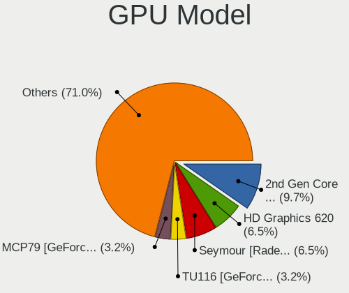

| Model                                                                                    | Computers | Percent |
|------------------------------------------------------------------------------------------|-----------|---------|
| Intel GeminiLake [UHD Graphics 600]                                                      | 3         | 6.38%   |
| Intel UHD Graphics 620                                                                   | 2         | 4.26%   |
| Intel Atom/Celeron/Pentium Processor x5-E8000/J3xxx/N3xxx Integrated Graphics Controller | 2         | 4.26%   |
| Intel Atom Processor Z36xxx/Z37xxx Series Graphics & Display                             | 2         | 4.26%   |
| Intel 3rd Gen Core processor Graphics Controller                                         | 2         | 4.26%   |
| AMD Stoney [Radeon R2/R3/R4/R5 Graphics]                                                 | 2         | 4.26%   |
| Nvidia TU117GLM [T1200 Laptop GPU]                                                       | 1         | 2.13%   |
| Nvidia TU116M [GeForce GTX 1660 Ti Mobile]                                               | 1         | 2.13%   |
| Nvidia GP108 [GeForce GT 1030]                                                           | 1         | 2.13%   |
| Nvidia GP107M [GeForce GTX 1050 3 GB Max-Q]                                              | 1         | 2.13%   |
| Nvidia GP107GL [Quadro P600]                                                             | 1         | 2.13%   |
| Nvidia GP107 [GeForce GTX 1050 Ti]                                                       | 1         | 2.13%   |
| Nvidia GM107 [GeForce GTX 750 Ti]                                                        | 1         | 2.13%   |
| Nvidia GK208B [GeForce GT 720]                                                           | 1         | 2.13%   |
| Nvidia GK107GLM [Quadro K1100M]                                                          | 1         | 2.13%   |
| Nvidia G86M [GeForce 8400M G]                                                            | 1         | 2.13%   |
| Nvidia G73 [GeForce 7600 GS AGP]                                                         | 1         | 2.13%   |
| Nvidia C61 [GeForce 7025 / nForce 630a]                                                  | 1         | 2.13%   |
| Nvidia C61 [GeForce 6150SE nForce 430]                                                   | 1         | 2.13%   |
| Intel Mobile GM965/GL960 Integrated Graphics Controller (secondary)                      | 1         | 2.13%   |
| Intel Mobile GM965/GL960 Integrated Graphics Controller (primary)                        | 1         | 2.13%   |
| Intel Mobile 4 Series Chipset Integrated Graphics Controller                             | 1         | 2.13%   |
| Intel JasperLake [UHD Graphics]                                                          | 1         | 2.13%   |
| Intel HD Graphics 620                                                                    | 1         | 2.13%   |
| Intel HD Graphics 530                                                                    | 1         | 2.13%   |
| Intel HD Graphics 500                                                                    | 1         | 2.13%   |
| Intel Core Processor Integrated Graphics Controller                                      | 1         | 2.13%   |
| Intel CoffeeLake-S GT2 [UHD Graphics 630]                                                | 1         | 2.13%   |
| Intel CoffeeLake-H GT2 [UHD Graphics 630]                                                | 1         | 2.13%   |
| Intel 82G33/G31 Express Integrated Graphics Controller                                   | 1         | 2.13%   |
| Intel 4th Gen Core Processor Integrated Graphics Controller                              | 1         | 2.13%   |
| Intel 4 Series Chipset Integrated Graphics Controller                                    | 1         | 2.13%   |
| AMD Picasso/Raven 2 [Radeon Vega Series / Radeon Vega Mobile Series]                     | 1         | 2.13%   |
| AMD Mendocino                                                                            | 1         | 2.13%   |
| AMD Kabini [Radeon HD 8210]                                                              | 1         | 2.13%   |
| AMD Cezanne [Radeon Vega Series / Radeon Vega Mobile Series]                             | 1         | 2.13%   |
| AMD Cedar [Radeon HD 5000/6000/7350/8350 Series]                                         | 1         | 2.13%   |
| AMD Caicos PRO [Radeon HD 7450]                                                          | 1         | 2.13%   |
| AMD Barcelo                                                                              | 1         | 2.13%   |
| AMD 3D Rage PRO PCI                                                                      | 1         | 2.13%   |

GPU Combo
---------

Combinations of graphics cards

| Name           | Computers | Percent |
|----------------|-----------|---------|
| 1 x Intel      | 19        | 47.5%   |
| 1 x Nvidia     | 8         | 20%     |
| 1 x AMD        | 8         | 20%     |
| Intel + Nvidia | 3         | 7.5%    |
| AMD + Nvidia   | 2         | 5%      |

GPU Driver
----------

Free vs proprietary

| Driver      | Computers | Percent |
|-------------|-----------|---------|
| Free        | 34        | 85%     |
| Proprietary | 6         | 15%     |

GPU Memory
----------

Total video memory

| Size in GB | Computers | Percent |
|------------|-----------|---------|
| Unknown    | 22        | 55%     |
| 0.01-0.5   | 9         | 22.5%   |
| 1.01-2.0   | 5         | 12.5%   |
| 3.01-4.0   | 2         | 5%      |
| 0.51-1.0   | 2         | 5%      |

Monitor
-------

Monitor Vendor
--------------

Monitor vendors

| Vendor              | Computers | Percent |
|---------------------|-----------|---------|
| AU Optronics        | 9         | 23.08%  |
| BOE                 | 5         | 12.82%  |
| Samsung Electronics | 3         | 7.69%   |
| Hewlett-Packard     | 3         | 7.69%   |
| Chimei Innolux      | 2         | 5.13%   |
| Acer                | 2         | 5.13%   |
| Westinghouse        | 1         | 2.56%   |
| Unknown (ADA)       | 1         | 2.56%   |
| Sharp               | 1         | 2.56%   |
| PANDA               | 1         | 2.56%   |
| LG Display          | 1         | 2.56%   |
| Lenovo              | 1         | 2.56%   |
| KDC                 | 1         | 2.56%   |
| Jean                | 1         | 2.56%   |
| Iiyama              | 1         | 2.56%   |
| Goldstar            | 1         | 2.56%   |
| Fujitsu Siemens     | 1         | 2.56%   |
| CPT                 | 1         | 2.56%   |
| BenQ                | 1         | 2.56%   |
| Apple               | 1         | 2.56%   |
| AOpen               | 1         | 2.56%   |

Monitor Model
-------------

Monitor models

| Model                                                             | Computers | Percent |
|-------------------------------------------------------------------|-----------|---------|
| AU Optronics LCD Monitor AUO106C 1366x768 276x155mm 12.5-inch     | 2         | 5%      |
| Westinghouse LCM-22w2 WDE2202 1680x1050 473x296mm 22.0-inch       | 1         | 2.5%    |
| Unknown (ADA) LCD Monitor ADA0004 1280x800 150x100mm 7.1-inch     | 1         | 2.5%    |
| Sharp LCD Monitor SHP13F8 3200x1800 346x194mm 15.6-inch           | 1         | 2.5%    |
| Samsung Electronics S27B350 SAM08DC 1920x1080 598x336mm 27.0-inch | 1         | 2.5%    |
| Samsung Electronics C27R500 SAM0F9D 1920x1080 598x336mm 27.0-inch | 1         | 2.5%    |
| Samsung Electronics C27F390 SAM0D32 1920x1080 598x336mm 27.0-inch | 1         | 2.5%    |
| PANDA LCD Monitor NCP0004 1920x1080 294x165mm 13.3-inch           | 1         | 2.5%    |
| LG Display LCD Monitor LGD05E5 1920x1080 344x194mm 15.5-inch      | 1         | 2.5%    |
| Lenovo LCD Monitor LEN4011 1280x800 261x163mm 12.1-inch           | 1         | 2.5%    |
| KDC LCD Monitor KDC0830 1920x1080 344x193mm 15.5-inch             | 1         | 2.5%    |
| Jean JT178x4 JEN0DB2 1280x1024 338x270mm 17.0-inch                | 1         | 2.5%    |
| Iiyama AX3818UTC IVM3848 1024x768 304x228mm 15.0-inch             | 1         | 2.5%    |
| Hewlett-Packard E23 G4 HPN3685 1920x1080 509x286mm 23.0-inch      | 1         | 2.5%    |
| Hewlett-Packard Contino HPN4035 1920x1080 597x336mm 27.0-inch     | 1         | 2.5%    |
| Hewlett-Packard 2310 HWP288F 1920x1080 510x287mm 23.0-inch        | 1         | 2.5%    |
| Goldstar W1943 GSM4BAD 1360x768 406x229mm 18.4-inch               | 1         | 2.5%    |
| Goldstar HD GSM5ACD 1366x768 410x230mm 18.5-inch                  | 1         | 2.5%    |
| Fujitsu Siemens W19-1 FUS0594 1440x900 410x256mm 19.0-inch        | 1         | 2.5%    |
| CPT LCD Monitor CPT1415 1280x800 331x207mm 15.4-inch              | 1         | 2.5%    |
| Chimei Innolux LCD Monitor CMN1515 1920x1080 344x193mm 15.5-inch  | 1         | 2.5%    |
| Chimei Innolux LCD Monitor CMN1132 1366x768 256x144mm 11.6-inch   | 1         | 2.5%    |
| BOE LCD Monitor BOE0812 1920x1080 344x194mm 15.5-inch             | 1         | 2.5%    |
| BOE LCD Monitor BOE07AA 1366x768 344x194mm 15.5-inch              | 1         | 2.5%    |
| BOE LCD Monitor BOE06F0 1366x768 344x194mm 15.5-inch              | 1         | 2.5%    |
| BOE LCD Monitor BOE0660 1600x900 382x215mm 17.3-inch              | 1         | 2.5%    |
| BOE LCD Monitor BOE05E4 1366x768 256x144mm 11.6-inch              | 1         | 2.5%    |
| BenQ G922HDAL BNQ784C 1366x768 410x230mm 18.5-inch                | 1         | 2.5%    |
| AU Optronics LCD Monitor AUO80ED 1920x1080 344x193mm 15.5-inch    | 1         | 2.5%    |
| AU Optronics LCD Monitor AUO733C 1366x768 309x173mm 13.9-inch     | 1         | 2.5%    |
| AU Optronics LCD Monitor AUO6287 1440x900 367x229mm 17.0-inch     | 1         | 2.5%    |
| AU Optronics LCD Monitor AUO333D 1920x1080 309x174mm 14.0-inch    | 1         | 2.5%    |
| AU Optronics LCD Monitor AUO235C 1366x768 256x144mm 11.6-inch     | 1         | 2.5%    |
| AU Optronics LCD Monitor AUO10EC 1366x768 344x193mm 15.5-inch     | 1         | 2.5%    |
| AU Optronics Color LCD AUOA03C 1366x768 256x144mm 11.6-inch       | 1         | 2.5%    |
| Apple LCD Monitor APP9CC3 1280x800 286x179mm 13.3-inch            | 1         | 2.5%    |
| AOpen 24CH3Y AOP0712 1920x1080 527x296mm 23.8-inch                | 1         | 2.5%    |
| Acer X223W ACR0009 1680x1050 473x296mm 22.0-inch                  | 1         | 2.5%    |
| Acer G257HU ACR0416 2560x1440 552x311mm 24.9-inch                 | 1         | 2.5%    |

Monitor Resolution
------------------

Monitor screen resolution

| Resolution         | Computers | Percent |
|--------------------|-----------|---------|
| 1920x1080 (FHD)    | 13        | 33.33%  |
| 1366x768 (WXGA)    | 12        | 30.77%  |
| 1280x800 (WXGA)    | 4         | 10.26%  |
| 1680x1050 (WSXGA+) | 2         | 5.13%   |
| 1440x900 (WXGA+)   | 2         | 5.13%   |
| 3200x1800 (QHD+)   | 1         | 2.56%   |
| 2560x1440 (QHD)    | 1         | 2.56%   |
| 1600x900 (HD+)     | 1         | 2.56%   |
| 1360x768           | 1         | 2.56%   |
| 1280x1024 (SXGA)   | 1         | 2.56%   |
| 1024x768 (XGA)     | 1         | 2.56%   |

Monitor Diagonal
----------------

Diagonal size in inches

| Inches | Computers | Percent |
|--------|-----------|---------|
| 15     | 11        | 28.21%  |
| 11     | 4         | 10.26%  |
| 27     | 3         | 7.69%   |
| 23     | 3         | 7.69%   |
| 17     | 3         | 7.69%   |
| 13     | 3         | 7.69%   |
| 12     | 3         | 7.69%   |
| 22     | 2         | 5.13%   |
| 18     | 2         | 5.13%   |
| 40     | 1         | 2.56%   |
| 24     | 1         | 2.56%   |
| 19     | 1         | 2.56%   |
| 14     | 1         | 2.56%   |
| 7      | 1         | 2.56%   |

Monitor Width
-------------

Physical width

| Width in mm | Computers | Percent |
|-------------|-----------|---------|
| 301-350     | 14        | 35.9%   |
| 201-300     | 9         | 23.08%  |
| 501-600     | 7         | 17.95%  |
| 401-500     | 5         | 12.82%  |
| 351-400     | 2         | 5.13%   |
| 801-900     | 1         | 2.56%   |
| 101-200     | 1         | 2.56%   |

Aspect Ratio
------------

Proportional relationship between the width and the height

| Ratio | Computers | Percent |
|-------|-----------|---------|
| 16/9  | 27        | 72.97%  |
| 16/10 | 6         | 16.22%  |
| 3/2   | 2         | 5.41%   |
| 5/4   | 1         | 2.7%    |
| 4/3   | 1         | 2.7%    |

Monitor Area
------------

Area in inch²

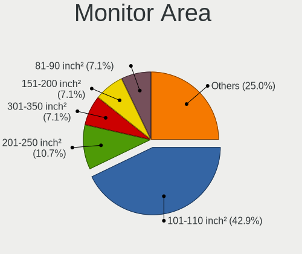

| Area in inch² | Computers | Percent |
|----------------|-----------|---------|
| 101-110        | 11        | 28.21%  |
| 201-250        | 5         | 12.82%  |
| 51-60          | 4         | 10.26%  |
| 81-90          | 3         | 7.69%   |
| 61-70          | 3         | 7.69%   |
| 301-350        | 3         | 7.69%   |
| 141-150        | 3         | 7.69%   |
| 71-80          | 1         | 2.56%   |
| 1-40           | 1         | 2.56%   |
| 251-300        | 1         | 2.56%   |
| 151-200        | 1         | 2.56%   |
| 131-140        | 1         | 2.56%   |
| 121-130        | 1         | 2.56%   |
| 501-1000       | 1         | 2.56%   |

Pixel Density
-------------

Pixels per inch

| Density | Computers | Percent |
|---------|-----------|---------|
| 51-100  | 16        | 41.03%  |
| 121-160 | 13        | 33.33%  |
| 101-120 | 7         | 17.95%  |
| 161-240 | 3         | 7.69%   |

Multiple Monitors
-----------------

Total monitors connected

| Total | Computers | Percent |
|-------|-----------|---------|
| 1     | 36        | 90%     |
| 2     | 3         | 7.5%    |
| 0     | 1         | 2.5%    |

Network
-------

Net Controller Vendor
---------------------

Controller vendors

| Vendor                   | Computers | Percent |
|--------------------------|-----------|---------|
| Realtek Semiconductor    | 23        | 36.51%  |
| Intel                    | 14        | 22.22%  |
| Qualcomm Atheros         | 7         | 11.11%  |
| Nvidia                   | 3         | 4.76%   |
| Marvell Technology Group | 3         | 4.76%   |
| Broadcom                 | 2         | 3.17%   |
| Xiaomi                   | 1         | 1.59%   |
| VIA Technologies         | 1         | 1.59%   |
| Texas Instruments        | 1         | 1.59%   |
| Ralink                   | 1         | 1.59%   |
| NetGear                  | 1         | 1.59%   |
| Motorola PCS             | 1         | 1.59%   |
| ICS Advent               | 1         | 1.59%   |
| Huawei Technologies      | 1         | 1.59%   |
| Edimax Technology        | 1         | 1.59%   |
| Dell                     | 1         | 1.59%   |
| ASUSTek Computer         | 1         | 1.59%   |

Net Controller Model
--------------------

Controller models

| Model                                                                   | Computers | Percent |
|-------------------------------------------------------------------------|-----------|---------|
| Realtek RTL8111/8168/8411 PCI Express Gigabit Ethernet Controller       | 11        | 15.07%  |
| Realtek RTL8852BE PCIe 802.11ax Wireless Network Controller             | 2         | 2.74%   |
| Realtek RTL8723DE Wireless Network Adapter                              | 2         | 2.74%   |
| Realtek RTL8187B Wireless 802.11g 54Mbps Network Adapter                | 2         | 2.74%   |
| Realtek RTL8152 Fast Ethernet Adapter                                   | 2         | 2.74%   |
| Realtek RTL810xE PCI Express Fast Ethernet controller                   | 2         | 2.74%   |
| Qualcomm Atheros AR8161 Gigabit Ethernet                                | 2         | 2.74%   |
| Nvidia MCP61 Ethernet                                                   | 2         | 2.74%   |
| Intel Wireless 8265 / 8275                                              | 2         | 2.74%   |
| Intel Gemini Lake PCH CNVi WiFi                                         | 2         | 2.74%   |
| Intel Ethernet Connection (4) I219-LM                                   | 2         | 2.74%   |
| Xiaomi Mi/Redmi series (RNDIS + ADB)                                    | 1         | 1.37%   |
| VIA VT6102/VT6103 [Rhine-II]                                            | 1         | 1.37%   |
| Texas Instruments CC2531 ZigBee                                         | 1         | 1.37%   |
| Realtek RTL88x2bu [AC1200 Techkey]                                      | 1         | 1.37%   |
| Realtek RTL8821CE 802.11ac PCIe Wireless Network Adapter                | 1         | 1.37%   |
| Realtek RTL8723AE PCIe Wireless Network Adapter                         | 1         | 1.37%   |
| Realtek RTL8153 Gigabit Ethernet Adapter                                | 1         | 1.37%   |
| Realtek RTL-8100/8101L/8139 PCI Fast Ethernet Adapter                   | 1         | 1.37%   |
| Realtek 802.11n WLAN Adapter                                            | 1         | 1.37%   |
| Realtek 802.11ac NIC                                                    | 1         | 1.37%   |
| Ralink RT5390 Wireless 802.11n 1T/1R PCIe                               | 1         | 1.37%   |
| Qualcomm Atheros QCA9565 / AR9565 Wireless Network Adapter              | 1         | 1.37%   |
| Qualcomm Atheros QCA9377 802.11ac Wireless Network Adapter              | 1         | 1.37%   |
| Qualcomm Atheros Killer E2500 Gigabit Ethernet Controller               | 1         | 1.37%   |
| Qualcomm Atheros AR8152 v2.0 Fast Ethernet                              | 1         | 1.37%   |
| Qualcomm Atheros AR242x / AR542x Wireless Network Adapter (PCI-Express) | 1         | 1.37%   |
| Nvidia nForce2 Ethernet Controller                                      | 1         | 1.37%   |
| NetGear WG111v2 54 Mbps Wireless [RealTek RTL8187L]                     | 1         | 1.37%   |
| Motorola PCS moto g pure                                                | 1         | 1.37%   |
| Marvell Group 88E8055 PCI-E Gigabit Ethernet Controller                 | 1         | 1.37%   |
| Marvell Group 88E8039 PCI-E Fast Ethernet Controller                    | 1         | 1.37%   |
| Marvell Group 88E8001 Gigabit Ethernet Controller                       | 1         | 1.37%   |
| Intel Wireless 7265                                                     | 1         | 1.37%   |
| Intel Wireless 7260                                                     | 1         | 1.37%   |
| Intel Wireless 3165                                                     | 1         | 1.37%   |
| Intel Wi-Fi 6 AX210/AX211/AX411 160MHz                                  | 1         | 1.37%   |
| Intel Tiger Lake PCH CNVi WiFi                                          | 1         | 1.37%   |
| Intel I211 Gigabit Network Connection                                   | 1         | 1.37%   |
| Intel Ethernet Connection I217-V                                        | 1         | 1.37%   |

Wireless Vendor
---------------

Wireless vendors

| Vendor                | Computers | Percent |
|-----------------------|-----------|---------|
| Realtek Semiconductor | 11        | 34.38%  |
| Intel                 | 11        | 34.38%  |
| Qualcomm Atheros      | 3         | 9.38%   |
| Broadcom              | 2         | 6.25%   |
| Ralink                | 1         | 3.13%   |
| NetGear               | 1         | 3.13%   |
| Edimax Technology     | 1         | 3.13%   |
| Dell                  | 1         | 3.13%   |
| ASUSTek Computer      | 1         | 3.13%   |

Wireless Model
--------------

Wireless models

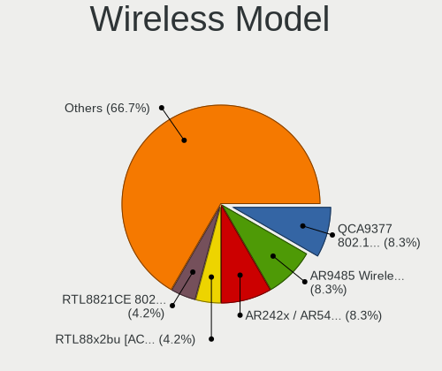

| Model                                                                   | Computers | Percent |
|-------------------------------------------------------------------------|-----------|---------|
| Realtek RTL8852BE PCIe 802.11ax Wireless Network Controller             | 2         | 6.25%   |
| Realtek RTL8723DE Wireless Network Adapter                              | 2         | 6.25%   |
| Realtek RTL8187B Wireless 802.11g 54Mbps Network Adapter                | 2         | 6.25%   |
| Intel Wireless 8265 / 8275                                              | 2         | 6.25%   |
| Intel Gemini Lake PCH CNVi WiFi                                         | 2         | 6.25%   |
| Realtek RTL88x2bu [AC1200 Techkey]                                      | 1         | 3.13%   |
| Realtek RTL8821CE 802.11ac PCIe Wireless Network Adapter                | 1         | 3.13%   |
| Realtek RTL8723AE PCIe Wireless Network Adapter                         | 1         | 3.13%   |
| Realtek 802.11n WLAN Adapter                                            | 1         | 3.13%   |
| Realtek 802.11ac NIC                                                    | 1         | 3.13%   |
| Ralink RT5390 Wireless 802.11n 1T/1R PCIe                               | 1         | 3.13%   |
| Qualcomm Atheros QCA9565 / AR9565 Wireless Network Adapter              | 1         | 3.13%   |
| Qualcomm Atheros QCA9377 802.11ac Wireless Network Adapter              | 1         | 3.13%   |
| Qualcomm Atheros AR242x / AR542x Wireless Network Adapter (PCI-Express) | 1         | 3.13%   |
| NetGear WG111v2 54 Mbps Wireless [RealTek RTL8187L]                     | 1         | 3.13%   |
| Intel Wireless 7265                                                     | 1         | 3.13%   |
| Intel Wireless 7260                                                     | 1         | 3.13%   |
| Intel Wireless 3165                                                     | 1         | 3.13%   |
| Intel Wi-Fi 6 AX210/AX211/AX411 160MHz                                  | 1         | 3.13%   |
| Intel Tiger Lake PCH CNVi WiFi                                          | 1         | 3.13%   |
| Intel Centrino Ultimate-N 6300                                          | 1         | 3.13%   |
| Intel Cannon Lake PCH CNVi WiFi                                         | 1         | 3.13%   |
| Edimax EW-7711UTn nLite Wireless Adapter [Ralink RT2870]                | 1         | 3.13%   |
| Dell DW5811e Snapdragon™ X7 LTE                                    | 1         | 3.13%   |
| Broadcom BCM4331 802.11a/b/g/n                                          | 1         | 3.13%   |
| Broadcom BCM4312 802.11b/g LP-PHY                                       | 1         | 3.13%   |
| ASUS 802.11ac NIC                                                       | 1         | 3.13%   |

Ethernet Vendor
---------------

Ethernet vendors

| Vendor                   | Computers | Percent |
|--------------------------|-----------|---------|
| Realtek Semiconductor    | 16        | 41.03%  |
| Intel                    | 7         | 17.95%  |
| Qualcomm Atheros         | 4         | 10.26%  |
| Nvidia                   | 3         | 7.69%   |
| Marvell Technology Group | 3         | 7.69%   |
| Xiaomi                   | 1         | 2.56%   |
| VIA Technologies         | 1         | 2.56%   |
| Motorola PCS             | 1         | 2.56%   |
| ICS Advent               | 1         | 2.56%   |
| Huawei Technologies      | 1         | 2.56%   |
| Broadcom                 | 1         | 2.56%   |

Ethernet Model
--------------

Ethernet models

| Model                                                             | Computers | Percent |
|-------------------------------------------------------------------|-----------|---------|
| Realtek RTL8111/8168/8411 PCI Express Gigabit Ethernet Controller | 11        | 27.5%   |
| Realtek RTL8152 Fast Ethernet Adapter                             | 2         | 5%      |
| Realtek RTL810xE PCI Express Fast Ethernet controller             | 2         | 5%      |
| Qualcomm Atheros AR8161 Gigabit Ethernet                          | 2         | 5%      |
| Nvidia MCP61 Ethernet                                             | 2         | 5%      |
| Intel Ethernet Connection (4) I219-LM                             | 2         | 5%      |
| Xiaomi Mi/Redmi series (RNDIS + ADB)                              | 1         | 2.5%    |
| VIA VT6102/VT6103 [Rhine-II]                                      | 1         | 2.5%    |
| Realtek RTL8153 Gigabit Ethernet Adapter                          | 1         | 2.5%    |
| Realtek RTL-8100/8101L/8139 PCI Fast Ethernet Adapter             | 1         | 2.5%    |
| Qualcomm Atheros Killer E2500 Gigabit Ethernet Controller         | 1         | 2.5%    |
| Qualcomm Atheros AR8152 v2.0 Fast Ethernet                        | 1         | 2.5%    |
| Nvidia nForce2 Ethernet Controller                                | 1         | 2.5%    |
| Motorola PCS moto g pure                                          | 1         | 2.5%    |
| Marvell Group 88E8055 PCI-E Gigabit Ethernet Controller           | 1         | 2.5%    |
| Marvell Group 88E8039 PCI-E Fast Ethernet Controller              | 1         | 2.5%    |
| Marvell Group 88E8001 Gigabit Ethernet Controller                 | 1         | 2.5%    |
| Intel I211 Gigabit Network Connection                             | 1         | 2.5%    |
| Intel Ethernet Connection I217-V                                  | 1         | 2.5%    |
| Intel Ethernet Connection (14) I219-LM                            | 1         | 2.5%    |
| Intel 82579LM Gigabit Network Connection (Lewisville)             | 1         | 2.5%    |
| Intel 82577LM Gigabit Network Connection                          | 1         | 2.5%    |
| ICS Advent USB 10/100 LAN                                         | 1         | 2.5%    |
| Huawei ANA-NX9                                                    | 1         | 2.5%    |
| Broadcom NetXtreme BCM57765 Gigabit Ethernet PCIe                 | 1         | 2.5%    |

Net Controller Kind
-------------------

Ethernet, WiFi or modem

| Kind     | Computers | Percent |
|----------|-----------|---------|
| Ethernet | 34        | 52.31%  |
| WiFi     | 30        | 46.15%  |
| Modem    | 1         | 1.54%   |

Used Controller
---------------

Currently used network controller

| Kind     | Computers | Percent |
|----------|-----------|---------|
| WiFi     | 22        | 56.41%  |
| Ethernet | 17        | 43.59%  |

NICs
----

Total network controllers on board

| Total | Computers | Percent |
|-------|-----------|---------|
| 1     | 20        | 50%     |
| 2     | 17        | 42.5%   |
| 0     | 2         | 5%      |
| 3     | 1         | 2.5%    |

IPv6
----

IPv6 vs IPv4

| Used | Computers | Percent |
|------|-----------|---------|
| No   | 28        | 70%     |
| Yes  | 12        | 30%     |

Bluetooth
---------

Bluetooth Vendor
----------------

Controller vendors

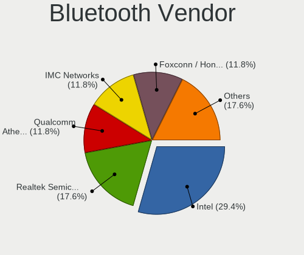

| Vendor                          | Computers | Percent |
|---------------------------------|-----------|---------|
| Intel                           | 9         | 47.37%  |
| Realtek Semiconductor           | 4         | 21.05%  |
| IMC Networks                    | 2         | 10.53%  |
| Qualcomm Atheros Communications | 1         | 5.26%   |
| Lite-On Technology              | 1         | 5.26%   |
| Broadcom                        | 1         | 5.26%   |
| Apple                           | 1         | 5.26%   |

Bluetooth Model
---------------

Controller models

| Model                                          | Computers | Percent |
|------------------------------------------------|-----------|---------|
| Intel Bluetooth wireless interface             | 4         | 21.05%  |
| Intel Bluetooth 9460/9560 Jefferson Peak (JfP) | 3         | 15.79%  |
| Realtek  Bluetooth 4.2 Adapter                 | 2         | 10.53%  |
| Realtek Bluetooth Radio                        | 2         | 10.53%  |
| Qualcomm Atheros  Bluetooth Device             | 1         | 5.26%   |
| Lite-On Qualcomm Atheros Bluetooth             | 1         | 5.26%   |
| Intel AX210 Bluetooth                          | 1         | 5.26%   |
| Intel AX201 Bluetooth                          | 1         | 5.26%   |
| IMC Networks Bluetooth Radio                   | 1         | 5.26%   |
| IMC Networks Bluetooth                         | 1         | 5.26%   |
| Broadcom BCM2045B (BDC-2.1)                    | 1         | 5.26%   |
| Apple Bluetooth USB Host Controller            | 1         | 5.26%   |

Sound
-----

Sound Vendor
------------

Sound card vendors

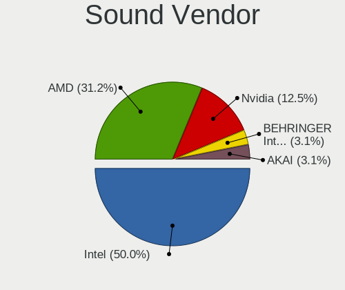

| Vendor              | Computers | Percent |
|---------------------|-----------|---------|
| Intel               | 27        | 51.92%  |
| Nvidia              | 11        | 21.15%  |
| AMD                 | 9         | 17.31%  |
| VIA Technologies    | 2         | 3.85%   |
| Logitech            | 1         | 1.92%   |
| Hewlett-Packard     | 1         | 1.92%   |
| C-Media Electronics | 1         | 1.92%   |

Sound Model
-----------

Sound card models

| Model                                                                                             | Computers | Percent |
|---------------------------------------------------------------------------------------------------|-----------|---------|
| AMD Family 17h/19h HD Audio Controller                                                            | 4         | 6.56%   |
| Nvidia GP107GL High Definition Audio Controller                                                   | 3         | 4.92%   |
| Intel Sunrise Point-LP HD Audio                                                                   | 3         | 4.92%   |
| Intel Celeron/Pentium Silver Processor High Definition Audio                                      | 3         | 4.92%   |
| Intel Cannon Lake PCH cAVS                                                                        | 3         | 4.92%   |
| Intel 7 Series/C216 Chipset Family High Definition Audio Controller                               | 3         | 4.92%   |
| Nvidia MCP61 High Definition Audio                                                                | 2         | 3.28%   |
| Intel NM10/ICH7 Family High Definition Audio Controller                                           | 2         | 3.28%   |
| Intel Atom/Celeron/Pentium Processor x5-E8000/J3xxx/N3xxx Series High Definition Audio Controller | 2         | 3.28%   |
| Intel 82801H (ICH8 Family) HD Audio Controller                                                    | 2         | 3.28%   |
| AMD Renoir Radeon High Definition Audio Controller                                                | 2         | 3.28%   |
| AMD High Definition Audio Controller                                                              | 2         | 3.28%   |
| AMD Family 15h (Models 60h-6fh) Audio Controller                                                  | 2         | 3.28%   |
| VIA Technologies VX900/VT8xxx High Definition Audio Controller                                    | 1         | 1.64%   |
| VIA Technologies VT1720/24 [Envy24PT/HT] PCI Multi-Channel Audio Controller                       | 1         | 1.64%   |
| Nvidia TU116 High Definition Audio Controller                                                     | 1         | 1.64%   |
| Nvidia TU107 GeForce GTX 1650 High Definition Audio Controller                                    | 1         | 1.64%   |
| Nvidia nForce2 AC97 Audio Controler (MCP)                                                         | 1         | 1.64%   |
| Nvidia nForce Audio Processing Unit                                                               | 1         | 1.64%   |
| Nvidia GP108 High Definition Audio Controller                                                     | 1         | 1.64%   |
| Nvidia GM107 High Definition Audio Controller [GeForce 940MX]                                     | 1         | 1.64%   |
| Nvidia GK208 HDMI/DP Audio Controller                                                             | 1         | 1.64%   |
| Logitech H390 headset with microphone                                                             | 1         | 1.64%   |
| Intel Xeon E3-1200 v3/4th Gen Core Processor HD Audio Controller                                  | 1         | 1.64%   |
| Intel Tiger Lake-H HD Audio Controller                                                            | 1         | 1.64%   |
| Intel Jasper Lake HD Audio                                                                        | 1         | 1.64%   |
| Intel Celeron N3350/Pentium N4200/Atom E3900 Series Audio Cluster                                 | 1         | 1.64%   |
| Intel C600/X79 series chipset High Definition Audio Controller                                    | 1         | 1.64%   |
| Intel Atom Processor Z36xxx/Z37xxx Series High Definition Audio Controller                        | 1         | 1.64%   |
| Intel 82801I (ICH9 Family) HD Audio Controller                                                    | 1         | 1.64%   |
| Intel 8 Series/C220 Series Chipset High Definition Audio Controller                               | 1         | 1.64%   |
| Intel 5 Series/3400 Series Chipset High Definition Audio                                          | 1         | 1.64%   |
| Intel 100 Series/C230 Series Chipset Family HD Audio Controller                                   | 1         | 1.64%   |
| Hewlett-Packard USB Audio                                                                         | 1         | 1.64%   |
| C-Media Electronics CM102-A+/102S+ Audio Controller                                               | 1         | 1.64%   |
| AMD Rembrandt Radeon High Definition Audio Controller                                             | 1         | 1.64%   |
| AMD Raven/Raven2/Fenghuang HDMI/DP Audio Controller                                               | 1         | 1.64%   |
| AMD Kabini HDMI/DP Audio                                                                          | 1         | 1.64%   |
| AMD FCH Azalia Controller                                                                         | 1         | 1.64%   |
| AMD Cedar HDMI Audio [Radeon HD 5400/6300/7300 Series]                                            | 1         | 1.64%   |

Memory
------

Memory Vendor
-------------

Memory module vendors

| Vendor              | Computers | Percent |
|---------------------|-----------|---------|
| SK hynix            | 7         | 18.92%  |
| Unknown             | 5         | 13.51%  |
| Micron Technology   | 5         | 13.51%  |
| Unknown (ABCD)      | 4         | 10.81%  |
| Samsung Electronics | 4         | 10.81%  |
| Transcend           | 2         | 5.41%   |
| Ramaxel Technology  | 2         | 5.41%   |
| Unknown             | 2         | 5.41%   |
| Silicon Power       | 1         | 2.7%    |
| Kingston            | 1         | 2.7%    |
| Kingmax             | 1         | 2.7%    |
| Crucial             | 1         | 2.7%    |
| Corsair             | 1         | 2.7%    |
| A-DATA Technology   | 1         | 2.7%    |

Memory Model
------------

Memory module models

| Model                                                            | Computers | Percent |
|------------------------------------------------------------------|-----------|---------|
| Unknown (ABCD) RAM 123456789012345678 2GB SODIMM LPDDR4 2400MT/s | 2         | 5%      |
| Unknown (ABCD) RAM 123456789012345678 1GB DIMM DDR3 2400MT/s     | 2         | 5%      |
| Unknown                                                          | 2         | 5%      |
| Unknown RAM Module 512MB DIMM DRAM                               | 1         | 2.5%    |
| Unknown RAM Module 2GB SODIMM DDR2 667MT/s                       | 1         | 2.5%    |
| Unknown RAM Module 2GB SODIMM DDR2 533MT/s                       | 1         | 2.5%    |
| Unknown RAM Module 2GB DIMM DDR2 533MT/s                         | 1         | 2.5%    |
| Unknown RAM Module 1GB SODIMM DDR2 667MT/s                       | 1         | 2.5%    |
| Unknown RAM Module 1GB DIMM SDRAM                                | 1         | 2.5%    |
| Unknown RAM Module 1024MB DIMM DRAM                              | 1         | 2.5%    |
| Transcend RAM JM667QSU-2G 2GB SODIMM DDR2 667MT/s                | 1         | 2.5%    |
| Transcend RAM JM1333KLN-2G 2048MB DIMM 1333MT/s                  | 1         | 2.5%    |
| SK hynix RAM HMT451S6BFR8A-PB 4GB SODIMM DDR3 1600MT/s           | 1         | 2.5%    |
| SK hynix RAM HMT451S6AFR8A-PB 4GB SODIMM DDR3 1600MT/s           | 1         | 2.5%    |
| SK hynix RAM HMT351S6CFR8C-PB 4GB SODIMM DDR3 1600MT/s           | 1         | 2.5%    |
| SK hynix RAM HMAA1GS6CJR6N-XN 8GB SODIMM DDR4 3200MT/s           | 1         | 2.5%    |
| SK hynix RAM HMA851S6AFR6N-UH 4GB SODIMM DDR4 2400MT/s           | 1         | 2.5%    |
| SK hynix RAM HMA82GS6DJR8N-VK 16GB SODIMM DDR4 2667MT/s          | 1         | 2.5%    |
| SK hynix RAM H9JCNNNBK3MLYR-N6E 2GB SODIMM LPDDR5 5500MT/s       | 1         | 2.5%    |
| SK hynix RAM H5TC4G63CFR-PBA 2GB SODIMM DDR3 1600MT/s            | 1         | 2.5%    |
| Silicon Power RAM DCLT4GN128S 4096MB DIMM 1600MT/s               | 1         | 2.5%    |
| Samsung RAM M471B5273DH0-CH9 4GB SODIMM DDR3 1334MT/s            | 1         | 2.5%    |
| Samsung RAM M4 70T2953CZ3-CE6 1024MB SODIMM DDR2 667MT/s         | 1         | 2.5%    |
| Samsung RAM M393B5170GB0 4GB DIMM DDR3 1866MT/s                  | 1         | 2.5%    |
| Samsung RAM K4E8E324EB-EGCF 2GB LPDDR3 1867MT/s                  | 1         | 2.5%    |
| Ramaxel RAM RMSA3310MJ86H9F-3200 4096MB SODIMM DDR4 3200MT/s     | 1         | 2.5%    |
| Ramaxel RAM RMSA3260NA78HAF-2400 8GB SODIMM DDR4 2400MT/s        | 1         | 2.5%    |
| Micron RAM Module 32GB SODIMM DDR4 3200MT/s                      | 1         | 2.5%    |
| Micron RAM 4ATF51264HZ-3G2J1 4GB SODIMM DDR4 3200MT/s            | 1         | 2.5%    |
| Micron RAM 4ATF51264HZ-2G6E1 4GB SODIMM DDR4 2667MT/s            | 1         | 2.5%    |
| Micron RAM 16JTF51264AZ-1G6M1 4GB DIMM DDR3 1600MT/s             | 1         | 2.5%    |
| Micron RAM 16JSF25664HZ-1G1F1 2GB SODIMM 1067MT/s                | 1         | 2.5%    |
| Kingston RAM KHX2400C15/8G 8GB DIMM DDR4 3400MT/s                | 1         | 2.5%    |
| Kingmax RAM FSGF65F-D8KJB 4GB SODIMM DDR3 800MT/s                | 1         | 2.5%    |
| Crucial RAM CT16G4SFRA32A.C8FE 16GB SODIMM DDR4 3200MT/s         | 1         | 2.5%    |
| Corsair RAM CMY16GX3M2A1600C9 8GB DIMM DDR3 2133MT/s             | 1         | 2.5%    |
| A-DATA RAM AO1P24HC8T1-BSFS 8GB SODIMM DDR4 2400MT/s             | 1         | 2.5%    |

Memory Kind
-----------

Memory module kinds

| Kind   | Computers | Percent |
|--------|-----------|---------|
| DDR3   | 10        | 32.26%  |
| DDR4   | 9         | 29.03%  |
| LPDDR4 | 4         | 12.9%   |
| DDR2   | 4         | 12.9%   |
| SDRAM  | 1         | 3.23%   |
| LPDDR5 | 1         | 3.23%   |
| LPDDR3 | 1         | 3.23%   |
| DRAM   | 1         | 3.23%   |

Memory Form Factor
------------------

Physical design of the memory module

| Name    | Computers | Percent |
|---------|-----------|---------|
| SODIMM  | 18        | 60%     |
| DIMM    | 11        | 36.67%  |
| Unknown | 1         | 3.33%   |

Memory Size
-----------

Memory module size

| Size  | Computers | Percent |
|-------|-----------|---------|
| 4096  | 10        | 26.32%  |
| 2048  | 10        | 26.32%  |
| 8192  | 8         | 21.05%  |
| 16384 | 4         | 10.53%  |
| 1024  | 4         | 10.53%  |
| 32768 | 1         | 2.63%   |
| 512   | 1         | 2.63%   |

Memory Speed
------------

Memory module speed

| Speed   | Computers | Percent |
|---------|-----------|---------|
| 2400    | 7         | 20%     |
| 1600    | 6         | 17.14%  |
| 3200    | 4         | 11.43%  |
| 2667    | 2         | 5.71%   |
| 1866    | 2         | 5.71%   |
| 667     | 2         | 5.71%   |
| 533     | 2         | 5.71%   |
| Unknown | 2         | 5.71%   |
| 5500    | 1         | 2.86%   |
| 3400    | 1         | 2.86%   |
| 2133    | 1         | 2.86%   |
| 1867    | 1         | 2.86%   |
| 1334    | 1         | 2.86%   |
| 1333    | 1         | 2.86%   |
| 1067    | 1         | 2.86%   |
| 800     | 1         | 2.86%   |

Printers & scanners
-------------------

Printer Vendor
--------------

Printer device vendors

| Vendor                | Computers | Percent |
|-----------------------|-----------|---------|
| Lexmark International | 1         | 100%    |

Printer Model
-------------

Printer device models

| Model                             | Computers | Percent |
|-----------------------------------|-----------|---------|
| Lexmark International Z33 Printer | 1         | 100%    |

Scanner Vendor
--------------

Scanner device vendors

Zero info for selected period =(

Scanner Model
-------------

Scanner device models

Zero info for selected period =(

Camera
------

Camera Vendor
-------------

Camera device vendors

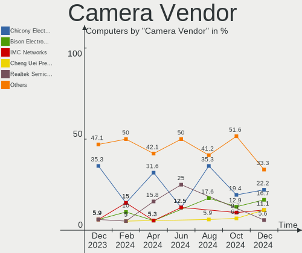

| Vendor                                 | Computers | Percent |
|----------------------------------------|-----------|---------|
| Chicony Electronics                    | 4         | 19.05%  |
| Realtek Semiconductor                  | 3         | 14.29%  |
| Quanta                                 | 2         | 9.52%   |
| Cheng Uei Precision Industry (Foxlink) | 2         | 9.52%   |
| Suyin                                  | 1         | 4.76%   |
| Silicon Motion                         | 1         | 4.76%   |
| Microdia                               | 1         | 4.76%   |
| Lite-On Technology                     | 1         | 4.76%   |
| Lenovo                                 | 1         | 4.76%   |
| IMC Networks                           | 1         | 4.76%   |
| HYGD-220628-A                          | 1         | 4.76%   |
| HD USB Camera                          | 1         | 4.76%   |
| Generalplus Technology                 | 1         | 4.76%   |
| Apple                                  | 1         | 4.76%   |

Camera Model
------------

Camera device models

| Model                                                          | Computers | Percent |
|----------------------------------------------------------------|-----------|---------|
| Cheng Uei Precision Industry (Foxlink) HP TrueVision HD Camera | 2         | 9.52%   |
| Suyin VGA Webcam                                               | 1         | 4.76%   |
| Silicon Motion Web Camera                                      | 1         | 4.76%   |
| Realtek Integrated_Webcam_HD                                   | 1         | 4.76%   |
| Realtek Integrated Webcam_HD                                   | 1         | 4.76%   |
| Realtek Integrated Webcam HD                                   | 1         | 4.76%   |
| Quanta HP HD Camera                                            | 1         | 4.76%   |
| Quanta HP 5MP Camera                                           | 1         | 4.76%   |
| Microdia Integrated Webcam                                     | 1         | 4.76%   |
| Lite-On Integrated Camera                                      | 1         | 4.76%   |
| Lenovo Integrated Webcam                                       | 1         | 4.76%   |
| IMC Networks USB2.0 VGA UVC WebCam                             | 1         | 4.76%   |
| HYGD-220628-A Hy-UXGA(B5M2)-Camera                             | 1         | 4.76%   |
| HD USB Camera HD USB Camera                                    | 1         | 4.76%   |
| Generalplus 808 Camera #9 (web-cam mode)                       | 1         | 4.76%   |
| Chicony Webcam                                                 | 1         | 4.76%   |
| Chicony USB 2.0 Webcam                                         | 1         | 4.76%   |
| Chicony HP TrueVision HD Camera                                | 1         | 4.76%   |
| Chicony 720p HD Camera                                         | 1         | 4.76%   |
| Apple FaceTime HD Camera                                       | 1         | 4.76%   |

Security
--------

Fingerprint Vendor
------------------

Fingerprint sensor vendors

| Vendor                | Computers | Percent |
|-----------------------|-----------|---------|
| Samsung Electronics   | 1         | 50%     |
| Elan Microelectronics | 1         | 50%     |

Fingerprint Model
-----------------

Fingerprint sensor models

| Model                      | Computers | Percent |
|----------------------------|-----------|---------|
| Samsung Fingerprint Device | 1         | 50%     |
| Elan ELAN:Fingerprint      | 1         | 50%     |

Chipcard Vendor
---------------

Chipcard module vendors

| Vendor   | Computers | Percent |
|----------|-----------|---------|
| Broadcom | 1         | 100%    |

Chipcard Model
--------------

Chipcard module models

| Model         | Computers | Percent |
|---------------|-----------|---------|
| Broadcom 5880 | 1         | 100%    |

Unsupported
-----------

Unsupported Devices
-------------------

Total unsupported devices on board

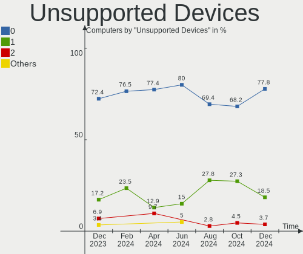

| Total | Computers | Percent |
|-------|-----------|---------|
| 0     | 30        | 75%     |
| 1     | 6         | 15%     |
| 2     | 3         | 7.5%    |
| 3     | 1         | 2.5%    |

Unsupported Device Types
------------------------

Types of unsupported devices

| Type                     | Computers | Percent |
|--------------------------|-----------|---------|
| Net/wireless             | 3         | 21.43%  |
| Sound                    | 2         | 14.29%  |
| Graphics card            | 2         | 14.29%  |
| Fingerprint reader       | 2         | 14.29%  |
| Net/ethernet             | 1         | 7.14%   |
| Multimedia controller    | 1         | 7.14%   |
| Communication controller | 1         | 7.14%   |
| Chipcard                 | 1         | 7.14%   |
| Camera                   | 1         | 7.14%   |

