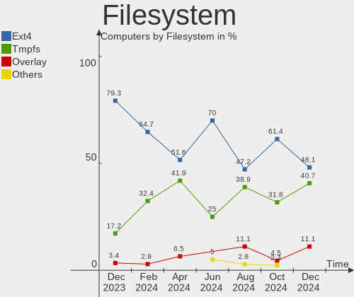
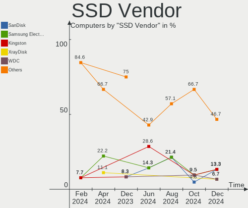
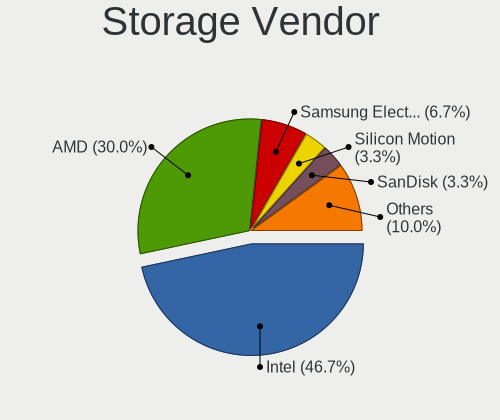
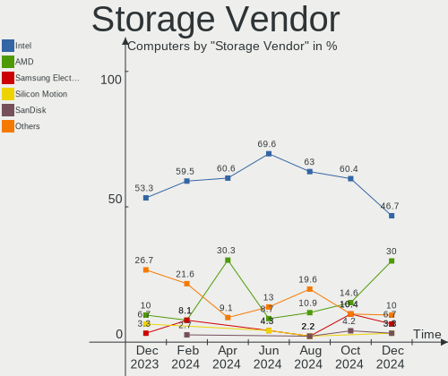
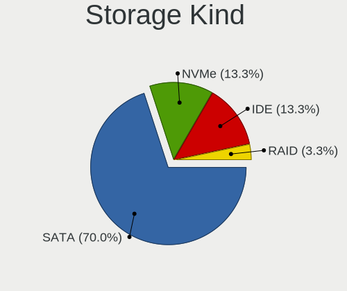
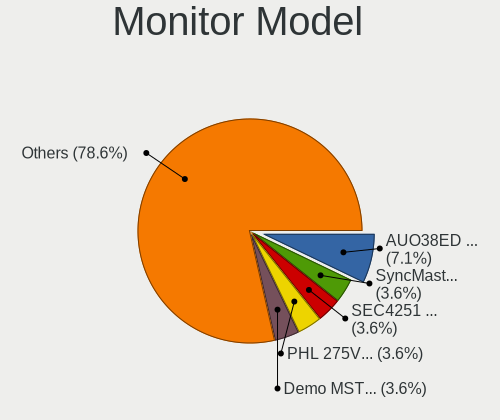
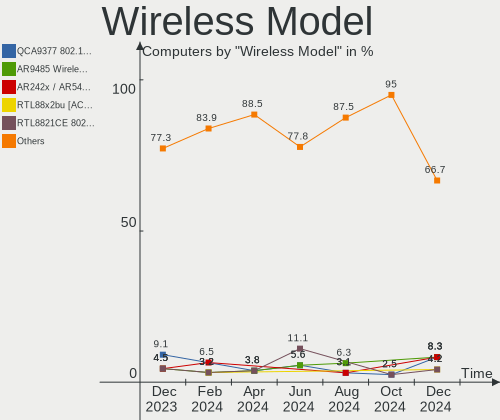
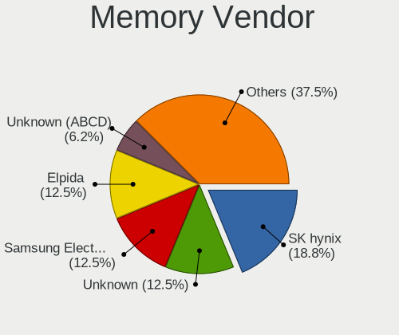
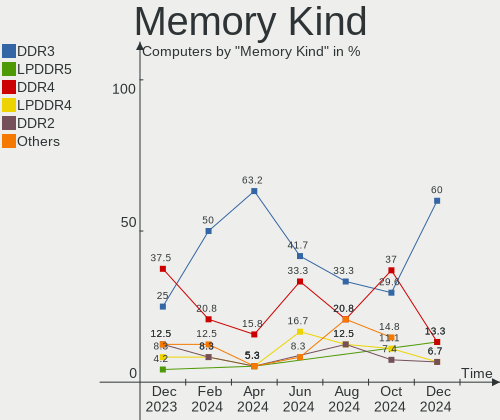
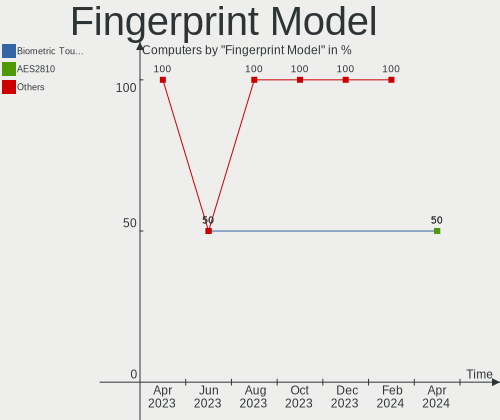

Lubuntu - Hardware Trends
-------------------------

A project to identify most popular hardware characteristics and track their change
over time based on data collected by Linux users at https://Linux-Hardware.org.

Anyone can contribute to this report by the [hw-probe](https://github.com/linuxhw/hw-probe) tool:

    sudo -E hw-probe -all -upload

This is a report for all computer types. See also reports for [desktops](/Dist/Lubuntu/Desktop/README.md) and [notebooks](/Dist/Lubuntu/Notebook/README.md).

This report is for one last month. Overall report since the beginning of time: [TestDays](https://github.com/linuxhw/TestDays)

Period: May, 2023.

Contents
--------

* [ System ](#system)
  - [ OS                       ](#os)
  - [ OS Family                ](#os-family)
  - [ Kernel                   ](#kernel)
  - [ Kernel Family            ](#kernel-family)
  - [ Kernel Major Ver.        ](#kernel-major-ver)
  - [ Arch                     ](#arch)
  - [ DE                       ](#de)
  - [ Display Server           ](#display-server)
  - [ Display Manager          ](#display-manager)
  - [ OS Lang                  ](#os-lang)
  - [ Boot Mode                ](#boot-mode)
  - [ Filesystem               ](#filesystem)
  - [ Part. scheme             ](#part-scheme)
  - [ Dual Boot with Linux/BSD ](#dual-boot-with-linuxbsd)
  - [ Dual Boot (Win)          ](#dual-boot-win)

* [ Board ](#board)
  - [ Vendor                   ](#vendor)
  - [ Model                    ](#model)
  - [ Model Family             ](#model-family)
  - [ MFG Year                 ](#mfg-year)
  - [ Form Factor              ](#form-factor)
  - [ Secure Boot              ](#secure-boot)
  - [ Coreboot                 ](#coreboot)
  - [ RAM Size                 ](#ram-size)
  - [ RAM Used                 ](#ram-used)
  - [ Total Drives             ](#total-drives)
  - [ Has CD-ROM               ](#has-cd-rom)
  - [ Has Ethernet             ](#has-ethernet)
  - [ Has WiFi                 ](#has-wifi)
  - [ Has Bluetooth            ](#has-bluetooth)

* [ Location ](#location)
  - [ Country                  ](#country)
  - [ City                     ](#city)

* [ Drives ](#drives)
  - [ Drive Vendor             ](#drive-vendor)
  - [ Drive Model              ](#drive-model)
  - [ HDD Vendor               ](#hdd-vendor)
  - [ SSD Vendor               ](#ssd-vendor)
  - [ Drive Kind               ](#drive-kind)
  - [ Drive Connector          ](#drive-connector)
  - [ Drive Size               ](#drive-size)
  - [ Space Total              ](#space-total)
  - [ Space Used               ](#space-used)
  - [ Malfunc. Drives          ](#malfunc-drives)
  - [ Malfunc. Drive Vendor    ](#malfunc-drive-vendor)
  - [ Malfunc. HDD Vendor      ](#malfunc-hdd-vendor)
  - [ Malfunc. Drive Kind      ](#malfunc-drive-kind)
  - [ Failed Drives            ](#failed-drives)
  - [ Failed Drive Vendor      ](#failed-drive-vendor)
  - [ Drive Status             ](#drive-status)

* [ Storage controller ](#storage-controller)
  - [ Storage Vendor           ](#storage-vendor)
  - [ Storage Model            ](#storage-model)
  - [ Storage Kind             ](#storage-kind)

* [ Processor ](#processor)
  - [ CPU Vendor               ](#cpu-vendor)
  - [ CPU Model                ](#cpu-model)
  - [ CPU Model Family         ](#cpu-model-family)
  - [ CPU Cores                ](#cpu-cores)
  - [ CPU Sockets              ](#cpu-sockets)
  - [ CPU Threads              ](#cpu-threads)
  - [ CPU Op-Modes             ](#cpu-op-modes)
  - [ CPU Microcode            ](#cpu-microcode)
  - [ CPU Microarch            ](#cpu-microarch)

* [ Graphics ](#graphics)
  - [ GPU Vendor               ](#gpu-vendor)
  - [ GPU Model                ](#gpu-model)
  - [ GPU Combo                ](#gpu-combo)
  - [ GPU Driver               ](#gpu-driver)
  - [ GPU Memory               ](#gpu-memory)

* [ Monitor ](#monitor)
  - [ Monitor Vendor           ](#monitor-vendor)
  - [ Monitor Model            ](#monitor-model)
  - [ Monitor Resolution       ](#monitor-resolution)
  - [ Monitor Diagonal         ](#monitor-diagonal)
  - [ Monitor Width            ](#monitor-width)
  - [ Aspect Ratio             ](#aspect-ratio)
  - [ Monitor Area             ](#monitor-area)
  - [ Pixel Density            ](#pixel-density)
  - [ Multiple Monitors        ](#multiple-monitors)

* [ Network ](#network)
  - [ Net Controller Vendor    ](#net-controller-vendor)
  - [ Net Controller Model     ](#net-controller-model)
  - [ Wireless Vendor          ](#wireless-vendor)
  - [ Wireless Model           ](#wireless-model)
  - [ Ethernet Vendor          ](#ethernet-vendor)
  - [ Ethernet Model           ](#ethernet-model)
  - [ Net Controller Kind      ](#net-controller-kind)
  - [ Used Controller          ](#used-controller)
  - [ NICs                     ](#nics)
  - [ IPv6                     ](#ipv6)

* [ Bluetooth ](#bluetooth)
  - [ Bluetooth Vendor         ](#bluetooth-vendor)
  - [ Bluetooth Model          ](#bluetooth-model)

* [ Sound ](#sound)
  - [ Sound Vendor             ](#sound-vendor)
  - [ Sound Model              ](#sound-model)

* [ Memory ](#memory)
  - [ Memory Vendor            ](#memory-vendor)
  - [ Memory Model             ](#memory-model)
  - [ Memory Kind              ](#memory-kind)
  - [ Memory Form Factor       ](#memory-form-factor)
  - [ Memory Size              ](#memory-size)
  - [ Memory Speed             ](#memory-speed)

* [ Printers & scanners ](#printers--scanners)
  - [ Printer Vendor           ](#printer-vendor)
  - [ Printer Model            ](#printer-model)
  - [ Scanner Vendor           ](#scanner-vendor)
  - [ Scanner Model            ](#scanner-model)

* [ Camera ](#camera)
  - [ Camera Vendor            ](#camera-vendor)
  - [ Camera Model             ](#camera-model)

* [ Security ](#security)
  - [ Fingerprint Vendor       ](#fingerprint-vendor)
  - [ Fingerprint Model        ](#fingerprint-model)
  - [ Chipcard Vendor          ](#chipcard-vendor)
  - [ Chipcard Model           ](#chipcard-model)

* [ Unsupported ](#unsupported)
  - [ Unsupported Devices      ](#unsupported-devices)
  - [ Unsupported Device Types ](#unsupported-device-types)

System
------

OS
--

Installed operating systems

| Name             | Computers | Percent |
|------------------|-----------|---------|
| Lubuntu 22.04    | 25        | 71.43%  |
| Lubuntu 23.04    | 4         | 11.43%  |
| Lubuntu 22.10    | 3         | 8.57%   |
| Lubuntu 20.04    | 2         | 5.71%   |
| Lubuntu 18.04.05 | 1         | 2.86%   |

OS Family
---------

OS without a version

| Name    | Computers | Percent |
|---------|-----------|---------|
| Lubuntu | 35        | 100%    |

Kernel
------

Version of the Linux kernel

| Version                    | Computers | Percent |
|----------------------------|-----------|---------|
| 5.19.0-41-generic          | 10        | 28.57%  |
| 5.15.0-71-generic          | 5         | 14.29%  |
| 6.2.0-20-generic           | 4         | 11.43%  |
| 5.19.0-42-generic          | 3         | 8.57%   |
| 5.19.0-32-generic          | 2         | 5.71%   |
| 5.15.0-72-generic          | 2         | 5.71%   |
| 5.15.0-25-generic          | 2         | 5.71%   |
| 6.3.3-custom               | 1         | 2.86%   |
| 6.1.26-05272-g26c406245a2c | 1         | 2.86%   |
| 5.4.0-148-generic          | 1         | 2.86%   |
| 5.15.0-73-generic          | 1         | 2.86%   |
| 5.15.0-58-generic          | 1         | 2.86%   |
| 5.15.0-52-generic          | 1         | 2.86%   |
| 4.15.0-22-generic          | 1         | 2.86%   |

Kernel Family
-------------

Linux kernel without a distro release

| Version | Computers | Percent |
|---------|-----------|---------|
| 5.19.0  | 15        | 42.86%  |
| 5.15.0  | 12        | 34.29%  |
| 6.2.0   | 4         | 11.43%  |
| 6.3.3   | 1         | 2.86%   |
| 6.1.26  | 1         | 2.86%   |
| 5.4.0   | 1         | 2.86%   |
| 4.15.0  | 1         | 2.86%   |

Kernel Major Ver.
-----------------

Linux kernel major version

| Version | Computers | Percent |
|---------|-----------|---------|
| 5.19    | 15        | 42.86%  |
| 5.15    | 12        | 34.29%  |
| 6.2     | 4         | 11.43%  |
| 6.3     | 1         | 2.86%   |
| 6.1     | 1         | 2.86%   |
| 5.4     | 1         | 2.86%   |
| 4.15    | 1         | 2.86%   |

Arch
----

OS architecture (x86_64, i586, etc.)

| Name    | Computers | Percent |
|---------|-----------|---------|
| x86_64  | 33        | 94.29%  |
| i686    | 1         | 2.86%   |
| aarch64 | 1         | 2.86%   |

DE
--

Desktop Environment

| Name  | Computers | Percent |
|-------|-----------|---------|
| LXQt  | 32        | 91.43%  |
| LXDE  | 2         | 5.71%   |
| GNOME | 1         | 2.86%   |

Display Server
--------------

X11 or Wayland

| Name | Computers | Percent |
|------|-----------|---------|
| X11  | 34        | 97.14%  |
| Tty  | 1         | 2.86%   |

Display Manager
---------------

SDDM, LightDM, etc.

| Name    | Computers | Percent |
|---------|-----------|---------|
| SDDM    | 28        | 80%     |
| LightDM | 4         | 11.43%  |
| GDM3    | 2         | 5.71%   |
| Unknown | 1         | 2.86%   |

OS Lang
-------

Language

| Lang  | Computers | Percent |
|-------|-----------|---------|
| en_US | 11        | 31.43%  |
| pt_BR | 4         | 11.43%  |
| en_GB | 4         | 11.43%  |
| fr_FR | 2         | 5.71%   |
| de_DE | 2         | 5.71%   |
| C     | 2         | 5.71%   |
| tr_TR | 1         | 2.86%   |
| sk_SK | 1         | 2.86%   |
| nl_BE | 1         | 2.86%   |
| it_IT | 1         | 2.86%   |
| fr_CA | 1         | 2.86%   |
| es_MX | 1         | 2.86%   |
| es_ES | 1         | 2.86%   |
| es_CR | 1         | 2.86%   |
| es_CO | 1         | 2.86%   |
| en_AU | 1         | 2.86%   |

Boot Mode
---------

EFI or BIOS

| Mode | Computers | Percent |
|------|-----------|---------|
| BIOS | 21        | 60%     |
| EFI  | 14        | 40%     |

Filesystem
----------

Type of filesystem

| Type    | Computers | Percent |
|---------|-----------|---------|
| Ext4    | 25        | 71.43%  |
| Tmpfs   | 7         | 20%     |
| Overlay | 2         | 5.71%   |
| Btrfs   | 1         | 2.86%   |

Part. scheme
------------

Scheme of partitioning

| Type    | Computers | Percent |
|---------|-----------|---------|
| GPT     | 22        | 62.86%  |
| MBR     | 12        | 34.29%  |
| Unknown | 1         | 2.86%   |

Dual Boot with Linux/BSD
------------------------

Hosting more than one Linux/BSD

| Dual boot | Computers | Percent |
|-----------|-----------|---------|
| No        | 27        | 77.14%  |
| Yes       | 8         | 22.86%  |

Dual Boot (Win)
---------------

Hosting Linux and Windows

| Dual boot | Computers | Percent |
|-----------|-----------|---------|
| No        | 28        | 80%     |
| Yes       | 7         | 20%     |

Board
-----

Vendor
------

Motherboard manufacturer

| Name                           | Computers | Percent |
|--------------------------------|-----------|---------|
| Unknown                        | 4         | 11.43%  |
| Lenovo                         | 3         | 8.57%   |
| Hewlett-Packard                | 3         | 8.57%   |
| Dell                           | 3         | 8.57%   |
| ASUSTek Computer               | 3         | 8.57%   |
| Samsung Electronics            | 2         | 5.71%   |
| Intel                          | 2         | 5.71%   |
| ZOTAC                          | 1         | 2.86%   |
| Toshiba                        | 1         | 2.86%   |
| Shanghai Zhaoxin Semiconductor | 1         | 2.86%   |
| PCWare                         | 1         | 2.86%   |
| NEC Computers                  | 1         | 2.86%   |
| Medion                         | 1         | 2.86%   |
| Mediacom                       | 1         | 2.86%   |
| libre-computer                 | 1         | 2.86%   |
| HUAWEI                         | 1         | 2.86%   |
| Hampoo                         | 1         | 2.86%   |
| Google                         | 1         | 2.86%   |
| Foxconn                        | 1         | 2.86%   |
| AZW                            | 1         | 2.86%   |
| Apple                          | 1         | 2.86%   |
| Acer                           | 1         | 2.86%   |

Model
-----

Motherboard model

| Name                                  | Computers | Percent |
|---------------------------------------|-----------|---------|
| Unknown                               | 4         | 11.43%  |
| ZOTAC NM10                            | 1         | 2.86%   |
| Toshiba Satellite Radius P55W-B       | 1         | 2.86%   |
| Shanghai Zhaoxin ZEB20                | 1         | 2.86%   |
| Samsung N150/N210/N220                | 1         | 2.86%   |
| Samsung 530XBB                        | 1         | 2.86%   |
| PCWare IPX1800E2                      | 1         | 2.86%   |
| NEC Computers ECS-945G                | 1         | 2.86%   |
| Medion Akoya P6660 MD99790            | 1         | 2.86%   |
| Mediacom SmartBook 14 FullHD - SB14UC | 1         | 2.86%   |
| libre-computer roc-rk3328-cc          | 1         | 2.86%   |
| Lenovo ThinkPad T400 276522G          | 1         | 2.86%   |
| Lenovo Legion 5 15ACH6 82JW           | 1         | 2.86%   |
| Lenovo IdeaPad 500-15ISK 80NT         | 1         | 2.86%   |
| Intel Infoway                         | 1         | 2.86%   |
| Intel DG41RQ AAE54511-203             | 1         | 2.86%   |
| HUAWEI KLVL-WXXW                      | 1         | 2.86%   |
| HP x2 210                             | 1         | 2.86%   |
| HP ProBook 650 G3                     | 1         | 2.86%   |
| HP Notebook                           | 1         | 2.86%   |
| Hampoo SurfTab duo W1 10.1 (VT4)      | 1         | 2.86%   |
| Google Glimmer                        | 1         | 2.86%   |
| Foxconn G41MXE-V                      | 1         | 2.86%   |
| Dell XPS 13 9305                      | 1         | 2.86%   |
| Dell Latitude E6520                   | 1         | 2.86%   |
| Dell Latitude E6430                   | 1         | 2.86%   |
| AZW SER                               | 1         | 2.86%   |
| ASUS X450CC                           | 1         | 2.86%   |
| ASUS M4A87TD/USB3                     | 1         | 2.86%   |
| ASUS A88XM-A                          | 1         | 2.86%   |
| Apple MacBook4,1                      | 1         | 2.86%   |
| Acer Veriton M670G/M670               | 1         | 2.86%   |

Model Family
------------

Motherboard model prefix

| Name                         | Computers | Percent |
|------------------------------|-----------|---------|
| Unknown                      | 4         | 11.43%  |
| Dell Latitude                | 2         | 5.71%   |
| ZOTAC NM10                   | 1         | 2.86%   |
| Toshiba Satellite            | 1         | 2.86%   |
| Shanghai Zhaoxin ZEB20       | 1         | 2.86%   |
| Samsung N150                 | 1         | 2.86%   |
| Samsung 530XBB               | 1         | 2.86%   |
| PCWare IPX1800E2             | 1         | 2.86%   |
| NEC Computers ECS-945G       | 1         | 2.86%   |
| Medion Akoya                 | 1         | 2.86%   |
| Mediacom SmartBook           | 1         | 2.86%   |
| libre-computer roc-rk3328-cc | 1         | 2.86%   |
| Lenovo ThinkPad              | 1         | 2.86%   |
| Lenovo Legion                | 1         | 2.86%   |
| Lenovo IdeaPad               | 1         | 2.86%   |
| Intel Infoway                | 1         | 2.86%   |
| Intel DG41RQ                 | 1         | 2.86%   |
| HUAWEI KLVL-WXXW             | 1         | 2.86%   |
| HP x2                        | 1         | 2.86%   |
| HP ProBook                   | 1         | 2.86%   |
| HP Notebook                  | 1         | 2.86%   |
| Hampoo SurfTab               | 1         | 2.86%   |
| Google Glimmer               | 1         | 2.86%   |
| Foxconn G41MXE-V             | 1         | 2.86%   |
| Dell XPS                     | 1         | 2.86%   |
| AZW SER                      | 1         | 2.86%   |
| ASUS X450CC                  | 1         | 2.86%   |
| ASUS M4A87TD                 | 1         | 2.86%   |
| ASUS A88XM-A                 | 1         | 2.86%   |
| Apple MacBook4               | 1         | 2.86%   |
| Acer Veriton                 | 1         | 2.86%   |

MFG Year
--------

Motherboard manufacture year

| Year | Computers | Percent |
|------|-----------|---------|
| 2010 | 6         | 17.14%  |
| 2015 | 5         | 14.29%  |
| 2022 | 4         | 11.43%  |
| 2021 | 4         | 11.43%  |
| 2008 | 4         | 11.43%  |
| 2016 | 2         | 5.71%   |
| 2013 | 2         | 5.71%   |
| 2023 | 1         | 2.86%   |
| 2019 | 1         | 2.86%   |
| 2017 | 1         | 2.86%   |
| 2014 | 1         | 2.86%   |
| 2012 | 1         | 2.86%   |
| 2011 | 1         | 2.86%   |
| 2009 | 1         | 2.86%   |
| 2007 | 1         | 2.86%   |

Form Factor
-----------

Physical design of the computer

| Name           | Computers | Percent |
|----------------|-----------|---------|
| Notebook       | 22        | 62.86%  |
| Desktop        | 10        | 28.57%  |
| Mini pc        | 2         | 5.71%   |
| System on chip | 1         | 2.86%   |

Secure Boot
-----------

Enabled or disabled

| State    | Computers | Percent |
|----------|-----------|---------|
| Disabled | 35        | 100%    |

Coreboot
--------

Have coreboot on board

| Used | Computers | Percent |
|------|-----------|---------|
| No   | 34        | 97.14%  |
| Yes  | 1         | 2.86%   |

RAM Size
--------

Total RAM memory

| Size in GB | Computers | Percent |
|------------|-----------|---------|
| 4.01-8.0   | 10        | 28.57%  |
| 1.01-2.0   | 8         | 22.86%  |
| 3.01-4.0   | 7         | 20%     |
| 8.01-16.0  | 5         | 14.29%  |
| 24.01-32.0 | 2         | 5.71%   |
| 16.01-24.0 | 2         | 5.71%   |
| 2.01-3.0   | 1         | 2.86%   |

RAM Used
--------

Used RAM memory

| Used GB  | Computers | Percent |
|----------|-----------|---------|
| 1.01-2.0 | 21        | 60%     |
| 0.51-1.0 | 5         | 14.29%  |
| 2.01-3.0 | 4         | 11.43%  |
| 4.01-8.0 | 3         | 8.57%   |
| 3.01-4.0 | 1         | 2.86%   |
| 0.01-0.5 | 1         | 2.86%   |

Total Drives
------------

Number of drives on board

| Drives | Computers | Percent |
|--------|-----------|---------|
| 1      | 24        | 68.57%  |
| 2      | 10        | 28.57%  |
| 3      | 1         | 2.86%   |

Has CD-ROM
----------

Has CD-ROM on board

| Presented | Computers | Percent |
|-----------|-----------|---------|
| No        | 19        | 54.29%  |
| Yes       | 16        | 45.71%  |

Has Ethernet
------------

Has Ethernet on board

| Presented | Computers | Percent |
|-----------|-----------|---------|
| Yes       | 26        | 74.29%  |
| No        | 9         | 25.71%  |

Has WiFi
--------

Has WiFi module

| Presented | Computers | Percent |
|-----------|-----------|---------|
| Yes       | 24        | 68.57%  |
| No        | 11        | 31.43%  |

Has Bluetooth
-------------

Has Bluetooth module

| Presented | Computers | Percent |
|-----------|-----------|---------|
| No        | 18        | 51.43%  |
| Yes       | 17        | 48.57%  |

Location
--------

Country
-------

Geographic location (country)

| Country     | Computers | Percent |
|-------------|-----------|---------|
| Germany     | 6         | 17.14%  |
| USA         | 5         | 14.29%  |
| Brazil      | 4         | 11.43%  |
| UK          | 2         | 5.71%   |
| France      | 2         | 5.71%   |
| Finland     | 2         | 5.71%   |
| Venezuela   | 1         | 2.86%   |
| Turkey      | 1         | 2.86%   |
| Sweden      | 1         | 2.86%   |
| Spain       | 1         | 2.86%   |
| Slovakia    | 1         | 2.86%   |
| Pakistan    | 1         | 2.86%   |
| Netherlands | 1         | 2.86%   |
| Italy       | 1         | 2.86%   |
| Costa Rica  | 1         | 2.86%   |
| Colombia    | 1         | 2.86%   |
| China       | 1         | 2.86%   |
| Canada      | 1         | 2.86%   |
| Belgium     | 1         | 2.86%   |
| Australia   | 1         | 2.86%   |

City
----

Geographic location (city)

| City             | Computers | Percent |
|------------------|-----------|---------|
| Monheim am Rhein | 2         | 5.71%   |
| Vrbov            | 1         | 2.86%   |
| Tampere          | 1         | 2.86%   |
| Swansea          | 1         | 2.86%   |
| Stockton         | 1         | 2.86%   |
| Sao Paulo        | 1         | 2.86%   |
| Saltsjoe-Boo     | 1         | 2.86%   |
| Paris            | 1         | 2.86%   |
| Oxnard           | 1         | 2.86%   |
| Novo Gama        | 1         | 2.86%   |
| Nova Serrana     | 1         | 2.86%   |
| Mostoles         | 1         | 2.86%   |
| Milano           | 1         | 2.86%   |
| Mechelen         | 1         | 2.86%   |
| Madrid           | 1         | 2.86%   |
| Louisville       | 1         | 2.86%   |
| Kunming          | 1         | 2.86%   |
| Kaufbeuren       | 1         | 2.86%   |
| Karachi          | 1         | 2.86%   |
| Joao Pessoa      | 1         | 2.86%   |
| Hounslow         | 1         | 2.86%   |
| Helsinki         | 1         | 2.86%   |
| Grecia           | 1         | 2.86%   |
| Eugene           | 1         | 2.86%   |
| Düsseldorf      | 1         | 2.86%   |
| Drancy           | 1         | 2.86%   |
| Ciudad Guayana   | 1         | 2.86%   |
| Buffalo          | 1         | 2.86%   |
| Bryson           | 1         | 2.86%   |
| Bruhl            | 1         | 2.86%   |
| Berlin           | 1         | 2.86%   |
| Antalya          | 1         | 2.86%   |
| Amsterdam        | 1         | 2.86%   |
| Adelaide         | 1         | 2.86%   |

Drives
------

Drive Vendor
------------

Hard drive vendors

| Vendor              | Computers | Drives | Percent |
|---------------------|-----------|--------|---------|
| Seagate             | 9         | 9      | 20.45%  |
| Unknown             | 7         | 8      | 15.91%  |
| Samsung Electronics | 6         | 6      | 13.64%  |
| WDC                 | 4         | 5      | 9.09%   |
| Hitachi             | 3         | 4      | 6.82%   |
| Toshiba             | 2         | 2      | 4.55%   |
| YMTC                | 1         | 1      | 2.27%   |
| XrayDisk            | 1         | 1      | 2.27%   |
| WDC WDS2            | 1         | 1      | 2.27%   |
| Transcend           | 1         | 1      | 2.27%   |
| SPCC                | 1         | 1      | 2.27%   |
| Silicon Motion      | 1         | 1      | 2.27%   |
| Netac               | 1         | 1      | 2.27%   |
| Lexar               | 1         | 1      | 2.27%   |
| Kingston            | 1         | 1      | 2.27%   |
| Hewlett-Packard     | 1         | 1      | 2.27%   |
| Crucial             | 1         | 1      | 2.27%   |
| China               | 1         | 1      | 2.27%   |
| Unknown             | 1         | 1      | 2.27%   |

Drive Model
-----------

Hard drive models

| Model                                | Computers | Percent |
|--------------------------------------|-----------|---------|
| Unknown NCard  32GB                  | 2         | 4.26%   |
| Unknown MMC Card  32GB               | 2         | 4.26%   |
| YMTC PC005 512GB                     | 1         | 2.13%   |
| XrayDisk 128GB                       | 1         | 2.13%   |
| WDC WDS2 40G2G0A-00JH30 240GB SSD    | 1         | 2.13%   |
| WDC WD5000LPVX-60V0TT0 500GB         | 1         | 2.13%   |
| WDC WD3200BEKT-75PVMT1 320GB         | 1         | 2.13%   |
| WDC WD3200AAJS-56M0A0 320GB          | 1         | 2.13%   |
| WDC WD3200AAJS-56B4A0 320GB          | 1         | 2.13%   |
| WDC PC SN730 SDBPNTY-512G-1101 512GB | 1         | 2.13%   |
| Unknown SD128  128GB                 | 1         | 2.13%   |
| Unknown SC256  256GB                 | 1         | 2.13%   |
| Unknown MMC Card  64GB               | 1         | 2.13%   |
| Unknown MMC Card  16GB               | 1         | 2.13%   |
| Transcend TS128GSSD340 128GB         | 1         | 2.13%   |
| Toshiba THNSN5256GPUK 256GB          | 1         | 2.13%   |
| Toshiba MQ02ABD100H 1TB              | 1         | 2.13%   |
| SPCC M.2 SSD 512GB                   | 1         | 2.13%   |
| Silicon Motion PCIe-8 SSD 512GB      | 1         | 2.13%   |
| Seagate ST9250827AS 250GB            | 1         | 2.13%   |
| Seagate ST9160314AS 160GB            | 1         | 2.13%   |
| Seagate ST250DM000-1BD141 250GB      | 1         | 2.13%   |
| Seagate ST2000DM008-2FR102 2TB       | 1         | 2.13%   |
| Seagate ST2000DM001-1CH164 2TB       | 1         | 2.13%   |
| Seagate ST1000LM024 HN-M101MBB 1TB   | 1         | 2.13%   |
| Seagate ST1000DM010-2EP102 1TB       | 1         | 2.13%   |
| Seagate ST1000DM003-1ER162 1TB       | 1         | 2.13%   |
| Seagate Expansion Desk 4TB           | 1         | 2.13%   |
| Samsung SSD 970 EVO Plus 1TB         | 1         | 2.13%   |
| Samsung SSD 870 EVO 500GB            | 1         | 2.13%   |
| Samsung SSD 870 EVO 1TB              | 1         | 2.13%   |
| Samsung SSD 850 EVO 120GB            | 1         | 2.13%   |
| Samsung SSD 830 Series 256GB         | 1         | 2.13%   |
| Samsung HM121HI 120GB                | 1         | 2.13%   |
| Netac SSD 128GB                      | 1         | 2.13%   |
| Lexar 128GB SSD                      | 1         | 2.13%   |
| Kingston SA400S37480G 480GB SSD      | 1         | 2.13%   |
| Hitachi HTS547575A9E384 752GB        | 1         | 2.13%   |
| Hitachi HTS543216L9A300 160GB        | 1         | 2.13%   |
| Hitachi HTS542516K9SA00 160GB        | 1         | 2.13%   |

HDD Vendor
----------

Hard disk drive vendors

| Vendor              | Computers | Drives | Percent |
|---------------------|-----------|--------|---------|
| Seagate             | 9         | 9      | 52.94%  |
| WDC                 | 3         | 4      | 17.65%  |
| Hitachi             | 3         | 4      | 17.65%  |
| Toshiba             | 1         | 1      | 5.88%   |
| Samsung Electronics | 1         | 1      | 5.88%   |

SSD Vendor
----------

Solid state drive vendors

| Vendor              | Computers | Drives | Percent |
|---------------------|-----------|--------|---------|
| Samsung Electronics | 4         | 4      | 36.36%  |
| WDC WDS2            | 1         | 1      | 9.09%   |
| Transcend           | 1         | 1      | 9.09%   |
| SPCC                | 1         | 1      | 9.09%   |
| Netac               | 1         | 1      | 9.09%   |
| Lexar               | 1         | 1      | 9.09%   |
| Kingston            | 1         | 1      | 9.09%   |
| Hewlett-Packard     | 1         | 1      | 9.09%   |

Drive Kind
----------

HDD or SSD

| Kind    | Computers | Drives | Percent |
|---------|-----------|--------|---------|
| HDD     | 16        | 19     | 38.1%   |
| SSD     | 10        | 11     | 23.81%  |
| MMC     | 8         | 9      | 19.05%  |
| NVMe    | 6         | 6      | 14.29%  |
| Unknown | 2         | 2      | 4.76%   |

Drive Connector
---------------

SATA, SAS, NVMe, etc.

| Type | Computers | Drives | Percent |
|------|-----------|--------|---------|
| SATA | 25        | 30     | 60.98%  |
| MMC  | 8         | 9      | 19.51%  |
| NVMe | 6         | 6      | 14.63%  |
| SAS  | 2         | 2      | 4.88%   |

Drive Size
----------

Size of hard drive

| Size in TB | Computers | Drives | Percent |
|------------|-----------|--------|---------|
| 0.01-0.5   | 18        | 20     | 64.29%  |
| 0.51-1.0   | 7         | 7      | 25%     |
| 1.01-2.0   | 2         | 2      | 7.14%   |
| 3.01-4.0   | 1         | 1      | 3.57%   |

Space Total
-----------

Amount of disk space available on the file system

| Size in GB     | Computers | Percent |
|----------------|-----------|---------|
| 101-250        | 13        | 37.14%  |
| 251-500        | 5         | 14.29%  |
| 1-20           | 5         | 14.29%  |
| 501-1000       | 4         | 11.43%  |
| 21-50          | 3         | 8.57%   |
| 1001-2000      | 2         | 5.71%   |
| 51-100         | 2         | 5.71%   |
| More than 3000 | 1         | 2.86%   |

Space Used
----------

Amount of used disk space

| Used GB   | Computers | Percent |
|-----------|-----------|---------|
| 1-20      | 17        | 48.57%  |
| 51-100    | 8         | 22.86%  |
| 101-250   | 5         | 14.29%  |
| 21-50     | 3         | 8.57%   |
| 251-500   | 1         | 2.86%   |
| 1001-2000 | 1         | 2.86%   |

Malfunc. Drives
---------------

Drive models with a malfunction

| Model                              | Computers | Drives | Percent |
|------------------------------------|-----------|--------|---------|
| Seagate ST9250827AS 250GB          | 1         | 1      | 20%     |
| Seagate ST250DM000-1BD141 250GB    | 1         | 1      | 20%     |
| Seagate ST1000LM024 HN-M101MBB 1TB | 1         | 1      | 20%     |
| Samsung Electronics HM121HI 120GB  | 1         | 1      | 20%     |
| Hitachi HTS543216L9A300 160GB      | 1         | 1      | 20%     |

Malfunc. Drive Vendor
---------------------

Vendors of faulty drives

| Vendor              | Computers | Drives | Percent |
|---------------------|-----------|--------|---------|
| Seagate             | 3         | 3      | 60%     |
| Samsung Electronics | 1         | 1      | 20%     |
| Hitachi             | 1         | 1      | 20%     |

Malfunc. HDD Vendor
-------------------

Vendors of faulty HDD drives

| Vendor              | Computers | Drives | Percent |
|---------------------|-----------|--------|---------|
| Seagate             | 3         | 3      | 60%     |
| Samsung Electronics | 1         | 1      | 20%     |
| Hitachi             | 1         | 1      | 20%     |

Malfunc. Drive Kind
-------------------

Kinds of faulty drives

| Kind | Computers | Drives | Percent |
|------|-----------|--------|---------|
| HDD  | 5         | 5      | 100%    |

Failed Drives
-------------

Failed drive models

Zero info for selected period =(

Failed Drive Vendor
-------------------

Failed drive vendors

Zero info for selected period =(

Drive Status
------------

Number of failed and malfunc. drives

| Status   | Computers | Drives | Percent |
|----------|-----------|--------|---------|
| Detected | 18        | 25     | 47.37%  |
| Works    | 15        | 17     | 39.47%  |
| Malfunc  | 5         | 5      | 13.16%  |

Storage controller
------------------

Storage Vendor
--------------

Storage controller vendors

| Vendor                       | Computers | Percent |
|------------------------------|-----------|---------|
| Intel                        | 21        | 60%     |
| AMD                          | 5         | 14.29%  |
| Zhaoxin                      | 1         | 2.86%   |
| Yangtze Memory Technologies  | 1         | 2.86%   |
| Toshiba America Info Systems | 1         | 2.86%   |
| Silicon Motion               | 1         | 2.86%   |
| SanDisk                      | 1         | 2.86%   |
| Samsung Electronics          | 1         | 2.86%   |
| Nvidia                       | 1         | 2.86%   |
| Micron/Crucial Technology    | 1         | 2.86%   |
| JMicron Technology           | 1         | 2.86%   |

Storage Model
-------------

Storage controller models

| Model                                                                                  | Computers | Percent |
|----------------------------------------------------------------------------------------|-----------|---------|
| AMD FCH SATA Controller [AHCI mode]                                                    | 4         | 9.3%    |
| Intel Sunrise Point-LP SATA Controller [AHCI mode]                                     | 3         | 6.98%   |
| Intel NM10/ICH7 Family SATA Controller [IDE mode]                                      | 3         | 6.98%   |
| Intel Celeron/Pentium Silver Processor SATA Controller                                 | 3         | 6.98%   |
| Intel 82801G (ICH7 Family) IDE Controller                                              | 3         | 6.98%   |
| Intel NM10/ICH7 Family SATA Controller [AHCI mode]                                     | 2         | 4.65%   |
| Intel 82801HM/HEM (ICH8M/ICH8M-E) SATA Controller [AHCI mode]                          | 2         | 4.65%   |
| Intel 82801HM/HEM (ICH8M/ICH8M-E) IDE Controller                                       | 2         | 4.65%   |
| Intel 7 Series Chipset Family 6-port SATA Controller [AHCI mode]                       | 2         | 4.65%   |
| Zhaoxin ZX-100/ZX-200/KX-6000/KX-6000G StorX AHCI Controller                           | 1         | 2.33%   |
| Yangtze Memory Non-Volatile memory controller                                          | 1         | 2.33%   |
| Toshiba America Info Systems XG4 NVMe SSD Controller                                   | 1         | 2.33%   |
| Silicon Motion Non-Volatile memory controller                                          | 1         | 2.33%   |
| SanDisk WD Black SN750 / PC SN730 NVMe SSD                                             | 1         | 2.33%   |
| Samsung NVMe SSD Controller SM981/PM981/PM983                                          | 1         | 2.33%   |
| Nvidia MCP61 SATA Controller                                                           | 1         | 2.33%   |
| Nvidia MCP61 IDE                                                                       | 1         | 2.33%   |
| Micron/Crucial P2 NVMe PCIe SSD                                                        | 1         | 2.33%   |
| JMicron JMB368 IDE controller                                                          | 1         | 2.33%   |
| Intel Wildcat Point-LP SATA Controller [AHCI Mode]                                     | 1         | 2.33%   |
| Intel Atom Processor E3800 Series SATA AHCI Controller                                 | 1         | 2.33%   |
| Intel 82801JD/DO (ICH10 Family) SATA AHCI Controller                                   | 1         | 2.33%   |
| Intel 82801IBM/IEM (ICH9M/ICH9M-E) 4 port SATA Controller [AHCI mode]                  | 1         | 2.33%   |
| Intel 82801HM/HEM (ICH8M/ICH8M-E) SATA Controller [IDE mode]                           | 1         | 2.33%   |
| Intel 6 Series/C200 Series Chipset Family Mobile SATA Controller (IDE mode, ports 4-5) | 1         | 2.33%   |
| Intel 6 Series/C200 Series Chipset Family Mobile SATA Controller (IDE mode, ports 0-3) | 1         | 2.33%   |
| Intel 4 Series Chipset PT IDER Controller                                              | 1         | 2.33%   |
| AMD SB7x0/SB8x0/SB9x0 SATA Controller [AHCI mode]                                      | 1         | 2.33%   |

Storage Kind
------------

Kind of storage controller (IDE, SATA, NVMe, SAS, ...)

| Kind | Computers | Percent |
|------|-----------|---------|
| SATA | 22        | 57.89%  |
| IDE  | 10        | 26.32%  |
| NVMe | 6         | 15.79%  |

Processor
---------

CPU Vendor
----------

Processor vendors

| Vendor       | Computers | Percent |
|--------------|-----------|---------|
| Intel        | 26        | 74.29%  |
| AMD          | 7         | 20%     |
| CentaurHauls | 1         | 2.86%   |
| ARM          | 1         | 2.86%   |

CPU Model
---------

Processor models

| Model                                           | Computers | Percent |
|-------------------------------------------------|-----------|---------|
| Intel Atom x5-Z8300 CPU @ 1.44GHz               | 3         | 8.57%   |
| AMD Ryzen 7 5800H with Radeon Graphics          | 2         | 5.71%   |
| Intel Pentium Dual-Core CPU E5700 @ 3.00GHz     | 1         | 2.86%   |
| Intel Pentium Dual-Core CPU E5300 @ 2.60GHz     | 1         | 2.86%   |
| Intel Pentium Dual CPU E2140 @ 1.60GHz          | 1         | 2.86%   |
| Intel Core i7-5500U CPU @ 2.40GHz               | 1         | 2.86%   |
| Intel Core i5-7200U CPU @ 2.50GHz               | 1         | 2.86%   |
| Intel Core i5-6200U CPU @ 2.30GHz               | 1         | 2.86%   |
| Intel Core i5-3337U CPU @ 1.80GHz               | 1         | 2.86%   |
| Intel Core i5-3230M CPU @ 2.60GHz               | 1         | 2.86%   |
| Intel Core i3-6100U CPU @ 2.30GHz               | 1         | 2.86%   |
| Intel Core i3-2330M CPU @ 2.20GHz               | 1         | 2.86%   |
| Intel Core 2 Duo CPU T8300 @ 2.40GHz            | 1         | 2.86%   |
| Intel Core 2 Duo CPU T7500 @ 2.20GHz            | 1         | 2.86%   |
| Intel Core 2 Duo CPU P8600 @ 2.40GHz            | 1         | 2.86%   |
| Intel Core 2 Duo CPU E7300 @ 2.66GHz            | 1         | 2.86%   |
| Intel Celeron N4100 CPU @ 1.10GHz               | 1         | 2.86%   |
| Intel Celeron N4020C CPU @ 1.10GHz              | 1         | 2.86%   |
| Intel Celeron N4000 CPU @ 1.10GHz               | 1         | 2.86%   |
| Intel Celeron CPU N2940 @ 1.83GHz               | 1         | 2.86%   |
| Intel Celeron CPU J1800 @ 2.41GHz               | 1         | 2.86%   |
| Intel Atom CPU N450 @ 1.66GHz                   | 1         | 2.86%   |
| Intel Atom CPU D525 @ 1.80GHz                   | 1         | 2.86%   |
| Intel Atom CPU D510 @ 1.66GHz                   | 1         | 2.86%   |
| Intel 11th Gen Core i5-1135G7 @ 2.40GHz         | 1         | 2.86%   |
| CentaurHauls ZHAOXIN Z3-6540M@2.1+GHz           | 1         | 2.86%   |
| ARM Processor                                   | 1         | 2.86%   |
| AMD Ryzen 7 5700U with Radeon Graphics          | 1         | 2.86%   |
| AMD Phenom II X6 1090T Processor                | 1         | 2.86%   |
| AMD Phenom II X6 1055T Processor                | 1         | 2.86%   |
| AMD A6-5200 APU with Radeon HD Graphics         | 1         | 2.86%   |
| AMD A10-7850K Radeon R7, 12 Compute Cores 4C+8G | 1         | 2.86%   |

CPU Model Family
----------------

Processor model prefix

| Model                   | Computers | Percent |
|-------------------------|-----------|---------|
| Intel Atom              | 6         | 17.14%  |
| Intel Celeron           | 5         | 14.29%  |
| Intel Core i5           | 4         | 11.43%  |
| Intel Core 2 Duo        | 4         | 11.43%  |
| Other                   | 3         | 8.57%   |
| AMD Ryzen 7             | 3         | 8.57%   |
| Intel Pentium Dual-Core | 2         | 5.71%   |
| Intel Core i3           | 2         | 5.71%   |
| AMD Phenom II X6        | 2         | 5.71%   |
| Intel Pentium Dual      | 1         | 2.86%   |
| Intel Core i7           | 1         | 2.86%   |
| AMD A6                  | 1         | 2.86%   |
| AMD A10                 | 1         | 2.86%   |

CPU Cores
---------

Number of processor cores

| Number  | Computers | Percent |
|---------|-----------|---------|
| 2       | 20        | 57.14%  |
| 4       | 8         | 22.86%  |
| 8       | 3         | 8.57%   |
| 6       | 2         | 5.71%   |
| 1       | 1         | 2.86%   |
| Unknown | 1         | 2.86%   |

CPU Sockets
-----------

Number of sockets

| Number  | Computers | Percent |
|---------|-----------|---------|
| 1       | 34        | 97.14%  |
| Unknown | 1         | 2.86%   |

CPU Threads
-----------

Threads per core (Hyper-Threading)

| Number  | Computers | Percent |
|---------|-----------|---------|
| 1       | 19        | 54.29%  |
| 2       | 15        | 42.86%  |
| Unknown | 1         | 2.86%   |

CPU Op-Modes
------------

CPU Operation Modes (32-bit, 64-bit)

| Op mode        | Computers | Percent |
|----------------|-----------|---------|
| 32-bit, 64-bit | 35        | 100%    |

CPU Microcode
-------------

Microcode number

| Number     | Computers | Percent |
|------------|-----------|---------|
| Unknown    | 18        | 51.43%  |
| 0x406c3    | 2         | 5.71%   |
| 0x306a9    | 2         | 5.71%   |
| 0x1067a    | 2         | 5.71%   |
| 0x806c1    | 1         | 2.86%   |
| 0x706a8    | 1         | 2.86%   |
| 0x706a1    | 1         | 2.86%   |
| 0x406e3    | 1         | 2.86%   |
| 0x306d4    | 1         | 2.86%   |
| 0x30679    | 1         | 2.86%   |
| 0x106ca    | 1         | 2.86%   |
| 0x0a50000d | 1         | 2.86%   |
| 0x0a50000c | 1         | 2.86%   |
| 0x06003106 | 1         | 2.86%   |
| 0x010000dc | 1         | 2.86%   |

CPU Microarch
-------------

Microarchitecture

| Name          | Computers | Percent |
|---------------|-----------|---------|
| Silvermont    | 5         | 14.29%  |
| Penryn        | 5         | 14.29%  |
| Goldmont plus | 3         | 8.57%   |
| Bonnell       | 3         | 8.57%   |
| Unknown       | 3         | 8.57%   |
| Zen 3         | 2         | 5.71%   |
| Skylake       | 2         | 5.71%   |
| K10           | 2         | 5.71%   |
| IvyBridge     | 2         | 5.71%   |
| Core          | 2         | 5.71%   |
| TigerLake     | 1         | 2.86%   |
| Steamroller   | 1         | 2.86%   |
| SandyBridge   | 1         | 2.86%   |
| KabyLake      | 1         | 2.86%   |
| Jaguar        | 1         | 2.86%   |
| Broadwell     | 1         | 2.86%   |

Graphics
--------

GPU Vendor
----------

Vendors of graphics cards

| Vendor  | Computers | Percent |
|---------|-----------|---------|
| Intel   | 23        | 58.97%  |
| AMD     | 8         | 20.51%  |
| Nvidia  | 7         | 17.95%  |
| Zhaoxin | 1         | 2.56%   |

GPU Model
---------

Graphics card models

| Model                                                                                    | Computers | Percent |
|------------------------------------------------------------------------------------------|-----------|---------|
| Intel GeminiLake [UHD Graphics 600]                                                      | 3         | 7.32%   |
| Intel Atom/Celeron/Pentium Processor x5-E8000/J3xxx/N3xxx Integrated Graphics Controller | 3         | 7.32%   |
| Intel Skylake GT2 [HD Graphics 520]                                                      | 2         | 4.88%   |
| Intel Mobile GM965/GL960 Integrated Graphics Controller (secondary)                      | 2         | 4.88%   |
| Intel Mobile GM965/GL960 Integrated Graphics Controller (primary)                        | 2         | 4.88%   |
| Intel Atom Processor Z36xxx/Z37xxx Series Graphics & Display                             | 2         | 4.88%   |
| Intel Atom Processor D4xx/D5xx/N4xx/N5xx Integrated Graphics Controller                  | 2         | 4.88%   |
| Intel 4 Series Chipset Integrated Graphics Controller                                    | 2         | 4.88%   |
| Intel 3rd Gen Core processor Graphics Controller                                         | 2         | 4.88%   |
| AMD Cezanne [Radeon Vega Series / Radeon Vega Mobile Series]                             | 2         | 4.88%   |
| Zhaoxin ZX-E C-960 GPU                                                                   | 1         | 2.44%   |
| Nvidia GT218 [ION]                                                                       | 1         | 2.44%   |
| Nvidia GT218 [GeForce 210]                                                               | 1         | 2.44%   |
| Nvidia GM108M [GeForce 930M]                                                             | 1         | 2.44%   |
| Nvidia GK106 [GeForce GTX 660]                                                           | 1         | 2.44%   |
| Nvidia GF117M [GeForce 610M/710M/810M/820M / GT 620M/625M/630M/720M]                     | 1         | 2.44%   |
| Nvidia GA107BM [GeForce RTX 3050 Ti Mobile]                                              | 1         | 2.44%   |
| Nvidia C61 [GeForce 7025 / nForce 630a]                                                  | 1         | 2.44%   |
| Intel TigerLake-LP GT2 [Iris Xe Graphics]                                                | 1         | 2.44%   |
| Intel Mobile 4 Series Chipset Integrated Graphics Controller                             | 1         | 2.44%   |
| Intel HD Graphics 620                                                                    | 1         | 2.44%   |
| Intel HD Graphics 5500                                                                   | 1         | 2.44%   |
| Intel 2nd Generation Core Processor Family Integrated Graphics Controller                | 1         | 2.44%   |
| AMD Topaz XT [Radeon R7 M260/M265 / M340/M360 / M440/M445 / 530/535 / 620/625 Mobile]    | 1         | 2.44%   |
| AMD RV620/M82 [Mobility Radeon HD 3450/3470]                                             | 1         | 2.44%   |
| AMD Lucienne                                                                             | 1         | 2.44%   |
| AMD Kaveri [Radeon R7 Graphics]                                                          | 1         | 2.44%   |
| AMD Kabini [Radeon HD 8400 / R3 Series]                                                  | 1         | 2.44%   |
| AMD Cedar [Radeon HD 5000/6000/7350/8350 Series]                                         | 1         | 2.44%   |

GPU Combo
---------

Combinations of graphics cards

| Name           | Computers | Percent |
|----------------|-----------|---------|
| 1 x Intel      | 19        | 54.29%  |
| 1 x AMD        | 5         | 14.29%  |
| 1 x Nvidia     | 4         | 11.43%  |
| Intel + Nvidia | 2         | 5.71%   |
| Intel + AMD    | 2         | 5.71%   |
| Other          | 1         | 2.86%   |
| 1 x Zhaoxin    | 1         | 2.86%   |
| AMD + Nvidia   | 1         | 2.86%   |

GPU Driver
----------

Free vs proprietary

| Driver      | Computers | Percent |
|-------------|-----------|---------|
| Free        | 28        | 80%     |
| Unknown     | 4         | 11.43%  |
| Proprietary | 3         | 8.57%   |

GPU Memory
----------

Total video memory

| Size in GB | Computers | Percent |
|------------|-----------|---------|
| Unknown    | 25        | 71.43%  |
| 1.01-2.0   | 4         | 11.43%  |
| 0.01-0.5   | 3         | 8.57%   |
| 0.51-1.0   | 2         | 5.71%   |
| 2.01-3.0   | 1         | 2.86%   |

Monitor
-------

Monitor Vendor
--------------

Monitor vendors

| Vendor                  | Computers | Percent |
|-------------------------|-----------|---------|
| Samsung Electronics     | 4         | 12.5%   |
| AU Optronics            | 4         | 12.5%   |
| Dell                    | 3         | 9.38%   |
| BOE                     | 3         | 9.38%   |
| Sony                    | 2         | 6.25%   |
| LG Display              | 2         | 6.25%   |
| Chimei Innolux          | 2         | 6.25%   |
| PANDA                   | 1         | 3.13%   |
| Lenovo                  | 1         | 3.13%   |
| Insignia                | 1         | 3.13%   |
| InnoLux Display         | 1         | 3.13%   |
| InfoVision              | 1         | 3.13%   |
| Iiyama                  | 1         | 3.13%   |
| Hewlett-Packard         | 1         | 3.13%   |
| CPT                     | 1         | 3.13%   |
| Chi Mei Optoelectronics | 1         | 3.13%   |
| Belinea                 | 1         | 3.13%   |
| Apple                   | 1         | 3.13%   |
| AOC                     | 1         | 3.13%   |

Monitor Model
-------------

Monitor models

| Model                                                                    | Computers | Percent |
|--------------------------------------------------------------------------|-----------|---------|
| Sony TV SNY5803 1360x768                                                 | 1         | 3.13%   |
| Sony SDM-S73 SNY2770 1280x1024 359x287mm 18.1-inch                       | 1         | 3.13%   |
| Samsung Electronics SyncMaster SAM027C 1680x1050 433x271mm 20.1-inch     | 1         | 3.13%   |
| Samsung Electronics LCD Monitor SEC3649 1366x768 309x174mm 14.0-inch     | 1         | 3.13%   |
| Samsung Electronics LCD Monitor SAM0F13 3840x2160 950x540mm 43.0-inch    | 1         | 3.13%   |
| Samsung Electronics LCD Monitor SAM0A76 1280x720 949x543mm 43.0-inch     | 1         | 3.13%   |
| PANDA LCD Monitor NCP0004 1920x1080 294x165mm 13.3-inch                  | 1         | 3.13%   |
| LG Display LCD Monitor LGD04A7 1920x1080 344x194mm 15.5-inch             | 1         | 3.13%   |
| LG Display LCD Monitor LGD02DF 1600x900 310x174mm 14.0-inch              | 1         | 3.13%   |
| Lenovo LCD Monitor LEN4033 1440x900 304x190mm 14.1-inch                  | 1         | 3.13%   |
| Insignia HDMI     BBY0029 1920x1080 1150x650mm 52.0-inch                 | 1         | 3.13%   |
| InnoLux Display BT101IW03V1 INL000D 1024x600 222x125mm 10.0-inch         | 1         | 3.13%   |
| InfoVision LCD Monitor IVO0489 1366x768 256x144mm 11.6-inch              | 1         | 3.13%   |
| Iiyama PL2530H IVM6132 1920x1080 544x303mm 24.5-inch                     | 1         | 3.13%   |
| Hewlett-Packard Compaq CQ1569 HWP2836 1366x768 344x194mm 15.5-inch       | 1         | 3.13%   |
| Dell P2721Q DELF125 3840x2160 597x336mm 27.0-inch                        | 1         | 3.13%   |
| Dell LCD Monitor U2412M 1920x1200                                        | 1         | 3.13%   |
| Dell E2222HS DELF131 1920x1080 480x260mm 21.5-inch                       | 1         | 3.13%   |
| CPT LCD Monitor CPT1415 1280x800 331x207mm 15.4-inch                     | 1         | 3.13%   |
| Chimei Innolux LCD Monitor CMN15CA 1366x768 344x193mm 15.5-inch          | 1         | 3.13%   |
| Chimei Innolux LCD Monitor CMN15C4 1920x1080 344x193mm 15.5-inch         | 1         | 3.13%   |
| Chi Mei Optoelectronics LCD Monitor CMO15A3 1366x768 344x193mm 15.5-inch | 1         | 3.13%   |
| BOE LCD Monitor BOE0918 1920x1080 309x174mm 14.0-inch                    | 1         | 3.13%   |
| BOE LCD Monitor BOE0877 1920x1080 309x173mm 13.9-inch                    | 1         | 3.13%   |
| BOE LCD Monitor BOE0635 1920x1080 309x173mm 13.9-inch                    | 1         | 3.13%   |
| Belinea 1945 S1W MAX0799 1440x900 410x256mm 19.0-inch                    | 1         | 3.13%   |
| AU Optronics LCD Monitor AUOB69B 1920x1080 344x193mm 15.5-inch           | 1         | 3.13%   |
| AU Optronics LCD Monitor AUO5B2D 1920x1080 293x162mm 13.2-inch           | 1         | 3.13%   |
| AU Optronics LCD Monitor AUO35ED 1920x1080 344x193mm 15.5-inch           | 1         | 3.13%   |
| AU Optronics LCD Monitor AUO18D4 1280x800 216x135mm 10.0-inch            | 1         | 3.13%   |
| Apple LCD Monitor APP9C5F 1280x800 286x179mm 13.3-inch                   | 1         | 3.13%   |
| AOC LM522 AOCA522 1024x768 304x228mm 15.0-inch                           | 1         | 3.13%   |

Monitor Resolution
------------------

Monitor screen resolution

| Resolution         | Computers | Percent |
|--------------------|-----------|---------|
| 1920x1080 (FHD)    | 12        | 37.5%   |
| 1366x768 (WXGA)    | 5         | 15.63%  |
| 1280x800 (WXGA)    | 3         | 9.38%   |
| 3840x2160 (4K)     | 2         | 6.25%   |
| 1440x900 (WXGA+)   | 2         | 6.25%   |
| 1920x1200 (WUXGA)  | 1         | 3.13%   |
| 1680x1050 (WSXGA+) | 1         | 3.13%   |
| 1600x900 (HD+)     | 1         | 3.13%   |
| 1360x768           | 1         | 3.13%   |
| 1280x720 (HD)      | 1         | 3.13%   |
| 1280x1024 (SXGA)   | 1         | 3.13%   |
| 1024x768 (XGA)     | 1         | 3.13%   |
| 1024x600           | 1         | 3.13%   |

Monitor Diagonal
----------------

Diagonal size in inches

| Inches  | Computers | Percent |
|---------|-----------|---------|
| 15      | 10        | 31.25%  |
| 13      | 5         | 15.63%  |
| 14      | 4         | 12.5%   |
| 10      | 2         | 6.25%   |
| 84      | 1         | 3.13%   |
| 72      | 1         | 3.13%   |
| 52      | 1         | 3.13%   |
| 43      | 1         | 3.13%   |
| 27      | 1         | 3.13%   |
| 24      | 1         | 3.13%   |
| 21      | 1         | 3.13%   |
| 20      | 1         | 3.13%   |
| 19      | 1         | 3.13%   |
| 18      | 1         | 3.13%   |
| Unknown | 1         | 3.13%   |

Monitor Width
-------------

Physical width

| Width in mm | Computers | Percent |
|-------------|-----------|---------|
| 301-350     | 16        | 50%     |
| 201-300     | 5         | 15.63%  |
| 401-500     | 3         | 9.38%   |
| 501-600     | 2         | 6.25%   |
| 1501-2000   | 2         | 6.25%   |
| 351-400     | 1         | 3.13%   |
| 1001-1500   | 1         | 3.13%   |
| 901-1000    | 1         | 3.13%   |
| Unknown     | 1         | 3.13%   |

Aspect Ratio
------------

Proportional relationship between the width and the height

| Ratio   | Computers | Percent |
|---------|-----------|---------|
| 16/9    | 22        | 70.97%  |
| 16/10   | 6         | 19.35%  |
| 5/4     | 1         | 3.23%   |
| 4/3     | 1         | 3.23%   |
| Unknown | 1         | 3.23%   |

Monitor Area
------------

Area in inch²

| Area in inch² | Computers | Percent |
|----------------|-----------|---------|
| 101-110        | 10        | 31.25%  |
| 81-90          | 7         | 21.88%  |
| 151-200        | 4         | 12.5%   |
| More than 1000 | 3         | 9.38%   |
| 71-80          | 2         | 6.25%   |
| 41-50          | 2         | 6.25%   |
| 301-350        | 1         | 3.13%   |
| 251-300        | 1         | 3.13%   |
| 501-1000       | 1         | 3.13%   |
| Unknown        | 1         | 3.13%   |

Pixel Density
-------------

Pixels per inch

| Density | Computers | Percent |
|---------|-----------|---------|
| 121-160 | 10        | 31.25%  |
| 51-100  | 8         | 25%     |
| 101-120 | 7         | 21.88%  |
| 1-50    | 3         | 9.38%   |
| 161-240 | 3         | 9.38%   |
| Unknown | 1         | 3.13%   |

Multiple Monitors
-----------------

Total monitors connected

| Total | Computers | Percent |
|-------|-----------|---------|
| 1     | 31        | 88.57%  |
| 0     | 3         | 8.57%   |
| 2     | 1         | 2.86%   |

Network
-------

Net Controller Vendor
---------------------

Controller vendors

| Vendor                   | Computers | Percent |
|--------------------------|-----------|---------|
| Realtek Semiconductor    | 17        | 36.17%  |
| Intel                    | 16        | 34.04%  |
| Marvell Technology Group | 4         | 8.51%   |
| Qualcomm Atheros         | 2         | 4.26%   |
| Broadcom                 | 2         | 4.26%   |
| Ralink Technology        | 1         | 2.13%   |
| OPPO Electronics         | 1         | 2.13%   |
| Nvidia                   | 1         | 2.13%   |
| GERTEC Telecomunicacoes  | 1         | 2.13%   |
| Belkin Components        | 1         | 2.13%   |
| ASIX Electronics         | 1         | 2.13%   |

Net Controller Model
--------------------

Controller models

| Model                                                                                   | Computers | Percent |
|-----------------------------------------------------------------------------------------|-----------|---------|
| Realtek RTL8111/8168/8411 PCI Express Gigabit Ethernet Controller                       | 12        | 22.64%  |
| Intel Wireless 3165                                                                     | 3         | 5.66%   |
| Intel Wireless 7265                                                                     | 2         | 3.77%   |
| Intel 82579LM Gigabit Network Connection (Lewisville)                                   | 2         | 3.77%   |
| Realtek RTL8852AE 802.11ax PCIe Wireless Network Adapter                                | 1         | 1.89%   |
| Realtek RTL8821CE 802.11ac PCIe Wireless Network Adapter                                | 1         | 1.89%   |
| Realtek RTL8188EE Wireless Network Adapter                                              | 1         | 1.89%   |
| Realtek RTL8187B Wireless 802.11g 54Mbps Network Adapter                                | 1         | 1.89%   |
| Realtek RTL810xE PCI Express Fast Ethernet controller                                   | 1         | 1.89%   |
| Realtek RTL-8110SC/8169SC Gigabit Ethernet                                              | 1         | 1.89%   |
| Realtek RTL-8100/8101L/8139 PCI Fast Ethernet Adapter                                   | 1         | 1.89%   |
| Ralink MT7601U Wireless Adapter                                                         | 1         | 1.89%   |
| Qualcomm Atheros AR9485 Wireless Network Adapter                                        | 1         | 1.89%   |
| Qualcomm Atheros AR9285 Wireless Network Adapter (PCI-Express)                          | 1         | 1.89%   |
| OPPO SM8350-MTP _SN:1518BD09                                                            | 1         | 1.89%   |
| Nvidia MCP61 Ethernet                                                                   | 1         | 1.89%   |
| Marvell Group 88w8335 [Libertas] 802.11b/g Wireless                                     | 1         | 1.89%   |
| Marvell Group 88E8058 PCI-E Gigabit Ethernet Controller                                 | 1         | 1.89%   |
| Marvell Group 88E8055 PCI-E Gigabit Ethernet Controller                                 | 1         | 1.89%   |
| Marvell Group 88E8040 PCI-E Fast Ethernet Controller                                    | 1         | 1.89%   |
| Intel Wireless-AC 9260                                                                  | 1         | 1.89%   |
| Intel Wireless 7260                                                                     | 1         | 1.89%   |
| Intel Wi-Fi 6 AX200                                                                     | 1         | 1.89%   |
| Intel Ultimate N WiFi Link 5300                                                         | 1         | 1.89%   |
| Intel Gemini Lake PCH CNVi WiFi                                                         | 1         | 1.89%   |
| Intel Ethernet Connection (4) I219-V                                                    | 1         | 1.89%   |
| Intel Dual Band Wireless-AC 3165 Plus Bluetooth                                         | 1         | 1.89%   |
| Intel Centrino Ultimate-N 6300                                                          | 1         | 1.89%   |
| Intel Centrino Advanced-N 6235                                                          | 1         | 1.89%   |
| Intel 82583V Gigabit Network Connection                                                 | 1         | 1.89%   |
| Intel 82567V-3 Gigabit Network Connection                                               | 1         | 1.89%   |
| Intel 82567LM-3 Gigabit Network Connection                                              | 1         | 1.89%   |
| Intel 82567LM Gigabit Network Connection                                                | 1         | 1.89%   |
| GERTEC Telecomunicacoes PPC930 Pinpad Terminal                                          | 1         | 1.89%   |
| Broadcom BCM43228 802.11a/b/g/n                                                         | 1         | 1.89%   |
| Broadcom BCM4321 802.11a/b/g/n                                                          | 1         | 1.89%   |
| Belkin Components F7D2102 802.11n N300 Micro Wireless Adapter v3000 [Realtek RTL8192CU] | 1         | 1.89%   |
| ASIX AX88179 Gigabit Ethernet                                                           | 1         | 1.89%   |

Wireless Vendor
---------------

Wireless vendors

| Vendor                   | Computers | Percent |
|--------------------------|-----------|---------|
| Intel                    | 13        | 54.17%  |
| Realtek Semiconductor    | 4         | 16.67%  |
| Qualcomm Atheros         | 2         | 8.33%   |
| Broadcom                 | 2         | 8.33%   |
| Ralink Technology        | 1         | 4.17%   |
| Marvell Technology Group | 1         | 4.17%   |
| Belkin Components        | 1         | 4.17%   |

Wireless Model
--------------

Wireless models

| Model                                                                                   | Computers | Percent |
|-----------------------------------------------------------------------------------------|-----------|---------|
| Intel Wireless 3165                                                                     | 3         | 12.5%   |
| Intel Wireless 7265                                                                     | 2         | 8.33%   |
| Realtek RTL8852AE 802.11ax PCIe Wireless Network Adapter                                | 1         | 4.17%   |
| Realtek RTL8821CE 802.11ac PCIe Wireless Network Adapter                                | 1         | 4.17%   |
| Realtek RTL8188EE Wireless Network Adapter                                              | 1         | 4.17%   |
| Realtek RTL8187B Wireless 802.11g 54Mbps Network Adapter                                | 1         | 4.17%   |
| Ralink MT7601U Wireless Adapter                                                         | 1         | 4.17%   |
| Qualcomm Atheros AR9485 Wireless Network Adapter                                        | 1         | 4.17%   |
| Qualcomm Atheros AR9285 Wireless Network Adapter (PCI-Express)                          | 1         | 4.17%   |
| Marvell Group 88w8335 [Libertas] 802.11b/g Wireless                                     | 1         | 4.17%   |
| Intel Wireless-AC 9260                                                                  | 1         | 4.17%   |
| Intel Wireless 7260                                                                     | 1         | 4.17%   |
| Intel Wi-Fi 6 AX200                                                                     | 1         | 4.17%   |
| Intel Ultimate N WiFi Link 5300                                                         | 1         | 4.17%   |
| Intel Gemini Lake PCH CNVi WiFi                                                         | 1         | 4.17%   |
| Intel Dual Band Wireless-AC 3165 Plus Bluetooth                                         | 1         | 4.17%   |
| Intel Centrino Ultimate-N 6300                                                          | 1         | 4.17%   |
| Intel Centrino Advanced-N 6235                                                          | 1         | 4.17%   |
| Broadcom BCM43228 802.11a/b/g/n                                                         | 1         | 4.17%   |
| Broadcom BCM4321 802.11a/b/g/n                                                          | 1         | 4.17%   |
| Belkin Components F7D2102 802.11n N300 Micro Wireless Adapter v3000 [Realtek RTL8192CU] | 1         | 4.17%   |

Ethernet Vendor
---------------

Ethernet vendors

| Vendor                   | Computers | Percent |
|--------------------------|-----------|---------|
| Realtek Semiconductor    | 15        | 55.56%  |
| Intel                    | 6         | 22.22%  |
| Marvell Technology Group | 3         | 11.11%  |
| OPPO Electronics         | 1         | 3.7%    |
| Nvidia                   | 1         | 3.7%    |
| ASIX Electronics         | 1         | 3.7%    |

Ethernet Model
--------------

Ethernet models

| Model                                                             | Computers | Percent |
|-------------------------------------------------------------------|-----------|---------|
| Realtek RTL8111/8168/8411 PCI Express Gigabit Ethernet Controller | 12        | 42.86%  |
| Intel 82579LM Gigabit Network Connection (Lewisville)             | 2         | 7.14%   |
| Realtek RTL810xE PCI Express Fast Ethernet controller             | 1         | 3.57%   |
| Realtek RTL-8110SC/8169SC Gigabit Ethernet                        | 1         | 3.57%   |
| Realtek RTL-8100/8101L/8139 PCI Fast Ethernet Adapter             | 1         | 3.57%   |
| OPPO SM8350-MTP _SN:1518BD09                                      | 1         | 3.57%   |
| Nvidia MCP61 Ethernet                                             | 1         | 3.57%   |
| Marvell Group 88E8058 PCI-E Gigabit Ethernet Controller           | 1         | 3.57%   |
| Marvell Group 88E8055 PCI-E Gigabit Ethernet Controller           | 1         | 3.57%   |
| Marvell Group 88E8040 PCI-E Fast Ethernet Controller              | 1         | 3.57%   |
| Intel Ethernet Connection (4) I219-V                              | 1         | 3.57%   |
| Intel 82583V Gigabit Network Connection                           | 1         | 3.57%   |
| Intel 82567V-3 Gigabit Network Connection                         | 1         | 3.57%   |
| Intel 82567LM-3 Gigabit Network Connection                        | 1         | 3.57%   |
| Intel 82567LM Gigabit Network Connection                          | 1         | 3.57%   |
| ASIX AX88179 Gigabit Ethernet                                     | 1         | 3.57%   |

Net Controller Kind
-------------------

Ethernet, WiFi or modem

| Kind     | Computers | Percent |
|----------|-----------|---------|
| Ethernet | 26        | 50.98%  |
| WiFi     | 24        | 47.06%  |
| Modem    | 1         | 1.96%   |

Used Controller
---------------

Currently used network controller

| Kind     | Computers | Percent |
|----------|-----------|---------|
| WiFi     | 20        | 58.82%  |
| Ethernet | 14        | 41.18%  |

NICs
----

Total network controllers on board

| Total | Computers | Percent |
|-------|-----------|---------|
| 1     | 16        | 45.71%  |
| 2     | 14        | 40%     |
| 0     | 4         | 11.43%  |
| 3     | 1         | 2.86%   |

IPv6
----

IPv6 vs IPv4

| Used | Computers | Percent |
|------|-----------|---------|
| No   | 22        | 62.86%  |
| Yes  | 13        | 37.14%  |

Bluetooth
---------

Bluetooth Vendor
----------------

Controller vendors

| Vendor                  | Computers | Percent |
|-------------------------|-----------|---------|
| Intel                   | 10        | 58.82%  |
| Realtek Semiconductor   | 2         | 11.76%  |
| TP-Link                 | 1         | 5.88%   |
| IMC Networks            | 1         | 5.88%   |
| Cambridge Silicon Radio | 1         | 5.88%   |
| Broadcom                | 1         | 5.88%   |
| Apple                   | 1         | 5.88%   |

Bluetooth Model
---------------

Controller models

| Model                                               | Computers | Percent |
|-----------------------------------------------------|-----------|---------|
| Intel Bluetooth wireless interface                  | 7         | 41.18%  |
| Realtek Bluetooth Radio                             | 2         | 11.76%  |
| TP-Link UB500 Adapter                               | 1         | 5.88%   |
| Intel Centrino Bluetooth Wireless Transceiver       | 1         | 5.88%   |
| Intel Bluetooth 9460/9560 Jefferson Peak (JfP)      | 1         | 5.88%   |
| Intel AX200 Bluetooth                               | 1         | 5.88%   |
| IMC Networks Atheros AR3012 Bluetooth 4.0 Adapter   | 1         | 5.88%   |
| Cambridge Silicon Radio Bluetooth Dongle (HCI mode) | 1         | 5.88%   |
| Broadcom BCM2045B (BDC-2.1) [Bluetooth Controller]  | 1         | 5.88%   |
| Apple Bluetooth HCI                                 | 1         | 5.88%   |

Sound
-----

Sound Vendor
------------

Sound card vendors

| Vendor                 | Computers | Percent |
|------------------------|-----------|---------|
| Intel                  | 23        | 60.53%  |
| AMD                    | 7         | 18.42%  |
| Nvidia                 | 5         | 13.16%  |
| Zhaoxin                | 1         | 2.63%   |
| GN Netcom              | 1         | 2.63%   |
| Generalplus Technology | 1         | 2.63%   |

Sound Model
-----------

Sound card models

| Model                                                                      | Computers | Percent |
|----------------------------------------------------------------------------|-----------|---------|
| Intel NM10/ICH7 Family High Definition Audio Controller                    | 5         | 11.63%  |
| Intel Sunrise Point-LP HD Audio                                            | 3         | 6.98%   |
| Intel Celeron/Pentium Silver Processor High Definition Audio               | 3         | 6.98%   |
| Intel 82801H (ICH8 Family) HD Audio Controller                             | 3         | 6.98%   |
| Nvidia High Definition Audio Controller                                    | 2         | 4.65%   |
| Intel Atom Processor Z36xxx/Z37xxx Series High Definition Audio Controller | 2         | 4.65%   |
| Intel 7 Series/C216 Chipset Family High Definition Audio Controller        | 2         | 4.65%   |
| AMD Renoir Radeon High Definition Audio Controller                         | 2         | 4.65%   |
| AMD FCH Azalia Controller                                                  | 2         | 4.65%   |
| AMD Family 17h/19h HD Audio Controller                                     | 2         | 4.65%   |
| Zhaoxin ZX-E High Definition Audio Controller                              | 1         | 2.33%   |
| Zhaoxin ZX-100/KX-5000/KX-6000/KX-6000G High Definition Audio Controller   | 1         | 2.33%   |
| Nvidia MCP61 High Definition Audio                                         | 1         | 2.33%   |
| Nvidia GK106 HDMI Audio Controller                                         | 1         | 2.33%   |
| Nvidia Audio device                                                        | 1         | 2.33%   |
| Intel Wildcat Point-LP High Definition Audio Controller                    | 1         | 2.33%   |
| Intel Tiger Lake-LP Smart Sound Technology Audio Controller                | 1         | 2.33%   |
| Intel Broadwell-U Audio Controller                                         | 1         | 2.33%   |
| Intel 82801JD/DO (ICH10 Family) HD Audio Controller                        | 1         | 2.33%   |
| Intel 82801I (ICH9 Family) HD Audio Controller                             | 1         | 2.33%   |
| Intel 6 Series/C200 Series Chipset Family High Definition Audio Controller | 1         | 2.33%   |
| GN Netcom Jabra Link 370                                                   | 1         | 2.33%   |
| Generalplus Technology USB Audio Device                                    | 1         | 2.33%   |
| AMD SBx00 Azalia (Intel HDA)                                               | 1         | 2.33%   |
| AMD Kaveri HDMI/DP Audio Controller                                        | 1         | 2.33%   |
| AMD Kabini HDMI/DP Audio                                                   | 1         | 2.33%   |
| AMD Cedar HDMI Audio [Radeon HD 5400/6300/7300 Series]                     | 1         | 2.33%   |

Memory
------

Memory Vendor
-------------

Memory module vendors

| Vendor              | Computers | Percent |
|---------------------|-----------|---------|
| Unknown             | 8         | 30.77%  |
| SK hynix            | 3         | 11.54%  |
| Micron Technology   | 3         | 11.54%  |
| Unknown (ABCD)      | 2         | 7.69%   |
| Kingston            | 2         | 7.69%   |
| Elpida              | 2         | 7.69%   |
| Crucial             | 2         | 7.69%   |
| Samsung Electronics | 1         | 3.85%   |
| Nanya Technology    | 1         | 3.85%   |
| KINGBANK            | 1         | 3.85%   |
| Corsair             | 1         | 3.85%   |

Memory Model
------------

Memory module models

| Model                                                            | Computers | Percent |
|------------------------------------------------------------------|-----------|---------|
| Unknown RAM Module 2GB SODIMM DDR2 667MT/s                       | 2         | 7.41%   |
| Unknown (ABCD) RAM 123456789012345678 2GB SODIMM LPDDR4 2400MT/s | 2         | 7.41%   |
| Unknown RAM Module 4GB DIMM 400MT/s                              | 1         | 3.7%    |
| Unknown RAM Module 2GB SODIMM DDR3 1066MT/s                      | 1         | 3.7%    |
| Unknown RAM Module 2GB DIMM SDRAM                                | 1         | 3.7%    |
| Unknown RAM Module 2GB DIMM DDR2 667MT/s                         | 1         | 3.7%    |
| Unknown RAM Module 1GB SODIMM DDR2 667MT/s                       | 1         | 3.7%    |
| Unknown RAM Module 1GB Row Of Chips LPDDR4 4267MT/s              | 1         | 3.7%    |
| Unknown RAM Module 1024MB DIMM DDR2 800MT/s                      | 1         | 3.7%    |
| SK hynix RAM Module 2GB DIMM DDR3 1600MT/s                       | 1         | 3.7%    |
| SK hynix RAM HMT451S6BFR8A-PB 4GB SODIMM DDR3 1600MT/s           | 1         | 3.7%    |
| SK hynix RAM HMAA1GS6CJR6N-XN 8GB SODIMM DDR4 3200MT/s           | 1         | 3.7%    |
| Samsung RAM M471B5273CH0-YK0 4096MB DIMM DDR3 1600MT/s           | 1         | 3.7%    |
| Nanya RAM NT4GC64B8HG0NS-DI 4GB SODIMM DDR3 1600MT/s             | 1         | 3.7%    |
| Micron RAM Module 8GB SODIMM DDR4 2133MT/s                       | 1         | 3.7%    |
| Micron RAM 8JTF5264HZ-1G6D1 4GB SODIMM DDR3 1600MT/s             | 1         | 3.7%    |
| Micron RAM 4ATF1G64HZ-3G2E1 8GB Row Of Chips DDR4 3200MT/s       | 1         | 3.7%    |
| Kingston RAM TSB16D3LS1KFG/4G 4GB SODIMM DDR3 1600MT/s           | 1         | 3.7%    |
| Kingston RAM 9905428-001.B00LF 2GB SODIMM DDR3 1066MT/s          | 1         | 3.7%    |
| KINGBANK RAM Module 16GB DIMM DDR4 3200MT/s                      | 1         | 3.7%    |
| Elpida RAM EBJ40UG8EFU0-GN-F 4GB SODIMM DDR3 1600MT/s            | 1         | 3.7%    |
| Elpida RAM EBJ21UE8BAU0-AE-E 2GB SODIMM DDR3 1067MT/s            | 1         | 3.7%    |
| Crucial RAM CT8G4SFS832A.M8FRS 8GB DIMM DDR4 3200MT/s            | 1         | 3.7%    |
| Crucial RAM CT16G4SFS832A.C8FF 16GB SODIMM DDR4 3200MT/s         | 1         | 3.7%    |
| Corsair RAM CMZ16GX3M4A1600C9 4GB DIMM DDR3 1600MT/s             | 1         | 3.7%    |

Memory Kind
-----------

Memory module kinds

| Kind    | Computers | Percent |
|---------|-----------|---------|
| DDR3    | 9         | 39.13%  |
| DDR4    | 5         | 21.74%  |
| DDR2    | 4         | 17.39%  |
| LPDDR4  | 3         | 13.04%  |
| SDRAM   | 1         | 4.35%   |
| Unknown | 1         | 4.35%   |

Memory Form Factor
------------------

Physical design of the memory module

| Name         | Computers | Percent |
|--------------|-----------|---------|
| SODIMM       | 13        | 56.52%  |
| DIMM         | 8         | 34.78%  |
| Row Of Chips | 2         | 8.7%    |

Memory Size
-----------

Memory module size

| Size  | Computers | Percent |
|-------|-----------|---------|
| 4096  | 7         | 28%     |
| 2048  | 7         | 28%     |
| 8192  | 6         | 24%     |
| 1024  | 3         | 12%     |
| 16384 | 2         | 8%      |

Memory Speed
------------

Memory module speed

| Speed   | Computers | Percent |
|---------|-----------|---------|
| 1600    | 7         | 29.17%  |
| 3200    | 4         | 16.67%  |
| 667     | 3         | 12.5%   |
| 2400    | 2         | 8.33%   |
| 1066    | 2         | 8.33%   |
| 4267    | 1         | 4.17%   |
| 2133    | 1         | 4.17%   |
| 1067    | 1         | 4.17%   |
| 800     | 1         | 4.17%   |
| 400     | 1         | 4.17%   |
| Unknown | 1         | 4.17%   |

Printers & scanners
-------------------

Printer Vendor
--------------

Printer device vendors

| Vendor      | Computers | Percent |
|-------------|-----------|---------|
| Seiko Epson | 1         | 100%    |

Printer Model
-------------

Printer device models

| Model               | Computers | Percent |
|---------------------|-----------|---------|
| Seiko Epson TM-T20X | 1         | 100%    |

Scanner Vendor
--------------

Scanner device vendors

Zero info for selected period =(

Scanner Model
-------------

Scanner device models

Zero info for selected period =(

Camera
------

Camera Vendor
-------------

Camera device vendors

| Vendor                        | Computers | Percent |
|-------------------------------|-----------|---------|
| Realtek Semiconductor         | 2         | 11.76%  |
| Microdia                      | 2         | 11.76%  |
| Bison Electronics             | 2         | 11.76%  |
| Z-Star Microelectronics       | 1         | 5.88%   |
| WaveRider Communications      | 1         | 5.88%   |
| Syntek                        | 1         | 5.88%   |
| Suyin                         | 1         | 5.88%   |
| Sunplus Innovation Technology | 1         | 5.88%   |
| Silicon Motion                | 1         | 5.88%   |
| Logitech                      | 1         | 5.88%   |
| Lite-On Technology            | 1         | 5.88%   |
| icSpring                      | 1         | 5.88%   |
| BKX-Usb2.0 2MP Camera         | 1         | 5.88%   |
| Alcor Micro                   | 1         | 5.88%   |

Camera Model
------------

Camera device models

| Model                                       | Computers | Percent |
|---------------------------------------------|-----------|---------|
| Z-Star Webcam                               | 1         | 5.88%   |
| WaveRider USB 2.0 Camera                    | 1         | 5.88%   |
| Syntek Integrated Camera                    | 1         | 5.88%   |
| Suyin HP Webcam                             | 1         | 5.88%   |
| Sunplus Laptop Integrated Webcam FHD        | 1         | 5.88%   |
| Silicon Motion Web Camera                   | 1         | 5.88%   |
| Realtek Built-In Video Camera               | 1         | 5.88%   |
| Realtek Asus laptop camera                  | 1         | 5.88%   |
| Microdia Integrated_Webcam_HD               | 1         | 5.88%   |
| Microdia Integrated Webcam                  | 1         | 5.88%   |
| Logitech Webcam C170                        | 1         | 5.88%   |
| Lite-On HP HD Camera                        | 1         | 5.88%   |
| icSpring camera                             | 1         | 5.88%   |
| BKX-Usb2.0 2MP Camera BKX-Usb2.0 2MP Camera | 1         | 5.88%   |
| Bison Lenovo EasyCamera                     | 1         | 5.88%   |
| Bison Chromebook HD Camera                  | 1         | 5.88%   |
| Alcor Micro USB 2.0 Camera                  | 1         | 5.88%   |

Security
--------

Fingerprint Vendor
------------------

Fingerprint sensor vendors

| Vendor                     | Computers | Percent |
|----------------------------|-----------|---------|
| Validity Sensors           | 1         | 25%     |
| Shenzhen Goodix Technology | 1         | 25%     |
| Samsung Electronics        | 1         | 25%     |
| AuthenTec                  | 1         | 25%     |

Fingerprint Model
-----------------

Fingerprint sensor models

| Model                                      | Computers | Percent |
|--------------------------------------------|-----------|---------|
| Validity Sensors VFS495 Fingerprint Reader | 1         | 25%     |
| Shenzhen Goodix  Fingerprint Device        | 1         | 25%     |
| Samsung Fingerprint Device                 | 1         | 25%     |
| AuthenTec AES2810                          | 1         | 25%     |

Chipcard Vendor
---------------

Chipcard module vendors

| Vendor                | Computers | Percent |
|-----------------------|-----------|---------|
| Gemalto (was Gemplus) | 1         | 50%     |
| Broadcom              | 1         | 50%     |

Chipcard Model
--------------

Chipcard module models

| Model                                            | Computers | Percent |
|--------------------------------------------------|-----------|---------|
| Gemalto (was Gemplus) GemPC Key SmartCard Reader | 1         | 50%     |
| Broadcom BCM5880 Secure Applications Processor   | 1         | 50%     |

Unsupported
-----------

Unsupported Devices
-------------------

Total unsupported devices on board

| Total | Computers | Percent |
|-------|-----------|---------|
| 0     | 26        | 74.29%  |
| 1     | 6         | 17.14%  |
| 2     | 2         | 5.71%   |
| 4     | 1         | 2.86%   |

Unsupported Device Types
------------------------

Types of unsupported devices

| Type               | Computers | Percent |
|--------------------|-----------|---------|
| Graphics card      | 3         | 27.27%  |
| Fingerprint reader | 3         | 27.27%  |
| Storage            | 1         | 9.09%   |
| Sound              | 1         | 9.09%   |
| Net/wireless       | 1         | 9.09%   |
| Chipcard           | 1         | 9.09%   |
| Camera             | 1         | 9.09%   |

