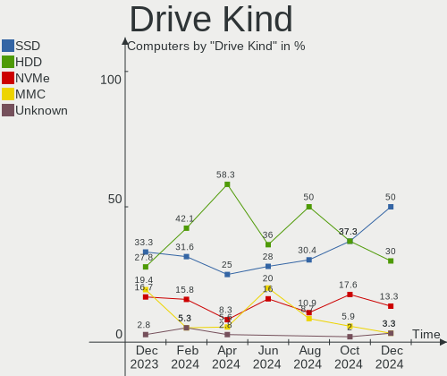
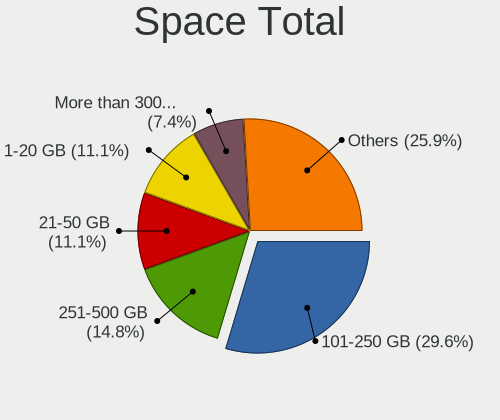
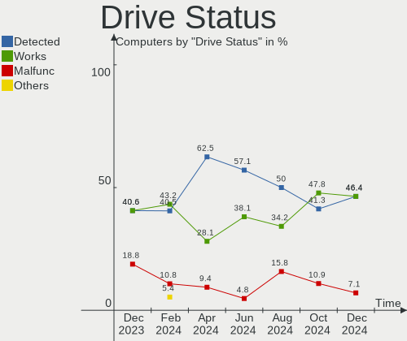
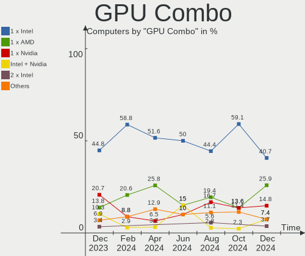
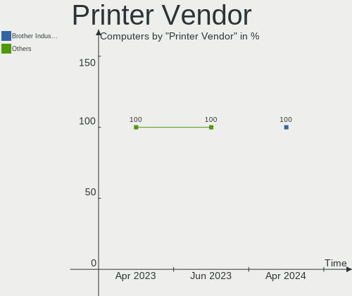
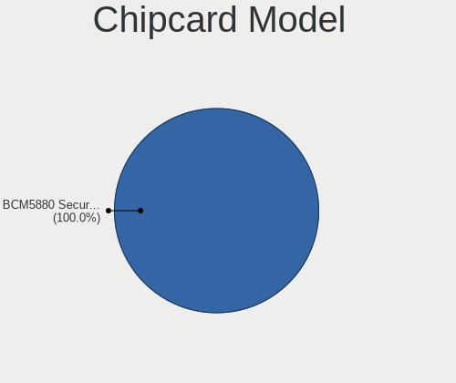

Lubuntu - Hardware Trends
-------------------------

A project to identify most popular hardware characteristics and track their change
over time based on data collected by Linux users at https://Linux-Hardware.org.

Anyone can contribute to this report by the [hw-probe](https://github.com/linuxhw/hw-probe) tool:

    sudo -E hw-probe -all -upload

This is a report for all computer types. See also reports for [desktops](/Dist/Lubuntu/Desktop/README.md) and [notebooks](/Dist/Lubuntu/Notebook/README.md).

This report is for one last month. Overall report since the beginning of time: [TestDays](https://github.com/linuxhw/TestDays)

Period: Feb, 2023.

Contents
--------

* [ System ](#system)
  - [ OS                       ](#os)
  - [ OS Family                ](#os-family)
  - [ Kernel                   ](#kernel)
  - [ Kernel Family            ](#kernel-family)
  - [ Kernel Major Ver.        ](#kernel-major-ver)
  - [ Arch                     ](#arch)
  - [ DE                       ](#de)
  - [ Display Server           ](#display-server)
  - [ Display Manager          ](#display-manager)
  - [ OS Lang                  ](#os-lang)
  - [ Boot Mode                ](#boot-mode)
  - [ Filesystem               ](#filesystem)
  - [ Part. scheme             ](#part-scheme)
  - [ Dual Boot with Linux/BSD ](#dual-boot-with-linuxbsd)
  - [ Dual Boot (Win)          ](#dual-boot-win)

* [ Board ](#board)
  - [ Vendor                   ](#vendor)
  - [ Model                    ](#model)
  - [ Model Family             ](#model-family)
  - [ MFG Year                 ](#mfg-year)
  - [ Form Factor              ](#form-factor)
  - [ Secure Boot              ](#secure-boot)
  - [ Coreboot                 ](#coreboot)
  - [ RAM Size                 ](#ram-size)
  - [ RAM Used                 ](#ram-used)
  - [ Total Drives             ](#total-drives)
  - [ Has CD-ROM               ](#has-cd-rom)
  - [ Has Ethernet             ](#has-ethernet)
  - [ Has WiFi                 ](#has-wifi)
  - [ Has Bluetooth            ](#has-bluetooth)

* [ Location ](#location)
  - [ Country                  ](#country)
  - [ City                     ](#city)

* [ Drives ](#drives)
  - [ Drive Vendor             ](#drive-vendor)
  - [ Drive Model              ](#drive-model)
  - [ HDD Vendor               ](#hdd-vendor)
  - [ SSD Vendor               ](#ssd-vendor)
  - [ Drive Kind               ](#drive-kind)
  - [ Drive Connector          ](#drive-connector)
  - [ Drive Size               ](#drive-size)
  - [ Space Total              ](#space-total)
  - [ Space Used               ](#space-used)
  - [ Malfunc. Drives          ](#malfunc-drives)
  - [ Malfunc. Drive Vendor    ](#malfunc-drive-vendor)
  - [ Malfunc. HDD Vendor      ](#malfunc-hdd-vendor)
  - [ Malfunc. Drive Kind      ](#malfunc-drive-kind)
  - [ Failed Drives            ](#failed-drives)
  - [ Failed Drive Vendor      ](#failed-drive-vendor)
  - [ Drive Status             ](#drive-status)

* [ Storage controller ](#storage-controller)
  - [ Storage Vendor           ](#storage-vendor)
  - [ Storage Model            ](#storage-model)
  - [ Storage Kind             ](#storage-kind)

* [ Processor ](#processor)
  - [ CPU Vendor               ](#cpu-vendor)
  - [ CPU Model                ](#cpu-model)
  - [ CPU Model Family         ](#cpu-model-family)
  - [ CPU Cores                ](#cpu-cores)
  - [ CPU Sockets              ](#cpu-sockets)
  - [ CPU Threads              ](#cpu-threads)
  - [ CPU Op-Modes             ](#cpu-op-modes)
  - [ CPU Microcode            ](#cpu-microcode)
  - [ CPU Microarch            ](#cpu-microarch)

* [ Graphics ](#graphics)
  - [ GPU Vendor               ](#gpu-vendor)
  - [ GPU Model                ](#gpu-model)
  - [ GPU Combo                ](#gpu-combo)
  - [ GPU Driver               ](#gpu-driver)
  - [ GPU Memory               ](#gpu-memory)

* [ Monitor ](#monitor)
  - [ Monitor Vendor           ](#monitor-vendor)
  - [ Monitor Model            ](#monitor-model)
  - [ Monitor Resolution       ](#monitor-resolution)
  - [ Monitor Diagonal         ](#monitor-diagonal)
  - [ Monitor Width            ](#monitor-width)
  - [ Aspect Ratio             ](#aspect-ratio)
  - [ Monitor Area             ](#monitor-area)
  - [ Pixel Density            ](#pixel-density)
  - [ Multiple Monitors        ](#multiple-monitors)

* [ Network ](#network)
  - [ Net Controller Vendor    ](#net-controller-vendor)
  - [ Net Controller Model     ](#net-controller-model)
  - [ Wireless Vendor          ](#wireless-vendor)
  - [ Wireless Model           ](#wireless-model)
  - [ Ethernet Vendor          ](#ethernet-vendor)
  - [ Ethernet Model           ](#ethernet-model)
  - [ Net Controller Kind      ](#net-controller-kind)
  - [ Used Controller          ](#used-controller)
  - [ NICs                     ](#nics)
  - [ IPv6                     ](#ipv6)

* [ Bluetooth ](#bluetooth)
  - [ Bluetooth Vendor         ](#bluetooth-vendor)
  - [ Bluetooth Model          ](#bluetooth-model)

* [ Sound ](#sound)
  - [ Sound Vendor             ](#sound-vendor)
  - [ Sound Model              ](#sound-model)

* [ Memory ](#memory)
  - [ Memory Vendor            ](#memory-vendor)
  - [ Memory Model             ](#memory-model)
  - [ Memory Kind              ](#memory-kind)
  - [ Memory Form Factor       ](#memory-form-factor)
  - [ Memory Size              ](#memory-size)
  - [ Memory Speed             ](#memory-speed)

* [ Printers & scanners ](#printers--scanners)
  - [ Printer Vendor           ](#printer-vendor)
  - [ Printer Model            ](#printer-model)
  - [ Scanner Vendor           ](#scanner-vendor)
  - [ Scanner Model            ](#scanner-model)

* [ Camera ](#camera)
  - [ Camera Vendor            ](#camera-vendor)
  - [ Camera Model             ](#camera-model)

* [ Security ](#security)
  - [ Fingerprint Vendor       ](#fingerprint-vendor)
  - [ Fingerprint Model        ](#fingerprint-model)
  - [ Chipcard Vendor          ](#chipcard-vendor)
  - [ Chipcard Model           ](#chipcard-model)

* [ Unsupported ](#unsupported)
  - [ Unsupported Devices      ](#unsupported-devices)
  - [ Unsupported Device Types ](#unsupported-device-types)

System
------

OS
--

Installed operating systems

| Name          | Computers | Percent |
|---------------|-----------|---------|
| Lubuntu 22.04 | 24        | 58.54%  |
| Lubuntu 22.10 | 9         | 21.95%  |
| Lubuntu 20.04 | 6         | 14.63%  |
| Lubuntu 23.04 | 1         | 2.44%   |
| Lubuntu 18.04 | 1         | 2.44%   |

OS Family
---------

OS without a version

| Name    | Computers | Percent |
|---------|-----------|---------|
| Lubuntu | 41        | 100%    |

Kernel
------

Version of the Linux kernel

| Version               | Computers | Percent |
|-----------------------|-----------|---------|
| 5.15.0-60-generic     | 12        | 29.27%  |
| 5.19.0-31-generic     | 6         | 14.63%  |
| 5.15.0-58-generic     | 4         | 9.76%   |
| 5.15.0-43-generic     | 4         | 9.76%   |
| 5.4.0-139-generic     | 2         | 4.88%   |
| 5.19.0-32-generic     | 2         | 4.88%   |
| 5.15.0-58-lowlatency  | 2         | 4.88%   |
| 6.2.0-custom          | 1         | 2.44%   |
| 6.1.12-060112-generic | 1         | 2.44%   |
| 6.1.0-14-generic      | 1         | 2.44%   |
| 5.4.0-91-generic      | 1         | 2.44%   |
| 5.4.0-81-generic      | 1         | 2.44%   |
| 5.19.0-29-generic     | 1         | 2.44%   |
| 5.19.0-21-generic     | 1         | 2.44%   |
| 5.15.0-56-generic     | 1         | 2.44%   |
| 5.15.0-25-generic     | 1         | 2.44%   |

Kernel Family
-------------

Linux kernel without a distro release

| Version | Computers | Percent |
|---------|-----------|---------|
| 5.15.0  | 24        | 58.54%  |
| 5.19.0  | 10        | 24.39%  |
| 5.4.0   | 4         | 9.76%   |
| 6.2.0   | 1         | 2.44%   |
| 6.1.12  | 1         | 2.44%   |
| 6.1.0   | 1         | 2.44%   |

Kernel Major Ver.
-----------------

Linux kernel major version

| Version | Computers | Percent |
|---------|-----------|---------|
| 5.15    | 24        | 58.54%  |
| 5.19    | 10        | 24.39%  |
| 5.4     | 4         | 9.76%   |
| 6.1     | 2         | 4.88%   |
| 6.2     | 1         | 2.44%   |

Arch
----

OS architecture (x86_64, i586, etc.)

| Name   | Computers | Percent |
|--------|-----------|---------|
| x86_64 | 41        | 100%    |

DE
--

Desktop Environment

| Name       | Computers | Percent |
|------------|-----------|---------|
| LXQt       | 37        | 90.24%  |
| LXDE       | 2         | 4.88%   |
| X-Cinnamon | 1         | 2.44%   |
| GNOME      | 1         | 2.44%   |

Display Server
--------------

X11 or Wayland

| Name    | Computers | Percent |
|---------|-----------|---------|
| X11     | 38        | 92.68%  |
| Tty     | 2         | 4.88%   |
| Wayland | 1         | 2.44%   |

Display Manager
---------------

SDDM, LightDM, etc.

| Name    | Computers | Percent |
|---------|-----------|---------|
| SDDM    | 31        | 75.61%  |
| LightDM | 4         | 9.76%   |
| Unknown | 4         | 9.76%   |
| GDM3    | 1         | 2.44%   |
| GDM     | 1         | 2.44%   |

OS Lang
-------

Language

| Lang  | Computers | Percent |
|-------|-----------|---------|
| en_US | 18        | 43.9%   |
| fr_FR | 5         | 12.2%   |
| it_IT | 3         | 7.32%   |
| de_DE | 3         | 7.32%   |
| C     | 3         | 7.32%   |
| pt_BR | 2         | 4.88%   |
| en_GB | 2         | 4.88%   |
| tr_TR | 1         | 2.44%   |
| pl_PL | 1         | 2.44%   |
| es_CR | 1         | 2.44%   |
| en_AG | 1         | 2.44%   |
| cs_CZ | 1         | 2.44%   |

Boot Mode
---------

EFI or BIOS

| Mode | Computers | Percent |
|------|-----------|---------|
| BIOS | 23        | 56.1%   |
| EFI  | 18        | 43.9%   |

Filesystem
----------

Type of filesystem

| Type    | Computers | Percent |
|---------|-----------|---------|
| Ext4    | 36        | 87.8%   |
| Overlay | 4         | 9.76%   |
| XXX4    | 1         | 2.44%   |

Part. scheme
------------

Scheme of partitioning

| Type    | Computers | Percent |
|---------|-----------|---------|
| GPT     | 25        | 60.98%  |
| MBR     | 12        | 29.27%  |
| Unknown | 4         | 9.76%   |

Dual Boot with Linux/BSD
------------------------

Hosting more than one Linux/BSD

| Dual boot | Computers | Percent |
|-----------|-----------|---------|
| No        | 39        | 95.12%  |
| Yes       | 2         | 4.88%   |

Dual Boot (Win)
---------------

Hosting Linux and Windows

| Dual boot | Computers | Percent |
|-----------|-----------|---------|
| No        | 24        | 58.54%  |
| Yes       | 17        | 41.46%  |

Board
-----

Vendor
------

Motherboard manufacturer

| Name                | Computers | Percent |
|---------------------|-----------|---------|
| Lenovo              | 9         | 21.95%  |
| Acer                | 6         | 14.63%  |
| MSI                 | 4         | 9.76%   |
| Gigabyte Technology | 4         | 9.76%   |
| Hewlett-Packard     | 3         | 7.32%   |
| Toshiba             | 2         | 4.88%   |
| Pegatron            | 2         | 4.88%   |
| Dell                | 2         | 4.88%   |
| Positivo            | 1         | 2.44%   |
| Mediacom            | 1         | 2.44%   |
| Intel               | 1         | 2.44%   |
| HUAWEI              | 1         | 2.44%   |
| Getac               | 1         | 2.44%   |
| ECS                 | 1         | 2.44%   |
| ASUSTek Computer    | 1         | 2.44%   |
| Apple               | 1         | 2.44%   |
| Unknown             | 1         | 2.44%   |

Model
-----

Motherboard model

| Name                                      | Computers | Percent |
|-------------------------------------------|-----------|---------|
| Toshiba Satellite L650                    | 1         | 2.44%   |
| Toshiba Satellite C55D-A                  | 1         | 2.44%   |
| Positivo Q232A                            | 1         | 2.44%   |
| Pegatron h8-1350ef                        | 1         | 2.44%   |
| Pegatron Compaq dx2400 Microtower PC      | 1         | 2.44%   |
| MSI MS-7C56                               | 1         | 2.44%   |
| MSI MS-7C37                               | 1         | 2.44%   |
| MSI MS-7693                               | 1         | 2.44%   |
| MSI MS-7267                               | 1         | 2.44%   |
| Mediacom SmartBook 14 FullHD - SB14UC     | 1         | 2.44%   |
| Lenovo ThinkPad X240 20AMS0RR00           | 1         | 2.44%   |
| Lenovo ThinkPad X230 Tablet 3437CTO       | 1         | 2.44%   |
| Lenovo ThinkPad X201 3626AL3              | 1         | 2.44%   |
| Lenovo ThinkPad L520 5015AH2              | 1         | 2.44%   |
| Lenovo IdeaPadFlex 3 11ADA05 82G4         | 1         | 2.44%   |
| Lenovo IdeaPad S340-15IWL 81N8            | 1         | 2.44%   |
| Lenovo IdeaPad 100S-14IBR 80R9            | 1         | 2.44%   |
| Lenovo IdeaPad 1 14IGL7 82V6              | 1         | 2.44%   |
| Lenovo G505s 20255                        | 1         | 2.44%   |
| Intel NUC5PPYB H76558-109                 | 1         | 2.44%   |
| HUAWEI KLVD-WXX9                          | 1         | 2.44%   |
| HP Victus by 15L Gaming Desktop TG02-0xxx | 1         | 2.44%   |
| HP Pavilion 17                            | 1         | 2.44%   |
| HP Notebook                               | 1         | 2.44%   |
| Gigabyte MBB-96004D                       | 1         | 2.44%   |
| Gigabyte H61MA-D2V                        | 1         | 2.44%   |
| Gigabyte F2A88XM-D3HP                     | 1         | 2.44%   |
| Gigabyte B450M S2H                        | 1         | 2.44%   |
| Getac V200-X                              | 1         | 2.44%   |
| ECS G41T-M7                               | 1         | 2.44%   |
| Dell Vostro 3670                          | 1         | 2.44%   |
| Dell Inspiron 1525                        | 1         | 2.44%   |
| ASUS M5A78L-M LX3                         | 1         | 2.44%   |
| Apple MacBookPro8,1                       | 1         | 2.44%   |
| Acer TravelMate P253                      | 1         | 2.44%   |
| Acer Extensa 2540                         | 1         | 2.44%   |
| Acer Aspire Z5101                         | 1         | 2.44%   |
| Acer Aspire E5-411G                       | 1         | 2.44%   |
| Acer Aspire A515-45                       | 1         | 2.44%   |
| Acer AO756                                | 1         | 2.44%   |

Model Family
------------

Motherboard model prefix

| Name                  | Computers | Percent |
|-----------------------|-----------|---------|
| Lenovo ThinkPad       | 4         | 9.76%   |
| Lenovo IdeaPad        | 3         | 7.32%   |
| Acer Aspire           | 3         | 7.32%   |
| Toshiba Satellite     | 2         | 4.88%   |
| Positivo Q232A        | 1         | 2.44%   |
| Pegatron h8-1350ef    | 1         | 2.44%   |
| Pegatron Compaq       | 1         | 2.44%   |
| MSI MS-7C56           | 1         | 2.44%   |
| MSI MS-7C37           | 1         | 2.44%   |
| MSI MS-7693           | 1         | 2.44%   |
| MSI MS-7267           | 1         | 2.44%   |
| Mediacom SmartBook    | 1         | 2.44%   |
| Lenovo IdeaPadFlex    | 1         | 2.44%   |
| Lenovo G505s          | 1         | 2.44%   |
| Intel NUC5PPYB        | 1         | 2.44%   |
| HUAWEI KLVD-WXX9      | 1         | 2.44%   |
| HP Victus             | 1         | 2.44%   |
| HP Pavilion           | 1         | 2.44%   |
| HP Notebook           | 1         | 2.44%   |
| Gigabyte MBB-96004D   | 1         | 2.44%   |
| Gigabyte H61MA-D2V    | 1         | 2.44%   |
| Gigabyte F2A88XM-D3HP | 1         | 2.44%   |
| Gigabyte B450M        | 1         | 2.44%   |
| Getac V200-X          | 1         | 2.44%   |
| ECS G41T-M7           | 1         | 2.44%   |
| Dell Vostro           | 1         | 2.44%   |
| Dell Inspiron         | 1         | 2.44%   |
| ASUS M5A78L-M         | 1         | 2.44%   |
| Apple MacBookPro8     | 1         | 2.44%   |
| Acer TravelMate       | 1         | 2.44%   |
| Acer Extensa          | 1         | 2.44%   |
| Acer AO756            | 1         | 2.44%   |
| Unknown               | 1         | 2.44%   |

MFG Year
--------

Motherboard manufacture year

| Year | Computers | Percent |
|------|-----------|---------|
| 2012 | 6         | 14.63%  |
| 2013 | 5         | 12.2%   |
| 2011 | 5         | 12.2%   |
| 2019 | 4         | 9.76%   |
| 2022 | 3         | 7.32%   |
| 2021 | 3         | 7.32%   |
| 2018 | 3         | 7.32%   |
| 2015 | 3         | 7.32%   |
| 2016 | 2         | 4.88%   |
| 2010 | 2         | 4.88%   |
| 2008 | 2         | 4.88%   |
| 2020 | 1         | 2.44%   |
| 2014 | 1         | 2.44%   |
| 2007 | 1         | 2.44%   |

Form Factor
-----------

Physical design of the computer

| Name        | Computers | Percent |
|-------------|-----------|---------|
| Notebook    | 24        | 58.54%  |
| Desktop     | 14        | 34.15%  |
| Convertible | 1         | 2.44%   |
| Mini pc     | 1         | 2.44%   |
| All in one  | 1         | 2.44%   |

Secure Boot
-----------

Enabled or disabled

| State    | Computers | Percent |
|----------|-----------|---------|
| Disabled | 38        | 92.68%  |
| Enabled  | 3         | 7.32%   |

Coreboot
--------

Have coreboot on board

| Used | Computers | Percent |
|------|-----------|---------|
| No   | 41        | 100%    |

RAM Size
--------

Total RAM memory

| Size in GB | Computers | Percent |
|------------|-----------|---------|
| 3.01-4.0   | 15        | 36.59%  |
| 4.01-8.0   | 10        | 24.39%  |
| 1.01-2.0   | 5         | 12.2%   |
| 8.01-16.0  | 5         | 12.2%   |
| 32.01-64.0 | 3         | 7.32%   |
| 16.01-24.0 | 2         | 4.88%   |
| 2.01-3.0   | 1         | 2.44%   |

RAM Used
--------

Used RAM memory

| Used GB  | Computers | Percent |
|----------|-----------|---------|
| 1.01-2.0 | 20        | 48.78%  |
| 2.01-3.0 | 9         | 21.95%  |
| 0.51-1.0 | 8         | 19.51%  |
| 4.01-8.0 | 3         | 7.32%   |
| 3.01-4.0 | 1         | 2.44%   |

Total Drives
------------

Number of drives on board

| Drives | Computers | Percent |
|--------|-----------|---------|
| 1      | 26        | 63.41%  |
| 2      | 11        | 26.83%  |
| 3      | 3         | 7.32%   |
| 0      | 1         | 2.44%   |

Has CD-ROM
----------

Has CD-ROM on board

| Presented | Computers | Percent |
|-----------|-----------|---------|
| No        | 21        | 51.22%  |
| Yes       | 20        | 48.78%  |

Has Ethernet
------------

Has Ethernet on board

| Presented | Computers | Percent |
|-----------|-----------|---------|
| Yes       | 36        | 87.8%   |
| No        | 5         | 12.2%   |

Has WiFi
--------

Has WiFi module

| Presented | Computers | Percent |
|-----------|-----------|---------|
| Yes       | 28        | 68.29%  |
| No        | 13        | 31.71%  |

Has Bluetooth
-------------

Has Bluetooth module

| Presented | Computers | Percent |
|-----------|-----------|---------|
| Yes       | 22        | 53.66%  |
| No        | 19        | 46.34%  |

Location
--------

Country
-------

Geographic location (country)

| Country     | Computers | Percent |
|-------------|-----------|---------|
| USA         | 11        | 26.83%  |
| France      | 6         | 14.63%  |
| Italy       | 5         | 12.2%   |
| Germany     | 3         | 7.32%   |
| Russia      | 2         | 4.88%   |
| Costa Rica  | 2         | 4.88%   |
| Brazil      | 2         | 4.88%   |
| Ukraine     | 1         | 2.44%   |
| UK          | 1         | 2.44%   |
| Turkey      | 1         | 2.44%   |
| Thailand    | 1         | 2.44%   |
| Spain       | 1         | 2.44%   |
| Romania     | 1         | 2.44%   |
| Poland      | 1         | 2.44%   |
| Netherlands | 1         | 2.44%   |
| Malaysia    | 1         | 2.44%   |
| Czechia     | 1         | 2.44%   |

City
----

Geographic location (city)

| City               | Computers | Percent |
|--------------------|-----------|---------|
| Paris              | 2         | 4.88%   |
| Lansing            | 2         | 4.88%   |
| Zujar              | 1         | 2.44%   |
| Yekaterinburg      | 1         | 2.44%   |
| Vancouver          | 1         | 2.44%   |
| Uberlândia        | 1         | 2.44%   |
| Tyler              | 1         | 2.44%   |
| Turin              | 1         | 2.44%   |
| Sesto San Giovanni | 1         | 2.44%   |
| Rome               | 1         | 2.44%   |
| Rio Segundo        | 1         | 2.44%   |
| Queens             | 1         | 2.44%   |
| Puntarenas         | 1         | 2.44%   |
| Prague             | 1         | 2.44%   |
| Ommen              | 1         | 2.44%   |
| Morsbach           | 1         | 2.44%   |
| Montfrin           | 1         | 2.44%   |
| Mogilno            | 1         | 2.44%   |
| Milan              | 1         | 2.44%   |
| Marília           | 1         | 2.44%   |
| Louviers           | 1         | 2.44%   |
| Le Puy-en-Velay    | 1         | 2.44%   |
| Kyiv               | 1         | 2.44%   |
| Kota Bharu         | 1         | 2.44%   |
| Kerrville          | 1         | 2.44%   |
| Karlsruhe          | 1         | 2.44%   |
| Imola              | 1         | 2.44%   |
| Gura Vitioarei     | 1         | 2.44%   |
| Guidel             | 1         | 2.44%   |
| Frederick          | 1         | 2.44%   |
| Dmitrov            | 1         | 2.44%   |
| Detroit            | 1         | 2.44%   |
| Denver             | 1         | 2.44%   |
| Dagenham           | 1         | 2.44%   |
| Cupertino          | 1         | 2.44%   |
| Chicago            | 1         | 2.44%   |
| Bangkok            | 1         | 2.44%   |
| Baden-Baden        | 1         | 2.44%   |
| Antalya            | 1         | 2.44%   |

Drives
------

Drive Vendor
------------

Hard drive vendors

| Vendor                    | Computers | Drives | Percent |
|---------------------------|-----------|--------|---------|
| Seagate                   | 7         | 10     | 13.46%  |
| Unknown                   | 6         | 7      | 11.54%  |
| Samsung Electronics       | 6         | 6      | 11.54%  |
| WDC                       | 5         | 5      | 9.62%   |
| Crucial                   | 4         | 5      | 7.69%   |
| Toshiba                   | 3         | 3      | 5.77%   |
| SanDisk                   | 3         | 3      | 5.77%   |
| Hitachi                   | 3         | 3      | 5.77%   |
| Intel                     | 2         | 2      | 3.85%   |
| SK hynix                  | 1         | 1      | 1.92%   |
| Phison                    | 1         | 1      | 1.92%   |
| Patriot                   | 1         | 1      | 1.92%   |
| Micron/Crucial Technology | 1         | 1      | 1.92%   |
| Micron Technology         | 1         | 2      | 1.92%   |
| LITEON                    | 1         | 1      | 1.92%   |
| LDLC                      | 1         | 1      | 1.92%   |
| Kingston                  | 1         | 1      | 1.92%   |
| KimMiDi                   | 1         | 1      | 1.92%   |
| HGST                      | 1         | 1      | 1.92%   |
| Fujitsu                   | 1         | 1      | 1.92%   |
| Corsair                   | 1         | 1      | 1.92%   |
| A-DATA Technology         | 1         | 1      | 1.92%   |

Drive Model
-----------

Hard drive models

| Model                                | Computers | Percent |
|--------------------------------------|-----------|---------|
| Unknown MMC Card  32GB               | 3         | 5.26%   |
| Unknown MMC Card  64GB               | 2         | 3.51%   |
| WDC WD5000LPCX-21VHAT0 500GB         | 1         | 1.75%   |
| WDC WD3200BPVT-22JJ5T0 320GB         | 1         | 1.75%   |
| WDC WD3200AACS-00M6B0 320GB          | 1         | 1.75%   |
| WDC WD20EADS-42R6B0 2TB              | 1         | 1.75%   |
| WDC WD10EZEX-60WN4A1 1TB             | 1         | 1.75%   |
| Unknown NCard  32GB                  | 1         | 1.75%   |
| Unknown MMC Card  8GB                | 1         | 1.75%   |
| Toshiba MK8037GSX 80GB               | 1         | 1.75%   |
| Toshiba HDWD110 1TB                  | 1         | 1.75%   |
| Toshiba DT01ACA050 500GB             | 1         | 1.75%   |
| SK hynix BC711 HFM512GD3JX013N 512GB | 1         | 1.75%   |
| Seagate ST500LT012-1DG142 500GB      | 1         | 1.75%   |
| Seagate ST500DM002-1BD142 500GB      | 1         | 1.75%   |
| Seagate ST4000VX016-3CV104 4TB       | 1         | 1.75%   |
| Seagate ST3500413AS 500GB            | 1         | 1.75%   |
| Seagate ST3250312AS 250GB            | 1         | 1.75%   |
| Seagate ST3250310AS 250GB            | 1         | 1.75%   |
| Seagate ST31000528AS 1TB             | 1         | 1.75%   |
| Seagate ST2000DM008-2UB102 2TB       | 1         | 1.75%   |
| Seagate ST1000LM024 HN-M101MBB 1TB   | 1         | 1.75%   |
| SanDisk SDSSDP128G 128GB             | 1         | 1.75%   |
| SanDisk SDSSDH3512G 512GB            | 1         | 1.75%   |
| SanDisk DF4032  32GB                 | 1         | 1.75%   |
| Samsung SSD 980 1TB                  | 1         | 1.75%   |
| Samsung SSD 870 EVO 500GB            | 1         | 1.75%   |
| Samsung SSD 860 EVO 500GB            | 1         | 1.75%   |
| Samsung SSD 850 EVO 250GB            | 1         | 1.75%   |
| Samsung SSD 850 EVO 120GB            | 1         | 1.75%   |
| Samsung MZ7TD128HAFV-000L1 128GB SSD | 1         | 1.75%   |
| Phison 311CD0512GB                   | 1         | 1.75%   |
| Patriot Burst 120GB SSD              | 1         | 1.75%   |
| Micron/Crucial CT1000P5PSSD8 1TB     | 1         | 1.75%   |
| Micron 5200_MTFDDAK1T9TDD 2TB SSD    | 1         | 1.75%   |
| Micron 2210_MTFDHBA512QFD 512GB      | 1         | 1.75%   |
| LITEON CV3-8D128 128GB SSD           | 1         | 1.75%   |
| LDLC 240GB                           | 1         | 1.75%   |
| Kingston SKC6001024G 1TB SSD         | 1         | 1.75%   |
| KimMiDi TB900 SSD 120GB              | 1         | 1.75%   |

HDD Vendor
----------

Hard disk drive vendors

| Vendor  | Computers | Drives | Percent |
|---------|-----------|--------|---------|
| Seagate | 7         | 10     | 35%     |
| WDC     | 5         | 5      | 25%     |
| Toshiba | 3         | 3      | 15%     |
| Hitachi | 3         | 3      | 15%     |
| HGST    | 1         | 1      | 5%      |
| Fujitsu | 1         | 1      | 5%      |

SSD Vendor
----------

Solid state drive vendors

| Vendor              | Computers | Drives | Percent |
|---------------------|-----------|--------|---------|
| Samsung Electronics | 5         | 5      | 26.32%  |
| Crucial             | 3         | 4      | 15.79%  |
| SanDisk             | 2         | 2      | 10.53%  |
| Intel               | 2         | 2      | 10.53%  |
| Patriot             | 1         | 1      | 5.26%   |
| Micron Technology   | 1         | 1      | 5.26%   |
| LITEON              | 1         | 1      | 5.26%   |
| Kingston            | 1         | 1      | 5.26%   |
| KimMiDi             | 1         | 1      | 5.26%   |
| Corsair             | 1         | 1      | 5.26%   |
| A-DATA Technology   | 1         | 1      | 5.26%   |

Drive Kind
----------

HDD or SSD

| Kind    | Computers | Drives | Percent |
|---------|-----------|--------|---------|
| SSD     | 19        | 20     | 37.25%  |
| HDD     | 18        | 23     | 35.29%  |
| MMC     | 7         | 8      | 13.73%  |
| NVMe    | 6         | 6      | 11.76%  |
| Unknown | 1         | 1      | 1.96%   |

Drive Connector
---------------

SATA, SAS, NVMe, etc.

| Type | Computers | Drives | Percent |
|------|-----------|--------|---------|
| SATA | 34        | 44     | 72.34%  |
| MMC  | 7         | 8      | 14.89%  |
| NVMe | 6         | 6      | 12.77%  |

Drive Size
----------

Size of hard drive

| Size in TB | Computers | Drives | Percent |
|------------|-----------|--------|---------|
| 0.01-0.5   | 25        | 28     | 67.57%  |
| 0.51-1.0   | 7         | 9      | 18.92%  |
| 1.01-2.0   | 4         | 4      | 10.81%  |
| 3.01-4.0   | 1         | 2      | 2.7%    |

Space Total
-----------

Amount of disk space available on the file system

| Size in GB     | Computers | Percent |
|----------------|-----------|---------|
| 101-250        | 15        | 36.59%  |
| 251-500        | 8         | 19.51%  |
| 51-100         | 5         | 12.2%   |
| 1001-2000      | 4         | 9.76%   |
| 1-20           | 4         | 9.76%   |
| 21-50          | 2         | 4.88%   |
| 501-1000       | 2         | 4.88%   |
| More than 3000 | 1         | 2.44%   |

Space Used
----------

Amount of used disk space

| Used GB  | Computers | Percent |
|----------|-----------|---------|
| 1-20     | 19        | 46.34%  |
| 51-100   | 8         | 19.51%  |
| 21-50    | 7         | 17.07%  |
| 101-250  | 3         | 7.32%   |
| 251-500  | 2         | 4.88%   |
| 501-1000 | 2         | 4.88%   |

Malfunc. Drives
---------------

Drive models with a malfunction

| Model                              | Computers | Drives | Percent |
|------------------------------------|-----------|--------|---------|
| WDC WD3200AACS-00M6B0 320GB        | 1         | 1      | 12.5%   |
| WDC WD10EZEX-60WN4A1 1TB           | 1         | 1      | 12.5%   |
| Toshiba DT01ACA050 500GB           | 1         | 1      | 12.5%   |
| Seagate ST3500413AS 500GB          | 1         | 1      | 12.5%   |
| Seagate ST3250310AS 250GB          | 1         | 1      | 12.5%   |
| Seagate ST1000LM024 HN-M101MBB 1TB | 1         | 1      | 12.5%   |
| Intel SSDSA2M080G2LE 80GB          | 1         | 1      | 12.5%   |
| Hitachi HTS545032B9A300 320GB      | 1         | 1      | 12.5%   |

Malfunc. Drive Vendor
---------------------

Vendors of faulty drives

| Vendor  | Computers | Drives | Percent |
|---------|-----------|--------|---------|
| WDC     | 2         | 2      | 28.57%  |
| Seagate | 2         | 3      | 28.57%  |
| Toshiba | 1         | 1      | 14.29%  |
| Intel   | 1         | 1      | 14.29%  |
| Hitachi | 1         | 1      | 14.29%  |

Malfunc. HDD Vendor
-------------------

Vendors of faulty HDD drives

| Vendor  | Computers | Drives | Percent |
|---------|-----------|--------|---------|
| WDC     | 2         | 2      | 33.33%  |
| Seagate | 2         | 3      | 33.33%  |
| Toshiba | 1         | 1      | 16.67%  |
| Hitachi | 1         | 1      | 16.67%  |

Malfunc. Drive Kind
-------------------

Kinds of faulty drives

| Kind | Computers | Drives | Percent |
|------|-----------|--------|---------|
| HDD  | 6         | 7      | 85.71%  |
| SSD  | 1         | 1      | 14.29%  |

Failed Drives
-------------

Failed drive models

| Model                           | Computers | Drives | Percent |
|---------------------------------|-----------|--------|---------|
| Samsung Electronics SSD 980 1TB | 1         | 1      | 100%    |

Failed Drive Vendor
-------------------

Failed drive vendors

| Vendor              | Computers | Drives | Percent |
|---------------------|-----------|--------|---------|
| Samsung Electronics | 1         | 1      | 100%    |

Drive Status
------------

Number of failed and malfunc. drives

| Status   | Computers | Drives | Percent |
|----------|-----------|--------|---------|
| Detected | 19        | 26     | 44.19%  |
| Works    | 16        | 23     | 37.21%  |
| Malfunc  | 7         | 8      | 16.28%  |
| Failed   | 1         | 1      | 2.33%   |

Storage controller
------------------

Storage Vendor
--------------

Storage controller vendors

| Vendor                    | Computers | Percent |
|---------------------------|-----------|---------|
| Intel                     | 24        | 53.33%  |
| AMD                       | 12        | 26.67%  |
| Micron/Crucial Technology | 2         | 4.44%   |
| SK hynix                  | 1         | 2.22%   |
| Samsung Electronics       | 1         | 2.22%   |
| Phison Electronics        | 1         | 2.22%   |
| Nvidia                    | 1         | 2.22%   |
| Micron Technology         | 1         | 2.22%   |
| JMicron Technology        | 1         | 2.22%   |
| ASMedia Technology        | 1         | 2.22%   |

Storage Model
-------------

Storage controller models

| Model                                                                                   | Computers | Percent |
|-----------------------------------------------------------------------------------------|-----------|---------|
| AMD FCH SATA Controller [AHCI mode]                                                     | 8         | 14.81%  |
| Intel 7 Series Chipset Family 6-port SATA Controller [AHCI mode]                        | 3         | 5.56%   |
| Intel NM10/ICH7 Family SATA Controller [IDE mode]                                       | 2         | 3.7%    |
| Intel Atom/Celeron/Pentium Processor x5-E8000/J3xxx/N3xxx Series SATA Controller        | 2         | 3.7%    |
| Intel 82801G (ICH7 Family) IDE Controller                                               | 2         | 3.7%    |
| Intel 6 Series/C200 Series Chipset Family 6 port Mobile SATA AHCI Controller            | 2         | 3.7%    |
| Intel 5 Series/3400 Series Chipset 6 port SATA AHCI Controller                          | 2         | 3.7%    |
| AMD 400 Series Chipset SATA Controller                                                  | 2         | 3.7%    |
| SK hynix Gold P31/PC711 NVMe Solid State Drive                                          | 1         | 1.85%   |
| Samsung NVMe SSD Controller 980                                                         | 1         | 1.85%   |
| Phison PS5013 E13 NVMe Controller                                                       | 1         | 1.85%   |
| Nvidia MCP78S [GeForce 8200] AHCI Controller                                            | 1         | 1.85%   |
| Micron/Crucial P5 Plus NVMe PCIe SSD                                                    | 1         | 1.85%   |
| Micron/Crucial P2 NVMe PCIe SSD                                                         | 1         | 1.85%   |
| Micron Non-Volatile memory controller                                                   | 1         | 1.85%   |
| JMicron JMB58x AHCI SATA controller                                                     | 1         | 1.85%   |
| Intel Wildcat Point-LP SATA Controller [AHCI Mode]                                      | 1         | 1.85%   |
| Intel Sunrise Point-LP SATA Controller [AHCI mode]                                      | 1         | 1.85%   |
| Intel SATA Controller [RAID mode]                                                       | 1         | 1.85%   |
| Intel Celeron/Pentium Silver Processor SATA Controller                                  | 1         | 1.85%   |
| Intel Celeron N3350/Pentium N4200/Atom E3900 Series SATA AHCI Controller                | 1         | 1.85%   |
| Intel Cannon Point-LP SATA Controller [AHCI Mode]                                       | 1         | 1.85%   |
| Intel Atom Processor E3800 Series SATA AHCI Controller                                  | 1         | 1.85%   |
| Intel 82801IR/IO/IH (ICH9R/DO/DH) 4 port SATA Controller [IDE mode]                     | 1         | 1.85%   |
| Intel 82801I (ICH9 Family) 2 port SATA Controller [IDE mode]                            | 1         | 1.85%   |
| Intel 82801HM/HEM (ICH8M/ICH8M-E) SATA Controller [AHCI mode]                           | 1         | 1.85%   |
| Intel 82801HM/HEM (ICH8M/ICH8M-E) IDE Controller                                        | 1         | 1.85%   |
| Intel 8 Series SATA Controller 1 [AHCI mode]                                            | 1         | 1.85%   |
| Intel 7 Series/C210 Series Chipset Family 6-port SATA Controller [AHCI mode]            | 1         | 1.85%   |
| Intel 6 Series/C200 Series Chipset Family Desktop SATA Controller (IDE mode, ports 4-5) | 1         | 1.85%   |
| Intel 6 Series/C200 Series Chipset Family Desktop SATA Controller (IDE mode, ports 0-3) | 1         | 1.85%   |
| Intel 5 Series/3400 Series Chipset 4 port SATA AHCI Controller                          | 1         | 1.85%   |
| ASMedia ASM1062 Serial ATA Controller                                                   | 1         | 1.85%   |
| AMD SB7x0/SB8x0/SB9x0 SATA Controller [IDE mode]                                        | 1         | 1.85%   |
| AMD SB7x0/SB8x0/SB9x0 SATA Controller [AHCI mode]                                       | 1         | 1.85%   |
| AMD SB7x0/SB8x0/SB9x0 IDE Controller                                                    | 1         | 1.85%   |
| AMD FCH SATA Controller [IDE mode]                                                      | 1         | 1.85%   |
| AMD FCH SATA Controller D                                                               | 1         | 1.85%   |
| AMD 500 Series Chipset SATA Controller                                                  | 1         | 1.85%   |

Storage Kind
------------

Kind of storage controller (IDE, SATA, NVMe, SAS, ...)

| Kind | Computers | Percent |
|------|-----------|---------|
| SATA | 32        | 71.11%  |
| NVMe | 6         | 13.33%  |
| IDE  | 6         | 13.33%  |
| RAID | 1         | 2.22%   |

Processor
---------

CPU Vendor
----------

Processor vendors

| Vendor | Computers | Percent |
|--------|-----------|---------|
| Intel  | 27        | 65.85%  |
| AMD    | 14        | 34.15%  |

CPU Model
---------

Processor models

| Model                                         | Computers | Percent |
|-----------------------------------------------|-----------|---------|
| AMD Ryzen 7 5700G with Radeon Graphics        | 2         | 4.88%   |
| AMD A8-4500M APU with Radeon HD Graphics      | 2         | 4.88%   |
| Intel Pentium Dual-Core CPU E6500 @ 2.93GHz   | 1         | 2.44%   |
| Intel Pentium Dual CPU E2140 @ 1.60GHz        | 1         | 2.44%   |
| Intel Pentium CPU N3700 @ 1.60GHz             | 1         | 2.44%   |
| Intel Pentium CPU N3540 @ 2.16GHz             | 1         | 2.44%   |
| Intel Pentium CPU 3825U @ 1.90GHz             | 1         | 2.44%   |
| Intel Core i7 CPU L 620 @ 2.00GHz             | 1         | 2.44%   |
| Intel Core i5-8400 CPU @ 2.80GHz              | 1         | 2.44%   |
| Intel Core i5-4300U CPU @ 1.90GHz             | 1         | 2.44%   |
| Intel Core i5-3320M CPU @ 2.60GHz             | 1         | 2.44%   |
| Intel Core i5-3230M CPU @ 2.60GHz             | 1         | 2.44%   |
| Intel Core i5-2435M CPU @ 2.40GHz             | 1         | 2.44%   |
| Intel Core i5-2320 CPU @ 3.00GHz              | 1         | 2.44%   |
| Intel Core i5 CPU M 540 @ 2.53GHz             | 1         | 2.44%   |
| Intel Core i3-8145U CPU @ 2.10GHz             | 1         | 2.44%   |
| Intel Core i3-6006U CPU @ 2.00GHz             | 1         | 2.44%   |
| Intel Core i3 CPU M 330 @ 2.13GHz             | 1         | 2.44%   |
| Intel Core 2 Duo CPU T5550 @ 1.83GHz          | 1         | 2.44%   |
| Intel Core 2 Duo CPU E7300 @ 2.66GHz          | 1         | 2.44%   |
| Intel Celeron N4020 CPU @ 1.10GHz             | 1         | 2.44%   |
| Intel Celeron CPU N3060 @ 1.60GHz             | 1         | 2.44%   |
| Intel Celeron CPU G540 @ 2.50GHz              | 1         | 2.44%   |
| Intel Celeron CPU B815 @ 1.60GHz              | 1         | 2.44%   |
| Intel Celeron CPU 877 @ 1.40GHz               | 1         | 2.44%   |
| Intel Atom x5-Z8350 CPU @ 1.44GHz             | 1         | 2.44%   |
| Intel Atom x5-Z8300 CPU @ 1.44GHz             | 1         | 2.44%   |
| Intel Atom Processor E3940 @ 1.60GHz          | 1         | 2.44%   |
| Intel 11th Gen Core i5-1135G7 @ 2.40GHz       | 1         | 2.44%   |
| AMD Ryzen 7 5700U with Radeon Graphics        | 1         | 2.44%   |
| AMD Ryzen 7 3800X 8-Core Processor            | 1         | 2.44%   |
| AMD Ryzen 3 3200G with Radeon Vega Graphics   | 1         | 2.44%   |
| AMD FX-4300 Quad-Core Processor               | 1         | 2.44%   |
| AMD E1-2100 APU with Radeon HD Graphics       | 1         | 2.44%   |
| AMD Athlon Silver 3050e with Radeon Graphics  | 1         | 2.44%   |
| AMD Athlon II X4 615e Processor               | 1         | 2.44%   |
| AMD Athlon II X3 435 Processor                | 1         | 2.44%   |
| AMD A8-9600 RADEON R7, 10 COMPUTE CORES 4C+6G | 1         | 2.44%   |
| AMD A8-5500 APU with Radeon HD Graphics       | 1         | 2.44%   |

CPU Model Family
----------------

Processor model prefix

| Model                   | Computers | Percent |
|-------------------------|-----------|---------|
| Intel Core i5           | 7         | 17.07%  |
| Intel Celeron           | 5         | 12.2%   |
| AMD Ryzen 7             | 4         | 9.76%   |
| AMD A8                  | 4         | 9.76%   |
| Intel Pentium           | 3         | 7.32%   |
| Intel Core i3           | 3         | 7.32%   |
| Intel Atom              | 3         | 7.32%   |
| Intel Core 2 Duo        | 2         | 4.88%   |
| Other                   | 1         | 2.44%   |
| Intel Pentium Dual-Core | 1         | 2.44%   |
| Intel Pentium Dual      | 1         | 2.44%   |
| Intel Core i7           | 1         | 2.44%   |
| AMD Ryzen 3             | 1         | 2.44%   |
| AMD FX                  | 1         | 2.44%   |
| AMD E1                  | 1         | 2.44%   |
| AMD Athlon II X4        | 1         | 2.44%   |
| AMD Athlon II X3        | 1         | 2.44%   |
| AMD Athlon              | 1         | 2.44%   |

CPU Cores
---------

Number of processor cores

| Number | Computers | Percent |
|--------|-----------|---------|
| 2      | 26        | 63.41%  |
| 4      | 9         | 21.95%  |
| 8      | 4         | 9.76%   |
| 6      | 1         | 2.44%   |
| 3      | 1         | 2.44%   |

CPU Sockets
-----------

Number of sockets

| Number | Computers | Percent |
|--------|-----------|---------|
| 1      | 41        | 100%    |

CPU Threads
-----------

Threads per core (Hyper-Threading)

| Number | Computers | Percent |
|--------|-----------|---------|
| 2      | 21        | 51.22%  |
| 1      | 20        | 48.78%  |

CPU Op-Modes
------------

CPU Operation Modes (32-bit, 64-bit)

| Op mode        | Computers | Percent |
|----------------|-----------|---------|
| 32-bit, 64-bit | 41        | 100%    |

CPU Microcode
-------------

Microcode number

| Number     | Computers | Percent |
|------------|-----------|---------|
| Unknown    | 13        | 31.71%  |
| 0x306a9    | 2         | 4.88%   |
| 0x206a7    | 2         | 4.88%   |
| 0x20652    | 2         | 4.88%   |
| 0x06001119 | 2         | 4.88%   |
| 0x906ea    | 1         | 2.44%   |
| 0x806ec    | 1         | 2.44%   |
| 0x806c1    | 1         | 2.44%   |
| 0x706a8    | 1         | 2.44%   |
| 0x6fd      | 1         | 2.44%   |
| 0x506ca    | 1         | 2.44%   |
| 0x406c4    | 1         | 2.44%   |
| 0x406c3    | 1         | 2.44%   |
| 0x40651    | 1         | 2.44%   |
| 0x30678    | 1         | 2.44%   |
| 0x1067a    | 1         | 2.44%   |
| 0x10676    | 1         | 2.44%   |
| 0x0a50000d | 1         | 2.44%   |
| 0x08701013 | 1         | 2.44%   |
| 0x08608102 | 1         | 2.44%   |
| 0x08200103 | 1         | 2.44%   |
| 0x08108109 | 1         | 2.44%   |
| 0x0700010f | 1         | 2.44%   |
| 0x0600611a | 1         | 2.44%   |
| 0x010000db | 1         | 2.44%   |

CPU Microarch
-------------

Microarchitecture

| Name          | Computers | Percent |
|---------------|-----------|---------|
| Silvermont    | 5         | 12.2%   |
| SandyBridge   | 5         | 12.2%   |
| Piledriver    | 4         | 9.76%   |
| Westmere      | 3         | 7.32%   |
| Zen 3         | 2         | 4.88%   |
| Penryn        | 2         | 4.88%   |
| KabyLake      | 2         | 4.88%   |
| K10           | 2         | 4.88%   |
| IvyBridge     | 2         | 4.88%   |
| Core          | 2         | 4.88%   |
| Zen+          | 1         | 2.44%   |
| Zen 2         | 1         | 2.44%   |
| Zen           | 1         | 2.44%   |
| TigerLake     | 1         | 2.44%   |
| Skylake       | 1         | 2.44%   |
| Jaguar        | 1         | 2.44%   |
| Haswell       | 1         | 2.44%   |
| Goldmont plus | 1         | 2.44%   |
| Goldmont      | 1         | 2.44%   |
| Excavator     | 1         | 2.44%   |
| Broadwell     | 1         | 2.44%   |
| Unknown       | 1         | 2.44%   |

Graphics
--------

GPU Vendor
----------

Vendors of graphics cards

| Vendor | Computers | Percent |
|--------|-----------|---------|
| Intel  | 25        | 58.14%  |
| AMD    | 11        | 25.58%  |
| Nvidia | 7         | 16.28%  |

GPU Model
---------

Graphics card models

| Model                                                                                    | Computers | Percent |
|------------------------------------------------------------------------------------------|-----------|---------|
| Intel Atom/Celeron/Pentium Processor x5-E8000/J3xxx/N3xxx Integrated Graphics Controller | 4         | 8.33%   |
| Intel 2nd Generation Core Processor Family Integrated Graphics Controller                | 4         | 8.33%   |
| Intel Core Processor Integrated Graphics Controller                                      | 3         | 6.25%   |
| Nvidia GM107 [GeForce GTX 750 Ti]                                                        | 2         | 4.17%   |
| Intel 3rd Gen Core processor Graphics Controller                                         | 2         | 4.17%   |
| AMD Trinity [Radeon HD 7640G]                                                            | 2         | 4.17%   |
| AMD Cezanne [Radeon Vega Series / Radeon Vega Mobile Series]                             | 2         | 4.17%   |
| Nvidia TU117 [GeForce GTX 1630]                                                          | 1         | 2.08%   |
| Nvidia GP107 [GeForce GTX 1050 Ti]                                                       | 1         | 2.08%   |
| Nvidia GF117M [GeForce 610M/710M/810M/820M / GT 620M/625M/630M/720M]                     | 1         | 2.08%   |
| Nvidia GF104 [GeForce GTX 460]                                                           | 1         | 2.08%   |
| Nvidia G86 [GeForce 8400 GS]                                                             | 1         | 2.08%   |
| Nvidia C77 [GeForce 8200]                                                                | 1         | 2.08%   |
| Intel WhiskeyLake-U GT2 [UHD Graphics 620]                                               | 1         | 2.08%   |
| Intel TigerLake-LP GT2 [Iris Xe Graphics]                                                | 1         | 2.08%   |
| Intel Skylake GT2 [HD Graphics 520]                                                      | 1         | 2.08%   |
| Intel Mobile GM965/GL960 Integrated Graphics Controller (secondary)                      | 1         | 2.08%   |
| Intel Mobile GM965/GL960 Integrated Graphics Controller (primary)                        | 1         | 2.08%   |
| Intel HD Graphics 500                                                                    | 1         | 2.08%   |
| Intel HD Graphics                                                                        | 1         | 2.08%   |
| Intel Haswell-ULT Integrated Graphics Controller                                         | 1         | 2.08%   |
| Intel GeminiLake [UHD Graphics 600]                                                      | 1         | 2.08%   |
| Intel CoffeeLake-S GT2 [UHD Graphics 630]                                                | 1         | 2.08%   |
| Intel Atom Processor Z36xxx/Z37xxx Series Graphics & Display                             | 1         | 2.08%   |
| Intel 82G33/G31 Express Integrated Graphics Controller                                   | 1         | 2.08%   |
| Intel 4 Series Chipset Integrated Graphics Controller                                    | 1         | 2.08%   |
| AMD Wani [Radeon R5/R6/R7 Graphics]                                                      | 1         | 2.08%   |
| AMD Trinity [Radeon HD 7560D]                                                            | 1         | 2.08%   |
| AMD Sun XT [Radeon HD 8670A/8670M/8690M / R5 M330 / M430 / Radeon 520 Mobile]            | 1         | 2.08%   |
| AMD Sun PRO [Radeon HD 8570A/8570M]                                                      | 1         | 2.08%   |
| AMD Picasso/Raven 2 [Radeon Vega Series / Radeon Vega Mobile Series]                     | 1         | 2.08%   |
| AMD Navi 23 [Radeon RX 6600/6600 XT/6600M]                                               | 1         | 2.08%   |
| AMD Lucienne                                                                             | 1         | 2.08%   |
| AMD Kabini [Radeon HD 8210]                                                              | 1         | 2.08%   |
| AMD Ellesmere [Radeon RX 470/480/570/570X/580/580X/590]                                  | 1         | 2.08%   |
| AMD Caicos PRO [Radeon HD 7450]                                                          | 1         | 2.08%   |

GPU Combo
---------

Combinations of graphics cards

| Name           | Computers | Percent |
|----------------|-----------|---------|
| 1 x Intel      | 23        | 56.1%   |
| 1 x AMD        | 7         | 17.07%  |
| 1 x Nvidia     | 5         | 12.2%   |
| 2 x AMD        | 3         | 7.32%   |
| 2 x Intel      | 1         | 2.44%   |
| Intel + Nvidia | 1         | 2.44%   |
| AMD + Nvidia   | 1         | 2.44%   |

GPU Driver
----------

Free vs proprietary

| Driver      | Computers | Percent |
|-------------|-----------|---------|
| Free        | 36        | 87.8%   |
| Proprietary | 3         | 7.32%   |
| Unknown     | 2         | 4.88%   |

GPU Memory
----------

Total video memory

| Size in GB | Computers | Percent |
|------------|-----------|---------|
| Unknown    | 31        | 75.61%  |
| 0.01-0.5   | 4         | 9.76%   |
| 7.01-8.0   | 2         | 4.88%   |
| 3.01-4.0   | 2         | 4.88%   |
| 0.51-1.0   | 2         | 4.88%   |

Monitor
-------

Monitor Vendor
--------------

Monitor vendors

| Vendor               | Computers | Percent |
|----------------------|-----------|---------|
| Samsung Electronics  | 9         | 22.5%   |
| BOE                  | 5         | 12.5%   |
| AU Optronics         | 4         | 10%     |
| LG Display           | 3         | 7.5%    |
| Chimei Innolux       | 3         | 7.5%    |
| Acer                 | 3         | 7.5%    |
| Iiyama               | 2         | 5%      |
| Dell                 | 2         | 5%      |
| Unknown              | 1         | 2.5%    |
| Toshiba              | 1         | 2.5%    |
| Lenovo               | 1         | 2.5%    |
| Eizo                 | 1         | 2.5%    |
| Daewoo               | 1         | 2.5%    |
| Compal               | 1         | 2.5%    |
| BenQ                 | 1         | 2.5%    |
| Apple                | 1         | 2.5%    |
| Ancor Communications | 1         | 2.5%    |

Monitor Model
-------------

Monitor models

| Model                                                                 | Computers | Percent |
|-----------------------------------------------------------------------|-----------|---------|
| Unknown LCD Monitor FFFF 2288x1287 2550x2550mm 142.0-inch             | 1         | 2.5%    |
| Toshiba LCD Monitor LCD5860 1280x800 261x163mm 12.1-inch              | 1         | 2.5%    |
| Samsung Electronics S27B350 SAM08DC 1920x1080 598x336mm 27.0-inch     | 1         | 2.5%    |
| Samsung Electronics LCD Monitor SMT22A350 1920x1080                   | 1         | 2.5%    |
| Samsung Electronics LCD Monitor SEC5541 1366x768 344x193mm 15.5-inch  | 1         | 2.5%    |
| Samsung Electronics LCD Monitor SEC3358 1280x800 331x207mm 15.4-inch  | 1         | 2.5%    |
| Samsung Electronics LCD Monitor SEC3152 1366x768 344x194mm 15.5-inch  | 1         | 2.5%    |
| Samsung Electronics LCD Monitor SDC4E51 1366x768 344x194mm 15.5-inch  | 1         | 2.5%    |
| Samsung Electronics LCD Monitor SDC4347 1366x768 344x193mm 15.5-inch  | 1         | 2.5%    |
| Samsung Electronics LCD Monitor C27F390 1920x1080                     | 1         | 2.5%    |
| Samsung Electronics C27R500 SAM0F9D 1920x1080 598x336mm 27.0-inch     | 1         | 2.5%    |
| LG Display LCD Monitor LGD03CD 1366x768 277x156mm 12.5-inch           | 1         | 2.5%    |
| LG Display LCD Monitor LGD039F 1366x768 345x194mm 15.6-inch           | 1         | 2.5%    |
| LG Display LCD Monitor LGD02D8 1366x768 277x156mm 12.5-inch           | 1         | 2.5%    |
| Lenovo LCD Monitor LEN4011 1280x800 261x163mm 12.1-inch               | 1         | 2.5%    |
| Iiyama PLE2208HDD IVM5616 1920x1080 477x268mm 21.5-inch               | 1         | 2.5%    |
| Iiyama PL2730H IVM663A 1920x1080 598x336mm 27.0-inch                  | 1         | 2.5%    |
| Eizo S1932 ENC1940 1280x1024 376x301mm 19.0-inch                      | 1         | 2.5%    |
| Dell U2412M DELA07B 1920x1200 518x324mm 24.1-inch                     | 1         | 2.5%    |
| Dell E178WFP DELD016 1440x900 370x230mm 17.2-inch                     | 1         | 2.5%    |
| Daewoo 21.5 monitor DWE0215 1920x1080 476x268mm 21.5-inch             | 1         | 2.5%    |
| Compal TERRA 2456WPV WOR2456 1920x1080 527x296mm 23.8-inch            | 1         | 2.5%    |
| Chimei Innolux LCD Monitor CMN1493 1366x768 309x173mm 13.9-inch       | 1         | 2.5%    |
| Chimei Innolux LCD Monitor CMN1487 1366x768 309x173mm 13.9-inch       | 1         | 2.5%    |
| Chimei Innolux LCD Monitor CMN1137 1920x1080 256x144mm 11.6-inch      | 1         | 2.5%    |
| BOE LCD Monitor BOE0A56 1920x1080 344x194mm 15.5-inch                 | 1         | 2.5%    |
| BOE LCD Monitor BOE0893 2160x1440 296x197mm 14.0-inch                 | 1         | 2.5%    |
| BOE LCD Monitor BOE0757 1366x768 344x194mm 15.5-inch                  | 1         | 2.5%    |
| BOE LCD Monitor BOE0675 1366x768 344x194mm 15.5-inch                  | 1         | 2.5%    |
| BOE LCD Monitor BOE0635 1920x1080 309x173mm 13.9-inch                 | 1         | 2.5%    |
| BenQ GL2460 BNQ78CE 1920x1080 531x299mm 24.0-inch                     | 1         | 2.5%    |
| AU Optronics LCD Monitor AUO723C 1366x768 309x173mm 13.9-inch         | 1         | 2.5%    |
| AU Optronics LCD Monitor AUO2E3C 1366x768 309x173mm 13.9-inch         | 1         | 2.5%    |
| AU Optronics LCD Monitor AUO23EC 1366x768 344x193mm 15.5-inch         | 1         | 2.5%    |
| AU Optronics LCD Monitor AUO105C 1366x768 256x144mm 11.6-inch         | 1         | 2.5%    |
| Apple LCD Monitor APP9CC5 1280x800 286x179mm 13.3-inch                | 1         | 2.5%    |
| Ancor Communications ASUS VP247 ACI24C7 1920x1080 521x293mm 23.5-inch | 1         | 2.5%    |
| Acer V193HQL ACR027C 1366x768 410x230mm 18.5-inch                     | 1         | 2.5%    |
| Acer G195HQV ACR01BA 1366x768 410x230mm 18.5-inch                     | 1         | 2.5%    |
| Acer AIO LCD ACR0101 1920x1080 521x293mm 23.5-inch                    | 1         | 2.5%    |

Monitor Resolution
------------------

Monitor screen resolution

| Resolution        | Computers | Percent |
|-------------------|-----------|---------|
| 1366x768 (WXGA)   | 17        | 42.5%   |
| 1920x1080 (FHD)   | 14        | 35%     |
| 1280x800 (WXGA)   | 4         | 10%     |
| 2288x1287         | 1         | 2.5%    |
| 2160x1440         | 1         | 2.5%    |
| 1920x1200 (WUXGA) | 1         | 2.5%    |
| 1440x900 (WXGA+)  | 1         | 2.5%    |
| 1280x1024 (SXGA)  | 1         | 2.5%    |

Monitor Diagonal
----------------

Diagonal size in inches

| Inches  | Computers | Percent |
|---------|-----------|---------|
| 15      | 10        | 25%     |
| 14      | 4         | 10%     |
| 12      | 4         | 10%     |
| 27      | 3         | 7.5%    |
| 23      | 3         | 7.5%    |
| 13      | 3         | 7.5%    |
| 24      | 2         | 5%      |
| 21      | 2         | 5%      |
| 18      | 2         | 5%      |
| 11      | 2         | 5%      |
| Unknown | 2         | 5%      |
| 142     | 1         | 2.5%    |
| 19      | 1         | 2.5%    |
| 17      | 1         | 2.5%    |

Monitor Width
-------------

Physical width

| Width in mm    | Computers | Percent |
|----------------|-----------|---------|
| 301-350        | 15        | 37.5%   |
| 501-600        | 8         | 20%     |
| 201-300        | 8         | 20%     |
| 401-500        | 4         | 10%     |
| 351-400        | 2         | 5%      |
| Unknown        | 2         | 5%      |
| More than 2000 | 1         | 2.5%    |

Aspect Ratio
------------

Proportional relationship between the width and the height

| Ratio   | Computers | Percent |
|---------|-----------|---------|
| 16/9    | 29        | 72.5%   |
| 16/10   | 5         | 12.5%   |
| 3/2     | 2         | 5%      |
| Unknown | 2         | 5%      |
| 5/4     | 1         | 2.5%    |
| 1.00    | 1         | 2.5%    |

Monitor Area
------------

Area in inch²

| Area in inch² | Computers | Percent |
|----------------|-----------|---------|
| 101-110        | 10        | 25%     |
| 81-90          | 7         | 17.5%   |
| 201-250        | 5         | 12.5%   |
| 61-70          | 4         | 10%     |
| 301-350        | 3         | 7.5%    |
| 51-60          | 2         | 5%      |
| 151-200        | 2         | 5%      |
| 141-150        | 2         | 5%      |
| Unknown        | 2         | 5%      |
| More than 1000 | 1         | 2.5%    |
| 251-300        | 1         | 2.5%    |
| 131-140        | 1         | 2.5%    |

Pixel Density
-------------

Pixels per inch

| Density | Computers | Percent |
|---------|-----------|---------|
| 101-120 | 14        | 35.9%   |
| 51-100  | 13        | 33.33%  |
| 121-160 | 7         | 17.95%  |
| 161-240 | 2         | 5.13%   |
| Unknown | 2         | 5.13%   |
| 1-50    | 1         | 2.56%   |

Multiple Monitors
-----------------

Total monitors connected

| Total | Computers | Percent |
|-------|-----------|---------|
| 1     | 39        | 95.12%  |
| 2     | 1         | 2.44%   |
| 0     | 1         | 2.44%   |

Network
-------

Net Controller Vendor
---------------------

Controller vendors

| Vendor                            | Computers | Percent |
|-----------------------------------|-----------|---------|
| Realtek Semiconductor             | 23        | 39.66%  |
| Qualcomm Atheros                  | 11        | 18.97%  |
| Intel                             | 10        | 17.24%  |
| Broadcom                          | 4         | 6.9%    |
| Ralink                            | 2         | 3.45%   |
| MediaTek                          | 2         | 3.45%   |
| Yulong                            | 1         | 1.72%   |
| TP-Link                           | 1         | 1.72%   |
| Nvidia                            | 1         | 1.72%   |
| Marvell Technology Group          | 1         | 1.72%   |
| Ericsson Business Mobile Networks | 1         | 1.72%   |
| Accton Technology                 | 1         | 1.72%   |

Net Controller Model
--------------------

Controller models

| Model                                                             | Computers | Percent |
|-------------------------------------------------------------------|-----------|---------|
| Realtek RTL8111/8168/8411 PCI Express Gigabit Ethernet Controller | 17        | 25%     |
| Realtek RTL810xE PCI Express Fast Ethernet controller             | 3         | 4.41%   |
| Qualcomm Atheros QCA9565 / AR9565 Wireless Network Adapter        | 2         | 2.94%   |
| Qualcomm Atheros AR9485 Wireless Network Adapter                  | 2         | 2.94%   |
| Qualcomm Atheros AR8161 Gigabit Ethernet                          | 2         | 2.94%   |
| MediaTek MT7921 802.11ax PCI Express Wireless Network Adapter     | 2         | 2.94%   |
| Intel Dual Band Wireless-AC 3168NGW [Stone Peak]                  | 2         | 2.94%   |
| Intel 82577LM Gigabit Network Connection                          | 2         | 2.94%   |
| Broadcom NetLink BCM57785 Gigabit Ethernet PCIe                   | 2         | 2.94%   |
| Yulong SDM450-QRD _SN:7D652ED7                                    | 1         | 1.47%   |
| TP-Link TL-WN722N v2/v3 [Realtek RTL8188EUS]                      | 1         | 1.47%   |
| Realtek RTL8852AE 802.11ax PCIe Wireless Network Adapter          | 1         | 1.47%   |
| Realtek RTL8191SU 802.11n WLAN Adapter                            | 1         | 1.47%   |
| Realtek RTL8191SEvB Wireless LAN Controller                       | 1         | 1.47%   |
| Realtek RTL8188EUS 802.11n Wireless Network Adapter               | 1         | 1.47%   |
| Realtek RTL8188EE Wireless Network Adapter                        | 1         | 1.47%   |
| Realtek RTL8188CE 802.11b/g/n WiFi Adapter                        | 1         | 1.47%   |
| Realtek RTL-8100/8101L/8139 PCI Fast Ethernet Adapter             | 1         | 1.47%   |
| Ralink RT5390 Wireless 802.11n 1T/1R PCIe                         | 1         | 1.47%   |
| Ralink RT3290 Wireless 802.11n 1T/1R PCIe                         | 1         | 1.47%   |
| Qualcomm Atheros QCA9377 802.11ac Wireless Network Adapter        | 1         | 1.47%   |
| Qualcomm Atheros QCA8172 Fast Ethernet                            | 1         | 1.47%   |
| Qualcomm Atheros QCA6174 802.11ac Wireless Network Adapter        | 1         | 1.47%   |
| Qualcomm Atheros AR9462 Wireless Network Adapter                  | 1         | 1.47%   |
| Qualcomm Atheros AR9287 Wireless Network Adapter (PCI-Express)    | 1         | 1.47%   |
| Qualcomm Atheros AR8152 v1.1 Fast Ethernet                        | 1         | 1.47%   |
| Nvidia MCP77 Ethernet                                             | 1         | 1.47%   |
| Marvell Group 88E8040 PCI-E Fast Ethernet Controller              | 1         | 1.47%   |
| Intel Wireless 7265                                               | 1         | 1.47%   |
| Intel Wireless 7260                                               | 1         | 1.47%   |
| Intel Wireless 3160                                               | 1         | 1.47%   |
| Intel Wi-Fi 6 AX201                                               | 1         | 1.47%   |
| Intel PRO/Wireless 3945ABG [Golan] Network Connection             | 1         | 1.47%   |
| Intel Ethernet Connection I218-LM                                 | 1         | 1.47%   |
| Intel Centrino Ultimate-N 6300                                    | 1         | 1.47%   |
| Intel Centrino Advanced-N 6205 [Taylor Peak]                      | 1         | 1.47%   |
| Intel Centrino Advanced-N 6200                                    | 1         | 1.47%   |
| Intel 82579LM Gigabit Network Connection (Lewisville)             | 1         | 1.47%   |
| Ericsson Business Mobile Networks N5321 gw                        | 1         | 1.47%   |
| Broadcom NetXtreme BCM57765 Gigabit Ethernet PCIe                 | 1         | 1.47%   |

Wireless Vendor
---------------

Wireless vendors

| Vendor                            | Computers | Percent |
|-----------------------------------|-----------|---------|
| Intel                             | 10        | 32.26%  |
| Qualcomm Atheros                  | 8         | 25.81%  |
| Realtek Semiconductor             | 6         | 19.35%  |
| Ralink                            | 2         | 6.45%   |
| Broadcom                          | 2         | 6.45%   |
| TP-Link                           | 1         | 3.23%   |
| MediaTek                          | 1         | 3.23%   |
| Ericsson Business Mobile Networks | 1         | 3.23%   |

Wireless Model
--------------

Wireless models

| Model                                                          | Computers | Percent |
|----------------------------------------------------------------|-----------|---------|
| Qualcomm Atheros QCA9565 / AR9565 Wireless Network Adapter     | 2         | 6.45%   |
| Qualcomm Atheros AR9485 Wireless Network Adapter               | 2         | 6.45%   |
| Intel Dual Band Wireless-AC 3168NGW [Stone Peak]               | 2         | 6.45%   |
| TP-Link TL-WN722N v2/v3 [Realtek RTL8188EUS]                   | 1         | 3.23%   |
| Realtek RTL8852AE 802.11ax PCIe Wireless Network Adapter       | 1         | 3.23%   |
| Realtek RTL8191SU 802.11n WLAN Adapter                         | 1         | 3.23%   |
| Realtek RTL8191SEvB Wireless LAN Controller                    | 1         | 3.23%   |
| Realtek RTL8188EUS 802.11n Wireless Network Adapter            | 1         | 3.23%   |
| Realtek RTL8188EE Wireless Network Adapter                     | 1         | 3.23%   |
| Realtek RTL8188CE 802.11b/g/n WiFi Adapter                     | 1         | 3.23%   |
| Ralink RT5390 Wireless 802.11n 1T/1R PCIe                      | 1         | 3.23%   |
| Ralink RT3290 Wireless 802.11n 1T/1R PCIe                      | 1         | 3.23%   |
| Qualcomm Atheros QCA9377 802.11ac Wireless Network Adapter     | 1         | 3.23%   |
| Qualcomm Atheros QCA6174 802.11ac Wireless Network Adapter     | 1         | 3.23%   |
| Qualcomm Atheros AR9462 Wireless Network Adapter               | 1         | 3.23%   |
| Qualcomm Atheros AR9287 Wireless Network Adapter (PCI-Express) | 1         | 3.23%   |
| MediaTek MT7921 802.11ax PCI Express Wireless Network Adapter  | 1         | 3.23%   |
| Intel Wireless 7265                                            | 1         | 3.23%   |
| Intel Wireless 7260                                            | 1         | 3.23%   |
| Intel Wireless 3160                                            | 1         | 3.23%   |
| Intel Wi-Fi 6 AX201                                            | 1         | 3.23%   |
| Intel PRO/Wireless 3945ABG [Golan] Network Connection          | 1         | 3.23%   |
| Intel Centrino Ultimate-N 6300                                 | 1         | 3.23%   |
| Intel Centrino Advanced-N 6205 [Taylor Peak]                   | 1         | 3.23%   |
| Intel Centrino Advanced-N 6200                                 | 1         | 3.23%   |
| Ericsson Business Mobile Networks N5321 gw                     | 1         | 3.23%   |
| Broadcom BCM4331 802.11a/b/g/n                                 | 1         | 3.23%   |
| Broadcom BCM43142 802.11b/g/n                                  | 1         | 3.23%   |

Ethernet Vendor
---------------

Ethernet vendors

| Vendor                   | Computers | Percent |
|--------------------------|-----------|---------|
| Realtek Semiconductor    | 21        | 56.76%  |
| Qualcomm Atheros         | 4         | 10.81%  |
| Intel                    | 4         | 10.81%  |
| Broadcom                 | 3         | 8.11%   |
| Yulong                   | 1         | 2.7%    |
| Nvidia                   | 1         | 2.7%    |
| MediaTek                 | 1         | 2.7%    |
| Marvell Technology Group | 1         | 2.7%    |
| Accton Technology        | 1         | 2.7%    |

Ethernet Model
--------------

Ethernet models

| Model                                                             | Computers | Percent |
|-------------------------------------------------------------------|-----------|---------|
| Realtek RTL8111/8168/8411 PCI Express Gigabit Ethernet Controller | 17        | 45.95%  |
| Realtek RTL810xE PCI Express Fast Ethernet controller             | 3         | 8.11%   |
| Qualcomm Atheros AR8161 Gigabit Ethernet                          | 2         | 5.41%   |
| Intel 82577LM Gigabit Network Connection                          | 2         | 5.41%   |
| Broadcom NetLink BCM57785 Gigabit Ethernet PCIe                   | 2         | 5.41%   |
| Yulong SDM450-QRD _SN:7D652ED7                                    | 1         | 2.7%    |
| Realtek RTL-8100/8101L/8139 PCI Fast Ethernet Adapter             | 1         | 2.7%    |
| Qualcomm Atheros QCA8172 Fast Ethernet                            | 1         | 2.7%    |
| Qualcomm Atheros AR8152 v1.1 Fast Ethernet                        | 1         | 2.7%    |
| Nvidia MCP77 Ethernet                                             | 1         | 2.7%    |
| MediaTek MT7921 802.11ax PCI Express Wireless Network Adapter     | 1         | 2.7%    |
| Marvell Group 88E8040 PCI-E Fast Ethernet Controller              | 1         | 2.7%    |
| Intel Ethernet Connection I218-LM                                 | 1         | 2.7%    |
| Intel 82579LM Gigabit Network Connection (Lewisville)             | 1         | 2.7%    |
| Broadcom NetXtreme BCM57765 Gigabit Ethernet PCIe                 | 1         | 2.7%    |
| Accton SMC2-1211TX                                                | 1         | 2.7%    |

Net Controller Kind
-------------------

Ethernet, WiFi or modem

| Kind     | Computers | Percent |
|----------|-----------|---------|
| Ethernet | 35        | 55.56%  |
| WiFi     | 28        | 44.44%  |

Used Controller
---------------

Currently used network controller

| Kind     | Computers | Percent |
|----------|-----------|---------|
| WiFi     | 22        | 53.66%  |
| Ethernet | 19        | 46.34%  |

NICs
----

Total network controllers on board

| Total | Computers | Percent |
|-------|-----------|---------|
| 2     | 24        | 58.54%  |
| 1     | 15        | 36.59%  |
| 0     | 2         | 4.88%   |

IPv6
----

IPv6 vs IPv4

| Used | Computers | Percent |
|------|-----------|---------|
| No   | 25        | 60.98%  |
| Yes  | 16        | 39.02%  |

Bluetooth
---------

Bluetooth Vendor
----------------

Controller vendors

| Vendor                          | Computers | Percent |
|---------------------------------|-----------|---------|
| Intel                           | 6         | 27.27%  |
| Qualcomm Atheros Communications | 4         | 18.18%  |
| Broadcom                        | 3         | 13.64%  |
| Foxconn / Hon Hai               | 2         | 9.09%   |
| Cambridge Silicon Radio         | 2         | 9.09%   |
| Realtek Semiconductor           | 1         | 4.55%   |
| Ralink                          | 1         | 4.55%   |
| Lite-On Technology              | 1         | 4.55%   |
| Dell                            | 1         | 4.55%   |
| Apple                           | 1         | 4.55%   |

Bluetooth Model
---------------

Controller models

| Model                                               | Computers | Percent |
|-----------------------------------------------------|-----------|---------|
| Intel Bluetooth wireless interface                  | 3         | 13.64%  |
| Qualcomm Atheros  Bluetooth Device                  | 2         | 9.09%   |
| Intel Wireless-AC 3168 Bluetooth                    | 2         | 9.09%   |
| Cambridge Silicon Radio Bluetooth Dongle (HCI mode) | 2         | 9.09%   |
| Broadcom BCM2045B (BDC-2.1)                         | 2         | 9.09%   |
| Realtek Bluetooth Radio                             | 1         | 4.55%   |
| Ralink RT3290 Bluetooth                             | 1         | 4.55%   |
| Qualcomm Atheros QCA61x4 Bluetooth 4.0              | 1         | 4.55%   |
| Qualcomm Atheros AR3012 Bluetooth 4.0               | 1         | 4.55%   |
| Lite-On Wireless_Device                             | 1         | 4.55%   |
| Intel AX201 Bluetooth                               | 1         | 4.55%   |
| Foxconn / Hon Hai Wireless_Device                   | 1         | 4.55%   |
| Foxconn / Hon Hai Bluetooth Device                  | 1         | 4.55%   |
| Dell Wireless 355 Bluetooth                         | 1         | 4.55%   |
| Broadcom BCM43142A0 Bluetooth 4.0                   | 1         | 4.55%   |
| Apple Bluetooth Host Controller                     | 1         | 4.55%   |

Sound
-----

Sound Vendor
------------

Sound card vendors

| Vendor                | Computers | Percent |
|-----------------------|-----------|---------|
| Intel                 | 25        | 53.19%  |
| AMD                   | 14        | 29.79%  |
| Nvidia                | 5         | 10.64%  |
| Realtek Semiconductor | 1         | 2.13%   |
| Logitech              | 1         | 2.13%   |
| Focusrite-Novation    | 1         | 2.13%   |

Sound Model
-----------

Sound card models

| Model                                                                                             | Computers | Percent |
|---------------------------------------------------------------------------------------------------|-----------|---------|
| AMD Family 17h/19h HD Audio Controller                                                            | 5         | 8.2%    |
| Intel 7 Series/C216 Chipset Family High Definition Audio Controller                               | 4         | 6.56%   |
| AMD FCH Azalia Controller                                                                         | 4         | 6.56%   |
| Intel 6 Series/C200 Series Chipset Family High Definition Audio Controller                        | 3         | 4.92%   |
| Intel 5 Series/3400 Series Chipset High Definition Audio                                          | 3         | 4.92%   |
| AMD Trinity HDMI Audio Controller                                                                 | 3         | 4.92%   |
| AMD Renoir Radeon High Definition Audio Controller                                                | 3         | 4.92%   |
| Nvidia GM107 High Definition Audio Controller [GeForce 940MX]                                     | 2         | 3.28%   |
| Intel NM10/ICH7 Family High Definition Audio Controller                                           | 2         | 3.28%   |
| Intel Atom/Celeron/Pentium Processor x5-E8000/J3xxx/N3xxx Series High Definition Audio Controller | 2         | 3.28%   |
| AMD SBx00 Azalia (Intel HDA)                                                                      | 2         | 3.28%   |
| AMD Kabini HDMI/DP Audio                                                                          | 2         | 3.28%   |
| Realtek Semiconductor USB Audio                                                                   | 1         | 1.64%   |
| Nvidia TU107 GeForce GTX 1650 High Definition Audio Controller                                    | 1         | 1.64%   |
| Nvidia MCP72XE/MCP72P/MCP78U/MCP78S High Definition Audio                                         | 1         | 1.64%   |
| Nvidia GP107GL High Definition Audio Controller                                                   | 1         | 1.64%   |
| Nvidia GF104 High Definition Audio Controller                                                     | 1         | 1.64%   |
| Logitech Logi Z407                                                                                | 1         | 1.64%   |
| Intel Wildcat Point-LP High Definition Audio Controller                                           | 1         | 1.64%   |
| Intel Tiger Lake-LP Smart Sound Technology Audio Controller                                       | 1         | 1.64%   |
| Intel Sunrise Point-LP HD Audio                                                                   | 1         | 1.64%   |
| Intel Haswell-ULT HD Audio Controller                                                             | 1         | 1.64%   |
| Intel Celeron/Pentium Silver Processor High Definition Audio                                      | 1         | 1.64%   |
| Intel Celeron N3350/Pentium N4200/Atom E3900 Series Audio Cluster                                 | 1         | 1.64%   |
| Intel Cannon Point-LP High Definition Audio Controller                                            | 1         | 1.64%   |
| Intel Cannon Lake PCH cAVS                                                                        | 1         | 1.64%   |
| Intel Broadwell-U Audio Controller                                                                | 1         | 1.64%   |
| Intel Atom Processor Z36xxx/Z37xxx Series High Definition Audio Controller                        | 1         | 1.64%   |
| Intel 82801I (ICH9 Family) HD Audio Controller                                                    | 1         | 1.64%   |
| Intel 82801H (ICH8 Family) HD Audio Controller                                                    | 1         | 1.64%   |
| Intel 8 Series HD Audio Controller                                                                | 1         | 1.64%   |
| Focusrite-Novation Scarlett 2i4 USB                                                               | 1         | 1.64%   |
| AMD Starship/Matisse HD Audio Controller                                                          | 1         | 1.64%   |
| AMD Raven/Raven2/Fenghuang HDMI/DP Audio Controller                                               | 1         | 1.64%   |
| AMD Navi 21/23 HDMI/DP Audio Controller                                                           | 1         | 1.64%   |
| AMD Family 15h (Models 60h-6fh) Audio Controller                                                  | 1         | 1.64%   |
| AMD Ellesmere HDMI Audio [Radeon RX 470/480 / 570/580/590]                                        | 1         | 1.64%   |
| AMD Caicos HDMI Audio [Radeon HD 6450 / 7450/8450/8490 OEM / R5 230/235/235X OEM]                 | 1         | 1.64%   |

Memory
------

Memory Vendor
-------------

Memory module vendors

| Vendor              | Computers | Percent |
|---------------------|-----------|---------|
| SK hynix            | 8         | 25.81%  |
| Samsung Electronics | 8         | 25.81%  |
| Unknown             | 4         | 12.9%   |
| Micron Technology   | 3         | 9.68%   |
| G.Skill             | 2         | 6.45%   |
| Corsair             | 2         | 6.45%   |
| Nanya Technology    | 1         | 3.23%   |
| Kingston            | 1         | 3.23%   |
| Elpida              | 1         | 3.23%   |
| Apacer              | 1         | 3.23%   |

Memory Model
------------

Memory module models

| Model                                                       | Computers | Percent |
|-------------------------------------------------------------|-----------|---------|
| Samsung RAM M471B5273DH0-CH9 4GB SODIMM DDR3 1334MT/s       | 2         | 5.71%   |
| Unknown RAM Module 8GB DIMM 1600MT/s                        | 1         | 2.86%   |
| Unknown RAM Module 2GB SODIMM DDR3 1066MT/s                 | 1         | 2.86%   |
| Unknown RAM Module 2GB DIMM                                 | 1         | 2.86%   |
| Unknown RAM Module 2048MB SODIMM LPDDR4 2133MT/s            | 1         | 2.86%   |
| SK hynix RAM Module 4GB Row Of Chips DDR4 2400MT/s          | 1         | 2.86%   |
| SK hynix RAM Module 2GB SODIMM DDR3 1066MT/s                | 1         | 2.86%   |
| SK hynix RAM HYMP512S64CP8-Y5 1GB SODIMM DDR 667MT/s        | 1         | 2.86%   |
| SK hynix RAM HYMP125S64CP8-Y5 2GB SODIMM DDR 667MT/s        | 1         | 2.86%   |
| SK hynix RAM HMT451S6MFR8C-PB 4GB SODIMM DDR3 1600MT/s      | 1         | 2.86%   |
| SK hynix RAM HMT451S6BFR8A-PB 4GB SODIMM DDR3 1600MT/s      | 1         | 2.86%   |
| SK hynix RAM HMT451S6AFR8A-PB 4GB SODIMM DDR3 1600MT/s      | 1         | 2.86%   |
| SK hynix RAM HMT425S6AFR6A-PB 2GB SODIMM DDR3 1600MT/s      | 1         | 2.86%   |
| SK hynix RAM HMT351U7EFR8A-H9 4GB DIMM DDR3 1067MT/s        | 1         | 2.86%   |
| SK hynix RAM HMAA1GS6CJR6N-XN 8GB SODIMM DDR4 3200MT/s      | 1         | 2.86%   |
| Samsung RAM M471B5673FH0-CF8 2GB SODIMM DDR3 1067MT/s       | 1         | 2.86%   |
| Samsung RAM M471B5173QH0-YK0 4GB SODIMM DDR3 1600MT/s       | 1         | 2.86%   |
| Samsung RAM M471B1G73DB0-YK0 8192MB SODIMM DDR3 1600MT/s    | 1         | 2.86%   |
| Samsung RAM M471A5244CB0-CWE 4GB Row Of Chips DDR4 3200MT/s | 1         | 2.86%   |
| Samsung RAM M471A5244CB0-CTD 4GB SODIMM DDR4 3266MT/s       | 1         | 2.86%   |
| Samsung RAM M378A2K43EB1-CWE 16GB DIMM DDR4 3200MT/s        | 1         | 2.86%   |
| Samsung RAM M3 78T2863QZS-CF7 1024MB DIMM DDR2 800MT/s      | 1         | 2.86%   |
| Nanya RAM NT2GC64B8HC0NS-BE 2GB SODIMM DDR3 1067MT/s        | 1         | 2.86%   |
| Micron RAM 8ATF2G64HZ-3G2E1 8GB Row Of Chips DDR4 3200MT/s  | 1         | 2.86%   |
| Micron RAM 8ATF1G64AZ-2G6E1 8GB DIMM DDR4 2667MT/s          | 1         | 2.86%   |
| Micron RAM 16JSF25664HZ-1G1F1 2GB SODIMM DDR3 1067MT/s      | 1         | 2.86%   |
| Kingston RAM 9905713-008.A00G 4GB DIMM DDR4 2400MT/s        | 1         | 2.86%   |
| G.Skill RAM F4-3000C16-16GISB 16GB DIMM DDR4 3000MT/s       | 1         | 2.86%   |
| G.Skill RAM F3-12800CL9-4 4GB DIMM DDR3 1866MT/s            | 1         | 2.86%   |
| Elpida RAM EBJ20UF8BDU0-GN-F 2GB SODIMM DDR3 1600MT/s       | 1         | 2.86%   |
| Corsair RAM Module 8GB SODIMM DDR3 1333MT/s                 | 1         | 2.86%   |
| Corsair RAM Module 4GB SODIMM DDR3 1333MT/s                 | 1         | 2.86%   |
| Corsair RAM CM3X2G1600C9B 2GB DIMM DDR3 1333MT/s            | 1         | 2.86%   |
| Apacer RAM 76.A305G.C5G0B 2GB SODIMM DDR3 1600MT/s          | 1         | 2.86%   |

Memory Kind
-----------

Memory module kinds

| Kind    | Computers | Percent |
|---------|-----------|---------|
| DDR3    | 13        | 48.15%  |
| DDR4    | 9         | 33.33%  |
| Unknown | 2         | 7.41%   |
| SDRAM   | 1         | 3.7%    |
| LPDDR4  | 1         | 3.7%    |
| DDR2    | 1         | 3.7%    |

Memory Form Factor
------------------

Physical design of the memory module

| Name         | Computers | Percent |
|--------------|-----------|---------|
| SODIMM       | 15        | 55.56%  |
| DIMM         | 9         | 33.33%  |
| Row Of Chips | 3         | 11.11%  |

Memory Size
-----------

Memory module size

| Size  | Computers | Percent |
|-------|-----------|---------|
| 4096  | 12        | 37.5%   |
| 2048  | 10        | 31.25%  |
| 8192  | 6         | 18.75%  |
| 16384 | 2         | 6.25%   |
| 1024  | 2         | 6.25%   |

Memory Speed
------------

Memory module speed

| Speed   | Computers | Percent |
|---------|-----------|---------|
| 1600    | 7         | 23.33%  |
| 3200    | 4         | 13.33%  |
| 1067    | 3         | 10%     |
| 2400    | 2         | 6.67%   |
| 1334    | 2         | 6.67%   |
| 1333    | 2         | 6.67%   |
| 1066    | 2         | 6.67%   |
| 3266    | 1         | 3.33%   |
| 3000    | 1         | 3.33%   |
| 2667    | 1         | 3.33%   |
| 2133    | 1         | 3.33%   |
| 1866    | 1         | 3.33%   |
| 800     | 1         | 3.33%   |
| 667     | 1         | 3.33%   |
| Unknown | 1         | 3.33%   |

Printers & scanners
-------------------

Printer Vendor
--------------

Printer device vendors

| Vendor              | Computers | Percent |
|---------------------|-----------|---------|
| Samsung Electronics | 1         | 50%     |
| Hewlett-Packard     | 1         | 50%     |

Printer Model
-------------

Printer device models

| Model                    | Computers | Percent |
|--------------------------|-----------|---------|
| Samsung SCX-4200 series  | 1         | 50%     |
| HP LaserJet P2015 series | 1         | 50%     |

Scanner Vendor
--------------

Scanner device vendors

| Vendor | Computers | Percent |
|--------|-----------|---------|
| Canon  | 1         | 100%    |

Scanner Model
-------------

Scanner device models

| Model                   | Computers | Percent |
|-------------------------|-----------|---------|
| Canon CanoScan LiDE 200 | 1         | 100%    |

Camera
------

Camera Vendor
-------------

Camera device vendors

| Vendor                  | Computers | Percent |
|-------------------------|-----------|---------|
| Chicony Electronics     | 8         | 33.33%  |
| Realtek Semiconductor   | 2         | 8.33%   |
| Quanta                  | 2         | 8.33%   |
| Apple                   | 2         | 8.33%   |
| Alcor Micro             | 2         | 8.33%   |
| Acer                    | 2         | 8.33%   |
| Syntek                  | 1         | 4.17%   |
| OmniVision Technologies | 1         | 4.17%   |
| Logitech                | 1         | 4.17%   |
| Lenovo                  | 1         | 4.17%   |
| Importek                | 1         | 4.17%   |
| IMC Networks            | 1         | 4.17%   |

Camera Model
------------

Camera device models

| Model                             | Computers | Percent |
|-----------------------------------|-----------|---------|
| Chicony Integrated Camera         | 2         | 8.33%   |
| Chicony HD WebCam                 | 2         | 8.33%   |
| Alcor Micro USB Camera            | 2         | 8.33%   |
| Syntek Integrated Camera          | 1         | 4.17%   |
| Realtek Lenovo EasyCamera         | 1         | 4.17%   |
| Realtek HD WebCam                 | 1         | 4.17%   |
| Quanta HD User Facing             | 1         | 4.17%   |
| Quanta HD Camera                  | 1         | 4.17%   |
| OmniVision OV2640 Webcam          | 1         | 4.17%   |
| Logitech HD Pro Webcam C920       | 1         | 4.17%   |
| Lenovo Integrated Webcam          | 1         | 4.17%   |
| Importek TOSHIBA Web Camera - HD  | 1         | 4.17%   |
| IMC Networks USB2.0 UVC 2M WebCam | 1         | 4.17%   |
| Chicony VGA Webcam                | 1         | 4.17%   |
| Chicony HP Truevision HD camera   | 1         | 4.17%   |
| Chicony HP Truevision HD          | 1         | 4.17%   |
| Chicony CNFA257                   | 1         | 4.17%   |
| Apple iPhone 5/5C/5S/6/SE         | 1         | 4.17%   |
| Apple FaceTime HD Camera          | 1         | 4.17%   |
| Acer Lenovo EasyCamera            | 1         | 4.17%   |
| Acer Integrated Camera            | 1         | 4.17%   |

Security
--------

Fingerprint Vendor
------------------

Fingerprint sensor vendors

| Vendor                     | Computers | Percent |
|----------------------------|-----------|---------|
| Shenzhen Goodix Technology | 1         | 100%    |

Fingerprint Model
-----------------

Fingerprint sensor models

| Model                               | Computers | Percent |
|-------------------------------------|-----------|---------|
| Shenzhen Goodix  Fingerprint Device | 1         | 100%    |

Chipcard Vendor
---------------

Chipcard module vendors

| Vendor      | Computers | Percent |
|-------------|-----------|---------|
| Alcor Micro | 2         | 100%    |

Chipcard Model
--------------

Chipcard module models

| Model                               | Computers | Percent |
|-------------------------------------|-----------|---------|
| Alcor Micro Watchdata W 1981        | 1         | 50%     |
| Alcor Micro AU9540 Smartcard Reader | 1         | 50%     |

Unsupported
-----------

Unsupported Devices
-------------------

Total unsupported devices on board

| Total | Computers | Percent |
|-------|-----------|---------|
| 0     | 32        | 78.05%  |
| 1     | 7         | 17.07%  |
| 2     | 2         | 4.88%   |

Unsupported Device Types
------------------------

Types of unsupported devices

| Type               | Computers | Percent |
|--------------------|-----------|---------|
| Graphics card      | 5         | 50%     |
| Chipcard           | 2         | 20%     |
| Fingerprint reader | 1         | 10%     |
| Camera             | 1         | 10%     |
| Bluetooth          | 1         | 10%     |

