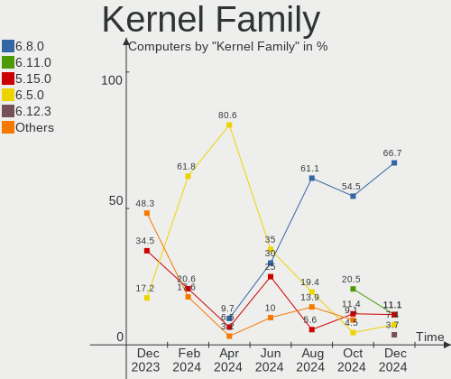
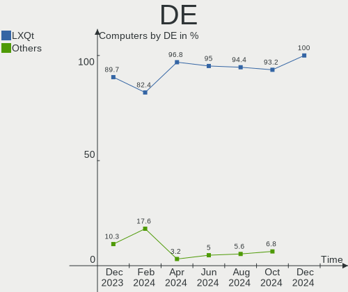
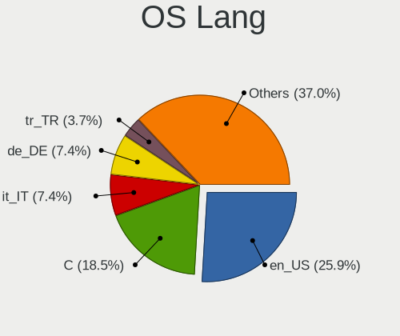
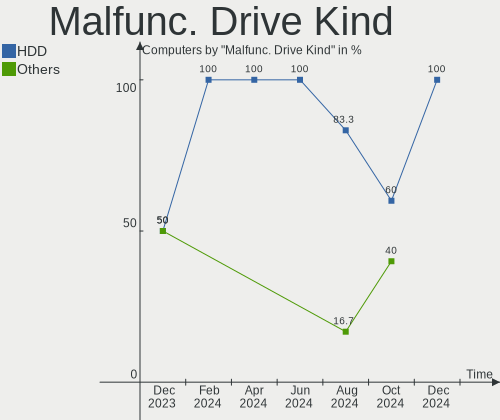
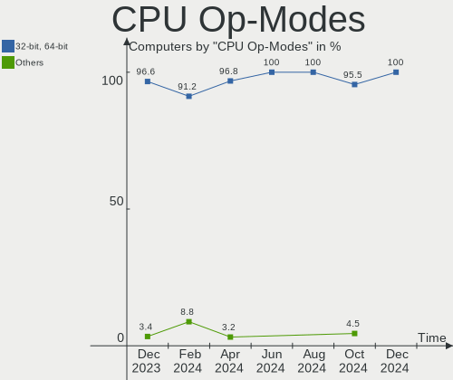
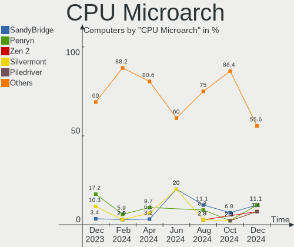
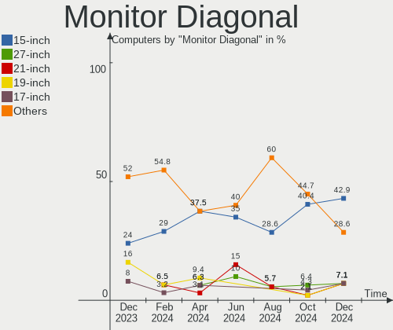
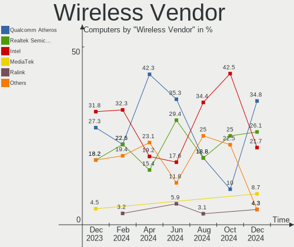
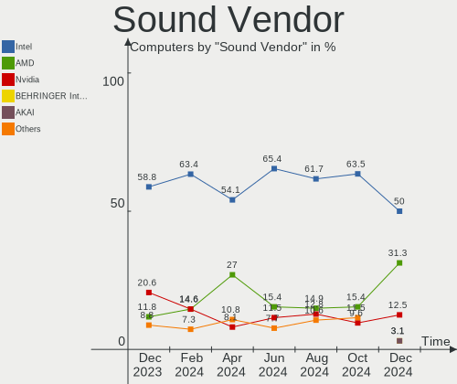
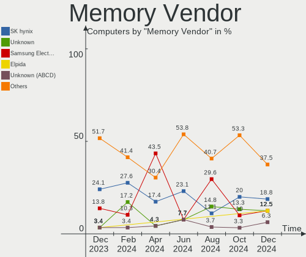

Lubuntu - Hardware Trends
-------------------------

A project to identify most popular hardware characteristics and track their change
over time based on data collected by Linux users at https://Linux-Hardware.org.

Anyone can contribute to this report by the [hw-probe](https://github.com/linuxhw/hw-probe) tool:

    sudo -E hw-probe -all -upload

This is a report for all computer types. See also reports for [desktops](/Dist/Lubuntu/Desktop/README.md) and [notebooks](/Dist/Lubuntu/Notebook/README.md).

This report is for one last month. Overall report since the beginning of time: [TestDays](https://github.com/linuxhw/TestDays)

Period: Aug, 2023.

Contents
--------

* [ System ](#system)
  - [ OS                       ](#os)
  - [ OS Family                ](#os-family)
  - [ Kernel                   ](#kernel)
  - [ Kernel Family            ](#kernel-family)
  - [ Kernel Major Ver.        ](#kernel-major-ver)
  - [ Arch                     ](#arch)
  - [ DE                       ](#de)
  - [ Display Server           ](#display-server)
  - [ Display Manager          ](#display-manager)
  - [ OS Lang                  ](#os-lang)
  - [ Boot Mode                ](#boot-mode)
  - [ Filesystem               ](#filesystem)
  - [ Part. scheme             ](#part-scheme)
  - [ Dual Boot with Linux/BSD ](#dual-boot-with-linuxbsd)
  - [ Dual Boot (Win)          ](#dual-boot-win)

* [ Board ](#board)
  - [ Vendor                   ](#vendor)
  - [ Model                    ](#model)
  - [ Model Family             ](#model-family)
  - [ MFG Year                 ](#mfg-year)
  - [ Form Factor              ](#form-factor)
  - [ Secure Boot              ](#secure-boot)
  - [ Coreboot                 ](#coreboot)
  - [ RAM Size                 ](#ram-size)
  - [ RAM Used                 ](#ram-used)
  - [ Total Drives             ](#total-drives)
  - [ Has CD-ROM               ](#has-cd-rom)
  - [ Has Ethernet             ](#has-ethernet)
  - [ Has WiFi                 ](#has-wifi)
  - [ Has Bluetooth            ](#has-bluetooth)

* [ Location ](#location)
  - [ Country                  ](#country)
  - [ City                     ](#city)

* [ Drives ](#drives)
  - [ Drive Vendor             ](#drive-vendor)
  - [ Drive Model              ](#drive-model)
  - [ HDD Vendor               ](#hdd-vendor)
  - [ SSD Vendor               ](#ssd-vendor)
  - [ Drive Kind               ](#drive-kind)
  - [ Drive Connector          ](#drive-connector)
  - [ Drive Size               ](#drive-size)
  - [ Space Total              ](#space-total)
  - [ Space Used               ](#space-used)
  - [ Malfunc. Drives          ](#malfunc-drives)
  - [ Malfunc. Drive Vendor    ](#malfunc-drive-vendor)
  - [ Malfunc. HDD Vendor      ](#malfunc-hdd-vendor)
  - [ Malfunc. Drive Kind      ](#malfunc-drive-kind)
  - [ Failed Drives            ](#failed-drives)
  - [ Failed Drive Vendor      ](#failed-drive-vendor)
  - [ Drive Status             ](#drive-status)

* [ Storage controller ](#storage-controller)
  - [ Storage Vendor           ](#storage-vendor)
  - [ Storage Model            ](#storage-model)
  - [ Storage Kind             ](#storage-kind)

* [ Processor ](#processor)
  - [ CPU Vendor               ](#cpu-vendor)
  - [ CPU Model                ](#cpu-model)
  - [ CPU Model Family         ](#cpu-model-family)
  - [ CPU Cores                ](#cpu-cores)
  - [ CPU Sockets              ](#cpu-sockets)
  - [ CPU Threads              ](#cpu-threads)
  - [ CPU Op-Modes             ](#cpu-op-modes)
  - [ CPU Microcode            ](#cpu-microcode)
  - [ CPU Microarch            ](#cpu-microarch)

* [ Graphics ](#graphics)
  - [ GPU Vendor               ](#gpu-vendor)
  - [ GPU Model                ](#gpu-model)
  - [ GPU Combo                ](#gpu-combo)
  - [ GPU Driver               ](#gpu-driver)
  - [ GPU Memory               ](#gpu-memory)

* [ Monitor ](#monitor)
  - [ Monitor Vendor           ](#monitor-vendor)
  - [ Monitor Model            ](#monitor-model)
  - [ Monitor Resolution       ](#monitor-resolution)
  - [ Monitor Diagonal         ](#monitor-diagonal)
  - [ Monitor Width            ](#monitor-width)
  - [ Aspect Ratio             ](#aspect-ratio)
  - [ Monitor Area             ](#monitor-area)
  - [ Pixel Density            ](#pixel-density)
  - [ Multiple Monitors        ](#multiple-monitors)

* [ Network ](#network)
  - [ Net Controller Vendor    ](#net-controller-vendor)
  - [ Net Controller Model     ](#net-controller-model)
  - [ Wireless Vendor          ](#wireless-vendor)
  - [ Wireless Model           ](#wireless-model)
  - [ Ethernet Vendor          ](#ethernet-vendor)
  - [ Ethernet Model           ](#ethernet-model)
  - [ Net Controller Kind      ](#net-controller-kind)
  - [ Used Controller          ](#used-controller)
  - [ NICs                     ](#nics)
  - [ IPv6                     ](#ipv6)

* [ Bluetooth ](#bluetooth)
  - [ Bluetooth Vendor         ](#bluetooth-vendor)
  - [ Bluetooth Model          ](#bluetooth-model)

* [ Sound ](#sound)
  - [ Sound Vendor             ](#sound-vendor)
  - [ Sound Model              ](#sound-model)

* [ Memory ](#memory)
  - [ Memory Vendor            ](#memory-vendor)
  - [ Memory Model             ](#memory-model)
  - [ Memory Kind              ](#memory-kind)
  - [ Memory Form Factor       ](#memory-form-factor)
  - [ Memory Size              ](#memory-size)
  - [ Memory Speed             ](#memory-speed)

* [ Printers & scanners ](#printers--scanners)
  - [ Printer Vendor           ](#printer-vendor)
  - [ Printer Model            ](#printer-model)
  - [ Scanner Vendor           ](#scanner-vendor)
  - [ Scanner Model            ](#scanner-model)

* [ Camera ](#camera)
  - [ Camera Vendor            ](#camera-vendor)
  - [ Camera Model             ](#camera-model)

* [ Security ](#security)
  - [ Fingerprint Vendor       ](#fingerprint-vendor)
  - [ Fingerprint Model        ](#fingerprint-model)
  - [ Chipcard Vendor          ](#chipcard-vendor)
  - [ Chipcard Model           ](#chipcard-model)

* [ Unsupported ](#unsupported)
  - [ Unsupported Devices      ](#unsupported-devices)
  - [ Unsupported Device Types ](#unsupported-device-types)

System
------

OS
--

Installed operating systems

| Name          | Computers | Percent |
|---------------|-----------|---------|
| Lubuntu 22.04 | 20        | 60.61%  |
| Lubuntu 23.04 | 4         | 12.12%  |
| Lubuntu 20.04 | 4         | 12.12%  |
| Lubuntu 18.04 | 3         | 9.09%   |
| Lubuntu 23.10 | 1         | 3.03%   |
| Lubuntu 22.10 | 1         | 3.03%   |

OS Family
---------

OS without a version

| Name    | Computers | Percent |
|---------|-----------|---------|
| Lubuntu | 33        | 100%    |

Kernel
------

Version of the Linux kernel

| Version               | Computers | Percent |
|-----------------------|-----------|---------|
| 6.2.0-26-generic      | 7         | 21.21%  |
| 6.2.0-27-generic      | 4         | 12.12%  |
| 5.4.0-150-generic     | 3         | 9.09%   |
| 5.15.0-79-generic     | 3         | 9.09%   |
| 6.2.0-31-generic      | 2         | 6.06%   |
| 5.19.0-32-generic     | 2         | 6.06%   |
| 5.15.0-78-generic     | 2         | 6.06%   |
| 5.15.0-75-generic     | 2         | 6.06%   |
| 6.5.0-060500-generic  | 1         | 3.03%   |
| 6.4.12-060412-generic | 1         | 3.03%   |
| 5.8.0-53-generic      | 1         | 3.03%   |
| 5.19.0-50-generic     | 1         | 3.03%   |
| 5.19.0-46-generic     | 1         | 3.03%   |
| 5.15.0-76-generic     | 1         | 3.03%   |
| 5.15.0-25-generic     | 1         | 3.03%   |
| 5.15.0-1034-raspi     | 1         | 3.03%   |

Kernel Family
-------------

Linux kernel without a distro release

| Version | Computers | Percent |
|---------|-----------|---------|
| 6.2.0   | 13        | 39.39%  |
| 5.15.0  | 10        | 30.3%   |
| 5.19.0  | 4         | 12.12%  |
| 5.4.0   | 3         | 9.09%   |
| 6.5.0   | 1         | 3.03%   |
| 6.4.12  | 1         | 3.03%   |
| 5.8.0   | 1         | 3.03%   |

Kernel Major Ver.
-----------------

Linux kernel major version

| Version | Computers | Percent |
|---------|-----------|---------|
| 6.2     | 13        | 39.39%  |
| 5.15    | 10        | 30.3%   |
| 5.19    | 4         | 12.12%  |
| 5.4     | 3         | 9.09%   |
| 6.5     | 1         | 3.03%   |
| 6.4     | 1         | 3.03%   |
| 5.8     | 1         | 3.03%   |

Arch
----

OS architecture (x86_64, i586, etc.)

| Name    | Computers | Percent |
|---------|-----------|---------|
| x86_64  | 30        | 90.91%  |
| i686    | 2         | 6.06%   |
| aarch64 | 1         | 3.03%   |

DE
--

Desktop Environment

| Name | Computers | Percent |
|------|-----------|---------|
| LXQt | 27        | 81.82%  |
| LXDE | 6         | 18.18%  |

Display Server
--------------

X11 or Wayland

| Name | Computers | Percent |
|------|-----------|---------|
| X11  | 32        | 96.97%  |
| Tty  | 1         | 3.03%   |

Display Manager
---------------

SDDM, LightDM, etc.

| Name    | Computers | Percent |
|---------|-----------|---------|
| SDDM    | 21        | 63.64%  |
| LightDM | 4         | 12.12%  |
| GDM3    | 4         | 12.12%  |
| Unknown | 4         | 12.12%  |

OS Lang
-------

Language

| Lang  | Computers | Percent |
|-------|-----------|---------|
| en_US | 7         | 21.21%  |
| fr_FR | 6         | 18.18%  |
| en_GB | 5         | 15.15%  |
| pt_BR | 2         | 6.06%   |
| de_DE | 2         | 6.06%   |
| C     | 2         | 6.06%   |
| zh_TW | 1         | 3.03%   |
| sk_SK | 1         | 3.03%   |
| pl_PL | 1         | 3.03%   |
| it_IT | 1         | 3.03%   |
| hu_HU | 1         | 3.03%   |
| es_ES | 1         | 3.03%   |
| es_AR | 1         | 3.03%   |
| en_CA | 1         | 3.03%   |
| en_AU | 1         | 3.03%   |

Boot Mode
---------

EFI or BIOS

| Mode | Computers | Percent |
|------|-----------|---------|
| BIOS | 19        | 57.58%  |
| EFI  | 14        | 42.42%  |

Filesystem
----------

Type of filesystem

| Type    | Computers | Percent |
|---------|-----------|---------|
| Ext4    | 24        | 72.73%  |
| Tmpfs   | 8         | 24.24%  |
| Overlay | 1         | 3.03%   |

Part. scheme
------------

Scheme of partitioning

| Type    | Computers | Percent |
|---------|-----------|---------|
| GPT     | 20        | 60.61%  |
| MBR     | 7         | 21.21%  |
| Unknown | 6         | 18.18%  |

Dual Boot with Linux/BSD
------------------------

Hosting more than one Linux/BSD

| Dual boot | Computers | Percent |
|-----------|-----------|---------|
| No        | 32        | 96.97%  |
| Yes       | 1         | 3.03%   |

Dual Boot (Win)
---------------

Hosting Linux and Windows

| Dual boot | Computers | Percent |
|-----------|-----------|---------|
| No        | 25        | 75.76%  |
| Yes       | 8         | 24.24%  |

Board
-----

Vendor
------

Motherboard manufacturer

| Name                    | Computers | Percent |
|-------------------------|-----------|---------|
| ASUSTek Computer        | 6         | 18.18%  |
| Hewlett-Packard         | 4         | 12.12%  |
| Lenovo                  | 3         | 9.09%   |
| Gigabyte Technology     | 3         | 9.09%   |
| Toshiba                 | 2         | 6.06%   |
| Dell                    | 2         | 6.06%   |
| Apple                   | 2         | 6.06%   |
| Acer                    | 2         | 6.06%   |
| Shuttle                 | 1         | 3.03%   |
| Samsung Electronics     | 1         | 3.03%   |
| Raspberry Pi Foundation | 1         | 3.03%   |
| Positivo                | 1         | 3.03%   |
| Packard Bell            | 1         | 3.03%   |
| Inventec                | 1         | 3.03%   |
| Google                  | 1         | 3.03%   |
| Compal                  | 1         | 3.03%   |
| AMI                     | 1         | 3.03%   |

Model
-----

Motherboard model

| Name                                     | Computers | Percent |
|------------------------------------------|-----------|---------|
| Toshiba Satellite P770                   | 1         | 3.03%   |
| Toshiba Satellite L875D                  | 1         | 3.03%   |
| Shuttle XS35V3                           | 1         | 3.03%   |
| Samsung N150P/N210P/N220P                | 1         | 3.03%   |
| RPi Raspberry Pi 4 Model B Rev 1.5       | 1         | 3.03%   |
| Positivo C4128B-1                        | 1         | 3.03%   |
| Packard Bell EasyNote TJ65               | 1         | 3.03%   |
| Lenovo ThinkPad T430 2349TFK             | 1         | 3.03%   |
| Lenovo IdeaPad Slim 1-11AST-05 81VR      | 1         | 3.03%   |
| Lenovo G580 20150                        | 1         | 3.03%   |
| Inventec DQ Class                        | 1         | 3.03%   |
| HP Pavilion g7                           | 1         | 3.03%   |
| HP Pavilion 15                           | 1         | 3.03%   |
| HP Notebook                              | 1         | 3.03%   |
| HP EliteBook 830 G8 Notebook PC          | 1         | 3.03%   |
| Google Robo                              | 1         | 3.03%   |
| Gigabyte H61M-D2H-USB3                   | 1         | 3.03%   |
| Gigabyte H510M H                         | 1         | 3.03%   |
| Gigabyte B560 HD3                        | 1         | 3.03%   |
| Dell Inspiron MM061                      | 1         | 3.03%   |
| Dell Inspiron 5720                       | 1         | 3.03%   |
| Compal PBL20                             | 1         | 3.03%   |
| ASUS X75VD                               | 1         | 3.03%   |
| ASUS VivoBook_ASUSLaptop X512DA_X512DA   | 1         | 3.03%   |
| ASUS P5QD TURBO                          | 1         | 3.03%   |
| ASUS K52JB                               | 1         | 3.03%   |
| ASUS BM6875_BM6675_BP6375                | 1         | 3.03%   |
| ASUS ASUS TUF Gaming A15 FA506II_FA506II | 1         | 3.03%   |
| Apple Xserve3,1                          | 1         | 3.03%   |
| Apple Macmini5,1                         | 1         | 3.03%   |
| AMI Aptio CRB                            | 1         | 3.03%   |
| Acer Predator G3610                      | 1         | 3.03%   |
| Acer Aspire 5050                         | 1         | 3.03%   |

Model Family
------------

Motherboard model prefix

| Name                   | Computers | Percent |
|------------------------|-----------|---------|
| Toshiba Satellite      | 2         | 6.06%   |
| HP Pavilion            | 2         | 6.06%   |
| Dell Inspiron          | 2         | 6.06%   |
| Shuttle XS35V3         | 1         | 3.03%   |
| Samsung N150P          | 1         | 3.03%   |
| RPi Raspberry          | 1         | 3.03%   |
| Positivo C4128B-1      | 1         | 3.03%   |
| Packard Bell EasyNote  | 1         | 3.03%   |
| Lenovo ThinkPad        | 1         | 3.03%   |
| Lenovo IdeaPad         | 1         | 3.03%   |
| Lenovo G580            | 1         | 3.03%   |
| Inventec DQ            | 1         | 3.03%   |
| HP Notebook            | 1         | 3.03%   |
| HP EliteBook           | 1         | 3.03%   |
| Google Robo            | 1         | 3.03%   |
| Gigabyte H61M-D2H-USB3 | 1         | 3.03%   |
| Gigabyte H510M         | 1         | 3.03%   |
| Gigabyte B560          | 1         | 3.03%   |
| Compal PBL20           | 1         | 3.03%   |
| ASUS X75VD             | 1         | 3.03%   |
| ASUS VivoBook          | 1         | 3.03%   |
| ASUS P5QD              | 1         | 3.03%   |
| ASUS K52JB             | 1         | 3.03%   |
| ASUS BM6875            | 1         | 3.03%   |
| ASUS ASUS              | 1         | 3.03%   |
| Apple Xserve3          | 1         | 3.03%   |
| Apple Macmini5         | 1         | 3.03%   |
| AMI Aptio              | 1         | 3.03%   |
| Acer Predator          | 1         | 3.03%   |
| Acer Aspire            | 1         | 3.03%   |

MFG Year
--------

Motherboard manufacture year

| Year    | Computers | Percent |
|---------|-----------|---------|
| 2012    | 8         | 24.24%  |
| 2011    | 5         | 15.15%  |
| 2021    | 3         | 9.09%   |
| 2009    | 3         | 9.09%   |
| 2019    | 2         | 6.06%   |
| 2013    | 2         | 6.06%   |
| 2010    | 2         | 6.06%   |
| 2006    | 2         | 6.06%   |
| 2023    | 1         | 3.03%   |
| 2022    | 1         | 3.03%   |
| 2020    | 1         | 3.03%   |
| 2016    | 1         | 3.03%   |
| 2014    | 1         | 3.03%   |
| Unknown | 1         | 3.03%   |

Form Factor
-----------

Physical design of the computer

| Name           | Computers | Percent |
|----------------|-----------|---------|
| Notebook       | 20        | 60.61%  |
| Desktop        | 9         | 27.27%  |
| Mini pc        | 2         | 6.06%   |
| System on chip | 1         | 3.03%   |
| Convertible    | 1         | 3.03%   |

Secure Boot
-----------

Enabled or disabled

| State    | Computers | Percent |
|----------|-----------|---------|
| Disabled | 30        | 90.91%  |
| Enabled  | 3         | 9.09%   |

Coreboot
--------

Have coreboot on board

| Used | Computers | Percent |
|------|-----------|---------|
| No   | 32        | 96.97%  |
| Yes  | 1         | 3.03%   |

RAM Size
--------

Total RAM memory

| Size in GB | Computers | Percent |
|------------|-----------|---------|
| 4.01-8.0   | 11        | 33.33%  |
| 3.01-4.0   | 11        | 33.33%  |
| 8.01-16.0  | 6         | 18.18%  |
| 1.01-2.0   | 3         | 9.09%   |
| 32.01-64.0 | 2         | 6.06%   |

RAM Used
--------

Used RAM memory

| Used GB  | Computers | Percent |
|----------|-----------|---------|
| 1.01-2.0 | 16        | 48.48%  |
| 2.01-3.0 | 7         | 21.21%  |
| 0.51-1.0 | 5         | 15.15%  |
| 4.01-8.0 | 4         | 12.12%  |
| 3.01-4.0 | 1         | 3.03%   |

Total Drives
------------

Number of drives on board

| Drives | Computers | Percent |
|--------|-----------|---------|
| 1      | 24        | 72.73%  |
| 2      | 6         | 18.18%  |
| 5      | 2         | 6.06%   |
| 8      | 1         | 3.03%   |

Has CD-ROM
----------

Has CD-ROM on board

| Presented | Computers | Percent |
|-----------|-----------|---------|
| No        | 17        | 51.52%  |
| Yes       | 16        | 48.48%  |

Has Ethernet
------------

Has Ethernet on board

| Presented | Computers | Percent |
|-----------|-----------|---------|
| Yes       | 26        | 78.79%  |
| No        | 7         | 21.21%  |

Has WiFi
--------

Has WiFi module

| Presented | Computers | Percent |
|-----------|-----------|---------|
| Yes       | 26        | 78.79%  |
| No        | 7         | 21.21%  |

Has Bluetooth
-------------

Has Bluetooth module

| Presented | Computers | Percent |
|-----------|-----------|---------|
| No        | 21        | 63.64%  |
| Yes       | 12        | 36.36%  |

Location
--------

Country
-------

Geographic location (country)

| Country     | Computers | Percent |
|-------------|-----------|---------|
| France      | 7         | 21.21%  |
| USA         | 3         | 9.09%   |
| UK          | 3         | 9.09%   |
| Germany     | 3         | 9.09%   |
| Slovakia    | 2         | 6.06%   |
| Poland      | 2         | 6.06%   |
| Brazil      | 2         | 6.06%   |
| Ukraine     | 1         | 3.03%   |
| Taiwan      | 1         | 3.03%   |
| Spain       | 1         | 3.03%   |
| Netherlands | 1         | 3.03%   |
| Italy       | 1         | 3.03%   |
| Indonesia   | 1         | 3.03%   |
| Hungary     | 1         | 3.03%   |
| Czechia     | 1         | 3.03%   |
| Canada      | 1         | 3.03%   |
| Australia   | 1         | 3.03%   |
| Argentina   | 1         | 3.03%   |

City
----

Geographic location (city)

| City                    | Computers | Percent |
|-------------------------|-----------|---------|
| Paris                   | 2         | 6.06%   |
| Bratislava              | 2         | 6.06%   |
| Woking                  | 1         | 3.03%   |
| Wattignies-la-Victoire  | 1         | 3.03%   |
| Warsaw                  | 1         | 3.03%   |
| Taipei                  | 1         | 3.03%   |
| San Fernando            | 1         | 3.03%   |
| Saint-Maur-des-Fossés  | 1         | 3.03%   |
| Saint-Etienne-de-Valoux | 1         | 3.03%   |
| Prague                  | 1         | 3.03%   |
| Perth                   | 1         | 3.03%   |
| Ottawa                  | 1         | 3.03%   |
| Oberhausen              | 1         | 3.03%   |
| Milan                   | 1         | 3.03%   |
| Marseille               | 1         | 3.03%   |
| Manchester              | 1         | 3.03%   |
| London                  | 1         | 3.03%   |
| Lodz                    | 1         | 3.03%   |
| Kyiv                    | 1         | 3.03%   |
| Kiel                    | 1         | 3.03%   |
| Joinville               | 1         | 3.03%   |
| Gonesse                 | 1         | 3.03%   |
| Fruitland               | 1         | 3.03%   |
| Encantado               | 1         | 3.03%   |
| Clearfield              | 1         | 3.03%   |
| Budapest                | 1         | 3.03%   |
| Bloomfield              | 1         | 3.03%   |
| Bekasi                  | 1         | 3.03%   |
| Alsfeld                 | 1         | 3.03%   |
| Alphen aan den Rijn     | 1         | 3.03%   |
| Almería                | 1         | 3.03%   |

Drives
------

Drive Vendor
------------

Hard drive vendors

| Vendor                      | Computers | Drives | Percent |
|-----------------------------|-----------|--------|---------|
| WDC                         | 7         | 14     | 15.22%  |
| Unknown                     | 5         | 5      | 10.87%  |
| Seagate                     | 5         | 6      | 10.87%  |
| Toshiba                     | 4         | 4      | 8.7%    |
| Samsung Electronics         | 4         | 4      | 8.7%    |
| Kingston                    | 4         | 4      | 8.7%    |
| Hitachi                     | 3         | 3      | 6.52%   |
| SanDisk                     | 2         | 2      | 4.35%   |
| Crucial                     | 2         | 2      | 4.35%   |
| Transcend                   | 1         | 1      | 2.17%   |
| Patriot                     | 1         | 1      | 2.17%   |
| Micron Technology           | 1         | 1      | 2.17%   |
| Maxtor                      | 1         | 1      | 2.17%   |
| Kingston Technology Company | 1         | 1      | 2.17%   |
| Fujitsu                     | 1         | 1      | 2.17%   |
| BHT                         | 1         | 1      | 2.17%   |
| Apple                       | 1         | 1      | 2.17%   |
| Apacer                      | 1         | 1      | 2.17%   |
| Unknown                     | 1         | 1      | 2.17%   |

Drive Model
-----------

Hard drive models

| Model                                | Computers | Percent |
|--------------------------------------|-----------|---------|
| Seagate Expansion 2TB                | 2         | 3.85%   |
| Kingston OM8PCP3512F-AB 512GB        | 2         | 3.85%   |
| WDC WDS500G2B0C-00PXH0 500GB         | 1         | 1.92%   |
| WDC WDS240G2G0A-00JH30 240GB SSD     | 1         | 1.92%   |
| WDC WD6400BEVT-22A0RT0 640GB         | 1         | 1.92%   |
| WDC WD5000AADS-00M2B0 500GB          | 1         | 1.92%   |
| WDC WD40EZRZ-00GXCB0 4TB             | 1         | 1.92%   |
| WDC WD40EZRX-00SPEB0 4TB             | 1         | 1.92%   |
| WDC WD40EZAZ-00SF3B0 4TB             | 1         | 1.92%   |
| WDC WD40EFRX-68WT0N0 4TB             | 1         | 1.92%   |
| WDC WD3200AAKS-75L9A0 320GB          | 1         | 1.92%   |
| WDC WD20EZAZ-00GGJB0 2TB             | 1         | 1.92%   |
| WDC WD20EARS-22MVWB0 2TB             | 1         | 1.92%   |
| WDC WD10JPVT-80A1YT0 1TB             | 1         | 1.92%   |
| Unknown SPCC  64GB                   | 1         | 1.92%   |
| Unknown SA32G  32GB                  | 1         | 1.92%   |
| Unknown MBG4GC  32GB                 | 1         | 1.92%   |
| Unknown DA4064  64GB                 | 1         | 1.92%   |
| Unknown DA4032  32GB                 | 1         | 1.92%   |
| Transcend TS256GSSD370S 256GB        | 1         | 1.92%   |
| Toshiba MQ01ABF050 500GB             | 1         | 1.92%   |
| Toshiba MK6465GSX 640GB              | 1         | 1.92%   |
| Toshiba MK5065GSXF 500GB             | 1         | 1.92%   |
| Toshiba HDWE140 4TB                  | 1         | 1.92%   |
| Seagate ST4000DM000 4GB              | 1         | 1.92%   |
| Seagate ST31000520AS 1TB             | 1         | 1.92%   |
| Seagate ST1000LM048-2E7172 1TB       | 1         | 1.92%   |
| Seagate ST1000LM024 HN-M101MBB 1TB   | 1         | 1.92%   |
| SanDisk SSD PLUS 120GB               | 1         | 1.92%   |
| SanDisk DF4032  32GB                 | 1         | 1.92%   |
| Samsung SSD 980 PRO 1TB              | 1         | 1.92%   |
| Samsung SSD 850 EVO 250GB            | 1         | 1.92%   |
| Samsung HM250HI 250GB                | 1         | 1.92%   |
| Samsung HM160HI 160GB                | 1         | 1.92%   |
| Patriot Blaze 120GB SSD              | 1         | 1.92%   |
| Micron MTFDHBA512QFD-1AX1AABHA 512GB | 1         | 1.92%   |
| Maxtor STM3250820AS 250GB            | 1         | 1.92%   |
| Kingston Company SNV2S1000G 1TB      | 1         | 1.92%   |
| Kingston SA400S37240G 240GB SSD      | 1         | 1.92%   |
| Kingston SA400S37120G 120GB SSD      | 1         | 1.92%   |

HDD Vendor
----------

Hard disk drive vendors

| Vendor              | Computers | Drives | Percent |
|---------------------|-----------|--------|---------|
| WDC                 | 7         | 12     | 30.43%  |
| Seagate             | 5         | 6      | 21.74%  |
| Toshiba             | 4         | 4      | 17.39%  |
| Hitachi             | 3         | 3      | 13.04%  |
| Samsung Electronics | 2         | 2      | 8.7%    |
| Maxtor              | 1         | 1      | 4.35%   |
| Fujitsu             | 1         | 1      | 4.35%   |

SSD Vendor
----------

Solid state drive vendors

| Vendor              | Computers | Drives | Percent |
|---------------------|-----------|--------|---------|
| Kingston            | 2         | 2      | 18.18%  |
| WDC                 | 1         | 1      | 9.09%   |
| Transcend           | 1         | 1      | 9.09%   |
| SanDisk             | 1         | 1      | 9.09%   |
| Samsung Electronics | 1         | 1      | 9.09%   |
| Patriot             | 1         | 1      | 9.09%   |
| Crucial             | 1         | 1      | 9.09%   |
| BHT                 | 1         | 1      | 9.09%   |
| Apple               | 1         | 1      | 9.09%   |
| Apacer              | 1         | 1      | 9.09%   |

Drive Kind
----------

HDD or SSD

| Kind | Computers | Drives | Percent |
|------|-----------|--------|---------|
| HDD  | 19        | 29     | 47.5%   |
| SSD  | 10        | 11     | 25%     |
| MMC  | 6         | 7      | 15%     |
| NVMe | 5         | 7      | 12.5%   |

Drive Connector
---------------

SATA, SAS, NVMe, etc.

| Type | Computers | Drives | Percent |
|------|-----------|--------|---------|
| SATA | 26        | 38     | 66.67%  |
| MMC  | 6         | 7      | 15.38%  |
| NVMe | 5         | 7      | 12.82%  |
| SAS  | 2         | 2      | 5.13%   |

Drive Size
----------

Size of hard drive

| Size in TB | Computers | Drives | Percent |
|------------|-----------|--------|---------|
| 0.01-0.5   | 18        | 20     | 54.55%  |
| 0.51-1.0   | 8         | 8      | 24.24%  |
| 1.01-2.0   | 5         | 5      | 15.15%  |
| 3.01-4.0   | 2         | 7      | 6.06%   |

Space Total
-----------

Amount of disk space available on the file system

| Size in GB     | Computers | Percent |
|----------------|-----------|---------|
| 101-250        | 10        | 30.3%   |
| 501-1000       | 8         | 24.24%  |
| 251-500        | 5         | 15.15%  |
| 51-100         | 4         | 12.12%  |
| 21-50          | 3         | 9.09%   |
| More than 3000 | 2         | 6.06%   |
| 1-20           | 1         | 3.03%   |

Space Used
----------

Amount of used disk space

| Used GB        | Computers | Percent |
|----------------|-----------|---------|
| 1-20           | 18        | 54.55%  |
| 101-250        | 5         | 15.15%  |
| 21-50          | 4         | 12.12%  |
| 51-100         | 2         | 6.06%   |
| More than 3000 | 1         | 3.03%   |
| 251-500        | 1         | 3.03%   |
| 2001-3000      | 1         | 3.03%   |
| 501-1000       | 1         | 3.03%   |

Malfunc. Drives
---------------

Drive models with a malfunction

| Model                              | Computers | Drives | Percent |
|------------------------------------|-----------|--------|---------|
| WDC WDS240G2G0A-00JH30 240GB SSD   | 1         | 1      | 14.29%  |
| WDC WD40EFRX-68WT0N0 4TB           | 1         | 2      | 14.29%  |
| Toshiba HDWE140 4TB                | 1         | 1      | 14.29%  |
| Seagate ST31000520AS 1TB           | 1         | 1      | 14.29%  |
| Seagate ST1000LM024 HN-M101MBB 1TB | 1         | 1      | 14.29%  |
| Hitachi HTS545050B9A300 500GB      | 1         | 1      | 14.29%  |
| Hitachi HDS5C3020ALA632 2TB        | 1         | 1      | 14.29%  |

Malfunc. Drive Vendor
---------------------

Vendors of faulty drives

| Vendor  | Computers | Drives | Percent |
|---------|-----------|--------|---------|
| WDC     | 2         | 3      | 28.57%  |
| Seagate | 2         | 2      | 28.57%  |
| Hitachi | 2         | 2      | 28.57%  |
| Toshiba | 1         | 1      | 14.29%  |

Malfunc. HDD Vendor
-------------------

Vendors of faulty HDD drives

| Vendor  | Computers | Drives | Percent |
|---------|-----------|--------|---------|
| Seagate | 2         | 2      | 33.33%  |
| Hitachi | 2         | 2      | 33.33%  |
| WDC     | 1         | 2      | 16.67%  |
| Toshiba | 1         | 1      | 16.67%  |

Malfunc. Drive Kind
-------------------

Kinds of faulty drives

| Kind | Computers | Drives | Percent |
|------|-----------|--------|---------|
| HDD  | 3         | 7      | 75%     |
| SSD  | 1         | 1      | 25%     |

Failed Drives
-------------

Failed drive models

Zero info for selected period =(

Failed Drive Vendor
-------------------

Failed drive vendors

Zero info for selected period =(

Drive Status
------------

Number of failed and malfunc. drives

| Status   | Computers | Drives | Percent |
|----------|-----------|--------|---------|
| Detected | 20        | 26     | 51.28%  |
| Works    | 15        | 20     | 38.46%  |
| Malfunc  | 4         | 8      | 10.26%  |

Storage controller
------------------

Storage Vendor
--------------

Storage controller vendors

| Vendor                      | Computers | Percent |
|-----------------------------|-----------|---------|
| Intel                       | 23        | 56.1%   |
| AMD                         | 7         | 17.07%  |
| Kingston Technology Company | 3         | 7.32%   |
| Micron Technology           | 2         | 4.88%   |
| ASMedia Technology          | 2         | 4.88%   |
| SanDisk                     | 1         | 2.44%   |
| Samsung Electronics         | 1         | 2.44%   |
| JMicron Technology          | 1         | 2.44%   |
| Apple                       | 1         | 2.44%   |

Storage Model
-------------

Storage controller models

| Model                                                                                   | Computers | Percent |
|-----------------------------------------------------------------------------------------|-----------|---------|
| AMD FCH SATA Controller [AHCI mode]                                                     | 6         | 13.33%  |
| Intel 7 Series Chipset Family 6-port SATA Controller [AHCI mode]                        | 5         | 11.11%  |
| Intel 6 Series/C200 Series Chipset Family 6 port Mobile SATA AHCI Controller            | 3         | 6.67%   |
| Kingston Company OM8PCP Design-In PCIe 3 NVMe SSD (DRAM-less)                           | 2         | 4.44%   |
| Intel NM10/ICH7 Family SATA Controller [AHCI mode]                                      | 2         | 4.44%   |
| Intel 500 Series Chipset Family SATA AHCI Controller                                    | 2         | 4.44%   |
| Intel 5 Series/3400 Series Chipset 4 port SATA AHCI Controller                          | 2         | 4.44%   |
| SanDisk WD Blue SN550 NVMe SSD                                                          | 1         | 2.22%   |
| Samsung NVMe SSD Controller PM9A1/PM9A3/980PRO                                          | 1         | 2.22%   |
| Micron 2300 NVMe SSD [Santana]                                                          | 1         | 2.22%   |
| Micron 2210 NVMe SSD [Cobain]                                                           | 1         | 2.22%   |
| Kingston Company Company Non-Volatile memory controller                                 | 1         | 2.22%   |
| JMicron JMB361 AHCI/IDE                                                                 | 1         | 2.22%   |
| Intel Volume Management Device NVMe RAID Controller                                     | 1         | 2.22%   |
| Intel SATA Controller [RAID mode]                                                       | 1         | 2.22%   |
| Intel Celeron/Pentium Silver Processor SATA Controller                                  | 1         | 2.22%   |
| Intel 82801JI (ICH10 Family) SATA AHCI Controller                                       | 1         | 2.22%   |
| Intel 82801JI (ICH10 Family) 4 port SATA IDE Controller #1                              | 1         | 2.22%   |
| Intel 82801JI (ICH10 Family) 2 port SATA IDE Controller #2                              | 1         | 2.22%   |
| Intel 82801IBM/IEM (ICH9M/ICH9M-E) 4 port SATA Controller [AHCI mode]                   | 1         | 2.22%   |
| Intel 82801GBM/GHM (ICH7-M Family) SATA Controller [IDE mode]                           | 1         | 2.22%   |
| Intel 7 Series/C210 Series Chipset Family 4-port SATA Controller [IDE mode]             | 1         | 2.22%   |
| Intel 7 Series/C210 Series Chipset Family 2-port SATA Controller [IDE mode]             | 1         | 2.22%   |
| Intel 6 Series/C200 Series Chipset Family Desktop SATA Controller (IDE mode, ports 4-5) | 1         | 2.22%   |
| Intel 6 Series/C200 Series Chipset Family Desktop SATA Controller (IDE mode, ports 0-3) | 1         | 2.22%   |
| ASMedia 106x SATA/RAID Controller                                                       | 1         | 2.22%   |
| ASMedia 1064 SATA Controller                                                            | 1         | 2.22%   |
| Apple RAID bus controller                                                               | 1         | 2.22%   |
| AMD IXP SB4x0 Serial ATA Controller                                                     | 1         | 2.22%   |
| AMD IXP SB4x0 IDE Controller                                                            | 1         | 2.22%   |

Storage Kind
------------

Kind of storage controller (IDE, SATA, NVMe, SAS, ...)

| Kind | Computers | Percent |
|------|-----------|---------|
| SATA | 23        | 63.89%  |
| NVMe | 5         | 13.89%  |
| IDE  | 5         | 13.89%  |
| RAID | 3         | 8.33%   |

Processor
---------

CPU Vendor
----------

Processor vendors

| Vendor | Computers | Percent |
|--------|-----------|---------|
| Intel  | 25        | 75.76%  |
| AMD    | 7         | 21.21%  |
| ARM    | 1         | 3.03%   |

CPU Model
---------

Processor models

| Model                                         | Computers | Percent |
|-----------------------------------------------|-----------|---------|
| Intel Core i5-3230M CPU @ 2.60GHz             | 2         | 6.06%   |
| Intel Xeon CPU E5520 @ 2.27GHz                | 1         | 3.03%   |
| Intel Pentium Dual-Core CPU T4400 @ 2.20GHz   | 1         | 3.03%   |
| Intel Genuine CPU T2080 @ 1.73GHz             | 1         | 3.03%   |
| Intel Core i7-3770 CPU @ 3.40GHz              | 1         | 3.03%   |
| Intel Core i7-3632QM CPU @ 2.20GHz            | 1         | 3.03%   |
| Intel Core i7-2670QM CPU @ 2.20GHz            | 1         | 3.03%   |
| Intel Core i7-2620M CPU @ 2.70GHz             | 1         | 3.03%   |
| Intel Core i7-2600 CPU @ 3.40GHz              | 1         | 3.03%   |
| Intel Core i5-3320M CPU @ 2.60GHz             | 1         | 3.03%   |
| Intel Core i5-3210M CPU @ 2.50GHz             | 1         | 3.03%   |
| Intel Core i5-2415M CPU @ 2.30GHz             | 1         | 3.03%   |
| Intel Core i5-10400F CPU @ 2.90GHz            | 1         | 3.03%   |
| Intel Core i5 CPU M 430 @ 2.27GHz             | 1         | 3.03%   |
| Intel Core i3 CPU M 390 @ 2.67GHz             | 1         | 3.03%   |
| Intel Core 2 Quad CPU Q9550 @ 2.83GHz         | 1         | 3.03%   |
| Intel Celeron N4020C CPU @ 1.10GHz            | 1         | 3.03%   |
| Intel Celeron CPU N3350 @ 1.10GHz             | 1         | 3.03%   |
| Intel Celeron CPU G465 @ 1.90GHz              | 1         | 3.03%   |
| Intel Atom CPU Z3735D @ 1.33GHz               | 1         | 3.03%   |
| Intel Atom CPU N450 @ 1.66GHz                 | 1         | 3.03%   |
| Intel Atom CPU D2550 @ 1.86GHz                | 1         | 3.03%   |
| Intel 11th Gen Core i5-11400 @ 2.60GHz        | 1         | 3.03%   |
| Intel 11th Gen Core i5-1135G7 @ 2.40GHz       | 1         | 3.03%   |
| ARM Processor                                 | 1         | 3.03%   |
| AMD Turion 64 Mobile Technology MK-38         | 1         | 3.03%   |
| AMD Ryzen 7 3700U with Radeon Vega Mobile Gfx | 1         | 3.03%   |
| AMD Ryzen 5 4600H with Radeon Graphics        | 1         | 3.03%   |
| AMD GX-415GA SOC with Radeon HD Graphics      | 1         | 3.03%   |
| AMD E2-7110 APU with AMD Radeon R2 Graphics   | 1         | 3.03%   |
| AMD A6-4400M APU with Radeon HD Graphics      | 1         | 3.03%   |
| AMD A4-9120e RADEON R3, 4 COMPUTE CORES 2C+2G | 1         | 3.03%   |

CPU Model Family
----------------

Processor model prefix

| Model                   | Computers | Percent |
|-------------------------|-----------|---------|
| Intel Core i5           | 7         | 21.21%  |
| Intel Core i7           | 5         | 15.15%  |
| Other                   | 3         | 9.09%   |
| Intel Celeron           | 3         | 9.09%   |
| Intel Atom              | 3         | 9.09%   |
| Intel Xeon              | 1         | 3.03%   |
| Intel Pentium Dual-Core | 1         | 3.03%   |
| Intel Genuine           | 1         | 3.03%   |
| Intel Core i3           | 1         | 3.03%   |
| Intel Core 2 Quad       | 1         | 3.03%   |
| AMD Turion 64 Mobile    | 1         | 3.03%   |
| AMD Ryzen 7             | 1         | 3.03%   |
| AMD Ryzen 5             | 1         | 3.03%   |
| AMD GX                  | 1         | 3.03%   |
| AMD E2                  | 1         | 3.03%   |
| AMD A6                  | 1         | 3.03%   |
| AMD A4                  | 1         | 3.03%   |

CPU Cores
---------

Number of processor cores

| Number  | Computers | Percent |
|---------|-----------|---------|
| 2       | 14        | 42.42%  |
| 4       | 10        | 30.3%   |
| 1       | 4         | 12.12%  |
| 6       | 3         | 9.09%   |
| 8       | 1         | 3.03%   |
| Unknown | 1         | 3.03%   |

CPU Sockets
-----------

Number of sockets

| Number  | Computers | Percent |
|---------|-----------|---------|
| 1       | 31        | 93.94%  |
| 2       | 1         | 3.03%   |
| Unknown | 1         | 3.03%   |

CPU Threads
-----------

Threads per core (Hyper-Threading)

| Number  | Computers | Percent |
|---------|-----------|---------|
| 2       | 22        | 66.67%  |
| 1       | 10        | 30.3%   |
| Unknown | 1         | 3.03%   |

CPU Op-Modes
------------

CPU Operation Modes (32-bit, 64-bit)

| Op mode        | Computers | Percent |
|----------------|-----------|---------|
| 32-bit, 64-bit | 32        | 96.97%  |
| 32-bit         | 1         | 3.03%   |

CPU Microcode
-------------

Microcode number

| Number     | Computers | Percent |
|------------|-----------|---------|
| Unknown    | 17        | 51.52%  |
| 0x306a9    | 5         | 15.15%  |
| 0xa0671    | 1         | 3.03%   |
| 0x6ec      | 1         | 3.03%   |
| 0x30678    | 1         | 3.03%   |
| 0x206a7    | 1         | 3.03%   |
| 0x20655    | 1         | 3.03%   |
| 0x08600104 | 1         | 3.03%   |
| 0x08108109 | 1         | 3.03%   |
| 0x07030105 | 1         | 3.03%   |
| 0x0700010f | 1         | 3.03%   |
| 0x06006705 | 1         | 3.03%   |
| 0x06001119 | 1         | 3.03%   |

CPU Microarch
-------------

Microarchitecture

| Name          | Computers | Percent |
|---------------|-----------|---------|
| IvyBridge     | 6         | 18.18%  |
| SandyBridge   | 5         | 15.15%  |
| Westmere      | 2         | 6.06%   |
| Penryn        | 2         | 6.06%   |
| Bonnell       | 2         | 6.06%   |
| Zen+          | 1         | 3.03%   |
| Zen 2         | 1         | 3.03%   |
| TigerLake     | 1         | 3.03%   |
| Silvermont    | 1         | 3.03%   |
| Puma          | 1         | 3.03%   |
| Piledriver    | 1         | 3.03%   |
| P6            | 1         | 3.03%   |
| Nehalem       | 1         | 3.03%   |
| K8 Hammer     | 1         | 3.03%   |
| Jaguar        | 1         | 3.03%   |
| Icelake       | 1         | 3.03%   |
| Goldmont plus | 1         | 3.03%   |
| Goldmont      | 1         | 3.03%   |
| Excavator     | 1         | 3.03%   |
| CometLake     | 1         | 3.03%   |
| Unknown       | 1         | 3.03%   |

Graphics
--------

GPU Vendor
----------

Vendors of graphics cards

| Vendor | Computers | Percent |
|--------|-----------|---------|
| Intel  | 16        | 42.11%  |
| AMD    | 12        | 31.58%  |
| Nvidia | 10        | 26.32%  |

GPU Model
---------

Graphics card models

| Model                                                                         | Computers | Percent |
|-------------------------------------------------------------------------------|-----------|---------|
| Intel 3rd Gen Core processor Graphics Controller                              | 5         | 12.82%  |
| Intel 2nd Generation Core Processor Family Integrated Graphics Controller     | 4         | 10.26%  |
| Nvidia TU117 [GeForce GTX 1650]                                               | 2         | 5.13%   |
| AMD Seymour [Radeon HD 6400M/7400M Series]                                    | 2         | 5.13%   |
| Nvidia TU117M [GeForce GTX 1650 Ti Mobile]                                    | 1         | 2.56%   |
| Nvidia GT216M [GeForce GT 240M]                                               | 1         | 2.56%   |
| Nvidia GF119M [GeForce 610M]                                                  | 1         | 2.56%   |
| Nvidia GF119 [GeForce GT 610]                                                 | 1         | 2.56%   |
| Nvidia GF108M [GeForce GT 635M]                                               | 1         | 2.56%   |
| Nvidia GF108M [GeForce GT 540M]                                               | 1         | 2.56%   |
| Nvidia G96 [GeForce GT 120 Mac Edition]                                       | 1         | 2.56%   |
| Nvidia G94 [GeForce 9600 GT]                                                  | 1         | 2.56%   |
| Intel TigerLake-LP GT2 [Iris Xe Graphics]                                     | 1         | 2.56%   |
| Intel Mobile 945GM/GMS/GME, 943/940GML Express Integrated Graphics Controller | 1         | 2.56%   |
| Intel Mobile 945GM/GMS, 943/940GML Express Integrated Graphics Controller     | 1         | 2.56%   |
| Intel HD Graphics 500                                                         | 1         | 2.56%   |
| Intel GeminiLake [UHD Graphics 600]                                           | 1         | 2.56%   |
| Intel Core Processor Integrated Graphics Controller                           | 1         | 2.56%   |
| Intel Atom Processor Z36xxx/Z37xxx Series Graphics & Display                  | 1         | 2.56%   |
| Intel Atom Processor D4xx/D5xx/N4xx/N5xx Integrated Graphics Controller       | 1         | 2.56%   |
| AMD Trinity 2 [Radeon HD 7520G]                                               | 1         | 2.56%   |
| AMD Sun XT [Radeon HD 8670A/8670M/8690M / R5 M330 / M430 / Radeon 520 Mobile] | 1         | 2.56%   |
| AMD Stoney [Radeon R2/R3/R4/R5 Graphics]                                      | 1         | 2.56%   |
| AMD Seymour LP [Radeon HD 6430M]                                              | 1         | 2.56%   |
| AMD RV710/M92 [Mobility Radeon HD 4530/4570/5145/530v/540v/545v]              | 1         | 2.56%   |
| AMD RS482M [Mobility Radeon Xpress 200]                                       | 1         | 2.56%   |
| AMD Renoir                                                                    | 1         | 2.56%   |
| AMD Picasso/Raven 2 [Radeon Vega Series / Radeon Vega Mobile Series]          | 1         | 2.56%   |
| AMD Mullins [Radeon R3 Graphics]                                              | 1         | 2.56%   |
| AMD Kabini [Radeon HD 8330E]                                                  | 1         | 2.56%   |

GPU Combo
---------

Combinations of graphics cards

| Name           | Computers | Percent |
|----------------|-----------|---------|
| 1 x Intel      | 10        | 30.3%   |
| 1 x AMD        | 9         | 27.27%  |
| 1 x Nvidia     | 6         | 18.18%  |
| Intel + Nvidia | 3         | 9.09%   |
| Other          | 2         | 6.06%   |
| Intel + AMD    | 2         | 6.06%   |
| AMD + Nvidia   | 1         | 3.03%   |

GPU Driver
----------

Free vs proprietary

| Driver      | Computers | Percent |
|-------------|-----------|---------|
| Free        | 29        | 87.88%  |
| Proprietary | 3         | 9.09%   |
| Unknown     | 1         | 3.03%   |

GPU Memory
----------

Total video memory

| Size in GB | Computers | Percent |
|------------|-----------|---------|
| Unknown    | 19        | 57.58%  |
| 1.01-2.0   | 5         | 15.15%  |
| 0.01-0.5   | 4         | 12.12%  |
| 3.01-4.0   | 3         | 9.09%   |
| 0.51-1.0   | 2         | 6.06%   |

Monitor
-------

Monitor Vendor
--------------

Monitor vendors

| Vendor               | Computers | Percent |
|----------------------|-----------|---------|
| LG Display           | 6         | 21.43%  |
| Samsung Electronics  | 5         | 17.86%  |
| PANDA                | 2         | 7.14%   |
| Dell                 | 2         | 7.14%   |
| BOE                  | 2         | 7.14%   |
| AU Optronics         | 2         | 7.14%   |
| Xiaomi               | 1         | 3.57%   |
| RS                   | 1         | 3.57%   |
| Quanta Display       | 1         | 3.57%   |
| Pixio                | 1         | 3.57%   |
| Philips              | 1         | 3.57%   |
| InfoVision           | 1         | 3.57%   |
| Iiyama               | 1         | 3.57%   |
| Chimei Innolux       | 1         | 3.57%   |
| Ancor Communications | 1         | 3.57%   |

Monitor Model
-------------

Monitor models

| Model                                                                | Computers | Percent |
|----------------------------------------------------------------------|-----------|---------|
| Xiaomi Mi TV XMD00E1 1440x900 708x398mm 32.0-inch                    | 1         | 3.45%   |
| Samsung Electronics SyncMaster SAM01D4 1440x900 408x225mm 18.3-inch  | 1         | 3.45%   |
| Samsung Electronics LCD Monitor SEC544B 1600x900 382x214mm 17.2-inch | 1         | 3.45%   |
| Samsung Electronics LCD Monitor SEC4252 1366x768 344x194mm 15.5-inch | 1         | 3.45%   |
| Samsung Electronics LCD Monitor SEC324C 1600x900 310x174mm 14.0-inch | 1         | 3.45%   |
| Samsung Electronics LCD Monitor SEC3052 1024x600 223x125mm 10.1-inch | 1         | 3.45%   |
| RS LE2262 BTC2262 1680x1050 473x296mm 22.0-inch                      | 1         | 3.45%   |
| Quanta Display LCD Monitor QDS001F 1280x800 304x190mm 14.1-inch      | 1         | 3.45%   |
| Pixio DP ICB3500 3440x1440 708x399mm 32.0-inch                       | 1         | 3.45%   |
| Philips PHL 246E7 PHLC107 1920x1080 521x293mm 23.5-inch              | 1         | 3.45%   |
| PANDA LCD Monitor NCP004D 1920x1080 344x194mm 15.5-inch              | 1         | 3.45%   |
| PANDA LCD Monitor NCP0046 1920x1080 344x194mm 15.5-inch              | 1         | 3.45%   |
| LG Display LP156WH2-TLE1 LGDCF01 1366x768 344x194mm 15.5-inch        | 1         | 3.45%   |
| LG Display LCD Monitor LGD0516 1920x1080 309x175mm 14.0-inch         | 1         | 3.45%   |
| LG Display LCD Monitor LGD0384 1366x768 344x194mm 15.5-inch          | 1         | 3.45%   |
| LG Display LCD Monitor LGD02D1 1600x900 382x215mm 17.3-inch          | 1         | 3.45%   |
| LG Display LCD Monitor LGD02AC 1366x768 344x194mm 15.5-inch          | 1         | 3.45%   |
| LG Display LCD Monitor LGD027A 1600x900 382x215mm 17.3-inch          | 1         | 3.45%   |
| InfoVision LCD Monitor IVO8596 1920x1080 294x165mm 13.3-inch         | 1         | 3.45%   |
| Iiyama PL2792H IVM664F 1920x1080 598x336mm 27.0-inch                 | 1         | 3.45%   |
| Iiyama PL2791Q IVM6646 2560x1440 597x336mm 27.0-inch                 | 1         | 3.45%   |
| Dell SP1908FP DEL4030 1280x1024 376x301mm 19.0-inch                  | 1         | 3.45%   |
| Dell E2210 DELD036 1680x1050 473x296mm 22.0-inch                     | 1         | 3.45%   |
| Chimei Innolux LCD Monitor CMN1132 1366x768 256x144mm 11.6-inch      | 1         | 3.45%   |
| BOE LCD Monitor BOE0970 1920x1080 309x173mm 13.9-inch                | 1         | 3.45%   |
| BOE LCD Monitor BOE0731 1366x768 256x144mm 11.6-inch                 | 1         | 3.45%   |
| AU Optronics LCD Monitor AUO159E 1600x900 382x214mm 17.2-inch        | 1         | 3.45%   |
| AU Optronics LCD Monitor AUO139E 1600x900 382x214mm 17.2-inch        | 1         | 3.45%   |
| Ancor Communications MT276 ACI27F1 1920x1080 598x336mm 27.0-inch     | 1         | 3.45%   |

Monitor Resolution
------------------

Monitor screen resolution

| Resolution         | Computers | Percent |
|--------------------|-----------|---------|
| 1920x1080 (FHD)    | 8         | 28.57%  |
| 1366x768 (WXGA)    | 7         | 25%     |
| 1600x900 (HD+)     | 6         | 21.43%  |
| 3840x2160 (4K)     | 1         | 3.57%   |
| 3440x1440          | 1         | 3.57%   |
| 2560x1440 (QHD)    | 1         | 3.57%   |
| 1680x1050 (WSXGA+) | 1         | 3.57%   |
| 1440x900 (WXGA+)   | 1         | 3.57%   |
| 1280x800 (WXGA)    | 1         | 3.57%   |
| 1280x1024 (SXGA)   | 1         | 3.57%   |

Monitor Diagonal
----------------

Diagonal size in inches

| Inches | Computers | Percent |
|--------|-----------|---------|
| 15     | 8         | 29.63%  |
| 17     | 5         | 18.52%  |
| 27     | 2         | 7.41%   |
| 19     | 2         | 7.41%   |
| 14     | 2         | 7.41%   |
| 13     | 2         | 7.41%   |
| 11     | 2         | 7.41%   |
| 65     | 1         | 3.7%    |
| 32     | 1         | 3.7%    |
| 23     | 1         | 3.7%    |
| 22     | 1         | 3.7%    |

Monitor Width
-------------

Physical width

| Width in mm | Computers | Percent |
|-------------|-----------|---------|
| 301-350     | 10        | 37.04%  |
| 351-400     | 7         | 25.93%  |
| 501-600     | 3         | 11.11%  |
| 201-300     | 3         | 11.11%  |
| 401-500     | 2         | 7.41%   |
| 701-800     | 1         | 3.7%    |
| 1001-1500   | 1         | 3.7%    |

Aspect Ratio
------------

Proportional relationship between the width and the height

| Ratio | Computers | Percent |
|-------|-----------|---------|
| 16/9  | 22        | 84.62%  |
| 16/10 | 3         | 11.54%  |
| 5/4   | 1         | 3.85%   |

Monitor Area
------------

Area in inch²

| Area in inch² | Computers | Percent |
|----------------|-----------|---------|
| 101-110        | 8         | 29.63%  |
| 121-130        | 5         | 18.52%  |
| 81-90          | 3         | 11.11%  |
| 51-60          | 2         | 7.41%   |
| 301-350        | 2         | 7.41%   |
| 201-250        | 2         | 7.41%   |
| 151-200        | 2         | 7.41%   |
| More than 1000 | 1         | 3.7%    |
| 71-80          | 1         | 3.7%    |
| 351-500        | 1         | 3.7%    |

Pixel Density
-------------

Pixels per inch

| Density | Computers | Percent |
|---------|-----------|---------|
| 101-120 | 13        | 46.43%  |
| 51-100  | 8         | 28.57%  |
| 121-160 | 6         | 21.43%  |
| 161-240 | 1         | 3.57%   |

Multiple Monitors
-----------------

Total monitors connected

| Total | Computers | Percent |
|-------|-----------|---------|
| 1     | 29        | 87.88%  |
| 2     | 3         | 9.09%   |
| 0     | 1         | 3.03%   |

Network
-------

Net Controller Vendor
---------------------

Controller vendors

| Vendor                          | Computers | Percent |
|---------------------------------|-----------|---------|
| Realtek Semiconductor           | 16        | 32%     |
| Qualcomm Atheros                | 10        | 20%     |
| Intel                           | 9         | 18%     |
| Broadcom                        | 5         | 10%     |
| Ralink                          | 2         | 4%      |
| Broadcom Limited                | 2         | 4%      |
| TP-Link                         | 1         | 2%      |
| Samsung Electronics             | 1         | 2%      |
| Ralink Technology               | 1         | 2%      |
| Qualcomm Atheros Communications | 1         | 2%      |
| Marvell Technology Group        | 1         | 2%      |
| JMicron Technology              | 1         | 2%      |

Net Controller Model
--------------------

Controller models

| Model                                                                   | Computers | Percent |
|-------------------------------------------------------------------------|-----------|---------|
| Realtek RTL8111/8168/8411 PCI Express Gigabit Ethernet Controller       | 9         | 16.67%  |
| Realtek RTL810xE PCI Express Fast Ethernet controller                   | 5         | 9.26%   |
| Qualcomm Atheros QCA9377 802.11ac Wireless Network Adapter              | 2         | 3.7%    |
| Qualcomm Atheros AR9285 Wireless Network Adapter (PCI-Express)          | 2         | 3.7%    |
| Intel 82579LM Gigabit Network Connection (Lewisville)                   | 2         | 3.7%    |
| Broadcom BCM4313 802.11bgn Wireless Network Adapter                     | 2         | 3.7%    |
| TP-Link TL-WN722N v2/v3 [Realtek RTL8188EUS]                            | 1         | 1.85%   |
| Samsung Galaxy series, misc. (tethering mode)                           | 1         | 1.85%   |
| Realtek RTL8822CE 802.11ac PCIe Wireless Network Adapter                | 1         | 1.85%   |
| Realtek RTL8723BU 802.11b/g/n WLAN Adapter                              | 1         | 1.85%   |
| Realtek RTL8188EE Wireless Network Adapter                              | 1         | 1.85%   |
| Realtek RTL8188CE 802.11b/g/n WiFi Adapter                              | 1         | 1.85%   |
| Realtek RTL-8100/8101L/8139 PCI Fast Ethernet Adapter                   | 1         | 1.85%   |
| Ralink MT7601U Wireless Adapter                                         | 1         | 1.85%   |
| Ralink RT5390 Wireless 802.11n 1T/1R PCIe                               | 1         | 1.85%   |
| Ralink RT3090 Wireless 802.11n 1T/1R PCIe                               | 1         | 1.85%   |
| Qualcomm Atheros AR9271 802.11n                                         | 1         | 1.85%   |
| Qualcomm Atheros AR928X Wireless Network Adapter (PCI-Express)          | 1         | 1.85%   |
| Qualcomm Atheros AR8162 Fast Ethernet                                   | 1         | 1.85%   |
| Qualcomm Atheros AR8161 Gigabit Ethernet                                | 1         | 1.85%   |
| Qualcomm Atheros AR8151 v2.0 Gigabit Ethernet                           | 1         | 1.85%   |
| Qualcomm Atheros AR8121/AR8113/AR8114 Gigabit or Fast Ethernet          | 1         | 1.85%   |
| Qualcomm Atheros AR242x / AR542x Wireless Network Adapter (PCI-Express) | 1         | 1.85%   |
| Marvell Group 88E8040 PCI-E Fast Ethernet Controller                    | 1         | 1.85%   |
| JMicron JMC250 PCI Express Gigabit Ethernet Controller                  | 1         | 1.85%   |
| Intel Wireless 7265                                                     | 1         | 1.85%   |
| Intel Wireless 3165                                                     | 1         | 1.85%   |
| Intel Wi-Fi 6 AX201                                                     | 1         | 1.85%   |
| Intel PRO/Wireless 3945ABG [Golan] Network Connection                   | 1         | 1.85%   |
| Intel Centrino Wireless-N 2230                                          | 1         | 1.85%   |
| Intel Centrino Advanced-N 6205 [Taylor Peak]                            | 1         | 1.85%   |
| Intel Centrino Advanced-N 6200                                          | 1         | 1.85%   |
| Intel 82574L Gigabit Network Connection                                 | 1         | 1.85%   |
| Broadcom NetXtreme BCM57765 Gigabit Ethernet PCIe                       | 1         | 1.85%   |
| Broadcom NetLink BCM5784M Gigabit Ethernet PCIe                         | 1         | 1.85%   |
| Broadcom Limited BCM4331 802.11a/b/g/n                                  | 1         | 1.85%   |
| Broadcom Limited BCM4313 802.11bgn Wireless Network Adapter             | 1         | 1.85%   |
| Broadcom BCM4401-B0 100Base-TX                                          | 1         | 1.85%   |

Wireless Vendor
---------------

Wireless vendors

| Vendor                          | Computers | Percent |
|---------------------------------|-----------|---------|
| Intel                           | 7         | 26.92%  |
| Qualcomm Atheros                | 6         | 23.08%  |
| Realtek Semiconductor           | 4         | 15.38%  |
| Ralink                          | 2         | 7.69%   |
| Broadcom Limited                | 2         | 7.69%   |
| Broadcom                        | 2         | 7.69%   |
| TP-Link                         | 1         | 3.85%   |
| Ralink Technology               | 1         | 3.85%   |
| Qualcomm Atheros Communications | 1         | 3.85%   |

Wireless Model
--------------

Wireless models

| Model                                                                   | Computers | Percent |
|-------------------------------------------------------------------------|-----------|---------|
| Qualcomm Atheros QCA9377 802.11ac Wireless Network Adapter              | 2         | 7.69%   |
| Qualcomm Atheros AR9285 Wireless Network Adapter (PCI-Express)          | 2         | 7.69%   |
| Broadcom BCM4313 802.11bgn Wireless Network Adapter                     | 2         | 7.69%   |
| TP-Link TL-WN722N v2/v3 [Realtek RTL8188EUS]                            | 1         | 3.85%   |
| Realtek RTL8822CE 802.11ac PCIe Wireless Network Adapter                | 1         | 3.85%   |
| Realtek RTL8723BU 802.11b/g/n WLAN Adapter                              | 1         | 3.85%   |
| Realtek RTL8188EE Wireless Network Adapter                              | 1         | 3.85%   |
| Realtek RTL8188CE 802.11b/g/n WiFi Adapter                              | 1         | 3.85%   |
| Ralink MT7601U Wireless Adapter                                         | 1         | 3.85%   |
| Ralink RT5390 Wireless 802.11n 1T/1R PCIe                               | 1         | 3.85%   |
| Ralink RT3090 Wireless 802.11n 1T/1R PCIe                               | 1         | 3.85%   |
| Qualcomm Atheros AR9271 802.11n                                         | 1         | 3.85%   |
| Qualcomm Atheros AR928X Wireless Network Adapter (PCI-Express)          | 1         | 3.85%   |
| Qualcomm Atheros AR242x / AR542x Wireless Network Adapter (PCI-Express) | 1         | 3.85%   |
| Intel Wireless 7265                                                     | 1         | 3.85%   |
| Intel Wireless 3165                                                     | 1         | 3.85%   |
| Intel Wi-Fi 6 AX201                                                     | 1         | 3.85%   |
| Intel PRO/Wireless 3945ABG [Golan] Network Connection                   | 1         | 3.85%   |
| Intel Centrino Wireless-N 2230                                          | 1         | 3.85%   |
| Intel Centrino Advanced-N 6205 [Taylor Peak]                            | 1         | 3.85%   |
| Intel Centrino Advanced-N 6200                                          | 1         | 3.85%   |
| Broadcom Limited BCM4331 802.11a/b/g/n                                  | 1         | 3.85%   |
| Broadcom Limited BCM4313 802.11bgn Wireless Network Adapter             | 1         | 3.85%   |

Ethernet Vendor
---------------

Ethernet vendors

| Vendor                   | Computers | Percent |
|--------------------------|-----------|---------|
| Realtek Semiconductor    | 15        | 53.57%  |
| Qualcomm Atheros         | 4         | 14.29%  |
| Intel                    | 3         | 10.71%  |
| Broadcom                 | 3         | 10.71%  |
| Samsung Electronics      | 1         | 3.57%   |
| Marvell Technology Group | 1         | 3.57%   |
| JMicron Technology       | 1         | 3.57%   |

Ethernet Model
--------------

Ethernet models

| Model                                                             | Computers | Percent |
|-------------------------------------------------------------------|-----------|---------|
| Realtek RTL8111/8168/8411 PCI Express Gigabit Ethernet Controller | 9         | 32.14%  |
| Realtek RTL810xE PCI Express Fast Ethernet controller             | 5         | 17.86%  |
| Intel 82579LM Gigabit Network Connection (Lewisville)             | 2         | 7.14%   |
| Samsung Galaxy series, misc. (tethering mode)                     | 1         | 3.57%   |
| Realtek RTL-8100/8101L/8139 PCI Fast Ethernet Adapter             | 1         | 3.57%   |
| Qualcomm Atheros AR8162 Fast Ethernet                             | 1         | 3.57%   |
| Qualcomm Atheros AR8161 Gigabit Ethernet                          | 1         | 3.57%   |
| Qualcomm Atheros AR8151 v2.0 Gigabit Ethernet                     | 1         | 3.57%   |
| Qualcomm Atheros AR8121/AR8113/AR8114 Gigabit or Fast Ethernet    | 1         | 3.57%   |
| Marvell Group 88E8040 PCI-E Fast Ethernet Controller              | 1         | 3.57%   |
| JMicron JMC250 PCI Express Gigabit Ethernet Controller            | 1         | 3.57%   |
| Intel 82574L Gigabit Network Connection                           | 1         | 3.57%   |
| Broadcom NetXtreme BCM57765 Gigabit Ethernet PCIe                 | 1         | 3.57%   |
| Broadcom NetLink BCM5784M Gigabit Ethernet PCIe                   | 1         | 3.57%   |
| Broadcom BCM4401-B0 100Base-TX                                    | 1         | 3.57%   |

Net Controller Kind
-------------------

Ethernet, WiFi or modem

| Kind     | Computers | Percent |
|----------|-----------|---------|
| WiFi     | 26        | 50%     |
| Ethernet | 26        | 50%     |

Used Controller
---------------

Currently used network controller

| Kind     | Computers | Percent |
|----------|-----------|---------|
| WiFi     | 19        | 61.29%  |
| Ethernet | 12        | 38.71%  |

NICs
----

Total network controllers on board

| Total | Computers | Percent |
|-------|-----------|---------|
| 2     | 20        | 60.61%  |
| 1     | 10        | 30.3%   |
| 0     | 3         | 9.09%   |

IPv6
----

IPv6 vs IPv4

| Used | Computers | Percent |
|------|-----------|---------|
| No   | 24        | 72.73%  |
| Yes  | 9         | 27.27%  |

Bluetooth
---------

Bluetooth Vendor
----------------

Controller vendors

| Vendor                          | Computers | Percent |
|---------------------------------|-----------|---------|
| Intel                           | 4         | 33.33%  |
| Qualcomm Atheros Communications | 2         | 16.67%  |
| IMC Networks                    | 2         | 16.67%  |
| Cambridge Silicon Radio         | 2         | 16.67%  |
| Broadcom                        | 1         | 8.33%   |
| Apple                           | 1         | 8.33%   |

Bluetooth Model
---------------

Controller models

| Model                                               | Computers | Percent |
|-----------------------------------------------------|-----------|---------|
| Intel Bluetooth wireless interface                  | 2         | 16.67%  |
| Cambridge Silicon Radio Bluetooth Dongle (HCI mode) | 2         | 16.67%  |
| Qualcomm Atheros  Bluetooth Device                  | 1         | 8.33%   |
| Qualcomm Atheros AR3011 Bluetooth                   | 1         | 8.33%   |
| Intel Centrino Bluetooth Wireless Transceiver       | 1         | 8.33%   |
| Intel AX201 Bluetooth                               | 1         | 8.33%   |
| IMC Networks Bluetooth Radio                        | 1         | 8.33%   |
| IMC Networks Bluetooth Device                       | 1         | 8.33%   |
| Broadcom BCM2070 Bluetooth Device                   | 1         | 8.33%   |
| Apple Bluetooth Host Controller                     | 1         | 8.33%   |

Sound
-----

Sound Vendor
------------

Sound card vendors

| Vendor            | Computers | Percent |
|-------------------|-----------|---------|
| Intel             | 23        | 56.1%   |
| AMD               | 10        | 24.39%  |
| Nvidia            | 7         | 17.07%  |
| Texas Instruments | 1         | 2.44%   |

Sound Model
-----------

Sound card models

| Model                                                                             | Computers | Percent |
|-----------------------------------------------------------------------------------|-----------|---------|
| Intel 7 Series/C216 Chipset Family High Definition Audio Controller               | 6         | 12.77%  |
| Intel 6 Series/C200 Series Chipset Family High Definition Audio Controller        | 5         | 10.64%  |
| Nvidia TU107 GeForce GTX 1650 High Definition Audio Controller                    | 3         | 6.38%   |
| AMD FCH Azalia Controller                                                         | 3         | 6.38%   |
| Nvidia GF108 High Definition Audio Controller                                     | 2         | 4.26%   |
| Intel NM10/ICH7 Family High Definition Audio Controller                           | 2         | 4.26%   |
| Intel 82801JI (ICH10 Family) HD Audio Controller                                  | 2         | 4.26%   |
| Intel 5 Series/3400 Series Chipset High Definition Audio                          | 2         | 4.26%   |
| AMD Kabini HDMI/DP Audio                                                          | 2         | 4.26%   |
| AMD Family 17h/19h HD Audio Controller                                            | 2         | 4.26%   |
| AMD Caicos HDMI Audio [Radeon HD 6450 / 7450/8450/8490 OEM / R5 230/235/235X OEM] | 2         | 4.26%   |
| Texas Instruments PCM2902 Audio Codec                                             | 1         | 2.13%   |
| Nvidia GT216 HDMI Audio Controller                                                | 1         | 2.13%   |
| Nvidia GF119 HDMI Audio Controller                                                | 1         | 2.13%   |
| Intel Tiger Lake-LP Smart Sound Technology Audio Controller                       | 1         | 2.13%   |
| Intel Tiger Lake-H HD Audio Controller                                            | 1         | 2.13%   |
| Intel Smart Sound Technology (SST) Audio Controller                               | 1         | 2.13%   |
| Intel Celeron/Pentium Silver Processor High Definition Audio                      | 1         | 2.13%   |
| Intel Celeron N3350/Pentium N4200/Atom E3900 Series Audio Cluster                 | 1         | 2.13%   |
| Intel 82801I (ICH9 Family) HD Audio Controller                                    | 1         | 2.13%   |
| AMD Trinity HDMI Audio Controller                                                 | 1         | 2.13%   |
| AMD RV710/730 HDMI Audio [Radeon HD 4000 series]                                  | 1         | 2.13%   |
| AMD Renoir Radeon High Definition Audio Controller                                | 1         | 2.13%   |
| AMD Raven/Raven2/Fenghuang HDMI/DP Audio Controller                               | 1         | 2.13%   |
| AMD IXP SB4x0 High Definition Audio Controller                                    | 1         | 2.13%   |
| AMD High Definition Audio Controller                                              | 1         | 2.13%   |
| AMD Family 15h (Models 60h-6fh) Audio Controller                                  | 1         | 2.13%   |

Memory
------

Memory Vendor
-------------

Memory module vendors

| Vendor              | Computers | Percent |
|---------------------|-----------|---------|
| Samsung Electronics | 7         | 28%     |
| SK hynix            | 6         | 24%     |
| Unknown             | 2         | 8%      |
| Kingston            | 2         | 8%      |
| Unknown (ABCD)      | 1         | 4%      |
| Ramaxel Technology  | 1         | 4%      |
| Nanya Technology    | 1         | 4%      |
| Micron Technology   | 1         | 4%      |
| G.Skill             | 1         | 4%      |
| fef5                | 1         | 4%      |
| Crucial             | 1         | 4%      |
| A-DATA Technology   | 1         | 4%      |

Memory Model
------------

Memory module models

| Model                                                            | Computers | Percent |
|------------------------------------------------------------------|-----------|---------|
| Unknown RAM Module 4096MB DIMM 1066MT/s                          | 1         | 3.7%    |
| Unknown RAM Module 2048MB DIMM DDR3 1333MT/s                     | 1         | 3.7%    |
| Unknown (ABCD) RAM 123456789012345678 4GB SODIMM LPDDR4 2400MT/s | 1         | 3.7%    |
| SK hynix RAM HMT451S6BFR8C-PB 4GB SODIMM DDR3 1600MT/s           | 1         | 3.7%    |
| SK hynix RAM HMT451S6AFR8C-PB 4GB SODIMM DDR3 1600MT/s           | 1         | 3.7%    |
| SK hynix RAM HMT351S6EFR8C-PB 4GB SODIMM DDR3 1600MT/s           | 1         | 3.7%    |
| SK hynix RAM HMT351S6BFR8C-H9 4GB SODIMM DDR3 1333MT/s           | 1         | 3.7%    |
| SK hynix RAM HMT325S6EFR8C-PB 2GB SODIMM DDR3 1600MT/s           | 1         | 3.7%    |
| SK hynix RAM HMA851S6AFR6N-UH 4GB SODIMM DDR4 2400MT/s           | 1         | 3.7%    |
| SK hynix RAM HMA81GS6AFR8N-UH 8GB SODIMM DDR4 2400MT/s           | 1         | 3.7%    |
| SK hynix RAM H9HCNNN8KUMLHR 1GB 2400MT/s                         | 1         | 3.7%    |
| Samsung RAM Module 4GB SODIMM DDR3 1333MT/s                      | 1         | 3.7%    |
| Samsung RAM M471B5273DH0-CK0 4GB SODIMM DDR3 1600MT/s            | 1         | 3.7%    |
| Samsung RAM M471B5173EB0-YK0 4GB SODIMM DDR3 1600MT/s            | 1         | 3.7%    |
| Samsung RAM M471B2874DZ1-CF8 1GB SODIMM DDR3 1067MT/s            | 1         | 3.7%    |
| Samsung RAM M471A5244CB0-CTD 4GB Row Of Chips DDR4 2667MT/s      | 1         | 3.7%    |
| Samsung RAM M471A1K43DB1-CWE 8GB SODIMM DDR4 3200MT/s            | 1         | 3.7%    |
| Samsung RAM M378B5773DH0-CH9 2GB DIMM DDR3 1333MT/s              | 1         | 3.7%    |
| Ramaxel RAM RMT3170EB68F9W1600 4GB SODIMM DDR3 1600MT/s          | 1         | 3.7%    |
| Nanya RAM NT4GC64B8HG0NS-DI 4GB SODIMM DDR3 1600MT/s             | 1         | 3.7%    |
| Micron RAM Module 16GB SODIMM DDR4 3200MT/s                      | 1         | 3.7%    |
| Kingston RAM Module 4096MB DIMM DDR3 1333MT/s                    | 1         | 3.7%    |
| Kingston RAM 99U5469-056.A00LF 4GB SODIMM DDR3 1600MT/s          | 1         | 3.7%    |
| G.Skill RAM F4-2666C19-16GIS 16GB DIMM DDR4 2667MT/s             | 1         | 3.7%    |
| fef5 RAM H9HCNNN8KUMLHR 1GB 2400MT/s                             | 1         | 3.7%    |
| Crucial RAM BL16G32C16U4R.M16FE 16384MB DIMM DDR4 3200MT/s       | 1         | 3.7%    |
| A-DATA RAM Module 8192MB SODIMM DDR4 3200MT/s                    | 1         | 3.7%    |

Memory Kind
-----------

Memory module kinds

| Kind    | Computers | Percent |
|---------|-----------|---------|
| DDR3    | 11        | 50%     |
| DDR4    | 6         | 27.27%  |
| LPDDR4  | 2         | 9.09%   |
| Unknown | 2         | 9.09%   |
| SDRAM   | 1         | 4.55%   |

Memory Form Factor
------------------

Physical design of the memory module

| Name         | Computers | Percent |
|--------------|-----------|---------|
| SODIMM       | 13        | 61.9%   |
| DIMM         | 6         | 28.57%  |
| Row Of Chips | 1         | 4.76%   |
| Unknown      | 1         | 4.76%   |

Memory Size
-----------

Memory module size

| Size  | Computers | Percent |
|-------|-----------|---------|
| 4096  | 13        | 54.17%  |
| 2048  | 4         | 16.67%  |
| 16384 | 3         | 12.5%   |
| 8192  | 3         | 12.5%   |
| 1024  | 1         | 4.17%   |

Memory Speed
------------

Memory module speed

| Speed | Computers | Percent |
|-------|-----------|---------|
| 1600  | 7         | 31.82%  |
| 1333  | 5         | 22.73%  |
| 3200  | 3         | 13.64%  |
| 2400  | 3         | 13.64%  |
| 2667  | 2         | 9.09%   |
| 1067  | 1         | 4.55%   |
| 1066  | 1         | 4.55%   |

Printers & scanners
-------------------

Printer Vendor
--------------

Printer device vendors

Zero info for selected period =(

Printer Model
-------------

Printer device models

Zero info for selected period =(

Scanner Vendor
--------------

Scanner device vendors

Zero info for selected period =(

Scanner Model
-------------

Scanner device models

Zero info for selected period =(

Camera
------

Camera Vendor
-------------

Camera device vendors

| Vendor                                 | Computers | Percent |
|----------------------------------------|-----------|---------|
| Chicony Electronics                    | 5         | 23.81%  |
| Syntek                                 | 2         | 9.52%   |
| Lite-On Technology                     | 2         | 9.52%   |
| Z-Star Microelectronics                | 1         | 4.76%   |
| Suyin                                  | 1         | 4.76%   |
| Realtek Semiconductor                  | 1         | 4.76%   |
| Quanta                                 | 1         | 4.76%   |
| Microdia                               | 1         | 4.76%   |
| Logitech                               | 1         | 4.76%   |
| IMC Networks                           | 1         | 4.76%   |
| icSpring                               | 1         | 4.76%   |
| Cheng Uei Precision Industry (Foxlink) | 1         | 4.76%   |
| Bison Electronics                      | 1         | 4.76%   |
| Apple                                  | 1         | 4.76%   |
| Alcor Micro                            | 1         | 4.76%   |

Camera Model
------------

Camera device models

| Model                                                   | Computers | Percent |
|---------------------------------------------------------|-----------|---------|
| Z-Star Webcam                                           | 1         | 4.76%   |
| Syntek USB Camera Device                                | 1         | 4.76%   |
| Syntek Lenovo EasyCamera                                | 1         | 4.76%   |
| Suyin UVC HD Webcam                                     | 1         | 4.76%   |
| Realtek HP Truevision HD                                | 1         | 4.76%   |
| Quanta HP HD Camera                                     | 1         | 4.76%   |
| Microdia Laptop_Integrated_Webcam_HD                    | 1         | 4.76%   |
| Logitech Webcam C270                                    | 1         | 4.76%   |
| Lite-On TOSHIBA Web Camera                              | 1         | 4.76%   |
| Lite-On EasyCamera 1M                                   | 1         | 4.76%   |
| IMC Networks USB2.0 HD UVC WebCam                       | 1         | 4.76%   |
| icSpring camera                                         | 1         | 4.76%   |
| Chicony USB2.0 0.3M UVC WebCam                          | 1         | 4.76%   |
| Chicony thinkpad t430s camera                           | 1         | 4.76%   |
| Chicony HP Webcam-101                                   | 1         | 4.76%   |
| Chicony EasyCamera                                      | 1         | 4.76%   |
| Chicony Acer CrystalEye Webcam                          | 1         | 4.76%   |
| Cheng Uei Precision Industry (Foxlink) HP TrueVision HD | 1         | 4.76%   |
| Bison Acer Orbicam                                      | 1         | 4.76%   |
| Apple iPhone 5/5C/5S/6/SE/7/8/X                         | 1         | 4.76%   |
| Alcor Micro USB 2.0 Camera                              | 1         | 4.76%   |

Security
--------

Fingerprint Vendor
------------------

Fingerprint sensor vendors

| Vendor    | Computers | Percent |
|-----------|-----------|---------|
| Synaptics | 1         | 100%    |

Fingerprint Model
-----------------

Fingerprint sensor models

| Model                                                    | Computers | Percent |
|----------------------------------------------------------|-----------|---------|
| Synaptics FS7604 Touch Fingerprint Sensor with PurePrint | 1         | 100%    |

Chipcard Vendor
---------------

Chipcard module vendors

Zero info for selected period =(

Chipcard Model
--------------

Chipcard module models

Zero info for selected period =(

Unsupported
-----------

Unsupported Devices
-------------------

Total unsupported devices on board

| Total | Computers | Percent |
|-------|-----------|---------|
| 0     | 27        | 81.82%  |
| 1     | 5         | 15.15%  |
| 2     | 1         | 3.03%   |

Unsupported Device Types
------------------------

Types of unsupported devices

| Type               | Computers | Percent |
|--------------------|-----------|---------|
| Unassigned class   | 1         | 16.67%  |
| Storage/raid       | 1         | 16.67%  |
| Net/wireless       | 1         | 16.67%  |
| Graphics card      | 1         | 16.67%  |
| Flash memory       | 1         | 16.67%  |
| Fingerprint reader | 1         | 16.67%  |

