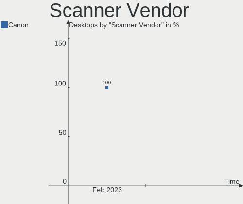
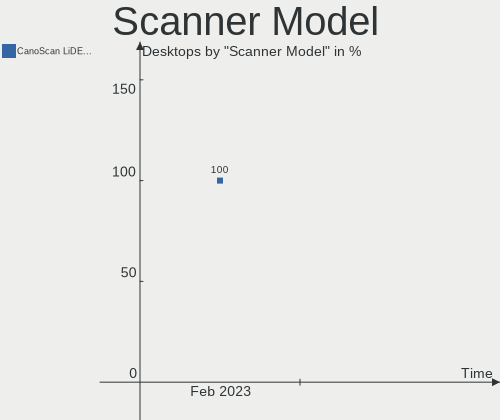

Lubuntu - Hardware Trends (Desktops)
------------------------------------

A project to identify most popular hardware characteristics and track their change
over time based on data collected by Linux users at https://Linux-Hardware.org.

Anyone can contribute to this report by the [hw-probe](https://github.com/linuxhw/hw-probe) tool:

    sudo -E hw-probe -all -upload

This report is for one last month. Overall report since the beginning of time: [TestDays](https://github.com/linuxhw/TestDays)

Period: Feb, 2023.

Contents
--------

* [ System ](#system)
  - [ OS                       ](#os)
  - [ OS Family                ](#os-family)
  - [ Kernel                   ](#kernel)
  - [ Kernel Family            ](#kernel-family)
  - [ Kernel Major Ver.        ](#kernel-major-ver)
  - [ Arch                     ](#arch)
  - [ DE                       ](#de)
  - [ Display Server           ](#display-server)
  - [ Display Manager          ](#display-manager)
  - [ OS Lang                  ](#os-lang)
  - [ Boot Mode                ](#boot-mode)
  - [ Filesystem               ](#filesystem)
  - [ Part. scheme             ](#part-scheme)
  - [ Dual Boot with Linux/BSD ](#dual-boot-with-linuxbsd)
  - [ Dual Boot (Win)          ](#dual-boot-win)

* [ Board ](#board)
  - [ Vendor                   ](#vendor)
  - [ Model                    ](#model)
  - [ Model Family             ](#model-family)
  - [ MFG Year                 ](#mfg-year)
  - [ Form Factor              ](#form-factor)
  - [ Secure Boot              ](#secure-boot)
  - [ Coreboot                 ](#coreboot)
  - [ RAM Size                 ](#ram-size)
  - [ RAM Used                 ](#ram-used)
  - [ Total Drives             ](#total-drives)
  - [ Has CD-ROM               ](#has-cd-rom)
  - [ Has Ethernet             ](#has-ethernet)
  - [ Has WiFi                 ](#has-wifi)
  - [ Has Bluetooth            ](#has-bluetooth)

* [ Location ](#location)
  - [ Country                  ](#country)
  - [ City                     ](#city)

* [ Drives ](#drives)
  - [ Drive Vendor             ](#drive-vendor)
  - [ Drive Model              ](#drive-model)
  - [ HDD Vendor               ](#hdd-vendor)
  - [ SSD Vendor               ](#ssd-vendor)
  - [ Drive Kind               ](#drive-kind)
  - [ Drive Connector          ](#drive-connector)
  - [ Drive Size               ](#drive-size)
  - [ Space Total              ](#space-total)
  - [ Space Used               ](#space-used)
  - [ Malfunc. Drives          ](#malfunc-drives)
  - [ Malfunc. Drive Vendor    ](#malfunc-drive-vendor)
  - [ Malfunc. HDD Vendor      ](#malfunc-hdd-vendor)
  - [ Malfunc. Drive Kind      ](#malfunc-drive-kind)
  - [ Failed Drives            ](#failed-drives)
  - [ Failed Drive Vendor      ](#failed-drive-vendor)
  - [ Drive Status             ](#drive-status)

* [ Storage controller ](#storage-controller)
  - [ Storage Vendor           ](#storage-vendor)
  - [ Storage Model            ](#storage-model)
  - [ Storage Kind             ](#storage-kind)

* [ Processor ](#processor)
  - [ CPU Vendor               ](#cpu-vendor)
  - [ CPU Model                ](#cpu-model)
  - [ CPU Model Family         ](#cpu-model-family)
  - [ CPU Cores                ](#cpu-cores)
  - [ CPU Sockets              ](#cpu-sockets)
  - [ CPU Threads              ](#cpu-threads)
  - [ CPU Op-Modes             ](#cpu-op-modes)
  - [ CPU Microcode            ](#cpu-microcode)
  - [ CPU Microarch            ](#cpu-microarch)

* [ Graphics ](#graphics)
  - [ GPU Vendor               ](#gpu-vendor)
  - [ GPU Model                ](#gpu-model)
  - [ GPU Combo                ](#gpu-combo)
  - [ GPU Driver               ](#gpu-driver)
  - [ GPU Memory               ](#gpu-memory)

* [ Monitor ](#monitor)
  - [ Monitor Vendor           ](#monitor-vendor)
  - [ Monitor Model            ](#monitor-model)
  - [ Monitor Resolution       ](#monitor-resolution)
  - [ Monitor Diagonal         ](#monitor-diagonal)
  - [ Monitor Width            ](#monitor-width)
  - [ Aspect Ratio             ](#aspect-ratio)
  - [ Monitor Area             ](#monitor-area)
  - [ Pixel Density            ](#pixel-density)
  - [ Multiple Monitors        ](#multiple-monitors)

* [ Network ](#network)
  - [ Net Controller Vendor    ](#net-controller-vendor)
  - [ Net Controller Model     ](#net-controller-model)
  - [ Wireless Vendor          ](#wireless-vendor)
  - [ Wireless Model           ](#wireless-model)
  - [ Ethernet Vendor          ](#ethernet-vendor)
  - [ Ethernet Model           ](#ethernet-model)
  - [ Net Controller Kind      ](#net-controller-kind)
  - [ Used Controller          ](#used-controller)
  - [ NICs                     ](#nics)
  - [ IPv6                     ](#ipv6)

* [ Bluetooth ](#bluetooth)
  - [ Bluetooth Vendor         ](#bluetooth-vendor)
  - [ Bluetooth Model          ](#bluetooth-model)

* [ Sound ](#sound)
  - [ Sound Vendor             ](#sound-vendor)
  - [ Sound Model              ](#sound-model)

* [ Memory ](#memory)
  - [ Memory Vendor            ](#memory-vendor)
  - [ Memory Model             ](#memory-model)
  - [ Memory Kind              ](#memory-kind)
  - [ Memory Form Factor       ](#memory-form-factor)
  - [ Memory Size              ](#memory-size)
  - [ Memory Speed             ](#memory-speed)

* [ Printers & scanners ](#printers--scanners)
  - [ Printer Vendor           ](#printer-vendor)
  - [ Printer Model            ](#printer-model)
  - [ Scanner Vendor           ](#scanner-vendor)
  - [ Scanner Model            ](#scanner-model)

* [ Camera ](#camera)
  - [ Camera Vendor            ](#camera-vendor)
  - [ Camera Model             ](#camera-model)

* [ Security ](#security)
  - [ Fingerprint Vendor       ](#fingerprint-vendor)
  - [ Fingerprint Model        ](#fingerprint-model)
  - [ Chipcard Vendor          ](#chipcard-vendor)
  - [ Chipcard Model           ](#chipcard-model)

* [ Unsupported ](#unsupported)
  - [ Unsupported Devices      ](#unsupported-devices)
  - [ Unsupported Device Types ](#unsupported-device-types)

System
------

OS
--

Installed operating systems

| Name          | Desktops | Percent |
|---------------|----------|---------|
| Lubuntu 22.04 | 7        | 50%     |
| Lubuntu 22.10 | 3        | 21.43%  |
| Lubuntu 20.04 | 2        | 14.29%  |
| Lubuntu 23.04 | 1        | 7.14%   |
| Lubuntu 18.04 | 1        | 7.14%   |

OS Family
---------

OS without a version

| Name    | Desktops | Percent |
|---------|----------|---------|
| Lubuntu | 14       | 100%    |

Kernel
------

Version of the Linux kernel

| Version              | Desktops | Percent |
|----------------------|----------|---------|
| 5.15.0-60-generic    | 5        | 35.71%  |
| 5.19.0-31-generic    | 2        | 14.29%  |
| 5.15.0-43-generic    | 2        | 14.29%  |
| 6.1.0-14-generic     | 1        | 7.14%   |
| 5.4.0-139-generic    | 1        | 7.14%   |
| 5.19.0-32-generic    | 1        | 7.14%   |
| 5.19.0-29-generic    | 1        | 7.14%   |
| 5.15.0-58-lowlatency | 1        | 7.14%   |

Kernel Family
-------------

Linux kernel without a distro release

| Version | Desktops | Percent |
|---------|----------|---------|
| 5.15.0  | 8        | 57.14%  |
| 5.19.0  | 4        | 28.57%  |
| 6.1.0   | 1        | 7.14%   |
| 5.4.0   | 1        | 7.14%   |

Kernel Major Ver.
-----------------

Linux kernel major version

| Version | Desktops | Percent |
|---------|----------|---------|
| 5.15    | 8        | 57.14%  |
| 5.19    | 4        | 28.57%  |
| 6.1     | 1        | 7.14%   |
| 5.4     | 1        | 7.14%   |

Arch
----

OS architecture (x86_64, i586, etc.)

| Name   | Desktops | Percent |
|--------|----------|---------|
| x86_64 | 14       | 100%    |

DE
--

Desktop Environment

| Name | Desktops | Percent |
|------|----------|---------|
| LXQt | 13       | 92.86%  |
| LXDE | 1        | 7.14%   |

Display Server
--------------

X11 or Wayland

| Name | Desktops | Percent |
|------|----------|---------|
| X11  | 13       | 92.86%  |
| Tty  | 1        | 7.14%   |

Display Manager
---------------

SDDM, LightDM, etc.

| Name    | Desktops | Percent |
|---------|----------|---------|
| SDDM    | 11       | 78.57%  |
| LightDM | 2        | 14.29%  |
| Unknown | 1        | 7.14%   |

OS Lang
-------

Language

| Lang  | Desktops | Percent |
|-------|----------|---------|
| en_US | 4        | 28.57%  |
| fr_FR | 3        | 21.43%  |
| it_IT | 2        | 14.29%  |
| en_GB | 2        | 14.29%  |
| de_DE | 2        | 14.29%  |
| tr_TR | 1        | 7.14%   |

Boot Mode
---------

EFI or BIOS

| Mode | Desktops | Percent |
|------|----------|---------|
| BIOS | 8        | 57.14%  |
| EFI  | 6        | 42.86%  |

Filesystem
----------

Type of filesystem

| Type | Desktops | Percent |
|------|----------|---------|
| Ext4 | 13       | 92.86%  |
| XXX4 | 1        | 7.14%   |

Part. scheme
------------

Scheme of partitioning

| Type    | Desktops | Percent |
|---------|----------|---------|
| GPT     | 9        | 64.29%  |
| MBR     | 4        | 28.57%  |
| Unknown | 1        | 7.14%   |

Dual Boot with Linux/BSD
------------------------

Hosting more than one Linux/BSD

| Dual boot | Desktops | Percent |
|-----------|----------|---------|
| No        | 13       | 92.86%  |
| Yes       | 1        | 7.14%   |

Dual Boot (Win)
---------------

Hosting Linux and Windows

| Dual boot | Desktops | Percent |
|-----------|----------|---------|
| No        | 9        | 64.29%  |
| Yes       | 5        | 35.71%  |

Board
-----

Vendor
------

Motherboard manufacturer

| Name                | Desktops | Percent |
|---------------------|----------|---------|
| MSI                 | 4        | 28.57%  |
| Gigabyte Technology | 4        | 28.57%  |
| Pegatron            | 2        | 14.29%  |
| Hewlett-Packard     | 1        | 7.14%   |
| ECS                 | 1        | 7.14%   |
| Dell                | 1        | 7.14%   |
| ASUSTek Computer    | 1        | 7.14%   |

Model
-----

Motherboard model

| Name                                      | Desktops | Percent |
|-------------------------------------------|----------|---------|
| Pegatron h8-1350ef                        | 1        | 7.14%   |
| Pegatron Compaq dx2400 Microtower PC      | 1        | 7.14%   |
| MSI MS-7C56                               | 1        | 7.14%   |
| MSI MS-7C37                               | 1        | 7.14%   |
| MSI MS-7693                               | 1        | 7.14%   |
| MSI MS-7267                               | 1        | 7.14%   |
| HP Victus by 15L Gaming Desktop TG02-0xxx | 1        | 7.14%   |
| Gigabyte MBB-96004D                       | 1        | 7.14%   |
| Gigabyte H61MA-D2V                        | 1        | 7.14%   |
| Gigabyte F2A88XM-D3HP                     | 1        | 7.14%   |
| Gigabyte B450M S2H                        | 1        | 7.14%   |
| ECS G41T-M7                               | 1        | 7.14%   |
| Dell Vostro 3670                          | 1        | 7.14%   |
| ASUS M5A78L-M LX3                         | 1        | 7.14%   |

Model Family
------------

Motherboard model prefix

| Name                  | Desktops | Percent |
|-----------------------|----------|---------|
| Pegatron h8-1350ef    | 1        | 7.14%   |
| Pegatron Compaq       | 1        | 7.14%   |
| MSI MS-7C56           | 1        | 7.14%   |
| MSI MS-7C37           | 1        | 7.14%   |
| MSI MS-7693           | 1        | 7.14%   |
| MSI MS-7267           | 1        | 7.14%   |
| HP Victus             | 1        | 7.14%   |
| Gigabyte MBB-96004D   | 1        | 7.14%   |
| Gigabyte H61MA-D2V    | 1        | 7.14%   |
| Gigabyte F2A88XM-D3HP | 1        | 7.14%   |
| Gigabyte B450M        | 1        | 7.14%   |
| ECS G41T-M7           | 1        | 7.14%   |
| Dell Vostro           | 1        | 7.14%   |
| ASUS M5A78L-M         | 1        | 7.14%   |

MFG Year
--------

Motherboard manufacture year

| Year | Desktops | Percent |
|------|----------|---------|
| 2012 | 4        | 28.57%  |
| 2019 | 3        | 21.43%  |
| 2022 | 1        | 7.14%   |
| 2020 | 1        | 7.14%   |
| 2018 | 1        | 7.14%   |
| 2015 | 1        | 7.14%   |
| 2011 | 1        | 7.14%   |
| 2008 | 1        | 7.14%   |
| 2007 | 1        | 7.14%   |

Form Factor
-----------

Physical design of the computer

| Name    | Desktops | Percent |
|---------|----------|---------|
| Desktop | 14       | 100%    |

Secure Boot
-----------

Enabled or disabled

| State    | Desktops | Percent |
|----------|----------|---------|
| Disabled | 13       | 92.86%  |
| Enabled  | 1        | 7.14%   |

Coreboot
--------

Have coreboot on board

| Used | Desktops | Percent |
|------|----------|---------|
| No   | 14       | 100%    |

RAM Size
--------

Total RAM memory

| Size in GB | Desktops | Percent |
|------------|----------|---------|
| 32.01-64.0 | 3        | 21.43%  |
| 1.01-2.0   | 3        | 21.43%  |
| 8.01-16.0  | 3        | 21.43%  |
| 4.01-8.0   | 2        | 14.29%  |
| 3.01-4.0   | 2        | 14.29%  |
| 16.01-24.0 | 1        | 7.14%   |

RAM Used
--------

Used RAM memory

| Used GB  | Desktops | Percent |
|----------|----------|---------|
| 1.01-2.0 | 5        | 35.71%  |
| 2.01-3.0 | 4        | 28.57%  |
| 0.51-1.0 | 4        | 28.57%  |
| 4.01-8.0 | 1        | 7.14%   |

Total Drives
------------

Number of drives on board

| Drives | Desktops | Percent |
|--------|----------|---------|
| 1      | 6        | 42.86%  |
| 2      | 5        | 35.71%  |
| 3      | 3        | 21.43%  |

Has CD-ROM
----------

Has CD-ROM on board

| Presented | Desktops | Percent |
|-----------|----------|---------|
| Yes       | 9        | 64.29%  |
| No        | 5        | 35.71%  |

Has Ethernet
------------

Has Ethernet on board

| Presented | Desktops | Percent |
|-----------|----------|---------|
| Yes       | 14       | 100%    |

Has WiFi
--------

Has WiFi module

| Presented | Desktops | Percent |
|-----------|----------|---------|
| No        | 8        | 57.14%  |
| Yes       | 6        | 42.86%  |

Has Bluetooth
-------------

Has Bluetooth module

| Presented | Desktops | Percent |
|-----------|----------|---------|
| No        | 9        | 64.29%  |
| Yes       | 5        | 35.71%  |

Location
--------

Country
-------

Geographic location (country)

| Country  | Desktops | Percent |
|----------|----------|---------|
| USA      | 3        | 21.43%  |
| France   | 3        | 21.43%  |
| Italy    | 2        | 14.29%  |
| Germany  | 2        | 14.29%  |
| UK       | 1        | 7.14%   |
| Turkey   | 1        | 7.14%   |
| Spain    | 1        | 7.14%   |
| Malaysia | 1        | 7.14%   |

City
----

Geographic location (city)

| City            | Desktops | Percent |
|-----------------|----------|---------|
| Paris           | 2        | 14.29%  |
| Zujar           | 1        | 7.14%   |
| Tyler           | 1        | 7.14%   |
| Turin           | 1        | 7.14%   |
| Morsbach        | 1        | 7.14%   |
| Le Puy-en-Velay | 1        | 7.14%   |
| Kota Bharu      | 1        | 7.14%   |
| Imola           | 1        | 7.14%   |
| Denver          | 1        | 7.14%   |
| Dagenham        | 1        | 7.14%   |
| Cupertino       | 1        | 7.14%   |
| Baden-Baden     | 1        | 7.14%   |
| Antalya         | 1        | 7.14%   |

Drives
------

Drive Vendor
------------

Hard drive vendors

| Vendor                    | Desktops | Drives | Percent |
|---------------------------|----------|--------|---------|
| Seagate                   | 5        | 7      | 22.73%  |
| Samsung Electronics       | 4        | 4      | 18.18%  |
| WDC                       | 3        | 3      | 13.64%  |
| Toshiba                   | 2        | 2      | 9.09%   |
| Crucial                   | 2        | 3      | 9.09%   |
| SK hynix                  | 1        | 1      | 4.55%   |
| SanDisk                   | 1        | 1      | 4.55%   |
| Micron/Crucial Technology | 1        | 1      | 4.55%   |
| KimMiDi                   | 1        | 1      | 4.55%   |
| Hitachi                   | 1        | 1      | 4.55%   |
| A-DATA Technology         | 1        | 1      | 4.55%   |

Drive Model
-----------

Hard drive models

| Model                                | Desktops | Percent |
|--------------------------------------|----------|---------|
| WDC WD3200AACS-00M6B0 320GB          | 1        | 4%      |
| WDC WD20EADS-42R6B0 2TB              | 1        | 4%      |
| WDC WD10EZEX-60WN4A1 1TB             | 1        | 4%      |
| Toshiba HDWD110 1TB                  | 1        | 4%      |
| Toshiba DT01ACA050 500GB             | 1        | 4%      |
| SK hynix BC711 HFM512GD3JX013N 512GB | 1        | 4%      |
| Seagate ST500DM002-1BD142 500GB      | 1        | 4%      |
| Seagate ST3500413AS 500GB            | 1        | 4%      |
| Seagate ST3250312AS 250GB            | 1        | 4%      |
| Seagate ST3250310AS 250GB            | 1        | 4%      |
| Seagate ST31000528AS 1TB             | 1        | 4%      |
| Seagate ST2000DM008-2UB102 2TB       | 1        | 4%      |
| Seagate ST1000LM024 HN-M101MBB 1TB   | 1        | 4%      |
| SanDisk SDSSDP128G 128GB             | 1        | 4%      |
| Samsung SSD 980 1TB                  | 1        | 4%      |
| Samsung SSD 870 EVO 500GB            | 1        | 4%      |
| Samsung SSD 860 EVO 500GB            | 1        | 4%      |
| Samsung SSD 850 EVO 120GB            | 1        | 4%      |
| Micron/Crucial CT1000P5PSSD8 1TB     | 1        | 4%      |
| KimMiDi TB900 SSD 120GB              | 1        | 4%      |
| Hitachi HDS723020BLA642 2TB          | 1        | 4%      |
| Crucial CT525MX300SSD1 528GB         | 1        | 4%      |
| Crucial CT1000MX500SSD1 1TB          | 1        | 4%      |
| Crucial CT1000BX500SSD1 1TB          | 1        | 4%      |
| A-DATA SU635 240GB SSD               | 1        | 4%      |

HDD Vendor
----------

Hard disk drive vendors

| Vendor  | Desktops | Drives | Percent |
|---------|----------|--------|---------|
| Seagate | 5        | 7      | 45.45%  |
| WDC     | 3        | 3      | 27.27%  |
| Toshiba | 2        | 2      | 18.18%  |
| Hitachi | 1        | 1      | 9.09%   |

SSD Vendor
----------

Solid state drive vendors

| Vendor              | Desktops | Drives | Percent |
|---------------------|----------|--------|---------|
| Samsung Electronics | 3        | 3      | 37.5%   |
| Crucial             | 2        | 3      | 25%     |
| SanDisk             | 1        | 1      | 12.5%   |
| KimMiDi             | 1        | 1      | 12.5%   |
| A-DATA Technology   | 1        | 1      | 12.5%   |

Drive Kind
----------

HDD or SSD

| Kind | Desktops | Drives | Percent |
|------|----------|--------|---------|
| HDD  | 10       | 13     | 47.62%  |
| SSD  | 8        | 9      | 38.1%   |
| NVMe | 3        | 3      | 14.29%  |

Drive Connector
---------------

SATA, SAS, NVMe, etc.

| Type | Desktops | Drives | Percent |
|------|----------|--------|---------|
| SATA | 14       | 22     | 82.35%  |
| NVMe | 3        | 3      | 17.65%  |

Drive Size
----------

Size of hard drive

| Size in TB | Desktops | Drives | Percent |
|------------|----------|--------|---------|
| 0.01-0.5   | 10       | 12     | 55.56%  |
| 0.51-1.0   | 5        | 7      | 27.78%  |
| 1.01-2.0   | 3        | 3      | 16.67%  |

Space Total
-----------

Amount of disk space available on the file system

| Size in GB | Desktops | Percent |
|------------|----------|---------|
| 101-250    | 5        | 35.71%  |
| 251-500    | 4        | 28.57%  |
| 1001-2000  | 3        | 21.43%  |
| 501-1000   | 2        | 14.29%  |

Space Used
----------

Amount of used disk space

| Used GB  | Desktops | Percent |
|----------|----------|---------|
| 1-20     | 5        | 35.71%  |
| 51-100   | 5        | 35.71%  |
| 251-500  | 2        | 14.29%  |
| 101-250  | 1        | 7.14%   |
| 501-1000 | 1        | 7.14%   |

Malfunc. Drives
---------------

Drive models with a malfunction

| Model                              | Desktops | Drives | Percent |
|------------------------------------|----------|--------|---------|
| WDC WD3200AACS-00M6B0 320GB        | 1        | 1      | 16.67%  |
| WDC WD10EZEX-60WN4A1 1TB           | 1        | 1      | 16.67%  |
| Toshiba DT01ACA050 500GB           | 1        | 1      | 16.67%  |
| Seagate ST3500413AS 500GB          | 1        | 1      | 16.67%  |
| Seagate ST3250310AS 250GB          | 1        | 1      | 16.67%  |
| Seagate ST1000LM024 HN-M101MBB 1TB | 1        | 1      | 16.67%  |

Malfunc. Drive Vendor
---------------------

Vendors of faulty drives

| Vendor  | Desktops | Drives | Percent |
|---------|----------|--------|---------|
| WDC     | 2        | 2      | 40%     |
| Seagate | 2        | 3      | 40%     |
| Toshiba | 1        | 1      | 20%     |

Malfunc. HDD Vendor
-------------------

Vendors of faulty HDD drives

| Vendor  | Desktops | Drives | Percent |
|---------|----------|--------|---------|
| WDC     | 2        | 2      | 40%     |
| Seagate | 2        | 3      | 40%     |
| Toshiba | 1        | 1      | 20%     |

Malfunc. Drive Kind
-------------------

Kinds of faulty drives

| Kind | Desktops | Drives | Percent |
|------|----------|--------|---------|
| HDD  | 5        | 6      | 100%    |

Failed Drives
-------------

Failed drive models

| Model                           | Desktops | Drives | Percent |
|---------------------------------|----------|--------|---------|
| Samsung Electronics SSD 980 1TB | 1        | 1      | 100%    |

Failed Drive Vendor
-------------------

Failed drive vendors

| Vendor              | Desktops | Drives | Percent |
|---------------------|----------|--------|---------|
| Samsung Electronics | 1        | 1      | 100%    |

Drive Status
------------

Number of failed and malfunc. drives

| Status   | Desktops | Drives | Percent |
|----------|----------|--------|---------|
| Detected | 5        | 8      | 31.25%  |
| Malfunc  | 5        | 6      | 31.25%  |
| Works    | 5        | 10     | 31.25%  |
| Failed   | 1        | 1      | 6.25%   |

Storage controller
------------------

Storage Vendor
--------------

Storage controller vendors

| Vendor                    | Desktops | Percent |
|---------------------------|----------|---------|
| AMD                       | 8        | 44.44%  |
| Intel                     | 6        | 33.33%  |
| SK hynix                  | 1        | 5.56%   |
| Samsung Electronics       | 1        | 5.56%   |
| Micron/Crucial Technology | 1        | 5.56%   |
| ASMedia Technology        | 1        | 5.56%   |

Storage Model
-------------

Storage controller models

| Model                                                                                   | Desktops | Percent |
|-----------------------------------------------------------------------------------------|----------|---------|
| AMD FCH SATA Controller [AHCI mode]                                                     | 5        | 19.23%  |
| Intel NM10/ICH7 Family SATA Controller [IDE mode]                                       | 2        | 7.69%   |
| Intel 82801G (ICH7 Family) IDE Controller                                               | 2        | 7.69%   |
| AMD 400 Series Chipset SATA Controller                                                  | 2        | 7.69%   |
| SK hynix Gold P31/PC711 NVMe Solid State Drive                                          | 1        | 3.85%   |
| Samsung NVMe SSD Controller 980                                                         | 1        | 3.85%   |
| Micron/Crucial P5 Plus NVMe PCIe SSD                                                    | 1        | 3.85%   |
| Intel SATA Controller [RAID mode]                                                       | 1        | 3.85%   |
| Intel 82801IR/IO/IH (ICH9R/DO/DH) 4 port SATA Controller [IDE mode]                     | 1        | 3.85%   |
| Intel 82801I (ICH9 Family) 2 port SATA Controller [IDE mode]                            | 1        | 3.85%   |
| Intel 7 Series/C210 Series Chipset Family 6-port SATA Controller [AHCI mode]            | 1        | 3.85%   |
| Intel 6 Series/C200 Series Chipset Family Desktop SATA Controller (IDE mode, ports 4-5) | 1        | 3.85%   |
| Intel 6 Series/C200 Series Chipset Family Desktop SATA Controller (IDE mode, ports 0-3) | 1        | 3.85%   |
| ASMedia ASM1062 Serial ATA Controller                                                   | 1        | 3.85%   |
| AMD SB7x0/SB8x0/SB9x0 SATA Controller [IDE mode]                                        | 1        | 3.85%   |
| AMD SB7x0/SB8x0/SB9x0 SATA Controller [AHCI mode]                                       | 1        | 3.85%   |
| AMD SB7x0/SB8x0/SB9x0 IDE Controller                                                    | 1        | 3.85%   |
| AMD FCH SATA Controller D                                                               | 1        | 3.85%   |
| AMD 500 Series Chipset SATA Controller                                                  | 1        | 3.85%   |

Storage Kind
------------

Kind of storage controller (IDE, SATA, NVMe, SAS, ...)

| Kind | Desktops | Percent |
|------|----------|---------|
| SATA | 9        | 50%     |
| IDE  | 5        | 27.78%  |
| NVMe | 3        | 16.67%  |
| RAID | 1        | 5.56%   |

Processor
---------

CPU Vendor
----------

Processor vendors

| Vendor | Desktops | Percent |
|--------|----------|---------|
| AMD    | 8        | 57.14%  |
| Intel  | 6        | 42.86%  |

CPU Model
---------

Processor models

| Model                                         | Desktops | Percent |
|-----------------------------------------------|----------|---------|
| AMD Ryzen 7 5700G with Radeon Graphics        | 2        | 14.29%  |
| Intel Pentium Dual-Core CPU E6500 @ 2.93GHz   | 1        | 7.14%   |
| Intel Pentium Dual CPU E2140 @ 1.60GHz        | 1        | 7.14%   |
| Intel Core i5-8400 CPU @ 2.80GHz              | 1        | 7.14%   |
| Intel Core i5-2320 CPU @ 3.00GHz              | 1        | 7.14%   |
| Intel Core 2 Duo CPU E7300 @ 2.66GHz          | 1        | 7.14%   |
| Intel Celeron CPU G540 @ 2.50GHz              | 1        | 7.14%   |
| AMD Ryzen 7 3800X 8-Core Processor            | 1        | 7.14%   |
| AMD Ryzen 3 3200G with Radeon Vega Graphics   | 1        | 7.14%   |
| AMD FX-4300 Quad-Core Processor               | 1        | 7.14%   |
| AMD Athlon II X3 435 Processor                | 1        | 7.14%   |
| AMD A8-9600 RADEON R7, 10 COMPUTE CORES 4C+6G | 1        | 7.14%   |
| AMD A8-5500 APU with Radeon HD Graphics       | 1        | 7.14%   |

CPU Model Family
----------------

Processor model prefix

| Model                   | Desktops | Percent |
|-------------------------|----------|---------|
| AMD Ryzen 7             | 3        | 21.43%  |
| Intel Core i5           | 2        | 14.29%  |
| AMD A8                  | 2        | 14.29%  |
| Intel Pentium Dual-Core | 1        | 7.14%   |
| Intel Pentium Dual      | 1        | 7.14%   |
| Intel Core 2 Duo        | 1        | 7.14%   |
| Intel Celeron           | 1        | 7.14%   |
| AMD Ryzen 3             | 1        | 7.14%   |
| AMD FX                  | 1        | 7.14%   |
| AMD Athlon II X3        | 1        | 7.14%   |

CPU Cores
---------

Number of processor cores

| Number | Desktops | Percent |
|--------|----------|---------|
| 2      | 7        | 50%     |
| 8      | 3        | 21.43%  |
| 4      | 2        | 14.29%  |
| 6      | 1        | 7.14%   |
| 3      | 1        | 7.14%   |

CPU Sockets
-----------

Number of sockets

| Number | Desktops | Percent |
|--------|----------|---------|
| 1      | 14       | 100%    |

CPU Threads
-----------

Threads per core (Hyper-Threading)

| Number | Desktops | Percent |
|--------|----------|---------|
| 1      | 8        | 57.14%  |
| 2      | 6        | 42.86%  |

CPU Op-Modes
------------

CPU Operation Modes (32-bit, 64-bit)

| Op mode        | Desktops | Percent |
|----------------|----------|---------|
| 32-bit, 64-bit | 14       | 100%    |

CPU Microcode
-------------

Microcode number

| Number     | Desktops | Percent |
|------------|----------|---------|
| Unknown    | 4        | 28.57%  |
| 0x906ea    | 1        | 7.14%   |
| 0x206a7    | 1        | 7.14%   |
| 0x1067a    | 1        | 7.14%   |
| 0x10676    | 1        | 7.14%   |
| 0x0a50000d | 1        | 7.14%   |
| 0x08701013 | 1        | 7.14%   |
| 0x08108109 | 1        | 7.14%   |
| 0x0600611a | 1        | 7.14%   |
| 0x06001119 | 1        | 7.14%   |
| 0x010000db | 1        | 7.14%   |

CPU Microarch
-------------

Microarchitecture

| Name        | Desktops | Percent |
|-------------|----------|---------|
| Zen 3       | 2        | 14.29%  |
| SandyBridge | 2        | 14.29%  |
| Piledriver  | 2        | 14.29%  |
| Penryn      | 2        | 14.29%  |
| Zen+        | 1        | 7.14%   |
| Zen 2       | 1        | 7.14%   |
| KabyLake    | 1        | 7.14%   |
| K10         | 1        | 7.14%   |
| Excavator   | 1        | 7.14%   |
| Core        | 1        | 7.14%   |

Graphics
--------

GPU Vendor
----------

Vendors of graphics cards

| Vendor | Desktops | Percent |
|--------|----------|---------|
| AMD    | 6        | 40%     |
| Nvidia | 5        | 33.33%  |
| Intel  | 4        | 26.67%  |

GPU Model
---------

Graphics card models

| Model                                                                     | Desktops | Percent |
|---------------------------------------------------------------------------|----------|---------|
| Nvidia GM107 [GeForce GTX 750 Ti]                                         | 2        | 11.76%  |
| AMD Cezanne [Radeon Vega Series / Radeon Vega Mobile Series]              | 2        | 11.76%  |
| Nvidia TU117 [GeForce GTX 1630]                                           | 1        | 5.88%   |
| Nvidia GP107 [GeForce GTX 1050 Ti]                                        | 1        | 5.88%   |
| Nvidia GF104 [GeForce GTX 460]                                            | 1        | 5.88%   |
| Nvidia G86 [GeForce 8400 GS]                                              | 1        | 5.88%   |
| Intel CoffeeLake-S GT2 [UHD Graphics 630]                                 | 1        | 5.88%   |
| Intel 82G33/G31 Express Integrated Graphics Controller                    | 1        | 5.88%   |
| Intel 4 Series Chipset Integrated Graphics Controller                     | 1        | 5.88%   |
| Intel 2nd Generation Core Processor Family Integrated Graphics Controller | 1        | 5.88%   |
| AMD Wani [Radeon R5/R6/R7 Graphics]                                       | 1        | 5.88%   |
| AMD Trinity [Radeon HD 7560D]                                             | 1        | 5.88%   |
| AMD Navi 23 [Radeon RX 6600/6600 XT/6600M]                                | 1        | 5.88%   |
| AMD Ellesmere [Radeon RX 470/480/570/570X/580/580X/590]                   | 1        | 5.88%   |
| AMD Caicos PRO [Radeon HD 7450]                                           | 1        | 5.88%   |

GPU Combo
---------

Combinations of graphics cards

| Name         | Desktops | Percent |
|--------------|----------|---------|
| 1 x Nvidia   | 4        | 28.57%  |
| 1 x Intel    | 4        | 28.57%  |
| 1 x AMD      | 4        | 28.57%  |
| 2 x AMD      | 1        | 7.14%   |
| AMD + Nvidia | 1        | 7.14%   |

GPU Driver
----------

Free vs proprietary

| Driver      | Desktops | Percent |
|-------------|----------|---------|
| Free        | 10       | 71.43%  |
| Proprietary | 3        | 21.43%  |
| Unknown     | 1        | 7.14%   |

GPU Memory
----------

Total video memory

| Size in GB | Desktops | Percent |
|------------|----------|---------|
| Unknown    | 8        | 57.14%  |
| 7.01-8.0   | 2        | 14.29%  |
| 3.01-4.0   | 2        | 14.29%  |
| 0.51-1.0   | 1        | 7.14%   |
| 0.01-0.5   | 1        | 7.14%   |

Monitor
-------

Monitor Vendor
--------------

Monitor vendors

| Vendor              | Desktops | Percent |
|---------------------|----------|---------|
| Samsung Electronics | 4        | 28.57%  |
| Dell                | 2        | 14.29%  |
| Acer                | 2        | 14.29%  |
| Unknown             | 1        | 7.14%   |
| Iiyama              | 1        | 7.14%   |
| Eizo                | 1        | 7.14%   |
| Daewoo              | 1        | 7.14%   |
| Compal              | 1        | 7.14%   |
| BenQ                | 1        | 7.14%   |

Monitor Model
-------------

Monitor models

| Model                                                             | Desktops | Percent |
|-------------------------------------------------------------------|----------|---------|
| Unknown LCD Monitor FFFF 2288x1287 2550x2550mm 142.0-inch         | 1        | 7.14%   |
| Samsung Electronics S27B350 SAM08DC 1920x1080 598x336mm 27.0-inch | 1        | 7.14%   |
| Samsung Electronics LCD Monitor SMT22A350 1920x1080               | 1        | 7.14%   |
| Samsung Electronics LCD Monitor C27F390 1920x1080                 | 1        | 7.14%   |
| Samsung Electronics C27R500 SAM0F9D 1920x1080 598x336mm 27.0-inch | 1        | 7.14%   |
| Iiyama PL2730H IVM663A 1920x1080 598x336mm 27.0-inch              | 1        | 7.14%   |
| Eizo S1932 ENC1940 1280x1024 376x301mm 19.0-inch                  | 1        | 7.14%   |
| Dell U2412M DELA07B 1920x1200 518x324mm 24.1-inch                 | 1        | 7.14%   |
| Dell E178WFP DELD016 1440x900 370x230mm 17.2-inch                 | 1        | 7.14%   |
| Daewoo 21.5 monitor DWE0215 1920x1080 476x268mm 21.5-inch         | 1        | 7.14%   |
| Compal TERRA 2456WPV WOR2456 1920x1080 527x296mm 23.8-inch        | 1        | 7.14%   |
| BenQ GL2460 BNQ78CE 1920x1080 531x299mm 24.0-inch                 | 1        | 7.14%   |
| Acer V193HQL ACR027C 1366x768 410x230mm 18.5-inch                 | 1        | 7.14%   |
| Acer G195HQV ACR01BA 1366x768 410x230mm 18.5-inch                 | 1        | 7.14%   |

Monitor Resolution
------------------

Monitor screen resolution

| Resolution        | Desktops | Percent |
|-------------------|----------|---------|
| 1920x1080 (FHD)   | 8        | 57.14%  |
| 1366x768 (WXGA)   | 2        | 14.29%  |
| 2288x1287         | 1        | 7.14%   |
| 1920x1200 (WUXGA) | 1        | 7.14%   |
| 1440x900 (WXGA+)  | 1        | 7.14%   |
| 1280x1024 (SXGA)  | 1        | 7.14%   |

Monitor Diagonal
----------------

Diagonal size in inches

| Inches  | Desktops | Percent |
|---------|----------|---------|
| 27      | 3        | 21.43%  |
| 24      | 2        | 14.29%  |
| 18      | 2        | 14.29%  |
| Unknown | 2        | 14.29%  |
| 142     | 1        | 7.14%   |
| 23      | 1        | 7.14%   |
| 21      | 1        | 7.14%   |
| 19      | 1        | 7.14%   |
| 17      | 1        | 7.14%   |

Monitor Width
-------------

Physical width

| Width in mm    | Desktops | Percent |
|----------------|----------|---------|
| 501-600        | 6        | 42.86%  |
| 401-500        | 3        | 21.43%  |
| 351-400        | 2        | 14.29%  |
| Unknown        | 2        | 14.29%  |
| More than 2000 | 1        | 7.14%   |

Aspect Ratio
------------

Proportional relationship between the width and the height

| Ratio   | Desktops | Percent |
|---------|----------|---------|
| 16/9    | 8        | 57.14%  |
| 16/10   | 2        | 14.29%  |
| Unknown | 2        | 14.29%  |
| 5/4     | 1        | 7.14%   |
| 1.00    | 1        | 7.14%   |

Monitor Area
------------

Area in inch²

| Area in inch² | Desktops | Percent |
|----------------|----------|---------|
| 301-350        | 3        | 21.43%  |
| 201-250        | 2        | 14.29%  |
| 151-200        | 2        | 14.29%  |
| 141-150        | 2        | 14.29%  |
| Unknown        | 2        | 14.29%  |
| More than 1000 | 1        | 7.14%   |
| 251-300        | 1        | 7.14%   |
| 131-140        | 1        | 7.14%   |

Pixel Density
-------------

Pixels per inch

| Density | Desktops | Percent |
|---------|----------|---------|
| 51-100  | 9        | 69.23%  |
| Unknown | 2        | 15.38%  |
| 1-50    | 1        | 7.69%   |
| 101-120 | 1        | 7.69%   |

Multiple Monitors
-----------------

Total monitors connected

| Total | Desktops | Percent |
|-------|----------|---------|
| 1     | 13       | 92.86%  |
| 2     | 1        | 7.14%   |

Network
-------

Net Controller Vendor
---------------------

Controller vendors

| Vendor                | Desktops | Percent |
|-----------------------|----------|---------|
| Realtek Semiconductor | 12       | 60%     |
| Qualcomm Atheros      | 4        | 20%     |
| Intel                 | 2        | 10%     |
| Ralink                | 1        | 5%      |
| Accton Technology     | 1        | 5%      |

Net Controller Model
--------------------

Controller models

| Model                                                             | Desktops | Percent |
|-------------------------------------------------------------------|----------|---------|
| Realtek RTL8111/8168/8411 PCI Express Gigabit Ethernet Controller | 11       | 52.38%  |
| Qualcomm Atheros AR8161 Gigabit Ethernet                          | 2        | 9.52%   |
| Realtek RTL8852AE 802.11ax PCIe Wireless Network Adapter          | 1        | 4.76%   |
| Realtek RTL-8100/8101L/8139 PCI Fast Ethernet Adapter             | 1        | 4.76%   |
| Ralink RT5390 Wireless 802.11n 1T/1R PCIe                         | 1        | 4.76%   |
| Qualcomm Atheros QCA9565 / AR9565 Wireless Network Adapter        | 1        | 4.76%   |
| Qualcomm Atheros AR9287 Wireless Network Adapter (PCI-Express)    | 1        | 4.76%   |
| Intel Wireless 7265                                               | 1        | 4.76%   |
| Intel Dual Band Wireless-AC 3168NGW [Stone Peak]                  | 1        | 4.76%   |
| Accton SMC2-1211TX                                                | 1        | 4.76%   |

Wireless Vendor
---------------

Wireless vendors

| Vendor                | Desktops | Percent |
|-----------------------|----------|---------|
| Qualcomm Atheros      | 2        | 33.33%  |
| Intel                 | 2        | 33.33%  |
| Realtek Semiconductor | 1        | 16.67%  |
| Ralink                | 1        | 16.67%  |

Wireless Model
--------------

Wireless models

| Model                                                          | Desktops | Percent |
|----------------------------------------------------------------|----------|---------|
| Realtek RTL8852AE 802.11ax PCIe Wireless Network Adapter       | 1        | 16.67%  |
| Ralink RT5390 Wireless 802.11n 1T/1R PCIe                      | 1        | 16.67%  |
| Qualcomm Atheros QCA9565 / AR9565 Wireless Network Adapter     | 1        | 16.67%  |
| Qualcomm Atheros AR9287 Wireless Network Adapter (PCI-Express) | 1        | 16.67%  |
| Intel Wireless 7265                                            | 1        | 16.67%  |
| Intel Dual Band Wireless-AC 3168NGW [Stone Peak]               | 1        | 16.67%  |

Ethernet Vendor
---------------

Ethernet vendors

| Vendor                | Desktops | Percent |
|-----------------------|----------|---------|
| Realtek Semiconductor | 12       | 80%     |
| Qualcomm Atheros      | 2        | 13.33%  |
| Accton Technology     | 1        | 6.67%   |

Ethernet Model
--------------

Ethernet models

| Model                                                             | Desktops | Percent |
|-------------------------------------------------------------------|----------|---------|
| Realtek RTL8111/8168/8411 PCI Express Gigabit Ethernet Controller | 11       | 73.33%  |
| Qualcomm Atheros AR8161 Gigabit Ethernet                          | 2        | 13.33%  |
| Realtek RTL-8100/8101L/8139 PCI Fast Ethernet Adapter             | 1        | 6.67%   |
| Accton SMC2-1211TX                                                | 1        | 6.67%   |

Net Controller Kind
-------------------

Ethernet, WiFi or modem

| Kind     | Desktops | Percent |
|----------|----------|---------|
| Ethernet | 14       | 70%     |
| WiFi     | 6        | 30%     |

Used Controller
---------------

Currently used network controller

| Kind     | Desktops | Percent |
|----------|----------|---------|
| Ethernet | 11       | 78.57%  |
| WiFi     | 3        | 21.43%  |

NICs
----

Total network controllers on board

| Total | Desktops | Percent |
|-------|----------|---------|
| 2     | 7        | 50%     |
| 1     | 7        | 50%     |

IPv6
----

IPv6 vs IPv4

| Used | Desktops | Percent |
|------|----------|---------|
| No   | 8        | 57.14%  |
| Yes  | 6        | 42.86%  |

Bluetooth
---------

Bluetooth Vendor
----------------

Controller vendors

| Vendor                          | Desktops | Percent |
|---------------------------------|----------|---------|
| Intel                           | 2        | 40%     |
| Realtek Semiconductor           | 1        | 20%     |
| Qualcomm Atheros Communications | 1        | 20%     |
| Cambridge Silicon Radio         | 1        | 20%     |

Bluetooth Model
---------------

Controller models

| Model                                               | Desktops | Percent |
|-----------------------------------------------------|----------|---------|
| Realtek Bluetooth Radio                             | 1        | 20%     |
| Qualcomm Atheros  Bluetooth Device                  | 1        | 20%     |
| Intel Wireless-AC 3168 Bluetooth                    | 1        | 20%     |
| Intel Bluetooth wireless interface                  | 1        | 20%     |
| Cambridge Silicon Radio Bluetooth Dongle (HCI mode) | 1        | 20%     |

Sound
-----

Sound Vendor
------------

Sound card vendors

| Vendor             | Desktops | Percent |
|--------------------|----------|---------|
| AMD                | 9        | 42.86%  |
| Intel              | 6        | 28.57%  |
| Nvidia             | 4        | 19.05%  |
| Logitech           | 1        | 4.76%   |
| Focusrite-Novation | 1        | 4.76%   |

Sound Model
-----------

Sound card models

| Model                                                                             | Desktops | Percent |
|-----------------------------------------------------------------------------------|----------|---------|
| AMD Family 17h/19h HD Audio Controller                                            | 3        | 10.71%  |
| Nvidia GM107 High Definition Audio Controller [GeForce 940MX]                     | 2        | 7.14%   |
| Intel NM10/ICH7 Family High Definition Audio Controller                           | 2        | 7.14%   |
| AMD SBx00 Azalia (Intel HDA)                                                      | 2        | 7.14%   |
| AMD Renoir Radeon High Definition Audio Controller                                | 2        | 7.14%   |
| Nvidia TU107 GeForce GTX 1650 High Definition Audio Controller                    | 1        | 3.57%   |
| Nvidia GP107GL High Definition Audio Controller                                   | 1        | 3.57%   |
| Nvidia GF104 High Definition Audio Controller                                     | 1        | 3.57%   |
| Logitech Logi Z407                                                                | 1        | 3.57%   |
| Intel Cannon Lake PCH cAVS                                                        | 1        | 3.57%   |
| Intel 82801I (ICH9 Family) HD Audio Controller                                    | 1        | 3.57%   |
| Intel 7 Series/C216 Chipset Family High Definition Audio Controller               | 1        | 3.57%   |
| Intel 6 Series/C200 Series Chipset Family High Definition Audio Controller        | 1        | 3.57%   |
| Focusrite-Novation Scarlett 2i4 USB                                               | 1        | 3.57%   |
| AMD Trinity HDMI Audio Controller                                                 | 1        | 3.57%   |
| AMD Starship/Matisse HD Audio Controller                                          | 1        | 3.57%   |
| AMD Navi 21/23 HDMI/DP Audio Controller                                           | 1        | 3.57%   |
| AMD Kabini HDMI/DP Audio                                                          | 1        | 3.57%   |
| AMD FCH Azalia Controller                                                         | 1        | 3.57%   |
| AMD Family 15h (Models 60h-6fh) Audio Controller                                  | 1        | 3.57%   |
| AMD Ellesmere HDMI Audio [Radeon RX 470/480 / 570/580/590]                        | 1        | 3.57%   |
| AMD Caicos HDMI Audio [Radeon HD 6450 / 7450/8450/8490 OEM / R5 230/235/235X OEM] | 1        | 3.57%   |

Memory
------

Memory Vendor
-------------

Memory module vendors

| Vendor              | Desktops | Percent |
|---------------------|----------|---------|
| Unknown             | 2        | 20%     |
| Samsung Electronics | 2        | 20%     |
| G.Skill             | 2        | 20%     |
| SK hynix            | 1        | 10%     |
| Micron Technology   | 1        | 10%     |
| Kingston            | 1        | 10%     |
| Corsair             | 1        | 10%     |

Memory Model
------------

Memory module models

| Model                                                  | Desktops | Percent |
|--------------------------------------------------------|----------|---------|
| Unknown RAM Module 8GB DIMM 1600MT/s                   | 1        | 10%     |
| Unknown RAM Module 2GB DIMM                            | 1        | 10%     |
| SK hynix RAM HMT351U7EFR8A-H9 4GB DIMM DDR3 1067MT/s   | 1        | 10%     |
| Samsung RAM M378A2K43EB1-CWE 16GB DIMM DDR4 3200MT/s   | 1        | 10%     |
| Samsung RAM M3 78T2863QZS-CF7 1024MB DIMM DDR2 800MT/s | 1        | 10%     |
| Micron RAM 8ATF1G64AZ-2G6E1 8GB DIMM DDR4 2667MT/s     | 1        | 10%     |
| Kingston RAM 9905713-008.A00G 4GB DIMM DDR4 2400MT/s   | 1        | 10%     |
| G.Skill RAM F4-3000C16-16GISB 16GB DIMM DDR4 3000MT/s  | 1        | 10%     |
| G.Skill RAM F3-12800CL9-4 4GB DIMM DDR3 1866MT/s       | 1        | 10%     |
| Corsair RAM CM3X2G1600C9B 2GB DIMM DDR3 1333MT/s       | 1        | 10%     |

Memory Kind
-----------

Memory module kinds

| Kind    | Desktops | Percent |
|---------|----------|---------|
| DDR4    | 4        | 44.44%  |
| DDR3    | 2        | 22.22%  |
| Unknown | 2        | 22.22%  |
| SDRAM   | 1        | 11.11%  |

Memory Form Factor
------------------

Physical design of the memory module

| Name | Desktops | Percent |
|------|----------|---------|
| DIMM | 9        | 100%    |

Memory Size
-----------

Memory module size

| Size  | Desktops | Percent |
|-------|----------|---------|
| 4096  | 3        | 30%     |
| 16384 | 2        | 20%     |
| 8192  | 2        | 20%     |
| 2048  | 2        | 20%     |
| 1024  | 1        | 10%     |

Memory Speed
------------

Memory module speed

| Speed   | Desktops | Percent |
|---------|----------|---------|
| 3200    | 1        | 10%     |
| 3000    | 1        | 10%     |
| 2667    | 1        | 10%     |
| 2400    | 1        | 10%     |
| 1866    | 1        | 10%     |
| 1600    | 1        | 10%     |
| 1333    | 1        | 10%     |
| 1067    | 1        | 10%     |
| 800     | 1        | 10%     |
| Unknown | 1        | 10%     |

Printers & scanners
-------------------

Printer Vendor
--------------

Printer device vendors

| Vendor              | Desktops | Percent |
|---------------------|----------|---------|
| Samsung Electronics | 1        | 50%     |
| Hewlett-Packard     | 1        | 50%     |

Printer Model
-------------

Printer device models

| Model                    | Desktops | Percent |
|--------------------------|----------|---------|
| Samsung SCX-4200 series  | 1        | 50%     |
| HP LaserJet P2015 series | 1        | 50%     |

Scanner Vendor
--------------

Scanner device vendors

| Vendor | Desktops | Percent |
|--------|----------|---------|
| Canon  | 1        | 100%    |

Scanner Model
-------------

Scanner device models

| Model                   | Desktops | Percent |
|-------------------------|----------|---------|
| Canon CanoScan LiDE 200 | 1        | 100%    |

Camera
------

Camera Vendor
-------------

Camera device vendors

| Vendor   | Desktops | Percent |
|----------|----------|---------|
| Logitech | 1        | 100%    |

Camera Model
------------

Camera device models

| Model                       | Desktops | Percent |
|-----------------------------|----------|---------|
| Logitech HD Pro Webcam C920 | 1        | 100%    |

Security
--------

Fingerprint Vendor
------------------

Fingerprint sensor vendors

Zero info for selected period =(

Fingerprint Model
-----------------

Fingerprint sensor models

Zero info for selected period =(

Chipcard Vendor
---------------

Chipcard module vendors

Zero info for selected period =(

Chipcard Model
--------------

Chipcard module models

Zero info for selected period =(

Unsupported
-----------

Unsupported Devices
-------------------

Total unsupported devices on board

| Total | Desktops | Percent |
|-------|----------|---------|
| 0     | 12       | 85.71%  |
| 1     | 2        | 14.29%  |

Unsupported Device Types
------------------------

Types of unsupported devices

| Type          | Desktops | Percent |
|---------------|----------|---------|
| Graphics card | 2        | 100%    |

