Lubuntu - Hardware Trends (Desktops)
------------------------------------

A project to identify most popular hardware characteristics and track their change
over time based on data collected by Linux users at https://Linux-Hardware.org.

Anyone can contribute to this report by the [hw-probe](https://github.com/linuxhw/hw-probe) tool:

    sudo -E hw-probe -all -upload

This report is for one last month. Overall report since the beginning of time: [TestDays](https://github.com/linuxhw/TestDays)

Period: Dec, 2025.

Contents
--------

* [ System ](#system)
  - [ OS                       ](#os)
  - [ OS Family                ](#os-family)
  - [ Kernel                   ](#kernel)
  - [ Kernel Family            ](#kernel-family)
  - [ Kernel Major Ver.        ](#kernel-major-ver)
  - [ Arch                     ](#arch)
  - [ DE                       ](#de)
  - [ Display Server           ](#display-server)
  - [ Display Manager          ](#display-manager)
  - [ OS Lang                  ](#os-lang)
  - [ Boot Mode                ](#boot-mode)
  - [ Filesystem               ](#filesystem)
  - [ Part. scheme             ](#part-scheme)
  - [ Dual Boot with Linux/BSD ](#dual-boot-with-linuxbsd)
  - [ Dual Boot (Win)          ](#dual-boot-win)

* [ Board ](#board)
  - [ Vendor                   ](#vendor)
  - [ Model                    ](#model)
  - [ Model Family             ](#model-family)
  - [ MFG Year                 ](#mfg-year)
  - [ Form Factor              ](#form-factor)
  - [ Secure Boot              ](#secure-boot)
  - [ Coreboot                 ](#coreboot)
  - [ RAM Size                 ](#ram-size)
  - [ RAM Used                 ](#ram-used)
  - [ Total Drives             ](#total-drives)
  - [ Has CD-ROM               ](#has-cd-rom)
  - [ Has Ethernet             ](#has-ethernet)
  - [ Has WiFi                 ](#has-wifi)
  - [ Has Bluetooth            ](#has-bluetooth)

* [ Location ](#location)
  - [ Country                  ](#country)
  - [ City                     ](#city)

* [ Drives ](#drives)
  - [ Drive Vendor             ](#drive-vendor)
  - [ Drive Model              ](#drive-model)
  - [ HDD Vendor               ](#hdd-vendor)
  - [ SSD Vendor               ](#ssd-vendor)
  - [ Drive Kind               ](#drive-kind)
  - [ Drive Connector          ](#drive-connector)
  - [ Drive Size               ](#drive-size)
  - [ Space Total              ](#space-total)
  - [ Space Used               ](#space-used)
  - [ Malfunc. Drives          ](#malfunc-drives)
  - [ Malfunc. Drive Vendor    ](#malfunc-drive-vendor)
  - [ Malfunc. HDD Vendor      ](#malfunc-hdd-vendor)
  - [ Malfunc. Drive Kind      ](#malfunc-drive-kind)
  - [ Failed Drives            ](#failed-drives)
  - [ Failed Drive Vendor      ](#failed-drive-vendor)
  - [ Drive Status             ](#drive-status)

* [ Storage controller ](#storage-controller)
  - [ Storage Vendor           ](#storage-vendor)
  - [ Storage Model            ](#storage-model)
  - [ Storage Kind             ](#storage-kind)

* [ Processor ](#processor)
  - [ CPU Vendor               ](#cpu-vendor)
  - [ CPU Model                ](#cpu-model)
  - [ CPU Model Family         ](#cpu-model-family)
  - [ CPU Cores                ](#cpu-cores)
  - [ CPU Sockets              ](#cpu-sockets)
  - [ CPU Threads              ](#cpu-threads)
  - [ CPU Op-Modes             ](#cpu-op-modes)
  - [ CPU Microcode            ](#cpu-microcode)
  - [ CPU Microarch            ](#cpu-microarch)

* [ Graphics ](#graphics)
  - [ GPU Vendor               ](#gpu-vendor)
  - [ GPU Model                ](#gpu-model)
  - [ GPU Combo                ](#gpu-combo)
  - [ GPU Driver               ](#gpu-driver)
  - [ GPU Memory               ](#gpu-memory)

* [ Monitor ](#monitor)
  - [ Monitor Vendor           ](#monitor-vendor)
  - [ Monitor Model            ](#monitor-model)
  - [ Monitor Resolution       ](#monitor-resolution)
  - [ Monitor Diagonal         ](#monitor-diagonal)
  - [ Monitor Width            ](#monitor-width)
  - [ Aspect Ratio             ](#aspect-ratio)
  - [ Monitor Area             ](#monitor-area)
  - [ Pixel Density            ](#pixel-density)
  - [ Multiple Monitors        ](#multiple-monitors)

* [ Network ](#network)
  - [ Net Controller Vendor    ](#net-controller-vendor)
  - [ Net Controller Model     ](#net-controller-model)
  - [ Wireless Vendor          ](#wireless-vendor)
  - [ Wireless Model           ](#wireless-model)
  - [ Ethernet Vendor          ](#ethernet-vendor)
  - [ Ethernet Model           ](#ethernet-model)
  - [ Net Controller Kind      ](#net-controller-kind)
  - [ Used Controller          ](#used-controller)
  - [ NICs                     ](#nics)
  - [ IPv6                     ](#ipv6)

* [ Bluetooth ](#bluetooth)
  - [ Bluetooth Vendor         ](#bluetooth-vendor)
  - [ Bluetooth Model          ](#bluetooth-model)

* [ Sound ](#sound)
  - [ Sound Vendor             ](#sound-vendor)
  - [ Sound Model              ](#sound-model)

* [ Memory ](#memory)
  - [ Memory Vendor            ](#memory-vendor)
  - [ Memory Model             ](#memory-model)
  - [ Memory Kind              ](#memory-kind)
  - [ Memory Form Factor       ](#memory-form-factor)
  - [ Memory Size              ](#memory-size)
  - [ Memory Speed             ](#memory-speed)

* [ Printers & scanners ](#printers--scanners)
  - [ Printer Vendor           ](#printer-vendor)
  - [ Printer Model            ](#printer-model)
  - [ Scanner Vendor           ](#scanner-vendor)
  - [ Scanner Model            ](#scanner-model)

* [ Camera ](#camera)
  - [ Camera Vendor            ](#camera-vendor)
  - [ Camera Model             ](#camera-model)

* [ Security ](#security)
  - [ Fingerprint Vendor       ](#fingerprint-vendor)
  - [ Fingerprint Model        ](#fingerprint-model)
  - [ Chipcard Vendor          ](#chipcard-vendor)
  - [ Chipcard Model           ](#chipcard-model)

* [ Unsupported ](#unsupported)
  - [ Unsupported Devices      ](#unsupported-devices)
  - [ Unsupported Device Types ](#unsupported-device-types)

System
------

OS
--

Installed operating systems

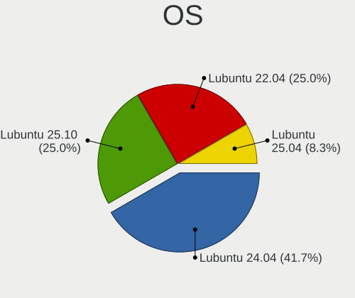

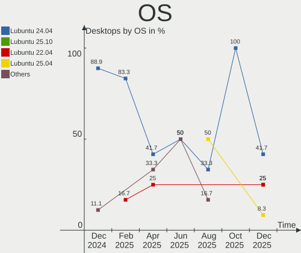

| Name          | Desktops | Percent |
|---------------|----------|---------|
| Lubuntu 24.04 | 5        | 41.67%  |
| Lubuntu 25.10 | 3        | 25%     |
| Lubuntu 22.04 | 3        | 25%     |
| Lubuntu 25.04 | 1        | 8.33%   |

OS Family
---------

OS without a version

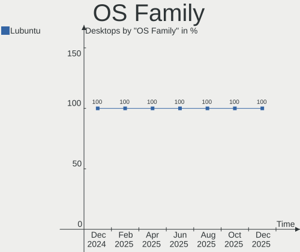

| Name    | Desktops | Percent |
|---------|----------|---------|
| Lubuntu | 12       | 100%    |

Kernel
------

Version of the Linux kernel

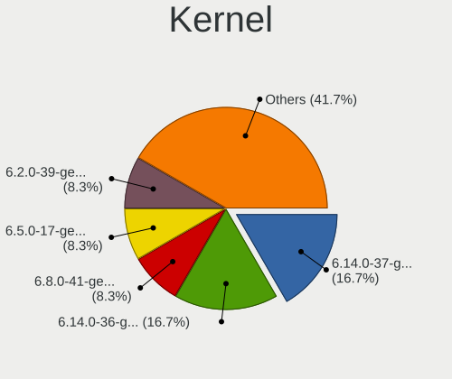

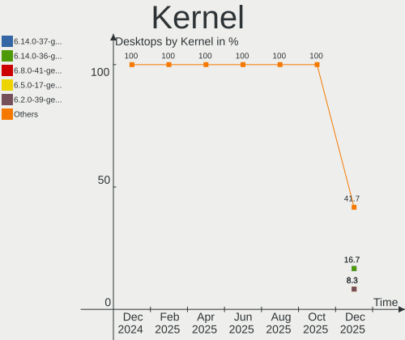

| Version                 | Desktops | Percent |
|-------------------------|----------|---------|
| 6.14.0-37-generic       | 2        | 16.67%  |
| 6.14.0-36-generic       | 2        | 16.67%  |
| 6.8.0-41-generic        | 1        | 8.33%   |
| 6.5.0-17-generic        | 1        | 8.33%   |
| 6.2.0-39-generic        | 1        | 8.33%   |
| 6.18.0-x86-64-v3-custom | 1        | 8.33%   |
| 6.17.8-061708-generic   | 1        | 8.33%   |
| 6.17.0-7-generic        | 1        | 8.33%   |
| 6.17.0-5-generic        | 1        | 8.33%   |
| 5.15.0-164-generic      | 1        | 8.33%   |

Kernel Family
-------------

Linux kernel without a distro release

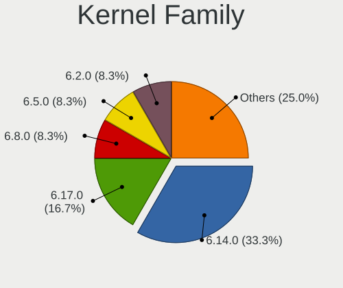

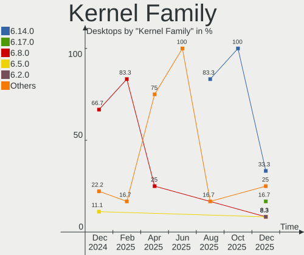

| Version | Desktops | Percent |
|---------|----------|---------|
| 6.14.0  | 4        | 33.33%  |
| 6.17.0  | 2        | 16.67%  |
| 6.8.0   | 1        | 8.33%   |
| 6.5.0   | 1        | 8.33%   |
| 6.2.0   | 1        | 8.33%   |
| 6.18.0  | 1        | 8.33%   |
| 6.17.8  | 1        | 8.33%   |
| 5.15.0  | 1        | 8.33%   |

Kernel Major Ver.
-----------------

Linux kernel major version

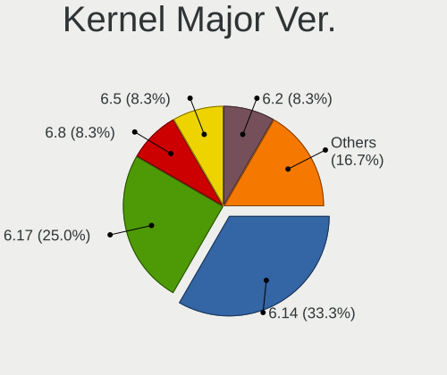

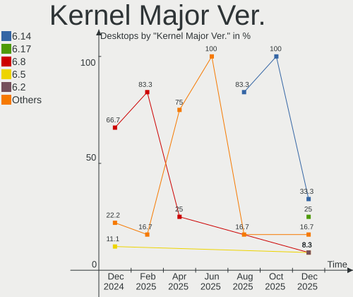

| Version | Desktops | Percent |
|---------|----------|---------|
| 6.14    | 4        | 33.33%  |
| 6.17    | 3        | 25%     |
| 6.8     | 1        | 8.33%   |
| 6.5     | 1        | 8.33%   |
| 6.2     | 1        | 8.33%   |
| 6.18    | 1        | 8.33%   |
| 5.15    | 1        | 8.33%   |

Arch
----

OS architecture (x86_64, i586, etc.)

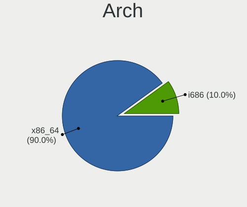

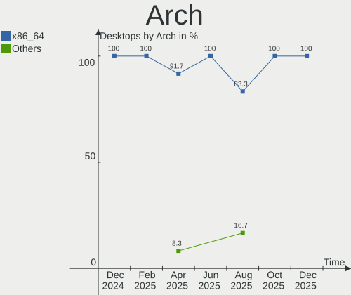

| Name   | Desktops | Percent |
|--------|----------|---------|
| x86_64 | 12       | 100%    |

DE
--

Desktop Environment

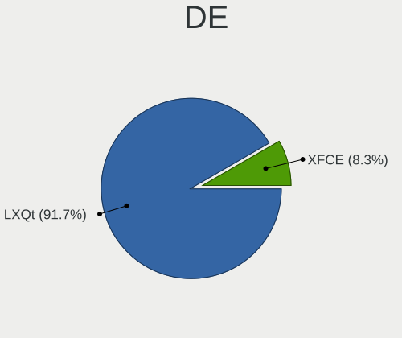

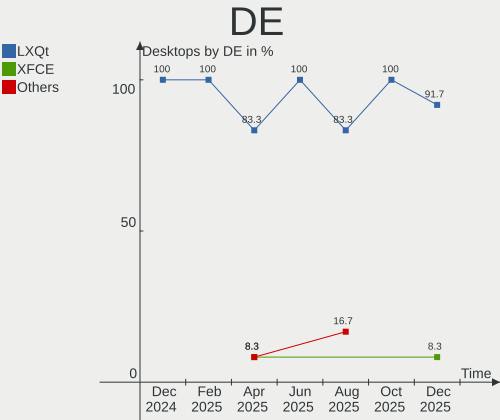

| Name | Desktops | Percent |
|------|----------|---------|
| LXQt | 11       | 91.67%  |
| XFCE | 1        | 8.33%   |

Display Server
--------------

X11 or Wayland

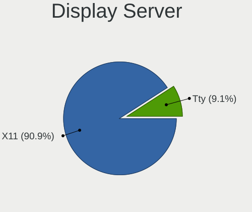

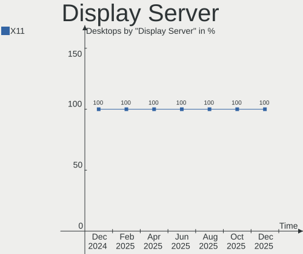

| Name | Desktops | Percent |
|------|----------|---------|
| X11  | 12       | 100%    |

Display Manager
---------------

SDDM, LightDM, etc.

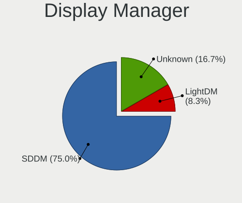

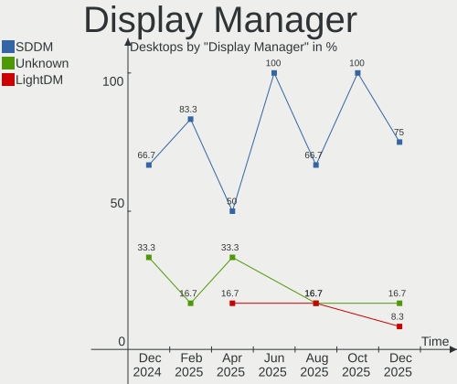

| Name    | Desktops | Percent |
|---------|----------|---------|
| SDDM    | 9        | 75%     |
| Unknown | 2        | 16.67%  |
| LightDM | 1        | 8.33%   |

OS Lang
-------

Language

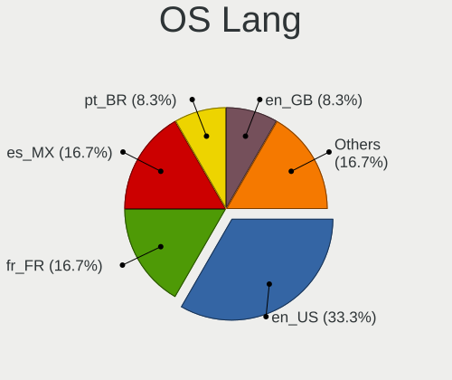

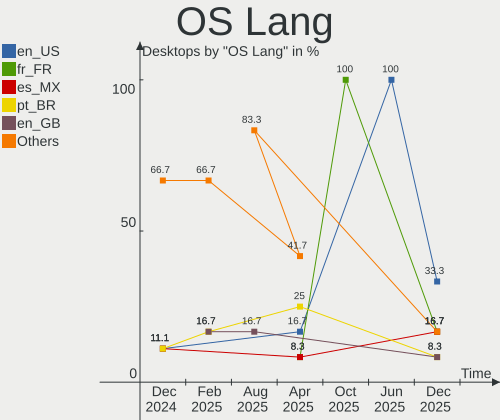

| Lang  | Desktops | Percent |
|-------|----------|---------|
| en_US | 4        | 33.33%  |
| fr_FR | 2        | 16.67%  |
| es_MX | 2        | 16.67%  |
| pt_BR | 1        | 8.33%   |
| en_GB | 1        | 8.33%   |
| C     | 1        | 8.33%   |
| ar_DZ | 1        | 8.33%   |

Boot Mode
---------

EFI or BIOS

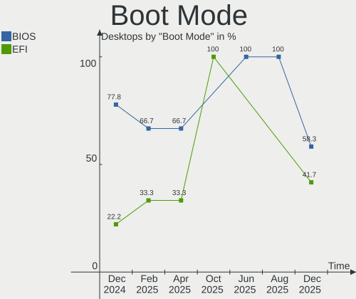

| Mode | Desktops | Percent |
|------|----------|---------|
| BIOS | 7        | 58.33%  |
| EFI  | 5        | 41.67%  |

Filesystem
----------

Type of filesystem

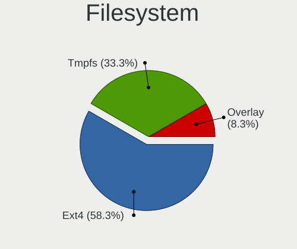

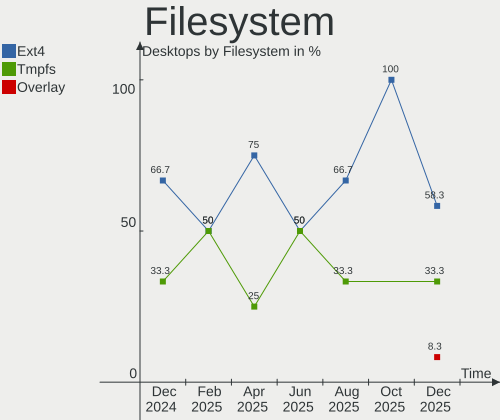

| Type    | Desktops | Percent |
|---------|----------|---------|
| Ext4    | 7        | 58.33%  |
| Tmpfs   | 4        | 33.33%  |
| Overlay | 1        | 8.33%   |

Part. scheme
------------

Scheme of partitioning

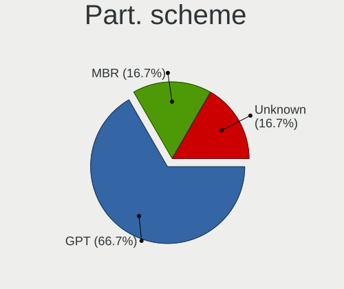

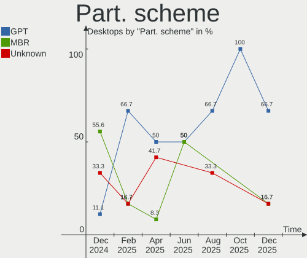

| Type    | Desktops | Percent |
|---------|----------|---------|
| GPT     | 8        | 66.67%  |
| MBR     | 2        | 16.67%  |
| Unknown | 2        | 16.67%  |

Dual Boot with Linux/BSD
------------------------

Hosting more than one Linux/BSD

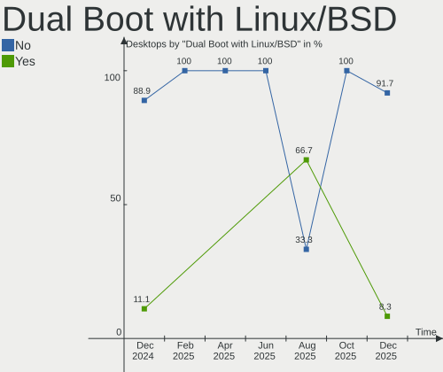

| Dual boot | Desktops | Percent |
|-----------|----------|---------|
| No        | 11       | 91.67%  |
| Yes       | 1        | 8.33%   |

Dual Boot (Win)
---------------

Hosting Linux and Windows

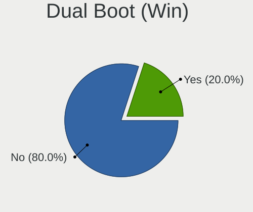

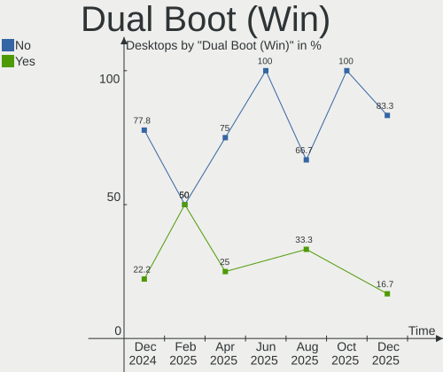

| Dual boot | Desktops | Percent |
|-----------|----------|---------|
| No        | 10       | 83.33%  |
| Yes       | 2        | 16.67%  |

Board
-----

Vendor
------

Motherboard manufacturer

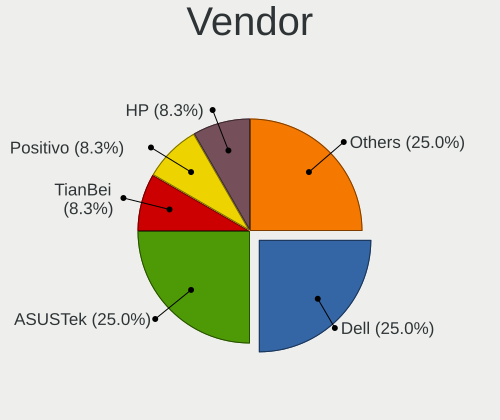

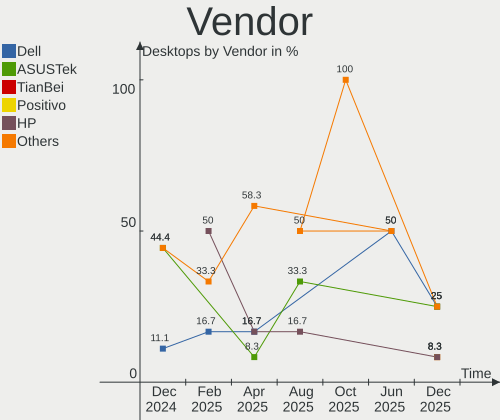

| Name             | Desktops | Percent |
|------------------|----------|---------|
| Dell             | 3        | 25%     |
| ASUSTek Computer | 3        | 25%     |
| TianBei          | 1        | 8.33%   |
| Positivo         | 1        | 8.33%   |
| Hewlett-Packard  | 1        | 8.33%   |
| ASRock           | 1        | 8.33%   |
| Acer             | 1        | 8.33%   |
| Unknown          | 1        | 8.33%   |

Model
-----

Motherboard model

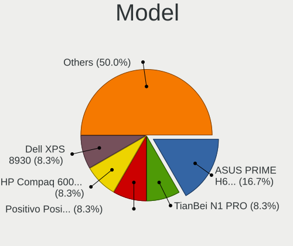

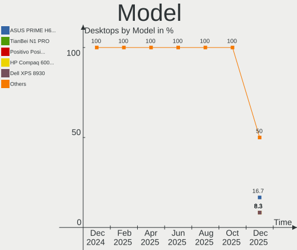

| Name                                  | Desktops | Percent |
|---------------------------------------|----------|---------|
| ASUS PRIME H610I-PLUS D4              | 2        | 16.67%  |
| TianBei N1 PRO                        | 1        | 8.33%   |
| Positivo Positivo Master C610 MiniPro | 1        | 8.33%   |
| HP Compaq 6005 Pro SFF PC             | 1        | 8.33%   |
| Dell XPS 8930                         | 1        | 8.33%   |
| Dell OptiPlex 3070                    | 1        | 8.33%   |
| Dell OptiPlex 3020                    | 1        | 8.33%   |
| ASUS TUF B450M-PLUS GAMING            | 1        | 8.33%   |
| ASRock H81M-DGS R2.0                  | 1        | 8.33%   |
| Acer Aspire XC-215                    | 1        | 8.33%   |
| Unknown                               | 1        | 8.33%   |

Model Family
------------

Motherboard model prefix

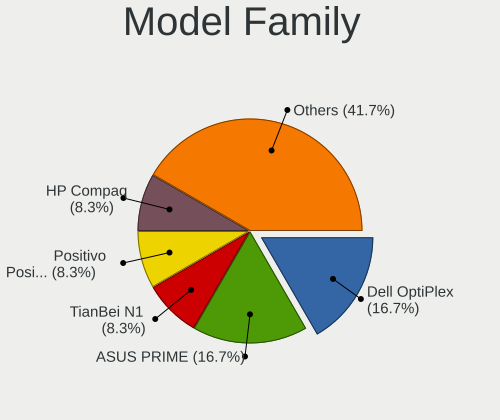

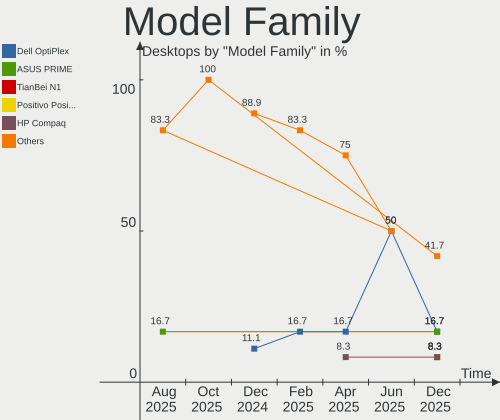

| Name              | Desktops | Percent |
|-------------------|----------|---------|
| Dell OptiPlex     | 2        | 16.67%  |
| ASUS PRIME        | 2        | 16.67%  |
| TianBei N1        | 1        | 8.33%   |
| Positivo Positivo | 1        | 8.33%   |
| HP Compaq         | 1        | 8.33%   |
| Dell XPS          | 1        | 8.33%   |
| ASUS TUF          | 1        | 8.33%   |
| ASRock H81M-DGS   | 1        | 8.33%   |
| Acer Aspire       | 1        | 8.33%   |
| Unknown           | 1        | 8.33%   |

MFG Year
--------

Motherboard manufacture year

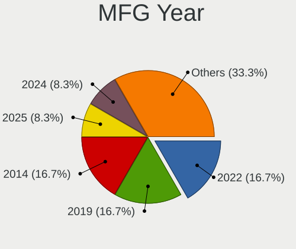

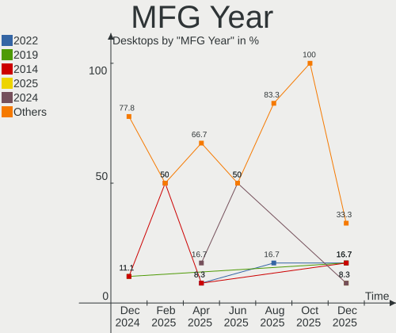

| Year | Desktops | Percent |
|------|----------|---------|
| 2022 | 2        | 16.67%  |
| 2019 | 2        | 16.67%  |
| 2014 | 2        | 16.67%  |
| 2025 | 1        | 8.33%   |
| 2024 | 1        | 8.33%   |
| 2018 | 1        | 8.33%   |
| 2017 | 1        | 8.33%   |
| 2013 | 1        | 8.33%   |
| 2009 | 1        | 8.33%   |

Form Factor
-----------

Physical design of the computer

| Name    | Desktops | Percent |
|---------|----------|---------|
| Desktop | 12       | 100%    |

Secure Boot
-----------

Enabled or disabled

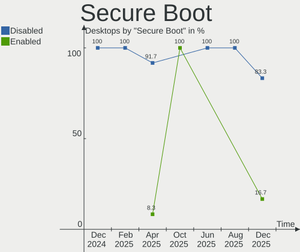

| State    | Desktops | Percent |
|----------|----------|---------|
| Disabled | 10       | 83.33%  |
| Enabled  | 2        | 16.67%  |

Coreboot
--------

Have coreboot on board

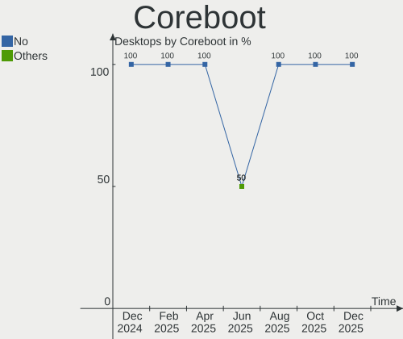

| Used | Desktops | Percent |
|------|----------|---------|
| No   | 12       | 100%    |

RAM Size
--------

Total RAM memory

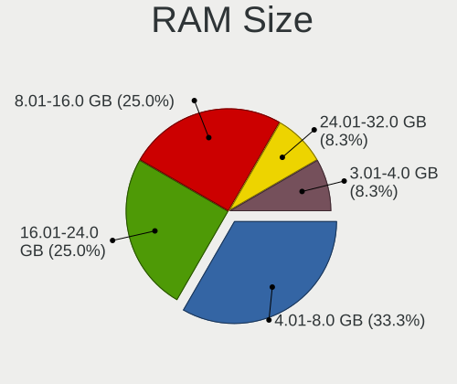

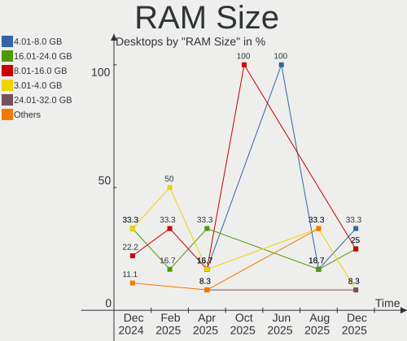

| Size in GB | Desktops | Percent |
|------------|----------|---------|
| 4.01-8.0   | 4        | 33.33%  |
| 16.01-24.0 | 3        | 25%     |
| 8.01-16.0  | 3        | 25%     |
| 3.01-4.0   | 1        | 8.33%   |
| 24.01-32.0 | 1        | 8.33%   |

RAM Used
--------

Used RAM memory

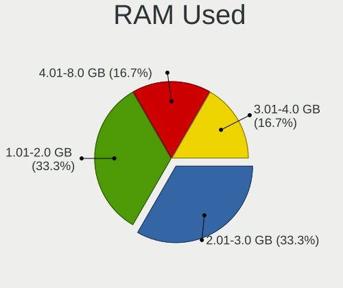

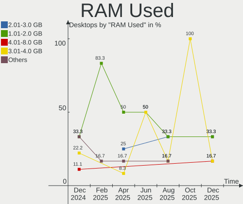

| Used GB  | Desktops | Percent |
|----------|----------|---------|
| 2.01-3.0 | 4        | 33.33%  |
| 1.01-2.0 | 4        | 33.33%  |
| 4.01-8.0 | 2        | 16.67%  |
| 3.01-4.0 | 2        | 16.67%  |

Total Drives
------------

Number of drives on board

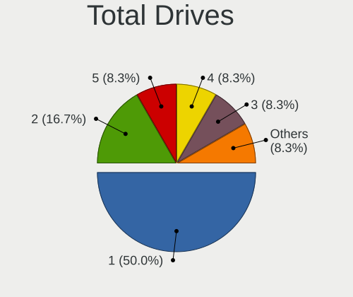

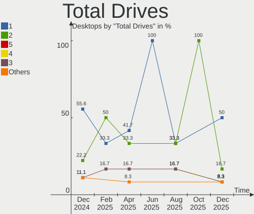

| Drives | Desktops | Percent |
|--------|----------|---------|
| 1      | 6        | 50%     |
| 2      | 2        | 16.67%  |
| 5      | 1        | 8.33%   |
| 4      | 1        | 8.33%   |
| 3      | 1        | 8.33%   |
| 0      | 1        | 8.33%   |

Has CD-ROM
----------

Has CD-ROM on board

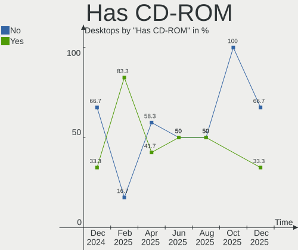

| Presented | Desktops | Percent |
|-----------|----------|---------|
| No        | 8        | 66.67%  |
| Yes       | 4        | 33.33%  |

Has Ethernet
------------

Has Ethernet on board

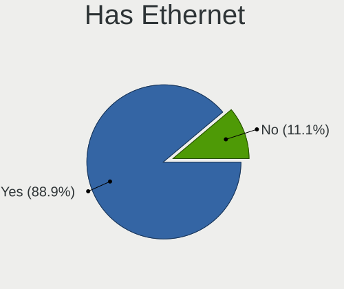

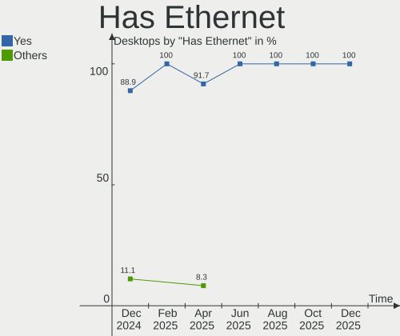

| Presented | Desktops | Percent |
|-----------|----------|---------|
| Yes       | 12       | 100%    |

Has WiFi
--------

Has WiFi module

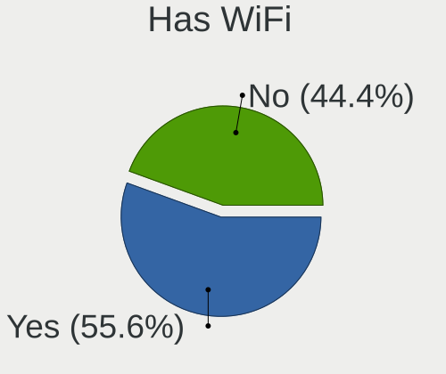

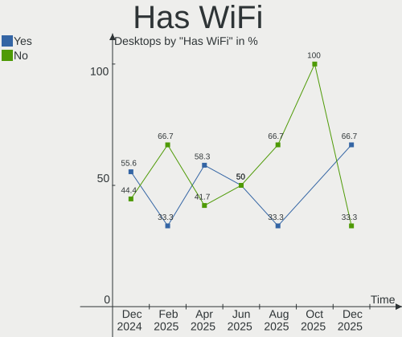

| Presented | Desktops | Percent |
|-----------|----------|---------|
| Yes       | 8        | 66.67%  |
| No        | 4        | 33.33%  |

Has Bluetooth
-------------

Has Bluetooth module

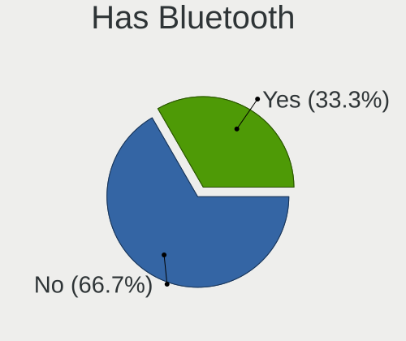

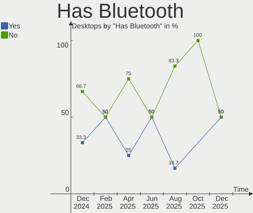

| Presented | Desktops | Percent |
|-----------|----------|---------|
| Yes       | 6        | 50%     |
| No        | 6        | 50%     |

Location
--------

Country
-------

Geographic location (country)

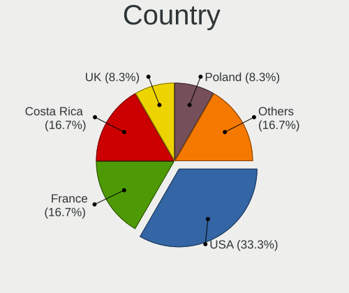

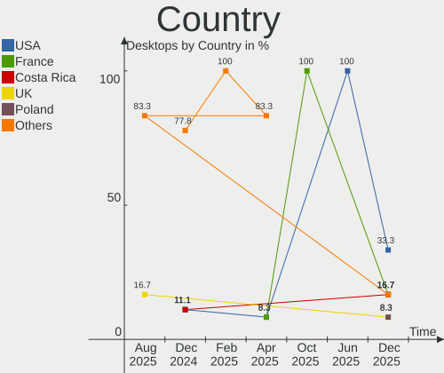

| Country    | Desktops | Percent |
|------------|----------|---------|
| USA        | 4        | 33.33%  |
| France     | 2        | 16.67%  |
| Costa Rica | 2        | 16.67%  |
| UK         | 1        | 8.33%   |
| Poland     | 1        | 8.33%   |
| Brazil     | 1        | 8.33%   |
| Algeria    | 1        | 8.33%   |

City
----

Geographic location (city)

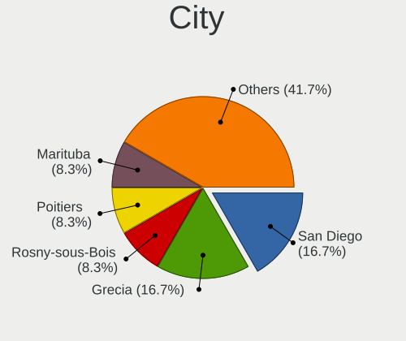

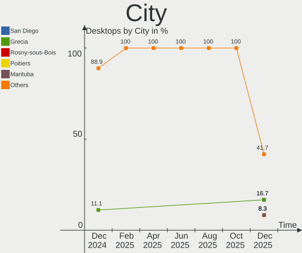

| City            | Desktops | Percent |
|-----------------|----------|---------|
| San Diego       | 2        | 16.67%  |
| Grecia          | 2        | 16.67%  |
| Rosny-sous-Bois | 1        | 8.33%   |
| Poitiers        | 1        | 8.33%   |
| Marituba        | 1        | 8.33%   |
| Live Oak        | 1        | 8.33%   |
| Gmina Połaniec | 1        | 8.33%   |
| Dundalk         | 1        | 8.33%   |
| Bristol         | 1        | 8.33%   |
| Algiers         | 1        | 8.33%   |

Drives
------

Drive Vendor
------------

Hard drive vendors

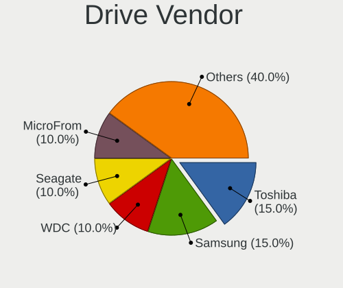

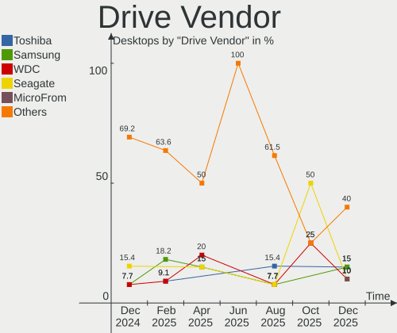

| Vendor              | Desktops | Drives | Percent |
|---------------------|----------|--------|---------|
| Toshiba             | 3        | 5      | 15%     |
| Samsung Electronics | 3        | 3      | 15%     |
| WDC                 | 2        | 2      | 10%     |
| Seagate             | 2        | 2      | 10%     |
| MicroFrom           | 2        | 2      | 10%     |
| Unknown             | 1        | 1      | 5%      |
| SK hynix            | 1        | 1      | 5%      |
| Phison Electronics  | 1        | 1      | 5%      |
| Lexar               | 1        | 1      | 5%      |
| KIOXIA              | 1        | 1      | 5%      |
| Hitachi             | 1        | 1      | 5%      |
| Crucial             | 1        | 1      | 5%      |
| ASint Technology    | 1        | 1      | 5%      |

Drive Model
-----------

Hard drive models

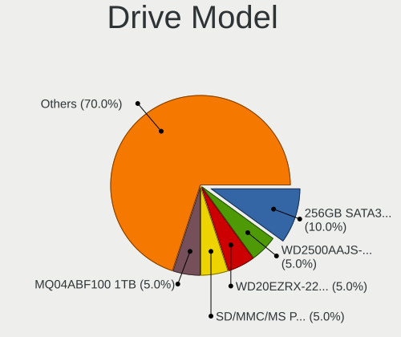

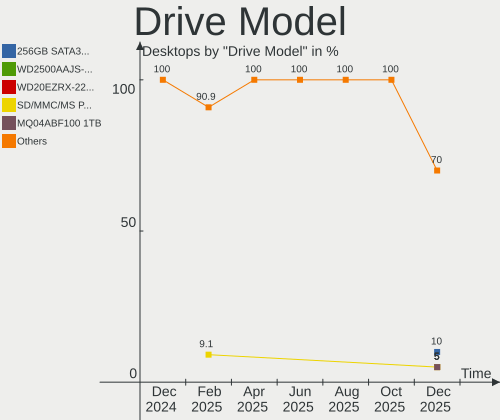

| Model                                  | Desktops | Percent |
|----------------------------------------|----------|---------|
| MicroFrom 256GB SATA3 SSD              | 2        | 10%     |
| WDC WD2500AAJS-75M0A0 249GB            | 1        | 5%      |
| WDC WD20EZRX-22D8PB0 2TB               | 1        | 5%      |
| Unknown SD/MMC/MS PRO 2GB              | 1        | 5%      |
| Toshiba MQ04ABF100 1TB                 | 1        | 5%      |
| Toshiba HDWD130 3TB                    | 1        | 5%      |
| Toshiba DT01ABA300 3TB                 | 1        | 5%      |
| SK hynix PC601 NVMe 256GB              | 1        | 5%      |
| Seagate ST4000DM004-2CV104 4TB         | 1        | 5%      |
| Seagate ST380815AS 80GB                | 1        | 5%      |
| Samsung SSD 870 EVO 1TB                | 1        | 5%      |
| Samsung SSD 850 EVO M.2 500GB          | 1        | 5%      |
| Samsung SSD 850 EVO 250GB              | 1        | 5%      |
| Phison E12 NVMe Controller 1TB         | 1        | 5%      |
| Lexar 256GB SSD                        | 1        | 5%      |
| KIOXIA KBG40ZNS256G NVMe TOSHIBA 256GB | 1        | 5%      |
| Hitachi HDS725050KLA360 500GB          | 1        | 5%      |
| Crucial CT1000BX500SSD1 1TB            | 1        | 5%      |
| ASint AS606 256GB SSD                  | 1        | 5%      |

HDD Vendor
----------

Hard disk drive vendors

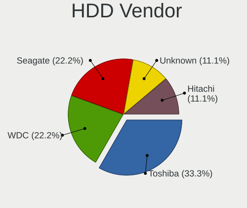

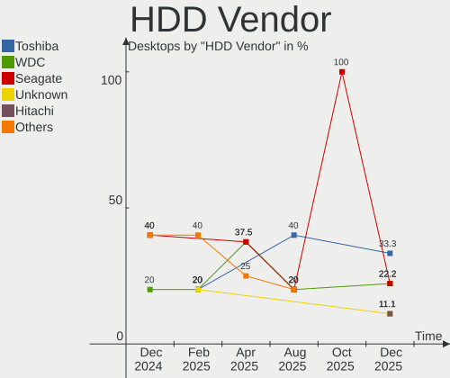

| Vendor  | Desktops | Drives | Percent |
|---------|----------|--------|---------|
| Toshiba | 3        | 5      | 33.33%  |
| WDC     | 2        | 2      | 22.22%  |
| Seagate | 2        | 2      | 22.22%  |
| Unknown | 1        | 1      | 11.11%  |
| Hitachi | 1        | 1      | 11.11%  |

SSD Vendor
----------

Solid state drive vendors

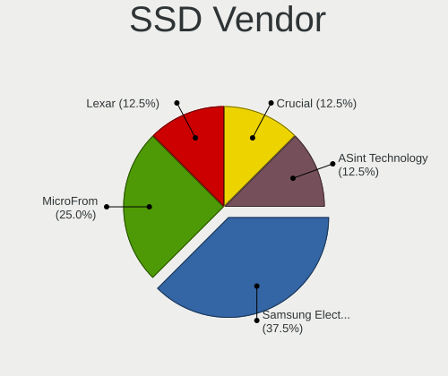

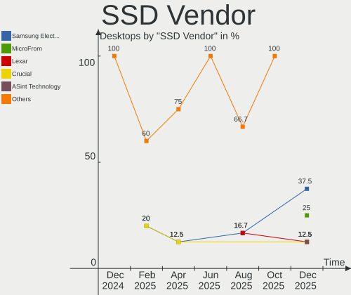

| Vendor              | Desktops | Drives | Percent |
|---------------------|----------|--------|---------|
| Samsung Electronics | 3        | 3      | 37.5%   |
| MicroFrom           | 2        | 2      | 25%     |
| Lexar               | 1        | 1      | 12.5%   |
| Crucial             | 1        | 1      | 12.5%   |
| ASint Technology    | 1        | 1      | 12.5%   |

Drive Kind
----------

HDD or SSD

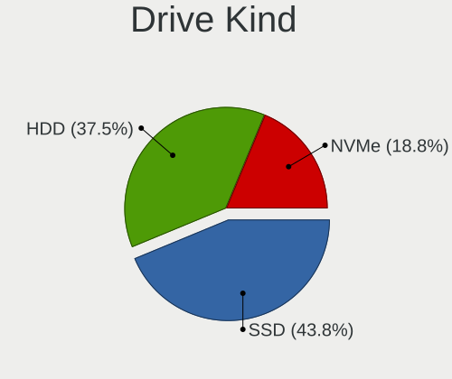

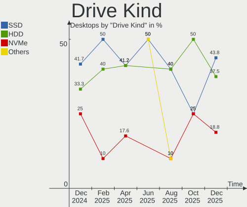

| Kind | Desktops | Drives | Percent |
|------|----------|--------|---------|
| SSD  | 7        | 8      | 43.75%  |
| HDD  | 6        | 11     | 37.5%   |
| NVMe | 3        | 3      | 18.75%  |

Drive Connector
---------------

SATA, SAS, NVMe, etc.

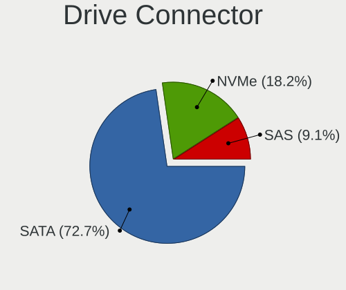

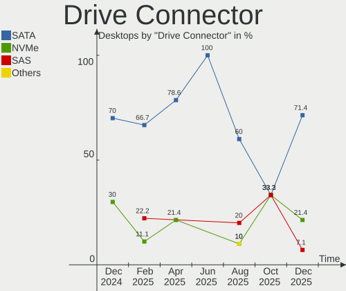

| Type | Desktops | Drives | Percent |
|------|----------|--------|---------|
| SATA | 10       | 18     | 71.43%  |
| NVMe | 3        | 3      | 21.43%  |
| SAS  | 1        | 1      | 7.14%   |

Drive Size
----------

Size of hard drive

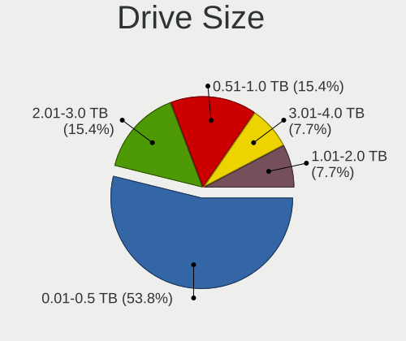

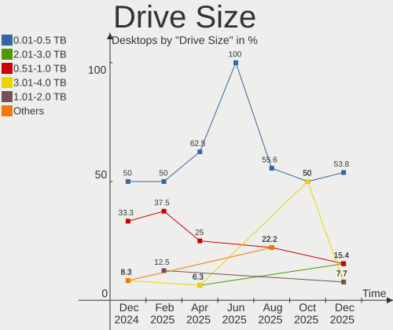

| Size in TB | Desktops | Drives | Percent |
|------------|----------|--------|---------|
| 0.01-0.5   | 7        | 10     | 53.85%  |
| 2.01-3.0   | 2        | 4      | 15.38%  |
| 0.51-1.0   | 2        | 3      | 15.38%  |
| 3.01-4.0   | 1        | 1      | 7.69%   |
| 1.01-2.0   | 1        | 1      | 7.69%   |

Space Total
-----------

Amount of disk space available on the file system

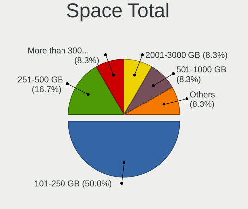

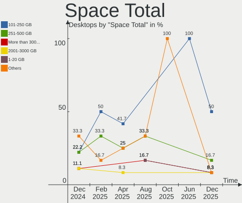

| Size in GB     | Desktops | Percent |
|----------------|----------|---------|
| 101-250        | 6        | 50%     |
| 251-500        | 2        | 16.67%  |
| More than 3000 | 1        | 8.33%   |
| 2001-3000      | 1        | 8.33%   |
| 1-20           | 1        | 8.33%   |
| 501-1000       | 1        | 8.33%   |

Space Used
----------

Amount of used disk space

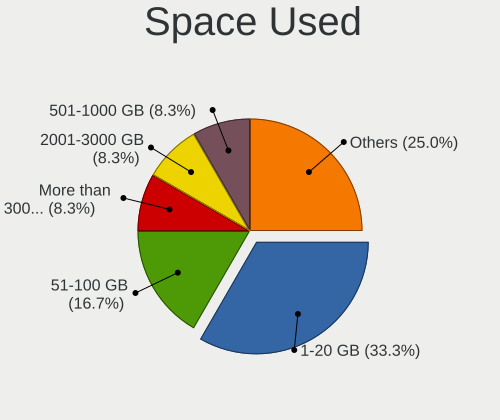

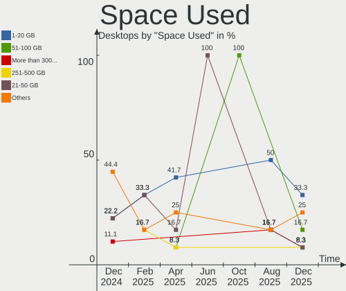

| Used GB        | Desktops | Percent |
|----------------|----------|---------|
| 1-20           | 4        | 33.33%  |
| 51-100         | 2        | 16.67%  |
| More than 3000 | 1        | 8.33%   |
| 251-500        | 1        | 8.33%   |
| 21-50          | 1        | 8.33%   |
| 2001-3000      | 1        | 8.33%   |
| 101-250        | 1        | 8.33%   |
| 501-1000       | 1        | 8.33%   |

Malfunc. Drives
---------------

Drive models with a malfunction

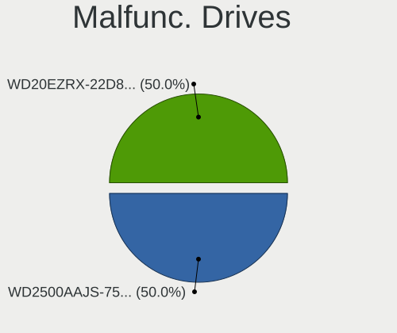

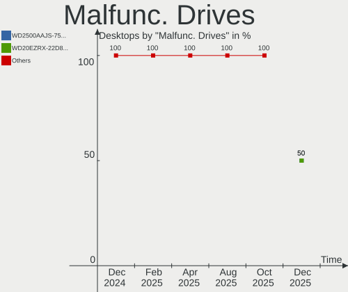

| Model                       | Desktops | Drives | Percent |
|-----------------------------|----------|--------|---------|
| WDC WD2500AAJS-75M0A0 249GB | 1        | 1      | 50%     |
| WDC WD20EZRX-22D8PB0 2TB    | 1        | 1      | 50%     |

Malfunc. Drive Vendor
---------------------

Vendors of faulty drives

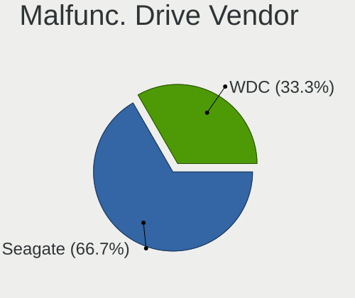

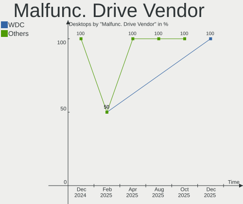

| Vendor | Desktops | Drives | Percent |
|--------|----------|--------|---------|
| WDC    | 2        | 2      | 100%    |

Malfunc. HDD Vendor
-------------------

Vendors of faulty HDD drives

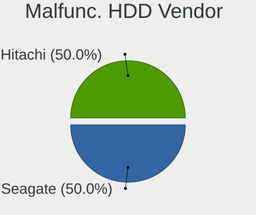

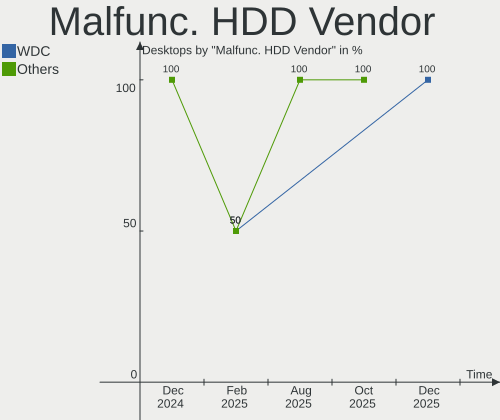

| Vendor | Desktops | Drives | Percent |
|--------|----------|--------|---------|
| WDC    | 2        | 2      | 100%    |

Malfunc. Drive Kind
-------------------

Kinds of faulty drives

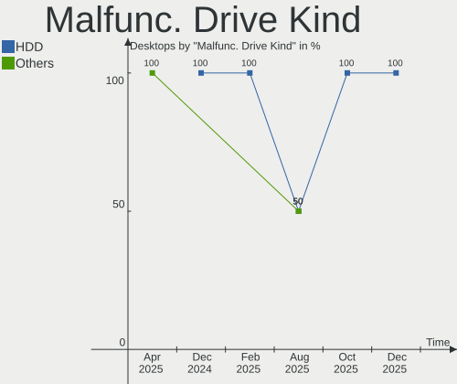

| Kind | Desktops | Drives | Percent |
|------|----------|--------|---------|
| HDD  | 2        | 2      | 100%    |

Failed Drives
-------------

Failed drive models

Zero info for selected period =(

Failed Drive Vendor
-------------------

Failed drive vendors

Zero info for selected period =(

Drive Status
------------

Number of failed and malfunc. drives

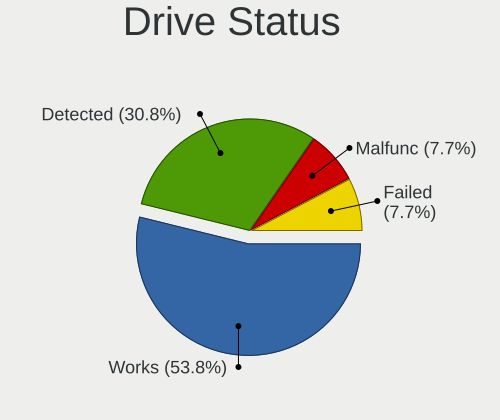

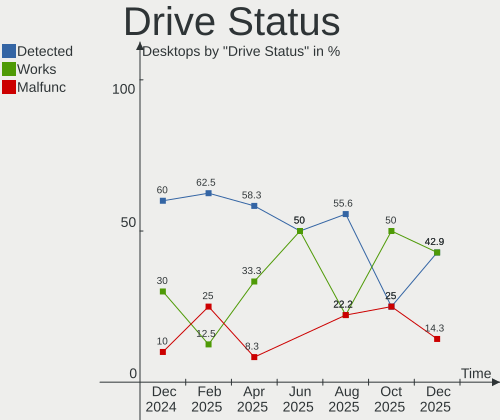

| Status   | Desktops | Drives | Percent |
|----------|----------|--------|---------|
| Detected | 6        | 11     | 42.86%  |
| Works    | 6        | 9      | 42.86%  |
| Malfunc  | 2        | 2      | 14.29%  |

Storage controller
------------------

Storage Vendor
--------------

Storage controller vendors

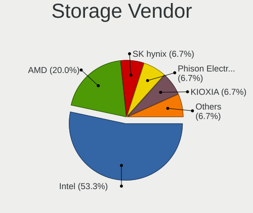

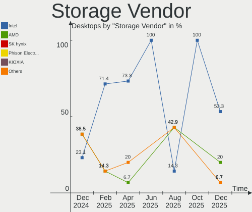

| Vendor             | Desktops | Percent |
|--------------------|----------|---------|
| Intel              | 8        | 53.33%  |
| AMD                | 3        | 20%     |
| SK hynix           | 1        | 6.67%   |
| Phison Electronics | 1        | 6.67%   |
| KIOXIA             | 1        | 6.67%   |
| ASMedia Technology | 1        | 6.67%   |

Storage Model
-------------

Storage controller models

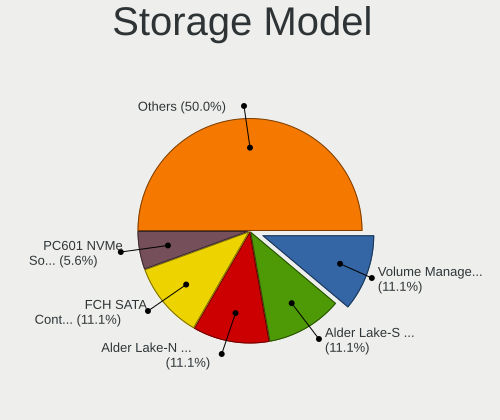

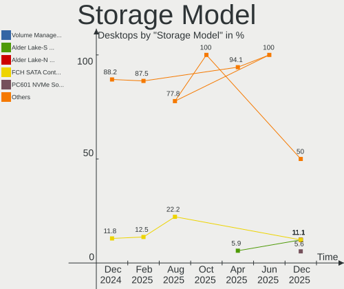

| Model                                                                          | Desktops | Percent |
|--------------------------------------------------------------------------------|----------|---------|
| Intel Volume Management Device NVMe RAID Controller                            | 2        | 11.11%  |
| Intel Alder Lake-S PCH SATA Controller [AHCI Mode]                             | 2        | 11.11%  |
| Intel Alder Lake-N SATA AHCI Controller                                        | 2        | 11.11%  |
| AMD FCH SATA Controller [AHCI mode]                                            | 2        | 11.11%  |
| SK hynix PC601 NVMe Solid State Drive                                          | 1        | 5.56%   |
| Phison E12 NVMe Controller                                                     | 1        | 5.56%   |
| KIOXIA NVMe SSD Controller BG4 (DRAM-less)                                     | 1        | 5.56%   |
| Intel Q170/Q150/B150/H170/H110/Z170/CM236 Chipset SATA Controller [AHCI Mode]  | 1        | 5.56%   |
| Intel Cannon Lake PCH SATA AHCI Controller                                     | 1        | 5.56%   |
| Intel 8 Series/C220 Series Chipset Family 6-port SATA Controller 1 [AHCI mode] | 1        | 5.56%   |
| Intel 200 Series PCH SATA controller [AHCI mode]                               | 1        | 5.56%   |
| ASMedia ASM1061/ASM1062 Serial ATA Controller                                  | 1        | 5.56%   |
| AMD SB7x0/SB8x0/SB9x0 SATA Controller [AHCI mode]                              | 1        | 5.56%   |
| AMD 400 Series Chipset SATA Controller                                         | 1        | 5.56%   |

Storage Kind
------------

Kind of storage controller (IDE, SATA, NVMe, SAS, ...)

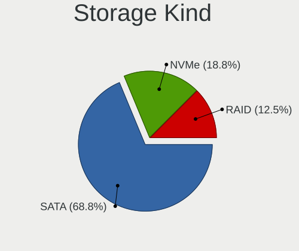

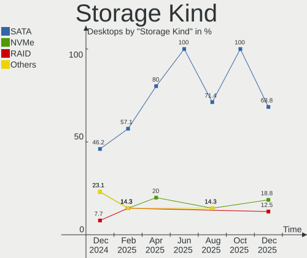

| Kind | Desktops | Percent |
|------|----------|---------|
| SATA | 11       | 68.75%  |
| NVMe | 3        | 18.75%  |
| RAID | 2        | 12.5%   |

Processor
---------

CPU Vendor
----------

Processor vendors

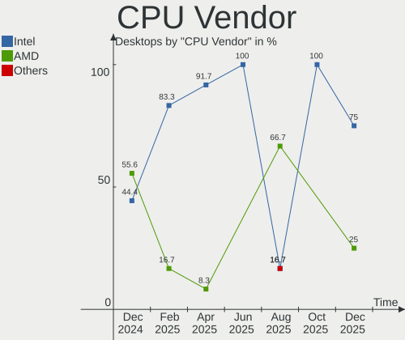

| Vendor | Desktops | Percent |
|--------|----------|---------|
| Intel  | 9        | 75%     |
| AMD    | 3        | 25%     |

CPU Model
---------

Processor models

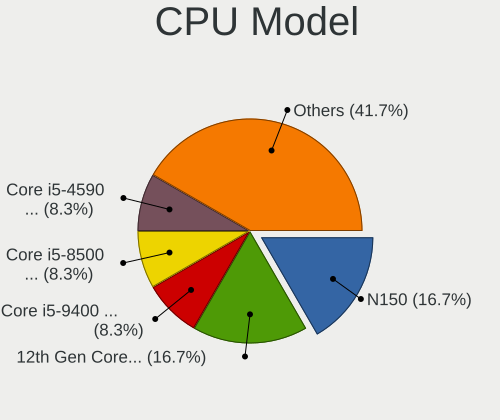

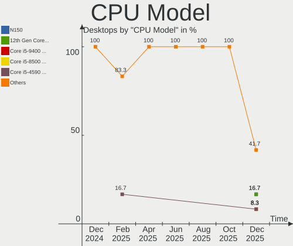

| Model                                       | Desktops | Percent |
|---------------------------------------------|----------|---------|
| Intel N150                                  | 2        | 16.67%  |
| Intel 12th Gen Core i5-12600K               | 2        | 16.67%  |
| Intel Core i5-9400 CPU @ 2.90GHz            | 1        | 8.33%   |
| Intel Core i5-8500 CPU @ 3.00GHz            | 1        | 8.33%   |
| Intel Core i5-4590 CPU @ 3.30GHz            | 1        | 8.33%   |
| Intel Core i3-6300T CPU @ 3.30GHz           | 1        | 8.33%   |
| Intel Core i3-4150 CPU @ 3.50GHz            | 1        | 8.33%   |
| AMD Ryzen 7 3700X 8-Core Processor          | 1        | 8.33%   |
| AMD Phenom II X2 B55 Processor              | 1        | 8.33%   |
| AMD E2-6110 APU with AMD Radeon R2 Graphics | 1        | 8.33%   |

CPU Model Family
----------------

Processor model prefix

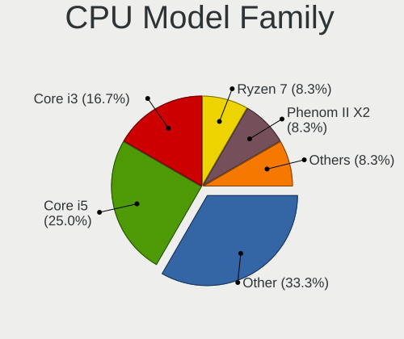

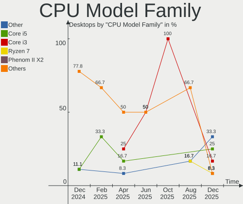

| Model            | Desktops | Percent |
|------------------|----------|---------|
| Other            | 4        | 33.33%  |
| Intel Core i5    | 3        | 25%     |
| Intel Core i3    | 2        | 16.67%  |
| AMD Ryzen 7      | 1        | 8.33%   |
| AMD Phenom II X2 | 1        | 8.33%   |
| AMD E2           | 1        | 8.33%   |

CPU Cores
---------

Number of processor cores

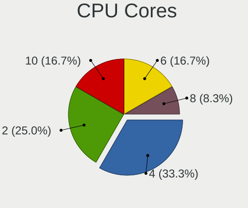

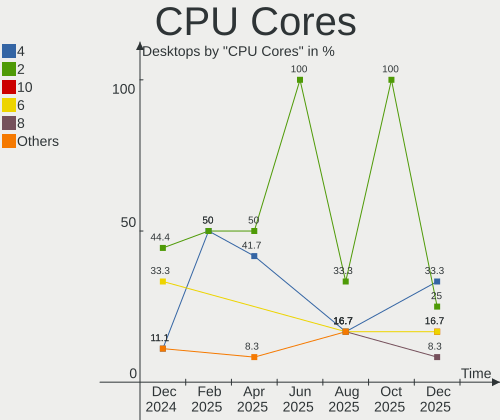

| Number | Desktops | Percent |
|--------|----------|---------|
| 4      | 4        | 33.33%  |
| 2      | 3        | 25%     |
| 10     | 2        | 16.67%  |
| 6      | 2        | 16.67%  |
| 8      | 1        | 8.33%   |

CPU Sockets
-----------

Number of sockets

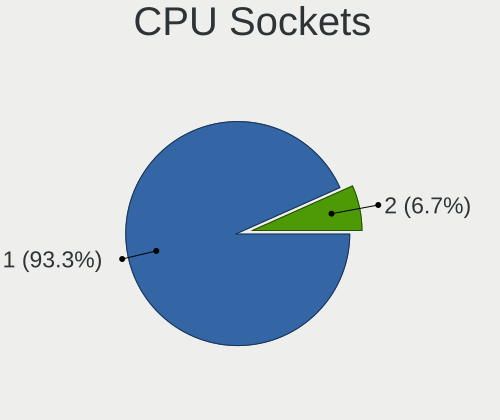

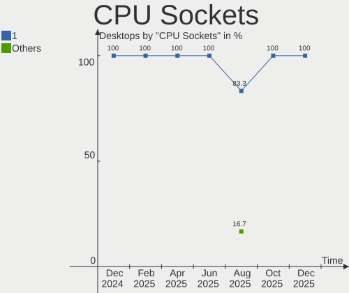

| Number | Desktops | Percent |
|--------|----------|---------|
| 1      | 12       | 100%    |

CPU Threads
-----------

Threads per core (Hyper-Threading)

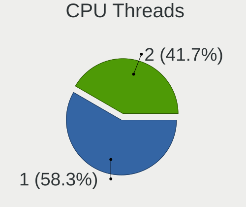

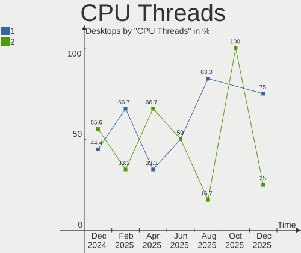

| Number | Desktops | Percent |
|--------|----------|---------|
| 1      | 9        | 75%     |
| 2      | 3        | 25%     |

CPU Op-Modes
------------

CPU Operation Modes (32-bit, 64-bit)

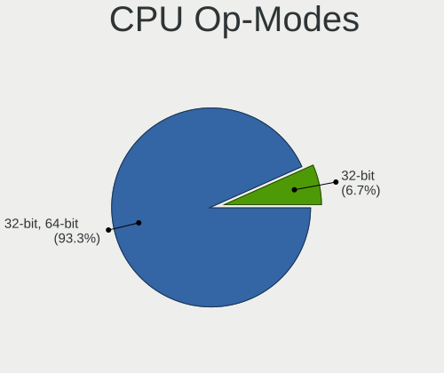

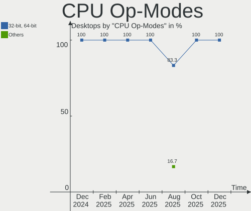

| Op mode        | Desktops | Percent |
|----------------|----------|---------|
| 32-bit, 64-bit | 12       | 100%    |

CPU Microcode
-------------

Microcode number

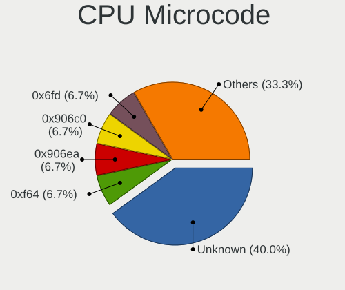

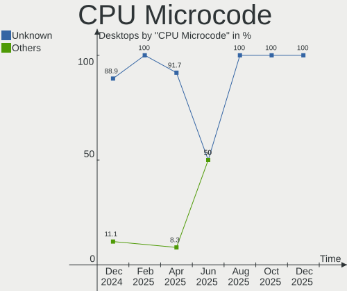

| Number  | Desktops | Percent |
|---------|----------|---------|
| Unknown | 12       | 100%    |

CPU Microarch
-------------

Microarchitecture

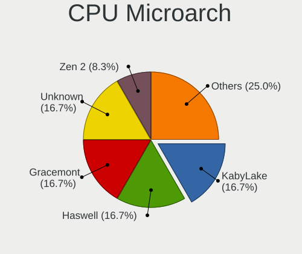

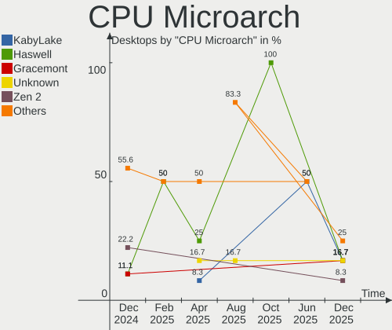

| Name      | Desktops | Percent |
|-----------|----------|---------|
| KabyLake  | 2        | 16.67%  |
| Haswell   | 2        | 16.67%  |
| Gracemont | 2        | 16.67%  |
| Unknown   | 2        | 16.67%  |
| Zen 2     | 1        | 8.33%   |
| Skylake   | 1        | 8.33%   |
| Puma      | 1        | 8.33%   |
| K10       | 1        | 8.33%   |

Graphics
--------

GPU Vendor
----------

Vendors of graphics cards

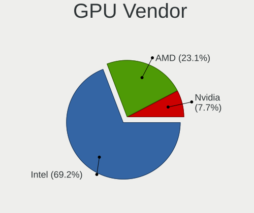

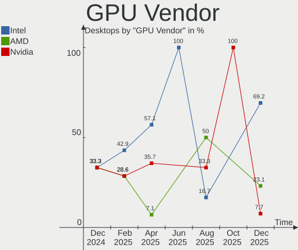

| Vendor | Desktops | Percent |
|--------|----------|---------|
| Intel  | 9        | 69.23%  |
| AMD    | 3        | 23.08%  |
| Nvidia | 1        | 7.69%   |

GPU Model
---------

Graphics card models

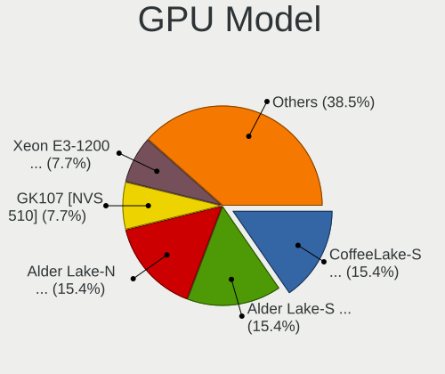

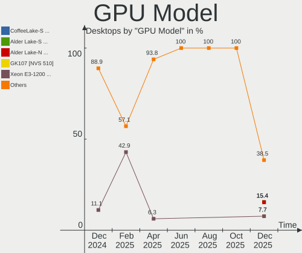

| Model                                                                       | Desktops | Percent |
|-----------------------------------------------------------------------------|----------|---------|
| Intel CoffeeLake-S GT2 [UHD Graphics 630]                                   | 2        | 15.38%  |
| Intel Alder Lake-S GT1 [UHD Graphics 770]                                   | 2        | 15.38%  |
| Intel Alder Lake-N [Intel Graphics]                                         | 2        | 15.38%  |
| Nvidia GK107 [NVS 510]                                                      | 1        | 7.69%   |
| Intel Xeon E3-1200 v3/4th Gen Core Processor Integrated Graphics Controller | 1        | 7.69%   |
| Intel Skylake-S GT2 [HD Graphics 530]                                       | 1        | 7.69%   |
| Intel 4th Generation Core Processor Family Integrated Graphics Controller   | 1        | 7.69%   |
| AMD Mullins [Radeon R2 Graphics]                                            | 1        | 7.69%   |
| AMD Lexa XT [Radeon PRO WX 3100]                                            | 1        | 7.69%   |
| AMD Ellesmere [Radeon RX 470/480/570/570X/580/580X/590]                     | 1        | 7.69%   |

GPU Combo
---------

Combinations of graphics cards

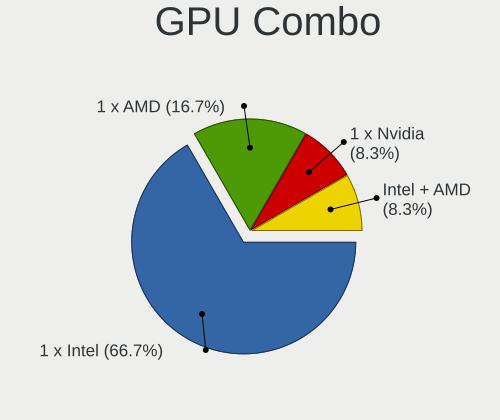

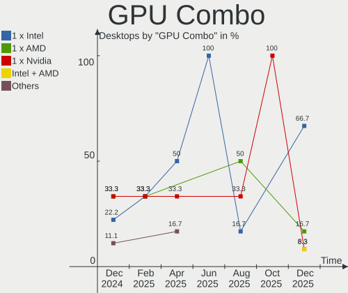

| Name        | Desktops | Percent |
|-------------|----------|---------|
| 1 x Intel   | 8        | 66.67%  |
| 1 x AMD     | 2        | 16.67%  |
| 1 x Nvidia  | 1        | 8.33%   |
| Intel + AMD | 1        | 8.33%   |

GPU Driver
----------

Free vs proprietary

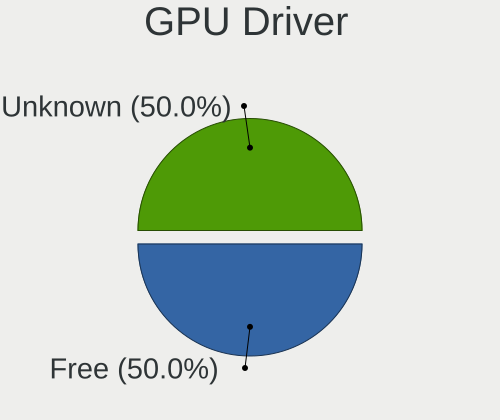

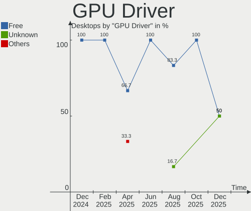

| Driver  | Desktops | Percent |
|---------|----------|---------|
| Free    | 6        | 50%     |
| Unknown | 6        | 50%     |

GPU Memory
----------

Total video memory

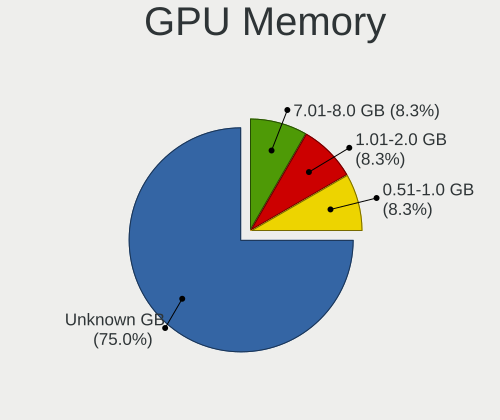

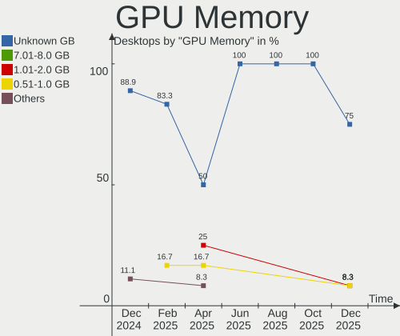

| Size in GB | Desktops | Percent |
|------------|----------|---------|
| Unknown    | 9        | 75%     |
| 7.01-8.0   | 1        | 8.33%   |
| 1.01-2.0   | 1        | 8.33%   |
| 0.51-1.0   | 1        | 8.33%   |

Monitor
-------

Monitor Vendor
--------------

Monitor vendors

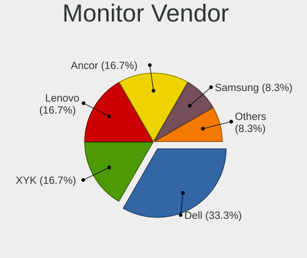

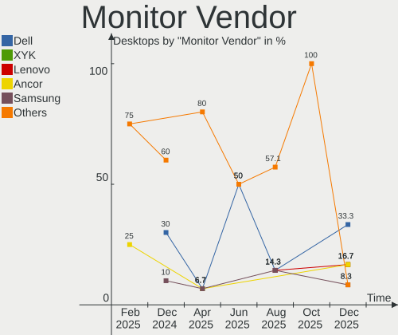

| Vendor               | Desktops | Percent |
|----------------------|----------|---------|
| Dell                 | 4        | 33.33%  |
| XYK                  | 2        | 16.67%  |
| Lenovo               | 2        | 16.67%  |
| Ancor Communications | 2        | 16.67%  |
| Samsung Electronics  | 1        | 8.33%   |
| Goldstar             | 1        | 8.33%   |

Monitor Model
-------------

Monitor models

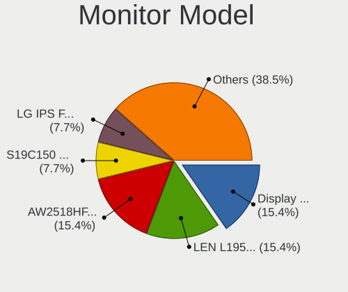

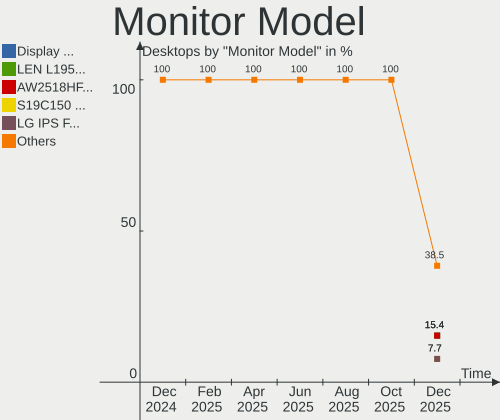

| Model                                                                 | Desktops | Percent |
|-----------------------------------------------------------------------|----------|---------|
| XYK Display XYK1200 1920x1200 301x188mm 14.0-inch                     | 2        | 15.38%  |
| Lenovo LEN L1950wD LEN1086 1920x1080 150x100mm 7.1-inch               | 2        | 15.38%  |
| Dell AW2518HF DELA101 1920x1080 544x303mm 24.5-inch                   | 2        | 15.38%  |
| Samsung Electronics S19C150 SAM0AE6 1366x768 410x230mm 18.5-inch      | 1        | 7.69%   |
| Goldstar LG IPS FULLHD GSM5AB8 1920x1080 480x270mm 21.7-inch          | 1        | 7.69%   |
| Dell P2214H DELA098 1920x1080 477x268mm 21.5-inch                     | 1        | 7.69%   |
| Dell P2214H DELA097 1920x1080 477x268mm 21.5-inch                     | 1        | 7.69%   |
| Dell E207WFP DELD010 1680x1050 430x270mm 20.0-inch                    | 1        | 7.69%   |
| Ancor Communications BE24A ACI24AB 1920x1200 518x324mm 24.1-inch      | 1        | 7.69%   |
| Ancor Communications ASUS VN247 ACI24C3 1920x1080 521x293mm 23.5-inch | 1        | 7.69%   |

Monitor Resolution
------------------

Monitor screen resolution

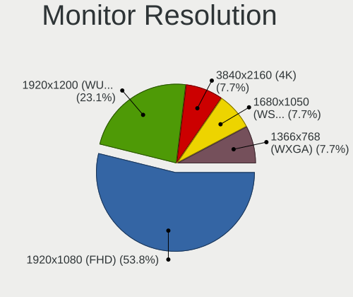

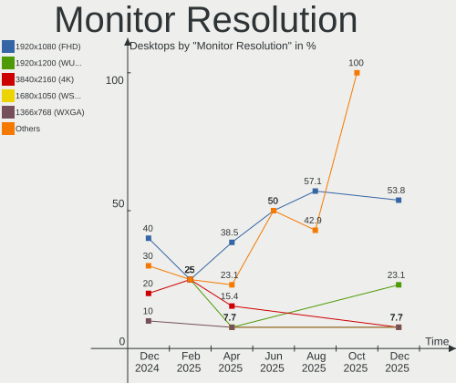

| Resolution         | Desktops | Percent |
|--------------------|----------|---------|
| 1920x1080 (FHD)    | 7        | 53.85%  |
| 1920x1200 (WUXGA)  | 3        | 23.08%  |
| 3840x2160 (4K)     | 1        | 7.69%   |
| 1680x1050 (WSXGA+) | 1        | 7.69%   |
| 1366x768 (WXGA)    | 1        | 7.69%   |

Monitor Diagonal
----------------

Diagonal size in inches

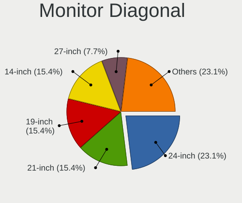

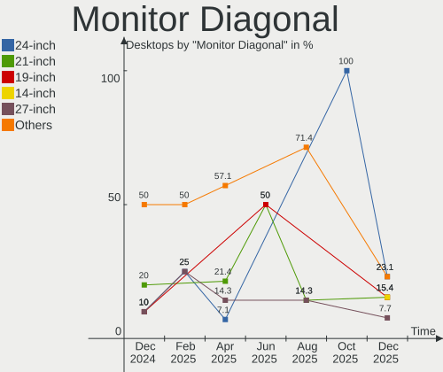

| Inches | Desktops | Percent |
|--------|----------|---------|
| 24     | 3        | 23.08%  |
| 21     | 2        | 15.38%  |
| 19     | 2        | 15.38%  |
| 14     | 2        | 15.38%  |
| 27     | 1        | 7.69%   |
| 23     | 1        | 7.69%   |
| 20     | 1        | 7.69%   |
| 18     | 1        | 7.69%   |

Monitor Width
-------------

Physical width

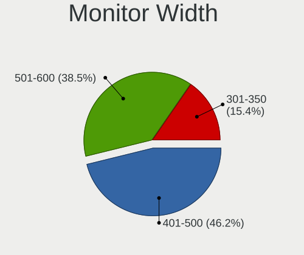

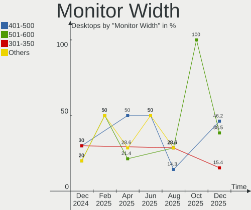

| Width in mm | Desktops | Percent |
|-------------|----------|---------|
| 401-500     | 6        | 46.15%  |
| 501-600     | 5        | 38.46%  |
| 301-350     | 2        | 15.38%  |

Aspect Ratio
------------

Proportional relationship between the width and the height

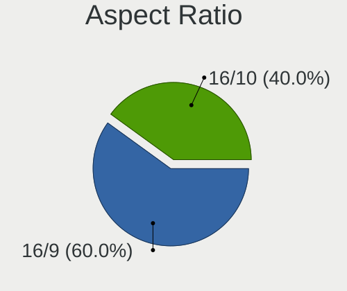

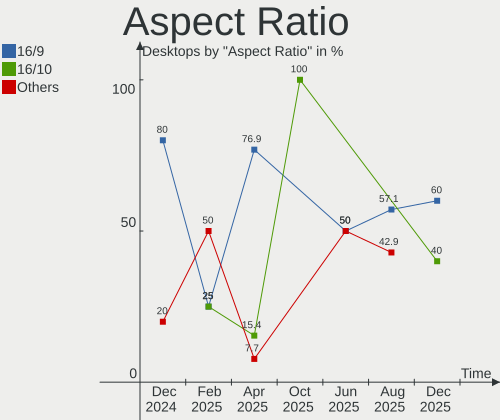

| Ratio | Desktops | Percent |
|-------|----------|---------|
| 16/9  | 6        | 60%     |
| 16/10 | 4        | 40%     |

Monitor Area
------------

Area in inch²

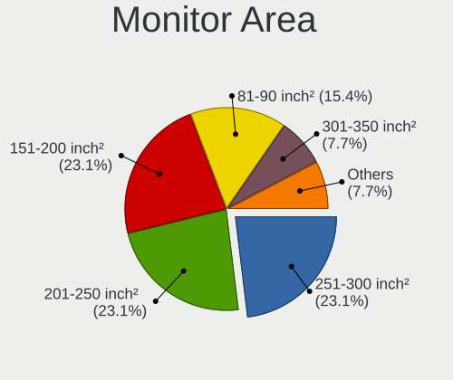

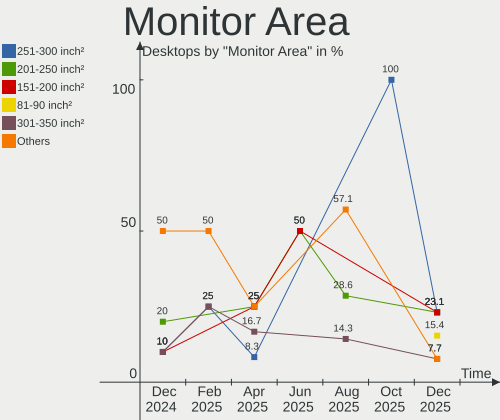

| Area in inch² | Desktops | Percent |
|----------------|----------|---------|
| 251-300        | 3        | 23.08%  |
| 201-250        | 3        | 23.08%  |
| 151-200        | 3        | 23.08%  |
| 81-90          | 2        | 15.38%  |
| 301-350        | 1        | 7.69%   |
| 141-150        | 1        | 7.69%   |

Pixel Density
-------------

Pixels per inch

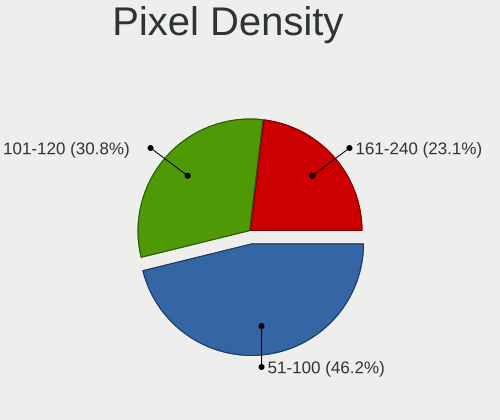

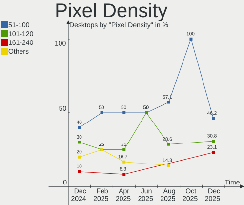

| Density | Desktops | Percent |
|---------|----------|---------|
| 51-100  | 6        | 46.15%  |
| 101-120 | 4        | 30.77%  |
| 161-240 | 3        | 23.08%  |

Multiple Monitors
-----------------

Total monitors connected

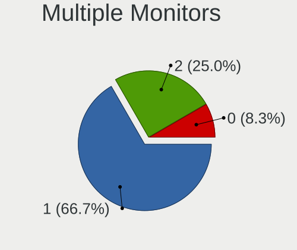

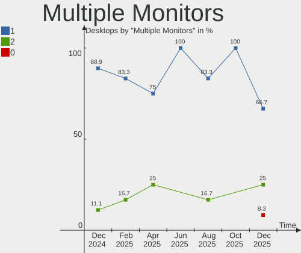

| Total | Desktops | Percent |
|-------|----------|---------|
| 1     | 8        | 66.67%  |
| 2     | 3        | 25%     |
| 0     | 1        | 8.33%   |

Network
-------

Net Controller Vendor
---------------------

Controller vendors

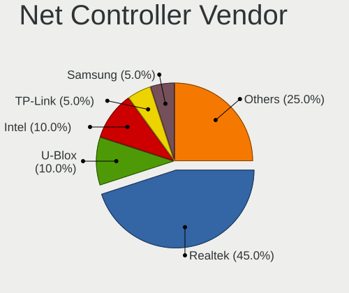

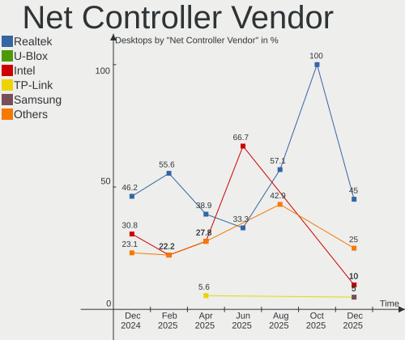

| Vendor                          | Desktops | Percent |
|---------------------------------|----------|---------|
| Realtek Semiconductor           | 9        | 45%     |
| U-Blox                          | 2        | 10%     |
| Intel                           | 2        | 10%     |
| TP-Link                         | 1        | 5%      |
| Samsung Electronics             | 1        | 5%      |
| Ralink Technology               | 1        | 5%      |
| Qualcomm Atheros Communications | 1        | 5%      |
| Qualcomm Atheros                | 1        | 5%      |
| Edimax Technology               | 1        | 5%      |
| Broadcom                        | 1        | 5%      |

Net Controller Model
--------------------

Controller models

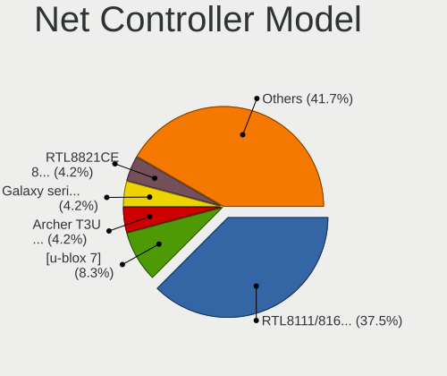

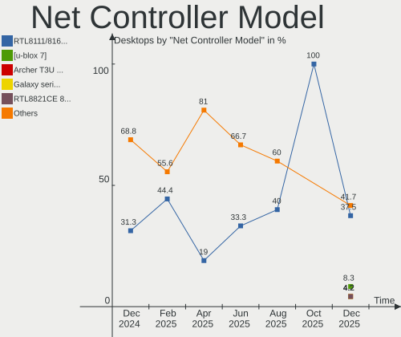

| Model                                                                  | Desktops | Percent |
|------------------------------------------------------------------------|----------|---------|
| Realtek RTL8111/8168/8211/8411 PCI Express Gigabit Ethernet Controller | 9        | 37.5%   |
| U-Blox [u-blox 7]                                                      | 2        | 8.33%   |
| TP-Link Archer T3U [Realtek RTL8812BU]                                 | 1        | 4.17%   |
| Samsung Galaxy series, misc. (tethering mode)                          | 1        | 4.17%   |
| Realtek RTL8821CE 802.11ac PCIe Wireless Network Adapter               | 1        | 4.17%   |
| Realtek RTL8125 2.5GbE Controller                                      | 1        | 4.17%   |
| Ralink MT7610U ("Archer T2U" 2.4G+5G WLAN Adapter                      | 1        | 4.17%   |
| Qualcomm Atheros QCA9377 802.11ac Wireless Network Adapter             | 1        | 4.17%   |
| Qualcomm Atheros Killer E2400 Gigabit Ethernet Controller              | 1        | 4.17%   |
| Qualcomm Atheros AR9271 802.11n                                        | 1        | 4.17%   |
| Intel Wi-Fi 6E(802.11ax) AX210/AX1675* 2x2 [Typhoon Peak]              | 1        | 4.17%   |
| Intel Wi-Fi 6 AX200                                                    | 1        | 4.17%   |
| Intel Ethernet Controller I226-V                                       | 1        | 4.17%   |
| Edimax Edimax N150 Adapter                                             | 1        | 4.17%   |
| Broadcom NetXtreme BCM5761 Gigabit Ethernet PCIe                       | 1        | 4.17%   |

Wireless Vendor
---------------

Wireless vendors

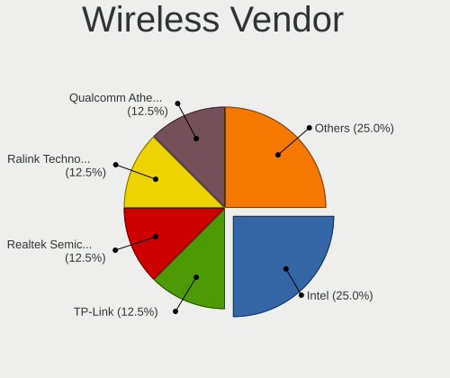

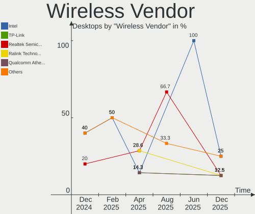

| Vendor                          | Desktops | Percent |
|---------------------------------|----------|---------|
| Intel                           | 2        | 25%     |
| TP-Link                         | 1        | 12.5%   |
| Realtek Semiconductor           | 1        | 12.5%   |
| Ralink Technology               | 1        | 12.5%   |
| Qualcomm Atheros Communications | 1        | 12.5%   |
| Qualcomm Atheros                | 1        | 12.5%   |
| Edimax Technology               | 1        | 12.5%   |

Wireless Model
--------------

Wireless models

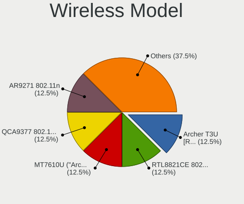

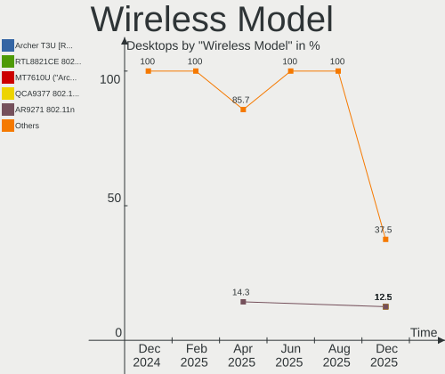

| Model                                                      | Desktops | Percent |
|------------------------------------------------------------|----------|---------|
| TP-Link Archer T3U [Realtek RTL8812BU]                     | 1        | 12.5%   |
| Realtek RTL8821CE 802.11ac PCIe Wireless Network Adapter   | 1        | 12.5%   |
| Ralink MT7610U ("Archer T2U" 2.4G+5G WLAN Adapter          | 1        | 12.5%   |
| Qualcomm Atheros QCA9377 802.11ac Wireless Network Adapter | 1        | 12.5%   |
| Qualcomm Atheros AR9271 802.11n                            | 1        | 12.5%   |
| Intel Wi-Fi 6E(802.11ax) AX210/AX1675* 2x2 [Typhoon Peak]  | 1        | 12.5%   |
| Intel Wi-Fi 6 AX200                                        | 1        | 12.5%   |
| Edimax Edimax N150 Adapter                                 | 1        | 12.5%   |

Ethernet Vendor
---------------

Ethernet vendors

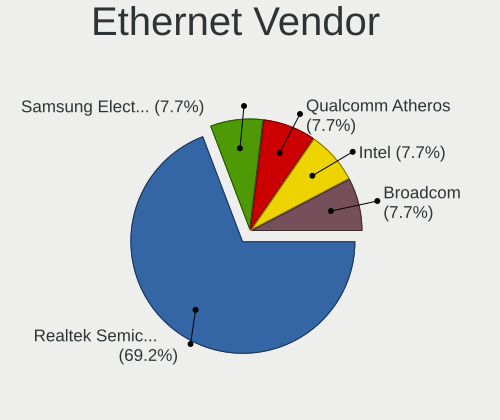

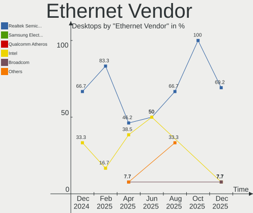

| Vendor                | Desktops | Percent |
|-----------------------|----------|---------|
| Realtek Semiconductor | 9        | 69.23%  |
| Samsung Electronics   | 1        | 7.69%   |
| Qualcomm Atheros      | 1        | 7.69%   |
| Intel                 | 1        | 7.69%   |
| Broadcom              | 1        | 7.69%   |

Ethernet Model
--------------

Ethernet models

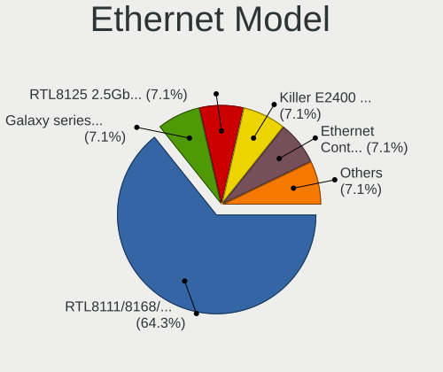

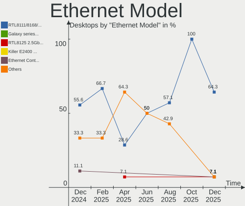

| Model                                                                  | Desktops | Percent |
|------------------------------------------------------------------------|----------|---------|
| Realtek RTL8111/8168/8211/8411 PCI Express Gigabit Ethernet Controller | 9        | 64.29%  |
| Samsung Galaxy series, misc. (tethering mode)                          | 1        | 7.14%   |
| Realtek RTL8125 2.5GbE Controller                                      | 1        | 7.14%   |
| Qualcomm Atheros Killer E2400 Gigabit Ethernet Controller              | 1        | 7.14%   |
| Intel Ethernet Controller I226-V                                       | 1        | 7.14%   |
| Broadcom NetXtreme BCM5761 Gigabit Ethernet PCIe                       | 1        | 7.14%   |

Net Controller Kind
-------------------

Ethernet, WiFi or modem

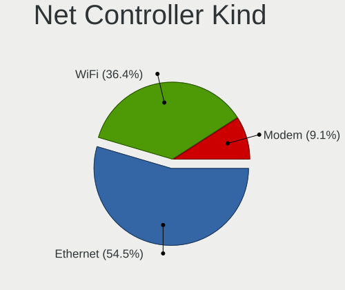

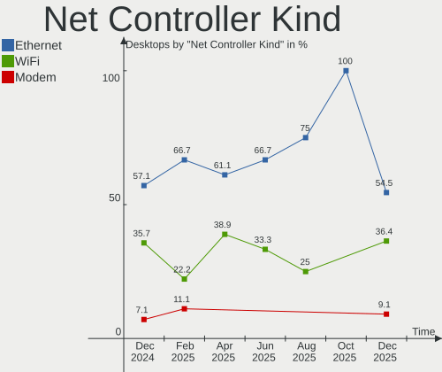

| Kind     | Desktops | Percent |
|----------|----------|---------|
| Ethernet | 12       | 54.55%  |
| WiFi     | 8        | 36.36%  |
| Modem    | 2        | 9.09%   |

Used Controller
---------------

Currently used network controller

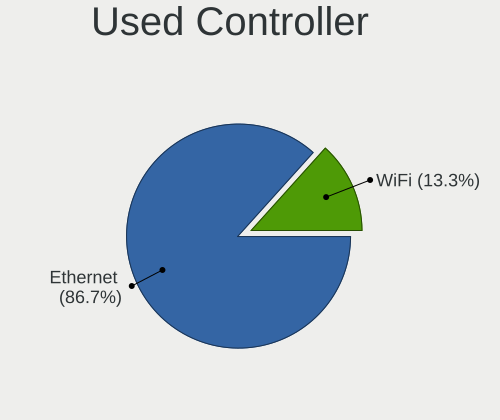

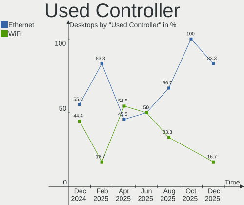

| Kind     | Desktops | Percent |
|----------|----------|---------|
| Ethernet | 10       | 83.33%  |
| WiFi     | 2        | 16.67%  |

NICs
----

Total network controllers on board

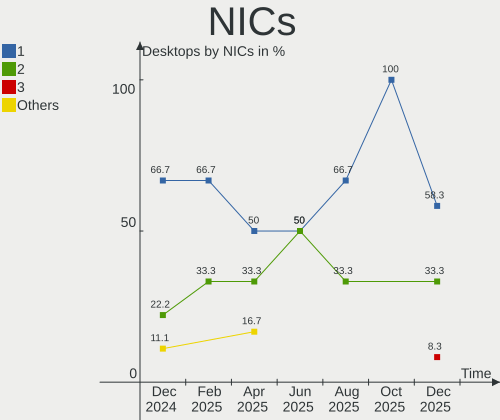

| Total | Desktops | Percent |
|-------|----------|---------|
| 1     | 7        | 58.33%  |
| 2     | 4        | 33.33%  |
| 3     | 1        | 8.33%   |

IPv6
----

IPv6 vs IPv4

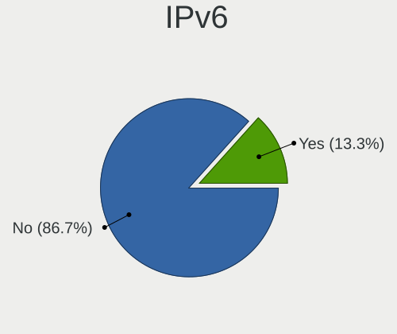

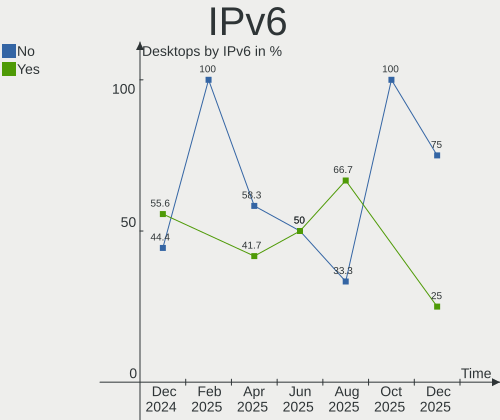

| Used | Desktops | Percent |
|------|----------|---------|
| No   | 9        | 75%     |
| Yes  | 3        | 25%     |

Bluetooth
---------

Bluetooth Vendor
----------------

Controller vendors

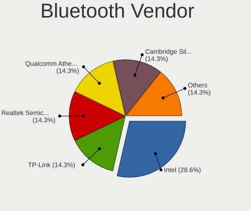

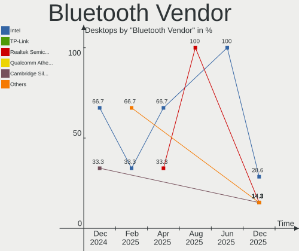

| Vendor                          | Desktops | Percent |
|---------------------------------|----------|---------|
| Intel                           | 2        | 28.57%  |
| TP-Link                         | 1        | 14.29%  |
| Realtek Semiconductor           | 1        | 14.29%  |
| Qualcomm Atheros Communications | 1        | 14.29%  |
| Cambridge Silicon Radio         | 1        | 14.29%  |
| Broadcom                        | 1        | 14.29%  |

Bluetooth Model
---------------

Controller models

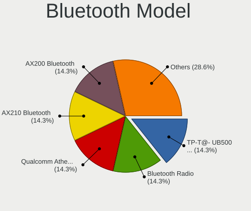

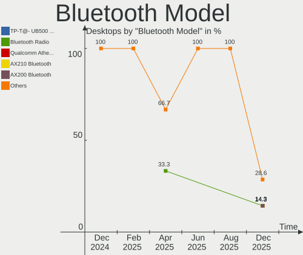

| Model                                               | Desktops | Percent |
|-----------------------------------------------------|----------|---------|
| TP-Link TP-T@- UB500 Adapter                        | 1        | 14.29%  |
| Realtek Bluetooth Radio                             | 1        | 14.29%  |
| Qualcomm Atheros  Bluetooth Device                  | 1        | 14.29%  |
| Intel AX210 Bluetooth                               | 1        | 14.29%  |
| Intel AX200 Bluetooth                               | 1        | 14.29%  |
| Cambridge Silicon Radio Bluetooth Dongle (HCI mode) | 1        | 14.29%  |
| Broadcom BCM20702A0 Bluetooth 4.0                   | 1        | 14.29%  |

Sound
-----

Sound Vendor
------------

Sound card vendors

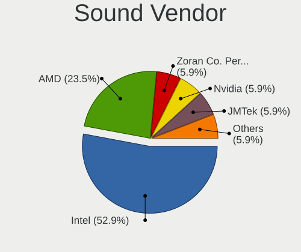

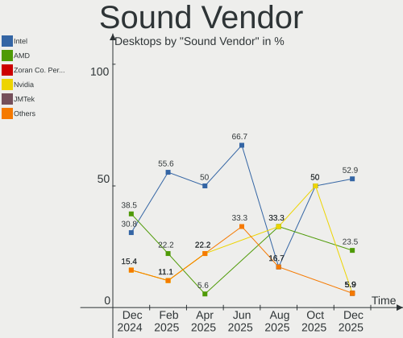

| Vendor                                       | Desktops | Percent |
|----------------------------------------------|----------|---------|
| Intel                                        | 9        | 52.94%  |
| AMD                                          | 4        | 23.53%  |
| Zoran Co. Personal Media Division (Nogatech) | 1        | 5.88%   |
| Nvidia                                       | 1        | 5.88%   |
| JMTek                                        | 1        | 5.88%   |
| GN Netcom                                    | 1        | 5.88%   |

Sound Model
-----------

Sound card models

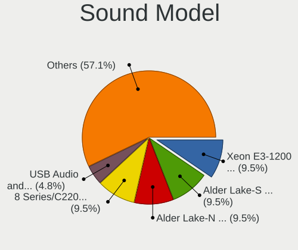

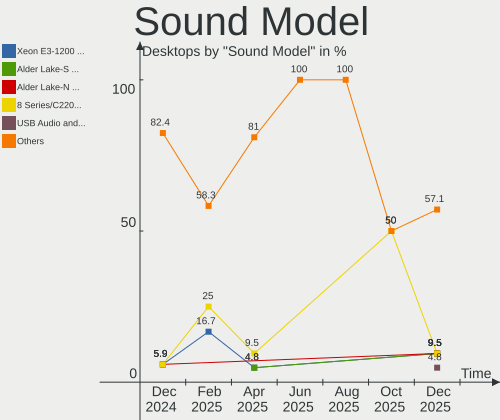

| Model                                                               | Desktops | Percent |
|---------------------------------------------------------------------|----------|---------|
| Intel Xeon E3-1200 v3/4th Gen Core Processor HD Audio Controller    | 2        | 9.52%   |
| Intel Alder Lake-S HD Audio Controller                              | 2        | 9.52%   |
| Intel Alder Lake-N PCH High Definition Audio Controller             | 2        | 9.52%   |
| Intel 8 Series/C220 Series Chipset High Definition Audio Controller | 2        | 9.52%   |
| Zoran Co. Personal Media Division (Nogatech) USB Audio and HID      | 1        | 4.76%   |
| Nvidia GK107 HDMI Audio Controller                                  | 1        | 4.76%   |
| JMTek USB Speaker                                                   | 1        | 4.76%   |
| Intel Cannon Lake PCH cAVS                                          | 1        | 4.76%   |
| Intel 200 Series PCH HD Audio                                       | 1        | 4.76%   |
| Intel 100 Series/C230 Series Chipset Family HD Audio Controller     | 1        | 4.76%   |
| GN Netcom Jabra BIZ 1500                                            | 1        | 4.76%   |
| AMD Starship/Matisse HD Audio Controller                            | 1        | 4.76%   |
| AMD SBx00 Azalia (Intel HDA)                                        | 1        | 4.76%   |
| AMD Kabini HDMI/DP Audio                                            | 1        | 4.76%   |
| AMD FCH Azalia Controller                                           | 1        | 4.76%   |
| AMD Ellesmere HDMI Audio [Radeon RX 470/480 / 570/580/590]          | 1        | 4.76%   |
| AMD Baffin HDMI/DP Audio [Radeon RX 550 640SP / RX 560/560X]        | 1        | 4.76%   |

Memory
------

Memory Vendor
-------------

Memory module vendors

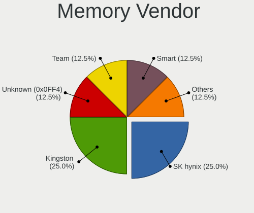

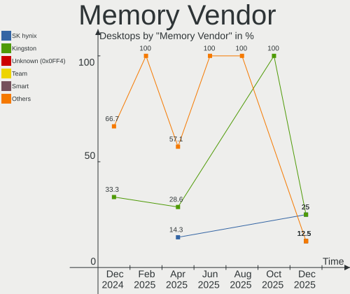

| Vendor           | Desktops | Percent |
|------------------|----------|---------|
| SK hynix         | 2        | 25%     |
| Kingston         | 2        | 25%     |
| Unknown (0x0FF4) | 1        | 12.5%   |
| Team             | 1        | 12.5%   |
| Smart            | 1        | 12.5%   |
| EDB536160000     | 1        | 12.5%   |

Memory Model
------------

Memory module models

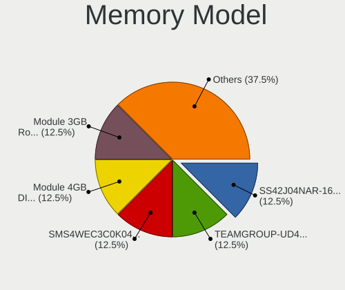

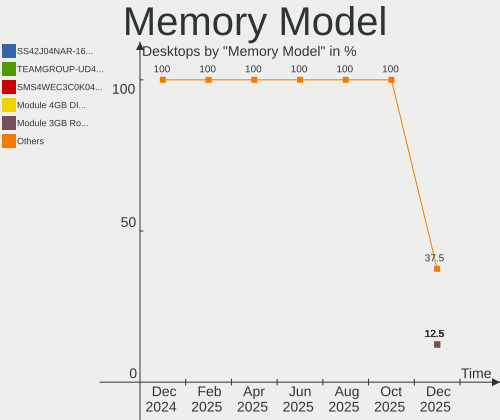

| Model                                                        | Desktops | Percent |
|--------------------------------------------------------------|----------|---------|
| Unknown (0x0FF4) RAM SS42J04NAR-16 16GB SODIMM DDR4 2667MT/s | 1        | 12.5%   |
| Team RAM TEAMGROUP-UD4-2666 8GB DIMM DDR4 3000MT/s           | 1        | 12.5%   |
| Smart RAM SMS4WEC3C0K0446SCG 4GB SODIMM DDR4 3200MT/s        | 1        | 12.5%   |
| SK hynix RAM Module 4GB DIMM DDR3 1600MT/s                   | 1        | 12.5%   |
| SK hynix RAM Module 3GB Row Of Chips LPDDR5 4800MT/s         | 1        | 12.5%   |
| Kingston RAM Module 2GB DIMM DDR3 1600MT/s                   | 1        | 12.5%   |
| Kingston RAM ACR512X64D3S1333C 4GB DIMM DDR3 1333MT/s        | 1        | 12.5%   |
| EDB536160000 RAM CMK16GX4M1A2666C16 16GB DIMM DDR4 2133MT/s  | 1        | 12.5%   |

Memory Kind
-----------

Memory module kinds

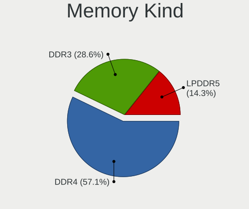

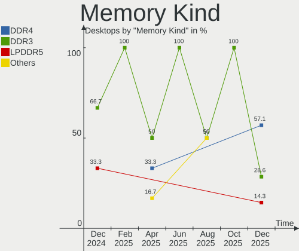

| Kind   | Desktops | Percent |
|--------|----------|---------|
| DDR4   | 4        | 57.14%  |
| DDR3   | 2        | 28.57%  |
| LPDDR5 | 1        | 14.29%  |

Memory Form Factor
------------------

Physical design of the memory module

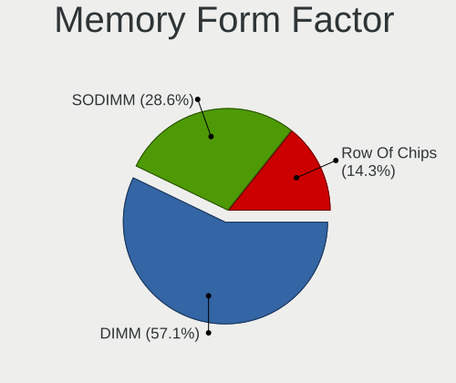

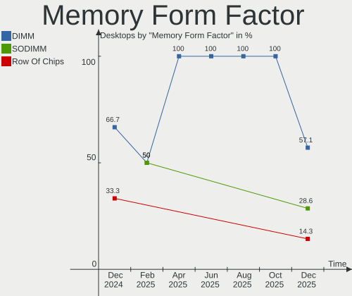

| Name         | Desktops | Percent |
|--------------|----------|---------|
| DIMM         | 4        | 57.14%  |
| SODIMM       | 2        | 28.57%  |
| Row Of Chips | 1        | 14.29%  |

Memory Size
-----------

Memory module size

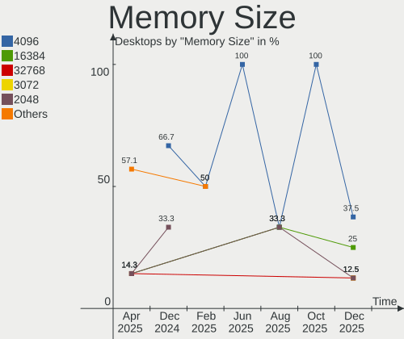

| Size  | Desktops | Percent |
|-------|----------|---------|
| 4096  | 3        | 37.5%   |
| 16384 | 2        | 25%     |
| 32768 | 1        | 12.5%   |
| 3072  | 1        | 12.5%   |
| 2048  | 1        | 12.5%   |

Memory Speed
------------

Memory module speed

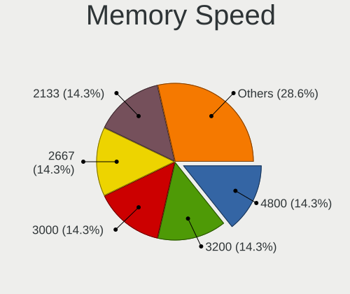

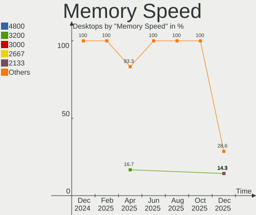

| Speed | Desktops | Percent |
|-------|----------|---------|
| 4800  | 1        | 14.29%  |
| 3200  | 1        | 14.29%  |
| 3000  | 1        | 14.29%  |
| 2667  | 1        | 14.29%  |
| 2133  | 1        | 14.29%  |
| 1600  | 1        | 14.29%  |
| 1333  | 1        | 14.29%  |

Printers & scanners
-------------------

Printer Vendor
--------------

Printer device vendors

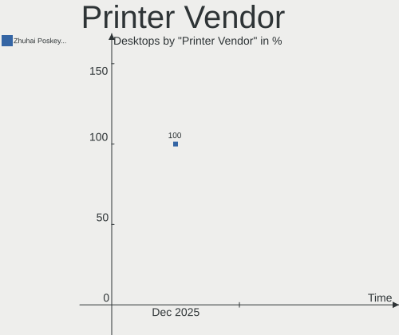

| Vendor                   | Desktops | Percent |
|--------------------------|----------|---------|
| Zhuhai Poskey Technology | 1        | 100%    |

Printer Model
-------------

Printer device models

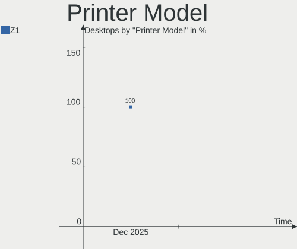

| Model            | Desktops | Percent |
|------------------|----------|---------|
| Zhuhai Poskey Z1 | 1        | 100%    |

Scanner Vendor
--------------

Scanner device vendors

Zero info for selected period =(

Scanner Model
-------------

Scanner device models

Zero info for selected period =(

Camera
------

Camera Vendor
-------------

Camera device vendors

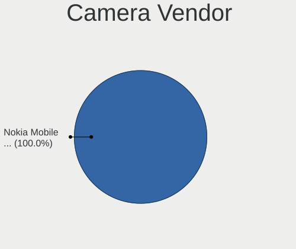

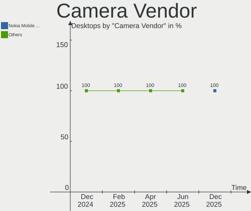

| Vendor              | Desktops | Percent |
|---------------------|----------|---------|
| Nokia Mobile Phones | 1        | 100%    |

Camera Model
------------

Camera device models

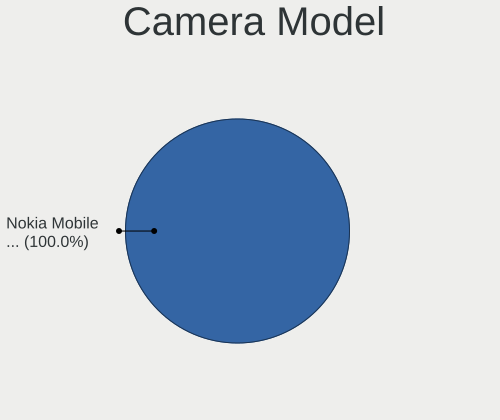

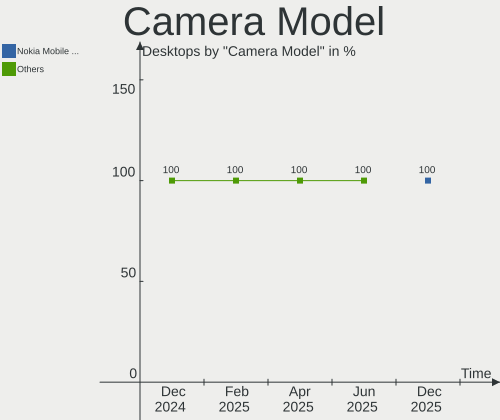

| Model                               | Desktops | Percent |
|-------------------------------------|----------|---------|
| Nokia Mobile Phones Lumia 640 Phone | 1        | 100%    |

Security
--------

Fingerprint Vendor
------------------

Fingerprint sensor vendors

Zero info for selected period =(

Fingerprint Model
-----------------

Fingerprint sensor models

Zero info for selected period =(

Chipcard Vendor
---------------

Chipcard module vendors

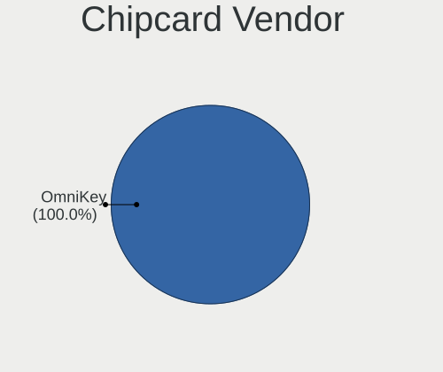

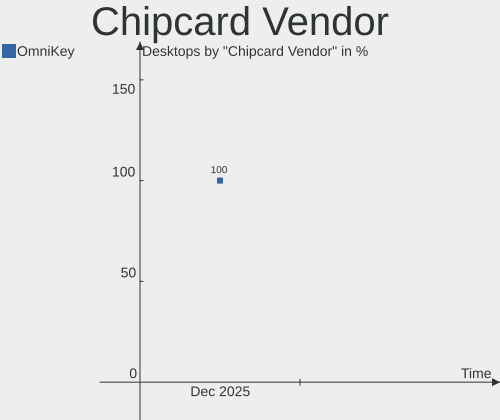

| Vendor  | Desktops | Percent |
|---------|----------|---------|
| OmniKey | 1        | 100%    |

Chipcard Model
--------------

Chipcard module models

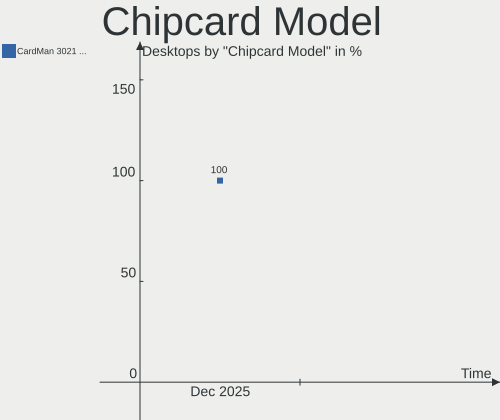

| Model                       | Desktops | Percent |
|-----------------------------|----------|---------|
| OmniKey CardMan 3021 / 3121 | 1        | 100%    |

Unsupported
-----------

Unsupported Devices
-------------------

Total unsupported devices on board

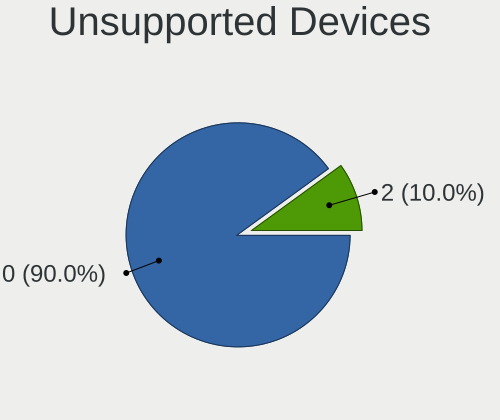

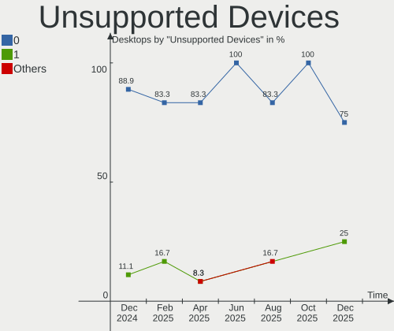

| Total | Desktops | Percent |
|-------|----------|---------|
| 0     | 9        | 75%     |
| 1     | 3        | 25%     |

Unsupported Device Types
------------------------

Types of unsupported devices

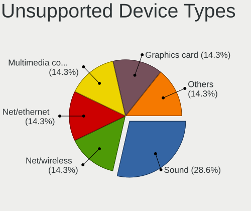

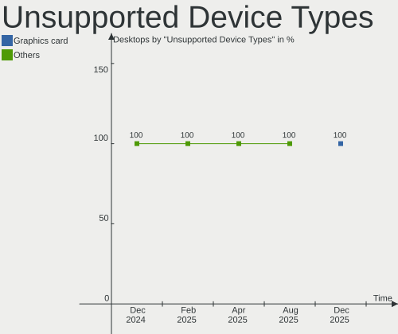

| Type          | Desktops | Percent |
|---------------|----------|---------|
| Graphics card | 3        | 100%    |

