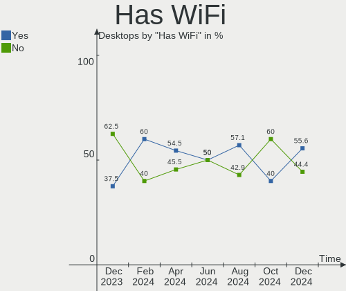
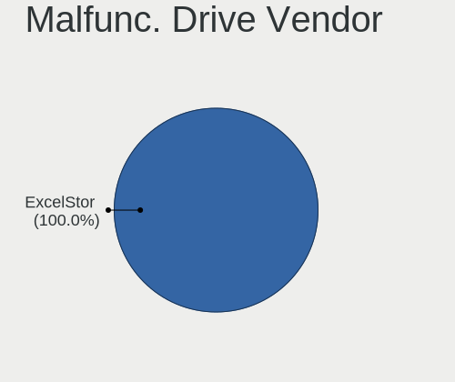
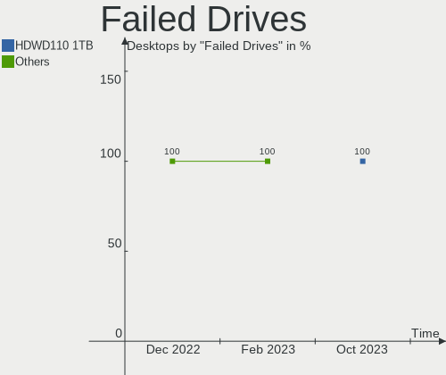
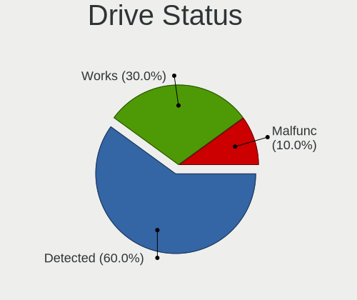
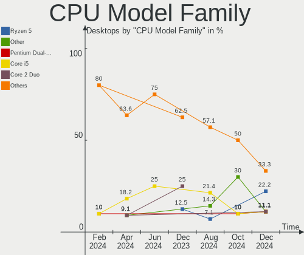
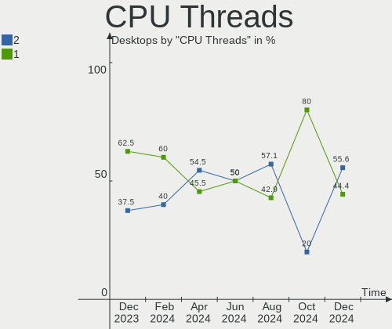
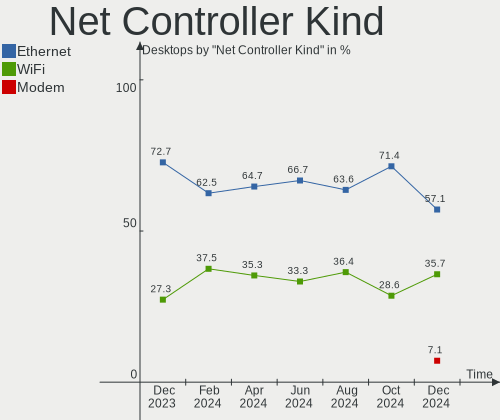
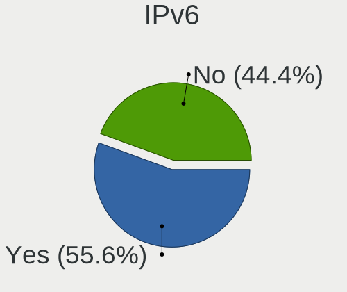

Lubuntu - Hardware Trends (Desktops)
------------------------------------

A project to identify most popular hardware characteristics and track their change
over time based on data collected by Linux users at https://Linux-Hardware.org.

Anyone can contribute to this report by the [hw-probe](https://github.com/linuxhw/hw-probe) tool:

    sudo -E hw-probe -all -upload

This report is for one last month. Overall report since the beginning of time: [TestCoverage](https://github.com/linuxhw/TestCoverage)

Period: Jan, 2023.

Contents
--------

* [ System ](#system)
  - [ OS                       ](#os)
  - [ OS Family                ](#os-family)
  - [ Kernel                   ](#kernel)
  - [ Kernel Family            ](#kernel-family)
  - [ Kernel Major Ver.        ](#kernel-major-ver)
  - [ Arch                     ](#arch)
  - [ DE                       ](#de)
  - [ Display Server           ](#display-server)
  - [ Display Manager          ](#display-manager)
  - [ OS Lang                  ](#os-lang)
  - [ Boot Mode                ](#boot-mode)
  - [ Filesystem               ](#filesystem)
  - [ Part. scheme             ](#part-scheme)
  - [ Dual Boot with Linux/BSD ](#dual-boot-with-linuxbsd)
  - [ Dual Boot (Win)          ](#dual-boot-win)

* [ Board ](#board)
  - [ Vendor                   ](#vendor)
  - [ Model                    ](#model)
  - [ Model Family             ](#model-family)
  - [ MFG Year                 ](#mfg-year)
  - [ Form Factor              ](#form-factor)
  - [ Secure Boot              ](#secure-boot)
  - [ Coreboot                 ](#coreboot)
  - [ RAM Size                 ](#ram-size)
  - [ RAM Used                 ](#ram-used)
  - [ Total Drives             ](#total-drives)
  - [ Has CD-ROM               ](#has-cd-rom)
  - [ Has Ethernet             ](#has-ethernet)
  - [ Has WiFi                 ](#has-wifi)
  - [ Has Bluetooth            ](#has-bluetooth)

* [ Location ](#location)
  - [ Country                  ](#country)
  - [ City                     ](#city)

* [ Drives ](#drives)
  - [ Drive Vendor             ](#drive-vendor)
  - [ Drive Model              ](#drive-model)
  - [ HDD Vendor               ](#hdd-vendor)
  - [ SSD Vendor               ](#ssd-vendor)
  - [ Drive Kind               ](#drive-kind)
  - [ Drive Connector          ](#drive-connector)
  - [ Drive Size               ](#drive-size)
  - [ Space Total              ](#space-total)
  - [ Space Used               ](#space-used)
  - [ Malfunc. Drives          ](#malfunc-drives)
  - [ Malfunc. Drive Vendor    ](#malfunc-drive-vendor)
  - [ Malfunc. HDD Vendor      ](#malfunc-hdd-vendor)
  - [ Malfunc. Drive Kind      ](#malfunc-drive-kind)
  - [ Failed Drives            ](#failed-drives)
  - [ Failed Drive Vendor      ](#failed-drive-vendor)
  - [ Drive Status             ](#drive-status)

* [ Storage controller ](#storage-controller)
  - [ Storage Vendor           ](#storage-vendor)
  - [ Storage Model            ](#storage-model)
  - [ Storage Kind             ](#storage-kind)

* [ Processor ](#processor)
  - [ CPU Vendor               ](#cpu-vendor)
  - [ CPU Model                ](#cpu-model)
  - [ CPU Model Family         ](#cpu-model-family)
  - [ CPU Cores                ](#cpu-cores)
  - [ CPU Sockets              ](#cpu-sockets)
  - [ CPU Threads              ](#cpu-threads)
  - [ CPU Op-Modes             ](#cpu-op-modes)
  - [ CPU Microcode            ](#cpu-microcode)
  - [ CPU Microarch            ](#cpu-microarch)

* [ Graphics ](#graphics)
  - [ GPU Vendor               ](#gpu-vendor)
  - [ GPU Model                ](#gpu-model)
  - [ GPU Combo                ](#gpu-combo)
  - [ GPU Driver               ](#gpu-driver)
  - [ GPU Memory               ](#gpu-memory)

* [ Monitor ](#monitor)
  - [ Monitor Vendor           ](#monitor-vendor)
  - [ Monitor Model            ](#monitor-model)
  - [ Monitor Resolution       ](#monitor-resolution)
  - [ Monitor Diagonal         ](#monitor-diagonal)
  - [ Monitor Width            ](#monitor-width)
  - [ Aspect Ratio             ](#aspect-ratio)
  - [ Monitor Area             ](#monitor-area)
  - [ Pixel Density            ](#pixel-density)
  - [ Multiple Monitors        ](#multiple-monitors)

* [ Network ](#network)
  - [ Net Controller Vendor    ](#net-controller-vendor)
  - [ Net Controller Model     ](#net-controller-model)
  - [ Wireless Vendor          ](#wireless-vendor)
  - [ Wireless Model           ](#wireless-model)
  - [ Ethernet Vendor          ](#ethernet-vendor)
  - [ Ethernet Model           ](#ethernet-model)
  - [ Net Controller Kind      ](#net-controller-kind)
  - [ Used Controller          ](#used-controller)
  - [ NICs                     ](#nics)
  - [ IPv6                     ](#ipv6)

* [ Bluetooth ](#bluetooth)
  - [ Bluetooth Vendor         ](#bluetooth-vendor)
  - [ Bluetooth Model          ](#bluetooth-model)

* [ Sound ](#sound)
  - [ Sound Vendor             ](#sound-vendor)
  - [ Sound Model              ](#sound-model)

* [ Memory ](#memory)
  - [ Memory Vendor            ](#memory-vendor)
  - [ Memory Model             ](#memory-model)
  - [ Memory Kind              ](#memory-kind)
  - [ Memory Form Factor       ](#memory-form-factor)
  - [ Memory Size              ](#memory-size)
  - [ Memory Speed             ](#memory-speed)

* [ Printers & scanners ](#printers--scanners)
  - [ Printer Vendor           ](#printer-vendor)
  - [ Printer Model            ](#printer-model)
  - [ Scanner Vendor           ](#scanner-vendor)
  - [ Scanner Model            ](#scanner-model)

* [ Camera ](#camera)
  - [ Camera Vendor            ](#camera-vendor)
  - [ Camera Model             ](#camera-model)

* [ Security ](#security)
  - [ Fingerprint Vendor       ](#fingerprint-vendor)
  - [ Fingerprint Model        ](#fingerprint-model)
  - [ Chipcard Vendor          ](#chipcard-vendor)
  - [ Chipcard Model           ](#chipcard-model)

* [ Unsupported ](#unsupported)
  - [ Unsupported Devices      ](#unsupported-devices)
  - [ Unsupported Device Types ](#unsupported-device-types)

System
------

OS
--

Installed operating systems

| Name          | Desktops | Percent |
|---------------|----------|---------|
| Lubuntu 22.04 | 8        | 66.67%  |
| Lubuntu 18.04 | 2        | 16.67%  |
| Lubuntu 22.10 | 1        | 8.33%   |
| Lubuntu 16.04 | 1        | 8.33%   |

OS Family
---------

OS without a version

| Name    | Desktops | Percent |
|---------|----------|---------|
| Lubuntu | 12       | 100%    |

Kernel
------

Version of the Linux kernel

| Version              | Desktops | Percent |
|----------------------|----------|---------|
| 5.15.0-56-generic    | 3        | 25%     |
| 5.15.0-43-generic    | 2        | 16.67%  |
| 4.15.0-202-generic   | 2        | 16.67%  |
| 6.1.3-x64v1-xanmod1  | 1        | 8.33%   |
| 5.15.0-59-lowlatency | 1        | 8.33%   |
| 5.15.0-58-generic    | 1        | 8.33%   |
| 5.15.0-53-generic    | 1        | 8.33%   |
| 4.15.0-142-generic   | 1        | 8.33%   |

Kernel Family
-------------

Linux kernel without a distro release

| Version | Desktops | Percent |
|---------|----------|---------|
| 5.15.0  | 8        | 66.67%  |
| 4.15.0  | 3        | 25%     |
| 6.1.3   | 1        | 8.33%   |

Kernel Major Ver.
-----------------

Linux kernel major version

| Version | Desktops | Percent |
|---------|----------|---------|
| 5.15    | 8        | 66.67%  |
| 4.15    | 3        | 25%     |
| 6.1     | 1        | 8.33%   |

Arch
----

OS architecture (x86_64, i586, etc.)

| Name   | Desktops | Percent |
|--------|----------|---------|
| x86_64 | 10       | 83.33%  |
| i686   | 2        | 16.67%  |

DE
--

Desktop Environment

| Name | Desktops | Percent |
|------|----------|---------|
| LXQt | 8        | 66.67%  |
| LXDE | 3        | 25%     |
| XFCE | 1        | 8.33%   |

Display Server
--------------

X11 or Wayland

| Name | Desktops | Percent |
|------|----------|---------|
| X11  | 12       | 100%    |

Display Manager
---------------

SDDM, LightDM, etc.

| Name    | Desktops | Percent |
|---------|----------|---------|
| SDDM    | 8        | 66.67%  |
| LightDM | 4        | 33.33%  |

OS Lang
-------

Language

| Lang  | Desktops | Percent |
|-------|----------|---------|
| es_ES | 3        | 25%     |
| en_US | 3        | 25%     |
| fr_FR | 2        | 16.67%  |
| de_DE | 2        | 16.67%  |
| pt_BR | 1        | 8.33%   |
| en_GB | 1        | 8.33%   |

Boot Mode
---------

EFI or BIOS

| Mode | Desktops | Percent |
|------|----------|---------|
| BIOS | 10       | 83.33%  |
| EFI  | 2        | 16.67%  |

Filesystem
----------

Type of filesystem

| Type | Desktops | Percent |
|------|----------|---------|
| Ext4 | 12       | 100%    |

Part. scheme
------------

Scheme of partitioning

| Type    | Desktops | Percent |
|---------|----------|---------|
| MBR     | 8        | 66.67%  |
| GPT     | 3        | 25%     |
| Unknown | 1        | 8.33%   |

Dual Boot with Linux/BSD
------------------------

Hosting more than one Linux/BSD

| Dual boot | Desktops | Percent |
|-----------|----------|---------|
| No        | 11       | 91.67%  |
| Yes       | 1        | 8.33%   |

Dual Boot (Win)
---------------

Hosting Linux and Windows

| Dual boot | Desktops | Percent |
|-----------|----------|---------|
| Yes       | 7        | 58.33%  |
| No        | 5        | 41.67%  |

Board
-----

Vendor
------

Motherboard manufacturer

| Name             | Desktops | Percent |
|------------------|----------|---------|
| MSI              | 3        | 25%     |
| ASUSTek Computer | 3        | 25%     |
| ASRock           | 2        | 16.67%  |
| Positivo         | 1        | 8.33%   |
| NEC Computers    | 1        | 8.33%   |
| Fujitsu Siemens  | 1        | 8.33%   |
| Dell             | 1        | 8.33%   |

Model
-----

Motherboard model

| Name                                  | Desktops | Percent |
|---------------------------------------|----------|---------|
| Positivo POS-AG31AP                   | 1        | 8.33%   |
| NEC Computers ECS-945G                | 1        | 8.33%   |
| MSI MS-7C51                           | 1        | 8.33%   |
| MSI MS-7501                           | 1        | 8.33%   |
| MSI MS-7032                           | 1        | 8.33%   |
| Fujitsu Siemens AMILO Desktop Pi3630A | 1        | 8.33%   |
| Dell Dimension 4500S                  | 1        | 8.33%   |
| ASUS TUF B450-PRO GAMING              | 1        | 8.33%   |
| ASUS ROG STRIX Z590-E GAMING WIFI     | 1        | 8.33%   |
| ASUS M5A97 PRO                        | 1        | 8.33%   |
| ASRock ION3D-HT                       | 1        | 8.33%   |
| ASRock H110M-HDV                      | 1        | 8.33%   |

Model Family
------------

Motherboard model prefix

| Name                   | Desktops | Percent |
|------------------------|----------|---------|
| Positivo POS-AG31AP    | 1        | 8.33%   |
| NEC Computers ECS-945G | 1        | 8.33%   |
| MSI MS-7C51            | 1        | 8.33%   |
| MSI MS-7501            | 1        | 8.33%   |
| MSI MS-7032            | 1        | 8.33%   |
| Fujitsu Siemens AMILO  | 1        | 8.33%   |
| Dell Dimension         | 1        | 8.33%   |
| ASUS TUF               | 1        | 8.33%   |
| ASUS ROG               | 1        | 8.33%   |
| ASUS M5A97             | 1        | 8.33%   |
| ASRock ION3D-HT        | 1        | 8.33%   |
| ASRock H110M-HDV       | 1        | 8.33%   |

MFG Year
--------

Motherboard manufacture year

| Year | Desktops | Percent |
|------|----------|---------|
| 2008 | 2        | 16.67%  |
| 2021 | 1        | 8.33%   |
| 2019 | 1        | 8.33%   |
| 2018 | 1        | 8.33%   |
| 2015 | 1        | 8.33%   |
| 2011 | 1        | 8.33%   |
| 2010 | 1        | 8.33%   |
| 2009 | 1        | 8.33%   |
| 2007 | 1        | 8.33%   |
| 2002 | 1        | 8.33%   |
| 2001 | 1        | 8.33%   |

Form Factor
-----------

Physical design of the computer

| Name    | Desktops | Percent |
|---------|----------|---------|
| Desktop | 12       | 100%    |

Secure Boot
-----------

Enabled or disabled

| State    | Desktops | Percent |
|----------|----------|---------|
| Disabled | 12       | 100%    |

Coreboot
--------

Have coreboot on board

| Used | Desktops | Percent |
|------|----------|---------|
| No   | 12       | 100%    |

RAM Size
--------

Total RAM memory

| Size in GB  | Desktops | Percent |
|-------------|----------|---------|
| 4.01-8.0    | 2        | 16.67%  |
| 3.01-4.0    | 2        | 16.67%  |
| 1.01-2.0    | 2        | 16.67%  |
| 8.01-16.0   | 2        | 16.67%  |
| 0.51-1.0    | 2        | 16.67%  |
| 64.01-256.0 | 1        | 8.33%   |
| 16.01-24.0  | 1        | 8.33%   |

RAM Used
--------

Used RAM memory

| Used GB   | Desktops | Percent |
|-----------|----------|---------|
| 1.01-2.0  | 4        | 33.33%  |
| 0.51-1.0  | 4        | 33.33%  |
| 4.01-8.0  | 1        | 8.33%   |
| 2.01-3.0  | 1        | 8.33%   |
| 8.01-16.0 | 1        | 8.33%   |
| 0.01-0.5  | 1        | 8.33%   |

Total Drives
------------

Number of drives on board

| Drives | Desktops | Percent |
|--------|----------|---------|
| 1      | 6        | 50%     |
| 4      | 2        | 16.67%  |
| 3      | 2        | 16.67%  |
| 2      | 2        | 16.67%  |

Has CD-ROM
----------

Has CD-ROM on board

| Presented | Desktops | Percent |
|-----------|----------|---------|
| Yes       | 6        | 50%     |
| No        | 6        | 50%     |

Has Ethernet
------------

Has Ethernet on board

| Presented | Desktops | Percent |
|-----------|----------|---------|
| Yes       | 12       | 100%    |

Has WiFi
--------

Has WiFi module

| Presented | Desktops | Percent |
|-----------|----------|---------|
| No        | 7        | 58.33%  |
| Yes       | 5        | 41.67%  |

Has Bluetooth
-------------

Has Bluetooth module

| Presented | Desktops | Percent |
|-----------|----------|---------|
| No        | 11       | 91.67%  |
| Yes       | 1        | 8.33%   |

Location
--------

Country
-------

Geographic location (country)

| Country   | Desktops | Percent |
|-----------|----------|---------|
| Spain     | 3        | 25%     |
| Germany   | 2        | 16.67%  |
| France    | 2        | 16.67%  |
| USA       | 1        | 8.33%   |
| UK        | 1        | 8.33%   |
| Poland    | 1        | 8.33%   |
| Brazil    | 1        | 8.33%   |
| Argentina | 1        | 8.33%   |

City
----

Geographic location (city)

| City               | Desktops | Percent |
|--------------------|----------|---------|
| Warsaw             | 1        | 8.33%   |
| Versailles         | 1        | 8.33%   |
| Posadas            | 1        | 8.33%   |
| Port Washington    | 1        | 8.33%   |
| Mostoles           | 1        | 8.33%   |
| Madrid             | 1        | 8.33%   |
| London             | 1        | 8.33%   |
| Huelva             | 1        | 8.33%   |
| Heinsberg          | 1        | 8.33%   |
| Delmenhorst        | 1        | 8.33%   |
| Chainee-des-Coupis | 1        | 8.33%   |
| Belo Horizonte     | 1        | 8.33%   |

Drives
------

Drive Vendor
------------

Hard drive vendors

| Vendor              | Desktops | Drives | Percent |
|---------------------|----------|--------|---------|
| Seagate             | 6        | 7      | 27.27%  |
| WDC                 | 5        | 5      | 22.73%  |
| Kingston            | 2        | 2      | 9.09%   |
| Transcend           | 1        | 1      | 4.55%   |
| Samsung Electronics | 1        | 2      | 4.55%   |
| Maxtor              | 1        | 1      | 4.55%   |
| HGST                | 1        | 1      | 4.55%   |
| GOODRAM             | 1        | 1      | 4.55%   |
| Emtec               | 1        | 1      | 4.55%   |
| Crucial             | 1        | 1      | 4.55%   |
| AMD                 | 1        | 1      | 4.55%   |
| A-DATA Technology   | 1        | 1      | 4.55%   |

Drive Model
-----------

Hard drive models

| Model                              | Desktops | Percent |
|------------------------------------|----------|---------|
| WDC WD5000LUCT-63RC2Y0 500GB       | 1        | 4.35%   |
| WDC WD400BB-75CAA0 40GB            | 1        | 4.35%   |
| WDC WD3200BPVT-80JJ5T0 320GB       | 1        | 4.35%   |
| WDC WD2500KS-00MJB0 250GB          | 1        | 4.35%   |
| WDC WD10EACS-00D6B1 1TB            | 1        | 4.35%   |
| Transcend TS128GSSD340 128GB       | 1        | 4.35%   |
| Seagate ST500DM002-1BD142 500GB    | 1        | 4.35%   |
| Seagate ST3360320AS 360GB          | 1        | 4.35%   |
| Seagate ST3250823AS 250GB          | 1        | 4.35%   |
| Seagate ST3200826AS 200GB          | 1        | 4.35%   |
| Seagate ST2000DM001-1CH164 2TB     | 1        | 4.35%   |
| Seagate ST1000DM010-2EP102 1TB     | 1        | 4.35%   |
| Seagate ST1000DM003-1CH162 1TB     | 1        | 4.35%   |
| Samsung HD204UI 2TB                | 1        | 4.35%   |
| Maxtor 6L200M0 208GB               | 1        | 4.35%   |
| Kingston SHFS37A120G 120GB SSD     | 1        | 4.35%   |
| Kingston SA400S37240G 240GB SSD    | 1        | 4.35%   |
| HGST HTS725025A7 250GB             | 1        | 4.35%   |
| GOODRAM SSDPR-CX400-512-G2 512GB   | 1        | 4.35%   |
| Emtec X150 240GB                   | 1        | 4.35%   |
| Crucial CT500BX500SSD1 500GB       | 1        | 4.35%   |
| AMD Samsung SSD 970 EVO Plus 250GB | 1        | 4.35%   |
| A-DATA SP920SS 256GB SSD           | 1        | 4.35%   |

HDD Vendor
----------

Hard disk drive vendors

| Vendor              | Desktops | Drives | Percent |
|---------------------|----------|--------|---------|
| Seagate             | 6        | 7      | 42.86%  |
| WDC                 | 5        | 5      | 35.71%  |
| Samsung Electronics | 1        | 2      | 7.14%   |
| Maxtor              | 1        | 1      | 7.14%   |
| HGST                | 1        | 1      | 7.14%   |

SSD Vendor
----------

Solid state drive vendors

| Vendor            | Desktops | Drives | Percent |
|-------------------|----------|--------|---------|
| Kingston          | 2        | 2      | 28.57%  |
| Transcend         | 1        | 1      | 14.29%  |
| GOODRAM           | 1        | 1      | 14.29%  |
| Emtec             | 1        | 1      | 14.29%  |
| Crucial           | 1        | 1      | 14.29%  |
| A-DATA Technology | 1        | 1      | 14.29%  |

Drive Kind
----------

HDD or SSD

| Kind | Desktops | Drives | Percent |
|------|----------|--------|---------|
| HDD  | 11       | 16     | 61.11%  |
| SSD  | 6        | 7      | 33.33%  |
| NVMe | 1        | 1      | 5.56%   |

Drive Connector
---------------

SATA, SAS, NVMe, etc.

| Type | Desktops | Drives | Percent |
|------|----------|--------|---------|
| SATA | 12       | 23     | 92.31%  |
| NVMe | 1        | 1      | 7.69%   |

Drive Size
----------

Size of hard drive

| Size in TB | Desktops | Drives | Percent |
|------------|----------|--------|---------|
| 0.01-0.5   | 11       | 16     | 68.75%  |
| 0.51-1.0   | 3        | 4      | 18.75%  |
| 1.01-2.0   | 2        | 3      | 12.5%   |

Space Total
-----------

Amount of disk space available on the file system

| Size in GB     | Desktops | Percent |
|----------------|----------|---------|
| 251-500        | 2        | 16.67%  |
| 21-50          | 2        | 16.67%  |
| 101-250        | 2        | 16.67%  |
| 1001-2000      | 2        | 16.67%  |
| More than 3000 | 1        | 8.33%   |
| 1-20           | 1        | 8.33%   |
| 501-1000       | 1        | 8.33%   |
| 51-100         | 1        | 8.33%   |

Space Used
----------

Amount of used disk space

| Used GB        | Desktops | Percent |
|----------------|----------|---------|
| 1-20           | 5        | 41.67%  |
| 21-50          | 2        | 16.67%  |
| 101-250        | 2        | 16.67%  |
| 501-1000       | 2        | 16.67%  |
| More than 3000 | 1        | 8.33%   |

Malfunc. Drives
---------------

Drive models with a malfunction

| Model                               | Desktops | Drives | Percent |
|-------------------------------------|----------|--------|---------|
| WDC WD400BB-75CAA0 40GB             | 1        | 1      | 25%     |
| WDC WD10EACS-00D6B1 1TB             | 1        | 1      | 25%     |
| Maxtor 6L200M0 208GB                | 1        | 1      | 25%     |
| A-DATA Technology SP920SS 256GB SSD | 1        | 1      | 25%     |

Malfunc. Drive Vendor
---------------------

Vendors of faulty drives

| Vendor            | Desktops | Drives | Percent |
|-------------------|----------|--------|---------|
| WDC               | 2        | 2      | 50%     |
| Maxtor            | 1        | 1      | 25%     |
| A-DATA Technology | 1        | 1      | 25%     |

Malfunc. HDD Vendor
-------------------

Vendors of faulty HDD drives

| Vendor | Desktops | Drives | Percent |
|--------|----------|--------|---------|
| WDC    | 2        | 2      | 66.67%  |
| Maxtor | 1        | 1      | 33.33%  |

Malfunc. Drive Kind
-------------------

Kinds of faulty drives

| Kind | Desktops | Drives | Percent |
|------|----------|--------|---------|
| HDD  | 3        | 3      | 75%     |
| SSD  | 1        | 1      | 25%     |

Failed Drives
-------------

Failed drive models

| Model                  | Desktops | Drives | Percent |
|------------------------|----------|--------|---------|
| HGST HTS725025A7 250GB | 1        | 1      | 100%    |

Failed Drive Vendor
-------------------

Failed drive vendors

| Vendor | Desktops | Drives | Percent |
|--------|----------|--------|---------|
| HGST   | 1        | 1      | 100%    |

Drive Status
------------

Number of failed and malfunc. drives

| Status   | Desktops | Drives | Percent |
|----------|----------|--------|---------|
| Detected | 8        | 15     | 53.33%  |
| Malfunc  | 4        | 4      | 26.67%  |
| Works    | 2        | 4      | 13.33%  |
| Failed   | 1        | 1      | 6.67%   |

Storage controller
------------------

Storage Vendor
--------------

Storage controller vendors

| Vendor             | Desktops | Percent |
|--------------------|----------|---------|
| Intel              | 6        | 46.15%  |
| AMD                | 4        | 30.77%  |
| VIA Technologies   | 1        | 7.69%   |
| Nvidia             | 1        | 7.69%   |
| JMicron Technology | 1        | 7.69%   |

Storage Model
-------------

Storage controller models

| Model                                                                         | Desktops | Percent |
|-------------------------------------------------------------------------------|----------|---------|
| Intel NM10/ICH7 Family SATA Controller [IDE mode]                             | 2        | 9.52%   |
| Intel 82801G (ICH7 Family) IDE Controller                                     | 2        | 9.52%   |
| AMD FCH SATA Controller [AHCI mode]                                           | 2        | 9.52%   |
| VIA VT82C586A/B/VT82C686/A/B/VT823x/A/C PIPC Bus Master IDE                   | 1        | 4.76%   |
| VIA VIA VT6420 SATA RAID Controller                                           | 1        | 4.76%   |
| Nvidia MCP73 SATA Controller (IDE mode)                                       | 1        | 4.76%   |
| JMicron JMB362 SATA Controller                                                | 1        | 4.76%   |
| Intel Q170/Q150/B150/H170/H110/Z170/CM236 Chipset SATA Controller [AHCI Mode] | 1        | 4.76%   |
| Intel 82801HM/HEM (ICH8M/ICH8M-E) SATA Controller [IDE mode]                  | 1        | 4.76%   |
| Intel 82801HM/HEM (ICH8M/ICH8M-E) IDE Controller                              | 1        | 4.76%   |
| Intel 82801DB (ICH4) IDE Controller                                           | 1        | 4.76%   |
| Intel 500 Series Chipset Family SATA AHCI Controller                          | 1        | 4.76%   |
| AMD SB7x0/SB8x0/SB9x0 SATA Controller [IDE mode]                              | 1        | 4.76%   |
| AMD SB7x0/SB8x0/SB9x0 SATA Controller [AHCI mode]                             | 1        | 4.76%   |
| AMD SB7x0/SB8x0/SB9x0 IDE Controller                                          | 1        | 4.76%   |
| AMD RAID Bottom Device                                                        | 1        | 4.76%   |
| AMD FCH SATA Controller D                                                     | 1        | 4.76%   |
| AMD 400 Series Chipset SATA Controller                                        | 1        | 4.76%   |

Storage Kind
------------

Kind of storage controller (IDE, SATA, NVMe, SAS, ...)

| Kind | Desktops | Percent |
|------|----------|---------|
| IDE  | 7        | 46.67%  |
| SATA | 6        | 40%     |
| RAID | 1        | 6.67%   |
| NVMe | 1        | 6.67%   |

Processor
---------

CPU Vendor
----------

Processor vendors

| Vendor | Desktops | Percent |
|--------|----------|---------|
| Intel  | 7        | 58.33%  |
| AMD    | 5        | 41.67%  |

CPU Model
---------

Processor models

| Model                                          | Desktops | Percent |
|------------------------------------------------|----------|---------|
| Intel Pentium Dual CPU E2140 @ 1.60GHz         | 1        | 8.33%   |
| Intel Pentium 4 CPU 2.00GHz                    | 1        | 8.33%   |
| Intel Core i5-6500 CPU @ 3.20GHz               | 1        | 8.33%   |
| Intel Core 2 Quad CPU Q8300 @ 2.50GHz          | 1        | 8.33%   |
| Intel Celeron CPU E3300 @ 2.50GHz              | 1        | 8.33%   |
| Intel Atom CPU D525 @ 1.80GHz                  | 1        | 8.33%   |
| Intel 11th Gen Core i7-11700 @ 2.50GHz         | 1        | 8.33%   |
| AMD Unknown Processor                          | 1        | 8.33%   |
| AMD Ryzen 5 PRO 2400GE w/ Radeon Vega Graphics | 1        | 8.33%   |
| AMD Ryzen 5 3400G with Radeon Vega Graphics    | 1        | 8.33%   |
| AMD Phenom II X4 945 Processor                 | 1        | 8.33%   |
| AMD FX-4100 Quad-Core Processor                | 1        | 8.33%   |

CPU Model Family
----------------

Processor model prefix

| Model              | Desktops | Percent |
|--------------------|----------|---------|
| Other              | 2        | 16.67%  |
| Intel Pentium Dual | 1        | 8.33%   |
| Intel Pentium 4    | 1        | 8.33%   |
| Intel Core i5      | 1        | 8.33%   |
| Intel Core 2 Quad  | 1        | 8.33%   |
| Intel Celeron      | 1        | 8.33%   |
| Intel Atom         | 1        | 8.33%   |
| AMD Ryzen 5 PRO    | 1        | 8.33%   |
| AMD Ryzen 5        | 1        | 8.33%   |
| AMD Phenom II X4   | 1        | 8.33%   |
| AMD FX             | 1        | 8.33%   |

CPU Cores
---------

Number of processor cores

| Number | Desktops | Percent |
|--------|----------|---------|
| 4      | 5        | 41.67%  |
| 2      | 4        | 33.33%  |
| 1      | 2        | 16.67%  |
| 8      | 1        | 8.33%   |

CPU Sockets
-----------

Number of sockets

| Number | Desktops | Percent |
|--------|----------|---------|
| 1      | 12       | 100%    |

CPU Threads
-----------

Threads per core (Hyper-Threading)

| Number | Desktops | Percent |
|--------|----------|---------|
| 1      | 7        | 58.33%  |
| 2      | 5        | 41.67%  |

CPU Op-Modes
------------

CPU Operation Modes (32-bit, 64-bit)

| Op mode        | Desktops | Percent |
|----------------|----------|---------|
| 32-bit, 64-bit | 11       | 91.67%  |
| 32-bit         | 1        | 8.33%   |

CPU Microcode
-------------

Microcode number

| Number     | Desktops | Percent |
|------------|----------|---------|
| Unknown    | 7        | 58.33%  |
| 0x1067a    | 2        | 16.67%  |
| 0xf24      | 1        | 8.33%   |
| 0xa0671    | 1        | 8.33%   |
| 0x010000db | 1        | 8.33%   |

CPU Microarch
-------------

Microarchitecture

| Name      | Desktops | Percent |
|-----------|----------|---------|
| Penryn    | 2        | 16.67%  |
| Zen+      | 1        | 8.33%   |
| Zen       | 1        | 8.33%   |
| Skylake   | 1        | 8.33%   |
| NetBurst  | 1        | 8.33%   |
| K8 Hammer | 1        | 8.33%   |
| K10       | 1        | 8.33%   |
| Core      | 1        | 8.33%   |
| Bulldozer | 1        | 8.33%   |
| Bonnell   | 1        | 8.33%   |
| Unknown   | 1        | 8.33%   |

Graphics
--------

GPU Vendor
----------

Vendors of graphics cards

| Vendor | Desktops | Percent |
|--------|----------|---------|
| Nvidia | 6        | 50%     |
| AMD    | 4        | 33.33%  |
| Intel  | 2        | 16.67%  |

GPU Model
---------

Graphics card models

| Model                                                                | Desktops | Percent |
|----------------------------------------------------------------------|----------|---------|
| Nvidia GT218 [GeForce 210]                                           | 2        | 15.38%  |
| Nvidia GT218 [ION]                                                   | 1        | 7.69%   |
| Nvidia GK208B [GeForce GT 720]                                       | 1        | 7.69%   |
| Nvidia G96C [GeForce 9500 GT]                                        | 1        | 7.69%   |
| Nvidia C73 [GeForce 7100 / nForce 630i]                              | 1        | 7.69%   |
| Intel RocketLake-S GT1 [UHD Graphics 750]                            | 1        | 7.69%   |
| Intel 82845G/GL[Brookdale-G]/GE Chipset Integrated Graphics Device   | 1        | 7.69%   |
| AMD RV350 [Radeon 9550] (Secondary)                                  | 1        | 7.69%   |
| AMD RV350 [Radeon 9550]                                              | 1        | 7.69%   |
| AMD RS780C [Radeon 3100]                                             | 1        | 7.69%   |
| AMD Raven Ridge [Radeon Vega Series / Radeon Vega Mobile Series]     | 1        | 7.69%   |
| AMD Picasso/Raven 2 [Radeon Vega Series / Radeon Vega Mobile Series] | 1        | 7.69%   |

GPU Combo
---------

Combinations of graphics cards

| Name       | Desktops | Percent |
|------------|----------|---------|
| 1 x Nvidia | 6        | 50%     |
| 1 x AMD    | 3        | 25%     |
| 1 x Intel  | 2        | 16.67%  |
| 2 x AMD    | 1        | 8.33%   |

GPU Driver
----------

Free vs proprietary

| Driver  | Desktops | Percent |
|---------|----------|---------|
| Free    | 11       | 91.67%  |
| Unknown | 1        | 8.33%   |

GPU Memory
----------

Total video memory

| Size in GB | Desktops | Percent |
|------------|----------|---------|
| Unknown    | 8        | 66.67%  |
| 0.01-0.5   | 4        | 33.33%  |

Monitor
-------

Monitor Vendor
--------------

Monitor vendors

| Vendor              | Desktops | Percent |
|---------------------|----------|---------|
| Samsung Electronics | 2        | 18.18%  |
| Acer                | 2        | 18.18%  |
| Vizio               | 1        | 9.09%   |
| VHT                 | 1        | 9.09%   |
| Positivo            | 1        | 9.09%   |
| Philips             | 1        | 9.09%   |
| Hewlett-Packard     | 1        | 9.09%   |
| Goldstar            | 1        | 9.09%   |
| Belinea             | 1        | 9.09%   |

Monitor Model
-------------

Monitor models

| Model                                                              | Desktops | Percent |
|--------------------------------------------------------------------|----------|---------|
| Vizio VO420E VIZ0050 1920x1080 930x520mm 41.9-inch                 | 1        | 9.09%   |
| VHT Monitor VHTDDDD 1024x768                                       | 1        | 9.09%   |
| Samsung Electronics SMS19A450 SAM0833 1440x900 408x255mm 18.9-inch | 1        | 9.09%   |
| Samsung Electronics SMB2230N SAM0635 1920x1080 477x268mm 21.5-inch | 1        | 9.09%   |
| Positivo SMILE4XX NON1400 1360x768 309x174mm 14.0-inch             | 1        | 9.09%   |
| Philips 220S4L PHL08BE 1680x1050 474x296mm 22.0-inch               | 1        | 9.09%   |
| Hewlett-Packard 2310 HWP2890 1920x1080 510x287mm 23.0-inch         | 1        | 9.09%   |
| Goldstar Ultra HD GSM5B08 3840x2160 600x340mm 27.2-inch            | 1        | 9.09%   |
| Belinea 101710 MAX06C0 1280x1024 337x270mm 17.0-inch               | 1        | 9.09%   |
| Acer X223W ACR0009 1680x1050 473x296mm 22.0-inch                   | 1        | 9.09%   |
| Acer S201HL ACR01A5 1600x900 443x249mm 20.0-inch                   | 1        | 9.09%   |

Monitor Resolution
------------------

Monitor screen resolution

| Resolution         | Desktops | Percent |
|--------------------|----------|---------|
| 1920x1080 (FHD)    | 3        | 27.27%  |
| 1680x1050 (WSXGA+) | 2        | 18.18%  |
| 3840x2160 (4K)     | 1        | 9.09%   |
| 1600x900 (HD+)     | 1        | 9.09%   |
| 1440x900 (WXGA+)   | 1        | 9.09%   |
| 1360x768           | 1        | 9.09%   |
| 1280x1024 (SXGA)   | 1        | 9.09%   |
| 1024x768 (XGA)     | 1        | 9.09%   |

Monitor Diagonal
----------------

Diagonal size in inches

| Inches  | Desktops | Percent |
|---------|----------|---------|
| 22      | 2        | 18.18%  |
| 47      | 1        | 9.09%   |
| 27      | 1        | 9.09%   |
| 23      | 1        | 9.09%   |
| 21      | 1        | 9.09%   |
| 20      | 1        | 9.09%   |
| 18      | 1        | 9.09%   |
| 17      | 1        | 9.09%   |
| 14      | 1        | 9.09%   |
| Unknown | 1        | 9.09%   |

Monitor Width
-------------

Physical width

| Width in mm | Desktops | Percent |
|-------------|----------|---------|
| 401-500     | 5        | 45.45%  |
| 501-600     | 2        | 18.18%  |
| 301-350     | 2        | 18.18%  |
| 1001-1500   | 1        | 9.09%   |
| Unknown     | 1        | 9.09%   |

Aspect Ratio
------------

Proportional relationship between the width and the height

| Ratio | Desktops | Percent |
|-------|----------|---------|
| 16/9  | 5        | 45.45%  |
| 16/10 | 4        | 36.36%  |
| 5/4   | 1        | 9.09%   |
| 4/3   | 1        | 9.09%   |

Monitor Area
------------

Area in inch²

| Area in inch² | Desktops | Percent |
|----------------|----------|---------|
| 201-250        | 4        | 36.36%  |
| 151-200        | 2        | 18.18%  |
| 81-90          | 1        | 9.09%   |
| 301-350        | 1        | 9.09%   |
| 141-150        | 1        | 9.09%   |
| 501-1000       | 1        | 9.09%   |
| Unknown        | 1        | 9.09%   |

Pixel Density
-------------

Pixels per inch

| Density | Desktops | Percent |
|---------|----------|---------|
| 51-100  | 6        | 54.55%  |
| 101-120 | 2        | 18.18%  |
| 1-50    | 1        | 9.09%   |
| 161-240 | 1        | 9.09%   |
| Unknown | 1        | 9.09%   |

Multiple Monitors
-----------------

Total monitors connected

| Total | Desktops | Percent |
|-------|----------|---------|
| 1     | 11       | 91.67%  |
| 0     | 1        | 8.33%   |

Network
-------

Net Controller Vendor
---------------------

Controller vendors

| Vendor                          | Desktops | Percent |
|---------------------------------|----------|---------|
| Realtek Semiconductor           | 8        | 50%     |
| VIA Technologies                | 1        | 6.25%   |
| Qualcomm Atheros Communications | 1        | 6.25%   |
| Qualcomm Atheros                | 1        | 6.25%   |
| Nvidia                          | 1        | 6.25%   |
| NetGear                         | 1        | 6.25%   |
| Intel                           | 1        | 6.25%   |
| IMC Networks                    | 1        | 6.25%   |
| ICS Advent                      | 1        | 6.25%   |

Net Controller Model
--------------------

Controller models

| Model                                                                  | Desktops | Percent |
|------------------------------------------------------------------------|----------|---------|
| Realtek RTL8111/8168/8411 PCI Express Gigabit Ethernet Controller      | 7        | 38.89%  |
| VIA VT6102/VT6103 [Rhine-II]                                           | 1        | 5.56%   |
| Realtek RTL8191SU 802.11n WLAN Adapter                                 | 1        | 5.56%   |
| Realtek RTL8169 PCI Gigabit Ethernet Controller                        | 1        | 5.56%   |
| Qualcomm Atheros AR9271 802.11n                                        | 1        | 5.56%   |
| Qualcomm Atheros Attansic L1 Gigabit Ethernet                          | 1        | 5.56%   |
| Nvidia MCP73 Ethernet                                                  | 1        | 5.56%   |
| NetGear A6210                                                          | 1        | 5.56%   |
| Intel Wi-Fi 6 AX210/AX211/AX411 160MHz                                 | 1        | 5.56%   |
| Intel Ethernet Controller I225-V                                       | 1        | 5.56%   |
| IMC Networks AW-NU222 802.11bgn Wireless Module [Ralink RT2770+RT2720] | 1        | 5.56%   |
| ICS Advent USB 10/100 LAN                                              | 1        | 5.56%   |

Wireless Vendor
---------------

Wireless vendors

| Vendor                          | Desktops | Percent |
|---------------------------------|----------|---------|
| Realtek Semiconductor           | 1        | 20%     |
| Qualcomm Atheros Communications | 1        | 20%     |
| NetGear                         | 1        | 20%     |
| Intel                           | 1        | 20%     |
| IMC Networks                    | 1        | 20%     |

Wireless Model
--------------

Wireless models

| Model                                                                  | Desktops | Percent |
|------------------------------------------------------------------------|----------|---------|
| Realtek RTL8191SU 802.11n WLAN Adapter                                 | 1        | 20%     |
| Qualcomm Atheros AR9271 802.11n                                        | 1        | 20%     |
| NetGear A6210                                                          | 1        | 20%     |
| Intel Wi-Fi 6 AX210/AX211/AX411 160MHz                                 | 1        | 20%     |
| IMC Networks AW-NU222 802.11bgn Wireless Module [Ralink RT2770+RT2720] | 1        | 20%     |

Ethernet Vendor
---------------

Ethernet vendors

| Vendor                | Desktops | Percent |
|-----------------------|----------|---------|
| Realtek Semiconductor | 8        | 61.54%  |
| VIA Technologies      | 1        | 7.69%   |
| Qualcomm Atheros      | 1        | 7.69%   |
| Nvidia                | 1        | 7.69%   |
| Intel                 | 1        | 7.69%   |
| ICS Advent            | 1        | 7.69%   |

Ethernet Model
--------------

Ethernet models

| Model                                                             | Desktops | Percent |
|-------------------------------------------------------------------|----------|---------|
| Realtek RTL8111/8168/8411 PCI Express Gigabit Ethernet Controller | 7        | 53.85%  |
| VIA VT6102/VT6103 [Rhine-II]                                      | 1        | 7.69%   |
| Realtek RTL8169 PCI Gigabit Ethernet Controller                   | 1        | 7.69%   |
| Qualcomm Atheros Attansic L1 Gigabit Ethernet                     | 1        | 7.69%   |
| Nvidia MCP73 Ethernet                                             | 1        | 7.69%   |
| Intel Ethernet Controller I225-V                                  | 1        | 7.69%   |
| ICS Advent USB 10/100 LAN                                         | 1        | 7.69%   |

Net Controller Kind
-------------------

Ethernet, WiFi or modem

| Kind     | Desktops | Percent |
|----------|----------|---------|
| Ethernet | 12       | 70.59%  |
| WiFi     | 5        | 29.41%  |

Used Controller
---------------

Currently used network controller

| Kind     | Desktops | Percent |
|----------|----------|---------|
| Ethernet | 10       | 76.92%  |
| WiFi     | 3        | 23.08%  |

NICs
----

Total network controllers on board

| Total | Desktops | Percent |
|-------|----------|---------|
| 1     | 11       | 91.67%  |
| 3     | 1        | 8.33%   |

IPv6
----

IPv6 vs IPv4

| Used | Desktops | Percent |
|------|----------|---------|
| No   | 8        | 66.67%  |
| Yes  | 4        | 33.33%  |

Bluetooth
---------

Bluetooth Vendor
----------------

Controller vendors

| Vendor | Desktops | Percent |
|--------|----------|---------|
| Intel  | 1        | 100%    |

Bluetooth Model
---------------

Controller models

| Model                 | Desktops | Percent |
|-----------------------|----------|---------|
| Intel AX210 Bluetooth | 1        | 100%    |

Sound
-----

Sound Vendor
------------

Sound card vendors

| Vendor           | Desktops | Percent |
|------------------|----------|---------|
| Intel            | 6        | 33.33%  |
| Nvidia           | 5        | 27.78%  |
| AMD              | 4        | 22.22%  |
| VIA Technologies | 1        | 5.56%   |
| Sony             | 1        | 5.56%   |
| ASUSTek Computer | 1        | 5.56%   |

Sound Model
-----------

Sound card models

| Model                                                             | Desktops | Percent |
|-------------------------------------------------------------------|----------|---------|
| Nvidia High Definition Audio Controller                           | 3        | 15%     |
| Intel NM10/ICH7 Family High Definition Audio Controller           | 2        | 10%     |
| AMD SBx00 Azalia (Intel HDA)                                      | 2        | 10%     |
| AMD Raven/Raven2/Fenghuang HDMI/DP Audio Controller               | 2        | 10%     |
| AMD Family 17h/19h HD Audio Controller                            | 2        | 10%     |
| VIA Technologies VT8233/A/8235/8237 AC97 Audio Controller         | 1        | 5%      |
| Sony DualShock 4 [CUH-ZCT2x]                                      | 1        | 5%      |
| Nvidia MCP73 High Definition Audio                                | 1        | 5%      |
| Nvidia GK208 HDMI/DP Audio Controller                             | 1        | 5%      |
| Intel Tiger Lake-H HD Audio Controller                            | 1        | 5%      |
| Intel 82801H (ICH8 Family) HD Audio Controller                    | 1        | 5%      |
| Intel 82801DB/DBL/DBM (ICH4/ICH4-L/ICH4-M) AC'97 Audio Controller | 1        | 5%      |
| Intel 100 Series/C230 Series Chipset Family HD Audio Controller   | 1        | 5%      |
| ASUSTek Computer USB Audio                                        | 1        | 5%      |

Memory
------

Memory Vendor
-------------

Memory module vendors

| Vendor  | Desktops | Percent |
|---------|----------|---------|
| Unknown | 3        | 75%     |
| GOODRAM | 1        | 25%     |

Memory Model
------------

Memory module models

| Model                                                 | Desktops | Percent |
|-------------------------------------------------------|----------|---------|
| Unknown RAM Module 512MB DIMM SDRAM 266MT/s           | 1        | 25%     |
| Unknown RAM Module 2GB DIMM DDR2 800MT/s              | 1        | 25%     |
| Unknown RAM Module 2GB DIMM DDR2 333MT/s              | 1        | 25%     |
| GOODRAM RAM IRX3200D464L16S/8G 8GB DIMM DDR4 3200MT/s | 1        | 25%     |

Memory Kind
-----------

Memory module kinds

| Kind  | Desktops | Percent |
|-------|----------|---------|
| DDR2  | 2        | 50%     |
| SDRAM | 1        | 25%     |
| DDR4  | 1        | 25%     |

Memory Form Factor
------------------

Physical design of the memory module

| Name | Desktops | Percent |
|------|----------|---------|
| DIMM | 4        | 100%    |

Memory Size
-----------

Memory module size

| Size | Desktops | Percent |
|------|----------|---------|
| 2048 | 2        | 50%     |
| 8192 | 1        | 25%     |
| 512  | 1        | 25%     |

Memory Speed
------------

Memory module speed

| Speed | Desktops | Percent |
|-------|----------|---------|
| 3200  | 1        | 25%     |
| 800   | 1        | 25%     |
| 333   | 1        | 25%     |
| 266   | 1        | 25%     |

Printers & scanners
-------------------

Printer Vendor
--------------

Printer device vendors

| Vendor | Desktops | Percent |
|--------|----------|---------|
| Canon  | 1        | 100%    |

Printer Model
-------------

Printer device models

| Model             | Desktops | Percent |
|-------------------|----------|---------|
| Canon PIXMA MP250 | 1        | 100%    |

Scanner Vendor
--------------

Scanner device vendors

Zero info for selected period =(

Scanner Model
-------------

Scanner device models

Zero info for selected period =(

Camera
------

Camera Vendor
-------------

Camera device vendors

| Vendor   | Desktops | Percent |
|----------|----------|---------|
| Logitech | 1        | 100%    |

Camera Model
------------

Camera device models

| Model                | Desktops | Percent |
|----------------------|----------|---------|
| Logitech Webcam C270 | 1        | 100%    |

Security
--------

Fingerprint Vendor
------------------

Fingerprint sensor vendors

Zero info for selected period =(

Fingerprint Model
-----------------

Fingerprint sensor models

Zero info for selected period =(

Chipcard Vendor
---------------

Chipcard module vendors

Zero info for selected period =(

Chipcard Model
--------------

Chipcard module models

Zero info for selected period =(

Unsupported
-----------

Unsupported Devices
-------------------

Total unsupported devices on board

| Total | Desktops | Percent |
|-------|----------|---------|
| 0     | 10       | 83.33%  |
| 4     | 1        | 8.33%   |
| 1     | 1        | 8.33%   |

Unsupported Device Types
------------------------

Types of unsupported devices

| Type                     | Desktops | Percent |
|--------------------------|----------|---------|
| Communication controller | 2        | 40%     |
| Net/wireless             | 1        | 20%     |
| Net/ethernet             | 1        | 20%     |
| Graphics card            | 1        | 20%     |

