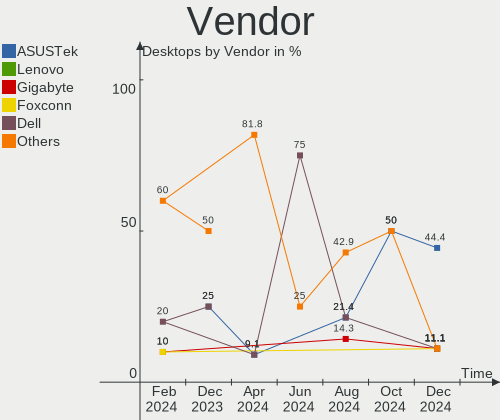
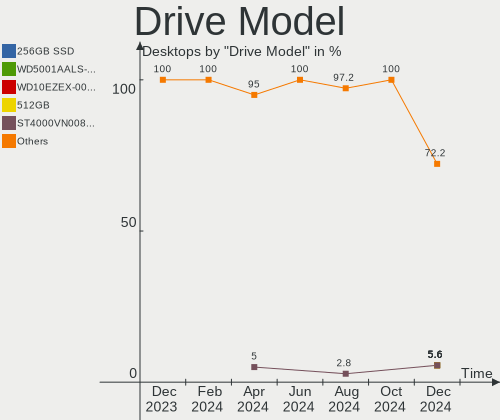
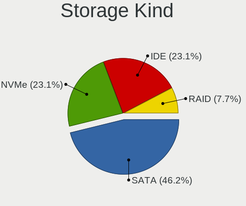
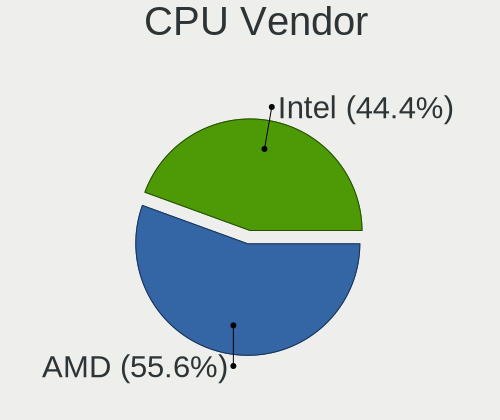
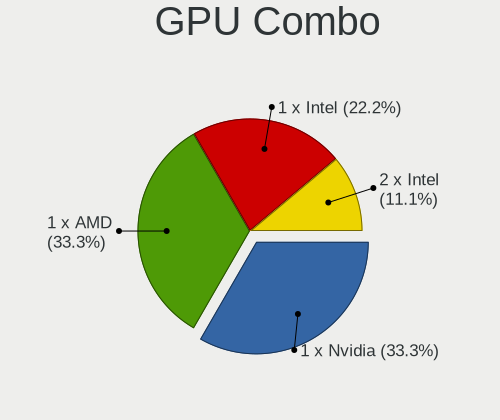
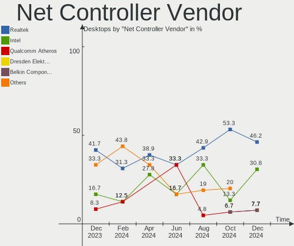
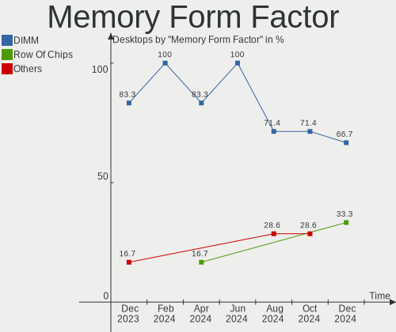
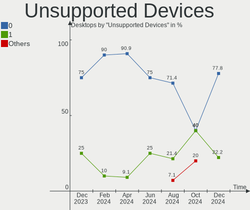

Lubuntu - Hardware Trends (Desktops)
------------------------------------

A project to identify most popular hardware characteristics and track their change
over time based on data collected by Linux users at https://Linux-Hardware.org.

Anyone can contribute to this report by the [hw-probe](https://github.com/linuxhw/hw-probe) tool:

    sudo -E hw-probe -all -upload

This report is for one last month. Overall report since the beginning of time: [TestCoverage](https://github.com/linuxhw/TestCoverage)

Period: Oct, 2022.

Contents
--------

* [ System ](#system)
  - [ OS                       ](#os)
  - [ OS Family                ](#os-family)
  - [ Kernel                   ](#kernel)
  - [ Kernel Family            ](#kernel-family)
  - [ Kernel Major Ver.        ](#kernel-major-ver)
  - [ Arch                     ](#arch)
  - [ DE                       ](#de)
  - [ Display Server           ](#display-server)
  - [ Display Manager          ](#display-manager)
  - [ OS Lang                  ](#os-lang)
  - [ Boot Mode                ](#boot-mode)
  - [ Filesystem               ](#filesystem)
  - [ Part. scheme             ](#part-scheme)
  - [ Dual Boot with Linux/BSD ](#dual-boot-with-linuxbsd)
  - [ Dual Boot (Win)          ](#dual-boot-win)

* [ Board ](#board)
  - [ Vendor                   ](#vendor)
  - [ Model                    ](#model)
  - [ Model Family             ](#model-family)
  - [ MFG Year                 ](#mfg-year)
  - [ Form Factor              ](#form-factor)
  - [ Secure Boot              ](#secure-boot)
  - [ Coreboot                 ](#coreboot)
  - [ RAM Size                 ](#ram-size)
  - [ RAM Used                 ](#ram-used)
  - [ Total Drives             ](#total-drives)
  - [ Has CD-ROM               ](#has-cd-rom)
  - [ Has Ethernet             ](#has-ethernet)
  - [ Has WiFi                 ](#has-wifi)
  - [ Has Bluetooth            ](#has-bluetooth)

* [ Location ](#location)
  - [ Country                  ](#country)
  - [ City                     ](#city)

* [ Drives ](#drives)
  - [ Drive Vendor             ](#drive-vendor)
  - [ Drive Model              ](#drive-model)
  - [ HDD Vendor               ](#hdd-vendor)
  - [ SSD Vendor               ](#ssd-vendor)
  - [ Drive Kind               ](#drive-kind)
  - [ Drive Connector          ](#drive-connector)
  - [ Drive Size               ](#drive-size)
  - [ Space Total              ](#space-total)
  - [ Space Used               ](#space-used)
  - [ Malfunc. Drives          ](#malfunc-drives)
  - [ Malfunc. Drive Vendor    ](#malfunc-drive-vendor)
  - [ Malfunc. HDD Vendor      ](#malfunc-hdd-vendor)
  - [ Malfunc. Drive Kind      ](#malfunc-drive-kind)
  - [ Failed Drives            ](#failed-drives)
  - [ Failed Drive Vendor      ](#failed-drive-vendor)
  - [ Drive Status             ](#drive-status)

* [ Storage controller ](#storage-controller)
  - [ Storage Vendor           ](#storage-vendor)
  - [ Storage Model            ](#storage-model)
  - [ Storage Kind             ](#storage-kind)

* [ Processor ](#processor)
  - [ CPU Vendor               ](#cpu-vendor)
  - [ CPU Model                ](#cpu-model)
  - [ CPU Model Family         ](#cpu-model-family)
  - [ CPU Cores                ](#cpu-cores)
  - [ CPU Sockets              ](#cpu-sockets)
  - [ CPU Threads              ](#cpu-threads)
  - [ CPU Op-Modes             ](#cpu-op-modes)
  - [ CPU Microcode            ](#cpu-microcode)
  - [ CPU Microarch            ](#cpu-microarch)

* [ Graphics ](#graphics)
  - [ GPU Vendor               ](#gpu-vendor)
  - [ GPU Model                ](#gpu-model)
  - [ GPU Combo                ](#gpu-combo)
  - [ GPU Driver               ](#gpu-driver)
  - [ GPU Memory               ](#gpu-memory)

* [ Monitor ](#monitor)
  - [ Monitor Vendor           ](#monitor-vendor)
  - [ Monitor Model            ](#monitor-model)
  - [ Monitor Resolution       ](#monitor-resolution)
  - [ Monitor Diagonal         ](#monitor-diagonal)
  - [ Monitor Width            ](#monitor-width)
  - [ Aspect Ratio             ](#aspect-ratio)
  - [ Monitor Area             ](#monitor-area)
  - [ Pixel Density            ](#pixel-density)
  - [ Multiple Monitors        ](#multiple-monitors)

* [ Network ](#network)
  - [ Net Controller Vendor    ](#net-controller-vendor)
  - [ Net Controller Model     ](#net-controller-model)
  - [ Wireless Vendor          ](#wireless-vendor)
  - [ Wireless Model           ](#wireless-model)
  - [ Ethernet Vendor          ](#ethernet-vendor)
  - [ Ethernet Model           ](#ethernet-model)
  - [ Net Controller Kind      ](#net-controller-kind)
  - [ Used Controller          ](#used-controller)
  - [ NICs                     ](#nics)
  - [ IPv6                     ](#ipv6)

* [ Bluetooth ](#bluetooth)
  - [ Bluetooth Vendor         ](#bluetooth-vendor)
  - [ Bluetooth Model          ](#bluetooth-model)

* [ Sound ](#sound)
  - [ Sound Vendor             ](#sound-vendor)
  - [ Sound Model              ](#sound-model)

* [ Memory ](#memory)
  - [ Memory Vendor            ](#memory-vendor)
  - [ Memory Model             ](#memory-model)
  - [ Memory Kind              ](#memory-kind)
  - [ Memory Form Factor       ](#memory-form-factor)
  - [ Memory Size              ](#memory-size)
  - [ Memory Speed             ](#memory-speed)

* [ Printers & scanners ](#printers--scanners)
  - [ Printer Vendor           ](#printer-vendor)
  - [ Printer Model            ](#printer-model)
  - [ Scanner Vendor           ](#scanner-vendor)
  - [ Scanner Model            ](#scanner-model)

* [ Camera ](#camera)
  - [ Camera Vendor            ](#camera-vendor)
  - [ Camera Model             ](#camera-model)

* [ Security ](#security)
  - [ Fingerprint Vendor       ](#fingerprint-vendor)
  - [ Fingerprint Model        ](#fingerprint-model)
  - [ Chipcard Vendor          ](#chipcard-vendor)
  - [ Chipcard Model           ](#chipcard-model)

* [ Unsupported ](#unsupported)
  - [ Unsupported Devices      ](#unsupported-devices)
  - [ Unsupported Device Types ](#unsupported-device-types)

System
------

OS
--

Installed operating systems

| Name          | Desktops | Percent |
|---------------|----------|---------|
| Lubuntu 22.04 | 5        | 62.5%   |
| Lubuntu 20.04 | 2        | 25%     |
| Lubuntu 21.10 | 1        | 12.5%   |

OS Family
---------

OS without a version

| Name    | Desktops | Percent |
|---------|----------|---------|
| Lubuntu | 8        | 100%    |

Kernel
------

Version of the Linux kernel

| Version                    | Desktops | Percent |
|----------------------------|----------|---------|
| 5.15.0-50-generic          | 2        | 25%     |
| 5.4.0-131-generic          | 1        | 12.5%   |
| 5.4.0-126-generic          | 1        | 12.5%   |
| 5.19.0-16.2-liquorix-amd64 | 1        | 12.5%   |
| 5.15.0-48-generic          | 1        | 12.5%   |
| 5.15.0-47-generic          | 1        | 12.5%   |
| 5.13.0-40-generic          | 1        | 12.5%   |

Kernel Family
-------------

Linux kernel without a distro release

| Version | Desktops | Percent |
|---------|----------|---------|
| 5.15.0  | 4        | 50%     |
| 5.4.0   | 2        | 25%     |
| 5.19.0  | 1        | 12.5%   |
| 5.13.0  | 1        | 12.5%   |

Kernel Major Ver.
-----------------

Linux kernel major version

| Version | Desktops | Percent |
|---------|----------|---------|
| 5.15    | 4        | 50%     |
| 5.4     | 2        | 25%     |
| 5.19    | 1        | 12.5%   |
| 5.13    | 1        | 12.5%   |

Arch
----

OS architecture (x86_64, i586, etc.)

| Name   | Desktops | Percent |
|--------|----------|---------|
| x86_64 | 8        | 100%    |

DE
--

Desktop Environment

| Name | Desktops | Percent |
|------|----------|---------|
| LXQt | 7        | 87.5%   |
| LXDE | 1        | 12.5%   |

Display Server
--------------

X11 or Wayland

| Name    | Desktops | Percent |
|---------|----------|---------|
| X11     | 7        | 87.5%   |
| Wayland | 1        | 12.5%   |

Display Manager
---------------

SDDM, LightDM, etc.

| Name    | Desktops | Percent |
|---------|----------|---------|
| SDDM    | 5        | 62.5%   |
| SLiM    | 1        | 12.5%   |
| LightDM | 1        | 12.5%   |
| GDM     | 1        | 12.5%   |

OS Lang
-------

Language

| Lang  | Desktops | Percent |
|-------|----------|---------|
| fr_FR | 3        | 37.5%   |
| lt_LT | 1        | 12.5%   |
| es_ES | 1        | 12.5%   |
| es_AR | 1        | 12.5%   |
| en_US | 1        | 12.5%   |
| de_DE | 1        | 12.5%   |

Boot Mode
---------

EFI or BIOS

| Mode | Desktops | Percent |
|------|----------|---------|
| BIOS | 6        | 75%     |
| EFI  | 2        | 25%     |

Filesystem
----------

Type of filesystem

| Type | Desktops | Percent |
|------|----------|---------|
| Ext4 | 8        | 100%    |

Part. scheme
------------

Scheme of partitioning

| Type | Desktops | Percent |
|------|----------|---------|
| MBR  | 4        | 50%     |
| GPT  | 4        | 50%     |

Dual Boot with Linux/BSD
------------------------

Hosting more than one Linux/BSD

| Dual boot | Desktops | Percent |
|-----------|----------|---------|
| No        | 6        | 75%     |
| Yes       | 2        | 25%     |

Dual Boot (Win)
---------------

Hosting Linux and Windows

| Dual boot | Desktops | Percent |
|-----------|----------|---------|
| No        | 5        | 62.5%   |
| Yes       | 3        | 37.5%   |

Board
-----

Vendor
------

Motherboard manufacturer

| Name                | Desktops | Percent |
|---------------------|----------|---------|
| Lenovo              | 1        | 12.5%   |
| Intel               | 1        | 12.5%   |
| Hewlett-Packard     | 1        | 12.5%   |
| Gigabyte Technology | 1        | 12.5%   |
| Fujitsu             | 1        | 12.5%   |
| ASRock              | 1        | 12.5%   |
| AOpen               | 1        | 12.5%   |
| Acer                | 1        | 12.5%   |

Model
-----

Motherboard model

| Name                           | Desktops | Percent |
|--------------------------------|----------|---------|
| Lenovo ThinkCentre M81 5048E2G | 1        | 12.5%   |
| Intel D33217GKE G76540-203     | 1        | 12.5%   |
| HP Z400 Workstation            | 1        | 12.5%   |
| Gigabyte F2A58M-HD2            | 1        | 12.5%   |
| Fujitsu FUTRO S900             | 1        | 12.5%   |
| ASRock H110M-HDV               | 1        | 12.5%   |
| AOpen ESPRIMO Q9000            | 1        | 12.5%   |
| Acer AcerPower M8              | 1        | 12.5%   |

Model Family
------------

Motherboard model prefix

| Name                | Desktops | Percent |
|---------------------|----------|---------|
| Lenovo ThinkCentre  | 1        | 12.5%   |
| Intel D33217GKE     | 1        | 12.5%   |
| HP Z400             | 1        | 12.5%   |
| Gigabyte F2A58M-HD2 | 1        | 12.5%   |
| Fujitsu FUTRO       | 1        | 12.5%   |
| ASRock H110M-HDV    | 1        | 12.5%   |
| AOpen ESPRIMO       | 1        | 12.5%   |
| Acer AcerPower      | 1        | 12.5%   |

MFG Year
--------

Motherboard manufacture year

| Year | Desktops | Percent |
|------|----------|---------|
| 2015 | 2        | 25%     |
| 2010 | 2        | 25%     |
| 2014 | 1        | 12.5%   |
| 2013 | 1        | 12.5%   |
| 2011 | 1        | 12.5%   |
| 2007 | 1        | 12.5%   |

Form Factor
-----------

Physical design of the computer

| Name    | Desktops | Percent |
|---------|----------|---------|
| Desktop | 8        | 100%    |

Secure Boot
-----------

Enabled or disabled

| State    | Desktops | Percent |
|----------|----------|---------|
| Disabled | 8        | 100%    |

Coreboot
--------

Have coreboot on board

| Used | Desktops | Percent |
|------|----------|---------|
| No   | 8        | 100%    |

RAM Size
--------

Total RAM memory

| Size in GB | Desktops | Percent |
|------------|----------|---------|
| 3.01-4.0   | 4        | 50%     |
| 16.01-24.0 | 2        | 25%     |
| 4.01-8.0   | 1        | 12.5%   |
| 8.01-16.0  | 1        | 12.5%   |

RAM Used
--------

Used RAM memory

| Used GB   | Desktops | Percent |
|-----------|----------|---------|
| 1.01-2.0  | 4        | 50%     |
| 4.01-8.0  | 1        | 12.5%   |
| 3.01-4.0  | 1        | 12.5%   |
| 8.01-16.0 | 1        | 12.5%   |
| 0.51-1.0  | 1        | 12.5%   |

Total Drives
------------

Number of drives on board

| Drives | Desktops | Percent |
|--------|----------|---------|
| 1      | 5        | 62.5%   |
| 2      | 2        | 25%     |
| 3      | 1        | 12.5%   |

Has CD-ROM
----------

Has CD-ROM on board

| Presented | Desktops | Percent |
|-----------|----------|---------|
| Yes       | 5        | 62.5%   |
| No        | 3        | 37.5%   |

Has Ethernet
------------

Has Ethernet on board

| Presented | Desktops | Percent |
|-----------|----------|---------|
| Yes       | 8        | 100%    |

Has WiFi
--------

Has WiFi module

| Presented | Desktops | Percent |
|-----------|----------|---------|
| Yes       | 4        | 50%     |
| No        | 4        | 50%     |

Has Bluetooth
-------------

Has Bluetooth module

| Presented | Desktops | Percent |
|-----------|----------|---------|
| No        | 6        | 75%     |
| Yes       | 2        | 25%     |

Location
--------

Country
-------

Geographic location (country)

| Country   | Desktops | Percent |
|-----------|----------|---------|
| France    | 4        | 50%     |
| Spain     | 1        | 12.5%   |
| Lithuania | 1        | 12.5%   |
| Germany   | 1        | 12.5%   |
| Argentina | 1        | 12.5%   |

City
----

Geographic location (city)

| City       | Desktops | Percent |
|------------|----------|---------|
| Vilnius    | 1        | 12.5%   |
| Vannes     | 1        | 12.5%   |
| Tandil     | 1        | 12.5%   |
| Oberkotzau | 1        | 12.5%   |
| Marseille  | 1        | 12.5%   |
| Lagord     | 1        | 12.5%   |
| Huelva     | 1        | 12.5%   |
| Abbeville  | 1        | 12.5%   |

Drives
------

Drive Vendor
------------

Hard drive vendors

| Vendor              | Desktops | Drives | Percent |
|---------------------|----------|--------|---------|
| Seagate             | 2        | 2      | 18.18%  |
| Samsung Electronics | 2        | 2      | 18.18%  |
| Hitachi             | 2        | 2      | 18.18%  |
| WDC                 | 1        | 2      | 9.09%   |
| LITEONIT            | 1        | 1      | 9.09%   |
| Kingston            | 1        | 1      | 9.09%   |
| Gigabyte Technology | 1        | 1      | 9.09%   |
| Crucial             | 1        | 1      | 9.09%   |

Drive Model
-----------

Hard drive models

| Model                               | Desktops | Percent |
|-------------------------------------|----------|---------|
| WDC WD1003FBYX-01Y7B0 1TB           | 1        | 9.09%   |
| Seagate ST9500325AS 500GB           | 1        | 9.09%   |
| Seagate ST3200826AS 200GB           | 1        | 9.09%   |
| Samsung SSD 860 PRO 512GB           | 1        | 9.09%   |
| Samsung SSD 860 EVO mSATA 500GB     | 1        | 9.09%   |
| LITEONIT LMT-128M6M mSATA 128GB SSD | 1        | 9.09%   |
| Kingston SA400S37240G 240GB SSD     | 1        | 9.09%   |
| Hitachi HDS721680PLA380 82GB        | 1        | 9.09%   |
| Hitachi HDS721025CLA682 250GB       | 1        | 9.09%   |
| Gigabyte GP-GSTFS31120GNTD 120GB    | 1        | 9.09%   |
| Crucial CT240BX500SSD1 240GB        | 1        | 9.09%   |

HDD Vendor
----------

Hard disk drive vendors

| Vendor  | Desktops | Drives | Percent |
|---------|----------|--------|---------|
| Seagate | 2        | 2      | 40%     |
| Hitachi | 2        | 2      | 40%     |
| WDC     | 1        | 2      | 20%     |

SSD Vendor
----------

Solid state drive vendors

| Vendor              | Desktops | Drives | Percent |
|---------------------|----------|--------|---------|
| Samsung Electronics | 2        | 2      | 33.33%  |
| LITEONIT            | 1        | 1      | 16.67%  |
| Kingston            | 1        | 1      | 16.67%  |
| Gigabyte Technology | 1        | 1      | 16.67%  |
| Crucial             | 1        | 1      | 16.67%  |

Drive Kind
----------

HDD or SSD

| Kind | Desktops | Drives | Percent |
|------|----------|--------|---------|
| SSD  | 6        | 6      | 54.55%  |
| HDD  | 5        | 6      | 45.45%  |

Drive Connector
---------------

SATA, SAS, NVMe, etc.

| Type | Desktops | Drives | Percent |
|------|----------|--------|---------|
| SATA | 8        | 12     | 100%    |

Drive Size
----------

Size of hard drive

| Size in TB | Desktops | Drives | Percent |
|------------|----------|--------|---------|
| 0.01-0.5   | 7        | 9      | 87.5%   |
| 0.51-1.0   | 1        | 3      | 12.5%   |

Space Total
-----------

Amount of disk space available on the file system

| Size in GB | Desktops | Percent |
|------------|----------|---------|
| 101-250    | 3        | 37.5%   |
| 251-500    | 2        | 25%     |
| 21-50      | 1        | 12.5%   |
| 1001-2000  | 1        | 12.5%   |
| 51-100     | 1        | 12.5%   |

Space Used
----------

Amount of used disk space

| Used GB   | Desktops | Percent |
|-----------|----------|---------|
| 1-20      | 4        | 50%     |
| 21-50     | 2        | 25%     |
| 101-250   | 1        | 12.5%   |
| 1001-2000 | 1        | 12.5%   |

Malfunc. Drives
---------------

Drive models with a malfunction

| Model                     | Desktops | Drives | Percent |
|---------------------------|----------|--------|---------|
| WDC WD1003FBYX-01Y7B0 1TB | 1        | 2      | 100%    |

Malfunc. Drive Vendor
---------------------

Vendors of faulty drives

| Vendor | Desktops | Drives | Percent |
|--------|----------|--------|---------|
| WDC    | 1        | 2      | 100%    |

Malfunc. HDD Vendor
-------------------

Vendors of faulty HDD drives

| Vendor | Desktops | Drives | Percent |
|--------|----------|--------|---------|
| WDC    | 1        | 2      | 100%    |

Malfunc. Drive Kind
-------------------

Kinds of faulty drives

| Kind | Desktops | Drives | Percent |
|------|----------|--------|---------|
| HDD  | 1        | 2      | 100%    |

Failed Drives
-------------

Failed drive models

Zero info for selected period =(

Failed Drive Vendor
-------------------

Failed drive vendors

Zero info for selected period =(

Drive Status
------------

Number of failed and malfunc. drives

| Status   | Desktops | Drives | Percent |
|----------|----------|--------|---------|
| Detected | 4        | 6      | 44.44%  |
| Works    | 4        | 4      | 44.44%  |
| Malfunc  | 1        | 2      | 11.11%  |

Storage controller
------------------

Storage Vendor
--------------

Storage controller vendors

| Vendor | Desktops | Percent |
|--------|----------|---------|
| Intel  | 5        | 62.5%   |
| AMD    | 2        | 25%     |
| Nvidia | 1        | 12.5%   |

Storage Model
-------------

Storage controller models

| Model                                                                                   | Desktops | Percent |
|-----------------------------------------------------------------------------------------|----------|---------|
| Nvidia MCP61 SATA Controller                                                            | 1        | 9.09%   |
| Nvidia MCP61 IDE                                                                        | 1        | 9.09%   |
| Intel SATA Controller [RAID mode]                                                       | 1        | 9.09%   |
| Intel Q170/Q150/B150/H170/H110/Z170/CM236 Chipset SATA Controller [AHCI Mode]           | 1        | 9.09%   |
| Intel 7 Series Chipset Family 6-port SATA Controller [AHCI mode]                        | 1        | 9.09%   |
| Intel 6 Series/C200 Series Chipset Family Desktop SATA Controller (IDE mode, ports 4-5) | 1        | 9.09%   |
| Intel 6 Series/C200 Series Chipset Family Desktop SATA Controller (IDE mode, ports 0-3) | 1        | 9.09%   |
| Intel 5 Series/3400 Series Chipset 6 port SATA AHCI Controller                          | 1        | 9.09%   |
| AMD SB7x0/SB8x0/SB9x0 SATA Controller [AHCI mode]                                       | 1        | 9.09%   |
| AMD FCH SATA Controller [IDE mode]                                                      | 1        | 9.09%   |
| AMD FCH IDE Controller                                                                  | 1        | 9.09%   |

Storage Kind
------------

Kind of storage controller (IDE, SATA, NVMe, SAS, ...)

| Kind | Desktops | Percent |
|------|----------|---------|
| SATA | 5        | 55.56%  |
| IDE  | 3        | 33.33%  |
| RAID | 1        | 11.11%  |

Processor
---------

CPU Vendor
----------

Processor vendors

| Vendor | Desktops | Percent |
|--------|----------|---------|
| Intel  | 5        | 62.5%   |
| AMD    | 3        | 37.5%   |

CPU Model
---------

Processor models

| Model                                      | Desktops | Percent |
|--------------------------------------------|----------|---------|
| Intel Xeon CPU W3565 @ 3.20GHz             | 1        | 12.5%   |
| Intel Core i5-6500 CPU @ 3.20GHz           | 1        | 12.5%   |
| Intel Core i3-3217U CPU @ 1.80GHz          | 1        | 12.5%   |
| Intel Core i3-2100 CPU @ 3.10GHz           | 1        | 12.5%   |
| Intel Core i3 CPU M 370 @ 2.40GHz          | 1        | 12.5%   |
| AMD G-T40N Processor                       | 1        | 12.5%   |
| AMD Athlon 64 X2 Dual Core Processor 4800+ | 1        | 12.5%   |
| AMD A4-4000 APU with Radeon HD Graphics    | 1        | 12.5%   |

CPU Model Family
----------------

Processor model prefix

| Model            | Desktops | Percent |
|------------------|----------|---------|
| Intel Core i3    | 3        | 37.5%   |
| Intel Xeon       | 1        | 12.5%   |
| Intel Core i5    | 1        | 12.5%   |
| AMD G            | 1        | 12.5%   |
| AMD Athlon 64 X2 | 1        | 12.5%   |
| AMD A4           | 1        | 12.5%   |

CPU Cores
---------

Number of processor cores

| Number | Desktops | Percent |
|--------|----------|---------|
| 2      | 5        | 62.5%   |
| 4      | 2        | 25%     |
| 1      | 1        | 12.5%   |

CPU Sockets
-----------

Number of sockets

| Number | Desktops | Percent |
|--------|----------|---------|
| 1      | 8        | 100%    |

CPU Threads
-----------

Threads per core (Hyper-Threading)

| Number | Desktops | Percent |
|--------|----------|---------|
| 2      | 4        | 50%     |
| 1      | 4        | 50%     |

CPU Op-Modes
------------

CPU Operation Modes (32-bit, 64-bit)

| Op mode        | Desktops | Percent |
|----------------|----------|---------|
| 32-bit, 64-bit | 8        | 100%    |

CPU Microcode
-------------

Microcode number

| Number     | Desktops | Percent |
|------------|----------|---------|
| Unknown    | 4        | 50%     |
| 0x206a7    | 1        | 12.5%   |
| 0x20655    | 1        | 12.5%   |
| 0x106a5    | 1        | 12.5%   |
| 0x06001119 | 1        | 12.5%   |

CPU Microarch
-------------

Microarchitecture

| Name        | Desktops | Percent |
|-------------|----------|---------|
| Westmere    | 1        | 12.5%   |
| Skylake     | 1        | 12.5%   |
| SandyBridge | 1        | 12.5%   |
| Piledriver  | 1        | 12.5%   |
| Nehalem     | 1        | 12.5%   |
| K8 Hammer   | 1        | 12.5%   |
| IvyBridge   | 1        | 12.5%   |
| Bobcat      | 1        | 12.5%   |

Graphics
--------

GPU Vendor
----------

Vendors of graphics cards

| Vendor | Desktops | Percent |
|--------|----------|---------|
| Nvidia | 3        | 37.5%   |
| Intel  | 3        | 37.5%   |
| AMD    | 2        | 25%     |

GPU Model
---------

Graphics card models

| Model                                                                     | Desktops | Percent |
|---------------------------------------------------------------------------|----------|---------|
| Nvidia GM107GL [Quadro K2200]                                             | 1        | 12.5%   |
| Nvidia GK208B [GeForce GT 720]                                            | 1        | 12.5%   |
| Nvidia C61 [GeForce 6100 nForce 405]                                      | 1        | 12.5%   |
| Intel Core Processor Integrated Graphics Controller                       | 1        | 12.5%   |
| Intel 3rd Gen Core processor Graphics Controller                          | 1        | 12.5%   |
| Intel 2nd Generation Core Processor Family Integrated Graphics Controller | 1        | 12.5%   |
| AMD Wrestler [Radeon HD 6290]                                             | 1        | 12.5%   |
| AMD Trinity 2 [Radeon HD 7480D]                                           | 1        | 12.5%   |

GPU Combo
---------

Combinations of graphics cards

| Name       | Desktops | Percent |
|------------|----------|---------|
| 1 x Nvidia | 3        | 37.5%   |
| 1 x Intel  | 3        | 37.5%   |
| 1 x AMD    | 2        | 25%     |

GPU Driver
----------

Free vs proprietary

| Driver      | Desktops | Percent |
|-------------|----------|---------|
| Free        | 7        | 87.5%   |
| Proprietary | 1        | 12.5%   |

GPU Memory
----------

Total video memory

| Size in GB | Desktops | Percent |
|------------|----------|---------|
| Unknown    | 6        | 75%     |
| 3.01-4.0   | 1        | 12.5%   |
| 0.51-1.0   | 1        | 12.5%   |

Monitor
-------

Monitor Vendor
--------------

Monitor vendors

| Vendor              | Desktops | Percent |
|---------------------|----------|---------|
| Iiyama              | 2        | 25%     |
| Samsung Electronics | 1        | 12.5%   |
| Sampo               | 1        | 12.5%   |
| NEC Computers       | 1        | 12.5%   |
| LG Electronics      | 1        | 12.5%   |
| HannStar            | 1        | 12.5%   |
| Acer                | 1        | 12.5%   |

Monitor Model
-------------

Monitor models

| Model                                                            | Desktops | Percent |
|------------------------------------------------------------------|----------|---------|
| Samsung Electronics S20B300 SAM08A8 1600x900 443x249mm 20.0-inch | 1        | 12.5%   |
| Sampo 800S STC0800 800x600 170x127mm 8.4-inch                    | 1        | 12.5%   |
| NEC Computers LCD1990SX NEC66DB 1280x1024 376x301mm 19.0-inch    | 1        | 12.5%   |
| LG Electronics LCD Monitor E2241 1920x1080                       | 1        | 12.5%   |
| Iiyama PL2475HD IVM6108 1920x1080 521x293mm 23.5-inch            | 1        | 12.5%   |
| Iiyama PL2283H IVM562E 1920x1080 496x292mm 22.7-inch             | 1        | 12.5%   |
| HannStar HL190APB HSD62C3 1366x768 410x230mm 18.5-inch           | 1        | 12.5%   |
| Acer X223W ACR0009 1680x1050 473x296mm 22.0-inch                 | 1        | 12.5%   |

Monitor Resolution
------------------

Monitor screen resolution

| Resolution         | Desktops | Percent |
|--------------------|----------|---------|
| 1920x1080 (FHD)    | 3        | 37.5%   |
| 800x600            | 1        | 12.5%   |
| 1680x1050 (WSXGA+) | 1        | 12.5%   |
| 1600x900 (HD+)     | 1        | 12.5%   |
| 1366x768 (WXGA)    | 1        | 12.5%   |
| 1280x1024 (SXGA)   | 1        | 12.5%   |

Monitor Diagonal
----------------

Diagonal size in inches

| Inches  | Desktops | Percent |
|---------|----------|---------|
| 22      | 2        | 25%     |
| 23      | 1        | 12.5%   |
| 20      | 1        | 12.5%   |
| 19      | 1        | 12.5%   |
| 18      | 1        | 12.5%   |
| 8       | 1        | 12.5%   |
| Unknown | 1        | 12.5%   |

Monitor Width
-------------

Physical width

| Width in mm | Desktops | Percent |
|-------------|----------|---------|
| 401-500     | 4        | 50%     |
| 501-600     | 1        | 12.5%   |
| 351-400     | 1        | 12.5%   |
| 101-200     | 1        | 12.5%   |
| Unknown     | 1        | 12.5%   |

Aspect Ratio
------------

Proportional relationship between the width and the height

| Ratio   | Desktops | Percent |
|---------|----------|---------|
| 16/9    | 4        | 50%     |
| 5/4     | 1        | 12.5%   |
| 4/3     | 1        | 12.5%   |
| 16/10   | 1        | 12.5%   |
| Unknown | 1        | 12.5%   |

Monitor Area
------------

Area in inch²

| Area in inch² | Desktops | Percent |
|----------------|----------|---------|
| 201-250        | 3        | 37.5%   |
| 151-200        | 2        | 25%     |
| 1-40           | 1        | 12.5%   |
| 141-150        | 1        | 12.5%   |
| Unknown        | 1        | 12.5%   |

Pixel Density
-------------

Pixels per inch

| Density | Desktops | Percent |
|---------|----------|---------|
| 51-100  | 6        | 75%     |
| 101-120 | 1        | 12.5%   |
| Unknown | 1        | 12.5%   |

Multiple Monitors
-----------------

Total monitors connected

| Total | Desktops | Percent |
|-------|----------|---------|
| 1     | 8        | 100%    |

Network
-------

Net Controller Vendor
---------------------

Controller vendors

| Vendor                          | Desktops | Percent |
|---------------------------------|----------|---------|
| Realtek Semiconductor           | 4        | 36.36%  |
| Intel                           | 3        | 27.27%  |
| TP-Link                         | 1        | 9.09%   |
| Qualcomm Atheros Communications | 1        | 9.09%   |
| Marvell Technology Group        | 1        | 9.09%   |
| Broadcom                        | 1        | 9.09%   |

Net Controller Model
--------------------

Controller models

| Model                                                             | Desktops | Percent |
|-------------------------------------------------------------------|----------|---------|
| Realtek RTL8111/8168/8411 PCI Express Gigabit Ethernet Controller | 3        | 25%     |
| TP-Link 802.11ac NIC                                              | 1        | 8.33%   |
| Realtek 802.11n NIC                                               | 1        | 8.33%   |
| Qualcomm Atheros AR9271 802.11n                                   | 1        | 8.33%   |
| Marvell Group 88E8056 PCI-E Gigabit Ethernet Controller           | 1        | 8.33%   |
| Intel Centrino Advanced-N 6200                                    | 1        | 8.33%   |
| Intel 82579V Gigabit Network Connection                           | 1        | 8.33%   |
| Intel 82579LM Gigabit Network Connection (Lewisville)             | 1        | 8.33%   |
| Intel 82577LM Gigabit Network Connection                          | 1        | 8.33%   |
| Broadcom NetXtreme BCM5764M Gigabit Ethernet PCIe                 | 1        | 8.33%   |

Wireless Vendor
---------------

Wireless vendors

| Vendor                          | Desktops | Percent |
|---------------------------------|----------|---------|
| TP-Link                         | 1        | 25%     |
| Realtek Semiconductor           | 1        | 25%     |
| Qualcomm Atheros Communications | 1        | 25%     |
| Intel                           | 1        | 25%     |

Wireless Model
--------------

Wireless models

| Model                           | Desktops | Percent |
|---------------------------------|----------|---------|
| TP-Link 802.11ac NIC            | 1        | 25%     |
| Realtek 802.11n NIC             | 1        | 25%     |
| Qualcomm Atheros AR9271 802.11n | 1        | 25%     |
| Intel Centrino Advanced-N 6200  | 1        | 25%     |

Ethernet Vendor
---------------

Ethernet vendors

| Vendor                   | Desktops | Percent |
|--------------------------|----------|---------|
| Realtek Semiconductor    | 3        | 37.5%   |
| Intel                    | 3        | 37.5%   |
| Marvell Technology Group | 1        | 12.5%   |
| Broadcom                 | 1        | 12.5%   |

Ethernet Model
--------------

Ethernet models

| Model                                                             | Desktops | Percent |
|-------------------------------------------------------------------|----------|---------|
| Realtek RTL8111/8168/8411 PCI Express Gigabit Ethernet Controller | 3        | 37.5%   |
| Marvell Group 88E8056 PCI-E Gigabit Ethernet Controller           | 1        | 12.5%   |
| Intel 82579V Gigabit Network Connection                           | 1        | 12.5%   |
| Intel 82579LM Gigabit Network Connection (Lewisville)             | 1        | 12.5%   |
| Intel 82577LM Gigabit Network Connection                          | 1        | 12.5%   |
| Broadcom NetXtreme BCM5764M Gigabit Ethernet PCIe                 | 1        | 12.5%   |

Net Controller Kind
-------------------

Ethernet, WiFi or modem

| Kind     | Desktops | Percent |
|----------|----------|---------|
| Ethernet | 8        | 66.67%  |
| WiFi     | 4        | 33.33%  |

Used Controller
---------------

Currently used network controller

| Kind     | Desktops | Percent |
|----------|----------|---------|
| Ethernet | 6        | 75%     |
| WiFi     | 2        | 25%     |

NICs
----

Total network controllers on board

| Total | Desktops | Percent |
|-------|----------|---------|
| 1     | 7        | 87.5%   |
| 2     | 1        | 12.5%   |

IPv6
----

IPv6 vs IPv4

| Used | Desktops | Percent |
|------|----------|---------|
| Yes  | 4        | 50%     |
| No   | 4        | 50%     |

Bluetooth
---------

Bluetooth Vendor
----------------

Controller vendors

| Vendor                  | Desktops | Percent |
|-------------------------|----------|---------|
| Cambridge Silicon Radio | 1        | 50%     |
| ASUSTek Computer        | 1        | 50%     |

Bluetooth Model
---------------

Controller models

| Model                                               | Desktops | Percent |
|-----------------------------------------------------|----------|---------|
| Cambridge Silicon Radio Bluetooth Dongle (HCI mode) | 1        | 50%     |
| ASUS ASUS USB-BT500                                 | 1        | 50%     |

Sound
-----

Sound Vendor
------------

Sound card vendors

| Vendor | Desktops | Percent |
|--------|----------|---------|
| Intel  | 5        | 50%     |
| Nvidia | 3        | 30%     |
| AMD    | 2        | 20%     |

Sound Model
-----------

Sound card models

| Model                                                                      | Desktops | Percent |
|----------------------------------------------------------------------------|----------|---------|
| Nvidia MCP61 High Definition Audio                                         | 1        | 8.33%   |
| Nvidia GM107 High Definition Audio Controller [GeForce 940MX]              | 1        | 8.33%   |
| Nvidia GK208 HDMI/DP Audio Controller                                      | 1        | 8.33%   |
| Intel 82801JI (ICH10 Family) HD Audio Controller                           | 1        | 8.33%   |
| Intel 7 Series/C216 Chipset Family High Definition Audio Controller        | 1        | 8.33%   |
| Intel 6 Series/C200 Series Chipset Family High Definition Audio Controller | 1        | 8.33%   |
| Intel 5 Series/3400 Series Chipset High Definition Audio                   | 1        | 8.33%   |
| Intel 100 Series/C230 Series Chipset Family HD Audio Controller            | 1        | 8.33%   |
| AMD Wrestler HDMI Audio                                                    | 1        | 8.33%   |
| AMD Trinity HDMI Audio Controller                                          | 1        | 8.33%   |
| AMD SBx00 Azalia (Intel HDA)                                               | 1        | 8.33%   |
| AMD FCH Azalia Controller                                                  | 1        | 8.33%   |

Memory
------

Memory Vendor
-------------

Memory module vendors

| Vendor              | Desktops | Percent |
|---------------------|----------|---------|
| Samsung Electronics | 3        | 33.33%  |
| Unknown             | 1        | 11.11%  |
| SK hynix            | 1        | 11.11%  |
| PNY                 | 1        | 11.11%  |
| Kingston            | 1        | 11.11%  |
| Elpida              | 1        | 11.11%  |
| Corsair             | 1        | 11.11%  |

Memory Model
------------

Memory module models

| Model                                                      | Desktops | Percent |
|------------------------------------------------------------|----------|---------|
| Unknown RAM Module 2GB DIMM DDR3 1333MT/s                  | 1        | 9.09%   |
| SK hynix RAM HMT125U7TFR8C-H9 2GB DIMM DDR3 1333MT/s       | 1        | 9.09%   |
| Samsung RAM Module 2GB DIMM DDR3 1066MT/s                  | 1        | 9.09%   |
| Samsung RAM M391B5673FH0-CH9 2GB DIMM DDR3 1333MT/s        | 1        | 9.09%   |
| Samsung RAM M378B5773DH0-CH9 2GB DIMM DDR3 1333MT/s        | 1        | 9.09%   |
| Samsung RAM M378B5773CH0-CH9 2GB DIMM DDR3 1867MT/s        | 1        | 9.09%   |
| PNY RAM Module 8192MB SODIMM DDR3 1600MT/s                 | 1        | 9.09%   |
| Kingston RAM 99U5474-028.A 4GB DIMM DDR3 1333MT/s          | 1        | 9.09%   |
| Elpida RAM EBJ41EF8BCFA-DJ-F 4GB DIMM DDR3 1333MT/s        | 1        | 9.09%   |
| Elpida RAM EBJ21EE8BDFA-DJ-F 2GB DIMM DDR3 1333MT/s        | 1        | 9.09%   |
| Corsair RAM CMSX8GX3M1A1600C10 8192MB SODIMM DDR3 1600MT/s | 1        | 9.09%   |

Memory Kind
-----------

Memory module kinds

| Kind  | Desktops | Percent |
|-------|----------|---------|
| DDR3  | 5        | 83.33%  |
| SDRAM | 1        | 16.67%  |

Memory Form Factor
------------------

Physical design of the memory module

| Name   | Desktops | Percent |
|--------|----------|---------|
| DIMM   | 4        | 80%     |
| SODIMM | 1        | 20%     |

Memory Size
-----------

Memory module size

| Size | Desktops | Percent |
|------|----------|---------|
| 2048 | 3        | 50%     |
| 4096 | 2        | 33.33%  |
| 8192 | 1        | 16.67%  |

Memory Speed
------------

Memory module speed

| Speed | Desktops | Percent |
|-------|----------|---------|
| 1333  | 3        | 50%     |
| 1867  | 1        | 16.67%  |
| 1600  | 1        | 16.67%  |
| 1066  | 1        | 16.67%  |

Printers & scanners
-------------------

Printer Vendor
--------------

Printer device vendors

Zero info for selected period =(

Printer Model
-------------

Printer device models

Zero info for selected period =(

Scanner Vendor
--------------

Scanner device vendors

Zero info for selected period =(

Scanner Model
-------------

Scanner device models

Zero info for selected period =(

Camera
------

Camera Vendor
-------------

Camera device vendors

Zero info for selected period =(

Camera Model
------------

Camera device models

Zero info for selected period =(

Security
--------

Fingerprint Vendor
------------------

Fingerprint sensor vendors

Zero info for selected period =(

Fingerprint Model
-----------------

Fingerprint sensor models

Zero info for selected period =(

Chipcard Vendor
---------------

Chipcard module vendors

Zero info for selected period =(

Chipcard Model
--------------

Chipcard module models

Zero info for selected period =(

Unsupported
-----------

Unsupported Devices
-------------------

Total unsupported devices on board

| Total | Desktops | Percent |
|-------|----------|---------|
| 0     | 7        | 87.5%   |
| 1     | 1        | 12.5%   |

Unsupported Device Types
------------------------

Types of unsupported devices

| Type         | Desktops | Percent |
|--------------|----------|---------|
| Net/wireless | 1        | 100%    |

