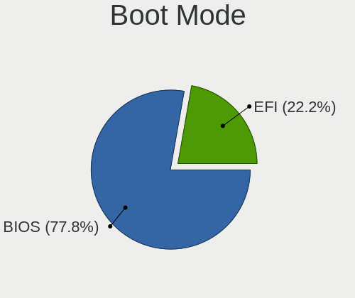
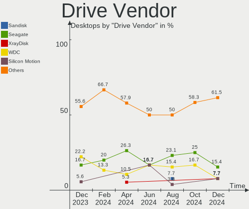
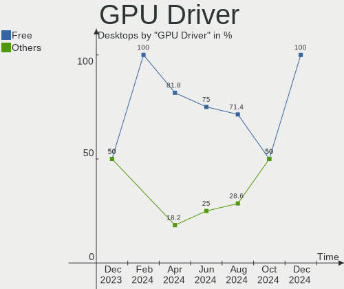

Lubuntu - Hardware Trends (Desktops)
------------------------------------

A project to identify most popular hardware characteristics and track their change
over time based on data collected by Linux users at https://Linux-Hardware.org.

Anyone can contribute to this report by the [hw-probe](https://github.com/linuxhw/hw-probe) tool:

    sudo -E hw-probe -all -upload

This report is for one last month. Overall report since the beginning of time: [TestCoverage](https://github.com/linuxhw/TestCoverage)

Period: Dec, 2022.

Contents
--------

* [ System ](#system)
  - [ OS                       ](#os)
  - [ OS Family                ](#os-family)
  - [ Kernel                   ](#kernel)
  - [ Kernel Family            ](#kernel-family)
  - [ Kernel Major Ver.        ](#kernel-major-ver)
  - [ Arch                     ](#arch)
  - [ DE                       ](#de)
  - [ Display Server           ](#display-server)
  - [ Display Manager          ](#display-manager)
  - [ OS Lang                  ](#os-lang)
  - [ Boot Mode                ](#boot-mode)
  - [ Filesystem               ](#filesystem)
  - [ Part. scheme             ](#part-scheme)
  - [ Dual Boot with Linux/BSD ](#dual-boot-with-linuxbsd)
  - [ Dual Boot (Win)          ](#dual-boot-win)

* [ Board ](#board)
  - [ Vendor                   ](#vendor)
  - [ Model                    ](#model)
  - [ Model Family             ](#model-family)
  - [ MFG Year                 ](#mfg-year)
  - [ Form Factor              ](#form-factor)
  - [ Secure Boot              ](#secure-boot)
  - [ Coreboot                 ](#coreboot)
  - [ RAM Size                 ](#ram-size)
  - [ RAM Used                 ](#ram-used)
  - [ Total Drives             ](#total-drives)
  - [ Has CD-ROM               ](#has-cd-rom)
  - [ Has Ethernet             ](#has-ethernet)
  - [ Has WiFi                 ](#has-wifi)
  - [ Has Bluetooth            ](#has-bluetooth)

* [ Location ](#location)
  - [ Country                  ](#country)
  - [ City                     ](#city)

* [ Drives ](#drives)
  - [ Drive Vendor             ](#drive-vendor)
  - [ Drive Model              ](#drive-model)
  - [ HDD Vendor               ](#hdd-vendor)
  - [ SSD Vendor               ](#ssd-vendor)
  - [ Drive Kind               ](#drive-kind)
  - [ Drive Connector          ](#drive-connector)
  - [ Drive Size               ](#drive-size)
  - [ Space Total              ](#space-total)
  - [ Space Used               ](#space-used)
  - [ Malfunc. Drives          ](#malfunc-drives)
  - [ Malfunc. Drive Vendor    ](#malfunc-drive-vendor)
  - [ Malfunc. HDD Vendor      ](#malfunc-hdd-vendor)
  - [ Malfunc. Drive Kind      ](#malfunc-drive-kind)
  - [ Failed Drives            ](#failed-drives)
  - [ Failed Drive Vendor      ](#failed-drive-vendor)
  - [ Drive Status             ](#drive-status)

* [ Storage controller ](#storage-controller)
  - [ Storage Vendor           ](#storage-vendor)
  - [ Storage Model            ](#storage-model)
  - [ Storage Kind             ](#storage-kind)

* [ Processor ](#processor)
  - [ CPU Vendor               ](#cpu-vendor)
  - [ CPU Model                ](#cpu-model)
  - [ CPU Model Family         ](#cpu-model-family)
  - [ CPU Cores                ](#cpu-cores)
  - [ CPU Sockets              ](#cpu-sockets)
  - [ CPU Threads              ](#cpu-threads)
  - [ CPU Op-Modes             ](#cpu-op-modes)
  - [ CPU Microcode            ](#cpu-microcode)
  - [ CPU Microarch            ](#cpu-microarch)

* [ Graphics ](#graphics)
  - [ GPU Vendor               ](#gpu-vendor)
  - [ GPU Model                ](#gpu-model)
  - [ GPU Combo                ](#gpu-combo)
  - [ GPU Driver               ](#gpu-driver)
  - [ GPU Memory               ](#gpu-memory)

* [ Monitor ](#monitor)
  - [ Monitor Vendor           ](#monitor-vendor)
  - [ Monitor Model            ](#monitor-model)
  - [ Monitor Resolution       ](#monitor-resolution)
  - [ Monitor Diagonal         ](#monitor-diagonal)
  - [ Monitor Width            ](#monitor-width)
  - [ Aspect Ratio             ](#aspect-ratio)
  - [ Monitor Area             ](#monitor-area)
  - [ Pixel Density            ](#pixel-density)
  - [ Multiple Monitors        ](#multiple-monitors)

* [ Network ](#network)
  - [ Net Controller Vendor    ](#net-controller-vendor)
  - [ Net Controller Model     ](#net-controller-model)
  - [ Wireless Vendor          ](#wireless-vendor)
  - [ Wireless Model           ](#wireless-model)
  - [ Ethernet Vendor          ](#ethernet-vendor)
  - [ Ethernet Model           ](#ethernet-model)
  - [ Net Controller Kind      ](#net-controller-kind)
  - [ Used Controller          ](#used-controller)
  - [ NICs                     ](#nics)
  - [ IPv6                     ](#ipv6)

* [ Bluetooth ](#bluetooth)
  - [ Bluetooth Vendor         ](#bluetooth-vendor)
  - [ Bluetooth Model          ](#bluetooth-model)

* [ Sound ](#sound)
  - [ Sound Vendor             ](#sound-vendor)
  - [ Sound Model              ](#sound-model)

* [ Memory ](#memory)
  - [ Memory Vendor            ](#memory-vendor)
  - [ Memory Model             ](#memory-model)
  - [ Memory Kind              ](#memory-kind)
  - [ Memory Form Factor       ](#memory-form-factor)
  - [ Memory Size              ](#memory-size)
  - [ Memory Speed             ](#memory-speed)

* [ Printers & scanners ](#printers--scanners)
  - [ Printer Vendor           ](#printer-vendor)
  - [ Printer Model            ](#printer-model)
  - [ Scanner Vendor           ](#scanner-vendor)
  - [ Scanner Model            ](#scanner-model)

* [ Camera ](#camera)
  - [ Camera Vendor            ](#camera-vendor)
  - [ Camera Model             ](#camera-model)

* [ Security ](#security)
  - [ Fingerprint Vendor       ](#fingerprint-vendor)
  - [ Fingerprint Model        ](#fingerprint-model)
  - [ Chipcard Vendor          ](#chipcard-vendor)
  - [ Chipcard Model           ](#chipcard-model)

* [ Unsupported ](#unsupported)
  - [ Unsupported Devices      ](#unsupported-devices)
  - [ Unsupported Device Types ](#unsupported-device-types)

System
------

OS
--

Installed operating systems

| Name          | Desktops | Percent |
|---------------|----------|---------|
| Lubuntu 22.04 | 4        | 57.14%  |
| Lubuntu 22.10 | 2        | 28.57%  |
| Lubuntu 18.04 | 1        | 14.29%  |

OS Family
---------

OS without a version

| Name    | Desktops | Percent |
|---------|----------|---------|
| Lubuntu | 7        | 100%    |

Kernel
------

Version of the Linux kernel

| Version              | Desktops | Percent |
|----------------------|----------|---------|
| 6.1.0-custom         | 1        | 14.29%  |
| 6.0.9-060009-generic | 1        | 14.29%  |
| 5.4.0-135-generic    | 1        | 14.29%  |
| 5.19.0-26-generic    | 1        | 14.29%  |
| 5.15.0-57-generic    | 1        | 14.29%  |
| 5.15.0-56-generic    | 1        | 14.29%  |
| 5.15.0-43-generic    | 1        | 14.29%  |

Kernel Family
-------------

Linux kernel without a distro release

| Version | Desktops | Percent |
|---------|----------|---------|
| 5.15.0  | 3        | 42.86%  |
| 6.1.0   | 1        | 14.29%  |
| 6.0.9   | 1        | 14.29%  |
| 5.4.0   | 1        | 14.29%  |
| 5.19.0  | 1        | 14.29%  |

Kernel Major Ver.
-----------------

Linux kernel major version

| Version | Desktops | Percent |
|---------|----------|---------|
| 5.15    | 3        | 42.86%  |
| 6.1     | 1        | 14.29%  |
| 6.0     | 1        | 14.29%  |
| 5.4     | 1        | 14.29%  |
| 5.19    | 1        | 14.29%  |

Arch
----

OS architecture (x86_64, i586, etc.)

| Name   | Desktops | Percent |
|--------|----------|---------|
| x86_64 | 7        | 100%    |

DE
--

Desktop Environment

| Name            | Desktops | Percent |
|-----------------|----------|---------|
| LXQt            | 5        | 71.43%  |
| LXDE            | 1        | 14.29%  |
| GNOME Flashback | 1        | 14.29%  |

Display Server
--------------

X11 or Wayland

| Name | Desktops | Percent |
|------|----------|---------|
| X11  | 7        | 100%    |

Display Manager
---------------

SDDM, LightDM, etc.

| Name    | Desktops | Percent |
|---------|----------|---------|
| SDDM    | 5        | 71.43%  |
| LightDM | 2        | 28.57%  |

OS Lang
-------

Language

| Lang  | Desktops | Percent |
|-------|----------|---------|
| en_US | 3        | 42.86%  |
| fr_FR | 1        | 14.29%  |
| es_ES | 1        | 14.29%  |
| es_CR | 1        | 14.29%  |
| en_GB | 1        | 14.29%  |

Boot Mode
---------

EFI or BIOS

| Mode | Desktops | Percent |
|------|----------|---------|
| BIOS | 4        | 57.14%  |
| EFI  | 3        | 42.86%  |

Filesystem
----------

Type of filesystem

| Type | Desktops | Percent |
|------|----------|---------|
| Ext4 | 7        | 100%    |

Part. scheme
------------

Scheme of partitioning

| Type | Desktops | Percent |
|------|----------|---------|
| MBR  | 4        | 57.14%  |
| GPT  | 3        | 42.86%  |

Dual Boot with Linux/BSD
------------------------

Hosting more than one Linux/BSD

| Dual boot | Desktops | Percent |
|-----------|----------|---------|
| No        | 7        | 100%    |

Dual Boot (Win)
---------------

Hosting Linux and Windows

| Dual boot | Desktops | Percent |
|-----------|----------|---------|
| No        | 5        | 71.43%  |
| Yes       | 2        | 28.57%  |

Board
-----

Vendor
------

Motherboard manufacturer

| Name             | Desktops | Percent |
|------------------|----------|---------|
| ASUSTek Computer | 4        | 57.14%  |
| ZOTAC            | 1        | 14.29%  |
| Hewlett-Packard  | 1        | 14.29%  |
| ASRock           | 1        | 14.29%  |

Model
-----

Motherboard model

| Name                            | Desktops | Percent |
|---------------------------------|----------|---------|
| ZOTAC NM10                      | 1        | 14.29%  |
| HP t620 Quad Core TC            | 1        | 14.29%  |
| ASUS ROG STRIX B450-F GAMING II | 1        | 14.29%  |
| ASUS PRIME A320M-F              | 1        | 14.29%  |
| ASUS M4A785TD-V EVO             | 1        | 14.29%  |
| ASUS ET1610PT                   | 1        | 14.29%  |
| ASRock 970DE3/U3S3              | 1        | 14.29%  |

Model Family
------------

Motherboard model prefix

| Name            | Desktops | Percent |
|-----------------|----------|---------|
| ZOTAC NM10      | 1        | 14.29%  |
| HP t620         | 1        | 14.29%  |
| ASUS ROG        | 1        | 14.29%  |
| ASUS PRIME      | 1        | 14.29%  |
| ASUS M4A785TD-V | 1        | 14.29%  |
| ASUS ET1610PT   | 1        | 14.29%  |
| ASRock 970DE3   | 1        | 14.29%  |

MFG Year
--------

Motherboard manufacture year

| Year | Desktops | Percent |
|------|----------|---------|
| 2010 | 2        | 28.57%  |
| 2020 | 1        | 14.29%  |
| 2019 | 1        | 14.29%  |
| 2014 | 1        | 14.29%  |
| 2012 | 1        | 14.29%  |
| 2009 | 1        | 14.29%  |

Form Factor
-----------

Physical design of the computer

| Name    | Desktops | Percent |
|---------|----------|---------|
| Desktop | 7        | 100%    |

Secure Boot
-----------

Enabled or disabled

| State    | Desktops | Percent |
|----------|----------|---------|
| Disabled | 7        | 100%    |

Coreboot
--------

Have coreboot on board

| Used | Desktops | Percent |
|------|----------|---------|
| No   | 7        | 100%    |

RAM Size
--------

Total RAM memory

| Size in GB | Desktops | Percent |
|------------|----------|---------|
| 4.01-8.0   | 2        | 28.57%  |
| 3.01-4.0   | 2        | 28.57%  |
| 16.01-24.0 | 1        | 14.29%  |
| 1.01-2.0   | 1        | 14.29%  |
| 8.01-16.0  | 1        | 14.29%  |

RAM Used
--------

Used RAM memory

| Used GB  | Desktops | Percent |
|----------|----------|---------|
| 1.01-2.0 | 4        | 57.14%  |
| 3.01-4.0 | 1        | 14.29%  |
| 2.01-3.0 | 1        | 14.29%  |
| 0.51-1.0 | 1        | 14.29%  |

Total Drives
------------

Number of drives on board

| Drives | Desktops | Percent |
|--------|----------|---------|
| 1      | 4        | 57.14%  |
| 2      | 3        | 42.86%  |

Has CD-ROM
----------

Has CD-ROM on board

| Presented | Desktops | Percent |
|-----------|----------|---------|
| No        | 5        | 71.43%  |
| Yes       | 2        | 28.57%  |

Has Ethernet
------------

Has Ethernet on board

| Presented | Desktops | Percent |
|-----------|----------|---------|
| Yes       | 7        | 100%    |

Has WiFi
--------

Has WiFi module

| Presented | Desktops | Percent |
|-----------|----------|---------|
| Yes       | 5        | 71.43%  |
| No        | 2        | 28.57%  |

Has Bluetooth
-------------

Has Bluetooth module

| Presented | Desktops | Percent |
|-----------|----------|---------|
| No        | 5        | 71.43%  |
| Yes       | 2        | 28.57%  |

Location
--------

Country
-------

Geographic location (country)

| Country    | Desktops | Percent |
|------------|----------|---------|
| USA        | 1        | 14.29%  |
| Spain      | 1        | 14.29%  |
| Moldova    | 1        | 14.29%  |
| Ireland    | 1        | 14.29%  |
| Indonesia  | 1        | 14.29%  |
| France     | 1        | 14.29%  |
| Costa Rica | 1        | 14.29%  |

City
----

Geographic location (city)

| City        | Desktops | Percent |
|-------------|----------|---------|
| Tiraspol    | 1        | 14.29%  |
| Rio Segundo | 1        | 14.29%  |
| Palencia    | 1        | 14.29%  |
| Lyon        | 1        | 14.29%  |
| Enniscorthy | 1        | 14.29%  |
| Balikpapan  | 1        | 14.29%  |
| Ashburn     | 1        | 14.29%  |

Drives
------

Drive Vendor
------------

Hard drive vendors

| Vendor              | Desktops | Drives | Percent |
|---------------------|----------|--------|---------|
| Seagate             | 4        | 4      | 40%     |
| WDC                 | 1        | 1      | 10%     |
| Toshiba             | 1        | 1      | 10%     |
| Team                | 1        | 1      | 10%     |
| SanDisk             | 1        | 1      | 10%     |
| Samsung Electronics | 1        | 1      | 10%     |
| Kingston            | 1        | 1      | 10%     |

Drive Model
-----------

Hard drive models

| Model                              | Desktops | Percent |
|------------------------------------|----------|---------|
| WDC WD10EZEX-08WN4A0 1TB           | 1        | 10%     |
| Toshiba Q300. 240GB SSD            | 1        | 10%     |
| Team T253E2002T 2TB SSD            | 1        | 10%     |
| Seagate ST9250315AS 250GB          | 1        | 10%     |
| Seagate ST3500418AS 500GB          | 1        | 10%     |
| Seagate ST2000DM008-2FR102 2TB     | 1        | 10%     |
| Seagate ST1000DM003-1CH162 1TB     | 1        | 10%     |
| SanDisk SDSA6DM-016G-1006 16GB SSD | 1        | 10%     |
| Samsung SSD 830 Series 256GB       | 1        | 10%     |
| Kingston SA400S37240G 240GB SSD    | 1        | 10%     |

HDD Vendor
----------

Hard disk drive vendors

| Vendor  | Desktops | Drives | Percent |
|---------|----------|--------|---------|
| Seagate | 4        | 4      | 80%     |
| WDC     | 1        | 1      | 20%     |

SSD Vendor
----------

Solid state drive vendors

| Vendor              | Desktops | Drives | Percent |
|---------------------|----------|--------|---------|
| Toshiba             | 1        | 1      | 20%     |
| Team                | 1        | 1      | 20%     |
| SanDisk             | 1        | 1      | 20%     |
| Samsung Electronics | 1        | 1      | 20%     |
| Kingston            | 1        | 1      | 20%     |

Drive Kind
----------

HDD or SSD

| Kind | Desktops | Drives | Percent |
|------|----------|--------|---------|
| SSD  | 5        | 5      | 55.56%  |
| HDD  | 4        | 5      | 44.44%  |

Drive Connector
---------------

SATA, SAS, NVMe, etc.

| Type | Desktops | Drives | Percent |
|------|----------|--------|---------|
| SATA | 7        | 10     | 100%    |

Drive Size
----------

Size of hard drive

| Size in TB | Desktops | Drives | Percent |
|------------|----------|--------|---------|
| 0.01-0.5   | 5        | 6      | 55.56%  |
| 1.01-2.0   | 2        | 2      | 22.22%  |
| 0.51-1.0   | 2        | 2      | 22.22%  |

Space Total
-----------

Amount of disk space available on the file system

| Size in GB | Desktops | Percent |
|------------|----------|---------|
| 101-250    | 2        | 28.57%  |
| 501-1000   | 2        | 28.57%  |
| 21-50      | 1        | 14.29%  |
| 2001-3000  | 1        | 14.29%  |
| 1001-2000  | 1        | 14.29%  |

Space Used
----------

Amount of used disk space

| Used GB   | Desktops | Percent |
|-----------|----------|---------|
| 1-20      | 2        | 28.57%  |
| 251-500   | 1        | 14.29%  |
| 21-50     | 1        | 14.29%  |
| 101-250   | 1        | 14.29%  |
| 1001-2000 | 1        | 14.29%  |
| 501-1000  | 1        | 14.29%  |

Malfunc. Drives
---------------

Drive models with a malfunction

Zero info for selected period =(

Malfunc. Drive Vendor
---------------------

Vendors of faulty drives

Zero info for selected period =(

Malfunc. HDD Vendor
-------------------

Vendors of faulty HDD drives

Zero info for selected period =(

Malfunc. Drive Kind
-------------------

Kinds of faulty drives

Zero info for selected period =(

Failed Drives
-------------

Failed drive models

| Model                     | Desktops | Drives | Percent |
|---------------------------|----------|--------|---------|
| Seagate ST3500418AS 500GB | 1        | 1      | 100%    |

Failed Drive Vendor
-------------------

Failed drive vendors

| Vendor  | Desktops | Drives | Percent |
|---------|----------|--------|---------|
| Seagate | 1        | 1      | 100%    |

Drive Status
------------

Number of failed and malfunc. drives

| Status   | Desktops | Drives | Percent |
|----------|----------|--------|---------|
| Works    | 6        | 7      | 75%     |
| Detected | 1        | 2      | 12.5%   |
| Failed   | 1        | 1      | 12.5%   |

Storage controller
------------------

Storage Vendor
--------------

Storage controller vendors

| Vendor             | Desktops | Percent |
|--------------------|----------|---------|
| AMD                | 5        | 62.5%   |
| Intel              | 2        | 25%     |
| ASMedia Technology | 1        | 12.5%   |

Storage Model
-------------

Storage controller models

| Model                                              | Desktops | Percent |
|----------------------------------------------------|----------|---------|
| Intel NM10/ICH7 Family SATA Controller [AHCI mode] | 2        | 18.18%  |
| AMD SB7x0/SB8x0/SB9x0 IDE Controller               | 2        | 18.18%  |
| AMD FCH SATA Controller [AHCI mode]                | 2        | 18.18%  |
| ASMedia ASM1062 Serial ATA Controller              | 1        | 9.09%   |
| AMD SB7x0/SB8x0/SB9x0 SATA Controller [IDE mode]   | 1        | 9.09%   |
| AMD SB7x0/SB8x0/SB9x0 SATA Controller [AHCI mode]  | 1        | 9.09%   |
| AMD FCH SATA Controller D                          | 1        | 9.09%   |
| AMD 400 Series Chipset SATA Controller             | 1        | 9.09%   |

Storage Kind
------------

Kind of storage controller (IDE, SATA, NVMe, SAS, ...)

| Kind | Desktops | Percent |
|------|----------|---------|
| SATA | 7        | 77.78%  |
| IDE  | 2        | 22.22%  |

Processor
---------

CPU Vendor
----------

Processor vendors

| Vendor | Desktops | Percent |
|--------|----------|---------|
| AMD    | 5        | 71.43%  |
| Intel  | 2        | 28.57%  |

CPU Model
---------

Processor models

| Model                                       | Desktops | Percent |
|---------------------------------------------|----------|---------|
| Intel Atom CPU D525 @ 1.80GHz               | 1        | 14.29%  |
| Intel Atom CPU D410 @ 1.66GHz               | 1        | 14.29%  |
| AMD Ryzen 5 3500X 6-Core Processor          | 1        | 14.29%  |
| AMD Ryzen 3 3200G with Radeon Vega Graphics | 1        | 14.29%  |
| AMD GX-415GA SOC with Radeon HD Graphics    | 1        | 14.29%  |
| AMD FX-8320E Eight-Core Processor           | 1        | 14.29%  |
| AMD Athlon II X2 240 Processor              | 1        | 14.29%  |

CPU Model Family
----------------

Processor model prefix

| Model            | Desktops | Percent |
|------------------|----------|---------|
| Intel Atom       | 2        | 28.57%  |
| AMD Ryzen 5      | 1        | 14.29%  |
| AMD Ryzen 3      | 1        | 14.29%  |
| AMD GX           | 1        | 14.29%  |
| AMD FX           | 1        | 14.29%  |
| AMD Athlon II X2 | 1        | 14.29%  |

CPU Cores
---------

Number of processor cores

| Number | Desktops | Percent |
|--------|----------|---------|
| 4      | 3        | 42.86%  |
| 2      | 2        | 28.57%  |
| 6      | 1        | 14.29%  |
| 1      | 1        | 14.29%  |

CPU Sockets
-----------

Number of sockets

| Number | Desktops | Percent |
|--------|----------|---------|
| 1      | 7        | 100%    |

CPU Threads
-----------

Threads per core (Hyper-Threading)

| Number | Desktops | Percent |
|--------|----------|---------|
| 1      | 4        | 57.14%  |
| 2      | 3        | 42.86%  |

CPU Op-Modes
------------

CPU Operation Modes (32-bit, 64-bit)

| Op mode        | Desktops | Percent |
|----------------|----------|---------|
| 32-bit, 64-bit | 7        | 100%    |

CPU Microcode
-------------

Microcode number

| Number     | Desktops | Percent |
|------------|----------|---------|
| 0x106ca    | 2        | 28.57%  |
| 0x08701021 | 1        | 14.29%  |
| 0x08108102 | 1        | 14.29%  |
| 0x0700010f | 1        | 14.29%  |
| 0x06000852 | 1        | 14.29%  |
| 0x010000c7 | 1        | 14.29%  |

CPU Microarch
-------------

Microarchitecture

| Name       | Desktops | Percent |
|------------|----------|---------|
| Bonnell    | 2        | 28.57%  |
| Zen+       | 1        | 14.29%  |
| Zen 2      | 1        | 14.29%  |
| Piledriver | 1        | 14.29%  |
| K10        | 1        | 14.29%  |
| Jaguar     | 1        | 14.29%  |

Graphics
--------

GPU Vendor
----------

Vendors of graphics cards

| Vendor | Desktops | Percent |
|--------|----------|---------|
| AMD    | 4        | 57.14%  |
| Nvidia | 2        | 28.57%  |
| Intel  | 1        | 14.29%  |

GPU Model
---------

Graphics card models

| Model                                                                   | Desktops | Percent |
|-------------------------------------------------------------------------|----------|---------|
| Nvidia GT218 [ION]                                                      | 1        | 14.29%  |
| Nvidia GF108 [GeForce GT 440]                                           | 1        | 14.29%  |
| Intel Atom Processor D4xx/D5xx/N4xx/N5xx Integrated Graphics Controller | 1        | 14.29%  |
| AMD RS880 [Radeon HD 4200]                                              | 1        | 14.29%  |
| AMD Picasso/Raven 2 [Radeon Vega Series / Radeon Vega Mobile Series]    | 1        | 14.29%  |
| AMD Kabini [Radeon HD 8330E]                                            | 1        | 14.29%  |
| AMD Ellesmere [Radeon RX 470/480/570/570X/580/580X/590]                 | 1        | 14.29%  |

GPU Combo
---------

Combinations of graphics cards

| Name       | Desktops | Percent |
|------------|----------|---------|
| 1 x AMD    | 4        | 57.14%  |
| 1 x Nvidia | 2        | 28.57%  |
| 2 x Intel  | 1        | 14.29%  |

GPU Driver
----------

Free vs proprietary

| Driver      | Desktops | Percent |
|-------------|----------|---------|
| Free        | 6        | 85.71%  |
| Proprietary | 1        | 14.29%  |

GPU Memory
----------

Total video memory

| Size in GB | Desktops | Percent |
|------------|----------|---------|
| 0.01-0.5   | 4        | 57.14%  |
| 7.01-8.0   | 1        | 14.29%  |
| 1.01-2.0   | 1        | 14.29%  |
| Unknown    | 1        | 14.29%  |

Monitor
-------

Monitor Vendor
--------------

Monitor vendors

| Vendor              | Desktops | Percent |
|---------------------|----------|---------|
| Samsung Electronics | 2        | 28.57%  |
| Philips             | 1        | 14.29%  |
| LG Electronics      | 1        | 14.29%  |
| Goldstar            | 1        | 14.29%  |
| Dell                | 1        | 14.29%  |
| Daewoo              | 1        | 14.29%  |

Monitor Model
-------------

Monitor models

| Model                                                                | Desktops | Percent |
|----------------------------------------------------------------------|----------|---------|
| Samsung Electronics SyncMaster SAM03D2 1680x1050 474x296mm 22.0-inch | 1        | 14.29%  |
| Samsung Electronics LCD Monitor SAM0A76 1280x720 949x543mm 43.0-inch | 1        | 14.29%  |
| Philips LCD Monitor PHL 243V5                                        | 1        | 14.29%  |
| LG Electronics LCD Monitor L1942 3200x1080                           | 1        | 14.29%  |
| Goldstar HD GSM5ACB 1366x768 410x230mm 18.5-inch                     | 1        | 14.29%  |
| Dell P2419H DELD0DA 1920x1080 527x296mm 23.8-inch                    | 1        | 14.29%  |
| Daewoo HDMI DWE2100 1280x1024 476x268mm 21.5-inch                    | 1        | 14.29%  |

Monitor Resolution
------------------

Monitor screen resolution

| Resolution         | Desktops | Percent |
|--------------------|----------|---------|
| 1920x1080 (FHD)    | 2        | 28.57%  |
| 3200x1080          | 1        | 14.29%  |
| 1680x1050 (WSXGA+) | 1        | 14.29%  |
| 1366x768 (WXGA)    | 1        | 14.29%  |
| 1280x720 (HD)      | 1        | 14.29%  |
| Unknown            | 1        | 14.29%  |

Monitor Diagonal
----------------

Diagonal size in inches

| Inches  | Desktops | Percent |
|---------|----------|---------|
| 43      | 1        | 16.67%  |
| 24      | 1        | 16.67%  |
| 22      | 1        | 16.67%  |
| 21      | 1        | 16.67%  |
| 18      | 1        | 16.67%  |
| Unknown | 1        | 16.67%  |

Monitor Width
-------------

Physical width

| Width in mm | Desktops | Percent |
|-------------|----------|---------|
| 401-500     | 3        | 50%     |
| 501-600     | 1        | 16.67%  |
| 901-1000    | 1        | 16.67%  |
| Unknown     | 1        | 16.67%  |

Aspect Ratio
------------

Proportional relationship between the width and the height

| Ratio   | Desktops | Percent |
|---------|----------|---------|
| 16/9    | 4        | 66.67%  |
| 16/10   | 1        | 16.67%  |
| Unknown | 1        | 16.67%  |

Monitor Area
------------

Area in inch²

| Area in inch² | Desktops | Percent |
|----------------|----------|---------|
| 201-250        | 2        | 33.33%  |
| 151-200        | 1        | 16.67%  |
| 141-150        | 1        | 16.67%  |
| 501-1000       | 1        | 16.67%  |
| Unknown        | 1        | 16.67%  |

Pixel Density
-------------

Pixels per inch

| Density | Desktops | Percent |
|---------|----------|---------|
| 51-100  | 4        | 66.67%  |
| 1-50    | 1        | 16.67%  |
| Unknown | 1        | 16.67%  |

Multiple Monitors
-----------------

Total monitors connected

| Total | Desktops | Percent |
|-------|----------|---------|
| 1     | 6        | 85.71%  |
| 2     | 1        | 14.29%  |

Network
-------

Net Controller Vendor
---------------------

Controller vendors

| Vendor                | Desktops | Percent |
|-----------------------|----------|---------|
| Realtek Semiconductor | 6        | 50%     |
| Intel                 | 3        | 25%     |
| TP-Link               | 1        | 8.33%   |
| Qualcomm Atheros      | 1        | 8.33%   |
| JMicron Technology    | 1        | 8.33%   |

Net Controller Model
--------------------

Controller models

| Model                                                             | Desktops | Percent |
|-------------------------------------------------------------------|----------|---------|
| Realtek RTL8111/8168/8411 PCI Express Gigabit Ethernet Controller | 4        | 33.33%  |
| TP-Link TL-WN821N v5/v6 [RTL8192EU]                               | 1        | 8.33%   |
| Realtek RTL8812AE 802.11ac PCIe Wireless Network Adapter          | 1        | 8.33%   |
| Realtek RTL-8110SC/8169SC Gigabit Ethernet                        | 1        | 8.33%   |
| Qualcomm Atheros AR9285 Wireless Network Adapter (PCI-Express)    | 1        | 8.33%   |
| JMicron JMC250 PCI Express Gigabit Ethernet Controller            | 1        | 8.33%   |
| Intel PRO/Wireless 5100 AGN [Shiloh] Network Connection           | 1        | 8.33%   |
| Intel I211 Gigabit Network Connection                             | 1        | 8.33%   |
| Intel Centrino Advanced-N 6235                                    | 1        | 8.33%   |

Wireless Vendor
---------------

Wireless vendors

| Vendor                | Desktops | Percent |
|-----------------------|----------|---------|
| Intel                 | 2        | 40%     |
| TP-Link               | 1        | 20%     |
| Realtek Semiconductor | 1        | 20%     |
| Qualcomm Atheros      | 1        | 20%     |

Wireless Model
--------------

Wireless models

| Model                                                          | Desktops | Percent |
|----------------------------------------------------------------|----------|---------|
| TP-Link TL-WN821N v5/v6 [RTL8192EU]                            | 1        | 20%     |
| Realtek RTL8812AE 802.11ac PCIe Wireless Network Adapter       | 1        | 20%     |
| Qualcomm Atheros AR9285 Wireless Network Adapter (PCI-Express) | 1        | 20%     |
| Intel PRO/Wireless 5100 AGN [Shiloh] Network Connection        | 1        | 20%     |
| Intel Centrino Advanced-N 6235                                 | 1        | 20%     |

Ethernet Vendor
---------------

Ethernet vendors

| Vendor                | Desktops | Percent |
|-----------------------|----------|---------|
| Realtek Semiconductor | 5        | 71.43%  |
| JMicron Technology    | 1        | 14.29%  |
| Intel                 | 1        | 14.29%  |

Ethernet Model
--------------

Ethernet models

| Model                                                             | Desktops | Percent |
|-------------------------------------------------------------------|----------|---------|
| Realtek RTL8111/8168/8411 PCI Express Gigabit Ethernet Controller | 4        | 57.14%  |
| Realtek RTL-8110SC/8169SC Gigabit Ethernet                        | 1        | 14.29%  |
| JMicron JMC250 PCI Express Gigabit Ethernet Controller            | 1        | 14.29%  |
| Intel I211 Gigabit Network Connection                             | 1        | 14.29%  |

Net Controller Kind
-------------------

Ethernet, WiFi or modem

| Kind     | Desktops | Percent |
|----------|----------|---------|
| Ethernet | 7        | 58.33%  |
| WiFi     | 5        | 41.67%  |

Used Controller
---------------

Currently used network controller

| Kind     | Desktops | Percent |
|----------|----------|---------|
| WiFi     | 4        | 50%     |
| Ethernet | 4        | 50%     |

NICs
----

Total network controllers on board

| Total | Desktops | Percent |
|-------|----------|---------|
| 2     | 4        | 57.14%  |
| 1     | 3        | 42.86%  |

IPv6
----

IPv6 vs IPv4

| Used | Desktops | Percent |
|------|----------|---------|
| No   | 6        | 85.71%  |
| Yes  | 1        | 14.29%  |

Bluetooth
---------

Bluetooth Vendor
----------------

Controller vendors

| Vendor                  | Desktops | Percent |
|-------------------------|----------|---------|
| Intel                   | 1        | 50%     |
| Cambridge Silicon Radio | 1        | 50%     |

Bluetooth Model
---------------

Controller models

| Model                                               | Desktops | Percent |
|-----------------------------------------------------|----------|---------|
| Intel Centrino Bluetooth Wireless Transceiver       | 1        | 50%     |
| Cambridge Silicon Radio Bluetooth Dongle (HCI mode) | 1        | 50%     |

Sound
-----

Sound Vendor
------------

Sound card vendors

| Vendor              | Desktops | Percent |
|---------------------|----------|---------|
| AMD                 | 5        | 50%     |
| Nvidia              | 2        | 20%     |
| Intel               | 2        | 20%     |
| C-Media Electronics | 1        | 10%     |

Sound Model
-----------

Sound card models

| Model                                                      | Desktops | Percent |
|------------------------------------------------------------|----------|---------|
| Intel NM10/ICH7 Family High Definition Audio Controller    | 2        | 15.38%  |
| AMD SBx00 Azalia (Intel HDA)                               | 2        | 15.38%  |
| Nvidia High Definition Audio Controller                    | 1        | 7.69%   |
| Nvidia GF108 High Definition Audio Controller              | 1        | 7.69%   |
| C-Media Electronics Audio Adapter (Unitek Y-247A)          | 1        | 7.69%   |
| AMD Starship/Matisse HD Audio Controller                   | 1        | 7.69%   |
| AMD RS880 HDMI Audio [Radeon HD 4200 Series]               | 1        | 7.69%   |
| AMD Kabini HDMI/DP Audio                                   | 1        | 7.69%   |
| AMD FCH Azalia Controller                                  | 1        | 7.69%   |
| AMD Family 17h/19h HD Audio Controller                     | 1        | 7.69%   |
| AMD Ellesmere HDMI Audio [Radeon RX 470/480 / 570/580/590] | 1        | 7.69%   |

Memory
------

Memory Vendor
-------------

Memory module vendors

| Vendor              | Desktops | Percent |
|---------------------|----------|---------|
| Unknown             | 3        | 42.86%  |
| Kingston            | 2        | 28.57%  |
| Samsung Electronics | 1        | 14.29%  |
| G.Skill             | 1        | 14.29%  |

Memory Model
------------

Memory module models

| Model                                                 | Desktops | Percent |
|-------------------------------------------------------|----------|---------|
| Unknown RAM Module 2GB SODIMM DDR2 667MT/s            | 1        | 12.5%   |
| Unknown RAM Module 2GB DIMM DDR2 667MT/s              | 1        | 12.5%   |
| Unknown RAM Module 2GB DIMM 1333MT/s                  | 1        | 12.5%   |
| Samsung RAM M471B5173EB0-YK0 4GB SODIMM DDR3 1600MT/s | 1        | 12.5%   |
| Samsung RAM M471B5173DB0-YK0 4GB SODIMM DDR3 1600MT/s | 1        | 12.5%   |
| Kingston RAM 99U5584-005.A00LF 4GB DIMM DDR3 1600MT/s | 1        | 12.5%   |
| Kingston RAM 9905713-019.A00G 4GB DIMM DDR4 2666MT/s  | 1        | 12.5%   |
| G.Skill RAM F4-3000C15-8GVKB 8GB DIMM DDR4 3066MT/s   | 1        | 12.5%   |

Memory Kind
-----------

Memory module kinds

| Kind    | Desktops | Percent |
|---------|----------|---------|
| DDR4    | 2        | 28.57%  |
| DDR3    | 2        | 28.57%  |
| DDR2    | 2        | 28.57%  |
| Unknown | 1        | 14.29%  |

Memory Form Factor
------------------

Physical design of the memory module

| Name   | Desktops | Percent |
|--------|----------|---------|
| DIMM   | 5        | 71.43%  |
| SODIMM | 2        | 28.57%  |

Memory Size
-----------

Memory module size

| Size | Desktops | Percent |
|------|----------|---------|
| 4096 | 3        | 42.86%  |
| 2048 | 3        | 42.86%  |
| 8192 | 1        | 14.29%  |

Memory Speed
------------

Memory module speed

| Speed | Desktops | Percent |
|-------|----------|---------|
| 1600  | 2        | 28.57%  |
| 667   | 2        | 28.57%  |
| 3066  | 1        | 14.29%  |
| 2666  | 1        | 14.29%  |
| 1333  | 1        | 14.29%  |

Printers & scanners
-------------------

Printer Vendor
--------------

Printer device vendors

Zero info for selected period =(

Printer Model
-------------

Printer device models

Zero info for selected period =(

Scanner Vendor
--------------

Scanner device vendors

Zero info for selected period =(

Scanner Model
-------------

Scanner device models

Zero info for selected period =(

Camera
------

Camera Vendor
-------------

Camera device vendors

| Vendor       | Desktops | Percent |
|--------------|----------|---------|
| IMC Networks | 1        | 100%    |

Camera Model
------------

Camera device models

| Model                              | Desktops | Percent |
|------------------------------------|----------|---------|
| IMC Networks USB2.0 UVC VGA WebCam | 1        | 100%    |

Security
--------

Fingerprint Vendor
------------------

Fingerprint sensor vendors

Zero info for selected period =(

Fingerprint Model
-----------------

Fingerprint sensor models

Zero info for selected period =(

Chipcard Vendor
---------------

Chipcard module vendors

Zero info for selected period =(

Chipcard Model
--------------

Chipcard module models

Zero info for selected period =(

Unsupported
-----------

Unsupported Devices
-------------------

Total unsupported devices on board

| Total | Desktops | Percent |
|-------|----------|---------|
| 0     | 6        | 85.71%  |
| 1     | 1        | 14.29%  |

Unsupported Device Types
------------------------

Types of unsupported devices

| Type          | Desktops | Percent |
|---------------|----------|---------|
| Graphics card | 1        | 100%    |

