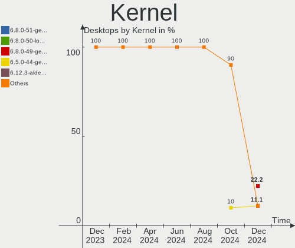
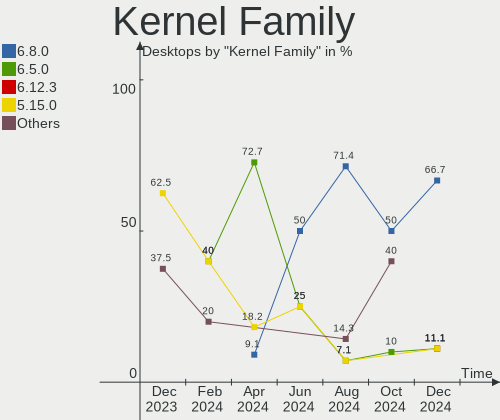
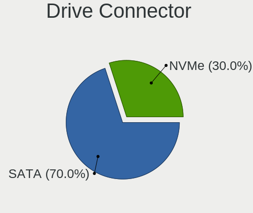
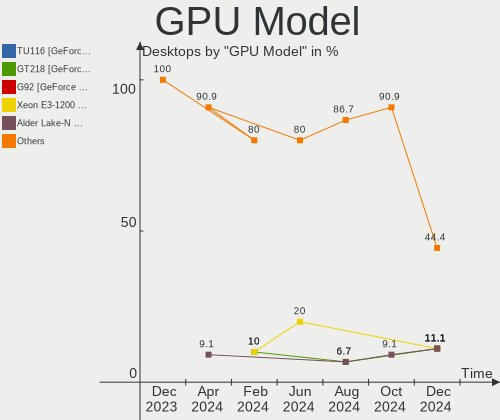
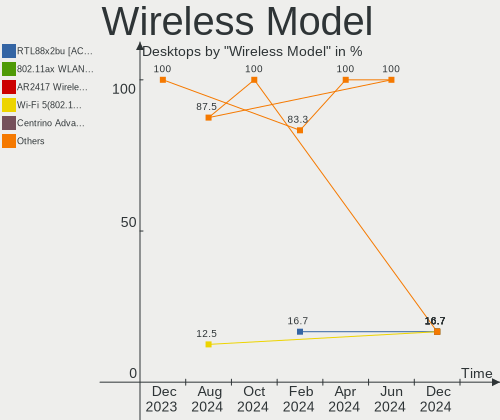
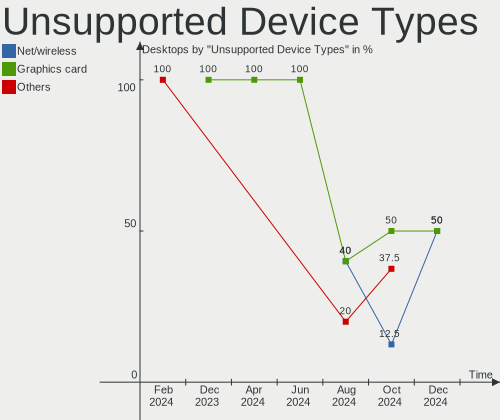

Lubuntu - Hardware Trends (Desktops)
------------------------------------

A project to identify most popular hardware characteristics and track their change
over time based on data collected by Linux users at https://Linux-Hardware.org.

Anyone can contribute to this report by the [hw-probe](https://github.com/linuxhw/hw-probe) tool:

    sudo -E hw-probe -all -upload

This report is for one last month. Overall report since the beginning of time: [TestCoverage](https://github.com/linuxhw/TestCoverage)

Period: Nov, 2022.

Contents
--------

* [ System ](#system)
  - [ OS                       ](#os)
  - [ OS Family                ](#os-family)
  - [ Kernel                   ](#kernel)
  - [ Kernel Family            ](#kernel-family)
  - [ Kernel Major Ver.        ](#kernel-major-ver)
  - [ Arch                     ](#arch)
  - [ DE                       ](#de)
  - [ Display Server           ](#display-server)
  - [ Display Manager          ](#display-manager)
  - [ OS Lang                  ](#os-lang)
  - [ Boot Mode                ](#boot-mode)
  - [ Filesystem               ](#filesystem)
  - [ Part. scheme             ](#part-scheme)
  - [ Dual Boot with Linux/BSD ](#dual-boot-with-linuxbsd)
  - [ Dual Boot (Win)          ](#dual-boot-win)

* [ Board ](#board)
  - [ Vendor                   ](#vendor)
  - [ Model                    ](#model)
  - [ Model Family             ](#model-family)
  - [ MFG Year                 ](#mfg-year)
  - [ Form Factor              ](#form-factor)
  - [ Secure Boot              ](#secure-boot)
  - [ Coreboot                 ](#coreboot)
  - [ RAM Size                 ](#ram-size)
  - [ RAM Used                 ](#ram-used)
  - [ Total Drives             ](#total-drives)
  - [ Has CD-ROM               ](#has-cd-rom)
  - [ Has Ethernet             ](#has-ethernet)
  - [ Has WiFi                 ](#has-wifi)
  - [ Has Bluetooth            ](#has-bluetooth)

* [ Location ](#location)
  - [ Country                  ](#country)
  - [ City                     ](#city)

* [ Drives ](#drives)
  - [ Drive Vendor             ](#drive-vendor)
  - [ Drive Model              ](#drive-model)
  - [ HDD Vendor               ](#hdd-vendor)
  - [ SSD Vendor               ](#ssd-vendor)
  - [ Drive Kind               ](#drive-kind)
  - [ Drive Connector          ](#drive-connector)
  - [ Drive Size               ](#drive-size)
  - [ Space Total              ](#space-total)
  - [ Space Used               ](#space-used)
  - [ Malfunc. Drives          ](#malfunc-drives)
  - [ Malfunc. Drive Vendor    ](#malfunc-drive-vendor)
  - [ Malfunc. HDD Vendor      ](#malfunc-hdd-vendor)
  - [ Malfunc. Drive Kind      ](#malfunc-drive-kind)
  - [ Failed Drives            ](#failed-drives)
  - [ Failed Drive Vendor      ](#failed-drive-vendor)
  - [ Drive Status             ](#drive-status)

* [ Storage controller ](#storage-controller)
  - [ Storage Vendor           ](#storage-vendor)
  - [ Storage Model            ](#storage-model)
  - [ Storage Kind             ](#storage-kind)

* [ Processor ](#processor)
  - [ CPU Vendor               ](#cpu-vendor)
  - [ CPU Model                ](#cpu-model)
  - [ CPU Model Family         ](#cpu-model-family)
  - [ CPU Cores                ](#cpu-cores)
  - [ CPU Sockets              ](#cpu-sockets)
  - [ CPU Threads              ](#cpu-threads)
  - [ CPU Op-Modes             ](#cpu-op-modes)
  - [ CPU Microcode            ](#cpu-microcode)
  - [ CPU Microarch            ](#cpu-microarch)

* [ Graphics ](#graphics)
  - [ GPU Vendor               ](#gpu-vendor)
  - [ GPU Model                ](#gpu-model)
  - [ GPU Combo                ](#gpu-combo)
  - [ GPU Driver               ](#gpu-driver)
  - [ GPU Memory               ](#gpu-memory)

* [ Monitor ](#monitor)
  - [ Monitor Vendor           ](#monitor-vendor)
  - [ Monitor Model            ](#monitor-model)
  - [ Monitor Resolution       ](#monitor-resolution)
  - [ Monitor Diagonal         ](#monitor-diagonal)
  - [ Monitor Width            ](#monitor-width)
  - [ Aspect Ratio             ](#aspect-ratio)
  - [ Monitor Area             ](#monitor-area)
  - [ Pixel Density            ](#pixel-density)
  - [ Multiple Monitors        ](#multiple-monitors)

* [ Network ](#network)
  - [ Net Controller Vendor    ](#net-controller-vendor)
  - [ Net Controller Model     ](#net-controller-model)
  - [ Wireless Vendor          ](#wireless-vendor)
  - [ Wireless Model           ](#wireless-model)
  - [ Ethernet Vendor          ](#ethernet-vendor)
  - [ Ethernet Model           ](#ethernet-model)
  - [ Net Controller Kind      ](#net-controller-kind)
  - [ Used Controller          ](#used-controller)
  - [ NICs                     ](#nics)
  - [ IPv6                     ](#ipv6)

* [ Bluetooth ](#bluetooth)
  - [ Bluetooth Vendor         ](#bluetooth-vendor)
  - [ Bluetooth Model          ](#bluetooth-model)

* [ Sound ](#sound)
  - [ Sound Vendor             ](#sound-vendor)
  - [ Sound Model              ](#sound-model)

* [ Memory ](#memory)
  - [ Memory Vendor            ](#memory-vendor)
  - [ Memory Model             ](#memory-model)
  - [ Memory Kind              ](#memory-kind)
  - [ Memory Form Factor       ](#memory-form-factor)
  - [ Memory Size              ](#memory-size)
  - [ Memory Speed             ](#memory-speed)

* [ Printers & scanners ](#printers--scanners)
  - [ Printer Vendor           ](#printer-vendor)
  - [ Printer Model            ](#printer-model)
  - [ Scanner Vendor           ](#scanner-vendor)
  - [ Scanner Model            ](#scanner-model)

* [ Camera ](#camera)
  - [ Camera Vendor            ](#camera-vendor)
  - [ Camera Model             ](#camera-model)

* [ Security ](#security)
  - [ Fingerprint Vendor       ](#fingerprint-vendor)
  - [ Fingerprint Model        ](#fingerprint-model)
  - [ Chipcard Vendor          ](#chipcard-vendor)
  - [ Chipcard Model           ](#chipcard-model)

* [ Unsupported ](#unsupported)
  - [ Unsupported Devices      ](#unsupported-devices)
  - [ Unsupported Device Types ](#unsupported-device-types)

System
------

OS
--

Installed operating systems

| Name          | Desktops | Percent |
|---------------|----------|---------|
| Lubuntu 22.04 | 7        | 46.67%  |
| Lubuntu 20.04 | 5        | 33.33%  |
| Lubuntu 22.10 | 1        | 6.67%   |
| Lubuntu 18.04 | 1        | 6.67%   |
| Lubuntu 16.04 | 1        | 6.67%   |

OS Family
---------

OS without a version

| Name    | Desktops | Percent |
|---------|----------|---------|
| Lubuntu | 15       | 100%    |

Kernel
------

Version of the Linux kernel

| Version              | Desktops | Percent |
|----------------------|----------|---------|
| 5.15.0-53-generic    | 3        | 20%     |
| 5.15.0-52-generic    | 3        | 20%     |
| 5.15.0-43-generic    | 3        | 20%     |
| 5.4.0-131-generic    | 2        | 13.33%  |
| 6.0.8-060008-generic | 1        | 6.67%   |
| 5.19.0-23-generic    | 1        | 6.67%   |
| 4.15.0-197-generic   | 1        | 6.67%   |
| 4.15.0-142-generic   | 1        | 6.67%   |

Kernel Family
-------------

Linux kernel without a distro release

| Version | Desktops | Percent |
|---------|----------|---------|
| 5.15.0  | 9        | 60%     |
| 5.4.0   | 2        | 13.33%  |
| 4.15.0  | 2        | 13.33%  |
| 6.0.8   | 1        | 6.67%   |
| 5.19.0  | 1        | 6.67%   |

Kernel Major Ver.
-----------------

Linux kernel major version

| Version | Desktops | Percent |
|---------|----------|---------|
| 5.15    | 9        | 60%     |
| 5.4     | 2        | 13.33%  |
| 4.15    | 2        | 13.33%  |
| 6.0     | 1        | 6.67%   |
| 5.19    | 1        | 6.67%   |

Arch
----

OS architecture (x86_64, i586, etc.)

| Name   | Desktops | Percent |
|--------|----------|---------|
| x86_64 | 15       | 100%    |

DE
--

Desktop Environment

| Name | Desktops | Percent |
|------|----------|---------|
| LXQt | 13       | 86.67%  |
| LXDE | 2        | 13.33%  |

Display Server
--------------

X11 or Wayland

| Name    | Desktops | Percent |
|---------|----------|---------|
| X11     | 12       | 80%     |
| Tty     | 2        | 13.33%  |
| Wayland | 1        | 6.67%   |

Display Manager
---------------

SDDM, LightDM, etc.

| Name    | Desktops | Percent |
|---------|----------|---------|
| SDDM    | 10       | 66.67%  |
| Unknown | 2        | 13.33%  |
| LXDM    | 1        | 6.67%   |
| LightDM | 1        | 6.67%   |
| GDM     | 1        | 6.67%   |

OS Lang
-------

Language

| Lang  | Desktops | Percent |
|-------|----------|---------|
| fr_FR | 4        | 26.67%  |
| en_US | 3        | 20%     |
| en_GB | 3        | 20%     |
| it_IT | 2        | 13.33%  |
| pt_BR | 1        | 6.67%   |
| pl_PL | 1        | 6.67%   |
| de_DE | 1        | 6.67%   |

Boot Mode
---------

EFI or BIOS

| Mode | Desktops | Percent |
|------|----------|---------|
| BIOS | 11       | 73.33%  |
| EFI  | 4        | 26.67%  |

Filesystem
----------

Type of filesystem

| Type | Desktops | Percent |
|------|----------|---------|
| Ext4 | 15       | 100%    |

Part. scheme
------------

Scheme of partitioning

| Type    | Desktops | Percent |
|---------|----------|---------|
| GPT     | 8        | 53.33%  |
| MBR     | 5        | 33.33%  |
| Unknown | 2        | 13.33%  |

Dual Boot with Linux/BSD
------------------------

Hosting more than one Linux/BSD

| Dual boot | Desktops | Percent |
|-----------|----------|---------|
| No        | 11       | 73.33%  |
| Yes       | 4        | 26.67%  |

Dual Boot (Win)
---------------

Hosting Linux and Windows

| Dual boot | Desktops | Percent |
|-----------|----------|---------|
| No        | 9        | 60%     |
| Yes       | 6        | 40%     |

Board
-----

Vendor
------

Motherboard manufacturer

| Name             | Desktops | Percent |
|------------------|----------|---------|
| ASUSTek Computer | 4        | 26.67%  |
| MSI              | 2        | 13.33%  |
| Lenovo           | 2        | 13.33%  |
| Intel            | 2        | 13.33%  |
| Hewlett-Packard  | 1        | 6.67%   |
| Foxconn          | 1        | 6.67%   |
| ASRock           | 1        | 6.67%   |
| AMI              | 1        | 6.67%   |
| Unknown          | 1        | 6.67%   |

Model
-----

Motherboard model

| Name                              | Desktops | Percent |
|-----------------------------------|----------|---------|
| MSI MS-7C96                       | 1        | 6.67%   |
| MSI MS-7C95                       | 1        | 6.67%   |
| Lenovo ThinkCentre E73 10AU003JFR | 1        | 6.67%   |
| Lenovo 62 2122AAP                 | 1        | 6.67%   |
| Intel D33217GKE G76540-203        | 1        | 6.67%   |
| Intel BTC-T37                     | 1        | 6.67%   |
| HP Compaq 6000 Pro MT PC          | 1        | 6.67%   |
| Foxconn G41MXP/G41MXP-V           | 1        | 6.67%   |
| ASUS M4A87TD/USB3                 | 1        | 6.67%   |
| ASUS M2NPV-VM                     | 1        | 6.67%   |
| ASUS IP4BL-ME                     | 1        | 6.67%   |
| ASUS EB1501P                      | 1        | 6.67%   |
| ASRock FM2A88X Extreme4+          | 1        | 6.67%   |
| AMI Z83 II                        | 1        | 6.67%   |
| Unknown                           | 1        | 6.67%   |

Model Family
------------

Motherboard model prefix

| Name               | Desktops | Percent |
|--------------------|----------|---------|
| MSI MS-7C96        | 1        | 6.67%   |
| MSI MS-7C95        | 1        | 6.67%   |
| Lenovo ThinkCentre | 1        | 6.67%   |
| Lenovo 62          | 1        | 6.67%   |
| Intel D33217GKE    | 1        | 6.67%   |
| Intel BTC-T37      | 1        | 6.67%   |
| HP Compaq          | 1        | 6.67%   |
| Foxconn G41MXP     | 1        | 6.67%   |
| ASUS M4A87TD       | 1        | 6.67%   |
| ASUS M2NPV-VM      | 1        | 6.67%   |
| ASUS IP4BL-ME      | 1        | 6.67%   |
| ASUS EB1501P       | 1        | 6.67%   |
| ASRock FM2A88X     | 1        | 6.67%   |
| AMI Z83            | 1        | 6.67%   |
| Unknown            | 1        | 6.67%   |

MFG Year
--------

Motherboard manufacture year

| Year | Desktops | Percent |
|------|----------|---------|
| 2020 | 3        | 20%     |
| 2013 | 3        | 20%     |
| 2010 | 3        | 20%     |
| 2021 | 1        | 6.67%   |
| 2017 | 1        | 6.67%   |
| 2014 | 1        | 6.67%   |
| 2009 | 1        | 6.67%   |
| 2008 | 1        | 6.67%   |
| 2006 | 1        | 6.67%   |

Form Factor
-----------

Physical design of the computer

| Name    | Desktops | Percent |
|---------|----------|---------|
| Desktop | 15       | 100%    |

Secure Boot
-----------

Enabled or disabled

| State    | Desktops | Percent |
|----------|----------|---------|
| Disabled | 15       | 100%    |

Coreboot
--------

Have coreboot on board

| Used | Desktops | Percent |
|------|----------|---------|
| No   | 15       | 100%    |

RAM Size
--------

Total RAM memory

| Size in GB | Desktops | Percent |
|------------|----------|---------|
| 3.01-4.0   | 4        | 26.67%  |
| 4.01-8.0   | 3        | 20%     |
| 8.01-16.0  | 3        | 20%     |
| 16.01-24.0 | 2        | 13.33%  |
| 1.01-2.0   | 2        | 13.33%  |
| 32.01-64.0 | 1        | 6.67%   |

RAM Used
--------

Used RAM memory

| Used GB   | Desktops | Percent |
|-----------|----------|---------|
| 1.01-2.0  | 8        | 53.33%  |
| 2.01-3.0  | 4        | 26.67%  |
| 8.01-16.0 | 1        | 6.67%   |
| 0.51-1.0  | 1        | 6.67%   |
| 0.01-0.5  | 1        | 6.67%   |

Total Drives
------------

Number of drives on board

| Drives | Desktops | Percent |
|--------|----------|---------|
| 1      | 7        | 46.67%  |
| 2      | 6        | 40%     |
| 5      | 2        | 13.33%  |

Has CD-ROM
----------

Has CD-ROM on board

| Presented | Desktops | Percent |
|-----------|----------|---------|
| No        | 9        | 60%     |
| Yes       | 6        | 40%     |

Has Ethernet
------------

Has Ethernet on board

| Presented | Desktops | Percent |
|-----------|----------|---------|
| Yes       | 15       | 100%    |

Has WiFi
--------

Has WiFi module

| Presented | Desktops | Percent |
|-----------|----------|---------|
| No        | 10       | 66.67%  |
| Yes       | 5        | 33.33%  |

Has Bluetooth
-------------

Has Bluetooth module

| Presented | Desktops | Percent |
|-----------|----------|---------|
| No        | 12       | 80%     |
| Yes       | 3        | 20%     |

Location
--------

Country
-------

Geographic location (country)

| Country    | Desktops | Percent |
|------------|----------|---------|
| France     | 4        | 26.67%  |
| UK         | 3        | 20%     |
| Italy      | 2        | 13.33%  |
| USA        | 1        | 6.67%   |
| Romania    | 1        | 6.67%   |
| Poland     | 1        | 6.67%   |
| Martinique | 1        | 6.67%   |
| Germany    | 1        | 6.67%   |
| Brazil     | 1        | 6.67%   |

City
----

Geographic location (city)

| City                  | Desktops | Percent |
|-----------------------|----------|---------|
| Vannes                | 1        | 6.67%   |
| Sylt-Ost              | 1        | 6.67%   |
| Sao Paulo             | 1        | 6.67%   |
| Riverenert            | 1        | 6.67%   |
| Poole                 | 1        | 6.67%   |
| Nederland             | 1        | 6.67%   |
| Meylan                | 1        | 6.67%   |
| Kielce                | 1        | 6.67%   |
| Hemel Hempstead       | 1        | 6.67%   |
| Hayes                 | 1        | 6.67%   |
| Fort-de-France        | 1        | 6.67%   |
| Cormeilles-en-Parisis | 1        | 6.67%   |
| Bucharest             | 1        | 6.67%   |
| Bologna               | 1        | 6.67%   |
| Assisi                | 1        | 6.67%   |

Drives
------

Drive Vendor
------------

Hard drive vendors

| Vendor                       | Desktops | Drives | Percent |
|------------------------------|----------|--------|---------|
| Seagate                      | 8        | 10     | 30.77%  |
| Samsung Electronics          | 7        | 8      | 26.92%  |
| Crucial                      | 2        | 2      | 7.69%   |
| WDC                          | 1        | 1      | 3.85%   |
| Unknown                      | 1        | 1      | 3.85%   |
| Shenzhen Longsys Electronics | 1        | 1      | 3.85%   |
| PNY                          | 1        | 1      | 3.85%   |
| Kston                        | 1        | 1      | 3.85%   |
| Kingston                     | 1        | 1      | 3.85%   |
| Hewlett-Packard              | 1        | 1      | 3.85%   |
| GOODRAM                      | 1        | 1      | 3.85%   |
| Unknown                      | 1        | 1      | 3.85%   |

Drive Model
-----------

Hard drive models

| Model                                    | Desktops | Percent |
|------------------------------------------|----------|---------|
| Seagate ST500DM002-1BD142 500GB          | 3        | 10.34%  |
| Seagate ST8000DM004-2CX188 8TB           | 2        | 6.9%    |
| Seagate ST2000DM008-2FR102 2TB           | 2        | 6.9%    |
| WDC WD20EARS-00S8B1 2TB                  | 1        | 3.45%   |
| Unknown 032G74  32GB                     | 1        | 3.45%   |
| Shenzhen Longsys M2 Series NVMe SSD 250G | 1        | 3.45%   |
| Seagate ST3320820AS 320GB                | 1        | 3.45%   |
| Seagate ST3160812AS 160GB                | 1        | 3.45%   |
| Seagate Backup+ Hub BK 8TB               | 1        | 3.45%   |
| Samsung SSD 870 EVO 500GB                | 1        | 3.45%   |
| Samsung SSD 860 EVO mSATA 500GB          | 1        | 3.45%   |
| Samsung SSD 840 EVO 250GB                | 1        | 3.45%   |
| Samsung SSD 840 EVO 120GB                | 1        | 3.45%   |
| Samsung SSD 830 Series 64GB              | 1        | 3.45%   |
| Samsung HD502HJ 500GB                    | 1        | 3.45%   |
| Samsung HD161HJ 160GB                    | 1        | 3.45%   |
| Samsung HD154UI 1TB                      | 1        | 3.45%   |
| PNY CS900 120GB SSD                      | 1        | 3.45%   |
| Kston SSD 128GB                          | 1        | 3.45%   |
| Kingston SNVS500G 500GB                  | 1        | 3.45%   |
| HP FB160C4081 160GB                      | 1        | 3.45%   |
| GOODRAM SSD 120GB                        | 1        | 3.45%   |
| Crucial CT500P3SSD8 500GB                | 1        | 3.45%   |
| Crucial CT1000BX500SSD1 1TB              | 1        | 3.45%   |
| Unknown                                  | 1        | 3.45%   |

HDD Vendor
----------

Hard disk drive vendors

| Vendor              | Desktops | Drives | Percent |
|---------------------|----------|--------|---------|
| Seagate             | 8        | 10     | 61.54%  |
| Samsung Electronics | 3        | 3      | 23.08%  |
| WDC                 | 1        | 1      | 7.69%   |
| Hewlett-Packard     | 1        | 1      | 7.69%   |

SSD Vendor
----------

Solid state drive vendors

| Vendor              | Desktops | Drives | Percent |
|---------------------|----------|--------|---------|
| Samsung Electronics | 5        | 5      | 55.56%  |
| PNY                 | 1        | 1      | 11.11%  |
| Kston               | 1        | 1      | 11.11%  |
| GOODRAM             | 1        | 1      | 11.11%  |
| Crucial             | 1        | 1      | 11.11%  |

Drive Kind
----------

HDD or SSD

| Kind | Desktops | Drives | Percent |
|------|----------|--------|---------|
| HDD  | 10       | 15     | 47.62%  |
| SSD  | 8        | 9      | 38.1%   |
| NVMe | 2        | 3      | 9.52%   |
| MMC  | 1        | 2      | 4.76%   |

Drive Connector
---------------

SATA, SAS, NVMe, etc.

| Type | Desktops | Drives | Percent |
|------|----------|--------|---------|
| SATA | 14       | 23     | 77.78%  |
| NVMe | 2        | 3      | 11.11%  |
| SAS  | 1        | 1      | 5.56%   |
| MMC  | 1        | 2      | 5.56%   |

Drive Size
----------

Size of hard drive

| Size in TB | Desktops | Drives | Percent |
|------------|----------|--------|---------|
| 0.01-0.5   | 13       | 16     | 65%     |
| 1.01-2.0   | 3        | 3      | 15%     |
| 4.01-10.0  | 2        | 3      | 10%     |
| 0.51-1.0   | 2        | 2      | 10%     |

Space Total
-----------

Amount of disk space available on the file system

| Size in GB     | Desktops | Percent |
|----------------|----------|---------|
| 251-500        | 4        | 26.67%  |
| 51-100         | 3        | 20%     |
| More than 3000 | 2        | 13.33%  |
| 101-250        | 2        | 13.33%  |
| 2001-3000      | 1        | 6.67%   |
| 1001-2000      | 1        | 6.67%   |
| 1-20           | 1        | 6.67%   |
| Unknown        | 1        | 6.67%   |

Space Used
----------

Amount of used disk space

| Used GB        | Desktops | Percent |
|----------------|----------|---------|
| 1-20           | 6        | 40%     |
| More than 3000 | 2        | 13.33%  |
| 21-50          | 2        | 13.33%  |
| 251-500        | 1        | 6.67%   |
| 101-250        | 1        | 6.67%   |
| 1001-2000      | 1        | 6.67%   |
| 51-100         | 1        | 6.67%   |
| Unknown        | 1        | 6.67%   |

Malfunc. Drives
---------------

Drive models with a malfunction

| Model                             | Desktops | Drives | Percent |
|-----------------------------------|----------|--------|---------|
| Seagate ST3160812AS 160GB         | 1        | 1      | 50%     |
| Samsung Electronics HD161HJ 160GB | 1        | 1      | 50%     |

Malfunc. Drive Vendor
---------------------

Vendors of faulty drives

| Vendor              | Desktops | Drives | Percent |
|---------------------|----------|--------|---------|
| Seagate             | 1        | 1      | 50%     |
| Samsung Electronics | 1        | 1      | 50%     |

Malfunc. HDD Vendor
-------------------

Vendors of faulty HDD drives

| Vendor              | Desktops | Drives | Percent |
|---------------------|----------|--------|---------|
| Seagate             | 1        | 1      | 50%     |
| Samsung Electronics | 1        | 1      | 50%     |

Malfunc. Drive Kind
-------------------

Kinds of faulty drives

| Kind | Desktops | Drives | Percent |
|------|----------|--------|---------|
| HDD  | 2        | 2      | 100%    |

Failed Drives
-------------

Failed drive models

Zero info for selected period =(

Failed Drive Vendor
-------------------

Failed drive vendors

Zero info for selected period =(

Drive Status
------------

Number of failed and malfunc. drives

| Status   | Desktops | Drives | Percent |
|----------|----------|--------|---------|
| Detected | 8        | 15     | 47.06%  |
| Works    | 7        | 12     | 41.18%  |
| Malfunc  | 2        | 2      | 11.76%  |

Storage controller
------------------

Storage Vendor
--------------

Storage controller vendors

| Vendor                       | Desktops | Percent |
|------------------------------|----------|---------|
| Intel                        | 9        | 50%     |
| AMD                          | 4        | 22.22%  |
| Shenzhen Longsys Electronics | 1        | 5.56%   |
| Nvidia                       | 1        | 5.56%   |
| Micron/Crucial Technology    | 1        | 5.56%   |
| Kingston Technology Company  | 1        | 5.56%   |
| JMicron Technology           | 1        | 5.56%   |

Storage Model
-------------

Storage controller models

| Model                                                                                   | Desktops | Percent |
|-----------------------------------------------------------------------------------------|----------|---------|
| Intel NM10/ICH7 Family SATA Controller [IDE mode]                                       | 2        | 8.7%    |
| Intel 82801G (ICH7 Family) IDE Controller                                               | 2        | 8.7%    |
| AMD 500 Series Chipset SATA Controller                                                  | 2        | 8.7%    |
| Shenzhen Longsys Electronics Non-Volatile memory controller                             | 1        | 4.35%   |
| Nvidia MCP51 Serial ATA Controller                                                      | 1        | 4.35%   |
| Nvidia MCP51 IDE                                                                        | 1        | 4.35%   |
| Micron/Crucial P2 NVMe PCIe SSD                                                         | 1        | 4.35%   |
| Kingston Company SNVS2000G [NV1 NVMe PCIe SSD 2TB]                                      | 1        | 4.35%   |
| JMicron JMB368 IDE controller                                                           | 1        | 4.35%   |
| Intel NM10/ICH7 Family SATA Controller [AHCI mode]                                      | 1        | 4.35%   |
| Intel Celeron/Pentium Silver Processor SATA Controller                                  | 1        | 4.35%   |
| Intel 82801JD/DO (ICH10 Family) SATA AHCI Controller                                    | 1        | 4.35%   |
| Intel 8 Series/C220 Series Chipset Family 6-port SATA Controller 1 [AHCI mode]          | 1        | 4.35%   |
| Intel 7 Series Chipset Family 6-port SATA Controller [AHCI mode]                        | 1        | 4.35%   |
| Intel 6 Series/C200 Series Chipset Family Desktop SATA Controller (IDE mode, ports 4-5) | 1        | 4.35%   |
| Intel 6 Series/C200 Series Chipset Family Desktop SATA Controller (IDE mode, ports 0-3) | 1        | 4.35%   |
| Intel 6 Series/C200 Series Chipset Family 6 port Mobile SATA AHCI Controller            | 1        | 4.35%   |
| AMD SB7x0/SB8x0/SB9x0 SATA Controller [AHCI mode]                                       | 1        | 4.35%   |
| AMD FCH SATA Controller [AHCI mode]                                                     | 1        | 4.35%   |
| AMD FCH IDE Controller                                                                  | 1        | 4.35%   |

Storage Kind
------------

Kind of storage controller (IDE, SATA, NVMe, SAS, ...)

| Kind | Desktops | Percent |
|------|----------|---------|
| SATA | 10       | 55.56%  |
| IDE  | 6        | 33.33%  |
| NVMe | 2        | 11.11%  |

Processor
---------

CPU Vendor
----------

Processor vendors

| Vendor | Desktops | Percent |
|--------|----------|---------|
| Intel  | 10       | 66.67%  |
| AMD    | 5        | 33.33%  |

CPU Model
---------

Processor models

| Model                                           | Desktops | Percent |
|-------------------------------------------------|----------|---------|
| AMD Ryzen 5 5600G with Radeon Graphics          | 2        | 13.33%  |
| Intel Pentium Dual-Core CPU E5700 @ 3.00GHz     | 1        | 6.67%   |
| Intel Pentium Dual CPU E2160 @ 1.80GHz          | 1        | 6.67%   |
| Intel Pentium CPU G3220 @ 3.00GHz               | 1        | 6.67%   |
| Intel Core i3-3220 CPU @ 3.30GHz                | 1        | 6.67%   |
| Intel Core i3-3217U CPU @ 1.80GHz               | 1        | 6.67%   |
| Intel Core 2 Duo CPU E8400 @ 3.00GHz            | 1        | 6.67%   |
| Intel Celeron J4125 CPU @ 2.00GHz               | 1        | 6.67%   |
| Intel Celeron CPU 847 @ 1.10GHz                 | 1        | 6.67%   |
| Intel Atom x5-Z8350 CPU @ 1.44GHz               | 1        | 6.67%   |
| Intel Atom CPU D525 @ 1.80GHz                   | 1        | 6.67%   |
| AMD Phenom II X6 1090T Processor                | 1        | 6.67%   |
| AMD Athlon 64 X2 Dual Core Processor 3600+      | 1        | 6.67%   |
| AMD A10-7850K Radeon R7, 12 Compute Cores 4C+8G | 1        | 6.67%   |

CPU Model Family
----------------

Processor model prefix

| Model                   | Desktops | Percent |
|-------------------------|----------|---------|
| Intel Core i3           | 2        | 13.33%  |
| Intel Celeron           | 2        | 13.33%  |
| Intel Atom              | 2        | 13.33%  |
| AMD Ryzen 5             | 2        | 13.33%  |
| Intel Pentium Dual-Core | 1        | 6.67%   |
| Intel Pentium Dual      | 1        | 6.67%   |
| Intel Pentium           | 1        | 6.67%   |
| Intel Core 2 Duo        | 1        | 6.67%   |
| AMD Phenom II X6        | 1        | 6.67%   |
| AMD Athlon 64 X2        | 1        | 6.67%   |
| AMD A10                 | 1        | 6.67%   |

CPU Cores
---------

Number of processor cores

| Number | Desktops | Percent |
|--------|----------|---------|
| 2      | 10       | 66.67%  |
| 6      | 3        | 20%     |
| 4      | 2        | 13.33%  |

CPU Sockets
-----------

Number of sockets

| Number | Desktops | Percent |
|--------|----------|---------|
| 1      | 15       | 100%    |

CPU Threads
-----------

Threads per core (Hyper-Threading)

| Number | Desktops | Percent |
|--------|----------|---------|
| 1      | 9        | 60%     |
| 2      | 6        | 40%     |

CPU Op-Modes
------------

CPU Operation Modes (32-bit, 64-bit)

| Op mode        | Desktops | Percent |
|----------------|----------|---------|
| 32-bit, 64-bit | 15       | 100%    |

CPU Microcode
-------------

Microcode number

| Number     | Desktops | Percent |
|------------|----------|---------|
| Unknown    | 4        | 26.67%  |
| 0x1067a    | 2        | 13.33%  |
| 0x6fb      | 1        | 6.67%   |
| 0x406c4    | 1        | 6.67%   |
| 0x306c3    | 1        | 6.67%   |
| 0x306a9    | 1        | 6.67%   |
| 0x206a7    | 1        | 6.67%   |
| 0x106ca    | 1        | 6.67%   |
| 0x0a50000c | 1        | 6.67%   |
| 0x0a50000b | 1        | 6.67%   |
| 0x06003106 | 1        | 6.67%   |

CPU Microarch
-------------

Microarchitecture

| Name          | Desktops | Percent |
|---------------|----------|---------|
| Zen 3         | 2        | 13.33%  |
| Penryn        | 2        | 13.33%  |
| IvyBridge     | 2        | 13.33%  |
| Steamroller   | 1        | 6.67%   |
| Silvermont    | 1        | 6.67%   |
| SandyBridge   | 1        | 6.67%   |
| K8 Hammer     | 1        | 6.67%   |
| K10           | 1        | 6.67%   |
| Haswell       | 1        | 6.67%   |
| Goldmont plus | 1        | 6.67%   |
| Core          | 1        | 6.67%   |
| Bonnell       | 1        | 6.67%   |

Graphics
--------

GPU Vendor
----------

Vendors of graphics cards

| Vendor | Desktops | Percent |
|--------|----------|---------|
| Intel  | 8        | 50%     |
| AMD    | 5        | 31.25%  |
| Nvidia | 3        | 18.75%  |

GPU Model
---------

Graphics card models

| Model                                                                                    | Desktops | Percent |
|------------------------------------------------------------------------------------------|----------|---------|
| Intel 4 Series Chipset Integrated Graphics Controller                                    | 2        | 11.76%  |
| AMD Cezanne [Radeon Vega Series / Radeon Vega Mobile Series]                             | 2        | 11.76%  |
| Nvidia GT218 [ION]                                                                       | 1        | 5.88%   |
| Nvidia GT218 [GeForce 210]                                                               | 1        | 5.88%   |
| Nvidia GK106 [GeForce GTX 660]                                                           | 1        | 5.88%   |
| Intel Xeon E3-1200 v3/4th Gen Core Processor Integrated Graphics Controller              | 1        | 5.88%   |
| Intel Xeon E3-1200 v2/3rd Gen Core processor Graphics Controller                         | 1        | 5.88%   |
| Intel GeminiLake [UHD Graphics 600]                                                      | 1        | 5.88%   |
| Intel Atom/Celeron/Pentium Processor x5-E8000/J3xxx/N3xxx Integrated Graphics Controller | 1        | 5.88%   |
| Intel 3rd Gen Core processor Graphics Controller                                         | 1        | 5.88%   |
| Intel 2nd Generation Core Processor Family Integrated Graphics Controller                | 1        | 5.88%   |
| AMD Navi 23 [Radeon RX 6600/6600 XT/6600M]                                               | 1        | 5.88%   |
| AMD Navi 22 [Radeon RX 6700/6700 XT/6750 XT / 6800M]                                     | 1        | 5.88%   |
| AMD Kaveri [Radeon R7 Graphics]                                                          | 1        | 5.88%   |
| AMD Cedar [Radeon HD 5000/6000/7350/8350 Series]                                         | 1        | 5.88%   |

GPU Combo
---------

Combinations of graphics cards

| Name            | Desktops | Percent |
|-----------------|----------|---------|
| 1 x Intel       | 7        | 46.67%  |
| 1 x AMD         | 4        | 26.67%  |
| 1 x Nvidia      | 3        | 20%     |
| Intel + 2 x AMD | 1        | 6.67%   |

GPU Driver
----------

Free vs proprietary

| Driver      | Desktops | Percent |
|-------------|----------|---------|
| Free        | 11       | 73.33%  |
| Unknown     | 3        | 20%     |
| Proprietary | 1        | 6.67%   |

GPU Memory
----------

Total video memory

| Size in GB | Desktops | Percent |
|------------|----------|---------|
| Unknown    | 8        | 53.33%  |
| 1.01-2.0   | 2        | 13.33%  |
| 0.51-1.0   | 2        | 13.33%  |
| 0.01-0.5   | 2        | 13.33%  |
| 8.01-16.0  | 1        | 6.67%   |

Monitor
-------

Monitor Vendor
--------------

Monitor vendors

| Vendor              | Desktops | Percent |
|---------------------|----------|---------|
| Philips             | 3        | 25%     |
| Dell                | 2        | 16.67%  |
| Toshiba             | 1        | 8.33%   |
| Samsung Electronics | 1        | 8.33%   |
| Iiyama              | 1        | 8.33%   |
| Goldstar            | 1        | 8.33%   |
| Eizo                | 1        | 8.33%   |
| Compaq Computer     | 1        | 8.33%   |
| Belinea             | 1        | 8.33%   |

Monitor Model
-------------

Monitor models

| Model                                                                | Desktops | Percent |
|----------------------------------------------------------------------|----------|---------|
| Toshiba TV TSB0108 1360x768 580x320mm 26.1-inch                      | 1        | 8.33%   |
| Samsung Electronics SyncMaster SAM01E1 1280x1024 380x300mm 19.1-inch | 1        | 8.33%   |
| Philips PHL 243V7 PHLC155 1920x1080 527x296mm 23.8-inch              | 1        | 8.33%   |
| Philips PHL 193V5 PHLC0CD 1366x768 410x230mm 18.5-inch               | 1        | 8.33%   |
| Philips PHL 15"XGATV PHL4650 1024x768 304x228mm 15.0-inch            | 1        | 8.33%   |
| Iiyama PL2283H IVM562E 1920x1080 496x292mm 22.7-inch                 | 1        | 8.33%   |
| Goldstar M197WD GSM4BA2 1360x768 410x230mm 18.5-inch                 | 1        | 8.33%   |
| Eizo M1700 ENC1789 1280x1024 338x271mm 17.1-inch                     | 1        | 8.33%   |
| Dell LCD Monitor U2412M 1920x1200                                    | 1        | 8.33%   |
| Dell LCD Monitor E196FP 1280x1024                                    | 1        | 8.33%   |
| Compaq Computer Q1859 CPQ2826 1366x768 410x230mm 18.5-inch           | 1        | 8.33%   |
| Belinea Monitor MAX06B5 1280x1024                                    | 1        | 8.33%   |

Monitor Resolution
------------------

Monitor screen resolution

| Resolution        | Desktops | Percent |
|-------------------|----------|---------|
| 1280x1024 (SXGA)  | 4        | 33.33%  |
| 1920x1080 (FHD)   | 2        | 16.67%  |
| 1366x768 (WXGA)   | 2        | 16.67%  |
| 1920x540          | 1        | 8.33%   |
| 1920x1200 (WUXGA) | 1        | 8.33%   |
| 1360x768          | 1        | 8.33%   |
| 1280x768          | 1        | 8.33%   |

Monitor Diagonal
----------------

Diagonal size in inches

| Inches  | Desktops | Percent |
|---------|----------|---------|
| 18      | 3        | 25%     |
| Unknown | 3        | 25%     |
| 72      | 1        | 8.33%   |
| 34      | 1        | 8.33%   |
| 24      | 1        | 8.33%   |
| 22      | 1        | 8.33%   |
| 19      | 1        | 8.33%   |
| 17      | 1        | 8.33%   |

Monitor Width
-------------

Physical width

| Width in mm | Desktops | Percent |
|-------------|----------|---------|
| 401-500     | 4        | 33.33%  |
| Unknown     | 3        | 25%     |
| 701-800     | 1        | 8.33%   |
| 501-600     | 1        | 8.33%   |
| 351-400     | 1        | 8.33%   |
| 301-350     | 1        | 8.33%   |
| 1501-2000   | 1        | 8.33%   |

Aspect Ratio
------------

Proportional relationship between the width and the height

| Ratio   | Desktops | Percent |
|---------|----------|---------|
| 16/9    | 7        | 58.33%  |
| 5/4     | 3        | 25%     |
| Unknown | 2        | 16.67%  |

Monitor Area
------------

Area in inch²

| Area in inch² | Desktops | Percent |
|----------------|----------|---------|
| 141-150        | 4        | 33.33%  |
| Unknown        | 3        | 25%     |
| 201-250        | 2        | 16.67%  |
| More than 1000 | 1        | 8.33%   |
| 151-200        | 1        | 8.33%   |
| 501-1000       | 1        | 8.33%   |

Pixel Density
-------------

Pixels per inch

| Density | Desktops | Percent |
|---------|----------|---------|
| 51-100  | 7        | 58.33%  |
| Unknown | 3        | 25%     |
| 1-50    | 2        | 16.67%  |

Multiple Monitors
-----------------

Total monitors connected

| Total | Desktops | Percent |
|-------|----------|---------|
| 1     | 14       | 93.33%  |
| 0     | 1        | 6.67%   |

Network
-------

Net Controller Vendor
---------------------

Controller vendors

| Vendor                | Desktops | Percent |
|-----------------------|----------|---------|
| Realtek Semiconductor | 12       | 57.14%  |
| Qualcomm Atheros      | 3        | 14.29%  |
| Intel                 | 2        | 9.52%   |
| TP-Link               | 1        | 4.76%   |
| Nvidia                | 1        | 4.76%   |
| MediaTek              | 1        | 4.76%   |
| ASUSTek Computer      | 1        | 4.76%   |

Net Controller Model
--------------------

Controller models

| Model                                                             | Desktops | Percent |
|-------------------------------------------------------------------|----------|---------|
| Realtek RTL8111/8168/8411 PCI Express Gigabit Ethernet Controller | 10       | 43.48%  |
| TP-Link TL-WN722N v2/v3 [Realtek RTL8188EUS]                      | 1        | 4.35%   |
| Realtek RTL8192CU 802.11n WLAN Adapter                            | 1        | 4.35%   |
| Realtek RTL8188CUS 802.11n WLAN Adapter                           | 1        | 4.35%   |
| Realtek RTL8153 Gigabit Ethernet Adapter                          | 1        | 4.35%   |
| Realtek 802.11n NIC                                               | 1        | 4.35%   |
| Qualcomm Atheros QCA8171 Gigabit Ethernet                         | 1        | 4.35%   |
| Qualcomm Atheros AR9285 Wireless Network Adapter (PCI-Express)    | 1        | 4.35%   |
| Qualcomm Atheros AR8131 Gigabit Ethernet                          | 1        | 4.35%   |
| Nvidia MCP51 Ethernet Controller                                  | 1        | 4.35%   |
| MediaTek MT7921 802.11ax PCI Express Wireless Network Adapter     | 1        | 4.35%   |
| Intel 82579V Gigabit Network Connection                           | 1        | 4.35%   |
| Intel 82567LM-3 Gigabit Network Connection                        | 1        | 4.35%   |
| ASUS AC51 802.11a/b/g/n/ac Wireless Adapter [Mediatek MT7610U]    | 1        | 4.35%   |

Wireless Vendor
---------------

Wireless vendors

| Vendor                | Desktops | Percent |
|-----------------------|----------|---------|
| Realtek Semiconductor | 3        | 42.86%  |
| TP-Link               | 1        | 14.29%  |
| Qualcomm Atheros      | 1        | 14.29%  |
| MediaTek              | 1        | 14.29%  |
| ASUSTek Computer      | 1        | 14.29%  |

Wireless Model
--------------

Wireless models

| Model                                                          | Desktops | Percent |
|----------------------------------------------------------------|----------|---------|
| TP-Link TL-WN722N v2/v3 [Realtek RTL8188EUS]                   | 1        | 14.29%  |
| Realtek RTL8192CU 802.11n WLAN Adapter                         | 1        | 14.29%  |
| Realtek RTL8188CUS 802.11n WLAN Adapter                        | 1        | 14.29%  |
| Realtek 802.11n NIC                                            | 1        | 14.29%  |
| Qualcomm Atheros AR9285 Wireless Network Adapter (PCI-Express) | 1        | 14.29%  |
| MediaTek MT7921 802.11ax PCI Express Wireless Network Adapter  | 1        | 14.29%  |
| ASUS AC51 802.11a/b/g/n/ac Wireless Adapter [Mediatek MT7610U] | 1        | 14.29%  |

Ethernet Vendor
---------------

Ethernet vendors

| Vendor                | Desktops | Percent |
|-----------------------|----------|---------|
| Realtek Semiconductor | 10       | 66.67%  |
| Qualcomm Atheros      | 2        | 13.33%  |
| Intel                 | 2        | 13.33%  |
| Nvidia                | 1        | 6.67%   |

Ethernet Model
--------------

Ethernet models

| Model                                                             | Desktops | Percent |
|-------------------------------------------------------------------|----------|---------|
| Realtek RTL8111/8168/8411 PCI Express Gigabit Ethernet Controller | 10       | 62.5%   |
| Realtek RTL8153 Gigabit Ethernet Adapter                          | 1        | 6.25%   |
| Qualcomm Atheros QCA8171 Gigabit Ethernet                         | 1        | 6.25%   |
| Qualcomm Atheros AR8131 Gigabit Ethernet                          | 1        | 6.25%   |
| Nvidia MCP51 Ethernet Controller                                  | 1        | 6.25%   |
| Intel 82579V Gigabit Network Connection                           | 1        | 6.25%   |
| Intel 82567LM-3 Gigabit Network Connection                        | 1        | 6.25%   |

Net Controller Kind
-------------------

Ethernet, WiFi or modem

| Kind     | Desktops | Percent |
|----------|----------|---------|
| Ethernet | 15       | 75%     |
| WiFi     | 5        | 25%     |

Used Controller
---------------

Currently used network controller

| Kind     | Desktops | Percent |
|----------|----------|---------|
| Ethernet | 13       | 86.67%  |
| WiFi     | 2        | 13.33%  |

NICs
----

Total network controllers on board

| Total | Desktops | Percent |
|-------|----------|---------|
| 1     | 13       | 86.67%  |
| 3     | 1        | 6.67%   |
| 2     | 1        | 6.67%   |

IPv6
----

IPv6 vs IPv4

| Used | Desktops | Percent |
|------|----------|---------|
| No   | 11       | 73.33%  |
| Yes  | 4        | 26.67%  |

Bluetooth
---------

Bluetooth Vendor
----------------

Controller vendors

| Vendor                | Desktops | Percent |
|-----------------------|----------|---------|
| Realtek Semiconductor | 1        | 33.33%  |
| MediaTek              | 1        | 33.33%  |
| ASUSTek Computer      | 1        | 33.33%  |

Bluetooth Model
---------------

Controller models

| Model                    | Desktops | Percent |
|--------------------------|----------|---------|
| Realtek Bluetooth Radio  | 1        | 33.33%  |
| MediaTek Wireless_Device | 1        | 33.33%  |
| ASUS ASUS USB-BT500      | 1        | 33.33%  |

Sound
-----

Sound Vendor
------------

Sound card vendors

| Vendor                                       | Desktops | Percent |
|----------------------------------------------|----------|---------|
| Intel                                        | 9        | 45%     |
| AMD                                          | 6        | 30%     |
| Nvidia                                       | 3        | 15%     |
| Zoran Co. Personal Media Division (Nogatech) | 1        | 5%      |
| Texas Instruments                            | 1        | 5%      |

Sound Model
-----------

Sound card models

| Model                                                                      | Desktops | Percent |
|----------------------------------------------------------------------------|----------|---------|
| Intel NM10/ICH7 Family High Definition Audio Controller                    | 3        | 12%     |
| Nvidia High Definition Audio Controller                                    | 2        | 8%      |
| Intel 6 Series/C200 Series Chipset Family High Definition Audio Controller | 2        | 8%      |
| AMD Renoir Radeon High Definition Audio Controller                         | 2        | 8%      |
| AMD Family 17h/19h HD Audio Controller                                     | 2        | 8%      |
| Zoran Co. Personal Media Division (Nogatech) USB Audio and HID             | 1        | 4%      |
| Texas Instruments PCM2902 Audio Codec                                      | 1        | 4%      |
| Nvidia MCP51 High Definition Audio                                         | 1        | 4%      |
| Nvidia GK106 HDMI Audio Controller                                         | 1        | 4%      |
| Intel Xeon E3-1200 v3/4th Gen Core Processor HD Audio Controller           | 1        | 4%      |
| Intel Celeron/Pentium Silver Processor High Definition Audio               | 1        | 4%      |
| Intel 82801JD/DO (ICH10 Family) HD Audio Controller                        | 1        | 4%      |
| Intel 8 Series/C220 Series Chipset High Definition Audio Controller        | 1        | 4%      |
| Intel 7 Series/C216 Chipset Family High Definition Audio Controller        | 1        | 4%      |
| AMD SBx00 Azalia (Intel HDA)                                               | 1        | 4%      |
| AMD Navi 21/23 HDMI/DP Audio Controller                                    | 1        | 4%      |
| AMD Kaveri HDMI/DP Audio Controller                                        | 1        | 4%      |
| AMD FCH Azalia Controller                                                  | 1        | 4%      |
| AMD Cedar HDMI Audio [Radeon HD 5400/6300/7300 Series]                     | 1        | 4%      |

Memory
------

Memory Vendor
-------------

Memory module vendors

| Vendor            | Desktops | Percent |
|-------------------|----------|---------|
| Unknown           | 4        | 40%     |
| SK hynix          | 1        | 10%     |
| PNY               | 1        | 10%     |
| Micron Technology | 1        | 10%     |
| Kingston          | 1        | 10%     |
| G.Skill           | 1        | 10%     |
| Corsair           | 1        | 10%     |

Memory Model
------------

Memory module models

| Model                                                    | Desktops | Percent |
|----------------------------------------------------------|----------|---------|
| Unknown RAM Module 4GB SODIMM DDR2 800MT/s               | 1        | 9.09%   |
| Unknown RAM Module 2GB DIMM DDR2 667MT/s                 | 1        | 9.09%   |
| Unknown RAM Module 1GB DIMM DDR2 667MT/s                 | 1        | 9.09%   |
| Unknown RAM Module 1024MB DIMM DDR2 533MT/s              | 1        | 9.09%   |
| Unknown RAM GSA8G4SCL156P-21 8192MB SODIMM DDR4 2133MT/s | 1        | 9.09%   |
| SK hynix RAM Module 2048MB DIMM DDR3 1066MT/s            | 1        | 9.09%   |
| PNY RAM Module 8192MB SODIMM DDR3 1600MT/s               | 1        | 9.09%   |
| Micron RAM CT51264BF160BJ.M8F 4GB SODIMM DDR3 1600MT/s   | 1        | 9.09%   |
| Kingston RAM KF3200C16D4/32GX 32GB DIMM DDR4 3200MT/s    | 1        | 9.09%   |
| G.Skill RAM F3-2400C11-4GXM 4GB DIMM DDR3 1600MT/s       | 1        | 9.09%   |
| Corsair RAM CMSX8GX3M1A1600C10 8GB SODIMM DDR3 1600MT/s  | 1        | 9.09%   |

Memory Kind
-----------

Memory module kinds

| Kind | Desktops | Percent |
|------|----------|---------|
| DDR3 | 4        | 44.44%  |
| DDR2 | 3        | 33.33%  |
| DDR4 | 2        | 22.22%  |

Memory Form Factor
------------------

Physical design of the memory module

| Name   | Desktops | Percent |
|--------|----------|---------|
| DIMM   | 5        | 55.56%  |
| SODIMM | 4        | 44.44%  |

Memory Size
-----------

Memory module size

| Size  | Desktops | Percent |
|-------|----------|---------|
| 4096  | 3        | 30%     |
| 8192  | 2        | 20%     |
| 2048  | 2        | 20%     |
| 1024  | 2        | 20%     |
| 32768 | 1        | 10%     |

Memory Speed
------------

Memory module speed

| Speed | Desktops | Percent |
|-------|----------|---------|
| 1600  | 3        | 33.33%  |
| 3200  | 1        | 11.11%  |
| 2133  | 1        | 11.11%  |
| 1066  | 1        | 11.11%  |
| 800   | 1        | 11.11%  |
| 667   | 1        | 11.11%  |
| 533   | 1        | 11.11%  |

Printers & scanners
-------------------

Printer Vendor
--------------

Printer device vendors

| Vendor             | Desktops | Percent |
|--------------------|----------|---------|
| Brother Industries | 1        | 100%    |

Printer Model
-------------

Printer device models

| Model             | Desktops | Percent |
|-------------------|----------|---------|
| Brother DCP-7055W | 1        | 100%    |

Scanner Vendor
--------------

Scanner device vendors

Zero info for selected period =(

Scanner Model
-------------

Scanner device models

Zero info for selected period =(

Camera
------

Camera Vendor
-------------

Camera device vendors

| Vendor                   | Desktops | Percent |
|--------------------------|----------|---------|
| WaveRider Communications | 1        | 50%     |
| Genesys Logic            | 1        | 50%     |

Camera Model
------------

Camera device models

| Model                    | Desktops | Percent |
|--------------------------|----------|---------|
| WaveRider USB 2.0 Camera | 1        | 50%     |
| Genesys Logic Camera     | 1        | 50%     |

Security
--------

Fingerprint Vendor
------------------

Fingerprint sensor vendors

Zero info for selected period =(

Fingerprint Model
-----------------

Fingerprint sensor models

Zero info for selected period =(

Chipcard Vendor
---------------

Chipcard module vendors

Zero info for selected period =(

Chipcard Model
--------------

Chipcard module models

Zero info for selected period =(

Unsupported
-----------

Unsupported Devices
-------------------

Total unsupported devices on board

| Total | Desktops | Percent |
|-------|----------|---------|
| 0     | 12       | 80%     |
| 1     | 3        | 20%     |

Unsupported Device Types
------------------------

Types of unsupported devices

| Type          | Desktops | Percent |
|---------------|----------|---------|
| Graphics card | 3        | 100%    |

