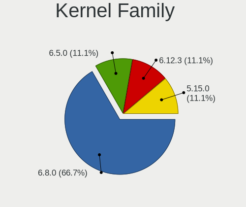
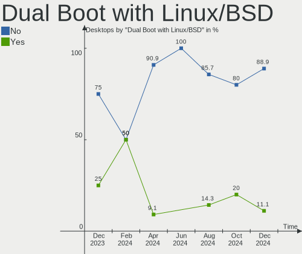
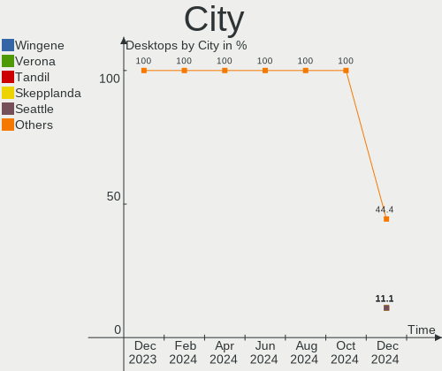
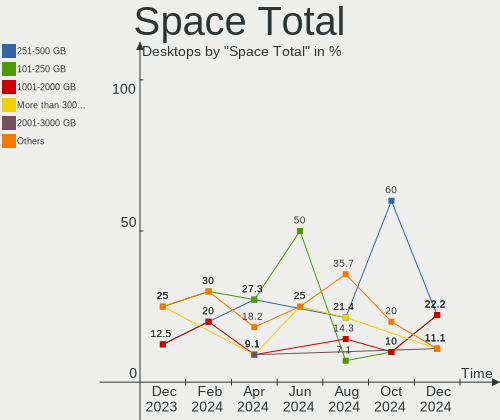
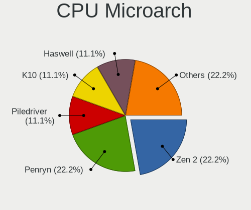
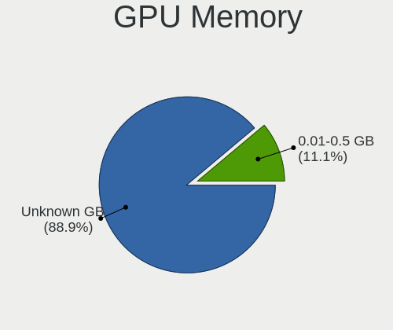
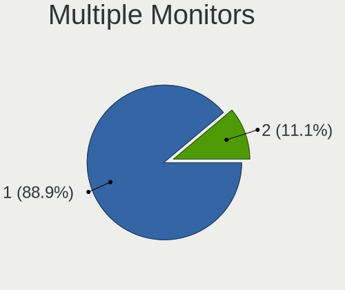

Lubuntu - Hardware Trends (Desktops)
------------------------------------

A project to identify most popular hardware characteristics and track their change
over time based on data collected by Linux users at https://Linux-Hardware.org.

Anyone can contribute to this report by the [hw-probe](https://github.com/linuxhw/hw-probe) tool:

    sudo -E hw-probe -all -upload

This report is for one last month. Overall report since the beginning of time: [TestCoverage](https://github.com/linuxhw/TestCoverage)

Period: Jul, 2022.

Contents
--------

* [ System ](#system)
  - [ OS                       ](#os)
  - [ OS Family                ](#os-family)
  - [ Kernel                   ](#kernel)
  - [ Kernel Family            ](#kernel-family)
  - [ Kernel Major Ver.        ](#kernel-major-ver)
  - [ Arch                     ](#arch)
  - [ DE                       ](#de)
  - [ Display Server           ](#display-server)
  - [ Display Manager          ](#display-manager)
  - [ OS Lang                  ](#os-lang)
  - [ Boot Mode                ](#boot-mode)
  - [ Filesystem               ](#filesystem)
  - [ Part. scheme             ](#part-scheme)
  - [ Dual Boot with Linux/BSD ](#dual-boot-with-linuxbsd)
  - [ Dual Boot (Win)          ](#dual-boot-win)

* [ Board ](#board)
  - [ Vendor                   ](#vendor)
  - [ Model                    ](#model)
  - [ Model Family             ](#model-family)
  - [ MFG Year                 ](#mfg-year)
  - [ Form Factor              ](#form-factor)
  - [ Secure Boot              ](#secure-boot)
  - [ Coreboot                 ](#coreboot)
  - [ RAM Size                 ](#ram-size)
  - [ RAM Used                 ](#ram-used)
  - [ Total Drives             ](#total-drives)
  - [ Has CD-ROM               ](#has-cd-rom)
  - [ Has Ethernet             ](#has-ethernet)
  - [ Has WiFi                 ](#has-wifi)
  - [ Has Bluetooth            ](#has-bluetooth)

* [ Location ](#location)
  - [ Country                  ](#country)
  - [ City                     ](#city)

* [ Drives ](#drives)
  - [ Drive Vendor             ](#drive-vendor)
  - [ Drive Model              ](#drive-model)
  - [ HDD Vendor               ](#hdd-vendor)
  - [ SSD Vendor               ](#ssd-vendor)
  - [ Drive Kind               ](#drive-kind)
  - [ Drive Connector          ](#drive-connector)
  - [ Drive Size               ](#drive-size)
  - [ Space Total              ](#space-total)
  - [ Space Used               ](#space-used)
  - [ Malfunc. Drives          ](#malfunc-drives)
  - [ Malfunc. Drive Vendor    ](#malfunc-drive-vendor)
  - [ Malfunc. HDD Vendor      ](#malfunc-hdd-vendor)
  - [ Malfunc. Drive Kind      ](#malfunc-drive-kind)
  - [ Failed Drives            ](#failed-drives)
  - [ Failed Drive Vendor      ](#failed-drive-vendor)
  - [ Drive Status             ](#drive-status)

* [ Storage controller ](#storage-controller)
  - [ Storage Vendor           ](#storage-vendor)
  - [ Storage Model            ](#storage-model)
  - [ Storage Kind             ](#storage-kind)

* [ Processor ](#processor)
  - [ CPU Vendor               ](#cpu-vendor)
  - [ CPU Model                ](#cpu-model)
  - [ CPU Model Family         ](#cpu-model-family)
  - [ CPU Cores                ](#cpu-cores)
  - [ CPU Sockets              ](#cpu-sockets)
  - [ CPU Threads              ](#cpu-threads)
  - [ CPU Op-Modes             ](#cpu-op-modes)
  - [ CPU Microcode            ](#cpu-microcode)
  - [ CPU Microarch            ](#cpu-microarch)

* [ Graphics ](#graphics)
  - [ GPU Vendor               ](#gpu-vendor)
  - [ GPU Model                ](#gpu-model)
  - [ GPU Combo                ](#gpu-combo)
  - [ GPU Driver               ](#gpu-driver)
  - [ GPU Memory               ](#gpu-memory)

* [ Monitor ](#monitor)
  - [ Monitor Vendor           ](#monitor-vendor)
  - [ Monitor Model            ](#monitor-model)
  - [ Monitor Resolution       ](#monitor-resolution)
  - [ Monitor Diagonal         ](#monitor-diagonal)
  - [ Monitor Width            ](#monitor-width)
  - [ Aspect Ratio             ](#aspect-ratio)
  - [ Monitor Area             ](#monitor-area)
  - [ Pixel Density            ](#pixel-density)
  - [ Multiple Monitors        ](#multiple-monitors)

* [ Network ](#network)
  - [ Net Controller Vendor    ](#net-controller-vendor)
  - [ Net Controller Model     ](#net-controller-model)
  - [ Wireless Vendor          ](#wireless-vendor)
  - [ Wireless Model           ](#wireless-model)
  - [ Ethernet Vendor          ](#ethernet-vendor)
  - [ Ethernet Model           ](#ethernet-model)
  - [ Net Controller Kind      ](#net-controller-kind)
  - [ Used Controller          ](#used-controller)
  - [ NICs                     ](#nics)
  - [ IPv6                     ](#ipv6)

* [ Bluetooth ](#bluetooth)
  - [ Bluetooth Vendor         ](#bluetooth-vendor)
  - [ Bluetooth Model          ](#bluetooth-model)

* [ Sound ](#sound)
  - [ Sound Vendor             ](#sound-vendor)
  - [ Sound Model              ](#sound-model)

* [ Memory ](#memory)
  - [ Memory Vendor            ](#memory-vendor)
  - [ Memory Model             ](#memory-model)
  - [ Memory Kind              ](#memory-kind)
  - [ Memory Form Factor       ](#memory-form-factor)
  - [ Memory Size              ](#memory-size)
  - [ Memory Speed             ](#memory-speed)

* [ Printers & scanners ](#printers--scanners)
  - [ Printer Vendor           ](#printer-vendor)
  - [ Printer Model            ](#printer-model)
  - [ Scanner Vendor           ](#scanner-vendor)
  - [ Scanner Model            ](#scanner-model)

* [ Camera ](#camera)
  - [ Camera Vendor            ](#camera-vendor)
  - [ Camera Model             ](#camera-model)

* [ Security ](#security)
  - [ Fingerprint Vendor       ](#fingerprint-vendor)
  - [ Fingerprint Model        ](#fingerprint-model)
  - [ Chipcard Vendor          ](#chipcard-vendor)
  - [ Chipcard Model           ](#chipcard-model)

* [ Unsupported ](#unsupported)
  - [ Unsupported Devices      ](#unsupported-devices)
  - [ Unsupported Device Types ](#unsupported-device-types)

System
------

OS
--

Installed operating systems

| Name          | Desktops | Percent |
|---------------|----------|---------|
| Lubuntu 22.04 | 8        | 53.33%  |
| Lubuntu 20.04 | 5        | 33.33%  |
| Lubuntu 22.10 | 1        | 6.67%   |
| Lubuntu 18.04 | 1        | 6.67%   |

OS Family
---------

OS without a version

| Name    | Desktops | Percent |
|---------|----------|---------|
| Lubuntu | 15       | 100%    |

Kernel
------

Version of the Linux kernel

| Version            | Desktops | Percent |
|--------------------|----------|---------|
| 5.15.0-41-generic  | 5        | 33.33%  |
| 5.4.0-122-generic  | 4        | 26.67%  |
| 5.4.0-104-generic  | 1        | 6.67%   |
| 5.15.0-43-generic  | 1        | 6.67%   |
| 5.15.0-40-generic  | 1        | 6.67%   |
| 5.15.0-30-generic  | 1        | 6.67%   |
| 5.15.0-25-generic  | 1        | 6.67%   |
| 4.15.0-188-generic | 1        | 6.67%   |

Kernel Family
-------------

Linux kernel without a distro release

| Version | Desktops | Percent |
|---------|----------|---------|
| 5.15.0  | 9        | 60%     |
| 5.4.0   | 5        | 33.33%  |
| 4.15.0  | 1        | 6.67%   |

Kernel Major Ver.
-----------------

Linux kernel major version

| Version | Desktops | Percent |
|---------|----------|---------|
| 5.15    | 9        | 60%     |
| 5.4     | 5        | 33.33%  |
| 4.15    | 1        | 6.67%   |

Arch
----

OS architecture (x86_64, i586, etc.)

| Name   | Desktops | Percent |
|--------|----------|---------|
| x86_64 | 14       | 93.33%  |
| i686   | 1        | 6.67%   |

DE
--

Desktop Environment

| Name  | Desktops | Percent |
|-------|----------|---------|
| LXQt  | 12       | 80%     |
| LXDE  | 2        | 13.33%  |
| GNOME | 1        | 6.67%   |

Display Server
--------------

X11 or Wayland

| Name | Desktops | Percent |
|------|----------|---------|
| X11  | 15       | 100%    |

Display Manager
---------------

SDDM, LightDM, etc.

| Name    | Desktops | Percent |
|---------|----------|---------|
| SDDM    | 10       | 66.67%  |
| LightDM | 3        | 20%     |
| GDM     | 1        | 6.67%   |
| Unknown | 1        | 6.67%   |

OS Lang
-------

Language

| Lang  | Desktops | Percent |
|-------|----------|---------|
| en_US | 7        | 46.67%  |
| de_DE | 3        | 20%     |
| ru_UA | 1        | 6.67%   |
| nl_BE | 1        | 6.67%   |
| it_IT | 1        | 6.67%   |
| es_MX | 1        | 6.67%   |
| en_GB | 1        | 6.67%   |

Boot Mode
---------

EFI or BIOS

| Mode | Desktops | Percent |
|------|----------|---------|
| BIOS | 12       | 80%     |
| EFI  | 3        | 20%     |

Filesystem
----------

Type of filesystem

| Type | Desktops | Percent |
|------|----------|---------|
| Ext4 | 14       | 93.33%  |
| Zfs  | 1        | 6.67%   |

Part. scheme
------------

Scheme of partitioning

| Type    | Desktops | Percent |
|---------|----------|---------|
| Unknown | 11       | 73.33%  |
| GPT     | 3        | 20%     |
| MBR     | 1        | 6.67%   |

Dual Boot with Linux/BSD
------------------------

Hosting more than one Linux/BSD

| Dual boot | Desktops | Percent |
|-----------|----------|---------|
| No        | 11       | 73.33%  |
| Yes       | 4        | 26.67%  |

Dual Boot (Win)
---------------

Hosting Linux and Windows

| Dual boot | Desktops | Percent |
|-----------|----------|---------|
| No        | 8        | 53.33%  |
| Yes       | 7        | 46.67%  |

Board
-----

Vendor
------

Motherboard manufacturer

| Name             | Desktops | Percent |
|------------------|----------|---------|
| MSI              | 5        | 33.33%  |
| Dell             | 3        | 20%     |
| ASRock           | 2        | 13.33%  |
| Intel            | 1        | 6.67%   |
| Hewlett-Packard  | 1        | 6.67%   |
| Foxconn          | 1        | 6.67%   |
| ASUSTek Computer | 1        | 6.67%   |
| AMI              | 1        | 6.67%   |

Model
-----

Motherboard model

| Name                                   | Desktops | Percent |
|----------------------------------------|----------|---------|
| Dell Dimension 9100                    | 2        | 13.33%  |
| MSI MS-7D16                            | 1        | 6.67%   |
| MSI MS-7C37                            | 1        | 6.67%   |
| MSI MS-7B09                            | 1        | 6.67%   |
| MSI MS-7721                            | 1        | 6.67%   |
| MSI ER883AA-ABA M7470N                 | 1        | 6.67%   |
| Intel DQ57TM                           | 1        | 6.67%   |
| HP Compaq 8200 ELITE SMALL FORM FACTOR | 1        | 6.67%   |
| Foxconn CQ1002DE                       | 1        | 6.67%   |
| Dell OptiPlex 7010                     | 1        | 6.67%   |
| ASUS M5A78L LE                         | 1        | 6.67%   |
| ASRock M3A785GMH/128M                  | 1        | 6.67%   |
| ASRock A75M-HVS                        | 1        | 6.67%   |
| AMI Z83-V                              | 1        | 6.67%   |

Model Family
------------

Motherboard model prefix

| Name             | Desktops | Percent |
|------------------|----------|---------|
| Dell Dimension   | 2        | 13.33%  |
| MSI MS-7D16      | 1        | 6.67%   |
| MSI MS-7C37      | 1        | 6.67%   |
| MSI MS-7B09      | 1        | 6.67%   |
| MSI MS-7721      | 1        | 6.67%   |
| MSI ER883AA-ABA  | 1        | 6.67%   |
| Intel DQ57TM     | 1        | 6.67%   |
| HP Compaq        | 1        | 6.67%   |
| Foxconn CQ1002DE | 1        | 6.67%   |
| Dell OptiPlex    | 1        | 6.67%   |
| ASUS M5A78L      | 1        | 6.67%   |
| ASRock M3A785GMH | 1        | 6.67%   |
| ASRock A75M-HVS  | 1        | 6.67%   |
| AMI Z83-V        | 1        | 6.67%   |

MFG Year
--------

Motherboard manufacture year

| Year | Desktops | Percent |
|------|----------|---------|
| 2011 | 4        | 26.67%  |
| 2006 | 3        | 20%     |
| 2017 | 2        | 13.33%  |
| 2013 | 2        | 13.33%  |
| 2021 | 1        | 6.67%   |
| 2019 | 1        | 6.67%   |
| 2016 | 1        | 6.67%   |
| 2009 | 1        | 6.67%   |

Form Factor
-----------

Physical design of the computer

| Name    | Desktops | Percent |
|---------|----------|---------|
| Desktop | 15       | 100%    |

Secure Boot
-----------

Enabled or disabled

| State    | Desktops | Percent |
|----------|----------|---------|
| Disabled | 15       | 100%    |

Coreboot
--------

Have coreboot on board

| Used | Desktops | Percent |
|------|----------|---------|
| No   | 15       | 100%    |

RAM Size
--------

Total RAM memory

| Size in GB  | Desktops | Percent |
|-------------|----------|---------|
| 8.01-16.0   | 4        | 26.67%  |
| 3.01-4.0    | 3        | 20%     |
| 4.01-8.0    | 2        | 13.33%  |
| 0.51-1.0    | 2        | 13.33%  |
| 32.01-64.0  | 1        | 6.67%   |
| 64.01-256.0 | 1        | 6.67%   |
| 16.01-24.0  | 1        | 6.67%   |
| 1.01-2.0    | 1        | 6.67%   |

RAM Used
--------

Used RAM memory

| Used GB    | Desktops | Percent |
|------------|----------|---------|
| 1.01-2.0   | 6        | 40%     |
| 2.01-3.0   | 3        | 20%     |
| 0.51-1.0   | 3        | 20%     |
| 4.01-8.0   | 1        | 6.67%   |
| 32.01-64.0 | 1        | 6.67%   |
| 3.01-4.0   | 1        | 6.67%   |

Total Drives
------------

Number of drives on board

| Drives | Desktops | Percent |
|--------|----------|---------|
| 2      | 5        | 33.33%  |
| 1      | 4        | 26.67%  |
| 5      | 2        | 13.33%  |
| 17     | 1        | 6.67%   |
| 6      | 1        | 6.67%   |
| 4      | 1        | 6.67%   |
| 3      | 1        | 6.67%   |

Has CD-ROM
----------

Has CD-ROM on board

| Presented | Desktops | Percent |
|-----------|----------|---------|
| No        | 9        | 60%     |
| Yes       | 6        | 40%     |

Has Ethernet
------------

Has Ethernet on board

| Presented | Desktops | Percent |
|-----------|----------|---------|
| Yes       | 14       | 93.33%  |
| No        | 1        | 6.67%   |

Has WiFi
--------

Has WiFi module

| Presented | Desktops | Percent |
|-----------|----------|---------|
| Yes       | 9        | 60%     |
| No        | 6        | 40%     |

Has Bluetooth
-------------

Has Bluetooth module

| Presented | Desktops | Percent |
|-----------|----------|---------|
| No        | 13       | 86.67%  |
| Yes       | 2        | 13.33%  |

Location
--------

Country
-------

Geographic location (country)

| Country  | Desktops | Percent |
|----------|----------|---------|
| USA      | 4        | 26.67%  |
| Germany  | 3        | 20%     |
| Ukraine  | 1        | 6.67%   |
| UK       | 1        | 6.67%   |
| Slovakia | 1        | 6.67%   |
| Mexico   | 1        | 6.67%   |
| Italy    | 1        | 6.67%   |
| Ireland  | 1        | 6.67%   |
| Bulgaria | 1        | 6.67%   |
| Belgium  | 1        | 6.67%   |

City
----

Geographic location (city)

| City        | Desktops | Percent |
|-------------|----------|---------|
| Largo       | 2        | 13.33%  |
| Zeuthen     | 1        | 6.67%   |
| Wetteren    | 1        | 6.67%   |
| Varna       | 1        | 6.67%   |
| Stedesand   | 1        | 6.67%   |
| Sonico      | 1        | 6.67%   |
| Saint Paul  | 1        | 6.67%   |
| Nitra       | 1        | 6.67%   |
| Mexico City | 1        | 6.67%   |
| Kyiv        | 1        | 6.67%   |
| Garbsen     | 1        | 6.67%   |
| Dublin      | 1        | 6.67%   |
| Chicago     | 1        | 6.67%   |
| Bradford    | 1        | 6.67%   |

Drives
------

Drive Vendor
------------

Hard drive vendors

| Vendor              | Desktops | Drives | Percent |
|---------------------|----------|--------|---------|
| Seagate             | 7        | 8      | 21.88%  |
| WDC                 | 5        | 9      | 15.63%  |
| Samsung Electronics | 4        | 7      | 12.5%   |
| Toshiba             | 2        | 2      | 6.25%   |
| SanDisk             | 2        | 2      | 6.25%   |
| Hitachi             | 2        | 2      | 6.25%   |
| Crucial             | 2        | 14     | 6.25%   |
| TO Exter            | 1        | 1      | 3.13%   |
| Team                | 1        | 1      | 3.13%   |
| Kingston            | 1        | 2      | 3.13%   |
| Intenso             | 1        | 1      | 3.13%   |
| HGST                | 1        | 1      | 3.13%   |
| Hewlett-Packard     | 1        | 2      | 3.13%   |
| Apricorn            | 1        | 1      | 3.13%   |
| A-DATA Technology   | 1        | 1      | 3.13%   |

Drive Model
-----------

Hard drive models

| Model                                       | Desktops | Percent |
|---------------------------------------------|----------|---------|
| Toshiba DT01ACA100 1TB                      | 2        | 5%      |
| Seagate ST3120213AS 120GB                   | 2        | 5%      |
| WDC WDS100T1X0E-00AFY0 1TB                  | 1        | 2.5%    |
| WDC WD5000AAKX-75U6AA0 500GB                | 1        | 2.5%    |
| WDC WD5000AAKX-07U6AA0 500GB                | 1        | 2.5%    |
| WDC WD30EZRZ-00GXCB0 3TB                    | 1        | 2.5%    |
| WDC WD20EZBX-00AYRA0 2TB                    | 1        | 2.5%    |
| WDC WD10TPVT-00HT5T0 1TB                    | 1        | 2.5%    |
| WDC WD10EZRZ-00Z5HB0 1TB                    | 1        | 2.5%    |
| WDC WD10EURX-63C57Y0 1TB                    | 1        | 2.5%    |
| WDC WD1001FALS-41K1B0 1TB                   | 1        | 2.5%    |
| TO Exter nal USB 3.0 1TB                    | 1        | 2.5%    |
| Team TM8PS7256G 256GB SSD                   | 1        | 2.5%    |
| Seagate ST500DM002-1BD142 500GB             | 1        | 2.5%    |
| Seagate ST360012A 64GB                      | 1        | 2.5%    |
| Seagate ST2000VN000-1HJ164 2TB              | 1        | 2.5%    |
| Seagate ST2000NE001-2M5101 2TB              | 1        | 2.5%    |
| Seagate ST1000DX001-1CM162 1TB              | 1        | 2.5%    |
| Seagate FireCuda 520 SSD ZP500GM30002 500GB | 1        | 2.5%    |
| SanDisk SSD PLUS 120GB                      | 1        | 2.5%    |
| SanDisk DF4032  32GB                        | 1        | 2.5%    |
| Samsung SSD 970 EVO 500GB                   | 1        | 2.5%    |
| Samsung NVMe SSD Drive 500GB                | 1        | 2.5%    |
| Samsung MZ7LN128HAHQ-000L2 128GB SSD        | 1        | 2.5%    |
| Samsung HD502IJ 500GB                       | 1        | 2.5%    |
| Samsung HD502HJ 500GB                       | 1        | 2.5%    |
| Samsung HD103SI 1TB                         | 1        | 2.5%    |
| Kingston SV300S37A120G 120GB SSD            | 1        | 2.5%    |
| Intenso SSD Sata III 960GB                  | 1        | 2.5%    |
| Hitachi HDS721616PLA380 160GB               | 1        | 2.5%    |
| Hitachi HDS721010CLA632 1TB                 | 1        | 2.5%    |
| HGST HTS545032A7E380 320GB                  | 1        | 2.5%    |
| HP SSD S700 1TB                             | 1        | 2.5%    |
| Crucial CT960BX500SSD1 960GB                | 1        | 2.5%    |
| Crucial CT240BX200SSD1 240GB                | 1        | 2.5%    |
| Crucial CT1000BX500SSD1 1TB                 | 1        | 2.5%    |
| Apricorn SATAWire 6G                        | 1        | 2.5%    |
| A-DATA SU800 1024GB SSD                     | 1        | 2.5%    |

HDD Vendor
----------

Hard disk drive vendors

| Vendor              | Desktops | Drives | Percent |
|---------------------|----------|--------|---------|
| Seagate             | 7        | 7      | 35%     |
| WDC                 | 5        | 8      | 25%     |
| Toshiba             | 2        | 2      | 10%     |
| Samsung Electronics | 2        | 3      | 10%     |
| Hitachi             | 2        | 2      | 10%     |
| HGST                | 1        | 1      | 5%      |
| Apricorn            | 1        | 1      | 5%      |

SSD Vendor
----------

Solid state drive vendors

| Vendor              | Desktops | Drives | Percent |
|---------------------|----------|--------|---------|
| Crucial             | 2        | 14     | 20%     |
| TO Exter            | 1        | 1      | 10%     |
| Team                | 1        | 1      | 10%     |
| SanDisk             | 1        | 1      | 10%     |
| Samsung Electronics | 1        | 1      | 10%     |
| Kingston            | 1        | 2      | 10%     |
| Intenso             | 1        | 1      | 10%     |
| Hewlett-Packard     | 1        | 2      | 10%     |
| A-DATA Technology   | 1        | 1      | 10%     |

Drive Kind
----------

HDD or SSD

| Kind | Desktops | Drives | Percent |
|------|----------|--------|---------|
| HDD  | 11       | 24     | 50%     |
| SSD  | 8        | 24     | 36.36%  |
| NVMe | 2        | 5      | 9.09%   |
| MMC  | 1        | 1      | 4.55%   |

Drive Connector
---------------

SATA, SAS, NVMe, etc.

| Type | Desktops | Drives | Percent |
|------|----------|--------|---------|
| SATA | 14       | 46     | 77.78%  |
| NVMe | 2        | 5      | 11.11%  |
| SAS  | 1        | 2      | 5.56%   |
| MMC  | 1        | 1      | 5.56%   |

Drive Size
----------

Size of hard drive

| Size in TB | Desktops | Drives | Percent |
|------------|----------|--------|---------|
| 0.51-1.0   | 9        | 26     | 39.13%  |
| 0.01-0.5   | 9        | 16     | 39.13%  |
| 1.01-2.0   | 4        | 5      | 17.39%  |
| 2.01-3.0   | 1        | 1      | 4.35%   |

Space Total
-----------

Amount of disk space available on the file system

| Size in GB     | Desktops | Percent |
|----------------|----------|---------|
| 21-50          | 3        | 20%     |
| 251-500        | 2        | 13.33%  |
| 2001-3000      | 2        | 13.33%  |
| 101-250        | 2        | 13.33%  |
| 1001-2000      | 2        | 13.33%  |
| 501-1000       | 2        | 13.33%  |
| More than 3000 | 1        | 6.67%   |
| 51-100         | 1        | 6.67%   |

Space Used
----------

Amount of used disk space

| Used GB   | Desktops | Percent |
|-----------|----------|---------|
| 1-20      | 6        | 40%     |
| 501-1000  | 4        | 26.67%  |
| 21-50     | 2        | 13.33%  |
| 1001-2000 | 2        | 13.33%  |
| 101-250   | 1        | 6.67%   |

Malfunc. Drives
---------------

Drive models with a malfunction

| Model                             | Desktops | Drives | Percent |
|-----------------------------------|----------|--------|---------|
| Seagate ST360012A 64GB            | 1        | 1      | 33.33%  |
| SanDisk SSD PLUS 120GB            | 1        | 1      | 33.33%  |
| Samsung Electronics HD502IJ 500GB | 1        | 1      | 33.33%  |

Malfunc. Drive Vendor
---------------------

Vendors of faulty drives

| Vendor              | Desktops | Drives | Percent |
|---------------------|----------|--------|---------|
| Seagate             | 1        | 1      | 33.33%  |
| SanDisk             | 1        | 1      | 33.33%  |
| Samsung Electronics | 1        | 1      | 33.33%  |

Malfunc. HDD Vendor
-------------------

Vendors of faulty HDD drives

| Vendor              | Desktops | Drives | Percent |
|---------------------|----------|--------|---------|
| Seagate             | 1        | 1      | 50%     |
| Samsung Electronics | 1        | 1      | 50%     |

Malfunc. Drive Kind
-------------------

Kinds of faulty drives

| Kind | Desktops | Drives | Percent |
|------|----------|--------|---------|
| SSD  | 1        | 1      | 50%     |
| HDD  | 1        | 2      | 50%     |

Failed Drives
-------------

Failed drive models

Zero info for selected period =(

Failed Drive Vendor
-------------------

Failed drive vendors

Zero info for selected period =(

Drive Status
------------

Number of failed and malfunc. drives

| Status   | Desktops | Drives | Percent |
|----------|----------|--------|---------|
| Detected | 12       | 39     | 75%     |
| Works    | 3        | 12     | 18.75%  |
| Malfunc  | 1        | 3      | 6.25%   |

Storage controller
------------------

Storage Vendor
--------------

Storage controller vendors

| Vendor                   | Desktops | Percent |
|--------------------------|----------|---------|
| AMD                      | 8        | 42.11%  |
| Intel                    | 6        | 31.58%  |
| Seagate Technology       | 1        | 5.26%   |
| SanDisk                  | 1        | 5.26%   |
| Samsung Electronics      | 1        | 5.26%   |
| Marvell Technology Group | 1        | 5.26%   |
| ASMedia Technology       | 1        | 5.26%   |

Storage Model
-------------

Storage controller models

| Model                                                                                   | Desktops | Percent |
|-----------------------------------------------------------------------------------------|----------|---------|
| AMD FCH SATA Controller [AHCI mode]                                                     | 4        | 13.79%  |
| Intel NM10/ICH7 Family SATA Controller [AHCI mode]                                      | 2        | 6.9%    |
| Intel 82801G (ICH7 Family) IDE Controller                                               | 2        | 6.9%    |
| AMD SB7x0/SB8x0/SB9x0 SATA Controller [AHCI mode]                                       | 2        | 6.9%    |
| AMD SB7x0/SB8x0/SB9x0 IDE Controller                                                    | 2        | 6.9%    |
| Seagate FireCuda 520 SSD                                                                | 1        | 3.45%   |
| SanDisk WD PC SN810 / Black SN850 NVMe SSD                                              | 1        | 3.45%   |
| Samsung NVMe SSD Controller SM981/PM981/PM983                                           | 1        | 3.45%   |
| Marvell Group 88SE9480 SAS/SATA 6Gb/s RAID controller                                   | 1        | 3.45%   |
| Intel NM10/ICH7 Family SATA Controller [IDE mode]                                       | 1        | 3.45%   |
| Intel 7 Series/C210 Series Chipset Family 6-port SATA Controller [AHCI mode]            | 1        | 3.45%   |
| Intel 6 Series/C200 Series Chipset Family Desktop SATA Controller (IDE mode, ports 4-5) | 1        | 3.45%   |
| Intel 6 Series/C200 Series Chipset Family Desktop SATA Controller (IDE mode, ports 0-3) | 1        | 3.45%   |
| Intel 500 Series Chipset Family SATA AHCI Controller                                    | 1        | 3.45%   |
| Intel 5 Series/3400 Series Chipset PT IDER Controller                                   | 1        | 3.45%   |
| Intel 5 Series/3400 Series Chipset 4 port SATA IDE Controller                           | 1        | 3.45%   |
| Intel 5 Series/3400 Series Chipset 2 port SATA IDE Controller                           | 1        | 3.45%   |
| ASMedia ASM1062 Serial ATA Controller                                                   | 1        | 3.45%   |
| AMD X399 Series Chipset SATA Controller                                                 | 1        | 3.45%   |
| AMD SB7x0/SB8x0/SB9x0 SATA Controller [IDE mode]                                        | 1        | 3.45%   |
| AMD IXP SB4x0 Serial ATA Controller                                                     | 1        | 3.45%   |
| AMD IXP SB4x0 IDE Controller                                                            | 1        | 3.45%   |

Storage Kind
------------

Kind of storage controller (IDE, SATA, NVMe, SAS, ...)

| Kind | Desktops | Percent |
|------|----------|---------|
| SATA | 11       | 52.38%  |
| IDE  | 7        | 33.33%  |
| NVMe | 2        | 9.52%   |
| RAID | 1        | 4.76%   |

Processor
---------

CPU Vendor
----------

Processor vendors

| Vendor | Desktops | Percent |
|--------|----------|---------|
| AMD    | 8        | 53.33%  |
| Intel  | 7        | 46.67%  |

CPU Model
---------

Processor models

| Model                                          | Desktops | Percent |
|------------------------------------------------|----------|---------|
| Intel Pentium D CPU 2.80GHz                    | 2        | 13.33%  |
| Intel Core i5-3470 CPU @ 3.20GHz               | 1        | 6.67%   |
| Intel Core i5 CPU 650 @ 3.20GHz                | 1        | 6.67%   |
| Intel Core i3-2120 CPU @ 3.30GHz               | 1        | 6.67%   |
| Intel Core i3-10100F CPU @ 3.60GHz             | 1        | 6.67%   |
| Intel Atom x5-Z8350 CPU @ 1.44GHz              | 1        | 6.67%   |
| AMD Ryzen Threadripper 2950X 16-Core Processor | 1        | 6.67%   |
| AMD Ryzen 7 5800X 8-Core Processor             | 1        | 6.67%   |
| AMD Phenom II X4 965 Processor                 | 1        | 6.67%   |
| AMD FX-6300 Six-Core Processor                 | 1        | 6.67%   |
| AMD E-350 Processor                            | 1        | 6.67%   |
| AMD Athlon 64 X2 Dual Core Processor 4200+     | 1        | 6.67%   |
| AMD A8-6600K APU with Radeon HD Graphics       | 1        | 6.67%   |
| AMD A8-3850 APU with Radeon HD Graphics        | 1        | 6.67%   |

CPU Model Family
----------------

Processor model prefix

| Model                  | Desktops | Percent |
|------------------------|----------|---------|
| Intel Pentium D        | 2        | 13.33%  |
| Intel Core i5          | 2        | 13.33%  |
| Intel Core i3          | 2        | 13.33%  |
| AMD A8                 | 2        | 13.33%  |
| Intel Atom             | 1        | 6.67%   |
| AMD Ryzen Threadripper | 1        | 6.67%   |
| AMD Ryzen 7            | 1        | 6.67%   |
| AMD Phenom II X4       | 1        | 6.67%   |
| AMD FX                 | 1        | 6.67%   |
| AMD E                  | 1        | 6.67%   |
| AMD Athlon 64 X2       | 1        | 6.67%   |

CPU Cores
---------

Number of processor cores

| Number | Desktops | Percent |
|--------|----------|---------|
| 2      | 7        | 46.67%  |
| 4      | 5        | 33.33%  |
| 16     | 1        | 6.67%   |
| 8      | 1        | 6.67%   |
| 3      | 1        | 6.67%   |

CPU Sockets
-----------

Number of sockets

| Number | Desktops | Percent |
|--------|----------|---------|
| 1      | 15       | 100%    |

CPU Threads
-----------

Threads per core (Hyper-Threading)

| Number | Desktops | Percent |
|--------|----------|---------|
| 1      | 8        | 53.33%  |
| 2      | 7        | 46.67%  |

CPU Op-Modes
------------

CPU Operation Modes (32-bit, 64-bit)

| Op mode        | Desktops | Percent |
|----------------|----------|---------|
| 32-bit, 64-bit | 15       | 100%    |

CPU Microcode
-------------

Microcode number

| Number     | Desktops | Percent |
|------------|----------|---------|
| Unknown    | 8        | 53.33%  |
| 0xa0653    | 1        | 6.67%   |
| 0x406c4    | 1        | 6.67%   |
| 0x0a201009 | 1        | 6.67%   |
| 0x0800820d | 1        | 6.67%   |
| 0x06001119 | 1        | 6.67%   |
| 0x05000029 | 1        | 6.67%   |
| 0x010000c8 | 1        | 6.67%   |

CPU Microarch
-------------

Microarchitecture

| Name        | Desktops | Percent |
|-------------|----------|---------|
| Piledriver  | 2        | 13.33%  |
| NetBurst    | 2        | 13.33%  |
| Zen+        | 1        | 6.67%   |
| Zen 3       | 1        | 6.67%   |
| Westmere    | 1        | 6.67%   |
| Silvermont  | 1        | 6.67%   |
| SandyBridge | 1        | 6.67%   |
| K8 Hammer   | 1        | 6.67%   |
| K10 Llano   | 1        | 6.67%   |
| K10         | 1        | 6.67%   |
| IvyBridge   | 1        | 6.67%   |
| CometLake   | 1        | 6.67%   |
| Bobcat      | 1        | 6.67%   |

Graphics
--------

GPU Vendor
----------

Vendors of graphics cards

| Vendor | Desktops | Percent |
|--------|----------|---------|
| Nvidia | 7        | 43.75%  |
| AMD    | 6        | 37.5%   |
| Intel  | 3        | 18.75%  |

GPU Model
---------

Graphics card models

| Model                                                                                    | Desktops | Percent |
|------------------------------------------------------------------------------------------|----------|---------|
| Nvidia GP107 [GeForce GTX 1050 Ti]                                                       | 2        | 11.11%  |
| Nvidia GK208B [GeForce GT 710]                                                           | 2        | 11.11%  |
| AMD RV380 [Radeon X300/X550/X1050 Series] (Secondary)                                    | 2        | 11.11%  |
| AMD RV370 [Radeon X600/X600 SE]                                                          | 2        | 11.11%  |
| Nvidia GT218 [GeForce 8400 GS Rev. 3]                                                    | 1        | 5.56%   |
| Nvidia GA104 [GeForce RTX 3070]                                                          | 1        | 5.56%   |
| Nvidia G86 [Quadro NVS 290]                                                              | 1        | 5.56%   |
| Intel Xeon E3-1200 v2/3rd Gen Core processor Graphics Controller                         | 1        | 5.56%   |
| Intel Core Processor Integrated Graphics Controller                                      | 1        | 5.56%   |
| Intel Atom/Celeron/Pentium Processor x5-E8000/J3xxx/N3xxx Integrated Graphics Controller | 1        | 5.56%   |
| AMD Wrestler [Radeon HD 6310]                                                            | 1        | 5.56%   |
| AMD RS480 [Radeon Xpress 200 Series]                                                     | 1        | 5.56%   |
| AMD Richland [Radeon HD 8570D]                                                           | 1        | 5.56%   |
| AMD Juniper XT [Radeon HD 5770]                                                          | 1        | 5.56%   |

GPU Combo
---------

Combinations of graphics cards

| Name       | Desktops | Percent |
|------------|----------|---------|
| 1 x Nvidia | 7        | 46.67%  |
| 1 x AMD    | 4        | 26.67%  |
| 2 x AMD    | 2        | 13.33%  |
| 1 x Intel  | 2        | 13.33%  |

GPU Driver
----------

Free vs proprietary

| Driver      | Desktops | Percent |
|-------------|----------|---------|
| Free        | 10       | 66.67%  |
| Proprietary | 3        | 20%     |
| Unknown     | 2        | 13.33%  |

GPU Memory
----------

Total video memory

| Size in GB | Desktops | Percent |
|------------|----------|---------|
| Unknown    | 9        | 60%     |
| 3.01-4.0   | 2        | 13.33%  |
| 0.01-0.5   | 2        | 13.33%  |
| 7.01-8.0   | 1        | 6.67%   |
| 0.51-1.0   | 1        | 6.67%   |

Monitor
-------

Monitor Vendor
--------------

Monitor vendors

| Vendor              | Desktops | Percent |
|---------------------|----------|---------|
| Samsung Electronics | 3        | 25%     |
| Hewlett-Packard     | 3        | 25%     |
| Videoseven          | 1        | 8.33%   |
| SHD                 | 1        | 8.33%   |
| Goldstar            | 1        | 8.33%   |
| Dell                | 1        | 8.33%   |
| BenQ                | 1        | 8.33%   |
| Acer                | 1        | 8.33%   |

Monitor Model
-------------

Monitor models

| Model                                                              | Desktops | Percent |
|--------------------------------------------------------------------|----------|---------|
| Videoseven L19FM IGM0812 1280x1024 376x301mm 19.0-inch             | 1        | 8.33%   |
| SHD 701Lite SHD02BD 1920x1080 110x62mm 5.0-inch                    | 1        | 8.33%   |
| Samsung Electronics SMB2230N SAM0635 1920x1080 477x268mm 21.5-inch | 1        | 8.33%   |
| Samsung Electronics LC27G7xT SAM105C 2560x1440 597x336mm 27.0-inch | 1        | 8.33%   |
| Samsung Electronics C27F390 SAM0D32 1920x1080 598x336mm 27.0-inch  | 1        | 8.33%   |
| Hewlett-Packard W2071d HWP299E 1600x900 443x249mm 20.0-inch        | 1        | 8.33%   |
| Hewlett-Packard E201 HWP305E 1600x900 443x249mm 20.0-inch          | 1        | 8.33%   |
| Hewlett-Packard 2011 HWP2935 1600x900 443x249mm 20.0-inch          | 1        | 8.33%   |
| Goldstar L1952T GSM4AE1 1280x1024 376x301mm 19.0-inch              | 1        | 8.33%   |
| Dell U2312HM DEL4072 1920x1080 510x287mm 23.0-inch                 | 1        | 8.33%   |
| BenQ FP93GX BNQ76D5 1280x1024 376x301mm 19.0-inch                  | 1        | 8.33%   |
| Acer EB490QK ACR061A 3840x2160 1074x604mm 48.5-inch                | 1        | 8.33%   |

Monitor Resolution
------------------

Monitor screen resolution

| Resolution       | Desktops | Percent |
|------------------|----------|---------|
| 1920x1080 (FHD)  | 3        | 27.27%  |
| 1600x900 (HD+)   | 3        | 27.27%  |
| 1280x1024 (SXGA) | 3        | 27.27%  |
| 3840x2160 (4K)   | 1        | 9.09%   |
| 2560x1440 (QHD)  | 1        | 9.09%   |

Monitor Diagonal
----------------

Diagonal size in inches

| Inches | Desktops | Percent |
|--------|----------|---------|
| 20     | 3        | 25%     |
| 19     | 3        | 25%     |
| 27     | 2        | 16.67%  |
| 48     | 1        | 8.33%   |
| 23     | 1        | 8.33%   |
| 21     | 1        | 8.33%   |
| 5      | 1        | 8.33%   |

Monitor Width
-------------

Physical width

| Width in mm | Desktops | Percent |
|-------------|----------|---------|
| 401-500     | 4        | 33.33%  |
| 501-600     | 3        | 25%     |
| 351-400     | 3        | 25%     |
| 101-200     | 1        | 8.33%   |
| 1001-1500   | 1        | 8.33%   |

Aspect Ratio
------------

Proportional relationship between the width and the height

| Ratio | Desktops | Percent |
|-------|----------|---------|
| 16/9  | 8        | 72.73%  |
| 5/4   | 3        | 27.27%  |

Monitor Area
------------

Area in inch²

| Area in inch² | Desktops | Percent |
|----------------|----------|---------|
| 151-200        | 6        | 54.55%  |
| 301-350        | 2        | 18.18%  |
| More than 1000 | 1        | 9.09%   |
| 1-40           | 1        | 9.09%   |
| 201-250        | 1        | 9.09%   |

Pixel Density
-------------

Pixels per inch

| Density       | Desktops | Percent |
|---------------|----------|---------|
| 51-100        | 9        | 75%     |
| 101-120       | 2        | 16.67%  |
| More than 240 | 1        | 8.33%   |

Multiple Monitors
-----------------

Total monitors connected

| Total | Desktops | Percent |
|-------|----------|---------|
| 1     | 12       | 80%     |
| 0     | 2        | 13.33%  |
| 2     | 1        | 6.67%   |

Network
-------

Net Controller Vendor
---------------------

Controller vendors

| Vendor                | Desktops | Percent |
|-----------------------|----------|---------|
| Realtek Semiconductor | 8        | 36.36%  |
| Intel                 | 8        | 36.36%  |
| Broadcom              | 2        | 9.09%   |
| TP-Link               | 1        | 4.55%   |
| Ralink Technology     | 1        | 4.55%   |
| Ralink                | 1        | 4.55%   |
| ADMtek                | 1        | 4.55%   |

Net Controller Model
--------------------

Controller models

| Model                                                               | Desktops | Percent |
|---------------------------------------------------------------------|----------|---------|
| Realtek RTL8111/8168/8411 PCI Express Gigabit Ethernet Controller   | 5        | 20.83%  |
| Intel NM10/ICH7 Family LAN Controller                               | 2        | 8.33%   |
| Intel 82579LM Gigabit Network Connection (Lewisville)               | 2        | 8.33%   |
| Broadcom BCM4318 [AirForce One 54g] 802.11g Wireless LAN Controller | 2        | 8.33%   |
| TP-Link TL-WN822N Version 4 RTL8192EU                               | 1        | 4.17%   |
| Realtek RTL8188ETV Wireless LAN 802.11n Network Adapter             | 1        | 4.17%   |
| Realtek RTL8125 2.5GbE Controller                                   | 1        | 4.17%   |
| Realtek RTL810xE PCI Express Fast Ethernet controller               | 1        | 4.17%   |
| Realtek RTL-8100/8101L/8139 PCI Fast Ethernet Adapter               | 1        | 4.17%   |
| Realtek 802.11ac NIC                                                | 1        | 4.17%   |
| Ralink RT5370 Wireless Adapter                                      | 1        | 4.17%   |
| Ralink RT2561/RT61 802.11g PCI                                      | 1        | 4.17%   |
| Intel Wi-Fi 6 AX200                                                 | 1        | 4.17%   |
| Intel Tiger Lake PCH CNVi WiFi                                      | 1        | 4.17%   |
| Intel I211 Gigabit Network Connection                               | 1        | 4.17%   |
| Intel 82578DM Gigabit Network Connection                            | 1        | 4.17%   |
| ADMtek NC100 Network Everywhere Fast Ethernet 10/100                | 1        | 4.17%   |

Wireless Vendor
---------------

Wireless vendors

| Vendor                | Desktops | Percent |
|-----------------------|----------|---------|
| Realtek Semiconductor | 2        | 22.22%  |
| Intel                 | 2        | 22.22%  |
| Broadcom              | 2        | 22.22%  |
| TP-Link               | 1        | 11.11%  |
| Ralink Technology     | 1        | 11.11%  |
| Ralink                | 1        | 11.11%  |

Wireless Model
--------------

Wireless models

| Model                                                               | Desktops | Percent |
|---------------------------------------------------------------------|----------|---------|
| Broadcom BCM4318 [AirForce One 54g] 802.11g Wireless LAN Controller | 2        | 22.22%  |
| TP-Link TL-WN822N Version 4 RTL8192EU                               | 1        | 11.11%  |
| Realtek RTL8188ETV Wireless LAN 802.11n Network Adapter             | 1        | 11.11%  |
| Realtek 802.11ac NIC                                                | 1        | 11.11%  |
| Ralink RT5370 Wireless Adapter                                      | 1        | 11.11%  |
| Ralink RT2561/RT61 802.11g PCI                                      | 1        | 11.11%  |
| Intel Wi-Fi 6 AX200                                                 | 1        | 11.11%  |
| Intel Tiger Lake PCH CNVi WiFi                                      | 1        | 11.11%  |

Ethernet Vendor
---------------

Ethernet vendors

| Vendor                | Desktops | Percent |
|-----------------------|----------|---------|
| Realtek Semiconductor | 8        | 53.33%  |
| Intel                 | 6        | 40%     |
| ADMtek                | 1        | 6.67%   |

Ethernet Model
--------------

Ethernet models

| Model                                                             | Desktops | Percent |
|-------------------------------------------------------------------|----------|---------|
| Realtek RTL8111/8168/8411 PCI Express Gigabit Ethernet Controller | 5        | 33.33%  |
| Intel NM10/ICH7 Family LAN Controller                             | 2        | 13.33%  |
| Intel 82579LM Gigabit Network Connection (Lewisville)             | 2        | 13.33%  |
| Realtek RTL8125 2.5GbE Controller                                 | 1        | 6.67%   |
| Realtek RTL810xE PCI Express Fast Ethernet controller             | 1        | 6.67%   |
| Realtek RTL-8100/8101L/8139 PCI Fast Ethernet Adapter             | 1        | 6.67%   |
| Intel I211 Gigabit Network Connection                             | 1        | 6.67%   |
| Intel 82578DM Gigabit Network Connection                          | 1        | 6.67%   |
| ADMtek NC100 Network Everywhere Fast Ethernet 10/100              | 1        | 6.67%   |

Net Controller Kind
-------------------

Ethernet, WiFi or modem

| Kind     | Desktops | Percent |
|----------|----------|---------|
| Ethernet | 14       | 60.87%  |
| WiFi     | 9        | 39.13%  |

Used Controller
---------------

Currently used network controller

| Kind     | Desktops | Percent |
|----------|----------|---------|
| Ethernet | 9        | 60%     |
| WiFi     | 6        | 40%     |

NICs
----

Total network controllers on board

| Total | Desktops | Percent |
|-------|----------|---------|
| 1     | 9        | 60%     |
| 2     | 4        | 26.67%  |
| 3     | 1        | 6.67%   |
| 0     | 1        | 6.67%   |

IPv6
----

IPv6 vs IPv4

| Used | Desktops | Percent |
|------|----------|---------|
| No   | 10       | 66.67%  |
| Yes  | 5        | 33.33%  |

Bluetooth
---------

Bluetooth Vendor
----------------

Controller vendors

| Vendor | Desktops | Percent |
|--------|----------|---------|
| Intel  | 2        | 100%    |

Bluetooth Model
---------------

Controller models

| Model                 | Desktops | Percent |
|-----------------------|----------|---------|
| Intel AX201 Bluetooth | 1        | 50%     |
| Intel AX200 Bluetooth | 1        | 50%     |

Sound
-----

Sound Vendor
------------

Sound card vendors

| Vendor              | Desktops | Percent |
|---------------------|----------|---------|
| AMD                 | 7        | 33.33%  |
| Nvidia              | 6        | 28.57%  |
| Intel               | 6        | 28.57%  |
| Creative Labs       | 1        | 4.76%   |
| C-Media Electronics | 1        | 4.76%   |

Sound Model
-----------

Sound card models

| Model                                                                      | Desktops | Percent |
|----------------------------------------------------------------------------|----------|---------|
| Nvidia GP107GL High Definition Audio Controller                            | 2        | 8.7%    |
| Nvidia GK208 HDMI/DP Audio Controller                                      | 2        | 8.7%    |
| Intel NM10/ICH7 Family High Definition Audio Controller                    | 2        | 8.7%    |
| AMD SBx00 Azalia (Intel HDA)                                               | 2        | 8.7%    |
| AMD FCH Azalia Controller                                                  | 2        | 8.7%    |
| Nvidia High Definition Audio Controller                                    | 1        | 4.35%   |
| Nvidia GA104 High Definition Audio Controller                              | 1        | 4.35%   |
| Intel Audio device                                                         | 1        | 4.35%   |
| Intel 7 Series/C216 Chipset Family High Definition Audio Controller        | 1        | 4.35%   |
| Intel 6 Series/C200 Series Chipset Family High Definition Audio Controller | 1        | 4.35%   |
| Intel 5 Series/3400 Series Chipset High Definition Audio                   | 1        | 4.35%   |
| Creative Labs EMU10k1 [Sound Blaster Live! Series]                         | 1        | 4.35%   |
| C-Media Electronics CMI8738/CMI8768 PCI Audio                              | 1        | 4.35%   |
| AMD Trinity HDMI Audio Controller                                          | 1        | 4.35%   |
| AMD Starship/Matisse HD Audio Controller                                   | 1        | 4.35%   |
| AMD Juniper HDMI Audio [Radeon HD 5700 Series]                             | 1        | 4.35%   |
| AMD IXP SB400 AC'97 Audio Controller                                       | 1        | 4.35%   |
| AMD Family 17h (Models 00h-0fh) HD Audio Controller                        | 1        | 4.35%   |

Memory
------

Memory Vendor
-------------

Memory module vendors

| Vendor   | Desktops | Percent |
|----------|----------|---------|
| G.Skill  | 2        | 50%     |
| Unknown  | 1        | 25%     |
| SK hynix | 1        | 25%     |

Memory Model
------------

Memory module models

| Model                                                 | Desktops | Percent |
|-------------------------------------------------------|----------|---------|
| Unknown RAM Module 8192MB DIMM 667MT/s                | 1        | 25%     |
| SK hynix RAM Module 2GB DIMM DDR3 1066MT/s            | 1        | 25%     |
| G.Skill RAM F4-3600C19-8GVRB 8GB DIMM DDR4 3600MT/s   | 1        | 25%     |
| G.Skill RAM F4-2400C15-4GVR 4096MB DIMM DDR4 2134MT/s | 1        | 25%     |

Memory Kind
-----------

Memory module kinds

| Kind    | Desktops | Percent |
|---------|----------|---------|
| DDR4    | 2        | 50%     |
| DDR3    | 1        | 25%     |
| Unknown | 1        | 25%     |

Memory Form Factor
------------------

Physical design of the memory module

| Name | Desktops | Percent |
|------|----------|---------|
| DIMM | 4        | 100%    |

Memory Size
-----------

Memory module size

| Size | Desktops | Percent |
|------|----------|---------|
| 8192 | 2        | 50%     |
| 4096 | 1        | 25%     |
| 2048 | 1        | 25%     |

Memory Speed
------------

Memory module speed

| Speed | Desktops | Percent |
|-------|----------|---------|
| 3600  | 1        | 25%     |
| 2400  | 1        | 25%     |
| 1066  | 1        | 25%     |
| 667   | 1        | 25%     |

Printers & scanners
-------------------

Printer Vendor
--------------

Printer device vendors

Zero info for selected period =(

Printer Model
-------------

Printer device models

Zero info for selected period =(

Scanner Vendor
--------------

Scanner device vendors

| Vendor          | Desktops | Percent |
|-----------------|----------|---------|
| Hewlett-Packard | 1        | 100%    |

Scanner Model
-------------

Scanner device models

| Model           | Desktops | Percent |
|-----------------|----------|---------|
| HP scanjet 8270 | 1        | 100%    |

Camera
------

Camera Vendor
-------------

Camera device vendors

| Vendor                 | Desktops | Percent |
|------------------------|----------|---------|
| AVerMedia Technologies | 1        | 100%    |

Camera Model
------------

Camera device models

| Model                           | Desktops | Percent |
|---------------------------------|----------|---------|
| AVerMedia Live Streamer CAM 313 | 1        | 100%    |

Security
--------

Fingerprint Vendor
------------------

Fingerprint sensor vendors

Zero info for selected period =(

Fingerprint Model
-----------------

Fingerprint sensor models

Zero info for selected period =(

Chipcard Vendor
---------------

Chipcard module vendors

Zero info for selected period =(

Chipcard Model
--------------

Chipcard module models

Zero info for selected period =(

Unsupported
-----------

Unsupported Devices
-------------------

Total unsupported devices on board

| Total | Desktops | Percent |
|-------|----------|---------|
| 0     | 10       | 66.67%  |
| 1     | 4        | 26.67%  |
| 2     | 1        | 6.67%   |

Unsupported Device Types
------------------------

Types of unsupported devices

| Type                     | Desktops | Percent |
|--------------------------|----------|---------|
| Graphics card            | 2        | 40%     |
| Sound                    | 1        | 20%     |
| Net/wireless             | 1        | 20%     |
| Communication controller | 1        | 20%     |

