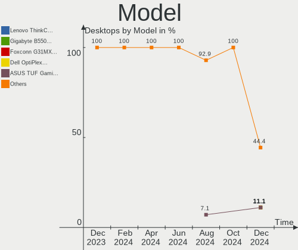
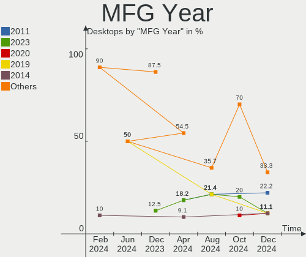
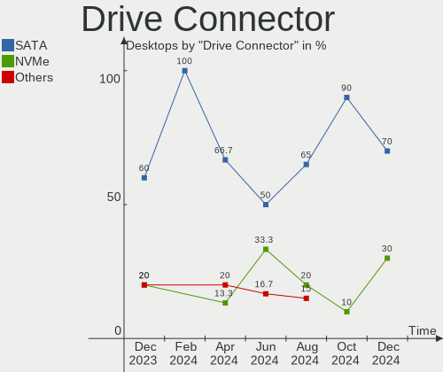
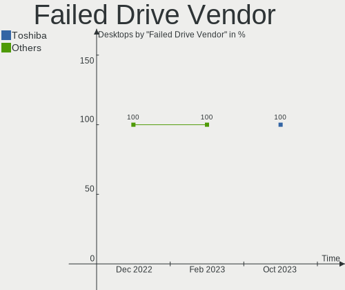
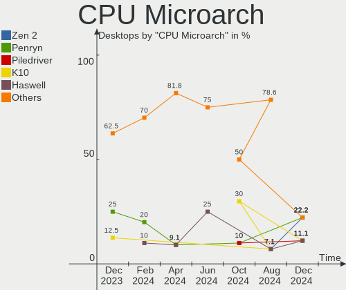
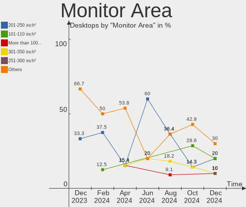
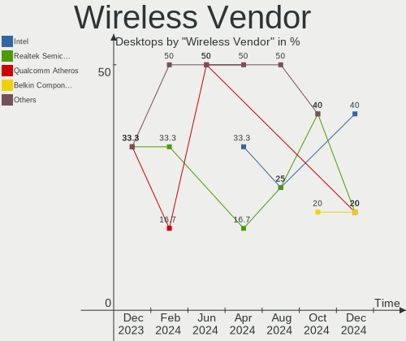

Lubuntu - Hardware Trends (Desktops)
------------------------------------

A project to identify most popular hardware characteristics and track their change
over time based on data collected by Linux users at https://Linux-Hardware.org.

Anyone can contribute to this report by the [hw-probe](https://github.com/linuxhw/hw-probe) tool:

    sudo -E hw-probe -all -upload

This report is for one last month. Overall report since the beginning of time: [TestDays](https://github.com/linuxhw/TestDays)

Period: Oct, 2023.

Contents
--------

* [ System ](#system)
  - [ OS                       ](#os)
  - [ OS Family                ](#os-family)
  - [ Kernel                   ](#kernel)
  - [ Kernel Family            ](#kernel-family)
  - [ Kernel Major Ver.        ](#kernel-major-ver)
  - [ Arch                     ](#arch)
  - [ DE                       ](#de)
  - [ Display Server           ](#display-server)
  - [ Display Manager          ](#display-manager)
  - [ OS Lang                  ](#os-lang)
  - [ Boot Mode                ](#boot-mode)
  - [ Filesystem               ](#filesystem)
  - [ Part. scheme             ](#part-scheme)
  - [ Dual Boot with Linux/BSD ](#dual-boot-with-linuxbsd)
  - [ Dual Boot (Win)          ](#dual-boot-win)

* [ Board ](#board)
  - [ Vendor                   ](#vendor)
  - [ Model                    ](#model)
  - [ Model Family             ](#model-family)
  - [ MFG Year                 ](#mfg-year)
  - [ Form Factor              ](#form-factor)
  - [ Secure Boot              ](#secure-boot)
  - [ Coreboot                 ](#coreboot)
  - [ RAM Size                 ](#ram-size)
  - [ RAM Used                 ](#ram-used)
  - [ Total Drives             ](#total-drives)
  - [ Has CD-ROM               ](#has-cd-rom)
  - [ Has Ethernet             ](#has-ethernet)
  - [ Has WiFi                 ](#has-wifi)
  - [ Has Bluetooth            ](#has-bluetooth)

* [ Location ](#location)
  - [ Country                  ](#country)
  - [ City                     ](#city)

* [ Drives ](#drives)
  - [ Drive Vendor             ](#drive-vendor)
  - [ Drive Model              ](#drive-model)
  - [ HDD Vendor               ](#hdd-vendor)
  - [ SSD Vendor               ](#ssd-vendor)
  - [ Drive Kind               ](#drive-kind)
  - [ Drive Connector          ](#drive-connector)
  - [ Drive Size               ](#drive-size)
  - [ Space Total              ](#space-total)
  - [ Space Used               ](#space-used)
  - [ Malfunc. Drives          ](#malfunc-drives)
  - [ Malfunc. Drive Vendor    ](#malfunc-drive-vendor)
  - [ Malfunc. HDD Vendor      ](#malfunc-hdd-vendor)
  - [ Malfunc. Drive Kind      ](#malfunc-drive-kind)
  - [ Failed Drives            ](#failed-drives)
  - [ Failed Drive Vendor      ](#failed-drive-vendor)
  - [ Drive Status             ](#drive-status)

* [ Storage controller ](#storage-controller)
  - [ Storage Vendor           ](#storage-vendor)
  - [ Storage Model            ](#storage-model)
  - [ Storage Kind             ](#storage-kind)

* [ Processor ](#processor)
  - [ CPU Vendor               ](#cpu-vendor)
  - [ CPU Model                ](#cpu-model)
  - [ CPU Model Family         ](#cpu-model-family)
  - [ CPU Cores                ](#cpu-cores)
  - [ CPU Sockets              ](#cpu-sockets)
  - [ CPU Threads              ](#cpu-threads)
  - [ CPU Op-Modes             ](#cpu-op-modes)
  - [ CPU Microcode            ](#cpu-microcode)
  - [ CPU Microarch            ](#cpu-microarch)

* [ Graphics ](#graphics)
  - [ GPU Vendor               ](#gpu-vendor)
  - [ GPU Model                ](#gpu-model)
  - [ GPU Combo                ](#gpu-combo)
  - [ GPU Driver               ](#gpu-driver)
  - [ GPU Memory               ](#gpu-memory)

* [ Monitor ](#monitor)
  - [ Monitor Vendor           ](#monitor-vendor)
  - [ Monitor Model            ](#monitor-model)
  - [ Monitor Resolution       ](#monitor-resolution)
  - [ Monitor Diagonal         ](#monitor-diagonal)
  - [ Monitor Width            ](#monitor-width)
  - [ Aspect Ratio             ](#aspect-ratio)
  - [ Monitor Area             ](#monitor-area)
  - [ Pixel Density            ](#pixel-density)
  - [ Multiple Monitors        ](#multiple-monitors)

* [ Network ](#network)
  - [ Net Controller Vendor    ](#net-controller-vendor)
  - [ Net Controller Model     ](#net-controller-model)
  - [ Wireless Vendor          ](#wireless-vendor)
  - [ Wireless Model           ](#wireless-model)
  - [ Ethernet Vendor          ](#ethernet-vendor)
  - [ Ethernet Model           ](#ethernet-model)
  - [ Net Controller Kind      ](#net-controller-kind)
  - [ Used Controller          ](#used-controller)
  - [ NICs                     ](#nics)
  - [ IPv6                     ](#ipv6)

* [ Bluetooth ](#bluetooth)
  - [ Bluetooth Vendor         ](#bluetooth-vendor)
  - [ Bluetooth Model          ](#bluetooth-model)

* [ Sound ](#sound)
  - [ Sound Vendor             ](#sound-vendor)
  - [ Sound Model              ](#sound-model)

* [ Memory ](#memory)
  - [ Memory Vendor            ](#memory-vendor)
  - [ Memory Model             ](#memory-model)
  - [ Memory Kind              ](#memory-kind)
  - [ Memory Form Factor       ](#memory-form-factor)
  - [ Memory Size              ](#memory-size)
  - [ Memory Speed             ](#memory-speed)

* [ Printers & scanners ](#printers--scanners)
  - [ Printer Vendor           ](#printer-vendor)
  - [ Printer Model            ](#printer-model)
  - [ Scanner Vendor           ](#scanner-vendor)
  - [ Scanner Model            ](#scanner-model)

* [ Camera ](#camera)
  - [ Camera Vendor            ](#camera-vendor)
  - [ Camera Model             ](#camera-model)

* [ Security ](#security)
  - [ Fingerprint Vendor       ](#fingerprint-vendor)
  - [ Fingerprint Model        ](#fingerprint-model)
  - [ Chipcard Vendor          ](#chipcard-vendor)
  - [ Chipcard Model           ](#chipcard-model)

* [ Unsupported ](#unsupported)
  - [ Unsupported Devices      ](#unsupported-devices)
  - [ Unsupported Device Types ](#unsupported-device-types)

System
------

OS
--

Installed operating systems

| Name          | Desktops | Percent |
|---------------|----------|---------|
| Lubuntu 22.04 | 6        | 60%     |
| Lubuntu 23.04 | 3        | 30%     |
| Lubuntu 23.10 | 1        | 10%     |

OS Family
---------

OS without a version

| Name    | Desktops | Percent |
|---------|----------|---------|
| Lubuntu | 10       | 100%    |

Kernel
------

Version of the Linux kernel

| Version             | Desktops | Percent |
|---------------------|----------|---------|
| 6.2.0-35-generic    | 3        | 30%     |
| 5.15.0-86-generic   | 2        | 20%     |
| 6.5.8-custom        | 1        | 10%     |
| 6.5.0-9-generic     | 1        | 10%     |
| 6.2.0-34-generic    | 1        | 10%     |
| 6.2.0-26-generic    | 1        | 10%     |
| 6.1.46-rt13-tkg-r2b | 1        | 10%     |

Kernel Family
-------------

Linux kernel without a distro release

| Version | Desktops | Percent |
|---------|----------|---------|
| 6.2.0   | 5        | 50%     |
| 5.15.0  | 2        | 20%     |
| 6.5.8   | 1        | 10%     |
| 6.5.0   | 1        | 10%     |
| 6.1.46  | 1        | 10%     |

Kernel Major Ver.
-----------------

Linux kernel major version

| Version | Desktops | Percent |
|---------|----------|---------|
| 6.2     | 5        | 50%     |
| 6.5     | 2        | 20%     |
| 5.15    | 2        | 20%     |
| 6.1     | 1        | 10%     |

Arch
----

OS architecture (x86_64, i586, etc.)

| Name   | Desktops | Percent |
|--------|----------|---------|
| x86_64 | 10       | 100%    |

DE
--

Desktop Environment

| Name  | Desktops | Percent |
|-------|----------|---------|
| LXQt  | 9        | 90%     |
| GNOME | 1        | 10%     |

Display Server
--------------

X11 or Wayland

| Name | Desktops | Percent |
|------|----------|---------|
| X11  | 10       | 100%    |

Display Manager
---------------

SDDM, LightDM, etc.

| Name    | Desktops | Percent |
|---------|----------|---------|
| SDDM    | 8        | 80%     |
| GDM3    | 1        | 10%     |
| Unknown | 1        | 10%     |

OS Lang
-------

Language

| Lang  | Desktops | Percent |
|-------|----------|---------|
| fi_FI | 2        | 20%     |
| en_US | 2        | 20%     |
| ru_RU | 1        | 10%     |
| it_IT | 1        | 10%     |
| fr_FR | 1        | 10%     |
| es_CR | 1        | 10%     |
| de_DE | 1        | 10%     |
| C     | 1        | 10%     |

Boot Mode
---------

EFI or BIOS

| Mode | Desktops | Percent |
|------|----------|---------|
| BIOS | 5        | 50%     |
| EFI  | 5        | 50%     |

Filesystem
----------

Type of filesystem

| Type    | Desktops | Percent |
|---------|----------|---------|
| Ext4    | 6        | 60%     |
| Tmpfs   | 2        | 20%     |
| Overlay | 1        | 10%     |
| Btrfs   | 1        | 10%     |

Part. scheme
------------

Scheme of partitioning

| Type    | Desktops | Percent |
|---------|----------|---------|
| GPT     | 8        | 80%     |
| MBR     | 1        | 10%     |
| Unknown | 1        | 10%     |

Dual Boot with Linux/BSD
------------------------

Hosting more than one Linux/BSD

| Dual boot | Desktops | Percent |
|-----------|----------|---------|
| No        | 9        | 90%     |
| Yes       | 1        | 10%     |

Dual Boot (Win)
---------------

Hosting Linux and Windows

| Dual boot | Desktops | Percent |
|-----------|----------|---------|
| No        | 6        | 60%     |
| Yes       | 4        | 40%     |

Board
-----

Vendor
------

Motherboard manufacturer

| Name                | Desktops | Percent |
|---------------------|----------|---------|
| ASUSTek Computer    | 3        | 30%     |
| ZOTAC               | 1        | 10%     |
| MSI                 | 1        | 10%     |
| Intel               | 1        | 10%     |
| Gigabyte Technology | 1        | 10%     |
| Dell                | 1        | 10%     |
| ASRock              | 1        | 10%     |
| Acer                | 1        | 10%     |

Model
-----

Motherboard model

| Name                | Desktops | Percent |
|---------------------|----------|---------|
| ZOTAC NM10          | 1        | 10%     |
| MSI MS-7C56         | 1        | 10%     |
| Intel H61           | 1        | 10%     |
| Gigabyte B75M-D3H   | 1        | 10%     |
| Dell OptiPlex 7010  | 1        | 10%     |
| ASUS PRIME B450M-A  | 1        | 10%     |
| ASUS P7P55-M        | 1        | 10%     |
| ASUS M5A97 LE R2.0  | 1        | 10%     |
| ASRock Q1900B-ITX   | 1        | 10%     |
| Acer Veriton N4660G | 1        | 10%     |

Model Family
------------

Motherboard model prefix

| Name              | Desktops | Percent |
|-------------------|----------|---------|
| ZOTAC NM10        | 1        | 10%     |
| MSI MS-7C56       | 1        | 10%     |
| Intel H61         | 1        | 10%     |
| Gigabyte B75M-D3H | 1        | 10%     |
| Dell OptiPlex     | 1        | 10%     |
| ASUS PRIME        | 1        | 10%     |
| ASUS P7P55-M      | 1        | 10%     |
| ASUS M5A97        | 1        | 10%     |
| ASRock Q1900B-ITX | 1        | 10%     |
| Acer Veriton      | 1        | 10%     |

MFG Year
--------

Motherboard manufacture year

| Year | Desktops | Percent |
|------|----------|---------|
| 2018 | 2        | 20%     |
| 2012 | 2        | 20%     |
| 2020 | 1        | 10%     |
| 2017 | 1        | 10%     |
| 2014 | 1        | 10%     |
| 2013 | 1        | 10%     |
| 2010 | 1        | 10%     |
| 2009 | 1        | 10%     |

Form Factor
-----------

Physical design of the computer

| Name    | Desktops | Percent |
|---------|----------|---------|
| Desktop | 10       | 100%    |

Secure Boot
-----------

Enabled or disabled

| State    | Desktops | Percent |
|----------|----------|---------|
| Disabled | 9        | 90%     |
| Enabled  | 1        | 10%     |

Coreboot
--------

Have coreboot on board

| Used | Desktops | Percent |
|------|----------|---------|
| No   | 10       | 100%    |

RAM Size
--------

Total RAM memory

| Size in GB | Desktops | Percent |
|------------|----------|---------|
| 16.01-24.0 | 3        | 30%     |
| 4.01-8.0   | 2        | 20%     |
| 3.01-4.0   | 2        | 20%     |
| 8.01-16.0  | 2        | 20%     |
| 32.01-64.0 | 1        | 10%     |

RAM Used
--------

Used RAM memory

| Used GB  | Desktops | Percent |
|----------|----------|---------|
| 1.01-2.0 | 4        | 40%     |
| 2.01-3.0 | 3        | 30%     |
| 4.01-8.0 | 2        | 20%     |
| 0.51-1.0 | 1        | 10%     |

Total Drives
------------

Number of drives on board

| Drives | Desktops | Percent |
|--------|----------|---------|
| 1      | 4        | 40%     |
| 2      | 3        | 30%     |
| 3      | 2        | 20%     |
| 4      | 1        | 10%     |

Has CD-ROM
----------

Has CD-ROM on board

| Presented | Desktops | Percent |
|-----------|----------|---------|
| No        | 7        | 70%     |
| Yes       | 3        | 30%     |

Has Ethernet
------------

Has Ethernet on board

| Presented | Desktops | Percent |
|-----------|----------|---------|
| Yes       | 10       | 100%    |

Has WiFi
--------

Has WiFi module

| Presented | Desktops | Percent |
|-----------|----------|---------|
| Yes       | 5        | 50%     |
| No        | 5        | 50%     |

Has Bluetooth
-------------

Has Bluetooth module

| Presented | Desktops | Percent |
|-----------|----------|---------|
| No        | 6        | 60%     |
| Yes       | 4        | 40%     |

Location
--------

Country
-------

Geographic location (country)

| Country    | Desktops | Percent |
|------------|----------|---------|
| Finland    | 2        | 20%     |
| USA        | 1        | 10%     |
| Russia     | 1        | 10%     |
| Italy      | 1        | 10%     |
| India      | 1        | 10%     |
| Germany    | 1        | 10%     |
| France     | 1        | 10%     |
| Costa Rica | 1        | 10%     |
| Brazil     | 1        | 10%     |

City
----

Geographic location (city)

| City                   | Desktops | Percent |
|------------------------|----------|---------|
| Yaroslavl              | 1        | 10%     |
| Villingen-Schwenningen | 1        | 10%     |
| Sao José dos Campos   | 1        | 10%     |
| Poitiers               | 1        | 10%     |
| Mumbai                 | 1        | 10%     |
| Macerata               | 1        | 10%     |
| Lahti                  | 1        | 10%     |
| Helsinki               | 1        | 10%     |
| Grecia                 | 1        | 10%     |
| Brighton               | 1        | 10%     |

Drives
------

Drive Vendor
------------

Hard drive vendors

| Vendor              | Desktops | Drives | Percent |
|---------------------|----------|--------|---------|
| Kingston            | 4        | 5      | 22.22%  |
| Samsung Electronics | 3        | 3      | 16.67%  |
| WDC                 | 2        | 3      | 11.11%  |
| Seagate             | 2        | 2      | 11.11%  |
| SanDisk             | 2        | 2      | 11.11%  |
| Toshiba             | 1        | 1      | 5.56%   |
| KINGBANK            | 1        | 1      | 5.56%   |
| Hitachi             | 1        | 1      | 5.56%   |
| Dogfish             | 1        | 1      | 5.56%   |
| Crucial             | 1        | 1      | 5.56%   |

Drive Model
-----------

Hard drive models

| Model                           | Desktops | Percent |
|---------------------------------|----------|---------|
| Kingston SA400S37480G 480GB SSD | 2        | 10%     |
| WDC WDS100T2B0A-00SM50 1TB SSD  | 1        | 5%      |
| WDC WD40EZRX-00SPEB0 4TB        | 1        | 5%      |
| WDC WD20EFRX-68EUZN0 2TB        | 1        | 5%      |
| Toshiba HDWD110 1TB             | 1        | 5%      |
| Seagate ST2000VN004-2E4164 2TB  | 1        | 5%      |
| Seagate M3 Portable 1TB         | 1        | 5%      |
| SanDisk SDSSDH3500G 500GB       | 1        | 5%      |
| SanDisk NVMe SSD Drive 2TB      | 1        | 5%      |
| Samsung SSD 970 EVO Plus 250GB  | 1        | 5%      |
| Samsung SSD 850 PRO 256GB       | 1        | 5%      |
| Samsung SSD 830 Series 256GB    | 1        | 5%      |
| Kingston SFYRD2000G 2TB         | 1        | 5%      |
| Kingston SA400S37960G 960GB SSD | 1        | 5%      |
| Kingston SA400S37240G 240GB SSD | 1        | 5%      |
| KINGBANK KP330 480GB            | 1        | 5%      |
| Hitachi HDT725050VLA360 500GB   | 1        | 5%      |
| Dogfish SSD 64GB                | 1        | 5%      |
| Crucial CT1000BX500SSD1 1TB     | 1        | 5%      |

HDD Vendor
----------

Hard disk drive vendors

| Vendor  | Desktops | Drives | Percent |
|---------|----------|--------|---------|
| WDC     | 2        | 2      | 40%     |
| Toshiba | 1        | 1      | 20%     |
| Seagate | 1        | 1      | 20%     |
| Hitachi | 1        | 1      | 20%     |

SSD Vendor
----------

Solid state drive vendors

| Vendor              | Desktops | Drives | Percent |
|---------------------|----------|--------|---------|
| Kingston            | 3        | 4      | 30%     |
| Samsung Electronics | 2        | 2      | 20%     |
| WDC                 | 1        | 1      | 10%     |
| SanDisk             | 1        | 1      | 10%     |
| KINGBANK            | 1        | 1      | 10%     |
| Dogfish             | 1        | 1      | 10%     |
| Crucial             | 1        | 1      | 10%     |

Drive Kind
----------

HDD or SSD

| Kind    | Desktops | Drives | Percent |
|---------|----------|--------|---------|
| SSD     | 7        | 11     | 50%     |
| HDD     | 4        | 5      | 28.57%  |
| NVMe    | 2        | 3      | 14.29%  |
| Unknown | 1        | 1      | 7.14%   |

Drive Connector
---------------

SATA, SAS, NVMe, etc.

| Type | Desktops | Drives | Percent |
|------|----------|--------|---------|
| SATA | 8        | 16     | 72.73%  |
| NVMe | 2        | 3      | 18.18%  |
| SAS  | 1        | 1      | 9.09%   |

Drive Size
----------

Size of hard drive

| Size in TB | Desktops | Drives | Percent |
|------------|----------|--------|---------|
| 0.01-0.5   | 6        | 9      | 60%     |
| 0.51-1.0   | 2        | 4      | 20%     |
| 3.01-4.0   | 1        | 1      | 10%     |
| 1.01-2.0   | 1        | 2      | 10%     |

Space Total
-----------

Amount of disk space available on the file system

| Size in GB     | Desktops | Percent |
|----------------|----------|---------|
| More than 3000 | 3        | 30%     |
| 251-500        | 2        | 20%     |
| 101-250        | 2        | 20%     |
| 1001-2000      | 1        | 10%     |
| 1-20           | 1        | 10%     |
| 501-1000       | 1        | 10%     |

Space Used
----------

Amount of used disk space

| Used GB        | Desktops | Percent |
|----------------|----------|---------|
| 21-50          | 3        | 30%     |
| 1-20           | 2        | 20%     |
| 501-1000       | 2        | 20%     |
| More than 3000 | 1        | 10%     |
| 251-500        | 1        | 10%     |
| 101-250        | 1        | 10%     |

Malfunc. Drives
---------------

Drive models with a malfunction

| Model                    | Desktops | Drives | Percent |
|--------------------------|----------|--------|---------|
| WDC WD20EFRX-68EUZN0 2TB | 1        | 1      | 100%    |

Malfunc. Drive Vendor
---------------------

Vendors of faulty drives

| Vendor | Desktops | Drives | Percent |
|--------|----------|--------|---------|
| WDC    | 1        | 1      | 100%    |

Malfunc. HDD Vendor
-------------------

Vendors of faulty HDD drives

| Vendor | Desktops | Drives | Percent |
|--------|----------|--------|---------|
| WDC    | 1        | 1      | 100%    |

Malfunc. Drive Kind
-------------------

Kinds of faulty drives

| Kind | Desktops | Drives | Percent |
|------|----------|--------|---------|
| HDD  | 1        | 1      | 100%    |

Failed Drives
-------------

Failed drive models

| Model               | Desktops | Drives | Percent |
|---------------------|----------|--------|---------|
| Toshiba HDWD110 1TB | 1        | 1      | 100%    |

Failed Drive Vendor
-------------------

Failed drive vendors

| Vendor  | Desktops | Drives | Percent |
|---------|----------|--------|---------|
| Toshiba | 1        | 1      | 100%    |

Drive Status
------------

Number of failed and malfunc. drives

| Status   | Desktops | Drives | Percent |
|----------|----------|--------|---------|
| Works    | 7        | 11     | 53.85%  |
| Detected | 4        | 7      | 30.77%  |
| Malfunc  | 1        | 1      | 7.69%   |
| Failed   | 1        | 1      | 7.69%   |

Storage controller
------------------

Storage Vendor
--------------

Storage controller vendors

| Vendor                      | Desktops | Percent |
|-----------------------------|----------|---------|
| Intel                       | 7        | 46.67%  |
| AMD                         | 3        | 20%     |
| VIA Technologies            | 1        | 6.67%   |
| Sandisk                     | 1        | 6.67%   |
| Samsung Electronics         | 1        | 6.67%   |
| Kingston Technology Company | 1        | 6.67%   |
| ASMedia Technology          | 1        | 6.67%   |

Storage Model
-------------

Storage controller models

| Model                                                                         | Desktops | Percent |
|-------------------------------------------------------------------------------|----------|---------|
| Intel 7 Series/C210 Series Chipset Family 4-port SATA Controller [IDE mode]   | 2        | 10.53%  |
| Intel 7 Series/C210 Series Chipset Family 2-port SATA Controller [IDE mode]   | 2        | 10.53%  |
| VIA VT6415 PATA IDE Host Controller                                           | 1        | 5.26%   |
| Sandisk WD Black SN850X NVMe SSD                                              | 1        | 5.26%   |
| Samsung NVMe SSD Controller SM981/PM981/PM983                                 | 1        | 5.26%   |
| Kingston Company KC3000/FURY Renegade NVMe SSD E18                            | 1        | 5.26%   |
| Intel NM10/ICH7 Family SATA Controller [AHCI mode]                            | 1        | 5.26%   |
| Intel Cannon Lake PCH SATA AHCI Controller                                    | 1        | 5.26%   |
| Intel Atom Processor E3800 Series SATA AHCI Controller                        | 1        | 5.26%   |
| Intel 6 Series/C200 Series Chipset Family 6 port Desktop SATA AHCI Controller | 1        | 5.26%   |
| Intel 5 Series/3400 Series Chipset 4 port SATA IDE Controller                 | 1        | 5.26%   |
| Intel 5 Series/3400 Series Chipset 2 port SATA IDE Controller                 | 1        | 5.26%   |
| ASMedia ASM1062 Serial ATA Controller                                         | 1        | 5.26%   |
| AMD SB7x0/SB8x0/SB9x0 SATA Controller [AHCI mode]                             | 1        | 5.26%   |
| AMD FCH SATA Controller [AHCI mode]                                           | 1        | 5.26%   |
| AMD 500 Series Chipset SATA Controller                                        | 1        | 5.26%   |
| AMD 400 Series Chipset SATA Controller                                        | 1        | 5.26%   |

Storage Kind
------------

Kind of storage controller (IDE, SATA, NVMe, SAS, ...)

| Kind | Desktops | Percent |
|------|----------|---------|
| SATA | 7        | 58.33%  |
| IDE  | 3        | 25%     |
| NVMe | 2        | 16.67%  |

Processor
---------

CPU Vendor
----------

Processor vendors

| Vendor | Desktops | Percent |
|--------|----------|---------|
| Intel  | 7        | 70%     |
| AMD    | 3        | 30%     |

CPU Model
---------

Processor models

| Model                                 | Desktops | Percent |
|---------------------------------------|----------|---------|
| Intel Core i5-3570 CPU @ 3.40GHz      | 1        | 10%     |
| Intel Core i5-3470 CPU @ 3.20GHz      | 1        | 10%     |
| Intel Core i3-8100T CPU @ 3.10GHz     | 1        | 10%     |
| Intel Core i3-3220 CPU @ 3.30GHz      | 1        | 10%     |
| Intel Core i3 CPU 540 @ 3.07GHz       | 1        | 10%     |
| Intel Celeron CPU J1900 @ 1.99GHz     | 1        | 10%     |
| Intel Atom CPU D525 @ 1.80GHz         | 1        | 10%     |
| AMD Ryzen 7 2700 Eight-Core Processor | 1        | 10%     |
| AMD Ryzen 5 5600X 6-Core Processor    | 1        | 10%     |
| AMD FX-8370 Eight-Core Processor      | 1        | 10%     |

CPU Model Family
----------------

Processor model prefix

| Model         | Desktops | Percent |
|---------------|----------|---------|
| Intel Core i3 | 3        | 30%     |
| Intel Core i5 | 2        | 20%     |
| Intel Celeron | 1        | 10%     |
| Intel Atom    | 1        | 10%     |
| AMD Ryzen 7   | 1        | 10%     |
| AMD Ryzen 5   | 1        | 10%     |
| AMD FX        | 1        | 10%     |

CPU Cores
---------

Number of processor cores

| Number | Desktops | Percent |
|--------|----------|---------|
| 4      | 5        | 50%     |
| 2      | 3        | 30%     |
| 8      | 1        | 10%     |
| 6      | 1        | 10%     |

CPU Sockets
-----------

Number of sockets

| Number | Desktops | Percent |
|--------|----------|---------|
| 1      | 10       | 100%    |

CPU Threads
-----------

Threads per core (Hyper-Threading)

| Number | Desktops | Percent |
|--------|----------|---------|
| 2      | 6        | 60%     |
| 1      | 4        | 40%     |

CPU Op-Modes
------------

CPU Operation Modes (32-bit, 64-bit)

| Op mode        | Desktops | Percent |
|----------------|----------|---------|
| 32-bit, 64-bit | 10       | 100%    |

CPU Microcode
-------------

Microcode number

| Number     | Desktops | Percent |
|------------|----------|---------|
| Unknown    | 6        | 60%     |
| 0x906eb    | 1        | 10%     |
| 0x30679    | 1        | 10%     |
| 0x0a20120a | 1        | 10%     |
| 0x0800820d | 1        | 10%     |

CPU Microarch
-------------

Microarchitecture

| Name       | Desktops | Percent |
|------------|----------|---------|
| IvyBridge  | 3        | 30%     |
| Zen+       | 1        | 10%     |
| Zen 3      | 1        | 10%     |
| Westmere   | 1        | 10%     |
| Silvermont | 1        | 10%     |
| Piledriver | 1        | 10%     |
| KabyLake   | 1        | 10%     |
| Bonnell    | 1        | 10%     |

Graphics
--------

GPU Vendor
----------

Vendors of graphics cards

| Vendor | Desktops | Percent |
|--------|----------|---------|
| Nvidia | 5        | 50%     |
| Intel  | 4        | 40%     |
| AMD    | 1        | 10%     |

GPU Model
---------

Graphics card models

| Model                                                            | Desktops | Percent |
|------------------------------------------------------------------|----------|---------|
| Intel Xeon E3-1200 v2/3rd Gen Core processor Graphics Controller | 2        | 20%     |
| Nvidia TU117GLM [Quadro T400 Mobile]                             | 1        | 10%     |
| Nvidia TU116 [GeForce GTX 1660 SUPER]                            | 1        | 10%     |
| Nvidia GT218 [ION]                                               | 1        | 10%     |
| Nvidia GF106GL [Quadro 2000]                                     | 1        | 10%     |
| Nvidia GA104 [GeForce RTX 3070]                                  | 1        | 10%     |
| Intel CoffeeLake-S GT2 [UHD Graphics 630]                        | 1        | 10%     |
| Intel Atom Processor Z36xxx/Z37xxx Series Graphics & Display     | 1        | 10%     |
| AMD RV710 [Radeon HD 4350/4550]                                  | 1        | 10%     |

GPU Combo
---------

Combinations of graphics cards

| Name       | Desktops | Percent |
|------------|----------|---------|
| 1 x Nvidia | 5        | 50%     |
| 1 x Intel  | 4        | 40%     |
| 1 x AMD    | 1        | 10%     |

GPU Driver
----------

Free vs proprietary

| Driver      | Desktops | Percent |
|-------------|----------|---------|
| Free        | 7        | 70%     |
| Proprietary | 3        | 30%     |

GPU Memory
----------

Total video memory

| Size in GB | Desktops | Percent |
|------------|----------|---------|
| Unknown    | 5        | 50%     |
| 7.01-8.0   | 1        | 10%     |
| 5.01-6.0   | 1        | 10%     |
| 1.01-2.0   | 1        | 10%     |
| 0.51-1.0   | 1        | 10%     |
| 0.01-0.5   | 1        | 10%     |

Monitor
-------

Monitor Vendor
--------------

Monitor vendors

| Vendor               | Desktops | Percent |
|----------------------|----------|---------|
| Samsung Electronics  | 5        | 62.5%   |
| MSI                  | 1        | 12.5%   |
| AOC                  | 1        | 12.5%   |
| Ancor Communications | 1        | 12.5%   |

Monitor Model
-------------

Monitor models

| Model                                                                 | Desktops | Percent |
|-----------------------------------------------------------------------|----------|---------|
| Samsung Electronics SyncMaster SAM05FF 1600x900 443x249mm 20.0-inch   | 1        | 12.5%   |
| Samsung Electronics SyncMaster SAM03EF 1680x1050 433x271mm 20.1-inch  | 1        | 12.5%   |
| Samsung Electronics LCD Monitor SAM0A76 1280x720 949x543mm 43.0-inch  | 1        | 12.5%   |
| Samsung Electronics C32JG5x SAM0F54 2560x1440 697x392mm 31.5-inch     | 1        | 12.5%   |
| Samsung Electronics C24F390 SAM0D2D 1920x1080 521x293mm 23.5-inch     | 1        | 12.5%   |
| MSI MP242A MSI40A1 1920x1080 527x296mm 23.8-inch                      | 1        | 12.5%   |
| AOC 24B1W1 AOC2401 1920x1080 527x296mm 23.8-inch                      | 1        | 12.5%   |
| Ancor Communications ASUS VP278 ACI27C8 1920x1080 598x336mm 27.0-inch | 1        | 12.5%   |

Monitor Resolution
------------------

Monitor screen resolution

| Resolution         | Desktops | Percent |
|--------------------|----------|---------|
| 1920x1080 (FHD)    | 3        | 37.5%   |
| 2560x1440 (QHD)    | 2        | 25%     |
| 1680x1050 (WSXGA+) | 1        | 12.5%   |
| 1600x900 (HD+)     | 1        | 12.5%   |
| 1280x720 (HD)      | 1        | 12.5%   |

Monitor Diagonal
----------------

Diagonal size in inches

| Inches | Desktops | Percent |
|--------|----------|---------|
| 23     | 2        | 25%     |
| 20     | 2        | 25%     |
| 43     | 1        | 12.5%   |
| 31     | 1        | 12.5%   |
| 27     | 1        | 12.5%   |
| 24     | 1        | 12.5%   |

Monitor Width
-------------

Physical width

| Width in mm | Desktops | Percent |
|-------------|----------|---------|
| 501-600     | 4        | 50%     |
| 401-500     | 2        | 25%     |
| 601-700     | 1        | 12.5%   |
| 901-1000    | 1        | 12.5%   |

Aspect Ratio
------------

Proportional relationship between the width and the height

| Ratio | Desktops | Percent |
|-------|----------|---------|
| 16/9  | 6        | 75%     |
| 16/10 | 2        | 25%     |

Monitor Area
------------

Area in inch²

| Area in inch² | Desktops | Percent |
|----------------|----------|---------|
| 201-250        | 2        | 25%     |
| 151-200        | 2        | 25%     |
| 351-500        | 1        | 12.5%   |
| 301-350        | 1        | 12.5%   |
| 251-300        | 1        | 12.5%   |
| 501-1000       | 1        | 12.5%   |

Pixel Density
-------------

Pixels per inch

| Density | Desktops | Percent |
|---------|----------|---------|
| 51-100  | 7        | 87.5%   |
| 1-50    | 1        | 12.5%   |

Multiple Monitors
-----------------

Total monitors connected

| Total | Desktops | Percent |
|-------|----------|---------|
| 1     | 9        | 90%     |
| 0     | 1        | 10%     |

Network
-------

Net Controller Vendor
---------------------

Controller vendors

| Vendor                | Desktops | Percent |
|-----------------------|----------|---------|
| Realtek Semiconductor | 9        | 64.29%  |
| Intel                 | 3        | 21.43%  |
| Ralink Technology     | 1        | 7.14%   |
| Belkin Components     | 1        | 7.14%   |

Net Controller Model
--------------------

Controller models

| Model                                                                      | Desktops | Percent |
|----------------------------------------------------------------------------|----------|---------|
| Realtek RTL8111/8168/8411 PCI Express Gigabit Ethernet Controller          | 7        | 46.67%  |
| Realtek RTL88x2bu [AC1200 Techkey]                                         | 1        | 6.67%   |
| Realtek RTL810xE PCI Express Fast Ethernet controller                      | 1        | 6.67%   |
| Realtek RTL-8110SC/8169SC Gigabit Ethernet                                 | 1        | 6.67%   |
| Ralink RT5370 Wireless Adapter                                             | 1        | 6.67%   |
| Intel Centrino Advanced-N 6235                                             | 1        | 6.67%   |
| Intel Cannon Lake PCH CNVi WiFi                                            | 1        | 6.67%   |
| Intel 82579LM Gigabit Network Connection (Lewisville)                      | 1        | 6.67%   |
| Belkin Components F5D8053 N Wireless USB Adapter v6000 [Realtek RTL8192SU] | 1        | 6.67%   |

Wireless Vendor
---------------

Wireless vendors

| Vendor                | Desktops | Percent |
|-----------------------|----------|---------|
| Intel                 | 2        | 40%     |
| Realtek Semiconductor | 1        | 20%     |
| Ralink Technology     | 1        | 20%     |
| Belkin Components     | 1        | 20%     |

Wireless Model
--------------

Wireless models

| Model                                                                      | Desktops | Percent |
|----------------------------------------------------------------------------|----------|---------|
| Realtek RTL88x2bu [AC1200 Techkey]                                         | 1        | 20%     |
| Ralink RT5370 Wireless Adapter                                             | 1        | 20%     |
| Intel Centrino Advanced-N 6235                                             | 1        | 20%     |
| Intel Cannon Lake PCH CNVi WiFi                                            | 1        | 20%     |
| Belkin Components F5D8053 N Wireless USB Adapter v6000 [Realtek RTL8192SU] | 1        | 20%     |

Ethernet Vendor
---------------

Ethernet vendors

| Vendor                | Desktops | Percent |
|-----------------------|----------|---------|
| Realtek Semiconductor | 9        | 90%     |
| Intel                 | 1        | 10%     |

Ethernet Model
--------------

Ethernet models

| Model                                                             | Desktops | Percent |
|-------------------------------------------------------------------|----------|---------|
| Realtek RTL8111/8168/8411 PCI Express Gigabit Ethernet Controller | 7        | 70%     |
| Realtek RTL810xE PCI Express Fast Ethernet controller             | 1        | 10%     |
| Realtek RTL-8110SC/8169SC Gigabit Ethernet                        | 1        | 10%     |
| Intel 82579LM Gigabit Network Connection (Lewisville)             | 1        | 10%     |

Net Controller Kind
-------------------

Ethernet, WiFi or modem

| Kind     | Desktops | Percent |
|----------|----------|---------|
| Ethernet | 10       | 66.67%  |
| WiFi     | 5        | 33.33%  |

Used Controller
---------------

Currently used network controller

| Kind     | Desktops | Percent |
|----------|----------|---------|
| Ethernet | 8        | 66.67%  |
| WiFi     | 4        | 33.33%  |

NICs
----

Total network controllers on board

| Total | Desktops | Percent |
|-------|----------|---------|
| 1     | 8        | 80%     |
| 2     | 2        | 20%     |

IPv6
----

IPv6 vs IPv4

| Used | Desktops | Percent |
|------|----------|---------|
| Yes  | 5        | 50%     |
| No   | 5        | 50%     |

Bluetooth
---------

Bluetooth Vendor
----------------

Controller vendors

| Vendor                | Desktops | Percent |
|-----------------------|----------|---------|
| Intel                 | 2        | 40%     |
| TP-Link               | 1        | 20%     |
| Realtek Semiconductor | 1        | 20%     |
| Broadcom              | 1        | 20%     |

Bluetooth Model
---------------

Controller models

| Model                                          | Desktops | Percent |
|------------------------------------------------|----------|---------|
| TP-Link UB500 Adapter                          | 1        | 20%     |
| Realtek Bluetooth Radio                        | 1        | 20%     |
| Intel Centrino Bluetooth Wireless Transceiver  | 1        | 20%     |
| Intel Bluetooth 9460/9560 Jefferson Peak (JfP) | 1        | 20%     |
| Broadcom BCM2045 Bluetooth                     | 1        | 20%     |

Sound
-----

Sound Vendor
------------

Sound card vendors

| Vendor              | Desktops | Percent |
|---------------------|----------|---------|
| Intel               | 7        | 41.18%  |
| Nvidia              | 5        | 29.41%  |
| AMD                 | 3        | 17.65%  |
| JMTek               | 1        | 5.88%   |
| Creative Technology | 1        | 5.88%   |

Sound Model
-----------

Sound card models

| Model                                                                      | Desktops | Percent |
|----------------------------------------------------------------------------|----------|---------|
| Intel 7 Series/C216 Chipset Family High Definition Audio Controller        | 2        | 11.11%  |
| Nvidia TU116 High Definition Audio Controller                              | 1        | 5.56%   |
| Nvidia TU107 GeForce GTX 1650 High Definition Audio Controller             | 1        | 5.56%   |
| Nvidia High Definition Audio Controller                                    | 1        | 5.56%   |
| Nvidia GF106 High Definition Audio Controller                              | 1        | 5.56%   |
| Nvidia GA104 High Definition Audio Controller                              | 1        | 5.56%   |
| JMTek CM383-80864                                                          | 1        | 5.56%   |
| Intel NM10/ICH7 Family High Definition Audio Controller                    | 1        | 5.56%   |
| Intel Cannon Lake PCH cAVS                                                 | 1        | 5.56%   |
| Intel Atom Processor Z36xxx/Z37xxx Series High Definition Audio Controller | 1        | 5.56%   |
| Intel 6 Series/C200 Series Chipset Family High Definition Audio Controller | 1        | 5.56%   |
| Intel 5 Series/3400 Series Chipset High Definition Audio                   | 1        | 5.56%   |
| Creative Technology Pebble V3                                              | 1        | 5.56%   |
| AMD Starship/Matisse HD Audio Controller                                   | 1        | 5.56%   |
| AMD SBx00 Azalia (Intel HDA)                                               | 1        | 5.56%   |
| AMD RV710/730 HDMI Audio [Radeon HD 4000 series]                           | 1        | 5.56%   |
| AMD Family 17h (Models 00h-0fh) HD Audio Controller                        | 1        | 5.56%   |

Memory
------

Memory Vendor
-------------

Memory module vendors

| Vendor              | Desktops | Percent |
|---------------------|----------|---------|
| Unknown             | 3        | 37.5%   |
| Kingston            | 2        | 25%     |
| Samsung Electronics | 1        | 12.5%   |
| G.Skill             | 1        | 12.5%   |
| A-DATA Technology   | 1        | 12.5%   |

Memory Model
------------

Memory module models

| Model                                                  | Desktops | Percent |
|--------------------------------------------------------|----------|---------|
| Unknown RAM Module 4GB DIMM DDR 1333MT/s               | 1        | 11.11%  |
| Unknown RAM Module 2GB SODIMM DDR2 667MT/s             | 1        | 11.11%  |
| Unknown RAM Module 16GB DIMM DDR4 3200MT/s             | 1        | 11.11%  |
| Samsung RAM M471B5173EB0-YK0 4GB DIMM DDR3 1600MT/s    | 1        | 11.11%  |
| Kingston RAM 99U5584-014.A00LF 4GB DIMM DDR3 1600MT/s  | 1        | 11.11%  |
| Kingston RAM 99P5474-013.A00LF 4GB DIMM DDR3 1600MT/s  | 1        | 11.11%  |
| Kingston RAM 9905700-025.A00G 8GB SODIMM DDR4 2667MT/s | 1        | 11.11%  |
| G.Skill RAM F4-3200C16-8GVKB 8GB DIMM DDR4 3866MT/s    | 1        | 11.11%  |
| A-DATA RAM AO1P24HC4N2-BWCS 4GB SODIMM DDR4 2400MT/s   | 1        | 11.11%  |

Memory Kind
-----------

Memory module kinds

| Kind | Desktops | Percent |
|------|----------|---------|
| DDR4 | 3        | 42.86%  |
| DDR3 | 2        | 28.57%  |
| DDR2 | 1        | 14.29%  |
| DDR  | 1        | 14.29%  |

Memory Form Factor
------------------

Physical design of the memory module

| Name   | Desktops | Percent |
|--------|----------|---------|
| DIMM   | 5        | 71.43%  |
| SODIMM | 2        | 28.57%  |

Memory Size
-----------

Memory module size

| Size  | Desktops | Percent |
|-------|----------|---------|
| 4096  | 4        | 50%     |
| 8192  | 2        | 25%     |
| 16384 | 1        | 12.5%   |
| 2048  | 1        | 12.5%   |

Memory Speed
------------

Memory module speed

| Speed | Desktops | Percent |
|-------|----------|---------|
| 1600  | 2        | 25%     |
| 3866  | 1        | 12.5%   |
| 3200  | 1        | 12.5%   |
| 2667  | 1        | 12.5%   |
| 2400  | 1        | 12.5%   |
| 1333  | 1        | 12.5%   |
| 667   | 1        | 12.5%   |

Printers & scanners
-------------------

Printer Vendor
--------------

Printer device vendors

Zero info for selected period =(

Printer Model
-------------

Printer device models

Zero info for selected period =(

Scanner Vendor
--------------

Scanner device vendors

Zero info for selected period =(

Scanner Model
-------------

Scanner device models

Zero info for selected period =(

Camera
------

Camera Vendor
-------------

Camera device vendors

| Vendor                 | Desktops | Percent |
|------------------------|----------|---------|
| Generalplus Technology | 1        | 100%    |

Camera Model
------------

Camera device models

| Model                      | Desktops | Percent |
|----------------------------|----------|---------|
| Generalplus GENERAL WEBCAM | 1        | 100%    |

Security
--------

Fingerprint Vendor
------------------

Fingerprint sensor vendors

Zero info for selected period =(

Fingerprint Model
-----------------

Fingerprint sensor models

Zero info for selected period =(

Chipcard Vendor
---------------

Chipcard module vendors

Zero info for selected period =(

Chipcard Model
--------------

Chipcard module models

Zero info for selected period =(

Unsupported
-----------

Unsupported Devices
-------------------

Total unsupported devices on board

| Total | Desktops | Percent |
|-------|----------|---------|
| 0     | 10       | 100%    |

Unsupported Device Types
------------------------

Types of unsupported devices

Zero info for selected period =(

