Lubuntu - Hardware Trends (Desktops)
------------------------------------

A project to identify most popular hardware characteristics and track their change
over time based on data collected by Linux users at https://Linux-Hardware.org.

Anyone can contribute to this report by the [hw-probe](https://github.com/linuxhw/hw-probe) tool:

    sudo -E hw-probe -all -upload

This report is for one last month. Overall report since the beginning of time: [TestCoverage](https://github.com/linuxhw/TestCoverage)

Period: May, 2022.

Contents
--------

* [ System ](#system)
  - [ OS                       ](#os)
  - [ OS Family                ](#os-family)
  - [ Kernel                   ](#kernel)
  - [ Kernel Family            ](#kernel-family)
  - [ Kernel Major Ver.        ](#kernel-major-ver)
  - [ Arch                     ](#arch)
  - [ DE                       ](#de)
  - [ Display Server           ](#display-server)
  - [ Display Manager          ](#display-manager)
  - [ OS Lang                  ](#os-lang)
  - [ Boot Mode                ](#boot-mode)
  - [ Filesystem               ](#filesystem)
  - [ Part. scheme             ](#part-scheme)
  - [ Dual Boot with Linux/BSD ](#dual-boot-with-linuxbsd)
  - [ Dual Boot (Win)          ](#dual-boot-win)

* [ Board ](#board)
  - [ Vendor                   ](#vendor)
  - [ Model                    ](#model)
  - [ Model Family             ](#model-family)
  - [ MFG Year                 ](#mfg-year)
  - [ Form Factor              ](#form-factor)
  - [ Secure Boot              ](#secure-boot)
  - [ Coreboot                 ](#coreboot)
  - [ RAM Size                 ](#ram-size)
  - [ RAM Used                 ](#ram-used)
  - [ Total Drives             ](#total-drives)
  - [ Has CD-ROM               ](#has-cd-rom)
  - [ Has Ethernet             ](#has-ethernet)
  - [ Has WiFi                 ](#has-wifi)
  - [ Has Bluetooth            ](#has-bluetooth)

* [ Location ](#location)
  - [ Country                  ](#country)
  - [ City                     ](#city)

* [ Drives ](#drives)
  - [ Drive Vendor             ](#drive-vendor)
  - [ Drive Model              ](#drive-model)
  - [ HDD Vendor               ](#hdd-vendor)
  - [ SSD Vendor               ](#ssd-vendor)
  - [ Drive Kind               ](#drive-kind)
  - [ Drive Connector          ](#drive-connector)
  - [ Drive Size               ](#drive-size)
  - [ Space Total              ](#space-total)
  - [ Space Used               ](#space-used)
  - [ Malfunc. Drives          ](#malfunc-drives)
  - [ Malfunc. Drive Vendor    ](#malfunc-drive-vendor)
  - [ Malfunc. HDD Vendor      ](#malfunc-hdd-vendor)
  - [ Malfunc. Drive Kind      ](#malfunc-drive-kind)
  - [ Failed Drives            ](#failed-drives)
  - [ Failed Drive Vendor      ](#failed-drive-vendor)
  - [ Drive Status             ](#drive-status)

* [ Storage controller ](#storage-controller)
  - [ Storage Vendor           ](#storage-vendor)
  - [ Storage Model            ](#storage-model)
  - [ Storage Kind             ](#storage-kind)

* [ Processor ](#processor)
  - [ CPU Vendor               ](#cpu-vendor)
  - [ CPU Model                ](#cpu-model)
  - [ CPU Model Family         ](#cpu-model-family)
  - [ CPU Cores                ](#cpu-cores)
  - [ CPU Sockets              ](#cpu-sockets)
  - [ CPU Threads              ](#cpu-threads)
  - [ CPU Op-Modes             ](#cpu-op-modes)
  - [ CPU Microcode            ](#cpu-microcode)
  - [ CPU Microarch            ](#cpu-microarch)

* [ Graphics ](#graphics)
  - [ GPU Vendor               ](#gpu-vendor)
  - [ GPU Model                ](#gpu-model)
  - [ GPU Combo                ](#gpu-combo)
  - [ GPU Driver               ](#gpu-driver)
  - [ GPU Memory               ](#gpu-memory)

* [ Monitor ](#monitor)
  - [ Monitor Vendor           ](#monitor-vendor)
  - [ Monitor Model            ](#monitor-model)
  - [ Monitor Resolution       ](#monitor-resolution)
  - [ Monitor Diagonal         ](#monitor-diagonal)
  - [ Monitor Width            ](#monitor-width)
  - [ Aspect Ratio             ](#aspect-ratio)
  - [ Monitor Area             ](#monitor-area)
  - [ Pixel Density            ](#pixel-density)
  - [ Multiple Monitors        ](#multiple-monitors)

* [ Network ](#network)
  - [ Net Controller Vendor    ](#net-controller-vendor)
  - [ Net Controller Model     ](#net-controller-model)
  - [ Wireless Vendor          ](#wireless-vendor)
  - [ Wireless Model           ](#wireless-model)
  - [ Ethernet Vendor          ](#ethernet-vendor)
  - [ Ethernet Model           ](#ethernet-model)
  - [ Net Controller Kind      ](#net-controller-kind)
  - [ Used Controller          ](#used-controller)
  - [ NICs                     ](#nics)
  - [ IPv6                     ](#ipv6)

* [ Bluetooth ](#bluetooth)
  - [ Bluetooth Vendor         ](#bluetooth-vendor)
  - [ Bluetooth Model          ](#bluetooth-model)

* [ Sound ](#sound)
  - [ Sound Vendor             ](#sound-vendor)
  - [ Sound Model              ](#sound-model)

* [ Memory ](#memory)
  - [ Memory Vendor            ](#memory-vendor)
  - [ Memory Model             ](#memory-model)
  - [ Memory Kind              ](#memory-kind)
  - [ Memory Form Factor       ](#memory-form-factor)
  - [ Memory Size              ](#memory-size)
  - [ Memory Speed             ](#memory-speed)

* [ Printers & scanners ](#printers--scanners)
  - [ Printer Vendor           ](#printer-vendor)
  - [ Printer Model            ](#printer-model)
  - [ Scanner Vendor           ](#scanner-vendor)
  - [ Scanner Model            ](#scanner-model)

* [ Camera ](#camera)
  - [ Camera Vendor            ](#camera-vendor)
  - [ Camera Model             ](#camera-model)

* [ Security ](#security)
  - [ Fingerprint Vendor       ](#fingerprint-vendor)
  - [ Fingerprint Model        ](#fingerprint-model)
  - [ Chipcard Vendor          ](#chipcard-vendor)
  - [ Chipcard Model           ](#chipcard-model)

* [ Unsupported ](#unsupported)
  - [ Unsupported Devices      ](#unsupported-devices)
  - [ Unsupported Device Types ](#unsupported-device-types)

System
------

OS
--

Installed operating systems

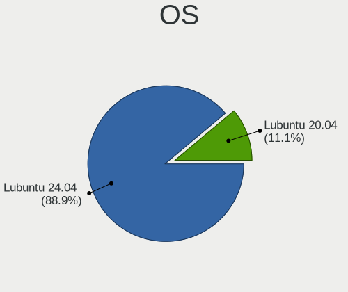

| Name          | Desktops | Percent |
|---------------|----------|---------|
| Lubuntu 22.04 | 5        | 35.71%  |
| Lubuntu 21.10 | 3        | 21.43%  |
| Lubuntu 20.04 | 3        | 21.43%  |
| Lubuntu 21.04 | 1        | 7.14%   |
| Lubuntu 20.10 | 1        | 7.14%   |
| Lubuntu 18.04 | 1        | 7.14%   |

OS Family
---------

OS without a version

| Name    | Desktops | Percent |
|---------|----------|---------|
| Lubuntu | 14       | 100%    |

Kernel
------

Version of the Linux kernel

| Version           | Desktops | Percent |
|-------------------|----------|---------|
| 5.13.0-40-generic | 3        | 21.43%  |
| 5.15.0-30-generic | 2        | 14.29%  |
| 5.15.0-27-generic | 2        | 14.29%  |
| 5.8.0-63-generic  | 1        | 7.14%   |
| 5.4.0-96-generic  | 1        | 7.14%   |
| 5.4.0-53-generic  | 1        | 7.14%   |
| 5.15.0-25-generic | 1        | 7.14%   |
| 5.13.0-41-generic | 1        | 7.14%   |
| 5.11.0-41-generic | 1        | 7.14%   |
| 5.11.0-16-generic | 1        | 7.14%   |

Kernel Family
-------------

Linux kernel without a distro release

| Version | Desktops | Percent |
|---------|----------|---------|
| 5.15.0  | 5        | 35.71%  |
| 5.13.0  | 4        | 28.57%  |
| 5.4.0   | 2        | 14.29%  |
| 5.11.0  | 2        | 14.29%  |
| 5.8.0   | 1        | 7.14%   |

Kernel Major Ver.
-----------------

Linux kernel major version

| Version | Desktops | Percent |
|---------|----------|---------|
| 5.15    | 5        | 35.71%  |
| 5.13    | 4        | 28.57%  |
| 5.4     | 2        | 14.29%  |
| 5.11    | 2        | 14.29%  |
| 5.8     | 1        | 7.14%   |

Arch
----

OS architecture (x86_64, i586, etc.)

| Name   | Desktops | Percent |
|--------|----------|---------|
| x86_64 | 13       | 92.86%  |
| i686   | 1        | 7.14%   |

DE
--

Desktop Environment

| Name | Desktops | Percent |
|------|----------|---------|
| LXQt | 13       | 92.86%  |
| LXDE | 1        | 7.14%   |

Display Server
--------------

X11 or Wayland

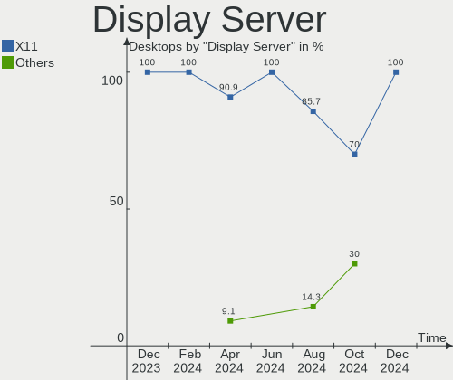

| Name    | Desktops | Percent |
|---------|----------|---------|
| X11     | 13       | 92.86%  |
| Wayland | 1        | 7.14%   |

Display Manager
---------------

SDDM, LightDM, etc.

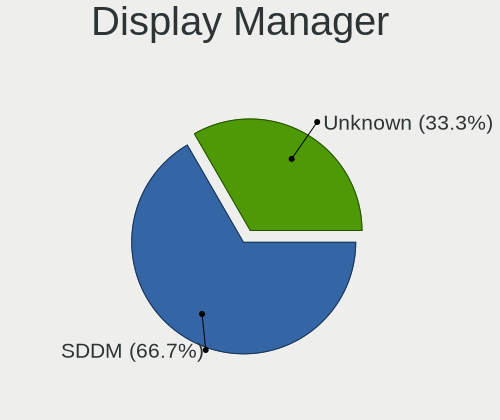

| Name    | Desktops | Percent |
|---------|----------|---------|
| SDDM    | 11       | 78.57%  |
| LXDM    | 1        | 7.14%   |
| LightDM | 1        | 7.14%   |
| Unknown | 1        | 7.14%   |

OS Lang
-------

Language

| Lang  | Desktops | Percent |
|-------|----------|---------|
| en_US | 3        | 21.43%  |
| en_GB | 2        | 14.29%  |
| C     | 2        | 14.29%  |
| pt_BR | 1        | 7.14%   |
| nl_NL | 1        | 7.14%   |
| es_CR | 1        | 7.14%   |
| en_IN | 1        | 7.14%   |
| de_DE | 1        | 7.14%   |
| de_CH | 1        | 7.14%   |
| cv_RU | 1        | 7.14%   |

Boot Mode
---------

EFI or BIOS

| Mode | Desktops | Percent |
|------|----------|---------|
| BIOS | 11       | 78.57%  |
| EFI  | 3        | 21.43%  |

Filesystem
----------

Type of filesystem

| Type    | Desktops | Percent |
|---------|----------|---------|
| Ext4    | 11       | 78.57%  |
| Overlay | 3        | 21.43%  |

Part. scheme
------------

Scheme of partitioning

| Type    | Desktops | Percent |
|---------|----------|---------|
| Unknown | 10       | 71.43%  |
| GPT     | 4        | 28.57%  |

Dual Boot with Linux/BSD
------------------------

Hosting more than one Linux/BSD

| Dual boot | Desktops | Percent |
|-----------|----------|---------|
| No        | 13       | 92.86%  |
| Yes       | 1        | 7.14%   |

Dual Boot (Win)
---------------

Hosting Linux and Windows

| Dual boot | Desktops | Percent |
|-----------|----------|---------|
| No        | 9        | 64.29%  |
| Yes       | 5        | 35.71%  |

Board
-----

Vendor
------

Motherboard manufacturer

| Name                | Desktops | Percent |
|---------------------|----------|---------|
| Unknown             | 3        | 21.43%  |
| Intel               | 2        | 14.29%  |
| Dell                | 2        | 14.29%  |
| Pegatron            | 1        | 7.14%   |
| Lenovo              | 1        | 7.14%   |
| Gigabyte Technology | 1        | 7.14%   |
| Fujitsu             | 1        | 7.14%   |
| ASUSTek Computer    | 1        | 7.14%   |
| ASRock              | 1        | 7.14%   |
| Acer                | 1        | 7.14%   |

Model
-----

Motherboard model

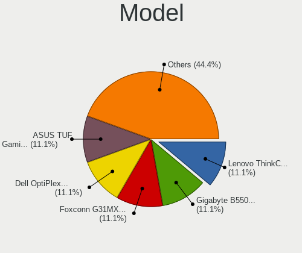

| Name                                                         | Desktops | Percent |
|--------------------------------------------------------------|----------|---------|
| Unknown                                                      | 3        | 21.43%  |
| Pegatron AY748AA-ABA p6320y                                  | 1        | 7.14%   |
| Lenovo ThinkCentre E73 10AS00CVUM                            | 1        | 7.14%   |
| Intel X79 (INTEL Xeon E5/Corei7 DMI2 - C600/C200 Cipset V304 | 1        | 7.14%   |
| Intel DQ57TM                                                 | 1        | 7.14%   |
| Gigabyte G31M-ES2L                                           | 1        | 7.14%   |
| Fujitsu ESPRIMO C910                                         | 1        | 7.14%   |
| Dell Precision WorkStation T5500                             | 1        | 7.14%   |
| Dell OptiPlex 7020                                           | 1        | 7.14%   |
| ASUS Rampage III GENE                                        | 1        | 7.14%   |
| ASRock FM2A85X Extreme6                                      | 1        | 7.14%   |
| Acer Aspire XC100                                            | 1        | 7.14%   |

Model Family
------------

Motherboard model prefix

| Name                 | Desktops | Percent |
|----------------------|----------|---------|
| Unknown              | 3        | 21.43%  |
| Pegatron AY748AA-ABA | 1        | 7.14%   |
| Lenovo ThinkCentre   | 1        | 7.14%   |
| Intel X79            | 1        | 7.14%   |
| Intel DQ57TM         | 1        | 7.14%   |
| Gigabyte G31M-ES2L   | 1        | 7.14%   |
| Fujitsu ESPRIMO      | 1        | 7.14%   |
| Dell Precision       | 1        | 7.14%   |
| Dell OptiPlex        | 1        | 7.14%   |
| ASUS Rampage         | 1        | 7.14%   |
| ASRock FM2A85X       | 1        | 7.14%   |
| Acer Aspire          | 1        | 7.14%   |

MFG Year
--------

Motherboard manufacture year

| Year | Desktops | Percent |
|------|----------|---------|
| 2021 | 2        | 14.29%  |
| 2015 | 2        | 14.29%  |
| 2013 | 2        | 14.29%  |
| 2011 | 2        | 14.29%  |
| 2022 | 1        | 7.14%   |
| 2020 | 1        | 7.14%   |
| 2012 | 1        | 7.14%   |
| 2010 | 1        | 7.14%   |
| 2009 | 1        | 7.14%   |
| 2008 | 1        | 7.14%   |

Form Factor
-----------

Physical design of the computer

| Name    | Desktops | Percent |
|---------|----------|---------|
| Desktop | 14       | 100%    |

Secure Boot
-----------

Enabled or disabled

| State    | Desktops | Percent |
|----------|----------|---------|
| Disabled | 13       | 92.86%  |
| Enabled  | 1        | 7.14%   |

Coreboot
--------

Have coreboot on board

| Used | Desktops | Percent |
|------|----------|---------|
| No   | 14       | 100%    |

RAM Size
--------

Total RAM memory

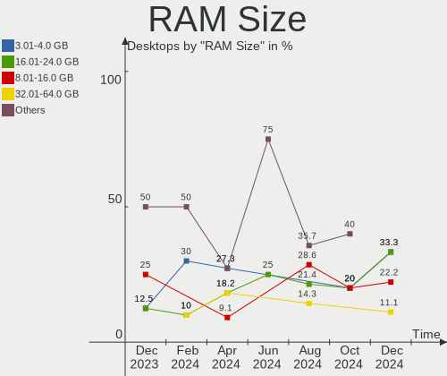

| Size in GB | Desktops | Percent |
|------------|----------|---------|
| 4.01-8.0   | 6        | 42.86%  |
| 3.01-4.0   | 2        | 14.29%  |
| 16.01-24.0 | 2        | 14.29%  |
| 32.01-64.0 | 1        | 7.14%   |
| 24.01-32.0 | 1        | 7.14%   |
| 1.01-2.0   | 1        | 7.14%   |
| 8.01-16.0  | 1        | 7.14%   |

RAM Used
--------

Used RAM memory

| Used GB  | Desktops | Percent |
|----------|----------|---------|
| 1.01-2.0 | 5        | 35.71%  |
| 2.01-3.0 | 4        | 28.57%  |
| 0.51-1.0 | 3        | 21.43%  |
| 4.01-8.0 | 1        | 7.14%   |
| 3.01-4.0 | 1        | 7.14%   |

Total Drives
------------

Number of drives on board

| Drives | Desktops | Percent |
|--------|----------|---------|
| 1      | 9        | 64.29%  |
| 2      | 2        | 14.29%  |
| 0      | 2        | 14.29%  |
| 4      | 1        | 7.14%   |

Has CD-ROM
----------

Has CD-ROM on board

| Presented | Desktops | Percent |
|-----------|----------|---------|
| No        | 11       | 78.57%  |
| Yes       | 3        | 21.43%  |

Has Ethernet
------------

Has Ethernet on board

| Presented | Desktops | Percent |
|-----------|----------|---------|
| Yes       | 14       | 100%    |

Has WiFi
--------

Has WiFi module

| Presented | Desktops | Percent |
|-----------|----------|---------|
| Yes       | 7        | 50%     |
| No        | 7        | 50%     |

Has Bluetooth
-------------

Has Bluetooth module

| Presented | Desktops | Percent |
|-----------|----------|---------|
| No        | 13       | 92.86%  |
| Yes       | 1        | 7.14%   |

Location
--------

Country
-------

Geographic location (country)

| Country     | Desktops | Percent |
|-------------|----------|---------|
| USA         | 3        | 21.43%  |
| UK          | 2        | 14.29%  |
| Switzerland | 1        | 7.14%   |
| Romania     | 1        | 7.14%   |
| Netherlands | 1        | 7.14%   |
| Latvia      | 1        | 7.14%   |
| Kenya       | 1        | 7.14%   |
| India       | 1        | 7.14%   |
| Germany     | 1        | 7.14%   |
| Costa Rica  | 1        | 7.14%   |
| Brazil      | 1        | 7.14%   |

City
----

Geographic location (city)

| City              | Desktops | Percent |
|-------------------|----------|---------|
| Vero Beach        | 1        | 7.14%   |
| Ulhasnagar        | 1        | 7.14%   |
| Sao Paulo         | 1        | 7.14%   |
| Notting Hill Gate | 1        | 7.14%   |
| New York          | 1        | 7.14%   |
| Mombasa           | 1        | 7.14%   |
| Leiden            | 1        | 7.14%   |
| Lebanon           | 1        | 7.14%   |
| Karlsruhe         | 1        | 7.14%   |
| Heredia           | 1        | 7.14%   |
| Derby             | 1        | 7.14%   |
| Bucharest         | 1        | 7.14%   |
| Bern              | 1        | 7.14%   |
| Adazi             | 1        | 7.14%   |

Drives
------

Drive Vendor
------------

Hard drive vendors

| Vendor   | Desktops | Drives | Percent |
|----------|----------|--------|---------|
| WDC      | 5        | 5      | 31.25%  |
| Seagate  | 2        | 2      | 12.5%   |
| Hitachi  | 2        | 2      | 12.5%   |
| Verbatim | 1        | 1      | 6.25%   |
| Patriot  | 1        | 1      | 6.25%   |
| Kston    | 1        | 1      | 6.25%   |
| Kingston | 1        | 1      | 6.25%   |
| Intel    | 1        | 1      | 6.25%   |
| Crucial  | 1        | 1      | 6.25%   |
| China    | 1        | 1      | 6.25%   |

Drive Model
-----------

Hard drive models

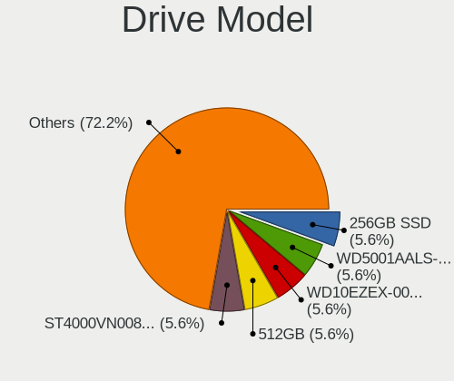

| Model                           | Desktops | Percent |
|---------------------------------|----------|---------|
| Seagate ST500DM002-1BD142 500GB | 2        | 12.5%   |
| WDC WDS200T2B0A-00SM50 2TB SSD  | 1        | 6.25%   |
| WDC WD5000AAKX-08U6AA0 500GB    | 1        | 6.25%   |
| WDC WD5000AAKX-07U6AA0 500GB    | 1        | 6.25%   |
| WDC WD2500AAJS-07M0A0 250GB     | 1        | 6.25%   |
| WDC WD20EFRX-68EUZN0 2TB        | 1        | 6.25%   |
| Verbatim Vi550 S3 SSD 256GB     | 1        | 6.25%   |
| Patriot Memory 500GB SSD        | 1        | 6.25%   |
| Kston SSD 128GB                 | 1        | 6.25%   |
| Kingston OM8PDP3512B-A01 512GB  | 1        | 6.25%   |
| Intel SSDMCEAC240B3 240GB       | 1        | 6.25%   |
| Hitachi HDS721616PLA320 160GB   | 1        | 6.25%   |
| Hitachi HDP725025GLA380 250GB   | 1        | 6.25%   |
| Crucial CT2000BX500SSD1 2TB     | 1        | 6.25%   |
| China SATA SSD 256GB            | 1        | 6.25%   |

HDD Vendor
----------

Hard disk drive vendors

| Vendor  | Desktops | Drives | Percent |
|---------|----------|--------|---------|
| WDC     | 4        | 4      | 50%     |
| Seagate | 2        | 2      | 25%     |
| Hitachi | 2        | 2      | 25%     |

SSD Vendor
----------

Solid state drive vendors

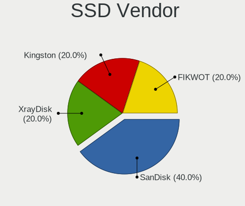

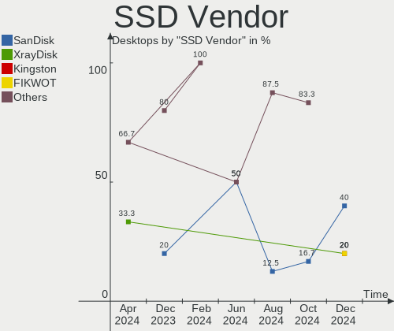

| Vendor   | Desktops | Drives | Percent |
|----------|----------|--------|---------|
| WDC      | 1        | 1      | 14.29%  |
| Verbatim | 1        | 1      | 14.29%  |
| Patriot  | 1        | 1      | 14.29%  |
| Kston    | 1        | 1      | 14.29%  |
| Intel    | 1        | 1      | 14.29%  |
| Crucial  | 1        | 1      | 14.29%  |
| China    | 1        | 1      | 14.29%  |

Drive Kind
----------

HDD or SSD

| Kind | Desktops | Drives | Percent |
|------|----------|--------|---------|
| HDD  | 6        | 8      | 50%     |
| SSD  | 5        | 7      | 41.67%  |
| NVMe | 1        | 1      | 8.33%   |

Drive Connector
---------------

SATA, SAS, NVMe, etc.

| Type | Desktops | Drives | Percent |
|------|----------|--------|---------|
| SATA | 11       | 14     | 84.62%  |
| SAS  | 1        | 1      | 7.69%   |
| NVMe | 1        | 1      | 7.69%   |

Drive Size
----------

Size of hard drive

| Size in TB | Desktops | Drives | Percent |
|------------|----------|--------|---------|
| 0.01-0.5   | 11       | 12     | 84.62%  |
| 1.01-2.0   | 2        | 3      | 15.38%  |

Space Total
-----------

Amount of disk space available on the file system

| Size in GB     | Desktops | Percent |
|----------------|----------|---------|
| 101-250        | 5        | 35.71%  |
| 1-20           | 3        | 21.43%  |
| 251-500        | 2        | 14.29%  |
| More than 3000 | 1        | 7.14%   |
| 2001-3000      | 1        | 7.14%   |
| 501-1000       | 1        | 7.14%   |
| Unknown        | 1        | 7.14%   |

Space Used
----------

Amount of used disk space

| Used GB        | Desktops | Percent |
|----------------|----------|---------|
| 1-20           | 6        | 42.86%  |
| 21-50          | 3        | 21.43%  |
| More than 3000 | 1        | 7.14%   |
| 101-250        | 1        | 7.14%   |
| 501-1000       | 1        | 7.14%   |
| 51-100         | 1        | 7.14%   |
| Unknown        | 1        | 7.14%   |

Malfunc. Drives
---------------

Drive models with a malfunction

Zero info for selected period =(

Malfunc. Drive Vendor
---------------------

Vendors of faulty drives

Zero info for selected period =(

Malfunc. HDD Vendor
-------------------

Vendors of faulty HDD drives

Zero info for selected period =(

Malfunc. Drive Kind
-------------------

Kinds of faulty drives

Zero info for selected period =(

Failed Drives
-------------

Failed drive models

Zero info for selected period =(

Failed Drive Vendor
-------------------

Failed drive vendors

Zero info for selected period =(

Drive Status
------------

Number of failed and malfunc. drives

| Status   | Desktops | Drives | Percent |
|----------|----------|--------|---------|
| Detected | 8        | 12     | 66.67%  |
| Works    | 4        | 4      | 33.33%  |

Storage controller
------------------

Storage Vendor
--------------

Storage controller vendors

| Vendor                      | Desktops | Percent |
|-----------------------------|----------|---------|
| Intel                       | 10       | 62.5%   |
| AMD                         | 3        | 18.75%  |
| Nvidia                      | 1        | 6.25%   |
| Marvell Technology Group    | 1        | 6.25%   |
| Kingston Technology Company | 1        | 6.25%   |

Storage Model
-------------

Storage controller models

| Model                                                                          | Desktops | Percent |
|--------------------------------------------------------------------------------|----------|---------|
| Intel Celeron/Pentium Silver Processor SATA Controller                         | 2        | 10%     |
| Intel 82801JI (ICH10 Family) SATA AHCI Controller                              | 2        | 10%     |
| Intel 8 Series/C220 Series Chipset Family 6-port SATA Controller 1 [AHCI mode] | 2        | 10%     |
| AMD FCH SATA Controller [AHCI mode]                                            | 2        | 10%     |
| Nvidia MCP78S [GeForce 8200] AHCI Controller                                   | 1        | 5%      |
| Marvell Group 88SE9123 PCIe SATA 6.0 Gb/s controller                           | 1        | 5%      |
| Kingston Company OM3PDP3 NVMe SSD                                              | 1        | 5%      |
| Intel NM10/ICH7 Family SATA Controller [IDE mode]                              | 1        | 5%      |
| Intel 7 Series/C210 Series Chipset Family 6-port SATA Controller [AHCI mode]   | 1        | 5%      |
| Intel 7 Series Chipset Family 6-port SATA Controller [AHCI mode]               | 1        | 5%      |
| Intel 5 Series/3400 Series Chipset PT IDER Controller                          | 1        | 5%      |
| Intel 5 Series/3400 Series Chipset 4 port SATA IDE Controller                  | 1        | 5%      |
| Intel 5 Series/3400 Series Chipset 2 port SATA IDE Controller                  | 1        | 5%      |
| AMD SB7x0/SB8x0/SB9x0 SATA Controller [AHCI mode]                              | 1        | 5%      |
| AMD SB7x0/SB8x0/SB9x0 IDE Controller                                           | 1        | 5%      |
| AMD FCH IDE Controller                                                         | 1        | 5%      |

Storage Kind
------------

Kind of storage controller (IDE, SATA, NVMe, SAS, ...)

| Kind | Desktops | Percent |
|------|----------|---------|
| SATA | 12       | 70.59%  |
| IDE  | 4        | 23.53%  |
| NVMe | 1        | 5.88%   |

Processor
---------

CPU Vendor
----------

Processor vendors

| Vendor | Desktops | Percent |
|--------|----------|---------|
| Intel  | 10       | 71.43%  |
| AMD    | 4        | 28.57%  |

CPU Model
---------

Processor models

| Model                                     | Desktops | Percent |
|-------------------------------------------|----------|---------|
| Intel Celeron J4125 CPU @ 2.00GHz         | 2        | 14.29%  |
| Intel Xeon CPU X5650 @ 2.67GHz            | 1        | 7.14%   |
| Intel Xeon CPU E5-2420 0 @ 1.90GHz        | 1        | 7.14%   |
| Intel Core i7 CPU X 980 @ 3.33GHz         | 1        | 7.14%   |
| Intel Core i5-3470 CPU @ 3.20GHz          | 1        | 7.14%   |
| Intel Core i5 CPU 650 @ 3.20GHz           | 1        | 7.14%   |
| Intel Core i3-4170 CPU @ 3.70GHz          | 1        | 7.14%   |
| Intel Core i3-4160 CPU @ 3.60GHz          | 1        | 7.14%   |
| Intel Core 2 Duo CPU E7200 @ 2.53GHz      | 1        | 7.14%   |
| AMD Ryzen 9 5900HX with Radeon Graphics   | 1        | 7.14%   |
| AMD Phenom II X4 820 Processor            | 1        | 7.14%   |
| AMD E1-1500 APU with Radeon HD Graphics   | 1        | 7.14%   |
| AMD A10-6800K APU with Radeon HD Graphics | 1        | 7.14%   |

CPU Model Family
----------------

Processor model prefix

| Model            | Desktops | Percent |
|------------------|----------|---------|
| Intel Xeon       | 2        | 14.29%  |
| Intel Core i5    | 2        | 14.29%  |
| Intel Core i3    | 2        | 14.29%  |
| Intel Celeron    | 2        | 14.29%  |
| Intel Core i7    | 1        | 7.14%   |
| Intel Core 2 Duo | 1        | 7.14%   |
| AMD Ryzen 9      | 1        | 7.14%   |
| AMD Phenom II X4 | 1        | 7.14%   |
| AMD E1           | 1        | 7.14%   |
| AMD A10          | 1        | 7.14%   |

CPU Cores
---------

Number of processor cores

| Number | Desktops | Percent |
|--------|----------|---------|
| 2      | 6        | 42.86%  |
| 4      | 4        | 28.57%  |
| 6      | 2        | 14.29%  |
| 8      | 1        | 7.14%   |
| 1      | 1        | 7.14%   |

CPU Sockets
-----------

Number of sockets

| Number | Desktops | Percent |
|--------|----------|---------|
| 1      | 14       | 100%    |

CPU Threads
-----------

Threads per core (Hyper-Threading)

| Number | Desktops | Percent |
|--------|----------|---------|
| 1      | 8        | 57.14%  |
| 2      | 6        | 42.86%  |

CPU Op-Modes
------------

CPU Operation Modes (32-bit, 64-bit)

| Op mode        | Desktops | Percent |
|----------------|----------|---------|
| 32-bit, 64-bit | 14       | 100%    |

CPU Microcode
-------------

Microcode number

| Number     | Desktops | Percent |
|------------|----------|---------|
| Unknown    | 8        | 57.14%  |
| 0x706a8    | 1        | 7.14%   |
| 0x306a9    | 1        | 7.14%   |
| 0x206d7    | 1        | 7.14%   |
| 0x206c2    | 1        | 7.14%   |
| 0x0a50000c | 1        | 7.14%   |
| 0x06001119 | 1        | 7.14%   |

CPU Microarch
-------------

Microarchitecture

| Name          | Desktops | Percent |
|---------------|----------|---------|
| Westmere      | 3        | 21.43%  |
| Haswell       | 2        | 14.29%  |
| Goldmont plus | 2        | 14.29%  |
| Zen 3         | 1        | 7.14%   |
| SandyBridge   | 1        | 7.14%   |
| Piledriver    | 1        | 7.14%   |
| Penryn        | 1        | 7.14%   |
| K10           | 1        | 7.14%   |
| IvyBridge     | 1        | 7.14%   |
| Bobcat        | 1        | 7.14%   |

Graphics
--------

GPU Vendor
----------

Vendors of graphics cards

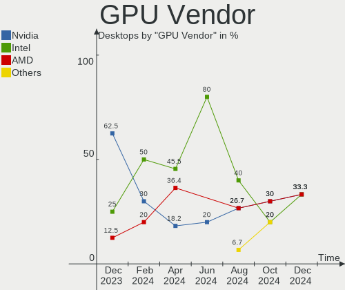

| Vendor | Desktops | Percent |
|--------|----------|---------|
| Intel  | 6        | 40%     |
| AMD    | 5        | 33.33%  |
| Nvidia | 4        | 26.67%  |

GPU Model
---------

Graphics card models

| Model                                                                     | Desktops | Percent |
|---------------------------------------------------------------------------|----------|---------|
| Intel GeminiLake [UHD Graphics 600]                                       | 2        | 13.33%  |
| Intel 4th Generation Core Processor Family Integrated Graphics Controller | 2        | 13.33%  |
| Nvidia GP108 [GeForce GT 1030]                                            | 1        | 6.67%   |
| Nvidia GK208B [GeForce GT 710]                                            | 1        | 6.67%   |
| Nvidia GK107GL [Quadro K420]                                              | 1        | 6.67%   |
| Nvidia C78 [GeForce 9100]                                                 | 1        | 6.67%   |
| Intel Xeon E3-1200 v2/3rd Gen Core processor Graphics Controller          | 1        | 6.67%   |
| Intel Core Processor Integrated Graphics Controller                       | 1        | 6.67%   |
| AMD Wrestler [Radeon HD 7310]                                             | 1        | 6.67%   |
| AMD Richland [Radeon HD 8670D]                                            | 1        | 6.67%   |
| AMD Oland [Radeon HD 8570 / R5 430 OEM / R7 240/340 / Radeon 520 OEM]     | 1        | 6.67%   |
| AMD Cezanne                                                               | 1        | 6.67%   |
| AMD Cedar [Radeon HD 5000/6000/7350/8350 Series]                          | 1        | 6.67%   |

GPU Combo
---------

Combinations of graphics cards

| Name       | Desktops | Percent |
|------------|----------|---------|
| 1 x Intel  | 5        | 35.71%  |
| 1 x AMD    | 5        | 35.71%  |
| 1 x Nvidia | 4        | 28.57%  |

GPU Driver
----------

Free vs proprietary

| Driver  | Desktops | Percent |
|---------|----------|---------|
| Free    | 13       | 92.86%  |
| Unknown | 1        | 7.14%   |

GPU Memory
----------

Total video memory

| Size in GB | Desktops | Percent |
|------------|----------|---------|
| Unknown    | 11       | 78.57%  |
| 0.51-1.0   | 2        | 14.29%  |
| 0.01-0.5   | 1        | 7.14%   |

Monitor
-------

Monitor Vendor
--------------

Monitor vendors

| Vendor               | Desktops | Percent |
|----------------------|----------|---------|
| Hewlett-Packard      | 3        | 25%     |
| Samsung Electronics  | 2        | 16.67%  |
| Goldstar             | 2        | 16.67%  |
| Videoseven           | 1        | 8.33%   |
| Lenovo               | 1        | 8.33%   |
| Iiyama               | 1        | 8.33%   |
| Dell                 | 1        | 8.33%   |
| Ancor Communications | 1        | 8.33%   |

Monitor Model
-------------

Monitor models

| Model                                                                 | Desktops | Percent |
|-----------------------------------------------------------------------|----------|---------|
| Videoseven L19FM IGM0812 1280x1024 376x301mm 19.0-inch                | 1        | 7.69%   |
| Samsung Electronics U28E590 SAM0C4D 3840x2160 607x345mm 27.5-inch     | 1        | 7.69%   |
| Samsung Electronics SyncMaster SAM01E1 1280x1024 376x301mm 19.0-inch  | 1        | 7.69%   |
| Lenovo LEN LI1931ewA LEN65A1 1366x768 409x230mm 18.5-inch             | 1        | 7.69%   |
| Lenovo LEN E2054A LEN60DF 1440x900 420x260mm 19.4-inch                | 1        | 7.69%   |
| Iiyama PL2452 IVM610A 1920x1080 521x293mm 23.5-inch                   | 1        | 7.69%   |
| Hewlett-Packard w2338h HWP281B 1920x1080 509x286mm 23.0-inch          | 1        | 7.69%   |
| Hewlett-Packard 23xi HWP3032 1920x1080 509x286mm 23.0-inch            | 1        | 7.69%   |
| Hewlett-Packard 2311x HWP293A 1920x1080 510x287mm 23.0-inch           | 1        | 7.69%   |
| Goldstar M228WA GSM563C 1680x1050 434x270mm 20.1-inch                 | 1        | 7.69%   |
| Goldstar HD PLUS GSM5AC5 1600x900 440x250mm 19.9-inch                 | 1        | 7.69%   |
| Dell AW2518HF DELA102 1920x1080 544x303mm 24.5-inch                   | 1        | 7.69%   |
| Ancor Communications ASUS VH242 ACI24FA 1920x1080 521x293mm 23.5-inch | 1        | 7.69%   |

Monitor Resolution
------------------

Monitor screen resolution

| Resolution         | Desktops | Percent |
|--------------------|----------|---------|
| 1920x1080 (FHD)    | 5        | 41.67%  |
| 1280x1024 (SXGA)   | 2        | 16.67%  |
| 3840x2160 (4K)     | 1        | 8.33%   |
| 1680x1050 (WSXGA+) | 1        | 8.33%   |
| 1600x900 (HD+)     | 1        | 8.33%   |
| 1440x900 (WXGA+)   | 1        | 8.33%   |
| 1366x768 (WXGA)    | 1        | 8.33%   |

Monitor Diagonal
----------------

Diagonal size in inches

| Inches | Desktops | Percent |
|--------|----------|---------|
| 23     | 4        | 33.33%  |
| 19     | 4        | 33.33%  |
| 27     | 1        | 8.33%   |
| 24     | 1        | 8.33%   |
| 20     | 1        | 8.33%   |
| 18     | 1        | 8.33%   |

Monitor Width
-------------

Physical width

| Width in mm | Desktops | Percent |
|-------------|----------|---------|
| 501-600     | 5        | 45.45%  |
| 401-500     | 3        | 27.27%  |
| 351-400     | 2        | 18.18%  |
| 601-700     | 1        | 9.09%   |

Aspect Ratio
------------

Proportional relationship between the width and the height

| Ratio | Desktops | Percent |
|-------|----------|---------|
| 16/9  | 7        | 63.64%  |
| 5/4   | 2        | 18.18%  |
| 16/10 | 2        | 18.18%  |

Monitor Area
------------

Area in inch²

| Area in inch² | Desktops | Percent |
|----------------|----------|---------|
| 151-200        | 5        | 41.67%  |
| 201-250        | 4        | 33.33%  |
| 301-350        | 1        | 8.33%   |
| 251-300        | 1        | 8.33%   |
| 141-150        | 1        | 8.33%   |

Pixel Density
-------------

Pixels per inch

| Density | Desktops | Percent |
|---------|----------|---------|
| 51-100  | 9        | 90%     |
| 121-160 | 1        | 10%     |

Multiple Monitors
-----------------

Total monitors connected

| Total | Desktops | Percent |
|-------|----------|---------|
| 1     | 12       | 85.71%  |
| 2     | 2        | 14.29%  |

Network
-------

Net Controller Vendor
---------------------

Controller vendors

| Vendor                | Desktops | Percent |
|-----------------------|----------|---------|
| Realtek Semiconductor | 7        | 33.33%  |
| Intel                 | 6        | 28.57%  |
| Ralink Technology     | 3        | 14.29%  |
| Qualcomm Atheros      | 1        | 4.76%   |
| Nvidia                | 1        | 4.76%   |
| MEDIATEK              | 1        | 4.76%   |
| Broadcom Limited      | 1        | 4.76%   |
| Broadcom              | 1        | 4.76%   |

Net Controller Model
--------------------

Controller models

| Model                                                             | Desktops | Percent |
|-------------------------------------------------------------------|----------|---------|
| Realtek RTL8111/8168/8411 PCI Express Gigabit Ethernet Controller | 6        | 26.09%  |
| Realtek RTL8153 Gigabit Ethernet Adapter                          | 2        | 8.7%    |
| Ralink MT7601U Wireless Adapter                                   | 2        | 8.7%    |
| Intel Ethernet Controller I225-V                                  | 2        | 8.7%    |
| Realtek RTL8188EUS 802.11n Wireless Network Adapter               | 1        | 4.35%   |
| Ralink RT5370 Wireless Adapter                                    | 1        | 4.35%   |
| Qualcomm Atheros AR928X Wireless Network Adapter (PCI-Express)    | 1        | 4.35%   |
| Nvidia MCP77 Ethernet                                             | 1        | 4.35%   |
| MEDIATEK MT7921K (RZ608) Wi-Fi 6E 80MHz                           | 1        | 4.35%   |
| Intel Ethernet Connection I217-LM                                 | 1        | 4.35%   |
| Intel 82579LM Gigabit Network Connection (Lewisville)             | 1        | 4.35%   |
| Intel 82578DM Gigabit Network Connection                          | 1        | 4.35%   |
| Intel 82567V-2 Gigabit Network Connection                         | 1        | 4.35%   |
| Broadcom NetXtreme BCM5761 Gigabit Ethernet PCIe                  | 1        | 4.35%   |
| Broadcom Limited BCM43224 802.11a/b/g/n                           | 1        | 4.35%   |

Wireless Vendor
---------------

Wireless vendors

| Vendor                | Desktops | Percent |
|-----------------------|----------|---------|
| Ralink Technology     | 3        | 42.86%  |
| Realtek Semiconductor | 1        | 14.29%  |
| Qualcomm Atheros      | 1        | 14.29%  |
| MEDIATEK              | 1        | 14.29%  |
| Broadcom Limited      | 1        | 14.29%  |

Wireless Model
--------------

Wireless models

| Model                                                          | Desktops | Percent |
|----------------------------------------------------------------|----------|---------|
| Ralink MT7601U Wireless Adapter                                | 2        | 28.57%  |
| Realtek RTL8188EUS 802.11n Wireless Network Adapter            | 1        | 14.29%  |
| Ralink RT5370 Wireless Adapter                                 | 1        | 14.29%  |
| Qualcomm Atheros AR928X Wireless Network Adapter (PCI-Express) | 1        | 14.29%  |
| MEDIATEK MT7921K (RZ608) Wi-Fi 6E 80MHz                        | 1        | 14.29%  |
| Broadcom Limited BCM43224 802.11a/b/g/n                        | 1        | 14.29%  |

Ethernet Vendor
---------------

Ethernet vendors

| Vendor                | Desktops | Percent |
|-----------------------|----------|---------|
| Realtek Semiconductor | 7        | 46.67%  |
| Intel                 | 6        | 40%     |
| Nvidia                | 1        | 6.67%   |
| Broadcom              | 1        | 6.67%   |

Ethernet Model
--------------

Ethernet models

| Model                                                             | Desktops | Percent |
|-------------------------------------------------------------------|----------|---------|
| Realtek RTL8111/8168/8411 PCI Express Gigabit Ethernet Controller | 6        | 37.5%   |
| Realtek RTL8153 Gigabit Ethernet Adapter                          | 2        | 12.5%   |
| Intel Ethernet Controller I225-V                                  | 2        | 12.5%   |
| Nvidia MCP77 Ethernet                                             | 1        | 6.25%   |
| Intel Ethernet Connection I217-LM                                 | 1        | 6.25%   |
| Intel 82579LM Gigabit Network Connection (Lewisville)             | 1        | 6.25%   |
| Intel 82578DM Gigabit Network Connection                          | 1        | 6.25%   |
| Intel 82567V-2 Gigabit Network Connection                         | 1        | 6.25%   |
| Broadcom NetXtreme BCM5761 Gigabit Ethernet PCIe                  | 1        | 6.25%   |

Net Controller Kind
-------------------

Ethernet, WiFi or modem

| Kind     | Desktops | Percent |
|----------|----------|---------|
| Ethernet | 14       | 66.67%  |
| WiFi     | 7        | 33.33%  |

Used Controller
---------------

Currently used network controller

| Kind     | Desktops | Percent |
|----------|----------|---------|
| Ethernet | 10       | 66.67%  |
| WiFi     | 5        | 33.33%  |

NICs
----

Total network controllers on board

| Total | Desktops | Percent |
|-------|----------|---------|
| 1     | 10       | 71.43%  |
| 2     | 2        | 14.29%  |
| 4     | 1        | 7.14%   |
| 3     | 1        | 7.14%   |

IPv6
----

IPv6 vs IPv4

| Used | Desktops | Percent |
|------|----------|---------|
| No   | 14       | 100%    |

Bluetooth
---------

Bluetooth Vendor
----------------

Controller vendors

| Vendor   | Desktops | Percent |
|----------|----------|---------|
| MediaTek | 1        | 100%    |

Bluetooth Model
---------------

Controller models

| Model                    | Desktops | Percent |
|--------------------------|----------|---------|
| MediaTek Wireless_Device | 1        | 100%    |

Sound
-----

Sound Vendor
------------

Sound card vendors

| Vendor                                       | Desktops | Percent |
|----------------------------------------------|----------|---------|
| Intel                                        | 10       | 45.45%  |
| AMD                                          | 5        | 22.73%  |
| Nvidia                                       | 4        | 18.18%  |
| Zoran Co. Personal Media Division (Nogatech) | 1        | 4.55%   |
| Nordic Semiconductor ASA                     | 1        | 4.55%   |
| C-Media Electronics                          | 1        | 4.55%   |

Sound Model
-----------

Sound card models

| Model                                                                   | Desktops | Percent |
|-------------------------------------------------------------------------|----------|---------|
| Intel Xeon E3-1200 v3/4th Gen Core Processor HD Audio Controller        | 2        | 7.69%   |
| Intel Celeron/Pentium Silver Processor High Definition Audio            | 2        | 7.69%   |
| Intel 82801JI (ICH10 Family) HD Audio Controller                        | 2        | 7.69%   |
| Intel 8 Series/C220 Series Chipset High Definition Audio Controller     | 2        | 7.69%   |
| Intel 7 Series/C216 Chipset Family High Definition Audio Controller     | 2        | 7.69%   |
| Zoran Co. Personal Media Division (Nogatech) USB Audio and HID          | 1        | 3.85%   |
| Nvidia MCP72XE/MCP72P/MCP78U/MCP78S High Definition Audio               | 1        | 3.85%   |
| Nvidia GP108 High Definition Audio Controller                           | 1        | 3.85%   |
| Nvidia GK208 HDMI/DP Audio Controller                                   | 1        | 3.85%   |
| Nvidia GK107 HDMI Audio Controller                                      | 1        | 3.85%   |
| Nordic Semiconductor ASA SG Control Mic                                 | 1        | 3.85%   |
| Intel NM10/ICH7 Family High Definition Audio Controller                 | 1        | 3.85%   |
| Intel 5 Series/3400 Series Chipset High Definition Audio                | 1        | 3.85%   |
| C-Media Electronics Audio Adapter (Unitek Y-247A)                       | 1        | 3.85%   |
| AMD Wrestler HDMI Audio                                                 | 1        | 3.85%   |
| AMD SBx00 Azalia (Intel HDA)                                            | 1        | 3.85%   |
| AMD Renoir Radeon High Definition Audio Controller                      | 1        | 3.85%   |
| AMD Oland/Hainan/Cape Verde/Pitcairn HDMI Audio [Radeon HD 7000 Series] | 1        | 3.85%   |
| AMD FCH Azalia Controller                                               | 1        | 3.85%   |
| AMD Family 17h/19h HD Audio Controller                                  | 1        | 3.85%   |
| AMD Cedar HDMI Audio [Radeon HD 5400/6300/7300 Series]                  | 1        | 3.85%   |

Memory
------

Memory Vendor
-------------

Memory module vendors

| Vendor              | Desktops | Percent |
|---------------------|----------|---------|
| Unknown             | 1        | 16.67%  |
| SK Hynix            | 1        | 16.67%  |
| Samsung Electronics | 1        | 16.67%  |
| Micron Technology   | 1        | 16.67%  |
| Kingston            | 1        | 16.67%  |
| Elpida              | 1        | 16.67%  |

Memory Model
------------

Memory module models

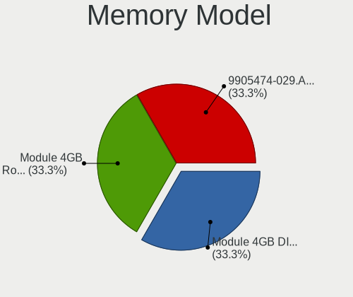

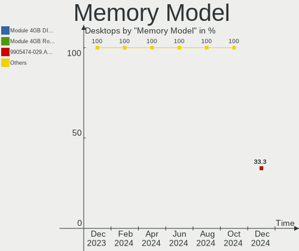

| Model                                                    | Desktops | Percent |
|----------------------------------------------------------|----------|---------|
| Unknown RAM GSA8G4SCL156P-21 8192MB SODIMM DDR4 2133MT/s | 1        | 14.29%  |
| SK Hynix RAM HMT31GR7BFR4C-H9 8GB DIMM DDR3 1333MT/s     | 1        | 14.29%  |
| SK Hynix RAM HMT125R7TFR8C-H9 2GB DIMM DDR3 1333MT/s     | 1        | 14.29%  |
| Samsung RAM M378B5173QH0-CK0 4GB DIMM DDR3 1866MT/s      | 1        | 14.29%  |
| Micron RAM 16ATF2G64HZ-2G6E1 16GB SODIMM DDR4 2400MT/s   | 1        | 14.29%  |
| Kingston RAM CBD32D4S2S8MF-16 16GB SODIMM DDR4 3200MT/s  | 1        | 14.29%  |
| Elpida RAM EBJ41UF8BDW0-GN-F 4096MB DIMM DDR3 1600MT/s   | 1        | 14.29%  |

Memory Kind
-----------

Memory module kinds

| Kind | Desktops | Percent |
|------|----------|---------|
| DDR4 | 3        | 60%     |
| DDR3 | 2        | 40%     |

Memory Form Factor
------------------

Physical design of the memory module

| Name   | Desktops | Percent |
|--------|----------|---------|
| SODIMM | 3        | 60%     |
| DIMM   | 2        | 40%     |

Memory Size
-----------

Memory module size

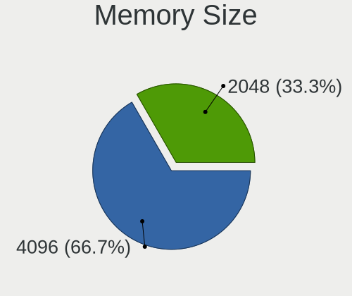

| Size  | Desktops | Percent |
|-------|----------|---------|
| 16384 | 2        | 33.33%  |
| 8192  | 2        | 33.33%  |
| 4096  | 1        | 16.67%  |
| 2048  | 1        | 16.67%  |

Memory Speed
------------

Memory module speed

| Speed | Desktops | Percent |
|-------|----------|---------|
| 3200  | 1        | 16.67%  |
| 2400  | 1        | 16.67%  |
| 2133  | 1        | 16.67%  |
| 1866  | 1        | 16.67%  |
| 1600  | 1        | 16.67%  |
| 1333  | 1        | 16.67%  |

Printers & scanners
-------------------

Printer Vendor
--------------

Printer device vendors

Zero info for selected period =(

Printer Model
-------------

Printer device models

Zero info for selected period =(

Scanner Vendor
--------------

Scanner device vendors

Zero info for selected period =(

Scanner Model
-------------

Scanner device models

Zero info for selected period =(

Camera
------

Camera Vendor
-------------

Camera device vendors

| Vendor         | Desktops | Percent |
|----------------|----------|---------|
| Pixart Imaging | 1        | 100%    |

Camera Model
------------

Camera device models

| Model                                | Desktops | Percent |
|--------------------------------------|----------|---------|
| Pixart Imaging GE 1.3 MP MiniCam Pro | 1        | 100%    |

Security
--------

Fingerprint Vendor
------------------

Fingerprint sensor vendors

Zero info for selected period =(

Fingerprint Model
-----------------

Fingerprint sensor models

Zero info for selected period =(

Chipcard Vendor
---------------

Chipcard module vendors

Zero info for selected period =(

Chipcard Model
--------------

Chipcard module models

Zero info for selected period =(

Unsupported
-----------

Unsupported Devices
-------------------

Total unsupported devices on board

| Total | Desktops | Percent |
|-------|----------|---------|
| 0     | 13       | 92.86%  |
| 1     | 1        | 7.14%   |

Unsupported Device Types
------------------------

Types of unsupported devices

| Type          | Desktops | Percent |
|---------------|----------|---------|
| Graphics card | 1        | 100%    |

