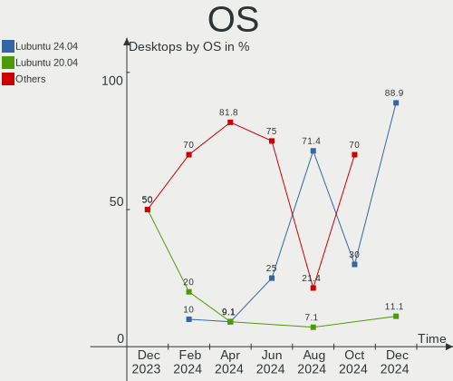
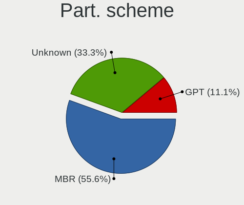
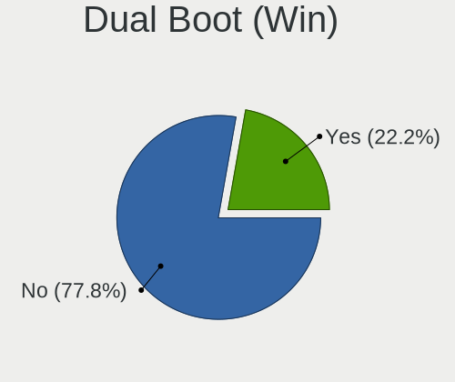
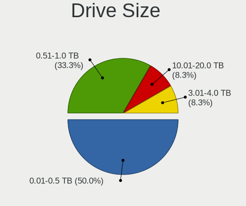
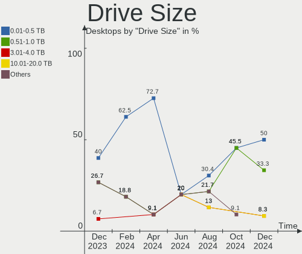
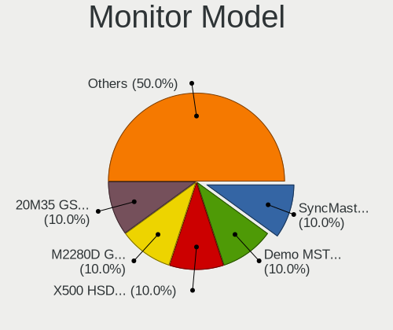
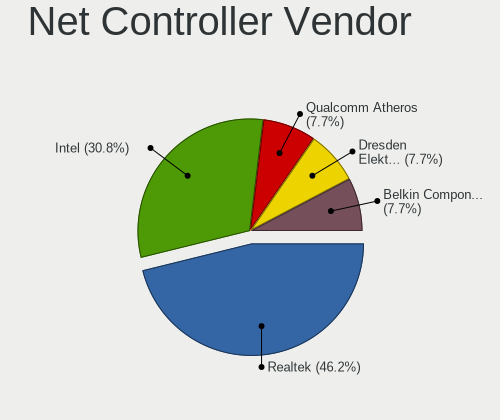
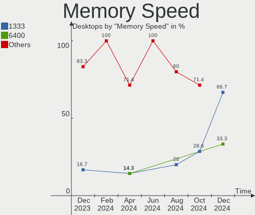

Lubuntu - Hardware Trends (Desktops)
------------------------------------

A project to identify most popular hardware characteristics and track their change
over time based on data collected by Linux users at https://Linux-Hardware.org.

Anyone can contribute to this report by the [hw-probe](https://github.com/linuxhw/hw-probe) tool:

    sudo -E hw-probe -all -upload

This report is for one last month. Overall report since the beginning of time: [TestDays](https://github.com/linuxhw/TestDays)

Period: Apr, 2024.

Contents
--------

* [ System ](#system)
  - [ OS                       ](#os)
  - [ OS Family                ](#os-family)
  - [ Kernel                   ](#kernel)
  - [ Kernel Family            ](#kernel-family)
  - [ Kernel Major Ver.        ](#kernel-major-ver)
  - [ Arch                     ](#arch)
  - [ DE                       ](#de)
  - [ Display Server           ](#display-server)
  - [ Display Manager          ](#display-manager)
  - [ OS Lang                  ](#os-lang)
  - [ Boot Mode                ](#boot-mode)
  - [ Filesystem               ](#filesystem)
  - [ Part. scheme             ](#part-scheme)
  - [ Dual Boot with Linux/BSD ](#dual-boot-with-linuxbsd)
  - [ Dual Boot (Win)          ](#dual-boot-win)

* [ Board ](#board)
  - [ Vendor                   ](#vendor)
  - [ Model                    ](#model)
  - [ Model Family             ](#model-family)
  - [ MFG Year                 ](#mfg-year)
  - [ Form Factor              ](#form-factor)
  - [ Secure Boot              ](#secure-boot)
  - [ Coreboot                 ](#coreboot)
  - [ RAM Size                 ](#ram-size)
  - [ RAM Used                 ](#ram-used)
  - [ Total Drives             ](#total-drives)
  - [ Has CD-ROM               ](#has-cd-rom)
  - [ Has Ethernet             ](#has-ethernet)
  - [ Has WiFi                 ](#has-wifi)
  - [ Has Bluetooth            ](#has-bluetooth)

* [ Location ](#location)
  - [ Country                  ](#country)
  - [ City                     ](#city)

* [ Drives ](#drives)
  - [ Drive Vendor             ](#drive-vendor)
  - [ Drive Model              ](#drive-model)
  - [ HDD Vendor               ](#hdd-vendor)
  - [ SSD Vendor               ](#ssd-vendor)
  - [ Drive Kind               ](#drive-kind)
  - [ Drive Connector          ](#drive-connector)
  - [ Drive Size               ](#drive-size)
  - [ Space Total              ](#space-total)
  - [ Space Used               ](#space-used)
  - [ Malfunc. Drives          ](#malfunc-drives)
  - [ Malfunc. Drive Vendor    ](#malfunc-drive-vendor)
  - [ Malfunc. HDD Vendor      ](#malfunc-hdd-vendor)
  - [ Malfunc. Drive Kind      ](#malfunc-drive-kind)
  - [ Failed Drives            ](#failed-drives)
  - [ Failed Drive Vendor      ](#failed-drive-vendor)
  - [ Drive Status             ](#drive-status)

* [ Storage controller ](#storage-controller)
  - [ Storage Vendor           ](#storage-vendor)
  - [ Storage Model            ](#storage-model)
  - [ Storage Kind             ](#storage-kind)

* [ Processor ](#processor)
  - [ CPU Vendor               ](#cpu-vendor)
  - [ CPU Model                ](#cpu-model)
  - [ CPU Model Family         ](#cpu-model-family)
  - [ CPU Cores                ](#cpu-cores)
  - [ CPU Sockets              ](#cpu-sockets)
  - [ CPU Threads              ](#cpu-threads)
  - [ CPU Op-Modes             ](#cpu-op-modes)
  - [ CPU Microcode            ](#cpu-microcode)
  - [ CPU Microarch            ](#cpu-microarch)

* [ Graphics ](#graphics)
  - [ GPU Vendor               ](#gpu-vendor)
  - [ GPU Model                ](#gpu-model)
  - [ GPU Combo                ](#gpu-combo)
  - [ GPU Driver               ](#gpu-driver)
  - [ GPU Memory               ](#gpu-memory)

* [ Monitor ](#monitor)
  - [ Monitor Vendor           ](#monitor-vendor)
  - [ Monitor Model            ](#monitor-model)
  - [ Monitor Resolution       ](#monitor-resolution)
  - [ Monitor Diagonal         ](#monitor-diagonal)
  - [ Monitor Width            ](#monitor-width)
  - [ Aspect Ratio             ](#aspect-ratio)
  - [ Monitor Area             ](#monitor-area)
  - [ Pixel Density            ](#pixel-density)
  - [ Multiple Monitors        ](#multiple-monitors)

* [ Network ](#network)
  - [ Net Controller Vendor    ](#net-controller-vendor)
  - [ Net Controller Model     ](#net-controller-model)
  - [ Wireless Vendor          ](#wireless-vendor)
  - [ Wireless Model           ](#wireless-model)
  - [ Ethernet Vendor          ](#ethernet-vendor)
  - [ Ethernet Model           ](#ethernet-model)
  - [ Net Controller Kind      ](#net-controller-kind)
  - [ Used Controller          ](#used-controller)
  - [ NICs                     ](#nics)
  - [ IPv6                     ](#ipv6)

* [ Bluetooth ](#bluetooth)
  - [ Bluetooth Vendor         ](#bluetooth-vendor)
  - [ Bluetooth Model          ](#bluetooth-model)

* [ Sound ](#sound)
  - [ Sound Vendor             ](#sound-vendor)
  - [ Sound Model              ](#sound-model)

* [ Memory ](#memory)
  - [ Memory Vendor            ](#memory-vendor)
  - [ Memory Model             ](#memory-model)
  - [ Memory Kind              ](#memory-kind)
  - [ Memory Form Factor       ](#memory-form-factor)
  - [ Memory Size              ](#memory-size)
  - [ Memory Speed             ](#memory-speed)

* [ Printers & scanners ](#printers--scanners)
  - [ Printer Vendor           ](#printer-vendor)
  - [ Printer Model            ](#printer-model)
  - [ Scanner Vendor           ](#scanner-vendor)
  - [ Scanner Model            ](#scanner-model)

* [ Camera ](#camera)
  - [ Camera Vendor            ](#camera-vendor)
  - [ Camera Model             ](#camera-model)

* [ Security ](#security)
  - [ Fingerprint Vendor       ](#fingerprint-vendor)
  - [ Fingerprint Model        ](#fingerprint-model)
  - [ Chipcard Vendor          ](#chipcard-vendor)
  - [ Chipcard Model           ](#chipcard-model)

* [ Unsupported ](#unsupported)
  - [ Unsupported Devices      ](#unsupported-devices)
  - [ Unsupported Device Types ](#unsupported-device-types)

System
------

OS
--

Installed operating systems

| Name          | Desktops | Percent |
|---------------|----------|---------|
| Lubuntu 22.04 | 7        | 63.64%  |
| Lubuntu 23.10 | 2        | 18.18%  |
| Lubuntu 24.04 | 1        | 9.09%   |
| Lubuntu 20.04 | 1        | 9.09%   |

OS Family
---------

OS without a version

| Name    | Desktops | Percent |
|---------|----------|---------|
| Lubuntu | 11       | 100%    |

Kernel
------

Version of the Linux kernel

| Version            | Desktops | Percent |
|--------------------|----------|---------|
| 6.5.0-27-generic   | 3        | 27.27%  |
| 6.5.0-28-generic   | 2        | 18.18%  |
| 6.5.0-26-generic   | 2        | 18.18%  |
| 6.8.0-22-generic   | 1        | 9.09%   |
| 6.5.0-9-generic    | 1        | 9.09%   |
| 5.15.0-89-generic  | 1        | 9.09%   |
| 5.15.0-102-generic | 1        | 9.09%   |

Kernel Family
-------------

Linux kernel without a distro release

| Version | Desktops | Percent |
|---------|----------|---------|
| 6.5.0   | 8        | 72.73%  |
| 5.15.0  | 2        | 18.18%  |
| 6.8.0   | 1        | 9.09%   |

Kernel Major Ver.
-----------------

Linux kernel major version

| Version | Desktops | Percent |
|---------|----------|---------|
| 6.5     | 8        | 72.73%  |
| 5.15    | 2        | 18.18%  |
| 6.8     | 1        | 9.09%   |

Arch
----

OS architecture (x86_64, i586, etc.)

| Name   | Desktops | Percent |
|--------|----------|---------|
| x86_64 | 11       | 100%    |

DE
--

Desktop Environment

| Name | Desktops | Percent |
|------|----------|---------|
| LXQt | 11       | 100%    |

Display Server
--------------

X11 or Wayland

| Name | Desktops | Percent |
|------|----------|---------|
| X11  | 10       | 90.91%  |
| Tty  | 1        | 9.09%   |

Display Manager
---------------

SDDM, LightDM, etc.

| Name    | Desktops | Percent |
|---------|----------|---------|
| SDDM    | 8        | 72.73%  |
| Unknown | 3        | 27.27%  |

OS Lang
-------

Language

| Lang  | Desktops | Percent |
|-------|----------|---------|
| en_US | 4        | 36.36%  |
| fr_FR | 2        | 18.18%  |
| zh_TW | 1        | 9.09%   |
| fi_FI | 1        | 9.09%   |
| es_VE | 1        | 9.09%   |
| en_SG | 1        | 9.09%   |
| C     | 1        | 9.09%   |

Boot Mode
---------

EFI or BIOS

| Mode | Desktops | Percent |
|------|----------|---------|
| BIOS | 7        | 63.64%  |
| EFI  | 4        | 36.36%  |

Filesystem
----------

Type of filesystem

| Type    | Desktops | Percent |
|---------|----------|---------|
| Ext4    | 7        | 63.64%  |
| Tmpfs   | 3        | 27.27%  |
| Overlay | 1        | 9.09%   |

Part. scheme
------------

Scheme of partitioning

| Type    | Desktops | Percent |
|---------|----------|---------|
| GPT     | 5        | 45.45%  |
| MBR     | 3        | 27.27%  |
| Unknown | 3        | 27.27%  |

Dual Boot with Linux/BSD
------------------------

Hosting more than one Linux/BSD

| Dual boot | Desktops | Percent |
|-----------|----------|---------|
| No        | 10       | 90.91%  |
| Yes       | 1        | 9.09%   |

Dual Boot (Win)
---------------

Hosting Linux and Windows

| Dual boot | Desktops | Percent |
|-----------|----------|---------|
| No        | 8        | 72.73%  |
| Yes       | 3        | 27.27%  |

Board
-----

Vendor
------

Motherboard manufacturer

| Name             | Desktops | Percent |
|------------------|----------|---------|
| Hewlett-Packard  | 4        | 36.36%  |
| ASRock           | 2        | 18.18%  |
| Dell             | 1        | 9.09%   |
| Biostar          | 1        | 9.09%   |
| ASUSTek Computer | 1        | 9.09%   |
| Acer             | 1        | 9.09%   |
| Unknown          | 1        | 9.09%   |

Model
-----

Motherboard model

| Name                               | Desktops | Percent |
|------------------------------------|----------|---------|
| HP ProDesk 400 G1 SFF              | 1        | 9.09%   |
| HP EliteDesk 705 G3 SFF            | 1        | 9.09%   |
| HP Compaq dc7900 Small Form Factor | 1        | 9.09%   |
| HP 260 G2 DM                       | 1        | 9.09%   |
| Dell OptiPlex 790                  | 1        | 9.09%   |
| Biostar TA75M+                     | 1        | 9.09%   |
| ASUS CROSSHAIR VI HERO             | 1        | 9.09%   |
| ASRock H61M-VG3                    | 1        | 9.09%   |
| ASRock FM2A68M-DG3+                | 1        | 9.09%   |
| Acer Aspire XC-780                 | 1        | 9.09%   |
| Unknown                            | 1        | 9.09%   |

Model Family
------------

Motherboard model prefix

| Name                | Desktops | Percent |
|---------------------|----------|---------|
| HP ProDesk          | 1        | 9.09%   |
| HP EliteDesk        | 1        | 9.09%   |
| HP Compaq           | 1        | 9.09%   |
| HP 260              | 1        | 9.09%   |
| Dell OptiPlex       | 1        | 9.09%   |
| Biostar TA75M+      | 1        | 9.09%   |
| ASUS CROSSHAIR      | 1        | 9.09%   |
| ASRock H61M-VG3     | 1        | 9.09%   |
| ASRock FM2A68M-DG3+ | 1        | 9.09%   |
| Acer Aspire         | 1        | 9.09%   |
| Unknown             | 1        | 9.09%   |

MFG Year
--------

Motherboard manufacture year

| Year | Desktops | Percent |
|------|----------|---------|
| 2023 | 2        | 18.18%  |
| 2016 | 2        | 18.18%  |
| 2011 | 2        | 18.18%  |
| 2017 | 1        | 9.09%   |
| 2015 | 1        | 9.09%   |
| 2014 | 1        | 9.09%   |
| 2012 | 1        | 9.09%   |
| 2008 | 1        | 9.09%   |

Form Factor
-----------

Physical design of the computer

| Name    | Desktops | Percent |
|---------|----------|---------|
| Desktop | 11       | 100%    |

Secure Boot
-----------

Enabled or disabled

| State    | Desktops | Percent |
|----------|----------|---------|
| Disabled | 10       | 90.91%  |
| Enabled  | 1        | 9.09%   |

Coreboot
--------

Have coreboot on board

| Used | Desktops | Percent |
|------|----------|---------|
| No   | 11       | 100%    |

RAM Size
--------

Total RAM memory

| Size in GB | Desktops | Percent |
|------------|----------|---------|
| 4.01-8.0   | 3        | 27.27%  |
| 3.01-4.0   | 3        | 27.27%  |
| 32.01-64.0 | 2        | 18.18%  |
| 16.01-24.0 | 2        | 18.18%  |
| 8.01-16.0  | 1        | 9.09%   |

RAM Used
--------

Used RAM memory

| Used GB  | Desktops | Percent |
|----------|----------|---------|
| 2.01-3.0 | 5        | 45.45%  |
| 1.01-2.0 | 3        | 27.27%  |
| 4.01-8.0 | 2        | 18.18%  |
| 0.51-1.0 | 1        | 9.09%   |

Total Drives
------------

Number of drives on board

| Drives | Desktops | Percent |
|--------|----------|---------|
| 1      | 5        | 45.45%  |
| 2      | 4        | 36.36%  |
| 3      | 2        | 18.18%  |

Has CD-ROM
----------

Has CD-ROM on board

| Presented | Desktops | Percent |
|-----------|----------|---------|
| No        | 7        | 63.64%  |
| Yes       | 4        | 36.36%  |

Has Ethernet
------------

Has Ethernet on board

| Presented | Desktops | Percent |
|-----------|----------|---------|
| Yes       | 11       | 100%    |

Has WiFi
--------

Has WiFi module

| Presented | Desktops | Percent |
|-----------|----------|---------|
| Yes       | 6        | 54.55%  |
| No        | 5        | 45.45%  |

Has Bluetooth
-------------

Has Bluetooth module

| Presented | Desktops | Percent |
|-----------|----------|---------|
| No        | 6        | 54.55%  |
| Yes       | 5        | 45.45%  |

Location
--------

Country
-------

Geographic location (country)

| Country   | Desktops | Percent |
|-----------|----------|---------|
| USA       | 3        | 27.27%  |
| France    | 2        | 18.18%  |
| Venezuela | 1        | 9.09%   |
| UK        | 1        | 9.09%   |
| Slovakia  | 1        | 9.09%   |
| Malaysia  | 1        | 9.09%   |
| Finland   | 1        | 9.09%   |
| Brazil    | 1        | 9.09%   |

City
----

Geographic location (city)

| City          | Desktops | Percent |
|---------------|----------|---------|
| Wolverhampton | 1        | 9.09%   |
| Sao Paulo     | 1        | 9.09%   |
| McHenry       | 1        | 9.09%   |
| Hillsboro     | 1        | 9.09%   |
| Helsinki      | 1        | 9.09%   |
| George Town   | 1        | 9.09%   |
| Chicago       | 1        | 9.09%   |
| Bratislava    | 1        | 9.09%   |
| Bagard        | 1        | 9.09%   |
| Argentan      | 1        | 9.09%   |
| Araure        | 1        | 9.09%   |

Drives
------

Drive Vendor
------------

Hard drive vendors

| Vendor              | Desktops | Drives | Percent |
|---------------------|----------|--------|---------|
| Seagate             | 5        | 5      | 26.32%  |
| WDC                 | 2        | 3      | 10.53%  |
| Unknown             | 2        | 2      | 10.53%  |
| Samsung Electronics | 2        | 2      | 10.53%  |
| XrayDisk            | 1        | 1      | 5.26%   |
| SSK                 | 1        | 1      | 5.26%   |
| Patriot             | 1        | 1      | 5.26%   |
| OWC                 | 1        | 1      | 5.26%   |
| Micron Technology   | 1        | 1      | 5.26%   |
| Fanxiang            | 1        | 1      | 5.26%   |
| ExcelStor           | 1        | 1      | 5.26%   |
| ASMT                | 1        | 1      | 5.26%   |

Drive Model
-----------

Hard drive models

| Model                           | Desktops | Percent |
|---------------------------------|----------|---------|
| XrayDisk 240GB SSD              | 1        | 5%      |
| WDC WD800JD-75JNC0 80GB         | 1        | 5%      |
| WDC WD5000AAKX-22ERMA0 500GB    | 1        | 5%      |
| WDC WD1600BEVS-60VAT0 160GB     | 1        | 5%      |
| Unknown SU04G  4GB              | 1        | 5%      |
| Unknown SD/MMC/MS PRO 128GB     | 1        | 5%      |
| SSK Disk 256GB                  | 1        | 5%      |
| Seagate ST500LT012-1DG142 500GB | 1        | 5%      |
| Seagate ST4000VN008-2DR166 4TB  | 1        | 5%      |
| Seagate ST3160813AS 160GB       | 1        | 5%      |
| Seagate ST3160318AS 160GB       | 1        | 5%      |
| Seagate ST2000DM008-2UB102 2TB  | 1        | 5%      |
| Samsung SSD 870 EVO 500GB       | 1        | 5%      |
| Samsung HD103SI 1TB             | 1        | 5%      |
| Patriot M.2 P300 128GB          | 1        | 5%      |
| OWC Mercury Electra 3G SSD      | 1        | 5%      |
| Micron 2450_MTFDKBA1T0TFK 1TB   | 1        | 5%      |
| Fanxiang S102 Pro 1TB MX        | 1        | 5%      |
| ExcelStor J8160S 160GB          | 1        | 5%      |
| ASMT 2105 256GB                 | 1        | 5%      |

HDD Vendor
----------

Hard disk drive vendors

| Vendor              | Desktops | Drives | Percent |
|---------------------|----------|--------|---------|
| Seagate             | 5        | 5      | 50%     |
| WDC                 | 2        | 3      | 20%     |
| Unknown             | 1        | 1      | 10%     |
| Samsung Electronics | 1        | 1      | 10%     |
| ExcelStor           | 1        | 1      | 10%     |

SSD Vendor
----------

Solid state drive vendors

| Vendor              | Desktops | Drives | Percent |
|---------------------|----------|--------|---------|
| XrayDisk            | 1        | 1      | 20%     |
| SSK                 | 1        | 1      | 20%     |
| Samsung Electronics | 1        | 1      | 20%     |
| OWC                 | 1        | 1      | 20%     |
| ASMT                | 1        | 1      | 20%     |

Drive Kind
----------

HDD or SSD

| Kind    | Desktops | Drives | Percent |
|---------|----------|--------|---------|
| HDD     | 7        | 11     | 46.67%  |
| SSD     | 4        | 5      | 26.67%  |
| NVMe    | 2        | 2      | 13.33%  |
| MMC     | 1        | 1      | 6.67%   |
| Unknown | 1        | 1      | 6.67%   |

Drive Connector
---------------

SATA, SAS, NVMe, etc.

| Type | Desktops | Drives | Percent |
|------|----------|--------|---------|
| SATA | 10       | 14     | 66.67%  |
| SAS  | 2        | 3      | 13.33%  |
| NVMe | 2        | 2      | 13.33%  |
| MMC  | 1        | 1      | 6.67%   |

Drive Size
----------

Size of hard drive

| Size in TB | Desktops | Drives | Percent |
|------------|----------|--------|---------|
| 0.01-0.5   | 8        | 13     | 72.73%  |
| 3.01-4.0   | 1        | 1      | 9.09%   |
| 1.01-2.0   | 1        | 1      | 9.09%   |
| 0.51-1.0   | 1        | 1      | 9.09%   |

Space Total
-----------

Amount of disk space available on the file system

| Size in GB     | Desktops | Percent |
|----------------|----------|---------|
| 251-500        | 3        | 27.27%  |
| 101-250        | 3        | 27.27%  |
| More than 3000 | 1        | 9.09%   |
| 21-50          | 1        | 9.09%   |
| 2001-3000      | 1        | 9.09%   |
| 1001-2000      | 1        | 9.09%   |
| 501-1000       | 1        | 9.09%   |

Space Used
----------

Amount of used disk space

| Used GB        | Desktops | Percent |
|----------------|----------|---------|
| 1-20           | 4        | 36.36%  |
| 101-250        | 2        | 18.18%  |
| 501-1000       | 2        | 18.18%  |
| More than 3000 | 1        | 9.09%   |
| 21-50          | 1        | 9.09%   |
| 1001-2000      | 1        | 9.09%   |

Malfunc. Drives
---------------

Drive models with a malfunction

Zero info for selected period =(

Malfunc. Drive Vendor
---------------------

Vendors of faulty drives

Zero info for selected period =(

Malfunc. HDD Vendor
-------------------

Vendors of faulty HDD drives

Zero info for selected period =(

Malfunc. Drive Kind
-------------------

Kinds of faulty drives

Zero info for selected period =(

Failed Drives
-------------

Failed drive models

Zero info for selected period =(

Failed Drive Vendor
-------------------

Failed drive vendors

Zero info for selected period =(

Drive Status
------------

Number of failed and malfunc. drives

| Status   | Desktops | Drives | Percent |
|----------|----------|--------|---------|
| Detected | 8        | 14     | 61.54%  |
| Works    | 5        | 6      | 38.46%  |

Storage controller
------------------

Storage Vendor
--------------

Storage controller vendors

| Vendor                   | Desktops | Percent |
|--------------------------|----------|---------|
| Intel                    | 7        | 53.85%  |
| AMD                      | 4        | 30.77%  |
| Micron Technology        | 1        | 7.69%   |
| Hosin Global Electronics | 1        | 7.69%   |

Storage Model
-------------

Storage controller models

| Model                                                                          | Desktops | Percent |
|--------------------------------------------------------------------------------|----------|---------|
| AMD FCH SATA Controller [AHCI mode]                                            | 3        | 17.65%  |
| Intel 6 Series/C200 Series Chipset Family 6 port Desktop SATA AHCI Controller  | 2        | 11.76%  |
| Micron 2450 NVMe SSD [HendrixV] (DRAM-less)                                    | 1        | 5.88%   |
| Intel Sunrise Point-LP SATA Controller [AHCI mode]                             | 1        | 5.88%   |
| Intel SATA controller                                                          | 1        | 5.88%   |
| Intel Q170/Q150/B150/H170/H110/Z170/CM236 Chipset SATA Controller [AHCI Mode]  | 1        | 5.88%   |
| Intel 82801JD/DO (ICH10 Family) SATA AHCI Controller                           | 1        | 5.88%   |
| Intel 8 Series/C220 Series Chipset Family 6-port SATA Controller 1 [AHCI mode] | 1        | 5.88%   |
| Intel 4 Series Chipset PT IDER Controller                                      | 1        | 5.88%   |
| Hosin Global Non-Volatile memory controller                                    | 1        | 5.88%   |
| AMD X370 Series Chipset SATA Controller                                        | 1        | 5.88%   |
| AMD FCH SATA Controller [IDE mode]                                             | 1        | 5.88%   |
| AMD FCH IDE Controller                                                         | 1        | 5.88%   |
| AMD 300 Series Chipset SATA Controller                                         | 1        | 5.88%   |

Storage Kind
------------

Kind of storage controller (IDE, SATA, NVMe, SAS, ...)

| Kind | Desktops | Percent |
|------|----------|---------|
| SATA | 11       | 73.33%  |
| NVMe | 2        | 13.33%  |
| IDE  | 2        | 13.33%  |

Processor
---------

CPU Vendor
----------

Processor vendors

| Vendor | Desktops | Percent |
|--------|----------|---------|
| Intel  | 7        | 63.64%  |
| AMD    | 4        | 36.36%  |

CPU Model
---------

Processor models

| Model                                        | Desktops | Percent |
|----------------------------------------------|----------|---------|
| Intel Pentium CPU 4405U @ 2.10GHz            | 1        | 9.09%   |
| Intel N100                                   | 1        | 9.09%   |
| Intel Core i7-2600S CPU @ 2.80GHz            | 1        | 9.09%   |
| Intel Core i5-6500 CPU @ 3.20GHz             | 1        | 9.09%   |
| Intel Core i5-3330 CPU @ 3.00GHz             | 1        | 9.09%   |
| Intel Core i3-4130 CPU @ 3.40GHz             | 1        | 9.09%   |
| Intel Core 2 Duo CPU E8400 @ 3.00GHz         | 1        | 9.09%   |
| AMD Ryzen 7 2700 Eight-Core Processor        | 1        | 9.09%   |
| AMD PRO A10-8770 R7, 10 COMPUTE CORES 4C+6G  | 1        | 9.09%   |
| AMD A8-3870 APU with Radeon HD Graphics      | 1        | 9.09%   |
| AMD A6-7480 Radeon R5, 8 Compute Cores 2C+6G | 1        | 9.09%   |

CPU Model Family
----------------

Processor model prefix

| Model            | Desktops | Percent |
|------------------|----------|---------|
| Intel Core i5    | 2        | 18.18%  |
| Other            | 1        | 9.09%   |
| Intel Pentium    | 1        | 9.09%   |
| Intel Core i7    | 1        | 9.09%   |
| Intel Core i3    | 1        | 9.09%   |
| Intel Core 2 Duo | 1        | 9.09%   |
| AMD Ryzen 7      | 1        | 9.09%   |
| AMD PRO A10      | 1        | 9.09%   |
| AMD A8           | 1        | 9.09%   |
| AMD A6           | 1        | 9.09%   |

CPU Cores
---------

Number of processor cores

| Number | Desktops | Percent |
|--------|----------|---------|
| 4      | 5        | 45.45%  |
| 2      | 4        | 36.36%  |
| 8      | 1        | 9.09%   |
| 1      | 1        | 9.09%   |

CPU Sockets
-----------

Number of sockets

| Number | Desktops | Percent |
|--------|----------|---------|
| 1      | 11       | 100%    |

CPU Threads
-----------

Threads per core (Hyper-Threading)

| Number | Desktops | Percent |
|--------|----------|---------|
| 2      | 6        | 54.55%  |
| 1      | 5        | 45.45%  |

CPU Op-Modes
------------

CPU Operation Modes (32-bit, 64-bit)

| Op mode        | Desktops | Percent |
|----------------|----------|---------|
| 32-bit, 64-bit | 11       | 100%    |

CPU Microcode
-------------

Microcode number

| Number     | Desktops | Percent |
|------------|----------|---------|
| Unknown    | 8        | 72.73%  |
| 0x406e3    | 1        | 9.09%   |
| 0x306a9    | 1        | 9.09%   |
| 0x0800820d | 1        | 9.09%   |

CPU Microarch
-------------

Microarchitecture

| Name        | Desktops | Percent |
|-------------|----------|---------|
| Skylake     | 2        | 18.18%  |
| Excavator   | 2        | 18.18%  |
| Zen+        | 1        | 9.09%   |
| SandyBridge | 1        | 9.09%   |
| Penryn      | 1        | 9.09%   |
| K10 Llano   | 1        | 9.09%   |
| IvyBridge   | 1        | 9.09%   |
| Haswell     | 1        | 9.09%   |
| Gracemont   | 1        | 9.09%   |

Graphics
--------

GPU Vendor
----------

Vendors of graphics cards

| Vendor | Desktops | Percent |
|--------|----------|---------|
| Intel  | 5        | 45.45%  |
| AMD    | 4        | 36.36%  |
| Nvidia | 2        | 18.18%  |

GPU Model
---------

Graphics card models

| Model                                                                     | Desktops | Percent |
|---------------------------------------------------------------------------|----------|---------|
| AMD Wani [Radeon R5/R6/R7 Graphics]                                       | 2        | 18.18%  |
| Nvidia GP107 [GeForce GTX 1050 Ti]                                        | 1        | 9.09%   |
| Nvidia GK208B [GeForce GT 710]                                            | 1        | 9.09%   |
| Intel Xeon E3-1200 v2/3rd Gen Core processor Graphics Controller          | 1        | 9.09%   |
| Intel HD Graphics 510                                                     | 1        | 9.09%   |
| Intel Alder Lake-N [UHD Graphics]                                         | 1        | 9.09%   |
| Intel 4 Series Chipset Integrated Graphics Controller                     | 1        | 9.09%   |
| Intel 2nd Generation Core Processor Family Integrated Graphics Controller | 1        | 9.09%   |
| AMD Turks XT [Radeon HD 6670/7670]                                        | 1        | 9.09%   |
| AMD Navi 23 [Radeon RX 6600/6600 XT/6600M]                                | 1        | 9.09%   |

GPU Combo
---------

Combinations of graphics cards

| Name       | Desktops | Percent |
|------------|----------|---------|
| 1 x Intel  | 5        | 45.45%  |
| 1 x AMD    | 4        | 36.36%  |
| 1 x Nvidia | 2        | 18.18%  |

GPU Driver
----------

Free vs proprietary

| Driver      | Desktops | Percent |
|-------------|----------|---------|
| Free        | 9        | 81.82%  |
| Proprietary | 1        | 9.09%   |
| Unknown     | 1        | 9.09%   |

GPU Memory
----------

Total video memory

| Size in GB | Desktops | Percent |
|------------|----------|---------|
| Unknown    | 8        | 72.73%  |
| 7.01-8.0   | 1        | 9.09%   |
| 3.01-4.0   | 1        | 9.09%   |
| 1.01-2.0   | 1        | 9.09%   |

Monitor
-------

Monitor Vendor
--------------

Monitor vendors

| Vendor              | Desktops | Percent |
|---------------------|----------|---------|
| XKX                 | 1        | 7.69%   |
| Vestel Elektronik   | 1        | 7.69%   |
| Unknown             | 1        | 7.69%   |
| Samsung Electronics | 1        | 7.69%   |
| Plain Tree Systems  | 1        | 7.69%   |
| Philips             | 1        | 7.69%   |
| LG Electronics      | 1        | 7.69%   |
| Lenovo              | 1        | 7.69%   |
| Goldstar            | 1        | 7.69%   |
| Dell                | 1        | 7.69%   |
| CMT                 | 1        | 7.69%   |
| ASUSTek Computer    | 1        | 7.69%   |
| Acer                | 1        | 7.69%   |

Monitor Model
-------------

Monitor models

| Model                                                               | Desktops | Percent |
|---------------------------------------------------------------------|----------|---------|
| XKX HDMI XKX3200 3840x2160 698x393mm 31.5-inch                      | 1        | 7.69%   |
| Vestel Elektronik 22W_LCD_TV VES3700 1920x540                       | 1        | 7.69%   |
| Unknown LCD Monitor FFFF 2288x1287 2550x2550mm 142.0-inch           | 1        | 7.69%   |
| Samsung Electronics SyncMaster SAM0472 1440x900 367x229mm 17.0-inch | 1        | 7.69%   |
| Plain Tree Systems RD979 PTS05C5 1280x1024 376x301mm 19.0-inch      | 1        | 7.69%   |
| Philips PHL 227E6 PHLC0E5 1920x1080 477x268mm 21.5-inch             | 1        | 7.69%   |
| LG Electronics LCD Monitor LG TV 1920x1080                          | 1        | 7.69%   |
| Lenovo LEN L28u-30 LEN65FA 3840x2160 621x341mm 27.9-inch            | 1        | 7.69%   |
| Goldstar W1952 GSM4B77 1440x900 410x260mm 19.1-inch                 | 1        | 7.69%   |
| Dell 1907FPV DEL4019 1280x1024 376x301mm 19.0-inch                  | 1        | 7.69%   |
| CMT GA271 CMT2706 2560x1440 598x336mm 27.0-inch                     | 1        | 7.69%   |
| ASUSTek Computer VP248 AUS24CB 1920x1080 531x299mm 24.0-inch        | 1        | 7.69%   |
| Acer G236HL ACR02D4 1920x1080 509x286mm 23.0-inch                   | 1        | 7.69%   |

Monitor Resolution
------------------

Monitor screen resolution

| Resolution       | Desktops | Percent |
|------------------|----------|---------|
| 1920x1080 (FHD)  | 4        | 30.77%  |
| 3840x2160 (4K)   | 3        | 23.08%  |
| 1440x900 (WXGA+) | 2        | 15.38%  |
| 1280x1024 (SXGA) | 2        | 15.38%  |
| 2560x1440 (QHD)  | 1        | 7.69%   |
| 2288x1287        | 1        | 7.69%   |

Monitor Diagonal
----------------

Diagonal size in inches

| Inches  | Desktops | Percent |
|---------|----------|---------|
| 19      | 3        | 23.08%  |
| 27      | 2        | 15.38%  |
| 142     | 1        | 7.69%   |
| 84      | 1        | 7.69%   |
| 31      | 1        | 7.69%   |
| 24      | 1        | 7.69%   |
| 23      | 1        | 7.69%   |
| 21      | 1        | 7.69%   |
| 17      | 1        | 7.69%   |
| Unknown | 1        | 7.69%   |

Monitor Width
-------------

Physical width

| Width in mm    | Desktops | Percent |
|----------------|----------|---------|
| 501-600        | 3        | 23.08%  |
| 351-400        | 3        | 23.08%  |
| 601-700        | 2        | 15.38%  |
| 401-500        | 2        | 15.38%  |
| More than 2000 | 1        | 7.69%   |
| 1501-2000      | 1        | 7.69%   |
| Unknown        | 1        | 7.69%   |

Aspect Ratio
------------

Proportional relationship between the width and the height

| Ratio   | Desktops | Percent |
|---------|----------|---------|
| 16/9    | 6        | 50%     |
| 5/4     | 2        | 16.67%  |
| 16/10   | 2        | 16.67%  |
| 1.00    | 1        | 8.33%   |
| Unknown | 1        | 8.33%   |

Monitor Area
------------

Area in inch²

| Area in inch² | Desktops | Percent |
|----------------|----------|---------|
| 151-200        | 4        | 30.77%  |
| More than 1000 | 2        | 15.38%  |
| 301-350        | 2        | 15.38%  |
| 201-250        | 2        | 15.38%  |
| 351-500        | 1        | 7.69%   |
| 131-140        | 1        | 7.69%   |
| Unknown        | 1        | 7.69%   |

Pixel Density
-------------

Pixels per inch

| Density | Desktops | Percent |
|---------|----------|---------|
| 51-100  | 7        | 53.85%  |
| 121-160 | 2        | 15.38%  |
| 101-120 | 2        | 15.38%  |
| 1-50    | 1        | 7.69%   |
| Unknown | 1        | 7.69%   |

Multiple Monitors
-----------------

Total monitors connected

| Total | Desktops | Percent |
|-------|----------|---------|
| 1     | 9        | 81.82%  |
| 2     | 2        | 18.18%  |

Network
-------

Net Controller Vendor
---------------------

Controller vendors

| Vendor                          | Desktops | Percent |
|---------------------------------|----------|---------|
| Realtek Semiconductor           | 7        | 38.89%  |
| Intel                           | 5        | 27.78%  |
| TP-Link                         | 1        | 5.56%   |
| NetGear                         | 1        | 5.56%   |
| Linksys                         | 1        | 5.56%   |
| Huawei Technologies             | 1        | 5.56%   |
| Hangzhou Silan Microelectronics | 1        | 5.56%   |
| Broadcom                        | 1        | 5.56%   |

Net Controller Model
--------------------

Controller models

| Model                                                                  | Desktops | Percent |
|------------------------------------------------------------------------|----------|---------|
| Realtek RTL8111/8168/8211/8411 PCI Express Gigabit Ethernet Controller | 7        | 36.84%  |
| TP-Link TL-WN722N v2/v3 [Realtek RTL8188EUS]                           | 1        | 5.26%   |
| Realtek RTL8188EUS 802.11n Wireless Network Adapter                    | 1        | 5.26%   |
| NetGear A6210                                                          | 1        | 5.26%   |
| Linksys AM10 v1 802.11n [Ralink RT3072]                                | 1        | 5.26%   |
| Intel Wireless 3165                                                    | 1        | 5.26%   |
| Intel I211 Gigabit Network Connection                                  | 1        | 5.26%   |
| Intel CNVi: Wi-Fi                                                      | 1        | 5.26%   |
| Intel 82579LM Gigabit Network Connection (Lewisville)                  | 1        | 5.26%   |
| Intel 82567LM-3 Gigabit Network Connection                             | 1        | 5.26%   |
| Huawei VTR-L09                                                         | 1        | 5.26%   |
| Hangzhou Silan RTL8139D [Realtek] PCI 10/100BaseTX ethernet adaptor    | 1        | 5.26%   |
| Broadcom NetXtreme BCM5762 Gigabit Ethernet PCIe                       | 1        | 5.26%   |

Wireless Vendor
---------------

Wireless vendors

| Vendor                | Desktops | Percent |
|-----------------------|----------|---------|
| Intel                 | 2        | 33.33%  |
| TP-Link               | 1        | 16.67%  |
| Realtek Semiconductor | 1        | 16.67%  |
| NetGear               | 1        | 16.67%  |
| Linksys               | 1        | 16.67%  |

Wireless Model
--------------

Wireless models

| Model                                               | Desktops | Percent |
|-----------------------------------------------------|----------|---------|
| TP-Link TL-WN722N v2/v3 [Realtek RTL8188EUS]        | 1        | 16.67%  |
| Realtek RTL8188EUS 802.11n Wireless Network Adapter | 1        | 16.67%  |
| NetGear A6210                                       | 1        | 16.67%  |
| Linksys AM10 v1 802.11n [Ralink RT3072]             | 1        | 16.67%  |
| Intel Wireless 3165                                 | 1        | 16.67%  |
| Intel CNVi: Wi-Fi                                   | 1        | 16.67%  |

Ethernet Vendor
---------------

Ethernet vendors

| Vendor                          | Desktops | Percent |
|---------------------------------|----------|---------|
| Realtek Semiconductor           | 7        | 53.85%  |
| Intel                           | 3        | 23.08%  |
| Huawei Technologies             | 1        | 7.69%   |
| Hangzhou Silan Microelectronics | 1        | 7.69%   |
| Broadcom                        | 1        | 7.69%   |

Ethernet Model
--------------

Ethernet models

| Model                                                                  | Desktops | Percent |
|------------------------------------------------------------------------|----------|---------|
| Realtek RTL8111/8168/8211/8411 PCI Express Gigabit Ethernet Controller | 7        | 53.85%  |
| Intel I211 Gigabit Network Connection                                  | 1        | 7.69%   |
| Intel 82579LM Gigabit Network Connection (Lewisville)                  | 1        | 7.69%   |
| Intel 82567LM-3 Gigabit Network Connection                             | 1        | 7.69%   |
| Huawei VTR-L09                                                         | 1        | 7.69%   |
| Hangzhou Silan RTL8139D [Realtek] PCI 10/100BaseTX ethernet adaptor    | 1        | 7.69%   |
| Broadcom NetXtreme BCM5762 Gigabit Ethernet PCIe                       | 1        | 7.69%   |

Net Controller Kind
-------------------

Ethernet, WiFi or modem

| Kind     | Desktops | Percent |
|----------|----------|---------|
| Ethernet | 11       | 64.71%  |
| WiFi     | 6        | 35.29%  |

Used Controller
---------------

Currently used network controller

| Kind     | Desktops | Percent |
|----------|----------|---------|
| Ethernet | 8        | 61.54%  |
| WiFi     | 5        | 38.46%  |

NICs
----

Total network controllers on board

| Total | Desktops | Percent |
|-------|----------|---------|
| 1     | 8        | 72.73%  |
| 2     | 3        | 27.27%  |

IPv6
----

IPv6 vs IPv4

| Used | Desktops | Percent |
|------|----------|---------|
| Yes  | 7        | 63.64%  |
| No   | 4        | 36.36%  |

Bluetooth
---------

Bluetooth Vendor
----------------

Controller vendors

| Vendor                  | Desktops | Percent |
|-------------------------|----------|---------|
| Intel                   | 2        | 40%     |
| Cambridge Silicon Radio | 2        | 40%     |
| Realtek Semiconductor   | 1        | 20%     |

Bluetooth Model
---------------

Controller models

| Model                                               | Desktops | Percent |
|-----------------------------------------------------|----------|---------|
| Cambridge Silicon Radio Bluetooth Dongle (HCI mode) | 2        | 40%     |
| Realtek Bluetooth 5.3 Radio                         | 1        | 20%     |
| Intel Bluetooth wireless interface                  | 1        | 20%     |
| Intel AX201 Bluetooth                               | 1        | 20%     |

Sound
-----

Sound Vendor
------------

Sound card vendors

| Vendor                                       | Desktops | Percent |
|----------------------------------------------|----------|---------|
| Intel                                        | 7        | 43.75%  |
| AMD                                          | 4        | 25%     |
| Nvidia                                       | 2        | 12.5%   |
| Zoran Co. Personal Media Division (Nogatech) | 1        | 6.25%   |
| Texas Instruments                            | 1        | 6.25%   |
| Razer USA                                    | 1        | 6.25%   |

Sound Model
-----------

Sound card models

| Model                                                                      | Desktops | Percent |
|----------------------------------------------------------------------------|----------|---------|
| Intel 6 Series/C200 Series Chipset Family High Definition Audio Controller | 2        | 9.52%   |
| AMD Kabini HDMI/DP Audio                                                   | 2        | 9.52%   |
| AMD FCH Azalia Controller                                                  | 2        | 9.52%   |
| Zoran Co. Personal Media Division (Nogatech) USB Audio and HID             | 1        | 4.76%   |
| Texas Instruments PCM2900 Audio Codec                                      | 1        | 4.76%   |
| Razer USA Razer Seiren Mini                                                | 1        | 4.76%   |
| Nvidia GP107GL High Definition Audio Controller                            | 1        | 4.76%   |
| Nvidia GK208 HDMI/DP Audio Controller                                      | 1        | 4.76%   |
| Intel USB PnP Sound Device                                                 | 1        | 4.76%   |
| Intel Sunrise Point-LP HD Audio                                            | 1        | 4.76%   |
| Intel Alder Lake-N PCH High Definition Audio Controller                    | 1        | 4.76%   |
| Intel 82801JD/DO (ICH10 Family) HD Audio Controller                        | 1        | 4.76%   |
| Intel 8 Series/C220 Series Chipset High Definition Audio Controller        | 1        | 4.76%   |
| Intel 100 Series/C230 Series Chipset Family HD Audio Controller            | 1        | 4.76%   |
| AMD Turks HDMI Audio [Radeon HD 6500/6600 / 6700M Series]                  | 1        | 4.76%   |
| AMD Navi 21/23 HDMI/DP Audio Controller                                    | 1        | 4.76%   |
| AMD Family 17h (Models 00h-0fh) HD Audio Controller                        | 1        | 4.76%   |
| AMD Family 15h (Models 60h-6fh) Audio Controller                           | 1        | 4.76%   |

Memory
------

Memory Vendor
-------------

Memory module vendors

| Vendor              | Desktops | Percent |
|---------------------|----------|---------|
| Samsung Electronics | 3        | 42.86%  |
| Kingston            | 3        | 42.86%  |
| Corsair             | 1        | 14.29%  |

Memory Model
------------

Memory module models

| Model                                                 | Desktops | Percent |
|-------------------------------------------------------|----------|---------|
| Samsung RAM Module 3GB Row Of Chips LPDDR5 6400MT/s   | 1        | 14.29%  |
| Samsung RAM M378B5173EB0-CK0 4GB DIMM DDR3 1600MT/s   | 1        | 14.29%  |
| Samsung RAM M378A1G43DB0-CPB 8GB DIMM 2400MT/s        | 1        | 14.29%  |
| Kingston RAM 99U5474-038.A00LF 4GB DIMM DDR3 1333MT/s | 1        | 14.29%  |
| Kingston RAM 99U5471-034.A00LF 4GB DIMM DDR3 1600MT/s | 1        | 14.29%  |
| Kingston RAM 9905743-151.A00G 8GB DIMM DDR4 3200MT/s  | 1        | 14.29%  |
| Corsair RAM CMK8GX4M1A2400C16 8GB DIMM DDR4 3066MT/s  | 1        | 14.29%  |

Memory Kind
-----------

Memory module kinds

| Kind   | Desktops | Percent |
|--------|----------|---------|
| DDR3   | 3        | 50%     |
| DDR4   | 2        | 33.33%  |
| LPDDR5 | 1        | 16.67%  |

Memory Form Factor
------------------

Physical design of the memory module

| Name         | Desktops | Percent |
|--------------|----------|---------|
| DIMM         | 5        | 83.33%  |
| Row Of Chips | 1        | 16.67%  |

Memory Size
-----------

Memory module size

| Size | Desktops | Percent |
|------|----------|---------|
| 4096 | 3        | 50%     |
| 8192 | 2        | 33.33%  |
| 3072 | 1        | 16.67%  |

Memory Speed
------------

Memory module speed

| Speed | Desktops | Percent |
|-------|----------|---------|
| 1600  | 2        | 28.57%  |
| 6400  | 1        | 14.29%  |
| 3200  | 1        | 14.29%  |
| 3066  | 1        | 14.29%  |
| 2400  | 1        | 14.29%  |
| 1333  | 1        | 14.29%  |

Printers & scanners
-------------------

Printer Vendor
--------------

Printer device vendors

| Vendor             | Desktops | Percent |
|--------------------|----------|---------|
| Brother Industries | 1        | 100%    |

Printer Model
-------------

Printer device models

| Model              | Desktops | Percent |
|--------------------|----------|---------|
| Brother HL-L2380DW | 1        | 100%    |

Scanner Vendor
--------------

Scanner device vendors

Zero info for selected period =(

Scanner Model
-------------

Scanner device models

Zero info for selected period =(

Camera
------

Camera Vendor
-------------

Camera device vendors

| Vendor                         | Desktops | Percent |
|--------------------------------|----------|---------|
| Santa Barbara Instrument Group | 1        | 100%    |

Camera Model
------------

Camera device models

| Model                                                                | Desktops | Percent |
|----------------------------------------------------------------------|----------|---------|
| Santa Barbara Instrument Group SBIG Astronomy Camera (with firmware) | 1        | 100%    |

Security
--------

Fingerprint Vendor
------------------

Fingerprint sensor vendors

Zero info for selected period =(

Fingerprint Model
-----------------

Fingerprint sensor models

Zero info for selected period =(

Chipcard Vendor
---------------

Chipcard module vendors

Zero info for selected period =(

Chipcard Model
--------------

Chipcard module models

Zero info for selected period =(

Unsupported
-----------

Unsupported Devices
-------------------

Total unsupported devices on board

| Total | Desktops | Percent |
|-------|----------|---------|
| 0     | 10       | 90.91%  |
| 1     | 1        | 9.09%   |

Unsupported Device Types
------------------------

Types of unsupported devices

| Type          | Desktops | Percent |
|---------------|----------|---------|
| Graphics card | 1        | 100%    |

