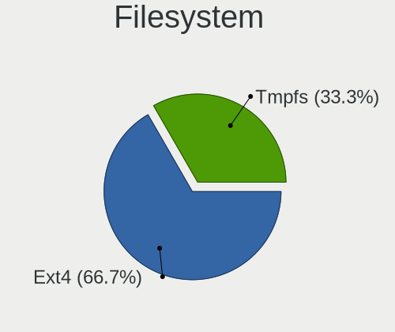
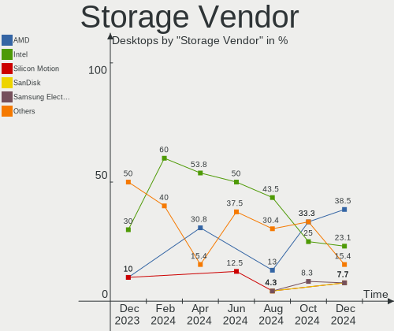
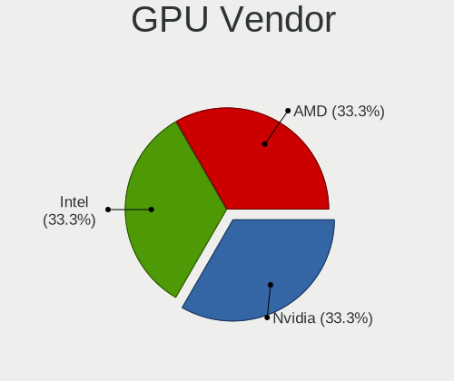
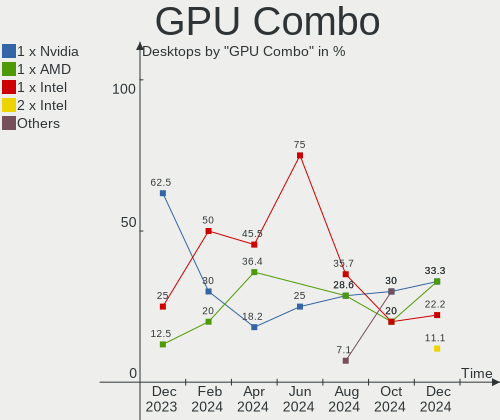
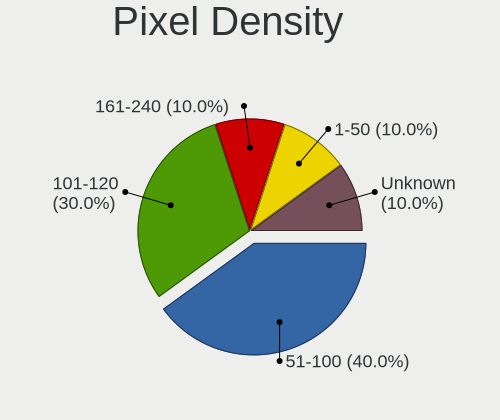
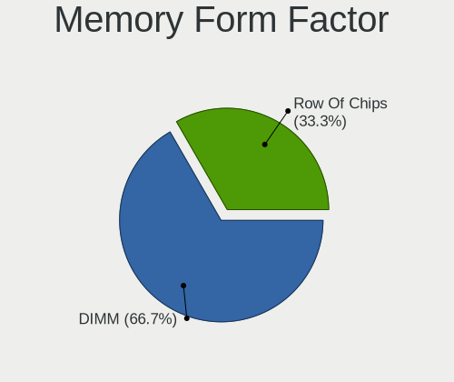
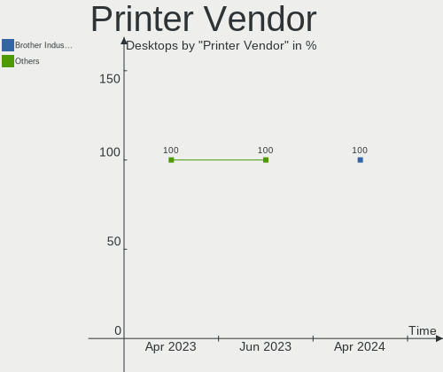

Lubuntu - Hardware Trends (Desktops)
------------------------------------

A project to identify most popular hardware characteristics and track their change
over time based on data collected by Linux users at https://Linux-Hardware.org.

Anyone can contribute to this report by the [hw-probe](https://github.com/linuxhw/hw-probe) tool:

    sudo -E hw-probe -all -upload

This report is for one last month. Overall report since the beginning of time: [TestCoverage](https://github.com/linuxhw/TestCoverage)

Period: Aug, 2022.

Contents
--------

* [ System ](#system)
  - [ OS                       ](#os)
  - [ OS Family                ](#os-family)
  - [ Kernel                   ](#kernel)
  - [ Kernel Family            ](#kernel-family)
  - [ Kernel Major Ver.        ](#kernel-major-ver)
  - [ Arch                     ](#arch)
  - [ DE                       ](#de)
  - [ Display Server           ](#display-server)
  - [ Display Manager          ](#display-manager)
  - [ OS Lang                  ](#os-lang)
  - [ Boot Mode                ](#boot-mode)
  - [ Filesystem               ](#filesystem)
  - [ Part. scheme             ](#part-scheme)
  - [ Dual Boot with Linux/BSD ](#dual-boot-with-linuxbsd)
  - [ Dual Boot (Win)          ](#dual-boot-win)

* [ Board ](#board)
  - [ Vendor                   ](#vendor)
  - [ Model                    ](#model)
  - [ Model Family             ](#model-family)
  - [ MFG Year                 ](#mfg-year)
  - [ Form Factor              ](#form-factor)
  - [ Secure Boot              ](#secure-boot)
  - [ Coreboot                 ](#coreboot)
  - [ RAM Size                 ](#ram-size)
  - [ RAM Used                 ](#ram-used)
  - [ Total Drives             ](#total-drives)
  - [ Has CD-ROM               ](#has-cd-rom)
  - [ Has Ethernet             ](#has-ethernet)
  - [ Has WiFi                 ](#has-wifi)
  - [ Has Bluetooth            ](#has-bluetooth)

* [ Location ](#location)
  - [ Country                  ](#country)
  - [ City                     ](#city)

* [ Drives ](#drives)
  - [ Drive Vendor             ](#drive-vendor)
  - [ Drive Model              ](#drive-model)
  - [ HDD Vendor               ](#hdd-vendor)
  - [ SSD Vendor               ](#ssd-vendor)
  - [ Drive Kind               ](#drive-kind)
  - [ Drive Connector          ](#drive-connector)
  - [ Drive Size               ](#drive-size)
  - [ Space Total              ](#space-total)
  - [ Space Used               ](#space-used)
  - [ Malfunc. Drives          ](#malfunc-drives)
  - [ Malfunc. Drive Vendor    ](#malfunc-drive-vendor)
  - [ Malfunc. HDD Vendor      ](#malfunc-hdd-vendor)
  - [ Malfunc. Drive Kind      ](#malfunc-drive-kind)
  - [ Failed Drives            ](#failed-drives)
  - [ Failed Drive Vendor      ](#failed-drive-vendor)
  - [ Drive Status             ](#drive-status)

* [ Storage controller ](#storage-controller)
  - [ Storage Vendor           ](#storage-vendor)
  - [ Storage Model            ](#storage-model)
  - [ Storage Kind             ](#storage-kind)

* [ Processor ](#processor)
  - [ CPU Vendor               ](#cpu-vendor)
  - [ CPU Model                ](#cpu-model)
  - [ CPU Model Family         ](#cpu-model-family)
  - [ CPU Cores                ](#cpu-cores)
  - [ CPU Sockets              ](#cpu-sockets)
  - [ CPU Threads              ](#cpu-threads)
  - [ CPU Op-Modes             ](#cpu-op-modes)
  - [ CPU Microcode            ](#cpu-microcode)
  - [ CPU Microarch            ](#cpu-microarch)

* [ Graphics ](#graphics)
  - [ GPU Vendor               ](#gpu-vendor)
  - [ GPU Model                ](#gpu-model)
  - [ GPU Combo                ](#gpu-combo)
  - [ GPU Driver               ](#gpu-driver)
  - [ GPU Memory               ](#gpu-memory)

* [ Monitor ](#monitor)
  - [ Monitor Vendor           ](#monitor-vendor)
  - [ Monitor Model            ](#monitor-model)
  - [ Monitor Resolution       ](#monitor-resolution)
  - [ Monitor Diagonal         ](#monitor-diagonal)
  - [ Monitor Width            ](#monitor-width)
  - [ Aspect Ratio             ](#aspect-ratio)
  - [ Monitor Area             ](#monitor-area)
  - [ Pixel Density            ](#pixel-density)
  - [ Multiple Monitors        ](#multiple-monitors)

* [ Network ](#network)
  - [ Net Controller Vendor    ](#net-controller-vendor)
  - [ Net Controller Model     ](#net-controller-model)
  - [ Wireless Vendor          ](#wireless-vendor)
  - [ Wireless Model           ](#wireless-model)
  - [ Ethernet Vendor          ](#ethernet-vendor)
  - [ Ethernet Model           ](#ethernet-model)
  - [ Net Controller Kind      ](#net-controller-kind)
  - [ Used Controller          ](#used-controller)
  - [ NICs                     ](#nics)
  - [ IPv6                     ](#ipv6)

* [ Bluetooth ](#bluetooth)
  - [ Bluetooth Vendor         ](#bluetooth-vendor)
  - [ Bluetooth Model          ](#bluetooth-model)

* [ Sound ](#sound)
  - [ Sound Vendor             ](#sound-vendor)
  - [ Sound Model              ](#sound-model)

* [ Memory ](#memory)
  - [ Memory Vendor            ](#memory-vendor)
  - [ Memory Model             ](#memory-model)
  - [ Memory Kind              ](#memory-kind)
  - [ Memory Form Factor       ](#memory-form-factor)
  - [ Memory Size              ](#memory-size)
  - [ Memory Speed             ](#memory-speed)

* [ Printers & scanners ](#printers--scanners)
  - [ Printer Vendor           ](#printer-vendor)
  - [ Printer Model            ](#printer-model)
  - [ Scanner Vendor           ](#scanner-vendor)
  - [ Scanner Model            ](#scanner-model)

* [ Camera ](#camera)
  - [ Camera Vendor            ](#camera-vendor)
  - [ Camera Model             ](#camera-model)

* [ Security ](#security)
  - [ Fingerprint Vendor       ](#fingerprint-vendor)
  - [ Fingerprint Model        ](#fingerprint-model)
  - [ Chipcard Vendor          ](#chipcard-vendor)
  - [ Chipcard Model           ](#chipcard-model)

* [ Unsupported ](#unsupported)
  - [ Unsupported Devices      ](#unsupported-devices)
  - [ Unsupported Device Types ](#unsupported-device-types)

System
------

OS
--

Installed operating systems

| Name          | Desktops | Percent |
|---------------|----------|---------|
| Lubuntu 22.04 | 7        | 70%     |
| Lubuntu 20.04 | 2        | 20%     |
| Lubuntu 16.04 | 1        | 10%     |

OS Family
---------

OS without a version

| Name    | Desktops | Percent |
|---------|----------|---------|
| Lubuntu | 10       | 100%    |

Kernel
------

Version of the Linux kernel

| Version                     | Desktops | Percent |
|-----------------------------|----------|---------|
| 5.15.0-46-generic           | 2        | 20%     |
| 5.15.0-43-generic           | 2        | 20%     |
| 5.4.0-120-generic           | 1        | 10%     |
| 5.15.0-41-lowlatency        | 1        | 10%     |
| 5.15.0-40-generic           | 1        | 10%     |
| 5.15.0-362206031516-generic | 1        | 10%     |
| 5.15.0-25-generic           | 1        | 10%     |
| 4.15.0-142-generic          | 1        | 10%     |

Kernel Family
-------------

Linux kernel without a distro release

| Version | Desktops | Percent |
|---------|----------|---------|
| 5.15.0  | 8        | 80%     |
| 5.4.0   | 1        | 10%     |
| 4.15.0  | 1        | 10%     |

Kernel Major Ver.
-----------------

Linux kernel major version

| Version | Desktops | Percent |
|---------|----------|---------|
| 5.15    | 8        | 80%     |
| 5.4     | 1        | 10%     |
| 4.15    | 1        | 10%     |

Arch
----

OS architecture (x86_64, i586, etc.)

| Name   | Desktops | Percent |
|--------|----------|---------|
| x86_64 | 10       | 100%    |

DE
--

Desktop Environment

| Name    | Desktops | Percent |
|---------|----------|---------|
| LXQt    | 9        | 90%     |
| Unknown | 1        | 10%     |

Display Server
--------------

X11 or Wayland

| Name | Desktops | Percent |
|------|----------|---------|
| X11  | 9        | 90%     |
| Tty  | 1        | 10%     |

Display Manager
---------------

SDDM, LightDM, etc.

| Name    | Desktops | Percent |
|---------|----------|---------|
| SDDM    | 9        | 90%     |
| LightDM | 1        | 10%     |

OS Lang
-------

Language

| Lang  | Desktops | Percent |
|-------|----------|---------|
| fr_FR | 2        | 20%     |
| en_US | 2        | 20%     |
| de_DE | 2        | 20%     |
| sv_SE | 1        | 10%     |
| fi_FI | 1        | 10%     |
| en_IN | 1        | 10%     |
| el_GR | 1        | 10%     |

Boot Mode
---------

EFI or BIOS

| Mode | Desktops | Percent |
|------|----------|---------|
| BIOS | 7        | 70%     |
| EFI  | 3        | 30%     |

Filesystem
----------

Type of filesystem

| Type  | Desktops | Percent |
|-------|----------|---------|
| Ext4  | 9        | 90%     |
| Btrfs | 1        | 10%     |

Part. scheme
------------

Scheme of partitioning

| Type    | Desktops | Percent |
|---------|----------|---------|
| GPT     | 4        | 40%     |
| Unknown | 4        | 40%     |
| MBR     | 2        | 20%     |

Dual Boot with Linux/BSD
------------------------

Hosting more than one Linux/BSD

| Dual boot | Desktops | Percent |
|-----------|----------|---------|
| No        | 6        | 60%     |
| Yes       | 4        | 40%     |

Dual Boot (Win)
---------------

Hosting Linux and Windows

| Dual boot | Desktops | Percent |
|-----------|----------|---------|
| No        | 6        | 60%     |
| Yes       | 4        | 40%     |

Board
-----

Vendor
------

Motherboard manufacturer

| Name                | Desktops | Percent |
|---------------------|----------|---------|
| MSI                 | 2        | 20%     |
| ASUSTek Computer    | 2        | 20%     |
| ASRock              | 2        | 20%     |
| Lenovo              | 1        | 10%     |
| Hewlett-Packard     | 1        | 10%     |
| Gigabyte Technology | 1        | 10%     |
| Acer                | 1        | 10%     |

Model
-----

Motherboard model

| Name                               | Desktops | Percent |
|------------------------------------|----------|---------|
| MSI MS-7D09                        | 1        | 10%     |
| MSI MS-7978                        | 1        | 10%     |
| Lenovo ThinkCentre M600 10KGS09S00 | 1        | 10%     |
| HP Slim Desktop S01-pF1xxx         | 1        | 10%     |
| Gigabyte G31M-S2C                  | 1        | 10%     |
| ASUS M5A97 R2.0                    | 1        | 10%     |
| ASUS H110M-CS                      | 1        | 10%     |
| ASRock G41M-VS3                    | 1        | 10%     |
| ASRock A520M-HVS                   | 1        | 10%     |
| Acer Aspire M5630                  | 1        | 10%     |

Model Family
------------

Motherboard model prefix

| Name               | Desktops | Percent |
|--------------------|----------|---------|
| MSI MS-7D09        | 1        | 10%     |
| MSI MS-7978        | 1        | 10%     |
| Lenovo ThinkCentre | 1        | 10%     |
| HP Slim            | 1        | 10%     |
| Gigabyte G31M-S2C  | 1        | 10%     |
| ASUS M5A97         | 1        | 10%     |
| ASUS H110M-CS      | 1        | 10%     |
| ASRock G41M-VS3    | 1        | 10%     |
| ASRock A520M-HVS   | 1        | 10%     |
| Acer Aspire        | 1        | 10%     |

MFG Year
--------

Motherboard manufacture year

| Year | Desktops | Percent |
|------|----------|---------|
| 2020 | 2        | 20%     |
| 2021 | 1        | 10%     |
| 2017 | 1        | 10%     |
| 2016 | 1        | 10%     |
| 2015 | 1        | 10%     |
| 2012 | 1        | 10%     |
| 2010 | 1        | 10%     |
| 2008 | 1        | 10%     |
| 2007 | 1        | 10%     |

Form Factor
-----------

Physical design of the computer

| Name    | Desktops | Percent |
|---------|----------|---------|
| Desktop | 10       | 100%    |

Secure Boot
-----------

Enabled or disabled

| State    | Desktops | Percent |
|----------|----------|---------|
| Disabled | 9        | 90%     |
| Enabled  | 1        | 10%     |

Coreboot
--------

Have coreboot on board

| Used | Desktops | Percent |
|------|----------|---------|
| No   | 10       | 100%    |

RAM Size
--------

Total RAM memory

| Size in GB  | Desktops | Percent |
|-------------|----------|---------|
| 4.01-8.0    | 3        | 30%     |
| 8.01-16.0   | 2        | 20%     |
| 3.01-4.0    | 1        | 10%     |
| 24.01-32.0  | 1        | 10%     |
| 2.01-3.0    | 1        | 10%     |
| 64.01-256.0 | 1        | 10%     |
| 16.01-24.0  | 1        | 10%     |

RAM Used
--------

Used RAM memory

| Used GB  | Desktops | Percent |
|----------|----------|---------|
| 0.51-1.0 | 4        | 40%     |
| 2.01-3.0 | 3        | 30%     |
| 1.01-2.0 | 2        | 20%     |
| 4.01-8.0 | 1        | 10%     |

Total Drives
------------

Number of drives on board

| Drives | Desktops | Percent |
|--------|----------|---------|
| 2      | 5        | 50%     |
| 1      | 4        | 40%     |
| 6      | 1        | 10%     |

Has CD-ROM
----------

Has CD-ROM on board

| Presented | Desktops | Percent |
|-----------|----------|---------|
| No        | 6        | 60%     |
| Yes       | 4        | 40%     |

Has Ethernet
------------

Has Ethernet on board

| Presented | Desktops | Percent |
|-----------|----------|---------|
| Yes       | 10       | 100%    |

Has WiFi
--------

Has WiFi module

| Presented | Desktops | Percent |
|-----------|----------|---------|
| No        | 6        | 60%     |
| Yes       | 4        | 40%     |

Has Bluetooth
-------------

Has Bluetooth module

| Presented | Desktops | Percent |
|-----------|----------|---------|
| No        | 9        | 90%     |
| Yes       | 1        | 10%     |

Location
--------

Country
-------

Geographic location (country)

| Country | Desktops | Percent |
|---------|----------|---------|
| USA     | 2        | 20%     |
| Germany | 2        | 20%     |
| France  | 2        | 20%     |
| Sweden  | 1        | 10%     |
| India   | 1        | 10%     |
| Greece  | 1        | 10%     |
| Finland | 1        | 10%     |

City
----

Geographic location (city)

| City        | Desktops | Percent |
|-------------|----------|---------|
| Raahe       | 1        | 10%     |
| Paris       | 1        | 10%     |
| Nederland   | 1        | 10%     |
| Larissa     | 1        | 10%     |
| Koblenz     | 1        | 10%     |
| Karlstad    | 1        | 10%     |
| Figeac      | 1        | 10%     |
| Denver      | 1        | 10%     |
| Brandenburg | 1        | 10%     |
| Bengaluru   | 1        | 10%     |

Drives
------

Drive Vendor
------------

Hard drive vendors

| Vendor              | Desktops | Drives | Percent |
|---------------------|----------|--------|---------|
| WDC                 | 3        | 6      | 18.75%  |
| Samsung Electronics | 3        | 4      | 18.75%  |
| Kingston            | 2        | 2      | 12.5%   |
| WD MediaMax         | 1        | 1      | 6.25%   |
| Seagate             | 1        | 1      | 6.25%   |
| SanDisk             | 1        | 1      | 6.25%   |
| RSH-319             | 1        | 1      | 6.25%   |
| Patriot             | 1        | 1      | 6.25%   |
| Hitachi             | 1        | 1      | 6.25%   |
| Corsair             | 1        | 1      | 6.25%   |
| Apacer              | 1        | 1      | 6.25%   |

Drive Model
-----------

Hard drive models

| Model                                | Desktops | Percent |
|--------------------------------------|----------|---------|
| WDC WD2500AAKX-07U6AA1 250GB         | 1        | 5.56%   |
| WDC WD10EZEX-60WN4A0 1TB             | 1        | 5.56%   |
| WDC WD10EACS-00D6B0 1TB              | 1        | 5.56%   |
| WDC PC SN530 SDBPNPZ-512G-1006 512GB | 1        | 5.56%   |
| WD MediaMax WL250GSA872 250GB        | 1        | 5.56%   |
| Seagate ST2000LM003 HN-M201RAD 2TB   | 1        | 5.56%   |
| SanDisk SD8SN8U128G1001 128GB SSD    | 1        | 5.56%   |
| Samsung SSD 980 PRO 2TB              | 1        | 5.56%   |
| Samsung SSD 860 EVO 1TB              | 1        | 5.56%   |
| Samsung HN-M500MBB 500GB             | 1        | 5.56%   |
| Samsung HD103SJ 1TB                  | 1        | 5.56%   |
| RSH-319 ASM1153E 4TB                 | 1        | 5.56%   |
| Patriot Burst 240GB SSD              | 1        | 5.56%   |
| Kingston SSDNow V Series 64GB        | 1        | 5.56%   |
| Kingston SNVS500G 500GB              | 1        | 5.56%   |
| Hitachi HTS542516K9SA00 160GB        | 1        | 5.56%   |
| Corsair Force LS SSD 120GB           | 1        | 5.56%   |
| Apacer 16GB SATA Flash Drive SSD     | 1        | 5.56%   |

HDD Vendor
----------

Hard disk drive vendors

| Vendor              | Desktops | Drives | Percent |
|---------------------|----------|--------|---------|
| WDC                 | 2        | 5      | 25%     |
| Samsung Electronics | 2        | 2      | 25%     |
| WD MediaMax         | 1        | 1      | 12.5%   |
| Seagate             | 1        | 1      | 12.5%   |
| RSH-319             | 1        | 1      | 12.5%   |
| Hitachi             | 1        | 1      | 12.5%   |

SSD Vendor
----------

Solid state drive vendors

| Vendor              | Desktops | Drives | Percent |
|---------------------|----------|--------|---------|
| SanDisk             | 1        | 1      | 16.67%  |
| Samsung Electronics | 1        | 1      | 16.67%  |
| Patriot             | 1        | 1      | 16.67%  |
| Kingston            | 1        | 1      | 16.67%  |
| Corsair             | 1        | 1      | 16.67%  |
| Apacer              | 1        | 1      | 16.67%  |

Drive Kind
----------

HDD or SSD

| Kind | Desktops | Drives | Percent |
|------|----------|--------|---------|
| SSD  | 5        | 6      | 38.46%  |
| HDD  | 5        | 11     | 38.46%  |
| NVMe | 3        | 3      | 23.08%  |

Drive Connector
---------------

SATA, SAS, NVMe, etc.

| Type | Desktops | Drives | Percent |
|------|----------|--------|---------|
| SATA | 8        | 16     | 66.67%  |
| NVMe | 3        | 3      | 25%     |
| SAS  | 1        | 1      | 8.33%   |

Drive Size
----------

Size of hard drive

| Size in TB | Desktops | Drives | Percent |
|------------|----------|--------|---------|
| 0.01-0.5   | 6        | 10     | 54.55%  |
| 0.51-1.0   | 3        | 5      | 27.27%  |
| 3.01-4.0   | 1        | 1      | 9.09%   |
| 1.01-2.0   | 1        | 1      | 9.09%   |

Space Total
-----------

Amount of disk space available on the file system

| Size in GB | Desktops | Percent |
|------------|----------|---------|
| 101-250    | 2        | 20%     |
| 1001-2000  | 2        | 20%     |
| 51-100     | 2        | 20%     |
| 251-500    | 1        | 10%     |
| 21-50      | 1        | 10%     |
| 2001-3000  | 1        | 10%     |
| 1-20       | 1        | 10%     |

Space Used
----------

Amount of used disk space

| Used GB   | Desktops | Percent |
|-----------|----------|---------|
| 21-50     | 4        | 40%     |
| 1-20      | 2        | 20%     |
| 251-500   | 1        | 10%     |
| 101-250   | 1        | 10%     |
| 1001-2000 | 1        | 10%     |
| 501-1000  | 1        | 10%     |

Malfunc. Drives
---------------

Drive models with a malfunction

| Model                            | Desktops | Drives | Percent |
|----------------------------------|----------|--------|---------|
| Apacer 16GB SATA Flash Drive SSD | 1        | 1      | 100%    |

Malfunc. Drive Vendor
---------------------

Vendors of faulty drives

| Vendor | Desktops | Drives | Percent |
|--------|----------|--------|---------|
| Apacer | 1        | 1      | 100%    |

Malfunc. HDD Vendor
-------------------

Vendors of faulty HDD drives

Zero info for selected period =(

Malfunc. Drive Kind
-------------------

Kinds of faulty drives

| Kind | Desktops | Drives | Percent |
|------|----------|--------|---------|
| SSD  | 1        | 1      | 100%    |

Failed Drives
-------------

Failed drive models

Zero info for selected period =(

Failed Drive Vendor
-------------------

Failed drive vendors

Zero info for selected period =(

Drive Status
------------

Number of failed and malfunc. drives

| Status   | Desktops | Drives | Percent |
|----------|----------|--------|---------|
| Works    | 5        | 8      | 50%     |
| Detected | 4        | 11     | 40%     |
| Malfunc  | 1        | 1      | 10%     |

Storage controller
------------------

Storage Vendor
--------------

Storage controller vendors

| Vendor                      | Desktops | Percent |
|-----------------------------|----------|---------|
| Intel                       | 8        | 61.54%  |
| AMD                         | 2        | 15.38%  |
| SanDisk                     | 1        | 7.69%   |
| Samsung Electronics         | 1        | 7.69%   |
| Kingston Technology Company | 1        | 7.69%   |

Storage Model
-------------

Storage controller models

| Model                                                                            | Desktops | Percent |
|----------------------------------------------------------------------------------|----------|---------|
| Intel NM10/ICH7 Family SATA Controller [IDE mode]                                | 3        | 20%     |
| Intel Q170/Q150/B150/H170/H110/Z170/CM236 Chipset SATA Controller [AHCI Mode]    | 2        | 13.33%  |
| Intel 82801G (ICH7 Family) IDE Controller                                        | 2        | 13.33%  |
| SanDisk WD Blue SN550 NVMe SSD                                                   | 1        | 6.67%   |
| Samsung NVMe SSD Controller PM9A1/PM9A3/980PRO                                   | 1        | 6.67%   |
| Kingston Company Company Non-Volatile memory controller                          | 1        | 6.67%   |
| Intel SATA Controller [RAID mode]                                                | 1        | 6.67%   |
| Intel Atom/Celeron/Pentium Processor x5-E8000/J3xxx/N3xxx Series SATA Controller | 1        | 6.67%   |
| Intel 500 Series Chipset Family SATA AHCI Controller                             | 1        | 6.67%   |
| AMD SB7x0/SB8x0/SB9x0 SATA Controller [AHCI mode]                                | 1        | 6.67%   |
| AMD 500 Series Chipset SATA Controller                                           | 1        | 6.67%   |

Storage Kind
------------

Kind of storage controller (IDE, SATA, NVMe, SAS, ...)

| Kind | Desktops | Percent |
|------|----------|---------|
| SATA | 6        | 46.15%  |
| NVMe | 3        | 23.08%  |
| IDE  | 3        | 23.08%  |
| RAID | 1        | 7.69%   |

Processor
---------

CPU Vendor
----------

Processor vendors

| Vendor | Desktops | Percent |
|--------|----------|---------|
| Intel  | 8        | 80%     |
| AMD    | 2        | 20%     |

CPU Model
---------

Processor models

| Model                                  | Desktops | Percent |
|----------------------------------------|----------|---------|
| Intel Pentium CPU G4400 @ 3.30GHz      | 1        | 10%     |
| Intel Core i9-10900K CPU @ 3.70GHz     | 1        | 10%     |
| Intel Core i5-6600K CPU @ 3.50GHz      | 1        | 10%     |
| Intel Core i3-10105 CPU @ 3.70GHz      | 1        | 10%     |
| Intel Core 2 Quad CPU Q8300 @ 2.50GHz  | 1        | 10%     |
| Intel Core 2 Duo CPU E8400 @ 3.00GHz   | 1        | 10%     |
| Intel Core 2 Duo CPU E4500 @ 2.20GHz   | 1        | 10%     |
| Intel Celeron CPU N3010 @ 1.04GHz      | 1        | 10%     |
| AMD Ryzen 7 5700G with Radeon Graphics | 1        | 10%     |
| AMD FX-8350 Eight-Core Processor       | 1        | 10%     |

CPU Model Family
----------------

Processor model prefix

| Model             | Desktops | Percent |
|-------------------|----------|---------|
| Intel Core 2 Duo  | 2        | 20%     |
| Intel Pentium     | 1        | 10%     |
| Intel Core i9     | 1        | 10%     |
| Intel Core i5     | 1        | 10%     |
| Intel Core i3     | 1        | 10%     |
| Intel Core 2 Quad | 1        | 10%     |
| Intel Celeron     | 1        | 10%     |
| AMD Ryzen 7       | 1        | 10%     |
| AMD FX            | 1        | 10%     |

CPU Cores
---------

Number of processor cores

| Number | Desktops | Percent |
|--------|----------|---------|
| 4      | 4        | 40%     |
| 2      | 4        | 40%     |
| 10     | 1        | 10%     |
| 8      | 1        | 10%     |

CPU Sockets
-----------

Number of sockets

| Number | Desktops | Percent |
|--------|----------|---------|
| 1      | 10       | 100%    |

CPU Threads
-----------

Threads per core (Hyper-Threading)

| Number | Desktops | Percent |
|--------|----------|---------|
| 1      | 6        | 60%     |
| 2      | 4        | 40%     |

CPU Op-Modes
------------

CPU Operation Modes (32-bit, 64-bit)

| Op mode        | Desktops | Percent |
|----------------|----------|---------|
| 32-bit, 64-bit | 10       | 100%    |

CPU Microcode
-------------

Microcode number

| Number     | Desktops | Percent |
|------------|----------|---------|
| Unknown    | 3        | 30%     |
| 0x506e3    | 2        | 20%     |
| 0xa0653    | 1        | 10%     |
| 0x406c4    | 1        | 10%     |
| 0x1067a    | 1        | 10%     |
| 0x0a50000c | 1        | 10%     |
| 0x06000852 | 1        | 10%     |

CPU Microarch
-------------

Microarchitecture

| Name       | Desktops | Percent |
|------------|----------|---------|
| Skylake    | 2        | 20%     |
| Penryn     | 2        | 20%     |
| CometLake  | 2        | 20%     |
| Zen 3      | 1        | 10%     |
| Silvermont | 1        | 10%     |
| Piledriver | 1        | 10%     |
| Core       | 1        | 10%     |

Graphics
--------

GPU Vendor
----------

Vendors of graphics cards

| Vendor | Desktops | Percent |
|--------|----------|---------|
| Intel  | 5        | 45.45%  |
| Nvidia | 3        | 27.27%  |
| AMD    | 3        | 27.27%  |

GPU Model
---------

Graphics card models

| Model                                                                                    | Desktops | Percent |
|------------------------------------------------------------------------------------------|----------|---------|
| Intel CometLake-S GT2 [UHD Graphics 630]                                                 | 2        | 16.67%  |
| Nvidia TU106 [GeForce RTX 2070 Rev. A]                                                   | 1        | 8.33%   |
| Nvidia GM200GL [Tesla M40]                                                               | 1        | 8.33%   |
| Nvidia GM200GL [Quadro M6000]                                                            | 1        | 8.33%   |
| Nvidia GK107 [GeForce GTX 650]                                                           | 1        | 8.33%   |
| Intel HD Graphics 510                                                                    | 1        | 8.33%   |
| Intel Atom/Celeron/Pentium Processor x5-E8000/J3xxx/N3xxx Integrated Graphics Controller | 1        | 8.33%   |
| Intel 82G33/G31 Express Integrated Graphics Controller                                   | 1        | 8.33%   |
| AMD RV710 [Radeon HD 4350/4550]                                                          | 1        | 8.33%   |
| AMD RV620 LE [Radeon HD 3450]                                                            | 1        | 8.33%   |
| AMD Cezanne                                                                              | 1        | 8.33%   |

GPU Combo
---------

Combinations of graphics cards

| Name               | Desktops | Percent |
|--------------------|----------|---------|
| 1 x Intel          | 4        | 40%     |
| 1 x AMD            | 3        | 30%     |
| 1 x Nvidia         | 2        | 20%     |
| Intel + 2 x Nvidia | 1        | 10%     |

GPU Driver
----------

Free vs proprietary

| Driver      | Desktops | Percent |
|-------------|----------|---------|
| Free        | 7        | 70%     |
| Proprietary | 3        | 30%     |

GPU Memory
----------

Total video memory

| Size in GB | Desktops | Percent |
|------------|----------|---------|
| Unknown    | 4        | 40%     |
| 0.01-0.5   | 2        | 20%     |
| 7.01-8.0   | 1        | 10%     |
| 3.01-4.0   | 1        | 10%     |
| 1.01-2.0   | 1        | 10%     |
| 8.01-16.0  | 1        | 10%     |

Monitor
-------

Monitor Vendor
--------------

Monitor vendors

| Vendor   | Desktops | Percent |
|----------|----------|---------|
| Philips  | 2        | 22.22%  |
| SNC      | 1        | 11.11%  |
| Sharp    | 1        | 11.11%  |
| MSI      | 1        | 11.11%  |
| Goldstar | 1        | 11.11%  |
| Dell     | 1        | 11.11%  |
| BenQ     | 1        | 11.11%  |
| Acer     | 1        | 11.11%  |

Monitor Model
-------------

Monitor models

| Model                                                    | Desktops | Percent |
|----------------------------------------------------------|----------|---------|
| SNC PHOTO 190V SNC1850 1366x768 409x230mm 18.5-inch      | 1        | 11.11%  |
| Sharp LC-50LB481U SHP5063 1920x1080 1100x620mm 49.7-inch | 1        | 11.11%  |
| Philips PHL 274E5 PHLC0C8 1920x1080 598x336mm 27.0-inch  | 1        | 11.11%  |
| Philips PHL 273V5 PHLC0D2 1920x1080 598x336mm 27.0-inch  | 1        | 11.11%  |
| MSI MAG272CQP MSI3CA6 2560x1440 598x336mm 27.0-inch      | 1        | 11.11%  |
| Goldstar 19EN33 GSM4C18 1366x768 410x230mm 18.5-inch     | 1        | 11.11%  |
| Dell S2218H DELD0B7 1920x1080 476x268mm 21.5-inch        | 1        | 11.11%  |
| BenQ LCD Monitor FP222WH 1680x1050                       | 1        | 11.11%  |
| Acer S242HL ACR0216 1920x1080 531x299mm 24.0-inch        | 1        | 11.11%  |

Monitor Resolution
------------------

Monitor screen resolution

| Resolution         | Desktops | Percent |
|--------------------|----------|---------|
| 1920x1080 (FHD)    | 5        | 55.56%  |
| 1366x768 (WXGA)    | 2        | 22.22%  |
| 2560x1440 (QHD)    | 1        | 11.11%  |
| 1680x1050 (WSXGA+) | 1        | 11.11%  |

Monitor Diagonal
----------------

Diagonal size in inches

| Inches  | Desktops | Percent |
|---------|----------|---------|
| 27      | 3        | 33.33%  |
| 18      | 2        | 22.22%  |
| 49      | 1        | 11.11%  |
| 24      | 1        | 11.11%  |
| 21      | 1        | 11.11%  |
| Unknown | 1        | 11.11%  |

Monitor Width
-------------

Physical width

| Width in mm | Desktops | Percent |
|-------------|----------|---------|
| 501-600     | 4        | 44.44%  |
| 401-500     | 3        | 33.33%  |
| 1001-1500   | 1        | 11.11%  |
| Unknown     | 1        | 11.11%  |

Aspect Ratio
------------

Proportional relationship between the width and the height

| Ratio   | Desktops | Percent |
|---------|----------|---------|
| 16/9    | 8        | 88.89%  |
| Unknown | 1        | 11.11%  |

Monitor Area
------------

Area in inch²

| Area in inch² | Desktops | Percent |
|----------------|----------|---------|
| 301-350        | 3        | 33.33%  |
| 141-150        | 2        | 22.22%  |
| More than 1000 | 1        | 11.11%  |
| 201-250        | 1        | 11.11%  |
| 151-200        | 1        | 11.11%  |
| Unknown        | 1        | 11.11%  |

Pixel Density
-------------

Pixels per inch

| Density | Desktops | Percent |
|---------|----------|---------|
| 51-100  | 5        | 55.56%  |
| 101-120 | 2        | 22.22%  |
| 1-50    | 1        | 11.11%  |
| Unknown | 1        | 11.11%  |

Multiple Monitors
-----------------

Total monitors connected

| Total | Desktops | Percent |
|-------|----------|---------|
| 1     | 10       | 100%    |

Network
-------

Net Controller Vendor
---------------------

Controller vendors

| Vendor                | Desktops | Percent |
|-----------------------|----------|---------|
| Realtek Semiconductor | 7        | 53.85%  |
| Qualcomm Atheros      | 2        | 15.38%  |
| Xiaomi                | 1        | 7.69%   |
| Samsung Electronics   | 1        | 7.69%   |
| Ralink Technology     | 1        | 7.69%   |
| Intel                 | 1        | 7.69%   |

Net Controller Model
--------------------

Controller models

| Model                                                             | Desktops | Percent |
|-------------------------------------------------------------------|----------|---------|
| Realtek RTL8111/8168/8411 PCI Express Gigabit Ethernet Controller | 6        | 37.5%   |
| Xiaomi Mi/Redmi series (RNDIS)                                    | 1        | 6.25%   |
| Samsung GT-I9070 (network tethering, USB debugging enabled)       | 1        | 6.25%   |
| Realtek RTL8821CE 802.11ac PCIe Wireless Network Adapter          | 1        | 6.25%   |
| Realtek RTL8188CUS 802.11n WLAN Adapter                           | 1        | 6.25%   |
| Realtek RTL810xE PCI Express Fast Ethernet controller             | 1        | 6.25%   |
| Ralink MT7601U Wireless Adapter                                   | 1        | 6.25%   |
| Qualcomm Atheros Killer E2400 Gigabit Ethernet Controller         | 1        | 6.25%   |
| Qualcomm Atheros AR9227 Wireless Network Adapter                  | 1        | 6.25%   |
| Qualcomm Atheros AR8152 v2.0 Fast Ethernet                        | 1        | 6.25%   |
| Intel Ethernet Controller I225-V                                  | 1        | 6.25%   |

Wireless Vendor
---------------

Wireless vendors

| Vendor                | Desktops | Percent |
|-----------------------|----------|---------|
| Realtek Semiconductor | 2        | 50%     |
| Ralink Technology     | 1        | 25%     |
| Qualcomm Atheros      | 1        | 25%     |

Wireless Model
--------------

Wireless models

| Model                                                    | Desktops | Percent |
|----------------------------------------------------------|----------|---------|
| Realtek RTL8821CE 802.11ac PCIe Wireless Network Adapter | 1        | 25%     |
| Realtek RTL8188CUS 802.11n WLAN Adapter                  | 1        | 25%     |
| Ralink MT7601U Wireless Adapter                          | 1        | 25%     |
| Qualcomm Atheros AR9227 Wireless Network Adapter         | 1        | 25%     |

Ethernet Vendor
---------------

Ethernet vendors

| Vendor                | Desktops | Percent |
|-----------------------|----------|---------|
| Realtek Semiconductor | 7        | 58.33%  |
| Qualcomm Atheros      | 2        | 16.67%  |
| Xiaomi                | 1        | 8.33%   |
| Samsung Electronics   | 1        | 8.33%   |
| Intel                 | 1        | 8.33%   |

Ethernet Model
--------------

Ethernet models

| Model                                                             | Desktops | Percent |
|-------------------------------------------------------------------|----------|---------|
| Realtek RTL8111/8168/8411 PCI Express Gigabit Ethernet Controller | 6        | 50%     |
| Xiaomi Mi/Redmi series (RNDIS)                                    | 1        | 8.33%   |
| Samsung GT-I9070 (network tethering, USB debugging enabled)       | 1        | 8.33%   |
| Realtek RTL810xE PCI Express Fast Ethernet controller             | 1        | 8.33%   |
| Qualcomm Atheros Killer E2400 Gigabit Ethernet Controller         | 1        | 8.33%   |
| Qualcomm Atheros AR8152 v2.0 Fast Ethernet                        | 1        | 8.33%   |
| Intel Ethernet Controller I225-V                                  | 1        | 8.33%   |

Net Controller Kind
-------------------

Ethernet, WiFi or modem

| Kind     | Desktops | Percent |
|----------|----------|---------|
| Ethernet | 10       | 71.43%  |
| WiFi     | 4        | 28.57%  |

Used Controller
---------------

Currently used network controller

| Kind     | Desktops | Percent |
|----------|----------|---------|
| Ethernet | 7        | 70%     |
| WiFi     | 3        | 30%     |

NICs
----

Total network controllers on board

| Total | Desktops | Percent |
|-------|----------|---------|
| 1     | 8        | 80%     |
| 2     | 2        | 20%     |

IPv6
----

IPv6 vs IPv4

| Used | Desktops | Percent |
|------|----------|---------|
| No   | 7        | 70%     |
| Yes  | 3        | 30%     |

Bluetooth
---------

Bluetooth Vendor
----------------

Controller vendors

| Vendor                | Desktops | Percent |
|-----------------------|----------|---------|
| Realtek Semiconductor | 1        | 100%    |

Bluetooth Model
---------------

Controller models

| Model                          | Desktops | Percent |
|--------------------------------|----------|---------|
| Realtek  Bluetooth 4.2 Adapter | 1        | 100%    |

Sound
-----

Sound Vendor
------------

Sound card vendors

| Vendor           | Desktops | Percent |
|------------------|----------|---------|
| Intel            | 8        | 47.06%  |
| AMD              | 4        | 23.53%  |
| Nvidia           | 3        | 17.65%  |
| Razer USA        | 1        | 5.88%   |
| ASUSTek Computer | 1        | 5.88%   |

Sound Model
-----------

Sound card models

| Model                                                                                             | Desktops | Percent |
|---------------------------------------------------------------------------------------------------|----------|---------|
| Intel NM10/ICH7 Family High Definition Audio Controller                                           | 3        | 17.65%  |
| Intel 100 Series/C230 Series Chipset Family HD Audio Controller                                   | 2        | 11.76%  |
| Razer USA Razer Kraken X USB                                                                      | 1        | 5.88%   |
| Nvidia TU106 High Definition Audio Controller                                                     | 1        | 5.88%   |
| Nvidia GM200 High Definition Audio                                                                | 1        | 5.88%   |
| Nvidia GK107 HDMI Audio Controller                                                                | 1        | 5.88%   |
| Intel Comet Lake PCH-V cAVS                                                                       | 1        | 5.88%   |
| Intel Audio device                                                                                | 1        | 5.88%   |
| Intel Atom/Celeron/Pentium Processor x5-E8000/J3xxx/N3xxx Series High Definition Audio Controller | 1        | 5.88%   |
| ASUSTek Computer XONAR SOUND CARD                                                                 | 1        | 5.88%   |
| AMD SBx00 Azalia (Intel HDA)                                                                      | 1        | 5.88%   |
| AMD RV710/730 HDMI Audio [Radeon HD 4000 series]                                                  | 1        | 5.88%   |
| AMD RV620 HDMI Audio [Radeon HD 3450/3470/3550/3570]                                              | 1        | 5.88%   |
| AMD Renoir Radeon High Definition Audio Controller                                                | 1        | 5.88%   |

Memory
------

Memory Vendor
-------------

Memory module vendors

| Vendor            | Desktops | Percent |
|-------------------|----------|---------|
| Kingston          | 2        | 33.33%  |
| Unknown           | 1        | 16.67%  |
| Micron Technology | 1        | 16.67%  |
| G.Skill           | 1        | 16.67%  |
| Corsair           | 1        | 16.67%  |

Memory Model
------------

Memory module models

| Model                                                   | Desktops | Percent |
|---------------------------------------------------------|----------|---------|
| Unknown RAM Module 4GB DIMM SDRAM                       | 1        | 14.29%  |
| Unknown RAM Module 2GB DIMM SDRAM                       | 1        | 14.29%  |
| Micron RAM Module 8GB DIMM DDR4 3200MT/s                | 1        | 14.29%  |
| Kingston RAM KN2M64-ETB 8GB DIMM DDR3 1600MT/s          | 1        | 14.29%  |
| Kingston RAM KHX2400C15/8G 8GB DIMM DDR4 2933MT/s       | 1        | 14.29%  |
| G.Skill RAM F4-2133C15-16GIS 16384MB DIMM DDR4 2133MT/s | 1        | 14.29%  |
| Corsair RAM CMV8GX4M1A2666C18 8192MB DIMM DDR4 2667MT/s | 1        | 14.29%  |

Memory Kind
-----------

Memory module kinds

| Kind  | Desktops | Percent |
|-------|----------|---------|
| DDR4  | 4        | 66.67%  |
| SDRAM | 1        | 16.67%  |
| DDR3  | 1        | 16.67%  |

Memory Form Factor
------------------

Physical design of the memory module

| Name | Desktops | Percent |
|------|----------|---------|
| DIMM | 6        | 100%    |

Memory Size
-----------

Memory module size

| Size  | Desktops | Percent |
|-------|----------|---------|
| 8192  | 4        | 57.14%  |
| 16384 | 1        | 14.29%  |
| 4096  | 1        | 14.29%  |
| 2048  | 1        | 14.29%  |

Memory Speed
------------

Memory module speed

| Speed   | Desktops | Percent |
|---------|----------|---------|
| 3200    | 1        | 16.67%  |
| 2933    | 1        | 16.67%  |
| 2667    | 1        | 16.67%  |
| 2133    | 1        | 16.67%  |
| 1600    | 1        | 16.67%  |
| Unknown | 1        | 16.67%  |

Printers & scanners
-------------------

Printer Vendor
--------------

Printer device vendors

| Vendor | Desktops | Percent |
|--------|----------|---------|
| Canon  | 1        | 100%    |

Printer Model
-------------

Printer device models

| Model                   | Desktops | Percent |
|-------------------------|----------|---------|
| Canon CanoScan LiDE 300 | 1        | 100%    |

Scanner Vendor
--------------

Scanner device vendors

Zero info for selected period =(

Scanner Model
-------------

Scanner device models

Zero info for selected period =(

Camera
------

Camera Vendor
-------------

Camera device vendors

| Vendor    | Desktops | Percent |
|-----------|----------|---------|
| Microsoft | 1        | 100%    |

Camera Model
------------

Camera device models

| Model                    | Desktops | Percent |
|--------------------------|----------|---------|
| Microsoft LifeCam VX-800 | 1        | 100%    |

Security
--------

Fingerprint Vendor
------------------

Fingerprint sensor vendors

Zero info for selected period =(

Fingerprint Model
-----------------

Fingerprint sensor models

Zero info for selected period =(

Chipcard Vendor
---------------

Chipcard module vendors

| Vendor | Desktops | Percent |
|--------|----------|---------|
| Cherry | 1        | 100%    |

Chipcard Model
--------------

Chipcard module models

| Model                                       | Desktops | Percent |
|---------------------------------------------|----------|---------|
| Cherry SmartCard Reader Keyboard KC 1000 SC | 1        | 100%    |

Unsupported
-----------

Unsupported Devices
-------------------

Total unsupported devices on board

| Total | Desktops | Percent |
|-------|----------|---------|
| 0     | 10       | 100%    |

Unsupported Device Types
------------------------

Types of unsupported devices

Zero info for selected period =(

