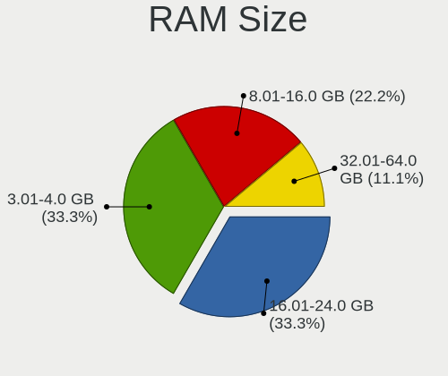
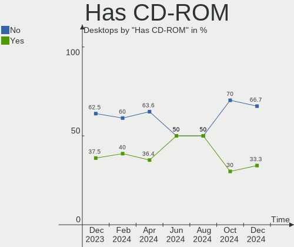
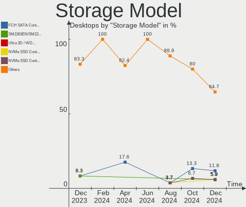
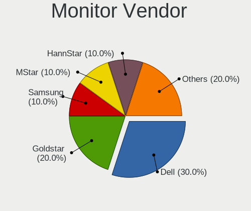
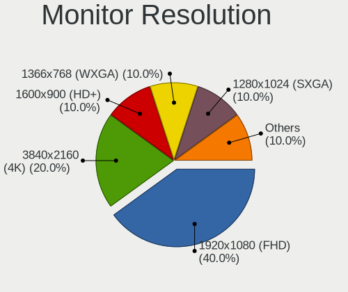
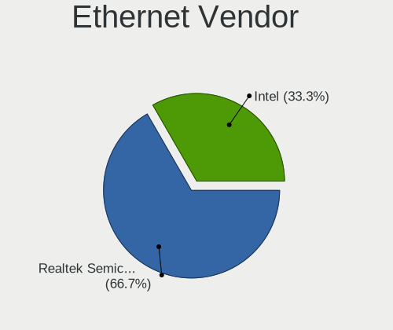
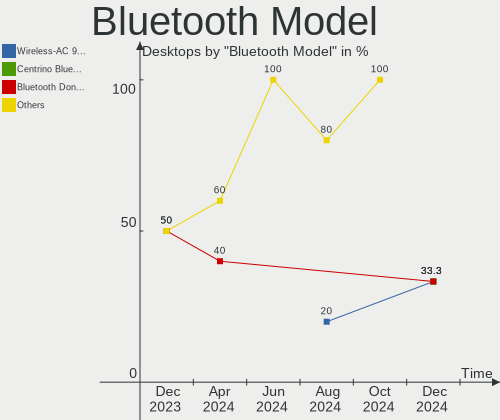

Lubuntu - Hardware Trends (Desktops)
------------------------------------

A project to identify most popular hardware characteristics and track their change
over time based on data collected by Linux users at https://Linux-Hardware.org.

Anyone can contribute to this report by the [hw-probe](https://github.com/linuxhw/hw-probe) tool:

    sudo -E hw-probe -all -upload

This report is for one last month. Overall report since the beginning of time: [TestDays](https://github.com/linuxhw/TestDays)

Period: Jul, 2023.

Contents
--------

* [ System ](#system)
  - [ OS                       ](#os)
  - [ OS Family                ](#os-family)
  - [ Kernel                   ](#kernel)
  - [ Kernel Family            ](#kernel-family)
  - [ Kernel Major Ver.        ](#kernel-major-ver)
  - [ Arch                     ](#arch)
  - [ DE                       ](#de)
  - [ Display Server           ](#display-server)
  - [ Display Manager          ](#display-manager)
  - [ OS Lang                  ](#os-lang)
  - [ Boot Mode                ](#boot-mode)
  - [ Filesystem               ](#filesystem)
  - [ Part. scheme             ](#part-scheme)
  - [ Dual Boot with Linux/BSD ](#dual-boot-with-linuxbsd)
  - [ Dual Boot (Win)          ](#dual-boot-win)

* [ Board ](#board)
  - [ Vendor                   ](#vendor)
  - [ Model                    ](#model)
  - [ Model Family             ](#model-family)
  - [ MFG Year                 ](#mfg-year)
  - [ Form Factor              ](#form-factor)
  - [ Secure Boot              ](#secure-boot)
  - [ Coreboot                 ](#coreboot)
  - [ RAM Size                 ](#ram-size)
  - [ RAM Used                 ](#ram-used)
  - [ Total Drives             ](#total-drives)
  - [ Has CD-ROM               ](#has-cd-rom)
  - [ Has Ethernet             ](#has-ethernet)
  - [ Has WiFi                 ](#has-wifi)
  - [ Has Bluetooth            ](#has-bluetooth)

* [ Location ](#location)
  - [ Country                  ](#country)
  - [ City                     ](#city)

* [ Drives ](#drives)
  - [ Drive Vendor             ](#drive-vendor)
  - [ Drive Model              ](#drive-model)
  - [ HDD Vendor               ](#hdd-vendor)
  - [ SSD Vendor               ](#ssd-vendor)
  - [ Drive Kind               ](#drive-kind)
  - [ Drive Connector          ](#drive-connector)
  - [ Drive Size               ](#drive-size)
  - [ Space Total              ](#space-total)
  - [ Space Used               ](#space-used)
  - [ Malfunc. Drives          ](#malfunc-drives)
  - [ Malfunc. Drive Vendor    ](#malfunc-drive-vendor)
  - [ Malfunc. HDD Vendor      ](#malfunc-hdd-vendor)
  - [ Malfunc. Drive Kind      ](#malfunc-drive-kind)
  - [ Failed Drives            ](#failed-drives)
  - [ Failed Drive Vendor      ](#failed-drive-vendor)
  - [ Drive Status             ](#drive-status)

* [ Storage controller ](#storage-controller)
  - [ Storage Vendor           ](#storage-vendor)
  - [ Storage Model            ](#storage-model)
  - [ Storage Kind             ](#storage-kind)

* [ Processor ](#processor)
  - [ CPU Vendor               ](#cpu-vendor)
  - [ CPU Model                ](#cpu-model)
  - [ CPU Model Family         ](#cpu-model-family)
  - [ CPU Cores                ](#cpu-cores)
  - [ CPU Sockets              ](#cpu-sockets)
  - [ CPU Threads              ](#cpu-threads)
  - [ CPU Op-Modes             ](#cpu-op-modes)
  - [ CPU Microcode            ](#cpu-microcode)
  - [ CPU Microarch            ](#cpu-microarch)

* [ Graphics ](#graphics)
  - [ GPU Vendor               ](#gpu-vendor)
  - [ GPU Model                ](#gpu-model)
  - [ GPU Combo                ](#gpu-combo)
  - [ GPU Driver               ](#gpu-driver)
  - [ GPU Memory               ](#gpu-memory)

* [ Monitor ](#monitor)
  - [ Monitor Vendor           ](#monitor-vendor)
  - [ Monitor Model            ](#monitor-model)
  - [ Monitor Resolution       ](#monitor-resolution)
  - [ Monitor Diagonal         ](#monitor-diagonal)
  - [ Monitor Width            ](#monitor-width)
  - [ Aspect Ratio             ](#aspect-ratio)
  - [ Monitor Area             ](#monitor-area)
  - [ Pixel Density            ](#pixel-density)
  - [ Multiple Monitors        ](#multiple-monitors)

* [ Network ](#network)
  - [ Net Controller Vendor    ](#net-controller-vendor)
  - [ Net Controller Model     ](#net-controller-model)
  - [ Wireless Vendor          ](#wireless-vendor)
  - [ Wireless Model           ](#wireless-model)
  - [ Ethernet Vendor          ](#ethernet-vendor)
  - [ Ethernet Model           ](#ethernet-model)
  - [ Net Controller Kind      ](#net-controller-kind)
  - [ Used Controller          ](#used-controller)
  - [ NICs                     ](#nics)
  - [ IPv6                     ](#ipv6)

* [ Bluetooth ](#bluetooth)
  - [ Bluetooth Vendor         ](#bluetooth-vendor)
  - [ Bluetooth Model          ](#bluetooth-model)

* [ Sound ](#sound)
  - [ Sound Vendor             ](#sound-vendor)
  - [ Sound Model              ](#sound-model)

* [ Memory ](#memory)
  - [ Memory Vendor            ](#memory-vendor)
  - [ Memory Model             ](#memory-model)
  - [ Memory Kind              ](#memory-kind)
  - [ Memory Form Factor       ](#memory-form-factor)
  - [ Memory Size              ](#memory-size)
  - [ Memory Speed             ](#memory-speed)

* [ Printers & scanners ](#printers--scanners)
  - [ Printer Vendor           ](#printer-vendor)
  - [ Printer Model            ](#printer-model)
  - [ Scanner Vendor           ](#scanner-vendor)
  - [ Scanner Model            ](#scanner-model)

* [ Camera ](#camera)
  - [ Camera Vendor            ](#camera-vendor)
  - [ Camera Model             ](#camera-model)

* [ Security ](#security)
  - [ Fingerprint Vendor       ](#fingerprint-vendor)
  - [ Fingerprint Model        ](#fingerprint-model)
  - [ Chipcard Vendor          ](#chipcard-vendor)
  - [ Chipcard Model           ](#chipcard-model)

* [ Unsupported ](#unsupported)
  - [ Unsupported Devices      ](#unsupported-devices)
  - [ Unsupported Device Types ](#unsupported-device-types)

System
------

OS
--

Installed operating systems

| Name          | Desktops | Percent |
|---------------|----------|---------|
| Lubuntu 22.04 | 8        | 57.14%  |
| Lubuntu 23.04 | 4        | 28.57%  |
| Lubuntu 20.04 | 1        | 7.14%   |
| Lubuntu 18.04 | 1        | 7.14%   |

OS Family
---------

OS without a version

| Name    | Desktops | Percent |
|---------|----------|---------|
| Lubuntu | 14       | 100%    |

Kernel
------

Version of the Linux kernel

| Version                       | Desktops | Percent |
|-------------------------------|----------|---------|
| 6.2.0-25-generic              | 3        | 21.43%  |
| 5.19.0-50-generic             | 3        | 21.43%  |
| 5.19.0-46-generic             | 2        | 14.29%  |
| 6.2.0-24-generic              | 1        | 7.14%   |
| 5.4.0-42-generic              | 1        | 7.14%   |
| 5.19.0-32-generic             | 1        | 7.14%   |
| 5.19.0-1010-nvidia-lowlatency | 1        | 7.14%   |
| 5.15.0-35-generic             | 1        | 7.14%   |
| 5.11.0-051100-generic         | 1        | 7.14%   |

Kernel Family
-------------

Linux kernel without a distro release

| Version | Desktops | Percent |
|---------|----------|---------|
| 5.19.0  | 7        | 50%     |
| 6.2.0   | 4        | 28.57%  |
| 5.4.0   | 1        | 7.14%   |
| 5.15.0  | 1        | 7.14%   |
| 5.11.0  | 1        | 7.14%   |

Kernel Major Ver.
-----------------

Linux kernel major version

| Version | Desktops | Percent |
|---------|----------|---------|
| 5.19    | 7        | 50%     |
| 6.2     | 4        | 28.57%  |
| 5.4     | 1        | 7.14%   |
| 5.15    | 1        | 7.14%   |
| 5.11    | 1        | 7.14%   |

Arch
----

OS architecture (x86_64, i586, etc.)

| Name   | Desktops | Percent |
|--------|----------|---------|
| x86_64 | 14       | 100%    |

DE
--

Desktop Environment

| Name    | Desktops | Percent |
|---------|----------|---------|
| LXQt    | 12       | 85.71%  |
| LXDE    | 1        | 7.14%   |
| Lubuntu | 1        | 7.14%   |

Display Server
--------------

X11 or Wayland

| Name | Desktops | Percent |
|------|----------|---------|
| X11  | 13       | 92.86%  |
| Tty  | 1        | 7.14%   |

Display Manager
---------------

SDDM, LightDM, etc.

| Name    | Desktops | Percent |
|---------|----------|---------|
| SDDM    | 12       | 85.71%  |
| LightDM | 1        | 7.14%   |
| Unknown | 1        | 7.14%   |

OS Lang
-------

Language

| Lang  | Desktops | Percent |
|-------|----------|---------|
| en_US | 8        | 57.14%  |
| pt_BR | 2        | 14.29%  |
| fr_FR | 2        | 14.29%  |
| en_AU | 1        | 7.14%   |
| cs_CZ | 1        | 7.14%   |

Boot Mode
---------

EFI or BIOS

| Mode | Desktops | Percent |
|------|----------|---------|
| BIOS | 8        | 57.14%  |
| EFI  | 6        | 42.86%  |

Filesystem
----------

Type of filesystem

| Type  | Desktops | Percent |
|-------|----------|---------|
| Ext4  | 9        | 64.29%  |
| Tmpfs | 3        | 21.43%  |
| Xfs   | 1        | 7.14%   |
| Btrfs | 1        | 7.14%   |

Part. scheme
------------

Scheme of partitioning

| Type    | Desktops | Percent |
|---------|----------|---------|
| GPT     | 9        | 64.29%  |
| MBR     | 4        | 28.57%  |
| Unknown | 1        | 7.14%   |

Dual Boot with Linux/BSD
------------------------

Hosting more than one Linux/BSD

| Dual boot | Desktops | Percent |
|-----------|----------|---------|
| No        | 11       | 78.57%  |
| Yes       | 3        | 21.43%  |

Dual Boot (Win)
---------------

Hosting Linux and Windows

| Dual boot | Desktops | Percent |
|-----------|----------|---------|
| No        | 12       | 85.71%  |
| Yes       | 2        | 14.29%  |

Board
-----

Vendor
------

Motherboard manufacturer

| Name             | Desktops | Percent |
|------------------|----------|---------|
| Unknown          | 3        | 21.43%  |
| MSI              | 2        | 14.29%  |
| Hewlett-Packard  | 2        | 14.29%  |
| ASUSTek Computer | 2        | 14.29%  |
| Shuttle          | 1        | 7.14%   |
| Dell             | 1        | 7.14%   |
| ASRock           | 1        | 7.14%   |
| Apple            | 1        | 7.14%   |
| AAEON            | 1        | 7.14%   |

Model
-----

Motherboard model

| Name                        | Desktops | Percent |
|-----------------------------|----------|---------|
| Unknown                     | 3        | 21.43%  |
| Shuttle XS35V3              | 1        | 7.14%   |
| MSI MS-7D54                 | 1        | 7.14%   |
| MSI MS-7721                 | 1        | 7.14%   |
| HP t620 Dual Core TC        | 1        | 7.14%   |
| HP Compaq 8000 Elite SFF PC | 1        | 7.14%   |
| Dell OptiPlex 360           | 1        | 7.14%   |
| ASUS TUF Gaming X570-PLUS   | 1        | 7.14%   |
| ASUS P5G41T-M LX2/BR        | 1        | 7.14%   |
| ASRock 970M Pro3            | 1        | 7.14%   |
| Apple MacPro3,1             | 1        | 7.14%   |
| AAEON MF-001                | 1        | 7.14%   |

Model Family
------------

Motherboard model prefix

| Name           | Desktops | Percent |
|----------------|----------|---------|
| Unknown        | 3        | 21.43%  |
| Shuttle XS35V3 | 1        | 7.14%   |
| MSI MS-7D54    | 1        | 7.14%   |
| MSI MS-7721    | 1        | 7.14%   |
| HP t620        | 1        | 7.14%   |
| HP Compaq      | 1        | 7.14%   |
| Dell OptiPlex  | 1        | 7.14%   |
| ASUS TUF       | 1        | 7.14%   |
| ASUS P5G41T-M  | 1        | 7.14%   |
| ASRock 970M    | 1        | 7.14%   |
| Apple MacPro3  | 1        | 7.14%   |
| AAEON MF-001   | 1        | 7.14%   |

MFG Year
--------

Motherboard manufacture year

| Year | Desktops | Percent |
|------|----------|---------|
| 2019 | 2        | 14.29%  |
| 2015 | 2        | 14.29%  |
| 2009 | 2        | 14.29%  |
| 2008 | 2        | 14.29%  |
| 2021 | 1        | 7.14%   |
| 2020 | 1        | 7.14%   |
| 2017 | 1        | 7.14%   |
| 2013 | 1        | 7.14%   |
| 2012 | 1        | 7.14%   |
| 2010 | 1        | 7.14%   |

Form Factor
-----------

Physical design of the computer

| Name    | Desktops | Percent |
|---------|----------|---------|
| Desktop | 14       | 100%    |

Secure Boot
-----------

Enabled or disabled

| State    | Desktops | Percent |
|----------|----------|---------|
| Disabled | 13       | 92.86%  |
| Enabled  | 1        | 7.14%   |

Coreboot
--------

Have coreboot on board

| Used | Desktops | Percent |
|------|----------|---------|
| No   | 14       | 100%    |

RAM Size
--------

Total RAM memory

| Size in GB | Desktops | Percent |
|------------|----------|---------|
| 3.01-4.0   | 4        | 28.57%  |
| 4.01-8.0   | 3        | 21.43%  |
| 32.01-64.0 | 3        | 21.43%  |
| 1.01-2.0   | 3        | 21.43%  |
| 8.01-16.0  | 1        | 7.14%   |

RAM Used
--------

Used RAM memory

| Used GB  | Desktops | Percent |
|----------|----------|---------|
| 1.01-2.0 | 7        | 50%     |
| 2.01-3.0 | 3        | 21.43%  |
| 4.01-8.0 | 2        | 14.29%  |
| 0.51-1.0 | 2        | 14.29%  |

Total Drives
------------

Number of drives on board

| Drives | Desktops | Percent |
|--------|----------|---------|
| 1      | 9        | 64.29%  |
| 3      | 2        | 14.29%  |
| 8      | 1        | 7.14%   |
| 4      | 1        | 7.14%   |
| 2      | 1        | 7.14%   |

Has CD-ROM
----------

Has CD-ROM on board

| Presented | Desktops | Percent |
|-----------|----------|---------|
| No        | 10       | 71.43%  |
| Yes       | 4        | 28.57%  |

Has Ethernet
------------

Has Ethernet on board

| Presented | Desktops | Percent |
|-----------|----------|---------|
| Yes       | 14       | 100%    |

Has WiFi
--------

Has WiFi module

| Presented | Desktops | Percent |
|-----------|----------|---------|
| No        | 9        | 64.29%  |
| Yes       | 5        | 35.71%  |

Has Bluetooth
-------------

Has Bluetooth module

| Presented | Desktops | Percent |
|-----------|----------|---------|
| No        | 10       | 71.43%  |
| Yes       | 4        | 28.57%  |

Location
--------

Country
-------

Geographic location (country)

| Country    | Desktops | Percent |
|------------|----------|---------|
| USA        | 3        | 21.43%  |
| France     | 2        | 14.29%  |
| Brazil     | 2        | 14.29%  |
| Sweden     | 1        | 7.14%   |
| Russia     | 1        | 7.14%   |
| Pakistan   | 1        | 7.14%   |
| Luxembourg | 1        | 7.14%   |
| Indonesia  | 1        | 7.14%   |
| Czechia    | 1        | 7.14%   |
| Australia  | 1        | 7.14%   |

City
----

Geographic location (city)

| City         | Desktops | Percent |
|--------------|----------|---------|
| Yogyakarta   | 1        | 7.14%   |
| West Jordan  | 1        | 7.14%   |
| Ufa          | 1        | 7.14%   |
| Prague       | 1        | 7.14%   |
| Paris        | 1        | 7.14%   |
| Nova Iguaçu | 1        | 7.14%   |
| Mogi Guacu   | 1        | 7.14%   |
| Melbourne    | 1        | 7.14%   |
| Luxembourg   | 1        | 7.14%   |
| Karlstad     | 1        | 7.14%   |
| Karachi      | 1        | 7.14%   |
| Gonesse      | 1        | 7.14%   |
| Charlotte    | 1        | 7.14%   |
| Bellingham   | 1        | 7.14%   |

Drives
------

Drive Vendor
------------

Hard drive vendors

| Vendor              | Desktops | Drives | Percent |
|---------------------|----------|--------|---------|
| Seagate             | 6        | 8      | 26.09%  |
| Samsung Electronics | 4        | 7      | 17.39%  |
| WDC                 | 2        | 2      | 8.7%    |
| Kingston            | 2        | 2      | 8.7%    |
| Unknown             | 1        | 1      | 4.35%   |
| Toshiba             | 1        | 2      | 4.35%   |
| SanDisk             | 1        | 1      | 4.35%   |
| Hitachi             | 1        | 1      | 4.35%   |
| Crucial             | 1        | 1      | 4.35%   |
| China               | 1        | 1      | 4.35%   |
| Apple               | 1        | 1      | 4.35%   |
| A-DATA Technology   | 1        | 1      | 4.35%   |
| Unknown             | 1        | 1      | 4.35%   |

Drive Model
-----------

Hard drive models

| Model                              | Desktops | Percent |
|------------------------------------|----------|---------|
| WDC WD800JD-75MSA3 80GB            | 1        | 3.7%    |
| WDC WD30EZRX-00D8PB0 3TB           | 1        | 3.7%    |
| Unknown M52516  16GB               | 1        | 3.7%    |
| Toshiba DT01ACA300 3TB             | 1        | 3.7%    |
| Seagate ST9160314AS 160GB          | 1        | 3.7%    |
| Seagate ST6000DM001-1XY17Z 6TB     | 1        | 3.7%    |
| Seagate ST4000VN008-2DR166 4TB     | 1        | 3.7%    |
| Seagate ST4000DM004-2U9104 4TB     | 1        | 3.7%    |
| Seagate ST3500312CS 500GB          | 1        | 3.7%    |
| Seagate ST3000DM001-9YN166 3TB     | 1        | 3.7%    |
| Seagate ST1000LM024 HN-M101MBB 1TB | 1        | 3.7%    |
| SanDisk SDSA6MM-032G-1006 32GB SSD | 1        | 3.7%    |
| Samsung SSD 980 PRO 2TB            | 1        | 3.7%    |
| Samsung SSD 970 EVO Plus 500GB     | 1        | 3.7%    |
| Samsung SSD 970 EVO Plus 250GB     | 1        | 3.7%    |
| Samsung SSD 870 EVO 1TB            | 1        | 3.7%    |
| Samsung SSD 840 PRO Series 256GB   | 1        | 3.7%    |
| Samsung HD103SJ 1TB                | 1        | 3.7%    |
| Samsung CJNB4R  64GB               | 1        | 3.7%    |
| Kingston SA400S37240G 240GB SSD    | 1        | 3.7%    |
| Kingston SA400S37120G 120GB SSD    | 1        | 3.7%    |
| Hitachi HDS721025CLA382 250GB      | 1        | 3.7%    |
| Crucial CT500P5SSD8 500GB          | 1        | 3.7%    |
| China SSD 128GB                    | 1        | 3.7%    |
| Apple HDD HTS547550A9E384 500GB    | 1        | 3.7%    |
| A-DATA SU800 512GB SSD             | 1        | 3.7%    |
| Unknown                            | 1        | 3.7%    |

HDD Vendor
----------

Hard disk drive vendors

| Vendor              | Desktops | Drives | Percent |
|---------------------|----------|--------|---------|
| Seagate             | 6        | 8      | 50%     |
| WDC                 | 2        | 2      | 16.67%  |
| Toshiba             | 1        | 2      | 8.33%   |
| Samsung Electronics | 1        | 1      | 8.33%   |
| Hitachi             | 1        | 1      | 8.33%   |
| Apple               | 1        | 1      | 8.33%   |

SSD Vendor
----------

Solid state drive vendors

| Vendor              | Desktops | Drives | Percent |
|---------------------|----------|--------|---------|
| Samsung Electronics | 2        | 2      | 28.57%  |
| Kingston            | 2        | 2      | 28.57%  |
| SanDisk             | 1        | 1      | 14.29%  |
| China               | 1        | 1      | 14.29%  |
| A-DATA Technology   | 1        | 1      | 14.29%  |

Drive Kind
----------

HDD or SSD

| Kind | Desktops | Drives | Percent |
|------|----------|--------|---------|
| HDD  | 7        | 15     | 38.89%  |
| SSD  | 6        | 7      | 33.33%  |
| MMC  | 3        | 3      | 16.67%  |
| NVMe | 2        | 4      | 11.11%  |

Drive Connector
---------------

SATA, SAS, NVMe, etc.

| Type | Desktops | Drives | Percent |
|------|----------|--------|---------|
| SATA | 11       | 22     | 68.75%  |
| MMC  | 3        | 3      | 18.75%  |
| NVMe | 2        | 4      | 12.5%   |

Drive Size
----------

Size of hard drive

| Size in TB | Desktops | Drives | Percent |
|------------|----------|--------|---------|
| 0.01-0.5   | 9        | 10     | 52.94%  |
| 2.01-3.0   | 3        | 4      | 17.65%  |
| 3.01-4.0   | 2        | 3      | 11.76%  |
| 0.51-1.0   | 2        | 4      | 11.76%  |
| 4.01-10.0  | 1        | 1      | 5.88%   |

Space Total
-----------

Amount of disk space available on the file system

| Size in GB     | Desktops | Percent |
|----------------|----------|---------|
| 101-250        | 6        | 42.86%  |
| More than 3000 | 2        | 14.29%  |
| 21-50          | 2        | 14.29%  |
| 51-100         | 2        | 14.29%  |
| 1-20           | 1        | 7.14%   |
| 501-1000       | 1        | 7.14%   |

Space Used
----------

Amount of used disk space

| Used GB        | Desktops | Percent |
|----------------|----------|---------|
| 1-20           | 8        | 57.14%  |
| More than 3000 | 2        | 14.29%  |
| 101-250        | 2        | 14.29%  |
| 251-500        | 1        | 7.14%   |
| 21-50          | 1        | 7.14%   |

Malfunc. Drives
---------------

Drive models with a malfunction

| Model                               | Desktops | Drives | Percent |
|-------------------------------------|----------|--------|---------|
| Samsung Electronics SSD 870 EVO 1TB | 1        | 1      | 50%     |
| Apple HDD HTS547550A9E384 500GB     | 1        | 1      | 50%     |

Malfunc. Drive Vendor
---------------------

Vendors of faulty drives

| Vendor              | Desktops | Drives | Percent |
|---------------------|----------|--------|---------|
| Samsung Electronics | 1        | 1      | 50%     |
| Apple               | 1        | 1      | 50%     |

Malfunc. HDD Vendor
-------------------

Vendors of faulty HDD drives

| Vendor | Desktops | Drives | Percent |
|--------|----------|--------|---------|
| Apple  | 1        | 1      | 100%    |

Malfunc. Drive Kind
-------------------

Kinds of faulty drives

| Kind | Desktops | Drives | Percent |
|------|----------|--------|---------|
| SSD  | 1        | 1      | 50%     |
| HDD  | 1        | 1      | 50%     |

Failed Drives
-------------

Failed drive models

Zero info for selected period =(

Failed Drive Vendor
-------------------

Failed drive vendors

Zero info for selected period =(

Drive Status
------------

Number of failed and malfunc. drives

| Status   | Desktops | Drives | Percent |
|----------|----------|--------|---------|
| Detected | 8        | 11     | 50%     |
| Works    | 6        | 16     | 37.5%   |
| Malfunc  | 2        | 2      | 12.5%   |

Storage controller
------------------

Storage Vendor
--------------

Storage controller vendors

| Vendor                    | Desktops | Percent |
|---------------------------|----------|---------|
| Intel                     | 7        | 46.67%  |
| AMD                       | 5        | 33.33%  |
| Samsung Electronics       | 2        | 13.33%  |
| Micron/Crucial Technology | 1        | 6.67%   |

Storage Model
-------------

Storage controller models

| Model                                                                    | Desktops | Percent |
|--------------------------------------------------------------------------|----------|---------|
| AMD FCH SATA Controller [AHCI mode]                                      | 4        | 18.18%  |
| Samsung NVMe SSD Controller SM981/PM981/PM983                            | 2        | 9.09%   |
| Intel NM10/ICH7 Family SATA Controller [IDE mode]                        | 2        | 9.09%   |
| Intel 82801G (ICH7 Family) IDE Controller                                | 2        | 9.09%   |
| Samsung NVMe SSD Controller PM9A1/PM9A3/980PRO                           | 1        | 4.55%   |
| Micron/Crucial P5 NVMe PCIe SSD[SlashP5]                                 | 1        | 4.55%   |
| Intel NM10/ICH7 Family SATA Controller [AHCI mode]                       | 1        | 4.55%   |
| Intel Celeron N3350/Pentium N4200/Atom E3900 Series SATA AHCI Controller | 1        | 4.55%   |
| Intel 82801JD/DO (ICH10 Family) 4-port SATA IDE Controller               | 1        | 4.55%   |
| Intel 82801JD/DO (ICH10 Family) 2-port SATA IDE Controller               | 1        | 4.55%   |
| Intel 82801HM/HEM (ICH8M/ICH8M-E) SATA Controller [IDE mode]             | 1        | 4.55%   |
| Intel 631xESB/632xESB SATA AHCI Controller                               | 1        | 4.55%   |
| Intel 631xESB/632xESB IDE Controller                                     | 1        | 4.55%   |
| Intel 4 Series Chipset PT IDER Controller                                | 1        | 4.55%   |
| AMD SB7x0/SB8x0/SB9x0 SATA Controller [AHCI mode]                        | 1        | 4.55%   |
| AMD SB7x0/SB8x0/SB9x0 IDE Controller                                     | 1        | 4.55%   |

Storage Kind
------------

Kind of storage controller (IDE, SATA, NVMe, SAS, ...)

| Kind | Desktops | Percent |
|------|----------|---------|
| SATA | 8        | 50%     |
| IDE  | 6        | 37.5%   |
| NVMe | 2        | 12.5%   |

Processor
---------

CPU Vendor
----------

Processor vendors

| Vendor | Desktops | Percent |
|--------|----------|---------|
| Intel  | 9        | 64.29%  |
| AMD    | 5        | 35.71%  |

CPU Model
---------

Processor models

| Model                                           | Desktops | Percent |
|-------------------------------------------------|----------|---------|
| Intel Atom x5-Z8350 CPU @ 1.44GHz               | 2        | 14.29%  |
| Intel Xeon CPU X5472 @ 3.00GHz                  | 1        | 7.14%   |
| Intel Core 2 Quad CPU Q9400 @ 2.66GHz           | 1        | 7.14%   |
| Intel Core 2 Duo CPU E8400 @ 3.00GHz            | 1        | 7.14%   |
| Intel Celeron CPU J3355 @ 2.00GHz               | 1        | 7.14%   |
| Intel Celeron CPU 450 @ 2.20GHz                 | 1        | 7.14%   |
| Intel Atom CPU D510 @ 1.66GHz                   | 1        | 7.14%   |
| Intel Atom CPU D2550 @ 1.86GHz                  | 1        | 7.14%   |
| AMD Ryzen 9 5900X 12-Core Processor             | 1        | 7.14%   |
| AMD Ryzen 5 5600G with Radeon Graphics          | 1        | 7.14%   |
| AMD GX-217GA SOC with Radeon HD Graphics        | 1        | 7.14%   |
| AMD FX-6300 Six-Core Processor                  | 1        | 7.14%   |
| AMD A10-7860K Radeon R7, 12 Compute Cores 4C+8G | 1        | 7.14%   |

CPU Model Family
----------------

Processor model prefix

| Model             | Desktops | Percent |
|-------------------|----------|---------|
| Intel Atom        | 4        | 28.57%  |
| Intel Celeron     | 2        | 14.29%  |
| Intel Xeon        | 1        | 7.14%   |
| Intel Core 2 Quad | 1        | 7.14%   |
| Intel Core 2 Duo  | 1        | 7.14%   |
| AMD Ryzen 9       | 1        | 7.14%   |
| AMD Ryzen 5       | 1        | 7.14%   |
| AMD GX            | 1        | 7.14%   |
| AMD FX            | 1        | 7.14%   |
| AMD A10           | 1        | 7.14%   |

CPU Cores
---------

Number of processor cores

| Number | Desktops | Percent |
|--------|----------|---------|
| 2      | 6        | 42.86%  |
| 4      | 3        | 21.43%  |
| 12     | 1        | 7.14%   |
| 8      | 1        | 7.14%   |
| 6      | 1        | 7.14%   |
| 3      | 1        | 7.14%   |
| 1      | 1        | 7.14%   |

CPU Sockets
-----------

Number of sockets

| Number | Desktops | Percent |
|--------|----------|---------|
| 1      | 13       | 92.86%  |
| 2      | 1        | 7.14%   |

CPU Threads
-----------

Threads per core (Hyper-Threading)

| Number | Desktops | Percent |
|--------|----------|---------|
| 1      | 8        | 57.14%  |
| 2      | 6        | 42.86%  |

CPU Op-Modes
------------

CPU Operation Modes (32-bit, 64-bit)

| Op mode        | Desktops | Percent |
|----------------|----------|---------|
| 32-bit, 64-bit | 14       | 100%    |

CPU Microcode
-------------

Microcode number

| Number     | Desktops | Percent |
|------------|----------|---------|
| Unknown    | 6        | 42.86%  |
| 0x406c4    | 2        | 14.29%  |
| 0x506c9    | 1        | 7.14%   |
| 0x1067a    | 1        | 7.14%   |
| 0x10661    | 1        | 7.14%   |
| 0x0a50000d | 1        | 7.14%   |
| 0x0700010f | 1        | 7.14%   |
| 0x06000852 | 1        | 7.14%   |

CPU Microarch
-------------

Microarchitecture

| Name        | Desktops | Percent |
|-------------|----------|---------|
| Penryn      | 3        | 21.43%  |
| Zen 3       | 2        | 14.29%  |
| Silvermont  | 2        | 14.29%  |
| Bonnell     | 2        | 14.29%  |
| Steamroller | 1        | 7.14%   |
| Piledriver  | 1        | 7.14%   |
| Jaguar      | 1        | 7.14%   |
| Goldmont    | 1        | 7.14%   |
| Core        | 1        | 7.14%   |

Graphics
--------

GPU Vendor
----------

Vendors of graphics cards

| Vendor | Desktops | Percent |
|--------|----------|---------|
| Intel  | 7        | 50%     |
| AMD    | 4        | 28.57%  |
| Nvidia | 3        | 21.43%  |

GPU Model
---------

Graphics card models

| Model                                                                                    | Desktops | Percent |
|------------------------------------------------------------------------------------------|----------|---------|
| Intel Atom/Celeron/Pentium Processor x5-E8000/J3xxx/N3xxx Integrated Graphics Controller | 2        | 14.29%  |
| Intel 4 Series Chipset Integrated Graphics Controller                                    | 2        | 14.29%  |
| Nvidia TU117 [GeForce GTX 1650]                                                          | 1        | 7.14%   |
| Nvidia GA104 [GeForce RTX 3060 Ti Lite Hash Rate]                                        | 1        | 7.14%   |
| Nvidia G92 [GeForce 8800 GT]                                                             | 1        | 7.14%   |
| Intel HD Graphics 500                                                                    | 1        | 7.14%   |
| Intel Atom Processor D4xx/D5xx/N4xx/N5xx Integrated Graphics Controller                  | 1        | 7.14%   |
| Intel 82G33/G31 Express Integrated Graphics Controller                                   | 1        | 7.14%   |
| AMD Seymour LP [Radeon HD 6430M]                                                         | 1        | 7.14%   |
| AMD Kaveri [Radeon R7 Graphics]                                                          | 1        | 7.14%   |
| AMD Kabini [Radeon HD 8280E]                                                             | 1        | 7.14%   |
| AMD Ellesmere [Radeon RX 470/480/570/570X/580/580X/590]                                  | 1        | 7.14%   |

GPU Combo
---------

Combinations of graphics cards

| Name       | Desktops | Percent |
|------------|----------|---------|
| 1 x Intel  | 7        | 50%     |
| 1 x AMD    | 4        | 28.57%  |
| 1 x Nvidia | 3        | 21.43%  |

GPU Driver
----------

Free vs proprietary

| Driver      | Desktops | Percent |
|-------------|----------|---------|
| Free        | 11       | 78.57%  |
| Unknown     | 2        | 14.29%  |
| Proprietary | 1        | 7.14%   |

GPU Memory
----------

Total video memory

| Size in GB | Desktops | Percent |
|------------|----------|---------|
| Unknown    | 11       | 78.57%  |
| 7.01-8.0   | 1        | 7.14%   |
| 3.01-4.0   | 1        | 7.14%   |
| 0.01-0.5   | 1        | 7.14%   |

Monitor
-------

Monitor Vendor
--------------

Monitor vendors

| Vendor              | Desktops | Percent |
|---------------------|----------|---------|
| AOC                 | 2        | 20%     |
| ViewSonic           | 1        | 10%     |
| Samsung Electronics | 1        | 10%     |
| Philips             | 1        | 10%     |
| Iiyama              | 1        | 10%     |
| HannStar            | 1        | 10%     |
| Dell                | 1        | 10%     |
| BenQ                | 1        | 10%     |
| Apple               | 1        | 10%     |

Monitor Model
-------------

Monitor models

| Model                                                             | Desktops | Percent |
|-------------------------------------------------------------------|----------|---------|
| ViewSonic VX2450 SERIES VSCE226 1920x1080 525x297mm 23.7-inch     | 1        | 9.09%   |
| Samsung Electronics S23C570 SAM0A57 1920x1080 510x287mm 23.0-inch | 1        | 9.09%   |
| Philips PHL 272E1GJ PHLC245 1920x1080 598x336mm 27.0-inch         | 1        | 9.09%   |
| Iiyama PL2792H IVM664F 1920x1080 598x336mm 27.0-inch              | 1        | 9.09%   |
| Iiyama PL2791Q IVM6646 2560x1440 597x336mm 27.0-inch              | 1        | 9.09%   |
| HannStar Hanns.G HW173 HSD5A47 1440x900 408x255mm 18.9-inch       | 1        | 9.09%   |
| Dell S2721QS DELA198 3840x2160 597x336mm 27.0-inch                | 1        | 9.09%   |
| BenQ GL2450 BNQ78A4 1920x1080 531x298mm 24.0-inch                 | 1        | 9.09%   |
| Apple Cinema HD APP9221 2560x1600 641x401mm 29.8-inch             | 1        | 9.09%   |
| AOC 2236 AOC2236 1920x1080 477x268mm 21.5-inch                    | 1        | 9.09%   |
| AOC 1670W AOC1670 1366x768 344x194mm 15.5-inch                    | 1        | 9.09%   |

Monitor Resolution
------------------

Monitor screen resolution

| Resolution       | Desktops | Percent |
|------------------|----------|---------|
| 1920x1080 (FHD)  | 6        | 54.55%  |
| 3840x2160 (4K)   | 1        | 9.09%   |
| 2560x1600        | 1        | 9.09%   |
| 2560x1440 (QHD)  | 1        | 9.09%   |
| 1440x900 (WXGA+) | 1        | 9.09%   |
| 1366x768 (WXGA)  | 1        | 9.09%   |

Monitor Diagonal
----------------

Diagonal size in inches

| Inches | Desktops | Percent |
|--------|----------|---------|
| 27     | 3        | 30%     |
| 24     | 2        | 20%     |
| 29     | 1        | 10%     |
| 23     | 1        | 10%     |
| 21     | 1        | 10%     |
| 18     | 1        | 10%     |
| 15     | 1        | 10%     |

Monitor Width
-------------

Physical width

| Width in mm | Desktops | Percent |
|-------------|----------|---------|
| 501-600     | 6        | 60%     |
| 401-500     | 2        | 20%     |
| 601-700     | 1        | 10%     |
| 301-350     | 1        | 10%     |

Aspect Ratio
------------

Proportional relationship between the width and the height

| Ratio | Desktops | Percent |
|-------|----------|---------|
| 16/9  | 8        | 80%     |
| 16/10 | 2        | 20%     |

Monitor Area
------------

Area in inch²

| Area in inch² | Desktops | Percent |
|----------------|----------|---------|
| 301-350        | 3        | 30%     |
| 201-250        | 3        | 30%     |
| 151-200        | 2        | 20%     |
| 351-500        | 1        | 10%     |
| 101-110        | 1        | 10%     |

Pixel Density
-------------

Pixels per inch

| Density | Desktops | Percent |
|---------|----------|---------|
| 51-100  | 6        | 54.55%  |
| 101-120 | 4        | 36.36%  |
| 161-240 | 1        | 9.09%   |

Multiple Monitors
-----------------

Total monitors connected

| Total | Desktops | Percent |
|-------|----------|---------|
| 1     | 12       | 85.71%  |
| 2     | 1        | 7.14%   |
| 0     | 1        | 7.14%   |

Network
-------

Net Controller Vendor
---------------------

Controller vendors

| Vendor                | Desktops | Percent |
|-----------------------|----------|---------|
| Realtek Semiconductor | 10       | 50%     |
| Intel                 | 5        | 25%     |
| Ralink Technology     | 2        | 10%     |
| NetGear               | 2        | 10%     |
| Broadcom              | 1        | 5%      |

Net Controller Model
--------------------

Controller models

| Model                                                             | Desktops | Percent |
|-------------------------------------------------------------------|----------|---------|
| Realtek RTL8111/8168/8411 PCI Express Gigabit Ethernet Controller | 9        | 40.91%  |
| Realtek RTL8191SEvB Wireless LAN Controller                       | 1        | 4.55%   |
| Realtek RTL8125 2.5GbE Controller                                 | 1        | 4.55%   |
| Ralink RT5572 Wireless Adapter                                    | 1        | 4.55%   |
| Ralink MT7601U Wireless Adapter                                   | 1        | 4.55%   |
| NetGear LB1120-100NAS                                             | 1        | 4.55%   |
| NetGear A6210                                                     | 1        | 4.55%   |
| Intel Wireless-AC 9260                                            | 1        | 4.55%   |
| Intel Wireless 3165                                               | 1        | 4.55%   |
| Intel 82583V Gigabit Network Connection                           | 1        | 4.55%   |
| Intel 82567V-3 Gigabit Network Connection                         | 1        | 4.55%   |
| Intel 82567LM-3 Gigabit Network Connection                        | 1        | 4.55%   |
| Intel 80003ES2LAN Gigabit Ethernet Controller (Copper)            | 1        | 4.55%   |
| Broadcom NetLink BCM5784M Gigabit Ethernet PCIe                   | 1        | 4.55%   |

Wireless Vendor
---------------

Wireless vendors

| Vendor                | Desktops | Percent |
|-----------------------|----------|---------|
| Ralink Technology     | 2        | 33.33%  |
| Intel                 | 2        | 33.33%  |
| Realtek Semiconductor | 1        | 16.67%  |
| NetGear               | 1        | 16.67%  |

Wireless Model
--------------

Wireless models

| Model                                       | Desktops | Percent |
|---------------------------------------------|----------|---------|
| Realtek RTL8191SEvB Wireless LAN Controller | 1        | 16.67%  |
| Ralink RT5572 Wireless Adapter              | 1        | 16.67%  |
| Ralink MT7601U Wireless Adapter             | 1        | 16.67%  |
| NetGear A6210                               | 1        | 16.67%  |
| Intel Wireless-AC 9260                      | 1        | 16.67%  |
| Intel Wireless 3165                         | 1        | 16.67%  |

Ethernet Vendor
---------------

Ethernet vendors

| Vendor                | Desktops | Percent |
|-----------------------|----------|---------|
| Realtek Semiconductor | 10       | 66.67%  |
| Intel                 | 3        | 20%     |
| NetGear               | 1        | 6.67%   |
| Broadcom              | 1        | 6.67%   |

Ethernet Model
--------------

Ethernet models

| Model                                                             | Desktops | Percent |
|-------------------------------------------------------------------|----------|---------|
| Realtek RTL8111/8168/8411 PCI Express Gigabit Ethernet Controller | 9        | 56.25%  |
| Realtek RTL8125 2.5GbE Controller                                 | 1        | 6.25%   |
| NetGear LB1120-100NAS                                             | 1        | 6.25%   |
| Intel 82583V Gigabit Network Connection                           | 1        | 6.25%   |
| Intel 82567V-3 Gigabit Network Connection                         | 1        | 6.25%   |
| Intel 82567LM-3 Gigabit Network Connection                        | 1        | 6.25%   |
| Intel 80003ES2LAN Gigabit Ethernet Controller (Copper)            | 1        | 6.25%   |
| Broadcom NetLink BCM5784M Gigabit Ethernet PCIe                   | 1        | 6.25%   |

Net Controller Kind
-------------------

Ethernet, WiFi or modem

| Kind     | Desktops | Percent |
|----------|----------|---------|
| Ethernet | 14       | 73.68%  |
| WiFi     | 5        | 26.32%  |

Used Controller
---------------

Currently used network controller

| Kind     | Desktops | Percent |
|----------|----------|---------|
| Ethernet | 10       | 71.43%  |
| WiFi     | 4        | 28.57%  |

NICs
----

Total network controllers on board

| Total | Desktops | Percent |
|-------|----------|---------|
| 1     | 9        | 64.29%  |
| 2     | 5        | 35.71%  |

IPv6
----

IPv6 vs IPv4

| Used | Desktops | Percent |
|------|----------|---------|
| No   | 13       | 92.86%  |
| Yes  | 1        | 7.14%   |

Bluetooth
---------

Bluetooth Vendor
----------------

Controller vendors

| Vendor                  | Desktops | Percent |
|-------------------------|----------|---------|
| Intel                   | 2        | 50%     |
| Cambridge Silicon Radio | 1        | 25%     |
| Apple                   | 1        | 25%     |

Bluetooth Model
---------------

Controller models

| Model                                               | Desktops | Percent |
|-----------------------------------------------------|----------|---------|
| Intel Wireless-AC 9260 Bluetooth Adapter            | 1        | 25%     |
| Intel Bluetooth wireless interface                  | 1        | 25%     |
| Cambridge Silicon Radio Bluetooth Dongle (HCI mode) | 1        | 25%     |
| Apple Bluetooth HCI                                 | 1        | 25%     |

Sound
-----

Sound Vendor
------------

Sound card vendors

| Vendor                   | Desktops | Percent |
|--------------------------|----------|---------|
| Intel                    | 6        | 35.29%  |
| AMD                      | 6        | 35.29%  |
| Nvidia                   | 2        | 11.76%  |
| Plantronics              | 1        | 5.88%   |
| Micro Star International | 1        | 5.88%   |
| C-Media Electronics      | 1        | 5.88%   |

Sound Model
-----------

Sound card models

| Model                                                                             | Desktops | Percent |
|-----------------------------------------------------------------------------------|----------|---------|
| Intel NM10/ICH7 Family High Definition Audio Controller                           | 2        | 9.52%   |
| AMD FCH Azalia Controller                                                         | 2        | 9.52%   |
| Plantronics GameCom 777 5.1 Headset                                               | 1        | 4.76%   |
| Nvidia TU107 GeForce GTX 1650 High Definition Audio Controller                    | 1        | 4.76%   |
| Nvidia GA104 High Definition Audio Controller                                     | 1        | 4.76%   |
| Micro Star International USB Audio                                                | 1        | 4.76%   |
| Intel Celeron N3350/Pentium N4200/Atom E3900 Series Audio Cluster                 | 1        | 4.76%   |
| Intel 82801JD/DO (ICH10 Family) HD Audio Controller                               | 1        | 4.76%   |
| Intel 82801H (ICH8 Family) HD Audio Controller                                    | 1        | 4.76%   |
| Intel 631xESB/632xESB High Definition Audio Controller                            | 1        | 4.76%   |
| C-Media Electronics Audio Adapter (Unitek Y-247A)                                 | 1        | 4.76%   |
| AMD Starship/Matisse HD Audio Controller                                          | 1        | 4.76%   |
| AMD SBx00 Azalia (Intel HDA)                                                      | 1        | 4.76%   |
| AMD Renoir Radeon High Definition Audio Controller                                | 1        | 4.76%   |
| AMD Kaveri HDMI/DP Audio Controller                                               | 1        | 4.76%   |
| AMD Kabini HDMI/DP Audio                                                          | 1        | 4.76%   |
| AMD Family 17h/19h HD Audio Controller                                            | 1        | 4.76%   |
| AMD Ellesmere HDMI Audio [Radeon RX 470/480 / 570/580/590]                        | 1        | 4.76%   |
| AMD Caicos HDMI Audio [Radeon HD 6450 / 7450/8450/8490 OEM / R5 230/235/235X OEM] | 1        | 4.76%   |

Memory
------

Memory Vendor
-------------

Memory module vendors

| Vendor              | Desktops | Percent |
|---------------------|----------|---------|
| SK hynix            | 3        | 25%     |
| Corsair             | 2        | 16.67%  |
| Unknown (ABCD)      | 1        | 8.33%   |
| Unknown             | 1        | 8.33%   |
| Samsung Electronics | 1        | 8.33%   |
| Patriot             | 1        | 8.33%   |
| G.Skill             | 1        | 8.33%   |
| Elpida              | 1        | 8.33%   |
| Crucial             | 1        | 8.33%   |

Memory Model
------------

Memory module models

| Model                                                             | Desktops | Percent |
|-------------------------------------------------------------------|----------|---------|
| Unknown RAM Module 2GB DIMM DDR2 667MT/s                          | 1        | 7.69%   |
| Unknown (ABCD) RAM 123456789012345678 1536MB DIMM LPDDR4 2400MT/s | 1        | 7.69%   |
| SK hynix RAM Module 4GB DIMM DDR3 1066MT/s                        | 1        | 7.69%   |
| SK hynix RAM Module 2GB DIMM DDR3 1600MT/s                        | 1        | 7.69%   |
| SK hynix RAM HMT325U6CFR8C-H9 2GB DIMM DDR3 1333MT/s              | 1        | 7.69%   |
| SK hynix RAM HMT325U6BFR8C-H9 2GB DIMM DDR3 1333MT/s              | 1        | 7.69%   |
| Samsung RAM M471B5173EB0-YK0 4GB SODIMM DDR3 1600MT/s             | 1        | 7.69%   |
| Patriot RAM PSD22G80026 2GB DIMM DDR2 800MT/s                     | 1        | 7.69%   |
| G.Skill RAM F3-1600C9-8GSR 8GB DIMM DDR3 1600MT/s                 | 1        | 7.69%   |
| Elpida RAM EBJ21UE8BDS1-DJ-F 2048MB SODIMM DDR3 1333MT/s          | 1        | 7.69%   |
| Crucial RAM BL25664BA1339.8FD 2GB DIMM DDR3 1333MT/s              | 1        | 7.69%   |
| Corsair RAM CMN32GX4M2Z3600C16 16GB DIMM DDR4 3200MT/s            | 1        | 7.69%   |
| Corsair RAM CMK32GX4M2E3200C16 16GB DIMM DDR4 3534MT/s            | 1        | 7.69%   |

Memory Kind
-----------

Memory module kinds

| Kind   | Desktops | Percent |
|--------|----------|---------|
| DDR3   | 5        | 50%     |
| DDR4   | 2        | 20%     |
| DDR2   | 2        | 20%     |
| LPDDR4 | 1        | 10%     |

Memory Form Factor
------------------

Physical design of the memory module

| Name   | Desktops | Percent |
|--------|----------|---------|
| DIMM   | 9        | 90%     |
| SODIMM | 1        | 10%     |

Memory Size
-----------

Memory module size

| Size  | Desktops | Percent |
|-------|----------|---------|
| 2048  | 5        | 45.45%  |
| 16384 | 3        | 27.27%  |
| 4096  | 2        | 18.18%  |
| 8192  | 1        | 9.09%   |

Memory Speed
------------

Memory module speed

| Speed | Desktops | Percent |
|-------|----------|---------|
| 1600  | 3        | 27.27%  |
| 1333  | 2        | 18.18%  |
| 3534  | 1        | 9.09%   |
| 3200  | 1        | 9.09%   |
| 2400  | 1        | 9.09%   |
| 1066  | 1        | 9.09%   |
| 800   | 1        | 9.09%   |
| 667   | 1        | 9.09%   |

Printers & scanners
-------------------

Printer Vendor
--------------

Printer device vendors

Zero info for selected period =(

Printer Model
-------------

Printer device models

Zero info for selected period =(

Scanner Vendor
--------------

Scanner device vendors

Zero info for selected period =(

Scanner Model
-------------

Scanner device models

Zero info for selected period =(

Camera
------

Camera Vendor
-------------

Camera device vendors

Zero info for selected period =(

Camera Model
------------

Camera device models

Zero info for selected period =(

Security
--------

Fingerprint Vendor
------------------

Fingerprint sensor vendors

Zero info for selected period =(

Fingerprint Model
-----------------

Fingerprint sensor models

Zero info for selected period =(

Chipcard Vendor
---------------

Chipcard module vendors

Zero info for selected period =(

Chipcard Model
--------------

Chipcard module models

Zero info for selected period =(

Unsupported
-----------

Unsupported Devices
-------------------

Total unsupported devices on board

| Total | Desktops | Percent |
|-------|----------|---------|
| 0     | 12       | 85.71%  |
| 1     | 2        | 14.29%  |

Unsupported Device Types
------------------------

Types of unsupported devices

| Type          | Desktops | Percent |
|---------------|----------|---------|
| Graphics card | 2        | 100%    |

