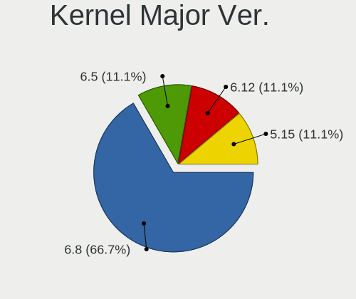
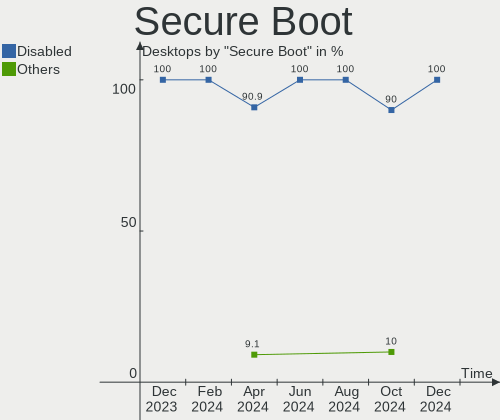
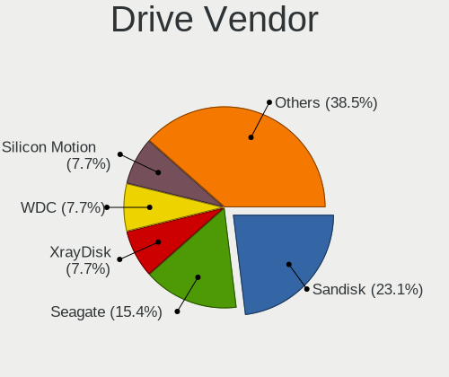
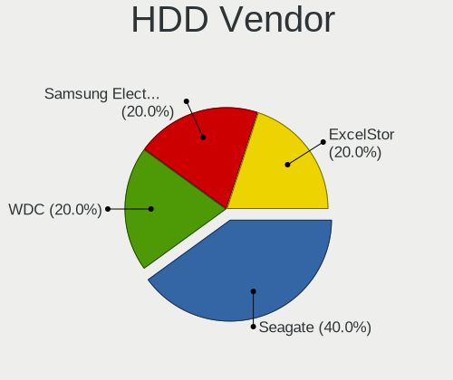
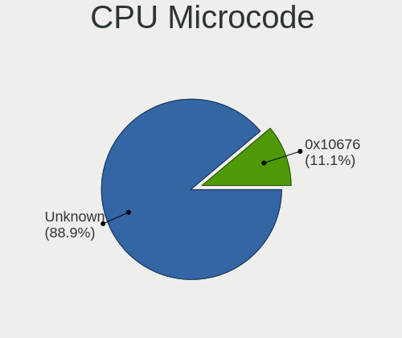
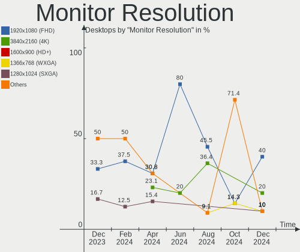
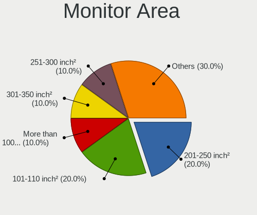

Lubuntu - Hardware Trends (Desktops)
------------------------------------

A project to identify most popular hardware characteristics and track their change
over time based on data collected by Linux users at https://Linux-Hardware.org.

Anyone can contribute to this report by the [hw-probe](https://github.com/linuxhw/hw-probe) tool:

    sudo -E hw-probe -all -upload

This report is for one last month. Overall report since the beginning of time: [TestCoverage](https://github.com/linuxhw/TestCoverage)

Period: Jun, 2022.

Contents
--------

* [ System ](#system)
  - [ OS                       ](#os)
  - [ OS Family                ](#os-family)
  - [ Kernel                   ](#kernel)
  - [ Kernel Family            ](#kernel-family)
  - [ Kernel Major Ver.        ](#kernel-major-ver)
  - [ Arch                     ](#arch)
  - [ DE                       ](#de)
  - [ Display Server           ](#display-server)
  - [ Display Manager          ](#display-manager)
  - [ OS Lang                  ](#os-lang)
  - [ Boot Mode                ](#boot-mode)
  - [ Filesystem               ](#filesystem)
  - [ Part. scheme             ](#part-scheme)
  - [ Dual Boot with Linux/BSD ](#dual-boot-with-linuxbsd)
  - [ Dual Boot (Win)          ](#dual-boot-win)

* [ Board ](#board)
  - [ Vendor                   ](#vendor)
  - [ Model                    ](#model)
  - [ Model Family             ](#model-family)
  - [ MFG Year                 ](#mfg-year)
  - [ Form Factor              ](#form-factor)
  - [ Secure Boot              ](#secure-boot)
  - [ Coreboot                 ](#coreboot)
  - [ RAM Size                 ](#ram-size)
  - [ RAM Used                 ](#ram-used)
  - [ Total Drives             ](#total-drives)
  - [ Has CD-ROM               ](#has-cd-rom)
  - [ Has Ethernet             ](#has-ethernet)
  - [ Has WiFi                 ](#has-wifi)
  - [ Has Bluetooth            ](#has-bluetooth)

* [ Location ](#location)
  - [ Country                  ](#country)
  - [ City                     ](#city)

* [ Drives ](#drives)
  - [ Drive Vendor             ](#drive-vendor)
  - [ Drive Model              ](#drive-model)
  - [ HDD Vendor               ](#hdd-vendor)
  - [ SSD Vendor               ](#ssd-vendor)
  - [ Drive Kind               ](#drive-kind)
  - [ Drive Connector          ](#drive-connector)
  - [ Drive Size               ](#drive-size)
  - [ Space Total              ](#space-total)
  - [ Space Used               ](#space-used)
  - [ Malfunc. Drives          ](#malfunc-drives)
  - [ Malfunc. Drive Vendor    ](#malfunc-drive-vendor)
  - [ Malfunc. HDD Vendor      ](#malfunc-hdd-vendor)
  - [ Malfunc. Drive Kind      ](#malfunc-drive-kind)
  - [ Failed Drives            ](#failed-drives)
  - [ Failed Drive Vendor      ](#failed-drive-vendor)
  - [ Drive Status             ](#drive-status)

* [ Storage controller ](#storage-controller)
  - [ Storage Vendor           ](#storage-vendor)
  - [ Storage Model            ](#storage-model)
  - [ Storage Kind             ](#storage-kind)

* [ Processor ](#processor)
  - [ CPU Vendor               ](#cpu-vendor)
  - [ CPU Model                ](#cpu-model)
  - [ CPU Model Family         ](#cpu-model-family)
  - [ CPU Cores                ](#cpu-cores)
  - [ CPU Sockets              ](#cpu-sockets)
  - [ CPU Threads              ](#cpu-threads)
  - [ CPU Op-Modes             ](#cpu-op-modes)
  - [ CPU Microcode            ](#cpu-microcode)
  - [ CPU Microarch            ](#cpu-microarch)

* [ Graphics ](#graphics)
  - [ GPU Vendor               ](#gpu-vendor)
  - [ GPU Model                ](#gpu-model)
  - [ GPU Combo                ](#gpu-combo)
  - [ GPU Driver               ](#gpu-driver)
  - [ GPU Memory               ](#gpu-memory)

* [ Monitor ](#monitor)
  - [ Monitor Vendor           ](#monitor-vendor)
  - [ Monitor Model            ](#monitor-model)
  - [ Monitor Resolution       ](#monitor-resolution)
  - [ Monitor Diagonal         ](#monitor-diagonal)
  - [ Monitor Width            ](#monitor-width)
  - [ Aspect Ratio             ](#aspect-ratio)
  - [ Monitor Area             ](#monitor-area)
  - [ Pixel Density            ](#pixel-density)
  - [ Multiple Monitors        ](#multiple-monitors)

* [ Network ](#network)
  - [ Net Controller Vendor    ](#net-controller-vendor)
  - [ Net Controller Model     ](#net-controller-model)
  - [ Wireless Vendor          ](#wireless-vendor)
  - [ Wireless Model           ](#wireless-model)
  - [ Ethernet Vendor          ](#ethernet-vendor)
  - [ Ethernet Model           ](#ethernet-model)
  - [ Net Controller Kind      ](#net-controller-kind)
  - [ Used Controller          ](#used-controller)
  - [ NICs                     ](#nics)
  - [ IPv6                     ](#ipv6)

* [ Bluetooth ](#bluetooth)
  - [ Bluetooth Vendor         ](#bluetooth-vendor)
  - [ Bluetooth Model          ](#bluetooth-model)

* [ Sound ](#sound)
  - [ Sound Vendor             ](#sound-vendor)
  - [ Sound Model              ](#sound-model)

* [ Memory ](#memory)
  - [ Memory Vendor            ](#memory-vendor)
  - [ Memory Model             ](#memory-model)
  - [ Memory Kind              ](#memory-kind)
  - [ Memory Form Factor       ](#memory-form-factor)
  - [ Memory Size              ](#memory-size)
  - [ Memory Speed             ](#memory-speed)

* [ Printers & scanners ](#printers--scanners)
  - [ Printer Vendor           ](#printer-vendor)
  - [ Printer Model            ](#printer-model)
  - [ Scanner Vendor           ](#scanner-vendor)
  - [ Scanner Model            ](#scanner-model)

* [ Camera ](#camera)
  - [ Camera Vendor            ](#camera-vendor)
  - [ Camera Model             ](#camera-model)

* [ Security ](#security)
  - [ Fingerprint Vendor       ](#fingerprint-vendor)
  - [ Fingerprint Model        ](#fingerprint-model)
  - [ Chipcard Vendor          ](#chipcard-vendor)
  - [ Chipcard Model           ](#chipcard-model)

* [ Unsupported ](#unsupported)
  - [ Unsupported Devices      ](#unsupported-devices)
  - [ Unsupported Device Types ](#unsupported-device-types)

System
------

OS
--

Installed operating systems

| Name          | Desktops | Percent |
|---------------|----------|---------|
| Lubuntu 22.04 | 5        | 62.5%   |
| Lubuntu 22.10 | 1        | 12.5%   |
| Lubuntu 21.10 | 1        | 12.5%   |
| Lubuntu 20.04 | 1        | 12.5%   |

OS Family
---------

OS without a version

| Name    | Desktops | Percent |
|---------|----------|---------|
| Lubuntu | 8        | 100%    |

Kernel
------

Version of the Linux kernel

| Version           | Desktops | Percent |
|-------------------|----------|---------|
| 5.15.0-39-generic | 3        | 37.5%   |
| 5.4.0-113-generic | 1        | 12.5%   |
| 5.15.0-40-generic | 1        | 12.5%   |
| 5.15.0-35-generic | 1        | 12.5%   |
| 5.15.0-30-generic | 1        | 12.5%   |
| 5.13.0-19-generic | 1        | 12.5%   |

Kernel Family
-------------

Linux kernel without a distro release

| Version | Desktops | Percent |
|---------|----------|---------|
| 5.15.0  | 6        | 75%     |
| 5.4.0   | 1        | 12.5%   |
| 5.13.0  | 1        | 12.5%   |

Kernel Major Ver.
-----------------

Linux kernel major version

| Version | Desktops | Percent |
|---------|----------|---------|
| 5.15    | 6        | 75%     |
| 5.4     | 1        | 12.5%   |
| 5.13    | 1        | 12.5%   |

Arch
----

OS architecture (x86_64, i586, etc.)

| Name   | Desktops | Percent |
|--------|----------|---------|
| x86_64 | 8        | 100%    |

DE
--

Desktop Environment

| Name | Desktops | Percent |
|------|----------|---------|
| LXQt | 7        | 87.5%   |
| LXDE | 1        | 12.5%   |

Display Server
--------------

X11 or Wayland

| Name | Desktops | Percent |
|------|----------|---------|
| X11  | 8        | 100%    |

Display Manager
---------------

SDDM, LightDM, etc.

| Name | Desktops | Percent |
|------|----------|---------|
| SDDM | 7        | 87.5%   |
| XDM  | 1        | 12.5%   |

OS Lang
-------

Language

| Lang  | Desktops | Percent |
|-------|----------|---------|
| fr_FR | 2        | 25%     |
| ja_JP | 1        | 12.5%   |
| it_IT | 1        | 12.5%   |
| en_US | 1        | 12.5%   |
| en_GB | 1        | 12.5%   |
| de_DE | 1        | 12.5%   |
| C     | 1        | 12.5%   |

Boot Mode
---------

EFI or BIOS

| Mode | Desktops | Percent |
|------|----------|---------|
| BIOS | 7        | 87.5%   |
| EFI  | 1        | 12.5%   |

Filesystem
----------

Type of filesystem

| Type    | Desktops | Percent |
|---------|----------|---------|
| Ext4    | 7        | 87.5%   |
| Overlay | 1        | 12.5%   |

Part. scheme
------------

Scheme of partitioning

| Type    | Desktops | Percent |
|---------|----------|---------|
| GPT     | 3        | 37.5%   |
| Unknown | 3        | 37.5%   |
| MBR     | 2        | 25%     |

Dual Boot with Linux/BSD
------------------------

Hosting more than one Linux/BSD

| Dual boot | Desktops | Percent |
|-----------|----------|---------|
| No        | 8        | 100%    |

Dual Boot (Win)
---------------

Hosting Linux and Windows

| Dual boot | Desktops | Percent |
|-----------|----------|---------|
| No        | 7        | 87.5%   |
| Yes       | 1        | 12.5%   |

Board
-----

Vendor
------

Motherboard manufacturer

| Name                | Desktops | Percent |
|---------------------|----------|---------|
| Gigabyte Technology | 2        | 25%     |
| ASUSTek Computer    | 2        | 25%     |
| MSI                 | 1        | 12.5%   |
| Lenovo              | 1        | 12.5%   |
| Intel               | 1        | 12.5%   |
| Dell                | 1        | 12.5%   |

Model
-----

Motherboard model

| Name                              | Desktops | Percent |
|-----------------------------------|----------|---------|
| MSI MS-7641                       | 1        | 12.5%   |
| Lenovo ThinkCentre M83 10ANCTO1WW | 1        | 12.5%   |
| Intel DQ57TM                      | 1        | 12.5%   |
| Gigabyte H370AORUSGAMING3WIFI     | 1        | 12.5%   |
| Gigabyte GA-MA69G-S3H             | 1        | 12.5%   |
| Dell OptiPlex 3020M               | 1        | 12.5%   |
| ASUS PRIME X370-A                 | 1        | 12.5%   |
| ASUS M4N78-AM                     | 1        | 12.5%   |

Model Family
------------

Motherboard model prefix

| Name                          | Desktops | Percent |
|-------------------------------|----------|---------|
| MSI MS-7641                   | 1        | 12.5%   |
| Lenovo ThinkCentre            | 1        | 12.5%   |
| Intel DQ57TM                  | 1        | 12.5%   |
| Gigabyte H370AORUSGAMING3WIFI | 1        | 12.5%   |
| Gigabyte GA-MA69G-S3H         | 1        | 12.5%   |
| Dell OptiPlex                 | 1        | 12.5%   |
| ASUS PRIME                    | 1        | 12.5%   |
| ASUS M4N78-AM                 | 1        | 12.5%   |

MFG Year
--------

Motherboard manufacture year

| Year | Desktops | Percent |
|------|----------|---------|
| 2017 | 2        | 25%     |
| 2011 | 2        | 25%     |
| 2018 | 1        | 12.5%   |
| 2014 | 1        | 12.5%   |
| 2009 | 1        | 12.5%   |
| 2007 | 1        | 12.5%   |

Form Factor
-----------

Physical design of the computer

| Name    | Desktops | Percent |
|---------|----------|---------|
| Desktop | 8        | 100%    |

Secure Boot
-----------

Enabled or disabled

| State    | Desktops | Percent |
|----------|----------|---------|
| Disabled | 8        | 100%    |

Coreboot
--------

Have coreboot on board

| Used | Desktops | Percent |
|------|----------|---------|
| No   | 8        | 100%    |

RAM Size
--------

Total RAM memory

| Size in GB | Desktops | Percent |
|------------|----------|---------|
| 16.01-24.0 | 3        | 37.5%   |
| 4.01-8.0   | 2        | 25%     |
| 3.01-4.0   | 2        | 25%     |
| 32.01-64.0 | 1        | 12.5%   |

RAM Used
--------

Used RAM memory

| Used GB  | Desktops | Percent |
|----------|----------|---------|
| 1.01-2.0 | 3        | 37.5%   |
| 4.01-8.0 | 2        | 25%     |
| 0.51-1.0 | 2        | 25%     |
| 2.01-3.0 | 1        | 12.5%   |

Total Drives
------------

Number of drives on board

| Drives | Desktops | Percent |
|--------|----------|---------|
| 1      | 5        | 62.5%   |
| 2      | 2        | 25%     |
| 3      | 1        | 12.5%   |

Has CD-ROM
----------

Has CD-ROM on board

| Presented | Desktops | Percent |
|-----------|----------|---------|
| No        | 6        | 75%     |
| Yes       | 2        | 25%     |

Has Ethernet
------------

Has Ethernet on board

| Presented | Desktops | Percent |
|-----------|----------|---------|
| Yes       | 8        | 100%    |

Has WiFi
--------

Has WiFi module

| Presented | Desktops | Percent |
|-----------|----------|---------|
| No        | 5        | 62.5%   |
| Yes       | 3        | 37.5%   |

Has Bluetooth
-------------

Has Bluetooth module

| Presented | Desktops | Percent |
|-----------|----------|---------|
| No        | 6        | 75%     |
| Yes       | 2        | 25%     |

Location
--------

Country
-------

Geographic location (country)

| Country     | Desktops | Percent |
|-------------|----------|---------|
| France      | 2        | 25%     |
| USA         | 1        | 12.5%   |
| UK          | 1        | 12.5%   |
| Netherlands | 1        | 12.5%   |
| Japan       | 1        | 12.5%   |
| Italy       | 1        | 12.5%   |
| Germany     | 1        | 12.5%   |

City
----

Geographic location (city)

| City                | Desktops | Percent |
|---------------------|----------|---------|
| Valentigney         | 1        | 12.5%   |
| Tokorozawa          | 1        | 12.5%   |
| Richmond            | 1        | 12.5%   |
| Frankfurt am Main   | 1        | 12.5%   |
| Cirey-sur-Vezouze   | 1        | 12.5%   |
| Bradford            | 1        | 12.5%   |
| Berkel en Rodenrijs | 1        | 12.5%   |
| Arluno              | 1        | 12.5%   |

Drives
------

Drive Vendor
------------

Hard drive vendors

| Vendor              | Desktops | Drives | Percent |
|---------------------|----------|--------|---------|
| WDC                 | 3        | 4      | 27.27%  |
| Hitachi             | 2        | 2      | 18.18%  |
| Crucial             | 2        | 2      | 18.18%  |
| Toshiba             | 1        | 1      | 9.09%   |
| Seagate             | 1        | 1      | 9.09%   |
| Samsung Electronics | 1        | 1      | 9.09%   |
| Maxtor              | 1        | 1      | 9.09%   |

Drive Model
-----------

Hard drive models

| Model                                           | Desktops | Percent |
|-------------------------------------------------|----------|---------|
| WDC WD800BB-00CAA1 80GB                         | 1        | 8.33%   |
| WDC WD5000AAKX-07U6AA0 500GB                    | 1        | 8.33%   |
| WDC WD40EZAZ-00SF3B0 4TB                        | 1        | 8.33%   |
| WDC WD3200BEVT-00A0RT0 320GB                    | 1        | 8.33%   |
| Toshiba MK6465GSX 640GB                         | 1        | 8.33%   |
| Seagate ST500DM002-1BD142 500GB                 | 1        | 8.33%   |
| Samsung SSD 970 EVO 500GB                       | 1        | 8.33%   |
| Maxtor STM3160215AS 160GB                       | 1        | 8.33%   |
| Hitachi HUA723030ALA640 81Y2460 81Y3844IBMH 3TB | 1        | 8.33%   |
| Hitachi HDT722520DLA380 200GB                   | 1        | 8.33%   |
| Crucial M4-CT128M4SSD2 128GB                    | 1        | 8.33%   |
| Crucial CT1000BX500SSD1 1TB                     | 1        | 8.33%   |

HDD Vendor
----------

Hard disk drive vendors

| Vendor  | Desktops | Drives | Percent |
|---------|----------|--------|---------|
| WDC     | 3        | 4      | 37.5%   |
| Hitachi | 2        | 2      | 25%     |
| Toshiba | 1        | 1      | 12.5%   |
| Seagate | 1        | 1      | 12.5%   |
| Maxtor  | 1        | 1      | 12.5%   |

SSD Vendor
----------

Solid state drive vendors

| Vendor  | Desktops | Drives | Percent |
|---------|----------|--------|---------|
| Crucial | 2        | 2      | 100%    |

Drive Kind
----------

HDD or SSD

| Kind | Desktops | Drives | Percent |
|------|----------|--------|---------|
| HDD  | 7        | 9      | 70%     |
| SSD  | 2        | 2      | 20%     |
| NVMe | 1        | 1      | 10%     |

Drive Connector
---------------

SATA, SAS, NVMe, etc.

| Type | Desktops | Drives | Percent |
|------|----------|--------|---------|
| SATA | 8        | 11     | 88.89%  |
| NVMe | 1        | 1      | 11.11%  |

Drive Size
----------

Size of hard drive

| Size in TB | Desktops | Drives | Percent |
|------------|----------|--------|---------|
| 0.01-0.5   | 6        | 7      | 60%     |
| 0.51-1.0   | 2        | 2      | 20%     |
| 3.01-4.0   | 1        | 1      | 10%     |
| 2.01-3.0   | 1        | 1      | 10%     |

Space Total
-----------

Amount of disk space available on the file system

| Size in GB | Desktops | Percent |
|------------|----------|---------|
| 251-500    | 2        | 25%     |
| 501-1000   | 2        | 25%     |
| 2001-3000  | 1        | 12.5%   |
| 101-250    | 1        | 12.5%   |
| 1-20       | 1        | 12.5%   |
| 51-100     | 1        | 12.5%   |

Space Used
----------

Amount of used disk space

| Used GB  | Desktops | Percent |
|----------|----------|---------|
| 21-50    | 2        | 25%     |
| 101-250  | 2        | 25%     |
| 1-20     | 2        | 25%     |
| 251-500  | 1        | 12.5%   |
| 501-1000 | 1        | 12.5%   |

Malfunc. Drives
---------------

Drive models with a malfunction

| Model                   | Desktops | Drives | Percent |
|-------------------------|----------|--------|---------|
| Toshiba MK6465GSX 640GB | 1        | 1      | 100%    |

Malfunc. Drive Vendor
---------------------

Vendors of faulty drives

| Vendor  | Desktops | Drives | Percent |
|---------|----------|--------|---------|
| Toshiba | 1        | 1      | 100%    |

Malfunc. HDD Vendor
-------------------

Vendors of faulty HDD drives

| Vendor  | Desktops | Drives | Percent |
|---------|----------|--------|---------|
| Toshiba | 1        | 1      | 100%    |

Malfunc. Drive Kind
-------------------

Kinds of faulty drives

| Kind | Desktops | Drives | Percent |
|------|----------|--------|---------|
| HDD  | 1        | 1      | 100%    |

Failed Drives
-------------

Failed drive models

Zero info for selected period =(

Failed Drive Vendor
-------------------

Failed drive vendors

Zero info for selected period =(

Drive Status
------------

Number of failed and malfunc. drives

| Status   | Desktops | Drives | Percent |
|----------|----------|--------|---------|
| Works    | 4        | 7      | 50%     |
| Detected | 3        | 4      | 37.5%   |
| Malfunc  | 1        | 1      | 12.5%   |

Storage controller
------------------

Storage Vendor
--------------

Storage controller vendors

| Vendor              | Desktops | Percent |
|---------------------|----------|---------|
| Intel               | 4        | 40%     |
| AMD                 | 3        | 30%     |
| Samsung Electronics | 1        | 10%     |
| Nvidia              | 1        | 10%     |
| JMicron Technology  | 1        | 10%     |

Storage Model
-------------

Storage controller models

| Model                                                                          | Desktops | Percent |
|--------------------------------------------------------------------------------|----------|---------|
| Intel 8 Series/C220 Series Chipset Family 6-port SATA Controller 1 [AHCI mode] | 2        | 12.5%   |
| Samsung NVMe SSD Controller SM981/PM981/PM983                                  | 1        | 6.25%   |
| Nvidia MCP78S [GeForce 8200] SATA Controller (non-AHCI mode)                   | 1        | 6.25%   |
| Nvidia MCP78S [GeForce 8200] IDE                                               | 1        | 6.25%   |
| JMicron JMB363 SATA/IDE Controller                                             | 1        | 6.25%   |
| Intel Cannon Lake PCH SATA AHCI Controller                                     | 1        | 6.25%   |
| Intel 5 Series/3400 Series Chipset PT IDER Controller                          | 1        | 6.25%   |
| Intel 5 Series/3400 Series Chipset 4 port SATA IDE Controller                  | 1        | 6.25%   |
| Intel 5 Series/3400 Series Chipset 2 port SATA IDE Controller                  | 1        | 6.25%   |
| AMD X370 Series Chipset SATA Controller                                        | 1        | 6.25%   |
| AMD SB7x0/SB8x0/SB9x0 SATA Controller [AHCI mode]                              | 1        | 6.25%   |
| AMD SB7x0/SB8x0/SB9x0 IDE Controller                                           | 1        | 6.25%   |
| AMD SB600 Non-Raid-5 SATA                                                      | 1        | 6.25%   |
| AMD SB600 IDE                                                                  | 1        | 6.25%   |
| AMD FCH SATA Controller [AHCI mode]                                            | 1        | 6.25%   |

Storage Kind
------------

Kind of storage controller (IDE, SATA, NVMe, SAS, ...)

| Kind | Desktops | Percent |
|------|----------|---------|
| SATA | 6        | 50%     |
| IDE  | 5        | 41.67%  |
| NVMe | 1        | 8.33%   |

Processor
---------

CPU Vendor
----------

Processor vendors

| Vendor | Desktops | Percent |
|--------|----------|---------|
| Intel  | 4        | 50%     |
| AMD    | 4        | 50%     |

CPU Model
---------

Processor models

| Model                                      | Desktops | Percent |
|--------------------------------------------|----------|---------|
| Intel Core i5-9400F CPU @ 2.90GHz          | 1        | 12.5%   |
| Intel Core i5-4590T CPU @ 2.00GHz          | 1        | 12.5%   |
| Intel Core i5-4570 CPU @ 3.20GHz           | 1        | 12.5%   |
| Intel Core i5 CPU 650 @ 3.20GHz            | 1        | 12.5%   |
| AMD Ryzen 7 2700 Eight-Core Processor      | 1        | 12.5%   |
| AMD FX-6350 Six-Core Processor             | 1        | 12.5%   |
| AMD Athlon 64 X2 Dual Core Processor 5000+ | 1        | 12.5%   |
| AMD Athlon 64 X2 Dual Core Processor 4200+ | 1        | 12.5%   |

CPU Model Family
----------------

Processor model prefix

| Model            | Desktops | Percent |
|------------------|----------|---------|
| Intel Core i5    | 4        | 50%     |
| AMD Athlon 64 X2 | 2        | 25%     |
| AMD Ryzen 7      | 1        | 12.5%   |
| AMD FX           | 1        | 12.5%   |

CPU Cores
---------

Number of processor cores

| Number | Desktops | Percent |
|--------|----------|---------|
| 4      | 2        | 25%     |
| 2      | 2        | 25%     |
| 8      | 1        | 12.5%   |
| 6      | 1        | 12.5%   |
| 3      | 1        | 12.5%   |
| 1      | 1        | 12.5%   |

CPU Sockets
-----------

Number of sockets

| Number | Desktops | Percent |
|--------|----------|---------|
| 1      | 8        | 100%    |

CPU Threads
-----------

Threads per core (Hyper-Threading)

| Number | Desktops | Percent |
|--------|----------|---------|
| 1      | 5        | 62.5%   |
| 2      | 3        | 37.5%   |

CPU Op-Modes
------------

CPU Operation Modes (32-bit, 64-bit)

| Op mode        | Desktops | Percent |
|----------------|----------|---------|
| 32-bit, 64-bit | 8        | 100%    |

CPU Microcode
-------------

Microcode number

| Number     | Desktops | Percent |
|------------|----------|---------|
| Unknown    | 4        | 50%     |
| 0x306c3    | 2        | 25%     |
| 0x906ea    | 1        | 12.5%   |
| 0x06000852 | 1        | 12.5%   |

CPU Microarch
-------------

Microarchitecture

| Name       | Desktops | Percent |
|------------|----------|---------|
| K8 Hammer  | 2        | 25%     |
| Haswell    | 2        | 25%     |
| Zen+       | 1        | 12.5%   |
| Westmere   | 1        | 12.5%   |
| Piledriver | 1        | 12.5%   |
| KabyLake   | 1        | 12.5%   |

Graphics
--------

GPU Vendor
----------

Vendors of graphics cards

| Vendor | Desktops | Percent |
|--------|----------|---------|
| Nvidia | 5        | 50%     |
| Intel  | 3        | 30%     |
| AMD    | 2        | 20%     |

GPU Model
---------

Graphics card models

| Model                                                                       | Desktops | Percent |
|-----------------------------------------------------------------------------|----------|---------|
| Intel Xeon E3-1200 v3/4th Gen Core Processor Integrated Graphics Controller | 2        | 20%     |
| Nvidia TU116 [GeForce GTX 1660 SUPER]                                       | 1        | 10%     |
| Nvidia TU104 [GeForce RTX 2080 SUPER]                                       | 1        | 10%     |
| Nvidia GT218 [GeForce 210]                                                  | 1        | 10%     |
| Nvidia GK208B [GeForce GT 710]                                              | 1        | 10%     |
| Nvidia C77 [GeForce 8200]                                                   | 1        | 10%     |
| Intel Core Processor Integrated Graphics Controller                         | 1        | 10%     |
| AMD RV710 [Radeon HD 4350/4550]                                             | 1        | 10%     |
| AMD RS690 [Radeon X1200]                                                    | 1        | 10%     |

GPU Combo
---------

Combinations of graphics cards

| Name         | Desktops | Percent |
|--------------|----------|---------|
| 1 x Nvidia   | 4        | 50%     |
| 1 x Intel    | 2        | 25%     |
| AMD + Nvidia | 1        | 12.5%   |
| 1 x AMD      | 1        | 12.5%   |

GPU Driver
----------

Free vs proprietary

| Driver      | Desktops | Percent |
|-------------|----------|---------|
| Free        | 7        | 87.5%   |
| Proprietary | 1        | 12.5%   |

GPU Memory
----------

Total video memory

| Size in GB | Desktops | Percent |
|------------|----------|---------|
| Unknown    | 5        | 62.5%   |
| 7.01-8.0   | 1        | 12.5%   |
| 5.01-6.0   | 1        | 12.5%   |
| 0.01-0.5   | 1        | 12.5%   |

Monitor
-------

Monitor Vendor
--------------

Monitor vendors

| Vendor               | Desktops | Percent |
|----------------------|----------|---------|
| Dell                 | 2        | 22.22%  |
| Ancor Communications | 2        | 22.22%  |
| Videoseven           | 1        | 11.11%  |
| IOD                  | 1        | 11.11%  |
| Gigabyte Technology  | 1        | 11.11%  |
| Eizo                 | 1        | 11.11%  |
| BenQ                 | 1        | 11.11%  |

Monitor Model
-------------

Monitor models

| Model                                                            | Desktops | Percent |
|------------------------------------------------------------------|----------|---------|
| Videoseven L19FM IGM0812 1280x1024 376x301mm 19.0-inch           | 1        | 10%     |
| IOD LCD-A153G IOD0F46 1024x768 304x228mm 15.0-inch               | 1        | 10%     |
| Gigabyte Technology G27Q GBT2709 2560x1440 598x336mm 27.0-inch   | 1        | 10%     |
| Eizo L565 ENC1651 1280x1024 337x270mm 17.0-inch                  | 1        | 10%     |
| Dell P190S DEL405A 1280x1024 376x301mm 19.0-inch                 | 1        | 10%     |
| Dell E2011H DEL406C 1600x900 443x249mm 20.0-inch                 | 1        | 10%     |
| Dell E1909W DELF00D 1440x900 408x255mm 18.9-inch                 | 1        | 10%     |
| BenQ GW2265 BNQ78D1 1920x1080 477x268mm 21.5-inch                | 1        | 10%     |
| Ancor Communications VW22A ACI22E3 1680x1050 473x296mm 22.0-inch | 1        | 10%     |
| Ancor Communications VE228 ACI22FA 1920x1080 480x270mm 21.7-inch | 1        | 10%     |

Monitor Resolution
------------------

Monitor screen resolution

| Resolution         | Desktops | Percent |
|--------------------|----------|---------|
| 1920x1080 (FHD)    | 2        | 20%     |
| 1280x1024 (SXGA)   | 2        | 20%     |
| 2560x1440 (QHD)    | 1        | 10%     |
| 2288x1287          | 1        | 10%     |
| 1680x1050 (WSXGA+) | 1        | 10%     |
| 1600x900 (HD+)     | 1        | 10%     |
| 1440x900 (WXGA+)   | 1        | 10%     |
| 1024x768 (XGA)     | 1        | 10%     |

Monitor Diagonal
----------------

Diagonal size in inches

| Inches | Desktops | Percent |
|--------|----------|---------|
| 19     | 3        | 30%     |
| 27     | 1        | 10%     |
| 24     | 1        | 10%     |
| 22     | 1        | 10%     |
| 21     | 1        | 10%     |
| 20     | 1        | 10%     |
| 17     | 1        | 10%     |
| 15     | 1        | 10%     |

Monitor Width
-------------

Physical width

| Width in mm | Desktops | Percent |
|-------------|----------|---------|
| 401-500     | 4        | 40%     |
| 501-600     | 2        | 20%     |
| 351-400     | 2        | 20%     |
| 301-350     | 2        | 20%     |

Aspect Ratio
------------

Proportional relationship between the width and the height

| Ratio | Desktops | Percent |
|-------|----------|---------|
| 5/4   | 3        | 33.33%  |
| 16/9  | 3        | 33.33%  |
| 16/10 | 2        | 22.22%  |
| 4/3   | 1        | 11.11%  |

Monitor Area
------------

Area in inch²

| Area in inch² | Desktops | Percent |
|----------------|----------|---------|
| 201-250        | 3        | 33.33%  |
| 151-200        | 3        | 33.33%  |
| 301-350        | 1        | 11.11%  |
| 141-150        | 1        | 11.11%  |
| 101-110        | 1        | 11.11%  |

Pixel Density
-------------

Pixels per inch

| Density | Desktops | Percent |
|---------|----------|---------|
| 51-100  | 6        | 75%     |
| 101-120 | 2        | 25%     |

Multiple Monitors
-----------------

Total monitors connected

| Total | Desktops | Percent |
|-------|----------|---------|
| 1     | 6        | 75%     |
| 3     | 1        | 12.5%   |
| 2     | 1        | 12.5%   |

Network
-------

Net Controller Vendor
---------------------

Controller vendors

| Vendor                | Desktops | Percent |
|-----------------------|----------|---------|
| Realtek Semiconductor | 4        | 36.36%  |
| Intel                 | 3        | 27.27%  |
| Trident Microsystems  | 1        | 9.09%   |
| Ralink Technology     | 1        | 9.09%   |
| Nvidia                | 1        | 9.09%   |
| Logitec               | 1        | 9.09%   |

Net Controller Model
--------------------

Controller models

| Model                                                             | Desktops | Percent |
|-------------------------------------------------------------------|----------|---------|
| Realtek RTL8111/8168/8411 PCI Express Gigabit Ethernet Controller | 3        | 25%     |
| Trident Microsystems 4DWave DX                                    | 1        | 8.33%   |
| Realtek RTL-8110SC/8169SC Gigabit Ethernet                        | 1        | 8.33%   |
| Ralink RT5370 Wireless Adapter                                    | 1        | 8.33%   |
| Nvidia MCP77 Ethernet                                             | 1        | 8.33%   |
| Logitec LAN-W150N/U2 Wireless LAN Adapter                         | 1        | 8.33%   |
| Intel Ethernet Connection I217-LM                                 | 1        | 8.33%   |
| Intel Ethernet Connection (7) I219-V                              | 1        | 8.33%   |
| Intel Cannon Lake PCH CNVi WiFi                                   | 1        | 8.33%   |
| Intel 82578DM Gigabit Network Connection                          | 1        | 8.33%   |

Wireless Vendor
---------------

Wireless vendors

| Vendor            | Desktops | Percent |
|-------------------|----------|---------|
| Ralink Technology | 1        | 33.33%  |
| Logitec           | 1        | 33.33%  |
| Intel             | 1        | 33.33%  |

Wireless Model
--------------

Wireless models

| Model                                     | Desktops | Percent |
|-------------------------------------------|----------|---------|
| Ralink RT5370 Wireless Adapter            | 1        | 33.33%  |
| Logitec LAN-W150N/U2 Wireless LAN Adapter | 1        | 33.33%  |
| Intel Cannon Lake PCH CNVi WiFi           | 1        | 33.33%  |

Ethernet Vendor
---------------

Ethernet vendors

| Vendor                | Desktops | Percent |
|-----------------------|----------|---------|
| Realtek Semiconductor | 4        | 44.44%  |
| Intel                 | 3        | 33.33%  |
| Trident Microsystems  | 1        | 11.11%  |
| Nvidia                | 1        | 11.11%  |

Ethernet Model
--------------

Ethernet models

| Model                                                             | Desktops | Percent |
|-------------------------------------------------------------------|----------|---------|
| Realtek RTL8111/8168/8411 PCI Express Gigabit Ethernet Controller | 3        | 33.33%  |
| Trident Microsystems 4DWave DX                                    | 1        | 11.11%  |
| Realtek RTL-8110SC/8169SC Gigabit Ethernet                        | 1        | 11.11%  |
| Nvidia MCP77 Ethernet                                             | 1        | 11.11%  |
| Intel Ethernet Connection I217-LM                                 | 1        | 11.11%  |
| Intel Ethernet Connection (7) I219-V                              | 1        | 11.11%  |
| Intel 82578DM Gigabit Network Connection                          | 1        | 11.11%  |

Net Controller Kind
-------------------

Ethernet, WiFi or modem

| Kind     | Desktops | Percent |
|----------|----------|---------|
| Ethernet | 8        | 72.73%  |
| WiFi     | 3        | 27.27%  |

Used Controller
---------------

Currently used network controller

| Kind     | Desktops | Percent |
|----------|----------|---------|
| Ethernet | 6        | 75%     |
| WiFi     | 2        | 25%     |

NICs
----

Total network controllers on board

| Total | Desktops | Percent |
|-------|----------|---------|
| 1     | 6        | 75%     |
| 2     | 2        | 25%     |

IPv6
----

IPv6 vs IPv4

| Used | Desktops | Percent |
|------|----------|---------|
| Yes  | 5        | 62.5%   |
| No   | 3        | 37.5%   |

Bluetooth
---------

Bluetooth Vendor
----------------

Controller vendors

| Vendor   | Desktops | Percent |
|----------|----------|---------|
| Logitech | 1        | 50%     |
| Intel    | 1        | 50%     |

Bluetooth Model
---------------

Controller models

| Model                                          | Desktops | Percent |
|------------------------------------------------|----------|---------|
| Logitech BT Mini-Receiver (HCI mode)           | 1        | 50%     |
| Intel Bluetooth 9460/9560 Jefferson Peak (JfP) | 1        | 50%     |

Sound
-----

Sound Vendor
------------

Sound card vendors

| Vendor   | Desktops | Percent |
|----------|----------|---------|
| Nvidia   | 5        | 35.71%  |
| Intel    | 4        | 28.57%  |
| AMD      | 3        | 21.43%  |
| Logitech | 1        | 7.14%   |
| Ensoniq  | 1        | 7.14%   |

Sound Model
-----------

Sound card models

| Model                                                               | Desktops | Percent |
|---------------------------------------------------------------------|----------|---------|
| Intel Xeon E3-1200 v3/4th Gen Core Processor HD Audio Controller    | 2        | 10.53%  |
| Intel 8 Series/C220 Series Chipset High Definition Audio Controller | 2        | 10.53%  |
| AMD SBx00 Azalia (Intel HDA)                                        | 2        | 10.53%  |
| Nvidia TU116 High Definition Audio Controller                       | 1        | 5.26%   |
| Nvidia TU104 HD Audio Controller                                    | 1        | 5.26%   |
| Nvidia MCP72XE/MCP72P/MCP78U/MCP78S High Definition Audio           | 1        | 5.26%   |
| Nvidia High Definition Audio Controller                             | 1        | 5.26%   |
| Nvidia GK208 HDMI/DP Audio Controller                               | 1        | 5.26%   |
| Logitech PRO X Wireless Gaming Headset                              | 1        | 5.26%   |
| Logitech Blue Microphones                                           | 1        | 5.26%   |
| Intel Cannon Lake PCH cAVS                                          | 1        | 5.26%   |
| Intel 5 Series/3400 Series Chipset High Definition Audio            | 1        | 5.26%   |
| Ensoniq ES1371/ES1373 / Creative Labs CT2518                        | 1        | 5.26%   |
| AMD RV710/730 HDMI Audio [Radeon HD 4000 series]                    | 1        | 5.26%   |
| AMD RS690 HDMI Audio [Radeon Xpress 1200 Series]                    | 1        | 5.26%   |
| AMD Family 17h (Models 00h-0fh) HD Audio Controller                 | 1        | 5.26%   |

Memory
------

Memory Vendor
-------------

Memory module vendors

| Vendor            | Desktops | Percent |
|-------------------|----------|---------|
| Corsair           | 2        | 40%     |
| SK hynix          | 1        | 20%     |
| Micron Technology | 1        | 20%     |
| Unknown           | 1        | 20%     |

Memory Model
------------

Memory module models

| Model                                                    | Desktops | Percent |
|----------------------------------------------------------|----------|---------|
| SK hynix RAM HMT351U6CFR8C-H9 4GB DIMM DDR3 1600MT/s     | 1        | 16.67%  |
| Micron RAM 8KTF51264HZ-1G6E1 4096MB SODIMM DDR3 1600MT/s | 1        | 16.67%  |
| Corsair RAM CMW32GX4M2C3200C16 16GB DIMM DDR4 3200MT/s   | 1        | 16.67%  |
| Corsair RAM CMK16GX4M2D3000C16 8GB DIMM DDR4 3200MT/s    | 1        | 16.67%  |
| Corsair RAM CMK16GX4M2A2666C16 8GB DIMM DDR4 3200MT/s    | 1        | 16.67%  |
| Unknown                                                  | 1        | 16.67%  |

Memory Kind
-----------

Memory module kinds

| Kind    | Desktops | Percent |
|---------|----------|---------|
| DDR4    | 2        | 40%     |
| DDR3    | 2        | 40%     |
| Unknown | 1        | 20%     |

Memory Form Factor
------------------

Physical design of the memory module

| Name   | Desktops | Percent |
|--------|----------|---------|
| DIMM   | 4        | 80%     |
| SODIMM | 1        | 20%     |

Memory Size
-----------

Memory module size

| Size  | Desktops | Percent |
|-------|----------|---------|
| 8192  | 3        | 50%     |
| 4096  | 2        | 33.33%  |
| 16384 | 1        | 16.67%  |

Memory Speed
------------

Memory module speed

| Speed | Desktops | Percent |
|-------|----------|---------|
| 1600  | 3        | 60%     |
| 3200  | 2        | 40%     |

Printers & scanners
-------------------

Printer Vendor
--------------

Printer device vendors

Zero info for selected period =(

Printer Model
-------------

Printer device models

Zero info for selected period =(

Scanner Vendor
--------------

Scanner device vendors

Zero info for selected period =(

Scanner Model
-------------

Scanner device models

Zero info for selected period =(

Camera
------

Camera Vendor
-------------

Camera device vendors

Zero info for selected period =(

Camera Model
------------

Camera device models

Zero info for selected period =(

Security
--------

Fingerprint Vendor
------------------

Fingerprint sensor vendors

Zero info for selected period =(

Fingerprint Model
-----------------

Fingerprint sensor models

Zero info for selected period =(

Chipcard Vendor
---------------

Chipcard module vendors

Zero info for selected period =(

Chipcard Model
--------------

Chipcard module models

Zero info for selected period =(

Unsupported
-----------

Unsupported Devices
-------------------

Total unsupported devices on board

| Total | Desktops | Percent |
|-------|----------|---------|
| 0     | 8        | 100%    |

Unsupported Device Types
------------------------

Types of unsupported devices

Zero info for selected period =(

