Lubuntu - Hardware Trends (Desktops)
------------------------------------

A project to identify most popular hardware characteristics and track their change
over time based on data collected by Linux users at https://Linux-Hardware.org.

Anyone can contribute to this report by the [hw-probe](https://github.com/linuxhw/hw-probe) tool:

    sudo -E hw-probe -all -upload

This report is for one last month. Overall report since the beginning of time: [TestDays](https://github.com/linuxhw/TestDays)

Period: Aug, 2023.

Contents
--------

* [ System ](#system)
  - [ OS                       ](#os)
  - [ OS Family                ](#os-family)
  - [ Kernel                   ](#kernel)
  - [ Kernel Family            ](#kernel-family)
  - [ Kernel Major Ver.        ](#kernel-major-ver)
  - [ Arch                     ](#arch)
  - [ DE                       ](#de)
  - [ Display Server           ](#display-server)
  - [ Display Manager          ](#display-manager)
  - [ OS Lang                  ](#os-lang)
  - [ Boot Mode                ](#boot-mode)
  - [ Filesystem               ](#filesystem)
  - [ Part. scheme             ](#part-scheme)
  - [ Dual Boot with Linux/BSD ](#dual-boot-with-linuxbsd)
  - [ Dual Boot (Win)          ](#dual-boot-win)

* [ Board ](#board)
  - [ Vendor                   ](#vendor)
  - [ Model                    ](#model)
  - [ Model Family             ](#model-family)
  - [ MFG Year                 ](#mfg-year)
  - [ Form Factor              ](#form-factor)
  - [ Secure Boot              ](#secure-boot)
  - [ Coreboot                 ](#coreboot)
  - [ RAM Size                 ](#ram-size)
  - [ RAM Used                 ](#ram-used)
  - [ Total Drives             ](#total-drives)
  - [ Has CD-ROM               ](#has-cd-rom)
  - [ Has Ethernet             ](#has-ethernet)
  - [ Has WiFi                 ](#has-wifi)
  - [ Has Bluetooth            ](#has-bluetooth)

* [ Location ](#location)
  - [ Country                  ](#country)
  - [ City                     ](#city)

* [ Drives ](#drives)
  - [ Drive Vendor             ](#drive-vendor)
  - [ Drive Model              ](#drive-model)
  - [ HDD Vendor               ](#hdd-vendor)
  - [ SSD Vendor               ](#ssd-vendor)
  - [ Drive Kind               ](#drive-kind)
  - [ Drive Connector          ](#drive-connector)
  - [ Drive Size               ](#drive-size)
  - [ Space Total              ](#space-total)
  - [ Space Used               ](#space-used)
  - [ Malfunc. Drives          ](#malfunc-drives)
  - [ Malfunc. Drive Vendor    ](#malfunc-drive-vendor)
  - [ Malfunc. HDD Vendor      ](#malfunc-hdd-vendor)
  - [ Malfunc. Drive Kind      ](#malfunc-drive-kind)
  - [ Failed Drives            ](#failed-drives)
  - [ Failed Drive Vendor      ](#failed-drive-vendor)
  - [ Drive Status             ](#drive-status)

* [ Storage controller ](#storage-controller)
  - [ Storage Vendor           ](#storage-vendor)
  - [ Storage Model            ](#storage-model)
  - [ Storage Kind             ](#storage-kind)

* [ Processor ](#processor)
  - [ CPU Vendor               ](#cpu-vendor)
  - [ CPU Model                ](#cpu-model)
  - [ CPU Model Family         ](#cpu-model-family)
  - [ CPU Cores                ](#cpu-cores)
  - [ CPU Sockets              ](#cpu-sockets)
  - [ CPU Threads              ](#cpu-threads)
  - [ CPU Op-Modes             ](#cpu-op-modes)
  - [ CPU Microcode            ](#cpu-microcode)
  - [ CPU Microarch            ](#cpu-microarch)

* [ Graphics ](#graphics)
  - [ GPU Vendor               ](#gpu-vendor)
  - [ GPU Model                ](#gpu-model)
  - [ GPU Combo                ](#gpu-combo)
  - [ GPU Driver               ](#gpu-driver)
  - [ GPU Memory               ](#gpu-memory)

* [ Monitor ](#monitor)
  - [ Monitor Vendor           ](#monitor-vendor)
  - [ Monitor Model            ](#monitor-model)
  - [ Monitor Resolution       ](#monitor-resolution)
  - [ Monitor Diagonal         ](#monitor-diagonal)
  - [ Monitor Width            ](#monitor-width)
  - [ Aspect Ratio             ](#aspect-ratio)
  - [ Monitor Area             ](#monitor-area)
  - [ Pixel Density            ](#pixel-density)
  - [ Multiple Monitors        ](#multiple-monitors)

* [ Network ](#network)
  - [ Net Controller Vendor    ](#net-controller-vendor)
  - [ Net Controller Model     ](#net-controller-model)
  - [ Wireless Vendor          ](#wireless-vendor)
  - [ Wireless Model           ](#wireless-model)
  - [ Ethernet Vendor          ](#ethernet-vendor)
  - [ Ethernet Model           ](#ethernet-model)
  - [ Net Controller Kind      ](#net-controller-kind)
  - [ Used Controller          ](#used-controller)
  - [ NICs                     ](#nics)
  - [ IPv6                     ](#ipv6)

* [ Bluetooth ](#bluetooth)
  - [ Bluetooth Vendor         ](#bluetooth-vendor)
  - [ Bluetooth Model          ](#bluetooth-model)

* [ Sound ](#sound)
  - [ Sound Vendor             ](#sound-vendor)
  - [ Sound Model              ](#sound-model)

* [ Memory ](#memory)
  - [ Memory Vendor            ](#memory-vendor)
  - [ Memory Model             ](#memory-model)
  - [ Memory Kind              ](#memory-kind)
  - [ Memory Form Factor       ](#memory-form-factor)
  - [ Memory Size              ](#memory-size)
  - [ Memory Speed             ](#memory-speed)

* [ Printers & scanners ](#printers--scanners)
  - [ Printer Vendor           ](#printer-vendor)
  - [ Printer Model            ](#printer-model)
  - [ Scanner Vendor           ](#scanner-vendor)
  - [ Scanner Model            ](#scanner-model)

* [ Camera ](#camera)
  - [ Camera Vendor            ](#camera-vendor)
  - [ Camera Model             ](#camera-model)

* [ Security ](#security)
  - [ Fingerprint Vendor       ](#fingerprint-vendor)
  - [ Fingerprint Model        ](#fingerprint-model)
  - [ Chipcard Vendor          ](#chipcard-vendor)
  - [ Chipcard Model           ](#chipcard-model)

* [ Unsupported ](#unsupported)
  - [ Unsupported Devices      ](#unsupported-devices)
  - [ Unsupported Device Types ](#unsupported-device-types)

System
------

OS
--

Installed operating systems

| Name          | Desktops | Percent |
|---------------|----------|---------|
| Lubuntu 22.04 | 5        | 55.56%  |
| Lubuntu 20.04 | 3        | 33.33%  |
| Lubuntu 23.04 | 1        | 11.11%  |

OS Family
---------

OS without a version

| Name    | Desktops | Percent |
|---------|----------|---------|
| Lubuntu | 9        | 100%    |

Kernel
------

Version of the Linux kernel

| Version           | Desktops | Percent |
|-------------------|----------|---------|
| 6.2.0-26-generic  | 2        | 22.22%  |
| 5.15.0-75-generic | 2        | 22.22%  |
| 6.2.0-27-generic  | 1        | 11.11%  |
| 5.8.0-53-generic  | 1        | 11.11%  |
| 5.19.0-50-generic | 1        | 11.11%  |
| 5.19.0-32-generic | 1        | 11.11%  |
| 5.15.0-76-generic | 1        | 11.11%  |

Kernel Family
-------------

Linux kernel without a distro release

| Version | Desktops | Percent |
|---------|----------|---------|
| 6.2.0   | 3        | 33.33%  |
| 5.15.0  | 3        | 33.33%  |
| 5.19.0  | 2        | 22.22%  |
| 5.8.0   | 1        | 11.11%  |

Kernel Major Ver.
-----------------

Linux kernel major version

| Version | Desktops | Percent |
|---------|----------|---------|
| 6.2     | 3        | 33.33%  |
| 5.15    | 3        | 33.33%  |
| 5.19    | 2        | 22.22%  |
| 5.8     | 1        | 11.11%  |

Arch
----

OS architecture (x86_64, i586, etc.)

| Name   | Desktops | Percent |
|--------|----------|---------|
| x86_64 | 9        | 100%    |

DE
--

Desktop Environment

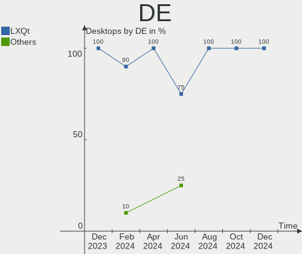

| Name | Desktops | Percent |
|------|----------|---------|
| LXQt | 9        | 100%    |

Display Server
--------------

X11 or Wayland

| Name | Desktops | Percent |
|------|----------|---------|
| X11  | 9        | 100%    |

Display Manager
---------------

SDDM, LightDM, etc.

| Name    | Desktops | Percent |
|---------|----------|---------|
| SDDM    | 7        | 77.78%  |
| Unknown | 2        | 22.22%  |

OS Lang
-------

Language

| Lang  | Desktops | Percent |
|-------|----------|---------|
| fr_FR | 3        | 33.33%  |
| zh_TW | 1        | 11.11%  |
| it_IT | 1        | 11.11%  |
| en_US | 1        | 11.11%  |
| en_GB | 1        | 11.11%  |
| en_AU | 1        | 11.11%  |
| de_DE | 1        | 11.11%  |

Boot Mode
---------

EFI or BIOS

| Mode | Desktops | Percent |
|------|----------|---------|
| BIOS | 6        | 66.67%  |
| EFI  | 3        | 33.33%  |

Filesystem
----------

Type of filesystem

| Type  | Desktops | Percent |
|-------|----------|---------|
| Ext4  | 8        | 88.89%  |
| Tmpfs | 1        | 11.11%  |

Part. scheme
------------

Scheme of partitioning

| Type    | Desktops | Percent |
|---------|----------|---------|
| GPT     | 5        | 55.56%  |
| MBR     | 2        | 22.22%  |
| Unknown | 2        | 22.22%  |

Dual Boot with Linux/BSD
------------------------

Hosting more than one Linux/BSD

| Dual boot | Desktops | Percent |
|-----------|----------|---------|
| No        | 9        | 100%    |

Dual Boot (Win)
---------------

Hosting Linux and Windows

| Dual boot | Desktops | Percent |
|-----------|----------|---------|
| No        | 6        | 66.67%  |
| Yes       | 3        | 33.33%  |

Board
-----

Vendor
------

Motherboard manufacturer

| Name                | Desktops | Percent |
|---------------------|----------|---------|
| Gigabyte Technology | 3        | 33.33%  |
| ASUSTek Computer    | 2        | 22.22%  |
| Shuttle             | 1        | 11.11%  |
| Inventec            | 1        | 11.11%  |
| Apple               | 1        | 11.11%  |
| Acer                | 1        | 11.11%  |

Model
-----

Motherboard model

| Name                      | Desktops | Percent |
|---------------------------|----------|---------|
| Shuttle XS35V3            | 1        | 11.11%  |
| Inventec DQ Class         | 1        | 11.11%  |
| Gigabyte H61M-D2H-USB3    | 1        | 11.11%  |
| Gigabyte H510M H          | 1        | 11.11%  |
| Gigabyte B560 HD3         | 1        | 11.11%  |
| ASUS P5QD TURBO           | 1        | 11.11%  |
| ASUS BM6875_BM6675_BP6375 | 1        | 11.11%  |
| Apple Xserve3,1           | 1        | 11.11%  |
| Acer Predator G3610       | 1        | 11.11%  |

Model Family
------------

Motherboard model prefix

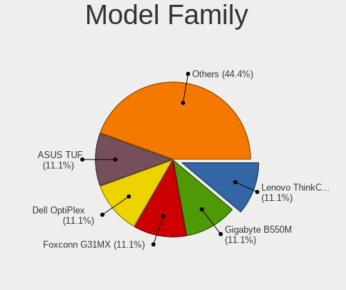

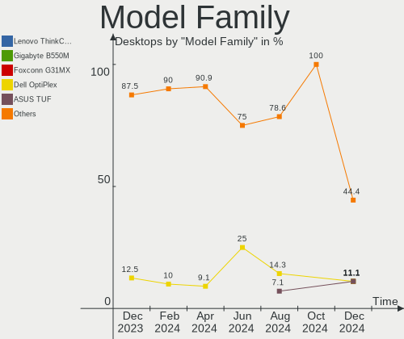

| Name                   | Desktops | Percent |
|------------------------|----------|---------|
| Shuttle XS35V3         | 1        | 11.11%  |
| Inventec DQ            | 1        | 11.11%  |
| Gigabyte H61M-D2H-USB3 | 1        | 11.11%  |
| Gigabyte H510M         | 1        | 11.11%  |
| Gigabyte B560          | 1        | 11.11%  |
| ASUS P5QD              | 1        | 11.11%  |
| ASUS BM6875            | 1        | 11.11%  |
| Apple Xserve3          | 1        | 11.11%  |
| Acer Predator          | 1        | 11.11%  |

MFG Year
--------

Motherboard manufacture year

| Year | Desktops | Percent |
|------|----------|---------|
| 2021 | 2        | 22.22%  |
| 2012 | 2        | 22.22%  |
| 2011 | 2        | 22.22%  |
| 2009 | 2        | 22.22%  |
| 2013 | 1        | 11.11%  |

Form Factor
-----------

Physical design of the computer

| Name    | Desktops | Percent |
|---------|----------|---------|
| Desktop | 9        | 100%    |

Secure Boot
-----------

Enabled or disabled

| State    | Desktops | Percent |
|----------|----------|---------|
| Disabled | 9        | 100%    |

Coreboot
--------

Have coreboot on board

| Used | Desktops | Percent |
|------|----------|---------|
| No   | 9        | 100%    |

RAM Size
--------

Total RAM memory

| Size in GB | Desktops | Percent |
|------------|----------|---------|
| 4.01-8.0   | 3        | 33.33%  |
| 32.01-64.0 | 2        | 22.22%  |
| 3.01-4.0   | 2        | 22.22%  |
| 8.01-16.0  | 2        | 22.22%  |

RAM Used
--------

Used RAM memory

| Used GB  | Desktops | Percent |
|----------|----------|---------|
| 1.01-2.0 | 5        | 55.56%  |
| 4.01-8.0 | 2        | 22.22%  |
| 2.01-3.0 | 2        | 22.22%  |

Total Drives
------------

Number of drives on board

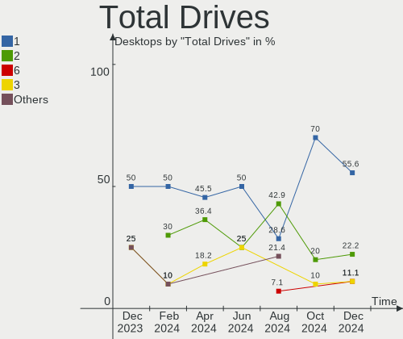

| Drives | Desktops | Percent |
|--------|----------|---------|
| 1      | 5        | 55.56%  |
| 5      | 2        | 22.22%  |
| 8      | 1        | 11.11%  |
| 2      | 1        | 11.11%  |

Has CD-ROM
----------

Has CD-ROM on board

| Presented | Desktops | Percent |
|-----------|----------|---------|
| No        | 6        | 66.67%  |
| Yes       | 3        | 33.33%  |

Has Ethernet
------------

Has Ethernet on board

| Presented | Desktops | Percent |
|-----------|----------|---------|
| Yes       | 9        | 100%    |

Has WiFi
--------

Has WiFi module

| Presented | Desktops | Percent |
|-----------|----------|---------|
| No        | 7        | 77.78%  |
| Yes       | 2        | 22.22%  |

Has Bluetooth
-------------

Has Bluetooth module

| Presented | Desktops | Percent |
|-----------|----------|---------|
| No        | 7        | 77.78%  |
| Yes       | 2        | 22.22%  |

Location
--------

Country
-------

Geographic location (country)

| Country   | Desktops | Percent |
|-----------|----------|---------|
| France    | 3        | 33.33%  |
| UK        | 1        | 11.11%  |
| Taiwan    | 1        | 11.11%  |
| Italy     | 1        | 11.11%  |
| Indonesia | 1        | 11.11%  |
| Germany   | 1        | 11.11%  |
| Australia | 1        | 11.11%  |

City
----

Geographic location (city)

| City                    | Desktops | Percent |
|-------------------------|----------|---------|
| Woking                  | 1        | 11.11%  |
| Taipei                  | 1        | 11.11%  |
| Saint-Etienne-de-Valoux | 1        | 11.11%  |
| Perth                   | 1        | 11.11%  |
| Milan                   | 1        | 11.11%  |
| Marseille               | 1        | 11.11%  |
| Gonesse                 | 1        | 11.11%  |
| Bekasi                  | 1        | 11.11%  |
| Alsfeld                 | 1        | 11.11%  |

Drives
------

Drive Vendor
------------

Hard drive vendors

| Vendor                      | Desktops | Drives | Percent |
|-----------------------------|----------|--------|---------|
| WDC                         | 5        | 12     | 29.41%  |
| Samsung Electronics         | 2        | 2      | 11.76%  |
| Toshiba                     | 1        | 1      | 5.88%   |
| Seagate                     | 1        | 2      | 5.88%   |
| SanDisk                     | 1        | 1      | 5.88%   |
| Maxtor                      | 1        | 1      | 5.88%   |
| Kingston Technology Company | 1        | 1      | 5.88%   |
| Kingston                    | 1        | 1      | 5.88%   |
| Hitachi                     | 1        | 1      | 5.88%   |
| Crucial                     | 1        | 1      | 5.88%   |
| Apple                       | 1        | 1      | 5.88%   |
| Apacer                      | 1        | 1      | 5.88%   |

Drive Model
-----------

Hard drive models

| Model                            | Desktops | Percent |
|----------------------------------|----------|---------|
| WDC WDS500G2B0C-00PXH0 500GB     | 1        | 4.35%   |
| WDC WDS240G2G0A-00JH30 240GB SSD | 1        | 4.35%   |
| WDC WD5000AADS-00M2B0 500GB      | 1        | 4.35%   |
| WDC WD40EZRZ-00GXCB0 4TB         | 1        | 4.35%   |
| WDC WD40EZRX-00SPEB0 4TB         | 1        | 4.35%   |
| WDC WD40EZAZ-00SF3B0 4TB         | 1        | 4.35%   |
| WDC WD40EFRX-68WT0N0 4TB         | 1        | 4.35%   |
| WDC WD3200AAKS-75L9A0 320GB      | 1        | 4.35%   |
| WDC WD20EZAZ-00GGJB0 2TB         | 1        | 4.35%   |
| WDC WD20EARS-22MVWB0 2TB         | 1        | 4.35%   |
| Toshiba HDWE140 4TB              | 1        | 4.35%   |
| Seagate ST4000DM000 4GB          | 1        | 4.35%   |
| Seagate ST31000520AS 1TB         | 1        | 4.35%   |
| SanDisk SSD PLUS 120GB           | 1        | 4.35%   |
| Samsung SSD 980 PRO 1TB          | 1        | 4.35%   |
| Samsung SSD 850 EVO 250GB        | 1        | 4.35%   |
| Maxtor STM3250820AS 250GB        | 1        | 4.35%   |
| Kingston Company SNV2S1000G 1TB  | 1        | 4.35%   |
| Kingston SA400S37120G 120GB SSD  | 1        | 4.35%   |
| Hitachi HDS5C3020ALA632 2TB      | 1        | 4.35%   |
| Crucial CT500P5SSD8 500GB        | 1        | 4.35%   |
| Apple SSD SM128 121GB            | 1        | 4.35%   |
| Apacer 32GB SATA Flash Drive SSD | 1        | 4.35%   |

HDD Vendor
----------

Hard disk drive vendors

| Vendor  | Desktops | Drives | Percent |
|---------|----------|--------|---------|
| WDC     | 5        | 10     | 55.56%  |
| Toshiba | 1        | 1      | 11.11%  |
| Seagate | 1        | 2      | 11.11%  |
| Maxtor  | 1        | 1      | 11.11%  |
| Hitachi | 1        | 1      | 11.11%  |

SSD Vendor
----------

Solid state drive vendors

| Vendor              | Desktops | Drives | Percent |
|---------------------|----------|--------|---------|
| WDC                 | 1        | 1      | 16.67%  |
| SanDisk             | 1        | 1      | 16.67%  |
| Samsung Electronics | 1        | 1      | 16.67%  |
| Kingston            | 1        | 1      | 16.67%  |
| Apple               | 1        | 1      | 16.67%  |
| Apacer              | 1        | 1      | 16.67%  |

Drive Kind
----------

HDD or SSD

| Kind | Desktops | Drives | Percent |
|------|----------|--------|---------|
| HDD  | 6        | 15     | 46.15%  |
| SSD  | 5        | 6      | 38.46%  |
| NVMe | 2        | 4      | 15.38%  |

Drive Connector
---------------

SATA, SAS, NVMe, etc.

| Type | Desktops | Drives | Percent |
|------|----------|--------|---------|
| SATA | 9        | 21     | 81.82%  |
| NVMe | 2        | 4      | 18.18%  |

Drive Size
----------

Size of hard drive

| Size in TB | Desktops | Drives | Percent |
|------------|----------|--------|---------|
| 0.01-0.5   | 8        | 10     | 57.14%  |
| 1.01-2.0   | 3        | 3      | 21.43%  |
| 3.01-4.0   | 2        | 7      | 14.29%  |
| 0.51-1.0   | 1        | 1      | 7.14%   |

Space Total
-----------

Amount of disk space available on the file system

| Size in GB     | Desktops | Percent |
|----------------|----------|---------|
| 101-250        | 3        | 33.33%  |
| 251-500        | 2        | 22.22%  |
| 501-1000       | 2        | 22.22%  |
| More than 3000 | 1        | 11.11%  |
| 21-50          | 1        | 11.11%  |

Space Used
----------

Amount of used disk space

| Used GB        | Desktops | Percent |
|----------------|----------|---------|
| 1-20           | 5        | 55.56%  |
| More than 3000 | 1        | 11.11%  |
| 21-50          | 1        | 11.11%  |
| 501-1000       | 1        | 11.11%  |
| 51-100         | 1        | 11.11%  |

Malfunc. Drives
---------------

Drive models with a malfunction

| Model                            | Desktops | Drives | Percent |
|----------------------------------|----------|--------|---------|
| WDC WDS240G2G0A-00JH30 240GB SSD | 1        | 1      | 20%     |
| WDC WD40EFRX-68WT0N0 4TB         | 1        | 2      | 20%     |
| Toshiba HDWE140 4TB              | 1        | 1      | 20%     |
| Seagate ST31000520AS 1TB         | 1        | 1      | 20%     |
| Hitachi HDS5C3020ALA632 2TB      | 1        | 1      | 20%     |

Malfunc. Drive Vendor
---------------------

Vendors of faulty drives

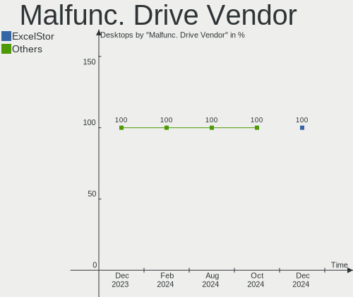

| Vendor  | Desktops | Drives | Percent |
|---------|----------|--------|---------|
| WDC     | 2        | 3      | 40%     |
| Toshiba | 1        | 1      | 20%     |
| Seagate | 1        | 1      | 20%     |
| Hitachi | 1        | 1      | 20%     |

Malfunc. HDD Vendor
-------------------

Vendors of faulty HDD drives

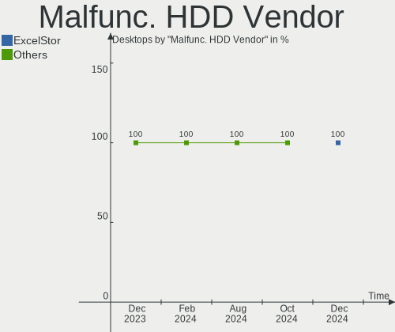

| Vendor  | Desktops | Drives | Percent |
|---------|----------|--------|---------|
| WDC     | 1        | 2      | 25%     |
| Toshiba | 1        | 1      | 25%     |
| Seagate | 1        | 1      | 25%     |
| Hitachi | 1        | 1      | 25%     |

Malfunc. Drive Kind
-------------------

Kinds of faulty drives

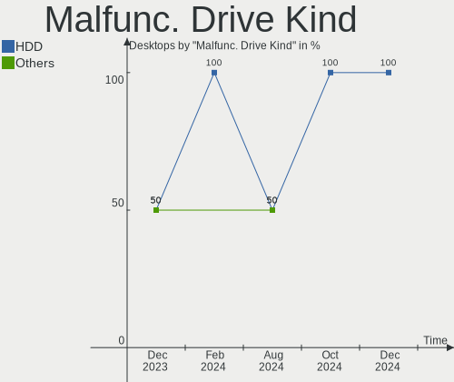

| Kind | Desktops | Drives | Percent |
|------|----------|--------|---------|
| SSD  | 1        | 1      | 50%     |
| HDD  | 1        | 5      | 50%     |

Failed Drives
-------------

Failed drive models

Zero info for selected period =(

Failed Drive Vendor
-------------------

Failed drive vendors

Zero info for selected period =(

Drive Status
------------

Number of failed and malfunc. drives

| Status   | Desktops | Drives | Percent |
|----------|----------|--------|---------|
| Works    | 6        | 10     | 50%     |
| Detected | 4        | 9      | 33.33%  |
| Malfunc  | 2        | 6      | 16.67%  |

Storage controller
------------------

Storage Vendor
--------------

Storage controller vendors

| Vendor                      | Desktops | Percent |
|-----------------------------|----------|---------|
| Intel                       | 8        | 47.06%  |
| ASMedia Technology          | 2        | 11.76%  |
| SanDisk                     | 1        | 5.88%   |
| Samsung Electronics         | 1        | 5.88%   |
| Micron Technology           | 1        | 5.88%   |
| Kingston Technology Company | 1        | 5.88%   |
| JMicron Technology          | 1        | 5.88%   |
| Apple                       | 1        | 5.88%   |
| AMD                         | 1        | 5.88%   |

Storage Model
-------------

Storage controller models

| Model                                                                                   | Desktops | Percent |
|-----------------------------------------------------------------------------------------|----------|---------|
| Intel 500 Series Chipset Family SATA AHCI Controller                                    | 2        | 10%     |
| SanDisk WD Blue SN550 NVMe SSD                                                          | 1        | 5%      |
| Samsung NVMe SSD Controller PM9A1/PM9A3/980PRO                                          | 1        | 5%      |
| Micron 2300 NVMe SSD [Santana]                                                          | 1        | 5%      |
| Kingston Company Company Non-Volatile memory controller                                 | 1        | 5%      |
| JMicron JMB361 AHCI/IDE                                                                 | 1        | 5%      |
| Intel SATA Controller [RAID mode]                                                       | 1        | 5%      |
| Intel NM10/ICH7 Family SATA Controller [AHCI mode]                                      | 1        | 5%      |
| Intel 82801JI (ICH10 Family) SATA AHCI Controller                                       | 1        | 5%      |
| Intel 82801JI (ICH10 Family) 4 port SATA IDE Controller #1                              | 1        | 5%      |
| Intel 82801JI (ICH10 Family) 2 port SATA IDE Controller #2                              | 1        | 5%      |
| Intel 7 Series/C210 Series Chipset Family 4-port SATA Controller [IDE mode]             | 1        | 5%      |
| Intel 7 Series/C210 Series Chipset Family 2-port SATA Controller [IDE mode]             | 1        | 5%      |
| Intel 6 Series/C200 Series Chipset Family Desktop SATA Controller (IDE mode, ports 4-5) | 1        | 5%      |
| Intel 6 Series/C200 Series Chipset Family Desktop SATA Controller (IDE mode, ports 0-3) | 1        | 5%      |
| ASMedia 106x SATA/RAID Controller                                                       | 1        | 5%      |
| ASMedia 1064 SATA Controller                                                            | 1        | 5%      |
| Apple RAID bus controller                                                               | 1        | 5%      |
| AMD FCH SATA Controller [AHCI mode]                                                     | 1        | 5%      |

Storage Kind
------------

Kind of storage controller (IDE, SATA, NVMe, SAS, ...)

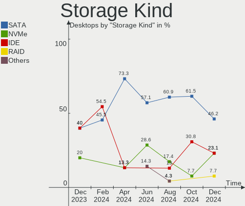

| Kind | Desktops | Percent |
|------|----------|---------|
| SATA | 5        | 41.67%  |
| IDE  | 3        | 25%     |
| RAID | 2        | 16.67%  |
| NVMe | 2        | 16.67%  |

Processor
---------

CPU Vendor
----------

Processor vendors

| Vendor | Desktops | Percent |
|--------|----------|---------|
| Intel  | 8        | 88.89%  |
| AMD    | 1        | 11.11%  |

CPU Model
---------

Processor models

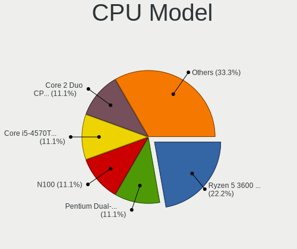

| Model                                    | Desktops | Percent |
|------------------------------------------|----------|---------|
| Intel Xeon CPU E5520 @ 2.27GHz           | 1        | 11.11%  |
| Intel Core i7-3770 CPU @ 3.40GHz         | 1        | 11.11%  |
| Intel Core i7-2600 CPU @ 3.40GHz         | 1        | 11.11%  |
| Intel Core i5-10400F CPU @ 2.90GHz       | 1        | 11.11%  |
| Intel Core 2 Quad CPU Q9550 @ 2.83GHz    | 1        | 11.11%  |
| Intel Celeron CPU G465 @ 1.90GHz         | 1        | 11.11%  |
| Intel Atom CPU D2550 @ 1.86GHz           | 1        | 11.11%  |
| Intel 11th Gen Core i5-11400 @ 2.60GHz   | 1        | 11.11%  |
| AMD GX-415GA SOC with Radeon HD Graphics | 1        | 11.11%  |

CPU Model Family
----------------

Processor model prefix

| Model             | Desktops | Percent |
|-------------------|----------|---------|
| Intel Core i7     | 2        | 22.22%  |
| Other             | 1        | 11.11%  |
| Intel Xeon        | 1        | 11.11%  |
| Intel Core i5     | 1        | 11.11%  |
| Intel Core 2 Quad | 1        | 11.11%  |
| Intel Celeron     | 1        | 11.11%  |
| Intel Atom        | 1        | 11.11%  |
| AMD GX            | 1        | 11.11%  |

CPU Cores
---------

Number of processor cores

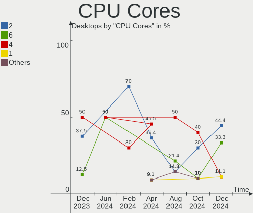

| Number | Desktops | Percent |
|--------|----------|---------|
| 4      | 4        | 44.44%  |
| 6      | 2        | 22.22%  |
| 8      | 1        | 11.11%  |
| 2      | 1        | 11.11%  |
| 1      | 1        | 11.11%  |

CPU Sockets
-----------

Number of sockets

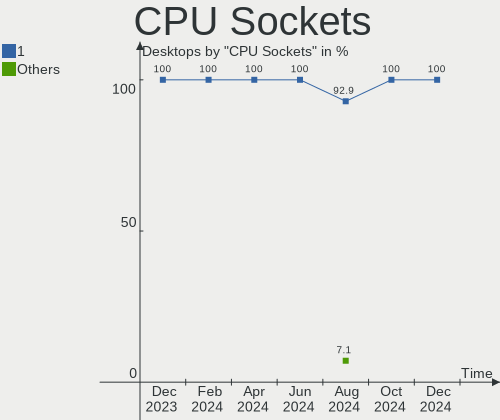

| Number | Desktops | Percent |
|--------|----------|---------|
| 1      | 8        | 88.89%  |
| 2      | 1        | 11.11%  |

CPU Threads
-----------

Threads per core (Hyper-Threading)

| Number | Desktops | Percent |
|--------|----------|---------|
| 2      | 7        | 77.78%  |
| 1      | 2        | 22.22%  |

CPU Op-Modes
------------

CPU Operation Modes (32-bit, 64-bit)

| Op mode        | Desktops | Percent |
|----------------|----------|---------|
| 32-bit, 64-bit | 9        | 100%    |

CPU Microcode
-------------

Microcode number

| Number     | Desktops | Percent |
|------------|----------|---------|
| Unknown    | 5        | 55.56%  |
| 0xa0671    | 1        | 11.11%  |
| 0x306a9    | 1        | 11.11%  |
| 0x206a7    | 1        | 11.11%  |
| 0x0700010f | 1        | 11.11%  |

CPU Microarch
-------------

Microarchitecture

| Name        | Desktops | Percent |
|-------------|----------|---------|
| SandyBridge | 2        | 22.22%  |
| Penryn      | 1        | 11.11%  |
| Nehalem     | 1        | 11.11%  |
| Jaguar      | 1        | 11.11%  |
| IvyBridge   | 1        | 11.11%  |
| Icelake     | 1        | 11.11%  |
| CometLake   | 1        | 11.11%  |
| Bonnell     | 1        | 11.11%  |

Graphics
--------

GPU Vendor
----------

Vendors of graphics cards

| Vendor | Desktops | Percent |
|--------|----------|---------|
| Nvidia | 5        | 55.56%  |
| AMD    | 3        | 33.33%  |
| Intel  | 1        | 11.11%  |

GPU Model
---------

Graphics card models

| Model                                                                     | Desktops | Percent |
|---------------------------------------------------------------------------|----------|---------|
| Nvidia TU117 [GeForce GTX 1650]                                           | 2        | 22.22%  |
| Nvidia GF119 [GeForce GT 610]                                             | 1        | 11.11%  |
| Nvidia G96 [GeForce GT 120 Mac Edition]                                   | 1        | 11.11%  |
| Nvidia G94 [GeForce 9600 GT]                                              | 1        | 11.11%  |
| Intel 2nd Generation Core Processor Family Integrated Graphics Controller | 1        | 11.11%  |
| AMD Seymour [Radeon HD 6400M/7400M Series]                                | 1        | 11.11%  |
| AMD Seymour LP [Radeon HD 6430M]                                          | 1        | 11.11%  |
| AMD Kabini [Radeon HD 8330E]                                              | 1        | 11.11%  |

GPU Combo
---------

Combinations of graphics cards

| Name       | Desktops | Percent |
|------------|----------|---------|
| 1 x Nvidia | 5        | 55.56%  |
| 1 x AMD    | 3        | 33.33%  |
| 1 x Intel  | 1        | 11.11%  |

GPU Driver
----------

Free vs proprietary

| Driver      | Desktops | Percent |
|-------------|----------|---------|
| Free        | 8        | 88.89%  |
| Proprietary | 1        | 11.11%  |

GPU Memory
----------

Total video memory

| Size in GB | Desktops | Percent |
|------------|----------|---------|
| Unknown    | 4        | 44.44%  |
| 3.01-4.0   | 2        | 22.22%  |
| 1.01-2.0   | 1        | 11.11%  |
| 0.51-1.0   | 1        | 11.11%  |
| 0.01-0.5   | 1        | 11.11%  |

Monitor
-------

Monitor Vendor
--------------

Monitor vendors

| Vendor  | Desktops | Percent |
|---------|----------|---------|
| Dell    | 2        | 28.57%  |
| Xiaomi  | 1        | 14.29%  |
| RS      | 1        | 14.29%  |
| Pixio   | 1        | 14.29%  |
| Philips | 1        | 14.29%  |
| Iiyama  | 1        | 14.29%  |

Monitor Model
-------------

Monitor models

| Model                                                   | Desktops | Percent |
|---------------------------------------------------------|----------|---------|
| Xiaomi Mi TV XMD00E1 1440x900 708x398mm 32.0-inch       | 1        | 12.5%   |
| RS LE2262 BTC2262 1680x1050 473x296mm 22.0-inch         | 1        | 12.5%   |
| Pixio DP ICB3500 3440x1440 708x399mm 32.0-inch          | 1        | 12.5%   |
| Philips PHL 246E7 PHLC107 1920x1080 521x293mm 23.5-inch | 1        | 12.5%   |
| Iiyama PL2792H IVM664F 1920x1080 598x336mm 27.0-inch    | 1        | 12.5%   |
| Iiyama PL2791Q IVM6646 2560x1440 597x336mm 27.0-inch    | 1        | 12.5%   |
| Dell SP1908FP DEL4030 1280x1024 376x301mm 19.0-inch     | 1        | 12.5%   |
| Dell E2210 DELD036 1680x1050 473x296mm 22.0-inch        | 1        | 12.5%   |

Monitor Resolution
------------------

Monitor screen resolution

| Resolution         | Desktops | Percent |
|--------------------|----------|---------|
| 1920x1080 (FHD)    | 2        | 28.57%  |
| 3840x2160 (4K)     | 1        | 14.29%  |
| 3440x1440          | 1        | 14.29%  |
| 2560x1440 (QHD)    | 1        | 14.29%  |
| 1680x1050 (WSXGA+) | 1        | 14.29%  |
| 1280x1024 (SXGA)   | 1        | 14.29%  |

Monitor Diagonal
----------------

Diagonal size in inches

| Inches | Desktops | Percent |
|--------|----------|---------|
| 65     | 1        | 16.67%  |
| 32     | 1        | 16.67%  |
| 27     | 1        | 16.67%  |
| 23     | 1        | 16.67%  |
| 22     | 1        | 16.67%  |
| 19     | 1        | 16.67%  |

Monitor Width
-------------

Physical width

| Width in mm | Desktops | Percent |
|-------------|----------|---------|
| 501-600     | 2        | 33.33%  |
| 701-800     | 1        | 16.67%  |
| 401-500     | 1        | 16.67%  |
| 351-400     | 1        | 16.67%  |
| 1001-1500   | 1        | 16.67%  |

Aspect Ratio
------------

Proportional relationship between the width and the height

| Ratio | Desktops | Percent |
|-------|----------|---------|
| 16/9  | 4        | 66.67%  |
| 5/4   | 1        | 16.67%  |
| 16/10 | 1        | 16.67%  |

Monitor Area
------------

Area in inch²

| Area in inch² | Desktops | Percent |
|----------------|----------|---------|
| 201-250        | 2        | 33.33%  |
| More than 1000 | 1        | 16.67%  |
| 351-500        | 1        | 16.67%  |
| 301-350        | 1        | 16.67%  |
| 151-200        | 1        | 16.67%  |

Pixel Density
-------------

Pixels per inch

| Density | Desktops | Percent |
|---------|----------|---------|
| 51-100  | 5        | 71.43%  |
| 101-120 | 2        | 28.57%  |

Multiple Monitors
-----------------

Total monitors connected

| Total | Desktops | Percent |
|-------|----------|---------|
| 1     | 7        | 77.78%  |
| 2     | 2        | 22.22%  |

Network
-------

Net Controller Vendor
---------------------

Controller vendors

| Vendor                | Desktops | Percent |
|-----------------------|----------|---------|
| Realtek Semiconductor | 6        | 50%     |
| Qualcomm Atheros      | 2        | 16.67%  |
| Intel                 | 2        | 16.67%  |
| TP-Link               | 1        | 8.33%   |
| Ralink                | 1        | 8.33%   |

Net Controller Model
--------------------

Controller models

| Model                                                             | Desktops | Percent |
|-------------------------------------------------------------------|----------|---------|
| Realtek RTL8111/8168/8411 PCI Express Gigabit Ethernet Controller | 6        | 50%     |
| TP-Link TL-WN722N v2/v3 [Realtek RTL8188EUS]                      | 1        | 8.33%   |
| Ralink RT3090 Wireless 802.11n 1T/1R PCIe                         | 1        | 8.33%   |
| Qualcomm Atheros AR8151 v2.0 Gigabit Ethernet                     | 1        | 8.33%   |
| Qualcomm Atheros AR8121/AR8113/AR8114 Gigabit or Fast Ethernet    | 1        | 8.33%   |
| Intel 82579LM Gigabit Network Connection (Lewisville)             | 1        | 8.33%   |
| Intel 82574L Gigabit Network Connection                           | 1        | 8.33%   |

Wireless Vendor
---------------

Wireless vendors

| Vendor  | Desktops | Percent |
|---------|----------|---------|
| TP-Link | 1        | 50%     |
| Ralink  | 1        | 50%     |

Wireless Model
--------------

Wireless models

| Model                                        | Desktops | Percent |
|----------------------------------------------|----------|---------|
| TP-Link TL-WN722N v2/v3 [Realtek RTL8188EUS] | 1        | 50%     |
| Ralink RT3090 Wireless 802.11n 1T/1R PCIe    | 1        | 50%     |

Ethernet Vendor
---------------

Ethernet vendors

| Vendor                | Desktops | Percent |
|-----------------------|----------|---------|
| Realtek Semiconductor | 6        | 60%     |
| Qualcomm Atheros      | 2        | 20%     |
| Intel                 | 2        | 20%     |

Ethernet Model
--------------

Ethernet models

| Model                                                             | Desktops | Percent |
|-------------------------------------------------------------------|----------|---------|
| Realtek RTL8111/8168/8411 PCI Express Gigabit Ethernet Controller | 6        | 60%     |
| Qualcomm Atheros AR8151 v2.0 Gigabit Ethernet                     | 1        | 10%     |
| Qualcomm Atheros AR8121/AR8113/AR8114 Gigabit or Fast Ethernet    | 1        | 10%     |
| Intel 82579LM Gigabit Network Connection (Lewisville)             | 1        | 10%     |
| Intel 82574L Gigabit Network Connection                           | 1        | 10%     |

Net Controller Kind
-------------------

Ethernet, WiFi or modem

| Kind     | Desktops | Percent |
|----------|----------|---------|
| Ethernet | 9        | 81.82%  |
| WiFi     | 2        | 18.18%  |

Used Controller
---------------

Currently used network controller

| Kind     | Desktops | Percent |
|----------|----------|---------|
| Ethernet | 8        | 88.89%  |
| WiFi     | 1        | 11.11%  |

NICs
----

Total network controllers on board

| Total | Desktops | Percent |
|-------|----------|---------|
| 1     | 6        | 66.67%  |
| 2     | 3        | 33.33%  |

IPv6
----

IPv6 vs IPv4

| Used | Desktops | Percent |
|------|----------|---------|
| No   | 8        | 88.89%  |
| Yes  | 1        | 11.11%  |

Bluetooth
---------

Bluetooth Vendor
----------------

Controller vendors

| Vendor                  | Desktops | Percent |
|-------------------------|----------|---------|
| Cambridge Silicon Radio | 2        | 100%    |

Bluetooth Model
---------------

Controller models

| Model                                               | Desktops | Percent |
|-----------------------------------------------------|----------|---------|
| Cambridge Silicon Radio Bluetooth Dongle (HCI mode) | 2        | 100%    |

Sound
-----

Sound Vendor
------------

Sound card vendors

| Vendor            | Desktops | Percent |
|-------------------|----------|---------|
| Intel             | 7        | 50%     |
| Nvidia            | 3        | 21.43%  |
| AMD               | 3        | 21.43%  |
| Texas Instruments | 1        | 7.14%   |

Sound Model
-----------

Sound card models

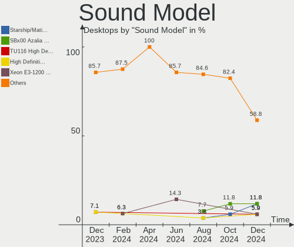

| Model                                                                             | Desktops | Percent |
|-----------------------------------------------------------------------------------|----------|---------|
| Nvidia TU107 GeForce GTX 1650 High Definition Audio Controller                    | 2        | 13.33%  |
| Intel 82801JI (ICH10 Family) HD Audio Controller                                  | 2        | 13.33%  |
| Intel 6 Series/C200 Series Chipset Family High Definition Audio Controller        | 2        | 13.33%  |
| AMD Caicos HDMI Audio [Radeon HD 6450 / 7450/8450/8490 OEM / R5 230/235/235X OEM] | 2        | 13.33%  |
| Texas Instruments PCM2902 Audio Codec                                             | 1        | 6.67%   |
| Nvidia GF119 HDMI Audio Controller                                                | 1        | 6.67%   |
| Intel Tiger Lake-H HD Audio Controller                                            | 1        | 6.67%   |
| Intel Smart Sound Technology (SST) Audio Controller                               | 1        | 6.67%   |
| Intel 7 Series/C216 Chipset Family High Definition Audio Controller               | 1        | 6.67%   |
| AMD Kabini HDMI/DP Audio                                                          | 1        | 6.67%   |
| AMD FCH Azalia Controller                                                         | 1        | 6.67%   |

Memory
------

Memory Vendor
-------------

Memory module vendors

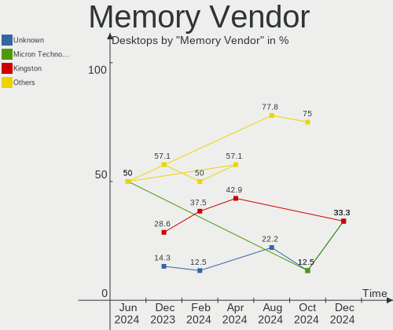

| Vendor              | Desktops | Percent |
|---------------------|----------|---------|
| Unknown             | 1        | 16.67%  |
| SK hynix            | 1        | 16.67%  |
| Samsung Electronics | 1        | 16.67%  |
| Kingston            | 1        | 16.67%  |
| G.Skill             | 1        | 16.67%  |
| Crucial             | 1        | 16.67%  |

Memory Model
------------

Memory module models

| Model                                                      | Desktops | Percent |
|------------------------------------------------------------|----------|---------|
| Unknown RAM Module 4096MB DIMM 1066MT/s                    | 1        | 16.67%  |
| SK hynix RAM HMT451S6BFR8C-PB 4GB SODIMM DDR3 1600MT/s     | 1        | 16.67%  |
| Samsung RAM M378B5773DH0-CH9 2GB DIMM DDR3 1333MT/s        | 1        | 16.67%  |
| Kingston RAM Module 4096MB DIMM DDR3 1333MT/s              | 1        | 16.67%  |
| G.Skill RAM F4-2666C19-16GIS 16GB DIMM DDR4 2667MT/s       | 1        | 16.67%  |
| Crucial RAM BL16G32C16U4R.M16FE 16384MB DIMM DDR4 3200MT/s | 1        | 16.67%  |

Memory Kind
-----------

Memory module kinds

| Kind    | Desktops | Percent |
|---------|----------|---------|
| DDR4    | 2        | 33.33%  |
| DDR3    | 2        | 33.33%  |
| SDRAM   | 1        | 16.67%  |
| Unknown | 1        | 16.67%  |

Memory Form Factor
------------------

Physical design of the memory module

| Name   | Desktops | Percent |
|--------|----------|---------|
| DIMM   | 5        | 83.33%  |
| SODIMM | 1        | 16.67%  |

Memory Size
-----------

Memory module size

| Size  | Desktops | Percent |
|-------|----------|---------|
| 4096  | 3        | 50%     |
| 16384 | 2        | 33.33%  |
| 2048  | 1        | 16.67%  |

Memory Speed
------------

Memory module speed

| Speed | Desktops | Percent |
|-------|----------|---------|
| 1333  | 2        | 33.33%  |
| 3200  | 1        | 16.67%  |
| 2667  | 1        | 16.67%  |
| 1600  | 1        | 16.67%  |
| 1066  | 1        | 16.67%  |

Printers & scanners
-------------------

Printer Vendor
--------------

Printer device vendors

Zero info for selected period =(

Printer Model
-------------

Printer device models

Zero info for selected period =(

Scanner Vendor
--------------

Scanner device vendors

Zero info for selected period =(

Scanner Model
-------------

Scanner device models

Zero info for selected period =(

Camera
------

Camera Vendor
-------------

Camera device vendors

| Vendor   | Desktops | Percent |
|----------|----------|---------|
| Logitech | 1        | 100%    |

Camera Model
------------

Camera device models

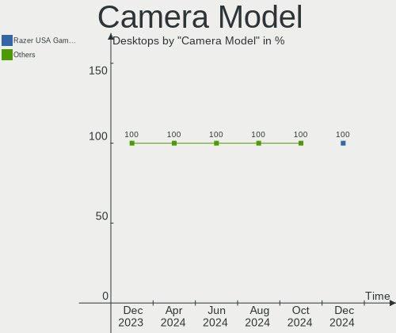

| Model                | Desktops | Percent |
|----------------------|----------|---------|
| Logitech Webcam C270 | 1        | 100%    |

Security
--------

Fingerprint Vendor
------------------

Fingerprint sensor vendors

Zero info for selected period =(

Fingerprint Model
-----------------

Fingerprint sensor models

Zero info for selected period =(

Chipcard Vendor
---------------

Chipcard module vendors

Zero info for selected period =(

Chipcard Model
--------------

Chipcard module models

Zero info for selected period =(

Unsupported
-----------

Unsupported Devices
-------------------

Total unsupported devices on board

| Total | Desktops | Percent |
|-------|----------|---------|
| 0     | 7        | 77.78%  |
| 1     | 2        | 22.22%  |

Unsupported Device Types
------------------------

Types of unsupported devices

| Type             | Desktops | Percent |
|------------------|----------|---------|
| Unassigned class | 1        | 50%     |
| Storage/raid     | 1        | 50%     |

