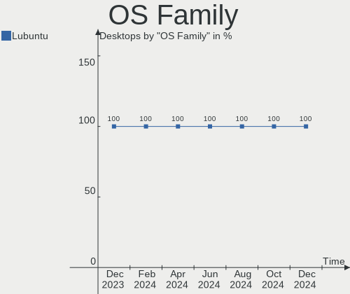
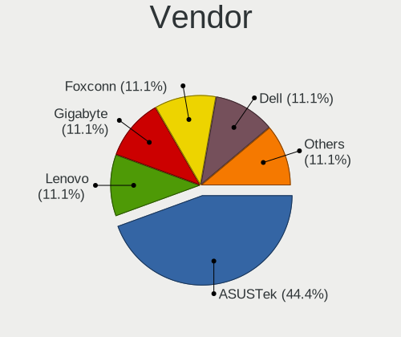
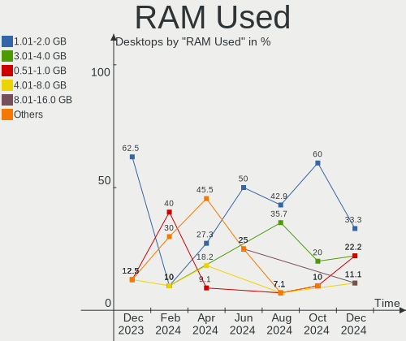
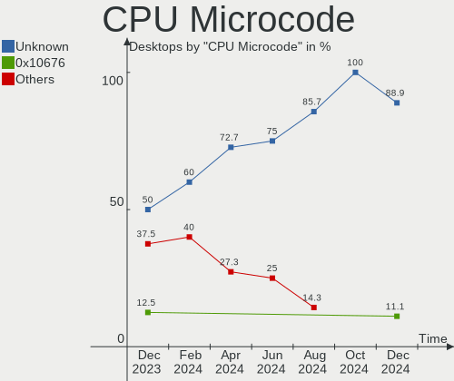
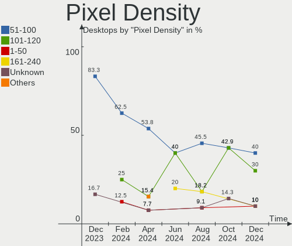
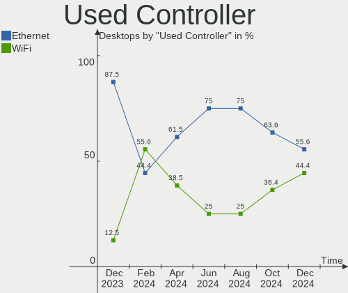
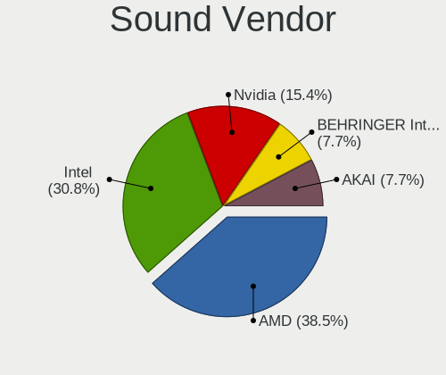

Lubuntu - Hardware Trends (Desktops)
------------------------------------

A project to identify most popular hardware characteristics and track their change
over time based on data collected by Linux users at https://Linux-Hardware.org.

Anyone can contribute to this report by the [hw-probe](https://github.com/linuxhw/hw-probe) tool:

    sudo -E hw-probe -all -upload

This report is for one last month. Overall report since the beginning of time: [TestCoverage](https://github.com/linuxhw/TestCoverage)

Period: Sep, 2022.

Contents
--------

* [ System ](#system)
  - [ OS                       ](#os)
  - [ OS Family                ](#os-family)
  - [ Kernel                   ](#kernel)
  - [ Kernel Family            ](#kernel-family)
  - [ Kernel Major Ver.        ](#kernel-major-ver)
  - [ Arch                     ](#arch)
  - [ DE                       ](#de)
  - [ Display Server           ](#display-server)
  - [ Display Manager          ](#display-manager)
  - [ OS Lang                  ](#os-lang)
  - [ Boot Mode                ](#boot-mode)
  - [ Filesystem               ](#filesystem)
  - [ Part. scheme             ](#part-scheme)
  - [ Dual Boot with Linux/BSD ](#dual-boot-with-linuxbsd)
  - [ Dual Boot (Win)          ](#dual-boot-win)

* [ Board ](#board)
  - [ Vendor                   ](#vendor)
  - [ Model                    ](#model)
  - [ Model Family             ](#model-family)
  - [ MFG Year                 ](#mfg-year)
  - [ Form Factor              ](#form-factor)
  - [ Secure Boot              ](#secure-boot)
  - [ Coreboot                 ](#coreboot)
  - [ RAM Size                 ](#ram-size)
  - [ RAM Used                 ](#ram-used)
  - [ Total Drives             ](#total-drives)
  - [ Has CD-ROM               ](#has-cd-rom)
  - [ Has Ethernet             ](#has-ethernet)
  - [ Has WiFi                 ](#has-wifi)
  - [ Has Bluetooth            ](#has-bluetooth)

* [ Location ](#location)
  - [ Country                  ](#country)
  - [ City                     ](#city)

* [ Drives ](#drives)
  - [ Drive Vendor             ](#drive-vendor)
  - [ Drive Model              ](#drive-model)
  - [ HDD Vendor               ](#hdd-vendor)
  - [ SSD Vendor               ](#ssd-vendor)
  - [ Drive Kind               ](#drive-kind)
  - [ Drive Connector          ](#drive-connector)
  - [ Drive Size               ](#drive-size)
  - [ Space Total              ](#space-total)
  - [ Space Used               ](#space-used)
  - [ Malfunc. Drives          ](#malfunc-drives)
  - [ Malfunc. Drive Vendor    ](#malfunc-drive-vendor)
  - [ Malfunc. HDD Vendor      ](#malfunc-hdd-vendor)
  - [ Malfunc. Drive Kind      ](#malfunc-drive-kind)
  - [ Failed Drives            ](#failed-drives)
  - [ Failed Drive Vendor      ](#failed-drive-vendor)
  - [ Drive Status             ](#drive-status)

* [ Storage controller ](#storage-controller)
  - [ Storage Vendor           ](#storage-vendor)
  - [ Storage Model            ](#storage-model)
  - [ Storage Kind             ](#storage-kind)

* [ Processor ](#processor)
  - [ CPU Vendor               ](#cpu-vendor)
  - [ CPU Model                ](#cpu-model)
  - [ CPU Model Family         ](#cpu-model-family)
  - [ CPU Cores                ](#cpu-cores)
  - [ CPU Sockets              ](#cpu-sockets)
  - [ CPU Threads              ](#cpu-threads)
  - [ CPU Op-Modes             ](#cpu-op-modes)
  - [ CPU Microcode            ](#cpu-microcode)
  - [ CPU Microarch            ](#cpu-microarch)

* [ Graphics ](#graphics)
  - [ GPU Vendor               ](#gpu-vendor)
  - [ GPU Model                ](#gpu-model)
  - [ GPU Combo                ](#gpu-combo)
  - [ GPU Driver               ](#gpu-driver)
  - [ GPU Memory               ](#gpu-memory)

* [ Monitor ](#monitor)
  - [ Monitor Vendor           ](#monitor-vendor)
  - [ Monitor Model            ](#monitor-model)
  - [ Monitor Resolution       ](#monitor-resolution)
  - [ Monitor Diagonal         ](#monitor-diagonal)
  - [ Monitor Width            ](#monitor-width)
  - [ Aspect Ratio             ](#aspect-ratio)
  - [ Monitor Area             ](#monitor-area)
  - [ Pixel Density            ](#pixel-density)
  - [ Multiple Monitors        ](#multiple-monitors)

* [ Network ](#network)
  - [ Net Controller Vendor    ](#net-controller-vendor)
  - [ Net Controller Model     ](#net-controller-model)
  - [ Wireless Vendor          ](#wireless-vendor)
  - [ Wireless Model           ](#wireless-model)
  - [ Ethernet Vendor          ](#ethernet-vendor)
  - [ Ethernet Model           ](#ethernet-model)
  - [ Net Controller Kind      ](#net-controller-kind)
  - [ Used Controller          ](#used-controller)
  - [ NICs                     ](#nics)
  - [ IPv6                     ](#ipv6)

* [ Bluetooth ](#bluetooth)
  - [ Bluetooth Vendor         ](#bluetooth-vendor)
  - [ Bluetooth Model          ](#bluetooth-model)

* [ Sound ](#sound)
  - [ Sound Vendor             ](#sound-vendor)
  - [ Sound Model              ](#sound-model)

* [ Memory ](#memory)
  - [ Memory Vendor            ](#memory-vendor)
  - [ Memory Model             ](#memory-model)
  - [ Memory Kind              ](#memory-kind)
  - [ Memory Form Factor       ](#memory-form-factor)
  - [ Memory Size              ](#memory-size)
  - [ Memory Speed             ](#memory-speed)

* [ Printers & scanners ](#printers--scanners)
  - [ Printer Vendor           ](#printer-vendor)
  - [ Printer Model            ](#printer-model)
  - [ Scanner Vendor           ](#scanner-vendor)
  - [ Scanner Model            ](#scanner-model)

* [ Camera ](#camera)
  - [ Camera Vendor            ](#camera-vendor)
  - [ Camera Model             ](#camera-model)

* [ Security ](#security)
  - [ Fingerprint Vendor       ](#fingerprint-vendor)
  - [ Fingerprint Model        ](#fingerprint-model)
  - [ Chipcard Vendor          ](#chipcard-vendor)
  - [ Chipcard Model           ](#chipcard-model)

* [ Unsupported ](#unsupported)
  - [ Unsupported Devices      ](#unsupported-devices)
  - [ Unsupported Device Types ](#unsupported-device-types)

System
------

OS
--

Installed operating systems

| Name          | Desktops | Percent |
|---------------|----------|---------|
| Lubuntu 22.04 | 6        | 60%     |
| Lubuntu 20.04 | 2        | 20%     |
| Lubuntu 21.10 | 1        | 10%     |
| Lubuntu 18.04 | 1        | 10%     |

OS Family
---------

OS without a version

| Name    | Desktops | Percent |
|---------|----------|---------|
| Lubuntu | 10       | 100%    |

Kernel
------

Version of the Linux kernel

| Version            | Desktops | Percent |
|--------------------|----------|---------|
| 5.15.0-48-generic  | 3        | 30%     |
| 5.15.0-47-generic  | 3        | 30%     |
| 5.4.0-91-generic   | 1        | 10%     |
| 5.15.0-46-generic  | 1        | 10%     |
| 5.13.0-52-generic  | 1        | 10%     |
| 4.15.0-191-generic | 1        | 10%     |

Kernel Family
-------------

Linux kernel without a distro release

| Version | Desktops | Percent |
|---------|----------|---------|
| 5.15.0  | 7        | 70%     |
| 5.4.0   | 1        | 10%     |
| 5.13.0  | 1        | 10%     |
| 4.15.0  | 1        | 10%     |

Kernel Major Ver.
-----------------

Linux kernel major version

| Version | Desktops | Percent |
|---------|----------|---------|
| 5.15    | 7        | 70%     |
| 5.4     | 1        | 10%     |
| 5.13    | 1        | 10%     |
| 4.15    | 1        | 10%     |

Arch
----

OS architecture (x86_64, i586, etc.)

| Name   | Desktops | Percent |
|--------|----------|---------|
| x86_64 | 10       | 100%    |

DE
--

Desktop Environment

| Name | Desktops | Percent |
|------|----------|---------|
| LXQt | 9        | 90%     |
| LXDE | 1        | 10%     |

Display Server
--------------

X11 or Wayland

| Name | Desktops | Percent |
|------|----------|---------|
| X11  | 10       | 100%    |

Display Manager
---------------

SDDM, LightDM, etc.

| Name    | Desktops | Percent |
|---------|----------|---------|
| SDDM    | 6        | 60%     |
| Unknown | 3        | 30%     |
| LightDM | 1        | 10%     |

OS Lang
-------

Language

| Lang  | Desktops | Percent |
|-------|----------|---------|
| en_US | 6        | 60%     |
| fr_FR | 1        | 10%     |
| es_AR | 1        | 10%     |
| en_AU | 1        | 10%     |
| en_AG | 1        | 10%     |

Boot Mode
---------

EFI or BIOS

| Mode | Desktops | Percent |
|------|----------|---------|
| BIOS | 9        | 90%     |
| EFI  | 1        | 10%     |

Filesystem
----------

Type of filesystem

| Type | Desktops | Percent |
|------|----------|---------|
| Ext4 | 10       | 100%    |

Part. scheme
------------

Scheme of partitioning

| Type    | Desktops | Percent |
|---------|----------|---------|
| Unknown | 9        | 90%     |
| MBR     | 1        | 10%     |

Dual Boot with Linux/BSD
------------------------

Hosting more than one Linux/BSD

| Dual boot | Desktops | Percent |
|-----------|----------|---------|
| No        | 8        | 80%     |
| Yes       | 2        | 20%     |

Dual Boot (Win)
---------------

Hosting Linux and Windows

| Dual boot | Desktops | Percent |
|-----------|----------|---------|
| No        | 9        | 90%     |
| Yes       | 1        | 10%     |

Board
-----

Vendor
------

Motherboard manufacturer

| Name                | Desktops | Percent |
|---------------------|----------|---------|
| Dell                | 4        | 40%     |
| ASUSTek Computer    | 2        | 20%     |
| MSI                 | 1        | 10%     |
| Intel               | 1        | 10%     |
| Gigabyte Technology | 1        | 10%     |
| AMI                 | 1        | 10%     |

Model
-----

Motherboard model

| Name                      | Desktops | Percent |
|---------------------------|----------|---------|
| MSI MS-7B86               | 1        | 10%     |
| Intel DH67CL AAG10212-210 | 1        | 10%     |
| Gigabyte G31M-ES2C        | 1        | 10%     |
| Dell Vostro 410           | 1        | 10%     |
| Dell Studio XPS 435MT     | 1        | 10%     |
| Dell Precision T3610      | 1        | 10%     |
| Dell OptiPlex 755         | 1        | 10%     |
| ASUS P8P67                | 1        | 10%     |
| ASUS Maximus V FORMULA    | 1        | 10%     |
| AMI Narrow Box 4K         | 1        | 10%     |

Model Family
------------

Motherboard model prefix

| Name               | Desktops | Percent |
|--------------------|----------|---------|
| MSI MS-7B86        | 1        | 10%     |
| Intel DH67CL       | 1        | 10%     |
| Gigabyte G31M-ES2C | 1        | 10%     |
| Dell Vostro        | 1        | 10%     |
| Dell Studio        | 1        | 10%     |
| Dell Precision     | 1        | 10%     |
| Dell OptiPlex      | 1        | 10%     |
| ASUS P8P67         | 1        | 10%     |
| ASUS Maximus       | 1        | 10%     |
| AMI Narrow         | 1        | 10%     |

MFG Year
--------

Motherboard manufacture year

| Year | Desktops | Percent |
|------|----------|---------|
| 2008 | 3        | 30%     |
| 2013 | 2        | 20%     |
| 2019 | 1        | 10%     |
| 2016 | 1        | 10%     |
| 2011 | 1        | 10%     |
| 2010 | 1        | 10%     |
| 2007 | 1        | 10%     |

Form Factor
-----------

Physical design of the computer

| Name    | Desktops | Percent |
|---------|----------|---------|
| Desktop | 10       | 100%    |

Secure Boot
-----------

Enabled or disabled

| State    | Desktops | Percent |
|----------|----------|---------|
| Disabled | 10       | 100%    |

Coreboot
--------

Have coreboot on board

| Used | Desktops | Percent |
|------|----------|---------|
| No   | 10       | 100%    |

RAM Size
--------

Total RAM memory

| Size in GB | Desktops | Percent |
|------------|----------|---------|
| 3.01-4.0   | 3        | 30%     |
| 32.01-64.0 | 2        | 20%     |
| 8.01-16.0  | 2        | 20%     |
| 4.01-8.0   | 1        | 10%     |
| 16.01-24.0 | 1        | 10%     |
| 1.01-2.0   | 1        | 10%     |

RAM Used
--------

Used RAM memory

| Used GB  | Desktops | Percent |
|----------|----------|---------|
| 2.01-3.0 | 3        | 30%     |
| 3.01-4.0 | 2        | 20%     |
| 1.01-2.0 | 2        | 20%     |
| 0.51-1.0 | 2        | 20%     |
| 4.01-8.0 | 1        | 10%     |

Total Drives
------------

Number of drives on board

| Drives | Desktops | Percent |
|--------|----------|---------|
| 1      | 6        | 60%     |
| 2      | 2        | 20%     |
| 7      | 1        | 10%     |
| 6      | 1        | 10%     |

Has CD-ROM
----------

Has CD-ROM on board

| Presented | Desktops | Percent |
|-----------|----------|---------|
| Yes       | 7        | 70%     |
| No        | 3        | 30%     |

Has Ethernet
------------

Has Ethernet on board

| Presented | Desktops | Percent |
|-----------|----------|---------|
| Yes       | 10       | 100%    |

Has WiFi
--------

Has WiFi module

| Presented | Desktops | Percent |
|-----------|----------|---------|
| No        | 7        | 70%     |
| Yes       | 3        | 30%     |

Has Bluetooth
-------------

Has Bluetooth module

| Presented | Desktops | Percent |
|-----------|----------|---------|
| No        | 6        | 60%     |
| Yes       | 4        | 40%     |

Location
--------

Country
-------

Geographic location (country)

| Country   | Desktops | Percent |
|-----------|----------|---------|
| USA       | 6        | 60%     |
| Poland    | 1        | 10%     |
| France    | 1        | 10%     |
| Australia | 1        | 10%     |
| Argentina | 1        | 10%     |

City
----

Geographic location (city)

| City                 | Desktops | Percent |
|----------------------|----------|---------|
| Washington           | 1        | 10%     |
| Resistencia          | 1        | 10%     |
| Ostrów Wielkopolski | 1        | 10%     |
| Ooltewah             | 1        | 10%     |
| Nederland            | 1        | 10%     |
| Mobile               | 1        | 10%     |
| Melbourne            | 1        | 10%     |
| Los Angeles          | 1        | 10%     |
| Hayange              | 1        | 10%     |
| Dallas               | 1        | 10%     |

Drives
------

Drive Vendor
------------

Hard drive vendors

| Vendor              | Desktops | Drives | Percent |
|---------------------|----------|--------|---------|
| WDC                 | 5        | 6      | 27.78%  |
| Hitachi             | 4        | 5      | 22.22%  |
| Seagate             | 2        | 2      | 11.11%  |
| Unknown             | 1        | 1      | 5.56%   |
| Toshiba             | 1        | 1      | 5.56%   |
| T-FORCE             | 1        | 1      | 5.56%   |
| SanDisk             | 1        | 1      | 5.56%   |
| Samsung Electronics | 1        | 3      | 5.56%   |
| HGST HUS            | 1        | 2      | 5.56%   |
| External            | 1        | 1      | 5.56%   |

Drive Model
-----------

Hard drive models

| Model                                    | Desktops | Percent |
|------------------------------------------|----------|---------|
| WDC WDS500G2B0A-00SM50 500GB SSD         | 1        | 5%      |
| WDC WD3200BPVT-00HXZT3 320GB             | 1        | 5%      |
| WDC WD3200BEVT-75ZCT2 320GB              | 1        | 5%      |
| WDC WD3200BEVT-22ZCT0 320GB              | 1        | 5%      |
| WDC WD2500AAKX-00ERMA0 250GB             | 1        | 5%      |
| WDC WD20EZRX-00D8PB0 2TB                 | 1        | 5%      |
| Unknown 032G72  32GB                     | 1        | 5%      |
| Toshiba MK5061GSY 500GB                  | 1        | 5%      |
| T-FORCE 1TB                              | 1        | 5%      |
| Seagate ST500LM000-1EJ162 500GB          | 1        | 5%      |
| Seagate ST500DM002-1BD142 500GB          | 1        | 5%      |
| SanDisk SSD PLUS 1000GB                  | 1        | 5%      |
| Samsung SSD 840 PRO Series 128GB         | 1        | 5%      |
| Samsung MZ7PA128HMCD-010L1 128GB SSD     | 1        | 5%      |
| Hitachi HUS724030ALE641 3TB              | 1        | 5%      |
| Hitachi HDT722525DLA380 41N3150LEN 250GB | 1        | 5%      |
| Hitachi HDS722525VLSA80 250GB            | 1        | 5%      |
| Hitachi HDP725050GLA360 500GB            | 1        | 5%      |
| HGST HUS 726060ALE614 6TB                | 1        | 5%      |
| External USB 3.0 4TB                     | 1        | 5%      |

HDD Vendor
----------

Hard disk drive vendors

| Vendor   | Desktops | Drives | Percent |
|----------|----------|--------|---------|
| WDC      | 5        | 5      | 38.46%  |
| Hitachi  | 4        | 5      | 30.77%  |
| Seagate  | 2        | 2      | 15.38%  |
| Toshiba  | 1        | 1      | 7.69%   |
| External | 1        | 1      | 7.69%   |

SSD Vendor
----------

Solid state drive vendors

| Vendor              | Desktops | Drives | Percent |
|---------------------|----------|--------|---------|
| WDC                 | 1        | 1      | 33.33%  |
| SanDisk             | 1        | 1      | 33.33%  |
| Samsung Electronics | 1        | 3      | 33.33%  |

Drive Kind
----------

HDD or SSD

| Kind    | Desktops | Drives | Percent |
|---------|----------|--------|---------|
| HDD     | 9        | 14     | 64.29%  |
| SSD     | 3        | 5      | 21.43%  |
| MMC     | 1        | 1      | 7.14%   |
| Unknown | 1        | 3      | 7.14%   |

Drive Connector
---------------

SATA, SAS, NVMe, etc.

| Type | Desktops | Drives | Percent |
|------|----------|--------|---------|
| SATA | 9        | 19     | 81.82%  |
| SAS  | 1        | 3      | 9.09%   |
| MMC  | 1        | 1      | 9.09%   |

Drive Size
----------

Size of hard drive

| Size in TB | Desktops | Drives | Percent |
|------------|----------|--------|---------|
| 0.01-0.5   | 8        | 14     | 66.67%  |
| 3.01-4.0   | 1        | 1      | 8.33%   |
| 2.01-3.0   | 1        | 2      | 8.33%   |
| 1.01-2.0   | 1        | 1      | 8.33%   |
| 0.51-1.0   | 1        | 1      | 8.33%   |

Space Total
-----------

Amount of disk space available on the file system

| Size in GB     | Desktops | Percent |
|----------------|----------|---------|
| 251-500        | 3        | 30%     |
| 101-250        | 3        | 30%     |
| More than 3000 | 2        | 20%     |
| 21-50          | 2        | 20%     |

Space Used
----------

Amount of used disk space

| Used GB        | Desktops | Percent |
|----------------|----------|---------|
| 1-20           | 4        | 40%     |
| 21-50          | 3        | 30%     |
| More than 3000 | 1        | 10%     |
| 2001-3000      | 1        | 10%     |
| 101-250        | 1        | 10%     |

Malfunc. Drives
---------------

Drive models with a malfunction

| Model                           | Desktops | Drives | Percent |
|---------------------------------|----------|--------|---------|
| Seagate ST500DM002-1BD142 500GB | 1        | 1      | 100%    |

Malfunc. Drive Vendor
---------------------

Vendors of faulty drives

| Vendor  | Desktops | Drives | Percent |
|---------|----------|--------|---------|
| Seagate | 1        | 1      | 100%    |

Malfunc. HDD Vendor
-------------------

Vendors of faulty HDD drives

| Vendor  | Desktops | Drives | Percent |
|---------|----------|--------|---------|
| Seagate | 1        | 1      | 100%    |

Malfunc. Drive Kind
-------------------

Kinds of faulty drives

| Kind | Desktops | Drives | Percent |
|------|----------|--------|---------|
| HDD  | 1        | 1      | 100%    |

Failed Drives
-------------

Failed drive models

Zero info for selected period =(

Failed Drive Vendor
-------------------

Failed drive vendors

Zero info for selected period =(

Drive Status
------------

Number of failed and malfunc. drives

| Status   | Desktops | Drives | Percent |
|----------|----------|--------|---------|
| Detected | 9        | 22     | 90%     |
| Malfunc  | 1        | 1      | 10%     |

Storage controller
------------------

Storage Vendor
--------------

Storage controller vendors

| Vendor                   | Desktops | Percent |
|--------------------------|----------|---------|
| Intel                    | 8        | 66.67%  |
| Marvell Technology Group | 2        | 16.67%  |
| ASMedia Technology       | 1        | 8.33%   |
| AMD                      | 1        | 8.33%   |

Storage Model
-------------

Storage controller models

| Model                                                                         | Desktops | Percent |
|-------------------------------------------------------------------------------|----------|---------|
| Intel 6 Series/C200 Series Chipset Family 6 port Desktop SATA AHCI Controller | 2        | 12.5%   |
| Marvell Group 88SE9215 PCIe 2.0 x1 4-port SATA 6 Gb/s Controller              | 1        | 6.25%   |
| Marvell Group 88SE9172 SATA 6Gb/s Controller                                  | 1        | 6.25%   |
| Intel NM10/ICH7 Family SATA Controller [IDE mode]                             | 1        | 6.25%   |
| Intel C600/X79 series chipset 6-Port SATA AHCI Controller                     | 1        | 6.25%   |
| Intel 82Q35 Express PT IDER Controller                                        | 1        | 6.25%   |
| Intel 82801JI (ICH10 Family) 4 port SATA IDE Controller #1                    | 1        | 6.25%   |
| Intel 82801JI (ICH10 Family) 2 port SATA IDE Controller #2                    | 1        | 6.25%   |
| Intel 82801IR/IO/IH (ICH9R/DO/DH) 6 port SATA Controller [AHCI mode]          | 1        | 6.25%   |
| Intel 82801IR/IO/IH (ICH9R/DO/DH) 4 port SATA Controller [IDE mode]           | 1        | 6.25%   |
| Intel 82801I (ICH9 Family) 2 port SATA Controller [IDE mode]                  | 1        | 6.25%   |
| Intel 7 Series/C210 Series Chipset Family 6-port SATA Controller [AHCI mode]  | 1        | 6.25%   |
| ASMedia ASM1062 Serial ATA Controller                                         | 1        | 6.25%   |
| AMD FCH SATA Controller [AHCI mode]                                           | 1        | 6.25%   |
| AMD 400 Series Chipset SATA Controller                                        | 1        | 6.25%   |

Storage Kind
------------

Kind of storage controller (IDE, SATA, NVMe, SAS, ...)

| Kind | Desktops | Percent |
|------|----------|---------|
| SATA | 6        | 60%     |
| IDE  | 4        | 40%     |

Processor
---------

CPU Vendor
----------

Processor vendors

| Vendor | Desktops | Percent |
|--------|----------|---------|
| Intel  | 9        | 90%     |
| AMD    | 1        | 10%     |

CPU Model
---------

Processor models

| Model                                  | Desktops | Percent |
|----------------------------------------|----------|---------|
| Intel Xeon CPU E5-1607 v2 @ 3.00GHz    | 1        | 10%     |
| Intel Pentium Dual CPU E2200 @ 2.20GHz | 1        | 10%     |
| Intel Core i7-3770K CPU @ 3.50GHz      | 1        | 10%     |
| Intel Core i7-2600 CPU @ 3.40GHz       | 1        | 10%     |
| Intel Core i7 CPU 920 @ 2.67GHz        | 1        | 10%     |
| Intel Core i5-3470 CPU @ 3.20GHz       | 1        | 10%     |
| Intel Core 2 Quad CPU Q6600 @ 2.40GHz  | 1        | 10%     |
| Intel Core 2 Duo CPU E7200 @ 2.53GHz   | 1        | 10%     |
| Intel Atom x5-Z8300 CPU @ 1.44GHz      | 1        | 10%     |
| AMD Ryzen 5 1600 Six-Core Processor    | 1        | 10%     |

CPU Model Family
----------------

Processor model prefix

| Model              | Desktops | Percent |
|--------------------|----------|---------|
| Intel Core i7      | 3        | 30%     |
| Intel Xeon         | 1        | 10%     |
| Intel Pentium Dual | 1        | 10%     |
| Intel Core i5      | 1        | 10%     |
| Intel Core 2 Quad  | 1        | 10%     |
| Intel Core 2 Duo   | 1        | 10%     |
| Intel Atom         | 1        | 10%     |
| AMD Ryzen 5        | 1        | 10%     |

CPU Cores
---------

Number of processor cores

| Number | Desktops | Percent |
|--------|----------|---------|
| 4      | 7        | 70%     |
| 2      | 2        | 20%     |
| 6      | 1        | 10%     |

CPU Sockets
-----------

Number of sockets

| Number | Desktops | Percent |
|--------|----------|---------|
| 1      | 10       | 100%    |

CPU Threads
-----------

Threads per core (Hyper-Threading)

| Number | Desktops | Percent |
|--------|----------|---------|
| 1      | 6        | 60%     |
| 2      | 4        | 40%     |

CPU Op-Modes
------------

CPU Operation Modes (32-bit, 64-bit)

| Op mode        | Desktops | Percent |
|----------------|----------|---------|
| 32-bit, 64-bit | 10       | 100%    |

CPU Microcode
-------------

Microcode number

| Number  | Desktops | Percent |
|---------|----------|---------|
| Unknown | 6        | 60%     |
| 0x306a9 | 2        | 20%     |
| 0x6fd   | 1        | 10%     |
| 0x6fb   | 1        | 10%     |

CPU Microarch
-------------

Microarchitecture

| Name        | Desktops | Percent |
|-------------|----------|---------|
| IvyBridge   | 3        | 30%     |
| Core        | 2        | 20%     |
| Zen+        | 1        | 10%     |
| Silvermont  | 1        | 10%     |
| SandyBridge | 1        | 10%     |
| Penryn      | 1        | 10%     |
| Nehalem     | 1        | 10%     |

Graphics
--------

GPU Vendor
----------

Vendors of graphics cards

| Vendor | Desktops | Percent |
|--------|----------|---------|
| Intel  | 4        | 36.36%  |
| AMD    | 4        | 36.36%  |
| Nvidia | 3        | 27.27%  |

GPU Model
---------

Graphics card models

| Model                                                                                    | Desktops | Percent |
|------------------------------------------------------------------------------------------|----------|---------|
| AMD RV620 LE [Radeon HD 3450]                                                            | 2        | 18.18%  |
| Nvidia GK106GL [Quadro K4000]                                                            | 1        | 9.09%   |
| Nvidia GF119 [GeForce GT 610]                                                            | 1        | 9.09%   |
| Nvidia GF108 [GeForce GT 730]                                                            | 1        | 9.09%   |
| Intel Xeon E3-1200 v2/3rd Gen Core processor Graphics Controller                         | 1        | 9.09%   |
| Intel IvyBridge GT2 [HD Graphics 4000]                                                   | 1        | 9.09%   |
| Intel Atom/Celeron/Pentium Processor x5-E8000/J3xxx/N3xxx Integrated Graphics Controller | 1        | 9.09%   |
| Intel 82Q35 Express Integrated Graphics Controller                                       | 1        | 9.09%   |
| AMD Barts XT [Radeon HD 6870]                                                            | 1        | 9.09%   |
| AMD Baffin [Radeon RX 460/560D / Pro 450/455/460/555/555X/560/560X]                      | 1        | 9.09%   |

GPU Combo
---------

Combinations of graphics cards

| Name        | Desktops | Percent |
|-------------|----------|---------|
| 1 x Nvidia  | 3        | 30%     |
| 1 x Intel   | 3        | 30%     |
| 1 x AMD     | 3        | 30%     |
| Intel + AMD | 1        | 10%     |

GPU Driver
----------

Free vs proprietary

| Driver      | Desktops | Percent |
|-------------|----------|---------|
| Free        | 9        | 90%     |
| Proprietary | 1        | 10%     |

GPU Memory
----------

Total video memory

| Size in GB | Desktops | Percent |
|------------|----------|---------|
| Unknown    | 6        | 60%     |
| 0.01-0.5   | 2        | 20%     |
| 2.01-3.0   | 1        | 10%     |
| 0.51-1.0   | 1        | 10%     |

Monitor
-------

Monitor Vendor
--------------

Monitor vendors

| Vendor              | Desktops | Percent |
|---------------------|----------|---------|
| Samsung Electronics | 2        | 22.22%  |
| Dell                | 2        | 22.22%  |
| Unknown             | 1        | 11.11%  |
| Sony                | 1        | 11.11%  |
| Lenovo              | 1        | 11.11%  |
| Goldstar            | 1        | 11.11%  |
| eMachines           | 1        | 11.11%  |

Monitor Model
-------------

Monitor models

| Model                                                                   | Desktops | Percent |
|-------------------------------------------------------------------------|----------|---------|
| Unknown LCD Monitor DELL3007WFPHC 2560x1600                             | 1        | 10%     |
| Sony TV SNY9C01 1920x1080                                               | 1        | 10%     |
| Samsung Electronics SyncMaster SAM022F 1280x1024 312x234mm 15.4-inch    | 1        | 10%     |
| Samsung Electronics LCD Monitor SAM0D3B 3840x2160 1872x1053mm 84.6-inch | 1        | 10%     |
| Lenovo D27-30 LEN66B8 1920x1080 597x336mm 27.0-inch                     | 1        | 10%     |
| Goldstar M2394D GSM56C4 1920x1080 510x280mm 22.9-inch                   | 1        | 10%     |
| eMachines e15t4 EMA061C 1024x768 304x228mm 15.0-inch                    | 1        | 10%     |
| Dell E2209W DELD01F 1680x1050 473x296mm 22.0-inch                       | 1        | 10%     |
| Dell E2209W DELD01E 1680x1050 473x296mm 22.0-inch                       | 1        | 10%     |
| Dell 2001FP DELA008 1600x1200 367x275mm 18.1-inch                       | 1        | 10%     |

Monitor Resolution
------------------

Monitor screen resolution

| Resolution         | Desktops | Percent |
|--------------------|----------|---------|
| 1920x1080 (FHD)    | 3        | 33.33%  |
| 3840x2160 (4K)     | 1        | 11.11%  |
| 2560x1600          | 1        | 11.11%  |
| 1680x1050 (WSXGA+) | 1        | 11.11%  |
| 1600x1200          | 1        | 11.11%  |
| 1280x1024 (SXGA)   | 1        | 11.11%  |
| 1024x768 (XGA)     | 1        | 11.11%  |

Monitor Diagonal
----------------

Diagonal size in inches

| Inches  | Desktops | Percent |
|---------|----------|---------|
| 15      | 2        | 22.22%  |
| 84      | 1        | 11.11%  |
| 72      | 1        | 11.11%  |
| 27      | 1        | 11.11%  |
| 23      | 1        | 11.11%  |
| 22      | 1        | 11.11%  |
| 20      | 1        | 11.11%  |
| Unknown | 1        | 11.11%  |

Monitor Width
-------------

Physical width

| Width in mm | Desktops | Percent |
|-------------|----------|---------|
| 501-600     | 2        | 22.22%  |
| 401-500     | 2        | 22.22%  |
| 301-350     | 2        | 22.22%  |
| 1501-2000   | 2        | 22.22%  |
| Unknown     | 1        | 11.11%  |

Aspect Ratio
------------

Proportional relationship between the width and the height

| Ratio   | Desktops | Percent |
|---------|----------|---------|
| 16/9    | 4        | 44.44%  |
| 4/3     | 3        | 33.33%  |
| 16/10   | 1        | 11.11%  |
| Unknown | 1        | 11.11%  |

Monitor Area
------------

Area in inch²

| Area in inch² | Desktops | Percent |
|----------------|----------|---------|
| More than 1000 | 2        | 22.22%  |
| 201-250        | 2        | 22.22%  |
| 301-350        | 1        | 11.11%  |
| 151-200        | 1        | 11.11%  |
| 111-120        | 1        | 11.11%  |
| 101-110        | 1        | 11.11%  |
| Unknown        | 1        | 11.11%  |

Pixel Density
-------------

Pixels per inch

| Density | Desktops | Percent |
|---------|----------|---------|
| 51-100  | 5        | 62.5%   |
| 1-50    | 1        | 12.5%   |
| 101-120 | 1        | 12.5%   |
| Unknown | 1        | 12.5%   |

Multiple Monitors
-----------------

Total monitors connected

| Total | Desktops | Percent |
|-------|----------|---------|
| 1     | 8        | 80%     |
| 2     | 2        | 20%     |

Network
-------

Net Controller Vendor
---------------------

Controller vendors

| Vendor                | Desktops | Percent |
|-----------------------|----------|---------|
| Realtek Semiconductor | 6        | 46.15%  |
| Intel                 | 5        | 38.46%  |
| Ralink Technology     | 1        | 7.69%   |
| Broadcom              | 1        | 7.69%   |

Net Controller Model
--------------------

Controller models

| Model                                                             | Desktops | Percent |
|-------------------------------------------------------------------|----------|---------|
| Realtek RTL8111/8168/8411 PCI Express Gigabit Ethernet Controller | 4        | 28.57%  |
| Intel 82579V Gigabit Network Connection                           | 2        | 14.29%  |
| Realtek RTL8192CU 802.11n WLAN Adapter                            | 1        | 7.14%   |
| Realtek RTL8187 Wireless Adapter                                  | 1        | 7.14%   |
| Realtek RTL810xE PCI Express Fast Ethernet controller             | 1        | 7.14%   |
| Ralink RT5370 Wireless Adapter                                    | 1        | 7.14%   |
| Intel 82579LM Gigabit Network Connection (Lewisville)             | 1        | 7.14%   |
| Intel 82567LF-2 Gigabit Network Connection                        | 1        | 7.14%   |
| Intel 82566DM-2 Gigabit Network Connection                        | 1        | 7.14%   |
| Broadcom BCM43228 802.11a/b/g/n                                   | 1        | 7.14%   |

Wireless Vendor
---------------

Wireless vendors

| Vendor                | Desktops | Percent |
|-----------------------|----------|---------|
| Realtek Semiconductor | 2        | 50%     |
| Ralink Technology     | 1        | 25%     |
| Broadcom              | 1        | 25%     |

Wireless Model
--------------

Wireless models

| Model                                  | Desktops | Percent |
|----------------------------------------|----------|---------|
| Realtek RTL8192CU 802.11n WLAN Adapter | 1        | 25%     |
| Realtek RTL8187 Wireless Adapter       | 1        | 25%     |
| Ralink RT5370 Wireless Adapter         | 1        | 25%     |
| Broadcom BCM43228 802.11a/b/g/n        | 1        | 25%     |

Ethernet Vendor
---------------

Ethernet vendors

| Vendor                | Desktops | Percent |
|-----------------------|----------|---------|
| Realtek Semiconductor | 5        | 50%     |
| Intel                 | 5        | 50%     |

Ethernet Model
--------------

Ethernet models

| Model                                                             | Desktops | Percent |
|-------------------------------------------------------------------|----------|---------|
| Realtek RTL8111/8168/8411 PCI Express Gigabit Ethernet Controller | 4        | 40%     |
| Intel 82579V Gigabit Network Connection                           | 2        | 20%     |
| Realtek RTL810xE PCI Express Fast Ethernet controller             | 1        | 10%     |
| Intel 82579LM Gigabit Network Connection (Lewisville)             | 1        | 10%     |
| Intel 82567LF-2 Gigabit Network Connection                        | 1        | 10%     |
| Intel 82566DM-2 Gigabit Network Connection                        | 1        | 10%     |

Net Controller Kind
-------------------

Ethernet, WiFi or modem

| Kind     | Desktops | Percent |
|----------|----------|---------|
| Ethernet | 10       | 76.92%  |
| WiFi     | 3        | 23.08%  |

Used Controller
---------------

Currently used network controller

| Kind     | Desktops | Percent |
|----------|----------|---------|
| Ethernet | 7        | 77.78%  |
| WiFi     | 2        | 22.22%  |

NICs
----

Total network controllers on board

| Total | Desktops | Percent |
|-------|----------|---------|
| 1     | 9        | 90%     |
| 2     | 1        | 10%     |

IPv6
----

IPv6 vs IPv4

| Used | Desktops | Percent |
|------|----------|---------|
| No   | 7        | 70%     |
| Yes  | 3        | 30%     |

Bluetooth
---------

Bluetooth Vendor
----------------

Controller vendors

| Vendor                          | Desktops | Percent |
|---------------------------------|----------|---------|
| Qualcomm Atheros Communications | 1        | 20%     |
| Logitech                        | 1        | 20%     |
| Foxconn / Hon Hai               | 1        | 20%     |
| Broadcom                        | 1        | 20%     |
| ASUSTek Computer                | 1        | 20%     |

Bluetooth Model
---------------

Controller models

| Model                                | Desktops | Percent |
|--------------------------------------|----------|---------|
| Qualcomm Atheros AR3011 Bluetooth    | 1        | 20%     |
| Logitech BT Mini-Receiver (HCI mode) | 1        | 20%     |
| Foxconn / Hon Hai Bluetooth Device   | 1        | 20%     |
| Broadcom BCM20702A0 Bluetooth 4.0    | 1        | 20%     |
| ASUS BCM20702A0                      | 1        | 20%     |

Sound
-----

Sound Vendor
------------

Sound card vendors

| Vendor | Desktops | Percent |
|--------|----------|---------|
| Intel  | 8        | 53.33%  |
| AMD    | 4        | 26.67%  |
| Nvidia | 3        | 20%     |

Sound Model
-----------

Sound card models

| Model                                                                      | Desktops | Percent |
|----------------------------------------------------------------------------|----------|---------|
| Intel 82801I (ICH9 Family) HD Audio Controller                             | 2        | 12.5%   |
| Intel 6 Series/C200 Series Chipset Family High Definition Audio Controller | 2        | 12.5%   |
| AMD RV620 HDMI Audio [Radeon HD 3450/3470/3550/3570]                       | 2        | 12.5%   |
| Nvidia GK106 HDMI Audio Controller                                         | 1        | 6.25%   |
| Nvidia GF119 HDMI Audio Controller                                         | 1        | 6.25%   |
| Nvidia GF108 High Definition Audio Controller                              | 1        | 6.25%   |
| Intel NM10/ICH7 Family High Definition Audio Controller                    | 1        | 6.25%   |
| Intel C600/X79 series chipset High Definition Audio Controller             | 1        | 6.25%   |
| Intel 82801JI (ICH10 Family) HD Audio Controller                           | 1        | 6.25%   |
| Intel 7 Series/C216 Chipset Family High Definition Audio Controller        | 1        | 6.25%   |
| AMD Family 17h (Models 00h-0fh) HD Audio Controller                        | 1        | 6.25%   |
| AMD Barts HDMI Audio [Radeon HD 6790/6850/6870 / 7720 OEM]                 | 1        | 6.25%   |
| AMD Baffin HDMI/DP Audio [Radeon RX 550 640SP / RX 560/560X]               | 1        | 6.25%   |

Memory
------

Memory Vendor
-------------

Memory module vendors

| Vendor           | Desktops | Percent |
|------------------|----------|---------|
| Nanya Technology | 1        | 100%    |

Memory Model
------------

Memory module models

| Model                                              | Desktops | Percent |
|----------------------------------------------------|----------|---------|
| Nanya RAM NT2GT64U8HD0BY-AD 2GB DIMM DDR2 2048MT/s | 1        | 100%    |

Memory Kind
-----------

Memory module kinds

| Kind | Desktops | Percent |
|------|----------|---------|
| DDR2 | 1        | 100%    |

Memory Form Factor
------------------

Physical design of the memory module

| Name | Desktops | Percent |
|------|----------|---------|
| DIMM | 1        | 100%    |

Memory Size
-----------

Memory module size

| Size | Desktops | Percent |
|------|----------|---------|
| 2048 | 1        | 100%    |

Memory Speed
------------

Memory module speed

| Speed | Desktops | Percent |
|-------|----------|---------|
| 2048  | 1        | 100%    |

Printers & scanners
-------------------

Printer Vendor
--------------

Printer device vendors

Zero info for selected period =(

Printer Model
-------------

Printer device models

Zero info for selected period =(

Scanner Vendor
--------------

Scanner device vendors

Zero info for selected period =(

Scanner Model
-------------

Scanner device models

Zero info for selected period =(

Camera
------

Camera Vendor
-------------

Camera device vendors

| Vendor   | Desktops | Percent |
|----------|----------|---------|
| Logitech | 2        | 100%    |

Camera Model
------------

Camera device models

| Model                   | Desktops | Percent |
|-------------------------|----------|---------|
| Logitech Webcam C270    | 1        | 50%     |
| Logitech HD Webcam C615 | 1        | 50%     |

Security
--------

Fingerprint Vendor
------------------

Fingerprint sensor vendors

Zero info for selected period =(

Fingerprint Model
-----------------

Fingerprint sensor models

Zero info for selected period =(

Chipcard Vendor
---------------

Chipcard module vendors

Zero info for selected period =(

Chipcard Model
--------------

Chipcard module models

Zero info for selected period =(

Unsupported
-----------

Unsupported Devices
-------------------

Total unsupported devices on board

| Total | Desktops | Percent |
|-------|----------|---------|
| 0     | 9        | 90%     |
| 2     | 1        | 10%     |

Unsupported Device Types
------------------------

Types of unsupported devices

| Type         | Desktops | Percent |
|--------------|----------|---------|
| Net/wireless | 1        | 50%     |
| Dvb card     | 1        | 50%     |

