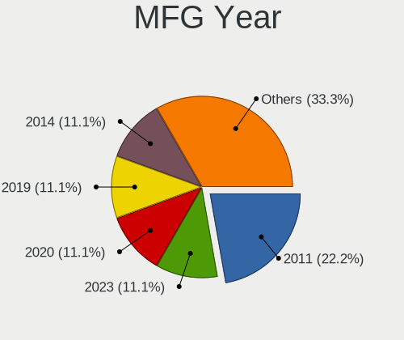
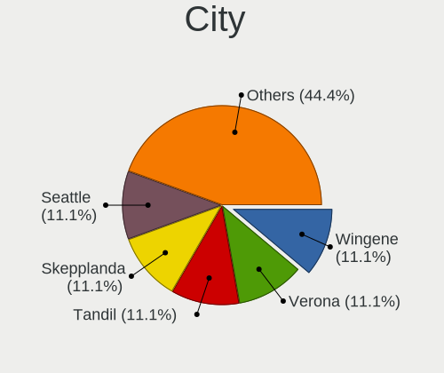
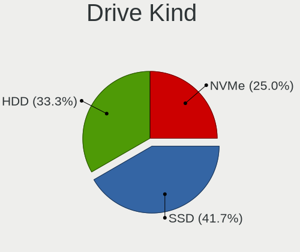
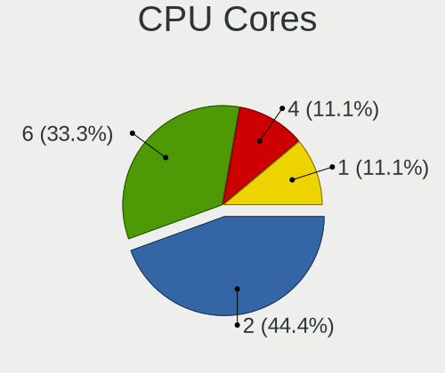
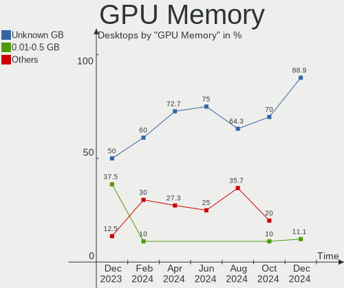
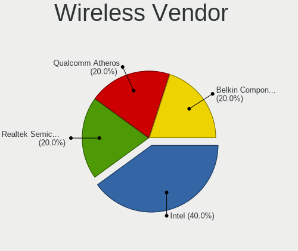
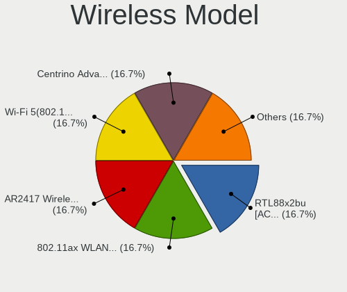
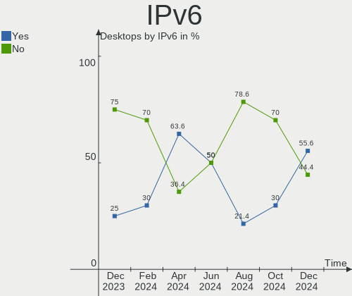
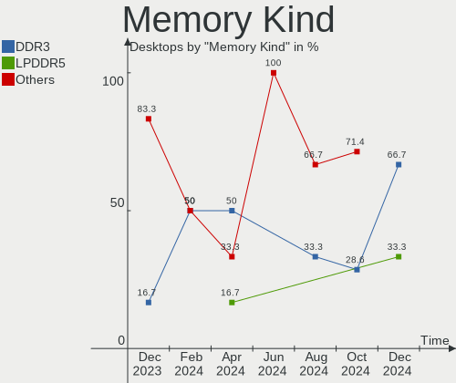

Lubuntu - Hardware Trends (Desktops)
------------------------------------

A project to identify most popular hardware characteristics and track their change
over time based on data collected by Linux users at https://Linux-Hardware.org.

Anyone can contribute to this report by the [hw-probe](https://github.com/linuxhw/hw-probe) tool:

    sudo -E hw-probe -all -upload

This report is for one last month. Overall report since the beginning of time: [TestDays](https://github.com/linuxhw/TestDays)

Period: Dec, 2024.

Contents
--------

* [ System ](#system)
  - [ OS                       ](#os)
  - [ OS Family                ](#os-family)
  - [ Kernel                   ](#kernel)
  - [ Kernel Family            ](#kernel-family)
  - [ Kernel Major Ver.        ](#kernel-major-ver)
  - [ Arch                     ](#arch)
  - [ DE                       ](#de)
  - [ Display Server           ](#display-server)
  - [ Display Manager          ](#display-manager)
  - [ OS Lang                  ](#os-lang)
  - [ Boot Mode                ](#boot-mode)
  - [ Filesystem               ](#filesystem)
  - [ Part. scheme             ](#part-scheme)
  - [ Dual Boot with Linux/BSD ](#dual-boot-with-linuxbsd)
  - [ Dual Boot (Win)          ](#dual-boot-win)

* [ Board ](#board)
  - [ Vendor                   ](#vendor)
  - [ Model                    ](#model)
  - [ Model Family             ](#model-family)
  - [ MFG Year                 ](#mfg-year)
  - [ Form Factor              ](#form-factor)
  - [ Secure Boot              ](#secure-boot)
  - [ Coreboot                 ](#coreboot)
  - [ RAM Size                 ](#ram-size)
  - [ RAM Used                 ](#ram-used)
  - [ Total Drives             ](#total-drives)
  - [ Has CD-ROM               ](#has-cd-rom)
  - [ Has Ethernet             ](#has-ethernet)
  - [ Has WiFi                 ](#has-wifi)
  - [ Has Bluetooth            ](#has-bluetooth)

* [ Location ](#location)
  - [ Country                  ](#country)
  - [ City                     ](#city)

* [ Drives ](#drives)
  - [ Drive Vendor             ](#drive-vendor)
  - [ Drive Model              ](#drive-model)
  - [ HDD Vendor               ](#hdd-vendor)
  - [ SSD Vendor               ](#ssd-vendor)
  - [ Drive Kind               ](#drive-kind)
  - [ Drive Connector          ](#drive-connector)
  - [ Drive Size               ](#drive-size)
  - [ Space Total              ](#space-total)
  - [ Space Used               ](#space-used)
  - [ Malfunc. Drives          ](#malfunc-drives)
  - [ Malfunc. Drive Vendor    ](#malfunc-drive-vendor)
  - [ Malfunc. HDD Vendor      ](#malfunc-hdd-vendor)
  - [ Malfunc. Drive Kind      ](#malfunc-drive-kind)
  - [ Failed Drives            ](#failed-drives)
  - [ Failed Drive Vendor      ](#failed-drive-vendor)
  - [ Drive Status             ](#drive-status)

* [ Storage controller ](#storage-controller)
  - [ Storage Vendor           ](#storage-vendor)
  - [ Storage Model            ](#storage-model)
  - [ Storage Kind             ](#storage-kind)

* [ Processor ](#processor)
  - [ CPU Vendor               ](#cpu-vendor)
  - [ CPU Model                ](#cpu-model)
  - [ CPU Model Family         ](#cpu-model-family)
  - [ CPU Cores                ](#cpu-cores)
  - [ CPU Sockets              ](#cpu-sockets)
  - [ CPU Threads              ](#cpu-threads)
  - [ CPU Op-Modes             ](#cpu-op-modes)
  - [ CPU Microcode            ](#cpu-microcode)
  - [ CPU Microarch            ](#cpu-microarch)

* [ Graphics ](#graphics)
  - [ GPU Vendor               ](#gpu-vendor)
  - [ GPU Model                ](#gpu-model)
  - [ GPU Combo                ](#gpu-combo)
  - [ GPU Driver               ](#gpu-driver)
  - [ GPU Memory               ](#gpu-memory)

* [ Monitor ](#monitor)
  - [ Monitor Vendor           ](#monitor-vendor)
  - [ Monitor Model            ](#monitor-model)
  - [ Monitor Resolution       ](#monitor-resolution)
  - [ Monitor Diagonal         ](#monitor-diagonal)
  - [ Monitor Width            ](#monitor-width)
  - [ Aspect Ratio             ](#aspect-ratio)
  - [ Monitor Area             ](#monitor-area)
  - [ Pixel Density            ](#pixel-density)
  - [ Multiple Monitors        ](#multiple-monitors)

* [ Network ](#network)
  - [ Net Controller Vendor    ](#net-controller-vendor)
  - [ Net Controller Model     ](#net-controller-model)
  - [ Wireless Vendor          ](#wireless-vendor)
  - [ Wireless Model           ](#wireless-model)
  - [ Ethernet Vendor          ](#ethernet-vendor)
  - [ Ethernet Model           ](#ethernet-model)
  - [ Net Controller Kind      ](#net-controller-kind)
  - [ Used Controller          ](#used-controller)
  - [ NICs                     ](#nics)
  - [ IPv6                     ](#ipv6)

* [ Bluetooth ](#bluetooth)
  - [ Bluetooth Vendor         ](#bluetooth-vendor)
  - [ Bluetooth Model          ](#bluetooth-model)

* [ Sound ](#sound)
  - [ Sound Vendor             ](#sound-vendor)
  - [ Sound Model              ](#sound-model)

* [ Memory ](#memory)
  - [ Memory Vendor            ](#memory-vendor)
  - [ Memory Model             ](#memory-model)
  - [ Memory Kind              ](#memory-kind)
  - [ Memory Form Factor       ](#memory-form-factor)
  - [ Memory Size              ](#memory-size)
  - [ Memory Speed             ](#memory-speed)

* [ Printers & scanners ](#printers--scanners)
  - [ Printer Vendor           ](#printer-vendor)
  - [ Printer Model            ](#printer-model)
  - [ Scanner Vendor           ](#scanner-vendor)
  - [ Scanner Model            ](#scanner-model)

* [ Camera ](#camera)
  - [ Camera Vendor            ](#camera-vendor)
  - [ Camera Model             ](#camera-model)

* [ Security ](#security)
  - [ Fingerprint Vendor       ](#fingerprint-vendor)
  - [ Fingerprint Model        ](#fingerprint-model)
  - [ Chipcard Vendor          ](#chipcard-vendor)
  - [ Chipcard Model           ](#chipcard-model)

* [ Unsupported ](#unsupported)
  - [ Unsupported Devices      ](#unsupported-devices)
  - [ Unsupported Device Types ](#unsupported-device-types)

System
------

OS
--

Installed operating systems

| Name          | Desktops | Percent |
|---------------|----------|---------|
| Lubuntu 24.04 | 8        | 88.89%  |
| Lubuntu 20.04 | 1        | 11.11%  |

OS Family
---------

OS without a version

| Name    | Desktops | Percent |
|---------|----------|---------|
| Lubuntu | 9        | 100%    |

Kernel
------

Version of the Linux kernel

| Version                 | Desktops | Percent |
|-------------------------|----------|---------|
| 6.8.0-51-generic        | 2        | 22.22%  |
| 6.8.0-50-lowlatency     | 2        | 22.22%  |
| 6.8.0-49-generic        | 2        | 22.22%  |
| 6.5.0-44-generic        | 1        | 11.11%  |
| 6.12.3-alderlake-custom | 1        | 11.11%  |
| 5.15.0-126-generic      | 1        | 11.11%  |

Kernel Family
-------------

Linux kernel without a distro release

| Version | Desktops | Percent |
|---------|----------|---------|
| 6.8.0   | 6        | 66.67%  |
| 6.5.0   | 1        | 11.11%  |
| 6.12.3  | 1        | 11.11%  |
| 5.15.0  | 1        | 11.11%  |

Kernel Major Ver.
-----------------

Linux kernel major version

| Version | Desktops | Percent |
|---------|----------|---------|
| 6.8     | 6        | 66.67%  |
| 6.5     | 1        | 11.11%  |
| 6.12    | 1        | 11.11%  |
| 5.15    | 1        | 11.11%  |

Arch
----

OS architecture (x86_64, i586, etc.)

| Name   | Desktops | Percent |
|--------|----------|---------|
| x86_64 | 9        | 100%    |

DE
--

Desktop Environment

| Name | Desktops | Percent |
|------|----------|---------|
| LXQt | 9        | 100%    |

Display Server
--------------

X11 or Wayland

| Name | Desktops | Percent |
|------|----------|---------|
| X11  | 9        | 100%    |

Display Manager
---------------

SDDM, LightDM, etc.

| Name    | Desktops | Percent |
|---------|----------|---------|
| SDDM    | 6        | 66.67%  |
| Unknown | 3        | 33.33%  |

OS Lang
-------

Language

| Lang  | Desktops | Percent |
|-------|----------|---------|
| de_DE | 2        | 22.22%  |
| pt_BR | 1        | 11.11%  |
| pl_PL | 1        | 11.11%  |
| it_IT | 1        | 11.11%  |
| es_MX | 1        | 11.11%  |
| es_AR | 1        | 11.11%  |
| en_US | 1        | 11.11%  |
| en_SE | 1        | 11.11%  |

Boot Mode
---------

EFI or BIOS

| Mode | Desktops | Percent |
|------|----------|---------|
| BIOS | 7        | 77.78%  |
| EFI  | 2        | 22.22%  |

Filesystem
----------

Type of filesystem

| Type  | Desktops | Percent |
|-------|----------|---------|
| Ext4  | 6        | 66.67%  |
| Tmpfs | 3        | 33.33%  |

Part. scheme
------------

Scheme of partitioning

| Type    | Desktops | Percent |
|---------|----------|---------|
| MBR     | 5        | 55.56%  |
| Unknown | 3        | 33.33%  |
| GPT     | 1        | 11.11%  |

Dual Boot with Linux/BSD
------------------------

Hosting more than one Linux/BSD

| Dual boot | Desktops | Percent |
|-----------|----------|---------|
| No        | 8        | 88.89%  |
| Yes       | 1        | 11.11%  |

Dual Boot (Win)
---------------

Hosting Linux and Windows

| Dual boot | Desktops | Percent |
|-----------|----------|---------|
| No        | 7        | 77.78%  |
| Yes       | 2        | 22.22%  |

Board
-----

Vendor
------

Motherboard manufacturer

| Name                | Desktops | Percent |
|---------------------|----------|---------|
| ASUSTek Computer    | 4        | 44.44%  |
| Lenovo              | 1        | 11.11%  |
| Gigabyte Technology | 1        | 11.11%  |
| Foxconn             | 1        | 11.11%  |
| Dell                | 1        | 11.11%  |
| Unknown             | 1        | 11.11%  |

Model
-----

Motherboard model

| Name                               | Desktops | Percent |
|------------------------------------|----------|---------|
| Lenovo ThinkCentre M93P 10AB000YMX | 1        | 11.11%  |
| Gigabyte B550M S2H                 | 1        | 11.11%  |
| Foxconn G31MX Series               | 1        | 11.11%  |
| Dell OptiPlex 780                  | 1        | 11.11%  |
| ASUS TUF Gaming X570-PLUS          | 1        | 11.11%  |
| ASUS M5A99X EVO                    | 1        | 11.11%  |
| ASUS M5A88-M                       | 1        | 11.11%  |
| ASUS A78M-A                        | 1        | 11.11%  |
| Unknown                            | 1        | 11.11%  |

Model Family
------------

Motherboard model prefix

| Name               | Desktops | Percent |
|--------------------|----------|---------|
| Lenovo ThinkCentre | 1        | 11.11%  |
| Gigabyte B550M     | 1        | 11.11%  |
| Foxconn G31MX      | 1        | 11.11%  |
| Dell OptiPlex      | 1        | 11.11%  |
| ASUS TUF           | 1        | 11.11%  |
| ASUS M5A99X        | 1        | 11.11%  |
| ASUS M5A88-M       | 1        | 11.11%  |
| ASUS A78M-A        | 1        | 11.11%  |
| Unknown            | 1        | 11.11%  |

MFG Year
--------

Motherboard manufacture year

| Year | Desktops | Percent |
|------|----------|---------|
| 2011 | 2        | 22.22%  |
| 2023 | 1        | 11.11%  |
| 2020 | 1        | 11.11%  |
| 2019 | 1        | 11.11%  |
| 2014 | 1        | 11.11%  |
| 2013 | 1        | 11.11%  |
| 2009 | 1        | 11.11%  |
| 2007 | 1        | 11.11%  |

Form Factor
-----------

Physical design of the computer

| Name    | Desktops | Percent |
|---------|----------|---------|
| Desktop | 9        | 100%    |

Secure Boot
-----------

Enabled or disabled

| State    | Desktops | Percent |
|----------|----------|---------|
| Disabled | 9        | 100%    |

Coreboot
--------

Have coreboot on board

| Used | Desktops | Percent |
|------|----------|---------|
| No   | 9        | 100%    |

RAM Size
--------

Total RAM memory

| Size in GB | Desktops | Percent |
|------------|----------|---------|
| 3.01-4.0   | 3        | 33.33%  |
| 16.01-24.0 | 3        | 33.33%  |
| 8.01-16.0  | 2        | 22.22%  |
| 32.01-64.0 | 1        | 11.11%  |

RAM Used
--------

Used RAM memory

| Used GB   | Desktops | Percent |
|-----------|----------|---------|
| 1.01-2.0  | 3        | 33.33%  |
| 3.01-4.0  | 2        | 22.22%  |
| 0.51-1.0  | 2        | 22.22%  |
| 4.01-8.0  | 1        | 11.11%  |
| 8.01-16.0 | 1        | 11.11%  |

Total Drives
------------

Number of drives on board

| Drives | Desktops | Percent |
|--------|----------|---------|
| 1      | 5        | 55.56%  |
| 2      | 2        | 22.22%  |
| 6      | 1        | 11.11%  |
| 3      | 1        | 11.11%  |

Has CD-ROM
----------

Has CD-ROM on board

| Presented | Desktops | Percent |
|-----------|----------|---------|
| No        | 6        | 66.67%  |
| Yes       | 3        | 33.33%  |

Has Ethernet
------------

Has Ethernet on board

| Presented | Desktops | Percent |
|-----------|----------|---------|
| Yes       | 8        | 88.89%  |
| No        | 1        | 11.11%  |

Has WiFi
--------

Has WiFi module

| Presented | Desktops | Percent |
|-----------|----------|---------|
| Yes       | 5        | 55.56%  |
| No        | 4        | 44.44%  |

Has Bluetooth
-------------

Has Bluetooth module

| Presented | Desktops | Percent |
|-----------|----------|---------|
| No        | 6        | 66.67%  |
| Yes       | 3        | 33.33%  |

Location
--------

Country
-------

Geographic location (country)

| Country    | Desktops | Percent |
|------------|----------|---------|
| Germany    | 2        | 22.22%  |
| USA        | 1        | 11.11%  |
| Sweden     | 1        | 11.11%  |
| Italy      | 1        | 11.11%  |
| Costa Rica | 1        | 11.11%  |
| Brazil     | 1        | 11.11%  |
| Belgium    | 1        | 11.11%  |
| Argentina  | 1        | 11.11%  |

City
----

Geographic location (city)

| City            | Desktops | Percent |
|-----------------|----------|---------|
| Wingene         | 1        | 11.11%  |
| Verona          | 1        | 11.11%  |
| Tandil          | 1        | 11.11%  |
| Skepplanda      | 1        | 11.11%  |
| Seattle         | 1        | 11.11%  |
| Pforzheim       | 1        | 11.11%  |
| Grecia          | 1        | 11.11%  |
| Düsseldorf     | 1        | 11.11%  |
| Duque de Caxias | 1        | 11.11%  |

Drives
------

Drive Vendor
------------

Hard drive vendors

| Vendor                    | Desktops | Drives | Percent |
|---------------------------|----------|--------|---------|
| Sandisk                   | 3        | 4      | 23.08%  |
| Seagate                   | 2        | 3      | 15.38%  |
| XrayDisk                  | 1        | 1      | 7.69%   |
| WDC                       | 1        | 2      | 7.69%   |
| Silicon Motion            | 1        | 1      | 7.69%   |
| Samsung Electronics       | 1        | 3      | 7.69%   |
| Micron/Crucial Technology | 1        | 1      | 7.69%   |
| Kingston                  | 1        | 1      | 7.69%   |
| FIKWOT                    | 1        | 1      | 7.69%   |
| ExcelStor                 | 1        | 1      | 7.69%   |

Drive Model
-----------

Hard drive models

| Model                                                | Desktops | Percent |
|------------------------------------------------------|----------|---------|
| XrayDisk 256GB SSD                                   | 1        | 5.56%   |
| WDC WD5001AALS-00L3B2 500GB                          | 1        | 5.56%   |
| WDC WD10EZEX-00BN5A0 1TB                             | 1        | 5.56%   |
| Silicon Motion 512GB                                 | 1        | 5.56%   |
| Seagate ST4000VN008-2DR166 4TB                       | 1        | 5.56%   |
| Seagate ST31000524AS 1TB                             | 1        | 5.56%   |
| Seagate ST14000NM0121 14TB                           | 1        | 5.56%   |
| Sandisk WD Blue SN550 NVMe SSD 256GB                 | 1        | 5.56%   |
| SanDisk SSD PLUS 1000GB                              | 1        | 5.56%   |
| SanDisk SDSSDHP128G 128GB                            | 1        | 5.56%   |
| SanDisk SDSSDA120G 120GB                             | 1        | 5.56%   |
| Samsung NVMe SSD Controller SM981/PM981/PM983 512GB  | 1        | 5.56%   |
| Samsung NVMe SSD Controller PM9A1/PM9A3/980PRO 512GB | 1        | 5.56%   |
| Samsung HD103SJ 1TB                                  | 1        | 5.56%   |
| Micron/Crucial CT500P5SSD8 500GB                     | 1        | 5.56%   |
| Kingston SA400S37480G 480GB SSD                      | 1        | 5.56%   |
| FIKWOT FS810 128GB SSD                               | 1        | 5.56%   |
| ExcelStor J8160S 165GB                               | 1        | 5.56%   |

HDD Vendor
----------

Hard disk drive vendors

| Vendor              | Desktops | Drives | Percent |
|---------------------|----------|--------|---------|
| Seagate             | 2        | 3      | 40%     |
| WDC                 | 1        | 2      | 20%     |
| Samsung Electronics | 1        | 1      | 20%     |
| ExcelStor           | 1        | 1      | 20%     |

SSD Vendor
----------

Solid state drive vendors

| Vendor   | Desktops | Drives | Percent |
|----------|----------|--------|---------|
| SanDisk  | 2        | 3      | 40%     |
| XrayDisk | 1        | 1      | 20%     |
| Kingston | 1        | 1      | 20%     |
| FIKWOT   | 1        | 1      | 20%     |

Drive Kind
----------

HDD or SSD

| Kind | Desktops | Drives | Percent |
|------|----------|--------|---------|
| SSD  | 5        | 6      | 41.67%  |
| HDD  | 4        | 7      | 33.33%  |
| NVMe | 3        | 5      | 25%     |

Drive Connector
---------------

SATA, SAS, NVMe, etc.

| Type | Desktops | Drives | Percent |
|------|----------|--------|---------|
| SATA | 7        | 13     | 70%     |
| NVMe | 3        | 5      | 30%     |

Drive Size
----------

Size of hard drive

| Size in TB | Desktops | Drives | Percent |
|------------|----------|--------|---------|
| 0.01-0.5   | 6        | 7      | 50%     |
| 0.51-1.0   | 4        | 4      | 33.33%  |
| 3.01-4.0   | 1        | 1      | 8.33%   |
| 10.01-20.0 | 1        | 1      | 8.33%   |

Space Total
-----------

Amount of disk space available on the file system

| Size in GB     | Desktops | Percent |
|----------------|----------|---------|
| 251-500        | 2        | 22.22%  |
| 101-250        | 2        | 22.22%  |
| 1001-2000      | 2        | 22.22%  |
| More than 3000 | 1        | 11.11%  |
| 2001-3000      | 1        | 11.11%  |
| Unknown        | 1        | 11.11%  |

Space Used
----------

Amount of used disk space

| Used GB        | Desktops | Percent |
|----------------|----------|---------|
| 21-50          | 2        | 22.22%  |
| 101-250        | 2        | 22.22%  |
| 1-20           | 2        | 22.22%  |
| More than 3000 | 1        | 11.11%  |
| 501-1000       | 1        | 11.11%  |
| Unknown        | 1        | 11.11%  |

Malfunc. Drives
---------------

Drive models with a malfunction

| Model                             | Desktops | Drives | Percent |
|-----------------------------------|----------|--------|---------|
| ExcelStor Technology J8160S 165GB | 1        | 1      | 100%    |

Malfunc. Drive Vendor
---------------------

Vendors of faulty drives

| Vendor    | Desktops | Drives | Percent |
|-----------|----------|--------|---------|
| ExcelStor | 1        | 1      | 100%    |

Malfunc. HDD Vendor
-------------------

Vendors of faulty HDD drives

| Vendor    | Desktops | Drives | Percent |
|-----------|----------|--------|---------|
| ExcelStor | 1        | 1      | 100%    |

Malfunc. Drive Kind
-------------------

Kinds of faulty drives

| Kind | Desktops | Drives | Percent |
|------|----------|--------|---------|
| HDD  | 1        | 1      | 100%    |

Failed Drives
-------------

Failed drive models

Zero info for selected period =(

Failed Drive Vendor
-------------------

Failed drive vendors

Zero info for selected period =(

Drive Status
------------

Number of failed and malfunc. drives

| Status   | Desktops | Drives | Percent |
|----------|----------|--------|---------|
| Detected | 6        | 13     | 60%     |
| Works    | 3        | 4      | 30%     |
| Malfunc  | 1        | 1      | 10%     |

Storage controller
------------------

Storage Vendor
--------------

Storage controller vendors

| Vendor                    | Desktops | Percent |
|---------------------------|----------|---------|
| AMD                       | 5        | 38.46%  |
| Intel                     | 3        | 23.08%  |
| Silicon Motion            | 1        | 7.69%   |
| SanDisk                   | 1        | 7.69%   |
| Samsung Electronics       | 1        | 7.69%   |
| Micron/Crucial Technology | 1        | 7.69%   |
| JMicron Technology        | 1        | 7.69%   |

Storage Model
-------------

Storage controller models

| Model                                                                          | Desktops | Percent |
|--------------------------------------------------------------------------------|----------|---------|
| AMD FCH SATA Controller [AHCI mode]                                            | 2        | 11.76%  |
| Silicon Motion SM2263EN/SM2263XT (DRAM-less) NVMe SSD Controllers              | 1        | 5.88%   |
| SanDisk Ultra 3D / WD PC SN530, IX SN530, Blue SN550 NVMe SSD (DRAM-less)      | 1        | 5.88%   |
| Samsung NVMe SSD Controller SM981/PM981/PM983                                  | 1        | 5.88%   |
| Samsung NVMe SSD Controller PM9A1/PM9A3/980PRO                                 | 1        | 5.88%   |
| Micron/Crucial P5 NVMe PCIe SSD[SlashP5]                                       | 1        | 5.88%   |
| JMicron JMB362 SATA Controller                                                 | 1        | 5.88%   |
| Intel SATA Controller [RAID mode]                                              | 1        | 5.88%   |
| Intel NM10/ICH7 Family SATA Controller [IDE mode]                              | 1        | 5.88%   |
| Intel 82801G (ICH7 Family) IDE Controller                                      | 1        | 5.88%   |
| Intel 8 Series/C220 Series Chipset Family 6-port SATA Controller 1 [AHCI mode] | 1        | 5.88%   |
| Intel 4 Series Chipset PT IDER Controller                                      | 1        | 5.88%   |
| AMD SB7x0/SB8x0/SB9x0 SATA Controller [IDE mode]                               | 1        | 5.88%   |
| AMD SB7x0/SB8x0/SB9x0 SATA Controller [AHCI mode]                              | 1        | 5.88%   |
| AMD SB7x0/SB8x0/SB9x0 IDE Controller                                           | 1        | 5.88%   |
| AMD 500 Series Chipset SATA Controller                                         | 1        | 5.88%   |

Storage Kind
------------

Kind of storage controller (IDE, SATA, NVMe, SAS, ...)

| Kind | Desktops | Percent |
|------|----------|---------|
| SATA | 6        | 46.15%  |
| NVMe | 3        | 23.08%  |
| IDE  | 3        | 23.08%  |
| RAID | 1        | 7.69%   |

Processor
---------

CPU Vendor
----------

Processor vendors

| Vendor | Desktops | Percent |
|--------|----------|---------|
| AMD    | 5        | 55.56%  |
| Intel  | 4        | 44.44%  |

CPU Model
---------

Processor models

| Model                                       | Desktops | Percent |
|---------------------------------------------|----------|---------|
| AMD Ryzen 5 3600 6-Core Processor           | 2        | 22.22%  |
| Intel Pentium Dual-Core CPU E5200 @ 2.50GHz | 1        | 11.11%  |
| Intel N100                                  | 1        | 11.11%  |
| Intel Core i5-4570T CPU @ 2.90GHz           | 1        | 11.11%  |
| Intel Core 2 Duo CPU E7500 @ 2.93GHz        | 1        | 11.11%  |
| AMD Phenom II X6 1055T Processor            | 1        | 11.11%  |
| AMD FX-4100 Quad-Core Processor             | 1        | 11.11%  |
| AMD A4-6300 APU with Radeon HD Graphics     | 1        | 11.11%  |

CPU Model Family
----------------

Processor model prefix

| Model                   | Desktops | Percent |
|-------------------------|----------|---------|
| AMD Ryzen 5             | 2        | 22.22%  |
| Other                   | 1        | 11.11%  |
| Intel Pentium Dual-Core | 1        | 11.11%  |
| Intel Core i5           | 1        | 11.11%  |
| Intel Core 2 Duo        | 1        | 11.11%  |
| AMD Phenom II X6        | 1        | 11.11%  |
| AMD FX                  | 1        | 11.11%  |
| AMD A4                  | 1        | 11.11%  |

CPU Cores
---------

Number of processor cores

| Number | Desktops | Percent |
|--------|----------|---------|
| 2      | 4        | 44.44%  |
| 6      | 3        | 33.33%  |
| 4      | 1        | 11.11%  |
| 1      | 1        | 11.11%  |

CPU Sockets
-----------

Number of sockets

| Number | Desktops | Percent |
|--------|----------|---------|
| 1      | 9        | 100%    |

CPU Threads
-----------

Threads per core (Hyper-Threading)

| Number | Desktops | Percent |
|--------|----------|---------|
| 2      | 5        | 55.56%  |
| 1      | 4        | 44.44%  |

CPU Op-Modes
------------

CPU Operation Modes (32-bit, 64-bit)

| Op mode        | Desktops | Percent |
|----------------|----------|---------|
| 32-bit, 64-bit | 9        | 100%    |

CPU Microcode
-------------

Microcode number

| Number  | Desktops | Percent |
|---------|----------|---------|
| Unknown | 8        | 88.89%  |
| 0x10676 | 1        | 11.11%  |

CPU Microarch
-------------

Microarchitecture

| Name       | Desktops | Percent |
|------------|----------|---------|
| Zen 2      | 2        | 22.22%  |
| Penryn     | 2        | 22.22%  |
| Piledriver | 1        | 11.11%  |
| K10        | 1        | 11.11%  |
| Haswell    | 1        | 11.11%  |
| Gracemont  | 1        | 11.11%  |
| Bulldozer  | 1        | 11.11%  |

Graphics
--------

GPU Vendor
----------

Vendors of graphics cards

| Vendor | Desktops | Percent |
|--------|----------|---------|
| Nvidia | 3        | 33.33%  |
| Intel  | 3        | 33.33%  |
| AMD    | 3        | 33.33%  |

GPU Model
---------

Graphics card models

| Model                                                                       | Desktops | Percent |
|-----------------------------------------------------------------------------|----------|---------|
| Nvidia TU116 [GeForce GTX 1660 SUPER]                                       | 1        | 11.11%  |
| Nvidia GT218 [GeForce 210]                                                  | 1        | 11.11%  |
| Nvidia G92 [GeForce GTS 250]                                                | 1        | 11.11%  |
| Intel Xeon E3-1200 v3/4th Gen Core Processor Integrated Graphics Controller | 1        | 11.11%  |
| Intel Alder Lake-N [UHD Graphics]                                           | 1        | 11.11%  |
| Intel 4 Series Chipset Integrated Graphics Controller                       | 1        | 11.11%  |
| AMD Richland [Radeon HD 8370D]                                              | 1        | 11.11%  |
| AMD Navi 21 [Radeon RX 6800/6800 XT / 6900 XT]                              | 1        | 11.11%  |
| AMD Caicos PRO [Radeon HD 7450]                                             | 1        | 11.11%  |

GPU Combo
---------

Combinations of graphics cards

| Name       | Desktops | Percent |
|------------|----------|---------|
| 1 x Nvidia | 3        | 33.33%  |
| 1 x AMD    | 3        | 33.33%  |
| 1 x Intel  | 2        | 22.22%  |
| 2 x Intel  | 1        | 11.11%  |

GPU Driver
----------

Free vs proprietary

| Driver | Desktops | Percent |
|--------|----------|---------|
| Free   | 9        | 100%    |

GPU Memory
----------

Total video memory

| Size in GB | Desktops | Percent |
|------------|----------|---------|
| Unknown    | 8        | 88.89%  |
| 0.01-0.5   | 1        | 11.11%  |

Monitor
-------

Monitor Vendor
--------------

Monitor vendors

| Vendor              | Desktops | Percent |
|---------------------|----------|---------|
| Dell                | 3        | 30%     |
| Goldstar            | 2        | 20%     |
| Samsung Electronics | 1        | 10%     |
| MStar               | 1        | 10%     |
| HannStar            | 1        | 10%     |
| Fujitsu Siemens     | 1        | 10%     |
| Acer                | 1        | 10%     |

Monitor Model
-------------

Monitor models

| Model                                                         | Desktops | Percent |
|---------------------------------------------------------------|----------|---------|
| Samsung Electronics SyncMaster SAM036D 1920x1080              | 1        | 10%     |
| MStar Demo MST0030 1920x1080 708x398mm 32.0-inch              | 1        | 10%     |
| HannStar X500 HSD025B 1024x768 300x230mm 14.9-inch            | 1        | 10%     |
| Goldstar M2280D GSM57B7 1920x1080 477x268mm 21.5-inch         | 1        | 10%     |
| Goldstar 20M35 GSM4EED 1600x900 433x236mm 19.4-inch           | 1        | 10%     |
| Fujitsu Siemens 4312 FA FUS0311 1280x1024 338x270mm 17.0-inch | 1        | 10%     |
| Dell S2721QS DELA198 3840x2160 597x336mm 27.0-inch            | 1        | 10%     |
| Dell S2240L DELD054 1920x1080 476x267mm 21.5-inch             | 1        | 10%     |
| Dell AW2518HF DELA102 1920x1080 544x303mm 24.5-inch           | 1        | 10%     |
| Acer X163W ACR0015 1366x768 344x193mm 15.5-inch               | 1        | 10%     |

Monitor Resolution
------------------

Monitor screen resolution

| Resolution       | Desktops | Percent |
|------------------|----------|---------|
| 1920x1080 (FHD)  | 4        | 40%     |
| 3840x2160 (4K)   | 2        | 20%     |
| 1600x900 (HD+)   | 1        | 10%     |
| 1366x768 (WXGA)  | 1        | 10%     |
| 1280x1024 (SXGA) | 1        | 10%     |
| 1024x768 (XGA)   | 1        | 10%     |

Monitor Diagonal
----------------

Diagonal size in inches

| Inches  | Desktops | Percent |
|---------|----------|---------|
| 21      | 2        | 20%     |
| 15      | 2        | 20%     |
| 52      | 1        | 10%     |
| 27      | 1        | 10%     |
| 24      | 1        | 10%     |
| 19      | 1        | 10%     |
| 17      | 1        | 10%     |
| Unknown | 1        | 10%     |

Monitor Width
-------------

Physical width

| Width in mm | Desktops | Percent |
|-------------|----------|---------|
| 401-500     | 3        | 30%     |
| 301-350     | 3        | 30%     |
| 501-600     | 2        | 20%     |
| 1001-1500   | 1        | 10%     |
| Unknown     | 1        | 10%     |

Aspect Ratio
------------

Proportional relationship between the width and the height

| Ratio | Desktops | Percent |
|-------|----------|---------|
| 16/9  | 8        | 80%     |
| 5/4   | 1        | 10%     |
| 4/3   | 1        | 10%     |

Monitor Area
------------

Area in inch²

| Area in inch² | Desktops | Percent |
|----------------|----------|---------|
| 201-250        | 2        | 20%     |
| 101-110        | 2        | 20%     |
| More than 1000 | 1        | 10%     |
| 301-350        | 1        | 10%     |
| 251-300        | 1        | 10%     |
| 151-200        | 1        | 10%     |
| 141-150        | 1        | 10%     |
| Unknown        | 1        | 10%     |

Pixel Density
-------------

Pixels per inch

| Density | Desktops | Percent |
|---------|----------|---------|
| 51-100  | 4        | 40%     |
| 101-120 | 3        | 30%     |
| 1-50    | 1        | 10%     |
| 161-240 | 1        | 10%     |
| Unknown | 1        | 10%     |

Multiple Monitors
-----------------

Total monitors connected

| Total | Desktops | Percent |
|-------|----------|---------|
| 1     | 8        | 88.89%  |
| 2     | 1        | 11.11%  |

Network
-------

Net Controller Vendor
---------------------

Controller vendors

| Vendor                | Desktops | Percent |
|-----------------------|----------|---------|
| Realtek Semiconductor | 6        | 46.15%  |
| Intel                 | 4        | 30.77%  |
| Qualcomm Atheros      | 1        | 7.69%   |
| Dresden Elektronik    | 1        | 7.69%   |
| Belkin Components     | 1        | 7.69%   |

Net Controller Model
--------------------

Controller models

| Model                                                                                   | Desktops | Percent |
|-----------------------------------------------------------------------------------------|----------|---------|
| Realtek RTL8111/8168/8211/8411 PCI Express Gigabit Ethernet Controller                  | 5        | 31.25%  |
| Realtek RTL88x2bu [AC1200 Techkey]                                                      | 1        | 6.25%   |
| Realtek RTL8153 Gigabit Ethernet Adapter                                                | 1        | 6.25%   |
| Realtek 802.11ax WLAN Adapter                                                           | 1        | 6.25%   |
| Qualcomm Atheros AR2417 Wireless Network Adapter [AR5007G 802.11bg]                     | 1        | 6.25%   |
| Intel Wi-Fi 5(802.11ac) Wireless-AC 9x6x [Thunder Peak]                                 | 1        | 6.25%   |
| Intel Ethernet Controller I226-V                                                        | 1        | 6.25%   |
| Intel Ethernet Connection I217-LM                                                       | 1        | 6.25%   |
| Intel Centrino Advanced-N 6235                                                          | 1        | 6.25%   |
| Intel 82567LM-3 Gigabit Network Connection                                              | 1        | 6.25%   |
| Dresden Elektronik ZigBee gateway [ConBee II]                                           | 1        | 6.25%   |
| Belkin Components F7D2102 802.11n N300 Micro Wireless Adapter v3000 [Realtek RTL8192CU] | 1        | 6.25%   |

Wireless Vendor
---------------

Wireless vendors

| Vendor                | Desktops | Percent |
|-----------------------|----------|---------|
| Intel                 | 2        | 40%     |
| Realtek Semiconductor | 1        | 20%     |
| Qualcomm Atheros      | 1        | 20%     |
| Belkin Components     | 1        | 20%     |

Wireless Model
--------------

Wireless models

| Model                                                                                   | Desktops | Percent |
|-----------------------------------------------------------------------------------------|----------|---------|
| Realtek RTL88x2bu [AC1200 Techkey]                                                      | 1        | 16.67%  |
| Realtek 802.11ax WLAN Adapter                                                           | 1        | 16.67%  |
| Qualcomm Atheros AR2417 Wireless Network Adapter [AR5007G 802.11bg]                     | 1        | 16.67%  |
| Intel Wi-Fi 5(802.11ac) Wireless-AC 9x6x [Thunder Peak]                                 | 1        | 16.67%  |
| Intel Centrino Advanced-N 6235                                                          | 1        | 16.67%  |
| Belkin Components F7D2102 802.11n N300 Micro Wireless Adapter v3000 [Realtek RTL8192CU] | 1        | 16.67%  |

Ethernet Vendor
---------------

Ethernet vendors

| Vendor                | Desktops | Percent |
|-----------------------|----------|---------|
| Realtek Semiconductor | 6        | 66.67%  |
| Intel                 | 3        | 33.33%  |

Ethernet Model
--------------

Ethernet models

| Model                                                                  | Desktops | Percent |
|------------------------------------------------------------------------|----------|---------|
| Realtek RTL8111/8168/8211/8411 PCI Express Gigabit Ethernet Controller | 5        | 55.56%  |
| Realtek RTL8153 Gigabit Ethernet Adapter                               | 1        | 11.11%  |
| Intel Ethernet Controller I226-V                                       | 1        | 11.11%  |
| Intel Ethernet Connection I217-LM                                      | 1        | 11.11%  |
| Intel 82567LM-3 Gigabit Network Connection                             | 1        | 11.11%  |

Net Controller Kind
-------------------

Ethernet, WiFi or modem

| Kind     | Desktops | Percent |
|----------|----------|---------|
| Ethernet | 8        | 57.14%  |
| WiFi     | 5        | 35.71%  |
| Modem    | 1        | 7.14%   |

Used Controller
---------------

Currently used network controller

| Kind     | Desktops | Percent |
|----------|----------|---------|
| Ethernet | 5        | 55.56%  |
| WiFi     | 4        | 44.44%  |

NICs
----

Total network controllers on board

| Total | Desktops | Percent |
|-------|----------|---------|
| 1     | 6        | 66.67%  |
| 2     | 2        | 22.22%  |
| 4     | 1        | 11.11%  |

IPv6
----

IPv6 vs IPv4

| Used | Desktops | Percent |
|------|----------|---------|
| Yes  | 5        | 55.56%  |
| No   | 4        | 44.44%  |

Bluetooth
---------

Bluetooth Vendor
----------------

Controller vendors

| Vendor                  | Desktops | Percent |
|-------------------------|----------|---------|
| Intel                   | 2        | 66.67%  |
| Cambridge Silicon Radio | 1        | 33.33%  |

Bluetooth Model
---------------

Controller models

| Model                                               | Desktops | Percent |
|-----------------------------------------------------|----------|---------|
| Intel Wireless-AC 9260 Bluetooth Adapter            | 1        | 33.33%  |
| Intel Centrino Bluetooth Wireless Transceiver       | 1        | 33.33%  |
| Cambridge Silicon Radio Bluetooth Dongle (HCI mode) | 1        | 33.33%  |

Sound
-----

Sound Vendor
------------

Sound card vendors

| Vendor                  | Desktops | Percent |
|-------------------------|----------|---------|
| AMD                     | 5        | 38.46%  |
| Intel                   | 4        | 30.77%  |
| Nvidia                  | 2        | 15.38%  |
| BEHRINGER International | 1        | 7.69%   |
| AKAI                    | 1        | 7.69%   |

Sound Model
-----------

Sound card models

| Model                                                                             | Desktops | Percent |
|-----------------------------------------------------------------------------------|----------|---------|
| AMD Starship/Matisse HD Audio Controller                                          | 2        | 11.76%  |
| AMD SBx00 Azalia (Intel HDA)                                                      | 2        | 11.76%  |
| Nvidia TU116 High Definition Audio Controller                                     | 1        | 5.88%   |
| Nvidia High Definition Audio Controller                                           | 1        | 5.88%   |
| Intel Xeon E3-1200 v3/4th Gen Core Processor HD Audio Controller                  | 1        | 5.88%   |
| Intel NM10/ICH7 Family High Definition Audio Controller                           | 1        | 5.88%   |
| Intel Alder Lake-N PCH High Definition Audio Controller                           | 1        | 5.88%   |
| Intel 82801JD/DO (ICH10 Family) HD Audio Controller                               | 1        | 5.88%   |
| Intel 8 Series/C220 Series Chipset High Definition Audio Controller               | 1        | 5.88%   |
| BEHRINGER International UMC202HD 192k                                             | 1        | 5.88%   |
| AMD Trinity HDMI Audio Controller                                                 | 1        | 5.88%   |
| AMD Navi 21/23 HDMI/DP Audio Controller                                           | 1        | 5.88%   |
| AMD FCH Azalia Controller                                                         | 1        | 5.88%   |
| AMD Caicos HDMI Audio [Radeon HD 6450 / 7450/8450/8490 OEM / R5 230/235/235X OEM] | 1        | 5.88%   |
| AKAI MPKmini2                                                                     | 1        | 5.88%   |

Memory
------

Memory Vendor
-------------

Memory module vendors

| Vendor            | Desktops | Percent |
|-------------------|----------|---------|
| Unknown           | 1        | 33.33%  |
| Micron Technology | 1        | 33.33%  |
| Kingston          | 1        | 33.33%  |

Memory Model
------------

Memory module models

| Model                                                 | Desktops | Percent |
|-------------------------------------------------------|----------|---------|
| Unknown RAM Module 4GB DIMM DDR3 1333MT/s             | 1        | 33.33%  |
| Micron RAM Module 4GB Row Of Chips LPDDR5 6400MT/s    | 1        | 33.33%  |
| Kingston RAM 9905474-029.A00LF 2GB DIMM DDR3 1333MT/s | 1        | 33.33%  |

Memory Kind
-----------

Memory module kinds

| Kind   | Desktops | Percent |
|--------|----------|---------|
| DDR3   | 2        | 66.67%  |
| LPDDR5 | 1        | 33.33%  |

Memory Form Factor
------------------

Physical design of the memory module

| Name         | Desktops | Percent |
|--------------|----------|---------|
| DIMM         | 2        | 66.67%  |
| Row Of Chips | 1        | 33.33%  |

Memory Size
-----------

Memory module size

| Size | Desktops | Percent |
|------|----------|---------|
| 4096 | 2        | 66.67%  |
| 2048 | 1        | 33.33%  |

Memory Speed
------------

Memory module speed

| Speed | Desktops | Percent |
|-------|----------|---------|
| 1333  | 2        | 66.67%  |
| 6400  | 1        | 33.33%  |

Printers & scanners
-------------------

Printer Vendor
--------------

Printer device vendors

Zero info for selected period =(

Printer Model
-------------

Printer device models

Zero info for selected period =(

Scanner Vendor
--------------

Scanner device vendors

Zero info for selected period =(

Scanner Model
-------------

Scanner device models

Zero info for selected period =(

Camera
------

Camera Vendor
-------------

Camera device vendors

| Vendor    | Desktops | Percent |
|-----------|----------|---------|
| Razer USA | 1        | 100%    |

Camera Model
------------

Camera device models

| Model                          | Desktops | Percent |
|--------------------------------|----------|---------|
| Razer USA Gaming Webcam [Kiyo] | 1        | 100%    |

Security
--------

Fingerprint Vendor
------------------

Fingerprint sensor vendors

Zero info for selected period =(

Fingerprint Model
-----------------

Fingerprint sensor models

Zero info for selected period =(

Chipcard Vendor
---------------

Chipcard module vendors

Zero info for selected period =(

Chipcard Model
--------------

Chipcard module models

Zero info for selected period =(

Unsupported
-----------

Unsupported Devices
-------------------

Total unsupported devices on board

| Total | Desktops | Percent |
|-------|----------|---------|
| 0     | 7        | 77.78%  |
| 1     | 2        | 22.22%  |

Unsupported Device Types
------------------------

Types of unsupported devices

| Type          | Desktops | Percent |
|---------------|----------|---------|
| Net/wireless  | 1        | 50%     |
| Graphics card | 1        | 50%     |

