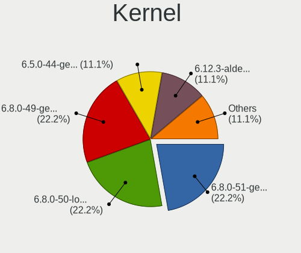
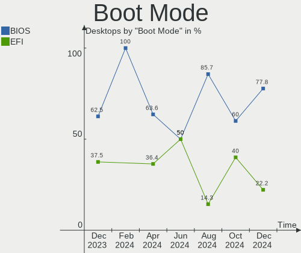
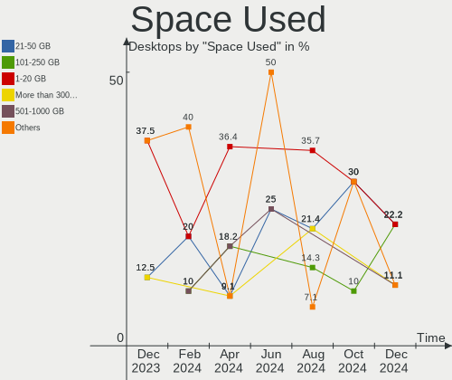
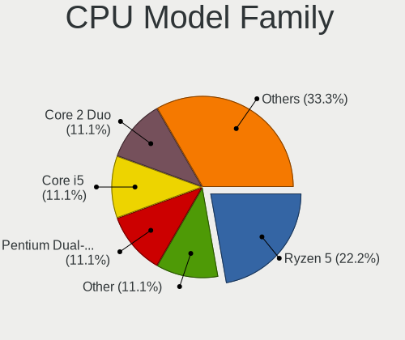
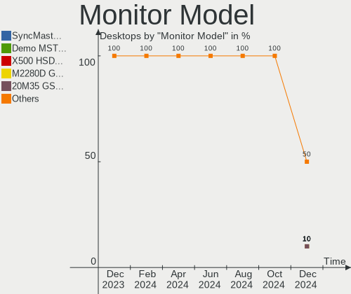
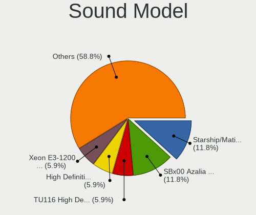
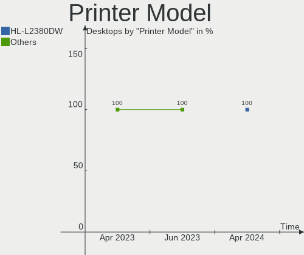

Lubuntu - Hardware Trends (Desktops)
------------------------------------

A project to identify most popular hardware characteristics and track their change
over time based on data collected by Linux users at https://Linux-Hardware.org.

Anyone can contribute to this report by the [hw-probe](https://github.com/linuxhw/hw-probe) tool:

    sudo -E hw-probe -all -upload

This report is for one last month. Overall report since the beginning of time: [TestDays](https://github.com/linuxhw/TestDays)

Period: May, 2023.

Contents
--------

* [ System ](#system)
  - [ OS                       ](#os)
  - [ OS Family                ](#os-family)
  - [ Kernel                   ](#kernel)
  - [ Kernel Family            ](#kernel-family)
  - [ Kernel Major Ver.        ](#kernel-major-ver)
  - [ Arch                     ](#arch)
  - [ DE                       ](#de)
  - [ Display Server           ](#display-server)
  - [ Display Manager          ](#display-manager)
  - [ OS Lang                  ](#os-lang)
  - [ Boot Mode                ](#boot-mode)
  - [ Filesystem               ](#filesystem)
  - [ Part. scheme             ](#part-scheme)
  - [ Dual Boot with Linux/BSD ](#dual-boot-with-linuxbsd)
  - [ Dual Boot (Win)          ](#dual-boot-win)

* [ Board ](#board)
  - [ Vendor                   ](#vendor)
  - [ Model                    ](#model)
  - [ Model Family             ](#model-family)
  - [ MFG Year                 ](#mfg-year)
  - [ Form Factor              ](#form-factor)
  - [ Secure Boot              ](#secure-boot)
  - [ Coreboot                 ](#coreboot)
  - [ RAM Size                 ](#ram-size)
  - [ RAM Used                 ](#ram-used)
  - [ Total Drives             ](#total-drives)
  - [ Has CD-ROM               ](#has-cd-rom)
  - [ Has Ethernet             ](#has-ethernet)
  - [ Has WiFi                 ](#has-wifi)
  - [ Has Bluetooth            ](#has-bluetooth)

* [ Location ](#location)
  - [ Country                  ](#country)
  - [ City                     ](#city)

* [ Drives ](#drives)
  - [ Drive Vendor             ](#drive-vendor)
  - [ Drive Model              ](#drive-model)
  - [ HDD Vendor               ](#hdd-vendor)
  - [ SSD Vendor               ](#ssd-vendor)
  - [ Drive Kind               ](#drive-kind)
  - [ Drive Connector          ](#drive-connector)
  - [ Drive Size               ](#drive-size)
  - [ Space Total              ](#space-total)
  - [ Space Used               ](#space-used)
  - [ Malfunc. Drives          ](#malfunc-drives)
  - [ Malfunc. Drive Vendor    ](#malfunc-drive-vendor)
  - [ Malfunc. HDD Vendor      ](#malfunc-hdd-vendor)
  - [ Malfunc. Drive Kind      ](#malfunc-drive-kind)
  - [ Failed Drives            ](#failed-drives)
  - [ Failed Drive Vendor      ](#failed-drive-vendor)
  - [ Drive Status             ](#drive-status)

* [ Storage controller ](#storage-controller)
  - [ Storage Vendor           ](#storage-vendor)
  - [ Storage Model            ](#storage-model)
  - [ Storage Kind             ](#storage-kind)

* [ Processor ](#processor)
  - [ CPU Vendor               ](#cpu-vendor)
  - [ CPU Model                ](#cpu-model)
  - [ CPU Model Family         ](#cpu-model-family)
  - [ CPU Cores                ](#cpu-cores)
  - [ CPU Sockets              ](#cpu-sockets)
  - [ CPU Threads              ](#cpu-threads)
  - [ CPU Op-Modes             ](#cpu-op-modes)
  - [ CPU Microcode            ](#cpu-microcode)
  - [ CPU Microarch            ](#cpu-microarch)

* [ Graphics ](#graphics)
  - [ GPU Vendor               ](#gpu-vendor)
  - [ GPU Model                ](#gpu-model)
  - [ GPU Combo                ](#gpu-combo)
  - [ GPU Driver               ](#gpu-driver)
  - [ GPU Memory               ](#gpu-memory)

* [ Monitor ](#monitor)
  - [ Monitor Vendor           ](#monitor-vendor)
  - [ Monitor Model            ](#monitor-model)
  - [ Monitor Resolution       ](#monitor-resolution)
  - [ Monitor Diagonal         ](#monitor-diagonal)
  - [ Monitor Width            ](#monitor-width)
  - [ Aspect Ratio             ](#aspect-ratio)
  - [ Monitor Area             ](#monitor-area)
  - [ Pixel Density            ](#pixel-density)
  - [ Multiple Monitors        ](#multiple-monitors)

* [ Network ](#network)
  - [ Net Controller Vendor    ](#net-controller-vendor)
  - [ Net Controller Model     ](#net-controller-model)
  - [ Wireless Vendor          ](#wireless-vendor)
  - [ Wireless Model           ](#wireless-model)
  - [ Ethernet Vendor          ](#ethernet-vendor)
  - [ Ethernet Model           ](#ethernet-model)
  - [ Net Controller Kind      ](#net-controller-kind)
  - [ Used Controller          ](#used-controller)
  - [ NICs                     ](#nics)
  - [ IPv6                     ](#ipv6)

* [ Bluetooth ](#bluetooth)
  - [ Bluetooth Vendor         ](#bluetooth-vendor)
  - [ Bluetooth Model          ](#bluetooth-model)

* [ Sound ](#sound)
  - [ Sound Vendor             ](#sound-vendor)
  - [ Sound Model              ](#sound-model)

* [ Memory ](#memory)
  - [ Memory Vendor            ](#memory-vendor)
  - [ Memory Model             ](#memory-model)
  - [ Memory Kind              ](#memory-kind)
  - [ Memory Form Factor       ](#memory-form-factor)
  - [ Memory Size              ](#memory-size)
  - [ Memory Speed             ](#memory-speed)

* [ Printers & scanners ](#printers--scanners)
  - [ Printer Vendor           ](#printer-vendor)
  - [ Printer Model            ](#printer-model)
  - [ Scanner Vendor           ](#scanner-vendor)
  - [ Scanner Model            ](#scanner-model)

* [ Camera ](#camera)
  - [ Camera Vendor            ](#camera-vendor)
  - [ Camera Model             ](#camera-model)

* [ Security ](#security)
  - [ Fingerprint Vendor       ](#fingerprint-vendor)
  - [ Fingerprint Model        ](#fingerprint-model)
  - [ Chipcard Vendor          ](#chipcard-vendor)
  - [ Chipcard Model           ](#chipcard-model)

* [ Unsupported ](#unsupported)
  - [ Unsupported Devices      ](#unsupported-devices)
  - [ Unsupported Device Types ](#unsupported-device-types)

System
------

OS
--

Installed operating systems

| Name             | Desktops | Percent |
|------------------|----------|---------|
| Lubuntu 22.04    | 7        | 70%     |
| Lubuntu 20.04    | 2        | 20%     |
| Lubuntu 18.04.05 | 1        | 10%     |

OS Family
---------

OS without a version

| Name    | Desktops | Percent |
|---------|----------|---------|
| Lubuntu | 10       | 100%    |

Kernel
------

Version of the Linux kernel

| Version           | Desktops | Percent |
|-------------------|----------|---------|
| 5.15.0-71-generic | 2        | 20%     |
| 6.3.3-custom      | 1        | 10%     |
| 5.4.0-148-generic | 1        | 10%     |
| 5.19.0-41-generic | 1        | 10%     |
| 5.19.0-32-generic | 1        | 10%     |
| 5.15.0-72-generic | 1        | 10%     |
| 5.15.0-58-generic | 1        | 10%     |
| 5.15.0-52-generic | 1        | 10%     |
| 4.15.0-22-generic | 1        | 10%     |

Kernel Family
-------------

Linux kernel without a distro release

| Version | Desktops | Percent |
|---------|----------|---------|
| 5.15.0  | 5        | 50%     |
| 5.19.0  | 2        | 20%     |
| 6.3.3   | 1        | 10%     |
| 5.4.0   | 1        | 10%     |
| 4.15.0  | 1        | 10%     |

Kernel Major Ver.
-----------------

Linux kernel major version

| Version | Desktops | Percent |
|---------|----------|---------|
| 5.15    | 5        | 50%     |
| 5.19    | 2        | 20%     |
| 6.3     | 1        | 10%     |
| 5.4     | 1        | 10%     |
| 4.15    | 1        | 10%     |

Arch
----

OS architecture (x86_64, i586, etc.)

| Name   | Desktops | Percent |
|--------|----------|---------|
| x86_64 | 9        | 90%     |
| i686   | 1        | 10%     |

DE
--

Desktop Environment

| Name  | Desktops | Percent |
|-------|----------|---------|
| LXQt  | 8        | 80%     |
| LXDE  | 1        | 10%     |
| GNOME | 1        | 10%     |

Display Server
--------------

X11 or Wayland

| Name | Desktops | Percent |
|------|----------|---------|
| X11  | 10       | 100%    |

Display Manager
---------------

SDDM, LightDM, etc.

| Name    | Desktops | Percent |
|---------|----------|---------|
| SDDM    | 7        | 70%     |
| LightDM | 2        | 20%     |
| GDM3    | 1        | 10%     |

OS Lang
-------

Language

| Lang  | Desktops | Percent |
|-------|----------|---------|
| pt_BR | 2        | 20%     |
| fr_FR | 1        | 10%     |
| es_MX | 1        | 10%     |
| es_ES | 1        | 10%     |
| es_CR | 1        | 10%     |
| en_US | 1        | 10%     |
| en_GB | 1        | 10%     |
| de_DE | 1        | 10%     |
| C     | 1        | 10%     |

Boot Mode
---------

EFI or BIOS

| Mode | Desktops | Percent |
|------|----------|---------|
| BIOS | 9        | 90%     |
| EFI  | 1        | 10%     |

Filesystem
----------

Type of filesystem

| Type    | Desktops | Percent |
|---------|----------|---------|
| Ext4    | 7        | 70%     |
| Tmpfs   | 2        | 20%     |
| Overlay | 1        | 10%     |

Part. scheme
------------

Scheme of partitioning

| Type | Desktops | Percent |
|------|----------|---------|
| MBR  | 6        | 60%     |
| GPT  | 4        | 40%     |

Dual Boot with Linux/BSD
------------------------

Hosting more than one Linux/BSD

| Dual boot | Desktops | Percent |
|-----------|----------|---------|
| No        | 6        | 60%     |
| Yes       | 4        | 40%     |

Dual Boot (Win)
---------------

Hosting Linux and Windows

| Dual boot | Desktops | Percent |
|-----------|----------|---------|
| No        | 8        | 80%     |
| Yes       | 2        | 20%     |

Board
-----

Vendor
------

Motherboard manufacturer

| Name             | Desktops | Percent |
|------------------|----------|---------|
| ASUSTek Computer | 2        | 20%     |
| Unknown          | 2        | 20%     |
| ZOTAC            | 1        | 10%     |
| PCWare           | 1        | 10%     |
| NEC Computers    | 1        | 10%     |
| Intel            | 1        | 10%     |
| Foxconn          | 1        | 10%     |
| Acer             | 1        | 10%     |

Model
-----

Motherboard model

| Name                      | Desktops | Percent |
|---------------------------|----------|---------|
| Unknown                   | 2        | 20%     |
| ZOTAC NM10                | 1        | 10%     |
| PCWare IPX1800E2          | 1        | 10%     |
| NEC Computers ECS-945G    | 1        | 10%     |
| Intel DG41RQ AAE54511-203 | 1        | 10%     |
| Foxconn G41MXE-V          | 1        | 10%     |
| ASUS M4A87TD/USB3         | 1        | 10%     |
| ASUS A88XM-A              | 1        | 10%     |
| Acer Veriton M670G/M670   | 1        | 10%     |

Model Family
------------

Motherboard model prefix

| Name                   | Desktops | Percent |
|------------------------|----------|---------|
| Unknown                | 2        | 20%     |
| ZOTAC NM10             | 1        | 10%     |
| PCWare IPX1800E2       | 1        | 10%     |
| NEC Computers ECS-945G | 1        | 10%     |
| Intel DG41RQ           | 1        | 10%     |
| Foxconn G41MXE-V       | 1        | 10%     |
| ASUS M4A87TD           | 1        | 10%     |
| ASUS A88XM-A           | 1        | 10%     |
| Acer Veriton           | 1        | 10%     |

MFG Year
--------

Motherboard manufacture year

| Year | Desktops | Percent |
|------|----------|---------|
| 2010 | 5        | 50%     |
| 2017 | 1        | 10%     |
| 2013 | 1        | 10%     |
| 2009 | 1        | 10%     |
| 2008 | 1        | 10%     |
| 2007 | 1        | 10%     |

Form Factor
-----------

Physical design of the computer

| Name    | Desktops | Percent |
|---------|----------|---------|
| Desktop | 10       | 100%    |

Secure Boot
-----------

Enabled or disabled

| State    | Desktops | Percent |
|----------|----------|---------|
| Disabled | 10       | 100%    |

Coreboot
--------

Have coreboot on board

| Used | Desktops | Percent |
|------|----------|---------|
| No   | 10       | 100%    |

RAM Size
--------

Total RAM memory

| Size in GB | Desktops | Percent |
|------------|----------|---------|
| 3.01-4.0   | 3        | 30%     |
| 1.01-2.0   | 3        | 30%     |
| 4.01-8.0   | 2        | 20%     |
| 16.01-24.0 | 1        | 10%     |
| 8.01-16.0  | 1        | 10%     |

RAM Used
--------

Used RAM memory

| Used GB  | Desktops | Percent |
|----------|----------|---------|
| 1.01-2.0 | 9        | 90%     |
| 3.01-4.0 | 1        | 10%     |

Total Drives
------------

Number of drives on board

| Drives | Desktops | Percent |
|--------|----------|---------|
| 2      | 5        | 50%     |
| 1      | 5        | 50%     |

Has CD-ROM
----------

Has CD-ROM on board

| Presented | Desktops | Percent |
|-----------|----------|---------|
| Yes       | 7        | 70%     |
| No        | 3        | 30%     |

Has Ethernet
------------

Has Ethernet on board

| Presented | Desktops | Percent |
|-----------|----------|---------|
| Yes       | 10       | 100%    |

Has WiFi
--------

Has WiFi module

| Presented | Desktops | Percent |
|-----------|----------|---------|
| No        | 7        | 70%     |
| Yes       | 3        | 30%     |

Has Bluetooth
-------------

Has Bluetooth module

| Presented | Desktops | Percent |
|-----------|----------|---------|
| No        | 8        | 80%     |
| Yes       | 2        | 20%     |

Location
--------

Country
-------

Geographic location (country)

| Country    | Desktops | Percent |
|------------|----------|---------|
| Germany    | 2        | 20%     |
| Brazil     | 2        | 20%     |
| Venezuela  | 1        | 10%     |
| UK         | 1        | 10%     |
| Sweden     | 1        | 10%     |
| Spain      | 1        | 10%     |
| France     | 1        | 10%     |
| Costa Rica | 1        | 10%     |

City
----

Geographic location (city)

| City             | Desktops | Percent |
|------------------|----------|---------|
| Sao Paulo        | 1        | 10%     |
| Saltsjoe-Boo     | 1        | 10%     |
| Nova Serrana     | 1        | 10%     |
| Mostoles         | 1        | 10%     |
| Monheim am Rhein | 1        | 10%     |
| Kaufbeuren       | 1        | 10%     |
| Hounslow         | 1        | 10%     |
| Grecia           | 1        | 10%     |
| Drancy           | 1        | 10%     |
| Ciudad Guayana   | 1        | 10%     |

Drives
------

Drive Vendor
------------

Hard drive vendors

| Vendor              | Desktops | Drives | Percent |
|---------------------|----------|--------|---------|
| Seagate             | 6        | 6      | 46.15%  |
| Samsung Electronics | 2        | 2      | 15.38%  |
| WDC                 | 1        | 2      | 7.69%   |
| Transcend           | 1        | 1      | 7.69%   |
| Lexar               | 1        | 1      | 7.69%   |
| Kingston            | 1        | 1      | 7.69%   |
| Hitachi             | 1        | 2      | 7.69%   |

Drive Model
-----------

Hard drive models

| Model                           | Desktops | Percent |
|---------------------------------|----------|---------|
| WDC WD3200AAJS-56M0A0 320GB     | 1        | 6.67%   |
| WDC WD3200AAJS-56B4A0 320GB     | 1        | 6.67%   |
| Transcend TS128GSSD340 128GB    | 1        | 6.67%   |
| Seagate ST9160314AS 160GB       | 1        | 6.67%   |
| Seagate ST250DM000-1BD141 250GB | 1        | 6.67%   |
| Seagate ST2000DM008-2FR102 2TB  | 1        | 6.67%   |
| Seagate ST2000DM001-1CH164 2TB  | 1        | 6.67%   |
| Seagate ST1000DM010-2EP102 1TB  | 1        | 6.67%   |
| Seagate ST1000DM003-1ER162 1TB  | 1        | 6.67%   |
| Samsung SSD 870 EVO 500GB       | 1        | 6.67%   |
| Samsung SSD 830 Series 256GB    | 1        | 6.67%   |
| Lexar 128GB SSD                 | 1        | 6.67%   |
| Kingston SA400S37480G 480GB SSD | 1        | 6.67%   |
| Hitachi HTS543216L9A300 160GB   | 1        | 6.67%   |
| Hitachi HDS728040PLAT20 41GB    | 1        | 6.67%   |

HDD Vendor
----------

Hard disk drive vendors

| Vendor  | Desktops | Drives | Percent |
|---------|----------|--------|---------|
| Seagate | 6        | 6      | 75%     |
| WDC     | 1        | 2      | 12.5%   |
| Hitachi | 1        | 2      | 12.5%   |

SSD Vendor
----------

Solid state drive vendors

| Vendor              | Desktops | Drives | Percent |
|---------------------|----------|--------|---------|
| Samsung Electronics | 2        | 2      | 40%     |
| Transcend           | 1        | 1      | 20%     |
| Lexar               | 1        | 1      | 20%     |
| Kingston            | 1        | 1      | 20%     |

Drive Kind
----------

HDD or SSD

| Kind | Desktops | Drives | Percent |
|------|----------|--------|---------|
| HDD  | 8        | 10     | 61.54%  |
| SSD  | 5        | 5      | 38.46%  |

Drive Connector
---------------

SATA, SAS, NVMe, etc.

| Type | Desktops | Drives | Percent |
|------|----------|--------|---------|
| SATA | 10       | 15     | 100%    |

Drive Size
----------

Size of hard drive

| Size in TB | Desktops | Drives | Percent |
|------------|----------|--------|---------|
| 0.01-0.5   | 9        | 11     | 69.23%  |
| 1.01-2.0   | 2        | 2      | 15.38%  |
| 0.51-1.0   | 2        | 2      | 15.38%  |

Space Total
-----------

Amount of disk space available on the file system

| Size in GB     | Desktops | Percent |
|----------------|----------|---------|
| 101-250        | 4        | 40%     |
| 1001-2000      | 2        | 20%     |
| More than 3000 | 1        | 10%     |
| 251-500        | 1        | 10%     |
| 1-20           | 1        | 10%     |
| 501-1000       | 1        | 10%     |

Space Used
----------

Amount of used disk space

| Used GB   | Desktops | Percent |
|-----------|----------|---------|
| 1-20      | 4        | 40%     |
| 101-250   | 3        | 30%     |
| 51-100    | 2        | 20%     |
| 1001-2000 | 1        | 10%     |

Malfunc. Drives
---------------

Drive models with a malfunction

| Model                           | Desktops | Drives | Percent |
|---------------------------------|----------|--------|---------|
| Seagate ST250DM000-1BD141 250GB | 1        | 1      | 50%     |
| Hitachi HTS543216L9A300 160GB   | 1        | 1      | 50%     |

Malfunc. Drive Vendor
---------------------

Vendors of faulty drives

| Vendor  | Desktops | Drives | Percent |
|---------|----------|--------|---------|
| Seagate | 1        | 1      | 50%     |
| Hitachi | 1        | 1      | 50%     |

Malfunc. HDD Vendor
-------------------

Vendors of faulty HDD drives

| Vendor  | Desktops | Drives | Percent |
|---------|----------|--------|---------|
| Seagate | 1        | 1      | 50%     |
| Hitachi | 1        | 1      | 50%     |

Malfunc. Drive Kind
-------------------

Kinds of faulty drives

| Kind | Desktops | Drives | Percent |
|------|----------|--------|---------|
| HDD  | 2        | 2      | 100%    |

Failed Drives
-------------

Failed drive models

Zero info for selected period =(

Failed Drive Vendor
-------------------

Failed drive vendors

Zero info for selected period =(

Drive Status
------------

Number of failed and malfunc. drives

| Status   | Desktops | Drives | Percent |
|----------|----------|--------|---------|
| Works    | 5        | 5      | 45.45%  |
| Detected | 4        | 8      | 36.36%  |
| Malfunc  | 2        | 2      | 18.18%  |

Storage controller
------------------

Storage Vendor
--------------

Storage controller vendors

| Vendor             | Desktops | Percent |
|--------------------|----------|---------|
| Intel              | 7        | 63.64%  |
| AMD                | 2        | 18.18%  |
| Nvidia             | 1        | 9.09%   |
| JMicron Technology | 1        | 9.09%   |

Storage Model
-------------

Storage controller models

| Model                                                        | Desktops | Percent |
|--------------------------------------------------------------|----------|---------|
| Intel NM10/ICH7 Family SATA Controller [IDE mode]            | 3        | 18.75%  |
| Intel 82801G (ICH7 Family) IDE Controller                    | 3        | 18.75%  |
| Nvidia MCP61 SATA Controller                                 | 1        | 6.25%   |
| Nvidia MCP61 IDE                                             | 1        | 6.25%   |
| JMicron JMB368 IDE controller                                | 1        | 6.25%   |
| Intel NM10/ICH7 Family SATA Controller [AHCI mode]           | 1        | 6.25%   |
| Intel Atom Processor E3800 Series SATA AHCI Controller       | 1        | 6.25%   |
| Intel 82801JD/DO (ICH10 Family) SATA AHCI Controller         | 1        | 6.25%   |
| Intel 82801HM/HEM (ICH8M/ICH8M-E) SATA Controller [IDE mode] | 1        | 6.25%   |
| Intel 4 Series Chipset PT IDER Controller                    | 1        | 6.25%   |
| AMD SB7x0/SB8x0/SB9x0 SATA Controller [AHCI mode]            | 1        | 6.25%   |
| AMD FCH SATA Controller [AHCI mode]                          | 1        | 6.25%   |

Storage Kind
------------

Kind of storage controller (IDE, SATA, NVMe, SAS, ...)

| Kind | Desktops | Percent |
|------|----------|---------|
| IDE  | 7        | 58.33%  |
| SATA | 5        | 41.67%  |

Processor
---------

CPU Vendor
----------

Processor vendors

| Vendor | Desktops | Percent |
|--------|----------|---------|
| Intel  | 7        | 70%     |
| AMD    | 3        | 30%     |

CPU Model
---------

Processor models

| Model                                           | Desktops | Percent |
|-------------------------------------------------|----------|---------|
| Intel Pentium Dual-Core CPU E5700 @ 3.00GHz     | 1        | 10%     |
| Intel Pentium Dual-Core CPU E5300 @ 2.60GHz     | 1        | 10%     |
| Intel Pentium Dual CPU E2140 @ 1.60GHz          | 1        | 10%     |
| Intel Core 2 Duo CPU E7300 @ 2.66GHz            | 1        | 10%     |
| Intel Celeron CPU J1800 @ 2.41GHz               | 1        | 10%     |
| Intel Atom CPU D525 @ 1.80GHz                   | 1        | 10%     |
| Intel Atom CPU D510 @ 1.66GHz                   | 1        | 10%     |
| AMD Phenom II X6 1090T Processor                | 1        | 10%     |
| AMD Phenom II X6 1055T Processor                | 1        | 10%     |
| AMD A10-7850K Radeon R7, 12 Compute Cores 4C+8G | 1        | 10%     |

CPU Model Family
----------------

Processor model prefix

| Model                   | Desktops | Percent |
|-------------------------|----------|---------|
| Intel Pentium Dual-Core | 2        | 20%     |
| Intel Atom              | 2        | 20%     |
| AMD Phenom II X6        | 2        | 20%     |
| Intel Pentium Dual      | 1        | 10%     |
| Intel Core 2 Duo        | 1        | 10%     |
| Intel Celeron           | 1        | 10%     |
| AMD A10                 | 1        | 10%     |

CPU Cores
---------

Number of processor cores

| Number | Desktops | Percent |
|--------|----------|---------|
| 2      | 8        | 80%     |
| 6      | 2        | 20%     |

CPU Sockets
-----------

Number of sockets

| Number | Desktops | Percent |
|--------|----------|---------|
| 1      | 10       | 100%    |

CPU Threads
-----------

Threads per core (Hyper-Threading)

| Number | Desktops | Percent |
|--------|----------|---------|
| 1      | 7        | 70%     |
| 2      | 3        | 30%     |

CPU Op-Modes
------------

CPU Operation Modes (32-bit, 64-bit)

| Op mode        | Desktops | Percent |
|----------------|----------|---------|
| 32-bit, 64-bit | 10       | 100%    |

CPU Microcode
-------------

Microcode number

| Number     | Desktops | Percent |
|------------|----------|---------|
| Unknown    | 4        | 40%     |
| 0x1067a    | 2        | 20%     |
| 0x30679    | 1        | 10%     |
| 0x106ca    | 1        | 10%     |
| 0x06003106 | 1        | 10%     |
| 0x010000dc | 1        | 10%     |

CPU Microarch
-------------

Microarchitecture

| Name        | Desktops | Percent |
|-------------|----------|---------|
| Penryn      | 3        | 30%     |
| K10         | 2        | 20%     |
| Bonnell     | 2        | 20%     |
| Steamroller | 1        | 10%     |
| Silvermont  | 1        | 10%     |
| Core        | 1        | 10%     |

Graphics
--------

GPU Vendor
----------

Vendors of graphics cards

| Vendor | Desktops | Percent |
|--------|----------|---------|
| Nvidia | 4        | 40%     |
| Intel  | 4        | 40%     |
| AMD    | 2        | 20%     |

GPU Model
---------

Graphics card models

| Model                                                                   | Desktops | Percent |
|-------------------------------------------------------------------------|----------|---------|
| Intel 4 Series Chipset Integrated Graphics Controller                   | 2        | 20%     |
| Nvidia GT218 [ION]                                                      | 1        | 10%     |
| Nvidia GT218 [GeForce 210]                                              | 1        | 10%     |
| Nvidia GK106 [GeForce GTX 660]                                          | 1        | 10%     |
| Nvidia C61 [GeForce 7025 / nForce 630a]                                 | 1        | 10%     |
| Intel Atom Processor Z36xxx/Z37xxx Series Graphics & Display            | 1        | 10%     |
| Intel Atom Processor D4xx/D5xx/N4xx/N5xx Integrated Graphics Controller | 1        | 10%     |
| AMD Kaveri [Radeon R7 Graphics]                                         | 1        | 10%     |
| AMD Cedar [Radeon HD 5000/6000/7350/8350 Series]                        | 1        | 10%     |

GPU Combo
---------

Combinations of graphics cards

| Name       | Desktops | Percent |
|------------|----------|---------|
| 1 x Nvidia | 4        | 40%     |
| 1 x Intel  | 4        | 40%     |
| 1 x AMD    | 2        | 20%     |

GPU Driver
----------

Free vs proprietary

| Driver      | Desktops | Percent |
|-------------|----------|---------|
| Free        | 7        | 70%     |
| Proprietary | 2        | 20%     |
| Unknown     | 1        | 10%     |

GPU Memory
----------

Total video memory

| Size in GB | Desktops | Percent |
|------------|----------|---------|
| Unknown    | 4        | 40%     |
| 1.01-2.0   | 2        | 20%     |
| 0.51-1.0   | 2        | 20%     |
| 0.01-0.5   | 2        | 20%     |

Monitor
-------

Monitor Vendor
--------------

Monitor vendors

| Vendor              | Desktops | Percent |
|---------------------|----------|---------|
| Samsung Electronics | 2        | 22.22%  |
| Dell                | 2        | 22.22%  |
| Sony                | 1        | 11.11%  |
| Iiyama              | 1        | 11.11%  |
| Hewlett-Packard     | 1        | 11.11%  |
| Belinea             | 1        | 11.11%  |
| AOC                 | 1        | 11.11%  |

Monitor Model
-------------

Monitor models

| Model                                                                | Desktops | Percent |
|----------------------------------------------------------------------|----------|---------|
| Sony SDM-S73 SNY2770 1280x1024 359x287mm 18.1-inch                   | 1        | 11.11%  |
| Samsung Electronics SyncMaster SAM027C 1680x1050 433x271mm 20.1-inch | 1        | 11.11%  |
| Samsung Electronics LCD Monitor SAM0A76 1280x720 949x543mm 43.0-inch | 1        | 11.11%  |
| Iiyama PL2530H IVM6132 1920x1080 544x303mm 24.5-inch                 | 1        | 11.11%  |
| Hewlett-Packard Compaq CQ1569 HWP2836 1366x768 344x194mm 15.5-inch   | 1        | 11.11%  |
| Dell LCD Monitor U2412M 1920x1200                                    | 1        | 11.11%  |
| Dell E2222HS DELF131 1920x1080 480x260mm 21.5-inch                   | 1        | 11.11%  |
| Belinea 1945 S1W MAX0799 1440x900 410x256mm 19.0-inch                | 1        | 11.11%  |
| AOC LM522 AOCA522 1024x768 304x228mm 15.0-inch                       | 1        | 11.11%  |

Monitor Resolution
------------------

Monitor screen resolution

| Resolution         | Desktops | Percent |
|--------------------|----------|---------|
| 1920x1080 (FHD)    | 2        | 22.22%  |
| 1920x1200 (WUXGA)  | 1        | 11.11%  |
| 1680x1050 (WSXGA+) | 1        | 11.11%  |
| 1440x900 (WXGA+)   | 1        | 11.11%  |
| 1366x768 (WXGA)    | 1        | 11.11%  |
| 1280x720 (HD)      | 1        | 11.11%  |
| 1280x1024 (SXGA)   | 1        | 11.11%  |
| 1024x768 (XGA)     | 1        | 11.11%  |

Monitor Diagonal
----------------

Diagonal size in inches

| Inches  | Desktops | Percent |
|---------|----------|---------|
| 15      | 2        | 22.22%  |
| 43      | 1        | 11.11%  |
| 24      | 1        | 11.11%  |
| 21      | 1        | 11.11%  |
| 20      | 1        | 11.11%  |
| 19      | 1        | 11.11%  |
| 18      | 1        | 11.11%  |
| Unknown | 1        | 11.11%  |

Monitor Width
-------------

Physical width

| Width in mm | Desktops | Percent |
|-------------|----------|---------|
| 401-500     | 3        | 33.33%  |
| 301-350     | 2        | 22.22%  |
| 501-600     | 1        | 11.11%  |
| 351-400     | 1        | 11.11%  |
| 901-1000    | 1        | 11.11%  |
| Unknown     | 1        | 11.11%  |

Aspect Ratio
------------

Proportional relationship between the width and the height

| Ratio   | Desktops | Percent |
|---------|----------|---------|
| 16/9    | 4        | 44.44%  |
| 16/10   | 2        | 22.22%  |
| 5/4     | 1        | 11.11%  |
| 4/3     | 1        | 11.11%  |
| Unknown | 1        | 11.11%  |

Monitor Area
------------

Area in inch²

| Area in inch² | Desktops | Percent |
|----------------|----------|---------|
| 151-200        | 4        | 44.44%  |
| 101-110        | 2        | 22.22%  |
| 251-300        | 1        | 11.11%  |
| 501-1000       | 1        | 11.11%  |
| Unknown        | 1        | 11.11%  |

Pixel Density
-------------

Pixels per inch

| Density | Desktops | Percent |
|---------|----------|---------|
| 51-100  | 5        | 55.56%  |
| 101-120 | 2        | 22.22%  |
| 1-50    | 1        | 11.11%  |
| Unknown | 1        | 11.11%  |

Multiple Monitors
-----------------

Total monitors connected

| Total | Desktops | Percent |
|-------|----------|---------|
| 1     | 9        | 90%     |
| 0     | 1        | 10%     |

Network
-------

Net Controller Vendor
---------------------

Controller vendors

| Vendor                   | Desktops | Percent |
|--------------------------|----------|---------|
| Realtek Semiconductor    | 8        | 53.33%  |
| Intel                    | 3        | 20%     |
| Ralink Technology        | 1        | 6.67%   |
| Nvidia                   | 1        | 6.67%   |
| Marvell Technology Group | 1        | 6.67%   |
| GERTEC Telecomunicacoes  | 1        | 6.67%   |

Net Controller Model
--------------------

Controller models

| Model                                                             | Desktops | Percent |
|-------------------------------------------------------------------|----------|---------|
| Realtek RTL8111/8168/8411 PCI Express Gigabit Ethernet Controller | 6        | 37.5%   |
| Realtek RTL-8110SC/8169SC Gigabit Ethernet                        | 1        | 6.25%   |
| Realtek RTL-8100/8101L/8139 PCI Fast Ethernet Adapter             | 1        | 6.25%   |
| Ralink MT7601U Wireless Adapter                                   | 1        | 6.25%   |
| Nvidia MCP61 Ethernet                                             | 1        | 6.25%   |
| Marvell Group 88w8335 [Libertas] 802.11b/g Wireless               | 1        | 6.25%   |
| Intel Centrino Advanced-N 6235                                    | 1        | 6.25%   |
| Intel 82583V Gigabit Network Connection                           | 1        | 6.25%   |
| Intel 82567V-3 Gigabit Network Connection                         | 1        | 6.25%   |
| Intel 82567LM-3 Gigabit Network Connection                        | 1        | 6.25%   |
| GERTEC Telecomunicacoes PPC930 Pinpad Terminal                    | 1        | 6.25%   |

Wireless Vendor
---------------

Wireless vendors

| Vendor                   | Desktops | Percent |
|--------------------------|----------|---------|
| Ralink Technology        | 1        | 33.33%  |
| Marvell Technology Group | 1        | 33.33%  |
| Intel                    | 1        | 33.33%  |

Wireless Model
--------------

Wireless models

| Model                                               | Desktops | Percent |
|-----------------------------------------------------|----------|---------|
| Ralink MT7601U Wireless Adapter                     | 1        | 33.33%  |
| Marvell Group 88w8335 [Libertas] 802.11b/g Wireless | 1        | 33.33%  |
| Intel Centrino Advanced-N 6235                      | 1        | 33.33%  |

Ethernet Vendor
---------------

Ethernet vendors

| Vendor                | Desktops | Percent |
|-----------------------|----------|---------|
| Realtek Semiconductor | 8        | 72.73%  |
| Intel                 | 2        | 18.18%  |
| Nvidia                | 1        | 9.09%   |

Ethernet Model
--------------

Ethernet models

| Model                                                             | Desktops | Percent |
|-------------------------------------------------------------------|----------|---------|
| Realtek RTL8111/8168/8411 PCI Express Gigabit Ethernet Controller | 6        | 50%     |
| Realtek RTL-8110SC/8169SC Gigabit Ethernet                        | 1        | 8.33%   |
| Realtek RTL-8100/8101L/8139 PCI Fast Ethernet Adapter             | 1        | 8.33%   |
| Nvidia MCP61 Ethernet                                             | 1        | 8.33%   |
| Intel 82583V Gigabit Network Connection                           | 1        | 8.33%   |
| Intel 82567V-3 Gigabit Network Connection                         | 1        | 8.33%   |
| Intel 82567LM-3 Gigabit Network Connection                        | 1        | 8.33%   |

Net Controller Kind
-------------------

Ethernet, WiFi or modem

| Kind     | Desktops | Percent |
|----------|----------|---------|
| Ethernet | 10       | 71.43%  |
| WiFi     | 3        | 21.43%  |
| Modem    | 1        | 7.14%   |

Used Controller
---------------

Currently used network controller

| Kind     | Desktops | Percent |
|----------|----------|---------|
| Ethernet | 8        | 80%     |
| WiFi     | 2        | 20%     |

NICs
----

Total network controllers on board

| Total | Desktops | Percent |
|-------|----------|---------|
| 1     | 7        | 70%     |
| 2     | 2        | 20%     |
| 3     | 1        | 10%     |

IPv6
----

IPv6 vs IPv4

| Used | Desktops | Percent |
|------|----------|---------|
| No   | 6        | 60%     |
| Yes  | 4        | 40%     |

Bluetooth
---------

Bluetooth Vendor
----------------

Controller vendors

| Vendor  | Desktops | Percent |
|---------|----------|---------|
| TP-Link | 1        | 50%     |
| Intel   | 1        | 50%     |

Bluetooth Model
---------------

Controller models

| Model                                         | Desktops | Percent |
|-----------------------------------------------|----------|---------|
| TP-Link UB500 Adapter                         | 1        | 50%     |
| Intel Centrino Bluetooth Wireless Transceiver | 1        | 50%     |

Sound
-----

Sound Vendor
------------

Sound card vendors

| Vendor    | Desktops | Percent |
|-----------|----------|---------|
| Intel     | 7        | 46.67%  |
| Nvidia    | 4        | 26.67%  |
| AMD       | 3        | 20%     |
| GN Netcom | 1        | 6.67%   |

Sound Model
-----------

Sound card models

| Model                                                                      | Desktops | Percent |
|----------------------------------------------------------------------------|----------|---------|
| Intel NM10/ICH7 Family High Definition Audio Controller                    | 4        | 25%     |
| Nvidia High Definition Audio Controller                                    | 2        | 12.5%   |
| Nvidia MCP61 High Definition Audio                                         | 1        | 6.25%   |
| Nvidia GK106 HDMI Audio Controller                                         | 1        | 6.25%   |
| Intel Atom Processor Z36xxx/Z37xxx Series High Definition Audio Controller | 1        | 6.25%   |
| Intel 82801JD/DO (ICH10 Family) HD Audio Controller                        | 1        | 6.25%   |
| Intel 82801H (ICH8 Family) HD Audio Controller                             | 1        | 6.25%   |
| GN Netcom Jabra Link 370                                                   | 1        | 6.25%   |
| AMD SBx00 Azalia (Intel HDA)                                               | 1        | 6.25%   |
| AMD Kaveri HDMI/DP Audio Controller                                        | 1        | 6.25%   |
| AMD FCH Azalia Controller                                                  | 1        | 6.25%   |
| AMD Cedar HDMI Audio [Radeon HD 5400/6300/7300 Series]                     | 1        | 6.25%   |

Memory
------

Memory Vendor
-------------

Memory module vendors

| Vendor              | Desktops | Percent |
|---------------------|----------|---------|
| Unknown             | 5        | 71.43%  |
| Samsung Electronics | 1        | 14.29%  |
| Corsair             | 1        | 14.29%  |

Memory Model
------------

Memory module models

| Model                                                  | Desktops | Percent |
|--------------------------------------------------------|----------|---------|
| Unknown RAM Module 4GB DIMM 400MT/s                    | 1        | 14.29%  |
| Unknown RAM Module 2GB SODIMM DDR2 667MT/s             | 1        | 14.29%  |
| Unknown RAM Module 2GB DIMM SDRAM                      | 1        | 14.29%  |
| Unknown RAM Module 2GB DIMM DDR2 667MT/s               | 1        | 14.29%  |
| Unknown RAM Module 1024MB DIMM DDR2 800MT/s            | 1        | 14.29%  |
| Samsung RAM M471B5273CH0-YK0 4096MB DIMM DDR3 1600MT/s | 1        | 14.29%  |
| Corsair RAM CMZ16GX3M4A1600C9 4GB DIMM DDR3 1600MT/s   | 1        | 14.29%  |

Memory Kind
-----------

Memory module kinds

| Kind    | Desktops | Percent |
|---------|----------|---------|
| DDR2    | 3        | 42.86%  |
| DDR3    | 2        | 28.57%  |
| SDRAM   | 1        | 14.29%  |
| Unknown | 1        | 14.29%  |

Memory Form Factor
------------------

Physical design of the memory module

| Name   | Desktops | Percent |
|--------|----------|---------|
| DIMM   | 6        | 85.71%  |
| SODIMM | 1        | 14.29%  |

Memory Size
-----------

Memory module size

| Size | Desktops | Percent |
|------|----------|---------|
| 4096 | 3        | 42.86%  |
| 2048 | 3        | 42.86%  |
| 1024 | 1        | 14.29%  |

Memory Speed
------------

Memory module speed

| Speed   | Desktops | Percent |
|---------|----------|---------|
| 1600    | 2        | 28.57%  |
| 667     | 2        | 28.57%  |
| 800     | 1        | 14.29%  |
| 400     | 1        | 14.29%  |
| Unknown | 1        | 14.29%  |

Printers & scanners
-------------------

Printer Vendor
--------------

Printer device vendors

| Vendor      | Desktops | Percent |
|-------------|----------|---------|
| Seiko Epson | 1        | 100%    |

Printer Model
-------------

Printer device models

| Model               | Desktops | Percent |
|---------------------|----------|---------|
| Seiko Epson TM-T20X | 1        | 100%    |

Scanner Vendor
--------------

Scanner device vendors

Zero info for selected period =(

Scanner Model
-------------

Scanner device models

Zero info for selected period =(

Camera
------

Camera Vendor
-------------

Camera device vendors

| Vendor                   | Desktops | Percent |
|--------------------------|----------|---------|
| WaveRider Communications | 1        | 50%     |
| Logitech                 | 1        | 50%     |

Camera Model
------------

Camera device models

| Model                    | Desktops | Percent |
|--------------------------|----------|---------|
| WaveRider USB 2.0 Camera | 1        | 50%     |
| Logitech Webcam C170     | 1        | 50%     |

Security
--------

Fingerprint Vendor
------------------

Fingerprint sensor vendors

Zero info for selected period =(

Fingerprint Model
-----------------

Fingerprint sensor models

Zero info for selected period =(

Chipcard Vendor
---------------

Chipcard module vendors

Zero info for selected period =(

Chipcard Model
--------------

Chipcard module models

Zero info for selected period =(

Unsupported
-----------

Unsupported Devices
-------------------

Total unsupported devices on board

| Total | Desktops | Percent |
|-------|----------|---------|
| 0     | 8        | 80%     |
| 1     | 2        | 20%     |

Unsupported Device Types
------------------------

Types of unsupported devices

| Type          | Desktops | Percent |
|---------------|----------|---------|
| Net/wireless  | 1        | 50%     |
| Graphics card | 1        | 50%     |

